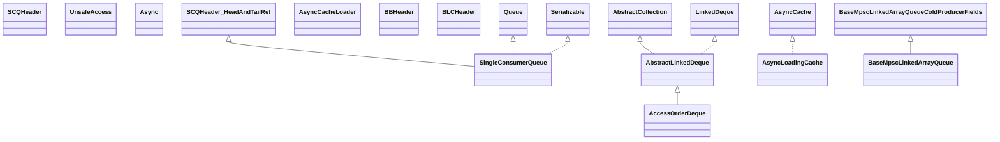

# caffeine-2.8.5.jar

[Group index](README.md) | [All archives](../README.md)

## Scope and provenance

- **Donor:** `SQX_145_REFERENCE_ROOT/internal/libs/caffeine-2.8.5.jar`.
- **SHA-256:** `814b15a9bf598e0fa854dd70ba9f6e03a413a97979de0c3f49317295e4352bc8`; accessed 2026-10-06; captured `2026-10-06T18:54:51.906614+00:00`.
- **Classes:** 690 raw entries; 690 unique entry names. Duplicate occurrence indices are zero-based.
- **Inspection:** read-only ZIP hashing and class-file structural parsing; signatures/descriptors, modifiers, hierarchy and references only. Bytecode bodies are hashed, not published.
- **Allocation:** proposed `FEAT-HOST-CAFFEINE-2-8-5`, P02; [roadmap](../../dev/sqx-full-application-roadmap.md). Domain README registration remains required.
- **Repository:** `01067f00031428613c6394064ca1bcadc1ba00ee`; review state unreviewed. Download label 145-dev1; installed build/activation and runtime equivalence unverified.
- **Limit:** every class/member is inventoried; declaration coverage does not establish consumed calls, defaults, formulas, failure semantics or algorithm parity.
- **Archive/resource index:** [011.json](../../dev/evidence/sqx145/archives/145/011.json).

## Complete member declarations

Member shards contain exact JVM names/descriptors, access flags, generic signatures, throws types, declared fields/methods, superclass/interfaces and referenced class names. All classes, nested/synthetic members and overloads are retained. Code length/hash is structural evidence, not a normalized algorithm comparison.

- [001.json](../../dev/evidence/sqx145/members/011/001.json) — SHA-256 `d7674ba298c27f6f3f9ae207eca9891a24aaf21dd2917dda1a8c64d5f41c893c`.
- [002.json](../../dev/evidence/sqx145/members/011/002.json) — SHA-256 `e2f58cc937cf62f614a9767e3c781a3ce9f8d476d3c617d2b10cec9f64d95f41`.
- [003.json](../../dev/evidence/sqx145/members/011/003.json) — SHA-256 `e1719cefb21725d3be2eee8b302fdd66123b78221dc632c207dd7f31d34028f3`.
- [004.json](../../dev/evidence/sqx145/members/011/004.json) — SHA-256 `962ad650d6662c6c3c976194c1492ed3b3aad7760bdf73ebe30644642087a639`.
- [005.json](../../dev/evidence/sqx145/members/011/005.json) — SHA-256 `239b4bcb32464ad9e4668a209ef06844515abe0b30e4c412a51a3e81c820d32c`.
- [006.json](../../dev/evidence/sqx145/members/011/006.json) — SHA-256 `ce9c596b015f040da86141ac519b15b23e58d17ad47f732fc6b5ba4a07ad7f50`.
- [007.json](../../dev/evidence/sqx145/members/011/007.json) — SHA-256 `a1b2363ff95ddb8d879e5f1cacb9269e857757523f2406d3e3b0d55d6931a5d9`.
- [008.json](../../dev/evidence/sqx145/members/011/008.json) — SHA-256 `36790b1fa026e39b74afc88bd91f394b87ef56963ba4f19d1d4af0a6bbf6ca6d`.
- [009.json](../../dev/evidence/sqx145/members/011/009.json) — SHA-256 `dd24fb46340f641d749e7bf45c16b0e60c49211bbe42a573409c4b78882abc80`.

## Focused structural diagram

Up to twelve non-nested classes; arrows show declared inheritance/interfaces only. External type names are not evidence of an available body or an executed dependency.

## Class inventory

| Archive entry | Occurrence | Class SHA-256 | Fields | Methods |
| --- | ---: | --- | ---: | ---: |
| `com/github/benmanes/caffeine/SCQHeader$HeadAndTailRef.class` | 0 | `638dd065330f0976c0fd9c6353c862a343a63b939a43bfd12bd664c0465f07eb` | 2 | 4 |
| `com/github/benmanes/caffeine/SCQHeader$HeadRef.class` | 0 | `fcd906e88a76fb2aaa589a23480b20c76f202a1eb22171a88d3601a87a3002c5` | 1 | 1 |
| `com/github/benmanes/caffeine/SCQHeader$PadHead.class` | 0 | `9abc1b83a6823c5b769fe1f0f7dc7e2438e76892d98510a29ba5af0c1c2cdfbc` | 15 | 1 |
| `com/github/benmanes/caffeine/SCQHeader$PadHeadAndTail.class` | 0 | `988b6fcad3f8edf7122b55aa3f6eba42f72e67efc2db59ad25574248e1ecc678` | 15 | 1 |
| `com/github/benmanes/caffeine/SCQHeader.class` | 0 | `1c6a81119db7c5de262540eb8704004cc6efd0b6327a9db2792d15a8515a21e0` | 0 | 1 |
| `com/github/benmanes/caffeine/SingleConsumerQueue$1.class` | 0 | `a2427612db173374bf22b50cd3a903be34c82ded36d8460aea079f6060a59270` | 5 | 6 |
| `com/github/benmanes/caffeine/SingleConsumerQueue$LinearizableNode.class` | 0 | `340c5b894d90dfcdb1fc035f5914f2b2d3dcc910b5ec0c4fbd51a6a63170c97e` | 1 | 4 |
| `com/github/benmanes/caffeine/SingleConsumerQueue$Node.class` | 0 | `7884417470b928f035c02449fb23eacf8bd74cf76d4e737b99f66b4164cd8a74` | 3 | 8 |
| `com/github/benmanes/caffeine/SingleConsumerQueue$SerializationProxy.class` | 0 | `636838f81fe3a4998d0b982925624ff5222848ada2c77512a7c5f7007c059a1f` | 3 | 2 |
| `com/github/benmanes/caffeine/SingleConsumerQueue.class` | 0 | `fd41f641c8a1b7fa157e34a8a0be560d3af30145b270d48cefc783af25106aff` | 9 | 20 |
| `com/github/benmanes/caffeine/base/UnsafeAccess.class` | 0 | `f0da937211b9b7ef4108430193b3c3951e8e57937f4f3911dd2eaf61fa3a75ba` | 3 | 4 |
| `com/github/benmanes/caffeine/cache/AbstractLinkedDeque$1.class` | 0 | `851acd3720a780c85415dc4a7d5dc43195fb9fca2e589125c8459c6c03faa416` | 1 | 2 |
| `com/github/benmanes/caffeine/cache/AbstractLinkedDeque$2.class` | 0 | `7d725adcd1ebc55209998232f967802c1931e855d94986ab00d7cfa0f26cff74` | 1 | 2 |
| `com/github/benmanes/caffeine/cache/AbstractLinkedDeque$AbstractLinkedIterator.class` | 0 | `75e003cd7be3579eabeaf9928a75711f1c6dabb48ab3c7b65ac4546a912d21e2` | 3 | 6 |
| `com/github/benmanes/caffeine/cache/AbstractLinkedDeque.class` | 0 | `ef7d961a0f161187b90cc32c7605ae32814ef5c5f2c71b99d5c683d45625144c` | 2 | 42 |
| `com/github/benmanes/caffeine/cache/AccessOrderDeque$AccessOrder.class` | 0 | `3ac1de5250a9500525e00f8bb269b242936cc48bb06487a5de52ee66d4f08ba1` | 0 | 4 |
| `com/github/benmanes/caffeine/cache/AccessOrderDeque.class` | 0 | `a268cbb42dbbf21bd2eb1f85e0f1311d554cc9c2513aa4b01330504f82ad8e64` | 0 | 13 |
| `com/github/benmanes/caffeine/cache/Async$AsyncExpiry.class` | 0 | `02293299a09dd358fc6c7dc9b69ebfbe43d95a522c94f7fe755f1c3bc980593d` | 2 | 8 |
| `com/github/benmanes/caffeine/cache/Async$AsyncRemovalListener.class` | 0 | `18e2b34b7e5790e771dc5e7fd2620e9298374241980663101111662791ec34ce` | 3 | 5 |
| `com/github/benmanes/caffeine/cache/Async$AsyncWeigher.class` | 0 | `2c57d9d2d826cc5964f69881a90b28c58afdcb71cd4204567dad6af318aef1ac` | 2 | 4 |
| `com/github/benmanes/caffeine/cache/Async.class` | 0 | `c6191bb4742c0d4d5322f6d8159dca49d35a0ed722b54a0cdd0f91e89080fa2d` | 1 | 4 |
| `com/github/benmanes/caffeine/cache/AsyncCache.class` | 0 | `509bac57084688b50be8bba82b55727d49add116f82a3cead925fa8aaa7603c3` | 0 | 8 |
| `com/github/benmanes/caffeine/cache/AsyncCacheLoader.class` | 0 | `e1a8910878fee480b4d29b890ae15740efa172f0670d354019fd6c9dd6eec7b2` | 0 | 3 |
| `com/github/benmanes/caffeine/cache/AsyncLoadingCache.class` | 0 | `ddbef9d6ebfd74a5564e4f2188b19df0a811315a5645e0081acfb049362553c5` | 0 | 5 |
| `com/github/benmanes/caffeine/cache/BBHeader$PadReadCounter.class` | 0 | `3a93a1c7d193d6b5a3fc2e9ca4276d65237b2b99a1a11779cff529f93c499104` | 15 | 1 |
| `com/github/benmanes/caffeine/cache/BBHeader$PadWriteCounter.class` | 0 | `4167e129ca85b894a79bf2245423fae63ee131cece54f3e6b93da7d854664cf7` | 15 | 1 |
| `com/github/benmanes/caffeine/cache/BBHeader$ReadAndWriteCounterRef.class` | 0 | `3a667d545841e7b09ebe2bd19f8013fe493eb9f68fbabde0f961749667709ee8` | 2 | 4 |
| `com/github/benmanes/caffeine/cache/BBHeader$ReadCounterRef.class` | 0 | `200826b6f9639a518410758626d371ca08e1abe17ab7d09b77bdda6f8e4c760c` | 2 | 3 |
| `com/github/benmanes/caffeine/cache/BBHeader.class` | 0 | `5923605a31ecbc6c59910b28a80b8416e3b60c0250bd5fdbc4c9d250cbbc11c0` | 0 | 1 |
| `com/github/benmanes/caffeine/cache/BLCHeader$DrainStatusRef.class` | 0 | `424dabd3c67a30220a88a4eea2c1a0ddf445143b7fb01223c69735931366df98` | 6 | 6 |
| `com/github/benmanes/caffeine/cache/BLCHeader$PadDrainStatus.class` | 0 | `6e96d55d8a5923dba29965008878c5bcf3c78e76801c3696d5113a09c3e09766` | 15 | 1 |
| `com/github/benmanes/caffeine/cache/BLCHeader.class` | 0 | `5dc3e119684c3140b99c69c2fefebf1e8fba83895b25aeeaa4e0fc2b7c8ed59c` | 0 | 1 |
| `com/github/benmanes/caffeine/cache/BaseMpscLinkedArrayQueue.class` | 0 | `df8f0641dcf4bf4c2ce27c1816c605ec0c51a26d1317145b25a32f5b571a8730` | 4 | 35 |
| `com/github/benmanes/caffeine/cache/BaseMpscLinkedArrayQueueColdProducerFields.class` | 0 | `408b306b9c8768268892b9d3b4e02ddbe49120de670a0c2531b032a3cbc7bdbc` | 3 | 1 |
| `com/github/benmanes/caffeine/cache/BaseMpscLinkedArrayQueueConsumerFields.class` | 0 | `0256bea10849a94f1b94961ae003630f5613da4b25a3768fcd2fa7b9ff7d268a` | 3 | 1 |
| `com/github/benmanes/caffeine/cache/BaseMpscLinkedArrayQueuePad1.class` | 0 | `2490e2ac279d0b71534d31b28d51402a898dd44f51db2efd49de29a18082d16b` | 15 | 1 |
| `com/github/benmanes/caffeine/cache/BaseMpscLinkedArrayQueuePad2.class` | 0 | `e9a747b223e90c4918aae779936b24e182d33e94740e73c6cce770f9531d6391` | 15 | 1 |
| `com/github/benmanes/caffeine/cache/BaseMpscLinkedArrayQueuePad3.class` | 0 | `496dd108be24635f86f3fc61706ec16214d7834635dae5070778f8d69fa6eb6b` | 16 | 1 |
| `com/github/benmanes/caffeine/cache/BaseMpscLinkedArrayQueueProducerFields.class` | 0 | `a130449fc65da69500785f1298a7770325c42fa0f441c973f6ea44f2dba93c37` | 1 | 1 |
| `com/github/benmanes/caffeine/cache/BoundedBuffer$RingBuffer.class` | 0 | `363e0d2eea336d3855d6d2ccf41d1a5c5001653067a5995d28f8952e861ee849` | 1 | 5 |
| `com/github/benmanes/caffeine/cache/BoundedBuffer.class` | 0 | `8f74656faf81d19d6e34ddf38f5b2c14d9fc0cdffb59b827bdae4994f20e95f3` | 4 | 2 |
| `com/github/benmanes/caffeine/cache/BoundedLocalCache$AddTask.class` | 0 | `543561f38480e20607580cf7318faec5643659fc7a133bf6080e3e3b88ea04f4` | 3 | 2 |
| `com/github/benmanes/caffeine/cache/BoundedLocalCache$BoundedLocalAsyncCache.class` | 0 | `575919e767013969b7b73394d2d7da588e2951af89093c204dec075954cee0d3` | 6 | 8 |
| `com/github/benmanes/caffeine/cache/BoundedLocalCache$BoundedLocalAsyncLoadingCache$AsyncLoader.class` | 0 | `27c7c578f53701a593410f88544013762a7b80a77fbd3c956c5f5b557706364a` | 2 | 4 |
| `com/github/benmanes/caffeine/cache/BoundedLocalCache$BoundedLocalAsyncLoadingCache.class` | 0 | `e3bec034881e851e8bf2b7a834395901e8a03a818e0b986ebdc25b1018d8b2b0` | 5 | 7 |
| `com/github/benmanes/caffeine/cache/BoundedLocalCache$BoundedLocalLoadingCache.class` | 0 | `5168a6c1ec651361e6ba8057cc68b3420248c5e8555cb62a0904ad7631068411` | 3 | 6 |
| `com/github/benmanes/caffeine/cache/BoundedLocalCache$BoundedLocalManualCache.class` | 0 | `c0e5d1b76496539b07762edecec6054c14b630759299513cdf814af88e83d6a8` | 4 | 7 |
| `com/github/benmanes/caffeine/cache/BoundedLocalCache$BoundedPolicy$BoundedEviction.class` | 0 | `0aa092f2539df0a3fc14127853b91fab61b2c35fc23847e8886fdba6227dfa54` | 1 | 8 |
| `com/github/benmanes/caffeine/cache/BoundedLocalCache$BoundedPolicy$BoundedExpireAfterAccess.class` | 0 | `4bfaa14e7fa87cef34fa474d1ff1ba5aaf29201cd97878f2da6bd41fc624b97d` | 1 | 6 |
| `com/github/benmanes/caffeine/cache/BoundedLocalCache$BoundedPolicy$BoundedExpireAfterWrite.class` | 0 | `ec7965d116a3813913f56400356ddacd734a11d14d44857d9e05e344bc7fecf0` | 1 | 6 |
| `com/github/benmanes/caffeine/cache/BoundedLocalCache$BoundedPolicy$BoundedRefreshAfterWrite.class` | 0 | `8f0fb499eca52c69e48ed6cd899a1be3aeadff69d01374cb8edf0a14409f8bfa` | 1 | 8 |
| `com/github/benmanes/caffeine/cache/BoundedLocalCache$BoundedPolicy$BoundedVarExpiration$1.class` | 0 | `e07ef06f265a37352f8ccdb67e0b7180117c7444bfbe9f3fd0039893d84cdc72` | 3 | 4 |
| `com/github/benmanes/caffeine/cache/BoundedLocalCache$BoundedPolicy$BoundedVarExpiration.class` | 0 | `79d4652bc8369b1d7b7fb480100168dee9342f8ebc53ac0a3e655550b43b9370` | 1 | 8 |
| `com/github/benmanes/caffeine/cache/BoundedLocalCache$BoundedPolicy.class` | 0 | `21d1b6ffb0610eba599195cf74e538084239d3143eee5360f5aaa0c489c3debd` | 8 | 8 |
| `com/github/benmanes/caffeine/cache/BoundedLocalCache$EntryIterator.class` | 0 | `2cdca917ed674990424683492ca5deaca42b7b4b254d9ab5c8810edc4eeab668` | 7 | 7 |
| `com/github/benmanes/caffeine/cache/BoundedLocalCache$EntrySetView.class` | 0 | `d3ff8807e8a29951d3a8385122838ec4700133285866aa88a2beb9d243a38e3d` | 1 | 8 |
| `com/github/benmanes/caffeine/cache/BoundedLocalCache$EntrySpliterator.class` | 0 | `0249d4a72fe88ae2f9c7f6018ae8411e2b300a37e14315c383759003debafecc` | 2 | 9 |
| `com/github/benmanes/caffeine/cache/BoundedLocalCache$KeyIterator.class` | 0 | `71515d9f8f3b5ebcdcaa9910a3b82230a476fa066f106a308a4d9678807f656f` | 1 | 4 |
| `com/github/benmanes/caffeine/cache/BoundedLocalCache$KeySetView.class` | 0 | `c451784d02cb644d8e5b444dceb382075da0383ac76e3f8db9b1df586c7716e5` | 1 | 9 |
| `com/github/benmanes/caffeine/cache/BoundedLocalCache$KeySpliterator.class` | 0 | `66a2f0d05f383baf6c1fbdcbfe77ea635d005ecbf6c082920fc7c5caefbe8d60` | 2 | 9 |
| `com/github/benmanes/caffeine/cache/BoundedLocalCache$PerformCleanupTask.class` | 0 | `94e771ad75c40fc3187023070e826fa7104f6a55f533199ff5868ab7f69df9de` | 2 | 11 |
| `com/github/benmanes/caffeine/cache/BoundedLocalCache$RemovalTask.class` | 0 | `d08fba15d2e0ceda1c4b5045f63f9fc31cab510dfd4855498e6c5360d8452d55` | 2 | 2 |
| `com/github/benmanes/caffeine/cache/BoundedLocalCache$UpdateTask.class` | 0 | `2ff0f639dc846bf1457c962eb9d34ea097846d0c5522da44dcfa4d501fe03460` | 3 | 2 |
| `com/github/benmanes/caffeine/cache/BoundedLocalCache$ValueIterator.class` | 0 | `112d97ed8c4ec21f1a7f6cc6db306c2cdd4f272f73a2f328180edf10d07e338c` | 1 | 4 |
| `com/github/benmanes/caffeine/cache/BoundedLocalCache$ValueSpliterator.class` | 0 | `25897f211d944c74c882508e2c0d1ef5079793e32979520602b6d4ff2b4462b3` | 2 | 9 |
| `com/github/benmanes/caffeine/cache/BoundedLocalCache$ValuesView.class` | 0 | `8c2cf79c4fef31df36afeb4c198cff7f1ead4132147552e9fbefc51ab3118edb` | 1 | 7 |
| `com/github/benmanes/caffeine/cache/BoundedLocalCache.class` | 0 | `e211a005d93f7c126aa6e7709258098d6e87af07473e8a32b49e94ee56631067` | 28 | 163 |
| `com/github/benmanes/caffeine/cache/BoundedWeigher.class` | 0 | `964565ed445b766740312e4d6f852feeb4c03c7b67c8f2ab8fe7639deebcf3a7` | 2 | 3 |
| `com/github/benmanes/caffeine/cache/Buffer.class` | 0 | `9755d8a8ed2c30fa3fe8576f70a5e34b45fdaaaefe2e34ccf28f98f6a3fd7db9` | 3 | 6 |
| `com/github/benmanes/caffeine/cache/Cache.class` | 0 | `bf3747a6aa686811833ff2b8cf42847862163dd32166c815c6539a6f51e73fe5` | 0 | 14 |
| `com/github/benmanes/caffeine/cache/CacheLoader.class` | 0 | `0a9503fd45b7d6ac70018c6337351f47aaaf0b87eb9b80cf7d1e8a07c8334881` | 0 | 9 |
| `com/github/benmanes/caffeine/cache/CacheWriter.class` | 0 | `cb41eedb64951a6d31191c9fcc5feabc293274f646df3cc94d839c1f42da1a06` | 0 | 3 |
| `com/github/benmanes/caffeine/cache/Caffeine$Strength.class` | 0 | `4410909bf6a1e8ffcfa80f48a3ece18b3c25cfaed10cfca283ad6cf1aec13f46` | 3 | 4 |
| `com/github/benmanes/caffeine/cache/Caffeine.class` | 0 | `2e21de5587ec04475640a7c4eee536325cd18bc63af2209c9041e41a5045deba` | 23 | 67 |
| `com/github/benmanes/caffeine/cache/CaffeineSpec.class` | 0 | `73b0389c5d784acce033c56b14c67ca7fb4270fdb616b8bcbaca8fceb214d6a1` | 15 | 23 |
| `com/github/benmanes/caffeine/cache/DisabledBuffer.class` | 0 | `f938bdc165f8c7fdb9f442e90729384799908c464bb8a7d601a1ccdfac64895f` | 2 | 9 |
| `com/github/benmanes/caffeine/cache/DisabledFuture.class` | 0 | `68abf56dcad6e3e0abc228854667befb1194667b7bc941223a285b5403c3cf5f` | 2 | 11 |
| `com/github/benmanes/caffeine/cache/DisabledScheduler.class` | 0 | `ccbbe66cc1f5274f2801ac3c81bd64dec7e798cb51790cf8ba1d156e6a38f781` | 2 | 5 |
| `com/github/benmanes/caffeine/cache/DisabledTicker.class` | 0 | `42e2307f8bf2bfda66e76b4ce599918c978b6a7c2d1006fbf5c55199a5f9bda3` | 2 | 5 |
| `com/github/benmanes/caffeine/cache/DisabledWriter.class` | 0 | `ccac6404d57ce09fdf8899f164dc029264b4dd7cafb7ae27b9f97120d27ec57e` | 2 | 6 |
| `com/github/benmanes/caffeine/cache/ExecutorServiceScheduler.class` | 0 | `c6fba57fec3547ef3e2d75b9127f568f47d267daf0d8f85b3593f153796a15da` | 3 | 4 |
| `com/github/benmanes/caffeine/cache/Expiry.class` | 0 | `88b924bb11f379e5e647db653921ac2f212697a12625503e983fced69caa36ac` | 0 | 3 |
| `com/github/benmanes/caffeine/cache/FD.class` | 0 | `89f85464b540357828bf8367d8666d6e061b45fba5de5501bfc7bf0d7edfadc3` | 4 | 20 |
| `com/github/benmanes/caffeine/cache/FDA.class` | 0 | `b8099eee76e36c26e046747cdf0797159e5cab813f4bedc68702bd546da3fd56` | 4 | 23 |
| `com/github/benmanes/caffeine/cache/FDAMS.class` | 0 | `7249613dec4be69dd39018e0ccaab7c3a397476ac79b3787c16285a1a6c04e13` | 1 | 7 |
| `com/github/benmanes/caffeine/cache/FDAMW.class` | 0 | `c6f056e71df7bf0b54886f0bb41f8e96daabfe904c2459cb46946220a8e2dae5` | 3 | 11 |
| `com/github/benmanes/caffeine/cache/FDAR.class` | 0 | `c9ef91152d28a1e920257224d3f4d4df39de9f8effdc2f88e74a19629cc44b4e` | 2 | 9 |
| `com/github/benmanes/caffeine/cache/FDARMS.class` | 0 | `f6373346cf45b83ad28b51d786e5821992dec5f3921d6e7a777549e09f4968ea` | 1 | 7 |
| `com/github/benmanes/caffeine/cache/FDARMW.class` | 0 | `d55bd65d99201877fd196eb819de96b618e786c97152c8bfaadf80d1cc2f365f` | 3 | 11 |
| `com/github/benmanes/caffeine/cache/FDAW.class` | 0 | `671d5266b55e5586c2c987fb4f8e02919dc28581e135aa5f814b886c00c011a1` | 4 | 23 |
| `com/github/benmanes/caffeine/cache/FDAWMS.class` | 0 | `bda03bf248efbb4824b787ffe39f81fbdff177c88a658831b2982b6c7e27c1ae` | 1 | 7 |
| `com/github/benmanes/caffeine/cache/FDAWMW.class` | 0 | `d9697b214aac7a0f18d1c00111506880ab82328371143d1ca9075386df9b7000` | 3 | 11 |
| `com/github/benmanes/caffeine/cache/FDAWR.class` | 0 | `3c9734f5813371e11c7e176c71596ec71029125bd66b349c1001ce4557c02404` | 0 | 13 |
| `com/github/benmanes/caffeine/cache/FDAWRMS.class` | 0 | `308f83a9c1fb77caefd4f914c98eaadc20b37e82c1053cd4b18c821eb12de72f` | 1 | 7 |
| `com/github/benmanes/caffeine/cache/FDAWRMW.class` | 0 | `a3c9ae4279fb793d2960cd13b3b2e8dcefc8974737d01d39d23d70a39ef266dd` | 3 | 11 |
| `com/github/benmanes/caffeine/cache/FDMS.class` | 0 | `1d7a7505008d0a3b8d07f4a14c0a586286a90c76025dc80dffc8c5819ce87998` | 3 | 15 |
| `com/github/benmanes/caffeine/cache/FDMW.class` | 0 | `50379fb1927c0d3556952463d00a4f0a125420c31f7a8fffa01b8263654dc8e2` | 5 | 19 |
| `com/github/benmanes/caffeine/cache/FDR.class` | 0 | `d43365e22b248c6931e3e3b45d0b502467a159ba2e491e6960a46188e9537e0d` | 2 | 9 |
| `com/github/benmanes/caffeine/cache/FDRMS.class` | 0 | `d146a4b394a2f402822f54d5ea90b1b7728eb1a433e81ca0c6e6032fdbd8baae` | 3 | 15 |
| `com/github/benmanes/caffeine/cache/FDRMW.class` | 0 | `94f80bce9beb5fb1c375e500bd328cd482fe984d8ca6bd9948f53c21a5888caa` | 5 | 19 |
| `com/github/benmanes/caffeine/cache/FDW.class` | 0 | `b83a94d89da1eaa0621b76a5aaf03676dad75580a9396bf5cefc347bf0ec897d` | 4 | 23 |
| `com/github/benmanes/caffeine/cache/FDWMS.class` | 0 | `e312947d41278f3f2af3721f95d447a45912ad89d1b9ce408e47e2903ea80c62` | 3 | 15 |
| `com/github/benmanes/caffeine/cache/FDWMW.class` | 0 | `7f2b68aa00a6b10566e3c59ba7de3a36a219a188540a9d66235b3ba46ee34220` | 5 | 19 |
| `com/github/benmanes/caffeine/cache/FDWR.class` | 0 | `a4a3ec44c55c6bd74420e18d479ff561c424f8d5a5b4bd8b65d021b6842cfc58` | 0 | 6 |
| `com/github/benmanes/caffeine/cache/FDWRMS.class` | 0 | `9c6a8e3e6a865d9f743f8f2b170231458823df0aada9e0533af9879a8a3b86dc` | 3 | 15 |
| `com/github/benmanes/caffeine/cache/FDWRMW.class` | 0 | `d364c9bf06f3f6c257330ad5f99b4e7313ebc8fbc0113a792244d0f5bf9a8ac4` | 5 | 19 |
| `com/github/benmanes/caffeine/cache/FS.class` | 0 | `7e4d4a9036f1d53908d694f852415b5e3b4d8f0a46f8d3ef639a43df7a4b318f` | 4 | 19 |
| `com/github/benmanes/caffeine/cache/FSA.class` | 0 | `ae147f9ab08b2de016b9faab4af1b7525d92d4e73621e06ce91734dac8fd3b61` | 4 | 23 |
| `com/github/benmanes/caffeine/cache/FSAMS.class` | 0 | `9e8ab5bed4b138751185eb975f1bb4667bd833c899e858800283b97699ac8e2a` | 1 | 7 |
| `com/github/benmanes/caffeine/cache/FSAMW.class` | 0 | `adbf80762824881bd073849d7ce694cbeec6bd594ae7d6ed1feceb5c130c6290` | 3 | 11 |
| `com/github/benmanes/caffeine/cache/FSAR.class` | 0 | `95bcdeb21b0938cc3a85f394aac56ed698f0ae8493788b0ad7f1595ae9eca576` | 2 | 9 |
| `com/github/benmanes/caffeine/cache/FSARMS.class` | 0 | `ce5bedd26b820e69c3c4b72cc2e4750bf542dfd2582d8f21e367ed3008154695` | 1 | 7 |
| `com/github/benmanes/caffeine/cache/FSARMW.class` | 0 | `48de2950a184e2dd9b22c1db259efffdff0330c510a75a04a19233a0a4742f47` | 3 | 11 |
| `com/github/benmanes/caffeine/cache/FSAW.class` | 0 | `941f2212647defc3e2483c167b0abea5a0f889ee09f513b766b7018a2b90cca9` | 4 | 23 |
| `com/github/benmanes/caffeine/cache/FSAWMS.class` | 0 | `b950e78a44257c52db925482a11f5f5a524a5027456de4cab96f6ff169eb6cfd` | 1 | 7 |
| `com/github/benmanes/caffeine/cache/FSAWMW.class` | 0 | `8925be0886ddb0df33a9e6c4f0d62e4709a6821e8402661467dff43f1fed4ad7` | 3 | 11 |
| `com/github/benmanes/caffeine/cache/FSAWR.class` | 0 | `f59560447f7184a33e1b0c6409966fb3665bfcabd13af863c2acf1f5cf386e17` | 0 | 13 |
| `com/github/benmanes/caffeine/cache/FSAWRMS.class` | 0 | `b0f5b5e6e92fe73173bae525d7fda9d08bc21df4b80735e505a46c55451ebc10` | 1 | 7 |
| `com/github/benmanes/caffeine/cache/FSAWRMW.class` | 0 | `3edc6419b4dddac763ce7a2b2ebdd3a169a5ec93150a52d720aa386fdc694768` | 3 | 11 |
| `com/github/benmanes/caffeine/cache/FSMS.class` | 0 | `c65c43464e3db40b2e6ac22e818d42c0689bf37c6e526b5b41b9fd545c579f2e` | 3 | 15 |
| `com/github/benmanes/caffeine/cache/FSMW.class` | 0 | `7c305fd2534b445d18fa73e627557f7f9bb95ee598d5d4e5de180c42e4b9047c` | 5 | 19 |
| `com/github/benmanes/caffeine/cache/FSR.class` | 0 | `96212fb98b47e940a10f55efa093c3f4b7f53431260ca99b581c662953cbff5c` | 2 | 9 |
| `com/github/benmanes/caffeine/cache/FSRMS.class` | 0 | `ec9983d04bb65b76cfefb0fc417df916997bfd5207429f202cf36e9d80602784` | 3 | 15 |
| `com/github/benmanes/caffeine/cache/FSRMW.class` | 0 | `bf29fe29e267bd9304d46a961ab567b2c7829686cecdf7b0d94514b12ac2a0f7` | 5 | 19 |
| `com/github/benmanes/caffeine/cache/FSW.class` | 0 | `15635cfd6eb49696cee320a7e9da1988167f4e5dc304b0ab5875ae69f4e7482b` | 4 | 23 |
| `com/github/benmanes/caffeine/cache/FSWMS.class` | 0 | `f74ac26a11b3dd71a9c0abf33856fc539b5cdfe5b29cd2ee97960fb5405c09e0` | 3 | 15 |
| `com/github/benmanes/caffeine/cache/FSWMW.class` | 0 | `caad8a4946199df2bd848c57f7dd85952569b24dada87a8fd108bd264352d340` | 5 | 19 |
| `com/github/benmanes/caffeine/cache/FSWR.class` | 0 | `9c207e37d3b1354bac2f9487d6e51a98c469d1e79d16c1b9619469f77e6fd3e1` | 0 | 6 |
| `com/github/benmanes/caffeine/cache/FSWRMS.class` | 0 | `a312ffc8dbef5a25e1e2cfc97752dd581d81ac7a37907fbbb391bf41d4a48972` | 3 | 15 |
| `com/github/benmanes/caffeine/cache/FSWRMW.class` | 0 | `9939d28cdc02f72702fd6d69de2a71d7308b993b5961d947b86a3db4b10d73b0` | 5 | 19 |
| `com/github/benmanes/caffeine/cache/FW.class` | 0 | `9544b9ccbfdc24211115df3b051775d171f5f03dc649ff1af168aac077b7b830` | 4 | 20 |
| `com/github/benmanes/caffeine/cache/FWA.class` | 0 | `f4275816a3c21df3dee9ca4bf6d8d74e7fd77bbe7b349bf3be8a33e68820669c` | 4 | 23 |
| `com/github/benmanes/caffeine/cache/FWAMS.class` | 0 | `7a8031341be872c1af6c90735ecaa27416199e09729e601ba7a10dc01f219b2a` | 1 | 7 |
| `com/github/benmanes/caffeine/cache/FWAMW.class` | 0 | `8c4214506f082d6560d35bf35fce8d6b707d9308c42005743a52d13405766ed6` | 3 | 11 |
| `com/github/benmanes/caffeine/cache/FWAR.class` | 0 | `cc922825212a7a7188d6bdf55beeb309e07e804df53a84eeb64d661b8356a215` | 2 | 9 |
| `com/github/benmanes/caffeine/cache/FWARMS.class` | 0 | `dc4d2cb3df684ce35acff0c89c6b9f7550233fbc1c9a70afb7a1f933a489ab66` | 1 | 7 |
| `com/github/benmanes/caffeine/cache/FWARMW.class` | 0 | `03ea99be1bba7bf3b40712d37ec7aeca059f9164453812215b5f5b9eae08756e` | 3 | 11 |
| `com/github/benmanes/caffeine/cache/FWAW.class` | 0 | `ca7339f4055d3436a6fe3a3ee7ae95f9aff943070d1c9a9011cc761d5efbb223` | 4 | 23 |
| `com/github/benmanes/caffeine/cache/FWAWMS.class` | 0 | `d652a9c2d9103473d3cbfb8e26d03e63cb4195bffe154f5903418b1316854309` | 1 | 7 |
| `com/github/benmanes/caffeine/cache/FWAWMW.class` | 0 | `34046f455cda558aca97f70c62d3c511e49af1b775f5c025cebcf0efe56de3ef` | 3 | 11 |
| `com/github/benmanes/caffeine/cache/FWAWR.class` | 0 | `69c36e8932bca7bd1937bc97c4925d8b377544c68ae3483f9df414a0d21ce819` | 0 | 13 |
| `com/github/benmanes/caffeine/cache/FWAWRMS.class` | 0 | `5ba6f906391904729e112bd380c74a696915a59a1d62f39042ab3a847c5ee3ed` | 1 | 7 |
| `com/github/benmanes/caffeine/cache/FWAWRMW.class` | 0 | `a0154abbe29999a661e6291ace59eb83e5dcfd2dac17b397dbd8d05e41e237af` | 3 | 11 |
| `com/github/benmanes/caffeine/cache/FWMS.class` | 0 | `49aae554890e751cd94b05fbeae23e567de857c6562b8c447089e323d7691c66` | 3 | 15 |
| `com/github/benmanes/caffeine/cache/FWMW.class` | 0 | `c6b6ff192c3d036201a5e168554a23224de30b2564edc378eb69d734dbc72085` | 5 | 19 |
| `com/github/benmanes/caffeine/cache/FWR.class` | 0 | `6038e7884bfaaa6ca4838429f1d9ef81b7c37b2407b04709dfd94564b6e9b454` | 2 | 9 |
| `com/github/benmanes/caffeine/cache/FWRMS.class` | 0 | `ff7ece7cbf69e74f9e08d121c7bcac8418fd6724077ccfd64edc982934788583` | 3 | 15 |
| `com/github/benmanes/caffeine/cache/FWRMW.class` | 0 | `440066322a9c224f9a72e5a4bd92d5655f65f5c107defcb4eb69fe634c5c1720` | 5 | 19 |
| `com/github/benmanes/caffeine/cache/FWW.class` | 0 | `88c129cf63356c77050cb97d6741158411207ce0e465a9365d98de38fab73b76` | 4 | 23 |
| `com/github/benmanes/caffeine/cache/FWWMS.class` | 0 | `fc729c44e566b97944bba6c64e49c0d2c89dada1be7f03362bbee5186f643d9c` | 3 | 15 |
| `com/github/benmanes/caffeine/cache/FWWMW.class` | 0 | `4ea14d2e4f32cf7399681d3eea058c9ac7a30f7598000d953713f7dcc5872b4e` | 5 | 19 |
| `com/github/benmanes/caffeine/cache/FWWR.class` | 0 | `f26caea5c2447f58a5294b3933e03a7469338ae742726b6a1cd7c99ab8ee83bc` | 0 | 6 |
| `com/github/benmanes/caffeine/cache/FWWRMS.class` | 0 | `ae4725f4ee38f3ab2767f16a12b083f5ee31c9f0b7979f867f207f5a6dce0dd8` | 3 | 15 |
| `com/github/benmanes/caffeine/cache/FWWRMW.class` | 0 | `f68179e2255da8ea8e9cac01f538afb367460ebacbeee09e5674081975731264` | 5 | 19 |
| `com/github/benmanes/caffeine/cache/FrequencySketch.class` | 0 | `3874e72f0e96f2907abe2ad24825bb70e309a2e856a983aa670bdb14bcb1eac6` | 7 | 10 |
| `com/github/benmanes/caffeine/cache/GuardedScheduler.class` | 0 | `86dc9f6c0e76c4edef6b57d8b551d2f80e93b687e1d082c8779d9159e100c156` | 3 | 3 |
| `com/github/benmanes/caffeine/cache/LinkedDeque$PeekingIterator$1.class` | 0 | `836b39d74ebb5ecc2e0bf8c34785434b63657282e950097f4180087800cc3075` | 2 | 4 |
| `com/github/benmanes/caffeine/cache/LinkedDeque$PeekingIterator$2.class` | 0 | `2482f9a2a6aac561ccd566e3bb90c8db4c53d9144ee4e8371900accb5f666be1` | 3 | 4 |
| `com/github/benmanes/caffeine/cache/LinkedDeque$PeekingIterator.class` | 0 | `45aaf34d8574fa11027975b656c6b224b9ac0c30177dbb5fd9a0be03586592b1` | 0 | 3 |
| `com/github/benmanes/caffeine/cache/LinkedDeque.class` | 0 | `1a40a01354ac228c752d48b6bc602d113f951a70c78dfc7ef6d92bfa142e2475` | 0 | 12 |
| `com/github/benmanes/caffeine/cache/LoadingCache.class` | 0 | `9d3ab6a8430321903dacd751d5917903a49c618c3ca9a2f038ba8b89bc53da3f` | 0 | 3 |
| `com/github/benmanes/caffeine/cache/LocalAsyncCache$1.class` | 0 | `f2c276d1208ff20e433052d2e972f4f9b2d8fd2de633a3f1173171d04aea0a29` | 0 | 0 |
| `com/github/benmanes/caffeine/cache/LocalAsyncCache$AbstractCacheView.class` | 0 | `938750d5948d07729bda4a0fd0929a33a8a61e5ee4ea8e2ab79c58f581a6936f` | 1 | 17 |
| `com/github/benmanes/caffeine/cache/LocalAsyncCache$AsMapView$EntrySet$1.class` | 0 | `76d67e22064dd6869b415c05cf930676c0bc5538cd6be4ed1138f1bf318c4050` | 4 | 5 |
| `com/github/benmanes/caffeine/cache/LocalAsyncCache$AsMapView$EntrySet.class` | 0 | `906eb41cea35965f0f1d1904ed5ed337bba2dffda446e3a15dbccdfb452b30c0` | 1 | 8 |
| `com/github/benmanes/caffeine/cache/LocalAsyncCache$AsMapView$Values$1.class` | 0 | `009959e47b05a70048e5b8760d506820e867495ca654a70d65933700c0bed8a3` | 2 | 4 |
| `com/github/benmanes/caffeine/cache/LocalAsyncCache$AsMapView$Values.class` | 0 | `973fd27245fd875ec1c7effe417c8b1a088a04c983756ca28cbd102bf32a816d` | 1 | 7 |
| `com/github/benmanes/caffeine/cache/LocalAsyncCache$AsMapView.class` | 0 | `4ff0c67e09962af815875357dedd22bdf98f598a21e8529529bf6515cd55ea14` | 3 | 26 |
| `com/github/benmanes/caffeine/cache/LocalAsyncCache$AsyncAsMapView.class` | 0 | `d4948230c3e097b4e22a542a8a25de2bf3ff3d7b2278a1ff15c080c8267efefc` | 1 | 39 |
| `com/github/benmanes/caffeine/cache/LocalAsyncCache$AsyncBulkCompleter$NullMapCompletionException.class` | 0 | `5bc62cfcc5ded416af3ca1e4f65efb2571563aa57d0e564ac04098b9719e8a85` | 1 | 1 |
| `com/github/benmanes/caffeine/cache/LocalAsyncCache$AsyncBulkCompleter.class` | 0 | `64c5b0945ed815598faaa392b5eeead95e0ae82ad46bd2bc684193fd07eb9e5d` | 3 | 7 |
| `com/github/benmanes/caffeine/cache/LocalAsyncCache$CacheView.class` | 0 | `b545d55df313769d900de8c56924bf54a1b5690a5d9521380358279842819449` | 2 | 2 |
| `com/github/benmanes/caffeine/cache/LocalAsyncCache.class` | 0 | `0c8120468282a9034d02e08608f7c168d130503eeba62c105e3e34e5ba52fe52` | 1 | 20 |
| `com/github/benmanes/caffeine/cache/LocalAsyncLoadingCache$LoadingCacheView.class` | 0 | `adabaec8f7b6bd59c39a917a011be33c9627d8b51bd5d4cc0ab4f78a435b4366` | 2 | 9 |
| `com/github/benmanes/caffeine/cache/LocalAsyncLoadingCache.class` | 0 | `8c3f07e5b0f2c6691656166937ec23ec7b6d0ec22ad74d9bef1338d05e44ed6d` | 4 | 7 |
| `com/github/benmanes/caffeine/cache/LocalCache.class` | 0 | `094de75aa99ae273271075ed36e4306169cc8c1b26359c6ee989f1702cec0466` | 0 | 25 |
| `com/github/benmanes/caffeine/cache/LocalCacheFactory.class` | 0 | `66a004321b5e3bc02e415e9069f03b325f876e280a750d8233a3ca4d11bf679f` | 10 | 2 |
| `com/github/benmanes/caffeine/cache/LocalLoadingCache.class` | 0 | `c13cdb5d6029d94e3551e7d41b753e4153b21df1d384806c6a9c14c2b525bdab` | 1 | 15 |
| `com/github/benmanes/caffeine/cache/LocalManualCache.class` | 0 | `e65548fb9261d51e0593df1cda25dd5875662e2b0be295cea857fc5a026247a9` | 0 | 16 |
| `com/github/benmanes/caffeine/cache/MpscChunkedArrayQueue.class` | 0 | `59a5930307dd8d95a5ad1bf68931bc82092e08602c673690f888addfb83e4e59` | 16 | 5 |
| `com/github/benmanes/caffeine/cache/MpscChunkedArrayQueueColdProducerFields.class` | 0 | `aa44e1c856d4a99b2a105f89d8d9c2cef2d96c900414eb7e54be9e0aa47cc517` | 1 | 1 |
| `com/github/benmanes/caffeine/cache/MpscGrowableArrayQueue.class` | 0 | `e484a550416294b622666b83f087efea0f4d505a7e18e5d47ec9fb2b4f82687e` | 0 | 3 |
| `com/github/benmanes/caffeine/cache/Node.class` | 0 | `28b60ab99c6864c650e2fd65df085ba99e52eb8fa25c1704fec41d5c8d350566` | 3 | 53 |
| `com/github/benmanes/caffeine/cache/NodeFactory.class` | 0 | `f2f9065a4cb5574b5a3b386741bf95925ad9bc427ebf0bb9e83f35964f193793` | 4 | 8 |
| `com/github/benmanes/caffeine/cache/PD.class` | 0 | `2b551467efd49a058ee615d6b622333e429dd7ccb34ec2b15845d3be6162c979` | 4 | 18 |
| `com/github/benmanes/caffeine/cache/PDA.class` | 0 | `220d5ba1efa653c7248996a314bc66c19e952379d9f2a0efbf0f3d56aea3787d` | 4 | 23 |
| `com/github/benmanes/caffeine/cache/PDAMS.class` | 0 | `c949df18e155aabef0d8521bee0ec5aeeacb029d528f41806c69354a464431f9` | 1 | 7 |
| `com/github/benmanes/caffeine/cache/PDAMW.class` | 0 | `f60a0636543a2ea3773c1e441b9099c2bf3ddf63b761ed99181dc6df6433d1b4` | 3 | 11 |
| `com/github/benmanes/caffeine/cache/PDAR.class` | 0 | `2ef0d760e0e855a552fae35bd7fb5fff4962858ae758b182dd3ba4c576523fc0` | 2 | 9 |
| `com/github/benmanes/caffeine/cache/PDARMS.class` | 0 | `c26d06a916dc1e2b3e02f7c226d549739eb9ce5474a81f83538eb059c48ef314` | 1 | 7 |
| `com/github/benmanes/caffeine/cache/PDARMW.class` | 0 | `e1409793252cf45fd65a0cf834c3b6a8f4c1eb69452b4481e0974567de266e83` | 3 | 11 |
| `com/github/benmanes/caffeine/cache/PDAW.class` | 0 | `7a12fcb38b9096429289f48174f97b69fe645f6ed4d093b00918279948c80c17` | 4 | 23 |
| `com/github/benmanes/caffeine/cache/PDAWMS.class` | 0 | `ee4ec23d2e9e6c0ee1f6693fd1f03260c7178a2d874ded3dec1b87dce5d688ee` | 1 | 7 |
| `com/github/benmanes/caffeine/cache/PDAWMW.class` | 0 | `f497d7d5061195c439b64a294ee4955e45e8570f6b5f10367343f8cb8d9cf046` | 3 | 11 |
| `com/github/benmanes/caffeine/cache/PDAWR.class` | 0 | `1d5ffdeb83c75c1a4b5e54d34db8155f675c67f06c93c5f1450fa39008ee5fd0` | 0 | 13 |
| `com/github/benmanes/caffeine/cache/PDAWRMS.class` | 0 | `89436da360861a3c70f00ec4c3e85b9c697894abab0be601504d7db62e858665` | 1 | 7 |
| `com/github/benmanes/caffeine/cache/PDAWRMW.class` | 0 | `3cd4931a1a4de9cf77ca64974d2dee94934860f7d70ed62e4d3728e8b46a8ff1` | 3 | 11 |
| `com/github/benmanes/caffeine/cache/PDMS.class` | 0 | `80f341b290625107d60f4c70395df58a037efedb2d312986a950dfb60076f6a2` | 3 | 15 |
| `com/github/benmanes/caffeine/cache/PDMW.class` | 0 | `60ff440303bfe1b80463f48be04c4f79d2283e75d4eea174b6976f8421f4728a` | 5 | 19 |
| `com/github/benmanes/caffeine/cache/PDR.class` | 0 | `2987fc17ea5140615a699c8b250860186124d2e7fc0d31d22cdadbcb78bf13ab` | 2 | 9 |
| `com/github/benmanes/caffeine/cache/PDRMS.class` | 0 | `e7afae5bff2877d2115862f19614691d37d969032eee6cd22a117b6dddf8f0a3` | 3 | 15 |
| `com/github/benmanes/caffeine/cache/PDRMW.class` | 0 | `e8b8cc9156cd3ceb737312af3f2d714d624206e89a3a2c77746706e6e89788f9` | 5 | 19 |
| `com/github/benmanes/caffeine/cache/PDW.class` | 0 | `09b2aa25eca6e67709771a6fc4390adbc4819a5a4f93aabe3ab06f5b7886f86c` | 4 | 23 |
| `com/github/benmanes/caffeine/cache/PDWMS.class` | 0 | `928899f81b03c1680ea522d130ea29a60a780259f775e4faaefc1cd5c9d61e07` | 3 | 15 |
| `com/github/benmanes/caffeine/cache/PDWMW.class` | 0 | `d2e968ecb572884ff01999a0bd5fb5adb87b7d7112b26d8ce49c3c89ca564db7` | 5 | 19 |
| `com/github/benmanes/caffeine/cache/PDWR.class` | 0 | `550cb8631b4e4a14e7b04ada8e9f10d6bae43054bbebd74f55e5f35a4dbb7395` | 0 | 6 |
| `com/github/benmanes/caffeine/cache/PDWRMS.class` | 0 | `805650f902b758667caf0427fbb7cbd0bc223ecdf08de70fb23683b0daae11ef` | 3 | 15 |
| `com/github/benmanes/caffeine/cache/PDWRMW.class` | 0 | `304d39843eee5775cdf38810b31f3cddbcd02ec156668bdff6766aa00dc37410` | 5 | 19 |
| `com/github/benmanes/caffeine/cache/PS.class` | 0 | `e4c74ed8d81c9e5c9a7126d93ab884e66c2b5c233a3312bb71a21a5e57d77204` | 4 | 17 |
| `com/github/benmanes/caffeine/cache/PSA.class` | 0 | `b35315165972b10500b1a546ffa66fadcb63b2ca92475f9ed156e8cd1dff2f5a` | 4 | 23 |
| `com/github/benmanes/caffeine/cache/PSAMS.class` | 0 | `a16f88341ea1daf3da9f74902b633c672048b3b95930b6356224ca41e8d3148d` | 1 | 7 |
| `com/github/benmanes/caffeine/cache/PSAMW.class` | 0 | `639171f90c5b8c67a231a3eb47b66ec491b1e62b05be8482ce79b2a3fd06e3d7` | 3 | 11 |
| `com/github/benmanes/caffeine/cache/PSAR.class` | 0 | `261c300d837b7cd98ccbdc3331053a7d1a74d9393155ed616354083e82702ec9` | 2 | 9 |
| `com/github/benmanes/caffeine/cache/PSARMS.class` | 0 | `9b3b7088011b6c1feb8d003d6749511070ed3074cdd247c2e815cbac18bafe45` | 1 | 7 |
| `com/github/benmanes/caffeine/cache/PSARMW.class` | 0 | `e24f21144cd003e58562b18d825a08716b9d511f0ad2690ea3f3251f64295746` | 3 | 11 |
| `com/github/benmanes/caffeine/cache/PSAW.class` | 0 | `394fbc73b2dfc7ff6d43f3a991bbb380b79e41c6c303f5141fd3f6cc065668a4` | 4 | 23 |
| `com/github/benmanes/caffeine/cache/PSAWMS.class` | 0 | `d9caef2f955808a360a39b30a022868925fb6e87d68e6facd5612abe5de89d6c` | 1 | 7 |
| `com/github/benmanes/caffeine/cache/PSAWMW.class` | 0 | `838e912396cbb1f505776acd31f4f2a671fb9bd56ab8fadffbb229dd9858b0b2` | 3 | 11 |
| `com/github/benmanes/caffeine/cache/PSAWR.class` | 0 | `05a2f85575c21ca269ad583d2239003d7dc4180ea5fa39b1657f5772a632885e` | 0 | 13 |
| `com/github/benmanes/caffeine/cache/PSAWRMS.class` | 0 | `8bd47cd12e069feebc4fcd836858144a5491367bd3d8eb9148ae610c84cd355b` | 1 | 7 |
| `com/github/benmanes/caffeine/cache/PSAWRMW.class` | 0 | `341f4a2bdac6f09870ff88d39438b510f61cde8c380ddbf012ddc513d0784bd2` | 3 | 11 |
| `com/github/benmanes/caffeine/cache/PSMS.class` | 0 | `3aca8e267135da4d5a0d786a6b7f615a72ef154d7dedfcf51a7a20e2d635ffdf` | 3 | 15 |
| `com/github/benmanes/caffeine/cache/PSMW.class` | 0 | `b0a5809e2dd37fd0f81c0bba8d52b47d551af7aa05861867ba4a4e19c91e6906` | 5 | 19 |
| `com/github/benmanes/caffeine/cache/PSR.class` | 0 | `5e4971f3657f102cc28e051487d9d503dcb48073010844ccb45328ead4340d54` | 2 | 9 |
| `com/github/benmanes/caffeine/cache/PSRMS.class` | 0 | `0c02e9d459d97b17ee530ce6efc99336ca8a8b56298b94571fcd376866a37c59` | 3 | 15 |
| `com/github/benmanes/caffeine/cache/PSRMW.class` | 0 | `d7c390addd391d59d6f39276a13ef0376abe5c56dfea7ccfa45837adc3a8c55d` | 5 | 19 |
| `com/github/benmanes/caffeine/cache/PSW.class` | 0 | `6f9a3bf3e172124389671f1c6393e44ac2b5fd9b21e75bc7dfcb97b5d4923731` | 4 | 23 |
| `com/github/benmanes/caffeine/cache/PSWMS.class` | 0 | `f9b9982b1225a587bd7bdd9f70e99cd8ea8d44899ee2ed3d98c6cfe5910ab316` | 3 | 15 |
| `com/github/benmanes/caffeine/cache/PSWMW.class` | 0 | `26adbf6103cbad298177db2dfa111fa172bff3a5d3b24ff0fa0b5b30f9be9fb1` | 5 | 19 |
| `com/github/benmanes/caffeine/cache/PSWR.class` | 0 | `5b668cb6fff222d8bc729b68483c47f067045876635b5c7e4afda3f92a4ef641` | 0 | 6 |
| `com/github/benmanes/caffeine/cache/PSWRMS.class` | 0 | `8fc69a5f5f14c8ec99510c1b06a0add6fb6896556986ae2de1e7d154100360e2` | 3 | 15 |
| `com/github/benmanes/caffeine/cache/PSWRMW.class` | 0 | `1bfa942b3365d30416ce0db0b1e528d7a4af0d40bc0d18c821c7f4fdc43a4c29` | 5 | 19 |
| `com/github/benmanes/caffeine/cache/PW.class` | 0 | `bbcfacfca42a704f2614949facd9abbe569b726d0b8bba1fccf3f7ba5b3b1c29` | 4 | 18 |
| `com/github/benmanes/caffeine/cache/PWA.class` | 0 | `2f1f33df0d494a198c83b464c666db17f57190d14a636895908d96fe7e4f2c19` | 4 | 23 |
| `com/github/benmanes/caffeine/cache/PWAMS.class` | 0 | `08837e40302fcc8349475df21cbbd19c6fc7cbc90c185e70169380d7cdab5842` | 1 | 7 |
| `com/github/benmanes/caffeine/cache/PWAMW.class` | 0 | `11b0eb270aa0003402d18a90c01d574ef47896f6c656cc2cdcceeb783fc32cd4` | 3 | 11 |
| `com/github/benmanes/caffeine/cache/PWAR.class` | 0 | `9ada2818cd56053e95a4a1c6649fcf9e638760a370a40d9e047d7e874505fba4` | 2 | 9 |
| `com/github/benmanes/caffeine/cache/PWARMS.class` | 0 | `dc590dcbda503a714387b67c7c56b60708d4171ea2316400c9fc02c95a2cac12` | 1 | 7 |
| `com/github/benmanes/caffeine/cache/PWARMW.class` | 0 | `d9814765ea6b0257030493cf2175f54acced77f5c151dff384e50b66f7dc7917` | 3 | 11 |
| `com/github/benmanes/caffeine/cache/PWAW.class` | 0 | `053afc24357d0c9b07cc166c1d96980f6266f8aa4fd38028dfcaffa46f8c93b2` | 4 | 23 |
| `com/github/benmanes/caffeine/cache/PWAWMS.class` | 0 | `7879625fdeb967ea55b710e8963422ccf6cc202e8c55e7d580bd1751dc0a7305` | 1 | 7 |
| `com/github/benmanes/caffeine/cache/PWAWMW.class` | 0 | `f21eed042f188f61cc93d1acb69ba44cf117a107de0f985abf387eab65e13df0` | 3 | 11 |
| `com/github/benmanes/caffeine/cache/PWAWR.class` | 0 | `f934cd50be71fd943d917a2845c47b21b3c5751a551180b012cc0ec11b18b94f` | 0 | 13 |
| `com/github/benmanes/caffeine/cache/PWAWRMS.class` | 0 | `e976a3f3b44df8296b384c70ea0d14eba6f5822429a6d18e45302d9ec8f7d049` | 1 | 7 |
| `com/github/benmanes/caffeine/cache/PWAWRMW.class` | 0 | `bb472417be5d0462f9953d1b7f04864e927dab9783d523e0870dedb0af53143f` | 3 | 11 |
| `com/github/benmanes/caffeine/cache/PWMS.class` | 0 | `9cce272a4487d666a1e49f68889d219638c0e3037d5e0e18bc230bde75d3054d` | 3 | 15 |
| `com/github/benmanes/caffeine/cache/PWMW.class` | 0 | `d15d07838edec78a61c2d8a9e71cb95774615339be6498e146267771b4770f90` | 5 | 19 |
| `com/github/benmanes/caffeine/cache/PWR.class` | 0 | `d4e290589416c1fe2a9097cd81027bd8fa8e8b5927b8a20e35cbde48582400db` | 2 | 9 |
| `com/github/benmanes/caffeine/cache/PWRMS.class` | 0 | `4d50723159be894ca3a74d84ac1183f8a69cbe02aa7d21ff103cb8900ee402a7` | 3 | 15 |
| `com/github/benmanes/caffeine/cache/PWRMW.class` | 0 | `482bdddd04ba33d733581e9fb14642270f2f70455b563b9745c8309b9b6b6ad6` | 5 | 19 |
| `com/github/benmanes/caffeine/cache/PWW.class` | 0 | `748afe098598154ae4cb84272db7fe6aae9ad4ae295d937be097c0bd69658413` | 4 | 23 |
| `com/github/benmanes/caffeine/cache/PWWMS.class` | 0 | `d563bab043dcb1a1a9a8e579bee73fbef6ffe11f0b41682e52c04ee556020158` | 3 | 15 |
| `com/github/benmanes/caffeine/cache/PWWMW.class` | 0 | `c5207442381336bc37e8829e3f4e8f95159259240aef088c319f71c5f1748ed0` | 5 | 19 |
| `com/github/benmanes/caffeine/cache/PWWR.class` | 0 | `43d80b107919a16e186b2f5b4b547a10dd14ba7997545b0dc8825f78e4e8f9b8` | 0 | 6 |
| `com/github/benmanes/caffeine/cache/PWWRMS.class` | 0 | `46ca233689ff8220b77d19433bf2a3c58731398aacb7bb05d5391d9a36332f9a` | 3 | 15 |
| `com/github/benmanes/caffeine/cache/PWWRMW.class` | 0 | `f776d86dd3c12463a7932cc47c6dfcbfe956379d7c4717c862666d5fa331d960` | 5 | 19 |
| `com/github/benmanes/caffeine/cache/Pacer.class` | 0 | `2a7cfd88a43a676bbf803405d6749ac33061104987f4896966ce34fef1931271` | 4 | 5 |
| `com/github/benmanes/caffeine/cache/Policy$Eviction.class` | 0 | `7cae87dd8b675f9f8fb75600119211b5b38a9c25ed6b6195c40a31c6d3b50147` | 0 | 7 |
| `com/github/benmanes/caffeine/cache/Policy$Expiration.class` | 0 | `152931647129118c3271097ddb5d09da2a67904e8ef65c0dab8a1b95a9d5c8d7` | 0 | 8 |
| `com/github/benmanes/caffeine/cache/Policy$VarExpiration.class` | 0 | `324e966a0634b0676889b4200a1fb34dff6301c294f5d331c0dc65d0a217e93a` | 0 | 10 |
| `com/github/benmanes/caffeine/cache/Policy.class` | 0 | `9b7549c387ffb37f62ec86eb9a81095976ee056c5ce0c3e82abc89805283bcee` | 0 | 7 |
| `com/github/benmanes/caffeine/cache/References$InternalReference.class` | 0 | `86fedd5ed6e4a8b0ec0d1e26b85887f91f35cb696767f753bbb17143d4f5be63` | 0 | 3 |
| `com/github/benmanes/caffeine/cache/References$LookupKeyReference.class` | 0 | `560b901531bf8da497968a3103453d309a2ca68c5481229ad568f3cc25aeff25` | 2 | 5 |
| `com/github/benmanes/caffeine/cache/References$SoftValueReference.class` | 0 | `f2ad51c6a92ccec6f80353fe1bd647e4ce93c16692911a3747ef99641709362a` | 1 | 4 |
| `com/github/benmanes/caffeine/cache/References$WeakKeyReference.class` | 0 | `642d03d150e06f8dd3f32ca5a8e06a37985ad6d9de51c2d4ca11944f5364a4bb` | 1 | 4 |
| `com/github/benmanes/caffeine/cache/References$WeakValueReference.class` | 0 | `e6fba845338eb775b003119b0d50ee156b6e6fa9bd27ab0fc25b26425c1cb10d` | 1 | 4 |
| `com/github/benmanes/caffeine/cache/References.class` | 0 | `fd1d80d4849da30d00e310a6b7c38766209722a4b15cb2ff503ea8ac0712d522` | 0 | 1 |
| `com/github/benmanes/caffeine/cache/RemovalCause$1.class` | 0 | `58f07f81d2448837dc65a59ad9f24118164948bbb54cc2a65e784719024f7214` | 0 | 2 |
| `com/github/benmanes/caffeine/cache/RemovalCause$2.class` | 0 | `0bcf9d7395bdb7d31e6d92a198dd6b606c74dbfc968f8b35a9f21a597692eeb8` | 0 | 2 |
| `com/github/benmanes/caffeine/cache/RemovalCause$3.class` | 0 | `49f1384f56cd6f178538b5887e10c383774367ab963514b6a82d9430650c01c2` | 0 | 2 |
| `com/github/benmanes/caffeine/cache/RemovalCause$4.class` | 0 | `daf2b4c75ac8b8c424149c713a3f531bfe7871dee2ea7717d17c02c7e5a5d1f3` | 0 | 2 |
| `com/github/benmanes/caffeine/cache/RemovalCause$5.class` | 0 | `356ac4124f68812787e87724bdcf18ff1b2e73f18a184ba11119a872d5dd43c4` | 0 | 2 |
| `com/github/benmanes/caffeine/cache/RemovalCause.class` | 0 | `fe56943dbebc3abc6927f2bc0058fb9078e6e973f01383892f8f98e714195b61` | 6 | 6 |
| `com/github/benmanes/caffeine/cache/RemovalListener.class` | 0 | `50b41d22d375a484ee52a5cda8a5219d7cfb7ba01cc6d45c0a7bbccda7478740` | 0 | 1 |
| `com/github/benmanes/caffeine/cache/SI.class` | 0 | `d94cda6bd253dba4a23a883bd6ff4fed346f90db28cea5684ca4402d0cfcac4d` | 1 | 3 |
| `com/github/benmanes/caffeine/cache/SIA.class` | 0 | `5ddbda1c2c20188f511d43ec844865549ade39445cf88f930383ee7782ca69c8` | 7 | 12 |
| `com/github/benmanes/caffeine/cache/SIAR.class` | 0 | `ed491ffa9c69b28cc7e830bf206db32e7763b246cbea298b61a46f7b26040117` | 1 | 4 |
| `com/github/benmanes/caffeine/cache/SIAW.class` | 0 | `6335ec396df77f8d21dd5fce1afb93f2138e715a275ef3b31ad3c35e5152ba6e` | 2 | 5 |
| `com/github/benmanes/caffeine/cache/SIAWR.class` | 0 | `6425959df570e00158b45cc518a776cc679a5ab8470b0d7f238c5fe9b561523e` | 1 | 4 |
| `com/github/benmanes/caffeine/cache/SIL.class` | 0 | `328ed175869d82df4cbebb2f677346ce531abe72c39424410056c3ac415dde9b` | 1 | 3 |
| `com/github/benmanes/caffeine/cache/SILA.class` | 0 | `788957e7a4fd577a6aaea20c451fe33a2387c5ba8c189c434382342fa0e565d0` | 7 | 12 |
| `com/github/benmanes/caffeine/cache/SILAR.class` | 0 | `453efb635d431d82b31eb87455d4002d209d100613aba585c5aeed41ba16ed10` | 1 | 4 |
| `com/github/benmanes/caffeine/cache/SILAW.class` | 0 | `f55274d6851f9b879ed82ef5c02620a68fc91b2cba94c05ce5e768d66c8ce1dd` | 2 | 5 |
| `com/github/benmanes/caffeine/cache/SILAWR.class` | 0 | `a06ee06bbe020c93a8d9d3596d4f113443f54a5b705d5948d80713eef6a22b46` | 1 | 4 |
| `com/github/benmanes/caffeine/cache/SILMS.class` | 0 | `050391669211d61ed7529410d481ccd32fe9409b8209b5f5714d82ef7337235f` | 16 | 30 |
| `com/github/benmanes/caffeine/cache/SILMSA.class` | 0 | `7d0e8c176be9c8bbd688ad84943867714c04d21f6fda90a77d7a9095de0f2b96` | 5 | 9 |
| `com/github/benmanes/caffeine/cache/SILMSAR.class` | 0 | `d6d6d8986ae2cedfd606d83ecace4a819372e726de72c2895d94013e0587e137` | 1 | 4 |
| `com/github/benmanes/caffeine/cache/SILMSAW.class` | 0 | `15712ec446f3bbe9e008e6703629f2dbeaa534b14c948a189cd2757ca8c52ff2` | 2 | 5 |
| `com/github/benmanes/caffeine/cache/SILMSAWR.class` | 0 | `9ab39ed7b9fbaab787cf22e0c29f4d26d59eb1267851101456b88bcc0f5bced9` | 1 | 4 |
| `com/github/benmanes/caffeine/cache/SILMSR.class` | 0 | `e2bd3b70bc034abac637d7aa598db0d1276e2df928fc7e1e988cc126f917bee9` | 2 | 5 |
| `com/github/benmanes/caffeine/cache/SILMSW.class` | 0 | `840f7c1af962b469e1041db2ba9e9219dfeafc984f20bb12a4ece9390d13444e` | 4 | 7 |
| `com/github/benmanes/caffeine/cache/SILMSWR.class` | 0 | `ed8cabe78f32204619291107bff9fbaa024fa91cb96684e1de3c70e88bc92f71` | 1 | 4 |
| `com/github/benmanes/caffeine/cache/SILMW.class` | 0 | `75bab10961c68118d118eb2930f4368292c0057e9c318be1898125a039bae28b` | 16 | 30 |
| `com/github/benmanes/caffeine/cache/SILMWA.class` | 0 | `2e4305e143299ecc367b7db3cf6326251c5dd65b6a2bb4f45f9ac7128e00659a` | 5 | 9 |
| `com/github/benmanes/caffeine/cache/SILMWAR.class` | 0 | `78af533dcbebfb82abadbd9597171e9d0946ab2cdf135813d808667f80f96636` | 1 | 4 |
| `com/github/benmanes/caffeine/cache/SILMWAW.class` | 0 | `8d1eb953b97972208c6e9e320eb088a8fabb3c0cd716a5a4f3ce3c77cd3e4670` | 2 | 5 |
| `com/github/benmanes/caffeine/cache/SILMWAWR.class` | 0 | `d46f11693a7b2f324ad668f8649442e520922ae2da40076168b0ba4b24a7b942` | 1 | 4 |
| `com/github/benmanes/caffeine/cache/SILMWR.class` | 0 | `f428f684dbb07618babddfd64df899e148d475141c75c5de6a9a6063bbdc8911` | 2 | 5 |
| `com/github/benmanes/caffeine/cache/SILMWW.class` | 0 | `815aa296675bbe9b6a3ab2c9ad2bac49df6e9c5554a01684191e5aa2fd44938f` | 4 | 7 |
| `com/github/benmanes/caffeine/cache/SILMWWR.class` | 0 | `69e03c73c949472d6f2d662e239ebfbb6848280902b35a32d32c07ca7188c626` | 1 | 4 |
| `com/github/benmanes/caffeine/cache/SILR.class` | 0 | `38e1fe5763158925853e4eefc4ffd0f14bd5c98501415a02b47c7bd822271eb5` | 3 | 7 |
| `com/github/benmanes/caffeine/cache/SILS.class` | 0 | `5911cb85c4df3225a6db1d643c083939532379f72bf77ce0d991de00bac2a1c0` | 1 | 4 |
| `com/github/benmanes/caffeine/cache/SILSA.class` | 0 | `7d5458eb20d602a76c5e7ca9db9c66cfb15ce6019a8298ceeacbde7772ec6b99` | 7 | 12 |
| `com/github/benmanes/caffeine/cache/SILSAR.class` | 0 | `80c2bdf512b77512bddf615f2622b939e1aee9d5385f73989cdd8ad829b46888` | 1 | 4 |
| `com/github/benmanes/caffeine/cache/SILSAW.class` | 0 | `0fe002f47307862b03df0945e1068ccbeebc4061baaead1f1f0f8536dbf34138` | 2 | 5 |
| `com/github/benmanes/caffeine/cache/SILSAWR.class` | 0 | `e93faec1acdc8bf51df41b093d9817fb6600c648f340a73e8aa4dcfdae1c7f1e` | 1 | 4 |
| `com/github/benmanes/caffeine/cache/SILSMS.class` | 0 | `16f92d09c7ea074844d66f3a264f43ef8236308ab9b24e1203d79839a93fbc15` | 16 | 30 |
| `com/github/benmanes/caffeine/cache/SILSMSA.class` | 0 | `017527e24cd2396dc5cbbbb6a184c4694f4ec2f8730eeadd5d09f7538cc67683` | 5 | 9 |
| `com/github/benmanes/caffeine/cache/SILSMSAR.class` | 0 | `20a72b21bb57f52a60da4d52196c51eb06f965174d9f67cfb009a99ef2a5dbac` | 1 | 4 |
| `com/github/benmanes/caffeine/cache/SILSMSAW.class` | 0 | `89dca38da3ebd60657267177a15eeb0785c4cc26aa977675499518effe457201` | 2 | 5 |
| `com/github/benmanes/caffeine/cache/SILSMSAWR.class` | 0 | `edfb7637cdbc8577c1c4ea7d253ba53fe837b40026803e224a7f9d9b0a452d8c` | 1 | 4 |
| `com/github/benmanes/caffeine/cache/SILSMSR.class` | 0 | `060a107676e0b45503b933c6d91039206ff2e133bd6677652a32770eb7096506` | 2 | 5 |
| `com/github/benmanes/caffeine/cache/SILSMSW.class` | 0 | `1441fe928790b90969f00c91531cf1ed8cab0e4ca3d3da882eeb2492310e8a9d` | 4 | 7 |
| `com/github/benmanes/caffeine/cache/SILSMSWR.class` | 0 | `382254ca11717be74bb73e2468a05d90f2e46e1eb87baa4325a01e5b705d1c0b` | 1 | 4 |
| `com/github/benmanes/caffeine/cache/SILSMW.class` | 0 | `a8d1e9d56e9c5eec72c686eb208786c00a387eb319709a8e6d911cdc6500837c` | 16 | 30 |
| `com/github/benmanes/caffeine/cache/SILSMWA.class` | 0 | `b1e8bf10fb0b97b356aa438251daf3cfdee679ddeebfd659d974a2cecdcc6ba8` | 5 | 9 |
| `com/github/benmanes/caffeine/cache/SILSMWAR.class` | 0 | `f50937e388243b8ffeb8f5e44bccec3c0e42e3b0c10bd36480e172e6ba487148` | 1 | 4 |
| `com/github/benmanes/caffeine/cache/SILSMWAW.class` | 0 | `dc54e6ad322bae96d3186ea3f9b7c7913997f7ce24e697541227042bb0cade6d` | 2 | 5 |
| `com/github/benmanes/caffeine/cache/SILSMWAWR.class` | 0 | `c05c94a150c95b7ce88e727570078cd09015cd1995f7516c8972dac6e3d798eb` | 1 | 4 |
| `com/github/benmanes/caffeine/cache/SILSMWR.class` | 0 | `2060c2b69044beb77b8a5f61f509b42e41d7557151c222e0ca67074f3ae27c8b` | 2 | 5 |
| `com/github/benmanes/caffeine/cache/SILSMWW.class` | 0 | `c3564b7e2720ac5b111d3e31237eb52c8004418473c1ce39801f21637706c8ff` | 4 | 7 |
| `com/github/benmanes/caffeine/cache/SILSMWWR.class` | 0 | `23f6df88ee4f29cdc9a62e9f3f5e7d8ed55c51186694607d8429cdc47277c622` | 1 | 4 |
| `com/github/benmanes/caffeine/cache/SILSR.class` | 0 | `c58cad6438b5cb7e12adf3f6b357fe3ad0b95207ab6e9779173a9e67ad78ce14` | 3 | 7 |
| `com/github/benmanes/caffeine/cache/SILSW.class` | 0 | `48c1914a1597e824e5d8ec08b91fb0751c8fdfe31f6b603075f6a928123ecfb0` | 5 | 9 |
| `com/github/benmanes/caffeine/cache/SILSWR.class` | 0 | `4ec7a1294cadfad46203c26d2bfe317afc3d2b50dec25535a69daf13b932b4e6` | 1 | 4 |
| `com/github/benmanes/caffeine/cache/SILW.class` | 0 | `2cc4efb77673f192be345cc6672704ed8158d4a4cbdc7038697e8ea0b184c79a` | 5 | 9 |
| `com/github/benmanes/caffeine/cache/SILWR.class` | 0 | `ce75e1dc20a3a818c28ac562abac6fb69ee0b25643be9f7139082fc9a8d090c0` | 1 | 4 |
| `com/github/benmanes/caffeine/cache/SIMS.class` | 0 | `79697b55c4bc4a65c7b7b555ef3fcb215b40557dc2f4965c88bcefbe7e1ba5c0` | 16 | 30 |
| `com/github/benmanes/caffeine/cache/SIMSA.class` | 0 | `2a066112b3e2473104dceec835ac4727bb5f8b2ffb5460d2f41cc5f926b5bc57` | 5 | 9 |
| `com/github/benmanes/caffeine/cache/SIMSAR.class` | 0 | `c1c6d89a05bbda967f7c1219251a1c9beeb506b790f14d104af3ccd6a9e5d2ef` | 1 | 4 |
| `com/github/benmanes/caffeine/cache/SIMSAW.class` | 0 | `f4c3db54041505bb9802e1fa0913668752281a731f4917978f7341c64de15734` | 2 | 5 |
| `com/github/benmanes/caffeine/cache/SIMSAWR.class` | 0 | `fba56cdebec53f43796432f3418ddbc3a353fca1b714087d081a090902a174f2` | 1 | 4 |
| `com/github/benmanes/caffeine/cache/SIMSR.class` | 0 | `1ccd6de341aba4bc8b08ed5db4cb24c303265fd9ba8e8e663c9e9b9af2c3ea3b` | 2 | 5 |
| `com/github/benmanes/caffeine/cache/SIMSW.class` | 0 | `0d5e8b7f67b8f93136851764be8207e7be6332d377321c5581a184bd7bfe1108` | 4 | 7 |
| `com/github/benmanes/caffeine/cache/SIMSWR.class` | 0 | `247c3887e0bb421b18382d222def8cede6745911be4b982610536b00d84a4e17` | 1 | 4 |
| `com/github/benmanes/caffeine/cache/SIMW.class` | 0 | `bb5508eb0215d9e549a9a4c0ab1e4cd3294a7ae2bd2d1beedb862f998f8fcccd` | 16 | 30 |
| `com/github/benmanes/caffeine/cache/SIMWA.class` | 0 | `5983aac43ac7bfa5ee9948536e32973c6f1a0f36fcf1ae258521304aa9351410` | 5 | 9 |
| `com/github/benmanes/caffeine/cache/SIMWAR.class` | 0 | `93eb0faa064443cc1af578340db9618499d29a840b50ac36e746209d922ae6e9` | 1 | 4 |
| `com/github/benmanes/caffeine/cache/SIMWAW.class` | 0 | `8951bd110facc4e744e7bdc74d9dfd700c6b0018d669c25c3977dd218441ad88` | 2 | 5 |
| `com/github/benmanes/caffeine/cache/SIMWAWR.class` | 0 | `142162007dd9332cf2ec5e6d9ffd089a352bd821c8cf24b901381e2661f5db32` | 1 | 4 |
| `com/github/benmanes/caffeine/cache/SIMWR.class` | 0 | `0d7bd3897d2ab0eb5956eaab9859e820f0f357cb60f8b2158922433af81439cb` | 2 | 5 |
| `com/github/benmanes/caffeine/cache/SIMWW.class` | 0 | `ef1d06e00abd6a29e5f5bb1942aff99ad82f9c0452a7214341a7bbf933a762a3` | 4 | 7 |
| `com/github/benmanes/caffeine/cache/SIMWWR.class` | 0 | `02535b871d1eeb65dc6c49cfffc8c9e71f876a0609f97499a04346c67d1cb061` | 1 | 4 |
| `com/github/benmanes/caffeine/cache/SIR.class` | 0 | `bf652d4e39720ec100a1a293d9bb33795f2f80bc30582215fc59fb6b59f3dd69` | 3 | 7 |
| `com/github/benmanes/caffeine/cache/SIS.class` | 0 | `58e4edc0dce486037093ce18e70d5c5c564c5fcd6d2fddcc5530787a2febbdd5` | 1 | 4 |
| `com/github/benmanes/caffeine/cache/SISA.class` | 0 | `de5aa3afbd63ea7f3f3773d67cc4184d904355a1f1a2f2f39ce3c517773ad332` | 7 | 12 |
| `com/github/benmanes/caffeine/cache/SISAR.class` | 0 | `3cf90c71788d248e5241639374cd4501737038dd699391f06f0d3c137c53d418` | 1 | 4 |
| `com/github/benmanes/caffeine/cache/SISAW.class` | 0 | `060d3b18bcc4588b7f6c774bcb7a3b8855484c668486ff2642e29ab58be61bf0` | 2 | 5 |
| `com/github/benmanes/caffeine/cache/SISAWR.class` | 0 | `f0f1cb5cf0a0da073f5f25494d8fda39130cbb30baaa32240c73b357be667c7e` | 1 | 4 |
| `com/github/benmanes/caffeine/cache/SISMS.class` | 0 | `62f1dd422367c6bbdb1c0a68931588efcc8bc1f4e697fe917ca9591435421b9a` | 16 | 30 |
| `com/github/benmanes/caffeine/cache/SISMSA.class` | 0 | `b89bf2e1a93dd3055414222b746cf2b3164374e7763e94530951cd82850aaea5` | 5 | 9 |
| `com/github/benmanes/caffeine/cache/SISMSAR.class` | 0 | `a2a4cb74b6e0f2448613fcba8dbf3a0b3ad3cc925de91593af2453a15c018dce` | 1 | 4 |
| `com/github/benmanes/caffeine/cache/SISMSAW.class` | 0 | `91f8e1f2a36417638ecac54f0824d3189d2150e12135a789f0a9ede26c7017a1` | 2 | 5 |
| `com/github/benmanes/caffeine/cache/SISMSAWR.class` | 0 | `3ac3b8d521290f8b4c1fef0d4f79979c66c7306d4a31345f1369a87e7940e6fc` | 1 | 4 |
| `com/github/benmanes/caffeine/cache/SISMSR.class` | 0 | `2cfc4018fea6cd3825dca948df614a6b2cafeba0ece04f2a22fba261b0e99a4f` | 2 | 5 |
| `com/github/benmanes/caffeine/cache/SISMSW.class` | 0 | `94915d69b54a0ccf8d86c1b41af00d3dffadcd94c6523d6eb183f196eae3297b` | 4 | 7 |
| `com/github/benmanes/caffeine/cache/SISMSWR.class` | 0 | `8f60e4dfb2fa599029e157c3bf1b2aa30ac980387ddc787eaef6bfeeacfd08b0` | 1 | 4 |
| `com/github/benmanes/caffeine/cache/SISMW.class` | 0 | `89156a613a95c7ae40edda9d8179199fd08c3ed7060030021a96cf64d4694965` | 16 | 30 |
| `com/github/benmanes/caffeine/cache/SISMWA.class` | 0 | `b2f20fac7ca494860c73e34f71204dbd4e6198ba3429274d15d78f76c0f989d0` | 5 | 9 |
| `com/github/benmanes/caffeine/cache/SISMWAR.class` | 0 | `e461706c9460e309e07f58ff616706388d3b5cace2ffb5eadf96b281bbf44efc` | 1 | 4 |
| `com/github/benmanes/caffeine/cache/SISMWAW.class` | 0 | `885ec022b3caac3398d6ade4d54df8d7725434697c7b787292522327d87e49d8` | 2 | 5 |
| `com/github/benmanes/caffeine/cache/SISMWAWR.class` | 0 | `feb92b89525a348bd5c97d9955f52785c4c375246b1d0ca6bc1466050a37eaab` | 1 | 4 |
| `com/github/benmanes/caffeine/cache/SISMWR.class` | 0 | `7b4a13da9e2507841fc7c10679263e88246d5040875b9efdeb3d9bf733b64e38` | 2 | 5 |
| `com/github/benmanes/caffeine/cache/SISMWW.class` | 0 | `0549459cef4334e617629f67ab7d67974689edb26792388a5bd7e72d48cc1b0b` | 4 | 7 |
| `com/github/benmanes/caffeine/cache/SISMWWR.class` | 0 | `317767e760230cc8d335bbf1085eec7d3efc02a0fe80023da42b3902fe719c9c` | 1 | 4 |
| `com/github/benmanes/caffeine/cache/SISR.class` | 0 | `31e2783b971f777efd2719b2658623bcb563eb95ed62c30ecb5a4993df7e9c97` | 3 | 7 |
| `com/github/benmanes/caffeine/cache/SISW.class` | 0 | `b418eef0de988fd5457ea80c3db8956df10b45be24169360599da95c38ee4e1b` | 5 | 9 |
| `com/github/benmanes/caffeine/cache/SISWR.class` | 0 | `2a35ed5235666de8ac85bca27d2bcd5eb16d7e924eabb9bc68af268e3c493654` | 1 | 4 |
| `com/github/benmanes/caffeine/cache/SIW.class` | 0 | `8a37ea99ffa96940bb7c643b82c21bf48f35c909516fc2fa329b0624f806a1a3` | 5 | 9 |
| `com/github/benmanes/caffeine/cache/SIWR.class` | 0 | `7640f43eb84361663dbd78681670d18f0a53a2087fe4603667d6a51fb08ce4fe` | 1 | 4 |
| `com/github/benmanes/caffeine/cache/SS.class` | 0 | `c3a55a11d17676a41a27dfd1145371edd8136a1abf5debc7172481d200712364` | 0 | 1 |
| `com/github/benmanes/caffeine/cache/SSA.class` | 0 | `1782907857008edc4ed87b14096323fcc9fab3dad6ada05237e222936c7cf787` | 7 | 12 |
| `com/github/benmanes/caffeine/cache/SSAR.class` | 0 | `d21cbab9ffd2bed3d2bce8af9915f39f2bf9d08f9c51290f9072c7e1a078bf03` | 1 | 4 |
| `com/github/benmanes/caffeine/cache/SSAW.class` | 0 | `20e4fa62d165daf47b0a8a7d39dc1a6474a8c865e7f1bc0522d8e93193a087a6` | 2 | 5 |
| `com/github/benmanes/caffeine/cache/SSAWR.class` | 0 | `eadbaff34ec81d898894178e9d49bc8336aef2acb7c32df847c96423114d297f` | 1 | 4 |
| `com/github/benmanes/caffeine/cache/SSL.class` | 0 | `68fbde1c7b2689551bcedc4aabd71b7caae0ceb3e0413d4effd0d1dc79fc7f8a` | 1 | 3 |
| `com/github/benmanes/caffeine/cache/SSLA.class` | 0 | `bdfb87488a77459eb5cb9774572eb2ae7a269d7b09f51bb6b98c851feed517eb` | 7 | 12 |
| `com/github/benmanes/caffeine/cache/SSLAR.class` | 0 | `4f565098a96fa50b277626cd5f7ca9127404c216abf767b019c32df738cac604` | 1 | 4 |
| `com/github/benmanes/caffeine/cache/SSLAW.class` | 0 | `e62a344a42b287f649f81a42ce0407c444a303f69103c3acfe36191c2da9feaa` | 2 | 5 |
| `com/github/benmanes/caffeine/cache/SSLAWR.class` | 0 | `ac342fe7318a035bf0c5343f14bcee1b5420bd1cea5b986e17d32482fea897f8` | 1 | 4 |
| `com/github/benmanes/caffeine/cache/SSLMS.class` | 0 | `d568e2ad41597b3fed3298d9f20d700bb649514c64c167b8d9e8aefa1fae4ccf` | 16 | 31 |
| `com/github/benmanes/caffeine/cache/SSLMSA.class` | 0 | `17571fd6854f77f2bede484a5db3b8be69d0bb990d3c21710b227a496067e2dc` | 5 | 10 |
| `com/github/benmanes/caffeine/cache/SSLMSAR.class` | 0 | `3a7a2cce2d91b0420e7abc6e8f69a8cb1932eeabddd00615a0ec91fb5114d21b` | 1 | 4 |
| `com/github/benmanes/caffeine/cache/SSLMSAW.class` | 0 | `a694dc7729ca71fb1a10ab33add548e52a1d55b674fdf5c3a479808a491a8a5d` | 2 | 5 |
| `com/github/benmanes/caffeine/cache/SSLMSAWR.class` | 0 | `aeab01c75143ffab81d87944865a6a8d33b7dcb05564726c1b27778a6eb24d4c` | 1 | 4 |
| `com/github/benmanes/caffeine/cache/SSLMSR.class` | 0 | `ae8f23ad437452b6850a7d660cf2454274d456d0f569e2b4f7d9df925ef1ec96` | 2 | 5 |
| `com/github/benmanes/caffeine/cache/SSLMSW.class` | 0 | `b3ec8c6a9b9d53b8b9698decbeefa853b709cbe012e7351a357923a8679d9cbc` | 4 | 7 |
| `com/github/benmanes/caffeine/cache/SSLMSWR.class` | 0 | `5a271dfe0092cbfeec7e08b2dcc3bae33b1b0c4abc872e78e3475b68f61f87ca` | 1 | 4 |
| `com/github/benmanes/caffeine/cache/SSLMW.class` | 0 | `6b8ffd2428f521aca72a46d83820132bd0a004aa279ccb5e4d5910c6bca750e6` | 16 | 31 |
| `com/github/benmanes/caffeine/cache/SSLMWA.class` | 0 | `2c65bf434cb3f2532a0e075dfb8c26ac7c5605df8c4c657d74e2983da7ed917e` | 5 | 10 |
| `com/github/benmanes/caffeine/cache/SSLMWAR.class` | 0 | `3421afcdd9fbd683f9bd434463f8fb02fa150153deca80804c4b8c586f5e8169` | 1 | 4 |
| `com/github/benmanes/caffeine/cache/SSLMWAW.class` | 0 | `78b7a4d2c742d3243694b6420479554ecf4a808d2a1256be6b40dda3338ba19e` | 2 | 5 |
| `com/github/benmanes/caffeine/cache/SSLMWAWR.class` | 0 | `12d3c78fb862075dfb4c23c6d6cffc1309b72f4321b9c0d128a6e8ccbbb4c6e0` | 1 | 4 |
| `com/github/benmanes/caffeine/cache/SSLMWR.class` | 0 | `99bc306df68eb773b179d676dfa9d4b0372b075b67aaf198666df742b2b09f38` | 2 | 5 |
| `com/github/benmanes/caffeine/cache/SSLMWW.class` | 0 | `ea52d1207be9323da259866889282b041a6cfec0ffe2f879b1bb8e50013e2f54` | 4 | 7 |
| `com/github/benmanes/caffeine/cache/SSLMWWR.class` | 0 | `b22cab84a9a656f62ae428bb71513a7837a06d25b3faaf252c36bfd53d8082d4` | 1 | 4 |
| `com/github/benmanes/caffeine/cache/SSLR.class` | 0 | `23c1d3f3ed89d85b016a872e1ebb236bc9135cf31c55abaee3cccc31a3f44814` | 3 | 7 |
| `com/github/benmanes/caffeine/cache/SSLS.class` | 0 | `d1dff2fdb22fd8a0bcf191884453c1dce63dbff55593229a62c76567d7f5ea58` | 1 | 4 |
| `com/github/benmanes/caffeine/cache/SSLSA.class` | 0 | `357400878087bf9aa65bec32fb280f7c25ea8be41faf0869c079eca4fde1222d` | 7 | 12 |
| `com/github/benmanes/caffeine/cache/SSLSAR.class` | 0 | `335175c4e42e9db1073c07febc0f56d39a4ac8f21cb202dbe7a2d832e5e01803` | 1 | 4 |
| `com/github/benmanes/caffeine/cache/SSLSAW.class` | 0 | `eb291a8402d4ace3612789a7ef02d706decc903445fdcf6541a0e81725c096c1` | 2 | 5 |
| `com/github/benmanes/caffeine/cache/SSLSAWR.class` | 0 | `9a10f116c65ae49f7ec102f9285a999b47bb803b565b11017b03639771ed491d` | 1 | 4 |
| `com/github/benmanes/caffeine/cache/SSLSMS.class` | 0 | `de85ad70aaba484f6e18b7110c56ca90f8625a265d3343d22963fd19ed7fb1ed` | 16 | 31 |
| `com/github/benmanes/caffeine/cache/SSLSMSA.class` | 0 | `ae61751e577a603e42c88af6fcab6fa6b034e205234700566d568f07eacdcdca` | 5 | 10 |
| `com/github/benmanes/caffeine/cache/SSLSMSAR.class` | 0 | `299ca7b889a1b13d0f3b6bc5ef5a8a343deb9fbaabecb5d5df2ea0a40812b095` | 1 | 4 |
| `com/github/benmanes/caffeine/cache/SSLSMSAW.class` | 0 | `ae8fb660528c39e165c4a81bcedf499ba8df438f8522921d262142f5f5425bfc` | 2 | 5 |
| `com/github/benmanes/caffeine/cache/SSLSMSAWR.class` | 0 | `22927c5172e83ad79e4bf1b60b370a1f13714fe4a831eeddbfbb46ce6312273e` | 1 | 4 |
| `com/github/benmanes/caffeine/cache/SSLSMSR.class` | 0 | `6d9bc6d278d028911a2c612be6d1af27d670fa9d2756b2e6bba3870d1d2e6b77` | 2 | 5 |
| `com/github/benmanes/caffeine/cache/SSLSMSW.class` | 0 | `f22fddf9cdcad95e2669ebf08efb295e7b5f98b646e433e4800fda0aa8330d10` | 4 | 7 |
| `com/github/benmanes/caffeine/cache/SSLSMSWR.class` | 0 | `b7fdeb9adc6e0f091934d42af30dc75e65e7a7ac4721dbef2a1be5082059dcb5` | 1 | 4 |
| `com/github/benmanes/caffeine/cache/SSLSMW.class` | 0 | `a5981244bb4ffa0f7bd3d82d7839923e3e135e6b9ddc326d40a7bf95b1875fca` | 16 | 31 |
| `com/github/benmanes/caffeine/cache/SSLSMWA.class` | 0 | `f7b5f2af9f1db9ef5b05751ed20920a22990228f10bc30f5c07badf2f253eb94` | 5 | 10 |
| `com/github/benmanes/caffeine/cache/SSLSMWAR.class` | 0 | `b12bc46be5f1d2ce1c6b30036c5e12d15923afbb31c2a8d88f99dce6794e0fba` | 1 | 4 |
| `com/github/benmanes/caffeine/cache/SSLSMWAW.class` | 0 | `a76d24b317bdd5ae2fa85f71990d5f81a6e5beef983da98ffc39b3f656ca1a86` | 2 | 5 |
| `com/github/benmanes/caffeine/cache/SSLSMWAWR.class` | 0 | `13f117572c78b59b973d31c164a46a19af988395abb2e61086d81157a859109b` | 1 | 4 |
| `com/github/benmanes/caffeine/cache/SSLSMWR.class` | 0 | `84e6177a7723fe5d2f3183558cf4d3f82dbd118a540e67eee90729a54924bc66` | 2 | 5 |
| `com/github/benmanes/caffeine/cache/SSLSMWW.class` | 0 | `73f4b027d08bea9a7d6b60aafc24c6f59d695681d7ca8d2d0dab1c1c108fa24e` | 4 | 7 |
| `com/github/benmanes/caffeine/cache/SSLSMWWR.class` | 0 | `84ef599b0426476ec4a864555338c4e769cf8568f4df413e846221c14ba7ff12` | 1 | 4 |
| `com/github/benmanes/caffeine/cache/SSLSR.class` | 0 | `7f08e294f2d7d0e18a62bce44e0f0fab18e85973dd210b0aa0a4adbd40438488` | 3 | 7 |
| `com/github/benmanes/caffeine/cache/SSLSW.class` | 0 | `fe08f14dadbac130e3afb07c1cb305bea508c57b59f8ccb6098709071deb9b3d` | 5 | 9 |
| `com/github/benmanes/caffeine/cache/SSLSWR.class` | 0 | `20963431be6dde7a32b6d1a75d5518f462b6fe61d78409951da04ebc9a393a37` | 1 | 4 |
| `com/github/benmanes/caffeine/cache/SSLW.class` | 0 | `fe972988c82b520d99985e0cb63b715932504284ff391b198355be14e2a748fa` | 5 | 9 |
| `com/github/benmanes/caffeine/cache/SSLWR.class` | 0 | `13dc9fa46de018df796f71362b2b5a3f07db2306e143228b105c411e552c3ea3` | 1 | 4 |
| `com/github/benmanes/caffeine/cache/SSMS.class` | 0 | `76ad0261253eb3d71cfebc10188d8256a57cf1105b793e083852c1a779113d19` | 16 | 31 |
| `com/github/benmanes/caffeine/cache/SSMSA.class` | 0 | `3396d89d9f4bf63e91b2cc4122855e683dffd42dd6dca9b51d7c977247a99ef7` | 5 | 10 |
| `com/github/benmanes/caffeine/cache/SSMSAR.class` | 0 | `fbc461618e04548b8200affe5ed2f7fe3ebf7950c26f94fc397ce2f81a97e132` | 1 | 4 |
| `com/github/benmanes/caffeine/cache/SSMSAW.class` | 0 | `87f213262167e09ed5eacfb22fe4be5b2de062d24a5325cf220b70352200518b` | 2 | 5 |
| `com/github/benmanes/caffeine/cache/SSMSAWR.class` | 0 | `2cb752329c948553c53ef35425e41cc5cf6472177d0e613e3252bfeb9939c1fd` | 1 | 4 |
| `com/github/benmanes/caffeine/cache/SSMSR.class` | 0 | `315c48dfbe73dd00e4432e7e98e3c462bafa827e4aadc62a70f3445e11ab7b8c` | 2 | 5 |
| `com/github/benmanes/caffeine/cache/SSMSW.class` | 0 | `f51164b07d8750b45b0341c60c530a7e0c01545efa3d70957f0f7eb58460e9b8` | 4 | 7 |
| `com/github/benmanes/caffeine/cache/SSMSWR.class` | 0 | `f1b6dd4be5174a952386bd06458cabec56ef7b555818b5334ab5d36801f063cb` | 1 | 4 |
| `com/github/benmanes/caffeine/cache/SSMW.class` | 0 | `9d5ccb1c3b24c61b1028a07051f092537bc0159f58a67a4b51b316a169dcc9e5` | 16 | 31 |
| `com/github/benmanes/caffeine/cache/SSMWA.class` | 0 | `85cdf832c0d764066071b46ea381ed709c70808b605dbeb55064324deaebe657` | 5 | 10 |
| `com/github/benmanes/caffeine/cache/SSMWAR.class` | 0 | `c95b3a7f11be025cb652578a2929c0c94c4962a25a9a46b3fa0f8544321ab93d` | 1 | 4 |
| `com/github/benmanes/caffeine/cache/SSMWAW.class` | 0 | `fcde45be9dd24c4f5040a18868413e3d251f8f01900daf4749ce36887480144e` | 2 | 5 |
| `com/github/benmanes/caffeine/cache/SSMWAWR.class` | 0 | `4a332d55dbbbb8b1735452f6f64643fc63865c5224ebc1539be04a7d7f24fd60` | 1 | 4 |
| `com/github/benmanes/caffeine/cache/SSMWR.class` | 0 | `4a1424cc6e66d505c290af6879da3a1dd14ab1d43f5829fb4cc2bdb96f45730a` | 2 | 5 |
| `com/github/benmanes/caffeine/cache/SSMWW.class` | 0 | `5b6d821ad176da21d65ba7585f510ed911d653c24bd50c1c28c8adc14e4bd07b` | 4 | 7 |
| `com/github/benmanes/caffeine/cache/SSMWWR.class` | 0 | `f9d7e4bcdae05249f0433b42ee44082ef57d9894063b2e19bb3e4752ca0a9db0` | 1 | 4 |
| `com/github/benmanes/caffeine/cache/SSR.class` | 0 | `1b7af588013e28e15c5a40581111de7e594f10fdc707c228a869a51957bf8b4b` | 3 | 7 |
| `com/github/benmanes/caffeine/cache/SSS.class` | 0 | `b071e44493afa67331ca7a5d6d76a3abeeb88c9f9989316b1c00fdc2a205a632` | 1 | 4 |
| `com/github/benmanes/caffeine/cache/SSSA.class` | 0 | `f5f2dc845fd19352b2646ccd187c3682b596cd48e0dca064c71ffa3780d053f8` | 7 | 12 |
| `com/github/benmanes/caffeine/cache/SSSAR.class` | 0 | `17c3e236f06add32f9ccced4d45802c39336a739c34cf1f9338839a03bc19727` | 1 | 4 |
| `com/github/benmanes/caffeine/cache/SSSAW.class` | 0 | `e01a85877c1bbc7ced3f51bef600fd062a45a21a54fb88cb0a3aaa9bc8f3ae88` | 2 | 5 |
| `com/github/benmanes/caffeine/cache/SSSAWR.class` | 0 | `7cb7bf0befc04c729d66e6e29188bb45ac82882cb757eec69ab55cfac312a7fa` | 1 | 4 |
| `com/github/benmanes/caffeine/cache/SSSMS.class` | 0 | `a92cc8f88316e5c1f9d775594db0aabc4f50b8e056d144e95414214c985130d3` | 16 | 31 |
| `com/github/benmanes/caffeine/cache/SSSMSA.class` | 0 | `87db0a88c410358eac3ca8409c5295907c7067b535979b4caa8025159f51c4c3` | 5 | 10 |
| `com/github/benmanes/caffeine/cache/SSSMSAR.class` | 0 | `31e342fd1efe8786d5820b4127c9c30992ca94295745b81d37f5d1e0a6d1c28c` | 1 | 4 |
| `com/github/benmanes/caffeine/cache/SSSMSAW.class` | 0 | `3a3c0ac0da40b1e6ba8ada69037c25b33118c6d7d4d44202dcc205a5c3d74e3e` | 2 | 5 |
| `com/github/benmanes/caffeine/cache/SSSMSAWR.class` | 0 | `bffe3d546d0d23396a8442fc41507197c90779c4b83a6c0f08be473bb25600f1` | 1 | 4 |
| `com/github/benmanes/caffeine/cache/SSSMSR.class` | 0 | `b5360314d4436800595c454c200c9a37f5c59cf309cd2dcc6bc4146d14cca5ed` | 2 | 5 |
| `com/github/benmanes/caffeine/cache/SSSMSW.class` | 0 | `3dcf7c2e8a3f5944ed647e87b4c934cd8bcc1de95166df040619bbf48283104e` | 4 | 7 |
| `com/github/benmanes/caffeine/cache/SSSMSWR.class` | 0 | `c2f4e4b3ae177c65359adf840a6a5a3dfdf3e887885ea262e920a782eb700f4a` | 1 | 4 |
| `com/github/benmanes/caffeine/cache/SSSMW.class` | 0 | `13478c5b1e0523e9cd89d9bc5c186b94f6dfcccb3fe5319293405a0258fcebf9` | 16 | 31 |
| `com/github/benmanes/caffeine/cache/SSSMWA.class` | 0 | `a28949b767f8e1d7cd4c161f811239e6d3bc4460071ef9599920db851ff780c1` | 5 | 10 |
| `com/github/benmanes/caffeine/cache/SSSMWAR.class` | 0 | `713e9342e1dc5b6bdfa6d269710d941cbe19ef187b7eb53ba123980dabb05005` | 1 | 4 |
| `com/github/benmanes/caffeine/cache/SSSMWAW.class` | 0 | `76ceaa4e171187015800bd7fccd0ae6c6a36ef6847c521d2be6c4a2b9ccae3f8` | 2 | 5 |
| `com/github/benmanes/caffeine/cache/SSSMWAWR.class` | 0 | `10d83c108898c77590255276cb4b372e5ba4bf750a0f252bc50851b77bbf1639` | 1 | 4 |
| `com/github/benmanes/caffeine/cache/SSSMWR.class` | 0 | `9251ae2d925b74306fa3dbfcd76c1813eeb6794e671103f97fbbc5019ce33114` | 2 | 5 |
| `com/github/benmanes/caffeine/cache/SSSMWW.class` | 0 | `4440b81a1a7cc632ed3763345a489d1ad203ed964612ef6213bcf46c65eccb85` | 4 | 7 |
| `com/github/benmanes/caffeine/cache/SSSMWWR.class` | 0 | `427b3ee240e89392523d567d8618f5065ba41223908d5c1cc47ed8d81b3f615e` | 1 | 4 |
| `com/github/benmanes/caffeine/cache/SSSR.class` | 0 | `7d3dea6a08100bc823e2ebb8f5530aa4da31bd50e3f6fa640a4e17727d20535f` | 3 | 7 |
| `com/github/benmanes/caffeine/cache/SSSW.class` | 0 | `3eeff4975d6581b49bccb09faa0ad38c2a4314edb07d2fbea32bd5fcf0801a2a` | 5 | 9 |
| `com/github/benmanes/caffeine/cache/SSSWR.class` | 0 | `e859f1f3d2de5c520c90205814b1e272183ba2b5e73e1ce7070c3dbfa0492aef` | 1 | 4 |
| `com/github/benmanes/caffeine/cache/SSW.class` | 0 | `48b7c8ba56f3ba6c2df00c40b62fbd044ccf0c539772f20a8265f8d2db8397e3` | 5 | 9 |
| `com/github/benmanes/caffeine/cache/SSWR.class` | 0 | `623591b5744a34bcb131fd99700c287c905033741b862087b2da7efb4d65d1e4` | 1 | 4 |
| `com/github/benmanes/caffeine/cache/Scheduler.class` | 0 | `d1dab94536e9b384fd6ec50e75f46d2fdd7a4e6d1dac79c5c61aef1e5d17c6da` | 0 | 5 |
| `com/github/benmanes/caffeine/cache/SerializationProxy.class` | 0 | `1571366d6744dbb1e28b182ea0bdbedd34ad451e3c36d8421ed45e731b2b010a` | 17 | 3 |
| `com/github/benmanes/caffeine/cache/SingletonWeigher.class` | 0 | `0aa25f621dcd4a5d36675672d4c792b046229d00c807a2093a0e82ca6f1e6623` | 2 | 5 |
| `com/github/benmanes/caffeine/cache/StripedBuffer.class` | 0 | `fabf6a11e97064c2cbe3099418318a0a27bfedd7a5191a66146be6bdc468be7e` | 7 | 11 |
| `com/github/benmanes/caffeine/cache/SystemScheduler.class` | 0 | `30c15440c55efe376c66452272a84f2062184db99a7420ca629bb963a1ce9e7f` | 3 | 7 |
| `com/github/benmanes/caffeine/cache/SystemTicker.class` | 0 | `202b21d35fe026ef1fae93dd9a6f3e244804c15d736d083444300ee301960db5` | 2 | 5 |
| `com/github/benmanes/caffeine/cache/Ticker.class` | 0 | `80cc65fdc856f7ec0a7692ee89e76fe2c06c759827faa02dc0766641f6868fed` | 0 | 3 |
| `com/github/benmanes/caffeine/cache/TimerWheel$Sentinel.class` | 0 | `9fd49d09161dae6df600d0256fd2b3dcde6086330494fabde28c81c90d3c3beb` | 2 | 16 |
| `com/github/benmanes/caffeine/cache/TimerWheel.class` | 0 | `1cee471e5520251558210ed602713bf1eb93dc07aea7f4a548800e36c866c516` | 6 | 15 |
| `com/github/benmanes/caffeine/cache/UnboundedLocalCache$EntryIterator.class` | 0 | `7a085d88c3b4f870ba06eb8e2969888ec14a96d971e888d78c911cf4dd53358c` | 3 | 5 |
| `com/github/benmanes/caffeine/cache/UnboundedLocalCache$EntrySetView.class` | 0 | `db29ca9671cf5521a484aca555a0e7c31347f5ce75d8cad93489d7fd56e56311` | 1 | 9 |
| `com/github/benmanes/caffeine/cache/UnboundedLocalCache$EntrySpliterator.class` | 0 | `8aa00335cd4fa66608697fcb2bf150b01a7c037bd19e056b9b35fe8d82fd2400` | 2 | 10 |
| `com/github/benmanes/caffeine/cache/UnboundedLocalCache$KeyIterator.class` | 0 | `87450a4076d9bbbac8c106bd53c31541cd99cb30b65d5f97939f32ec6f3ce248` | 3 | 4 |
| `com/github/benmanes/caffeine/cache/UnboundedLocalCache$KeySetView.class` | 0 | `3ffec1281c12a5d5451469b9c839faf67285b6bd66f4eb85b2d47405d63be004` | 1 | 8 |
| `com/github/benmanes/caffeine/cache/UnboundedLocalCache$UnboundedLocalAsyncCache.class` | 0 | `3d76c0eb08b596ea6521aa13661cfde95e0abf2f39ea61ccd47f17c7dd57ab29` | 5 | 8 |
| `com/github/benmanes/caffeine/cache/UnboundedLocalCache$UnboundedLocalAsyncLoadingCache.class` | 0 | `34987b361a1100e863ffc709628359bbde10baa28e9d45e7ee1e0c47cc13e0e5` | 4 | 6 |
| `com/github/benmanes/caffeine/cache/UnboundedLocalCache$UnboundedLocalLoadingCache.class` | 0 | `f6c35ef705dc4d046a87bccff2a2ef1e8f642f6df97acedcbbb88b875a9b0b51` | 4 | 6 |
| `com/github/benmanes/caffeine/cache/UnboundedLocalCache$UnboundedLocalManualCache.class` | 0 | `f15b179c77d57d886ab372e445e19dbcdc3625825e82d8ac711753d6201bd8d6` | 3 | 6 |
| `com/github/benmanes/caffeine/cache/UnboundedLocalCache$UnboundedPolicy.class` | 0 | `77c4cfe7eda837c0ef6894947b065218d09e1b2b35057794bd17489a20c38e20` | 2 | 7 |
| `com/github/benmanes/caffeine/cache/UnboundedLocalCache$ValuesIterator.class` | 0 | `0bcd80a7eb6cae6da7d48e0de7e8bb1a5f6a9fee711ac4603e40952e129d180c` | 3 | 4 |
| `com/github/benmanes/caffeine/cache/UnboundedLocalCache$ValuesView.class` | 0 | `415a0634aaa8928122055df415390fb8e0c24e0be7601ddde7005fb085fa9038` | 1 | 8 |
| `com/github/benmanes/caffeine/cache/UnboundedLocalCache.class` | 0 | `8919a9638dda50a31d7a5dae9c25c5863fe8cbdbd7854c7a897be9a92b687891` | 10 | 54 |
| `com/github/benmanes/caffeine/cache/UnsafeRefArrayAccess.class` | 0 | `1d1785b236fddfe28c14ec14efc0f7f71a7c8d6df80c65a6f9fdb9fb1b90b5a2` | 2 | 7 |
| `com/github/benmanes/caffeine/cache/WI.class` | 0 | `8853c59a8bc3eb83d45ba6d05712bce3443fd25930446c207a64873c499305c2` | 2 | 5 |
| `com/github/benmanes/caffeine/cache/WIA.class` | 0 | `dbcba98702bc0e404c36028acfc9532525713a6dc1ca664376d1ed6411d3e139` | 7 | 12 |
| `com/github/benmanes/caffeine/cache/WIAR.class` | 0 | `ba1c9130053a2a1e3dee04763a285e6b13ea548ddbb909e121a22d55bc0f4640` | 1 | 4 |
| `com/github/benmanes/caffeine/cache/WIAW.class` | 0 | `401c8e3a0356f0db72fbf56aa0ef658b71f8c467118259268d88a29cdb24c44d` | 2 | 5 |
| `com/github/benmanes/caffeine/cache/WIAWR.class` | 0 | `b3f0c360fbbdf2b082f00814e6e4df59146687c4e1f783455ed7cd4b7da030c7` | 1 | 4 |
| `com/github/benmanes/caffeine/cache/WIL.class` | 0 | `e02f07c10e7aed4b335db4fe33da8a2810224c0019a7df2c35817ee7a187ce02` | 1 | 3 |
| `com/github/benmanes/caffeine/cache/WILA.class` | 0 | `73a903f56685293e67a444ada60788c58d722fec198b615265e974c0f2964abd` | 7 | 12 |
| `com/github/benmanes/caffeine/cache/WILAR.class` | 0 | `4198ac092cf7f27b876bc917cb53f5d444c609a011f7d3ff1b10b647904a59e5` | 1 | 4 |
| `com/github/benmanes/caffeine/cache/WILAW.class` | 0 | `6c6fb43df1645177252f7772d65d0b90c6057f3e25e300d50797c75e62227280` | 2 | 5 |
| `com/github/benmanes/caffeine/cache/WILAWR.class` | 0 | `31cd7cbcc1826465f077260f99373ed30a866525be7450e2aab1fd7f62d14c49` | 1 | 4 |
| `com/github/benmanes/caffeine/cache/WILMS.class` | 0 | `c3c2fbce5e2772490a4296ef95c320bc65ca0f014661c0b964fb66a720129826` | 16 | 30 |
| `com/github/benmanes/caffeine/cache/WILMSA.class` | 0 | `c4b288e3d0facda818f6f76f5a977aa3310c4c768ca8c8208ebb06c28075edf6` | 5 | 9 |
| `com/github/benmanes/caffeine/cache/WILMSAR.class` | 0 | `7f1de4b91de4f9ca1a6b3e6aad423fa6003b1017c3b6448ae390c907f5a988d7` | 1 | 4 |
| `com/github/benmanes/caffeine/cache/WILMSAW.class` | 0 | `3eb94020ca00d9befe72e53a582d7cfe674ebb179af066d918e730cd4582d407` | 2 | 5 |
| `com/github/benmanes/caffeine/cache/WILMSAWR.class` | 0 | `effab103a84b7e7caf86b73549b2dcb5e58d8564470a33f5258d58b69be11ee1` | 1 | 4 |
| `com/github/benmanes/caffeine/cache/WILMSR.class` | 0 | `4ca74d2c5346ee8b5d9e2e8a07f4859c98c5f3127f7fb6f8a4f59c3bd5f078af` | 2 | 5 |
| `com/github/benmanes/caffeine/cache/WILMSW.class` | 0 | `6352b8ca7f4677c54c81333c2b95fbc21389cc57bb806d29fe39275e780e979b` | 4 | 7 |
| `com/github/benmanes/caffeine/cache/WILMSWR.class` | 0 | `f9742959c67d5aa79b91193b065709cc28ce6ea91d47dabf9476f5c48ffd9b12` | 1 | 4 |
| `com/github/benmanes/caffeine/cache/WILMW.class` | 0 | `5022254d390dbfb997a7209d18549bd77a16e0facbf976569c9983d542fd24d8` | 16 | 30 |
| `com/github/benmanes/caffeine/cache/WILMWA.class` | 0 | `7c6e0ebb0a7d0e3bc00604d231695a2ba6db91f81fbad553c92c244d5bedcd06` | 5 | 9 |
| `com/github/benmanes/caffeine/cache/WILMWAR.class` | 0 | `c21ebdb150acf230ae951f3010310d7f453b7cbc49fe1ca6ef28e9ea72efc910` | 1 | 4 |
| `com/github/benmanes/caffeine/cache/WILMWAW.class` | 0 | `9ed60df6148a86ec25c56413fbc66f0cbe927bd7b8003608394d771a8c47e042` | 2 | 5 |
| `com/github/benmanes/caffeine/cache/WILMWAWR.class` | 0 | `1a031c90559feb8d6709bf0033d728448a354ec364800a283bf1bd4f4a1f812e` | 1 | 4 |
| `com/github/benmanes/caffeine/cache/WILMWR.class` | 0 | `28ca32931edec7285db1bd7900fc2021d163dbcba23de9c4c51a6260f4ef9293` | 2 | 5 |
| `com/github/benmanes/caffeine/cache/WILMWW.class` | 0 | `280e4e945c01b4d4bd6e6f1fbf40b547042d9bf35dc8922f14b2f047ff23b0fc` | 4 | 7 |
| `com/github/benmanes/caffeine/cache/WILMWWR.class` | 0 | `6d01955f5e2bb27fca839edbbd5261e4fd183a46ec314c8c101531e8251936a1` | 1 | 4 |
| `com/github/benmanes/caffeine/cache/WILR.class` | 0 | `f6f4a5dd7ece90881624237d106fbfca8595abb2e5eb4cc94b8fe077cfbdafdc` | 3 | 7 |
| `com/github/benmanes/caffeine/cache/WILS.class` | 0 | `d521aabc263eacba11d40cd968ee2eb6ac08255a55276af585057dc0e266d0d5` | 1 | 4 |
| `com/github/benmanes/caffeine/cache/WILSA.class` | 0 | `8feddf8d942b51235cea869ac3192573d25c79bf5a319a0d22c437076c5fc6ff` | 7 | 12 |
| `com/github/benmanes/caffeine/cache/WILSAR.class` | 0 | `6d333990c7128ab1f93bd3f35a08744abcd6e0b259fd1026e77b031f5c487ca4` | 1 | 4 |
| `com/github/benmanes/caffeine/cache/WILSAW.class` | 0 | `b4ae243d5c0d82d47c2909a97378713cce56915476b0c302e21cc076a252072e` | 2 | 5 |
| `com/github/benmanes/caffeine/cache/WILSAWR.class` | 0 | `4a941437ed8c75ef4eeda078d82a2f76aab32f09c4933de0d34e7ea861051906` | 1 | 4 |
| `com/github/benmanes/caffeine/cache/WILSMS.class` | 0 | `e4983d20edd8398e43f15ba93b0b2c0ed74c72c71f5e864bee4ff59a73d9d43a` | 16 | 30 |
| `com/github/benmanes/caffeine/cache/WILSMSA.class` | 0 | `0dc2d92a2f932824b4b49598c0b54964deb7698c36c21b143002ec0a082196b8` | 5 | 9 |
| `com/github/benmanes/caffeine/cache/WILSMSAR.class` | 0 | `b3154c9d6bfbc23a0d763b50f52969bf3bda8fc4d77b6f2b4bf2a942dd3f44c3` | 1 | 4 |
| `com/github/benmanes/caffeine/cache/WILSMSAW.class` | 0 | `fe156f1f0662fd4f9f04a6cbc646efa9b25b661cd11dbdfbb6e9abb1ae241d1b` | 2 | 5 |
| `com/github/benmanes/caffeine/cache/WILSMSAWR.class` | 0 | `665916655be266fa9e858218d19a1b914e499193b7a551bc2836598b9b2036ee` | 1 | 4 |
| `com/github/benmanes/caffeine/cache/WILSMSR.class` | 0 | `add34b3575aec871af63804421dc793de721ffe9f0421071a8dca65993204bef` | 2 | 5 |
| `com/github/benmanes/caffeine/cache/WILSMSW.class` | 0 | `5cbb234964936f74da047894095a30e2f2112856b7bf62e578e95f3fabed6299` | 4 | 7 |
| `com/github/benmanes/caffeine/cache/WILSMSWR.class` | 0 | `ba6d93f079b2cdab043b4ed0f14c84455812386f69f1f366dfcfe9eb1010e6a3` | 1 | 4 |
| `com/github/benmanes/caffeine/cache/WILSMW.class` | 0 | `8f6de99ce37223a7edee3569a95daf4ff806d06594c0661eab7debe9e10c4e7a` | 16 | 30 |
| `com/github/benmanes/caffeine/cache/WILSMWA.class` | 0 | `c7415271d3281f69df93a492992c84603bad5d41bb0ec7ffd1a26eed713fdc38` | 5 | 9 |
| `com/github/benmanes/caffeine/cache/WILSMWAR.class` | 0 | `c6288903e699691d8661b7b9a49b76c45be79f42956900323041e5fd22924658` | 1 | 4 |
| `com/github/benmanes/caffeine/cache/WILSMWAW.class` | 0 | `229ec171fa1b65971f793e43ac89798b2a39b8d43b674e78631f1b5df9e83bb1` | 2 | 5 |
| `com/github/benmanes/caffeine/cache/WILSMWAWR.class` | 0 | `201b90ead0b08548b6068bc9758d1dfbe7c723bd63a76da83f97b0933e2c1225` | 1 | 4 |
| `com/github/benmanes/caffeine/cache/WILSMWR.class` | 0 | `fcc6b88c85fb4fa878e9ea008557f5d57030d1168c64e817a1c0c0574e05209a` | 2 | 5 |
| `com/github/benmanes/caffeine/cache/WILSMWW.class` | 0 | `ef3808ff17f2a558064e8a8f3418d90cb6afcdb55048e553c872299d2c423f2e` | 4 | 7 |
| `com/github/benmanes/caffeine/cache/WILSMWWR.class` | 0 | `741554ae82adc5a36897daffd3aa25965e4305805ba99a98c61c37ed90601b52` | 1 | 4 |
| `com/github/benmanes/caffeine/cache/WILSR.class` | 0 | `215dd0decb22f10451ab44d581c94bbb83e0d6d5d4e49d9cfeead980b92245d1` | 3 | 7 |
| `com/github/benmanes/caffeine/cache/WILSW.class` | 0 | `cd279602a0944519983c77d8c45a1585e253e7eaf8fd4e373708671ca6606727` | 5 | 9 |
| `com/github/benmanes/caffeine/cache/WILSWR.class` | 0 | `a0e282ae8529282c4de90e44bd5c15f1be67174679ac6ef4f3316e199a9d0f52` | 1 | 4 |
| `com/github/benmanes/caffeine/cache/WILW.class` | 0 | `723cd286a1936eb7575aef07412583082ec0b526a025c42e628a91ff8ad42708` | 5 | 9 |
| `com/github/benmanes/caffeine/cache/WILWR.class` | 0 | `98d4fd21978773e161329e156709b438b457e5a8918e12f4dc8de77d9d2c8bcb` | 1 | 4 |
| `com/github/benmanes/caffeine/cache/WIMS.class` | 0 | `f5c377b3c4e0f3101bcd4d572723123264e0cf5aa2bedfbd11e41ba2d8f01b92` | 16 | 30 |
| `com/github/benmanes/caffeine/cache/WIMSA.class` | 0 | `657a0ee7cd1d3950b099251c5d4b76d26b8e7acd1c188c51133747f2f08d5cdf` | 5 | 9 |
| `com/github/benmanes/caffeine/cache/WIMSAR.class` | 0 | `225c86c219aa4f1aeaef290a4debd44ee3508bb990fc0ccbdc9df058013ddace` | 1 | 4 |
| `com/github/benmanes/caffeine/cache/WIMSAW.class` | 0 | `2fb9673028f5283d44dff274449a1a57caa168782dad1aac77ab5770d0f505e4` | 2 | 5 |
| `com/github/benmanes/caffeine/cache/WIMSAWR.class` | 0 | `104c8742b80416d1534ea77f5c3d06ec9822cd0834fd4c536a8ac057c3b3c53e` | 1 | 4 |
| `com/github/benmanes/caffeine/cache/WIMSR.class` | 0 | `65748ffbc13f2d040b899fb62f88e989d82777295185d1622437014ed796b1bd` | 2 | 5 |
| `com/github/benmanes/caffeine/cache/WIMSW.class` | 0 | `021870e1e54444d51fa7ab46f250b3f9a53b9fd73df513ccfcb9389755a1686a` | 4 | 7 |
| `com/github/benmanes/caffeine/cache/WIMSWR.class` | 0 | `0d923e715387456c53ceda334540dde925d4382a1274b16aae642cda8daa26c6` | 1 | 4 |
| `com/github/benmanes/caffeine/cache/WIMW.class` | 0 | `a13088af1d935ccbd96626fcf160b47fd1510e3933edba392e8ca75044b9d9e6` | 16 | 30 |
| `com/github/benmanes/caffeine/cache/WIMWA.class` | 0 | `ed0cfa64c1d8664b94fdbd4a6e6880a42c2770207208a325855a6b2f2d54a77b` | 5 | 9 |
| `com/github/benmanes/caffeine/cache/WIMWAR.class` | 0 | `fc1157c415f38711c3ea01308528fa44e2f6e8998b9261885369b3cd7826383a` | 1 | 4 |
| `com/github/benmanes/caffeine/cache/WIMWAW.class` | 0 | `f608256bb946f103a555e4d2990af7fdf49e069c584bcd8eba74d6a29b17b252` | 2 | 5 |
| `com/github/benmanes/caffeine/cache/WIMWAWR.class` | 0 | `19762d6ebbb0a8b722918bbc7a4c28d48ba1a13b67d71d468ee11f37d1012580` | 1 | 4 |
| `com/github/benmanes/caffeine/cache/WIMWR.class` | 0 | `9a764a5ef8fce99568037d90002a663802f6a042cddd8dc351d11e02715f4d6d` | 2 | 5 |
| `com/github/benmanes/caffeine/cache/WIMWW.class` | 0 | `50bd83727db2de231f9c0f555f3ecd9ad3b8d85737ff54ee9fcf947bd0275d2b` | 4 | 7 |
| `com/github/benmanes/caffeine/cache/WIMWWR.class` | 0 | `035774689fc72f6456930b728cceabe3784444510885ba4179892ce31636e12c` | 1 | 4 |
| `com/github/benmanes/caffeine/cache/WIR.class` | 0 | `3c496577d2cbf184fbadc01b8e56b57e2364d79194746bc0f4bac2706d210267` | 3 | 7 |
| `com/github/benmanes/caffeine/cache/WIS.class` | 0 | `edfde23b5557648a8a086fd5e975a11492366854c407d9cbc3ba8062fc49b294` | 1 | 4 |
| `com/github/benmanes/caffeine/cache/WISA.class` | 0 | `af7d7f7b964ca3d7a5ea1bb2d9164056ec1707695357057d5858e386e47175b0` | 7 | 12 |
| `com/github/benmanes/caffeine/cache/WISAR.class` | 0 | `17a98f6cd71cfbed94cfa0d6f0ab9caf33733aae003f5d06387faae426ffac3c` | 1 | 4 |
| `com/github/benmanes/caffeine/cache/WISAW.class` | 0 | `ba99af71fc288ab5c280d0ec6efb8b95bce1b016daee067b07e4b48a8fb01bdf` | 2 | 5 |
| `com/github/benmanes/caffeine/cache/WISAWR.class` | 0 | `ebe11b4d090bbafd6a6308bfb8311a9dbd01e2fae7aa61421351a6b66382104a` | 1 | 4 |
| `com/github/benmanes/caffeine/cache/WISMS.class` | 0 | `8698bb0c88348007a3b7e3116c61859bb381e2e3f851d66f696648df4a54ee1f` | 16 | 30 |
| `com/github/benmanes/caffeine/cache/WISMSA.class` | 0 | `58e0f26b8524af55de1c5ba99b852822f93eb66be787a106f367a2282c41e369` | 5 | 9 |
| `com/github/benmanes/caffeine/cache/WISMSAR.class` | 0 | `0579fe8cc8be72e1c51ffc4f72a4c82cffd75d9dffa3204d98e5002a33d9de2c` | 1 | 4 |
| `com/github/benmanes/caffeine/cache/WISMSAW.class` | 0 | `8168856bee613ed33db7d6f2a316ff789ac98a744210f2930efc9800e22bb033` | 2 | 5 |
| `com/github/benmanes/caffeine/cache/WISMSAWR.class` | 0 | `2328971f12b6dc6b2db1764f354b9414d8352606e7d1b40888a650b055cbe5e6` | 1 | 4 |
| `com/github/benmanes/caffeine/cache/WISMSR.class` | 0 | `0f3490b20aa9ca3766961cba6ec56394ac98211e31f2011da50dab4e29f569a1` | 2 | 5 |
| `com/github/benmanes/caffeine/cache/WISMSW.class` | 0 | `fce842d46448837d2f8e7ef9d8d1a3574ddc77c27766ec63b60640e5c74c5156` | 4 | 7 |
| `com/github/benmanes/caffeine/cache/WISMSWR.class` | 0 | `58685283942bcdb02f46aafc10cb88dbfb209615262766690807ca25823b5e57` | 1 | 4 |
| `com/github/benmanes/caffeine/cache/WISMW.class` | 0 | `30a71589e22a5321cbbfc5df1a3d5782139341776c3983e7c69f4b22f34e8810` | 16 | 30 |
| `com/github/benmanes/caffeine/cache/WISMWA.class` | 0 | `e945b08f0a89367600f4af4bb10d4e5500b1ca6dab63d53291119984e6fb6921` | 5 | 9 |
| `com/github/benmanes/caffeine/cache/WISMWAR.class` | 0 | `1782bd7c4f3db1d7d4376d86595b9e4666a6b2f9e1352ded957f14a57c19a178` | 1 | 4 |
| `com/github/benmanes/caffeine/cache/WISMWAW.class` | 0 | `cfbb673d8b7c197d9f22b8956e814aebdd425636e786464c4e5a2f243fd40633` | 2 | 5 |
| `com/github/benmanes/caffeine/cache/WISMWAWR.class` | 0 | `f9b032de8147dc9a50b0cee8c8359225760d19b40dfc35c086a38a0dc859e877` | 1 | 4 |
| `com/github/benmanes/caffeine/cache/WISMWR.class` | 0 | `a747e6f3cee851330284ed91fbd1172b520fc3b49a8b668f18d1b139178ff3e1` | 2 | 5 |
| `com/github/benmanes/caffeine/cache/WISMWW.class` | 0 | `b986bb092a9a34f8fdd7d5063f3ccc4fb3db90a78eafd073b8acd7cae6b12478` | 4 | 7 |
| `com/github/benmanes/caffeine/cache/WISMWWR.class` | 0 | `4750ca99a4629a6c7137081f283fc8f9be856b0087025045261a5b7b5d171234` | 1 | 4 |
| `com/github/benmanes/caffeine/cache/WISR.class` | 0 | `f738876366b74d010d6ce600bb2b9ad8a8f0c08cf6844062531b9880358126b1` | 3 | 7 |
| `com/github/benmanes/caffeine/cache/WISW.class` | 0 | `fe7823975a9e68265a4ad3341fe133672ae71b755d487cf81800ee37bae2b041` | 5 | 9 |
| `com/github/benmanes/caffeine/cache/WISWR.class` | 0 | `a35d59b8308ae87e3f149aa8a28e1a24d1f7779532f9d46e8650c3c89a85cf94` | 1 | 4 |
| `com/github/benmanes/caffeine/cache/WIW.class` | 0 | `e273ad5251df0a1d1c147260c8817a78f8df35f34660b3c9dd7d38d8a6e091da` | 5 | 9 |
| `com/github/benmanes/caffeine/cache/WIWR.class` | 0 | `151b6e3da4de79d7ff05473d59cf502e1e720eab4d32745819a5f3bc9651ed9b` | 1 | 4 |
| `com/github/benmanes/caffeine/cache/WS.class` | 0 | `aa041c9bc7ff0183921588ec77f750dee7b740104f6a8f987bc455f1afd3fd21` | 1 | 3 |
| `com/github/benmanes/caffeine/cache/WSA.class` | 0 | `ad6d5fb7e9f0eba8eb87e084c96b795816eee65f0c633967e56a6c85b22d3004` | 7 | 12 |
| `com/github/benmanes/caffeine/cache/WSAR.class` | 0 | `01ad6c87ef48434e0331259bbf2668c8dde77913bf2be54079ecea0270d1c8c1` | 1 | 4 |
| `com/github/benmanes/caffeine/cache/WSAW.class` | 0 | `dee018b46a06fab3a23957e2ad32c8e3df4bedfe8e8479ef6706e707643e76ed` | 2 | 5 |
| `com/github/benmanes/caffeine/cache/WSAWR.class` | 0 | `465106d6ee758a10b7a23b7f3b8da548589908f0a1edbadd75f48700244a255f` | 1 | 4 |
| `com/github/benmanes/caffeine/cache/WSL.class` | 0 | `129b7454b0e6201e45e0d27e40aed95964dd9812927172db28c2048a8de3cfcd` | 1 | 3 |
| `com/github/benmanes/caffeine/cache/WSLA.class` | 0 | `3bbdf3423521d05d09518ccfcc0ea20931a04a4206a8b83d01ede7fa80a84530` | 7 | 12 |
| `com/github/benmanes/caffeine/cache/WSLAR.class` | 0 | `652d9a94bdfc599dc13cae8e3fc7fd0d8d32de5c0adad6ee8a873321cb61f89e` | 1 | 4 |
| `com/github/benmanes/caffeine/cache/WSLAW.class` | 0 | `1b3dc10cac3d4e78d18cbef13a704e3b9145425233a3de1620e8511be9117319` | 2 | 5 |
| `com/github/benmanes/caffeine/cache/WSLAWR.class` | 0 | `a6e5cd1c2fc7c5a190e8aaf3dbf6b632446e0247972da7ec2dc0037fe75bc195` | 1 | 4 |
| `com/github/benmanes/caffeine/cache/WSLMS.class` | 0 | `211b770916f42f94823beb02f4780e55bfd67995231a9886aa077e04a0266501` | 16 | 30 |
| `com/github/benmanes/caffeine/cache/WSLMSA.class` | 0 | `ccae34f6641f55e84f41ebd4792161fa6b85d5108b11ba2d303fca105213c47a` | 5 | 9 |
| `com/github/benmanes/caffeine/cache/WSLMSAR.class` | 0 | `2781c0784efda5a47caa84e816e4e40a33cf25fc2d2d457d0e03cecc3b46f7f1` | 1 | 4 |
| `com/github/benmanes/caffeine/cache/WSLMSAW.class` | 0 | `f3ff6fc2fb6c65a5c2716af3494846b4d99ed299e0cce48960b41d68488388ff` | 2 | 5 |
| `com/github/benmanes/caffeine/cache/WSLMSAWR.class` | 0 | `54682945dac327ac46dd9170cba03a193d000637949f4ee042d9434b7389691a` | 1 | 4 |
| `com/github/benmanes/caffeine/cache/WSLMSR.class` | 0 | `bfcce07cc7d87dbe2cd9d47c404337093512996dd4596849a16bced08c9fb2d6` | 2 | 5 |
| `com/github/benmanes/caffeine/cache/WSLMSW.class` | 0 | `a6a9a41fe677327e45763937cd9af80e4e07464328d9d399fcad88c5248a8fed` | 4 | 7 |
| `com/github/benmanes/caffeine/cache/WSLMSWR.class` | 0 | `b6f696b00662924a90fbc34913f1ac12f6fe17afe63ead263b504cdcad7faea3` | 1 | 4 |
| `com/github/benmanes/caffeine/cache/WSLMW.class` | 0 | `e7e4729bb0b757c090c2fcd2431de298b126805c93ea1a59f3ced784cb242a55` | 16 | 30 |
| `com/github/benmanes/caffeine/cache/WSLMWA.class` | 0 | `0744690a69dad1a15567b3f48b09cac1b4e961ebcf1cdc183cb22973c8c3257a` | 5 | 9 |
| `com/github/benmanes/caffeine/cache/WSLMWAR.class` | 0 | `12e6dd8c56b868c96b19166909e6bb0002fe400cd869f8e9f95d59610b48d16b` | 1 | 4 |
| `com/github/benmanes/caffeine/cache/WSLMWAW.class` | 0 | `8e44ea60436de234df6248581b2a2668d32e5106309d96bf13b7db40500f4dcd` | 2 | 5 |
| `com/github/benmanes/caffeine/cache/WSLMWAWR.class` | 0 | `645238902e43897a15f537ab7a1dcb196327dfa12077d2520c33366125e9f136` | 1 | 4 |
| `com/github/benmanes/caffeine/cache/WSLMWR.class` | 0 | `411f8a91ef1c17e6146e59e20e7fd8ef14ba23b861ad3f6854462f49f0feb4da` | 2 | 5 |
| `com/github/benmanes/caffeine/cache/WSLMWW.class` | 0 | `61a1aa044e571b10bd3947e54d64c65cd796e9fe1627ec3e6d090279126898fc` | 4 | 7 |
| `com/github/benmanes/caffeine/cache/WSLMWWR.class` | 0 | `989735864a5d83a21a634621152d8e535a10415c419bcbc03f375b6a90ae435a` | 1 | 4 |
| `com/github/benmanes/caffeine/cache/WSLR.class` | 0 | `27d8cbc3f151e363923f759eab69aed08c719baf2c2c3cae610a104a4824a32e` | 3 | 7 |
| `com/github/benmanes/caffeine/cache/WSLS.class` | 0 | `710856d37ffdd68f18c03d454808d5ec4bd114c8cd789d34c4bbc05ad3ea3eec` | 1 | 4 |
| `com/github/benmanes/caffeine/cache/WSLSA.class` | 0 | `4ba3c4266cb50ce16d75f4d19d9047c402ed25ed9c2efc9548413f56bfee665a` | 7 | 12 |
| `com/github/benmanes/caffeine/cache/WSLSAR.class` | 0 | `4462aeacd15ffe1c441619f6555fd67c78b95b7b515b7a0ad72c49540ad3cadc` | 1 | 4 |
| `com/github/benmanes/caffeine/cache/WSLSAW.class` | 0 | `00ebf2cfcb7bbd86747a70fb3e14fb2d69431d90c84963210d7d91ef1fe60bcc` | 2 | 5 |
| `com/github/benmanes/caffeine/cache/WSLSAWR.class` | 0 | `b80bb696e29155eb563d4663c2a055a6892c98a8cff0ee39736e03369d1a1e06` | 1 | 4 |
| `com/github/benmanes/caffeine/cache/WSLSMS.class` | 0 | `65153c6c6ea778c8fb5166904de3202e4116ffd98bfc9234aa766581ed92d307` | 16 | 30 |
| `com/github/benmanes/caffeine/cache/WSLSMSA.class` | 0 | `dcfc6a3f2907486be9da6866c9fa590c0479853adec6db2ab979b437962f9291` | 5 | 9 |
| `com/github/benmanes/caffeine/cache/WSLSMSAR.class` | 0 | `c96651b4f402eaab247854494f4d2969d0ffee4c4c6b5978cecc6afb23d3ec75` | 1 | 4 |
| `com/github/benmanes/caffeine/cache/WSLSMSAW.class` | 0 | `96dfab51d602b409efbf4fa7025226d53ab9c665cbe4e313300450002cd43558` | 2 | 5 |
| `com/github/benmanes/caffeine/cache/WSLSMSAWR.class` | 0 | `5d587ce001ab2c184f945206f1938ead9682c78703ba287fa8977249c8a92e93` | 1 | 4 |
| `com/github/benmanes/caffeine/cache/WSLSMSR.class` | 0 | `c14bf02e6b8dc67961d582e22f997258eb951e9d140d197ceafeb20250c36b64` | 2 | 5 |
| `com/github/benmanes/caffeine/cache/WSLSMSW.class` | 0 | `34faf0396c35fe13c168ac003af83f4ec223829a6805f3ef459c6445c9a9afa6` | 4 | 7 |
| `com/github/benmanes/caffeine/cache/WSLSMSWR.class` | 0 | `8d8dfe2b5a0292a7bca581187e118c9afdae2871afe9531c06fb05827f4fc837` | 1 | 4 |
| `com/github/benmanes/caffeine/cache/WSLSMW.class` | 0 | `042d50f4b25a0c15aed4bb052adac5079b9046f07bd4c41f1e5986949b777cf1` | 16 | 30 |
| `com/github/benmanes/caffeine/cache/WSLSMWA.class` | 0 | `1b844079f11af1ffddde84ed6d48de6cb18f1afcdc6886bc8cb1b31c34789477` | 5 | 9 |
| `com/github/benmanes/caffeine/cache/WSLSMWAR.class` | 0 | `8b649d031386a7a92fd98d4fd4a7ecc53e3cc008ce5e790ec8fc986cd218d13f` | 1 | 4 |
| `com/github/benmanes/caffeine/cache/WSLSMWAW.class` | 0 | `89fa08164fcafd9ca45f7086493f32db76c37f812325efd826939606bb00bd67` | 2 | 5 |
| `com/github/benmanes/caffeine/cache/WSLSMWAWR.class` | 0 | `cce29e3693dbea31cae6e70f2faa5707fbc76a5ecf29220b53212d9b8acdd619` | 1 | 4 |
| `com/github/benmanes/caffeine/cache/WSLSMWR.class` | 0 | `4d7c5f28c650139106079b800302e2a064b89ebae795487fb12f13274d560ccb` | 2 | 5 |
| `com/github/benmanes/caffeine/cache/WSLSMWW.class` | 0 | `563d7cfed42d55fdefe39992b01f024fed894e66face0c3b8ca35987b18cdbb8` | 4 | 7 |
| `com/github/benmanes/caffeine/cache/WSLSMWWR.class` | 0 | `b622faf0a437a8bb9d582cde198c5ed2d805ee208fdc2fd68f744f31dfc3be27` | 1 | 4 |
| `com/github/benmanes/caffeine/cache/WSLSR.class` | 0 | `091bfa725f541a7ee13734e370b25cdd1d841a1606cdd200433f737ccfe210f3` | 3 | 7 |
| `com/github/benmanes/caffeine/cache/WSLSW.class` | 0 | `8abc726b01572440f48006948612cbe328aa81ab95284e7fe5fa667566e00f47` | 5 | 9 |
| `com/github/benmanes/caffeine/cache/WSLSWR.class` | 0 | `6847d4e03cbdbc585ca5249cbee4331bf8cf00281a11c91209091dc2b000fcd2` | 1 | 4 |
| `com/github/benmanes/caffeine/cache/WSLW.class` | 0 | `b9faf8663f2cde1e35766a1b1e80882eb49b11496e962e761421c9cda9bf3405` | 5 | 9 |
| `com/github/benmanes/caffeine/cache/WSLWR.class` | 0 | `531dbc0ba1f901c48c0ad6123e1e6438e72dc31720d208f9ad017ab3b7964afb` | 1 | 4 |
| `com/github/benmanes/caffeine/cache/WSMS.class` | 0 | `445912e2e79411020e373d0c805eb920741bce0edc9e97c1ff00d6b91b20b4fd` | 16 | 30 |
| `com/github/benmanes/caffeine/cache/WSMSA.class` | 0 | `7e012ffb63756ebfbcd36839477155a497183c6b7077eb084b5228147207462b` | 5 | 9 |
| `com/github/benmanes/caffeine/cache/WSMSAR.class` | 0 | `01f34dce9cc24652c695f3aceb997ef9fefb65270df419344748235e40355d37` | 1 | 4 |
| `com/github/benmanes/caffeine/cache/WSMSAW.class` | 0 | `640ce52e60f88c64d3b3520f9e3cd888e1adc60597480550031c6658ddd25f54` | 2 | 5 |
| `com/github/benmanes/caffeine/cache/WSMSAWR.class` | 0 | `070f2359c301ad1827935bc4adebde26bf65321b701a6c226f17a9bc001d0f72` | 1 | 4 |
| `com/github/benmanes/caffeine/cache/WSMSR.class` | 0 | `accda92e914170f1986385e7f8767c083fbea73e9294b8b0b0741b3c98262903` | 2 | 5 |
| `com/github/benmanes/caffeine/cache/WSMSW.class` | 0 | `d95037b18d45796a89c0469eb0856d7aa67c803c9f37e026ccfdd24cb289bfb9` | 4 | 7 |
| `com/github/benmanes/caffeine/cache/WSMSWR.class` | 0 | `5c5c514193ebbb89b70f41280ec7bfe6226ce60be94df2409c084080ec62d827` | 1 | 4 |
| `com/github/benmanes/caffeine/cache/WSMW.class` | 0 | `e9fa5c3dfc066724fdbcd44d49eda7f22f4aebd7d0794fb0b86d2036818f2e70` | 16 | 30 |
| `com/github/benmanes/caffeine/cache/WSMWA.class` | 0 | `a25081b47fac2ac171ed34b7a11257ba11ac89e9ee4bf33f8e4cbff88fa59fd3` | 5 | 9 |
| `com/github/benmanes/caffeine/cache/WSMWAR.class` | 0 | `b933c486f5e8091a0a3ba432d525fe8faa19c04792854daa86302f3112c7dd1b` | 1 | 4 |
| `com/github/benmanes/caffeine/cache/WSMWAW.class` | 0 | `35a8ac6fc4b8c097afc6b6d0ba2ff96e42a910b6400b4512997291299c1281e0` | 2 | 5 |
| `com/github/benmanes/caffeine/cache/WSMWAWR.class` | 0 | `9f8bde90587b6d8d677f564701dcbcb0b4ee18be2d5f8c1efd07dc9a64802fb3` | 1 | 4 |
| `com/github/benmanes/caffeine/cache/WSMWR.class` | 0 | `361d4994adf636f4157117980476e728000f608a589f103eba81e45285196d9b` | 2 | 5 |
| `com/github/benmanes/caffeine/cache/WSMWW.class` | 0 | `bd4cc3f7523365d9f117f153c515c5e64464070d4eac2facd8abbb2d39638309` | 4 | 7 |
| `com/github/benmanes/caffeine/cache/WSMWWR.class` | 0 | `71edbd4eeb255f16d0213827a6a0257017ec99012d268d41f6a7ec568ed72a47` | 1 | 4 |
| `com/github/benmanes/caffeine/cache/WSR.class` | 0 | `53b9a22687d40cc81c2bcef6f4892a3329e576c0f8011c46a5e5184951632ea2` | 3 | 7 |
| `com/github/benmanes/caffeine/cache/WSS.class` | 0 | `b8d1cd96a93ecda25ad7e30a3cb1505958da788732a4314fd8c1c833f901ca3d` | 1 | 4 |
| `com/github/benmanes/caffeine/cache/WSSA.class` | 0 | `e3df743a9026bf4483f321952a9ea2d0490e07f00de28863afaca4bce3cdb78c` | 7 | 12 |
| `com/github/benmanes/caffeine/cache/WSSAR.class` | 0 | `8e404e75314105bbb247ee6ea7ece2eaf20af1947c775905162fb3a07c822129` | 1 | 4 |
| `com/github/benmanes/caffeine/cache/WSSAW.class` | 0 | `c020d64d762628e457d9ea456cbddd78a39e4701f574cd3b2bebeb8f14330b55` | 2 | 5 |
| `com/github/benmanes/caffeine/cache/WSSAWR.class` | 0 | `441584150e05eb8f564783a8c275c25accbcc99cdd9c9bf31087a02b9f1fa571` | 1 | 4 |
| `com/github/benmanes/caffeine/cache/WSSMS.class` | 0 | `61ac6e05b6acf6f73dc4a38f454801b587c682fdaefeef1c5107741146cb3d4b` | 16 | 30 |
| `com/github/benmanes/caffeine/cache/WSSMSA.class` | 0 | `be8cb247003117cf45de5ecc37ac4ed6111ba4a9d20d86f39483b4cffd950462` | 5 | 9 |
| `com/github/benmanes/caffeine/cache/WSSMSAR.class` | 0 | `b21724301394382effd2f395c664c2cace99e79028aee1535e63400f2e4e0201` | 1 | 4 |
| `com/github/benmanes/caffeine/cache/WSSMSAW.class` | 0 | `5738d1c0b2d66d871711618e3b374695c3f7bd00adc5ff317009c0abbfdf6100` | 2 | 5 |
| `com/github/benmanes/caffeine/cache/WSSMSAWR.class` | 0 | `d154f0a090e9bdcf99936fe3dbfff59ec11aea4190e764e5180ffd60d301f11f` | 1 | 4 |
| `com/github/benmanes/caffeine/cache/WSSMSR.class` | 0 | `b8cd5360bfdd615eb321184f59b01e71d8a19a1295ab018587d0388b7aef927f` | 2 | 5 |
| `com/github/benmanes/caffeine/cache/WSSMSW.class` | 0 | `c10517d40264f00419952c6f77267a8b6f047eab201339911a2f94c958cd1fca` | 4 | 7 |
| `com/github/benmanes/caffeine/cache/WSSMSWR.class` | 0 | `fda8584c4f06f84fddf74ba67dc4c18f8d7e88784c9746db0c0b473b83ebbb5d` | 1 | 4 |
| `com/github/benmanes/caffeine/cache/WSSMW.class` | 0 | `67f8fc0dd9bdd03a845bc0fed4a5c1ac52a8c1abb46d8e93427becfe7d3034f3` | 16 | 30 |
| `com/github/benmanes/caffeine/cache/WSSMWA.class` | 0 | `6e56a1077168c084f2b8c58471af25bfc4412aa9a18528485bdf9f0ec265335c` | 5 | 9 |
| `com/github/benmanes/caffeine/cache/WSSMWAR.class` | 0 | `911c60248c7e6ace297628ebb39b91dee4a59535153fca2bf031eb27b90ead83` | 1 | 4 |
| `com/github/benmanes/caffeine/cache/WSSMWAW.class` | 0 | `870d6ed1355260f97c512844e4ea10e8c7c69158abfe1c7a43e0e9da90409363` | 2 | 5 |
| `com/github/benmanes/caffeine/cache/WSSMWAWR.class` | 0 | `98aa767c6e8170a44c4547839e68165de70b66104faf771eefb1c67e7437687d` | 1 | 4 |
| `com/github/benmanes/caffeine/cache/WSSMWR.class` | 0 | `b272378cd1090c7465e6784db98b7ac74a148a7a8eedd63788cb6f362fde9fc4` | 2 | 5 |
| `com/github/benmanes/caffeine/cache/WSSMWW.class` | 0 | `ebcd1bf9fba2ff5ec67084a780e6a5a941aeca90e54481c287c9e998cb8794fb` | 4 | 7 |
| `com/github/benmanes/caffeine/cache/WSSMWWR.class` | 0 | `61f7990cb5cb05f6b5d2785f8c58d968f829c9a89df8bf1ae11a8cfaed9e188f` | 1 | 4 |
| `com/github/benmanes/caffeine/cache/WSSR.class` | 0 | `d8643a3fc0319fb27abcd54617437a650310821f52718befd994865c51c350c5` | 3 | 7 |
| `com/github/benmanes/caffeine/cache/WSSW.class` | 0 | `b4cf1077ec926406207837537f99f08e284d83b38a51b4f152ad0ccdf18d56ac` | 5 | 9 |
| `com/github/benmanes/caffeine/cache/WSSWR.class` | 0 | `57cf6e4c8d6b1219b17dca125af24b380e5199199d29df3901550a82fa5f20a1` | 1 | 4 |
| `com/github/benmanes/caffeine/cache/WSW.class` | 0 | `e69a381d7cf435d1fd2c0f72476837d36e41d11d8d0527b36758e715ff53f5ac` | 5 | 9 |
| `com/github/benmanes/caffeine/cache/WSWR.class` | 0 | `86da69278edb46a8c6f89da4e8e80ad8f693b94179d0a146d89bf88e00034052` | 1 | 4 |
| `com/github/benmanes/caffeine/cache/Weigher.class` | 0 | `b2d76354f79115823561f678bb542aed02108b2674b48abb5c1558a3a5542909` | 0 | 3 |
| `com/github/benmanes/caffeine/cache/WriteOrderDeque$WriteOrder.class` | 0 | `ff562272fde997a37eed66515dfbb6612f39546770add0644f93c5e8b5a2fdb8` | 0 | 4 |
| `com/github/benmanes/caffeine/cache/WriteOrderDeque.class` | 0 | `9e307608be8859755263b96b912ae51cb1a430d9fb9c26b0238395e15233cd71` | 0 | 13 |
| `com/github/benmanes/caffeine/cache/WriteThroughEntry.class` | 0 | `63f0a181ddaec008f82c2ca7318bcd78a7d70f916692a69fc45ce1c8155b48e7` | 2 | 3 |
| `com/github/benmanes/caffeine/cache/stats/CacheStats.class` | 0 | `bfeed2c63716e533747749deb984fe2845366c150392aa77db71b29b23ad3f60` | 8 | 24 |
| `com/github/benmanes/caffeine/cache/stats/ConcurrentStatsCounter.class` | 0 | `39a763faf70d93073eb575a4b3ab72c518544c8ea654a1098e4f91318a2b1281` | 7 | 12 |
| `com/github/benmanes/caffeine/cache/stats/DisabledStatsCounter.class` | 0 | `d7dbf7d042966e01b1fe34ca9d87a03722a7598e6bb39783650a9f750e285708` | 2 | 11 |
| `com/github/benmanes/caffeine/cache/stats/GuardedStatsCounter.class` | 0 | `1b001db932f6dc947d05fb2a2bb3198be0df12246747d550cce97a4d67a1d7a3` | 2 | 11 |
| `com/github/benmanes/caffeine/cache/stats/StatsCounter.class` | 0 | `fd0ad9931360468ef26fb3b0ec924a1dbecaa80397b37a30dd5d9c84e02dd351` | 0 | 10 |
