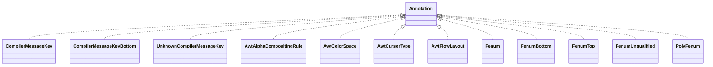

# checker-qual-3.4.1.jar

[Group index](README.md) | [All archives](../README.md)

## Scope and provenance

- **Donor:** `SQX_145_REFERENCE_ROOT/internal/libs/checker-qual-3.4.1.jar`.
- **SHA-256:** `bce5c887460542d69c0ffce05919fef8f56f9964a1505a99f6ae69a58351507e`; accessed 2026-10-06; captured `2026-10-06T18:54:51.906614+00:00`.
- **Classes:** 315 raw entries; 315 unique entry names. Duplicate occurrence indices are zero-based.
- **Inspection:** read-only ZIP hashing and class-file structural parsing; signatures/descriptors, modifiers, hierarchy and references only. Bytecode bodies are hashed, not published.
- **Allocation:** proposed `FEAT-HOST-CHECKER-QUAL`, P01; [roadmap](../../dev/sqx-full-application-roadmap.md). Domain README registration remains required.
- **Repository:** `01067f00031428613c6394064ca1bcadc1ba00ee`; review state unreviewed. Download label 145-dev1; installed build/activation and runtime equivalence unverified.
- **Limit:** every class/member is inventoried; declaration coverage does not establish consumed calls, defaults, formulas, failure semantics or algorithm parity.
- **Archive/resource index:** [012.json](../../dev/evidence/sqx145/archives/145/012.json).

## Complete member declarations

Member shards contain exact JVM names/descriptors, access flags, generic signatures, throws types, declared fields/methods, superclass/interfaces and referenced class names. All classes, nested/synthetic members and overloads are retained. Code length/hash is structural evidence, not a normalized algorithm comparison.

- [001.json](../../dev/evidence/sqx145/members/012/001.json) — SHA-256 `c76f206b867c2913fee9252b40f5588bd0f983ee8c9fb050390b18dbb8ab1b7f`.
- [002.json](../../dev/evidence/sqx145/members/012/002.json) — SHA-256 `7895cd98dff87e9afc23490c490be81fa481f334ae92ccee1f22735291a3b9ed`.
- [003.json](../../dev/evidence/sqx145/members/012/003.json) — SHA-256 `028291d4be2dab3a0e0703f0f8061d1e97d770a66ffa500a26c1f9418ec6cd09`.
- [004.json](../../dev/evidence/sqx145/members/012/004.json) — SHA-256 `e0e0448673febc1453c9748b4b1114a5c99c748d25d35a415306a7482ffc5416`.

## Focused structural diagram

Up to twelve non-nested classes; arrows show declared inheritance/interfaces only. External type names are not evidence of an available body or an executed dependency.

## Class inventory

| Archive entry | Occurrence | Class SHA-256 | Fields | Methods |
| --- | ---: | --- | ---: | ---: |
| `org/checkerframework/checker/compilermsgs/qual/CompilerMessageKey.class` | 0 | `2c1216bc8ad3a2dfba1a2769b2334f9d8402d9011d50eb2afc9aa9b738f9e6b6` | 0 | 0 |
| `org/checkerframework/checker/compilermsgs/qual/CompilerMessageKeyBottom.class` | 0 | `17bee2838ae074f2ed6690ef957f207a4d3bf1a11c4179f34cd2b94894fdcb03` | 0 | 0 |
| `org/checkerframework/checker/compilermsgs/qual/UnknownCompilerMessageKey.class` | 0 | `ed188175b9890b528faabe4e3948f314e7d682890f13d5bae272d71ff1b59b1d` | 0 | 0 |
| `org/checkerframework/checker/fenum/qual/AwtAlphaCompositingRule.class` | 0 | `819c75137c390d68ceadf76def2f3b26a1ef14e427ca3d29914a7cc75ae4180f` | 0 | 0 |
| `org/checkerframework/checker/fenum/qual/AwtColorSpace.class` | 0 | `7c2cf1f8a16588ed4b4291ce470857b5c4f87c49492a73f49e859cdb1d490cb2` | 0 | 0 |
| `org/checkerframework/checker/fenum/qual/AwtCursorType.class` | 0 | `8cfd5387b51377f16a50a72264b948e8ea4b548c2d815043792a498300237a00` | 0 | 0 |
| `org/checkerframework/checker/fenum/qual/AwtFlowLayout.class` | 0 | `f0b3ae802fef7a72d11f631f1030187154125599cf90000df8c46f8349a23c0f` | 0 | 0 |
| `org/checkerframework/checker/fenum/qual/Fenum.class` | 0 | `18c5958ee058921aa314bac2fb0b5d33721279bea3d62b2aee4a04a8f1566462` | 0 | 1 |
| `org/checkerframework/checker/fenum/qual/FenumBottom.class` | 0 | `96b64da3edd1c2b4401c9ce957d006a7f245c6059399a0534f7f4ad47692b0f8` | 0 | 0 |
| `org/checkerframework/checker/fenum/qual/FenumTop.class` | 0 | `21fc0ca93274d1e3adddb8d5484c504ea4dcd28acc64b8c4ed2c824dbb7c9564` | 0 | 0 |
| `org/checkerframework/checker/fenum/qual/FenumUnqualified.class` | 0 | `fd66cabad634eefe615aaa15f26c19849c29168703cd7dcec3c5760e64f8d2b3` | 0 | 0 |
| `org/checkerframework/checker/fenum/qual/PolyFenum.class` | 0 | `d17cb2f530c2f34c65c0515f53eb2dafe76067667f1420f2dca3788da4c40090` | 0 | 0 |
| `org/checkerframework/checker/fenum/qual/SwingBoxOrientation.class` | 0 | `12261a165a4b86752826d26de03486e17c3895bbb913e34c2b535edd6118c1e3` | 0 | 0 |
| `org/checkerframework/checker/fenum/qual/SwingCompassDirection.class` | 0 | `6bb8a400cb68288803d3776e1ab6af1a0757904ae81778bc9b906dfd8ee475ff` | 0 | 0 |
| `org/checkerframework/checker/fenum/qual/SwingElementOrientation.class` | 0 | `caa8203022d0db917becbd137bc7517ada744e697c5277982be18987dc819b75` | 0 | 0 |
| `org/checkerframework/checker/fenum/qual/SwingHorizontalOrientation.class` | 0 | `a626639875cd5dac73b863168f045c9cc9ced494ded31ceea4730692f6bb2b66` | 0 | 0 |
| `org/checkerframework/checker/fenum/qual/SwingSplitPaneOrientation.class` | 0 | `11a45809232fc0ce85362229b831c75aac488d924ae46acd1389756c1e623740` | 0 | 0 |
| `org/checkerframework/checker/fenum/qual/SwingTextOrientation.class` | 0 | `6f7532cf3aa4ad8133223a0c42b1830db889d7bf8a88dd40eb629184099e22c1` | 0 | 0 |
| `org/checkerframework/checker/fenum/qual/SwingTitleJustification.class` | 0 | `52051e4d1e9640c8b1bfec101cc162b4af32be1e7c0d98bc4eafddb1a387c9de` | 0 | 0 |
| `org/checkerframework/checker/fenum/qual/SwingTitlePosition.class` | 0 | `4a9696cd340f5b3c2de77624e20b8e9feafd0c3de5a07529a5b9257c5f1636d7` | 0 | 0 |
| `org/checkerframework/checker/fenum/qual/SwingVerticalOrientation.class` | 0 | `99975c927cb1d1b42529ef48e991fd509d8be29c147f4f8264bd1f5d17e45cdb` | 0 | 0 |
| `org/checkerframework/checker/formatter/FormatUtil$Conversion.class` | 0 | `e6c86e273663f20cf864dd9054511e3fdf7908a2d1f31f470bb4d72b088243b8` | 2 | 3 |
| `org/checkerframework/checker/formatter/FormatUtil$ExcessiveOrMissingFormatArgumentException.class` | 0 | `0aaa4289e923ee010ef3b5abdf00b17de511b250bfcfd234d376e699025b1b28` | 3 | 4 |
| `org/checkerframework/checker/formatter/FormatUtil$IllegalFormatConversionCategoryException.class` | 0 | `06d0de93102cb2ae4d59ea5afc97e50af9379f02a0bccca65ec032ae21aa9b33` | 3 | 4 |
| `org/checkerframework/checker/formatter/FormatUtil.class` | 0 | `992855133ad37d24520d15d49e88ad65bdb91e2c85798a0c7d01453225c70c96` | 2 | 8 |
| `org/checkerframework/checker/formatter/qual/ConversionCategory.class` | 0 | `5d992756e83ded5ea12753d1fabf9dc64488c0833aee3dfc0347913612f9cc91` | 12 | 11 |
| `org/checkerframework/checker/formatter/qual/Format.class` | 0 | `bd02d2838b752880beaff21d432d330222b1bbe68d393bba3610164ecaad4264` | 0 | 1 |
| `org/checkerframework/checker/formatter/qual/FormatBottom.class` | 0 | `117b6139a411d09ca2f6724f0c460b347a29735c1183e13bd391ed9619fdeb7b` | 0 | 0 |
| `org/checkerframework/checker/formatter/qual/FormatMethod.class` | 0 | `08c54cd6c2e2125dabc8abca89bf3f649b2f49dc37004edd9f25774310a3dc86` | 0 | 0 |
| `org/checkerframework/checker/formatter/qual/InvalidFormat.class` | 0 | `1fd7f10b6673f06b7562a7faf8d22a0d9f3a8ac4833d0fc8531fd9333156684a` | 0 | 1 |
| `org/checkerframework/checker/formatter/qual/ReturnsFormat.class` | 0 | `58c9119eeff08f04204cecb8988863fc0059bfdfd873710bb6e44d77d37aa610` | 0 | 0 |
| `org/checkerframework/checker/formatter/qual/UnknownFormat.class` | 0 | `47d7754a7b990b0a044027c5c1d5259125241e2d57e498abd93fbd46a22da440` | 0 | 0 |
| `org/checkerframework/checker/guieffect/qual/AlwaysSafe.class` | 0 | `4cf5f0a1c34e7c8fd6cdbd3a392963f735e0825e074d3c5682649471d2139b53` | 0 | 0 |
| `org/checkerframework/checker/guieffect/qual/PolyUI.class` | 0 | `1b024ca447c575968643f77b3ec110e76e7f495ea97313adedcad9530323d284` | 0 | 0 |
| `org/checkerframework/checker/guieffect/qual/PolyUIEffect.class` | 0 | `82a4ca6f82c30aad4b357b559d7fd4ff9f570f001a0b05131952a6d16b563d25` | 0 | 0 |
| `org/checkerframework/checker/guieffect/qual/PolyUIType.class` | 0 | `8a55141de91e56b874076ee7c3e78dfae38b92477c75991f25118dc64ae56eed` | 0 | 0 |
| `org/checkerframework/checker/guieffect/qual/SafeEffect.class` | 0 | `7d19220e6721f9c5a6fb0e519586300115e8beefb7fc1779f3874614917d97b5` | 0 | 0 |
| `org/checkerframework/checker/guieffect/qual/SafeType.class` | 0 | `4d5a7d6c9a5d7c75b878f94c04daa9f44a124c6bed2dd05379b5e0baa96bce10` | 0 | 0 |
| `org/checkerframework/checker/guieffect/qual/UI.class` | 0 | `d936737f9a69dbb7c382670d17b7ad7482c13a5d48fc26ace1e5bfe4806890f1` | 0 | 0 |
| `org/checkerframework/checker/guieffect/qual/UIEffect.class` | 0 | `74863be0db6b806b3d4c2d431a0ea0a3b4d879f055b5b1110860d7b9cfcef411` | 0 | 0 |
| `org/checkerframework/checker/guieffect/qual/UIPackage.class` | 0 | `fc98402b03665025ec6081ccb32242b1cbf7a81be31d0635516da7c006da967b` | 0 | 0 |
| `org/checkerframework/checker/guieffect/qual/UIType.class` | 0 | `4f5f69e77c3b755442fb061aa2dafc73be912631c121a3a8374235807a3f5c54` | 0 | 0 |
| `org/checkerframework/checker/i18n/qual/LocalizableKey.class` | 0 | `ebc1a58fed7b9a1f40070f9dd30c0d0237c2b0035a64861a26d2cc151d575965` | 0 | 0 |
| `org/checkerframework/checker/i18n/qual/LocalizableKeyBottom.class` | 0 | `ce04f848453b9a9439406b3b52f5f92871a2c01b0db9fc43c42739b8b05f7621` | 0 | 0 |
| `org/checkerframework/checker/i18n/qual/Localized.class` | 0 | `8fe8587aa9db7181be66ff27cc34b5ca017a6b200cce48c744931147d4f9ebd4` | 0 | 0 |
| `org/checkerframework/checker/i18n/qual/UnknownLocalizableKey.class` | 0 | `9b2dad21ed717d14d95953fb0e97dd39b1bba6fcdb99591d725e4d2a9d59ab15` | 0 | 0 |
| `org/checkerframework/checker/i18n/qual/UnknownLocalized.class` | 0 | `1da599d7848d3c0681621895fec0a6920da15b410f59c6eedcba675883ff11f9` | 0 | 0 |
| `org/checkerframework/checker/i18nformatter/I18nFormatUtil$I18nConversion.class` | 0 | `a9065870afb26664dc1b0170a007b4c963a29191cf9a78bfd76ce11e78d44335` | 2 | 2 |
| `org/checkerframework/checker/i18nformatter/I18nFormatUtil$MessageFormatParser.class` | 0 | `9d6b1d71d4f675aca254d2a75cece10e3bf109812898af0ad1f44d50015d68ae` | 21 | 6 |
| `org/checkerframework/checker/i18nformatter/I18nFormatUtil.class` | 0 | `68b861293906b9e3368c1adfa85d0582d7f7b8c9d843c625051b2ada40f8aa33` | 0 | 5 |
| `org/checkerframework/checker/i18nformatter/qual/I18nChecksFormat.class` | 0 | `512bc0b345127f88fb97df231b1a416df7e313240b177c0823ff69e650c1a499` | 0 | 0 |
| `org/checkerframework/checker/i18nformatter/qual/I18nConversionCategory.class` | 0 | `10e5f4e74132403e4f5b31d06afd6f7fd2f2e09addb2ca6b75a5bb47d808f672` | 8 | 10 |
| `org/checkerframework/checker/i18nformatter/qual/I18nFormat.class` | 0 | `ac7ca6e3433a4240c5834a46a4bfc548a9563b56f3d31049be4e6d17723c526d` | 0 | 1 |
| `org/checkerframework/checker/i18nformatter/qual/I18nFormatBottom.class` | 0 | `5eb70f2bed0937d6b5ffc7e9123eb7415cd9d14404f2fe30910f49f9b43fa715` | 0 | 0 |
| `org/checkerframework/checker/i18nformatter/qual/I18nFormatFor.class` | 0 | `95b7e859ebd62cf448e4ea9af0165208de80f4f4c2f9683cbabefed00e6c0cbc` | 0 | 1 |
| `org/checkerframework/checker/i18nformatter/qual/I18nInvalidFormat.class` | 0 | `596d67cb2880c21583e70b975f9ee99270eedfb602b01ac87f112646653e29cb` | 0 | 1 |
| `org/checkerframework/checker/i18nformatter/qual/I18nMakeFormat.class` | 0 | `1bff4d06c92cfbcaf09eb33868b12f83c9b35577afeb8185a614be83472b268a` | 0 | 0 |
| `org/checkerframework/checker/i18nformatter/qual/I18nUnknownFormat.class` | 0 | `8c58b21839b3be2d284d3c8c62b533ca5057fe16f95e2732b0c68e75eabe8c1a` | 0 | 0 |
| `org/checkerframework/checker/i18nformatter/qual/I18nValidFormat.class` | 0 | `15404478a87a0198d908d1aed285ca36a94614eabb0ebc0bab7901492c848636` | 0 | 0 |
| `org/checkerframework/checker/index/qual/EnsuresLTLengthOf$List.class` | 0 | `eb7639c3f3b7c1cc221dba02debce121721bfc67260a3609a5856d723c6244ae` | 0 | 1 |
| `org/checkerframework/checker/index/qual/EnsuresLTLengthOf.class` | 0 | `9bf12672b603282bf57cd28cb3216b4206cd569c2cf074b15b72171046b2e0f7` | 0 | 3 |
| `org/checkerframework/checker/index/qual/EnsuresLTLengthOfIf$List.class` | 0 | `10edc69efe3306e1156c49f3f67097bcfa2678b1cdf0c7b73f9cfd0adc8ad179` | 0 | 1 |
| `org/checkerframework/checker/index/qual/EnsuresLTLengthOfIf.class` | 0 | `f8239951f05dfa49021fb039bb99dba8f856aee87f8785e779e67549d26c81ef` | 0 | 4 |
| `org/checkerframework/checker/index/qual/GTENegativeOne.class` | 0 | `3168b8b248f02458b7cfa2bf767e4041a8d1585174b94f9c647d8b8960ff9ab9` | 0 | 0 |
| `org/checkerframework/checker/index/qual/HasSubsequence.class` | 0 | `59a722ee241b9f92143de5efe3ebce38adab7ca70b931f16dd4ee3668dd69cdd` | 0 | 3 |
| `org/checkerframework/checker/index/qual/IndexFor.class` | 0 | `4aab716c0629dc3e6d47a299b19b8d35c1645be3e6ff1a24d4c9d3cd78b44b84` | 0 | 1 |
| `org/checkerframework/checker/index/qual/IndexOrHigh.class` | 0 | `4fec4b568dbac6c4793d33a7eb26199ee0c499c76738e85183bc4075b1093124` | 0 | 1 |
| `org/checkerframework/checker/index/qual/IndexOrLow.class` | 0 | `09bb966cf7b6600cc5d717f4146927830d287fa2b41ac73450c46421fba7460b` | 0 | 1 |
| `org/checkerframework/checker/index/qual/LTEqLengthOf.class` | 0 | `80b891c562b9736d1dd2f315b25843d0271c688a230964d5be69a2abd5d091e3` | 0 | 1 |
| `org/checkerframework/checker/index/qual/LTLengthOf.class` | 0 | `31166b9f5592050d3b20a74ffab6d57776aa3fa7a56f670c08c10f8bd093009b` | 0 | 2 |
| `org/checkerframework/checker/index/qual/LTOMLengthOf.class` | 0 | `d0a6eb2f8c2512153ec50246ab592a2036fd27595712c5b2ff030e9259424029` | 0 | 1 |
| `org/checkerframework/checker/index/qual/LengthOf.class` | 0 | `a2e9fc9a56e3d9519307fdc7dadb57f74952e77543a2ce7025065f39cdce031e` | 0 | 1 |
| `org/checkerframework/checker/index/qual/LessThan.class` | 0 | `91afa6d047f2d8e4c09045e1325905db10b0b7fb36791b438a44b8c56c26eea0` | 0 | 1 |
| `org/checkerframework/checker/index/qual/LessThanBottom.class` | 0 | `8675b45038495f67621cef839c443f45119307efcb50fd68ebc04597f1e95eda` | 0 | 0 |
| `org/checkerframework/checker/index/qual/LessThanUnknown.class` | 0 | `8a956067bf9114d995a5c0ceabbfc76d8a5cb0782021ba0418d1cd115592b69c` | 0 | 0 |
| `org/checkerframework/checker/index/qual/LowerBoundBottom.class` | 0 | `2aa1f20fbdf7ad62256ff995c0fde8d1d342452d53b026eaaf680026ab7cf496` | 0 | 0 |
| `org/checkerframework/checker/index/qual/LowerBoundUnknown.class` | 0 | `c92fe106e17ea96eab3bdaf493302dac8092862a9b1881013b2bbb428284cab9` | 0 | 0 |
| `org/checkerframework/checker/index/qual/NegativeIndexFor.class` | 0 | `88652bac2d8e7a7be63bd1d455e0dd4dc6d36b2896f04a2504864c4e3d576c6d` | 0 | 1 |
| `org/checkerframework/checker/index/qual/NonNegative.class` | 0 | `c184dded39b4a132eb763f498c3c0df0dc2365b709c6fa2d9b7ede74ea8e5338` | 0 | 0 |
| `org/checkerframework/checker/index/qual/PolyIndex.class` | 0 | `101aaa5288c0c0dee593d5dda6028a665d0695ef6751acca74c6494273edeec1` | 0 | 0 |
| `org/checkerframework/checker/index/qual/PolyLength.class` | 0 | `2e192db5b0eba4e8e9a24e1665745f31c3c9aa0da3ab9e8ddb47694cf6c5d7dd` | 0 | 0 |
| `org/checkerframework/checker/index/qual/PolyLowerBound.class` | 0 | `5d24c3598eb15652a569838931f39cc6fbd20acc1a432ad7d97c79ad6259b4dc` | 0 | 0 |
| `org/checkerframework/checker/index/qual/PolySameLen.class` | 0 | `ee4a5c878de61dc53ee2afc716220eded595419541f43a9022050cd7ed8ae3eb` | 0 | 0 |
| `org/checkerframework/checker/index/qual/PolyUpperBound.class` | 0 | `049ba2a7e155bbd616f25bd1e84668ab73c1f9eac2f4d6342b3c063a88425c3f` | 0 | 0 |
| `org/checkerframework/checker/index/qual/Positive.class` | 0 | `bd36b4fa49e97aa8ad2c353f5a82c92cc7536cabd3e402c5bc68d4e9a96ac55c` | 0 | 0 |
| `org/checkerframework/checker/index/qual/SameLen.class` | 0 | `a92c4ad903596bf3846f58ae6ec5af83b0ec9b3f1dbcac0657c4b9ace97dbfd2` | 0 | 1 |
| `org/checkerframework/checker/index/qual/SameLenBottom.class` | 0 | `4597f20d15395874759d884ef79873ef5eac542bec8ca5687c15bf179c54863c` | 0 | 0 |
| `org/checkerframework/checker/index/qual/SameLenUnknown.class` | 0 | `30f5df9557145ddb655336426310b54a27d8a5272b1c0fc98b1977d92b37cfb3` | 0 | 0 |
| `org/checkerframework/checker/index/qual/SearchIndexBottom.class` | 0 | `c380470d6ac8c014f2073d56e5ffdda90e1ad7a12d781f9a7e70b44009b7d87e` | 0 | 0 |
| `org/checkerframework/checker/index/qual/SearchIndexFor.class` | 0 | `50f40f5a72ca8f25c59db023f9cfa4ff2c92ccc7033e7f642b7f709c1a3a2567` | 0 | 1 |
| `org/checkerframework/checker/index/qual/SearchIndexUnknown.class` | 0 | `7600cbdede7d5cb59dccf2a6fbd6f273667384ca5c2a5aa90adc4ccfc821bbd2` | 0 | 0 |
| `org/checkerframework/checker/index/qual/SubstringIndexBottom.class` | 0 | `45f5c79eca6e06ecb72a7fe77bb6c752200d11870fecf5354807dd205de3b723` | 0 | 0 |
| `org/checkerframework/checker/index/qual/SubstringIndexFor.class` | 0 | `6efe673c5c5c5d49a5f4cc0cd12fb7a086437d776ea1791fdc5d49ff2eb99e71` | 0 | 2 |
| `org/checkerframework/checker/index/qual/SubstringIndexUnknown.class` | 0 | `539bc6da987295a5c30818df8f320f1763b8a6bc943cb914a197de78142c4b10` | 0 | 0 |
| `org/checkerframework/checker/index/qual/UpperBoundBottom.class` | 0 | `f109931e36ba0d1a8ec31eaf72f65338e8c946535b21fcb1e178795fa51d8ede` | 0 | 0 |
| `org/checkerframework/checker/index/qual/UpperBoundUnknown.class` | 0 | `5f51b261c047542f9f2bdfcad12b7ae6b7188e8afc212a66c3b100df101349d1` | 0 | 0 |
| `org/checkerframework/checker/initialization/qual/FBCBottom.class` | 0 | `6762d7f0b3a491da3132dfa04ab9875353acaeba7185dfb7e04fb6f7df6de0e0` | 0 | 0 |
| `org/checkerframework/checker/initialization/qual/Initialized.class` | 0 | `e379a37f260ac26f49e64572846a916160a907ff8e47ee53989c5dcbea5b559b` | 0 | 0 |
| `org/checkerframework/checker/initialization/qual/NotOnlyInitialized.class` | 0 | `7839e091f65283d12cd89842741800ec1cdd34707940a19a51afb94a64267751` | 0 | 0 |
| `org/checkerframework/checker/initialization/qual/UnderInitialization.class` | 0 | `118561847a4c21bb9e214fec35d30cd5ec6e78b0c687660fe747c9577ce0146a` | 0 | 1 |
| `org/checkerframework/checker/initialization/qual/UnknownInitialization.class` | 0 | `6eaf670f6495ce40dbc544c8c8d14a963a2fa94bfe98c9c2f5ce203091f43a3d` | 0 | 1 |
| `org/checkerframework/checker/interning/qual/InternMethod.class` | 0 | `6b250182e235c355f1213709f2af3215ff97cbf27be0fda6c49e6bef1cfed752` | 0 | 0 |
| `org/checkerframework/checker/interning/qual/Interned.class` | 0 | `b9eb39ec2b415dfe865c4d83b1c88cb9523b0c530259a071d0a4ea93ad077a8d` | 0 | 0 |
| `org/checkerframework/checker/interning/qual/InternedDistinct.class` | 0 | `457329c3b621a4503d51b424aa45d8182f66fc2fed0eddc314ddcd4ef25f584b` | 0 | 0 |
| `org/checkerframework/checker/interning/qual/PolyInterned.class` | 0 | `7af08cf4c3da6749786655d41668dedbba5210b64672d6acbeed5bd675c0a641` | 0 | 0 |
| `org/checkerframework/checker/interning/qual/UnknownInterned.class` | 0 | `bd09ec8de04aff3a98be20debd9950b75f093061ddea95f84263de893374fe13` | 0 | 0 |
| `org/checkerframework/checker/interning/qual/UsesObjectEquals.class` | 0 | `874322a51eb0b482b0f3b8fc637c284ef5dff6288e3c3e95f0049a16288fc7d1` | 0 | 0 |
| `org/checkerframework/checker/lock/qual/EnsuresLockHeld$List.class` | 0 | `c2c0adfe245ebc4e643311874963776134d3e9ab7cc2cf1ccafea7a50b441041` | 0 | 1 |
| `org/checkerframework/checker/lock/qual/EnsuresLockHeld.class` | 0 | `dbe84bd01b5b814615d60c30331e4310220696dc24f8ff86cc4e6913a08dce05` | 0 | 1 |
| `org/checkerframework/checker/lock/qual/EnsuresLockHeldIf$List.class` | 0 | `e7079cff8827427e585a2cf5725421498d0c758e6476d7676821f78643984797` | 0 | 1 |
| `org/checkerframework/checker/lock/qual/EnsuresLockHeldIf.class` | 0 | `d342b94115bb8954206029056df2aa00bc03c474d9174efd35923af2aaa717eb` | 0 | 2 |
| `org/checkerframework/checker/lock/qual/GuardSatisfied.class` | 0 | `4eb3694468399a9f3a77dce97949fdfe04e6a8ce9b48838fbb2cbaf9cbfed58b` | 0 | 1 |
| `org/checkerframework/checker/lock/qual/GuardedBy.class` | 0 | `b1cd1e03369285de39e21a9c9bd577422ac5c8602a4156ebbea8da7ccf8ae7a5` | 0 | 1 |
| `org/checkerframework/checker/lock/qual/GuardedByBottom.class` | 0 | `3fb0a56ecbb8d54862fd2ef2169d96be2e8f3e662847d1c61c3cc5b17effbbc1` | 0 | 0 |
| `org/checkerframework/checker/lock/qual/GuardedByUnknown.class` | 0 | `e1a293ffd013e98bb9856b71875f3158aae2f8f60e8adb47e0ac4d64a71847f8` | 0 | 0 |
| `org/checkerframework/checker/lock/qual/Holding.class` | 0 | `4b4cb8ce8236cabb8ba6a81522b2862531cb3ab1d3e4179652e8e3a443561c17` | 0 | 1 |
| `org/checkerframework/checker/lock/qual/LockHeld.class` | 0 | `a0e6e0e4791ccfd05730bacd1b9eeeda1384938d9cccfec2e8fa1689b371582e` | 0 | 0 |
| `org/checkerframework/checker/lock/qual/LockPossiblyHeld.class` | 0 | `eeea994877bcb3883c946c5bec5be75a46c396df3adcad08eaebe68e8a1656e3` | 0 | 0 |
| `org/checkerframework/checker/lock/qual/LockingFree.class` | 0 | `fa5f4b73e6f97f64e25ffcd26491ed7b13bcf4796176412616f510ffd0c76305` | 0 | 0 |
| `org/checkerframework/checker/lock/qual/MayReleaseLocks.class` | 0 | `8742fa80d47e09212d546a1b6bc1955c49ffd48347dc79afe6c784f5fd5a087f` | 0 | 0 |
| `org/checkerframework/checker/lock/qual/ReleasesNoLocks.class` | 0 | `2ee8a41fa5b8fa8057a833a05e01a4e324bfb89cd4aa7c514e06bf733c431720` | 0 | 0 |
| `org/checkerframework/checker/nullness/NullnessUtil.class` | 0 | `033f6e8360a6ee12c531ac1eaf74b8101e5f69c6d269ab4fbfc51cb9e709050f` | 1 | 10 |
| `org/checkerframework/checker/nullness/Opt.class` | 0 | `4ac60a452f827c9b98001a1cd255eff2cd4c4d781bf439cba76338d436509117` | 0 | 9 |
| `org/checkerframework/checker/nullness/qual/AssertNonNullIfNonNull.class` | 0 | `9957dcc51cf05996da07de728bea03ac879b29962a9815acd49d2a069e1f7f5e` | 0 | 1 |
| `org/checkerframework/checker/nullness/qual/EnsuresKeyFor$List.class` | 0 | `103d6aba6334e2d737c520b2b9b6bb2996a174e1e327357a7b0b6b6945393553` | 0 | 1 |
| `org/checkerframework/checker/nullness/qual/EnsuresKeyFor.class` | 0 | `f0028ff4cb46b136b1bd99d79e57a2a198465237b874c39f92218e931b384b67` | 0 | 2 |
| `org/checkerframework/checker/nullness/qual/EnsuresKeyForIf$List.class` | 0 | `dc4c469c189324e1320c2d21e02da9e82415b230b9f378912b5d561bc6fb6815` | 0 | 1 |
| `org/checkerframework/checker/nullness/qual/EnsuresKeyForIf.class` | 0 | `c705bc9498e14a4482935761b0de843e764c76e01370b7b870572e6841b85297` | 0 | 3 |
| `org/checkerframework/checker/nullness/qual/EnsuresNonNull$List.class` | 0 | `b7d47bd9934792dd61c339943db514cbec724fe7c6c851214e54f511539c5742` | 0 | 1 |
| `org/checkerframework/checker/nullness/qual/EnsuresNonNull.class` | 0 | `c84db4eda9847413b1c5b5b94543226159a087a2c92d4b45a8b3835d97028098` | 0 | 1 |
| `org/checkerframework/checker/nullness/qual/EnsuresNonNullIf$List.class` | 0 | `3509d8f843ea106c4ade20440abff87f94a373e210464068bb8717cb9f11f7e7` | 0 | 1 |
| `org/checkerframework/checker/nullness/qual/EnsuresNonNullIf.class` | 0 | `333d85943a765bb1716d78c2c8c68f002a0c40ee61ebd2e66e14ad5bcc7e6adf` | 0 | 2 |
| `org/checkerframework/checker/nullness/qual/KeyFor.class` | 0 | `95175bcb8ed2aa850552a8bbad3958150663ce4e5571772db7560cf8567623e6` | 0 | 1 |
| `org/checkerframework/checker/nullness/qual/KeyForBottom.class` | 0 | `8647bb9b0ac8429ba44d0a2e8881bedf2b81e2d2c4eaf6ef94d47160f894f3b1` | 0 | 0 |
| `org/checkerframework/checker/nullness/qual/MonotonicNonNull.class` | 0 | `fb5ba13baef19ab8355b9ac4f1274154f1ed121ea26ec5ed2371881ba0683fcd` | 0 | 0 |
| `org/checkerframework/checker/nullness/qual/NonNull.class` | 0 | `eb4fd113adf5befe6433ab2d79279e3c448623b2646990005e15e2bfcc75367e` | 0 | 0 |
| `org/checkerframework/checker/nullness/qual/Nullable.class` | 0 | `222db5864d860f87370ae72f756452e49eda85520cc684ae36ddd5d6d12bd158` | 0 | 0 |
| `org/checkerframework/checker/nullness/qual/PolyKeyFor.class` | 0 | `2c92a6eaa8284c275f3721c03f239988529d40214daf347d65087f696fe99bb4` | 0 | 0 |
| `org/checkerframework/checker/nullness/qual/PolyNull.class` | 0 | `1c7870ed4724fc8189be357eba988deee0e5df8e7830ceafbc0d0ce08b8f5f6d` | 0 | 0 |
| `org/checkerframework/checker/nullness/qual/RequiresNonNull.class` | 0 | `a4bce3bfb63f085ec1d6d1f64fbcb659adcf0149c5ebddbf9f27c95f38eb4591` | 0 | 1 |
| `org/checkerframework/checker/nullness/qual/UnknownKeyFor.class` | 0 | `89ecc7e71c537660666a4b0e69e6a6ec6383e6fe87bd944254a096d392d77ede` | 0 | 0 |
| `org/checkerframework/checker/optional/qual/MaybePresent.class` | 0 | `c2b5eeea61e4025b36cbfabc9359dd575b1f7ec03cf220527a7cc36666915719` | 0 | 0 |
| `org/checkerframework/checker/optional/qual/PolyPresent.class` | 0 | `981923038c2007221b3ceea84b843b6b351ed7c59835be208728b947dd363c6c` | 0 | 0 |
| `org/checkerframework/checker/optional/qual/Present.class` | 0 | `69e880377f1b16e08e3bdaae8e962a121baf0f88ac71bf67de891a11d3e427f1` | 0 | 0 |
| `org/checkerframework/checker/propkey/qual/PropertyKey.class` | 0 | `1d01375e8816660a01c5194578ed9284e9cee92ce9918767a9fa82cae7d3b015` | 0 | 0 |
| `org/checkerframework/checker/propkey/qual/PropertyKeyBottom.class` | 0 | `22c3b5bf835c561454181ba13bf06dcab36c3fddac166ee27d13f56ed5a160a0` | 0 | 0 |
| `org/checkerframework/checker/propkey/qual/UnknownPropertyKey.class` | 0 | `776d1e27de644d028f4c3579ec52f95d4b5781bb43ef6d6eb87367d25153d4a3` | 0 | 0 |
| `org/checkerframework/checker/regex/RegexUtil$CheckedPatternSyntaxException.class` | 0 | `4d0c5068320166b3836559a1f3a38d6bb695886b7696da68ab21599a54cee6cc` | 2 | 6 |
| `org/checkerframework/checker/regex/RegexUtil.class` | 0 | `18c6f1d02849832b7c2d52ab0ab38074a9c36f178c580ec781bdaae1453ef6cb` | 0 | 12 |
| `org/checkerframework/checker/regex/qual/PartialRegex.class` | 0 | `2c5dc32a32ed2039d9547128330069140b65c1c3f88a191aa6a450db081dfedf` | 0 | 1 |
| `org/checkerframework/checker/regex/qual/PolyRegex.class` | 0 | `9abcfe688f242563d6eee40bb2da45fe6034f819b92f19815adbabbc3d7a24a0` | 0 | 0 |
| `org/checkerframework/checker/regex/qual/Regex.class` | 0 | `2833954b789e11dc00e6af8ca1f0ca089e68e49c7d2560d03e84d97a80e9e181` | 0 | 1 |
| `org/checkerframework/checker/regex/qual/RegexBottom.class` | 0 | `3e93bdac0a06a116c0c95d0f39f103efee3f92784100615873ccba8bc04a777a` | 0 | 0 |
| `org/checkerframework/checker/regex/qual/UnknownRegex.class` | 0 | `b66afa6d2889da8ed1d08b747ed978af2cb4c75379a6bd54516483b6a5266b72` | 0 | 0 |
| `org/checkerframework/checker/signature/qual/BinaryName.class` | 0 | `83998814ee6bb13031655355160599053ad73c083d52fbc91cee467a13e7e91e` | 0 | 0 |
| `org/checkerframework/checker/signature/qual/BinaryNameInUnnamedPackage.class` | 0 | `2c78cce3b45cca35fc6d98936d2ce40a8ce9b921808b34e45044b9e72e651ed2` | 0 | 0 |
| `org/checkerframework/checker/signature/qual/ClassGetName.class` | 0 | `8bc7a07b5803d7347d5815e22834e039b4855a38073277027fc143d2ba3732cf` | 0 | 0 |
| `org/checkerframework/checker/signature/qual/ClassGetSimpleName.class` | 0 | `22d097fbf056ee657395b3b6a4b5c8c685a556d11b796fc346e061dca0eeec26` | 0 | 0 |
| `org/checkerframework/checker/signature/qual/DotSeparatedIdentifiers.class` | 0 | `e629115b17f3a4086b60a97b83b4629082dc19454361a3d2f71490cc24b35790` | 0 | 0 |
| `org/checkerframework/checker/signature/qual/FieldDescriptor.class` | 0 | `cc40d0e7bed025213b29b81b935c870692d526baf7262e80fefdcb5c66ea3d2e` | 0 | 0 |
| `org/checkerframework/checker/signature/qual/FieldDescriptorForPrimitive.class` | 0 | `ff959e94acbabf714380bf04847ec4a78a156d45dbfdb520d2ea78b405f9cca6` | 0 | 0 |
| `org/checkerframework/checker/signature/qual/FieldDescriptorForPrimitiveOrArrayInUnnamedPackage.class` | 0 | `44918686ad6fd0c72969538c6f7202973584a64547106fa8b7fd3958f8162e12` | 0 | 0 |
| `org/checkerframework/checker/signature/qual/FqBinaryName.class` | 0 | `b8e101dc224f49335355edb06928e782358385dda33cb9adaca00188f9333baa` | 0 | 0 |
| `org/checkerframework/checker/signature/qual/FullyQualifiedName.class` | 0 | `19ca8c912e0b7ccdcf30e84fba852686e7062090ba58d8a4df9dcb82d9f6b59a` | 0 | 0 |
| `org/checkerframework/checker/signature/qual/Identifier.class` | 0 | `4b5fe47e83e356ff4ab12a82881be63be690c4959a5abcaa4d2b9da34a1a32ed` | 0 | 0 |
| `org/checkerframework/checker/signature/qual/IdentifierOrArray.class` | 0 | `e81fc76d40b8a5c554de2c5177ade684ec7354bad2a56e131a0e57bb71e56f38` | 0 | 0 |
| `org/checkerframework/checker/signature/qual/InternalForm.class` | 0 | `25e09edf2be7868bc16407ee76aec0cf9739bf03306f5090bfb0c47640df2443` | 0 | 0 |
| `org/checkerframework/checker/signature/qual/MethodDescriptor.class` | 0 | `f319edd6ddd1ae99f27ac675d6aa99cb04c8271b7d3296200c458270494dddf6` | 0 | 0 |
| `org/checkerframework/checker/signature/qual/PolySignature.class` | 0 | `5a6269a3bb35739896620fda153f0cd290caae6c31b71aa82a5503afbb009cfa` | 0 | 0 |
| `org/checkerframework/checker/signature/qual/SignatureBottom.class` | 0 | `2cb9f8a645ae4ec4d88975202e3dbbfdf6efe3f84bd6e9fed016b3bb70c9015a` | 0 | 0 |
| `org/checkerframework/checker/signature/qual/SignatureUnknown.class` | 0 | `39e2ccb63930f7f2d50bc07b01407bbb0753c657a23c8bf9de1a65d45c404ddf` | 0 | 0 |
| `org/checkerframework/checker/signedness/SignednessUtil.class` | 0 | `cceb5cf7b4c7da3073b67f1ed33c61a51b8cc3f3c4584441c2560c316a4fc464` | 1 | 60 |
| `org/checkerframework/checker/signedness/qual/PolySigned.class` | 0 | `1b7ce6eac6d072cec0d7770a53f51271a37834c0c5da6e7ce47c3ab02521d8a7` | 0 | 0 |
| `org/checkerframework/checker/signedness/qual/Signed.class` | 0 | `a1b4779c01b22d372548e127607fd4ed349115d9759e777f12c334109d4f37f3` | 0 | 0 |
| `org/checkerframework/checker/signedness/qual/SignedPositive.class` | 0 | `471ccd4a6a8a116563ad66b8f3a46c0ea5909b93e2c875d1f439fe34d2426e47` | 0 | 0 |
| `org/checkerframework/checker/signedness/qual/SignednessBottom.class` | 0 | `7bfb30c6bac85c851017036fa29543095b010b3bf5ccb0f3f81efa6dfc8e2269` | 0 | 0 |
| `org/checkerframework/checker/signedness/qual/SignednessGlb.class` | 0 | `85a74ec65cbb16d3e868c563de74a3f4603a21fa3a61571c5892c85a0268c628` | 0 | 0 |
| `org/checkerframework/checker/signedness/qual/UnknownSignedness.class` | 0 | `0347297559a84ba304f328486a9ee8059deef5cabd7254c1497bb53311407b1d` | 0 | 0 |
| `org/checkerframework/checker/signedness/qual/Unsigned.class` | 0 | `4bb2481cc7cc1c519c0340938f517d8504ac9a5ef469aac1dc2aaf6c745b287c` | 0 | 0 |
| `org/checkerframework/checker/tainting/qual/PolyTainted.class` | 0 | `8302b000980748810d9123de29ad7ffbebda475283b0c57d93d0dd6d6f1cc574` | 0 | 0 |
| `org/checkerframework/checker/tainting/qual/Tainted.class` | 0 | `69b24bc2d198451a6d2595571f2420de42bf6455ca356b6adc483e3827341f37` | 0 | 0 |
| `org/checkerframework/checker/tainting/qual/Untainted.class` | 0 | `8dfe9b23f94b7e94a8fe0df4425062c8bf03d9b34e581bae1846efa2f96efaff` | 0 | 0 |
| `org/checkerframework/checker/units/UnitsTools.class` | 0 | `5ef2948b1caddd09e2fd33ad91301d80aa79a3a027ac0f4d3918411bfdf522fd` | 21 | 17 |
| `org/checkerframework/checker/units/qual/A.class` | 0 | `5fef42bc97493f4dc4d8b026f720a5a8679c5314172024f5a6f7f8833a68d46c` | 0 | 1 |
| `org/checkerframework/checker/units/qual/Acceleration.class` | 0 | `b461c47bc92252c725462dd4baea73bca5696f5582929f5edc197f0f62ada1d0` | 0 | 0 |
| `org/checkerframework/checker/units/qual/Angle.class` | 0 | `a63a719bafc286a3d803220aab34bf3502924456e13e6e88efd62ca3ba4241be` | 0 | 0 |
| `org/checkerframework/checker/units/qual/Area.class` | 0 | `7861a49909563160fc64f65820a4f72715540292574f607e14a9ec23f1280536` | 0 | 0 |
| `org/checkerframework/checker/units/qual/C.class` | 0 | `6070390c3ec771d6124f027779d24835e630f6e19eff6ba7233a69c6d388f508` | 0 | 0 |
| `org/checkerframework/checker/units/qual/Current.class` | 0 | `7457566ce7a356133c4f0351bdbdfa3df349d2335435b1451d71bed6c3552b85` | 0 | 0 |
| `org/checkerframework/checker/units/qual/K.class` | 0 | `0278eac8fdf34f96ba0c851ef31e83bbadca2401b7862330052ef0b99e8461d3` | 0 | 1 |
| `org/checkerframework/checker/units/qual/Length.class` | 0 | `6e7959ae4ef44e71ace607be1cfe4f988c28b7b23af58e026ce2b0318f633514` | 0 | 0 |
| `org/checkerframework/checker/units/qual/Luminance.class` | 0 | `fc23d491cbb2597f0822c23bf1aeea7f6d08c1515a0c9e31849994482b008934` | 0 | 0 |
| `org/checkerframework/checker/units/qual/Mass.class` | 0 | `a1858e29fe3b056ae554decc1fe1361049df0ffe9d5996e8f623cf35a39257f5` | 0 | 0 |
| `org/checkerframework/checker/units/qual/MixedUnits.class` | 0 | `04c0ac906489873a985ed3c137f66804d4d4164597cb2875c2cff26a5672888f` | 0 | 0 |
| `org/checkerframework/checker/units/qual/PolyUnit.class` | 0 | `1ebe2087df7498e3f0a8dcf5c08c53aa7839f60308d3d5c6a561d2fe25b3b89c` | 0 | 0 |
| `org/checkerframework/checker/units/qual/Prefix.class` | 0 | `d567010afd09019b8c4966d87e02d4e1e22f1f9d3c34c3dd3681cab8196c65b8` | 22 | 4 |
| `org/checkerframework/checker/units/qual/Speed.class` | 0 | `f8b145084e3460492433240f8f694a3a06604b3598cc54b11fa80a9104f9b621` | 0 | 0 |
| `org/checkerframework/checker/units/qual/Substance.class` | 0 | `7ad30c10d379ffa32e90cf278b7ccdba373c4a114ff9219666a7a1dc368a676f` | 0 | 0 |
| `org/checkerframework/checker/units/qual/Temperature.class` | 0 | `e2d151566f33e77034f3fb8cdbdfd325459bcf68184bf6756cb14cc60a1c4ce1` | 0 | 0 |
| `org/checkerframework/checker/units/qual/Time.class` | 0 | `0e418f0ccd346565a8db1c8194f5e54150d708bdfaec0b510b2e375a2b4ceff4` | 0 | 0 |
| `org/checkerframework/checker/units/qual/UnitsBottom.class` | 0 | `cb369e05e5f89d4aa462997b83e55d0e614eb8d07c9c43f640b732fd31acaa3d` | 0 | 0 |
| `org/checkerframework/checker/units/qual/UnitsMultiple.class` | 0 | `fd4f7839f86f5cf41264b6dd4b65df773b4cb47536d9d0bfa82202f6f30f296b` | 0 | 2 |
| `org/checkerframework/checker/units/qual/UnitsRelations.class` | 0 | `a7e931686c6a778aba123e59a5b3d8d13b699f8c6a15644e4945784e9800110e` | 0 | 1 |
| `org/checkerframework/checker/units/qual/UnknownUnits.class` | 0 | `7b71a7ea0769af7f13d7b3d06c9338574867f128ccb7bdf3b8027ae0d32cdf3a` | 0 | 0 |
| `org/checkerframework/checker/units/qual/cd.class` | 0 | `adf353984ad91558214c3e6e9ef092eac104c39891a5a2b2127b2d14079e0314` | 0 | 1 |
| `org/checkerframework/checker/units/qual/degrees.class` | 0 | `f4ac7ecfa6b21a7a4a8c62b95d11841cc3287de4d48195dface1a6bb6dd0c99b` | 0 | 0 |
| `org/checkerframework/checker/units/qual/g.class` | 0 | `eccbc0bf80a8be300913e3357db1dee8cd6fcab507ce64532ee60f102c1ff7c9` | 0 | 1 |
| `org/checkerframework/checker/units/qual/h.class` | 0 | `a44824fad9923c164de0f1c03073b9042795f483538785076ab938867c6b7527` | 0 | 0 |
| `org/checkerframework/checker/units/qual/kg.class` | 0 | `9b64d5e14006cc0fc71c1853b5c2baa5e01c95387421335fc6017ced0fd26997` | 0 | 0 |
| `org/checkerframework/checker/units/qual/km.class` | 0 | `cc4e8968f155646dd896632ec4862ea0ec66c8f46414cfa0642475bfaff7037a` | 0 | 0 |
| `org/checkerframework/checker/units/qual/km2.class` | 0 | `7939e2e433088fd12686d8884a71ddc38c3df22e628fd9341ab216f5ae6cac3c` | 0 | 0 |
| `org/checkerframework/checker/units/qual/kmPERh.class` | 0 | `b2d45d679584bc4960fb0e850982f6a5d7ea4b6c6bd150208e5a31992d32cd73` | 0 | 0 |
| `org/checkerframework/checker/units/qual/m.class` | 0 | `fe4da320890c6b63445b3d9e763e658efdba46f7cab0e16dae283e4b1903fb80` | 0 | 1 |
| `org/checkerframework/checker/units/qual/m2.class` | 0 | `a7635bd4b75e6ab874e711a13e84aab8d1509c34b2ea9e1eddc04944f743c963` | 0 | 1 |
| `org/checkerframework/checker/units/qual/mPERs.class` | 0 | `584c21ecd85d1ebf8c4e522828069ce0bf5fc94d6db00800725993d947fc28a4` | 0 | 1 |
| `org/checkerframework/checker/units/qual/mPERs2.class` | 0 | `cd292df91d5f11aa8f4addadd2da10828a93765ddcc33c4cf5831ddd923727c6` | 0 | 1 |
| `org/checkerframework/checker/units/qual/min.class` | 0 | `f8b04f0999fbc52f24b41479cc28361b60735c4a6b6cce9924f3c5e3e73f7e72` | 0 | 0 |
| `org/checkerframework/checker/units/qual/mm.class` | 0 | `25fe70caca4e7f3c0ff98fa4c0ccc6bee0eebbc2ee2c78bfecf433c9a6ef502d` | 0 | 0 |
| `org/checkerframework/checker/units/qual/mm2.class` | 0 | `ec1a1175bdd4cd4caca1f199a5b48853c4e61c7fe4dcd71b4d67fabca4dc2592` | 0 | 0 |
| `org/checkerframework/checker/units/qual/mol.class` | 0 | `b45d6d1609b42453480929a4c26961c297e3f8e94487af80db6ebbc87c283ac7` | 0 | 1 |
| `org/checkerframework/checker/units/qual/radians.class` | 0 | `b1349f72e7393f2940bd55ed19eb1d2ab16b9d2538cac3f260d09c03aa27e0e6` | 0 | 1 |
| `org/checkerframework/checker/units/qual/s.class` | 0 | `1441c3d2cf6c619496ce2e9e5465c73a27e778d807a03ed4ef5e7e58b7a85e87` | 0 | 1 |
| `org/checkerframework/common/aliasing/qual/LeakedToResult.class` | 0 | `deb7ec4bd98a2fdf4c838136667b6a0d9abbe612a864a6caab91461be4a8da90` | 0 | 0 |
| `org/checkerframework/common/aliasing/qual/MaybeAliased.class` | 0 | `38293d13cdb263fa60401f196e3936672e9f13c77518848476d8abf83d10730b` | 0 | 0 |
| `org/checkerframework/common/aliasing/qual/MaybeLeaked.class` | 0 | `953518f9a5fbeb97672a37e32c8180173c6e8d41cf659e3b20b4d0665f377036` | 0 | 0 |
| `org/checkerframework/common/aliasing/qual/NonLeaked.class` | 0 | `6c041a652142bf66d0114bd3467215eab17bf224ce49ddea94717835d26a29db` | 0 | 0 |
| `org/checkerframework/common/aliasing/qual/Unique.class` | 0 | `f85f32ba2dcd186f6dce5e703f0bfac6d3c4ce0e6153d2c247227bfad6e1221f` | 0 | 0 |
| `org/checkerframework/common/reflection/qual/ClassBound.class` | 0 | `3622f3c206a45dff5a003a9176d668aea018e5bc5d75df71914eebfa9315d5f9` | 0 | 1 |
| `org/checkerframework/common/reflection/qual/ClassVal.class` | 0 | `108b6cd6b8d2319ad1404b30581fdc6c27be0ba85bf9b168bb7c424a01bfe40e` | 0 | 1 |
| `org/checkerframework/common/reflection/qual/ClassValBottom.class` | 0 | `8855728110f62a9f15cf5e09f7356fcb255c697aefe5adc1480a7e9ce27fc6cb` | 0 | 0 |
| `org/checkerframework/common/reflection/qual/ForName.class` | 0 | `8a5887289a9cb16db5fc68ed8a9a8152187f4459232e343470e17f374fc45798` | 0 | 0 |
| `org/checkerframework/common/reflection/qual/GetClass.class` | 0 | `a20d87a65f297b5e2983f2b3b39345e92615a6e7a8b4c122b72fb87746d4ba08` | 0 | 0 |
| `org/checkerframework/common/reflection/qual/GetConstructor.class` | 0 | `3f55c4c5bdaae546b25ae7915555a18fcb7c247ff58cbb603c38294621d299df` | 0 | 0 |
| `org/checkerframework/common/reflection/qual/GetMethod.class` | 0 | `f791c2bbc54fe30acfb0482f2f0d44b54f0d216dbcfa04b340f94f1084a2e585` | 0 | 0 |
| `org/checkerframework/common/reflection/qual/Invoke.class` | 0 | `47284ea0872a76047f45202d934eec80e7de8314b01c0339936c6e8eb3578a7e` | 0 | 0 |
| `org/checkerframework/common/reflection/qual/MethodVal.class` | 0 | `3fc5a271814bbe2333cd8675dfd46ae340b49f0c3a4fc0325104bebf156e863a` | 0 | 3 |
| `org/checkerframework/common/reflection/qual/MethodValBottom.class` | 0 | `1188250a111403245e7081a6da0562d8bf3c7bb7151436ad6afad367ba4c4018` | 0 | 0 |
| `org/checkerframework/common/reflection/qual/NewInstance.class` | 0 | `a3d66818618a96ebfd5e209875e1087029e49e7aa4f9f558e0d5b0e782e6fbd0` | 0 | 0 |
| `org/checkerframework/common/reflection/qual/UnknownClass.class` | 0 | `89293fe56e9d1709e65f5ceffb68ec4948a46526272a2d185f986634572cb7de` | 0 | 0 |
| `org/checkerframework/common/reflection/qual/UnknownMethod.class` | 0 | `25d5f217d832a4badf0b5996c813a28721193952bc17320461f518f8330b7eda` | 0 | 0 |
| `org/checkerframework/common/returnsreceiver/qual/BottomThis.class` | 0 | `18995da9bfd928b438ba76c9ee287b02c08c02fbfb19227bff2d7ed28864fa42` | 0 | 0 |
| `org/checkerframework/common/returnsreceiver/qual/This.class` | 0 | `2cfe02e80d3c13e24043d25a12a9efa96d4f26154ba84092819a9a69858a13a0` | 0 | 0 |
| `org/checkerframework/common/returnsreceiver/qual/UnknownThis.class` | 0 | `028e111ec0bea655f59953e93ce51de066bb858e56ebf5583734edfa29c25e43` | 0 | 0 |
| `org/checkerframework/common/subtyping/qual/Bottom.class` | 0 | `4ae4cc6969c66375e65a02c1c88cba402378f897ce7614d308742bfec3a687f5` | 0 | 0 |
| `org/checkerframework/common/subtyping/qual/Unqualified.class` | 0 | `0ed49651c38f8b767cc1f6c8ad83d8dc1eee80a578af7a786ea04c38be67f31c` | 0 | 0 |
| `org/checkerframework/common/util/report/qual/ReportCall.class` | 0 | `bfc8a3fc74c74061d9b9e84be82a5140b30d9eab2b6faa8afef06783dedb22f7` | 0 | 0 |
| `org/checkerframework/common/util/report/qual/ReportCreation.class` | 0 | `c0df487f7a005c0cad13f055e497b84549dc310cfece34b542d38db0b3ccef2d` | 0 | 0 |
| `org/checkerframework/common/util/report/qual/ReportInherit.class` | 0 | `3852b9e55098fb67dcffa73b71118ed66828464f5de991fb8b61c37c1e4b2b58` | 0 | 0 |
| `org/checkerframework/common/util/report/qual/ReportOverride.class` | 0 | `49b41ded36690a25981321ebe9de6085007d172ab335b6863d31f6af005d9bdf` | 0 | 0 |
| `org/checkerframework/common/util/report/qual/ReportReadWrite.class` | 0 | `7119ba959b1554ed2a0c5d0fcc921185461f951d6f91bfa6fd986575ffdad373` | 0 | 0 |
| `org/checkerframework/common/util/report/qual/ReportUnqualified.class` | 0 | `debce5c0681acfe9d976efad3d1895baf77ba4d843e6940991c544827fe68e26` | 0 | 0 |
| `org/checkerframework/common/util/report/qual/ReportUse.class` | 0 | `bddf6f611ad7e524f8054ca210d1e560bb9443b340563a82aae83f6734ca6262` | 0 | 0 |
| `org/checkerframework/common/util/report/qual/ReportWrite.class` | 0 | `2508fb55419a8ac8b73ef444f83cf1c08d5ed6f5ecf1527522034952cd472e70` | 0 | 0 |
| `org/checkerframework/common/value/qual/ArrayLen.class` | 0 | `d6f324d678ce94db0c775f9944fd1ccb510003c41546877c85781a2aebf043ba` | 0 | 1 |
| `org/checkerframework/common/value/qual/ArrayLenRange.class` | 0 | `e87e8ffa7e3853306c7eab81e758440f267b4207ea74ae516c6c7e84c2847063` | 0 | 2 |
| `org/checkerframework/common/value/qual/BoolVal.class` | 0 | `f0acab82cff56aa4ac9b0a0ab090a59ea2586925760850ceeb6d3b911d475bf7` | 0 | 1 |
| `org/checkerframework/common/value/qual/BottomVal.class` | 0 | `15fc82161019bedc9609c5907fa22696a30de78c0ef5936cd1895fc389dbfd80` | 0 | 0 |
| `org/checkerframework/common/value/qual/DoubleVal.class` | 0 | `71e9cc677e5fef365142bcd5feeeb2179ab0768d7d075335366524951ce142fb` | 0 | 1 |
| `org/checkerframework/common/value/qual/EnsuresMinLenIf$List.class` | 0 | `12e66934aabf59cc07c4ecea64e1cd13a07991ec52c78ad24343ccb92fe964a3` | 0 | 1 |
| `org/checkerframework/common/value/qual/EnsuresMinLenIf.class` | 0 | `8438d04cb0f57a8d0b467508a27f0ca67f156e6147427e33bc8f914c960eae8c` | 0 | 3 |
| `org/checkerframework/common/value/qual/IntRange.class` | 0 | `353ce734cb66950340c61a47ee7846555fe9bb9aea58b33026a4c1c5cc777cab` | 0 | 2 |
| `org/checkerframework/common/value/qual/IntRangeFromGTENegativeOne.class` | 0 | `cbcf4f29fa1d7802dcdd8b62050b2caef35730cb2e1b38c1c6ec54481f93a9f7` | 0 | 0 |
| `org/checkerframework/common/value/qual/IntRangeFromNonNegative.class` | 0 | `e20105e97c4172cd76075aa909b0fd6c42a222a90ee614042110b16423a4570f` | 0 | 0 |
| `org/checkerframework/common/value/qual/IntRangeFromPositive.class` | 0 | `cb7792cd34d10dbd54dde5974ce7853735fb0c23d5242fdf66870d9c4f55ce25` | 0 | 0 |
| `org/checkerframework/common/value/qual/IntVal.class` | 0 | `a606bec10ccfcad36baab7933da45be187010814fcdda54376cda6980390d09a` | 0 | 1 |
| `org/checkerframework/common/value/qual/MinLen.class` | 0 | `d6448cbdc587c1e4967b7ab00da8b64de31888cf8a1ebdee78ec40dd0bb50d1e` | 0 | 1 |
| `org/checkerframework/common/value/qual/MinLenFieldInvariant.class` | 0 | `05fe76c322c3789924c79772bd2330936fad817435cd90899bf07c374206e768` | 0 | 2 |
| `org/checkerframework/common/value/qual/PolyValue.class` | 0 | `1bcb150f92bd4efa90bb39fcf35ea63facdb5d15f78a4cde143e3cd7c28e14e4` | 0 | 0 |
| `org/checkerframework/common/value/qual/StaticallyExecutable.class` | 0 | `10ea603493c930cba8759cd5959b5d8103d400ffc5e35d842bd70790c03469be` | 0 | 0 |
| `org/checkerframework/common/value/qual/StringVal.class` | 0 | `810b65a4f2d8c9eae978cd7be36c2dfb9320b0db19a7899ac054aa9978f7a711` | 0 | 1 |
| `org/checkerframework/common/value/qual/UnknownVal.class` | 0 | `8ec5aa6c56b45efbf5299b2fdc7505962499023f5cba7ec9b2285d26d6096fe3` | 0 | 0 |
| `org/checkerframework/dataflow/qual/Deterministic.class` | 0 | `bf19cda4432fc274d9ea38113658f561deeee38b5c076a5b38708797406e96e8` | 0 | 0 |
| `org/checkerframework/dataflow/qual/Pure$Kind.class` | 0 | `325c360d736ea80065d7e446a5295002cecdc65716455e65ad6c083a210ee271` | 3 | 4 |
| `org/checkerframework/dataflow/qual/Pure.class` | 0 | `f61ae9d8780f1f779a0013c3d3ec71dd90e76c3fb519be7f14cf9353504a0aeb` | 0 | 0 |
| `org/checkerframework/dataflow/qual/SideEffectFree.class` | 0 | `791c93b32580820b2315f47633fb7603e1129826bb6eb7fb6946fef7a5275e85` | 0 | 0 |
| `org/checkerframework/dataflow/qual/TerminatesExecution.class` | 0 | `9da29544df64a8168067822dbdcddc23dae33674075df9130834ea079695d187` | 0 | 0 |
| `org/checkerframework/framework/qual/AnnotatedFor.class` | 0 | `d48391e301bdfd98c27e0fe6f8f2bd3669bcc4bbf1a5672a4c646e2d0072fd28` | 0 | 1 |
| `org/checkerframework/framework/qual/CFComment.class` | 0 | `36561b9735dcda253fa5074cd22130a2c5c085d0161dd50134682f70e81b8bf8` | 0 | 1 |
| `org/checkerframework/framework/qual/ConditionalPostconditionAnnotation.class` | 0 | `dfa41dd91f9afbcb3239a2063263eaa308ceffa4dabd31f1e37da8e642ac6f44` | 0 | 1 |
| `org/checkerframework/framework/qual/Covariant.class` | 0 | `c01f8d465bb2dd01a789769050bd7f91d855d38dc2a33fe29ea86649db673f6f` | 0 | 1 |
| `org/checkerframework/framework/qual/DefaultFor.class` | 0 | `7fe48cffac1822c36dd3b3298534f14291d446eddd69dea5bd581c60111134ea` | 0 | 3 |
| `org/checkerframework/framework/qual/DefaultQualifier$List.class` | 0 | `195ca0717ad485bb275f671ac6db4a7dd5768d93ac9e896c367f61a451c948c0` | 0 | 1 |
| `org/checkerframework/framework/qual/DefaultQualifier.class` | 0 | `6b1858cc30ab843d08ef38790ea9bd17310751f43ec5c74be143b21da5f48166` | 0 | 2 |
| `org/checkerframework/framework/qual/DefaultQualifierForUse.class` | 0 | `2df073ae71eaa7c37ef9b9530f36ec12bfafa071767921d02d4a7acd8d64def2` | 0 | 1 |
| `org/checkerframework/framework/qual/DefaultQualifierInHierarchy.class` | 0 | `91688aecb06b63e86b77a8ab94d57485d31932bc8637d76c700c986655d1b355` | 0 | 0 |
| `org/checkerframework/framework/qual/EnsuresQualifier$List.class` | 0 | `6959bdcf87f637bb55b80d8811d883a3efc153a26d35d29ecc6dccc5979ac798` | 0 | 1 |
| `org/checkerframework/framework/qual/EnsuresQualifier.class` | 0 | `4382f5c132b0496e6cf3aaa3bc6a3e0b2c4d8f2bb266fdedf396f8fb174410c5` | 0 | 2 |
| `org/checkerframework/framework/qual/EnsuresQualifierIf$List.class` | 0 | `eecba541556452925f204c91d0828d67e27bfb92b8455fc5335ef04185f51c5d` | 0 | 1 |
| `org/checkerframework/framework/qual/EnsuresQualifierIf.class` | 0 | `ee91c9c9a5d3f4ffe7556faf0bdb187c50f5899d205b09aeb4208c1a1e18f7cd` | 0 | 3 |
| `org/checkerframework/framework/qual/FieldInvariant.class` | 0 | `bd334717d9bc3d634f3c68e4ce68189917b6311afd2732de2defd719f1183caf` | 0 | 2 |
| `org/checkerframework/framework/qual/FromByteCode.class` | 0 | `bb5e1c3dd28f38fb00651f4fa9c74d8dbf1b86d96ab43e8095990c285e67c1bb` | 0 | 0 |
| `org/checkerframework/framework/qual/FromStubFile.class` | 0 | `3b17505d98fc9146b60bdccef7a5b9617aa3874a96b896cbbd3161acaca10e93` | 0 | 0 |
| `org/checkerframework/framework/qual/IgnoreInWholeProgramInference.class` | 0 | `74e74ed4328e8e81beeb08143a3254a5a11ea0ea7fd13c071db0b8e4e84443ce` | 0 | 0 |
| `org/checkerframework/framework/qual/InheritedAnnotation.class` | 0 | `d477986a4eeccf7dd99714e613f338b6dfe987a20e18468851a8cdd38acb5473` | 0 | 0 |
| `org/checkerframework/framework/qual/InvisibleQualifier.class` | 0 | `bfc42267758b6c0884a6f16c35f6092c34308020691085bd159ab09c5d6652ad` | 0 | 0 |
| `org/checkerframework/framework/qual/JavaExpression.class` | 0 | `8fbedc8bad9f9e29b73e383024f43657be3360751a363c8884e86e5ee6082ed3` | 0 | 0 |
| `org/checkerframework/framework/qual/LiteralKind.class` | 0 | `4f631634f9a2c29d37b3b7ac1b042b7fbf4cfdacf7b7eeeedc15b3f0896ad68c` | 11 | 6 |
| `org/checkerframework/framework/qual/MonotonicQualifier.class` | 0 | `23cc695bb5926d3acd54f31ab58738ef62a521b47caec9d12f6671f9213f70f9` | 0 | 1 |
| `org/checkerframework/framework/qual/NoDefaultQualifierForUse.class` | 0 | `7c2ed6e0ceeb9e5b5e87196cb4594c5315b72ebb5f1462f89ffb94ef87fda25d` | 0 | 1 |
| `org/checkerframework/framework/qual/PolymorphicQualifier.class` | 0 | `4f9ff005ee35189adcd967ab465628c2b39409e33ec9a4261d0a9f9402fe05ff` | 0 | 1 |
| `org/checkerframework/framework/qual/PostconditionAnnotation.class` | 0 | `eea610305dd88552831e9cb8c40ddb7bbd54fd2c81f56fe5f2d2eeb064c78636` | 0 | 1 |
| `org/checkerframework/framework/qual/PreconditionAnnotation.class` | 0 | `0f9810a2ac58a099665df626cd768ef8c9e77d520e703e2545809a1a2c53c3a6` | 0 | 1 |
| `org/checkerframework/framework/qual/QualifierArgument.class` | 0 | `a98fd641469956a00654f005711fb7e75446e8b2fb0443d81c9827cc3c10602e` | 0 | 1 |
| `org/checkerframework/framework/qual/QualifierForLiterals.class` | 0 | `11b01eb0de41c4f3eb2f8bb9364937036787a1e3c989185d2b54971adce3e88c` | 0 | 2 |
| `org/checkerframework/framework/qual/RelevantJavaTypes.class` | 0 | `ed4b000467ee67953edf5683d67eb53ca6900172797af765c23d074699b7e423` | 0 | 1 |
| `org/checkerframework/framework/qual/RequiresQualifier$List.class` | 0 | `da82addc9dec9358387ac7e79a3403f52480ebd7e810d76aa1e76a992c03a245` | 0 | 1 |
| `org/checkerframework/framework/qual/RequiresQualifier.class` | 0 | `973390c116e086932b1df3be55e8a3d988e55ad136971ddef132e9c20e7d7709` | 0 | 2 |
| `org/checkerframework/framework/qual/StubFiles.class` | 0 | `cb29c8c40936d684d9074eb675143796559632c736316e877106d2fe3f28c494` | 0 | 1 |
| `org/checkerframework/framework/qual/SubtypeOf.class` | 0 | `e8b5bd3c5efbbcaded479849db0407045aeca0497d3002c786e6fceaa7c9c790` | 0 | 1 |
| `org/checkerframework/framework/qual/TargetLocations.class` | 0 | `29a3f42f3097d00667f78fc3519bd6490e507fcf00c33df395460cba387f0056` | 0 | 1 |
| `org/checkerframework/framework/qual/TypeKind.class` | 0 | `86a359e57031ae11533a893a039ab7499ffa32c38a8b6fdf61f841650fe283f9` | 22 | 4 |
| `org/checkerframework/framework/qual/TypeUseLocation.class` | 0 | `eed5e3fe605982dd4a1aafdefde9b5b4ba5a39c3d5f5312b4feca3af5bfac9c7` | 17 | 4 |
| `org/checkerframework/framework/qual/Unused.class` | 0 | `1a15c2a41ec6fbd25571f19c036a8ef8fb83d158d581924fe5e12b93aafea29e` | 0 | 1 |
| `org/checkerframework/framework/qual/UpperBoundFor.class` | 0 | `37e36dda5f891b9494c209135ee2c3ee7552cba934854cff7abb868b033c3f01` | 0 | 2 |
| `org/checkerframework/framework/util/PurityUnqualified.class` | 0 | `dc16674f525dffdd69fa35654614b1ced3b60b2ed181f8fb9f4b90b62c4de919` | 0 | 0 |
