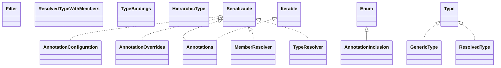

# classmate-1.7.0.jar

[Group index](README.md) | [All archives](../README.md)

## Scope and provenance

- **Donor:** `SQX_145_REFERENCE_ROOT/internal/libs/classmate-1.7.0.jar`.
- **SHA-256:** `cb868f231c5cceb89d795ea00e6e1b7a93b8f4ac1ce1d8be76dde322dff4a046`; accessed 2026-10-06; captured `2026-10-06T18:54:51.906614+00:00`.
- **Classes:** 44 raw entries; 44 unique entry names. Duplicate occurrence indices are zero-based.
- **Inspection:** read-only ZIP hashing and class-file structural parsing; signatures/descriptors, modifiers, hierarchy and references only. Bytecode bodies are hashed, not published.
- **Allocation:** proposed `FEAT-HOST-CLASSMATE`, P02; [roadmap](../../dev/sqx-full-application-roadmap.md). Domain README registration remains required.
- **Repository:** `01067f00031428613c6394064ca1bcadc1ba00ee`; review state unreviewed. Download label 145-dev1; installed build/activation and runtime equivalence unverified.
- **Limit:** every class/member is inventoried; declaration coverage does not establish consumed calls, defaults, formulas, failure semantics or algorithm parity.
- **Archive/resource index:** [013.json](../../dev/evidence/sqx145/archives/145/013.json).

## Complete member declarations

Member shards contain exact JVM names/descriptors, access flags, generic signatures, throws types, declared fields/methods, superclass/interfaces and referenced class names. All classes, nested/synthetic members and overloads are retained. Code length/hash is structural evidence, not a normalized algorithm comparison.

- [001.json](../../dev/evidence/sqx145/members/013/001.json) — SHA-256 `b05f601e626a141e0a22325305bcef0b5423e9f4de15f2d718d30deb09d28597`.

## Focused structural diagram

Up to twelve non-nested classes; arrows show declared inheritance/interfaces only. External type names are not evidence of an available body or an executed dependency.

## Class inventory

| Archive entry | Occurrence | Class SHA-256 | Fields | Methods |
| --- | ---: | --- | ---: | ---: |
| `com/fasterxml/classmate/AnnotationConfiguration$StdConfiguration.class` | 0 | `baa8fe6d61e1469f3a74db2213c57ad8cba8afc340a41f7aec60ca6184d343db` | 2 | 8 |
| `com/fasterxml/classmate/AnnotationConfiguration.class` | 0 | `98ac27a159f779fa7cd65b917074710bff1f0563075d8bba6586150090236085` | 0 | 6 |
| `com/fasterxml/classmate/AnnotationInclusion.class` | 0 | `355382e69d80081404ce9aa9edc988ca49db51bf3d546526d8a6b9474b0963c3` | 5 | 4 |
| `com/fasterxml/classmate/AnnotationOverrides$StdBuilder.class` | 0 | `89c55ea8253f37bdb8818ce123f50c9d7c02e33560a7944afdd2a1d3793c13e8` | 1 | 4 |
| `com/fasterxml/classmate/AnnotationOverrides$StdImpl.class` | 0 | `34626cf5218bd8dfa569f29c29554ed006335d09c00e603881b77aa0c666d602` | 1 | 2 |
| `com/fasterxml/classmate/AnnotationOverrides.class` | 0 | `758acfd5dd5c918eb4e9867b669970bac50685c2f0c378c972e1045c56b90ef1` | 0 | 4 |
| `com/fasterxml/classmate/Annotations.class` | 0 | `9cef57c1c693c53c01f4af2583692b4ec71d31614442e2ae8ff382637adffd0a` | 2 | 10 |
| `com/fasterxml/classmate/Filter.class` | 0 | `98cb77a89aa2429779c032de09c68067fee66204923590ce9bae57c0e551751c` | 0 | 1 |
| `com/fasterxml/classmate/GenericType.class` | 0 | `7a7c83740c45114361fc7889ef2463af8f31c42f5caaa25184a90407796940c3` | 0 | 1 |
| `com/fasterxml/classmate/MemberResolver.class` | 0 | `28ddfb209f1aae24e8e97c46d5afe679c158c283e42c72d9be9ce1299ec0ef4d` | 5 | 9 |
| `com/fasterxml/classmate/ResolvedType.class` | 0 | `26f104cf22c01fcaee8d7f82eb965f6de23d0243ba0adc54f96cbfbdecbf17ca` | 6 | 42 |
| `com/fasterxml/classmate/ResolvedTypeWithMembers$AnnotationHandler.class` | 0 | `2952ffb1918da9b650d3aa58694ad4b7058adb2c1f1f0dfd2b87f95dd877c747` | 5 | 7 |
| `com/fasterxml/classmate/ResolvedTypeWithMembers.class` | 0 | `ee002278878c9028effcff04597313edef0d9bdd24752ad282ae13ac80267932` | 17 | 21 |
| `com/fasterxml/classmate/TypeBindings.class` | 0 | `5e634290b6182a3bf8fe8db0c69eba297f17fa687785ec94ca359ab43b628a25` | 7 | 17 |
| `com/fasterxml/classmate/TypeResolver.class` | 0 | `668f05d1f9733ff5aa30719a2cd7686f1130abd91ed11d2f064ef8b1bfdeff45` | 4 | 20 |
| `com/fasterxml/classmate/members/HierarchicType.class` | 0 | `1fcbd2a1bc10103021a668c02ae65336978d05c59a67946e075f6ef0fb32ca74` | 3 | 8 |
| `com/fasterxml/classmate/members/RawConstructor.class` | 0 | `6bf053d3bcbba4f7511b469eee6eb6d49b13525b47360895dbd155e9701c2529` | 2 | 6 |
| `com/fasterxml/classmate/members/RawField.class` | 0 | `4e6aa91afece2b78f47f8e3284e4732a24759d5e37d8a0576db0f1b10b8955d4` | 2 | 7 |
| `com/fasterxml/classmate/members/RawMember.class` | 0 | `efd5625dfd358f36fb75fb6984fc279ee6e095bb31ef249ffc2b4b73facd1a41` | 1 | 14 |
| `com/fasterxml/classmate/members/RawMethod.class` | 0 | `4b04c7882f3c4b3215b2a01fd70ea8fae18c56d227253aa32b42af75e1d274c3` | 2 | 10 |
| `com/fasterxml/classmate/members/ResolvedConstructor.class` | 0 | `d9b3da750aadbf34d427679dad36d387fa469f425272d4ca84d31ebbebcba540` | 0 | 1 |
| `com/fasterxml/classmate/members/ResolvedField.class` | 0 | `18d1a8cc99a24a83ad780884dae09f7f838eeaaa351efe490aa3fe70f0429bba` | 0 | 5 |
| `com/fasterxml/classmate/members/ResolvedMember.class` | 0 | `5e65ca7805aa2a9adbe13b4338af8adbefb3fc5c0a29232940b37eb770949f47` | 5 | 19 |
| `com/fasterxml/classmate/members/ResolvedMethod.class` | 0 | `7106827bd52db3ad04cba7982f1eaac5a59daa97a5ddb637a76853e265118fd8` | 0 | 8 |
| `com/fasterxml/classmate/members/ResolvedParameterizedMember.class` | 0 | `ca8ca6db32127cf8614c7c32035742d463e6cc2c876e6356408d15a0806fb8bd` | 2 | 8 |
| `com/fasterxml/classmate/members/package-info.class` | 0 | `43f8be67b941cb8c7be38bbb25804f9712c3420df42cc56f135b9e60a6a6379d` | 0 | 0 |
| `com/fasterxml/classmate/package-info.class` | 0 | `1b4e39b1500127a921b840eca22b2475bd959f967cf18525415ca56ba5002530` | 0 | 0 |
| `com/fasterxml/classmate/types/ResolvedArrayType.class` | 0 | `8fcd11fb81e44e66a807c5e744fe05a8ec2719bf90d9001df3469d61eb1d055a` | 2 | 15 |
| `com/fasterxml/classmate/types/ResolvedInterfaceType.class` | 0 | `c601fd95d4ba1a8a9111c2064e77b1b5a744359f29a75cc8a219021fdde368ce` | 3 | 16 |
| `com/fasterxml/classmate/types/ResolvedObjectType.class` | 0 | `be6149cd1a4c9641bde948a172cc49e117051a4c866babd909e3ea52ed0bee44` | 8 | 22 |
| `com/fasterxml/classmate/types/ResolvedPrimitiveType.class` | 0 | `1778840d583060d0fc3f86334fbed84450120cdb90a38fc10d7aacbbde96c853` | 3 | 20 |
| `com/fasterxml/classmate/types/ResolvedRecursiveType.class` | 0 | `8f7afc37146c81aed8b69ba353d7026f153d24e1f96edd8d3a8f9959883d1cda` | 1 | 22 |
| `com/fasterxml/classmate/types/TypePlaceHolder.class` | 0 | `3d03458100a7cdfad22b8dd3be435ae99fef5c7a6fe8788e62f0f221c40e5aad` | 2 | 18 |
| `com/fasterxml/classmate/types/package-info.class` | 0 | `fbad5eaa7086c41b27d56b8a0c93a7235aca3973494004d9b4b47070d52e48e1` | 0 | 0 |
| `com/fasterxml/classmate/util/ClassKey.class` | 0 | `5aad85eaf9a3b4ac81ff2b69d13af44b2431bbdf3cc15804d5078c4eb93b3995` | 3 | 6 |
| `com/fasterxml/classmate/util/ClassStack.class` | 0 | `447c2ce86e5b023a1a51b35f686792cdccfbf0c22b77da9ed68b709632070b20` | 3 | 6 |
| `com/fasterxml/classmate/util/ConcurrentTypeCache.class` | 0 | `aae0fe9a4b0d6d231cb0497ba01749e23cb5d36c3406b3dffb34f842374bf682` | 3 | 5 |
| `com/fasterxml/classmate/util/LRUTypeCache$CacheMap.class` | 0 | `768ccb120952523070dee0a28f53a375ef013b023ce75f89a38ce88304a49623` | 1 | 2 |
| `com/fasterxml/classmate/util/LRUTypeCache.class` | 0 | `821134c5083a680dd2cebf62960a8452805d3d9edf0ec0282ab5f100b2a94013` | 3 | 5 |
| `com/fasterxml/classmate/util/MethodKey.class` | 0 | `d21ea768b6a4e6642c0e406f405f8a4d7b35fb8e03f407c9516e49166158cae8` | 4 | 6 |
| `com/fasterxml/classmate/util/ResolvedTypeCache.class` | 0 | `52fdbb70ad6aa750fb89280220affdbcd40facf3a38d696881099900fc9f9a83` | 0 | 9 |
| `com/fasterxml/classmate/util/ResolvedTypeKey.class` | 0 | `c70d9b2a401859349ea7fdbd855f8d908deb1d8b2874a720f7aeca8777c3e498` | 3 | 5 |
| `com/fasterxml/classmate/util/package-info.class` | 0 | `118128dee871fe44449e8ff4ebce9645e590c0dde220324d125124ef3e3f2b51` | 0 | 0 |
| `module-info.class` | 0 | `68837cbdb9587006d0518bb0b3c1f7f54b3932647fdc1567832bdcad6e01e5fa` | 0 | 0 |
