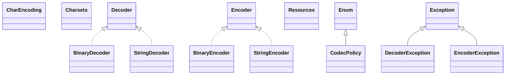

# commons-codec-1.17.1.jar

[Group index](README.md) | [All archives](../README.md)

## Scope and provenance

- **Donor:** `SQX_145_REFERENCE_ROOT/internal/libs/commons-codec-1.17.1.jar`.
- **SHA-256:** `f9f6cb103f2ddc3c99a9d80ada2ae7bf0685111fd6bffccb72033d1da4e6ff23`; accessed 2026-10-06; captured `2026-10-06T18:54:51.906614+00:00`.
- **Classes:** 115 raw entries; 115 unique entry names. Duplicate occurrence indices are zero-based.
- **Inspection:** read-only ZIP hashing and class-file structural parsing; signatures/descriptors, modifiers, hierarchy and references only. Bytecode bodies are hashed, not published.
- **Allocation:** proposed `FEAT-HOST-COMMONS-CODEC`, P01; [roadmap](../../dev/sqx-full-application-roadmap.md). Domain README registration remains required.
- **Repository:** `01067f00031428613c6394064ca1bcadc1ba00ee`; review state unreviewed. Download label 145-dev1; installed build/activation and runtime equivalence unverified.
- **Limit:** every class/member is inventoried; declaration coverage does not establish consumed calls, defaults, formulas, failure semantics or algorithm parity.
- **Archive/resource index:** [015.json](../../dev/evidence/sqx145/archives/145/015.json).

## Complete member declarations

Member shards contain exact JVM names/descriptors, access flags, generic signatures, throws types, declared fields/methods, superclass/interfaces and referenced class names. All classes, nested/synthetic members and overloads are retained. Code length/hash is structural evidence, not a normalized algorithm comparison.

- [001.json](../../dev/evidence/sqx145/members/015/001.json) — SHA-256 `f45ab526425a0989f132487eae3c0e0dd5e6a1605595fa645b91446b11137077`.
- [002.json](../../dev/evidence/sqx145/members/015/002.json) — SHA-256 `546dedbea00bd62085333f862efacae0f4b79fb6840e957b1ce37e4c424e9412`.

## Focused structural diagram

Up to twelve non-nested classes; arrows show declared inheritance/interfaces only. External type names are not evidence of an available body or an executed dependency.

## Class inventory

| Archive entry | Occurrence | Class SHA-256 | Fields | Methods |
| --- | ---: | --- | ---: | ---: |
| `org/apache/commons/codec/BinaryDecoder.class` | 0 | `e787206a7e78fc027c7ae718149d202e99d0b63b3b6dafdeab1171d3901ee633` | 0 | 1 |
| `org/apache/commons/codec/BinaryEncoder.class` | 0 | `ecefcd5e6d0df88f5526a11d8acd5f47b5e6a507a44e266775bb203bcf86e56f` | 0 | 1 |
| `org/apache/commons/codec/CharEncoding.class` | 0 | `0f1d3f22fc9b37aa6e22381211c24bf988b8b21cf49ffadf184fb9514e8be104` | 6 | 2 |
| `org/apache/commons/codec/Charsets.class` | 0 | `52381f6d769c6d3d9b7f5f2ceef1ac983c41a1bff392d85397a30d53d3e2ddca` | 6 | 4 |
| `org/apache/commons/codec/CodecPolicy.class` | 0 | `b7a9ebac61c67e04167ac71ebd80efb5bdc47d8347976de4dde2b5f1685796a4` | 3 | 5 |
| `org/apache/commons/codec/Decoder.class` | 0 | `0788f0ab04345a2b90c19c0b0c6623a9bf51dff0eaa63ef6bcf5415a5c823657` | 0 | 1 |
| `org/apache/commons/codec/DecoderException.class` | 0 | `693e22f2336829c083a1a1f9d100e62f55563baa85c5a2d54a022c28f187fc46` | 1 | 4 |
| `org/apache/commons/codec/Encoder.class` | 0 | `d54418809d138b33583ff676973ce3546d2fe7f023dffdfcfa8d47bdcb61dba0` | 0 | 1 |
| `org/apache/commons/codec/EncoderException.class` | 0 | `04451cf267f1f99a143a460e75a9c60e0b9849cc56cfc584d7e84a4ea16130e7` | 1 | 4 |
| `org/apache/commons/codec/Resources.class` | 0 | `6e787ef29e59198bf8014d867244a6a40d9367aa7accb3619c5cc1d86c305d4a` | 0 | 2 |
| `org/apache/commons/codec/StringDecoder.class` | 0 | `bdd24eb36fcc874b562508ae3a4128a382de65d1bf89351bfef48e94c7794c67` | 0 | 1 |
| `org/apache/commons/codec/StringEncoder.class` | 0 | `d898b4fa22365550836c2008835660707f6f9d1efefca381c12c718107606881` | 0 | 1 |
| `org/apache/commons/codec/StringEncoderComparator.class` | 0 | `a208b27d12f252d465386fdf6e28bbd08d0d873b4110593cb94a0decf062ecaa` | 1 | 3 |
| `org/apache/commons/codec/binary/Base16.class` | 0 | `6eaa0d35228289c2b206172faedf7ad9054bc6d6427c1571383f3b4607e90508` | 10 | 10 |
| `org/apache/commons/codec/binary/Base16InputStream.class` | 0 | `2f69678c8a4071cfc54812c129c351d3e24842fad4d9f35eb789a830a94eac8c` | 0 | 4 |
| `org/apache/commons/codec/binary/Base16OutputStream.class` | 0 | `87abf386f60fcf762174164d065578f7e4d8895668100141c491ec4dcb4efcae` | 0 | 4 |
| `org/apache/commons/codec/binary/Base32$1.class` | 0 | `29f8bf0ab8f2a9b22d80f4c5640a55ffdc80e4a73b2b166ce562440775d88851` | 0 | 0 |
| `org/apache/commons/codec/binary/Base32$Builder.class` | 0 | `334c04b61149ac9ff1cc68ffa39ae5955ed9b9e2cc6becc6f4b8a9e373af1397` | 0 | 3 |
| `org/apache/commons/codec/binary/Base32.class` | 0 | `91c530ab455aa9ffbd7bcb62d4f2b873d2b8efab045657c51ddda0023265ecf9` | 16 | 20 |
| `org/apache/commons/codec/binary/Base32InputStream.class` | 0 | `c672749bed7cac26a993eb31b485753d293cc41412f5ff8e1098cc459fc20f40` | 0 | 4 |
| `org/apache/commons/codec/binary/Base32OutputStream.class` | 0 | `db17f327fb8783229b1487e7f3cfbeecef40ebf8862a200abfdc149ea3e8ae61` | 0 | 4 |
| `org/apache/commons/codec/binary/Base64$1.class` | 0 | `f758f9b4e0bec0f5fdb07d2af90dcde5410be940305fc3359bc9c9c583d8649f` | 0 | 0 |
| `org/apache/commons/codec/binary/Base64$Builder.class` | 0 | `2073698e4d000fe9faf5282646b6b71d0b575b9c524f855cfbcbf7155fdad7cd` | 0 | 4 |
| `org/apache/commons/codec/binary/Base64.class` | 0 | `7985285c1f09f76230bb84605bf22f7c000125fb2b76b24552993df7215296fd` | 16 | 38 |
| `org/apache/commons/codec/binary/Base64InputStream.class` | 0 | `15e3146ae4a80c466c4ccfa8d8c79c1689d4ecaedd49f0bd79fe6317f85b35ef` | 0 | 4 |
| `org/apache/commons/codec/binary/Base64OutputStream.class` | 0 | `b2250aa8c6c54564826535ca2d3d28ff933450223b81109c8601e76d38330898` | 0 | 4 |
| `org/apache/commons/codec/binary/BaseNCodec$AbstractBuilder.class` | 0 | `35ed29a867eda82234c939f4e92c15b3bd8f8a0df296c8a37fc0b2aac1db2297` | 6 | 12 |
| `org/apache/commons/codec/binary/BaseNCodec$Context.class` | 0 | `17b55615770c4d14a5537b9ea582b7adbc08864b9a50d3f9542b5ffbf0d75457` | 8 | 2 |
| `org/apache/commons/codec/binary/BaseNCodec.class` | 0 | `aa1b5892b652c4b8c590826b0fe78bd18fd9de4fbfa13ac4de750095ecab38f7` | 17 | 31 |
| `org/apache/commons/codec/binary/BaseNCodecInputStream.class` | 0 | `29f41d6f52d8eecea01dcee21f4769c7479d06c6a0211331f114d6e8ebc41778` | 5 | 9 |
| `org/apache/commons/codec/binary/BaseNCodecOutputStream.class` | 0 | `96ba7f54e5a5f2ec1165300bb5000db11b250b048890730ef753b98ec911f178` | 4 | 8 |
| `org/apache/commons/codec/binary/BinaryCodec.class` | 0 | `0238f0556a4a6d2648d33d0b0de09ffcbce16be08d4f86d7a2907cddf2fd4762` | 11 | 13 |
| `org/apache/commons/codec/binary/CharSequenceUtils.class` | 0 | `3f7f69c7910fd4f3dd189d1e2c513ac8b54f9af547347ce8a2d6faf3df0bc2dc` | 0 | 2 |
| `org/apache/commons/codec/binary/Hex.class` | 0 | `2dcd9dcdefd88e40ad23fc472718fd5e8aa1a45b00fd91f346d7b8d27081570a` | 5 | 32 |
| `org/apache/commons/codec/binary/StringUtils.class` | 0 | `c0e3620c30dafcff241f10a7c3d9f22f0ed468ffeca27a88c9c951f9f98ac8c3` | 0 | 21 |
| `org/apache/commons/codec/binary/package-info.class` | 0 | `adb0a4acc9f1887fa21fb54f923d90d3deb0e2ffecdeaf1a9eb714f9b0558bed` | 0 | 0 |
| `org/apache/commons/codec/cli/Digest.class` | 0 | `74466164a2a050754b33242c6ac5d5240454e09cc22763a50e0535e2021d848a` | 3 | 10 |
| `org/apache/commons/codec/cli/package-info.class` | 0 | `3b5573d41df018f18fbff3aae60ef9900a2d1f98c9750cacec1f71108d295fcc` | 0 | 0 |
| `org/apache/commons/codec/digest/B64.class` | 0 | `eea8a9a247edb0df503d98fab95e9b076288fc88e926499cb68483a345b918e5` | 2 | 5 |
| `org/apache/commons/codec/digest/Blake3$1.class` | 0 | `20ecf70e06a153a698dcb367581e1f246df723a94b5f62cf345cf0ba07ba96a6` | 0 | 0 |
| `org/apache/commons/codec/digest/Blake3$ChunkState.class` | 0 | `b1504905dc4e1e3bfc7448bc3aa8c71c73dbaa07ceafb5c85b936a158c7c0e23` | 6 | 10 |
| `org/apache/commons/codec/digest/Blake3$EngineState.class` | 0 | `ac59634cf6b6f659a39ac7a6828847232469769c794f010467cf382619634126` | 5 | 11 |
| `org/apache/commons/codec/digest/Blake3$Output.class` | 0 | `a1c19efc5fb918dab0f7d5e85ce4bfb6accd0ea929921f3f9114593473b6888d` | 5 | 6 |
| `org/apache/commons/codec/digest/Blake3.class` | 0 | `ccb473dc8752409db3fca08697e6ac2b1d795af5fd4a33c46cf0077cfb3945ac` | 17 | 27 |
| `org/apache/commons/codec/digest/Crypt.class` | 0 | `280b4c2393340c2c62a621799cafda168dffd77d08da56f02da50a42d75f4e25` | 0 | 5 |
| `org/apache/commons/codec/digest/DigestUtils.class` | 0 | `a190c385f50c338b9e6a1395b4191d62e610b631ddff206c5ba68470b869ef24` | 2 | 125 |
| `org/apache/commons/codec/digest/HmacAlgorithms.class` | 0 | `dc1b4c9b651fa37d82b6cea0c889e6279f419c24f7dfe36b25a27da8696a3537` | 8 | 7 |
| `org/apache/commons/codec/digest/HmacUtils.class` | 0 | `1a632575083eac6b75abb99c89f2a9d32b27832c11ab6c413e1683c5c43bf2ec` | 2 | 58 |
| `org/apache/commons/codec/digest/Md5Crypt.class` | 0 | `fa76e9b71d96e0241736869348a8a5e8fc2a45775da3ab69058f31e3d4403bc7` | 4 | 11 |
| `org/apache/commons/codec/digest/MessageDigestAlgorithms.class` | 0 | `3a67daef664bf1743842e4a0eea2376bd0047b852b5c1fa3096142a8b69fb6a4` | 13 | 2 |
| `org/apache/commons/codec/digest/MurmurHash2.class` | 0 | `2c4a93e6f84117372dd203c9c2a59d7db40d4e436e8ea6bbed0e25a735cad182` | 4 | 11 |
| `org/apache/commons/codec/digest/MurmurHash3$IncrementalHash32.class` | 0 | `23841b5139dedc8c708ed562447925c2028b89cbc8f5a018c24434cf0efce18c` | 0 | 2 |
| `org/apache/commons/codec/digest/MurmurHash3$IncrementalHash32x86.class` | 0 | `12d5040a87f634b67ede851eef5c2410ba5659eef12b86617cabe5622ca67b21` | 5 | 6 |
| `org/apache/commons/codec/digest/MurmurHash3.class` | 0 | `750ee0741ad5c3d75433ca6ca2524f04c4db39204b1d76beb0656e7ca38f03e5` | 16 | 32 |
| `org/apache/commons/codec/digest/PureJavaCrc32.class` | 0 | `31b325aa8e6049774ea7f99c084fe0bf13c66138d97091c7b5e071daaef164e7` | 2 | 7 |
| `org/apache/commons/codec/digest/PureJavaCrc32C.class` | 0 | `69445f722ddb1e129f2be87f4ff51eabf65de50771c5ea698b79b557b7fd8e2e` | 10 | 6 |
| `org/apache/commons/codec/digest/Sha2Crypt.class` | 0 | `1f6fc76548440bf976404448f21ae710ac5410f5c428b74fd5e7a2c3d032d382` | 9 | 9 |
| `org/apache/commons/codec/digest/UnixCrypt.class` | 0 | `76e0af9c9430e67ea44604e1f36e937e601f90ce9e8ed59dae8995c21a6b0cff` | 8 | 14 |
| `org/apache/commons/codec/digest/XXHash32.class` | 0 | `f9262afcb84488c9330f87868d2477f507a6dc6c9afeb72e1420a4eed2ec1d23` | 14 | 9 |
| `org/apache/commons/codec/digest/package-info.class` | 0 | `b077ffa96cd3084bae97084bf4ea835239bfe9a8bb829ce50664e9750fa04b7f` | 0 | 0 |
| `org/apache/commons/codec/language/AbstractCaverphone.class` | 0 | `0cce8214749bcbce519e4dca027624e75a18edda78e526f086a432a799a91330` | 0 | 3 |
| `org/apache/commons/codec/language/Caverphone.class` | 0 | `b29af972ebae18edca20d600f216e8a17316b9a4ebe33870fa6e7fe5e4b4d60a` | 1 | 5 |
| `org/apache/commons/codec/language/Caverphone1.class` | 0 | `725d2096bee7b3f3ba3b63618527aa10de7893ca43ed6a76fc6385b0b8d5e810` | 1 | 2 |
| `org/apache/commons/codec/language/Caverphone2.class` | 0 | `10339f6ced381c1a9fc6e8f64492d93df733a2e469b387e6e34f0bb954ec351e` | 1 | 2 |
| `org/apache/commons/codec/language/ColognePhonetic$CologneBuffer.class` | 0 | `c2e32292642c8fa4feedc6bb16f123ac28ea6bd30a5d90e10e4997f2e6916766` | 2 | 6 |
| `org/apache/commons/codec/language/ColognePhonetic$CologneInputBuffer.class` | 0 | `aa0d315a0894e540baf9115909a24a5f1e70c80356aa17e2d9f71d310e154797` | 1 | 5 |
| `org/apache/commons/codec/language/ColognePhonetic$CologneOutputBuffer.class` | 0 | `ce3a6caca7a7db5a935b9a4459859911d3a75b49e7f56002bd5ebcb58843920d` | 2 | 3 |
| `org/apache/commons/codec/language/ColognePhonetic.class` | 0 | `02bad6bcc21a0b236592317357429c9c77f77acd9402c29ec0787f4c3bcbefe4` | 10 | 8 |
| `org/apache/commons/codec/language/DaitchMokotoffSoundex$1.class` | 0 | `1513db400a56cb7e85911141503f1b2198d31109d61222ad90139b67dd200ecd` | 0 | 0 |
| `org/apache/commons/codec/language/DaitchMokotoffSoundex$Branch.class` | 0 | `2736ac034421c820dddf10869e22c4b5c2bb3672b3801815ed87fe3371e7ece9` | 3 | 8 |
| `org/apache/commons/codec/language/DaitchMokotoffSoundex$Rule.class` | 0 | `6de6555c30230eba98a6d8f86db9cdc7059b06e2ffe1cd485c8577c10d83f157` | 4 | 7 |
| `org/apache/commons/codec/language/DaitchMokotoffSoundex.class` | 0 | `271f6ba09fe992a36bca7a95609146734f2ccebab04f4a042919d70751b0eadb` | 9 | 13 |
| `org/apache/commons/codec/language/DoubleMetaphone$DoubleMetaphoneResult.class` | 0 | `2f600181d8e921bcee76241cc02a23a0bb6767ed3f257a748f294dd3fd042784` | 4 | 12 |
| `org/apache/commons/codec/language/DoubleMetaphone.class` | 0 | `9e2837a991dd8fc7aa2854b3d27780e75b8bbd8b10426b5628ddd7a08404d5f8` | 6 | 39 |
| `org/apache/commons/codec/language/MatchRatingApproachEncoder.class` | 0 | `ced180a730f599313cdcd107d694c1bed5a60489c9e99f210b0d53cd90399811` | 5 | 13 |
| `org/apache/commons/codec/language/Metaphone.class` | 0 | `61f43730e9f84f3d5114872e1c5eeb27ce49717e2afb03bf51ae83a55e91d5b8` | 4 | 12 |
| `org/apache/commons/codec/language/Nysiis.class` | 0 | `f350fd156c3278693cd8a0861d0c0f45786df427b7c9f04c30408409ff8dffab` | 19 | 9 |
| `org/apache/commons/codec/language/RefinedSoundex.class` | 0 | `03b47732fc4640dd806aaf1ce59de125e7ef137ef5056b6f38c4e5ec470af947` | 4 | 9 |
| `org/apache/commons/codec/language/Soundex.class` | 0 | `fcaabafdad94023fa045c046a66d20f8c678e7d7fb8133e4aeb967fd0092d357` | 9 | 13 |
| `org/apache/commons/codec/language/SoundexUtils.class` | 0 | `db0a3d87091d2d572939de0bd08b71abe4e9d430d37617daba0defa9d3ebf0d3` | 0 | 5 |
| `org/apache/commons/codec/language/bm/BeiderMorseEncoder.class` | 0 | `9c38381535b4645773a2ffff936b452ec0cf4c3479db8e9f042d4b13f6dda9ad` | 1 | 10 |
| `org/apache/commons/codec/language/bm/Lang$1.class` | 0 | `9ba04eb9b1cc329ed20891272f4de05701f45123dd11b722646cd983923e9ab6` | 0 | 0 |
| `org/apache/commons/codec/language/bm/Lang$LangRule.class` | 0 | `1b93d3f4de7978d8eeaad78a5beb20f41599810071905d040ac394efbccfd2f6` | 3 | 5 |
| `org/apache/commons/codec/language/bm/Lang.class` | 0 | `66069725be28635ac5294e6eb18df9e8b4240695d917b5e5f12aedcdb6838c18` | 4 | 7 |
| `org/apache/commons/codec/language/bm/Languages$1.class` | 0 | `25f2b9439571e9610e515f19c16a0206503b5a3e46068ab2e040543fabcc16bf` | 0 | 8 |
| `org/apache/commons/codec/language/bm/Languages$2.class` | 0 | `e649a449a432005ae7a23624e32d582c3794a25b20acd0cff112000e0c0b78b0` | 0 | 8 |
| `org/apache/commons/codec/language/bm/Languages$LanguageSet.class` | 0 | `4cd307229f7dc50ad8555c94d32db0b7ef22975873195441a1dca49cddedfb6b` | 0 | 8 |
| `org/apache/commons/codec/language/bm/Languages$SomeLanguages.class` | 0 | `9bb4e25ed80bb3a73f26268730091017ea7128884f02c4d5007c2c4af9eb8b5b` | 1 | 11 |
| `org/apache/commons/codec/language/bm/Languages.class` | 0 | `295ec0c6e99d1c2d7003c966988a884ee0b0ffc4dd0ce127f56a44b0708559e2` | 5 | 6 |
| `org/apache/commons/codec/language/bm/NameType.class` | 0 | `305170d49312b454a2c8e792ce40fce02f419c60c9596e088374ef4ceb460772` | 5 | 6 |
| `org/apache/commons/codec/language/bm/PhoneticEngine$1.class` | 0 | `aee7e32c71bb5a0127959a7dd77a63db89e6f0f098b773de8db86bc355186cd6` | 1 | 1 |
| `org/apache/commons/codec/language/bm/PhoneticEngine$PhonemeBuilder.class` | 0 | `1b29e603623d2b8122e6182bcfb6905e888d38d43488614e6f551bf0a61a002a` | 1 | 9 |
| `org/apache/commons/codec/language/bm/PhoneticEngine$RulesApplication.class` | 0 | `33158a36556c6dcb2cf428dc3f1720df2e1558d8a8337b59835f78b973081c78` | 6 | 5 |
| `org/apache/commons/codec/language/bm/PhoneticEngine.class` | 0 | `73bcc2780b930206ea703fb1fc9d008fc5338228e86a345c0261bba86826d947` | 7 | 16 |
| `org/apache/commons/codec/language/bm/ResourceConstants.class` | 0 | `e7f7265311fb522e97014bc2b0fc13927342dd00aa693631425aef2352ea6579` | 4 | 2 |
| `org/apache/commons/codec/language/bm/Rule$1.class` | 0 | `9135526b00226995c31d2494e8fb39554c61d0c4978dd769b5d3bfaa4a9c9bbf` | 7 | 2 |
| `org/apache/commons/codec/language/bm/Rule$2.class` | 0 | `b0ee963885df9867b2304323ae45638f6d1afb817fc42468a17dbdc6f662b0f9` | 2 | 2 |
| `org/apache/commons/codec/language/bm/Rule$Phoneme.class` | 0 | `9b339f66cb421362a159b2e0c0b7668b1ad227b2c40de9634328c5a1eb9a88d8` | 3 | 13 |
| `org/apache/commons/codec/language/bm/Rule$PhonemeExpr.class` | 0 | `330903c153d134a58e325e59b8133fc32974514d14ad9f0dc3f8f0a40edd42db` | 0 | 2 |
| `org/apache/commons/codec/language/bm/Rule$PhonemeList.class` | 0 | `c8d40feacfad59c7419a263665db84463c9cb07a7492c30bad97a396d964c478` | 1 | 4 |
| `org/apache/commons/codec/language/bm/Rule$RPattern.class` | 0 | `b0b76a7c4bf59857a4ae74ad0804b586c3ab3d8142a42efec24692ffacdd0b42` | 0 | 1 |
| `org/apache/commons/codec/language/bm/Rule.class` | 0 | `cc947723dc3300d229c510ac5f6dd4eb1f0b9924b9a3e80317cee7bb5d7ed428` | 10 | 34 |
| `org/apache/commons/codec/language/bm/RuleType.class` | 0 | `61d088eadabba257c2af289cb8cad9a880907441354a820e96d867acf1daf00f` | 5 | 6 |
| `org/apache/commons/codec/language/bm/package-info.class` | 0 | `219dfa42b0f1a2e56bc16431328ce5ec9f609db1210763373db8b37dbc300a69` | 0 | 0 |
| `org/apache/commons/codec/language/package-info.class` | 0 | `df4ca0890d7c91a566ad295cb72d79393fe777e208f20f81e7b8ec2b6e181ea0` | 0 | 0 |
| `org/apache/commons/codec/net/BCodec.class` | 0 | `546c7926ae6d5f8e108e1d2d7c54577ae2038df26bd58d6030929161ee45f692` | 2 | 17 |
| `org/apache/commons/codec/net/PercentCodec.class` | 0 | `5176804b57181097e695ece21ba3c3b72239900a79f3a449af0d5d808348fa69` | 5 | 15 |
| `org/apache/commons/codec/net/QCodec.class` | 0 | `0423e10c1a974e36afc99951172740dd38cdae417b2e380d2a61c7e76fef0fc3` | 4 | 17 |
| `org/apache/commons/codec/net/QuotedPrintableCodec.class` | 0 | `1b330bedee14d40c211d40a8ddb440a39d306abc4b9a4626bb0397477b9172aa` | 10 | 25 |
| `org/apache/commons/codec/net/RFC1522Codec.class` | 0 | `f5b7af8b8dda37eb6a84f49c8a6e1b0eaf3e32d1a5fbb328fc8b27f81606e6e3` | 4 | 9 |
| `org/apache/commons/codec/net/URLCodec.class` | 0 | `29e1a53f0b5ab109eda10d6742c799043eeeb1c70000eb646766e914caeff735` | 4 | 15 |
| `org/apache/commons/codec/net/Utils.class` | 0 | `e61541e860c1b722d37118264ab7b482a2d102036f1ea115d888966180163da3` | 1 | 3 |
| `org/apache/commons/codec/net/package-info.class` | 0 | `ebc27f6cd7a4dbc4c9f573d72c3db10c373dc7044ea593228c74e84dd825f831` | 0 | 0 |
| `org/apache/commons/codec/package-info.class` | 0 | `2ee921e00c3d48ffec7ba47038211de41307aabfbe7bd9ab212bcee017d4a5e6` | 0 | 0 |
| `META-INF/versions/9/module-info.class` | 0 | `1bcf6b75638aac9283d03f904c2f28d9949e85a045364c91c9a5aa0011c36812` | 0 | 0 |
