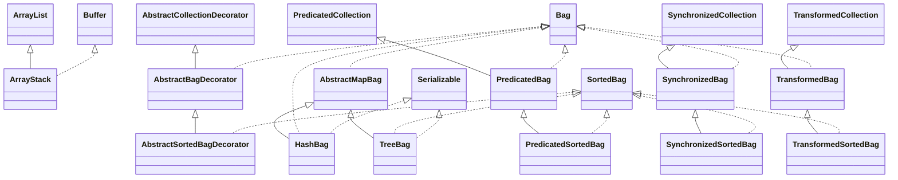

# commons-collections-3.2.1.jar

[Group index](README.md) | [All archives](../README.md)

## Scope and provenance

- **Donor:** `SQX_145_REFERENCE_ROOT/internal/libs/commons-collections-3.2.1.jar`.
- **SHA-256:** `87363a4c94eaabeefd8b930cb059f66b64c9f7d632862f23de3012da7660047b`; accessed 2026-10-06; captured `2026-10-06T18:54:51.906614+00:00`.
- **Classes:** 458 raw entries; 458 unique entry names. Duplicate occurrence indices are zero-based.
- **Inspection:** read-only ZIP hashing and class-file structural parsing; signatures/descriptors, modifiers, hierarchy and references only. Bytecode bodies are hashed, not published.
- **Allocation:** proposed `FEAT-HOST-COMMONS-COLLECTIONS`, P01; [roadmap](../../dev/sqx-full-application-roadmap.md). Domain README registration remains required.
- **Repository:** `01067f00031428613c6394064ca1bcadc1ba00ee`; review state unreviewed. Download label 145-dev1; installed build/activation and runtime equivalence unverified.
- **Limit:** every class/member is inventoried; declaration coverage does not establish consumed calls, defaults, formulas, failure semantics or algorithm parity.
- **Archive/resource index:** [016.json](../../dev/evidence/sqx145/archives/145/016.json).

## Complete member declarations

Member shards contain exact JVM names/descriptors, access flags, generic signatures, throws types, declared fields/methods, superclass/interfaces and referenced class names. All classes, nested/synthetic members and overloads are retained. Code length/hash is structural evidence, not a normalized algorithm comparison.

- [001.json](../../dev/evidence/sqx145/members/016/001.json) — SHA-256 `0407ffce521d157e83b2cfc66d77778c936cc0d708527077943dca273414ba6d`.
- [002.json](../../dev/evidence/sqx145/members/016/002.json) — SHA-256 `8cee96f434f2f5523b8bc1cb9bf4cc1d8f52d89c5523301cc1682e280de381f8`.
- [003.json](../../dev/evidence/sqx145/members/016/003.json) — SHA-256 `2ceff42f54bacdae432cfed69412b400f9fd769f9324fc1bb104a2a2fdda3e42`.
- [004.json](../../dev/evidence/sqx145/members/016/004.json) — SHA-256 `ebe4283c28e36868a3bf936e4b9d24c1c27b02650622e621fb087120cf594429`.
- [005.json](../../dev/evidence/sqx145/members/016/005.json) — SHA-256 `3464ba0170ce46bc042852d829d62f4ec1059522500477392eda060ccfb00293`.
- [006.json](../../dev/evidence/sqx145/members/016/006.json) — SHA-256 `e27c7688e7e087112c0c0c7cc8a9a07a946685cbdacdeb1273533b127d65dd59`.

## Focused structural diagram

Up to twelve non-nested classes; arrows show declared inheritance/interfaces only. External type names are not evidence of an available body or an executed dependency.

## Class inventory

| Archive entry | Occurrence | Class SHA-256 | Fields | Methods |
| --- | ---: | --- | ---: | ---: |
| `org/apache/commons/collections/ArrayStack.class` | 0 | `e9a3b5a1e837c72a96d506f2de9e1290edfad2e574229eacc730f3add672f66d` | 1 | 10 |
| `org/apache/commons/collections/bag/AbstractBagDecorator.class` | 0 | `ca3574849c44ce1327e215293e3c416d7e837d8de5da74a92053be88e5635f8b` | 0 | 7 |
| `org/apache/commons/collections/bag/AbstractMapBag$BagIterator.class` | 0 | `55aad687ae1fe68e4346fd4006d79cb20e6793475aba29daab2c42661690c642` | 6 | 4 |
| `org/apache/commons/collections/bag/AbstractMapBag$MutableInteger.class` | 0 | `f6a18d936b2dc54655f47e2e8eb16d32f2f8857ae4ac689a4dfb82112c6f0cac` | 1 | 3 |
| `org/apache/commons/collections/bag/AbstractMapBag.class` | 0 | `8dee43b571c30322a39b530e54e37a246f36c7c3644b88d73f2cbdcbf068d2f8` | 4 | 30 |
| `org/apache/commons/collections/bag/AbstractSortedBagDecorator.class` | 0 | `3bb89be1f2af87aa8a5d2879a800fb0ef06eceef2fd0e61cf87fe00f472adc68` | 0 | 6 |
| `org/apache/commons/collections/bag/HashBag.class` | 0 | `a900a29d950e8f4a11588b0f30bcd671b7131a689083e1485ced5ed4eed1daaa` | 1 | 4 |
| `org/apache/commons/collections/bag/PredicatedBag.class` | 0 | `0d0698b2178e28c8b7c3680ac9d994c1562718d3ab85afb3897db474c2f26ccb` | 1 | 7 |
| `org/apache/commons/collections/bag/PredicatedSortedBag.class` | 0 | `88c237feac9fe2ed4a7eb41b4c69168303cdf0a700bb5013e2b876711015b8d4` | 1 | 6 |
| `org/apache/commons/collections/bag/SynchronizedBag$SynchronizedBagSet.class` | 0 | `ab8b7dadebe73e0b1a2cee00d420aceed2d0fdb7a0e6c82c8622540fc82161c3` | 1 | 1 |
| `org/apache/commons/collections/bag/SynchronizedBag.class` | 0 | `cad14788892c297f49486bb02270277a4f7a66dd0d5ce878ab7fc2b7c07e6c1a` | 1 | 8 |
| `org/apache/commons/collections/bag/SynchronizedSortedBag.class` | 0 | `54325a942d5bd4a090bd7784666c25136c042c1d0f5629022656faa3552f7cf3` | 1 | 7 |
| `org/apache/commons/collections/bag/TransformedBag.class` | 0 | `e9c7be8dc2fa20d072cfd779bbf22dcb7e18ae2dc85907cf1d7e284de16b9a17` | 1 | 7 |
| `org/apache/commons/collections/bag/TransformedSortedBag.class` | 0 | `f3d1a8c04da9ff2ee71d426420ff4fd3fb0060b10071f257f144f61cd57fc565` | 1 | 6 |
| `org/apache/commons/collections/bag/TreeBag.class` | 0 | `8c603dfbecc13952b9435a4ff625d1c341820f1d4d74612ac429e975860d24ed` | 1 | 8 |
| `org/apache/commons/collections/bag/TypedBag.class` | 0 | `eac484b71d17daadc0bfbbbf4c742644197bfe68f1ec3f558867c40cbeb9ee76` | 0 | 2 |
| `org/apache/commons/collections/bag/TypedSortedBag.class` | 0 | `6beb07f463a6a60d1fd6a347156576dab27d3aef2226eeb7b070ac0154b0686a` | 0 | 2 |
| `org/apache/commons/collections/bag/UnmodifiableBag.class` | 0 | `5e04e673a40202795617cb3629599de5abecc89ce0d3d5c29bcd0b1f28ebf152` | 1 | 14 |
| `org/apache/commons/collections/bag/UnmodifiableSortedBag.class` | 0 | `c8834383f0e3c4b355d8ae30415242c69f5e2bfc6a405a3483ee02e6bd5d10b9` | 1 | 14 |
| `org/apache/commons/collections/Bag.class` | 0 | `dd6ca5aa0adb0f4ded0be77c835ea841c49a49a35ae9cce1ea6854fd64099e29` | 0 | 11 |
| `org/apache/commons/collections/BagUtils.class` | 0 | `9adb352da19e30ed5b490543c4ad4c535d688b2f7b8c849cb15a5f9391a70071` | 2 | 12 |
| `org/apache/commons/collections/BeanMap$1.class` | 0 | `738e5c287e65e1d252d9792d89c736d6d61e98e9f04075fc4e923442ca047ff3` | 0 | 2 |
| `org/apache/commons/collections/BeanMap$10.class` | 0 | `adb73f0cb2b3bde611011292b06d6080ac5164b72e3d82017f7865c7e94bc190` | 2 | 4 |
| `org/apache/commons/collections/BeanMap$11.class` | 0 | `9a24348ca8f61a27072e0493432501da1c3ad398d061fcc526ca3384bf07c27f` | 2 | 4 |
| `org/apache/commons/collections/BeanMap$2.class` | 0 | `353f964ce90ce61ef5a0e2ff4d25d9795fb92defa5a6a028fd1143827827fae5` | 0 | 2 |
| `org/apache/commons/collections/BeanMap$3.class` | 0 | `bd54f3d46e8670702aafcf37728463f0811138acc41a5b2f1f213087f5891658` | 0 | 2 |
| `org/apache/commons/collections/BeanMap$4.class` | 0 | `c87ed08a6d7687f4b17d073eb350d1f95cfdfe4f98dcf854a2de295f7bb161b6` | 0 | 2 |
| `org/apache/commons/collections/BeanMap$5.class` | 0 | `d21f96666538ab2bafb5475791087b41dbf9907daf236c4bffbdaef6285f2d2e` | 0 | 2 |
| `org/apache/commons/collections/BeanMap$6.class` | 0 | `e0c19cb044f2309cbf4b9e3b7d107bb2a915c789580a9758b244c2bef26a1b1d` | 0 | 2 |
| `org/apache/commons/collections/BeanMap$7.class` | 0 | `46f0a02f3750ee3e6cc19a2481ff19235e5e2bffc574c1fcbe74815662f6b97d` | 0 | 2 |
| `org/apache/commons/collections/BeanMap$8.class` | 0 | `6942d1d5cdc3538c24465956250798d51859c722cc3e6b8b411e538963a4dcb8` | 0 | 2 |
| `org/apache/commons/collections/BeanMap$9.class` | 0 | `a561f3b1c1a4b006b9c8d622b458e4cde9a6ba6c90b9d9274d4a3ce12bab42bc` | 1 | 3 |
| `org/apache/commons/collections/BeanMap$MyMapEntry.class` | 0 | `66d36335d9b3c91075dfd1a621e959e61a8f7c178d40542b04469a3b4c6e3005` | 1 | 2 |
| `org/apache/commons/collections/BeanMap.class` | 0 | `ad73bfa538622ced505fab37fb8260adae2ee9ab8f8c733ae2017918f80affaf` | 6 | 34 |
| `org/apache/commons/collections/bidimap/AbstractBidiMapDecorator.class` | 0 | `fcdb133b30efc39aaf0e716c5876cde3449ba99089fbc5f35fac866381bc72c0` | 0 | 6 |
| `org/apache/commons/collections/bidimap/AbstractDualBidiMap$BidiMapIterator.class` | 0 | `063b79bcc1da12e67d75519024242474b5984ae411529f900617d31fe7e8c4d2` | 4 | 9 |
| `org/apache/commons/collections/bidimap/AbstractDualBidiMap$EntrySet.class` | 0 | `35e94441e27e5af96dbd0e2dcea0783f93ab63224dfb5fc1c8b124077dee7266` | 0 | 3 |
| `org/apache/commons/collections/bidimap/AbstractDualBidiMap$EntrySetIterator.class` | 0 | `a48d5196ff5b03d740360b02ccf868074951382c12514add8c73eaf3c366d7ce` | 3 | 3 |
| `org/apache/commons/collections/bidimap/AbstractDualBidiMap$KeySet.class` | 0 | `853814606f89606366a2aaf86cb31aaaf15c1b2ad0b1b88db86582d8e99cc1d3` | 0 | 4 |
| `org/apache/commons/collections/bidimap/AbstractDualBidiMap$KeySetIterator.class` | 0 | `21dc2609ca79a29382150eaeb45a419615d7f3a3b6bc2395f80c589ecaf65981` | 3 | 3 |
| `org/apache/commons/collections/bidimap/AbstractDualBidiMap$MapEntry.class` | 0 | `8e58630a610141f9df131ab1f680df1d9b287086e99d46bcf7ac20ca2a3c4cfc` | 1 | 2 |
| `org/apache/commons/collections/bidimap/AbstractDualBidiMap$Values.class` | 0 | `8554c2aae0b3b670d84e956106b230719f16ad00eeea483553f41a03e5549b8a` | 0 | 4 |
| `org/apache/commons/collections/bidimap/AbstractDualBidiMap$ValuesIterator.class` | 0 | `9ca4d7fe6f62c917189e26fbe3366f697034eaa76a0250ee6396e8ccb151b4fe` | 3 | 3 |
| `org/apache/commons/collections/bidimap/AbstractDualBidiMap$View.class` | 0 | `c8b01e807477ae7627a13b7022d077ee7f75c24cae06ebff6597a15e351c51dc` | 1 | 4 |
| `org/apache/commons/collections/bidimap/AbstractDualBidiMap.class` | 0 | `a07405239557a5aeed1791af4f91578551ccb20fbf71a53793138a17c4948589` | 5 | 27 |
| `org/apache/commons/collections/bidimap/AbstractOrderedBidiMapDecorator.class` | 0 | `2fcd505f541601eb74af5af67901ee146f3e579c3f05b3c8d1ef8bb32c4c8f83` | 0 | 8 |
| `org/apache/commons/collections/bidimap/AbstractSortedBidiMapDecorator.class` | 0 | `ebdf3ddd8d93c5d4ff9853b635c8bc5cd2cec651a148a15074ff991a34c5ee79` | 0 | 7 |
| `org/apache/commons/collections/bidimap/DualHashBidiMap.class` | 0 | `7d060e16abc8c05e743e9c62b4a2e0e68259401e6f7056ad0d39e10cc5f76c15` | 1 | 6 |
| `org/apache/commons/collections/bidimap/DualTreeBidiMap$BidiOrderedMapIterator.class` | 0 | `4118206489451712b9d2283eeb25da8fe06bffb7fe8d614c4f797d6772188f15` | 3 | 11 |
| `org/apache/commons/collections/bidimap/DualTreeBidiMap$ViewMap.class` | 0 | `7b6f4ec6f7ad565fd24514734417b7e8ec6ea9bdf34005587835da9bf90119b7` | 1 | 6 |
| `org/apache/commons/collections/bidimap/DualTreeBidiMap.class` | 0 | `059e4e2d1036e5419258d5bba260f9db967b6cd6ada49ec21783eff2ca7abe58` | 2 | 18 |
| `org/apache/commons/collections/bidimap/TreeBidiMap$EntryView.class` | 0 | `d87858df84efca6338551d2104abeeb3de4957d49b6af4f17abc24ac029a88f5` | 1 | 3 |
| `org/apache/commons/collections/bidimap/TreeBidiMap$Inverse.class` | 0 | `1f4ee6ca3fba30146b2b15951a5a4459d295fea27f504dc27d023121a1fa156f` | 4 | 26 |
| `org/apache/commons/collections/bidimap/TreeBidiMap$Node.class` | 0 | `657ff4b257e96a124aed7968b4a7eee4795a84e49473cfb0c9e6080349c2aff0` | 7 | 32 |
| `org/apache/commons/collections/bidimap/TreeBidiMap$View.class` | 0 | `1bf74c493d4bd21724f5863a12979277414dd6fa6d284e3488952d91e9e2d294` | 3 | 6 |
| `org/apache/commons/collections/bidimap/TreeBidiMap$ViewIterator.class` | 0 | `59c094599202a20979c59c0f95cb55cda2692991125a2fdab6e636e35550ea7b` | 7 | 7 |
| `org/apache/commons/collections/bidimap/TreeBidiMap$ViewMapIterator.class` | 0 | `2ceb422abf0a3c2903f8e2381b5d3c07d4314924c44bfd39e167178933e0c210` | 1 | 4 |
| `org/apache/commons/collections/bidimap/TreeBidiMap.class` | 0 | `9a08fa805bffbc802887d00cd1308cbffa789846382cc7b20ff62a27b7716698` | 15 | 83 |
| `org/apache/commons/collections/bidimap/UnmodifiableBidiMap.class` | 0 | `ec4abb10bbec4b36ea400ec319fdebc5ea822b694e63b303bb0ce0336556a830` | 1 | 12 |
| `org/apache/commons/collections/bidimap/UnmodifiableOrderedBidiMap.class` | 0 | `62cec61e58036d181c6cfc6ef829dea8e89a08df669248a17c019f3c3206dda5` | 1 | 14 |
| `org/apache/commons/collections/bidimap/UnmodifiableSortedBidiMap.class` | 0 | `2b2bc559aec289c8f36410f32ffa8316261340b533de8881fe16dfc9ce90e3b1` | 1 | 18 |
| `org/apache/commons/collections/BidiMap.class` | 0 | `cb14cc19daec080a194e8285abec196b78648547aed9700149ce3fbb53760a80` | 0 | 5 |
| `org/apache/commons/collections/BinaryHeap$1.class` | 0 | `59deb574d0e82b6ba20b9f2fad3e3277b86fce647e96a260a796a86262274b27` | 3 | 4 |
| `org/apache/commons/collections/BinaryHeap.class` | 0 | `e7c5531e9c7932053d13dffa3ef435e8e6cf32ed2cfa9ee15fc3a655bbb25e2b` | 5 | 29 |
| `org/apache/commons/collections/BoundedCollection.class` | 0 | `f0f42c563119efcb0a881efa7a764c7450ecdff0a80d7635ddac2e9aa9128b24` | 0 | 2 |
| `org/apache/commons/collections/BoundedFifoBuffer$1.class` | 0 | `6e1dfd973b1641c824f1e02b7c7ecbf77cee6ad4f3d7f8c630df5a581d769fa1` | 4 | 4 |
| `org/apache/commons/collections/BoundedFifoBuffer.class` | 0 | `34366948e08d8e894b0cb4f557894e558f95c96262e00878053c4f05be8d9d0d` | 5 | 23 |
| `org/apache/commons/collections/BoundedMap.class` | 0 | `d46ff3f37e0bb518ee93bcfc91ef5e12ccdba8b9b908964e720aea20a5b5c493` | 0 | 2 |
| `org/apache/commons/collections/buffer/AbstractBufferDecorator.class` | 0 | `b607b9edab355bc94411636c43812b4b48a97c331a644adde6eac4b6f50c3643` | 0 | 5 |
| `org/apache/commons/collections/buffer/BlockingBuffer.class` | 0 | `75976e8a7575d24f1e931735fa3c01b7b130aef45a1913ba37c15ca41ab969b3` | 2 | 10 |
| `org/apache/commons/collections/buffer/BoundedBuffer$NotifyingIterator.class` | 0 | `c962fb9d092dc13fbae2f4009763052d5ec304d8be10ac0af9b4d59af88382b2` | 1 | 2 |
| `org/apache/commons/collections/buffer/BoundedBuffer.class` | 0 | `5ab622a0c1286da224102e5f0f2fc750922187b7498233bce457364228b28242` | 3 | 12 |
| `org/apache/commons/collections/buffer/BoundedFifoBuffer$1.class` | 0 | `762a687932a541cc9682a2c5f7c775b337a50665bfeafb8c3e30a0ef6a6a4f5f` | 4 | 4 |
| `org/apache/commons/collections/buffer/BoundedFifoBuffer.class` | 0 | `b36789ee14e6264ae865dc4102fb5680d30e7865e3dd652271f8c37e497ee989` | 6 | 25 |
| `org/apache/commons/collections/buffer/CircularFifoBuffer.class` | 0 | `c99a434e31a343a0ff3936cd9481c96a9ac07e42e4ad6a702226c144a2da616d` | 1 | 4 |
| `org/apache/commons/collections/buffer/PredicatedBuffer.class` | 0 | `0513eafa011a09b230dfd5c4b58f6a5c758c71052c49f67149b5a7ee0232234d` | 1 | 5 |
| `org/apache/commons/collections/buffer/PriorityBuffer$1.class` | 0 | `2a9a5d7ab32d1a068aa2f7e4ed6f22349fdce2d9591510130d6ee2c86ace158e` | 3 | 4 |
| `org/apache/commons/collections/buffer/PriorityBuffer.class` | 0 | `6cf61b9c99079462b173d24a197db61c8c2a5bd753f3121ca5f6aeaa4f326e5f` | 6 | 26 |
| `org/apache/commons/collections/buffer/SynchronizedBuffer.class` | 0 | `2310642e7e10bae6d0c2510cec3f401c8854e6034720ad9ea6bddf3bdc6f0187` | 1 | 6 |
| `org/apache/commons/collections/buffer/TransformedBuffer.class` | 0 | `2b09e8a915e05ef3116af00e141f2279cbac2971b71b2082fa7de0cbc19c81b8` | 1 | 5 |
| `org/apache/commons/collections/buffer/TypedBuffer.class` | 0 | `670c63fe182b208c7dbe0077be467cc86b5d6df511f6f3fd7ae505ae212d75b5` | 0 | 2 |
| `org/apache/commons/collections/buffer/UnboundedFifoBuffer$1.class` | 0 | `c752292a15864fb41620e55971fb4adbf300d02bc90205e8cda50bfbcdf2ebb3` | 3 | 4 |
| `org/apache/commons/collections/buffer/UnboundedFifoBuffer.class` | 0 | `084148d655283b50bbbf52597ed1019733e347b4cf1219b33e382dc8e45c2a16` | 4 | 14 |
| `org/apache/commons/collections/buffer/UnmodifiableBuffer.class` | 0 | `9d4ae840daa8679feb8c39661f9a6bb67fad8ad3dfdee547cdb6dde675b7bf20` | 1 | 12 |
| `org/apache/commons/collections/Buffer.class` | 0 | `69218ebc92f9fd3aefce630c78983dfe6c31d4fb547d72effb65e58979a626d5` | 0 | 2 |
| `org/apache/commons/collections/BufferOverflowException.class` | 0 | `02a342c9d23501f2787fe733665474c354a6a670fdda01cb40ae0e54de6126e8` | 1 | 4 |
| `org/apache/commons/collections/BufferUnderflowException.class` | 0 | `f19bc3645fa2bd740c5c43b1344c7ec43ee6a6961a91585ffa79175fa85fcaf4` | 1 | 4 |
| `org/apache/commons/collections/BufferUtils.class` | 0 | `0de804ec61ab1f3c6782d0b77f1f1b7530f996246a3762b48a140fa4cbb40b9b` | 1 | 11 |
| `org/apache/commons/collections/Closure.class` | 0 | `4dff2eb4d31148dd1886f3b23ec02d1eb118f2dc6c661df4fa326ace48fcd910` | 0 | 1 |
| `org/apache/commons/collections/ClosureUtils.class` | 0 | `c29b1447dd0f3b959e8619ecdf81ea1d4f77c371726b9e7ffe32ea710066782f` | 0 | 18 |
| `org/apache/commons/collections/collection/AbstractCollectionDecorator.class` | 0 | `9470ba19679f76b82abc10a04b7d0cf2cb5163055fe5c14f4dfc6cdf6843db95` | 1 | 19 |
| `org/apache/commons/collections/collection/AbstractSerializableCollectionDecorator.class` | 0 | `e4229c373191e3b64ed087d77e773582656f6459d725aa7d93d53a2b3561dee9` | 1 | 3 |
| `org/apache/commons/collections/collection/CompositeCollection$CollectionMutator.class` | 0 | `b9f72af966aa5476e0591b70be5b0f01f86d824e3be72c6575f3c7952584333a` | 0 | 3 |
| `org/apache/commons/collections/collection/CompositeCollection.class` | 0 | `5c6bc161aab582a2a20fdf00ab14443fb5d2f25e257596fe56e4a2072b856c46` | 2 | 23 |
| `org/apache/commons/collections/collection/PredicatedCollection.class` | 0 | `9edcc46ac8c75e6c6e49fe7fdc41e2ce296eba8564b12cef6ddbb50644b7002c` | 2 | 5 |
| `org/apache/commons/collections/collection/SynchronizedCollection.class` | 0 | `1597ab244379707018edd8b561a850afa8755fe85c45d5ef07f517b3ad507725` | 3 | 19 |
| `org/apache/commons/collections/collection/TransformedCollection.class` | 0 | `565d6c5fa07fead49452559ca4f10dfe9c8abf299611f429c789c1788dcc5f62` | 2 | 6 |
| `org/apache/commons/collections/collection/TypedCollection.class` | 0 | `f7aa41b76483a7b27997be3e923f073ef85fd4307c7f2a3fd390a6403ccf7480` | 0 | 2 |
| `org/apache/commons/collections/collection/UnmodifiableBoundedCollection.class` | 0 | `18df67fe8969f44c588762eafec7bce138bc3ecea192950be276cbe8376af18f` | 1 | 12 |
| `org/apache/commons/collections/collection/UnmodifiableCollection.class` | 0 | `cf0f9f0e205c829cc52a441fa2d7e110a78bf6f90d07c0e54d5b7eadf7c01c3f` | 1 | 9 |
| `org/apache/commons/collections/CollectionUtils.class` | 0 | `62f346e7ecfc7105c7f16655cb668a34b98117c2108ab7655f762ff3fe3f9684` | 2 | 49 |
| `org/apache/commons/collections/comparators/BooleanComparator.class` | 0 | `daf27dfc90178a9d4a60758edf2654e0775ede4cc52157158a4302663df68c54` | 4 | 11 |
| `org/apache/commons/collections/comparators/ComparableComparator.class` | 0 | `ad858b4305ee81183c292b8ad433c25d0873f1d31bea9b70b8daf773d507c928` | 2 | 6 |
| `org/apache/commons/collections/comparators/ComparatorChain.class` | 0 | `b4aef6cde26065b413b69cfc78be66526404f01c84baa080e1557cd91765f3a5` | 4 | 18 |
| `org/apache/commons/collections/comparators/FixedOrderComparator.class` | 0 | `4f90cedb5875b6b6eccc56798d7f8e1e4b210d49350a1e1a5ed2656cbeed0154` | 7 | 10 |
| `org/apache/commons/collections/comparators/NullComparator.class` | 0 | `0acf3fea5fcbe71bb62a5fa66d637f331a02646636dba59fd0700faa78b3d754` | 3 | 7 |
| `org/apache/commons/collections/comparators/ReverseComparator.class` | 0 | `bb49fb2bd904f0618e1dcbddc6981a4f84fb12fe90c4fa46a130861018d6ca86` | 2 | 5 |
| `org/apache/commons/collections/comparators/TransformingComparator.class` | 0 | `66903de3a30c6e40555bcea8bbc03e80103de7e8dff987a8d3dad03ee7799623` | 2 | 3 |
| `org/apache/commons/collections/ComparatorUtils.class` | 0 | `237712fd52a3416c2f5e1d44c66dd050bc889ac692e64501d3c75e4e64d83c0d` | 1 | 13 |
| `org/apache/commons/collections/CursorableLinkedList$Cursor.class` | 0 | `d3f9cf22a691178b874b2b3b0e4c82a117d2c9f7139cf96831a772991023875e` | 2 | 10 |
| `org/apache/commons/collections/CursorableLinkedList$Listable.class` | 0 | `d87bd27e66539988e85946d384ccc9ad0b53585fb48f17e64e0c8b9fe9ee2c10` | 3 | 7 |
| `org/apache/commons/collections/CursorableLinkedList$ListIter.class` | 0 | `64bd7c9ceac06758b9802b3384cf231fdf84069e36f07a60dea35bbe776a7272` | 5 | 11 |
| `org/apache/commons/collections/CursorableLinkedList.class` | 0 | `415085d7110ac0662c0462ad4e5f4918adcb435bf3a58ffbc83a108c4df98945` | 5 | 46 |
| `org/apache/commons/collections/CursorableSubList.class` | 0 | `c83ab20ecc3c04719ac9b64a1387b233e0bb775ce8ebca57ea30da2decdf576d` | 3 | 35 |
| `org/apache/commons/collections/DefaultMapBag$BagIterator.class` | 0 | `bd4d7526861974cb714b828b2e2e041eb804cfb3a6d04de14ddbb5bce72d2fe6` | 4 | 4 |
| `org/apache/commons/collections/DefaultMapBag.class` | 0 | `f32614a0409fec018f9f6c44d6c595d1393330152150b043d9701c039cb11980` | 3 | 30 |
| `org/apache/commons/collections/DefaultMapEntry.class` | 0 | `77946ad643bf8c46407413e478fbed5d14a6b5a19682d9cb84ea625bfcb212e2` | 2 | 10 |
| `org/apache/commons/collections/DoubleOrderedMap$1$1.class` | 0 | `1b8f8cdac9a024d69bace72bda970898e469d0d336d111166caa8a816e9b89b7` | 1 | 2 |
| `org/apache/commons/collections/DoubleOrderedMap$1.class` | 0 | `4b037b98a30dd28ebb69c32c7b74a35422710444cd5a3ac13c3f60a6f2a729b0` | 1 | 7 |
| `org/apache/commons/collections/DoubleOrderedMap$2$1.class` | 0 | `c82b25a9a82b1bd77740c97ff87cec979660949de07584781c3170325368074d` | 1 | 2 |
| `org/apache/commons/collections/DoubleOrderedMap$2.class` | 0 | `f0de4d18907d1e83a2ea87c39aad470f1d58d4876b4c38f87a9a218d07953108` | 1 | 7 |
| `org/apache/commons/collections/DoubleOrderedMap$3$1.class` | 0 | `ab738ffd05d744cfe58ad0bd5f2006c4ef5395c29ee89af1427fc0772216a061` | 1 | 2 |
| `org/apache/commons/collections/DoubleOrderedMap$3.class` | 0 | `cf05f08d58b9682a56a79f609334001082439168fb9b3974d81c355601a6c4e0` | 1 | 8 |
| `org/apache/commons/collections/DoubleOrderedMap$4$1.class` | 0 | `aba0221381d55e49f120a21bf14e0009a79d0e050ab765797c1af30eca308828` | 1 | 2 |
| `org/apache/commons/collections/DoubleOrderedMap$4.class` | 0 | `fe85c47405e29adc16fe6029c9b8f3953b871dff9fc6b2a1fda96aed93ea21b6` | 1 | 7 |
| `org/apache/commons/collections/DoubleOrderedMap$5$1.class` | 0 | `36a6062b4bf8a3e529f530287fa08a62f93f1e412de64527ae648801c6cdfb4a` | 1 | 2 |
| `org/apache/commons/collections/DoubleOrderedMap$5.class` | 0 | `698e144d11d925811e723bdc645d1d71189493ac1760a5f8dcec4bfec54e8f88` | 1 | 8 |
| `org/apache/commons/collections/DoubleOrderedMap$6$1.class` | 0 | `4a42e1f4c6ee63f8c600b426f02dc3145031cc5c63254b98874187b199e2d5ba` | 1 | 2 |
| `org/apache/commons/collections/DoubleOrderedMap$6.class` | 0 | `414aa974b2a110db7c5588219fa144ad469bdf854dd31296d0a028e6f82f52b3` | 1 | 7 |
| `org/apache/commons/collections/DoubleOrderedMap$DoubleOrderedMapIterator.class` | 0 | `72d51ea79fcb4cd5e51f0177d9c83b42d6530890813227bbccc36b1c6ca6d039` | 5 | 5 |
| `org/apache/commons/collections/DoubleOrderedMap$Node.class` | 0 | `4f70aeaa6cefa82084d190ea136c9fcc68c182c72861f0366531017e4b48eae2` | 7 | 32 |
| `org/apache/commons/collections/DoubleOrderedMap.class` | 0 | `ac1c583d810670e48bdc99a88b59938a43062a31253e5f3bbd971ba6376db74e` | 12 | 57 |
| `org/apache/commons/collections/EnumerationUtils.class` | 0 | `8c33fe83b97b3aeeed921bfb904986ceb4887186d47db6e5d34b1777a55af1f7` | 0 | 2 |
| `org/apache/commons/collections/ExtendedProperties$PropertiesReader.class` | 0 | `e770e7319d41f16003622f5834a2d0fda83be6acabeb899ecd1294097896b27d` | 0 | 2 |
| `org/apache/commons/collections/ExtendedProperties$PropertiesTokenizer.class` | 0 | `712efa30a20a4e1f327829942cc290b65e3cc9691e76101c2d9d11fec44c2ed5` | 1 | 3 |
| `org/apache/commons/collections/ExtendedProperties.class` | 0 | `f8511027dcd2895e426069eb5d3c529bbd6dbcfe93e802087c28f57a27e615dd` | 9 | 62 |
| `org/apache/commons/collections/Factory.class` | 0 | `c6e560e2a5c76b79821d0b41a1ee0f31b8d925f282ecf2de42f822ee37b3ec21` | 0 | 1 |
| `org/apache/commons/collections/FactoryUtils.class` | 0 | `0e1f97ac7b72da2e70cac38ebf109015783b8aa2320e03df4973bac63d4a3753` | 0 | 7 |
| `org/apache/commons/collections/FastArrayList$ListIter.class` | 0 | `61ff1d066fd1322254487494f60fd3e350737dfffbb0140fcf4ee8192fc5dea7` | 4 | 12 |
| `org/apache/commons/collections/FastArrayList$SubList$SubListIter.class` | 0 | `bc80ba69c8e857d085b3d2f171451975cfa9064e86ffb9e54602b71b07d8b56f` | 4 | 12 |
| `org/apache/commons/collections/FastArrayList$SubList.class` | 0 | `8eb7467d2cbbb31307070a1cc1c73642884f1b638a1f83a1b580e634cd876d0e` | 4 | 31 |
| `org/apache/commons/collections/FastArrayList.class` | 0 | `0d1a3eb9d92de9cda8b8aa3a82f505a0d8908431ef0b13de8a4bac7352bb1a4b` | 2 | 34 |
| `org/apache/commons/collections/FastHashMap$1.class` | 0 | `ce19d402c42328b990bceb79d14622ced19822d691f9b73af009468e55ccf0b0` | 0 | 0 |
| `org/apache/commons/collections/FastHashMap$CollectionView$CollectionViewIterator.class` | 0 | `a9284eca50d60a968a186916290ac1d87ef7454746221c1e8f6c950ef53b8d0b` | 4 | 4 |
| `org/apache/commons/collections/FastHashMap$CollectionView.class` | 0 | `6e10f4a4f4665602e4168b273bc11466300e71aa2eea1feff8504fca2763f312` | 1 | 19 |
| `org/apache/commons/collections/FastHashMap$EntrySet.class` | 0 | `b959ede4b6bfbd2a3c3865df9d00f2d9908365d0752a6a39f6f3a2f7ddb8f665` | 1 | 4 |
| `org/apache/commons/collections/FastHashMap$KeySet.class` | 0 | `ef971d0eeec50763d2ddd98d52ee9456a447972a2af4fa7933a32149e617435a` | 1 | 4 |
| `org/apache/commons/collections/FastHashMap$Values.class` | 0 | `0e21e501ad37689cdd2100f1d13c43a37f18d8134be1520567132ab7dd571d0f` | 1 | 4 |
| `org/apache/commons/collections/FastHashMap.class` | 0 | `966537528da4c84cd5d23ddd167f1371aa095aa699e111c7e9066f125aa200da` | 2 | 21 |
| `org/apache/commons/collections/FastTreeMap$1.class` | 0 | `9237a43f0c7d5041fd60de306fe472f170403c66715c3b7e94103a75e2be8aff` | 0 | 0 |
| `org/apache/commons/collections/FastTreeMap$CollectionView$CollectionViewIterator.class` | 0 | `d09dfd2616bb3e6b394557ce0a264475405f48a3c5aa3a2181a9a24a7ae7b718` | 4 | 4 |
| `org/apache/commons/collections/FastTreeMap$CollectionView.class` | 0 | `ce6076b1a309e8a9ab5d82d346a0608928d03b0dd9aae11ca796cdacd05332e8` | 1 | 19 |
| `org/apache/commons/collections/FastTreeMap$EntrySet.class` | 0 | `2c71f70038e58e7ccfdc07a510a50eee362b5b52e780c4a71079339d1ad9d2d5` | 1 | 4 |
| `org/apache/commons/collections/FastTreeMap$KeySet.class` | 0 | `9a5155bfbe96f3b20ab7cb36bebc22d278f4b8ae3e504bb1dc8c78a20aac220f` | 1 | 4 |
| `org/apache/commons/collections/FastTreeMap$Values.class` | 0 | `1e206befbc1fdad8d274402b5e239451ba999b0188c74043468fa31620e98ba8` | 1 | 4 |
| `org/apache/commons/collections/FastTreeMap.class` | 0 | `16c6ef8cef453ae1074ca87355232b78cf2dbe646f8143fe0dd54f4a5c19e3b8` | 2 | 27 |
| `org/apache/commons/collections/FunctorException.class` | 0 | `e63c12200605d1b0ca30529aab84c46066d9a1b8711ae66b384a6b23cbfdd0d7` | 3 | 10 |
| `org/apache/commons/collections/functors/AllPredicate.class` | 0 | `19fa23272414e4b7531fc0161fa02d8c27547b16d5fdb3b110298125406bd756` | 2 | 5 |
| `org/apache/commons/collections/functors/AndPredicate.class` | 0 | `b24f03fca76def5fbf96f5902a6210361179f93419b5de6b248143056d58aa80` | 3 | 4 |
| `org/apache/commons/collections/functors/AnyPredicate.class` | 0 | `cdf25e6c6c58e5c30dbc0b225f59c1ec2e398257f259106e925aa71733b846e1` | 2 | 5 |
| `org/apache/commons/collections/functors/ChainedClosure.class` | 0 | `c6e17798cf527b167f7409a08b5e0fad3b822b71c19b113b1b935d0849eff7ec` | 2 | 6 |
| `org/apache/commons/collections/functors/ChainedTransformer.class` | 0 | `df29206569ed53e8b8af080b9b21108b34fca5acc0ab0f441a4e50a7f672751b` | 2 | 6 |
| `org/apache/commons/collections/functors/CloneTransformer.class` | 0 | `00294934e892279930eab3cde6f82ea01d71b7c875071fdbf56dff0eb6f5b7d8` | 2 | 4 |
| `org/apache/commons/collections/functors/ClosureTransformer.class` | 0 | `1f53c70ae6a162f176840e946fc82260fa418b717cc08087d8fb61a7612a0a1f` | 2 | 4 |
| `org/apache/commons/collections/functors/ConstantFactory.class` | 0 | `33cce2e9a6e8ad73c35480383dd05ff47401b7d820171aa426864005a9e4ef66` | 3 | 5 |
| `org/apache/commons/collections/functors/ConstantTransformer.class` | 0 | `06611f9f8b9c351f7546ef1b0de79579b6e761655b7a97b99310abf2aa354e35` | 3 | 5 |
| `org/apache/commons/collections/functors/EqualPredicate.class` | 0 | `0717a0779294d5ede37e9a5b39187121c24a36cbcb8d55a95c719b1d81940769` | 2 | 4 |
| `org/apache/commons/collections/functors/ExceptionClosure.class` | 0 | `9a8dee218f29128b0e7f1ea62ab4bf8299fdc2d7862d2404712326c63214afae` | 2 | 4 |
| `org/apache/commons/collections/functors/ExceptionFactory.class` | 0 | `7ca698f67f942a6824649572286bcceb51d7b6a976bf8ec136b3006625dedc14` | 2 | 4 |
| `org/apache/commons/collections/functors/ExceptionPredicate.class` | 0 | `b7ffe974efd68c8ec691168242f1356028f941ceb57edee4269ec40515dc68cf` | 2 | 4 |
| `org/apache/commons/collections/functors/ExceptionTransformer.class` | 0 | `3bfae4821bbebf8a6061ad73249506a644ceaa0c227304fb2aa53a315cc33e8d` | 2 | 4 |
| `org/apache/commons/collections/functors/FactoryTransformer.class` | 0 | `ba23421447486969bf5b8deef266ae66d29c73d138c4fdc00aee6c5908acbd9c` | 2 | 4 |
| `org/apache/commons/collections/functors/FalsePredicate.class` | 0 | `085368322696cc01c1a32303c0c24bf4437a34b6cc6ad2a8ebfc239cecb03c6c` | 2 | 4 |
| `org/apache/commons/collections/functors/ForClosure.class` | 0 | `58f8a0cbc0ca5358f4c9ed7c83eeee70842661a9445a0631e83378b014a4cedc` | 3 | 5 |
| `org/apache/commons/collections/functors/FunctorUtils.class` | 0 | `30b6eed4dfe0aed298dc82b8c83bfecb4becae0fe801a9ea3e66474e2b7fd55a` | 0 | 8 |
| `org/apache/commons/collections/functors/IdentityPredicate.class` | 0 | `95f13d5430b20d55d33338584d06888087b0d4935d29484c0a05835faca2105a` | 2 | 4 |
| `org/apache/commons/collections/functors/IfClosure.class` | 0 | `6f0aa527d83ae1429f40f5a1158d0d188313d363b7b36724ee83d989b9251523` | 4 | 8 |
| `org/apache/commons/collections/functors/InstanceofPredicate.class` | 0 | `5a06c7b4a20d1bf5728ca08fd4e5713a8e5ad16bced78c878e0038f6bb15657c` | 2 | 4 |
| `org/apache/commons/collections/functors/InstantiateFactory.class` | 0 | `47ae517277d6996c57914f5df1ecb74d56f3c74036cbd03bd9f3215221fcc6ed` | 5 | 5 |
| `org/apache/commons/collections/functors/InstantiateTransformer.class` | 0 | `5ba9ce43b56b0810c12a2eaa367f2a4a9dfdb5b4af14233fbee85cb8ced8bcab` | 4 | 5 |
| `org/apache/commons/collections/functors/InvokerTransformer.class` | 0 | `b63f3cb57548b23b0413b50eb0a52100ed922d3640c998bcd9ae17421460ab67` | 4 | 5 |
| `org/apache/commons/collections/functors/MapTransformer.class` | 0 | `ec74ae580a42036c815c695b42ce404d484562708038492daf6acd73fe02ce09` | 2 | 4 |
| `org/apache/commons/collections/functors/NonePredicate.class` | 0 | `91b34d37d0dec3f2bcac9e71f425309e79959e8e28f535e58c0b3f65a71f42ae` | 2 | 5 |
| `org/apache/commons/collections/functors/NOPClosure.class` | 0 | `90015e1a50ed2989f5ae61149650bdadb708abc8971451b6880a67ad5317a445` | 2 | 4 |
| `org/apache/commons/collections/functors/NOPTransformer.class` | 0 | `e5ba5a027ed39031ce4eadb7153e1bd4e90b7ace6f37f3f0022b5b91df283cc4` | 2 | 4 |
| `org/apache/commons/collections/functors/NotNullPredicate.class` | 0 | `a5dd74b0608c6f50b35f727071e725dfed079ecdba0183ffc2c58f9043ce0ac7` | 2 | 4 |
| `org/apache/commons/collections/functors/NotPredicate.class` | 0 | `2cee23e27ee0bf0f9af9d15f7406ef099fd003bb2c3d0f121a1ec348125ca468` | 2 | 4 |
| `org/apache/commons/collections/functors/NullIsExceptionPredicate.class` | 0 | `113b9bf46a5a4804c4b09485ef10225a7b9446c3e8155a908bb2711c86c82ffd` | 2 | 4 |
| `org/apache/commons/collections/functors/NullIsFalsePredicate.class` | 0 | `7d3abad2c0d434652f1a33a63878906df32edac9700ffc92c02626f8c4593760` | 2 | 4 |
| `org/apache/commons/collections/functors/NullIsTruePredicate.class` | 0 | `ab62f48fdb445e04f7df13d7c58ddbd2c32aee61ec6213bff6621599bcd79e18` | 2 | 4 |
| `org/apache/commons/collections/functors/NullPredicate.class` | 0 | `4149a3126df7e8a23dbe8664fa91281acdaea78b02ddd4bd9b667dc94b47f262` | 2 | 4 |
| `org/apache/commons/collections/functors/OnePredicate.class` | 0 | `733f1729e7b9d03667fe7c91707440662e2d9183904db978146f7c0ce86913ec` | 2 | 5 |
| `org/apache/commons/collections/functors/OrPredicate.class` | 0 | `aa8131fbf853be27a519401b580cc2087e957417217f41972bbce97949b1c38e` | 3 | 4 |
| `org/apache/commons/collections/functors/PredicateDecorator.class` | 0 | `f3b6a5f78c4af1eb854f30761a4cf73022c324db8801d5ab6af6c315cceba4d0` | 0 | 1 |
| `org/apache/commons/collections/functors/PredicateTransformer.class` | 0 | `46adfe1fb7d7e5d2d6f43e85845cbc553a744e4bd24febebee9b0acef2e4cd11` | 2 | 4 |
| `org/apache/commons/collections/functors/PrototypeFactory$1.class` | 0 | `ec18d9b39b5c6f09de844d432f9ca92cd7b18e5ef68302f3e0b58fe298c452a4` | 0 | 0 |
| `org/apache/commons/collections/functors/PrototypeFactory$PrototypeCloneFactory.class` | 0 | `d059cbfbe1f8927d5deb6411d6c30d5b2afe65ba1dcab60b9dd490466b906400` | 3 | 4 |
| `org/apache/commons/collections/functors/PrototypeFactory$PrototypeSerializationFactory.class` | 0 | `9cf34e4d86b942085afa69097e7baabf00a24e581e0699e6973fba326298ef45` | 2 | 3 |
| `org/apache/commons/collections/functors/PrototypeFactory.class` | 0 | `c366148e99ca9a12c333929af45a6c35c79cb7215cd8a188b873af1e57c1a51a` | 0 | 2 |
| `org/apache/commons/collections/functors/StringValueTransformer.class` | 0 | `f047b092bdc3836feb8cf4418780f860b94d96f283a1f977e7a6ea9207525e18` | 2 | 4 |
| `org/apache/commons/collections/functors/SwitchClosure.class` | 0 | `b5829d908c5fcc9a229c3e2bb7e9d4bbd87fed85e7d5a5626b52e2a9ca5f3f98` | 4 | 7 |
| `org/apache/commons/collections/functors/SwitchTransformer.class` | 0 | `cabb58b544cb55e2ac7c3d8216887f7e139c08ad18744f64b9227da54d0788d9` | 4 | 7 |
| `org/apache/commons/collections/functors/TransformedPredicate.class` | 0 | `74a38eace24cb27f97892f0a0f8e46fae05be5f65cfe4971c1d58b30b92d09f7` | 3 | 5 |
| `org/apache/commons/collections/functors/TransformerClosure.class` | 0 | `de081e37f5f77d0c3fdc3902f0584462e8c5c971f4fa6d8f650c7539948e0e40` | 2 | 4 |
| `org/apache/commons/collections/functors/TransformerPredicate.class` | 0 | `edc87c3bf278ba0a6dc031a1a5dd0c95b0456164ae60ecdd2f927e0230dbee92` | 2 | 4 |
| `org/apache/commons/collections/functors/TruePredicate.class` | 0 | `0050a75d3d217dc7ea58df60e1824e8f95c5fd5191421a29120862c1928488e3` | 2 | 4 |
| `org/apache/commons/collections/functors/UniquePredicate.class` | 0 | `812d6c931f1812dcd2d0411a9d4f38aa81a9faa45785ce6b271f5466ba02d91b` | 2 | 3 |
| `org/apache/commons/collections/functors/WhileClosure.class` | 0 | `88829887dee63ca7e48172638079eab7dcbba936d725b1beef494765ec50c1ab` | 4 | 6 |
| `org/apache/commons/collections/HashBag.class` | 0 | `f0e403ee54c7e6b653dc51aab0e5cea64f25bf5141d715432d7336c5bff48bd9` | 0 | 2 |
| `org/apache/commons/collections/IterableMap.class` | 0 | `7239ccc10407ddc360a2032b1d79563ccd9b139b82e9f976eb62da2939b38b86` | 0 | 1 |
| `org/apache/commons/collections/iterators/AbstractEmptyIterator.class` | 0 | `ae19aa696e9868950164ad0b2b8958da60450dd4b8295e3de67c5dbffe6758bd` | 0 | 14 |
| `org/apache/commons/collections/iterators/AbstractIteratorDecorator.class` | 0 | `663bb1149536135704eda0de0465b6c84abb68ca6048a59ffdf2527fc3b2637f` | 1 | 5 |
| `org/apache/commons/collections/iterators/AbstractListIteratorDecorator.class` | 0 | `23cb221ed60cebb2b47d01be8ff291d431e45379460a0f7e61036ed8cab8ee1a` | 1 | 11 |
| `org/apache/commons/collections/iterators/AbstractMapIteratorDecorator.class` | 0 | `e9a53eae49b7a15f4d7bf0e77be9656689eec3afee0a0f61557434b478c907b3` | 1 | 8 |
| `org/apache/commons/collections/iterators/AbstractOrderedMapIteratorDecorator.class` | 0 | `f1f8ab66944d9340f92eafc6f39318cfc7fcf9ba5cdfce71f249760d75fd2333` | 1 | 10 |
| `org/apache/commons/collections/iterators/ArrayIterator.class` | 0 | `bc6049e106ad2a86ff621fb1820fc476c31d842ebedff87b45944f7c416500c8` | 4 | 11 |
| `org/apache/commons/collections/iterators/ArrayListIterator.class` | 0 | `ac1fd7e6c4de2808d791d4aa16e75804388833e03da7aef3db018dd8e7a95928` | 1 | 12 |
| `org/apache/commons/collections/iterators/CollatingIterator.class` | 0 | `ef2427532d898fbb6359ea71708f2bd272e4344f3616079d5f964e46a155e694` | 5 | 21 |
| `org/apache/commons/collections/iterators/EmptyIterator.class` | 0 | `98b7ddd49c592a543ec85dd2c06975a29ef1c2bea7c5977d88c876957cec6497` | 2 | 2 |
| `org/apache/commons/collections/iterators/EmptyListIterator.class` | 0 | `92c5a1bad318525ba2f99a919eefbd1f2e7cd6a11e38c5efc5a9b8a6e6e20c7f` | 2 | 2 |
| `org/apache/commons/collections/iterators/EmptyMapIterator.class` | 0 | `ba15ff37a566f0710d1d59c39469e20d334490dddf49a933cc6b541489ceee5e` | 1 | 2 |
| `org/apache/commons/collections/iterators/EmptyOrderedIterator.class` | 0 | `eaeaa2b93ca5dcb31085bac23da2c5a26f31013431ff572bcd9ece99339567bc` | 1 | 2 |
| `org/apache/commons/collections/iterators/EmptyOrderedMapIterator.class` | 0 | `825676730ab031eacefaeb740e55c9efe5c3de9b6a7de1880d343126d7e7d7d1` | 1 | 2 |
| `org/apache/commons/collections/iterators/EntrySetMapIterator.class` | 0 | `edfb8ee6518117ee9bd31ce2bff6bb89c8df65f78205276b70e4744123a6d6e1` | 4 | 9 |
| `org/apache/commons/collections/iterators/EnumerationIterator.class` | 0 | `5f5db004bea84c737c9405e9260c3ed01d9d1709a9bc9c672a616a33a736f5c8` | 3 | 8 |
| `org/apache/commons/collections/iterators/FilterIterator.class` | 0 | `21959944b42870e919a5a14620ae5a84a7d6a5005026863b0f36c45a66613a0d` | 4 | 11 |
| `org/apache/commons/collections/iterators/FilterListIterator.class` | 0 | `9b341621d676e364c29f34500c58a49bd7401e180994c4faac09fc518dbab2b0` | 7 | 21 |
| `org/apache/commons/collections/iterators/IteratorChain.class` | 0 | `330e80e55d932deb27af69e9558f2ffb8e7d74657826f38fff9c7646c7e55a63` | 5 | 16 |
| `org/apache/commons/collections/iterators/IteratorEnumeration.class` | 0 | `71651861290c73a66cb8ca4af0c058092bdcb60339318f5f25ee91b7916aa86e` | 1 | 6 |
| `org/apache/commons/collections/iterators/ListIteratorWrapper.class` | 0 | `fb903f730311553407604842bcb32cd8b352aacc527b44a18eeae05f2afe7bc4` | 5 | 11 |
| `org/apache/commons/collections/iterators/LoopingIterator.class` | 0 | `ecb30721a181772f8570781c0f666a5fd550bf4f897ce3a2cd346983faad7cd1` | 2 | 6 |
| `org/apache/commons/collections/iterators/LoopingListIterator.class` | 0 | `a5f207550707af73a193b3572c5fd200135e05fbe50d2bf0fa91573f8fbc6926` | 2 | 12 |
| `org/apache/commons/collections/iterators/ObjectArrayIterator.class` | 0 | `ab57f7492798943b1611b65144d9340bee9f307120be1c54a3442c5de2d77c7c` | 4 | 12 |
| `org/apache/commons/collections/iterators/ObjectArrayListIterator.class` | 0 | `980eb64e17bedcda0c37275aa380a82bc6317888db36a80a885e325e6c6c5eff` | 1 | 12 |
| `org/apache/commons/collections/iterators/ObjectGraphIterator.class` | 0 | `7b33bfe746b13106380c926a7838014f2b39645d541f5dc300bf6d7b86edc823` | 7 | 8 |
| `org/apache/commons/collections/iterators/ProxyIterator.class` | 0 | `089dc41bb27ac4e2b02a1a6f8816910cc77ab534976b7ec9bc165dbe8aff39a0` | 1 | 7 |
| `org/apache/commons/collections/iterators/ProxyListIterator.class` | 0 | `efc044cee69547bcdc93280c998bf49d2b1083ef695a65d925dd3740cf5340df` | 1 | 13 |
| `org/apache/commons/collections/iterators/ReverseListIterator.class` | 0 | `189feea1b570a3430af691f94b4638360f67b3ea0df2ae0f253274f56b59f4e9` | 3 | 11 |
| `org/apache/commons/collections/iterators/SingletonIterator.class` | 0 | `3dca087291540623eec1e99d7a1bc189ccbbf000cdde5c3e0bbb46e245570ae9` | 4 | 6 |
| `org/apache/commons/collections/iterators/SingletonListIterator.class` | 0 | `9c2b199c0134a72bae32eafc619dfb0d17f91dfc094570b5c21654eba02ce29c` | 4 | 11 |
| `org/apache/commons/collections/iterators/TransformIterator.class` | 0 | `a8fdc9d98db4bfc2b1fd61ae4dffd0c4a3bde115026af4e81801fcf777270273` | 2 | 11 |
| `org/apache/commons/collections/iterators/UniqueFilterIterator.class` | 0 | `a95dd64f29b4b502a1e26e76d64cbd78f73518bcddc5bc22fe5d28d35863e220` | 0 | 1 |
| `org/apache/commons/collections/iterators/UnmodifiableIterator.class` | 0 | `d11abf31150a00ddffa2bc15305add6de4fcf9d641394b8d34aea058f026f49a` | 1 | 5 |
| `org/apache/commons/collections/iterators/UnmodifiableListIterator.class` | 0 | `62a7eac250b10652697eac7a5742381f218e27815627297d36dbf967ffa184f2` | 1 | 11 |
| `org/apache/commons/collections/iterators/UnmodifiableMapIterator.class` | 0 | `4bb800f771e97e4c7fbef0566f66b8d4e923ee25fcfc614544fc7ed128dc5f80` | 1 | 8 |
| `org/apache/commons/collections/iterators/UnmodifiableOrderedMapIterator.class` | 0 | `1a4969150ea5a69f3c0a0847c7765a50fd9f0373d20fda1b2a571ef375dc79b8` | 1 | 10 |
| `org/apache/commons/collections/IteratorUtils.class` | 0 | `ab1249be2734a766faa62917c68f6e06d75bad5f8312b94648ae49883290cd0f` | 6 | 46 |
| `org/apache/commons/collections/keyvalue/AbstractKeyValue.class` | 0 | `d85fade3115b6484ad10ea48e39a063f464cb5faa5d6d6e60bde90fc0875bed5` | 2 | 4 |
| `org/apache/commons/collections/keyvalue/AbstractMapEntry.class` | 0 | `a1a60d38331ebf8d71a9867fe9139ebcf63acb2f1c1c5d4d90753699ffe007e3` | 0 | 4 |
| `org/apache/commons/collections/keyvalue/AbstractMapEntryDecorator.class` | 0 | `4aa61e1e0c4dbfec2f24c306252d116677c3921602c6b42a63617bf880226b65` | 1 | 8 |
| `org/apache/commons/collections/keyvalue/DefaultKeyValue.class` | 0 | `fc7d140623faf672ad1d3ab363a977af3e7eb4afad0ef09cfe4ddae1ff48c718` | 0 | 9 |
| `org/apache/commons/collections/keyvalue/DefaultMapEntry.class` | 0 | `34c5cceab0c6bdd026377f645bf87446ded0e90f4c82f01b3d7fbaa47c1641bd` | 0 | 3 |
| `org/apache/commons/collections/keyvalue/MultiKey.class` | 0 | `a1c44748f79f0675def77095bad7904b14a7d562ab5f45cf8b9914d07fc4ece1` | 3 | 12 |
| `org/apache/commons/collections/keyvalue/TiedMapEntry.class` | 0 | `dbd7d5c482d63e46972192db50d9d9dbf061ab7b9cb0ada945460ee800c60a15` | 3 | 7 |
| `org/apache/commons/collections/keyvalue/UnmodifiableMapEntry.class` | 0 | `f32bb4f1f1b48f9484ceec63d860d155e8e5c47e80a569cb222064996fe1a363` | 0 | 4 |
| `org/apache/commons/collections/KeyValue.class` | 0 | `42f40c374e24a4981deaa6936b9ac093823403b16358c344ae9276f04394f7e7` | 0 | 2 |
| `org/apache/commons/collections/list/AbstractLinkedList$LinkedListIterator.class` | 0 | `fcdbd105881e0aa782848e3673c2c5ccfb98477c4ae766f2d7f7e57c0455540f` | 5 | 12 |
| `org/apache/commons/collections/list/AbstractLinkedList$LinkedSubList.class` | 0 | `722b7b086dd94c375dc73ffa5682b0dfa0b413ed02b55c67ed93c650ff24b220` | 4 | 14 |
| `org/apache/commons/collections/list/AbstractLinkedList$LinkedSubListIterator.class` | 0 | `f3c6b0462280ba333222e39106d7c8328d72a5326fb39d16db2c30a9a7516567` | 1 | 6 |
| `org/apache/commons/collections/list/AbstractLinkedList$Node.class` | 0 | `d6695f3fbae27fab1421875929b2a5aad10e620fac92fbc97edfe2149cf64971` | 3 | 9 |
| `org/apache/commons/collections/list/AbstractLinkedList.class` | 0 | `e568e60700320c84f15140f2e2bd6f93b71354fa032da17d555875f935968126` | 3 | 49 |
| `org/apache/commons/collections/list/AbstractListDecorator.class` | 0 | `3fc4d8f484568fbaf8b43075e53902a12fa7a955da0f464144edc8bcb55ef623` | 0 | 13 |
| `org/apache/commons/collections/list/AbstractSerializableListDecorator.class` | 0 | `7229bc5dacd8ea2116b3d6aa16519991ec8c58b7315538415536533ba7d68ff1` | 1 | 3 |
| `org/apache/commons/collections/list/CursorableLinkedList$Cursor.class` | 0 | `67a36ab0c89d391a585c3c4a8276fcca888c034b34c4d6e90948e7948c874349` | 3 | 9 |
| `org/apache/commons/collections/list/CursorableLinkedList$SubCursor.class` | 0 | `1edc95b5f792c1f170e8f72a7c79ca2d1718850b095036f7f265303f7ce1fdbc` | 1 | 6 |
| `org/apache/commons/collections/list/CursorableLinkedList.class` | 0 | `e2f7db4a88b2b057e1a91ddf9fbb503e39de4160c4d503b4642afe0820acf9e1` | 2 | 20 |
| `org/apache/commons/collections/list/FixedSizeList$FixedSizeListIterator.class` | 0 | `c769b7a311553865b63c62f58a645e4710abc73988f689cfd337619511134eeb` | 0 | 3 |
| `org/apache/commons/collections/list/FixedSizeList.class` | 0 | `cb37d1df342d92c227bc4bb187b85e9cde271d9d6bb2775b3d7d78d2bdf1c05b` | 1 | 21 |
| `org/apache/commons/collections/list/GrowthList.class` | 0 | `63d83a10c3c333937e8bc93c453733c4b47c7be0379961f61f065483446a7528` | 1 | 7 |
| `org/apache/commons/collections/list/LazyList.class` | 0 | `92564bfe40dde98fdaec777fa06e4284d9784a0a2fc95eca19c3c0ae65f999d4` | 2 | 4 |
| `org/apache/commons/collections/list/NodeCachingLinkedList.class` | 0 | `53aed738ab6a6d6fac6b2a5fb39100bddb46bee2c2f41456a39a2a50d7089d1f` | 5 | 14 |
| `org/apache/commons/collections/list/PredicatedList$PredicatedListIterator.class` | 0 | `15c1f3d3ac207993d6df70703befebc13c2384d0a168f825dd376c5d8e726909` | 1 | 3 |
| `org/apache/commons/collections/list/PredicatedList.class` | 0 | `362fd0181d33a69c02eb5fb15c3d38f1a99dfd2305d313be6840fbd970c5eb8b` | 1 | 15 |
| `org/apache/commons/collections/list/SetUniqueList$SetListIterator.class` | 0 | `472d67d28883a754ed0b7ba99e7d0056bc7ff8c536f3f48fe344b2dcc7541796` | 2 | 3 |
| `org/apache/commons/collections/list/SetUniqueList$SetListListIterator.class` | 0 | `c76ef0b360f72081aa902ea76d06fddc25036252d494833bf919bdc0d84560c5` | 2 | 6 |
| `org/apache/commons/collections/list/SetUniqueList.class` | 0 | `dd4658340f96c7871b6c57e123cef3d7f1a943708032996d48f77eb660171682` | 2 | 19 |
| `org/apache/commons/collections/list/SynchronizedList.class` | 0 | `3013e8b357525705b70d472dfd9bd77cb57ea889a9ad99dbb4bc7b2feef0bf33` | 1 | 14 |
| `org/apache/commons/collections/list/TransformedList$TransformedListIterator.class` | 0 | `ecc19512f5018dd428bb0648f9e36e800169c866f0a842a546b80ded205a869b` | 1 | 3 |
| `org/apache/commons/collections/list/TransformedList.class` | 0 | `d2f4e583a33319d0e404ca6b53736cbd655c55bd4a18af4f584d5837981cec6c` | 1 | 15 |
| `org/apache/commons/collections/list/TreeList$1.class` | 0 | `81ced6bf6f33dbed4de1ab8b88a9bf6449d365c751b4307b42a473f0a36de8b3` | 0 | 0 |
| `org/apache/commons/collections/list/TreeList$AVLNode.class` | 0 | `3eab96c6cddd635b1d420fb49268388d6f1b4d597b79c98010c1740c3c7ce68c` | 7 | 33 |
| `org/apache/commons/collections/list/TreeList$TreeListIterator.class` | 0 | `70e8bc6a567b6ce35349447d103528fcb00fd6d609c436757977b341ad10befe` | 6 | 11 |
| `org/apache/commons/collections/list/TreeList.class` | 0 | `dcc029da54daf698d8095af8d99bbea828dec5293e1b33ef2a92b7a395be8596` | 2 | 18 |
| `org/apache/commons/collections/list/TypedList.class` | 0 | `dd0d9589199604fb4262fb5e212b390c62812e933d6f0fbe3605f852a9a399e5` | 0 | 2 |
| `org/apache/commons/collections/list/UnmodifiableList.class` | 0 | `9864c1db70566f7935c4d8c4ae0bc3fca312ee3b4563e38af4ff76cdf3b51509` | 1 | 16 |
| `org/apache/commons/collections/ListUtils.class` | 0 | `be2fa8c26b83068ede4f054b7f2b55d608f1f1dfb714f01124fa4779bd7b0316` | 1 | 17 |
| `org/apache/commons/collections/LRUMap.class` | 0 | `ecfada112b416f73ef00628942c28de6b9460dd2fd45a4d88f0e684bd5ef742e` | 2 | 10 |
| `org/apache/commons/collections/map/AbstractHashedMap$EntrySet.class` | 0 | `084404bdeb1c668c9d9523ca7ba1425c386203a018b843e7d063ec398a03ac82` | 1 | 6 |
| `org/apache/commons/collections/map/AbstractHashedMap$EntrySetIterator.class` | 0 | `a8d0ee2a26b65ac5e21a9ab2444134818be5f554455c010f53db1ebf8979a367` | 0 | 2 |
| `org/apache/commons/collections/map/AbstractHashedMap$HashEntry.class` | 0 | `242ae5f9142beb35178e0c0e6b1b7fb8f6bb50f1738b898422f93b6da8068b69` | 4 | 7 |
| `org/apache/commons/collections/map/AbstractHashedMap$HashIterator.class` | 0 | `b26ffec81a852e1d4b28c67eed4e7c6e8e10ded4bc83c62e4c6174b42d3dd500` | 5 | 6 |
| `org/apache/commons/collections/map/AbstractHashedMap$HashMapIterator.class` | 0 | `4e345a53565521c89d88bf2770660ff20d513e0fa7bee579f8af7cee3a404b34` | 0 | 5 |
| `org/apache/commons/collections/map/AbstractHashedMap$KeySet.class` | 0 | `c9c0d8f92f3e252fc3138b4d989258ccaab4d3f59650c1b098a77660e2b73fe5` | 1 | 6 |
| `org/apache/commons/collections/map/AbstractHashedMap$KeySetIterator.class` | 0 | `ebf4e2509ebc7ddb23af64aaa6592ad7c370a9740cf99c1f292993a3506e1de3` | 0 | 2 |
| `org/apache/commons/collections/map/AbstractHashedMap$Values.class` | 0 | `d92e7acdbdd2d87465810af7303c96372ccd7a687b4096dd89b3df49a0d045cd` | 1 | 5 |
| `org/apache/commons/collections/map/AbstractHashedMap$ValuesIterator.class` | 0 | `d1306a505e3b562e88b174f90de6dcb5d7ede26c69b0c156d0a59a12cc038743` | 0 | 2 |
| `org/apache/commons/collections/map/AbstractHashedMap.class` | 0 | `91e7d88638ab6ec4ec2d222286f28032c33e112e53f86dc82bd452aaa33945c0` | 19 | 51 |
| `org/apache/commons/collections/map/AbstractInputCheckedMapDecorator$EntrySet.class` | 0 | `6328e1b926e8e3ce9f6139e89b9f1554f670a11c9110705a8d92212c26cad590` | 1 | 4 |
| `org/apache/commons/collections/map/AbstractInputCheckedMapDecorator$EntrySetIterator.class` | 0 | `3f8aacd656a4c465f3ce1a12770d8fc3971833752b266c677a014e7a4fdbdf43` | 1 | 2 |
| `org/apache/commons/collections/map/AbstractInputCheckedMapDecorator$MapEntry.class` | 0 | `56e8fedb76a359535e1c3a8a9c9c401481c3568c49844e2ef29aac47b311172b` | 1 | 2 |
| `org/apache/commons/collections/map/AbstractInputCheckedMapDecorator.class` | 0 | `5bc8c9ab4d197c1cfc0069d228bee71e57c897e9600cbef1ee044ed7575bbe93` | 0 | 5 |
| `org/apache/commons/collections/map/AbstractLinkedMap$EntrySetIterator.class` | 0 | `e42f24c37fa68f5b428ce3d1a1f403e55ddd0e2163288d5f24d2feee378c9e66` | 0 | 3 |
| `org/apache/commons/collections/map/AbstractLinkedMap$KeySetIterator.class` | 0 | `894b5be453cf499aa249b911d973880645cda859c585db8a51f4f001c3dd4198` | 0 | 3 |
| `org/apache/commons/collections/map/AbstractLinkedMap$LinkEntry.class` | 0 | `f427fafce2f9d47972c1bb0fbcff6c96dd1a14ea0993320085d8988b0ddd0f6d` | 2 | 1 |
| `org/apache/commons/collections/map/AbstractLinkedMap$LinkIterator.class` | 0 | `f51284c64460240ebd8f65690d5aa7156409e50202c7ff59aa41265aabaa2ba4` | 4 | 9 |
| `org/apache/commons/collections/map/AbstractLinkedMap$LinkMapIterator.class` | 0 | `f210680c7ae744046d03625301c9bc4d8fe734ea63b366a44ba6b126efdcc393` | 0 | 6 |
| `org/apache/commons/collections/map/AbstractLinkedMap$ValuesIterator.class` | 0 | `c5fdf7255b8f0e9efdc306fabb84bc74e79994ba16d9c6ddd976845546e331c8` | 0 | 3 |
| `org/apache/commons/collections/map/AbstractLinkedMap.class` | 0 | `2b649564a3f6c0a2fc5c4d96550473cf120e24fdd87d25547ede62cc4a48e7ae` | 1 | 23 |
| `org/apache/commons/collections/map/AbstractMapDecorator.class` | 0 | `c649a54a80e5c89a81a4ee3fecea8bd4f1f8a43dc93adb80aac0ce50875bdbc1` | 1 | 18 |
| `org/apache/commons/collections/map/AbstractOrderedMapDecorator.class` | 0 | `f0b14c4f6001c59d344daabdcfc5d4eb47c1c5f1c9e1c91ac824f02802061da2` | 0 | 9 |
| `org/apache/commons/collections/map/AbstractReferenceMap$ReferenceEntry.class` | 0 | `864ef1ce61f7b62db26aade03df14cca4e48bdd7e89f368f6f0ebdfb99ff74bf` | 1 | 9 |
| `org/apache/commons/collections/map/AbstractReferenceMap$ReferenceEntrySet.class` | 0 | `247f680b654a1acb2b0fdd0c127ec8028af9ae18509bd6f221131aefe2bea6c5` | 0 | 3 |
| `org/apache/commons/collections/map/AbstractReferenceMap$ReferenceEntrySetIterator.class` | 0 | `feed2c6dcd47278b09a3763669c76006992990837ff76df919f99e4bea7b8648` | 9 | 8 |
| `org/apache/commons/collections/map/AbstractReferenceMap$ReferenceKeySet.class` | 0 | `2d51b517554b259dd19caaf511e91a24c6d3992671bbf776cb3861db739407ca` | 0 | 3 |
| `org/apache/commons/collections/map/AbstractReferenceMap$ReferenceKeySetIterator.class` | 0 | `c5194021bd7eff4e63c218d78287692173ef23fe6bdf352a66ec76ed4139c19f` | 0 | 2 |
| `org/apache/commons/collections/map/AbstractReferenceMap$ReferenceMapIterator.class` | 0 | `b519648fd758f9f121b04ddb72718c97c3057bb5bd4ed83255e19727c416be3b` | 0 | 5 |
| `org/apache/commons/collections/map/AbstractReferenceMap$ReferenceValues.class` | 0 | `f3d037dedc3be764ad90199f9adca05150be533119bc58985e1d77830d47314c` | 0 | 3 |
| `org/apache/commons/collections/map/AbstractReferenceMap$ReferenceValuesIterator.class` | 0 | `022682c04ba0ad8ebcec4612a7b43d9f699a212cbd88f0cf7a5e7794824ec96a` | 0 | 2 |
| `org/apache/commons/collections/map/AbstractReferenceMap$SoftRef.class` | 0 | `0712b2b156c8a582b5386909affd1ecc3d96a813e22775376468dfc84a512296` | 1 | 2 |
| `org/apache/commons/collections/map/AbstractReferenceMap$WeakRef.class` | 0 | `e495bdc694264bccadf5fdd8d163711c30c7786f9184d0e0ae808828f38ddf5f` | 1 | 2 |
| `org/apache/commons/collections/map/AbstractReferenceMap.class` | 0 | `21fea0026828ce7514cbc481166f07e19d1cef0509caaefd9daddc2632cb1ad4` | 7 | 30 |
| `org/apache/commons/collections/map/AbstractSortedMapDecorator.class` | 0 | `5d2bc3fabe80e03c00bfd3f05030b366c6a06a9fea72c783fef8409f77771de3` | 0 | 9 |
| `org/apache/commons/collections/map/CaseInsensitiveMap.class` | 0 | `cd3c2ec608ab5c6f725e1f852961aa2971c46ca91c9f669761da890449e5e223` | 1 | 8 |
| `org/apache/commons/collections/map/CompositeMap$MapMutator.class` | 0 | `9bc65a2aeda7ddfb13036315fcf13298577e68de1d82cde3c58293c242c9c2e1` | 0 | 3 |
| `org/apache/commons/collections/map/CompositeMap.class` | 0 | `52ac2fd102307de56d6ef4726d07983c1b4af41bd343b7575d330b5f0ba918ac` | 2 | 22 |
| `org/apache/commons/collections/map/DefaultedMap.class` | 0 | `2bcb5c759f214d6eb10a93f1f2608adf7835f0b2ccd362a5294e3ceba364e39f` | 2 | 8 |
| `org/apache/commons/collections/map/FixedSizeMap.class` | 0 | `ccbc270a1b7c245ee959963467874b8d97e11369db60b21f1443067c1cef6a67` | 1 | 13 |
| `org/apache/commons/collections/map/FixedSizeSortedMap.class` | 0 | `c8d15af5379b6a6fbc1daa2428a502cc6ad8c77c6cc779847ef6010bd8425fb9` | 1 | 17 |
| `org/apache/commons/collections/map/Flat3Map$EntrySet.class` | 0 | `20ea81940cacfc0e18de76cc764e1ec35efc105fc8004b908755fbdc20854fb9` | 1 | 5 |
| `org/apache/commons/collections/map/Flat3Map$EntrySetIterator.class` | 0 | `aadb18f00cfa0b39267e024e88d0a29d3d6d6ea0632fc36137fc83eef55c8ee9` | 3 | 10 |
| `org/apache/commons/collections/map/Flat3Map$FlatMapIterator.class` | 0 | `b31daee023613bb9c2ef1122b17521f3f370247f91989b8a3b70b608337fcec9` | 3 | 9 |
| `org/apache/commons/collections/map/Flat3Map$KeySet.class` | 0 | `2029a47c8583d42f07f21b802ee6046e967c073f5552ec1dcb13739a31f7199d` | 1 | 6 |
| `org/apache/commons/collections/map/Flat3Map$KeySetIterator.class` | 0 | `95e9d68ee7904fd228711813899fde796c773a0374bdcc3ec3cc64a29f3858e6` | 0 | 2 |
| `org/apache/commons/collections/map/Flat3Map$Values.class` | 0 | `95628959b7b812055d09b15bb677199db5b61a20833780e0d308b1a954eb74bf` | 1 | 5 |
| `org/apache/commons/collections/map/Flat3Map$ValuesIterator.class` | 0 | `4243ecdd95ea80b17d0d4cbf0492e019c6bbb90d8f222518982f00c42da6e80f` | 0 | 2 |
| `org/apache/commons/collections/map/Flat3Map.class` | 0 | `162e1c5f9169edbcf4e382b6757f8d3635bdee9b190288f2492eef8be8aa9b0e` | 12 | 34 |
| `org/apache/commons/collections/map/HashedMap.class` | 0 | `d094fea00b6f1bb0ce205b33df0f4d04fe1b4bf24f58dcf2f73608f2851279dd` | 1 | 7 |
| `org/apache/commons/collections/map/IdentityMap$IdentityEntry.class` | 0 | `469af973c8375df8758fa4e0f1eaf95bd8dce2fd87acf5c8799edbc1cc734f15` | 0 | 3 |
| `org/apache/commons/collections/map/IdentityMap.class` | 0 | `ae69803b8c8f1047b0e2682eb5106d62847765225d99b32862e72a81ecd3be81` | 1 | 11 |
| `org/apache/commons/collections/map/LazyMap.class` | 0 | `22da38ed5cc451046cecd9c68db0ccd6887b17d0d6a80de441c29cb4a4ccff8f` | 2 | 7 |
| `org/apache/commons/collections/map/LazySortedMap.class` | 0 | `ecdab3f8a9ff3de05026d8cbcbb68aac58404193bdaae34fa65fbe40b5c2a367` | 1 | 11 |
| `org/apache/commons/collections/map/LinkedMap$LinkedMapList.class` | 0 | `2930f8d6e67fa129aa8b2f3350787da8134545087fafc3ccefe83a25b56592f9` | 1 | 18 |
| `org/apache/commons/collections/map/LinkedMap.class` | 0 | `b2c0a557783e83f908bf3b87c61c9e98989440fac4ecbfe03966d5974b3dac1b` | 1 | 12 |
| `org/apache/commons/collections/map/ListOrderedMap$EntrySetView.class` | 0 | `40984768250b66f3ec596f057a59912069f8f7143f6c133e8055d17fb0f63db5` | 3 | 12 |
| `org/apache/commons/collections/map/ListOrderedMap$KeySetView$1.class` | 0 | `698acdbf557ab5c4f9c16461ab81cc18248152e2bd97847a09031486686740a2` | 1 | 2 |
| `org/apache/commons/collections/map/ListOrderedMap$KeySetView.class` | 0 | `a3547db56792d9801e23f428b17fdcc66d747f233485bfc2f4355a62872dd434` | 1 | 5 |
| `org/apache/commons/collections/map/ListOrderedMap$ListOrderedIterator.class` | 0 | `b90c58c67771d7fb4e51dd99f32b45b34a6d230abf9fbc19fb12f4c89343e95c` | 2 | 3 |
| `org/apache/commons/collections/map/ListOrderedMap$ListOrderedMapEntry.class` | 0 | `f79b9de45a296bf11a6d13c21f224d05707af214e480a04c5e1460f4dd3041c7` | 1 | 3 |
| `org/apache/commons/collections/map/ListOrderedMap$ListOrderedMapIterator.class` | 0 | `cea2208a65ee7aedd0ef0d689f8940c5b19f237facd986025c8b8091a7ed6796` | 4 | 11 |
| `org/apache/commons/collections/map/ListOrderedMap$ValuesView$1.class` | 0 | `930178b9278c3c8ec20112541e45bd948e0ea4beba5ff8b43853e97ffcc4d83a` | 1 | 2 |
| `org/apache/commons/collections/map/ListOrderedMap$ValuesView.class` | 0 | `0b7177cd81d7b9da4b86a5f64c7971abf3323354281cb33428067d3c68d50f25` | 1 | 8 |
| `org/apache/commons/collections/map/ListOrderedMap.class` | 0 | `d5f1b0cd07f3526aa458c668b8fe94150c429ea845ccb9913fec7a48d0cde669` | 2 | 28 |
| `org/apache/commons/collections/map/LRUMap.class` | 0 | `0f8ca2ee45a9b9aa8e88195ec6c07f88705908ccedda5db91435c58e427ebccb` | 4 | 21 |
| `org/apache/commons/collections/map/MultiKeyMap.class` | 0 | `d628d84b84ead618c8259d10e48bbe419def139119ac6790d24c38ff073ce125` | 2 | 49 |
| `org/apache/commons/collections/map/MultiValueMap$1.class` | 0 | `59ba35cd09b4291393a8d1c2cc48ee4910a94be9bf10f4cb5e53838e995e0d22` | 0 | 0 |
| `org/apache/commons/collections/map/MultiValueMap$ReflectionFactory.class` | 0 | `48cc5eba0dae9a3a711f0c96f91437e939cc0579ba29e6b1defe29276e55f4c4` | 1 | 2 |
| `org/apache/commons/collections/map/MultiValueMap$Values.class` | 0 | `324771fcf11d592dd5de286b0f4ee55accf3b58236b83861899634942545c138` | 1 | 5 |
| `org/apache/commons/collections/map/MultiValueMap$ValuesIterator.class` | 0 | `ad9429a449cd074d137f439369575500d9ebeb0d91379935f60ff742e980abef` | 4 | 4 |
| `org/apache/commons/collections/map/MultiValueMap.class` | 0 | `414fd58acd8677cda01ee7415db6f9ce0dc962f419491526bfdb67dc444fe732` | 3 | 19 |
| `org/apache/commons/collections/map/PredicatedMap.class` | 0 | `0efb8283db527fac5c7555be0ccafcdffc478bc5cb5dc9b7f4eb88ee22da16eb` | 3 | 9 |
| `org/apache/commons/collections/map/PredicatedSortedMap.class` | 0 | `531dd9e379b3f8b91ffcf469ff1bd0a1eb66e6cc46fbbe2542dc4e097045c566` | 1 | 9 |
| `org/apache/commons/collections/map/ReferenceIdentityMap.class` | 0 | `27ae04dde897b247d3fb94f1e4e48018658168565e3868a4d3399245096a05aa` | 1 | 11 |
| `org/apache/commons/collections/map/ReferenceMap.class` | 0 | `790141903e45cea9c89abcc085ce77fa5280a660112e49ca5b19d828b9394398` | 1 | 7 |
| `org/apache/commons/collections/map/SingletonMap$SingletonMapIterator.class` | 0 | `036b9aabb0e77837303d683145edab51711b29fa95dd0cd6b95b203806b72dc9` | 3 | 11 |
| `org/apache/commons/collections/map/SingletonMap$SingletonValues.class` | 0 | `9397b965618c057b596a7c6fdc0cab9ae505fecebd241adcb74d8a744d488a4d` | 2 | 6 |
| `org/apache/commons/collections/map/SingletonMap.class` | 0 | `56d539f8d7c75393fc2765d5479cb9a89f665813cc5c0d6163f6c77aab1769b3` | 3 | 34 |
| `org/apache/commons/collections/map/StaticBucketMap$1.class` | 0 | `ed6a5850e42957e0f7058d736914e7b3c98c90fca3e3bf3a4223fb300a6b4ab0` | 0 | 0 |
| `org/apache/commons/collections/map/StaticBucketMap$EntryIterator.class` | 0 | `35226ac07fb1e432cdcfbc425dd4bbbd41b5c307dcd60559e967dcf6c570123f` | 4 | 6 |
| `org/apache/commons/collections/map/StaticBucketMap$EntrySet.class` | 0 | `06b792ceb0fb6446466689df6cdb24df1ebea427a3653559de5d20eb1d5422a5` | 1 | 7 |
| `org/apache/commons/collections/map/StaticBucketMap$KeyIterator.class` | 0 | `34098c7c4d1a9202a415e32036e7b3a7552092b5caeff0c8d5c221700dbee46e` | 1 | 3 |
| `org/apache/commons/collections/map/StaticBucketMap$KeySet.class` | 0 | `153f71e19ea16bf8ee4a78321a3ba4410088e0aa4e0f2395d03e3e9bb824d539` | 1 | 7 |
| `org/apache/commons/collections/map/StaticBucketMap$Lock.class` | 0 | `f46f301681b9956b245b4e847ef1c12cf817235248dda03ec769a33e6672fbf3` | 1 | 2 |
| `org/apache/commons/collections/map/StaticBucketMap$Node.class` | 0 | `a7dc89e1fcdc09a39f895b20149f204897c459a3c14fabae56c41624de4181fc` | 3 | 7 |
| `org/apache/commons/collections/map/StaticBucketMap$ValueIterator.class` | 0 | `16d27f48e1e1c70cb1a9372fd7b7b123647b23f5bcb05ac783d5e7910302ed11` | 1 | 3 |
| `org/apache/commons/collections/map/StaticBucketMap$Values.class` | 0 | `ad850134d0b9c431c933d846b8dd71aaa7802559c02c25e68e19fc1943e60316` | 1 | 5 |
| `org/apache/commons/collections/map/StaticBucketMap.class` | 0 | `282f52b9da3daa2889fe31f3550fb91b921406439961aba65a76a5071e6cdb1f` | 3 | 22 |
| `org/apache/commons/collections/map/TransformedMap.class` | 0 | `88c4b0b9b21ae637447771caf1b2d55af9634c263ba383a88a07383b4ab8a5f4` | 3 | 12 |
| `org/apache/commons/collections/map/TransformedSortedMap.class` | 0 | `c7f67e8a771c03a96b3523776576ca72b496f4e148a7a790367e978f13589092` | 1 | 10 |
| `org/apache/commons/collections/map/TypedMap.class` | 0 | `13a8938f7094cbd5935824a36a95c646df499ed2dd45b0a9e71dc84dde036c68` | 0 | 2 |
| `org/apache/commons/collections/map/TypedSortedMap.class` | 0 | `b9ec2a0947de9d9fac151a93dc987a81c245159242c5069a82582969fe3972b1` | 0 | 2 |
| `org/apache/commons/collections/map/UnmodifiableEntrySet$UnmodifiableEntry.class` | 0 | `85f25196071a0ecccf2b984447626bdd1c86d7b3d72b06a93f02163d1188de2b` | 0 | 2 |
| `org/apache/commons/collections/map/UnmodifiableEntrySet$UnmodifiableEntrySetIterator.class` | 0 | `ea6b189d7ee51bcab35596d7c415c42398359c28ffe83f332835f25cdb94b291` | 0 | 3 |
| `org/apache/commons/collections/map/UnmodifiableEntrySet.class` | 0 | `27c5b60ad65cc91830324f130da22f323dda866941f7fb49736623596c394fb1` | 0 | 11 |
| `org/apache/commons/collections/map/UnmodifiableMap.class` | 0 | `94e9d2966430f6df7c03e414746fbb725fe9e2bca0983902619611fc99ae963c` | 1 | 12 |
| `org/apache/commons/collections/map/UnmodifiableOrderedMap.class` | 0 | `2cbe504bd6679d7a72c88c537c8097bc03c2470f6ee77beb7ecd3ce240a6ddb8` | 1 | 13 |
| `org/apache/commons/collections/map/UnmodifiableSortedMap.class` | 0 | `8485698fb20a5fe5a0f88e2dae1bc0606c1475bb142c2684f720569d31eb7e5d` | 1 | 17 |
| `org/apache/commons/collections/MapIterator.class` | 0 | `7a1c28f5f3ea4c23d88d0935f4ba1874e2d2862424de35385e12c3b367c400a6` | 0 | 6 |
| `org/apache/commons/collections/MapUtils.class` | 0 | `bfd868926dbcb0b8c90c8debd6c429f56c957933bfd30a6f9b03765254c6b2be` | 3 | 70 |
| `org/apache/commons/collections/MultiHashMap$1.class` | 0 | `09be4038ee0fcdd1c15a8ea1a88b85261df9913c982aa2cb04337287eaea22d7` | 0 | 0 |
| `org/apache/commons/collections/MultiHashMap$ValueIterator.class` | 0 | `ce271bcc6298894fcd6ad07670f778b308bd52ec39f3fcd193575fefc878fc5f` | 3 | 6 |
| `org/apache/commons/collections/MultiHashMap$Values.class` | 0 | `c6de76135ed25cbdd6cfad627322b68f0301435ba2434b4cab7adf6289aad133` | 1 | 5 |
| `org/apache/commons/collections/MultiHashMap.class` | 0 | `75510b3df527c9a877dd9a861a0acf6a65d3529152c4758844cefb080720ca6c` | 2 | 20 |
| `org/apache/commons/collections/MultiMap.class` | 0 | `4afe3734e91fe6f6ca5abc25b99f4573fee665fca819ae4203620c11f4a3e8b5` | 0 | 7 |
| `org/apache/commons/collections/OrderedBidiMap.class` | 0 | `013d2a9f5cc560e370fd0cface637a576bd438848e1aaa2a7406d50e6f21afe0` | 0 | 2 |
| `org/apache/commons/collections/OrderedIterator.class` | 0 | `61660b6192d38d28dd3d0508334e85a100ed107eb3aacd7efb919245269de7ca` | 0 | 2 |
| `org/apache/commons/collections/OrderedMap.class` | 0 | `04a4667bac3c36d2cb916da37734f8f6af2ba2033a1952b10caf90e03126f55a` | 0 | 5 |
| `org/apache/commons/collections/OrderedMapIterator.class` | 0 | `a538f54d396af2e91af971e1b41a62b4c42a7adeabcb14e90eca863b9a1b26ee` | 0 | 2 |
| `org/apache/commons/collections/Predicate.class` | 0 | `1591d9d8020252ce2ca68e81c5b2e346325e52f029e1d026fc66ea30c20ad001` | 0 | 1 |
| `org/apache/commons/collections/PredicateUtils.class` | 0 | `1b5da68e7da42a5a0293b239e16e636aba5c96c82716c57fc9b5cfd40afe132d` | 0 | 30 |
| `org/apache/commons/collections/PriorityQueue.class` | 0 | `8a79e135c5bd02bae0ad4629f8fe30b86df8697876fe6f69020a90e33f234d0a` | 0 | 5 |
| `org/apache/commons/collections/ProxyMap.class` | 0 | `56a23f93dcf445b11132860502d189fc8f3b1a2ddeb99164d394aa9fcfe35b8d` | 1 | 15 |
| `org/apache/commons/collections/ReferenceMap$1.class` | 0 | `0cac4471b5a6e961bf82aa3eb76779ae8594b479f510f8246bc0a87ef1bff43d` | 1 | 8 |
| `org/apache/commons/collections/ReferenceMap$2.class` | 0 | `7be7b577897e93e63a47cc76351bb71337ae7e9d339ddda122342eecee9f97ab` | 1 | 8 |
| `org/apache/commons/collections/ReferenceMap$3.class` | 0 | `9aea5e65974579e4c0556017999475021c5afab3eee1ceabd25cf50ebcc4fea3` | 1 | 6 |
| `org/apache/commons/collections/ReferenceMap$Entry.class` | 0 | `e14c1fca0148f95213cbc66f47e53a99f7fb9636ee967f07dc51da4ffc5e24ec` | 5 | 8 |
| `org/apache/commons/collections/ReferenceMap$EntryIterator.class` | 0 | `a898b4f0550e721ef29dae504ed758b4a1741bd95a5db2d217875b58aff02cf1` | 9 | 7 |
| `org/apache/commons/collections/ReferenceMap$KeyIterator.class` | 0 | `89e84594a8955478757086f76c924a07014780bd311612116f16194500186ef8` | 1 | 3 |
| `org/apache/commons/collections/ReferenceMap$SoftRef.class` | 0 | `0c678d16f02196c8e6d3ba2af7c20c88e3debd2c96936a8454097a4c50ac06be` | 1 | 2 |
| `org/apache/commons/collections/ReferenceMap$ValueIterator.class` | 0 | `0b578f51844f9707381bda04383827d5665e3a899a77df690a2244f769e3333c` | 1 | 3 |
| `org/apache/commons/collections/ReferenceMap$WeakRef.class` | 0 | `97e16bd520dd73d0fc082ee8a943fb3da6c9bac62afec4751446704c910afc24` | 1 | 2 |
| `org/apache/commons/collections/ReferenceMap.class` | 0 | `328afc95e1e3c94587bdf796cdb41d9276859dac9a1730cd4f7696d1660f868c` | 16 | 31 |
| `org/apache/commons/collections/ResettableIterator.class` | 0 | `b73f0076daba11aa02869ec1423a46bcd27d3aeb00ae61579836a4aaed99c725` | 0 | 1 |
| `org/apache/commons/collections/ResettableListIterator.class` | 0 | `d0a00b5e1bf481d569414fac3e8c30d0e8e989a7890ee64e027c452a801ecd81` | 0 | 1 |
| `org/apache/commons/collections/SequencedHashMap$1.class` | 0 | `d2ebcd7d394140cb460abffe3d40e4a422efcdf2a351b2c71700665a699c2e8c` | 1 | 7 |
| `org/apache/commons/collections/SequencedHashMap$2.class` | 0 | `e1d846410e754e365202e5a72ed0b1c3222d1fd81535fae25aa0207d6a145799` | 1 | 7 |
| `org/apache/commons/collections/SequencedHashMap$3.class` | 0 | `ae72c7f27a9d62d207057bb1ef3c17c0408a31a62670f85cfb129e6aa584a76e` | 1 | 8 |
| `org/apache/commons/collections/SequencedHashMap$Entry.class` | 0 | `c2edfc3ee8de84b0e6d83c84a845c166c036c8548d85f71f17533e5d2dc1aae5` | 4 | 7 |
| `org/apache/commons/collections/SequencedHashMap$OrderedIterator.class` | 0 | `e31c5dd39e167b07f63c249bf72c924a26a2fe270dd2fe8d362eceb7ebac14ad` | 4 | 4 |
| `org/apache/commons/collections/SequencedHashMap.class` | 0 | `463371452e7353d0a5ff9b057986b31fc34fb4ce875c7ec0fc84ef0e4998b101` | 8 | 44 |
| `org/apache/commons/collections/set/AbstractSerializableSetDecorator.class` | 0 | `52debffe896841738dc52a1d9584ec5c1f1bb821db67c94594978f14e73eb0f6` | 1 | 3 |
| `org/apache/commons/collections/set/AbstractSetDecorator.class` | 0 | `bfa86675ffdbc2189faf3ae13152411136fe60a3396aad2e2d2966391405ddbf` | 0 | 3 |
| `org/apache/commons/collections/set/AbstractSortedSetDecorator.class` | 0 | `1ea1356f5776707f347332a38a03b5b298933c615e9cd48645083dc8d355134b` | 0 | 9 |
| `org/apache/commons/collections/set/CompositeSet$SetMutator.class` | 0 | `8444af932f0deb233453fba7841b41516a0cc987967baabbd1eb078ea24caa0a` | 0 | 1 |
| `org/apache/commons/collections/set/CompositeSet.class` | 0 | `4902bb1d61b0aa7ef999e99b953db8aa5d18a453905e06afde16d6b13d97db6c` | 0 | 10 |
| `org/apache/commons/collections/set/ListOrderedSet$1.class` | 0 | `36287a04c1087ab44ea942addc19044b4a4912c673a93445fb6e6eae496c80d7` | 0 | 0 |
| `org/apache/commons/collections/set/ListOrderedSet$OrderedSetIterator.class` | 0 | `240cadc522851c318da375c3bf2a3539885dc6d48167abb22d5baaa7d6ce7ec0` | 2 | 4 |
| `org/apache/commons/collections/set/ListOrderedSet.class` | 0 | `09f269e634f3893fb20ce1d0da9bc948154d1948e3542313d47c618a26782a75` | 2 | 22 |
| `org/apache/commons/collections/set/MapBackedSet.class` | 0 | `19ed2944bab7fa02269abda564446e8c7b44f01cf6f226c86c6499a186fa4e98` | 3 | 18 |
| `org/apache/commons/collections/set/PredicatedSet.class` | 0 | `48a9b5a95ebfa7e2cd7de0592a6ef876990dd432d95dfd9c8876d4469b2d20dd` | 1 | 3 |
| `org/apache/commons/collections/set/PredicatedSortedSet.class` | 0 | `9bb855be16972f3a543737d6d17a80cfd7f7003722c001f75d33952ecf86ad52` | 1 | 9 |
| `org/apache/commons/collections/set/SynchronizedSet.class` | 0 | `7492423ba149dcc8b74a85f009be321e14a2cad3efe28fcb0456c62146b4a963` | 1 | 4 |
| `org/apache/commons/collections/set/SynchronizedSortedSet.class` | 0 | `e5606be6d8f2556b76140f27cd5b678b081a208d18247dffe838e52861d0af31` | 1 | 10 |
| `org/apache/commons/collections/set/TransformedSet.class` | 0 | `98f05d4065e8caeba486539bbe87b28f3401d33dfa249b566307fb2e29a90eda` | 1 | 2 |
| `org/apache/commons/collections/set/TransformedSortedSet.class` | 0 | `5d443d64c42903f50edabd0dad0ab181a2d5d14e27cc499c4a80c6bfd8f49f94` | 1 | 9 |
| `org/apache/commons/collections/set/TypedSet.class` | 0 | `f7b103640c19d8cab5261611a30fe9a808a73d27be88c5f794a4295ab1c7c070` | 0 | 2 |
| `org/apache/commons/collections/set/TypedSortedSet.class` | 0 | `e2bafbd32272cf04a1dee1c53a075228fee6a95f8e6910b4b7b4ae5b716af4a0` | 0 | 2 |
| `org/apache/commons/collections/set/UnmodifiableSet.class` | 0 | `ead382e0dfadabee75d59b5ed41ba113a62bcb79c7af5f14b037c8f15b4e0242` | 1 | 9 |
| `org/apache/commons/collections/set/UnmodifiableSortedSet.class` | 0 | `fe1b5dfa1ee5c8c429db024053fdb829ada13bf14ecf8f9c74fc9e55baf9a1a4` | 1 | 14 |
| `org/apache/commons/collections/SetUtils.class` | 0 | `18f2b21165c00cd70fcddd8722d9da7c5118122c274593e7feec3049664d8dcb` | 2 | 15 |
| `org/apache/commons/collections/SortedBag.class` | 0 | `9ec25f13137e16d3da0c439382529d0c9449cf29fd08b0e0a9673eb9f09ca4bf` | 0 | 3 |
| `org/apache/commons/collections/SortedBidiMap.class` | 0 | `859628044f3a51d108bb798c92b495a4a9bc2d7696ca5fdb74d07d6a2bd08fd4` | 0 | 2 |
| `org/apache/commons/collections/StaticBucketMap$1.class` | 0 | `85ac712bc8a803dd60abb953fb08a43f9ff88990b5880ae3a4bf62547cfbb79a` | 0 | 0 |
| `org/apache/commons/collections/StaticBucketMap$EntryIterator.class` | 0 | `b20f6fa255d4817bd6af14c1d58a6ad7aa7a62064b3e23d6f09d10e1f34e0a2e` | 4 | 6 |
| `org/apache/commons/collections/StaticBucketMap$EntrySet.class` | 0 | `a39123d65cdcedd4555302875caf759f63bbe3f31aba6c7afa29701e616134ad` | 1 | 7 |
| `org/apache/commons/collections/StaticBucketMap$KeyIterator.class` | 0 | `b34fbf2aba32d5755febdae1cd7373da0efd3c8ac555c00e55efe52ead435c6c` | 1 | 3 |
| `org/apache/commons/collections/StaticBucketMap$KeySet.class` | 0 | `b2f06d1d11e3ebf2f5c8a430e5be66805d14bc7d520fd992db4f004ecd56ac75` | 1 | 7 |
| `org/apache/commons/collections/StaticBucketMap$Lock.class` | 0 | `5e25c0440421ba45328da4a07450e8e4015d1db6e7aab1fec53cf04042622c98` | 1 | 2 |
| `org/apache/commons/collections/StaticBucketMap$Node.class` | 0 | `b2fde24ffb9d76aed37aa574919105e281e5359317556df1d31da48910a05f3f` | 3 | 7 |
| `org/apache/commons/collections/StaticBucketMap$ValueIterator.class` | 0 | `8e2c2f89ec795105a96250e26b821370e353775fd63785ddbb24569a0872537c` | 1 | 3 |
| `org/apache/commons/collections/StaticBucketMap$Values.class` | 0 | `c968424bd4efe9422c749f7e0a26b5f7519e782376134a0ba9c48a7e14c30bd0` | 1 | 5 |
| `org/apache/commons/collections/StaticBucketMap.class` | 0 | `de172a3511805fb20839173a90a7c29457ddaa70b131bc878a66d09b2acb3f71` | 3 | 22 |
| `org/apache/commons/collections/SynchronizedPriorityQueue.class` | 0 | `6a373c01e56eb20c806241cfec52d61ac30d084665551fdf4015842740079bb2` | 1 | 7 |
| `org/apache/commons/collections/Transformer.class` | 0 | `fa9453454cabef32b7672e2bffe5f34a46ba27fb39a09e9f3ae2b6657015ba10` | 0 | 1 |
| `org/apache/commons/collections/TransformerUtils.class` | 0 | `4ad31300cae75aa12f9f2e2a91ec7e3240f3be05738507a65d9bc3536596dae0` | 0 | 23 |
| `org/apache/commons/collections/TreeBag.class` | 0 | `404acf4757e262abaf1cd5b14e26f562650d086437adf0243941ed86e27264e1` | 0 | 6 |
| `org/apache/commons/collections/UnboundedFifoBuffer$1.class` | 0 | `ebb1c9a0873f9e497ace75573323b8b58d37f0bfec5ae1cf02e158ac2ac18f77` | 3 | 4 |
| `org/apache/commons/collections/UnboundedFifoBuffer.class` | 0 | `5c4f10ae0a47aed79c1bac3797e5c52c86b5c1b370ddab3aaa7b08a5fc3ce561` | 3 | 12 |
| `org/apache/commons/collections/Unmodifiable.class` | 0 | `9c5da2aa2d781771f4e6ffafa31be3f0247c39d9507481eddec1120f6cb95969` | 0 | 0 |
