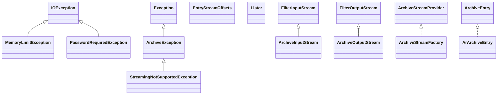

# commons-compress-1.27.1.jar

[Group index](README.md) | [All archives](../README.md)

## Scope and provenance

- **Donor:** `SQX_145_REFERENCE_ROOT/internal/libs/commons-compress-1.27.1.jar`.
- **SHA-256:** `293d80f54b536b74095dcd7ea3cf0a29bbfc3402519281332495f4420d370d16`; accessed 2026-10-06; captured `2026-10-06T18:54:51.906614+00:00`.
- **Classes:** 573 raw entries; 573 unique entry names. Duplicate occurrence indices are zero-based.
- **Inspection:** read-only ZIP hashing and class-file structural parsing; signatures/descriptors, modifiers, hierarchy and references only. Bytecode bodies are hashed, not published.
- **Allocation:** proposed `FEAT-HOST-COMMONS-COMPRESS`, P02; [roadmap](../../dev/sqx-full-application-roadmap.md). Domain README registration remains required.
- **Repository:** `01067f00031428613c6394064ca1bcadc1ba00ee`; review state unreviewed. Download label 145-dev1; installed build/activation and runtime equivalence unverified.
- **Limit:** every class/member is inventoried; declaration coverage does not establish consumed calls, defaults, formulas, failure semantics or algorithm parity.
- **Archive/resource index:** [017.json](../../dev/evidence/sqx145/archives/145/017.json).

## Complete member declarations

Member shards contain exact JVM names/descriptors, access flags, generic signatures, throws types, declared fields/methods, superclass/interfaces and referenced class names. All classes, nested/synthetic members and overloads are retained. Code length/hash is structural evidence, not a normalized algorithm comparison.

- [001.json](../../dev/evidence/sqx145/members/017/001.json) — SHA-256 `d15faa92bec0546c988d786790887774cf861aad932fdbe3c40e496a9ac5b63d`.
- [002.json](../../dev/evidence/sqx145/members/017/002.json) — SHA-256 `0dd33d7e814dc2a39e00f59693e6c0bde97d72bb686c6096717085d7c27d6ace`.
- [003.json](../../dev/evidence/sqx145/members/017/003.json) — SHA-256 `1fbd6d8ea03efb20a111ef78bb19a8e2ff92cdd6c87c8bab0a373062789fa10c`.
- [004.json](../../dev/evidence/sqx145/members/017/004.json) — SHA-256 `71814f55d41c60a7f24e45c6c2332a08b533a538a9cc420d2a4e2070a922319b`.
- [005.json](../../dev/evidence/sqx145/members/017/005.json) — SHA-256 `09c518752453d49d1e6c651d6a0db3fcbc11d5e21b796e357564ab30eacd3968`.
- [006.json](../../dev/evidence/sqx145/members/017/006.json) — SHA-256 `5f295a420c1fb61c70b11d8cc5621aef8de292bd52a89a39bcf4372e6f2f54ef`.
- [007.json](../../dev/evidence/sqx145/members/017/007.json) — SHA-256 `149baf0447be6988d573dcf046db9be3ac5949979d5f80461d25668e8589b20e`.
- [008.json](../../dev/evidence/sqx145/members/017/008.json) — SHA-256 `dc17f8d1cc727e50b7e6b94d219dbe0d80fd0d19f0d800e2f9fbed754d3873f9`.

## Focused structural diagram

Up to twelve non-nested classes; arrows show declared inheritance/interfaces only. External type names are not evidence of an available body or an executed dependency.

## Class inventory

| Archive entry | Occurrence | Class SHA-256 | Fields | Methods |
| --- | ---: | --- | ---: | ---: |
| `org/apache/commons/compress/MemoryLimitException.class` | 0 | `95ff9fa48a65161a64792a72b395c2274fff3567c7ae8a66400eaec7ebf6d699` | 3 | 5 |
| `org/apache/commons/compress/PasswordRequiredException.class` | 0 | `75263c64f0912e3fc79471406774c31e9707820e64072f1064a50fb8102e21ed` | 1 | 1 |
| `org/apache/commons/compress/archivers/ArchiveEntry.class` | 0 | `5d3de68ce1e09d1af91b0c13276a31826b18e5bd2a7a591a0b12af520f19263f` | 1 | 5 |
| `org/apache/commons/compress/archivers/ArchiveException.class` | 0 | `627594cd5396aa00f973e031a80fcb1f64e075dbabf4e5c29ead469283c1fec4` | 1 | 2 |
| `org/apache/commons/compress/archivers/ArchiveInputStream$ArchiveEntryIOIterator.class` | 0 | `a38d8436fabfde61fe69a3f9d4c3b8cc311eea7c82e470b1f8a6f9bfd0bbb2c8` | 2 | 5 |
| `org/apache/commons/compress/archivers/ArchiveInputStream.class` | 0 | `132982858abe705f8d25b74a0fd9037bc8239952d11df6ada4f3f12cf5cc9dfc` | 4 | 17 |
| `org/apache/commons/compress/archivers/ArchiveOutputStream.class` | 0 | `d95a2691a2d11e386ccac3d6fe59311225488305f560753181dd9ca41b872101` | 5 | 18 |
| `org/apache/commons/compress/archivers/ArchiveStreamFactory.class` | 0 | `4068681a5dbfd72f690e4b2410c1cd65d59a0bf568b9c966f2cc949bdceebdfb` | 20 | 25 |
| `org/apache/commons/compress/archivers/ArchiveStreamProvider.class` | 0 | `cbf6a3fe692229ddb782c2c5f53f21903507d979979bdc7b8a5a8f5e0d7071ed` | 0 | 4 |
| `org/apache/commons/compress/archivers/EntryStreamOffsets.class` | 0 | `32d71e13e9454d8a37a44d4a4bbb94d76c0e49ee0d080e6b453fe2c25ae6d2f9` | 1 | 2 |
| `org/apache/commons/compress/archivers/Lister.class` | 0 | `0f47dcdc3977d0d35e100b1b16d3306a4ed9bd07c5e88aa90091ef2da7598373` | 3 | 15 |
| `org/apache/commons/compress/archivers/StreamingNotSupportedException.class` | 0 | `1fb6f3c634173ef0f1dcd5b61647c4bfd05d6c94e02c3f24e5de4c0a7f776eb7` | 2 | 2 |
| `org/apache/commons/compress/archivers/ar/ArArchiveEntry.class` | 0 | `44013c2addfcb1f4621511eaaae1aa6fc728ef2b1dcf9cd9025137df8f2c4cb3` | 9 | 15 |
| `org/apache/commons/compress/archivers/ar/ArArchiveInputStream.class` | 0 | `1efcc65d36c3e3df9c613b42f0f51ffe5fdfd443e957272c7cf90a5e5d21b117` | 23 | 20 |
| `org/apache/commons/compress/archivers/ar/ArArchiveOutputStream.class` | 0 | `9659fb8d052eea92fd6f2703744e457f04dea364ab9999821f06a88144d731ec` | 9 | 17 |
| `org/apache/commons/compress/archivers/ar/package-info.class` | 0 | `71922c5a090d8bb0f9e96242b4b64ae5aebd56f6be266532f66560c9ff3eb765` | 0 | 0 |
| `org/apache/commons/compress/archivers/arj/ArjArchiveEntry$HostOs.class` | 0 | `2e5699b18f25a92289a70f4efbdd80f98ba9e4412a3d4e8a443d875e0fff6f96` | 12 | 1 |
| `org/apache/commons/compress/archivers/arj/ArjArchiveEntry.class` | 0 | `0eda4a18768c3c3cf05fb3c3c141875f9b3351e187d1fbea22dd2e9fdb4d0434` | 1 | 13 |
| `org/apache/commons/compress/archivers/arj/ArjArchiveInputStream.class` | 0 | `a245d861a30fab98e2ea18235300792b532ebf9c9449be332e3fd27582a39cf4` | 7 | 19 |
| `org/apache/commons/compress/archivers/arj/LocalFileHeader$FileTypes.class` | 0 | `fb1687b3174efd3e3b323c6ab38f58a934c58d510573071128a8e519ae0b4616` | 6 | 1 |
| `org/apache/commons/compress/archivers/arj/LocalFileHeader$Flags.class` | 0 | `5eca69487b46d74d232fb70dbb176ce7f987c5ef1ac1909f5d3784421c030164` | 5 | 1 |
| `org/apache/commons/compress/archivers/arj/LocalFileHeader$Methods.class` | 0 | `b506d5939f4742b40f8dabedd379abc9655353051248c040ef026b0fddabff55` | 7 | 1 |
| `org/apache/commons/compress/archivers/arj/LocalFileHeader.class` | 0 | `4af559cfa482cb645d28a8a4e889079b4746b81eb913b24c33ab0067735da2dc` | 22 | 4 |
| `org/apache/commons/compress/archivers/arj/MainHeader$Flags.class` | 0 | `d15782cf380dd2b11c0323ec7b1db3bdd67af1fe01d0cd1977ba7bae7ad240b9` | 8 | 1 |
| `org/apache/commons/compress/archivers/arj/MainHeader$HostOS.class` | 0 | `e2b0096b5581fa68506eeaafd5868680ddc6917f2729f7958c7794482d7a012c` | 12 | 1 |
| `org/apache/commons/compress/archivers/arj/MainHeader.class` | 0 | `d1056af6243264645afbeeec5abce45bca073cf7359d6b9b94176164f9823a40` | 20 | 2 |
| `org/apache/commons/compress/archivers/arj/package-info.class` | 0 | `5cb69d5d952e94db831314a71e288cd8d04909e789335a4cc20e227fd3541d66` | 0 | 0 |
| `org/apache/commons/compress/archivers/cpio/CpioArchiveEntry.class` | 0 | `0a354fabeace705b1d15c3339207f380d2105282958aa385684147baa7303cac` | 16 | 60 |
| `org/apache/commons/compress/archivers/cpio/CpioArchiveInputStream.class` | 0 | `9e4b85b20a7e6182cd4a007a86a20fa054b6277f1b571aa2f5e925b2324e6ff5` | 11 | 24 |
| `org/apache/commons/compress/archivers/cpio/CpioArchiveOutputStream.class` | 0 | `1601d8504aa149ed2ba22336bf499dfe4fb7d4f548d6cba4d2e587b0ea44def1` | 9 | 24 |
| `org/apache/commons/compress/archivers/cpio/CpioConstants.class` | 0 | `1cd2e6e7f47f994d92258ec940c7545039116c9ba3eea89d11ab4baac27b9e69` | 33 | 0 |
| `org/apache/commons/compress/archivers/cpio/CpioUtil.class` | 0 | `e0667cc4808389c30cf41f4e58b4acb91460b8fe56d27bd66bd0382d7bd8240b` | 1 | 5 |
| `org/apache/commons/compress/archivers/cpio/package-info.class` | 0 | `3e47e878502627e2eb42ceba5a6607251b92a01fb3f07e797dcd1b259c35526e` | 0 | 0 |
| `org/apache/commons/compress/archivers/dump/Dirent.class` | 0 | `017b097db09715035442fc33d6d2219ed3fb2d6af810395b160d35178c3cfdcb` | 4 | 6 |
| `org/apache/commons/compress/archivers/dump/DumpArchiveConstants$COMPRESSION_TYPE.class` | 0 | `0efb9a7f5021c477e5704fdceb1e48ee62dcd979d28f2b0489a1a6c649c86204` | 6 | 6 |
| `org/apache/commons/compress/archivers/dump/DumpArchiveConstants$SEGMENT_TYPE.class` | 0 | `127e8942dab34b8f494e9899391f0acc44d58259ba30246272e9f28092d184dd` | 8 | 6 |
| `org/apache/commons/compress/archivers/dump/DumpArchiveConstants.class` | 0 | `bc2bfe86efe72e3802c12c1769268f753dae99ba5e910c69357f2f2dfac322dc` | 9 | 1 |
| `org/apache/commons/compress/archivers/dump/DumpArchiveEntry$PERMISSION.class` | 0 | `2ec5861a97f01c197136dc87f27b0154e892bd0fc003ad9bf94e7f1194c1be75` | 14 | 6 |
| `org/apache/commons/compress/archivers/dump/DumpArchiveEntry$TYPE.class` | 0 | `d161d43dd7c50b0510901b534695e9832ca38036738b02445413c32486b0c63e` | 11 | 6 |
| `org/apache/commons/compress/archivers/dump/DumpArchiveEntry$TapeSegmentHeader.class` | 0 | `ea4da40bd0a8b1a143caaf8bc41e703139bf3ea8c6469fd3279d1e587c1ec4d7` | 6 | 16 |
| `org/apache/commons/compress/archivers/dump/DumpArchiveEntry.class` | 0 | `6d69c3c7dde64d5b6ce071797680a2fc08e93e9f4581d6d3d4b9f2eaa4ca3b0f` | 20 | 52 |
| `org/apache/commons/compress/archivers/dump/DumpArchiveException.class` | 0 | `69188efeec78dab652b9c70add3e24ccfcaa6a5fe9a3c66e65fd9dfa07de9763` | 1 | 4 |
| `org/apache/commons/compress/archivers/dump/DumpArchiveInputStream.class` | 0 | `c2a5cc0d6953adc9e87badefc764dd1a1749a8bda1827c27e4e80981b34653b9` | 18 | 17 |
| `org/apache/commons/compress/archivers/dump/DumpArchiveSummary.class` | 0 | `455bc26bf029d912bfe1f20501649317dc725bc1ce3fec3c657816cd89c59ed7` | 11 | 30 |
| `org/apache/commons/compress/archivers/dump/DumpArchiveUtil.class` | 0 | `39a0ca59bdd778c31a19a6929eca76f9d6416381bac98116c3b1bca23eefde4e` | 0 | 8 |
| `org/apache/commons/compress/archivers/dump/InvalidFormatException.class` | 0 | `02392c8acc3e21325d2658931c02ca2abfb024eee934fad39d5ed473092c867c` | 2 | 3 |
| `org/apache/commons/compress/archivers/dump/ShortFileException.class` | 0 | `7cd0b658e69b7866a33ac7a05f0ba40cf2278e71938068a5cf1154427b782ebe` | 1 | 1 |
| `org/apache/commons/compress/archivers/dump/TapeInputStream$1.class` | 0 | `1ccc6edfbbeb63214a9bf80247f43a772a5654f44322e6e3627f126732c2ceac` | 1 | 1 |
| `org/apache/commons/compress/archivers/dump/TapeInputStream.class` | 0 | `e0bbb5634e0029c1d9a1f993dba23552dbcf8c995ed0bd6cb9bb335ee14211e7` | 7 | 13 |
| `org/apache/commons/compress/archivers/dump/UnrecognizedFormatException.class` | 0 | `c441ff3cab6e53b4a541a8a625b773e6178d8cbcfc37e738c02da8e9cfc16e87` | 1 | 1 |
| `org/apache/commons/compress/archivers/dump/UnsupportedCompressionAlgorithmException.class` | 0 | `caa8c6fb0c0e1cf4e310ac51952aa197cca3efabed23e5b43825156b26b7e78a` | 1 | 2 |
| `org/apache/commons/compress/archivers/dump/package-info.class` | 0 | `58ebc283aa0621025925e2b854b092f018e1f27c0666754a872f96098bf53d04` | 0 | 0 |
| `org/apache/commons/compress/archivers/examples/Archiver$1.class` | 0 | `d3ace70634f1b1a98ca2c4ad3d8db16520b875e95a8df733e8debc079951af08` | 3 | 2 |
| `org/apache/commons/compress/archivers/examples/Archiver$ArchiverFileVisitor.class` | 0 | `5e5ab9a05bb44895e64a43dc51d9354a10c50a6744214baa69ede7342698073e` | 3 | 7 |
| `org/apache/commons/compress/archivers/examples/Archiver.class` | 0 | `4f8f9da62af3697a378ef0f08a1ac0b0f905a4fd834575182f1427f8843cae31` | 1 | 15 |
| `org/apache/commons/compress/archivers/examples/CloseableConsumer.class` | 0 | `e4761cce44d413801d80590f48b98d983bfa77dddf2b129c9267c362677a99c9` | 2 | 3 |
| `org/apache/commons/compress/archivers/examples/CloseableConsumerAdapter.class` | 0 | `2728a6d5daed4be2ab1cc6c39bf3b85953e3fe085a9be55ebcd2c8e2b08546f9` | 2 | 3 |
| `org/apache/commons/compress/archivers/examples/Expander$ArchiveEntryBiConsumer.class` | 0 | `0c3551a0d90abc874523b588da68b1043e2766f31e504970964a7dd2485352e8` | 0 | 1 |
| `org/apache/commons/compress/archivers/examples/Expander$ArchiveEntrySupplier.class` | 0 | `b84aa5be65f5631019b2fc47d5ebd0d9d2b7b263a1e3eff60a6722e441f19d53` | 0 | 1 |
| `org/apache/commons/compress/archivers/examples/Expander.class` | 0 | `38a9fa5fee74b166a464755613de3fd8759a9429b7736e2cda95ebb8ab98bd5d` | 0 | 31 |
| `org/apache/commons/compress/archivers/examples/package-info.class` | 0 | `d31d959192ca737f82bf2ff3dcbe2c22919dc2f853d793777d245eb896b60033` | 0 | 0 |
| `org/apache/commons/compress/archivers/jar/JarArchiveEntry.class` | 0 | `b725975bb7a0a545d5f98678a3eb094820de920a512a355bb9a8fab9f0988eae` | 0 | 6 |
| `org/apache/commons/compress/archivers/jar/JarArchiveInputStream.class` | 0 | `b550f91dbcf91e41ccf38b578ddfe0f7ae4b984a4a157cecbe8c002f94a8a553` | 0 | 7 |
| `org/apache/commons/compress/archivers/jar/JarArchiveOutputStream.class` | 0 | `71f3da66a77918d4e2bf711830665bb25c01a80240eaebf34563d0fb863df0ec` | 1 | 4 |
| `org/apache/commons/compress/archivers/jar/package-info.class` | 0 | `447614875a9e8141ac59fafe56748d6867b526fd305cdf35e21301f00951d289` | 0 | 0 |
| `org/apache/commons/compress/archivers/package-info.class` | 0 | `2cc24002241ad71a3e74288a02273ebc03561b4946927547ec7c380af4941478` | 0 | 0 |
| `org/apache/commons/compress/archivers/sevenz/AES256Options.class` | 0 | `d89f22616a9d0689fa04d2513419abcfd04e2f5835cbb29071b888405bdddcde` | 7 | 9 |
| `org/apache/commons/compress/archivers/sevenz/AES256SHA256Decoder$1.class` | 0 | `b1088cc14dee39a7ee06d77f6ef79978b8f298deb53e349057206c5284c00a0f` | 0 | 0 |
| `org/apache/commons/compress/archivers/sevenz/AES256SHA256Decoder$AES256SHA256DecoderInputStream.class` | 0 | `8bc765d7e10868abef61e92e6e6a2601e9174ed5648f81313f82dc0ff621e264` | 6 | 6 |
| `org/apache/commons/compress/archivers/sevenz/AES256SHA256Decoder$AES256SHA256DecoderOutputStream.class` | 0 | `76c426117914395597154a3ef140d140ba63bf5c7fd8dd3736ff2e933891cce9` | 4 | 7 |
| `org/apache/commons/compress/archivers/sevenz/AES256SHA256Decoder.class` | 0 | `9eef411d7b1f5a70bc5e3134ed1258563202db3d43e9a8df5434ba14f8127826` | 0 | 7 |
| `org/apache/commons/compress/archivers/sevenz/AbstractCoder.class` | 0 | `b0ba80a23134a5b50b3e58a6ce75b0f5aa9624a8a091d83a58b504c55ffb115a` | 1 | 8 |
| `org/apache/commons/compress/archivers/sevenz/Archive.class` | 0 | `acdee9e9442bfe98367e5d2500a342a331d2d5e07226f415a30943d421101b24` | 8 | 4 |
| `org/apache/commons/compress/archivers/sevenz/BindPair.class` | 0 | `4178384cd0547b8ec8bf7f9fcd4e222e2e2e98c2231e3d35a93feeeb72fac328` | 2 | 2 |
| `org/apache/commons/compress/archivers/sevenz/BoundedSeekableByteChannelInputStream.class` | 0 | `d9c626f0bb4b0846b664817356d7a11004ad76f3b6bff483d1fa643befd6dc56` | 4 | 5 |
| `org/apache/commons/compress/archivers/sevenz/CLI$1.class` | 0 | `f328549773ba4e9c44f1eb44bb12072bde1d3e3e1594adc7f1d44dc46ba662df` | 0 | 0 |
| `org/apache/commons/compress/archivers/sevenz/CLI$Mode$1.class` | 0 | `5d612b16df737776baf93afcb646913d5511236ffda723cb0fbfc046c7e7b853` | 0 | 3 |
| `org/apache/commons/compress/archivers/sevenz/CLI$Mode.class` | 0 | `dc6eb7ceae1366b3c2b046f3e77f6f0128cc799f77315b821f687f8fedaffaa8` | 3 | 8 |
| `org/apache/commons/compress/archivers/sevenz/CLI.class` | 0 | `aa2dba74d917c733aa6f0226ba7debea1b465373eca8c6508f38e82449ef7716` | 0 | 4 |
| `org/apache/commons/compress/archivers/sevenz/Coder.class` | 0 | `1bf61cc50e83ac5743f24ebb2fe8cb50d4ce064b7f2a8d672b48991f081fe668` | 4 | 1 |
| `org/apache/commons/compress/archivers/sevenz/Coders$1.class` | 0 | `3f1a4ad886bd0f32424de110605860d4d8cca12c7cc7b10497948c14e7b02463` | 1 | 1 |
| `org/apache/commons/compress/archivers/sevenz/Coders$BCJDecoder.class` | 0 | `2199aa8431ab460f650ccadc9a19fd27375f59c36f36eb485ef312b5703c2ee6` | 1 | 3 |
| `org/apache/commons/compress/archivers/sevenz/Coders$BZIP2Decoder.class` | 0 | `8fa2388f2df118cceaeeba2189ce0b9a0732019098fa256759f4f01c793a5c69` | 0 | 3 |
| `org/apache/commons/compress/archivers/sevenz/Coders$CopyDecoder.class` | 0 | `d88d160ebe2d9451a498710f56153c828a5f3f3fa4e571d0b8ba10409f9c5431` | 0 | 3 |
| `org/apache/commons/compress/archivers/sevenz/Coders$Deflate64Decoder.class` | 0 | `d28ebd00efc335c644c0f55e8d9ec43f4b06181a8f18e315a07e648fb39a6033` | 0 | 2 |
| `org/apache/commons/compress/archivers/sevenz/Coders$DeflateDecoder$DeflateDecoderInputStream.class` | 0 | `c377b14bab5d4b9b083cdc6b9656aa05edab4865ec2f5da1497eff39d9ca1a1e` | 1 | 2 |
| `org/apache/commons/compress/archivers/sevenz/Coders$DeflateDecoder$DeflateDecoderOutputStream.class` | 0 | `432074cd4d21baf26601f373ddb3159a06dc621b4afa97f0bfd3b0c153a6d9cd` | 2 | 5 |
| `org/apache/commons/compress/archivers/sevenz/Coders$DeflateDecoder.class` | 0 | `c017cab4c1e0fd678922625f963cf0bf1c871f5773710d83b3d08abf5d1eff1a` | 1 | 4 |
| `org/apache/commons/compress/archivers/sevenz/Coders.class` | 0 | `3cd2520c4ab526e0a99c4ec91861b9b4efcd0a0fc7bb1329f3851fa5fe0a2ec8` | 1 | 5 |
| `org/apache/commons/compress/archivers/sevenz/DeltaDecoder.class` | 0 | `3a8d4b7e0cb1a2bb9faf9594bd0d8a574116d489a7c2f240233ac894fa1bbe8f` | 0 | 6 |
| `org/apache/commons/compress/archivers/sevenz/Folder.class` | 0 | `ffd7ce0523dcf10c44996dfe8fcd0658398176c0fa2f6922c6981ece95ba0159` | 10 | 8 |
| `org/apache/commons/compress/archivers/sevenz/LZMA2Decoder.class` | 0 | `88551d47004ea86e33c2cd768b0f1cfa45976097a86e57a53377d524762ff9db` | 0 | 9 |
| `org/apache/commons/compress/archivers/sevenz/LZMADecoder.class` | 0 | `64e2f6a113a2d328edde897ec37d07d0338afba05bc07800ed6fcdf6c69d7772` | 0 | 8 |
| `org/apache/commons/compress/archivers/sevenz/NID.class` | 0 | `b22e7e936a854407a19d71ff301d1ad6ec11d2c944548f5782e8c72c842235a3` | 26 | 1 |
| `org/apache/commons/compress/archivers/sevenz/SevenZArchiveEntry.class` | 0 | `946daf1387bc3674523b9db379f1b57056737270d0ee99b12cb6e997104f6365` | 19 | 57 |
| `org/apache/commons/compress/archivers/sevenz/SevenZFile$1.class` | 0 | `99be786d7f5f141d23871e59fc4e782740348ad22368c6991208f4852033362d` | 1 | 5 |
| `org/apache/commons/compress/archivers/sevenz/SevenZFile$2.class` | 0 | `00f24c4998089d56c0aeb427fa881f7ce8a5b16e4a31d7736e6e9d7842316d6b` | 1 | 3 |
| `org/apache/commons/compress/archivers/sevenz/SevenZFile$ArchiveStatistics.class` | 0 | `36ef9530d978c9212af24c99fd28073d78f1093f0f15ae2b6330db4098072d16` | 9 | 26 |
| `org/apache/commons/compress/archivers/sevenz/SevenZFile$Builder.class` | 0 | `b5a3ba53b7628d9c6ee3af88987ad1154871524c92316e1e3a798d80fa7a3995` | 9 | 11 |
| `org/apache/commons/compress/archivers/sevenz/SevenZFile.class` | 0 | `ec29eed9d12bb10182b2c803582ef4b1eca95dc65aefc705a883676313c899c2` | 16 | 78 |
| `org/apache/commons/compress/archivers/sevenz/SevenZFileOptions$1.class` | 0 | `f626655be770bde89d19ee4ed3cdc9c557ba3653932a4ba6dce7204fbadcd403` | 0 | 0 |
| `org/apache/commons/compress/archivers/sevenz/SevenZFileOptions$Builder.class` | 0 | `25ec30d2e754609ecfc1c9b03ec21dcdd4214585af63b51a0c3f358ce7223cfc` | 3 | 5 |
| `org/apache/commons/compress/archivers/sevenz/SevenZFileOptions.class` | 0 | `074302918f249c95e080971724facc323ca050a01462d560692c905b36826a0a` | 4 | 7 |
| `org/apache/commons/compress/archivers/sevenz/SevenZMethod.class` | 0 | `22eb4b73c7982b9c1f5421ccec44e6190238f1c469070d5ee8aa836aecd1e761` | 16 | 7 |
| `org/apache/commons/compress/archivers/sevenz/SevenZMethodConfiguration.class` | 0 | `3ee77f7b124ac3b8ded223c6c19c2ff58890480292d3b2f106dce8a2f4c5af4f` | 2 | 6 |
| `org/apache/commons/compress/archivers/sevenz/SevenZOutputFile$1.class` | 0 | `d0a289330481697f8060f90e1ab1e14f08dd7f74874ea14b667556859156f4eb` | 1 | 4 |
| `org/apache/commons/compress/archivers/sevenz/SevenZOutputFile$OutputStreamWrapper.class` | 0 | `38eb99da59075ec161fd8f3d2131c7736598c47a10699d8bd2af858489c6e9f1` | 3 | 7 |
| `org/apache/commons/compress/archivers/sevenz/SevenZOutputFile.class` | 0 | `40d04b61975bc98ae235a9c1ca889c3fdc3f8f1f193f520ff9bf13cd2b9b4181` | 12 | 48 |
| `org/apache/commons/compress/archivers/sevenz/StartHeader.class` | 0 | `8601aef33d93bf7561f612d7795f4bf2e9c02b6c9954e4c2f7d612156f1ae067` | 3 | 1 |
| `org/apache/commons/compress/archivers/sevenz/StreamMap.class` | 0 | `6a362ad37c53aa9c7a4a5330e1ef90cd253b5f36a8b397978c6dc5dc035b8795` | 4 | 2 |
| `org/apache/commons/compress/archivers/sevenz/SubStreamsInfo.class` | 0 | `ec9ab103391bb9b025c82f23162c8d7f27ecfc4866907e6549b04ee739468448` | 3 | 1 |
| `org/apache/commons/compress/archivers/sevenz/package-info.class` | 0 | `9088a0c23314c5730533b789ce92b25026e47eae3e711c526048e65db6072322` | 0 | 0 |
| `org/apache/commons/compress/archivers/tar/TarArchiveEntry.class` | 0 | `a803e372c8d5433c0c154e50925264ded732a6969c1b7e5182e2deca13d975ce` | 36 | 121 |
| `org/apache/commons/compress/archivers/tar/TarArchiveInputStream.class` | 0 | `9704dbb7e234b23a34ce4253848f073ecc7e138d102ea3e5a77252e2bb5a828f` | 14 | 41 |
| `org/apache/commons/compress/archivers/tar/TarArchiveOutputStream.class` | 0 | `487b5ab87dc17255aaa9be77045c42faddff2d652adc0333a64dda1cc4f9a2b2` | 23 | 42 |
| `org/apache/commons/compress/archivers/tar/TarArchiveSparseEntry.class` | 0 | `76c5323bf5a8c9a80699086c0ea67424ac643e09ef47e2ba324b71bf7c075dcb` | 2 | 3 |
| `org/apache/commons/compress/archivers/tar/TarArchiveSparseZeroInputStream.class` | 0 | `c010fd6cb5913072f0a4e752f39e4292997848658a654afa14de24ed90da55e9` | 0 | 3 |
| `org/apache/commons/compress/archivers/tar/TarArchiveStructSparse.class` | 0 | `ae3b3372a9d0db0875205cdbedc8cd645fc7ab1baba6bdba3d36b6bac2b91804` | 2 | 6 |
| `org/apache/commons/compress/archivers/tar/TarConstants.class` | 0 | `dcef3a09532f25e329fe9d87e1c253984920c99b914feb02fc24755abb87542d` | 72 | 0 |
| `org/apache/commons/compress/archivers/tar/TarFile$BoundedTarEntryInputStream.class` | 0 | `3bbd7ab6f8fef43f4ae7db932e57f7472573d3c5f95af3e835c004a38378e8e4` | 5 | 4 |
| `org/apache/commons/compress/archivers/tar/TarFile.class` | 0 | `911cb5658c08869e9e586551737edc5c4977aa24575af2e466b2f3ddf7c98aaf` | 14 | 34 |
| `org/apache/commons/compress/archivers/tar/TarGnuSparseKeys.class` | 0 | `7fbb8ff42bae8dfcdb4c08a66bcc32866b0a574fa356fe1b2737b60a2136b69a` | 6 | 1 |
| `org/apache/commons/compress/archivers/tar/TarUtils$1.class` | 0 | `39154225ab943bd4e23d4ebc0ebe36c46703c06226015ecf940e410c0f6303cd` | 0 | 4 |
| `org/apache/commons/compress/archivers/tar/TarUtils.class` | 0 | `20ed52aec249d3e3c60c55aa5254c2afcc5c331b952b60bbddc9981ea1a21eb9` | 3 | 29 |
| `org/apache/commons/compress/archivers/tar/package-info.class` | 0 | `eb219e24bd9210e3a2b3918758d7759130aeafc3631a4661df74eda097cc0204` | 0 | 0 |
| `org/apache/commons/compress/archivers/zip/AbstractUnicodeExtraField.class` | 0 | `a1eb88a4fbc009ad45a69cc4d09fc09437a2050b73f5732663d28d916bdd552f` | 3 | 14 |
| `org/apache/commons/compress/archivers/zip/AsiExtraField.class` | 0 | `f3b22392745be08249e29092c5b4a7e7b4afd91345485c89e760d9928eba017d` | 8 | 22 |
| `org/apache/commons/compress/archivers/zip/BinaryTree.class` | 0 | `ed768fed882ba780bc8e1970a1136ad2632fadbf4bbb3b53a1f00304cbdd9183` | 3 | 4 |
| `org/apache/commons/compress/archivers/zip/BitStream.class` | 0 | `f0ca3526ec66a365eb147f6199b159b13dd362367dd5a11b8195b53beb8d7988` | 0 | 4 |
| `org/apache/commons/compress/archivers/zip/CharsetAccessor.class` | 0 | `8e709959aa47cd8a9a7410facea820145c7c2b6f90d01c7ce8a82ed6fdecf33e` | 0 | 1 |
| `org/apache/commons/compress/archivers/zip/CircularBuffer.class` | 0 | `f6019028c7047a994c2929273a7e47d885fd964a160efdc0bdc93f776ffd00bc` | 4 | 5 |
| `org/apache/commons/compress/archivers/zip/DefaultBackingStoreSupplier.class` | 0 | `34b7d38a071017ac02082850d1d4e8f2c16eeffd68eda72cf996ac497e29439a` | 3 | 2 |
| `org/apache/commons/compress/archivers/zip/ExplodingInputStream.class` | 0 | `e9beb47715045d7dc2373b344731f69c7b17f8c49e9fd840d6cef4854d10b825` | 11 | 7 |
| `org/apache/commons/compress/archivers/zip/ExtraFieldParsingBehavior.class` | 0 | `8d9ccf1d245e4f1fc1c98ba0d2f0391dfc75fcec016330765ab9006860457304` | 0 | 2 |
| `org/apache/commons/compress/archivers/zip/ExtraFieldUtils$1.class` | 0 | `acdcabdccf8c58196bad2cb51e905cd67af09d7dad66e964fe4243638c9bb125` | 1 | 4 |
| `org/apache/commons/compress/archivers/zip/ExtraFieldUtils$UnparseableExtraField.class` | 0 | `6b8f579b9ce59dd93bdcf26782d971616b594ffafd93b3c5f00e3ce82fd37597` | 7 | 4 |
| `org/apache/commons/compress/archivers/zip/ExtraFieldUtils.class` | 0 | `93d0c5ea9e2289f18dba2da934049534f94b2ec55f427ea3c614cf6f649443bd` | 3 | 13 |
| `org/apache/commons/compress/archivers/zip/FileRandomAccessOutputStream.class` | 0 | `2817ce50d8b7fc9c967fb7654eb0074ddb1557cb9b3837cbe8db3a515733b3e8` | 2 | 8 |
| `org/apache/commons/compress/archivers/zip/GeneralPurposeBit.class` | 0 | `31ce9fc9893903bebbe2b85d5811af0a097140bc69fc4cb6bfcbefc0a97b80e7` | 12 | 17 |
| `org/apache/commons/compress/archivers/zip/InflaterInputStreamWithStatistics.class` | 0 | `781c3931cd527b57b1bbe02228442f92011555cce8e1b5560ed604600dfdbfcf` | 2 | 8 |
| `org/apache/commons/compress/archivers/zip/JarMarker.class` | 0 | `91604cc6edd8ba83677ccf28a2b5bf43e34eacb591af42c63ff2a979d7d4f6d8` | 3 | 10 |
| `org/apache/commons/compress/archivers/zip/NioZipEncoding.class` | 0 | `8f7b5dfb9cfffce6afa722ab4d1da36491b36a482c3c67a5c3422c3021efec71` | 6 | 12 |
| `org/apache/commons/compress/archivers/zip/PKWareExtraHeader$EncryptionAlgorithm.class` | 0 | `d3b04729baed9ff62b6fc272f9de5b9ca4630053c78d9546d4e3ae4544c61938` | 13 | 7 |
| `org/apache/commons/compress/archivers/zip/PKWareExtraHeader$HashAlgorithm.class` | 0 | `2b4577ced5b7543a2b12409565470f5b9855657c1cec8f5703c7f8dca18a149d` | 11 | 7 |
| `org/apache/commons/compress/archivers/zip/PKWareExtraHeader.class` | 0 | `9e783c9c61da6d223737ad4f409b4737754cbd9cd8d874d68c3a17617cddd011` | 3 | 11 |
| `org/apache/commons/compress/archivers/zip/ParallelScatterZipCreator$1.class` | 0 | `8ee39e416da28a357bbabfffb105f8006bf9dabe43e3a1c1cd5be9b5c79de5f1` | 1 | 3 |
| `org/apache/commons/compress/archivers/zip/ParallelScatterZipCreator.class` | 0 | `0cc2274b55b3b51256d4f9a9a4cbedee9921efbe37f58abc10646431846c9436` | 9 | 20 |
| `org/apache/commons/compress/archivers/zip/RandomAccessOutputStream.class` | 0 | `04fb064b97008ee8014dc74e1fe51f2e7448a615ae341aabe6cf16d63876cb5b` | 0 | 5 |
| `org/apache/commons/compress/archivers/zip/ResourceAlignmentExtraField.class` | 0 | `5646b65f1f20ed6e53a5ddc3ea2af4cd8e9779a2f24212ab9a2107143da418a9` | 6 | 14 |
| `org/apache/commons/compress/archivers/zip/ScatterStatistics.class` | 0 | `a0bd503dcc096da35a2f05e5a3dc41cef666d75e2ce0ca59e67b67f3a2d0632a` | 2 | 4 |
| `org/apache/commons/compress/archivers/zip/ScatterZipOutputStream$CompressedEntry.class` | 0 | `2fd4a203cb74035bad51a4eb6f29806d78d13b3ea63fbf05f69082819ab2a10c` | 4 | 2 |
| `org/apache/commons/compress/archivers/zip/ScatterZipOutputStream$ZipEntryWriter.class` | 0 | `4ad75d19341f0242d83686452737e07a1c16f61bddf3d910edb490d671658e2b` | 2 | 3 |
| `org/apache/commons/compress/archivers/zip/ScatterZipOutputStream.class` | 0 | `4855ec918e895cd0c1300c67d591e49503e540d52331c2ba7208140fb82be61f` | 5 | 11 |
| `org/apache/commons/compress/archivers/zip/SeekableChannelRandomAccessOutputStream.class` | 0 | `67680dd288f1076f5d762f2fb948deafeb957f4c4c732109d70007746bc57202` | 1 | 5 |
| `org/apache/commons/compress/archivers/zip/StreamCompressor$DataOutputCompressor.class` | 0 | `92f45808e7bb7bc8dc76239892dc6d8ffa60153c175d4069a2cd3fd42aff38eb` | 1 | 2 |
| `org/apache/commons/compress/archivers/zip/StreamCompressor$OutputStreamCompressor.class` | 0 | `f55af69c280e27e326d1569dd971774ac27adac9f1d0756d760f3ac16d619f05` | 1 | 2 |
| `org/apache/commons/compress/archivers/zip/StreamCompressor$ScatterGatherBackingStoreCompressor.class` | 0 | `03ebc8b50d2649165ae48b98d71d95cda9e43b8149671ca77ede1086e5166ef3` | 1 | 2 |
| `org/apache/commons/compress/archivers/zip/StreamCompressor$SeekableByteChannelCompressor.class` | 0 | `9d47fdfb150cdfb3ecae63b34b832ff23898e1482d24183132fb1df4eba18415` | 1 | 2 |
| `org/apache/commons/compress/archivers/zip/StreamCompressor.class` | 0 | `c4317821bb758dd6eb930367f40a8c3d1373c3ff6bdc290e8d167c47a5ef9f5b` | 9 | 22 |
| `org/apache/commons/compress/archivers/zip/UnicodeCommentExtraField.class` | 0 | `514d6433bce526b880a3685584842a6e0ab1ddb562a7117c3925c28611bcdf52` | 1 | 5 |
| `org/apache/commons/compress/archivers/zip/UnicodePathExtraField.class` | 0 | `5b5654ce6fb23f1635335ee15f512148e9fcaaaa2e5b1c1db94d9ea981d19253` | 1 | 5 |
| `org/apache/commons/compress/archivers/zip/UnixStat.class` | 0 | `27c025c67352fcb2fae187e62efdba575942917ef197954332d215fc2f2887fc` | 8 | 0 |
| `org/apache/commons/compress/archivers/zip/UnparseableExtraFieldBehavior.class` | 0 | `ddea7b686d68758c7f97b74e036abb8d785a192d54283936b22f9542030d8ad3` | 0 | 1 |
| `org/apache/commons/compress/archivers/zip/UnparseableExtraFieldData.class` | 0 | `26b1a2dd0d39a22dee27c0f6afd77f84fd0982b6656bfa853345a8cfc6a89611` | 3 | 9 |
| `org/apache/commons/compress/archivers/zip/UnrecognizedExtraField.class` | 0 | `6519cdc8d60842eb4c1eeebab08326a3a8b3f1705bfb889b16e7bf082e6faf78` | 3 | 11 |
| `org/apache/commons/compress/archivers/zip/UnshrinkingInputStream.class` | 0 | `9b40d4efa0ddbcdb8d126c0b1096815d109e156d891d9725dbc8740752a190d8` | 3 | 4 |
| `org/apache/commons/compress/archivers/zip/UnsupportedZipFeatureException$Feature.class` | 0 | `7155ef99aa9def373420e535869678accf068341c7a4237c738dc995f702a6fc` | 7 | 3 |
| `org/apache/commons/compress/archivers/zip/UnsupportedZipFeatureException.class` | 0 | `739633cf5007f213d45d453e379b4ed7dfda3f30f1d8d9e9fe3405692e16aaab` | 3 | 5 |
| `org/apache/commons/compress/archivers/zip/X000A_NTFS.class` | 0 | `b4e08013a32d5785be0f23a6510e3eb52224b40f6c165791f2d8b86f64c40ff0` | 6 | 36 |
| `org/apache/commons/compress/archivers/zip/X0014_X509Certificates.class` | 0 | `e59da91fad71db63c3af8ee40b1b919f31296cacd72c2fd1377ad4f38f2fe5e5` | 1 | 2 |
| `org/apache/commons/compress/archivers/zip/X0015_CertificateIdForFile.class` | 0 | `35593665d38c992f74c197bfefe81735ad58714ba83604135e635124ced13c5a` | 3 | 5 |
| `org/apache/commons/compress/archivers/zip/X0016_CertificateIdForCentralDirectory.class` | 0 | `4b8ac7d95f6f325029b6ada870c25f090d49ed3763495c0af7c10d1235b20b6c` | 3 | 5 |
| `org/apache/commons/compress/archivers/zip/X0017_StrongEncryptionHeader.class` | 0 | `e758bf5acd460f70f1b58017807ba459c58e9ade1639cd21171b77485ba3a939` | 14 | 10 |
| `org/apache/commons/compress/archivers/zip/X0019_EncryptionRecipientCertificateList.class` | 0 | `a7ff2f9847c460dbf1e4dc0d39d681f1e49f9456a89cdd21a8279acdaf3d4832` | 1 | 2 |
| `org/apache/commons/compress/archivers/zip/X5455_ExtendedTimestamp.class` | 0 | `86360a2be38fc9ea476fc951e651fff90daef1c08b4ce7fad16d0ba00d947078` | 12 | 42 |
| `org/apache/commons/compress/archivers/zip/X7875_NewUnix.class` | 0 | `52f774fef63e93ceab9c830bbd2dfb8fb656207d332fe6a2246ae718e67d8f85` | 7 | 19 |
| `org/apache/commons/compress/archivers/zip/Zip64ExtendedInformationExtraField.class` | 0 | `178b0834d55fd293e557f96dc4a7c305afa8b0cce9373c8efc4923f97db99449` | 7 | 21 |
| `org/apache/commons/compress/archivers/zip/Zip64Mode.class` | 0 | `755a92117f4c3c94d668051e21686127424258611265521a03e4314555b7594c` | 5 | 5 |
| `org/apache/commons/compress/archivers/zip/Zip64RequiredException.class` | 0 | `0729db592db03a402ca5e882a934e97de1cca542b3cab6b68ed0cf678b7d315f` | 7 | 2 |
| `org/apache/commons/compress/archivers/zip/ZipArchiveEntry$1.class` | 0 | `04e2f38261622c4ea489ead204ba050a28a5f7e8082b2002fe9bc5ee2695e5c1` | 2 | 4 |
| `org/apache/commons/compress/archivers/zip/ZipArchiveEntry$CommentSource.class` | 0 | `85b5628c2e143a465472536199f17261585f69319b15b5082c072c0332b4cf8a` | 3 | 5 |
| `org/apache/commons/compress/archivers/zip/ZipArchiveEntry$ExtraFieldParsingMode$1.class` | 0 | `0ffc85a7b2a00ccb01d449cb3d1d442b743d5ae682d90d49ca185418c5a446d4` | 0 | 2 |
| `org/apache/commons/compress/archivers/zip/ZipArchiveEntry$ExtraFieldParsingMode$2.class` | 0 | `229fd663c2005016b94d2bc21f7dac688ba252c8415c8c0d68b516a16610b06f` | 0 | 2 |
| `org/apache/commons/compress/archivers/zip/ZipArchiveEntry$ExtraFieldParsingMode.class` | 0 | `bc3c7b5cf68a988ed1b893409c51b64a7cbe63c96212d214ac32043b3c271609` | 7 | 11 |
| `org/apache/commons/compress/archivers/zip/ZipArchiveEntry$NameSource.class` | 0 | `7ec508155d2e326e748adfe2070999a1c536f5475c7750d0dbff5b1bc7741a4b` | 4 | 5 |
| `org/apache/commons/compress/archivers/zip/ZipArchiveEntry.class` | 0 | `f2f73298321d8412fbd53d26a122bfa5c65c435903b27e8e6176856c544c2e02` | 31 | 105 |
| `org/apache/commons/compress/archivers/zip/ZipArchiveEntryPredicate.class` | 0 | `a9c6887a0fbc385d6be302f135194b0590cc94ae45fe34192291bb94b95ab557` | 0 | 1 |
| `org/apache/commons/compress/archivers/zip/ZipArchiveEntryRequest.class` | 0 | `0cd0a28e93e9b0819e43491be6aa33fe5caed61f3984f267a86923bc4ec1035f` | 3 | 5 |
| `org/apache/commons/compress/archivers/zip/ZipArchiveEntryRequestSupplier.class` | 0 | `185db8fbfd6c99abb993063218bc5daccac4e917b1bb057f17394f1d960db3d3` | 0 | 1 |
| `org/apache/commons/compress/archivers/zip/ZipArchiveInputStream$1.class` | 0 | `3220019f638db2bde03e25598a989fd13e4482612c8253bef5a4d43ca87c7fdb` | 1 | 1 |
| `org/apache/commons/compress/archivers/zip/ZipArchiveInputStream$BoundCountInputStream.class` | 0 | `4dcf34846c301f4170e9b9137eea61a35e93299b50e983c233fd92bb521329be` | 1 | 5 |
| `org/apache/commons/compress/archivers/zip/ZipArchiveInputStream$CurrentEntry.class` | 0 | `8222fb55aa4d422804c90855de86be3cb053cab136b75aa31651fe78e83ac517` | 7 | 17 |
| `org/apache/commons/compress/archivers/zip/ZipArchiveInputStream.class` | 0 | `4e8a082deeccc6fea1826468ca686b209261f0d8215b3d980e98998ac3bca47b` | 27 | 46 |
| `org/apache/commons/compress/archivers/zip/ZipArchiveOutputStream$1.class` | 0 | `bdaee0b34442ccf2bf5e486ad312978505bd176afb8402af22346f0c51fba475` | 0 | 0 |
| `org/apache/commons/compress/archivers/zip/ZipArchiveOutputStream$CurrentEntry.class` | 0 | `ccf1b3d067a7b0a9be25e2d367d764f34da5dd25c49d31f1b2c5211163e813ea` | 6 | 13 |
| `org/apache/commons/compress/archivers/zip/ZipArchiveOutputStream$EntryMetaData.class` | 0 | `e94fee6f9f44fe0847d30b157fcb71cb7c8dd15d9d9a5474bc72fecac0217c1f` | 2 | 4 |
| `org/apache/commons/compress/archivers/zip/ZipArchiveOutputStream$UnicodeExtraFieldPolicy.class` | 0 | `bddf497310e65890e069641687c967ce7337cdaf73c93dd846c6cd20abc60f9d` | 4 | 3 |
| `org/apache/commons/compress/archivers/zip/ZipArchiveOutputStream.class` | 0 | `6f88336fa1af2fae6377cdc3a219c79e6162ef9dde7d96a3e2440bcf0fc9ec0d` | 67 | 76 |
| `org/apache/commons/compress/archivers/zip/ZipConstants.class` | 0 | `90e6da56b887a62d08f29135385fc3986f48d127ea292d5f9975ced0f4a33140` | 10 | 1 |
| `org/apache/commons/compress/archivers/zip/ZipEightByteInteger.class` | 0 | `4cb3d5380b0bf9e83660db52909c37b802acec65214d4234b57caf8f90ced785` | 26 | 17 |
| `org/apache/commons/compress/archivers/zip/ZipEncoding.class` | 0 | `461a50d5958125e2b0f15e2e776b6916c3882d95e333057c513d6bb47150860d` | 0 | 3 |
| `org/apache/commons/compress/archivers/zip/ZipEncodingHelper.class` | 0 | `d5644a3dc36174840d67dcf94345a4f84748d7c1e048a7d3eb84393a6b537028` | 1 | 10 |
| `org/apache/commons/compress/archivers/zip/ZipExtraField.class` | 0 | `1a6b64cbbfe4078646ce702f934e35e22c41ea01a36da0c0cd70c3b8e825090c` | 1 | 7 |
| `org/apache/commons/compress/archivers/zip/ZipFile$1.class` | 0 | `210b455f7039d01ff9a33f1c0c24beef5ccaa238409a98493465fb361e8ba8a6` | 2 | 2 |
| `org/apache/commons/compress/archivers/zip/ZipFile$2.class` | 0 | `736bb2992c16bdb44365b2054b42f70ed12c2c6130e774a277064d5ed6b0db36` | 1 | 1 |
| `org/apache/commons/compress/archivers/zip/ZipFile$BoundedFileChannelInputStream.class` | 0 | `a879ff43408cb876fa80a73b161d8a26ed5eab27a58dd13855893aff24e5bfb3` | 1 | 2 |
| `org/apache/commons/compress/archivers/zip/ZipFile$Builder.class` | 0 | `23be95f8f81d54edc7bdaf1503412b15942ce6413012bfed2ea2e77b4df3c645` | 5 | 8 |
| `org/apache/commons/compress/archivers/zip/ZipFile$Entry.class` | 0 | `6807781ba6e6d53e69f0515c6664f4d89849d7b57ee5a66afe349638793fe531` | 0 | 4 |
| `org/apache/commons/compress/archivers/zip/ZipFile$NameAndComment.class` | 0 | `fbe49e3735ed8b71d36409cc66613fa2b8e90c147402fca278da2ab1224f8edf` | 2 | 4 |
| `org/apache/commons/compress/archivers/zip/ZipFile$StoredStatisticsStream.class` | 0 | `56f71320e649f9e4c142f53b862b1a9fbdf15b0c7cbb0f2f9eced8a7614860b7` | 0 | 3 |
| `org/apache/commons/compress/archivers/zip/ZipFile.class` | 0 | `96118e7c925a46c5b3c51787ceaf985011d96c496e563243c39978549dba698c` | 44 | 58 |
| `org/apache/commons/compress/archivers/zip/ZipIoUtil.class` | 0 | `bbaf7e3a2e3c8b597960023b99464b084b8ddc204ae7d17e1698f98922c1b9b5` | 0 | 3 |
| `org/apache/commons/compress/archivers/zip/ZipLong.class` | 0 | `142012742f176928b6bfb48af1e51512e6749efea0c510263772f0d86bd33570` | 8 | 17 |
| `org/apache/commons/compress/archivers/zip/ZipMethod.class` | 0 | `6402388c42b887680f1b64da7a7bf6069425ddc75be210a8f071d89025dedd40` | 23 | 8 |
| `org/apache/commons/compress/archivers/zip/ZipShort.class` | 0 | `865dbcc859d1ce32b98f399c0fb6ed59488abd38f39218c7514ac554dac478a1` | 3 | 14 |
| `org/apache/commons/compress/archivers/zip/ZipSplitOutputStream.class` | 0 | `ab03504eb742ba079d76be37e714ded04754c81d533d9b13112dd75d6a024d4b` | 13 | 18 |
| `org/apache/commons/compress/archivers/zip/ZipSplitReadOnlySeekableByteChannel$1.class` | 0 | `914f4f84a875a4d906043b40e1895cc6b10fedac4963b09560870b85ca2c3f1d` | 0 | 0 |
| `org/apache/commons/compress/archivers/zip/ZipSplitReadOnlySeekableByteChannel$ZipSplitSegmentComparator.class` | 0 | `dff71e998be81d71ecf9c54da7df9ab777a5926429a6301c83085822a0d515f4` | 1 | 4 |
| `org/apache/commons/compress/archivers/zip/ZipSplitReadOnlySeekableByteChannel.class` | 0 | `f7736d0a59e866736e473f98ead392ee9736bed4fe65bcacfdd6275ac1ada60d` | 3 | 15 |
| `org/apache/commons/compress/archivers/zip/ZipUtil.class` | 0 | `fd3523550fb410fb5cab1e12ecb6438d15e8efdb367096e868e49e7609f5a175` | 3 | 25 |
| `org/apache/commons/compress/archivers/zip/package-info.class` | 0 | `c3b5221680c6f08fd56d9abcf7d2f3f773fabb6c2d4d46e52b25e8ddd813b2b0` | 0 | 0 |
| `org/apache/commons/compress/changes/Change$ChangeType.class` | 0 | `637d6e76979cf2a9ab6d6654d1e8fe9f80e085c0b3b735953aa0f4798d254180` | 5 | 5 |
| `org/apache/commons/compress/changes/Change.class` | 0 | `a7a6ef5b4df806faee30835a7ed9d9beef774397ccd217b49776532e8e9170be` | 5 | 7 |
| `org/apache/commons/compress/changes/ChangeSet.class` | 0 | `306de625254114a80403e7601342eafe701260509904add1e8e364fbc5575904` | 1 | 8 |
| `org/apache/commons/compress/changes/ChangeSetPerformer$ArchiveEntryIterator.class` | 0 | `901a0c78ae27cd8d45b6108de784910f1d1aff61b69d8643f4f087248e29282a` | 0 | 3 |
| `org/apache/commons/compress/changes/ChangeSetPerformer$ArchiveInputStreamIterator.class` | 0 | `b8c5d5cd42c74b8d7f1772bc6fa357d7d17322df771ce26f84c27467787fee1a` | 2 | 4 |
| `org/apache/commons/compress/changes/ChangeSetPerformer$ZipFileIterator.class` | 0 | `32a934bca2c3c598a988a3d2007857246cbfa29fb9211b01e6f0210bbe0865b2` | 3 | 5 |
| `org/apache/commons/compress/changes/ChangeSetPerformer.class` | 0 | `e5cbd8497e88eccdd86d8661966b7ae656a7f3a9aebff9aac897f0b190e6a0b0` | 1 | 6 |
| `org/apache/commons/compress/changes/ChangeSetResults.class` | 0 | `9a5a8d4a93a729d95e51810685a06e328160b84f5ead7774a73b50110ca81594` | 3 | 8 |
| `org/apache/commons/compress/changes/package-info.class` | 0 | `7af1bfd67d4a35ed6aa29fbd5ce46980ecbd858a78c2b57ac221229f05d14129` | 0 | 0 |
| `org/apache/commons/compress/compressors/CompressorException.class` | 0 | `d6efcfb5d33b0d0fca080134430bcf817d06cd84466a3dc7c3c0cc77b7579e5f` | 1 | 2 |
| `org/apache/commons/compress/compressors/CompressorInputStream.class` | 0 | `d23d8b146a8fc6b9ca9fe48251a2237ae8903d84a72e692551549217e0519857` | 1 | 7 |
| `org/apache/commons/compress/compressors/CompressorOutputStream.class` | 0 | `b8f95b69178903d4ab49a096885fbb7b43cc990b4dbac4f581791878985a9e31` | 0 | 3 |
| `org/apache/commons/compress/compressors/CompressorStreamFactory.class` | 0 | `0c23ac9a47356f112961b3ece464a4c66d0e50ea7af83efe7ab29adae7c4f60a` | 24 | 44 |
| `org/apache/commons/compress/compressors/CompressorStreamProvider.class` | 0 | `ee05921927c2a544bb61a972e6c26599488f812867d91dc741aa8dbdd42d05d9` | 0 | 4 |
| `org/apache/commons/compress/compressors/FileNameUtil.class` | 0 | `76d04a9ab2c9eee0bdbb1208499e29bb098bd285e3455c40eda7437be58049f7` | 7 | 8 |
| `org/apache/commons/compress/compressors/brotli/BrotliCompressorInputStream.class` | 0 | `a887530fa5bdaefef39831af23b47420d99b5a753532f2d6a78417939c60ae60` | 2 | 12 |
| `org/apache/commons/compress/compressors/brotli/BrotliUtils$CachedAvailability.class` | 0 | `6e2b9287fa0a773cf3eb2557c373fe8e9b8a7cfe67b6e0a98869f2ceddf5ed26` | 4 | 5 |
| `org/apache/commons/compress/compressors/brotli/BrotliUtils.class` | 0 | `c6d19dac8ad01038fd4fbcd4a3cfee63ef6e7176ad9f15a675c62c372a622fab` | 1 | 6 |
| `org/apache/commons/compress/compressors/brotli/package-info.class` | 0 | `2a1d0ebb09e1840e08ea73305e97c8d468b1152a8b182c7fb0d292a3b7fdbafb` | 0 | 0 |
| `org/apache/commons/compress/compressors/bzip2/BZip2CompressorInputStream$Data.class` | 0 | `ef84699a724bca327df3164c1adaaf7920089aeb3fdfb57c681066fb7c1e5bb9` | 15 | 2 |
| `org/apache/commons/compress/compressors/bzip2/BZip2CompressorInputStream.class` | 0 | `c95595a612dc3239dd42fb856e389c6f3ee72a7b59d9b697fce6e7240ec36f65` | 30 | 31 |
| `org/apache/commons/compress/compressors/bzip2/BZip2CompressorOutputStream$Data.class` | 0 | `4a5b74bc2f2f34909e0db51e3955d729393a3c56f428bb172afeacb479f4f999` | 20 | 1 |
| `org/apache/commons/compress/compressors/bzip2/BZip2CompressorOutputStream.class` | 0 | `f2f0315e1884094e0cb574e674d7de31982569c653954a72f0fe2da98d0c516a` | 18 | 34 |
| `org/apache/commons/compress/compressors/bzip2/BZip2Constants.class` | 0 | `fb3315c236745953edd57c4cd08a3e122ffb303aec025dc307d070d0a58061b3` | 10 | 0 |
| `org/apache/commons/compress/compressors/bzip2/BZip2Utils.class` | 0 | `7cec45e2a374cf6f908046bcba84c787a86cf29ef2e454b33b1b8bf84ebec7d0` | 1 | 8 |
| `org/apache/commons/compress/compressors/bzip2/BlockSort.class` | 0 | `477d49cc85f2dcd882c4fd391613d0bde24bcc2f40949c51e89dcdff1f09da82` | 23 | 17 |
| `org/apache/commons/compress/compressors/bzip2/CRC.class` | 0 | `c433ff6d3550a96d46a2b94637681857ed79715c822546712ae5036ac66d944c` | 3 | 7 |
| `org/apache/commons/compress/compressors/bzip2/Rand.class` | 0 | `8c5ce71b24cb526f5b19adfd22557934ae9e784a2da46b5f0fa3b5e4af4a86af` | 1 | 3 |
| `org/apache/commons/compress/compressors/bzip2/package-info.class` | 0 | `0c170ee79c179baa11613f9e761ebfd7f748f50a45c300eb430b8aed8698cb8c` | 0 | 0 |
| `org/apache/commons/compress/compressors/deflate/DeflateCompressorInputStream.class` | 0 | `22c8d5d039477c027ddd673439c8cbadba1d75298f005b16219f14c95a1a0a77` | 8 | 9 |
| `org/apache/commons/compress/compressors/deflate/DeflateCompressorOutputStream.class` | 0 | `952d2679eaa804887f8c99ce6c92edfe66bf14c6b45e4d94c291e598b35388f4` | 1 | 6 |
| `org/apache/commons/compress/compressors/deflate/DeflateParameters.class` | 0 | `67490aefeba37ebfa61356ac440b5b5ae4cf486f65b8c8180701bbb392511fc8` | 4 | 5 |
| `org/apache/commons/compress/compressors/deflate/package-info.class` | 0 | `0072365eb958499405603b6dccaa1e3913b4c97dd2788f6aff64a3c907ce03ab` | 0 | 0 |
| `org/apache/commons/compress/compressors/deflate64/Deflate64CompressorInputStream.class` | 0 | `16521255a4ea35d282394ff14f4067447d2f5a2ce060429a59c78810c0c0c775` | 4 | 8 |
| `org/apache/commons/compress/compressors/deflate64/HuffmanDecoder$1.class` | 0 | `127b30ed26cde9da84011be609c2c55e7c6b57c0f4275a59e301c977b7385e44` | 0 | 0 |
| `org/apache/commons/compress/compressors/deflate64/HuffmanDecoder$BinaryTreeNode.class` | 0 | `e697f3c6402356128eb788aea36f11c6c253149e8165ccbc085ad05b1d753dd3` | 4 | 5 |
| `org/apache/commons/compress/compressors/deflate64/HuffmanDecoder$DecoderState.class` | 0 | `891be28a75d70d1cfdcafc6749b8853a5987aad88fe1eccc3217922afa39dfc0` | 0 | 6 |
| `org/apache/commons/compress/compressors/deflate64/HuffmanDecoder$DecodingMemory.class` | 0 | `4ceb544e77269cbf538418f162a54752a087d3edfc9a94de182ec6d5ea72e331` | 4 | 7 |
| `org/apache/commons/compress/compressors/deflate64/HuffmanDecoder$HuffmanCodes.class` | 0 | `1d847834d21459c3e0df91e11151d41e75fadd915c11aadc7bc04d606f21b486` | 8 | 7 |
| `org/apache/commons/compress/compressors/deflate64/HuffmanDecoder$InitialState.class` | 0 | `08fa9e59c824c015e47d73432d81273b65033673d7f249e6c393faf6da9f38c5` | 0 | 6 |
| `org/apache/commons/compress/compressors/deflate64/HuffmanDecoder$UncompressedState.class` | 0 | `f078d1494f218eb25f4d5d66c2b1ad614bcf3b08834cd49d888e7263b6619a0a` | 3 | 6 |
| `org/apache/commons/compress/compressors/deflate64/HuffmanDecoder.class` | 0 | `f44e49a28ad5f42bb0165a1e948835db3d98cf755038dbb17d24e0143924446e` | 10 | 23 |
| `org/apache/commons/compress/compressors/deflate64/HuffmanState.class` | 0 | `f0b046ec39822f3eded5a692326f065cb97db51a5b834695525eaa68553a28ff` | 5 | 5 |
| `org/apache/commons/compress/compressors/deflate64/package-info.class` | 0 | `6db9e35a6b7ed47c7277c22fb7195af458dafad013723b08c5f0286c6e62a428` | 0 | 0 |
| `org/apache/commons/compress/compressors/gzip/GzipCompressorInputStream.class` | 0 | `f934296aa8f5016207d88e91a40a5ad0082c749b49f0f1035c405dd08f2586be` | 15 | 10 |
| `org/apache/commons/compress/compressors/gzip/GzipCompressorOutputStream.class` | 0 | `a37064d16a1a0d985be5265af8064f41ea48b031ce13ba06992365bca3eb3642` | 6 | 11 |
| `org/apache/commons/compress/compressors/gzip/GzipParameters.class` | 0 | `85677d28c24381863c9cc6b74157c2b12d574d20d4e7a2ae05ff01bee1cfd4b1` | 7 | 17 |
| `org/apache/commons/compress/compressors/gzip/GzipUtils.class` | 0 | `67a13714c0fd20e1194dac6bd71514b0f912ba3c2cdbd9592fb0ffe6cdcf828f` | 2 | 8 |
| `org/apache/commons/compress/compressors/gzip/package-info.class` | 0 | `31de958a62f8af08c5eb26340f4d5da35649ac21c3fd661b628093f1a5e87394` | 0 | 0 |
| `org/apache/commons/compress/compressors/lz4/BlockLZ4CompressorInputStream$1.class` | 0 | `198e02d49f8ad4cd1093a599a5363c6d474d30de93f8b49f379491c14370fae4` | 1 | 1 |
| `org/apache/commons/compress/compressors/lz4/BlockLZ4CompressorInputStream$State.class` | 0 | `407509f36baa7b58aa62f293debf0449161e38c1e9e52b1af3b8cb27f2505177` | 6 | 5 |
| `org/apache/commons/compress/compressors/lz4/BlockLZ4CompressorInputStream.class` | 0 | `df3c20f1fbac2847102f2660337ec8035146f5b758588a6705af3fd01731c2bb` | 6 | 5 |
| `org/apache/commons/compress/compressors/lz4/BlockLZ4CompressorOutputStream$1.class` | 0 | `76bfb066592c812254205b48a6ff39c898acbfa174ee37d7ce170e546be24ec4` | 1 | 1 |
| `org/apache/commons/compress/compressors/lz4/BlockLZ4CompressorOutputStream$Pair.class` | 0 | `a8af357067794f226f2bab4f6a52f53d9c4b1159282d3ec1f8a4281965019b52` | 5 | 20 |
| `org/apache/commons/compress/compressors/lz4/BlockLZ4CompressorOutputStream.class` | 0 | `f6399cf69bced065d37469912ada5c7cf5a9e88a54ee1e918116be151230437c` | 7 | 22 |
| `org/apache/commons/compress/compressors/lz4/FramedLZ4CompressorInputStream.class` | 0 | `fe0acb966c733b5352d99fd9cb816bd513203e77e83976ac2ab6c82f67a44bb1` | 24 | 20 |
| `org/apache/commons/compress/compressors/lz4/FramedLZ4CompressorOutputStream$BlockSize.class` | 0 | `7706636915d8653de4e54163a4ea0c984f990fff1632d903c2a50c79800fa55a` | 7 | 7 |
| `org/apache/commons/compress/compressors/lz4/FramedLZ4CompressorOutputStream$Parameters.class` | 0 | `c4e296aebdfb4e79d307bd15aa626279635aaa5e7b0ba74bdcc11b67f8659099` | 6 | 11 |
| `org/apache/commons/compress/compressors/lz4/FramedLZ4CompressorOutputStream.class` | 0 | `91c040aca431792533c7d4a99e7a879d849dee57d916c7ad3ee143b4edaabf61` | 10 | 11 |
| `org/apache/commons/compress/compressors/lz4/XXHash32.class` | 0 | `0f064c462667690a46e2030a2b6e751874f4a62d4004e3dd6df579658fb574ae` | 0 | 2 |
| `org/apache/commons/compress/compressors/lz4/package-info.class` | 0 | `9d9c8d6108e14a66f5d68742401ec490aefd8862eea7d17703a0bab43a009435` | 0 | 0 |
| `org/apache/commons/compress/compressors/lz77support/AbstractLZ77CompressorInputStream.class` | 0 | `9c7e2c633a4fb2f0ea82c92af3cae9adb213238183c503fa5d247670f3eb42b8` | 10 | 17 |
| `org/apache/commons/compress/compressors/lz77support/LZ77Compressor$BackReference.class` | 0 | `61cce2eb4c4cd27987f55329ea6ebe0e9a6ba500d50b2cd44c3808809e0b4ff7` | 2 | 5 |
| `org/apache/commons/compress/compressors/lz77support/LZ77Compressor$Block$BlockType.class` | 0 | `a80583294013e1a473031f9580feeb7cae7855f728cd03231b0d63440228d3c2` | 4 | 5 |
| `org/apache/commons/compress/compressors/lz77support/LZ77Compressor$Block.class` | 0 | `976dab881ffa2190e732dfe3113c7579eaf2d59caabed806d1fb33dd0524a7b5` | 0 | 2 |
| `org/apache/commons/compress/compressors/lz77support/LZ77Compressor$Callback.class` | 0 | `d9e4ad032feb5a342852c4b32b90e04029592102aa24a01bfaeeda8f92d3d9a6` | 0 | 1 |
| `org/apache/commons/compress/compressors/lz77support/LZ77Compressor$EOD.class` | 0 | `391c36e8954dd2d0e9e76109cb37d155391764d0e7bb52e1fcb97c53c7b4bb9b` | 0 | 2 |
| `org/apache/commons/compress/compressors/lz77support/LZ77Compressor$LiteralBlock.class` | 0 | `fcf094c14aa37ff42955e6bd0e6bedb843e95e24d2c3565a23a52c96e596cc76` | 3 | 6 |
| `org/apache/commons/compress/compressors/lz77support/LZ77Compressor.class` | 0 | `b5b4fe0db1ef214e9f827c8f33ecc7b719376e4f307c83421a9d0d43f70ed29f` | 19 | 18 |
| `org/apache/commons/compress/compressors/lz77support/Parameters$1.class` | 0 | `f2374c3377d034b8c1317fef97d492ca3eddf7d4f5acb26e084dd9a7e4176b4b` | 0 | 0 |
| `org/apache/commons/compress/compressors/lz77support/Parameters$Builder.class` | 0 | `156c82ad125e1624a76ad0942c7f92658a97b9b5f63a1a92aae0c9c4f25ffb64` | 9 | 13 |
| `org/apache/commons/compress/compressors/lz77support/Parameters.class` | 0 | `6394c1a5706469f8c2ef0a028dcf2597969db02a7ac02b2119fd45c017f8cff1` | 10 | 14 |
| `org/apache/commons/compress/compressors/lz77support/package-info.class` | 0 | `4ba663014691cb5e5777f538a4830a563c5090535100f1ec5e752cd3ef1d83df` | 0 | 0 |
| `org/apache/commons/compress/compressors/lzma/LZMACompressorInputStream.class` | 0 | `34387d30731bc08a367636e7080a74a5ea3b3f53d77de827e3a623bc3f0a9d27` | 2 | 9 |
| `org/apache/commons/compress/compressors/lzma/LZMACompressorOutputStream.class` | 0 | `4f9b983ad33390aafd5856ec60fd0f3e2d389bec18399ab49fe7e62eb4879508` | 0 | 4 |
| `org/apache/commons/compress/compressors/lzma/LZMAUtils$CachedAvailability.class` | 0 | `03843d296f1b16701f70ecbfcbc1b9161979cc8fed73db799fb2f3c86f05d75d` | 4 | 5 |
| `org/apache/commons/compress/compressors/lzma/LZMAUtils.class` | 0 | `fa2155019f64b0a38c18bed58c00d2d873af155ce03e932d9dd7e50b706604e2` | 3 | 13 |
| `org/apache/commons/compress/compressors/lzma/package-info.class` | 0 | `05a0fbad8ee933240a580201798315b84202ea0fb0f5984ffa48b6d5cc23cebc` | 0 | 0 |
| `org/apache/commons/compress/compressors/lzw/LZWInputStream.class` | 0 | `9621ed6595af8822eaab4c4c9773b294de761c304be986e2d4fbbbf5a8822a63` | 13 | 26 |
| `org/apache/commons/compress/compressors/lzw/package-info.class` | 0 | `4fffc9c33571d3c1f496122750e6d47ec5d64b7cbfa9fbd59bdefd15410a87e8` | 0 | 0 |
| `org/apache/commons/compress/compressors/pack200/AbstractStreamBridge.class` | 0 | `1fc2f3e5f4b2166f057e54f095e4e5d3cbd51b880c48a8701f7fd2f01a53df45` | 2 | 5 |
| `org/apache/commons/compress/compressors/pack200/InMemoryCachingStreamBridge.class` | 0 | `cf230c0a808bf1189fb8899674e4fc7f929795a27bad444c308aadc827ed2d02` | 0 | 2 |
| `org/apache/commons/compress/compressors/pack200/Pack200CompressorInputStream.class` | 0 | `5b262b0ee4b5129200c79d9e645c81210691efae2734dcf63ca56807f4698e05` | 4 | 21 |
| `org/apache/commons/compress/compressors/pack200/Pack200CompressorOutputStream.class` | 0 | `1cd4195a263bd2b5cf099cad6ea70e87adb1b68886f875ad6637c4cb058f9bd0` | 3 | 9 |
| `org/apache/commons/compress/compressors/pack200/Pack200Strategy$1.class` | 0 | `a44ce21c910f9685275996c879883128792f0ebda3920c953dd58f8d51d22514` | 0 | 2 |
| `org/apache/commons/compress/compressors/pack200/Pack200Strategy$2.class` | 0 | `ec53bd21e21b5c169335b866d80b99a2e162a4d8c8fdfe5c2fe8af56bc1e0836` | 0 | 2 |
| `org/apache/commons/compress/compressors/pack200/Pack200Strategy.class` | 0 | `9732a08cfdd22c15b345fe91711f3338994affaf2ce9c5f7727dbcc2a395a87d` | 3 | 7 |
| `org/apache/commons/compress/compressors/pack200/Pack200Utils.class` | 0 | `d2de4a4fdf2444b2f3023559290c6e3729bd020f1f1d98da67cd555b23eeec2f` | 0 | 5 |
| `org/apache/commons/compress/compressors/pack200/TempFileCachingStreamBridge$1.class` | 0 | `76844b5ac03ece944783637db3e48ff7d36e56f1c2133c037ed9f85415aa7954` | 1 | 2 |
| `org/apache/commons/compress/compressors/pack200/TempFileCachingStreamBridge.class` | 0 | `786716c897b35e1ee710b6e7fd5b704ab10d63b6173e7458f1afb0e03cf4b36a` | 1 | 3 |
| `org/apache/commons/compress/compressors/pack200/package-info.class` | 0 | `e2d8d711b98cd6c74249a5c13781435d5f50c5190bcdec3d8e396829ed864c6a` | 0 | 0 |
| `org/apache/commons/compress/compressors/package-info.class` | 0 | `def4babcf66da71d49f0694d6159f4b08230028bedccda26f94393a01ab16115` | 0 | 0 |
| `org/apache/commons/compress/compressors/snappy/FramedSnappyCompressorInputStream.class` | 0 | `8a3de4107b4062321cfdd2621a9ccd10d00e92baf7eeb10081190440b5f13f52` | 22 | 19 |
| `org/apache/commons/compress/compressors/snappy/FramedSnappyCompressorOutputStream.class` | 0 | `690760c413ce40cab4dfa93458205eb8a7ad666f0ced6d1d2877f7b9d5f05395` | 7 | 10 |
| `org/apache/commons/compress/compressors/snappy/FramedSnappyDialect.class` | 0 | `270253c5cff7ef918460f58fbf2c0753c3e96d3a98639fa1ce8542dc06c3f959` | 5 | 7 |
| `org/apache/commons/compress/compressors/snappy/SnappyCompressorInputStream$1.class` | 0 | `a46440bd0a2bd9a21b52302f200f7670d515e7a0f797d074b661f5ab26ffe1a2` | 1 | 1 |
| `org/apache/commons/compress/compressors/snappy/SnappyCompressorInputStream$State.class` | 0 | `01e838744afb6cc12b1ff1bb1e9131a76a95a08d9d5d5b08ecbdac86d0c2f301` | 4 | 5 |
| `org/apache/commons/compress/compressors/snappy/SnappyCompressorInputStream.class` | 0 | `e54c451c10d79948a627966a6ef02b61a103a9fbab49efbf874a46645b5418e3` | 6 | 7 |
| `org/apache/commons/compress/compressors/snappy/SnappyCompressorOutputStream$1.class` | 0 | `0c66f29c2173a6aa1eb715262d03009f91bc91cb87a070760032f48416a6d938` | 1 | 1 |
| `org/apache/commons/compress/compressors/snappy/SnappyCompressorOutputStream.class` | 0 | `e5d4bd2f67d3e9e8fe9d0918c440544c5ca244a4815453b8662f720e5b8e9f1e` | 21 | 23 |
| `org/apache/commons/compress/compressors/snappy/package-info.class` | 0 | `0af544f07527a6d099911b69e775eadc8e06317034dbcf23a7e6bf6f042e1e09` | 0 | 0 |
| `org/apache/commons/compress/compressors/xz/XZCompressorInputStream.class` | 0 | `367b60fe4fc7065792b405c30fc1a81d0e536bbede9d45f80a2c6ab0589355d4` | 2 | 10 |
| `org/apache/commons/compress/compressors/xz/XZCompressorOutputStream.class` | 0 | `2a139a9cfc09cdc24b4c753bac3ec652906f5db934776d269a769415122e4027` | 0 | 4 |
| `org/apache/commons/compress/compressors/xz/XZUtils$CachedAvailability.class` | 0 | `f9b488b460ce672933768f6c2898e9721c6b204a89d0c91a04fab21109459f2a` | 4 | 5 |
| `org/apache/commons/compress/compressors/xz/XZUtils.class` | 0 | `65ab4f1a3ce6ead811e8c15bfb3c72067c4e3e3a3337004cf1e4b66262e2c68d` | 3 | 13 |
| `org/apache/commons/compress/compressors/xz/package-info.class` | 0 | `e06ea090f956feacff2f4013ca179b27deb316eb011e691c33ce22092efb28ff` | 0 | 0 |
| `org/apache/commons/compress/compressors/z/ZCompressorInputStream.class` | 0 | `e4cbb1455e46b36dfecf5f1aa6d756ba22783f18423aee27930be5760d8a2a11` | 7 | 8 |
| `org/apache/commons/compress/compressors/z/package-info.class` | 0 | `6c4b903668c212f60ecf47dbf31cac108a97a6bd52958787a172442d6eb33946` | 0 | 0 |
| `org/apache/commons/compress/compressors/zstandard/ZstdCompressorInputStream.class` | 0 | `830724f6b73a55214b37c48b990b7d425ba3f0122c50843618e1fe18a021af3e` | 2 | 13 |
| `org/apache/commons/compress/compressors/zstandard/ZstdCompressorOutputStream.class` | 0 | `234318d0722ce10a0bd919c58e3409475b61aa4c6249dcb8fe0a736bb2e4dd58` | 0 | 6 |
| `org/apache/commons/compress/compressors/zstandard/ZstdUtils$CachedAvailability.class` | 0 | `03e6869ae83401e736a192c97b4271d6f64f01e25126b1b318b3163784893d41` | 4 | 5 |
| `org/apache/commons/compress/compressors/zstandard/ZstdUtils.class` | 0 | `086111b0245155bab83eb9f6c0a7a403d76b7f2ba4e7519d187339a770683606` | 3 | 7 |
| `org/apache/commons/compress/compressors/zstandard/package-info.class` | 0 | `0465bc0e550470a66828f44011e861ec56f393b861e284f81c72976cca88561e` | 0 | 0 |
| `org/apache/commons/compress/harmony/archive/internal/nls/Messages.class` | 0 | `75f28a28150ba4cc51a8e47f13522255a9104928dd4b2b56b2b6c80945ea1ce2` | 1 | 12 |
| `org/apache/commons/compress/harmony/archive/internal/nls/package-info.class` | 0 | `d4c571cb89dbd810a9d043c7bf8aea37436516747d531475b648bfe40f62e524` | 0 | 0 |
| `org/apache/commons/compress/harmony/pack200/Archive$PackingFile.class` | 0 | `7bd7246af2d9ca96db48ec069d888802a15195cc35337096f6829ad7466fad7f` | 5 | 11 |
| `org/apache/commons/compress/harmony/pack200/Archive$SegmentUnit.class` | 0 | `504f6fa8891047dcbc7ef2f22aac0947f5279ba8f9746812f31820ae65f7649a` | 4 | 10 |
| `org/apache/commons/compress/harmony/pack200/Archive.class` | 0 | `f8f9da0d8a2d65e7ebc017880bc282d3a2e8d98b5484bf127c4038a0376073fe` | 6 | 9 |
| `org/apache/commons/compress/harmony/pack200/AttributeDefinitionBands$AttributeDefinition.class` | 0 | `77977531f31207c176fa63214e40b8be57c29e5ed0f2f090338c83f446e8bb35` | 4 | 1 |
| `org/apache/commons/compress/harmony/pack200/AttributeDefinitionBands.class` | 0 | `c875ab553b6961e97498b7ef4cfe4339cf4215dc98d3b328195a091befd7feee` | 11 | 11 |
| `org/apache/commons/compress/harmony/pack200/BHSDCodec.class` | 0 | `f9a290c2fbaa9dde0558a530205ef26eb4e63b7dc08f4d4547b8a8dd0769e340` | 9 | 25 |
| `org/apache/commons/compress/harmony/pack200/BandSet$BandAnalysisResults.class` | 0 | `475523d682a08456f6df21d475a9325348b87374bb6bf78e6cad32c107526348` | 6 | 13 |
| `org/apache/commons/compress/harmony/pack200/BandSet$BandData.class` | 0 | `dc13fa1d824e933e8a0de2d309c7fa203cc7bcae32653cf6748d1f8f4a032205` | 11 | 11 |
| `org/apache/commons/compress/harmony/pack200/BandSet.class` | 0 | `85592786f9d2d1e635f9005d62527180984516c89b1f064fb36038d2f2ef8b16` | 6 | 20 |
| `org/apache/commons/compress/harmony/pack200/BcBands.class` | 0 | `beed1acc2f5b8d69829ac4896d5340876fcfd6db59489c2a42b0118222b2a3e3` | 39 | 21 |
| `org/apache/commons/compress/harmony/pack200/CPClass.class` | 0 | `b6b963455592ad48b81311cc8edcdd9ad12ee51b435bb0dff2b5b05c24bbd82d` | 3 | 6 |
| `org/apache/commons/compress/harmony/pack200/CPConstant.class` | 0 | `0f6458067a0203027ca5f8af4eb5adcbf6408edc97dbbd03709101bea57ea60d` | 0 | 1 |
| `org/apache/commons/compress/harmony/pack200/CPDouble.class` | 0 | `85a61c0c2ee81fa91cc95517fc241a18d3bbb8695552ad823f6de9c7d28285f2` | 1 | 4 |
| `org/apache/commons/compress/harmony/pack200/CPFloat.class` | 0 | `6c8e298e50750fc12d93e6f948c1629c2f113802255f7b8a7b9498177ee3683f` | 1 | 4 |
| `org/apache/commons/compress/harmony/pack200/CPInt.class` | 0 | `e06dbde4c7097b763645b75c137779662a0a026ac64cc1a4381d5f11283df9d4` | 1 | 4 |
| `org/apache/commons/compress/harmony/pack200/CPLong.class` | 0 | `eb25e59e02afe3f8009a0ee4a123aeea356778388533f67181871d6493b1ff37` | 1 | 5 |
| `org/apache/commons/compress/harmony/pack200/CPMethodOrField.class` | 0 | `413306ab79dba689c715d7b53995b0a07aa229f85486b8a9eb470b9b8c544a46` | 4 | 11 |
| `org/apache/commons/compress/harmony/pack200/CPNameAndType.class` | 0 | `5cf2a9ce6731986c3455b044da502b0af27343836830a866823209ad2b4fb529` | 2 | 6 |
| `org/apache/commons/compress/harmony/pack200/CPSignature.class` | 0 | `da3b4584fd6edc0c06d51e04fda0fbc656a5cf96f70578957c39cbb7ffa968ac` | 4 | 7 |
| `org/apache/commons/compress/harmony/pack200/CPString.class` | 0 | `caa306eb8fcc58992384c228d9b1893d1f5535479dce5426fc7550d5a57ff84d` | 2 | 5 |
| `org/apache/commons/compress/harmony/pack200/CPUTF8.class` | 0 | `7ca223e550c4a29ca62bb9e44bdd2691cc8ef4b87ac3dfcdb223773c69ff0626` | 1 | 4 |
| `org/apache/commons/compress/harmony/pack200/CanonicalCodecFamilies.class` | 0 | `809075dbb0330e10ef6fe932925c0433fc9d8b106b88be81272a69fd6f535dfa` | 19 | 2 |
| `org/apache/commons/compress/harmony/pack200/ClassBands$TempParamAnnotation.class` | 0 | `81bb5928709a4326ef69bd9c8103538a88ec5bae5eedafb5fbad3ee4cab5b6f6` | 11 | 2 |
| `org/apache/commons/compress/harmony/pack200/ClassBands.class` | 0 | `b44a011882517b4cd12e6233c6babd3a79337c43b09e9af297bf85424f825c2f` | 86 | 47 |
| `org/apache/commons/compress/harmony/pack200/Codec.class` | 0 | `134d4854d2d234b5123df74ecab06705982cc099d77031ea6a30b2abff3e4f32` | 10 | 10 |
| `org/apache/commons/compress/harmony/pack200/CodecEncoding.class` | 0 | `d29583865f84732eacfd694b066f924142c6d353c04f82cbeacb1d5aa10fa8e9` | 3 | 6 |
| `org/apache/commons/compress/harmony/pack200/ConstantPoolEntry.class` | 0 | `d0a5c0d2f4937cadb0ad3dabe5bb35e29bb0d9ba2abfc9ed19100dd575e03e54` | 1 | 3 |
| `org/apache/commons/compress/harmony/pack200/CpBands.class` | 0 | `a6592aa339674d091a8f641fee7ea2d15cfeb2e781252d3d0669dc691c4420c1` | 22 | 37 |
| `org/apache/commons/compress/harmony/pack200/FileBands.class` | 0 | `bfe8545ef7de12db839a5423d4b29443bae37aae199387f8a5f0dedaf288f2a4` | 9 | 4 |
| `org/apache/commons/compress/harmony/pack200/IcBands$IcTuple.class` | 0 | `ce3b810dd7072b4ef29a49bf3386f0c9431ff9f8bef82c06a29f50435b72b7f3` | 4 | 6 |
| `org/apache/commons/compress/harmony/pack200/IcBands.class` | 0 | `76d87c12f32e62451a44098ef11ae49e2cbc3d5cea3d6562e1ba0ed7e9ee86ae` | 4 | 9 |
| `org/apache/commons/compress/harmony/pack200/IntList.class` | 0 | `b9a36313650f195b9851dc8c4b8b19b53136af9e537d1ccbe2cc42cda1194510` | 4 | 15 |
| `org/apache/commons/compress/harmony/pack200/MetadataBandGroup.class` | 0 | `edf2b67aa34fefe1fd45b7de047777999c538a1ee7a4d7dc4ffe0c2b72e3f47a` | 25 | 20 |
| `org/apache/commons/compress/harmony/pack200/NewAttribute$ErrorAttribute.class` | 0 | `8630192130f5a56de47d0bc8b1b58d1550c1da2393307509e1130673f01624d3` | 0 | 2 |
| `org/apache/commons/compress/harmony/pack200/NewAttribute$PassAttribute.class` | 0 | `4937fe402e44cecc796042df094bd3c6909c9e870b3dc1c96a2871f92433018d` | 0 | 2 |
| `org/apache/commons/compress/harmony/pack200/NewAttribute$StripAttribute.class` | 0 | `bfed730cd3e14ab607563b8b5bd81212c08fb64ec7a0dc0704dd49b860c870ff` | 0 | 2 |
| `org/apache/commons/compress/harmony/pack200/NewAttribute.class` | 0 | `acf89b4fd3131b782def66d9b17afe209497608b42e2944f8f2f6630dc057c37` | 10 | 17 |
| `org/apache/commons/compress/harmony/pack200/NewAttributeBands$AttributeLayoutElement.class` | 0 | `67348b96a66b6045f5661d0e4aba60aaac8fcf15d49187829e33510c57e0b949` | 0 | 3 |
| `org/apache/commons/compress/harmony/pack200/NewAttributeBands$Call.class` | 0 | `b76d2422c7e59fed6528faecc6c28da8a52b57a8fdbb976324ed54c6dbad55f1` | 3 | 8 |
| `org/apache/commons/compress/harmony/pack200/NewAttributeBands$Callable.class` | 0 | `d2df9119ffe84a4be82e1577e1c94d8d50920fa2ce7e2cde5781433516ade8fe` | 4 | 11 |
| `org/apache/commons/compress/harmony/pack200/NewAttributeBands$Integral.class` | 0 | `744cd8aedc4d4adba5b98564a142af4b1f502a18ad16a093929dc5ebac2e57c0` | 6 | 8 |
| `org/apache/commons/compress/harmony/pack200/NewAttributeBands$LayoutElement.class` | 0 | `a57b231751b335a2644e7b83f00fa00b781e97789ee46f670491c15d267d1e19` | 1 | 2 |
| `org/apache/commons/compress/harmony/pack200/NewAttributeBands$Reference.class` | 0 | `5d9ed8de4ee1eba5a7fdc71efccb2df0a33f7fce01b3d8054e2f9d822d277f13` | 4 | 5 |
| `org/apache/commons/compress/harmony/pack200/NewAttributeBands$Replication.class` | 0 | `495ce19dd3cdd62f1f243c6f9df2aee4cb6c253ca29b808c76ed9937fdd00e37` | 3 | 7 |
| `org/apache/commons/compress/harmony/pack200/NewAttributeBands$Union.class` | 0 | `770d3bbd81f715adf8f442ad9a1435f9767ffbd1bd1b1125eaf0841b92e62f49` | 4 | 7 |
| `org/apache/commons/compress/harmony/pack200/NewAttributeBands$UnionCase.class` | 0 | `385b497cb85ea197dbd6e737cc5795196981b96a82b2bb16771838a36d68401b` | 3 | 7 |
| `org/apache/commons/compress/harmony/pack200/NewAttributeBands.class` | 0 | `05c7e8cccfbb021dd9922a8c0b12ff032214bc37c93558d214ef4c06c6996411` | 6 | 25 |
| `org/apache/commons/compress/harmony/pack200/Pack200Adapter.class` | 0 | `0ab17e2370fbaf0d9a954111cddaddb9d0dc22fa30ab8d20eef9fc0c3e9ea449` | 3 | 6 |
| `org/apache/commons/compress/harmony/pack200/Pack200ClassReader.class` | 0 | `dfa7e3cbeb1bfdef014d83944a45fc101f7d9b926938f145dcf088c0d13cfcfb` | 4 | 8 |
| `org/apache/commons/compress/harmony/pack200/Pack200Exception.class` | 0 | `e2c1708602a025ab4cd13ff0afc195c46735afdd189ffa7c99565eccc0f42272` | 1 | 1 |
| `org/apache/commons/compress/harmony/pack200/Pack200PackerAdapter.class` | 0 | `691a76769f6518d122784ab46cd7b94c5c68a16492f7ba4991a9e1e7d68109ae` | 1 | 4 |
| `org/apache/commons/compress/harmony/pack200/PackingOptions.class` | 0 | `15e7234e2d91d0e7ebce517dc4f62cfc9ce43e44f81469b47dd1cafc6242c9c5` | 22 | 38 |
| `org/apache/commons/compress/harmony/pack200/PackingUtils$PackingLogger.class` | 0 | `11711c906f6d69f1c8c0fa8f512525b6cda785980b2baad33fab54c9673bed7e` | 1 | 4 |
| `org/apache/commons/compress/harmony/pack200/PackingUtils.class` | 0 | `2f27387ebc0ae7a43392bc92319515d70d22cad06a334491384973e1bae54266` | 2 | 11 |
| `org/apache/commons/compress/harmony/pack200/PopulationCodec.class` | 0 | `33acacda46f1c8b9ba529c25dcec09e47c3174ab13532690b38418edafddf833` | 5 | 12 |
| `org/apache/commons/compress/harmony/pack200/RunCodec.class` | 0 | `195ec2cb35a3ce91074eff507fa149fbb160352f1896c852140106bcc81e6fa6` | 4 | 12 |
| `org/apache/commons/compress/harmony/pack200/Segment$ArrayVisitor.class` | 0 | `37183bbb3a8d6f75e2f12c66b55c2b5bce564dfd8e4e42539f07e2414201daa6` | 6 | 6 |
| `org/apache/commons/compress/harmony/pack200/Segment$PassException.class` | 0 | `4b94be568cac69969c3b38d502dd4a59568e22a177f3a48a0b27308a65a19fe4` | 1 | 1 |
| `org/apache/commons/compress/harmony/pack200/Segment$SegmentAnnotationVisitor$1.class` | 0 | `f1c86e4c686de9dc3a722c84b2becdeff0c8eb71a0955daba6f96797bcfafc1f` | 1 | 6 |
| `org/apache/commons/compress/harmony/pack200/Segment$SegmentAnnotationVisitor.class` | 0 | `a609a500ec6c72ed8081e37d607c3835842ee9319422ec849d07a2550abd77fe` | 12 | 12 |
| `org/apache/commons/compress/harmony/pack200/Segment$SegmentFieldVisitor.class` | 0 | `af302a5ec959ea64ca13f5b557ec6af2bdd05d62ad2fc6b89bae550a5c4c3486` | 1 | 4 |
| `org/apache/commons/compress/harmony/pack200/Segment$SegmentMethodVisitor.class` | 0 | `5ade03759b124823d7a2531782846d336a2b31b3c8d4d316eabb8d574da9bd6c` | 1 | 25 |
| `org/apache/commons/compress/harmony/pack200/Segment.class` | 0 | `6c3821204e871c85a475ad75a29115bbb1b06cff505b398485d8cb6fa4d0f7ea` | 14 | 28 |
| `org/apache/commons/compress/harmony/pack200/SegmentHeader$1.class` | 0 | `e5cd8700fffdcae97208e52484689504c91d79005921ea0fdab748daa4d11180` | 0 | 0 |
| `org/apache/commons/compress/harmony/pack200/SegmentHeader$Counter.class` | 0 | `15831e9f033373b8370c0f3a7579dd40766e1cb1922203c9fc1f34647bbbf10a` | 3 | 4 |
| `org/apache/commons/compress/harmony/pack200/SegmentHeader.class` | 0 | `b22c5b89f4b808f69c49dc911c9783e3e4858f422198a090ae2be5077d722d17` | 35 | 42 |
| `org/apache/commons/compress/harmony/pack200/package-info.class` | 0 | `499863a07aff87d34222a5708add321ecc8ca67a2c35e814e26a2f09d56249cf` | 0 | 0 |
| `org/apache/commons/compress/harmony/package-info.class` | 0 | `cb135235680f15ac07d87d10b5bb7e2ae81c2cdd66823ec073633e909c674880` | 0 | 0 |
| `org/apache/commons/compress/harmony/unpack200/Archive.class` | 0 | `4b93df4d4a7c37310a3e07d577c4f4fb807280bc113f3315edb45376fa8cfbe9` | 12 | 11 |
| `org/apache/commons/compress/harmony/unpack200/AttrDefinitionBands.class` | 0 | `bdb85647bb1571f5a13e86074e4e6b8c92e3487792f04dfcc26a2d0e0f7c634e` | 5 | 5 |
| `org/apache/commons/compress/harmony/unpack200/AttributeLayout.class` | 0 | `64b6f6a42c071bd669d2383129afd57f7bdf9ee604420f3d147183deabdb181c` | 44 | 17 |
| `org/apache/commons/compress/harmony/unpack200/AttributeLayoutMap.class` | 0 | `894f486f5dd8f64ea11a4cb0d99b638637dc5766381429eaa0d1f7fdfcef0fcc` | 6 | 9 |
| `org/apache/commons/compress/harmony/unpack200/BandSet.class` | 0 | `9ca3e97ac3f3e7318d8bea3ea7924a6c0d6bc7c033f2dd740b1a69ee4bb6778e` | 2 | 29 |
| `org/apache/commons/compress/harmony/unpack200/BcBands.class` | 0 | `2bc44a1633b5f1c755a7b1e67ad6dc9b5fe62a9c882352a0788d3e5d9b61b280` | 26 | 27 |
| `org/apache/commons/compress/harmony/unpack200/ClassBands.class` | 0 | `d6b8810270114973bd590ecd5a7a5746cb25997f4568d733dabe88635ce54bc6` | 36 | 45 |
| `org/apache/commons/compress/harmony/unpack200/CpBands.class` | 0 | `f7991fdd7606a666f0a20da2ed28b84a371d367fcbdc932d6ab6fcf8d8087afc` | 51 | 47 |
| `org/apache/commons/compress/harmony/unpack200/FileBands.class` | 0 | `9c0485a62398c9f4e31227d12c028dd78122feb26c54bfd85d2699ea585caeb3` | 7 | 9 |
| `org/apache/commons/compress/harmony/unpack200/IMatcher.class` | 0 | `0e901ea0873d3c0441514ab430391eafca5529406b6680755e4aa3896be133e7` | 0 | 1 |
| `org/apache/commons/compress/harmony/unpack200/IcBands.class` | 0 | `06533d433d74eb47fe1bc07040a80c85cd5d789304b1f3184c0e44cdbc269c15` | 5 | 7 |
| `org/apache/commons/compress/harmony/unpack200/IcTuple.class` | 0 | `e878c3fbf1f536ee19994ec511840953daf639c7239b3ff4b1ce60baa352f866` | 23 | 27 |
| `org/apache/commons/compress/harmony/unpack200/MetadataBandGroup.class` | 0 | `1b2f1a67ae5378530aef2105d3c6f06d7f08b91a31e5c06689bf9077344a189d` | 40 | 12 |
| `org/apache/commons/compress/harmony/unpack200/NewAttributeBands$1.class` | 0 | `b94e3b71ff853397f00c9e970c033870893492d4cd9f01e00a5600243f4be80d` | 0 | 0 |
| `org/apache/commons/compress/harmony/unpack200/NewAttributeBands$AttributeLayoutElement.class` | 0 | `9c035fa638f148eae0ea00b16d2872f418d78934fbeed3400ffa08ef79d2c5cc` | 0 | 2 |
| `org/apache/commons/compress/harmony/unpack200/NewAttributeBands$Call.class` | 0 | `62a6fa673027cb048bbbb938447990b93e5d1cbf3379fb91016e6953228b75e1` | 3 | 7 |
| `org/apache/commons/compress/harmony/unpack200/NewAttributeBands$Callable.class` | 0 | `ae8c7554b3029787c4d77ae22f0244baa77dd320340577e4252e80f3d0414524` | 5 | 10 |
| `org/apache/commons/compress/harmony/unpack200/NewAttributeBands$Integral.class` | 0 | `201c34cb59d1e68639ed235b1316c9e550bbaff132bc1d68d5debd07e183950f` | 3 | 6 |
| `org/apache/commons/compress/harmony/unpack200/NewAttributeBands$LayoutElement.class` | 0 | `f2549afdd188415fd4483810b9fcfe3e8e6a143b1ce474e12c2ea46b9721013f` | 0 | 3 |
| `org/apache/commons/compress/harmony/unpack200/NewAttributeBands$Reference.class` | 0 | `7c919f141fd8b6160612ee8fd25c0906d137e61200bfacaa67be53bfbbf29a99` | 4 | 4 |
| `org/apache/commons/compress/harmony/unpack200/NewAttributeBands$Replication.class` | 0 | `72a4c318ccb16784ef7fbb46c779da4a3d300d1de0850842cc44a01f69eb99d4` | 3 | 6 |
| `org/apache/commons/compress/harmony/unpack200/NewAttributeBands$Union.class` | 0 | `1b7ec9b6526b1463bfc7209c71f5dafdc21d3e42437f6a1a93db53716ed2f3bb` | 6 | 6 |
| `org/apache/commons/compress/harmony/unpack200/NewAttributeBands$UnionCase.class` | 0 | `fb89a3c23537e963515fe07cbaae620f16da06e00256b001db8dde0edb97a3a4` | 3 | 7 |
| `org/apache/commons/compress/harmony/unpack200/NewAttributeBands.class` | 0 | `d307b5cf1d5997f3f569d9790081b44d97a7be3aaf49d75bb5caf02aa054ff85` | 3 | 20 |
| `org/apache/commons/compress/harmony/unpack200/Pack200UnpackerAdapter.class` | 0 | `bc24363fb8f097ac454e704f20f2902c9958e8a3ad91c0b406fe1f68d488a16c` | 0 | 13 |
| `org/apache/commons/compress/harmony/unpack200/Segment.class` | 0 | `77539740cb823ac95d54cdb8cc41bb6e6bb9c0514527aa4b944ce8e51bb05416` | 19 | 21 |
| `org/apache/commons/compress/harmony/unpack200/SegmentConstantPool.class` | 0 | `37681b0d70545def9003651e596db4a1bd171627cce5ab63b78fd77c8bf07549` | 18 | 9 |
| `org/apache/commons/compress/harmony/unpack200/SegmentConstantPoolArrayCache$CachedArray.class` | 0 | `b97939b5649f1f4488bb013daec374e60589da2e121179e61b13d5983eaf016b` | 4 | 5 |
| `org/apache/commons/compress/harmony/unpack200/SegmentConstantPoolArrayCache.class` | 0 | `eb897d1ea26a16f992f01795cbe40ba84aee2877d11af9f16a94fcd89cdb5418` | 4 | 4 |
| `org/apache/commons/compress/harmony/unpack200/SegmentHeader.class` | 0 | `05664cbe88b979cde4cc85b1119f8075778a22c37c578543667ee7f87a2ed7b3` | 30 | 42 |
| `org/apache/commons/compress/harmony/unpack200/SegmentOptions.class` | 0 | `1d15a03c14717aa3b90d8a8e5a05395f1166a726dbf87de9128f29463602a364` | 14 | 13 |
| `org/apache/commons/compress/harmony/unpack200/SegmentUtils.class` | 0 | `d10c0527b23b67885bb86b7f62a378dea8ed8819241ce2bc5f82b0db399bb35e` | 0 | 9 |
| `org/apache/commons/compress/harmony/unpack200/bytecode/AnnotationDefaultAttribute.class` | 0 | `a72e8536eaedfb398ab918995fd56d21639205b8ff28c313431fee1e7fda8a50` | 2 | 8 |
| `org/apache/commons/compress/harmony/unpack200/bytecode/AnnotationsAttribute$Annotation.class` | 0 | `cdc4041efbca3a848baf9625ca6c7d7a6ac53403c200b3921d6252756411926f` | 6 | 5 |
| `org/apache/commons/compress/harmony/unpack200/bytecode/AnnotationsAttribute$ElementValue.class` | 0 | `e51bc690c73f80bdd6e44956c3d6dce5c5bb16f5998d45990f091fc6b559d9e4` | 3 | 5 |
| `org/apache/commons/compress/harmony/unpack200/bytecode/AnnotationsAttribute.class` | 0 | `f35ced5357162a579beb36cbbd20ff3c0ad30c805f6e42f6954c03515e087fda` | 0 | 1 |
| `org/apache/commons/compress/harmony/unpack200/bytecode/Attribute.class` | 0 | `9bc8e644f342c9131610be701552893a94ed94e3f1e3a6ddb5f25e5cb72bb4cf` | 2 | 12 |
| `org/apache/commons/compress/harmony/unpack200/bytecode/BCIRenumberedAttribute.class` | 0 | `b4e639c59331e446defda2a33f1213b722b1486fd232d67624ff028e2ced36a2` | 1 | 8 |
| `org/apache/commons/compress/harmony/unpack200/bytecode/ByteCode.class` | 0 | `d54f0897f51b148bbffdf3f5c7d39f20a774bb71fcd330f9213b918ad29db4cc` | 7 | 32 |
| `org/apache/commons/compress/harmony/unpack200/bytecode/CPClass.class` | 0 | `da73346c58050aa808907c833a07fb3843fbfa3f91ea8d1df08774447a3462ce` | 5 | 9 |
| `org/apache/commons/compress/harmony/unpack200/bytecode/CPConstant.class` | 0 | `3c8ee650b68237f7a6d17c0948a6dbc23d2cf3f9a17d8b20743712bf7aac5f26` | 1 | 4 |
| `org/apache/commons/compress/harmony/unpack200/bytecode/CPConstantNumber.class` | 0 | `94413c8f2bb862e5c025a8f9e2281e74792ef3e7db442849a2143bd07e79dd94` | 0 | 2 |
| `org/apache/commons/compress/harmony/unpack200/bytecode/CPDouble.class` | 0 | `1be49cd28f3c40bd053d806c1af918d83ee3b41bc46cb082a9ac11efb1210dec` | 0 | 3 |
| `org/apache/commons/compress/harmony/unpack200/bytecode/CPField.class` | 0 | `4eb71c810b7427343079ef55518d75cb9e93d784ddf26d2af521c9b367d8fbf7` | 0 | 2 |
| `org/apache/commons/compress/harmony/unpack200/bytecode/CPFieldRef.class` | 0 | `c3d0ddcf5f012a87c9153b46c85fe75d6d33fc7be44e4d044af5d0a49063de34` | 6 | 8 |
| `org/apache/commons/compress/harmony/unpack200/bytecode/CPFloat.class` | 0 | `e43af6a26620af10452828097bd0045392d48541f5c7b4ec213ee0942195b640` | 0 | 3 |
| `org/apache/commons/compress/harmony/unpack200/bytecode/CPInteger.class` | 0 | `8a4b19648ef1c9e3b661e8301633cad0397f309c8d2eb20770038d79a9809470` | 0 | 3 |
| `org/apache/commons/compress/harmony/unpack200/bytecode/CPInterfaceMethodRef.class` | 0 | `37193432bd0019a49a56e750fa93a26dd8db399f8cd2d12cf73344a9a72b43bd` | 2 | 4 |
| `org/apache/commons/compress/harmony/unpack200/bytecode/CPLong.class` | 0 | `464f15efea43833d3e7b037d4b54e1577d7c356a3456dc642a09075d2d68aba8` | 0 | 3 |
| `org/apache/commons/compress/harmony/unpack200/bytecode/CPMember.class` | 0 | `9516d240672f4f0b8f26d586779c7303a0771651ec5c7c7a5314516580673245` | 6 | 8 |
| `org/apache/commons/compress/harmony/unpack200/bytecode/CPMethod.class` | 0 | `6bbd34303c80a95baaba85b3cbd8cc5d78918a3c66cca35b9d267c7db65dca57` | 2 | 4 |
| `org/apache/commons/compress/harmony/unpack200/bytecode/CPMethodRef.class` | 0 | `73ad8cd745c6f41098c9e4f87ac03535e9872d45918d04ec66144f51ff025abd` | 2 | 4 |
| `org/apache/commons/compress/harmony/unpack200/bytecode/CPNameAndType.class` | 0 | `dd53a76909f749144144444f8fa5d82fbf12ce86f71fff2a846d22777afbb12b` | 6 | 9 |
| `org/apache/commons/compress/harmony/unpack200/bytecode/CPRef.class` | 0 | `15815c4d75a1d527d07812d1fc02507e50f7c0776c536d02092bb5466a02fc7f` | 5 | 6 |
| `org/apache/commons/compress/harmony/unpack200/bytecode/CPString.class` | 0 | `5b69905942a9e0958867ec72ec07bed6e7f95523f7fcc0d62c618510027a9566` | 4 | 7 |
| `org/apache/commons/compress/harmony/unpack200/bytecode/CPUTF8.class` | 0 | `d8d159f4ad695dcc15205d1380fc91d58d36693f70bbabe0e410253a19d9bfb1` | 3 | 9 |
| `org/apache/commons/compress/harmony/unpack200/bytecode/ClassConstantPool.class` | 0 | `1a12c0c8b45b5ec8b13a2389bb133a0ec2f56e0edb8f7e5af01ae4796266e735` | 7 | 16 |
| `org/apache/commons/compress/harmony/unpack200/bytecode/ClassFile.class` | 0 | `6fd3fd7af03ecc4b11d486a7e0fd50642d3de105b7db927a6b726a239222eb93` | 11 | 2 |
| `org/apache/commons/compress/harmony/unpack200/bytecode/ClassFileEntry.class` | 0 | `6e065dbb97cec00b7a78d94a1536d874ed2d133a5afef65efef5cb427c44f45c` | 2 | 10 |
| `org/apache/commons/compress/harmony/unpack200/bytecode/CodeAttribute.class` | 0 | `c61cd9041774a6c9d6fcc9fdc82f4f8037183a3ada14022a4632b22d94b644eb` | 8 | 14 |
| `org/apache/commons/compress/harmony/unpack200/bytecode/ConstantPoolEntry.class` | 0 | `50f6382efe3955b82175e3579f9ff9951f62d7b4e8512314378458d04ceeec9c` | 13 | 7 |
| `org/apache/commons/compress/harmony/unpack200/bytecode/ConstantValueAttribute.class` | 0 | `c3f2d5206eee1b8a0a0fbe387a163c0bdfa687acf68c379fe2a139772317c23d` | 3 | 9 |
| `org/apache/commons/compress/harmony/unpack200/bytecode/DeprecatedAttribute.class` | 0 | `2fe3d8f1b24de615bae6df49c408a8702ea84d661d39672f94fd6c846d4f1481` | 1 | 5 |
| `org/apache/commons/compress/harmony/unpack200/bytecode/EnclosingMethodAttribute.class` | 0 | `b43ce65356568d2d162946e8817a4b5e1d7391b3a4940333dfe9f0b850eafd2a` | 5 | 7 |
| `org/apache/commons/compress/harmony/unpack200/bytecode/ExceptionTableEntry.class` | 0 | `9cf420c44972c503645bced77e9262fa530dc6211e4421676ecd3c46404ace2d` | 8 | 5 |
| `org/apache/commons/compress/harmony/unpack200/bytecode/ExceptionsAttribute.class` | 0 | `4bd7f224dac73b5e7ef8c088df58cd52d5527b49da506d57ba127eccd228b5d0` | 3 | 10 |
| `org/apache/commons/compress/harmony/unpack200/bytecode/InnerClassesAttribute$InnerClassesEntry.class` | 0 | `226659a54bc071f924f88be3d1d329837cee53c134b4870db7891bab5d71658f` | 7 | 3 |
| `org/apache/commons/compress/harmony/unpack200/bytecode/InnerClassesAttribute.class` | 0 | `2fd831585053527365fa56b42d5fb80e1006ab76366cd8791169b75bacf48413` | 3 | 11 |
| `org/apache/commons/compress/harmony/unpack200/bytecode/LineNumberTableAttribute.class` | 0 | `31ae3650c3bf84e4e813cbac2308f23000068466184f5fc72c88fa1832fb63b1` | 4 | 8 |
| `org/apache/commons/compress/harmony/unpack200/bytecode/LocalVariableTableAttribute.class` | 0 | `8e010a239f819262c512dfc843f21f3db67bd64ce0c13f9955355df0bba0684c` | 10 | 10 |
| `org/apache/commons/compress/harmony/unpack200/bytecode/LocalVariableTypeTableAttribute.class` | 0 | `62a576dc2c2298ea40caac332a37b4b7013cec0f8a977fac4077b972dadbbb2e` | 10 | 10 |
| `org/apache/commons/compress/harmony/unpack200/bytecode/NewAttribute$1.class` | 0 | `3f70b0df2fa4dc32652d47db1188124f3b224c7778cd545fe52f4313ea78dde4` | 0 | 0 |
| `org/apache/commons/compress/harmony/unpack200/bytecode/NewAttribute$AbstractBcValue.class` | 0 | `b019b8d69b57258d844203a2141a9192597bb089a5c6de8207e61b3e3665888d` | 1 | 3 |
| `org/apache/commons/compress/harmony/unpack200/bytecode/NewAttribute$BCIndex.class` | 0 | `7fa82daa4e5de8d17a4ffc16b0af4f3c8949a582d57428de1576f15cf6f9f40f` | 1 | 2 |
| `org/apache/commons/compress/harmony/unpack200/bytecode/NewAttribute$BCLength.class` | 0 | `e357a02f2edaac4f181f007ba96d1af489f52bd1b57c00dcd86a0e8c5872a96c` | 1 | 2 |
| `org/apache/commons/compress/harmony/unpack200/bytecode/NewAttribute$BCOffset.class` | 0 | `7c49966ecf0dde1208906e0c7f8aaae5bd6fdd9fe4858d8a61e813d1fd7f2897` | 2 | 4 |
| `org/apache/commons/compress/harmony/unpack200/bytecode/NewAttribute.class` | 0 | `6f90f2c934a0b8b01592cefde02736a728103fc13217f807e24a7f3f0c4f768d` | 4 | 14 |
| `org/apache/commons/compress/harmony/unpack200/bytecode/OperandManager.class` | 0 | `cd41842baee1688aa9de2ddab23024c7dba76b8282b15c7022ac5d90a606ea6b` | 46 | 30 |
| `org/apache/commons/compress/harmony/unpack200/bytecode/RuntimeVisibleorInvisibleAnnotationsAttribute.class` | 0 | `aa4fe7f3d4d5a35881aaa9ae31463f335c6d92269b5d9148b2d9a9bc81d0e0ce` | 2 | 6 |
| `org/apache/commons/compress/harmony/unpack200/bytecode/RuntimeVisibleorInvisibleParameterAnnotationsAttribute$ParameterAnnotation.class` | 0 | `fc9f099e4e79d311555f59184c8b93150484b87b5facf76844bc72c10b2eed2c` | 2 | 5 |
| `org/apache/commons/compress/harmony/unpack200/bytecode/RuntimeVisibleorInvisibleParameterAnnotationsAttribute.class` | 0 | `7557864f7731f80536a09ddb36de444db2f52a9845b643ab471cbc3dd5585e3f` | 2 | 6 |
| `org/apache/commons/compress/harmony/unpack200/bytecode/SignatureAttribute.class` | 0 | `d49a7db2d35e508625a97d392072395f52bd612e4ff0bdd21cc75f0822e8e311` | 3 | 7 |
| `org/apache/commons/compress/harmony/unpack200/bytecode/SourceFileAttribute.class` | 0 | `f7b6e00e2e0037c97d46313cacdb234113ad8fd69b8e7e3d9d6df0c7c74f576b` | 3 | 10 |
| `org/apache/commons/compress/harmony/unpack200/bytecode/forms/ByteCodeForm.class` | 0 | `17f697143e9a2a5e8664e533b9e82c6de9ac61ddab9760dc5df30f2a060de074` | 8 | 17 |
| `org/apache/commons/compress/harmony/unpack200/bytecode/forms/ByteForm.class` | 0 | `96988cb4ab1c53d4578ab8480b14523cb1d734b1fc08d44cdab387662f023c0a` | 0 | 2 |
| `org/apache/commons/compress/harmony/unpack200/bytecode/forms/ClassRefForm.class` | 0 | `1b92e27a5bc335a3a241c7e510deaef4c9ee313b587a7ed0efe47233f8769fac` | 1 | 5 |
| `org/apache/commons/compress/harmony/unpack200/bytecode/forms/ClassSpecificReferenceForm.class` | 0 | `7980b3b0aec1d5f843330270fc1f922d6e0e52317591388f2d610f6519e8ab18` | 0 | 5 |
| `org/apache/commons/compress/harmony/unpack200/bytecode/forms/DoubleForm.class` | 0 | `e8ada10f08babe8bb1f07cadb130414bb5cc0184711ed8e6a0029afa4469e2bb` | 0 | 3 |
| `org/apache/commons/compress/harmony/unpack200/bytecode/forms/FieldRefForm.class` | 0 | `100a52f97e5eacc9cd8dc22d906fd820bf29b6071c2c492fb9689ce240ece1d7` | 0 | 3 |
| `org/apache/commons/compress/harmony/unpack200/bytecode/forms/FloatRefForm.class` | 0 | `41edb8e7dac7bcc87f8671b62903b9ad54338503da22523f8b6dc4c936fba866` | 0 | 4 |
| `org/apache/commons/compress/harmony/unpack200/bytecode/forms/IMethodRefForm.class` | 0 | `8b077e234ee54739d140c3893338b0b81a83348df4d2a1a2ba92e150052c8267` | 0 | 4 |
| `org/apache/commons/compress/harmony/unpack200/bytecode/forms/IincForm.class` | 0 | `7fe85ea1257af401d50a2816fa81b666b3227f7dfbb5023615bec5e80971de15` | 0 | 2 |
| `org/apache/commons/compress/harmony/unpack200/bytecode/forms/InitMethodReferenceForm.class` | 0 | `a9496011b256394ca482f914a0b5033c52cb894bae6a3073b313a2bfe2a8ab15` | 0 | 5 |
| `org/apache/commons/compress/harmony/unpack200/bytecode/forms/IntRefForm.class` | 0 | `72a7099abe5de70ae296b9bc1bbad93a84edd406c702a7372b7e24a346b11f9d` | 0 | 4 |
| `org/apache/commons/compress/harmony/unpack200/bytecode/forms/LabelForm.class` | 0 | `33d44a6abac5eb37e8446319f3a539262a449d0e249fe10493393152bb1ac213` | 1 | 4 |
| `org/apache/commons/compress/harmony/unpack200/bytecode/forms/LocalForm.class` | 0 | `cd8d974f1598261e533ec727905e35e619b16b905f3d78f8d723a9b6ab75c771` | 0 | 2 |
| `org/apache/commons/compress/harmony/unpack200/bytecode/forms/LongForm.class` | 0 | `e557baf325e6c403c7a8c844d7cb6fe69716e64bc22e6566486ad8b5a403a5b1` | 0 | 3 |
| `org/apache/commons/compress/harmony/unpack200/bytecode/forms/LookupSwitchForm.class` | 0 | `0365c869bfc2762c2a29795b780113e63a097c74f1c6fc9b0f61a699eb571d42` | 0 | 4 |
| `org/apache/commons/compress/harmony/unpack200/bytecode/forms/MethodRefForm.class` | 0 | `1b1b2f9a9f937d2e97b6408ecf84af7364fa12742e83079ad546515d059b4992` | 0 | 3 |
| `org/apache/commons/compress/harmony/unpack200/bytecode/forms/MultiANewArrayForm.class` | 0 | `e4f19bbcf96cb7d6641ced2771925a193faca7329a418ffab16a027452684e35` | 0 | 2 |
| `org/apache/commons/compress/harmony/unpack200/bytecode/forms/NarrowClassRefForm.class` | 0 | `7aebc0033f808317077a389f204899a9e37b27107f28728a02f82653d0fcaddd` | 0 | 4 |
| `org/apache/commons/compress/harmony/unpack200/bytecode/forms/NewClassRefForm.class` | 0 | `eea50798c78d450d4cba17bdbe693cf0cde33ac09b254c5dfaeac80cfcff5ae6` | 0 | 2 |
| `org/apache/commons/compress/harmony/unpack200/bytecode/forms/NewInitMethodRefForm.class` | 0 | `2cb5c1d2311d72bc87cf1cbcc8c36dc2427dfa54927744f566ef703904f60d71` | 0 | 3 |
| `org/apache/commons/compress/harmony/unpack200/bytecode/forms/NoArgumentForm.class` | 0 | `effbf185efa549c3c06fb015ee2e033dbb6899d6842972ffe40eace4673ca687` | 0 | 2 |
| `org/apache/commons/compress/harmony/unpack200/bytecode/forms/ReferenceForm.class` | 0 | `49d18e442b15adaeff3466ad475a19c5ea89b03b7923db724db293d8a1d7d140` | 0 | 5 |
| `org/apache/commons/compress/harmony/unpack200/bytecode/forms/ShortForm.class` | 0 | `e997a29d9a0c7ccb017130f5b089335ee56a49dbd31e6dc7deaddd2ec9e7f685` | 0 | 2 |
| `org/apache/commons/compress/harmony/unpack200/bytecode/forms/SingleByteReferenceForm.class` | 0 | `40da09ef727699a915c783812c9d23c300f6cdbcdd0b264f75d3c9e215e0737a` | 1 | 5 |
| `org/apache/commons/compress/harmony/unpack200/bytecode/forms/StringRefForm.class` | 0 | `16a50052215b59ca0cca75e020a293941e0e3a1e7c1d2a2c005fb605c7173165` | 0 | 5 |
| `org/apache/commons/compress/harmony/unpack200/bytecode/forms/SuperFieldRefForm.class` | 0 | `ac0bb20077db65c22698af555911ab20ca9d9886f335cbd918c53b8a8571344e` | 0 | 4 |
| `org/apache/commons/compress/harmony/unpack200/bytecode/forms/SuperInitMethodRefForm.class` | 0 | `8fc71aa063cb354af8ed452627ed27d5e683421d12d3a6e1c4444371319d5e4e` | 0 | 2 |
| `org/apache/commons/compress/harmony/unpack200/bytecode/forms/SuperMethodRefForm.class` | 0 | `6d574ccb0f69eac136658f9e54838192ed9d5c8e0ef7bd3433d1622d57f30487` | 0 | 4 |
| `org/apache/commons/compress/harmony/unpack200/bytecode/forms/SwitchForm.class` | 0 | `e6adcd0fec4028ff05a5a2f67c572d46576873cb3f1acb31488697e7e953caea` | 0 | 2 |
| `org/apache/commons/compress/harmony/unpack200/bytecode/forms/TableSwitchForm.class` | 0 | `5de73d1bf51a12d7510e7ee59d2be13823d19a76b49b1d5fd09e0adc4d26680c` | 0 | 3 |
| `org/apache/commons/compress/harmony/unpack200/bytecode/forms/ThisFieldRefForm.class` | 0 | `2421fd409b7db0d7f5f22ad99ea4bda60ae9bc105cb9de7bae431712a24d738c` | 0 | 4 |
| `org/apache/commons/compress/harmony/unpack200/bytecode/forms/ThisInitMethodRefForm.class` | 0 | `6672d6343fd653dd2b459060685152f8cf7a41e1e2ed0760143b6b677df2e39e` | 0 | 2 |
| `org/apache/commons/compress/harmony/unpack200/bytecode/forms/ThisMethodRefForm.class` | 0 | `33aee3d84954b799a1d13ec2b303d76568055b2b145a009dbc7590dfcfe7784d` | 0 | 4 |
| `org/apache/commons/compress/harmony/unpack200/bytecode/forms/VariableInstructionForm.class` | 0 | `a2afa9d7bba418827c81738f861b171275ba87a8e40807ad671172037dbb2f0a` | 0 | 4 |
| `org/apache/commons/compress/harmony/unpack200/bytecode/forms/WideForm.class` | 0 | `be6b86d4ba0330215fb0bf607dbfbe90af59dc75874520f19fb95620d10e8136` | 0 | 4 |
| `org/apache/commons/compress/harmony/unpack200/bytecode/forms/package-info.class` | 0 | `a621b7ba0d200ccb98455be5c9bdbd916f9895e2c7175002e285264c60a5bb3e` | 0 | 0 |
| `org/apache/commons/compress/harmony/unpack200/bytecode/package-info.class` | 0 | `b828e6cbfbd1ee8e2a8fd31709a3528e42c891b726bfaf81e334732268f6ecb7` | 0 | 0 |
| `org/apache/commons/compress/harmony/unpack200/package-info.class` | 0 | `0b513223abdfbeff7d8f0625265d5177a18526fffeaf87ea1c5317544278212f` | 0 | 0 |
| `org/apache/commons/compress/java/util/jar/Pack200$Packer.class` | 0 | `0fb0cc561502d08dc39464973ddc6470c61246c88f1518e83ccdf9d29b4612ce` | 19 | 5 |
| `org/apache/commons/compress/java/util/jar/Pack200$Unpacker.class` | 0 | `7baf109d8bd65d5dd4ffd180f95115b8d45da424e15e764fa4ec3252d1d8b59c` | 5 | 5 |
| `org/apache/commons/compress/java/util/jar/Pack200.class` | 0 | `1e9977644117df7d4373c45f193b788405fd8e5359e21d727fbb7f94a84c75b9` | 2 | 5 |
| `org/apache/commons/compress/java/util/jar/package-info.class` | 0 | `f57a4f4fb89ce47cf2b392ba95f1286f4906c371fc39eb512ddb918a3563a0e0` | 0 | 0 |
| `org/apache/commons/compress/package-info.class` | 0 | `d0dda9d69d710c4f55639e097a4e46481560bd5c4bf5480c95b2f93657b5512d` | 0 | 0 |
| `org/apache/commons/compress/parallel/FileBasedScatterGatherBackingStore.class` | 0 | `548968c83c93a77b0f71414989245a6dc5144bad5bcace803029a3bc3593f765` | 3 | 6 |
| `org/apache/commons/compress/parallel/InputStreamSupplier.class` | 0 | `63387325c601e605173ae06bbcff06c0e3ca08312753c24ffa0fabc96e6f7475` | 0 | 1 |
| `org/apache/commons/compress/parallel/ScatterGatherBackingStore.class` | 0 | `8d40901eec40c9624bc1b20494a7d79f57c41b2f74b39d6ac40f2d613408b457` | 0 | 3 |
| `org/apache/commons/compress/parallel/ScatterGatherBackingStoreSupplier.class` | 0 | `3cb76ba37341ae113196ec5f8a009dbf80d01aef611035388732da3200b2c93e` | 0 | 1 |
| `org/apache/commons/compress/parallel/package-info.class` | 0 | `6a44477d9491bc7630763bceaf86ac662cadfc1bf5bc384b07c0e78815f43ae5` | 0 | 0 |
| `org/apache/commons/compress/utils/ArchiveUtils.class` | 0 | `7e3355ce5478c53526773208930e05fcc88e34200ed128847f64b330a7c124a2` | 1 | 14 |
| `org/apache/commons/compress/utils/BitInputStream.class` | 0 | `5d1e3aab3b289cd5f3091bc792281f502cb71692ea706061bb7ed26f13000665` | 6 | 12 |
| `org/apache/commons/compress/utils/BoundedArchiveInputStream.class` | 0 | `52c5a150a335e1cc48ccee20801c9b21451934f46cb51a1f37f0a676e4b07683` | 3 | 4 |
| `org/apache/commons/compress/utils/BoundedInputStream.class` | 0 | `c1927f04b936c7765192dfc4ec741add1c6e3f5fa73ffb1ba3ea3f8940d40bda` | 0 | 2 |
| `org/apache/commons/compress/utils/BoundedSeekableByteChannelInputStream.class` | 0 | `ef224b8653aee5883e865e32204cade0627b3e5a7b69d72aedb5d9b8416a94f2` | 1 | 2 |
| `org/apache/commons/compress/utils/ByteUtils$ByteConsumer.class` | 0 | `8ba5ae7643606e17b183d07e218442fecc578e5089e8a4e1d042e71ee79109a3` | 0 | 1 |
| `org/apache/commons/compress/utils/ByteUtils$ByteSupplier.class` | 0 | `b5a0d33074e200e46d0a959805fefcf1666e6e46bb5daf3b85e4232747c46b8c` | 0 | 1 |
| `org/apache/commons/compress/utils/ByteUtils$InputStreamByteSupplier.class` | 0 | `94faf46aedb08dcceb820d2241a9b6041d9ef4ad87fb1c3ed23cdfa4b2349474` | 1 | 2 |
| `org/apache/commons/compress/utils/ByteUtils$OutputStreamByteConsumer.class` | 0 | `01a028c7c7b03c90ab33da6cf92be76760808114c4962859e8d5f3938c779245` | 1 | 2 |
| `org/apache/commons/compress/utils/ByteUtils.class` | 0 | `8771efaa964846e5f0b01e04a2847c25bfc48ee5b9f0bc2f32e98b746adefd1f` | 1 | 12 |
| `org/apache/commons/compress/utils/CRC32VerifyingInputStream.class` | 0 | `85e87f6387fb0a2d5d35fad51e80dde5a5afc31cca984037975081f135e99fc5` | 0 | 2 |
| `org/apache/commons/compress/utils/CharsetNames.class` | 0 | `4171ff20f7fbb806b150bf57b5db12665889f28b24148459f2bf02ccb9e16306` | 6 | 2 |
| `org/apache/commons/compress/utils/Charsets.class` | 0 | `869f5215e8e6fef54f64682ac44e269a4f3d56b3f54212153087408bc0e0a0e4` | 6 | 4 |
| `org/apache/commons/compress/utils/ChecksumCalculatingInputStream.class` | 0 | `ba631b2dbd754df24166714c5c9b7a1bfb940f07dcb5b84ddb396caa225e9d8f` | 0 | 2 |
| `org/apache/commons/compress/utils/ChecksumVerifyingInputStream.class` | 0 | `d7740925190a90d37e205a2b53331507b7e9ce6861259feda58e40a9f1f4d97c` | 2 | 5 |
| `org/apache/commons/compress/utils/CloseShieldFilterInputStream.class` | 0 | `d9d55dcbca17740814a93950b0eb952da9e47141b87e717b351f0f29c46998ce` | 0 | 2 |
| `org/apache/commons/compress/utils/CountingInputStream.class` | 0 | `3d6e870d71c2150c1102351f5bed5b4385c3aff8306a69a0877f44f68f7c19ef` | 1 | 6 |
| `org/apache/commons/compress/utils/CountingOutputStream.class` | 0 | `3af06d61ea840984c394810732ad9a3b308625681ecce7d459201d1dff4b3811` | 1 | 6 |
| `org/apache/commons/compress/utils/ExactMath.class` | 0 | `7f645cf241b4b0a46884347842d59c39aac8ef97a7a96a76143fb9acb1132048` | 0 | 2 |
| `org/apache/commons/compress/utils/FileNameUtils.class` | 0 | `39f68b8713d198ff1c53b466711050ff05c31623b289c9fdcf7cd8f09a63ebae` | 0 | 5 |
| `org/apache/commons/compress/utils/FixedLengthBlockOutputStream$1.class` | 0 | `bc097ff18ea03b65d68e88d6652c9e479276a21c3c16b37b46c13e4be772f171` | 0 | 0 |
| `org/apache/commons/compress/utils/FixedLengthBlockOutputStream$BufferAtATimeOutputChannel.class` | 0 | `70e1bf319347cf6946ea6f49828254f2fbec934717237fb21c1c294885aa4fe5` | 2 | 5 |
| `org/apache/commons/compress/utils/FixedLengthBlockOutputStream.class` | 0 | `9300258a0ccac525535f00e532fe037e7d0d7966b15f3d8f5a22a21b077d5852` | 4 | 11 |
| `org/apache/commons/compress/utils/FlushShieldFilterOutputStream.class` | 0 | `5202d29c07307cdd4f3c26676e45772333ed9e0f821f262d611e7c986c93de8b` | 0 | 2 |
| `org/apache/commons/compress/utils/IOUtils.class` | 0 | `c0d6df4f1a9816085e5aabba94b54c3fde07da6d39999de11b4fb1b717ea5c9e` | 1 | 16 |
| `org/apache/commons/compress/utils/InputStreamStatistics.class` | 0 | `3060fa9cf20950e07f66bc947480eae5f2bfc1ea67ff1590085f14a9769814fe` | 0 | 2 |
| `org/apache/commons/compress/utils/Iterators.class` | 0 | `30a3e20fd9dbab6a0cb2481aaf3cf1c6a3b292d8470691ebc7fe3a071c53f4b2` | 0 | 2 |
| `org/apache/commons/compress/utils/Lists.class` | 0 | `6bf0b8b29e9a0dee2e41c877acf7e93ac8669937004439c138986bdd3d285960` | 0 | 3 |
| `org/apache/commons/compress/utils/MultiReadOnlySeekableByteChannel.class` | 0 | `5e58f6dd0016656fce4e01e029e640dc2ddb8419b18664d1172d95e6c52d7170` | 4 | 14 |
| `org/apache/commons/compress/utils/OsgiUtils.class` | 0 | `826cf1fe34a2513d82028b35c0dc73d33005ff130b265b4ec9bc75b18899a492` | 1 | 4 |
| `org/apache/commons/compress/utils/ParsingUtils.class` | 0 | `04d00ad1e660f465a1655a2d3aa4b7eaeae154a4aec2f1945fd8ce6923c5ef72` | 0 | 5 |
| `org/apache/commons/compress/utils/SeekableInMemoryByteChannel.class` | 0 | `4acbb334ded7187b9c8714d70d8e87def8d75707512b8fee2b6f1eb373c0db73` | 5 | 14 |
| `org/apache/commons/compress/utils/ServiceLoaderIterator.class` | 0 | `bd99c2c262570a7b30fc8926a14070036eadc87247b7473954d7dca1fab050d4` | 3 | 5 |
| `org/apache/commons/compress/utils/Sets.class` | 0 | `7ab1d9d7ab8d3dd2eea3fb09b0767cae859580a15ad1827b4383a07e93b5fa3b` | 0 | 2 |
| `org/apache/commons/compress/utils/SkipShieldingInputStream.class` | 0 | `1c65037a0f5615104186849c89b24fc0180270232b475486a44a19e927541762` | 2 | 3 |
| `org/apache/commons/compress/utils/TimeUtils.class` | 0 | `b2d16b0781c88c93f79f4725912c57ac1fe345e36578b4cdc6c414ca8c93227b` | 2 | 14 |
| `org/apache/commons/compress/utils/package-info.class` | 0 | `7b49a14742f5de1738d5fa690201f4fd9194e123167f58411d92c919372b37d1` | 0 | 0 |
| `META-INF/versions/9/module-info.class` | 0 | `f99e2e9badda831a8dd0dc4c719c2d55a96261da16e20faed2d661c6c3660404` | 0 | 0 |
