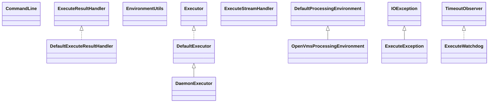

# commons-exec-1.3.jar

[Group index](README.md) | [All archives](../README.md)

## Scope and provenance

- **Donor:** `SQX_145_REFERENCE_ROOT/internal/libs/commons-exec-1.3.jar`.
- **SHA-256:** `cb49812dc1bfb0ea4f20f398bcae1a88c6406e213e67f7524fb10d4f8ad9347b`; accessed 2026-10-06; captured `2026-10-06T18:54:51.906614+00:00`.
- **Classes:** 37 raw entries; 37 unique entry names. Duplicate occurrence indices are zero-based.
- **Inspection:** read-only ZIP hashing and class-file structural parsing; signatures/descriptors, modifiers, hierarchy and references only. Bytecode bodies are hashed, not published.
- **Allocation:** proposed `FEAT-PROJECT-COMMONS-EXEC`, P13; [roadmap](../../dev/sqx-full-application-roadmap.md). Domain README registration remains required.
- **Repository:** `01067f00031428613c6394064ca1bcadc1ba00ee`; review state unreviewed. Download label 145-dev1; installed build/activation and runtime equivalence unverified.
- **Limit:** every class/member is inventoried; declaration coverage does not establish consumed calls, defaults, formulas, failure semantics or algorithm parity.
- **Archive/resource index:** [019.json](../../dev/evidence/sqx145/archives/145/019.json).

## Complete member declarations

Member shards contain exact JVM names/descriptors, access flags, generic signatures, throws types, declared fields/methods, superclass/interfaces and referenced class names. All classes, nested/synthetic members and overloads are retained. Code length/hash is structural evidence, not a normalized algorithm comparison.

- [001.json](../../dev/evidence/sqx145/members/019/001.json) — SHA-256 `c26810fa326f28d8c27183f8b1f8ca49008a3182dd279064391c7ad5660b13b7`.

## Focused structural diagram

Up to twelve non-nested classes; arrows show declared inheritance/interfaces only. External type names are not evidence of an available body or an executed dependency.

## Class inventory

| Archive entry | Occurrence | Class SHA-256 | Fields | Methods |
| --- | ---: | --- | ---: | ---: |
| `org/apache/commons/exec/CommandLine$1.class` | 0 | `e229dc7ac3fa1b5245ace358fa24c98344e9149703394e93aa6cf3f30a1a281b` | 0 | 0 |
| `org/apache/commons/exec/CommandLine$Argument.class` | 0 | `2db7dbd1f9e08ffbb6c4aa27975db430ef3ae68c82c50a67e3d884314b2c62ce` | 3 | 6 |
| `org/apache/commons/exec/CommandLine.class` | 0 | `470a290f496bd514d210e49a5d0b01b940b77eed617a8d54a256b21b55309d0b` | 4 | 21 |
| `org/apache/commons/exec/DaemonExecutor.class` | 0 | `08f04fb742f09a28420f768bbf5f4f8efdd9d65552326fbdb2ed2295e343a007` | 0 | 2 |
| `org/apache/commons/exec/DefaultExecuteResultHandler.class` | 0 | `1e998ce4459efd77f995ce7ba99b4f605dfa3e3f6c3e828cfa5dd00ab33229f3` | 4 | 8 |
| `org/apache/commons/exec/DefaultExecutor$1.class` | 0 | `4bd9f71a8a3e65b5429dba35ca4d85583a9ee172f9d109f84f7f784261cb2d0e` | 4 | 2 |
| `org/apache/commons/exec/DefaultExecutor.class` | 0 | `32126bc79f7f7d749df892913942cdc0c845c0e209af86b85c9a333b835c134e` | 8 | 26 |
| `org/apache/commons/exec/environment/DefaultProcessingEnvironment$1.class` | 0 | `6efa8c859a6bd7f5b50e50ba0dcee14a26da96fa5747c69e7a1f8c9dd7b878cb` | 1 | 3 |
| `org/apache/commons/exec/environment/DefaultProcessingEnvironment.class` | 0 | `04f052dfd6ac95ee789cdccb55b64b0efd55d8fd1fa5fd88aa14679c59065408` | 1 | 6 |
| `org/apache/commons/exec/environment/EnvironmentUtils.class` | 0 | `ebdffc2e76194e0c62b39c30540ea3c9c92b01eefbc3d5c845bedb7ad5d119dd` | 1 | 6 |
| `org/apache/commons/exec/environment/OpenVmsProcessingEnvironment.class` | 0 | `3b891edae1f8ea061200d4a0bf2d3944f359f2c2e68b556dc06c0586aa8f61f5` | 0 | 1 |
| `org/apache/commons/exec/ExecuteException.class` | 0 | `e9b59bc4a577ba43cf31cb275223f571a1051d5acdac602bff2a537104da6e30` | 3 | 4 |
| `org/apache/commons/exec/ExecuteResultHandler.class` | 0 | `d36ca559eae8049c2068b93875653ec0496ca6657c2a26841333a6043c409e30` | 0 | 2 |
| `org/apache/commons/exec/ExecuteStreamHandler.class` | 0 | `218b1f0d88751df20b61091c4177c3051f0c679b21dc657eeb0bba34d52fb835` | 0 | 5 |
| `org/apache/commons/exec/ExecuteWatchdog.class` | 0 | `b8182e5e3aa62d6a3c6c7db00f5bbe239e071699b96ecb2e82e24cb6409777c9` | 8 | 11 |
| `org/apache/commons/exec/Executor.class` | 0 | `bf075ecdecb76027830fea26a2bb3abfa5627058456e9ec5c33852901b6f29ea` | 1 | 15 |
| `org/apache/commons/exec/InputStreamPumper.class` | 0 | `21ce8b76b0613a70f3bb39cf55b79e23a8111b0726938f3332e341914f5e5c25` | 4 | 3 |
| `org/apache/commons/exec/launcher/CommandLauncher.class` | 0 | `b260e7eddd635fd5bfea8862678d07358a241584cad746ac3ef562d2bf9c4f73` | 0 | 3 |
| `org/apache/commons/exec/launcher/CommandLauncherFactory.class` | 0 | `dd0607d00e52260066c1d187b1c4f3962f4d760e6296cd0c1b58064e6f07eff8` | 0 | 2 |
| `org/apache/commons/exec/launcher/CommandLauncherImpl.class` | 0 | `2f83a613c53d7a2e62ad3478f60103f298cf78df141d33bd1f0589e0d3c71bc4` | 0 | 4 |
| `org/apache/commons/exec/launcher/CommandLauncherProxy.class` | 0 | `756728405d0de2d9580a4032f40549bcb3c4cbb8be2add1bbe36f73159db060a` | 1 | 2 |
| `org/apache/commons/exec/launcher/Java13CommandLauncher.class` | 0 | `aa702cd242f125d62282b67564eda1a5a0e6c3110a127ac2d4ff1593fd1587d4` | 0 | 2 |
| `org/apache/commons/exec/launcher/OS2CommandLauncher.class` | 0 | `afab22ec77201113c7a78322b32489eb477e58a21b346d0005525a46a64ded5f` | 0 | 2 |
| `org/apache/commons/exec/launcher/VmsCommandLauncher.class` | 0 | `bd1dce59d398bc858beb54b4cd5b21d122d31f49930b502e8aa93d878858c984` | 0 | 5 |
| `org/apache/commons/exec/launcher/WinNTCommandLauncher.class` | 0 | `6936a3a593d5718434e70d9d1171e8731fe2029e670b349ca3b23164552c67cf` | 0 | 2 |
| `org/apache/commons/exec/LogOutputStream.class` | 0 | `2cc6a827358eda8867d3fc9dc68110f01013d0a6bd4e4c8672bf34dfec79ddc8` | 6 | 10 |
| `org/apache/commons/exec/OS.class` | 0 | `bc86e4c2c25820eec3559c6e4a04a3dc00e27250ee4ca096fe8deff084827286` | 15 | 18 |
| `org/apache/commons/exec/ProcessDestroyer.class` | 0 | `30e88d4b8bb67920eed86f650e1024f9a5018f7ad24bfeedee9e63bf56c0a38a` | 0 | 3 |
| `org/apache/commons/exec/PumpStreamHandler.class` | 0 | `79426ab4f5e051c749fbca74e0279024b37f5f51e1517593891b194870a2de8a` | 10 | 18 |
| `org/apache/commons/exec/ShutdownHookProcessDestroyer$ProcessDestroyerImpl.class` | 0 | `345aa017c5d52df75a6b3fec77afe0f075715205713a62a3805b8ccf053be615` | 2 | 3 |
| `org/apache/commons/exec/ShutdownHookProcessDestroyer.class` | 0 | `7600da6450bea630abc01a55643ca0265bb9fafbf73e7f7b3bd9a561eb84d542` | 4 | 8 |
| `org/apache/commons/exec/StreamPumper.class` | 0 | `0aa19fa15383f1ea2bd895bc16749f183643ce9664256555fe3f35a685bf0fdc` | 6 | 6 |
| `org/apache/commons/exec/TimeoutObserver.class` | 0 | `aee27f7b933daf6b08690f8ecf5d22c22f968a925ce90aa7ffe7f5a2ffc60170` | 0 | 1 |
| `org/apache/commons/exec/util/DebugUtils.class` | 0 | `eaaa8f290beae050e44cbaef2d53496e769af2f687af3a6c10146b764dd78b75` | 2 | 4 |
| `org/apache/commons/exec/util/MapUtils.class` | 0 | `960f01cdcd55eca9a7e1c43ccdc352173939f658ab4deb28a478dbac1f462fef` | 0 | 4 |
| `org/apache/commons/exec/util/StringUtils.class` | 0 | `a572e991c52e42dd238930e0d4503d923dc89c496184df6dca0897aa87365bc6` | 4 | 7 |
| `org/apache/commons/exec/Watchdog.class` | 0 | `94ea27bc369b1be55e9b66759bc9d9aa77edf8fe48fc4587ab2be296ae7bcddc` | 3 | 7 |
