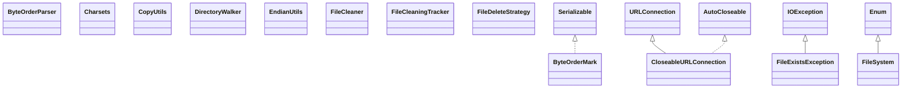

# commons-io-2.16.1.jar

[Group index](README.md) | [All archives](../README.md)

## Scope and provenance

- **Donor:** `SQX_145_REFERENCE_ROOT/internal/libs/commons-io-2.16.1.jar`.
- **SHA-256:** `f41f7baacd716896447ace9758621f62c1c6b0a91d89acee488da26fc477c84f`; accessed 2026-10-06; captured `2026-10-06T18:54:51.906614+00:00`.
- **Classes:** 347 raw entries; 347 unique entry names. Duplicate occurrence indices are zero-based.
- **Inspection:** read-only ZIP hashing and class-file structural parsing; signatures/descriptors, modifiers, hierarchy and references only. Bytecode bodies are hashed, not published.
- **Allocation:** proposed `FEAT-HOST-COMMONS-IO`, P01; [roadmap](../../dev/sqx-full-application-roadmap.md). Domain README registration remains required.
- **Repository:** `01067f00031428613c6394064ca1bcadc1ba00ee`; review state unreviewed. Download label 145-dev1; installed build/activation and runtime equivalence unverified.
- **Limit:** every class/member is inventoried; declaration coverage does not establish consumed calls, defaults, formulas, failure semantics or algorithm parity.
- **Archive/resource index:** [021.json](../../dev/evidence/sqx145/archives/145/021.json).

## Complete member declarations

Member shards contain exact JVM names/descriptors, access flags, generic signatures, throws types, declared fields/methods, superclass/interfaces and referenced class names. All classes, nested/synthetic members and overloads are retained. Code length/hash is structural evidence, not a normalized algorithm comparison.

- [001.json](../../dev/evidence/sqx145/members/021/001.json) — SHA-256 `e3268fd3587e27079a4dacffdc1ecf3a2f2e84eada604db7476ef224c87efe03`.
- [002.json](../../dev/evidence/sqx145/members/021/002.json) — SHA-256 `e29c789fecf85c908a3610942d02dd96854ed845eea2db300ae7e93f9709befc`.
- [003.json](../../dev/evidence/sqx145/members/021/003.json) — SHA-256 `0978fa581ac027e9cd8b93e4beda73e0774c467cc92d0c11e1febd3631b5b33d`.
- [004.json](../../dev/evidence/sqx145/members/021/004.json) — SHA-256 `8d37ce5686742cfee8af4b4a22948e7bd83c1783cd00d26f0bc079586764504b`.
- [005.json](../../dev/evidence/sqx145/members/021/005.json) — SHA-256 `3d7d9a04f9ea1e8a4382a6987b51cd7a1a6827d9ecbecf724c67560df16303c3`.

## Focused structural diagram

Up to twelve non-nested classes; arrows show declared inheritance/interfaces only. External type names are not evidence of an available body or an executed dependency.

## Class inventory

| Archive entry | Occurrence | Class SHA-256 | Fields | Methods |
| --- | ---: | --- | ---: | ---: |
| `org/apache/commons/io/ByteOrderMark.class` | 0 | `a0e20fcaa1b7f8978427099e7b8cd01ff96774a25f65e95a7ca3dbeada4d8830` | 9 | 9 |
| `org/apache/commons/io/ByteOrderParser.class` | 0 | `895026cf35ce1212931d38cc6c013ee121f68b7688471975f5d6cfb4adcf3f05` | 0 | 2 |
| `org/apache/commons/io/Charsets.class` | 0 | `1d252090d6d4a98f141f9d5bc5df2c4f8bb382212409f8e74c24337f6f27db8d` | 7 | 7 |
| `org/apache/commons/io/CloseableURLConnection.class` | 0 | `56b57c716bced16a34d3a58bfe46bfcc71df82910521a199b1ad80a5a18f118c` | 1 | 48 |
| `org/apache/commons/io/CopyUtils.class` | 0 | `5a444dbf18d1bd00c6985c38ed110dd870f52156a9dc9020752a341a1d962de5` | 0 | 13 |
| `org/apache/commons/io/DirectoryWalker$CancelException.class` | 0 | `cb092038a70889a28cc239d15c09142fb46ba36493dbf5880088b73b54d37d21` | 3 | 4 |
| `org/apache/commons/io/DirectoryWalker.class` | 0 | `0d83a9efec22464dd040a386b7d8191d7979aa346de259cbe29e9286608973c1` | 2 | 16 |
| `org/apache/commons/io/EndianUtils.class` | 0 | `6dd5d4bbd3ed63cf217c9034a24dbf503892efb9834f118e90fa2e1b3437cd01` | 0 | 32 |
| `org/apache/commons/io/FileCleaner.class` | 0 | `db33fa7161a4436311084acaa3dd11f2aafa7980e2e42ccfe4b4dd299f1f07a6` | 1 | 9 |
| `org/apache/commons/io/FileCleaningTracker$Reaper.class` | 0 | `a9c9f7fb3e1cfd07e7b0a0fd9f3ed564fd2d879a1c11ab7df0af41ab719cbd27` | 1 | 2 |
| `org/apache/commons/io/FileCleaningTracker$Tracker.class` | 0 | `dd0f0f64b4c2fe910f653fb74dc8d0110a196f7804690bf3e7cbb16cb1754fe9` | 2 | 3 |
| `org/apache/commons/io/FileCleaningTracker.class` | 0 | `0ac457ddb377e88453c90c725c542eb7edb51f74793caae918587ef9e1e6f265` | 5 | 11 |
| `org/apache/commons/io/FileDeleteStrategy$ForceFileDeleteStrategy.class` | 0 | `bf0318c2c488133cdc130b49d00d15f57f9098412189fd9944de267031f2ab4d` | 0 | 2 |
| `org/apache/commons/io/FileDeleteStrategy.class` | 0 | `583842ddf4a04226c1cae4555c970854dff4308aea7fb1ab836d8382ec07e8d3` | 3 | 6 |
| `org/apache/commons/io/FileExistsException.class` | 0 | `01326d50cec78224527573d85094fbe21bbf8bfd15bb077fe1eb50b986a58db5` | 1 | 3 |
| `org/apache/commons/io/FileSystem.class` | 0 | `344dc66297af2c51cc925206d4d4da5f0318ce2e65b0628dd552ad99e5ead5a6` | 21 | 29 |
| `org/apache/commons/io/FileSystemUtils.class` | 0 | `2318bbb8c1692f0ef8faf7b5a2d1af4878466c00ce569a173d78892b072b10ce` | 0 | 7 |
| `org/apache/commons/io/FileUtils.class` | 0 | `166c5b9df2e62c289266bf6666f6a12a8ae316dbb7c1a641a7462d3c57a128a1` | 15 | 174 |
| `org/apache/commons/io/FilenameUtils.class` | 0 | `dab12b3e4e3eb5958fb69d3e88404f115f50a6d2a717ac1c26bef146bf212f4a` | 16 | 49 |
| `org/apache/commons/io/HexDump.class` | 0 | `165ae7fb51d749fe001dc7ab15aeee26fbc575122078c9283ed7d02c8dfd200f` | 3 | 7 |
| `org/apache/commons/io/IO.class` | 0 | `7060e2d14d00f331e55ec9ddd25972e10c5ea05e4ea10c8ecd1ba0daad4eac45` | 0 | 2 |
| `org/apache/commons/io/IOCase.class` | 0 | `07995d6db7220763fa0f263cefcc6621072d963106e27de1ead8eadf3cc49ab9` | 7 | 20 |
| `org/apache/commons/io/IOExceptionList.class` | 0 | `1908447b402657f4938ce7de71becf797c3258f5de54a77d4076ddd926f677c8` | 2 | 11 |
| `org/apache/commons/io/IOExceptionWithCause.class` | 0 | `aa8d097d2dfad105d32655ad26ac8043a060dba26533112232f42a20b597c86b` | 1 | 2 |
| `org/apache/commons/io/IOIndexedException.class` | 0 | `07a758ce567352014a7b4eb2592e3b024e749e7a258580d17e7b774088e04a18` | 2 | 3 |
| `org/apache/commons/io/IOUtils.class` | 0 | `b1ba99b7dba76d975df54a11ef97c069aea36df241fa61bf2b9472e785972c47` | 15 | 173 |
| `org/apache/commons/io/LineIterator.class` | 0 | `4e72ca1000dd6644ce0326ea36b52a0efc7a6c00de59323ce19866d899cbf095` | 3 | 9 |
| `org/apache/commons/io/RandomAccessFileMode.class` | 0 | `d1099f8e11de3a048c95b67d411f016d5290b2cc34732895837a7f318722a49a` | 6 | 9 |
| `org/apache/commons/io/RandomAccessFiles.class` | 0 | `d598b3b5d415320e679c396daa767762d57a6ddad5483c051834bbcfb08f2e23` | 0 | 5 |
| `org/apache/commons/io/StandardLineSeparator.class` | 0 | `1b226a805de717ad2f06088fb27b28176793d96c24996e96230ec3aa9b2a3684` | 5 | 7 |
| `org/apache/commons/io/StreamIterator.class` | 0 | `10a3c1999a5f8a2a10442798f3ebf44fc10caaf2ce0f1e517e0a3b7d89339dbe` | 3 | 5 |
| `org/apache/commons/io/TaggedIOException.class` | 0 | `7138782d076074bc86ca82aca13aec7b5f5ed68a08f7defbf13af891ec551309` | 2 | 6 |
| `org/apache/commons/io/ThreadMonitor.class` | 0 | `cde02e2996634b47d30fd51c9d2056ec0ac353d1dcd952f54f65a9e236b9a9f4` | 2 | 5 |
| `org/apache/commons/io/ThreadUtils.class` | 0 | `0bb0c1e71253c4ef7d4269c8e58c1534e6845ff34ba0f4e0b5b3a63b29c1e103` | 0 | 3 |
| `org/apache/commons/io/UncheckedIOExceptions.class` | 0 | `b59e2248a85e6da07f7fcf65a8e2d1fb9b8692199d2c15caafcba3cf2dd66be5` | 0 | 3 |
| `org/apache/commons/io/build/AbstractOrigin$ByteArrayOrigin.class` | 0 | `e964854c98f8ada16bff96a0e6cf34c630f5132fc419df705dce0ac27b87abe6` | 0 | 5 |
| `org/apache/commons/io/build/AbstractOrigin$CharSequenceOrigin.class` | 0 | `8632770e8ddde3635bf9975325d58ab10ca40cfa518e275165754ae0c925e905` | 0 | 6 |
| `org/apache/commons/io/build/AbstractOrigin$FileOrigin.class` | 0 | `bfd026552e2936470194d0276e66e0c59d36fe987617b1b79510f1794e9829e3` | 0 | 4 |
| `org/apache/commons/io/build/AbstractOrigin$InputStreamOrigin.class` | 0 | `2442727e00c9db74ff1c26f767452c26ee93a0f8f8bcda63b774358e199ef54b` | 0 | 4 |
| `org/apache/commons/io/build/AbstractOrigin$OutputStreamOrigin.class` | 0 | `7fa031ddfb257ca7202c66655b01253decd164863ae0ebd45a90202c493dbbab` | 0 | 3 |
| `org/apache/commons/io/build/AbstractOrigin$PathOrigin.class` | 0 | `36075b053e25fae90db54b6d36693a7ca23e650d351116c7e9c70177a6762895` | 0 | 4 |
| `org/apache/commons/io/build/AbstractOrigin$ReaderOrigin.class` | 0 | `70a3a93ece0fe5225f92b732a95eb1f8991bf33d1df33fdf268f772f96f4319c` | 0 | 5 |
| `org/apache/commons/io/build/AbstractOrigin$URIOrigin.class` | 0 | `3774cb3b5890c2d300fe6531412ff297017533f6e46b0b64c167616f71ed03a3` | 0 | 3 |
| `org/apache/commons/io/build/AbstractOrigin$WriterOrigin.class` | 0 | `33e06740638e76245f71eec66724a0ca28b5045e9709d2bf09f46298ab2ed758` | 0 | 3 |
| `org/apache/commons/io/build/AbstractOrigin.class` | 0 | `03e9cefca00c44041c94bf73a0c49642a528669577d304cf994c268606ad6f63` | 1 | 14 |
| `org/apache/commons/io/build/AbstractOriginSupplier.class` | 0 | `d72deeafac22c4986cdf7c1fab0d95b681b172beb5c420076ee9d725a4171f32` | 1 | 27 |
| `org/apache/commons/io/build/AbstractStreamBuilder.class` | 0 | `e4ccc001fd210249945e70e3c493e7c96c93488b7ca4c9929429e90a58e802ca` | 10 | 25 |
| `org/apache/commons/io/build/AbstractSupplier.class` | 0 | `4d8ff15d98f746a58d57c8c641c6e13f80c8f1563112e3350aff665dfea28ff9` | 0 | 2 |
| `org/apache/commons/io/build/package-info.class` | 0 | `3fda09df8342d99e98cd78955c48f2cbb196a6b1325d066f9d93e82e21ecca1c` | 0 | 0 |
| `org/apache/commons/io/channels/FileChannels.class` | 0 | `697e19d70c825ee428b7b4490a604c124833d4fe2f7d3a293e5cfbd32caf214a` | 0 | 3 |
| `org/apache/commons/io/channels/package-info.class` | 0 | `998d9f2c542c88d7ba256620cba6e23aa90f2b60b255f59bee11b3ffe8cfd8f7` | 0 | 0 |
| `org/apache/commons/io/charset/CharsetDecoders.class` | 0 | `7864e35413e8b00c8ad62de47c2eeaf90bdc884f87360111293378442568e799` | 0 | 2 |
| `org/apache/commons/io/charset/CharsetEncoders.class` | 0 | `43a89575696123dc9a4191f7c05d2372286e8f8f67b7a553ef1c07be94a65d10` | 0 | 4 |
| `org/apache/commons/io/charset/package-info.class` | 0 | `9c7230fc28d6d9cf7abf84226f265ec23b0c00ff175ea345b89c7b8d3dcafe79` | 0 | 0 |
| `org/apache/commons/io/comparator/AbstractFileComparator.class` | 0 | `b03d4b83eb98c84703b4fd253186741a9cba13ac13abddfacecdf8aa1d523556` | 0 | 4 |
| `org/apache/commons/io/comparator/CompositeFileComparator.class` | 0 | `143bda871ee4eb385427feb4777ae4f93dae2bfbb47b1b8870646cea0d6ffe93` | 3 | 12 |
| `org/apache/commons/io/comparator/DefaultFileComparator.class` | 0 | `aa08ccff0f98e1c9a809ff0167f24c923796aba21484bfa83bc48a33c966e25b` | 3 | 7 |
| `org/apache/commons/io/comparator/DirectoryFileComparator.class` | 0 | `4a5f1f6aabd022027d979104f56b2f96fa49a9c76af81ad1362360fd730018bb` | 5 | 8 |
| `org/apache/commons/io/comparator/ExtensionFileComparator.class` | 0 | `bc1671dbab321b337e4a9b3876c62e2a993a88f7e90f95a7d2aea9d2aefd7597` | 8 | 8 |
| `org/apache/commons/io/comparator/LastModifiedFileComparator.class` | 0 | `7b041b25a55c350c367161f59f982530cab2de009a10b903f299c0c5ff6f245b` | 3 | 7 |
| `org/apache/commons/io/comparator/NameFileComparator.class` | 0 | `de37800d6273a337eba647a79fbf4c14c9111a937703929fc58d697346bb8449` | 8 | 8 |
| `org/apache/commons/io/comparator/PathFileComparator.class` | 0 | `9ed45098ab4b5828331a4ac90d6b662c8b3e30d8ffc04030f202f6f1054dae4f` | 8 | 8 |
| `org/apache/commons/io/comparator/ReverseFileComparator.class` | 0 | `24a43051ea1598c0ae5a8cd499169f48e821b3d34a6236b80f5618e7bfc59185` | 2 | 4 |
| `org/apache/commons/io/comparator/SizeFileComparator.class` | 0 | `745565e1978a72734e3c06397852f93550d2489bc1dc314f4cfe370a03bee84b` | 6 | 8 |
| `org/apache/commons/io/comparator/package-info.class` | 0 | `a5ca77608bc748307eac011e54ccd6759ff09337463848199c61929ecaa861c2` | 0 | 0 |
| `org/apache/commons/io/file/AccumulatorPathVisitor.class` | 0 | `ffc0b748738ad6556f3db04b07b6400c12d58542affefa4c98fdccd6fc1d6457` | 2 | 17 |
| `org/apache/commons/io/file/CleaningPathVisitor.class` | 0 | `0c416cb5d687c39cbea633567a46761463090c8c1e1cfac50a52b9bd51fdcc17` | 2 | 11 |
| `org/apache/commons/io/file/CopyDirectoryVisitor.class` | 0 | `de756d718ffe66f9f21e21af4537266a6df6cc7b14211e35fe937c4ec5731ed6` | 3 | 14 |
| `org/apache/commons/io/file/Counters$1.class` | 0 | `ef36a705683a8425433ed1763f2abe59c23f1a01d41bc0adf0e2ffc424c00865` | 0 | 0 |
| `org/apache/commons/io/file/Counters$AbstractPathCounters.class` | 0 | `66ecd2d1948cfe9c9ffa10e68d4d78e6dfb2d9410694a927b27b94a2efb760b0` | 3 | 8 |
| `org/apache/commons/io/file/Counters$BigIntegerCounter.class` | 0 | `e4dfb18b87a7434e6089c2edfa217bfe6b6d53d05f0103c58dcf74a00ec8fa77` | 1 | 11 |
| `org/apache/commons/io/file/Counters$BigIntegerPathCounters.class` | 0 | `a0988d38f0111ea652a894db2399fc62781f3d35474bcdbebafcd5c44735e666` | 0 | 1 |
| `org/apache/commons/io/file/Counters$Counter.class` | 0 | `072dfc49b5b6ed2864197d4c8f6cd32c639331645d3686ef90b92e683a5a564a` | 0 | 6 |
| `org/apache/commons/io/file/Counters$LongCounter.class` | 0 | `0626833ab0457850920d6f658ceadb79ea223899fceab9a885fb5812207d51c4` | 1 | 11 |
| `org/apache/commons/io/file/Counters$LongPathCounters.class` | 0 | `024cdfb4ea1efed360b51f793a3128a1f07bb254a34516900e6a908c77bce6b3` | 0 | 1 |
| `org/apache/commons/io/file/Counters$NoopCounter.class` | 0 | `0e26aa8e0f6c78ce905deec1df81cd8693882d6f07e85c90b9e845b7431cd40a` | 1 | 8 |
| `org/apache/commons/io/file/Counters$NoopPathCounters.class` | 0 | `0b8b70f8aa7fada80cd71e0318c48d5cf8dd06e91de1ea8b59316ab2549c87ae` | 1 | 2 |
| `org/apache/commons/io/file/Counters$PathCounters.class` | 0 | `3c5b1c6dcc879d74ceb3b989ae025717f77edae3cedc6af5fb464a747d5aa3ea` | 0 | 4 |
| `org/apache/commons/io/file/Counters.class` | 0 | `e697c1132e92e40796a103475cd6883feaf7ab553c468eeb667b95fcc661f5fb` | 0 | 7 |
| `org/apache/commons/io/file/CountingPathVisitor.class` | 0 | `8e92242412796f3fd2e3941403d0ad3a32036a6233b4960663a389c7658a2fee` | 4 | 20 |
| `org/apache/commons/io/file/DeleteOption.class` | 0 | `507819a40cfe3e1460e9c3bd1740d8aacdde473affcb5e5e5598f87430426f50` | 0 | 0 |
| `org/apache/commons/io/file/DeletingPathVisitor.class` | 0 | `0c4e98cd13e7f3dd4c85e322819a4c2d934f4534a4f995aa9438729f9375a3a7` | 3 | 14 |
| `org/apache/commons/io/file/DirectoryStreamFilter.class` | 0 | `bef3991f5b7d0215f235625614c9a9a66ea811c3e78d97367891206fd29203d7` | 1 | 4 |
| `org/apache/commons/io/file/FilesUncheck.class` | 0 | `8ca6bee36b79ad3f072bbe3ef433977859306ba0f3272bff9920787b7a9ad7aa` | 0 | 57 |
| `org/apache/commons/io/file/NoopPathVisitor.class` | 0 | `1c545f692b0f2cb9f2dead967d491a2215157a9b516e55df637a984a8c8317fe` | 1 | 3 |
| `org/apache/commons/io/file/PathFilter.class` | 0 | `f2c2aa0c7b782f32eb9d156ca58ce575728845cdd89a4bba70e18901d2a48733` | 0 | 1 |
| `org/apache/commons/io/file/PathUtils$1.class` | 0 | `e051ac63502ebaf2c67c1b6c6fa37b9573ea17b229a5b35b050d2846f707916d` | 0 | 0 |
| `org/apache/commons/io/file/PathUtils$RelativeSortedPaths.class` | 0 | `0b285a8e9cc7405e5c083adcd1ea46f4931b98857605d8a08a2eeb5a55f39a21` | 3 | 2 |
| `org/apache/commons/io/file/PathUtils.class` | 0 | `1ac3332cc5aa4122e05d3c47c551116c73a9b88476287c0ce3dc3980e335bf3e` | 11 | 108 |
| `org/apache/commons/io/file/PathVisitor.class` | 0 | `821995e6c1e1abaca9e819aee6b782f9492e69408e49258e4628f4217cd6dcfa` | 0 | 0 |
| `org/apache/commons/io/file/SimplePathVisitor.class` | 0 | `ea72029dc700f2cc7dae48980c6a905c8ade41b136172c0aecb1c99b4305c46c` | 1 | 5 |
| `org/apache/commons/io/file/StandardDeleteOption.class` | 0 | `22df06fccdd63952fcbf78c67d2d419e58c158e23f6617dea4f6e1a1d18410b1` | 2 | 7 |
| `org/apache/commons/io/file/attribute/FileTimes.class` | 0 | `815e140361d5a336926c4bcab7c735d8212b178725ea8789e1026663aedc72cf` | 4 | 21 |
| `org/apache/commons/io/file/attribute/package-info.class` | 0 | `76c9cbaa4c8e6d31be1e009e44039e585cd54ca534ff8adc230157fe677d807b` | 0 | 0 |
| `org/apache/commons/io/file/package-info.class` | 0 | `c455d3ceb1525cfe5ee486335db8a69f3332e06d5883dc6b2947da74baf1dece` | 0 | 0 |
| `org/apache/commons/io/file/spi/FileSystemProviders.class` | 0 | `742c2bb2cb651a29f3b070178032aeec45fa70681bc227d6b1659d3d2cda63fa` | 2 | 8 |
| `org/apache/commons/io/file/spi/package-info.class` | 0 | `df090d0ed0212217f1347e5c749ca4d017c6efb117556bfe9de57bac8e3d7dbd` | 0 | 0 |
| `org/apache/commons/io/filefilter/AbstractFileFilter.class` | 0 | `5a490a227565539ac9b042824a579270d24db3ba128ec5f764b630f8d1252fd5` | 2 | 19 |
| `org/apache/commons/io/filefilter/AgeFileFilter.class` | 0 | `f8c5f998a5a59ea224b678072d3efdc83747545e4aee3c2ae4a0c1bd64c0deb8` | 3 | 12 |
| `org/apache/commons/io/filefilter/AndFileFilter.class` | 0 | `37017b75dbfc60c8a6aede6bdb16c9b1f5f41148f2972eba9cad97659de30a7f` | 2 | 19 |
| `org/apache/commons/io/filefilter/CanExecuteFileFilter.class` | 0 | `2caac54443b13cf62219be9ff55e4e70d067155a4285bb5ac3e6da59b33bb279` | 3 | 4 |
| `org/apache/commons/io/filefilter/CanReadFileFilter.class` | 0 | `d283fb86f5335591f5dc7a2ab88e61470c22583af4ddcc76dab536f374730add` | 4 | 4 |
| `org/apache/commons/io/filefilter/CanWriteFileFilter.class` | 0 | `13b46754e0a21ae2c8657009be9136cde4212f5e9e7a9c2b13a630ed875b3e39` | 3 | 4 |
| `org/apache/commons/io/filefilter/ConditionalFileFilter.class` | 0 | `4dc47eecbec2dc326ef06a72ebf80a7398c8d2b72f2fbccd22f7a76b9200176f` | 0 | 4 |
| `org/apache/commons/io/filefilter/DelegateFileFilter.class` | 0 | `e10faf0a01924bb88e49fe405d47f76311eeaa4cfdcac85c0ca4d3867d653741` | 3 | 5 |
| `org/apache/commons/io/filefilter/DirectoryFileFilter.class` | 0 | `ad5342bc36a9c11b62e9c817f4f9d73c412dc0e31c59fb7c6405b902ecdcd821` | 3 | 4 |
| `org/apache/commons/io/filefilter/EmptyFileFilter.class` | 0 | `02eb9cef46a8e38779e7c7d2cf276d75d347ab6da37cc6878874a6466246c50b` | 3 | 5 |
| `org/apache/commons/io/filefilter/FalseFileFilter.class` | 0 | `cb43ede8be06f2b59284964dbcef6515f8d8f2ba9343d7806828b057dd73b0c5` | 4 | 9 |
| `org/apache/commons/io/filefilter/FileEqualsFileFilter.class` | 0 | `caf37040290faa5984e19e6c74ff45ae28f573322d7d84c3776bfb6e54fe972b` | 2 | 3 |
| `org/apache/commons/io/filefilter/FileFileFilter.class` | 0 | `a38a996f02aa10316b5f8feaef93b0daaaaf74b3e7ef861c46563de5628595bc` | 3 | 4 |
| `org/apache/commons/io/filefilter/FileFilterUtils.class` | 0 | `5d0a30521acec000f931de8a28ed8d1997ebf4c57c92920382771096f6b45d3a` | 2 | 44 |
| `org/apache/commons/io/filefilter/HiddenFileFilter.class` | 0 | `4f5172c1072e68f29210d6c7539f5b653f734deb04096240f5710a3259a98442` | 3 | 5 |
| `org/apache/commons/io/filefilter/IOFileFilter.class` | 0 | `48486b4fb09870eae3ff67bbf9910bb6fcbda790187ca4591396167c687b99d7` | 1 | 8 |
| `org/apache/commons/io/filefilter/MagicNumberFileFilter.class` | 0 | `f8998ce2f22da6921640d0bbbb526645a6144360d37eb48c7e7b640eafae7a16` | 3 | 7 |
| `org/apache/commons/io/filefilter/NameFileFilter.class` | 0 | `7c0993f092b68de9668dcafcfcd8adad7a307267b56ce6dba1dd38a23d03c9cf` | 3 | 13 |
| `org/apache/commons/io/filefilter/NotFileFilter.class` | 0 | `374339a9bc7b1cf6b50a4029bc887ed372ddb5791a0310e2700d930190ba5d57` | 2 | 6 |
| `org/apache/commons/io/filefilter/OrFileFilter.class` | 0 | `46ca39b3a8bea9d1aa297ae217a85c4170d0da0cc1555f1932f290db76d185f4` | 2 | 18 |
| `org/apache/commons/io/filefilter/PathEqualsFileFilter.class` | 0 | `68dfbcf8c720cabb58325f85588dd7b0bfaf475c735761b35cc35fc6a24d95a3` | 1 | 3 |
| `org/apache/commons/io/filefilter/PathMatcherFileFilter.class` | 0 | `4d96545f654cb87a78b837a697d84526c20bfb7a30398aaec201c0427d31d70e` | 1 | 3 |
| `org/apache/commons/io/filefilter/PathVisitorFileFilter.class` | 0 | `2540886b232e120eec9762d0eb42375052282beee0d82494bfaeb0de41609e17` | 1 | 7 |
| `org/apache/commons/io/filefilter/PrefixFileFilter.class` | 0 | `5382622124edd2ab22a44b357516a8312ac8ca8dd12c2d63fca1d4b87d236766` | 3 | 12 |
| `org/apache/commons/io/filefilter/RegexFileFilter.class` | 0 | `8c0059626e3e15405bb063a67acb5767e2608ad9650bae0eb127435c07ba1d61` | 3 | 11 |
| `org/apache/commons/io/filefilter/SizeFileFilter.class` | 0 | `1ae6f1534a70c8da9238b448fd0c6a19a844dd041d91cf35ee20ee48762c6583` | 3 | 9 |
| `org/apache/commons/io/filefilter/SuffixFileFilter.class` | 0 | `99307f7213322698457f03369325b0a4a51bbb042aab06fc431b97d998b63480` | 3 | 12 |
| `org/apache/commons/io/filefilter/SymbolicLinkFileFilter.class` | 0 | `74c1a0847b1994bf53baf094286b2e79511197b69cb63ec42acbc2e1c1151156` | 2 | 6 |
| `org/apache/commons/io/filefilter/TrueFileFilter.class` | 0 | `a4d3d5c9247f5382afa8385d935b0f25364769fb27d49d1433c34f9638ecb0ed` | 4 | 9 |
| `org/apache/commons/io/filefilter/WildcardFileFilter$1.class` | 0 | `6d306257788b3e790bcd84dff93fd2b1ab28bc898c913e6952f8b2b5fcc1e75a` | 0 | 0 |
| `org/apache/commons/io/filefilter/WildcardFileFilter$Builder.class` | 0 | `db47a0b8fd8debf414c277c4968e32ea1e5d746ccb924c3982f7aa1f21f798f4` | 2 | 6 |
| `org/apache/commons/io/filefilter/WildcardFileFilter.class` | 0 | `4219d571c388a9ed366e780f028eb22f920e599adc416351677c2d55147077b0` | 3 | 17 |
| `org/apache/commons/io/filefilter/WildcardFilter.class` | 0 | `45e533c858bec80951eb23891bf6dbaa866c5f69f4752e66368081100408e5ae` | 2 | 9 |
| `org/apache/commons/io/filefilter/package-info.class` | 0 | `73badaa1f5e151da702b0cacd5e7d3a0af8c3aff4f075f666b6d879b39a0bc78` | 0 | 0 |
| `org/apache/commons/io/function/Constants.class` | 0 | `f7504b30fdd5c8573493f7b7b0a0275350562c4cf16d9cfebddd9164037e4887` | 7 | 9 |
| `org/apache/commons/io/function/Erase.class` | 0 | `9c53cb7eb1f6e2d41d480fe168a2757d00eded4594ca7af7a9316e76fa26e2be` | 0 | 10 |
| `org/apache/commons/io/function/IOBaseStream.class` | 0 | `ce28049e8acb5fd109ba598739d7ddae54c0fe92631afe29756aeebf6693505e` | 0 | 12 |
| `org/apache/commons/io/function/IOBaseStreamAdapter.class` | 0 | `f4b18bd2d4ab78e1ef784cf4c06926f9dab4ee4b9d167c96790a49c28e474d02` | 1 | 2 |
| `org/apache/commons/io/function/IOBiConsumer.class` | 0 | `464dc8c88c68564db90edf9fee72baf9d9ef9aedb86fbe18ad21b4db8c73cd42` | 0 | 6 |
| `org/apache/commons/io/function/IOBiFunction.class` | 0 | `55a4b26c1270b4fee5bd5dd73c44ee3597d5b6ed7f76c1c08e140b0a82747378` | 0 | 5 |
| `org/apache/commons/io/function/IOBinaryOperator.class` | 0 | `2ab850fa13d7e189d3d1a757c0866a5b6891a104a9048819bcc828ec509ddf63` | 0 | 6 |
| `org/apache/commons/io/function/IOComparator.class` | 0 | `61284ecedb7821a9b399a24cec1ec12f2203b429ca2c938cf68041c59ba5d293` | 0 | 3 |
| `org/apache/commons/io/function/IOConsumer.class` | 0 | `440e25786db33b484ed733850a83732abb309fe1f6207de53dc0440a5d8bbe8b` | 1 | 14 |
| `org/apache/commons/io/function/IOFunction.class` | 0 | `d0b8db02d750ad8451438d23451ef0c53fa52785fa3bdd9c86f0951793999ed4` | 0 | 20 |
| `org/apache/commons/io/function/IOIntSupplier.class` | 0 | `03cab256a6defb194652b7d05ca188913ef1f20a14c87b6e5e2a765ebcfb4e09` | 0 | 3 |
| `org/apache/commons/io/function/IOIterator.class` | 0 | `54626568929df8d4941c45b5c703f6096b02eb0a8ee100a7c79f455e741c2728` | 0 | 7 |
| `org/apache/commons/io/function/IOIteratorAdapter.class` | 0 | `73481d2a51ec0c39574362386728642e709dc078fbe84458ae9e0eaf5bcd0fd0` | 1 | 5 |
| `org/apache/commons/io/function/IOLongSupplier.class` | 0 | `cd4df2ceb712af42eac8a436de66e25a2d937611deffb506cb7b1d3d73588636` | 0 | 3 |
| `org/apache/commons/io/function/IOPredicate.class` | 0 | `6abb9a217522208512f22f5cd4bde81a7d688fcb175b4a2c890f426467c57f53` | 0 | 13 |
| `org/apache/commons/io/function/IOQuadFunction.class` | 0 | `35cf5bdf9ae05426d564b91c90305abac3a5cd58cf0a6be47c04fa4d4e91e5d6` | 0 | 3 |
| `org/apache/commons/io/function/IORunnable.class` | 0 | `671de5dbe3cde2d97776a835bbd693e287138d19f17396e2ebf0a2e1e5317441` | 0 | 4 |
| `org/apache/commons/io/function/IOSpliterator.class` | 0 | `68f2b5d09877cf51299344fc63bc13499585d512e20ed6571072844c9decc39b` | 0 | 11 |
| `org/apache/commons/io/function/IOSpliteratorAdapter.class` | 0 | `8b49525b9f89fd2343e5dad849bb5f1ec1ae201807536dcb207c9dd3ecd53306` | 1 | 3 |
| `org/apache/commons/io/function/IOStream$1.class` | 0 | `59392328197ca11be27e3fe2f5bc06b87adfc431632bec93e008882f62f12d63` | 3 | 3 |
| `org/apache/commons/io/function/IOStream.class` | 0 | `b8ae75e5bf1d29b61ffb13d7f682222ca1433dd4515f3ec9b9f477d62c153b1d` | 0 | 64 |
| `org/apache/commons/io/function/IOStreamAdapter.class` | 0 | `78756d7a6676714680c47c1a710f9e6fa16f75f2ec7a34b000c717d68561a187` | 0 | 4 |
| `org/apache/commons/io/function/IOStreams.class` | 0 | `fb71a1fa14c39d266c7050d9ba556ea70cbd3e507d4e182b0f7d709f3bfa2711` | 1 | 11 |
| `org/apache/commons/io/function/IOSupplier.class` | 0 | `199381a06b55f2cdba0731287d48dc381edcee183e5bf8ff9209115dab56ba2d` | 0 | 3 |
| `org/apache/commons/io/function/IOTriConsumer.class` | 0 | `8a6e92a87025dab4958c558ed44e976c92851cf57351ab29eac0e7a1919ba0ec` | 0 | 4 |
| `org/apache/commons/io/function/IOTriFunction.class` | 0 | `58d6c4526f7a882378ff05a75964cdf1f70ecdf9ba86490feeb21b031b1da697` | 0 | 3 |
| `org/apache/commons/io/function/IOUnaryOperator.class` | 0 | `69fd24901ddb90c454f960f77dcf1e9207643d95a8ced680369ecfcb4d619a34` | 0 | 4 |
| `org/apache/commons/io/function/Uncheck.class` | 0 | `b748f4866805d416310b682fe9f17ce25e9ff46fbbf736395a8b4e2ce12b978b` | 0 | 20 |
| `org/apache/commons/io/function/UncheckedIOBaseStream.class` | 0 | `4d771ed724c7c1a4746567a9ab257fa90f01eeb45225bc9e187e6eafb1dc2542` | 1 | 10 |
| `org/apache/commons/io/function/UncheckedIOIterator.class` | 0 | `523a95e687fade9dee26034301d420ca47c70d916eb280a9d8e8c22dcaab4003` | 1 | 4 |
| `org/apache/commons/io/function/UncheckedIOSpliterator.class` | 0 | `e76e2e5095edf6b291cd7c6e75ad4ded8f491c46081f04bbdc09d91011de13d7` | 1 | 9 |
| `org/apache/commons/io/function/package-info.class` | 0 | `39208f53480576e211d07d2c72f162f4484df6d54e037d877c0d66f2f7eb7d2d` | 0 | 0 |
| `org/apache/commons/io/input/AbstractCharacterFilterReader.class` | 0 | `49d29d5c4cff732f42974feb9acda99d1190bda490834545a54a7550c71eadac` | 2 | 7 |
| `org/apache/commons/io/input/AutoCloseInputStream$Builder.class` | 0 | `ab2b9fac636fd6bbbddd8d93b8dde52a27c3d781df959f0696faeab024e8a0da` | 0 | 3 |
| `org/apache/commons/io/input/AutoCloseInputStream.class` | 0 | `61bc53972214ba42d0dcd96653c9b65c4c0d64081400adaa591f8e434b40fb21` | 0 | 5 |
| `org/apache/commons/io/input/BOMInputStream$Builder.class` | 0 | `7975653f01af06f62d9003ca96e4b4ddf1fec31d4ccafc14e81d8eb6ca5ae496` | 3 | 8 |
| `org/apache/commons/io/input/BOMInputStream.class` | 0 | `86abf7fb3563d71b3cfed956228797228f1ae80865d86f14af7b24c8a1626e98` | 9 | 19 |
| `org/apache/commons/io/input/BoundedInputStream$AbstractBuilder.class` | 0 | `4d09556e227784cba8316b40e080232607abec630325756926782aa62a481b14` | 3 | 7 |
| `org/apache/commons/io/input/BoundedInputStream$Builder.class` | 0 | `fba2dc6f66d577ae6c181b6116a1f2e42f74bedb6bf082cda19b4e015cd12337` | 0 | 6 |
| `org/apache/commons/io/input/BoundedInputStream.class` | 0 | `b3246c4dccfd3f9aabf6e9b34196003d71bca7b7ab69155566260145fb41b3f7` | 4 | 24 |
| `org/apache/commons/io/input/BoundedReader.class` | 0 | `4b088bbe38d17344cbcfd1b37d05c524aebfd145354e44d18ebabd1ef046ad24` | 6 | 6 |
| `org/apache/commons/io/input/BrokenInputStream.class` | 0 | `7b1692deb5c97f6c5fa7847279d400a871dfc02d51822492c075d82b0b5b40a3` | 2 | 14 |
| `org/apache/commons/io/input/BrokenReader.class` | 0 | `b2198f8bf3bd48060b4c8f57b16899ded21447e6e12f18a5955f2a27fab144c4` | 2 | 15 |
| `org/apache/commons/io/input/BufferedFileChannelInputStream$Builder.class` | 0 | `8755bb0afadfc0b015a3756d5e144339d1df652325738d0dee3c73a6b0747d26` | 0 | 3 |
| `org/apache/commons/io/input/BufferedFileChannelInputStream.class` | 0 | `9a5419f035db01013ea560f2948f44acad5680a51056f5f473bcf080f78bcb2b` | 2 | 14 |
| `org/apache/commons/io/input/ByteBufferCleaner$1.class` | 0 | `4409ff6c8ea6aedb94d06090ad5f4a9108eab399e38d8c429f7826bddacd88e8` | 0 | 0 |
| `org/apache/commons/io/input/ByteBufferCleaner$Cleaner.class` | 0 | `319d8d6bb7036dde90669eef6dd5e4a98d397f041e342916e3964224ac6e492c` | 0 | 1 |
| `org/apache/commons/io/input/ByteBufferCleaner$Java8Cleaner.class` | 0 | `bcb05ba063a4dbd9bdfdc8e318251162cbdc10d1e03a647e01de6cd3491eaa40` | 2 | 3 |
| `org/apache/commons/io/input/ByteBufferCleaner$Java9Cleaner.class` | 0 | `789670eef1696bab8ecbe518d77daa7c163933da0285cb1fa1eab02538a3d1db` | 2 | 3 |
| `org/apache/commons/io/input/ByteBufferCleaner.class` | 0 | `e4e367ffe0ac47c71fdbe2af11c50de573406a7fb0b978e8234e0a55519a3344` | 1 | 5 |
| `org/apache/commons/io/input/CharSequenceInputStream$1.class` | 0 | `ce383495a28729a89ee9a5ebcf9255b359b10d7019a66f4e196e02bc44933969` | 0 | 0 |
| `org/apache/commons/io/input/CharSequenceInputStream$Builder.class` | 0 | `523bbaa592cf2596a83c78773eef809f73c388855c563a298ae687b30dcba2e9` | 1 | 9 |
| `org/apache/commons/io/input/CharSequenceInputStream.class` | 0 | `c625191610a1d1d50391c49c73958f05dcb7c01927ee8a597a0e9d7e486f0d7f` | 6 | 20 |
| `org/apache/commons/io/input/CharSequenceReader.class` | 0 | `4b0be80df887a6eff52033985213dc0f8eda215ad76e3904189b1f04512569b7` | 6 | 14 |
| `org/apache/commons/io/input/CharacterFilterReader.class` | 0 | `eb7c0f6ba7f40aa39d939338b58ccc09dd66a708baa5ab84c5139a8e9b4428e3` | 0 | 3 |
| `org/apache/commons/io/input/CharacterSetFilterReader.class` | 0 | `785acea69a8e7add9112c9d5263e47d97f26e386a953f3c95f71dcdd6a07ef9a` | 0 | 4 |
| `org/apache/commons/io/input/ChecksumInputStream$1.class` | 0 | `25b6b659e20762238951b3ee6999825525ac9b9667883e744266b05e4bf29f4e` | 0 | 0 |
| `org/apache/commons/io/input/ChecksumInputStream$Builder.class` | 0 | `78901200e1e143414eb2d9d9ed55da997900f187a958df94897fda622c1a90ff` | 3 | 6 |
| `org/apache/commons/io/input/ChecksumInputStream.class` | 0 | `6f62d82307f8f6412f936c570854cc9b1da8a2ce3fa02ff35e6266544eff917e` | 2 | 6 |
| `org/apache/commons/io/input/CircularInputStream.class` | 0 | `4719754763e8241466e4e35ad0f6bd4bcbd9720c984d1c27515adbc731dd479a` | 4 | 3 |
| `org/apache/commons/io/input/ClassLoaderObjectInputStream.class` | 0 | `3d313dcfa1aad24c7bbf5e4cd2ae515e43bdc97216dd7c54d782bcc314fbb8a2` | 1 | 3 |
| `org/apache/commons/io/input/CloseShieldInputStream.class` | 0 | `e8b1fefc8c10c7ef1389b512063a8c4f07b7820c86e161ca071f7eb55dfaa1ff` | 0 | 3 |
| `org/apache/commons/io/input/CloseShieldReader.class` | 0 | `b1bdcd583fa8c59557fa1b1cb2904f23b434b45fb8e64051d87a985c18a79148` | 0 | 3 |
| `org/apache/commons/io/input/ClosedInputStream.class` | 0 | `4e46a9ed66098ea602c0153ac35c4f77ea26ab1b833b41dc478d4643a72b84d4` | 2 | 4 |
| `org/apache/commons/io/input/ClosedReader.class` | 0 | `443eecac4ca8137c2330f66bd23373aec731c59ddfd090ac7f3e862f4204caad` | 2 | 4 |
| `org/apache/commons/io/input/CountingInputStream.class` | 0 | `4c66c561ab2917efde34e51f6fcaedee4b54f2ccb1435bf9e5e829b88ca8597e` | 1 | 7 |
| `org/apache/commons/io/input/DemuxInputStream.class` | 0 | `448e3805b88339fb147ba47bd7a6f6c7f5f4cfb740c9c6cf703f811ba9a0a009` | 1 | 4 |
| `org/apache/commons/io/input/InfiniteCircularInputStream.class` | 0 | `2f58c4f4eccb62e7bf25c551847932883a096e1e944a0a156777e67f1bd0205a` | 0 | 1 |
| `org/apache/commons/io/input/MarkShieldInputStream.class` | 0 | `b9eb7371e7275854993e0770d5246b20a8692acceac56d87d64e9bc46cc86759` | 0 | 4 |
| `org/apache/commons/io/input/MemoryMappedFileInputStream$1.class` | 0 | `33114a1dc6f09aa6a858bf2ee0e0381e5fcc45475c1fe599eefbac8976880c44` | 0 | 0 |
| `org/apache/commons/io/input/MemoryMappedFileInputStream$Builder.class` | 0 | `a411218da274cfd82fe148ee25c5210aedc5587742a8e401c11013f5125b1052` | 0 | 3 |
| `org/apache/commons/io/input/MemoryMappedFileInputStream.class` | 0 | `8372c9ccfb30d90eca324e50f0655c25133dbbf151f44ee608cf1f1d579a9002` | 7 | 13 |
| `org/apache/commons/io/input/MessageDigestCalculatingInputStream$Builder.class` | 0 | `0e8f2efff66c5aa2866a4a4bfb370d78340a5cf24909bd4323889b1fb118cdd7` | 1 | 5 |
| `org/apache/commons/io/input/MessageDigestCalculatingInputStream$MessageDigestMaintainingObserver.class` | 0 | `d62fceed45fdafede28ae5baf87c56ebb193ad24ad7c8daad8b8a706835a3858` | 1 | 3 |
| `org/apache/commons/io/input/MessageDigestCalculatingInputStream.class` | 0 | `40605d5a9464179a830a12e7426e70573d528be05631c2064ce15027ac357ce8` | 2 | 6 |
| `org/apache/commons/io/input/MessageDigestInputStream$1.class` | 0 | `0fddf111e226bc42e1d6f13589237135982f24a421169f1d8c047143c0a123ca` | 0 | 0 |
| `org/apache/commons/io/input/MessageDigestInputStream$Builder.class` | 0 | `86cf32457f22b90c6ae93392c7088b1976968584ba42cd615d3719dda1eef80c` | 1 | 5 |
| `org/apache/commons/io/input/MessageDigestInputStream$MessageDigestMaintainingObserver.class` | 0 | `37a7cf6a1c7639601098f3392402514e01aa9e3689d3095090b22b8ccf5d3613` | 1 | 3 |
| `org/apache/commons/io/input/MessageDigestInputStream.class` | 0 | `515cc988947f6447303039f6d781f5cce786ceca7205d05daf8f261844f904af` | 1 | 4 |
| `org/apache/commons/io/input/NullInputStream.class` | 0 | `17ca78e944e7b8591b1f0d2fa111f1da476b7c8416684f16bbbf928a43bd08aa` | 8 | 19 |
| `org/apache/commons/io/input/NullReader.class` | 0 | `1e74600bc7d3829b1f976b3e8eb84ade2c102a2b846cc1c93e448eaca206a292` | 8 | 17 |
| `org/apache/commons/io/input/ObservableInputStream$Observer.class` | 0 | `ae2bc9ffd1b194e809a269d694428afb24c9b0fd7fb82a50ae146d6b16033776` | 0 | 6 |
| `org/apache/commons/io/input/ObservableInputStream.class` | 0 | `28a830fb2877f50321624623abf91c0811f6c9adf72c5bdaab47c38103e0f298` | 1 | 22 |
| `org/apache/commons/io/input/ProxyInputStream.class` | 0 | `62caccd4889e26d2aaa12581a222ff233bb7cc1a5a127940c4fe42f9d78fe6b7` | 0 | 14 |
| `org/apache/commons/io/input/ProxyReader.class` | 0 | `c1a2c63b5af319e9bf88985c8977bf9d14c971c82dbb948b3469a2632c367408` | 0 | 14 |
| `org/apache/commons/io/input/QueueInputStream$1.class` | 0 | `1ba4a1ffc9a7a3c9f08620182029ac88b556207a9bcc923710d809c31ac3e047` | 0 | 0 |
| `org/apache/commons/io/input/QueueInputStream$Builder.class` | 0 | `5d58a3e57313912de2dbc51d60ecf3170641cc84a9f72589553d72e0720588a9` | 2 | 5 |
| `org/apache/commons/io/input/QueueInputStream.class` | 0 | `f03c1603c192aa9e4e6fbf4eb6b9cd5dc4a2b7c896f713b9450b53ee495f9873` | 2 | 9 |
| `org/apache/commons/io/input/RandomAccessFileInputStream$Builder.class` | 0 | `a01d437cc2625177ffe2f12a6fa8599a356b6d6194b2630bf100d592405e0ad5` | 2 | 5 |
| `org/apache/commons/io/input/RandomAccessFileInputStream.class` | 0 | `bf7be536f02235bc2aea16e0a6039d7724119b6582238ee2d4081044f422f4c1` | 2 | 12 |
| `org/apache/commons/io/input/ReadAheadInputStream$1.class` | 0 | `62f19db0647675e63206cb34de48c556c8600f178e0b41e674686c8dd60002a1` | 0 | 0 |
| `org/apache/commons/io/input/ReadAheadInputStream$Builder.class` | 0 | `59dfb53b2c8d12fa853354bbe050f15fa151a309587ce10c205b44d952a01f3c` | 1 | 4 |
| `org/apache/commons/io/input/ReadAheadInputStream.class` | 0 | `7a04aa64642848d5852d33975728410a795d3126cd86792f807b6a4a49614afb` | 16 | 24 |
| `org/apache/commons/io/input/ReaderInputStream$Builder.class` | 0 | `ade2e3966baa01f46706e6096b1c01e9263813842a08ca4a92d2073e053d0e36` | 1 | 8 |
| `org/apache/commons/io/input/ReaderInputStream.class` | 0 | `92901925958bc22a264b94e3a33f20962948a90cafdb281b6386a6754938407f` | 6 | 18 |
| `org/apache/commons/io/input/ReversedLinesFileReader$1.class` | 0 | `99aec4c6136f0e41dce0554914c59d27041ded7fd19debee86e17d7675c55bdf` | 0 | 0 |
| `org/apache/commons/io/input/ReversedLinesFileReader$Builder.class` | 0 | `e7bfa789a274d12dc8dc458f6024ee8af84cf345a377049aeb3e4ecbc7d6a7a0` | 0 | 3 |
| `org/apache/commons/io/input/ReversedLinesFileReader$FilePart.class` | 0 | `3543e090bfc040e35b7cee83f48f7d688a2fe9b3b0529a930944462789cf4de0` | 5 | 8 |
| `org/apache/commons/io/input/ReversedLinesFileReader.class` | 0 | `f7456dc2cdce1fa643bd039717e27102a078995ae1ef724691c59831e70b033f` | 12 | 20 |
| `org/apache/commons/io/input/SequenceReader.class` | 0 | `065ac6032797c77209fb201593062e8504cfd91a21b27625c43acd73145a6bf4` | 2 | 6 |
| `org/apache/commons/io/input/SwappedDataInputStream.class` | 0 | `06304ef954ef2a147b8953a62ff7eb08b5828f50f1c5b7fb24206b83fdaccfca` | 0 | 16 |
| `org/apache/commons/io/input/TaggedInputStream.class` | 0 | `2e72ce82d1b613ff33a1f5e72bbc71f4c9a25bf9d6c3d00db097a40c0ac9ebe8` | 1 | 4 |
| `org/apache/commons/io/input/TaggedReader.class` | 0 | `5c8da9b49851796904fe1d86cb13be26eb31a8cb152668731379f167b9f50b30` | 1 | 4 |
| `org/apache/commons/io/input/Tailer$1.class` | 0 | `18cfaa2c0c3685ac6df6f01bee1b2ca7a4d558083fb5a459c03c77b8456bc4d9` | 0 | 0 |
| `org/apache/commons/io/input/Tailer$Builder.class` | 0 | `3055ed0fe1abbc3187d463874f10b564e382b5214897f39295ad50a281ae7331` | 8 | 14 |
| `org/apache/commons/io/input/Tailer$RandomAccessFileBridge.class` | 0 | `2fecdbf7fb303e113f68f4f0b46b139ceccc2c01f35b6562e61996ea224533c3` | 1 | 6 |
| `org/apache/commons/io/input/Tailer$RandomAccessResourceBridge.class` | 0 | `64d29ff55eeff744438915257589c0ff16e72e0e01e8c07defeb8c4ef51116d5` | 0 | 3 |
| `org/apache/commons/io/input/Tailer$Tailable.class` | 0 | `4143dee40d193500f5f40e2a41cd708aa1314faffd6e0baf2dae5f189bacd8b0` | 0 | 4 |
| `org/apache/commons/io/input/Tailer$TailablePath.class` | 0 | `bad7f88755b17015b16a73fe91092cd9f5205c41166946ca0ae9bce65ceb333f` | 2 | 8 |
| `org/apache/commons/io/input/Tailer.class` | 0 | `8a8c8f0330b92bcdfb859be8ed580418435ff05161f1a69d4fa320aa6c2e297f` | 11 | 27 |
| `org/apache/commons/io/input/TailerListener.class` | 0 | `490ac9dc0f8691ae275b2fbe3e4faad337e5bde86a7299a8ec8926e3e7521dc1` | 0 | 5 |
| `org/apache/commons/io/input/TailerListenerAdapter.class` | 0 | `1c28ff91154085bb55fda7e62ce7d1833007f413d45079efd07f9ce25613c825` | 0 | 7 |
| `org/apache/commons/io/input/TeeInputStream.class` | 0 | `4f21b3f6df7662eeb78e55659014661239e1132acb87fa8862035bc274b6951c` | 2 | 6 |
| `org/apache/commons/io/input/TeeReader.class` | 0 | `9aedb93f65b2bd128423954592f1c8e7761eda6c91dfc2e6c4eefd6a18a1fe1e` | 2 | 7 |
| `org/apache/commons/io/input/ThrottledInputStream$1.class` | 0 | `48862aad5e75278e03dff576142415c4475a046fff626ae5ecf5d4a9ea0d0b70` | 0 | 0 |
| `org/apache/commons/io/input/ThrottledInputStream$Builder.class` | 0 | `09383ba928ee07c856c0241d62089dec1339ec00384e44c9a662bbfaa23698a1` | 1 | 4 |
| `org/apache/commons/io/input/ThrottledInputStream.class` | 0 | `285c9194714f2c7d2633bda9ac9e9a27c5ac6378e5e95b3ee8ed37a82e39acfe` | 4 | 11 |
| `org/apache/commons/io/input/TimestampedObserver.class` | 0 | `02963b45def407d83dcbddb3628424046a9d0b5f06bb48c62b6fb43272143d21` | 2 | 8 |
| `org/apache/commons/io/input/UncheckedBufferedReader$1.class` | 0 | `bced7a5618be40ac6bd23e43aac41362c7c10de7dbd425943df9461c52f0e251` | 0 | 0 |
| `org/apache/commons/io/input/UncheckedBufferedReader$Builder.class` | 0 | `e77e6bbfa3a6a13b2a37eba2d6d40a3c59a294c38223bf7be5ce170b36297b0b` | 0 | 4 |
| `org/apache/commons/io/input/UncheckedBufferedReader.class` | 0 | `d66e871f5e4a981c8605218128c6945d5571e0ab1b3efa246fedb254516aa39f` | 0 | 23 |
| `org/apache/commons/io/input/UncheckedFilterInputStream$1.class` | 0 | `d51419db0ee89e9dfe12f79b0839dd6f61cd51c0df8dd6c93048bc26e8b185fd` | 0 | 0 |
| `org/apache/commons/io/input/UncheckedFilterInputStream$Builder.class` | 0 | `8b45bd860030f1c375a354534a3447329b2a31157b9b23f7d28b487f542d0899` | 0 | 4 |
| `org/apache/commons/io/input/UncheckedFilterInputStream.class` | 0 | `dafcd108d9185820fbc6c0dbb545cc43d222c0ddfe5d6f7e1113b4b870015559` | 0 | 17 |
| `org/apache/commons/io/input/UncheckedFilterReader$1.class` | 0 | `29a82e714087d889ee05ef88fab691981186c3c2af96e6d935f815955ec58a81` | 0 | 0 |
| `org/apache/commons/io/input/UncheckedFilterReader$Builder.class` | 0 | `795c183df158076446e3e20bc55b8461bb2f62256ed339b1bd5ae47475009bd7` | 0 | 4 |
| `org/apache/commons/io/input/UncheckedFilterReader.class` | 0 | `6abf95ecf447ae329d11a39b7eae99186f362926f2a0fc50be65d677a3183e94` | 0 | 21 |
| `org/apache/commons/io/input/UnixLineEndingInputStream.class` | 0 | `1a1c77bfa178b5fc8b72afccadfbd5ffa8360f3a19147c979c1ea9f8e2489c6b` | 5 | 6 |
| `org/apache/commons/io/input/UnsupportedOperationExceptions.class` | 0 | `85489d47ae3496ad78bcefbee658e95514f8719e8f786fe97711cf98a3214dbe` | 1 | 4 |
| `org/apache/commons/io/input/UnsynchronizedBufferedInputStream$1.class` | 0 | `e971d73723eb040828644d96624b23927b61d044fef8b272c9a3c63ddd47cb03` | 0 | 0 |
| `org/apache/commons/io/input/UnsynchronizedBufferedInputStream$Builder.class` | 0 | `a159f9ebd6e88144bd19ab2b94202f8fe7f1fd8510c12820af685145d9e5323e` | 0 | 3 |
| `org/apache/commons/io/input/UnsynchronizedBufferedInputStream.class` | 0 | `0f8db642a678f9be599e485d4b3bac77998fd0b1c961e659e07d1e122189d28c` | 5 | 12 |
| `org/apache/commons/io/input/UnsynchronizedByteArrayInputStream$Builder.class` | 0 | `4186224c603625b80786e3efaae96c9b49f5a2950a049f6989405991f699fccb` | 2 | 7 |
| `org/apache/commons/io/input/UnsynchronizedByteArrayInputStream.class` | 0 | `958aa09f6713974a729e5e805272229a70007b6b182f196d9bc0048b9b3a58ed` | 5 | 15 |
| `org/apache/commons/io/input/UnsynchronizedFilterInputStream$Builder.class` | 0 | `5b15f8a1e86b327df3567c414e92d2063a1952fad1f73d525a88e6c8d364d9de` | 0 | 3 |
| `org/apache/commons/io/input/UnsynchronizedFilterInputStream.class` | 0 | `c51591cdad9e39091016a5a8675406ba2da1bafdfc9b41a340edd34234877893` | 1 | 11 |
| `org/apache/commons/io/input/WindowsLineEndingInputStream.class` | 0 | `556a98d348fafc816a27970bff03f646c6dd9a88751b19eae25e7d111ea09f06` | 6 | 6 |
| `org/apache/commons/io/input/XmlStreamReader$Builder.class` | 0 | `01dc5b601cfbc39e092fab5242e9e4b4fb3bc592700f6d6a7a91cb7574b4af79` | 3 | 9 |
| `org/apache/commons/io/input/XmlStreamReader.class` | 0 | `d3a3485b73c0b84847b00cb062593d14a9c9e8b7bdc3b61c821d5b361a312024` | 21 | 27 |
| `org/apache/commons/io/input/XmlStreamReaderException.class` | 0 | `d1d2f0bf863bd9bbfd9d82587308668798d6ca573c7768b94468f4ad691c3b28` | 6 | 7 |
| `org/apache/commons/io/input/buffer/CircularBufferInputStream.class` | 0 | `6164ce6fb648e05140445e778e49cba4199ea3aa717006d6dd0e788ffcf74acc` | 3 | 7 |
| `org/apache/commons/io/input/buffer/CircularByteBuffer.class` | 0 | `8e496c73d1ae846d733518369d0f6fca5ac7f6023f0e3c35265250d28ba72376` | 4 | 13 |
| `org/apache/commons/io/input/buffer/PeekableInputStream.class` | 0 | `13b5e2b44dd65b543233afd8eaa2632b1eefcb6c131fdb9de6a53e4d6bf69bd4` | 0 | 4 |
| `org/apache/commons/io/input/buffer/package-info.class` | 0 | `253bb85142f3ce0e939e9ffa245550b66bca7776474ab6059e8d1737610eb711` | 0 | 0 |
| `org/apache/commons/io/input/package-info.class` | 0 | `6c84140e2ebca8c496daa6b6055badaf420146dc32b474b9057d636c6e33020f` | 0 | 0 |
| `org/apache/commons/io/monitor/FileAlterationListener.class` | 0 | `1eeacc9b7d034ea6cda55ca71c7929cd569bea83cb77c0e1d0d572bc211c24f6` | 0 | 8 |
| `org/apache/commons/io/monitor/FileAlterationListenerAdaptor.class` | 0 | `f3e6f1b988933fff1c8f1f996ef2229144abb3908b18e2190b9e46524f22b327` | 0 | 9 |
| `org/apache/commons/io/monitor/FileAlterationMonitor.class` | 0 | `376bfcac091657fd1697b1233f01f3ede1aa4bfb06e535d41667598a1669e4c3` | 6 | 14 |
| `org/apache/commons/io/monitor/FileAlterationObserver$1.class` | 0 | `f8afe1769b4a776d4cab76348b65072290a37ce77b0134bbb668ceaae11df55e` | 1 | 1 |
| `org/apache/commons/io/monitor/FileAlterationObserver.class` | 0 | `50da9c2b3d33588bc26e5a80dec22b96c90b0c5a5f82186fd41f2e7427c4b09b` | 5 | 33 |
| `org/apache/commons/io/monitor/FileEntry.class` | 0 | `58ec9994379a80a90dd1a0c67314439da0cf6f2256dc19adb567744b5c46565b` | 10 | 23 |
| `org/apache/commons/io/monitor/SerializableFileTime.class` | 0 | `62db7247da5de72f8c4bc7c7facdae74da7230f9ba0ff8722c0ad7495c0a8b80` | 3 | 12 |
| `org/apache/commons/io/monitor/package-info.class` | 0 | `d9519aa6cc581f6c3e64b3aefbe8b484ea09cbdaa0a9f8d8b016df7668cb4579` | 0 | 0 |
| `org/apache/commons/io/output/AbstractByteArrayOutputStream$InputStreamConstructor.class` | 0 | `1bf3821ffef7fe2d5f11bfb2a70fdcc653657bbd4cb66a573a7065303acd5fab` | 0 | 1 |
| `org/apache/commons/io/output/AbstractByteArrayOutputStream.class` | 0 | `77bea503b3f2b373a200e028768f11cf9b0a3e02e1525c5db01d3286ffecf828` | 7 | 21 |
| `org/apache/commons/io/output/AppendableOutputStream.class` | 0 | `6aa03ccdceef27126143ff6eeadb3e7d1d13dd895b42e6b131cd931c6907ae54` | 1 | 3 |
| `org/apache/commons/io/output/AppendableWriter.class` | 0 | `735188cd2a2723dd13fbb9f30b3f13362056d70c81b5dde759612be302a4f8ac` | 1 | 13 |
| `org/apache/commons/io/output/BrokenOutputStream.class` | 0 | `d293e96450cdcd523651ac71bcc8b3602d6676b05eded301802f61c25686d91d` | 2 | 12 |
| `org/apache/commons/io/output/BrokenWriter.class` | 0 | `0dab2faf5f44a95858e4d112f1804ab76ecb6dab966e3cce8e8f881de51eedb3` | 2 | 12 |
| `org/apache/commons/io/output/ByteArrayOutputStream.class` | 0 | `e6c478a84b28f8e65d7d660c34d78e3eaa072ce0d6b86ceefaacd784a5e6361c` | 0 | 12 |
| `org/apache/commons/io/output/ChunkedOutputStream$Builder.class` | 0 | `1828368f4f48c3300d8102adf26a3b5f7a10d37aefd31f6e0add4dd9f553b0f8` | 0 | 3 |
| `org/apache/commons/io/output/ChunkedOutputStream.class` | 0 | `e079cdf20972353a2412c4828c16be4898ad354174ff583a412c8875e479080d` | 1 | 5 |
| `org/apache/commons/io/output/ChunkedWriter.class` | 0 | `23af80f56a932207d5f5d016d7e7645e2b8c433105819c0f8070b8ca54211be3` | 2 | 3 |
| `org/apache/commons/io/output/CloseShieldOutputStream.class` | 0 | `b81a32dfa2809c788b4d1203be7a6109b406607be646f441694ee51f356e7696` | 0 | 3 |
| `org/apache/commons/io/output/CloseShieldWriter.class` | 0 | `979e5c4e372ef4f9a66ba0c72c4e40fa2c2eb8d8e4e9290abdbe17214b3e21b9` | 0 | 3 |
| `org/apache/commons/io/output/ClosedOutputStream.class` | 0 | `42e84fb8aea8b6f0961bb61a2baac05225bdb2709ef3ae4bd5298f59892e7b8f` | 2 | 5 |
| `org/apache/commons/io/output/ClosedWriter.class` | 0 | `9e431cb08467f50a6183a3f89f907da9e29d379c5da359d8035ac10cbc1a59f8` | 2 | 5 |
| `org/apache/commons/io/output/CountingOutputStream.class` | 0 | `57e7e26bf7218cc28c59be3a59b57816d0fcb1ba9c98dc3e0af5e9aa28c105ae` | 1 | 6 |
| `org/apache/commons/io/output/DeferredFileOutputStream$1.class` | 0 | `63e9b7823d18933fe5d72c60ac5108959ec0d1835f4dfd2e5c3c939dabba2e98` | 0 | 0 |
| `org/apache/commons/io/output/DeferredFileOutputStream$Builder.class` | 0 | `fdb3d486025b3ef64a9ffbb35a964f73f9ca836ed63ad940a0ac8c0f056e51f7` | 5 | 10 |
| `org/apache/commons/io/output/DeferredFileOutputStream.class` | 0 | `d598b8c397daa58affa66c71aca8e0fd6ab0799ccdc6a5d212cba4cd82a7451a` | 7 | 22 |
| `org/apache/commons/io/output/DemuxOutputStream.class` | 0 | `2684f241b7ec82346ec9aaf0b3cd6071e7d1305c2f53d689f3540d558d9c2a52` | 1 | 5 |
| `org/apache/commons/io/output/FileWriterWithEncoding$1.class` | 0 | `253ab2487d6acee7874e7f05300cb7a32aff612185629f363b66ed5012bdcb2f` | 0 | 0 |
| `org/apache/commons/io/output/FileWriterWithEncoding$Builder.class` | 0 | `0d035db0edb8fdde7c2e96ed0f72fe8375dda6dc4f6e17a56514a31109c29596` | 2 | 5 |
| `org/apache/commons/io/output/FileWriterWithEncoding.class` | 0 | `2f1f3bf8292b6f11bae0d544b77d17841e656492c09f8a1e592990a29e7e82b4` | 0 | 17 |
| `org/apache/commons/io/output/FilterCollectionWriter.class` | 0 | `8186265fb9f740e819eb3272b4e7458c946adf37777151bcf0c1d174962d1b0d` | 2 | 25 |
| `org/apache/commons/io/output/LockableFileWriter$Builder.class` | 0 | `ea9f163f59a3c347c16f7b5b566e94ca03290c4438431a97d6f0f887d9a1aa6d` | 2 | 6 |
| `org/apache/commons/io/output/LockableFileWriter.class` | 0 | `35606f2f2ce0d97f03d1cac85f015c947656ad62ea23c91ea828d3d74b83d70a` | 3 | 21 |
| `org/apache/commons/io/output/NullAppendable.class` | 0 | `91daddfefe31654dd7cf944523e4b36ccb36829ced86451f67b045e842af71b2` | 1 | 5 |
| `org/apache/commons/io/output/NullOutputStream.class` | 0 | `986ee6de02ddeb5f3b99ee3f61cc1a0bfcb1414b33a50a61f9b79b28a598b297` | 2 | 5 |
| `org/apache/commons/io/output/NullPrintStream.class` | 0 | `3132b8ae81e3c47b97ce8b2909f53ada844735ed246d241243410303faf60e37` | 2 | 2 |
| `org/apache/commons/io/output/NullWriter.class` | 0 | `1530275788b836c1af109304bc9bbffa8e25e2115ccc9a2c299d9fca00c8c0a8` | 2 | 15 |
| `org/apache/commons/io/output/ProxyCollectionWriter.class` | 0 | `6b7156b44e4417f3f558e0e9a3ad3a6d202c9fe52b17bb9de29c5b36a4e0f85e` | 0 | 18 |
| `org/apache/commons/io/output/ProxyOutputStream.class` | 0 | `36f400e0ede83970cc70daf88ebf56ac85562ea54f2637d8749da5b8814b7804` | 0 | 9 |
| `org/apache/commons/io/output/ProxyWriter.class` | 0 | `a4aec12b45534ee9eec088eb4d59589d47b0701c3791c5496a6472530ebd267b` | 0 | 17 |
| `org/apache/commons/io/output/QueueOutputStream.class` | 0 | `054fac76ff2f32d867bc2dc5cf117cdce428388de65833f2b6ea86c493d2a298` | 1 | 4 |
| `org/apache/commons/io/output/StringBuilderWriter.class` | 0 | `6f2c905720322b818fef93a8d17f986f3995067dbc873d88e9ada67bce1991d1` | 2 | 15 |
| `org/apache/commons/io/output/TaggedOutputStream.class` | 0 | `537e4cd751ad7447df45fea1abe22ea02f8a7014a9415b021df451bf639a5417` | 1 | 4 |
| `org/apache/commons/io/output/TaggedWriter.class` | 0 | `cd0ec13c5de8769692115203352bcc531fccf24e4a437a2b093967d49f447ed0` | 1 | 4 |
| `org/apache/commons/io/output/TeeOutputStream.class` | 0 | `058406641037603a3a0c95919c5f300971a8b87c4e92613ccc8593f75352275c` | 1 | 6 |
| `org/apache/commons/io/output/TeeWriter.class` | 0 | `f406f85fbef0ef1a4aab7ad57326e0573d5431ffd52a03564f53640f0cff7b2b` | 0 | 2 |
| `org/apache/commons/io/output/ThresholdingOutputStream.class` | 0 | `af8c8f390dbbeae7234b6ad294705e1a1da96822ca183a455bd4198d9a9ffd77` | 6 | 18 |
| `org/apache/commons/io/output/UncheckedAppendable.class` | 0 | `eea02ac6ebc61ce4ed77b6df813f24a2bc845eb7bc7e62c50bc3fc494fdf8790` | 0 | 7 |
| `org/apache/commons/io/output/UncheckedAppendableImpl.class` | 0 | `b38c9eb1e833ae0e32dd77587f5507c6497f0225225920c3273142baa99e4742` | 1 | 8 |
| `org/apache/commons/io/output/UncheckedFilterOutputStream$1.class` | 0 | `7013a3ddcba927ef5de471ea024a42861c4838358a71b1b638b49441824168e4` | 0 | 0 |
| `org/apache/commons/io/output/UncheckedFilterOutputStream$Builder.class` | 0 | `049b70a2371708c6a97693843036542a74f62058e1c19d49ca7e2cf0e5cf312c` | 0 | 3 |
| `org/apache/commons/io/output/UncheckedFilterOutputStream.class` | 0 | `fad993d533170a8a53bdb2ee055a0187dbabfb617cee876185423de4be58c8d8` | 0 | 13 |
| `org/apache/commons/io/output/UncheckedFilterWriter$1.class` | 0 | `017aa4b5b456550ff17fec7a8506d91301d49734a98080f5fd3a109afe4a409f` | 0 | 0 |
| `org/apache/commons/io/output/UncheckedFilterWriter$Builder.class` | 0 | `611be232a2b0f3f63af999e4a1d3496484c8d69022fdbcd30d375988636807c3` | 0 | 3 |
| `org/apache/commons/io/output/UncheckedFilterWriter.class` | 0 | `dcdd7dc47544f2f09c1b6b91cee838a343a25d1a3b11a96c7fdabead2233d6c6` | 0 | 26 |
| `org/apache/commons/io/output/UnsynchronizedByteArrayOutputStream$Builder.class` | 0 | `11985451165d364e1f3aac2b763317bc732af1497031ae0d1d04089515e81341` | 0 | 3 |
| `org/apache/commons/io/output/UnsynchronizedByteArrayOutputStream.class` | 0 | `112d1cb02dbe558285556ed80b02754b0da31f2dc89a10b299e4f925c591595d` | 0 | 15 |
| `org/apache/commons/io/output/WriterOutputStream$Builder.class` | 0 | `91fec25e1120de184c8375211d629c23274a162d6d5d9b824530597f9d6619b4` | 2 | 9 |
| `org/apache/commons/io/output/WriterOutputStream.class` | 0 | `8b17c43b0fb4d780a72ce43580b57e7a0f90aa743d91fca8405231c281b9bee0` | 6 | 16 |
| `org/apache/commons/io/output/XmlStreamWriter$1.class` | 0 | `f255ac35794d10683f83740cd45d6a678eacca92b32198a41344c157a25ed316` | 0 | 0 |
| `org/apache/commons/io/output/XmlStreamWriter$Builder.class` | 0 | `7bdb94046a77f6ae0ed7c9144796d5b6a392ffa875e038e864f39a54bb8cba52` | 0 | 3 |
| `org/apache/commons/io/output/XmlStreamWriter.class` | 0 | `f7203ca601b1f212ce233be9bb58c74cee02ee6a5a707d1f90c63f3fe6c8c832` | 6 | 13 |
| `org/apache/commons/io/output/package-info.class` | 0 | `fbf189808c3476901b7982895914fb84d5ecc610767404406198b13569f58365` | 0 | 0 |
| `org/apache/commons/io/package-info.class` | 0 | `1e17a1b92329430674de8c1e2fe35e06b6d8b379a98e303533e3fa04a325d29c` | 0 | 0 |
| `org/apache/commons/io/serialization/ClassNameMatcher.class` | 0 | `2a201c2f09a85086fc01aa0f11ce1874b2e6b924cf94344bee0fc456ec8a91c8` | 0 | 1 |
| `org/apache/commons/io/serialization/FullClassNameMatcher.class` | 0 | `0cdbc05f84766ab83bc51b0c420c810168f5ab53e42e55d8457eaf84686b4731` | 1 | 2 |
| `org/apache/commons/io/serialization/RegexpClassNameMatcher.class` | 0 | `020ffb2eb8fd1c3c0a04082245d5959ff49b9c2b2d7807af061b09ec1bceda51` | 1 | 3 |
| `org/apache/commons/io/serialization/ValidatingObjectInputStream.class` | 0 | `7f237925c897fad33b907bc2d1634c308c7923708604b84b4baabc231073ec7a` | 2 | 14 |
| `org/apache/commons/io/serialization/WildcardClassNameMatcher.class` | 0 | `d3062778a426939df059c543a2034e822519ef46cbb28a01cae42a2293b06a22` | 1 | 2 |
| `org/apache/commons/io/serialization/package-info.class` | 0 | `4bfea7ecb46c542c26d58f7b8e87452385a12d6032133ace042dfe9f5d710b11` | 0 | 0 |
| `META-INF/versions/9/module-info.class` | 0 | `a749e954d2bbf252cf0933f6ba2c0c890a6e4738a74e3a043756cbd18add7e00` | 0 | 0 |
