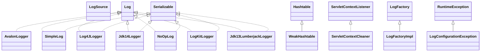

# commons-logging-1.2.jar

[Group index](README.md) | [All archives](../README.md)

## Scope and provenance

- **Donor:** `SQX_145_REFERENCE_ROOT/internal/libs/commons-logging-1.2.jar`.
- **SHA-256:** `daddea1ea0be0f56978ab3006b8ac92834afeefbd9b7e4e6316fca57df0fa636`; accessed 2026-10-06; captured `2026-10-06T18:54:51.906614+00:00`.
- **Classes:** 28 raw entries; 28 unique entry names. Duplicate occurrence indices are zero-based.
- **Inspection:** read-only ZIP hashing and class-file structural parsing; signatures/descriptors, modifiers, hierarchy and references only. Bytecode bodies are hashed, not published.
- **Allocation:** proposed `FEAT-HOST-COMMONS-LOGGING`, P01; [roadmap](../../dev/sqx-full-application-roadmap.md). Domain README registration remains required.
- **Repository:** `01067f00031428613c6394064ca1bcadc1ba00ee`; review state unreviewed. Download label 145-dev1; installed build/activation and runtime equivalence unverified.
- **Limit:** every class/member is inventoried; declaration coverage does not establish consumed calls, defaults, formulas, failure semantics or algorithm parity.
- **Archive/resource index:** [023.json](../../dev/evidence/sqx145/archives/145/023.json).

## Complete member declarations

Member shards contain exact JVM names/descriptors, access flags, generic signatures, throws types, declared fields/methods, superclass/interfaces and referenced class names. All classes, nested/synthetic members and overloads are retained. Code length/hash is structural evidence, not a normalized algorithm comparison.

- [001.json](../../dev/evidence/sqx145/members/023/001.json) — SHA-256 `8cb9dc8dc278b5bdc2f46554c9f5f7e10e368d1709300a43756f056eb3b99b5d`.

## Focused structural diagram

Up to twelve non-nested classes; arrows show declared inheritance/interfaces only. External type names are not evidence of an available body or an executed dependency.

## Class inventory

| Archive entry | Occurrence | Class SHA-256 | Fields | Methods |
| --- | ---: | --- | ---: | ---: |
| `org/apache/commons/logging/impl/AvalonLogger.class` | 0 | `f9427e8fa378fb831fe7d054787a948ef99a677ba9817c194d8c68d986f1ad57` | 2 | 23 |
| `org/apache/commons/logging/impl/SimpleLog.class` | 0 | `c506cac8cc49b52e68ac9a7733ec85000ced8e58eb7ae1e37fb7472777b46734` | 22 | 32 |
| `org/apache/commons/logging/impl/Log4JLogger.class` | 0 | `06900a59cc23825afc7f4b553be4b0f86b3921cd1a77e5834543177b9c0bcd79` | 8 | 24 |
| `org/apache/commons/logging/impl/WeakHashtable.class` | 0 | `f422e02a277445e8e06d4fc70a95537bf151fbc6bc89f5b9dd78099d6b44fe27` | 5 | 17 |
| `org/apache/commons/logging/impl/WeakHashtable$1.class` | 0 | `f0b97758f88d7537c99733a86c178d9153f5e4210121e87cfa7bc520d7705adc` | 2 | 3 |
| `org/apache/commons/logging/impl/Jdk14Logger.class` | 0 | `4a4110e2db0818ea7450eb6dd0d8a40471c0b35f3a6a2e6e4a302476a101ffa3` | 4 | 22 |
| `org/apache/commons/logging/impl/ServletContextCleaner.class` | 0 | `76342437e114f9c93bb8b1f0e0cc2e657e167af99cd879dc3a893d33036813a6` | 2 | 5 |
| `org/apache/commons/logging/impl/WeakHashtable$WeakKey.class` | 0 | `d05a1da35de6015a965c86e03be65cc16cadca2aa861fb8921ab23888ae0f49a` | 1 | 4 |
| `org/apache/commons/logging/impl/NoOpLog.class` | 0 | `9227b39903c04bf379e7cd0fe9c353640feba172826431545c86bde4c28edb19` | 1 | 20 |
| `org/apache/commons/logging/impl/LogKitLogger.class` | 0 | `8e2ee10e0665a76118b186cd092910a9d35760980e2d7b09a2c7f70c977596d3` | 3 | 20 |
| `org/apache/commons/logging/impl/LogFactoryImpl$3.class` | 0 | `4999c0dbf350ed5d0ea40f5639eb84746fa4b1b440d0c68a22a96bf20718a3f8` | 2 | 2 |
| `org/apache/commons/logging/impl/LogFactoryImpl$1.class` | 0 | `32a9df68b3d3eb474bc7407d8d7f4d675bbe7e8a993678f8e29ddc244e8350fa` | 0 | 2 |
| `org/apache/commons/logging/impl/WeakHashtable$Referenced.class` | 0 | `40bae0ec2c8903f5dad4619b912997524774d487cff3c7844e69ee9bfae63ea6` | 2 | 8 |
| `org/apache/commons/logging/impl/SimpleLog$1.class` | 0 | `87bfd399e8c651bfe5b8e20349de8777fe3febd5c419a06b631967b2708e8f36` | 1 | 2 |
| `org/apache/commons/logging/impl/Jdk13LumberjackLogger.class` | 0 | `622c5a3e5064e04be7b239f2cc2111f9217f1a302c51ffe83eaceff613a773df` | 7 | 23 |
| `org/apache/commons/logging/impl/LogFactoryImpl.class` | 0 | `e95346565a25b7547c8b08b9474a9473a6765c60584b5806b570b066e25d2de7` | 28 | 37 |
| `org/apache/commons/logging/impl/LogFactoryImpl$2.class` | 0 | `c4c53510a440d61d96526b5ce17b18b3a397ab6730132eb4149326c20caf28d6` | 2 | 2 |
| `org/apache/commons/logging/impl/WeakHashtable$Entry.class` | 0 | `092716c667b99f160ba3e68f0ae58d3bf0d091dfab5413ede208998f0f2854e3` | 2 | 7 |
| `org/apache/commons/logging/LogSource.class` | 0 | `c315741f45ebe0b0a1438f8272bc7daacba268bc3c578eb92790b562845e9246` | 4 | 8 |
| `org/apache/commons/logging/LogFactory$4.class` | 0 | `1efefab7835d51f495978d2a25eaba6b800c275be77454c987ad63bcdefedb1a` | 2 | 2 |
| `org/apache/commons/logging/LogFactory$3.class` | 0 | `b943569622c0d48d6a2343e90f090bd10bdd0e1c9a119842cef354c66d1a2825` | 2 | 2 |
| `org/apache/commons/logging/LogFactory$6.class` | 0 | `c6a6b22e7c3c6ecb9009e59892176e03468a998632555acdb607e5dd31ce21a3` | 2 | 2 |
| `org/apache/commons/logging/LogConfigurationException.class` | 0 | `713bcf0e265adb22235d9ac7d7a954a70df45bb7d91187c4a21f421049a4e7b7` | 2 | 5 |
| `org/apache/commons/logging/LogFactory.class` | 0 | `9ef05a717b80acfaa616e69e0cecf12c4f12f1ac16a588fac836ef0a92088bd9` | 15 | 41 |
| `org/apache/commons/logging/LogFactory$5.class` | 0 | `8920912c7f16b39ff946cfac78da4c9927734c3063033eff153ce2a41354ca0a` | 1 | 2 |
| `org/apache/commons/logging/LogFactory$1.class` | 0 | `fe66f560eb529b9df72763fb79ce77b2495a898f59909e5128f027a4cf1db393` | 0 | 2 |
| `org/apache/commons/logging/LogFactory$2.class` | 0 | `dc836b785dff81f1062af4d0017ba295aa3f6c536284113e088cd3a646cbda7c` | 2 | 2 |
| `org/apache/commons/logging/Log.class` | 0 | `015e092e7c1766216f573cce8097f4cb84f1a84568bea32ad92efdedaebecfdc` | 0 | 18 |
