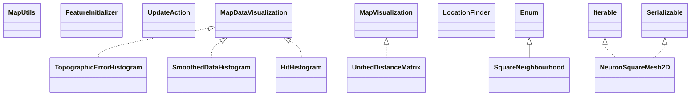

# commons-math3-3.6.1.jar

[Group index](README.md) | [All archives](../README.md)

## Scope and provenance

- **Donor:** `SQX_145_REFERENCE_ROOT/internal/libs/commons-math3-3.6.1.jar`.
- **SHA-256:** `1e56d7b058d28b65abd256b8458e3885b674c1d588fa43cd7d1cbb9c7ef2b308`; accessed 2026-10-06; captured `2026-10-06T18:54:51.906614+00:00`.
- **Classes:** 1301 raw entries; 1301 unique entry names. Duplicate occurrence indices are zero-based.
- **Inspection:** read-only ZIP hashing and class-file structural parsing; signatures/descriptors, modifiers, hierarchy and references only. Bytecode bodies are hashed, not published.
- **Allocation:** proposed `FEAT-BUILDER-COMMONS-MATH3-3-6-1`, P09; [roadmap](../../dev/sqx-full-application-roadmap.md). Domain README registration remains required.
- **Repository:** `01067f00031428613c6394064ca1bcadc1ba00ee`; review state unreviewed. Download label 145-dev1; installed build/activation and runtime equivalence unverified.
- **Limit:** every class/member is inventoried; declaration coverage does not establish consumed calls, defaults, formulas, failure semantics or algorithm parity.
- **Archive/resource index:** [024.json](../../dev/evidence/sqx145/archives/145/024.json).

## Complete member declarations

Member shards contain exact JVM names/descriptors, access flags, generic signatures, throws types, declared fields/methods, superclass/interfaces and referenced class names. All classes, nested/synthetic members and overloads are retained. Code length/hash is structural evidence, not a normalized algorithm comparison.

- [001.json](../../dev/evidence/sqx145/members/024/001.json) — SHA-256 `719e37790ae4de53f00017feb9b85a082aac6eeab8d6292bf43762dd69579993`.
- [002.json](../../dev/evidence/sqx145/members/024/002.json) — SHA-256 `ecf2305e49591b5b72a53c7c23a4a114627c02863439defd9cd52144bfea320a`.
- [003.json](../../dev/evidence/sqx145/members/024/003.json) — SHA-256 `388712c62e706e1940f5f341bc22d04062e932cfdf9fd7bc24667dab26f25258`.
- [004.json](../../dev/evidence/sqx145/members/024/004.json) — SHA-256 `1ca77402cf0ce54be2a41d6e4f523fc1986f1084c5890a3bff957939ad962b41`.
- [005.json](../../dev/evidence/sqx145/members/024/005.json) — SHA-256 `622a205f19f3d462d68c0b2c142c4ad987b6f26f6d69ec2e02f432e2746ed568`.
- [006.json](../../dev/evidence/sqx145/members/024/006.json) — SHA-256 `aa9ad42d034620315348c1415d22dbb87d9ec4be1137a99b912b672d3b5bb25e`.
- [007.json](../../dev/evidence/sqx145/members/024/007.json) — SHA-256 `03f02f3325d69778c03bd3e0558c0a65d1f4b8a94fcaea31b13097c9d2e7aea3`.
- [008.json](../../dev/evidence/sqx145/members/024/008.json) — SHA-256 `dbb074e49764cec0c1a95a5873af0e756b0595e6907d1173d80505410335017e`.
- [009.json](../../dev/evidence/sqx145/members/024/009.json) — SHA-256 `cc1ecadb42d65c684ac730a209c3c5d8e36bbe9bf2f5f2256dbf77f38240e352`.
- [010.json](../../dev/evidence/sqx145/members/024/010.json) — SHA-256 `0bf00bda4fb498ed6dc5b2274f1368ad7b92b5e559057acf21e6a97d49bfd8ab`.
- [011.json](../../dev/evidence/sqx145/members/024/011.json) — SHA-256 `eebe809dc87bac7bc417eaba09ac5e8e1f43d42587085c3d732422f783541899`.
- [012.json](../../dev/evidence/sqx145/members/024/012.json) — SHA-256 `a1e54137e3a56ceecfbc3a83a556c2cf259a4e62da72ac56dcba5d9f1044dcab`.
- [013.json](../../dev/evidence/sqx145/members/024/013.json) — SHA-256 `34514d59c046b74c9a3d46527df8391fdd223fc79f1952ae84ec1c48dd9df2bf`.
- [014.json](../../dev/evidence/sqx145/members/024/014.json) — SHA-256 `bcc3d6ebb79a308c57c419f6f36864c5cba56da6396df239d976603a9d33454d`.
- [015.json](../../dev/evidence/sqx145/members/024/015.json) — SHA-256 `faa4913a7d6431d54959929f2dc736adf8b23c9b553fd0766f444342fc417f97`.
- [016.json](../../dev/evidence/sqx145/members/024/016.json) — SHA-256 `2a05be6a0fddaf698cb99256984b5defb337f82f746d1e88c3fd5a713d54a500`.
- [017.json](../../dev/evidence/sqx145/members/024/017.json) — SHA-256 `8fe7becc6815e033ad54b2b0eca895252e94e6f7aa6cba7420b69933f67769d9`.

## Focused structural diagram

Up to twelve non-nested classes; arrows show declared inheritance/interfaces only. External type names are not evidence of an available body or an executed dependency.

## Class inventory

| Archive entry | Occurrence | Class SHA-256 | Fields | Methods |
| --- | ---: | --- | ---: | ---: |
| `org/apache/commons/math3/ml/neuralnet/MapUtils.class` | 0 | `8495df478bb3403c29ec295b78f22da3b5244e1cfff461960c96dc2b77df61d3` | 0 | 8 |
| `org/apache/commons/math3/ml/neuralnet/Network$NeuronIdentifierComparator.class` | 0 | `4ab9aa26dc57e3883f05caadd19a06104ced3014e11c2654d2f13babbdfe7b65` | 1 | 3 |
| `org/apache/commons/math3/ml/neuralnet/FeatureInitializer.class` | 0 | `ca347cf5a46040f4dd79d2387423c1c8d619850fc4093ffb4db1453d11cb354b` | 0 | 1 |
| `org/apache/commons/math3/ml/neuralnet/UpdateAction.class` | 0 | `4f77a8daf58e7a857ba68b20f73ad3dd1b084ebb930c006e1a5d01c6a9d1d78f` | 0 | 1 |
| `org/apache/commons/math3/ml/neuralnet/Neuron$SerializationProxy.class` | 0 | `d821ff2ab03cbc20f52f25b1fdd29bf18957e6f64177a0960271706dabaf4c75` | 3 | 2 |
| `org/apache/commons/math3/ml/neuralnet/Network$SerializationProxy.class` | 0 | `b4baef49ff0c09d7b0c22f82db854fc43cdbe8ced6bbb3f18dc63bd77b8b1565` | 5 | 2 |
| `org/apache/commons/math3/ml/neuralnet/SquareNeighbourhood.class` | 0 | `e357fb2c2c11e4836dbb2bdde7ec0d963c266a1accbb4121b2f9284ed47e688d` | 3 | 4 |
| `org/apache/commons/math3/ml/neuralnet/twod/NeuronSquareMesh2D$SerializationProxy.class` | 0 | `88e2fa49f55dba22772e45ef859c0a974e5a395b893aaaa76af909b54b3a4267` | 5 | 2 |
| `org/apache/commons/math3/ml/neuralnet/twod/NeuronSquareMesh2D.class` | 0 | `2525f9a01114db14b94114374a634253c386e338b9ac81b3999ab3c4b7ef853d` | 8 | 14 |
| `org/apache/commons/math3/ml/neuralnet/twod/NeuronSquareMesh2D$HorizontalDirection.class` | 0 | `1f727ba2b3c4b2beb86a1961617af35667d355f7ede7e24bde561df3bc49847c` | 4 | 4 |
| `org/apache/commons/math3/ml/neuralnet/twod/NeuronSquareMesh2D$1.class` | 0 | `f8d634b3daffd019354246ff4fe76ec23ccd19666883e51737b331252d6518f9` | 3 | 1 |
| `org/apache/commons/math3/ml/neuralnet/twod/NeuronSquareMesh2D$VerticalDirection.class` | 0 | `59096fab7d4eb1dbbef059cebba1458dd699cb07604ee9e420381f36d61b3f82` | 4 | 4 |
| `org/apache/commons/math3/ml/neuralnet/twod/util/TopographicErrorHistogram.class` | 0 | `ff3181483a8c39ed4c6bf18843787818aaddfb33e5f3f6d2defafbf3973c8857` | 2 | 2 |
| `org/apache/commons/math3/ml/neuralnet/twod/util/MapDataVisualization.class` | 0 | `bba1835b05d0c99393da356814be79b1822cd870fe8aea1a54c19773b492577a` | 0 | 1 |
| `org/apache/commons/math3/ml/neuralnet/twod/util/UnifiedDistanceMatrix.class` | 0 | `d0e34111c311e992016c9f226a7973b0d4a3c3b33746d3ee6f1217a3cf9a4f0f` | 2 | 4 |
| `org/apache/commons/math3/ml/neuralnet/twod/util/LocationFinder$Location.class` | 0 | `03ea2bd1b8dea12c61f832c1dd7fea922c421fa21b852eebe958f896c49fdfa8` | 2 | 3 |
| `org/apache/commons/math3/ml/neuralnet/twod/util/MapVisualization.class` | 0 | `d356a454c68aa82edc1ef6eb19b12c4ecc9de8ce4f3e2cba46977e160bb371d2` | 0 | 1 |
| `org/apache/commons/math3/ml/neuralnet/twod/util/LocationFinder.class` | 0 | `f864cd7bba27e1a9c0e3b84327b5c569ebf651b8cda2ebff4cdcce59ef8b114e` | 1 | 2 |
| `org/apache/commons/math3/ml/neuralnet/twod/util/SmoothedDataHistogram.class` | 0 | `028696d96cd179981b3b759dd17068a179f19065b17abd36c5fe9097380c1751` | 3 | 2 |
| `org/apache/commons/math3/ml/neuralnet/twod/util/HitHistogram.class` | 0 | `3a9273b3ce5bd3cadf0024873e22e2901938a7ad59b90a4cd4f439d21d178ef2` | 2 | 2 |
| `org/apache/commons/math3/ml/neuralnet/twod/util/QuantizationError.class` | 0 | `8b37a3aeb48ec06a98739cd7b9f6d6e8d00b4195b69918aa216b7717f5ea2695` | 1 | 2 |
| `org/apache/commons/math3/ml/neuralnet/oned/NeuronString.class` | 0 | `2d301023fa8b71a8c21f1bbb139ce35d101966a843f69fee926665a0a67c51a9` | 5 | 8 |
| `org/apache/commons/math3/ml/neuralnet/oned/NeuronString$SerializationProxy.class` | 0 | `7d2286907983232aec75e2192aa8d453d8bc2bc69dcec55564d56cc8e0f01651` | 3 | 2 |
| `org/apache/commons/math3/ml/neuralnet/FeatureInitializerFactory$2.class` | 0 | `d84fea3579a76055836b29f4056af66e5288b7295e76599cc79f569c054cf970` | 2 | 2 |
| `org/apache/commons/math3/ml/neuralnet/sofm/KohonenTrainingTask.class` | 0 | `bfb9e2406b7ce76100ee276686a5d7bc5598142ed87a7a63c07bf7ced33f1569` | 3 | 2 |
| `org/apache/commons/math3/ml/neuralnet/sofm/NeighbourhoodSizeFunctionFactory.class` | 0 | `3081af312603972da641f045f0782fc97c46c461be00043b65f6fc84fbaf28e4` | 0 | 3 |
| `org/apache/commons/math3/ml/neuralnet/sofm/LearningFactorFunctionFactory$1.class` | 0 | `155ced78d4aed2e6d804310bd31c109e6b1d2159dad04ad9ea03fcc64c48d1c3` | 4 | 2 |
| `org/apache/commons/math3/ml/neuralnet/sofm/NeighbourhoodSizeFunctionFactory$1.class` | 0 | `7dd5c6a7480b0ed09f978ea88095059b72618d92f007567eb4454eb42b30100c` | 4 | 2 |
| `org/apache/commons/math3/ml/neuralnet/sofm/LearningFactorFunction.class` | 0 | `06f09eb5063c1c3b2ceef5edb8a36983d02f659843e937e3f5b0c7fa0e8b0f2f` | 0 | 1 |
| `org/apache/commons/math3/ml/neuralnet/sofm/NeighbourhoodSizeFunctionFactory$2.class` | 0 | `a285348c6e309ee51bb7f8fe310b004a6ff2418efc5849d5215804b7777707c9` | 4 | 2 |
| `org/apache/commons/math3/ml/neuralnet/sofm/NeighbourhoodSizeFunction.class` | 0 | `692ebbe8aa3517c9f4d11bcce7dab9bbb7dc92a5598418970181abec57091cb2` | 0 | 1 |
| `org/apache/commons/math3/ml/neuralnet/sofm/KohonenUpdateAction.class` | 0 | `da8cb37a4971ce6c474920fd52142e7e6f6fe49b644b137a37ced6eb73375ab5` | 4 | 7 |
| `org/apache/commons/math3/ml/neuralnet/sofm/LearningFactorFunctionFactory$2.class` | 0 | `82d81cd75200f1e060f6229e06a88c53459d84db162c634239a090f0d592c0e4` | 4 | 2 |
| `org/apache/commons/math3/ml/neuralnet/sofm/util/QuasiSigmoidDecayFunction.class` | 0 | `57cc8cfb7aed0cca56b67a41b6a3d9764ee0e25b88ba16e2000e57bca279fbe1` | 2 | 2 |
| `org/apache/commons/math3/ml/neuralnet/sofm/util/ExponentialDecayFunction.class` | 0 | `b48b459895947dcfabe977a0444bb880270b936eb82ac253d2a1da072229d620` | 2 | 2 |
| `org/apache/commons/math3/ml/neuralnet/sofm/LearningFactorFunctionFactory.class` | 0 | `1c0cff233f6cb89effad837eab368e6542ace6c5d96346d75d0b312e97e0aed4` | 0 | 3 |
| `org/apache/commons/math3/ml/neuralnet/MapUtils$PairNeuronDouble.class` | 0 | `75c3ed484d860eed0469340daa2ea809586e77fd68dba714f7424e1d2b187b55` | 3 | 4 |
| `org/apache/commons/math3/ml/neuralnet/FeatureInitializerFactory$1.class` | 0 | `837d9fd55bb43cc33e2d157d67f78a9e430d609d36a9f5c3790713de8eeae7cf` | 4 | 2 |
| `org/apache/commons/math3/ml/neuralnet/Network.class` | 0 | `1d7d67ae8908e1130f1368ab1ce9dfa76a1e88afc3746ae3e0b25a481700e39b` | 5 | 20 |
| `org/apache/commons/math3/ml/neuralnet/Neuron.class` | 0 | `c559d06ffde7ef1aaed31047397e8d51e55cdc88b7f5ae8f5c57394d89e44627` | 6 | 11 |
| `org/apache/commons/math3/ml/neuralnet/MapUtils$PairNeuronDouble$1.class` | 0 | `a12fc32959d7d09215e1e8e081825c4b3b8372b6e2de1ef903d5fd2573ddb8e2` | 0 | 3 |
| `org/apache/commons/math3/ml/neuralnet/FeatureInitializerFactory.class` | 0 | `29c332adec899f7f3a02a5c46b7f6cd318ef8a29c7f16ddf1782f38848882bed` | 0 | 5 |
| `org/apache/commons/math3/ml/clustering/DBSCANClusterer.class` | 0 | `f3648fbc27f0a3edcabfa6292d636ff0f560e92b32941868a9c965c2eda261cb` | 2 | 8 |
| `org/apache/commons/math3/ml/clustering/KMeansPlusPlusClusterer$EmptyClusterStrategy.class` | 0 | `73801a9f6e589d4ec1a3bbf6e1a170e5fc2e6064f79370b028060e8948cf2c15` | 5 | 4 |
| `org/apache/commons/math3/ml/clustering/Clusterer.class` | 0 | `99446dc8dea53d1541f00d8e76eae855cffc4b925e60dbf5c70a4e7b9166fbd7` | 1 | 4 |
| `org/apache/commons/math3/ml/clustering/KMeansPlusPlusClusterer$1.class` | 0 | `66d380fd81212a22ef057a85c892c78fd5d332bb9fe0c5319389381595bb5a69` | 1 | 1 |
| `org/apache/commons/math3/ml/clustering/DBSCANClusterer$PointStatus.class` | 0 | `dc21007084e0ce773719ab5c7e31aac623d825390fcf73400204e2c5821f6f3b` | 3 | 4 |
| `org/apache/commons/math3/ml/clustering/evaluation/SumOfClusterVariances.class` | 0 | `ef8e725c7be6b673edb6c162a62e49c386909b4a82df635917d1974f9df81712` | 0 | 2 |
| `org/apache/commons/math3/ml/clustering/evaluation/ClusterEvaluator.class` | 0 | `1d6afffae8bfde469fb8bf7d37d20f6551c14d9ad82c40e1b01319dae69b7e3e` | 1 | 6 |
| `org/apache/commons/math3/ml/clustering/DoublePoint.class` | 0 | `ba6d1453a3f026cd7239a6aa911dcdbf69cf85209799f79eeca941407da9d4bf` | 2 | 6 |
| `org/apache/commons/math3/ml/clustering/FuzzyKMeansClusterer.class` | 0 | `a6aec64afcb86b6893656cec3f7945f2bc52c660ea134d0edc4e66d8fa0b39ec` | 9 | 18 |
| `org/apache/commons/math3/ml/clustering/KMeansPlusPlusClusterer.class` | 0 | `4b70c6a5fa79fdbaa23d2de593136a82a5a0c53fc3f1ceea3a8f16c1cf31f8d3` | 4 | 17 |
| `org/apache/commons/math3/ml/clustering/Clusterable.class` | 0 | `138884dfe425b856c23e007512a697650ded505e1763d435f262e5cb639d56d4` | 0 | 1 |
| `org/apache/commons/math3/ml/clustering/CentroidCluster.class` | 0 | `01b871976e53d93a1d806adc974a59eeb5e5dcd0c1a9610640aa88e807fa1fda` | 2 | 2 |
| `org/apache/commons/math3/ml/clustering/MultiKMeansPlusPlusClusterer.class` | 0 | `10718d3054a69154970ba4d32cf0ba68c28b7e58827f52ee48ed507901a5b791` | 3 | 6 |
| `org/apache/commons/math3/ml/clustering/Cluster.class` | 0 | `bf757a235cdca6818e533b775b49f0ab2d97d6374b6ae1e05545248cfbd780e9` | 2 | 3 |
| `org/apache/commons/math3/ml/distance/EuclideanDistance.class` | 0 | `d5b59b5b8fcbf6e407d122a332c2935039c7ba8299251ddc53add4cd6cddda38` | 1 | 2 |
| `org/apache/commons/math3/ml/distance/ChebyshevDistance.class` | 0 | `c52c26cd08d2eea0d65feb57f268d7030fa855f62796968e535c9229c2b696e1` | 1 | 2 |
| `org/apache/commons/math3/ml/distance/ManhattanDistance.class` | 0 | `68c054e8a8967952fd44e0566ed437174866af1d533659f03cbaed9df5ecda29` | 1 | 2 |
| `org/apache/commons/math3/ml/distance/EarthMoversDistance.class` | 0 | `f764b18bc9845314836e04a579d9e739ec8b384ac74e056c83c57ce2567935dc` | 1 | 2 |
| `org/apache/commons/math3/ml/distance/DistanceMeasure.class` | 0 | `f4217449011923f743a99c370a227ae38afd61a5dc4aab311669e115f9772c60` | 0 | 1 |
| `org/apache/commons/math3/ml/distance/CanberraDistance.class` | 0 | `3f4ff12fda161b877f4a22baa3aafe7438f10b5a37623ff73d03831a0172fee3` | 1 | 2 |
| `org/apache/commons/math3/analysis/FunctionUtils$1.class` | 0 | `088e18e0d6bb90f43a09e8faa49cd0d39463716a677ec2731a67e370aa88d394` | 1 | 2 |
| `org/apache/commons/math3/analysis/ParametricUnivariateFunction.class` | 0 | `0d90163bdea08784d038d06926c3e64a5375feee36946e2d8a465d9a6f11bdf9` | 0 | 2 |
| `org/apache/commons/math3/analysis/FunctionUtils$6.class` | 0 | `767271bef374ea490435dc518b63f76cd0ed580ff973d0fa10b9684f0179b233` | 1 | 3 |
| `org/apache/commons/math3/analysis/FunctionUtils$3$1.class` | 0 | `e36a6200be2fccaa5ac6bc0c4afc7e3fa10ca5944a0f8c4c7dac69007cbeb1ce` | 1 | 2 |
| `org/apache/commons/math3/analysis/FunctionUtils$6$1.class` | 0 | `3a605abf532dd9c36b2b72026843f6d88482d0d6fe066313f3a90771693375aa` | 1 | 2 |
| `org/apache/commons/math3/analysis/UnivariateMatrixFunction.class` | 0 | `dfb1a57637a125a948a2abedaac8fb2cb12d2bc3f2d8e4d7023e440caab72ba7` | 0 | 1 |
| `org/apache/commons/math3/analysis/TrivariateFunction.class` | 0 | `7adc8b68c4bef87b55323707c717d19016f6cb800d829d65d6c31bbb219e3f11` | 0 | 1 |
| `org/apache/commons/math3/analysis/DifferentiableUnivariateFunction.class` | 0 | `8de1925814adf1bc79d162e0b6c8a538c25b634d66aa6d178efcdb25ac7e0eb0` | 0 | 1 |
| `org/apache/commons/math3/analysis/FunctionUtils$8.class` | 0 | `c1a18c2b92832735f984302ea0708129fcfe5254f95b619227b495a0ec2096d0` | 1 | 3 |
| `org/apache/commons/math3/analysis/FunctionUtils$18.class` | 0 | `4e228c517b40fc3c792b628423752ac413398b3445353ec9dc55237bf271b2a1` | 1 | 3 |
| `org/apache/commons/math3/analysis/MultivariateVectorFunction.class` | 0 | `ff4446f1dd99439e18c86feadc63a136cc34833f64c89f03f1f4ea2f3c469363` | 0 | 1 |
| `org/apache/commons/math3/analysis/FunctionUtils$17.class` | 0 | `42132049390ee0543c182392851dd08e52c840e84da92ca60703a4df8678c2e4` | 1 | 3 |
| `org/apache/commons/math3/analysis/FunctionUtils$9.class` | 0 | `e7223c7db351236228dcf510c701152da24fca74511a6ac89127d7d6df94d9e3` | 1 | 3 |
| `org/apache/commons/math3/analysis/FunctionUtils$14.class` | 0 | `e8f7f3730c39fde9a2cd46d05769b1a5832b39c4e95aacfd89790b54d2f01411` | 1 | 3 |
| `org/apache/commons/math3/analysis/FunctionUtils$16$2.class` | 0 | `e74ef4e5f626249eb86f13b96b0a85d0e1b70bf14468a5c8a488c3f4c26703ec` | 1 | 2 |
| `org/apache/commons/math3/analysis/FunctionUtils$7.class` | 0 | `a81c0599cc5782a35b22ecc7e2f154b220c309c4b644141412caee7a311a19ec` | 1 | 2 |
| `org/apache/commons/math3/analysis/FunctionUtils$18$1.class` | 0 | `b64b4125280bc8d066c6e8adfe74e7bf0d79c621baffb89abba77cb1abf9c2a6` | 1 | 2 |
| `org/apache/commons/math3/analysis/FunctionUtils.class` | 0 | `91182fc0fd7f502c00558bc258bbddf3cab625055d5ebf200a2c88652a9a4b5b` | 0 | 22 |
| `org/apache/commons/math3/analysis/differentiation/SparseGradient.class` | 0 | `0425205e3caa71136cbb7d17fb6344ea33216ff4c7e1dcf2b21b8c753851fbdd` | 3 | 128 |
| `org/apache/commons/math3/analysis/differentiation/UnivariateMatrixFunctionDifferentiator.class` | 0 | `eaa299c44ab2e37a454d000ea29fda9e1a8c95bd800d938bf5601775feb3acb3` | 0 | 1 |
| `org/apache/commons/math3/analysis/differentiation/FiniteDifferencesDifferentiator$3.class` | 0 | `a69da32ba8913d0c876d2df69933ebd02bafc53f211819f954ccd4df985fc984` | 2 | 3 |
| `org/apache/commons/math3/analysis/differentiation/FiniteDifferencesDifferentiator$1.class` | 0 | `83e3c295e9067cf4047ee17271ee140318722ea20b135e58f65fbebd7df24790` | 2 | 3 |
| `org/apache/commons/math3/analysis/differentiation/UnivariateDifferentiableFunction.class` | 0 | `03e6d0107fcaaf3f445dfbce2b1fb3fb2653e1e2c94c0608e83c19f6b7529732` | 0 | 1 |
| `org/apache/commons/math3/analysis/differentiation/GradientFunction.class` | 0 | `d90028b6955b23837d166c1eb12c8f15aafd9bf6d49279690c6cca91d753c1c6` | 1 | 2 |
| `org/apache/commons/math3/analysis/differentiation/JacobianFunction.class` | 0 | `36025bc0820e34484150068a022d732ba724dc074d2854090d2659f0e66629ed` | 1 | 2 |
| `org/apache/commons/math3/analysis/differentiation/DerivativeStructure$DataTransferObject.class` | 0 | `48b37b1aa653be21e459a0257e875dab4e74726ef3b945c5b408cdf67b263867` | 4 | 2 |
| `org/apache/commons/math3/analysis/differentiation/UnivariateDifferentiableMatrixFunction.class` | 0 | `f3c95c33bafcadf137103652880189064aee062e2adaa65e76235f81eb80705c` | 0 | 1 |
| `org/apache/commons/math3/analysis/differentiation/DerivativeStructure.class` | 0 | `00f8490e27fcade8f907f3349e642f22b073708aab631b646fbebbe99b9639c4` | 3 | 137 |
| `org/apache/commons/math3/analysis/differentiation/DSCompiler.class` | 0 | `a2666fbabc64331b492e299c2a0afb5708499109f34c561e354f5355a446cfed` | 8 | 49 |
| `org/apache/commons/math3/analysis/differentiation/MultivariateDifferentiableFunction.class` | 0 | `e7b01312cf8462256b530f27963f0403a93961f3267a6257410634462f501bf0` | 0 | 1 |
| `org/apache/commons/math3/analysis/differentiation/UnivariateFunctionDifferentiator.class` | 0 | `6e9907538dcf79bc2322c1fa2eb34ada5abbcc4839b24a29ee8c0ae88096f334` | 0 | 1 |
| `org/apache/commons/math3/analysis/differentiation/MultivariateDifferentiableVectorFunction.class` | 0 | `a0de92c8959be52ca611f70da01a0c46443cf4c19fd93ec35260e73cfa017338` | 0 | 1 |
| `org/apache/commons/math3/analysis/differentiation/DerivativeStructure$1.class` | 0 | `d6f516b546059b97ed76b85fe8ad7e707159cf81297991b91c03df77ea119c3c` | 1 | 6 |
| `org/apache/commons/math3/analysis/differentiation/UnivariateDifferentiableVectorFunction.class` | 0 | `fbed1eb3b0374ac6d44eeddcf99ef6e972cb25ff681b6f9dfe11a5d52b53e8da` | 0 | 1 |
| `org/apache/commons/math3/analysis/differentiation/FiniteDifferencesDifferentiator.class` | 0 | `d78590fe5a1d9fa69994c35a80f99fb3777ab31cd0073740094f482128ea363b` | 6 | 14 |
| `org/apache/commons/math3/analysis/differentiation/UnivariateVectorFunctionDifferentiator.class` | 0 | `9f657e46edb9831c1d1ccdfeb4ea1871caad96be9bb3a62c97406edbcd3461ef` | 0 | 1 |
| `org/apache/commons/math3/analysis/differentiation/FiniteDifferencesDifferentiator$2.class` | 0 | `086167d9623eb88abf59817c181c74b4c8c9fdd0d791aad299f9b39e4d820cba` | 2 | 3 |
| `org/apache/commons/math3/analysis/differentiation/SparseGradient$1.class` | 0 | `91e38b1b33f0a9dea4e4cdff324ae69e03661ac7a3ab8b795fb35d9ce9290475` | 1 | 6 |
| `org/apache/commons/math3/analysis/integration/IterativeLegendreGaussIntegrator$1.class` | 0 | `7c4983945f817dbb08e18b8d56c17032290bdfaebc207b7a7f9cdb084c3b8a30` | 1 | 2 |
| `org/apache/commons/math3/analysis/integration/gauss/LegendreHighPrecisionRuleFactory.class` | 0 | `50da319938c414fff1dcc427f85c169dc4c648042557aa091cd53f98af7e5e21` | 4 | 3 |
| `org/apache/commons/math3/analysis/integration/gauss/BaseRuleFactory.class` | 0 | `23e6167bacbe8aa924ac1b7e107113d5911a4454637ee4ad9c6d6cd92ef76d4a` | 2 | 6 |
| `org/apache/commons/math3/analysis/integration/gauss/HermiteRuleFactory.class` | 0 | `dd719e1144ad98c639cb27498cfb90e32ac611635cebcd1825dffaf71800b055` | 3 | 2 |
| `org/apache/commons/math3/analysis/integration/gauss/LegendreRuleFactory.class` | 0 | `e42751eb80ca3a62cfa269b79469d537ca6ddb87307b5551c8038ad06948d506` | 0 | 2 |
| `org/apache/commons/math3/analysis/integration/gauss/GaussIntegratorFactory.class` | 0 | `2cbb426e92d58f08c37b0fb09386039abea08117d7e2785e80fcb23b27c3d177` | 3 | 8 |
| `org/apache/commons/math3/analysis/integration/gauss/SymmetricGaussIntegrator.class` | 0 | `35aa9011fc13a13057e7c107caa0bf91b6dc971c6f3de50fce87b8ec598e00de` | 0 | 3 |
| `org/apache/commons/math3/analysis/integration/gauss/GaussIntegrator.class` | 0 | `fafb32c3f48b5505fe952f79999b3fbaa5bdbd44b2a31cd9cede51cefe8e2cdb` | 2 | 6 |
| `org/apache/commons/math3/analysis/integration/IterativeLegendreGaussIntegrator.class` | 0 | `0c3dd90791a9fb3de7cceb276b07f3477783936aa63c94e9eeb32913c7b626ee` | 2 | 6 |
| `org/apache/commons/math3/analysis/integration/RombergIntegrator.class` | 0 | `2b444cf42dcb77c42637aad48bee008fefe003fd47868b697becc975bc3b8e16` | 1 | 4 |
| `org/apache/commons/math3/analysis/integration/SimpsonIntegrator.class` | 0 | `1c0fa66be80409927530b04a20f82a39ac34ed7388cc41a0967aa593944c6986` | 1 | 4 |
| `org/apache/commons/math3/analysis/integration/TrapezoidIntegrator.class` | 0 | `768782e52ca4618d62a4bbfb7545e864d8957250d463221f2a5ac2bd663d5c84` | 2 | 5 |
| `org/apache/commons/math3/analysis/integration/MidPointIntegrator.class` | 0 | `883c09108c92ec3a049d746c18d107bcf4b1b837e4f5bfbbcbe4c5ecf9d9602d` | 1 | 5 |
| `org/apache/commons/math3/analysis/integration/UnivariateIntegrator.class` | 0 | `64a789d55d40bc4e8127a339c22de77df65653286d438f9c6e76780799a92209` | 0 | 7 |
| `org/apache/commons/math3/analysis/integration/LegendreGaussIntegrator.class` | 0 | `84527a84266a8216f048a8387069107bdda57b6eb3fcb4ee06d760019eadd510` | 10 | 6 |
| `org/apache/commons/math3/analysis/integration/BaseAbstractUnivariateIntegrator.class` | 0 | `5441b2c8aae401eb908c305beee25d91146bae76ffa6582be47548d6acfc245a` | 13 | 16 |
| `org/apache/commons/math3/analysis/FunctionUtils$16.class` | 0 | `d39e8154a9a5e238ed1908917b26e742bc8a69a676a1c08cc4677c0f1f515e48` | 1 | 4 |
| `org/apache/commons/math3/analysis/DifferentiableMultivariateVectorFunction.class` | 0 | `336454ee531d2e948469235a44f4ab450df55c2540e8541365f1f573542f088f` | 0 | 1 |
| `org/apache/commons/math3/analysis/FunctionUtils$15.class` | 0 | `75c67a42637d4da2a79ba8f0bf671df0507562bfec9b77036c1c67a33885eedc` | 1 | 3 |
| `org/apache/commons/math3/analysis/FunctionUtils$3.class` | 0 | `0ae01dd78ea6e769422c40589db7c9b165066f9407ef6afb0b6ab0c5611d6a43` | 1 | 3 |
| `org/apache/commons/math3/analysis/DifferentiableMultivariateFunction.class` | 0 | `173a9440d3749145853613cd323ae33704c942b23cb25815d48c33c8a1798e03` | 0 | 2 |
| `org/apache/commons/math3/analysis/FunctionUtils$19.class` | 0 | `e0f458a9f6d2c576f17a2b53b3bdacfbd146c9e50741669e862863961e29d5b2` | 1 | 3 |
| `org/apache/commons/math3/analysis/FunctionUtils$2.class` | 0 | `59319c465b090b6f7d5c127c78a43b78419977aa12a3b16d20376a2e82e4d4f4` | 1 | 3 |
| `org/apache/commons/math3/analysis/function/Constant.class` | 0 | `17775643d2f0aa748d8eb28032f260bcdb80b517d064c49f3c79d24ec713ca56` | 1 | 5 |
| `org/apache/commons/math3/analysis/function/Abs.class` | 0 | `4de0a351215e4116608709fc819a011514015c6e77bfa2ddd3fa03ab9de08049` | 0 | 2 |
| `org/apache/commons/math3/analysis/function/Log1p.class` | 0 | `6783b4a15d3aeb13db009acedcf435cfe92bf8fc8befc36671994884c4315d79` | 0 | 4 |
| `org/apache/commons/math3/analysis/function/Ceil.class` | 0 | `5ca6aaca9912c74a294de58733a3a652a01a83f79ef242b7adfa55efa2d5ddb1` | 0 | 2 |
| `org/apache/commons/math3/analysis/function/Cbrt.class` | 0 | `304b0002af452da9fa004c60709438ba2d83623d1bb5aa09c6987e6bf217199d` | 0 | 4 |
| `org/apache/commons/math3/analysis/function/Divide.class` | 0 | `85ece45c3b0038509aa34baeb0fac40511300cdbc8611a114596efc668062b40` | 0 | 2 |
| `org/apache/commons/math3/analysis/function/HarmonicOscillator.class` | 0 | `810ff44670f2cec279e4ab520ce7c97a3ce2698f55cb397abd87ec4e3e85ccee` | 3 | 6 |
| `org/apache/commons/math3/analysis/function/Gaussian.class` | 0 | `b5af821ed130d7453fa7bb0910a278b9b850f722226735612c24902891d539dc` | 4 | 8 |
| `org/apache/commons/math3/analysis/function/Ulp.class` | 0 | `854bc88f4086e2e9aa44860dabfe916cb52dcb78a7a6c9bbe7e0827670baf35e` | 0 | 2 |
| `org/apache/commons/math3/analysis/function/Sigmoid.class` | 0 | `f2d24de3b1f8e2019c77c4ccccc6b6683e63173fcb7d64903be164f3b919c0f0` | 2 | 7 |
| `org/apache/commons/math3/analysis/function/Log10.class` | 0 | `bf6648d41cd7bbeb01ef25bd0beb3f18bfb22fcff7dde1bdd8a589f8aa871846` | 0 | 4 |
| `org/apache/commons/math3/analysis/function/Subtract.class` | 0 | `837c967a9f89931ea3401062c5f17f2ae7761572c8f3b1266e1801eb2b60ed29` | 0 | 2 |
| `org/apache/commons/math3/analysis/function/Sinc.class` | 0 | `b25fc1cd963fd07d03e7d5467b1644d4a4af69a31c2b35426e05136506574f70` | 2 | 5 |
| `org/apache/commons/math3/analysis/function/Logit$Parametric.class` | 0 | `a70f4aa4a1acf3508b608c4058058c054e0b0568e3989880752691218945929f` | 0 | 4 |
| `org/apache/commons/math3/analysis/function/HarmonicOscillator$Parametric.class` | 0 | `fc66a174eb2e1a62db0e636cef716f5ba2ed0620b242b1b6784484cd2aad7d4f` | 0 | 4 |
| `org/apache/commons/math3/analysis/function/Logistic$Parametric.class` | 0 | `e0003ec12ba38309eecd1703970976e3f9491aaa9865de6944e099b8dfa0c9fc` | 0 | 4 |
| `org/apache/commons/math3/analysis/function/Signum.class` | 0 | `e076fa9c9e2e7c6659d0da2795e180b5ed1d9b2baa4a73b9df1baa05423228ac` | 0 | 2 |
| `org/apache/commons/math3/analysis/function/Sqrt.class` | 0 | `1e8bbb974578a45b18f3918c834b7a36463237e41fcae0b3861ee7e738e22d6d` | 0 | 4 |
| `org/apache/commons/math3/analysis/function/Tanh.class` | 0 | `c016a0acb5eb11742b2cb18702fca04fded1fe3a9440f7eed0e00870db43a915` | 0 | 4 |
| `org/apache/commons/math3/analysis/function/Tan.class` | 0 | `c76c68cab9a3320f349b42056457db88fa4328f488365c7bbf836f700c4cfd28` | 0 | 4 |
| `org/apache/commons/math3/analysis/function/Exp.class` | 0 | `41a79c0daa90692ac593f41bf193cc446f433f1fc9dc793058e046455b1d483d` | 0 | 4 |
| `org/apache/commons/math3/analysis/function/Sinh.class` | 0 | `8b4080cdae4dfc36468402a81ef8b391b199c06aedc15a5bb95c5ade95164db5` | 0 | 5 |
| `org/apache/commons/math3/analysis/function/Identity.class` | 0 | `4d56005475005f4f558010a072d7144258d348e97313d380d54e5af201fe9853` | 0 | 5 |
| `org/apache/commons/math3/analysis/function/Sin.class` | 0 | `5dcf91c187f341d2826c2dc2ca369b399d96b951eef118f7111605bfe85b993f` | 0 | 5 |
| `org/apache/commons/math3/analysis/function/Pow.class` | 0 | `eaa3a401d1b56886475ae27d6c36c8967f99363235565eaddf834fd6c12d7246` | 0 | 2 |
| `org/apache/commons/math3/analysis/function/Min.class` | 0 | `27d994143b6f90ab189a6945cf18569b36a51a34151047ccb075b3483cb5f8cd` | 0 | 2 |
| `org/apache/commons/math3/analysis/function/StepFunction.class` | 0 | `e5f0c4102d591c7feec557119aa10dae74c21126e6baaa32708f27755f0cf1ac` | 2 | 2 |
| `org/apache/commons/math3/analysis/function/Minus.class` | 0 | `3c2296d08948f456bf39fdb7a3f71814660cdb4dfa4bdb8cfa5359c6ed29e857` | 0 | 5 |
| `org/apache/commons/math3/analysis/function/Logit.class` | 0 | `e37aa78f4228276a75784e8e67ba28f2146153e6d9072ace8e770bfa41262b44` | 2 | 7 |
| `org/apache/commons/math3/analysis/function/Atanh.class` | 0 | `c9cc1b44c19e8be717b1bb0548f2b61677261717c043d0a42979a4a4bcb81212` | 0 | 4 |
| `org/apache/commons/math3/analysis/function/Power.class` | 0 | `d83cb98415cc7099c375ca5af369849675ff2ab5bb58cd57d429a00229532bca` | 1 | 4 |
| `org/apache/commons/math3/analysis/function/Cosh.class` | 0 | `c0dc37cc24a48a3755e05d2a2f02b371ffc8edb2ac8ea9e671567c3bf743c622` | 0 | 5 |
| `org/apache/commons/math3/analysis/function/Floor.class` | 0 | `6de5dac05fb7c94dda77340b2255e0654199fce53b85c797e9c26ded956d33d8` | 0 | 2 |
| `org/apache/commons/math3/analysis/function/Log.class` | 0 | `e06d9a9fc9e74abc2ef878124a90d00be6f457fed79391b1cf1aff92b87c73fd` | 0 | 4 |
| `org/apache/commons/math3/analysis/function/Max.class` | 0 | `8ab004cf9f0e18472e4c28f0bf3ce9f6b0d687ba4570d3bb4153828d2b5fbb4f` | 0 | 2 |
| `org/apache/commons/math3/analysis/function/Cos.class` | 0 | `8bb3b7bc63509a9f0a44dd7fc3128a925d11301e3d5b9a52aa02e5195f9a044e` | 0 | 4 |
| `org/apache/commons/math3/analysis/function/Add.class` | 0 | `83180e8e7a503b56e5f8d3e2998b84a9bd33796fdda90da1b1826d59d3bc0108` | 0 | 2 |
| `org/apache/commons/math3/analysis/function/Rint.class` | 0 | `9bb084234c4d35b9daca549dd9551b00f193a0b953f8852d599d58e35f3f23f3` | 0 | 2 |
| `org/apache/commons/math3/analysis/function/Asinh.class` | 0 | `525435743b3cabd8a969a1c745257d71d17bba4639344a2e153197936ea6f98d` | 0 | 4 |
| `org/apache/commons/math3/analysis/function/Multiply.class` | 0 | `53dd3c4ae665c1f572f3bacbf9e3b14cadc0c07e1d587a98e87d6dd60a26bb9e` | 0 | 2 |
| `org/apache/commons/math3/analysis/function/Inverse.class` | 0 | `e5f43c36c2cd51b3d9d0cfee07bb1e3e4f127c7c3a00739a90b085a6db0e5a39` | 0 | 4 |
| `org/apache/commons/math3/analysis/function/Acosh.class` | 0 | `55f0707c125e0c665d63c54d445ce792923ac865773b8dbc21657a9d18eabeab` | 0 | 4 |
| `org/apache/commons/math3/analysis/function/Sigmoid$Parametric.class` | 0 | `37bccc004334543850be0c02f1e3bfaa8e44ca3c57bba6c9ce4b3881a6211305` | 0 | 4 |
| `org/apache/commons/math3/analysis/function/Expm1.class` | 0 | `9cfe2f2b10c905c03c1463e023a14099798f56063822b6de893e60116176a48e` | 0 | 4 |
| `org/apache/commons/math3/analysis/function/Atan.class` | 0 | `6f645de573e3e5ae8a71ad53717194a624727eb6e6427b3890ad45baad6cc2c4` | 0 | 4 |
| `org/apache/commons/math3/analysis/function/Logistic.class` | 0 | `f49f4a0a7e24cb2013621208817e9381372032f2c6e27e6bbaed86cdc44f25a2` | 6 | 6 |
| `org/apache/commons/math3/analysis/function/Gaussian$Parametric.class` | 0 | `51b3472784e5851d4ae62152e5e2805f404e16e72101eab5320e3ca23039ba5d` | 0 | 4 |
| `org/apache/commons/math3/analysis/function/Acos.class` | 0 | `eaf677cc39ed283fd3689c4597e76134185ec6970fd4e19e1fe40960aa91f5f1` | 0 | 4 |
| `org/apache/commons/math3/analysis/function/Asin.class` | 0 | `bb6c712649724f78ca11a68d5fb3917000932e1f8b5c4483d3165a0f5e8fd6ca` | 0 | 4 |
| `org/apache/commons/math3/analysis/function/Atan2.class` | 0 | `67e4cb06ccbd4b9dc975c5829053e5c7efd073c5a2ce97a2e3dadcc721838bc7` | 0 | 2 |
| `org/apache/commons/math3/analysis/MultivariateFunction.class` | 0 | `aeaac602c20f8a95c501a2ae20ceb64af2158c67784adeaaefc16c32d97aa6ef` | 0 | 1 |
| `org/apache/commons/math3/analysis/FunctionUtils$12.class` | 0 | `49dbfcc41b89d020330e8fcdb0fc4d18ef325487ac96999140921219280f3883` | 2 | 2 |
| `org/apache/commons/math3/analysis/BivariateFunction.class` | 0 | `dec915a2f173a9b9884c834872056d528762d425d4a749d9a2a10fd2a4c18693` | 0 | 1 |
| `org/apache/commons/math3/analysis/FunctionUtils$10.class` | 0 | `4352b281edd6a482be854e6176b76bf5f76fdd33aa445e004226cc00631064a6` | 3 | 2 |
| `org/apache/commons/math3/analysis/UnivariateFunction.class` | 0 | `a82832dd302d66d8a6631c96c1431584852d7ff31559f907cdc65ea330120486` | 0 | 1 |
| `org/apache/commons/math3/analysis/RealFieldUnivariateFunction.class` | 0 | `fd32dfc125e79f1946f6e8ee42de99191e73def168d71162cf1ed9d2610c74d7` | 0 | 1 |
| `org/apache/commons/math3/analysis/polynomials/PolynomialsUtils$JacobiKey.class` | 0 | `20c624d2f54a2661750fcb5fe7720b1c228cd315d263874e66f3826f1ed610a5` | 2 | 3 |
| `org/apache/commons/math3/analysis/polynomials/PolynomialsUtils$3.class` | 0 | `93cf2c43a7b0de614dd8347f2b93df7f058297eebffbb34bd8236394106dd2f2` | 0 | 2 |
| `org/apache/commons/math3/analysis/polynomials/PolynomialSplineFunction.class` | 0 | `7511c3e2b1896c3528b91bd5ac1eda898eaa3cefe6195e12f0e2245cc4b30d07` | 3 | 9 |
| `org/apache/commons/math3/analysis/polynomials/PolynomialFunctionNewtonForm.class` | 0 | `e9462babd98c45e3ee9a0e2d7ce2797184683fac2a3913a16d727e755a3240b6` | 4 | 10 |
| `org/apache/commons/math3/analysis/polynomials/PolynomialFunction.class` | 0 | `e5259e2898e614193ffe3ebc0bedd32fb14fae90b55d662dea031746e5ff5347` | 2 | 17 |
| `org/apache/commons/math3/analysis/polynomials/PolynomialsUtils$1.class` | 0 | `6b7484e6f70ae0e2db5eb88e25ee8bebce4f4a431f1f6e4151306ccf6ba12a7d` | 1 | 2 |
| `org/apache/commons/math3/analysis/polynomials/PolynomialsUtils$RecurrenceCoefficientsGenerator.class` | 0 | `4c27951274c547fa6b6b1a44867c2cd271c86717dadaf06dc83a00ac87fbefde` | 0 | 1 |
| `org/apache/commons/math3/analysis/polynomials/PolynomialFunctionLagrangeForm.class` | 0 | `abfbd80e1ec85564901ef911f5399b79a9fbd2f26ef72f54086d808f1fe6c6b1` | 4 | 10 |
| `org/apache/commons/math3/analysis/polynomials/PolynomialsUtils$5.class` | 0 | `68116f226ac8ef9130316d28fa9582a0be5c601262ee92f13364a153cc9625c6` | 2 | 2 |
| `org/apache/commons/math3/analysis/polynomials/PolynomialsUtils.class` | 0 | `f9ae6c784bdc29e683f557d0f8854143b695b108b08e8ce427be6cd8038866dc` | 5 | 10 |
| `org/apache/commons/math3/analysis/polynomials/PolynomialsUtils$2.class` | 0 | `0207c7a491a9f3fb31059c728d11385b9b531eb802516930ccb15997743cec62` | 0 | 2 |
| `org/apache/commons/math3/analysis/polynomials/PolynomialFunction$Parametric.class` | 0 | `a26e60eaf904f14cd79921661016ac24c63ea37c5dee32d4744f4b710d6f4128` | 0 | 3 |
| `org/apache/commons/math3/analysis/polynomials/PolynomialsUtils$4.class` | 0 | `719727616cbf794f38ce85bb9891c8c1ed5480be4d4f3105bbaa085ea1d119cf` | 0 | 2 |
| `org/apache/commons/math3/analysis/FunctionUtils$13.class` | 0 | `563a57f2a1d2f2bb936dabbc8c152320cf86d9b40697ab17646abf19742ea79f` | 2 | 2 |
| `org/apache/commons/math3/analysis/DifferentiableUnivariateVectorFunction.class` | 0 | `de933e03894d104f01939c5e171d16b3c722e258a594da8662204c34f84a04ee` | 0 | 1 |
| `org/apache/commons/math3/analysis/FunctionUtils$5.class` | 0 | `fdd7c3316868d67dbf8bd446e9cd1ee0c1c5335b681083fbca41f51a1f7fb794` | 1 | 3 |
| `org/apache/commons/math3/analysis/UnivariateVectorFunction.class` | 0 | `e97aae0dd6e9fd7f2532543191a0960bce4aeba96038f2472d03e48c942df4f1` | 0 | 1 |
| `org/apache/commons/math3/analysis/solvers/BisectionSolver.class` | 0 | `cf3c9d750d82e138a8524154ed0bb906380df26de4881a1c981a96f196451a56` | 1 | 4 |
| `org/apache/commons/math3/analysis/solvers/FieldBracketingNthOrderBrentSolver.class` | 0 | `4d77451804ae2fb22c4b64ee54174a01be4ecb62d1a7a58c3d89e1d466a17335` | 7 | 10 |
| `org/apache/commons/math3/analysis/solvers/DifferentiableUnivariateSolver.class` | 0 | `2bf8692baf3a02ee8b66fa93ce11d6b2bbf93e99ac7dfb368e2e5794ba19ce77` | 0 | 0 |
| `org/apache/commons/math3/analysis/solvers/BaseSecantSolver.class` | 0 | `9076f855a4413436ec32575060560e60fbcdd1d94b08dbf5d6d5a6dc6df954bd` | 3 | 7 |
| `org/apache/commons/math3/analysis/solvers/SecantSolver.class` | 0 | `6c92c70780729469074a34f68ae0bd2980e5b44abe7d5582cb1086a7a343ce96` | 1 | 4 |
| `org/apache/commons/math3/analysis/solvers/PegasusSolver.class` | 0 | `f0cd9d040a42cefc840a90cce65a615717dd4ce303bac486bbd60501ea9d2868` | 0 | 4 |
| `org/apache/commons/math3/analysis/solvers/BaseSecantSolver$Method.class` | 0 | `fcc5306064dc51ea1b71a7c82c6aaa6ca6068cdcb69e200a53a7afb129e6d328` | 4 | 4 |
| `org/apache/commons/math3/analysis/solvers/BaseSecantSolver$1.class` | 0 | `2d9ce8ee17504cf6f19d49cf3b46f4041d7b35bd6ce405d34b5ec27286870780` | 2 | 1 |
| `org/apache/commons/math3/analysis/solvers/NewtonSolver.class` | 0 | `a2884d19b6d68afdbcddb5732d04b4f6b8a7064443fc3f99882f098311da02a2` | 1 | 5 |
| `org/apache/commons/math3/analysis/solvers/BaseUnivariateSolver.class` | 0 | `d87ed479245d2ffa4014b821831085af527bd102a20ea5a79cdfc7f0708ee8ef` | 0 | 8 |
| `org/apache/commons/math3/analysis/solvers/LaguerreSolver.class` | 0 | `52c97f496c7fef3a86ff3b51adcdb72fbda342f6b632a21a5ab428e7a3a4bb18` | 2 | 10 |
| `org/apache/commons/math3/analysis/solvers/UnivariateDifferentiableSolver.class` | 0 | `9a76b11ffec74db58b8f13dd4a5eae80e07bf6e609bb641ebceef2f81fab6db2` | 0 | 0 |
| `org/apache/commons/math3/analysis/solvers/AbstractPolynomialSolver.class` | 0 | `1721a0bbed5608a8fb5d9bdc50833933c13a863732e3c42762cff3424fe617a0` | 1 | 6 |
| `org/apache/commons/math3/analysis/solvers/AbstractUnivariateSolver.class` | 0 | `d5263bc39f4ca42523ed773d10c34d7e493fb11f7a708592a417d61a6b52f042` | 0 | 3 |
| `org/apache/commons/math3/analysis/solvers/RiddersSolver.class` | 0 | `efe9f2ab5da370be2465174979629a8c631d2ced0fb857d19b5923ba3d932574` | 1 | 4 |
| `org/apache/commons/math3/analysis/solvers/NewtonRaphsonSolver.class` | 0 | `a3773dda9cd3fd99ffa9525c5f651b80a86aeb52a0c785b1db9aba33229e3fd5` | 1 | 5 |
| `org/apache/commons/math3/analysis/solvers/AllowedSolution.class` | 0 | `9c29aab1722031b14df2849a7a8ecf3e17d4319f84296c066b145a6e9be7e407` | 6 | 4 |
| `org/apache/commons/math3/analysis/solvers/AbstractUnivariateDifferentiableSolver.class` | 0 | `ecc36eef856c4cd134df1f7fc4ffdf77cc7f8daf9a03ad624d5c0f0038efc810` | 1 | 5 |
| `org/apache/commons/math3/analysis/solvers/AbstractDifferentiableUnivariateSolver.class` | 0 | `7562433579e1b316368da35dce89f401ceb784f9335d3542e83028a0e7a3d843` | 1 | 5 |
| `org/apache/commons/math3/analysis/solvers/MullerSolver2.class` | 0 | `f6286d2cf27b7fefcc88954135a800ceff4da7889f3ac00d07d690825dedfcc2` | 1 | 4 |
| `org/apache/commons/math3/analysis/solvers/BaseAbstractUnivariateSolver.class` | 0 | `eae3ab29e3a603edf0bb70a6a7536047eec1bbccc0076d9ab8b80f47d30ccf47` | 10 | 23 |
| `org/apache/commons/math3/analysis/solvers/LaguerreSolver$ComplexSolver.class` | 0 | `2501f26695edf77002ea1f8837bcbb3858f65ae3e60c57b95c30e0faf0ee36e5` | 1 | 5 |
| `org/apache/commons/math3/analysis/solvers/UnivariateSolver.class` | 0 | `eb62278e6a3129acc889b1a7fe83a4805263cd70f3bc012e5bce3dad4c2f16da` | 0 | 0 |
| `org/apache/commons/math3/analysis/solvers/RegulaFalsiSolver.class` | 0 | `4786d2e31f377c81e2376e4bbe088ef7f99b0dcbe939abd301e0edb8e89889b5` | 0 | 4 |
| `org/apache/commons/math3/analysis/solvers/MullerSolver.class` | 0 | `9cd4f832ec2bf88f8781842514aff155922fbc39b4b36af95f3bf20acf772e1b` | 1 | 5 |
| `org/apache/commons/math3/analysis/solvers/BrentSolver.class` | 0 | `461a2c98692c9794855dc19926ddc767803376ffc8bd9eb16caae608db4272b8` | 1 | 6 |
| `org/apache/commons/math3/analysis/solvers/LaguerreSolver$1.class` | 0 | `547798327d52e380c73a95fd7d368df0c7d229ea152a9d01731b9d3294868f2a` | 0 | 0 |
| `org/apache/commons/math3/analysis/solvers/UnivariateSolverUtils.class` | 0 | `cb5aeb8e50abace49f1405f4e4bb38911318a5dc4cdf9f9a708be72cfaef7707` | 0 | 13 |
| `org/apache/commons/math3/analysis/solvers/PolynomialSolver.class` | 0 | `13cdce64d96e917c732feb6b7e42faed665d5d2cad89d94110109c727a50dd5a` | 0 | 0 |
| `org/apache/commons/math3/analysis/solvers/BracketedUnivariateSolver.class` | 0 | `4ebc087e7ffb8f678961c487865f5c65609f55df47c1f3d28e2f116972b286b4` | 0 | 2 |
| `org/apache/commons/math3/analysis/solvers/BracketingNthOrderBrentSolver.class` | 0 | `f0fc128a629c39f933f3bf4b3d95eb9c6a2c58964318249411b2ec4bff0563e7` | 6 | 9 |
| `org/apache/commons/math3/analysis/solvers/BracketedRealFieldUnivariateSolver.class` | 0 | `26fecd2ccefd09398456b74d156c9e2c733e795223a59df5ab78d18e90ddcbfe` | 0 | 7 |
| `org/apache/commons/math3/analysis/solvers/BracketingNthOrderBrentSolver$1.class` | 0 | `b3f7bae3b0ebb9ed56d28d6953e57802781701b4f9c8479f4eb6d799aa02004d` | 1 | 1 |
| `org/apache/commons/math3/analysis/solvers/FieldBracketingNthOrderBrentSolver$1.class` | 0 | `4d955e347ea5ead5652dfc75d53c619a1b716766dc86db09b9dd64670eec8c3f` | 1 | 1 |
| `org/apache/commons/math3/analysis/solvers/IllinoisSolver.class` | 0 | `2a36cc077c230bd9c1ae97a31561ce3263bcba6b3360594a2d38d10dc731287b` | 0 | 4 |
| `org/apache/commons/math3/analysis/DifferentiableUnivariateMatrixFunction.class` | 0 | `2e12ef3cd74fb7c804f383f7cbc0679727e3d8b67698fb452199dce6404040ed` | 0 | 1 |
| `org/apache/commons/math3/analysis/FunctionUtils$14$1.class` | 0 | `f0b3a4f752f06b487783dabddfea9ea8662c8b25d893caa099b3e72a9f1b44ae` | 1 | 2 |
| `org/apache/commons/math3/analysis/interpolation/TrivariateGridInterpolator.class` | 0 | `65dbd498d617abfcb4e75f8f93bc10bd540ca9bba7c290f842b76b52cc9300f6` | 0 | 1 |
| `org/apache/commons/math3/analysis/interpolation/BicubicInterpolator.class` | 0 | `2832c3e61494b00da7fe94bcc004cea982abbc5ee345841fa1357a880ea190a9` | 0 | 3 |
| `org/apache/commons/math3/analysis/interpolation/SplineInterpolator.class` | 0 | `9cf3f9227816aa948a972c79ffb36cdcdc542be1b31a9b1768f4cfcdb013783b` | 0 | 3 |
| `org/apache/commons/math3/analysis/interpolation/DividedDifferenceInterpolator.class` | 0 | `fbf350bcab0affd907b0978d7a66865d3a0a3c36d68fd27f4ed1e63fffbb18e6` | 1 | 4 |
| `org/apache/commons/math3/analysis/interpolation/AkimaSplineInterpolator.class` | 0 | `6483ac83fbaa3a05922e75fbb393a2f901c2adf41258b532a1ad55db2352e36a` | 1 | 5 |
| `org/apache/commons/math3/analysis/interpolation/UnivariatePeriodicInterpolator$1.class` | 0 | `d21882363bf1bf3bd5b88076f3b8daf010aed61afdfe0287a6c327b87fc45722` | 3 | 2 |
| `org/apache/commons/math3/analysis/interpolation/MicrosphereProjectionInterpolator$1.class` | 0 | `727337ba10a7da95ca77e9e8fc14b5991cba9240a32315c9340bce6ca5116e2b` | 4 | 2 |
| `org/apache/commons/math3/analysis/interpolation/BicubicSplineInterpolatingFunction.class` | 0 | `5ce0ea4f53a0fbc7a930a781512303b94302d259e71970f1d305b640a1211778` | 6 | 13 |
| `org/apache/commons/math3/analysis/interpolation/SmoothingPolynomialBicubicSplineInterpolator.class` | 0 | `0fdd182ee9e6b05bd9dabe3dbadc927421591b605fb4389906a0dab1c5f9b544` | 4 | 5 |
| `org/apache/commons/math3/analysis/interpolation/NevilleInterpolator.class` | 0 | `e94180a331ca9d2c4cf85cdf4a3156ffe4fe163e7975432da58307b7dc6d79bd` | 1 | 3 |
| `org/apache/commons/math3/analysis/interpolation/TricubicFunction.class` | 0 | `ea6f9957c4a81d6d101e4ffd65af0e8d0803f9c1291e038933f97c7a52c5947f` | 2 | 2 |
| `org/apache/commons/math3/analysis/interpolation/BicubicSplineInterpolator.class` | 0 | `0b3b4efb3a9c968270988d10a709900d000bf053f946f4b9125c7a49cf279218` | 1 | 6 |
| `org/apache/commons/math3/analysis/interpolation/LoessInterpolator.class` | 0 | `8560ca8d1be86cee46aaa92ee3bc6547fcc0966191bed4e218e6a9b6d99fd381` | 7 | 11 |
| `org/apache/commons/math3/analysis/interpolation/FieldHermiteInterpolator.class` | 0 | `3b1513f33099035acbf95d189ace37fff0c174276ffcdcc7d35a709842f73acf` | 3 | 4 |
| `org/apache/commons/math3/analysis/interpolation/LinearInterpolator.class` | 0 | `0476bdddaa7c90fc7d5cdd711d26622bbde64a79b8a7a685887b02cf621d4821` | 0 | 3 |
| `org/apache/commons/math3/analysis/interpolation/BicubicSplineFunction.class` | 0 | `40b180e4b8425a40ce151d0aedb64c8105d34d1b0cc367ddb505c67136b85552` | 7 | 10 |
| `org/apache/commons/math3/analysis/interpolation/BicubicSplineFunction$2.class` | 0 | `92111d5edd6e40aa4b5de85c3e339e512a8e330d276e83b3a0d63a0528fb9000` | 2 | 2 |
| `org/apache/commons/math3/analysis/interpolation/BicubicInterpolatingFunction.class` | 0 | `7e4780a0697f608c3ee08834b7faf826c13b29e22e30f800a8fb539b2c34baa2` | 5 | 6 |
| `org/apache/commons/math3/analysis/interpolation/BicubicInterpolator$1.class` | 0 | `6aa5262c7fcc01e0dc44ca0af53f1278015fa4b402d404a87f61998a7d2933fa` | 3 | 2 |
| `org/apache/commons/math3/analysis/interpolation/HermiteInterpolator.class` | 0 | `786decef0ea20494de0c1bdcf07c38b28c909d8de5b95283938a13798cf5315b` | 3 | 7 |
| `org/apache/commons/math3/analysis/interpolation/MicrosphereInterpolator.class` | 0 | `470c33d85ca3df1891f64878c3b1db03b94ded2c6736065844cc5b02ba714bf7` | 4 | 3 |
| `org/apache/commons/math3/analysis/interpolation/MicrosphereInterpolatingFunction$MicrosphereSurfaceElement.class` | 0 | `331e9fc3bf056ce707d30928b8fd1ecbf6b661d4c905212fe202e1163f718795` | 3 | 6 |
| `org/apache/commons/math3/analysis/interpolation/TricubicInterpolatingFunction.class` | 0 | `3010f29429615f568d17894fcd4f753b76b902d88224ef1fd6e37dc85ced0c46` | 5 | 6 |
| `org/apache/commons/math3/analysis/interpolation/MicrosphereInterpolatingFunction.class` | 0 | `34cc611ebbefc748af9b1904e8213bbdbe685b64e279351cdb103b66f4a1be9a` | 4 | 3 |
| `org/apache/commons/math3/analysis/interpolation/BicubicSplineFunction$4.class` | 0 | `fe09bab1844f0cb8d36e76fde8576f3226c95df5ee93aa3c640bdd5f0ba73cdf` | 2 | 2 |
| `org/apache/commons/math3/analysis/interpolation/MicrosphereProjectionInterpolator.class` | 0 | `83376e119546b03b7bee40b3c7b644cf78699429f09c61371ba88dc277099156` | 4 | 5 |
| `org/apache/commons/math3/analysis/interpolation/TricubicSplineFunction.class` | 0 | `89659923b966b40f39f7baf954e6666e6bf99897d7ccdea732299bddf70e14c3` | 2 | 2 |
| `org/apache/commons/math3/analysis/interpolation/TricubicInterpolator$1.class` | 0 | `e82e38f6bddb83345ec303c82fabb10cdf175bc7c499ae192819ed324308be57` | 4 | 2 |
| `org/apache/commons/math3/analysis/interpolation/InterpolatingMicrosphere$FacetData.class` | 0 | `f96c58ad143a77366aa9c39c0f130124513afa65c1a854b45e01ecae1192895b` | 2 | 3 |
| `org/apache/commons/math3/analysis/interpolation/BivariateGridInterpolator.class` | 0 | `62812b6cd7fe996248d14e9c4f38e5de971709fbd66020c2578f467ce704b178` | 0 | 1 |
| `org/apache/commons/math3/analysis/interpolation/UnivariatePeriodicInterpolator.class` | 0 | `14b0946ef18b940e2db450af54e42a65b9b53e12636f0ba2f16e924464b61031` | 4 | 4 |
| `org/apache/commons/math3/analysis/interpolation/UnivariateInterpolator.class` | 0 | `13a0da1e71034eb4dbe6890e424467d441a3049f52851f60ce4f68fa5c6b4453` | 0 | 1 |
| `org/apache/commons/math3/analysis/interpolation/BicubicSplineFunction$5.class` | 0 | `a8503a62ad92d666c8a032fae03bf5d2536be1b90f0e445ae1b601be7794d6fa` | 2 | 2 |
| `org/apache/commons/math3/analysis/interpolation/InterpolatingMicrosphere2D.class` | 0 | `a1a77e9145adf27e347ccad20db31f300c2036f008a8d8e5f2e8b4504eb1d569` | 1 | 4 |
| `org/apache/commons/math3/analysis/interpolation/TricubicSplineInterpolator.class` | 0 | `176162d61a92b397606409c71280c42a728f8eae22cdf85e4f4935d93bfce225` | 0 | 5 |
| `org/apache/commons/math3/analysis/interpolation/InterpolatingMicrosphere$Facet.class` | 0 | `2a059626513211b0f21cb643f320138c989c0ac7322af4dd34cda67253c716ca` | 1 | 2 |
| `org/apache/commons/math3/analysis/interpolation/TricubicSplineInterpolatingFunction.class` | 0 | `72ad1896f627908c8e949da71de2694e4db9531c4fe95d40683725711c560592` | 5 | 5 |
| `org/apache/commons/math3/analysis/interpolation/TricubicInterpolator.class` | 0 | `5adb0d3de0cc222a8897134388910ecd6ae46c83c49ecfa35df0bfaaecefb07a` | 0 | 3 |
| `org/apache/commons/math3/analysis/interpolation/PiecewiseBicubicSplineInterpolatingFunction.class` | 0 | `f3cd023c2c0c0a68f1b377534a73dad7729fc93def0551b6efedf9b064b5dc6f` | 4 | 4 |
| `org/apache/commons/math3/analysis/interpolation/InterpolatingMicrosphere.class` | 0 | `a8f9d69d8f835eeeb96db6d9bab2286641b34bc6816109e1bd425055812c41a8` | 7 | 11 |
| `org/apache/commons/math3/analysis/interpolation/BicubicSplineFunction$3.class` | 0 | `5f26c144632a4f98c447384bd1f360ff880ad7bfacc972e46ddeac6904122de1` | 2 | 2 |
| `org/apache/commons/math3/analysis/interpolation/BicubicFunction.class` | 0 | `48e119d6f43bbc9dca98d911fe9e268aae5ac55d0303a2ec3da2567eec5b9b62` | 2 | 3 |
| `org/apache/commons/math3/analysis/interpolation/PiecewiseBicubicSplineInterpolator.class` | 0 | `53961d8bd6902669029e88770686f84ec24c95ebc0adf7c870cb1542dfa78a32` | 0 | 3 |
| `org/apache/commons/math3/analysis/interpolation/MultivariateInterpolator.class` | 0 | `ee7176d970d83b180e9e560baa56555a684c2263b57c7868320429f7e9332b0f` | 0 | 1 |
| `org/apache/commons/math3/analysis/interpolation/BicubicSplineFunction$1.class` | 0 | `bf2152c7e9a81de793081e31ee230f309bde571d2325586489fb3b7bd750c5fa` | 2 | 2 |
| `org/apache/commons/math3/analysis/FunctionUtils$11.class` | 0 | `97c85539a44d822ee1af3dc2c69f0651ca017a8431dd19a300c2987ce5b3c0fa` | 3 | 2 |
| `org/apache/commons/math3/analysis/FunctionUtils$16$1.class` | 0 | `194c9516a46ca89cd04e321723a7940ad91873fa0147c19af782af4100ca533f` | 2 | 2 |
| `org/apache/commons/math3/analysis/FunctionUtils$4.class` | 0 | `b0dd37e437ae3e611ec3074d4041ba76fefdbe74202896524076088d8137a075` | 1 | 2 |
| `org/apache/commons/math3/analysis/FunctionUtils$9$1.class` | 0 | `705c9f2c5e8385bb5f22913e684eb1f55aa42a65044b3d638dff9580343a43cc` | 1 | 2 |
| `org/apache/commons/math3/analysis/MultivariateMatrixFunction.class` | 0 | `e210b85787d2ee635e5c7b181c9502ea5e479cff10247095f7fd42fb12ceb9d0` | 0 | 1 |
| `org/apache/commons/math3/stat/interval/BinomialConfidenceInterval.class` | 0 | `f7be4dd36318471180e8fb3b93bf1aac1d63f1028218cd475e6fa3fb303424e4` | 0 | 1 |
| `org/apache/commons/math3/stat/interval/AgrestiCoullInterval.class` | 0 | `2267e6f44f5152a8d879f79ada0e55a0d4919b48558320639f5cb87dd6c1fb44` | 0 | 2 |
| `org/apache/commons/math3/stat/interval/NormalApproximationInterval.class` | 0 | `5779e8c091c76127f6e61d94a79d9d7da2064e5e34394458451ba5bc3834f506` | 0 | 2 |
| `org/apache/commons/math3/stat/interval/ConfidenceInterval.class` | 0 | `fd418afa4cacc63ca5813eeadf07f61c4d30737eb13994a94a9adf452f602a87` | 3 | 6 |
| `org/apache/commons/math3/stat/interval/IntervalUtils.class` | 0 | `c53f89ac0392bdff6a7db7163e8fe58d735962bb1c189b4d95cc285d1ad75e12` | 4 | 7 |
| `org/apache/commons/math3/stat/interval/ClopperPearsonInterval.class` | 0 | `4e8bccfd32c59079b7f179126ad9f6d1a6df7ef32b8a658f6116d3013fb8f4bd` | 0 | 2 |
| `org/apache/commons/math3/stat/interval/WilsonScoreInterval.class` | 0 | `a5ac08b68813e5a5023b7fc5c44dc2d0be7f3bf3e17de75eee2cb92f4ec3513b` | 0 | 2 |
| `org/apache/commons/math3/stat/ranking/RankingAlgorithm.class` | 0 | `73d8ff78459f2000dfa9d3c867b20b97eaeeff5c481495dc475daf78c357fe27` | 0 | 1 |
| `org/apache/commons/math3/stat/ranking/NaturalRanking.class` | 0 | `aab404ea8b73df34ef9c46748b90cc0d31021647ec2a32056c2d7d122943380f` | 5 | 17 |
| `org/apache/commons/math3/stat/ranking/TiesStrategy.class` | 0 | `1792c62c0b2d355787196bd4c961d3a4f3c9f3407c50a6901b35742a8972b04c` | 6 | 4 |
| `org/apache/commons/math3/stat/ranking/NaturalRanking$IntDoublePair.class` | 0 | `7b87728faa58372615d9e5a665ff8a5d97f4270638e2b3eb7a80bedcab970621` | 2 | 5 |
| `org/apache/commons/math3/stat/ranking/NaturalRanking$1.class` | 0 | `981e9ec610020c61b56064ec12a4e29837798c41b7a31b98b4fcfffb4776192e` | 2 | 1 |
| `org/apache/commons/math3/stat/ranking/NaNStrategy.class` | 0 | `bec3843a70e1e1a5f3a7202e8c21dbf4711ece2bf7be23c4e3b9d2618f8ff016` | 6 | 4 |
| `org/apache/commons/math3/stat/clustering/DBSCANClusterer.class` | 0 | `3cbc579f45b9751d8259546683f5e8c2c53dfbe1ddf441fc1c9a5e83ac09dba2` | 2 | 7 |
| `org/apache/commons/math3/stat/clustering/KMeansPlusPlusClusterer$EmptyClusterStrategy.class` | 0 | `09ae7744396fc391ef9cb59a731cc300960fba2d46c05a40567805c243ec26f9` | 5 | 4 |
| `org/apache/commons/math3/stat/clustering/EuclideanDoublePoint.class` | 0 | `3bba0910a5323907c49c76668ffe2c6348557a47131c4531af16bb8523be9adb` | 2 | 9 |
| `org/apache/commons/math3/stat/clustering/KMeansPlusPlusClusterer$1.class` | 0 | `89bb9e590a213480b91f4daa97ad77ee3a00a5a88dba4b1e8b6eb272384c3ed8` | 1 | 1 |
| `org/apache/commons/math3/stat/clustering/DBSCANClusterer$PointStatus.class` | 0 | `cc17cad66470d90dad01659b56dc789de7485cfb48daa6f527ac41de342b1291` | 3 | 4 |
| `org/apache/commons/math3/stat/clustering/EuclideanIntegerPoint.class` | 0 | `6fba1cff0bd11f79c868b192895bd9bf0afc1ac7826a19f1dd5ba6de375e8583` | 2 | 9 |
| `org/apache/commons/math3/stat/clustering/KMeansPlusPlusClusterer.class` | 0 | `cc2f8454df0e1453e21466f5ddbb42831bbbc6ba1f63a1708bef4fc62295c61a` | 2 | 10 |
| `org/apache/commons/math3/stat/clustering/Clusterable.class` | 0 | `7dea35c32418dd142eae85183325b0c6e8343f3dfb9b4773192c71fb0b734c09` | 0 | 2 |
| `org/apache/commons/math3/stat/clustering/Cluster.class` | 0 | `07cda7e53649505b5fad71d4cc0b31e1af223cea0f1df840254e29be6676e997` | 3 | 4 |
| `org/apache/commons/math3/stat/Frequency.class` | 0 | `82e39c496a296c049f8b7a9d54f0dca4def64f53a95b17ef3a86e5f9157ec974` | 2 | 37 |
| `org/apache/commons/math3/stat/inference/MannWhitneyUTest.class` | 0 | `602b21e4a7a6412d406ae929f009eab95337630ca24675f923ac50f91feb705d` | 1 | 7 |
| `org/apache/commons/math3/stat/inference/BinomialTest$1.class` | 0 | `811c26386f9ecc9d49f9beb59b85adc4ea22cac5be09e6c4d37f2933ec3f69ec` | 1 | 1 |
| `org/apache/commons/math3/stat/inference/TestUtils.class` | 0 | `efbc1f01d03a7443c9759a05eea8dde9cb7d271f3f442c176d8efcf6de779f85` | 5 | 52 |
| `org/apache/commons/math3/stat/inference/TTest.class` | 0 | `9c406b05ce76e0902e9893d2acc1209e31e5eef925ba6177244d97c5e53b7cfb` | 0 | 31 |
| `org/apache/commons/math3/stat/inference/OneWayAnova.class` | 0 | `59c507c9a43614553730430158d82f5306bc60b0ae489791b850d95dad11476a` | 0 | 7 |
| `org/apache/commons/math3/stat/inference/BinomialTest.class` | 0 | `7c98429b130e7f60d3485d16a309edcbec4cca5d041cd643fab116fca913cb91` | 0 | 3 |
| `org/apache/commons/math3/stat/inference/GTest.class` | 0 | `5351ed112cfe3910ab0731fe16d8d70e7f4d44b24528d0d01ee2d29d716889cc` | 0 | 11 |
| `org/apache/commons/math3/stat/inference/WilcoxonSignedRankTest.class` | 0 | `e4632055d031800ab94731c00d01a88bdbe65845e84275c5ea12374a6732ff44` | 1 | 9 |
| `org/apache/commons/math3/stat/inference/AlternativeHypothesis.class` | 0 | `780503f1064c6a19920080380a6cd17d703e110efbc78169b7ac4be4510c07d9` | 4 | 4 |
| `org/apache/commons/math3/stat/inference/ChiSquareTest.class` | 0 | `0496e1ea03a7ae95bc7f130b3fab1219119f627b80ea3baadcafb3d73432232e` | 0 | 11 |
| `org/apache/commons/math3/stat/inference/KolmogorovSmirnovTest.class` | 0 | `c0571053c3f864d79224bf90e3c2439767d5dd2b78b41c5086eae491aa9ddd95` | 7 | 33 |
| `org/apache/commons/math3/stat/inference/OneWayAnova$1.class` | 0 | `1d25472a5bbf13c11e09f5547b73a9a7a98a4e76b057d338bcf2d4e720842db2` | 0 | 0 |
| `org/apache/commons/math3/stat/inference/OneWayAnova$AnovaStats.class` | 0 | `56fe2b7b1c278e1cc3960a797ca6db5a311b6221087c022452f6741b321a34aa` | 3 | 5 |
| `org/apache/commons/math3/stat/StatUtils.class` | 0 | `51063f7bfa14d0df7cb916cf21b09bd761e153f47028822ac706c927484e0d6a` | 10 | 35 |
| `org/apache/commons/math3/stat/correlation/SpearmansCorrelation.class` | 0 | `e10667d8d148f828220b938f0f49eb92f1f8ccd23e1db730352b06a083a6c66b` | 3 | 12 |
| `org/apache/commons/math3/stat/correlation/StorelessBivariateCovariance.class` | 0 | `4d454ddf4efad9be7312f5e9facb0f22011f197b2bdb8050d1990c82dc89095f` | 5 | 6 |
| `org/apache/commons/math3/stat/correlation/Covariance.class` | 0 | `dd7d839739fc9aa3b9e04d91ff59e4cb0e91462352f20e5ea55c10431de6d214` | 2 | 14 |
| `org/apache/commons/math3/stat/correlation/PearsonsCorrelation.class` | 0 | `73f29d51137b3da84d1a864b1c701e6fd8f3292f28bc867b363b6f0aa34fa364` | 2 | 13 |
| `org/apache/commons/math3/stat/correlation/KendallsCorrelation$1.class` | 0 | `b4c46b14180cc0dfc2789f1733949ba12304e7b982a20b693bf6c19570873fc2` | 1 | 3 |
| `org/apache/commons/math3/stat/correlation/StorelessCovariance.class` | 0 | `4bf25d8d2a55a5bccfc6cfbfc32e0de68c8af5010416addea8328c626bf6af1d` | 2 | 12 |
| `org/apache/commons/math3/stat/correlation/KendallsCorrelation.class` | 0 | `c5f98e83e4493d9fa665ca594d6263611a5b64884a84ddc1efe0f97f6c717b6e` | 1 | 8 |
| `org/apache/commons/math3/stat/Frequency$1.class` | 0 | `efd5ab7115e6dcb17843ab2895455d2c5357c007a568741782607398ea7ff8cd` | 0 | 0 |
| `org/apache/commons/math3/stat/descriptive/AbstractStorelessUnivariateStatistic.class` | 0 | `850b8d961ca909a5362bf641537edfe49729302aabc6d86c71afe1bd1ab5ad36` | 0 | 12 |
| `org/apache/commons/math3/stat/descriptive/StatisticalSummaryValues.class` | 0 | `550e6fd25cc451c3972c574910634d41e7bc485c33c9018c8481d8202f8ae771` | 7 | 11 |
| `org/apache/commons/math3/stat/descriptive/StatisticalMultivariateSummary.class` | 0 | `65d3726f7f24aade2bb9f442ecf4f5be318dd4d3a46cc7bf9d5c872695f1f9da` | 0 | 11 |
| `org/apache/commons/math3/stat/descriptive/AggregateSummaryStatistics$AggregatingSummaryStatistics.class` | 0 | `ac5ec73568f8468b8c3054cccd08d9453449d4e2f639423bf317437107a896d7` | 2 | 4 |
| `org/apache/commons/math3/stat/descriptive/AggregateSummaryStatistics.class` | 0 | `d5079aae014a7ce8ad6834fcc753ae113a0d83ffa88300f50f1b8e15f6ac26f3` | 3 | 17 |
| `org/apache/commons/math3/stat/descriptive/SynchronizedSummaryStatistics.class` | 0 | `02a68f65346971b8ef7a7c7ff1b84e911e5b02826d46a01ae646044fee727483` | 1 | 38 |
| `org/apache/commons/math3/stat/descriptive/WeightedEvaluation.class` | 0 | `22ead299b36edeb683951bca2fb0d5949a7116043fe88d198bf428abae6d1878` | 0 | 2 |
| `org/apache/commons/math3/stat/descriptive/StorelessUnivariateStatistic.class` | 0 | `3e7c7b3d6f5eb05da26e34e2df7abc1231de5c12fd0f76579a8ee8ee8611a037` | 0 | 7 |
| `org/apache/commons/math3/stat/descriptive/MultivariateSummaryStatistics.class` | 0 | `1a1fbad2830b6ad9acc7eec1908727746c8e7370c6439c9b0e9426606e2160b9` | 11 | 36 |
| `org/apache/commons/math3/stat/descriptive/rank/Percentile$EstimationType$10.class` | 0 | `fab0d25f49de8dfd0edd7ac6bef2f396fb5e10599b5df64b6997dc08b159c2eb` | 0 | 2 |
| `org/apache/commons/math3/stat/descriptive/rank/Percentile.class` | 0 | `79ce8b7dd3865f64f635f6f031845ffacb8c519598893777a269104eaea751e4` | 8 | 28 |
| `org/apache/commons/math3/stat/descriptive/rank/Percentile$EstimationType$3.class` | 0 | `2fff0dedd280f8b2bf59ad543c43006e512aef4f129b6d94f8878ebb72f41f6f` | 0 | 3 |
| `org/apache/commons/math3/stat/descriptive/rank/Percentile$EstimationType$7.class` | 0 | `eece2ee310780cb407288e6951f2ed9a226190943f99d1fcbdd59eb192572c1d` | 0 | 2 |
| `org/apache/commons/math3/stat/descriptive/rank/Percentile$EstimationType$9.class` | 0 | `368f4ec9192c22afab3e428d7cf4ace560f99f73b596d8991baab945b0fcb642` | 0 | 2 |
| `org/apache/commons/math3/stat/descriptive/rank/Median.class` | 0 | `aac0d2001fc125a5174edadff4e246190d62474dd868a11653e817728ba97253` | 2 | 9 |
| `org/apache/commons/math3/stat/descriptive/rank/Percentile$EstimationType$8.class` | 0 | `34ef7ff229eb596d0f616df18eb6e1f7ce0593e36804d65601071c13e822fd0b` | 0 | 2 |
| `org/apache/commons/math3/stat/descriptive/rank/Min.class` | 0 | `20965c58612427dcb6dfa38c1cbe6f40e08d63ae3dc996295946108aa797e9da` | 3 | 11 |
| `org/apache/commons/math3/stat/descriptive/rank/PSquarePercentile$Marker.class` | 0 | `b2b2f846af3292f7eb2a335702ffd7067b6f75688504fb94361866731901063f` | 10 | 25 |
| `org/apache/commons/math3/stat/descriptive/rank/PSquarePercentile.class` | 0 | `de97b32c92f2aa6a19860bb21242aaffe89459361cea1870bf6751cd36b3a409` | 10 | 16 |
| `org/apache/commons/math3/stat/descriptive/rank/Max.class` | 0 | `812889a16bb67050de4a95fa0870a8b07a2a54a41cca7b6b83bfe681b75af58c` | 3 | 11 |
| `org/apache/commons/math3/stat/descriptive/rank/PSquarePercentile$Markers.class` | 0 | `2ad73ae6e2e86670a1843652415566ce01ecce1f7b8b77b91e1125c2ba32b7d2` | 5 | 17 |
| `org/apache/commons/math3/stat/descriptive/rank/Percentile$EstimationType$4.class` | 0 | `0fff2ed6cd1e1dc34e1066b8fc12813716132085d2ac7175fad65c30c4bca084` | 0 | 2 |
| `org/apache/commons/math3/stat/descriptive/rank/Percentile$EstimationType.class` | 0 | `8fcb1d511299055c1ac807004e6be1ca0159d09a9c495b12f274f247c1d37820` | 12 | 10 |
| `org/apache/commons/math3/stat/descriptive/rank/Percentile$EstimationType$6.class` | 0 | `369a2e2cbd0dc290e5cba45b86a00f4ff90c1b50383f101a30df60dc62212056` | 0 | 2 |
| `org/apache/commons/math3/stat/descriptive/rank/Percentile$EstimationType$5.class` | 0 | `8bfd37d80b33b657ff7d8e99d52aadd918a3f86dbbea222fd8afb135347dad63` | 0 | 2 |
| `org/apache/commons/math3/stat/descriptive/rank/Percentile$EstimationType$1.class` | 0 | `4e990e4ec7364dbf8802e69bc97353f25c4e21fea4fa6f1217c3c77cfdb5f1b3` | 0 | 2 |
| `org/apache/commons/math3/stat/descriptive/rank/Percentile$EstimationType$2.class` | 0 | `97e189c4e312ee193fe2ed2fa03f86c38908ac9de824275a6cb5e63324f09e58` | 0 | 3 |
| `org/apache/commons/math3/stat/descriptive/rank/PSquarePercentile$PSquareMarkers.class` | 0 | `7746702fd18a4742b7bf4fd24716132c21eb3d214698520e8e70f3dba15a23a7` | 0 | 5 |
| `org/apache/commons/math3/stat/descriptive/rank/PSquarePercentile$1.class` | 0 | `4ee1597512ce6b399a04eec5db8995d9d4856754f51e34629f49e4e41b36b1dc` | 0 | 0 |
| `org/apache/commons/math3/stat/descriptive/rank/Percentile$1.class` | 0 | `5d630452fb501eaecb2ea28474ad1476b321f3c588d4ed58209e9038691274f5` | 1 | 1 |
| `org/apache/commons/math3/stat/descriptive/rank/PSquarePercentile$FixedCapacityList.class` | 0 | `a26995994588f7d635268bca10bbc1f496b3c10c123f7cb9484fa682e10683d4` | 2 | 3 |
| `org/apache/commons/math3/stat/descriptive/summary/SumOfSquares.class` | 0 | `291632e0789d080e2003c8385db1d2e41d2c70b2e4d10fdbfb46ce5e2e7507af` | 3 | 11 |
| `org/apache/commons/math3/stat/descriptive/summary/Product.class` | 0 | `1cc354e36b2840bd0398f984307db1376ce1c04490c523a6014e483aa796f1ad` | 3 | 13 |
| `org/apache/commons/math3/stat/descriptive/summary/SumOfLogs.class` | 0 | `c6282e667d0625e09b0e3637e164cc3379b1649ef1851a952b6f3c9c5e29be6d` | 3 | 11 |
| `org/apache/commons/math3/stat/descriptive/summary/Sum.class` | 0 | `cafabab7e635f681de3ebf34a21fa6f8fcab8605ca94bc4b473d46baf5e19f81` | 3 | 13 |
| `org/apache/commons/math3/stat/descriptive/SummaryStatistics.class` | 0 | `0394939b3a0ad475abaec55c907373fc5ab890139a5bfa4bf0e7aa81de25e761` | 19 | 40 |
| `org/apache/commons/math3/stat/descriptive/AbstractUnivariateStatistic.class` | 0 | `e0e715aa3ee5300b51ef8461aec95d6abf90780a6f3b2c097a20cf9f5bc3427d` | 1 | 13 |
| `org/apache/commons/math3/stat/descriptive/moment/Variance.class` | 0 | `a42554067eb2b816a2b349e8afefe63393585aba197b508678b0b2e6e97253b5` | 4 | 23 |
| `org/apache/commons/math3/stat/descriptive/moment/SemiVariance.class` | 0 | `a4bb68a234af5437effc64d6f18a36fd237c8c5089c17bd73b607216ca0e6631` | 5 | 18 |
| `org/apache/commons/math3/stat/descriptive/moment/VectorialMean.class` | 0 | `b0f1d63e07952ac5fa141c7916e67afa7a23b47737d22e3861606cc287134721` | 2 | 6 |
| `org/apache/commons/math3/stat/descriptive/moment/SecondMoment.class` | 0 | `aba9074c62ed1c88521618c5282c445c28a4d03e5df5df2bfaaffb07810e6d2e` | 2 | 11 |
| `org/apache/commons/math3/stat/descriptive/moment/Kurtosis.class` | 0 | `3e9ca3d0d52b871d75c8f03fdf6352e39bdede30caa2bc7b084f50f5c970a084` | 3 | 12 |
| `org/apache/commons/math3/stat/descriptive/moment/VectorialCovariance.class` | 0 | `bf74436ad61fe43ddfe88420f142b85c9577e52e5093a20b76fb442317f563f0` | 5 | 7 |
| `org/apache/commons/math3/stat/descriptive/moment/FirstMoment.class` | 0 | `931e29ecd3ba1eb8cd134ff1531714d670a8779364031d50f35797358ceadbfb` | 5 | 10 |
| `org/apache/commons/math3/stat/descriptive/moment/StandardDeviation.class` | 0 | `716813d194ed1fbbca97082670d68a5076f146a7063874e2a2b1defd5891c2e5` | 2 | 19 |
| `org/apache/commons/math3/stat/descriptive/moment/Mean.class` | 0 | `1d5b4685cd8390bfa74b2dcdd2cdfd453bc459fa81eff48cb3f45dd756335a7e` | 3 | 14 |
| `org/apache/commons/math3/stat/descriptive/moment/FourthMoment.class` | 0 | `47a14659cbe7597384d78b9ad75ecff325508c69fd261c6df0b84b117e32288f` | 2 | 12 |
| `org/apache/commons/math3/stat/descriptive/moment/Skewness.class` | 0 | `67315a8ab92b2534d413ed8779ed5cad357cd7852a3c9d3e5f63cc2406396fb8` | 3 | 12 |
| `org/apache/commons/math3/stat/descriptive/moment/ThirdMoment.class` | 0 | `fb8fbdc44b3bab104975e69069f60c35db856361306eb483a422137914a49775` | 3 | 11 |
| `org/apache/commons/math3/stat/descriptive/moment/SemiVariance$Direction.class` | 0 | `1399aa19921150cb741e82c35567b43bea0facbcc9f1498da028315c662e5dc2` | 4 | 5 |
| `org/apache/commons/math3/stat/descriptive/moment/GeometricMean.class` | 0 | `ec09e0e1d3c9d75ae55168b1bf8a157915c8d9e50b64d36fa632b29952183848` | 2 | 15 |
| `org/apache/commons/math3/stat/descriptive/SynchronizedMultivariateSummaryStatistics.class` | 0 | `cffa8c9e409e10d4ac221ea276c935753f1c8585f9a3922e727db5dcf9b4b041` | 1 | 31 |
| `org/apache/commons/math3/stat/descriptive/SynchronizedDescriptiveStatistics.class` | 0 | `6f6261dce1cc86b7202e917e663f737ccdee214d74354e8910810f347d0797da` | 1 | 17 |
| `org/apache/commons/math3/stat/descriptive/StatisticalSummary.class` | 0 | `855ac51ac679fc91e49d9dbeb725b6e5c1f3136969eefc44e7c4747a8654999e` | 0 | 7 |
| `org/apache/commons/math3/stat/descriptive/UnivariateStatistic.class` | 0 | `80a356b6ecefd2d2c1225af7a25c3a72bb84d303161778edbb3761807a272853` | 0 | 3 |
| `org/apache/commons/math3/stat/descriptive/DescriptiveStatistics.class` | 0 | `bf3daa39443765aaf01f0e93d5be7750b4a2c0338fa029dc8ae5553586b69fd2` | 15 | 51 |
| `org/apache/commons/math3/stat/regression/MultipleLinearRegression.class` | 0 | `609d73a9f7a5ab52ef2b559e0fbb98cfa1cd273498c8064f19233f1d958bc32f` | 0 | 5 |
| `org/apache/commons/math3/stat/regression/OLSMultipleLinearRegression.class` | 0 | `f31195979a3fc82220edd72ae8522502a8811de3043be6d3feb24c3fed6cd367` | 2 | 12 |
| `org/apache/commons/math3/stat/regression/UpdatingMultipleLinearRegression.class` | 0 | `1dbcddaf8480458928ffbeb7486fb89f02dc5e11d7f2240d5df74bfe6f01a8c1` | 0 | 7 |
| `org/apache/commons/math3/stat/regression/ModelSpecificationException.class` | 0 | `c15607a7217826861bb640429f0da57d9ab7da3cd1a2b522d8632d94bf9d3822` | 1 | 1 |
| `org/apache/commons/math3/stat/regression/AbstractMultipleLinearRegression.class` | 0 | `8fc432923f42836be66e9607c663db6c219a08e1c4c64e783f309dbe3053a970` | 3 | 22 |
| `org/apache/commons/math3/stat/regression/SimpleRegression.class` | 0 | `4a2ccf457358c0f501376d66f7d842b328a3a79d9a0da0eea00874edb2fb720c` | 10 | 32 |
| `org/apache/commons/math3/stat/regression/MillerUpdatingRegression.class` | 0 | `ff56c15ac73424ddac5e4c59a99888b9140fb021a1a20c8eca82aa10908a5c16` | 19 | 24 |
| `org/apache/commons/math3/stat/regression/GLSMultipleLinearRegression.class` | 0 | `17135b14a0061a5ee83fb96aad5f5bed698357a0f343af1bdd3b1bc3fedbbf2f` | 2 | 7 |
| `org/apache/commons/math3/stat/regression/RegressionResults.class` | 0 | `88774c44153b3174c9349eb4587250d73849d569f1db8ce18a2462db0c7e2118` | 13 | 17 |
| `org/apache/commons/math3/stat/Frequency$NaturalComparator.class` | 0 | `46e04ecfc9a5645be0a871f64533e1d970d4029b763e854746a082333b0c05c6` | 1 | 4 |
| `org/apache/commons/math3/linear/SchurTransformer.class` | 0 | `31a1ada9aafbefe2c46ecaba3cd31b0a440214963b1f8ea05abfc503dca553f8` | 7 | 10 |
| `org/apache/commons/math3/linear/RealVector$SparseEntryIterator.class` | 0 | `91443a15a46cf5518e1e4f009d01c70ef8011117b6f13024fddfeca9e4956c15` | 4 | 6 |
| `org/apache/commons/math3/linear/AbstractRealMatrix$5.class` | 0 | `a0c1125c440a3d575f3d0f7b147e8c38934bbce29aac4cd7b21f0a2b07a9da01` | 2 | 2 |
| `org/apache/commons/math3/linear/TriDiagonalTransformer.class` | 0 | `5c0dc5fb7e2cf856fd346883d5dfabbc2e9cbe6ec9958cd790ba5473693cf14d` | 6 | 8 |
| `org/apache/commons/math3/linear/RRQRDecomposition$1.class` | 0 | `e0a5f3591ce8e8a9cc42830e622998a420401df5027b60fdeff2509c6fafd20a` | 0 | 0 |
| `org/apache/commons/math3/linear/QRDecomposition$Solver.class` | 0 | `25c42d2bb9acc140a8ef25be9fbac72c970b6286088a05de12d1a8991c93d3ea` | 3 | 6 |
| `org/apache/commons/math3/linear/MatrixUtils$BigFractionMatrixConverter.class` | 0 | `78b3c0f13822e2af3fb994e158dca687385da84b76d62079a7757a4eaa5dc1bd` | 1 | 5 |
| `org/apache/commons/math3/linear/AbstractRealMatrix.class` | 0 | `40921dc6f031690fbf4933a1ca28fe0bc667f327a5cb15caae94e572a14be9e2` | 1 | 60 |
| `org/apache/commons/math3/linear/ArrayFieldVector.class` | 0 | `240dee47881f6637ff76ccd927cd2de903c7ffe24bc342c24b16f1897370c803` | 3 | 73 |
| `org/apache/commons/math3/linear/SingularValueDecomposition$Solver.class` | 0 | `94eabeb357fc63643fe040c66aeaa54d2f0bb6af66c7bc2b6cc4c410ab7f5da3` | 2 | 6 |
| `org/apache/commons/math3/linear/OpenMapRealVector.class` | 0 | `0bc1a39b46228f31480d648041735bdc6ea1f4cad88be042cc2ce294eccea247` | 5 | 58 |
| `org/apache/commons/math3/linear/EigenDecomposition$1.class` | 0 | `2cd2f65554e2482abb4f2547cd504466a59c99cbbb2d4423afceb14e784c7fd6` | 0 | 0 |
| `org/apache/commons/math3/linear/DefaultRealMatrixPreservingVisitor.class` | 0 | `db488082b4eef9e94ccc91365d26fde53e51f4b2102f4c23f90d8e39713d359c` | 0 | 4 |
| `org/apache/commons/math3/linear/AbstractRealMatrix$1.class` | 0 | `0fd3d56211dbd9107651149a21236bb01889567a4b6ef91713d6946600a96b48` | 4 | 4 |
| `org/apache/commons/math3/linear/SingularOperatorException.class` | 0 | `06ffcb5c44832a2bbddacd41d30342c25454b45e32446ee8a3cefbcda57fddb8` | 1 | 1 |
| `org/apache/commons/math3/linear/BlockFieldMatrix.class` | 0 | `b7ae09fc938e9214a3c98b8c3a70088086248dde5f513ad1164e84a9b1852811` | 7 | 52 |
| `org/apache/commons/math3/linear/BiDiagonalTransformer.class` | 0 | `6d9151e5d6cd2a7e75931cb49e149035924663d04f26d8418455dacb4504ae81` | 6 | 10 |
| `org/apache/commons/math3/linear/AbstractRealMatrix$4.class` | 0 | `d84f7ab11cae42d63bb3ccda647192202307769aeca4250022447ffd695657a6` | 4 | 3 |
| `org/apache/commons/math3/linear/SparseFieldMatrix.class` | 0 | `7f18a76020af9998db943804bd96b96f4927cd5207dac90e4e156ba4f608b15d` | 3 | 13 |
| `org/apache/commons/math3/linear/DefaultIterativeLinearSolverEvent.class` | 0 | `f8e14b49e567494eeba0a1d0946e6a187d9deb963834f63165453736e18806c8` | 5 | 7 |
| `org/apache/commons/math3/linear/SingularValueDecomposition.class` | 0 | `5f059a87cef90cd470f6038dcce90c309d6930d8f0264c5020f80e3d2260d6b1` | 12 | 14 |
| `org/apache/commons/math3/linear/DefaultRealMatrixChangingVisitor.class` | 0 | `db42dc3577857e575515f93c308d77b0ff54fe8e645b0622a09c8d1e9758617e` | 0 | 4 |
| `org/apache/commons/math3/linear/NonPositiveDefiniteOperatorException.class` | 0 | `e67044855e230a59bdbf520e74e455fc69694017f895940c1445afc18198baf5` | 1 | 1 |
| `org/apache/commons/math3/linear/CholeskyDecomposition$Solver.class` | 0 | `da8fb13ffc71a56731eeedc0fd355eab5b16c5b5baa7caacbe262c7b2607b588` | 1 | 6 |
| `org/apache/commons/math3/linear/FieldLUDecomposition$Solver.class` | 0 | `16243bdf15f27efa2ecf575f91518e8684f84ffd2a8a6e27d51f03249e1a64f3` | 4 | 7 |
| `org/apache/commons/math3/linear/SymmLQ.class` | 0 | `7abb3fe9028a12e12a2dcf6d13792416265a14f07aacda66cca05d6d8c468a40` | 7 | 12 |
| `org/apache/commons/math3/linear/AbstractRealMatrix$2.class` | 0 | `d7c5a93aa80c57a60f2e85c80bd0e62930c55a528d10675ee34212d2d4822099` | 2 | 4 |
| `org/apache/commons/math3/linear/IterativeLinearSolver.class` | 0 | `25b38b039f9171960a272ee14f954716dfa60cf46f772c1ef64fd848e7cf74d5` | 1 | 7 |
| `org/apache/commons/math3/linear/RRQRDecomposition$Solver.class` | 0 | `2963ced3952eed5216455f0680fc8f503db935fb6548cf490e7929b51875b5d0` | 2 | 6 |
| `org/apache/commons/math3/linear/FieldMatrix.class` | 0 | `a2a29a9d4d01b9045df8f25a612fcfb1364b31bd08a2b905d8a92900064e36ef` | 0 | 50 |
| `org/apache/commons/math3/linear/RealMatrixChangingVisitor.class` | 0 | `1feb1da06c7cf7b2c2163c973238678c8da3b6dadd7f377392df7c1f47ff7d1c` | 0 | 3 |
| `org/apache/commons/math3/linear/QRDecomposition.class` | 0 | `a8c9299a4bf119a661e53287976d735bfd0ab18f76d02f9a25868a0fe543eb26` | 7 | 9 |
| `org/apache/commons/math3/linear/DiagonalMatrix.class` | 0 | `5c100725f91a586ba6b1d2055d06f65b742d852c90d876dcae55b896e949f19d` | 2 | 24 |
| `org/apache/commons/math3/linear/SparseRealVector.class` | 0 | `09879c7ab8498ef87cad79ae76002d690a5c7692c6370b6213a39539bb911672` | 0 | 1 |
| `org/apache/commons/math3/linear/NonSquareMatrixException.class` | 0 | `322aced8f72e76b799acba33891bd290581dec9aefa0d1cb92fc272e25b42c2b` | 1 | 1 |
| `org/apache/commons/math3/linear/RealVector$2.class` | 0 | `2d8d1689bddd1aa5514ff2441c76301e9be18209f3bb61c5291ff1958149cfc7` | 1 | 43 |
| `org/apache/commons/math3/linear/MatrixDimensionMismatchException.class` | 0 | `68fda8c50a2a1cf066bda1320346f491978a9afe76c127a4bd09f0cc116cba29` | 1 | 5 |
| `org/apache/commons/math3/linear/NonSymmetricMatrixException.class` | 0 | `35cafb283646dd3269354bae307ed918081421c336bd7823f8ee73fbf09aee01` | 4 | 4 |
| `org/apache/commons/math3/linear/OpenMapRealVector$OpenMapEntry.class` | 0 | `f01b677011bca742c2da539145d9715cf47b353edb1f0bc1e9f77d24fbf43e34` | 2 | 4 |
| `org/apache/commons/math3/linear/ConjugateGradient.class` | 0 | `077550828a3aa6a4af7af985613d4fe133f679db1fad2f28bd8b986e6d42f975` | 4 | 4 |
| `org/apache/commons/math3/linear/RealMatrixFormat.class` | 0 | `dcb8abe8a44f28a6055e6b48582af2a23bb96a2d438a096a13e4695d2d178fd6` | 13 | 18 |
| `org/apache/commons/math3/linear/RRQRDecomposition.class` | 0 | `5c6d3fe9f86e3fa84071a721594576df175d3bc0389e4ecf2e7244132e6cb8a2` | 2 | 7 |
| `org/apache/commons/math3/linear/RealVectorChangingVisitor.class` | 0 | `86262e0c4f6c8422630374cc3e811571dead1ebb8118b4966bed1b75e4981c8e` | 0 | 3 |
| `org/apache/commons/math3/linear/AbstractFieldMatrix$1.class` | 0 | `b353d6bbff96bbfda00e6b576c145e9e76cc8af8cf7eefdd01378de626d2f74c` | 3 | 2 |
| `org/apache/commons/math3/linear/DecompositionSolver.class` | 0 | `fb2062f1f5dbd6558e7c089745e2fa5a867fa2ba0d43327f15f1662ff96c3e10` | 0 | 4 |
| `org/apache/commons/math3/linear/CholeskyDecomposition$1.class` | 0 | `2af94100049c5ebd4e6eb4563d82482b44a23029c0a6d0b7557ee0babc96ba46` | 0 | 0 |
| `org/apache/commons/math3/linear/OpenMapRealMatrix.class` | 0 | `22e81bf5ff634a26fbf09935f92c627bb5835aa466942e7b0d49804d4c128e25` | 4 | 19 |
| `org/apache/commons/math3/linear/JacobiPreconditioner$1.class` | 0 | `4263433df03350072bdb5fa76253c877c9ba76477a8a1a2e79cae4ceb8d9475d` | 2 | 4 |
| `org/apache/commons/math3/linear/RealMatrix.class` | 0 | `23ad6b6421eaa039f5caa1f0add51368023b79566af055ecfeb59c95f9b60cdc` | 0 | 51 |
| `org/apache/commons/math3/linear/FieldVectorChangingVisitor.class` | 0 | `7d0fe5731b5edd171d5a9f6043e6beea625b23ca3bb6d6865eac88f328b24921` | 0 | 3 |
| `org/apache/commons/math3/linear/FieldLUDecomposition.class` | 0 | `97ec6e6af4d41b7dde220c1cfdeaa00f8690a3ada067b07d2702f474fdfd6549` | 8 | 7 |
| `org/apache/commons/math3/linear/FieldVectorPreservingVisitor.class` | 0 | `d80aa31b7ad4f5a897cfa1045ec05b99737d69a28b386957d2600a583541e6fb` | 0 | 3 |
| `org/apache/commons/math3/linear/RealVector$2$2.class` | 0 | `4be6be2341787b67365d8b2a6329a21fd8c087cba4badb6e359c1a0f3aff009b` | 3 | 5 |
| `org/apache/commons/math3/linear/ArrayRealVector.class` | 0 | `e54f315227e7436e16c33cd9c1fb787433ed7e39ea47ee4427cdecc336d79078` | 3 | 76 |
| `org/apache/commons/math3/linear/AnyMatrix.class` | 0 | `a7e0b2bfd207974ea3326ae4ae355022e50bf0f7e74174ed159f363f6b07c37f` | 0 | 3 |
| `org/apache/commons/math3/linear/CholeskyDecomposition.class` | 0 | `79d458b21512a868478e7fee00eaae9de70ff1cadb18a836ec49293a09bdaebd` | 5 | 6 |
| `org/apache/commons/math3/linear/FieldMatrixPreservingVisitor.class` | 0 | `dd82e2db1fc97e3e448bf5c11006ef0c325e69ca5ccc4ffe81393ada1fe6bf75` | 0 | 3 |
| `org/apache/commons/math3/linear/HessenbergTransformer.class` | 0 | `a4a99f351b72c8954f2d96f40e8c0e8ba4d893c128fd59956e10ef31444d8b3f` | 5 | 6 |
| `org/apache/commons/math3/linear/FieldDecompositionSolver.class` | 0 | `be832e62e2410c11c4fe42676b65572ea6a565fde56c870c2dfcc878fc867366` | 0 | 4 |
| `org/apache/commons/math3/linear/DefaultFieldMatrixChangingVisitor.class` | 0 | `d1f294a88a511e941155ca569afc7a47296ced00a4320d6cbbae417cbe10fa43` | 1 | 4 |
| `org/apache/commons/math3/linear/RealVectorFormat.class` | 0 | `c05acf569e868b36235ea5b9035146cdfe7c62f01f8dd8327d2b59bfa07bd7dc` | 10 | 15 |
| `org/apache/commons/math3/linear/NonSelfAdjointOperatorException.class` | 0 | `b0f175e90138d45383a7513e9a53fad4c4ceb3cff4132c8669a68b343fecd70b` | 1 | 1 |
| `org/apache/commons/math3/linear/EigenDecomposition.class` | 0 | `aa9384b6c5487029d6a77b29907784053b5fd3e058f01f2219d40dc41d1db30a` | 12 | 21 |
| `org/apache/commons/math3/linear/RealLinearOperator.class` | 0 | `8c85c965922330a8efee2635a5bcf7791c02f63b3f96152f9a35518215218ed5` | 0 | 6 |
| `org/apache/commons/math3/linear/RealVector$1.class` | 0 | `f157f86fdc2d2ad17be3d47530ba7c257ab475fce70125cf43a79c93359a3517` | 4 | 5 |
| `org/apache/commons/math3/linear/RealVectorPreservingVisitor.class` | 0 | `a3a6c029fa96fc1007ce6aefaa6f325b5d36690b6f502b03f8a1c3855f3bcf66` | 0 | 3 |
| `org/apache/commons/math3/linear/MatrixUtils.class` | 0 | `06c79af502280d4378656a54b55291b70d75aff25a57cbe00da5f123b14fa672` | 2 | 38 |
| `org/apache/commons/math3/linear/RealVector.class` | 0 | `064e3d07150ffdb3d504fb2319a00564266cbdb9d16461e852ced71b3e008047` | 0 | 63 |
| `org/apache/commons/math3/linear/AbstractRealMatrix$3.class` | 0 | `66ea803517ea140b572cd58d4aed252ccb0eeffb04075b9b1a16f108f779c153` | 3 | 2 |
| `org/apache/commons/math3/linear/SymmLQ$State.class` | 0 | `d51e201690812da92b34cf1d62271d46d68ea0cdab8dbda754489ff1219a3b42` | 33 | 14 |
| `org/apache/commons/math3/linear/QRDecomposition$1.class` | 0 | `f526787640253f7c8b36e6336ce347562eb83cb168c8e72c0dc0cdfe17df2397` | 0 | 0 |
| `org/apache/commons/math3/linear/SchurTransformer$1.class` | 0 | `d4e0c2bd0b023af6b1e456b6bb7a7433eaa3bc83c2376c8680cb590adbba64fb` | 0 | 0 |
| `org/apache/commons/math3/linear/Array2DRowRealMatrix.class` | 0 | `31974291846532bab23326932c8ee6c565b1b149fee7754fdde0e27bf9ce62ed` | 2 | 31 |
| `org/apache/commons/math3/linear/SparseFieldVector.class` | 0 | `5f24bf839b0bb747b3ac8ce21c62e83aebdfb6e713b7e1150bf6355677050638` | 4 | 53 |
| `org/apache/commons/math3/linear/SingularValueDecomposition$1.class` | 0 | `12669d6970387aebd3daa63d54f447f20574eee60d2ba9f8a9cb9d5fa01077d9` | 2 | 2 |
| `org/apache/commons/math3/linear/PreconditionedIterativeLinearSolver.class` | 0 | `88f57cb6b14def834ae23f43714a1d441d92bc393ab0ed6d703d9b7167c46821` | 0 | 9 |
| `org/apache/commons/math3/linear/RealVector$2$1.class` | 0 | `bb767cd09fd61d287e95b8ce6fbeefff1d20ed2154c473c81fecd9382c3251ab` | 3 | 5 |
| `org/apache/commons/math3/linear/AbstractFieldMatrix$3.class` | 0 | `bacac62a8742e0efb8c9a3686dd07c57b734cd03716664f28ccd91c6e7e5f54b` | 2 | 2 |
| `org/apache/commons/math3/linear/RectangularCholeskyDecomposition.class` | 0 | `105979bf0a7345ea0abcc10b0a3fb41c289c9877a3f4da477b7a33bd394d88a1` | 2 | 4 |
| `org/apache/commons/math3/linear/DefaultFieldMatrixPreservingVisitor.class` | 0 | `7fe1230d329eea650419c4dcf99955c7fe6c2ce1fa188fbe541622e18fa92c75` | 1 | 4 |
| `org/apache/commons/math3/linear/LUDecomposition$Solver.class` | 0 | `5397622d5e1435c2220ef86ed0a8e1c734214ea658cf10ea8f1024e327277657` | 3 | 6 |
| `org/apache/commons/math3/linear/MatrixUtils$FractionMatrixConverter.class` | 0 | `c118fea5e065b230edc31710681846c84bb00632a37f3c4809529b142bcd5606` | 1 | 5 |
| `org/apache/commons/math3/linear/FieldVector.class` | 0 | `f3d18e96531ed540575a3d045247cbd5df59e72b19c5f26f85c5b8b05bf302e8` | 0 | 29 |
| `org/apache/commons/math3/linear/IllConditionedOperatorException.class` | 0 | `dce9c6d2c865a6cb27e3f803ff2c39bef24fe61ffd45d305245748f43cf06039` | 1 | 1 |
| `org/apache/commons/math3/linear/JacobiPreconditioner.class` | 0 | `c5958e2a71c90ec7c38a1f0e4210847596c2fda8d09b0baf9eef12c9aabca100` | 1 | 6 |
| `org/apache/commons/math3/linear/RealMatrixPreservingVisitor.class` | 0 | `4cd2ba23f90c0424ca5d830a74fe045ca6557a08a2846a2bb1dcd0811a03934a` | 0 | 3 |
| `org/apache/commons/math3/linear/OpenMapRealVector$OpenMapSparseIterator.class` | 0 | `a5675759fc6b5de5f13328d2eead6b34f8f1fb9e0919b4a19741d1b06dea89db` | 3 | 5 |
| `org/apache/commons/math3/linear/NonSquareOperatorException.class` | 0 | `cead468e1651027f90c15da5e79bbf4ddb0a78750cf7f107f52863070f552fdd` | 1 | 1 |
| `org/apache/commons/math3/linear/BlockRealMatrix.class` | 0 | `e5c329ca5d7690df0ac06cef0f1007047920ca543dff7910cb46636f6527e773` | 7 | 64 |
| `org/apache/commons/math3/linear/LUDecomposition.class` | 0 | `486eb4568f6658498c6ed5dc5d29f5946c979e96e3e10f7517bc3fd223ed0539` | 8 | 8 |
| `org/apache/commons/math3/linear/AbstractFieldMatrix.class` | 0 | `aa1e26e21d841b8c8fb09d71cff5f219d2033c9131d0ed2844ea5bdd4475bebf` | 1 | 70 |
| `org/apache/commons/math3/linear/FieldLUDecomposition$1.class` | 0 | `110e94a0357becce609e41a19ddda487ac2a8876545bcdb83827b4ea274ffa2f` | 0 | 0 |
| `org/apache/commons/math3/linear/SchurTransformer$ShiftInfo.class` | 0 | `1bb2aef264ef9ac3168aee7c99d148f5bc787adc555ba82b4a4cb629ae43ae2a` | 4 | 2 |
| `org/apache/commons/math3/linear/Array2DRowFieldMatrix.class` | 0 | `b97c5b72646e27c12aaa53deba4fa3042219e0617b4f1a22699fe90ea3131947` | 2 | 34 |
| `org/apache/commons/math3/linear/SingularMatrixException.class` | 0 | `f8bade4ddf2ca64621b31635bee4cc71e44d5bd88700e978c75b325c3181c028` | 1 | 1 |
| `org/apache/commons/math3/linear/NonPositiveDefiniteMatrixException.class` | 0 | `55def46620ebd1919ce051d3e643e631034c9da48baea837fe7e566a7d0d342b` | 3 | 4 |
| `org/apache/commons/math3/linear/SparseRealMatrix.class` | 0 | `e45b8e5b57f297933e2c4ad6079f4deacaafe8bf45f1359d0f6f01d813bac031` | 0 | 0 |
| `org/apache/commons/math3/linear/RealVector$Entry.class` | 0 | `88474d2fe290e42505b41002d4d7639d4dffc96870014495e5ae1be89f5506f6` | 2 | 5 |
| `org/apache/commons/math3/linear/EigenDecomposition$Solver.class` | 0 | `9f666a2ac5914200cf6fe98e6940fc25f818a3f826232e5a62e8a5796df59776` | 3 | 7 |
| `org/apache/commons/math3/linear/FieldMatrixChangingVisitor.class` | 0 | `ad89d27250f39d26e9483403c62cc669c057fce3617a671235209305814d5c0b` | 0 | 3 |
| `org/apache/commons/math3/linear/RealVector$2$UnmodifiableEntry.class` | 0 | `8839403366d8ca8a9a92a891bee1e093925f10eac83ee7693164b54ae502d612` | 1 | 3 |
| `org/apache/commons/math3/linear/LUDecomposition$1.class` | 0 | `c21a25403814f3d7d67e5d201a5f6154bef6b4cd1628b841746dee1157493e2a` | 0 | 0 |
| `org/apache/commons/math3/linear/AbstractFieldMatrix$2.class` | 0 | `f33228f9e69ea389dc46e32c1d690b5e92b008dfcd3dfe361523c510613d9590` | 4 | 3 |
| `org/apache/commons/math3/linear/IterativeLinearSolverEvent.class` | 0 | `3f643a5d3027d76d4e22e503fd5f79d90788f3648faa656daabafbbeb293ea79` | 1 | 6 |
| `org/apache/commons/math3/Field.class` | 0 | `342325dd1f8e47066a5c2ece5b159d27c813028cec856228351cafcca817ab4e` | 0 | 3 |
| `org/apache/commons/math3/FieldElement.class` | 0 | `3e7915021ec7bd3ce56ebb4a5a384306990587fd1b37cd91e479e2b4e566bc00` | 0 | 8 |
| `org/apache/commons/math3/distribution/LaplaceDistribution.class` | 0 | `8b20217a72c2260d6b6054759ceb8e7ebe6f1d03f42f4bc560ceea44f76067f4` | 3 | 14 |
| `org/apache/commons/math3/distribution/ConstantRealDistribution.class` | 0 | `ed89a7e54f7c234d932d72b36982b5599106ecf8146f455d3748a8effa0e8bf1` | 2 | 13 |
| `org/apache/commons/math3/distribution/LogisticDistribution.class` | 0 | `9654a85e0e9e45474ee11af809d8fcc4ac4a776860dec4b554dd1a8db4974b33` | 3 | 14 |
| `org/apache/commons/math3/distribution/PoissonDistribution.class` | 0 | `96971ea0ed731fd73ff65e605f3b5536e8189c3e348b21093435b95ae7506053` | 8 | 17 |
| `org/apache/commons/math3/distribution/MixtureMultivariateRealDistribution.class` | 0 | `cf8e8294147885f82365c6b662f7a6556266e1ed60bf813994cc35bed541cd60` | 2 | 6 |
| `org/apache/commons/math3/distribution/ParetoDistribution.class` | 0 | `09666dd6949828527d531f2527990626a9e86900cd240c2b69258abfc49c0052` | 5 | 20 |
| `org/apache/commons/math3/distribution/ExponentialDistribution.class` | 0 | `1523da2705de1eeef900e0e57e59226dfa995d239a21981012fd3ca0cf5a72ec` | 6 | 19 |
| `org/apache/commons/math3/distribution/WeibullDistribution.class` | 0 | `c58783f78f0a5b10d20b33859ee1507539745fec9f3ddb70459ea281251e401a` | 9 | 20 |
| `org/apache/commons/math3/distribution/EnumeratedDistribution.class` | 0 | `b0a231d4d72115fa5f9eb3fc3bf1b05246bc7f708aaa07e8b0efaf1a3d474137` | 5 | 8 |
| `org/apache/commons/math3/distribution/AbstractRealDistribution.class` | 0 | `79fc1a723ff9d4486f715dd4ffbaf06f79d8517a3abcf2b3c0426c306c726b0b` | 5 | 11 |
| `org/apache/commons/math3/distribution/LogNormalDistribution.class` | 0 | `affd08dc877a1620029483c21a17543dda92c7597644893609c9e3571f557733` | 8 | 22 |
| `org/apache/commons/math3/distribution/UniformRealDistribution.class` | 0 | `d351a2045f6d7f68d1599fd5a6bb5ded71fb83ae50b154a695a4ea40f77b1aa3` | 4 | 16 |
| `org/apache/commons/math3/distribution/KolmogorovSmirnovDistribution.class` | 0 | `b166975cc1f0abe796a8f2341115539cedceee46190c524af41c103052e05ee9` | 2 | 7 |
| `org/apache/commons/math3/distribution/SaddlePointExpansion.class` | 0 | `3e408b6efba0b689303ed88f8b9afa8a8c4adc5ea37ea0ce90ed0ab2dc14bbbd` | 2 | 5 |
| `org/apache/commons/math3/distribution/BetaDistribution$ChengBetaSampler.class` | 0 | `9960f85da5d8f2b5e80764f2b8fb3d18dc8b51cea3f79c3db5cf2f11a0c5a2b0` | 0 | 4 |
| `org/apache/commons/math3/distribution/BetaDistribution.class` | 0 | `ef01f11fb7f1b198890541a91fe060f2b96392b1f52f827417b4892c14a20a74` | 6 | 19 |
| `org/apache/commons/math3/distribution/NakagamiDistribution.class` | 0 | `7086a240a9f03ececece9d1ea4ed7dd57477f4a3340fca2e1407aa8d2819e3e5` | 5 | 15 |
| `org/apache/commons/math3/distribution/BinomialDistribution.class` | 0 | `d2ad3baaa552a5db315ceedecb486f1207f18d3673ae6beb547373e78abbf5dc` | 3 | 12 |
| `org/apache/commons/math3/distribution/AbstractIntegerDistribution.class` | 0 | `63e28939f1f1d32a54773355d7ae8c5861561aa344917fdc6bc4b5ac0bfa3228` | 3 | 10 |
| `org/apache/commons/math3/distribution/UniformIntegerDistribution.class` | 0 | `1e179c3284960422f3307f5d71f37662ff14a26a0dea8b826d2a11a76bd82597` | 3 | 10 |
| `org/apache/commons/math3/distribution/ZipfDistribution$ZipfRejectionInversionSampler.class` | 0 | `e564b1406db35701952b28d44248f71d58b63fa4090606fdd29c72403ffba809` | 5 | 7 |
| `org/apache/commons/math3/distribution/fitting/MultivariateNormalMixtureExpectationMaximization.class` | 0 | `048666f9b6170e3989fa2631fa90f5290ed410a129842ab91a892c26da178ca3` | 5 | 6 |
| `org/apache/commons/math3/distribution/fitting/MultivariateNormalMixtureExpectationMaximization$DataRow.class` | 0 | `6d8ff28b9e3ae7769a6b9f31141e7ae6d7b34bf3cf77a704bffd73c5685c825d` | 2 | 6 |
| `org/apache/commons/math3/distribution/ZipfDistribution.class` | 0 | `cff74b5d12e2b31889b6198a2cf5fb71f5cac8975260ca02bc088caf1fc7fae0` | 8 | 16 |
| `org/apache/commons/math3/distribution/PascalDistribution.class` | 0 | `db445b0fae28b5e1ac841f7c88d43f2e189c354541004b657ff7193fd7689f59` | 5 | 12 |
| `org/apache/commons/math3/distribution/CauchyDistribution.class` | 0 | `b4e5c01520859cc3bf9fc722aa5a1ea74eb1c45aac9722aae6a8407e276e0c24` | 5 | 18 |
| `org/apache/commons/math3/distribution/FDistribution.class` | 0 | `160b87f9d2aac3dbba5b09671c2ca7e5154e1a3fa280ef038da684f3b2d79b95` | 7 | 18 |
| `org/apache/commons/math3/distribution/IntegerDistribution.class` | 0 | `df37f307429447e4d246324289a1da76f1e8dea19e8ed3c3dd5979dec9020df1` | 0 | 12 |
| `org/apache/commons/math3/distribution/GammaDistribution.class` | 0 | `7bb0213290ae2c9f47cd837d02516cab9ecbaabd45b386b213085ce70ba74d58` | 12 | 20 |
| `org/apache/commons/math3/distribution/MultivariateNormalDistribution.class` | 0 | `8f7bffe1ea010ce04be30ad437c89b067498612836098accdd6658d222a0649d` | 5 | 8 |
| `org/apache/commons/math3/distribution/GeometricDistribution.class` | 0 | `f03a4ab369023dcd66c554f9ae7966d6010cc0ffaa985697f9c8a5a503a4a463` | 4 | 12 |
| `org/apache/commons/math3/distribution/TDistribution.class` | 0 | `d686466aaef87fd6f5e2f990fc2dd12cdd836c388ae382b4f27d64d04e81a253` | 5 | 16 |
| `org/apache/commons/math3/distribution/MultivariateRealDistribution.class` | 0 | `fafd63f0dcd29e396b76cdb34016fd303a0c7ca64463ed3e1db26f88a4e96502` | 0 | 5 |
| `org/apache/commons/math3/distribution/NormalDistribution.class` | 0 | `b2c0f089f62c8a4552535d8d28011991f827d50eefd6e4f9628d335696b15b44` | 7 | 23 |
| `org/apache/commons/math3/distribution/EnumeratedIntegerDistribution.class` | 0 | `1e0f1c9b808d11dd2d62c199b8081ab2670fe7205baa891a7617ef72db06e857` | 2 | 13 |
| `org/apache/commons/math3/distribution/TriangularDistribution.class` | 0 | `df0e15e78fe94c01720d1774165cdbd60df586a62bfafc44ad79207088aa61fb` | 5 | 14 |
| `org/apache/commons/math3/distribution/MixtureMultivariateNormalDistribution.class` | 0 | `15f2d81032debea3cd435be21cfb2f072dbff0030296e05379f5f1c289a46788` | 0 | 4 |
| `org/apache/commons/math3/distribution/HypergeometricDistribution.class` | 0 | `14d7156b1740ea2ff4005ec801cb7f408987f2aceecbdce96b4ee1767b79b2d6` | 6 | 19 |
| `org/apache/commons/math3/distribution/GumbelDistribution.class` | 0 | `798f38d74c7b827e4d3354ed0a7aaef266f30127e86dafbce2272284d216276e` | 4 | 14 |
| `org/apache/commons/math3/distribution/LevyDistribution.class` | 0 | `910e984a1f67e6d4211ceed3a5bd91886ce39e287981efc087dd9fae0d6bf051` | 4 | 15 |
| `org/apache/commons/math3/distribution/RealDistribution.class` | 0 | `7bb164e9763201291f9c3f3998ecce8ffd115bb93bc76406960f265bacbd5597` | 0 | 15 |
| `org/apache/commons/math3/distribution/ChiSquaredDistribution.class` | 0 | `2588f9fd9d057595ca2a4664276ef0b8d6305d26d956e6fd82aed547dcd9379d` | 4 | 16 |
| `org/apache/commons/math3/distribution/AbstractMultivariateRealDistribution.class` | 0 | `7b51479c7f140609141484d56fc1623fb8d693aa2d19e4f90d755cf62d260bf9` | 2 | 5 |
| `org/apache/commons/math3/distribution/EnumeratedRealDistribution.class` | 0 | `9fb5216cb173a97b370d50e2e442ce209fe6aed0239498324b1d6d99408ef572` | 2 | 17 |
| `org/apache/commons/math3/distribution/AbstractRealDistribution$1.class` | 0 | `c80039fe91abc62c1008b7fafb90f12fc2fb2a4fdd64a70c5f50bf627a224c27` | 2 | 2 |
| `org/apache/commons/math3/complex/ComplexUtils.class` | 0 | `0fda217ad4a270c5783fe4078acbc349bdd80a2a291cf534b7af629e12d3a5a3` | 0 | 3 |
| `org/apache/commons/math3/complex/ComplexFormat.class` | 0 | `ba9b180aafd70825f18c2d0784fdff867ecf8525803d849dd81be9649358fed0` | 4 | 20 |
| `org/apache/commons/math3/complex/ComplexField$1.class` | 0 | `ab0443ecd6054e703ac49447f19fd31e8a1760541c2adf80cb9f9f9fb37d8996` | 0 | 0 |
| `org/apache/commons/math3/complex/RootsOfUnity.class` | 0 | `92cb4fcf0ead1b24d5e2bbc2f3506c884ea09a492fbc289dcdd351ec21b65e10` | 6 | 6 |
| `org/apache/commons/math3/complex/ComplexField$LazyHolder.class` | 0 | `336052ed85bd6384827dd6b3111fbc6b1a1c9f1902020798e2fdce26c08f59b1` | 1 | 3 |
| `org/apache/commons/math3/complex/Complex.class` | 0 | `a2b78e621727319fd6784ff4b96d4d9b753fdd8a581dc6ad764bef7a9ee08a34` | 10 | 57 |
| `org/apache/commons/math3/complex/ComplexField.class` | 0 | `5c90be7de70269dd1cd4070c3be8fbb6a5209d1e13bb6182bbad96a95d280e81` | 1 | 9 |
| `org/apache/commons/math3/complex/Quaternion.class` | 0 | `e31dae9d51fede39604e49191a3bc88670c17d37fe7f72717dfc5f6d717c6954` | 10 | 30 |
| `org/apache/commons/math3/ode/UnknownParameterException.class` | 0 | `a38806b8500e3128f2dd6d432383538e3f3c4be1b5a5632d643747a3acfc2179` | 2 | 2 |
| `org/apache/commons/math3/ode/JacobianMatrices$1.class` | 0 | `4d8614ad63fbd82ad0a731a81ef3b61f3c5a7dd44df0b724550497a0acdbdba4` | 0 | 0 |
| `org/apache/commons/math3/ode/MultistepFieldIntegrator.class` | 0 | `b31e83c35f8225cdacf0e1f6d9cdf104e5a761dbb9e3aaeb24b68442b94a6349` | 8 | 15 |
| `org/apache/commons/math3/ode/nonstiff/AdamsFieldIntegrator.class` | 0 | `5c64a077f3239cc3eba35064a34f3d43b52fcb527f9d6919131a491aedb00bb5` | 1 | 6 |
| `org/apache/commons/math3/ode/nonstiff/HighamHall54Integrator.class` | 0 | `6397c7221aa9a1eed64abed0280181945d01640ef0823d2bae9ada51b07a9e9c` | 5 | 5 |
| `org/apache/commons/math3/ode/nonstiff/AdamsMoultonIntegrator.class` | 0 | `7721fee5e9d7ca8a8fb1047033dd5440680db6b5956d0d410d200296981aeee5` | 1 | 3 |
| `org/apache/commons/math3/ode/nonstiff/DormandPrince853Integrator.class` | 0 | `4251ceda9ddcbff7be0c8c9bead9a6c2d2a36e077ca3898f099babc86eaacb7e` | 20 | 5 |
| `org/apache/commons/math3/ode/nonstiff/AdamsIntegrator.class` | 0 | `d49782edec52536596756d5691d8533cfd3586af69626221f278621d7fc43db6` | 1 | 6 |
| `org/apache/commons/math3/ode/nonstiff/EulerFieldIntegrator.class` | 0 | `910e70c41150f84aa7ea1c1bca83d395cb15273271a0bab86c55ec71740a8225` | 0 | 6 |
| `org/apache/commons/math3/ode/nonstiff/MidpointFieldIntegrator.class` | 0 | `241c5e4aeb0a11e72f31134f968e6b47e9b2d727629f4160f76c5bff0b550363` | 0 | 6 |
| `org/apache/commons/math3/ode/nonstiff/GillFieldIntegrator.class` | 0 | `8558f837d66b717fc4d2c4a31524844147474679e29937b3e3a186d51b927a11` | 0 | 6 |
| `org/apache/commons/math3/ode/nonstiff/AdamsBashforthFieldIntegrator.class` | 0 | `f78b762e93b7d19801229c4bf10077ac66b2b855edf00898073e86eb43adfeec` | 1 | 4 |
| `org/apache/commons/math3/ode/nonstiff/HighamHall54FieldIntegrator.class` | 0 | `e8e48d40bcf3707139b77de87d68fb6e9d8f7c0fb80a8a162f2e67543b67e652` | 2 | 9 |
| `org/apache/commons/math3/ode/nonstiff/AdamsNordsieckTransformer.class` | 0 | `7137140062e61026d3bd1150e39e5a7cfa46cd80a670b556134e2f4538a98562` | 3 | 8 |
| `org/apache/commons/math3/ode/nonstiff/GillFieldStepInterpolator.class` | 0 | `1be00fb406815f90e00d05c1272156506b118e110d6a33874be67bea8674fc29` | 2 | 4 |
| `org/apache/commons/math3/ode/nonstiff/AdamsMoultonFieldIntegrator.class` | 0 | `bad7ea950d2ec8b82d60cb40a5f6296d97c0ccbd7250de224f82b780a3fd235a` | 1 | 3 |
| `org/apache/commons/math3/ode/nonstiff/FieldButcherArrayProvider.class` | 0 | `c4056a84f41cf8d08dfdf2b193481cdbab83dfb9096e299764728ac59592889e` | 0 | 3 |
| `org/apache/commons/math3/ode/nonstiff/GraggBulirschStoerIntegrator.class` | 0 | `53b267bca5a0ba2ebee26e7503cd055964d23c1e6ad853ea873c2a9b67794972` | 19 | 13 |
| `org/apache/commons/math3/ode/nonstiff/AdamsMoultonFieldIntegrator$Corrector.class` | 0 | `0f9765365f133a6eab8beed5ae31e75e9b3c44ca9aef9e85a6a2a50a88bbf456` | 5 | 6 |
| `org/apache/commons/math3/ode/nonstiff/AdamsFieldStepInterpolator.class` | 0 | `be03f0f65502a1ae6ee7a8a1e729f6ecf5a0ec76b8eeca201520bc551ab5a6ae` | 4 | 6 |
| `org/apache/commons/math3/ode/nonstiff/LutherStepInterpolator.class` | 0 | `b6952dd286b37fa3a679c7a3c16ed0d50831298b67faa8e71565a5a43fda180c` | 2 | 5 |
| `org/apache/commons/math3/ode/nonstiff/DormandPrince54Integrator.class` | 0 | `9410fc91d40ebda9acc62bb472b877b20d580447ea02c28f8cec3ce8b201ccb8` | 10 | 5 |
| `org/apache/commons/math3/ode/nonstiff/GillIntegrator.class` | 0 | `a227378422a994803ccd0794c0f64df857c44ec4c5fd3b90ff8f3fe060058a70` | 3 | 2 |
| `org/apache/commons/math3/ode/nonstiff/LutherFieldIntegrator.class` | 0 | `46c9eadd45694f174854cc801ac565276c98e1653cd8c9359e02111cf861f36c` | 0 | 6 |
| `org/apache/commons/math3/ode/nonstiff/ClassicalRungeKuttaStepInterpolator.class` | 0 | `e1366c89017f626b16ff442fb0b3e8b5e6b499e7162d96d3217a2cddc934f25b` | 1 | 4 |
| `org/apache/commons/math3/ode/nonstiff/ThreeEighthesStepInterpolator.class` | 0 | `3e7480d645b9f81ca2caf933921d322e22e2fcddc4674ca68398810b5718159e` | 1 | 4 |
| `org/apache/commons/math3/ode/nonstiff/AdamsMoultonIntegrator$Corrector.class` | 0 | `9ac7b3ddfb8f07e84c301970980a58d7f2e3ec4a7b842b6d8b2ad7c2c5abaa8e` | 5 | 4 |
| `org/apache/commons/math3/ode/nonstiff/DormandPrince54StepInterpolator.class` | 0 | `14e0bd49a67e22318831f912a214c928dcdb003680a16d5f72f9032ef51e7d7e` | 17 | 6 |
| `org/apache/commons/math3/ode/nonstiff/LutherFieldStepInterpolator.class` | 0 | `50f198f8f51082f03c73386691e850b6205ae628918e9ef4f6fdb926987d6bef` | 14 | 4 |
| `org/apache/commons/math3/ode/nonstiff/ClassicalRungeKuttaFieldIntegrator.class` | 0 | `a0a788eb5d87a58e0a0db4bc3593d6203b98244f654ee18baed8f4e74e341aed` | 0 | 6 |
| `org/apache/commons/math3/ode/nonstiff/EmbeddedRungeKuttaIntegrator.class` | 0 | `b8798d3b781a2be28a26abf5032c3ba9fcc9599ee6a068547ae6acb2485c92cc` | 9 | 11 |
| `org/apache/commons/math3/ode/nonstiff/AdamsBashforthIntegrator.class` | 0 | `8fc807f4ff0253001266a3268b65bf314cef753ae01ec9819331e0a15a6f0024` | 1 | 4 |
| `org/apache/commons/math3/ode/nonstiff/ClassicalRungeKuttaIntegrator.class` | 0 | `e914532abb312b6abaa47a34c8bb08c0319bb8aa169216db9440beeb3051dcba` | 3 | 2 |
| `org/apache/commons/math3/ode/nonstiff/ClassicalRungeKuttaFieldStepInterpolator.class` | 0 | `c6bdf2a0f48ceee6200af657fdc5f301c5e6612fcd015872afe80f8a8b550834` | 0 | 4 |
| `org/apache/commons/math3/ode/nonstiff/DormandPrince853FieldIntegrator.class` | 0 | `b9bb97ad5a3d7263f8f106ebfcd871575a1a29e0f971935140c0e9f1e83fbc71` | 17 | 9 |
| `org/apache/commons/math3/ode/nonstiff/AdaptiveStepsizeIntegrator.class` | 0 | `8d91f6844da306cce89549782fc1d6e75d09d56bf9e5ffc24034726e83e42a4e` | 8 | 13 |
| `org/apache/commons/math3/ode/nonstiff/ThreeEighthesFieldStepInterpolator.class` | 0 | `a25137394e55debc8c626915bdcdce0ca0e15dcc1c05b8d569f6890451a3575d` | 0 | 4 |
| `org/apache/commons/math3/ode/nonstiff/EmbeddedRungeKuttaFieldIntegrator.class` | 0 | `0dad71778063566ab6acb85ecffd7ec6bf503e3ad5290e36423be4de438eb27c` | 8 | 14 |
| `org/apache/commons/math3/ode/nonstiff/AdaptiveStepsizeFieldIntegrator.class` | 0 | `d7f22fa3d51fe55dc9b8c461554622651b42011be0c160b297c6c997aaa6df3b` | 8 | 11 |
| `org/apache/commons/math3/ode/nonstiff/DormandPrince853StepInterpolator.class` | 0 | `26e24de98524251691cd5ac8a622b453785de54020861a0016d7f5b0514d15aa` | 46 | 10 |
| `org/apache/commons/math3/ode/nonstiff/MidpointStepInterpolator.class` | 0 | `14950b782b816a528b8a9604b69ae6dab036efb0e229a5715b1b0362f94db7cf` | 1 | 4 |
| `org/apache/commons/math3/ode/nonstiff/GraggBulirschStoerStepInterpolator.class` | 0 | `7451e4d01a3ae0d7df58adcad3bed4c68ca542489b6c013724d3048b23def4b5` | 8 | 10 |
| `org/apache/commons/math3/ode/nonstiff/EulerIntegrator.class` | 0 | `97132fe4ea1606d8da3bd969eae7d62d87c3f4d577f63d9f1febd391bc311b3f` | 3 | 2 |
| `org/apache/commons/math3/ode/nonstiff/RungeKuttaStepInterpolator.class` | 0 | `79b176fac93a0cb1f4e9c6c89aab43913f1e2207a98f1dc7355f0ef62a7bcda5` | 3 | 6 |
| `org/apache/commons/math3/ode/nonstiff/RungeKuttaFieldIntegrator.class` | 0 | `4b1993937f35aa4203e689139d7dd7526f86c3afc76b1a160d450a459e3a704e` | 4 | 5 |
| `org/apache/commons/math3/ode/nonstiff/ThreeEighthesIntegrator.class` | 0 | `2698cc90f09bea116d0e0d62931bd73302aad676cd1f89f818f2688a03e92f81` | 3 | 2 |
| `org/apache/commons/math3/ode/nonstiff/LutherIntegrator.class` | 0 | `87b8ef880ea29757434aa38acf061584557ffeccab499f882a091b1dcfa40319` | 4 | 2 |
| `org/apache/commons/math3/ode/nonstiff/AdamsNordsieckFieldTransformer.class` | 0 | `ac377a521759335a144334ab10253901420891a31b456fa97c1d0784c7bc0f8d` | 4 | 7 |
| `org/apache/commons/math3/ode/nonstiff/MidpointIntegrator.class` | 0 | `40d442187a180ca1bbd5c660fb0cd8d1b6097d97e695bbf107043783a81139ee` | 3 | 2 |
| `org/apache/commons/math3/ode/nonstiff/EulerFieldStepInterpolator.class` | 0 | `32044d938000ef175761348a7c17dd20be7958dce69de1e6c67066cdaf5bf7dc` | 0 | 4 |
| `org/apache/commons/math3/ode/nonstiff/MidpointFieldStepInterpolator.class` | 0 | `73f35f952068dab7bf19034c0a287633123c0142d6d34a718b329fdd2179d6d6` | 0 | 4 |
| `org/apache/commons/math3/ode/nonstiff/RungeKuttaIntegrator.class` | 0 | `b01602095f4eeb7252d09b9749d56f4ffd0ad0979b97eac520269e4f21ed6278` | 5 | 3 |
| `org/apache/commons/math3/ode/nonstiff/HighamHall54StepInterpolator.class` | 0 | `6f78ac76733c740902004b43df5060b8e46c3dc561cb424dfaf48276db059609` | 1 | 4 |
| `org/apache/commons/math3/ode/nonstiff/DormandPrince853FieldStepInterpolator.class` | 0 | `57f8b3734298a120295cf2b87e153cb2b52dfa156987d7c9bb7d19279586a3a8` | 1 | 5 |
| `org/apache/commons/math3/ode/nonstiff/GillStepInterpolator.class` | 0 | `2913d0c07d4cb31a5e84dc016dac037ff3e32aa3399083d558b315172cc650a9` | 3 | 5 |
| `org/apache/commons/math3/ode/nonstiff/HighamHall54FieldStepInterpolator.class` | 0 | `e63363dd967851308662d4df1531a80b6843910c90b663eae36da66d64f7a6d0` | 0 | 4 |
| `org/apache/commons/math3/ode/nonstiff/DormandPrince54FieldIntegrator.class` | 0 | `7c5bae0780895e79968dba32f674c412c62dca6cb0c9f7515807af0974759e04` | 7 | 9 |
| `org/apache/commons/math3/ode/nonstiff/DormandPrince54FieldStepInterpolator.class` | 0 | `11b7b8bde380ef629dab9d8748bc896355bd7fdb196b839744fcbfa3b5a04742` | 11 | 4 |
| `org/apache/commons/math3/ode/nonstiff/EulerStepInterpolator.class` | 0 | `b7aecdabcf49786a32e36bf80c815da25ff410c9b9c15bd7bf82e610415b8d72` | 1 | 4 |
| `org/apache/commons/math3/ode/nonstiff/RungeKuttaFieldStepInterpolator.class` | 0 | `98932bbf23e8dc84abd53c75895fb4a43c6ce18dbc5d1971136ddeb74160cc88` | 2 | 8 |
| `org/apache/commons/math3/ode/nonstiff/ThreeEighthesFieldIntegrator.class` | 0 | `a26a9142872c4268e1f4fbe17792deea7bfe1346ce78f12c2ccaeeb66d19760f` | 0 | 6 |
| `org/apache/commons/math3/ode/SecondOrderDifferentialEquations.class` | 0 | `56ec1812915738f445673d8f7c7821261bbe3f3d0841f725148916c5e2a087bd` | 0 | 2 |
| `org/apache/commons/math3/ode/MultistepIntegrator$NordsieckInitializer.class` | 0 | `2712982ac484f24f0fd8c1cc4e7bf059a8152e4fa40afd30d6681c9d938ee4c5` | 5 | 3 |
| `org/apache/commons/math3/ode/FirstOrderFieldDifferentialEquations.class` | 0 | `3aa90f9139bef944002fa0b78a6db6d803054f0b29177ae589c218708b06e216` | 0 | 3 |
| `org/apache/commons/math3/ode/ParameterizedWrapper.class` | 0 | `8eae5f37311b590218204af6056ccf5a3f480fc248fcd1c3e80833f09ca2dfe9` | 1 | 7 |
| `org/apache/commons/math3/ode/events/FieldEventState$1.class` | 0 | `c92254b690075c8388cb9e8e93ff8432ad5388d369a8a2e0ca7ef0aa313641e8` | 2 | 2 |
| `org/apache/commons/math3/ode/events/Transformer.class` | 0 | `67cb544e57fc1e6602f3c80110f59ce6d97be0565526fe1e7c760a3c2bde3f14` | 6 | 6 |
| `org/apache/commons/math3/ode/events/Transformer$5.class` | 0 | `11dc7bee019fd170b12b711f5c43401cfb6054cdf795ff83be83611d02e948d1` | 0 | 2 |
| `org/apache/commons/math3/ode/events/EventState.class` | 0 | `7fe8ed94c9a0adc24b5a18619525101a6ad1b784fca95eb113aa1f03aaa66725` | 15 | 15 |
| `org/apache/commons/math3/ode/events/FilterType.class` | 0 | `7486e4be680d6a7586b18deac120e8abafeb54344e8d2008c182c20d21ef986c` | 3 | 7 |
| `org/apache/commons/math3/ode/events/Transformer$4.class` | 0 | `9907e164c1d6a82476a83b381396de0adc10d56da12445094406f7003ee9af42` | 0 | 2 |
| `org/apache/commons/math3/ode/events/EventHandler.class` | 0 | `8df1a2efaa6a20e069d0ecb5a82bb804d44a513493f8b082406dda7c95ff1ca7` | 0 | 4 |
| `org/apache/commons/math3/ode/events/FilterType$1.class` | 0 | `46cda3bfc9d2178173a206de42f7de5953e12a44e4028d1e5fa0ee8c9086e0d2` | 0 | 3 |
| `org/apache/commons/math3/ode/events/Transformer$3.class` | 0 | `61ee4f5c7ddbbc1cbd6912eb96f674ffb014442c25ac17c27afe853702771f19` | 0 | 2 |
| `org/apache/commons/math3/ode/events/Transformer$1.class` | 0 | `e3717a0cfb4c2e000b6f29cb92a37dba3151ca72e7f890cfa4b4778baa41b819` | 0 | 2 |
| `org/apache/commons/math3/ode/events/FieldEventState.class` | 0 | `2eaf42a97e38b6cc94019bafa577f911c3d7831fa02a4287bc29f63750eca850` | 14 | 12 |
| `org/apache/commons/math3/ode/events/FilterType$3.class` | 0 | `33711ae124076814367ae1c64f2ad65b5847422647b24ac0d2715eb05ca7c31a` | 1 | 1 |
| `org/apache/commons/math3/ode/events/EventState$1.class` | 0 | `fe4bf5a716eb4665ae293a4511abd65e2200b23185e36fbb52706f0b30dc5097` | 2 | 2 |
| `org/apache/commons/math3/ode/events/EventFilter.class` | 0 | `047d1da4da5318aa7a489c89b3168e163d13c9ce2ee71e1ba5580c3857e2ac93` | 7 | 5 |
| `org/apache/commons/math3/ode/events/Action.class` | 0 | `e1ebdbff920236cb63bad6b1d0d8bebadafe78818735cf3fca9a454cc4bc1900` | 5 | 4 |
| `org/apache/commons/math3/ode/events/EventHandler$Action.class` | 0 | `a105eec49c71e722acd04636c862d75f8f7a1941a31feeef64e67da3652d0832` | 5 | 4 |
| `org/apache/commons/math3/ode/events/EventState$LocalMaxCountExceededException.class` | 0 | `bb1abf7871b01862bf9214468da32535dd53d161de485334d9bc2ecd70dd1b55` | 2 | 2 |
| `org/apache/commons/math3/ode/events/FieldEventHandler.class` | 0 | `a082dd6847dcf22d9d9e4cc6684a594d04611425bf31770106d42938e72df3ca` | 0 | 4 |
| `org/apache/commons/math3/ode/events/FilterType$2.class` | 0 | `3fb17fa4ce1f09578cedd9febec7d144fe9cb39eed48d9c24a2bae44ed9f9a53` | 0 | 3 |
| `org/apache/commons/math3/ode/events/Transformer$2.class` | 0 | `198a76d5df7650fda22d4ec566049803936c2c5831262e2b232fa6417c1c2882` | 0 | 2 |
| `org/apache/commons/math3/ode/JacobianMatrices$MismatchedEquations.class` | 0 | `962533784f8311170fcb4207bc9bbe94c9c9a070b5bfc7a7d8224b1abcd7437f` | 1 | 1 |
| `org/apache/commons/math3/ode/ExpandableStatefulODE.class` | 0 | `705b26282a5a0e3a3922c19ca5d65219b54b8782a8c5d6933acad2bba55c4475` | 6 | 17 |
| `org/apache/commons/math3/ode/SecondaryEquations.class` | 0 | `bd68dadf28b717a6d72253490a4a406bd08736c242c92a9e3a65688499a60513` | 0 | 2 |
| `org/apache/commons/math3/ode/AbstractFieldIntegrator$1.class` | 0 | `c151d6f2444eadc88cad2a4ea698f7d80142e2b31c1fda6644957618fda870d2` | 2 | 3 |
| `org/apache/commons/math3/ode/ODEIntegrator.class` | 0 | `cf610b107f50a789a863e969f2b995b59989fe659035e2023acc1cb1e5b2b500` | 0 | 13 |
| `org/apache/commons/math3/ode/FirstOrderDifferentialEquations.class` | 0 | `c286cc7d689b71c91518a8afed5ad16c7af3221860b5f5fe38904d474f38dc25` | 0 | 2 |
| `org/apache/commons/math3/ode/MainStateJacobianProvider.class` | 0 | `57eae11a353eac763ddc81e09f67d85f5a7a56243940a9b4c8b9c337a74b8e3c` | 0 | 1 |
| `org/apache/commons/math3/ode/FieldSecondaryEquations.class` | 0 | `145a22ad5bfb2783043b235fb89318879304abb2a8cd5c6746fbdd935bd0e19f` | 0 | 3 |
| `org/apache/commons/math3/ode/sampling/FieldStepHandler.class` | 0 | `511473debc49af9b2603e04efdcb563ff38a18da219fa2596ed680c11dc0c601` | 0 | 2 |
| `org/apache/commons/math3/ode/sampling/FieldStepInterpolator.class` | 0 | `44bac1678c55dd3aa544a6cb7c5c498da962a78d1c30347966dec8bea3e0b6ac` | 0 | 4 |
| `org/apache/commons/math3/ode/sampling/StepNormalizerBounds.class` | 0 | `b025b0d4b18a947e2140fa0be17501459c4287ef974d1e913696b60ede94a80c` | 7 | 6 |
| `org/apache/commons/math3/ode/sampling/StepInterpolator.class` | 0 | `eb95cf9beb9592437960277590be2b22725d1d2b1cd7e2807229341799f499dc` | 0 | 10 |
| `org/apache/commons/math3/ode/sampling/NordsieckStepInterpolator.class` | 0 | `6a5f06c6ab067617c1e1c58940895a2b3b8fb7ef5e976cf0b836ec1d2498bf14` | 6 | 10 |
| `org/apache/commons/math3/ode/sampling/StepNormalizer.class` | 0 | `877427962ec246f24dccdf8a83b4e574bf821f74052e8dd51d3744ea22962426` | 9 | 9 |
| `org/apache/commons/math3/ode/sampling/DummyStepHandler$1.class` | 0 | `c286eced4deeb7e81e0be659a47095396e5b55776d9e8e0d298c9c186ac10993` | 0 | 0 |
| `org/apache/commons/math3/ode/sampling/FieldStepNormalizer.class` | 0 | `451bbb12c7712cc1eb33e584929f8bae78d7c37c588a07ebe3f9a5bf294cfa2c` | 7 | 8 |
| `org/apache/commons/math3/ode/sampling/DummyStepHandler.class` | 0 | `a45b6f168f2002e40f9032941766f80b140c8afa7742e148a4506e8100f13107` | 0 | 6 |
| `org/apache/commons/math3/ode/sampling/StepHandler.class` | 0 | `6ebe4477e213fe2670f6383af9bd93faf5033951d3669de8e6d037a1dc4216f1` | 0 | 2 |
| `org/apache/commons/math3/ode/sampling/AbstractFieldStepInterpolator.class` | 0 | `64ed3c8318fc9d610f60150a88243cb16b0bc46843707206fdb0393cd3ba72d3` | 6 | 10 |
| `org/apache/commons/math3/ode/sampling/StepNormalizerMode.class` | 0 | `33b3e73441915719bf2ab833a7dbc7a0e155918ebe0c7b9bf2dcdb4af4346669` | 3 | 4 |
| `org/apache/commons/math3/ode/sampling/FieldFixedStepHandler.class` | 0 | `2065ebe9ef875abf1148a62b320ece64d340cece814ed31209da807723687bc8` | 0 | 2 |
| `org/apache/commons/math3/ode/sampling/DummyStepHandler$LazyHolder.class` | 0 | `0652810e4fd9d3b7d1eef813aba95af633a8b34a3adad9038606bd75b4576da4` | 1 | 3 |
| `org/apache/commons/math3/ode/sampling/FixedStepHandler.class` | 0 | `485117ba3738a30ed4ce5b69788156b7f3875ddb9a5538af9f13c51c0eb9825b` | 0 | 2 |
| `org/apache/commons/math3/ode/sampling/AbstractStepInterpolator.class` | 0 | `eec1cd8f7ab7c8c6ffa7df6b5fd3ea14805a6d03cae8baaf88d9b53286b52bda` | 18 | 30 |
| `org/apache/commons/math3/ode/MultistepIntegrator$InitializationCompletedMarkerException.class` | 0 | `6c26c5963807d92af099ffc31ec0a96d739de885bb0abc185820592b67b779b1` | 1 | 1 |
| `org/apache/commons/math3/ode/Parameterizable.class` | 0 | `8895fdcb6cad9c3ec3e1bcf6880f6b022130fd2d15f213ae71688d0cd71343e8` | 0 | 2 |
| `org/apache/commons/math3/ode/ExpandableStatefulODE$SecondaryComponent.class` | 0 | `734917f4cde612744e3144f31ee6e2de7257446ff36c377000328a4b5c1460ea` | 4 | 5 |
| `org/apache/commons/math3/ode/ParameterConfiguration.class` | 0 | `dcf105e4c615166c6d151c353e71458364602fbfd0593803b30b88667d5b83af` | 3 | 4 |
| `org/apache/commons/math3/ode/FirstOrderFieldIntegrator.class` | 0 | `c2ac15f4798953475b3d4febf5a541d3e5bca1b8a25841e6efbf3176c7cde11a` | 0 | 14 |
| `org/apache/commons/math3/ode/MultistepIntegrator.class` | 0 | `d35a73199e5b6e369f4455b08758fd46f5521e31ebebeccfa492b4afb8b9f92c` | 8 | 14 |
| `org/apache/commons/math3/ode/ParameterJacobianWrapper.class` | 0 | `0e416445830dd460a2aad642b816a5e5ea0af2316f3172c85251d743537bc785` | 3 | 4 |
| `org/apache/commons/math3/ode/FieldODEState.class` | 0 | `53ef628e2a6539f121f4599a17e6d49c9d8cab06b49f571de55384f544b6b3ce` | 3 | 9 |
| `org/apache/commons/math3/ode/ParameterizedODE.class` | 0 | `537d8cfccb9df0af0c398207d2ab6d15d0bd43a77609bbf6da8f1a34068fca59` | 0 | 2 |
| `org/apache/commons/math3/ode/FieldExpandableODE.class` | 0 | `0dadaaab67fbc8c17a7a614609e523f8515db9d9a28f80be874ea5c61897121f` | 3 | 5 |
| `org/apache/commons/math3/ode/MultistepIntegrator$NordsieckTransformer.class` | 0 | `c4062a366b5413691bb4a159fbaf994a20161b9d7549ce21c6ea7be11acbec04` | 0 | 1 |
| `org/apache/commons/math3/ode/JacobianMatrices$JacobiansSecondaryEquations.class` | 0 | `96f4bee9b661e75e5fa6e40ba4532d1bb2204d0e55d26b7fe9ab1272ab5756a2` | 1 | 4 |
| `org/apache/commons/math3/ode/MultistepFieldIntegrator$InitializationCompletedMarkerException.class` | 0 | `2c7110eba63ca152753a0b9b41f4a197ff8ec4b1ae59b31b20596ab6c73da5e2` | 1 | 1 |
| `org/apache/commons/math3/ode/FirstOrderIntegrator.class` | 0 | `c32d9c92df042934dc040780b8bed3f0d3d83ea9bae907f689d99c528d52ed87` | 0 | 1 |
| `org/apache/commons/math3/ode/FieldEquationsMapper.class` | 0 | `b5af651f1e3e41233beaa1cc0361bf72022643a051e5769ade4b3b55dc096079` | 2 | 9 |
| `org/apache/commons/math3/ode/FirstOrderConverter.class` | 0 | `e56a97a40a488d8af676569184efa32807346c6a804b9132946467557002ae8e` | 5 | 3 |
| `org/apache/commons/math3/ode/FieldODEStateAndDerivative.class` | 0 | `438e588a68f68c0fa9a073e54878e4dba3b4e15ab249276ed30670cb4b981f39` | 2 | 4 |
| `org/apache/commons/math3/ode/MultistepFieldIntegrator$FieldNordsieckInitializer.class` | 0 | `e7e6b5ab0a6a6517dd972c67c6020599e85407715d9feb19a8ef2c97a040d771` | 7 | 3 |
| `org/apache/commons/math3/ode/ContinuousOutputFieldModel.class` | 0 | `5391f5bc31de761bc995e982280af09b0eeaad03f425d7515c15bd5d3cb1de7c` | 5 | 9 |
| `org/apache/commons/math3/ode/ParameterJacobianProvider.class` | 0 | `1dd93928b9c201f0b30647721692836a5d065c9cf55a723528367f7d21514d31` | 0 | 1 |
| `org/apache/commons/math3/ode/ContinuousOutputModel.class` | 0 | `c68e7841ada4f32c50bf0be02e44479a8b2b6380abf76b8f1561d9ebf27a75bb` | 6 | 13 |
| `org/apache/commons/math3/ode/MultistepIntegrator$1.class` | 0 | `9e5c94dcb4a84b27c650c315f74ba025130ee65e7cbf3a2d80ce5f39f2331c1f` | 1 | 3 |
| `org/apache/commons/math3/ode/AbstractIntegrator$1.class` | 0 | `fe80b6b4d78124aa8c7b5b637dfd3890b2f516722966766739467c123b3cdf88` | 2 | 3 |
| `org/apache/commons/math3/ode/AbstractParameterizable.class` | 0 | `5ad0e397bd68e088d9f6a122ca27f1e56d945218fe8214af087caa31d548a1f9` | 1 | 5 |
| `org/apache/commons/math3/ode/SecondOrderIntegrator.class` | 0 | `626877560f58f3b5c15167aab75d581196d318c0d0fda8ac1c0dcf032b6f00c7` | 0 | 1 |
| `org/apache/commons/math3/ode/EquationsMapper.class` | 0 | `f35bb757beacddf36bf0de29976efcf6be901c3d166b7f2e28aa295f1585fd00` | 3 | 5 |
| `org/apache/commons/math3/ode/JacobianMatrices.class` | 0 | `8bc1092d1b2a2d8b5550c99a4de73c0d68dc0ac78686b48a27283cc6f979336f` | 10 | 19 |
| `org/apache/commons/math3/ode/AbstractFieldIntegrator.class` | 0 | `5fa20f5b5247cd2a23dc567b818d3691dbc20302838158c697918284dce38c3c` | 13 | 29 |
| `org/apache/commons/math3/ode/JacobianMatrices$MainStateJacobianWrapper.class` | 0 | `b98152209906927d3cb78364ab631cdff7ee6a18c184aacaabcf315f9d53a86b` | 2 | 5 |
| `org/apache/commons/math3/ode/AbstractIntegrator.class` | 0 | `88848836a769f626610f6e43748bbc86fe324c9f2dfc7a3de1b4bbfea842a4ed` | 10 | 26 |
| `org/apache/commons/math3/random/RandomGeneratorFactory.class` | 0 | `6d61fa68bd272093d31c8b3c217e32634a65f11c4b32ee2b67ef81895d507f60` | 0 | 3 |
| `org/apache/commons/math3/random/UniformRandomGenerator.class` | 0 | `4ac134bec759a0ec861755ac281a28b98c9c739560110723144b18ac7ec58743` | 2 | 3 |
| `org/apache/commons/math3/random/ValueServer.class` | 0 | `b9cfc825d2874e2d3d3e3efe3dc12fe1482a5c534f602946b514ef18e9fe4875` | 13 | 26 |
| `org/apache/commons/math3/random/EmpiricalDistribution$1.class` | 0 | `2084b3440ef9b4f04f18d979e1e63be781a32955ba14cdd4933d02d865a6d8ad` | 0 | 0 |
| `org/apache/commons/math3/random/RandomData.class` | 0 | `c48107161fe273d7c0d7fa5c0494359bb12e5e2d5cbbc4dbf8ce04fbd66f8054` | 0 | 13 |
| `org/apache/commons/math3/random/BitsStreamGenerator.class` | 0 | `517b7a1648e016310e0349ced1ddfb3bf9c6b99e2afb34e2cbddb28328df2656` | 2 | 17 |
| `org/apache/commons/math3/random/Well44497b.class` | 0 | `e27aa4491353b184545d19053b38124032869971c8e243cccf7f8043cffeb887` | 5 | 5 |
| `org/apache/commons/math3/random/SynchronizedRandomGenerator.class` | 0 | `3bf017a130dc796d3a30a3fc95521c4ab0aaae2de74406f0464beef411501080` | 1 | 12 |
| `org/apache/commons/math3/random/Well19937c.class` | 0 | `8c4899adb00a0146416dbc3a4fd79a02563be5ed4620633298fb3d4d29fa483d` | 5 | 5 |
| `org/apache/commons/math3/random/RandomAdaptor.class` | 0 | `2f0a7c13b94a6551950cfb12867980cc95c5ea282f2a77a595ba66521407d6c2` | 2 | 14 |
| `org/apache/commons/math3/random/UnitSphereRandomVectorGenerator.class` | 0 | `c22e6f3e7f445aef74e233fb74f17f3b3c5a956ba5b837a2543273d13a16252d` | 2 | 3 |
| `org/apache/commons/math3/random/EmpiricalDistribution$StreamDataAdapter.class` | 0 | `74d35822d18ba01cc1cdd6a1677e2326f37e2884008cd35c25d33a50414a1acb` | 2 | 3 |
| `org/apache/commons/math3/random/JDKRandomGenerator.class` | 0 | `bd9810217f57279aad901abcc24e702106cc2046f350601a41594a230a8c0445` | 1 | 4 |
| `org/apache/commons/math3/random/Well512a.class` | 0 | `cc65c9279f3f2d46e29b1eefc1a2f552dffee7fae76c21bb1afbb2f4f68034b4` | 5 | 5 |
| `org/apache/commons/math3/random/EmpiricalDistribution.class` | 0 | `6bd9d41219c437eab38f72377138eceead584f73e5a74106905542a1a7ea1b32` | 12 | 42 |
| `org/apache/commons/math3/random/AbstractRandomGenerator.class` | 0 | `3bcbe815a5d598f17e699b413c3941a3a88a6bfa27260e60032b85f6206a5534` | 1 | 13 |
| `org/apache/commons/math3/random/GaussianRandomGenerator.class` | 0 | `4c6feed05ae3c84c3aa9a9bd8d9f50fa8033bbeeb555adc1713bac8be08786ba` | 1 | 2 |
| `org/apache/commons/math3/random/RandomGeneratorFactory$1.class` | 0 | `66f6fb29e2f91a3d44dda262f9570e023e66518747c292e257c26ce92bc456e5` | 1 | 12 |
| `org/apache/commons/math3/random/MersenneTwister.class` | 0 | `a3f6b2a0d162c0d13e9121124e320f79aa6c78a56c9bd91966df55ac5e1c1f23` | 6 | 9 |
| `org/apache/commons/math3/random/ISAACRandom.class` | 0 | `2084234c9c73c71ec9ad353d9ef53bdd6c7a7e1f09b753fd818af72ccaa749c8` | 16 | 13 |
| `org/apache/commons/math3/random/AbstractWell.class` | 0 | `5212dd0160540a171fecb2ef9547e988509744c16bd2acfe42b6669f171877b5` | 8 | 8 |
| `org/apache/commons/math3/random/StableRandomGenerator.class` | 0 | `7ed3aec51483b917b6848e45b98b720f9de58cbd421b23c4f3db97d83205a0d2` | 4 | 2 |
| `org/apache/commons/math3/random/RandomVectorGenerator.class` | 0 | `7c189f32cc8eaf16d2d8a459420f67a2883570cd77ef8abf60de76eee5243bd6` | 0 | 1 |
| `org/apache/commons/math3/random/CorrelatedRandomVectorGenerator.class` | 0 | `2ce090526c8923d5dd95cb5de43e414208912586d2f86744a73181024312539e` | 4 | 6 |
| `org/apache/commons/math3/random/Well19937a.class` | 0 | `a54715137ca5e5f45efe9df527764715b07ea8d74140541c159ee5988296485a` | 5 | 5 |
| `org/apache/commons/math3/random/RandomGenerator.class` | 0 | `d6a46b1810ba96e9a827c713fbdacc3e6228cf0e7993ece1d7da8abf88d1db96` | 0 | 11 |
| `org/apache/commons/math3/random/EmpiricalDistribution$ArrayDataAdapter.class` | 0 | `e4f5663bb28386c719f0be8f88c375c3fc2d586d8e890016289b37e91197b40e` | 2 | 3 |
| `org/apache/commons/math3/random/UncorrelatedRandomVectorGenerator.class` | 0 | `50a55dd20d769aa678909f9d39e3c47e9ad7d045bf6c35482ab2b275cb82365d` | 3 | 3 |
| `org/apache/commons/math3/random/RandomDataImpl.class` | 0 | `145a19461566216d3b76dd7a8cd37ebc6e6daf3470232d5f9f9cf1d847045abb` | 2 | 34 |
| `org/apache/commons/math3/random/Well1024a.class` | 0 | `396a56a8df45b869a11e89f04fe7f9761d5d354569d9299595aaf93a24341c7d` | 5 | 5 |
| `org/apache/commons/math3/random/HaltonSequenceGenerator.class` | 0 | `24922f8b61ceb407da5ab4f9c8b3d4a3366a184b8d3e90b628724bca8c364119` | 6 | 7 |
| `org/apache/commons/math3/random/NormalizedRandomGenerator.class` | 0 | `c7d4495148187affc1be08946f3b417fa5f642ef4a83522161e7c44da01d815f` | 0 | 1 |
| `org/apache/commons/math3/random/Well44497a.class` | 0 | `e6c6e524b9c8be4b8c7107698e994ec17b50724adbb63f4deebff42033d6892c` | 5 | 5 |
| `org/apache/commons/math3/random/EmpiricalDistribution$DataAdapter.class` | 0 | `5068a509db2dd7591c312d8e3bdb865b5dde60b45665096c2e49c07fc98aef2a` | 1 | 4 |
| `org/apache/commons/math3/random/RandomDataGenerator.class` | 0 | `f373e5c3c95d705d986fcf579775d8699bffcc6d7989d7a47967f5215cc4d7b7` | 3 | 35 |
| `org/apache/commons/math3/random/SobolSequenceGenerator.class` | 0 | `4e59cfef1312c9a8f833b42c9f9e50c5c556e1af3d6df1ff122017412e78194b` | 9 | 8 |
| `org/apache/commons/math3/primes/Primes.class` | 0 | `294a372560e5405bea28ffb04e424ea623dc2c9beca3c875ef7b8c7121b88a66` | 0 | 4 |
| `org/apache/commons/math3/primes/SmallPrimes.class` | 0 | `f8bb1b7da54e394900ee5ce289f9fb85e185cc23dd3a8bfe7cc88e2a0d1fef8b` | 2 | 6 |
| `org/apache/commons/math3/primes/PollardRho.class` | 0 | `a65450bb10e61a5c9b4e02b4f2b4505231d4c3b0b71d384c6f7d756904dac502` | 0 | 4 |
| `org/apache/commons/math3/optim/SimpleValueChecker.class` | 0 | `117f4c0099f92ec0ba109b4c86ccccc1647a687d7c82301bcbef8065929a2bd2` | 2 | 4 |
| `org/apache/commons/math3/optim/PointValuePair$DataTransferObject.class` | 0 | `11f4e8dcf395c0c9a51ef8fc7b069ee522cc56bc5ac6815a0c3ec51f3f8a81aa` | 3 | 2 |
| `org/apache/commons/math3/optim/SimpleBounds.class` | 0 | `cb603bc58f6f606a3f43f54263b6a3652db9af5b7c8ca38f52d01d0bb5d95674` | 2 | 4 |
| `org/apache/commons/math3/optim/PointVectorValuePair$DataTransferObject.class` | 0 | `77cb4d5e8d2c074763a9c40efe276b8a3bf4d648fe827a43201509e4d5624466` | 3 | 2 |
| `org/apache/commons/math3/optim/OptimizationProblem.class` | 0 | `ddfa12c9c0a632a83e6e76987787c34d4120c8d4b5b8b9bcc62330c7603102d5` | 0 | 3 |
| `org/apache/commons/math3/optim/AbstractConvergenceChecker.class` | 0 | `57c0638a722d3e5e04c46588134a71de38f7773f6a4c76439f6aadea425d9076` | 2 | 4 |
| `org/apache/commons/math3/optim/linear/PivotSelectionRule.class` | 0 | `7c55616bbe6aeea2d499c847d43e8fe6615bd544ffae1debbcdb5df6fccccf67` | 3 | 4 |
| `org/apache/commons/math3/optim/linear/Relationship.class` | 0 | `8af8928c703d124e36db64f4d16c3a391147fc0be4fbe693eb0a7d68f5da438b` | 5 | 6 |
| `org/apache/commons/math3/optim/linear/NoFeasibleSolutionException.class` | 0 | `cc312f90da6e062238c1ec7298410586ad66cb01a07849a645b302175d771184` | 1 | 1 |
| `org/apache/commons/math3/optim/linear/LinearOptimizer.class` | 0 | `cf4b46ed5ce050057b26875f3acbfaca92a7df8d4d8199d4c0f9db7f19f98520` | 3 | 7 |
| `org/apache/commons/math3/optim/linear/UnboundedSolutionException.class` | 0 | `5241fc91c8dee86e901cc76f0793ddd853cd0b4fb02e052aaff54c9fbd7e0a3c` | 1 | 1 |
| `org/apache/commons/math3/optim/linear/SimplexTableau.class` | 0 | `c7fbaa6909212b6430c596bcc80968fc6b0d30ccd220327feb8e56adfa110291` | 14 | 37 |
| `org/apache/commons/math3/optim/linear/LinearConstraintSet.class` | 0 | `6c2b9c4211e05a1abe4b14bb14aade83e6e6017d8046975df6ef2163eb3858b8` | 1 | 3 |
| `org/apache/commons/math3/optim/linear/LinearObjectiveFunction.class` | 0 | `0f35453c70f7f09a9fffd8840fcaa09f6fc6b6041ef3364743eddeb12285abc8` | 3 | 10 |
| `org/apache/commons/math3/optim/linear/SolutionCallback.class` | 0 | `a3aa13c96ee84d17a6210b518b73b3069fbbe6ee00d743c22e862c9060f14200` | 1 | 4 |
| `org/apache/commons/math3/optim/linear/LinearConstraint.class` | 0 | `850f97fe862fcfcb6c80967f9ec6c3427dd976b30ba923fb9d7c4b6fa7aca681` | 4 | 11 |
| `org/apache/commons/math3/optim/linear/NonNegativeConstraint.class` | 0 | `3466d0bf24d3eecce184146061f506320263d862f459859a7f7c6a4bdc1d7c62` | 1 | 2 |
| `org/apache/commons/math3/optim/linear/SimplexSolver.class` | 0 | `6dfc350a15c4f6cb4b5cea41c859ff5e48b0b0149325d7d7aafd307141e9c793` | 8 | 14 |
| `org/apache/commons/math3/optim/linear/Relationship$1.class` | 0 | `1e3ae8d921159451b5e728a95a96248f1dd5f3196370f3617d2870ef31b994f8` | 1 | 1 |
| `org/apache/commons/math3/optim/AbstractOptimizationProblem.class` | 0 | `99636336df2935c1b68da1d5a822bc782252acf21e9e10f751028e4d0c5364e8` | 5 | 5 |
| `org/apache/commons/math3/optim/nonlinear/vector/MultiStartMultivariateVectorOptimizer.class` | 0 | `810ede39c7fc369499e17063605d6689c18b4cc346d2e362796a40527f68e31f` | 2 | 8 |
| `org/apache/commons/math3/optim/nonlinear/vector/MultivariateVectorOptimizer.class` | 0 | `2dc3d40320cf7f4b869bc9b3e6610ef67d21c00fb89a2a1303aaa6fdcde7f176` | 3 | 9 |
| `org/apache/commons/math3/optim/nonlinear/vector/Weight.class` | 0 | `7b8b06253e9daa6bc6bc3a7520b8076bc03f37cc06cd4bbaf33fec29d6b9dd5b` | 1 | 3 |
| `org/apache/commons/math3/optim/nonlinear/vector/jacobian/AbstractLeastSquaresOptimizer.class` | 0 | `1d40c8a68af5253dd1f6112aa623e2a3e89ce592730a911051b61fbb000daff2` | 2 | 14 |
| `org/apache/commons/math3/optim/nonlinear/vector/jacobian/LevenbergMarquardtOptimizer.class` | 0 | `20b24896349f03341cc52a85943eb2ca4112d85430c145e207282f943d6288e1` | 16 | 13 |
| `org/apache/commons/math3/optim/nonlinear/vector/jacobian/GaussNewtonOptimizer.class` | 0 | `25bd73e345793db4a09cbad44ba787f2e3a39ab5eecd8fc81834cf08b7dade4d` | 1 | 5 |
| `org/apache/commons/math3/optim/nonlinear/vector/ModelFunctionJacobian.class` | 0 | `0809518fde2480ad99d1e52d0a3f302492cca0ca26ec184816f10778d9f3f46e` | 1 | 2 |
| `org/apache/commons/math3/optim/nonlinear/vector/ModelFunction.class` | 0 | `c57e893b8580b1da4a9b96e3180ff67e66d65dabfdc259b3a6408b49a7f9b562` | 1 | 2 |
| `org/apache/commons/math3/optim/nonlinear/vector/JacobianMultivariateVectorOptimizer.class` | 0 | `99ed06543a02c76ff25349f3715e8e796332ab6e4381fd8f048b6e499520003b` | 1 | 5 |
| `org/apache/commons/math3/optim/nonlinear/vector/MultiStartMultivariateVectorOptimizer$1.class` | 0 | `21251a20a863e54f4f7dc6bcdb99a45f3718c883d4910355f59f6c37f6c7e096` | 3 | 4 |
| `org/apache/commons/math3/optim/nonlinear/vector/Target.class` | 0 | `39d1e5435901fef98d21d90fd77396e0b2a7ad8ffd0f5857a3da49053d7c64a7` | 1 | 2 |
| `org/apache/commons/math3/optim/nonlinear/scalar/MultivariateFunctionMappingAdapter$NoBoundsMapper.class` | 0 | `6aba8691c991e79f2fc69c5301a917c93e61b403900e456da0c9a4d3701379a9` | 0 | 4 |
| `org/apache/commons/math3/optim/nonlinear/scalar/MultiStartMultivariateOptimizer$1.class` | 0 | `b3053e1562ce3f7a1f793c95153de7d7aadf44c98e300838edaf39afdf99bca0` | 1 | 3 |
| `org/apache/commons/math3/optim/nonlinear/scalar/gradient/NonLinearConjugateGradientOptimizer$Formula.class` | 0 | `755ad8f6cb96621a7ca647267a0f4a8e85e1c2260bc60eb280b63dcda586ba4c` | 3 | 4 |
| `org/apache/commons/math3/optim/nonlinear/scalar/gradient/Preconditioner.class` | 0 | `bfe906ec87dd907e0ea9f597179a30d50b4107e901d2b6e4b64762a43e5f3d05` | 0 | 1 |
| `org/apache/commons/math3/optim/nonlinear/scalar/gradient/NonLinearConjugateGradientOptimizer$BracketingStep.class` | 0 | `590f54812fc675eef79b5d9311054e2615d4f63178668cd285cb0fc6fafb2f3e` | 1 | 2 |
| `org/apache/commons/math3/optim/nonlinear/scalar/gradient/NonLinearConjugateGradientOptimizer.class` | 0 | `591130123035ceb2d35582b6edc7ed4463e574506597e4e6347a1ecb7041e8ea` | 3 | 11 |
| `org/apache/commons/math3/optim/nonlinear/scalar/gradient/NonLinearConjugateGradientOptimizer$IdentityPreconditioner.class` | 0 | `f04e6c4117f9007f3767a3c1e2af59f562e8bd741a79b2461801604792fd6245` | 0 | 2 |
| `org/apache/commons/math3/optim/nonlinear/scalar/gradient/NonLinearConjugateGradientOptimizer$1.class` | 0 | `345ea41592b8ac052882e04a5d7db198fbb7a356e63a1fd233be98f41a0e6be2` | 1 | 1 |
| `org/apache/commons/math3/optim/nonlinear/scalar/ObjectiveFunctionGradient.class` | 0 | `3b28ac43c3a176109afb711fdaffbe59bc265d33c1b392cd9da465c941c7df3e` | 1 | 2 |
| `org/apache/commons/math3/optim/nonlinear/scalar/MultivariateOptimizer.class` | 0 | `e92e4281e84d139e021c13dd8b31fb5254244a1b9fe4bf4263f6ffee6ab56b17` | 2 | 6 |
| `org/apache/commons/math3/optim/nonlinear/scalar/MultivariateFunctionMappingAdapter$LowerUpperBoundMapper.class` | 0 | `b2c8d15d3bcb3b75408bab412ae8c6a73cce257b9f5d3f1a3d5e14d52aa18371` | 2 | 3 |
| `org/apache/commons/math3/optim/nonlinear/scalar/MultivariateFunctionMappingAdapter$UpperBoundMapper.class` | 0 | `8d2e8ab90bbc91928eadca0e644e252ab867035091df8d13a664779237ab4c7a` | 1 | 3 |
| `org/apache/commons/math3/optim/nonlinear/scalar/MultivariateFunctionPenaltyAdapter.class` | 0 | `21dece070786d8551b88346bd3c295f448ce30b04339eddc40147753c94c64a5` | 5 | 2 |
| `org/apache/commons/math3/optim/nonlinear/scalar/GoalType.class` | 0 | `eabe5c7803446b4eb9de98e1d0082ae709b14d07c1307cae3a6fca4ee79865bc` | 3 | 4 |
| `org/apache/commons/math3/optim/nonlinear/scalar/noderiv/SimplexOptimizer.class` | 0 | `667237edc87ace1fa866ebefbb16acb3b5efc602eca0819a7541e71b8c93799e` | 1 | 8 |
| `org/apache/commons/math3/optim/nonlinear/scalar/noderiv/BOBYQAOptimizer$PathIsExploredException.class` | 0 | `3197ac57bd5f8febfbaf3343bc3d219b2a9dde04a8f6696e595691284df0f93c` | 2 | 1 |
| `org/apache/commons/math3/optim/nonlinear/scalar/noderiv/CMAESOptimizer.class` | 0 | `2351cb2fb655d44ebe295cdb2ffa49382e877c34c8d9ced8d42a4bb7faacbc1c` | 45 | 43 |
| `org/apache/commons/math3/optim/nonlinear/scalar/noderiv/CMAESOptimizer$Sigma.class` | 0 | `3ec0d725b743381dae6c4b2c5ea27c39d0817d8938242ff3dba3a5c2761801a2` | 1 | 2 |
| `org/apache/commons/math3/optim/nonlinear/scalar/noderiv/NelderMeadSimplex.class` | 0 | `6d44a72d10ffe8d58c940fad4ed05dc143020df368e1f8a1de5446cdda6141b2` | 8 | 9 |
| `org/apache/commons/math3/optim/nonlinear/scalar/noderiv/MultiDirectionalSimplex.class` | 0 | `f52f25bc29f22a6491d1759f5f8c1c9cd70f497e86ee6532ff988c2816ff168a` | 4 | 10 |
| `org/apache/commons/math3/optim/nonlinear/scalar/noderiv/PowellOptimizer.class` | 0 | `ade5ba0bf65c5fce8469922a66a469c78c410a5c9df335d417d03492d963234b` | 4 | 9 |
| `org/apache/commons/math3/optim/nonlinear/scalar/noderiv/CMAESOptimizer$ValuePenaltyPair.class` | 0 | `126072b1a4e13c3c69713f43e3705cc4e69bf9c53e5e51534d186457a66b6b64` | 2 | 3 |
| `org/apache/commons/math3/optim/nonlinear/scalar/noderiv/SimplexOptimizer$1.class` | 0 | `22c984dd18244caf8bcb9115413297de6155b9af0cd748023e76e90e7cf94daf` | 1 | 2 |
| `org/apache/commons/math3/optim/nonlinear/scalar/noderiv/BOBYQAOptimizer.class` | 0 | `df6653e0195ad675e61bae67e6384b1b198b53cf011d5f20f2ffdf78bb1eb84b` | 37 | 15 |
| `org/apache/commons/math3/optim/nonlinear/scalar/noderiv/CMAESOptimizer$FitnessFunction.class` | 0 | `10a4cf8c4099a36b84e3b490d6da4b509f30a41a7542a38d8643dcb3d361ce46` | 2 | 6 |
| `org/apache/commons/math3/optim/nonlinear/scalar/noderiv/CMAESOptimizer$DoubleIndex.class` | 0 | `34b1bf9ed4e738535ccff38e1c7643119e7f3391882195bae21c5824e2318165` | 2 | 6 |
| `org/apache/commons/math3/optim/nonlinear/scalar/noderiv/CMAESOptimizer$PopulationSize.class` | 0 | `ed2f743e401a656867e9aecdc1535de8e4239d0d8e5031002035e011ef6ccc36` | 1 | 2 |
| `org/apache/commons/math3/optim/nonlinear/scalar/noderiv/AbstractSimplex.class` | 0 | `2064439b1131419c682355c3426de0d44ab79ffefd4d747254a3d130e8afa11f` | 3 | 15 |
| `org/apache/commons/math3/optim/nonlinear/scalar/noderiv/SimplexOptimizer$2.class` | 0 | `c6c988f130654a4875a7eb089393cc417ca87ca4e1b87772d089fbe4989eed8d` | 2 | 3 |
| `org/apache/commons/math3/optim/nonlinear/scalar/MultiStartMultivariateOptimizer.class` | 0 | `a0381b70972c80b1357690f9f9213f29d202cbdb76a6dbdc3e3f5c7f10e3ec99` | 2 | 8 |
| `org/apache/commons/math3/optim/nonlinear/scalar/LineSearch$1.class` | 0 | `0f84f86da0b197663116053850a085eaebbafd99506c125f8ae2d087434c17e8` | 4 | 2 |
| `org/apache/commons/math3/optim/nonlinear/scalar/LeastSquaresConverter.class` | 0 | `d57ea53643d7a44dd20740dbd09f0eb30cc3161b14552fa2959f4d7004ea096d` | 4 | 4 |
| `org/apache/commons/math3/optim/nonlinear/scalar/MultivariateFunctionMappingAdapter$LowerBoundMapper.class` | 0 | `d405b2cbb0919d69cf6ed1e470858e09c211b0ee0e0cdf697f1a670e38f4e98f` | 1 | 3 |
| `org/apache/commons/math3/optim/nonlinear/scalar/ObjectiveFunction.class` | 0 | `95b06c9bdfcb229a29c03097baab3fbc30482393c4c123f24dd6dfc3fb65d9ff` | 1 | 2 |
| `org/apache/commons/math3/optim/nonlinear/scalar/GradientMultivariateOptimizer.class` | 0 | `e1c194fda863263bbf8de8c2f2305c7fc7cd66d86f89ba86d5ef6436bf86272b` | 1 | 5 |
| `org/apache/commons/math3/optim/nonlinear/scalar/LineSearch.class` | 0 | `a0e94c7095c4580399ddc99a35aecd858bdfb66fda8831428f5397b6873eb41b` | 6 | 3 |
| `org/apache/commons/math3/optim/nonlinear/scalar/MultivariateFunctionMappingAdapter$1.class` | 0 | `a6a1da32b4e2e58655cf30155672db28d8cd0df5812d42e28d58d5605b0aea79` | 0 | 0 |
| `org/apache/commons/math3/optim/nonlinear/scalar/MultivariateFunctionMappingAdapter.class` | 0 | `2ebb0e4ab4ed3be975eb2c8ca3eaeb2aff60ce8b89025bcc97287a76ec31962d` | 2 | 4 |
| `org/apache/commons/math3/optim/nonlinear/scalar/MultivariateFunctionMappingAdapter$Mapper.class` | 0 | `502935e68eaf46f7b814ba46bd24a7104c9bd0ebc1e27da0d22d38c8a8b3cb3e` | 0 | 2 |
| `org/apache/commons/math3/optim/AbstractOptimizationProblem$1.class` | 0 | `3b8d1e5bab8a29ed70af22d6b5654060d5f384b1f564c043585f12f421b448a4` | 0 | 0 |
| `org/apache/commons/math3/optim/univariate/BrentOptimizer.class` | 0 | `a8164875f3b977dbcf6ad24990e64625ea6e0ccfa6d456bbb6bc578c53439be7` | 4 | 6 |
| `org/apache/commons/math3/optim/univariate/SearchInterval.class` | 0 | `d09fa39f87f0925575703c77cec97998e219ad34223b13d69b22d3a7ceff4707` | 3 | 5 |
| `org/apache/commons/math3/optim/univariate/MultiStartUnivariateOptimizer$1.class` | 0 | `668b47f77de47aa4e7ec48fff3b8f7cf5a33a0fba2c38a5f2429b1d1ff5c3e5a` | 2 | 3 |
| `org/apache/commons/math3/optim/univariate/UnivariateOptimizer.class` | 0 | `47158dd6d9973bf5939b3281f7da169828b1bc03eb77cfece44edba91a7d7c5d` | 5 | 9 |
| `org/apache/commons/math3/optim/univariate/UnivariateObjectiveFunction.class` | 0 | `06510248524df2bb3a9c16376f8f9bfada9ac0be42fcda57a5f1d3fe18aee68c` | 1 | 2 |
| `org/apache/commons/math3/optim/univariate/BracketFinder.class` | 0 | `92975fdafbed1dd23c7c165aace803d70b4e4849d3e3d18b9e789b32a76bd0a2` | 10 | 12 |
| `org/apache/commons/math3/optim/univariate/MultiStartUnivariateOptimizer.class` | 0 | `985ad12181a83fa1fb4d88d8cc752c26dc27902d96cc99b0a6a641e103f2c368` | 8 | 8 |
| `org/apache/commons/math3/optim/univariate/SimpleUnivariateValueChecker.class` | 0 | `1f85d9b50566e7ed38eb0e7d4305c0b9acb4618c01fe7691466d203203a991f1` | 2 | 4 |
| `org/apache/commons/math3/optim/univariate/UnivariatePointValuePair.class` | 0 | `c0eba09f875b5bbc76387bcb42e541718c0d8baaa8fac86a3f9b949d60ac2efe` | 3 | 3 |
| `org/apache/commons/math3/optim/SimpleVectorValueChecker.class` | 0 | `c047d817dfb4e9fa4550646c26282b8e404337ec68c772d749a574c4aba3ad31` | 2 | 4 |
| `org/apache/commons/math3/optim/PointValuePair.class` | 0 | `c4ff185f5f149fe24898e117ca2d46a197f93387f0c983d25bd000376cad297f` | 1 | 5 |
| `org/apache/commons/math3/optim/ConvergenceChecker.class` | 0 | `d6b1a49fefcb76695538efab63cfe5f888fb5c60a224b038673d10aca75610f9` | 0 | 1 |
| `org/apache/commons/math3/optim/OptimizationData.class` | 0 | `c5ab5c24eab6687972373fe577d3bcbfb43cba6567081908168fa8ecab15b897` | 0 | 0 |
| `org/apache/commons/math3/optim/InitialGuess.class` | 0 | `3177fc3ba41a0550ddcfd4cf6e3c9c428130c8925ebaaa291e0638d724e82365` | 1 | 2 |
| `org/apache/commons/math3/optim/BaseOptimizer$MaxIterCallback.class` | 0 | `c9b7f8563c0f53e720382ed75376ea610bda28161b0dac02a72cedf0e0778b78` | 0 | 3 |
| `org/apache/commons/math3/optim/MaxIter.class` | 0 | `b298ac220ebaa2cbbe52b2a5c40cfd7a5bab7aee2618c2edb25220466bfbeaf0` | 1 | 3 |
| `org/apache/commons/math3/optim/AbstractOptimizationProblem$MaxIterCallback.class` | 0 | `1ad587ded0048205db0e577dd2a4d6cf998ef756496594c8b6655f0c54b7a3e5` | 0 | 3 |
| `org/apache/commons/math3/optim/BaseMultivariateOptimizer.class` | 0 | `53613ee13da4deea0541f54a09a4b83c8b97feaa3ec85396ece60ec0fb98e010` | 3 | 7 |
| `org/apache/commons/math3/optim/BaseOptimizer.class` | 0 | `34a4710d52c498c1c8e81fff03bae2143c3627c12933e6256496d89ddbb27a3e` | 3 | 13 |
| `org/apache/commons/math3/optim/PointVectorValuePair.class` | 0 | `9aecffc2d3a351246eb5228524ab722991f4573af7df6b5243d2f8ee7aafdd33` | 1 | 8 |
| `org/apache/commons/math3/optim/BaseOptimizer$MaxEvalCallback.class` | 0 | `63d4afeeeaced1799872aaf0a63754517957577bfc98d9316e85ff44080e2923` | 0 | 3 |
| `org/apache/commons/math3/optim/MaxEval.class` | 0 | `996ef11547eedda13b66e58ff5bca1d416baa589a78d4d645a5629da886ecc8d` | 1 | 3 |
| `org/apache/commons/math3/optim/BaseOptimizer$1.class` | 0 | `d42adba5a353defc870e3b5dc8b85df239dd5ee964dc45fe0084478c9a5f710e` | 0 | 0 |
| `org/apache/commons/math3/optim/AbstractOptimizationProblem$MaxEvalCallback.class` | 0 | `c9c57735e4365e0d13f99b290423e0af8edefda4ffc8bfbdac119fc4c5f89d11` | 0 | 3 |
| `org/apache/commons/math3/optim/SimplePointChecker.class` | 0 | `15628d38fec231f35374200f67a42ead6ec7d7c220d7918b064b08ada5b6e08e` | 2 | 4 |
| `org/apache/commons/math3/optim/BaseMultiStartMultivariateOptimizer.class` | 0 | `1175dab8046d73defa450cbcacb0e3bd021fe5371dd31cfc9b98c2e4b2f8972a` | 7 | 7 |
| `org/apache/commons/math3/RealFieldElement.class` | 0 | `9c1d22e934b1abb91d29d5c4b120fd97b7856b4539ee471c95ee5ec619e7fad3` | 0 | 49 |
| `org/apache/commons/math3/exception/MathArithmeticException.class` | 0 | `0d18174a25a8acf0738a1571264fdb15c411d92daf6fc183470bbd2092acf145` | 2 | 5 |
| `org/apache/commons/math3/exception/NumberIsTooSmallException.class` | 0 | `fbb01b5e8a131c038593c80a5729537286187bc584827e944da51f80f0b6b51a` | 3 | 4 |
| `org/apache/commons/math3/exception/MathIllegalNumberException.class` | 0 | `5c891200cedc294a939ec1d13a134e9b2aacf5f7e2f8003624aeade1e0c9c519` | 3 | 3 |
| `org/apache/commons/math3/exception/MathParseException.class` | 0 | `82bfb96b524d010f4b93f1b79e875986a6ca59c1ba0a091124300c8bda5f465f` | 1 | 2 |
| `org/apache/commons/math3/exception/OutOfRangeException.class` | 0 | `cfd2a1ca68f7b33aefc8a3c948a187985414687e0ab5910261e3c75fdeb72e18` | 3 | 4 |
| `org/apache/commons/math3/exception/MathInternalError.class` | 0 | `3911eacccae380ec02e91c5f0ec84f6bb4076238551f8185843bc76c17540427` | 2 | 3 |
| `org/apache/commons/math3/exception/MathRuntimeException.class` | 0 | `543117b7ce7febe28424131959a8ba76ac3ad84cc5b47a52bc96be927559094e` | 2 | 4 |
| `org/apache/commons/math3/exception/MultiDimensionMismatchException.class` | 0 | `c9d3092df02baf5a14c0863e4a9fd5f94753a934f733f184bfdf8e832de89480` | 3 | 6 |
| `org/apache/commons/math3/exception/DimensionMismatchException.class` | 0 | `c019f75d4a4912ec11e9f20d12c0669de618b0235d5e0af90ad0f3b589da7d42` | 2 | 3 |
| `org/apache/commons/math3/exception/ZeroException.class` | 0 | `c098967b5dbdef21f47fed6f8d167c07160e04d545268479c4f878181e0a6387` | 1 | 2 |
| `org/apache/commons/math3/exception/NumberIsTooLargeException.class` | 0 | `a601f99449c9b0e55862fa187c428e6e3571ee6ec29168314c00f181687e5a2b` | 3 | 4 |
| `org/apache/commons/math3/exception/NoBracketingException.class` | 0 | `c3766ebf0166e981a5651c891b737855d3a17851d6ec952527d66f964ba23a66` | 5 | 6 |
| `org/apache/commons/math3/exception/NoDataException.class` | 0 | `496ba62bd0cd1a15f7765fcf35f52382ff9bde4f8178f2e5603467b880c7a8a3` | 1 | 2 |
| `org/apache/commons/math3/exception/NotPositiveException.class` | 0 | `e51722c36f0a9f87f80d070a2014c90c9239b3122de93fa8ee91f5ef49e7981c` | 1 | 2 |
| `org/apache/commons/math3/exception/TooManyIterationsException.class` | 0 | `1bd370e1ea13bcb97c52ced0942f7b6e2ebf9762fe883f320751f2da9ee85169` | 1 | 1 |
| `org/apache/commons/math3/exception/ConvergenceException.class` | 0 | `c84bbca7167286066e7898ba3793f26d7d2e12846699f7693ca78a87235190ce` | 1 | 2 |
| `org/apache/commons/math3/exception/NotANumberException.class` | 0 | `edb78b1caf0d921a6e2c0e091e5b38ca28712fc82b970210c05a55c012e24d29` | 1 | 1 |
| `org/apache/commons/math3/exception/NonMonotonicSequenceException.class` | 0 | `b4e89454c3a35155c819a4f37761a23cfda0bc9e083b3b0e1cc5bc84569451fa` | 5 | 6 |
| `org/apache/commons/math3/exception/NotFiniteNumberException.class` | 0 | `251e29a991e01b84fb1391b0b4535f91a902104bece03e079448ef648ee48e88` | 1 | 2 |
| `org/apache/commons/math3/exception/NullArgumentException.class` | 0 | `bdf4721e7e83844725ed9fec83f1c70608df3004dd931a99ea7b91dc63f3b113` | 1 | 2 |
| `org/apache/commons/math3/exception/MathIllegalStateException.class` | 0 | `f24003fe7a1e398ff9a47892a332381b3b8fe322d9872121953caecaea45a274` | 2 | 6 |
| `org/apache/commons/math3/exception/TooManyEvaluationsException.class` | 0 | `4b7c82001264d2c406a5a5b12103f47869357df5890ea31e8e60ecc308c2d0fa` | 1 | 1 |
| `org/apache/commons/math3/exception/MathUnsupportedOperationException.class` | 0 | `95aca2bff66450b48c9b7ed9894668ed70820480413cb5cdae1fedf21a7fc55a` | 2 | 5 |
| `org/apache/commons/math3/exception/MaxCountExceededException.class` | 0 | `ea40cc2bc8ca3aa2d2a49e8388c826689ed3433f2a801d5cf53804927f4ac4ea` | 2 | 3 |
| `org/apache/commons/math3/exception/NotStrictlyPositiveException.class` | 0 | `dfdcccf9d72569b030dd45c5280663f26dea9e2a79bd10047d3de690146f058c` | 1 | 2 |
| `org/apache/commons/math3/exception/InsufficientDataException.class` | 0 | `cc3e3fc44bb8e28222833f362210e6b26b63b62bdbe1a06f748af9386448d674` | 1 | 2 |
| `org/apache/commons/math3/exception/util/Localizable.class` | 0 | `2172da443d44b979e2bdf8ebc8c8b89e69bbcfde97fb826fcd897c7d591e9997` | 0 | 2 |
| `org/apache/commons/math3/exception/util/DummyLocalizable.class` | 0 | `ad0f04f24e8455f670963bdc5edc7e5d42fa691fd26423ef2478d8c47fa8bcfc` | 2 | 4 |
| `org/apache/commons/math3/exception/util/ArgUtils.class` | 0 | `dcdc192ab96f14b0de4b8949f6c48f88c908839d4a696a23bf1ba93d99e8ae60` | 0 | 2 |
| `org/apache/commons/math3/exception/util/ExceptionContext.class` | 0 | `68d9f6cd766befce3e0f00ed21fd4810ee538291fdafdc10718c6ce697ce1e3e` | 5 | 18 |
| `org/apache/commons/math3/exception/util/ExceptionContextProvider.class` | 0 | `47948007bf93c77d6bd4ab0697ee927272ae1c96dfcef79a384e5fafa8d294e3` | 0 | 1 |
| `org/apache/commons/math3/exception/util/LocalizedFormats.class` | 0 | `555f617516c77203a5f1bc2fb293c4b42abda674ab643ff5e1dc83d549551195` | 330 | 6 |
| `org/apache/commons/math3/exception/MathIllegalArgumentException.class` | 0 | `45d01530da43f28cbff18dedfd0247a7fff8b30d964c3dc401dc9106abaae4d0` | 2 | 4 |
| `org/apache/commons/math3/fitting/leastsquares/LeastSquaresBuilder.class` | 0 | `c2a21b1e4fb71bec50a7fa768b883db4083251f4cd967259fccccf8d69f8fbf9` | 9 | 15 |
| `org/apache/commons/math3/fitting/leastsquares/LeastSquaresFactory$LocalLeastSquaresProblem$UnweightedEvaluation.class` | 0 | `bc431a4cc312a2a1df59a681bdff9a2beedafdb553f495d20d596232f6819e24` | 3 | 5 |
| `org/apache/commons/math3/fitting/leastsquares/GaussNewtonOptimizer$Decomposition$2.class` | 0 | `bee2e27ff64b31909d8062d85f9036c58584d69751f6343b394005ed9ea6eeda` | 0 | 2 |
| `org/apache/commons/math3/fitting/leastsquares/LeastSquaresFactory$1.class` | 0 | `fa7e2d2a9eaf511669b3ed11f3cdec29007357be01c8ed215270f03ee0fafc9c` | 1 | 2 |
| `org/apache/commons/math3/fitting/leastsquares/LeastSquaresFactory$2.class` | 0 | `ca435465834e8d4b6eacf8f73d97e5d6828a453f2a8424b0fb34825c77d13efd` | 1 | 2 |
| `org/apache/commons/math3/fitting/leastsquares/ParameterValidator.class` | 0 | `e08e4efcdf0f485fe2dbf0d0ffc20bf90e61ad7bac8c8007de5487b5e69d6aa8` | 0 | 1 |
| `org/apache/commons/math3/fitting/leastsquares/LeastSquaresFactory$LocalValueAndJacobianFunction.class` | 0 | `ae582eb961f735d21c0662c9e85456cd46db9541cd1c865288c07127cce2808b` | 2 | 4 |
| `org/apache/commons/math3/fitting/leastsquares/LeastSquaresFactory$3.class` | 0 | `e53663d71d4111007c8d55951c3e12521e0190858a209a3f0caf2c07b8605576` | 1 | 3 |
| `org/apache/commons/math3/fitting/leastsquares/ValueAndJacobianFunction.class` | 0 | `10f30d4972972be2410edc903301db0f3a5b42ff45e99344fd316b849f151c09` | 0 | 2 |
| `org/apache/commons/math3/fitting/leastsquares/GaussNewtonOptimizer$1.class` | 0 | `059162e90b55552abf961c5d5b5f8b62441cea4865fc82901fc2784fb1c0ee00` | 0 | 0 |
| `org/apache/commons/math3/fitting/leastsquares/DenseWeightedEvaluation.class` | 0 | `2e170ff2911aa619d7cb8a034b5f4b80a71914d7ceffa496199a20a4ae1cffe7` | 2 | 4 |
| `org/apache/commons/math3/fitting/leastsquares/LeastSquaresOptimizer.class` | 0 | `26e0909baf418d182afbe712cbe3aaf15f60f17f21794795e33da12ba71f0c4d` | 0 | 1 |
| `org/apache/commons/math3/fitting/leastsquares/LeastSquaresOptimizer$Optimum.class` | 0 | `98e5aa555d1face6e0865ee87a0bfbd75e785136c7434eac10368c32ba82450b` | 0 | 2 |
| `org/apache/commons/math3/fitting/leastsquares/LevenbergMarquardtOptimizer.class` | 0 | `abffe69477d1b8784ceb22e79bab5026f4e2f81f2c313af3bc9df1d7107a399a` | 6 | 18 |
| `org/apache/commons/math3/fitting/leastsquares/LevenbergMarquardtOptimizer$InternalData.class` | 0 | `bd85f6b3a31574398114917d207f84f1fa2f95ecd6ba77a52996be69d96eb953` | 6 | 7 |
| `org/apache/commons/math3/fitting/leastsquares/MultivariateJacobianFunction.class` | 0 | `becbe9f28e5d365bb1a6c502404c1f3a6f6fa556db5d47611d7debbecfff75c7` | 0 | 1 |
| `org/apache/commons/math3/fitting/leastsquares/LeastSquaresFactory$LocalLeastSquaresProblem$LazyUnweightedEvaluation.class` | 0 | `bd5adf58a2edb7c308a75d49f5450baea83d6e51d21f9620c21b4e0f2b65b710` | 3 | 5 |
| `org/apache/commons/math3/fitting/leastsquares/LeastSquaresFactory$LocalLeastSquaresProblem.class` | 0 | `2268494b3ab4a3496027036afb4e8171616ac3515e6a815d1b93c70d9d7085fd` | 5 | 5 |
| `org/apache/commons/math3/fitting/leastsquares/LeastSquaresProblem.class` | 0 | `2b2d7a087b7e21d567c2912ab8bcaa968dde862fd27af97631a4ea351fab6c7e` | 0 | 4 |
| `org/apache/commons/math3/fitting/leastsquares/GaussNewtonOptimizer$Decomposition$4.class` | 0 | `cd1166933d73392a7ef14eebab34e7b2c0d7ea35d370dc4fe5fc1048fe1faf45` | 0 | 2 |
| `org/apache/commons/math3/fitting/leastsquares/OptimumImpl.class` | 0 | `79cd65a7973058e1c11f79d56556ae440b2e1c5c114d6b76d1c7e4b7537018a8` | 3 | 10 |
| `org/apache/commons/math3/fitting/leastsquares/GaussNewtonOptimizer.class` | 0 | `2c1b0ceea991220d8b70f9d1c2d68f6764689d2bc28113560e3acc1527173708` | 2 | 8 |
| `org/apache/commons/math3/fitting/leastsquares/LeastSquaresProblem$Evaluation.class` | 0 | `4e2ffe02c7c76bada87b5420732a0c54ef29b553b1e2686e9d8173012546d6ae` | 0 | 7 |
| `org/apache/commons/math3/fitting/leastsquares/GaussNewtonOptimizer$Decomposition.class` | 0 | `5bfaedb5045982176389c6c5191f8cf13d7057a8fce0e9d8437a84ffb12c9a26` | 5 | 6 |
| `org/apache/commons/math3/fitting/leastsquares/LeastSquaresAdapter.class` | 0 | `e01128d7932bcb31d385de08236c3f57426a740ba0a4e53bc1e6750dd5b3df9d` | 1 | 8 |
| `org/apache/commons/math3/fitting/leastsquares/GaussNewtonOptimizer$Decomposition$3.class` | 0 | `fa5ca72a4630acaf98c0923efb80d0d80d90dd4c06fc1d75b219970e85829b18` | 0 | 2 |
| `org/apache/commons/math3/fitting/leastsquares/AbstractEvaluation.class` | 0 | `ffe67fe0c81f5cd63683d1506d80cd94c8ac280345343a4d5b81c2d4702fcb88` | 1 | 5 |
| `org/apache/commons/math3/fitting/leastsquares/GaussNewtonOptimizer$Decomposition$1.class` | 0 | `4a87855c81f0b25cc4d599e3028646ff94c65f74e281ae2eb52632632eccfe26` | 0 | 2 |
| `org/apache/commons/math3/fitting/leastsquares/EvaluationRmsChecker.class` | 0 | `f415797093d36826ec3a73566181cbb02ecd7d69f609f8691c8d8a6ea04c5c24` | 2 | 4 |
| `org/apache/commons/math3/fitting/leastsquares/LeastSquaresFactory.class` | 0 | `4d8b559bb395ac2c80a944047320c37ef81bd5b40f83371441e1e9653171f532` | 0 | 11 |
| `org/apache/commons/math3/fitting/GaussianFitter.class` | 0 | `0b9e4000f7e01ab30126942e3be8b084ca41a62bd77324958cab0ad97504a875` | 0 | 3 |
| `org/apache/commons/math3/fitting/AbstractCurveFitter$TheoreticalValuesFunction.class` | 0 | `4ca9271c117a4944003b16bfe04ff4ec0ba967c662301fd9a3ab9b8824769e84` | 2 | 5 |
| `org/apache/commons/math3/fitting/HarmonicFitter.class` | 0 | `0bd732f83a596d7363da053b29f73943458233f0b283c66a03cf417d1f33603e` | 0 | 3 |
| `org/apache/commons/math3/fitting/AbstractCurveFitter$TheoreticalValuesFunction$1.class` | 0 | `743f2e86ec9549bde1fe1e4fc13d8243b4e13baadaf924d1eec01682a47f7f39` | 1 | 2 |
| `org/apache/commons/math3/fitting/WeightedObservedPoint.class` | 0 | `a284d69f8e3fa6d87d097170bb37a3894283e071b1748d20d1e70fb34f2cbf80` | 4 | 4 |
| `org/apache/commons/math3/fitting/HarmonicCurveFitter$ParameterGuesser.class` | 0 | `7e460521c5cd8bdbc8870c6c61908e8281737e647fac1a64c17585011534f6c8` | 3 | 5 |
| `org/apache/commons/math3/fitting/GaussianCurveFitter$ParameterGuesser$1.class` | 0 | `61eb8e11602683582f15587e6d03877b74382b44a0eb70020b786c0480aec402` | 1 | 3 |
| `org/apache/commons/math3/fitting/GaussianFitter$ParameterGuesser.class` | 0 | `77f212d1ae6b3543a228bc784fd5f1d6400d45dc4e09bdbbd37267044fedf922` | 3 | 8 |
| `org/apache/commons/math3/fitting/WeightedObservedPoints.class` | 0 | `b3016c1e54ca7cd0922a23aed9aa511dc55c3e8c31f342ca8d584262036a6915` | 2 | 6 |
| `org/apache/commons/math3/fitting/GaussianCurveFitter$1.class` | 0 | `7da7c862e73fa03139a65472545d44cd0371aeff39cb2fccc95151d6f10eddf6` | 0 | 3 |
| `org/apache/commons/math3/fitting/HarmonicFitter$ParameterGuesser.class` | 0 | `101b66e2910aff493930b787d71d3a54d3fba15b99f55e968374cda85b4d1bc5` | 3 | 5 |
| `org/apache/commons/math3/fitting/GaussianFitter$1.class` | 0 | `73139978056daad9756af4da59af94c2f2c11cf9bdb3b99afaf9431bed26a0d4` | 1 | 3 |
| `org/apache/commons/math3/fitting/CurveFitter.class` | 0 | `04b7532ad007418b4f92151187049acfd132be00fba3110162aaa69e7e9656b2` | 2 | 9 |
| `org/apache/commons/math3/fitting/PolynomialCurveFitter.class` | 0 | `f1edbdbc0a8681176131c5db255bf4dabcba48f1f8cad46179f274f586d51fff` | 3 | 6 |
| `org/apache/commons/math3/fitting/AbstractCurveFitter.class` | 0 | `2c06e408fbbc4affc06360c96c72da346f7cb5310dd1531b0c886a02ef1bc012` | 0 | 4 |
| `org/apache/commons/math3/fitting/CurveFitter$TheoreticalValuesFunction$1.class` | 0 | `2117ebfe30a2793b5a31c9f79d89d6ce0086de2c0415d26fccd4fc2eea786f35` | 1 | 2 |
| `org/apache/commons/math3/fitting/CurveFitter$TheoreticalValuesFunction.class` | 0 | `ce469607fa44faa55c7ac89728b7c5fa68d9b001fe56a632f5b5a71873977ecf` | 2 | 4 |
| `org/apache/commons/math3/fitting/HarmonicCurveFitter.class` | 0 | `dd4ee7a0a5a298b59217837e40a2537240cf9aa61f4fe95fe723942d8bef674d` | 3 | 6 |
| `org/apache/commons/math3/fitting/GaussianFitter$ParameterGuesser$1.class` | 0 | `d5c414d7ab605978670d050213f46cb784998e232c52946beaaad6c83006e691` | 1 | 3 |
| `org/apache/commons/math3/fitting/GaussianCurveFitter$ParameterGuesser.class` | 0 | `241f8ae7a0890bbf673372392f287d5f21c524e74d366f5e8cb5daed208d5949` | 3 | 8 |
| `org/apache/commons/math3/fitting/GaussianCurveFitter.class` | 0 | `83d2498bcd640d71238662cee577d2df63985338c584c33913cc77582d9d3f1d` | 3 | 6 |
| `org/apache/commons/math3/fitting/PolynomialFitter.class` | 0 | `1eabc286dbe7edba96d735e28356ba7559f613ca3af0bc0cea3b7c4adbc7c02a` | 0 | 3 |
| `org/apache/commons/math3/fitting/SimpleCurveFitter.class` | 0 | `559a22cfadf667745e32801a31f2e0a175af33e7bce4c83d38fc807c059a6444` | 3 | 5 |
| `org/apache/commons/math3/fitting/CurveFitter$TheoreticalValuesFunction$2.class` | 0 | `51c30c0d310ea6c4b198a7b938302858292c5e85617b888019e962d73616f314` | 1 | 2 |
| `org/apache/commons/math3/fitting/AbstractCurveFitter$TheoreticalValuesFunction$2.class` | 0 | `c0a5a24ec95292b745cdb5045797c67331c44a26561fadd640b63755ea4ab960` | 1 | 2 |
| `org/apache/commons/math3/dfp/UnivariateDfpFunction.class` | 0 | `54d6070af23fb2c5a7e7432585f0e61655686027c4795038b0deb9e1ae6e72d7` | 0 | 1 |
| `org/apache/commons/math3/dfp/DfpDec.class` | 0 | `bf1076caa8443a6954bb137a58e3f4eca8665cc1bd77fedd632c6b3f50a9e325` | 0 | 19 |
| `org/apache/commons/math3/dfp/DfpMath.class` | 0 | `cfd545eceadc5a84d045ab2bf0b937c88ab484eae85b7e64a87730f614990458` | 1 | 21 |
| `org/apache/commons/math3/dfp/DfpField.class` | 0 | `afb3760f7a804625e0b3cb58de5106f699af45b40744428c4fea6556ed2ab4b6` | 34 | 42 |
| `org/apache/commons/math3/dfp/DfpDec$1.class` | 0 | `e55fb29b54d9a9128cb660061a901f339a4b66aeec450819aefc04000dd53d2f` | 1 | 1 |
| `org/apache/commons/math3/dfp/DfpField$RoundingMode.class` | 0 | `fdffed583744cc943ef764bb87b5677946149795972b8e83f4c65269820b70b2` | 9 | 4 |
| `org/apache/commons/math3/dfp/BracketingNthOrderBrentSolverDFP.class` | 0 | `51dec09ffefa83418954638c240cb432f5c11724458048cba20049f9ec15dca6` | 0 | 9 |
| `org/apache/commons/math3/dfp/Dfp.class` | 0 | `d88e0a3869b8463f9427e33845c39ef4e058e2165c981cb8c3ad201cad7285dd` | 26 | 167 |
| `org/apache/commons/math3/dfp/BracketingNthOrderBrentSolverDFP$1.class` | 0 | `fe361789ad03870c8377a78c81157d4eca080daa0878ae90c83b2f25aeaf686b` | 2 | 3 |
| `org/apache/commons/math3/dfp/Dfp$1.class` | 0 | `e5b99ee3fef02fae8f3b044410735bc36c221c86758f9d5889d096a5361aea77` | 1 | 1 |
| `org/apache/commons/math3/fraction/BigFractionFormat.class` | 0 | `1829efc7ef1a2c5c2d5245668d9930e5277926b19cc628f5d4ea47bc8678d892` | 1 | 16 |
| `org/apache/commons/math3/fraction/FractionConversionException.class` | 0 | `9b4868b9221aef1ffc754dec402e7a39d9a6a8190fd9ea6bd34136d6ffaa0b3a` | 1 | 2 |
| `org/apache/commons/math3/fraction/ProperFractionFormat.class` | 0 | `77ff1857e3f0d40a2e3bdfce75b0f480316626b7786ab9a65017643f31c0d927` | 2 | 8 |
| `org/apache/commons/math3/fraction/FractionField$1.class` | 0 | `addbb070a0d307213a818cd622aac9af349374b2ee387bdf4b08ef166ebeba71` | 0 | 0 |
| `org/apache/commons/math3/fraction/BigFractionField.class` | 0 | `7c0053af9f3a7ddce9178069627253ef130f845bd923e3e4ff7f272cf6455bdd` | 1 | 9 |
| `org/apache/commons/math3/fraction/ProperBigFractionFormat.class` | 0 | `ab9439df8e130bbdcdc3c2fd8c9edee1eb37a1cf96bf48b9d5a77da95f390ffc` | 2 | 8 |
| `org/apache/commons/math3/fraction/FractionFormat.class` | 0 | `96059ead51b3cb2a0914e57bb53e67cbec5ff78b4c16a8c6dce3ff44155d2b8d` | 1 | 16 |
| `org/apache/commons/math3/fraction/BigFractionField$LazyHolder.class` | 0 | `f7b6de7df3e384a162c8c751ef405507a4ee3882cbb6652980e906dbb6cbdcf8` | 1 | 3 |
| `org/apache/commons/math3/fraction/FractionField$LazyHolder.class` | 0 | `b00e75abc271d77e61463418ff3fc2d84b9e23cf7b26d00e47e974b1472f6b93` | 1 | 3 |
| `org/apache/commons/math3/fraction/AbstractFormat.class` | 0 | `7c6761e3412fc6129bbf071d53fcda18d841060e557c1e7c367a56f14f4a3400` | 3 | 13 |
| `org/apache/commons/math3/fraction/Fraction.class` | 0 | `ae3c826d87d79b839e4b4999ac154067e53b65868767c2ca1b502007c9413a01` | 18 | 41 |
| `org/apache/commons/math3/fraction/BigFractionField$1.class` | 0 | `654aed966bd542278c620bc8f3c01a819d30bad31d44c18c1b99e0618dec4bea` | 0 | 0 |
| `org/apache/commons/math3/fraction/FractionField.class` | 0 | `701c5e62447ddc6487d1de590bba0134bbbfcfc184b7a38479e9f740168a9e74` | 1 | 9 |
| `org/apache/commons/math3/fraction/BigFraction.class` | 0 | `eb1cb380a14a8750872361feceef915833d19698cf822237a1f4c12bbc269d15` | 18 | 64 |
| `org/apache/commons/math3/special/Beta$1.class` | 0 | `156dfc05a238418f4546c0c159424ce633cc33db00fa51d05af967d5848d8679` | 2 | 3 |
| `org/apache/commons/math3/special/Beta.class` | 0 | `1d09f15f17a8cc960f7897383454603c979ad8651f0b5aaca3572c3893a468ed` | 3 | 12 |
| `org/apache/commons/math3/special/Gamma$1.class` | 0 | `55e309cb13f8b46aab781c25745d2854e0b20d34ece603a4e525608c662be4cc` | 1 | 3 |
| `org/apache/commons/math3/special/Erf.class` | 0 | `00f377eea5c6643b2962e8377fd1c979461e84320f0b0b3c0d8b3ca30d3a5d05` | 1 | 6 |
| `org/apache/commons/math3/special/BesselJ.class` | 0 | `884a1782f6909d602b13ec821086bf40ee51f0614e1a720595fa1dd382e80c3f` | 12 | 5 |
| `org/apache/commons/math3/special/Gamma.class` | 0 | `54320ca4a9bae7152d64e90b64de4c5ec47cf8cad0efc05abe41a53c4b107174` | 44 | 13 |
| `org/apache/commons/math3/special/BesselJ$BesselJResult.class` | 0 | `5792b33f6bffff89f7427491e49949b9f0e011db0f435df34082243b934e41c5` | 2 | 5 |
| `org/apache/commons/math3/geometry/Space.class` | 0 | `501508f772c3d20a953429ff16312e2a7a3516ffe65eb508399820694ac7571c` | 0 | 2 |
| `org/apache/commons/math3/geometry/VectorFormat.class` | 0 | `612624b68bac562507814a79f5f726e0afe072a772593e8e35884c52d670a514` | 10 | 15 |
| `org/apache/commons/math3/geometry/hull/ConvexHull.class` | 0 | `2e217cfc3254109acfe1966a235acc868271ae9cc3b5662abec000a6f25a6082` | 0 | 2 |
| `org/apache/commons/math3/geometry/hull/ConvexHullGenerator.class` | 0 | `ebc9eb516b69ba5d7551fb12431aa9c718d7bcc57e2ff0b1642411d8809c0701` | 0 | 1 |
| `org/apache/commons/math3/geometry/Vector.class` | 0 | `b0b0b0ca4fbb4e2118df12ed5af9a5cb2949c3f63478e2e18ad49c06590bc478` | 0 | 19 |
| `org/apache/commons/math3/geometry/enclosing/SupportBallGenerator.class` | 0 | `563d843f48431206f166fde6a2be0e5dad15cda8ce8d1ba5370ed64957caabe1` | 0 | 1 |
| `org/apache/commons/math3/geometry/enclosing/Encloser.class` | 0 | `1682c86fd36945fd26794229d1d06c6a97d0b59986b58290d599134bfe545ff1` | 0 | 1 |
| `org/apache/commons/math3/geometry/enclosing/EnclosingBall.class` | 0 | `d9ee4d6117fd59b90efa7360dcfb74cc314b7a3b28f4c21fcdf02b9204d0fe53` | 4 | 7 |
| `org/apache/commons/math3/geometry/enclosing/WelzlEncloser.class` | 0 | `a7b2b6fc5da67ce89be718ca1c918401bd5f60ab1e891e56f9576099557483ce` | 2 | 5 |
| `org/apache/commons/math3/geometry/spherical/twod/Circle$1.class` | 0 | `f4afe3d374ce378b77e862170bb614ddac2cc13ebee2a8c192c3ff79144fa8b3` | 0 | 0 |
| `org/apache/commons/math3/geometry/spherical/twod/Edge.class` | 0 | `f973294114866168fd77191f89d41d04726106f967ed3a1e9c6b4ad83b356876` | 4 | 9 |
| `org/apache/commons/math3/geometry/spherical/twod/Sphere2D$1.class` | 0 | `990873cd7d3c4531a823ac7c0fdc977178e2fb44835ac8f9bb41ad37365b6aa8` | 0 | 0 |
| `org/apache/commons/math3/geometry/spherical/twod/Circle$CircleTransform.class` | 0 | `3fe1857d874d1c87e4dc317d67e0a1e7df31867070933208826e2eceb38b8b0b` | 1 | 6 |
| `org/apache/commons/math3/geometry/spherical/twod/Sphere2D$LazyHolder.class` | 0 | `5fdcd10f2e0384a41126ce7da5cf0a09540da5c34e439198dfc7d433b06cda49` | 1 | 3 |
| `org/apache/commons/math3/geometry/spherical/twod/EdgesBuilder.class` | 0 | `cfbf6edc7beed8156bf94165c707adc91d6afe2b6b3e704f306078d274546e1c` | 4 | 7 |
| `org/apache/commons/math3/geometry/spherical/twod/SphericalPolygonsSet.class` | 0 | `271c2b45adfe7d8734a6496f953ec9ca70cfc1c0165a94c67764f8c052f31f2f` | 1 | 17 |
| `org/apache/commons/math3/geometry/spherical/twod/PropertiesComputer.class` | 0 | `f3716646d0b1e20d2c7509d7bf1f1aee9c6a7eb274ed5d4e382743e22c836b0d` | 4 | 9 |
| `org/apache/commons/math3/geometry/spherical/twod/Circle.class` | 0 | `e26642732cc1f9f2212016ff50cbdf304a08009c0136333e34c8521940bcaadd` | 4 | 34 |
| `org/apache/commons/math3/geometry/spherical/twod/Sphere2D.class` | 0 | `7598684435fbafb3e6e6054e7ed5bd9327352e52826504065e31a8bb162863c3` | 1 | 7 |
| `org/apache/commons/math3/geometry/spherical/twod/S2Point.class` | 0 | `885ee4dcccc572c2ba1c4e4deba8fc95d5bde9ca22a7f805a22858fe4bfe59ee` | 11 | 15 |
| `org/apache/commons/math3/geometry/spherical/twod/SubCircle.class` | 0 | `25d422afaa8013be433b6deecec22661952eb9ad8c21e3e38e8605acfbe3d4e4` | 0 | 3 |
| `org/apache/commons/math3/geometry/spherical/twod/Vertex.class` | 0 | `bba200f556390985995a247200cc15c17dffd06c32557748783ae4546a9ecae7` | 4 | 8 |
| `org/apache/commons/math3/geometry/spherical/oned/ArcsSet$InconsistentStateAt2PiWrapping.class` | 0 | `83df654e6262376d012009624114a60128a1dad67e327f2927d7a5775cdcba5a` | 1 | 1 |
| `org/apache/commons/math3/geometry/spherical/oned/Sphere1D.class` | 0 | `e8a29e1a80685085dc4cbd901ffcfa94a3a33a584c74e1cf4b3a161a086f10c7` | 1 | 6 |
| `org/apache/commons/math3/geometry/spherical/oned/ArcsSet$SubArcsIterator.class` | 0 | `4c9d34928ae0b2c52be7f225b6f916f8fdda5b0ae4ee6b76d650bee51fb26956` | 4 | 6 |
| `org/apache/commons/math3/geometry/spherical/oned/Sphere1D$1.class` | 0 | `3858f357a32342609be2bb7c836069c6f635998daa86e203f23c4902a599480c` | 0 | 0 |
| `org/apache/commons/math3/geometry/spherical/oned/ArcsSet$1.class` | 0 | `83a9cc667b3fdb446b5cd698c535286cd211e78bbed311113e33218e28a6ce71` | 0 | 0 |
| `org/apache/commons/math3/geometry/spherical/oned/Sphere1D$LazyHolder.class` | 0 | `b1af580991ebf12424517c3cd618db9d5179c8b396831f5596f3c03351d7a571` | 1 | 3 |
| `org/apache/commons/math3/geometry/spherical/oned/ArcsSet.class` | 0 | `4e45be6c5ad668cb54c421fae5a6dc52db5e5e643bcf4fa094a109e659266a13` | 0 | 39 |
| `org/apache/commons/math3/geometry/spherical/oned/SubLimitAngle.class` | 0 | `a1a6765877bdf4f8d65bc4b81e087081eb24b48c0471ce86e825c446569f9529` | 0 | 5 |
| `org/apache/commons/math3/geometry/spherical/oned/Arc.class` | 0 | `def7985a4ca172b45126ff78906627d0c3bd4e49f9b41ca690600de5a5056c09` | 4 | 7 |
| `org/apache/commons/math3/geometry/spherical/oned/Sphere1D$NoSubSpaceException.class` | 0 | `45c2f5c22c7999e7c80ce46cf5420577a53b84117c9afe5c283144c683acee43` | 1 | 1 |
| `org/apache/commons/math3/geometry/spherical/oned/ArcsSet$Split.class` | 0 | `b87afe7a0150b326dc7f0cae19434e658757e5ffc08a48f20ac90651bfe86d1f` | 2 | 5 |
| `org/apache/commons/math3/geometry/spherical/oned/S1Point.class` | 0 | `3b2215c336ec88a3491a7fb8eb18e4d05af397696cc05d32903e74802e4e48ee` | 4 | 11 |
| `org/apache/commons/math3/geometry/spherical/oned/LimitAngle.class` | 0 | `864344ad60eab0ab924c57becce683e58203add0c6cf29f4bd27ce2dda5a363c` | 3 | 14 |
| `org/apache/commons/math3/geometry/Point.class` | 0 | `749db84fdc26fa640f02e351ae8f1e3c588595f4eea1cfdd1a55bf6551adac9e` | 0 | 3 |
| `org/apache/commons/math3/geometry/euclidean/threed/SubPlane.class` | 0 | `b1c73306ee5381ad2d1e8dc2faa8e243f360c6c6d361cc43cd72b347fd82d135` | 0 | 3 |
| `org/apache/commons/math3/geometry/euclidean/threed/Segment.class` | 0 | `9000e6382610f5f7e91c7cf6b3c80ce814999502630949977f515fe475ba2101` | 3 | 4 |
| `org/apache/commons/math3/geometry/euclidean/threed/PolyhedronsSet$TranslationTransform.class` | 0 | `77204dac37eb261ab6b4bcc77f13de752467e50cc37cb812d975486fc69914df` | 3 | 6 |
| `org/apache/commons/math3/geometry/euclidean/threed/PolyhedronsSet$RotationTransform.class` | 0 | `66eb1e72256de14bd55a66b2e6962e2647c140fbeed3e7a060926b8b62d1ac21` | 4 | 6 |
| `org/apache/commons/math3/geometry/euclidean/threed/Vector3D.class` | 0 | `126cee9d26a26905dfc2fb5c6ab9c0e901a5bfa679d187ab97fee200db31780d` | 14 | 56 |
| `org/apache/commons/math3/geometry/euclidean/threed/SubLine.class` | 0 | `ce3eb911d2a2c2507315a990933135fecfabbb22cb675d89c70d390624459b4d` | 3 | 7 |
| `org/apache/commons/math3/geometry/euclidean/threed/SphericalCoordinates$DataTransferObject.class` | 0 | `60e4c00db52e755f2e2b676e550895099cbed342db4d92b925771420453e2917` | 4 | 2 |
| `org/apache/commons/math3/geometry/euclidean/threed/Rotation.class` | 0 | `439c013b9ef469699fe3279c7c9057e02cf7301c82a3ae5f4cf7d2f496a01fa0` | 6 | 33 |
| `org/apache/commons/math3/geometry/euclidean/threed/PolyhedronsSet.class` | 0 | `5c1621dc2cc656e4ab1380c400e1da134a10eacd0b736d95b91f825f4d6aed4c` | 1 | 28 |
| `org/apache/commons/math3/geometry/euclidean/threed/RotationOrder.class` | 0 | `8ac8ff33542b2dd403cf1ba4ecc6fd1dc6b847c96081f0b9ca8aa1f7f32c29d8` | 16 | 6 |
| `org/apache/commons/math3/geometry/euclidean/threed/Line.class` | 0 | `515768ec986927072c5fc05845cadb44c4ce330748ce467845fab482fab1cb33` | 4 | 23 |
| `org/apache/commons/math3/geometry/euclidean/threed/FieldRotation.class` | 0 | `a7f1f5f7fd9ef01837a6d68811fac6d5680751042e9b2eecf48ecde078d4eb15` | 5 | 49 |
| `org/apache/commons/math3/geometry/euclidean/threed/Euclidean3D$LazyHolder.class` | 0 | `b4893161d7c23512dca2275a7c066b2243da5f256d5193040730bde917adb413` | 1 | 3 |
| `org/apache/commons/math3/geometry/euclidean/threed/Plane.class` | 0 | `ef4f0198a21d08cc8519c5a117f74fab4e20e94cfbd91212fe0e37c95e5d5148` | 7 | 42 |
| `org/apache/commons/math3/geometry/euclidean/threed/Vector3DFormat.class` | 0 | `dacb5082062c89503a1a9b80856616d65d5f7faaa29f27266d93dbff97c447fc` | 0 | 11 |
| `org/apache/commons/math3/geometry/euclidean/threed/Euclidean3D.class` | 0 | `d5fa7f0601e7705fad8db866fc765247b30592b32326ea43f88ec312cf0be1ed` | 1 | 7 |
| `org/apache/commons/math3/geometry/euclidean/threed/RotationConvention.class` | 0 | `0332efde6025a37a6d9b4bf5d42ac1b02a246140c191150084e7cbd5de2fe269` | 3 | 4 |
| `org/apache/commons/math3/geometry/euclidean/threed/FieldVector3D.class` | 0 | `e43e9b44d7999d525644f5afd9445ce32cffdd56bf9d1cdb5e0ba6956295908d` | 4 | 82 |
| `org/apache/commons/math3/geometry/euclidean/threed/SphereGenerator.class` | 0 | `ca464c4b389e0093f3eea1d58bb6cf8bffdd242760183701217ba21e8c210786` | 0 | 3 |
| `org/apache/commons/math3/geometry/euclidean/threed/Euclidean3D$1.class` | 0 | `5de14f09a78bdb62cd687dcbc7b27f2ce03e4122f29878fcca49b953b7b3f81a` | 0 | 0 |
| `org/apache/commons/math3/geometry/euclidean/threed/OutlineExtractor.class` | 0 | `46dc5c923a4fe1963d1f48ed6a98d10f363fa6bd388b4e3fd771e7cef904ca74` | 3 | 6 |
| `org/apache/commons/math3/geometry/euclidean/threed/SphericalCoordinates.class` | 0 | `3c22960cf6ef3aa18482b50ce2be74ba622aab5844216b246abb53cbc65c7f16` | 9 | 11 |
| `org/apache/commons/math3/geometry/euclidean/threed/CardanEulerSingularityException.class` | 0 | `ea4a23d82e7e4e6330062855e196bfbdc20fb7ddaf7f080006a35610bb7137f8` | 1 | 1 |
| `org/apache/commons/math3/geometry/euclidean/threed/NotARotationMatrixException.class` | 0 | `7b3166e8773a0c9686736db42e2766c9a542a36bffe8bdd70b5896c2f92b83ff` | 1 | 1 |
| `org/apache/commons/math3/geometry/euclidean/threed/PolyhedronsSet$FacetsContributionVisitor.class` | 0 | `9df408163551a3c0fdd77fd9c9c9486f2c48a4bdcb43820b468fdc9672fce533` | 1 | 5 |
| `org/apache/commons/math3/geometry/euclidean/threed/OutlineExtractor$BoundaryProjector.class` | 0 | `5717cad7565f45e886be7f470c018fdb005b20329d9a384cb5615e48905f2d85` | 3 | 6 |
| `org/apache/commons/math3/geometry/euclidean/twod/PolygonsSet$SegmentsBuilder.class` | 0 | `00f69f81039e663298beddde43cbeb923fd766941b9b07772172c325a6d06090` | 2 | 7 |
| `org/apache/commons/math3/geometry/euclidean/twod/Line$LineTransform.class` | 0 | `aeddb326a66347fb54fd027b2904ca1717bccabf81f7da089d7eeb65ce48aa05` | 9 | 6 |
| `org/apache/commons/math3/geometry/euclidean/twod/Segment.class` | 0 | `f1b73346c161ef7f47ef057bc0d2d325e6129a2ab05edff8600fb08f3589192c` | 3 | 5 |
| `org/apache/commons/math3/geometry/euclidean/twod/SubLine.class` | 0 | `a68028ac616e581c78abdaf6e0151b17c5263d717a650b2c7f71ae4ae669e72d` | 1 | 9 |
| `org/apache/commons/math3/geometry/euclidean/twod/Euclidean2D$LazyHolder.class` | 0 | `676251ffe8f90e91e78422fee56d398706ab0888778d2a7169d294f5b85646e7` | 1 | 3 |
| `org/apache/commons/math3/geometry/euclidean/twod/Euclidean2D$1.class` | 0 | `d620f0ba52813509ba4f845affde0a1e18cb9ba38151a68b96f9ac3a2d339a5f` | 0 | 0 |
| `org/apache/commons/math3/geometry/euclidean/twod/Vector2DFormat.class` | 0 | `6bc41e70991e91ecedc2b320b8694461810af0053957412d71a0092f42e3feab` | 0 | 11 |
| `org/apache/commons/math3/geometry/euclidean/twod/Euclidean2D.class` | 0 | `be867a1730e290dd37527d5faec7afb78516ebaa54f149d8b5bd7745050a4a05` | 1 | 7 |
| `org/apache/commons/math3/geometry/euclidean/twod/hull/MonotoneChain$1.class` | 0 | `c59c2cee127c6e6e05385a4eb2e4f24a96a6e50be27908e70680a44b94833358` | 1 | 3 |
| `org/apache/commons/math3/geometry/euclidean/twod/hull/MonotoneChain.class` | 0 | `470300ef3c5f5dc965bc4b45a071616c5ff30112036d6debdb2adf8071f2d7f8` | 0 | 8 |
| `org/apache/commons/math3/geometry/euclidean/twod/hull/AbstractConvexHullGenerator2D.class` | 0 | `5fbdb03ad6ec3097ca9aa7a21a2815b54108d8af33e225faf7635c250c7450d8` | 3 | 7 |
| `org/apache/commons/math3/geometry/euclidean/twod/hull/ConvexHullGenerator2D.class` | 0 | `352a95ef8def7a8a4acde176538b1185cd066471f88cf710657a2983d8649e51` | 0 | 1 |
| `org/apache/commons/math3/geometry/euclidean/twod/hull/AklToussaintHeuristic.class` | 0 | `18040a71f1981492db9605bc6921a50357a1c7d4c0c89b5ffaad0caf7c2a2ad7` | 0 | 4 |
| `org/apache/commons/math3/geometry/euclidean/twod/hull/ConvexHull2D.class` | 0 | `5d522f4abc69ce247db4076688b5e319497310a57243e8f2211661319c1da41a` | 4 | 7 |
| `org/apache/commons/math3/geometry/euclidean/twod/NestedLoops.class` | 0 | `64b3f75ada21dd70baf959950fcbe7a9c61f8780696233ea547ba85c3f638427` | 5 | 6 |
| `org/apache/commons/math3/geometry/euclidean/twod/Line.class` | 0 | `4b76457bf94f61c1a5ffe07b5af7c20719be4bde78fd76903ad4d181f261402a` | 7 | 46 |
| `org/apache/commons/math3/geometry/euclidean/twod/DiskGenerator.class` | 0 | `2291cf412c1d22c550d5d94dc465b52dec6d744d7795be542d285bc3ebb37f0a` | 0 | 3 |
| `org/apache/commons/math3/geometry/euclidean/twod/PolygonsSet$ConnectableSegment.class` | 0 | `92956ab57cdc5733b38d24117b926470919524babaa33a6f850298f2981c3f04` | 6 | 10 |
| `org/apache/commons/math3/geometry/euclidean/twod/PolygonsSet.class` | 0 | `a33fdda1aa79592603f39f62f2faeaf7a7e00f0e88c524ceee2373291b87c70f` | 2 | 23 |
| `org/apache/commons/math3/geometry/euclidean/twod/Vector2D.class` | 0 | `c5f8b5f8b8368da8e114b606ab7717e05e685bd1abee0074303c48565555128b` | 7 | 48 |
| `org/apache/commons/math3/geometry/euclidean/twod/PolygonsSet$Vertex.class` | 0 | `b838967bd5f801c80ffe6420fbb5f25da8889340f0f3f270c897e455b1e5679c` | 4 | 8 |
| `org/apache/commons/math3/geometry/euclidean/twod/Line$1.class` | 0 | `c1874718e16732b2a27283555e0427c24a3343fccad476c0c57046132baa75d0` | 0 | 0 |
| `org/apache/commons/math3/geometry/euclidean/twod/PolygonsSet$Edge.class` | 0 | `6c37513085ca97b02b4e5d225a96298a1c1ad05c5e08be099bc05320cc033cb0` | 4 | 7 |
| `org/apache/commons/math3/geometry/euclidean/twod/PolygonsSet$1.class` | 0 | `ff12026ed1d1f347d1ab52e823fa729a205f15495876220be51308f0fafca258` | 1 | 1 |
| `org/apache/commons/math3/geometry/euclidean/oned/IntervalsSet$SubIntervalsIterator.class` | 0 | `e13eaa02afe575384ae930e7cd5dea1fa7fbfe4d984403185a787332735428c7` | 3 | 6 |
| `org/apache/commons/math3/geometry/euclidean/oned/SubOrientedPoint.class` | 0 | `e87ec98fe44f2891743b2d192446eb0aac0954b037baf82737a30af6363beba9` | 0 | 5 |
| `org/apache/commons/math3/geometry/euclidean/oned/Euclidean1D.class` | 0 | `9b4133f431a88d0133eb843a0bca4e433b802ed16d2036030fdac371e9741e5e` | 1 | 6 |
| `org/apache/commons/math3/geometry/euclidean/oned/Interval.class` | 0 | `20cdbbf9e035292eb099b3416bbc6d078234f5da78dc290381456e942450f0ca` | 2 | 10 |
| `org/apache/commons/math3/geometry/euclidean/oned/Euclidean1D$1.class` | 0 | `01dac4926b7cc5d22639628adb055d5e88d18a7ea48292d3ae4450111c85185d` | 0 | 0 |
| `org/apache/commons/math3/geometry/euclidean/oned/Vector1D.class` | 0 | `ff20adba7dd09872eec7d14c9db86821492cf6730ada1a71785c4ae992db9586` | 7 | 43 |
| `org/apache/commons/math3/geometry/euclidean/oned/OrientedPoint.class` | 0 | `fe179661b5d8fed8c0c44c0b069cb946dc93070bce6c01a24439c0359aa06ee0` | 4 | 16 |
| `org/apache/commons/math3/geometry/euclidean/oned/Euclidean1D$NoSubSpaceException.class` | 0 | `7981ac0c927177c8ecbe4d088cda0af9f95c1c537cc951c24a632fdc3e1c8466` | 1 | 1 |
| `org/apache/commons/math3/geometry/euclidean/oned/IntervalsSet.class` | 0 | `452eb722e19f4f98b3a51b580d4bb5a13ca5bcf7a55f58b6f64f0c93b2a4ca95` | 1 | 39 |
| `org/apache/commons/math3/geometry/euclidean/oned/Vector1DFormat.class` | 0 | `2b30b593250bbf49caf67babca4f6f09b4973d4e4e340ae178049cb0e4d7145e` | 0 | 11 |
| `org/apache/commons/math3/geometry/euclidean/oned/Euclidean1D$LazyHolder.class` | 0 | `f44b935718eccf58fb5634c78d9223a273d20cbb13ee2bf92d615b78ba31fd71` | 1 | 3 |
| `org/apache/commons/math3/geometry/partitioning/RegionFactory.class` | 0 | `6a3f78b7959fb5326852f95006fdedcac3cf751cf3a3446db6e799bea14e6b5d` | 1 | 10 |
| `org/apache/commons/math3/geometry/partitioning/BSPTreeVisitor$Order.class` | 0 | `23959e1dda356c6f2d0621f13442fc81bad0b7c2c48de619804795c63cc1106d` | 7 | 4 |
| `org/apache/commons/math3/geometry/partitioning/Hyperplane.class` | 0 | `233bed47d1d7f3dc139e810b664831416f45ed968b3856c8cc8bb4329c4f6c43` | 0 | 7 |
| `org/apache/commons/math3/geometry/partitioning/RegionFactory$UnionMerger.class` | 0 | `63446c7cfd5f741549ba947a80f4cd0e770ace755e67686445dd96e83987cf81` | 1 | 3 |
| `org/apache/commons/math3/geometry/partitioning/BSPTree$VanishingCutHandler.class` | 0 | `5376d08a640a2ab5049f7c7471cae128682bda84a9ac42e73478f8173a9dcbf9` | 0 | 1 |
| `org/apache/commons/math3/geometry/partitioning/Transform.class` | 0 | `85e8d1d69adf80d3beb911462b8c8eec1e78322d2bcff40a7119922a928c4dbf` | 0 | 3 |
| `org/apache/commons/math3/geometry/partitioning/RegionFactory$NodesCleaner.class` | 0 | `b08bf6f3b05e41cce8464110443a319defb516653f5ede1285b8512f41b887e2` | 1 | 5 |
| `org/apache/commons/math3/geometry/partitioning/BoundaryAttribute.class` | 0 | `60f3ce8fd896a5d3a92bb519c9b55770e7fbb52be85828b073d60fe9b30b4a66` | 3 | 5 |
| `org/apache/commons/math3/geometry/partitioning/RegionFactory$IntersectionMerger.class` | 0 | `0d51f7bee23e630f0c6a80687e7128ebfbb897ee2dab604b456797096a49deba` | 1 | 3 |
| `org/apache/commons/math3/geometry/partitioning/InsideFinder$1.class` | 0 | `f4a31a9c2602d5748dc39690dd1c4b5cf0bd3636bffb10c7cfe5cacfacfe2efc` | 1 | 1 |
| `org/apache/commons/math3/geometry/partitioning/SubHyperplane.class` | 0 | `06c9bb5a94e51988e02390ba2b779b8448de22e8694bc2a46bb9139d8d784535` | 0 | 7 |
| `org/apache/commons/math3/geometry/partitioning/RegionFactory$VanishingToLeaf.class` | 0 | `e46cd70176b17ecfd1682aea049c83e2741f548b8fc881242c9b06525411b147` | 2 | 2 |
| `org/apache/commons/math3/geometry/partitioning/BSPTreeVisitor.class` | 0 | `8888603f6e3cbc06195bcc737f91e49da68162029bc952b09c221d2126b9e9b0` | 0 | 3 |
| `org/apache/commons/math3/geometry/partitioning/BoundaryBuilder.class` | 0 | `5d7b5a1707bcfe6d78099dc0e4f1251847f86b377cb357fb61a60ddb008f1cff` | 0 | 4 |
| `org/apache/commons/math3/geometry/partitioning/AbstractRegion$1.class` | 0 | `cf861f779f595774d8413da6bbe298ff379de29ec0006d2220c7120efa3e47aa` | 1 | 3 |
| `org/apache/commons/math3/geometry/partitioning/AbstractRegion.class` | 0 | `49db8e9229bc3758dca54e307f6d90b588f7e07101d89be66a9ad4d1212a6304` | 4 | 33 |
| `org/apache/commons/math3/geometry/partitioning/BoundaryProjection.class` | 0 | `d1ed0ab43ef0808e60356b74b494d3dee762284a11bbc65f78f0c9300d56e7c2` | 3 | 4 |
| `org/apache/commons/math3/geometry/partitioning/RegionFactory$XorMerger.class` | 0 | `5bf1009400acae2ba316382e5103af2c8e3362804cd07e50a893b097c5aa057f` | 1 | 3 |
| `org/apache/commons/math3/geometry/partitioning/BSPTree.class` | 0 | `e56d77d20ca365f445f0a169ab61fbc245397b6bc9c00f890c3ec5f96f42a593` | 5 | 26 |
| `org/apache/commons/math3/geometry/partitioning/BoundaryProjector.class` | 0 | `1c797f9e860767bff8d49bd63cdecbb59d72cd286acbc46c53f24abba007c982` | 4 | 9 |
| `org/apache/commons/math3/geometry/partitioning/BoundarySizeVisitor.class` | 0 | `aff95101c049be71f340478015bd5b58dfec74a128baa6406005e5354f642dce` | 1 | 5 |
| `org/apache/commons/math3/geometry/partitioning/SubHyperplane$SplitSubHyperplane.class` | 0 | `11eb7ba9a32af75905e01d3e6b639965ac4f04df8b0cdf16a63dbb9da3532894` | 2 | 4 |
| `org/apache/commons/math3/geometry/partitioning/Characterization$1.class` | 0 | `d75259bc2cf015f8eb62b58f64386f2ef698a0d7a8f566b38cd575a1caaf4c1b` | 1 | 1 |
| `org/apache/commons/math3/geometry/partitioning/Embedding.class` | 0 | `8ff39d43dff4547448043b5998b25e47919559d97f459fa614d09c28322be3e1` | 0 | 2 |
| `org/apache/commons/math3/geometry/partitioning/NodesSet.class` | 0 | `ec8d311198c279672dcba13966a24ad679282076f323ff672b6f75a4de01b65b` | 1 | 4 |
| `org/apache/commons/math3/geometry/partitioning/BSPTree$2.class` | 0 | `ec7c28e817dc685e98b3fecbe5174f0a512d4d30ad11f43f510228c516836645` | 2 | 1 |
| `org/apache/commons/math3/geometry/partitioning/AbstractSubHyperplane.class` | 0 | `1c370ecb0fa40cc0a8ba5c3dd89e08f966512bc243415b80eac70694bf92af4a` | 2 | 14 |
| `org/apache/commons/math3/geometry/partitioning/utilities/AVLTree$Skew.class` | 0 | `0b8dd4419fee05d29af5969ef8353c2f7ca84ce5cae5bc50c2bbf219433b5f63` | 4 | 4 |
| `org/apache/commons/math3/geometry/partitioning/utilities/AVLTree$Node.class` | 0 | `a78747c223aa46059e8b5c789bd2e928a286318108491877607c1aa815d55a25` | 6 | 18 |
| `org/apache/commons/math3/geometry/partitioning/utilities/AVLTree$1.class` | 0 | `a31be15edc1a1ff50ae07b7dbf3a6f5bffd0ca59c1380a4cd128e4c5b4f6bbfd` | 1 | 1 |
| `org/apache/commons/math3/geometry/partitioning/utilities/OrderedTuple.class` | 0 | `bcbfc70717ac289eec46c4f4a865ac2590145e9797c1089b5e13b580aa856601` | 11 | 13 |
| `org/apache/commons/math3/geometry/partitioning/utilities/AVLTree.class` | 0 | `8e00ad335bed263d43b925f60751d2dbbf7fb984e80ba40a40acf31c8fb11d61` | 1 | 10 |
| `org/apache/commons/math3/geometry/partitioning/Region.class` | 0 | `b2c1dcac27bb43e48d1a68798c4492b835961959a7dba9272d99f37c8c494059` | 0 | 15 |
| `org/apache/commons/math3/geometry/partitioning/InsideFinder.class` | 0 | `6bdf6cf1ab26ec6d7c173d8f47ef05545b00c9e872d8a142dc74509e0728f95f` | 3 | 4 |
| `org/apache/commons/math3/geometry/partitioning/AbstractRegion$2.class` | 0 | `00295154244e9d9564e92261c8a826339de63398e628d23245bbc49f90dd592a` | 1 | 4 |
| `org/apache/commons/math3/geometry/partitioning/Side.class` | 0 | `78970c79fc8bbfb3ec415e0d4fda24df4e64fa2a9d615a1128b22d5f656b0095` | 5 | 4 |
| `org/apache/commons/math3/geometry/partitioning/BSPTree$LeafMerger.class` | 0 | `89ed5e2c2ed0cfb6a7db9cba04a56998f2ff1ffa576cdcae0bead370eb30de8f` | 0 | 1 |
| `org/apache/commons/math3/geometry/partitioning/Characterization.class` | 0 | `9bdf1b67fc8d0d178e299eb272be828f30288ee39b494d848f4c38d71b2503dd` | 4 | 10 |
| `org/apache/commons/math3/geometry/partitioning/RegionFactory$1.class` | 0 | `3fbf8de049ea79715cdab8b1148d9b3672b48419fada1b1c301fe840e8868b9a` | 1 | 1 |
| `org/apache/commons/math3/geometry/partitioning/AbstractRegion$3.class` | 0 | `b07354a4d03c1c9ac29db42f8a1d0b9ef82f3b0cead67520a5fe2e1fd5bb1c26` | 1 | 1 |
| `org/apache/commons/math3/geometry/partitioning/RegionFactory$DifferenceMerger.class` | 0 | `37dd492b5fdc552c74a0c9d18ab696d9751aec42fa628216d6caf5c583f2b22c` | 3 | 3 |
| `org/apache/commons/math3/geometry/partitioning/BSPTree$1.class` | 0 | `6d3d95e397470da33edbf1cf612eab7594f97e735a87a8c33845894c9ad5c559` | 1 | 2 |
| `org/apache/commons/math3/geometry/partitioning/Region$Location.class` | 0 | `dc96f28b09676b56640b47bb14dab1e7cc89f0bfe9fb75efd7fbee8616bfe50e` | 4 | 4 |
| `org/apache/commons/math3/optimization/SimpleValueChecker.class` | 0 | `d950718bed599ebea516c2c051a46e5c4c80afda799876a82841f75e1254ef6e` | 2 | 5 |
| `org/apache/commons/math3/optimization/PointValuePair$DataTransferObject.class` | 0 | `3664361f108e46786d5b1dd1e602d17c55984de9170931da353c95e597ab202a` | 3 | 2 |
| `org/apache/commons/math3/optimization/DifferentiableMultivariateVectorMultiStartOptimizer.class` | 0 | `6c25aa9c4c9b3d90790eea01d15113f87e621b31d193ba9b292bea105a2f671a` | 0 | 1 |
| `org/apache/commons/math3/optimization/SimpleBounds.class` | 0 | `9a4be50eb785b1f70f6e071d7d46b7abe06a7745369a3133991b25ed824b1b65` | 2 | 3 |
| `org/apache/commons/math3/optimization/Weight.class` | 0 | `163e789838ab962a16a2d4a6c858f7f0c0d91168613be4832cd4ebafc89c3d55` | 1 | 3 |
| `org/apache/commons/math3/optimization/PointVectorValuePair$DataTransferObject.class` | 0 | `7c0fed39c841bed64916a57218388962c56071e5f2f97a0ac336f617bceac566` | 3 | 2 |
| `org/apache/commons/math3/optimization/AbstractConvergenceChecker.class` | 0 | `f9ea1b95f2044c279c7736a1bbbd5a56cfdd8fa618834f42a65ef970d9b86201` | 4 | 6 |
| `org/apache/commons/math3/optimization/MultivariateMultiStartOptimizer.class` | 0 | `839520cc9c5d7016808fda5294e55b8c4291ca4e2fb41080fe48304e153712bf` | 0 | 1 |
| `org/apache/commons/math3/optimization/BaseMultivariateVectorOptimizer.class` | 0 | `0da2910b43edc3c184ed18d4682ec1790e52b09ba6448515e239ce6e39e8cfc9` | 0 | 1 |
| `org/apache/commons/math3/optimization/linear/Relationship.class` | 0 | `c8c3e6134bfebedcefa3724bb6835634eb8479fcf89e4b041dc2cf9634950f21` | 5 | 6 |
| `org/apache/commons/math3/optimization/linear/NoFeasibleSolutionException.class` | 0 | `9c5192908057d91864e4f95dc2f8df22defa5f35e9558b2392868763bee099ce` | 1 | 1 |
| `org/apache/commons/math3/optimization/linear/LinearOptimizer.class` | 0 | `f7bb3d6f09ce90159e653d69ac6e590b18ddf381a068a6e2c255751d747b2419` | 0 | 4 |
| `org/apache/commons/math3/optimization/linear/UnboundedSolutionException.class` | 0 | `74840488ef1b5604e6f8589cd4a8ab2665aed07f37db6ae5e0a5f21588a0b157` | 1 | 1 |
| `org/apache/commons/math3/optimization/linear/SimplexTableau.class` | 0 | `78279084b1ff64b76f1f197111e4140574dcba41463f31178c66ae330b44c229` | 14 | 32 |
| `org/apache/commons/math3/optimization/linear/AbstractLinearOptimizer.class` | 0 | `171913ce8862f80228fbc502b4805f61cf9a02d75facb0f943f105cfec477136` | 7 | 11 |
| `org/apache/commons/math3/optimization/linear/LinearObjectiveFunction.class` | 0 | `d73b39230c1db18d3059b0cb5aa60ecefc60b77b1c76bf028afce0b5fa164c95` | 3 | 10 |
| `org/apache/commons/math3/optimization/linear/LinearConstraint.class` | 0 | `b4cb499f6060afb5adbfe3cc24352952d143e57c838e45b1bdac1080d1ebcd40` | 4 | 11 |
| `org/apache/commons/math3/optimization/linear/SimplexSolver.class` | 0 | `4c5efed0a5b249f969c90b80d5e3a58c143f6d731fd8ba44a2b33861fe79ac4f` | 4 | 7 |
| `org/apache/commons/math3/optimization/linear/Relationship$1.class` | 0 | `8ebf5ca8fd71785ea65cbf8597eab3d8a8b592d18bd82c9088d123a0599b0489` | 1 | 1 |
| `org/apache/commons/math3/optimization/MultivariateOptimizer.class` | 0 | `7b86aadb486a095ba3893661866afc40615f89b82d18155524269a3c6fdf2893` | 0 | 0 |
| `org/apache/commons/math3/optimization/direct/MultivariateFunctionMappingAdapter$NoBoundsMapper.class` | 0 | `b6aba019606938145fbaab5c2c0cf2f9c20aa887b480347e21fee71858b79d80` | 0 | 3 |
| `org/apache/commons/math3/optimization/direct/SimplexOptimizer.class` | 0 | `072ebe70eac3b0798176f550f434f73fc8fe8c5a02e25a71db449f3a15f1ddae` | 1 | 7 |
| `org/apache/commons/math3/optimization/direct/BOBYQAOptimizer$PathIsExploredException.class` | 0 | `2a1801dce42c163628c39903b36b5a2b7a3577b0246f6334f229ffb0294e75f2` | 2 | 1 |
| `org/apache/commons/math3/optimization/direct/CMAESOptimizer.class` | 0 | `afc858509166fc5c8fd9211fad5b003813f01ba1f31e07ce3e9bd99a00dd0d6b` | 51 | 46 |
| `org/apache/commons/math3/optimization/direct/PowellOptimizer$LineSearch$1.class` | 0 | `516e2f61ff52425d0625f48a0540a60eb77bb799b7381bea3626cdc4c9b21d1c` | 4 | 2 |
| `org/apache/commons/math3/optimization/direct/BaseAbstractMultivariateSimpleBoundsOptimizer.class` | 0 | `558afb54bebdaec2109ffeaf54b501eed8f2dbb3ad85b8637402b9d1503529a4` | 0 | 4 |
| `org/apache/commons/math3/optimization/direct/MultivariateFunctionMappingAdapter$LowerUpperBoundMapper.class` | 0 | `fd93b9cd4f3cec6425cd6910b4ad3982ceff66ae59c669bea57bfd731fabf36a` | 2 | 3 |
| `org/apache/commons/math3/optimization/direct/CMAESOptimizer$Sigma.class` | 0 | `0fc4adbc0aaf3098edadd689eb1472f38ba8b9764390cb11d7e13ed71ea2660b` | 1 | 2 |
| `org/apache/commons/math3/optimization/direct/MultivariateFunctionMappingAdapter$UpperBoundMapper.class` | 0 | `3e99ac15c7bac7ff01b89a4bcc8238f09fe9fb1b0d5813f796617837fc4826ab` | 1 | 3 |
| `org/apache/commons/math3/optimization/direct/NelderMeadSimplex.class` | 0 | `1bbb10a2f5030dab8a4128de4c352fabba708c070aa4d9b8822a121a4f86e82a` | 8 | 9 |
| `org/apache/commons/math3/optimization/direct/MultiDirectionalSimplex.class` | 0 | `f6a8377eeb8d6340d3e58cdb183992331f0b589d204dd67dcc10a1a69d64362e` | 4 | 10 |
| `org/apache/commons/math3/optimization/direct/MultivariateFunctionPenaltyAdapter.class` | 0 | `b89e9dd5133e027dd004ed88e767677e4d9069e682ccc404913f54bef935fc2d` | 5 | 2 |
| `org/apache/commons/math3/optimization/direct/PowellOptimizer.class` | 0 | `abd628512823bb3ee083de778d67954e6ff732a14250544906f3b3febc06a422` | 4 | 7 |
| `org/apache/commons/math3/optimization/direct/SimplexOptimizer$1.class` | 0 | `6d28d3e19c7fffb92f43f58450e312216920115dc43463db31b957d7721fef27` | 1 | 2 |
| `org/apache/commons/math3/optimization/direct/BOBYQAOptimizer.class` | 0 | `561b6882a9b9e887550028a8da1c9d5f59289918fac8145a3846bc939b040177` | 37 | 14 |
| `org/apache/commons/math3/optimization/direct/CMAESOptimizer$FitnessFunction.class` | 0 | `b4cf244d49c00f68929308e746f5581542ad632b7d72079799f67bc905e0b6ba` | 3 | 7 |
| `org/apache/commons/math3/optimization/direct/CMAESOptimizer$DoubleIndex.class` | 0 | `c82f71f1fcdc8093416e7f6e0360ea98dd8fc2bb4b80fe24a2df1e81fade78d0` | 2 | 6 |
| `org/apache/commons/math3/optimization/direct/CMAESOptimizer$PopulationSize.class` | 0 | `b24ee888203331c8f3aebb109d7cfbaef295a4a196aea972ea96677cb7bbfe70` | 1 | 2 |
| `org/apache/commons/math3/optimization/direct/MultivariateFunctionMappingAdapter$LowerBoundMapper.class` | 0 | `e53e4274f421e8f46ff70e0140d4b122e5d0007dc8d2996fafbc400e01649419` | 1 | 3 |
| `org/apache/commons/math3/optimization/direct/BaseAbstractMultivariateOptimizer.class` | 0 | `46a342be7514c695f826a5a0924672d7a1907b13ef94b9ad06fb1707b194f511` | 7 | 17 |
| `org/apache/commons/math3/optimization/direct/AbstractSimplex.class` | 0 | `c0dc0910ca0bea8b7c62495a6956931cd7178c87308b5acd5e33065c051ff96c` | 3 | 15 |
| `org/apache/commons/math3/optimization/direct/PowellOptimizer$LineSearch.class` | 0 | `c710fcf50147dffecaa4bcaff7fac475f88ae5484c4509bec17d65eaf4f6c89c` | 4 | 2 |
| `org/apache/commons/math3/optimization/direct/BaseAbstractMultivariateVectorOptimizer.class` | 0 | `61eddefbc5df3f8217c87c76a673f3f24d1b7fb35b6b55a747bd020cd263abf9` | 7 | 20 |
| `org/apache/commons/math3/optimization/direct/MultivariateFunctionMappingAdapter.class` | 0 | `7cb120e0c1dc0ff0c05d86d8131205058b18d9e7bdbb6e74b2048101f3757232` | 2 | 4 |
| `org/apache/commons/math3/optimization/direct/MultivariateFunctionMappingAdapter$Mapper.class` | 0 | `2bcb164ce359d1f9b2c10a1f02b7f9552d27e732e2ec7ea47b98c1f40c80f45e` | 0 | 2 |
| `org/apache/commons/math3/optimization/direct/SimplexOptimizer$2.class` | 0 | `dad9450556e8ca0088d6f4dcea238b8e9a7537833e4aa8435d47087050774f4c` | 2 | 3 |
| `org/apache/commons/math3/optimization/DifferentiableMultivariateOptimizer.class` | 0 | `d1bca1082f7150d4c0ba685409d8bdcb1449aad77472668a1f894c7eea8d3379` | 0 | 0 |
| `org/apache/commons/math3/optimization/fitting/GaussianFitter.class` | 0 | `82bc3678f7ea4f5b945d8db7cfca8f32f443eda461d1ab15e33c1a7dccc7e021` | 0 | 3 |
| `org/apache/commons/math3/optimization/fitting/HarmonicFitter.class` | 0 | `2e6fee16cff33277d7da6e95791b17cefbcf9c4358aa706bc702962dd935ed1b` | 0 | 3 |
| `org/apache/commons/math3/optimization/fitting/WeightedObservedPoint.class` | 0 | `f3bf44ff758b25fb2913174f2e0abfc0075b4b2197c651772efb65c61ec84c03` | 4 | 4 |
| `org/apache/commons/math3/optimization/fitting/GaussianFitter$ParameterGuesser.class` | 0 | `56efdd78d312606d3f829a9ea76d047b3b9edfd2f9c0dae269c86e813c25b132` | 3 | 8 |
| `org/apache/commons/math3/optimization/fitting/CurveFitter$OldTheoreticalValuesFunction.class` | 0 | `722f26f86bbb90e3be6d12001ea5372d2cbdf19e6c82595d3a76c14221e5c67a` | 2 | 4 |
| `org/apache/commons/math3/optimization/fitting/HarmonicFitter$ParameterGuesser.class` | 0 | `1526259de8e7514db4e3e3b7f9c3571a34fc1f16b689606fc2d76491628c73c5` | 3 | 5 |
| `org/apache/commons/math3/optimization/fitting/GaussianFitter$1.class` | 0 | `0a5540d3150d1db7b0f37046e86da22744f86155a153ac50b8d01d0b337d0a82` | 1 | 3 |
| `org/apache/commons/math3/optimization/fitting/CurveFitter.class` | 0 | `58f76307f5a144180a4306cad221a188723db871dba894d766b584957b7fe7e3` | 3 | 10 |
| `org/apache/commons/math3/optimization/fitting/CurveFitter$OldTheoreticalValuesFunction$1.class` | 0 | `209f51b09dd7c4f75364fe1f794545a7c594f4308fac7e11ed5d77daa9c2a8b8` | 1 | 2 |
| `org/apache/commons/math3/optimization/fitting/CurveFitter$TheoreticalValuesFunction.class` | 0 | `11fd2ab4b24fe14a31b651e73d9e1b25b1a27325a4c8c47b68638e38e847c1a4` | 2 | 3 |
| `org/apache/commons/math3/optimization/fitting/GaussianFitter$ParameterGuesser$1.class` | 0 | `784660c5fd352ceab9a36c73428625523b20e5cbf38be36636fc4c4680ec8b73` | 1 | 3 |
| `org/apache/commons/math3/optimization/fitting/PolynomialFitter.class` | 0 | `aeec237ddaaee013df84ea156fc9672edf1d3e225dae96f81d16e2db71ee9423` | 1 | 5 |
| `org/apache/commons/math3/optimization/GoalType.class` | 0 | `8dba9902a0ef9d60168e82e53ded05ff3398ed7e1723630a015faa913ef1d44c` | 3 | 4 |
| `org/apache/commons/math3/optimization/univariate/BaseUnivariateOptimizer.class` | 0 | `559dd8226a3fcd771a0c7f2da572fb8e824bbf53c7dc72896f367c310efd2df5` | 0 | 2 |
| `org/apache/commons/math3/optimization/univariate/BrentOptimizer.class` | 0 | `2c4cc931ec01f0389e343bce51f56e7345e22a6c1673818b861f92b6b65154c4` | 4 | 5 |
| `org/apache/commons/math3/optimization/univariate/UnivariateMultiStartOptimizer$1.class` | 0 | `796eb9113852c0a70a12c86498e731e895f6ad796468294a8e7e068c49d54ff6` | 2 | 3 |
| `org/apache/commons/math3/optimization/univariate/UnivariateOptimizer.class` | 0 | `9db539e7d59401bd51d78669dbf4b7131f58ad25c3b5d4c8a0cf9b523bb5c3e5` | 0 | 0 |
| `org/apache/commons/math3/optimization/univariate/BracketFinder.class` | 0 | `befdf07c7c8b9527f7322c25dc5b4774682827f8d882155290ca9e9e28c9b7ec` | 10 | 12 |
| `org/apache/commons/math3/optimization/univariate/BaseAbstractUnivariateOptimizer.class` | 0 | `100ec6b7217cce7a898926266ef625b4cffabdf6cea2d5d09921a0ce3bb36aa1` | 7 | 12 |
| `org/apache/commons/math3/optimization/univariate/UnivariateMultiStartOptimizer.class` | 0 | `af27b47a1637e1ca7ed0104064f3eb10195729306c9150c9f44f3d0d93d436bc` | 6 | 8 |
| `org/apache/commons/math3/optimization/univariate/SimpleUnivariateValueChecker.class` | 0 | `ed1160759c84f64d88af92bdedd33c5d235336dfad08f542422ec4fa9e1dcb0c` | 2 | 5 |
| `org/apache/commons/math3/optimization/univariate/UnivariatePointValuePair.class` | 0 | `2622db55888ff0a2c989974ef976101bc14d654dd8d9930b5e938a419b5388dc` | 3 | 3 |
| `org/apache/commons/math3/optimization/MultivariateDifferentiableVectorMultiStartOptimizer.class` | 0 | `a19ed7e01a66cdca40eed1952475ac959436fb2d879b18f1b49c0091a9670287` | 0 | 1 |
| `org/apache/commons/math3/optimization/BaseMultivariateSimpleBoundsOptimizer.class` | 0 | `91ec58b19c0ca0b734d059dd3a1978f8f776ca849264c46dd7f96f5e41322172` | 0 | 1 |
| `org/apache/commons/math3/optimization/MultivariateDifferentiableOptimizer.class` | 0 | `a8664e4d6f26fc6780006dc700dd1e6745bd739b7e84c6e043edf9aa3f0f264a` | 0 | 0 |
| `org/apache/commons/math3/optimization/SimpleVectorValueChecker.class` | 0 | `f9e5ee7ed615a71a7d8124bf6ba3a2fccafd952891fcdda77007384245cb120d` | 2 | 5 |
| `org/apache/commons/math3/optimization/PointValuePair.class` | 0 | `1100ca99194084b269ae08870678544a7275b5795f3fcc8392f99f4ac6d76531` | 1 | 5 |
| `org/apache/commons/math3/optimization/LeastSquaresConverter.class` | 0 | `f597d561c121c5057e387d8f667afbee9c15a3a02b322e877d7474257be7a57a` | 4 | 4 |
| `org/apache/commons/math3/optimization/BaseMultivariateMultiStartOptimizer.class` | 0 | `bfb1fd3e7fb11fc50953b034181f64b2eaeffcef594cd2e4aaa25c6bd8769785` | 6 | 7 |
| `org/apache/commons/math3/optimization/ConvergenceChecker.class` | 0 | `5be6dd335144a1bb93f5c88c583afbe21f80c125f52cd203f9925711293b3d11` | 0 | 1 |
| `org/apache/commons/math3/optimization/BaseMultivariateVectorMultiStartOptimizer$1.class` | 0 | `53d33398dd5a3193df6ca96af0c8ad37bb7c8a03d33ab8e3ead42a6a76ad2634` | 3 | 4 |
| `org/apache/commons/math3/optimization/OptimizationData.class` | 0 | `5112b9c24c9d3c7c518bf4360b7459b2001b7bc13e6cf45922033fc5edf67840` | 0 | 0 |
| `org/apache/commons/math3/optimization/InitialGuess.class` | 0 | `9efb90f4052d497aacd6a6cf95e3f7c8354278460e0edad44aa41dd98e6d71a9` | 1 | 2 |
| `org/apache/commons/math3/optimization/MultivariateDifferentiableMultiStartOptimizer.class` | 0 | `f86863fb86cd9de1e73beebc3564bb5fb2d4ba14dd16d6cb0e7143a317e19d31` | 0 | 1 |
| `org/apache/commons/math3/optimization/BaseMultivariateOptimizer.class` | 0 | `8f267d5119877200914af69044c6322dd67185fbdd0f2647012539f8d434d4d5` | 0 | 1 |
| `org/apache/commons/math3/optimization/DifferentiableMultivariateVectorOptimizer.class` | 0 | `9746b770cff8701a2ba12f926bfb9c43eb740dd189c02dd81f13a80108bb6bfb` | 0 | 0 |
| `org/apache/commons/math3/optimization/general/NonLinearConjugateGradientOptimizer$LineSearchFunction.class` | 0 | `ad1b07a1164787a389438724f34926dab23ab0a541ccae0881e97837175edf6e` | 2 | 2 |
| `org/apache/commons/math3/optimization/general/AbstractLeastSquaresOptimizer.class` | 0 | `0c2dc0f1b4201fa4a21f4b401b75e8bd3e8f94ceb56db132a0386c486600d98b` | 11 | 23 |
| `org/apache/commons/math3/optimization/general/AbstractDifferentiableOptimizer.class` | 0 | `ebe9853f2d337077b46dbfa4b003bd00e6a1941df272dcbc800422c47280157a` | 1 | 6 |
| `org/apache/commons/math3/optimization/general/AbstractScalarDifferentiableOptimizer.class` | 0 | `0966e26242d98e880a3ff391af0de07d4d32b5bbcbe9b685f43575bc7d982b5d` | 1 | 6 |
| `org/apache/commons/math3/optimization/general/LevenbergMarquardtOptimizer.class` | 0 | `6f6637965aeb0fa00b699e8548cd0707370bb886c457b153451d974809393a3b` | 15 | 10 |
| `org/apache/commons/math3/optimization/general/Preconditioner.class` | 0 | `a5d579046227377bffa1f38091b357ef1695f3185ba06da8a2f6bc8e9a09191d` | 0 | 1 |
| `org/apache/commons/math3/optimization/general/NonLinearConjugateGradientOptimizer.class` | 0 | `1be5df32af55be6c7ea881423f3ab9f245be48a99c9c0f9448fe06b539ed9511` | 5 | 8 |
| `org/apache/commons/math3/optimization/general/GaussNewtonOptimizer.class` | 0 | `ad83ee00fd20776b4468c977a4657eac5c483e2bee5ec759a97cc61572c9b2ee` | 1 | 5 |
| `org/apache/commons/math3/optimization/general/NonLinearConjugateGradientOptimizer$IdentityPreconditioner.class` | 0 | `fc697c90cffe821037ab666d82e67c8f476357ab498571137ce29d866aa5b99b` | 0 | 2 |
| `org/apache/commons/math3/optimization/general/ConjugateGradientFormula.class` | 0 | `edfd3cc5e4499915fbcec61fefb88f643612e708dd7183380ae38ed7da2b4fc5` | 3 | 4 |
| `org/apache/commons/math3/optimization/BaseOptimizer.class` | 0 | `0ee160e4b06c97ef3a3f76e718c195364ebefd75db858349e83518a7adb50ff0` | 0 | 3 |
| `org/apache/commons/math3/optimization/PointVectorValuePair.class` | 0 | `69ea91a6fa5940f61b98427cd222dba7b2b1e23ca6b8c4b539275437059acd7c` | 1 | 8 |
| `org/apache/commons/math3/optimization/BaseMultivariateMultiStartOptimizer$1.class` | 0 | `bf7a651bc86aaa7c8bf6f94f3e9fcf6360196462278562dbffe779d0d417c8ca` | 2 | 3 |
| `org/apache/commons/math3/optimization/DifferentiableMultivariateMultiStartOptimizer.class` | 0 | `b2c431f7a7c604142e89877173543e12476aea1dd740c4050bc9b29594f0eeb7` | 0 | 1 |
| `org/apache/commons/math3/optimization/SimplePointChecker.class` | 0 | `e3c67153e8a2d5ed14216a76ded8a17170bc5d79365902a2262f59d9e53c65ae` | 2 | 5 |
| `org/apache/commons/math3/optimization/MultivariateDifferentiableVectorOptimizer.class` | 0 | `067f99300f528bfabe8d793b954227cb557ff613be3cf713958b245d100e3cd1` | 0 | 0 |
| `org/apache/commons/math3/optimization/BaseMultivariateVectorMultiStartOptimizer.class` | 0 | `c5c8093a7402cdc4c3b83dd5fbbfcd94697cd5f92e9fa4f8aeccbadf1a00a0fc` | 6 | 7 |
| `org/apache/commons/math3/optimization/Target.class` | 0 | `f26f6aa3c1053b0c6cc7a8e3d2cc93a2f4ac77b6ced04680b1771dd411e526b2` | 1 | 2 |
| `org/apache/commons/math3/util/Combinations$IterationOrder.class` | 0 | `d78c52aaf9070c25db8d6aec6b6323d2547447bd8ee2d001eda5bfc2f417f2cf` | 2 | 4 |
| `org/apache/commons/math3/util/MathArrays$2.class` | 0 | `8439d5be1c5a0c0c25c739f33cdf3952668b3b8bf522393281f4332ac729a8cd` | 0 | 3 |
| `org/apache/commons/math3/util/MathArrays$Function.class` | 0 | `eebb93ec5a05d0e4933f80f27dbfedf6df34184e81a3b3e8f8dcc5776c49d71a` | 0 | 2 |
| `org/apache/commons/math3/util/OpenIntToDoubleHashMap$Iterator.class` | 0 | `296d1f07691dac63325e16f0b441af0e03eb8570e33fbbd3038a8f2150336cac` | 4 | 6 |
| `org/apache/commons/math3/util/FastMathCalc.class` | 0 | `4cd4e12d9090fa1bb77de4afa1d4a11307b41ed33e1d2e5c31ab6837af2b6cc0` | 5 | 18 |
| `org/apache/commons/math3/util/FastMath$ExpIntTable.class` | 0 | `66fc65b6314c4b7af9343a984af208bf6f9b6a47102e28ace54ef1be075ed137` | 2 | 4 |
| `org/apache/commons/math3/util/Combinations$LexicographicComparator.class` | 0 | `a2c9f02a0ef172b9b3c54a9e1aacc68ea68db3a1ebb6970c8651b4ee9bf4b5d1` | 3 | 4 |
| `org/apache/commons/math3/util/BigRealField.class` | 0 | `58a5b1a41050c5de8222a419d80cd591470cf3cb369ad2dae1b5c059572b5979` | 1 | 9 |
| `org/apache/commons/math3/util/OpenIntToFieldHashMap.class` | 0 | `c82ea1de4e3d312883fd17f28f584e09783cff9e09688fde10956fc14f2decc4` | 16 | 29 |
| `org/apache/commons/math3/util/Decimal64Field.class` | 0 | `1d9da3c2309adbf9b75cad692db345a2b82bca1060bef7f8484f31d10b3898d0` | 1 | 8 |
| `org/apache/commons/math3/util/FastMath$Split.class` | 0 | `6cfd54ad60ed218f3c9ad89ffb3dba531b3e5ade4f320e60ca972e594b39d519` | 6 | 9 |
| `org/apache/commons/math3/util/Combinations.class` | 0 | `60db0bb4a18b5f1f1d95c40c956618143de7f7cd5eab76d61c3dbc4e162181f5` | 3 | 6 |
| `org/apache/commons/math3/util/MultidimensionalCounter$Iterator.class` | 0 | `4f7a9c53ffe9425f177ca11d7a044ec0e8f94a57108e7f53c42f45a51b55e4e0` | 4 | 8 |
| `org/apache/commons/math3/util/IterationManager.class` | 0 | `b083c5495ce867937e12d0b813555ee5bdc86363724b4a88620f624ed3443cb5` | 2 | 13 |
| `org/apache/commons/math3/util/ResizableDoubleArray$1.class` | 0 | `6ce3a62a66b190fb3c248e2e1bf7d411aff2f9e97741b35c95f66851d85adee6` | 1 | 1 |
| `org/apache/commons/math3/util/MultidimensionalCounter.class` | 0 | `b3ad04ba626b9e394191b74fdb1889fdccf57f94a4a026dd1cafdf2aeaf5135b` | 5 | 13 |
| `org/apache/commons/math3/util/OpenIntToDoubleHashMap.class` | 0 | `b1099592bfdb0fb80e68fe60eed8d5310a915cc4c607a5d14901897c7a405109` | 15 | 28 |
| `org/apache/commons/math3/util/MathArrays$1.class` | 0 | `8a806eb70cbbc478bff23e1146738ec0ff9e8fcd361b76f6c8f3bc48cca72105` | 0 | 3 |
| `org/apache/commons/math3/util/ResizableDoubleArray.class` | 0 | `28e05c63cead2b6197c0dcf8ae0d0204010178c01c68118f108e9b85d06dc80d` | 12 | 49 |
| `org/apache/commons/math3/util/Incrementor.class` | 0 | `4ec211d8146747e8407f55b05cc3c88ab23cb7dfcbce2e2209ed58945b728ece` | 3 | 11 |
| `org/apache/commons/math3/util/IntegerSequence.class` | 0 | `0c2277391db4252a8d13f9e5d46b27830675c4dd71d59c12662cc00b1064fa2e` | 0 | 3 |
| `org/apache/commons/math3/util/RandomPivotingStrategy.class` | 0 | `707bae97e5a08fac17dbe7e0dab7f76579d9950f55e803088c1c09503f38ac5f` | 2 | 2 |
| `org/apache/commons/math3/util/OpenIntToFieldHashMap$Iterator.class` | 0 | `1bd303e379da5034046cf58c17e0e1b34687b5434a0fb07aee3c8ea964de74d3` | 4 | 6 |
| `org/apache/commons/math3/util/BigReal.class` | 0 | `7c67551092368a907dcb996a4e3908cfb1cb928abf53eaacfb7d2289d0951856` | 6 | 43 |
| `org/apache/commons/math3/util/MathArrays$OrderDirection.class` | 0 | `7ca984cd30608d4bd538c83fcea0d3dc3e0d685d457794715694ac2736b226c7` | 3 | 4 |
| `org/apache/commons/math3/util/CompositeFormat.class` | 0 | `82e39e2431e1cd04c83ca0c2e0d6f175fda8ca23183e278ef3fc33d4be101156` | 0 | 9 |
| `org/apache/commons/math3/util/KthSelector.class` | 0 | `06c4fa4bd0bf03d5375db9da9ba27a55551dafa0cd05bbad5116054702b54ea0` | 3 | 5 |
| `org/apache/commons/math3/util/FastMath$lnMant.class` | 0 | `bf81a57d38e74217e8c5930d2e5df8bbff2760a3bc00c7eaa693c33923820158` | 1 | 3 |
| `org/apache/commons/math3/util/TransformerMap.class` | 0 | `255935b13d6e300ec6fba1d785c796fc0695d2d0db8e40883755aadbef7a4e05` | 3 | 12 |
| `org/apache/commons/math3/util/NumberTransformer.class` | 0 | `f9b852698b0432398290efc06d555bb41ffbe90ea1d8ab02774304a3e00c1fbb` | 0 | 1 |
| `org/apache/commons/math3/util/PivotingStrategyInterface.class` | 0 | `e976162b12152d607582866321e72e8ac332f5a7d1ba38f5f9b09fa6e380b191` | 0 | 1 |
| `org/apache/commons/math3/util/IntegerSequence$Range.class` | 0 | `a6c34540b58ab2f2b6c4d8355576590c4c21c23155f36a4f44827a5de5ea6df0` | 4 | 3 |
| `org/apache/commons/math3/util/IterationListener.class` | 0 | `eb498f1115548dce324a7523e6be49ba6f37602b7562fc126e32955459538ba9` | 0 | 4 |
| `org/apache/commons/math3/util/DefaultTransformer.class` | 0 | `37d17106b4187a88a868514e71574e8ff66c998775b78e7568b4249ddc34b8c1` | 1 | 4 |
| `org/apache/commons/math3/util/FastMathLiteralArrays.class` | 0 | `61dc951016cf718f6402e80067fdd5d620685e237f9fa076acfde0bc85b7212a` | 5 | 7 |
| `org/apache/commons/math3/util/IterationManager$1.class` | 0 | `1bec9432bca0eb840dbdbf3a20f46bd4474001d582a8edbe5285ea7558752989` | 1 | 2 |
| `org/apache/commons/math3/util/BigRealField$LazyHolder.class` | 0 | `2b562c91573af08760b99d88715e1bd7f91f287ff7323b43e3198fc75c760a3d` | 1 | 3 |
| `org/apache/commons/math3/util/MedianOf3PivotingStrategy.class` | 0 | `542a0d2fcaad7fdcdfc00771e4f36c5737d5dfcdddb568b40fde9303ebb6eefd` | 1 | 2 |
| `org/apache/commons/math3/util/IntegerSequence$Incrementor$MaxCountExceededCallback.class` | 0 | `bb00d631cb9f10df4428474b4a987272456af83896819a3d96283284b2548510` | 0 | 1 |
| `org/apache/commons/math3/util/MathUtils.class` | 0 | `aa313609428a1afd16dd704d554d9f8a997964bdcd2b433fb18cf1ce710c8897` | 2 | 16 |
| `org/apache/commons/math3/util/Incrementor$2.class` | 0 | `b45ec94425e301a1ba1d1cb29ec0511eb24244505089e34b603d9fa7e15853e5` | 2 | 4 |
| `org/apache/commons/math3/util/OpenIntToFieldHashMap$1.class` | 0 | `92b5ac69a85b80cb9468c69e2ed9cd49f2b2bb55a288ecc9be1353fac8dfa401` | 0 | 0 |
| `org/apache/commons/math3/util/ResizableDoubleArray$ExpansionMode.class` | 0 | `0041dd40adde9182c6f690f588ad134094c53bf90f8378ced2a29b6127d40040` | 3 | 4 |
| `org/apache/commons/math3/util/Pair.class` | 0 | `5561ca9cd4e46d2e08a6f81865d87bb7c684c98c1d8172c71d3040aa2f3da917` | 2 | 10 |
| `org/apache/commons/math3/util/ArithmeticUtils.class` | 0 | `c11289096556f0d790973907ab906383673da929ab38cc66f0f905732d2647ac` | 0 | 28 |
| `org/apache/commons/math3/util/Combinations$SingletonIterator.class` | 0 | `186ab6a8a4b242b3711e8b8645d61f8103ca156c249a5f45481e419c876b6cd8` | 2 | 5 |
| `org/apache/commons/math3/util/MathArrays$Position.class` | 0 | `943971c7a31ebeb105a1777b45d710838a2cb9eefb8e0239e619828e339af0d0` | 3 | 4 |
| `org/apache/commons/math3/util/IntegerSequence$Incrementor$1.class` | 0 | `c8518826a4124172bf66a727065919176620e1710573fadd23b5040eaa407a83` | 0 | 2 |
| `org/apache/commons/math3/util/MathArrays$PairDoubleInteger.class` | 0 | `52865f060d6b12c8de866b3eac4063166a94770274897d068a427d806830bd81` | 2 | 3 |
| `org/apache/commons/math3/util/CentralPivotingStrategy.class` | 0 | `f88fb57aaa8bdf0d123de7bd51436a9f02ac06c80cf343107c174915f4c0ab7b` | 1 | 2 |
| `org/apache/commons/math3/util/CombinatoricsUtils.class` | 0 | `61376df98628b11ccb209b0b952f040ac2d4b7edf9d12da7c1d5a288b1ddf64d` | 2 | 11 |
| `org/apache/commons/math3/util/IterationEvent.class` | 0 | `b29830a6a5c22a3a82e9127002d846b4ec0ff608a89fade164ff6f8e465847e0` | 2 | 2 |
| `org/apache/commons/math3/util/DoubleArray.class` | 0 | `e5d4de55889a01d06d08819503a84deb7770f6f73712ad1edc4731975c8bd924` | 0 | 8 |
| `org/apache/commons/math3/util/ContinuedFraction.class` | 0 | `24d6c0268e27dd8b1415f1428f747842855a524a27d9241539e7cf3167767fd3` | 1 | 7 |
| `org/apache/commons/math3/util/MathArrays$3.class` | 0 | `a9e242b25b64d90644deeef1d0dbc3afded3e9a70e880844977fc70861ff8cbc` | 2 | 1 |
| `org/apache/commons/math3/util/FastMath$ExpFracTable.class` | 0 | `5960f6fdc56521d067345bb45781d50c4fe61fb5d00e3e8e184698c8de72ec11` | 2 | 4 |
| `org/apache/commons/math3/util/Incrementor$1.class` | 0 | `7f4d1f8a34abb795b3d7daa1660bd60a41883bb5ac3911bdfa19ce22cba10114` | 0 | 2 |
| `org/apache/commons/math3/util/FastMath$CodyWaite.class` | 0 | `8000e25d20d38bbf69f1b8e03dc6105d447b78008c900071fbfd89058cc75120` | 3 | 4 |
| `org/apache/commons/math3/util/Combinations$1.class` | 0 | `2008618acb638fbd98a97afe13f185cde2c2022c0b32fc100813813e68294e3b` | 1 | 1 |
| `org/apache/commons/math3/util/MathArrays.class` | 0 | `e8398019634c9dcd514490ed90940ec551f7c0c771335926108e84ffc9c4471d` | 0 | 60 |
| `org/apache/commons/math3/util/Decimal64.class` | 0 | `596f6531a3b06e2f7cb5da99843b2c6fc09e85147e8a0aa5c8accd047601f8eb` | 7 | 125 |
| `org/apache/commons/math3/util/Combinations$LexicographicIterator.class` | 0 | `a7401cef66acb92793ab772551b7970604e478f32a27444e0f30e9d4bfefbdfb` | 4 | 5 |
| `org/apache/commons/math3/util/OpenIntToDoubleHashMap$1.class` | 0 | `2b1ee9d550d92abb3f70998fcdaa9115743c300ca90e3b74d936d3740cc18299` | 0 | 0 |
| `org/apache/commons/math3/util/IntegerSequence$Incrementor.class` | 0 | `aaeb4af42c75adc6ff77daa493b1e81f5c7563a9d147cb08201c1ad7194c2259` | 6 | 17 |
| `org/apache/commons/math3/util/Incrementor$MaxCountExceededCallback.class` | 0 | `84f01527cb5ea40c6e21c5449d484693baba18c3fb8eb934ca5a34d1666d8557` | 0 | 1 |
| `org/apache/commons/math3/util/FastMath.class` | 0 | `4fdfe9d04e29c4f9877b05d1e9f3a4d657c6f1e62d2562e882a79f35e49d660d` | 48 | 91 |
| `org/apache/commons/math3/util/BigRealField$1.class` | 0 | `e9d4dd730d97b091368287004507f1693a9fbca04d1637e53810e772b4e74054` | 0 | 0 |
| `org/apache/commons/math3/util/Precision.class` | 0 | `648e4a463d005910ae202e8296f2b1d321fbb90468113c54d117ee81e4b2f4d9` | 10 | 23 |
| `org/apache/commons/math3/genetics/Population.class` | 0 | `408c760d96992f05a9e7e31533c73a78449aa7dc6d7ca123975d283f3653bbaf` | 0 | 5 |
| `org/apache/commons/math3/genetics/NPointCrossover.class` | 0 | `dd154003517cb7a53a8f3891f460bb21be567d73ce333fb665cb235fe7cd73e9` | 1 | 4 |
| `org/apache/commons/math3/genetics/OnePointCrossover.class` | 0 | `81cd2b5188b46ac26bf4d50ee464a3d6cbf8f4cc1dbae8f1d2e5075e3407f9c1` | 0 | 3 |
| `org/apache/commons/math3/genetics/ChromosomePair.class` | 0 | `adebfe544c8620ddc79dcb0f4918f72f5bb0c8d6e51a6e60dd0344b950373099` | 2 | 4 |
| `org/apache/commons/math3/genetics/RandomKey.class` | 0 | `860a3080061a9a9698936c5a2ef68e08a6cf7b109faa3710e3174fd17ac4ec85` | 2 | 12 |
| `org/apache/commons/math3/genetics/Chromosome.class` | 0 | `3481a970cb3faee53f80af28339fcfc476057ebf1ad3fbce2c34fc48e6d2234b` | 2 | 7 |
| `org/apache/commons/math3/genetics/MutationPolicy.class` | 0 | `210e0b1b9e5ae1898a271b4266f43df11d82af79f487a8fff1b494044dc8be89` | 0 | 1 |
| `org/apache/commons/math3/genetics/FixedGenerationCount.class` | 0 | `a50b420e98af5cf64c960fac5b7a8edff2db6eb8ff1731bf86b1fac6e77f322f` | 2 | 3 |
| `org/apache/commons/math3/genetics/SelectionPolicy.class` | 0 | `edb0bbc660dbecf4656bf92616a28de8a760aa4bc84dbd0d707fb93eb2ddccca` | 0 | 1 |
| `org/apache/commons/math3/genetics/FixedElapsedTime.class` | 0 | `b96238002cfdffc7d023af1e2f2dd3547292ea99e094ffb81c65120a94154ee0` | 2 | 3 |
| `org/apache/commons/math3/genetics/ListPopulation.class` | 0 | `610babee90ead6ba076e6227ad61d4359732548a668cbd97e4229edd45ff3e96` | 2 | 13 |
| `org/apache/commons/math3/genetics/UniformCrossover.class` | 0 | `66841fe9a34f267b4399674885a376c88ba1584d6a8af3d19dd65f71d3366998` | 1 | 4 |
| `org/apache/commons/math3/genetics/RandomKeyMutation.class` | 0 | `5a0f3769a1f6bf140145f8d76981d8ba8403af81fba1214ff2397cb62e87136c` | 0 | 2 |
| `org/apache/commons/math3/genetics/BinaryChromosome.class` | 0 | `db14e8add00a762963509b49a449ee1f2aa800ca703357848d5caaca050fcf68` | 0 | 5 |
| `org/apache/commons/math3/genetics/ElitisticListPopulation.class` | 0 | `58f3f4dcbf188c6aabf90402a92dffcfa19e68d0ee57167a0f037c25e46ef8da` | 1 | 5 |
| `org/apache/commons/math3/genetics/TournamentSelection.class` | 0 | `52c11f97ea41cf8ca83407734dbd0de8e66b1331be3c1fa6387905e5bedc3a5b` | 1 | 5 |
| `org/apache/commons/math3/genetics/CycleCrossover.class` | 0 | `f9da8dce0386734499fdb2641cc303d9656e955194adfff5db4605f7664e7e4c` | 1 | 5 |
| `org/apache/commons/math3/genetics/OrderedCrossover.class` | 0 | `02b79fe0c52a7e79e8b2e9f63e07bbb898cfbe60020248697a25049cf47f6ddb` | 0 | 3 |
| `org/apache/commons/math3/genetics/GeneticAlgorithm.class` | 0 | `6c44c6fb21d44c57ceba9a07b4ff81cf97e6918b4802f647df479872002d1769` | 7 | 12 |
| `org/apache/commons/math3/genetics/CrossoverPolicy.class` | 0 | `48204680ad6cdb5d59c3d0f38afb2bde9b890f3da256557cc0d8be0ec0fe4c4a` | 0 | 1 |
| `org/apache/commons/math3/genetics/InvalidRepresentationException.class` | 0 | `6158508babab7fe8f99f07b900a0c561e4d30b33d7a95282c115ad2d38d01a04` | 1 | 1 |
| `org/apache/commons/math3/genetics/StoppingCondition.class` | 0 | `d138b202910bec34958927877a83d5818e2954107d3741c859f7f80cb0fbaf3a` | 0 | 1 |
| `org/apache/commons/math3/genetics/AbstractListChromosome.class` | 0 | `fb50673142db20fd4c159cf5b37e21118ce3d000fef0cf405ad024774fa13e70` | 1 | 8 |
| `org/apache/commons/math3/genetics/PermutationChromosome.class` | 0 | `2d7d69fd25efd0e0eeeda9854f892098167e4e268835d5bca5a912cff7b6ab99` | 0 | 1 |
| `org/apache/commons/math3/genetics/TournamentSelection$1.class` | 0 | `0fc5f7df385b786ec548e6cadecf14f3920b1e8ab095d3d91fba96872bff28c8` | 1 | 2 |
| `org/apache/commons/math3/genetics/Fitness.class` | 0 | `9f357fd6663f7c6eb53fca23ec35d8196b373ad4e78c4844db6b7be6cc8e6e56` | 0 | 1 |
| `org/apache/commons/math3/genetics/BinaryMutation.class` | 0 | `777286103d6194a1cb721d02fac109c4e95fd08c2eac81ba62704769fb4ca56d` | 0 | 2 |
| `org/apache/commons/math3/transform/RealTransformer.class` | 0 | `ebd45542fa25de672c3402a966c5e7732e5fd204b6d9d17fda241133e610b52e` | 0 | 2 |
| `org/apache/commons/math3/transform/FastHadamardTransformer.class` | 0 | `857ef8c38db70431aaa1562c768f25a4dd2f0b0af01f171b4acb1057bf6dc555` | 1 | 6 |
| `org/apache/commons/math3/transform/FastFourierTransformer.class` | 0 | `1332ba7b71b666d0ce644349080b7176530accf01d57bc7d75daae87be2f576c` | 5 | 10 |
| `org/apache/commons/math3/transform/DftNormalization.class` | 0 | `36b97eb4dbbf2922e49cf2c2faacb6a5d3d9355c805f9aac8beaab17e074578b` | 3 | 4 |
| `org/apache/commons/math3/transform/TransformUtils.class` | 0 | `8fb0264987cfab3faeb192613420a6801f6e31f1ea5da97a0eb925ea386e8b48` | 1 | 7 |
| `org/apache/commons/math3/transform/FastSineTransformer.class` | 0 | `3bf55a86e556fabb54cbbd00465e14eaf7df777b3a75c4cdb79b48ebd43d37a9` | 2 | 4 |
| `org/apache/commons/math3/transform/TransformType.class` | 0 | `9aafafdf0e662443a1f5b9abb5783dd00681246304dde6c7490690242c78879d` | 3 | 4 |
| `org/apache/commons/math3/transform/FastFourierTransformer$1.class` | 0 | `7062fa7d07f40607c128d5e087589a30788e26f5b034c593561f4ce62ac0127a` | 1 | 1 |
| `org/apache/commons/math3/transform/DctNormalization.class` | 0 | `2e292e678ca03b7014818ce20d64924e1cb2465f1fa76a95dd790415d615d38a` | 3 | 4 |
| `org/apache/commons/math3/transform/FastCosineTransformer.class` | 0 | `adb93e024b5bb598975acc6f03de32cf1fd05bce3f0703b41f6eb78954008946` | 2 | 4 |
| `org/apache/commons/math3/transform/FastFourierTransformer$MultiDimensionalComplexMatrix.class` | 0 | `60179a8974f00b6e038ee51d14ff27f0dd321e2ca9c1be09ab62228b692cca47` | 2 | 7 |
| `org/apache/commons/math3/transform/DstNormalization.class` | 0 | `b994ff34410d5728374065421d730de56b09667fadb6d69f840769b38e95c8c4` | 3 | 4 |
| `org/apache/commons/math3/filter/DefaultProcessModel.class` | 0 | `29e8a9061b2905dbdabd0bc05b97a95217730df39d4613ac239a3fa20d6cf47d` | 5 | 8 |
| `org/apache/commons/math3/filter/KalmanFilter.class` | 0 | `173e48086505879d0edd1bf382d2fc790a317d45582d7c317ef62842e72b5f34` | 9 | 12 |
| `org/apache/commons/math3/filter/DefaultMeasurementModel.class` | 0 | `25c639e5b5d74d7ccc1991b9a2f2813e6b6a35f901351f7e9a08bd4f0aff8807` | 2 | 4 |
| `org/apache/commons/math3/filter/MeasurementModel.class` | 0 | `81c69bd771e4b17fe177b87dff20e663cdec9c03caa49c32234990d6e68da6ec` | 0 | 2 |
| `org/apache/commons/math3/filter/ProcessModel.class` | 0 | `41c88c5e00ca157e934ec74b2b203cb95290c3c541061732b10412bc200b55cd` | 0 | 5 |
