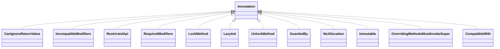

# error_prone_annotations-2.4.0.jar

[Group index](README.md) | [All archives](../README.md)

## Scope and provenance

- **Donor:** `SQX_145_REFERENCE_ROOT/internal/libs/error_prone_annotations-2.4.0.jar`.
- **SHA-256:** `5f2a0648230a662e8be049df308d583d7369f13af683e44ddf5829b6d741a228`; accessed 2026-10-06; captured `2026-10-06T18:54:51.906614+00:00`.
- **Classes:** 22 raw entries; 22 unique entry names. Duplicate occurrence indices are zero-based.
- **Inspection:** read-only ZIP hashing and class-file structural parsing; signatures/descriptors, modifiers, hierarchy and references only. Bytecode bodies are hashed, not published.
- **Allocation:** proposed `FEAT-HOST-ERROR-PRONE-ANNOTATIONS`, P01; [roadmap](../../dev/sqx-full-application-roadmap.md). Domain README registration remains required.
- **Repository:** `01067f00031428613c6394064ca1bcadc1ba00ee`; review state unreviewed. Download label 145-dev1; installed build/activation and runtime equivalence unverified.
- **Limit:** every class/member is inventoried; declaration coverage does not establish consumed calls, defaults, formulas, failure semantics or algorithm parity.
- **Archive/resource index:** [025.json](../../dev/evidence/sqx145/archives/145/025.json).

## Complete member declarations

Member shards contain exact JVM names/descriptors, access flags, generic signatures, throws types, declared fields/methods, superclass/interfaces and referenced class names. All classes, nested/synthetic members and overloads are retained. Code length/hash is structural evidence, not a normalized algorithm comparison.

- [001.json](../../dev/evidence/sqx145/members/025/001.json) — SHA-256 `e911cdfeeace560d1843eb3c36084f8736ac2784266a9eda7f4341e6a007034e`.

## Focused structural diagram

Up to twelve non-nested classes; arrows show declared inheritance/interfaces only. External type names are not evidence of an available body or an executed dependency.

## Class inventory

| Archive entry | Occurrence | Class SHA-256 | Fields | Methods |
| --- | ---: | --- | ---: | ---: |
| `com/google/errorprone/annotations/CanIgnoreReturnValue.class` | 0 | `7b908ae05832c942f1cd82750e86710ae8551d7865aa6fda683868c2587a800b` | 0 | 0 |
| `com/google/errorprone/annotations/IncompatibleModifiers.class` | 0 | `9bf81b42c94a56d6d6f200ba52d7377fa0d833778eddfcea5e46b06d37e255bd` | 0 | 1 |
| `com/google/errorprone/annotations/RestrictedApi.class` | 0 | `5c856f6302bb5dcffbe34da074f26164c5e8a871d0b8734d8e5a7012db87ff7b` | 0 | 5 |
| `com/google/errorprone/annotations/RequiredModifiers.class` | 0 | `f90c4a945a289e30e5281fbccae92db1e28e0a1d247ab212eb6ba74e80c5c5df` | 0 | 1 |
| `com/google/errorprone/annotations/concurrent/LockMethod.class` | 0 | `c07e89a2ebb34dddbd4bf4746ac667033ccd070fad0c085550575b29bf298136` | 0 | 1 |
| `com/google/errorprone/annotations/concurrent/LazyInit.class` | 0 | `ff14b997374484af78c5a0a7d563dd8de85a271e8f49ec5705e8db30c816b5ac` | 0 | 0 |
| `com/google/errorprone/annotations/concurrent/UnlockMethod.class` | 0 | `39727227b4b249e15e72fd340594578238d93b368e423aaa2825a788f43d39bf` | 0 | 1 |
| `com/google/errorprone/annotations/concurrent/GuardedBy.class` | 0 | `35ae0dfde8938d68a695560607c81d0e8fd1ae05ac166342c4fc5eaaa0ed5602` | 0 | 1 |
| `com/google/errorprone/annotations/NoAllocation.class` | 0 | `35ae8d947f90b538c8ae6af10889a66e0e608041f59aa7a938f37b33175a55ce` | 0 | 0 |
| `com/google/errorprone/annotations/Immutable.class` | 0 | `c2f421da3f28d5e5d4bd82233490493f8d92b8d57d90a9ef797c4132d7cf557a` | 0 | 1 |
| `com/google/errorprone/annotations/OverridingMethodsMustInvokeSuper.class` | 0 | `7e928c6f8023b8b48c9d1439da7da4f05df559f471fb39f0cc310b2a05c11e36` | 0 | 0 |
| `com/google/errorprone/annotations/CompatibleWith.class` | 0 | `f87396f38f850ff9280f99497c9e389a8245b4b8c78c2923cf506aafa901787b` | 0 | 1 |
| `com/google/errorprone/annotations/CheckReturnValue.class` | 0 | `63fe138c1bb0b585fe8ef8b5a4296b8575a11f3d25069d5b6fb4c41493c7ac87` | 0 | 0 |
| `com/google/errorprone/annotations/FormatMethod.class` | 0 | `2cb02fede6bef92da58d9818ded630cf793454551c77f57de54314588341ddd4` | 0 | 0 |
| `com/google/errorprone/annotations/DoNotMock.class` | 0 | `814a479f1f950a7998588882a3c7c91a7b4bb05703469c4a7ee2dc15c5c1b91f` | 0 | 1 |
| `com/google/errorprone/annotations/FormatString.class` | 0 | `1327d830c766c6e91e43d5bb6899a63da9ca20250a841727251fd7831af898be` | 0 | 0 |
| `com/google/errorprone/annotations/Var.class` | 0 | `4f68444ada32ddb4b6f5f992e9b51b8e79a6cb8918c6904bc0795674cb04d79a` | 0 | 0 |
| `com/google/errorprone/annotations/MustBeClosed.class` | 0 | `4244431cb5b331f5bc3561d861bf064b2b39a1a3dd31a1e2b5e238989c74e0ca` | 0 | 0 |
| `com/google/errorprone/annotations/CompileTimeConstant.class` | 0 | `e218c3a65586627ab5d8bf57aa9e3704c666d9e67f2b279fb029b057f992af2e` | 0 | 0 |
| `com/google/errorprone/annotations/SuppressPackageLocation.class` | 0 | `74f0e0edcacbf8526ae0ded4201bdfe67c8fc52ab4f335dbee6044adf0dfe6b4` | 0 | 0 |
| `com/google/errorprone/annotations/ForOverride.class` | 0 | `c32691981d4c7c11a62d09d7be4deccd81fc9cb1393f525489bd204fabfe12f9` | 0 | 0 |
| `com/google/errorprone/annotations/DoNotCall.class` | 0 | `e6fd1e9fce32aea250e642c527c3707aac77157b03df8ae0c3f07b44d22d4746` | 0 | 1 |
