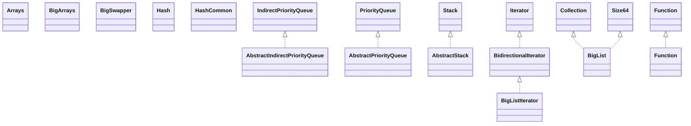

# fastutil-8.3.0.jar

[Group index](README.md) | [All archives](../README.md)

## Scope and provenance

- **Donor:** `SQX_145_REFERENCE_ROOT/internal/libs/fastutil-8.3.0.jar`.
- **SHA-256:** `77249efd4f23d039515bcc0bfc973cf65ee560da0a26a9db7fa2532e11deb4e7`; accessed 2026-10-06; captured `2026-10-06T18:54:51.906614+00:00`.
- **Classes:** 10777 raw entries; 10777 unique entry names. Duplicate occurrence indices are zero-based.
- **Inspection:** read-only ZIP hashing and class-file structural parsing; signatures/descriptors, modifiers, hierarchy and references only. Bytecode bodies are hashed, not published.
- **Allocation:** proposed `FEAT-HOST-FASTUTIL`, P02; [roadmap](../../dev/sqx-full-application-roadmap.md). Domain README registration remains required.
- **Repository:** `01067f00031428613c6394064ca1bcadc1ba00ee`; review state unreviewed. Download label 145-dev1; installed build/activation and runtime equivalence unverified.
- **Limit:** every class/member is inventoried; declaration coverage does not establish consumed calls, defaults, formulas, failure semantics or algorithm parity.
- **Archive/resource index:** [026.json](../../dev/evidence/sqx145/archives/145/026.json).

## Complete member declarations

Member shards contain exact JVM names/descriptors, access flags, generic signatures, throws types, declared fields/methods, superclass/interfaces and referenced class names. All classes, nested/synthetic members and overloads are retained. Code length/hash is structural evidence, not a normalized algorithm comparison.

- [001.json](../../dev/evidence/sqx145/members/026/001.json) — SHA-256 `d34f965c9bdd081891f52770339cb8dc607e82c475952683d5ab8cbcf61ef69a`.
- [002.json](../../dev/evidence/sqx145/members/026/002.json) — SHA-256 `87f2bbbf2cfe64e0d8f8994bfa993e4b524450c7632f1f580c9a2fd7fddd5f8f`.
- [003.json](../../dev/evidence/sqx145/members/026/003.json) — SHA-256 `e25bb154dcaabb12f606f0f9b9287c33090396cdabafc6428f249c910a37e4ed`.
- [004.json](../../dev/evidence/sqx145/members/026/004.json) — SHA-256 `5494b10ad2f41eecc59bc0f6eed67eef816c9ad5db7ececa1193a03a440f4d38`.
- [005.json](../../dev/evidence/sqx145/members/026/005.json) — SHA-256 `d108e6eb334ddec62ae641c612c2214dba23e97efb7ed6535cec6e9f977a3f6e`.
- [006.json](../../dev/evidence/sqx145/members/026/006.json) — SHA-256 `9d0b5e5494d3f4f4f55832deda3c7dddd545bbda201ec37296c748c7f321297e`.
- [007.json](../../dev/evidence/sqx145/members/026/007.json) — SHA-256 `ad46cd90b7a11e91d6cc6c073f50e7a4c2d3a53a3bb9d86a2a381eea14120791`.
- [008.json](../../dev/evidence/sqx145/members/026/008.json) — SHA-256 `30987ecba71ba2c18d413f5ffaa67015b730db6de306daefe0d9226f50771b0b`.
- [009.json](../../dev/evidence/sqx145/members/026/009.json) — SHA-256 `a79cc50bd7adc70ba6601e572333dddbaa17cf06c2b6effccf62d954e3e10f5d`.
- [010.json](../../dev/evidence/sqx145/members/026/010.json) — SHA-256 `668a99cca45e836166c4d676c1b49e88644f974fa6bd2e923122e22ec1dfc9d0`.
- [011.json](../../dev/evidence/sqx145/members/026/011.json) — SHA-256 `1c7ded33d1153ebef0bd803275ff0dfdbf9fafcdc2b8121f15fc333a9df8c08e`.
- [012.json](../../dev/evidence/sqx145/members/026/012.json) — SHA-256 `5bc89aee55b9702c89166d171dcbb49fbf963502db1562546dc5439e4b6c6c25`.
- [013.json](../../dev/evidence/sqx145/members/026/013.json) — SHA-256 `ab57bcb957c7868efa243086370bf648399b98acbdfa963db4904f2bfc34125a`.
- [014.json](../../dev/evidence/sqx145/members/026/014.json) — SHA-256 `92f93a6dbc5536bb99a636a452afb804a79325d066c96b8315003b971962ea9e`.
- [015.json](../../dev/evidence/sqx145/members/026/015.json) — SHA-256 `ffcf4c8f5fc059e9b3168c9a8ccd0e51075fa7b15ce381ac4eb806481ba8db22`.
- [016.json](../../dev/evidence/sqx145/members/026/016.json) — SHA-256 `eaab5f5d6cdb542e94f9ad9b2809c29d46ac7b91837a788d3712282d178f3413`.
- [017.json](../../dev/evidence/sqx145/members/026/017.json) — SHA-256 `14199675cbb4a01947829e67f427821be9f63a458390b206d3e5e4b94206937e`.
- [018.json](../../dev/evidence/sqx145/members/026/018.json) — SHA-256 `9e7e2e3417a0aac18e5dbbc3b5f82f4c3381cacb8455fbb29abb837fc4efaa05`.
- [019.json](../../dev/evidence/sqx145/members/026/019.json) — SHA-256 `e267b5976b02a77323c62d1d4d535f1b8f56507e9cac03c97878022e4167a9e7`.
- [020.json](../../dev/evidence/sqx145/members/026/020.json) — SHA-256 `a7e04a95ff5879602267c948b95677b02bacefe3809c9d96bfc9707711842c84`.
- [021.json](../../dev/evidence/sqx145/members/026/021.json) — SHA-256 `613832a0b797dc81af9a638e07c29515a0b1358c3623332bd84f0b98c069545d`.
- [022.json](../../dev/evidence/sqx145/members/026/022.json) — SHA-256 `4e2e0e99cccb8bce2992007b39d10e11a22e7e32f55bafc8239f7b11e965255d`.
- [023.json](../../dev/evidence/sqx145/members/026/023.json) — SHA-256 `abae6c39e07c17103569e65a7fbae7ca3e5fde51732cd9810de287dc179c3725`.
- [024.json](../../dev/evidence/sqx145/members/026/024.json) — SHA-256 `fcf0db6d2816c67e77bad8df6ab6b196eab6990e63ce1b7114b43ee0b89f96dc`.
- [025.json](../../dev/evidence/sqx145/members/026/025.json) — SHA-256 `39c2634cbec03d81668832f3c003973bb964932a1fd57197ecd5d868c478f4f5`.
- [026.json](../../dev/evidence/sqx145/members/026/026.json) — SHA-256 `0a342e2022aa9deda058fd818bf7d2bc690837d419b1f55385a23077fe531da8`.
- [027.json](../../dev/evidence/sqx145/members/026/027.json) — SHA-256 `30cac458034b31c74568d82f22937e47a4ae29ffc537f5b0cd4839c3951c14cb`.
- [028.json](../../dev/evidence/sqx145/members/026/028.json) — SHA-256 `243e6f1bef6718a2e062b629f8601a040dbd3cef777e196cacd61d5b0b361890`.
- [029.json](../../dev/evidence/sqx145/members/026/029.json) — SHA-256 `dc4266e815baed6f19bc974952a6ad74a52e5d72ef40beea3f748073c1d21a54`.
- [030.json](../../dev/evidence/sqx145/members/026/030.json) — SHA-256 `2af34c9f3b4c916041a9dd1eb668929fc1b5931425743950b63675b60a992b91`.
- [031.json](../../dev/evidence/sqx145/members/026/031.json) — SHA-256 `1941ca06329a7d728188c8ae85e133e63e9443534fa46b2337aa3b1ff3285ce4`.
- [032.json](../../dev/evidence/sqx145/members/026/032.json) — SHA-256 `ae4084b9663d6de9413c4aed279985eb000ea3708085841346695371c86e365c`.
- [033.json](../../dev/evidence/sqx145/members/026/033.json) — SHA-256 `2c5c83e6d6d64f7159b3cc88161611f6e89237537205a838582b97b7a36e6c73`.
- [034.json](../../dev/evidence/sqx145/members/026/034.json) — SHA-256 `efe666cd6415a9a2b0e4360c6f7ab6f162213c6782b1263265c7574fae56ef95`.
- [035.json](../../dev/evidence/sqx145/members/026/035.json) — SHA-256 `d8618ca585ead63d01d593541517b7651a475354c635bf562cd20c1f2a70770c`.
- [036.json](../../dev/evidence/sqx145/members/026/036.json) — SHA-256 `c28dfccbc62dfc1d8789c7d9c4716244c7649ea1023cb03711ef48da16883abd`.
- [037.json](../../dev/evidence/sqx145/members/026/037.json) — SHA-256 `e28430d67f8aacb1ed9693c58afcc6a312f79b2650ca95d381e45f8293edb81a`.
- [038.json](../../dev/evidence/sqx145/members/026/038.json) — SHA-256 `3a9effae851fab8c7f4c5a5997d47a214233eb65b0a8b75407de134b42320b7c`.
- [039.json](../../dev/evidence/sqx145/members/026/039.json) — SHA-256 `cb1be82a0fe6461624b45e781bf7694c8df841d3a25c518bbe6dfc78c94d841c`.
- [040.json](../../dev/evidence/sqx145/members/026/040.json) — SHA-256 `330ffe17ea0e3b2c50d3e5284f35a3b6dc3888217bbb23f5d1430d60ac3e4514`.
- [041.json](../../dev/evidence/sqx145/members/026/041.json) — SHA-256 `33e7bdbad68a2c4242c1d7c3b986363f806cbf2ee69db00ddf47d3ed8c1b8674`.
- [042.json](../../dev/evidence/sqx145/members/026/042.json) — SHA-256 `e7ca3efa0cdef5a46a24e55d99d8dfc017e241714253f91efeb431ce0723e15f`.
- [043.json](../../dev/evidence/sqx145/members/026/043.json) — SHA-256 `3e2315a49b659af8a81d7b409f1269960c40c70ccf2b97fe3af24a84edda624a`.
- [044.json](../../dev/evidence/sqx145/members/026/044.json) — SHA-256 `f32a2f80b0f367298cc67dffa66c06047306cbe184dffd7a580fd80033c9bef1`.
- [045.json](../../dev/evidence/sqx145/members/026/045.json) — SHA-256 `23e19a87bfd54f5b0c7e095614c5e89ae54481d070bb38c35696631cb5ba5eb6`.
- [046.json](../../dev/evidence/sqx145/members/026/046.json) — SHA-256 `3bef3ba6de7ce6c834170a764014eb11cb5c9ae459cbab5e2c6ac4045697ac1a`.
- [047.json](../../dev/evidence/sqx145/members/026/047.json) — SHA-256 `f6bc986ae40793e53079e17c8095622dbf4375111da31f15889f197b25856d96`.
- [048.json](../../dev/evidence/sqx145/members/026/048.json) — SHA-256 `75c8c03ccadb5b87ced327a0f478130a23055c670cafc500c38453a3c75f9b60`.
- [049.json](../../dev/evidence/sqx145/members/026/049.json) — SHA-256 `2809c284abf13ae435ecf7817162168dd274f3bd35d90b506c7675f0fe23e3e9`.
- [050.json](../../dev/evidence/sqx145/members/026/050.json) — SHA-256 `9c5297b746bc97a830f6290cf6484897b7de7ef4dba8c66aeed140c1753b55a8`.
- [051.json](../../dev/evidence/sqx145/members/026/051.json) — SHA-256 `16a11b0f059910e0757729c6e8641b15c520c8876ec45f1fe447bbc768f402f9`.
- [052.json](../../dev/evidence/sqx145/members/026/052.json) — SHA-256 `403b02cff476c4c69f2ba6e901836bc8da8d1177b3ed26b2f64839a63468c5ad`.
- [053.json](../../dev/evidence/sqx145/members/026/053.json) — SHA-256 `913c51f5234e84cf0ab029bec14d8e7bffb51c28088a8245c52920325e9e8895`.
- [054.json](../../dev/evidence/sqx145/members/026/054.json) — SHA-256 `730a68afd6eade858c685723389657fa59e3d9be124fdbee7edb966c405d0490`.
- [055.json](../../dev/evidence/sqx145/members/026/055.json) — SHA-256 `514b74a34894eaa7428ef824869c7577ebb1796dc058d8ddb0435722915c451e`.
- [056.json](../../dev/evidence/sqx145/members/026/056.json) — SHA-256 `8031afd52da5417c749c819f26652032814f0dfcb9b6480ee0c8be7fce00b9aa`.
- [057.json](../../dev/evidence/sqx145/members/026/057.json) — SHA-256 `cbb5faca2362e4de75b20ef2dbcd81b18d9a5c2ab7b4d056ef5a345e5d920d6d`.
- [058.json](../../dev/evidence/sqx145/members/026/058.json) — SHA-256 `40cac94d057d37b65499c93f91f351767656bd01c27e4ba68d3faa2c72167217`.
- [059.json](../../dev/evidence/sqx145/members/026/059.json) — SHA-256 `24bca3e9ecde60df18b137de8a4ec3996e98e5275e57b036fb841bb52c49725a`.
- [060.json](../../dev/evidence/sqx145/members/026/060.json) — SHA-256 `272d37a871283400e8bc56756dea8cfb25483898461bd6b4ab7f0ef1952884fb`.
- [061.json](../../dev/evidence/sqx145/members/026/061.json) — SHA-256 `a95b51124c66edf12c747b7b4cf43dd1d6f519863021d1556a00f7809458178c`.
- [062.json](../../dev/evidence/sqx145/members/026/062.json) — SHA-256 `4e47b9041d8bfa6f7d1bdfef74d491cb765d9f2f7c58fffc2f6ca5ac8505b9f5`.
- [063.json](../../dev/evidence/sqx145/members/026/063.json) — SHA-256 `1f03b47e20c4e7826f964bef6279cd862efcc7a4d277bad460d54dfcc613cf28`.
- [064.json](../../dev/evidence/sqx145/members/026/064.json) — SHA-256 `532fcc7ce25ef4988c6af0b076d0ac742d457258a4cd87394b0560230f06a74a`.
- [065.json](../../dev/evidence/sqx145/members/026/065.json) — SHA-256 `3cb60b5b60d8d9e7e6055b08cc96e3e485745c3105e16a616d7aa8845e7a1488`.
- [066.json](../../dev/evidence/sqx145/members/026/066.json) — SHA-256 `93372b499fc50cec8fc9aacb5333548cea06f5a352de66c341ecffc0f4fc5e99`.
- [067.json](../../dev/evidence/sqx145/members/026/067.json) — SHA-256 `b1475e0c6fa3d7e358857d0655ee8aeabe31a1faf25f43f7c5e74aa4271b1a29`.
- [068.json](../../dev/evidence/sqx145/members/026/068.json) — SHA-256 `51d1280d7c490c5b34cdde038d5981ed0512706873a5c2b467033e60090f3cbc`.
- [069.json](../../dev/evidence/sqx145/members/026/069.json) — SHA-256 `e50f15dfe7ccbf3f8bc2beb0b3334202e5df0ce842a6df0fb3a0cc442abe8181`.
- [070.json](../../dev/evidence/sqx145/members/026/070.json) — SHA-256 `80df7d656cfb0faaab497083d94f4c02522187024af4b8658171643e05062d44`.
- [071.json](../../dev/evidence/sqx145/members/026/071.json) — SHA-256 `e5cab0550526d091bd01060460c85b48be37dd5d9979dacbb1e10cd8e918069e`.
- [072.json](../../dev/evidence/sqx145/members/026/072.json) — SHA-256 `3efe13bd9c6d58f9a4b66e4ea516b03ba66c5786b82fcb430c17c17447a60b6b`.
- [073.json](../../dev/evidence/sqx145/members/026/073.json) — SHA-256 `b2055cb20a034d8bc3d4c34f42b023e031944d4d349acb0effbc811a9a0e6912`.
- [074.json](../../dev/evidence/sqx145/members/026/074.json) — SHA-256 `0fe63d527bd09c159e31b28d84c7af4e76a3a2c6bf1a87a86837de83eed18013`.
- [075.json](../../dev/evidence/sqx145/members/026/075.json) — SHA-256 `d1a154027cd1508bd4396d2bf9c134c78b4430e862a2c6afac87455381e50b49`.
- [076.json](../../dev/evidence/sqx145/members/026/076.json) — SHA-256 `c15eb00c8e49cafa4d892ab779d9bc129c73b90e28c3f84515b6a3ab8fbf6a3e`.
- [077.json](../../dev/evidence/sqx145/members/026/077.json) — SHA-256 `8abd7c9df14402a90c3ed66a62b8cbab2008bdd07864afd3e4adae6096385524`.
- [078.json](../../dev/evidence/sqx145/members/026/078.json) — SHA-256 `6b1ec400b625bf4ca6d48da065f9c2984dc23fd11ca1d0a0508c7ac8604f13a8`.
- [079.json](../../dev/evidence/sqx145/members/026/079.json) — SHA-256 `6edfed3fffbdca90fb0daa3d235cb66458777f3fda49fad26b6518b8e5454c8c`.
- [080.json](../../dev/evidence/sqx145/members/026/080.json) — SHA-256 `baae946c49b3333b505b6fd32a403744fad933d9bae114309d56950604b24486`.
- [081.json](../../dev/evidence/sqx145/members/026/081.json) — SHA-256 `404bc071d60ef793d06beeac6b975f3eacdedb6dc312ccfb682113b0901d33e8`.
- [082.json](../../dev/evidence/sqx145/members/026/082.json) — SHA-256 `e650adae5315fe42f994185f58c3c857f7a9c84bc48fd35c347ab04ece1db417`.
- [083.json](../../dev/evidence/sqx145/members/026/083.json) — SHA-256 `35f3eed975c438be355fc6b6a1718b40db804538899ac243f418ec92c383e3c9`.
- [084.json](../../dev/evidence/sqx145/members/026/084.json) — SHA-256 `d2649eb3c4bb96543aa85628755f1128b388aee64186593f1e3ac560892b9195`.
- [085.json](../../dev/evidence/sqx145/members/026/085.json) — SHA-256 `e36e7ae03e2329bc10025d840a810e1e17d1b1a0fb8dfb37159191f6afd7d70b`.
- [086.json](../../dev/evidence/sqx145/members/026/086.json) — SHA-256 `60dbca31537daada949a9358b0f4e3d454d3b411c57fe1f101892b9cbe686a8d`.
- [087.json](../../dev/evidence/sqx145/members/026/087.json) — SHA-256 `ab56043b28d94a707e62aa9c52ff2d5486e095023925c2ea024fd38da8e19146`.
- [088.json](../../dev/evidence/sqx145/members/026/088.json) — SHA-256 `6dbf87d513ec0a0f0483dc25dac0a0c68eb199a317d44944b5e3b396dbf629c8`.
- [089.json](../../dev/evidence/sqx145/members/026/089.json) — SHA-256 `936686a26c0058d5d8a4f36ae83f0fd45986769ee25fe28119a9815ade832b58`.
- [090.json](../../dev/evidence/sqx145/members/026/090.json) — SHA-256 `b83341ef5e6f3ec9ae0680b38aed690ecb4d2618f85a52b5e816eb41fac76f85`.
- [091.json](../../dev/evidence/sqx145/members/026/091.json) — SHA-256 `6ba4f0c2ceffa8e08b3e180f41576c367302bf70db37705af5c95de62f92165a`.
- [092.json](../../dev/evidence/sqx145/members/026/092.json) — SHA-256 `a709248a49214b27475bb668bf7a2da66fa62b1e7e60e48fc179b88a50f8fd30`.
- [093.json](../../dev/evidence/sqx145/members/026/093.json) — SHA-256 `1d2b889da7655e13204d1488f343bfa78ca721188878bb7cee46de3bb3059b44`.
- [094.json](../../dev/evidence/sqx145/members/026/094.json) — SHA-256 `b0e0fb0afc4808f4d502c44e3444682425d778613b22569fa7623190710553cc`.
- [095.json](../../dev/evidence/sqx145/members/026/095.json) — SHA-256 `89326cb9993362dc615c39f88d10d7b82383ad3d8f55460daad307e8bbd8a09f`.
- [096.json](../../dev/evidence/sqx145/members/026/096.json) — SHA-256 `b0d3f8fdc6e6fc5149886be2bd3804dc08ed4068a1a170e197bb8a30632548ab`.
- [097.json](../../dev/evidence/sqx145/members/026/097.json) — SHA-256 `6fb504c50524b8baada7de18a9346731ae0549e24d4651dee5480a68ac095125`.
- [098.json](../../dev/evidence/sqx145/members/026/098.json) — SHA-256 `3ae3def921e274fe5890cc7ce085b078086af5710f9903787fe1906e01924754`.
- [099.json](../../dev/evidence/sqx145/members/026/099.json) — SHA-256 `28d5483a8ad850bfa81b26ae0ca0262e483cacd94b2bec7c0b0e390f98ba9e91`.
- [100.json](../../dev/evidence/sqx145/members/026/100.json) — SHA-256 `9c1af4fec9ec12f7cbbddd9d13452229cb1b22019f644bffe8a2a65b28e23e8c`.
- [101.json](../../dev/evidence/sqx145/members/026/101.json) — SHA-256 `36fa93071bd7c70223df7235e177244de32c764ec6c36e6f89fe3503884e112d`.
- [102.json](../../dev/evidence/sqx145/members/026/102.json) — SHA-256 `38ff41ba9f196a462343674240175ac7616a22527043eca2bda0984e493ebda0`.
- [103.json](../../dev/evidence/sqx145/members/026/103.json) — SHA-256 `a3435aa456bbe268ac57daec071144bc7856499db52a8871a12b43e9e1d63cd4`.
- [104.json](../../dev/evidence/sqx145/members/026/104.json) — SHA-256 `c126c7daebb923cdec677c81c70a08b9551f486bf9223dd03f9365e77d82d451`.
- [105.json](../../dev/evidence/sqx145/members/026/105.json) — SHA-256 `b4b3f8625567978a763856d2ae1467514e85a6a089aa31712127fff297c07577`.
- [106.json](../../dev/evidence/sqx145/members/026/106.json) — SHA-256 `3454d54fcaa4e78512cd9f4fb8e6364b53d4d7b44cff78f97b17209330ee73c0`.
- [107.json](../../dev/evidence/sqx145/members/026/107.json) — SHA-256 `67ec304560efa85585fd2a0fb8738a34779bc58a05effcbbad87bf20f7b63643`.
- [108.json](../../dev/evidence/sqx145/members/026/108.json) — SHA-256 `7d450c4d5626acf10816410ea6c0152a71885b509dbc1b6b9f269f91ebe5c6f1`.
- [109.json](../../dev/evidence/sqx145/members/026/109.json) — SHA-256 `1e178a8831105444c7534a147781e66d6c233a8321369ce467099723f705c959`.
- [110.json](../../dev/evidence/sqx145/members/026/110.json) — SHA-256 `450d60902d6fe053cbf5bc09d2fd858a4832f4d0e2eba8be398cce9733a24d35`.
- [111.json](../../dev/evidence/sqx145/members/026/111.json) — SHA-256 `40d537358fb9723fa0dcf32d7027e148e9b5de36fea7bb07c1e905a945910337`.
- [112.json](../../dev/evidence/sqx145/members/026/112.json) — SHA-256 `9ba74c48e06bd38f563fde7780bf4726d498f39eaa2f8315f607fbf37cf967b1`.
- [113.json](../../dev/evidence/sqx145/members/026/113.json) — SHA-256 `76299e58bc014aa91bb170b824ce2a6831bb8856da9415adf7e47ff0eee3722d`.
- [114.json](../../dev/evidence/sqx145/members/026/114.json) — SHA-256 `55a373f0f1ba43d875565d338ba17d8f2f03011e6314c64a3987fc9d3f523353`.
- [115.json](../../dev/evidence/sqx145/members/026/115.json) — SHA-256 `045bc69dff34d931331fce5b5b9359c76021dcbcc8b2d022158b49b753af08cd`.
- [116.json](../../dev/evidence/sqx145/members/026/116.json) — SHA-256 `aa845d481ed5e689c4117520028169c70204069926245553b1cebda5f677e23a`.
- [117.json](../../dev/evidence/sqx145/members/026/117.json) — SHA-256 `ec76e1c887106e91be292c042de5761d9175996bfb8e0c680198318c4c9bb251`.
- [118.json](../../dev/evidence/sqx145/members/026/118.json) — SHA-256 `1538392e75228066a1c34fc02d55a91390cc5aca973b243c4713b21ef490f11b`.
- [119.json](../../dev/evidence/sqx145/members/026/119.json) — SHA-256 `c467ac663bfc31ac3b028d3b7335a7d807591f9ec2192bfafb13dd3a1b4d801c`.
- [120.json](../../dev/evidence/sqx145/members/026/120.json) — SHA-256 `b8a423b9ba7394c251b1c71c6c4f8fe60d283e6f7f61a7dc26e2dc62abdb21b3`.
- [121.json](../../dev/evidence/sqx145/members/026/121.json) — SHA-256 `99543dd27f8ac53554ed9b4796de34e6bc8ee481beaee99511b484322262dcc4`.
- [122.json](../../dev/evidence/sqx145/members/026/122.json) — SHA-256 `da6f3038b9cbbe0960b6c02a8a314df4b146d2fae273eaea2a7efd1cacfe67ca`.
- [123.json](../../dev/evidence/sqx145/members/026/123.json) — SHA-256 `158dbe62b9ae7172be5eda68401f38acd392264c52b196585d7c53545a49fab4`.
- [124.json](../../dev/evidence/sqx145/members/026/124.json) — SHA-256 `3db8cc1848c9c18a2e7a8afce4b84680325a228cc71fe082080030ecc08656ad`.
- [125.json](../../dev/evidence/sqx145/members/026/125.json) — SHA-256 `b4d9bb6d6ddbcb8e3a45b5677b0bf8a2515393ecf6b2b2f90816a47c6d3e9792`.
- [126.json](../../dev/evidence/sqx145/members/026/126.json) — SHA-256 `2ddd9efb39f2764a7b87d0edce2ba11d4beb71c712601456a941e146bba5997b`.
- [127.json](../../dev/evidence/sqx145/members/026/127.json) — SHA-256 `db795bdd1c04dbf20b7bffc81b2529771848f39c44a7a57cc0531432bb4c849c`.
- [128.json](../../dev/evidence/sqx145/members/026/128.json) — SHA-256 `5bcd6387e528647d8be5f1e4ce091b8f74927026169f649096b95de8c34aa561`.
- [129.json](../../dev/evidence/sqx145/members/026/129.json) — SHA-256 `d938f0ac3958f7f78758b131fa67d3ebc34eed2865bbcb2c0c9b0de818c4345f`.
- [130.json](../../dev/evidence/sqx145/members/026/130.json) — SHA-256 `6eac69925769fcf7ebe7dbab5a81ed09f4af3f28fa5757d459ef72eccc835994`.
- [131.json](../../dev/evidence/sqx145/members/026/131.json) — SHA-256 `4d1f0af476c0eae19aa2241f34d167d7b6e116419848044b2d236e54b46d16fa`.
- [132.json](../../dev/evidence/sqx145/members/026/132.json) — SHA-256 `4c52a1f7781498f14ae1651ed3cb0ae6f4a45dedb6f6ada03575116fe9328f7c`.
- [133.json](../../dev/evidence/sqx145/members/026/133.json) — SHA-256 `4c15a9a12b626e4786ec414a2197a9566d40a82771765c65028813bc458a8be4`.
- [134.json](../../dev/evidence/sqx145/members/026/134.json) — SHA-256 `1bce93870083a714d0f4cf5739e9f45ab212905ff77570f864b470f1a99792e6`.
- [135.json](../../dev/evidence/sqx145/members/026/135.json) — SHA-256 `ad4a0e804dbaa0927216d172cb20362345f2513ef432f2e6daded10efd2e2a23`.

## Focused structural diagram

Up to twelve non-nested classes; arrows show declared inheritance/interfaces only. External type names are not evidence of an available body or an executed dependency.

## Class inventory

| Archive entry | Occurrence | Class SHA-256 | Fields | Methods |
| --- | ---: | --- | ---: | ---: |
| `it/unimi/dsi/fastutil/AbstractIndirectPriorityQueue.class` | 0 | `7f24f314332eaebec55cb815096d469eb96dbc6fd9434d24bfdc412300bb824c` | 0 | 1 |
| `it/unimi/dsi/fastutil/AbstractPriorityQueue.class` | 0 | `f4690d1a9c58b393b5ad6192dc41ce23cb8604e558b7379d76b539ca8c3fceea` | 0 | 1 |
| `it/unimi/dsi/fastutil/AbstractStack.class` | 0 | `5395d3bdba4d6b4c009d53b40c4644e3c7059a96c65b675082e7c7d06d42b497` | 0 | 1 |
| `it/unimi/dsi/fastutil/Arrays$ForkJoinGenericQuickSort.class` | 0 | `e62ba18a0553d0afeb39a01c5cf4676b6a697e48932b71920bd5227e12651f12` | 5 | 2 |
| `it/unimi/dsi/fastutil/Arrays.class` | 0 | `962e023baa043c9521c5d3863dcc6d1e0103dfb3d9b30a73d56dea6d349c3985` | 5 | 12 |
| `it/unimi/dsi/fastutil/BidirectionalIterator.class` | 0 | `302571b5c411ee8ebcd6c9837cfb9ab1ac9ab8d02c0391af2c31565d654bdfca` | 0 | 2 |
| `it/unimi/dsi/fastutil/BigArrays.class` | 0 | `b0f1e5e86a51e765b80716afd05fbbf230466b036e6e1ec58a8993b836ee4682` | 5 | 260 |
| `it/unimi/dsi/fastutil/BigList.class` | 0 | `61c559bada1107f1f1665c89a1030734a1f45fdd5ca2f010ff328a49ee094608` | 0 | 12 |
| `it/unimi/dsi/fastutil/BigListIterator.class` | 0 | `9837c1e12b72e0be6289482ca5fbb3a683085a94add14028324e0f6a560371eb` | 0 | 4 |
| `it/unimi/dsi/fastutil/BigSwapper.class` | 0 | `ec57130f622c64d2c51788c2e8fbbcf902c980dd33a4a499aec0093cfe0a1bc3` | 0 | 1 |
| `it/unimi/dsi/fastutil/Function.class` | 0 | `faaf0eda1bd06ad8261d0ba7c5ff2b97fd1e90385cc66a8e7d6de728a5a537a5` | 0 | 7 |
| `it/unimi/dsi/fastutil/Hash$Strategy.class` | 0 | `5d0ebc55bb91940c75405cdcdd81eba41502c69cfddd80c183385ff1392fc7c4` | 0 | 2 |
| `it/unimi/dsi/fastutil/Hash.class` | 0 | `94b8fb4b694c7778a8473e75a19a35523950a06e4c9fb5c4d421bb23021531ee` | 9 | 1 |
| `it/unimi/dsi/fastutil/HashCommon.class` | 0 | `4b31533d95f3bf69910ec70358f72ba51313a1df43ed5264289377bc896ccfe0` | 4 | 16 |
| `it/unimi/dsi/fastutil/IndirectPriorityQueue.class` | 0 | `e136c4fc2cf36b47307a716272c659d8d4bed7242c552c1b905bea7a6c0f990f` | 0 | 14 |
| `it/unimi/dsi/fastutil/IndirectPriorityQueues$EmptyIndirectPriorityQueue.class` | 0 | `02f1671588c00c5f05cd4d628cd6fae445e98d97f80d7e505fe3c5801f377d73` | 0 | 15 |
| `it/unimi/dsi/fastutil/IndirectPriorityQueues$SynchronizedIndirectPriorityQueue.class` | 0 | `0c0ea4080264468b088d4f3f57b77f9be594ff762f3a71172d6677d778c3e129` | 3 | 16 |
| `it/unimi/dsi/fastutil/IndirectPriorityQueues.class` | 0 | `39dd4ac76ee611ec44dc833ce9a36e2f84f0e4d26f5b140062672750ba6d286f` | 1 | 4 |
| `it/unimi/dsi/fastutil/PriorityQueue.class` | 0 | `ab8b7145e7ede0e2f9313d3a7a76388a96022e831a1ec97554ded7cb6f0ef1d3` | 0 | 9 |
| `it/unimi/dsi/fastutil/PriorityQueues$EmptyPriorityQueue.class` | 0 | `b9824f5ffb8b01d95b08339658534e859f526873fb4240580a15cf9b07787c79` | 1 | 14 |
| `it/unimi/dsi/fastutil/PriorityQueues$SynchronizedPriorityQueue.class` | 0 | `12c8a944ed9ddaad5a338eab1255f1e69b93c835fccdd01546f1ae2e022e38d7` | 3 | 15 |
| `it/unimi/dsi/fastutil/PriorityQueues.class` | 0 | `a4bdb666a8231ec28bf165a8c280ecaf76ad9b7b4a81b3e68a9fc2cc76e3090f` | 1 | 5 |
| `it/unimi/dsi/fastutil/SafeMath.class` | 0 | `1a673c2c81e630ac54595cc7c4e2d1cf354cbdf9e24fb7c23cb9f0f36e7b9c89` | 0 | 6 |
| `it/unimi/dsi/fastutil/Size64.class` | 0 | `3982b45385807f64c6f8f76bc81e5c12a86d43abed5d1e3657a2bcff9d662a8e` | 0 | 2 |
| `it/unimi/dsi/fastutil/Stack.class` | 0 | `8122775d4751d3e4175737cf6d940184a2b34216ca143c3be33d28be6af09ce4` | 0 | 5 |
| `it/unimi/dsi/fastutil/Swapper.class` | 0 | `6db76f631e5d17d54547bd23540a31d8b5fdf773b59cadbf814c6d17315848a9` | 0 | 1 |
| `it/unimi/dsi/fastutil/booleans/AbstractBooleanBidirectionalIterator.class` | 0 | `94447fc7f52f3f5587d15d237a76cc2d414de2744895421ff927a57b6086d16f` | 0 | 1 |
| `it/unimi/dsi/fastutil/booleans/AbstractBooleanBigList$1.class` | 0 | `f936decb35395a2e3ef462cf943530571c91c1e7e5b85e3737cdbcbdb9c23560` | 4 | 10 |
| `it/unimi/dsi/fastutil/booleans/AbstractBooleanBigList$BooleanSubList$1.class` | 0 | `3f12268601ad8aa4fe9d390d42b911bafdd1c51b07e843fb81582acac5cdab10` | 5 | 11 |
| `it/unimi/dsi/fastutil/booleans/AbstractBooleanBigList$BooleanSubList.class` | 0 | `78b592acbda21d3bc733d2932f34954a4810e20d21c4091f0b784414f94a81a6` | 5 | 33 |
| `it/unimi/dsi/fastutil/booleans/AbstractBooleanBigList.class` | 0 | `2f6ee24906ddf867465d7767ec386c434d55dd1f51e6a2e31dacdcabe79a562b` | 0 | 61 |
| `it/unimi/dsi/fastutil/booleans/AbstractBooleanBigListIterator.class` | 0 | `121845713cab821ca61bc357f7fb8571527d816e3c54f7c2a98e630d00e5bdb9` | 0 | 1 |
| `it/unimi/dsi/fastutil/booleans/AbstractBooleanCollection.class` | 0 | `39a74cc5782b4d86659f488406824db10e736e3ebbfe8e57cd04ec4b7187155f` | 0 | 18 |
| `it/unimi/dsi/fastutil/booleans/AbstractBooleanIterator.class` | 0 | `8bd6fc1c9fe1a9b0625f09d25746b3fd20e005aea6694101de35553084cc824c` | 0 | 1 |
| `it/unimi/dsi/fastutil/booleans/AbstractBooleanList$1.class` | 0 | `cd62ce389ca435f13e4c42a19e9ff9cb3dae992d91ab20be270d5bb0ae4893d7` | 4 | 10 |
| `it/unimi/dsi/fastutil/booleans/AbstractBooleanList$BooleanSubList$1.class` | 0 | `69ba109bf42aba446e6dabc298f75655ed9d9abb940621726da73b11d4be2d94` | 5 | 11 |
| `it/unimi/dsi/fastutil/booleans/AbstractBooleanList$BooleanSubList.class` | 0 | `f5eec3182c67d39ffbb7a7abf8f9cdfd03464c75ca7af1c713bcfd90136b3b8e` | 5 | 25 |
| `it/unimi/dsi/fastutil/booleans/AbstractBooleanList.class` | 0 | `1ef0d2d38ea16358adaf70374e94072e141cf6aaff99b951f42857ee732a9dcc` | 0 | 42 |
| `it/unimi/dsi/fastutil/booleans/AbstractBooleanListIterator.class` | 0 | `cb6f6a17401a6369a29093cba9c472e8097c394e80b74ab134f21315e1b14252` | 0 | 1 |
| `it/unimi/dsi/fastutil/booleans/AbstractBooleanSet.class` | 0 | `d0aadf6f1aadbae1f373fe16c87e2526ba41f91afa733081d3d8811273bca6d5` | 0 | 7 |
| `it/unimi/dsi/fastutil/booleans/AbstractBooleanStack.class` | 0 | `3b14b088c8c35db578feb73ab7cd408e1622ad3bab59a747e188e2e0f89278cf` | 0 | 1 |
| `it/unimi/dsi/fastutil/booleans/BooleanArrayList$1.class` | 0 | `9bd3c831344374f5f56201b144cb34c11578d8d10db5dce83a7a3e124883157f` | 4 | 10 |
| `it/unimi/dsi/fastutil/booleans/BooleanArrayList.class` | 0 | `c1e6902c4111dce85a999cc5fc675052e208162092552e44881bd08adace1970` | 5 | 49 |
| `it/unimi/dsi/fastutil/booleans/BooleanArraySet$1.class` | 0 | `313c3624833ef2c4e5426ecf68b12fd518ecb2faaf711c0dafa4d8a5f4e4bea1` | 2 | 4 |
| `it/unimi/dsi/fastutil/booleans/BooleanArraySet.class` | 0 | `54ff138b143da10ef1eccceed7d00f2f9e9e7f05b9b0a8ba3ea15332be8398bd` | 3 | 22 |
| `it/unimi/dsi/fastutil/booleans/BooleanArrays$1.class` | 0 | `85ffbe0a83dfe27eb42cde350825d5174ea9b51d8d060e485074ac2fe11b9ad6` | 0 | 0 |
| `it/unimi/dsi/fastutil/booleans/BooleanArrays$ArrayHashStrategy.class` | 0 | `9c81a016f71e3d9648d5ba50665bca0d665656064cb9569c1c3f2085b927fa12` | 1 | 6 |
| `it/unimi/dsi/fastutil/booleans/BooleanArrays$ForkJoinQuickSort.class` | 0 | `2c61ccfc9c846b17ee06e675004c9720fea6b9ad957a8373b3a46c5bac98b87e` | 4 | 2 |
| `it/unimi/dsi/fastutil/booleans/BooleanArrays$ForkJoinQuickSort2.class` | 0 | `1b50018718d14af9c53283357267a24a01eb521f17fbc3194070e29bde89de64` | 5 | 2 |
| `it/unimi/dsi/fastutil/booleans/BooleanArrays$ForkJoinQuickSortComp.class` | 0 | `d6d07b2b292250ce721c76bcadaf40492622ec2188aca9c1dcd6e87f3b37bd3b` | 5 | 2 |
| `it/unimi/dsi/fastutil/booleans/BooleanArrays$ForkJoinQuickSortIndirect.class` | 0 | `e0bd7c5a58c5bd86b15affd3a8b0807ca85736fbf53e28aa0259a2baa7b61593` | 5 | 2 |
| `it/unimi/dsi/fastutil/booleans/BooleanArrays.class` | 0 | `777038fed3ad6e90e8308afc19a69d9976051386db4a82ef0c02afe9ad77ff27` | 7 | 73 |
| `it/unimi/dsi/fastutil/booleans/BooleanBidirectionalIterable.class` | 0 | `3b1d3480b5c4c6d578d7b9209e9ca8fd9d19e2dec3e9acd8d2ead976ff08958a` | 0 | 3 |
| `it/unimi/dsi/fastutil/booleans/BooleanBidirectionalIterator.class` | 0 | `5adaeb77f5f8f5e0d34ce7e8d60c1c495cd4cd258538d3aa15511901625bc7f1` | 0 | 5 |
| `it/unimi/dsi/fastutil/booleans/BooleanBigArrayBigList$1.class` | 0 | `88b8250f1ee116035a35eed4e4d9d70ec672ef4dce42c46a32673c50abbebcc1` | 4 | 10 |
| `it/unimi/dsi/fastutil/booleans/BooleanBigArrayBigList.class` | 0 | `700f626c5437c57a66c2e917d1ccc5ae8e3aac29bf635ca0da076fd428ae65b6` | 5 | 42 |
| `it/unimi/dsi/fastutil/booleans/BooleanBigArrays$1.class` | 0 | `94a91af4e54826382065d60a4c1b747fb1725af0df0eb128e6bb73a21659ab8b` | 0 | 0 |
| `it/unimi/dsi/fastutil/booleans/BooleanBigArrays$BigArrayHashStrategy.class` | 0 | `683a5f6f1d79ec3ce9e6fae39566be62688e274e0c69187ef6ad697bd00cb12f` | 1 | 6 |
| `it/unimi/dsi/fastutil/booleans/BooleanBigArrays.class` | 0 | `3a7f10e5ebc325ed8dfe80dbfa96d91f6fbfa9f23dffc1621967e39e5adc1664` | 5 | 38 |
| `it/unimi/dsi/fastutil/booleans/BooleanBigList.class` | 0 | `ac1b52f1cd6a917d42ba2e72838f59e7b795a43aae1a161cd685999667733468` | 0 | 32 |
| `it/unimi/dsi/fastutil/booleans/BooleanBigListIterator.class` | 0 | `a7008700d314d5045345f45f37cd2c78700507bea365ae178eec4476cb95ca32` | 0 | 9 |
| `it/unimi/dsi/fastutil/booleans/BooleanBigListIterators$BigListIteratorListIterator.class` | 0 | `7fcb8a94af4c5866f1a9211c2aec7b4a26989de9dc0b3ce70e4fed497a13571e` | 1 | 15 |
| `it/unimi/dsi/fastutil/booleans/BooleanBigListIterators$EmptyBigListIterator.class` | 0 | `4387091934218f0cfe84e60fd63ed1f41fd2aef9b7b03d9234534a771bbadcd0` | 1 | 11 |
| `it/unimi/dsi/fastutil/booleans/BooleanBigListIterators$SingletonBigListIterator.class` | 0 | `f06560e098600d592c801b844e040843a4eb4619c05715fd60fd2017ad403750` | 2 | 7 |
| `it/unimi/dsi/fastutil/booleans/BooleanBigListIterators$UnmodifiableBigListIterator.class` | 0 | `6693ae9b49b866a159ff707d1fe670d2eaa0169ded8005061743469bc1c3171e` | 1 | 7 |
| `it/unimi/dsi/fastutil/booleans/BooleanBigListIterators.class` | 0 | `837ade07a0defc67af4ed159045dbf014024d0e5124a518832be97746c638052` | 1 | 5 |
| `it/unimi/dsi/fastutil/booleans/BooleanBigLists$EmptyBigList.class` | 0 | `d2c0ef8643dae16e9ac0a0d44beb0fe09b363bb150bcdde86dd08fa62f729315` | 1 | 48 |
| `it/unimi/dsi/fastutil/booleans/BooleanBigLists$ListBigList.class` | 0 | `4bee8285e181192b29dc81db8da31c96fc9a008ea0e4670f88ebcc9cc1f21955` | 2 | 40 |
| `it/unimi/dsi/fastutil/booleans/BooleanBigLists$Singleton.class` | 0 | `be3ed26b2a9efa923af3e1548d11c04663a0db2de551d6fcbcb9e313a86bd05f` | 2 | 25 |
| `it/unimi/dsi/fastutil/booleans/BooleanBigLists$SynchronizedBigList.class` | 0 | `e460e42bd71374dd642e88fcc9fe1da2bfa15b01fb014c6feefd73381df3c71e` | 2 | 41 |
| `it/unimi/dsi/fastutil/booleans/BooleanBigLists$UnmodifiableBigList.class` | 0 | `4e543dec4ca4381ccbf8e7d0c4e4d328f34c8af04446ad3b323bf89fb51fb83b` | 2 | 40 |
| `it/unimi/dsi/fastutil/booleans/BooleanBigLists.class` | 0 | `097a6352b89b4e635bedcf8389c0b7f87b1ba6562935155e05ca86cf8b2557d3` | 1 | 9 |
| `it/unimi/dsi/fastutil/booleans/BooleanCollection.class` | 0 | `35406411b05bccb7aaeaae7ececde9ead3a1cfabcc1f1d0b0f3beec5a6a6cb1e` | 0 | 16 |
| `it/unimi/dsi/fastutil/booleans/BooleanCollections$EmptyCollection.class` | 0 | `3bebc4618c101a3b37569ffd8d0b20035cd30a27e310d7e27e600a86cb1b5fc5` | 0 | 16 |
| `it/unimi/dsi/fastutil/booleans/BooleanCollections$IterableCollection.class` | 0 | `30c13638fb7135861487119a24bec23cc4e8fb497731918c098d0c4fe9970cae` | 2 | 5 |
| `it/unimi/dsi/fastutil/booleans/BooleanCollections$SynchronizedCollection.class` | 0 | `0f2d6f41d77c8e349ee8555c18db9e10642c6b18034b8f80c28b46fcef731830` | 3 | 31 |
| `it/unimi/dsi/fastutil/booleans/BooleanCollections$UnmodifiableCollection.class` | 0 | `04501cc8fe32ab7c1125b3b87374e37e334ca9d2b9cb6aecfb3c9397e7d9181e` | 2 | 29 |
| `it/unimi/dsi/fastutil/booleans/BooleanCollections.class` | 0 | `77cb9fdab1eda987363f1d4012b0149a1904ae2829908010a6a6de70ed2c74a6` | 0 | 5 |
| `it/unimi/dsi/fastutil/booleans/BooleanComparator.class` | 0 | `2523b3e96080d8ec67f394610a30df213621c02bca77f8f59458a6024d3bb3d2` | 0 | 9 |
| `it/unimi/dsi/fastutil/booleans/BooleanComparators$1.class` | 0 | `6825532a8c27e972b116b76b9aedeaa5c1f1e9f5042d13b9eafb4bbda1117e6e` | 1 | 4 |
| `it/unimi/dsi/fastutil/booleans/BooleanComparators$NaturalImplicitComparator.class` | 0 | `2e436413560611429308f76b2452af710dc2a5633dfd5626abc53f1327d2260f` | 1 | 5 |
| `it/unimi/dsi/fastutil/booleans/BooleanComparators$OppositeComparator.class` | 0 | `5435bea6903b44435566e53b5500d822d3b2a606765c00e5fa059d0cc695e8bd` | 2 | 4 |
| `it/unimi/dsi/fastutil/booleans/BooleanComparators$OppositeImplicitComparator.class` | 0 | `d73d0f0dd8188e3fae09451c37d14279a741abac111e6e69044bbec6b29c7465` | 1 | 5 |
| `it/unimi/dsi/fastutil/booleans/BooleanComparators.class` | 0 | `948a01a54dfbefb6216e2fa7d45e5c2f475f5d0cad5ba2ff23662db18a9754ee` | 2 | 4 |
| `it/unimi/dsi/fastutil/booleans/BooleanConsumer.class` | 0 | `3ecf59b97a49cb4ddf88d686ca25f8e14747ea00e0e6054e27130b45dec08273` | 0 | 6 |
| `it/unimi/dsi/fastutil/booleans/BooleanHash$Strategy.class` | 0 | `9bf7c7ef87bdf55e14ae9c8af5583479f9c94114d36cd773121a3982c8b0b087` | 0 | 2 |
| `it/unimi/dsi/fastutil/booleans/BooleanHash.class` | 0 | `4de810c8ebf0d55d86cb41cf702fb0b9e3bb03d8adca4d8bcaf007774e1a12f4` | 0 | 0 |
| `it/unimi/dsi/fastutil/booleans/BooleanIterable.class` | 0 | `5bc69dd7cb162dc881e162fe97748ec97f205a623901294a045f41e1d56c2b9d` | 0 | 4 |
| `it/unimi/dsi/fastutil/booleans/BooleanIterator.class` | 0 | `7429c05d1966d0d181666bb051037a063dfba6bbc875ec76b974c3822ae55f45` | 0 | 6 |
| `it/unimi/dsi/fastutil/booleans/BooleanIterators$ArrayIterator.class` | 0 | `da64d21dbceea7569be0064d8918b3e500e1049d04f5eda5e7d5e21acddd0306` | 4 | 9 |
| `it/unimi/dsi/fastutil/booleans/BooleanIterators$EmptyIterator.class` | 0 | `25e9213ac01b4a1013248448cac4ce9f370abd9dce6fc41017b596670cc7c1ef` | 1 | 11 |
| `it/unimi/dsi/fastutil/booleans/BooleanIterators$IteratorConcatenator.class` | 0 | `91c5c8117e5a5458a69093d74c037bd81291503a6f21ca0e3dc28ec70799d50d` | 4 | 6 |
| `it/unimi/dsi/fastutil/booleans/BooleanIterators$IteratorWrapper.class` | 0 | `930d192fe5854f48407ec70c7d07fd8b2dbbf09193a9e3c86192c7ff905d8cd5` | 1 | 4 |
| `it/unimi/dsi/fastutil/booleans/BooleanIterators$ListIteratorWrapper.class` | 0 | `4a17fd6958c98b5defa6ab99a3c504e00685154a98852294affc1525a4c690d6` | 1 | 10 |
| `it/unimi/dsi/fastutil/booleans/BooleanIterators$SingletonIterator.class` | 0 | `94ead683a4f420b2a8f9585150569479b1f8587447b5d136c252542f0e3fe1bb` | 2 | 7 |
| `it/unimi/dsi/fastutil/booleans/BooleanIterators$UnmodifiableBidirectionalIterator.class` | 0 | `069e915a5e25b363288ef7610c1bea5e7663b5bd7e798d3b47443959cd40f7c3` | 1 | 5 |
| `it/unimi/dsi/fastutil/booleans/BooleanIterators$UnmodifiableIterator.class` | 0 | `ca666fea72c08618c0d6df9b38d08139869aeda2b9b33981fa280bc821a95a25` | 1 | 3 |
| `it/unimi/dsi/fastutil/booleans/BooleanIterators$UnmodifiableListIterator.class` | 0 | `ad7ce2aad83be75343030d5090bfa90c9b162546ebe35eb816aef063b5b2fa44` | 1 | 7 |
| `it/unimi/dsi/fastutil/booleans/BooleanIterators.class` | 0 | `605b6bb3eac847047817a24a3d918cdedc821057ffa78c7f7743cdf57e5b9a01` | 1 | 29 |
| `it/unimi/dsi/fastutil/booleans/BooleanList.class` | 0 | `14c61119935f5f8455cf5b2fae7dfe05ebf5ba79a0f5b89b7c8461c44b82db00` | 0 | 45 |
| `it/unimi/dsi/fastutil/booleans/BooleanListIterator.class` | 0 | `e2c0802541fa40b954a2466520c2379b3ee9939d0c9eef73f373473c5ae60c68` | 0 | 11 |
| `it/unimi/dsi/fastutil/booleans/BooleanLists$EmptyList.class` | 0 | `46400560c03bbc2f811001b3ab59d3f9978603341e826797e17dd37254079e96` | 1 | 53 |
| `it/unimi/dsi/fastutil/booleans/BooleanLists$Singleton.class` | 0 | `43606757cdccb91b9b5008758795608e70f0fae94962ba92534e58bcde78b74f` | 2 | 39 |
| `it/unimi/dsi/fastutil/booleans/BooleanLists$SynchronizedList.class` | 0 | `845c3f819f24af8626192ca90ae2705b8845cf14d853ccbf8ce296ee3d270294` | 2 | 48 |
| `it/unimi/dsi/fastutil/booleans/BooleanLists$SynchronizedRandomAccessList.class` | 0 | `79535639106a644a17eb5316af2e39c6bad7da69d97b57edc9c0a13c09754d6b` | 1 | 4 |
| `it/unimi/dsi/fastutil/booleans/BooleanLists$UnmodifiableList.class` | 0 | `82c827d2e5c291b3695d9690480407702bdcecbd9c89172fed6c2cbdd93cf693` | 2 | 46 |
| `it/unimi/dsi/fastutil/booleans/BooleanLists$UnmodifiableRandomAccessList.class` | 0 | `1021db98f15f574eb21e43475230aca0d333cc1314e5aa21970ae55e32f5f729` | 1 | 3 |
| `it/unimi/dsi/fastutil/booleans/BooleanLists.class` | 0 | `f5f842ce021c74008e468202b49a457d2e7f7a04e0370990dc2ac756562da427` | 1 | 8 |
| `it/unimi/dsi/fastutil/booleans/BooleanOpenHashSet$1.class` | 0 | `71792c245edb150550f8aed00d26c10d031ebcd09754dbfb5397a17256c53acb` | 0 | 0 |
| `it/unimi/dsi/fastutil/booleans/BooleanOpenHashSet$SetIterator.class` | 0 | `a5d26e0d42b60039792f13bb0158b14aa667018a728aaacf88e4b532a6ddeb47` | 6 | 6 |
| `it/unimi/dsi/fastutil/booleans/BooleanOpenHashSet.class` | 0 | `9939fb0de9aca20b6572acd78e872c7d8749cdc8ed5bec52c137d9a0db31be31` | 10 | 40 |
| `it/unimi/dsi/fastutil/booleans/BooleanSet.class` | 0 | `46f8439254db6387ea90adabbd94ffbfee32a64c0224aa6d6bd636f199cccabe` | 0 | 8 |
| `it/unimi/dsi/fastutil/booleans/BooleanSets$EmptySet.class` | 0 | `13fe73d82750aa77aafad74eaf3ae8a8fdb66caabc733ad5d2ea11eb5f001dc3` | 1 | 6 |
| `it/unimi/dsi/fastutil/booleans/BooleanSets$Singleton.class` | 0 | `24dc7cc42becca33e6aa59e08988362786f1abf92ed69520903caed2dc9f2a5d` | 2 | 14 |
| `it/unimi/dsi/fastutil/booleans/BooleanSets$SynchronizedSet.class` | 0 | `e0b2d5e6997a7453646b5d74d9dc99e78c6b13d9c97a0572b2089c339a7bca9d` | 1 | 4 |
| `it/unimi/dsi/fastutil/booleans/BooleanSets$UnmodifiableSet.class` | 0 | `c12f278cfe5fd63eb2f6f1500bd7335f3ab72c3c8621afc39ab9fe26f0a93c41` | 1 | 5 |
| `it/unimi/dsi/fastutil/booleans/BooleanSets.class` | 0 | `eba5449252a2c82d42e5f417907df43300b6132afa5a14337a990628b797cff7` | 1 | 7 |
| `it/unimi/dsi/fastutil/booleans/BooleanStack.class` | 0 | `a873cb6ae9a259b388af3c03f5f2ee1b36d401f59231f777483a24efde71be70` | 0 | 12 |
| `it/unimi/dsi/fastutil/bytes/AbstractByte2BooleanFunction.class` | 0 | `8ac2ea96c997cf043a44998982df2710992317cd3cd90284100c55ebb75366e1` | 2 | 3 |
| `it/unimi/dsi/fastutil/bytes/AbstractByte2BooleanMap$1$1.class` | 0 | `2f91b3dfabcedffdbac4291395feadc23e0fb6b32dd839306115dea4a17bc40f` | 2 | 4 |
| `it/unimi/dsi/fastutil/bytes/AbstractByte2BooleanMap$1.class` | 0 | `3a4c1ea93ca5405afd425f1725c1bc9980602ef2f2f3d02c9b202e38b8889353` | 1 | 6 |
| `it/unimi/dsi/fastutil/bytes/AbstractByte2BooleanMap$2$1.class` | 0 | `b6d03ea5460cff833f403297b2eba90c331c8ab257f55a729298cd6f079616dc` | 2 | 3 |
| `it/unimi/dsi/fastutil/bytes/AbstractByte2BooleanMap$2.class` | 0 | `d093c491b906bed85bb237d1bedc2c8a389eea742f63cf338641ca76c44c72e9` | 1 | 6 |
| `it/unimi/dsi/fastutil/bytes/AbstractByte2BooleanMap$BasicEntry.class` | 0 | `d7162d2750e3b429a3f0458f86d847b96dc8ca474c6caf507ac8ece02cfdaa26` | 2 | 9 |
| `it/unimi/dsi/fastutil/bytes/AbstractByte2BooleanMap$BasicEntrySet.class` | 0 | `17b009bcadd24adb4f41f3a0236ead932e76f2c7cf8b3899e8494b2483a94afc` | 1 | 4 |
| `it/unimi/dsi/fastutil/bytes/AbstractByte2BooleanMap.class` | 0 | `23d44544b8c4c84be57e28cd7267672b97b2f2273e0a7d0ff480a773824146a0` | 1 | 12 |
| `it/unimi/dsi/fastutil/bytes/AbstractByte2BooleanSortedMap$KeySet.class` | 0 | `53a3b31a10bdbce4dc1f4f89fd67898bd1f5c91d59210eb42f64d7e1c3a7e3f0` | 1 | 15 |
| `it/unimi/dsi/fastutil/bytes/AbstractByte2BooleanSortedMap$KeySetIterator.class` | 0 | `6d6781cf3294257f0553fd4205bfe8d37134503ea92c0bbcc86d655627a78e96` | 1 | 5 |
| `it/unimi/dsi/fastutil/bytes/AbstractByte2BooleanSortedMap$ValuesCollection.class` | 0 | `ebb9d0243a0833a0e835f73da847fffcfd712378b175c95b062ead41dda53d04` | 1 | 6 |
| `it/unimi/dsi/fastutil/bytes/AbstractByte2BooleanSortedMap$ValuesIterator.class` | 0 | `72c85d8d0278053806888a612e035e189a137721ecd198e1bc1444ec44e21a08` | 1 | 3 |
| `it/unimi/dsi/fastutil/bytes/AbstractByte2BooleanSortedMap.class` | 0 | `ccdc24b63f1fb5a819c50a0d3e7036ff70a34e0d9872ca4b2f9c819e79d2e14e` | 1 | 6 |
| `it/unimi/dsi/fastutil/bytes/AbstractByte2ByteFunction.class` | 0 | `ec6a6c65d747de70303b7f446e351afc8457613d99ee5330a857613e8b306f2a` | 2 | 3 |
| `it/unimi/dsi/fastutil/bytes/AbstractByte2ByteMap$1$1.class` | 0 | `4dc878d108c4aca1eb054360a31b7465643a7d20105d6bead437f9540de59a88` | 2 | 4 |
| `it/unimi/dsi/fastutil/bytes/AbstractByte2ByteMap$1.class` | 0 | `6869987cd1334155b8bf00be61a9e67a5f0c68c756fe48bb36b044c465def468` | 1 | 6 |
| `it/unimi/dsi/fastutil/bytes/AbstractByte2ByteMap$2$1.class` | 0 | `4c977ca3ec6cfa73be4a328d4fa4d52703d116d0b62694bb26c63c65c79500c6` | 2 | 3 |
| `it/unimi/dsi/fastutil/bytes/AbstractByte2ByteMap$2.class` | 0 | `90eae1353035f464b1f478e52d7d224e1c350a70fa3518b7c2c2b3a971077424` | 1 | 6 |
| `it/unimi/dsi/fastutil/bytes/AbstractByte2ByteMap$BasicEntry.class` | 0 | `5c068c541e959dac767e117e3e59d39b49730ba92e7bd9a5fe168991949296e4` | 2 | 9 |
| `it/unimi/dsi/fastutil/bytes/AbstractByte2ByteMap$BasicEntrySet.class` | 0 | `0e603af78643811aa6590b6099f949b465f7339e7abd6b960e4063f1a7c8a578` | 1 | 4 |
| `it/unimi/dsi/fastutil/bytes/AbstractByte2ByteMap.class` | 0 | `40d1600b92a98625626efdf524a1217da860a365167e2f409335b8be1a5ee580` | 1 | 12 |
| `it/unimi/dsi/fastutil/bytes/AbstractByte2ByteSortedMap$KeySet.class` | 0 | `0a609ef3debdab30d561ef63ea0217c6fa357ba8ad211a24df58996766ebeb82` | 1 | 15 |
| `it/unimi/dsi/fastutil/bytes/AbstractByte2ByteSortedMap$KeySetIterator.class` | 0 | `8ab6b611464d44fbff02aeb51f0cd0b55af8c6215c646275e827f9fcf531a8bc` | 1 | 5 |
| `it/unimi/dsi/fastutil/bytes/AbstractByte2ByteSortedMap$ValuesCollection.class` | 0 | `c47fe168ca1a66490a1e46cde3d47d4573d28667ae69aedc4645dea00237f03c` | 1 | 6 |
| `it/unimi/dsi/fastutil/bytes/AbstractByte2ByteSortedMap$ValuesIterator.class` | 0 | `3f219fee5885dafd67340419baefe1d2c5ad03a8f2f8735d7fae09a1a7a814ca` | 1 | 3 |
| `it/unimi/dsi/fastutil/bytes/AbstractByte2ByteSortedMap.class` | 0 | `4becdaa17751d3cc81049cd44ce94a69b6f9072a214551bfe4a51b5e72347813` | 1 | 6 |
| `it/unimi/dsi/fastutil/bytes/AbstractByte2CharFunction.class` | 0 | `c6198808e04b541524afe72238ed7934085d2c94ceb32c9772e7ea022aebed4f` | 2 | 3 |
| `it/unimi/dsi/fastutil/bytes/AbstractByte2CharMap$1$1.class` | 0 | `faead0d1491143fcccb1183b9868e3eded3c9d51ab402020c6089dc8d2de9d0d` | 2 | 4 |
| `it/unimi/dsi/fastutil/bytes/AbstractByte2CharMap$1.class` | 0 | `e84c744258e1b47c9fc0884060c3b9975436110b1c3e0aa03ef65f7f54e85405` | 1 | 6 |
| `it/unimi/dsi/fastutil/bytes/AbstractByte2CharMap$2$1.class` | 0 | `c142331dfebf874cccdf51443b6837fd02ad97384863dcb0e8ad0bec92e4c963` | 2 | 3 |
| `it/unimi/dsi/fastutil/bytes/AbstractByte2CharMap$2.class` | 0 | `d8d58c57537509bd156a769014a668aa7b3767fcad40501b4df6f03fe9707539` | 1 | 6 |
| `it/unimi/dsi/fastutil/bytes/AbstractByte2CharMap$BasicEntry.class` | 0 | `635d85fbea3cabd0252c8ef85961832e0e2b79c6027fb1ac225403e7d39939d7` | 2 | 9 |
| `it/unimi/dsi/fastutil/bytes/AbstractByte2CharMap$BasicEntrySet.class` | 0 | `c4af4295b117bc53be9cf96608cccf7ba9bbc610930e053fbb2278ed93c97bbf` | 1 | 4 |
| `it/unimi/dsi/fastutil/bytes/AbstractByte2CharMap.class` | 0 | `a8804df015743fc05736754440161b4a44d4c17ee380ecf279e62af0d11614ee` | 1 | 12 |
| `it/unimi/dsi/fastutil/bytes/AbstractByte2CharSortedMap$KeySet.class` | 0 | `a4e905ad268a4a5eca4ef467ff81635339cc38a3fc38221f7ca812eee5a20e0e` | 1 | 15 |
| `it/unimi/dsi/fastutil/bytes/AbstractByte2CharSortedMap$KeySetIterator.class` | 0 | `ece31c87fac0c11f1900b8889b8c7a663b22551011575737553250cc66e70de3` | 1 | 5 |
| `it/unimi/dsi/fastutil/bytes/AbstractByte2CharSortedMap$ValuesCollection.class` | 0 | `5cd3828b7de00fd7e2ec0199fdbaf6a754022fc375edb9942bf433e2141d8dc1` | 1 | 6 |
| `it/unimi/dsi/fastutil/bytes/AbstractByte2CharSortedMap$ValuesIterator.class` | 0 | `770a56b980fef748c648c66db2f731fd9995d8da24e48654454e1d885760342b` | 1 | 3 |
| `it/unimi/dsi/fastutil/bytes/AbstractByte2CharSortedMap.class` | 0 | `6dbef6690bb1fb0d203e0f3cbb303601d91b4dc934ad9723ca0ff186f1629026` | 1 | 6 |
| `it/unimi/dsi/fastutil/bytes/AbstractByte2DoubleFunction.class` | 0 | `aab25945ef5f1aff35ab13b5863fc9c9fd92a9e8b4c7d9f546c9016159b71e13` | 2 | 3 |
| `it/unimi/dsi/fastutil/bytes/AbstractByte2DoubleMap$1$1.class` | 0 | `f002748f867bed67a40398460ab705d0a5b3fcb270b26ceab9b4605257938745` | 2 | 4 |
| `it/unimi/dsi/fastutil/bytes/AbstractByte2DoubleMap$1.class` | 0 | `be89f4bd6414838200c433afd49508d5a0349a28b180b1a1a04a7d55936f21cc` | 1 | 6 |
| `it/unimi/dsi/fastutil/bytes/AbstractByte2DoubleMap$2$1.class` | 0 | `f0d874226f740aaeae6e0130bf521f1c0c53e3e6a75c60b3bdfd9a98ef9c3110` | 2 | 3 |
| `it/unimi/dsi/fastutil/bytes/AbstractByte2DoubleMap$2.class` | 0 | `31ada50d7f8c1caa0e17e3590b08475fc4295f079090d822ff5679f4783dd390` | 1 | 6 |
| `it/unimi/dsi/fastutil/bytes/AbstractByte2DoubleMap$BasicEntry.class` | 0 | `e7f05eec7ebdf1420735aad2ca01f86f2b6b0b47ffb80408da8c3ab24afb158c` | 2 | 9 |
| `it/unimi/dsi/fastutil/bytes/AbstractByte2DoubleMap$BasicEntrySet.class` | 0 | `a6404acbbfa0644659690266e6fbdb3f8df62637aa42d4592dea149cee23b8d9` | 1 | 4 |
| `it/unimi/dsi/fastutil/bytes/AbstractByte2DoubleMap.class` | 0 | `362f66ec935dfeaa5d6d8fc4646e63eccedecbbe6905895f1508c536d3df92c4` | 1 | 12 |
| `it/unimi/dsi/fastutil/bytes/AbstractByte2DoubleSortedMap$KeySet.class` | 0 | `cc05778640bcf83c99829ef88a58757459f0bed610e228a32648a8e4fb2fb016` | 1 | 15 |
| `it/unimi/dsi/fastutil/bytes/AbstractByte2DoubleSortedMap$KeySetIterator.class` | 0 | `c80768cae96c3fed64e81ee152f6b0f265697ca56e50cf8caa7f40cf92c09086` | 1 | 5 |
| `it/unimi/dsi/fastutil/bytes/AbstractByte2DoubleSortedMap$ValuesCollection.class` | 0 | `6999bafecd9d961ff217933199c278b1eaa996e49bcf6ac161ff7dde228f5337` | 1 | 6 |
| `it/unimi/dsi/fastutil/bytes/AbstractByte2DoubleSortedMap$ValuesIterator.class` | 0 | `5c2eae1359dd6882a60a29307a1e82c96ec056947ffc9005aae2fa687008dc04` | 1 | 3 |
| `it/unimi/dsi/fastutil/bytes/AbstractByte2DoubleSortedMap.class` | 0 | `dfd983ff8cc9a65765ae61cb5da3fc31274c979edb5855c7e1a9aea676fe2731` | 1 | 6 |
| `it/unimi/dsi/fastutil/bytes/AbstractByte2FloatFunction.class` | 0 | `7bcc84f5eef3ca8b06227261a12a6d755692f5c999fa9ad95532b51a79af3f76` | 2 | 3 |
| `it/unimi/dsi/fastutil/bytes/AbstractByte2FloatMap$1$1.class` | 0 | `de96f54e945739df2b8676a288dae3d78d6c8d2e19097048c02d02ffb6ec5de3` | 2 | 4 |
| `it/unimi/dsi/fastutil/bytes/AbstractByte2FloatMap$1.class` | 0 | `ff9b157fec484ad220b75912d047dd49432ee97dcd908443b4b5fc53e7c2859b` | 1 | 6 |
| `it/unimi/dsi/fastutil/bytes/AbstractByte2FloatMap$2$1.class` | 0 | `c1b97e2dca55bfdd496d4192d81e4f6ea2493c6a00ee8260fdd0685bbfdccdbb` | 2 | 3 |
| `it/unimi/dsi/fastutil/bytes/AbstractByte2FloatMap$2.class` | 0 | `90213f9885c568ee981890a50f6a7b7015dfb7e5be55f2e0a9ae12f901f540ca` | 1 | 6 |
| `it/unimi/dsi/fastutil/bytes/AbstractByte2FloatMap$BasicEntry.class` | 0 | `71579afc2ac81101790dde0736ee2a325cf0cafe538bfcd0c55732f79a2da6d5` | 2 | 9 |
| `it/unimi/dsi/fastutil/bytes/AbstractByte2FloatMap$BasicEntrySet.class` | 0 | `989fd3d12d396ac9244a336099c13847539250f0ee5e159bff8a8049f89a1e3d` | 1 | 4 |
| `it/unimi/dsi/fastutil/bytes/AbstractByte2FloatMap.class` | 0 | `007ccd3412cb06b49b5159338acf68f730ba595b30655a68e015d8285219ccfb` | 1 | 12 |
| `it/unimi/dsi/fastutil/bytes/AbstractByte2FloatSortedMap$KeySet.class` | 0 | `56c6632fdd354bff1f2a9fb7ec3d8a4dc4729c1db65b7b5023dad64b137a720c` | 1 | 15 |
| `it/unimi/dsi/fastutil/bytes/AbstractByte2FloatSortedMap$KeySetIterator.class` | 0 | `30a203cd64841874fcd4aa02364fa4cbfbde2e7692e22f1292ae5585886e77da` | 1 | 5 |
| `it/unimi/dsi/fastutil/bytes/AbstractByte2FloatSortedMap$ValuesCollection.class` | 0 | `4dc2a435f6d78b8670cd419481ef85809ed170be5f9f868bb03c24588f85062e` | 1 | 6 |
| `it/unimi/dsi/fastutil/bytes/AbstractByte2FloatSortedMap$ValuesIterator.class` | 0 | `d53131ae2aaaf31705fa6ca5b63b20e3a00d067fcd9b636f74d64c8966596f7b` | 1 | 3 |
| `it/unimi/dsi/fastutil/bytes/AbstractByte2FloatSortedMap.class` | 0 | `74f371e54ba9e5c37758a92f0505b94032d413133e9a03a54325c2b0d97cecbb` | 1 | 6 |
| `it/unimi/dsi/fastutil/bytes/AbstractByte2IntFunction.class` | 0 | `4d3746b08dd0891d793d01fc531df70de9518e83d5224a54f7413d5d2476317c` | 2 | 3 |
| `it/unimi/dsi/fastutil/bytes/AbstractByte2IntMap$1$1.class` | 0 | `1c0fabe321a226e84dc60ec55666c51e6f4a04a8e0bfc9903fd89d4a010b977c` | 2 | 4 |
| `it/unimi/dsi/fastutil/bytes/AbstractByte2IntMap$1.class` | 0 | `0dc6c2a9260e90403f654874fba9e128ba0838a8865dd37b2221327349da3029` | 1 | 6 |
| `it/unimi/dsi/fastutil/bytes/AbstractByte2IntMap$2$1.class` | 0 | `94396110f3128c0fd42782f1cb5ac9c6828ed3af3bf394cd00017f71d2916a7f` | 2 | 3 |
| `it/unimi/dsi/fastutil/bytes/AbstractByte2IntMap$2.class` | 0 | `f8cc3f591d83fbc12c2d47bdc8e46a431d259c89690d71fc1a5009212eb9effc` | 1 | 6 |
| `it/unimi/dsi/fastutil/bytes/AbstractByte2IntMap$BasicEntry.class` | 0 | `61bff6a8c510aa39fea9cb95f4468cbb7004ee33b51afa03694a924a00a71454` | 2 | 9 |
| `it/unimi/dsi/fastutil/bytes/AbstractByte2IntMap$BasicEntrySet.class` | 0 | `6400acbb6e99dea5fb7b43d0ee5f36d6463deec2f4c96a76d1726dbeab188f4b` | 1 | 4 |
| `it/unimi/dsi/fastutil/bytes/AbstractByte2IntMap.class` | 0 | `0c77d39dd9762eeda8b069119f32ef4483d504ad50d2252195ddfb2707f056f2` | 1 | 12 |
| `it/unimi/dsi/fastutil/bytes/AbstractByte2IntSortedMap$KeySet.class` | 0 | `dee2ab9053b83cd283261a6e092bb76b6437bb460ca1d06b7208240fffaa5fe0` | 1 | 15 |
| `it/unimi/dsi/fastutil/bytes/AbstractByte2IntSortedMap$KeySetIterator.class` | 0 | `95c07e2930a92d2166f90aacc96fd26a58b164e6fa22cef9a2afe7157fcd7f09` | 1 | 5 |
| `it/unimi/dsi/fastutil/bytes/AbstractByte2IntSortedMap$ValuesCollection.class` | 0 | `968983abf64c49bdc5862e4383618f6aeb5deee03c3743b9103799a494b7b4ba` | 1 | 6 |
| `it/unimi/dsi/fastutil/bytes/AbstractByte2IntSortedMap$ValuesIterator.class` | 0 | `540c635440cc5211744646af9698299ae08b891f325c3b6fe98259534fa49fb7` | 1 | 3 |
| `it/unimi/dsi/fastutil/bytes/AbstractByte2IntSortedMap.class` | 0 | `570ce5e7f607f343bf763abfb2bb82e94bf252206c20afdb27016c20cb90a08a` | 1 | 6 |
| `it/unimi/dsi/fastutil/bytes/AbstractByte2LongFunction.class` | 0 | `6ee6d3ac2049c075b375e0f0a5b8369e2ea45f0cd9c9942d9c36c79dc9483a84` | 2 | 3 |
| `it/unimi/dsi/fastutil/bytes/AbstractByte2LongMap$1$1.class` | 0 | `3d6dda0858002630c92ef59bc915cb37670ab156d5bab5865fe6641044787687` | 2 | 4 |
| `it/unimi/dsi/fastutil/bytes/AbstractByte2LongMap$1.class` | 0 | `4452d1366a3279065f97a5f6ef99260a41995766d133eee55302bfd6701083eb` | 1 | 6 |
| `it/unimi/dsi/fastutil/bytes/AbstractByte2LongMap$2$1.class` | 0 | `52e419b2c8f37d88ad46bf59674883147ec024e0ec9c1c73b3dee3f40225569c` | 2 | 3 |
| `it/unimi/dsi/fastutil/bytes/AbstractByte2LongMap$2.class` | 0 | `22cad79417283fafbb50f79f9687a65c88b11e8968ede7b469ca3e2a89aaf356` | 1 | 6 |
| `it/unimi/dsi/fastutil/bytes/AbstractByte2LongMap$BasicEntry.class` | 0 | `fe6fa62dcda277be51191af767bc281f61c3342e304066c535bc7f70ce1ca3b9` | 2 | 9 |
| `it/unimi/dsi/fastutil/bytes/AbstractByte2LongMap$BasicEntrySet.class` | 0 | `4b51652e4ffd916b6504dd76c339f1e14504d85855a97b59b75df7a9d12c9850` | 1 | 4 |
| `it/unimi/dsi/fastutil/bytes/AbstractByte2LongMap.class` | 0 | `3943399593e71e9e33ae8b04fa69975edcf107aaaa3473abf83d9a82c2f71864` | 1 | 12 |
| `it/unimi/dsi/fastutil/bytes/AbstractByte2LongSortedMap$KeySet.class` | 0 | `6192841f191f281c592f5317dbea2d8c7f09aea9e6a2f8c6adcff9c5a215941f` | 1 | 15 |
| `it/unimi/dsi/fastutil/bytes/AbstractByte2LongSortedMap$KeySetIterator.class` | 0 | `23f0c01b8791c9a5f3e75b0a9cb489c768fb69f01cdd7476268cc073d2ae5c32` | 1 | 5 |
| `it/unimi/dsi/fastutil/bytes/AbstractByte2LongSortedMap$ValuesCollection.class` | 0 | `6cc7e2532b7673a93bd60633cf9de2b35aa10bc22306af9acb14eb92e756aac2` | 1 | 6 |
| `it/unimi/dsi/fastutil/bytes/AbstractByte2LongSortedMap$ValuesIterator.class` | 0 | `a7c938be737084ba246ed538033dd4303a78935a2bd47167a4eb3e45bec4f93a` | 1 | 3 |
| `it/unimi/dsi/fastutil/bytes/AbstractByte2LongSortedMap.class` | 0 | `bf5900dd722185c4de4aa43d9eaff3a97388178657464b2b5ac28cdfd2d37c3b` | 1 | 6 |
| `it/unimi/dsi/fastutil/bytes/AbstractByte2ObjectFunction.class` | 0 | `1e9b41a7826923ea273b0ffcd11d8e4def2af7c0d1626c637449d14ebdf19dd4` | 2 | 3 |
| `it/unimi/dsi/fastutil/bytes/AbstractByte2ObjectMap$1$1.class` | 0 | `30ad8f95ab62270e9f25cb713af7d56f1b28a234d8aca9494a3018c991e82258` | 2 | 4 |
| `it/unimi/dsi/fastutil/bytes/AbstractByte2ObjectMap$1.class` | 0 | `8523be06da86475b3cc51add92d17e5d50623d0368c5e3e74e57e5fff0c6fe8d` | 1 | 6 |
| `it/unimi/dsi/fastutil/bytes/AbstractByte2ObjectMap$2$1.class` | 0 | `c0aa67eb494fca6d3613cc4537eff9522d12409754a07908c2815f3771fa99b0` | 2 | 3 |
| `it/unimi/dsi/fastutil/bytes/AbstractByte2ObjectMap$2.class` | 0 | `c1a1710b6187b74b80608ebd0cc3898d9babc9b836d5cb80c111065b55475552` | 1 | 6 |
| `it/unimi/dsi/fastutil/bytes/AbstractByte2ObjectMap$BasicEntry.class` | 0 | `a8215ecb6df8573be821c56f9f7092d3f17865f044f58b8b0537838bea701c70` | 2 | 9 |
| `it/unimi/dsi/fastutil/bytes/AbstractByte2ObjectMap$BasicEntrySet.class` | 0 | `98d16bf88023439b8f749594e4778b8d22c2044056167df2f95ba8f51f1ee7e4` | 1 | 4 |
| `it/unimi/dsi/fastutil/bytes/AbstractByte2ObjectMap.class` | 0 | `53f68a41f36e3464f587247bab4985276c5852e7aa93f8094fabb612181802c6` | 1 | 12 |
| `it/unimi/dsi/fastutil/bytes/AbstractByte2ObjectSortedMap$KeySet.class` | 0 | `3e94e239a83d65cdae5a6dc6687dbeb64df1249d36f826ac5a32ffaecb5f12de` | 1 | 15 |
| `it/unimi/dsi/fastutil/bytes/AbstractByte2ObjectSortedMap$KeySetIterator.class` | 0 | `02234a8d617a90d0e9fb6b6348ac8503f1a426b4e5d67d6c2126665acbb334c6` | 1 | 5 |
| `it/unimi/dsi/fastutil/bytes/AbstractByte2ObjectSortedMap$ValuesCollection.class` | 0 | `af36e527107a28843da311c00f03276b491daae49a210318cc6eb814b573f797` | 1 | 6 |
| `it/unimi/dsi/fastutil/bytes/AbstractByte2ObjectSortedMap$ValuesIterator.class` | 0 | `1ad97015b433ec9018dfb93caf97de3837019daca0a333546b466319238c1512` | 1 | 3 |
| `it/unimi/dsi/fastutil/bytes/AbstractByte2ObjectSortedMap.class` | 0 | `d075d5be8899048eea31e5c1e8f315513603230f6ca05667fc51665704a73465` | 1 | 6 |
| `it/unimi/dsi/fastutil/bytes/AbstractByte2ReferenceFunction.class` | 0 | `26131adb22a44eb364d7780734e3960a66f87854550cffeef5c4721ec69a61bf` | 2 | 3 |
| `it/unimi/dsi/fastutil/bytes/AbstractByte2ReferenceMap$1$1.class` | 0 | `b0e96da58d2ec1d18dc13961e3b4a1a30bcfee855bef59599892867c236cb35c` | 2 | 4 |
| `it/unimi/dsi/fastutil/bytes/AbstractByte2ReferenceMap$1.class` | 0 | `14212c809afd4a0fc0ea157cdd4cc494b292879fe3d8ec57ef11987634642fcb` | 1 | 6 |
| `it/unimi/dsi/fastutil/bytes/AbstractByte2ReferenceMap$2$1.class` | 0 | `48e59bc3a0ef0e3d8f935b266f11dbd3591f2ee052f8c2ff3ccd4b5fea59d0a6` | 2 | 3 |
| `it/unimi/dsi/fastutil/bytes/AbstractByte2ReferenceMap$2.class` | 0 | `e95cd37a96251a55a5b8d7a721b0a6eccbd7da65ba83f4bedc4b6776ea53087c` | 1 | 6 |
| `it/unimi/dsi/fastutil/bytes/AbstractByte2ReferenceMap$BasicEntry.class` | 0 | `c92f0755653ed16dda35f2e93b20cb2963e54ae7cc85c279d900eb976d3babae` | 2 | 9 |
| `it/unimi/dsi/fastutil/bytes/AbstractByte2ReferenceMap$BasicEntrySet.class` | 0 | `e9087eb3baa929ee4e628245912f5642c40badcd1606f82fc6edadc7f9d499cd` | 1 | 4 |
| `it/unimi/dsi/fastutil/bytes/AbstractByte2ReferenceMap.class` | 0 | `bcc55e5c915acb36aa80fac740d71e599a5d0bbda84530b21a391313ddfdbd6b` | 1 | 12 |
| `it/unimi/dsi/fastutil/bytes/AbstractByte2ReferenceSortedMap$KeySet.class` | 0 | `4d8bdc2d77a178cba6eee452fe3557fca3edd0bf71ff128579335aa89326ff9b` | 1 | 15 |
| `it/unimi/dsi/fastutil/bytes/AbstractByte2ReferenceSortedMap$KeySetIterator.class` | 0 | `5af03c3a8c8fbe5a434b68f4a881359ff29f4a181d3ca23a0c787750690731bc` | 1 | 5 |
| `it/unimi/dsi/fastutil/bytes/AbstractByte2ReferenceSortedMap$ValuesCollection.class` | 0 | `219cdb30fd685c5a55509b2a8eef474c419b9fb4cfdae535fb3326a6a88b6293` | 1 | 6 |
| `it/unimi/dsi/fastutil/bytes/AbstractByte2ReferenceSortedMap$ValuesIterator.class` | 0 | `15d5f573dbe24e297c258815b208af2f68ab045708d3b91e719acc089599b330` | 1 | 3 |
| `it/unimi/dsi/fastutil/bytes/AbstractByte2ReferenceSortedMap.class` | 0 | `4b4c9c42ff581539d0b87212c76031d6f4d884521ca117d46044aab53b79c514` | 1 | 6 |
| `it/unimi/dsi/fastutil/bytes/AbstractByte2ShortFunction.class` | 0 | `122a118ab67f0255d6bfa9e290e18a70145164fd63536ebd65c630a00fec848d` | 2 | 3 |
| `it/unimi/dsi/fastutil/bytes/AbstractByte2ShortMap$1$1.class` | 0 | `bf500980ccebb2423d17d88492382ceae116d7bb5010b5f81ac25c25c331a927` | 2 | 4 |
| `it/unimi/dsi/fastutil/bytes/AbstractByte2ShortMap$1.class` | 0 | `697be0bd654f8a5a5f75284c88e6d9fe9dca813ca2126b29587826fda7d20e71` | 1 | 6 |
| `it/unimi/dsi/fastutil/bytes/AbstractByte2ShortMap$2$1.class` | 0 | `38cf314cb92dfce5f065d90c88af966aea4e107ea375fbd15a6e85bf1f9ca05f` | 2 | 3 |
| `it/unimi/dsi/fastutil/bytes/AbstractByte2ShortMap$2.class` | 0 | `6e7d1794c619ae5abf7402d01b1850e6b102e049c7a88f04ef0499956354aafb` | 1 | 6 |
| `it/unimi/dsi/fastutil/bytes/AbstractByte2ShortMap$BasicEntry.class` | 0 | `e33874b5e2ee412b4f7ed4780ebaa6848529a641a3fda769c96d2fbd82bf1c30` | 2 | 9 |
| `it/unimi/dsi/fastutil/bytes/AbstractByte2ShortMap$BasicEntrySet.class` | 0 | `29b0212f52a050d3ac405d5cc202f933b9e706cdd5456d6db19acd725c25c29c` | 1 | 4 |
| `it/unimi/dsi/fastutil/bytes/AbstractByte2ShortMap.class` | 0 | `3d0865d3028fbdcb8eb637ca993c04e96356387843e42b833407cc1731ddec2f` | 1 | 12 |
| `it/unimi/dsi/fastutil/bytes/AbstractByte2ShortSortedMap$KeySet.class` | 0 | `61609736bfa3b4a79d039ec5869f0e21697a2203676b87b96ea9d615ed0872c4` | 1 | 15 |
| `it/unimi/dsi/fastutil/bytes/AbstractByte2ShortSortedMap$KeySetIterator.class` | 0 | `68325741058afdc50b887674345e4b4f55f71aac8cc1ce5d950f56d6dcc4bc82` | 1 | 5 |
| `it/unimi/dsi/fastutil/bytes/AbstractByte2ShortSortedMap$ValuesCollection.class` | 0 | `0d529eed5bd25ad5cf94475c1a6563864f0279811a57245e0580faa1c27387a4` | 1 | 6 |
| `it/unimi/dsi/fastutil/bytes/AbstractByte2ShortSortedMap$ValuesIterator.class` | 0 | `c7117ff5f3dd8cbf4107eecf38b77831fbe00a5bcbb5c7c012a9553972c5d917` | 1 | 3 |
| `it/unimi/dsi/fastutil/bytes/AbstractByte2ShortSortedMap.class` | 0 | `2389cc9d4a40041f4785ccf25091f9b409ef8b07bd03ec23c28649837bbbcbea` | 1 | 6 |
| `it/unimi/dsi/fastutil/bytes/AbstractByteBidirectionalIterator.class` | 0 | `e38ec25cb9d2b9fd80833508663d72e3d2cd75b5321f2001cd5d1b6467e079a0` | 0 | 1 |
| `it/unimi/dsi/fastutil/bytes/AbstractByteBigList$1.class` | 0 | `065024800e8f41ec6bc7f024a61bf8a7959d2f2d06c08941c2086c7c72f30a38` | 4 | 10 |
| `it/unimi/dsi/fastutil/bytes/AbstractByteBigList$ByteSubList$1.class` | 0 | `2d8091a7df4e1b17114e5e963a12fbd468e8cc95cfc1492768e07620de8c1e35` | 5 | 11 |
| `it/unimi/dsi/fastutil/bytes/AbstractByteBigList$ByteSubList.class` | 0 | `cebfbcb317dff921bc84e3d9ff1787dc16aa5ba2f1f6ba0e2f4d9c6c4dcb82af` | 5 | 33 |
| `it/unimi/dsi/fastutil/bytes/AbstractByteBigList.class` | 0 | `9bbc4b2c550e2e82e5174e4e0e65d52db8b9b4e5d6e0be288605de7c2782291d` | 0 | 61 |
| `it/unimi/dsi/fastutil/bytes/AbstractByteBigListIterator.class` | 0 | `789c59163ffb152c86d840498ba62bc9872568ef7bc646d5512b72fa8fab2cd9` | 0 | 1 |
| `it/unimi/dsi/fastutil/bytes/AbstractByteCollection.class` | 0 | `0df3e33ab460dcdbfdf34145ce846fbe6c81721e2e0a2060086e9cdcf0f7fa21` | 0 | 18 |
| `it/unimi/dsi/fastutil/bytes/AbstractByteComparator.class` | 0 | `0416385f6f100796031a4f40285c163e2b1529ff151a33f85efb73054e1dbf37` | 1 | 1 |
| `it/unimi/dsi/fastutil/bytes/AbstractByteIterator.class` | 0 | `dba02273ef264260610af3bb8ac1bb7c10d7b9b5cb1606fedb2be17fbe819ca5` | 0 | 1 |
| `it/unimi/dsi/fastutil/bytes/AbstractByteList$1.class` | 0 | `4ab3b8c0ea4c02b593ae271cd812cc59e7aaf8790069b5e1f7f20d50f47c527d` | 4 | 10 |
| `it/unimi/dsi/fastutil/bytes/AbstractByteList$ByteSubList$1.class` | 0 | `a274d3e4ef1b1f2f4b0bc6905ce86c6e3fab36172709a4e54d842ca5240bc179` | 5 | 11 |
| `it/unimi/dsi/fastutil/bytes/AbstractByteList$ByteSubList.class` | 0 | `cf2c0dbe094af24d49726803a825e666b0da43b8dd62e2afe404944bac74f33e` | 5 | 25 |
| `it/unimi/dsi/fastutil/bytes/AbstractByteList.class` | 0 | `8cc03569e21fc7275957132b3f7b7c92714f99402460d278cb1ec3ff04f83918` | 0 | 42 |
| `it/unimi/dsi/fastutil/bytes/AbstractByteListIterator.class` | 0 | `5dfbc7af1830011484237fd967cceab00631f7c652ea81673b146a4e763d7cc8` | 0 | 1 |
| `it/unimi/dsi/fastutil/bytes/AbstractBytePriorityQueue.class` | 0 | `c9243fd6417e9393be36b932b0b0999e72bc014b556bbfd617137aba1c47a0dd` | 1 | 1 |
| `it/unimi/dsi/fastutil/bytes/AbstractByteSet.class` | 0 | `f832ea17048f9c5cf86cf54f0f3bf1ddc122cc061bfdeb7f462b3dcc260ce88a` | 0 | 7 |
| `it/unimi/dsi/fastutil/bytes/AbstractByteSortedSet.class` | 0 | `5d7b32ce41bcdb41d1d00aa0896dd376b64ad40bfd083bcac8f3c2baf7312adb` | 0 | 4 |
| `it/unimi/dsi/fastutil/bytes/AbstractByteStack.class` | 0 | `5967868376b21e0a2292d3e62a7376e4c57787937873b2bdd583c63fb0d805b4` | 0 | 1 |
| `it/unimi/dsi/fastutil/bytes/Byte2BooleanAVLTreeMap$1.class` | 0 | `25eea22a5b4409cd4840679d7b9bcf1486cd21232107b25bb51e8730a881ae0e` | 2 | 25 |
| `it/unimi/dsi/fastutil/bytes/Byte2BooleanAVLTreeMap$2.class` | 0 | `71e2729091fead8230c27f2174d6e71c93ed2de1bd10b5910eef68dde039dbdc` | 1 | 6 |
| `it/unimi/dsi/fastutil/bytes/Byte2BooleanAVLTreeMap$Entry.class` | 0 | `f5f707f5a55129379e7f5afa85c9cdacf369dcb41b380cc3d583e962e78789c7` | 6 | 24 |
| `it/unimi/dsi/fastutil/bytes/Byte2BooleanAVLTreeMap$EntryIterator.class` | 0 | `3eca5e7e7ffc388a3253d2343a8d3bf99bf5130ee1e24f9ff05b3647ebb23b7d` | 1 | 10 |
| `it/unimi/dsi/fastutil/bytes/Byte2BooleanAVLTreeMap$KeyIterator.class` | 0 | `2100fdeadc626d466dfb7a81c6e3098c2d5dd4cd232da43ee3bdf9dfa3906188` | 1 | 4 |
| `it/unimi/dsi/fastutil/bytes/Byte2BooleanAVLTreeMap$KeySet.class` | 0 | `992d04b99384aa94237313117b4a539effbc770674c4fcc7a6b148799edf5319` | 1 | 6 |
| `it/unimi/dsi/fastutil/bytes/Byte2BooleanAVLTreeMap$Submap$1.class` | 0 | `a2dce398d50d26ee0c7793960402fba1cdba5b51c18717aba7e79575de47d8ec` | 1 | 25 |
| `it/unimi/dsi/fastutil/bytes/Byte2BooleanAVLTreeMap$Submap$2.class` | 0 | `ee06bcaf850afe15db422f4bf9044923463b8f38a07e7dd74455da9066e49467` | 1 | 6 |
| `it/unimi/dsi/fastutil/bytes/Byte2BooleanAVLTreeMap$Submap$KeySet.class` | 0 | `bcc7cd9ca253616e8881226fb59913c3e14920fb2be1233de57bd08f4d5fdd92` | 1 | 6 |
| `it/unimi/dsi/fastutil/bytes/Byte2BooleanAVLTreeMap$Submap$SubmapEntryIterator.class` | 0 | `d9fc5a92f003b9000825d011cd5c3233a09f327850acf57601c81f147ab68e7a` | 1 | 6 |
| `it/unimi/dsi/fastutil/bytes/Byte2BooleanAVLTreeMap$Submap$SubmapIterator.class` | 0 | `943f072a63e92df1eafad15b5b4d8505b8d3ae72b782483b9bcdac34553c80e5` | 1 | 4 |
| `it/unimi/dsi/fastutil/bytes/Byte2BooleanAVLTreeMap$Submap$SubmapKeyIterator.class` | 0 | `1068ba64ec619d38ff6ab986949d6b2db94fa5fb873163d2cb57016a3b588eb7` | 1 | 4 |
| `it/unimi/dsi/fastutil/bytes/Byte2BooleanAVLTreeMap$Submap$SubmapValueIterator.class` | 0 | `e686c3a1942faf184ece834989a117988d5fc4d4977a3db51bf9aab34b9d8f9c` | 1 | 4 |
| `it/unimi/dsi/fastutil/bytes/Byte2BooleanAVLTreeMap$Submap.class` | 0 | `ab0026a648e479ca9d1ba8313dc0c20557a90c29ae2c8872b42f32847a14c24b` | 9 | 26 |
| `it/unimi/dsi/fastutil/bytes/Byte2BooleanAVLTreeMap$TreeIterator.class` | 0 | `7c951444531a84a57dac265ae78900f539c3b28e4efc1868a49f954f79364745` | 5 | 13 |
| `it/unimi/dsi/fastutil/bytes/Byte2BooleanAVLTreeMap$ValueIterator.class` | 0 | `12a6d1080b1676e8a53e9cd3dad3bf7ab0b2dfb8465d19da0a10532632078095` | 1 | 4 |
| `it/unimi/dsi/fastutil/bytes/Byte2BooleanAVLTreeMap.class` | 0 | `dff3294207db675dac7103d55c578133601cfc1b592bd6bb197ac5bc6da1ac6f` | 13 | 43 |
| `it/unimi/dsi/fastutil/bytes/Byte2BooleanArrayMap$1$1.class` | 0 | `bf8f2ff88c450836a0cc649ffbf357571952cfb61502cd0c88452ee5292a1f69` | 2 | 4 |
| `it/unimi/dsi/fastutil/bytes/Byte2BooleanArrayMap$1.class` | 0 | `43801917a8b78d9058e9a749545b2a149afe02b9f6c800e55f92db368423f1e6` | 1 | 7 |
| `it/unimi/dsi/fastutil/bytes/Byte2BooleanArrayMap$2$1.class` | 0 | `1c40542baba28cd3f4aa35f414c0c792ad78cf9013cba32f1f553eb9002a47f7` | 2 | 4 |
| `it/unimi/dsi/fastutil/bytes/Byte2BooleanArrayMap$2.class` | 0 | `961fa27deff1ec35898f186f994f584d02a1802304016b8c86b0c4bf80b1abea` | 1 | 6 |
| `it/unimi/dsi/fastutil/bytes/Byte2BooleanArrayMap$EntrySet$1.class` | 0 | `387b35469ef6dfbaf3561b2d98e8484a1e3802a898385f289e1fe60d9535a65e` | 3 | 5 |
| `it/unimi/dsi/fastutil/bytes/Byte2BooleanArrayMap$EntrySet$2.class` | 0 | `eaa851c0e6937d11c9bdfcaf96fba5baad3ffc694e4276378eb50a0b2dfcffee` | 4 | 5 |
| `it/unimi/dsi/fastutil/bytes/Byte2BooleanArrayMap$EntrySet.class` | 0 | `4a2ab26108db36877e34a44ce1083daa0b0b3dfe445e7e09b1a921f57573bcc9` | 1 | 8 |
| `it/unimi/dsi/fastutil/bytes/Byte2BooleanArrayMap.class` | 0 | `0c8964f39fcfc695e65ef690b8d940d83c3b34d6590165e510b01a487a2ef489` | 4 | 30 |
| `it/unimi/dsi/fastutil/bytes/Byte2BooleanFunction.class` | 0 | `c63ae397f6296d7e5b99653f6b091541bd6a499acc3076c7e316434b5463ec9f` | 0 | 14 |
| `it/unimi/dsi/fastutil/bytes/Byte2BooleanFunctions$EmptyFunction.class` | 0 | `ac09f0a2b7dd32298eb2cf89af8b4a600222c81dbeb4b6073a5c85821ac9a99a` | 1 | 12 |
| `it/unimi/dsi/fastutil/bytes/Byte2BooleanFunctions$PrimitiveFunction.class` | 0 | `80f6f8ac2721b4e585b1b5106a0008432241c4b000fd5a2f0f2e2f5d78508da7` | 1 | 8 |
| `it/unimi/dsi/fastutil/bytes/Byte2BooleanFunctions$Singleton.class` | 0 | `f553344325590763f6b9d5d155f300a5bf496ce06490293415d2d623fe5ae311` | 3 | 5 |
| `it/unimi/dsi/fastutil/bytes/Byte2BooleanFunctions$SynchronizedFunction.class` | 0 | `947831b2177ba722fad7d757ecbb82c1b5b023ae21008092782455d74cabdb7d` | 3 | 24 |
| `it/unimi/dsi/fastutil/bytes/Byte2BooleanFunctions$UnmodifiableFunction.class` | 0 | `b86a57374fb9c5b90cf456ddf38ddcd8dfb00bf475f5b8d40e9acb8364c6d66e` | 2 | 18 |
| `it/unimi/dsi/fastutil/bytes/Byte2BooleanFunctions.class` | 0 | `461ec80d1b03128ffb7f990835a765a52342adb01d391567a211efd53dcfcda1` | 1 | 8 |
| `it/unimi/dsi/fastutil/bytes/Byte2BooleanLinkedOpenHashMap$1.class` | 0 | `077b3b93992469bf18a9bc63eb9724ea1f12168d0ebc4ec9270f13dcc6063600` | 1 | 7 |
| `it/unimi/dsi/fastutil/bytes/Byte2BooleanLinkedOpenHashMap$EntryIterator.class` | 0 | `95270efd2cf876c0ca805e1d645f135d8bb04240e407ddc4972bba9e5a1ab302` | 2 | 9 |
| `it/unimi/dsi/fastutil/bytes/Byte2BooleanLinkedOpenHashMap$FastEntryIterator.class` | 0 | `0cedb5f0151e73045e319b923408531e482193e6eefb9cb07021fcf75089c38b` | 2 | 8 |
| `it/unimi/dsi/fastutil/bytes/Byte2BooleanLinkedOpenHashMap$KeyIterator.class` | 0 | `45488df9dc28b06be90f81e61fb30a4270c449cad8e1afcca9270f695a1b44e7` | 1 | 4 |
| `it/unimi/dsi/fastutil/bytes/Byte2BooleanLinkedOpenHashMap$KeySet.class` | 0 | `3fc46a289676d5059ce3ed3bcbe6c12bfe4705799de834ffeb9c1eab344fdf00` | 1 | 20 |
| `it/unimi/dsi/fastutil/bytes/Byte2BooleanLinkedOpenHashMap$MapEntry.class` | 0 | `cce2ed21e9678522abe8ebd286edf642bb8785038ed2a95994228939c8b8d34c` | 2 | 14 |
| `it/unimi/dsi/fastutil/bytes/Byte2BooleanLinkedOpenHashMap$MapEntrySet.class` | 0 | `38aff3f6ce171d111af23c64ce965d5c60f63295af9bee8cd7ffb37079d14ca1` | 1 | 32 |
| `it/unimi/dsi/fastutil/bytes/Byte2BooleanLinkedOpenHashMap$MapIterator.class` | 0 | `52a8b3b8d9f970080de56c7b463782be1923f93c7fd0dc8f6925f578874ff625` | 5 | 15 |
| `it/unimi/dsi/fastutil/bytes/Byte2BooleanLinkedOpenHashMap$ValueIterator.class` | 0 | `9400753c165561de0584cee3454f3e84573d7ffa5ee1c17a1929a97ff04f72ee` | 1 | 3 |
| `it/unimi/dsi/fastutil/bytes/Byte2BooleanLinkedOpenHashMap.class` | 0 | `bb8491fbe37846be2b1d984a72a21d477e4f7f22b386f8c5aeb880c3af8eb64a` | 17 | 73 |
| `it/unimi/dsi/fastutil/bytes/Byte2BooleanMap$Entry.class` | 0 | `d5fcd6ef8753c949f7ded0af83a9d537933ff02fdc746ee7f9e0f508e8ecc2e4` | 0 | 9 |
| `it/unimi/dsi/fastutil/bytes/Byte2BooleanMap$FastEntrySet.class` | 0 | `75107107dd50e41b893ea053e0bbb659ea8c83a871627476619d1cbf31592855` | 0 | 2 |
| `it/unimi/dsi/fastutil/bytes/Byte2BooleanMap.class` | 0 | `d2aa8867d4eb5c9abbdc10a84cab2192ccf7ab8a1577389ffd845b44095307cd` | 0 | 49 |
| `it/unimi/dsi/fastutil/bytes/Byte2BooleanMaps$1.class` | 0 | `d9113b39c06b31ef21babf94adde9933a54359894fe53dda8d62a8b5f153c5d9` | 1 | 4 |
| `it/unimi/dsi/fastutil/bytes/Byte2BooleanMaps$EmptyMap.class` | 0 | `dbcc946d674656b398044783ff50d653d95fc4a2b89c8ef43798c4fa1b022ed4` | 1 | 14 |
| `it/unimi/dsi/fastutil/bytes/Byte2BooleanMaps$Singleton.class` | 0 | `d434dcec7b07151cb7a758f89170534627fac03c54aacb49400bb5d49a9dba4a` | 4 | 15 |
| `it/unimi/dsi/fastutil/bytes/Byte2BooleanMaps$SynchronizedMap.class` | 0 | `b2567e58d8b25d90deab2e7fb6941f1d4a928c38856c94b5c2e0ab7bae38d071` | 5 | 46 |
| `it/unimi/dsi/fastutil/bytes/Byte2BooleanMaps$UnmodifiableMap.class` | 0 | `63971e819748a40295d1e734725008a91e7380231908d5ddeeca701859b988b1` | 5 | 44 |
| `it/unimi/dsi/fastutil/bytes/Byte2BooleanMaps.class` | 0 | `ae720e14f20ac77a832de6244f30a47f182a6a668e33fafb9102f55a1b903f6e` | 1 | 10 |
| `it/unimi/dsi/fastutil/bytes/Byte2BooleanOpenCustomHashMap$1.class` | 0 | `4d21d95eccecab4e3116dff5e75ebaca322b3f1573ff927fee1964e77c2c89a3` | 1 | 7 |
| `it/unimi/dsi/fastutil/bytes/Byte2BooleanOpenCustomHashMap$EntryIterator.class` | 0 | `9b3077926b752eff61cc59b01d1470c6b312099656dbb6bdf263321ef929dbde` | 2 | 5 |
| `it/unimi/dsi/fastutil/bytes/Byte2BooleanOpenCustomHashMap$FastEntryIterator.class` | 0 | `fb48668f92a3e5e16bac7c2b33b2d5672f47d5e7c7d604a3125cbba0d90b4d32` | 2 | 4 |
| `it/unimi/dsi/fastutil/bytes/Byte2BooleanOpenCustomHashMap$KeyIterator.class` | 0 | `f22000f3702d7dc6bad65d40b3ec58f8ba2a74c3b4f7ed1e897c81e8f4c11731` | 1 | 2 |
| `it/unimi/dsi/fastutil/bytes/Byte2BooleanOpenCustomHashMap$KeySet.class` | 0 | `9fb0f983f72e9c288af9a9e2dabbaef204e2c1d630dc58c3bc08c673ec3024b4` | 1 | 9 |
| `it/unimi/dsi/fastutil/bytes/Byte2BooleanOpenCustomHashMap$MapEntry.class` | 0 | `a0045e9b2812178e60bb351b8c6bad97277d52ebc3b80a2dd34c21f3a9257e5b` | 2 | 14 |
| `it/unimi/dsi/fastutil/bytes/Byte2BooleanOpenCustomHashMap$MapEntrySet.class` | 0 | `21ab0754925fa2e24d0728c4b9cb1fae74db656a6edcb12254401b7f6b5f8e91` | 1 | 11 |
| `it/unimi/dsi/fastutil/bytes/Byte2BooleanOpenCustomHashMap$MapIterator.class` | 0 | `b1fcc179d0ad09e981903b9e79ae040a0e06a072c211e32631263303ede909e6` | 6 | 7 |
| `it/unimi/dsi/fastutil/bytes/Byte2BooleanOpenCustomHashMap$ValueIterator.class` | 0 | `5f977973563fec6093ab8dd3ac90df29a6a4cb611d4cd1c44b761fae10624293` | 1 | 2 |
| `it/unimi/dsi/fastutil/bytes/Byte2BooleanOpenCustomHashMap.class` | 0 | `6be36afcdfa45c158fe3d6884394f9bd2ef74a66b1c8e24bb0b0d45d30c2dccc` | 15 | 54 |
| `it/unimi/dsi/fastutil/bytes/Byte2BooleanOpenHashMap$1.class` | 0 | `11523c48fc5bb325ed1d9b4fda2cdb7f72d785cb315be16c2dca274e7d0ffec2` | 1 | 7 |
| `it/unimi/dsi/fastutil/bytes/Byte2BooleanOpenHashMap$EntryIterator.class` | 0 | `164f4d3922f6d90ab8d90be0035b2255f8bf99b07d7fed648609dd24f4ac33e7` | 2 | 5 |
| `it/unimi/dsi/fastutil/bytes/Byte2BooleanOpenHashMap$FastEntryIterator.class` | 0 | `0403504c648e14b9e1eab5dffc22e3f02baf4a1c4acf3b35ae7a19cde2df5625` | 2 | 4 |
| `it/unimi/dsi/fastutil/bytes/Byte2BooleanOpenHashMap$KeyIterator.class` | 0 | `d000c60aef2dba004d6aa017a467c96de325f3b871e6c5d66635efb7a6ce894a` | 1 | 2 |
| `it/unimi/dsi/fastutil/bytes/Byte2BooleanOpenHashMap$KeySet.class` | 0 | `569ca0533e002525f99bcda0d156315864a654588441f0f718e2c6f1f4e4efb3` | 1 | 9 |
| `it/unimi/dsi/fastutil/bytes/Byte2BooleanOpenHashMap$MapEntry.class` | 0 | `c0bba6a42d6b08dd5054ffc9697ab75aa66fb4a8623cc35cdf928ebce8e567b4` | 2 | 14 |
| `it/unimi/dsi/fastutil/bytes/Byte2BooleanOpenHashMap$MapEntrySet.class` | 0 | `e7fb6238ff4a98bba9ec2182108ccc1ed1e433ad3a578355b343f20be3979dca` | 1 | 11 |
| `it/unimi/dsi/fastutil/bytes/Byte2BooleanOpenHashMap$MapIterator.class` | 0 | `59e9e95ebf902bb7c846ded6e8f3acc7f80291c54150ebf809b543750adef83d` | 6 | 7 |
| `it/unimi/dsi/fastutil/bytes/Byte2BooleanOpenHashMap$ValueIterator.class` | 0 | `3dc5bdd75400f2eb6f25944c4c86d58a96342c787b3d831a76d39ee14ee96f92` | 1 | 2 |
| `it/unimi/dsi/fastutil/bytes/Byte2BooleanOpenHashMap.class` | 0 | `802187ac6ae669dc1a1cbb16bcfbd531389c5e4dfb7c730225784d8ba822ad11` | 14 | 53 |
| `it/unimi/dsi/fastutil/bytes/Byte2BooleanRBTreeMap$1.class` | 0 | `3e8a1814c7879d1d395efcc116c9c9d341a90de60af4ecd4d58d29fb9b6d9a4d` | 2 | 25 |
| `it/unimi/dsi/fastutil/bytes/Byte2BooleanRBTreeMap$2.class` | 0 | `183d111335a13549b0d7fd7d33223776df4a550205f7ec3dc9a4e5eac9027220` | 1 | 6 |
| `it/unimi/dsi/fastutil/bytes/Byte2BooleanRBTreeMap$Entry.class` | 0 | `1a9bf8a5085fd18d471d08f83cde9a6c4bd0f41f2683f8d37aa6f8b9185bd9f2` | 6 | 22 |
| `it/unimi/dsi/fastutil/bytes/Byte2BooleanRBTreeMap$EntryIterator.class` | 0 | `3df0bf5265f507cf85a0ee1e29535bedcc06f4babf00097b94329caabe5a4480` | 1 | 6 |
| `it/unimi/dsi/fastutil/bytes/Byte2BooleanRBTreeMap$KeyIterator.class` | 0 | `08a5761ebf0a242a4176a1780f8d8c6817133660855481b02745bfc63cd1377b` | 1 | 4 |
| `it/unimi/dsi/fastutil/bytes/Byte2BooleanRBTreeMap$KeySet.class` | 0 | `46055d095d162c81c75cbdf617289b3eccb4ca79ffb696dabecfa784836bf1fe` | 1 | 6 |
| `it/unimi/dsi/fastutil/bytes/Byte2BooleanRBTreeMap$Submap$1.class` | 0 | `44f3be8522c2638c9b58d3a700b908ef98720c02563683659e0ff9de9dbb6c49` | 1 | 25 |
| `it/unimi/dsi/fastutil/bytes/Byte2BooleanRBTreeMap$Submap$2.class` | 0 | `ba2f2a03cc98ee1a42a751835d6c95219d35052043f47f6621b6aa1f4ea6496f` | 1 | 6 |
| `it/unimi/dsi/fastutil/bytes/Byte2BooleanRBTreeMap$Submap$KeySet.class` | 0 | `9dc71f240c1fcd269bd32971c484d4eb7adb13f2970423be7d95f54f6da56d58` | 1 | 6 |
| `it/unimi/dsi/fastutil/bytes/Byte2BooleanRBTreeMap$Submap$SubmapEntryIterator.class` | 0 | `623f7e5a8cc8a8afbd115fb680b8cfd85aa70c0516e569f1afb1c79ced45e128` | 1 | 6 |
| `it/unimi/dsi/fastutil/bytes/Byte2BooleanRBTreeMap$Submap$SubmapIterator.class` | 0 | `bd2aecabd754bfb82117e2f4f019c2e5324075179c5f1c4363b03c59737293f0` | 1 | 4 |
| `it/unimi/dsi/fastutil/bytes/Byte2BooleanRBTreeMap$Submap$SubmapKeyIterator.class` | 0 | `7842a153aa349ad9b7d3bf0dc6ca47ba91a5cb0489023e6b67823a9c323d0b6c` | 1 | 4 |
| `it/unimi/dsi/fastutil/bytes/Byte2BooleanRBTreeMap$Submap$SubmapValueIterator.class` | 0 | `a88b8d2652f163ea76bb20d10eb3e753bcf19f1a7ec1a3ef9c29cc92ac2bb7ce` | 1 | 4 |
| `it/unimi/dsi/fastutil/bytes/Byte2BooleanRBTreeMap$Submap.class` | 0 | `6b0170f5889584356702f272e8aa0a0972257ea50f9ed46a2e76a7420a47224d` | 9 | 26 |
| `it/unimi/dsi/fastutil/bytes/Byte2BooleanRBTreeMap$TreeIterator.class` | 0 | `5e1b0a38ab5214a21fa97f23a990cdede9625ac797881259ba42ba0546fe6a15` | 5 | 13 |
| `it/unimi/dsi/fastutil/bytes/Byte2BooleanRBTreeMap$ValueIterator.class` | 0 | `4f8a94b5529c3eb6e8ea0a2af9c9d0a9db895b254ed7c84324a28e3fa5af7a1b` | 1 | 4 |
| `it/unimi/dsi/fastutil/bytes/Byte2BooleanRBTreeMap.class` | 0 | `708f4fa8dd7b075a147211cf476598ae515e57be2c56af4a456db8052c6808a6` | 13 | 41 |
| `it/unimi/dsi/fastutil/bytes/Byte2BooleanSortedMap$FastSortedEntrySet.class` | 0 | `6af28a5624bc1e4a50697d3096e2b3b78605d9aa32d2bb3d82daa6545545f3bf` | 0 | 3 |
| `it/unimi/dsi/fastutil/bytes/Byte2BooleanSortedMap.class` | 0 | `74d2975daf8845965a8664df8c7b187f9b513a4d77f569291c4f2cd0476f9cb4` | 0 | 27 |
| `it/unimi/dsi/fastutil/bytes/Byte2BooleanSortedMaps$EmptySortedMap.class` | 0 | `444955503b03ef1aefc9e0da17ed18f77d8061f718282ff008a16e2824e121fa` | 1 | 26 |
| `it/unimi/dsi/fastutil/bytes/Byte2BooleanSortedMaps$Singleton.class` | 0 | `c4f7c12a136f25fbcee3b0cd336f26871d68d7cd53fadfe17846f822d795c3fc` | 2 | 28 |
| `it/unimi/dsi/fastutil/bytes/Byte2BooleanSortedMaps$SynchronizedSortedMap.class` | 0 | `eaf181c60e20c8b1125cdd7633494d784258ad5e55ae7c067ebd36dbf8ff0ac6` | 2 | 27 |
| `it/unimi/dsi/fastutil/bytes/Byte2BooleanSortedMaps$UnmodifiableSortedMap.class` | 0 | `054c65903a2ee1ed5a8cceecfcd67b47d9124a483707c58532febdfc35b34c3d` | 2 | 26 |
| `it/unimi/dsi/fastutil/bytes/Byte2BooleanSortedMaps.class` | 0 | `d1c17d44bac739a5164c81612e89e1b944954e2a699eacbd48ab707f29a52e05` | 1 | 13 |
| `it/unimi/dsi/fastutil/bytes/Byte2ByteAVLTreeMap$1.class` | 0 | `2014379ad90d5633db1f7b897c219207fe3e83b5ccda72f627288566a5aa77b1` | 2 | 25 |
| `it/unimi/dsi/fastutil/bytes/Byte2ByteAVLTreeMap$2.class` | 0 | `d12be43ff2163671c5ba54472936b7992f7f4c1717af0f0a73ed3845f884472a` | 1 | 6 |
| `it/unimi/dsi/fastutil/bytes/Byte2ByteAVLTreeMap$Entry.class` | 0 | `a1c72ba37d06ee3274a7e0079b9962ad87a397c63b764ff8dc90f95eb5b76084` | 6 | 24 |
| `it/unimi/dsi/fastutil/bytes/Byte2ByteAVLTreeMap$EntryIterator.class` | 0 | `5eb4a8f8c388fd52f09cb5624587ffba0d97a2fa18aeeca3e1ccf46e946c396b` | 1 | 10 |
| `it/unimi/dsi/fastutil/bytes/Byte2ByteAVLTreeMap$KeyIterator.class` | 0 | `e2880567957b426107e301f0e1d16643999cbede3a7fd624fe52ff6c9884a2fa` | 1 | 4 |
| `it/unimi/dsi/fastutil/bytes/Byte2ByteAVLTreeMap$KeySet.class` | 0 | `0fe477b307ee4baa246279802bca562a68c2c5787031493994106a9a5a247663` | 1 | 6 |
| `it/unimi/dsi/fastutil/bytes/Byte2ByteAVLTreeMap$Submap$1.class` | 0 | `b6a77832dd2683997780e6c7b5191ea0b267d91e3b6291a9c4af787ce79e53d1` | 1 | 25 |
| `it/unimi/dsi/fastutil/bytes/Byte2ByteAVLTreeMap$Submap$2.class` | 0 | `693cf3d3793ae790c7f013a5b800a9b435a78d1246bc16b62ec8d65f2691062c` | 1 | 6 |
| `it/unimi/dsi/fastutil/bytes/Byte2ByteAVLTreeMap$Submap$KeySet.class` | 0 | `4bac51ec2372f899eb891ef37602396607557f69d2f10ba894ce81a4e8450d14` | 1 | 6 |
| `it/unimi/dsi/fastutil/bytes/Byte2ByteAVLTreeMap$Submap$SubmapEntryIterator.class` | 0 | `e6fa1047903fa1b11523a96ec596ae8fbb9ad0ab4e80124a54146c3b829b5ed8` | 1 | 6 |
| `it/unimi/dsi/fastutil/bytes/Byte2ByteAVLTreeMap$Submap$SubmapIterator.class` | 0 | `24a79c660688133c589b69ad17f7d9f970135a6763d35da7c4fda48f11a0aeeb` | 1 | 4 |
| `it/unimi/dsi/fastutil/bytes/Byte2ByteAVLTreeMap$Submap$SubmapKeyIterator.class` | 0 | `2ea9bb3152114e539ea07fd444c073f5b9109d39e6b58df780e35fafc863e06d` | 1 | 4 |
| `it/unimi/dsi/fastutil/bytes/Byte2ByteAVLTreeMap$Submap$SubmapValueIterator.class` | 0 | `b81bbad7e02189e47057c374e1a2cbb593e6fcd7ce1eb87095196c3986cb90eb` | 1 | 4 |
| `it/unimi/dsi/fastutil/bytes/Byte2ByteAVLTreeMap$Submap.class` | 0 | `308d35fe6753a5fc9ad346a03ecd4f7f0a65939badd5393fe9d19522bdea42eb` | 9 | 26 |
| `it/unimi/dsi/fastutil/bytes/Byte2ByteAVLTreeMap$TreeIterator.class` | 0 | `17ce61adcb8d61a54bd264a712166fd285d37cbd2e65fbfed2beefe544c2ff84` | 5 | 13 |
| `it/unimi/dsi/fastutil/bytes/Byte2ByteAVLTreeMap$ValueIterator.class` | 0 | `70204c4ed54e7f314c649f618cd7a0f94c73ccd7747e35df00952ee174ee9291` | 1 | 4 |
| `it/unimi/dsi/fastutil/bytes/Byte2ByteAVLTreeMap.class` | 0 | `613eaedb64a89687262f896dd6cb75796fe997eaa694873e7caef9946b5a7db9` | 13 | 44 |
| `it/unimi/dsi/fastutil/bytes/Byte2ByteArrayMap$1$1.class` | 0 | `7b8608e5bd3286786be81a1bb227c3b427ae6fcad5d2667fb6ff8cb47bd97d50` | 2 | 4 |
| `it/unimi/dsi/fastutil/bytes/Byte2ByteArrayMap$1.class` | 0 | `55d84954d02e7101d8763582210a1dad763d720e7d150a65e79d39c1e75fc3fe` | 1 | 7 |
| `it/unimi/dsi/fastutil/bytes/Byte2ByteArrayMap$2$1.class` | 0 | `9882475028b57400613754465a14ae8093123d0011dbeec706ccfd928f61b5df` | 2 | 4 |
| `it/unimi/dsi/fastutil/bytes/Byte2ByteArrayMap$2.class` | 0 | `c747d96d40ce67ff09e387dd6f494acea904d1c7c57b3f5caa6f3a273ca626f9` | 1 | 6 |
| `it/unimi/dsi/fastutil/bytes/Byte2ByteArrayMap$EntrySet$1.class` | 0 | `50c6886048d5e97cfd71ec8ebc6500857af894a874b6938be8816a4e63662db5` | 3 | 5 |
| `it/unimi/dsi/fastutil/bytes/Byte2ByteArrayMap$EntrySet$2.class` | 0 | `6ed0d01fa9dce85e9a2a79f3ea11411334f19f4c3c985c4e476d5d400f35e145` | 4 | 5 |
| `it/unimi/dsi/fastutil/bytes/Byte2ByteArrayMap$EntrySet.class` | 0 | `43a97b148d97b78dc8a4719d2c1e1589dd08a26c6f30802dac4a86fc4798fca4` | 1 | 8 |
| `it/unimi/dsi/fastutil/bytes/Byte2ByteArrayMap.class` | 0 | `9cca8476f226c11975616e59453fd7f93a0f348c2a890b8af2b06fbdfa712438` | 4 | 30 |
| `it/unimi/dsi/fastutil/bytes/Byte2ByteFunction.class` | 0 | `f20d300ff0b03ac40aea8477f594d37f69035cd38574c2723db55b7fd49260dd` | 0 | 14 |
| `it/unimi/dsi/fastutil/bytes/Byte2ByteFunctions$EmptyFunction.class` | 0 | `66c67cd59fd3d2dc0abcf2cd87c12e9a8831839623d960cc45ce5f237582c59b` | 1 | 12 |
| `it/unimi/dsi/fastutil/bytes/Byte2ByteFunctions$PrimitiveFunction.class` | 0 | `d89908d572fcca98b9d9b549897a69ee48a5472d6fa79106fac7ba64f86d2eea` | 1 | 8 |
| `it/unimi/dsi/fastutil/bytes/Byte2ByteFunctions$Singleton.class` | 0 | `7da8652188a7e36c6c02897b407787133c4ebbb613794c79334b8e2a2fa20072` | 3 | 5 |
| `it/unimi/dsi/fastutil/bytes/Byte2ByteFunctions$SynchronizedFunction.class` | 0 | `b317ef5e133748adbe5167a0984c3142c145137216853e681ee3a6705a08d0d5` | 3 | 24 |
| `it/unimi/dsi/fastutil/bytes/Byte2ByteFunctions$UnmodifiableFunction.class` | 0 | `d26bea821f3b716de1028810567ba955258c25dc0d3175ba08443c3447133338` | 2 | 18 |
| `it/unimi/dsi/fastutil/bytes/Byte2ByteFunctions.class` | 0 | `1cf0b87b0e9de7f7b25ceaefb7e595ae22163a7228d3b66d40e7b87ee1a6a8ea` | 1 | 9 |
| `it/unimi/dsi/fastutil/bytes/Byte2ByteLinkedOpenHashMap$1.class` | 0 | `bb3426c092f7e8cd68298d3b47ccfe8e9a7bc646836be99d5724aea3683dec67` | 1 | 7 |
| `it/unimi/dsi/fastutil/bytes/Byte2ByteLinkedOpenHashMap$EntryIterator.class` | 0 | `d67433ad8a4ee9125ec0dc040393b3fa406fdcdc4aa11b5bea09e7e03d348d93` | 2 | 9 |
| `it/unimi/dsi/fastutil/bytes/Byte2ByteLinkedOpenHashMap$FastEntryIterator.class` | 0 | `b205c636bf6ce55ef7994b8d945fc2547e373acee480abe12094af246f2b1c73` | 2 | 8 |
| `it/unimi/dsi/fastutil/bytes/Byte2ByteLinkedOpenHashMap$KeyIterator.class` | 0 | `8a04a5f94d654bc551ad823584fee503a932f13b2b8e1abb39ee4722be98cbfa` | 1 | 4 |
| `it/unimi/dsi/fastutil/bytes/Byte2ByteLinkedOpenHashMap$KeySet.class` | 0 | `6b9cc4bd3e114f97517320357785f16fe9bf03b9d3af1976dcba842c14a221e1` | 1 | 20 |
| `it/unimi/dsi/fastutil/bytes/Byte2ByteLinkedOpenHashMap$MapEntry.class` | 0 | `f0768f974a540e085f01944663316dbc8dce73bea076d58a7d9f9c2cafe36224` | 2 | 14 |
| `it/unimi/dsi/fastutil/bytes/Byte2ByteLinkedOpenHashMap$MapEntrySet.class` | 0 | `b53d87b2b6ff28c26feb5a95cfb37ed1c625d00aa4e0ff436380007995c94526` | 1 | 32 |
| `it/unimi/dsi/fastutil/bytes/Byte2ByteLinkedOpenHashMap$MapIterator.class` | 0 | `b4d3875b76cc684b5f350a0b0d2976188d58766d34d17bb9fe74e378596e14d8` | 5 | 15 |
| `it/unimi/dsi/fastutil/bytes/Byte2ByteLinkedOpenHashMap$ValueIterator.class` | 0 | `2395478604f20217432b3b8324adde8c1ba6922edf9d4041a3e57fe4b79d2691` | 1 | 3 |
| `it/unimi/dsi/fastutil/bytes/Byte2ByteLinkedOpenHashMap.class` | 0 | `b34151049f66d6d9e88ba6f08463225ab40e14a80c8cea17598e2ad3297126da` | 17 | 75 |
| `it/unimi/dsi/fastutil/bytes/Byte2ByteMap$Entry.class` | 0 | `7e9d35d3302794d40fbc3ae00caa161187170ddfa39d7842b661b9db7f2171de` | 0 | 9 |
| `it/unimi/dsi/fastutil/bytes/Byte2ByteMap$FastEntrySet.class` | 0 | `082df3ed090ac6cf64172513068da36faa6cc4533083ea820018466cfae7cc11` | 0 | 2 |
| `it/unimi/dsi/fastutil/bytes/Byte2ByteMap.class` | 0 | `0d0947955895a7bc010c479af31bb9a97ba8f5e2c394503c02d742f1e653f872` | 0 | 49 |
| `it/unimi/dsi/fastutil/bytes/Byte2ByteMaps$1.class` | 0 | `65b6e9a9e05a940b958b6be22ffc5a5477028cc6fb2e86f3770b2f7e245d7574` | 1 | 4 |
| `it/unimi/dsi/fastutil/bytes/Byte2ByteMaps$EmptyMap.class` | 0 | `4293d69d75de7353a1bfdc144a60d358c157388a046d0a60cd9a1f8965eeb0e3` | 1 | 14 |
| `it/unimi/dsi/fastutil/bytes/Byte2ByteMaps$Singleton.class` | 0 | `f540f946b7b5b5990ddc7d559bb3e911637c6d85e1d5d2c183fbf847d7b93de5` | 4 | 15 |
| `it/unimi/dsi/fastutil/bytes/Byte2ByteMaps$SynchronizedMap.class` | 0 | `8713a1d09b3fbf3a39af7c5c003ed2294a0c1158bac14c8d4248e948c5e15f74` | 5 | 46 |
| `it/unimi/dsi/fastutil/bytes/Byte2ByteMaps$UnmodifiableMap.class` | 0 | `07563c8799cba0655dcc749dc37ea7f354a8ad2c4c780b4204b648add3df503f` | 5 | 44 |
| `it/unimi/dsi/fastutil/bytes/Byte2ByteMaps.class` | 0 | `3911c03a94d5b494fad7955f7fa0ca4fa2de1922c59dc662bc57a9a0d129e0de` | 1 | 10 |
| `it/unimi/dsi/fastutil/bytes/Byte2ByteOpenCustomHashMap$1.class` | 0 | `d62f1a6660f1ebc8b1cec8b6a99d461316a8569dc54edebd283866acbdf2f3c7` | 1 | 7 |
| `it/unimi/dsi/fastutil/bytes/Byte2ByteOpenCustomHashMap$EntryIterator.class` | 0 | `f16bb26d3ae6eb46356876d0e4fc7064f7f4d6b163e598b1ed1fa2a4293d619b` | 2 | 5 |
| `it/unimi/dsi/fastutil/bytes/Byte2ByteOpenCustomHashMap$FastEntryIterator.class` | 0 | `2c63010fd38cff415510851f4cbd21e116f2e160f62f8a89b595cf5104f28b3d` | 2 | 4 |
| `it/unimi/dsi/fastutil/bytes/Byte2ByteOpenCustomHashMap$KeyIterator.class` | 0 | `ca1055fa4ca06c8a5605f125cc9f37fe60644d174712cf7ff58491694801c435` | 1 | 2 |
| `it/unimi/dsi/fastutil/bytes/Byte2ByteOpenCustomHashMap$KeySet.class` | 0 | `4a42b2c5b4e473abb097578994760e4d65c3810ca2f6a7220de9d30f3896691d` | 1 | 9 |
| `it/unimi/dsi/fastutil/bytes/Byte2ByteOpenCustomHashMap$MapEntry.class` | 0 | `5553eb58e595a37b98e2293c108111b31067f6f8c8d47417fff8d126e06ade33` | 2 | 14 |
| `it/unimi/dsi/fastutil/bytes/Byte2ByteOpenCustomHashMap$MapEntrySet.class` | 0 | `c8561a869f01531ef4f02d04807866f99c7c9ea87c3323ac95f67f1138dcbfac` | 1 | 11 |
| `it/unimi/dsi/fastutil/bytes/Byte2ByteOpenCustomHashMap$MapIterator.class` | 0 | `08d31b1d2d1cfe3542bc2e3166fc14b26faf47b5a542d83ee1a9c3946d0a83e3` | 6 | 7 |
| `it/unimi/dsi/fastutil/bytes/Byte2ByteOpenCustomHashMap$ValueIterator.class` | 0 | `a9cb8e7f565cac2fe91fb32987c035d03c66a42a876351a8616d2bb1c7cf2a36` | 1 | 2 |
| `it/unimi/dsi/fastutil/bytes/Byte2ByteOpenCustomHashMap.class` | 0 | `af3d1b3891630574902487285e26ee7e9f88990053286a41a55ac0c76852bbac` | 15 | 56 |
| `it/unimi/dsi/fastutil/bytes/Byte2ByteOpenHashMap$1.class` | 0 | `cd354802c36bc9a4a86c0437b12da731cb8295b91ece08e8035ecf0b39dde088` | 1 | 7 |
| `it/unimi/dsi/fastutil/bytes/Byte2ByteOpenHashMap$EntryIterator.class` | 0 | `fbaef8bfa9b05ff2b0ed374600d68c23bcee14764a4c009280dfbe4ff882c4df` | 2 | 5 |
| `it/unimi/dsi/fastutil/bytes/Byte2ByteOpenHashMap$FastEntryIterator.class` | 0 | `a9a537bb3d8493f47ed6a250585dbe1b88289aa16bdfd260d6b80a51ee4a4551` | 2 | 4 |
| `it/unimi/dsi/fastutil/bytes/Byte2ByteOpenHashMap$KeyIterator.class` | 0 | `46e609c3f272f93beab7605d30a28efb0eb96f8c38bdd7c7e68a4a9b24e42c33` | 1 | 2 |
| `it/unimi/dsi/fastutil/bytes/Byte2ByteOpenHashMap$KeySet.class` | 0 | `e91cfecf481c1f4bec3a21fd8d19322cdc3dfcd94495ce91bb120d6b9bff239e` | 1 | 9 |
| `it/unimi/dsi/fastutil/bytes/Byte2ByteOpenHashMap$MapEntry.class` | 0 | `e942fc18d39fcd271fb525370ec4aea2132bdb54fbe15f5668430f55a7bc68aa` | 2 | 14 |
| `it/unimi/dsi/fastutil/bytes/Byte2ByteOpenHashMap$MapEntrySet.class` | 0 | `062bc38f4c415f63ec02215c91a21adc7c802bb64e8be3624453a860028b5228` | 1 | 11 |
| `it/unimi/dsi/fastutil/bytes/Byte2ByteOpenHashMap$MapIterator.class` | 0 | `58cf7e048880134f5eb0419b034d910540abe7f25e6b3e8ec5363b5f4692c004` | 6 | 7 |
| `it/unimi/dsi/fastutil/bytes/Byte2ByteOpenHashMap$ValueIterator.class` | 0 | `5c620b11b05dc4080deb329e795b9fe31e7192998540299da716c8b89b395a24` | 1 | 2 |
| `it/unimi/dsi/fastutil/bytes/Byte2ByteOpenHashMap.class` | 0 | `020951ca860bfaa46b65a09f667ea5cc25848ca930f0c7850bc2f5c56f132b5c` | 14 | 55 |
| `it/unimi/dsi/fastutil/bytes/Byte2ByteRBTreeMap$1.class` | 0 | `499a9cd61a3229cb23cad97ea1fc30acc4380c742b44aa1ea6fce4c37ee54bbe` | 2 | 25 |
| `it/unimi/dsi/fastutil/bytes/Byte2ByteRBTreeMap$2.class` | 0 | `3c218df56b4833633aa440d0105046025b03397968fe5923383cf95efa6a59f9` | 1 | 6 |
| `it/unimi/dsi/fastutil/bytes/Byte2ByteRBTreeMap$Entry.class` | 0 | `a4eea9ceb5bf91c599f7b86e72464394783aa188dc3d2382faaf5e97df8b6f77` | 6 | 22 |
| `it/unimi/dsi/fastutil/bytes/Byte2ByteRBTreeMap$EntryIterator.class` | 0 | `f083d2adb0ad8bc751c5a74c657820673aa37bb9aab9f35701abfdabff627fd5` | 1 | 6 |
| `it/unimi/dsi/fastutil/bytes/Byte2ByteRBTreeMap$KeyIterator.class` | 0 | `bf8c98bf850fd8a95dcc6c221b37698eb6c0cd312e528c744d139c84cc1b3a78` | 1 | 4 |
| `it/unimi/dsi/fastutil/bytes/Byte2ByteRBTreeMap$KeySet.class` | 0 | `5a2f18d2ef5db695c01d7e05a3f3f6a89b3c1c0eb7cd2e24c883ded84ada2325` | 1 | 6 |
| `it/unimi/dsi/fastutil/bytes/Byte2ByteRBTreeMap$Submap$1.class` | 0 | `25c34564d3dcc65c57fb3af078eac375ad25df9456fcda2a9b3a3752e55b27ae` | 1 | 25 |
| `it/unimi/dsi/fastutil/bytes/Byte2ByteRBTreeMap$Submap$2.class` | 0 | `8e5e56d5992976db7ed55062a1b92c00dfe53182b71f257a77a34a05a95e3661` | 1 | 6 |
| `it/unimi/dsi/fastutil/bytes/Byte2ByteRBTreeMap$Submap$KeySet.class` | 0 | `9be7b65c1b493f7afbaa0739c0ea9a3b03604430c023c97cd0b0b812610eb2b5` | 1 | 6 |
| `it/unimi/dsi/fastutil/bytes/Byte2ByteRBTreeMap$Submap$SubmapEntryIterator.class` | 0 | `7709ed6694032a6e3eb1e61fe7a420c4d8d126b2a9c9de6325a78e5fcfd5aec9` | 1 | 6 |
| `it/unimi/dsi/fastutil/bytes/Byte2ByteRBTreeMap$Submap$SubmapIterator.class` | 0 | `fc97513dc6600f1688fb9768d270755288740243b2caa91a35161c32002f40c0` | 1 | 4 |
| `it/unimi/dsi/fastutil/bytes/Byte2ByteRBTreeMap$Submap$SubmapKeyIterator.class` | 0 | `d034a01c1a3267dca50d2ed014a3c2b9d8f24f53af5c2c60d17d95eba3da42fb` | 1 | 4 |
| `it/unimi/dsi/fastutil/bytes/Byte2ByteRBTreeMap$Submap$SubmapValueIterator.class` | 0 | `f07272f06cb9add5480880778e47bc72346d306e6800600ed60e97cd37d3838d` | 1 | 4 |
| `it/unimi/dsi/fastutil/bytes/Byte2ByteRBTreeMap$Submap.class` | 0 | `8134cc1a64c344abd934dddb106f78a10415ff5f249e6db9d8efe3ad1e7376b8` | 9 | 26 |
| `it/unimi/dsi/fastutil/bytes/Byte2ByteRBTreeMap$TreeIterator.class` | 0 | `3c82336fc3c25bd081ae981c726f283228fc080c09eac8758ad6fc2e018df817` | 5 | 13 |
| `it/unimi/dsi/fastutil/bytes/Byte2ByteRBTreeMap$ValueIterator.class` | 0 | `e45305ada007c282f77491f7dcd43e9a597a8771c1acd1f2b5454ab04e4b017d` | 1 | 4 |
| `it/unimi/dsi/fastutil/bytes/Byte2ByteRBTreeMap.class` | 0 | `f16c034a3a8199dc493af64ab7dc0e4aeb6125a924e9c31a687a7fac47e44d22` | 13 | 42 |
| `it/unimi/dsi/fastutil/bytes/Byte2ByteSortedMap$FastSortedEntrySet.class` | 0 | `1125614889074ba346d63614c06069ae4e17ebee7b11975218b84d86effc6e5f` | 0 | 3 |
| `it/unimi/dsi/fastutil/bytes/Byte2ByteSortedMap.class` | 0 | `fa6ea98198aa6de12890994706985be4d18a275ad019c28ca6687510e1f45d07` | 0 | 27 |
| `it/unimi/dsi/fastutil/bytes/Byte2ByteSortedMaps$EmptySortedMap.class` | 0 | `eb039191bd884618bdec745e463beb599cfee59b327df48ca87b93c02df11285` | 1 | 26 |
| `it/unimi/dsi/fastutil/bytes/Byte2ByteSortedMaps$Singleton.class` | 0 | `bed03b7983ad8b0dfbd1bab6010c6a1ad5efca4d172c429a68b98b5bec69f589` | 2 | 28 |
| `it/unimi/dsi/fastutil/bytes/Byte2ByteSortedMaps$SynchronizedSortedMap.class` | 0 | `fb9922373d3e9789f8d2c1f0fbf7274d38e19bc4829acba8048b133e6f22c071` | 2 | 27 |
| `it/unimi/dsi/fastutil/bytes/Byte2ByteSortedMaps$UnmodifiableSortedMap.class` | 0 | `6b70c245918b03800732f5bb3536c302ca98dbfea76ff4c2c4750531c92cbd0c` | 2 | 26 |
| `it/unimi/dsi/fastutil/bytes/Byte2ByteSortedMaps.class` | 0 | `0ac14d501366bb8a28e8d6e9bb48012d88f0abe68ddfec7056e480ca7ae615ba` | 1 | 13 |
| `it/unimi/dsi/fastutil/bytes/Byte2CharAVLTreeMap$1.class` | 0 | `c1b62f97afed1d48bffb407deb63aee6865fa43d0058a50fd245a5b237b88886` | 2 | 25 |
| `it/unimi/dsi/fastutil/bytes/Byte2CharAVLTreeMap$2.class` | 0 | `26f518c580c8c94eff737467bde82cf4cf23e6dc44a3324b57b63dd9704b8428` | 1 | 6 |
| `it/unimi/dsi/fastutil/bytes/Byte2CharAVLTreeMap$Entry.class` | 0 | `5854996de08c2ba146de76d9dc0fc313d20c50ac622e2a8519fce072722d0318` | 6 | 24 |
| `it/unimi/dsi/fastutil/bytes/Byte2CharAVLTreeMap$EntryIterator.class` | 0 | `1b9dfb0f8e6a7e32453d32d55eea3e3e93c84e6992346769e42d26f5cda35164` | 1 | 10 |
| `it/unimi/dsi/fastutil/bytes/Byte2CharAVLTreeMap$KeyIterator.class` | 0 | `f4062b52f8f968dada5b01f298d41e9e88efda22a43b8de8ac3406c0a03b7d03` | 1 | 4 |
| `it/unimi/dsi/fastutil/bytes/Byte2CharAVLTreeMap$KeySet.class` | 0 | `01bc6281974a431449b19adb2ee2549ffe8a1361366cbfecffe0398d71451b86` | 1 | 6 |
| `it/unimi/dsi/fastutil/bytes/Byte2CharAVLTreeMap$Submap$1.class` | 0 | `ec2b6b868fba45a469b8527d4068c982e6025b9d2b0a18141edaf8010fa7ae46` | 1 | 25 |
| `it/unimi/dsi/fastutil/bytes/Byte2CharAVLTreeMap$Submap$2.class` | 0 | `2e116b3df556d461f73a144e1d246120fe5af8a339785827949c348fe1a8ce05` | 1 | 6 |
| `it/unimi/dsi/fastutil/bytes/Byte2CharAVLTreeMap$Submap$KeySet.class` | 0 | `ef78f596c5ae09398d5863493e43d4e49ac6245a5a045ca06fc6757066fbd448` | 1 | 6 |
| `it/unimi/dsi/fastutil/bytes/Byte2CharAVLTreeMap$Submap$SubmapEntryIterator.class` | 0 | `d6172801c45b1256de0a1c98861c2e8908abcf7d20eb4920187826d9d7cf3010` | 1 | 6 |
| `it/unimi/dsi/fastutil/bytes/Byte2CharAVLTreeMap$Submap$SubmapIterator.class` | 0 | `fa986f5638494efb21c1425221ca84f7404d58ead91b28a7492e221f4c0b96ea` | 1 | 4 |
| `it/unimi/dsi/fastutil/bytes/Byte2CharAVLTreeMap$Submap$SubmapKeyIterator.class` | 0 | `f25c79261f87834a2d54f1882ae57af291e86415d5187b798fa78009b064700a` | 1 | 4 |
| `it/unimi/dsi/fastutil/bytes/Byte2CharAVLTreeMap$Submap$SubmapValueIterator.class` | 0 | `0b5d0aad7b28808b6947eaedafff811e1b5651c59e01df1c36122ab60ad8bb28` | 1 | 4 |
| `it/unimi/dsi/fastutil/bytes/Byte2CharAVLTreeMap$Submap.class` | 0 | `0d5da0911b390afbf704129f8ba0840b089059281c4a9172dbc22dca097be19a` | 9 | 26 |
| `it/unimi/dsi/fastutil/bytes/Byte2CharAVLTreeMap$TreeIterator.class` | 0 | `bfefa8c203e0bb3d221f8199f63d793f999fa331cf92b11d0af5be99eac6f177` | 5 | 13 |
| `it/unimi/dsi/fastutil/bytes/Byte2CharAVLTreeMap$ValueIterator.class` | 0 | `31fa063ab53d414e496ea3f5d0fa5000689d6d0b032f40e630bf239fc01f7970` | 1 | 4 |
| `it/unimi/dsi/fastutil/bytes/Byte2CharAVLTreeMap.class` | 0 | `b0032df899a95fd98bc0ff08e93863221a8ee680b4551f57da6263591e0653f1` | 13 | 44 |
| `it/unimi/dsi/fastutil/bytes/Byte2CharArrayMap$1$1.class` | 0 | `7c4ac452fa9a5ccadf18666fabe1ff5f512aae61580c52986f107fb139f51171` | 2 | 4 |
| `it/unimi/dsi/fastutil/bytes/Byte2CharArrayMap$1.class` | 0 | `806967bc7dbe7eccedc309a3481f8ff4e09f6b131e60f551caebf8bc4fbe0d27` | 1 | 7 |
| `it/unimi/dsi/fastutil/bytes/Byte2CharArrayMap$2$1.class` | 0 | `8c7d377e5b43c076bc645235116c96cccf82476c2af7a29549d2c25ccabd2149` | 2 | 4 |
| `it/unimi/dsi/fastutil/bytes/Byte2CharArrayMap$2.class` | 0 | `32f22407534a60c4bf855ef024278c0b4384f0986d125ff9b979b0373839522a` | 1 | 6 |
| `it/unimi/dsi/fastutil/bytes/Byte2CharArrayMap$EntrySet$1.class` | 0 | `e24794ed77bd1b01646472e061e2ce3ce13e0e49a138e6cdd5fadc718118e2e8` | 3 | 5 |
| `it/unimi/dsi/fastutil/bytes/Byte2CharArrayMap$EntrySet$2.class` | 0 | `c6feed4433e6d1bd6901a58c4f9c49e3313ce87a4dbb53e3fd2635718f45ddff` | 4 | 5 |
| `it/unimi/dsi/fastutil/bytes/Byte2CharArrayMap$EntrySet.class` | 0 | `d9be308b300784fa7593e07e57cd7f85d5b4d3498c0bd58c57604c6c9ee1e14f` | 1 | 8 |
| `it/unimi/dsi/fastutil/bytes/Byte2CharArrayMap.class` | 0 | `e68a6cc5c5793f4ce205a30f5ee792ff933dcb17ab1164d0bfb1c9288de43f7a` | 4 | 30 |
| `it/unimi/dsi/fastutil/bytes/Byte2CharFunction.class` | 0 | `07222601129abb297de52c69c51cb5f0e17b8a9072efc797311fe912ee2520d3` | 0 | 14 |
| `it/unimi/dsi/fastutil/bytes/Byte2CharFunctions$EmptyFunction.class` | 0 | `268f27a7df18c45fe4a6f547aec9756e85918ed88c20955ce30c8e7a41ab19ec` | 1 | 12 |
| `it/unimi/dsi/fastutil/bytes/Byte2CharFunctions$PrimitiveFunction.class` | 0 | `7811ec69b3ea073adbc37e92a24fb4da888155ab2796c4fb4babda8c42835f02` | 1 | 8 |
| `it/unimi/dsi/fastutil/bytes/Byte2CharFunctions$Singleton.class` | 0 | `47a350823e51d7b3dd9dc01040a46d92aaeec2b14a4a8084490a2bce93dbfb27` | 3 | 5 |
| `it/unimi/dsi/fastutil/bytes/Byte2CharFunctions$SynchronizedFunction.class` | 0 | `aa98f7d9816193e7ea87deb6cc6ff9e506997a36154e8da1a90334be9f63d985` | 3 | 24 |
| `it/unimi/dsi/fastutil/bytes/Byte2CharFunctions$UnmodifiableFunction.class` | 0 | `9ba3d9be22f48995a867279abc44bb09fa88d0dac341db7e005b67981f02ed10` | 2 | 18 |
| `it/unimi/dsi/fastutil/bytes/Byte2CharFunctions.class` | 0 | `088dfee350fba09f64527b734f2cf03e4c86c02fcc7daf5ccec9fac12d053801` | 1 | 9 |
| `it/unimi/dsi/fastutil/bytes/Byte2CharLinkedOpenHashMap$1.class` | 0 | `35ca6c61a9fae55cf4b533f9eb7601420c61277b173e679051c62ac511e41aed` | 1 | 7 |
| `it/unimi/dsi/fastutil/bytes/Byte2CharLinkedOpenHashMap$EntryIterator.class` | 0 | `422f40259c28240de9082cca70eb464724cff8729fc70abb4456b9addcc9025b` | 2 | 9 |
| `it/unimi/dsi/fastutil/bytes/Byte2CharLinkedOpenHashMap$FastEntryIterator.class` | 0 | `fe1e462a5812ae66023f43c4bafc9cca927747b0cff9cf159628392018fab943` | 2 | 8 |
| `it/unimi/dsi/fastutil/bytes/Byte2CharLinkedOpenHashMap$KeyIterator.class` | 0 | `41f478cb8d88a7abe7cba78876b7727ced00bc75656c3fb4dd4b9f5b48097b53` | 1 | 4 |
| `it/unimi/dsi/fastutil/bytes/Byte2CharLinkedOpenHashMap$KeySet.class` | 0 | `7bb01dfdb5396097c1313cffc0a3631ca72ff6b1171527fcd334ac1824ad2ab9` | 1 | 20 |
| `it/unimi/dsi/fastutil/bytes/Byte2CharLinkedOpenHashMap$MapEntry.class` | 0 | `22fc326dcc72532db1e682a9433863edce7590cf6ce65baaecae239c6d5e6c0d` | 2 | 14 |
| `it/unimi/dsi/fastutil/bytes/Byte2CharLinkedOpenHashMap$MapEntrySet.class` | 0 | `ff1e837398ade1ccc19d5c526036b3cf2d3de3b437f60581d455b6cfc8e07c9f` | 1 | 32 |
| `it/unimi/dsi/fastutil/bytes/Byte2CharLinkedOpenHashMap$MapIterator.class` | 0 | `4f5b25dbfd39774be67f1df6721c30001f95104055a7166ffdc3c5962cd6ecef` | 5 | 15 |
| `it/unimi/dsi/fastutil/bytes/Byte2CharLinkedOpenHashMap$ValueIterator.class` | 0 | `0d4226700b2d76c03c28985f05fb9fd2914517395f877c280097a626b70e7184` | 1 | 3 |
| `it/unimi/dsi/fastutil/bytes/Byte2CharLinkedOpenHashMap.class` | 0 | `b6572cf1234a0431be1a9bdcf0d255a079f74f8a3e43b72d803b647c5808cc65` | 17 | 73 |
| `it/unimi/dsi/fastutil/bytes/Byte2CharMap$Entry.class` | 0 | `d63ba35bad15909d7237f182f1bb61559179d65254fe3a16c33e92039a605fc1` | 0 | 9 |
| `it/unimi/dsi/fastutil/bytes/Byte2CharMap$FastEntrySet.class` | 0 | `eb55e82614eafd2ac7d2d42d2c179d439cd829af5714cf7a8c73815bd5c56fcb` | 0 | 2 |
| `it/unimi/dsi/fastutil/bytes/Byte2CharMap.class` | 0 | `a3ba295679db2cfda08985bc6f28d0d1deca09d856cdb9afc5298ba65f57f8cc` | 0 | 49 |
| `it/unimi/dsi/fastutil/bytes/Byte2CharMaps$1.class` | 0 | `c7845800c9f0bf5e597318bd0458893863c3874deef840605207710430ebd690` | 1 | 4 |
| `it/unimi/dsi/fastutil/bytes/Byte2CharMaps$EmptyMap.class` | 0 | `6524af4f0a4627aa3295d7cd626fedbcc34ddafc2cc2acc056f089c1ca03ba55` | 1 | 14 |
| `it/unimi/dsi/fastutil/bytes/Byte2CharMaps$Singleton.class` | 0 | `e60ed442834b22ee4517d8d5b6328dc9c7c14730749f4a39b9cd64dc9e40c9ca` | 4 | 15 |
| `it/unimi/dsi/fastutil/bytes/Byte2CharMaps$SynchronizedMap.class` | 0 | `af1f42aa3bb5d4f82dbef27b745b983f9fb16c23854907e722e298c54239d706` | 5 | 46 |
| `it/unimi/dsi/fastutil/bytes/Byte2CharMaps$UnmodifiableMap.class` | 0 | `a4ca0e24d414b02d3596f50186c0a518565cfcd6ed7bb64733a28089e6bba82f` | 5 | 44 |
| `it/unimi/dsi/fastutil/bytes/Byte2CharMaps.class` | 0 | `b8e3102a801404fb3cfb044e9fecba563fa353e0672b08827b5f6f149e751c3d` | 1 | 10 |
| `it/unimi/dsi/fastutil/bytes/Byte2CharOpenCustomHashMap$1.class` | 0 | `f0947f594476ab31597b52283c3cfb67beb83d4c7721d424d0874eef19d0c6ca` | 1 | 7 |
| `it/unimi/dsi/fastutil/bytes/Byte2CharOpenCustomHashMap$EntryIterator.class` | 0 | `a50d393c0073d5b36de2f02574e918f007b1c78cf89e731720e8754a4f46e61f` | 2 | 5 |
| `it/unimi/dsi/fastutil/bytes/Byte2CharOpenCustomHashMap$FastEntryIterator.class` | 0 | `372c7db061607829969c1cad6357af6b4856558585876c43be97e7316f7a22ba` | 2 | 4 |
| `it/unimi/dsi/fastutil/bytes/Byte2CharOpenCustomHashMap$KeyIterator.class` | 0 | `459aa3ee19e4bd580fa2e190db4940444f1c447ca9ffa9654fff66dec5f41074` | 1 | 2 |
| `it/unimi/dsi/fastutil/bytes/Byte2CharOpenCustomHashMap$KeySet.class` | 0 | `8fb8903327cbd6fe25a1a62532e14aa3a5439cbfc5c851e8e1f1abd9e6ae860f` | 1 | 9 |
| `it/unimi/dsi/fastutil/bytes/Byte2CharOpenCustomHashMap$MapEntry.class` | 0 | `5fdc528e3ff092c8ddd4b67d4731cfaeb02b4baa885066a78f878e504a6d97b7` | 2 | 14 |
| `it/unimi/dsi/fastutil/bytes/Byte2CharOpenCustomHashMap$MapEntrySet.class` | 0 | `ca6d86d6cb931bba01e48463cfb75d58c0e16d8b1ce43fd70a9a7f3f42bff860` | 1 | 11 |
| `it/unimi/dsi/fastutil/bytes/Byte2CharOpenCustomHashMap$MapIterator.class` | 0 | `b534f491c7385fce129705073f6dfcd3d875bf4dabbdf8e92f2e5d1f9d9eac82` | 6 | 7 |
| `it/unimi/dsi/fastutil/bytes/Byte2CharOpenCustomHashMap$ValueIterator.class` | 0 | `0f097cb0e9d6b748f2875e2a12559b75ed35986082bb0f28e47165bdbedf5ab7` | 1 | 2 |
| `it/unimi/dsi/fastutil/bytes/Byte2CharOpenCustomHashMap.class` | 0 | `9f001db7fc0657b57e2af8c3ef0a60b64bcef1dc36d0bbf2d3eecaac33286f67` | 15 | 54 |
| `it/unimi/dsi/fastutil/bytes/Byte2CharOpenHashMap$1.class` | 0 | `4becfbc6763a84d93e7dd01672e39f9bbc7484922dfa65535bae89b833f6ada4` | 1 | 7 |
| `it/unimi/dsi/fastutil/bytes/Byte2CharOpenHashMap$EntryIterator.class` | 0 | `da2c4f478321651060d9754063849839f4265b49b4f1e59edd5ac70120b8aba8` | 2 | 5 |
| `it/unimi/dsi/fastutil/bytes/Byte2CharOpenHashMap$FastEntryIterator.class` | 0 | `35c05447704f4df5772210329c25f763b42139fbfccc0f2fa1693ab6d3871468` | 2 | 4 |
| `it/unimi/dsi/fastutil/bytes/Byte2CharOpenHashMap$KeyIterator.class` | 0 | `b5e9bc401d5f732e0690ab91c7dfe6d7eacabf9a2ffc5a605541fe9524a5956d` | 1 | 2 |
| `it/unimi/dsi/fastutil/bytes/Byte2CharOpenHashMap$KeySet.class` | 0 | `6202b22e3f9b463ba3dccc627f2b6c463ad606666e1c724abf790c8d05161bff` | 1 | 9 |
| `it/unimi/dsi/fastutil/bytes/Byte2CharOpenHashMap$MapEntry.class` | 0 | `6c5d4ac902b8672de317da44afcdba37caa1e7c91d84aa8ed230ccda91ea1b32` | 2 | 14 |
| `it/unimi/dsi/fastutil/bytes/Byte2CharOpenHashMap$MapEntrySet.class` | 0 | `dae9561c552cdc62c7b339086dbb5c5e4332372d6b614bb5f53c84fb5fedb9cc` | 1 | 11 |
| `it/unimi/dsi/fastutil/bytes/Byte2CharOpenHashMap$MapIterator.class` | 0 | `7dddee45ea491b5a7616c46267847c90d77544aee331b79be1e7e011ecfb03ff` | 6 | 7 |
| `it/unimi/dsi/fastutil/bytes/Byte2CharOpenHashMap$ValueIterator.class` | 0 | `64c88ac376c1382bbf53c0652d7cd1ed8cac1e1b17c70c76a3ad1dd800f5b689` | 1 | 2 |
| `it/unimi/dsi/fastutil/bytes/Byte2CharOpenHashMap.class` | 0 | `0ea3a7b24f6dc651c42fe60752b42fe8b1389b567e82aef260f43b09c10f444c` | 14 | 53 |
| `it/unimi/dsi/fastutil/bytes/Byte2CharRBTreeMap$1.class` | 0 | `cf6f5ed0882a69cace45b8e15ab5103b1582cf7f984afbc3408c17d63f8dac32` | 2 | 25 |
| `it/unimi/dsi/fastutil/bytes/Byte2CharRBTreeMap$2.class` | 0 | `5a49784c1acc7ee461653c948ce9d37237df34fc17cd39abcc2cf0e26b73d366` | 1 | 6 |
| `it/unimi/dsi/fastutil/bytes/Byte2CharRBTreeMap$Entry.class` | 0 | `e8af7455cea711fea750c5ddceb18df50b5cef9c49d1770e2f3f02fbee3ae55c` | 6 | 22 |
| `it/unimi/dsi/fastutil/bytes/Byte2CharRBTreeMap$EntryIterator.class` | 0 | `9ab9c9791e9846b655b606f89af77376bebed42dcd31fc094f47ae8356c244e6` | 1 | 6 |
| `it/unimi/dsi/fastutil/bytes/Byte2CharRBTreeMap$KeyIterator.class` | 0 | `4d0624cc99f82ffccf1cccce79f4ed07421181e45451ddcb34e2d8b7fe47165a` | 1 | 4 |
| `it/unimi/dsi/fastutil/bytes/Byte2CharRBTreeMap$KeySet.class` | 0 | `2ffba8382acd29c0f59f10a833fbe41ab3d72626d234968a0293a2cf09239066` | 1 | 6 |
| `it/unimi/dsi/fastutil/bytes/Byte2CharRBTreeMap$Submap$1.class` | 0 | `2685651e11b5fc30483116eccaeefe93a748ad33d85afa4cab287e0e3e9f864d` | 1 | 25 |
| `it/unimi/dsi/fastutil/bytes/Byte2CharRBTreeMap$Submap$2.class` | 0 | `ca8553299074bf0c6a0b461b2eadd91b352b3638ca719d2b547f444b96bc82ad` | 1 | 6 |
| `it/unimi/dsi/fastutil/bytes/Byte2CharRBTreeMap$Submap$KeySet.class` | 0 | `5a9bd62dc90e5a537e4c18b5513621df4904a586645fb5ae56da8dec0717fe55` | 1 | 6 |
| `it/unimi/dsi/fastutil/bytes/Byte2CharRBTreeMap$Submap$SubmapEntryIterator.class` | 0 | `d429abfa621ec236dfed0ef76ca7fdbeb7bfac996573ac623f3c45d4eede3355` | 1 | 6 |
| `it/unimi/dsi/fastutil/bytes/Byte2CharRBTreeMap$Submap$SubmapIterator.class` | 0 | `0fb6770bfd63bd50680e5157e4269f61e561bdfca40a105947b27da08cce9985` | 1 | 4 |
| `it/unimi/dsi/fastutil/bytes/Byte2CharRBTreeMap$Submap$SubmapKeyIterator.class` | 0 | `baf17ab3e0e9240afb154901b585339f337d38f06a8e9e3aa3dc1e74e377e363` | 1 | 4 |
| `it/unimi/dsi/fastutil/bytes/Byte2CharRBTreeMap$Submap$SubmapValueIterator.class` | 0 | `1b11b17f3f53fbda7338c6314f3473a0f50307bbb942447016a5dce2b81f2623` | 1 | 4 |
| `it/unimi/dsi/fastutil/bytes/Byte2CharRBTreeMap$Submap.class` | 0 | `82231697ac9de4b68cd2393b10448afbe98886ae2f58da5ce827113b3455e22e` | 9 | 26 |
| `it/unimi/dsi/fastutil/bytes/Byte2CharRBTreeMap$TreeIterator.class` | 0 | `da76a21f00c6d6adbe97baa75504fc702a93cc8798a59f04a2c107e2ad63cb30` | 5 | 13 |
| `it/unimi/dsi/fastutil/bytes/Byte2CharRBTreeMap$ValueIterator.class` | 0 | `ab43242725e603a1c12e5587a454d21c63a9e55ce6259010c552f63c229a11f1` | 1 | 4 |
| `it/unimi/dsi/fastutil/bytes/Byte2CharRBTreeMap.class` | 0 | `bbe732cc47a3e0b70a703c52854d9ded1059432c6d6ef1370db167a482f282aa` | 13 | 42 |
| `it/unimi/dsi/fastutil/bytes/Byte2CharSortedMap$FastSortedEntrySet.class` | 0 | `3f854a42cb5bd872f03a133d5bee8b02c7f569f2fe2f769e2f9f60cbe25df932` | 0 | 3 |
| `it/unimi/dsi/fastutil/bytes/Byte2CharSortedMap.class` | 0 | `78bcc9d81bf9e3e03eaa78209771af686e4d3b561167db5389401a74e8bf0546` | 0 | 27 |
| `it/unimi/dsi/fastutil/bytes/Byte2CharSortedMaps$EmptySortedMap.class` | 0 | `cd6a5983d40185f22ddfd6dc9ec4d32283d0358e820758c34a981362804f1d3e` | 1 | 26 |
| `it/unimi/dsi/fastutil/bytes/Byte2CharSortedMaps$Singleton.class` | 0 | `f5864d414bb47e8f7fcecdff2447004d94bea18fc0eefc2b0b0accedc37b02c7` | 2 | 28 |
| `it/unimi/dsi/fastutil/bytes/Byte2CharSortedMaps$SynchronizedSortedMap.class` | 0 | `337d61c916e689426d8e6c02c51122d4d61a4c1d3957f52f5cdfc436094cfd59` | 2 | 27 |
| `it/unimi/dsi/fastutil/bytes/Byte2CharSortedMaps$UnmodifiableSortedMap.class` | 0 | `c3411368f9060e68ddfb2e775c8d3e27d8c2848bcfcdcb681b024838f2a5c39a` | 2 | 26 |
| `it/unimi/dsi/fastutil/bytes/Byte2CharSortedMaps.class` | 0 | `d55d1fe405fdfcd900ab6a089111438b526366cbacb02cdfb505a4da0ad9bde0` | 1 | 13 |
| `it/unimi/dsi/fastutil/bytes/Byte2DoubleAVLTreeMap$1.class` | 0 | `45186b201549af5b8d66486497ac5b24fe5307d1d4448fadc124619ad6cf0f16` | 2 | 25 |
| `it/unimi/dsi/fastutil/bytes/Byte2DoubleAVLTreeMap$2.class` | 0 | `ba8045b7ef65ec977c59af7550a0783d5acdf16053acbf968c5ff29e8de8eb5f` | 1 | 6 |
| `it/unimi/dsi/fastutil/bytes/Byte2DoubleAVLTreeMap$Entry.class` | 0 | `8c6f1d226508369b60dfe1f6ad0093f90bbb659d7d957825138df9cf8d868473` | 6 | 24 |
| `it/unimi/dsi/fastutil/bytes/Byte2DoubleAVLTreeMap$EntryIterator.class` | 0 | `395029c0006cdcc33719513f0ea276ed62fdee6839212702d4812514f2e7da84` | 1 | 10 |
| `it/unimi/dsi/fastutil/bytes/Byte2DoubleAVLTreeMap$KeyIterator.class` | 0 | `e95af124d8e8c3c4b9488c566086a495cbc297056da0db45011ab5ec63111d25` | 1 | 4 |
| `it/unimi/dsi/fastutil/bytes/Byte2DoubleAVLTreeMap$KeySet.class` | 0 | `5a2d0f928021c6c7f241c9b9a9603c431eabfe676f1ee625df3c27d8f9d9b83c` | 1 | 6 |
| `it/unimi/dsi/fastutil/bytes/Byte2DoubleAVLTreeMap$Submap$1.class` | 0 | `9782ed3fb61ddf5da56a2caad62ae2a92f1748775f4c17a194ed7a528188e421` | 1 | 25 |
| `it/unimi/dsi/fastutil/bytes/Byte2DoubleAVLTreeMap$Submap$2.class` | 0 | `a6ea14a2d639e6e103de8c0f2d95dce4f4b9bf1da344361dabd75fe951d9810f` | 1 | 6 |
| `it/unimi/dsi/fastutil/bytes/Byte2DoubleAVLTreeMap$Submap$KeySet.class` | 0 | `4b2a64735b90b8f31d0433b92793763a927f27d151b62929bc84bfeac5e9c993` | 1 | 6 |
| `it/unimi/dsi/fastutil/bytes/Byte2DoubleAVLTreeMap$Submap$SubmapEntryIterator.class` | 0 | `fda29b5ecf742bf9baf6e3bdc5e93cd128692cabecfb573a2eb525f2c4cdee63` | 1 | 6 |
| `it/unimi/dsi/fastutil/bytes/Byte2DoubleAVLTreeMap$Submap$SubmapIterator.class` | 0 | `cee10694298ab1949480d078c89244284c262ea9a268f639b306ce7e8112e879` | 1 | 4 |
| `it/unimi/dsi/fastutil/bytes/Byte2DoubleAVLTreeMap$Submap$SubmapKeyIterator.class` | 0 | `9c4b401cae31563d91fe59425fcdbf465e651d346ccdad81d55f74387f2d3600` | 1 | 4 |
| `it/unimi/dsi/fastutil/bytes/Byte2DoubleAVLTreeMap$Submap$SubmapValueIterator.class` | 0 | `00a66a130288fe883d8de5a839353ff6012073ccb90c4463e0ba0c8a420a3000` | 1 | 4 |
| `it/unimi/dsi/fastutil/bytes/Byte2DoubleAVLTreeMap$Submap.class` | 0 | `44486c8edf126a57dba3828f2b48de4fd95532bd5073f9963fc45de777f835fd` | 9 | 26 |
| `it/unimi/dsi/fastutil/bytes/Byte2DoubleAVLTreeMap$TreeIterator.class` | 0 | `0e3346eadb116a54762f428e195a0d865fc291ae9b69482d054e935a2f4d852f` | 5 | 13 |
| `it/unimi/dsi/fastutil/bytes/Byte2DoubleAVLTreeMap$ValueIterator.class` | 0 | `3634c28dd0465e8155731c365a38786d6d3ad88e9c8f2e404c3b8dd1cda979fb` | 1 | 4 |
| `it/unimi/dsi/fastutil/bytes/Byte2DoubleAVLTreeMap.class` | 0 | `de1ec6c9a9909987cdf37d2faf4c85504196ddd62d342c5f045cd0d1256b547f` | 13 | 44 |
| `it/unimi/dsi/fastutil/bytes/Byte2DoubleArrayMap$1$1.class` | 0 | `fa43b40c617d49362bb12501a5693cf354b52282e94ca8abf1724cbb3f3f7fec` | 2 | 4 |
| `it/unimi/dsi/fastutil/bytes/Byte2DoubleArrayMap$1.class` | 0 | `1c63e31ac05d717efaf49058c116589c43903d9fa0c5403558b2b2a0854668f7` | 1 | 7 |
| `it/unimi/dsi/fastutil/bytes/Byte2DoubleArrayMap$2$1.class` | 0 | `e5f94c6c3a13c397a58cf8024623bc8f456fa1cc7b7d464aaead59d3de21b4a3` | 2 | 4 |
| `it/unimi/dsi/fastutil/bytes/Byte2DoubleArrayMap$2.class` | 0 | `6c67884e7cc020ffe4ef06d3f8d4ea7e97b90cb481d5e9735d0349d345e1bef1` | 1 | 6 |
| `it/unimi/dsi/fastutil/bytes/Byte2DoubleArrayMap$EntrySet$1.class` | 0 | `1c59c258cbcf8a298ab251dcb67a173d48b0cda1e3e672150bb3feaa79246617` | 3 | 5 |
| `it/unimi/dsi/fastutil/bytes/Byte2DoubleArrayMap$EntrySet$2.class` | 0 | `dd237a4e745e057401bbe17a22fda893ba5fc20b00531b6b45d7afd551699665` | 4 | 5 |
| `it/unimi/dsi/fastutil/bytes/Byte2DoubleArrayMap$EntrySet.class` | 0 | `ab82f9ca7aae9572af9f652b430d4bd76f337c34ec522ae8b13e881a45fc8301` | 1 | 8 |
| `it/unimi/dsi/fastutil/bytes/Byte2DoubleArrayMap.class` | 0 | `ee1671d3b0f9564badee8a52a68d3708600f439e12976a19582ff0050f3087fb` | 4 | 30 |
| `it/unimi/dsi/fastutil/bytes/Byte2DoubleFunction.class` | 0 | `2dba6523b93ae86867a737f62403b914c506321dacdd39dc6d0da39fb26af87f` | 0 | 14 |
| `it/unimi/dsi/fastutil/bytes/Byte2DoubleFunctions$EmptyFunction.class` | 0 | `e3f520469dbbff7ae59d465cdc8991460629d296d8404787d964936d7ad58608` | 1 | 12 |
| `it/unimi/dsi/fastutil/bytes/Byte2DoubleFunctions$PrimitiveFunction.class` | 0 | `8aff0047ff3d3d9f755e5dab98c779dc4b58f4ab2dc56b98306035d6e2bcd7e3` | 1 | 8 |
| `it/unimi/dsi/fastutil/bytes/Byte2DoubleFunctions$Singleton.class` | 0 | `63b3e55333d98a95f667aae9b52c64da09c220348ec4a069b0cdbae06b0481d7` | 3 | 5 |
| `it/unimi/dsi/fastutil/bytes/Byte2DoubleFunctions$SynchronizedFunction.class` | 0 | `49966beda15377386fd29eed0207c7b182850a44e181b180c9ea5cdaeb6a9b6a` | 3 | 24 |
| `it/unimi/dsi/fastutil/bytes/Byte2DoubleFunctions$UnmodifiableFunction.class` | 0 | `77c20f7f68704cae4edc98855642d32a67e1454b6455deea34e5d77b3f6285b9` | 2 | 18 |
| `it/unimi/dsi/fastutil/bytes/Byte2DoubleFunctions.class` | 0 | `a969449ab3da06ba90715c4a2992722b85d8958c97bc0b60d206f3ad3c1bc7bb` | 1 | 8 |
| `it/unimi/dsi/fastutil/bytes/Byte2DoubleLinkedOpenHashMap$1.class` | 0 | `da2274f02ad5d7e5d1fb8faba4b995bafdb4250c9c12bb60cbf01a7ab5586f1f` | 1 | 7 |
| `it/unimi/dsi/fastutil/bytes/Byte2DoubleLinkedOpenHashMap$EntryIterator.class` | 0 | `cbfdedc04620adc7b427eec575d6354d7a837b4446cbfc5cada7ceb857bd6f13` | 2 | 9 |
| `it/unimi/dsi/fastutil/bytes/Byte2DoubleLinkedOpenHashMap$FastEntryIterator.class` | 0 | `a764040d0bb58de071496b31d49d645c3d7923b9ab76996d126be75cbc0aa27d` | 2 | 8 |
| `it/unimi/dsi/fastutil/bytes/Byte2DoubleLinkedOpenHashMap$KeyIterator.class` | 0 | `3ea9a7832a0ba0533c5320e1fd266522865028e9d7d508689d821634fc137044` | 1 | 4 |
| `it/unimi/dsi/fastutil/bytes/Byte2DoubleLinkedOpenHashMap$KeySet.class` | 0 | `987882f2c68ac82fe9ac0382541b67f59ecb46f132ecd60cbf0838efb264544b` | 1 | 20 |
| `it/unimi/dsi/fastutil/bytes/Byte2DoubleLinkedOpenHashMap$MapEntry.class` | 0 | `e3f637b36f99d6119adeb05376740e9d929be218e3bdc7d7e53aa1b7b0025a08` | 2 | 14 |
| `it/unimi/dsi/fastutil/bytes/Byte2DoubleLinkedOpenHashMap$MapEntrySet.class` | 0 | `637b090c5471a017957343b4e6301b30d60621ab3d42767c2ea9f7341f1084d6` | 1 | 32 |
| `it/unimi/dsi/fastutil/bytes/Byte2DoubleLinkedOpenHashMap$MapIterator.class` | 0 | `b29c4f4ddc483c292da763c9dc59d07745bcc17892205352c152d9e0970e6226` | 5 | 15 |
| `it/unimi/dsi/fastutil/bytes/Byte2DoubleLinkedOpenHashMap$ValueIterator.class` | 0 | `7c5d4f49e5f53f7afca77ff3946e20225b6ac0524b20422e2a643f0ea4ebe4fe` | 1 | 3 |
| `it/unimi/dsi/fastutil/bytes/Byte2DoubleLinkedOpenHashMap.class` | 0 | `bb9684b23ae188c89704a30d515af6576dd2ff4008279555cbcd1fbe8f465315` | 17 | 75 |
| `it/unimi/dsi/fastutil/bytes/Byte2DoubleMap$Entry.class` | 0 | `74f01a52adc5dc8021cbfce24c332ac567397b6ba355f6f28bd5faf670328033` | 0 | 9 |
| `it/unimi/dsi/fastutil/bytes/Byte2DoubleMap$FastEntrySet.class` | 0 | `f7f881240b8cd9c64f94497616888d6d37d8a4d696d03d8757804b220504c2ae` | 0 | 2 |
| `it/unimi/dsi/fastutil/bytes/Byte2DoubleMap.class` | 0 | `803c7fcf2c41645a9ccadebde86ba23ba39d26c29afec7c98b8839e70acab710` | 0 | 49 |
| `it/unimi/dsi/fastutil/bytes/Byte2DoubleMaps$1.class` | 0 | `8e303cb607ddb3fe7d19ee201f30a6d8cebb2bb0b89a996c405755c70f766e1a` | 1 | 4 |
| `it/unimi/dsi/fastutil/bytes/Byte2DoubleMaps$EmptyMap.class` | 0 | `e6800de29dc8292e5fd93ff0f0477b8713c09bc4155e3bf2bc05d24d5fdf78e2` | 1 | 14 |
| `it/unimi/dsi/fastutil/bytes/Byte2DoubleMaps$Singleton.class` | 0 | `d707ec9d61bd195dbebef32ebebe6002bb1f57b6a648f0f82fbafa796506f690` | 4 | 15 |
| `it/unimi/dsi/fastutil/bytes/Byte2DoubleMaps$SynchronizedMap.class` | 0 | `7a9f1225ae6fde7d994ba2610d1db6be12fae8ff5ff706d26c04eb2ec41bdaf9` | 5 | 46 |
| `it/unimi/dsi/fastutil/bytes/Byte2DoubleMaps$UnmodifiableMap.class` | 0 | `dafd3ac54d35543da3c162e9263dff56025951f1c6bc3cc774a9e4ea7476dab5` | 5 | 44 |
| `it/unimi/dsi/fastutil/bytes/Byte2DoubleMaps.class` | 0 | `a60f594d709822f6525b04032234714b743f21df27b2f0a81c93adb3d9134e11` | 1 | 10 |
| `it/unimi/dsi/fastutil/bytes/Byte2DoubleOpenCustomHashMap$1.class` | 0 | `938ce23a988755a6777c83dd2c834f44b3bbc296fb1a060870c533efaeab135c` | 1 | 7 |
| `it/unimi/dsi/fastutil/bytes/Byte2DoubleOpenCustomHashMap$EntryIterator.class` | 0 | `4584cf57eb6d39ba2c94d510e2aa0e2b945d6a363ca548f560056e37544a2817` | 2 | 5 |
| `it/unimi/dsi/fastutil/bytes/Byte2DoubleOpenCustomHashMap$FastEntryIterator.class` | 0 | `1d3f2941083f8ec9a8fa855a002397a8b99eb0099ce8437ce15f81f321dd0efb` | 2 | 4 |
| `it/unimi/dsi/fastutil/bytes/Byte2DoubleOpenCustomHashMap$KeyIterator.class` | 0 | `b477660dc8406bb0059dacc42e61449d8898297341911ee2840c2fbea092525a` | 1 | 2 |
| `it/unimi/dsi/fastutil/bytes/Byte2DoubleOpenCustomHashMap$KeySet.class` | 0 | `2c220e7fa3cc7782bb609aaab5532222b9386b225d350753815cd779ad7ec99a` | 1 | 9 |
| `it/unimi/dsi/fastutil/bytes/Byte2DoubleOpenCustomHashMap$MapEntry.class` | 0 | `046b960a4af42009f972b2a34b111ea6cc9d5199cf52e34eea38a2300fb1031c` | 2 | 14 |
| `it/unimi/dsi/fastutil/bytes/Byte2DoubleOpenCustomHashMap$MapEntrySet.class` | 0 | `d90093fa09eb13708b744d86258529f8d4d4cad1c4bbf7a84c1b87d3a20f75c4` | 1 | 11 |
| `it/unimi/dsi/fastutil/bytes/Byte2DoubleOpenCustomHashMap$MapIterator.class` | 0 | `3cb5b4f3f18efc3c50d03a28e140df722c57cfa98c493a4ce934c4b23a6ce4b0` | 6 | 7 |
| `it/unimi/dsi/fastutil/bytes/Byte2DoubleOpenCustomHashMap$ValueIterator.class` | 0 | `68d72a725bb2d0022f3f0ee78d73217c65e995ace96217f79e7b1aabf7a35c1a` | 1 | 2 |
| `it/unimi/dsi/fastutil/bytes/Byte2DoubleOpenCustomHashMap.class` | 0 | `8ea92977c62222067ffca75e21204c6937c752930c3adc3eb38019cf7711c2bd` | 15 | 56 |
| `it/unimi/dsi/fastutil/bytes/Byte2DoubleOpenHashMap$1.class` | 0 | `247ab047674a919852c464e5bb12f002b0074ddfd85b046154e021c8604f71d3` | 1 | 7 |
| `it/unimi/dsi/fastutil/bytes/Byte2DoubleOpenHashMap$EntryIterator.class` | 0 | `11af40f852a1519884547f2982bc9f190837e7b9e8dd3f1ae66fff94f5a9f06f` | 2 | 5 |
| `it/unimi/dsi/fastutil/bytes/Byte2DoubleOpenHashMap$FastEntryIterator.class` | 0 | `189f96505ece84240c4594df80ef7f782d519080de4eaf8503f185e8f76506ef` | 2 | 4 |
| `it/unimi/dsi/fastutil/bytes/Byte2DoubleOpenHashMap$KeyIterator.class` | 0 | `241b5fbce78abb3622fa41a6810b3100241d9b7680d5a954b798d8856bf09422` | 1 | 2 |
| `it/unimi/dsi/fastutil/bytes/Byte2DoubleOpenHashMap$KeySet.class` | 0 | `228632f70782fbb85a96a200f59ebb4aec7c9230c66c449bcb90b6db12e8bb4d` | 1 | 9 |
| `it/unimi/dsi/fastutil/bytes/Byte2DoubleOpenHashMap$MapEntry.class` | 0 | `2fc857d2b88da699c8b6c252c286ef8027c64074396534ef9ff95ecd62cf763d` | 2 | 14 |
| `it/unimi/dsi/fastutil/bytes/Byte2DoubleOpenHashMap$MapEntrySet.class` | 0 | `31bef61a70cbb5d42ceacf35e88e7e6cdeda5fcd6a9fd68d07a20c2a40bc91c5` | 1 | 11 |
| `it/unimi/dsi/fastutil/bytes/Byte2DoubleOpenHashMap$MapIterator.class` | 0 | `3bca44549ef550cb258ab3f7cd007d472c8b88f5ba1aed7560fc4d37157efbe7` | 6 | 7 |
| `it/unimi/dsi/fastutil/bytes/Byte2DoubleOpenHashMap$ValueIterator.class` | 0 | `d9ae0fa497f92256b3da7fe4b7ca536df72c5b4e3809d6b4447dea914bab1cb6` | 1 | 2 |
| `it/unimi/dsi/fastutil/bytes/Byte2DoubleOpenHashMap.class` | 0 | `05c2c1dc4c6b9268f0c78e4bce84027378a85c629f19242422372ea6433668fa` | 14 | 55 |
| `it/unimi/dsi/fastutil/bytes/Byte2DoubleRBTreeMap$1.class` | 0 | `0fd9e34c9e3fcb1236fe9323262bdf44ac9cd9cb23a648761e13e3af9cda287e` | 2 | 25 |
| `it/unimi/dsi/fastutil/bytes/Byte2DoubleRBTreeMap$2.class` | 0 | `c5219c1b619c4cb38c636a81d881e4d78e53dd3f298953ab501c64f0cf209e55` | 1 | 6 |
| `it/unimi/dsi/fastutil/bytes/Byte2DoubleRBTreeMap$Entry.class` | 0 | `4aeef3579125fd004e2b7641dcb1e106bf16297c3f30d7bd0782700b7f142fa2` | 6 | 22 |
| `it/unimi/dsi/fastutil/bytes/Byte2DoubleRBTreeMap$EntryIterator.class` | 0 | `72637ab711b4d3c9a8ac55b5168092f14d1d9b0afb18b6153a6f64960050f118` | 1 | 6 |
| `it/unimi/dsi/fastutil/bytes/Byte2DoubleRBTreeMap$KeyIterator.class` | 0 | `503036afcd66fda6cd2ae6111541d19fb288c345f0f5a5f777dfecf50704a656` | 1 | 4 |
| `it/unimi/dsi/fastutil/bytes/Byte2DoubleRBTreeMap$KeySet.class` | 0 | `856670914ea30eae9bc15d507ffeaf0f0c8ca273a795f385a6ef97adffdbe131` | 1 | 6 |
| `it/unimi/dsi/fastutil/bytes/Byte2DoubleRBTreeMap$Submap$1.class` | 0 | `b559fb222927dd052034be143efcd39e7ad21749534554ae065d2598967c0a38` | 1 | 25 |
| `it/unimi/dsi/fastutil/bytes/Byte2DoubleRBTreeMap$Submap$2.class` | 0 | `7968a645e8283f4ea8619450bee05383a20050d1d8a8adf00f6bdceb35246ab2` | 1 | 6 |
| `it/unimi/dsi/fastutil/bytes/Byte2DoubleRBTreeMap$Submap$KeySet.class` | 0 | `f52f46fd026bcf8a46bd71bc04e1af2bd7e345f307e72e51125bafd664261133` | 1 | 6 |
| `it/unimi/dsi/fastutil/bytes/Byte2DoubleRBTreeMap$Submap$SubmapEntryIterator.class` | 0 | `08566bc254450f8572303c6a62089245466867c02e1888fb01d456e8e544b660` | 1 | 6 |
| `it/unimi/dsi/fastutil/bytes/Byte2DoubleRBTreeMap$Submap$SubmapIterator.class` | 0 | `1cae6aa13bf439d5774f9045ffec430e22672a6141ee64adf7c57093af478340` | 1 | 4 |
| `it/unimi/dsi/fastutil/bytes/Byte2DoubleRBTreeMap$Submap$SubmapKeyIterator.class` | 0 | `fc05a3859f15ddc1957fcbee32eed4f3b1a6cc14b24010bda20c8474e036af4c` | 1 | 4 |
| `it/unimi/dsi/fastutil/bytes/Byte2DoubleRBTreeMap$Submap$SubmapValueIterator.class` | 0 | `8d6c307209e8f9e498dcb375fe1617f623753720e657ed6dca6adbc18799c0d8` | 1 | 4 |
| `it/unimi/dsi/fastutil/bytes/Byte2DoubleRBTreeMap$Submap.class` | 0 | `c7822bd358369cb7740d4833c3b1d643a9511145ea11052c779debb007c4138c` | 9 | 26 |
| `it/unimi/dsi/fastutil/bytes/Byte2DoubleRBTreeMap$TreeIterator.class` | 0 | `733e7d5980ae3638759e6affbc86810db6f6a61a7eda622ca52c4a9f2d6e5f4b` | 5 | 13 |
| `it/unimi/dsi/fastutil/bytes/Byte2DoubleRBTreeMap$ValueIterator.class` | 0 | `f724f1b1cab7aaa71b070d3153c1ebc5379b02708ed5436da0368f9491608b87` | 1 | 4 |
| `it/unimi/dsi/fastutil/bytes/Byte2DoubleRBTreeMap.class` | 0 | `3b85be2279c4424b6095e2bc6f20dd3a1119478104e6db0af5bcd949c7fb2f98` | 13 | 42 |
| `it/unimi/dsi/fastutil/bytes/Byte2DoubleSortedMap$FastSortedEntrySet.class` | 0 | `4c61cf755b3b456dbcac6a3b174ed1c7ac47817f21124cb987ab58c1c0758333` | 0 | 3 |
| `it/unimi/dsi/fastutil/bytes/Byte2DoubleSortedMap.class` | 0 | `b8a0d4dd787dee175cfc86bb514a53340030652b194db1f259b44dbcf865dea2` | 0 | 27 |
| `it/unimi/dsi/fastutil/bytes/Byte2DoubleSortedMaps$EmptySortedMap.class` | 0 | `5b6897441d21d585469d78fd15fbf19bc028a8dc52896f5325e2d5fd2231a8ef` | 1 | 26 |
| `it/unimi/dsi/fastutil/bytes/Byte2DoubleSortedMaps$Singleton.class` | 0 | `1e8178bff431ddfb5f6607cb0180366d5397bbec0508d7acc370203ca94a1ff1` | 2 | 28 |
| `it/unimi/dsi/fastutil/bytes/Byte2DoubleSortedMaps$SynchronizedSortedMap.class` | 0 | `3dff10402ff101d57a7949fee1ab8facc8b4738b781913d122eba3ac3a766df8` | 2 | 27 |
| `it/unimi/dsi/fastutil/bytes/Byte2DoubleSortedMaps$UnmodifiableSortedMap.class` | 0 | `cea640719467619d03a3bb4eff6093bc23593badaf5609cae5a8e4bb71cff0c4` | 2 | 26 |
| `it/unimi/dsi/fastutil/bytes/Byte2DoubleSortedMaps.class` | 0 | `5af0d926635ac8ab0b7d92fd6ea3a05b2ce7e129cda475ea18e56442681e870d` | 1 | 13 |
| `it/unimi/dsi/fastutil/bytes/Byte2FloatAVLTreeMap$1.class` | 0 | `8bac486f1fd99d51809b67e673cf8c8e580af6ac205bec7fe19dca345758034d` | 2 | 25 |
| `it/unimi/dsi/fastutil/bytes/Byte2FloatAVLTreeMap$2.class` | 0 | `dbc0f151a84f1d5162896e291c410049b9d7cb42b2555c8750c284c4961332f4` | 1 | 6 |
| `it/unimi/dsi/fastutil/bytes/Byte2FloatAVLTreeMap$Entry.class` | 0 | `3f95a0383ed25214d56a0029513c522c83be28483c4cf568730a99d6734c3e05` | 6 | 24 |
| `it/unimi/dsi/fastutil/bytes/Byte2FloatAVLTreeMap$EntryIterator.class` | 0 | `09740917a0454353ca205c5ae5edb0c8595e54a882845d13dc9829d873e283f4` | 1 | 10 |
| `it/unimi/dsi/fastutil/bytes/Byte2FloatAVLTreeMap$KeyIterator.class` | 0 | `5745aeb048d873a65e6460eea43a69e0a6f6193f37ce3d42d4817b4047c93c22` | 1 | 4 |
| `it/unimi/dsi/fastutil/bytes/Byte2FloatAVLTreeMap$KeySet.class` | 0 | `0cfbea193aaaca6aeb5f7f1d439f8233c49169c5dafde5d572c21b0eb94f5f92` | 1 | 6 |
| `it/unimi/dsi/fastutil/bytes/Byte2FloatAVLTreeMap$Submap$1.class` | 0 | `093a7757cc81afc0df43eb6256e0205beb566999ddf0b64f25bcbfc6a024244d` | 1 | 25 |
| `it/unimi/dsi/fastutil/bytes/Byte2FloatAVLTreeMap$Submap$2.class` | 0 | `217edf605a01e1a6ce42c21a92b2e8cf2de28e1fe9e468fb31b355db9b7318d2` | 1 | 6 |
| `it/unimi/dsi/fastutil/bytes/Byte2FloatAVLTreeMap$Submap$KeySet.class` | 0 | `6144d18410c3be66724c7b5be49a873c95877f33938800c78be86f5449031199` | 1 | 6 |
| `it/unimi/dsi/fastutil/bytes/Byte2FloatAVLTreeMap$Submap$SubmapEntryIterator.class` | 0 | `6f09377556cd3a637c12d0f856dd5770022de115ea127bd950815d0548ec710f` | 1 | 6 |
| `it/unimi/dsi/fastutil/bytes/Byte2FloatAVLTreeMap$Submap$SubmapIterator.class` | 0 | `1c53ba3b29c438098c8997fbe8db4df6281bb5c998ee0766436ec81b8bfed430` | 1 | 4 |
| `it/unimi/dsi/fastutil/bytes/Byte2FloatAVLTreeMap$Submap$SubmapKeyIterator.class` | 0 | `44db172c2fc9de95df197f1450546416a3af1d8845bb6b907cd2d89885b9fa76` | 1 | 4 |
| `it/unimi/dsi/fastutil/bytes/Byte2FloatAVLTreeMap$Submap$SubmapValueIterator.class` | 0 | `99e0041866f93977f049e4d7283c27ceebc16b981775dc34b40de3adfe27aba0` | 1 | 4 |
| `it/unimi/dsi/fastutil/bytes/Byte2FloatAVLTreeMap$Submap.class` | 0 | `e62117a3711c48930db8715c3a1b26b8f7d22f2dd8d1b2f102868c46f5288c92` | 9 | 26 |
| `it/unimi/dsi/fastutil/bytes/Byte2FloatAVLTreeMap$TreeIterator.class` | 0 | `cc0e652fddacab241a52f3d46bbaeb719e8346dcc008da50b8125f050b4734b6` | 5 | 13 |
| `it/unimi/dsi/fastutil/bytes/Byte2FloatAVLTreeMap$ValueIterator.class` | 0 | `2f7963242a8fa19aeca60c7c785e8f932affe27242c413c907341dc23e57257d` | 1 | 4 |
| `it/unimi/dsi/fastutil/bytes/Byte2FloatAVLTreeMap.class` | 0 | `35c4d11a77b3124a4da955b58eebaace6a65524375aac7a4115a9588b432509e` | 13 | 44 |
| `it/unimi/dsi/fastutil/bytes/Byte2FloatArrayMap$1$1.class` | 0 | `2958da3ef943195f6f66dba75e4e012a2fedf92c7e8d32538473f4efe6eb0099` | 2 | 4 |
| `it/unimi/dsi/fastutil/bytes/Byte2FloatArrayMap$1.class` | 0 | `3bab3e390879be555f820a0726cfb9606bdecee45e44a71a40c511a8d1406896` | 1 | 7 |
| `it/unimi/dsi/fastutil/bytes/Byte2FloatArrayMap$2$1.class` | 0 | `154abc170fb9713c0a39830b35f7a9922241243d2efdf3e9175e2bf1376f3641` | 2 | 4 |
| `it/unimi/dsi/fastutil/bytes/Byte2FloatArrayMap$2.class` | 0 | `0492553312ed3cb6908464d295fe37bf2a0d05101a698643c8a5608fdbc9cdd6` | 1 | 6 |
| `it/unimi/dsi/fastutil/bytes/Byte2FloatArrayMap$EntrySet$1.class` | 0 | `b483958558d08b487b2cbae63ce6902e6f89a17e038e247eecb769608480ed4d` | 3 | 5 |
| `it/unimi/dsi/fastutil/bytes/Byte2FloatArrayMap$EntrySet$2.class` | 0 | `854f5723db978dd94c8748f48701abf688a16512ff9c2375165873f49620ac79` | 4 | 5 |
| `it/unimi/dsi/fastutil/bytes/Byte2FloatArrayMap$EntrySet.class` | 0 | `9c23cfcb263f335bd4bf4bdad046e4d020a05130c99e27bbff96245169bf798c` | 1 | 8 |
| `it/unimi/dsi/fastutil/bytes/Byte2FloatArrayMap.class` | 0 | `4416d746821d2668eee7db68d1fec329e0de2f08a63b82f532e5ee435595dcbb` | 4 | 30 |
| `it/unimi/dsi/fastutil/bytes/Byte2FloatFunction.class` | 0 | `c750a81a5ea97199702bd4860c7b6edaf696d5d8064579f26e1d01fd93b86371` | 0 | 14 |
| `it/unimi/dsi/fastutil/bytes/Byte2FloatFunctions$EmptyFunction.class` | 0 | `8948f7c6d5709d5a0d47f6a9092714963add01641d8a53fc9a6ad21c9128c63c` | 1 | 12 |
| `it/unimi/dsi/fastutil/bytes/Byte2FloatFunctions$PrimitiveFunction.class` | 0 | `c9fdd3eabbff24669daba62ce2a32edb9aef3a5ac72c2e2a3f41a39a6c713ebb` | 1 | 8 |
| `it/unimi/dsi/fastutil/bytes/Byte2FloatFunctions$Singleton.class` | 0 | `969f9966206e10cd10958618609d6b8493123bd3bb70878db23ac35e4a0b9b97` | 3 | 5 |
| `it/unimi/dsi/fastutil/bytes/Byte2FloatFunctions$SynchronizedFunction.class` | 0 | `ffd914696eeeb21cb90b435625e184f9d6ab92d1b34bba3ac9d7cef131ed18c2` | 3 | 24 |
| `it/unimi/dsi/fastutil/bytes/Byte2FloatFunctions$UnmodifiableFunction.class` | 0 | `0e3c2dcf8edd86f3bda45efbfaac080a5a6e821ac944e1da6bbb90fab0337d8e` | 2 | 18 |
| `it/unimi/dsi/fastutil/bytes/Byte2FloatFunctions.class` | 0 | `9948fc2fe0c1b9650d5e8bfeb5368653641b14f1a9f14059fccb9a7f0e3a92c5` | 1 | 9 |
| `it/unimi/dsi/fastutil/bytes/Byte2FloatLinkedOpenHashMap$1.class` | 0 | `2234ddaff789f3afb2df94a6c85c7f40f691015b9f3221c84847c020ba507b80` | 1 | 7 |
| `it/unimi/dsi/fastutil/bytes/Byte2FloatLinkedOpenHashMap$EntryIterator.class` | 0 | `12d13d507bf8da4932db67cfce88e7882308ecea3ea5d5092c353853b6802f4f` | 2 | 9 |
| `it/unimi/dsi/fastutil/bytes/Byte2FloatLinkedOpenHashMap$FastEntryIterator.class` | 0 | `64a085046f8e6bc9756cc04074e39cbfb9387cf89dd25ee29de5218a7e89dfac` | 2 | 8 |
| `it/unimi/dsi/fastutil/bytes/Byte2FloatLinkedOpenHashMap$KeyIterator.class` | 0 | `e1115569a781339d5e992d0e0944c3f45d95e41aa4efd49b7f873f9355e4a9ba` | 1 | 4 |
| `it/unimi/dsi/fastutil/bytes/Byte2FloatLinkedOpenHashMap$KeySet.class` | 0 | `19990fab7f956a5eddac31cb097a33d0fe8f2b811d0747da32b2e491bacaf356` | 1 | 20 |
| `it/unimi/dsi/fastutil/bytes/Byte2FloatLinkedOpenHashMap$MapEntry.class` | 0 | `c96727763c6e7cc498ccbbd055586d98ee220a0edcd20589753a8cd64a780f7f` | 2 | 14 |
| `it/unimi/dsi/fastutil/bytes/Byte2FloatLinkedOpenHashMap$MapEntrySet.class` | 0 | `0dde76be834cf529cb3495c95196127f53e621429173568bbead2bd645080b5b` | 1 | 32 |
| `it/unimi/dsi/fastutil/bytes/Byte2FloatLinkedOpenHashMap$MapIterator.class` | 0 | `0cea2a14c59195af5a694c7a8af85e7219862e74d0296ed727a6080f73e1ea51` | 5 | 15 |
| `it/unimi/dsi/fastutil/bytes/Byte2FloatLinkedOpenHashMap$ValueIterator.class` | 0 | `8457eed71f0e17a69f76d459ead613321b166a4e5991039cab5da129866f6b11` | 1 | 3 |
| `it/unimi/dsi/fastutil/bytes/Byte2FloatLinkedOpenHashMap.class` | 0 | `b7dc73534c3c5c0ca8849ecdc0a701eace03341b18999afc71ffc531d520dc2a` | 17 | 75 |
| `it/unimi/dsi/fastutil/bytes/Byte2FloatMap$Entry.class` | 0 | `4f63647ab08f3a362c5fe91bf868e98cd5915912ac067afa413213f4181dbd62` | 0 | 9 |
| `it/unimi/dsi/fastutil/bytes/Byte2FloatMap$FastEntrySet.class` | 0 | `7487d512b3b831970b495b968b0d7dc91289e0deed20f77255864fae6c1db528` | 0 | 2 |
| `it/unimi/dsi/fastutil/bytes/Byte2FloatMap.class` | 0 | `9b4604f0889b08cebd62b3aaef58d9d361f8ff94878f01bd9f489d529f4498c8` | 0 | 49 |
| `it/unimi/dsi/fastutil/bytes/Byte2FloatMaps$1.class` | 0 | `5704274240601b5bd99d4b3c7a3a28c4775fed27244131be4c1ee7ff60495384` | 1 | 4 |
| `it/unimi/dsi/fastutil/bytes/Byte2FloatMaps$EmptyMap.class` | 0 | `086098964e95f022377aebf8b524579b8a01be0b07238becf4a7cfc770cae9ea` | 1 | 14 |
| `it/unimi/dsi/fastutil/bytes/Byte2FloatMaps$Singleton.class` | 0 | `d33bbb3afac29c3e8df77ced05b36b09220437be57180d3b36bf5014888612ef` | 4 | 15 |
| `it/unimi/dsi/fastutil/bytes/Byte2FloatMaps$SynchronizedMap.class` | 0 | `fbd549f98d93b90b98de325b7792ce1fd3602cae80d963bb758b16b4ce423289` | 5 | 46 |
| `it/unimi/dsi/fastutil/bytes/Byte2FloatMaps$UnmodifiableMap.class` | 0 | `400c16df1b057f6518a725efd15f914b5f2575ea85aaf31e407b535a48037749` | 5 | 44 |
| `it/unimi/dsi/fastutil/bytes/Byte2FloatMaps.class` | 0 | `16c38734e68906742d0ae95c4ffd34fc4664786992388a4057662aeb1ff72160` | 1 | 10 |
| `it/unimi/dsi/fastutil/bytes/Byte2FloatOpenCustomHashMap$1.class` | 0 | `c6108927dd3698cab76bda8098a71d09ba50f8d590d0e7b4eb611203a6c635cb` | 1 | 7 |
| `it/unimi/dsi/fastutil/bytes/Byte2FloatOpenCustomHashMap$EntryIterator.class` | 0 | `82280fd70778741cafbf2d34ff1eb3eae5fa0dbe261689378209de764575cd1e` | 2 | 5 |
| `it/unimi/dsi/fastutil/bytes/Byte2FloatOpenCustomHashMap$FastEntryIterator.class` | 0 | `3e0e9c71e69b8c443601d68574775ca590b37caec9e22391114264f46348c588` | 2 | 4 |
| `it/unimi/dsi/fastutil/bytes/Byte2FloatOpenCustomHashMap$KeyIterator.class` | 0 | `6be3dab65ac24d998453a7d982373581f96ccd28d11cbb97236831c9672ed988` | 1 | 2 |
| `it/unimi/dsi/fastutil/bytes/Byte2FloatOpenCustomHashMap$KeySet.class` | 0 | `a69d054c5074cd446f46460f3d69dee9ef2f323c62153972cec69b8c32c36f66` | 1 | 9 |
| `it/unimi/dsi/fastutil/bytes/Byte2FloatOpenCustomHashMap$MapEntry.class` | 0 | `59b6509a5b87a160bb0d53386ad65f8da7ea8b3e4eef4b57dbc71b78c186bf14` | 2 | 14 |
| `it/unimi/dsi/fastutil/bytes/Byte2FloatOpenCustomHashMap$MapEntrySet.class` | 0 | `f68c4025927789c897a3fe45090b6de39df7305326f45b5d1df8451f6531e0dd` | 1 | 11 |
| `it/unimi/dsi/fastutil/bytes/Byte2FloatOpenCustomHashMap$MapIterator.class` | 0 | `48809ea64435392bc006695c115fa4c0d5935cfa9e6bc299b7dd964efc6e23fa` | 6 | 7 |
| `it/unimi/dsi/fastutil/bytes/Byte2FloatOpenCustomHashMap$ValueIterator.class` | 0 | `bdd29c2aa589edb15fe4cb94eabb3ead9267027ad0b6900861220d4e06bf6549` | 1 | 2 |
| `it/unimi/dsi/fastutil/bytes/Byte2FloatOpenCustomHashMap.class` | 0 | `db331eb8f0bc2fa8f622a4a1bee954ca4e208ac3bbf38855de16b9a1d5c4fb5f` | 15 | 56 |
| `it/unimi/dsi/fastutil/bytes/Byte2FloatOpenHashMap$1.class` | 0 | `0f12510b52a79bcf53fd1a3c5cb4812869a90aaa055b306802d19dd5cba3a7b7` | 1 | 7 |
| `it/unimi/dsi/fastutil/bytes/Byte2FloatOpenHashMap$EntryIterator.class` | 0 | `d87bf575a312bf77d38dfeb5aae3ac8cda93433166cf6974fdb3b328812888d4` | 2 | 5 |
| `it/unimi/dsi/fastutil/bytes/Byte2FloatOpenHashMap$FastEntryIterator.class` | 0 | `4135fb2352ec822883190a2d5c8b42196b4515ebafb0752893df306e21e887c5` | 2 | 4 |
| `it/unimi/dsi/fastutil/bytes/Byte2FloatOpenHashMap$KeyIterator.class` | 0 | `44a121435f7b9786a1afdadb79e06fbacd9b3107305aab4b552beb953ce5277a` | 1 | 2 |
| `it/unimi/dsi/fastutil/bytes/Byte2FloatOpenHashMap$KeySet.class` | 0 | `2cf867f5eb3d5b69fa332a8e679bb6c8f1e7a5f408dd2aa264a143716462e264` | 1 | 9 |
| `it/unimi/dsi/fastutil/bytes/Byte2FloatOpenHashMap$MapEntry.class` | 0 | `14043f498702370b3ad1c399fbfd02aa217748337b94420da5559ad471874ea3` | 2 | 14 |
| `it/unimi/dsi/fastutil/bytes/Byte2FloatOpenHashMap$MapEntrySet.class` | 0 | `a1a8f36cdc11ac12c39f061967378602034c805a4a4edb16558c3841983689ed` | 1 | 11 |
| `it/unimi/dsi/fastutil/bytes/Byte2FloatOpenHashMap$MapIterator.class` | 0 | `0796fee2708aa95e18140736f4f9a86f0909832313992d9828e7f2ef496da1d1` | 6 | 7 |
| `it/unimi/dsi/fastutil/bytes/Byte2FloatOpenHashMap$ValueIterator.class` | 0 | `4d5a28ddf247b4dd50cc7f3ddbebb0e7566ebc98252f89c77766fbafc6114adb` | 1 | 2 |
| `it/unimi/dsi/fastutil/bytes/Byte2FloatOpenHashMap.class` | 0 | `cca259809ef0f20afda85982da757b11c98a876238183ec726971f8ddbb0a8c2` | 14 | 55 |
| `it/unimi/dsi/fastutil/bytes/Byte2FloatRBTreeMap$1.class` | 0 | `aded966853e2dbd3197ac27ef51a11851879a34169f52bf16de15d180b5fd777` | 2 | 25 |
| `it/unimi/dsi/fastutil/bytes/Byte2FloatRBTreeMap$2.class` | 0 | `016d5ab995f4f0bb6bb8ee1e25b61f4e7f444a17dc12686b2b30c3c7e16fcf83` | 1 | 6 |
| `it/unimi/dsi/fastutil/bytes/Byte2FloatRBTreeMap$Entry.class` | 0 | `31e34045fd11373306db480ea54f31c8907961d8410839317055fc05572ccf3e` | 6 | 22 |
| `it/unimi/dsi/fastutil/bytes/Byte2FloatRBTreeMap$EntryIterator.class` | 0 | `2802ba6617bb2229b37fac654278076be68fd6bc4c2c70b30832fc2187a8ac90` | 1 | 6 |
| `it/unimi/dsi/fastutil/bytes/Byte2FloatRBTreeMap$KeyIterator.class` | 0 | `ffa7670e9b9c79c37040bc4b15685caae2edef2978d6669f9462bfad49dbcc39` | 1 | 4 |
| `it/unimi/dsi/fastutil/bytes/Byte2FloatRBTreeMap$KeySet.class` | 0 | `dee0ee22f82f607d9112a8d97a88e98a66bf2dbc8cf85c53d2c678911ac294ef` | 1 | 6 |
| `it/unimi/dsi/fastutil/bytes/Byte2FloatRBTreeMap$Submap$1.class` | 0 | `c7995f2dcec75baf5384579be1f8889b9d85a89d6620f77aa16eb9c1221d3452` | 1 | 25 |
| `it/unimi/dsi/fastutil/bytes/Byte2FloatRBTreeMap$Submap$2.class` | 0 | `8e0db8b62c6ed919d18e8cf592d1a110d883d0c40edff6577431a0c9cd3414fb` | 1 | 6 |
| `it/unimi/dsi/fastutil/bytes/Byte2FloatRBTreeMap$Submap$KeySet.class` | 0 | `91917d88b4a032b25dbe2f1a13ad2a2b0e738ea30e1f6aa9747134c133b7b73c` | 1 | 6 |
| `it/unimi/dsi/fastutil/bytes/Byte2FloatRBTreeMap$Submap$SubmapEntryIterator.class` | 0 | `36d153798251cac28b5822441ebe6d2b3b4d63dccc1f7e9844ddc19f982cb392` | 1 | 6 |
| `it/unimi/dsi/fastutil/bytes/Byte2FloatRBTreeMap$Submap$SubmapIterator.class` | 0 | `845d115642ef52402300e2baa9ded9c164f8737081f978249ab895d489ebcfb7` | 1 | 4 |
| `it/unimi/dsi/fastutil/bytes/Byte2FloatRBTreeMap$Submap$SubmapKeyIterator.class` | 0 | `f2cdbfff8b314c13931e1bbc19306df49d623785c088224ab4fc42afd5a754a1` | 1 | 4 |
| `it/unimi/dsi/fastutil/bytes/Byte2FloatRBTreeMap$Submap$SubmapValueIterator.class` | 0 | `2a6ed5dc13e90a89fad773835124a0b838bd969281e0f89e70501c9950e09a38` | 1 | 4 |
| `it/unimi/dsi/fastutil/bytes/Byte2FloatRBTreeMap$Submap.class` | 0 | `561cfe99b2982b1259d434b7fb9f0c2fe14a3910b8b774f01a970b3f4d54a16b` | 9 | 26 |
| `it/unimi/dsi/fastutil/bytes/Byte2FloatRBTreeMap$TreeIterator.class` | 0 | `418fceaf05e0176c04210489cec5a1ce7f33ce1e1c168dfcc4970dde8c30eec4` | 5 | 13 |
| `it/unimi/dsi/fastutil/bytes/Byte2FloatRBTreeMap$ValueIterator.class` | 0 | `4080b9bf34a668657722a56e3a4bdd13dd0c9cddd1d30a9e1517600ba843c5f2` | 1 | 4 |
| `it/unimi/dsi/fastutil/bytes/Byte2FloatRBTreeMap.class` | 0 | `b1e806ee8bea4e2498b54d09b1dbd9950fa9471d29311e83ad1047caef3f9baf` | 13 | 42 |
| `it/unimi/dsi/fastutil/bytes/Byte2FloatSortedMap$FastSortedEntrySet.class` | 0 | `eab0d70c3b53213b0f34dd298659420037fe233e9aed604f5830161ae0cf0314` | 0 | 3 |
| `it/unimi/dsi/fastutil/bytes/Byte2FloatSortedMap.class` | 0 | `4324fe4f7b3fe4ff56a75cfdab0e919991bd2d037a1dcb4640e01155affb5e36` | 0 | 27 |
| `it/unimi/dsi/fastutil/bytes/Byte2FloatSortedMaps$EmptySortedMap.class` | 0 | `bc25d9ba747d6b8a7382d6d238f5371d26b13c9ece818bd1f35cc613da58afea` | 1 | 26 |
| `it/unimi/dsi/fastutil/bytes/Byte2FloatSortedMaps$Singleton.class` | 0 | `4183eb0c04d2c611467f49a291c7761b7b4fae2ed232a2c8bd25f25484f725d7` | 2 | 28 |
| `it/unimi/dsi/fastutil/bytes/Byte2FloatSortedMaps$SynchronizedSortedMap.class` | 0 | `d7623fedf203323c2537df2ebf9cc324f2cf6e145c0672bb6803d9aff1fe75f4` | 2 | 27 |
| `it/unimi/dsi/fastutil/bytes/Byte2FloatSortedMaps$UnmodifiableSortedMap.class` | 0 | `5803be0acaa77280b3525a62693a01312126d8de86085cf98fead2f0e13db5e5` | 2 | 26 |
| `it/unimi/dsi/fastutil/bytes/Byte2FloatSortedMaps.class` | 0 | `9f82c60ed7c9ae777bf75a7be5fc3eb8caedb2b22e965a3d93a8e113248c5f14` | 1 | 13 |
| `it/unimi/dsi/fastutil/bytes/Byte2IntAVLTreeMap$1.class` | 0 | `c96df6636316d34451e0935e1ad59875e652fea18c205425f7813afe81cec68c` | 2 | 25 |
| `it/unimi/dsi/fastutil/bytes/Byte2IntAVLTreeMap$2.class` | 0 | `a79a15cdf8f01468cc6a67e29de1bceea637ec80de0c79184613e2a11dd25860` | 1 | 6 |
| `it/unimi/dsi/fastutil/bytes/Byte2IntAVLTreeMap$Entry.class` | 0 | `1e7ab0128ef7d4452e2d1a9567cf89a96cf275e7f0ec10f9263984a35b765f31` | 6 | 24 |
| `it/unimi/dsi/fastutil/bytes/Byte2IntAVLTreeMap$EntryIterator.class` | 0 | `2afe1ff322a6042deef8681563e2a68273f645e9d6c1adabb7f92ca44440c310` | 1 | 10 |
| `it/unimi/dsi/fastutil/bytes/Byte2IntAVLTreeMap$KeyIterator.class` | 0 | `b04a4320b5828335238846537eed2a961966579acb0a3f386901e56682056214` | 1 | 4 |
| `it/unimi/dsi/fastutil/bytes/Byte2IntAVLTreeMap$KeySet.class` | 0 | `aed749cd762af32ad1710c0d1cd4718dd5a471fd35d5ac311e2da5a9450e8fbd` | 1 | 6 |
| `it/unimi/dsi/fastutil/bytes/Byte2IntAVLTreeMap$Submap$1.class` | 0 | `a62d3219cc2afa07754faae80914dce3f180f975e2148e6dfcd75da916b4d146` | 1 | 25 |
| `it/unimi/dsi/fastutil/bytes/Byte2IntAVLTreeMap$Submap$2.class` | 0 | `1fab288dfb93f30f1b81c94feb0a3d182c070f9749e6249caddb3c67bbf7c738` | 1 | 6 |
| `it/unimi/dsi/fastutil/bytes/Byte2IntAVLTreeMap$Submap$KeySet.class` | 0 | `f4f4c25db40c8ed60715c6ebaf15696653f73be66f91b081304e6c2356ace595` | 1 | 6 |
| `it/unimi/dsi/fastutil/bytes/Byte2IntAVLTreeMap$Submap$SubmapEntryIterator.class` | 0 | `fa29e82fb46833aa06c4c26f4510ef85cbf1abf73e70a6b590db8647c51379b6` | 1 | 6 |
| `it/unimi/dsi/fastutil/bytes/Byte2IntAVLTreeMap$Submap$SubmapIterator.class` | 0 | `e8fd137d26e36ea568c76b314add36ce3018c3bc72c830b2029bbcd754066f58` | 1 | 4 |
| `it/unimi/dsi/fastutil/bytes/Byte2IntAVLTreeMap$Submap$SubmapKeyIterator.class` | 0 | `6eb8efdce88ec04bfe9a3d800c91d77f0bbba16c850c3723ab6e35bbcb64a279` | 1 | 4 |
| `it/unimi/dsi/fastutil/bytes/Byte2IntAVLTreeMap$Submap$SubmapValueIterator.class` | 0 | `d4cce1f50c9afb15a2fdaccd50475a9f70a162adf61288ba12f6a9e6487d8e95` | 1 | 4 |
| `it/unimi/dsi/fastutil/bytes/Byte2IntAVLTreeMap$Submap.class` | 0 | `e8152b5b1b51cebba8e790b3c7041a547e87f67f393f147b869109b6b9b8e45c` | 9 | 26 |
| `it/unimi/dsi/fastutil/bytes/Byte2IntAVLTreeMap$TreeIterator.class` | 0 | `c86e05329fc471491ef85a8e69c481e6f435ff177084979fd11ee0e741204c83` | 5 | 13 |
| `it/unimi/dsi/fastutil/bytes/Byte2IntAVLTreeMap$ValueIterator.class` | 0 | `9d296f90554e37843f0fb3ca0fa5e64a753a579fcfddf2dd324ccff57a98e027` | 1 | 4 |
| `it/unimi/dsi/fastutil/bytes/Byte2IntAVLTreeMap.class` | 0 | `ba64493d8f0ddd5b216f744c8e570f747ccfb59b8cf1ec23b09c2c832646bfe4` | 13 | 44 |
| `it/unimi/dsi/fastutil/bytes/Byte2IntArrayMap$1$1.class` | 0 | `aa07d18716fdc3cdec687bd2ee25362004370369d40ec4da3584b212d8e0837a` | 2 | 4 |
| `it/unimi/dsi/fastutil/bytes/Byte2IntArrayMap$1.class` | 0 | `84ca15204a2da275d481f7990239e491eaf9fed17fb72e5da70cc4f5e9247dd2` | 1 | 7 |
| `it/unimi/dsi/fastutil/bytes/Byte2IntArrayMap$2$1.class` | 0 | `68f1397bcb7b5a43b58b210fc7a16a2b6db069fc37f8ee4c11c3d74fe4d489cb` | 2 | 4 |
| `it/unimi/dsi/fastutil/bytes/Byte2IntArrayMap$2.class` | 0 | `d2cb95e38025cd166bca3efadb5d4c5675da2bb48e0e27752e1aec7f91c9913d` | 1 | 6 |
| `it/unimi/dsi/fastutil/bytes/Byte2IntArrayMap$EntrySet$1.class` | 0 | `8475f534925bfb39903d4210329f8dc6aaa1e97c242c9d59121f1b72f277898a` | 3 | 5 |
| `it/unimi/dsi/fastutil/bytes/Byte2IntArrayMap$EntrySet$2.class` | 0 | `1361ab8b68eeab6ef521751e4a867c316b68d7e2911d2e90ac178b6d15f0066f` | 4 | 5 |
| `it/unimi/dsi/fastutil/bytes/Byte2IntArrayMap$EntrySet.class` | 0 | `d3ce719604d97332a8b2e21ab32367d45acf050c4f48e1075b7290c20d40a1e5` | 1 | 8 |
| `it/unimi/dsi/fastutil/bytes/Byte2IntArrayMap.class` | 0 | `ec4b9ea17d16660989c93fac9f0c9086238f2162210be6f030d0b8638d28475f` | 4 | 30 |
| `it/unimi/dsi/fastutil/bytes/Byte2IntFunction.class` | 0 | `e22d91eb862f1adbddc776671de1537c61f5cfce9fe4960840d0a9d8e3285e81` | 0 | 14 |
| `it/unimi/dsi/fastutil/bytes/Byte2IntFunctions$EmptyFunction.class` | 0 | `3addf8812f933ccfeadd3f442b6dc05a8af76425c61cc1d11b7b8b05a0de6a8a` | 1 | 12 |
| `it/unimi/dsi/fastutil/bytes/Byte2IntFunctions$PrimitiveFunction.class` | 0 | `bdc2a2373ecfa4078953c22f85c87e4f56ba3cfd06c7924541dfd889a4119fb2` | 1 | 8 |
| `it/unimi/dsi/fastutil/bytes/Byte2IntFunctions$Singleton.class` | 0 | `2e76e6302ea55b8eef91025ab4580e29b4c950c9315b465bd7eee7499bd29484` | 3 | 5 |
| `it/unimi/dsi/fastutil/bytes/Byte2IntFunctions$SynchronizedFunction.class` | 0 | `7c65d3ffd1060a6b6c1663855a0ebd1d44078fb55a60a5749f8d8e5352d8cf0c` | 3 | 24 |
| `it/unimi/dsi/fastutil/bytes/Byte2IntFunctions$UnmodifiableFunction.class` | 0 | `8e6d5f82507debbc031b9fe7ce7a50d786f7632ec45e4b9322976934a3671229` | 2 | 18 |
| `it/unimi/dsi/fastutil/bytes/Byte2IntFunctions.class` | 0 | `7df40572a877bbf80360750c47df83bf791c95cbf3e3844270f751f150cb7df4` | 1 | 8 |
| `it/unimi/dsi/fastutil/bytes/Byte2IntLinkedOpenHashMap$1.class` | 0 | `ae8b6feba4ef8215d0fc5ac1312f87a7f5056a15750636e0914a79919db13023` | 1 | 7 |
| `it/unimi/dsi/fastutil/bytes/Byte2IntLinkedOpenHashMap$EntryIterator.class` | 0 | `ba8ae1265089238d7389de764b583a3b8bd791822a2293f082cb99b709f7c23e` | 2 | 9 |
| `it/unimi/dsi/fastutil/bytes/Byte2IntLinkedOpenHashMap$FastEntryIterator.class` | 0 | `7beb88b3f678f113817293e329ddc6106cf453416efa7531e0808bad89329574` | 2 | 8 |
| `it/unimi/dsi/fastutil/bytes/Byte2IntLinkedOpenHashMap$KeyIterator.class` | 0 | `9b62adc348ed1d74dd5fa677b9cce8c44ec19356b95a63177f28e9b01ed918b1` | 1 | 4 |
| `it/unimi/dsi/fastutil/bytes/Byte2IntLinkedOpenHashMap$KeySet.class` | 0 | `8d1e3bcfb52ce172d33c7274bc8a40ba1bc9be57f2714f9932c32e67e355f615` | 1 | 20 |
| `it/unimi/dsi/fastutil/bytes/Byte2IntLinkedOpenHashMap$MapEntry.class` | 0 | `300c0e0af08fd5cd0a7f0d0350addbca56863292aaef8b23412d4a6de3f54ec1` | 2 | 14 |
| `it/unimi/dsi/fastutil/bytes/Byte2IntLinkedOpenHashMap$MapEntrySet.class` | 0 | `c99bca12a225933b76db5ae1cf59ae5265e52b5a4eed2bdf5fc63c028c3a78cf` | 1 | 32 |
| `it/unimi/dsi/fastutil/bytes/Byte2IntLinkedOpenHashMap$MapIterator.class` | 0 | `9155dc5517fda13272c9ecd91ffa7501f3d58444c72ec5b28ebece0e495b7cf0` | 5 | 15 |
| `it/unimi/dsi/fastutil/bytes/Byte2IntLinkedOpenHashMap$ValueIterator.class` | 0 | `e0666a4d80952fead753b8b0874d324db58d9da77d0fb883c933c8ce231a856f` | 1 | 3 |
| `it/unimi/dsi/fastutil/bytes/Byte2IntLinkedOpenHashMap.class` | 0 | `122c5636b125aee7661334add7173924e77503325bb2b70cd56a0230547f4fb5` | 17 | 75 |
| `it/unimi/dsi/fastutil/bytes/Byte2IntMap$Entry.class` | 0 | `ba9cad05e1750738714d2c9885a1ebd5208046391aed4c7acfc5be0fe8dfc2d0` | 0 | 9 |
| `it/unimi/dsi/fastutil/bytes/Byte2IntMap$FastEntrySet.class` | 0 | `5834370cfcb88704d26485cbf92ef8ad1a2844e38eb55b41517fc4100c549f18` | 0 | 2 |
| `it/unimi/dsi/fastutil/bytes/Byte2IntMap.class` | 0 | `d88ecc6ffe9bfb4f7f2e5e6be82a3a73b52a5788511e1073c7653355089b795a` | 0 | 49 |
| `it/unimi/dsi/fastutil/bytes/Byte2IntMaps$1.class` | 0 | `14dfa952961080fa6cba5fcd368e21a6b0e0441f678d101f015fb9674aa02a51` | 1 | 4 |
| `it/unimi/dsi/fastutil/bytes/Byte2IntMaps$EmptyMap.class` | 0 | `12c8639aaa4cd213f65c4cc4454c96400f34fd30003713bb9c1be915cb872d6e` | 1 | 14 |
| `it/unimi/dsi/fastutil/bytes/Byte2IntMaps$Singleton.class` | 0 | `e84b3aa0141aed47d70526478a5c0f3e1976686e097ccb7553dca9812e9b5650` | 4 | 15 |
| `it/unimi/dsi/fastutil/bytes/Byte2IntMaps$SynchronizedMap.class` | 0 | `e5c7f565df245971ebffc136b08874687ed715aa4ca0d56ce4b82d722c162a5c` | 5 | 46 |
| `it/unimi/dsi/fastutil/bytes/Byte2IntMaps$UnmodifiableMap.class` | 0 | `c2e72a39fe80c1d53c5566b66142b52f244aa15d946e4539f6ec93230091efe0` | 5 | 44 |
| `it/unimi/dsi/fastutil/bytes/Byte2IntMaps.class` | 0 | `4e8c09c89cad28c947bfaa3cfb7ba08c726fa612dd23823a4df4853587f43c67` | 1 | 10 |
| `it/unimi/dsi/fastutil/bytes/Byte2IntOpenCustomHashMap$1.class` | 0 | `d20929448cf9b3fc25b528ba3144d7e645d2992c9dff7af4bde583ef475a4178` | 1 | 7 |
| `it/unimi/dsi/fastutil/bytes/Byte2IntOpenCustomHashMap$EntryIterator.class` | 0 | `93392fab34ba26a0329cb0733bc671f54a3eaa5090ce98ee48669e6eae966075` | 2 | 5 |
| `it/unimi/dsi/fastutil/bytes/Byte2IntOpenCustomHashMap$FastEntryIterator.class` | 0 | `ec45716c3d8204cfb72879424b2f1de24288c78bd8d569db4ced868f413b8970` | 2 | 4 |
| `it/unimi/dsi/fastutil/bytes/Byte2IntOpenCustomHashMap$KeyIterator.class` | 0 | `71d19dbe2a3523d5a372d611bb56596cece28fca6b124f4a93b67b14dfac6480` | 1 | 2 |
| `it/unimi/dsi/fastutil/bytes/Byte2IntOpenCustomHashMap$KeySet.class` | 0 | `4bd3fdc5bfa0fe046a34bd35f0538bc63fa4e3e3a831afdb17bbde1c56d0d489` | 1 | 9 |
| `it/unimi/dsi/fastutil/bytes/Byte2IntOpenCustomHashMap$MapEntry.class` | 0 | `31359d888d8ec895682c6c09bd862ee6812a892fcc15e41b2e8479a3cf35d6e0` | 2 | 14 |
| `it/unimi/dsi/fastutil/bytes/Byte2IntOpenCustomHashMap$MapEntrySet.class` | 0 | `e921416a9e032fe6cbf4ed71a851e76f445e49d7aef3fa776c55239a7643bcde` | 1 | 11 |
| `it/unimi/dsi/fastutil/bytes/Byte2IntOpenCustomHashMap$MapIterator.class` | 0 | `41dea9f975a034d717aa753aac1ab606c661ee24dd7f9421207ac463fae9f24e` | 6 | 7 |
| `it/unimi/dsi/fastutil/bytes/Byte2IntOpenCustomHashMap$ValueIterator.class` | 0 | `e4331c6f58071e50908d8b73103a4ec55a2f719ee2836f5123b24d01349781a5` | 1 | 2 |
| `it/unimi/dsi/fastutil/bytes/Byte2IntOpenCustomHashMap.class` | 0 | `187ad3fab5e3c77ff20034e415eb08c748fbee36758e8677ab85fed085b13441` | 15 | 56 |
| `it/unimi/dsi/fastutil/bytes/Byte2IntOpenHashMap$1.class` | 0 | `8e36d522a55d0e61dce988d8dddce494e4f38f2d097b24d18f3e8a8db2fd0159` | 1 | 7 |
| `it/unimi/dsi/fastutil/bytes/Byte2IntOpenHashMap$EntryIterator.class` | 0 | `7a7daa9ca160d275cb24228b798545efafb90a54865837f9bf038271cbbb9a8f` | 2 | 5 |
| `it/unimi/dsi/fastutil/bytes/Byte2IntOpenHashMap$FastEntryIterator.class` | 0 | `21271eff1182bc03acaaa3def374488c33a433be2d78d44361b33e07171731b9` | 2 | 4 |
| `it/unimi/dsi/fastutil/bytes/Byte2IntOpenHashMap$KeyIterator.class` | 0 | `e95a71a2e751ba6c650a2ab8aa4adfbe4fd3b89459e817ab0fdc7fff37c9af04` | 1 | 2 |
| `it/unimi/dsi/fastutil/bytes/Byte2IntOpenHashMap$KeySet.class` | 0 | `13b7791ab817d907c88b9c133569e757840413b9e2245c41e68e50b7f4da376f` | 1 | 9 |
| `it/unimi/dsi/fastutil/bytes/Byte2IntOpenHashMap$MapEntry.class` | 0 | `ed20898daf61937d3698c12d19de12f810b179b77e7858e2c8dedacc5dcf0463` | 2 | 14 |
| `it/unimi/dsi/fastutil/bytes/Byte2IntOpenHashMap$MapEntrySet.class` | 0 | `15cdde967e615f64da9c182ae9c6aca6ba5665698a030227469f019e896fde2e` | 1 | 11 |
| `it/unimi/dsi/fastutil/bytes/Byte2IntOpenHashMap$MapIterator.class` | 0 | `822475dc545ed2139ec4c60b7b0eb8525dec4faddb0e9fc1eccab917b68cae7a` | 6 | 7 |
| `it/unimi/dsi/fastutil/bytes/Byte2IntOpenHashMap$ValueIterator.class` | 0 | `0380b6faa38adc21df6ce9f95e12775e42a2a3cb4036544d58c313e1187df9a5` | 1 | 2 |
| `it/unimi/dsi/fastutil/bytes/Byte2IntOpenHashMap.class` | 0 | `77ffccc900aec3503e4105877267c3555e7c8cb7a7b619fcc540097dace91693` | 14 | 55 |
| `it/unimi/dsi/fastutil/bytes/Byte2IntRBTreeMap$1.class` | 0 | `3b75bb19e6b0bf8a8db725c2df905d416d4d397b53a0e5635efb5032b5fbc2c8` | 2 | 25 |
| `it/unimi/dsi/fastutil/bytes/Byte2IntRBTreeMap$2.class` | 0 | `58000ad68fe325824e60f6430a1fde1c16b54f076f3d542accdc02f4e506d0a2` | 1 | 6 |
| `it/unimi/dsi/fastutil/bytes/Byte2IntRBTreeMap$Entry.class` | 0 | `1bdd3b46f810e3940fb0df6e0da1104bf3631109dddc289741bd0ac1342fcff9` | 6 | 22 |
| `it/unimi/dsi/fastutil/bytes/Byte2IntRBTreeMap$EntryIterator.class` | 0 | `49973d218640ea51afec3bc5e302e0ec3a9043e2caa83ba3322bf066954320f1` | 1 | 6 |
| `it/unimi/dsi/fastutil/bytes/Byte2IntRBTreeMap$KeyIterator.class` | 0 | `c2c7d1c77c0e04cc48e530ed217cc210e67dc2f7eac8f9e9e46d60b9af813a1f` | 1 | 4 |
| `it/unimi/dsi/fastutil/bytes/Byte2IntRBTreeMap$KeySet.class` | 0 | `32f90444a8c9484b75eb02eca4a0863ed1dc7864107a67a93d2ed1c1f6bc294c` | 1 | 6 |
| `it/unimi/dsi/fastutil/bytes/Byte2IntRBTreeMap$Submap$1.class` | 0 | `5bc86ff20b478034541c8164e0837e89d8f4e8c6800252b6cc41ae173191280e` | 1 | 25 |
| `it/unimi/dsi/fastutil/bytes/Byte2IntRBTreeMap$Submap$2.class` | 0 | `823b6847743ead381cf862bcedf0cf3cef1539c43bee4bb0d9aadfb355f84086` | 1 | 6 |
| `it/unimi/dsi/fastutil/bytes/Byte2IntRBTreeMap$Submap$KeySet.class` | 0 | `100f81676a0b0741b86848ff648a86d8761f38a0ca971b6bceb20deafaedd38f` | 1 | 6 |
| `it/unimi/dsi/fastutil/bytes/Byte2IntRBTreeMap$Submap$SubmapEntryIterator.class` | 0 | `0ab7dd5a0e2708a567c08efc3877de9f15436471b10ab8912d234b7d13d1acde` | 1 | 6 |
| `it/unimi/dsi/fastutil/bytes/Byte2IntRBTreeMap$Submap$SubmapIterator.class` | 0 | `8f9b7d3d83004ccad09e718e49942ff0d059d1aff8f9f5b1d14cc9ab1cbfe6eb` | 1 | 4 |
| `it/unimi/dsi/fastutil/bytes/Byte2IntRBTreeMap$Submap$SubmapKeyIterator.class` | 0 | `6e9042e0a3332be94f2a6b1d801fb007d94ab8fc029fa24d41c69bceb7b0cbc5` | 1 | 4 |
| `it/unimi/dsi/fastutil/bytes/Byte2IntRBTreeMap$Submap$SubmapValueIterator.class` | 0 | `5a076a6feaad5f1b80b04139f9514fe91dc5104d509e6c0420b368fd25c751fb` | 1 | 4 |
| `it/unimi/dsi/fastutil/bytes/Byte2IntRBTreeMap$Submap.class` | 0 | `2b97479d30ac2528ae1c9a8cc3e20c845fbbad34e7b8e24251f7f3ce8293d119` | 9 | 26 |
| `it/unimi/dsi/fastutil/bytes/Byte2IntRBTreeMap$TreeIterator.class` | 0 | `5a58cd74eeda7de3dbb89c497acd8c274d78864355b37a59e6245a833380fd7e` | 5 | 13 |
| `it/unimi/dsi/fastutil/bytes/Byte2IntRBTreeMap$ValueIterator.class` | 0 | `4586e1e83d217a6a328fc25306ebf0db91bc07f7a07049ba773cb7f569ccdf9a` | 1 | 4 |
| `it/unimi/dsi/fastutil/bytes/Byte2IntRBTreeMap.class` | 0 | `96caf603a025bed7991fa16148eff5fcfe93dd058f15b9abd7ad0c2a4655d613` | 13 | 42 |
| `it/unimi/dsi/fastutil/bytes/Byte2IntSortedMap$FastSortedEntrySet.class` | 0 | `18d0c967c3902696ce73c31f8b8006a0cc6bcef415eeb823200cbc4688c71dac` | 0 | 3 |
| `it/unimi/dsi/fastutil/bytes/Byte2IntSortedMap.class` | 0 | `03e904e979fe341479c86e1201bb81cc3e8d9b0ef7ca66b934698537565366de` | 0 | 27 |
| `it/unimi/dsi/fastutil/bytes/Byte2IntSortedMaps$EmptySortedMap.class` | 0 | `1539f9709b60a0b2470703f1ce4e671822b5f87be0ae2617c868b35380e843d0` | 1 | 26 |
| `it/unimi/dsi/fastutil/bytes/Byte2IntSortedMaps$Singleton.class` | 0 | `d61656732b27f8736e8cae9ddaac912ec19d67b8acf8490059696ad841481bfd` | 2 | 28 |
| `it/unimi/dsi/fastutil/bytes/Byte2IntSortedMaps$SynchronizedSortedMap.class` | 0 | `ce0c70df75604856b61acdc66a2f83e9f5b7673431df1ca3d7fb85d7b7d7c697` | 2 | 27 |
| `it/unimi/dsi/fastutil/bytes/Byte2IntSortedMaps$UnmodifiableSortedMap.class` | 0 | `642b697a2454a26800f628c6acf6729d2fb091a56d65485b6589e1b751f15491` | 2 | 26 |
| `it/unimi/dsi/fastutil/bytes/Byte2IntSortedMaps.class` | 0 | `7ed06368c1b7ca63962dd569a7d7723ad4663476afa8ed5e4cb62f5ad4b77f29` | 1 | 13 |
| `it/unimi/dsi/fastutil/bytes/Byte2LongAVLTreeMap$1.class` | 0 | `30d721061ae57d72b19ee1a1f7d7bd2cbb7dc94524385b13b76183da91a73ab3` | 2 | 25 |
| `it/unimi/dsi/fastutil/bytes/Byte2LongAVLTreeMap$2.class` | 0 | `275e03cbcd3ecf8da26c006f263f528899f3e53e03c39408312f1850a01d199b` | 1 | 6 |
| `it/unimi/dsi/fastutil/bytes/Byte2LongAVLTreeMap$Entry.class` | 0 | `99ff738c0a8c9dd3f6fd84b485456dd78d72e29de2dbdd71b2b6141f486cfbef` | 6 | 24 |
| `it/unimi/dsi/fastutil/bytes/Byte2LongAVLTreeMap$EntryIterator.class` | 0 | `3e75e81abd31fb7b8943404ba300817b3b586e410e9ff191fd1eefc1e03dc5f3` | 1 | 10 |
| `it/unimi/dsi/fastutil/bytes/Byte2LongAVLTreeMap$KeyIterator.class` | 0 | `467ee7e5bf8831568fdad20f757b32948b0838fbb3bd3de176d718e55bc9d3cf` | 1 | 4 |
| `it/unimi/dsi/fastutil/bytes/Byte2LongAVLTreeMap$KeySet.class` | 0 | `25cf99d18414017ffbbe2ab23742803eb15587a287ea6741309996770ac59967` | 1 | 6 |
| `it/unimi/dsi/fastutil/bytes/Byte2LongAVLTreeMap$Submap$1.class` | 0 | `61652668878ce0ea86847b466f70353206a04caa65dfd4fbbfed9cc638780110` | 1 | 25 |
| `it/unimi/dsi/fastutil/bytes/Byte2LongAVLTreeMap$Submap$2.class` | 0 | `b7f05b2abec35689ca5176dff96cdfa0ccadba8de7c61bbbf81915334771d123` | 1 | 6 |
| `it/unimi/dsi/fastutil/bytes/Byte2LongAVLTreeMap$Submap$KeySet.class` | 0 | `f90a1d09c50f8cbf6b677a047405186d43b56e2650de6425a85ccdaad0cf8024` | 1 | 6 |
| `it/unimi/dsi/fastutil/bytes/Byte2LongAVLTreeMap$Submap$SubmapEntryIterator.class` | 0 | `d49d428934f1c295ef90333108c495365d4e5d3255cce71b707fe144ec387165` | 1 | 6 |
| `it/unimi/dsi/fastutil/bytes/Byte2LongAVLTreeMap$Submap$SubmapIterator.class` | 0 | `bcca73a6659f3df9b608e6f049823e70dc3da91579aed346f4193bed0e1810ba` | 1 | 4 |
| `it/unimi/dsi/fastutil/bytes/Byte2LongAVLTreeMap$Submap$SubmapKeyIterator.class` | 0 | `18f91ce116e13f91c202bb63f81581d99983f3cac2066acabd3603fcc740e0d2` | 1 | 4 |
| `it/unimi/dsi/fastutil/bytes/Byte2LongAVLTreeMap$Submap$SubmapValueIterator.class` | 0 | `7d53714b5a2f93ba510d576b99641ad0c3f64ceda0aef1fe6c97a6208062cc03` | 1 | 4 |
| `it/unimi/dsi/fastutil/bytes/Byte2LongAVLTreeMap$Submap.class` | 0 | `0a76c220d7d152e241b74ebcde5c1cf5669ce0c4ab59a79a8550dd9cb019aa83` | 9 | 26 |
| `it/unimi/dsi/fastutil/bytes/Byte2LongAVLTreeMap$TreeIterator.class` | 0 | `d11e76d79ef7633b610f38e006af5aeea03742f4ed56e5692427b66515d1e25a` | 5 | 13 |
| `it/unimi/dsi/fastutil/bytes/Byte2LongAVLTreeMap$ValueIterator.class` | 0 | `34cc59edc4bbf097530ad01a5710285e9f3ab33859a65d50112a779c3cc2bcf0` | 1 | 4 |
| `it/unimi/dsi/fastutil/bytes/Byte2LongAVLTreeMap.class` | 0 | `7b5c35a24528e9c191b7158480f3b2f315aed3dc8f2de46bcb2c066089a99ac0` | 13 | 44 |
| `it/unimi/dsi/fastutil/bytes/Byte2LongArrayMap$1$1.class` | 0 | `0b5e007a70fb9778178f74db51a02cc11cdd0e01bea2522e46dd0691a33586a7` | 2 | 4 |
| `it/unimi/dsi/fastutil/bytes/Byte2LongArrayMap$1.class` | 0 | `abb68293dabee418f9333733c97069732f42c05e047b0fd1b1ba7407f2c76a0d` | 1 | 7 |
| `it/unimi/dsi/fastutil/bytes/Byte2LongArrayMap$2$1.class` | 0 | `6359ef6240f96136b722610657a2d228051c5800f8748505778ca6288ae4d3bc` | 2 | 4 |
| `it/unimi/dsi/fastutil/bytes/Byte2LongArrayMap$2.class` | 0 | `ce6ed5222f2403aba2497720f66268bd362ad54339d56efa68a36abfcd3d3087` | 1 | 6 |
| `it/unimi/dsi/fastutil/bytes/Byte2LongArrayMap$EntrySet$1.class` | 0 | `584a1de737c2f5adffd3cdde6e45a0682e459cd458644e95984d06cd445edfc8` | 3 | 5 |
| `it/unimi/dsi/fastutil/bytes/Byte2LongArrayMap$EntrySet$2.class` | 0 | `e681ec6170d86cb7585b51f69ce4e316fc265e43f274ea2dca4e56af1597bf4a` | 4 | 5 |
| `it/unimi/dsi/fastutil/bytes/Byte2LongArrayMap$EntrySet.class` | 0 | `78030019d8422be6fc3425c0907d654c80a2f07f6ce740cf9734ec4b8fe7aafc` | 1 | 8 |
| `it/unimi/dsi/fastutil/bytes/Byte2LongArrayMap.class` | 0 | `6102d3ff4d8312bd95ae1b27012259266b1142dd47f11e04efa7d0e04b1341a6` | 4 | 30 |
| `it/unimi/dsi/fastutil/bytes/Byte2LongFunction.class` | 0 | `b2775083064f3fa6124d17f7742c5be45e37d980cc211910dc7e3a552412dc7b` | 0 | 14 |
| `it/unimi/dsi/fastutil/bytes/Byte2LongFunctions$EmptyFunction.class` | 0 | `534361bf20c374f3c1b53756f0370db72a8fca00f1fc35d692cfdc35524d2321` | 1 | 12 |
| `it/unimi/dsi/fastutil/bytes/Byte2LongFunctions$PrimitiveFunction.class` | 0 | `c5eeabf13a77e43d92bcb4f613e371799116caaee106ccf7beecb2f9e07f2f31` | 1 | 8 |
| `it/unimi/dsi/fastutil/bytes/Byte2LongFunctions$Singleton.class` | 0 | `07dcc7c4f408d3adb14b027ce62ac4a539bdfdf7010024bcbb76bcec8c62fac3` | 3 | 5 |
| `it/unimi/dsi/fastutil/bytes/Byte2LongFunctions$SynchronizedFunction.class` | 0 | `dc8049625f4ef99d6322e5fd91d1799dd34e65edd883366400fa002d69641de8` | 3 | 24 |
| `it/unimi/dsi/fastutil/bytes/Byte2LongFunctions$UnmodifiableFunction.class` | 0 | `7f6791658c09e9fea2eed214185ce5c0e1a38ae8e09709116ae6738c71b102ce` | 2 | 18 |
| `it/unimi/dsi/fastutil/bytes/Byte2LongFunctions.class` | 0 | `89f3a14bb4a03012a1053e10f95d57fa47ae24f8fe6a343c75d489da265fe7e9` | 1 | 8 |
| `it/unimi/dsi/fastutil/bytes/Byte2LongLinkedOpenHashMap$1.class` | 0 | `405d621e9687c7e390daaeaead83a1a1ed7a203892b52c37b4ecf6761574f0ed` | 1 | 7 |
| `it/unimi/dsi/fastutil/bytes/Byte2LongLinkedOpenHashMap$EntryIterator.class` | 0 | `1d249d19b53075f59f5ee457819063e09b278bd606a6c50f332adae159541923` | 2 | 9 |
| `it/unimi/dsi/fastutil/bytes/Byte2LongLinkedOpenHashMap$FastEntryIterator.class` | 0 | `0ef86b6d17c7a05137f5a19cea7329d3661cd4f581f5ef63b5213f276de9e340` | 2 | 8 |
| `it/unimi/dsi/fastutil/bytes/Byte2LongLinkedOpenHashMap$KeyIterator.class` | 0 | `97f4973a71d9cc0aedad766b4cbe58c6fcd0d52f9c5263dfaa42bbe3c48d5614` | 1 | 4 |
| `it/unimi/dsi/fastutil/bytes/Byte2LongLinkedOpenHashMap$KeySet.class` | 0 | `c4ff86975f914a54bfec34a384de4aa9dabd4e8b198e41c62dcc6393ae632d0e` | 1 | 20 |
| `it/unimi/dsi/fastutil/bytes/Byte2LongLinkedOpenHashMap$MapEntry.class` | 0 | `320c9c35a83fca70424bfad868e291a43a47b02d197c6a60750701b29f2c7531` | 2 | 14 |
| `it/unimi/dsi/fastutil/bytes/Byte2LongLinkedOpenHashMap$MapEntrySet.class` | 0 | `2d3452ada0a5bd982c8c942674eded3b197a1a89a3db4a94d6e4e96b4868389c` | 1 | 32 |
| `it/unimi/dsi/fastutil/bytes/Byte2LongLinkedOpenHashMap$MapIterator.class` | 0 | `cb347c407cf03284dbbb659a9bd7d41d68f0f7bbff5b6e6ed87ee3ddf9fb7fb3` | 5 | 15 |
| `it/unimi/dsi/fastutil/bytes/Byte2LongLinkedOpenHashMap$ValueIterator.class` | 0 | `5d06aa18e9c345a191e60842f1442ac5849f6a9252f13dee4ac1fd70c848f118` | 1 | 3 |
| `it/unimi/dsi/fastutil/bytes/Byte2LongLinkedOpenHashMap.class` | 0 | `b4e87dc4b95d5fab30191804701c0d134c725d48cfee019483ade24d19344901` | 17 | 75 |
| `it/unimi/dsi/fastutil/bytes/Byte2LongMap$Entry.class` | 0 | `38845316a03bd7ba1642d71e1995585c5b1d80d393810dd651b95a2c6d31142e` | 0 | 9 |
| `it/unimi/dsi/fastutil/bytes/Byte2LongMap$FastEntrySet.class` | 0 | `c4bd6c1ad08fd332b87a63bf8981d92e57787f75a8d09d9781c6df77bb29a979` | 0 | 2 |
| `it/unimi/dsi/fastutil/bytes/Byte2LongMap.class` | 0 | `85db1132ed6e5620e2cfd0b5d78517031874f8ee77287c3b0f4ff7dbaf5d9dbb` | 0 | 49 |
| `it/unimi/dsi/fastutil/bytes/Byte2LongMaps$1.class` | 0 | `ea3f190dde58cf9c4caa2c9051bfc68d5471077199923d345422e615ecf39576` | 1 | 4 |
| `it/unimi/dsi/fastutil/bytes/Byte2LongMaps$EmptyMap.class` | 0 | `fa65d9d15c65dfa92ad68291bf482cad99bca97dc2b0cccbcf6f6744ef16a0a4` | 1 | 14 |
| `it/unimi/dsi/fastutil/bytes/Byte2LongMaps$Singleton.class` | 0 | `b13ce5140838ed4cdef4edbbd8bac500396204300a97aa633993f958d82b8108` | 4 | 15 |
| `it/unimi/dsi/fastutil/bytes/Byte2LongMaps$SynchronizedMap.class` | 0 | `4dd3422173e222188df9234737d7aac026ed37bf59d3448042ee6951108e1554` | 5 | 46 |
| `it/unimi/dsi/fastutil/bytes/Byte2LongMaps$UnmodifiableMap.class` | 0 | `34951cdec70bb9c624e038d5c87ef5378344e4a40da77c639cba1b951cc2ac41` | 5 | 44 |
| `it/unimi/dsi/fastutil/bytes/Byte2LongMaps.class` | 0 | `b696e2df5888920deb6f88a1893450a16d86a6c9b0e11c008b63f3bf82c40eba` | 1 | 10 |
| `it/unimi/dsi/fastutil/bytes/Byte2LongOpenCustomHashMap$1.class` | 0 | `20498be8c3c5362706286cedc595a8df40d9b93cd1952412762293280c19d35a` | 1 | 7 |
| `it/unimi/dsi/fastutil/bytes/Byte2LongOpenCustomHashMap$EntryIterator.class` | 0 | `e0867bd298460305cd4cfef024b7dcc7d92ed0b96d856a1c9c95023e94eeb6cc` | 2 | 5 |
| `it/unimi/dsi/fastutil/bytes/Byte2LongOpenCustomHashMap$FastEntryIterator.class` | 0 | `bc222ab2633789f1f21ad91d635bf3d38e62d79bc5dbf1645f2e4dfd7d4db409` | 2 | 4 |
| `it/unimi/dsi/fastutil/bytes/Byte2LongOpenCustomHashMap$KeyIterator.class` | 0 | `ef61590c3200c24975974caf5bcbf873f3749e06067575834ccb54ea174020fe` | 1 | 2 |
| `it/unimi/dsi/fastutil/bytes/Byte2LongOpenCustomHashMap$KeySet.class` | 0 | `8608389d2ead317c0c35a1ef14e5a8899586f10837974356ae1c64bb374f29cb` | 1 | 9 |
| `it/unimi/dsi/fastutil/bytes/Byte2LongOpenCustomHashMap$MapEntry.class` | 0 | `9af400531705f1346683db2d4966879fdea3ec71226ef95a9f793c47ae7aed92` | 2 | 14 |
| `it/unimi/dsi/fastutil/bytes/Byte2LongOpenCustomHashMap$MapEntrySet.class` | 0 | `fa50752edab06e38e069359b0561b51aaab76175823f87669ac416fa452c5160` | 1 | 11 |
| `it/unimi/dsi/fastutil/bytes/Byte2LongOpenCustomHashMap$MapIterator.class` | 0 | `d7c2009a75263e3434522a1cf2c5d13a5a3a7e33bdbd7f4579cfe87c25672620` | 6 | 7 |
| `it/unimi/dsi/fastutil/bytes/Byte2LongOpenCustomHashMap$ValueIterator.class` | 0 | `b1c073d3384a04d00f14ca71c93c422ede3a0e8898cc528271aacff6ca75c3e6` | 1 | 2 |
| `it/unimi/dsi/fastutil/bytes/Byte2LongOpenCustomHashMap.class` | 0 | `8ae39e534558f48cd1d566c4c971f9cb07d6ce240c53250c1b0dd4cf464dd254` | 15 | 56 |
| `it/unimi/dsi/fastutil/bytes/Byte2LongOpenHashMap$1.class` | 0 | `7606ff6357bb6e88a8563e358c4d172fced33ab53b304b6f586588abae88f845` | 1 | 7 |
| `it/unimi/dsi/fastutil/bytes/Byte2LongOpenHashMap$EntryIterator.class` | 0 | `21229f1d4f4ee9467e2a98b4c17304165062197a9796e86f2697a7ee87aca6ff` | 2 | 5 |
| `it/unimi/dsi/fastutil/bytes/Byte2LongOpenHashMap$FastEntryIterator.class` | 0 | `6f725b3e0ae29765808527ff6964127e857b5c5fbf5e8496e2ee56c7daae6a6f` | 2 | 4 |
| `it/unimi/dsi/fastutil/bytes/Byte2LongOpenHashMap$KeyIterator.class` | 0 | `ec932e56217e631b15f313d7a9aab71d0ac823ca2b760d234eeaea7dfb9d8647` | 1 | 2 |
| `it/unimi/dsi/fastutil/bytes/Byte2LongOpenHashMap$KeySet.class` | 0 | `01066f1d0f4c513059c598c0df0f2331c04525b0a5cb3821098f26c208f29725` | 1 | 9 |
| `it/unimi/dsi/fastutil/bytes/Byte2LongOpenHashMap$MapEntry.class` | 0 | `6807eb0e4de88e76c78d65e0926b47c7e64d47f864406109595c0d4c5097c7ce` | 2 | 14 |
| `it/unimi/dsi/fastutil/bytes/Byte2LongOpenHashMap$MapEntrySet.class` | 0 | `38b7ca5f6567232abfe46730782985394f9b234d88eda6f3fcc9de7048239c1b` | 1 | 11 |
| `it/unimi/dsi/fastutil/bytes/Byte2LongOpenHashMap$MapIterator.class` | 0 | `a4aa244e2e384836d49677b1b7f228c229f10ec25a3eabf298928baf819b7da0` | 6 | 7 |
| `it/unimi/dsi/fastutil/bytes/Byte2LongOpenHashMap$ValueIterator.class` | 0 | `31965b10111da8dd9056b32e191e2f12f935efd8af1ed0b08937a7530da86281` | 1 | 2 |
| `it/unimi/dsi/fastutil/bytes/Byte2LongOpenHashMap.class` | 0 | `04afb1e6694623e52d357fe2495aa5112b7ed689ce869ad08522d27807ea6216` | 14 | 55 |
| `it/unimi/dsi/fastutil/bytes/Byte2LongRBTreeMap$1.class` | 0 | `f02bc2b67c06a6ca65a22105c1d7a056baeb570f4adac5a8891f2b28e19f4ff0` | 2 | 25 |
| `it/unimi/dsi/fastutil/bytes/Byte2LongRBTreeMap$2.class` | 0 | `d6377bb16cbe97149345b96ca13685bc4745d94e5678f3506c180da75a1b08bc` | 1 | 6 |
| `it/unimi/dsi/fastutil/bytes/Byte2LongRBTreeMap$Entry.class` | 0 | `e2029391e2331fbd9d7bf5beb08f49bf759532c55c76b9634895cbaa6952bd7e` | 6 | 22 |
| `it/unimi/dsi/fastutil/bytes/Byte2LongRBTreeMap$EntryIterator.class` | 0 | `b8d1c34e83da6a0f07eacef92a920b89ea34fd50392dd521c0a5dea085aa689c` | 1 | 6 |
| `it/unimi/dsi/fastutil/bytes/Byte2LongRBTreeMap$KeyIterator.class` | 0 | `87d6211495648f48070dc0c74ed8f362bc792013b9d5f3c13be8da53db9f4cf7` | 1 | 4 |
| `it/unimi/dsi/fastutil/bytes/Byte2LongRBTreeMap$KeySet.class` | 0 | `562fcbb1d80eb843fe4472ae5add4a83b6897609680b2945ec17f0f73ae14a86` | 1 | 6 |
| `it/unimi/dsi/fastutil/bytes/Byte2LongRBTreeMap$Submap$1.class` | 0 | `a93508216c60bdc133db49bbf4f7a43b02a16e054240d318aee3a5c3fead8f43` | 1 | 25 |
| `it/unimi/dsi/fastutil/bytes/Byte2LongRBTreeMap$Submap$2.class` | 0 | `3982056fdc8d035063e6785581eccfd503781c3829d6ea234a4dff1f77010aeb` | 1 | 6 |
| `it/unimi/dsi/fastutil/bytes/Byte2LongRBTreeMap$Submap$KeySet.class` | 0 | `25ff990fffdae575a842e59381257dd666c493c2e0caa403dd6f0ff0d45a8eb3` | 1 | 6 |
| `it/unimi/dsi/fastutil/bytes/Byte2LongRBTreeMap$Submap$SubmapEntryIterator.class` | 0 | `391b0c6f9d50d825745b23fbf6e1ff47910b076ab5429781c02012c5e80a3092` | 1 | 6 |
| `it/unimi/dsi/fastutil/bytes/Byte2LongRBTreeMap$Submap$SubmapIterator.class` | 0 | `31c0f964505d721a5b4b1722949ec3d27f7ecc24f4db12792b3293ed9ad5df6d` | 1 | 4 |
| `it/unimi/dsi/fastutil/bytes/Byte2LongRBTreeMap$Submap$SubmapKeyIterator.class` | 0 | `8f737ca5e7eeed14bbd4c580b0242e0437886977948275d4e9bd8839be1048c3` | 1 | 4 |
| `it/unimi/dsi/fastutil/bytes/Byte2LongRBTreeMap$Submap$SubmapValueIterator.class` | 0 | `b8dc22427dc452809489a5c594185a014889f360ab1ec9969bdc9482359dfe4e` | 1 | 4 |
| `it/unimi/dsi/fastutil/bytes/Byte2LongRBTreeMap$Submap.class` | 0 | `bc1f533a93cec2a4d935a379ea885959008267665abddd67efa79f2105aadf10` | 9 | 26 |
| `it/unimi/dsi/fastutil/bytes/Byte2LongRBTreeMap$TreeIterator.class` | 0 | `f0406cf72d96b451b21e1c7f14b7995844bd141a32390a7c3f8078b060fbce87` | 5 | 13 |
| `it/unimi/dsi/fastutil/bytes/Byte2LongRBTreeMap$ValueIterator.class` | 0 | `1459f0661bbdfaa79a3785a56fd1525247faea729b47907e7e6eafa1870f8cae` | 1 | 4 |
| `it/unimi/dsi/fastutil/bytes/Byte2LongRBTreeMap.class` | 0 | `d0bde30357dfe90ae0c36a98dd78e29a8c3a82764ca993b5943ae0e37f30a856` | 13 | 42 |
| `it/unimi/dsi/fastutil/bytes/Byte2LongSortedMap$FastSortedEntrySet.class` | 0 | `af02fa9cd43187b79eea20c7bacb568f80355ba51411d4abf5619af48cac3f7b` | 0 | 3 |
| `it/unimi/dsi/fastutil/bytes/Byte2LongSortedMap.class` | 0 | `db32626641e689bcacf221a28947dde81f408888143a2feb22660d00cf361085` | 0 | 27 |
| `it/unimi/dsi/fastutil/bytes/Byte2LongSortedMaps$EmptySortedMap.class` | 0 | `fcceca5ef634b7b5c3d4f5095aadca53f43685901f4747b3b13056ba657107ee` | 1 | 26 |
| `it/unimi/dsi/fastutil/bytes/Byte2LongSortedMaps$Singleton.class` | 0 | `1750439e8e11391bb98c72efd473d34106b3bd970e437b1a44e43fa60f83d812` | 2 | 28 |
| `it/unimi/dsi/fastutil/bytes/Byte2LongSortedMaps$SynchronizedSortedMap.class` | 0 | `21e07cacb9c1ed567db00d210f48433a0ba6cd6bd7e11dac5fdcafbfa6d764a9` | 2 | 27 |
| `it/unimi/dsi/fastutil/bytes/Byte2LongSortedMaps$UnmodifiableSortedMap.class` | 0 | `1f40650c2370fbc29286e3660c4a6ba52de7f4b98f665f7392c56cc2500d5d98` | 2 | 26 |
| `it/unimi/dsi/fastutil/bytes/Byte2LongSortedMaps.class` | 0 | `1217bf2d8248658c9e61a6bc9257e489a25eb1dec3823cce3df55ffe5468589f` | 1 | 13 |
| `it/unimi/dsi/fastutil/bytes/Byte2ObjectAVLTreeMap$1.class` | 0 | `41e1799e405cb19d50349526e819ce3293cd92ec18e5fe8ec7a30b87629a4c5c` | 2 | 25 |
| `it/unimi/dsi/fastutil/bytes/Byte2ObjectAVLTreeMap$2.class` | 0 | `ba1212507d7cae9c3feb0653d1873f0ede0c7f16b1ae8974d94a10c3bc4a919b` | 1 | 6 |
| `it/unimi/dsi/fastutil/bytes/Byte2ObjectAVLTreeMap$Entry.class` | 0 | `44d0757d93ae097fb7fa8accf9e01338548490f1a2b0d7eb3011415b507f9182` | 6 | 24 |
| `it/unimi/dsi/fastutil/bytes/Byte2ObjectAVLTreeMap$EntryIterator.class` | 0 | `ccc65cea31190c9b52925f6976cdd44614294fe6ce8b415a566866e6a7310fd5` | 1 | 10 |
| `it/unimi/dsi/fastutil/bytes/Byte2ObjectAVLTreeMap$KeyIterator.class` | 0 | `9733be349e5e84679076c86402debb9247b2061400f97469b040b576a01a555d` | 1 | 4 |
| `it/unimi/dsi/fastutil/bytes/Byte2ObjectAVLTreeMap$KeySet.class` | 0 | `e975dcad9d4c48939af7a67c0560dfe4e6a5fab947377d05e7d39d2635186fa9` | 1 | 6 |
| `it/unimi/dsi/fastutil/bytes/Byte2ObjectAVLTreeMap$Submap$1.class` | 0 | `927d3d0f546c607ffbbcd0ad5e18a417ca92b9a76bd105c55885ed09754d8f7c` | 1 | 25 |
| `it/unimi/dsi/fastutil/bytes/Byte2ObjectAVLTreeMap$Submap$2.class` | 0 | `0ba832449e5b5e8e2a17916c6d77f1bf8d557e74e4d4fe1f2b13dc0c6a318d12` | 1 | 6 |
| `it/unimi/dsi/fastutil/bytes/Byte2ObjectAVLTreeMap$Submap$KeySet.class` | 0 | `2fd42d1a8080fca203408cf5c00a0b6d3bd2901ca94815c3f59dfd55b73341ac` | 1 | 6 |
| `it/unimi/dsi/fastutil/bytes/Byte2ObjectAVLTreeMap$Submap$SubmapEntryIterator.class` | 0 | `82f688ce815fd3139e3b8ce7f14ad4ef2dd9d48ce1c0d5e2442aab6bb6c5287a` | 1 | 6 |
| `it/unimi/dsi/fastutil/bytes/Byte2ObjectAVLTreeMap$Submap$SubmapIterator.class` | 0 | `e7a5b06fb4b57ed3f372e1a499e58c3562776c91b5e984923172b90d70486551` | 1 | 4 |
| `it/unimi/dsi/fastutil/bytes/Byte2ObjectAVLTreeMap$Submap$SubmapKeyIterator.class` | 0 | `0e8f118613b57e123c677f3694d80a9556c7ac35fb02d25a3a462b3c0b855b34` | 1 | 4 |
| `it/unimi/dsi/fastutil/bytes/Byte2ObjectAVLTreeMap$Submap$SubmapValueIterator.class` | 0 | `8923da7b77d104bc4680d0bc29a9d6c5ed525cc5c26c6c6debf4fa0229d1c701` | 1 | 4 |
| `it/unimi/dsi/fastutil/bytes/Byte2ObjectAVLTreeMap$Submap.class` | 0 | `42540338807a2ebbbb4fdfbb81c69d7102b7a24871ee79052f15c52f466fbd13` | 9 | 26 |
| `it/unimi/dsi/fastutil/bytes/Byte2ObjectAVLTreeMap$TreeIterator.class` | 0 | `5d7b4d893383a287f3ca58170ddeb4e43abed5a04ec8912b3aa5bc086218b654` | 5 | 13 |
| `it/unimi/dsi/fastutil/bytes/Byte2ObjectAVLTreeMap$ValueIterator.class` | 0 | `aa4f038f92df947c3ec10ca9aa95025d8667fd2f2a7234e1b337b69cb56e9110` | 1 | 4 |
| `it/unimi/dsi/fastutil/bytes/Byte2ObjectAVLTreeMap.class` | 0 | `588a4fde09f4ea9e81f867b6fda0d0a490feadfed53dba739fcd16c41c4afd67` | 13 | 43 |
| `it/unimi/dsi/fastutil/bytes/Byte2ObjectArrayMap$1$1.class` | 0 | `8120d5d7f2205d79fddd69f58b8d1e19d142abf0005f9261c7e740a872dbac61` | 2 | 4 |
| `it/unimi/dsi/fastutil/bytes/Byte2ObjectArrayMap$1.class` | 0 | `c545e1cbd73e1418552364a59df6ee90087a1be2a146a0083c4feb9a2ffabe4e` | 1 | 7 |
| `it/unimi/dsi/fastutil/bytes/Byte2ObjectArrayMap$2$1.class` | 0 | `515a1a7bc701b99f153b62754739685d9b1642137d893106e820735be0fa3eb9` | 2 | 4 |
| `it/unimi/dsi/fastutil/bytes/Byte2ObjectArrayMap$2.class` | 0 | `f45be589e8d085ac786dd6955d84353d0d419f9a3fed450d507573476a2cd9ae` | 1 | 6 |
| `it/unimi/dsi/fastutil/bytes/Byte2ObjectArrayMap$EntrySet$1.class` | 0 | `717e68db88370688065e5f7c140178a58f6c7204c6d8e82f19fe0c0d34ce96c9` | 3 | 5 |
| `it/unimi/dsi/fastutil/bytes/Byte2ObjectArrayMap$EntrySet$2.class` | 0 | `3047d20ca4b7766a5c09ecf69eced04f3979a0ca5bcc7b9de41a68511cc23405` | 4 | 5 |
| `it/unimi/dsi/fastutil/bytes/Byte2ObjectArrayMap$EntrySet.class` | 0 | `2cde745f292a5949a2c1f896fae0785d8324775113b757116e02824298f1815d` | 1 | 8 |
| `it/unimi/dsi/fastutil/bytes/Byte2ObjectArrayMap.class` | 0 | `9adac467f22243e833b2655b07cc6498366bc88946c0ea6f81a41951384613e3` | 4 | 30 |
| `it/unimi/dsi/fastutil/bytes/Byte2ObjectFunction.class` | 0 | `e582e9cb08fc8d5a9bf17f08f4fd566cdaa97fe42366c8e2459d935d89c97dd2` | 0 | 12 |
| `it/unimi/dsi/fastutil/bytes/Byte2ObjectFunctions$EmptyFunction.class` | 0 | `479fdb7cbae4499326f500a57e3d5579edbdee7b3996b267091c1b25258f5652` | 1 | 12 |
| `it/unimi/dsi/fastutil/bytes/Byte2ObjectFunctions$PrimitiveFunction.class` | 0 | `a609ce93a7c0fced6b472f266c63f3b6bb16f12e569e6d4c04cf4138dd950293` | 1 | 7 |
| `it/unimi/dsi/fastutil/bytes/Byte2ObjectFunctions$Singleton.class` | 0 | `ebff6793364df886ea51563f3d6a8f38adfa5cebb0338ee48776501ecc8a09e7` | 3 | 5 |
| `it/unimi/dsi/fastutil/bytes/Byte2ObjectFunctions$SynchronizedFunction.class` | 0 | `1d8bd4ff18ced98ec105f1bebcb173fbcbd76aedb74ff161cb9e132834aaae37` | 3 | 22 |
| `it/unimi/dsi/fastutil/bytes/Byte2ObjectFunctions$UnmodifiableFunction.class` | 0 | `3b1daf570d6ec90bbd3305ddf87036041309d7186655fa97f938ab49cd2dbf2c` | 2 | 16 |
| `it/unimi/dsi/fastutil/bytes/Byte2ObjectFunctions.class` | 0 | `31f2c59be3817d01290abc638a5c35b93863bd419531da3a85aa198f517e8fdc` | 1 | 8 |
| `it/unimi/dsi/fastutil/bytes/Byte2ObjectLinkedOpenHashMap$1.class` | 0 | `a7d54453abc7be0417a94a77d5c1f69a3ae206599de24b4f57fc413fca660546` | 1 | 7 |
| `it/unimi/dsi/fastutil/bytes/Byte2ObjectLinkedOpenHashMap$EntryIterator.class` | 0 | `9ffc3bd3fef61a1d216a20e15635c47f7ab6ad1b390198102595eaba2a70ac7b` | 2 | 9 |
| `it/unimi/dsi/fastutil/bytes/Byte2ObjectLinkedOpenHashMap$FastEntryIterator.class` | 0 | `e6c40fce61b971b77b6bf43e75d96fccf5f27582984d0e09bd1b5514cce1eef2` | 2 | 8 |
| `it/unimi/dsi/fastutil/bytes/Byte2ObjectLinkedOpenHashMap$KeyIterator.class` | 0 | `29739b9269cd9fbbe12c25148b20a1ae8c14256dc4d360afc3a4f9e149d0d749` | 1 | 4 |
| `it/unimi/dsi/fastutil/bytes/Byte2ObjectLinkedOpenHashMap$KeySet.class` | 0 | `e769e754c0c583c94531ea71c3d2f20ca9d2bb6b0dd37667e89720788d863e97` | 1 | 20 |
| `it/unimi/dsi/fastutil/bytes/Byte2ObjectLinkedOpenHashMap$MapEntry.class` | 0 | `94f3f5621065991f94f7d21e072ed603e82a3cbe5ac094a4c0defe29547e87da` | 2 | 10 |
| `it/unimi/dsi/fastutil/bytes/Byte2ObjectLinkedOpenHashMap$MapEntrySet.class` | 0 | `a5ceb6c98f19adfaa0cf1a13b45f167db0762ab77a093e09a48fad8734f35d69` | 1 | 32 |
| `it/unimi/dsi/fastutil/bytes/Byte2ObjectLinkedOpenHashMap$MapIterator.class` | 0 | `c2f6766d12425a105ae1d8fb32ff97b33f40ca29c3ab612ce2486dcc803b0056` | 5 | 15 |
| `it/unimi/dsi/fastutil/bytes/Byte2ObjectLinkedOpenHashMap$ValueIterator.class` | 0 | `8b7ef76e11ef0ac414d37ac8c942e47b5413192e87bd00dd4685673c9d99a2ca` | 1 | 3 |
| `it/unimi/dsi/fastutil/bytes/Byte2ObjectLinkedOpenHashMap.class` | 0 | `acc1315cca4a36551ded645b594a40114cce72db6e0f06fa38746eb769aad52d` | 17 | 72 |
| `it/unimi/dsi/fastutil/bytes/Byte2ObjectMap$Entry.class` | 0 | `5cd7d9933b878ffdab3a569a90bad04b72421bbe520f564afa809c706f6d9ceb` | 0 | 3 |
| `it/unimi/dsi/fastutil/bytes/Byte2ObjectMap$FastEntrySet.class` | 0 | `f602c002a26965614d3a1721f5b659703c332b6072c389d5cea91901c2967e56` | 0 | 2 |
| `it/unimi/dsi/fastutil/bytes/Byte2ObjectMap.class` | 0 | `d5b26ae4afe453f4dd0f5a9bafbb0ccd97b39bed28feb94a24d82d63ce755770` | 0 | 43 |
| `it/unimi/dsi/fastutil/bytes/Byte2ObjectMaps$1.class` | 0 | `f5c0839084646b8ed8aee5b744372e8ec2c79a3144b6623fa6b0a93786aacbb6` | 1 | 4 |
| `it/unimi/dsi/fastutil/bytes/Byte2ObjectMaps$EmptyMap.class` | 0 | `43390a37d9fcc59de7f6f08963f139d9bf41c34d330c989e2638cfd0d4e9f226` | 1 | 13 |
| `it/unimi/dsi/fastutil/bytes/Byte2ObjectMaps$Singleton.class` | 0 | `a9d29bf189cae8c4d9df85b526958b42dca2fd421ccd2cf02c22237ee6e736f5` | 4 | 14 |
| `it/unimi/dsi/fastutil/bytes/Byte2ObjectMaps$SynchronizedMap.class` | 0 | `67c1ffea71161d8213cda374282512981008c4540287e58b35889059de512392` | 5 | 43 |
| `it/unimi/dsi/fastutil/bytes/Byte2ObjectMaps$UnmodifiableMap.class` | 0 | `c5f28f6df2c818e4884c6328ec2a5125dc565abc835229456cb54ee84baf5018` | 5 | 41 |
| `it/unimi/dsi/fastutil/bytes/Byte2ObjectMaps.class` | 0 | `95e53cac7f657ab0f6d0fa37ad6d96a36adee4af48eab59d3c3f87ab0df56237` | 1 | 11 |
| `it/unimi/dsi/fastutil/bytes/Byte2ObjectOpenCustomHashMap$1.class` | 0 | `bd1ca8c4db3ffffe4c1614c6fc61e840386d7dac1a53d0dee865da1f26bf6915` | 1 | 7 |
| `it/unimi/dsi/fastutil/bytes/Byte2ObjectOpenCustomHashMap$EntryIterator.class` | 0 | `4607d0432d9360577d73d31cf9c66f7a80b502c0a2b69f8765512a4c474ee050` | 2 | 5 |
| `it/unimi/dsi/fastutil/bytes/Byte2ObjectOpenCustomHashMap$FastEntryIterator.class` | 0 | `4776a55b30e811841b0af5ee3c7051597bb1ec9d70c7f4eea3b6f9eeb6874cc7` | 2 | 4 |
| `it/unimi/dsi/fastutil/bytes/Byte2ObjectOpenCustomHashMap$KeyIterator.class` | 0 | `1e6a2505307a3f908d6949dfee0f2e662041aa8f20c0b6d8c5b044e16e1a4a2b` | 1 | 2 |
| `it/unimi/dsi/fastutil/bytes/Byte2ObjectOpenCustomHashMap$KeySet.class` | 0 | `4b9b857b73b957cd8e4b8e416b8e64c550190117308d43a6615587fb9fb2cb4e` | 1 | 9 |
| `it/unimi/dsi/fastutil/bytes/Byte2ObjectOpenCustomHashMap$MapEntry.class` | 0 | `f23299e6650b922cb8d4f31bc500b31558af28e3baa14cb94ba7440bae410b83` | 2 | 10 |
| `it/unimi/dsi/fastutil/bytes/Byte2ObjectOpenCustomHashMap$MapEntrySet.class` | 0 | `b8ce503eae0a52855b054e2daae084da669f1f4e84e94dee1cd6e6e173bebe7e` | 1 | 11 |
| `it/unimi/dsi/fastutil/bytes/Byte2ObjectOpenCustomHashMap$MapIterator.class` | 0 | `f3ddfc176e281c7177d89b724b5bbff9f6881f4646d84ef21a28e5870dce4d1b` | 6 | 7 |
| `it/unimi/dsi/fastutil/bytes/Byte2ObjectOpenCustomHashMap$ValueIterator.class` | 0 | `e973415f76487e7bc4f289c4dc72bc394e943cf01ad22b9b5b1fe9b14e1618e3` | 1 | 2 |
| `it/unimi/dsi/fastutil/bytes/Byte2ObjectOpenCustomHashMap.class` | 0 | `d2e97f15011375279d8042cad7e36059a1b4ea737d9a86e64fae3e6909f5a745` | 15 | 53 |
| `it/unimi/dsi/fastutil/bytes/Byte2ObjectOpenHashMap$1.class` | 0 | `0d0639fdb3803a1b9facfd5c1a350a39b275af791371e11387e6f0902c8fd07c` | 1 | 7 |
| `it/unimi/dsi/fastutil/bytes/Byte2ObjectOpenHashMap$EntryIterator.class` | 0 | `0278126d6dccf52bbfac0d767c7afb7fd0ee4ef8a4a8541c666a9436afe3fc0b` | 2 | 5 |
| `it/unimi/dsi/fastutil/bytes/Byte2ObjectOpenHashMap$FastEntryIterator.class` | 0 | `64d80b970e48dd282fe4319f57e845b0d0e8650deeca783d7f2be675da9e7f6d` | 2 | 4 |
| `it/unimi/dsi/fastutil/bytes/Byte2ObjectOpenHashMap$KeyIterator.class` | 0 | `0d21e1c0c4de42f45e34a7e6a2925913f9b7466261a92f436ef904ba59242519` | 1 | 2 |
| `it/unimi/dsi/fastutil/bytes/Byte2ObjectOpenHashMap$KeySet.class` | 0 | `4f701ccc8965795af99928c464593a4a7ac709d3cb7e6f38825568490faf0c76` | 1 | 9 |
| `it/unimi/dsi/fastutil/bytes/Byte2ObjectOpenHashMap$MapEntry.class` | 0 | `ef1833b365ee50049219c6cba153d4c80b0138aad5c2a2d6e14d1015f21d2e08` | 2 | 10 |
| `it/unimi/dsi/fastutil/bytes/Byte2ObjectOpenHashMap$MapEntrySet.class` | 0 | `e260866cd3584566c1795c1aba84e66b1059005c656b5bbb931aec3a6fbf199f` | 1 | 11 |
| `it/unimi/dsi/fastutil/bytes/Byte2ObjectOpenHashMap$MapIterator.class` | 0 | `e2715457503d622845c8f495988b5d44cdafd4b7298dc2bdbcd8241cf597e20f` | 6 | 7 |
| `it/unimi/dsi/fastutil/bytes/Byte2ObjectOpenHashMap$ValueIterator.class` | 0 | `99c0f1643d2fb7e6a5f2fa74a64379021df9dcb47f595096e689274821bc46db` | 1 | 2 |
| `it/unimi/dsi/fastutil/bytes/Byte2ObjectOpenHashMap.class` | 0 | `4fb2f31b64f7f66f4760d53b8b8a470a390d02a630e5eb48d15440b663309c21` | 14 | 52 |
| `it/unimi/dsi/fastutil/bytes/Byte2ObjectRBTreeMap$1.class` | 0 | `89993ae504a6f22e1f130e845c7822a7cfaf9f2deaaa53e1b030617ae878dd4a` | 2 | 25 |
| `it/unimi/dsi/fastutil/bytes/Byte2ObjectRBTreeMap$2.class` | 0 | `4321e56ee0177753f5ccff10cb13e645effb7c8769f69ff51c98ac52787de19a` | 1 | 6 |
| `it/unimi/dsi/fastutil/bytes/Byte2ObjectRBTreeMap$Entry.class` | 0 | `e5afa111313c843e66dc0e1b37b7e5660832dd1141f4d80e71f6dc1f32ca232e` | 6 | 22 |
| `it/unimi/dsi/fastutil/bytes/Byte2ObjectRBTreeMap$EntryIterator.class` | 0 | `f8571262ae5788c7584b6fc03352beb680c85c501b456bc1fd83600b3fd4f894` | 1 | 6 |
| `it/unimi/dsi/fastutil/bytes/Byte2ObjectRBTreeMap$KeyIterator.class` | 0 | `4277fbc6b673ef0f5d799c788eb77572d65e84f7bbe6589519a58d742334c51a` | 1 | 4 |
| `it/unimi/dsi/fastutil/bytes/Byte2ObjectRBTreeMap$KeySet.class` | 0 | `cbda9949f7ff242e8a9d5dae38b146d91c63ddd5e9e646844aa432994da1d402` | 1 | 6 |
| `it/unimi/dsi/fastutil/bytes/Byte2ObjectRBTreeMap$Submap$1.class` | 0 | `76d6faf2b34cf81cd71245383c31fc921cdde4989f34e5f77a2c999314b974cc` | 1 | 25 |
| `it/unimi/dsi/fastutil/bytes/Byte2ObjectRBTreeMap$Submap$2.class` | 0 | `81c38182d26de0d1240cb71e33b93331df913d45b84b652917e38c0832f2fdf2` | 1 | 6 |
| `it/unimi/dsi/fastutil/bytes/Byte2ObjectRBTreeMap$Submap$KeySet.class` | 0 | `68fd34937e61c9b8371e283a76ba94382e9a6930efee9f6e116706f6abd95748` | 1 | 6 |
| `it/unimi/dsi/fastutil/bytes/Byte2ObjectRBTreeMap$Submap$SubmapEntryIterator.class` | 0 | `d71c7af7626155f770f3e996ad172719babf135736be8b0e1dbddcca7b2680a1` | 1 | 6 |
| `it/unimi/dsi/fastutil/bytes/Byte2ObjectRBTreeMap$Submap$SubmapIterator.class` | 0 | `93da009369681be8578c983a93c75719271576208f83f32dc61400a6e625728b` | 1 | 4 |
| `it/unimi/dsi/fastutil/bytes/Byte2ObjectRBTreeMap$Submap$SubmapKeyIterator.class` | 0 | `89b74348249e53f28dc0c14857a4ed87856543287dd5d12555679757072c8fa3` | 1 | 4 |
| `it/unimi/dsi/fastutil/bytes/Byte2ObjectRBTreeMap$Submap$SubmapValueIterator.class` | 0 | `77f75de25e2c663631d3d8c83dd9820a8fa59b07bab35757c68b4b11a8899f1a` | 1 | 4 |
| `it/unimi/dsi/fastutil/bytes/Byte2ObjectRBTreeMap$Submap.class` | 0 | `99c680407607ac26c0362aea503e662565c8b4e42d351982718559de556def81` | 9 | 26 |
| `it/unimi/dsi/fastutil/bytes/Byte2ObjectRBTreeMap$TreeIterator.class` | 0 | `d623f786c554b5b3d58ced57d2d9f95b8e1ed861513bb85061db1205b91f78ea` | 5 | 13 |
| `it/unimi/dsi/fastutil/bytes/Byte2ObjectRBTreeMap$ValueIterator.class` | 0 | `ee1efabccc64199d16dec00d75ef055530343c649417a022d6bd002e19cd61a6` | 1 | 4 |
| `it/unimi/dsi/fastutil/bytes/Byte2ObjectRBTreeMap.class` | 0 | `8babdab8bde81fdeaa9cd4d265a6ecb509c498efba92f20499bf29380512aa94` | 13 | 41 |
| `it/unimi/dsi/fastutil/bytes/Byte2ObjectSortedMap$FastSortedEntrySet.class` | 0 | `c5b543e234639b1b39d6fdb934551355783582e39570d7148914b415c94158dd` | 0 | 3 |
| `it/unimi/dsi/fastutil/bytes/Byte2ObjectSortedMap.class` | 0 | `9a0b39f80053dc1b00012976eb047de72e78718ceecd801d26d923a99a9b8bce` | 0 | 27 |
| `it/unimi/dsi/fastutil/bytes/Byte2ObjectSortedMaps$EmptySortedMap.class` | 0 | `6e6029626a4efc9b6f8cad37f482d06bf0182298ef3038cc94c36bb344344c68` | 1 | 26 |
| `it/unimi/dsi/fastutil/bytes/Byte2ObjectSortedMaps$Singleton.class` | 0 | `72fca85eff438c296fe752b888c47f1fe59922930cfaa2eaa235fb65763214ab` | 2 | 28 |
| `it/unimi/dsi/fastutil/bytes/Byte2ObjectSortedMaps$SynchronizedSortedMap.class` | 0 | `695ba11481c5053337e5a6e48ff86a364c3ff838edebdcf4d393c6f8c666b1d0` | 2 | 27 |
| `it/unimi/dsi/fastutil/bytes/Byte2ObjectSortedMaps$UnmodifiableSortedMap.class` | 0 | `f6fe288ea9cf66a3f0eaf7dcc7a4b2f502429cd02f4c57bda4a35b370dd646fd` | 2 | 26 |
| `it/unimi/dsi/fastutil/bytes/Byte2ObjectSortedMaps.class` | 0 | `d7e37dad01fbf030649b3b56be7b5b2e6a7f7194789566e52e5e07de3e9b3452` | 1 | 14 |
| `it/unimi/dsi/fastutil/bytes/Byte2ReferenceAVLTreeMap$1.class` | 0 | `be6195ac8c7421d016beeb56427350826475288c575eb2615d285bb7e8631a73` | 2 | 25 |
| `it/unimi/dsi/fastutil/bytes/Byte2ReferenceAVLTreeMap$2.class` | 0 | `a0f74f78fedb7cce1979227b9d6c53feb8d6992841e95e05aab4576bb3f27bf9` | 1 | 6 |
| `it/unimi/dsi/fastutil/bytes/Byte2ReferenceAVLTreeMap$Entry.class` | 0 | `2f3b692f5fc9d16ac58aa4f7c3b9de4f7cf877e2cc3d19567cdd90e129f75179` | 6 | 24 |
| `it/unimi/dsi/fastutil/bytes/Byte2ReferenceAVLTreeMap$EntryIterator.class` | 0 | `d9cc61c95753aeff73dcbdf77cc484341044921eb12c15d3fe5a7696a9a95cc1` | 1 | 10 |
| `it/unimi/dsi/fastutil/bytes/Byte2ReferenceAVLTreeMap$KeyIterator.class` | 0 | `db842035680b66b98e241334010cd85767ed606c9ccfa270df32fdfeff9ddaf6` | 1 | 4 |
| `it/unimi/dsi/fastutil/bytes/Byte2ReferenceAVLTreeMap$KeySet.class` | 0 | `dbc8fd62062f23d36287989294c04a9a45f3dbee05ff6101fa852a6a3af54b93` | 1 | 6 |
| `it/unimi/dsi/fastutil/bytes/Byte2ReferenceAVLTreeMap$Submap$1.class` | 0 | `d68cfaf342446ff0724987a5f41341cf7b803f87aa053d89c7385e1bfc7bcc9a` | 1 | 25 |
| `it/unimi/dsi/fastutil/bytes/Byte2ReferenceAVLTreeMap$Submap$2.class` | 0 | `44faed283e977321ef62a272fc6e8a941350dd1cce487c2c06cbc76b98e0dbf3` | 1 | 6 |
| `it/unimi/dsi/fastutil/bytes/Byte2ReferenceAVLTreeMap$Submap$KeySet.class` | 0 | `0a70dcb413f633c304396ec0645730c5acb7d140495ab15f373f4fa8a20dcc4d` | 1 | 6 |
| `it/unimi/dsi/fastutil/bytes/Byte2ReferenceAVLTreeMap$Submap$SubmapEntryIterator.class` | 0 | `65a0dad26b121f8e6b93ee200910bb1e727cea336b05675bcf6ec70854a39b1c` | 1 | 6 |
| `it/unimi/dsi/fastutil/bytes/Byte2ReferenceAVLTreeMap$Submap$SubmapIterator.class` | 0 | `6097434949ad5aca2e74d68c7872d4d90bd1477c10b04c8e5a9543f588d6d07f` | 1 | 4 |
| `it/unimi/dsi/fastutil/bytes/Byte2ReferenceAVLTreeMap$Submap$SubmapKeyIterator.class` | 0 | `96671ff3322c5c7770931e7cc1dbbd3888e07d8075026bd4550f53608f728e80` | 1 | 4 |
| `it/unimi/dsi/fastutil/bytes/Byte2ReferenceAVLTreeMap$Submap$SubmapValueIterator.class` | 0 | `bd3cc3aebd10fc5f216c00395bfe14a590ab42ce69ca0d39ef6a75f196b0ebfb` | 1 | 4 |
| `it/unimi/dsi/fastutil/bytes/Byte2ReferenceAVLTreeMap$Submap.class` | 0 | `97d4a492046f7593bede45ebbf227f236f587447bd43d05f25654b062e736564` | 9 | 26 |
| `it/unimi/dsi/fastutil/bytes/Byte2ReferenceAVLTreeMap$TreeIterator.class` | 0 | `309e254835302a412d441c27b3c610d3bb72e49020955d9a7a5e1edfac4b719d` | 5 | 13 |
| `it/unimi/dsi/fastutil/bytes/Byte2ReferenceAVLTreeMap$ValueIterator.class` | 0 | `f0c4cad404aea7235123189103f11299627b888be4565b01af61f4e964941943` | 1 | 4 |
| `it/unimi/dsi/fastutil/bytes/Byte2ReferenceAVLTreeMap.class` | 0 | `a1b72ca7513cee8e2450c8605480776fdd61d74e830c12a38da0121d9e9a0495` | 13 | 43 |
| `it/unimi/dsi/fastutil/bytes/Byte2ReferenceArrayMap$1$1.class` | 0 | `e8a5b46793b5523e1deb34e7bc71a5bf296484e4b4c7e0b2099a12d58412b9eb` | 2 | 4 |
| `it/unimi/dsi/fastutil/bytes/Byte2ReferenceArrayMap$1.class` | 0 | `81b8669a1f3d66dd41ab54876128649b6ccd861947a936b01af5595943ce9351` | 1 | 7 |
| `it/unimi/dsi/fastutil/bytes/Byte2ReferenceArrayMap$2$1.class` | 0 | `6382553a30a69268b8803b4cb68ed28c223a1c85b42eec0661e760710ecf7420` | 2 | 4 |
| `it/unimi/dsi/fastutil/bytes/Byte2ReferenceArrayMap$2.class` | 0 | `0280a6507de658f29b83a67dd79e2e62d4f57ed11e396490d949d58ad9051b5c` | 1 | 6 |
| `it/unimi/dsi/fastutil/bytes/Byte2ReferenceArrayMap$EntrySet$1.class` | 0 | `11b4fb13acb1259ea2e9c6f89a2a7b708d3cac3d3d9ff96ec3247b61ef1165e2` | 3 | 5 |
| `it/unimi/dsi/fastutil/bytes/Byte2ReferenceArrayMap$EntrySet$2.class` | 0 | `33c1317832a59b20c6f792641389f8763fc7985ee52d6d787ec507ca59ab8593` | 4 | 5 |
| `it/unimi/dsi/fastutil/bytes/Byte2ReferenceArrayMap$EntrySet.class` | 0 | `afbb26129bbee39da1655e050b9f2856d952d83f157a14faf14f0712e2f220f8` | 1 | 8 |
| `it/unimi/dsi/fastutil/bytes/Byte2ReferenceArrayMap.class` | 0 | `4764459a005e671a6a56e31174f9f3edbdddd0530b974c59d9b95e09d70f6f62` | 4 | 30 |
| `it/unimi/dsi/fastutil/bytes/Byte2ReferenceFunction.class` | 0 | `a00c329b0ced9565c066f383fee9de47e1341f70a469507941647195fe3945ad` | 0 | 12 |
| `it/unimi/dsi/fastutil/bytes/Byte2ReferenceFunctions$EmptyFunction.class` | 0 | `97465d8703e9cb61ef0a59822d0dd143c15cb9a59cdf8f263b278113ede3a7ef` | 1 | 12 |
| `it/unimi/dsi/fastutil/bytes/Byte2ReferenceFunctions$PrimitiveFunction.class` | 0 | `4cc768605fb6b2ec9689c63b9ac650f3f50bd8f57a25f2af77c7052e2f20dea7` | 1 | 7 |
| `it/unimi/dsi/fastutil/bytes/Byte2ReferenceFunctions$Singleton.class` | 0 | `cca392de32ab7e06f8edbea14327d460d44a31c4abbfb80178a5ec4f662e1853` | 3 | 5 |
| `it/unimi/dsi/fastutil/bytes/Byte2ReferenceFunctions$SynchronizedFunction.class` | 0 | `3f8e8723dd79d12a9210e688788096d823a862b139249e0cd5035d4f4b4acdf5` | 3 | 22 |
| `it/unimi/dsi/fastutil/bytes/Byte2ReferenceFunctions$UnmodifiableFunction.class` | 0 | `72146d24a43384edcd6623c068606b180a798198662f1dbbdb5c1bf482be8ad9` | 2 | 16 |
| `it/unimi/dsi/fastutil/bytes/Byte2ReferenceFunctions.class` | 0 | `8d48f0a79b9e4500334b9bc0acacb11432665fe5994acf82be0495bdebc07ddc` | 1 | 8 |
| `it/unimi/dsi/fastutil/bytes/Byte2ReferenceLinkedOpenHashMap$1.class` | 0 | `60ffaa00e5cdeccbffe81a162a1f3639c7945133e4fd4898e6a1b3ac0d775724` | 1 | 7 |
| `it/unimi/dsi/fastutil/bytes/Byte2ReferenceLinkedOpenHashMap$EntryIterator.class` | 0 | `bf9c98d855d538ebd0e7efb99aff954c0d5e111902e1852f1a03b913d527b508` | 2 | 9 |
| `it/unimi/dsi/fastutil/bytes/Byte2ReferenceLinkedOpenHashMap$FastEntryIterator.class` | 0 | `9e3367dc3c8e63c8d25b623f3f326decc69d85857e860368775d44ae8b23f764` | 2 | 8 |
| `it/unimi/dsi/fastutil/bytes/Byte2ReferenceLinkedOpenHashMap$KeyIterator.class` | 0 | `d3ffb8ee6e8726c447cd741f3047e9e68c0ff1765ca296418b23012da3738006` | 1 | 4 |
| `it/unimi/dsi/fastutil/bytes/Byte2ReferenceLinkedOpenHashMap$KeySet.class` | 0 | `fe8bd44eb784b09394eff5181cfe97244296a450894407a2f99491082caf1880` | 1 | 20 |
| `it/unimi/dsi/fastutil/bytes/Byte2ReferenceLinkedOpenHashMap$MapEntry.class` | 0 | `47edcf35d0ab00525f1ede4ca42576afff574e0aa708f69df49c0f014f9daea8` | 2 | 10 |
| `it/unimi/dsi/fastutil/bytes/Byte2ReferenceLinkedOpenHashMap$MapEntrySet.class` | 0 | `3a3be0cc836905962fc31079a0a2fa4456f0b6cec937409592a51d04c5f12461` | 1 | 32 |
| `it/unimi/dsi/fastutil/bytes/Byte2ReferenceLinkedOpenHashMap$MapIterator.class` | 0 | `2c71885e0717629880f9d059660f33a2367ca9fc71cffd0252585f927c679fa7` | 5 | 15 |
| `it/unimi/dsi/fastutil/bytes/Byte2ReferenceLinkedOpenHashMap$ValueIterator.class` | 0 | `a5a7651d9f28274f1203116a1300a2dd45cd1ffa071ffbfda17c68f3396af799` | 1 | 3 |
| `it/unimi/dsi/fastutil/bytes/Byte2ReferenceLinkedOpenHashMap.class` | 0 | `623878c361da587914b85d62c73910f971382ba0c5b5f2ffaf6710546781c526` | 17 | 72 |
| `it/unimi/dsi/fastutil/bytes/Byte2ReferenceMap$Entry.class` | 0 | `833bb1e1c8a9faa6cecf8b4e33321c49d25a1877db86dbd9e2d942f22c18b0d3` | 0 | 3 |
| `it/unimi/dsi/fastutil/bytes/Byte2ReferenceMap$FastEntrySet.class` | 0 | `b9c635fe0edaee3c27a5a0fc6d8af1d74e14bd7d29078c5a8ff0f4a5d4d74945` | 0 | 2 |
| `it/unimi/dsi/fastutil/bytes/Byte2ReferenceMap.class` | 0 | `2cf418904465862b22b9cb0978f42d30dbb9932586a91cc30bdf3eaa2c910f0d` | 0 | 43 |
| `it/unimi/dsi/fastutil/bytes/Byte2ReferenceMaps$1.class` | 0 | `366caa21eb2f00789f1676ff8feb62382acf06c5c06a36bdf18af9c8a32c3078` | 1 | 4 |
| `it/unimi/dsi/fastutil/bytes/Byte2ReferenceMaps$EmptyMap.class` | 0 | `983227fdebeb103c771f82b50e74c20454b4da0f32bd3c10e570458b4ab71ec6` | 1 | 13 |
| `it/unimi/dsi/fastutil/bytes/Byte2ReferenceMaps$Singleton.class` | 0 | `f2d40dc1963a196e1d8df2a0814c1b1c0f8d1d3d5d021b4ec6c191404a9ec0d2` | 4 | 14 |
| `it/unimi/dsi/fastutil/bytes/Byte2ReferenceMaps$SynchronizedMap.class` | 0 | `726b99938bdfe91f50c36c9cd9422ba92312b888df2ece8f9cd402c90ee14c3a` | 5 | 43 |
| `it/unimi/dsi/fastutil/bytes/Byte2ReferenceMaps$UnmodifiableMap.class` | 0 | `8c699b7a3a231e959574bbff66d4cdcb8e944f9760a3bd3a2f9f86ed38ee3624` | 5 | 41 |
| `it/unimi/dsi/fastutil/bytes/Byte2ReferenceMaps.class` | 0 | `4e528853805ac2d660b4164c821a0a3d57debcd9b8c9155a5c52124c7376d614` | 1 | 11 |
| `it/unimi/dsi/fastutil/bytes/Byte2ReferenceOpenCustomHashMap$1.class` | 0 | `d5ed1ea95a7812e7e1db46332c177720006c857f91328ccfbf35ce487fac0430` | 1 | 7 |
| `it/unimi/dsi/fastutil/bytes/Byte2ReferenceOpenCustomHashMap$EntryIterator.class` | 0 | `fdfd522f8f834139ea600193137cdd782123ce1743693ca195f18e570cfedf65` | 2 | 5 |
| `it/unimi/dsi/fastutil/bytes/Byte2ReferenceOpenCustomHashMap$FastEntryIterator.class` | 0 | `3747825b710d6e749e47c3c08f66812fbf42eea61cdd5112808c1e3e2201b287` | 2 | 4 |
| `it/unimi/dsi/fastutil/bytes/Byte2ReferenceOpenCustomHashMap$KeyIterator.class` | 0 | `789789699675f94833aa3e5fbae8d245434fc5c05594e305362dab1781bf6437` | 1 | 2 |
| `it/unimi/dsi/fastutil/bytes/Byte2ReferenceOpenCustomHashMap$KeySet.class` | 0 | `4a4f7c945f5b47630fac30f230bfa378a0d0af33a77458b80c93d0d0e8736a28` | 1 | 9 |
| `it/unimi/dsi/fastutil/bytes/Byte2ReferenceOpenCustomHashMap$MapEntry.class` | 0 | `7bb55cb6e53aeb12cbd9cc4ee01b0a6864e351687a7a0bf1958569433cbae38e` | 2 | 10 |
| `it/unimi/dsi/fastutil/bytes/Byte2ReferenceOpenCustomHashMap$MapEntrySet.class` | 0 | `11e67c4c03a832bf057c9b3ba8a9e4f06fa3e0f4e138fcb1abfff148da6f6c2f` | 1 | 11 |
| `it/unimi/dsi/fastutil/bytes/Byte2ReferenceOpenCustomHashMap$MapIterator.class` | 0 | `876db5de9785d30b2cffd026ae75da63f0cd1d892342d5276e98b297be7b0dc0` | 6 | 7 |
| `it/unimi/dsi/fastutil/bytes/Byte2ReferenceOpenCustomHashMap$ValueIterator.class` | 0 | `df657dc87c0f6e442fb520345a11e922c13ee5c7eafd6c01f9d9360517f5f22d` | 1 | 2 |
| `it/unimi/dsi/fastutil/bytes/Byte2ReferenceOpenCustomHashMap.class` | 0 | `104742aad28547503aa1bf7e5a4c39d513d94a89be3b1595efbb97b61812a16e` | 15 | 53 |
| `it/unimi/dsi/fastutil/bytes/Byte2ReferenceOpenHashMap$1.class` | 0 | `884460678cf60e55cdc4eeb6e2ed447ed6188ce3347b556bf4eaef77ca6d09c1` | 1 | 7 |
| `it/unimi/dsi/fastutil/bytes/Byte2ReferenceOpenHashMap$EntryIterator.class` | 0 | `ea3143ab704b5cb7194c22292d02999fedffdad6929c71451f64d78beb1cd1ab` | 2 | 5 |
| `it/unimi/dsi/fastutil/bytes/Byte2ReferenceOpenHashMap$FastEntryIterator.class` | 0 | `9bc9648e98a744edb5924dff696d2bdea460525085c0f50b049bd5a31ed260e5` | 2 | 4 |
| `it/unimi/dsi/fastutil/bytes/Byte2ReferenceOpenHashMap$KeyIterator.class` | 0 | `91a7d2d81b9288863e5022d857ae8aa8c9a3f9be6d7656f91117a49e49c6c538` | 1 | 2 |
| `it/unimi/dsi/fastutil/bytes/Byte2ReferenceOpenHashMap$KeySet.class` | 0 | `4dd4562b810478b8545bcd6aff866ffbf8febde368b47c2c9a2d0a67cb41d71b` | 1 | 9 |
| `it/unimi/dsi/fastutil/bytes/Byte2ReferenceOpenHashMap$MapEntry.class` | 0 | `cc154312cdd360441f95ad6a230d29a54a1c39ed127cd8e04607859f0d79205b` | 2 | 10 |
| `it/unimi/dsi/fastutil/bytes/Byte2ReferenceOpenHashMap$MapEntrySet.class` | 0 | `22accd627011e4be990117a9c9fd254da636a4bbf3a209cb2bcfac836be78d20` | 1 | 11 |
| `it/unimi/dsi/fastutil/bytes/Byte2ReferenceOpenHashMap$MapIterator.class` | 0 | `7b3868c0a4c970a9a3dd647ccd75bf10e2985440cd06b80efe0cc42901bb31e4` | 6 | 7 |
| `it/unimi/dsi/fastutil/bytes/Byte2ReferenceOpenHashMap$ValueIterator.class` | 0 | `45793f2aa01a9b20305c88871ad82dd89a78988f98c3d714bae6aea75904e479` | 1 | 2 |
| `it/unimi/dsi/fastutil/bytes/Byte2ReferenceOpenHashMap.class` | 0 | `71334156181c453862565bbdf1f6585601134c352c17bf3625e2f1569f519cf9` | 14 | 52 |
| `it/unimi/dsi/fastutil/bytes/Byte2ReferenceRBTreeMap$1.class` | 0 | `35c21817bb3e272875f158f414a209788bde67691d9eaac80a23633c9a5ecfaa` | 2 | 25 |
| `it/unimi/dsi/fastutil/bytes/Byte2ReferenceRBTreeMap$2.class` | 0 | `1c3edd21e1dc016c13538dc4969b7a52465193012092df52cced2d7b492740d1` | 1 | 6 |
| `it/unimi/dsi/fastutil/bytes/Byte2ReferenceRBTreeMap$Entry.class` | 0 | `54cecda5f33e834803ac2ee934dc7e1371540fedefe085cf0394b50ed36d5f0e` | 6 | 22 |
| `it/unimi/dsi/fastutil/bytes/Byte2ReferenceRBTreeMap$EntryIterator.class` | 0 | `dded103f194503571c9c568efc187aa9230e4391bda9fe1790308a32e2dde219` | 1 | 6 |
| `it/unimi/dsi/fastutil/bytes/Byte2ReferenceRBTreeMap$KeyIterator.class` | 0 | `8066ebf2672492bcb78aee1c467f4ebce3e5f2e57e7457b40a9531bf9d4c5d3e` | 1 | 4 |
| `it/unimi/dsi/fastutil/bytes/Byte2ReferenceRBTreeMap$KeySet.class` | 0 | `53aaf2a2c9fdd29e030b8a5a85a193440b310553e18a37824c033fce61cb58a3` | 1 | 6 |
| `it/unimi/dsi/fastutil/bytes/Byte2ReferenceRBTreeMap$Submap$1.class` | 0 | `7236d2ff75e988babe99602a6d58ae336f0b3480989ffc92a5b0c17a2dfb3a4a` | 1 | 25 |
| `it/unimi/dsi/fastutil/bytes/Byte2ReferenceRBTreeMap$Submap$2.class` | 0 | `18e3e1dd44f1db795f80a6450a746ba86d62c80f2df87aed3cd4707a9fffce49` | 1 | 6 |
| `it/unimi/dsi/fastutil/bytes/Byte2ReferenceRBTreeMap$Submap$KeySet.class` | 0 | `95559788ab992c7d6655d83dfcb97e233b62f2d03e584ee455036dd240d6d2ef` | 1 | 6 |
| `it/unimi/dsi/fastutil/bytes/Byte2ReferenceRBTreeMap$Submap$SubmapEntryIterator.class` | 0 | `7f5e9ce1809cdb246e812aa32a74ac952f689ae9914fced92be347be634e1981` | 1 | 6 |
| `it/unimi/dsi/fastutil/bytes/Byte2ReferenceRBTreeMap$Submap$SubmapIterator.class` | 0 | `54828170db994756bd755c766091ab64ef0e43bfc3c600f25baac210bf9f2dc4` | 1 | 4 |
| `it/unimi/dsi/fastutil/bytes/Byte2ReferenceRBTreeMap$Submap$SubmapKeyIterator.class` | 0 | `94de9cf73e29104b4764c898102d162468a2847e95595aa115b9c7e666cf2535` | 1 | 4 |
| `it/unimi/dsi/fastutil/bytes/Byte2ReferenceRBTreeMap$Submap$SubmapValueIterator.class` | 0 | `bb6a61a41ad54697590892e5fcf88fc17732e04fdf844e0c895863ddf39eb3f9` | 1 | 4 |
| `it/unimi/dsi/fastutil/bytes/Byte2ReferenceRBTreeMap$Submap.class` | 0 | `c31283e5f2f9eea3acc2c8683b276f086ba158726dd5693bdc9036fa7a1c3d28` | 9 | 26 |
| `it/unimi/dsi/fastutil/bytes/Byte2ReferenceRBTreeMap$TreeIterator.class` | 0 | `40106bb1b50da978353d4eab9880aac7571e7e24fcce57f14393d5221eab379d` | 5 | 13 |
| `it/unimi/dsi/fastutil/bytes/Byte2ReferenceRBTreeMap$ValueIterator.class` | 0 | `21f3163dad0fe13b996a9fc8141e316d156c3500bf0fd2a46ff1e0a6dc6887ee` | 1 | 4 |
| `it/unimi/dsi/fastutil/bytes/Byte2ReferenceRBTreeMap.class` | 0 | `6de6ceaa8e5f1eb6462ae70f6ef92146302027c363633805ea2d1063d137a425` | 13 | 41 |
| `it/unimi/dsi/fastutil/bytes/Byte2ReferenceSortedMap$FastSortedEntrySet.class` | 0 | `2db41f2df26fb25c5b0a98f9977fe5d1538bffffb7135b39519271cec7610d37` | 0 | 3 |
| `it/unimi/dsi/fastutil/bytes/Byte2ReferenceSortedMap.class` | 0 | `07cc45145f686d51390d8ffe66ed7e9ab21c9d813fdb05c218cbb52203dabc7e` | 0 | 27 |
| `it/unimi/dsi/fastutil/bytes/Byte2ReferenceSortedMaps$EmptySortedMap.class` | 0 | `add524d5833d8a6afca16d54722f2640df5c1127d9cbf51fa5ce306c54d3a606` | 1 | 26 |
| `it/unimi/dsi/fastutil/bytes/Byte2ReferenceSortedMaps$Singleton.class` | 0 | `ac245eb6e5ba7fa621155216b405d3df797ba47c1878c161f6d45dc20509ec6b` | 2 | 28 |
| `it/unimi/dsi/fastutil/bytes/Byte2ReferenceSortedMaps$SynchronizedSortedMap.class` | 0 | `ea5bcfe9164f29735ed741c26d654cd4fb097df5fd4ce6b4fc1fddf860bf2032` | 2 | 27 |
| `it/unimi/dsi/fastutil/bytes/Byte2ReferenceSortedMaps$UnmodifiableSortedMap.class` | 0 | `8a11a4874ac289f61395047d7788d52319d2e9effe16ac1f3351c37864892aa7` | 2 | 26 |
| `it/unimi/dsi/fastutil/bytes/Byte2ReferenceSortedMaps.class` | 0 | `5b646e198f4cc4016724719f4e0f963d8b559dca1a0d40b8d7e4eea4fa74f1a5` | 1 | 14 |
| `it/unimi/dsi/fastutil/bytes/Byte2ShortAVLTreeMap$1.class` | 0 | `dbba42b4df17b40d5475d537facc816a7ca43bf6a0a10ef20f778b01f70c2b1f` | 2 | 25 |
| `it/unimi/dsi/fastutil/bytes/Byte2ShortAVLTreeMap$2.class` | 0 | `8819546b71dc6f05bec46b0b21d560b4d2902cd20e3a23c612392e355aa874cf` | 1 | 6 |
| `it/unimi/dsi/fastutil/bytes/Byte2ShortAVLTreeMap$Entry.class` | 0 | `b9c05fbab8dce9068be469bda1a6defe88eb511862273d1d413a9fc2ab302147` | 6 | 24 |
| `it/unimi/dsi/fastutil/bytes/Byte2ShortAVLTreeMap$EntryIterator.class` | 0 | `a90238502b8a20c0166b9bbc1e2aa1686b01469ddca2cc6256005ffa2cd56ca2` | 1 | 10 |
| `it/unimi/dsi/fastutil/bytes/Byte2ShortAVLTreeMap$KeyIterator.class` | 0 | `47a91c3b109a7150faf17ea798c282015d025e26891ea90ddffb2c4ed1b95d38` | 1 | 4 |
| `it/unimi/dsi/fastutil/bytes/Byte2ShortAVLTreeMap$KeySet.class` | 0 | `05f2a5fa99b67874c8eacca684c577571af2d161ec2252fcefd301c728aedb37` | 1 | 6 |
| `it/unimi/dsi/fastutil/bytes/Byte2ShortAVLTreeMap$Submap$1.class` | 0 | `d5732fdf3fa1aede4f536f457eec36c4c59745a77fbef3b16ec762f4d9edd702` | 1 | 25 |
| `it/unimi/dsi/fastutil/bytes/Byte2ShortAVLTreeMap$Submap$2.class` | 0 | `c7271e56d785f19cf7b3f9c58779aa400aafc8b074ba8969bdf3e5351be3ed3f` | 1 | 6 |
| `it/unimi/dsi/fastutil/bytes/Byte2ShortAVLTreeMap$Submap$KeySet.class` | 0 | `7648971e01634068d22f36ee001a28ebaf67c0e1bf62dd01385e7248d899543b` | 1 | 6 |
| `it/unimi/dsi/fastutil/bytes/Byte2ShortAVLTreeMap$Submap$SubmapEntryIterator.class` | 0 | `bab034ef71875ce938fc28948d74b1e4260d2ee6bf85e8272ed7d075c5c8d434` | 1 | 6 |
| `it/unimi/dsi/fastutil/bytes/Byte2ShortAVLTreeMap$Submap$SubmapIterator.class` | 0 | `c3f66844d6781981ea54beec1440de90caa5894c2ce800a0d0cfdc495021392b` | 1 | 4 |
| `it/unimi/dsi/fastutil/bytes/Byte2ShortAVLTreeMap$Submap$SubmapKeyIterator.class` | 0 | `9305746a7bb5dc668526d5309cb4b2cf0de7e4075ace4036139425b004980f7d` | 1 | 4 |
| `it/unimi/dsi/fastutil/bytes/Byte2ShortAVLTreeMap$Submap$SubmapValueIterator.class` | 0 | `e91b56eb670292e5688b729b6e1900dbc171ca0e12211f0795c0ebebb002fac1` | 1 | 4 |
| `it/unimi/dsi/fastutil/bytes/Byte2ShortAVLTreeMap$Submap.class` | 0 | `b009b53a8cd5f2d200fab54b942adaa32a1f7d4d416d014e9b97d1e092d02c55` | 9 | 26 |
| `it/unimi/dsi/fastutil/bytes/Byte2ShortAVLTreeMap$TreeIterator.class` | 0 | `f1e9b571bb26542961b15cf0cc7d547b933f6e74892984827d958d9019d35373` | 5 | 13 |
| `it/unimi/dsi/fastutil/bytes/Byte2ShortAVLTreeMap$ValueIterator.class` | 0 | `849d8fb6658359d6ffed6764346cff31a5e79ae5bf3724455c24c997b08dc7eb` | 1 | 4 |
| `it/unimi/dsi/fastutil/bytes/Byte2ShortAVLTreeMap.class` | 0 | `272793a1f90d149a20ae10d6623d84841b0dedce31e28ccb26876c85ee11a3fc` | 13 | 44 |
| `it/unimi/dsi/fastutil/bytes/Byte2ShortArrayMap$1$1.class` | 0 | `789d9c545007035a706f06d60d518ee45ec78743f908c83636a56a1ab74776de` | 2 | 4 |
| `it/unimi/dsi/fastutil/bytes/Byte2ShortArrayMap$1.class` | 0 | `d688977b078b0e47dc2178fb7baeb366f5730977ac492df2bfd040e041e419ef` | 1 | 7 |
| `it/unimi/dsi/fastutil/bytes/Byte2ShortArrayMap$2$1.class` | 0 | `cdf3d7d643b03d02dac217e6e1cb0c91fc04c7a754e46494a4bdd0052fa227e5` | 2 | 4 |
| `it/unimi/dsi/fastutil/bytes/Byte2ShortArrayMap$2.class` | 0 | `ad7971a34586051dbcb81660690700691d52fc4501cee7cc04580bac4eadfd8c` | 1 | 6 |
| `it/unimi/dsi/fastutil/bytes/Byte2ShortArrayMap$EntrySet$1.class` | 0 | `28d04f604b567b3aa863182a606655a4f55837c7d725db8476538984388d9ee6` | 3 | 5 |
| `it/unimi/dsi/fastutil/bytes/Byte2ShortArrayMap$EntrySet$2.class` | 0 | `dc19425efeecce34b54f56fbe8438a1c8254a88ca8c52d190575abbc5656fbcd` | 4 | 5 |
| `it/unimi/dsi/fastutil/bytes/Byte2ShortArrayMap$EntrySet.class` | 0 | `aec8e77487ffedbf4279ccfcb8ef21ef3a15df820a87de6f4f006937e43623f0` | 1 | 8 |
| `it/unimi/dsi/fastutil/bytes/Byte2ShortArrayMap.class` | 0 | `73877c7933a0090758d372d4b74b036133bebdb3744fbfa2def44512691e20b8` | 4 | 30 |
| `it/unimi/dsi/fastutil/bytes/Byte2ShortFunction.class` | 0 | `d52d02a64ac632e1ba75645c99275170ad3010f2802be6bd2e560f6ef1c17091` | 0 | 14 |
| `it/unimi/dsi/fastutil/bytes/Byte2ShortFunctions$EmptyFunction.class` | 0 | `f64f4debc58442d561d6818cfb1bb68f16a8b420ff27dedc1e2b48574f46cc0f` | 1 | 12 |
| `it/unimi/dsi/fastutil/bytes/Byte2ShortFunctions$PrimitiveFunction.class` | 0 | `201aadf2fa547ed390c653e51999ab8439fb193980341b0ae22a6e679c1cf117` | 1 | 8 |
| `it/unimi/dsi/fastutil/bytes/Byte2ShortFunctions$Singleton.class` | 0 | `e5c26c6328790580d6558da7e1a2a7c8b0233f633e32ee0fc1e815dd99dd8fca` | 3 | 5 |
| `it/unimi/dsi/fastutil/bytes/Byte2ShortFunctions$SynchronizedFunction.class` | 0 | `17a646119cf34d0c1ac3eb760adb470293e7b3e86131fba06203d740681c9e8d` | 3 | 24 |
| `it/unimi/dsi/fastutil/bytes/Byte2ShortFunctions$UnmodifiableFunction.class` | 0 | `d6a30c31e28e971305fad0f48409f565797cdbf1e7d0ee466a22c2c2754d747d` | 2 | 18 |
| `it/unimi/dsi/fastutil/bytes/Byte2ShortFunctions.class` | 0 | `a08b967d7b532f78f1c2422b6fb86cb49312e8b94e99d303a5210e1bbfc76b4d` | 1 | 9 |
| `it/unimi/dsi/fastutil/bytes/Byte2ShortLinkedOpenHashMap$1.class` | 0 | `70ae2b0c1673642d92f1d20e0a050aea40eb4a5826c2a310f8668b0413394bb5` | 1 | 7 |
| `it/unimi/dsi/fastutil/bytes/Byte2ShortLinkedOpenHashMap$EntryIterator.class` | 0 | `c1ebd9f1e7a9c4708f74ab1cc642a36aa204d33f5e30561e894b4fb531b74e42` | 2 | 9 |
| `it/unimi/dsi/fastutil/bytes/Byte2ShortLinkedOpenHashMap$FastEntryIterator.class` | 0 | `808a415e37f39a1d9ba808e899a0b04ddfe4d1e79aff2f2014e299debcbf56c9` | 2 | 8 |
| `it/unimi/dsi/fastutil/bytes/Byte2ShortLinkedOpenHashMap$KeyIterator.class` | 0 | `b07da720d48fdb37b7dda180cc431caee780bdda10e0065d6ddc12c31447ed91` | 1 | 4 |
| `it/unimi/dsi/fastutil/bytes/Byte2ShortLinkedOpenHashMap$KeySet.class` | 0 | `539663e2a4f55c673922c0a2de9c379011d38755f185b58a8e6c61fe6356b5e2` | 1 | 20 |
| `it/unimi/dsi/fastutil/bytes/Byte2ShortLinkedOpenHashMap$MapEntry.class` | 0 | `af61207c2547049bc7c6cdf6f5ee85984192cb7e1f8550fdc35983752d1bac06` | 2 | 14 |
| `it/unimi/dsi/fastutil/bytes/Byte2ShortLinkedOpenHashMap$MapEntrySet.class` | 0 | `4ec82ed79b51b8fb0f78b284d2c464357063cc77fb5d477d8a9829cb400a799b` | 1 | 32 |
| `it/unimi/dsi/fastutil/bytes/Byte2ShortLinkedOpenHashMap$MapIterator.class` | 0 | `2ee73b5ba9e98faf2bad9a9566e66538d3fc33073d7b88c5205e2ea80731a8b3` | 5 | 15 |
| `it/unimi/dsi/fastutil/bytes/Byte2ShortLinkedOpenHashMap$ValueIterator.class` | 0 | `5f070a3a831d30f76d0e434bbd9cc7d56435b0d46778972f27696e5f2880cb2f` | 1 | 3 |
| `it/unimi/dsi/fastutil/bytes/Byte2ShortLinkedOpenHashMap.class` | 0 | `465b42780f9bdada36cf2f8d85686bb8975584feb51b49a66b2e1018401d9acc` | 17 | 75 |
| `it/unimi/dsi/fastutil/bytes/Byte2ShortMap$Entry.class` | 0 | `f1c782d9512c8636a035d3e9cbe63305a6cdb4d5c34f1a987a9b94350bea93c3` | 0 | 9 |
| `it/unimi/dsi/fastutil/bytes/Byte2ShortMap$FastEntrySet.class` | 0 | `291b0182bb2ac52ec4c3a4b90323523eea1512e97fccf5ff386e29a6192ffc08` | 0 | 2 |
| `it/unimi/dsi/fastutil/bytes/Byte2ShortMap.class` | 0 | `2b639e8d03baa66bb99d684b748c94314d234ddbd3f919cadbdbc45f02c601ca` | 0 | 49 |
| `it/unimi/dsi/fastutil/bytes/Byte2ShortMaps$1.class` | 0 | `2d247287fc2bd51f4d1f8f0f5637badcfdb74efe3fbcfb96465fb44802342dc6` | 1 | 4 |
| `it/unimi/dsi/fastutil/bytes/Byte2ShortMaps$EmptyMap.class` | 0 | `809ee176ddc587a826817abd39605ec071d7e8e544d442f48a5897f231d76dff` | 1 | 14 |
| `it/unimi/dsi/fastutil/bytes/Byte2ShortMaps$Singleton.class` | 0 | `bcdc0b1706e6485da3ae5c8d6042750a3cfd2895cc78973ff8a61b69419c6bb5` | 4 | 15 |
| `it/unimi/dsi/fastutil/bytes/Byte2ShortMaps$SynchronizedMap.class` | 0 | `cd45bab1da33b64bbb31953a97b86fecf9d3587b931dbd556cd63d85897396ee` | 5 | 46 |
| `it/unimi/dsi/fastutil/bytes/Byte2ShortMaps$UnmodifiableMap.class` | 0 | `764c7c18f37124cedc4d69d0ac38f0814cd54b5313e1c4ddc4c3217aac6047c2` | 5 | 44 |
| `it/unimi/dsi/fastutil/bytes/Byte2ShortMaps.class` | 0 | `c224fc1765a683f2f82dd1bf8dc5bc49d4ce5880f27b9716fb87a0ff692b4d53` | 1 | 10 |
| `it/unimi/dsi/fastutil/bytes/Byte2ShortOpenCustomHashMap$1.class` | 0 | `9d1fed45976fc56ef85355a5718b2b9d48816a8171b84bb57d91051e5f240482` | 1 | 7 |
| `it/unimi/dsi/fastutil/bytes/Byte2ShortOpenCustomHashMap$EntryIterator.class` | 0 | `0ad8b6f3642dcbed975e58a552633e98a7656246dfb629e9cbf779a8189f33fc` | 2 | 5 |
| `it/unimi/dsi/fastutil/bytes/Byte2ShortOpenCustomHashMap$FastEntryIterator.class` | 0 | `d0ac70609a67f3dffb75b78ba80f32d34db338f20585e0d65cb78c530fd67f71` | 2 | 4 |
| `it/unimi/dsi/fastutil/bytes/Byte2ShortOpenCustomHashMap$KeyIterator.class` | 0 | `39043f13915b57720edaee7f6304f349ee53e5da381acc46f0b8444f8fd9de03` | 1 | 2 |
| `it/unimi/dsi/fastutil/bytes/Byte2ShortOpenCustomHashMap$KeySet.class` | 0 | `187203622964c3b6229c926627999ff332af25a0ddb9acf66da31c3dac8e98ac` | 1 | 9 |
| `it/unimi/dsi/fastutil/bytes/Byte2ShortOpenCustomHashMap$MapEntry.class` | 0 | `092bef5e44a3d6e9d24f0f76f8f9346c814a18a879832f4db5af07e3bab603fd` | 2 | 14 |
| `it/unimi/dsi/fastutil/bytes/Byte2ShortOpenCustomHashMap$MapEntrySet.class` | 0 | `083f176f4927b569672472661646c5c0686072336513f877d74cb6fd13e97d59` | 1 | 11 |
| `it/unimi/dsi/fastutil/bytes/Byte2ShortOpenCustomHashMap$MapIterator.class` | 0 | `875f0546eeecad8e1a4102c826fa134798038b7d5eaca02bfd133f839b2e474e` | 6 | 7 |
| `it/unimi/dsi/fastutil/bytes/Byte2ShortOpenCustomHashMap$ValueIterator.class` | 0 | `18522250a0ff7b3d1033d70c074271d6f03bbce48d94fa780d0e334a8f0008ed` | 1 | 2 |
| `it/unimi/dsi/fastutil/bytes/Byte2ShortOpenCustomHashMap.class` | 0 | `eedbb0fff9b7b5fc3326a8827efe2b3c2561d56041f43d5b09be1ad1c1c32e3c` | 15 | 56 |
| `it/unimi/dsi/fastutil/bytes/Byte2ShortOpenHashMap$1.class` | 0 | `b2ca60e8820321036ea64985cd8a40ddbb6b27efe664546fec122bfbbe578591` | 1 | 7 |
| `it/unimi/dsi/fastutil/bytes/Byte2ShortOpenHashMap$EntryIterator.class` | 0 | `79cb6fe8db42719836792e9633714df37570c5e0ec5327396da89c578259ef90` | 2 | 5 |
| `it/unimi/dsi/fastutil/bytes/Byte2ShortOpenHashMap$FastEntryIterator.class` | 0 | `9adb5d4b701b2ec39d12f900cec81734d7f9d0c671eac3a6fbfda650ac899b53` | 2 | 4 |
| `it/unimi/dsi/fastutil/bytes/Byte2ShortOpenHashMap$KeyIterator.class` | 0 | `2af289d9fe7d19de13fcc02aeb143c4523d051639d4183075147f1ddf59d0b92` | 1 | 2 |
| `it/unimi/dsi/fastutil/bytes/Byte2ShortOpenHashMap$KeySet.class` | 0 | `dbc2a1d793deb1021e583abe02fad7cb219214547ecb4e242a134e87a8d70a46` | 1 | 9 |
| `it/unimi/dsi/fastutil/bytes/Byte2ShortOpenHashMap$MapEntry.class` | 0 | `9c02d212b02a100741ce12a58d107f5674ff9cad4c3e79f2ee2dc5cc23bb44d2` | 2 | 14 |
| `it/unimi/dsi/fastutil/bytes/Byte2ShortOpenHashMap$MapEntrySet.class` | 0 | `0fdcfbda915efede8c7996cfb8f3bcafc1f1e2bbe7cf0273bd759b5ecec7d1e9` | 1 | 11 |
| `it/unimi/dsi/fastutil/bytes/Byte2ShortOpenHashMap$MapIterator.class` | 0 | `99b513b3764c3794947c18906ef87bbd0a74aeb5c3539ae94c3882de6511abed` | 6 | 7 |
| `it/unimi/dsi/fastutil/bytes/Byte2ShortOpenHashMap$ValueIterator.class` | 0 | `87e050a790491ddf1ded0661fcfb4cd4f4ed56acd49760424d6892a63796ab54` | 1 | 2 |
| `it/unimi/dsi/fastutil/bytes/Byte2ShortOpenHashMap.class` | 0 | `a5bad91ad244509a5a56e210f3a730e8135a65781aa4d9fe9c6739039cabe9ac` | 14 | 55 |
| `it/unimi/dsi/fastutil/bytes/Byte2ShortRBTreeMap$1.class` | 0 | `9fb1da2fff0c1ad5796ff656f241c2d38fe268312f72f4d62518bae7575e6bb3` | 2 | 25 |
| `it/unimi/dsi/fastutil/bytes/Byte2ShortRBTreeMap$2.class` | 0 | `0e6a74d8a26616c73f52de97cba742a01bedecd9832f70ce16ab2aabb8b8b048` | 1 | 6 |
| `it/unimi/dsi/fastutil/bytes/Byte2ShortRBTreeMap$Entry.class` | 0 | `b182081371fbdb75231b2fae9d02c63e4a303f3b760ac1727b536af3443b5ba4` | 6 | 22 |
| `it/unimi/dsi/fastutil/bytes/Byte2ShortRBTreeMap$EntryIterator.class` | 0 | `68d1def14dde28576213a6353513ec51c9f1ea3cca098498c46adba48afda0f5` | 1 | 6 |
| `it/unimi/dsi/fastutil/bytes/Byte2ShortRBTreeMap$KeyIterator.class` | 0 | `f2d6e00902ac77b9b19d30d951c5a36faeb8f89bcaa5c1cd51fa6f1b3acb5622` | 1 | 4 |
| `it/unimi/dsi/fastutil/bytes/Byte2ShortRBTreeMap$KeySet.class` | 0 | `a4cc4cdedc7491a9d6f630f2091d95ed243a28d7a3f64dd8de1aa1af436f521c` | 1 | 6 |
| `it/unimi/dsi/fastutil/bytes/Byte2ShortRBTreeMap$Submap$1.class` | 0 | `aed7ae4235ddc6fe5b5905c503c92c149c19eb9c1d060d002d73a3b4dd85810b` | 1 | 25 |
| `it/unimi/dsi/fastutil/bytes/Byte2ShortRBTreeMap$Submap$2.class` | 0 | `bb77e0dd0e600c7dfe7888cf9448ee8b77c12c3b78ed06286f607c04d2203618` | 1 | 6 |
| `it/unimi/dsi/fastutil/bytes/Byte2ShortRBTreeMap$Submap$KeySet.class` | 0 | `04dd9c72bf7da94bbb8b52677389945e9e06a982e2d777b0c2aa438207667f82` | 1 | 6 |
| `it/unimi/dsi/fastutil/bytes/Byte2ShortRBTreeMap$Submap$SubmapEntryIterator.class` | 0 | `8b9e4be83448a4bab37912a2fb580566b8488185c8f12285137ffc96aa5c8396` | 1 | 6 |
| `it/unimi/dsi/fastutil/bytes/Byte2ShortRBTreeMap$Submap$SubmapIterator.class` | 0 | `5332b3ad2e8f13932bff9a87bda2b534ad04990937c52269d748dc81447e40be` | 1 | 4 |
| `it/unimi/dsi/fastutil/bytes/Byte2ShortRBTreeMap$Submap$SubmapKeyIterator.class` | 0 | `f0449ee2602f41f117d14267b4f8853bd4607953aeeb11fb9e75ed47f02ca2a6` | 1 | 4 |
| `it/unimi/dsi/fastutil/bytes/Byte2ShortRBTreeMap$Submap$SubmapValueIterator.class` | 0 | `e868fd961ff9fcc4315b308949f10d7324671c2449fc863a4e3f7d31e987b924` | 1 | 4 |
| `it/unimi/dsi/fastutil/bytes/Byte2ShortRBTreeMap$Submap.class` | 0 | `a10905a93b5981abd4ab3eab6195cf03654480927723cedda98636feb204a33c` | 9 | 26 |
| `it/unimi/dsi/fastutil/bytes/Byte2ShortRBTreeMap$TreeIterator.class` | 0 | `b4130ccef9de88dd49e14c8257ca32faaf8463f714d7ac565ea5e7022f5b4be5` | 5 | 13 |
| `it/unimi/dsi/fastutil/bytes/Byte2ShortRBTreeMap$ValueIterator.class` | 0 | `4995318bc70981f2d61bd55e68ec7ed46ec8e4b00dc6284db342ffd6b149b641` | 1 | 4 |
| `it/unimi/dsi/fastutil/bytes/Byte2ShortRBTreeMap.class` | 0 | `b21e975a3fed03ab3a6cfb736e2aba4baa253c421b439cc73ce115a797be2042` | 13 | 42 |
| `it/unimi/dsi/fastutil/bytes/Byte2ShortSortedMap$FastSortedEntrySet.class` | 0 | `a3917871b4ea8d945dbf627ec5441aa176a39d72bc7ce9ae9aec159978c495da` | 0 | 3 |
| `it/unimi/dsi/fastutil/bytes/Byte2ShortSortedMap.class` | 0 | `665342272a56d1ce5dd11b9043e159ac6cb7760dc5e905495eeb623ec860ee42` | 0 | 27 |
| `it/unimi/dsi/fastutil/bytes/Byte2ShortSortedMaps$EmptySortedMap.class` | 0 | `564fd212cb25b22e09341c8c7059ad14c82e639619e551bd2b6136f1c9b9513a` | 1 | 26 |
| `it/unimi/dsi/fastutil/bytes/Byte2ShortSortedMaps$Singleton.class` | 0 | `346c7450ae06701409a61a355e379a9e10504efd157a77505f9fa07c4ddf9305` | 2 | 28 |
| `it/unimi/dsi/fastutil/bytes/Byte2ShortSortedMaps$SynchronizedSortedMap.class` | 0 | `b1153e0fe3cf5aeaac9d2ccfebb5edc81be2f1fe9b0634a2defbf0dc4340c283` | 2 | 27 |
| `it/unimi/dsi/fastutil/bytes/Byte2ShortSortedMaps$UnmodifiableSortedMap.class` | 0 | `c212c95359f0bb641083e8a438f2867479185336d31b6603b59a71e8913fc9e9` | 2 | 26 |
| `it/unimi/dsi/fastutil/bytes/Byte2ShortSortedMaps.class` | 0 | `e39993ccb8153d9ac7632ea9da518e438ef39da6755b216d9200b9b848b24ce3` | 1 | 13 |
| `it/unimi/dsi/fastutil/bytes/ByteAVLTreeSet$Entry.class` | 0 | `c77e48512aa10400f35918bfe9c81dd86ad2ee92b33bd8a8efca3b5a6d49b7fd` | 7 | 23 |
| `it/unimi/dsi/fastutil/bytes/ByteAVLTreeSet$SetIterator.class` | 0 | `7a2fdbc77493c986950abe6c40379a8197e35a13eb6ae82f337dcefa1407acbb` | 5 | 13 |
| `it/unimi/dsi/fastutil/bytes/ByteAVLTreeSet$Subset$SubsetIterator.class` | 0 | `c548c0d11a2379a47b56fa98f354ae7b43f427ea4542c852405a5c903724ed06` | 1 | 4 |
| `it/unimi/dsi/fastutil/bytes/ByteAVLTreeSet$Subset.class` | 0 | `990f2832625d625bd12040a6e59be9ad702b4a99236208aaa3dc68b66d0b7841` | 6 | 21 |
| `it/unimi/dsi/fastutil/bytes/ByteAVLTreeSet.class` | 0 | `6e6e861c22e6bb99eeef2db2b09f4ebaf170e568a9337d39a83429ad1cf0429b` | 9 | 40 |
| `it/unimi/dsi/fastutil/bytes/ByteArrayFIFOQueue.class` | 0 | `8794ad063714d914b872733057ed74333908f90f97ca8c7a32141045746749f0` | 6 | 18 |
| `it/unimi/dsi/fastutil/bytes/ByteArrayFrontCodedList$1.class` | 0 | `842bb3ec4de9738db1c5feafc4660698cb7366a455fef615e96f055fd45aa42d` | 6 | 9 |
| `it/unimi/dsi/fastutil/bytes/ByteArrayFrontCodedList.class` | 0 | `41dddfa2e42865f051e8e9779ab2a7b3154ded6171a53599c9e1a2b8c1793363` | 5 | 26 |
| `it/unimi/dsi/fastutil/bytes/ByteArrayIndirectPriorityQueue.class` | 0 | `5dd6b25b5773f44fd32d702c85d83555be4f5338a1b9200343636b2bf140a736` | 6 | 27 |
| `it/unimi/dsi/fastutil/bytes/ByteArrayList$1.class` | 0 | `1f77480f1e4bee6fb4ffb1ec7b125eeef88c5df08ac467b6fdcfdb15eabb8e9a` | 4 | 10 |
| `it/unimi/dsi/fastutil/bytes/ByteArrayList.class` | 0 | `8cb883b929f8e1234563fd2e1664dd2c9b5315e391270d8f438730675b22f885` | 5 | 49 |
| `it/unimi/dsi/fastutil/bytes/ByteArrayPriorityQueue.class` | 0 | `02e3eb679aff0952fc68d29166dc334d3cb611e8ffb4c351aaa9579382b5284f` | 6 | 21 |
| `it/unimi/dsi/fastutil/bytes/ByteArraySet$1.class` | 0 | `0ee5868f3c14876790b2fbbac0d7a0543b16b13e8fd09bb659bad9bef9e717d4` | 2 | 4 |
| `it/unimi/dsi/fastutil/bytes/ByteArraySet.class` | 0 | `1bfdfae6d52d7d251eb57fc2c21031e5f3a13452172f7fb84cb7d1ac8e29fdf3` | 3 | 22 |
| `it/unimi/dsi/fastutil/bytes/ByteArrays$1.class` | 0 | `00b5e32a228c5cf928b0065acb8f60ebe320b6a8d645e8a3ef099a41e14b9674` | 0 | 0 |
| `it/unimi/dsi/fastutil/bytes/ByteArrays$ArrayHashStrategy.class` | 0 | `66967494011ae3d0c2cbf5b204d4fc562b367538caddc4eb0f4bab705c7012aa` | 1 | 6 |
| `it/unimi/dsi/fastutil/bytes/ByteArrays$ForkJoinQuickSort.class` | 0 | `a80aab9413b7cb88aeaa1b7c7ff5e033709e2497d0b673e34c336ccb957932f3` | 4 | 2 |
| `it/unimi/dsi/fastutil/bytes/ByteArrays$ForkJoinQuickSort2.class` | 0 | `7861fd8d3643c0fd305d8db2026384818ad1d9c9497063c8aa789b909ca4a423` | 5 | 2 |
| `it/unimi/dsi/fastutil/bytes/ByteArrays$ForkJoinQuickSortComp.class` | 0 | `d6d6d255ff3efabd9a7c3171cec9555090fd005cdf4575e58faf82b4aa6e7019` | 5 | 2 |
| `it/unimi/dsi/fastutil/bytes/ByteArrays$ForkJoinQuickSortIndirect.class` | 0 | `71b828428745a8178588c155bb975f2d05a6fb4e327293cb77050fac0dadd7c3` | 5 | 2 |
| `it/unimi/dsi/fastutil/bytes/ByteArrays$Segment.class` | 0 | `c56023d0f3ee68d0043d62ff52d6c2e3e08dfb9760803748238bdda6268e2cca` | 3 | 2 |
| `it/unimi/dsi/fastutil/bytes/ByteArrays.class` | 0 | `af249974c77b47ee79152a7a41cf1d6312751d529ab1d421543100086b48aef0` | 14 | 98 |
| `it/unimi/dsi/fastutil/bytes/ByteBidirectionalIterable.class` | 0 | `e0a4684f082d44d9c12764d24498a8d2298652c62ff0cbe3c75d8c6f93cbe8de` | 0 | 3 |
| `it/unimi/dsi/fastutil/bytes/ByteBidirectionalIterator.class` | 0 | `49433f2fdbca7604880da3d3961125641ae58e910b3693e13c50062fa8b992ec` | 0 | 5 |
| `it/unimi/dsi/fastutil/bytes/ByteBigArrayBigList$1.class` | 0 | `b262a761eca999719b68d698db0c07773f97ebc9d92990c2cb20c5f26f791239` | 4 | 10 |
| `it/unimi/dsi/fastutil/bytes/ByteBigArrayBigList.class` | 0 | `8a2524ad499a640b1918b5271644e9eaa8b105b35f0d5bb6dc9285212d32f8fe` | 5 | 42 |
| `it/unimi/dsi/fastutil/bytes/ByteBigArrays$1.class` | 0 | `3732c38df255804059b082ed4cd40f7ec5e5466241659708914342acb07fca7f` | 0 | 0 |
| `it/unimi/dsi/fastutil/bytes/ByteBigArrays$BigArrayHashStrategy.class` | 0 | `abafd57b13b42fe4f40579310091c132dcbd725b85ea796c9310d45d7972bce8` | 1 | 6 |
| `it/unimi/dsi/fastutil/bytes/ByteBigArrays.class` | 0 | `d59197b997a758f8e26b00c429cb90360143c63578a9addba5b9ed3de637c76a` | 9 | 54 |
| `it/unimi/dsi/fastutil/bytes/ByteBigList.class` | 0 | `4642bc0df7bb884adf7c75b4054c2feb9d0d7d0ce0720027ab7711d03352ef6c` | 0 | 32 |
| `it/unimi/dsi/fastutil/bytes/ByteBigListIterator.class` | 0 | `4660b34aab6fcc0870e3b0fbb6f6c2a7b68cd428837470677b1a05b865251c21` | 0 | 9 |
| `it/unimi/dsi/fastutil/bytes/ByteBigListIterators$BigListIteratorListIterator.class` | 0 | `55b1cfc2c5eade7fd93b71ddc2e5acd26e390843bb1733e1a3f2d5a1831888b1` | 1 | 15 |
| `it/unimi/dsi/fastutil/bytes/ByteBigListIterators$EmptyBigListIterator.class` | 0 | `e337d1c6325b909bedcce46f668dd001171daefa72cda170caa24cbc66f1d5c1` | 1 | 11 |
| `it/unimi/dsi/fastutil/bytes/ByteBigListIterators$SingletonBigListIterator.class` | 0 | `e9c1b1c880724eca2dc6d96c94608211c462df73fd10b391dc7e2b7975824a2f` | 2 | 7 |
| `it/unimi/dsi/fastutil/bytes/ByteBigListIterators$UnmodifiableBigListIterator.class` | 0 | `807cd17bda8b7896a83d99eb448e7ccaab8bf6e28a3b6cb278a3f7fd707760d8` | 1 | 7 |
| `it/unimi/dsi/fastutil/bytes/ByteBigListIterators.class` | 0 | `25dd0b727bd3690356dad793c20359356cd1c5ea773e6f8cb4170336277036fa` | 1 | 5 |
| `it/unimi/dsi/fastutil/bytes/ByteBigLists$EmptyBigList.class` | 0 | `b4093aa7f2c46abcf002d3f96e9cc39426956651faa9d62f3781084282143a27` | 1 | 48 |
| `it/unimi/dsi/fastutil/bytes/ByteBigLists$ListBigList.class` | 0 | `531714e100ab09d86b47e6cbad2b8201dfa0a6fc4b483ebe2019e335a2b2aa45` | 2 | 40 |
| `it/unimi/dsi/fastutil/bytes/ByteBigLists$Singleton.class` | 0 | `d6a4e8156e3b089eedf4eecadaf99119423bf26ac21d84cc932527663a4a1cb7` | 2 | 25 |
| `it/unimi/dsi/fastutil/bytes/ByteBigLists$SynchronizedBigList.class` | 0 | `96c9916fe3e236113a9d9519786c7b786c9f1fb6f08324a5eaa0e13b9da99f08` | 2 | 41 |
| `it/unimi/dsi/fastutil/bytes/ByteBigLists$UnmodifiableBigList.class` | 0 | `c7a971330d922fb266eccdab447777182d6c2ca83d5ba454712a2cf52fee5c2f` | 2 | 40 |
| `it/unimi/dsi/fastutil/bytes/ByteBigLists.class` | 0 | `2431c9e35d0427bf94917cb6df8d392c08188f681e05cab8fb46f485ab8ca48b` | 1 | 9 |
| `it/unimi/dsi/fastutil/bytes/ByteCollection.class` | 0 | `481d881b5d6434e15a4b26c8ed106cd38004640ab2d5a3c42f5ec28c42d301eb` | 0 | 19 |
| `it/unimi/dsi/fastutil/bytes/ByteCollections$EmptyCollection.class` | 0 | `42d2dc939559b646adac92c8be44a660c44a4642fda4b372a389dae4c13da5d7` | 0 | 16 |
| `it/unimi/dsi/fastutil/bytes/ByteCollections$IterableCollection.class` | 0 | `c252e9655de9fdde596b00a441bfeec20e504836294527e28f8adfb51ec188d9` | 2 | 5 |
| `it/unimi/dsi/fastutil/bytes/ByteCollections$SynchronizedCollection.class` | 0 | `5f069c80dfcffe2b114dc584ee9be4205c0b6f110e4c1c20f10c8658837fac57` | 3 | 32 |
| `it/unimi/dsi/fastutil/bytes/ByteCollections$UnmodifiableCollection.class` | 0 | `a6b473f5c0af9944e54d0de72e4b1e868a86ae5ca6611f811ad77943fbe00aee` | 2 | 29 |
| `it/unimi/dsi/fastutil/bytes/ByteCollections.class` | 0 | `8326a9bcc6a7741db489c53d945fb3b01cd50d9520eb43d2b3d6cbc15af0a1f8` | 0 | 5 |
| `it/unimi/dsi/fastutil/bytes/ByteComparator.class` | 0 | `ca7a7de817179ca2a27d74024c4a934c10111b030db8608396db18265d8740fa` | 0 | 9 |
| `it/unimi/dsi/fastutil/bytes/ByteComparators$1.class` | 0 | `d329af1fe195e36b4aa51f5aaf30199c361d422da95e5faa2f7004e6adc4b49c` | 1 | 4 |
| `it/unimi/dsi/fastutil/bytes/ByteComparators$NaturalImplicitComparator.class` | 0 | `9a9a01646b17bc11f0dc24b5293488f582850d1d1a0aa473ab46637f7d8d899e` | 1 | 5 |
| `it/unimi/dsi/fastutil/bytes/ByteComparators$OppositeComparator.class` | 0 | `a4f63436aae043bcdc3f05e04832f4776922a07641fd18126761473d9f12be35` | 2 | 4 |
| `it/unimi/dsi/fastutil/bytes/ByteComparators$OppositeImplicitComparator.class` | 0 | `dfd029081ebfce44cf13bcf36809cb45f80a212c92169c704c00652d49f73c97` | 1 | 5 |
| `it/unimi/dsi/fastutil/bytes/ByteComparators.class` | 0 | `3255a41087ef7847c3d2e61140106042fd9e6b85656fb9d369cdcc29235efcff` | 2 | 4 |
| `it/unimi/dsi/fastutil/bytes/ByteConsumer.class` | 0 | `fc536ea9d9031439e03c8ace5cdedc9c1c8a8e7a0f66f3bb9577055b53879e1c` | 0 | 10 |
| `it/unimi/dsi/fastutil/bytes/ByteHash$Strategy.class` | 0 | `057b2e4977610525165fe37af996f06773faf814dc68ef74431283e3bc0ac2df` | 0 | 2 |
| `it/unimi/dsi/fastutil/bytes/ByteHash.class` | 0 | `aa66f0041322584b86e263e81a108019f1cf8b5ee4a52643d18eee72f4998f71` | 0 | 0 |
| `it/unimi/dsi/fastutil/bytes/ByteHeapIndirectPriorityQueue.class` | 0 | `42c0deb6b93ab91387a7d9a17bdc66add8746fd9c8232de7810fc40dbf0e2387` | 1 | 16 |
| `it/unimi/dsi/fastutil/bytes/ByteHeapPriorityQueue.class` | 0 | `957b8ba4cf581df97ace4d5b9923afe64b30c8cd65f20ac4f32204944d4e57ca` | 4 | 23 |
| `it/unimi/dsi/fastutil/bytes/ByteHeapSemiIndirectPriorityQueue.class` | 0 | `814d9c80140c04614658bba4b7ca6913ac2a5190d0babd7a72be49e68d4afd19` | 4 | 21 |
| `it/unimi/dsi/fastutil/bytes/ByteHeaps.class` | 0 | `76d65e4a318711bca659ab14492373c86fbc5d6e3ff93af4d25d52998980cf4c` | 1 | 5 |
| `it/unimi/dsi/fastutil/bytes/ByteIndirectHeaps.class` | 0 | `b503c201928f620bd2332710bf90d7e8b04f94a5a12bbf6bd2743ffedfce0cab` | 1 | 6 |
| `it/unimi/dsi/fastutil/bytes/ByteIndirectPriorityQueue.class` | 0 | `b9fd0707a72a5cd524c7ac9ce847122c795ba80f494df700b068c4cffdd02747` | 0 | 2 |
| `it/unimi/dsi/fastutil/bytes/ByteIterable$1.class` | 0 | `59f8c1a4b87896c8796e407aaf83d0cdf856c959486da0b9911ad12700f18eaa` | 2 | 2 |
| `it/unimi/dsi/fastutil/bytes/ByteIterable.class` | 0 | `450fe7b823e5af73bfbe7f5d68bffba078ff01035c2c4f9467e4d0a098d9fd47` | 0 | 4 |
| `it/unimi/dsi/fastutil/bytes/ByteIterator.class` | 0 | `15b640e7ef93d50918d5d0dedea807cb6bd7568ac5e54f375c4202838b07f935` | 0 | 6 |
| `it/unimi/dsi/fastutil/bytes/ByteIterators$ArrayIterator.class` | 0 | `fb967b326da22488edc256483983b988e28cf02065bf536b246446b48fce2795` | 4 | 9 |
| `it/unimi/dsi/fastutil/bytes/ByteIterators$EmptyIterator.class` | 0 | `e83fe21f35d84f8c3a88c881b5a14a3847c0c802f2ea7cec7747a2168ac898df` | 1 | 11 |
| `it/unimi/dsi/fastutil/bytes/ByteIterators$IntervalIterator.class` | 0 | `52fffdc7b94b16702a237dad16b713a58587ae481a7f8ab520cbbea34a38e115` | 3 | 9 |
| `it/unimi/dsi/fastutil/bytes/ByteIterators$IteratorConcatenator.class` | 0 | `6749ae52f59b71142f71c54ed8eff0d003f385e51ec84b579765ebbd673fbcd0` | 4 | 6 |
| `it/unimi/dsi/fastutil/bytes/ByteIterators$IteratorWrapper.class` | 0 | `fd291bc8420e32885de1e73407d0fe19f3ef56351d36a86d3528d807f708ee6b` | 1 | 4 |
| `it/unimi/dsi/fastutil/bytes/ByteIterators$ListIteratorWrapper.class` | 0 | `b793268032d924db0c01344d81a9543392e9fa9aacedeef626066c5e0b542da2` | 1 | 10 |
| `it/unimi/dsi/fastutil/bytes/ByteIterators$SingletonIterator.class` | 0 | `3c8935ef116da327441d29cea145a76ddf9b5dfd698599cb3b921291182bc4db` | 2 | 7 |
| `it/unimi/dsi/fastutil/bytes/ByteIterators$UnmodifiableBidirectionalIterator.class` | 0 | `6d14a99c79be12772abfd0b790d00909eb8ece8a73595c8fb1e04edc5a3271ea` | 1 | 5 |
| `it/unimi/dsi/fastutil/bytes/ByteIterators$UnmodifiableIterator.class` | 0 | `ccc374b5072e34d62e1c08329278e05dc3df814d1c14ccf118d13f145853444e` | 1 | 3 |
| `it/unimi/dsi/fastutil/bytes/ByteIterators$UnmodifiableListIterator.class` | 0 | `ae29ab383c07914529bc4e3903c0fe6c766131b19c42907bf40c28aca0e444e4` | 1 | 7 |
| `it/unimi/dsi/fastutil/bytes/ByteIterators.class` | 0 | `d54d27d7cc4b11990ad9342d9ea6c25d95c9a3156a1f6de74cb763073c171f63` | 1 | 30 |
| `it/unimi/dsi/fastutil/bytes/ByteLinkedOpenCustomHashSet$SetIterator.class` | 0 | `b5855846011c651cfb1c2072efe267fc6df1575da6166b211e1366a1f27f7a85` | 5 | 10 |
| `it/unimi/dsi/fastutil/bytes/ByteLinkedOpenCustomHashSet.class` | 0 | `db6d0a9bdc0ba2a1c5dab3e88688fed7fd74c595db39196ec3aeff3d6651a7c4` | 14 | 60 |
| `it/unimi/dsi/fastutil/bytes/ByteLinkedOpenHashSet$SetIterator.class` | 0 | `8002daadc2d87018556898e566063f89fe1714f09f1a2f3b2c6e90126f16881b` | 5 | 10 |
| `it/unimi/dsi/fastutil/bytes/ByteLinkedOpenHashSet.class` | 0 | `c4e84955d43d660e9cdf1800516ee5c472a9cbca8c7e5925954d87929a49fa33` | 13 | 59 |
| `it/unimi/dsi/fastutil/bytes/ByteList.class` | 0 | `4cdfcc13a246cc1aef5e46c6e943234d6d024da51e73c6a300654908bcf33d8d` | 0 | 45 |
| `it/unimi/dsi/fastutil/bytes/ByteListIterator.class` | 0 | `fd01c5333371bfb5429b5dfc06fd538da9652eb690a6644aa9f91204a44a3c70` | 0 | 11 |
| `it/unimi/dsi/fastutil/bytes/ByteLists$EmptyList.class` | 0 | `be15400c4ffd99f157c4cd24aafcf6de71221525cdf372b087a9c9114d4dbac9` | 1 | 53 |
| `it/unimi/dsi/fastutil/bytes/ByteLists$Singleton.class` | 0 | `f8750c713e2b1924c04ac9803e62515df03f12aa187c166e9248e3b36a92ee65` | 2 | 39 |
| `it/unimi/dsi/fastutil/bytes/ByteLists$SynchronizedList.class` | 0 | `980c3b4e5da6d8c199bebd283b8a8b46dfac45eefa0267a618d5d0cbdd6be99b` | 2 | 48 |
| `it/unimi/dsi/fastutil/bytes/ByteLists$SynchronizedRandomAccessList.class` | 0 | `0cad1a24c107de85008b4f7439d251609d97e1e2c115ec4b50c80cb7a35c1448` | 1 | 4 |
| `it/unimi/dsi/fastutil/bytes/ByteLists$UnmodifiableList.class` | 0 | `dbcdd381af9a722c9c7d0a2fd0affa52e532372f813de93270cba66215890a5f` | 2 | 46 |
| `it/unimi/dsi/fastutil/bytes/ByteLists$UnmodifiableRandomAccessList.class` | 0 | `3f8b6c41ccaf6084719de11294e4ca509e873d71160bc51b0a8b2944737c0106` | 1 | 3 |
| `it/unimi/dsi/fastutil/bytes/ByteLists.class` | 0 | `fc32e1771860a8b50525827cf492577a609b005d0cf37cb6f70b2e814860c29f` | 1 | 8 |
| `it/unimi/dsi/fastutil/bytes/ByteOpenCustomHashSet$1.class` | 0 | `f228b204ae3f981b575ee4fdf96edee8467758244c7c8acd9f6c3f60dd937309` | 0 | 0 |
| `it/unimi/dsi/fastutil/bytes/ByteOpenCustomHashSet$SetIterator.class` | 0 | `4d22177de4683734b3c7be07820f981f85993ef282c2ad55bd68631edab9fba0` | 6 | 6 |
| `it/unimi/dsi/fastutil/bytes/ByteOpenCustomHashSet.class` | 0 | `00d793e0a360f8d54d02864be7449a15d8bdb31b27cf0b8c8388f601bd28c481` | 11 | 41 |
| `it/unimi/dsi/fastutil/bytes/ByteOpenHashSet$1.class` | 0 | `2be2d3ac364c07731543c6c93571f1744ae37347c9d833df5d307729c0d4af45` | 0 | 0 |
| `it/unimi/dsi/fastutil/bytes/ByteOpenHashSet$SetIterator.class` | 0 | `2be1ca92c36dadcd33a7b0a593b2328e6594de788937a6b97b833b385737ae9c` | 6 | 6 |
| `it/unimi/dsi/fastutil/bytes/ByteOpenHashSet.class` | 0 | `275e5c47e79137ec56f30d66f78ce7dfbcaf0655dc5474374babfea9beada163` | 10 | 40 |
| `it/unimi/dsi/fastutil/bytes/BytePriorityQueue.class` | 0 | `1cdb9c9843db92a4585303306fb554022159c50140a762e30f998746420a8c02` | 0 | 14 |
| `it/unimi/dsi/fastutil/bytes/BytePriorityQueues$SynchronizedPriorityQueue.class` | 0 | `ade9451723f068b57ab8c131fd175d41892aeabc1f9b2efbca2386339fa58256` | 2 | 23 |
| `it/unimi/dsi/fastutil/bytes/BytePriorityQueues.class` | 0 | `31b29d33ca152e3783aee1a50fe163c4c1ac5d0f783f1d1299212ad1fc15a0fc` | 0 | 3 |
| `it/unimi/dsi/fastutil/bytes/ByteRBTreeSet$Entry.class` | 0 | `59c1e2a59fdd869b55b87ee12e940eb9250ec89416a52004176620e5f74964fd` | 7 | 21 |
| `it/unimi/dsi/fastutil/bytes/ByteRBTreeSet$SetIterator.class` | 0 | `863f99a58e69923ed257db562aec1f8d1712a633e5df580422309395509ae325` | 5 | 13 |
| `it/unimi/dsi/fastutil/bytes/ByteRBTreeSet$Subset$SubsetIterator.class` | 0 | `792f326f0df1217f0aeada7fb52d8ff2b3ae514e8f36b588840d379798344276` | 1 | 4 |
| `it/unimi/dsi/fastutil/bytes/ByteRBTreeSet$Subset.class` | 0 | `28435d89bb5751f33f7828dde5f779ef5a0e471fe8444304881339ef8112de5f` | 6 | 21 |
| `it/unimi/dsi/fastutil/bytes/ByteRBTreeSet.class` | 0 | `9a2a00c5323069bce20ff2c4008c1b9a6f15687c9ff1b589e3895d253a06791f` | 9 | 38 |
| `it/unimi/dsi/fastutil/bytes/ByteSemiIndirectHeaps.class` | 0 | `656f1786967e1009ad56bcc688925b5cc0aa7e4f288383eea8cd593a47cd42be` | 1 | 9 |
| `it/unimi/dsi/fastutil/bytes/ByteSet.class` | 0 | `19205e1d16e435645e67a3e94037ba5b7f898cd0effd73ea5c5b00facbda3ab2` | 0 | 8 |
| `it/unimi/dsi/fastutil/bytes/ByteSets$EmptySet.class` | 0 | `b4a4d7935ddf298abb93516cf301571f7f03dfa6c8a698ae6771244c86eec6bb` | 1 | 6 |
| `it/unimi/dsi/fastutil/bytes/ByteSets$Singleton.class` | 0 | `49ae8518be06fb41783e8824b20375abdb80a0a4c1ce30c3ede60e54e68ed28d` | 2 | 14 |
| `it/unimi/dsi/fastutil/bytes/ByteSets$SynchronizedSet.class` | 0 | `d73b082ec9870ecb089c949e87a23fd77256b2117c6b2937bd257724d948c42b` | 1 | 4 |
| `it/unimi/dsi/fastutil/bytes/ByteSets$UnmodifiableSet.class` | 0 | `d9cbba9f707bbca54e520ed2a4a13180e2651b2c74c60d24cce30cef3068de71` | 1 | 5 |
| `it/unimi/dsi/fastutil/bytes/ByteSets.class` | 0 | `d3e4521df0d1f6bd2cfd253a0066ae5e3c917c6d0a6ec72aa52f8100e4522d5c` | 1 | 7 |
| `it/unimi/dsi/fastutil/bytes/ByteSortedSet.class` | 0 | `7a0e57d156dc4bcf78126c743d4ea7a1b238cdc784c8ac36530e5d7d8199687c` | 0 | 21 |
| `it/unimi/dsi/fastutil/bytes/ByteSortedSets$1.class` | 0 | `8901cc6ff59e370774bbd0dd60c63bfbb53ea5072e8d148653c00edfef277baf` | 0 | 0 |
| `it/unimi/dsi/fastutil/bytes/ByteSortedSets$EmptySet.class` | 0 | `4fe8d5c6abc9b83e73083aa3188238d8b51f7286769a9acfa4dc7053dc7a2ae7` | 1 | 21 |
| `it/unimi/dsi/fastutil/bytes/ByteSortedSets$Singleton.class` | 0 | `907a1a943c3547eee2e40922d1dc6eba230386f1cbdc4b6daa674d4a6bb3edf7` | 2 | 23 |
| `it/unimi/dsi/fastutil/bytes/ByteSortedSets$SynchronizedSortedSet.class` | 0 | `f52e352763cf44d6cc90c050f413d05ecf821dc8b9a835e310f0b7780f93958e` | 2 | 23 |
| `it/unimi/dsi/fastutil/bytes/ByteSortedSets$UnmodifiableSortedSet.class` | 0 | `153d0f20d717cf0a5212796897ef3ba64cb9d5cb04e1ffc1df15a6efaab81e26` | 2 | 22 |
| `it/unimi/dsi/fastutil/bytes/ByteSortedSets.class` | 0 | `c1084df5fd12e7ced889805d58c166037ac6cf14e7a740eac82d64d75c59c4a3` | 1 | 9 |
| `it/unimi/dsi/fastutil/bytes/ByteStack.class` | 0 | `a255fa2b7bbaa826f66c0bc916e6a7e2e3f3d327bfda8b4ee8084e50ed94bd5d` | 0 | 12 |
| `it/unimi/dsi/fastutil/chars/AbstractChar2BooleanFunction.class` | 0 | `d0300290895e7afb40e4ad08f81b66750bf71224cb6757c43412a876fb37c09f` | 2 | 3 |
| `it/unimi/dsi/fastutil/chars/AbstractChar2BooleanMap$1$1.class` | 0 | `8b428d75484e6ecbaf94e5ef72a03df7807772fd379756e2207128400f3c7cdf` | 2 | 4 |
| `it/unimi/dsi/fastutil/chars/AbstractChar2BooleanMap$1.class` | 0 | `6b09c5bd74e41b30e3fb8e7d1dfddf70238fa3ca82fb9231b89bf31cbe942439` | 1 | 6 |
| `it/unimi/dsi/fastutil/chars/AbstractChar2BooleanMap$2$1.class` | 0 | `cf3c794d0e10ec052d5741f7692d3679888d9d9592bf902a0accfad5169287d2` | 2 | 3 |
| `it/unimi/dsi/fastutil/chars/AbstractChar2BooleanMap$2.class` | 0 | `6d5ea49e1cc72417723ae2913282a69e785a1eab2e72bd40e56993868954c186` | 1 | 6 |
| `it/unimi/dsi/fastutil/chars/AbstractChar2BooleanMap$BasicEntry.class` | 0 | `c44bd6643fd32571362aa3d820654bf195a2d9e0ab5fdddc44787a2cfca8ac3b` | 2 | 9 |
| `it/unimi/dsi/fastutil/chars/AbstractChar2BooleanMap$BasicEntrySet.class` | 0 | `089a9558a689893d52e611c4115a12daea2621f68d7f60bd4139ba198b0bed77` | 1 | 4 |
| `it/unimi/dsi/fastutil/chars/AbstractChar2BooleanMap.class` | 0 | `a99d0a1dec946a0bfa2d2facfb14abfa173c4629cdeab5c9013f83af6924f767` | 1 | 12 |
| `it/unimi/dsi/fastutil/chars/AbstractChar2BooleanSortedMap$KeySet.class` | 0 | `53bf08cd613a5322dd368d629129c1030cec7ca682b473d76f0cde29fa20d426` | 1 | 15 |
| `it/unimi/dsi/fastutil/chars/AbstractChar2BooleanSortedMap$KeySetIterator.class` | 0 | `e3c9041c22fe437a1f54bc2ea57637433264dafa3b48c446272d54596b4332f6` | 1 | 5 |
| `it/unimi/dsi/fastutil/chars/AbstractChar2BooleanSortedMap$ValuesCollection.class` | 0 | `f00f67aa8f0307d420c427b2e899de36ab7eadbd0e706ff52eab804630ed1465` | 1 | 6 |
| `it/unimi/dsi/fastutil/chars/AbstractChar2BooleanSortedMap$ValuesIterator.class` | 0 | `c8672f15f3124d4424f58c87a856a0572a7cf9cc410eaa73cb12525526b205ae` | 1 | 3 |
| `it/unimi/dsi/fastutil/chars/AbstractChar2BooleanSortedMap.class` | 0 | `e6a2a0f61048c134738e68b65ae57a00651b37a9093b7a287ae0c4ce437c436f` | 1 | 6 |
| `it/unimi/dsi/fastutil/chars/AbstractChar2ByteFunction.class` | 0 | `4c4029c48d0f9d615764c2623536396ebe399a36939a53ea365086da73b7762e` | 2 | 3 |
| `it/unimi/dsi/fastutil/chars/AbstractChar2ByteMap$1$1.class` | 0 | `8c35b535be8293b9a871ac3d7b749307cfefa4734adb4a0468ede92d0f46bd13` | 2 | 4 |
| `it/unimi/dsi/fastutil/chars/AbstractChar2ByteMap$1.class` | 0 | `5258da025ee211006f6f89047802fd1560f678ed5d0c485007662e9c5804e3ee` | 1 | 6 |
| `it/unimi/dsi/fastutil/chars/AbstractChar2ByteMap$2$1.class` | 0 | `34f835f50607f8ca5916161bb7c48af6576bd18ee0e16757e271fa7bba1b34ce` | 2 | 3 |
| `it/unimi/dsi/fastutil/chars/AbstractChar2ByteMap$2.class` | 0 | `53b1135edb4b4a9fa796b950d6148c4bd6cead5642508146fd305ec318c1985d` | 1 | 6 |
| `it/unimi/dsi/fastutil/chars/AbstractChar2ByteMap$BasicEntry.class` | 0 | `abdf9d4efc86bd1be55b680d022499e191ab3a5f8e6583ad196ca80fce32ced9` | 2 | 9 |
| `it/unimi/dsi/fastutil/chars/AbstractChar2ByteMap$BasicEntrySet.class` | 0 | `5a891e9401e4875dc2c8ca18cc3ba80e75b8550c7a0387fb54efe283f05a277c` | 1 | 4 |
| `it/unimi/dsi/fastutil/chars/AbstractChar2ByteMap.class` | 0 | `aed0bc06435b27272ac81298fe1d7c775eb3d5d7fe1f27688da73e4a21144b04` | 1 | 12 |
| `it/unimi/dsi/fastutil/chars/AbstractChar2ByteSortedMap$KeySet.class` | 0 | `4df3a5fe7580e451dc14680b94f47752f2b18106611667ce8048d324b6c1e6ea` | 1 | 15 |
| `it/unimi/dsi/fastutil/chars/AbstractChar2ByteSortedMap$KeySetIterator.class` | 0 | `aefab49fe5c596d5fd25009028c7aa0bbac7278980bc2d53065cbc634f9515e1` | 1 | 5 |
| `it/unimi/dsi/fastutil/chars/AbstractChar2ByteSortedMap$ValuesCollection.class` | 0 | `e8aaa84a7c85886e42412e802d5cb04384f1484910164b7696aad84044175dc1` | 1 | 6 |
| `it/unimi/dsi/fastutil/chars/AbstractChar2ByteSortedMap$ValuesIterator.class` | 0 | `21b2a2407026cdc480be1bc66204413a75e76a0d7a3c3466ca49257bc03e8480` | 1 | 3 |
| `it/unimi/dsi/fastutil/chars/AbstractChar2ByteSortedMap.class` | 0 | `ea312d147c37e61486708c43923570cd9a12420858a6a178198a0d93a973caba` | 1 | 6 |
| `it/unimi/dsi/fastutil/chars/AbstractChar2CharFunction.class` | 0 | `43e79034b5240079126b5e84fe11de9fa4b896ba3dba754db4725c4ef0bcdd67` | 2 | 3 |
| `it/unimi/dsi/fastutil/chars/AbstractChar2CharMap$1$1.class` | 0 | `b4c51da8e14258d51dc9aeed9e6a149c9591830be49e3739136af8b0fbb6683a` | 2 | 4 |
| `it/unimi/dsi/fastutil/chars/AbstractChar2CharMap$1.class` | 0 | `3630205ef94f48bd1133c3d5f0ecc4e594ffaca6b0af09d209a91937adaaed6a` | 1 | 6 |
| `it/unimi/dsi/fastutil/chars/AbstractChar2CharMap$2$1.class` | 0 | `f13713e3f8c5fb607645511699418b0d49e293c6a8672793c4c02ee0cf6cefc9` | 2 | 3 |
| `it/unimi/dsi/fastutil/chars/AbstractChar2CharMap$2.class` | 0 | `75bc22f55db0848a02794ae00ddad5c5e6e1bf115f6850f2c4f3f23656f96e56` | 1 | 6 |
| `it/unimi/dsi/fastutil/chars/AbstractChar2CharMap$BasicEntry.class` | 0 | `8a0c2be1c10675e3b542bc45f4ca9b0898ef82e368086d522c66239a1614f599` | 2 | 9 |
| `it/unimi/dsi/fastutil/chars/AbstractChar2CharMap$BasicEntrySet.class` | 0 | `69c7d13096948f5a3435f01e83fbf3883f71e412b2f69f219eeb6b5ff1a5bd8b` | 1 | 4 |
| `it/unimi/dsi/fastutil/chars/AbstractChar2CharMap.class` | 0 | `6e8f5b1d8cef47bfc052978629072dab6edb6a42100341721a01d32e346f4778` | 1 | 12 |
| `it/unimi/dsi/fastutil/chars/AbstractChar2CharSortedMap$KeySet.class` | 0 | `ebcbc75cc50b0a1c365eaf214635939469fdc2108bd06c58ef174ddaf91f0287` | 1 | 15 |
| `it/unimi/dsi/fastutil/chars/AbstractChar2CharSortedMap$KeySetIterator.class` | 0 | `1bc2e6e452e2d3158e97e0f0297020c7a4db209603c4fd3385aa56cee2228c97` | 1 | 5 |
| `it/unimi/dsi/fastutil/chars/AbstractChar2CharSortedMap$ValuesCollection.class` | 0 | `701e154215375cf5d0aee8dac4cb1931e0a5ed6fd146669ccdcb09c451cf4915` | 1 | 6 |
| `it/unimi/dsi/fastutil/chars/AbstractChar2CharSortedMap$ValuesIterator.class` | 0 | `fedc020c73f7affa76973a6d762c786ef60635b6ed2d6bd5a2516d09d395ce40` | 1 | 3 |
| `it/unimi/dsi/fastutil/chars/AbstractChar2CharSortedMap.class` | 0 | `ee2b41f46b0649b07072d252d3537027eaac2aa3150273b09d543aea2f5afd1c` | 1 | 6 |
| `it/unimi/dsi/fastutil/chars/AbstractChar2DoubleFunction.class` | 0 | `aab34752de4181012ed8615af112dd682cc2b838d5c93f92e10a761185a33594` | 2 | 3 |
| `it/unimi/dsi/fastutil/chars/AbstractChar2DoubleMap$1$1.class` | 0 | `217fcb1230707fe6c55ea69792cc9ac7c4a8fcb61b71e027f5b4ee9d67307a5d` | 2 | 4 |
| `it/unimi/dsi/fastutil/chars/AbstractChar2DoubleMap$1.class` | 0 | `7a4c82e18875d018db2ff38e109b1531e5a3e78c16e8c3bdcd76653118578a8d` | 1 | 6 |
| `it/unimi/dsi/fastutil/chars/AbstractChar2DoubleMap$2$1.class` | 0 | `d9f75eed53f969634f39f758e3d9caa2929b5c54b382fe318aa686a4b6a74e3e` | 2 | 3 |
| `it/unimi/dsi/fastutil/chars/AbstractChar2DoubleMap$2.class` | 0 | `def4a633a8bebcaa93fca02f470265f996886af75963f28205446bc486975367` | 1 | 6 |
| `it/unimi/dsi/fastutil/chars/AbstractChar2DoubleMap$BasicEntry.class` | 0 | `dddf18eecc715f88afea5b7cd73a9a0f708364a4b4db165c5b41dbab68c379cc` | 2 | 9 |
| `it/unimi/dsi/fastutil/chars/AbstractChar2DoubleMap$BasicEntrySet.class` | 0 | `efb88f4ac05126377a9a2623f125559147b007e50bf27fe776c5b0a4570fafbc` | 1 | 4 |
| `it/unimi/dsi/fastutil/chars/AbstractChar2DoubleMap.class` | 0 | `1680fdfbb0a58c81057fcecad186659be98316c4491848fba4d28f9424de47af` | 1 | 12 |
| `it/unimi/dsi/fastutil/chars/AbstractChar2DoubleSortedMap$KeySet.class` | 0 | `047d133a1304e096b956cdf303e21162ead5bbeaed6239148047ee8e671e1c77` | 1 | 15 |
| `it/unimi/dsi/fastutil/chars/AbstractChar2DoubleSortedMap$KeySetIterator.class` | 0 | `72abfdf41ca3b4ebf7b777fcdd61fba943a5c3a734de2878dcd27960827797fa` | 1 | 5 |
| `it/unimi/dsi/fastutil/chars/AbstractChar2DoubleSortedMap$ValuesCollection.class` | 0 | `89fc015c472a1c2b2b188980d31717305304270f994b2713491e41d6fc029407` | 1 | 6 |
| `it/unimi/dsi/fastutil/chars/AbstractChar2DoubleSortedMap$ValuesIterator.class` | 0 | `788c4cd881bbf64b23e677361cfdb8172f5bca84c7055318fbe3ce86fe8f5286` | 1 | 3 |
| `it/unimi/dsi/fastutil/chars/AbstractChar2DoubleSortedMap.class` | 0 | `53152bbe391c8bf8828d8c1c121e566d05e1cfd180009400fc164b1cc7a7345b` | 1 | 6 |
| `it/unimi/dsi/fastutil/chars/AbstractChar2FloatFunction.class` | 0 | `4d2e0dcf12f03299fd5d42d6c33a5191122565853ec9186f0695996672d49ee7` | 2 | 3 |
| `it/unimi/dsi/fastutil/chars/AbstractChar2FloatMap$1$1.class` | 0 | `0d6265071537691e8e5aaafed18ccf699725508b15a09c415e7edd68545dc3c3` | 2 | 4 |
| `it/unimi/dsi/fastutil/chars/AbstractChar2FloatMap$1.class` | 0 | `901fee35cc3a3067c7e39333954c0c5a90e3e8479ec3294d5e34ebfb0cb00b02` | 1 | 6 |
| `it/unimi/dsi/fastutil/chars/AbstractChar2FloatMap$2$1.class` | 0 | `e30f8f7c746addbff478a2133e78eb02083078afcab5ee00a10a0c399cf23041` | 2 | 3 |
| `it/unimi/dsi/fastutil/chars/AbstractChar2FloatMap$2.class` | 0 | `4748e3acf083bcca2f06b479091b412dc8ad4df0453fffc0838cfd70b0626c6b` | 1 | 6 |
| `it/unimi/dsi/fastutil/chars/AbstractChar2FloatMap$BasicEntry.class` | 0 | `6d72383a9858a0294234e4d0e8caff9133a4b24eb0391a467175e5a8504fec59` | 2 | 9 |
| `it/unimi/dsi/fastutil/chars/AbstractChar2FloatMap$BasicEntrySet.class` | 0 | `2ce60ee02d34091c0eee3e506b0ebab18e7b75438e7fb3bd67b053211038ba6a` | 1 | 4 |
| `it/unimi/dsi/fastutil/chars/AbstractChar2FloatMap.class` | 0 | `8248d55a2c458578befda631e10fc510b234f06567f8b67126e8bae98c981d0c` | 1 | 12 |
| `it/unimi/dsi/fastutil/chars/AbstractChar2FloatSortedMap$KeySet.class` | 0 | `2ddfe5fff8dc78c2bc57b15de9aaa950df4f09910781d638dc2f9af99f9cece2` | 1 | 15 |
| `it/unimi/dsi/fastutil/chars/AbstractChar2FloatSortedMap$KeySetIterator.class` | 0 | `e0cda3a5d739de967cde323c32661d39114b81222303cdf79c2aae1fad17d686` | 1 | 5 |
| `it/unimi/dsi/fastutil/chars/AbstractChar2FloatSortedMap$ValuesCollection.class` | 0 | `cf3fcf5d14c144d129e16cb19d8b9d6b08d1144dcb07bc31ad7c3d49c543b594` | 1 | 6 |
| `it/unimi/dsi/fastutil/chars/AbstractChar2FloatSortedMap$ValuesIterator.class` | 0 | `6c72a228401767a4c02cd623e2fc9c286118f4fdc92abe7e340cdced7ff018cd` | 1 | 3 |
| `it/unimi/dsi/fastutil/chars/AbstractChar2FloatSortedMap.class` | 0 | `f3ef0615706fd288a576fddd01f348c5eb5ced9b55d38536ead8605bdb3ff148` | 1 | 6 |
| `it/unimi/dsi/fastutil/chars/AbstractChar2IntFunction.class` | 0 | `f5b61a3c9809f8b3132e14afe862c02478fefa7802733abb49d4bb5627d3b190` | 2 | 3 |
| `it/unimi/dsi/fastutil/chars/AbstractChar2IntMap$1$1.class` | 0 | `131d86252ef1801b7923e865d75b81ac071fa60d92e092f46df3a20b073f6fe1` | 2 | 4 |
| `it/unimi/dsi/fastutil/chars/AbstractChar2IntMap$1.class` | 0 | `d7744b329deb3d229383052c1ae7cdc5f12056ac5eac7464d3a44c4890d608bf` | 1 | 6 |
| `it/unimi/dsi/fastutil/chars/AbstractChar2IntMap$2$1.class` | 0 | `e2f61a04d0c5858fbe3d0a2f8bbb216ad87980d1040da6f001b365d32f4d4491` | 2 | 3 |
| `it/unimi/dsi/fastutil/chars/AbstractChar2IntMap$2.class` | 0 | `f2ce2de5d6a5a401b86c3c7c19a3f6833953ce1ee971789a3ada9a519c036a59` | 1 | 6 |
| `it/unimi/dsi/fastutil/chars/AbstractChar2IntMap$BasicEntry.class` | 0 | `3fbc774137bcbe788c582251e39108a005520d934bde1e0a62031bc6a0d09ac7` | 2 | 9 |
| `it/unimi/dsi/fastutil/chars/AbstractChar2IntMap$BasicEntrySet.class` | 0 | `838c787a12c935100433b6f56acac99b62676e02aabbf27018f6687cca87021d` | 1 | 4 |
| `it/unimi/dsi/fastutil/chars/AbstractChar2IntMap.class` | 0 | `481c74af388e02aa4914c8c0c6ebdb371f30461874c49c4860bdf11705eb4374` | 1 | 12 |
| `it/unimi/dsi/fastutil/chars/AbstractChar2IntSortedMap$KeySet.class` | 0 | `b7c754c9ba04796b8f6e8b2b42e0ad325f995bcd2beaeae86061d441bb5b7e27` | 1 | 15 |
| `it/unimi/dsi/fastutil/chars/AbstractChar2IntSortedMap$KeySetIterator.class` | 0 | `c9fc635124c672443251a0f1d5e9e0eda5433c8ae3ac31589954715e64425a2d` | 1 | 5 |
| `it/unimi/dsi/fastutil/chars/AbstractChar2IntSortedMap$ValuesCollection.class` | 0 | `f663bd6ccf55ff6efcde34532b7a91f2911afff223ed40c655cc1d64f85ae479` | 1 | 6 |
| `it/unimi/dsi/fastutil/chars/AbstractChar2IntSortedMap$ValuesIterator.class` | 0 | `4daa1481c0646e8b6b52da0d17b44851ebb7390ddac2a3502891171f71a13371` | 1 | 3 |
| `it/unimi/dsi/fastutil/chars/AbstractChar2IntSortedMap.class` | 0 | `7ec73e2a201b2bc7edd7145d4b26594a0e56068d67491b8ec41843aa1f6920d8` | 1 | 6 |
| `it/unimi/dsi/fastutil/chars/AbstractChar2LongFunction.class` | 0 | `ee89e84070d5cebbd9585e18b659345660612b22f1f55ad761429680b8574d63` | 2 | 3 |
| `it/unimi/dsi/fastutil/chars/AbstractChar2LongMap$1$1.class` | 0 | `8abc2127cf4236dfd907bcba22fab1f56c5b8eacd2bcfb5c42885bfaa9a28c78` | 2 | 4 |
| `it/unimi/dsi/fastutil/chars/AbstractChar2LongMap$1.class` | 0 | `b4f58709c186981b9a49dbc8a8287d827cecbc3d220b401c9ee4d40674ae0e42` | 1 | 6 |
| `it/unimi/dsi/fastutil/chars/AbstractChar2LongMap$2$1.class` | 0 | `9769f17277534efeb79ee91cecba9333b390543258f9a5663f2c7eaddb47817d` | 2 | 3 |
| `it/unimi/dsi/fastutil/chars/AbstractChar2LongMap$2.class` | 0 | `6f9e646ef7d5f300ad1d1ddc9714558090e0900f5dbc67027c532f55a9769bcd` | 1 | 6 |
| `it/unimi/dsi/fastutil/chars/AbstractChar2LongMap$BasicEntry.class` | 0 | `e50784d0d98169e0863783484550783be1a5548a0e2a902d6855ff8c28d4317b` | 2 | 9 |
| `it/unimi/dsi/fastutil/chars/AbstractChar2LongMap$BasicEntrySet.class` | 0 | `f23f02e706188f4729a102aa1325631e31cc3312b60e8e79c5049414e80afc58` | 1 | 4 |
| `it/unimi/dsi/fastutil/chars/AbstractChar2LongMap.class` | 0 | `8da91387b945930174edb23b80f12bcefaebb70b7563caa0dae10ffb2dd8e4de` | 1 | 12 |
| `it/unimi/dsi/fastutil/chars/AbstractChar2LongSortedMap$KeySet.class` | 0 | `2e86a3fd6ce406ae831b14503684f5bcece4dc7675f2f298561276f0dd0282df` | 1 | 15 |
| `it/unimi/dsi/fastutil/chars/AbstractChar2LongSortedMap$KeySetIterator.class` | 0 | `88e5dabffc51c5ba213d4c7018a33119dd10c49a51320145de2e6e5bfc0a2556` | 1 | 5 |
| `it/unimi/dsi/fastutil/chars/AbstractChar2LongSortedMap$ValuesCollection.class` | 0 | `3eb90c5413e6fed0da0619f89e516e8966e67fc8ae4195a63bb38f29d2853ff4` | 1 | 6 |
| `it/unimi/dsi/fastutil/chars/AbstractChar2LongSortedMap$ValuesIterator.class` | 0 | `de40ed732bea94fc646c053ac0146de2931e503fd1f77a32b51968a9f82bd351` | 1 | 3 |
| `it/unimi/dsi/fastutil/chars/AbstractChar2LongSortedMap.class` | 0 | `27751c062cf3b00a9f8e4235fe742c8eab353944c651f1976696ece5d4cf41bd` | 1 | 6 |
| `it/unimi/dsi/fastutil/chars/AbstractChar2ObjectFunction.class` | 0 | `bf020a9a84f6d7ff1ce09963b638eac6dd8362695762c9ec7ca6e2063d60a968` | 2 | 3 |
| `it/unimi/dsi/fastutil/chars/AbstractChar2ObjectMap$1$1.class` | 0 | `01d62416bc2e99e5544832180d0346290fc199cae25c5816072e6ca9435b5b91` | 2 | 4 |
| `it/unimi/dsi/fastutil/chars/AbstractChar2ObjectMap$1.class` | 0 | `65654a0d2dcd546e83ce00b4c9bda0bea0f1255957d16475ccb829ce8d9b1290` | 1 | 6 |
| `it/unimi/dsi/fastutil/chars/AbstractChar2ObjectMap$2$1.class` | 0 | `493c08585a00c38cb5e49d3832271c4bb8e8e316788b8eae5dbe7643c71ff1eb` | 2 | 3 |
| `it/unimi/dsi/fastutil/chars/AbstractChar2ObjectMap$2.class` | 0 | `e22f5df5d3176d895eba59ed21097e1b2ff3f1c9cceda66008f5d24325ff0590` | 1 | 6 |
| `it/unimi/dsi/fastutil/chars/AbstractChar2ObjectMap$BasicEntry.class` | 0 | `98f6fe0ecff2d7509783b7836b30df73b5a17f34ad0ab80d13f298c6106f2868` | 2 | 9 |
| `it/unimi/dsi/fastutil/chars/AbstractChar2ObjectMap$BasicEntrySet.class` | 0 | `f39f99ecb7d5b67769742b72edada4efe0877d0e210454a0c3d4bbd3bd28158d` | 1 | 4 |
| `it/unimi/dsi/fastutil/chars/AbstractChar2ObjectMap.class` | 0 | `213cb81f1b868e6c31cb5f764fe702ba4a24006f3db859b0e256f816966ec0fc` | 1 | 12 |
| `it/unimi/dsi/fastutil/chars/AbstractChar2ObjectSortedMap$KeySet.class` | 0 | `ce731b5384bec78990a3f9d20a39bc96fa05b740fdb05a4505b646038ba8efc9` | 1 | 15 |
| `it/unimi/dsi/fastutil/chars/AbstractChar2ObjectSortedMap$KeySetIterator.class` | 0 | `6ea479d7c9a296012fabf9bb0ec6aa05592066a7fe154cda057d836e83efd7cc` | 1 | 5 |
| `it/unimi/dsi/fastutil/chars/AbstractChar2ObjectSortedMap$ValuesCollection.class` | 0 | `328f71ba3886f0be8bba1d1d4f46bef802c43aa8fd53a151f66a7c2c739babc4` | 1 | 6 |
| `it/unimi/dsi/fastutil/chars/AbstractChar2ObjectSortedMap$ValuesIterator.class` | 0 | `319a58428b173879ccc8a07998bdf98ffdae40e0ae0e1e544456c69f9938a212` | 1 | 3 |
| `it/unimi/dsi/fastutil/chars/AbstractChar2ObjectSortedMap.class` | 0 | `9d3b65222b048045f2f0e65e27bcc40d8be3b56381c5c163e3d68837ef18f703` | 1 | 6 |
| `it/unimi/dsi/fastutil/chars/AbstractChar2ReferenceFunction.class` | 0 | `bdbac070d9277bedfad73be879cdb674d04545df85b6ce920f35b102f28faca8` | 2 | 3 |
| `it/unimi/dsi/fastutil/chars/AbstractChar2ReferenceMap$1$1.class` | 0 | `612f7d520791df74a422ed9929872d710f4f8ed701f8cda6113b78e789b66628` | 2 | 4 |
| `it/unimi/dsi/fastutil/chars/AbstractChar2ReferenceMap$1.class` | 0 | `b58149e7ad62a2f2aee8e8c483cc670f50d77641d1ead2388f15e789333ba6d2` | 1 | 6 |
| `it/unimi/dsi/fastutil/chars/AbstractChar2ReferenceMap$2$1.class` | 0 | `3dc305119b38b5423070b69418459c13117896256bb88ab82fcbed04d25ce55e` | 2 | 3 |
| `it/unimi/dsi/fastutil/chars/AbstractChar2ReferenceMap$2.class` | 0 | `54a43a64d9785f07aa48c7a03e51708ccceb212a3ec11164d9af4c0623b52993` | 1 | 6 |
| `it/unimi/dsi/fastutil/chars/AbstractChar2ReferenceMap$BasicEntry.class` | 0 | `e6cc7f94820a69f67298cc108d0dbd9522a72cc14d6fbfcdb65eb2434e4c1c4b` | 2 | 9 |
| `it/unimi/dsi/fastutil/chars/AbstractChar2ReferenceMap$BasicEntrySet.class` | 0 | `ef67953e76baef6c5dbd325a37bd952ef9e7cb63fe106950fd035f211f5d9248` | 1 | 4 |
| `it/unimi/dsi/fastutil/chars/AbstractChar2ReferenceMap.class` | 0 | `e523a06d2cb121b1e389ace30630851a9b742060d6060a76b4f95e0c76383d40` | 1 | 12 |
| `it/unimi/dsi/fastutil/chars/AbstractChar2ReferenceSortedMap$KeySet.class` | 0 | `10ac76755cb31f12a27c8443062c89f40cf9d3764cf47441f496d46f69b7efd5` | 1 | 15 |
| `it/unimi/dsi/fastutil/chars/AbstractChar2ReferenceSortedMap$KeySetIterator.class` | 0 | `40eaef3844472d29fa88dfcef70159f5069d7e06d963e4ef548c21c02695f184` | 1 | 5 |
| `it/unimi/dsi/fastutil/chars/AbstractChar2ReferenceSortedMap$ValuesCollection.class` | 0 | `7bd9104bda5840420f0861c3f20ef12e01d1ffa3cb3e3577ae24520a95421de6` | 1 | 6 |
| `it/unimi/dsi/fastutil/chars/AbstractChar2ReferenceSortedMap$ValuesIterator.class` | 0 | `c7e2babc006886c70fd82dbf4f69c4a343a160e5fd31f32f9ad30cc79148d551` | 1 | 3 |
| `it/unimi/dsi/fastutil/chars/AbstractChar2ReferenceSortedMap.class` | 0 | `b7339464cb2f7264f69c1ab6ba902d75d0c3d3c854ae001022ac7d69c32e18a9` | 1 | 6 |
| `it/unimi/dsi/fastutil/chars/AbstractChar2ShortFunction.class` | 0 | `51bea6c64d060ee0e391aa4d1b8268263a74c7c4d156c66e61334465176cc71b` | 2 | 3 |
| `it/unimi/dsi/fastutil/chars/AbstractChar2ShortMap$1$1.class` | 0 | `05cc373081f7826b80044f64994f0aef53aae7ff222892abdcc0d307d948225f` | 2 | 4 |
| `it/unimi/dsi/fastutil/chars/AbstractChar2ShortMap$1.class` | 0 | `a6b3d609537e7a63de6d7befdf8d06b9a07fc8ccb1f3b837a3ae43418636b05f` | 1 | 6 |
| `it/unimi/dsi/fastutil/chars/AbstractChar2ShortMap$2$1.class` | 0 | `b803e3f95691e76591c4d7748ca0813d4073e70ac857340435ad26c7bb811aeb` | 2 | 3 |
| `it/unimi/dsi/fastutil/chars/AbstractChar2ShortMap$2.class` | 0 | `6a69d592eda69b3de5007649c659404d7ca7e062bcbc5c3af1c9f8fc23f091da` | 1 | 6 |
| `it/unimi/dsi/fastutil/chars/AbstractChar2ShortMap$BasicEntry.class` | 0 | `4a08d1c8fa858218989e937a45986c7ef3edae91ab4515a9714ad2ada05d330d` | 2 | 9 |
| `it/unimi/dsi/fastutil/chars/AbstractChar2ShortMap$BasicEntrySet.class` | 0 | `9114421ca28df3c1d8a2cbceaa1168f86c65a26ad78a503da6ba5d0e30a940c9` | 1 | 4 |
| `it/unimi/dsi/fastutil/chars/AbstractChar2ShortMap.class` | 0 | `41e652d0160e72374d1f4ebdc289a3b9f655f11bb3c2910102d6c6defce9553b` | 1 | 12 |
| `it/unimi/dsi/fastutil/chars/AbstractChar2ShortSortedMap$KeySet.class` | 0 | `aca38170a854e025d96f2deca76b97192c000a4b717e1cbccc6438bbf92deb41` | 1 | 15 |
| `it/unimi/dsi/fastutil/chars/AbstractChar2ShortSortedMap$KeySetIterator.class` | 0 | `a7157c663d68eaf62dc9e28877cdeabd320199de240a4aa5a13d2d2e8d26923f` | 1 | 5 |
| `it/unimi/dsi/fastutil/chars/AbstractChar2ShortSortedMap$ValuesCollection.class` | 0 | `daa00ce876b16346d75c34fb3c5b7df3ac86de17e8675e57d1bf852181a6114d` | 1 | 6 |
| `it/unimi/dsi/fastutil/chars/AbstractChar2ShortSortedMap$ValuesIterator.class` | 0 | `59c62c9c235a2b330e88cb63e341912326d03e6b4491ffa8bfb6dab0287715e2` | 1 | 3 |
| `it/unimi/dsi/fastutil/chars/AbstractChar2ShortSortedMap.class` | 0 | `207a26c19bc92eac75a5943ed8a32c5f846f350b40559c9c86232bddd8a4f6cf` | 1 | 6 |
| `it/unimi/dsi/fastutil/chars/AbstractCharBidirectionalIterator.class` | 0 | `c194722956bcadbd07f4aa749bd6844075a8c38ae80202b2e02e4196d630a225` | 0 | 1 |
| `it/unimi/dsi/fastutil/chars/AbstractCharBigList$1.class` | 0 | `690b085400aa133a0545293bd89fd0ec343f4301d845c0a6b514eb96d0683434` | 4 | 10 |
| `it/unimi/dsi/fastutil/chars/AbstractCharBigList$CharSubList$1.class` | 0 | `033d6d7d93faa288acba9113814e4250a793612cf26d31edb04608d31f9dfb3b` | 5 | 11 |
| `it/unimi/dsi/fastutil/chars/AbstractCharBigList$CharSubList.class` | 0 | `666593cc663d8c2f67e08f6811a81c923ac7f265d917080f8258ef30f3e4bff4` | 5 | 33 |
| `it/unimi/dsi/fastutil/chars/AbstractCharBigList.class` | 0 | `01a464ffa98dfcfd421ab7a16707c0372e3cc4b83fea587a95712944b23eecf0` | 0 | 61 |
| `it/unimi/dsi/fastutil/chars/AbstractCharBigListIterator.class` | 0 | `09b8d75234f4debe881bc3e8272437d27a62ea8c28745cc20c4f5e54b5c50eeb` | 0 | 1 |
| `it/unimi/dsi/fastutil/chars/AbstractCharCollection.class` | 0 | `de929c2353cafbcc73076e2f49587ce90991fc4616f7162801a13f20dabe586e` | 0 | 18 |
| `it/unimi/dsi/fastutil/chars/AbstractCharComparator.class` | 0 | `a1a8d7e0432a32b952d3531536b05906f46187b7fee74289ad5794db94c48a42` | 1 | 1 |
| `it/unimi/dsi/fastutil/chars/AbstractCharIterator.class` | 0 | `4a697e3c0c91545eab4c816b8ebe17d75d1e68486b114a7dd7767a62ae532a30` | 0 | 1 |
| `it/unimi/dsi/fastutil/chars/AbstractCharList$1.class` | 0 | `36cdba1c290b49189e8edb9fb6a778353fbe64d80b2765381eb040ce2614297b` | 4 | 10 |
| `it/unimi/dsi/fastutil/chars/AbstractCharList$CharSubList$1.class` | 0 | `00ecb5559d62bfec1da88bbe7150279f4e622038b63b417af233a64e4df3f2cb` | 5 | 11 |
| `it/unimi/dsi/fastutil/chars/AbstractCharList$CharSubList.class` | 0 | `e3c22f73563a5bcb17c1cb2c0002d23b58beaa2006f4fee2ceef10953c155282` | 5 | 25 |
| `it/unimi/dsi/fastutil/chars/AbstractCharList.class` | 0 | `cb66d75944a8065d236f7f603afd8f11d2c71dc727814bb196f62c4f20da4ba6` | 0 | 42 |
| `it/unimi/dsi/fastutil/chars/AbstractCharListIterator.class` | 0 | `12ae9a4b0a9c95a4aac0ba8d40241272e6949b002ca2f0110be5f65c7a833ddd` | 0 | 1 |
| `it/unimi/dsi/fastutil/chars/AbstractCharPriorityQueue.class` | 0 | `59211a62106e8287a8a3a26b502882c64720a00baf025aefae8b45ae404d1a62` | 1 | 1 |
| `it/unimi/dsi/fastutil/chars/AbstractCharSet.class` | 0 | `0174830c770d5ba2dce0be44bfa833942bc3089f43a6e8cb80c49e8115519e85` | 0 | 7 |
| `it/unimi/dsi/fastutil/chars/AbstractCharSortedSet.class` | 0 | `b873e2d87eb87919afbf4aab3b99d60e497c727858df5aa688742afaf41faa47` | 0 | 4 |
| `it/unimi/dsi/fastutil/chars/AbstractCharStack.class` | 0 | `dcb6cccbc32dd3f419c93af19c1477486a6023c77f16b705901b390aafd4ab40` | 0 | 1 |
| `it/unimi/dsi/fastutil/chars/Char2BooleanAVLTreeMap$1.class` | 0 | `dd6fc246f0193807a575e71f788926fd28dc9d195acf159639e5bc634ecc1335` | 2 | 25 |
| `it/unimi/dsi/fastutil/chars/Char2BooleanAVLTreeMap$2.class` | 0 | `add262c4701d099535674e50e57bb5c53179fbf880ce8c84a0c570baa8f54a35` | 1 | 6 |
| `it/unimi/dsi/fastutil/chars/Char2BooleanAVLTreeMap$Entry.class` | 0 | `aaea213e490000c085ec1d7b68c4733445301727490c2e5e03c29cc4722a778b` | 6 | 24 |
| `it/unimi/dsi/fastutil/chars/Char2BooleanAVLTreeMap$EntryIterator.class` | 0 | `0af05fd1471d0230dd8edf8517a110290a9b2c21c902443b057a18576182d237` | 1 | 10 |
| `it/unimi/dsi/fastutil/chars/Char2BooleanAVLTreeMap$KeyIterator.class` | 0 | `469e7423fc7e61ab7d43267aaa5acc1b878758d14fa2bdfaf0183d6d9c6f762d` | 1 | 4 |
| `it/unimi/dsi/fastutil/chars/Char2BooleanAVLTreeMap$KeySet.class` | 0 | `e24a465c84dbe4cb39f96d617f95fd99f2df64d3ae00256d15f53f36073cf6fe` | 1 | 6 |
| `it/unimi/dsi/fastutil/chars/Char2BooleanAVLTreeMap$Submap$1.class` | 0 | `7bd320c9c92aafaa7d5a6c9a2fb6279a9ac65e5cb42367fe2ef41b2e6bd02173` | 1 | 25 |
| `it/unimi/dsi/fastutil/chars/Char2BooleanAVLTreeMap$Submap$2.class` | 0 | `d0f4704fa54265a9ebb287ea836bce59efe697769affcebc3e59ee2f4fadf638` | 1 | 6 |
| `it/unimi/dsi/fastutil/chars/Char2BooleanAVLTreeMap$Submap$KeySet.class` | 0 | `d8cc4edf620493d472494da195924755d9e2ac137e846378387ec7d4c58cdc90` | 1 | 6 |
| `it/unimi/dsi/fastutil/chars/Char2BooleanAVLTreeMap$Submap$SubmapEntryIterator.class` | 0 | `b942b4747ec2d3bc93681826659a930c1fa3095bb6ee926e0cfb5aa118e84cee` | 1 | 6 |
| `it/unimi/dsi/fastutil/chars/Char2BooleanAVLTreeMap$Submap$SubmapIterator.class` | 0 | `208c5048745ba806d5d7d75cc75f27618b68f3973a14743014a9ec27a3e207b0` | 1 | 4 |
| `it/unimi/dsi/fastutil/chars/Char2BooleanAVLTreeMap$Submap$SubmapKeyIterator.class` | 0 | `a8d160bcb17a949619cee35c8a979dee83ba2e0bbfacbc663c8b8736ed2d3051` | 1 | 4 |
| `it/unimi/dsi/fastutil/chars/Char2BooleanAVLTreeMap$Submap$SubmapValueIterator.class` | 0 | `a24e55a78e844a0c7aa3aa09040cd48524bedc224eb4af4522955e606c109aa9` | 1 | 4 |
| `it/unimi/dsi/fastutil/chars/Char2BooleanAVLTreeMap$Submap.class` | 0 | `645abbe215c36b065059cf89f4238f7235e1ce425cbdfd2a8bb20eab765680e9` | 9 | 26 |
| `it/unimi/dsi/fastutil/chars/Char2BooleanAVLTreeMap$TreeIterator.class` | 0 | `57917d9cc9969e1d9af1538567c64c279b6df9133b8d9c8f59a125f207504d51` | 5 | 13 |
| `it/unimi/dsi/fastutil/chars/Char2BooleanAVLTreeMap$ValueIterator.class` | 0 | `802021a8b7c7f52bef71021016097ff0dbe22ef46701f5e99de92ee741ba1821` | 1 | 4 |
| `it/unimi/dsi/fastutil/chars/Char2BooleanAVLTreeMap.class` | 0 | `cfb24af6343375596b86432d64ad3959f190b24ea5d3e1b2ceee1e8cb845e556` | 13 | 43 |
| `it/unimi/dsi/fastutil/chars/Char2BooleanArrayMap$1$1.class` | 0 | `9b03632bff170c68226bbbba657e49d1f7bb71ffc45c7ac31bc71938e7776fbb` | 2 | 4 |
| `it/unimi/dsi/fastutil/chars/Char2BooleanArrayMap$1.class` | 0 | `6b64a9ea94b8776d2806912805c337a74ffa79810ce398711945c89daaa134a6` | 1 | 7 |
| `it/unimi/dsi/fastutil/chars/Char2BooleanArrayMap$2$1.class` | 0 | `e27c0e8180267ab6a5f562496b8ea00b161e45847b1a3d76cd601512aa37e8a2` | 2 | 4 |
| `it/unimi/dsi/fastutil/chars/Char2BooleanArrayMap$2.class` | 0 | `f44c7cf939439d63a59bfb007c74adc316e2ec0d4a5aed49ba977a8467b1da4f` | 1 | 6 |
| `it/unimi/dsi/fastutil/chars/Char2BooleanArrayMap$EntrySet$1.class` | 0 | `10c295071d1f50991bcdf04078968aa7481bb037f151fba65716d1a0d078a159` | 3 | 5 |
| `it/unimi/dsi/fastutil/chars/Char2BooleanArrayMap$EntrySet$2.class` | 0 | `5ff9b0e0ed1753370726bd10ce34298fdd7a3f9208489d894b6fad0acc9e552f` | 4 | 5 |
| `it/unimi/dsi/fastutil/chars/Char2BooleanArrayMap$EntrySet.class` | 0 | `11db756d679c37be42ac1ade460000b536c2dbc76b18ac6624d1daa54df8ca87` | 1 | 8 |
| `it/unimi/dsi/fastutil/chars/Char2BooleanArrayMap.class` | 0 | `05ac287216dc2a2170500f70c015bceb001c6e71ebed6f302f4e6bcecdfdc6c4` | 4 | 30 |
| `it/unimi/dsi/fastutil/chars/Char2BooleanFunction.class` | 0 | `5a3345b1c332e789b01b0e0cd5e08676ccd10f60294fe15672dab8b411b08898` | 0 | 14 |
| `it/unimi/dsi/fastutil/chars/Char2BooleanFunctions$EmptyFunction.class` | 0 | `b845500bacdaa5053373557719a5677af9559705fa6af810f9223a0512145774` | 1 | 12 |
| `it/unimi/dsi/fastutil/chars/Char2BooleanFunctions$PrimitiveFunction.class` | 0 | `1f832f4c96954688ce1c9d9c0f024bb4eb160a7157aebc7d64e85907adbf29da` | 1 | 8 |
| `it/unimi/dsi/fastutil/chars/Char2BooleanFunctions$Singleton.class` | 0 | `eff73c3df3961971ec21e56a9d63b4185820805b8408eb4c4ae03a39be1be68d` | 3 | 5 |
| `it/unimi/dsi/fastutil/chars/Char2BooleanFunctions$SynchronizedFunction.class` | 0 | `f1a137e090e1f0e44ca6770a8a0d2b1678014fbde13c6f3ede451dc515168400` | 3 | 24 |
| `it/unimi/dsi/fastutil/chars/Char2BooleanFunctions$UnmodifiableFunction.class` | 0 | `1c248d3eedba896aff37dcef8fe232e6e76a62c3ffe896a0b297b7d04121505d` | 2 | 18 |
| `it/unimi/dsi/fastutil/chars/Char2BooleanFunctions.class` | 0 | `002fe350c8bf1207dfde22de089b1dcec19149e31f735f31fa465144a5a20c70` | 1 | 8 |
| `it/unimi/dsi/fastutil/chars/Char2BooleanLinkedOpenHashMap$1.class` | 0 | `24670a59ca5b9daa29169be590d7685935104e1c0114ea13be2a25f3cd5649f7` | 1 | 7 |
| `it/unimi/dsi/fastutil/chars/Char2BooleanLinkedOpenHashMap$EntryIterator.class` | 0 | `c93dc3715ce736ccd1694340142844398d2ced001b301044129e636b4e898473` | 2 | 9 |
| `it/unimi/dsi/fastutil/chars/Char2BooleanLinkedOpenHashMap$FastEntryIterator.class` | 0 | `248909a54b7970afd552589fa5152861426481c195ac932d9e1f2ec5bbc73d39` | 2 | 8 |
| `it/unimi/dsi/fastutil/chars/Char2BooleanLinkedOpenHashMap$KeyIterator.class` | 0 | `84940a49d358ac6a080a6bdbb2aad503c9217b46d60d1011fb7d9d104244af45` | 1 | 4 |
| `it/unimi/dsi/fastutil/chars/Char2BooleanLinkedOpenHashMap$KeySet.class` | 0 | `2d01036d02ecbd66c357d29de1edf689234deb5ea98638b550f7bca1f932db52` | 1 | 20 |
| `it/unimi/dsi/fastutil/chars/Char2BooleanLinkedOpenHashMap$MapEntry.class` | 0 | `7050e2cf5a5e5e4dddedbca2411f075cd523d8bff2f232d2df4c76dfef5057f9` | 2 | 14 |
| `it/unimi/dsi/fastutil/chars/Char2BooleanLinkedOpenHashMap$MapEntrySet.class` | 0 | `b9a6d3c28b935b5dc7aa8f74399b3f45bf5979fa7f90a296819a0819c2051ff2` | 1 | 32 |
| `it/unimi/dsi/fastutil/chars/Char2BooleanLinkedOpenHashMap$MapIterator.class` | 0 | `996ca7aa786d4b56e071f9df38b09dc5486e55659fe6a412d861b8a96035ec34` | 5 | 15 |
| `it/unimi/dsi/fastutil/chars/Char2BooleanLinkedOpenHashMap$ValueIterator.class` | 0 | `6f665f964e9b80b4d12ab325d79252a14878447b2ec3c41060ce9de2e21b7260` | 1 | 3 |
| `it/unimi/dsi/fastutil/chars/Char2BooleanLinkedOpenHashMap.class` | 0 | `663e514df31f48bd2335b165a5fc2c598b886925140d1bb3db40d3a591ad2af3` | 17 | 73 |
| `it/unimi/dsi/fastutil/chars/Char2BooleanMap$Entry.class` | 0 | `332ca1b49c392d53b36585deb8e4a7a6ef4f41e4cc9d000e41ccc1493bfc4f11` | 0 | 9 |
| `it/unimi/dsi/fastutil/chars/Char2BooleanMap$FastEntrySet.class` | 0 | `a95af090214aca9d02d57474b0a2b57690024db5ec3110494a9f3d91a03f4345` | 0 | 2 |
| `it/unimi/dsi/fastutil/chars/Char2BooleanMap.class` | 0 | `addaa76fa335a533b9d0f11d4714fb39890b051e15d26436150251445cc61b2a` | 0 | 49 |
| `it/unimi/dsi/fastutil/chars/Char2BooleanMaps$1.class` | 0 | `926e39c945df2cc44a24d29a4726ed29797d9c93ece115e4c106d1d92f7e49d3` | 1 | 4 |
| `it/unimi/dsi/fastutil/chars/Char2BooleanMaps$EmptyMap.class` | 0 | `0677b4d7be6fe5caef130e7a902f17eace3fd086e8a3d163c665149d6afc669e` | 1 | 14 |
| `it/unimi/dsi/fastutil/chars/Char2BooleanMaps$Singleton.class` | 0 | `137eb684827d874c274b503c99419d832515796241ef7ede723c92fa9d6e749e` | 4 | 15 |
| `it/unimi/dsi/fastutil/chars/Char2BooleanMaps$SynchronizedMap.class` | 0 | `e95a1f53ab65faf3aaf57163bf8822194b73e80fd0963f7df9918cd9f298ddcc` | 5 | 46 |
| `it/unimi/dsi/fastutil/chars/Char2BooleanMaps$UnmodifiableMap.class` | 0 | `b5a63acb61cf677bcf6e1cd502c94aa839adb1c6449ba3a0fc9740b3fc2e6dc2` | 5 | 44 |
| `it/unimi/dsi/fastutil/chars/Char2BooleanMaps.class` | 0 | `97f5b6f284f5158eedfe3cf13b728b08e0180c15bc3687013d9a2828cba1941a` | 1 | 10 |
| `it/unimi/dsi/fastutil/chars/Char2BooleanOpenCustomHashMap$1.class` | 0 | `186f624ac47f7d72f603b943249b7b562ecbab262cded346c6141f2029c123e6` | 1 | 7 |
| `it/unimi/dsi/fastutil/chars/Char2BooleanOpenCustomHashMap$EntryIterator.class` | 0 | `e631117ab2ce2d82dceb137032881d5ae13a125bfd8d176d73e4380d5b28cbdb` | 2 | 5 |
| `it/unimi/dsi/fastutil/chars/Char2BooleanOpenCustomHashMap$FastEntryIterator.class` | 0 | `756b7fe5e857a92bed550b1c7eac8a13c4428d23cc11b33d64364a2bd44383ec` | 2 | 4 |
| `it/unimi/dsi/fastutil/chars/Char2BooleanOpenCustomHashMap$KeyIterator.class` | 0 | `9579ee809c7876b087c6b2f9ee3375baa308afddf88fde9e975670bde271962f` | 1 | 2 |
| `it/unimi/dsi/fastutil/chars/Char2BooleanOpenCustomHashMap$KeySet.class` | 0 | `07b8ecca58e76ff254223890c66d3769846b486c1114fc4d4924205d75a087e5` | 1 | 9 |
| `it/unimi/dsi/fastutil/chars/Char2BooleanOpenCustomHashMap$MapEntry.class` | 0 | `2cc6927e8cd48e83330006bf4814d780e85bfba193925ef13026a09604fe56c4` | 2 | 14 |
| `it/unimi/dsi/fastutil/chars/Char2BooleanOpenCustomHashMap$MapEntrySet.class` | 0 | `e17aa5c191d4c23973ae7a532f0ee04f9f4e58144648885265a546f544ad4764` | 1 | 11 |
| `it/unimi/dsi/fastutil/chars/Char2BooleanOpenCustomHashMap$MapIterator.class` | 0 | `b3938e0bf269dd3c5790f650bbcc8456d4125279226726049fea72a83fe59d60` | 6 | 7 |
| `it/unimi/dsi/fastutil/chars/Char2BooleanOpenCustomHashMap$ValueIterator.class` | 0 | `bcdb3db5581cc6846a5ee128b47196f716387dde3898a701449de5881d6240d1` | 1 | 2 |
| `it/unimi/dsi/fastutil/chars/Char2BooleanOpenCustomHashMap.class` | 0 | `4c252e4b49c405ac35899a5bf114c26f50cfd38fdbbe4007ad5c5be853ecc5d5` | 15 | 54 |
| `it/unimi/dsi/fastutil/chars/Char2BooleanOpenHashMap$1.class` | 0 | `be0e9dd8fa94a92904f7685262f09d9fd727376fc16146e0604d5f46295ae2f4` | 1 | 7 |
| `it/unimi/dsi/fastutil/chars/Char2BooleanOpenHashMap$EntryIterator.class` | 0 | `f76dbcf71d985b63610cec59edf178419a77d78c4d51792e6ce7f3c352c4fc07` | 2 | 5 |
| `it/unimi/dsi/fastutil/chars/Char2BooleanOpenHashMap$FastEntryIterator.class` | 0 | `9f1b6d513866bb57b48bba7dc85b959b4708ae389fdcb1a4a49687989f8dc875` | 2 | 4 |
| `it/unimi/dsi/fastutil/chars/Char2BooleanOpenHashMap$KeyIterator.class` | 0 | `e932078b441844229a43ec403b43d3716e47d76b236995a07a7c6dc0e7ac3efd` | 1 | 2 |
| `it/unimi/dsi/fastutil/chars/Char2BooleanOpenHashMap$KeySet.class` | 0 | `6750aee0a3eb314bf2ed2f0476cd90e130b753e4a2a5b1c707f85f10c6019109` | 1 | 9 |
| `it/unimi/dsi/fastutil/chars/Char2BooleanOpenHashMap$MapEntry.class` | 0 | `8cd730c9d06fba1d1e0d68d11b292b0d428f06b1a134adfdb340cfe0f06610f4` | 2 | 14 |
| `it/unimi/dsi/fastutil/chars/Char2BooleanOpenHashMap$MapEntrySet.class` | 0 | `c709494cb9a2706a6b9ca47e8dc6b4c7bff75088ee8e770ca9d720dc848b8144` | 1 | 11 |
| `it/unimi/dsi/fastutil/chars/Char2BooleanOpenHashMap$MapIterator.class` | 0 | `ff929be155c01d7cfde364bad12d04883a2cbf822b82e9eecd5f2fd4be69d01c` | 6 | 7 |
| `it/unimi/dsi/fastutil/chars/Char2BooleanOpenHashMap$ValueIterator.class` | 0 | `37b5b7832382b5dca4fdcb87c44cc52a8edb5d8f259121c7bd7ab112e1daf350` | 1 | 2 |
| `it/unimi/dsi/fastutil/chars/Char2BooleanOpenHashMap.class` | 0 | `18456a516cb0d04d85bb1491923592bdee2d888ef0fc90593229bfc54d55ac6f` | 14 | 53 |
| `it/unimi/dsi/fastutil/chars/Char2BooleanRBTreeMap$1.class` | 0 | `54d9f33e4d2ac8296db46301a7af121fdf174232e8c922ca338db22b7315944f` | 2 | 25 |
| `it/unimi/dsi/fastutil/chars/Char2BooleanRBTreeMap$2.class` | 0 | `8978a5490b24c9a09add922395561be076e9056fa1cc86523e9274024f0f216b` | 1 | 6 |
| `it/unimi/dsi/fastutil/chars/Char2BooleanRBTreeMap$Entry.class` | 0 | `16fe472255e2b42ee4a5ff320b1f9a3a6824f6691d330aeeabfef6677f975adf` | 6 | 22 |
| `it/unimi/dsi/fastutil/chars/Char2BooleanRBTreeMap$EntryIterator.class` | 0 | `ea3984f95e8834a03f2c29921557751518c724d1cb82154f1970cb14ccc10e31` | 1 | 6 |
| `it/unimi/dsi/fastutil/chars/Char2BooleanRBTreeMap$KeyIterator.class` | 0 | `6cac4cb015675a43e2c028a14bf0b0ac12e5fac7554ed01506018fbeb0bb4f8e` | 1 | 4 |
| `it/unimi/dsi/fastutil/chars/Char2BooleanRBTreeMap$KeySet.class` | 0 | `f86e85f23dca3a6b2f945bf197f48204e993f3efc3a4fb307bfba388e24f211c` | 1 | 6 |
| `it/unimi/dsi/fastutil/chars/Char2BooleanRBTreeMap$Submap$1.class` | 0 | `d5aad23ef8693d382d9260be434c5da23caa94b71359d499bc11b7e94a64728b` | 1 | 25 |
| `it/unimi/dsi/fastutil/chars/Char2BooleanRBTreeMap$Submap$2.class` | 0 | `6020f6e8be9b2ab62fb6b23a6e5259a68c672101624d03776d8f5b8bc810621a` | 1 | 6 |
| `it/unimi/dsi/fastutil/chars/Char2BooleanRBTreeMap$Submap$KeySet.class` | 0 | `33f611c4e62200fb574e4d8d59260d5c874623edc6f5b00d62a84b2b0630328d` | 1 | 6 |
| `it/unimi/dsi/fastutil/chars/Char2BooleanRBTreeMap$Submap$SubmapEntryIterator.class` | 0 | `a99512d3edc76a30d086e7de7b195df942ece83816ca875f850d672df60a7f71` | 1 | 6 |
| `it/unimi/dsi/fastutil/chars/Char2BooleanRBTreeMap$Submap$SubmapIterator.class` | 0 | `c07a43cc7b48a17a0bdd6526393f272ad267e71b2cfa88b662139b179884e106` | 1 | 4 |
| `it/unimi/dsi/fastutil/chars/Char2BooleanRBTreeMap$Submap$SubmapKeyIterator.class` | 0 | `2fab0a06722bdf09149f77fa215e5ae5f8b9b9d956bfc447fb25125351fc8512` | 1 | 4 |
| `it/unimi/dsi/fastutil/chars/Char2BooleanRBTreeMap$Submap$SubmapValueIterator.class` | 0 | `f7dc6a8164a759909205580f9fdcd5c1d13a07713abf9be335252de4f826059a` | 1 | 4 |
| `it/unimi/dsi/fastutil/chars/Char2BooleanRBTreeMap$Submap.class` | 0 | `90daebcf278ada0a43e7ec84037c39531d245a02981b20d7e9517af21750ffa4` | 9 | 26 |
| `it/unimi/dsi/fastutil/chars/Char2BooleanRBTreeMap$TreeIterator.class` | 0 | `ee4894238f25f890705905bdff88f617f6f3215978645c7d0098ad948719a0cc` | 5 | 13 |
| `it/unimi/dsi/fastutil/chars/Char2BooleanRBTreeMap$ValueIterator.class` | 0 | `b51aec056ea96868024adec526077ae271c0804f44bb5b7fb6060f9e13b68e1c` | 1 | 4 |
| `it/unimi/dsi/fastutil/chars/Char2BooleanRBTreeMap.class` | 0 | `9acacf4edf2899ae1166c4cd6e85c6260fbb11e8d7ab1feb5cc125d9ab2004c4` | 13 | 41 |
| `it/unimi/dsi/fastutil/chars/Char2BooleanSortedMap$FastSortedEntrySet.class` | 0 | `4affe752674bb0a4e231ea89e2e1a6ac545dc1e139f700a2355dea8c3854ab5c` | 0 | 3 |
| `it/unimi/dsi/fastutil/chars/Char2BooleanSortedMap.class` | 0 | `385afc54e7069da88bd337b77f300422128fdee7b56062d70e07963df46beb65` | 0 | 27 |
| `it/unimi/dsi/fastutil/chars/Char2BooleanSortedMaps$EmptySortedMap.class` | 0 | `cca954e74db4d694fdf45ca7724c47cfaece5acfd6b4e8520ff4437971ca8cbb` | 1 | 26 |
| `it/unimi/dsi/fastutil/chars/Char2BooleanSortedMaps$Singleton.class` | 0 | `a00da9f8bdc2d1ce751b67c4e3f872e5a2985851f19e42d90da17ed85056c9ce` | 2 | 28 |
| `it/unimi/dsi/fastutil/chars/Char2BooleanSortedMaps$SynchronizedSortedMap.class` | 0 | `40b95cd6e252290f3c0ee1c93bef2139f7411d522fa85ab759ed9983111ad38d` | 2 | 27 |
| `it/unimi/dsi/fastutil/chars/Char2BooleanSortedMaps$UnmodifiableSortedMap.class` | 0 | `1040b3e02dbb35b7c60afa60ee08c4cec8cc3862cb986843e05dfc37516af3bb` | 2 | 26 |
| `it/unimi/dsi/fastutil/chars/Char2BooleanSortedMaps.class` | 0 | `4b883def6f37c14e91bfa9dd57abc99eb3db1ee7551b926d293b20a53776bfce` | 1 | 13 |
| `it/unimi/dsi/fastutil/chars/Char2ByteAVLTreeMap$1.class` | 0 | `47a45c2b335a705bf6a240ec76633321b06c1faf78d824d8e9ea619c7904355a` | 2 | 25 |
| `it/unimi/dsi/fastutil/chars/Char2ByteAVLTreeMap$2.class` | 0 | `03aa3f6365554f08affb504e7b4685bd51cd7bbaf64c92c6792bc3a5100aff41` | 1 | 6 |
| `it/unimi/dsi/fastutil/chars/Char2ByteAVLTreeMap$Entry.class` | 0 | `ae303790e22206b84bd75081c299164fbcded4f8fa432cd01cfef6b90e18a45f` | 6 | 24 |
| `it/unimi/dsi/fastutil/chars/Char2ByteAVLTreeMap$EntryIterator.class` | 0 | `428480bd065916de670bdd3ac29ae18ae68ac9c23efcc7bcfee884bde0848f4d` | 1 | 10 |
| `it/unimi/dsi/fastutil/chars/Char2ByteAVLTreeMap$KeyIterator.class` | 0 | `7373380026fffe47f57e230bdb34774793a4fcfc178f0a2287a1cd76f3b05ddd` | 1 | 4 |
| `it/unimi/dsi/fastutil/chars/Char2ByteAVLTreeMap$KeySet.class` | 0 | `a4894cbd66af7bc2eb5ca0acb4673aa0effb384434aa9cf90c8a82bce1a13f54` | 1 | 6 |
| `it/unimi/dsi/fastutil/chars/Char2ByteAVLTreeMap$Submap$1.class` | 0 | `46a4d6ed48c22433ff4fa101e8fbad2ac7939c7ef6adea6f9f719b3d8434a257` | 1 | 25 |
| `it/unimi/dsi/fastutil/chars/Char2ByteAVLTreeMap$Submap$2.class` | 0 | `f2ac04ccc4d1dd244c9ecfdda3cc769a0007e0fb1c070f6774e9611481ce21a2` | 1 | 6 |
| `it/unimi/dsi/fastutil/chars/Char2ByteAVLTreeMap$Submap$KeySet.class` | 0 | `90bcfa1c91fd6db72d45c919ab99aa94f93bfe61f4c50990baa80d11cebf8734` | 1 | 6 |
| `it/unimi/dsi/fastutil/chars/Char2ByteAVLTreeMap$Submap$SubmapEntryIterator.class` | 0 | `49d898375c0c1e81e69ce8f02116735f227c83da804af5ce10b910c467fdadee` | 1 | 6 |
| `it/unimi/dsi/fastutil/chars/Char2ByteAVLTreeMap$Submap$SubmapIterator.class` | 0 | `f7308ceebcdc40612b62de0108feebad14466e28e1a723bf2b86f428a22e7f10` | 1 | 4 |
| `it/unimi/dsi/fastutil/chars/Char2ByteAVLTreeMap$Submap$SubmapKeyIterator.class` | 0 | `c4a42823409f1452f43e01678e898691222adfd6324a798e6abe57fc1202fcc7` | 1 | 4 |
| `it/unimi/dsi/fastutil/chars/Char2ByteAVLTreeMap$Submap$SubmapValueIterator.class` | 0 | `312206894701df2a3dc8e54ddf5ddf49e8e7fe34f33e25cf1ee73d1d440c337a` | 1 | 4 |
| `it/unimi/dsi/fastutil/chars/Char2ByteAVLTreeMap$Submap.class` | 0 | `f7dcf2f4229fcab82785dd38eae7fb12d001f2d6a2d3416ea68ec2a1e690893d` | 9 | 26 |
| `it/unimi/dsi/fastutil/chars/Char2ByteAVLTreeMap$TreeIterator.class` | 0 | `e87f0b1bc54caa3182377b93597c4f42e23a6f3e79285eda92b7b388b711ccfb` | 5 | 13 |
| `it/unimi/dsi/fastutil/chars/Char2ByteAVLTreeMap$ValueIterator.class` | 0 | `a26484ac3133a29c5e91d126b211b3caa8ff2cbfe898d39dbc348479ece623e6` | 1 | 4 |
| `it/unimi/dsi/fastutil/chars/Char2ByteAVLTreeMap.class` | 0 | `c500de5346e743287844c5f601dad8985c05b1c152eca54d6ad7c6db3e434ecd` | 13 | 44 |
| `it/unimi/dsi/fastutil/chars/Char2ByteArrayMap$1$1.class` | 0 | `397beaec43b3d3a56d669b335dc39dd6e264214e2252f8dce6a56d79fd46b1f5` | 2 | 4 |
| `it/unimi/dsi/fastutil/chars/Char2ByteArrayMap$1.class` | 0 | `ba69f34901840e099c90e93e6170c163ca235eaaea6cf8e49b7d719d38c8c9b9` | 1 | 7 |
| `it/unimi/dsi/fastutil/chars/Char2ByteArrayMap$2$1.class` | 0 | `20455c9dfe585b1824a6973e59dea3b1e462fbd1b00bae6608c563c1c2fe6add` | 2 | 4 |
| `it/unimi/dsi/fastutil/chars/Char2ByteArrayMap$2.class` | 0 | `7c2cbe830036bf69b9eb881f4a1f8e5d43be5b598f89b18c7c6e313e3cd3cd47` | 1 | 6 |
| `it/unimi/dsi/fastutil/chars/Char2ByteArrayMap$EntrySet$1.class` | 0 | `eb92c5254559c3c19b7310891c7dcb362c7b555a16a6b1d543f9aca13ee0b414` | 3 | 5 |
| `it/unimi/dsi/fastutil/chars/Char2ByteArrayMap$EntrySet$2.class` | 0 | `2f699221b7f679431174254f07e7e7edb43d1d369d591f847c261c174ff6519f` | 4 | 5 |
| `it/unimi/dsi/fastutil/chars/Char2ByteArrayMap$EntrySet.class` | 0 | `27505587525834c786e32185cfd6801de157d52dc615dcc2caaca760a2893d85` | 1 | 8 |
| `it/unimi/dsi/fastutil/chars/Char2ByteArrayMap.class` | 0 | `2c9648834ba39bff35528a2a0474a35e92bef64426fd772149c6f24b22f57511` | 4 | 30 |
| `it/unimi/dsi/fastutil/chars/Char2ByteFunction.class` | 0 | `55a6bca1619424d9b2c779ccb25aa540aeecc7320c6b12faddcb3b71aac11b9a` | 0 | 14 |
| `it/unimi/dsi/fastutil/chars/Char2ByteFunctions$EmptyFunction.class` | 0 | `91a36ef866ca05d5d9758f6ed2404fc9e35d4ec613468ea45472cb32b5ff9e0f` | 1 | 12 |
| `it/unimi/dsi/fastutil/chars/Char2ByteFunctions$PrimitiveFunction.class` | 0 | `fe686ee04040164b0099e6b5968e2fccb21113014b99b8d484688de2496cb241` | 1 | 8 |
| `it/unimi/dsi/fastutil/chars/Char2ByteFunctions$Singleton.class` | 0 | `3b969bf80a5afefc2017203e3d6e036bd61acc55326f15c4d24dbbb89b434639` | 3 | 5 |
| `it/unimi/dsi/fastutil/chars/Char2ByteFunctions$SynchronizedFunction.class` | 0 | `bc6e5bf650c9ec336442b852671cb8b86a76fd708a3218df9f3ba5b588d1f26d` | 3 | 24 |
| `it/unimi/dsi/fastutil/chars/Char2ByteFunctions$UnmodifiableFunction.class` | 0 | `499dd41d9e11321352a1920ab63b34284ff5bee798f00f028cab28469e6163fe` | 2 | 18 |
| `it/unimi/dsi/fastutil/chars/Char2ByteFunctions.class` | 0 | `e2accbb66fb7570a7f86ea712fd0cfa3f047fd4134965acc38e956fd48c66df8` | 1 | 9 |
| `it/unimi/dsi/fastutil/chars/Char2ByteLinkedOpenHashMap$1.class` | 0 | `9749d23efa5a5b10bc3493710061ff81e30107b6cc1193903137eeb990915d87` | 1 | 7 |
| `it/unimi/dsi/fastutil/chars/Char2ByteLinkedOpenHashMap$EntryIterator.class` | 0 | `4739c04521a107b6c407aa8686a19d922ff7bd2699b3f8809730ea50cdb33a8d` | 2 | 9 |
| `it/unimi/dsi/fastutil/chars/Char2ByteLinkedOpenHashMap$FastEntryIterator.class` | 0 | `cd92ade7ff7ea2bd02e6761d3fe776b1e31b60389149b3c915b64af8192d22f2` | 2 | 8 |
| `it/unimi/dsi/fastutil/chars/Char2ByteLinkedOpenHashMap$KeyIterator.class` | 0 | `cf877e28291f6b5bff8a271b705d017fdcaafbed94cb8b54d4ab187864ce9fb5` | 1 | 4 |
| `it/unimi/dsi/fastutil/chars/Char2ByteLinkedOpenHashMap$KeySet.class` | 0 | `3f16c8455fc215c2e4eeaf4a24cfa76e0a35f627fc3f19a0cc1ba9f838045ba0` | 1 | 20 |
| `it/unimi/dsi/fastutil/chars/Char2ByteLinkedOpenHashMap$MapEntry.class` | 0 | `bfbf7d22274c8c523a9201a12a37d52c10d1963d5ab26731e47544dfe67484b9` | 2 | 14 |
| `it/unimi/dsi/fastutil/chars/Char2ByteLinkedOpenHashMap$MapEntrySet.class` | 0 | `986f0594a5ddb275559d7169a4f1ccdf9d3d5e2f48c377eeecd7687e870942e6` | 1 | 32 |
| `it/unimi/dsi/fastutil/chars/Char2ByteLinkedOpenHashMap$MapIterator.class` | 0 | `d626f3d6af8eb71761d61c95642d7c52c2e887cb8adb063cb4ad610fb943279e` | 5 | 15 |
| `it/unimi/dsi/fastutil/chars/Char2ByteLinkedOpenHashMap$ValueIterator.class` | 0 | `0f6ec20e3044925bca2cd9a4a36c6cb0a0b89ebcaa12d5088159544e969e84d7` | 1 | 3 |
| `it/unimi/dsi/fastutil/chars/Char2ByteLinkedOpenHashMap.class` | 0 | `bdad3149444cf03f3c9ba82e5bf2e03a8d8c6c3e0a765afa13e1dd65bdc514fd` | 17 | 75 |
| `it/unimi/dsi/fastutil/chars/Char2ByteMap$Entry.class` | 0 | `e6209a18f8df12b384d5d13dda4f914a30fef602a9c0dd9261e55483579dafd3` | 0 | 9 |
| `it/unimi/dsi/fastutil/chars/Char2ByteMap$FastEntrySet.class` | 0 | `f43d43108b2f55683a7a16406b7e107076bed5be555c55114034588374e6ecd1` | 0 | 2 |
| `it/unimi/dsi/fastutil/chars/Char2ByteMap.class` | 0 | `08f193edebd43bc2fcece2282fecaeb808cac4371ba80576a9957c71b9b4f62e` | 0 | 49 |
| `it/unimi/dsi/fastutil/chars/Char2ByteMaps$1.class` | 0 | `0b2aabf2364965207bf0d5057bce67d81dea2f6548fe4415f6229b7173caae07` | 1 | 4 |
| `it/unimi/dsi/fastutil/chars/Char2ByteMaps$EmptyMap.class` | 0 | `2a22a970bc0a248fc77fdee432069ba9ff8729f4368ac9cb31a8cb9dd00c16b2` | 1 | 14 |
| `it/unimi/dsi/fastutil/chars/Char2ByteMaps$Singleton.class` | 0 | `f0d5f0265dd6055076d2f80b0d3641ebdd081128386c8d57789a2b9249ed8099` | 4 | 15 |
| `it/unimi/dsi/fastutil/chars/Char2ByteMaps$SynchronizedMap.class` | 0 | `4888867c9e69234b91272b5d63d2eae25da3e67c9180bf6b3944c43af6eed064` | 5 | 46 |
| `it/unimi/dsi/fastutil/chars/Char2ByteMaps$UnmodifiableMap.class` | 0 | `859ffab3d47c43aa96f962d52bdace21557f60849a466d2336646b980e9d44c2` | 5 | 44 |
| `it/unimi/dsi/fastutil/chars/Char2ByteMaps.class` | 0 | `5d0d5cf8e3838a81683e80b612107fe740568c7c1c858d330c70d95821560eae` | 1 | 10 |
| `it/unimi/dsi/fastutil/chars/Char2ByteOpenCustomHashMap$1.class` | 0 | `0da25236d4a192d3850b84dad2a396f731b38aba345c536395094b04241afe70` | 1 | 7 |
| `it/unimi/dsi/fastutil/chars/Char2ByteOpenCustomHashMap$EntryIterator.class` | 0 | `f17d30dbabf55114e26d4169b15a3edbf8c73539b9e151ce1a0aa65cefa7cb39` | 2 | 5 |
| `it/unimi/dsi/fastutil/chars/Char2ByteOpenCustomHashMap$FastEntryIterator.class` | 0 | `5dc5a61b5728ecef3ae130eac85ae4c061708ab7c3240abb79627cc176702b33` | 2 | 4 |
| `it/unimi/dsi/fastutil/chars/Char2ByteOpenCustomHashMap$KeyIterator.class` | 0 | `fad7ab67ef02affba18b5113eaed2e1990054b786f1225faa3bd7964181b2c47` | 1 | 2 |
| `it/unimi/dsi/fastutil/chars/Char2ByteOpenCustomHashMap$KeySet.class` | 0 | `04915692f90674be496aa903c47f5bd2d7e0f5f9cf68e03d6715b3ee35c58f1b` | 1 | 9 |
| `it/unimi/dsi/fastutil/chars/Char2ByteOpenCustomHashMap$MapEntry.class` | 0 | `b9a38a2555115b15562533190dedfbc8f7862c185daa8d896bd3139f613b0f4c` | 2 | 14 |
| `it/unimi/dsi/fastutil/chars/Char2ByteOpenCustomHashMap$MapEntrySet.class` | 0 | `acfed2b2526b852e04bea8b3962f1073b6124f75e6f8f3bf34b565590464a399` | 1 | 11 |
| `it/unimi/dsi/fastutil/chars/Char2ByteOpenCustomHashMap$MapIterator.class` | 0 | `b9bb21070a56dd9f6e5fdbc3dc94b010d3a77863f83fe6913f728e59f4a04ccf` | 6 | 7 |
| `it/unimi/dsi/fastutil/chars/Char2ByteOpenCustomHashMap$ValueIterator.class` | 0 | `07c588ca71fe77abf5418ad0db6785a73ea9fdada3ed91c0e1af898372d4d924` | 1 | 2 |
| `it/unimi/dsi/fastutil/chars/Char2ByteOpenCustomHashMap.class` | 0 | `93338ec0382f5cf74e5361cccb3ae42347b253b1968a1d7a03b1869e6b92bc59` | 15 | 56 |
| `it/unimi/dsi/fastutil/chars/Char2ByteOpenHashMap$1.class` | 0 | `7bb2a761f84fe0d8275584a5ca4009c154614fc5ec0033e7f06f1f7ac7d585bf` | 1 | 7 |
| `it/unimi/dsi/fastutil/chars/Char2ByteOpenHashMap$EntryIterator.class` | 0 | `80a0a2e76b0703cd3edc261fc9244e03bf78e18bb31ee19f3bb27d4adcc799b9` | 2 | 5 |
| `it/unimi/dsi/fastutil/chars/Char2ByteOpenHashMap$FastEntryIterator.class` | 0 | `c0b3e75c06e39825218bcf51e86920ef030dac65da213e8da5a2be40743cbd1e` | 2 | 4 |
| `it/unimi/dsi/fastutil/chars/Char2ByteOpenHashMap$KeyIterator.class` | 0 | `53acc063fb7206b94f4bf797fddd6414f86a1bb6a9cb497867331543b608401d` | 1 | 2 |
| `it/unimi/dsi/fastutil/chars/Char2ByteOpenHashMap$KeySet.class` | 0 | `3edcfff685494a143acc89e962ba58f0f7b547f4720685aea56a0666e80a45a1` | 1 | 9 |
| `it/unimi/dsi/fastutil/chars/Char2ByteOpenHashMap$MapEntry.class` | 0 | `44c7349659443b36593eacd0cf601f54f10771ca4947246f8b53eabcfda9930d` | 2 | 14 |
| `it/unimi/dsi/fastutil/chars/Char2ByteOpenHashMap$MapEntrySet.class` | 0 | `c5b29afd0582cd6dc278af238c46fec71c8193514c615c409de50a18c72c4efc` | 1 | 11 |
| `it/unimi/dsi/fastutil/chars/Char2ByteOpenHashMap$MapIterator.class` | 0 | `3fc8fb2dbbc53c8e59cc9631c628770a36431ab009c19e924cdf17719b3d7b41` | 6 | 7 |
| `it/unimi/dsi/fastutil/chars/Char2ByteOpenHashMap$ValueIterator.class` | 0 | `ecb340711a918e73c24eac3d9699ac6a360a637dcdd7e9e3f89108df627e63d4` | 1 | 2 |
| `it/unimi/dsi/fastutil/chars/Char2ByteOpenHashMap.class` | 0 | `b3913bf386ec8a9e74be682e2093449a25afc210bba7881cdf33f80dd22aba53` | 14 | 55 |
| `it/unimi/dsi/fastutil/chars/Char2ByteRBTreeMap$1.class` | 0 | `060cd0f3f2c2063b686241c20d2ed5b72794249bce3adf797a3424566d904ebf` | 2 | 25 |
| `it/unimi/dsi/fastutil/chars/Char2ByteRBTreeMap$2.class` | 0 | `9bcdd865f35e85a448ba479fc704e06509cae05a033b6407dfe5cfc3357a7326` | 1 | 6 |
| `it/unimi/dsi/fastutil/chars/Char2ByteRBTreeMap$Entry.class` | 0 | `5df29f30ed9d69a08cdfe0af567d82ad58b54181e2b95ff118a71ad192caab50` | 6 | 22 |
| `it/unimi/dsi/fastutil/chars/Char2ByteRBTreeMap$EntryIterator.class` | 0 | `23250a0dc95ad49fb6d085297519b945178d70aa048aa408f6db59bd69b9293f` | 1 | 6 |
| `it/unimi/dsi/fastutil/chars/Char2ByteRBTreeMap$KeyIterator.class` | 0 | `99b2d30f126c3b729b64b952f1dad5f78142b1133e585c0bc89a0707eac54f7e` | 1 | 4 |
| `it/unimi/dsi/fastutil/chars/Char2ByteRBTreeMap$KeySet.class` | 0 | `37c0e90d0b24b191b62af3506c479f1bce3e30f21de454e282ed90ca57df7d56` | 1 | 6 |
| `it/unimi/dsi/fastutil/chars/Char2ByteRBTreeMap$Submap$1.class` | 0 | `169f38eb903d560542420c3a7888470c875c1e7d22243d28b352146801291513` | 1 | 25 |
| `it/unimi/dsi/fastutil/chars/Char2ByteRBTreeMap$Submap$2.class` | 0 | `9997e377d50bf42c55d891a4e21620c5d128cdd9cce3d41b902e3d0c6b6f1b53` | 1 | 6 |
| `it/unimi/dsi/fastutil/chars/Char2ByteRBTreeMap$Submap$KeySet.class` | 0 | `ccaa660dca7f00534d958300bbb7107f73a90fc9d0844b8fc472eaec8be0fe76` | 1 | 6 |
| `it/unimi/dsi/fastutil/chars/Char2ByteRBTreeMap$Submap$SubmapEntryIterator.class` | 0 | `a40847aaaf3e822d49f8f6f0d969730e074e865abb79833aa6c858d8ef17d248` | 1 | 6 |
| `it/unimi/dsi/fastutil/chars/Char2ByteRBTreeMap$Submap$SubmapIterator.class` | 0 | `00daf233ca1bf3b70da9dcced3202c0bbe59d0581065ff93e6055ed1b5fb8ddb` | 1 | 4 |
| `it/unimi/dsi/fastutil/chars/Char2ByteRBTreeMap$Submap$SubmapKeyIterator.class` | 0 | `1741ad22d9ccc1c865bc8bfadb99345e2a54246f58e4e4a4270bc92c317a64a1` | 1 | 4 |
| `it/unimi/dsi/fastutil/chars/Char2ByteRBTreeMap$Submap$SubmapValueIterator.class` | 0 | `0a999111281620625a9a96fdf57666703d8a9d0a4bc584d1d7df8166ee9ff6d6` | 1 | 4 |
| `it/unimi/dsi/fastutil/chars/Char2ByteRBTreeMap$Submap.class` | 0 | `a3a5bcd374675c10874f425fa5b4d6d8a1ea3d564dab3b5f359ea8da96b70352` | 9 | 26 |
| `it/unimi/dsi/fastutil/chars/Char2ByteRBTreeMap$TreeIterator.class` | 0 | `575fa50b8c56f04d9ee5733402416be4b07cba2efdbb6423ed0e2a14b022c99a` | 5 | 13 |
| `it/unimi/dsi/fastutil/chars/Char2ByteRBTreeMap$ValueIterator.class` | 0 | `dae4e947de07089de6aa9b4393be2929fdd99effc7b35d47223b8725a86b2e7e` | 1 | 4 |
| `it/unimi/dsi/fastutil/chars/Char2ByteRBTreeMap.class` | 0 | `f59218c367569b5cafd2fceaf79ad6328b3fd3f38dee56d0653d5eac0f0e990a` | 13 | 42 |
| `it/unimi/dsi/fastutil/chars/Char2ByteSortedMap$FastSortedEntrySet.class` | 0 | `05e87f4dfd27217319282bd4f83b8be668a1eb6a220acd49d518bdc1daf82a65` | 0 | 3 |
| `it/unimi/dsi/fastutil/chars/Char2ByteSortedMap.class` | 0 | `6b06051d464b4774b3f270603c8d6a8e5ae261e336cee5f7af3c25fdde38d71a` | 0 | 27 |
| `it/unimi/dsi/fastutil/chars/Char2ByteSortedMaps$EmptySortedMap.class` | 0 | `3e1f91ada0b125cb5e16d0f38e0cf2007a58d55df798edfc7058b974968fec7c` | 1 | 26 |
| `it/unimi/dsi/fastutil/chars/Char2ByteSortedMaps$Singleton.class` | 0 | `caf58cb3c104ddb2db5be858b05b44b5ea5fce0e3e862bd73723de62c613f430` | 2 | 28 |
| `it/unimi/dsi/fastutil/chars/Char2ByteSortedMaps$SynchronizedSortedMap.class` | 0 | `a37b3ed420e883b2a76579c0c651ef54a888919c5009118e0919a1d32501d93f` | 2 | 27 |
| `it/unimi/dsi/fastutil/chars/Char2ByteSortedMaps$UnmodifiableSortedMap.class` | 0 | `5f2099dea8184240d685ba5624cc7d927fe802c57a4c646d92b72a9de968f47a` | 2 | 26 |
| `it/unimi/dsi/fastutil/chars/Char2ByteSortedMaps.class` | 0 | `a3839994195541210eae70639895b0ca4111350f784bec778fdf857a1832e66d` | 1 | 13 |
| `it/unimi/dsi/fastutil/chars/Char2CharAVLTreeMap$1.class` | 0 | `8cfe722a10435e0d873f6db0844ec73413916a2116f28c354f4199c96f37e085` | 2 | 25 |
| `it/unimi/dsi/fastutil/chars/Char2CharAVLTreeMap$2.class` | 0 | `3f1591e1a230c1ba5549175227d4120d72d862054743fe7f754645da5b6b78ff` | 1 | 6 |
| `it/unimi/dsi/fastutil/chars/Char2CharAVLTreeMap$Entry.class` | 0 | `8e0566ce412519d8f3a4364bead6a3068f22da3658ab629c172646427fdaa46b` | 6 | 24 |
| `it/unimi/dsi/fastutil/chars/Char2CharAVLTreeMap$EntryIterator.class` | 0 | `dcee5472faab26e8da282986ba5afdab7c11d9edd640885b7670546e236064f6` | 1 | 10 |
| `it/unimi/dsi/fastutil/chars/Char2CharAVLTreeMap$KeyIterator.class` | 0 | `c24b36cdc7d1691c0e54bbbdbba1dc2bf5369f158f404e1654bdd8447e5e42ec` | 1 | 4 |
| `it/unimi/dsi/fastutil/chars/Char2CharAVLTreeMap$KeySet.class` | 0 | `14614cd7b0c4caa55db2a1ace257629651880225aa7f6659239a922166e4abe8` | 1 | 6 |
| `it/unimi/dsi/fastutil/chars/Char2CharAVLTreeMap$Submap$1.class` | 0 | `03e84eec987d1bb78d7a183595668619988ae20d61db16e0ca851bc9c3e70894` | 1 | 25 |
| `it/unimi/dsi/fastutil/chars/Char2CharAVLTreeMap$Submap$2.class` | 0 | `51d33a41808ba9530f19dee05dfc7aee5192bab451e69ca721c12b0d9f7fd5c0` | 1 | 6 |
| `it/unimi/dsi/fastutil/chars/Char2CharAVLTreeMap$Submap$KeySet.class` | 0 | `7ef6b2794aadc0c386fa41626a243f2b433a181bd8c31a4e000137546da841d1` | 1 | 6 |
| `it/unimi/dsi/fastutil/chars/Char2CharAVLTreeMap$Submap$SubmapEntryIterator.class` | 0 | `eae800de4e17f46922d81330b0296aefee431668cba24be31643dc9140f16f23` | 1 | 6 |
| `it/unimi/dsi/fastutil/chars/Char2CharAVLTreeMap$Submap$SubmapIterator.class` | 0 | `03785482a5086f1a21558053d0dcf5364c880d522166c1ffe2ac07892c79acb4` | 1 | 4 |
| `it/unimi/dsi/fastutil/chars/Char2CharAVLTreeMap$Submap$SubmapKeyIterator.class` | 0 | `a3659361493c5a4805529443ac81a30bb3e1c835b86d08e192794e4013b854c0` | 1 | 4 |
| `it/unimi/dsi/fastutil/chars/Char2CharAVLTreeMap$Submap$SubmapValueIterator.class` | 0 | `14cd68f54d53eabff147a4861c18413f664f0313be536545ad0a49a7fdbd8fb9` | 1 | 4 |
| `it/unimi/dsi/fastutil/chars/Char2CharAVLTreeMap$Submap.class` | 0 | `cbb8fc2f0971d60936c675ab5c03b4f54217530a41f6056c0fd07678f0a49b0a` | 9 | 26 |
| `it/unimi/dsi/fastutil/chars/Char2CharAVLTreeMap$TreeIterator.class` | 0 | `482a12ba3ed8e6759b8374b8938b1e9b4d9cb53f79e8335c4746b9d561934b69` | 5 | 13 |
| `it/unimi/dsi/fastutil/chars/Char2CharAVLTreeMap$ValueIterator.class` | 0 | `c0eed803d4f43f8e5043ab9b92d39e650037614107d113b3e795493422df60e5` | 1 | 4 |
| `it/unimi/dsi/fastutil/chars/Char2CharAVLTreeMap.class` | 0 | `e2f90cfcf935ffc50ac4511a52438a61f599b77dd6d674d508132e00bf08eee7` | 13 | 44 |
| `it/unimi/dsi/fastutil/chars/Char2CharArrayMap$1$1.class` | 0 | `6ec11a0fceebfb871cfa22d6de7fe01ce26bc0f782ffd993408bf683a6b8dd55` | 2 | 4 |
| `it/unimi/dsi/fastutil/chars/Char2CharArrayMap$1.class` | 0 | `3c4384b0b83129b4176956cb3e761e0d3065cd5a2d12567c21675ebc0b466b61` | 1 | 7 |
| `it/unimi/dsi/fastutil/chars/Char2CharArrayMap$2$1.class` | 0 | `9a9a4a95cf39a22b541fb669f31ff07725eaa68f0f63bcd40471bac81e702913` | 2 | 4 |
| `it/unimi/dsi/fastutil/chars/Char2CharArrayMap$2.class` | 0 | `1766b8f99c47bcd1cccb47b3a9689d491af85c84d4f9fd37c646bc79f1f7377c` | 1 | 6 |
| `it/unimi/dsi/fastutil/chars/Char2CharArrayMap$EntrySet$1.class` | 0 | `d71bff1ec8ba6596fa2a114de6ec2b22b2b86e0850565d870ccc129773b67d8b` | 3 | 5 |
| `it/unimi/dsi/fastutil/chars/Char2CharArrayMap$EntrySet$2.class` | 0 | `c7bfd94a28b9bc4e2efd20e92a882e787c283f20fbb9e01fe5745934471a30a5` | 4 | 5 |
| `it/unimi/dsi/fastutil/chars/Char2CharArrayMap$EntrySet.class` | 0 | `1362331cfd18abaff0f4928ec012964bc414c68f86ee0fa2e279c6280f0d3201` | 1 | 8 |
| `it/unimi/dsi/fastutil/chars/Char2CharArrayMap.class` | 0 | `a7310308e52b084ba2406961849efb3ac5d4615570d348c1f550a20ca0d76ae9` | 4 | 30 |
| `it/unimi/dsi/fastutil/chars/Char2CharFunction.class` | 0 | `c74e850131814799e73f729e325f45e9cda9a3080d1fd25162002133bf8eb1d4` | 0 | 14 |
| `it/unimi/dsi/fastutil/chars/Char2CharFunctions$EmptyFunction.class` | 0 | `365a2dffb239ceeff3536b85e5ef903a77f5e76a8e4d2123d07a2c2d09da7cc8` | 1 | 12 |
| `it/unimi/dsi/fastutil/chars/Char2CharFunctions$PrimitiveFunction.class` | 0 | `1960abb6c2332bf98082e7abb250802e68bf3e196b2fdd76d8df31ebcd789d4f` | 1 | 8 |
| `it/unimi/dsi/fastutil/chars/Char2CharFunctions$Singleton.class` | 0 | `c943c9f24bb059424692a7ee5ff0a87b5e3e10df01a8f7590246fd61d8445350` | 3 | 5 |
| `it/unimi/dsi/fastutil/chars/Char2CharFunctions$SynchronizedFunction.class` | 0 | `4f9f9968d5c35d6fa0832f6ecad9aacc0118a1e769188932817ef60d39847aa4` | 3 | 24 |
| `it/unimi/dsi/fastutil/chars/Char2CharFunctions$UnmodifiableFunction.class` | 0 | `50d09968ad2d8d342910bfcb1ce964a8a456e17693e5baf1d3d9db8f3b047c3e` | 2 | 18 |
| `it/unimi/dsi/fastutil/chars/Char2CharFunctions.class` | 0 | `c856353c8e723f3c66b62016ed3a96e498f26ca4842adf80bccd2e2f87c4f592` | 1 | 9 |
| `it/unimi/dsi/fastutil/chars/Char2CharLinkedOpenHashMap$1.class` | 0 | `d29196642623e740e73866cca79cbbbd1a40da3d58e034909d243b0c2edac7aa` | 1 | 7 |
| `it/unimi/dsi/fastutil/chars/Char2CharLinkedOpenHashMap$EntryIterator.class` | 0 | `a1e9638f79d4ca64fe7cdc2129b23c9a7e208062ee1edd3959d161cda62355dc` | 2 | 9 |
| `it/unimi/dsi/fastutil/chars/Char2CharLinkedOpenHashMap$FastEntryIterator.class` | 0 | `84935ac8811a9adac12ce12b4de8e0edbd951b0292e75d550baf5c4db6f0e0c0` | 2 | 8 |
| `it/unimi/dsi/fastutil/chars/Char2CharLinkedOpenHashMap$KeyIterator.class` | 0 | `3eaa8fcd6d147c133c1eb464a51fce8daf00b072fd3d382ef9b7a32df495c032` | 1 | 4 |
| `it/unimi/dsi/fastutil/chars/Char2CharLinkedOpenHashMap$KeySet.class` | 0 | `2fd8162517e77b1f299b330f1b2205d09c327e3fd7b0bd36d7da282532b0ee3e` | 1 | 20 |
| `it/unimi/dsi/fastutil/chars/Char2CharLinkedOpenHashMap$MapEntry.class` | 0 | `ae2b5028dd0c73655429eb90cffc4c9d126ae3be7c41ee360b01a85e2ce4d8a4` | 2 | 14 |
| `it/unimi/dsi/fastutil/chars/Char2CharLinkedOpenHashMap$MapEntrySet.class` | 0 | `2902eb592848970b4bd7697759dbc645488947f4e7b86f01629b2338a3b68de5` | 1 | 32 |
| `it/unimi/dsi/fastutil/chars/Char2CharLinkedOpenHashMap$MapIterator.class` | 0 | `8565b7f4d4f3182ad77d1e4addda86500615c2cc6d672d68aceb3943e9c1a434` | 5 | 15 |
| `it/unimi/dsi/fastutil/chars/Char2CharLinkedOpenHashMap$ValueIterator.class` | 0 | `8041b5746885798482fde04dab014b2a4ea1303f0064c65f03f693fa17e8fd85` | 1 | 3 |
| `it/unimi/dsi/fastutil/chars/Char2CharLinkedOpenHashMap.class` | 0 | `b34a2ed7b6acdf997adf33a9b479bc7d460bd005658cb1b7def48e924a7f3e5c` | 17 | 73 |
| `it/unimi/dsi/fastutil/chars/Char2CharMap$Entry.class` | 0 | `0fb72c58b44666b91dae0c82f9271108f496be7eaeaa17a8f9c6865969904f27` | 0 | 9 |
| `it/unimi/dsi/fastutil/chars/Char2CharMap$FastEntrySet.class` | 0 | `10822418426cd7c1a0078fb0842a5a0e85d9aa20ad22082fbfe116ed255d801f` | 0 | 2 |
| `it/unimi/dsi/fastutil/chars/Char2CharMap.class` | 0 | `5b285377b6f05354e1c96eb25532345de4df7386d25437af2c31c28eca326c7b` | 0 | 49 |
| `it/unimi/dsi/fastutil/chars/Char2CharMaps$1.class` | 0 | `67ddc9971c601b37b5cf56675924855250f0c174001b26b3899b0cf4c6493cbb` | 1 | 4 |
| `it/unimi/dsi/fastutil/chars/Char2CharMaps$EmptyMap.class` | 0 | `9f102e38bf3020c391bc63daa4e7458443b3acbb5b7cbaa895b0723e45d65d94` | 1 | 14 |
| `it/unimi/dsi/fastutil/chars/Char2CharMaps$Singleton.class` | 0 | `e9a0e0f9ec9d1ccddd3d4685e9d860a5808485c0e7645739ee2d38f63ee1514f` | 4 | 15 |
| `it/unimi/dsi/fastutil/chars/Char2CharMaps$SynchronizedMap.class` | 0 | `ea4c9c1c5a5345b506e8b47f2ad13fc234bb325da031518148e5d49ceb01a0a9` | 5 | 46 |
| `it/unimi/dsi/fastutil/chars/Char2CharMaps$UnmodifiableMap.class` | 0 | `74f71be52fca43bced307a1e9b2aa118ff33a9f632da3ccb997ac34d327808fe` | 5 | 44 |
| `it/unimi/dsi/fastutil/chars/Char2CharMaps.class` | 0 | `ef6001617ec1eeca83c6911d13db0857964ec65a75248026fc04c4b7033605db` | 1 | 10 |
| `it/unimi/dsi/fastutil/chars/Char2CharOpenCustomHashMap$1.class` | 0 | `fa04eb793ab7d833f2cd98034a281f30b874bbbbdb05eacce92b3bea8a6eac27` | 1 | 7 |
| `it/unimi/dsi/fastutil/chars/Char2CharOpenCustomHashMap$EntryIterator.class` | 0 | `783bb86e48a1b3ab6053274a890d5fe56f76280ff9b2ddf308f317bb6d9ddaa8` | 2 | 5 |
| `it/unimi/dsi/fastutil/chars/Char2CharOpenCustomHashMap$FastEntryIterator.class` | 0 | `94ac2d17020013cc248fa4eb027b73cfdf858d2c88a7ff63380227de09d30bf6` | 2 | 4 |
| `it/unimi/dsi/fastutil/chars/Char2CharOpenCustomHashMap$KeyIterator.class` | 0 | `630a9b6900e558edbec74eda9c1b27705e160789c7edc9a0ee3fd02ad68d4eba` | 1 | 2 |
| `it/unimi/dsi/fastutil/chars/Char2CharOpenCustomHashMap$KeySet.class` | 0 | `28f34f6e6c2f1f6bcfee53c8b57819391483d49ed9802d065dcc6572c7d2a57b` | 1 | 9 |
| `it/unimi/dsi/fastutil/chars/Char2CharOpenCustomHashMap$MapEntry.class` | 0 | `48875649673a66d36323f9eb3ce9867ce404f8b0768d06d85f7c559ac7a4d581` | 2 | 14 |
| `it/unimi/dsi/fastutil/chars/Char2CharOpenCustomHashMap$MapEntrySet.class` | 0 | `0fbbbc9242e68ca0c9c4347d88fd200c0e0e10b66681a1e161a7183d50a787b3` | 1 | 11 |
| `it/unimi/dsi/fastutil/chars/Char2CharOpenCustomHashMap$MapIterator.class` | 0 | `b2bbffc89bdbaddad9b83d3e636a30be2c9338d83e98eea6655b87e717f95882` | 6 | 7 |
| `it/unimi/dsi/fastutil/chars/Char2CharOpenCustomHashMap$ValueIterator.class` | 0 | `6ce4bb549403184651b57dd99224b38214df39eeb357c2059e1e36e936d3ff71` | 1 | 2 |
| `it/unimi/dsi/fastutil/chars/Char2CharOpenCustomHashMap.class` | 0 | `f27fd78e5b86a27eaebc24ec222cbfc1d966dffeaee0aebd9eaf1c2456920f62` | 15 | 54 |
| `it/unimi/dsi/fastutil/chars/Char2CharOpenHashMap$1.class` | 0 | `a43c8d766c63d7fb226cb9f9c17abc6d76122b7a776579e094cf309d6ff1401e` | 1 | 7 |
| `it/unimi/dsi/fastutil/chars/Char2CharOpenHashMap$EntryIterator.class` | 0 | `1f6d1ebf30757f42e8843f621770f1579ddce1289f44dd33013d12b3a930b3ab` | 2 | 5 |
| `it/unimi/dsi/fastutil/chars/Char2CharOpenHashMap$FastEntryIterator.class` | 0 | `34cca9e72d739232a980b7d85e99739ce272117e893b06a4b56d3fcb294891df` | 2 | 4 |
| `it/unimi/dsi/fastutil/chars/Char2CharOpenHashMap$KeyIterator.class` | 0 | `c28b211335155efc6f963d5f06b338499f2d7dd11e3b1ddbf0665cde89c4cc05` | 1 | 2 |
| `it/unimi/dsi/fastutil/chars/Char2CharOpenHashMap$KeySet.class` | 0 | `635669d8b42a91b1d23177b334432faf2f76cb315328196f71b995c73310becb` | 1 | 9 |
| `it/unimi/dsi/fastutil/chars/Char2CharOpenHashMap$MapEntry.class` | 0 | `8933523b138d48259743c5cb49931491daea13b2aaa811d4d9e5072ca92f5bd3` | 2 | 14 |
| `it/unimi/dsi/fastutil/chars/Char2CharOpenHashMap$MapEntrySet.class` | 0 | `3d1c7fadc8481181e12e6b5b3b736019840e65046d1253108aae95f839ebeaa6` | 1 | 11 |
| `it/unimi/dsi/fastutil/chars/Char2CharOpenHashMap$MapIterator.class` | 0 | `f22d8d4c246b394cb9ae4a26901e6a7e38f915d3537317e824ab9ae966705ce3` | 6 | 7 |
| `it/unimi/dsi/fastutil/chars/Char2CharOpenHashMap$ValueIterator.class` | 0 | `ce936a0c37a20e653ab21955f86f9a9e5d7bf996ca3f384610e0dba4dfa80db5` | 1 | 2 |
| `it/unimi/dsi/fastutil/chars/Char2CharOpenHashMap.class` | 0 | `187ffbed96bb7af5d8873ff2332b74edf7836b3e6e553d3cd0c4fb632172a194` | 14 | 53 |
| `it/unimi/dsi/fastutil/chars/Char2CharRBTreeMap$1.class` | 0 | `cbbfd452d12d6f4a435d19131c50f41c4cfa70d74d3bb026c640e7c79c481df1` | 2 | 25 |
| `it/unimi/dsi/fastutil/chars/Char2CharRBTreeMap$2.class` | 0 | `a82714b49e90b1cad019862f85e5a8f3390d0126969d3b7abe0c12e67fef1a2c` | 1 | 6 |
| `it/unimi/dsi/fastutil/chars/Char2CharRBTreeMap$Entry.class` | 0 | `190dd797d8229684d6a6ea5eb7a8101f590e282f16a6f6b65bcff1368ad69c92` | 6 | 22 |
| `it/unimi/dsi/fastutil/chars/Char2CharRBTreeMap$EntryIterator.class` | 0 | `b0d0ab4f57b1308fe87b5d4bff93ea986e314e71ee87500304a8d2be66dc0f1b` | 1 | 6 |
| `it/unimi/dsi/fastutil/chars/Char2CharRBTreeMap$KeyIterator.class` | 0 | `c047d3aae65ec0721fa841b9a3ebb270cfe0bc3d82cb70435bdd95913c04a140` | 1 | 4 |
| `it/unimi/dsi/fastutil/chars/Char2CharRBTreeMap$KeySet.class` | 0 | `1ef4c620277d9f987eb4e66a920b6fd11d810d0387b1b7e2b575ab427e909a39` | 1 | 6 |
| `it/unimi/dsi/fastutil/chars/Char2CharRBTreeMap$Submap$1.class` | 0 | `6e75a2515a3ef1bd5aaae4c06eed61cedff1b95d3c90e76917a732199123c442` | 1 | 25 |
| `it/unimi/dsi/fastutil/chars/Char2CharRBTreeMap$Submap$2.class` | 0 | `6fb0244128fe9602171a427bb4fa74875a1518c92cdc6a7104047159999c9962` | 1 | 6 |
| `it/unimi/dsi/fastutil/chars/Char2CharRBTreeMap$Submap$KeySet.class` | 0 | `76f3de66631784f5b8091b6ad4fe5154817426a8799cca047967a932c655a144` | 1 | 6 |
| `it/unimi/dsi/fastutil/chars/Char2CharRBTreeMap$Submap$SubmapEntryIterator.class` | 0 | `e85941dbe4943c94c8222dd917427115e227e3839f73c6d77088d34552712cf0` | 1 | 6 |
| `it/unimi/dsi/fastutil/chars/Char2CharRBTreeMap$Submap$SubmapIterator.class` | 0 | `f9c6713c9f0443428244121d4144e02251df85468403fa6e841f361a3c7dec5e` | 1 | 4 |
| `it/unimi/dsi/fastutil/chars/Char2CharRBTreeMap$Submap$SubmapKeyIterator.class` | 0 | `d85b47469d97c5f1d3829d5bf4f909a87581b7661e7f5bc72cf6493e407849f3` | 1 | 4 |
| `it/unimi/dsi/fastutil/chars/Char2CharRBTreeMap$Submap$SubmapValueIterator.class` | 0 | `940cc8c01805decddecda0001292d0577dd4644a6004a5aa2798159eeb33879f` | 1 | 4 |
| `it/unimi/dsi/fastutil/chars/Char2CharRBTreeMap$Submap.class` | 0 | `f62945b146409910fab2ee435bea68ce23452ad0e7fb0b0599548f872a484917` | 9 | 26 |
| `it/unimi/dsi/fastutil/chars/Char2CharRBTreeMap$TreeIterator.class` | 0 | `580dd6f5a5b740cd3c57382ab8981c15091ede5dce7e99972f09bf7ea65ee52e` | 5 | 13 |
| `it/unimi/dsi/fastutil/chars/Char2CharRBTreeMap$ValueIterator.class` | 0 | `cddf8fab5cd5eef44cbddd74a64f3ec1916bcf978b3c9a1f8b3a55c4cb5064d4` | 1 | 4 |
| `it/unimi/dsi/fastutil/chars/Char2CharRBTreeMap.class` | 0 | `033f4037f78b9ad9247a6f01b0d2471c53511ca16430fceef23dadedd8eba231` | 13 | 42 |
| `it/unimi/dsi/fastutil/chars/Char2CharSortedMap$FastSortedEntrySet.class` | 0 | `e1e6b5e2c1a4d873fde402802b5c1592da5eed31767b2bcd646fd1217a9c3cb9` | 0 | 3 |
| `it/unimi/dsi/fastutil/chars/Char2CharSortedMap.class` | 0 | `a798c69ea33737ef4a89c665d72dc3b0bc639393b08e9cf4a3f06ead7bb41004` | 0 | 27 |
| `it/unimi/dsi/fastutil/chars/Char2CharSortedMaps$EmptySortedMap.class` | 0 | `5054693b0d0ad4614134b89e69079dda4ecc2aa3e96cc06b290b1f8a1ab5186b` | 1 | 26 |
| `it/unimi/dsi/fastutil/chars/Char2CharSortedMaps$Singleton.class` | 0 | `845c8b16ed5550545b68733ed82da47d7548b85077f5c56192278502688b01eb` | 2 | 28 |
| `it/unimi/dsi/fastutil/chars/Char2CharSortedMaps$SynchronizedSortedMap.class` | 0 | `3d89be9b64aff055fcf4dac16b94f9d58cfff725c352ef4b9d381bcd42bc4cfa` | 2 | 27 |
| `it/unimi/dsi/fastutil/chars/Char2CharSortedMaps$UnmodifiableSortedMap.class` | 0 | `28f770c7136d6c421d7f8b214871c56496e91821f94cc8de24ef04e391c8ca84` | 2 | 26 |
| `it/unimi/dsi/fastutil/chars/Char2CharSortedMaps.class` | 0 | `f4248458a48e481a6b85f6dd0221684e46e64cdd2599f32c449fbf761dd17564` | 1 | 13 |
| `it/unimi/dsi/fastutil/chars/Char2DoubleAVLTreeMap$1.class` | 0 | `498fc169b2992367b4a8b9a043e7e36116f97501b6951735ffd3ebef572af113` | 2 | 25 |
| `it/unimi/dsi/fastutil/chars/Char2DoubleAVLTreeMap$2.class` | 0 | `e9e5870a2590ef33d856b746224d5524f94aaba1952823bccc963bc86a4c78ae` | 1 | 6 |
| `it/unimi/dsi/fastutil/chars/Char2DoubleAVLTreeMap$Entry.class` | 0 | `75c1c3a509a58b526387b52a942ac8f2f9fcb4c8f65a164f65bb3986e418c895` | 6 | 24 |
| `it/unimi/dsi/fastutil/chars/Char2DoubleAVLTreeMap$EntryIterator.class` | 0 | `4ad05898035707474a0b10f207c863370b62f2096463fcb5c895f14d962456bd` | 1 | 10 |
| `it/unimi/dsi/fastutil/chars/Char2DoubleAVLTreeMap$KeyIterator.class` | 0 | `e9d587392dcdad2b387fbb3b6b47ab9fedbabef67ea7552911f8b7d636ee7747` | 1 | 4 |
| `it/unimi/dsi/fastutil/chars/Char2DoubleAVLTreeMap$KeySet.class` | 0 | `2226494c6f295e4462c8784a2e0fa059462244c54c9f9c513b1cfda90abb7f7b` | 1 | 6 |
| `it/unimi/dsi/fastutil/chars/Char2DoubleAVLTreeMap$Submap$1.class` | 0 | `10da2398e5eede222b5f4a1747810f2b2a0ea0779f9d4aa3e91c5f0d63ecfc5d` | 1 | 25 |
| `it/unimi/dsi/fastutil/chars/Char2DoubleAVLTreeMap$Submap$2.class` | 0 | `2e46706de6acd2fb16fa6a05820be6ce39c6ea001845b6c5e9d310163434b41b` | 1 | 6 |
| `it/unimi/dsi/fastutil/chars/Char2DoubleAVLTreeMap$Submap$KeySet.class` | 0 | `f7395f678047b3bd0bf561da62949b37c05208c328a93be15d19fd02856e5157` | 1 | 6 |
| `it/unimi/dsi/fastutil/chars/Char2DoubleAVLTreeMap$Submap$SubmapEntryIterator.class` | 0 | `c9459e3a24c30cd225aec5d220b326550d062218c7e746d959cfb20b74527bd3` | 1 | 6 |
| `it/unimi/dsi/fastutil/chars/Char2DoubleAVLTreeMap$Submap$SubmapIterator.class` | 0 | `e90b32562ee6f46cc0c45ad43d5f658931f6beb30d7eee0683003104b7cc11a3` | 1 | 4 |
| `it/unimi/dsi/fastutil/chars/Char2DoubleAVLTreeMap$Submap$SubmapKeyIterator.class` | 0 | `730dd955cbe096b1b275ea632cd5d034489aab49cb8ab304ede6794a2e11efe2` | 1 | 4 |
| `it/unimi/dsi/fastutil/chars/Char2DoubleAVLTreeMap$Submap$SubmapValueIterator.class` | 0 | `d1f387ce0fcd5522e57b54e19dc627e57a2c565a90527764786b31cb6d9c24e8` | 1 | 4 |
| `it/unimi/dsi/fastutil/chars/Char2DoubleAVLTreeMap$Submap.class` | 0 | `8a8a0c96d2062499c777f39e67fd1a4eed60d57ef30b25a17af6b948edc62ed3` | 9 | 26 |
| `it/unimi/dsi/fastutil/chars/Char2DoubleAVLTreeMap$TreeIterator.class` | 0 | `52838801ae95eb3c5fb46ef35e676ad86d6917e104fc4280efc2512712aa0403` | 5 | 13 |
| `it/unimi/dsi/fastutil/chars/Char2DoubleAVLTreeMap$ValueIterator.class` | 0 | `e53d5da85438e391224c5d006b3412ee466adde1edfbdeb396baf5e89578fec8` | 1 | 4 |
| `it/unimi/dsi/fastutil/chars/Char2DoubleAVLTreeMap.class` | 0 | `c8a393b0e1a34c9b37c4595573d74fc37a8415b4da7da54fc781c588160cf1cf` | 13 | 44 |
| `it/unimi/dsi/fastutil/chars/Char2DoubleArrayMap$1$1.class` | 0 | `7a98c7cbbcd929a8b222d01c8a5a64875fccbc9bd9544bbfd5256b9ce7e0f936` | 2 | 4 |
| `it/unimi/dsi/fastutil/chars/Char2DoubleArrayMap$1.class` | 0 | `83ba42bc0f35461a4b30c68c4de0ff88032e974e518eab362070ab21d536d0ab` | 1 | 7 |
| `it/unimi/dsi/fastutil/chars/Char2DoubleArrayMap$2$1.class` | 0 | `77943f7c23d0cf54bc528667ae1b2b594dd7c00523bbcf187114680a9a3dd70c` | 2 | 4 |
| `it/unimi/dsi/fastutil/chars/Char2DoubleArrayMap$2.class` | 0 | `3d2a0460e977d03ef9ee9224710703e79d279d6dc018887717b69cc7f66dc318` | 1 | 6 |
| `it/unimi/dsi/fastutil/chars/Char2DoubleArrayMap$EntrySet$1.class` | 0 | `3d56032a76163b30b34b97f166da87018ccf9f1dd54d50d2995b9a639085319e` | 3 | 5 |
| `it/unimi/dsi/fastutil/chars/Char2DoubleArrayMap$EntrySet$2.class` | 0 | `bda7f628ca653774e778a698675f8652527cdcf09da2d05786a01de5e62fdd33` | 4 | 5 |
| `it/unimi/dsi/fastutil/chars/Char2DoubleArrayMap$EntrySet.class` | 0 | `1d16a8f18010acc269f65232ce87aac309a178460fa6d99da1087e7f6260e5c6` | 1 | 8 |
| `it/unimi/dsi/fastutil/chars/Char2DoubleArrayMap.class` | 0 | `e2ee5b7a351b373e07c46f7f7c40b43441fc0385f187be72c152229fc9214454` | 4 | 30 |
| `it/unimi/dsi/fastutil/chars/Char2DoubleFunction.class` | 0 | `8707bddcdb1cfa936394b9bc14d0816c87572b9a858dfa065031441306c36a1f` | 0 | 14 |
| `it/unimi/dsi/fastutil/chars/Char2DoubleFunctions$EmptyFunction.class` | 0 | `88c446bc4c73c8dbd98b6f2a5d74e930edd1316af1bb8e566d1057f079cd6bee` | 1 | 12 |
| `it/unimi/dsi/fastutil/chars/Char2DoubleFunctions$PrimitiveFunction.class` | 0 | `b0e9b62f09eb7c543f119d25e9b1081118d81cf96bb28ef2284e253040766015` | 1 | 8 |
| `it/unimi/dsi/fastutil/chars/Char2DoubleFunctions$Singleton.class` | 0 | `acc5f7e95e25a7119c8c2d9c4794471ac1892c227b24391869c8dc4b7c923795` | 3 | 5 |
| `it/unimi/dsi/fastutil/chars/Char2DoubleFunctions$SynchronizedFunction.class` | 0 | `9589ad0840b256d01c5c3cf823dffaa14c8fb2e69a00b6d2115c2f04c388e09c` | 3 | 24 |
| `it/unimi/dsi/fastutil/chars/Char2DoubleFunctions$UnmodifiableFunction.class` | 0 | `ecdb0e82b8c5012a3a36d464aa8e8ee0d50b390e461480b4c3cc161e3c65daf7` | 2 | 18 |
| `it/unimi/dsi/fastutil/chars/Char2DoubleFunctions.class` | 0 | `f3a9f54f213ba705d8663b068d8234b36d365b6bb63c64e6cec1b77a0a0ffd53` | 1 | 8 |
| `it/unimi/dsi/fastutil/chars/Char2DoubleLinkedOpenHashMap$1.class` | 0 | `757c8cf516abf504a5af1fc8dd3958e6cae0b98cbfa75709d03d29507931d614` | 1 | 7 |
| `it/unimi/dsi/fastutil/chars/Char2DoubleLinkedOpenHashMap$EntryIterator.class` | 0 | `9d3b7a96920d89ce307aa80eb776bc44b64f224fdf7d7deeb29b3afac13c8b25` | 2 | 9 |
| `it/unimi/dsi/fastutil/chars/Char2DoubleLinkedOpenHashMap$FastEntryIterator.class` | 0 | `546fe3e3ef2466e1127fa8c791913e58df68197df8b4b74ab737efb08e8235db` | 2 | 8 |
| `it/unimi/dsi/fastutil/chars/Char2DoubleLinkedOpenHashMap$KeyIterator.class` | 0 | `c2041dca0150325619328eef1273c0c9c775a8256db98a449d8eb86ffd4db5cb` | 1 | 4 |
| `it/unimi/dsi/fastutil/chars/Char2DoubleLinkedOpenHashMap$KeySet.class` | 0 | `fa67b48c489e01347ce9aaf05e5b0b34ecfda6438747d772b6900dd1c47b43cc` | 1 | 20 |
| `it/unimi/dsi/fastutil/chars/Char2DoubleLinkedOpenHashMap$MapEntry.class` | 0 | `04eb5b4d56a2e3feca0ff018ac08d0e77c5594613245d3bab58ab089b156c815` | 2 | 14 |
| `it/unimi/dsi/fastutil/chars/Char2DoubleLinkedOpenHashMap$MapEntrySet.class` | 0 | `ee84bb2678bd5834ea799b980a9c15f5d04c3409aba72be2713fbddc85890f90` | 1 | 32 |
| `it/unimi/dsi/fastutil/chars/Char2DoubleLinkedOpenHashMap$MapIterator.class` | 0 | `2279f0a6ec0528e87b951493f4973d97834a63998e390cec41f02c38d9518658` | 5 | 15 |
| `it/unimi/dsi/fastutil/chars/Char2DoubleLinkedOpenHashMap$ValueIterator.class` | 0 | `8ce32ab0e905400bc58d5d9c733aee8628a202d10bb21e366454d4ef3acdfe97` | 1 | 3 |
| `it/unimi/dsi/fastutil/chars/Char2DoubleLinkedOpenHashMap.class` | 0 | `be0efe8767b0a524e9a272813dbe2277a742cfb6d9704c2209c04ccc41cd7806` | 17 | 75 |
| `it/unimi/dsi/fastutil/chars/Char2DoubleMap$Entry.class` | 0 | `ed8566475e221cfccd3e1433d0c0f66d72d069cd12e47d4f5a20fbe61bec1bb1` | 0 | 9 |
| `it/unimi/dsi/fastutil/chars/Char2DoubleMap$FastEntrySet.class` | 0 | `d6e375b4d8d53ab7fc2fac96eb7737e869bac9c548b71d6a414d9cab67c6715d` | 0 | 2 |
| `it/unimi/dsi/fastutil/chars/Char2DoubleMap.class` | 0 | `1a1e0fdc494245cbbfcd9071eba75a7816c9d710ed29b0f23d27d524618f6a3c` | 0 | 49 |
| `it/unimi/dsi/fastutil/chars/Char2DoubleMaps$1.class` | 0 | `5171fe6d6dbd1c7d28826680f3e0006ea9f812d3853f6a5d4fce7b0cf1f4fd51` | 1 | 4 |
| `it/unimi/dsi/fastutil/chars/Char2DoubleMaps$EmptyMap.class` | 0 | `c8fb7fa392056e0eecc46fa92d139f73abb4146e88d849a0fdacc3a53dd47170` | 1 | 14 |
| `it/unimi/dsi/fastutil/chars/Char2DoubleMaps$Singleton.class` | 0 | `a2321951418847d4fb66e3b5071efa363d0e073abccc786e7834a9ad64a2ecf1` | 4 | 15 |
| `it/unimi/dsi/fastutil/chars/Char2DoubleMaps$SynchronizedMap.class` | 0 | `e5022ade024e15b88b71c0d7019accf755998fea5c97b3f15603e229ac33b706` | 5 | 46 |
| `it/unimi/dsi/fastutil/chars/Char2DoubleMaps$UnmodifiableMap.class` | 0 | `9d0db2bc18b7aaae5ad886a8d2faecffb79f28f42e4e7be3cd20ce9e28c0cec6` | 5 | 44 |
| `it/unimi/dsi/fastutil/chars/Char2DoubleMaps.class` | 0 | `553281551b61ddd9b821377f8c1a5cbbbd7a90c0c13209941cfc5f78fb01e9b4` | 1 | 10 |
| `it/unimi/dsi/fastutil/chars/Char2DoubleOpenCustomHashMap$1.class` | 0 | `c4720c14b9f7196310195daea23badc8c91e9ed17f41096b2fba601190489242` | 1 | 7 |
| `it/unimi/dsi/fastutil/chars/Char2DoubleOpenCustomHashMap$EntryIterator.class` | 0 | `7296c446be4e570f7312844d740d9a47df5013ce538c52f1c98d7a24c905492f` | 2 | 5 |
| `it/unimi/dsi/fastutil/chars/Char2DoubleOpenCustomHashMap$FastEntryIterator.class` | 0 | `dc2b144e307a33c93036d466211771db53bb548f505fc6dacebf8e8c493884d4` | 2 | 4 |
| `it/unimi/dsi/fastutil/chars/Char2DoubleOpenCustomHashMap$KeyIterator.class` | 0 | `079a96e15ff56c4124362e382c288b420ff5145b25fe43447f56282f2355542f` | 1 | 2 |
| `it/unimi/dsi/fastutil/chars/Char2DoubleOpenCustomHashMap$KeySet.class` | 0 | `e118ceaa9813ef43d6693e9fb6f5719a744ff90afecd666accae9ced51503969` | 1 | 9 |
| `it/unimi/dsi/fastutil/chars/Char2DoubleOpenCustomHashMap$MapEntry.class` | 0 | `ba87ec52ca4430a1d1174dedf3408d9e88124c7333d6a1b393a46b9954783341` | 2 | 14 |
| `it/unimi/dsi/fastutil/chars/Char2DoubleOpenCustomHashMap$MapEntrySet.class` | 0 | `99ad696eb619af3fd49bb237c391add246602886c3e44586aa7f1ed342f23c01` | 1 | 11 |
| `it/unimi/dsi/fastutil/chars/Char2DoubleOpenCustomHashMap$MapIterator.class` | 0 | `15876b3a0d2ee7c682cfcef4a387ca179c6143c14f7970d80ed21e3aad4e9022` | 6 | 7 |
| `it/unimi/dsi/fastutil/chars/Char2DoubleOpenCustomHashMap$ValueIterator.class` | 0 | `d5d16201ee33b25c59535e0720fcb0d54b923c3dc15e44f4a11133142cd10853` | 1 | 2 |
| `it/unimi/dsi/fastutil/chars/Char2DoubleOpenCustomHashMap.class` | 0 | `9f3ec98c84443824468eb0ac4659438384e895235ba7d9d8285a0458fae2f9cb` | 15 | 56 |
| `it/unimi/dsi/fastutil/chars/Char2DoubleOpenHashMap$1.class` | 0 | `b2dcc6a2c6c8203c02ee23d6b39f34815ae00cb39abff6502736b3475f4095da` | 1 | 7 |
| `it/unimi/dsi/fastutil/chars/Char2DoubleOpenHashMap$EntryIterator.class` | 0 | `7d30b119a7a90abece304f95289311f4f01ba9ce08916e3e3b80843cade497d1` | 2 | 5 |
| `it/unimi/dsi/fastutil/chars/Char2DoubleOpenHashMap$FastEntryIterator.class` | 0 | `3cd72c655836f5583b480ee17cb08af8e66a5d7a8e7badff747d49dc1569500c` | 2 | 4 |
| `it/unimi/dsi/fastutil/chars/Char2DoubleOpenHashMap$KeyIterator.class` | 0 | `621e08d6ff2538956da214da73cc81fa7dbea3b3d889e9a07d699eb2180458dc` | 1 | 2 |
| `it/unimi/dsi/fastutil/chars/Char2DoubleOpenHashMap$KeySet.class` | 0 | `c42d2e419d8f7de0079919f5c295a6df41178aadd3458d5ab8f020dac5f2c14e` | 1 | 9 |
| `it/unimi/dsi/fastutil/chars/Char2DoubleOpenHashMap$MapEntry.class` | 0 | `fad6832aa1cb8d19854f6d5b2cf7290d4a93341be148fecfdb13df4ab32cd63d` | 2 | 14 |
| `it/unimi/dsi/fastutil/chars/Char2DoubleOpenHashMap$MapEntrySet.class` | 0 | `88f3bac3e43e9870d09f22c65107741a8cd397b7d2b2402fc68f683aa52ed790` | 1 | 11 |
| `it/unimi/dsi/fastutil/chars/Char2DoubleOpenHashMap$MapIterator.class` | 0 | `681f4946294f06c06a429c9b0881c1afe65a233edd18254fbf1d76d124bf56eb` | 6 | 7 |
| `it/unimi/dsi/fastutil/chars/Char2DoubleOpenHashMap$ValueIterator.class` | 0 | `499b2e4aa8fc6f1cd674dc5339789d17f381bb5d4627fd41b067657a1f070056` | 1 | 2 |
| `it/unimi/dsi/fastutil/chars/Char2DoubleOpenHashMap.class` | 0 | `13431e0338bc78205486fc4d50cab07a9e36dda37c095dc6a7982408ed7392c0` | 14 | 55 |
| `it/unimi/dsi/fastutil/chars/Char2DoubleRBTreeMap$1.class` | 0 | `3542ce83204f6eb6bea773a36c5274b6b0cde7414d203aa8287a4727aaeeebb1` | 2 | 25 |
| `it/unimi/dsi/fastutil/chars/Char2DoubleRBTreeMap$2.class` | 0 | `272ff1aa98506a1451cc38b3a22393e537de75c3d2f9805788d39f41919c21c6` | 1 | 6 |
| `it/unimi/dsi/fastutil/chars/Char2DoubleRBTreeMap$Entry.class` | 0 | `f65fc5260eb8540c9513a02e6662e7e474f9ed19ee8a3f46900928eb8e627f24` | 6 | 22 |
| `it/unimi/dsi/fastutil/chars/Char2DoubleRBTreeMap$EntryIterator.class` | 0 | `cd98cbfa60b88190284900e703ae06a9c83abbc317bb3fb955b63a8cc125e1ae` | 1 | 6 |
| `it/unimi/dsi/fastutil/chars/Char2DoubleRBTreeMap$KeyIterator.class` | 0 | `2ce325f3d38ad197732884015edfe1ef47368d533f80696fdb789d85a86d07b5` | 1 | 4 |
| `it/unimi/dsi/fastutil/chars/Char2DoubleRBTreeMap$KeySet.class` | 0 | `8da4192d83529edde4ca0e15f0f426f06b652657d0f24bf398a110612e69e3dd` | 1 | 6 |
| `it/unimi/dsi/fastutil/chars/Char2DoubleRBTreeMap$Submap$1.class` | 0 | `6cffdb824989c4ff7ce8635ca70603292f122e7cf536a9fe9f36fb24b5cc5813` | 1 | 25 |
| `it/unimi/dsi/fastutil/chars/Char2DoubleRBTreeMap$Submap$2.class` | 0 | `8909605ed438b93740283f301bc60b38cab4baca0c3fc3033e9b08401ce548a4` | 1 | 6 |
| `it/unimi/dsi/fastutil/chars/Char2DoubleRBTreeMap$Submap$KeySet.class` | 0 | `bde4dc56d3bcdd982f0d44c2959d84d69a694bac3c35be7997914aa36d8bc19a` | 1 | 6 |
| `it/unimi/dsi/fastutil/chars/Char2DoubleRBTreeMap$Submap$SubmapEntryIterator.class` | 0 | `0378d81feb2014389c43ce27dbbeebfa06b5c9c6837f87dd21410dd724fe0a20` | 1 | 6 |
| `it/unimi/dsi/fastutil/chars/Char2DoubleRBTreeMap$Submap$SubmapIterator.class` | 0 | `29184c65e07f5cb75087960db124c0d0b8aaf7d1a64ba55a04e3f3ae8d942e84` | 1 | 4 |
| `it/unimi/dsi/fastutil/chars/Char2DoubleRBTreeMap$Submap$SubmapKeyIterator.class` | 0 | `3549f21931cd9ca97b283b120f265f6f261a4c48fa44bfc262d2834f08b75af1` | 1 | 4 |
| `it/unimi/dsi/fastutil/chars/Char2DoubleRBTreeMap$Submap$SubmapValueIterator.class` | 0 | `ddb926258a3f9d331963e8a078747c0be9d705332be703ee04c34a8449536b35` | 1 | 4 |
| `it/unimi/dsi/fastutil/chars/Char2DoubleRBTreeMap$Submap.class` | 0 | `fe623f9c5b116112292a5123a192a210c2a7954ef178920241375c35a76333a1` | 9 | 26 |
| `it/unimi/dsi/fastutil/chars/Char2DoubleRBTreeMap$TreeIterator.class` | 0 | `69ef44349ece2eaa700a8da2d5baccaabd6af74eb1d51910f7e48a9578751307` | 5 | 13 |
| `it/unimi/dsi/fastutil/chars/Char2DoubleRBTreeMap$ValueIterator.class` | 0 | `b190d5e92f35014d9482bf37220e9ad69b596617a01f0e5f5b915ea4805fe2aa` | 1 | 4 |
| `it/unimi/dsi/fastutil/chars/Char2DoubleRBTreeMap.class` | 0 | `0464dbe7493f20d32a6e86ef4f783933b86b5ac52e37ce3a871a473e7da7e9fd` | 13 | 42 |
| `it/unimi/dsi/fastutil/chars/Char2DoubleSortedMap$FastSortedEntrySet.class` | 0 | `46fce313e046ea2fd8f843d88eb37f94d5ff30d0aa37ecbb4d4ef59c091648fc` | 0 | 3 |
| `it/unimi/dsi/fastutil/chars/Char2DoubleSortedMap.class` | 0 | `53d15b8009d61c551683e0271d70ae2286c9a3adf59a06cf61bcdfce9fcaf137` | 0 | 27 |
| `it/unimi/dsi/fastutil/chars/Char2DoubleSortedMaps$EmptySortedMap.class` | 0 | `e86ef2767cfa42d42556c6bb8b74b6a50fc462ccab8db44583c72d196d380a4a` | 1 | 26 |
| `it/unimi/dsi/fastutil/chars/Char2DoubleSortedMaps$Singleton.class` | 0 | `42c3f3022c19e2931b41ee4ee9b840c1a57544c98862cd9139f2986d906b73d0` | 2 | 28 |
| `it/unimi/dsi/fastutil/chars/Char2DoubleSortedMaps$SynchronizedSortedMap.class` | 0 | `4679a970948413af49609b9ed36ad9e8916f1090644f791ea5b8533a3e00072a` | 2 | 27 |
| `it/unimi/dsi/fastutil/chars/Char2DoubleSortedMaps$UnmodifiableSortedMap.class` | 0 | `bbaec758225f84376a8e44739938ca1b0fd3eaa9ad90306f9564a451d4a9a876` | 2 | 26 |
| `it/unimi/dsi/fastutil/chars/Char2DoubleSortedMaps.class` | 0 | `bdd79f131e34244cef608cdccd4242df08ba32a61acbe7d9f68484e0ed13e5e3` | 1 | 13 |
| `it/unimi/dsi/fastutil/chars/Char2FloatAVLTreeMap$1.class` | 0 | `79304137ae7286d381a1f441742f43e0cff3e08aebbdb080a2852fad10b95f7a` | 2 | 25 |
| `it/unimi/dsi/fastutil/chars/Char2FloatAVLTreeMap$2.class` | 0 | `c0f7da83742309f323fee9e4a559f0bfd2e995d590cd630be536322cc6950015` | 1 | 6 |
| `it/unimi/dsi/fastutil/chars/Char2FloatAVLTreeMap$Entry.class` | 0 | `75e00d681a71a87ad718374a2feeb2ce433a6fdcef9cc94d0ff88cfbcab5bdd3` | 6 | 24 |
| `it/unimi/dsi/fastutil/chars/Char2FloatAVLTreeMap$EntryIterator.class` | 0 | `6244e2a1deb6bbbc1ae0900a4fb82c841115b2c66bc2096b15871a5989d8355c` | 1 | 10 |
| `it/unimi/dsi/fastutil/chars/Char2FloatAVLTreeMap$KeyIterator.class` | 0 | `fd1600ab630ef93ec7de2df0caec6aa3186d5a6c8c9ed6218857663be43aa321` | 1 | 4 |
| `it/unimi/dsi/fastutil/chars/Char2FloatAVLTreeMap$KeySet.class` | 0 | `5dbeeff9fcc2cd8a902271483af2306229192b7d6b8247d8c877bee2b778a38f` | 1 | 6 |
| `it/unimi/dsi/fastutil/chars/Char2FloatAVLTreeMap$Submap$1.class` | 0 | `2998000d5121bdb1da5087068994f1a755b811688307948bbb1a30bb0589016e` | 1 | 25 |
| `it/unimi/dsi/fastutil/chars/Char2FloatAVLTreeMap$Submap$2.class` | 0 | `36e74487b6499b9132df0e1751d8bf07f946f7be9435df337f3ea765d62e3669` | 1 | 6 |
| `it/unimi/dsi/fastutil/chars/Char2FloatAVLTreeMap$Submap$KeySet.class` | 0 | `f39c447aadf505b5ed72c1bcd184771443226fab3f5a831ab09f65d72b3d8c45` | 1 | 6 |
| `it/unimi/dsi/fastutil/chars/Char2FloatAVLTreeMap$Submap$SubmapEntryIterator.class` | 0 | `bb3be8b34abfdf7b4f0b4938de0833eac42de96530d8ecf3c2cdf175418ae80c` | 1 | 6 |
| `it/unimi/dsi/fastutil/chars/Char2FloatAVLTreeMap$Submap$SubmapIterator.class` | 0 | `1a01583458f9bcbfb41dc64b555783cd956237e962038144f75d68669541bd3f` | 1 | 4 |
| `it/unimi/dsi/fastutil/chars/Char2FloatAVLTreeMap$Submap$SubmapKeyIterator.class` | 0 | `9579fb432f093fbb1d63dfbebec0a77d3a8bf477f32b0d89c5df11838a463387` | 1 | 4 |
| `it/unimi/dsi/fastutil/chars/Char2FloatAVLTreeMap$Submap$SubmapValueIterator.class` | 0 | `d2e0602129283da14011b9d4caa9f9a2a4ddb761a38506012ece632bd957a502` | 1 | 4 |
| `it/unimi/dsi/fastutil/chars/Char2FloatAVLTreeMap$Submap.class` | 0 | `d481547af6d7ea838e9220f78c8cae5abd2e3dbb8a20dffd79e8b471583407d1` | 9 | 26 |
| `it/unimi/dsi/fastutil/chars/Char2FloatAVLTreeMap$TreeIterator.class` | 0 | `d1334c51d039a24966d3fb1efbfa0a486603bd9d72e33f4afbfa960eb81f1d95` | 5 | 13 |
| `it/unimi/dsi/fastutil/chars/Char2FloatAVLTreeMap$ValueIterator.class` | 0 | `f47b2c9c70e4c4714c9a22fe560959a950e2b7dc8ee51e36decc9e009d3856a5` | 1 | 4 |
| `it/unimi/dsi/fastutil/chars/Char2FloatAVLTreeMap.class` | 0 | `13c7a97fed389e9df4ec82013dd7dbb7c388ec25222f68a550722a6c69731dc7` | 13 | 44 |
| `it/unimi/dsi/fastutil/chars/Char2FloatArrayMap$1$1.class` | 0 | `5d62dfcebea3143b5a4ddb284a0ed33bcbca43e154c3b148aed93f8c9e3dbe1b` | 2 | 4 |
| `it/unimi/dsi/fastutil/chars/Char2FloatArrayMap$1.class` | 0 | `d24c5902d13c30d6576c6d0d98b508afa3c6fda8d85ae44eaa51122d3633e447` | 1 | 7 |
| `it/unimi/dsi/fastutil/chars/Char2FloatArrayMap$2$1.class` | 0 | `cc5bc4173db69034b0eb25bbeaf87e0a4d6863c872c95d8da4b9a904e6537690` | 2 | 4 |
| `it/unimi/dsi/fastutil/chars/Char2FloatArrayMap$2.class` | 0 | `feaf4b56ee90453aa2431872f84e63463426795e8f439376cdd1f52ccfc93cc0` | 1 | 6 |
| `it/unimi/dsi/fastutil/chars/Char2FloatArrayMap$EntrySet$1.class` | 0 | `20e9f9977e8af09582c277eb052b48c46443807743c6c6988ebd9a52beddd745` | 3 | 5 |
| `it/unimi/dsi/fastutil/chars/Char2FloatArrayMap$EntrySet$2.class` | 0 | `7e57fd322fa90225e10006b43604135d6766c592d5f5187410a26eb2e2941f1d` | 4 | 5 |
| `it/unimi/dsi/fastutil/chars/Char2FloatArrayMap$EntrySet.class` | 0 | `8fb6c4810085a80af8ec3d3471295173cfa62ee0ca4e9e0132bcada04ce2aade` | 1 | 8 |
| `it/unimi/dsi/fastutil/chars/Char2FloatArrayMap.class` | 0 | `e52e9a5ccef3b1a3c1201ddc7a0c1933d28396d495f527f24a7916801cde6169` | 4 | 30 |
| `it/unimi/dsi/fastutil/chars/Char2FloatFunction.class` | 0 | `8ef98e9732b1d3b3a6fdb41e1b3bb3e2ef5ef2327449d9ddd95a63b9e768d123` | 0 | 14 |
| `it/unimi/dsi/fastutil/chars/Char2FloatFunctions$EmptyFunction.class` | 0 | `af6a561c92b81e228519ffd6584516f8f812f36f32aa73f524118cde7e9f2f8f` | 1 | 12 |
| `it/unimi/dsi/fastutil/chars/Char2FloatFunctions$PrimitiveFunction.class` | 0 | `a6c93614019bc74918aca406ce395f4bd35ee28c6cc33beff1bdbd7ee52f12c9` | 1 | 8 |
| `it/unimi/dsi/fastutil/chars/Char2FloatFunctions$Singleton.class` | 0 | `d1a8a9fede6ed017023d417c8b8398142bf8153f413c37099524a9e149cb1f67` | 3 | 5 |
| `it/unimi/dsi/fastutil/chars/Char2FloatFunctions$SynchronizedFunction.class` | 0 | `210c810b0ed062eeaea66958ab65933dcad84b69ba1987719aa21cbaeaf02004` | 3 | 24 |
| `it/unimi/dsi/fastutil/chars/Char2FloatFunctions$UnmodifiableFunction.class` | 0 | `d10d11b4fdec0c8e9e7e9a0d0cd6b50a8d45351e172fbf43652b174fae110348` | 2 | 18 |
| `it/unimi/dsi/fastutil/chars/Char2FloatFunctions.class` | 0 | `66619edd3dc59bb9e93d564c44a0e82e1076dcc6c074c30bfe6a6af30b14bb84` | 1 | 9 |
| `it/unimi/dsi/fastutil/chars/Char2FloatLinkedOpenHashMap$1.class` | 0 | `74f3eb64969df170619a76fdadec0cbae594cb6782b7b95b4eb6bbd94445dd83` | 1 | 7 |
| `it/unimi/dsi/fastutil/chars/Char2FloatLinkedOpenHashMap$EntryIterator.class` | 0 | `db28b1a7ab249d3ef8970b170a9c18827eb19b92b5299f03d396f6d024740f21` | 2 | 9 |
| `it/unimi/dsi/fastutil/chars/Char2FloatLinkedOpenHashMap$FastEntryIterator.class` | 0 | `d775f530a4400a92b9dd498c6bbdbe6c431390ab83086607355118f01203ae59` | 2 | 8 |
| `it/unimi/dsi/fastutil/chars/Char2FloatLinkedOpenHashMap$KeyIterator.class` | 0 | `8d406989768e99f20111a6fe2c8d66eb9c7e35d6bd024490f87097a205e069e7` | 1 | 4 |
| `it/unimi/dsi/fastutil/chars/Char2FloatLinkedOpenHashMap$KeySet.class` | 0 | `397ce5b96f9462c99a0ec86376ec3f6768039210b8804f4672c8670ff6c49f38` | 1 | 20 |
| `it/unimi/dsi/fastutil/chars/Char2FloatLinkedOpenHashMap$MapEntry.class` | 0 | `7bda22371365b8f27ba21075a7043c9e401e98f6a2a3828f3b828bc846cdd84e` | 2 | 14 |
| `it/unimi/dsi/fastutil/chars/Char2FloatLinkedOpenHashMap$MapEntrySet.class` | 0 | `e8432ff7905e566521d039ff175c55220774e6ae7ca4b6754c9f5c2588f7009e` | 1 | 32 |
| `it/unimi/dsi/fastutil/chars/Char2FloatLinkedOpenHashMap$MapIterator.class` | 0 | `91d05e339fbb0d07bf927c30b9146c1f74adc92361bf2843c2b0c41d2b85d25e` | 5 | 15 |
| `it/unimi/dsi/fastutil/chars/Char2FloatLinkedOpenHashMap$ValueIterator.class` | 0 | `eaf208774ac99a668756005b69dad9c98312a4a9df232b65616e57bd7cd9ac50` | 1 | 3 |
| `it/unimi/dsi/fastutil/chars/Char2FloatLinkedOpenHashMap.class` | 0 | `1c4bcf3a3452686a8aee9a8e8ccdcc08e18fa8ec6559fe63813d217b0755eb73` | 17 | 75 |
| `it/unimi/dsi/fastutil/chars/Char2FloatMap$Entry.class` | 0 | `165f8cdc1aff6d9d932e5fee20a5fd56e85e5b436145352a401d9875d0e51146` | 0 | 9 |
| `it/unimi/dsi/fastutil/chars/Char2FloatMap$FastEntrySet.class` | 0 | `624a40fc80cf9ee8fe539a3de8403cf05396b4d63ce0b74ab71da764de72df24` | 0 | 2 |
| `it/unimi/dsi/fastutil/chars/Char2FloatMap.class` | 0 | `7116f890866f8cd8ba9f9a0be7c45a71b2947939079628c4989e7fff805409ed` | 0 | 49 |
| `it/unimi/dsi/fastutil/chars/Char2FloatMaps$1.class` | 0 | `fb4297fde708aa77cc1271d3d9bb3abb2b6fbc1994a420adcf39d9ff09d40a95` | 1 | 4 |
| `it/unimi/dsi/fastutil/chars/Char2FloatMaps$EmptyMap.class` | 0 | `40203101e9c77c8fc19840d839f42b0fe21fffe6cacac53f80e8ac33a13cb9dc` | 1 | 14 |
| `it/unimi/dsi/fastutil/chars/Char2FloatMaps$Singleton.class` | 0 | `0d3ef255e69c8cc5bc8c33eef3a5302dbea8aa9077ebb5c99d5a41212f921302` | 4 | 15 |
| `it/unimi/dsi/fastutil/chars/Char2FloatMaps$SynchronizedMap.class` | 0 | `1dbce776bd143a7b9dd40ac77bbb97b3d6c4c5b82052c58122c576447a5ed251` | 5 | 46 |
| `it/unimi/dsi/fastutil/chars/Char2FloatMaps$UnmodifiableMap.class` | 0 | `850f0bf779717ee4612c76e833bc802588caab1ef90b83db42e4aae53d1af6fa` | 5 | 44 |
| `it/unimi/dsi/fastutil/chars/Char2FloatMaps.class` | 0 | `bf1f302be6195b2cf29a1c92c80fa18d16b65b2a6b4788b009a64a19f85ef366` | 1 | 10 |
| `it/unimi/dsi/fastutil/chars/Char2FloatOpenCustomHashMap$1.class` | 0 | `b2b2941f5d54b15f3317d47c574b00e7fdca4df79269b1174206adb0385ed81e` | 1 | 7 |
| `it/unimi/dsi/fastutil/chars/Char2FloatOpenCustomHashMap$EntryIterator.class` | 0 | `f694b6846e3ed4d598c60fc9ece5683f4c0d3ce2b8c8a01803302f45cc90c83f` | 2 | 5 |
| `it/unimi/dsi/fastutil/chars/Char2FloatOpenCustomHashMap$FastEntryIterator.class` | 0 | `9797d9156e31101eeb4c9862b6d7e77bb80aef080b414ab07411082ac379c4df` | 2 | 4 |
| `it/unimi/dsi/fastutil/chars/Char2FloatOpenCustomHashMap$KeyIterator.class` | 0 | `c16de00fe9319bb74449cf5f40a26ed074e8a284fcc4c2aa7ad92b181b23ae00` | 1 | 2 |
| `it/unimi/dsi/fastutil/chars/Char2FloatOpenCustomHashMap$KeySet.class` | 0 | `3d625670b1fece01a59cae22e3ed9e4c038f76eee933f1a737a1804fc57b45b8` | 1 | 9 |
| `it/unimi/dsi/fastutil/chars/Char2FloatOpenCustomHashMap$MapEntry.class` | 0 | `fc2fd5e959b816e29366e1ce7664044c3c59e9a2a8598c46bddb4f0ba2b41cad` | 2 | 14 |
| `it/unimi/dsi/fastutil/chars/Char2FloatOpenCustomHashMap$MapEntrySet.class` | 0 | `10cf1bfd62c17432e4effa151e4421bf4ae13c44138614cd627f8884dac2ab99` | 1 | 11 |
| `it/unimi/dsi/fastutil/chars/Char2FloatOpenCustomHashMap$MapIterator.class` | 0 | `82c4521c759ddcfa2484f971b0fbf6087edd0bf4b4cda00154be422f0aeaa63d` | 6 | 7 |
| `it/unimi/dsi/fastutil/chars/Char2FloatOpenCustomHashMap$ValueIterator.class` | 0 | `b30445e722ac8febbd4369ffda46e33262df3b034542b215a170fa786b540f12` | 1 | 2 |
| `it/unimi/dsi/fastutil/chars/Char2FloatOpenCustomHashMap.class` | 0 | `e12c9e6978e51285b909709ec5c9ae95c4dbbc07ca76a3df24f3980189e73497` | 15 | 56 |
| `it/unimi/dsi/fastutil/chars/Char2FloatOpenHashMap$1.class` | 0 | `968d8370b738d5e0bf07c853d2cde671121be3205bacbe70ff9ab9eeb04ef3b7` | 1 | 7 |
| `it/unimi/dsi/fastutil/chars/Char2FloatOpenHashMap$EntryIterator.class` | 0 | `f066b5ae70001e9c0c7108b7e7b028cec497398fb232c5b618a14465ab365a63` | 2 | 5 |
| `it/unimi/dsi/fastutil/chars/Char2FloatOpenHashMap$FastEntryIterator.class` | 0 | `b041155de73054fc9f4858d3e39eb42d1af72c7d6826059e37f47af2368da7ff` | 2 | 4 |
| `it/unimi/dsi/fastutil/chars/Char2FloatOpenHashMap$KeyIterator.class` | 0 | `9ca1435522bf3bafe6f64f40f556c71b53c710cb0518222922345267d9118746` | 1 | 2 |
| `it/unimi/dsi/fastutil/chars/Char2FloatOpenHashMap$KeySet.class` | 0 | `03db3a62f5345defc0744baeacd2b38aa4af202fc9acb72e0f366cc54673cae1` | 1 | 9 |
| `it/unimi/dsi/fastutil/chars/Char2FloatOpenHashMap$MapEntry.class` | 0 | `7f8df4b35e48692bd07b7b77bf0a5c798c1ca4c55682b42d86cbd1015827de70` | 2 | 14 |
| `it/unimi/dsi/fastutil/chars/Char2FloatOpenHashMap$MapEntrySet.class` | 0 | `c18c4b7783e2825cfe99321940ced1930fd34444c91c0cbe62f37063168fb442` | 1 | 11 |
| `it/unimi/dsi/fastutil/chars/Char2FloatOpenHashMap$MapIterator.class` | 0 | `746e9352b0d6dcd353779d550e1ecd6dc9721e691d33e21d428605d074293265` | 6 | 7 |
| `it/unimi/dsi/fastutil/chars/Char2FloatOpenHashMap$ValueIterator.class` | 0 | `2e63c8dc6ac78054b77eb5441523b77831fab701818b707ab4b98dd06fee7c5b` | 1 | 2 |
| `it/unimi/dsi/fastutil/chars/Char2FloatOpenHashMap.class` | 0 | `cb06f3e599525cef207e5e4509274794b8505562d83caac368541bedb41a1fc9` | 14 | 55 |
| `it/unimi/dsi/fastutil/chars/Char2FloatRBTreeMap$1.class` | 0 | `6f091b8867d266d9930d3ccc87c8f72b8f3bd26230e6bf74f8b36ce6fcc4ff3c` | 2 | 25 |
| `it/unimi/dsi/fastutil/chars/Char2FloatRBTreeMap$2.class` | 0 | `ff0b4f22be0db4922aa92955b79fe18474e279a8b634373a0c762e88d920dcb3` | 1 | 6 |
| `it/unimi/dsi/fastutil/chars/Char2FloatRBTreeMap$Entry.class` | 0 | `11f86f68f4ad5b9c0780ab778f8cd3c9247aa9c29ba31f399996dcbd131313ed` | 6 | 22 |
| `it/unimi/dsi/fastutil/chars/Char2FloatRBTreeMap$EntryIterator.class` | 0 | `eafc252307741030340cf2d352bb227ade2dfd5d4d81b88d9180ee08d86a90ca` | 1 | 6 |
| `it/unimi/dsi/fastutil/chars/Char2FloatRBTreeMap$KeyIterator.class` | 0 | `bc3e50f6eb511ec9f15c51935e2e86b42930f4253b2b12919c1f54c94ba364a7` | 1 | 4 |
| `it/unimi/dsi/fastutil/chars/Char2FloatRBTreeMap$KeySet.class` | 0 | `e018eb013901bd93e0a9322a96967e8fdc16985fade658e4acbc4e329e317859` | 1 | 6 |
| `it/unimi/dsi/fastutil/chars/Char2FloatRBTreeMap$Submap$1.class` | 0 | `6a811758c136ab105f9aad83ae926a59c9b43d9cca97f92190ae308a079286d4` | 1 | 25 |
| `it/unimi/dsi/fastutil/chars/Char2FloatRBTreeMap$Submap$2.class` | 0 | `2dda0369b47b46cdd17a89e0a2e97d4613ef5aa9c300bd369311d538cf149fb6` | 1 | 6 |
| `it/unimi/dsi/fastutil/chars/Char2FloatRBTreeMap$Submap$KeySet.class` | 0 | `4fc639aea9b9ac52d57aa79809e06b321b4a8a0ab092a49fd71623eb539e041f` | 1 | 6 |
| `it/unimi/dsi/fastutil/chars/Char2FloatRBTreeMap$Submap$SubmapEntryIterator.class` | 0 | `4f46ec14924309dfb9491528ff5f1d3cee9aa0406174e0fe046bd0b244297242` | 1 | 6 |
| `it/unimi/dsi/fastutil/chars/Char2FloatRBTreeMap$Submap$SubmapIterator.class` | 0 | `889c01c39892a6b1e25e4971941e15989f36a0db1b109c00c3fcaea931b9d2d4` | 1 | 4 |
| `it/unimi/dsi/fastutil/chars/Char2FloatRBTreeMap$Submap$SubmapKeyIterator.class` | 0 | `7a906941a8fc92c2581c6961348b294d6c55028d9e61adb6725952afda41c2f6` | 1 | 4 |
| `it/unimi/dsi/fastutil/chars/Char2FloatRBTreeMap$Submap$SubmapValueIterator.class` | 0 | `9239b39bd5ad2d83a71b6388b3085bd32bd5852b2d2998a771a8c8b912a8fdc0` | 1 | 4 |
| `it/unimi/dsi/fastutil/chars/Char2FloatRBTreeMap$Submap.class` | 0 | `16272cb27686282c2af5fed7a380b66195a0f3136374720c517a2b5cfbe3ac30` | 9 | 26 |
| `it/unimi/dsi/fastutil/chars/Char2FloatRBTreeMap$TreeIterator.class` | 0 | `9c1b8dc835ce9059e3eb74441f77391c2804dc7614d6ac641a4287a307492710` | 5 | 13 |
| `it/unimi/dsi/fastutil/chars/Char2FloatRBTreeMap$ValueIterator.class` | 0 | `16acaf8272a65d6511353aabca293b1c8aa09cf9cbcb5f9cd71482f10becc36e` | 1 | 4 |
| `it/unimi/dsi/fastutil/chars/Char2FloatRBTreeMap.class` | 0 | `d78196d3a49e283f9286968ce7eed94469c458327baccafa1cb8616bb87a4346` | 13 | 42 |
| `it/unimi/dsi/fastutil/chars/Char2FloatSortedMap$FastSortedEntrySet.class` | 0 | `00f7d36552a0b7af8e8de2b29e28af1d85bbb64047ecbf5c959f3b294770ed6e` | 0 | 3 |
| `it/unimi/dsi/fastutil/chars/Char2FloatSortedMap.class` | 0 | `e834525d6347a7ad57083830538a97a6d4f059963dfa870bd31dd41ea426b141` | 0 | 27 |
| `it/unimi/dsi/fastutil/chars/Char2FloatSortedMaps$EmptySortedMap.class` | 0 | `15cac851f2f971a7c91335e8a5b7e838f42b8ea4d70da45572ebd7d25c503507` | 1 | 26 |
| `it/unimi/dsi/fastutil/chars/Char2FloatSortedMaps$Singleton.class` | 0 | `5962dfd1aff5b15fd0d7ea69696c03b05b78525f5d3674ab65f95103941b74d4` | 2 | 28 |
| `it/unimi/dsi/fastutil/chars/Char2FloatSortedMaps$SynchronizedSortedMap.class` | 0 | `a24e38a9ae463728996ca22ed82a3074160eda1ff926155adc285f053304e05c` | 2 | 27 |
| `it/unimi/dsi/fastutil/chars/Char2FloatSortedMaps$UnmodifiableSortedMap.class` | 0 | `d7092d912e9cebce1365ed34010f1672870b3069beacc8522a33ed5306c1d113` | 2 | 26 |
| `it/unimi/dsi/fastutil/chars/Char2FloatSortedMaps.class` | 0 | `a37c0c6e1731ead37257e32a95185e272efb4565f273f366c7cee1d4030af086` | 1 | 13 |
| `it/unimi/dsi/fastutil/chars/Char2IntAVLTreeMap$1.class` | 0 | `c9acd7d05b8f6ccc302d5e99bb6d89e00fd755065b01fad7728bf54dacda47cb` | 2 | 25 |
| `it/unimi/dsi/fastutil/chars/Char2IntAVLTreeMap$2.class` | 0 | `5361a87be4ecb1cfaec59956f67f3a535e34dd04a79aaf38477192de6553069b` | 1 | 6 |
| `it/unimi/dsi/fastutil/chars/Char2IntAVLTreeMap$Entry.class` | 0 | `a451d557ca045390bd40c9f9e97ae718f0ef64c4fcb3faf323bba7bb95253091` | 6 | 24 |
| `it/unimi/dsi/fastutil/chars/Char2IntAVLTreeMap$EntryIterator.class` | 0 | `d8d3d294bd3da1fc27a2f9896e569537d2ffd38dc03fb3ccb351df012f458113` | 1 | 10 |
| `it/unimi/dsi/fastutil/chars/Char2IntAVLTreeMap$KeyIterator.class` | 0 | `b8fe3addedc21cc3b34be79dcb156c14d4f039a25444a75bfd137cb1f4897078` | 1 | 4 |
| `it/unimi/dsi/fastutil/chars/Char2IntAVLTreeMap$KeySet.class` | 0 | `586929c863e5609687e563fcb6672cbbb70caa690d185b03442c840cf0612422` | 1 | 6 |
| `it/unimi/dsi/fastutil/chars/Char2IntAVLTreeMap$Submap$1.class` | 0 | `441f93cd561740ddd7db72aa3a6aab4857f2e5025587a19a9cced5fc69f14be5` | 1 | 25 |
| `it/unimi/dsi/fastutil/chars/Char2IntAVLTreeMap$Submap$2.class` | 0 | `312184b3a9518185e4d05f3ef2a7937b555e4adc8af29d6d8288d88d410ef40a` | 1 | 6 |
| `it/unimi/dsi/fastutil/chars/Char2IntAVLTreeMap$Submap$KeySet.class` | 0 | `455415649ff9043883a90b7f517e63d48fdfc029fa37f538b4f87e625831f2f3` | 1 | 6 |
| `it/unimi/dsi/fastutil/chars/Char2IntAVLTreeMap$Submap$SubmapEntryIterator.class` | 0 | `53899e0c63da5ede63fe7746e4f23beea2a5e42fe7697c56e62c54f5c7b7ff58` | 1 | 6 |
| `it/unimi/dsi/fastutil/chars/Char2IntAVLTreeMap$Submap$SubmapIterator.class` | 0 | `93b8c17064b4d86bfb11eaa2f8a3a79598c677d93d7652caf7168a40df8ce292` | 1 | 4 |
| `it/unimi/dsi/fastutil/chars/Char2IntAVLTreeMap$Submap$SubmapKeyIterator.class` | 0 | `d8268254b8413548db3294537fc68d7034e6d991d1279a02305eae313992f22b` | 1 | 4 |
| `it/unimi/dsi/fastutil/chars/Char2IntAVLTreeMap$Submap$SubmapValueIterator.class` | 0 | `8054b8ec5535417ece285141b4afa4fa94a3ee99e092d9c0e677f84c6d736297` | 1 | 4 |
| `it/unimi/dsi/fastutil/chars/Char2IntAVLTreeMap$Submap.class` | 0 | `6e085ce88ef790585054b206358b682c5123b1c49c84e965f2b2e7f5dbb6253f` | 9 | 26 |
| `it/unimi/dsi/fastutil/chars/Char2IntAVLTreeMap$TreeIterator.class` | 0 | `f89e8a407ae9433cef3985f05c37ccbf61adfb33de74b1fb646d68a6f5923b78` | 5 | 13 |
| `it/unimi/dsi/fastutil/chars/Char2IntAVLTreeMap$ValueIterator.class` | 0 | `910bf42906c6e680e09f8f91ebb1640c03e43c9b41e10a2581ec22bb75949bfd` | 1 | 4 |
| `it/unimi/dsi/fastutil/chars/Char2IntAVLTreeMap.class` | 0 | `c6c0165ff94a0ead052c0bca773de6bb44005abdc1f6f4b54d899e2a2b355858` | 13 | 44 |
| `it/unimi/dsi/fastutil/chars/Char2IntArrayMap$1$1.class` | 0 | `a32217f21ff028b6b4c4f9d2f3b06439331659d1c0bd352b7552f7b12623b5c2` | 2 | 4 |
| `it/unimi/dsi/fastutil/chars/Char2IntArrayMap$1.class` | 0 | `471a5bea163713b9e2613c0397bef05abb87d6021eab46580bc20fd5a0a22fa8` | 1 | 7 |
| `it/unimi/dsi/fastutil/chars/Char2IntArrayMap$2$1.class` | 0 | `e1b18256c7228f575481115e4e471ff212c2632133e683deb3fcce766a7a32b3` | 2 | 4 |
| `it/unimi/dsi/fastutil/chars/Char2IntArrayMap$2.class` | 0 | `6dd83109b62d8774aa0946f460859425ea76d9b0002684b7388520aa80c28bc6` | 1 | 6 |
| `it/unimi/dsi/fastutil/chars/Char2IntArrayMap$EntrySet$1.class` | 0 | `da139e7dc1a1c0cbfcca582aee14e8e442303b73f48264de9fb434a7bcf28ed7` | 3 | 5 |
| `it/unimi/dsi/fastutil/chars/Char2IntArrayMap$EntrySet$2.class` | 0 | `76e004341e620851e0c17ad830cfd0afbbbc082811b26c5e6df42f2842aff46d` | 4 | 5 |
| `it/unimi/dsi/fastutil/chars/Char2IntArrayMap$EntrySet.class` | 0 | `fb5f93715503bf4bd177042849016f72cff0f7b1d34b0af312b177673635fe74` | 1 | 8 |
| `it/unimi/dsi/fastutil/chars/Char2IntArrayMap.class` | 0 | `910e9ead7ea87cbdca2bca76cab3eb20a9077fcbfac2315227a1b1268a29e641` | 4 | 30 |
| `it/unimi/dsi/fastutil/chars/Char2IntFunction.class` | 0 | `33f32110185abb3bf6b041f829521d4c4325068a789bae7a7daf50f93a40f2db` | 0 | 14 |
| `it/unimi/dsi/fastutil/chars/Char2IntFunctions$EmptyFunction.class` | 0 | `fb8c68ba454d6af2797bdf9e30b0fb6471aacfb988f06222bc1ce692cd537e6e` | 1 | 12 |
| `it/unimi/dsi/fastutil/chars/Char2IntFunctions$PrimitiveFunction.class` | 0 | `bfbda573212f61c68bc40f38f28158e91a98acc7629bd7aaa19f5386ac7f3afd` | 1 | 8 |
| `it/unimi/dsi/fastutil/chars/Char2IntFunctions$Singleton.class` | 0 | `00170bc3cf191e701964bdac78316f8ba9ed08af7da35890c12ebb0a21873dd3` | 3 | 5 |
| `it/unimi/dsi/fastutil/chars/Char2IntFunctions$SynchronizedFunction.class` | 0 | `2617eda998d4bac0fce9379b7765125c558f5ddbc2e2f910b78db38d806b31af` | 3 | 24 |
| `it/unimi/dsi/fastutil/chars/Char2IntFunctions$UnmodifiableFunction.class` | 0 | `fbdb81810605ab36557434d7865fc74f9917c42939b8028b0cfdd4dfc9de03a8` | 2 | 18 |
| `it/unimi/dsi/fastutil/chars/Char2IntFunctions.class` | 0 | `1d3826eb9a543bcdceefc20896178cf307d745c7a688c11964a3244e5bfe0789` | 1 | 8 |
| `it/unimi/dsi/fastutil/chars/Char2IntLinkedOpenHashMap$1.class` | 0 | `169b2f02240dbdb9beb763af86299ebff778cf99f97284996352d0d89d249686` | 1 | 7 |
| `it/unimi/dsi/fastutil/chars/Char2IntLinkedOpenHashMap$EntryIterator.class` | 0 | `fc3f96750382587798219af0ce4c51bde6259205f9a13f7fdb44e0024775996a` | 2 | 9 |
| `it/unimi/dsi/fastutil/chars/Char2IntLinkedOpenHashMap$FastEntryIterator.class` | 0 | `8c776e213241fa56d5807957a31c0a1f7cc77df8e4419fdca90d89e15540a008` | 2 | 8 |
| `it/unimi/dsi/fastutil/chars/Char2IntLinkedOpenHashMap$KeyIterator.class` | 0 | `c5daa4b07c25d41ff67d5db6953a4807e960716ebe8ce3fdefee4dfbbfd1065c` | 1 | 4 |
| `it/unimi/dsi/fastutil/chars/Char2IntLinkedOpenHashMap$KeySet.class` | 0 | `c2945032a55dbf754feb27691bacc8425626c469321155ab69bac5211439a6a0` | 1 | 20 |
| `it/unimi/dsi/fastutil/chars/Char2IntLinkedOpenHashMap$MapEntry.class` | 0 | `979635554924644d56859c8528f694a4f17cc3448b4ae91c904fcb49ba597ca0` | 2 | 14 |
| `it/unimi/dsi/fastutil/chars/Char2IntLinkedOpenHashMap$MapEntrySet.class` | 0 | `c7b78774720750e2143d7a7e86d87a0d15f6eddbf9d3e465c960518824829edf` | 1 | 32 |
| `it/unimi/dsi/fastutil/chars/Char2IntLinkedOpenHashMap$MapIterator.class` | 0 | `1b470a9e6e83dffcf0c0d3283c3dbaef0098d5020a9fea7a527e5683fcf665da` | 5 | 15 |
| `it/unimi/dsi/fastutil/chars/Char2IntLinkedOpenHashMap$ValueIterator.class` | 0 | `2d65d16e68d9bd973021e23678a02a7e190dd2d1d2a74bd1ec6d735d64f21d5b` | 1 | 3 |
| `it/unimi/dsi/fastutil/chars/Char2IntLinkedOpenHashMap.class` | 0 | `cb10f5e8b2f14b9a8bae6528caba2d128285066e344462e95b4bd90467f0431e` | 17 | 75 |
| `it/unimi/dsi/fastutil/chars/Char2IntMap$Entry.class` | 0 | `e8015ae47efbffedd6773f4523becb46863495ee2271a9822b5796100ddd2167` | 0 | 9 |
| `it/unimi/dsi/fastutil/chars/Char2IntMap$FastEntrySet.class` | 0 | `df991fa48298cf24161f40f55a4d7c7fc1ad73e42690907f426f958e86a43762` | 0 | 2 |
| `it/unimi/dsi/fastutil/chars/Char2IntMap.class` | 0 | `43a16f2a87e9a998524916610b26c6677025fa45d24092d48cd385a3d4fd1f09` | 0 | 49 |
| `it/unimi/dsi/fastutil/chars/Char2IntMaps$1.class` | 0 | `94ff25f551f3f31ce30ff6b161a417eee6c0df8400203eab19050923c4a1df23` | 1 | 4 |
| `it/unimi/dsi/fastutil/chars/Char2IntMaps$EmptyMap.class` | 0 | `02dca92fed025e233b1b5a747e7879a049b8de76b9574becb3e4ef27882b4320` | 1 | 14 |
| `it/unimi/dsi/fastutil/chars/Char2IntMaps$Singleton.class` | 0 | `64a714ec5abbf6c6602f4a7a56a49622f3e431a413be60eebafa05c61d345ec6` | 4 | 15 |
| `it/unimi/dsi/fastutil/chars/Char2IntMaps$SynchronizedMap.class` | 0 | `e90f59219e8fab155b75e4f54c2fac08de9011a0dc77882aea8dc8da26ae4f4f` | 5 | 46 |
| `it/unimi/dsi/fastutil/chars/Char2IntMaps$UnmodifiableMap.class` | 0 | `389da4caaba1012fd0e6d428b2f3deee5f98fdaba5ad1969614dde1f2b91917d` | 5 | 44 |
| `it/unimi/dsi/fastutil/chars/Char2IntMaps.class` | 0 | `daedb34775ad4755c2e21ccd8d2053c7065da2f17f3b3bcc1e92595c0319f385` | 1 | 10 |
| `it/unimi/dsi/fastutil/chars/Char2IntOpenCustomHashMap$1.class` | 0 | `69598be61a3a8284ff7a7d7895f545f0a89c351dbdf67bc633068663eb22024c` | 1 | 7 |
| `it/unimi/dsi/fastutil/chars/Char2IntOpenCustomHashMap$EntryIterator.class` | 0 | `2ffcb3c2fe728a6140272204cc05b7b1497d7b1e6c42ae37143da34b88d459ac` | 2 | 5 |
| `it/unimi/dsi/fastutil/chars/Char2IntOpenCustomHashMap$FastEntryIterator.class` | 0 | `192b6b63bba2605a26021401e6d5fac2e70c867f13e1f5576c42f41099077f71` | 2 | 4 |
| `it/unimi/dsi/fastutil/chars/Char2IntOpenCustomHashMap$KeyIterator.class` | 0 | `2c4513c2baa2cab08514ddbd8c9dc93f66bb9899c763558357f1169aa732e603` | 1 | 2 |
| `it/unimi/dsi/fastutil/chars/Char2IntOpenCustomHashMap$KeySet.class` | 0 | `55a4a93297ede537139f409c0dd3ccf70f8a07d2f2d1072b59fdb82899d6a115` | 1 | 9 |
| `it/unimi/dsi/fastutil/chars/Char2IntOpenCustomHashMap$MapEntry.class` | 0 | `c2a2788b7156eed5eaecab95a41b78fa841cdc53c35ed7e1406f383f2dcb7a92` | 2 | 14 |
| `it/unimi/dsi/fastutil/chars/Char2IntOpenCustomHashMap$MapEntrySet.class` | 0 | `17864aafc5d7cf8147bf6058286e72cfd6d91b92eb777f35e7c116193ec1fb98` | 1 | 11 |
| `it/unimi/dsi/fastutil/chars/Char2IntOpenCustomHashMap$MapIterator.class` | 0 | `9ed5502a8b06a9ef018460915e7d3a88f1c5ba7028bd032d73909a17b42dc91e` | 6 | 7 |
| `it/unimi/dsi/fastutil/chars/Char2IntOpenCustomHashMap$ValueIterator.class` | 0 | `04f128f7503ba80fd68cabc888820d0e3ad219d8362d17d6178e5cf2e63a8813` | 1 | 2 |
| `it/unimi/dsi/fastutil/chars/Char2IntOpenCustomHashMap.class` | 0 | `850354b9101448a2fb0fbf79f842709cdd8542419b0461f84239a6cfac085a90` | 15 | 56 |
| `it/unimi/dsi/fastutil/chars/Char2IntOpenHashMap$1.class` | 0 | `db60c000eb93219586cd42a65388357991f36fd98f3cde0a2343406cb6b93f70` | 1 | 7 |
| `it/unimi/dsi/fastutil/chars/Char2IntOpenHashMap$EntryIterator.class` | 0 | `3608e5f61ac19fabb666c50834e9ba79a24e38a970ce892df60ce59c17c77031` | 2 | 5 |
| `it/unimi/dsi/fastutil/chars/Char2IntOpenHashMap$FastEntryIterator.class` | 0 | `04820f9d985ccc1cddd0ec8cdbe47fa7dc0db3ed216c7c91c97456fa25685095` | 2 | 4 |
| `it/unimi/dsi/fastutil/chars/Char2IntOpenHashMap$KeyIterator.class` | 0 | `f04c74ac3dccc7f61ae879e6bb175e86269e5ee8c56092ff3d4b2edd267d48b2` | 1 | 2 |
| `it/unimi/dsi/fastutil/chars/Char2IntOpenHashMap$KeySet.class` | 0 | `2587a56623df1ab88e634d94fff4117adc1b6f738dd5e9df376db1ec690fe1b3` | 1 | 9 |
| `it/unimi/dsi/fastutil/chars/Char2IntOpenHashMap$MapEntry.class` | 0 | `ef11f2b96568931efba429f5f769eb0bc104228087a6ea781352f22d8b269289` | 2 | 14 |
| `it/unimi/dsi/fastutil/chars/Char2IntOpenHashMap$MapEntrySet.class` | 0 | `d99bc22d25aa9fafb55be0a18593d5e7caac585e80ca1193ca94144549d4632c` | 1 | 11 |
| `it/unimi/dsi/fastutil/chars/Char2IntOpenHashMap$MapIterator.class` | 0 | `93901d60ea0ccd1c9bb87e4ae135d093bf909384d7f675574bbb21cb55f22e18` | 6 | 7 |
| `it/unimi/dsi/fastutil/chars/Char2IntOpenHashMap$ValueIterator.class` | 0 | `df0c821ee89acc62a2838848519290255bcb54f63198999d6c0ca47fdb21e4f2` | 1 | 2 |
| `it/unimi/dsi/fastutil/chars/Char2IntOpenHashMap.class` | 0 | `8a919c2955906550b2e84db9d7bfef120dfae51c288cdc07c40feadba0f5b438` | 14 | 55 |
| `it/unimi/dsi/fastutil/chars/Char2IntRBTreeMap$1.class` | 0 | `e74a50fdbc65be3406e466e527582778e39b4d896bface969ef9b10396332bc1` | 2 | 25 |
| `it/unimi/dsi/fastutil/chars/Char2IntRBTreeMap$2.class` | 0 | `6a24f7297c2e62117c2c615c02367b0ff85474fe54502121051c5091e13758c5` | 1 | 6 |
| `it/unimi/dsi/fastutil/chars/Char2IntRBTreeMap$Entry.class` | 0 | `7132ab0cd9d76e0ad803c60a67b9434d86f861c8901b96dca0cedbefaa6560a6` | 6 | 22 |
| `it/unimi/dsi/fastutil/chars/Char2IntRBTreeMap$EntryIterator.class` | 0 | `3ece23aacef6e236ab3a1d0fee28d4a817ec76be642b02392cf607b10e7fa7b9` | 1 | 6 |
| `it/unimi/dsi/fastutil/chars/Char2IntRBTreeMap$KeyIterator.class` | 0 | `6ef76d0555b472eaf7849a1d24ac4757ded98d33540a7227f8940209a461ebb4` | 1 | 4 |
| `it/unimi/dsi/fastutil/chars/Char2IntRBTreeMap$KeySet.class` | 0 | `dbf462a7adbd74a234d9eefa7620a728f4780c2688441fd432dbc14bb690e80c` | 1 | 6 |
| `it/unimi/dsi/fastutil/chars/Char2IntRBTreeMap$Submap$1.class` | 0 | `cd33eb2f1b1df05a322cbfdb0e283bcaf60a5db1d031d0b20aa541e24517cfd3` | 1 | 25 |
| `it/unimi/dsi/fastutil/chars/Char2IntRBTreeMap$Submap$2.class` | 0 | `5930164bbe54e243fa11a4286c7c5d75c06bf2d1ddfca25ee6f61837a50998c1` | 1 | 6 |
| `it/unimi/dsi/fastutil/chars/Char2IntRBTreeMap$Submap$KeySet.class` | 0 | `bd491af373e6326ffb892c78e8307e9b10b45324b0b8de98494342ec764d08a9` | 1 | 6 |
| `it/unimi/dsi/fastutil/chars/Char2IntRBTreeMap$Submap$SubmapEntryIterator.class` | 0 | `4b4e836fb16afd0420bd91f9cd03db8229732a625d48664417e0a46c6e31bc41` | 1 | 6 |
| `it/unimi/dsi/fastutil/chars/Char2IntRBTreeMap$Submap$SubmapIterator.class` | 0 | `10084c8038af94d027563000326bd8efe2199f0abacabb0ead482a16bf2c0217` | 1 | 4 |
| `it/unimi/dsi/fastutil/chars/Char2IntRBTreeMap$Submap$SubmapKeyIterator.class` | 0 | `e74332d2f7809c12ddaa80e4f6c6004dbd730e9eb447fec200ecbe17ae781be5` | 1 | 4 |
| `it/unimi/dsi/fastutil/chars/Char2IntRBTreeMap$Submap$SubmapValueIterator.class` | 0 | `ffe456fef130ee38c5a8e9b0e483115f4a5890410d62ad24ed783b8eaecff3f1` | 1 | 4 |
| `it/unimi/dsi/fastutil/chars/Char2IntRBTreeMap$Submap.class` | 0 | `3e0c8b90b579bf343a256f0e52dd04221d422a49200eb8a7a5492864b2619ca3` | 9 | 26 |
| `it/unimi/dsi/fastutil/chars/Char2IntRBTreeMap$TreeIterator.class` | 0 | `feae7b96ece77e8762ac1bcc7fa13d49fe3cc9128e23e09970d95cf8ba4b995f` | 5 | 13 |
| `it/unimi/dsi/fastutil/chars/Char2IntRBTreeMap$ValueIterator.class` | 0 | `f00d72dfd8a5b84dbabe1aa79de9b1f3d5a834d1616ed5bd2d36ee7cbde25ec8` | 1 | 4 |
| `it/unimi/dsi/fastutil/chars/Char2IntRBTreeMap.class` | 0 | `6841f0f3ae5e665fe0887b0ee9b28f127534e95d40ed8df92f80094deb7ee626` | 13 | 42 |
| `it/unimi/dsi/fastutil/chars/Char2IntSortedMap$FastSortedEntrySet.class` | 0 | `26c5a804adc5462415690a91e2945386fa05e37c26140549e64a8b322c20f730` | 0 | 3 |
| `it/unimi/dsi/fastutil/chars/Char2IntSortedMap.class` | 0 | `274230324bf4a187568013e1fc6a0ed7cd61aef6d6ce6e04ccc03fa17c4b3520` | 0 | 27 |
| `it/unimi/dsi/fastutil/chars/Char2IntSortedMaps$EmptySortedMap.class` | 0 | `412f4208561315e481359ab0ea8b68de6013227b64d16b84b57c3fc0c961b82a` | 1 | 26 |
| `it/unimi/dsi/fastutil/chars/Char2IntSortedMaps$Singleton.class` | 0 | `b9ab16b2c12c4b475d434de200a909f6c045e28c3f64f4481c9d02a710a87c9f` | 2 | 28 |
| `it/unimi/dsi/fastutil/chars/Char2IntSortedMaps$SynchronizedSortedMap.class` | 0 | `a35aa9b1c92dd6d716f6e3daff6b82e484f6698d47af3731d1ed1a1476349317` | 2 | 27 |
| `it/unimi/dsi/fastutil/chars/Char2IntSortedMaps$UnmodifiableSortedMap.class` | 0 | `0f85ffe7699f7f83867f44167d5f27abdb8748716b074c316dd0fb9267a3822d` | 2 | 26 |
| `it/unimi/dsi/fastutil/chars/Char2IntSortedMaps.class` | 0 | `3fe2a3449cb3adc5f63177d9e6661e84a7025285950af6ef3eeaf2dfc8ec7009` | 1 | 13 |
| `it/unimi/dsi/fastutil/chars/Char2LongAVLTreeMap$1.class` | 0 | `2c076b638883e49605ebbe114eacf0a3f84dc3eb1cc2c7c06e5219f31685996a` | 2 | 25 |
| `it/unimi/dsi/fastutil/chars/Char2LongAVLTreeMap$2.class` | 0 | `60d7e708b06c7a909808179a5b1fba3af4ef12ad01a0192b088d37c9bc780544` | 1 | 6 |
| `it/unimi/dsi/fastutil/chars/Char2LongAVLTreeMap$Entry.class` | 0 | `ffd7d2202fd108106a404aae607bf4b2811f2275c690734a59866d28db09ab4b` | 6 | 24 |
| `it/unimi/dsi/fastutil/chars/Char2LongAVLTreeMap$EntryIterator.class` | 0 | `17dff3e3317c567782e1a3fa0ec125db18fad6891b9475dce15388fc7ffc63b1` | 1 | 10 |
| `it/unimi/dsi/fastutil/chars/Char2LongAVLTreeMap$KeyIterator.class` | 0 | `081b43dc7fc530cdb6b0f9f07297ddfbe7a658b8a95974cfb361fb01871e4722` | 1 | 4 |
| `it/unimi/dsi/fastutil/chars/Char2LongAVLTreeMap$KeySet.class` | 0 | `9b0928bb19e2d34c083dd17fb83c9be9dcbbcab74c72c76895ecc6b2ee8fd012` | 1 | 6 |
| `it/unimi/dsi/fastutil/chars/Char2LongAVLTreeMap$Submap$1.class` | 0 | `75f50ed393b36b090b61ad56e787b915ecd42b47118bb437bdab69cc3babcdc0` | 1 | 25 |
| `it/unimi/dsi/fastutil/chars/Char2LongAVLTreeMap$Submap$2.class` | 0 | `4fa80b57c46a5958307c4d577e5e57497c9326a7e514e2be937b5fa72da45fef` | 1 | 6 |
| `it/unimi/dsi/fastutil/chars/Char2LongAVLTreeMap$Submap$KeySet.class` | 0 | `a132b6a689946c8087c6eea54bcec8d3c12efd66ff9571b40e4285030165b70b` | 1 | 6 |
| `it/unimi/dsi/fastutil/chars/Char2LongAVLTreeMap$Submap$SubmapEntryIterator.class` | 0 | `d35f0421996885c6ab111f4f9d5a61153dbcf20c8367cd8c8d0555cc16faef2f` | 1 | 6 |
| `it/unimi/dsi/fastutil/chars/Char2LongAVLTreeMap$Submap$SubmapIterator.class` | 0 | `9a84937a63acd9afe2ff41c090edf27f606fe79433ae3eee841765f47dbd6431` | 1 | 4 |
| `it/unimi/dsi/fastutil/chars/Char2LongAVLTreeMap$Submap$SubmapKeyIterator.class` | 0 | `40a94094ead1345f5d44d2cba9f09a74d3e751ad7a8bb8ae61fb7d7624eb3558` | 1 | 4 |
| `it/unimi/dsi/fastutil/chars/Char2LongAVLTreeMap$Submap$SubmapValueIterator.class` | 0 | `b72e9bbf8ee5c6812dcbf0b3821efce01bb0471d76aa7f7b477747d27d77e0b1` | 1 | 4 |
| `it/unimi/dsi/fastutil/chars/Char2LongAVLTreeMap$Submap.class` | 0 | `60376ffdf071e97590317123e603e3a5cbee76453e0a485ab0d2b46834208b77` | 9 | 26 |
| `it/unimi/dsi/fastutil/chars/Char2LongAVLTreeMap$TreeIterator.class` | 0 | `438308c2dc02f976e7d53bfc15ab016663179996106428d4f562a40e366be25f` | 5 | 13 |
| `it/unimi/dsi/fastutil/chars/Char2LongAVLTreeMap$ValueIterator.class` | 0 | `a82dbb5975d494eb04a74ca3f093cb2923c7637edaffa1086f486867e1f3ea38` | 1 | 4 |
| `it/unimi/dsi/fastutil/chars/Char2LongAVLTreeMap.class` | 0 | `a04aa819cebb42f58a2caf0e818d143d82958f9561d55ad0bfb9ea29d969be6d` | 13 | 44 |
| `it/unimi/dsi/fastutil/chars/Char2LongArrayMap$1$1.class` | 0 | `be58cef2097cade1656df9a9b798d241f93425b1415ffc616ac0076aed37d780` | 2 | 4 |
| `it/unimi/dsi/fastutil/chars/Char2LongArrayMap$1.class` | 0 | `1c89ebd9a6aeccf1cc94579b857f0427fc1e7b92b31fcb5884c8e1bc3061d273` | 1 | 7 |
| `it/unimi/dsi/fastutil/chars/Char2LongArrayMap$2$1.class` | 0 | `999833961d4ba4b519728b9a40a776f792bd689d73c641f1de995c6220ac3cc8` | 2 | 4 |
| `it/unimi/dsi/fastutil/chars/Char2LongArrayMap$2.class` | 0 | `ccfe86d19407c58d3600c70cd4903835b66695b4fe949b4c16677c52e87da057` | 1 | 6 |
| `it/unimi/dsi/fastutil/chars/Char2LongArrayMap$EntrySet$1.class` | 0 | `2df3230c63dfcb0f7f5c88460976d453d1f94f094a89c972f252d5784efb6a73` | 3 | 5 |
| `it/unimi/dsi/fastutil/chars/Char2LongArrayMap$EntrySet$2.class` | 0 | `25985dae21ba3e438f9fa0da1c7e10bd9c3366abb2f957f9fa6ba07e157f9da3` | 4 | 5 |
| `it/unimi/dsi/fastutil/chars/Char2LongArrayMap$EntrySet.class` | 0 | `62bb94cc7768497b099646f11b2f379dd448221326d64abdc52c763806c3705c` | 1 | 8 |
| `it/unimi/dsi/fastutil/chars/Char2LongArrayMap.class` | 0 | `34dbe820eb29987ffd1ed017b838a7c59e858bbf3034d80f4ec8b624c1809c35` | 4 | 30 |
| `it/unimi/dsi/fastutil/chars/Char2LongFunction.class` | 0 | `0069ee29c72330e307ea7d0644f6f72c8c7faed517d480d380bbe91184a97ae9` | 0 | 14 |
| `it/unimi/dsi/fastutil/chars/Char2LongFunctions$EmptyFunction.class` | 0 | `9efce23ef6f63c065d9e4e2d09f1b7459d6f882598bc3654de1f37fc759a5e83` | 1 | 12 |
| `it/unimi/dsi/fastutil/chars/Char2LongFunctions$PrimitiveFunction.class` | 0 | `094cd53daa988d9b94d3ce046b8ce7ac977d7e098767ccef9f75398856104ec1` | 1 | 8 |
| `it/unimi/dsi/fastutil/chars/Char2LongFunctions$Singleton.class` | 0 | `83f128ae08fdee6e0897ef9ee48e447bb251c96d8cf08786240f1683ab90ec54` | 3 | 5 |
| `it/unimi/dsi/fastutil/chars/Char2LongFunctions$SynchronizedFunction.class` | 0 | `22712a6c0460cd0150c179f435fe0fc152e14f18715c2965ff51c9faae804f35` | 3 | 24 |
| `it/unimi/dsi/fastutil/chars/Char2LongFunctions$UnmodifiableFunction.class` | 0 | `1935a781f01ff1e180a72b7cb18740900fdb6ff596c7323d848a9ea0fbd2a9d0` | 2 | 18 |
| `it/unimi/dsi/fastutil/chars/Char2LongFunctions.class` | 0 | `41b3458bf0eebe35acce4940dc210897ec9c673835a685678e3b0bee6746c7b0` | 1 | 8 |
| `it/unimi/dsi/fastutil/chars/Char2LongLinkedOpenHashMap$1.class` | 0 | `5e7581bbec400c7bd530beb0a14002c293f77b5b07d929589745658363c2ef11` | 1 | 7 |
| `it/unimi/dsi/fastutil/chars/Char2LongLinkedOpenHashMap$EntryIterator.class` | 0 | `a44d12bb97705a23e3e4c0d059231a2368211457d65639bbd6ed49565e587bf6` | 2 | 9 |
| `it/unimi/dsi/fastutil/chars/Char2LongLinkedOpenHashMap$FastEntryIterator.class` | 0 | `f25fc9d36361b7c38dcaff73cadd9c95e41b04e07ef3dcd40525c72490b316fd` | 2 | 8 |
| `it/unimi/dsi/fastutil/chars/Char2LongLinkedOpenHashMap$KeyIterator.class` | 0 | `ab37a5fb3bab72de1a692b9218f9906f5afd34c5c0e584097799633ca5e2ef71` | 1 | 4 |
| `it/unimi/dsi/fastutil/chars/Char2LongLinkedOpenHashMap$KeySet.class` | 0 | `a3a7624ec7c47636281bd46cceeebeaa54c36c58ff9c8f4a08b764c0f9f93bdc` | 1 | 20 |
| `it/unimi/dsi/fastutil/chars/Char2LongLinkedOpenHashMap$MapEntry.class` | 0 | `851755734a53fc16133e5f43fdb5f3782b66195cb2a1eeceadef99e2e9ad8cc9` | 2 | 14 |
| `it/unimi/dsi/fastutil/chars/Char2LongLinkedOpenHashMap$MapEntrySet.class` | 0 | `a6f0ba4b3fcdc4687724d60d1d8e4fec6c22731ac3f39aa38c12e545cb3a1d51` | 1 | 32 |
| `it/unimi/dsi/fastutil/chars/Char2LongLinkedOpenHashMap$MapIterator.class` | 0 | `2667ef0af980079f73c7803bc2485473631c9f5f87ae5509c991ec00271f7d46` | 5 | 15 |
| `it/unimi/dsi/fastutil/chars/Char2LongLinkedOpenHashMap$ValueIterator.class` | 0 | `1de0ec3c6a44d95a9fe38974c52778f13487d6f65076f35854193de8882b4783` | 1 | 3 |
| `it/unimi/dsi/fastutil/chars/Char2LongLinkedOpenHashMap.class` | 0 | `327e336020aac49c7ffb0b052eef4b312e02ed0f0701ca8c5ad425b48e24f328` | 17 | 75 |
| `it/unimi/dsi/fastutil/chars/Char2LongMap$Entry.class` | 0 | `a4e155d37d7858e72ebf6322e25b837d5ec6ca21547d2d1eab5721e6b08a9619` | 0 | 9 |
| `it/unimi/dsi/fastutil/chars/Char2LongMap$FastEntrySet.class` | 0 | `e2bc46eb9cd6b596653336bb6eb657521467f7fff8e7d917b2d2199ad4a8672e` | 0 | 2 |
| `it/unimi/dsi/fastutil/chars/Char2LongMap.class` | 0 | `f1ca1c0c6557ba454ae0e9734cd5a4fadd163e7ab2579c8d5af685d8703b7867` | 0 | 49 |
| `it/unimi/dsi/fastutil/chars/Char2LongMaps$1.class` | 0 | `304e4bf2ff5395d4c4ac5909368cf0a9e0546c9bc32467e0074df91bbb7f0bd4` | 1 | 4 |
| `it/unimi/dsi/fastutil/chars/Char2LongMaps$EmptyMap.class` | 0 | `b4b34e9dcfcff8fa4980d3d72a99542b55379e38e3e18f8df9fc99950875b39f` | 1 | 14 |
| `it/unimi/dsi/fastutil/chars/Char2LongMaps$Singleton.class` | 0 | `379b058d1bfdafbb8f1ca4e3d52c6ca04ae8f175ec5962e640906b6b79980135` | 4 | 15 |
| `it/unimi/dsi/fastutil/chars/Char2LongMaps$SynchronizedMap.class` | 0 | `c45e33bb67aba2351eab8b84fe7e8086e920d9042cca1e4ce905fbf6389add34` | 5 | 46 |
| `it/unimi/dsi/fastutil/chars/Char2LongMaps$UnmodifiableMap.class` | 0 | `c4048ca2d02466f5d7dc61ebe427ae3e2d57e69738f310e1d6140f94263ce596` | 5 | 44 |
| `it/unimi/dsi/fastutil/chars/Char2LongMaps.class` | 0 | `7f3ffa2eac0ae8810dae5bf16b8f4359a995be5689218923d77dc1d870fb9802` | 1 | 10 |
| `it/unimi/dsi/fastutil/chars/Char2LongOpenCustomHashMap$1.class` | 0 | `df47d13fcec001248c91791af9af653980d0d06f3a065d5316c563954380dffb` | 1 | 7 |
| `it/unimi/dsi/fastutil/chars/Char2LongOpenCustomHashMap$EntryIterator.class` | 0 | `aa009f1ccc3a01781c52abffa16ded2dcd1a77ee6737b7acab763ed68c8c4c98` | 2 | 5 |
| `it/unimi/dsi/fastutil/chars/Char2LongOpenCustomHashMap$FastEntryIterator.class` | 0 | `ca224eafffb5bb505fbb292060720536c99d3e3792b68300e4fc6dabadd1424e` | 2 | 4 |
| `it/unimi/dsi/fastutil/chars/Char2LongOpenCustomHashMap$KeyIterator.class` | 0 | `e36e82aee7adbaf086ee71357b418bb9cde98da0f0fca212c21cf5b51adbf6a1` | 1 | 2 |
| `it/unimi/dsi/fastutil/chars/Char2LongOpenCustomHashMap$KeySet.class` | 0 | `5076fc587e43ad425f16d613ef47217333006a5b79e732255b1ec4a9e6e4217b` | 1 | 9 |
| `it/unimi/dsi/fastutil/chars/Char2LongOpenCustomHashMap$MapEntry.class` | 0 | `b28fd56c698c2cfbe97e735b78744af320a30eeaebb62e41a5abc657db4e6069` | 2 | 14 |
| `it/unimi/dsi/fastutil/chars/Char2LongOpenCustomHashMap$MapEntrySet.class` | 0 | `eb66c013a07b9a058503db4401d1357743d5610b01c3150117afe33f92105d76` | 1 | 11 |
| `it/unimi/dsi/fastutil/chars/Char2LongOpenCustomHashMap$MapIterator.class` | 0 | `23746486cca1e785580283e99c0ac8a7d36676f8268798af7d4d69fb83283db5` | 6 | 7 |
| `it/unimi/dsi/fastutil/chars/Char2LongOpenCustomHashMap$ValueIterator.class` | 0 | `b7ae3ae773a6a249366df4312af1ba6916a66f0232024a070f95e2e05ee6c9c4` | 1 | 2 |
| `it/unimi/dsi/fastutil/chars/Char2LongOpenCustomHashMap.class` | 0 | `be32ddd2f24cc32c9292713b55adae0038606be080762feb2d30f64298ac86f1` | 15 | 56 |
| `it/unimi/dsi/fastutil/chars/Char2LongOpenHashMap$1.class` | 0 | `e58f2f45a79a737f700525ce7af8607e8ad429fbb90d685cda2013fda00f96a4` | 1 | 7 |
| `it/unimi/dsi/fastutil/chars/Char2LongOpenHashMap$EntryIterator.class` | 0 | `e6b380ff2dbbee69d8af94da8971743282014fd9f84b110aa058b01b37a1ed8b` | 2 | 5 |
| `it/unimi/dsi/fastutil/chars/Char2LongOpenHashMap$FastEntryIterator.class` | 0 | `925c7213d66b8631e96e73c63af57c7d1ea67559474e93d76252143cf00bb6a9` | 2 | 4 |
| `it/unimi/dsi/fastutil/chars/Char2LongOpenHashMap$KeyIterator.class` | 0 | `8530fa3a23d325ccf1bf3df969edf6dba4167c6e20d9f5f36da0d14b75d1d279` | 1 | 2 |
| `it/unimi/dsi/fastutil/chars/Char2LongOpenHashMap$KeySet.class` | 0 | `1cf2bb42ff8a3d224e7fc1b8fa0036b7cc80754ccd4d9b4e7d4398bb8129abce` | 1 | 9 |
| `it/unimi/dsi/fastutil/chars/Char2LongOpenHashMap$MapEntry.class` | 0 | `33e43d675bd9d1af8854839aa069f9e56e85a797eeda7c1f190901f7edbf4c42` | 2 | 14 |
| `it/unimi/dsi/fastutil/chars/Char2LongOpenHashMap$MapEntrySet.class` | 0 | `0cadaefb0b7387e9fd3036d65f2c257fef9d47122b586413fa55cca0edb7b87c` | 1 | 11 |
| `it/unimi/dsi/fastutil/chars/Char2LongOpenHashMap$MapIterator.class` | 0 | `3c103ba3d26d2d6e967d9b2b5880bb58cb989421c0d85162148ffc02725a9b98` | 6 | 7 |
| `it/unimi/dsi/fastutil/chars/Char2LongOpenHashMap$ValueIterator.class` | 0 | `62834590f8f828ed28664c7f975d9edb9d695a12ba49a3851602281309d612b2` | 1 | 2 |
| `it/unimi/dsi/fastutil/chars/Char2LongOpenHashMap.class` | 0 | `ef4d8c8996a16fdab96fa7500b1cb3f62da4f6093472c9db9f1333a1d92c4105` | 14 | 55 |
| `it/unimi/dsi/fastutil/chars/Char2LongRBTreeMap$1.class` | 0 | `816d843420d674f27dd877cae7183c22992942ac3823817ca2b4069fbd63785e` | 2 | 25 |
| `it/unimi/dsi/fastutil/chars/Char2LongRBTreeMap$2.class` | 0 | `73db374213e5236c46fc75bd4b005144bebcceb64152a6b98aad00668e9a43c8` | 1 | 6 |
| `it/unimi/dsi/fastutil/chars/Char2LongRBTreeMap$Entry.class` | 0 | `db877ab95cf54bf52a9ca74e94bb5df5ebae65d875c6bb98fda97a017549b3b0` | 6 | 22 |
| `it/unimi/dsi/fastutil/chars/Char2LongRBTreeMap$EntryIterator.class` | 0 | `73934d7a81d2835d39caaabbe2cbf8cbfc2c904bd9295771bd705a5cebaf231a` | 1 | 6 |
| `it/unimi/dsi/fastutil/chars/Char2LongRBTreeMap$KeyIterator.class` | 0 | `89192e8d7326bc7390e4baa59508277da34cbba49e6ffd8c54694e598e7b6058` | 1 | 4 |
| `it/unimi/dsi/fastutil/chars/Char2LongRBTreeMap$KeySet.class` | 0 | `ecdd30634216a15e293ea99ac470ec9f8dbd7be19dcdface0a2df2061c147635` | 1 | 6 |
| `it/unimi/dsi/fastutil/chars/Char2LongRBTreeMap$Submap$1.class` | 0 | `67a3e570d4ae00d765c2e849929c3b1666cf8fee4993ba4dee515117ecf47fa7` | 1 | 25 |
| `it/unimi/dsi/fastutil/chars/Char2LongRBTreeMap$Submap$2.class` | 0 | `cc43c321214d37de8ae57e9e5d6d46c337a81232f5eff0adf9632dbdb06e7995` | 1 | 6 |
| `it/unimi/dsi/fastutil/chars/Char2LongRBTreeMap$Submap$KeySet.class` | 0 | `1c55ffb11b557737e7c255697698063e41dd67d578865268e9cf0d072392161b` | 1 | 6 |
| `it/unimi/dsi/fastutil/chars/Char2LongRBTreeMap$Submap$SubmapEntryIterator.class` | 0 | `e8176ea87bd65858ae5cfdf3de6a33123b81b1784dc4a67db9398fa6734512f1` | 1 | 6 |
| `it/unimi/dsi/fastutil/chars/Char2LongRBTreeMap$Submap$SubmapIterator.class` | 0 | `e14ebbac5861b212669e03767c45701f81b7a1957ab856e7b224d8825119a7f7` | 1 | 4 |
| `it/unimi/dsi/fastutil/chars/Char2LongRBTreeMap$Submap$SubmapKeyIterator.class` | 0 | `9f12d4c6765be6a8ce55e7915bfc60bbcac5bdfc7d3fb941bc6c51d8faa58038` | 1 | 4 |
| `it/unimi/dsi/fastutil/chars/Char2LongRBTreeMap$Submap$SubmapValueIterator.class` | 0 | `70cc7f057861e1c7889e30697a2eab9f629d6f731d94fbd489ae3eacbcf686d4` | 1 | 4 |
| `it/unimi/dsi/fastutil/chars/Char2LongRBTreeMap$Submap.class` | 0 | `8bb1b335dc03edf512185e3a4e2ae2a696e25691965d78550c7e6ebeff4255ef` | 9 | 26 |
| `it/unimi/dsi/fastutil/chars/Char2LongRBTreeMap$TreeIterator.class` | 0 | `86c464fd7a744806e9540699edb62ec106b85ec7ae3b481a605651f803aa509f` | 5 | 13 |
| `it/unimi/dsi/fastutil/chars/Char2LongRBTreeMap$ValueIterator.class` | 0 | `594ac82ec474e1b9d315b36b869eb87c37434b263096d8efb323cc9707858eb0` | 1 | 4 |
| `it/unimi/dsi/fastutil/chars/Char2LongRBTreeMap.class` | 0 | `d6083b646c6ca2a95d9723659c71b74386b7f095d4b3cb0db00ec594ae3e9c66` | 13 | 42 |
| `it/unimi/dsi/fastutil/chars/Char2LongSortedMap$FastSortedEntrySet.class` | 0 | `fcbe0badc971a1cf5de9d1e004599bcebccdebe03de917a03c58156af4b72c8d` | 0 | 3 |
| `it/unimi/dsi/fastutil/chars/Char2LongSortedMap.class` | 0 | `64a1c98ca17534c568ecbdfb2d5976ca797e0f6f7cb776bee717f0b1aa4da280` | 0 | 27 |
| `it/unimi/dsi/fastutil/chars/Char2LongSortedMaps$EmptySortedMap.class` | 0 | `7e05c248ccd7b1eadeaf029197d4000968b48852bcd6deac60db09f0bf16aaff` | 1 | 26 |
| `it/unimi/dsi/fastutil/chars/Char2LongSortedMaps$Singleton.class` | 0 | `f68ce8fe026f0851ba2fa98469780e940c0d43d47e5509c7448fea46835c92a2` | 2 | 28 |
| `it/unimi/dsi/fastutil/chars/Char2LongSortedMaps$SynchronizedSortedMap.class` | 0 | `1fd5019b40f686bfe20a91013ef68fab6759843c2499e2bd61926e020808ba5a` | 2 | 27 |
| `it/unimi/dsi/fastutil/chars/Char2LongSortedMaps$UnmodifiableSortedMap.class` | 0 | `02355684da7bcb847c5a6345c377c6496d66d56771f5b00c21f967f16aa3e12e` | 2 | 26 |
| `it/unimi/dsi/fastutil/chars/Char2LongSortedMaps.class` | 0 | `6c46cfc9f3d885535ef4108383021009920f13666670b3bf5e4bfbf3c61904fd` | 1 | 13 |
| `it/unimi/dsi/fastutil/chars/Char2ObjectAVLTreeMap$1.class` | 0 | `9ed2df02dff8861eb15a845c9cc76ff63e0b4f15309d0060bfbd335402a863d4` | 2 | 25 |
| `it/unimi/dsi/fastutil/chars/Char2ObjectAVLTreeMap$2.class` | 0 | `97f5a9bd74b97334db4b3fb8a152fc8d69b84cf4b8eeb1dbc327f7ebbb5b606a` | 1 | 6 |
| `it/unimi/dsi/fastutil/chars/Char2ObjectAVLTreeMap$Entry.class` | 0 | `3e12e79089619c48c451f435b4cb964cc12662a2bec042bd2d177516c8234b27` | 6 | 24 |
| `it/unimi/dsi/fastutil/chars/Char2ObjectAVLTreeMap$EntryIterator.class` | 0 | `2f3958ae13d9d7023a5717869506bffa523a6f4cb9a9120f6131c958e3461319` | 1 | 10 |
| `it/unimi/dsi/fastutil/chars/Char2ObjectAVLTreeMap$KeyIterator.class` | 0 | `5d492e037f9b554e5d4de17c92733390b82d06aee61f7a581f273ab5f575cff6` | 1 | 4 |
| `it/unimi/dsi/fastutil/chars/Char2ObjectAVLTreeMap$KeySet.class` | 0 | `b44a6ac0793e9517902edfeb117f10d59d030f3ad300a909a09c8c6bd718b2ee` | 1 | 6 |
| `it/unimi/dsi/fastutil/chars/Char2ObjectAVLTreeMap$Submap$1.class` | 0 | `f6672c81b1db8bd4edc2fce433ba9258347567c77863cdf48f73355aeeebaaaf` | 1 | 25 |
| `it/unimi/dsi/fastutil/chars/Char2ObjectAVLTreeMap$Submap$2.class` | 0 | `f996ad006a8c49cc8ab0a38bcabc382633ef33089be2e48adcefa464a4df04fb` | 1 | 6 |
| `it/unimi/dsi/fastutil/chars/Char2ObjectAVLTreeMap$Submap$KeySet.class` | 0 | `d4f308ff63b23733e2997dcce67f9eaca6394eb6797d55527070e54a763c8541` | 1 | 6 |
| `it/unimi/dsi/fastutil/chars/Char2ObjectAVLTreeMap$Submap$SubmapEntryIterator.class` | 0 | `cfdaa63abb7958b56b30d14dcea19b0c217dc78e6e2c35b0b76c80b16c2144e6` | 1 | 6 |
| `it/unimi/dsi/fastutil/chars/Char2ObjectAVLTreeMap$Submap$SubmapIterator.class` | 0 | `9cecc2d2072ac875167f7da280c5cb34b1e98a7cccfe281c4010e05968ff8322` | 1 | 4 |
| `it/unimi/dsi/fastutil/chars/Char2ObjectAVLTreeMap$Submap$SubmapKeyIterator.class` | 0 | `8e544f4f263da94dac728646b62e1b19edd8ea7cd9b11a3dc36712c4f1d17575` | 1 | 4 |
| `it/unimi/dsi/fastutil/chars/Char2ObjectAVLTreeMap$Submap$SubmapValueIterator.class` | 0 | `d6656df03f26e141e9c1f16c050f62995a14a13e80a150f8c8083818e018f668` | 1 | 4 |
| `it/unimi/dsi/fastutil/chars/Char2ObjectAVLTreeMap$Submap.class` | 0 | `958a38c5755679152683d94972543aecb203e219456fc0d93d2b09ac357b98f9` | 9 | 26 |
| `it/unimi/dsi/fastutil/chars/Char2ObjectAVLTreeMap$TreeIterator.class` | 0 | `4c4a4f6bbabe046a29ba52c7b3e7cfa55d51fddcf8d60402efcefd04091df1f8` | 5 | 13 |
| `it/unimi/dsi/fastutil/chars/Char2ObjectAVLTreeMap$ValueIterator.class` | 0 | `53691d6b6c9c3c724488c6384d6f7b01164924f10933464cf1ce2d4650d8ddb1` | 1 | 4 |
| `it/unimi/dsi/fastutil/chars/Char2ObjectAVLTreeMap.class` | 0 | `51e6d7efbef36951926250fdac3311f23cedb36ce1343322667b8789b2dc7ab9` | 13 | 43 |
| `it/unimi/dsi/fastutil/chars/Char2ObjectArrayMap$1$1.class` | 0 | `9c5c2d4bd9637640f07147e8c3ebfc1f517d01d801b984c98368e9dfa62adfa9` | 2 | 4 |
| `it/unimi/dsi/fastutil/chars/Char2ObjectArrayMap$1.class` | 0 | `f77bd1701542f327e533f1d72b58702ecf3a4bc3d1bda907fc1e49ad8c9564ad` | 1 | 7 |
| `it/unimi/dsi/fastutil/chars/Char2ObjectArrayMap$2$1.class` | 0 | `96133c959c54f75021b019d6cee67aa0c83b837162c94242d8c1fa7ca6d5236f` | 2 | 4 |
| `it/unimi/dsi/fastutil/chars/Char2ObjectArrayMap$2.class` | 0 | `bb143552dd07804575f150682f9bb35d0310119fe5f8daae5d8d8ed7f111ee47` | 1 | 6 |
| `it/unimi/dsi/fastutil/chars/Char2ObjectArrayMap$EntrySet$1.class` | 0 | `641b3cc1741c86d3d8ebaf87a9126bd8cb6e5ff29155bf9818ee84e6ca02dadb` | 3 | 5 |
| `it/unimi/dsi/fastutil/chars/Char2ObjectArrayMap$EntrySet$2.class` | 0 | `f4f4e4bd6d00a07591a92cf83c6493f66b1d56b78a266f3d28d8e9246ed5b211` | 4 | 5 |
| `it/unimi/dsi/fastutil/chars/Char2ObjectArrayMap$EntrySet.class` | 0 | `464858fd57b0bee2d122ca058c8825a446529fa722ed20706d9e989274eeacf9` | 1 | 8 |
| `it/unimi/dsi/fastutil/chars/Char2ObjectArrayMap.class` | 0 | `c39c6837bbb83bc129cfb906beefd539fce9e88cab143a2ee10e5d12d118528c` | 4 | 30 |
| `it/unimi/dsi/fastutil/chars/Char2ObjectFunction.class` | 0 | `028410efd75df503e55bf9f2110668571eb7c849cf544bede00e0755eecb7869` | 0 | 12 |
| `it/unimi/dsi/fastutil/chars/Char2ObjectFunctions$EmptyFunction.class` | 0 | `1309f9b37f0a33a765422d26920208643fa7d4be609898116c16ee7658afb55b` | 1 | 12 |
| `it/unimi/dsi/fastutil/chars/Char2ObjectFunctions$PrimitiveFunction.class` | 0 | `c4cb5087b4f1e0f86efe0f7be235eb6efd23f81dac5c21c55bf30bf647abad94` | 1 | 7 |
| `it/unimi/dsi/fastutil/chars/Char2ObjectFunctions$Singleton.class` | 0 | `021c82e895254b6869d05f5af446373b7ca60241ed21d05c1021537d310d2df1` | 3 | 5 |
| `it/unimi/dsi/fastutil/chars/Char2ObjectFunctions$SynchronizedFunction.class` | 0 | `303c2c091d194e8e584b8deb497edf4a410753d2c1c32da48d6e42d461289845` | 3 | 22 |
| `it/unimi/dsi/fastutil/chars/Char2ObjectFunctions$UnmodifiableFunction.class` | 0 | `daf5665aa7ae6da5cabeedce22230ae2cd0e1b05dd405185627c1c08c5cd6753` | 2 | 16 |
| `it/unimi/dsi/fastutil/chars/Char2ObjectFunctions.class` | 0 | `da9f31611e96f0674bb426fb9054408b467193c1db888c2accf4cd9b2552e55c` | 1 | 8 |
| `it/unimi/dsi/fastutil/chars/Char2ObjectLinkedOpenHashMap$1.class` | 0 | `3ebfbd96744c7b22d420507112bb1ec003ef1a8c15ed358aab0f1cb4db0d0cb4` | 1 | 7 |
| `it/unimi/dsi/fastutil/chars/Char2ObjectLinkedOpenHashMap$EntryIterator.class` | 0 | `c38349f74a2d680940da343ce7dbcd3f513cf9acf3c59c280a7f0b1812689d89` | 2 | 9 |
| `it/unimi/dsi/fastutil/chars/Char2ObjectLinkedOpenHashMap$FastEntryIterator.class` | 0 | `0f8bfd42d88264914c132db4d715a5750bc7cc266cff97230f35d54796bbcfd7` | 2 | 8 |
| `it/unimi/dsi/fastutil/chars/Char2ObjectLinkedOpenHashMap$KeyIterator.class` | 0 | `7e72c886e974f4ceb8c1c76723dc32e139e21c522259813336260858e7cd9c2b` | 1 | 4 |
| `it/unimi/dsi/fastutil/chars/Char2ObjectLinkedOpenHashMap$KeySet.class` | 0 | `84690d1d74d1a2089c4e9d7a7ed84871a852e87782dc94c9e5f289f25867ae90` | 1 | 20 |
| `it/unimi/dsi/fastutil/chars/Char2ObjectLinkedOpenHashMap$MapEntry.class` | 0 | `a8be88a400940ecfdc24e3d11012694349a391f1e903f575adf593e633320d39` | 2 | 10 |
| `it/unimi/dsi/fastutil/chars/Char2ObjectLinkedOpenHashMap$MapEntrySet.class` | 0 | `17fc778ec058d7a386e53b86ffff5446926e07a3ee3fa3c2e40726f5d5522e6e` | 1 | 32 |
| `it/unimi/dsi/fastutil/chars/Char2ObjectLinkedOpenHashMap$MapIterator.class` | 0 | `64029a7a2acd918aa26c737d5005c9d57b2732b4148fcd132ed7f76515e55edc` | 5 | 15 |
| `it/unimi/dsi/fastutil/chars/Char2ObjectLinkedOpenHashMap$ValueIterator.class` | 0 | `1aa202bc901ec81d6a0639eb30f0617cf77a264aef2b735fbaadc317e51849ce` | 1 | 3 |
| `it/unimi/dsi/fastutil/chars/Char2ObjectLinkedOpenHashMap.class` | 0 | `5f6afa6c77f9c3f352f8f1c3c68511b7ee8746c09d8039f017947e2723a69181` | 17 | 72 |
| `it/unimi/dsi/fastutil/chars/Char2ObjectMap$Entry.class` | 0 | `c2088d01237e370eba54c9f50b6a9dae224ed206e5d4ce0dcf4c30903bbee8ca` | 0 | 3 |
| `it/unimi/dsi/fastutil/chars/Char2ObjectMap$FastEntrySet.class` | 0 | `0c013c27f0dfe1eb20d8e63bccbfdc9a116427199f1b79ec096f4f6b35659cd6` | 0 | 2 |
| `it/unimi/dsi/fastutil/chars/Char2ObjectMap.class` | 0 | `26c5f374c1189cda9ff5987167456849941c6611fc5f723f8a3fcc7ef7541a4b` | 0 | 43 |
| `it/unimi/dsi/fastutil/chars/Char2ObjectMaps$1.class` | 0 | `d24e9969f5d62d6ed9bcb10515b43ecc611c9d50acf1a61e3bf9796dfec92f65` | 1 | 4 |
| `it/unimi/dsi/fastutil/chars/Char2ObjectMaps$EmptyMap.class` | 0 | `a95c97e5e8f0c1d2da020427b64122a8d6d7dbe92cc57ea5416c9317ac5d88cf` | 1 | 13 |
| `it/unimi/dsi/fastutil/chars/Char2ObjectMaps$Singleton.class` | 0 | `70bb2e9e10b20bec9ebb477a21bdd50c581fa7c40d0e3b1adfa5c631cabc3c8a` | 4 | 14 |
| `it/unimi/dsi/fastutil/chars/Char2ObjectMaps$SynchronizedMap.class` | 0 | `91a0144594af8ed197c38ecd165ec290b79a21f9b69074771b71263f0d699ed4` | 5 | 43 |
| `it/unimi/dsi/fastutil/chars/Char2ObjectMaps$UnmodifiableMap.class` | 0 | `1c6b11d619cfe23252270b0ddfbaf6680789836d707798c63ce3c1ebfd34bf96` | 5 | 41 |
| `it/unimi/dsi/fastutil/chars/Char2ObjectMaps.class` | 0 | `c315efaa9df2eb874daf44b826fd1fc3dc49db19fc070c0911ab069eb9d55731` | 1 | 11 |
| `it/unimi/dsi/fastutil/chars/Char2ObjectOpenCustomHashMap$1.class` | 0 | `75fb8ab6a8a819c9e0f676a167bb60634495090ee8e147d5a4157bf0a42f8ed2` | 1 | 7 |
| `it/unimi/dsi/fastutil/chars/Char2ObjectOpenCustomHashMap$EntryIterator.class` | 0 | `6ceaf88d2c097556b61d2a699b418288d2a9d8f64fae586f73b7d1a229bb8659` | 2 | 5 |
| `it/unimi/dsi/fastutil/chars/Char2ObjectOpenCustomHashMap$FastEntryIterator.class` | 0 | `1780e6492ba5d28017449ae07cff67c8e9b926dd7a2cb71b4e18c0c3f45e5202` | 2 | 4 |
| `it/unimi/dsi/fastutil/chars/Char2ObjectOpenCustomHashMap$KeyIterator.class` | 0 | `6d461f26629c5d303d164ead3e7605d1b1e0ada654583494ad16d9af3a19ffd7` | 1 | 2 |
| `it/unimi/dsi/fastutil/chars/Char2ObjectOpenCustomHashMap$KeySet.class` | 0 | `daa45d557d3960e4e25d29f31b76e2152f856cc73dc4f2277000a6484df37dc2` | 1 | 9 |
| `it/unimi/dsi/fastutil/chars/Char2ObjectOpenCustomHashMap$MapEntry.class` | 0 | `52635f515afccdb6e5c7099f962f4ee012cca6d2e490f349d1a379386646ead3` | 2 | 10 |
| `it/unimi/dsi/fastutil/chars/Char2ObjectOpenCustomHashMap$MapEntrySet.class` | 0 | `33c4f3002740b6bdf965577a4658c9c637b5f139dc1f2814fd4f39a19af85a88` | 1 | 11 |
| `it/unimi/dsi/fastutil/chars/Char2ObjectOpenCustomHashMap$MapIterator.class` | 0 | `0350808b015bf881b755f0427a76621d7ce0c7124823d45526d1ed5232421503` | 6 | 7 |
| `it/unimi/dsi/fastutil/chars/Char2ObjectOpenCustomHashMap$ValueIterator.class` | 0 | `4009f638c574282aed9469a562cd919d250139cce6d5e385512685dcacb918e2` | 1 | 2 |
| `it/unimi/dsi/fastutil/chars/Char2ObjectOpenCustomHashMap.class` | 0 | `d2de46fd5c4fc49e2a866aaf141d34a96cda7edb5b7f60a9c10b57ae59de1d06` | 15 | 53 |
| `it/unimi/dsi/fastutil/chars/Char2ObjectOpenHashMap$1.class` | 0 | `80a70e12d3984ad04bdf29b70407efd380c43c60b1f3ff0a2260478b93ff7c27` | 1 | 7 |
| `it/unimi/dsi/fastutil/chars/Char2ObjectOpenHashMap$EntryIterator.class` | 0 | `10e5aec249b8f74f0579c264f6215734c2ce2406264ae7a552af8276333f2591` | 2 | 5 |
| `it/unimi/dsi/fastutil/chars/Char2ObjectOpenHashMap$FastEntryIterator.class` | 0 | `3d6d7f3ceca9303fd8c44ce87fea6ba371c58c81e05885bcdfab20bb4e8346dc` | 2 | 4 |
| `it/unimi/dsi/fastutil/chars/Char2ObjectOpenHashMap$KeyIterator.class` | 0 | `6354f0d7f004c4286f0fb7788c673cf3d5127eb5705bb188b947f32977dce5ec` | 1 | 2 |
| `it/unimi/dsi/fastutil/chars/Char2ObjectOpenHashMap$KeySet.class` | 0 | `b9ad5696e4a3eab0f534bc30b06227d515ad25cb5429d0cc2708b8ddb663a9e3` | 1 | 9 |
| `it/unimi/dsi/fastutil/chars/Char2ObjectOpenHashMap$MapEntry.class` | 0 | `9e889499c026df835d64babaa41bbd06c5bb9f00c84ceafdd084f4c45c63f44a` | 2 | 10 |
| `it/unimi/dsi/fastutil/chars/Char2ObjectOpenHashMap$MapEntrySet.class` | 0 | `ecc9cc67908e5a85743168754adec52e23f772a035f4643f59d50a1670d9fd64` | 1 | 11 |
| `it/unimi/dsi/fastutil/chars/Char2ObjectOpenHashMap$MapIterator.class` | 0 | `af0762f9747fb6a631156afe3c27ef98c337d24523d1d138948bd55d13b3c31a` | 6 | 7 |
| `it/unimi/dsi/fastutil/chars/Char2ObjectOpenHashMap$ValueIterator.class` | 0 | `df7e81f64289360fa135813528bed5ac8d85c937524695f95fb3fa32be4248b7` | 1 | 2 |
| `it/unimi/dsi/fastutil/chars/Char2ObjectOpenHashMap.class` | 0 | `72e1c0f8cba2b89cd8ca30b1fac7fe2c4d8e4f4dadd4a869f4752a87ffcf502f` | 14 | 52 |
| `it/unimi/dsi/fastutil/chars/Char2ObjectRBTreeMap$1.class` | 0 | `fc49c7409768c4cee24a6e34aaaeb47c8cae214cf491730b27e22a0ea7d56f88` | 2 | 25 |
| `it/unimi/dsi/fastutil/chars/Char2ObjectRBTreeMap$2.class` | 0 | `f8ba1326d8082ae3a172028049df13fc3eb68ca11a700b7d6f3d207613795ba4` | 1 | 6 |
| `it/unimi/dsi/fastutil/chars/Char2ObjectRBTreeMap$Entry.class` | 0 | `b29388eae36c74908e9da81658ce73cb8ac1121b0c1b6f8de4aaa52e0989ff33` | 6 | 22 |
| `it/unimi/dsi/fastutil/chars/Char2ObjectRBTreeMap$EntryIterator.class` | 0 | `49376149b681e703fc909ec808eb9ec5c01e03810556334bafa5d5cbb6932fad` | 1 | 6 |
| `it/unimi/dsi/fastutil/chars/Char2ObjectRBTreeMap$KeyIterator.class` | 0 | `4bfb03ab770a24e52096b5c9005d25e4904888d3e1ab1e9c4d100079b4b015e0` | 1 | 4 |
| `it/unimi/dsi/fastutil/chars/Char2ObjectRBTreeMap$KeySet.class` | 0 | `4c3777c824ccc1260f931543c532a2e5e7ea119549ab776170b86b9fb47c79c8` | 1 | 6 |
| `it/unimi/dsi/fastutil/chars/Char2ObjectRBTreeMap$Submap$1.class` | 0 | `c852d063ce3d093baff70a5c95dbeb82fda4c4ee614ff4c05d669b8e47a2f883` | 1 | 25 |
| `it/unimi/dsi/fastutil/chars/Char2ObjectRBTreeMap$Submap$2.class` | 0 | `dff77183433c54d40e1a32199a5e92e5c45b708a1c96942611f07fc85bf3e2c1` | 1 | 6 |
| `it/unimi/dsi/fastutil/chars/Char2ObjectRBTreeMap$Submap$KeySet.class` | 0 | `5a2cabf3f564b30d7b82f7ab397718b3a8f192b0e882dcdb14b68edbf3a8f27b` | 1 | 6 |
| `it/unimi/dsi/fastutil/chars/Char2ObjectRBTreeMap$Submap$SubmapEntryIterator.class` | 0 | `2c5e8eb8c998868c33a0c1f3f8e423d976a27a6327b528966f7219292a26b3f2` | 1 | 6 |
| `it/unimi/dsi/fastutil/chars/Char2ObjectRBTreeMap$Submap$SubmapIterator.class` | 0 | `8c2b5d997c7578f7aec301a821fffca850da26a1ad3caaff1e659b37719a64ef` | 1 | 4 |
| `it/unimi/dsi/fastutil/chars/Char2ObjectRBTreeMap$Submap$SubmapKeyIterator.class` | 0 | `d961b8e74043e3aa9d5739f635716b138f9b1cf78e8109056816318add405070` | 1 | 4 |
| `it/unimi/dsi/fastutil/chars/Char2ObjectRBTreeMap$Submap$SubmapValueIterator.class` | 0 | `d6edffb79bc19d6c5bb4e6b8769b95799e130f9656bfc73771405088972dedb1` | 1 | 4 |
| `it/unimi/dsi/fastutil/chars/Char2ObjectRBTreeMap$Submap.class` | 0 | `5f1c715cdee02707f37477354793c39c4b9bdb0e73fb980562f752ba10bad23b` | 9 | 26 |
| `it/unimi/dsi/fastutil/chars/Char2ObjectRBTreeMap$TreeIterator.class` | 0 | `d1ada816a3cce813ea2dc86c5499e8ff451c2dc702d5df73a2de61478a8b2873` | 5 | 13 |
| `it/unimi/dsi/fastutil/chars/Char2ObjectRBTreeMap$ValueIterator.class` | 0 | `85b429b030a3d5b57ece00da10f2e02cdff576dd7c76418e1a34d61576a776cd` | 1 | 4 |
| `it/unimi/dsi/fastutil/chars/Char2ObjectRBTreeMap.class` | 0 | `2174ac9ed8bad5d506684a12f53b1eb8f701ad229ce2ce2adcf124d1dea7c56d` | 13 | 41 |
| `it/unimi/dsi/fastutil/chars/Char2ObjectSortedMap$FastSortedEntrySet.class` | 0 | `5f459acf697b2e96663789a674c866449c5e7701e29c8ae1eceb9fdfd7533c05` | 0 | 3 |
| `it/unimi/dsi/fastutil/chars/Char2ObjectSortedMap.class` | 0 | `bd8801278613b9af53501b3d4ef6ef205ecfb7208957fd01dcfae4445b1d4e3f` | 0 | 27 |
| `it/unimi/dsi/fastutil/chars/Char2ObjectSortedMaps$EmptySortedMap.class` | 0 | `d75cc7f0a37d4008275af265c3c29d7d2d2de17565387696c1382397e187f5e5` | 1 | 26 |
| `it/unimi/dsi/fastutil/chars/Char2ObjectSortedMaps$Singleton.class` | 0 | `9d42db503afd958948c256cc604ee88719e7b0c8bbc63f40b866c6f3172f935f` | 2 | 28 |
| `it/unimi/dsi/fastutil/chars/Char2ObjectSortedMaps$SynchronizedSortedMap.class` | 0 | `d307d6659c44d0041d19f1979c515bd7c4bf38475d945d753fd7431cc070b971` | 2 | 27 |
| `it/unimi/dsi/fastutil/chars/Char2ObjectSortedMaps$UnmodifiableSortedMap.class` | 0 | `a29853537d6bf356c23452887886073965765cbe67178d223b32858c8b4dc104` | 2 | 26 |
| `it/unimi/dsi/fastutil/chars/Char2ObjectSortedMaps.class` | 0 | `6fe73ef7ff2058825aca05275ad25fe825bae6ce4cae18997cfcfc3c108df121` | 1 | 14 |
| `it/unimi/dsi/fastutil/chars/Char2ReferenceAVLTreeMap$1.class` | 0 | `451e5a98d2e2ce8a09e917771fbc51df316ef86e913025d80ccbfadf77498601` | 2 | 25 |
| `it/unimi/dsi/fastutil/chars/Char2ReferenceAVLTreeMap$2.class` | 0 | `c6eb6ac03d304c27e51de2ce632ce04dfbbfaadc3aa3a6c7fe8d6a82128d177b` | 1 | 6 |
| `it/unimi/dsi/fastutil/chars/Char2ReferenceAVLTreeMap$Entry.class` | 0 | `09098f1a37cfcb3cff84b6eeb93e6a530134f83cca8112d0a1ede71657fe902e` | 6 | 24 |
| `it/unimi/dsi/fastutil/chars/Char2ReferenceAVLTreeMap$EntryIterator.class` | 0 | `b11a52856daeadefe21728c987cf42335c843c62b0263320b2734cd6e8aad087` | 1 | 10 |
| `it/unimi/dsi/fastutil/chars/Char2ReferenceAVLTreeMap$KeyIterator.class` | 0 | `b6d45e9660d50b2826de477c862abf8e0e823a8ac2b729cc1d429c76b819ad88` | 1 | 4 |
| `it/unimi/dsi/fastutil/chars/Char2ReferenceAVLTreeMap$KeySet.class` | 0 | `9a5c2a866cf798af4931f6e75aa48df2b4971ced51fcbcabf310a3d8fa9e527f` | 1 | 6 |
| `it/unimi/dsi/fastutil/chars/Char2ReferenceAVLTreeMap$Submap$1.class` | 0 | `ac6b112a71caf098a9de9e1991db41d2c24ff10a5b0210146da9ea4903bcc71f` | 1 | 25 |
| `it/unimi/dsi/fastutil/chars/Char2ReferenceAVLTreeMap$Submap$2.class` | 0 | `2917d81b1888a7c342367e57d60eacfaf8471a1d553a47ced0c106e430615aed` | 1 | 6 |
| `it/unimi/dsi/fastutil/chars/Char2ReferenceAVLTreeMap$Submap$KeySet.class` | 0 | `d26993266873decf7a2abc916d3500a86f9ec955c535cbd145d103744e9a800a` | 1 | 6 |
| `it/unimi/dsi/fastutil/chars/Char2ReferenceAVLTreeMap$Submap$SubmapEntryIterator.class` | 0 | `1ccaf1737c7bfbf0a55a50e3ee921e0811b525f09c076aa44df1499b43c393ca` | 1 | 6 |
| `it/unimi/dsi/fastutil/chars/Char2ReferenceAVLTreeMap$Submap$SubmapIterator.class` | 0 | `dc19e535ec4cc3ec3a567de0d13b08b5c46af700f0730032f4a1cdcf950a1945` | 1 | 4 |
| `it/unimi/dsi/fastutil/chars/Char2ReferenceAVLTreeMap$Submap$SubmapKeyIterator.class` | 0 | `fe9bb587b26126f49924556250114f0b347b90a64fac212a6c4bb758b50c6615` | 1 | 4 |
| `it/unimi/dsi/fastutil/chars/Char2ReferenceAVLTreeMap$Submap$SubmapValueIterator.class` | 0 | `2355188e629442434d236f0a5eb22fee542cd16cdb26a274f2cb94ba157aef7c` | 1 | 4 |
| `it/unimi/dsi/fastutil/chars/Char2ReferenceAVLTreeMap$Submap.class` | 0 | `61d9db495ea87800c27525dce0ee278167bd34e8f6f252b39dc1cdfccdd3fd39` | 9 | 26 |
| `it/unimi/dsi/fastutil/chars/Char2ReferenceAVLTreeMap$TreeIterator.class` | 0 | `d2818b9d9d72cd2ac1fcc31a89ac02ccfc9a5fed585ba603ff6bda52e302c88c` | 5 | 13 |
| `it/unimi/dsi/fastutil/chars/Char2ReferenceAVLTreeMap$ValueIterator.class` | 0 | `a47a62d923ca864a81b311f41cb888c18b2a2e1e03e592a2cd605ad1b78333a2` | 1 | 4 |
| `it/unimi/dsi/fastutil/chars/Char2ReferenceAVLTreeMap.class` | 0 | `8a44f6b335192e8d771a9f8429dc9c7f99be17668c58bdc87bcc37319b234b3f` | 13 | 43 |
| `it/unimi/dsi/fastutil/chars/Char2ReferenceArrayMap$1$1.class` | 0 | `2fc844676b52aab3b73d6caf150321549b4d9809a53496dbef27a7e244b27bf5` | 2 | 4 |
| `it/unimi/dsi/fastutil/chars/Char2ReferenceArrayMap$1.class` | 0 | `8d333ae330f403984b619c4e7b75d258c5214d76deadb0b8421f5cfd9ac0f2a6` | 1 | 7 |
| `it/unimi/dsi/fastutil/chars/Char2ReferenceArrayMap$2$1.class` | 0 | `a8ae5006f0aaeadb59706623c1b1c36962d515bd58e714566d389f6969b95e4b` | 2 | 4 |
| `it/unimi/dsi/fastutil/chars/Char2ReferenceArrayMap$2.class` | 0 | `293504dd72ce0e49dd12129ccf5d1f4fd1ea3471bfe08d6db70d79afe4af94fe` | 1 | 6 |
| `it/unimi/dsi/fastutil/chars/Char2ReferenceArrayMap$EntrySet$1.class` | 0 | `84e93af978b77b5ab7dba21912195c379cb05bee1599447f76daeab8095658e9` | 3 | 5 |
| `it/unimi/dsi/fastutil/chars/Char2ReferenceArrayMap$EntrySet$2.class` | 0 | `466eafd999adda42b757adb921fad39f492fd29426ca99b4bb58387869d7fb05` | 4 | 5 |
| `it/unimi/dsi/fastutil/chars/Char2ReferenceArrayMap$EntrySet.class` | 0 | `a8a9b8bba88dca08a006083643515ca0ecb78da8e969ac9b9c8a560d85d0b43f` | 1 | 8 |
| `it/unimi/dsi/fastutil/chars/Char2ReferenceArrayMap.class` | 0 | `bdf4be088a4e126bf0b45bd5bd8e1d04b8321545bd4dae0ff0f9a95975b68df4` | 4 | 30 |
| `it/unimi/dsi/fastutil/chars/Char2ReferenceFunction.class` | 0 | `4ea3cffd850792e1c503a2201d20175d9f6416fb7519a1607e42f4a47ecb9efa` | 0 | 12 |
| `it/unimi/dsi/fastutil/chars/Char2ReferenceFunctions$EmptyFunction.class` | 0 | `bd6416ac597ba5d386d98c5679ebb521db970bf807fe8e8ab9c9a5c0715ff20e` | 1 | 12 |
| `it/unimi/dsi/fastutil/chars/Char2ReferenceFunctions$PrimitiveFunction.class` | 0 | `8d0dd10935ae0d946617bbffedfd8c3eeb939001de05cea71fb893c5e60e54ab` | 1 | 7 |
| `it/unimi/dsi/fastutil/chars/Char2ReferenceFunctions$Singleton.class` | 0 | `cb8767514058c405653da36ab73d0629ccdc2017df7de3a1f88c07c6368356bc` | 3 | 5 |
| `it/unimi/dsi/fastutil/chars/Char2ReferenceFunctions$SynchronizedFunction.class` | 0 | `d3a785436342a4b2c3a04b826ab7d2e410a414e04c9b589d552d161604711a3e` | 3 | 22 |
| `it/unimi/dsi/fastutil/chars/Char2ReferenceFunctions$UnmodifiableFunction.class` | 0 | `1861f6c3e923f933542dbaf6519259fd25c1f7787fcfa7bbc556564d34455267` | 2 | 16 |
| `it/unimi/dsi/fastutil/chars/Char2ReferenceFunctions.class` | 0 | `bef0daa9c909042f1c9984fc6db1d4f1f763f8391381999343f4e70247412b7d` | 1 | 8 |
| `it/unimi/dsi/fastutil/chars/Char2ReferenceLinkedOpenHashMap$1.class` | 0 | `24fc6733ed680c8ca47304f97cc9aa4724fe2dc1de02429ffb293a50975e9753` | 1 | 7 |
| `it/unimi/dsi/fastutil/chars/Char2ReferenceLinkedOpenHashMap$EntryIterator.class` | 0 | `3c566b13f98f71077babf81c11bae8ffe2a8eee7272ae0d0d9a89305d21aed5d` | 2 | 9 |
| `it/unimi/dsi/fastutil/chars/Char2ReferenceLinkedOpenHashMap$FastEntryIterator.class` | 0 | `0c564af6af85f702658ca18a483582b91b093d64da84f9bf8b47e841fdb5e738` | 2 | 8 |
| `it/unimi/dsi/fastutil/chars/Char2ReferenceLinkedOpenHashMap$KeyIterator.class` | 0 | `57ed893afe530f28edbd32a17d234b4cbcf09b29baeca79bad8d59f91de40cee` | 1 | 4 |
| `it/unimi/dsi/fastutil/chars/Char2ReferenceLinkedOpenHashMap$KeySet.class` | 0 | `21ab4911db07ababd9cf056eba6defe5930c7cf10015acc8b35769817bcbdf62` | 1 | 20 |
| `it/unimi/dsi/fastutil/chars/Char2ReferenceLinkedOpenHashMap$MapEntry.class` | 0 | `2e822945acdb2026950668856fc905e0bdabe19138a5c8f7764ef5f5be837dbf` | 2 | 10 |
| `it/unimi/dsi/fastutil/chars/Char2ReferenceLinkedOpenHashMap$MapEntrySet.class` | 0 | `8b11e15f1567986ba7e78be86cd815fb769db345cb8a454054d4c817e7ef4cfe` | 1 | 32 |
| `it/unimi/dsi/fastutil/chars/Char2ReferenceLinkedOpenHashMap$MapIterator.class` | 0 | `8b9c14f707f1625484c0901b6307f5187dde75f1ecea9f681db3e5ca14f47f4b` | 5 | 15 |
| `it/unimi/dsi/fastutil/chars/Char2ReferenceLinkedOpenHashMap$ValueIterator.class` | 0 | `732e370cac1480271d931c3daaea72b29fa42ab51d948fe41041c833cbca4ea4` | 1 | 3 |
| `it/unimi/dsi/fastutil/chars/Char2ReferenceLinkedOpenHashMap.class` | 0 | `e29fbbe50f6295452b2cdedfcdac0a38aadd991b500a2b12a673f63508c83332` | 17 | 72 |
| `it/unimi/dsi/fastutil/chars/Char2ReferenceMap$Entry.class` | 0 | `7e24e4cd8a4564201cfcdc8471540556b5289fbd2eeee9191c4d2313c3fe0704` | 0 | 3 |
| `it/unimi/dsi/fastutil/chars/Char2ReferenceMap$FastEntrySet.class` | 0 | `17008f246b349b11cab8ed1462dd2834f8084295626f8a460893f89d0b32069f` | 0 | 2 |
| `it/unimi/dsi/fastutil/chars/Char2ReferenceMap.class` | 0 | `8fddc4de841372ae2b21c0d034bfc86a8578cccaba32c97557bfe7226eec626d` | 0 | 43 |
| `it/unimi/dsi/fastutil/chars/Char2ReferenceMaps$1.class` | 0 | `ed43c92fcdf22ae5034e4a04e56b8552540ae150682bdbebc583efed7f38a9aa` | 1 | 4 |
| `it/unimi/dsi/fastutil/chars/Char2ReferenceMaps$EmptyMap.class` | 0 | `4af49b9e47ac7a689e4fbab10cc84c4c8e6482995d98e0135a33860ab50f442f` | 1 | 13 |
| `it/unimi/dsi/fastutil/chars/Char2ReferenceMaps$Singleton.class` | 0 | `6be8e036f2fcaf6ddb9008765789af703fe3fe2f6d4cdbfdec222100baa45768` | 4 | 14 |
| `it/unimi/dsi/fastutil/chars/Char2ReferenceMaps$SynchronizedMap.class` | 0 | `fdaa2ffd3d0b41105ea15790aeb44e5bd9b28c4cd94382748e9c698e0dcbe74f` | 5 | 43 |
| `it/unimi/dsi/fastutil/chars/Char2ReferenceMaps$UnmodifiableMap.class` | 0 | `3e5cdee7470a2052884ce3eec0d4a18fcb6094e8d29f2e9308be0066b65c80e3` | 5 | 41 |
| `it/unimi/dsi/fastutil/chars/Char2ReferenceMaps.class` | 0 | `e25d583bf92d7a82bebd593d6c4a9a4b997f4a41578228760f9e246dfbeec327` | 1 | 11 |
| `it/unimi/dsi/fastutil/chars/Char2ReferenceOpenCustomHashMap$1.class` | 0 | `54c741a57ba1cee9ea86769000b2694cbf66f471bb95c794640a92a1fc8a6839` | 1 | 7 |
| `it/unimi/dsi/fastutil/chars/Char2ReferenceOpenCustomHashMap$EntryIterator.class` | 0 | `71464ca7c9a4087fc7870642fc5cc4ee050cb24892f97e1fd7081e7812113108` | 2 | 5 |
| `it/unimi/dsi/fastutil/chars/Char2ReferenceOpenCustomHashMap$FastEntryIterator.class` | 0 | `ab23eba9892ca87b150cf27e394d89d3652c29e26f99b36d48e9888284383767` | 2 | 4 |
| `it/unimi/dsi/fastutil/chars/Char2ReferenceOpenCustomHashMap$KeyIterator.class` | 0 | `e37e59e1f4fad12584bbf0d885aa4037d8c3463b107396aa571d3df1339ccc0c` | 1 | 2 |
| `it/unimi/dsi/fastutil/chars/Char2ReferenceOpenCustomHashMap$KeySet.class` | 0 | `dde94e87369c4798cbf09f2061af38bbe763ec9cb72639487b4cbb2e659da29e` | 1 | 9 |
| `it/unimi/dsi/fastutil/chars/Char2ReferenceOpenCustomHashMap$MapEntry.class` | 0 | `b1b3f811fbdcbb915a101238516b434a3c44e83e6e6d9785dc791994197ea948` | 2 | 10 |
| `it/unimi/dsi/fastutil/chars/Char2ReferenceOpenCustomHashMap$MapEntrySet.class` | 0 | `4dbacd1a1a6d60de9b1e15430161cb470c51a2912b41efb4a6f709e386978372` | 1 | 11 |
| `it/unimi/dsi/fastutil/chars/Char2ReferenceOpenCustomHashMap$MapIterator.class` | 0 | `57e28e669d55b8c2baf6a29652c2dd1e47e33cc2b54c9c8355292e8f820fe738` | 6 | 7 |
| `it/unimi/dsi/fastutil/chars/Char2ReferenceOpenCustomHashMap$ValueIterator.class` | 0 | `50a7b14c036e3e1c04b72e383b9a81db7d9dea4dc1c9f57f9f04b70261b443c7` | 1 | 2 |
| `it/unimi/dsi/fastutil/chars/Char2ReferenceOpenCustomHashMap.class` | 0 | `396805f1cf9cb7572fa34b77f8028a670dc1de27980443e6d1d728e6f3d51e29` | 15 | 53 |
| `it/unimi/dsi/fastutil/chars/Char2ReferenceOpenHashMap$1.class` | 0 | `42789f2d7065ae85c4c47f767f6594ac33f5c81d915339f561a4f8680ba6c3b7` | 1 | 7 |
| `it/unimi/dsi/fastutil/chars/Char2ReferenceOpenHashMap$EntryIterator.class` | 0 | `3d02d3ea3b81ebb3d086346569b00d8ebbc7f88eaadb2c8d945720e85a2fed70` | 2 | 5 |
| `it/unimi/dsi/fastutil/chars/Char2ReferenceOpenHashMap$FastEntryIterator.class` | 0 | `fc77b48dcb53f7080ff247d93545abe4d5618d53d9928acc3bde234cf7075581` | 2 | 4 |
| `it/unimi/dsi/fastutil/chars/Char2ReferenceOpenHashMap$KeyIterator.class` | 0 | `6b45a87b68e9a18ef723695e06bbc15f02b5fec9cab5ffaa28fef18c6b5d8e60` | 1 | 2 |
| `it/unimi/dsi/fastutil/chars/Char2ReferenceOpenHashMap$KeySet.class` | 0 | `0ce139ab52e0d1ed19f749adce55cea05654de55bcde7daa293a956828144efa` | 1 | 9 |
| `it/unimi/dsi/fastutil/chars/Char2ReferenceOpenHashMap$MapEntry.class` | 0 | `4ea3c3d4c03235c62aca87eb4596c0e310af0a571ba845e1a2aa7fb6ebaea270` | 2 | 10 |
| `it/unimi/dsi/fastutil/chars/Char2ReferenceOpenHashMap$MapEntrySet.class` | 0 | `66e3ce15340845ad082bbd262146c5c5e3f1ad54aecfef465e80551874bcdf76` | 1 | 11 |
| `it/unimi/dsi/fastutil/chars/Char2ReferenceOpenHashMap$MapIterator.class` | 0 | `b36374b466564824d89a79690eab9eb95f2aeeec4eda518b7f61bd939561228e` | 6 | 7 |
| `it/unimi/dsi/fastutil/chars/Char2ReferenceOpenHashMap$ValueIterator.class` | 0 | `ec79a40ad8ab9c4a5f8f60d9ae506eee214819e87ec204318b5495b81cb697ce` | 1 | 2 |
| `it/unimi/dsi/fastutil/chars/Char2ReferenceOpenHashMap.class` | 0 | `8db76dab1c9cd0bc2e8f814489e12f728a4a87459848c9fca0da55400f7a0764` | 14 | 52 |
| `it/unimi/dsi/fastutil/chars/Char2ReferenceRBTreeMap$1.class` | 0 | `13339061b563996afbe175274575684376b85d19df583a9c3add53cb0faae44a` | 2 | 25 |
| `it/unimi/dsi/fastutil/chars/Char2ReferenceRBTreeMap$2.class` | 0 | `1fafdedba898d3f98a94202f2ad95180b1804b51e082f94ffcf89f319636c649` | 1 | 6 |
| `it/unimi/dsi/fastutil/chars/Char2ReferenceRBTreeMap$Entry.class` | 0 | `54c14ca089581517abac858f492efeeda71f8681a78b1a3c118491d5d466c17f` | 6 | 22 |
| `it/unimi/dsi/fastutil/chars/Char2ReferenceRBTreeMap$EntryIterator.class` | 0 | `32b48628f926af068ecd8bd63ce6e2217d5cfb8034bb14c10f792a8294d6c61d` | 1 | 6 |
| `it/unimi/dsi/fastutil/chars/Char2ReferenceRBTreeMap$KeyIterator.class` | 0 | `bf5c4a402616b24c926c36618420469fd894cbc7e273f814b83609625e1d49ce` | 1 | 4 |
| `it/unimi/dsi/fastutil/chars/Char2ReferenceRBTreeMap$KeySet.class` | 0 | `7bd7cc48805fdf0d402456b6ecc3b56a9f66dd7cf474edb3fdab60afe3ffb2df` | 1 | 6 |
| `it/unimi/dsi/fastutil/chars/Char2ReferenceRBTreeMap$Submap$1.class` | 0 | `ac98cc1f5a0c1663e6a62cb4b95c5ef12d816ac927b3fbdd8794ef90236fb6ed` | 1 | 25 |
| `it/unimi/dsi/fastutil/chars/Char2ReferenceRBTreeMap$Submap$2.class` | 0 | `ca8b3ed4c30464ca793666d35575f7bfb922fa4cb641b1f51f1ec05a59e5453b` | 1 | 6 |
| `it/unimi/dsi/fastutil/chars/Char2ReferenceRBTreeMap$Submap$KeySet.class` | 0 | `566183077299a3bee13ae0ca079ca2074de60b18c3f08498e3cccfa8a2f33acc` | 1 | 6 |
| `it/unimi/dsi/fastutil/chars/Char2ReferenceRBTreeMap$Submap$SubmapEntryIterator.class` | 0 | `3862c835f73ffe5a9fe3027a2099a1ebca57303836dcf4996ac2c72efd438ba5` | 1 | 6 |
| `it/unimi/dsi/fastutil/chars/Char2ReferenceRBTreeMap$Submap$SubmapIterator.class` | 0 | `5b681902f90f480fdd6648c05e22b6ad0ff95fb785ec10a788d6997c05c5b6a9` | 1 | 4 |
| `it/unimi/dsi/fastutil/chars/Char2ReferenceRBTreeMap$Submap$SubmapKeyIterator.class` | 0 | `bd3ddc00ad720160c5510594e6a504a4813234575ac037c775b2d2ffe0f1c439` | 1 | 4 |
| `it/unimi/dsi/fastutil/chars/Char2ReferenceRBTreeMap$Submap$SubmapValueIterator.class` | 0 | `1d5bae6ad1eabec55a1ec784dca9323bf3e78b8fe3f14b583c17e24b8252c1b0` | 1 | 4 |
| `it/unimi/dsi/fastutil/chars/Char2ReferenceRBTreeMap$Submap.class` | 0 | `4b32d6de7ac2febce4e9fd76a9dbaa3aaaaf842188e9090579111dae14867722` | 9 | 26 |
| `it/unimi/dsi/fastutil/chars/Char2ReferenceRBTreeMap$TreeIterator.class` | 0 | `8671790f34c7d7575965e900ac6a47c375dc9e800a01c7dff5f505dea332e802` | 5 | 13 |
| `it/unimi/dsi/fastutil/chars/Char2ReferenceRBTreeMap$ValueIterator.class` | 0 | `19072832735463730330eaf086fc192a7685eb88a4bc33d4111e36fe5000c997` | 1 | 4 |
| `it/unimi/dsi/fastutil/chars/Char2ReferenceRBTreeMap.class` | 0 | `51e50d9ce57b632182c9e72105b1b98113fadec30ab6a22485145a6a00a766d8` | 13 | 41 |
| `it/unimi/dsi/fastutil/chars/Char2ReferenceSortedMap$FastSortedEntrySet.class` | 0 | `d2a1f76daac139b23095f5967c2966977c55d8803267a624514b9a895ae07dbb` | 0 | 3 |
| `it/unimi/dsi/fastutil/chars/Char2ReferenceSortedMap.class` | 0 | `14d05be53fecf8065e3c73baf04d9aef7216e431efcd3df4dff999aaf0dba110` | 0 | 27 |
| `it/unimi/dsi/fastutil/chars/Char2ReferenceSortedMaps$EmptySortedMap.class` | 0 | `bff54b5bcd857e51f59f3f9788143c9b2225cb139e6e71423030f7b07d5a977b` | 1 | 26 |
| `it/unimi/dsi/fastutil/chars/Char2ReferenceSortedMaps$Singleton.class` | 0 | `46f7b9de3a67a5abdefe46c261c9de91206fe88c3e2d964ee631bd8207ca60a0` | 2 | 28 |
| `it/unimi/dsi/fastutil/chars/Char2ReferenceSortedMaps$SynchronizedSortedMap.class` | 0 | `29a8509dd97e09dc41026ff61f4b68fa4f2c8df8d9363dd9a2991b7010145973` | 2 | 27 |
| `it/unimi/dsi/fastutil/chars/Char2ReferenceSortedMaps$UnmodifiableSortedMap.class` | 0 | `89a69015548db8bcb30679d855418a130b022b41989772e0e757902caae0e949` | 2 | 26 |
| `it/unimi/dsi/fastutil/chars/Char2ReferenceSortedMaps.class` | 0 | `0d3541f050805206091a92b50b2f000f0a29cf84f5290c7ce2a3b1babb3aec16` | 1 | 14 |
| `it/unimi/dsi/fastutil/chars/Char2ShortAVLTreeMap$1.class` | 0 | `67373095968306fc3dd0a97bb76f667fece8302fe30f613ca3cd9fd646423259` | 2 | 25 |
| `it/unimi/dsi/fastutil/chars/Char2ShortAVLTreeMap$2.class` | 0 | `d204a71c5137099bf17276f54e4b9796d1607f1fe78478a28953306f1bb8f143` | 1 | 6 |
| `it/unimi/dsi/fastutil/chars/Char2ShortAVLTreeMap$Entry.class` | 0 | `20ccef0eb27e472222c9c97f9b72c2c2fb337b808a233c7e83d427629d0c367a` | 6 | 24 |
| `it/unimi/dsi/fastutil/chars/Char2ShortAVLTreeMap$EntryIterator.class` | 0 | `dda34196d8dcdb6867fd1e32450a974887b7c35961d2369fca83bd846145911e` | 1 | 10 |
| `it/unimi/dsi/fastutil/chars/Char2ShortAVLTreeMap$KeyIterator.class` | 0 | `ce4b624dfe1f79befab1bb57f2c8dea4a623518862a18307cd85be67885d23de` | 1 | 4 |
| `it/unimi/dsi/fastutil/chars/Char2ShortAVLTreeMap$KeySet.class` | 0 | `0d2070a5a380488755303cfb7d576d1119446dd7544d74bf9f307d3e25fa7f0d` | 1 | 6 |
| `it/unimi/dsi/fastutil/chars/Char2ShortAVLTreeMap$Submap$1.class` | 0 | `4322e0b89c537912b7050280abc47973ed3ed4a57b14203a11dcd195e676bc5a` | 1 | 25 |
| `it/unimi/dsi/fastutil/chars/Char2ShortAVLTreeMap$Submap$2.class` | 0 | `f2ea60f80255b478e3d621598a818bd81c8527cfb76494056adce97f7870c289` | 1 | 6 |
| `it/unimi/dsi/fastutil/chars/Char2ShortAVLTreeMap$Submap$KeySet.class` | 0 | `735edd8a690b2746bd27700e3e319726fc786107cb11c0c8ceb54344e6e64c63` | 1 | 6 |
| `it/unimi/dsi/fastutil/chars/Char2ShortAVLTreeMap$Submap$SubmapEntryIterator.class` | 0 | `564b90553f387bcf2352ddf099a4fd0c755224a8707cc0282f953ea74d7cff38` | 1 | 6 |
| `it/unimi/dsi/fastutil/chars/Char2ShortAVLTreeMap$Submap$SubmapIterator.class` | 0 | `f4cec3d96fc2bb39d60d6ef3dd5cb94cec52f70c3f5aa0764237c864e8b44964` | 1 | 4 |
| `it/unimi/dsi/fastutil/chars/Char2ShortAVLTreeMap$Submap$SubmapKeyIterator.class` | 0 | `8d5b154a86ddfa13b38c4e2be4d223239345c225da80176b17748a1ebc7736e4` | 1 | 4 |
| `it/unimi/dsi/fastutil/chars/Char2ShortAVLTreeMap$Submap$SubmapValueIterator.class` | 0 | `fcf3f5f5de6d99b8f91b164d4e93b853f44547c94c983ca918eb39ffa93f2e1c` | 1 | 4 |
| `it/unimi/dsi/fastutil/chars/Char2ShortAVLTreeMap$Submap.class` | 0 | `72b8dc435ad37cc8acadaa54b39671663f611b3cd9eeb445382c8b98119f7276` | 9 | 26 |
| `it/unimi/dsi/fastutil/chars/Char2ShortAVLTreeMap$TreeIterator.class` | 0 | `d9a1b0c021c602fe6a9668c18489953a39ada003b612800ac47fa5211fb04952` | 5 | 13 |
| `it/unimi/dsi/fastutil/chars/Char2ShortAVLTreeMap$ValueIterator.class` | 0 | `8881fa90005237ad678e7a389dfe6fe4d518346758210d9a40677c44b24036c1` | 1 | 4 |
| `it/unimi/dsi/fastutil/chars/Char2ShortAVLTreeMap.class` | 0 | `03ee885b048a74671dee97e698b8fb178ef90b3dc45fca31d2b52ac9b38d39eb` | 13 | 44 |
| `it/unimi/dsi/fastutil/chars/Char2ShortArrayMap$1$1.class` | 0 | `94e3ced73ec6388a03fab813407f8401033c514be306dc86946ace28b4fae65a` | 2 | 4 |
| `it/unimi/dsi/fastutil/chars/Char2ShortArrayMap$1.class` | 0 | `9823ee89f0712ca4cc0fe09c63e327315e2227f52ca330d52a3972d34ff4591c` | 1 | 7 |
| `it/unimi/dsi/fastutil/chars/Char2ShortArrayMap$2$1.class` | 0 | `b7b8c12aeaa0c1b02a3371ddfe2bafaf48bfadafc0455abf1b7b373b1cd144ee` | 2 | 4 |
| `it/unimi/dsi/fastutil/chars/Char2ShortArrayMap$2.class` | 0 | `232d8c857b7e8a781afcadb9aaf6b4ac0cda4d348bd46272253f250975671c7d` | 1 | 6 |
| `it/unimi/dsi/fastutil/chars/Char2ShortArrayMap$EntrySet$1.class` | 0 | `5c3ac4ee6e08691f6f2525510b282d8510987b52cc0876219d7e97e434fab703` | 3 | 5 |
| `it/unimi/dsi/fastutil/chars/Char2ShortArrayMap$EntrySet$2.class` | 0 | `977ed0b923301933c0d47cfcb3f5080760e744734c83a2f7577b6693e7c614a0` | 4 | 5 |
| `it/unimi/dsi/fastutil/chars/Char2ShortArrayMap$EntrySet.class` | 0 | `e610846cca0e623e91c577a4f49f29750a7ce7a8d512b414eae31d42619854ec` | 1 | 8 |
| `it/unimi/dsi/fastutil/chars/Char2ShortArrayMap.class` | 0 | `748a0f1e36f94f336a913e24816a687a60f6db0b370ef26c087c9d9fa2885ed4` | 4 | 30 |
| `it/unimi/dsi/fastutil/chars/Char2ShortFunction.class` | 0 | `0564280ac68dc81159da4b2c870a112d9327b49955983aec0edd4f0f070f1f2c` | 0 | 14 |
| `it/unimi/dsi/fastutil/chars/Char2ShortFunctions$EmptyFunction.class` | 0 | `f38c02b52e0814b4daeadc06721e12af3c2cd82e36d05068d858d3c4428995ec` | 1 | 12 |
| `it/unimi/dsi/fastutil/chars/Char2ShortFunctions$PrimitiveFunction.class` | 0 | `995167eece92c4ccb89b1a3f8ec7ca6b7207c78f4cf8a4333abda301d8eb033a` | 1 | 8 |
| `it/unimi/dsi/fastutil/chars/Char2ShortFunctions$Singleton.class` | 0 | `a52e7aca78ffaaeb5c1fa20864ccfb92e6813a6c3b63c8bea4618070d7134198` | 3 | 5 |
| `it/unimi/dsi/fastutil/chars/Char2ShortFunctions$SynchronizedFunction.class` | 0 | `bc10ad7f906b5d6e6b9b692006667e268519e80924cbbb75a3abe18eb60f1ef0` | 3 | 24 |
| `it/unimi/dsi/fastutil/chars/Char2ShortFunctions$UnmodifiableFunction.class` | 0 | `01c821ba4876838e8b2f6295d646d341441c81aa6d4ce26ac98dc31328ebf130` | 2 | 18 |
| `it/unimi/dsi/fastutil/chars/Char2ShortFunctions.class` | 0 | `3e5321598cbd2b69f6d67c88b7cec77e1d4a878f4a78f7638c3825c9eba7e2bd` | 1 | 9 |
| `it/unimi/dsi/fastutil/chars/Char2ShortLinkedOpenHashMap$1.class` | 0 | `586b555125b095a866fd65412b7127a261ca8894708d345cac6703c58c0c46d2` | 1 | 7 |
| `it/unimi/dsi/fastutil/chars/Char2ShortLinkedOpenHashMap$EntryIterator.class` | 0 | `5cb8b92c878ec4e279f85ce54c10910a367af57952f3cbc74d49af232183c173` | 2 | 9 |
| `it/unimi/dsi/fastutil/chars/Char2ShortLinkedOpenHashMap$FastEntryIterator.class` | 0 | `20403bf1f642acf1faf91ef1faefb480b8bc505d93a7f4a301d3972729a90046` | 2 | 8 |
| `it/unimi/dsi/fastutil/chars/Char2ShortLinkedOpenHashMap$KeyIterator.class` | 0 | `ed207873fa06727da7df6a31033a85a63ce6b5a2b75a81f1dd1d0b36803c332f` | 1 | 4 |
| `it/unimi/dsi/fastutil/chars/Char2ShortLinkedOpenHashMap$KeySet.class` | 0 | `54a546539c4f70d4181d589f054d1a1aaf2ea2c1da8d708c777739c3c6ce6d16` | 1 | 20 |
| `it/unimi/dsi/fastutil/chars/Char2ShortLinkedOpenHashMap$MapEntry.class` | 0 | `13f201646756623fc91765d485d04839a6b79a4eecc4602195d5ed749c4fcf24` | 2 | 14 |
| `it/unimi/dsi/fastutil/chars/Char2ShortLinkedOpenHashMap$MapEntrySet.class` | 0 | `e2c355c6af8d706ef9a02b02252ba04bee72c5f82c49b548f6156b10a34fb449` | 1 | 32 |
| `it/unimi/dsi/fastutil/chars/Char2ShortLinkedOpenHashMap$MapIterator.class` | 0 | `e92317a359ce159fbfef271e15aa05a8555891dbf8d808bad2d3d8b2ae4eaa86` | 5 | 15 |
| `it/unimi/dsi/fastutil/chars/Char2ShortLinkedOpenHashMap$ValueIterator.class` | 0 | `cc4921e37dc737a241e1db7c28e618cecd1047e28f98bd80722752b56d0b3cd9` | 1 | 3 |
| `it/unimi/dsi/fastutil/chars/Char2ShortLinkedOpenHashMap.class` | 0 | `0c8c387ede9c6d8aa03c61b720c65c3733e680e7a72c962bc40bdb065e15dc03` | 17 | 75 |
| `it/unimi/dsi/fastutil/chars/Char2ShortMap$Entry.class` | 0 | `b859cb114d433323b598e87cc4ab7b61837c41821c4c3bb236474ded71bfb368` | 0 | 9 |
| `it/unimi/dsi/fastutil/chars/Char2ShortMap$FastEntrySet.class` | 0 | `00078a271254d4418980c26f0c83f9eb8534487298b530897f052668a486a333` | 0 | 2 |
| `it/unimi/dsi/fastutil/chars/Char2ShortMap.class` | 0 | `90873be5cfe04b19000cb467cf69d6559c24b484a01665703bfad69ca31486b3` | 0 | 49 |
| `it/unimi/dsi/fastutil/chars/Char2ShortMaps$1.class` | 0 | `fb07f779f01651cdaaa6cf5502cb2885862175580c0f643b44d54ac2ddf6f8c7` | 1 | 4 |
| `it/unimi/dsi/fastutil/chars/Char2ShortMaps$EmptyMap.class` | 0 | `84ae76c707565a48b048b6ea1c1bee5988c435ef29bbf50ae05b90e55762934d` | 1 | 14 |
| `it/unimi/dsi/fastutil/chars/Char2ShortMaps$Singleton.class` | 0 | `fc64c8ddc4ef5aabc6184e2cfb0c85e5726cc0de63be8ebef64267298f909c18` | 4 | 15 |
| `it/unimi/dsi/fastutil/chars/Char2ShortMaps$SynchronizedMap.class` | 0 | `867b3e5d42d702bf657c5596f9a5853d6d04164d4fdceaae6e863f24c3ff46da` | 5 | 46 |
| `it/unimi/dsi/fastutil/chars/Char2ShortMaps$UnmodifiableMap.class` | 0 | `8c64f2b2c4e2f168daf9fe5081243af413c387074b47fcf112f108896e54bebc` | 5 | 44 |
| `it/unimi/dsi/fastutil/chars/Char2ShortMaps.class` | 0 | `33734867a19d7a091fbdd62fcd84e059a44341529488643ea3367b5276c259cc` | 1 | 10 |
| `it/unimi/dsi/fastutil/chars/Char2ShortOpenCustomHashMap$1.class` | 0 | `14bc6751a89efeafd3e3ab5e4786ad05a17f13861aba7ba472c7682f41c555ba` | 1 | 7 |
| `it/unimi/dsi/fastutil/chars/Char2ShortOpenCustomHashMap$EntryIterator.class` | 0 | `0d45c083ccead7c88351cf896f97a909633107ec9fe068ae8adc090d73bc2c98` | 2 | 5 |
| `it/unimi/dsi/fastutil/chars/Char2ShortOpenCustomHashMap$FastEntryIterator.class` | 0 | `6e19f90fdfc60c8253c5e05b3356f5d9ef37beea92a60d8926e1a6eeca227ad2` | 2 | 4 |
| `it/unimi/dsi/fastutil/chars/Char2ShortOpenCustomHashMap$KeyIterator.class` | 0 | `762cec62d516c1fd3178596a857f37f0b264614f3f501787f7dea024da146b0d` | 1 | 2 |
| `it/unimi/dsi/fastutil/chars/Char2ShortOpenCustomHashMap$KeySet.class` | 0 | `6cc17472f04af3cb0d920a61a6c44d0bdd7932a76c614a4c82595ef40b1ca1e0` | 1 | 9 |
| `it/unimi/dsi/fastutil/chars/Char2ShortOpenCustomHashMap$MapEntry.class` | 0 | `bf51938286ca66e396b19494764cd114ba678664dfa5c5c34955e5f2ee0d4ab3` | 2 | 14 |
| `it/unimi/dsi/fastutil/chars/Char2ShortOpenCustomHashMap$MapEntrySet.class` | 0 | `e3a4da599594a62e346b9b9eb12675f71b9885dd3a48ea154f19fb6a03cc9945` | 1 | 11 |
| `it/unimi/dsi/fastutil/chars/Char2ShortOpenCustomHashMap$MapIterator.class` | 0 | `1ff5afedac18e446e4350543b3282815da1a1451f1a32a3ff7ecb1fe6be4053b` | 6 | 7 |
| `it/unimi/dsi/fastutil/chars/Char2ShortOpenCustomHashMap$ValueIterator.class` | 0 | `6df954888c97d3761e0abb59c932a68d854303fcd323a1b0a8300bceb7dc2636` | 1 | 2 |
| `it/unimi/dsi/fastutil/chars/Char2ShortOpenCustomHashMap.class` | 0 | `fbd32457692bb4b1f6d7eb0a45c5ec438471f0dca542609c36b82f8d90800466` | 15 | 56 |
| `it/unimi/dsi/fastutil/chars/Char2ShortOpenHashMap$1.class` | 0 | `c7dcb91e65c92b59366f516801518a27f6211d5c6a611d58fe818dd9707318fd` | 1 | 7 |
| `it/unimi/dsi/fastutil/chars/Char2ShortOpenHashMap$EntryIterator.class` | 0 | `45bd400fe89936f7102a299348d6ea7d3c96b48917b51ce6c9c18f59b746ce60` | 2 | 5 |
| `it/unimi/dsi/fastutil/chars/Char2ShortOpenHashMap$FastEntryIterator.class` | 0 | `f5a145d647ef98878d5b839530c90f77ac5d68ce8e89cb7b7aca9dd80b8af7ba` | 2 | 4 |
| `it/unimi/dsi/fastutil/chars/Char2ShortOpenHashMap$KeyIterator.class` | 0 | `3252215017056d1bfb79a5ea51e7ea64f1fba2f796b29264520b931f7410077a` | 1 | 2 |
| `it/unimi/dsi/fastutil/chars/Char2ShortOpenHashMap$KeySet.class` | 0 | `9af139e25703524d30ca9e2c144e36e8e6a48d8402d2df4d70fcda5ed3b411dd` | 1 | 9 |
| `it/unimi/dsi/fastutil/chars/Char2ShortOpenHashMap$MapEntry.class` | 0 | `39895bf352d1e0f441e41455e39a609c78dedecd0dbde570199f0b32cf4d7131` | 2 | 14 |
| `it/unimi/dsi/fastutil/chars/Char2ShortOpenHashMap$MapEntrySet.class` | 0 | `34d694f01132af4b94e8de30748e004f658168d9923d422abcc46908005dc503` | 1 | 11 |
| `it/unimi/dsi/fastutil/chars/Char2ShortOpenHashMap$MapIterator.class` | 0 | `ef7c7d7d5e1b4e8c9075b3b59af0ac839fbad6e876994e44d8e9f3ea09c2250d` | 6 | 7 |
| `it/unimi/dsi/fastutil/chars/Char2ShortOpenHashMap$ValueIterator.class` | 0 | `2a1baf24c208caec97223e3acecb1b4da8e5fe5fc62f6bdef8518f4741c1b5fe` | 1 | 2 |
| `it/unimi/dsi/fastutil/chars/Char2ShortOpenHashMap.class` | 0 | `d2c6f1010a28b978f7c0d25d0a9ab203728975a66b400b99a63a85c2de292c3d` | 14 | 55 |
| `it/unimi/dsi/fastutil/chars/Char2ShortRBTreeMap$1.class` | 0 | `5af3eeb6da533fe479ff68b656a308e7322588fbcf1e95e691afc62e848e652f` | 2 | 25 |
| `it/unimi/dsi/fastutil/chars/Char2ShortRBTreeMap$2.class` | 0 | `aae293ade2c9446bdeb95d705df28da8554341129d6590779637e4f4623d45ad` | 1 | 6 |
| `it/unimi/dsi/fastutil/chars/Char2ShortRBTreeMap$Entry.class` | 0 | `a0484c7cf476e61f191d7ba5023c299799497166ac9ab471d6e8d9fd63c1a57f` | 6 | 22 |
| `it/unimi/dsi/fastutil/chars/Char2ShortRBTreeMap$EntryIterator.class` | 0 | `88af22df9b203b696e240b57c4c8d803b5762e07b27d12b677c44a59d162d0ef` | 1 | 6 |
| `it/unimi/dsi/fastutil/chars/Char2ShortRBTreeMap$KeyIterator.class` | 0 | `2e713600816fe39895b851d626b7d6415834625be54a1122b98833fd94f5c4f3` | 1 | 4 |
| `it/unimi/dsi/fastutil/chars/Char2ShortRBTreeMap$KeySet.class` | 0 | `7ae21c0fbe596cc6568a67be1149170ae9923b2d53cb000162a359cdf4fef2ad` | 1 | 6 |
| `it/unimi/dsi/fastutil/chars/Char2ShortRBTreeMap$Submap$1.class` | 0 | `cf11b8bf307264c83e9a64b6e779946c2a01967a60d7fa7d3e3b6613975172c7` | 1 | 25 |
| `it/unimi/dsi/fastutil/chars/Char2ShortRBTreeMap$Submap$2.class` | 0 | `1ae692ffd6300255718aeb13aeb2067b62fe7c516061975ad1c2ca40132d916b` | 1 | 6 |
| `it/unimi/dsi/fastutil/chars/Char2ShortRBTreeMap$Submap$KeySet.class` | 0 | `c90e68318ec9dde36361afa9ea977acd42c46085b53145a35fc43d40eddbe725` | 1 | 6 |
| `it/unimi/dsi/fastutil/chars/Char2ShortRBTreeMap$Submap$SubmapEntryIterator.class` | 0 | `5f2bdd91833f387c2a581263bf7f1dba75fa6748df57200e925b6fe7ae473a00` | 1 | 6 |
| `it/unimi/dsi/fastutil/chars/Char2ShortRBTreeMap$Submap$SubmapIterator.class` | 0 | `820798871cfc3ef42847598df082de830ee940d72a07ed906c8a97c6e5e99a49` | 1 | 4 |
| `it/unimi/dsi/fastutil/chars/Char2ShortRBTreeMap$Submap$SubmapKeyIterator.class` | 0 | `122c67059e139644767e84e7ad8373d46c5497b9df6b7dd150df59f0cce59059` | 1 | 4 |
| `it/unimi/dsi/fastutil/chars/Char2ShortRBTreeMap$Submap$SubmapValueIterator.class` | 0 | `67d5aba8e25f49be30173a501e9a3c5715e68c586ca0830b16a7fde27dfc5f71` | 1 | 4 |
| `it/unimi/dsi/fastutil/chars/Char2ShortRBTreeMap$Submap.class` | 0 | `8357873eb975da4728bda542fc1dac4c797be900004f901d916b4011e14ac637` | 9 | 26 |
| `it/unimi/dsi/fastutil/chars/Char2ShortRBTreeMap$TreeIterator.class` | 0 | `1a3d0ca311ca25b8667f10b9ea681cbbd9d281ccd1b02208b7c1b1ed3bf67b6c` | 5 | 13 |
| `it/unimi/dsi/fastutil/chars/Char2ShortRBTreeMap$ValueIterator.class` | 0 | `0a5603e69f36db9423ecb28b893d7943adb55721280934a31f542b2c6043be20` | 1 | 4 |
| `it/unimi/dsi/fastutil/chars/Char2ShortRBTreeMap.class` | 0 | `8102911346f36afea66c9b08396b34ee3f98c1983cd264dd9da7d09190b2dd07` | 13 | 42 |
| `it/unimi/dsi/fastutil/chars/Char2ShortSortedMap$FastSortedEntrySet.class` | 0 | `4c14c523d4f632fe101c6b5e2a06290c149a453cc0243cabbf8f053fce0c8555` | 0 | 3 |
| `it/unimi/dsi/fastutil/chars/Char2ShortSortedMap.class` | 0 | `5b72b60858bd2b7748441e7f6ef89d453841bf423bad3b8d6800ef5d5e86613e` | 0 | 27 |
| `it/unimi/dsi/fastutil/chars/Char2ShortSortedMaps$EmptySortedMap.class` | 0 | `6bb4700ce7b1504fdebe39a78415b347d5fe214a6cdb476b1c8b95774e5f2346` | 1 | 26 |
| `it/unimi/dsi/fastutil/chars/Char2ShortSortedMaps$Singleton.class` | 0 | `19dd65e481b3c0ce201126c47e7cb8afe114d42abf40dc8147e0cae16dbee66f` | 2 | 28 |
| `it/unimi/dsi/fastutil/chars/Char2ShortSortedMaps$SynchronizedSortedMap.class` | 0 | `d8c639b27a011f4c356e47528cea5c0d37b1da3404f45ca7371e5f26c8cd3c10` | 2 | 27 |
| `it/unimi/dsi/fastutil/chars/Char2ShortSortedMaps$UnmodifiableSortedMap.class` | 0 | `34c8872e4dc3b875bad05bc169b7e03ff26d5b58dbc467fb5f490eefc76977a9` | 2 | 26 |
| `it/unimi/dsi/fastutil/chars/Char2ShortSortedMaps.class` | 0 | `0d3b17ecd2b3d7149fd386aeff88d870668ee541b1cfd17a2c07c9c6ecbfefd3` | 1 | 13 |
| `it/unimi/dsi/fastutil/chars/CharAVLTreeSet$Entry.class` | 0 | `5bcf77824de25e0521037ed05d782e40cd017ea857b028d280597ca73c1e2837` | 7 | 23 |
| `it/unimi/dsi/fastutil/chars/CharAVLTreeSet$SetIterator.class` | 0 | `b53a4c0b509b4b2501ea7fb8132b53b51522fb531a58a86bd130165a4667628e` | 5 | 13 |
| `it/unimi/dsi/fastutil/chars/CharAVLTreeSet$Subset$SubsetIterator.class` | 0 | `899510a4170238610187c85b3f18beaac2f27ea407a155a494bd986e9c1d1033` | 1 | 4 |
| `it/unimi/dsi/fastutil/chars/CharAVLTreeSet$Subset.class` | 0 | `96f138be892d89cb7954bf99a68c071d4d0fd2407f2e20b37e85125bc8a0c500` | 6 | 21 |
| `it/unimi/dsi/fastutil/chars/CharAVLTreeSet.class` | 0 | `a4b3d1324d61f594d5763eae275eba66d059a8a9703d47dcd7eaf3bc38be35a0` | 9 | 40 |
| `it/unimi/dsi/fastutil/chars/CharArrayFIFOQueue.class` | 0 | `1f3a5d534c5a5a5a3ff4c41f340d835628a568c10a338e52fec80bef89d861fb` | 6 | 18 |
| `it/unimi/dsi/fastutil/chars/CharArrayFrontCodedList$1.class` | 0 | `d27028bfd504f604ac18e50f355149ff0879051db1cd5848afa8079f24940444` | 6 | 9 |
| `it/unimi/dsi/fastutil/chars/CharArrayFrontCodedList.class` | 0 | `129f5e82920e62d121459b16a37674838c12345e54f72efdb16f5201bb73d959` | 5 | 26 |
| `it/unimi/dsi/fastutil/chars/CharArrayIndirectPriorityQueue.class` | 0 | `7089e61e734729f0d19ed06df8d46e3a8e4b5296575e7c388242a69374f596c1` | 6 | 27 |
| `it/unimi/dsi/fastutil/chars/CharArrayList$1.class` | 0 | `63f55293d0b4b83aa29507fc16a7b00b455831e0fdc640f400bf721fead7258b` | 4 | 10 |
| `it/unimi/dsi/fastutil/chars/CharArrayList.class` | 0 | `1e06737bae6c31b5eca7bcbb3bbbfe49f6ebaa9b016b6a16c1fca2a5eaf3222f` | 5 | 49 |
| `it/unimi/dsi/fastutil/chars/CharArrayPriorityQueue.class` | 0 | `31d4882b9cfda364413abba828760c58b1c2b89e139e7fa48bd7417c81ef9c54` | 6 | 21 |
| `it/unimi/dsi/fastutil/chars/CharArraySet$1.class` | 0 | `f86e3a81a8edc4aed16f516a32d0511b63b5fad3dffd7d6f183f1b5967817ad9` | 2 | 4 |
| `it/unimi/dsi/fastutil/chars/CharArraySet.class` | 0 | `93cfde3e95d3714505577ed4c35e717c74e9996389bb86bceb7b2694ddcd4033` | 3 | 22 |
| `it/unimi/dsi/fastutil/chars/CharArrays$1.class` | 0 | `543e46437b2e7299ac4b4a3f76628944b12f99fcd2059dca0c9ff890fc7817e3` | 0 | 0 |
| `it/unimi/dsi/fastutil/chars/CharArrays$ArrayHashStrategy.class` | 0 | `6c9f4f5fa4d4af33314b4d9d41595fc303ad5c10410234df8b750ac83d0819af` | 1 | 6 |
| `it/unimi/dsi/fastutil/chars/CharArrays$ForkJoinQuickSort.class` | 0 | `417322478ecdb575da4cf76818865129ae33c0bd179ec5aced81105d38b06119` | 4 | 2 |
| `it/unimi/dsi/fastutil/chars/CharArrays$ForkJoinQuickSort2.class` | 0 | `479ec130281b2fa96b060e67d6087927649906fc505c61ca68a8282d481fdccf` | 5 | 2 |
| `it/unimi/dsi/fastutil/chars/CharArrays$ForkJoinQuickSortComp.class` | 0 | `a0a135e1ae0d20e217908393a5d88ad18c8ee3f2c3747cab3c324fc5357cc0c0` | 5 | 2 |
| `it/unimi/dsi/fastutil/chars/CharArrays$ForkJoinQuickSortIndirect.class` | 0 | `1468282ce1162de905425c38998afc07bb9562f1fcf00ab53ffbd6cfd6912544` | 5 | 2 |
| `it/unimi/dsi/fastutil/chars/CharArrays$Segment.class` | 0 | `0700ec5b15394619f6fdee94cb0a85efbf27fd08adf4dae06ce78556811d347b` | 3 | 2 |
| `it/unimi/dsi/fastutil/chars/CharArrays.class` | 0 | `16cc7c5f0332dd7622ddf84d6f7c7463e94aaeed8c6b85e15976a923230032cb` | 14 | 98 |
| `it/unimi/dsi/fastutil/chars/CharBidirectionalIterable.class` | 0 | `d9c48448ac134d6289426ddb566a0a0634121900423ba96d5ae56023d6ef6ec0` | 0 | 3 |
| `it/unimi/dsi/fastutil/chars/CharBidirectionalIterator.class` | 0 | `7ecb80f5cc9840890a61b05d18e0dc3038d94f7faeea21665b27522cb4ced83f` | 0 | 5 |
| `it/unimi/dsi/fastutil/chars/CharBigArrayBigList$1.class` | 0 | `c9e5de003363620f9beeebc2a5d4393a22884bda5ae6dec2704a2f58bbe79307` | 4 | 10 |
| `it/unimi/dsi/fastutil/chars/CharBigArrayBigList.class` | 0 | `fbad3f8f90721bf7733c5e054467618250a28936bc0ac00f3111ffae3000fa7b` | 5 | 42 |
| `it/unimi/dsi/fastutil/chars/CharBigArrays$1.class` | 0 | `47563471be93de546be93b7e4137e11be422dcd9c140438d02433d151b328bda` | 0 | 0 |
| `it/unimi/dsi/fastutil/chars/CharBigArrays$BigArrayHashStrategy.class` | 0 | `df31a9676ecb185278e1ba2e059119629e2bc987d9a89ab15c7deefdce66ddbf` | 1 | 6 |
| `it/unimi/dsi/fastutil/chars/CharBigArrays.class` | 0 | `d2cd36f69f5b6ae4a806a826c22063426d5138e1092696dccd0bb98df2cda697` | 9 | 54 |
| `it/unimi/dsi/fastutil/chars/CharBigList.class` | 0 | `4f0627b53ddb30770515e1713a5fdb001cd13adfec92a62317561b3f20e23eae` | 0 | 32 |
| `it/unimi/dsi/fastutil/chars/CharBigListIterator.class` | 0 | `cd8beee415d1a6caf7b60d9ec400a77ee0906887e4a2987228e181c7d34b1dda` | 0 | 9 |
| `it/unimi/dsi/fastutil/chars/CharBigListIterators$BigListIteratorListIterator.class` | 0 | `d7d90a7e3389bb2861b7a48dd1b13641d59ce789a3f640927108f2b057fc4b88` | 1 | 15 |
| `it/unimi/dsi/fastutil/chars/CharBigListIterators$EmptyBigListIterator.class` | 0 | `b8027650d2fa790ff3c0049f9e762d4d14df5f108f4d207904734edc599f3ea6` | 1 | 11 |
| `it/unimi/dsi/fastutil/chars/CharBigListIterators$SingletonBigListIterator.class` | 0 | `d38178a67e4c766ca13a0262cbe28e49845b74afe5c679740a7d2e979d820624` | 2 | 7 |
| `it/unimi/dsi/fastutil/chars/CharBigListIterators$UnmodifiableBigListIterator.class` | 0 | `7a0c98a46bd54e9a99b90156890ff15001afad5f1e2e70c700d551e19a26f551` | 1 | 7 |
| `it/unimi/dsi/fastutil/chars/CharBigListIterators.class` | 0 | `b9f29275adae459a6d0e5a50ac6dfec25be7df2041707d64d10ad83ba0f6aa22` | 1 | 5 |
| `it/unimi/dsi/fastutil/chars/CharBigLists$EmptyBigList.class` | 0 | `cbb386d15222b11f753456cf9f1a88a315768bc0b796d942ef70dfcf2c91e09a` | 1 | 48 |
| `it/unimi/dsi/fastutil/chars/CharBigLists$ListBigList.class` | 0 | `11320c947b01b5805a890f79983cd9b44e5bbb4e7752fc84141c4354a2cafd70` | 2 | 40 |
| `it/unimi/dsi/fastutil/chars/CharBigLists$Singleton.class` | 0 | `20217e9b3704076030d2a22bbf62219670d7f2a8ff3638c0b1b359fe0db67890` | 2 | 25 |
| `it/unimi/dsi/fastutil/chars/CharBigLists$SynchronizedBigList.class` | 0 | `af9d18d03a876f93621f809278ac97cfcdab3d75e27751892b11a2d083f217a2` | 2 | 41 |
| `it/unimi/dsi/fastutil/chars/CharBigLists$UnmodifiableBigList.class` | 0 | `883250055ba61976916a9affa0f162658cb685eddf3be143b6523cc27b0196e6` | 2 | 40 |
| `it/unimi/dsi/fastutil/chars/CharBigLists.class` | 0 | `2d2df27fdaaed1b1d2d99cc0a5bdc009acb814e3ccdfe5579956c97c9db4fef9` | 1 | 9 |
| `it/unimi/dsi/fastutil/chars/CharCollection.class` | 0 | `57499b619b755d5e3d842431f4e3cca58e259394a2b4f8265c246fac50bbdeb6` | 0 | 19 |
| `it/unimi/dsi/fastutil/chars/CharCollections$EmptyCollection.class` | 0 | `7caa3d67ceeae101cc6c212ec6663e5f91fad67284e7a3fcbc2f09221b72229f` | 0 | 16 |
| `it/unimi/dsi/fastutil/chars/CharCollections$IterableCollection.class` | 0 | `dfa9f7719b0fbdc8e35f3ff60d6b30ebbabd6c0f7ad3181b7e89dbd5f81f3753` | 2 | 5 |
| `it/unimi/dsi/fastutil/chars/CharCollections$SynchronizedCollection.class` | 0 | `86902e2c9c7698851c4caaebebf0ce19cdb97b693ccc59c7620b8c480fc9873e` | 3 | 32 |
| `it/unimi/dsi/fastutil/chars/CharCollections$UnmodifiableCollection.class` | 0 | `cbb5ee7a7035d92f0df56d7f08701c4b6cb85116fe7897d568c3839ab25e8194` | 2 | 29 |
| `it/unimi/dsi/fastutil/chars/CharCollections.class` | 0 | `95abc9ff18fcfa91e050146c67a56494ba44bc27fae1d6ffe91cbdbad6ab9fc2` | 0 | 5 |
| `it/unimi/dsi/fastutil/chars/CharComparator.class` | 0 | `862d6d4e6a35b6cfbb22fcd9a3f08eded4b8eafe32ff516f5480298dd469ef5a` | 0 | 9 |
| `it/unimi/dsi/fastutil/chars/CharComparators$1.class` | 0 | `633ba0b3b96cd400188b760eb9daeabda5d7fd058d5bf0f83a5264f447fa2ce1` | 1 | 4 |
| `it/unimi/dsi/fastutil/chars/CharComparators$NaturalImplicitComparator.class` | 0 | `c6c1a4c93f7479805aad315b7b88a97321fcee4bfc8647af9b237c4b8f9c7f88` | 1 | 5 |
| `it/unimi/dsi/fastutil/chars/CharComparators$OppositeComparator.class` | 0 | `78892b157c4f444abca9a7408093fb1281043004c0ac80785e5ee55757bbe525` | 2 | 4 |
| `it/unimi/dsi/fastutil/chars/CharComparators$OppositeImplicitComparator.class` | 0 | `f9289bc571e5a8679422ac543280e828b02b1d0240676307d1f85e5d329520e1` | 1 | 5 |
| `it/unimi/dsi/fastutil/chars/CharComparators.class` | 0 | `d0c24b026be4325c855e7c212d4d073f46a4368ebae50580183eba06614920da` | 2 | 4 |
| `it/unimi/dsi/fastutil/chars/CharConsumer.class` | 0 | `cf2bad42b2f560cdec172987af5653a1ef7721e138da66b6f1b5e513dcbde5c4` | 0 | 10 |
| `it/unimi/dsi/fastutil/chars/CharHash$Strategy.class` | 0 | `12bb9e5d12c10bd365d4c2b60937538bf935c09cb751e0b33d04238759258078` | 0 | 2 |
| `it/unimi/dsi/fastutil/chars/CharHash.class` | 0 | `5f7f9548f580ab93572113f73751156f6954473d7cbdd59eb42db068a5273483` | 0 | 0 |
| `it/unimi/dsi/fastutil/chars/CharHeapIndirectPriorityQueue.class` | 0 | `635b67517708430b3afaf02abf6061bbae1c8ab0c2f1ff32cef3a2baa1f63e9e` | 1 | 16 |
| `it/unimi/dsi/fastutil/chars/CharHeapPriorityQueue.class` | 0 | `d194b6a8b5e4b875f571400cf771babf2cef1af35c0f0f4aee9f89a7247c83c3` | 4 | 23 |
| `it/unimi/dsi/fastutil/chars/CharHeapSemiIndirectPriorityQueue.class` | 0 | `8339b089b020fc2f76411a76c2eb6df6cbb8bec27173c1db81c791cbe05902b9` | 4 | 21 |
| `it/unimi/dsi/fastutil/chars/CharHeaps.class` | 0 | `0f9fc6d699eac8f4ea196aca6e17de450a7f3ff5bb812784d740914d38e0373d` | 1 | 5 |
| `it/unimi/dsi/fastutil/chars/CharIndirectHeaps.class` | 0 | `8e99bbb928a7c9a65091e532c2162f7d2a91dae2291ccf63b887352db67f39e6` | 1 | 6 |
| `it/unimi/dsi/fastutil/chars/CharIndirectPriorityQueue.class` | 0 | `a32f0748c6369acc43bb2e3f3ce79d74d875a6c13f9b09a505aab21b5203e6d8` | 0 | 2 |
| `it/unimi/dsi/fastutil/chars/CharIterable$1.class` | 0 | `ea252a5d2e13ae7998b7c93a21198bbb2e1abce2de06f41a1624b77fe5f56c83` | 2 | 2 |
| `it/unimi/dsi/fastutil/chars/CharIterable.class` | 0 | `08a2cace1de5e70137f0185a91fd1be98ba254ca9ceb6f66549d5264c782eead` | 0 | 4 |
| `it/unimi/dsi/fastutil/chars/CharIterator.class` | 0 | `1fba4f0be41dc8b942da3b71dac7a8db06039566213a1cbfd2094b5d61dc027c` | 0 | 6 |
| `it/unimi/dsi/fastutil/chars/CharIterators$ArrayIterator.class` | 0 | `461e5c091e46ec47c47e366c2692612b5f31f05af54c6b14bed07315f2fa63e5` | 4 | 9 |
| `it/unimi/dsi/fastutil/chars/CharIterators$EmptyIterator.class` | 0 | `65d309e21a6d0b2525ce4c086c748b73c21c6c9829e59f1bb68f3a0f09639e07` | 1 | 11 |
| `it/unimi/dsi/fastutil/chars/CharIterators$IntervalIterator.class` | 0 | `4c77c688e9d81de0b67bfde278155d24ddddd822376fe424b2f1644afdd4afc8` | 3 | 9 |
| `it/unimi/dsi/fastutil/chars/CharIterators$IteratorConcatenator.class` | 0 | `12d48439f7a350f6bd38c1f1472b0348c4a1936da704e864efcf2c11081b3efa` | 4 | 6 |
| `it/unimi/dsi/fastutil/chars/CharIterators$IteratorWrapper.class` | 0 | `4afe40b3255ea2112b4d1cef3053d810e3b70ab39a27db3b9aabc7697ff259fd` | 1 | 4 |
| `it/unimi/dsi/fastutil/chars/CharIterators$ListIteratorWrapper.class` | 0 | `d38c78247ff084e2e9714398ef2c2668d221d1e22dc270c8c36a8254065b153c` | 1 | 10 |
| `it/unimi/dsi/fastutil/chars/CharIterators$SingletonIterator.class` | 0 | `01e5770b4d612b48d2ea213e73646fb9749cc5bf377890284ac51fb762dc5626` | 2 | 7 |
| `it/unimi/dsi/fastutil/chars/CharIterators$UnmodifiableBidirectionalIterator.class` | 0 | `b7c98a22d71c9965651d633f7314db2b9b8ce09e9bfe2b910c8c4e6c58a7c5d4` | 1 | 5 |
| `it/unimi/dsi/fastutil/chars/CharIterators$UnmodifiableIterator.class` | 0 | `3d09dbe043fe046f1dd2672771bdc5d38baeffe762b76770f8ca9f36ee2b8272` | 1 | 3 |
| `it/unimi/dsi/fastutil/chars/CharIterators$UnmodifiableListIterator.class` | 0 | `17c630bdc2aeb59ddfb1a4e4c9e6f6efa66809b15bdda38936d456b6ac24204a` | 1 | 7 |
| `it/unimi/dsi/fastutil/chars/CharIterators.class` | 0 | `1ed575fc4b76588be4f03539f4e33e30b74259b5afbd525a2b1f294d96e8887f` | 1 | 30 |
| `it/unimi/dsi/fastutil/chars/CharLinkedOpenCustomHashSet$SetIterator.class` | 0 | `d4f9b84fc5d29d5b206a292eeefedc03d3bca55ef820fc32026b00f1dde05062` | 5 | 10 |
| `it/unimi/dsi/fastutil/chars/CharLinkedOpenCustomHashSet.class` | 0 | `b5213fbfc1678c4753495e7014712fe76f04ec21b3c7c9de2d1f83d7077215e9` | 14 | 60 |
| `it/unimi/dsi/fastutil/chars/CharLinkedOpenHashSet$SetIterator.class` | 0 | `70a7b7c158c714d8dd072ceb6314d0073e9075e9fd1a26d80cfb9f51357db570` | 5 | 10 |
| `it/unimi/dsi/fastutil/chars/CharLinkedOpenHashSet.class` | 0 | `9d9f862a83c3ab9676f6b787d5a3923ea9727a5b2a90e32497e0f3073a016e8f` | 13 | 59 |
| `it/unimi/dsi/fastutil/chars/CharList.class` | 0 | `12a001a6ba5b64b8a4bcbd2e26d9eb4122223db46b1fcc348c067085ba6b5694` | 0 | 45 |
| `it/unimi/dsi/fastutil/chars/CharListIterator.class` | 0 | `22fdbdc3298a2db0772ffc835db90f5ed18a17aab5627000bac4dec6079d74e6` | 0 | 11 |
| `it/unimi/dsi/fastutil/chars/CharLists$EmptyList.class` | 0 | `cd5555580ce9ad4d5efd96ff587440bbb6db750efaf19297b64c7f66363757cc` | 1 | 53 |
| `it/unimi/dsi/fastutil/chars/CharLists$Singleton.class` | 0 | `4b9fa20c291585e56f98238b27617d00dcdc31fdba2003fb450cdde3f6b534ef` | 2 | 39 |
| `it/unimi/dsi/fastutil/chars/CharLists$SynchronizedList.class` | 0 | `e491c5512c8693a3e3763ca06b74240c4028df001eb426dd95d576b8843208f2` | 2 | 48 |
| `it/unimi/dsi/fastutil/chars/CharLists$SynchronizedRandomAccessList.class` | 0 | `2c856ba7c7a6215b552d8f2c624dfa574e52bfbe0fb600b1cd7ef0f42b0b49aa` | 1 | 4 |
| `it/unimi/dsi/fastutil/chars/CharLists$UnmodifiableList.class` | 0 | `b0efc4de167afc568e9408b6fa4f001d7dd19c8a6b7e1ee1b83bbe8351475eea` | 2 | 46 |
| `it/unimi/dsi/fastutil/chars/CharLists$UnmodifiableRandomAccessList.class` | 0 | `e22654d566c7a43cacde86133635e75298078c7e96218e4375fe937f5fce1e63` | 1 | 3 |
| `it/unimi/dsi/fastutil/chars/CharLists.class` | 0 | `9b0d17cc0af963ad6bb4cb159dc4a89d1b5ab0545e1b09e5e045b986436e00d8` | 1 | 8 |
| `it/unimi/dsi/fastutil/chars/CharOpenCustomHashSet$1.class` | 0 | `b1d4cb6ed1d5d49138fd7d6892a97999e8c9b18e0aaeed85d6c11c74bdef043f` | 0 | 0 |
| `it/unimi/dsi/fastutil/chars/CharOpenCustomHashSet$SetIterator.class` | 0 | `5a8b9a2b67f163150b5fa278a15ea7b736902f482bb0b95412b694dc1f58080f` | 6 | 6 |
| `it/unimi/dsi/fastutil/chars/CharOpenCustomHashSet.class` | 0 | `4b0227197b69cbee76c2fe8e228de88cc270ef12036a350be92e32b3bd9153b7` | 11 | 41 |
| `it/unimi/dsi/fastutil/chars/CharOpenHashSet$1.class` | 0 | `39e60c391f1e297ec273ca2d37c36530d0b20c6b76b24b3dfac41c30b9028e2f` | 0 | 0 |
| `it/unimi/dsi/fastutil/chars/CharOpenHashSet$SetIterator.class` | 0 | `eba80cd1923934cff9f0a4ce78f1c3c3e3a8cda21078b83b34387c00cca9516b` | 6 | 6 |
| `it/unimi/dsi/fastutil/chars/CharOpenHashSet.class` | 0 | `127afac5c0ffa4c467fb03eb80dc6274ef43b038f6a23c51fa91205fd12593be` | 10 | 40 |
| `it/unimi/dsi/fastutil/chars/CharPriorityQueue.class` | 0 | `67b7b25d1e6c1e96677df4a0e5503cd65743f6989d521c8d1b12bac1a1ea9298` | 0 | 14 |
| `it/unimi/dsi/fastutil/chars/CharPriorityQueues$SynchronizedPriorityQueue.class` | 0 | `dc0a34fd42039d6128fa9b6818cfa7f0a2bd4311d4d2e8d4e24ed30272b0a1a0` | 2 | 23 |
| `it/unimi/dsi/fastutil/chars/CharPriorityQueues.class` | 0 | `2630a54f0249d2f8108798c9eeb359ab7517b4c00b3f12184794700308c77635` | 0 | 3 |
| `it/unimi/dsi/fastutil/chars/CharRBTreeSet$Entry.class` | 0 | `527cca02d493d5031b91330b1c90ba16430da43d70024a92aca9e3674dc0d6d8` | 7 | 21 |
| `it/unimi/dsi/fastutil/chars/CharRBTreeSet$SetIterator.class` | 0 | `f7987ba8693ee3cd7db5939f667457dcb74a8e352c3833f61d6046a45cce4f3f` | 5 | 13 |
| `it/unimi/dsi/fastutil/chars/CharRBTreeSet$Subset$SubsetIterator.class` | 0 | `525640aad001576b09e0fa7a44126f3da02a5f361277a3f5b0bdeeea6f15c15c` | 1 | 4 |
| `it/unimi/dsi/fastutil/chars/CharRBTreeSet$Subset.class` | 0 | `f6f56b279cae8d947266234973fdc3d98981f4a53783fcedd65ecc037248ba23` | 6 | 21 |
| `it/unimi/dsi/fastutil/chars/CharRBTreeSet.class` | 0 | `c96349e26a3b418fa913404a82b70a49e0de60c77003e6a2ad6f7b2d4884d807` | 9 | 38 |
| `it/unimi/dsi/fastutil/chars/CharSemiIndirectHeaps.class` | 0 | `daed8f104eba19abe031bdde792c4e78023fabce13f61cf85731abb4455326a6` | 1 | 9 |
| `it/unimi/dsi/fastutil/chars/CharSet.class` | 0 | `b503bfebb41487a968dfa608f5362db200856727abbf1adef2c3ed95ba292f1c` | 0 | 8 |
| `it/unimi/dsi/fastutil/chars/CharSets$EmptySet.class` | 0 | `45facaeb1f6384538cf62905c8a6e2cfd3404f9118c38bde65c0e37f85e8ebd4` | 1 | 6 |
| `it/unimi/dsi/fastutil/chars/CharSets$Singleton.class` | 0 | `8e838f33a3360d431c7ad2f551922abfbee2776bdc305747f6bb5b394d34c96a` | 2 | 14 |
| `it/unimi/dsi/fastutil/chars/CharSets$SynchronizedSet.class` | 0 | `30c1d9b62e6d7a374089d321f11a14f074d70a0a1573675c9cd37b74687bf22a` | 1 | 4 |
| `it/unimi/dsi/fastutil/chars/CharSets$UnmodifiableSet.class` | 0 | `bef5ae9fe3e3eb90b23f169c6a5a0a39c176a87ba16f023707953d99c3ffa7fa` | 1 | 5 |
| `it/unimi/dsi/fastutil/chars/CharSets.class` | 0 | `6c9f8b133bb79ed396ac03c7b8c13fa0d893831c630cd82b786daf68b63292bf` | 1 | 7 |
| `it/unimi/dsi/fastutil/chars/CharSortedSet.class` | 0 | `b751ffb961a41eb982f7547b1a4f589ffa74f99f3470797e4740a10235144e47` | 0 | 21 |
| `it/unimi/dsi/fastutil/chars/CharSortedSets$1.class` | 0 | `0b6f4abffe2544f905412bc906271659e97cb606834205994590b53ca0f38597` | 0 | 0 |
| `it/unimi/dsi/fastutil/chars/CharSortedSets$EmptySet.class` | 0 | `bf93fa870271bc0334f3c81ec22e9dbf94f2c4d5db0c47826d8a6c225eb075d3` | 1 | 21 |
| `it/unimi/dsi/fastutil/chars/CharSortedSets$Singleton.class` | 0 | `63fba3a9ead0b6eadce42552ba168e7a544cebbac7ef2925a16f0417da62d101` | 2 | 23 |
| `it/unimi/dsi/fastutil/chars/CharSortedSets$SynchronizedSortedSet.class` | 0 | `ef472ff055a7d18964141ae02d439cee020a9c3882dc8345dec5a71b44ecc828` | 2 | 23 |
| `it/unimi/dsi/fastutil/chars/CharSortedSets$UnmodifiableSortedSet.class` | 0 | `82d08aba210d59e4c6e5b01233f87f1a4d17228500d633046c9397901f58f884` | 2 | 22 |
| `it/unimi/dsi/fastutil/chars/CharSortedSets.class` | 0 | `657236181ce3360abdaa9889acb65ff117daa8f9058752547fd613b9f9b1f887` | 1 | 9 |
| `it/unimi/dsi/fastutil/chars/CharStack.class` | 0 | `051a3cb20eff8d589df2cbc4e9b77a1920a2fca9358f694e89eee312a1801d8b` | 0 | 12 |
| `it/unimi/dsi/fastutil/doubles/AbstractDouble2BooleanFunction.class` | 0 | `5191bb891ffba1a4954ee2fec475a43b2ad4c1dfaf94fef2ff105193e23b3349` | 2 | 3 |
| `it/unimi/dsi/fastutil/doubles/AbstractDouble2BooleanMap$1$1.class` | 0 | `bf2e82f421d8368ccb621380d1a7c7cc16a42672c56a909d2707565ef90408b8` | 2 | 4 |
| `it/unimi/dsi/fastutil/doubles/AbstractDouble2BooleanMap$1.class` | 0 | `aa8584631b354f35ec913ea3f97204e8c732c5e67430c65b2aa08198f8ac67b9` | 1 | 6 |
| `it/unimi/dsi/fastutil/doubles/AbstractDouble2BooleanMap$2$1.class` | 0 | `27345ad608f3c9ff9a650bf5528778e144966475f5dcffae28dd60c1997705ca` | 2 | 3 |
| `it/unimi/dsi/fastutil/doubles/AbstractDouble2BooleanMap$2.class` | 0 | `398db2b950cc1f75c5e17dfbfe837a62e31803894f3009b3807743c8eec091bd` | 1 | 6 |
| `it/unimi/dsi/fastutil/doubles/AbstractDouble2BooleanMap$BasicEntry.class` | 0 | `03ac9f6a9a45308edfa8aad505719d9eb16827d737a5ba802e43bbffc04b369d` | 2 | 9 |
| `it/unimi/dsi/fastutil/doubles/AbstractDouble2BooleanMap$BasicEntrySet.class` | 0 | `ddcbee58900169607e26eee49dc2abbebc3abd00203678f2f41b9af16f515797` | 1 | 4 |
| `it/unimi/dsi/fastutil/doubles/AbstractDouble2BooleanMap.class` | 0 | `048d14364587e1c9d03ca1662aa8827ef87c51abb25e188144cbe7261ee87936` | 1 | 12 |
| `it/unimi/dsi/fastutil/doubles/AbstractDouble2BooleanSortedMap$KeySet.class` | 0 | `8f2853592a0c36171996150ac578bc20b9accee2b564db86f429f88dc195104e` | 1 | 15 |
| `it/unimi/dsi/fastutil/doubles/AbstractDouble2BooleanSortedMap$KeySetIterator.class` | 0 | `ec740853d1c7a03f05556ef06868de293da4060cde0177732520fcceaf396f7b` | 1 | 5 |
| `it/unimi/dsi/fastutil/doubles/AbstractDouble2BooleanSortedMap$ValuesCollection.class` | 0 | `1a29e833faee707e94b5e6585c35b3983b22ec2e87314271ebacde855c7017b4` | 1 | 6 |
| `it/unimi/dsi/fastutil/doubles/AbstractDouble2BooleanSortedMap$ValuesIterator.class` | 0 | `3b2ec9512298afe9964cf241a22460b6a1a5409e726d04bec8ecd388200736d1` | 1 | 3 |
| `it/unimi/dsi/fastutil/doubles/AbstractDouble2BooleanSortedMap.class` | 0 | `7b866dc67abd4226eba5044d894c04bfbdb03fb78ea6cb4b1acd85e66bc1b6a6` | 1 | 6 |
| `it/unimi/dsi/fastutil/doubles/AbstractDouble2ByteFunction.class` | 0 | `26d3152b13fbc833e6b3697aa26886d6a83d8083fe4f6aef4be72d1feb3aee22` | 2 | 3 |
| `it/unimi/dsi/fastutil/doubles/AbstractDouble2ByteMap$1$1.class` | 0 | `b5f95c96039eb5cda737dbe180259081a11bf775cd61f0bfa80ae4609332fe9b` | 2 | 4 |
| `it/unimi/dsi/fastutil/doubles/AbstractDouble2ByteMap$1.class` | 0 | `35ba5e5ddfca188e727cd9477ecebc2aa2aff24b104ccee256e5a4f0c3b7c010` | 1 | 6 |
| `it/unimi/dsi/fastutil/doubles/AbstractDouble2ByteMap$2$1.class` | 0 | `28c5bf10dac47df10b80344cb3076a1c9fd067e069bf5f5253ad4782347f19ee` | 2 | 3 |
| `it/unimi/dsi/fastutil/doubles/AbstractDouble2ByteMap$2.class` | 0 | `a2bb0f1c508601e6964843d986dda487ee76ac1f0b22cd880d5a260533f8b49d` | 1 | 6 |
| `it/unimi/dsi/fastutil/doubles/AbstractDouble2ByteMap$BasicEntry.class` | 0 | `4b7c70abe36f80b9d6bbf8ad2a72ab68e6e7c4811725c4de2792a53f9bbbd257` | 2 | 9 |
| `it/unimi/dsi/fastutil/doubles/AbstractDouble2ByteMap$BasicEntrySet.class` | 0 | `dd57268b776ee91f29cac68425dd23bae705ab36fc3772022678a1eec44f71d4` | 1 | 4 |
| `it/unimi/dsi/fastutil/doubles/AbstractDouble2ByteMap.class` | 0 | `e868b94e0c74e812d1061a225098abb66c32dcbea51e51044d050c0f3794f34e` | 1 | 12 |
| `it/unimi/dsi/fastutil/doubles/AbstractDouble2ByteSortedMap$KeySet.class` | 0 | `d13551321ca3a86d1bf5d54916c4008e8d284e2d632a94c34a24ef7f2ae38e5b` | 1 | 15 |
| `it/unimi/dsi/fastutil/doubles/AbstractDouble2ByteSortedMap$KeySetIterator.class` | 0 | `33a25efecc9b8d7f0a82847ab3bc7c464ff9d9be5d442fb874cd31aa9edb37aa` | 1 | 5 |
| `it/unimi/dsi/fastutil/doubles/AbstractDouble2ByteSortedMap$ValuesCollection.class` | 0 | `f2b90274c7d95360bdc508cc9669cce46caa95e46a5be7ac330999b970904919` | 1 | 6 |
| `it/unimi/dsi/fastutil/doubles/AbstractDouble2ByteSortedMap$ValuesIterator.class` | 0 | `d1f5ff9d188c7cefbf093de7278d8c366d6b89ff669eaa80ab02907e7acc63b5` | 1 | 3 |
| `it/unimi/dsi/fastutil/doubles/AbstractDouble2ByteSortedMap.class` | 0 | `2469b4d447cf6ab8f44e338b7a29f6923e33216a503c3ba8166fdb84f11b24f9` | 1 | 6 |
| `it/unimi/dsi/fastutil/doubles/AbstractDouble2CharFunction.class` | 0 | `58d40af8e0995a53099dce530fc090c7eba101703585ee823457e9244d585c68` | 2 | 3 |
| `it/unimi/dsi/fastutil/doubles/AbstractDouble2CharMap$1$1.class` | 0 | `e97f614966045f0e91eef1249ba0714ab8cc43b21b9c325107ec6ad3bc0d9444` | 2 | 4 |
| `it/unimi/dsi/fastutil/doubles/AbstractDouble2CharMap$1.class` | 0 | `ca8d151836130f613a900b44585fda21e49819f17a774f3d58b24123d8218563` | 1 | 6 |
| `it/unimi/dsi/fastutil/doubles/AbstractDouble2CharMap$2$1.class` | 0 | `b370a768db5ee0b99b14572a8ba344ff734009942188ade4054cfb0c9f2293ac` | 2 | 3 |
| `it/unimi/dsi/fastutil/doubles/AbstractDouble2CharMap$2.class` | 0 | `d9916b253411fe5d8be0939e8f7dd82d48679f7c133b2b4fc560b751d35e3385` | 1 | 6 |
| `it/unimi/dsi/fastutil/doubles/AbstractDouble2CharMap$BasicEntry.class` | 0 | `bf75f77578d400b2317a9b2367ed24f3cd3943d62b9380609aebb858616b2941` | 2 | 9 |
| `it/unimi/dsi/fastutil/doubles/AbstractDouble2CharMap$BasicEntrySet.class` | 0 | `9a17fd2fe257d28b07a730b698b97fb465edd6a4e50b093072f024d5f9e1a216` | 1 | 4 |
| `it/unimi/dsi/fastutil/doubles/AbstractDouble2CharMap.class` | 0 | `92b01c013c2b3ce56036092e10e854cd2db2d9fdb4319a1e6baa8f9a42d500d8` | 1 | 12 |
| `it/unimi/dsi/fastutil/doubles/AbstractDouble2CharSortedMap$KeySet.class` | 0 | `456c83a749cd2b6104e1d3d8cbfa3b4a9618ecfd8005def909590626b9705f89` | 1 | 15 |
| `it/unimi/dsi/fastutil/doubles/AbstractDouble2CharSortedMap$KeySetIterator.class` | 0 | `d253826ec4f7e53d9e50ca7e007bfb7c7412246b782a012a051b512c87186f3e` | 1 | 5 |
| `it/unimi/dsi/fastutil/doubles/AbstractDouble2CharSortedMap$ValuesCollection.class` | 0 | `0a2fa93fc2538285a9f827724236f32617a3b8f79b8ddc9157fcd06bc504c944` | 1 | 6 |
| `it/unimi/dsi/fastutil/doubles/AbstractDouble2CharSortedMap$ValuesIterator.class` | 0 | `87ccc09440752c8bd6b970df3508678df95f9cac73fc9ef0b276dda7dfbee74d` | 1 | 3 |
| `it/unimi/dsi/fastutil/doubles/AbstractDouble2CharSortedMap.class` | 0 | `08c543b4bfa575e8233162b5d378ffa33cd6180b74cc42eb2d5c7bcf303ce3d8` | 1 | 6 |
| `it/unimi/dsi/fastutil/doubles/AbstractDouble2DoubleFunction.class` | 0 | `5762c17eda76de3318bd9912231dc6fe238106506f90bdfb803c936a19058792` | 2 | 3 |
| `it/unimi/dsi/fastutil/doubles/AbstractDouble2DoubleMap$1$1.class` | 0 | `d861070571610dec33f2d7bfe78e820258152dbdb007ebbf1f387b9778748767` | 2 | 4 |
| `it/unimi/dsi/fastutil/doubles/AbstractDouble2DoubleMap$1.class` | 0 | `cafc3940d30d9ebb7974c5b8331b54af8b75c25524b0b513a967ed3354643eab` | 1 | 6 |
| `it/unimi/dsi/fastutil/doubles/AbstractDouble2DoubleMap$2$1.class` | 0 | `0348897653f3730b2074bfc0d294ac775abf9f5b7da5d6420796969de179879a` | 2 | 3 |
| `it/unimi/dsi/fastutil/doubles/AbstractDouble2DoubleMap$2.class` | 0 | `f743616b7f195f816e7f5f6407113e2fa0e624918c0b01590c3f3979a5be38e6` | 1 | 6 |
| `it/unimi/dsi/fastutil/doubles/AbstractDouble2DoubleMap$BasicEntry.class` | 0 | `9ca13d885d4d69019da4d211d097b3b43b0e6116cb6b8f3ecd585b8fe43f5bbb` | 2 | 9 |
| `it/unimi/dsi/fastutil/doubles/AbstractDouble2DoubleMap$BasicEntrySet.class` | 0 | `1015a717f37d15b1c8684e69b353f89771d8d0f11f8746dd428b2c22e9fa7891` | 1 | 4 |
| `it/unimi/dsi/fastutil/doubles/AbstractDouble2DoubleMap.class` | 0 | `f0cb93c1a43ac95cdf6c294fc721cf83595a0f4cc9427c53553ab57be2058c0b` | 1 | 12 |
| `it/unimi/dsi/fastutil/doubles/AbstractDouble2DoubleSortedMap$KeySet.class` | 0 | `f5ff11355afc16c615784ee3ed22d26cf9fd6239eef36d788dffeffdd76b1844` | 1 | 15 |
| `it/unimi/dsi/fastutil/doubles/AbstractDouble2DoubleSortedMap$KeySetIterator.class` | 0 | `b5bd8da75eb1f272f20393e388fb7a12ca25bd459951b2c07526a60eb37f7492` | 1 | 5 |
| `it/unimi/dsi/fastutil/doubles/AbstractDouble2DoubleSortedMap$ValuesCollection.class` | 0 | `39471dfe55de1dbe22acc2a94e2a86952c3a6ad96d2cf147de3c95a33b108522` | 1 | 6 |
| `it/unimi/dsi/fastutil/doubles/AbstractDouble2DoubleSortedMap$ValuesIterator.class` | 0 | `c0f085375d1151ee230c80dab4e003f203449b3e804e8da9d9535f57d2b9c846` | 1 | 3 |
| `it/unimi/dsi/fastutil/doubles/AbstractDouble2DoubleSortedMap.class` | 0 | `828a8ed76f7278ad71fcc7e88499d88580543c952a84241a8b601df2dbb2b1c2` | 1 | 6 |
| `it/unimi/dsi/fastutil/doubles/AbstractDouble2FloatFunction.class` | 0 | `9d474b9df3793732c3851fcdfc3fd757b9def7848b7208a4526b4967e35ace51` | 2 | 3 |
| `it/unimi/dsi/fastutil/doubles/AbstractDouble2FloatMap$1$1.class` | 0 | `25e4de967f168b4803b3f49461e2b6ce6308a07dec72464303cdd58cdd008c9a` | 2 | 4 |
| `it/unimi/dsi/fastutil/doubles/AbstractDouble2FloatMap$1.class` | 0 | `b67b0ac28aca4615dcc5bdae7cc390347445d1ff8c32ed60348d87d0a457e068` | 1 | 6 |
| `it/unimi/dsi/fastutil/doubles/AbstractDouble2FloatMap$2$1.class` | 0 | `49dd348087c29c2822dcb96629771a27e1ee195c84ca0d1df088600f5a473932` | 2 | 3 |
| `it/unimi/dsi/fastutil/doubles/AbstractDouble2FloatMap$2.class` | 0 | `1369510016db7d6c38c4f1de6c69741fafc877718d80ceed8329708592f62f05` | 1 | 6 |
| `it/unimi/dsi/fastutil/doubles/AbstractDouble2FloatMap$BasicEntry.class` | 0 | `116f1b62ffefd6c11763e384f75f77ab19c90ae4acd6105902cc7f2fb5083265` | 2 | 9 |
| `it/unimi/dsi/fastutil/doubles/AbstractDouble2FloatMap$BasicEntrySet.class` | 0 | `5157a9f57321c1a6615a01cb8f0ef818b4ed69e9ce085d237b3f8f44d694e0a7` | 1 | 4 |
| `it/unimi/dsi/fastutil/doubles/AbstractDouble2FloatMap.class` | 0 | `e82b3eba90532c1b20839ae937f17233b7b25afc65f3d9a9330d15c19a7edd3b` | 1 | 12 |
| `it/unimi/dsi/fastutil/doubles/AbstractDouble2FloatSortedMap$KeySet.class` | 0 | `d649d21988e8414b1bc71b150a61b915754c7d095c52ea3858bd089bec9a0930` | 1 | 15 |
| `it/unimi/dsi/fastutil/doubles/AbstractDouble2FloatSortedMap$KeySetIterator.class` | 0 | `02c880c496be11b2eb620b199d9d4b7f56bf5e4988ed7e42bb281ce8682b4009` | 1 | 5 |
| `it/unimi/dsi/fastutil/doubles/AbstractDouble2FloatSortedMap$ValuesCollection.class` | 0 | `a0062b5f320eb11c4701185eef022ecf1e73639065e53ea0e0e355a899c41a91` | 1 | 6 |
| `it/unimi/dsi/fastutil/doubles/AbstractDouble2FloatSortedMap$ValuesIterator.class` | 0 | `c07fc6e8be918910a5cd86885e5f97e192e71b81d65c7304418dda5f4cc41917` | 1 | 3 |
| `it/unimi/dsi/fastutil/doubles/AbstractDouble2FloatSortedMap.class` | 0 | `ebd49ce66406cd2f4721825ed45add1a5b66f191033304fbd19ecc4c840f441a` | 1 | 6 |
| `it/unimi/dsi/fastutil/doubles/AbstractDouble2IntFunction.class` | 0 | `877f6b678fccbcad81f5508e64c057809932ea82b7aed1b4c08152108ead7788` | 2 | 3 |
| `it/unimi/dsi/fastutil/doubles/AbstractDouble2IntMap$1$1.class` | 0 | `11481b8030c9ec13585ce2ea64d3a9ebe3e4a8a17039db56c06a05ececc1ef55` | 2 | 4 |
| `it/unimi/dsi/fastutil/doubles/AbstractDouble2IntMap$1.class` | 0 | `69d3ab1b6292783b89bbe41666a7022e527c2084b2f8125d35b8d8de7c074756` | 1 | 6 |
| `it/unimi/dsi/fastutil/doubles/AbstractDouble2IntMap$2$1.class` | 0 | `b856bae9dec0ccd49be3b26a21b8ca562c4d9b9e0beb5f56f8fea6d8f481b47b` | 2 | 3 |
| `it/unimi/dsi/fastutil/doubles/AbstractDouble2IntMap$2.class` | 0 | `5d588bd34a2da4c0c126f895f607493aaa22cefafdc093f4d0e39beffe22c33a` | 1 | 6 |
| `it/unimi/dsi/fastutil/doubles/AbstractDouble2IntMap$BasicEntry.class` | 0 | `bc3212467bfcd785f256096f5611ff75d07240644b39e7b770a3ab1ca25ba739` | 2 | 9 |
| `it/unimi/dsi/fastutil/doubles/AbstractDouble2IntMap$BasicEntrySet.class` | 0 | `df4d3324a7f7642a8ced8278ff942b2bac93543d64c9f45931bc222dfd901f4d` | 1 | 4 |
| `it/unimi/dsi/fastutil/doubles/AbstractDouble2IntMap.class` | 0 | `49f31f60f1951838e54f3f7f37ddac77dd5f52500b0bba06690a72582cd13000` | 1 | 12 |
| `it/unimi/dsi/fastutil/doubles/AbstractDouble2IntSortedMap$KeySet.class` | 0 | `b3900f9c4549054c7f77c896382e13c9e967ac2b400dd1a8cddb7e424e344dbc` | 1 | 15 |
| `it/unimi/dsi/fastutil/doubles/AbstractDouble2IntSortedMap$KeySetIterator.class` | 0 | `49222bc16859766c1d6cfe63cbd4c4d1b79829464c0fe6f8538f08f444ee1293` | 1 | 5 |
| `it/unimi/dsi/fastutil/doubles/AbstractDouble2IntSortedMap$ValuesCollection.class` | 0 | `8353d8d8517002ab9019b54939270498a1e01d47a3ef984ddf5b3bdd4b1bfa79` | 1 | 6 |
| `it/unimi/dsi/fastutil/doubles/AbstractDouble2IntSortedMap$ValuesIterator.class` | 0 | `2caad62f332248a90f54137c1c9a220f86ea209001504f8c2f6cf3c0808edb0c` | 1 | 3 |
| `it/unimi/dsi/fastutil/doubles/AbstractDouble2IntSortedMap.class` | 0 | `70e7677fae1b6c104b88207b89b199d1a29ef5dc93cdca2e4d3733efc5cfc1b3` | 1 | 6 |
| `it/unimi/dsi/fastutil/doubles/AbstractDouble2LongFunction.class` | 0 | `178dfafd2d434e43f6ac0968a8a0367f28f9390e33522f05dd7d3391b73bfd2b` | 2 | 3 |
| `it/unimi/dsi/fastutil/doubles/AbstractDouble2LongMap$1$1.class` | 0 | `c2e50cd4d1265b81ad7b2cda7f7fe266c685bad6aa4051bbcca0e40c34f306b7` | 2 | 4 |
| `it/unimi/dsi/fastutil/doubles/AbstractDouble2LongMap$1.class` | 0 | `a4784fb18cbcc98600a6bb10e9e19a6573814a4272f2db982957de7f0d442894` | 1 | 6 |
| `it/unimi/dsi/fastutil/doubles/AbstractDouble2LongMap$2$1.class` | 0 | `9981a534042b3bcc261a902bc507a8fda65e2087dc8f42827ae8d3dae853a371` | 2 | 3 |
| `it/unimi/dsi/fastutil/doubles/AbstractDouble2LongMap$2.class` | 0 | `20f75f443485a502f282591dc9d2380f21e494e7d5bb229ee46a8dd2fe0059c1` | 1 | 6 |
| `it/unimi/dsi/fastutil/doubles/AbstractDouble2LongMap$BasicEntry.class` | 0 | `d735f75d58449a79010ac84a13246eb800aef2bd01537d9719b097f39d317bc7` | 2 | 9 |
| `it/unimi/dsi/fastutil/doubles/AbstractDouble2LongMap$BasicEntrySet.class` | 0 | `0679e3e30103974b81856264c23c202fbd27f6a37e114023478eca7ff4708984` | 1 | 4 |
| `it/unimi/dsi/fastutil/doubles/AbstractDouble2LongMap.class` | 0 | `797b6053f25a707da4e47e37d273ad86341a88998724706bb5fcdc6b52cb68c9` | 1 | 12 |
| `it/unimi/dsi/fastutil/doubles/AbstractDouble2LongSortedMap$KeySet.class` | 0 | `e2b0f2922c1a44ac04ec8ec83515f8b080e03a30568db29001b0e192eb6d0091` | 1 | 15 |
| `it/unimi/dsi/fastutil/doubles/AbstractDouble2LongSortedMap$KeySetIterator.class` | 0 | `0042a9790f617b8829fb6bafb5ecf696eca3a7a1e0fe3b9afcdad9f40a44797b` | 1 | 5 |
| `it/unimi/dsi/fastutil/doubles/AbstractDouble2LongSortedMap$ValuesCollection.class` | 0 | `b42c8e703c642eb37b452da8295df38a21a451c1d7e6051a867f31ebcc7b14db` | 1 | 6 |
| `it/unimi/dsi/fastutil/doubles/AbstractDouble2LongSortedMap$ValuesIterator.class` | 0 | `650396d0f117726d562bec08b7266e3d03892e4680040b4c1f1968c8079865ee` | 1 | 3 |
| `it/unimi/dsi/fastutil/doubles/AbstractDouble2LongSortedMap.class` | 0 | `f5767d67dc1f7d12e7baf1dc68dc544644d2da95d8785a45d7bc15144f72ecff` | 1 | 6 |
| `it/unimi/dsi/fastutil/doubles/AbstractDouble2ObjectFunction.class` | 0 | `bbabc5a102b8299ae2faf1e2b4136b72d1dfa81f8dbc39dc23bb29c3de4b91cf` | 2 | 3 |
| `it/unimi/dsi/fastutil/doubles/AbstractDouble2ObjectMap$1$1.class` | 0 | `7d6b088bfd37bbc8913e9d510904fcc806f7642543d42cfcfbad200607cdae71` | 2 | 4 |
| `it/unimi/dsi/fastutil/doubles/AbstractDouble2ObjectMap$1.class` | 0 | `a5452fcc386baf9d4d3fbd9f04b5dd764f23784c92be11a7c0dc00d70fdd84fc` | 1 | 6 |
| `it/unimi/dsi/fastutil/doubles/AbstractDouble2ObjectMap$2$1.class` | 0 | `fdf0d51cb592bc8b17682580f7f28a9dc638349041b556c6e7049fb47f92cc1b` | 2 | 3 |
| `it/unimi/dsi/fastutil/doubles/AbstractDouble2ObjectMap$2.class` | 0 | `e992a785b98611f22dbf35f797984520467dfa11fffe6667a8e76d495a623fba` | 1 | 6 |
| `it/unimi/dsi/fastutil/doubles/AbstractDouble2ObjectMap$BasicEntry.class` | 0 | `32e96f269371343c2978f4c758a25bd2679e59bf605f4721c8fa5435d415e2cd` | 2 | 9 |
| `it/unimi/dsi/fastutil/doubles/AbstractDouble2ObjectMap$BasicEntrySet.class` | 0 | `082b93c2cae58d52e2c23c39a7f0152baff7f274598d7a50ec0073b038ab2a03` | 1 | 4 |
| `it/unimi/dsi/fastutil/doubles/AbstractDouble2ObjectMap.class` | 0 | `459e46b690f3eba4b3cd03c1fb33ad5a00b649fdc463e5df314aa61bd9449d6d` | 1 | 12 |
| `it/unimi/dsi/fastutil/doubles/AbstractDouble2ObjectSortedMap$KeySet.class` | 0 | `037cbbeb0502480e092d146f1b444cc3789f7b3e49e7d9965865a97e0e0ee5dd` | 1 | 15 |
| `it/unimi/dsi/fastutil/doubles/AbstractDouble2ObjectSortedMap$KeySetIterator.class` | 0 | `3a8edb95508e32815b46f15deec660f519a00860b6c925329e1bad7b76e538b2` | 1 | 5 |
| `it/unimi/dsi/fastutil/doubles/AbstractDouble2ObjectSortedMap$ValuesCollection.class` | 0 | `7ae1db562bebf547ff9ff4c684201ccb4ae85cf243d9b5bd650460fdea8b142b` | 1 | 6 |
| `it/unimi/dsi/fastutil/doubles/AbstractDouble2ObjectSortedMap$ValuesIterator.class` | 0 | `39000ac7f7ae755804b8924ad67c71dfbf87d1dda971baaec44d41eac83673a0` | 1 | 3 |
| `it/unimi/dsi/fastutil/doubles/AbstractDouble2ObjectSortedMap.class` | 0 | `2816772a698d48a2bf9cebc54f08ccad523dd2ad8c3f43ca83d39e57b3c46574` | 1 | 6 |
| `it/unimi/dsi/fastutil/doubles/AbstractDouble2ReferenceFunction.class` | 0 | `eb1a7479ff374543f63e051b59e3702d1365d01495f56e91ac64851303eb9676` | 2 | 3 |
| `it/unimi/dsi/fastutil/doubles/AbstractDouble2ReferenceMap$1$1.class` | 0 | `0d6349ab859984eabddb9ce04304f55756615c97add02badff8409072fda0536` | 2 | 4 |
| `it/unimi/dsi/fastutil/doubles/AbstractDouble2ReferenceMap$1.class` | 0 | `e5734c1eeec598f7e5559de89cc005e9130aedb120191c117686f5459577c467` | 1 | 6 |
| `it/unimi/dsi/fastutil/doubles/AbstractDouble2ReferenceMap$2$1.class` | 0 | `22b2c02ebdbc81bfc32f44b766503f903cc4a8c55a6fb6e88b41db5c5f62f939` | 2 | 3 |
| `it/unimi/dsi/fastutil/doubles/AbstractDouble2ReferenceMap$2.class` | 0 | `f875cb8eb09d2d6074ce954855f2980ec13aca46ec9b7340b936739a181bacf3` | 1 | 6 |
| `it/unimi/dsi/fastutil/doubles/AbstractDouble2ReferenceMap$BasicEntry.class` | 0 | `2325d3bae758e990def0755a5b31b71760112ef3cea125b8d14b32ebe8460c6d` | 2 | 9 |
| `it/unimi/dsi/fastutil/doubles/AbstractDouble2ReferenceMap$BasicEntrySet.class` | 0 | `39de2ac4ddd68244228ad89bfa4d8ececde8bd626432f58c7cd12b67853d6705` | 1 | 4 |
| `it/unimi/dsi/fastutil/doubles/AbstractDouble2ReferenceMap.class` | 0 | `4b7fdbacadb084505d392018de2fd1388d1cd16464966511a241ae49589d0921` | 1 | 12 |
| `it/unimi/dsi/fastutil/doubles/AbstractDouble2ReferenceSortedMap$KeySet.class` | 0 | `aba216403ef6529beea0283c73dc851654ad636642ea5cc5733b1755602661a1` | 1 | 15 |
| `it/unimi/dsi/fastutil/doubles/AbstractDouble2ReferenceSortedMap$KeySetIterator.class` | 0 | `b7f4ef75c4e71ece1241bdbdae325c73fc28b9071b401991d032dfa67b172d54` | 1 | 5 |
| `it/unimi/dsi/fastutil/doubles/AbstractDouble2ReferenceSortedMap$ValuesCollection.class` | 0 | `35714b0d1fbfb90a0c2d6b2e0128338162be349154a1bd13e63768cdf3c69f20` | 1 | 6 |
| `it/unimi/dsi/fastutil/doubles/AbstractDouble2ReferenceSortedMap$ValuesIterator.class` | 0 | `7d9d5210c598f45721d4f06d7e07313f59885c5e1acd58785ca2afafb668fd03` | 1 | 3 |
| `it/unimi/dsi/fastutil/doubles/AbstractDouble2ReferenceSortedMap.class` | 0 | `170046dfe7c655b5893a2d75d25285de24cf9435336932a0e92c7974784d8a21` | 1 | 6 |
| `it/unimi/dsi/fastutil/doubles/AbstractDouble2ShortFunction.class` | 0 | `79e3bf924287ff5d7e9913ebe6c8d04c090926a0cfe5ca71e3a8db4f67e4a09a` | 2 | 3 |
| `it/unimi/dsi/fastutil/doubles/AbstractDouble2ShortMap$1$1.class` | 0 | `c87c7a3facfe706a69eae494ad0c4ee0e28b3f2d7214347dc7659da41beba6e5` | 2 | 4 |
| `it/unimi/dsi/fastutil/doubles/AbstractDouble2ShortMap$1.class` | 0 | `fa7f5a4f81a70a4248affd4bf5f580109daf95ba1572785ded81eb01fd737a36` | 1 | 6 |
| `it/unimi/dsi/fastutil/doubles/AbstractDouble2ShortMap$2$1.class` | 0 | `81608b4708170ebea88aadb49e27f28717a00242ceb80f7a1c35dd4568eb90eb` | 2 | 3 |
| `it/unimi/dsi/fastutil/doubles/AbstractDouble2ShortMap$2.class` | 0 | `3a7cd71a8eb63209e74beb4cd9876db1b776ce305c57709e05dcc30a745d0062` | 1 | 6 |
| `it/unimi/dsi/fastutil/doubles/AbstractDouble2ShortMap$BasicEntry.class` | 0 | `c73a8e694c978f12ed52ce76ba2a631152b99288b18cf784ac4a7d5000bdcac4` | 2 | 9 |
| `it/unimi/dsi/fastutil/doubles/AbstractDouble2ShortMap$BasicEntrySet.class` | 0 | `00a2b803503b22a88b5718b3073aca6fe18a530fbb08dbbfa7d437e392476f91` | 1 | 4 |
| `it/unimi/dsi/fastutil/doubles/AbstractDouble2ShortMap.class` | 0 | `74116e1866a190bb45f2ebd86179e681fcae45ce817cdb0092b3f34c6e6e1cb2` | 1 | 12 |
| `it/unimi/dsi/fastutil/doubles/AbstractDouble2ShortSortedMap$KeySet.class` | 0 | `85814c25dd1a7fa31706dd45bd8781fa4a4f63e143b3084fb9173a7dac92dac6` | 1 | 15 |
| `it/unimi/dsi/fastutil/doubles/AbstractDouble2ShortSortedMap$KeySetIterator.class` | 0 | `1c80a73ccaa7ba4bd2836ec53585a6cad97f36042b12c20ae697f196d52fde1a` | 1 | 5 |
| `it/unimi/dsi/fastutil/doubles/AbstractDouble2ShortSortedMap$ValuesCollection.class` | 0 | `eae10d70ea2095f61ef5113f2e525740d3c0cdfdcaffb2791e9bb9df1afd9da8` | 1 | 6 |
| `it/unimi/dsi/fastutil/doubles/AbstractDouble2ShortSortedMap$ValuesIterator.class` | 0 | `535e101f51984a7cb50db1f908c43fb1940ed7ed26163d2812568b53e885291f` | 1 | 3 |
| `it/unimi/dsi/fastutil/doubles/AbstractDouble2ShortSortedMap.class` | 0 | `d4caa665e7a24595fa07707cd8bfe1e035ce33617fad9272991cd3ed02be8c70` | 1 | 6 |
| `it/unimi/dsi/fastutil/doubles/AbstractDoubleBidirectionalIterator.class` | 0 | `ad2d2d55090fee073f25906fe718336430f31ad2c61ce607df74a8889dde99ba` | 0 | 1 |
| `it/unimi/dsi/fastutil/doubles/AbstractDoubleBigList$1.class` | 0 | `6a82aa3e96cfc41830cadadfd73442922f3c01522f4d32f4be3bd7b4bfa1aff4` | 4 | 10 |
| `it/unimi/dsi/fastutil/doubles/AbstractDoubleBigList$DoubleSubList$1.class` | 0 | `9fda1af8bb3fc918dfdfd7dc4677e31f70207f692bf8a42e41e74cca6cd36642` | 5 | 11 |
| `it/unimi/dsi/fastutil/doubles/AbstractDoubleBigList$DoubleSubList.class` | 0 | `48ced6a011b951ddf33438d5cd17284eabc3568166320bf199b68f4d86568330` | 5 | 33 |
| `it/unimi/dsi/fastutil/doubles/AbstractDoubleBigList.class` | 0 | `cb95a075f375b8056f4f7caaf3ef781a49f957d0c5f4ba4150028b2db953724d` | 0 | 61 |
| `it/unimi/dsi/fastutil/doubles/AbstractDoubleBigListIterator.class` | 0 | `8ff8ca0da014e5a002d7ca9faa3369551188cd10a456886d540840782e30b297` | 0 | 1 |
| `it/unimi/dsi/fastutil/doubles/AbstractDoubleCollection.class` | 0 | `b168a75fa4d53fe987d00d039d3d5c8cab23fefd6751d1a5b20fa9264b738476` | 0 | 18 |
| `it/unimi/dsi/fastutil/doubles/AbstractDoubleComparator.class` | 0 | `60e79ca3cd3d0371e46d633071508bb72485ef4429fb520a59a743fa178b7766` | 1 | 1 |
| `it/unimi/dsi/fastutil/doubles/AbstractDoubleIterator.class` | 0 | `1539ae090fa23f0310316832460abed9166f59b5a7b0b3d953fe9e48708a1b7e` | 0 | 1 |
| `it/unimi/dsi/fastutil/doubles/AbstractDoubleList$1.class` | 0 | `28df30dbd8d5a7ec8e6ea720a50084046c1b7a8397f5f194db61e314b25f82e2` | 4 | 10 |
| `it/unimi/dsi/fastutil/doubles/AbstractDoubleList$DoubleSubList$1.class` | 0 | `f48578054f569da11b56f4465b4505ba41beac7d7f089beb8c046ffa7385dcdf` | 5 | 11 |
| `it/unimi/dsi/fastutil/doubles/AbstractDoubleList$DoubleSubList.class` | 0 | `c3e3fafde01b362c445d242462d6a974c79cf45f120192b5f4a759e42f54ddcf` | 5 | 25 |
| `it/unimi/dsi/fastutil/doubles/AbstractDoubleList.class` | 0 | `fa7913283e23e2820302b6fac56a62c270b0aafa10d5fc5e61ace98ddb041c10` | 0 | 42 |
| `it/unimi/dsi/fastutil/doubles/AbstractDoubleListIterator.class` | 0 | `221ccee806b6479f787d0199e7bb28f409f3c1b308e1c7a175fb40d57b72c580` | 0 | 1 |
| `it/unimi/dsi/fastutil/doubles/AbstractDoublePriorityQueue.class` | 0 | `5383eaff04a1bb9f1c1c2fee2731104b687e93930ef20325bc7520aeeb295ec6` | 1 | 1 |
| `it/unimi/dsi/fastutil/doubles/AbstractDoubleSet.class` | 0 | `fbde39054c502246a47be02e1196f5e1c8db1af9423dbce4e53dfb9ca4654194` | 0 | 7 |
| `it/unimi/dsi/fastutil/doubles/AbstractDoubleSortedSet.class` | 0 | `52978cb8cda623a39b6863da33111897544fff9dc0b02d15962438ed72730bc0` | 0 | 4 |
| `it/unimi/dsi/fastutil/doubles/AbstractDoubleStack.class` | 0 | `bc1d39794a7b1a0305eb951b97228d6045ae8848ce9d32936e8dafd350ee6327` | 0 | 1 |
| `it/unimi/dsi/fastutil/doubles/Double2BooleanAVLTreeMap$1.class` | 0 | `236b079a01945122c99085376c786289c0065862a1c6457073515f56f1bcca80` | 2 | 25 |
| `it/unimi/dsi/fastutil/doubles/Double2BooleanAVLTreeMap$2.class` | 0 | `1d5f7f30f3a0d687d3cb341f0a628635e2869df20ff5feca8e22c8aafaa353e6` | 1 | 6 |
| `it/unimi/dsi/fastutil/doubles/Double2BooleanAVLTreeMap$Entry.class` | 0 | `77b2f3628e07286eba4b252c24621bc785aded86b69f7f53e1e1f62ad590c880` | 6 | 24 |
| `it/unimi/dsi/fastutil/doubles/Double2BooleanAVLTreeMap$EntryIterator.class` | 0 | `9904ff1e5aba7dbad760015abc2d08c100c9623345a4a536edc1c047d55694d7` | 1 | 10 |
| `it/unimi/dsi/fastutil/doubles/Double2BooleanAVLTreeMap$KeyIterator.class` | 0 | `054f08166650ddb589128a0dcc9ab64dd949c2e9669fffffc20bab409fa184c4` | 1 | 4 |
| `it/unimi/dsi/fastutil/doubles/Double2BooleanAVLTreeMap$KeySet.class` | 0 | `31ecff7826a9e756fa42460c3d6332784cb2269c7b8bc2e14c538be019030ef7` | 1 | 6 |
| `it/unimi/dsi/fastutil/doubles/Double2BooleanAVLTreeMap$Submap$1.class` | 0 | `2af41c2dd1a2080a897c8c9e29e1b9bb34908af5eeb6c8c06224003176d48eda` | 1 | 25 |
| `it/unimi/dsi/fastutil/doubles/Double2BooleanAVLTreeMap$Submap$2.class` | 0 | `54160c94015a3be31538d7e6657ef2398fdad196ba1afd9456150dbb03dc327e` | 1 | 6 |
| `it/unimi/dsi/fastutil/doubles/Double2BooleanAVLTreeMap$Submap$KeySet.class` | 0 | `02fdb22d7fe4ce4cda7b5cb00abbe75dcb2c243c58d50dd0f6b57b50baa100ca` | 1 | 6 |
| `it/unimi/dsi/fastutil/doubles/Double2BooleanAVLTreeMap$Submap$SubmapEntryIterator.class` | 0 | `c6783604b144a37921cbe8191b6aacdcb27791970d8b58a08c04305e0816ada3` | 1 | 6 |
| `it/unimi/dsi/fastutil/doubles/Double2BooleanAVLTreeMap$Submap$SubmapIterator.class` | 0 | `fc7bad9593238f02f2843372d7a173dd3603916fc57532bbb9a164066c6f1c61` | 1 | 4 |
| `it/unimi/dsi/fastutil/doubles/Double2BooleanAVLTreeMap$Submap$SubmapKeyIterator.class` | 0 | `29140109255362b01d06c07e462dce1dbdc56d49a1b8f9ab0d4ff9dc4729eace` | 1 | 4 |
| `it/unimi/dsi/fastutil/doubles/Double2BooleanAVLTreeMap$Submap$SubmapValueIterator.class` | 0 | `51d745f0d4e0a8d990fa84ad68cb5341e75c85673730c454be672312e84003b2` | 1 | 4 |
| `it/unimi/dsi/fastutil/doubles/Double2BooleanAVLTreeMap$Submap.class` | 0 | `5248a521620be5776e64d908d21920e0e562eacd08f65ca1d02ab9a300b91d96` | 9 | 26 |
| `it/unimi/dsi/fastutil/doubles/Double2BooleanAVLTreeMap$TreeIterator.class` | 0 | `7b563854def313116f3009a823355f62d403bd176a2e450e41c73e5d62ddd227` | 5 | 13 |
| `it/unimi/dsi/fastutil/doubles/Double2BooleanAVLTreeMap$ValueIterator.class` | 0 | `533d202ff27cf8b8ee0b6d1d4bfd92ca0697f9a65ffcccd9816e189e25751225` | 1 | 4 |
| `it/unimi/dsi/fastutil/doubles/Double2BooleanAVLTreeMap.class` | 0 | `e0f3a257e60de947a2b3d35ff7f03aab50bdda5ee5e242cc1a9dff09711a5e29` | 13 | 43 |
| `it/unimi/dsi/fastutil/doubles/Double2BooleanArrayMap$1$1.class` | 0 | `a4b5739964bda077af721cdd32dc5745669786b3245f19a5a1f10ce32007fac9` | 2 | 4 |
| `it/unimi/dsi/fastutil/doubles/Double2BooleanArrayMap$1.class` | 0 | `38a9d7f40c5667c47f0049acb4997b8f55368c0b1ae599d07cd1f5ef63711486` | 1 | 7 |
| `it/unimi/dsi/fastutil/doubles/Double2BooleanArrayMap$2$1.class` | 0 | `7c3578f45957a91d449e1f1895ec5237abf6d6a705db6c879494271e39885d6b` | 2 | 4 |
| `it/unimi/dsi/fastutil/doubles/Double2BooleanArrayMap$2.class` | 0 | `2f5969980b8a7e1c6f15b593cc2a3043f9a56d114db1c5eb3acaad1230547054` | 1 | 6 |
| `it/unimi/dsi/fastutil/doubles/Double2BooleanArrayMap$EntrySet$1.class` | 0 | `aff7cc629695f5fd89e0222e9b8d6e703c1a6f62439dccf851725a1aaa28b572` | 3 | 5 |
| `it/unimi/dsi/fastutil/doubles/Double2BooleanArrayMap$EntrySet$2.class` | 0 | `1982b832e5924127aaca04eece298cf3c84625eba587078ea75168ef9a961b76` | 4 | 5 |
| `it/unimi/dsi/fastutil/doubles/Double2BooleanArrayMap$EntrySet.class` | 0 | `406b4649613e2bbf2481627d424a2b165f4e2395f2d00105c30666daaccae50c` | 1 | 8 |
| `it/unimi/dsi/fastutil/doubles/Double2BooleanArrayMap.class` | 0 | `7d50f51695e900f82845e5590e7163627f4d14250d747db0960dcb548a6ba9c4` | 4 | 30 |
| `it/unimi/dsi/fastutil/doubles/Double2BooleanFunction.class` | 0 | `0998992cf09de099fa6860fe58610e25466f7460e1818b91f512f15e84e26789` | 0 | 14 |
| `it/unimi/dsi/fastutil/doubles/Double2BooleanFunctions$EmptyFunction.class` | 0 | `224624c0f4518b397ce61d647400964f7ad4d6be53b162153fc9e3278a2d040c` | 1 | 12 |
| `it/unimi/dsi/fastutil/doubles/Double2BooleanFunctions$PrimitiveFunction.class` | 0 | `02713740d10c8d54cfad6af4dc940191b959cb9962a56c6ac735cd612058ef81` | 1 | 8 |
| `it/unimi/dsi/fastutil/doubles/Double2BooleanFunctions$Singleton.class` | 0 | `a5e546c4049dadbcfdf7429d575cf7a4d0dcde09a160b49a4c4eeb6fd4cde392` | 3 | 5 |
| `it/unimi/dsi/fastutil/doubles/Double2BooleanFunctions$SynchronizedFunction.class` | 0 | `d97d776f82b18039e8daa3a43dd85f0e74a80da71d6342c3810840081c3cfea9` | 3 | 24 |
| `it/unimi/dsi/fastutil/doubles/Double2BooleanFunctions$UnmodifiableFunction.class` | 0 | `9f9986128335ae937ab1b680f5d8a156b9accbb46e23f54177448005ecd35ca4` | 2 | 18 |
| `it/unimi/dsi/fastutil/doubles/Double2BooleanFunctions.class` | 0 | `b3646355ab2bf9a8f645d535046e6edc33f78419051922a90fd1fd05da88c8e9` | 1 | 8 |
| `it/unimi/dsi/fastutil/doubles/Double2BooleanLinkedOpenHashMap$1.class` | 0 | `691fb3dbac1243285774926dc038aa02a51e0b1ee4fb7013412e456d36c0039f` | 1 | 7 |
| `it/unimi/dsi/fastutil/doubles/Double2BooleanLinkedOpenHashMap$EntryIterator.class` | 0 | `84de0792d7dcee3eb1fb8f9122b2ec9d9bc3c110c5f72c0ed421de0cca1d35b6` | 2 | 9 |
| `it/unimi/dsi/fastutil/doubles/Double2BooleanLinkedOpenHashMap$FastEntryIterator.class` | 0 | `4801934a75af00324472dabb32e9dfa0432aec2a5ad531818bf4a42afd98bf5a` | 2 | 8 |
| `it/unimi/dsi/fastutil/doubles/Double2BooleanLinkedOpenHashMap$KeyIterator.class` | 0 | `cf9696412b3669be78c1a4e819aeecc47c9e204a8adcc6d6ad725219fd097533` | 1 | 4 |
| `it/unimi/dsi/fastutil/doubles/Double2BooleanLinkedOpenHashMap$KeySet.class` | 0 | `412abe3e3a172d199f35f473cccbe5662fb9c861b401664db5c02cf2847adad8` | 1 | 20 |
| `it/unimi/dsi/fastutil/doubles/Double2BooleanLinkedOpenHashMap$MapEntry.class` | 0 | `bb4939f4789acbd94db931f2eceac4af76da97814918ab2222c675c2bcea8c4c` | 2 | 14 |
| `it/unimi/dsi/fastutil/doubles/Double2BooleanLinkedOpenHashMap$MapEntrySet.class` | 0 | `c3b197b9e1ddb9a11411072089b35c5df3887a6093abc0a7b73b3039594a8fd1` | 1 | 32 |
| `it/unimi/dsi/fastutil/doubles/Double2BooleanLinkedOpenHashMap$MapIterator.class` | 0 | `e78e1dd7e1dc69499dd94b6b945088ce1eae60e9cfc2a6f86c4c2473611956b1` | 5 | 15 |
| `it/unimi/dsi/fastutil/doubles/Double2BooleanLinkedOpenHashMap$ValueIterator.class` | 0 | `dc3558ac1ff7c11e2d01929ac3ba962f818f0b5335d53dc6f4a7d8ed71cf4fa4` | 1 | 3 |
| `it/unimi/dsi/fastutil/doubles/Double2BooleanLinkedOpenHashMap.class` | 0 | `fccdc1db1e942f7c55ae1e6143fb2aac52e8b17c372adb6357365e43b7fcafd1` | 17 | 73 |
| `it/unimi/dsi/fastutil/doubles/Double2BooleanMap$Entry.class` | 0 | `d982a3842efbb02d441462912d3db46bfbfc080f862df6c56d76720e5c77d747` | 0 | 9 |
| `it/unimi/dsi/fastutil/doubles/Double2BooleanMap$FastEntrySet.class` | 0 | `c78eae3cfad56a5493d72dff52a69f7fbe1983b5df6b5c4c0ad9879fcd7ff513` | 0 | 2 |
| `it/unimi/dsi/fastutil/doubles/Double2BooleanMap.class` | 0 | `cea369c6d666270829935efa873a1f4657044cf2259e327a15be132509fc5bd9` | 0 | 49 |
| `it/unimi/dsi/fastutil/doubles/Double2BooleanMaps$1.class` | 0 | `793b0706d5cbf7dbbc44360db751c6bb22882ceffd0cca6b6611e49b2c3b2d24` | 1 | 4 |
| `it/unimi/dsi/fastutil/doubles/Double2BooleanMaps$EmptyMap.class` | 0 | `d3a3e2c7d607694f8c83be9068f1bf101d8805711b66683a185356664ddb0e5e` | 1 | 14 |
| `it/unimi/dsi/fastutil/doubles/Double2BooleanMaps$Singleton.class` | 0 | `39f6a60d26823f23e8c81846eab7da26e18f9d4b76ec350738da0969f8346e94` | 4 | 15 |
| `it/unimi/dsi/fastutil/doubles/Double2BooleanMaps$SynchronizedMap.class` | 0 | `a345e07772a239afc2be45d99ea518a2e6d7a2da46fb4892e7a4743711c15a46` | 5 | 46 |
| `it/unimi/dsi/fastutil/doubles/Double2BooleanMaps$UnmodifiableMap.class` | 0 | `d3cd1fd0e3ee7a76a4ff3ca24e24a3a607953852b0d6bc828fd0d39d08d2d997` | 5 | 44 |
| `it/unimi/dsi/fastutil/doubles/Double2BooleanMaps.class` | 0 | `83214c9936ef02095172273d98cd118d6e371fd0b6f3089094b5d1199645dca2` | 1 | 10 |
| `it/unimi/dsi/fastutil/doubles/Double2BooleanOpenCustomHashMap$1.class` | 0 | `a00929d1535d533f753c3bed517f3143387dd328e3b9eb26823a4e201d245bdf` | 1 | 7 |
| `it/unimi/dsi/fastutil/doubles/Double2BooleanOpenCustomHashMap$EntryIterator.class` | 0 | `d3100731bd4a9ad450a06a008d410d59321f9edb953c8421c1379b6ef7e85102` | 2 | 5 |
| `it/unimi/dsi/fastutil/doubles/Double2BooleanOpenCustomHashMap$FastEntryIterator.class` | 0 | `465b4bb91063c3268d0d766b3d80f875dd00ea4d5e71f02d247c89623f317948` | 2 | 4 |
| `it/unimi/dsi/fastutil/doubles/Double2BooleanOpenCustomHashMap$KeyIterator.class` | 0 | `e1ef62e46f3a8ab40acd5b590e586b9b4aa8e1706a985931c76ae1ba942e5e42` | 1 | 2 |
| `it/unimi/dsi/fastutil/doubles/Double2BooleanOpenCustomHashMap$KeySet.class` | 0 | `bc1326d0131aa7f30dc34f3806bf015ef8db5f1234d9e652b7bb4713cd002a95` | 1 | 9 |
| `it/unimi/dsi/fastutil/doubles/Double2BooleanOpenCustomHashMap$MapEntry.class` | 0 | `6d8516dc6afcaac7320cb054ee80d3537bf605f14ec819e0c1e21ce944f56f79` | 2 | 14 |
| `it/unimi/dsi/fastutil/doubles/Double2BooleanOpenCustomHashMap$MapEntrySet.class` | 0 | `19d1e06be8d3fae9957028fc11f283fe4566de92370545fa5c713ce8d313bbcb` | 1 | 11 |
| `it/unimi/dsi/fastutil/doubles/Double2BooleanOpenCustomHashMap$MapIterator.class` | 0 | `1b7a09dd19872bb64a231a995063043b31fb2c0b0dd8fead1fadbb1cce6fb6fe` | 6 | 7 |
| `it/unimi/dsi/fastutil/doubles/Double2BooleanOpenCustomHashMap$ValueIterator.class` | 0 | `4f570c2ee91c405db5325543c5e51343de25034ec2f20380533fbf5cc4d0296d` | 1 | 2 |
| `it/unimi/dsi/fastutil/doubles/Double2BooleanOpenCustomHashMap.class` | 0 | `e2e0a405bc99c36d7f934b6355d1e7961c1a0940334b07f14619ce4e348ec153` | 15 | 54 |
| `it/unimi/dsi/fastutil/doubles/Double2BooleanOpenHashMap$1.class` | 0 | `11ef79ad134d3c6a42b0106109fa189a7dc764c5d5d19107498c136921fd2603` | 1 | 7 |
| `it/unimi/dsi/fastutil/doubles/Double2BooleanOpenHashMap$EntryIterator.class` | 0 | `dd449deadfc2e3203e2c81010eb2361944d11c4480690fa16b7ae1ca02abc73d` | 2 | 5 |
| `it/unimi/dsi/fastutil/doubles/Double2BooleanOpenHashMap$FastEntryIterator.class` | 0 | `e66f1b8a71dd26eb6bc03d6712cab2c758fd86bad76bdbf24c244d03965625bc` | 2 | 4 |
| `it/unimi/dsi/fastutil/doubles/Double2BooleanOpenHashMap$KeyIterator.class` | 0 | `88ebcb903f3e7ddb838016da13584069f74e96676ba9da522f53d5e76abd7888` | 1 | 2 |
| `it/unimi/dsi/fastutil/doubles/Double2BooleanOpenHashMap$KeySet.class` | 0 | `85f22ec38e35de046b5e6943981525c1feb3c374eef1c1b68a5e641413b48dec` | 1 | 9 |
| `it/unimi/dsi/fastutil/doubles/Double2BooleanOpenHashMap$MapEntry.class` | 0 | `b1714aa1058a974f0bcce132f1e0a9b046eaf93f4723093a0fde2ce1bf3dc888` | 2 | 14 |
| `it/unimi/dsi/fastutil/doubles/Double2BooleanOpenHashMap$MapEntrySet.class` | 0 | `53e3985a652a82cd3835b40889877025218f20eeb0e2ca22b5e6d4cbac54b4a7` | 1 | 11 |
| `it/unimi/dsi/fastutil/doubles/Double2BooleanOpenHashMap$MapIterator.class` | 0 | `6a11a3f2559906489545dd3969e45fe375714670380796f5476070c2d6cc2959` | 6 | 7 |
| `it/unimi/dsi/fastutil/doubles/Double2BooleanOpenHashMap$ValueIterator.class` | 0 | `3249f23a309cc3d9ca18740768920eaf6e3ffae0f59f7cbccbdc2dd653b73bcf` | 1 | 2 |
| `it/unimi/dsi/fastutil/doubles/Double2BooleanOpenHashMap.class` | 0 | `ed834024a4cdf5810ffbcac83c67aad0cb5e212642cd96b8e49789ac3433fb9a` | 14 | 53 |
| `it/unimi/dsi/fastutil/doubles/Double2BooleanRBTreeMap$1.class` | 0 | `71c2c0ab2937b969ef36ce8b75617cf0c98048f5e1162fb8027aa234046a4a96` | 2 | 25 |
| `it/unimi/dsi/fastutil/doubles/Double2BooleanRBTreeMap$2.class` | 0 | `3dc34f8f9c6ae13d05a030e8c81b36f18ff1e654f646975985b0bf5810cd8546` | 1 | 6 |
| `it/unimi/dsi/fastutil/doubles/Double2BooleanRBTreeMap$Entry.class` | 0 | `d295c381dde20a8558c7381e509f7cb5f4cc676b4ec276ad75738be1217c2355` | 6 | 22 |
| `it/unimi/dsi/fastutil/doubles/Double2BooleanRBTreeMap$EntryIterator.class` | 0 | `ec3a3de20a4f6d16a4479ea7f22e6ee2931787d701727bc642a9ce82a1665682` | 1 | 6 |
| `it/unimi/dsi/fastutil/doubles/Double2BooleanRBTreeMap$KeyIterator.class` | 0 | `8ddd2f584af15c2922aac1ebfa2b3447824081797634c67729f79fb91eccd7f4` | 1 | 4 |
| `it/unimi/dsi/fastutil/doubles/Double2BooleanRBTreeMap$KeySet.class` | 0 | `6e99a5d4d85655721226098d47146b133f73bc145c8cc2258611e15cbd2dcd29` | 1 | 6 |
| `it/unimi/dsi/fastutil/doubles/Double2BooleanRBTreeMap$Submap$1.class` | 0 | `cdeaadfe2522e53bbac25081620e72728452465dac8e54fe689656342c70a883` | 1 | 25 |
| `it/unimi/dsi/fastutil/doubles/Double2BooleanRBTreeMap$Submap$2.class` | 0 | `1de25b9d8866df618e498265e01372c45e0cd2c803ffd61ea702bf479ac1e2d0` | 1 | 6 |
| `it/unimi/dsi/fastutil/doubles/Double2BooleanRBTreeMap$Submap$KeySet.class` | 0 | `b168402bb2e63194557bf566d18678f4bd984a5c414576d9149da2e6c89e8494` | 1 | 6 |
| `it/unimi/dsi/fastutil/doubles/Double2BooleanRBTreeMap$Submap$SubmapEntryIterator.class` | 0 | `db49b93f53f5f46febe4b1ae681e51030ba00f9c9dc7bdfe1384f5ff70d6c9a7` | 1 | 6 |
| `it/unimi/dsi/fastutil/doubles/Double2BooleanRBTreeMap$Submap$SubmapIterator.class` | 0 | `3237d57fb67390f4b7bdc781e8ddbfeb978c7aa837b822812bc0c56b66761e38` | 1 | 4 |
| `it/unimi/dsi/fastutil/doubles/Double2BooleanRBTreeMap$Submap$SubmapKeyIterator.class` | 0 | `dcf6a9936619a04d68dab4577df192fb2644e398918bd3a9dc444ac185e384c7` | 1 | 4 |
| `it/unimi/dsi/fastutil/doubles/Double2BooleanRBTreeMap$Submap$SubmapValueIterator.class` | 0 | `84baf6b5d3cfc4c47ee15d51adefbfd5c9a0098c1e33905858a5aa122d3bf3d3` | 1 | 4 |
| `it/unimi/dsi/fastutil/doubles/Double2BooleanRBTreeMap$Submap.class` | 0 | `dc5e7f5c6106df961c554bc2ec51762707fb456429308cc0ffbd5b76e0358543` | 9 | 26 |
| `it/unimi/dsi/fastutil/doubles/Double2BooleanRBTreeMap$TreeIterator.class` | 0 | `725262f4691ca75282ab93e0c45dac71c503a67dc9064f9d6e838aa8a8ec0a38` | 5 | 13 |
| `it/unimi/dsi/fastutil/doubles/Double2BooleanRBTreeMap$ValueIterator.class` | 0 | `0976f14eb83c11d81fa61711476e148ae9e1c337b7f18d938aec926832b21f26` | 1 | 4 |
| `it/unimi/dsi/fastutil/doubles/Double2BooleanRBTreeMap.class` | 0 | `a1d0a56d313414547b8e8b69448c5427f82f1ba4eda1c24f316722c3593e4658` | 13 | 41 |
| `it/unimi/dsi/fastutil/doubles/Double2BooleanSortedMap$FastSortedEntrySet.class` | 0 | `74d8a2fec2569b261fcec4c5aef90d6a9f6159fa8c4061936843d9311755b381` | 0 | 3 |
| `it/unimi/dsi/fastutil/doubles/Double2BooleanSortedMap.class` | 0 | `ea22a3e89b308766ede415a632c3b9ec103e82327494639bc56acfff2bccab1e` | 0 | 27 |
| `it/unimi/dsi/fastutil/doubles/Double2BooleanSortedMaps$EmptySortedMap.class` | 0 | `072a305773013f5833348ac224e7f51fae24ae5f69d5435b68e2684e89dbd409` | 1 | 26 |
| `it/unimi/dsi/fastutil/doubles/Double2BooleanSortedMaps$Singleton.class` | 0 | `79de1ff12f02cc509a25695cb73e05d28f12bbc2e14952f4a98edbf956ff612c` | 2 | 28 |
| `it/unimi/dsi/fastutil/doubles/Double2BooleanSortedMaps$SynchronizedSortedMap.class` | 0 | `2376882b602358179212102d13cf7dbda44a01c9575265bfb229fa116fa7baec` | 2 | 27 |
| `it/unimi/dsi/fastutil/doubles/Double2BooleanSortedMaps$UnmodifiableSortedMap.class` | 0 | `cbb067372226f07994d966319fb81d50347a8f77bbdb58f172b6246048827973` | 2 | 26 |
| `it/unimi/dsi/fastutil/doubles/Double2BooleanSortedMaps.class` | 0 | `0ceb2378e3dc6b0c7cfd858b6aae833879d25603c1f3256c1711793ce0dc184e` | 1 | 13 |
| `it/unimi/dsi/fastutil/doubles/Double2ByteAVLTreeMap$1.class` | 0 | `6a07946db5c9e982e9120c22d553d79c7dba6960e1246f835d53c95554dd567a` | 2 | 25 |
| `it/unimi/dsi/fastutil/doubles/Double2ByteAVLTreeMap$2.class` | 0 | `5527d41c43729d48aeb2588598dcc077a2b32c9a672f1e197dd7679254e481fc` | 1 | 6 |
| `it/unimi/dsi/fastutil/doubles/Double2ByteAVLTreeMap$Entry.class` | 0 | `3d07b059d73397bc3371585ef48757f871e78e0ac4e9cc0a3135144c205c347d` | 6 | 24 |
| `it/unimi/dsi/fastutil/doubles/Double2ByteAVLTreeMap$EntryIterator.class` | 0 | `330f9d46f5521055052a0ecc1a2cd3c35c57aca48f8bd17bfb57c3890b4317db` | 1 | 10 |
| `it/unimi/dsi/fastutil/doubles/Double2ByteAVLTreeMap$KeyIterator.class` | 0 | `a223104c2a7182b2d7960a4b38ac0a5632abc39399d714575778f47721f761cb` | 1 | 4 |
| `it/unimi/dsi/fastutil/doubles/Double2ByteAVLTreeMap$KeySet.class` | 0 | `a0a7524fe24fa4a99eea7f752a401650bd51c4b87421913c829ae8645b870c87` | 1 | 6 |
| `it/unimi/dsi/fastutil/doubles/Double2ByteAVLTreeMap$Submap$1.class` | 0 | `71ced82ba702d6022ed9881aa653eaf774784e3ec253b7d7ed87ae0894e07172` | 1 | 25 |
| `it/unimi/dsi/fastutil/doubles/Double2ByteAVLTreeMap$Submap$2.class` | 0 | `53857a9db409d1d794bb628841ff1052457fdfa122a7fa91eeb4433b9dc7b78f` | 1 | 6 |
| `it/unimi/dsi/fastutil/doubles/Double2ByteAVLTreeMap$Submap$KeySet.class` | 0 | `efcab5e9622201f8cb8ee16f4dda33e016dfd62bdf802a18b828f33b397c701f` | 1 | 6 |
| `it/unimi/dsi/fastutil/doubles/Double2ByteAVLTreeMap$Submap$SubmapEntryIterator.class` | 0 | `d78c54c678178e8391033e04c2d6cb7114c14c7f1327e7cdec7fe3e335313710` | 1 | 6 |
| `it/unimi/dsi/fastutil/doubles/Double2ByteAVLTreeMap$Submap$SubmapIterator.class` | 0 | `643a07f46a99098c2f08581cd4e8746d3b52651064212a12aefbc57ccd4c0e13` | 1 | 4 |
| `it/unimi/dsi/fastutil/doubles/Double2ByteAVLTreeMap$Submap$SubmapKeyIterator.class` | 0 | `ed3a41aedaa77c56e74203d434c32c2393dc354e11488f887ef2049a5361b1d2` | 1 | 4 |
| `it/unimi/dsi/fastutil/doubles/Double2ByteAVLTreeMap$Submap$SubmapValueIterator.class` | 0 | `b518773656aa8940be63b59c718f7148e3097e6e3a91fce1afdbfb7598cccefa` | 1 | 4 |
| `it/unimi/dsi/fastutil/doubles/Double2ByteAVLTreeMap$Submap.class` | 0 | `ee3720f3bb2002ba21ca690900086b2744d219c26bffbbc2959e4c0304172f31` | 9 | 26 |
| `it/unimi/dsi/fastutil/doubles/Double2ByteAVLTreeMap$TreeIterator.class` | 0 | `54261447fe47ee126625ef35b953eef0837ebc0fda58f363a6c3f51cab8fc671` | 5 | 13 |
| `it/unimi/dsi/fastutil/doubles/Double2ByteAVLTreeMap$ValueIterator.class` | 0 | `b79e9ca76f4589219cee3d585521264a84fab418700106e5549881ea01266714` | 1 | 4 |
| `it/unimi/dsi/fastutil/doubles/Double2ByteAVLTreeMap.class` | 0 | `f00e3b7b5d82a1c4059456c98b2c9bf45045bcda0927e7e47c48a01e88e94640` | 13 | 44 |
| `it/unimi/dsi/fastutil/doubles/Double2ByteArrayMap$1$1.class` | 0 | `171019434bdb05ac10460e2767ceaf078ee671c175b7b117a670ac80de4bf0a3` | 2 | 4 |
| `it/unimi/dsi/fastutil/doubles/Double2ByteArrayMap$1.class` | 0 | `034cfae836bf922f9248a550ac22ed9028557033ec1a858c09312e3b39ddaad0` | 1 | 7 |
| `it/unimi/dsi/fastutil/doubles/Double2ByteArrayMap$2$1.class` | 0 | `486c1aa63aba4241a6e401efe7201edd1ccc070f450d884710b80f5b8fd39fe7` | 2 | 4 |
| `it/unimi/dsi/fastutil/doubles/Double2ByteArrayMap$2.class` | 0 | `aa4702a1132efaf3579919dccf7599ed679803ca7dc182baf4671907e15beb0c` | 1 | 6 |
| `it/unimi/dsi/fastutil/doubles/Double2ByteArrayMap$EntrySet$1.class` | 0 | `4d50ddde0c1d031f94780ca4333ed9e68b49e697a9087fac33ccef100e375e53` | 3 | 5 |
| `it/unimi/dsi/fastutil/doubles/Double2ByteArrayMap$EntrySet$2.class` | 0 | `fd5176ea7646323f1bd491b33fcd14c727bc394b49f781251b8c2431899e0900` | 4 | 5 |
| `it/unimi/dsi/fastutil/doubles/Double2ByteArrayMap$EntrySet.class` | 0 | `0bbac878c79b2e32b367c3fed9dd9ffc6cce1ae260985b6d8ad96dda96d80e94` | 1 | 8 |
| `it/unimi/dsi/fastutil/doubles/Double2ByteArrayMap.class` | 0 | `6175885ac694a762cf95f3d3f196e25e78e6201cb8ef73ebb9774dbdefe1b035` | 4 | 30 |
| `it/unimi/dsi/fastutil/doubles/Double2ByteFunction.class` | 0 | `af3ebc0815239fd1f720a819cb91c3520e3a277895e66cb1d1c0bde0a285f999` | 0 | 14 |
| `it/unimi/dsi/fastutil/doubles/Double2ByteFunctions$EmptyFunction.class` | 0 | `e529e89add686549acb881bfb7f4595aa27332d92b8f5b2204511366a8d530e2` | 1 | 12 |
| `it/unimi/dsi/fastutil/doubles/Double2ByteFunctions$PrimitiveFunction.class` | 0 | `7dd755ab3ab65fc7c4aeb0f889dfb4bf4d3a9c818fba0b8b185bed3b2e0a791e` | 1 | 8 |
| `it/unimi/dsi/fastutil/doubles/Double2ByteFunctions$Singleton.class` | 0 | `70981e321ed6f7bdf4daa3f45d6cdc93f95aad8bb759e85035cf66bffdf417d2` | 3 | 5 |
| `it/unimi/dsi/fastutil/doubles/Double2ByteFunctions$SynchronizedFunction.class` | 0 | `4ce38b34073f3be9dae36b6631bdd9aa75c00446489aebc93d7bbca67f10cb8e` | 3 | 24 |
| `it/unimi/dsi/fastutil/doubles/Double2ByteFunctions$UnmodifiableFunction.class` | 0 | `3cdd94ec9323c0391a204264529dda428726156585124d7bd4839a1272d3c229` | 2 | 18 |
| `it/unimi/dsi/fastutil/doubles/Double2ByteFunctions.class` | 0 | `3148f49b11d0d8c1fc2a99fc25072ea9c341b363043450e06511642ed9e1938f` | 1 | 9 |
| `it/unimi/dsi/fastutil/doubles/Double2ByteLinkedOpenHashMap$1.class` | 0 | `a358e183bf54946c69be5d8060c3872749a89f820d1e3fd72fd6c7e2dd58a4b8` | 1 | 7 |
| `it/unimi/dsi/fastutil/doubles/Double2ByteLinkedOpenHashMap$EntryIterator.class` | 0 | `0ce356d32efcef5dd18d7613f0f8e29fde4d72cef319ab9ca5fe49a873f1b89d` | 2 | 9 |
| `it/unimi/dsi/fastutil/doubles/Double2ByteLinkedOpenHashMap$FastEntryIterator.class` | 0 | `7f6b178d7a9f5f0b5394eb9f5e592cc0aa00e0cbba62fee7b8813df3531074df` | 2 | 8 |
| `it/unimi/dsi/fastutil/doubles/Double2ByteLinkedOpenHashMap$KeyIterator.class` | 0 | `cebe59734e7e4197d0953bbfaf8e888e46d6c182a33c60efa611e01b7212adf4` | 1 | 4 |
| `it/unimi/dsi/fastutil/doubles/Double2ByteLinkedOpenHashMap$KeySet.class` | 0 | `f71c0bf38b3063479d32c907459554ce8f64fe82298b5c0093cfec47bae8389f` | 1 | 20 |
| `it/unimi/dsi/fastutil/doubles/Double2ByteLinkedOpenHashMap$MapEntry.class` | 0 | `97d42abd0c61e8e5fa12a0d9a6eacb39afd1fdf27c705291b0becda44760a117` | 2 | 14 |
| `it/unimi/dsi/fastutil/doubles/Double2ByteLinkedOpenHashMap$MapEntrySet.class` | 0 | `010316ddffa4fcb1170e2183de09715a48e60c580101e24caaa6a91c33d19672` | 1 | 32 |
| `it/unimi/dsi/fastutil/doubles/Double2ByteLinkedOpenHashMap$MapIterator.class` | 0 | `7ce4cc640e677a435735e16f71d93214649eb8fbcc8d30972d1c989fc5e47c52` | 5 | 15 |
| `it/unimi/dsi/fastutil/doubles/Double2ByteLinkedOpenHashMap$ValueIterator.class` | 0 | `dfbdc8d4a1290954732997b5fe364a0618797c23ea6931ebe2083b6b51000c3e` | 1 | 3 |
| `it/unimi/dsi/fastutil/doubles/Double2ByteLinkedOpenHashMap.class` | 0 | `b187c414502eef595ae3bd5c1ae464dfce5b0caf591bffd28bbdabd313866c5b` | 17 | 75 |
| `it/unimi/dsi/fastutil/doubles/Double2ByteMap$Entry.class` | 0 | `3226dc71224bf698b202b8d73d36fa3b19ad979f5a3bae71d968a125f1e52f5e` | 0 | 9 |
| `it/unimi/dsi/fastutil/doubles/Double2ByteMap$FastEntrySet.class` | 0 | `bbdc87ccb87820f4424c3c9f5bd08646f26d15ba9359a8c55478ff27aee97d92` | 0 | 2 |
| `it/unimi/dsi/fastutil/doubles/Double2ByteMap.class` | 0 | `92bb244d6208eb1aa55d79012d09de9a8caa5a44bbaabae17de3b3657ed7b8b3` | 0 | 49 |
| `it/unimi/dsi/fastutil/doubles/Double2ByteMaps$1.class` | 0 | `da436a8ace84c62e5a853b5fa9a67c37b25dc73610d7242696ce130aa041ec23` | 1 | 4 |
| `it/unimi/dsi/fastutil/doubles/Double2ByteMaps$EmptyMap.class` | 0 | `82a6c7ea803f8f2c7db468eca5a8a5d45c73d05642465999a5dd3494e2312f6d` | 1 | 14 |
| `it/unimi/dsi/fastutil/doubles/Double2ByteMaps$Singleton.class` | 0 | `23a19382baf65192b3a38117457790ce39019c066fdf84552b94b1efa193bbda` | 4 | 15 |
| `it/unimi/dsi/fastutil/doubles/Double2ByteMaps$SynchronizedMap.class` | 0 | `737c1f3a192e8e719e9ac7b98efdcc4dbf11ad50e095a2af54bb6163e593e0dc` | 5 | 46 |
| `it/unimi/dsi/fastutil/doubles/Double2ByteMaps$UnmodifiableMap.class` | 0 | `70dcc3a8227779ed9c8008661b7d1995f41d559017613405ce4e2709ba47821d` | 5 | 44 |
| `it/unimi/dsi/fastutil/doubles/Double2ByteMaps.class` | 0 | `1f025f60679eca834c00a1b9a8043d25b73c52ea13259363ca0c14bdc2c270e0` | 1 | 10 |
| `it/unimi/dsi/fastutil/doubles/Double2ByteOpenCustomHashMap$1.class` | 0 | `e46d7249ee2a86ca1b18b9f319361667a37746a89af6ebaf3aabd7f2baf19ddc` | 1 | 7 |
| `it/unimi/dsi/fastutil/doubles/Double2ByteOpenCustomHashMap$EntryIterator.class` | 0 | `729faa0b7baa5952731b95212461de660a5b00fbd89507d3915441fef16f5619` | 2 | 5 |
| `it/unimi/dsi/fastutil/doubles/Double2ByteOpenCustomHashMap$FastEntryIterator.class` | 0 | `32826056b9d30dc9bd21de831aeaafe0cf2f07733d6a722d6b21f567d6b825be` | 2 | 4 |
| `it/unimi/dsi/fastutil/doubles/Double2ByteOpenCustomHashMap$KeyIterator.class` | 0 | `4754c8a3d93ea2fc6c7b146dbfa14a963c8b5c0fbe8af94277fffde9cd9c70db` | 1 | 2 |
| `it/unimi/dsi/fastutil/doubles/Double2ByteOpenCustomHashMap$KeySet.class` | 0 | `ae9e670a54dd6774090e47067cc5df79332a0c9580a07b49b7099626b2351208` | 1 | 9 |
| `it/unimi/dsi/fastutil/doubles/Double2ByteOpenCustomHashMap$MapEntry.class` | 0 | `e192f3aaa1a72407a73a12fa7813e6183a44c33c224628fc514e2286be169d17` | 2 | 14 |
| `it/unimi/dsi/fastutil/doubles/Double2ByteOpenCustomHashMap$MapEntrySet.class` | 0 | `2f30e34b0ea96c85596c0569487a67765a78f72f73126fe85720beb19616487e` | 1 | 11 |
| `it/unimi/dsi/fastutil/doubles/Double2ByteOpenCustomHashMap$MapIterator.class` | 0 | `f0d2bbad10ea3f9f330a7bf21edc0fbf4f6c798e633930fe2489fbb4d7364e50` | 6 | 7 |
| `it/unimi/dsi/fastutil/doubles/Double2ByteOpenCustomHashMap$ValueIterator.class` | 0 | `e495a3f310e2d07f8bd3e058e29c0495538e07e9c86761c59dcf28ecfd2b6e25` | 1 | 2 |
| `it/unimi/dsi/fastutil/doubles/Double2ByteOpenCustomHashMap.class` | 0 | `df1944fd0e2e1b701fc9bcf395d25a81677fc470271c938bd71d6c61eaf43501` | 15 | 56 |
| `it/unimi/dsi/fastutil/doubles/Double2ByteOpenHashMap$1.class` | 0 | `6faaa0bffa727c029118e0106185308aab944d8e146f8d80fd2e2b4c2e985046` | 1 | 7 |
| `it/unimi/dsi/fastutil/doubles/Double2ByteOpenHashMap$EntryIterator.class` | 0 | `b17e16e4abc5ebe8d834a4473cf4345304760c345df0b542d9002dc49dd15329` | 2 | 5 |
| `it/unimi/dsi/fastutil/doubles/Double2ByteOpenHashMap$FastEntryIterator.class` | 0 | `a44efb37949a87772ca9eddf154081d4be64296b9a031f8403f02486dc07f4d5` | 2 | 4 |
| `it/unimi/dsi/fastutil/doubles/Double2ByteOpenHashMap$KeyIterator.class` | 0 | `a3cf86cca6ddb1f1011e5a03b8872efe4b8d75421ad6cd0b9322a8658ac15c8f` | 1 | 2 |
| `it/unimi/dsi/fastutil/doubles/Double2ByteOpenHashMap$KeySet.class` | 0 | `3cd1e94e271b3f6c4fd3f8a2e387d8dcddd21b0813031f587c80df48f2f0f1e0` | 1 | 9 |
| `it/unimi/dsi/fastutil/doubles/Double2ByteOpenHashMap$MapEntry.class` | 0 | `6cec6c4ec59e6f9cd67b2ed661f7f60525006abe1d4ebaf095f07b7e25d5747f` | 2 | 14 |
| `it/unimi/dsi/fastutil/doubles/Double2ByteOpenHashMap$MapEntrySet.class` | 0 | `06bfb2c1da9376670afe5a2817db19f840cb692b62f5f2366270f80b15aab845` | 1 | 11 |
| `it/unimi/dsi/fastutil/doubles/Double2ByteOpenHashMap$MapIterator.class` | 0 | `c7287cc08178c400d0c441c3f41659d4bc1ea46aa9814d1435e4bd4e18c65dd6` | 6 | 7 |
| `it/unimi/dsi/fastutil/doubles/Double2ByteOpenHashMap$ValueIterator.class` | 0 | `3b1561a677487dd10bfca71ce921d68a94b98d7ab99e4a968bc8a766582d2bed` | 1 | 2 |
| `it/unimi/dsi/fastutil/doubles/Double2ByteOpenHashMap.class` | 0 | `94e1f2de9647af7ae0f47ad9ded712f46d047d7e579c2f81f9de08c563bcd0bd` | 14 | 55 |
| `it/unimi/dsi/fastutil/doubles/Double2ByteRBTreeMap$1.class` | 0 | `34726fca4110874d7239ab221ae85134f59e23556ca3358f8a107a7fab6a1420` | 2 | 25 |
| `it/unimi/dsi/fastutil/doubles/Double2ByteRBTreeMap$2.class` | 0 | `e3c840e7cc7cc80e40d99f9648208b342fd6cedbecbe253f28b82be0d113662d` | 1 | 6 |
| `it/unimi/dsi/fastutil/doubles/Double2ByteRBTreeMap$Entry.class` | 0 | `989359e4ddaa9bc1e4fd2daadabc7b26d9e273c820ec4afb3047bb8cfbbaade8` | 6 | 22 |
| `it/unimi/dsi/fastutil/doubles/Double2ByteRBTreeMap$EntryIterator.class` | 0 | `7628c4321a4cc11ebef610c9d2c5858ec0ee53a885f9d3a8583144b5021e9260` | 1 | 6 |
| `it/unimi/dsi/fastutil/doubles/Double2ByteRBTreeMap$KeyIterator.class` | 0 | `9c247b3f3ae3b85289ce9ada3be9b39d2ba31d7253c5f7c009514995db9c5ccd` | 1 | 4 |
| `it/unimi/dsi/fastutil/doubles/Double2ByteRBTreeMap$KeySet.class` | 0 | `99829d9369babd3ee6ce98a4eb18522bbbc7b74a13d5aedf330656d9ca78e893` | 1 | 6 |
| `it/unimi/dsi/fastutil/doubles/Double2ByteRBTreeMap$Submap$1.class` | 0 | `c3706a018ab647089ec76e5ef123757e373de99a3c3c680e1d05aaa33f476338` | 1 | 25 |
| `it/unimi/dsi/fastutil/doubles/Double2ByteRBTreeMap$Submap$2.class` | 0 | `67fc95b26359a956b6c95665765a37f621dde9a836cf6da9c365f67ab3c342b6` | 1 | 6 |
| `it/unimi/dsi/fastutil/doubles/Double2ByteRBTreeMap$Submap$KeySet.class` | 0 | `93f9df5565403bdb73712cf71c024b2fc96aeedc2a2375f73ee238f4a5ec948c` | 1 | 6 |
| `it/unimi/dsi/fastutil/doubles/Double2ByteRBTreeMap$Submap$SubmapEntryIterator.class` | 0 | `017b7a132de38be59d533a2720bdaed7faff0b4adb6ef599b7119e751bd7e65b` | 1 | 6 |
| `it/unimi/dsi/fastutil/doubles/Double2ByteRBTreeMap$Submap$SubmapIterator.class` | 0 | `0a2aae61f713530bea3f56235b61b02a91e46d1daeb0ffbc83c43b89468f8404` | 1 | 4 |
| `it/unimi/dsi/fastutil/doubles/Double2ByteRBTreeMap$Submap$SubmapKeyIterator.class` | 0 | `5e1a85992918b70809f5a24f0b4f73e4d24a04e485033a44f613e50b1558f220` | 1 | 4 |
| `it/unimi/dsi/fastutil/doubles/Double2ByteRBTreeMap$Submap$SubmapValueIterator.class` | 0 | `a4ccb4dc7a22a5630b955fa73ff4187a0608aaf4d4c4aa1df6f0fb2f1de31c5a` | 1 | 4 |
| `it/unimi/dsi/fastutil/doubles/Double2ByteRBTreeMap$Submap.class` | 0 | `ae92bea7e8600341b89c4707d42cf8138ce8367cd84104a864c02262b86778a4` | 9 | 26 |
| `it/unimi/dsi/fastutil/doubles/Double2ByteRBTreeMap$TreeIterator.class` | 0 | `7814f49d61317383b7dd09adc4b0187af6ca5b09518f0409389e276e69243bcb` | 5 | 13 |
| `it/unimi/dsi/fastutil/doubles/Double2ByteRBTreeMap$ValueIterator.class` | 0 | `79dfaa0e5cdd79d927e237c2a84fb357b3d134313cd617f59e8f2e90965af02d` | 1 | 4 |
| `it/unimi/dsi/fastutil/doubles/Double2ByteRBTreeMap.class` | 0 | `eb0e95014920e2b3d373c180eed05099fbc43ea6584b37651d201298b1d46738` | 13 | 42 |
| `it/unimi/dsi/fastutil/doubles/Double2ByteSortedMap$FastSortedEntrySet.class` | 0 | `40c8b00a437290cb59a65bbf7b38c411eda06f5c8c340da239808668246957f0` | 0 | 3 |
| `it/unimi/dsi/fastutil/doubles/Double2ByteSortedMap.class` | 0 | `faffc3768f32d864b828b4f97211be187900d40810b8ca2fa887573a4c3a8f68` | 0 | 27 |
| `it/unimi/dsi/fastutil/doubles/Double2ByteSortedMaps$EmptySortedMap.class` | 0 | `f32af35a4c188b3e45ae13de87282cdd81bdc1325888aca70dba003b15e4e24d` | 1 | 26 |
| `it/unimi/dsi/fastutil/doubles/Double2ByteSortedMaps$Singleton.class` | 0 | `2fc47aac279e5ecb86794dfe7c11425612c900236a7d072eaab9e22d680524b3` | 2 | 28 |
| `it/unimi/dsi/fastutil/doubles/Double2ByteSortedMaps$SynchronizedSortedMap.class` | 0 | `8715c648e1092b007489e4c886955920e952e2498a8b2afbad2e6d8c0f2b864d` | 2 | 27 |
| `it/unimi/dsi/fastutil/doubles/Double2ByteSortedMaps$UnmodifiableSortedMap.class` | 0 | `5e05267b445074ce503a290cbabc8e8023382e11334801476cf110ec05985794` | 2 | 26 |
| `it/unimi/dsi/fastutil/doubles/Double2ByteSortedMaps.class` | 0 | `7a5ec19a2959e088f434274164a63e05adbf1d2d1630b14042ee9433a5981c14` | 1 | 13 |
| `it/unimi/dsi/fastutil/doubles/Double2CharAVLTreeMap$1.class` | 0 | `c49730a3e9a9b09260b9d22d91cc2044e86b3ec9d35e841e05d24da64adf8f1e` | 2 | 25 |
| `it/unimi/dsi/fastutil/doubles/Double2CharAVLTreeMap$2.class` | 0 | `aa8ba545f2bc25f02e5b673295a7741f188ba477d0875dfd994e2d4380a8bdb3` | 1 | 6 |
| `it/unimi/dsi/fastutil/doubles/Double2CharAVLTreeMap$Entry.class` | 0 | `935a6c066fe30b5370294dbc0d4c591d8dd93cfb56fbaf6017cd9be3c2b1a1af` | 6 | 24 |
| `it/unimi/dsi/fastutil/doubles/Double2CharAVLTreeMap$EntryIterator.class` | 0 | `a095595dc15cc9fad3bb53c2e871f1352fda2d5ecfc96f2c1122d1b5256c0e84` | 1 | 10 |
| `it/unimi/dsi/fastutil/doubles/Double2CharAVLTreeMap$KeyIterator.class` | 0 | `e61e128fddf82e56b7f4c0ace05ae1d86af6c1cda289f8c320bce7633d4e1220` | 1 | 4 |
| `it/unimi/dsi/fastutil/doubles/Double2CharAVLTreeMap$KeySet.class` | 0 | `928ffdc9d2482aa9795cb44c2c89d8406896a98e22115033e949459ce9ba6d55` | 1 | 6 |
| `it/unimi/dsi/fastutil/doubles/Double2CharAVLTreeMap$Submap$1.class` | 0 | `09b4a468dc714ef8e2b6cb24452bec59c670917178296f2c6a99031551b549ab` | 1 | 25 |
| `it/unimi/dsi/fastutil/doubles/Double2CharAVLTreeMap$Submap$2.class` | 0 | `e100ff3a6100201b654aa6b8668445aaa3f8cf1da233ec2cba39b84a1ed7119d` | 1 | 6 |
| `it/unimi/dsi/fastutil/doubles/Double2CharAVLTreeMap$Submap$KeySet.class` | 0 | `730ebf88584ef754885682145adac5a79c80bfd63a70306fa1832436c643b7f0` | 1 | 6 |
| `it/unimi/dsi/fastutil/doubles/Double2CharAVLTreeMap$Submap$SubmapEntryIterator.class` | 0 | `8fffad768978e524cb10808a5c5f3e645bcb51866312863af3ca7e1b743418e7` | 1 | 6 |
| `it/unimi/dsi/fastutil/doubles/Double2CharAVLTreeMap$Submap$SubmapIterator.class` | 0 | `d330487de4f8ea285a5ec93b2bac4139237a89b5103212447a3d85d87aaf8e6e` | 1 | 4 |
| `it/unimi/dsi/fastutil/doubles/Double2CharAVLTreeMap$Submap$SubmapKeyIterator.class` | 0 | `e5d78e962feb47c1fb74b65e41f709389fc98f80392bf0b05992dbe3f3fa0bfd` | 1 | 4 |
| `it/unimi/dsi/fastutil/doubles/Double2CharAVLTreeMap$Submap$SubmapValueIterator.class` | 0 | `a86e783276520fcd342f90a085cb87819a5f4e0839adedcd1cfa188f006e5f2d` | 1 | 4 |
| `it/unimi/dsi/fastutil/doubles/Double2CharAVLTreeMap$Submap.class` | 0 | `3afd959f5fcd75d1b6e80cb61b86aa58e18a366a8dbe4d761126da2434b11319` | 9 | 26 |
| `it/unimi/dsi/fastutil/doubles/Double2CharAVLTreeMap$TreeIterator.class` | 0 | `bc73785e76240136a1b4f4aaa74683cc1f15ca3b9bde38e6dec7286cdad81bc7` | 5 | 13 |
| `it/unimi/dsi/fastutil/doubles/Double2CharAVLTreeMap$ValueIterator.class` | 0 | `14b12673e2a906a6b42f07f1d8ecad0d66b2970f71972410a0bcf8fe6032911d` | 1 | 4 |
| `it/unimi/dsi/fastutil/doubles/Double2CharAVLTreeMap.class` | 0 | `9b2ac7bd48d4d926f230ef106f3db0f9e3ed0442619140c6991ed6a963d1dc66` | 13 | 44 |
| `it/unimi/dsi/fastutil/doubles/Double2CharArrayMap$1$1.class` | 0 | `2c1c470e7913bcc2c336b726c984023f1373ed16a2dc37d4ee3fd7e470a1853a` | 2 | 4 |
| `it/unimi/dsi/fastutil/doubles/Double2CharArrayMap$1.class` | 0 | `efae0d522b120d6e70592ad4f89487f4c38bd36252334e70ad2abb01871177d2` | 1 | 7 |
| `it/unimi/dsi/fastutil/doubles/Double2CharArrayMap$2$1.class` | 0 | `c972febbf16ef4d8618c9aa2e3a588d357d306afd7c3ea6e9e82abb4d49b1d27` | 2 | 4 |
| `it/unimi/dsi/fastutil/doubles/Double2CharArrayMap$2.class` | 0 | `16321ad2be86450ccd4dcce61c485ce5886acd39a4726e299fe1d1153c5f7c01` | 1 | 6 |
| `it/unimi/dsi/fastutil/doubles/Double2CharArrayMap$EntrySet$1.class` | 0 | `6b9d7362830f7a79bf65f98623f321afca3bb11abbb5ee811fc315b0de0fa559` | 3 | 5 |
| `it/unimi/dsi/fastutil/doubles/Double2CharArrayMap$EntrySet$2.class` | 0 | `d29a1f4442669e2a7f0bb8d1bf520e3c0f6bd312ca29bce1578804b67e43982a` | 4 | 5 |
| `it/unimi/dsi/fastutil/doubles/Double2CharArrayMap$EntrySet.class` | 0 | `6def1c6f2be238248048e2f74e70d4b35b95a30dc8e775167561feaf1ddc24dc` | 1 | 8 |
| `it/unimi/dsi/fastutil/doubles/Double2CharArrayMap.class` | 0 | `a3b2ffee34f04ea8bfc73244e2c16822457e3d6732fc0659fdeefbeddd454b28` | 4 | 30 |
| `it/unimi/dsi/fastutil/doubles/Double2CharFunction.class` | 0 | `40b2dcac0ebde1860affdc38faddca40e0adb6939296be7df378f65db33e8b02` | 0 | 14 |
| `it/unimi/dsi/fastutil/doubles/Double2CharFunctions$EmptyFunction.class` | 0 | `c87199d10685f727a18980c23601d54166ec0adb71bb36bee72cf8bf3a364edd` | 1 | 12 |
| `it/unimi/dsi/fastutil/doubles/Double2CharFunctions$PrimitiveFunction.class` | 0 | `32a365d5dd3b753725038d7fbbaca5959a2e46320f09cff99f512175a548eacd` | 1 | 8 |
| `it/unimi/dsi/fastutil/doubles/Double2CharFunctions$Singleton.class` | 0 | `4dcae54d3b546d56fb6daabb3e5981e72ac4a2513cffe76fbddb27a40b9f03cc` | 3 | 5 |
| `it/unimi/dsi/fastutil/doubles/Double2CharFunctions$SynchronizedFunction.class` | 0 | `58745e28e2b39a2735d85ae5de4313761a8bc493617fb8f9b4d173f949eac602` | 3 | 24 |
| `it/unimi/dsi/fastutil/doubles/Double2CharFunctions$UnmodifiableFunction.class` | 0 | `43f38269fbba28e4bdce9cbe68b03f5061a25d51df2ce95606cb1a35c9396f0b` | 2 | 18 |
| `it/unimi/dsi/fastutil/doubles/Double2CharFunctions.class` | 0 | `d57cdc77ad441b83585b220d1a7a2870d13240796db1016be0232c6d9bf77473` | 1 | 9 |
| `it/unimi/dsi/fastutil/doubles/Double2CharLinkedOpenHashMap$1.class` | 0 | `50d37f3764655f4112ddf0cfe21f873c560f518d2a158176272e4d266ee506f2` | 1 | 7 |
| `it/unimi/dsi/fastutil/doubles/Double2CharLinkedOpenHashMap$EntryIterator.class` | 0 | `d3ca21529be4dad476a13096979283ef8775dc3557e11897c6c30bf993761bee` | 2 | 9 |
| `it/unimi/dsi/fastutil/doubles/Double2CharLinkedOpenHashMap$FastEntryIterator.class` | 0 | `eef5ae06c886c81b4bc79c0821830ff03776eec755c2fefa79e427fd58edb591` | 2 | 8 |
| `it/unimi/dsi/fastutil/doubles/Double2CharLinkedOpenHashMap$KeyIterator.class` | 0 | `1071ad2e7a1564fda9a3a17d19fb56e0daf29ca6f2be425f8b493033d8d4720e` | 1 | 4 |
| `it/unimi/dsi/fastutil/doubles/Double2CharLinkedOpenHashMap$KeySet.class` | 0 | `c87fbfdaff26673686438307a5782a1d35eec9b8bd543979e1ea1c12a6556eb1` | 1 | 20 |
| `it/unimi/dsi/fastutil/doubles/Double2CharLinkedOpenHashMap$MapEntry.class` | 0 | `89b92a905fe2f31fe6bb1050637210572a094bc32c3aa7d853832b91d5f7b070` | 2 | 14 |
| `it/unimi/dsi/fastutil/doubles/Double2CharLinkedOpenHashMap$MapEntrySet.class` | 0 | `75e1681440d0655fdce4a7bb7ea755df1be6259c6e9c7f6bb7b92d48883462e9` | 1 | 32 |
| `it/unimi/dsi/fastutil/doubles/Double2CharLinkedOpenHashMap$MapIterator.class` | 0 | `83992734aa4fb108d064fcc76dd74b07cbd86c66d64362ec9e6be1ef793d3a68` | 5 | 15 |
| `it/unimi/dsi/fastutil/doubles/Double2CharLinkedOpenHashMap$ValueIterator.class` | 0 | `784bd86634026e3e23140ee1561a7094158e87c2097339058472d1fcdc69f328` | 1 | 3 |
| `it/unimi/dsi/fastutil/doubles/Double2CharLinkedOpenHashMap.class` | 0 | `a7033434bf79c5884947272829f6c72887a01e051e0f97a1cbd0c4d6b0c713d4` | 17 | 73 |
| `it/unimi/dsi/fastutil/doubles/Double2CharMap$Entry.class` | 0 | `ce002d1dd4de73e30645afb4b94e1844eed1fdeb07300737faf0fcbfcaea371c` | 0 | 9 |
| `it/unimi/dsi/fastutil/doubles/Double2CharMap$FastEntrySet.class` | 0 | `4b9ae2b79b5cfb4770d841051a8e9bd95ceee705b4c2a1fca9c4694903e6bf28` | 0 | 2 |
| `it/unimi/dsi/fastutil/doubles/Double2CharMap.class` | 0 | `16c2688c20b2397f67bf7a37fe7d8be879e402170d9929bfe2bc1002857983c8` | 0 | 49 |
| `it/unimi/dsi/fastutil/doubles/Double2CharMaps$1.class` | 0 | `fb54e93e0c94bdf0173d5e425e6955188eaeaff87084751a05bcf215e36067db` | 1 | 4 |
| `it/unimi/dsi/fastutil/doubles/Double2CharMaps$EmptyMap.class` | 0 | `144130fe97da5e4f18385ca97a5ed599a8b0e454ed0013885243cacf6bbf941d` | 1 | 14 |
| `it/unimi/dsi/fastutil/doubles/Double2CharMaps$Singleton.class` | 0 | `e8ad8e8a48ef687f36aa18341ba7f05667dab7cffecb49a9916e63383b756784` | 4 | 15 |
| `it/unimi/dsi/fastutil/doubles/Double2CharMaps$SynchronizedMap.class` | 0 | `ac303d86e7498f1aacbdd968a52dd64cdb513a2b76e929f9554825c099ab5a0b` | 5 | 46 |
| `it/unimi/dsi/fastutil/doubles/Double2CharMaps$UnmodifiableMap.class` | 0 | `82b85996c12b65149cdc9a1b396a5287f82f5da9fbc7475a31e8528d0b117906` | 5 | 44 |
| `it/unimi/dsi/fastutil/doubles/Double2CharMaps.class` | 0 | `5b0650bd9519c418b143529a36e5e3055badf79c3488e27842fa3f43c8ce5273` | 1 | 10 |
| `it/unimi/dsi/fastutil/doubles/Double2CharOpenCustomHashMap$1.class` | 0 | `3875aa37a9e5e53da4bbe14661ae54b1bdb9e738fcea1be8bb9c35f34f5a2834` | 1 | 7 |
| `it/unimi/dsi/fastutil/doubles/Double2CharOpenCustomHashMap$EntryIterator.class` | 0 | `1012a60136db98a48803c2e1a68cb4d1647e21382a80a2297eede5dbb559cce3` | 2 | 5 |
| `it/unimi/dsi/fastutil/doubles/Double2CharOpenCustomHashMap$FastEntryIterator.class` | 0 | `3f3eea2c92de8f6d001c980cd544687eb8a007d56fd004ea8f2f5ba73affccf9` | 2 | 4 |
| `it/unimi/dsi/fastutil/doubles/Double2CharOpenCustomHashMap$KeyIterator.class` | 0 | `e39344ef30f52e6def2aa36ea8f0b0afc972ecd6a70933ffc82e0f28979a88c3` | 1 | 2 |
| `it/unimi/dsi/fastutil/doubles/Double2CharOpenCustomHashMap$KeySet.class` | 0 | `5b9b5f8cd2aa499130ccea92beeb134cd215835594e97a3e52859fdbbfabf8a8` | 1 | 9 |
| `it/unimi/dsi/fastutil/doubles/Double2CharOpenCustomHashMap$MapEntry.class` | 0 | `c0b5eeaa7c8336b95031ac6fc237eaf0be4818e3d73e1f5984e2570d31117dc4` | 2 | 14 |
| `it/unimi/dsi/fastutil/doubles/Double2CharOpenCustomHashMap$MapEntrySet.class` | 0 | `9e1a7a247983d3b0f20697418a0bd8709e7d1696781730dc89f8117a720cb9e3` | 1 | 11 |
| `it/unimi/dsi/fastutil/doubles/Double2CharOpenCustomHashMap$MapIterator.class` | 0 | `0edbdf3d723c1bf879b05a94a428e562742d2e04267c5bccda94d5f5ded341a2` | 6 | 7 |
| `it/unimi/dsi/fastutil/doubles/Double2CharOpenCustomHashMap$ValueIterator.class` | 0 | `bdfa03aedfa6d724fc9e3136b467bd696db441ed0553e76413f5bb942aeedc6d` | 1 | 2 |
| `it/unimi/dsi/fastutil/doubles/Double2CharOpenCustomHashMap.class` | 0 | `c0d0ce0813608958070d32b5609cf3313890cbbb993945336810ec5cd631cd3d` | 15 | 54 |
| `it/unimi/dsi/fastutil/doubles/Double2CharOpenHashMap$1.class` | 0 | `779bf3ad679c08156565c1115e69a9a7b4942498b4a23f41308b3ef69ea7755f` | 1 | 7 |
| `it/unimi/dsi/fastutil/doubles/Double2CharOpenHashMap$EntryIterator.class` | 0 | `d9359abb1546878415a6d03ae9e7be8540eed2a08cb290a31c51d2e98e73f72e` | 2 | 5 |
| `it/unimi/dsi/fastutil/doubles/Double2CharOpenHashMap$FastEntryIterator.class` | 0 | `4a85db928fb8cf5b9acbea6c639bb2d6fdf70acbd09554ba0085150861e70930` | 2 | 4 |
| `it/unimi/dsi/fastutil/doubles/Double2CharOpenHashMap$KeyIterator.class` | 0 | `9675b66e0d987bf047b76d1bc43b81fdc6eeef48c86bbecb5d7dba9c0c10da85` | 1 | 2 |
| `it/unimi/dsi/fastutil/doubles/Double2CharOpenHashMap$KeySet.class` | 0 | `b035384dd2b539131cfceeb3a473770a11898d94ccad0a62e1971fc33e985c83` | 1 | 9 |
| `it/unimi/dsi/fastutil/doubles/Double2CharOpenHashMap$MapEntry.class` | 0 | `346bfac1f678b61763705364e72f13bfc8d1dcb16b92f461afc2a32e55ab18b9` | 2 | 14 |
| `it/unimi/dsi/fastutil/doubles/Double2CharOpenHashMap$MapEntrySet.class` | 0 | `e72ff3cd28e87e38ab47e01889996764ffba3b1023bab9bc7884fe20fc4f6cbd` | 1 | 11 |
| `it/unimi/dsi/fastutil/doubles/Double2CharOpenHashMap$MapIterator.class` | 0 | `1f6bc197ddc0c9350eefd6c172a6a5714d778676a6d51d7709d0c01e678007c4` | 6 | 7 |
| `it/unimi/dsi/fastutil/doubles/Double2CharOpenHashMap$ValueIterator.class` | 0 | `6e3d27ab92387403e0840c5c465d84cc5213d31013af324e54d128edeef624ad` | 1 | 2 |
| `it/unimi/dsi/fastutil/doubles/Double2CharOpenHashMap.class` | 0 | `6164027a6d84d8ccbaaac8c47872ffe730a4f1e6657e9bfecde9a40d6a1eac69` | 14 | 53 |
| `it/unimi/dsi/fastutil/doubles/Double2CharRBTreeMap$1.class` | 0 | `83396e333021b1ad3d8f646e0ed0a341ff689172ca6272b949fc3cc565b0d8ee` | 2 | 25 |
| `it/unimi/dsi/fastutil/doubles/Double2CharRBTreeMap$2.class` | 0 | `78868902ecb9617dcd53987482e09eef06fdf0347a2303c176a00d1424271994` | 1 | 6 |
| `it/unimi/dsi/fastutil/doubles/Double2CharRBTreeMap$Entry.class` | 0 | `26406c8153bdb42b0a65356f43960d6f3a67099f72e94373a108d4127456dfea` | 6 | 22 |
| `it/unimi/dsi/fastutil/doubles/Double2CharRBTreeMap$EntryIterator.class` | 0 | `70a7832cc781de8dfbd86018c154440bcc0bf4027d5e6d9070a403934fca892b` | 1 | 6 |
| `it/unimi/dsi/fastutil/doubles/Double2CharRBTreeMap$KeyIterator.class` | 0 | `b98b0efe93718d8181e2e976c53a79fe5b815eb19d654587ecc5c525ad2f39d1` | 1 | 4 |
| `it/unimi/dsi/fastutil/doubles/Double2CharRBTreeMap$KeySet.class` | 0 | `680f0fdb0b001d996ff819fc4c8366bed3efcb633caef90e85af2c8ca46df78d` | 1 | 6 |
| `it/unimi/dsi/fastutil/doubles/Double2CharRBTreeMap$Submap$1.class` | 0 | `6d811bd1d97d4e328ef7da012389b66fa396556fcc8d43238528d8808ecc9e60` | 1 | 25 |
| `it/unimi/dsi/fastutil/doubles/Double2CharRBTreeMap$Submap$2.class` | 0 | `c3be49ea078c4dea1325747f0af47b2472aef1f2a34d339ab39e027055ce3853` | 1 | 6 |
| `it/unimi/dsi/fastutil/doubles/Double2CharRBTreeMap$Submap$KeySet.class` | 0 | `6a1b74632c591d9428aa9b02d89e25e3aecfb80b94c248f4a219fd40bc0d5224` | 1 | 6 |
| `it/unimi/dsi/fastutil/doubles/Double2CharRBTreeMap$Submap$SubmapEntryIterator.class` | 0 | `7e72cfb75a7e17de770e1db90c451f1493a3d7e915957de2fddab1c936a1d301` | 1 | 6 |
| `it/unimi/dsi/fastutil/doubles/Double2CharRBTreeMap$Submap$SubmapIterator.class` | 0 | `78a672a07f4335b7c3bec6c87309dbc1bea52ee3e3bd4c6a9f791fc6be54421d` | 1 | 4 |
| `it/unimi/dsi/fastutil/doubles/Double2CharRBTreeMap$Submap$SubmapKeyIterator.class` | 0 | `ff1bcfb8b02455b23affee3c75cd61539f91a2345f551360d75b82cf26db6f12` | 1 | 4 |
| `it/unimi/dsi/fastutil/doubles/Double2CharRBTreeMap$Submap$SubmapValueIterator.class` | 0 | `47aea576caeec4f9325e6749cb031c22ce75281e0e755d4e79acc9ec7a6f12e4` | 1 | 4 |
| `it/unimi/dsi/fastutil/doubles/Double2CharRBTreeMap$Submap.class` | 0 | `f908d6bf9dda09e76f585d9cc2016ad03f13cbd13ca249c413bf41d1677f7b6b` | 9 | 26 |
| `it/unimi/dsi/fastutil/doubles/Double2CharRBTreeMap$TreeIterator.class` | 0 | `204c8f679c6a3685e131a090e33f95e7823643342492b70aa2e8d869639521e4` | 5 | 13 |
| `it/unimi/dsi/fastutil/doubles/Double2CharRBTreeMap$ValueIterator.class` | 0 | `4f6d05acfb04ea61080d4a2c4e5627e7d1cc3da4b9d5999dfdaedcfb7e9503c8` | 1 | 4 |
| `it/unimi/dsi/fastutil/doubles/Double2CharRBTreeMap.class` | 0 | `260a1b1de529eb0dc69e1aa7915e8ad42807134914eac599109c3409d44252ae` | 13 | 42 |
| `it/unimi/dsi/fastutil/doubles/Double2CharSortedMap$FastSortedEntrySet.class` | 0 | `c82f6ab2a065a19240f1290c33e0294177c53b7c6eaaf99a008d3a7a93b22906` | 0 | 3 |
| `it/unimi/dsi/fastutil/doubles/Double2CharSortedMap.class` | 0 | `2fc5cdfeae567deb5ab041eaee7ae0a42e2c4ec9a7d0c4fc2127f882dce43758` | 0 | 27 |
| `it/unimi/dsi/fastutil/doubles/Double2CharSortedMaps$EmptySortedMap.class` | 0 | `e45cf9427ba8adf0d992c8165604b9b7c4fdf0530b0145d70133cbef700ea5e0` | 1 | 26 |
| `it/unimi/dsi/fastutil/doubles/Double2CharSortedMaps$Singleton.class` | 0 | `b8aca7525df70970611c228fe3ab4361e5dd7b98c9a189e461b64fde441a6246` | 2 | 28 |
| `it/unimi/dsi/fastutil/doubles/Double2CharSortedMaps$SynchronizedSortedMap.class` | 0 | `ce03d79968ca66a12acff401854c53ae5a933de35fdb02870018227fee4d4a5e` | 2 | 27 |
| `it/unimi/dsi/fastutil/doubles/Double2CharSortedMaps$UnmodifiableSortedMap.class` | 0 | `ca5b9bab545293e1d2e1b51fcf7f06ed0e4736bf2e3ca1b524fbd5d40aa4dcc6` | 2 | 26 |
| `it/unimi/dsi/fastutil/doubles/Double2CharSortedMaps.class` | 0 | `0e4fe9348ee761e8f7f13533683fa47fbf8868f6504114f78fd284a47397e7e9` | 1 | 13 |
| `it/unimi/dsi/fastutil/doubles/Double2DoubleAVLTreeMap$1.class` | 0 | `475042b2308dbd109f748ae706e96127a4eb08744399034d9dacd3135cd5a9db` | 2 | 25 |
| `it/unimi/dsi/fastutil/doubles/Double2DoubleAVLTreeMap$2.class` | 0 | `76f59ce03fa400df163bf6383ce58f075735653f7fa5f4106def4181eeca3945` | 1 | 6 |
| `it/unimi/dsi/fastutil/doubles/Double2DoubleAVLTreeMap$Entry.class` | 0 | `7191cbe27a8055abef381237043d74e667a8aea4bcd7557b9f8f5c9d9750a366` | 6 | 24 |
| `it/unimi/dsi/fastutil/doubles/Double2DoubleAVLTreeMap$EntryIterator.class` | 0 | `8f94f509cbbef7649662a374a83044d3d4fbc1ec825156c5bbead4b42ef5ddbd` | 1 | 10 |
| `it/unimi/dsi/fastutil/doubles/Double2DoubleAVLTreeMap$KeyIterator.class` | 0 | `490ccabf653e36da88148f14f00b25b87ba846070fc28628054d32a84b1f0c56` | 1 | 4 |
| `it/unimi/dsi/fastutil/doubles/Double2DoubleAVLTreeMap$KeySet.class` | 0 | `15cad31251fd4290c47c06ed5c4a9e782ae0f429211e3d79554f0938922ae33c` | 1 | 6 |
| `it/unimi/dsi/fastutil/doubles/Double2DoubleAVLTreeMap$Submap$1.class` | 0 | `749aa39fac3f31b6da4e332c855466d3856f22400244b3f2c0f0b0acaf0ed4c5` | 1 | 25 |
| `it/unimi/dsi/fastutil/doubles/Double2DoubleAVLTreeMap$Submap$2.class` | 0 | `2509c34830c86d10be98cb39414340fab3dd756be00692c64de6d76f93e2b12d` | 1 | 6 |
| `it/unimi/dsi/fastutil/doubles/Double2DoubleAVLTreeMap$Submap$KeySet.class` | 0 | `e642de074b5743e3b09c211b050cce25f56d8ed4381d22362481d4c538e3b7a3` | 1 | 6 |
| `it/unimi/dsi/fastutil/doubles/Double2DoubleAVLTreeMap$Submap$SubmapEntryIterator.class` | 0 | `3b79404198942bd8e3c5699a8082b0c87a61cf3f7f741ecfd5900be3d927d51e` | 1 | 6 |
| `it/unimi/dsi/fastutil/doubles/Double2DoubleAVLTreeMap$Submap$SubmapIterator.class` | 0 | `65a1bc087e41218089234c2be75b979868ace470e513d946688b908299191a39` | 1 | 4 |
| `it/unimi/dsi/fastutil/doubles/Double2DoubleAVLTreeMap$Submap$SubmapKeyIterator.class` | 0 | `d525fefa27cb5d356fe2d3a077730aae1ba5999f3c431831278ed93101803d2e` | 1 | 4 |
| `it/unimi/dsi/fastutil/doubles/Double2DoubleAVLTreeMap$Submap$SubmapValueIterator.class` | 0 | `9997315021fd147ac9b664824a8d859b2d1b3ec923658cedabc74a56604677c3` | 1 | 4 |
| `it/unimi/dsi/fastutil/doubles/Double2DoubleAVLTreeMap$Submap.class` | 0 | `60f6d9d4db1d7e7d8fab6526edbc5e90b5d78c61cc6505428da83dc4a709d3dc` | 9 | 26 |
| `it/unimi/dsi/fastutil/doubles/Double2DoubleAVLTreeMap$TreeIterator.class` | 0 | `0425d9f3f2673c91d037795665dbbf02730df09bccbf2413cf09eae3b5327e22` | 5 | 13 |
| `it/unimi/dsi/fastutil/doubles/Double2DoubleAVLTreeMap$ValueIterator.class` | 0 | `601d20f3b3d1f1e912e9233ca4595fd7fd946767682a859771503d7d8ae34a66` | 1 | 4 |
| `it/unimi/dsi/fastutil/doubles/Double2DoubleAVLTreeMap.class` | 0 | `318c2f61b2cc184e61e408891ae81522a1a1f1dbfa9a7aaa9ceb85129aea378f` | 13 | 44 |
| `it/unimi/dsi/fastutil/doubles/Double2DoubleArrayMap$1$1.class` | 0 | `ed0034622d9e4adbccac3697e788d1c7d6e3b5c6750e23ff18c9778ee1e542f3` | 2 | 4 |
| `it/unimi/dsi/fastutil/doubles/Double2DoubleArrayMap$1.class` | 0 | `11ff3c1bb38f6cbe4f03c4269df4dbb4bbc14ab658529873903b31886f2f0c82` | 1 | 7 |
| `it/unimi/dsi/fastutil/doubles/Double2DoubleArrayMap$2$1.class` | 0 | `2a0ceee4b1c3f8022f18999c2110646b423d6dc6cd2fe775b2f310e824e1d19a` | 2 | 4 |
| `it/unimi/dsi/fastutil/doubles/Double2DoubleArrayMap$2.class` | 0 | `e3cc3d1a33a0ef9a885fe99a4ba9e16022c9f4a21cfc9538c7eaf57c691bdcc8` | 1 | 6 |
| `it/unimi/dsi/fastutil/doubles/Double2DoubleArrayMap$EntrySet$1.class` | 0 | `05de9b558df6e1f706fb53a2bc0e1cdb1852d064b5e7f89627acf1446337103a` | 3 | 5 |
| `it/unimi/dsi/fastutil/doubles/Double2DoubleArrayMap$EntrySet$2.class` | 0 | `c988665d2218cb21769f78934cf07b2be0b83dd78ba2ecb1dcba96a73bf86fd2` | 4 | 5 |
| `it/unimi/dsi/fastutil/doubles/Double2DoubleArrayMap$EntrySet.class` | 0 | `2084fa259dc88a3d90bd95a4d785d608776b2e789988342a67726bff148a97ae` | 1 | 8 |
| `it/unimi/dsi/fastutil/doubles/Double2DoubleArrayMap.class` | 0 | `d462a742fea749827b36579259490a06d2a0cbeaf26bd38d079075e9ea0a1760` | 4 | 30 |
| `it/unimi/dsi/fastutil/doubles/Double2DoubleFunction.class` | 0 | `57f11e604b11d314416aa8900cf38daec0b9a47456a6fe9712c9232072620b17` | 0 | 14 |
| `it/unimi/dsi/fastutil/doubles/Double2DoubleFunctions$EmptyFunction.class` | 0 | `f04f2e395869360099acef674ebb64797d2b43cf0ebe2341e84c319fe87c2c10` | 1 | 12 |
| `it/unimi/dsi/fastutil/doubles/Double2DoubleFunctions$PrimitiveFunction.class` | 0 | `e79611e6535e34b6990829361ff3f2c4a2cbeaeb206696895f39dc0ace3bac81` | 1 | 8 |
| `it/unimi/dsi/fastutil/doubles/Double2DoubleFunctions$Singleton.class` | 0 | `a0fd4a1a325aa828dbcebc0c165405e9e2cd74bfe5b7a7fea9a080c9ec889067` | 3 | 5 |
| `it/unimi/dsi/fastutil/doubles/Double2DoubleFunctions$SynchronizedFunction.class` | 0 | `5f08851811d7c398ecd167af250723c47411e578bc1c442d5791c4e22be6db1a` | 3 | 24 |
| `it/unimi/dsi/fastutil/doubles/Double2DoubleFunctions$UnmodifiableFunction.class` | 0 | `7198f31142479b9176df4fd5867f0502ce36de775ec1b62862ab26a9c75a5856` | 2 | 18 |
| `it/unimi/dsi/fastutil/doubles/Double2DoubleFunctions.class` | 0 | `424f1d2752bb6fc4844c1e758345ccc635c3a82f646b5e7d5f3a2bf955adaf3e` | 1 | 8 |
| `it/unimi/dsi/fastutil/doubles/Double2DoubleLinkedOpenHashMap$1.class` | 0 | `e8f7efba1322488d90456775da03844cebd886ffdea81c803cc2db2bc000421f` | 1 | 7 |
| `it/unimi/dsi/fastutil/doubles/Double2DoubleLinkedOpenHashMap$EntryIterator.class` | 0 | `5dfa0c7c36727162f0ca46de73ca84b01d1b7e6d05a1b2ffaf25c442a0a2ad2f` | 2 | 9 |
| `it/unimi/dsi/fastutil/doubles/Double2DoubleLinkedOpenHashMap$FastEntryIterator.class` | 0 | `266cf962281f8e0608fa252d69320c7873b345187cf096d793246f46e8fa2c6b` | 2 | 8 |
| `it/unimi/dsi/fastutil/doubles/Double2DoubleLinkedOpenHashMap$KeyIterator.class` | 0 | `0787d26bd88ad223ad832903ec12e1f0de5423b25b37cb355010137b5bbbb506` | 1 | 4 |
| `it/unimi/dsi/fastutil/doubles/Double2DoubleLinkedOpenHashMap$KeySet.class` | 0 | `ded993de5ce6f6bddb7fe9946578c8086bbb56ce13b84f7393a8d2e739480c8b` | 1 | 20 |
| `it/unimi/dsi/fastutil/doubles/Double2DoubleLinkedOpenHashMap$MapEntry.class` | 0 | `5035efc2261cda8822407ffb86753ff0957af6de7ec8c7cc39bc8844227e694f` | 2 | 14 |
| `it/unimi/dsi/fastutil/doubles/Double2DoubleLinkedOpenHashMap$MapEntrySet.class` | 0 | `ba7e291a2605f716b83f0bac4d09e9378a58f7d7f4d888a52e4dd6d803518530` | 1 | 32 |
| `it/unimi/dsi/fastutil/doubles/Double2DoubleLinkedOpenHashMap$MapIterator.class` | 0 | `8b7a6324d9f6facdc197cd0e0abde19b8902dbd0224217632d7e2e1b347b44a6` | 5 | 15 |
| `it/unimi/dsi/fastutil/doubles/Double2DoubleLinkedOpenHashMap$ValueIterator.class` | 0 | `cb41453cc293482a9cdf16fa82c19aecc90cc72199bcb2386980f1aeda637a34` | 1 | 3 |
| `it/unimi/dsi/fastutil/doubles/Double2DoubleLinkedOpenHashMap.class` | 0 | `faaf3699490589eac8919686495846c69939d1cfe1de5557972784487ea36f4e` | 17 | 75 |
| `it/unimi/dsi/fastutil/doubles/Double2DoubleMap$Entry.class` | 0 | `92d2c02ea03939a759c13750e11fa9243ff50540820757931f485d0cace570dd` | 0 | 9 |
| `it/unimi/dsi/fastutil/doubles/Double2DoubleMap$FastEntrySet.class` | 0 | `4ccf6ba96302aa1ab6d6b8006b7b03bc9ded1c9b012dfe0541cb360328c49c62` | 0 | 2 |
| `it/unimi/dsi/fastutil/doubles/Double2DoubleMap.class` | 0 | `134edfef47f034c14ca90aaefcbd2941beffc3f22c04c9bb8202544eff1ad51d` | 0 | 49 |
| `it/unimi/dsi/fastutil/doubles/Double2DoubleMaps$1.class` | 0 | `490b2dbbbc3a5b97d8f3f9eb05a1669a3a3e6e8b30dc2552f33ae15faf349586` | 1 | 4 |
| `it/unimi/dsi/fastutil/doubles/Double2DoubleMaps$EmptyMap.class` | 0 | `b111c7b4229564dd11e5302f3341951ae1f7c64f8b2118f56a03b56df50e68bb` | 1 | 14 |
| `it/unimi/dsi/fastutil/doubles/Double2DoubleMaps$Singleton.class` | 0 | `fd3995c70a94a3f808581cf7fb16161b39650d3e2c19cb1340d409d413f2b6a9` | 4 | 15 |
| `it/unimi/dsi/fastutil/doubles/Double2DoubleMaps$SynchronizedMap.class` | 0 | `f6f8554b38952698247a9708f6385f92a2035a7b51ad22f0eb3b1c7b56a46b89` | 5 | 46 |
| `it/unimi/dsi/fastutil/doubles/Double2DoubleMaps$UnmodifiableMap.class` | 0 | `8d145224cd03ed5e616e53487158686963ecf056e97a3c56a502433d05d64a59` | 5 | 44 |
| `it/unimi/dsi/fastutil/doubles/Double2DoubleMaps.class` | 0 | `d127423cef777c939d78ca008733322b01a187f66fb761d0052f84da443ae3ba` | 1 | 10 |
| `it/unimi/dsi/fastutil/doubles/Double2DoubleOpenCustomHashMap$1.class` | 0 | `6c8cd5d109a3230996f31d08d2afa0b7c0bdae95cde0874cc9d78fc46c6fc969` | 1 | 7 |
| `it/unimi/dsi/fastutil/doubles/Double2DoubleOpenCustomHashMap$EntryIterator.class` | 0 | `f47eaee8d251c60b2b58c19aedc63243830c73c054812333830939ac13ea427e` | 2 | 5 |
| `it/unimi/dsi/fastutil/doubles/Double2DoubleOpenCustomHashMap$FastEntryIterator.class` | 0 | `86120c60d051d73e350fd763bd0efdf2460ad88363f616f2c264bb890078317d` | 2 | 4 |
| `it/unimi/dsi/fastutil/doubles/Double2DoubleOpenCustomHashMap$KeyIterator.class` | 0 | `588c46d6b248c2189b469f624a617ea196b60ef14690c93c355458b1bfeeef88` | 1 | 2 |
| `it/unimi/dsi/fastutil/doubles/Double2DoubleOpenCustomHashMap$KeySet.class` | 0 | `7a2a15353b057f4c1b8d95209260631e4a2beaf7f21a736bfde41664ab374424` | 1 | 9 |
| `it/unimi/dsi/fastutil/doubles/Double2DoubleOpenCustomHashMap$MapEntry.class` | 0 | `9a81bba5668919e45922f6262bb13be046a52fa635787e6a2b3a09281c8d6554` | 2 | 14 |
| `it/unimi/dsi/fastutil/doubles/Double2DoubleOpenCustomHashMap$MapEntrySet.class` | 0 | `82fb757d10881337e4fed08fedbb40b8c0d50ff4a62063fd5d6ce16b405dff92` | 1 | 11 |
| `it/unimi/dsi/fastutil/doubles/Double2DoubleOpenCustomHashMap$MapIterator.class` | 0 | `1b13cd9ece19ca09e0599023b0a1aba6839dff5d83c4f9f31564a24c5bc0490b` | 6 | 7 |
| `it/unimi/dsi/fastutil/doubles/Double2DoubleOpenCustomHashMap$ValueIterator.class` | 0 | `a77e1229dd01632baa5c4e1174c2316bcd4702c0ed8042a5e602c9cf49befd00` | 1 | 2 |
| `it/unimi/dsi/fastutil/doubles/Double2DoubleOpenCustomHashMap.class` | 0 | `5bcc1940e29718d7a484e2688d5cf242f55933f9206d871390c38acfc67d4980` | 15 | 56 |
| `it/unimi/dsi/fastutil/doubles/Double2DoubleOpenHashMap$1.class` | 0 | `091534ea546bffad649a9507954caf48ebdd525bf072e8b2ac6512ec2fededa3` | 1 | 7 |
| `it/unimi/dsi/fastutil/doubles/Double2DoubleOpenHashMap$EntryIterator.class` | 0 | `fef0cacffec54aabd6fc9dc79764f808b0b5b2119cfd6ca67426a2abc7e030f1` | 2 | 5 |
| `it/unimi/dsi/fastutil/doubles/Double2DoubleOpenHashMap$FastEntryIterator.class` | 0 | `e048908b1527052d90670bf25068b72a7a3199d252282b149553cc9059c72dce` | 2 | 4 |
| `it/unimi/dsi/fastutil/doubles/Double2DoubleOpenHashMap$KeyIterator.class` | 0 | `4f930de410772d5ea322a754f60598115be3d7a8e96d3eb776c21cb7428fe348` | 1 | 2 |
| `it/unimi/dsi/fastutil/doubles/Double2DoubleOpenHashMap$KeySet.class` | 0 | `e43ca72be41e9dcbb6a7c4d822e35fa1d94cae871519813be3e2c2e040d39900` | 1 | 9 |
| `it/unimi/dsi/fastutil/doubles/Double2DoubleOpenHashMap$MapEntry.class` | 0 | `9d02fe91f96ccdd9eddeda07afc5d42fdfe14d9cc550bb710c9f0ff960c6806f` | 2 | 14 |
| `it/unimi/dsi/fastutil/doubles/Double2DoubleOpenHashMap$MapEntrySet.class` | 0 | `b57abdc57125db06cdc6e2652f34bf3872a60f4a93577acce52e22286379b863` | 1 | 11 |
| `it/unimi/dsi/fastutil/doubles/Double2DoubleOpenHashMap$MapIterator.class` | 0 | `7a5a85cda7ce8e297fe16f7dfaa914bd6fbc61fa7a6e586edbb932c2b8e7e3ce` | 6 | 7 |
| `it/unimi/dsi/fastutil/doubles/Double2DoubleOpenHashMap$ValueIterator.class` | 0 | `6945fcfe3884e42eeabd9fcc40d77086fdc9443d2d153638d06a22237370e5c4` | 1 | 2 |
| `it/unimi/dsi/fastutil/doubles/Double2DoubleOpenHashMap.class` | 0 | `5969d96ec227e9f8d18146ccfda8e34ec416afa357db4ee0e23d411578f1cf1f` | 14 | 55 |
| `it/unimi/dsi/fastutil/doubles/Double2DoubleRBTreeMap$1.class` | 0 | `90852c3994afa94640cd18c4cb10f9d2664e0ec911043621545aa94de12cb530` | 2 | 25 |
| `it/unimi/dsi/fastutil/doubles/Double2DoubleRBTreeMap$2.class` | 0 | `2fa457a704cd01cc4c43592cf1eada28726ddd5b9ebee76c17360cb7a9a37709` | 1 | 6 |
| `it/unimi/dsi/fastutil/doubles/Double2DoubleRBTreeMap$Entry.class` | 0 | `4b8f7f8f994afd685809232468ff15813e3be0d9f28d750d71e038314345a063` | 6 | 22 |
| `it/unimi/dsi/fastutil/doubles/Double2DoubleRBTreeMap$EntryIterator.class` | 0 | `e3562cfaf9ffe45f809f8874ff9aff2b871eb16a19fa7165cb889199bb5bff69` | 1 | 6 |
| `it/unimi/dsi/fastutil/doubles/Double2DoubleRBTreeMap$KeyIterator.class` | 0 | `59add3b856bb4f35b7b91c3acb2eaf4dd51bae6f944a592969254c4ad70d99bd` | 1 | 4 |
| `it/unimi/dsi/fastutil/doubles/Double2DoubleRBTreeMap$KeySet.class` | 0 | `76d80655b88a75ab43ef53c95319a53b3d98ccf001abc03a5efc34540b2ae634` | 1 | 6 |
| `it/unimi/dsi/fastutil/doubles/Double2DoubleRBTreeMap$Submap$1.class` | 0 | `79a0802326f402f765d194aff4edb9d5d1023903bb7b6211200efc62ed276bc7` | 1 | 25 |
| `it/unimi/dsi/fastutil/doubles/Double2DoubleRBTreeMap$Submap$2.class` | 0 | `5b4e2f2e21c83a03169b1748bd6aed31503cbef383d07f824f7592eb99f2043a` | 1 | 6 |
| `it/unimi/dsi/fastutil/doubles/Double2DoubleRBTreeMap$Submap$KeySet.class` | 0 | `5e69ff7040aa707ad82dacab542907b5de2a6d67a90537eddf9c08cf6b140671` | 1 | 6 |
| `it/unimi/dsi/fastutil/doubles/Double2DoubleRBTreeMap$Submap$SubmapEntryIterator.class` | 0 | `f8ad18c4c55af8a769104ca1c8ee22a663a475d6ddc4c0eb49851e520d536100` | 1 | 6 |
| `it/unimi/dsi/fastutil/doubles/Double2DoubleRBTreeMap$Submap$SubmapIterator.class` | 0 | `de3f0cc36c666ffdf72f66ccb3a9f5eec078b53e12916259d9601844f3edd4f4` | 1 | 4 |
| `it/unimi/dsi/fastutil/doubles/Double2DoubleRBTreeMap$Submap$SubmapKeyIterator.class` | 0 | `f1336b835b24855f3d9e72d1745b67e8bbd9c55a0f882532c4310ed994a7e30d` | 1 | 4 |
| `it/unimi/dsi/fastutil/doubles/Double2DoubleRBTreeMap$Submap$SubmapValueIterator.class` | 0 | `fefa2de7e25b70c39569da44f14ebba5fd9fae9839a09f0245842dd0fe9893f5` | 1 | 4 |
| `it/unimi/dsi/fastutil/doubles/Double2DoubleRBTreeMap$Submap.class` | 0 | `c2df709fcb8beb5f498accf35b2fa66577af7956aebf84f0d359eee214efc780` | 9 | 26 |
| `it/unimi/dsi/fastutil/doubles/Double2DoubleRBTreeMap$TreeIterator.class` | 0 | `daa42c66cfcd55e3e1e6e08d23b9ea23236e65eca046a99876ac92c1171e57d2` | 5 | 13 |
| `it/unimi/dsi/fastutil/doubles/Double2DoubleRBTreeMap$ValueIterator.class` | 0 | `7b17e870321f63b852494e148fceed9db0394c799537b625c92ea88b42fd201a` | 1 | 4 |
| `it/unimi/dsi/fastutil/doubles/Double2DoubleRBTreeMap.class` | 0 | `3d281a52e329631eb7e148a3dde6397037e9fa027129b41d7cbe4662d09fd604` | 13 | 42 |
| `it/unimi/dsi/fastutil/doubles/Double2DoubleSortedMap$FastSortedEntrySet.class` | 0 | `a002d0499761317efa75a82c8e9929a2b2335e0d5072d26e0f9b7678893e2182` | 0 | 3 |
| `it/unimi/dsi/fastutil/doubles/Double2DoubleSortedMap.class` | 0 | `0215324a5675847bfdb8a27fc83ecf309a292e13c81abf048fe5ac95ac2b0b07` | 0 | 27 |
| `it/unimi/dsi/fastutil/doubles/Double2DoubleSortedMaps$EmptySortedMap.class` | 0 | `8cc98c783b8d9f902caa81bab84dc4b0bf7c230236b8771ca3958346d2c77c12` | 1 | 26 |
| `it/unimi/dsi/fastutil/doubles/Double2DoubleSortedMaps$Singleton.class` | 0 | `d8be219bb52ed968d070eaf064ad3067f5f51c46ebf54a42f6a2368c412e61b7` | 2 | 28 |
| `it/unimi/dsi/fastutil/doubles/Double2DoubleSortedMaps$SynchronizedSortedMap.class` | 0 | `0309cd87cdc6ab5931e9fe6ce7bbdd2f70c3038758b8e34fbdaf25d6b132aa58` | 2 | 27 |
| `it/unimi/dsi/fastutil/doubles/Double2DoubleSortedMaps$UnmodifiableSortedMap.class` | 0 | `0a44aca2c3d6671674687e154f22d050bccdac534f2dbc3dc8d2dc13512b5049` | 2 | 26 |
| `it/unimi/dsi/fastutil/doubles/Double2DoubleSortedMaps.class` | 0 | `2123f8f90c8ed285269929288e834336c510f0ac452b635c751961615e030155` | 1 | 13 |
| `it/unimi/dsi/fastutil/doubles/Double2FloatAVLTreeMap$1.class` | 0 | `e30b2e8e49979c9d7ae9066fbb174ec85d72cfc6eb0e568994cbd8674613a96c` | 2 | 25 |
| `it/unimi/dsi/fastutil/doubles/Double2FloatAVLTreeMap$2.class` | 0 | `6b811717e13481ba3ee4fb209da16d0fac6237b8a52f9a4a497b19d99cb8a7c2` | 1 | 6 |
| `it/unimi/dsi/fastutil/doubles/Double2FloatAVLTreeMap$Entry.class` | 0 | `3a8202600d668126884b91ba6611cdd55cb05eb447a9e08f35c63a5d3db3c803` | 6 | 24 |
| `it/unimi/dsi/fastutil/doubles/Double2FloatAVLTreeMap$EntryIterator.class` | 0 | `df005cdff9d9d603a583b008152dcff899b3c3e6c6bac30edff5478421bb9982` | 1 | 10 |
| `it/unimi/dsi/fastutil/doubles/Double2FloatAVLTreeMap$KeyIterator.class` | 0 | `3a7226297c48dde3af30fc68e98059c22bc94f6a587a205646599996de8c094c` | 1 | 4 |
| `it/unimi/dsi/fastutil/doubles/Double2FloatAVLTreeMap$KeySet.class` | 0 | `797cf08f9732aff9c6f8ce5bb2f49a7996fcfcddc36a239e56bd34b3ceba83f3` | 1 | 6 |
| `it/unimi/dsi/fastutil/doubles/Double2FloatAVLTreeMap$Submap$1.class` | 0 | `93ea006e85b72eec986d15994625d574a5b94b008c0f32c2c99e371f5dc90fc0` | 1 | 25 |
| `it/unimi/dsi/fastutil/doubles/Double2FloatAVLTreeMap$Submap$2.class` | 0 | `78d56bb2fddfe46994f7fa2c936ede1bf1b6042241df14cbb0d11a110db843da` | 1 | 6 |
| `it/unimi/dsi/fastutil/doubles/Double2FloatAVLTreeMap$Submap$KeySet.class` | 0 | `70012750883b7c89fa2c28eff872df7506b61ce3a399d5a813e42165c8a6f41f` | 1 | 6 |
| `it/unimi/dsi/fastutil/doubles/Double2FloatAVLTreeMap$Submap$SubmapEntryIterator.class` | 0 | `e7245cd37f713659713c19f8113e3f962dd6ec3898f9781c44d33368b417b55f` | 1 | 6 |
| `it/unimi/dsi/fastutil/doubles/Double2FloatAVLTreeMap$Submap$SubmapIterator.class` | 0 | `dbc304d74a69dff727475599763642834f67bed515bf1ecaacb4708d09afa5e2` | 1 | 4 |
| `it/unimi/dsi/fastutil/doubles/Double2FloatAVLTreeMap$Submap$SubmapKeyIterator.class` | 0 | `53a5b0ef4cc805818b63a86eaba50e3d550c01fdd404057a97ec2b3e4bdcb787` | 1 | 4 |
| `it/unimi/dsi/fastutil/doubles/Double2FloatAVLTreeMap$Submap$SubmapValueIterator.class` | 0 | `997910e390f2796e3f9653584dff0644c85431e89eaa70dc1bddb1004fcdc813` | 1 | 4 |
| `it/unimi/dsi/fastutil/doubles/Double2FloatAVLTreeMap$Submap.class` | 0 | `2b7ef920fe6416579ebe5a5954822f9293980fe7db67856748e40d8f01eb69f1` | 9 | 26 |
| `it/unimi/dsi/fastutil/doubles/Double2FloatAVLTreeMap$TreeIterator.class` | 0 | `fde3b2c50ad4aaf60cc13b7c466a200478c21ebfccadd29dd5fb8c45b2bfbc7c` | 5 | 13 |
| `it/unimi/dsi/fastutil/doubles/Double2FloatAVLTreeMap$ValueIterator.class` | 0 | `111800c1332e9863a25508122e1c7b2e185bc1f4eba4f13f5b5e57d271577247` | 1 | 4 |
| `it/unimi/dsi/fastutil/doubles/Double2FloatAVLTreeMap.class` | 0 | `2131c45285e8858c426ee50485b206690ced4d440e752dabf29c45f590688bf1` | 13 | 44 |
| `it/unimi/dsi/fastutil/doubles/Double2FloatArrayMap$1$1.class` | 0 | `ce833e25744e3c40a53444c8fe758d4255425305d3fc7c00c2a1241b243f51b9` | 2 | 4 |
| `it/unimi/dsi/fastutil/doubles/Double2FloatArrayMap$1.class` | 0 | `dd6e2998123b887c19550df3a7404eb03e78f69fe7cc342bc1ef29793d7551e4` | 1 | 7 |
| `it/unimi/dsi/fastutil/doubles/Double2FloatArrayMap$2$1.class` | 0 | `0194d42fcd62e2a8a44b6db97e0b547b21746ca82305eb6e9c4288ee64516f78` | 2 | 4 |
| `it/unimi/dsi/fastutil/doubles/Double2FloatArrayMap$2.class` | 0 | `a0c333b48095277b9208fc78c06e19a53f8eea0f767c2647d595adcd8af87492` | 1 | 6 |
| `it/unimi/dsi/fastutil/doubles/Double2FloatArrayMap$EntrySet$1.class` | 0 | `16c88f7b2ea6ade6fb45c43b8bed6d4651d36d056919602f767a7f5074fd7ce5` | 3 | 5 |
| `it/unimi/dsi/fastutil/doubles/Double2FloatArrayMap$EntrySet$2.class` | 0 | `ffbc057f4e5c2902d40aa6b4273127f2ef38de9e251dca22ae6fd81fb5fa99ac` | 4 | 5 |
| `it/unimi/dsi/fastutil/doubles/Double2FloatArrayMap$EntrySet.class` | 0 | `7864283346ee8ce83d577afcb68d02ff44103480ebe343869c264e40f6573c0d` | 1 | 8 |
| `it/unimi/dsi/fastutil/doubles/Double2FloatArrayMap.class` | 0 | `5d1952c406b835cc5a5c4d086816c055b3186e6e6272d444811bb56f03f425aa` | 4 | 30 |
| `it/unimi/dsi/fastutil/doubles/Double2FloatFunction.class` | 0 | `e618d11fe569133afea298a002d7656add0f2eb1a58a510b0969556c1d9d3c19` | 0 | 14 |
| `it/unimi/dsi/fastutil/doubles/Double2FloatFunctions$EmptyFunction.class` | 0 | `f02f419de123c52f4fdc5025be82b8176409f828695aceab4b03a91bb115fef8` | 1 | 12 |
| `it/unimi/dsi/fastutil/doubles/Double2FloatFunctions$PrimitiveFunction.class` | 0 | `b8688316ccea3e9fe7309b96742d8da60cd633e6985b0ae093a7421aaec41a48` | 1 | 8 |
| `it/unimi/dsi/fastutil/doubles/Double2FloatFunctions$Singleton.class` | 0 | `73e163058f01f28342987d7bcb7dd6f4b301deee7398f60cfa4872390cc34044` | 3 | 5 |
| `it/unimi/dsi/fastutil/doubles/Double2FloatFunctions$SynchronizedFunction.class` | 0 | `6fbbc18801913c1f34b9b287456230cb8921af112bfcf6007722de6969bea77e` | 3 | 24 |
| `it/unimi/dsi/fastutil/doubles/Double2FloatFunctions$UnmodifiableFunction.class` | 0 | `bb77c4abbd25cad5a5b414dc0f9868ec5a00d5fab88b7df63caf228ed7e747b6` | 2 | 18 |
| `it/unimi/dsi/fastutil/doubles/Double2FloatFunctions.class` | 0 | `2d70b1ccb5ff56724cdb47da9f9783f777abf38bb90101e18a8e9a05bd67ac84` | 1 | 9 |
| `it/unimi/dsi/fastutil/doubles/Double2FloatLinkedOpenHashMap$1.class` | 0 | `45808e0f73cd0a376d7cee839270d6b56d3d4003727e3232d601c73c1b04860b` | 1 | 7 |
| `it/unimi/dsi/fastutil/doubles/Double2FloatLinkedOpenHashMap$EntryIterator.class` | 0 | `232fa21e52636b794f9d5c8b348d7f16fd920c02d54c5f320e094b2f55b62770` | 2 | 9 |
| `it/unimi/dsi/fastutil/doubles/Double2FloatLinkedOpenHashMap$FastEntryIterator.class` | 0 | `83d40fa03ed12e2cb5b3fa1dc8da0bb65f9b3547f06fc46e1182980c0c3b4189` | 2 | 8 |
| `it/unimi/dsi/fastutil/doubles/Double2FloatLinkedOpenHashMap$KeyIterator.class` | 0 | `029356cc95dd34118b111d13a2d4c537ad0803bc9fb80f68f5d5e670f9060332` | 1 | 4 |
| `it/unimi/dsi/fastutil/doubles/Double2FloatLinkedOpenHashMap$KeySet.class` | 0 | `49592ecec40a2c5557fe7096f19187836272f116f2ce18813f1b9528c9e55ef4` | 1 | 20 |
| `it/unimi/dsi/fastutil/doubles/Double2FloatLinkedOpenHashMap$MapEntry.class` | 0 | `3135ef040773e136282bc19b156b2f2d4f9a353564d38ffc94681bbe18a46d1a` | 2 | 14 |
| `it/unimi/dsi/fastutil/doubles/Double2FloatLinkedOpenHashMap$MapEntrySet.class` | 0 | `07a19cac7a184083587699bc6e77595508cfaea497c0f03d06cc4ae4cf70f91e` | 1 | 32 |
| `it/unimi/dsi/fastutil/doubles/Double2FloatLinkedOpenHashMap$MapIterator.class` | 0 | `8fb3a6ae9448024cb1a33eec7c6516e3ecc411f39697f56976091734dd8e6f20` | 5 | 15 |
| `it/unimi/dsi/fastutil/doubles/Double2FloatLinkedOpenHashMap$ValueIterator.class` | 0 | `6958b823748ee334de9a66fc84940b990c09ef8becd0c2489c069bb26d0a01a4` | 1 | 3 |
| `it/unimi/dsi/fastutil/doubles/Double2FloatLinkedOpenHashMap.class` | 0 | `9f381de76f49b8e4149faaeb414adeeaf45483aa336681fb9dbbd675da91e9a5` | 17 | 75 |
| `it/unimi/dsi/fastutil/doubles/Double2FloatMap$Entry.class` | 0 | `6d41ee97bd506a725fa82fe41bd1bd76458c69aa8a7e7c9f26d4f6651d0aad00` | 0 | 9 |
| `it/unimi/dsi/fastutil/doubles/Double2FloatMap$FastEntrySet.class` | 0 | `100cb191ad8e756c5ec09930d89f404e33aaf5365ea5834946b4e58fbb8ea6cc` | 0 | 2 |
| `it/unimi/dsi/fastutil/doubles/Double2FloatMap.class` | 0 | `3f2971a2cddaa581b63686f101d930e38f280538dfc9ea37e686b8a10dc1e0e2` | 0 | 49 |
| `it/unimi/dsi/fastutil/doubles/Double2FloatMaps$1.class` | 0 | `96ec521fd728f546c02b5c47654af64a65a0753b6322def9bc4a1a6148b8fdcb` | 1 | 4 |
| `it/unimi/dsi/fastutil/doubles/Double2FloatMaps$EmptyMap.class` | 0 | `5436b8ed1b468f07c0b47238b29ee7c601343c39c8bc895a6eb6a93edc292edc` | 1 | 14 |
| `it/unimi/dsi/fastutil/doubles/Double2FloatMaps$Singleton.class` | 0 | `dbd3f827801650b392bc80fca77ba330c740e0e19399e2a6b4570b8aa518e3d2` | 4 | 15 |
| `it/unimi/dsi/fastutil/doubles/Double2FloatMaps$SynchronizedMap.class` | 0 | `8c57ad47feb4419f88e345e4baaa1862d37e8b82604705e27619ef238b746a7b` | 5 | 46 |
| `it/unimi/dsi/fastutil/doubles/Double2FloatMaps$UnmodifiableMap.class` | 0 | `8d5d5f8729ccc30d2968f641c9f1166c039e18044df0fa70d75eafb7ce49d45f` | 5 | 44 |
| `it/unimi/dsi/fastutil/doubles/Double2FloatMaps.class` | 0 | `ecbb9a9d1357fd440a9b613b449fe0aba692d834e827a8a85a18c2a50c150cc2` | 1 | 10 |
| `it/unimi/dsi/fastutil/doubles/Double2FloatOpenCustomHashMap$1.class` | 0 | `1921e8233be3eaf306023c97ee65417b01757dfc96b06a8ef556389c8a97726b` | 1 | 7 |
| `it/unimi/dsi/fastutil/doubles/Double2FloatOpenCustomHashMap$EntryIterator.class` | 0 | `4018b90ba4d4c148091c3b34544d7ce61c1ffa7f498ca33d21b0d9d9c70ab893` | 2 | 5 |
| `it/unimi/dsi/fastutil/doubles/Double2FloatOpenCustomHashMap$FastEntryIterator.class` | 0 | `277183cb32f52f6f116f38f5970afe2f12c5f16390b9be0de37d18c26a0882de` | 2 | 4 |
| `it/unimi/dsi/fastutil/doubles/Double2FloatOpenCustomHashMap$KeyIterator.class` | 0 | `05f42788e440aba04f5bd8e05d50e83e624ccf302b4459767475a64425be05a0` | 1 | 2 |
| `it/unimi/dsi/fastutil/doubles/Double2FloatOpenCustomHashMap$KeySet.class` | 0 | `ffb4e8cad2735d0ab25d0bd4e190e91b42d800acd818c28651dac05706067b36` | 1 | 9 |
| `it/unimi/dsi/fastutil/doubles/Double2FloatOpenCustomHashMap$MapEntry.class` | 0 | `a42fcab115b4b754e21df389dbff6d46e892e1c857d7fb2546e9e7f7b1b49f15` | 2 | 14 |
| `it/unimi/dsi/fastutil/doubles/Double2FloatOpenCustomHashMap$MapEntrySet.class` | 0 | `1b82dc16988ec9d54aa486b8b9670035641609acb98eaa9867ca32c7ab141260` | 1 | 11 |
| `it/unimi/dsi/fastutil/doubles/Double2FloatOpenCustomHashMap$MapIterator.class` | 0 | `8e794e31d2d6eb493791caa64518c24262b1843e5eaee34c45673b9ea6bd03f7` | 6 | 7 |
| `it/unimi/dsi/fastutil/doubles/Double2FloatOpenCustomHashMap$ValueIterator.class` | 0 | `b2105e6bdc74280bf1f511402e158cedadda43bb1aeb932363b3ad4012d2e969` | 1 | 2 |
| `it/unimi/dsi/fastutil/doubles/Double2FloatOpenCustomHashMap.class` | 0 | `b30e862e0b5c31dd4e24c0e3fde627ab530f7ca4ef0dfe69888d63b350666cbd` | 15 | 56 |
| `it/unimi/dsi/fastutil/doubles/Double2FloatOpenHashMap$1.class` | 0 | `5960a7c7cafdba01aa3dd96f5e692ed462f35815a752b9f6d868d6d3f9119541` | 1 | 7 |
| `it/unimi/dsi/fastutil/doubles/Double2FloatOpenHashMap$EntryIterator.class` | 0 | `a9af0fb4898c74061f4f3b25fbddc91b4a67748446f430247bf4a1c60cb773f9` | 2 | 5 |
| `it/unimi/dsi/fastutil/doubles/Double2FloatOpenHashMap$FastEntryIterator.class` | 0 | `411715147b08bc906fb2dbb05409f03c33e693c3b7bc57852c8ec56f2e8acf87` | 2 | 4 |
| `it/unimi/dsi/fastutil/doubles/Double2FloatOpenHashMap$KeyIterator.class` | 0 | `945a22fbbd78dcb4a02d6fa373e9e260897463d9f329ff00aec52b1afa159a69` | 1 | 2 |
| `it/unimi/dsi/fastutil/doubles/Double2FloatOpenHashMap$KeySet.class` | 0 | `1516b1d717b027fe420d9f58e7c07981b759c5ae139eb6bbcd9429b683cb24cf` | 1 | 9 |
| `it/unimi/dsi/fastutil/doubles/Double2FloatOpenHashMap$MapEntry.class` | 0 | `b5c3deabc5e020e5f633e5efa04ad0f8a27ecec77c097fbb21ceb14aef08418b` | 2 | 14 |
| `it/unimi/dsi/fastutil/doubles/Double2FloatOpenHashMap$MapEntrySet.class` | 0 | `f5707bbf56fd953ce7d2ffa4808f53cab236a9bd2cc8452c76cfd1b58f9709bd` | 1 | 11 |
| `it/unimi/dsi/fastutil/doubles/Double2FloatOpenHashMap$MapIterator.class` | 0 | `7630978949872ca8b33df2d097a32b526eac63c0b11bb03f4c3972792bec1816` | 6 | 7 |
| `it/unimi/dsi/fastutil/doubles/Double2FloatOpenHashMap$ValueIterator.class` | 0 | `4aac16ccb15196ce6f9f67918d72f785b6062f1d7035a48075ac161e50a92c95` | 1 | 2 |
| `it/unimi/dsi/fastutil/doubles/Double2FloatOpenHashMap.class` | 0 | `7f7404790bf666ba907eda2034da916ff98877fbe3413f4e00b9b102da471130` | 14 | 55 |
| `it/unimi/dsi/fastutil/doubles/Double2FloatRBTreeMap$1.class` | 0 | `13df0ad322dc6c1431687c26f7bfa8669cfd8d58e1c432b97c3dd236cd94e57e` | 2 | 25 |
| `it/unimi/dsi/fastutil/doubles/Double2FloatRBTreeMap$2.class` | 0 | `0a2470457061beb8f87ed319c3dab4b9a09e420026d44fff26dafd845bd77e27` | 1 | 6 |
| `it/unimi/dsi/fastutil/doubles/Double2FloatRBTreeMap$Entry.class` | 0 | `513122ea8a2c693d491ebd4d9ac3029a2d6fe45365961c2a8721f657b0e22ec3` | 6 | 22 |
| `it/unimi/dsi/fastutil/doubles/Double2FloatRBTreeMap$EntryIterator.class` | 0 | `c034cae0f9db4fdf54c7f21006609fcc293b975637c693d924f4af54e6318311` | 1 | 6 |
| `it/unimi/dsi/fastutil/doubles/Double2FloatRBTreeMap$KeyIterator.class` | 0 | `ad0c23046f82197ce9024777803f6050cef919e08c4aae28817fad5f78b90b0d` | 1 | 4 |
| `it/unimi/dsi/fastutil/doubles/Double2FloatRBTreeMap$KeySet.class` | 0 | `ea21c9131e8f60e1c32e281763b240dd0a1191878b50283e5760cedd0b9ab39e` | 1 | 6 |
| `it/unimi/dsi/fastutil/doubles/Double2FloatRBTreeMap$Submap$1.class` | 0 | `4abeee8786c38e429c069501ba85d005176b66a64ddc74917acd962decd6b8ee` | 1 | 25 |
| `it/unimi/dsi/fastutil/doubles/Double2FloatRBTreeMap$Submap$2.class` | 0 | `b39d55ace0d0ea4d3e5ef9475e2dde38385e0f1b2a724de1cde9a0fff8867c95` | 1 | 6 |
| `it/unimi/dsi/fastutil/doubles/Double2FloatRBTreeMap$Submap$KeySet.class` | 0 | `e0b3d5b3f01dca69fcdf76ee138c528e92a89f937a50f453177941d6dc03daee` | 1 | 6 |
| `it/unimi/dsi/fastutil/doubles/Double2FloatRBTreeMap$Submap$SubmapEntryIterator.class` | 0 | `0aae261eff55c2b9e51cdf9d49334ba6233549feb7a95841f228fd127bb2c343` | 1 | 6 |
| `it/unimi/dsi/fastutil/doubles/Double2FloatRBTreeMap$Submap$SubmapIterator.class` | 0 | `4382065d768210a857c58ccc608e2323aa6ed8e2061d473dfd08e01fddbf74fc` | 1 | 4 |
| `it/unimi/dsi/fastutil/doubles/Double2FloatRBTreeMap$Submap$SubmapKeyIterator.class` | 0 | `233dd84b003a3f9a2633cbe9c7b8dbda44292d7eae38ef9c6edf9665104d0765` | 1 | 4 |
| `it/unimi/dsi/fastutil/doubles/Double2FloatRBTreeMap$Submap$SubmapValueIterator.class` | 0 | `f42c971de118282b61656c6a97af6e5c336b3aa91ad916f45605937456ee17fe` | 1 | 4 |
| `it/unimi/dsi/fastutil/doubles/Double2FloatRBTreeMap$Submap.class` | 0 | `b8b7657f2ac60bef3a6cc4da9adf5c89849067a670a2c32777187fa4cadebce7` | 9 | 26 |
| `it/unimi/dsi/fastutil/doubles/Double2FloatRBTreeMap$TreeIterator.class` | 0 | `147c8ab2fdec1be664fcce4b9adc364ed3d685041ea3ecebf5c5789bddfd7855` | 5 | 13 |
| `it/unimi/dsi/fastutil/doubles/Double2FloatRBTreeMap$ValueIterator.class` | 0 | `07019a953bdaf31cb62e1e7b1f1115d87d62ccc827fdace24f0a5eb024d7ccd0` | 1 | 4 |
| `it/unimi/dsi/fastutil/doubles/Double2FloatRBTreeMap.class` | 0 | `6afd83920d762258d8e8ca5c1443951257ba30761492669b62d1c386835a7885` | 13 | 42 |
| `it/unimi/dsi/fastutil/doubles/Double2FloatSortedMap$FastSortedEntrySet.class` | 0 | `3f4446519a93756c52dc64e7c917b475c3780b803edcd5b80fac4c7ab959c2ab` | 0 | 3 |
| `it/unimi/dsi/fastutil/doubles/Double2FloatSortedMap.class` | 0 | `8b27d0d36769420fb7b9604db7055d2aa91fc39d7971fac6023230db25aa0b39` | 0 | 27 |
| `it/unimi/dsi/fastutil/doubles/Double2FloatSortedMaps$EmptySortedMap.class` | 0 | `d50d961a0704ddd096d014679dee03ab504f1f99c412b76208cc59d1ab2e5753` | 1 | 26 |
| `it/unimi/dsi/fastutil/doubles/Double2FloatSortedMaps$Singleton.class` | 0 | `d4f50f7c632675a1ebaefb42a2b46acb6fbacdfa0d092f92f5c3d68e62ed6f55` | 2 | 28 |
| `it/unimi/dsi/fastutil/doubles/Double2FloatSortedMaps$SynchronizedSortedMap.class` | 0 | `2fb02f47506960e141dca9ff762556ae32d1693db4a1d8d39498f1de42ede8ea` | 2 | 27 |
| `it/unimi/dsi/fastutil/doubles/Double2FloatSortedMaps$UnmodifiableSortedMap.class` | 0 | `6f400069804d4a5ed5538fe935fbe86173ebb4ff199b00e97d61d0b25e4dd6e2` | 2 | 26 |
| `it/unimi/dsi/fastutil/doubles/Double2FloatSortedMaps.class` | 0 | `cae41a5fd2b0ae633eef689632282f80f587a33eb1ad67b5fbf4fa52f8df3406` | 1 | 13 |
| `it/unimi/dsi/fastutil/doubles/Double2IntAVLTreeMap$1.class` | 0 | `2c6764bac8d5ec99133450cd192b03768407fc2d630c049ea043cf42086f1fde` | 2 | 25 |
| `it/unimi/dsi/fastutil/doubles/Double2IntAVLTreeMap$2.class` | 0 | `93f796d5b70e97a370feb9b22a87ac0915d6efc978aaa323c689813adb280b35` | 1 | 6 |
| `it/unimi/dsi/fastutil/doubles/Double2IntAVLTreeMap$Entry.class` | 0 | `2d189d5b5162479434ccd70b1c521f802d870c365b569e0df925c0fec54591c9` | 6 | 24 |
| `it/unimi/dsi/fastutil/doubles/Double2IntAVLTreeMap$EntryIterator.class` | 0 | `11a2c3dcfc8561f1458edd3a05242fda4f2032925edda578c659fe55ceb6a8bf` | 1 | 10 |
| `it/unimi/dsi/fastutil/doubles/Double2IntAVLTreeMap$KeyIterator.class` | 0 | `05b7ac1568bd47e9486439a9516523ed621618fd5e38b3e7770a52ff49f693e5` | 1 | 4 |
| `it/unimi/dsi/fastutil/doubles/Double2IntAVLTreeMap$KeySet.class` | 0 | `3b3a60b799813aefe1dad05853a8115336a06d83b3a58bdc418489517da831a1` | 1 | 6 |
| `it/unimi/dsi/fastutil/doubles/Double2IntAVLTreeMap$Submap$1.class` | 0 | `48c7da7bb987d98337f8bb938670fba208492f404dc9f0932ffab186a9fb77f4` | 1 | 25 |
| `it/unimi/dsi/fastutil/doubles/Double2IntAVLTreeMap$Submap$2.class` | 0 | `95c6f99a94da8c36fcd1cc984bffae5ad8383aa9364bbf649be7351467c3e8d3` | 1 | 6 |
| `it/unimi/dsi/fastutil/doubles/Double2IntAVLTreeMap$Submap$KeySet.class` | 0 | `648ecb7d803a6e391d0dbd667c5bbb4edf051d2d935a4e29e33801b6a07afc4c` | 1 | 6 |
| `it/unimi/dsi/fastutil/doubles/Double2IntAVLTreeMap$Submap$SubmapEntryIterator.class` | 0 | `f5fc49fce55401378cd296f59dc8788c67a4a8d7996220a30e95601dfed01eed` | 1 | 6 |
| `it/unimi/dsi/fastutil/doubles/Double2IntAVLTreeMap$Submap$SubmapIterator.class` | 0 | `0fa649f6576c042a9d4965dda1c7b2af1fea8118ca302586d512e418a888fa1d` | 1 | 4 |
| `it/unimi/dsi/fastutil/doubles/Double2IntAVLTreeMap$Submap$SubmapKeyIterator.class` | 0 | `767a5d46036cff0778bd6ff653a82da9251f343894a82bf5a7356321d0f4eec9` | 1 | 4 |
| `it/unimi/dsi/fastutil/doubles/Double2IntAVLTreeMap$Submap$SubmapValueIterator.class` | 0 | `07ce3917a5b8e87fc3d7a1228fea4ded03653222ce1f4c30ef771aa7081210bd` | 1 | 4 |
| `it/unimi/dsi/fastutil/doubles/Double2IntAVLTreeMap$Submap.class` | 0 | `aae2d20b42e661e9e2d55cf8ee806cdd238e02df28d698c3dbac327fb21bccc7` | 9 | 26 |
| `it/unimi/dsi/fastutil/doubles/Double2IntAVLTreeMap$TreeIterator.class` | 0 | `e7cadcb0ade3db7bf818e10307b32fd52ad0d0167451d9d12c7a5390df279ad9` | 5 | 13 |
| `it/unimi/dsi/fastutil/doubles/Double2IntAVLTreeMap$ValueIterator.class` | 0 | `9ff47ae56ca6d0ca7eabd4f1d143d3d01d00b5ebfb66ebf567d2c231ca3a9805` | 1 | 4 |
| `it/unimi/dsi/fastutil/doubles/Double2IntAVLTreeMap.class` | 0 | `04f82b45f8abaa27c7ff121396beaebadb3d7f33cef67b595b30fb8dd7e9447a` | 13 | 44 |
| `it/unimi/dsi/fastutil/doubles/Double2IntArrayMap$1$1.class` | 0 | `30a4304a886d14b26faa58a05d00a17ee666189ed3dc474d76104b00cb6fe0d9` | 2 | 4 |
| `it/unimi/dsi/fastutil/doubles/Double2IntArrayMap$1.class` | 0 | `c1a8d7e01410fa9f5518406907bf3f98fae2da0e036f4990414b490190154140` | 1 | 7 |
| `it/unimi/dsi/fastutil/doubles/Double2IntArrayMap$2$1.class` | 0 | `07b563187409d0db9a1c1be88cb8a84b1cb33b594f8ca5bb815418487a67d960` | 2 | 4 |
| `it/unimi/dsi/fastutil/doubles/Double2IntArrayMap$2.class` | 0 | `89e8c7536e779480defdffd8c480b59fc63daf8f0e7a5f9d9aad73d47b94a4b5` | 1 | 6 |
| `it/unimi/dsi/fastutil/doubles/Double2IntArrayMap$EntrySet$1.class` | 0 | `5132604bd20f1e0035ad0e84bce1c5c2c63d3481515e46338a8075dcbb2bd56b` | 3 | 5 |
| `it/unimi/dsi/fastutil/doubles/Double2IntArrayMap$EntrySet$2.class` | 0 | `9fb2c75279a1bfb75865303025906f74d89754bea24d9067b668fe24a9ff9679` | 4 | 5 |
| `it/unimi/dsi/fastutil/doubles/Double2IntArrayMap$EntrySet.class` | 0 | `1e7758c1b6f1fc4353747228f8bd79995ff6c5e7dba7e5e0a0af6ccd72a2e477` | 1 | 8 |
| `it/unimi/dsi/fastutil/doubles/Double2IntArrayMap.class` | 0 | `efedc8f7a63616005f684a7f83438ea33a293f2f85797a33361ef2e392d634a7` | 4 | 30 |
| `it/unimi/dsi/fastutil/doubles/Double2IntFunction.class` | 0 | `77f22dbe0845877d4f2ad86fdd3f01b6177abb8036e228a08e49a4caccc4e545` | 0 | 14 |
| `it/unimi/dsi/fastutil/doubles/Double2IntFunctions$EmptyFunction.class` | 0 | `5862742810619beaad66df942a1f81c89d52152f5af4e67a9249b834e78fc80e` | 1 | 12 |
| `it/unimi/dsi/fastutil/doubles/Double2IntFunctions$PrimitiveFunction.class` | 0 | `4b724f534190cea4d5689548a777c93e05cbc7f1874266b3d814e82003031d58` | 1 | 8 |
| `it/unimi/dsi/fastutil/doubles/Double2IntFunctions$Singleton.class` | 0 | `4968ca07120577dfccbb279a8458e8bcb5db2b7708020a2a36a16f2c5dedf466` | 3 | 5 |
| `it/unimi/dsi/fastutil/doubles/Double2IntFunctions$SynchronizedFunction.class` | 0 | `5d9ab72a68a1316284d168787a8954a13bc45c676ee2d14d799f7c3b1fa4de1a` | 3 | 24 |
| `it/unimi/dsi/fastutil/doubles/Double2IntFunctions$UnmodifiableFunction.class` | 0 | `ca23cad0fa9c1b979dd3291495a5fdeff3604ddf8203da07437f214ebeb0d0ac` | 2 | 18 |
| `it/unimi/dsi/fastutil/doubles/Double2IntFunctions.class` | 0 | `24153bbe8b89e93c41e0ca34cbdfa7dde31f7580442e2e4e4e89d6709453d91a` | 1 | 8 |
| `it/unimi/dsi/fastutil/doubles/Double2IntLinkedOpenHashMap$1.class` | 0 | `f3762856c3e8f3f1bb69ebec745e90738ca97f0a325e8fec3711b79ae67993f9` | 1 | 7 |
| `it/unimi/dsi/fastutil/doubles/Double2IntLinkedOpenHashMap$EntryIterator.class` | 0 | `95ec5feb287dac92dffdef8816e58c094280359f7367db7ae65165e2359f5c46` | 2 | 9 |
| `it/unimi/dsi/fastutil/doubles/Double2IntLinkedOpenHashMap$FastEntryIterator.class` | 0 | `2a37ff3b0eae1399e9b759f5ee604d244c729215ac4b5cc2b42f37554c98f375` | 2 | 8 |
| `it/unimi/dsi/fastutil/doubles/Double2IntLinkedOpenHashMap$KeyIterator.class` | 0 | `debdb545a44bb90ef7d5987b4579511f7a9d56f63d1afa1db89536cac644cf6d` | 1 | 4 |
| `it/unimi/dsi/fastutil/doubles/Double2IntLinkedOpenHashMap$KeySet.class` | 0 | `c4b5b58d0f2d66dfc3688f506149ecb5569b0c917dfa2b33f7bf8894b0a02450` | 1 | 20 |
| `it/unimi/dsi/fastutil/doubles/Double2IntLinkedOpenHashMap$MapEntry.class` | 0 | `b30083c6a652994fc8599ec55a887362b570ba4e36a0e9cd543f3b48683194cc` | 2 | 14 |
| `it/unimi/dsi/fastutil/doubles/Double2IntLinkedOpenHashMap$MapEntrySet.class` | 0 | `63c2ed57785cc52f000bd49b5facb2399b1a9d6f849841ee1e337b4f347ec134` | 1 | 32 |
| `it/unimi/dsi/fastutil/doubles/Double2IntLinkedOpenHashMap$MapIterator.class` | 0 | `c8b817c1d68c011d037dfc975f40d1adbf02a6bb22dd3bcafaffd074de8c2431` | 5 | 15 |
| `it/unimi/dsi/fastutil/doubles/Double2IntLinkedOpenHashMap$ValueIterator.class` | 0 | `94bf630c96f12afab343ee0cb84bbd47edd8cf30d63e0bb27e5aee09509b63df` | 1 | 3 |
| `it/unimi/dsi/fastutil/doubles/Double2IntLinkedOpenHashMap.class` | 0 | `fb98f3988bda20afad14a50f0fb2b08042a41f8020ee46096c89ccc9cae0d5cf` | 17 | 75 |
| `it/unimi/dsi/fastutil/doubles/Double2IntMap$Entry.class` | 0 | `554421afb5d36e8757ca461fb3721fa32ed8cd96d232dfaf1aee4cb90f2da5e6` | 0 | 9 |
| `it/unimi/dsi/fastutil/doubles/Double2IntMap$FastEntrySet.class` | 0 | `344f95716ec4e03029d2f3fc3fce0889295d48409bd7f326eb8fce050bd7a784` | 0 | 2 |
| `it/unimi/dsi/fastutil/doubles/Double2IntMap.class` | 0 | `08c4c7a9a20fb568e7137fbce823ec000aff92807fd53069321240f5bc9b8476` | 0 | 49 |
| `it/unimi/dsi/fastutil/doubles/Double2IntMaps$1.class` | 0 | `6681dbadf545a91a03daa4a6d276587cf15f9353a1fb7a20327c3b8cc675cddd` | 1 | 4 |
| `it/unimi/dsi/fastutil/doubles/Double2IntMaps$EmptyMap.class` | 0 | `d7168f05af1e976788197bcc876ae42975fb9be32e1da2683620fe8cca16fbe5` | 1 | 14 |
| `it/unimi/dsi/fastutil/doubles/Double2IntMaps$Singleton.class` | 0 | `87ffb772c2e0b999c55d795ab86d846c244d3844cc3ca6b5c9a56b911ba5a8e0` | 4 | 15 |
| `it/unimi/dsi/fastutil/doubles/Double2IntMaps$SynchronizedMap.class` | 0 | `8ac4d5d2fbb16530337586ceaa62e6e0f175e9414ee77184f1e755cdc269b279` | 5 | 46 |
| `it/unimi/dsi/fastutil/doubles/Double2IntMaps$UnmodifiableMap.class` | 0 | `ddd61f36dd940466011d73f7adc725565b3050467127d76541cdd228f550405a` | 5 | 44 |
| `it/unimi/dsi/fastutil/doubles/Double2IntMaps.class` | 0 | `2986bf23912409986e8b5706dad19d8ac58512f095459e137ea1f5b9c0c9bb92` | 1 | 10 |
| `it/unimi/dsi/fastutil/doubles/Double2IntOpenCustomHashMap$1.class` | 0 | `7700f3beee07c5cd8c1d719156a4ce97ef5cd6a0961d8adb660943d2c341e85f` | 1 | 7 |
| `it/unimi/dsi/fastutil/doubles/Double2IntOpenCustomHashMap$EntryIterator.class` | 0 | `60df760571abee5a7b2b7796bbb3d069431b04cd9f98631e676925476313319a` | 2 | 5 |
| `it/unimi/dsi/fastutil/doubles/Double2IntOpenCustomHashMap$FastEntryIterator.class` | 0 | `769412e3302d132079e10e3888fdca4c9edaf1413b2cd0c357148bf3e957527c` | 2 | 4 |
| `it/unimi/dsi/fastutil/doubles/Double2IntOpenCustomHashMap$KeyIterator.class` | 0 | `6bc67a9d6f71d4a754d240602625fe9443bc901a6bcbcfcd25d651ff50c29426` | 1 | 2 |
| `it/unimi/dsi/fastutil/doubles/Double2IntOpenCustomHashMap$KeySet.class` | 0 | `5e776732c51c2fb52fa4ba0ae02329638c2a03e7593632d111c5d03d12090b68` | 1 | 9 |
| `it/unimi/dsi/fastutil/doubles/Double2IntOpenCustomHashMap$MapEntry.class` | 0 | `d0cc7cd95ba742fa2e1ce5dc1639bbf87d8cac75effec4e3dc2aa9f3eba07a56` | 2 | 14 |
| `it/unimi/dsi/fastutil/doubles/Double2IntOpenCustomHashMap$MapEntrySet.class` | 0 | `68172c67ec16ea6aa8c08154c1eef85e641bfc9bc474a0410521caf905fae827` | 1 | 11 |
| `it/unimi/dsi/fastutil/doubles/Double2IntOpenCustomHashMap$MapIterator.class` | 0 | `3a4d806563180fcce9531a766f8909bc00485758ad8713f2e29171d82ceaadad` | 6 | 7 |
| `it/unimi/dsi/fastutil/doubles/Double2IntOpenCustomHashMap$ValueIterator.class` | 0 | `d348437d3f43626cd463760c3c27f4226682194947f42b1fc031461decd3837a` | 1 | 2 |
| `it/unimi/dsi/fastutil/doubles/Double2IntOpenCustomHashMap.class` | 0 | `0442e9a14c717a80849b2fc9d5ae260a1cd429dafda618430bf8efc56bdd7042` | 15 | 56 |
| `it/unimi/dsi/fastutil/doubles/Double2IntOpenHashMap$1.class` | 0 | `9fe8be15bb2f524bc3defedbb270572e98948164ac9dc72e2fff9f348084e38e` | 1 | 7 |
| `it/unimi/dsi/fastutil/doubles/Double2IntOpenHashMap$EntryIterator.class` | 0 | `dea08b632f84d396557b715fba939f167802b12e10773a2ac2a2dd2d4b2dcc55` | 2 | 5 |
| `it/unimi/dsi/fastutil/doubles/Double2IntOpenHashMap$FastEntryIterator.class` | 0 | `f4257b8a93de40770ef266dc985811c7f2cdec42c706ab08acd4e862bc937277` | 2 | 4 |
| `it/unimi/dsi/fastutil/doubles/Double2IntOpenHashMap$KeyIterator.class` | 0 | `58a9ce6355c748eb97f1c6043162e814a573e521c103823611c4e5d5e29133d1` | 1 | 2 |
| `it/unimi/dsi/fastutil/doubles/Double2IntOpenHashMap$KeySet.class` | 0 | `beafb99159a5c06fd33f158907e82805202d56d3e97e975f15397970695c762d` | 1 | 9 |
| `it/unimi/dsi/fastutil/doubles/Double2IntOpenHashMap$MapEntry.class` | 0 | `7b9c97e3a80de32f7f7723f9d9e442c10dc6a1e81d1153ad780032f2cd5fba48` | 2 | 14 |
| `it/unimi/dsi/fastutil/doubles/Double2IntOpenHashMap$MapEntrySet.class` | 0 | `549319d0a3a40130e30d52e4ffbfef8cf7f9f3a9c00f98260c824abb77741ba0` | 1 | 11 |
| `it/unimi/dsi/fastutil/doubles/Double2IntOpenHashMap$MapIterator.class` | 0 | `264682e87419c19f5148fd90ec7abcc411cdca53784532bec76e1a2792ecba1b` | 6 | 7 |
| `it/unimi/dsi/fastutil/doubles/Double2IntOpenHashMap$ValueIterator.class` | 0 | `5bbb96f64358d47b1bfc12495b8d65d1ee69e39304008d42052ff7798c9e5297` | 1 | 2 |
| `it/unimi/dsi/fastutil/doubles/Double2IntOpenHashMap.class` | 0 | `d902919d6b83b34c8ec2b30b13779edea3af5be881282613170c69725a30f2ce` | 14 | 55 |
| `it/unimi/dsi/fastutil/doubles/Double2IntRBTreeMap$1.class` | 0 | `7c8b46f198e016757a8d33e56429c8afe633343c4d3cabe5487a5760a39f777a` | 2 | 25 |
| `it/unimi/dsi/fastutil/doubles/Double2IntRBTreeMap$2.class` | 0 | `cb41d7299d3484e70df5b9abd55a8c41c4529ff7fb75bec5927c5f0513c2eae1` | 1 | 6 |
| `it/unimi/dsi/fastutil/doubles/Double2IntRBTreeMap$Entry.class` | 0 | `8da51d232729cd71227bfd2051890bb7d11e6a4ba90aa4f26b9e1457d12f403d` | 6 | 22 |
| `it/unimi/dsi/fastutil/doubles/Double2IntRBTreeMap$EntryIterator.class` | 0 | `a649cf9215ca4108aa8a341b5820e2e2126b15836731da6e7ca0e5963af5276b` | 1 | 6 |
| `it/unimi/dsi/fastutil/doubles/Double2IntRBTreeMap$KeyIterator.class` | 0 | `6587b501ae19d28e7da26dc8668d3338e38dea176dc9b44e228e5992d46c79e3` | 1 | 4 |
| `it/unimi/dsi/fastutil/doubles/Double2IntRBTreeMap$KeySet.class` | 0 | `fa02b1aed0ceb8af90e8fb977cbd0363461fd5fe2a31ff5d5436b6e17a79caf4` | 1 | 6 |
| `it/unimi/dsi/fastutil/doubles/Double2IntRBTreeMap$Submap$1.class` | 0 | `8f43f9e9668ab44c6ed8b2914d2f29a3ec3e9113d077af50a1487f3bb90e6786` | 1 | 25 |
| `it/unimi/dsi/fastutil/doubles/Double2IntRBTreeMap$Submap$2.class` | 0 | `d31e20f811b089be2c33436af38c941143669e68eba1b5cc000339d38920d8b9` | 1 | 6 |
| `it/unimi/dsi/fastutil/doubles/Double2IntRBTreeMap$Submap$KeySet.class` | 0 | `b3056ec5728f779a7e91a56013e806520dfd70a0f171ac26be379d93a0b1ab0a` | 1 | 6 |
| `it/unimi/dsi/fastutil/doubles/Double2IntRBTreeMap$Submap$SubmapEntryIterator.class` | 0 | `f6ee38d6fb1645758260a260b5ff1bd5a05cbdd66fc5bbded71ec7d1c4ac6db9` | 1 | 6 |
| `it/unimi/dsi/fastutil/doubles/Double2IntRBTreeMap$Submap$SubmapIterator.class` | 0 | `135ad74ec6cdcfc853bcf7fb0e27387fc4855fadfffcc568227748d6d2da598b` | 1 | 4 |
| `it/unimi/dsi/fastutil/doubles/Double2IntRBTreeMap$Submap$SubmapKeyIterator.class` | 0 | `82a33f22845458b95d6b36ac8a520e402a75b56b01ab2a85a47a30b5b6b0b769` | 1 | 4 |
| `it/unimi/dsi/fastutil/doubles/Double2IntRBTreeMap$Submap$SubmapValueIterator.class` | 0 | `11cd490303ad992804ecdd96a2ad4521fde9ce237f2c5b37889aa5e62ccbf4c0` | 1 | 4 |
| `it/unimi/dsi/fastutil/doubles/Double2IntRBTreeMap$Submap.class` | 0 | `488ec59fd6cae7fa40d04ffa099104dd6ef3e2905d6832f28bd8561b4b187070` | 9 | 26 |
| `it/unimi/dsi/fastutil/doubles/Double2IntRBTreeMap$TreeIterator.class` | 0 | `bccd7053f5ae22b81d03dcb2210a12fe90bed05af48fd7155d20318ea7c7aafb` | 5 | 13 |
| `it/unimi/dsi/fastutil/doubles/Double2IntRBTreeMap$ValueIterator.class` | 0 | `d8f1cf20221b97322a28712e5f0ec9860465517353369091b337934ab894ef6e` | 1 | 4 |
| `it/unimi/dsi/fastutil/doubles/Double2IntRBTreeMap.class` | 0 | `653c931da3e4fbf0ec3b625126f6edbc9bf2eac01b107fe37792c5adcc5bdcc4` | 13 | 42 |
| `it/unimi/dsi/fastutil/doubles/Double2IntSortedMap$FastSortedEntrySet.class` | 0 | `cc23937e2715c6e201643fa30bc29ccf482cf1077ba62a08a3df0e9f2036b805` | 0 | 3 |
| `it/unimi/dsi/fastutil/doubles/Double2IntSortedMap.class` | 0 | `7cf9b2665276d2cbe7d7fd2f893227ce75ac68509101807f7613a61f00194aa0` | 0 | 27 |
| `it/unimi/dsi/fastutil/doubles/Double2IntSortedMaps$EmptySortedMap.class` | 0 | `fc9dc58c88398051262dc5df656f2b2d39bcf661a1d7f591571ef8bfa45088a5` | 1 | 26 |
| `it/unimi/dsi/fastutil/doubles/Double2IntSortedMaps$Singleton.class` | 0 | `3f2b4f5f6a075a9aae23fe029f32bf7247d87c542c3bf4ec9d61a5c3e1835008` | 2 | 28 |
| `it/unimi/dsi/fastutil/doubles/Double2IntSortedMaps$SynchronizedSortedMap.class` | 0 | `19c198824689f331d21f929f55230eaae8b784f04e0fbafcaef7e110166f82ad` | 2 | 27 |
| `it/unimi/dsi/fastutil/doubles/Double2IntSortedMaps$UnmodifiableSortedMap.class` | 0 | `5906229eb3d3b38038226f0ffa36bb3c99350ab16ff75006c64f19ea2e01062a` | 2 | 26 |
| `it/unimi/dsi/fastutil/doubles/Double2IntSortedMaps.class` | 0 | `c005251e5f13d2cdf83fef8ba82ba55021d0effa0a85bd310a54d8a069590858` | 1 | 13 |
| `it/unimi/dsi/fastutil/doubles/Double2LongAVLTreeMap$1.class` | 0 | `c180c4758fe81433929df18c9d91fcd4b570266191226854869ebc929a6f52d7` | 2 | 25 |
| `it/unimi/dsi/fastutil/doubles/Double2LongAVLTreeMap$2.class` | 0 | `29f0f7684f4088d6c74214f5d06c53f811bc9552b01f2f3f622cd476d9d3f457` | 1 | 6 |
| `it/unimi/dsi/fastutil/doubles/Double2LongAVLTreeMap$Entry.class` | 0 | `9ea062818bed8f6c81a23be27ffef58a4e1ed713e5d1516eaab9f8f7f076f1f9` | 6 | 24 |
| `it/unimi/dsi/fastutil/doubles/Double2LongAVLTreeMap$EntryIterator.class` | 0 | `501888b6793163d4a536ff19c41845550017322b2de1e419428e75c20ba5f938` | 1 | 10 |
| `it/unimi/dsi/fastutil/doubles/Double2LongAVLTreeMap$KeyIterator.class` | 0 | `73767e093bbc9c2cd85452d4db95ea75099657bc809c1622e720eac38af5365f` | 1 | 4 |
| `it/unimi/dsi/fastutil/doubles/Double2LongAVLTreeMap$KeySet.class` | 0 | `38515ad87815d6cd72c070b67099353bf77114c51577b36ae34a14787f3929f8` | 1 | 6 |
| `it/unimi/dsi/fastutil/doubles/Double2LongAVLTreeMap$Submap$1.class` | 0 | `77602939d5d37cacca9941d7f91429b213e3144ea31e60c35dc0ebfa8e156aa4` | 1 | 25 |
| `it/unimi/dsi/fastutil/doubles/Double2LongAVLTreeMap$Submap$2.class` | 0 | `db44071349491c6c7031207338383bb32a9294b855369dfe453831d0a6438e9f` | 1 | 6 |
| `it/unimi/dsi/fastutil/doubles/Double2LongAVLTreeMap$Submap$KeySet.class` | 0 | `f8229fc0096b0af80114defa8904f1020335ac62eafb86def9593f52ac5373d4` | 1 | 6 |
| `it/unimi/dsi/fastutil/doubles/Double2LongAVLTreeMap$Submap$SubmapEntryIterator.class` | 0 | `fa54a4c75737f2f9925775244965350d8cce52f569a5cbb6bdb3d683c64f34cb` | 1 | 6 |
| `it/unimi/dsi/fastutil/doubles/Double2LongAVLTreeMap$Submap$SubmapIterator.class` | 0 | `87a958e7e07ae652ab47f84f9e4af0224f8b7b38bea9d1a5c3c89bbc05508b4e` | 1 | 4 |
| `it/unimi/dsi/fastutil/doubles/Double2LongAVLTreeMap$Submap$SubmapKeyIterator.class` | 0 | `8bfdcff6950c3e7fe1447a4d1abc26e69ea69d4c89c6abe954a085b6c459983f` | 1 | 4 |
| `it/unimi/dsi/fastutil/doubles/Double2LongAVLTreeMap$Submap$SubmapValueIterator.class` | 0 | `3a2fcdff3ed9e492d879360312c861b87943bc2a810f790f1d341a30e4f02af6` | 1 | 4 |
| `it/unimi/dsi/fastutil/doubles/Double2LongAVLTreeMap$Submap.class` | 0 | `4d77d5d18bc74aac792dda762a8acfe5cebb880eac3a57308999f71ff57774ca` | 9 | 26 |
| `it/unimi/dsi/fastutil/doubles/Double2LongAVLTreeMap$TreeIterator.class` | 0 | `e7983cc68307dd8760fe72894c404fc09266a53574036138662ae5427266bb18` | 5 | 13 |
| `it/unimi/dsi/fastutil/doubles/Double2LongAVLTreeMap$ValueIterator.class` | 0 | `ab1b7f45e8f18acfbe818682fd3b22620ebd2c19d4fcdbbe26f0fc5c105723b2` | 1 | 4 |
| `it/unimi/dsi/fastutil/doubles/Double2LongAVLTreeMap.class` | 0 | `38ca221d437dfbd6743f88edcb4c49fbccde80d185211f0eec4f5ee59ed88a58` | 13 | 44 |
| `it/unimi/dsi/fastutil/doubles/Double2LongArrayMap$1$1.class` | 0 | `563372885fbf939dff9440438ee8887e1845c7608ea50b4e7abd8202038883f2` | 2 | 4 |
| `it/unimi/dsi/fastutil/doubles/Double2LongArrayMap$1.class` | 0 | `a5f5aa647ab7124d4cac2f0e5106fafac70efa56a4c5110fba8c8ca1c06b2e0f` | 1 | 7 |
| `it/unimi/dsi/fastutil/doubles/Double2LongArrayMap$2$1.class` | 0 | `a7d806510ef8d4859090d173a60a610f554c16ee42676f29b24ff8fb9e3908ba` | 2 | 4 |
| `it/unimi/dsi/fastutil/doubles/Double2LongArrayMap$2.class` | 0 | `ee6bf505ac4145af9713875b19e30d6c0b1e59011e9227fae7580bb69c740a18` | 1 | 6 |
| `it/unimi/dsi/fastutil/doubles/Double2LongArrayMap$EntrySet$1.class` | 0 | `0cbfd1561d42d6bbff6f9b92ad2d231fff124900e27e59d06394897dbd477b8c` | 3 | 5 |
| `it/unimi/dsi/fastutil/doubles/Double2LongArrayMap$EntrySet$2.class` | 0 | `78a7e736a5ecc6dd678c53b13519f6b6de3d138fde8bc7fb2dbb56e8308e32ce` | 4 | 5 |
| `it/unimi/dsi/fastutil/doubles/Double2LongArrayMap$EntrySet.class` | 0 | `847ae095e2ca235e96e37c693373d6f6137a5e7ff4e41b7aad5d3db4b2344e3d` | 1 | 8 |
| `it/unimi/dsi/fastutil/doubles/Double2LongArrayMap.class` | 0 | `f5a45588b98375f05a3d04d2e9337014e7bfdb6c61af2015a8bb7269f12d2cbd` | 4 | 30 |
| `it/unimi/dsi/fastutil/doubles/Double2LongFunction.class` | 0 | `d0445122d8ef8bb8082b707665b1935e7121bcf2f5b47ffcd5b1c63f3072b7b4` | 0 | 14 |
| `it/unimi/dsi/fastutil/doubles/Double2LongFunctions$EmptyFunction.class` | 0 | `487c8af836672d4250783c33558ae19e931558fa7859d12241ecb006fd9d5cb0` | 1 | 12 |
| `it/unimi/dsi/fastutil/doubles/Double2LongFunctions$PrimitiveFunction.class` | 0 | `a866391402cba5150268751773728288810f5bc839011b6474b37c889690f8e8` | 1 | 8 |
| `it/unimi/dsi/fastutil/doubles/Double2LongFunctions$Singleton.class` | 0 | `63faede6a3823e199e17b7124409871e935062efb40ff88dcf98227b06475c8d` | 3 | 5 |
| `it/unimi/dsi/fastutil/doubles/Double2LongFunctions$SynchronizedFunction.class` | 0 | `263f748f35ae9881bfd434f2b5ded0a59e4a739b7b6638e5e99aa23faaf611a7` | 3 | 24 |
| `it/unimi/dsi/fastutil/doubles/Double2LongFunctions$UnmodifiableFunction.class` | 0 | `a6bc22bf78dce8ecd437b7c3a6e61984b95a229d9bc594a39129179f2bed232b` | 2 | 18 |
| `it/unimi/dsi/fastutil/doubles/Double2LongFunctions.class` | 0 | `b15a062260f529d9b66d9089b5e58d2987879f2ae593c00c50630629fe3fd5be` | 1 | 8 |
| `it/unimi/dsi/fastutil/doubles/Double2LongLinkedOpenHashMap$1.class` | 0 | `ecf49dfc58593ab9bf4a07150b748dc63ad5cb781b834f7679d62c2eec7511ce` | 1 | 7 |
| `it/unimi/dsi/fastutil/doubles/Double2LongLinkedOpenHashMap$EntryIterator.class` | 0 | `75eca3218530107487a1ebffea1d989e717284026a9087626863867b3f8a1754` | 2 | 9 |
| `it/unimi/dsi/fastutil/doubles/Double2LongLinkedOpenHashMap$FastEntryIterator.class` | 0 | `42df121c78af28393e62c4c89e475414193f62e87b5e3be1f523457d20a6d414` | 2 | 8 |
| `it/unimi/dsi/fastutil/doubles/Double2LongLinkedOpenHashMap$KeyIterator.class` | 0 | `f797eafc244665594752a5f4e6ebab797d2be698203797982c5d5aa18ecf0e91` | 1 | 4 |
| `it/unimi/dsi/fastutil/doubles/Double2LongLinkedOpenHashMap$KeySet.class` | 0 | `b7345a33f3d1c43e33cff25253f1e325639a83bd601e2786e85bd9d0fcc16657` | 1 | 20 |
| `it/unimi/dsi/fastutil/doubles/Double2LongLinkedOpenHashMap$MapEntry.class` | 0 | `dc4594150004dc29f8f07b0594f893a731e63c01a82a4341049a1bfb2187d978` | 2 | 14 |
| `it/unimi/dsi/fastutil/doubles/Double2LongLinkedOpenHashMap$MapEntrySet.class` | 0 | `9e6351014564f978c07a270858826b711881947a1f6f17fa364de86a386e2f82` | 1 | 32 |
| `it/unimi/dsi/fastutil/doubles/Double2LongLinkedOpenHashMap$MapIterator.class` | 0 | `e714e25134b0f8e9a6f2f0b867baab44d21788efc5bb5eab4a11a001966f13e7` | 5 | 15 |
| `it/unimi/dsi/fastutil/doubles/Double2LongLinkedOpenHashMap$ValueIterator.class` | 0 | `cea0c14367fa142c89d8c8f00885a36a0973223c4c1e43b92ac4118e8d22b895` | 1 | 3 |
| `it/unimi/dsi/fastutil/doubles/Double2LongLinkedOpenHashMap.class` | 0 | `e08260e4bf6eb0011643fe9384321dc51aa42df1e4e4f01f6e3e79e74b15547f` | 17 | 75 |
| `it/unimi/dsi/fastutil/doubles/Double2LongMap$Entry.class` | 0 | `7993169810d7042c1eac3a0544fe6b0a55965825a7faab9cb6279767c910e554` | 0 | 9 |
| `it/unimi/dsi/fastutil/doubles/Double2LongMap$FastEntrySet.class` | 0 | `adce0c5a0bb3669685b33350b322c46ddf18b99d6214d9e6a712a08f4ad10633` | 0 | 2 |
| `it/unimi/dsi/fastutil/doubles/Double2LongMap.class` | 0 | `fe1f7a08cc00aa7f1c2ab5caf7dadac0c45a9856e5f8bf8810432cb63ecd4f3d` | 0 | 49 |
| `it/unimi/dsi/fastutil/doubles/Double2LongMaps$1.class` | 0 | `22211f5bb3d27e24d7a6bdb794b21d5141e5cf970aea7d8ea78ee9f46e84eb53` | 1 | 4 |
| `it/unimi/dsi/fastutil/doubles/Double2LongMaps$EmptyMap.class` | 0 | `e3396b57f63b170ea1fcf235a04ecce3fa8d36f48ba3192766714a9bd5f3ed56` | 1 | 14 |
| `it/unimi/dsi/fastutil/doubles/Double2LongMaps$Singleton.class` | 0 | `feb7fee5ea797de2fd88cecf5dc70adbf4d9f912bba159a62d4fefab6a8e2ef5` | 4 | 15 |
| `it/unimi/dsi/fastutil/doubles/Double2LongMaps$SynchronizedMap.class` | 0 | `3e5dee3d6c9655c59a5cf1a8dc7858a9752488b17cc585d94fdc7a61b0d3ad22` | 5 | 46 |
| `it/unimi/dsi/fastutil/doubles/Double2LongMaps$UnmodifiableMap.class` | 0 | `245954a779fb3c0e696c008fa1f74c7a9e3fa396ba669746a80e448b3958883c` | 5 | 44 |
| `it/unimi/dsi/fastutil/doubles/Double2LongMaps.class` | 0 | `94ad76a63b31e4785e0594a9b869c09d05e2b033e978ee4384d610c8fd45baee` | 1 | 10 |
| `it/unimi/dsi/fastutil/doubles/Double2LongOpenCustomHashMap$1.class` | 0 | `1845de691e949934424f37735fe7eb84af5de7557eb0f5e04a06b73c0b1f0e9b` | 1 | 7 |
| `it/unimi/dsi/fastutil/doubles/Double2LongOpenCustomHashMap$EntryIterator.class` | 0 | `ce18dd30808b53e23f94ad086368dca973fda68c9a500acd9829771018036b3e` | 2 | 5 |
| `it/unimi/dsi/fastutil/doubles/Double2LongOpenCustomHashMap$FastEntryIterator.class` | 0 | `c67e9e33a83406329067e86ffb218faed16db3dc64365b20635b46982e43c359` | 2 | 4 |
| `it/unimi/dsi/fastutil/doubles/Double2LongOpenCustomHashMap$KeyIterator.class` | 0 | `a846e2620356f0381ab8f877b03e2cf91d278d5465fb174906ecaa581a521cd6` | 1 | 2 |
| `it/unimi/dsi/fastutil/doubles/Double2LongOpenCustomHashMap$KeySet.class` | 0 | `c36176885a649a06154e69f3c8269d434d6b08739db3f8252d2db00fabab0c72` | 1 | 9 |
| `it/unimi/dsi/fastutil/doubles/Double2LongOpenCustomHashMap$MapEntry.class` | 0 | `191244290469a639c1335bd5baa17eef62818938f5d118588a2d10a7cf782796` | 2 | 14 |
| `it/unimi/dsi/fastutil/doubles/Double2LongOpenCustomHashMap$MapEntrySet.class` | 0 | `a3841eab0b601ef7fa34a8fb10aa5cfa3d6f74bcdf9be3e66eec0aead638367d` | 1 | 11 |
| `it/unimi/dsi/fastutil/doubles/Double2LongOpenCustomHashMap$MapIterator.class` | 0 | `2f5bd3a6ea3d5209f3aecae0bedcd53d907610c37e22c404027d88ce9fafe643` | 6 | 7 |
| `it/unimi/dsi/fastutil/doubles/Double2LongOpenCustomHashMap$ValueIterator.class` | 0 | `2424fe3c95a64657703b0429a8b6970502f466f1e0ec7aab19bf9cc896931068` | 1 | 2 |
| `it/unimi/dsi/fastutil/doubles/Double2LongOpenCustomHashMap.class` | 0 | `8b2080e31d1cd6a3b90c6fa0aa327e2aa8309ba7fe199c7c01c6d52777eaddb7` | 15 | 56 |
| `it/unimi/dsi/fastutil/doubles/Double2LongOpenHashMap$1.class` | 0 | `b52274c2111bfc74e81e7756da4b0aa3d8a486b254859eb21707f2d7fe8c6de9` | 1 | 7 |
| `it/unimi/dsi/fastutil/doubles/Double2LongOpenHashMap$EntryIterator.class` | 0 | `01efd7fed9bf82e0d36e4335b948d5d9fd245fe0f6375ba960c6c703ead206ce` | 2 | 5 |
| `it/unimi/dsi/fastutil/doubles/Double2LongOpenHashMap$FastEntryIterator.class` | 0 | `ad95d8500a77225a0b469bf1ea40e2e5415e6014f1997e6b319fd4fc6f863a6a` | 2 | 4 |
| `it/unimi/dsi/fastutil/doubles/Double2LongOpenHashMap$KeyIterator.class` | 0 | `d97c7cdb1748095303036cf268f57dbcab40d6653f3b290a3ce0df60e92f0bc9` | 1 | 2 |
| `it/unimi/dsi/fastutil/doubles/Double2LongOpenHashMap$KeySet.class` | 0 | `e1bc52487249776cdb52747c1fb2dac957b2e861c2d8e273323a8863657b68c8` | 1 | 9 |
| `it/unimi/dsi/fastutil/doubles/Double2LongOpenHashMap$MapEntry.class` | 0 | `35a49957d235211260b38d6ecba57bbd908ab0382e56fe937b15b1e25dcdc041` | 2 | 14 |
| `it/unimi/dsi/fastutil/doubles/Double2LongOpenHashMap$MapEntrySet.class` | 0 | `34ce62d3da34ced1b1d6f3dc83eadf3f69201819a902da9b9f2befd8496fad17` | 1 | 11 |
| `it/unimi/dsi/fastutil/doubles/Double2LongOpenHashMap$MapIterator.class` | 0 | `100aea3510a1beee8999aab7305340a64760fc383785865b71d756e4df559d7d` | 6 | 7 |
| `it/unimi/dsi/fastutil/doubles/Double2LongOpenHashMap$ValueIterator.class` | 0 | `f5f7471c3de81005c6859a70fff20f8797494f84a865851678e9bfaaadf674e9` | 1 | 2 |
| `it/unimi/dsi/fastutil/doubles/Double2LongOpenHashMap.class` | 0 | `82b69350572bb93fe5e4623543db0920b63dc6bd9e1a52b066d15812162a4853` | 14 | 55 |
| `it/unimi/dsi/fastutil/doubles/Double2LongRBTreeMap$1.class` | 0 | `447758cc823e1259c6349e41a992a751d9283e69a35bb03654ebaf580b21c4d9` | 2 | 25 |
| `it/unimi/dsi/fastutil/doubles/Double2LongRBTreeMap$2.class` | 0 | `0b187a8ece641e527273ad635e0198d400c65575ebf120506235fa9f44c6d237` | 1 | 6 |
| `it/unimi/dsi/fastutil/doubles/Double2LongRBTreeMap$Entry.class` | 0 | `159f46754dcd66f79b8c43c3d46c86b66e2d548332fdde0b4272fce32e8c6f71` | 6 | 22 |
| `it/unimi/dsi/fastutil/doubles/Double2LongRBTreeMap$EntryIterator.class` | 0 | `83cd83499fc95cd18d76c6da935a3d26091ab3934d54407d67911f166757d510` | 1 | 6 |
| `it/unimi/dsi/fastutil/doubles/Double2LongRBTreeMap$KeyIterator.class` | 0 | `46a5236a8f2e39d75e8ac56530fde8cb90fca6c247aea24ac16fbd2605876dd8` | 1 | 4 |
| `it/unimi/dsi/fastutil/doubles/Double2LongRBTreeMap$KeySet.class` | 0 | `15e701b6b4431f48f871de4ecf06626ca94c3351807c67eeb76a873afdb5b9c0` | 1 | 6 |
| `it/unimi/dsi/fastutil/doubles/Double2LongRBTreeMap$Submap$1.class` | 0 | `b40b074ed21ed9a4593f049497447dd54211c8c243d2596c1b5cc89b70a323d7` | 1 | 25 |
| `it/unimi/dsi/fastutil/doubles/Double2LongRBTreeMap$Submap$2.class` | 0 | `baf3e7650f0bf69d791f2e5b48f738ebe79c3db98b4cfce11da1938fee2142b7` | 1 | 6 |
| `it/unimi/dsi/fastutil/doubles/Double2LongRBTreeMap$Submap$KeySet.class` | 0 | `7558041342ee7ea0c2b4fb7c0d38a1929a62833428dfe3b7b6bb027eefcb378c` | 1 | 6 |
| `it/unimi/dsi/fastutil/doubles/Double2LongRBTreeMap$Submap$SubmapEntryIterator.class` | 0 | `e6d1343f9d01ae6fc0394bd0e0647d8a5c1e5ccfc40119bc48d27f3e2a01341f` | 1 | 6 |
| `it/unimi/dsi/fastutil/doubles/Double2LongRBTreeMap$Submap$SubmapIterator.class` | 0 | `58542ad84e65866687707f923b003370abcda1615e3d668abe906a75d1b18ba9` | 1 | 4 |
| `it/unimi/dsi/fastutil/doubles/Double2LongRBTreeMap$Submap$SubmapKeyIterator.class` | 0 | `230f6fcb9eb06035bad8a761752e1ca949578db6449e4796268f52de95807852` | 1 | 4 |
| `it/unimi/dsi/fastutil/doubles/Double2LongRBTreeMap$Submap$SubmapValueIterator.class` | 0 | `11f03dec857dadb29c96f6737f4d3071ac166ac83c0e77d08083c757507313dc` | 1 | 4 |
| `it/unimi/dsi/fastutil/doubles/Double2LongRBTreeMap$Submap.class` | 0 | `89d74cc0c3cd07d7cb0a566a2df64044b5e522619842c4977db09178aee0851e` | 9 | 26 |
| `it/unimi/dsi/fastutil/doubles/Double2LongRBTreeMap$TreeIterator.class` | 0 | `58d3701394f34c1de35189049869bc663b40cc5ce69227a147c600ff9f1c1405` | 5 | 13 |
| `it/unimi/dsi/fastutil/doubles/Double2LongRBTreeMap$ValueIterator.class` | 0 | `0aae18d4a6c5c7a146a4f326f5c1689a2741603c19c7cfd2ec12754f272c9cc2` | 1 | 4 |
| `it/unimi/dsi/fastutil/doubles/Double2LongRBTreeMap.class` | 0 | `1b4ce6d0fe04da3e7db8ef591e4ecb3c0a1d03cae17741a7273915ca3a73d949` | 13 | 42 |
| `it/unimi/dsi/fastutil/doubles/Double2LongSortedMap$FastSortedEntrySet.class` | 0 | `2f7651675a953f9ab25ba19d59a54e8e38dcf0ebc50c42ce11044d19bb40c672` | 0 | 3 |
| `it/unimi/dsi/fastutil/doubles/Double2LongSortedMap.class` | 0 | `73c1c4523569fc2eb82ac42e45359aca8f8e0086293ae0a10e80eb609bfee952` | 0 | 27 |
| `it/unimi/dsi/fastutil/doubles/Double2LongSortedMaps$EmptySortedMap.class` | 0 | `ed80568af6216d65d67a06baa7a64fb6118e586291af4e07a04da44248576ff3` | 1 | 26 |
| `it/unimi/dsi/fastutil/doubles/Double2LongSortedMaps$Singleton.class` | 0 | `09aca88f4db92551a6e92818b86ee3566a1889295e7a3682c59a6c5f430e5a0b` | 2 | 28 |
| `it/unimi/dsi/fastutil/doubles/Double2LongSortedMaps$SynchronizedSortedMap.class` | 0 | `22b7d65b6bf1bca5907f2ab159851920da1b3e0bf4e7c04c082f5ed6b1592287` | 2 | 27 |
| `it/unimi/dsi/fastutil/doubles/Double2LongSortedMaps$UnmodifiableSortedMap.class` | 0 | `a58d5d028046f9cd627e983ddb4e4d6dc073646d7a9cabdab9714aa475b910d9` | 2 | 26 |
| `it/unimi/dsi/fastutil/doubles/Double2LongSortedMaps.class` | 0 | `9e40d5da888153f9c39a73489735e07dc0ae1b486c5ba9b94099c1238683357e` | 1 | 13 |
| `it/unimi/dsi/fastutil/doubles/Double2ObjectAVLTreeMap$1.class` | 0 | `8f322e32d1848e3725222fc33198102d982a251ecdd4e573546cf28d0d06e5d0` | 2 | 25 |
| `it/unimi/dsi/fastutil/doubles/Double2ObjectAVLTreeMap$2.class` | 0 | `466c80509154cec6f70c27448b60ac5b3d50fec184f2c033a592f29ee306d5c4` | 1 | 6 |
| `it/unimi/dsi/fastutil/doubles/Double2ObjectAVLTreeMap$Entry.class` | 0 | `e960dad6d8d4cf7750676c3d4471c3a50774a407ffcc2ade5dc4ebd13e743890` | 6 | 24 |
| `it/unimi/dsi/fastutil/doubles/Double2ObjectAVLTreeMap$EntryIterator.class` | 0 | `2cccf4309f71e69702f0a3f7fa32c7953abeb1542568006ab84bf18b688ce522` | 1 | 10 |
| `it/unimi/dsi/fastutil/doubles/Double2ObjectAVLTreeMap$KeyIterator.class` | 0 | `d19c4068ff5a03c27b7d12e2d637c3d4122f445fe480d43913a78ac7acc57384` | 1 | 4 |
| `it/unimi/dsi/fastutil/doubles/Double2ObjectAVLTreeMap$KeySet.class` | 0 | `68eef7d8febf057fa535f05e5a213cd2c0d2799f996ed0c7db8601f5635cb396` | 1 | 6 |
| `it/unimi/dsi/fastutil/doubles/Double2ObjectAVLTreeMap$Submap$1.class` | 0 | `739702b9ea68645bffe755124be25baf2fd2c1b333edfa9b9171bb38761b3291` | 1 | 25 |
| `it/unimi/dsi/fastutil/doubles/Double2ObjectAVLTreeMap$Submap$2.class` | 0 | `53dbac422ab844464362096a1c8ca1cc238df4968a96ec5e8b5cf5989c895061` | 1 | 6 |
| `it/unimi/dsi/fastutil/doubles/Double2ObjectAVLTreeMap$Submap$KeySet.class` | 0 | `428d7c5d82613c596c2edd2b4be7173514f143bf01bdd254bdc507939dc59909` | 1 | 6 |
| `it/unimi/dsi/fastutil/doubles/Double2ObjectAVLTreeMap$Submap$SubmapEntryIterator.class` | 0 | `20e6af24333c2f7cd00bb58c82c5a5fdb41bb0fca8072b73e18c045067072b07` | 1 | 6 |
| `it/unimi/dsi/fastutil/doubles/Double2ObjectAVLTreeMap$Submap$SubmapIterator.class` | 0 | `5055bffc7ada016e8602fc6b35a0681d96b40aa5e798804c53b1171e30011eac` | 1 | 4 |
| `it/unimi/dsi/fastutil/doubles/Double2ObjectAVLTreeMap$Submap$SubmapKeyIterator.class` | 0 | `d11f5f5ffb9df892ffe54a7609fddbdb14c315aa1a2374435b5befb9a84e3d6c` | 1 | 4 |
| `it/unimi/dsi/fastutil/doubles/Double2ObjectAVLTreeMap$Submap$SubmapValueIterator.class` | 0 | `3f96badf3127e4c40329109e94ae74a7438bba4c80585afac92dfba27e3072f3` | 1 | 4 |
| `it/unimi/dsi/fastutil/doubles/Double2ObjectAVLTreeMap$Submap.class` | 0 | `bb55cff8905291ea3ea0e3188d9e3f93413c9b457c16e614cdbef8cf7f5722c2` | 9 | 26 |
| `it/unimi/dsi/fastutil/doubles/Double2ObjectAVLTreeMap$TreeIterator.class` | 0 | `a0315849587b2fd094fcbd40514c678c4c218dc128707bd916d3a7f76453b1e1` | 5 | 13 |
| `it/unimi/dsi/fastutil/doubles/Double2ObjectAVLTreeMap$ValueIterator.class` | 0 | `c59dd5200737d56644f328ab935079c0994fdebb25cb74e1dfd3446ec01cf229` | 1 | 4 |
| `it/unimi/dsi/fastutil/doubles/Double2ObjectAVLTreeMap.class` | 0 | `f669bf13881d9a4ef56d8e37ee76900a8125688e6bf1a47529415afbf5b8b7c8` | 13 | 43 |
| `it/unimi/dsi/fastutil/doubles/Double2ObjectArrayMap$1$1.class` | 0 | `db51f09b75f2829be09961d6cbae2a6a3d50820e6e731191746d83a63d51fd38` | 2 | 4 |
| `it/unimi/dsi/fastutil/doubles/Double2ObjectArrayMap$1.class` | 0 | `902c4f96aaf2f7822389ebeb019250080052eb64eadd8af2b493ad4788003c52` | 1 | 7 |
| `it/unimi/dsi/fastutil/doubles/Double2ObjectArrayMap$2$1.class` | 0 | `a927a79a295644dd2cab238e779f2167782a65b6033a79e68e6ea92bdadcb577` | 2 | 4 |
| `it/unimi/dsi/fastutil/doubles/Double2ObjectArrayMap$2.class` | 0 | `f300c687ef187dcdaa9b24ab69e35bd4c6cad57f6f2b2085c1c9adad4f52c415` | 1 | 6 |
| `it/unimi/dsi/fastutil/doubles/Double2ObjectArrayMap$EntrySet$1.class` | 0 | `374be5380923598c55f8a2cca2c58f5df95a450b3b7f989824ab51a452af0227` | 3 | 5 |
| `it/unimi/dsi/fastutil/doubles/Double2ObjectArrayMap$EntrySet$2.class` | 0 | `05cd19fb5e47389a2f07cb95b0eacbcc2051a1b98d2745172857054a138b8f11` | 4 | 5 |
| `it/unimi/dsi/fastutil/doubles/Double2ObjectArrayMap$EntrySet.class` | 0 | `11506b9d2f474b6ec1dfc953fcde82722331e3241a562850eeec3999a1dd6c83` | 1 | 8 |
| `it/unimi/dsi/fastutil/doubles/Double2ObjectArrayMap.class` | 0 | `f89fe8f7c84eb1038354d76f1a0621dd16b206763517081eb21b506c9e575ceb` | 4 | 30 |
| `it/unimi/dsi/fastutil/doubles/Double2ObjectFunction.class` | 0 | `7e0b0bf9572f61a645a1cb024ed38dc7f73f702bbb2b661ce4d2fad9842db0da` | 0 | 12 |
| `it/unimi/dsi/fastutil/doubles/Double2ObjectFunctions$EmptyFunction.class` | 0 | `1dd7c8bb84f90a2573776e71b98aedb4368d0a8ccc4dc8552764bb544e7123f1` | 1 | 12 |
| `it/unimi/dsi/fastutil/doubles/Double2ObjectFunctions$PrimitiveFunction.class` | 0 | `8b68cb0b3a10207bcce4e7c238dec9676f8b0b83527700586ffce4460ec99d8e` | 1 | 7 |
| `it/unimi/dsi/fastutil/doubles/Double2ObjectFunctions$Singleton.class` | 0 | `322f2d1c177f8219c4368471f164127d068cfaea31878e74e239a55fba1bdf9c` | 3 | 5 |
| `it/unimi/dsi/fastutil/doubles/Double2ObjectFunctions$SynchronizedFunction.class` | 0 | `ee23731ea7b150fd3d18666c2e4d42b58bc7f1d41aeed1b39fbc29ac7805e846` | 3 | 22 |
| `it/unimi/dsi/fastutil/doubles/Double2ObjectFunctions$UnmodifiableFunction.class` | 0 | `2d9db1e63116f5e4cdbe129e4f7863a31e349d619f299ca2b2d4ae9741375e3a` | 2 | 16 |
| `it/unimi/dsi/fastutil/doubles/Double2ObjectFunctions.class` | 0 | `35610f28001dae34f468e7ae4ca07290c2e66c902cb40b1965e5514040657dc5` | 1 | 8 |
| `it/unimi/dsi/fastutil/doubles/Double2ObjectLinkedOpenHashMap$1.class` | 0 | `8e5b294cab7ee06584acaaed0072f08a666898497a1a7ad36465f1b58c109aba` | 1 | 7 |
| `it/unimi/dsi/fastutil/doubles/Double2ObjectLinkedOpenHashMap$EntryIterator.class` | 0 | `baea907571e8108155e50f307d702102afd0b03cf02a5074270261d59cd83b65` | 2 | 9 |
| `it/unimi/dsi/fastutil/doubles/Double2ObjectLinkedOpenHashMap$FastEntryIterator.class` | 0 | `815dddfbb6d9c3a6f006a572e4c5fd1c1045991a2583ad0ac32fb7552aef341e` | 2 | 8 |
| `it/unimi/dsi/fastutil/doubles/Double2ObjectLinkedOpenHashMap$KeyIterator.class` | 0 | `ea8b7ead0b0a06b4690be7f81304ffa34918e3f482180c315f3bf9f87d3750de` | 1 | 4 |
| `it/unimi/dsi/fastutil/doubles/Double2ObjectLinkedOpenHashMap$KeySet.class` | 0 | `2896ed5218cc0b3affa2a9e61b1fb120cc05616dab056f436875766bb633da3c` | 1 | 20 |
| `it/unimi/dsi/fastutil/doubles/Double2ObjectLinkedOpenHashMap$MapEntry.class` | 0 | `245c3781312d8de7b82f653b894208918e8bf8db52d9af2cc9be58daf76002de` | 2 | 10 |
| `it/unimi/dsi/fastutil/doubles/Double2ObjectLinkedOpenHashMap$MapEntrySet.class` | 0 | `25c71af7f5e6f34594582008527e3d3d2a926252d937a01f5d813d0eebbca55d` | 1 | 32 |
| `it/unimi/dsi/fastutil/doubles/Double2ObjectLinkedOpenHashMap$MapIterator.class` | 0 | `1605390df7d4d9d74a0d12a1cdc57565ee9be501ece5768043f883c0bf0ba366` | 5 | 15 |
| `it/unimi/dsi/fastutil/doubles/Double2ObjectLinkedOpenHashMap$ValueIterator.class` | 0 | `1bb4fec08b57583acc97b41044cc05fd8fe4676fa77572f15fb7e7e735a67f54` | 1 | 3 |
| `it/unimi/dsi/fastutil/doubles/Double2ObjectLinkedOpenHashMap.class` | 0 | `da36c7e58cad564d5de0f419d820726b73b0670978be99bf1a52f1e28b1d9286` | 17 | 72 |
| `it/unimi/dsi/fastutil/doubles/Double2ObjectMap$Entry.class` | 0 | `36851f65dce0f7a5224a8e7f8dd35af102eeba407dc6f8b1a397fdd2b1e1d24c` | 0 | 3 |
| `it/unimi/dsi/fastutil/doubles/Double2ObjectMap$FastEntrySet.class` | 0 | `9008d0e9e7206a74f872c99dac7e9e52f96f2a770153572656c280f227d04cfc` | 0 | 2 |
| `it/unimi/dsi/fastutil/doubles/Double2ObjectMap.class` | 0 | `5d818297a5b91d4958d153c2b9f1ad865677f444107a70ecf0d9947aa3dfa504` | 0 | 43 |
| `it/unimi/dsi/fastutil/doubles/Double2ObjectMaps$1.class` | 0 | `a0703238c3182ea4bceabe847b8d63676dd7be2fc1f94a5e44688e7ad24d19af` | 1 | 4 |
| `it/unimi/dsi/fastutil/doubles/Double2ObjectMaps$EmptyMap.class` | 0 | `8d4df9debfea5d8ca83bc1b96d17754e01096d51e1d2d166a566dc656e9cab68` | 1 | 13 |
| `it/unimi/dsi/fastutil/doubles/Double2ObjectMaps$Singleton.class` | 0 | `88296bcdbab87a648a97b805435fda5ff971ef3702eafcc4b673532a065bb981` | 4 | 14 |
| `it/unimi/dsi/fastutil/doubles/Double2ObjectMaps$SynchronizedMap.class` | 0 | `5904edcd842c24bb99519bb193dc64dbb9e2f3e25d744d67c625c042aeab76a2` | 5 | 43 |
| `it/unimi/dsi/fastutil/doubles/Double2ObjectMaps$UnmodifiableMap.class` | 0 | `c41b1dc01692297fc397305a5db94e5377cd67b986bd9ecd05423bd908bf660e` | 5 | 41 |
| `it/unimi/dsi/fastutil/doubles/Double2ObjectMaps.class` | 0 | `55edc29a71d8da6e293a216c57b17a4bbea9931aa49046271ae7fad744e78900` | 1 | 11 |
| `it/unimi/dsi/fastutil/doubles/Double2ObjectOpenCustomHashMap$1.class` | 0 | `4f9763d40cf3cd50bc7d34a6502fd5e8463ab8c9a599d2273e990d9018676a9c` | 1 | 7 |
| `it/unimi/dsi/fastutil/doubles/Double2ObjectOpenCustomHashMap$EntryIterator.class` | 0 | `5dbc7947ab0fb8936eae81d42eb1c4356fa6649668526b37a2ea788d1ef8da85` | 2 | 5 |
| `it/unimi/dsi/fastutil/doubles/Double2ObjectOpenCustomHashMap$FastEntryIterator.class` | 0 | `51ed9659f6e4b5c645dd6ae3c4c8c408dbc342616266ce4deeeb4832211ae59f` | 2 | 4 |
| `it/unimi/dsi/fastutil/doubles/Double2ObjectOpenCustomHashMap$KeyIterator.class` | 0 | `cfe8466d181fa5e8aff7f45e0a2b28fc61f4a90771e159f8ac3541d7c3b19552` | 1 | 2 |
| `it/unimi/dsi/fastutil/doubles/Double2ObjectOpenCustomHashMap$KeySet.class` | 0 | `ea234159a190831dd135ae034a08e5e3029b4c575fd90aaaf65c84f66744838e` | 1 | 9 |
| `it/unimi/dsi/fastutil/doubles/Double2ObjectOpenCustomHashMap$MapEntry.class` | 0 | `b4bc2b784e2cc544fe42431c9a354b76a5e16c3867726fb7fbca2fcb0e5fde57` | 2 | 10 |
| `it/unimi/dsi/fastutil/doubles/Double2ObjectOpenCustomHashMap$MapEntrySet.class` | 0 | `3922c2815bcbccb68a6a9c20f5cfb16d0b4aaddea60fc36a60f7c8fa93daa42b` | 1 | 11 |
| `it/unimi/dsi/fastutil/doubles/Double2ObjectOpenCustomHashMap$MapIterator.class` | 0 | `0f2d04a696e55066c096cb6f6f3922baa268c20e06f5df392414df9124d3d1da` | 6 | 7 |
| `it/unimi/dsi/fastutil/doubles/Double2ObjectOpenCustomHashMap$ValueIterator.class` | 0 | `3b01583202f7852b968da313d14c766acef636b1ee5424c7287c84827f04ec64` | 1 | 2 |
| `it/unimi/dsi/fastutil/doubles/Double2ObjectOpenCustomHashMap.class` | 0 | `ed3479d05f005ec39202b8b8329840960702ee727d05e9d69ef81d680d9c5595` | 15 | 53 |
| `it/unimi/dsi/fastutil/doubles/Double2ObjectOpenHashMap$1.class` | 0 | `dc8eec9f086d232c9a8402d0f2b9fe60f5d93eeb6b5f62cfad48fd69284f52ca` | 1 | 7 |
| `it/unimi/dsi/fastutil/doubles/Double2ObjectOpenHashMap$EntryIterator.class` | 0 | `2120854a2562c8e0dc48b1918de3e4087809f2913c1a4e6542d78839d61901c1` | 2 | 5 |
| `it/unimi/dsi/fastutil/doubles/Double2ObjectOpenHashMap$FastEntryIterator.class` | 0 | `e454810cb0ebb0ada77fdcc8d703187efae12563204855c480ce751d895b683d` | 2 | 4 |
| `it/unimi/dsi/fastutil/doubles/Double2ObjectOpenHashMap$KeyIterator.class` | 0 | `3bc739f6d27e23e8df2a8d69cd4999a0790a71543a5ede9bbe961c80cad01810` | 1 | 2 |
| `it/unimi/dsi/fastutil/doubles/Double2ObjectOpenHashMap$KeySet.class` | 0 | `8a8761ae30c9d1e8644a7c18cca2c34469cc42b790f57ba1181cc57a71059c95` | 1 | 9 |
| `it/unimi/dsi/fastutil/doubles/Double2ObjectOpenHashMap$MapEntry.class` | 0 | `f42f7c4c8b4878141947e80660692fde7d6ff216c27b96dc98370b5d656593fa` | 2 | 10 |
| `it/unimi/dsi/fastutil/doubles/Double2ObjectOpenHashMap$MapEntrySet.class` | 0 | `99bfdba3ca0e8e551473eb7738e96fa63e14adf6933addf5a5fbce5abe20d8b2` | 1 | 11 |
| `it/unimi/dsi/fastutil/doubles/Double2ObjectOpenHashMap$MapIterator.class` | 0 | `5f92a451c81be6765a99a24f6741284ff817024334f19789f3ea45d9924c95d8` | 6 | 7 |
| `it/unimi/dsi/fastutil/doubles/Double2ObjectOpenHashMap$ValueIterator.class` | 0 | `b190d469eda912ffdcb5dbec7e02c99144278584fbaba556a23d3cf859d25140` | 1 | 2 |
| `it/unimi/dsi/fastutil/doubles/Double2ObjectOpenHashMap.class` | 0 | `76f1a491ce557da2eec8c1111e6680517bb81e7bb31d63cb1d0d35a9c00b9ffd` | 14 | 52 |
| `it/unimi/dsi/fastutil/doubles/Double2ObjectRBTreeMap$1.class` | 0 | `b78cb2166282ee46ba8f3ba817d0bccaf2d3530ea1113aac1ef3f244ef56bf33` | 2 | 25 |
| `it/unimi/dsi/fastutil/doubles/Double2ObjectRBTreeMap$2.class` | 0 | `5303a393ce72585c52720be12658941770ebe3d9fda631c8ccb6a54f2e430af3` | 1 | 6 |
| `it/unimi/dsi/fastutil/doubles/Double2ObjectRBTreeMap$Entry.class` | 0 | `4df8377f9afb6e27166ec1e91f5f2d7c953fab081894875272c2f1ec2b8e5b60` | 6 | 22 |
| `it/unimi/dsi/fastutil/doubles/Double2ObjectRBTreeMap$EntryIterator.class` | 0 | `886f0fa9960b2ba2f10b157436be7c88a678eb4af7d23e6787d884f6786b014b` | 1 | 6 |
| `it/unimi/dsi/fastutil/doubles/Double2ObjectRBTreeMap$KeyIterator.class` | 0 | `346fdbb1a54c96c5c331afb381edbab02d7b97cfa3a71b9dd5b703fb24e1758d` | 1 | 4 |
| `it/unimi/dsi/fastutil/doubles/Double2ObjectRBTreeMap$KeySet.class` | 0 | `29a4ac2fd529a865d072a3994761e128119a769119fd8210b8547dc00600ff7f` | 1 | 6 |
| `it/unimi/dsi/fastutil/doubles/Double2ObjectRBTreeMap$Submap$1.class` | 0 | `186d3dac31a03acb3ab53ca21921c2758b6b595aced25fd4ed4ace92f75bffbb` | 1 | 25 |
| `it/unimi/dsi/fastutil/doubles/Double2ObjectRBTreeMap$Submap$2.class` | 0 | `274adc59a228752ed8b4db66e5369e8c301f79ab7df40163fd2a9f9cc92e6761` | 1 | 6 |
| `it/unimi/dsi/fastutil/doubles/Double2ObjectRBTreeMap$Submap$KeySet.class` | 0 | `191b73c0e28c6ff3c7cec41a07703ec05a3844c1528d354b7d13a5a51086aaa3` | 1 | 6 |
| `it/unimi/dsi/fastutil/doubles/Double2ObjectRBTreeMap$Submap$SubmapEntryIterator.class` | 0 | `d3df4ad7dcd46ac1b622f7e1d2898557d530de7752e68b508f69b6ba29f93696` | 1 | 6 |
| `it/unimi/dsi/fastutil/doubles/Double2ObjectRBTreeMap$Submap$SubmapIterator.class` | 0 | `a6c03c855916991a9beaaa29412f19e7f4568c6a4798f5a7b329b8ba56e39b72` | 1 | 4 |
| `it/unimi/dsi/fastutil/doubles/Double2ObjectRBTreeMap$Submap$SubmapKeyIterator.class` | 0 | `1a1a2d80b05cf331ec45737dfb58ae79410fe9132485633d5e33a4ed6d104b8c` | 1 | 4 |
| `it/unimi/dsi/fastutil/doubles/Double2ObjectRBTreeMap$Submap$SubmapValueIterator.class` | 0 | `501762ff7cb3bc9767395b293db788a4ce2f8ecb3e30ffc41509a92fce62dd19` | 1 | 4 |
| `it/unimi/dsi/fastutil/doubles/Double2ObjectRBTreeMap$Submap.class` | 0 | `21ea27e57152da040555c57e094632ec1ce9b915b25489abd9eec7aa7ec2c9d1` | 9 | 26 |
| `it/unimi/dsi/fastutil/doubles/Double2ObjectRBTreeMap$TreeIterator.class` | 0 | `2948b8de4152d70cc9d7c2f7d55167b32c907f868bea2cee9a1ed5d911b8a8b2` | 5 | 13 |
| `it/unimi/dsi/fastutil/doubles/Double2ObjectRBTreeMap$ValueIterator.class` | 0 | `d95574d15b4a1e207fe0b6baa91d7d5be42faf365ea25a6a9e11593664beac76` | 1 | 4 |
| `it/unimi/dsi/fastutil/doubles/Double2ObjectRBTreeMap.class` | 0 | `1d66eab10be464647a43b4e57eb3e47f3f462c9dc67d7057706f8d4ccaa97cdb` | 13 | 41 |
| `it/unimi/dsi/fastutil/doubles/Double2ObjectSortedMap$FastSortedEntrySet.class` | 0 | `f1efc5d086df0d29da6077188951d67fd73ced2f092323efeff863412d092725` | 0 | 3 |
| `it/unimi/dsi/fastutil/doubles/Double2ObjectSortedMap.class` | 0 | `d8bb010b1fe582c4b5c05eea1fd90ed982142ca37431ee92df736e5e8dffa76b` | 0 | 27 |
| `it/unimi/dsi/fastutil/doubles/Double2ObjectSortedMaps$EmptySortedMap.class` | 0 | `f660b734b35ad9d664c26b96d21cdd0bf2f37238ca9fb604df8638426fde3662` | 1 | 26 |
| `it/unimi/dsi/fastutil/doubles/Double2ObjectSortedMaps$Singleton.class` | 0 | `0b389b1acbc4aec34ebecba666ef15ef582e2a7be6df1ff8b43365500155f118` | 2 | 28 |
| `it/unimi/dsi/fastutil/doubles/Double2ObjectSortedMaps$SynchronizedSortedMap.class` | 0 | `1eb8b8c92348d0584fd172145376d086f3a133fd40f9e082eab17b892b9d71f7` | 2 | 27 |
| `it/unimi/dsi/fastutil/doubles/Double2ObjectSortedMaps$UnmodifiableSortedMap.class` | 0 | `55a2e9c3eb464256272ecf5cf78907a2b07fcfeb2aa8223962d505b099a077f1` | 2 | 26 |
| `it/unimi/dsi/fastutil/doubles/Double2ObjectSortedMaps.class` | 0 | `4e4b7259bfde3497b13635883e8a1dd326f369bf19351ce59e9c6b13647bed94` | 1 | 14 |
| `it/unimi/dsi/fastutil/doubles/Double2ReferenceAVLTreeMap$1.class` | 0 | `02d278503edf45ed618f7a0743bc8c0c51fbba3b6ec726616e36d074c6754aa4` | 2 | 25 |
| `it/unimi/dsi/fastutil/doubles/Double2ReferenceAVLTreeMap$2.class` | 0 | `6e64b32f259b6d176fd02cd8977713d1c7aa3ff1911c3a810d2d304fbba0ad11` | 1 | 6 |
| `it/unimi/dsi/fastutil/doubles/Double2ReferenceAVLTreeMap$Entry.class` | 0 | `0b178a1d490bcd3fe56ed528070c9ec56e5c9ede3303ce647fe2d671409e489c` | 6 | 24 |
| `it/unimi/dsi/fastutil/doubles/Double2ReferenceAVLTreeMap$EntryIterator.class` | 0 | `06c67341a7f263f8e1667e9b93ffc763ad62d4aaf6b783e7cc3110c22bd24afb` | 1 | 10 |
| `it/unimi/dsi/fastutil/doubles/Double2ReferenceAVLTreeMap$KeyIterator.class` | 0 | `4ec009dd50afc4cb1db49fabe80aa352cf4cc2b3ed67c3f784363d085ed97188` | 1 | 4 |
| `it/unimi/dsi/fastutil/doubles/Double2ReferenceAVLTreeMap$KeySet.class` | 0 | `a7f87e49082085ac9240fff499bbc18244947ea1e9ebd5b0bb79e3c75dff71bd` | 1 | 6 |
| `it/unimi/dsi/fastutil/doubles/Double2ReferenceAVLTreeMap$Submap$1.class` | 0 | `5b6b1850e2a2d6b3913aed7b4d1e011018fcf46a9ce6af8828603a9c1c870b15` | 1 | 25 |
| `it/unimi/dsi/fastutil/doubles/Double2ReferenceAVLTreeMap$Submap$2.class` | 0 | `5e823cb95960bc75174a1c99b5a001dd6e52fda51c6a00435699e497c28aa527` | 1 | 6 |
| `it/unimi/dsi/fastutil/doubles/Double2ReferenceAVLTreeMap$Submap$KeySet.class` | 0 | `672b5e041b38465769211b8e334b0c1cfc660a99677903e594cefc80434f9bf4` | 1 | 6 |
| `it/unimi/dsi/fastutil/doubles/Double2ReferenceAVLTreeMap$Submap$SubmapEntryIterator.class` | 0 | `4fdc65d632b09f0b22a79e85cf84bc396cd9b50c64f9f715ab873125e056075c` | 1 | 6 |
| `it/unimi/dsi/fastutil/doubles/Double2ReferenceAVLTreeMap$Submap$SubmapIterator.class` | 0 | `eae7a0ec9cc12f024455b8f44b302645720aaec1d88f0e996e1219840f2bd0fa` | 1 | 4 |
| `it/unimi/dsi/fastutil/doubles/Double2ReferenceAVLTreeMap$Submap$SubmapKeyIterator.class` | 0 | `e34875b1be5f06e49b1b10e8dbc6dee4842797f3e7f69ce2c5a3c0cc2ba2acac` | 1 | 4 |
| `it/unimi/dsi/fastutil/doubles/Double2ReferenceAVLTreeMap$Submap$SubmapValueIterator.class` | 0 | `54ce02660ebdff3880a3644430575428b523a36383822c552bf19b6f5126fe5d` | 1 | 4 |
| `it/unimi/dsi/fastutil/doubles/Double2ReferenceAVLTreeMap$Submap.class` | 0 | `d79fe5b36af225db03af4d3790820392c7ead157b67e38fcdd2cc785d63c397e` | 9 | 26 |
| `it/unimi/dsi/fastutil/doubles/Double2ReferenceAVLTreeMap$TreeIterator.class` | 0 | `32b1c26526d11a3fc0cb134a54b7d4b39b9cca9f9c833e27de903b1018cebd4b` | 5 | 13 |
| `it/unimi/dsi/fastutil/doubles/Double2ReferenceAVLTreeMap$ValueIterator.class` | 0 | `bcb5997f5ae3de89a57e9d1b5bd3b9b2a1977db25edce286abddc815b37f7abb` | 1 | 4 |
| `it/unimi/dsi/fastutil/doubles/Double2ReferenceAVLTreeMap.class` | 0 | `4cd44ffac8b9fd087cd75a6d51accd42cc722bbcc023b5a64ec92d269fca4c50` | 13 | 43 |
| `it/unimi/dsi/fastutil/doubles/Double2ReferenceArrayMap$1$1.class` | 0 | `f21bf1e3f422c9be162ec8ec269e4a34e61b0d17581d4374eff8956f935c2d13` | 2 | 4 |
| `it/unimi/dsi/fastutil/doubles/Double2ReferenceArrayMap$1.class` | 0 | `03436dff133a4a2dfe8dc0573db564bbc87e112fbf3d85c14fda83a0a4fc88c1` | 1 | 7 |
| `it/unimi/dsi/fastutil/doubles/Double2ReferenceArrayMap$2$1.class` | 0 | `3d441e0af8fd466a35d74cd678b0e93973ead2289df541220da1e4c22c58eabf` | 2 | 4 |
| `it/unimi/dsi/fastutil/doubles/Double2ReferenceArrayMap$2.class` | 0 | `72be1a63c2aca3cfc671d20380b714ec3459b1261b54616526cf9820e0f353fd` | 1 | 6 |
| `it/unimi/dsi/fastutil/doubles/Double2ReferenceArrayMap$EntrySet$1.class` | 0 | `2babfc717bc8b16446f755b0905b0372b64c4c42d3648fd704e66bf014a5a24e` | 3 | 5 |
| `it/unimi/dsi/fastutil/doubles/Double2ReferenceArrayMap$EntrySet$2.class` | 0 | `deb0137e1b4ba3944235a8081a64b72a18754266a31c98dd4725ae781eef8d54` | 4 | 5 |
| `it/unimi/dsi/fastutil/doubles/Double2ReferenceArrayMap$EntrySet.class` | 0 | `4038142d28a2e834eea8401fca9f72a013eb15615cba95c5abd158b6c63806c8` | 1 | 8 |
| `it/unimi/dsi/fastutil/doubles/Double2ReferenceArrayMap.class` | 0 | `22e0b981f440a8621fd0a6e1b65886f68991f20da5425f1a171adae718320e20` | 4 | 30 |
| `it/unimi/dsi/fastutil/doubles/Double2ReferenceFunction.class` | 0 | `277172ff68237c5a1968e132e9443c7a89a46e88276b807f4158666ccffe6477` | 0 | 12 |
| `it/unimi/dsi/fastutil/doubles/Double2ReferenceFunctions$EmptyFunction.class` | 0 | `9348d3d0dd995bf5b65a5af7976f0875011d7d97b7e31f624e943e11683e06d1` | 1 | 12 |
| `it/unimi/dsi/fastutil/doubles/Double2ReferenceFunctions$PrimitiveFunction.class` | 0 | `4b0c500938faef74f7ee422b27f5039dd4a0ceffc3d3b1a7a02d077c16384a5e` | 1 | 7 |
| `it/unimi/dsi/fastutil/doubles/Double2ReferenceFunctions$Singleton.class` | 0 | `0a0472d4c73ec282a56294c2d5275deee907dd5c3689d7d8e2f6231b174c0471` | 3 | 5 |
| `it/unimi/dsi/fastutil/doubles/Double2ReferenceFunctions$SynchronizedFunction.class` | 0 | `6af56d53a6448fdcb649cc89510c15f20746c657ddae70d602c63a5479a6ea7b` | 3 | 22 |
| `it/unimi/dsi/fastutil/doubles/Double2ReferenceFunctions$UnmodifiableFunction.class` | 0 | `b700308f2f614f5a7a661b5c5c36834214f5adf0ea3f3bda31cbce09850ed607` | 2 | 16 |
| `it/unimi/dsi/fastutil/doubles/Double2ReferenceFunctions.class` | 0 | `35395012ac07e2d4388f97dda68f7e5576fe8e7c29e504230f43ac4aaba00236` | 1 | 8 |
| `it/unimi/dsi/fastutil/doubles/Double2ReferenceLinkedOpenHashMap$1.class` | 0 | `7120e23f81286b14bf56a6c1f065910f3250de27c500526a7748d09e3ed302e1` | 1 | 7 |
| `it/unimi/dsi/fastutil/doubles/Double2ReferenceLinkedOpenHashMap$EntryIterator.class` | 0 | `d413097d8e806cb8337cbc456364321659fa275e6d3c09c633acc3fe003f406e` | 2 | 9 |
| `it/unimi/dsi/fastutil/doubles/Double2ReferenceLinkedOpenHashMap$FastEntryIterator.class` | 0 | `57ae4c6a81202ff281345ce5e92385f002c704b7632b249a43c28c22a35b61a0` | 2 | 8 |
| `it/unimi/dsi/fastutil/doubles/Double2ReferenceLinkedOpenHashMap$KeyIterator.class` | 0 | `c04335963e7f0f819d008f45b0c70fb82e5cb1d2fca3e1aa18492957ba3c9b2c` | 1 | 4 |
| `it/unimi/dsi/fastutil/doubles/Double2ReferenceLinkedOpenHashMap$KeySet.class` | 0 | `d3792cf9f9670477103e09d6d384b627166e83c28e47aa4992cb6341b4e390ef` | 1 | 20 |
| `it/unimi/dsi/fastutil/doubles/Double2ReferenceLinkedOpenHashMap$MapEntry.class` | 0 | `c4e0400ad8de3c7991e16ddaa19267290f26f2ff9c94a3f3478fdcb4c940cbe8` | 2 | 10 |
| `it/unimi/dsi/fastutil/doubles/Double2ReferenceLinkedOpenHashMap$MapEntrySet.class` | 0 | `545d5f5a568c7cd50cade6c92a854c09aa3b3fd9a0767dd0fb1e621cc10e629e` | 1 | 32 |
| `it/unimi/dsi/fastutil/doubles/Double2ReferenceLinkedOpenHashMap$MapIterator.class` | 0 | `d3ba8f431266a7cb17a5c5bc4bfd96bfb54db6c1002fa46a2aaf278082b31012` | 5 | 15 |
| `it/unimi/dsi/fastutil/doubles/Double2ReferenceLinkedOpenHashMap$ValueIterator.class` | 0 | `d994a6532abe085a46a1b013d0ac71f60f407d4589a22f96b23b6ba7aa84ee95` | 1 | 3 |
| `it/unimi/dsi/fastutil/doubles/Double2ReferenceLinkedOpenHashMap.class` | 0 | `541c0dedb8934a1dca76134fc85ab8889c41ad0cd0cab06675d8f28be970bdd6` | 17 | 72 |
| `it/unimi/dsi/fastutil/doubles/Double2ReferenceMap$Entry.class` | 0 | `3f4566029d8aa2b3f7cf84342d3ae435125cd57c80d6277f522b79bba2a24227` | 0 | 3 |
| `it/unimi/dsi/fastutil/doubles/Double2ReferenceMap$FastEntrySet.class` | 0 | `a304bf8e349f55e82d335d2ac0b3cf267519a167d3cbb8a45d0a6e78f5f5c9c7` | 0 | 2 |
| `it/unimi/dsi/fastutil/doubles/Double2ReferenceMap.class` | 0 | `f1674b6c02777a099afc17f1631b5e0719dd23baa49d552c649d49568a6cdb6d` | 0 | 43 |
| `it/unimi/dsi/fastutil/doubles/Double2ReferenceMaps$1.class` | 0 | `e177ba470ce75bd777ec8ef236e9455c98a14376ecdbcc574e90c3ea2774e5cb` | 1 | 4 |
| `it/unimi/dsi/fastutil/doubles/Double2ReferenceMaps$EmptyMap.class` | 0 | `b048d06a6068fee92e77778956828b2c7aaced41fbef784db4deec86cb49a561` | 1 | 13 |
| `it/unimi/dsi/fastutil/doubles/Double2ReferenceMaps$Singleton.class` | 0 | `1249ed5d259053196b9cae33cc483060005397513d5bd98aca0114053ce80c66` | 4 | 14 |
| `it/unimi/dsi/fastutil/doubles/Double2ReferenceMaps$SynchronizedMap.class` | 0 | `38b7ed58ba7f2b88676663d5296a2fcdc2796e3d7bb02986e31f741d22367e6d` | 5 | 43 |
| `it/unimi/dsi/fastutil/doubles/Double2ReferenceMaps$UnmodifiableMap.class` | 0 | `1d0a11b6ef775dd98a036f1be8d9131c3ae545bbcf0d15a1e52cc2b0db1aed0a` | 5 | 41 |
| `it/unimi/dsi/fastutil/doubles/Double2ReferenceMaps.class` | 0 | `ef4a4c8c285c06ca26150d602758ec5785532377dbef5c1e7e3cd9e1093f88db` | 1 | 11 |
| `it/unimi/dsi/fastutil/doubles/Double2ReferenceOpenCustomHashMap$1.class` | 0 | `956165705e2910e6fae8f1c2a71a701fd1fdb4a3e10a47f40dd4c0efbff1a32c` | 1 | 7 |
| `it/unimi/dsi/fastutil/doubles/Double2ReferenceOpenCustomHashMap$EntryIterator.class` | 0 | `4784df33f04f812ddd9718225c8c1c46b635960f78ca6abf236187fb13b4d5bc` | 2 | 5 |
| `it/unimi/dsi/fastutil/doubles/Double2ReferenceOpenCustomHashMap$FastEntryIterator.class` | 0 | `7faf08748056c80f7905ad08667f4dbafa1dcc07e907858b07a993e000aee443` | 2 | 4 |
| `it/unimi/dsi/fastutil/doubles/Double2ReferenceOpenCustomHashMap$KeyIterator.class` | 0 | `4eb504cff53ad81cc6eaa50a82e649f633e787e0aca200dd830929065dce07ac` | 1 | 2 |
| `it/unimi/dsi/fastutil/doubles/Double2ReferenceOpenCustomHashMap$KeySet.class` | 0 | `79e8b1001608a9e4353ffd3a77dedf00ad11482d891d2808859338fb426f181b` | 1 | 9 |
| `it/unimi/dsi/fastutil/doubles/Double2ReferenceOpenCustomHashMap$MapEntry.class` | 0 | `7280e7d4884ea1e156f273158f31cae0c918eeb1032aa2d3807d605e145c87ef` | 2 | 10 |
| `it/unimi/dsi/fastutil/doubles/Double2ReferenceOpenCustomHashMap$MapEntrySet.class` | 0 | `e16de444917012f926efa123b1c9d543b6a574a644412cfb2c9ea2fc3141499d` | 1 | 11 |
| `it/unimi/dsi/fastutil/doubles/Double2ReferenceOpenCustomHashMap$MapIterator.class` | 0 | `ccd1bf1685071be6c41306fb8046aa4ef01bf08100753dd7723b3e9e18ade576` | 6 | 7 |
| `it/unimi/dsi/fastutil/doubles/Double2ReferenceOpenCustomHashMap$ValueIterator.class` | 0 | `4309241594210f65d8b3c874b4e8296be3846cc32444baadc2413d4eb9ae713d` | 1 | 2 |
| `it/unimi/dsi/fastutil/doubles/Double2ReferenceOpenCustomHashMap.class` | 0 | `509e7d02e1cf92ac0e64c92f04a82889fe861354e8039f5b9f36371c1d862e08` | 15 | 53 |
| `it/unimi/dsi/fastutil/doubles/Double2ReferenceOpenHashMap$1.class` | 0 | `cf1c8f4b2e1d85b78e6069cdfe93592b8b331485db2afbb59c55d9e73224f0d7` | 1 | 7 |
| `it/unimi/dsi/fastutil/doubles/Double2ReferenceOpenHashMap$EntryIterator.class` | 0 | `ee6d2c96ca93ba39c32065d73c94294c5520437d654e6aa87633f8670ff9c1ea` | 2 | 5 |
| `it/unimi/dsi/fastutil/doubles/Double2ReferenceOpenHashMap$FastEntryIterator.class` | 0 | `0be242c109fd4ba3bdc752be7751e86e3d01c9d5fa79f81236e688add8719cbe` | 2 | 4 |
| `it/unimi/dsi/fastutil/doubles/Double2ReferenceOpenHashMap$KeyIterator.class` | 0 | `d10785d1886ca28285fc99488617a888880e0f447769b8525460760b2a1428a7` | 1 | 2 |
| `it/unimi/dsi/fastutil/doubles/Double2ReferenceOpenHashMap$KeySet.class` | 0 | `43a648405af5ab78aeb8c09d2368d6eaed9bb68589099de0066b28c50a43afed` | 1 | 9 |
| `it/unimi/dsi/fastutil/doubles/Double2ReferenceOpenHashMap$MapEntry.class` | 0 | `a8a3f88eda030da5d572f9c0f81fb37d0ecd38c32bd615f2664686fedb2a1d24` | 2 | 10 |
| `it/unimi/dsi/fastutil/doubles/Double2ReferenceOpenHashMap$MapEntrySet.class` | 0 | `0700b9328c3aa729adbf2935b2e06b5967926237d0485cd76c51092124a9d4cb` | 1 | 11 |
| `it/unimi/dsi/fastutil/doubles/Double2ReferenceOpenHashMap$MapIterator.class` | 0 | `6e272051c6a87480ee9e24758819843458183ee92efe69fee04e5feadc4b6d3e` | 6 | 7 |
| `it/unimi/dsi/fastutil/doubles/Double2ReferenceOpenHashMap$ValueIterator.class` | 0 | `eed54140af6dce84b8df135cefaa5aa3cbb5b4314f4a4c359e032b20073dc384` | 1 | 2 |
| `it/unimi/dsi/fastutil/doubles/Double2ReferenceOpenHashMap.class` | 0 | `2c05f9028829b2e8091da7cc82724361fbb13e03f49141dcfa064fe3695ae912` | 14 | 52 |
| `it/unimi/dsi/fastutil/doubles/Double2ReferenceRBTreeMap$1.class` | 0 | `483eeb3142ecc7e6e8b1cbb5e9741d4a6770718bb5cf7dce5fe709fc842e14b6` | 2 | 25 |
| `it/unimi/dsi/fastutil/doubles/Double2ReferenceRBTreeMap$2.class` | 0 | `d4badacff7bedbdc3ac613f2a6460bae48acd4da030995746b2dc5a151a6fe86` | 1 | 6 |
| `it/unimi/dsi/fastutil/doubles/Double2ReferenceRBTreeMap$Entry.class` | 0 | `8eac5c1e6ff41edb0c89a31d3ef3a70dc2e05a888e966f8edb86ba30fb9f2cb8` | 6 | 22 |
| `it/unimi/dsi/fastutil/doubles/Double2ReferenceRBTreeMap$EntryIterator.class` | 0 | `b7c452383e9cf270290034ee6a58316231e17dcd213df9c6bb05e60784407618` | 1 | 6 |
| `it/unimi/dsi/fastutil/doubles/Double2ReferenceRBTreeMap$KeyIterator.class` | 0 | `26c2f39fe6353f0817b10ef8743a3c8712fca03d91ac7200cda3465686e350f9` | 1 | 4 |
| `it/unimi/dsi/fastutil/doubles/Double2ReferenceRBTreeMap$KeySet.class` | 0 | `715cb9d357da1e39cbd26ceb1ce02b1a99576092137448a7fdca617b1eb7b629` | 1 | 6 |
| `it/unimi/dsi/fastutil/doubles/Double2ReferenceRBTreeMap$Submap$1.class` | 0 | `46af95bcb4df3350dea22ef3285c8759b5f673c8cdcd57b9186647e7f79b9008` | 1 | 25 |
| `it/unimi/dsi/fastutil/doubles/Double2ReferenceRBTreeMap$Submap$2.class` | 0 | `3f0a76a23b7dc8d71d169f93865c23e5b8dc5c7983e189294688452e99e33c54` | 1 | 6 |
| `it/unimi/dsi/fastutil/doubles/Double2ReferenceRBTreeMap$Submap$KeySet.class` | 0 | `46d669e5a7bee9c19136582df4b40ba6de8e6a1d5d227889c1cb798b1eea549e` | 1 | 6 |
| `it/unimi/dsi/fastutil/doubles/Double2ReferenceRBTreeMap$Submap$SubmapEntryIterator.class` | 0 | `43ef5188f90c658b928e0437855361ed13196dba6390f03967a6d85f1380b1b7` | 1 | 6 |
| `it/unimi/dsi/fastutil/doubles/Double2ReferenceRBTreeMap$Submap$SubmapIterator.class` | 0 | `ad2e9ddd6ea06c6f2af3ff9d57486552e9f1e98a1063e52b77c311470a76a57b` | 1 | 4 |
| `it/unimi/dsi/fastutil/doubles/Double2ReferenceRBTreeMap$Submap$SubmapKeyIterator.class` | 0 | `19ecddfcdff0d7a07b7176d3ea4274c28a2bedd7e9b47fe172f54928126e085c` | 1 | 4 |
| `it/unimi/dsi/fastutil/doubles/Double2ReferenceRBTreeMap$Submap$SubmapValueIterator.class` | 0 | `43701308cbc2897780234aa5d590076345a39dda6cf8c69f32994d0bc5d3cd8f` | 1 | 4 |
| `it/unimi/dsi/fastutil/doubles/Double2ReferenceRBTreeMap$Submap.class` | 0 | `2e075e8364cd3bfe53c14dd42ee051929d428285a9e28cd5d3930285c09652ee` | 9 | 26 |
| `it/unimi/dsi/fastutil/doubles/Double2ReferenceRBTreeMap$TreeIterator.class` | 0 | `1ec4f8125be447750021e62e07fa1ab76de639aecbb7b390edb4d570e54596d5` | 5 | 13 |
| `it/unimi/dsi/fastutil/doubles/Double2ReferenceRBTreeMap$ValueIterator.class` | 0 | `370fde2f433ac2677f6bdc6480332ee7ebae2fc0ad14509654cac6d044fd5bc6` | 1 | 4 |
| `it/unimi/dsi/fastutil/doubles/Double2ReferenceRBTreeMap.class` | 0 | `beaba0af333dfbf0ef72ef3cea96fcf8fe7e3132ee20a8c699e47a9111f867fe` | 13 | 41 |
| `it/unimi/dsi/fastutil/doubles/Double2ReferenceSortedMap$FastSortedEntrySet.class` | 0 | `f388c4ed0b9a66c4c388d396ffc5f83f492d320a45cba51f19f655571aa0f976` | 0 | 3 |
| `it/unimi/dsi/fastutil/doubles/Double2ReferenceSortedMap.class` | 0 | `d7418c2ae4be53933bf039469690c568bf31d46f4a1036ba58b5d3840938b17a` | 0 | 27 |
| `it/unimi/dsi/fastutil/doubles/Double2ReferenceSortedMaps$EmptySortedMap.class` | 0 | `2b8dbd436560fafb66219245a6ffd4a7ae6c94cb7e69c070d2cddbc6e2b52b39` | 1 | 26 |
| `it/unimi/dsi/fastutil/doubles/Double2ReferenceSortedMaps$Singleton.class` | 0 | `4c7e6d7ceb8330cf846c049234f8b51fe2e915d0179fba3ea54f6607ca7e7074` | 2 | 28 |
| `it/unimi/dsi/fastutil/doubles/Double2ReferenceSortedMaps$SynchronizedSortedMap.class` | 0 | `8edfbcc01fc4f9da48c8d16dc068741cba668d72f713a50dc3cc3006a8ba148e` | 2 | 27 |
| `it/unimi/dsi/fastutil/doubles/Double2ReferenceSortedMaps$UnmodifiableSortedMap.class` | 0 | `12e56af11107274052932c8bd8db0e358d280811e8c73bea03f4f112a6db131b` | 2 | 26 |
| `it/unimi/dsi/fastutil/doubles/Double2ReferenceSortedMaps.class` | 0 | `e5ec3349f77041a6178b13a288146e973ed61233312ea7d75c30d3be760544c3` | 1 | 14 |
| `it/unimi/dsi/fastutil/doubles/Double2ShortAVLTreeMap$1.class` | 0 | `44a88e95fc22075b7dc6988d5093bfe227b30bd530d02b2aa3e4d6b5faf639cf` | 2 | 25 |
| `it/unimi/dsi/fastutil/doubles/Double2ShortAVLTreeMap$2.class` | 0 | `8394877bedef655b58708830dd98f7850819271279c41c33ae4b1a686e7a5d2f` | 1 | 6 |
| `it/unimi/dsi/fastutil/doubles/Double2ShortAVLTreeMap$Entry.class` | 0 | `62acae19c6fa821bb8811d7930769b87273e5513940ddac2ffe60741de0e7940` | 6 | 24 |
| `it/unimi/dsi/fastutil/doubles/Double2ShortAVLTreeMap$EntryIterator.class` | 0 | `a43e93ebcd8532d14103278a8f7252557aac118ace37696d6a70211aead26712` | 1 | 10 |
| `it/unimi/dsi/fastutil/doubles/Double2ShortAVLTreeMap$KeyIterator.class` | 0 | `23dc8b51d4c25522b400ce5863b600e14edb8c9c11c1813e29dbed8b8b37bc5c` | 1 | 4 |
| `it/unimi/dsi/fastutil/doubles/Double2ShortAVLTreeMap$KeySet.class` | 0 | `063f974857eff880a0e2e5a44d9401c97dd5cee13a21d8a0b315dd606dc620ac` | 1 | 6 |
| `it/unimi/dsi/fastutil/doubles/Double2ShortAVLTreeMap$Submap$1.class` | 0 | `ef6682c5dc5ade1450a86cc63cb59f178c8096f25e87046466a08b942c784ac1` | 1 | 25 |
| `it/unimi/dsi/fastutil/doubles/Double2ShortAVLTreeMap$Submap$2.class` | 0 | `a46b71541219fa55a941f8118ccdfe38dce0145a059d2fad5e573880986e0b05` | 1 | 6 |
| `it/unimi/dsi/fastutil/doubles/Double2ShortAVLTreeMap$Submap$KeySet.class` | 0 | `46266708a99295f5e2216f6dad76a3ba2427bf380f295bac702bab474fd237e5` | 1 | 6 |
| `it/unimi/dsi/fastutil/doubles/Double2ShortAVLTreeMap$Submap$SubmapEntryIterator.class` | 0 | `4800b0a497988e222c829bcb815aa3ac71c993d9e32616e11018ed8c3decf3a0` | 1 | 6 |
| `it/unimi/dsi/fastutil/doubles/Double2ShortAVLTreeMap$Submap$SubmapIterator.class` | 0 | `9bced3850d0a0593b3a83a410b134091f1a854857f592f1fbfabd38b086ae880` | 1 | 4 |
| `it/unimi/dsi/fastutil/doubles/Double2ShortAVLTreeMap$Submap$SubmapKeyIterator.class` | 0 | `4bccb003e9885e7c75c9db0cc201e9ca22f2fcf66b985f577f342176dcd9891a` | 1 | 4 |
| `it/unimi/dsi/fastutil/doubles/Double2ShortAVLTreeMap$Submap$SubmapValueIterator.class` | 0 | `c9ceb319e3fe98820d6e9fdbd9cdd20ee2bb4b4e3e76db61eb63286a7ddfaf1b` | 1 | 4 |
| `it/unimi/dsi/fastutil/doubles/Double2ShortAVLTreeMap$Submap.class` | 0 | `019efc32c735125dd890a167bf1c3dd4a0d06b6954bc0ee3aa411d7f039a875c` | 9 | 26 |
| `it/unimi/dsi/fastutil/doubles/Double2ShortAVLTreeMap$TreeIterator.class` | 0 | `154ebd143834d0e2b43aa45c1886dafafbfa721602b15188e18dbcf9eb1f4c21` | 5 | 13 |
| `it/unimi/dsi/fastutil/doubles/Double2ShortAVLTreeMap$ValueIterator.class` | 0 | `a139d61626b887e50c0e8515a68ee87c597deb1c4e6096bd7bfc9c3517317f8c` | 1 | 4 |
| `it/unimi/dsi/fastutil/doubles/Double2ShortAVLTreeMap.class` | 0 | `e9c4de3f765e324aac043ca7ffd5393685fc308f17e057ac3af22e1ef9be2440` | 13 | 44 |
| `it/unimi/dsi/fastutil/doubles/Double2ShortArrayMap$1$1.class` | 0 | `38b0191e43d641e2d33be381dc2bb2c2a2b72a8a4142bf907969a35113eac1e7` | 2 | 4 |
| `it/unimi/dsi/fastutil/doubles/Double2ShortArrayMap$1.class` | 0 | `5f5a47e6ea5c831ece4e954b3a4763f5a8ec0d6a192bfd5f21482a49b05162f8` | 1 | 7 |
| `it/unimi/dsi/fastutil/doubles/Double2ShortArrayMap$2$1.class` | 0 | `f5e1e41405279fead161f3e1136d12058b3148cea2919d4dd021fa3a7d901f0e` | 2 | 4 |
| `it/unimi/dsi/fastutil/doubles/Double2ShortArrayMap$2.class` | 0 | `6d0e5b84c4cbe4cc6e264036426d6af6c9ee36b1979732b04c6ed1d340c47d3d` | 1 | 6 |
| `it/unimi/dsi/fastutil/doubles/Double2ShortArrayMap$EntrySet$1.class` | 0 | `27cf5b583d293f9029af0275ebb077d1585c4a31f5b094493d186b030aff8f13` | 3 | 5 |
| `it/unimi/dsi/fastutil/doubles/Double2ShortArrayMap$EntrySet$2.class` | 0 | `8f602cec57c9bffdd4721529a3cadb5ced708176f35ec09c97474d7defe67edc` | 4 | 5 |
| `it/unimi/dsi/fastutil/doubles/Double2ShortArrayMap$EntrySet.class` | 0 | `874429c065cf8cad22970b798c3d97562b30e25d32b02623e9ecb60477eb22de` | 1 | 8 |
| `it/unimi/dsi/fastutil/doubles/Double2ShortArrayMap.class` | 0 | `f5ae16551ca10379b01609533993890c068ce5579e2208bc99609f037fdbff73` | 4 | 30 |
| `it/unimi/dsi/fastutil/doubles/Double2ShortFunction.class` | 0 | `5eb9449d8464a0f5a34d99880034847bcf9c447d70c5a6a155517ea80c8303a5` | 0 | 14 |
| `it/unimi/dsi/fastutil/doubles/Double2ShortFunctions$EmptyFunction.class` | 0 | `e25f9507dedf31d93ec551092b59eeb2e7262f8207d1429e4f8c3c602c0e0dcf` | 1 | 12 |
| `it/unimi/dsi/fastutil/doubles/Double2ShortFunctions$PrimitiveFunction.class` | 0 | `8eb93addf54bbfae677850e58803eb0276302a98ece21ea5f0b427bed6417e8a` | 1 | 8 |
| `it/unimi/dsi/fastutil/doubles/Double2ShortFunctions$Singleton.class` | 0 | `43f29b2e882d7a6ee2d881c9a5d75f00368d38402a57630451ba246bd98173ae` | 3 | 5 |
| `it/unimi/dsi/fastutil/doubles/Double2ShortFunctions$SynchronizedFunction.class` | 0 | `000a40d00f3bc8d189f8f195d1e0e58fd4510229f3facb138d203654dcfb4495` | 3 | 24 |
| `it/unimi/dsi/fastutil/doubles/Double2ShortFunctions$UnmodifiableFunction.class` | 0 | `7e36d4f6ffde9f2ae2835c85995f34491d042194fa97680eb75148f1eb2c6734` | 2 | 18 |
| `it/unimi/dsi/fastutil/doubles/Double2ShortFunctions.class` | 0 | `3dc3be3ebe93a82c740239d4c5dfdcf00fe6d1a815fffd2ca0aea436d9344216` | 1 | 9 |
| `it/unimi/dsi/fastutil/doubles/Double2ShortLinkedOpenHashMap$1.class` | 0 | `e4a29f37cfea16e707794024721d7f9d8a2f35edaa896843de9ab1db18ce6b23` | 1 | 7 |
| `it/unimi/dsi/fastutil/doubles/Double2ShortLinkedOpenHashMap$EntryIterator.class` | 0 | `802d78caf47ef16b2c819a2f86e52bae2f1e9fbd8e47781c65291d7fc65cf985` | 2 | 9 |
| `it/unimi/dsi/fastutil/doubles/Double2ShortLinkedOpenHashMap$FastEntryIterator.class` | 0 | `274fbf75c36cb1a998489400625e22e13dac4b38dd1f4ef0733123b22b3865f1` | 2 | 8 |
| `it/unimi/dsi/fastutil/doubles/Double2ShortLinkedOpenHashMap$KeyIterator.class` | 0 | `b72435fe14ff28449ef8867e34fc4906e272912da303c70c5a8e94173ebf78a9` | 1 | 4 |
| `it/unimi/dsi/fastutil/doubles/Double2ShortLinkedOpenHashMap$KeySet.class` | 0 | `24f4cd3502e5efabbb8e485bf993e8867efafd7ffbe8be3b3d92257666ecec95` | 1 | 20 |
| `it/unimi/dsi/fastutil/doubles/Double2ShortLinkedOpenHashMap$MapEntry.class` | 0 | `5e8553223f3aa6d5a526f068026b4411c3ed4451864280f455ea8b9f23577c01` | 2 | 14 |
| `it/unimi/dsi/fastutil/doubles/Double2ShortLinkedOpenHashMap$MapEntrySet.class` | 0 | `f0e3aa4ba82c4777cb98d72843591598ba6826beaf935e1b3d8b5ada95ad0f94` | 1 | 32 |
| `it/unimi/dsi/fastutil/doubles/Double2ShortLinkedOpenHashMap$MapIterator.class` | 0 | `6c2fcb61e9c05fa0904068983727e596e7e45d414e3cccafcc46dc7ee9b96172` | 5 | 15 |
| `it/unimi/dsi/fastutil/doubles/Double2ShortLinkedOpenHashMap$ValueIterator.class` | 0 | `4c3141d0db1c049f613f3fcc876c808902c49a313ac4149723ca46eaadf87cee` | 1 | 3 |
| `it/unimi/dsi/fastutil/doubles/Double2ShortLinkedOpenHashMap.class` | 0 | `e9d8167da32c3ea01ac4ec77a3ce379b8017c8d47df56cb72b5cc7f0c69cf85f` | 17 | 75 |
| `it/unimi/dsi/fastutil/doubles/Double2ShortMap$Entry.class` | 0 | `714d5a5738cc825a9f6ea5173de1c70b00a1c9401d2f287cbef94737fa8eb7f6` | 0 | 9 |
| `it/unimi/dsi/fastutil/doubles/Double2ShortMap$FastEntrySet.class` | 0 | `655a61d5b97ae5d2b3f5cd543bb29f74c2247d14159e2c85347196fdf1795233` | 0 | 2 |
| `it/unimi/dsi/fastutil/doubles/Double2ShortMap.class` | 0 | `316f1d1b02c01bd762b304f22c2d7d91e7a6fb40029a83db023211c8028bcff8` | 0 | 49 |
| `it/unimi/dsi/fastutil/doubles/Double2ShortMaps$1.class` | 0 | `adf14d9f9b63303637c4eac8d8259f904da8ba19a066fbe03797d996926225b2` | 1 | 4 |
| `it/unimi/dsi/fastutil/doubles/Double2ShortMaps$EmptyMap.class` | 0 | `e3cedd00a621a9e66e897b5a8887f9e25258216187f3677102a5e031478af899` | 1 | 14 |
| `it/unimi/dsi/fastutil/doubles/Double2ShortMaps$Singleton.class` | 0 | `400b3ca34f0a6e03d4f4870437f8e76dbd200e754cc46e128b296ea27242c2b9` | 4 | 15 |
| `it/unimi/dsi/fastutil/doubles/Double2ShortMaps$SynchronizedMap.class` | 0 | `7737172d146aafa9a0d5c89fbb89a152d5773d4525a94cda584ab66a92222953` | 5 | 46 |
| `it/unimi/dsi/fastutil/doubles/Double2ShortMaps$UnmodifiableMap.class` | 0 | `ce93d85608a5ce0aeeb50cc2293325827a290964a7ffdb7ad8b017cc981d0fa1` | 5 | 44 |
| `it/unimi/dsi/fastutil/doubles/Double2ShortMaps.class` | 0 | `6b7d17aa4228dbaca26a44aa340fe9deb4dfeb93d3db013ec0451646365bbcc0` | 1 | 10 |
| `it/unimi/dsi/fastutil/doubles/Double2ShortOpenCustomHashMap$1.class` | 0 | `20cade0e0dd36ffd28a846f5a19462c516f8b93d47a5486852e0d3cb9279c14d` | 1 | 7 |
| `it/unimi/dsi/fastutil/doubles/Double2ShortOpenCustomHashMap$EntryIterator.class` | 0 | `410b0d3c4c4def863cba4d6a29787e0b4cf461226b5f10246419417aca520cd8` | 2 | 5 |
| `it/unimi/dsi/fastutil/doubles/Double2ShortOpenCustomHashMap$FastEntryIterator.class` | 0 | `22c276fa440429a2db784b9d1304ed5059c7c6ce1f2f7ce82238607e9a5ba430` | 2 | 4 |
| `it/unimi/dsi/fastutil/doubles/Double2ShortOpenCustomHashMap$KeyIterator.class` | 0 | `7b0c51315397f7e2d6f0e4c77e9722381c2ccd99a11d77bed8c8de64f03f070c` | 1 | 2 |
| `it/unimi/dsi/fastutil/doubles/Double2ShortOpenCustomHashMap$KeySet.class` | 0 | `8e0e0bbc8af7ee9c25d9aa2499a11904f4e042504bcd099f98d5bd1bc8bda111` | 1 | 9 |
| `it/unimi/dsi/fastutil/doubles/Double2ShortOpenCustomHashMap$MapEntry.class` | 0 | `434db2559ecd8c0c29c513ced80b10e1097a9b879dbd73a31ee053481cc1d48d` | 2 | 14 |
| `it/unimi/dsi/fastutil/doubles/Double2ShortOpenCustomHashMap$MapEntrySet.class` | 0 | `b2fe24a7d234c8b3d99ffa386d410735f18a41f2b9ff3ae67d7d63f8a186581f` | 1 | 11 |
| `it/unimi/dsi/fastutil/doubles/Double2ShortOpenCustomHashMap$MapIterator.class` | 0 | `c14752526f9960618e1ef30ecedde93013b7f8c9af183586f8146895c4a2cce9` | 6 | 7 |
| `it/unimi/dsi/fastutil/doubles/Double2ShortOpenCustomHashMap$ValueIterator.class` | 0 | `00dd12a01f11184ab8ae7e6c5995e204cab4bdbfd99291407921d3e64cb4eb5a` | 1 | 2 |
| `it/unimi/dsi/fastutil/doubles/Double2ShortOpenCustomHashMap.class` | 0 | `8c3079c5c48e95737dc5a5c7e169c27289f4b61b8d844277862bf173ccdb83d0` | 15 | 56 |
| `it/unimi/dsi/fastutil/doubles/Double2ShortOpenHashMap$1.class` | 0 | `1c3b1659c15687a392c11c619e255d6797a1e0470d671bcc0097b9c0f10865a3` | 1 | 7 |
| `it/unimi/dsi/fastutil/doubles/Double2ShortOpenHashMap$EntryIterator.class` | 0 | `8a450ba0246f1891d69fae480317eae59d27e05d8ee729e33894a326be006500` | 2 | 5 |
| `it/unimi/dsi/fastutil/doubles/Double2ShortOpenHashMap$FastEntryIterator.class` | 0 | `1730b6933067e52cfc2922235e45be2ddf47f86085f617a9335b1420329776e6` | 2 | 4 |
| `it/unimi/dsi/fastutil/doubles/Double2ShortOpenHashMap$KeyIterator.class` | 0 | `cf2476d2c898756aa6baa866f43f5bb5c57bcc619adcece810996e4f0e8db3f7` | 1 | 2 |
| `it/unimi/dsi/fastutil/doubles/Double2ShortOpenHashMap$KeySet.class` | 0 | `9b288aaf3d27f055f12ab2a6f8a1c6f027519b2741161d220f14246b9f164214` | 1 | 9 |
| `it/unimi/dsi/fastutil/doubles/Double2ShortOpenHashMap$MapEntry.class` | 0 | `394baa5248a484a96eca2766b4cb1f0794a419fd65f0870aca56794046b2e09c` | 2 | 14 |
| `it/unimi/dsi/fastutil/doubles/Double2ShortOpenHashMap$MapEntrySet.class` | 0 | `dd163106dc2f158033f0753694417ac172d446ba85ef85e450c4210b89e37b44` | 1 | 11 |
| `it/unimi/dsi/fastutil/doubles/Double2ShortOpenHashMap$MapIterator.class` | 0 | `7392e18a06a39e91c334dc057d2fe998ba507a366bb115d729eedc67e4e410bd` | 6 | 7 |
| `it/unimi/dsi/fastutil/doubles/Double2ShortOpenHashMap$ValueIterator.class` | 0 | `f9fd7db3e8fa2fbcc4819b1a0f7ebf84bbb3e0bf0bee3d917fce3785203c9b6e` | 1 | 2 |
| `it/unimi/dsi/fastutil/doubles/Double2ShortOpenHashMap.class` | 0 | `59cc83d1ff42cf9fad80867deffc2a224715aa5d46b5237afad7d9df78ea0764` | 14 | 55 |
| `it/unimi/dsi/fastutil/doubles/Double2ShortRBTreeMap$1.class` | 0 | `40c146257d3808f46c002bef311a919520221d3aff1656726dcedf6acc575108` | 2 | 25 |
| `it/unimi/dsi/fastutil/doubles/Double2ShortRBTreeMap$2.class` | 0 | `b9b18aabeec5fe62c7d901894c97530dab5a6f0b357ce1a73ac7062457df680e` | 1 | 6 |
| `it/unimi/dsi/fastutil/doubles/Double2ShortRBTreeMap$Entry.class` | 0 | `bdc1ef05e04b6bd4ff643b6158375ed134f56190929ff4695bb35a1f88093e7c` | 6 | 22 |
| `it/unimi/dsi/fastutil/doubles/Double2ShortRBTreeMap$EntryIterator.class` | 0 | `7833d7b9c794be167c060e728b0c6507fff712bb0d4d5fcbdb73aeef46e6d862` | 1 | 6 |
| `it/unimi/dsi/fastutil/doubles/Double2ShortRBTreeMap$KeyIterator.class` | 0 | `c1043266b70ae87a88a18d8980b3931b1ad45817735dd84495bc5c5e195910ce` | 1 | 4 |
| `it/unimi/dsi/fastutil/doubles/Double2ShortRBTreeMap$KeySet.class` | 0 | `45afd89875148c71baba20ca9d58f2f4de07ea120eeebb8eb586a2fe6e44dfa1` | 1 | 6 |
| `it/unimi/dsi/fastutil/doubles/Double2ShortRBTreeMap$Submap$1.class` | 0 | `e7262a985b82247b1faab79a42651c6de2da31eeb2972b147382683942dec3d0` | 1 | 25 |
| `it/unimi/dsi/fastutil/doubles/Double2ShortRBTreeMap$Submap$2.class` | 0 | `9279e2ad7f28a11ac1c60d9c8ae156b7326d68411abdbd932e1fd52abc17ae7b` | 1 | 6 |
| `it/unimi/dsi/fastutil/doubles/Double2ShortRBTreeMap$Submap$KeySet.class` | 0 | `202a52e92b202b17b465456409e5100223fc682f7679c1b4c4694ef9a90adae6` | 1 | 6 |
| `it/unimi/dsi/fastutil/doubles/Double2ShortRBTreeMap$Submap$SubmapEntryIterator.class` | 0 | `69bafebe2ab8c9a0ffefe30cb6d6865ba0ae30452e21541e6b714905b7a93f7e` | 1 | 6 |
| `it/unimi/dsi/fastutil/doubles/Double2ShortRBTreeMap$Submap$SubmapIterator.class` | 0 | `dde7c399563cf88fd7123107aa16240c20da7b8e268f64aab1ded131da2a6163` | 1 | 4 |
| `it/unimi/dsi/fastutil/doubles/Double2ShortRBTreeMap$Submap$SubmapKeyIterator.class` | 0 | `59f4978e515247741d485ed7f69e5720730116437c4f8ba2b513361128f6e7a4` | 1 | 4 |
| `it/unimi/dsi/fastutil/doubles/Double2ShortRBTreeMap$Submap$SubmapValueIterator.class` | 0 | `d29522b4458993efe5f72da4830fc3539e20314e6de7a45fb09e996b92dbad0c` | 1 | 4 |
| `it/unimi/dsi/fastutil/doubles/Double2ShortRBTreeMap$Submap.class` | 0 | `14d620f4473883daa49bd278b06fd8a3884953925d3796aa943e76fa8217f73c` | 9 | 26 |
| `it/unimi/dsi/fastutil/doubles/Double2ShortRBTreeMap$TreeIterator.class` | 0 | `369e84e26a39bc3f5b9b27c460c191175009da8f369e4766501636ec15fcf0ff` | 5 | 13 |
| `it/unimi/dsi/fastutil/doubles/Double2ShortRBTreeMap$ValueIterator.class` | 0 | `5b7942ee077972cdfbea8378a6431c1d29efbd74bf193038d4cde2ad3afa450f` | 1 | 4 |
| `it/unimi/dsi/fastutil/doubles/Double2ShortRBTreeMap.class` | 0 | `dffb1373ad0a938c3d40757c78c36deb0ff1c8a85984fbffa3e93e448bcbe9b1` | 13 | 42 |
| `it/unimi/dsi/fastutil/doubles/Double2ShortSortedMap$FastSortedEntrySet.class` | 0 | `a53a5870db4160ec5702b5c6245d345e7095414d7acc0c366b849513afa3c6db` | 0 | 3 |
| `it/unimi/dsi/fastutil/doubles/Double2ShortSortedMap.class` | 0 | `591a6265cba8ec492deab748d5be27d35ff42d80413d1cccd2873b2ce7238b31` | 0 | 27 |
| `it/unimi/dsi/fastutil/doubles/Double2ShortSortedMaps$EmptySortedMap.class` | 0 | `255cb5834e291f6e18c245d8a594d44214925ad384ab34a00aff9bea7947e275` | 1 | 26 |
| `it/unimi/dsi/fastutil/doubles/Double2ShortSortedMaps$Singleton.class` | 0 | `e44e075e394b17b2b7e6190c93bc7ac0d7161a7005faa69a7d3a695ab82bfcee` | 2 | 28 |
| `it/unimi/dsi/fastutil/doubles/Double2ShortSortedMaps$SynchronizedSortedMap.class` | 0 | `1c8fe6027e05fc1e7791b012030e467a70ecd4a0623c7287fc93708eb91ed486` | 2 | 27 |
| `it/unimi/dsi/fastutil/doubles/Double2ShortSortedMaps$UnmodifiableSortedMap.class` | 0 | `674f49846830a63052d98cff0bcfb87a479de95089f6b58edaa68fa395715b1b` | 2 | 26 |
| `it/unimi/dsi/fastutil/doubles/Double2ShortSortedMaps.class` | 0 | `01bf786c05e85ae22dbdba1b7dfa309a09b9a93a06e51df02faef87923087e78` | 1 | 13 |
| `it/unimi/dsi/fastutil/doubles/DoubleAVLTreeSet$Entry.class` | 0 | `c103f569441c2f4d43426fed632c182661c352c2a9154b775901f043f8ff2ac0` | 7 | 23 |
| `it/unimi/dsi/fastutil/doubles/DoubleAVLTreeSet$SetIterator.class` | 0 | `ba798e8c0a5a053cec3bb2cd2e4212949c403a2a2369a868f7f8da49e360633b` | 5 | 13 |
| `it/unimi/dsi/fastutil/doubles/DoubleAVLTreeSet$Subset$SubsetIterator.class` | 0 | `0431fb04ae4bded3d398d32c8a12d799b0ccb76a9d65540d09534f8d3fc0e378` | 1 | 4 |
| `it/unimi/dsi/fastutil/doubles/DoubleAVLTreeSet$Subset.class` | 0 | `761eed3040a9d1584de375ca9641f639b726fcb7fbffe2a5a4e0ec5a80c5d4c3` | 6 | 21 |
| `it/unimi/dsi/fastutil/doubles/DoubleAVLTreeSet.class` | 0 | `6aabae62c70651773c30b5a6d388f362374bf5a8ed0291dff5b51951e34cd427` | 9 | 40 |
| `it/unimi/dsi/fastutil/doubles/DoubleArrayFIFOQueue.class` | 0 | `1b1cb7c9e00257d298189fea7e8ab43f8f708480194f09f330bd7312933e16f4` | 6 | 18 |
| `it/unimi/dsi/fastutil/doubles/DoubleArrayIndirectPriorityQueue.class` | 0 | `6a19b27b0b0827e39607b1476c0cbcab8697380582cb34cd470b109b397b97b3` | 6 | 27 |
| `it/unimi/dsi/fastutil/doubles/DoubleArrayList$1.class` | 0 | `6198c3063adc2e0ee617cf667e752c8008bb07b7fb6c4e20a28c2efcd2fe7758` | 4 | 10 |
| `it/unimi/dsi/fastutil/doubles/DoubleArrayList.class` | 0 | `2db45b0296a79a105a7deca6bc454ffe33d31858d251012a9f4dccf9a1a6df37` | 5 | 49 |
| `it/unimi/dsi/fastutil/doubles/DoubleArrayPriorityQueue.class` | 0 | `519df6d5aeca029ce737dde9b3ca83e9143a8f92071c40113ba7e813639c6323` | 6 | 21 |
| `it/unimi/dsi/fastutil/doubles/DoubleArraySet$1.class` | 0 | `cdbe34bda1fbd2992be768be8205bc14afcd86c985e646feb607b74368278856` | 2 | 4 |
| `it/unimi/dsi/fastutil/doubles/DoubleArraySet.class` | 0 | `3c24a9040e4f3cf5f78ffa33c33b65fe30e8e3e839d5e20b005c0acd8c369791` | 3 | 22 |
| `it/unimi/dsi/fastutil/doubles/DoubleArrays$1.class` | 0 | `81d7101d63f077da6697edaeb38b3b84dca715d9dc478bd3118c8452b9574762` | 0 | 0 |
| `it/unimi/dsi/fastutil/doubles/DoubleArrays$ArrayHashStrategy.class` | 0 | `5b026f3df90305892f85b313ed7eb4f33d389742d2600df41f16bb3967ae350b` | 1 | 6 |
| `it/unimi/dsi/fastutil/doubles/DoubleArrays$ForkJoinQuickSort.class` | 0 | `daa6409040aa91bd687bdbd8b0f989577fc9d0ef5ef4aba062c74f3776a3c6cb` | 4 | 2 |
| `it/unimi/dsi/fastutil/doubles/DoubleArrays$ForkJoinQuickSort2.class` | 0 | `4355737544fa46eb3d3909d221a0f4c578b8579f396b82ebf4c254e58766a3c6` | 5 | 2 |
| `it/unimi/dsi/fastutil/doubles/DoubleArrays$ForkJoinQuickSortComp.class` | 0 | `ad6bdaf684d9c85cda174042f3bbdd6a257c17ff83849c86c289ca8230efa898` | 5 | 2 |
| `it/unimi/dsi/fastutil/doubles/DoubleArrays$ForkJoinQuickSortIndirect.class` | 0 | `35df4cdc1e8b2d03c4673afa418bc4f483490a723bd5cbb5d0e14a838250e40d` | 5 | 2 |
| `it/unimi/dsi/fastutil/doubles/DoubleArrays$Segment.class` | 0 | `f02cb20529610b512d9f4be24754833602b99e5d301a7a3cd4f6c163b347ebf2` | 3 | 2 |
| `it/unimi/dsi/fastutil/doubles/DoubleArrays.class` | 0 | `de25dc61097a5e95b5073dd1f8c3955e0715993d319c55da621f9723812c227a` | 14 | 99 |
| `it/unimi/dsi/fastutil/doubles/DoubleBidirectionalIterable.class` | 0 | `da489b38058a764729335b0abca997b5b6fc88a6dd370881ebdca228553fd5e7` | 0 | 3 |
| `it/unimi/dsi/fastutil/doubles/DoubleBidirectionalIterator.class` | 0 | `26b601bcc136e75f6d258f9e1baf9524938cd4796f073ceadfece8497dfb9581` | 0 | 5 |
| `it/unimi/dsi/fastutil/doubles/DoubleBigArrayBigList$1.class` | 0 | `e9ec1c5e205b177c0816bb1642881e97fe91df39ec8250b38f1cc8272c179dde` | 4 | 10 |
| `it/unimi/dsi/fastutil/doubles/DoubleBigArrayBigList.class` | 0 | `99e2ad787ab64761556ee21a10384516989c328dca14eae1d4d5444cede8aa84` | 5 | 42 |
| `it/unimi/dsi/fastutil/doubles/DoubleBigArrays$1.class` | 0 | `04d2f11a6f17b251f838d364b197bd25909f01bb622d6db1c02e18a17bc967d9` | 0 | 0 |
| `it/unimi/dsi/fastutil/doubles/DoubleBigArrays$BigArrayHashStrategy.class` | 0 | `4eec1a9c28c4d5de1b1fc43a10397c8268ba1dbdbdb8abdde8c0de7153d48061` | 1 | 6 |
| `it/unimi/dsi/fastutil/doubles/DoubleBigArrays.class` | 0 | `61632619538bddf0499df553954abb4a7664efee777965d70c5ad7c547df6a31` | 9 | 55 |
| `it/unimi/dsi/fastutil/doubles/DoubleBigList.class` | 0 | `1382d2390e3d22df39b3efa4b81b0ff3bdae2a26e9ac4b3397fa5b9513c1dd79` | 0 | 32 |
| `it/unimi/dsi/fastutil/doubles/DoubleBigListIterator.class` | 0 | `7a6dfbff185c1333d2c538265bd3a7bea414562d7a04530ec3294123aa29236e` | 0 | 9 |
| `it/unimi/dsi/fastutil/doubles/DoubleBigListIterators$BigListIteratorListIterator.class` | 0 | `36ff7e1069e9c7daa395100874075e336c0c1ad9f38cc0e765a51ec0b6548f35` | 1 | 15 |
| `it/unimi/dsi/fastutil/doubles/DoubleBigListIterators$EmptyBigListIterator.class` | 0 | `9cd4c0427d85d429b2a11d684512b24f5270e0670178dd7380ff056f22aa4b25` | 1 | 11 |
| `it/unimi/dsi/fastutil/doubles/DoubleBigListIterators$SingletonBigListIterator.class` | 0 | `0f1bdad8e8d3fc6d2833fa51103790a0ed0f0ae714461b2a002790fefdfee7da` | 2 | 7 |
| `it/unimi/dsi/fastutil/doubles/DoubleBigListIterators$UnmodifiableBigListIterator.class` | 0 | `3ddb392e8ac8c7a04d115b519966a66999ec375773dcc3b1ef07ea3aa1b01fd8` | 1 | 7 |
| `it/unimi/dsi/fastutil/doubles/DoubleBigListIterators.class` | 0 | `a07e1813157f04872db95bdc68cac57b3c490435bfeaa4451845b49aef3e808a` | 1 | 5 |
| `it/unimi/dsi/fastutil/doubles/DoubleBigLists$EmptyBigList.class` | 0 | `3a1dee6aec1ce31ca4dd111bf0b57072fe558baaee258acf0ee37023082b5c57` | 1 | 48 |
| `it/unimi/dsi/fastutil/doubles/DoubleBigLists$ListBigList.class` | 0 | `908d6db8879a71a6b223ac1d7c2611b6461c59e574d596964551e711876dd47e` | 2 | 40 |
| `it/unimi/dsi/fastutil/doubles/DoubleBigLists$Singleton.class` | 0 | `35972a64566cb11290e4d8d7e570becd4971105d9412643d459ffa5a05bd5f8b` | 2 | 25 |
| `it/unimi/dsi/fastutil/doubles/DoubleBigLists$SynchronizedBigList.class` | 0 | `59be200112400469070a7cf7c012a9afe6b678a1aca2abe5fc9af79fe1f01f25` | 2 | 41 |
| `it/unimi/dsi/fastutil/doubles/DoubleBigLists$UnmodifiableBigList.class` | 0 | `25b91b635134992ba35599ca46c0c05d5bd83aa79513d272cd0ecd7f164d231f` | 2 | 40 |
| `it/unimi/dsi/fastutil/doubles/DoubleBigLists.class` | 0 | `1c5370202f24414c08a0112b260fb85d4ca5e5c8d88d79c12e031add6a42bc10` | 1 | 9 |
| `it/unimi/dsi/fastutil/doubles/DoubleCollection.class` | 0 | `11c70b7874623e7497bb0c0438c7c42189acc9d11b28a62eb9162eb7d324f58c` | 0 | 19 |
| `it/unimi/dsi/fastutil/doubles/DoubleCollections$EmptyCollection.class` | 0 | `5f939436a87c5b7365d7461bd4aef46974eb3383867aadfc3a4bdd8e74bb028f` | 0 | 16 |
| `it/unimi/dsi/fastutil/doubles/DoubleCollections$IterableCollection.class` | 0 | `04eb690a4fa7978455584c7372d095c91d487258a373e163187d8d1082aa70de` | 2 | 5 |
| `it/unimi/dsi/fastutil/doubles/DoubleCollections$SynchronizedCollection.class` | 0 | `81444b4f982e91b3649297fbaeb4a127c243b541e98552ebf93bced187b78b10` | 3 | 32 |
| `it/unimi/dsi/fastutil/doubles/DoubleCollections$UnmodifiableCollection.class` | 0 | `9e15bc0c95e0f50ea461a002cb9e9bcf15148000d541efdac6b464196e14000b` | 2 | 29 |
| `it/unimi/dsi/fastutil/doubles/DoubleCollections.class` | 0 | `34fe455fec15a750835c760fa215707e1ab2498acedc7110a80403488c6ae292` | 0 | 5 |
| `it/unimi/dsi/fastutil/doubles/DoubleComparator.class` | 0 | `6fad5e22b26b8bf52a334a072a04ea68d4a55b35b7e3e24c29f6c633acdcbd7f` | 0 | 9 |
| `it/unimi/dsi/fastutil/doubles/DoubleComparators$1.class` | 0 | `d7a37da788a706c1b1d65bb8fd11e744656a69d9efda3d6594ea6761e6b01750` | 1 | 4 |
| `it/unimi/dsi/fastutil/doubles/DoubleComparators$NaturalImplicitComparator.class` | 0 | `173996a0d2e8bc35d4d9dd871afa235e0ec524326b1acfbc113bf92c70338531` | 1 | 5 |
| `it/unimi/dsi/fastutil/doubles/DoubleComparators$OppositeComparator.class` | 0 | `ecbd41378aeebe73f382f32689ebe19e2fd3da0b60a9b8b4c3692a4021aab4f6` | 2 | 4 |
| `it/unimi/dsi/fastutil/doubles/DoubleComparators$OppositeImplicitComparator.class` | 0 | `72c792870d9535427955cbddffde063354ce399da7ac5bedbee7afcde5fcdbee` | 1 | 5 |
| `it/unimi/dsi/fastutil/doubles/DoubleComparators.class` | 0 | `64ffa8fb5144fd92cdca9d454fab9e5065630ed3b54e484f2f8f7c4b61d1bbec` | 2 | 4 |
| `it/unimi/dsi/fastutil/doubles/DoubleConsumer.class` | 0 | `5b65821505742664009e188dcdecaa22f16484aafd67ce2bcef3f9740633e96b` | 0 | 6 |
| `it/unimi/dsi/fastutil/doubles/DoubleHash$Strategy.class` | 0 | `bfb843171b931af7d4daab4d8810c97deead0e1903ca6a976cc3abcb5aa6f945` | 0 | 2 |
| `it/unimi/dsi/fastutil/doubles/DoubleHash.class` | 0 | `6c9e3111d31d8d49e20a8e11e5801249dd1e65ecdec365f6bbb2ed47439fb437` | 0 | 0 |
| `it/unimi/dsi/fastutil/doubles/DoubleHeapIndirectPriorityQueue.class` | 0 | `79095983a0fe057801fccc51b13e07a48f062cd93e5ed696d70076bd635c3012` | 1 | 16 |
| `it/unimi/dsi/fastutil/doubles/DoubleHeapPriorityQueue.class` | 0 | `a78ea9a3b04de2083d34edaa834849c8c62cfdc22a5f963bb5ee7a6902a37d78` | 4 | 23 |
| `it/unimi/dsi/fastutil/doubles/DoubleHeapSemiIndirectPriorityQueue.class` | 0 | `b5ba5f7c0039330b684e68d11a7c72b46cc5f38161a840c948b819fb0dfb507e` | 4 | 21 |
| `it/unimi/dsi/fastutil/doubles/DoubleHeaps.class` | 0 | `551ab62d3d467dd7d0a2736c936fc0fae52597b10d7052200c6b2b3617bbe9a0` | 1 | 5 |
| `it/unimi/dsi/fastutil/doubles/DoubleIndirectHeaps.class` | 0 | `1f21d57e6d2e152f0f683bb6da00cc3bb292db4cda2c0986702d3f765d04221c` | 1 | 6 |
| `it/unimi/dsi/fastutil/doubles/DoubleIndirectPriorityQueue.class` | 0 | `50e26d00f3901621f2e6d9c4e8451d09959d2ff39175e8272208b98f308f99c3` | 0 | 2 |
| `it/unimi/dsi/fastutil/doubles/DoubleIterable.class` | 0 | `8d913d407bcc041fe2df7885fe947967dbd4db32f64bf932e55b21b4e6911150` | 0 | 4 |
| `it/unimi/dsi/fastutil/doubles/DoubleIterator.class` | 0 | `727e3e08ebae986b82acab137d1e927f9a24b618e1d792a3e6393a5e93de7c80` | 0 | 5 |
| `it/unimi/dsi/fastutil/doubles/DoubleIterators$ArrayIterator.class` | 0 | `308386e50c6fcaa60767e56bdf280d4c049280e28d4a5ed3d0396325adea010a` | 4 | 9 |
| `it/unimi/dsi/fastutil/doubles/DoubleIterators$ByteIteratorWrapper.class` | 0 | `4010cabfd7b7111bfc313f9bac5500d954bd6218aeca24df773ba44199958d94` | 1 | 7 |
| `it/unimi/dsi/fastutil/doubles/DoubleIterators$EmptyIterator.class` | 0 | `d213b52dc6fe05a83173aa1b006127f2345058b838a74b2b8fc0f6868a788081` | 1 | 11 |
| `it/unimi/dsi/fastutil/doubles/DoubleIterators$FloatIteratorWrapper.class` | 0 | `0c7749e534774cb7a3bc46d50ca73ec84719cf68e069066438c2759e652a8f6b` | 1 | 7 |
| `it/unimi/dsi/fastutil/doubles/DoubleIterators$IntIteratorWrapper.class` | 0 | `5d2a379e20fc2fec2d6df12e143141960535f90fe70b3510a88e23da01aea8ed` | 1 | 7 |
| `it/unimi/dsi/fastutil/doubles/DoubleIterators$IteratorConcatenator.class` | 0 | `43e21c5bc18c29b4ba8ab11f7e2cd8432e4e4c14d633d0551eb4658aa96fafe3` | 4 | 6 |
| `it/unimi/dsi/fastutil/doubles/DoubleIterators$IteratorWrapper.class` | 0 | `30d92e2e7d2d708b2e574096b543bf37361b656cf54cdcc11be4e24da3597484` | 1 | 4 |
| `it/unimi/dsi/fastutil/doubles/DoubleIterators$ListIteratorWrapper.class` | 0 | `d72c996458c712a164fd4afb2ff049498dd40d7218c52c03b4821d9a40e9b4c7` | 1 | 10 |
| `it/unimi/dsi/fastutil/doubles/DoubleIterators$ShortIteratorWrapper.class` | 0 | `f5a1d71138947ce0113719be0ea0274654fa13aba9d1b51acc771678dc8edf9d` | 1 | 7 |
| `it/unimi/dsi/fastutil/doubles/DoubleIterators$SingletonIterator.class` | 0 | `41ae5994d6cdd774afa6c7b724e33bdec6aec971f1dd278f93d7d82630f30d15` | 2 | 7 |
| `it/unimi/dsi/fastutil/doubles/DoubleIterators$UnmodifiableBidirectionalIterator.class` | 0 | `5048d810ee843f7703633f89042d3b484899e51883b91d15f2e4ade0a2d68075` | 1 | 5 |
| `it/unimi/dsi/fastutil/doubles/DoubleIterators$UnmodifiableIterator.class` | 0 | `995c6ac9c61200712290de1eb183a1620374cc8cf567c776745e05ab1a253496` | 1 | 3 |
| `it/unimi/dsi/fastutil/doubles/DoubleIterators$UnmodifiableListIterator.class` | 0 | `412235d969530dae5fd3c8486dbf8e9002faab2ed46426078c8196d1ecba676c` | 1 | 7 |
| `it/unimi/dsi/fastutil/doubles/DoubleIterators.class` | 0 | `1abf5cc62ce3fdc55260a0dcfd867c1d0502fa8550cb4734cbde2c60549c934a` | 1 | 33 |
| `it/unimi/dsi/fastutil/doubles/DoubleLinkedOpenCustomHashSet$SetIterator.class` | 0 | `68f47b7ff935179cd9f68fa165e88f58bdaec5f7fb95795a36d5d87787e862cd` | 5 | 10 |
| `it/unimi/dsi/fastutil/doubles/DoubleLinkedOpenCustomHashSet.class` | 0 | `5b689db29e2adcd538bef10a2a12ac6f9a959de0432f8804dd90521c8c730b36` | 14 | 60 |
| `it/unimi/dsi/fastutil/doubles/DoubleLinkedOpenHashSet$SetIterator.class` | 0 | `15965be390c0b446265312d5d12a64db10794b7ed25ce8c7f88d9caf3e950eba` | 5 | 10 |
| `it/unimi/dsi/fastutil/doubles/DoubleLinkedOpenHashSet.class` | 0 | `260185231fb6d76fba48b4dc860338a14b30e99d3e59ebd79f57960bac054dfd` | 13 | 59 |
| `it/unimi/dsi/fastutil/doubles/DoubleList.class` | 0 | `159b2ce668993b45e2f73e498e31a1626057cc11a7346f8dea540b18ad00d5b4` | 0 | 45 |
| `it/unimi/dsi/fastutil/doubles/DoubleListIterator.class` | 0 | `40c3602ea1fcfe6f6fa631bc91f6a724cbcaa720038b226b1771e0286bd41ffa` | 0 | 11 |
| `it/unimi/dsi/fastutil/doubles/DoubleLists$EmptyList.class` | 0 | `557654e180938bf44c673b3b247fd1c3868635294c48fdf252b0a0928bdc0da1` | 1 | 53 |
| `it/unimi/dsi/fastutil/doubles/DoubleLists$Singleton.class` | 0 | `12c8b4417edb2e8167c0b919046e348cefac497f11b28b46ff15bd29337c9146` | 2 | 39 |
| `it/unimi/dsi/fastutil/doubles/DoubleLists$SynchronizedList.class` | 0 | `5c25e29a0b820b635ae418ad8084e2703ab9db086679eb8e849f0937ae5e20a8` | 2 | 48 |
| `it/unimi/dsi/fastutil/doubles/DoubleLists$SynchronizedRandomAccessList.class` | 0 | `e7fea2878c91b0c1bc6d80a65deff86f1014821d601639b272964ad238ed02dd` | 1 | 4 |
| `it/unimi/dsi/fastutil/doubles/DoubleLists$UnmodifiableList.class` | 0 | `340f8c133604926af7f66cc69d6e1379da02d665a2392e9b139c9bd62b1c03c7` | 2 | 46 |
| `it/unimi/dsi/fastutil/doubles/DoubleLists$UnmodifiableRandomAccessList.class` | 0 | `5746392beef69e45316200f0e408848a38e9647c46f0094e56fd03dd81d1078d` | 1 | 3 |
| `it/unimi/dsi/fastutil/doubles/DoubleLists.class` | 0 | `734e58e978127176bb6c7ee56fa8034d9ff74a260c4cab0d596b871c1ea48b65` | 1 | 8 |
| `it/unimi/dsi/fastutil/doubles/DoubleOpenCustomHashSet$1.class` | 0 | `e2b7b38989cbfc505fface4fc72bcddd51355f080cee7a863674d62019e2f0b9` | 0 | 0 |
| `it/unimi/dsi/fastutil/doubles/DoubleOpenCustomHashSet$SetIterator.class` | 0 | `35c4519d6260a8fac2f0babdee3acd59cb43e6d5decaa8f910d343fe647d9164` | 6 | 6 |
| `it/unimi/dsi/fastutil/doubles/DoubleOpenCustomHashSet.class` | 0 | `c856dc94ae844dcf954f578e7e91e81df91b6a84922aa14f61689623ac3f01ac` | 11 | 41 |
| `it/unimi/dsi/fastutil/doubles/DoubleOpenHashBigSet$1.class` | 0 | `4a04c7a210e7b992a43775f0a87d3a316bd70547f4897901991f562f8b644f06` | 0 | 0 |
| `it/unimi/dsi/fastutil/doubles/DoubleOpenHashBigSet$SetIterator.class` | 0 | `eb2e723154c80461e9313130d96ac6aca21dfbfaa7fc8c3f860d43d674cd06a3` | 7 | 6 |
| `it/unimi/dsi/fastutil/doubles/DoubleOpenHashBigSet.class` | 0 | `e15f97175d81cd1f6b73df697c9bd2cb363b2be77a5b7a0d18fbda2bae8669d3` | 12 | 41 |
| `it/unimi/dsi/fastutil/doubles/DoubleOpenHashSet$1.class` | 0 | `6f382bcf117408be1bc30d3718084970ff7ccd65be57e6f6236ba686bbbfa978` | 0 | 0 |
| `it/unimi/dsi/fastutil/doubles/DoubleOpenHashSet$SetIterator.class` | 0 | `f39d4addad51a90243c395d3946d4644b0d9efaa7a086d733d743cf630a5ea93` | 6 | 6 |
| `it/unimi/dsi/fastutil/doubles/DoubleOpenHashSet.class` | 0 | `ef70f82e9826dd699f15304065becbb9efce6026e2c3e583d5425f235a9eebaa` | 10 | 40 |
| `it/unimi/dsi/fastutil/doubles/DoublePriorityQueue.class` | 0 | `bc6e8253d0d99650c9714c686eabd1bebc6517b358ab3132b5465ddbd931fa38` | 0 | 14 |
| `it/unimi/dsi/fastutil/doubles/DoublePriorityQueues$SynchronizedPriorityQueue.class` | 0 | `4d1a2b8f2ab3a06164446b6bcc3e7deea779034dc958f9812d004954c7aaed25` | 2 | 23 |
| `it/unimi/dsi/fastutil/doubles/DoublePriorityQueues.class` | 0 | `43c8b968de7022b0500aacb0b10c3f6cb95e0877fea0369a5fd1c8bf150253e9` | 0 | 3 |
| `it/unimi/dsi/fastutil/doubles/DoubleRBTreeSet$Entry.class` | 0 | `6128966f2c9b1cf6e85f2140921abace20cf70c0ce8cce5d52de93c57f625ee9` | 7 | 21 |
| `it/unimi/dsi/fastutil/doubles/DoubleRBTreeSet$SetIterator.class` | 0 | `24da5cd8ad77cc47183cb9f7f8bf636cc39407350ed7d7bbfa8eb469967390ff` | 5 | 13 |
| `it/unimi/dsi/fastutil/doubles/DoubleRBTreeSet$Subset$SubsetIterator.class` | 0 | `9d870e160a494e8819b0fbb1f64a7f3702680b820a163becc441cf6a76427c47` | 1 | 4 |
| `it/unimi/dsi/fastutil/doubles/DoubleRBTreeSet$Subset.class` | 0 | `cc18167370d5f4be7990ed043fd79e0359473d9c674318facb0c09dca0df06e1` | 6 | 21 |
| `it/unimi/dsi/fastutil/doubles/DoubleRBTreeSet.class` | 0 | `a40740e44bad60a5e2f8bded4192c5c586dd6b91962c6eaf7a600b51e9c95f53` | 9 | 38 |
| `it/unimi/dsi/fastutil/doubles/DoubleSemiIndirectHeaps.class` | 0 | `f48a59bc7b233d3431e05b5cecc5c1088ebe5f29ea6452d856338d5e958b586a` | 1 | 9 |
| `it/unimi/dsi/fastutil/doubles/DoubleSet.class` | 0 | `a49b7ac0cc42bf6b939d07388d2c4105f6ef10ad9d42a225fe83e93a1420da76` | 0 | 8 |
| `it/unimi/dsi/fastutil/doubles/DoubleSets$EmptySet.class` | 0 | `950dab809249433c4ff258cf7d2795afa5a2839437c0f120aa255eb126df185e` | 1 | 6 |
| `it/unimi/dsi/fastutil/doubles/DoubleSets$Singleton.class` | 0 | `7a4f94eab143888a36210a0dae8b419e19989edc831bf816f2dc867df7446eb2` | 2 | 14 |
| `it/unimi/dsi/fastutil/doubles/DoubleSets$SynchronizedSet.class` | 0 | `78153819e4f9a4453d3a8e432d033ec146be9ecb726cf19a0ad4d4166b4fd7ca` | 1 | 4 |
| `it/unimi/dsi/fastutil/doubles/DoubleSets$UnmodifiableSet.class` | 0 | `e34bb4200069b6aa9e4a9bd00ff48acf6968eef960e652881b0919c0f16385c1` | 1 | 5 |
| `it/unimi/dsi/fastutil/doubles/DoubleSets.class` | 0 | `c2f2c2d104bcdd4ef055b396e2960463a2e5f27bc441dd5a39cdebaf34c79db6` | 1 | 7 |
| `it/unimi/dsi/fastutil/doubles/DoubleSortedSet.class` | 0 | `4dcda5e6b93b2af75e16c83069ee6f8405efee3227e38e342048ca3fc7d030d9` | 0 | 21 |
| `it/unimi/dsi/fastutil/doubles/DoubleSortedSets$1.class` | 0 | `cc57d6edecbcf0b003486d837c8ecb8c415f771cd2230cb8381c130731ae5d5b` | 0 | 0 |
| `it/unimi/dsi/fastutil/doubles/DoubleSortedSets$EmptySet.class` | 0 | `9108b343c82692c9019cfe9458edd81960f3292bdff0a457805fbb19b75675d0` | 1 | 21 |
| `it/unimi/dsi/fastutil/doubles/DoubleSortedSets$Singleton.class` | 0 | `5ca41691a8b50ec20577805079fe71a66b85161c46587dd4aa0176336f9f1f4b` | 2 | 23 |
| `it/unimi/dsi/fastutil/doubles/DoubleSortedSets$SynchronizedSortedSet.class` | 0 | `6bc6b622dfeebe6d3a5541355ea38559be8da6c8bdbbd660b500bf3259924a96` | 2 | 23 |
| `it/unimi/dsi/fastutil/doubles/DoubleSortedSets$UnmodifiableSortedSet.class` | 0 | `af45c51a8611b934c972ffe9c678863cb63e801cbe2cd3e92a7a3ff5e2d39778` | 2 | 22 |
| `it/unimi/dsi/fastutil/doubles/DoubleSortedSets.class` | 0 | `35385a04a8c149aca473ed2df2cee7995e136b0e8352c3661af53cac2fca881b` | 1 | 9 |
| `it/unimi/dsi/fastutil/doubles/DoubleStack.class` | 0 | `bdefa5705ea3cce564f0f51c568da7587cd41fe9444a1d6d3e1293fa22cdfcad` | 0 | 12 |
| `it/unimi/dsi/fastutil/floats/AbstractFloat2BooleanFunction.class` | 0 | `1bcf7cb4467ee3be15dafedb27dae4995e47bac502e63877f1eeed98b2b83387` | 2 | 3 |
| `it/unimi/dsi/fastutil/floats/AbstractFloat2BooleanMap$1$1.class` | 0 | `0f03e82f1048aa021d562b57a4cbc5c0b0dcbff2b9331ab94b49940c49de483d` | 2 | 4 |
| `it/unimi/dsi/fastutil/floats/AbstractFloat2BooleanMap$1.class` | 0 | `d7f5e992d41e17502ca76b1744f9615d8262efbdc49466148689b2e83f275b51` | 1 | 6 |
| `it/unimi/dsi/fastutil/floats/AbstractFloat2BooleanMap$2$1.class` | 0 | `3ea7f064cfc5c6b797434518cfe9f079b58b05481f3c2f17d70bd3445d1df521` | 2 | 3 |
| `it/unimi/dsi/fastutil/floats/AbstractFloat2BooleanMap$2.class` | 0 | `45731934d5f175408152902ff320d3af92d96d446066b8a62009e90da3c719f2` | 1 | 6 |
| `it/unimi/dsi/fastutil/floats/AbstractFloat2BooleanMap$BasicEntry.class` | 0 | `ef353efadab9fa96482daa4edb73ec0b4ad450430af9aafe2005b74148322893` | 2 | 9 |
| `it/unimi/dsi/fastutil/floats/AbstractFloat2BooleanMap$BasicEntrySet.class` | 0 | `4feb2484d73bed071ee4f041824370f04671c2cbabc4096fabe11913751520f0` | 1 | 4 |
| `it/unimi/dsi/fastutil/floats/AbstractFloat2BooleanMap.class` | 0 | `1c105837530dbf18823e20b339a214d90e5812f8314723cb66e14f510df014a6` | 1 | 12 |
| `it/unimi/dsi/fastutil/floats/AbstractFloat2BooleanSortedMap$KeySet.class` | 0 | `5d76a3e3b9b18749e853a16f63f77f0936fd274c2e6b0ac7b0a462095c032a69` | 1 | 15 |
| `it/unimi/dsi/fastutil/floats/AbstractFloat2BooleanSortedMap$KeySetIterator.class` | 0 | `c1062e6567d0d2d731d679042ad754239a33d5751ee44a733a7313af356a16f4` | 1 | 5 |
| `it/unimi/dsi/fastutil/floats/AbstractFloat2BooleanSortedMap$ValuesCollection.class` | 0 | `1d336294ba1c05570f5148e73e3967cddd7e7a9dee505d0ab446facf4834a6ca` | 1 | 6 |
| `it/unimi/dsi/fastutil/floats/AbstractFloat2BooleanSortedMap$ValuesIterator.class` | 0 | `ded97d3a96a4a25c4c85bd4b69586eafae4abd29f334493961abd6dd416582bd` | 1 | 3 |
| `it/unimi/dsi/fastutil/floats/AbstractFloat2BooleanSortedMap.class` | 0 | `98f9ec35fa80df8870d1cfcfd088b860e77b738df056cb1a341a93407da39cc9` | 1 | 6 |
| `it/unimi/dsi/fastutil/floats/AbstractFloat2ByteFunction.class` | 0 | `f4aec857658fb23ceb4e85dc095f8fe1a239814bb0e49b04a0edf0e335433292` | 2 | 3 |
| `it/unimi/dsi/fastutil/floats/AbstractFloat2ByteMap$1$1.class` | 0 | `e8756e8ee8c3411c836cdfa904029a37c637d2c79585d9a02f90f97c8bb366d7` | 2 | 4 |
| `it/unimi/dsi/fastutil/floats/AbstractFloat2ByteMap$1.class` | 0 | `d00dde4ffa90b61c5f06dc725a26f4bdf7aa17147e23fcb5eba722aac65f3bb9` | 1 | 6 |
| `it/unimi/dsi/fastutil/floats/AbstractFloat2ByteMap$2$1.class` | 0 | `fa99ceff27b5ae47c9e8d8534bc8c9a6111bf38b593142e88902700652976f79` | 2 | 3 |
| `it/unimi/dsi/fastutil/floats/AbstractFloat2ByteMap$2.class` | 0 | `5cb5c24964a24b68a016f40f8dfe1e9e56ac64d74e085c96e7a413706481627c` | 1 | 6 |
| `it/unimi/dsi/fastutil/floats/AbstractFloat2ByteMap$BasicEntry.class` | 0 | `efd146f5749fa74aab87cb09840ecc50c2762ccd2a965feecd72b2be8a278073` | 2 | 9 |
| `it/unimi/dsi/fastutil/floats/AbstractFloat2ByteMap$BasicEntrySet.class` | 0 | `544ef8c264d380da165b920a83bd2f9dca32130c4946c15436f9e5845d2f99a7` | 1 | 4 |
| `it/unimi/dsi/fastutil/floats/AbstractFloat2ByteMap.class` | 0 | `aa4448bc3fabb1486c003dc2d8cb5411428299a8da8348b3bc9339d00447389f` | 1 | 12 |
| `it/unimi/dsi/fastutil/floats/AbstractFloat2ByteSortedMap$KeySet.class` | 0 | `97ef976b97fe4951846c2f138df2c8f32a29f69012b22f9b7affc9a48ff1fadc` | 1 | 15 |
| `it/unimi/dsi/fastutil/floats/AbstractFloat2ByteSortedMap$KeySetIterator.class` | 0 | `208874bd0695ee6123b29f5eed9fad2e39f45fab0cdd4112d7e034ad03b1ff01` | 1 | 5 |
| `it/unimi/dsi/fastutil/floats/AbstractFloat2ByteSortedMap$ValuesCollection.class` | 0 | `65b7d55c1cff5ce256ead8db0b94df204b4487523938ab999a6f4370bbe8e4e2` | 1 | 6 |
| `it/unimi/dsi/fastutil/floats/AbstractFloat2ByteSortedMap$ValuesIterator.class` | 0 | `1405f5589c557104a001029dcb9b29b7dc7d838ac425d8affa1f0ff95cd62047` | 1 | 3 |
| `it/unimi/dsi/fastutil/floats/AbstractFloat2ByteSortedMap.class` | 0 | `e60e432fc1fc0cd49d4195c57c8e44b6bb0c5f72c69e5d6c733c818c90f47c83` | 1 | 6 |
| `it/unimi/dsi/fastutil/floats/AbstractFloat2CharFunction.class` | 0 | `eefa9fc7f31b22d002aecedb6dc9c752c9050d279124d692e8f07d7fa5c6e94a` | 2 | 3 |
| `it/unimi/dsi/fastutil/floats/AbstractFloat2CharMap$1$1.class` | 0 | `5ef31b4324ba0f21aa504fa6070bbb5e083db463fc148074d97d9ade81d1f48d` | 2 | 4 |
| `it/unimi/dsi/fastutil/floats/AbstractFloat2CharMap$1.class` | 0 | `ffff82a4421c0fcd7990ae40196085fd6d3a93c8a3434a66a4dbea6dc0155668` | 1 | 6 |
| `it/unimi/dsi/fastutil/floats/AbstractFloat2CharMap$2$1.class` | 0 | `c51f6b53cb513d56e38509c832a92dca43ec3e0371ec77b0925c467449174dc9` | 2 | 3 |
| `it/unimi/dsi/fastutil/floats/AbstractFloat2CharMap$2.class` | 0 | `c4bd1e873cf876e95d9550e596a9b0f9005dbd83dbbd317fbdbd2c38ed18149c` | 1 | 6 |
| `it/unimi/dsi/fastutil/floats/AbstractFloat2CharMap$BasicEntry.class` | 0 | `0b8b473989a15935cc2461fa938dfbde926528cbb8c6ca69043227be57f7dd83` | 2 | 9 |
| `it/unimi/dsi/fastutil/floats/AbstractFloat2CharMap$BasicEntrySet.class` | 0 | `849f76cad4c45ac27ae2dcd87aadf33d986022459bef962880e8324b3346bb1e` | 1 | 4 |
| `it/unimi/dsi/fastutil/floats/AbstractFloat2CharMap.class` | 0 | `950c1f0d649cf7dedea2c6cb00161c647bcf68d7b65005ee459cd74f76ca56af` | 1 | 12 |
| `it/unimi/dsi/fastutil/floats/AbstractFloat2CharSortedMap$KeySet.class` | 0 | `d65d30b4a414393501e1d0458ef56868fbb10b71e0d701240490a5801d65c5cb` | 1 | 15 |
| `it/unimi/dsi/fastutil/floats/AbstractFloat2CharSortedMap$KeySetIterator.class` | 0 | `6cfc39ca6b8afade7bde284cc06f2808024c04cf92456e40cf9c4c40062b9a9a` | 1 | 5 |
| `it/unimi/dsi/fastutil/floats/AbstractFloat2CharSortedMap$ValuesCollection.class` | 0 | `e26677525d9d72570d75b68a9c15867df6f9decfd1a4617d5f889cbc714524c2` | 1 | 6 |
| `it/unimi/dsi/fastutil/floats/AbstractFloat2CharSortedMap$ValuesIterator.class` | 0 | `fe9c2206834d0eb50c3a9f6c1777600e61dc68d795f55d2bb9fa984f1cd63f10` | 1 | 3 |
| `it/unimi/dsi/fastutil/floats/AbstractFloat2CharSortedMap.class` | 0 | `9bd597ab8e6e2a0efc4b32325fa4c540527490a25a94a6c40e0b989c9b078030` | 1 | 6 |
| `it/unimi/dsi/fastutil/floats/AbstractFloat2DoubleFunction.class` | 0 | `ebb23e62922488cf517cf217ab5d2fc05b082b1e95e130f6278adf16bc817c64` | 2 | 3 |
| `it/unimi/dsi/fastutil/floats/AbstractFloat2DoubleMap$1$1.class` | 0 | `8ba18593fbdc256dea0558a76254e31b513d08ddb6981cd115f4fc40fba286e0` | 2 | 4 |
| `it/unimi/dsi/fastutil/floats/AbstractFloat2DoubleMap$1.class` | 0 | `967eff79bd13c8ba0a284a963347662abcd22db1c94d8ae15477ab05319f0c4a` | 1 | 6 |
| `it/unimi/dsi/fastutil/floats/AbstractFloat2DoubleMap$2$1.class` | 0 | `de445dd2bf3f8bb5771875c632fef9c1d868230f527e8947d5636504fd844a60` | 2 | 3 |
| `it/unimi/dsi/fastutil/floats/AbstractFloat2DoubleMap$2.class` | 0 | `827f37adf6c2588709891f61353fa57134b92fb719631612846d158930ae6887` | 1 | 6 |
| `it/unimi/dsi/fastutil/floats/AbstractFloat2DoubleMap$BasicEntry.class` | 0 | `e07fe2d6917443ebb348276f532e24f28b3c5b39d12e50004d8a2e828ecc8bd4` | 2 | 9 |
| `it/unimi/dsi/fastutil/floats/AbstractFloat2DoubleMap$BasicEntrySet.class` | 0 | `0f69aca37528686e0aa8edd64a9eecdae209ab137d348e7ed1f5f3d92a762a24` | 1 | 4 |
| `it/unimi/dsi/fastutil/floats/AbstractFloat2DoubleMap.class` | 0 | `99c7e96abc5a09c67d7099e8eb1ca168bd328d8c168ed281c5cbbab3b83f112a` | 1 | 12 |
| `it/unimi/dsi/fastutil/floats/AbstractFloat2DoubleSortedMap$KeySet.class` | 0 | `a4f8f10922587be002bdc2ffdf27956c3ce0469019f0c82deb165a4577e1cf87` | 1 | 15 |
| `it/unimi/dsi/fastutil/floats/AbstractFloat2DoubleSortedMap$KeySetIterator.class` | 0 | `3e5b01d6a1f1710ddfbc9035e48c8fd3492bcdb34469d9ed03ed151c79fb551b` | 1 | 5 |
| `it/unimi/dsi/fastutil/floats/AbstractFloat2DoubleSortedMap$ValuesCollection.class` | 0 | `bb51d105da6020b38fbdcfff8ad56523382d00b62074d4221832bcb1eb74c66f` | 1 | 6 |
| `it/unimi/dsi/fastutil/floats/AbstractFloat2DoubleSortedMap$ValuesIterator.class` | 0 | `46332f613667f35849a0921a90a8bda26ce68cd3df7018ce323e86dac07cd5cd` | 1 | 3 |
| `it/unimi/dsi/fastutil/floats/AbstractFloat2DoubleSortedMap.class` | 0 | `ef751aae72db98d3eb7d05797c5d29d66062503c0f9e8437ca70b811b7d77138` | 1 | 6 |
| `it/unimi/dsi/fastutil/floats/AbstractFloat2FloatFunction.class` | 0 | `8311aaa9e4af292b064838d387c0af4e3a2060a3f18edd639d197749fec11b9b` | 2 | 3 |
| `it/unimi/dsi/fastutil/floats/AbstractFloat2FloatMap$1$1.class` | 0 | `e6cec455c74b278f11a77d500cf8db1012ba10d3231b0e0f65c436cda28e5036` | 2 | 4 |
| `it/unimi/dsi/fastutil/floats/AbstractFloat2FloatMap$1.class` | 0 | `d1468db3a70d3a06b4a41bc87226fc5a24b665b01acaee7cd752c3a5c40449e2` | 1 | 6 |
| `it/unimi/dsi/fastutil/floats/AbstractFloat2FloatMap$2$1.class` | 0 | `7e3c1c65d79ca9bdf842dddfb767ce660a722872edeae6ddd52ad7967dbfe249` | 2 | 3 |
| `it/unimi/dsi/fastutil/floats/AbstractFloat2FloatMap$2.class` | 0 | `196cf978b829e29a5e8c58255bf217257136322bd41f9a6e6d4b2b69b0096f3d` | 1 | 6 |
| `it/unimi/dsi/fastutil/floats/AbstractFloat2FloatMap$BasicEntry.class` | 0 | `388a93699ccfba575ffb08a81270b46e5f1efc4c80fd2269c1b4ddaa1f3fefcb` | 2 | 9 |
| `it/unimi/dsi/fastutil/floats/AbstractFloat2FloatMap$BasicEntrySet.class` | 0 | `7e11ff55bdf9b570665c514a7f8234367501d4bd8bac619c8af0baaf1e35bade` | 1 | 4 |
| `it/unimi/dsi/fastutil/floats/AbstractFloat2FloatMap.class` | 0 | `82a370e394561aa495f6134ee9d9e33346b2c441e6166c4770cc969017645146` | 1 | 12 |
| `it/unimi/dsi/fastutil/floats/AbstractFloat2FloatSortedMap$KeySet.class` | 0 | `0084cc31274017cb94b2b2a9d5c203ccf3c8cd1dc31877b87e1ba6c1915119bd` | 1 | 15 |
| `it/unimi/dsi/fastutil/floats/AbstractFloat2FloatSortedMap$KeySetIterator.class` | 0 | `a94427c4188cf68559a06fc5468cd311dbd140f4400c1d7a313fc13eaa888383` | 1 | 5 |
| `it/unimi/dsi/fastutil/floats/AbstractFloat2FloatSortedMap$ValuesCollection.class` | 0 | `c281bc1cb954dec8e3c196f048f1ef2a964e0a561ca7dd003217460eaf4220fb` | 1 | 6 |
| `it/unimi/dsi/fastutil/floats/AbstractFloat2FloatSortedMap$ValuesIterator.class` | 0 | `a8bbddda2bc8a17912c62cb7b7b952e2f27a221f2819dc1da218ddd1a0d77604` | 1 | 3 |
| `it/unimi/dsi/fastutil/floats/AbstractFloat2FloatSortedMap.class` | 0 | `91fd771dc16049956edf906ff961f5cc3f5011dccc1155c75f33f35cbc9fb93c` | 1 | 6 |
| `it/unimi/dsi/fastutil/floats/AbstractFloat2IntFunction.class` | 0 | `514f263a6e358ffea8691ca0a3019a9ff006aec45b9321b99370f1a15fdd8f9a` | 2 | 3 |
| `it/unimi/dsi/fastutil/floats/AbstractFloat2IntMap$1$1.class` | 0 | `9b51380223c184adac2bb7c969a4f61e00032c818d0cb6cc211e25247f309065` | 2 | 4 |
| `it/unimi/dsi/fastutil/floats/AbstractFloat2IntMap$1.class` | 0 | `f9dc9312215a2664418221e651f2b2b967db8dc5acdd5e92ad2039985ae64de7` | 1 | 6 |
| `it/unimi/dsi/fastutil/floats/AbstractFloat2IntMap$2$1.class` | 0 | `fed8c92346ed55b1700cbecd064ee5cec92d76a5ad3c9b76cf2addab4e5af3d0` | 2 | 3 |
| `it/unimi/dsi/fastutil/floats/AbstractFloat2IntMap$2.class` | 0 | `484c629ca350dbe8f395136726a64b043c15aa8dae7584787c1e6164f3abf735` | 1 | 6 |
| `it/unimi/dsi/fastutil/floats/AbstractFloat2IntMap$BasicEntry.class` | 0 | `6cf4c9284b6b8393bd2699efc3b5225c2ecbb85a06e27c6e80a40be60bd26b9d` | 2 | 9 |
| `it/unimi/dsi/fastutil/floats/AbstractFloat2IntMap$BasicEntrySet.class` | 0 | `2e296efada13cb1ebf62eac9d636022c4f4d80c97f69366f064d342eba6db3fc` | 1 | 4 |
| `it/unimi/dsi/fastutil/floats/AbstractFloat2IntMap.class` | 0 | `7d9f835f2eaa10f0932975bb90e7d2372a2c794327141490d0de6369faf1cb42` | 1 | 12 |
| `it/unimi/dsi/fastutil/floats/AbstractFloat2IntSortedMap$KeySet.class` | 0 | `0d468b97933188f32a5f3a9a0d2a17b4885d5bf7d200d4dcc305885bbb6c787c` | 1 | 15 |
| `it/unimi/dsi/fastutil/floats/AbstractFloat2IntSortedMap$KeySetIterator.class` | 0 | `bdc3a5f6f098b579ebf887b6fb8cb1cb98e86f6370eabaef8d1c05209e6a3bce` | 1 | 5 |
| `it/unimi/dsi/fastutil/floats/AbstractFloat2IntSortedMap$ValuesCollection.class` | 0 | `6d892a4598697a381dedbbc2f6cfb22367bddd9ad66b587949fd9eb01a7d606b` | 1 | 6 |
| `it/unimi/dsi/fastutil/floats/AbstractFloat2IntSortedMap$ValuesIterator.class` | 0 | `8def3b9051c1f45a7fb0133d06842de2e864252671066cb7958eaeb301575e47` | 1 | 3 |
| `it/unimi/dsi/fastutil/floats/AbstractFloat2IntSortedMap.class` | 0 | `4e6d93a8900d350c296d50c9afbefc59c5dee0a6aa8f343ae49ac51dc145b1f5` | 1 | 6 |
| `it/unimi/dsi/fastutil/floats/AbstractFloat2LongFunction.class` | 0 | `e6d3321fffb12899f52dd3aa9e0323fab9cc92dd3e6f8869a910e5da0a959fe1` | 2 | 3 |
| `it/unimi/dsi/fastutil/floats/AbstractFloat2LongMap$1$1.class` | 0 | `8a8e58ba836a4eb3fdda1b66ffb16ce05782a5f81b85cb2368d26ab56a644020` | 2 | 4 |
| `it/unimi/dsi/fastutil/floats/AbstractFloat2LongMap$1.class` | 0 | `607ef3c058dd1b21488852f559fbcf3a63729fc58f50c6de1fb4ccd4bc080534` | 1 | 6 |
| `it/unimi/dsi/fastutil/floats/AbstractFloat2LongMap$2$1.class` | 0 | `ef13aec59bee3d992d1b461fbbc4dfe6876df125c12c1e0f061f6f4c7a45237b` | 2 | 3 |
| `it/unimi/dsi/fastutil/floats/AbstractFloat2LongMap$2.class` | 0 | `ea16530b4914234ac1b9753878918364142920f3dbb6519112dd38bacacf64f7` | 1 | 6 |
| `it/unimi/dsi/fastutil/floats/AbstractFloat2LongMap$BasicEntry.class` | 0 | `1a0257c1e251885e53725cc08f64c0ec0e0ca152bf50549bd48bbf668304ff4a` | 2 | 9 |
| `it/unimi/dsi/fastutil/floats/AbstractFloat2LongMap$BasicEntrySet.class` | 0 | `030b7362b7f05213e80b3b8933b086bb3f3663f2d8a879731233785de6656104` | 1 | 4 |
| `it/unimi/dsi/fastutil/floats/AbstractFloat2LongMap.class` | 0 | `d2857e158774db11f17d6f3d39dd2a3af7739aa9f5b99f114b3caaf502bd9aad` | 1 | 12 |
| `it/unimi/dsi/fastutil/floats/AbstractFloat2LongSortedMap$KeySet.class` | 0 | `3a823c01a599b04a726e3950d52f77ca28f986c35b96937a6b1f23eb8e6edabe` | 1 | 15 |
| `it/unimi/dsi/fastutil/floats/AbstractFloat2LongSortedMap$KeySetIterator.class` | 0 | `243853a8762a8953f2a87ca07c8d6b51321c76623481295843440470485b8f91` | 1 | 5 |
| `it/unimi/dsi/fastutil/floats/AbstractFloat2LongSortedMap$ValuesCollection.class` | 0 | `9c123f6badc44cb206e30e5f0912ca08d835d3ce401571aacfeaf4e92c737b92` | 1 | 6 |
| `it/unimi/dsi/fastutil/floats/AbstractFloat2LongSortedMap$ValuesIterator.class` | 0 | `75cb63c354d7477116d3de4d60a98ea3a4a20fbda42738f164f9e940732ea97a` | 1 | 3 |
| `it/unimi/dsi/fastutil/floats/AbstractFloat2LongSortedMap.class` | 0 | `44c273b11fd2f74cb91e6ade10cc1354f31c5602bcbbdb4ec8ee931f6a98a4de` | 1 | 6 |
| `it/unimi/dsi/fastutil/floats/AbstractFloat2ObjectFunction.class` | 0 | `bcd0e29341b5cb029fc0e34e39c272d6ce6acc5eeb60ed6398c2084d24c1d950` | 2 | 3 |
| `it/unimi/dsi/fastutil/floats/AbstractFloat2ObjectMap$1$1.class` | 0 | `582e6784a04724406fe202a2f1d4ef5563cd1c81e08d311e2e2e32d176a0cd25` | 2 | 4 |
| `it/unimi/dsi/fastutil/floats/AbstractFloat2ObjectMap$1.class` | 0 | `c444006ec88c8e5d1d527d2b71fc4d2bb77c87aab944b3a129360ec8a4c55c7c` | 1 | 6 |
| `it/unimi/dsi/fastutil/floats/AbstractFloat2ObjectMap$2$1.class` | 0 | `d45aa13aaa1a78a7cb5bff72700242cc16016b026f751c11b9916c30ba758a39` | 2 | 3 |
| `it/unimi/dsi/fastutil/floats/AbstractFloat2ObjectMap$2.class` | 0 | `92ce5b105945389ce7d46acdde21033f4af209fba9d576743c106fb768e90de6` | 1 | 6 |
| `it/unimi/dsi/fastutil/floats/AbstractFloat2ObjectMap$BasicEntry.class` | 0 | `7df2fefba2b47e0b95c9c4abde82ad128ac8668d0f7c56978f630ffe9802c805` | 2 | 9 |
| `it/unimi/dsi/fastutil/floats/AbstractFloat2ObjectMap$BasicEntrySet.class` | 0 | `3feba0b74b10e759a125639c3c46a2e70c50ac9aaf17537a377dfffa6cdfe133` | 1 | 4 |
| `it/unimi/dsi/fastutil/floats/AbstractFloat2ObjectMap.class` | 0 | `3d9d99e055f705e089424eaf70e0a7bfd0bc06d865b52c92d52e99931dfabfeb` | 1 | 12 |
| `it/unimi/dsi/fastutil/floats/AbstractFloat2ObjectSortedMap$KeySet.class` | 0 | `4fccc52cb771f7171935b9363857c5b18a371ee9b141ecee3b6144b54f5fbb8f` | 1 | 15 |
| `it/unimi/dsi/fastutil/floats/AbstractFloat2ObjectSortedMap$KeySetIterator.class` | 0 | `bd883220f99ce83c341923d6242a37aa2eb71855e253599e830e178b392ed9a3` | 1 | 5 |
| `it/unimi/dsi/fastutil/floats/AbstractFloat2ObjectSortedMap$ValuesCollection.class` | 0 | `376385c1213b62ee9caa122af795dae3871b7046ef5a21c7314a49dab3205ed1` | 1 | 6 |
| `it/unimi/dsi/fastutil/floats/AbstractFloat2ObjectSortedMap$ValuesIterator.class` | 0 | `90ed7c3e2c51ff0ca13bd71c94cfaee6bfc0680f69fadb1f3dcebf3dcccf23dd` | 1 | 3 |
| `it/unimi/dsi/fastutil/floats/AbstractFloat2ObjectSortedMap.class` | 0 | `a9ce0cb18b6152020b4607c458af004f3944196da887db14cb5beec35c559335` | 1 | 6 |
| `it/unimi/dsi/fastutil/floats/AbstractFloat2ReferenceFunction.class` | 0 | `1b5441d0d5c98608b7704bd286ce4f27a9c0d4d6e503aa97d4497e1730351e8a` | 2 | 3 |
| `it/unimi/dsi/fastutil/floats/AbstractFloat2ReferenceMap$1$1.class` | 0 | `2f47ee27b96e3556376dc2c021bcfe1f9be3b7670387ba4d7de3467d728260d8` | 2 | 4 |
| `it/unimi/dsi/fastutil/floats/AbstractFloat2ReferenceMap$1.class` | 0 | `be67173aa84ce9e21fc27811896a74ae37aa13498a94b9d60d905fdbc47a118a` | 1 | 6 |
| `it/unimi/dsi/fastutil/floats/AbstractFloat2ReferenceMap$2$1.class` | 0 | `4e5644883e596daac0a42b014b5e5104f82f17eb34d7e4fe468e9dac016cee7e` | 2 | 3 |
| `it/unimi/dsi/fastutil/floats/AbstractFloat2ReferenceMap$2.class` | 0 | `7b71ab7f4fb6f7fdf36c7e4fc07c20232ecbdc2f30f48fe26caa8540b80099da` | 1 | 6 |
| `it/unimi/dsi/fastutil/floats/AbstractFloat2ReferenceMap$BasicEntry.class` | 0 | `1aae5cce88763636391f3ff50c75b91b2888c3691cf9879db627cadee4d40105` | 2 | 9 |
| `it/unimi/dsi/fastutil/floats/AbstractFloat2ReferenceMap$BasicEntrySet.class` | 0 | `4f5aafd0e08bbcd5ea1cb587fe65d7e763716eccf1a5985925157f7f17b74a71` | 1 | 4 |
| `it/unimi/dsi/fastutil/floats/AbstractFloat2ReferenceMap.class` | 0 | `b6eaa83fb6e022c9c81dac1a93e6e1b2a51e79943114368a8dc8223dd489a09e` | 1 | 12 |
| `it/unimi/dsi/fastutil/floats/AbstractFloat2ReferenceSortedMap$KeySet.class` | 0 | `fdfa84386391622f818a09a6ba486b852ab34ed2349ca57228a0d34331296cce` | 1 | 15 |
| `it/unimi/dsi/fastutil/floats/AbstractFloat2ReferenceSortedMap$KeySetIterator.class` | 0 | `35dea4c9d1411d61fef5efed0e522f59763a89256ea030e93dd0d342aa416cf8` | 1 | 5 |
| `it/unimi/dsi/fastutil/floats/AbstractFloat2ReferenceSortedMap$ValuesCollection.class` | 0 | `4cac236dfc00c0cbe28e94f9fe093dab04b3a7499ae555fca4e45a16a40b207d` | 1 | 6 |
| `it/unimi/dsi/fastutil/floats/AbstractFloat2ReferenceSortedMap$ValuesIterator.class` | 0 | `932a9605a4929c2d70fbff09cbd958105b616bf58cfb487d5da503e9babd13d7` | 1 | 3 |
| `it/unimi/dsi/fastutil/floats/AbstractFloat2ReferenceSortedMap.class` | 0 | `98ebd519d7c7461474f5b20e84e7ec2e603daee57de10b61825a9bef53424802` | 1 | 6 |
| `it/unimi/dsi/fastutil/floats/AbstractFloat2ShortFunction.class` | 0 | `f2fafc6c7753d03dfb3d2f618a388347a7efeca467bea03438d608aa2d7ffb91` | 2 | 3 |
| `it/unimi/dsi/fastutil/floats/AbstractFloat2ShortMap$1$1.class` | 0 | `7c068d48afe2bf98e8605f9403960dd48a536846235b6961d2ee1285014e3ed5` | 2 | 4 |
| `it/unimi/dsi/fastutil/floats/AbstractFloat2ShortMap$1.class` | 0 | `0bc0261c82ee312ad6c8e1df98495ad6cde3b7fd6d5e91eb285787aeca3ef7da` | 1 | 6 |
| `it/unimi/dsi/fastutil/floats/AbstractFloat2ShortMap$2$1.class` | 0 | `e45829f9581e4eadfc57c525c70d0f1f4364959740453afb1441aa0684da0632` | 2 | 3 |
| `it/unimi/dsi/fastutil/floats/AbstractFloat2ShortMap$2.class` | 0 | `ddebde270356b9cdc26b42190d2590790a4cf053c1a2e965e6670374e3672457` | 1 | 6 |
| `it/unimi/dsi/fastutil/floats/AbstractFloat2ShortMap$BasicEntry.class` | 0 | `e1750e25b7a10057a270eb4cf7f5ec8c7413b17d7d4220da6889093430b9ec51` | 2 | 9 |
| `it/unimi/dsi/fastutil/floats/AbstractFloat2ShortMap$BasicEntrySet.class` | 0 | `595012c28797a14216d1d4f809aa3ce732c5518aec2da76b9827df751e413143` | 1 | 4 |
| `it/unimi/dsi/fastutil/floats/AbstractFloat2ShortMap.class` | 0 | `05d85542b92ec5929e59e304a1610931bd110974295af815b8ec48610dd126cd` | 1 | 12 |
| `it/unimi/dsi/fastutil/floats/AbstractFloat2ShortSortedMap$KeySet.class` | 0 | `f86d8ec59a41c94b948d2ae8910e37ccd4bd9605354a8f4a652da15ca404ddae` | 1 | 15 |
| `it/unimi/dsi/fastutil/floats/AbstractFloat2ShortSortedMap$KeySetIterator.class` | 0 | `918da0f23c0e6483b13e6704010fb85696516f64a08af1c2c2452cd747683baf` | 1 | 5 |
| `it/unimi/dsi/fastutil/floats/AbstractFloat2ShortSortedMap$ValuesCollection.class` | 0 | `c139254b2307351552121f257abef8f8295de0a60bf36cb57cfd60f3bc7d2477` | 1 | 6 |
| `it/unimi/dsi/fastutil/floats/AbstractFloat2ShortSortedMap$ValuesIterator.class` | 0 | `ba5ca273c310efad3bb1b60b2720d65ac546e2fb509f9e0e8f5c68e845ebbeb4` | 1 | 3 |
| `it/unimi/dsi/fastutil/floats/AbstractFloat2ShortSortedMap.class` | 0 | `9aa53a39802d4962bb67147a3d3aeaf0054c5046da6ea54a61144fb86aa205e2` | 1 | 6 |
| `it/unimi/dsi/fastutil/floats/AbstractFloatBidirectionalIterator.class` | 0 | `1a02f4aad1e5567b0b1eccbb2419df286d7fb3388ab34321e3a0710a3c6dca44` | 0 | 1 |
| `it/unimi/dsi/fastutil/floats/AbstractFloatBigList$1.class` | 0 | `f4428fc018f3f6184457ab7580e0f40754e2524ecd5c27027836e1a3fc4b9647` | 4 | 10 |
| `it/unimi/dsi/fastutil/floats/AbstractFloatBigList$FloatSubList$1.class` | 0 | `dbf24a4f1ef734eed88303fd2bb6460bbffe177e5fe9d0c0d9378a9355490da2` | 5 | 11 |
| `it/unimi/dsi/fastutil/floats/AbstractFloatBigList$FloatSubList.class` | 0 | `131e8f3ff85351e942a77771012549b109541e4bc74739151823b2f3c1bc88ee` | 5 | 33 |
| `it/unimi/dsi/fastutil/floats/AbstractFloatBigList.class` | 0 | `714f6d761569dc635b6491f1c203253d30be631999970725abdf1dafffa8f769` | 0 | 61 |
| `it/unimi/dsi/fastutil/floats/AbstractFloatBigListIterator.class` | 0 | `2320ba6cbd104e34e3b0f4abb9c1b17fb110e0a927b6ce0e6b77ce0cd9b00f09` | 0 | 1 |
| `it/unimi/dsi/fastutil/floats/AbstractFloatCollection.class` | 0 | `b3234cd2c94e7064fef61f1a7e58e4560e21c7307468881c8b0a98409b194e37` | 0 | 18 |
| `it/unimi/dsi/fastutil/floats/AbstractFloatComparator.class` | 0 | `2aa15cad3d2e81927afabb295b225ce5ac5688949cf2652d05dbc9d4d000deca` | 1 | 1 |
| `it/unimi/dsi/fastutil/floats/AbstractFloatIterator.class` | 0 | `39d2d82d056caa6ef1f3b31cdfeed7a7baca750622ff68e38e2ad54d647358b6` | 0 | 1 |
| `it/unimi/dsi/fastutil/floats/AbstractFloatList$1.class` | 0 | `fb6542c59ebc9d4fed04046aff60979c8243b9b5657c8c78f247367db24f5ff0` | 4 | 10 |
| `it/unimi/dsi/fastutil/floats/AbstractFloatList$FloatSubList$1.class` | 0 | `6260a21ba57cf7cfb1a72ac8e377d393154fd0e53b950280220194fd8292bcfc` | 5 | 11 |
| `it/unimi/dsi/fastutil/floats/AbstractFloatList$FloatSubList.class` | 0 | `df39ac39a5e01e361555e6303cd6542311f394e70240dbca8fdd840bee786385` | 5 | 25 |
| `it/unimi/dsi/fastutil/floats/AbstractFloatList.class` | 0 | `e11c57c8184c698a7647680f733868993486e5656dda7f32cc028cb69d1d1e84` | 0 | 42 |
| `it/unimi/dsi/fastutil/floats/AbstractFloatListIterator.class` | 0 | `afd7570adb245a2ae786ce81df6d99ed07a5222766dd7b19f75195119f8a8645` | 0 | 1 |
| `it/unimi/dsi/fastutil/floats/AbstractFloatPriorityQueue.class` | 0 | `6a05f00d669bb6f88244e9be50087ab318e3c95f43aba18e413034bee7b443da` | 1 | 1 |
| `it/unimi/dsi/fastutil/floats/AbstractFloatSet.class` | 0 | `8224134d03c1951ab7d36426c60d79e676a416955a9f14c686baa25fd64be9d2` | 0 | 7 |
| `it/unimi/dsi/fastutil/floats/AbstractFloatSortedSet.class` | 0 | `34735fea282080ddd14f60094e30ecf4d2caf65cd1ed76a404c46423eeb2d579` | 0 | 4 |
| `it/unimi/dsi/fastutil/floats/AbstractFloatStack.class` | 0 | `daff15ca1062dca15823751b1a39a723999c7bcf44c89d4feedf6c12619416d0` | 0 | 1 |
| `it/unimi/dsi/fastutil/floats/Float2BooleanAVLTreeMap$1.class` | 0 | `c9bbf20d7c7d00f30182132bd7fd9482c5b31dba2e48e4788faf98371c92642e` | 2 | 25 |
| `it/unimi/dsi/fastutil/floats/Float2BooleanAVLTreeMap$2.class` | 0 | `25fef62b7c0122a78c5bc3011c1e0f561e54b07f8393daf620fad533aeb50562` | 1 | 6 |
| `it/unimi/dsi/fastutil/floats/Float2BooleanAVLTreeMap$Entry.class` | 0 | `82f048d86a939504a8c2cffc41ee132a8647468381df2aa0bd29ceba0b05f1de` | 6 | 24 |
| `it/unimi/dsi/fastutil/floats/Float2BooleanAVLTreeMap$EntryIterator.class` | 0 | `7f45821f2e59bd5f1cee1feb06ae771d4443ad93965534e736050be555561370` | 1 | 10 |
| `it/unimi/dsi/fastutil/floats/Float2BooleanAVLTreeMap$KeyIterator.class` | 0 | `eb8011c05d40a318e0372e86ab0bb1fd82be2dae8c708c9561b0ffbd862d3413` | 1 | 4 |
| `it/unimi/dsi/fastutil/floats/Float2BooleanAVLTreeMap$KeySet.class` | 0 | `c6b0ec936735403ad0e95c55e420ccf4f29bfb7759d23770e2494a08d2e81e69` | 1 | 6 |
| `it/unimi/dsi/fastutil/floats/Float2BooleanAVLTreeMap$Submap$1.class` | 0 | `e6412fd135110cf04987d59bbd5a0f89e343554fb4945949851eb3439541f797` | 1 | 25 |
| `it/unimi/dsi/fastutil/floats/Float2BooleanAVLTreeMap$Submap$2.class` | 0 | `f49856b6609de743dca408b0132d07828c2ad23b8a7388e99f1ff2a930e94636` | 1 | 6 |
| `it/unimi/dsi/fastutil/floats/Float2BooleanAVLTreeMap$Submap$KeySet.class` | 0 | `3c2bbab7f0be08d9fb3630e8930d672b74c15c03e6d31818e628017c182e2487` | 1 | 6 |
| `it/unimi/dsi/fastutil/floats/Float2BooleanAVLTreeMap$Submap$SubmapEntryIterator.class` | 0 | `609bb9ec3aecca03bfbaafd729b0d6dec079367f50037cf4102a38e6f6e36da3` | 1 | 6 |
| `it/unimi/dsi/fastutil/floats/Float2BooleanAVLTreeMap$Submap$SubmapIterator.class` | 0 | `15848980b4a1b1d9f5072d0f51d1229561fe297cd41c3dadd8a4c7e4184dcf15` | 1 | 4 |
| `it/unimi/dsi/fastutil/floats/Float2BooleanAVLTreeMap$Submap$SubmapKeyIterator.class` | 0 | `0fe0d26bcca9fdd8ba11e4f9219c6a29cb20c24534546b5c6b2c02f51bdb54a7` | 1 | 4 |
| `it/unimi/dsi/fastutil/floats/Float2BooleanAVLTreeMap$Submap$SubmapValueIterator.class` | 0 | `9acee350c0138096b4538859771cad5a52f557900c56e1471c822d6b556a506c` | 1 | 4 |
| `it/unimi/dsi/fastutil/floats/Float2BooleanAVLTreeMap$Submap.class` | 0 | `b0c34caa51964f6ea1d64bed7b364cded014bc45da144ade3755f45e988f869f` | 9 | 26 |
| `it/unimi/dsi/fastutil/floats/Float2BooleanAVLTreeMap$TreeIterator.class` | 0 | `a4ff803605c4f2f44295e09db9b2c13d7d2ae318c991fa26cbcf2221be01293f` | 5 | 13 |
| `it/unimi/dsi/fastutil/floats/Float2BooleanAVLTreeMap$ValueIterator.class` | 0 | `8d06f3c54c4a49a76bc8ec9376840f8aa19eb07903f6a2a8e6d650cdea6d2c67` | 1 | 4 |
| `it/unimi/dsi/fastutil/floats/Float2BooleanAVLTreeMap.class` | 0 | `c1e418d0cdc4d32372b99e14c81717b09e9a71417b4714b37ceaab855b490a91` | 13 | 43 |
| `it/unimi/dsi/fastutil/floats/Float2BooleanArrayMap$1$1.class` | 0 | `431b34c4f8fde1e4af3898332f413ec5bdd90b793cce0d8da70c294017dc55bb` | 2 | 4 |
| `it/unimi/dsi/fastutil/floats/Float2BooleanArrayMap$1.class` | 0 | `a007ce3c8e7f292a95e5eaf955a960b175302bd96a5c3592a25f80d56864527d` | 1 | 7 |
| `it/unimi/dsi/fastutil/floats/Float2BooleanArrayMap$2$1.class` | 0 | `41c9a595f1206b20fcf025768cb1869ca3bb1ac971b6dd814c78f31c28e0fc04` | 2 | 4 |
| `it/unimi/dsi/fastutil/floats/Float2BooleanArrayMap$2.class` | 0 | `1f5885e995d9dcea7588d2090f02d36c4d72ef2b680c865d6f32d027e078c4d8` | 1 | 6 |
| `it/unimi/dsi/fastutil/floats/Float2BooleanArrayMap$EntrySet$1.class` | 0 | `71ca901aed22d1874de6887b95fec5f76c99073180fb8489ed8a5f59093dd4e9` | 3 | 5 |
| `it/unimi/dsi/fastutil/floats/Float2BooleanArrayMap$EntrySet$2.class` | 0 | `adf26cdf97374c6031da19e96ad61f74b468551c2edbb3a478a59e01997127be` | 4 | 5 |
| `it/unimi/dsi/fastutil/floats/Float2BooleanArrayMap$EntrySet.class` | 0 | `83d174a57b4fac1352b344a2d9c6f4ea765028fac171f693609b9e776f4e957a` | 1 | 8 |
| `it/unimi/dsi/fastutil/floats/Float2BooleanArrayMap.class` | 0 | `1dc27798ea6f949eb1f5fd6044b71fb728113dac8039f95c2339c83f989c5302` | 4 | 30 |
| `it/unimi/dsi/fastutil/floats/Float2BooleanFunction.class` | 0 | `4679473e2d20ff09095adb1fcdb45ffafd34fabf0c9bedb72035c6df9048aff3` | 0 | 14 |
| `it/unimi/dsi/fastutil/floats/Float2BooleanFunctions$EmptyFunction.class` | 0 | `4786b37a278ee7dae379a4a998b7ada1bd999b2ff863b970862b191da0698dcd` | 1 | 12 |
| `it/unimi/dsi/fastutil/floats/Float2BooleanFunctions$PrimitiveFunction.class` | 0 | `1f7d1c4becf0e83661ee2529d4108b62aba0e7c3018a76d762eae5789f5961bd` | 1 | 8 |
| `it/unimi/dsi/fastutil/floats/Float2BooleanFunctions$Singleton.class` | 0 | `5736fe56a7b60df9bf5ea6114246c7e46a9d41e5ff292c72da421f4f8f37ee2a` | 3 | 5 |
| `it/unimi/dsi/fastutil/floats/Float2BooleanFunctions$SynchronizedFunction.class` | 0 | `609818169233f5fb24955cc1940504d22be555fdeb6ba37c65963ee23e2e5e5a` | 3 | 24 |
| `it/unimi/dsi/fastutil/floats/Float2BooleanFunctions$UnmodifiableFunction.class` | 0 | `17b592d85565c8e9bb0efa071514e869fb581f9c411c4a14ab97a475afc43e8c` | 2 | 18 |
| `it/unimi/dsi/fastutil/floats/Float2BooleanFunctions.class` | 0 | `4b471777e1bef20455bc6ffb1939ab1a60f1dfafd68f240448f6084627ed51d8` | 1 | 8 |
| `it/unimi/dsi/fastutil/floats/Float2BooleanLinkedOpenHashMap$1.class` | 0 | `20c70708e0ba21fa5b5e6574d1096eb3ffaf2ef8780f8800589d7ddc15707148` | 1 | 7 |
| `it/unimi/dsi/fastutil/floats/Float2BooleanLinkedOpenHashMap$EntryIterator.class` | 0 | `06674ea048eaed4b45c1b85d966a42dbdb84f4c166d43acce479d1af4c47b2f0` | 2 | 9 |
| `it/unimi/dsi/fastutil/floats/Float2BooleanLinkedOpenHashMap$FastEntryIterator.class` | 0 | `09bd29695b13664cac976bfc6d8101e37f825d65da890debde4b82e334f15fab` | 2 | 8 |
| `it/unimi/dsi/fastutil/floats/Float2BooleanLinkedOpenHashMap$KeyIterator.class` | 0 | `9d8fecf39c1d6998cc658fce7a7ae35cb6103bdcfa3307e117dcab0f0e62df57` | 1 | 4 |
| `it/unimi/dsi/fastutil/floats/Float2BooleanLinkedOpenHashMap$KeySet.class` | 0 | `6ea5c5ad780145bc161f47be329180e09bd31ebce8d3c01a4ccf998cb57128b1` | 1 | 20 |
| `it/unimi/dsi/fastutil/floats/Float2BooleanLinkedOpenHashMap$MapEntry.class` | 0 | `6a3b7a38ce6731eac6e63533b050aa0764d193a877b88798d09cf8f346c48796` | 2 | 14 |
| `it/unimi/dsi/fastutil/floats/Float2BooleanLinkedOpenHashMap$MapEntrySet.class` | 0 | `1e5f6fcebed1ec8fd0a3d8bc9b10d571418d29d0d8bdec6298ca09e0269cd68f` | 1 | 32 |
| `it/unimi/dsi/fastutil/floats/Float2BooleanLinkedOpenHashMap$MapIterator.class` | 0 | `6d6ee58754e4f371841795619f50f9f708df6b6228432c66527770ce1fa7183d` | 5 | 15 |
| `it/unimi/dsi/fastutil/floats/Float2BooleanLinkedOpenHashMap$ValueIterator.class` | 0 | `b93b821bb625f4844012adb6a8fab66262eb5597f2b4a9a343c225dcf08814dc` | 1 | 3 |
| `it/unimi/dsi/fastutil/floats/Float2BooleanLinkedOpenHashMap.class` | 0 | `f259012fece5054a27c68a2f96e9526400689474fad5b2b4a70a3cd6456949f5` | 17 | 73 |
| `it/unimi/dsi/fastutil/floats/Float2BooleanMap$Entry.class` | 0 | `f805f93737a80110fde19d6bed715977ffd04e662b43861f735f40ef23aa3ec4` | 0 | 9 |
| `it/unimi/dsi/fastutil/floats/Float2BooleanMap$FastEntrySet.class` | 0 | `3b379462e421fbea2fb95642f92d263a4063b023ec822caf561ac74fe60553a2` | 0 | 2 |
| `it/unimi/dsi/fastutil/floats/Float2BooleanMap.class` | 0 | `fc0a111b692e5393f1490388a2b16a8c96a6ea8e2ab351ee0f7582550d3ca177` | 0 | 49 |
| `it/unimi/dsi/fastutil/floats/Float2BooleanMaps$1.class` | 0 | `78dd1f0d6afa5e2ad668e91112befdd4a3f47243d3199b82862e9a980141c234` | 1 | 4 |
| `it/unimi/dsi/fastutil/floats/Float2BooleanMaps$EmptyMap.class` | 0 | `f781ead5342436ecd181e70584c906db997a11c7223cd0897f68a4bd999e2585` | 1 | 14 |
| `it/unimi/dsi/fastutil/floats/Float2BooleanMaps$Singleton.class` | 0 | `1f95c01140af3fded39068e677704d74afa5a189b371b9e81c97138f99e1a43d` | 4 | 15 |
| `it/unimi/dsi/fastutil/floats/Float2BooleanMaps$SynchronizedMap.class` | 0 | `c7a255b577ec078f762258c9101c89b15456fea2ae64d6cb57c2ff7f079d1ea5` | 5 | 46 |
| `it/unimi/dsi/fastutil/floats/Float2BooleanMaps$UnmodifiableMap.class` | 0 | `1f63fa1f0314827a417c938b4a305fed103d0779883ce7e4964fd525d5261c93` | 5 | 44 |
| `it/unimi/dsi/fastutil/floats/Float2BooleanMaps.class` | 0 | `0a3fe1daa516b2e941fb34438f0432c5e4e90aa55b345f406331dcd0f23538f4` | 1 | 10 |
| `it/unimi/dsi/fastutil/floats/Float2BooleanOpenCustomHashMap$1.class` | 0 | `0a70968f2df7296a26b1c0357aca4fc1a4e2fa369419a29884df47499a40dbfd` | 1 | 7 |
| `it/unimi/dsi/fastutil/floats/Float2BooleanOpenCustomHashMap$EntryIterator.class` | 0 | `a1edee3d55110b83b5951211e8b3901745e6da71a11edf304be8f6ca869ef640` | 2 | 5 |
| `it/unimi/dsi/fastutil/floats/Float2BooleanOpenCustomHashMap$FastEntryIterator.class` | 0 | `17bbd1dd790f47195c9045bf3f62d4a0127a495044a4179743bcd6a0e634bd90` | 2 | 4 |
| `it/unimi/dsi/fastutil/floats/Float2BooleanOpenCustomHashMap$KeyIterator.class` | 0 | `8d559e4508b91b74a22aaddad0cb683bcb07c69d7cb8c6a408f41b195323934b` | 1 | 2 |
| `it/unimi/dsi/fastutil/floats/Float2BooleanOpenCustomHashMap$KeySet.class` | 0 | `7542cae3fee21c68269b4fad716afbe69dc195b9bac6f0330496b57f45e46316` | 1 | 9 |
| `it/unimi/dsi/fastutil/floats/Float2BooleanOpenCustomHashMap$MapEntry.class` | 0 | `08487637c97e39e7036d5a205c40040bb9e2407d07fc9928315205ab2e2f7e36` | 2 | 14 |
| `it/unimi/dsi/fastutil/floats/Float2BooleanOpenCustomHashMap$MapEntrySet.class` | 0 | `b6ecaa77d211d74ab5a91631fc4051d1b5982e9ec4671290f0e0d6d53b7b79b7` | 1 | 11 |
| `it/unimi/dsi/fastutil/floats/Float2BooleanOpenCustomHashMap$MapIterator.class` | 0 | `e3c462cc162901105d38dd2920a78f1cc9b506a92a1ff74366384fc58386b529` | 6 | 7 |
| `it/unimi/dsi/fastutil/floats/Float2BooleanOpenCustomHashMap$ValueIterator.class` | 0 | `889f2b517e4f9d8ce936db503d5b5cd709c2123ce1bd63f2438457d0facd08cd` | 1 | 2 |
| `it/unimi/dsi/fastutil/floats/Float2BooleanOpenCustomHashMap.class` | 0 | `f9e16b6bdbed55f97171ac4bfd1e5f56b683db975cb57cf713de5f4216366997` | 15 | 54 |
| `it/unimi/dsi/fastutil/floats/Float2BooleanOpenHashMap$1.class` | 0 | `51488efe11b5c062a12d68f2eb48410a9388be191eee8a60b18cae24fb78566c` | 1 | 7 |
| `it/unimi/dsi/fastutil/floats/Float2BooleanOpenHashMap$EntryIterator.class` | 0 | `f311347d1ad4413850769b654cd4dba96f1422521a976e41b6f673c90571c7c8` | 2 | 5 |
| `it/unimi/dsi/fastutil/floats/Float2BooleanOpenHashMap$FastEntryIterator.class` | 0 | `4607b543f50fb380f75a050c316a616eb21f96e56efaa753c59fec7afd882f7a` | 2 | 4 |
| `it/unimi/dsi/fastutil/floats/Float2BooleanOpenHashMap$KeyIterator.class` | 0 | `92fd843acec33e46179a0a65e20b1a1150b5e3afb51d0cdaee2861e312aae1e3` | 1 | 2 |
| `it/unimi/dsi/fastutil/floats/Float2BooleanOpenHashMap$KeySet.class` | 0 | `7ab6a92dc85ad043772885c3e15194f41c65d62a26e8bee65e19bb6a25d3d71b` | 1 | 9 |
| `it/unimi/dsi/fastutil/floats/Float2BooleanOpenHashMap$MapEntry.class` | 0 | `7e78b015568a1fe7f6e6f6ed3df9d0b8273007e8fd0888c0976d68fad5ae0b9d` | 2 | 14 |
| `it/unimi/dsi/fastutil/floats/Float2BooleanOpenHashMap$MapEntrySet.class` | 0 | `deff41004a5871c766b6499e86434598f81a3c9d2a41b3cf8492cae83684d405` | 1 | 11 |
| `it/unimi/dsi/fastutil/floats/Float2BooleanOpenHashMap$MapIterator.class` | 0 | `ef98cde0b4a8ab566cf68af1b4b14dcbc296dd67bc4d6c150596c3c8aeb4fb51` | 6 | 7 |
| `it/unimi/dsi/fastutil/floats/Float2BooleanOpenHashMap$ValueIterator.class` | 0 | `0430108a214d846119d34bc46a5d68c1c7788af1770dd84f1e275dcc293d5d66` | 1 | 2 |
| `it/unimi/dsi/fastutil/floats/Float2BooleanOpenHashMap.class` | 0 | `70b80f9d0bc117c67da69c2f2c565d2929365e5363edba8f91db4d579b71a20b` | 14 | 53 |
| `it/unimi/dsi/fastutil/floats/Float2BooleanRBTreeMap$1.class` | 0 | `8bcded91e7d3fb410d8c5c02aa9183fd9fcc047d0986f59e5655aeb298524455` | 2 | 25 |
| `it/unimi/dsi/fastutil/floats/Float2BooleanRBTreeMap$2.class` | 0 | `4969fe627cb61a6a21bd9196e7df8ea0780f8c4eae5a59484eaf41149632f8a1` | 1 | 6 |
| `it/unimi/dsi/fastutil/floats/Float2BooleanRBTreeMap$Entry.class` | 0 | `c91dc651f0436b24f523d2a46910b9a49187e6fe53b8936a48b74c629436df02` | 6 | 22 |
| `it/unimi/dsi/fastutil/floats/Float2BooleanRBTreeMap$EntryIterator.class` | 0 | `3772956f0359578c33204a0d7121199ff17f52ea9ff5edea6d44748e94095759` | 1 | 6 |
| `it/unimi/dsi/fastutil/floats/Float2BooleanRBTreeMap$KeyIterator.class` | 0 | `a70cebb2564550c13507fb6abed0c9bcdcac0520096e506ac560da1be9aef85a` | 1 | 4 |
| `it/unimi/dsi/fastutil/floats/Float2BooleanRBTreeMap$KeySet.class` | 0 | `9815c599d588a7bf29accf3b5115e86bc658c09798302211807fd81193e3fa16` | 1 | 6 |
| `it/unimi/dsi/fastutil/floats/Float2BooleanRBTreeMap$Submap$1.class` | 0 | `5e3cf0a180cf28b42d833c630a19a5dd6d4d9729bb6bd183d113a49f718eafb4` | 1 | 25 |
| `it/unimi/dsi/fastutil/floats/Float2BooleanRBTreeMap$Submap$2.class` | 0 | `1dcd2b5dedee6ee42e66fcbea0cec97d34c879e3a14b5554d3b79e08979966c1` | 1 | 6 |
| `it/unimi/dsi/fastutil/floats/Float2BooleanRBTreeMap$Submap$KeySet.class` | 0 | `d4bcc8684d2d151030aa057b75d62755ba1c416177ae93aba7a0dc0a3e1466e1` | 1 | 6 |
| `it/unimi/dsi/fastutil/floats/Float2BooleanRBTreeMap$Submap$SubmapEntryIterator.class` | 0 | `dab33d88fadee619b38201e9b6ba2d517e2933798bec0f808bfa8884d83c88d0` | 1 | 6 |
| `it/unimi/dsi/fastutil/floats/Float2BooleanRBTreeMap$Submap$SubmapIterator.class` | 0 | `eaee43a9555cc8bcd26cc8e58b99b70cf6c99fdc0965a2b05b08134ff8290983` | 1 | 4 |
| `it/unimi/dsi/fastutil/floats/Float2BooleanRBTreeMap$Submap$SubmapKeyIterator.class` | 0 | `7e4d2d8da2e00e2405ca2e31dc0ca8dfe7321287a9e68ef330d046d5050ea5e5` | 1 | 4 |
| `it/unimi/dsi/fastutil/floats/Float2BooleanRBTreeMap$Submap$SubmapValueIterator.class` | 0 | `57bf308021ea527b30381879b6f6324c471d1efb12d4c536f4c17a549723ee9b` | 1 | 4 |
| `it/unimi/dsi/fastutil/floats/Float2BooleanRBTreeMap$Submap.class` | 0 | `ac39d3636a7dfbd0d85402d51603ad52af80cd01ff9b2557fa08955cfd24bf5f` | 9 | 26 |
| `it/unimi/dsi/fastutil/floats/Float2BooleanRBTreeMap$TreeIterator.class` | 0 | `a266e7f01ddc407d514b41109944aae6da86b571bded05b01c00c52eeac37682` | 5 | 13 |
| `it/unimi/dsi/fastutil/floats/Float2BooleanRBTreeMap$ValueIterator.class` | 0 | `58ae2e388167dfcb8222f3b5f783764b21f2ca7f7a72477ccb628f3085323d60` | 1 | 4 |
| `it/unimi/dsi/fastutil/floats/Float2BooleanRBTreeMap.class` | 0 | `10657c7f7f364955625ed960b5235c6961b70c2aba991efb4559275a7cd282c6` | 13 | 41 |
| `it/unimi/dsi/fastutil/floats/Float2BooleanSortedMap$FastSortedEntrySet.class` | 0 | `788dd298042b7499ae345a93b6715fd664a0c80d59a518fd1427150f8f33c1e7` | 0 | 3 |
| `it/unimi/dsi/fastutil/floats/Float2BooleanSortedMap.class` | 0 | `380a14c527f8b18e0744147dc6d4ae83420a5485eb8acd1c29911788e1eacf25` | 0 | 27 |
| `it/unimi/dsi/fastutil/floats/Float2BooleanSortedMaps$EmptySortedMap.class` | 0 | `8438cb65ca62252aa3204f4563532f74e6d00cf241bb73d624c70d14182a4c6a` | 1 | 26 |
| `it/unimi/dsi/fastutil/floats/Float2BooleanSortedMaps$Singleton.class` | 0 | `5e2b300d4de3a1809e1f56a7252bcdfa130d84d0a938337fa2417ea17e438fd9` | 2 | 28 |
| `it/unimi/dsi/fastutil/floats/Float2BooleanSortedMaps$SynchronizedSortedMap.class` | 0 | `24af91e81b66d7243cbeb8d084891d035b276734203621691e54d7986edc7558` | 2 | 27 |
| `it/unimi/dsi/fastutil/floats/Float2BooleanSortedMaps$UnmodifiableSortedMap.class` | 0 | `d4341d2b034c8f5c2842b8db40936e95b871c098c7c8f81c4ceb599e9d8d0024` | 2 | 26 |
| `it/unimi/dsi/fastutil/floats/Float2BooleanSortedMaps.class` | 0 | `2132e4c55cf62e1f53dccf4a038386d3aa210a1415e404850b3fdfcecfe3c688` | 1 | 13 |
| `it/unimi/dsi/fastutil/floats/Float2ByteAVLTreeMap$1.class` | 0 | `6b0ebade24dcbb7a2c1f3e1f73c0627188156d943d8995d3f0907373b3ed7926` | 2 | 25 |
| `it/unimi/dsi/fastutil/floats/Float2ByteAVLTreeMap$2.class` | 0 | `d6066b46c8c7153657a99d9ec00f24a4b9a4e6adf6b959e311e3cba6a7c55339` | 1 | 6 |
| `it/unimi/dsi/fastutil/floats/Float2ByteAVLTreeMap$Entry.class` | 0 | `e8c4dc4893e7747bf686d981f142fc040aa764439b5f8825731ee8de70b8ed74` | 6 | 24 |
| `it/unimi/dsi/fastutil/floats/Float2ByteAVLTreeMap$EntryIterator.class` | 0 | `eb0d673ba7101d75c9ac99b6cfaf8bfa9ed93a98d1f2064aec253647ae08e8e2` | 1 | 10 |
| `it/unimi/dsi/fastutil/floats/Float2ByteAVLTreeMap$KeyIterator.class` | 0 | `65b7e3d361ebc16f170fc6ec9545bd7fa3a56c28fc04ad71e24a10eca97cc343` | 1 | 4 |
| `it/unimi/dsi/fastutil/floats/Float2ByteAVLTreeMap$KeySet.class` | 0 | `f98072e0f81f059fbc6e5416573acfd7607d8b8c801698a54ed61c528e5bab60` | 1 | 6 |
| `it/unimi/dsi/fastutil/floats/Float2ByteAVLTreeMap$Submap$1.class` | 0 | `11e1b2ff6d864b805abc798e70cf18b9c069e1a827a5365e8c1ea6350c8bb974` | 1 | 25 |
| `it/unimi/dsi/fastutil/floats/Float2ByteAVLTreeMap$Submap$2.class` | 0 | `ec095d6df87b70914f30ba8680dff7956501bb9a2bcbf97bd97a670eaa31089f` | 1 | 6 |
| `it/unimi/dsi/fastutil/floats/Float2ByteAVLTreeMap$Submap$KeySet.class` | 0 | `e03f04b33c09879cd501047125365f08d35ed46dcf881190b3c47b6df89b2969` | 1 | 6 |
| `it/unimi/dsi/fastutil/floats/Float2ByteAVLTreeMap$Submap$SubmapEntryIterator.class` | 0 | `1af4108582ca94f801efd9a40d1dc5961af84ef8225e76250144efaf07b2b1ca` | 1 | 6 |
| `it/unimi/dsi/fastutil/floats/Float2ByteAVLTreeMap$Submap$SubmapIterator.class` | 0 | `e31933b2524f5559cc1f2ba9790b6171693247a980017dfcbd6aae3b311d32b1` | 1 | 4 |
| `it/unimi/dsi/fastutil/floats/Float2ByteAVLTreeMap$Submap$SubmapKeyIterator.class` | 0 | `98084d691f2a522e1d1ad827ff63cfdce5b06ce7bdf5f46dd145b203ba733ae9` | 1 | 4 |
| `it/unimi/dsi/fastutil/floats/Float2ByteAVLTreeMap$Submap$SubmapValueIterator.class` | 0 | `3d322327123b51931a78282611498fd8483aac17468b430ade9fa9bb1b93a3a0` | 1 | 4 |
| `it/unimi/dsi/fastutil/floats/Float2ByteAVLTreeMap$Submap.class` | 0 | `8bd960aee6df28a961b99363d0f22c7062661039e6af097891483705bd6562d0` | 9 | 26 |
| `it/unimi/dsi/fastutil/floats/Float2ByteAVLTreeMap$TreeIterator.class` | 0 | `b2b8b473a3b315920df113d3b3c05101f60363524332b67b6562c4593931620e` | 5 | 13 |
| `it/unimi/dsi/fastutil/floats/Float2ByteAVLTreeMap$ValueIterator.class` | 0 | `aa695351452a0bbdc5dfc13cb0d2cd06125aa535c0060e9b49ed86881ec201a3` | 1 | 4 |
| `it/unimi/dsi/fastutil/floats/Float2ByteAVLTreeMap.class` | 0 | `9c592693e19f303fd5a814dd429a014f216816b373d1e1d0c00c3862e9c14fad` | 13 | 44 |
| `it/unimi/dsi/fastutil/floats/Float2ByteArrayMap$1$1.class` | 0 | `04b63ed5df195add1602df21f56ed24297cde22aadf6ffebfbd8aee35a629d39` | 2 | 4 |
| `it/unimi/dsi/fastutil/floats/Float2ByteArrayMap$1.class` | 0 | `41e57506457644ce61fb353c3d75c5048192f14478089d79eb9b3e3a4f8f79c0` | 1 | 7 |
| `it/unimi/dsi/fastutil/floats/Float2ByteArrayMap$2$1.class` | 0 | `1886ca79ff5179b8ffcb797fb2339e08a46f2bfdb4843085da0d5bedc06f7e1e` | 2 | 4 |
| `it/unimi/dsi/fastutil/floats/Float2ByteArrayMap$2.class` | 0 | `b14f778966cbf34c84ae3aa2efc1a78a51b38b7ecc5e7021cdc562d0f8b6a5b9` | 1 | 6 |
| `it/unimi/dsi/fastutil/floats/Float2ByteArrayMap$EntrySet$1.class` | 0 | `019989bfb77833cb333f0a3230898e1611f679fc74f9c5abba034b139c59e0d7` | 3 | 5 |
| `it/unimi/dsi/fastutil/floats/Float2ByteArrayMap$EntrySet$2.class` | 0 | `ad9cce52e09a91416da0e7ad0732475312c60d1027098f5d6dc4fe6e8a449a93` | 4 | 5 |
| `it/unimi/dsi/fastutil/floats/Float2ByteArrayMap$EntrySet.class` | 0 | `8f62a7c70a3dbcb9203b50d2752146fcd89ebd94dfdefe38553ef89bfaef19ec` | 1 | 8 |
| `it/unimi/dsi/fastutil/floats/Float2ByteArrayMap.class` | 0 | `7448faac2bf99a7089dd2e352d82d08dd5fe3a5afcdd7e25c3f8ab822a977d5a` | 4 | 30 |
| `it/unimi/dsi/fastutil/floats/Float2ByteFunction.class` | 0 | `eae441592bfb5935394dccfe4362ede713e2aba36befb4eb121119fe33ceb35c` | 0 | 14 |
| `it/unimi/dsi/fastutil/floats/Float2ByteFunctions$EmptyFunction.class` | 0 | `963d589d309a5bf55b01e248147ba1b393b910c282a3195ebb2f8ddbba88eb8e` | 1 | 12 |
| `it/unimi/dsi/fastutil/floats/Float2ByteFunctions$PrimitiveFunction.class` | 0 | `f77ebf987618008d2762c0505589b609acaab96c57336b8debf27dbd90ac2e56` | 1 | 8 |
| `it/unimi/dsi/fastutil/floats/Float2ByteFunctions$Singleton.class` | 0 | `bbc32963f8f8c3b01086634b64ab0d94ec424625b2594d72ecc3cfc00a2a26a2` | 3 | 5 |
| `it/unimi/dsi/fastutil/floats/Float2ByteFunctions$SynchronizedFunction.class` | 0 | `3ab279027d5380aa9aa538944086eb5c9f9c386d69366189a44011dc8923c60f` | 3 | 24 |
| `it/unimi/dsi/fastutil/floats/Float2ByteFunctions$UnmodifiableFunction.class` | 0 | `20c24c709d607dc68a0e01c83045003360ffc43aa8fedeab0767b43ad4f5504c` | 2 | 18 |
| `it/unimi/dsi/fastutil/floats/Float2ByteFunctions.class` | 0 | `5b4702f18768675e4fb301b2d6f02cd6afdc55c6e7c3093616c17cc1d29e68db` | 1 | 9 |
| `it/unimi/dsi/fastutil/floats/Float2ByteLinkedOpenHashMap$1.class` | 0 | `324010cd35b250021c74a479271f9cf4dae0a4097754a2926301e5719091854c` | 1 | 7 |
| `it/unimi/dsi/fastutil/floats/Float2ByteLinkedOpenHashMap$EntryIterator.class` | 0 | `d0b04c5633a3a5221c5717f3b59334b328c448b772bbf9fd9232cf78bb875dd0` | 2 | 9 |
| `it/unimi/dsi/fastutil/floats/Float2ByteLinkedOpenHashMap$FastEntryIterator.class` | 0 | `bdcfb62c151937fd865f945af89d83ffae68c84a4fe1a272a9164c311404fa3b` | 2 | 8 |
| `it/unimi/dsi/fastutil/floats/Float2ByteLinkedOpenHashMap$KeyIterator.class` | 0 | `8f4b504a9c84436c5557fe5a73a2532aaef73239a5121ef3b4e4b3b32bd060e2` | 1 | 4 |
| `it/unimi/dsi/fastutil/floats/Float2ByteLinkedOpenHashMap$KeySet.class` | 0 | `9437f62cec0f0a988090fcb170aed750a01435c48f05e803ff0be13749103a24` | 1 | 20 |
| `it/unimi/dsi/fastutil/floats/Float2ByteLinkedOpenHashMap$MapEntry.class` | 0 | `c58c750bd934251662d568ceaedf8d9ddfa232f3a54ab41132d86cf7ac77d281` | 2 | 14 |
| `it/unimi/dsi/fastutil/floats/Float2ByteLinkedOpenHashMap$MapEntrySet.class` | 0 | `04d4ad428c7f32eeff1218f6d5a16ec364a7c829e14d9653052872ce783251e1` | 1 | 32 |
| `it/unimi/dsi/fastutil/floats/Float2ByteLinkedOpenHashMap$MapIterator.class` | 0 | `3a58ba758ecef5297816a97619ae6cc8d66dd3a5112cd70ba99d62431d3d9ab0` | 5 | 15 |
| `it/unimi/dsi/fastutil/floats/Float2ByteLinkedOpenHashMap$ValueIterator.class` | 0 | `0e226a93b12aca36b411c262690891cced03e00cda207c7c1f3dcd93d35b8901` | 1 | 3 |
| `it/unimi/dsi/fastutil/floats/Float2ByteLinkedOpenHashMap.class` | 0 | `65c1bf63416701d3075de36bdcd3dfcee32e934a9abaf37208a67bee45ef2cb3` | 17 | 75 |
| `it/unimi/dsi/fastutil/floats/Float2ByteMap$Entry.class` | 0 | `1c4a4bf53083c972650a1ff26d0312eb8ed5fb50d99951dbbc9aa1692953d82d` | 0 | 9 |
| `it/unimi/dsi/fastutil/floats/Float2ByteMap$FastEntrySet.class` | 0 | `490a8220aa4e3e3c7ef37466238188dac1fcba5861651751b494dd9dd8ca53f5` | 0 | 2 |
| `it/unimi/dsi/fastutil/floats/Float2ByteMap.class` | 0 | `e3095c265abb33ad216607d7e12e8720e7125d0045f06f1952a05790afe39c17` | 0 | 49 |
| `it/unimi/dsi/fastutil/floats/Float2ByteMaps$1.class` | 0 | `c4bd1995427e05962f5f826d859699e05871bbb8e23dafd4ea34cbc6eb96438c` | 1 | 4 |
| `it/unimi/dsi/fastutil/floats/Float2ByteMaps$EmptyMap.class` | 0 | `6dbe85df823521cdf9f80c3a4aa9a72a5528fcc368af084b56b7d980aa89d393` | 1 | 14 |
| `it/unimi/dsi/fastutil/floats/Float2ByteMaps$Singleton.class` | 0 | `93d10c8b30a6526fa3c0e21ee9b7d467d1b2fab0b60ee6e68ca167686f3d3e4a` | 4 | 15 |
| `it/unimi/dsi/fastutil/floats/Float2ByteMaps$SynchronizedMap.class` | 0 | `3aefed88b388c3c91690b0efe39979cf22331df8f8c5a40246f21e16a21b45c6` | 5 | 46 |
| `it/unimi/dsi/fastutil/floats/Float2ByteMaps$UnmodifiableMap.class` | 0 | `c5ffa1a98a9a4910f0bb13158d0d9718538335c1844487cf7bf996c8904ee3af` | 5 | 44 |
| `it/unimi/dsi/fastutil/floats/Float2ByteMaps.class` | 0 | `c7a943ad7ec3e3cc0c7d6ca2d91e1465d0fd24bef565531496385d95d47098d2` | 1 | 10 |
| `it/unimi/dsi/fastutil/floats/Float2ByteOpenCustomHashMap$1.class` | 0 | `a12cbc4b8619c16ccaf77c55ca5966ff24c7a7b368d0d938f85c5c338d2bacd3` | 1 | 7 |
| `it/unimi/dsi/fastutil/floats/Float2ByteOpenCustomHashMap$EntryIterator.class` | 0 | `0c436801126c4e5a5c294b65e496d8cc0514f42b78767ca59ea5ddecf62667fb` | 2 | 5 |
| `it/unimi/dsi/fastutil/floats/Float2ByteOpenCustomHashMap$FastEntryIterator.class` | 0 | `64f1ea2879f50fa426585c8eea3698c58ee40df16d5a20faceb80ebf09c78a96` | 2 | 4 |
| `it/unimi/dsi/fastutil/floats/Float2ByteOpenCustomHashMap$KeyIterator.class` | 0 | `e9b727e895a8070a7dac2af622027b3df3b64d77c4f76650cd65f8c5e1771bf0` | 1 | 2 |
| `it/unimi/dsi/fastutil/floats/Float2ByteOpenCustomHashMap$KeySet.class` | 0 | `182e777b5fb933f6262438d4c00d0bc351427ca31fcd031b3c73fd24380f4fd5` | 1 | 9 |
| `it/unimi/dsi/fastutil/floats/Float2ByteOpenCustomHashMap$MapEntry.class` | 0 | `58ccc734f689cefefe73a81c832e16d1c8d746230dc72aa23fbf0423ec5a97b5` | 2 | 14 |
| `it/unimi/dsi/fastutil/floats/Float2ByteOpenCustomHashMap$MapEntrySet.class` | 0 | `bd3856c479d97984bb40f5ba5d6a90bb6c7710f99017aa9030c912cc781ad893` | 1 | 11 |
| `it/unimi/dsi/fastutil/floats/Float2ByteOpenCustomHashMap$MapIterator.class` | 0 | `c29abdb8504b4bf40f8dd53ad386ed9ef39473294803d5c7d938f7ce53142b21` | 6 | 7 |
| `it/unimi/dsi/fastutil/floats/Float2ByteOpenCustomHashMap$ValueIterator.class` | 0 | `fd838e3f7fb4d77ea53e57c08a4f62217b74f415090a7b3e001849877b926d8d` | 1 | 2 |
| `it/unimi/dsi/fastutil/floats/Float2ByteOpenCustomHashMap.class` | 0 | `8f4cfa44d2108dd397b9992daf7176e6f56b7204cafc9500a59a50219770cb5a` | 15 | 56 |
| `it/unimi/dsi/fastutil/floats/Float2ByteOpenHashMap$1.class` | 0 | `dddfc8d587d87cfc922a2ae1cde620b859ea119a0429b24d8c378b323bf2cf30` | 1 | 7 |
| `it/unimi/dsi/fastutil/floats/Float2ByteOpenHashMap$EntryIterator.class` | 0 | `2bc4d8e3df34bfd784d4537932533f02379eb9c69b048ad23fdaa0db3a8aa6b0` | 2 | 5 |
| `it/unimi/dsi/fastutil/floats/Float2ByteOpenHashMap$FastEntryIterator.class` | 0 | `2c9d0d2ad04aa9b763173fe4b8659724783fa55d40dc37a4dc686ffbe8db2b44` | 2 | 4 |
| `it/unimi/dsi/fastutil/floats/Float2ByteOpenHashMap$KeyIterator.class` | 0 | `9d3f2097880563b53e653773b48e24d26a334575997a24843b8066a2b3cb4bc7` | 1 | 2 |
| `it/unimi/dsi/fastutil/floats/Float2ByteOpenHashMap$KeySet.class` | 0 | `a05bb7ec31b6a8eda718d1a3c326e3e7713163875c2836eeef1e84292d7ec3e8` | 1 | 9 |
| `it/unimi/dsi/fastutil/floats/Float2ByteOpenHashMap$MapEntry.class` | 0 | `cd9215f591af4ab53138ec906ac5d0a55774df63231f143680ab830edab852e9` | 2 | 14 |
| `it/unimi/dsi/fastutil/floats/Float2ByteOpenHashMap$MapEntrySet.class` | 0 | `dd03593f6d90e4a149a00f84441553a3a8b05b05215a9d76bfc1c67ac19fde18` | 1 | 11 |
| `it/unimi/dsi/fastutil/floats/Float2ByteOpenHashMap$MapIterator.class` | 0 | `4292544513e68780d02b93d9a24078360220272f0ff9f834b4979a5c3fea8943` | 6 | 7 |
| `it/unimi/dsi/fastutil/floats/Float2ByteOpenHashMap$ValueIterator.class` | 0 | `8bb413ca3cbef504be916d9e3d3dbd1c16e4759eb4b13e67fbef83f7597fc09c` | 1 | 2 |
| `it/unimi/dsi/fastutil/floats/Float2ByteOpenHashMap.class` | 0 | `792e57c7957666b91bfae481bf0e6590d0695329c3c108adad3c5831c6d14a76` | 14 | 55 |
| `it/unimi/dsi/fastutil/floats/Float2ByteRBTreeMap$1.class` | 0 | `9988e5a9b3ba1a842fdc3625c48319636e5f7b26c8f9339622764076dab57fc0` | 2 | 25 |
| `it/unimi/dsi/fastutil/floats/Float2ByteRBTreeMap$2.class` | 0 | `0ca06e5f646ad688358897fd728643dbfb2455d62281e8341fa3479c6f3510ac` | 1 | 6 |
| `it/unimi/dsi/fastutil/floats/Float2ByteRBTreeMap$Entry.class` | 0 | `2afc5160b9f88b8388e663e1493140caaf8bbeee58e8305c679cf11471953087` | 6 | 22 |
| `it/unimi/dsi/fastutil/floats/Float2ByteRBTreeMap$EntryIterator.class` | 0 | `97705eaa5277177dcd0323673edc169844cadf977e211264ae5a2539e8fbe23b` | 1 | 6 |
| `it/unimi/dsi/fastutil/floats/Float2ByteRBTreeMap$KeyIterator.class` | 0 | `55bf6425b8001702a928d91eb0319e15cfaa90ec4c477e570769b6975c8db6e3` | 1 | 4 |
| `it/unimi/dsi/fastutil/floats/Float2ByteRBTreeMap$KeySet.class` | 0 | `90663f20321a2f86e5525b63c05ad56c000579d1e3876f71e4f3ec914403a75a` | 1 | 6 |
| `it/unimi/dsi/fastutil/floats/Float2ByteRBTreeMap$Submap$1.class` | 0 | `c1105ab88d4adca06c51c588fe6286a0baf427e2b31cc735cbd43ac5489b5ac9` | 1 | 25 |
| `it/unimi/dsi/fastutil/floats/Float2ByteRBTreeMap$Submap$2.class` | 0 | `718a663a6fa6586a9381a550e9c43c158555c38b3732cb91c0dc58932f4efd86` | 1 | 6 |
| `it/unimi/dsi/fastutil/floats/Float2ByteRBTreeMap$Submap$KeySet.class` | 0 | `d27884a42d380813a7027a9f35a3c2a162ce7119c21713f592ac289bd55a3d38` | 1 | 6 |
| `it/unimi/dsi/fastutil/floats/Float2ByteRBTreeMap$Submap$SubmapEntryIterator.class` | 0 | `6a473d14e7d872d549b25b6e2c5093fbfb9320116bd35d2d7eae81e50b0fb559` | 1 | 6 |
| `it/unimi/dsi/fastutil/floats/Float2ByteRBTreeMap$Submap$SubmapIterator.class` | 0 | `cd3ac10da3f680e7a2fb4d6d585d42d2d385db73441b04f2fa3f55cbb585e5a2` | 1 | 4 |
| `it/unimi/dsi/fastutil/floats/Float2ByteRBTreeMap$Submap$SubmapKeyIterator.class` | 0 | `d3a036524f3210c776a08510a6cae8dc4442a49ca0f5b87d5d108222dcc36b87` | 1 | 4 |
| `it/unimi/dsi/fastutil/floats/Float2ByteRBTreeMap$Submap$SubmapValueIterator.class` | 0 | `2ec8df01a40afe37d12db3f88f5b3bb48508942fa97e8ea6887ca21e81ddfa58` | 1 | 4 |
| `it/unimi/dsi/fastutil/floats/Float2ByteRBTreeMap$Submap.class` | 0 | `c72be5454cb8d2e28fd9e04f42a6a6724127f7118961596a91a4840918ceb50d` | 9 | 26 |
| `it/unimi/dsi/fastutil/floats/Float2ByteRBTreeMap$TreeIterator.class` | 0 | `a88833450ac948fbd5892f91d1f5558458fa4f869d81524fe0f38dfbff71329c` | 5 | 13 |
| `it/unimi/dsi/fastutil/floats/Float2ByteRBTreeMap$ValueIterator.class` | 0 | `047e43a97f25f8173e10be30c632c6ed79fa7f32e1e64545ba9b15ffcbbd0032` | 1 | 4 |
| `it/unimi/dsi/fastutil/floats/Float2ByteRBTreeMap.class` | 0 | `7b471f438c235b998b1630713a9b5869ee5a995ba5739ae0c04e97d412adee6c` | 13 | 42 |
| `it/unimi/dsi/fastutil/floats/Float2ByteSortedMap$FastSortedEntrySet.class` | 0 | `d9468ace497a4971ad8d3231c092d6a1a7d886f9ccfa624431b6ef0212b243c5` | 0 | 3 |
| `it/unimi/dsi/fastutil/floats/Float2ByteSortedMap.class` | 0 | `c916b56161df95ae2e3f0be44c0dfdd273a8cda37c4538fc8f0fa2a915b2f1a7` | 0 | 27 |
| `it/unimi/dsi/fastutil/floats/Float2ByteSortedMaps$EmptySortedMap.class` | 0 | `9a91b894195508bf99d8e9b62ef02076bd3f2248facbabdaf9162cbc6ac3bf7f` | 1 | 26 |
| `it/unimi/dsi/fastutil/floats/Float2ByteSortedMaps$Singleton.class` | 0 | `85bbb382597c85c9ad6730415013b2a17a13e34815586e5127cc29d68d9ea7e4` | 2 | 28 |
| `it/unimi/dsi/fastutil/floats/Float2ByteSortedMaps$SynchronizedSortedMap.class` | 0 | `7ab97950ab9aa22812ee636f57e79b266024a45f05ec70066c60cc740589b46a` | 2 | 27 |
| `it/unimi/dsi/fastutil/floats/Float2ByteSortedMaps$UnmodifiableSortedMap.class` | 0 | `46b5a7a6686ccec26eb3e7b93c62fdde5be2e38cc81890c871df3425d8eef665` | 2 | 26 |
| `it/unimi/dsi/fastutil/floats/Float2ByteSortedMaps.class` | 0 | `5c8bb721ce1be416b88b17f3696bd0102f191804dcac6aa51ae397bcdb1a88f6` | 1 | 13 |
| `it/unimi/dsi/fastutil/floats/Float2CharAVLTreeMap$1.class` | 0 | `299d1cdcb6989e5bbb411e9a5a07581375e28ce37150db4610745a36d129c850` | 2 | 25 |
| `it/unimi/dsi/fastutil/floats/Float2CharAVLTreeMap$2.class` | 0 | `0716c4feb8c4d105f61f3efa1a2ad0e7c8b3694ae45785183b79945ee92df70b` | 1 | 6 |
| `it/unimi/dsi/fastutil/floats/Float2CharAVLTreeMap$Entry.class` | 0 | `52cc28d27084693b52cf561e6dc45fc2f6b549fdd767cf34486a4ca78ddcf9ac` | 6 | 24 |
| `it/unimi/dsi/fastutil/floats/Float2CharAVLTreeMap$EntryIterator.class` | 0 | `5d2ddd120044181737ef7d27f6a3bce61a69fa7032e956357b60b633038e8e87` | 1 | 10 |
| `it/unimi/dsi/fastutil/floats/Float2CharAVLTreeMap$KeyIterator.class` | 0 | `1d9c655627e8c5ba5a75292c91909eee6a17c764db52c1db7d5bb5a3a66936ce` | 1 | 4 |
| `it/unimi/dsi/fastutil/floats/Float2CharAVLTreeMap$KeySet.class` | 0 | `794106c3b111a3a56a02f9f123e85d629dd7841187eb7e10f030de5dda495d2f` | 1 | 6 |
| `it/unimi/dsi/fastutil/floats/Float2CharAVLTreeMap$Submap$1.class` | 0 | `a0ca3530a7e8e93dd739f1aa87610212d91e631073a6c25003bd82b1c26ee8b5` | 1 | 25 |
| `it/unimi/dsi/fastutil/floats/Float2CharAVLTreeMap$Submap$2.class` | 0 | `d5eec0f21f6e84e97ec97e22b70adf92cce1f71c89fa2dfba3a5c4199206dcbc` | 1 | 6 |
| `it/unimi/dsi/fastutil/floats/Float2CharAVLTreeMap$Submap$KeySet.class` | 0 | `d8ec585b16e64ebed9223475ee4932e7a6d48a3b10f5825223a84f8d478b65a4` | 1 | 6 |
| `it/unimi/dsi/fastutil/floats/Float2CharAVLTreeMap$Submap$SubmapEntryIterator.class` | 0 | `aefd1649164f7f655a8018e5d16d5dabdd7b646e461e9708bd9659aabf15b5bc` | 1 | 6 |
| `it/unimi/dsi/fastutil/floats/Float2CharAVLTreeMap$Submap$SubmapIterator.class` | 0 | `13256310e20a97f0d3d9e0773fdf868d465c3f8664d2380057accad1c16bcf4a` | 1 | 4 |
| `it/unimi/dsi/fastutil/floats/Float2CharAVLTreeMap$Submap$SubmapKeyIterator.class` | 0 | `089bb769b7adba86eab0e2f6925b401afe491b567db48b5fd20750f54e20638c` | 1 | 4 |
| `it/unimi/dsi/fastutil/floats/Float2CharAVLTreeMap$Submap$SubmapValueIterator.class` | 0 | `05f6bbec51b6d797b3e3d13a058235e1a781fbbd7b9705aa0dd58d5dfcda8bbc` | 1 | 4 |
| `it/unimi/dsi/fastutil/floats/Float2CharAVLTreeMap$Submap.class` | 0 | `61eb603344d4690b5ad67708fb41dc825023f99594080dc4e3280609c1e2a589` | 9 | 26 |
| `it/unimi/dsi/fastutil/floats/Float2CharAVLTreeMap$TreeIterator.class` | 0 | `4eaff307b9065dfc4912a752ac53b2fcf232f6e29d1e5690c317929824944022` | 5 | 13 |
| `it/unimi/dsi/fastutil/floats/Float2CharAVLTreeMap$ValueIterator.class` | 0 | `6c6036daccd964c5ef0d1fafd8afb696ada86f7644a7060a4219369d463ecccd` | 1 | 4 |
| `it/unimi/dsi/fastutil/floats/Float2CharAVLTreeMap.class` | 0 | `407f09d4ff2fe37b1b577f71c38124a8ea72091f140914d7f5e2c5c543bf9acd` | 13 | 44 |
| `it/unimi/dsi/fastutil/floats/Float2CharArrayMap$1$1.class` | 0 | `51dfb76dbd2904da9066da03440dd0f6441f1aa8cea911fd7b86b9c65af7b5a2` | 2 | 4 |
| `it/unimi/dsi/fastutil/floats/Float2CharArrayMap$1.class` | 0 | `2fc7f006b57365ffcbb3b70891d9a2d53c8ff36ff9d6ae4d348ee1aed3099e72` | 1 | 7 |
| `it/unimi/dsi/fastutil/floats/Float2CharArrayMap$2$1.class` | 0 | `d4fd4b2a2d797443385ed18fd472a242407c766a9c8f68089bd28d1d17d0d161` | 2 | 4 |
| `it/unimi/dsi/fastutil/floats/Float2CharArrayMap$2.class` | 0 | `9058958591478a487b766bbe10f5d7f9c8007a354a856453514b32825520c464` | 1 | 6 |
| `it/unimi/dsi/fastutil/floats/Float2CharArrayMap$EntrySet$1.class` | 0 | `aa4fa2b06204c28c2d2c099397f34b132c5bef9033a32a1f9ff02617d50cf98d` | 3 | 5 |
| `it/unimi/dsi/fastutil/floats/Float2CharArrayMap$EntrySet$2.class` | 0 | `004e88d2221474bb66bf4e789fb3bd98095adfc026326f83666ce65d365f3867` | 4 | 5 |
| `it/unimi/dsi/fastutil/floats/Float2CharArrayMap$EntrySet.class` | 0 | `d4bf3c839292530c3348edf928df12c77bce1f996fc527ce2975ebf0d8f0b8c6` | 1 | 8 |
| `it/unimi/dsi/fastutil/floats/Float2CharArrayMap.class` | 0 | `a882f0421dd567395e9f50fba19ec04dc4ce0e2e70598f7d29cfc5c1329eb724` | 4 | 30 |
| `it/unimi/dsi/fastutil/floats/Float2CharFunction.class` | 0 | `92ac1982a40722e80db703200cfebb6c7b3dec598c46baccc8e732556203e61f` | 0 | 14 |
| `it/unimi/dsi/fastutil/floats/Float2CharFunctions$EmptyFunction.class` | 0 | `c84fb86cf8828c03c8680d7ae641d963801a78562d3c0dd76b0e76cd4a7f025b` | 1 | 12 |
| `it/unimi/dsi/fastutil/floats/Float2CharFunctions$PrimitiveFunction.class` | 0 | `4590fbccfe2be971e44394d8a07e4a22fb5725dbb57c98958a22b772f5287d37` | 1 | 8 |
| `it/unimi/dsi/fastutil/floats/Float2CharFunctions$Singleton.class` | 0 | `04c5ac0cad74206938730075b620ddc53010f8166470693faf8c17c92e3902c6` | 3 | 5 |
| `it/unimi/dsi/fastutil/floats/Float2CharFunctions$SynchronizedFunction.class` | 0 | `01078c217472c9f70cb0601c68953e5bb98c6a5019b493f3a4b95c64b95946f0` | 3 | 24 |
| `it/unimi/dsi/fastutil/floats/Float2CharFunctions$UnmodifiableFunction.class` | 0 | `f75b60b2a91a20ba6112b65a6f0d2021802dae6f5f523a27a954b8cc8cf4b0e3` | 2 | 18 |
| `it/unimi/dsi/fastutil/floats/Float2CharFunctions.class` | 0 | `6eeb7d974e36d15fc773084723e4f496cbad00b90a5468a60a736c6cac896327` | 1 | 9 |
| `it/unimi/dsi/fastutil/floats/Float2CharLinkedOpenHashMap$1.class` | 0 | `4c6b7432485e2caa7530b083b7d75c4547f47bd19f4697a67b05a86619823a33` | 1 | 7 |
| `it/unimi/dsi/fastutil/floats/Float2CharLinkedOpenHashMap$EntryIterator.class` | 0 | `a872f4edd95bc6f86d60df0dedebbcc5717f2e4fc0cacb58daa01200ab7c0930` | 2 | 9 |
| `it/unimi/dsi/fastutil/floats/Float2CharLinkedOpenHashMap$FastEntryIterator.class` | 0 | `140c096205570a6d096f3fe15da09f5dde26b1120a7b6ca3a1707ba4f8a111dc` | 2 | 8 |
| `it/unimi/dsi/fastutil/floats/Float2CharLinkedOpenHashMap$KeyIterator.class` | 0 | `767094e2abb756a1883d2e7760a9e0aa51401e6297f1934e766e634db3007a20` | 1 | 4 |
| `it/unimi/dsi/fastutil/floats/Float2CharLinkedOpenHashMap$KeySet.class` | 0 | `87fef2fd9b6967531c9f5779c675f180eb5fceaa266b9df8fea1183a1ee61c50` | 1 | 20 |
| `it/unimi/dsi/fastutil/floats/Float2CharLinkedOpenHashMap$MapEntry.class` | 0 | `ac061abbd5f07e11ce9944750fad1874a93582482f6dbc7d879c5d24f83b4fe9` | 2 | 14 |
| `it/unimi/dsi/fastutil/floats/Float2CharLinkedOpenHashMap$MapEntrySet.class` | 0 | `4c0f7693b90edd6f9ffecac428798c52f72ecec9c39f8fa1440ff0eb2fd3e130` | 1 | 32 |
| `it/unimi/dsi/fastutil/floats/Float2CharLinkedOpenHashMap$MapIterator.class` | 0 | `664778e1ead73b7ed29cfe83f9d1e12851e8365da5f31ff673c64c68e2b49d2d` | 5 | 15 |
| `it/unimi/dsi/fastutil/floats/Float2CharLinkedOpenHashMap$ValueIterator.class` | 0 | `200f13f7022f18d56c51beb02a5d29166e859eb7751d8d58c9f4c1125b5bb5e1` | 1 | 3 |
| `it/unimi/dsi/fastutil/floats/Float2CharLinkedOpenHashMap.class` | 0 | `9e71c45ef1ff41529fdf6214a2505f180544fb7d3a196dc44764483fec0d0ee2` | 17 | 73 |
| `it/unimi/dsi/fastutil/floats/Float2CharMap$Entry.class` | 0 | `d7c143c0a18046ae31897c907013d305f59430993d22ca14f7f203faeb719468` | 0 | 9 |
| `it/unimi/dsi/fastutil/floats/Float2CharMap$FastEntrySet.class` | 0 | `f2e609ffdef96b561b5c2a5ebd762313754ed3bb811badc28b16f0a70bebf962` | 0 | 2 |
| `it/unimi/dsi/fastutil/floats/Float2CharMap.class` | 0 | `70c26c8a8cdabbb1fa80468a97e41fa6275487dbbe589387851f7d243872b8ee` | 0 | 49 |
| `it/unimi/dsi/fastutil/floats/Float2CharMaps$1.class` | 0 | `a2bf2a8845bad880b36448deaff533a7206673fc60decb08af6a54a7d6c112a9` | 1 | 4 |
| `it/unimi/dsi/fastutil/floats/Float2CharMaps$EmptyMap.class` | 0 | `10612df6baeb22a7c61fb092779c94ce2a7f4b3e336753fe9e60e906bb7c42dc` | 1 | 14 |
| `it/unimi/dsi/fastutil/floats/Float2CharMaps$Singleton.class` | 0 | `490307ba42fd5a86e863213a3a6075f7e77c984a645ae43c42ba7abe43c7d248` | 4 | 15 |
| `it/unimi/dsi/fastutil/floats/Float2CharMaps$SynchronizedMap.class` | 0 | `8e77e5740b794e5439de61e383211c46b3c5e11f6d7bae4827ba562c8a9e6a7b` | 5 | 46 |
| `it/unimi/dsi/fastutil/floats/Float2CharMaps$UnmodifiableMap.class` | 0 | `a9e50b7d6975f5de43dc8ea252b31e151553a60a704aad42e2259e1451bc8e93` | 5 | 44 |
| `it/unimi/dsi/fastutil/floats/Float2CharMaps.class` | 0 | `f84358c976fc1649a3432bcb31aef446225581b94a629c8b7c3021f0916f1510` | 1 | 10 |
| `it/unimi/dsi/fastutil/floats/Float2CharOpenCustomHashMap$1.class` | 0 | `8453462e18f0655d46e5908381e626b4a740a3547fde5a9fe1fba40a7a13febf` | 1 | 7 |
| `it/unimi/dsi/fastutil/floats/Float2CharOpenCustomHashMap$EntryIterator.class` | 0 | `2551b177af6544979b9093e4af82319a3bbea9cb2c9d0f5ad7c77413fed3beb3` | 2 | 5 |
| `it/unimi/dsi/fastutil/floats/Float2CharOpenCustomHashMap$FastEntryIterator.class` | 0 | `0d46e5b7e2a2fde965dd9347d5a7e55cccdd937d453a1545c8e2466cbc6ef571` | 2 | 4 |
| `it/unimi/dsi/fastutil/floats/Float2CharOpenCustomHashMap$KeyIterator.class` | 0 | `0a7ffd5699cccf3cd78b372aaaebee19c85b027fe8989bd78f3474a86b6fdce8` | 1 | 2 |
| `it/unimi/dsi/fastutil/floats/Float2CharOpenCustomHashMap$KeySet.class` | 0 | `5feab76901c8b2fa60238aa9f962efdb937d95474b48a8fb5aabf24397e9ef32` | 1 | 9 |
| `it/unimi/dsi/fastutil/floats/Float2CharOpenCustomHashMap$MapEntry.class` | 0 | `6654f7c171bf9c9caf67dd8e2a80dbf154555aa3d762612c76578c1e1cc8e613` | 2 | 14 |
| `it/unimi/dsi/fastutil/floats/Float2CharOpenCustomHashMap$MapEntrySet.class` | 0 | `3d1b4edde2ee3537f1a27397a0f3cbd8e7d76b29840c3ff57e13bae1e46b3315` | 1 | 11 |
| `it/unimi/dsi/fastutil/floats/Float2CharOpenCustomHashMap$MapIterator.class` | 0 | `fd2e70d1f04d9a49341a06c29c7b523554c6492f4880b0545f3dec55c19801ff` | 6 | 7 |
| `it/unimi/dsi/fastutil/floats/Float2CharOpenCustomHashMap$ValueIterator.class` | 0 | `8bf501b7ead44ea997d70e2c3f33b1856651c57879838bb9ffb87d11a83d81e8` | 1 | 2 |
| `it/unimi/dsi/fastutil/floats/Float2CharOpenCustomHashMap.class` | 0 | `64ad2145d3c02a91265c2ca56b01f599afb61d9bf4b362aec632ccdbebde8880` | 15 | 54 |
| `it/unimi/dsi/fastutil/floats/Float2CharOpenHashMap$1.class` | 0 | `50d59cddef355f68357dbbf781635295113b0f78108bcc295f71e849c833d55b` | 1 | 7 |
| `it/unimi/dsi/fastutil/floats/Float2CharOpenHashMap$EntryIterator.class` | 0 | `660d7249a466ddc99f47b8bb9e563dcc8730b2f03f1c6dc1f786a794f100b4f2` | 2 | 5 |
| `it/unimi/dsi/fastutil/floats/Float2CharOpenHashMap$FastEntryIterator.class` | 0 | `ca148a79af5ca661ef12288bd07bbb280934fa67df4df86171ad4b64e502025d` | 2 | 4 |
| `it/unimi/dsi/fastutil/floats/Float2CharOpenHashMap$KeyIterator.class` | 0 | `d419c0ea3ada1e91ac891887ff765f9cd692a59c81950e8eee68c0746e79d13c` | 1 | 2 |
| `it/unimi/dsi/fastutil/floats/Float2CharOpenHashMap$KeySet.class` | 0 | `4b4a207610b4d1b923c49140b762e1caf4f43770bb7306fb857a593d07526ffa` | 1 | 9 |
| `it/unimi/dsi/fastutil/floats/Float2CharOpenHashMap$MapEntry.class` | 0 | `b15727da643ed0135f65ef549dfe8229b3b649af93eebe58c2ca94b45e945681` | 2 | 14 |
| `it/unimi/dsi/fastutil/floats/Float2CharOpenHashMap$MapEntrySet.class` | 0 | `ec01630c4a67202951c215f86f4bea07102090c11898d973bda15db293e61375` | 1 | 11 |
| `it/unimi/dsi/fastutil/floats/Float2CharOpenHashMap$MapIterator.class` | 0 | `0612b8e4016e32a786d13d3737e861f1ad5252c39a87c2be4500c30ddffbe048` | 6 | 7 |
| `it/unimi/dsi/fastutil/floats/Float2CharOpenHashMap$ValueIterator.class` | 0 | `83f3baa70c2c6351bcd19e6d6f48c7ec4059bcc89342fa8abf8f9f75bec0a2f9` | 1 | 2 |
| `it/unimi/dsi/fastutil/floats/Float2CharOpenHashMap.class` | 0 | `93e510f9fd08e246b42e76466774be1b9ca10d80ef0d70d25313ff57997b1927` | 14 | 53 |
| `it/unimi/dsi/fastutil/floats/Float2CharRBTreeMap$1.class` | 0 | `14cc4eb5befee13a2d186106eb78e13f7fc0ef0beee3344d31e0206723ed3c63` | 2 | 25 |
| `it/unimi/dsi/fastutil/floats/Float2CharRBTreeMap$2.class` | 0 | `5ce1d8ddc7996503113558724b9a80975f848faa08e801dd3386b1b4c4de7935` | 1 | 6 |
| `it/unimi/dsi/fastutil/floats/Float2CharRBTreeMap$Entry.class` | 0 | `ee6378b51dc8e1e837a32c35582c9ca29a0615ce6905a5d1614356aade18c937` | 6 | 22 |
| `it/unimi/dsi/fastutil/floats/Float2CharRBTreeMap$EntryIterator.class` | 0 | `bb0da5b6b7fe4e7b6e1cea19bc45168fb8462c085a6cb62d3848f290086d76fe` | 1 | 6 |
| `it/unimi/dsi/fastutil/floats/Float2CharRBTreeMap$KeyIterator.class` | 0 | `8553ab9f34e08955e348f54b03885e5db34554ca11bfcf9baf6e9a97a35fab79` | 1 | 4 |
| `it/unimi/dsi/fastutil/floats/Float2CharRBTreeMap$KeySet.class` | 0 | `f81478a8353291c71db6cef907219316e717095c6ec30bbb064aa7855690574b` | 1 | 6 |
| `it/unimi/dsi/fastutil/floats/Float2CharRBTreeMap$Submap$1.class` | 0 | `21d3c4effa22469a668d38b5efa3a2d71cd7ad05dc100d07eb163416f1a1f8a7` | 1 | 25 |
| `it/unimi/dsi/fastutil/floats/Float2CharRBTreeMap$Submap$2.class` | 0 | `60ca58260d41357f16584d80dd588b7010fa1aabd62d2c15a1c9b8c98941144a` | 1 | 6 |
| `it/unimi/dsi/fastutil/floats/Float2CharRBTreeMap$Submap$KeySet.class` | 0 | `e1afa89b58a3d87014ed4ee41f7c06f8983203517eec65b910b456bb2927a7d7` | 1 | 6 |
| `it/unimi/dsi/fastutil/floats/Float2CharRBTreeMap$Submap$SubmapEntryIterator.class` | 0 | `bfeaf348ffba0cfe2125d4a26963c1c20efdaba3b60e7e980d2cb386dfd7035d` | 1 | 6 |
| `it/unimi/dsi/fastutil/floats/Float2CharRBTreeMap$Submap$SubmapIterator.class` | 0 | `288ac19c9e4f3cf407bf6d9af988ccceba5d0f1bfa50da29ae79b696ddba0145` | 1 | 4 |
| `it/unimi/dsi/fastutil/floats/Float2CharRBTreeMap$Submap$SubmapKeyIterator.class` | 0 | `1d6f88f116449ef0455de8ca0414acb81dd3d7fa65977ae2f799cf9231ea06ef` | 1 | 4 |
| `it/unimi/dsi/fastutil/floats/Float2CharRBTreeMap$Submap$SubmapValueIterator.class` | 0 | `145398de6e6330e28dd7a27bf988a609af9f8ed241f5866bc767f03f779c07e5` | 1 | 4 |
| `it/unimi/dsi/fastutil/floats/Float2CharRBTreeMap$Submap.class` | 0 | `d34a021c0a02c023b31028c2bfb895ff62f4338119f303adea0c8fc792e72288` | 9 | 26 |
| `it/unimi/dsi/fastutil/floats/Float2CharRBTreeMap$TreeIterator.class` | 0 | `3d192c68e5e4c521b33d437037693658f09fb098bba7d24cf66cfa82e4e60948` | 5 | 13 |
| `it/unimi/dsi/fastutil/floats/Float2CharRBTreeMap$ValueIterator.class` | 0 | `b4c1a3d55d5f31348e3fb4071497c59a0e6f7cec4dabdc490c2b143c2c6bfd0a` | 1 | 4 |
| `it/unimi/dsi/fastutil/floats/Float2CharRBTreeMap.class` | 0 | `1561f9412f8111169ecc6c5b7c88ee4685de04d201b10fa96739be5090595702` | 13 | 42 |
| `it/unimi/dsi/fastutil/floats/Float2CharSortedMap$FastSortedEntrySet.class` | 0 | `cbcf76560a1abe55eac666aabaec3f38e37f6db4d3b2eb6eea00c2e013d27977` | 0 | 3 |
| `it/unimi/dsi/fastutil/floats/Float2CharSortedMap.class` | 0 | `4e8869bed4a7b567e1e833114e843c4aef8ba06c93062d97117cbb0f4606ba71` | 0 | 27 |
| `it/unimi/dsi/fastutil/floats/Float2CharSortedMaps$EmptySortedMap.class` | 0 | `99216a775121a8475e4f3feaff510dba98fc740d042a22c49ac32d8ff5cc1c33` | 1 | 26 |
| `it/unimi/dsi/fastutil/floats/Float2CharSortedMaps$Singleton.class` | 0 | `6615ac012d0b683e8afbe79c0c545c4c2a3501380520e9c3510a695d90040e5c` | 2 | 28 |
| `it/unimi/dsi/fastutil/floats/Float2CharSortedMaps$SynchronizedSortedMap.class` | 0 | `e8d6255be973b29d0f9216b7f3446d41c3f4c640feb534e40818b512f73a9bc8` | 2 | 27 |
| `it/unimi/dsi/fastutil/floats/Float2CharSortedMaps$UnmodifiableSortedMap.class` | 0 | `d90e20e7d3f244fe08d6ef25d1f6b1feb847c888c6a2d4dfb88d655ebd98ef7b` | 2 | 26 |
| `it/unimi/dsi/fastutil/floats/Float2CharSortedMaps.class` | 0 | `d4afadb78018b4d52c92ec542b44fec371003e0a74ddd81ffa58c3477788d078` | 1 | 13 |
| `it/unimi/dsi/fastutil/floats/Float2DoubleAVLTreeMap$1.class` | 0 | `f30208d689686c991eadf687a483cb2595322d706f0a82780c0e8df08b74b38c` | 2 | 25 |
| `it/unimi/dsi/fastutil/floats/Float2DoubleAVLTreeMap$2.class` | 0 | `db018518e9305d454ff2ecdfb2a1f97d15cc24b02cca9a5aae80605ef0c9e154` | 1 | 6 |
| `it/unimi/dsi/fastutil/floats/Float2DoubleAVLTreeMap$Entry.class` | 0 | `5b366943b65f54c321ca349e6f634524200a39095d612d285ee15299abc6ee78` | 6 | 24 |
| `it/unimi/dsi/fastutil/floats/Float2DoubleAVLTreeMap$EntryIterator.class` | 0 | `4cd6abb99db8c1441ed3c46a2e75dae4b38081696b5b5cc9516b612b08982139` | 1 | 10 |
| `it/unimi/dsi/fastutil/floats/Float2DoubleAVLTreeMap$KeyIterator.class` | 0 | `dc52c672a5206087871ff06f23b7066bfee1c007f1a021e914bf8041a41866b3` | 1 | 4 |
| `it/unimi/dsi/fastutil/floats/Float2DoubleAVLTreeMap$KeySet.class` | 0 | `de56080ae8550326f03f62d8b90d364700f6a9d95227baa48bb15b17671f5199` | 1 | 6 |
| `it/unimi/dsi/fastutil/floats/Float2DoubleAVLTreeMap$Submap$1.class` | 0 | `21454fb3cd80b6bb717372adbe0619aa690ee235f93928a619842dac7f1c4d56` | 1 | 25 |
| `it/unimi/dsi/fastutil/floats/Float2DoubleAVLTreeMap$Submap$2.class` | 0 | `8545f78f05bc118388dc247fdac999838336c90a6462dcc789ce95fc1415f2a7` | 1 | 6 |
| `it/unimi/dsi/fastutil/floats/Float2DoubleAVLTreeMap$Submap$KeySet.class` | 0 | `56bac6514c42d5bd1eab84ce0c5e56ecc02f28e37c54f59270e2eabfe48aa23d` | 1 | 6 |
| `it/unimi/dsi/fastutil/floats/Float2DoubleAVLTreeMap$Submap$SubmapEntryIterator.class` | 0 | `053241bcdd90bf86c4d2280755556e269ebcaa895b656b0bc4c80e963bba4f51` | 1 | 6 |
| `it/unimi/dsi/fastutil/floats/Float2DoubleAVLTreeMap$Submap$SubmapIterator.class` | 0 | `18a2115bd85f1caadc590d673af6844fd59b175a5ccd30fcc0e6b2fc3a821b09` | 1 | 4 |
| `it/unimi/dsi/fastutil/floats/Float2DoubleAVLTreeMap$Submap$SubmapKeyIterator.class` | 0 | `3fc7c97e26fb126475ed0645576f22564808b22aae05e909ea2bb3a3c3dd1693` | 1 | 4 |
| `it/unimi/dsi/fastutil/floats/Float2DoubleAVLTreeMap$Submap$SubmapValueIterator.class` | 0 | `b4860bbf3211e4f38d1548f9e7c59156a9192711a0ace73289ec930b815fe385` | 1 | 4 |
| `it/unimi/dsi/fastutil/floats/Float2DoubleAVLTreeMap$Submap.class` | 0 | `2cad0646bd4966e9c95dce3cbb8b6f64ed3637a9012873ac06bb723e9f983603` | 9 | 26 |
| `it/unimi/dsi/fastutil/floats/Float2DoubleAVLTreeMap$TreeIterator.class` | 0 | `ea7601086679bac68e6f53fcf9873e2c64591ecec53a057fef3e7fc8ca46423f` | 5 | 13 |
| `it/unimi/dsi/fastutil/floats/Float2DoubleAVLTreeMap$ValueIterator.class` | 0 | `0bf799358ea4b0caba4d3eaf1dbc922b23f85b6579922fea983ac05ab914e2eb` | 1 | 4 |
| `it/unimi/dsi/fastutil/floats/Float2DoubleAVLTreeMap.class` | 0 | `ecb1bca42eb952672308d75042ca19b1668e80dfe9de19b86bf1e9784d2aafe9` | 13 | 44 |
| `it/unimi/dsi/fastutil/floats/Float2DoubleArrayMap$1$1.class` | 0 | `6cbff2145fda51cd7632d1f79096d3ef7fd75ba2e6cdcd2ef95c82672948e160` | 2 | 4 |
| `it/unimi/dsi/fastutil/floats/Float2DoubleArrayMap$1.class` | 0 | `c4e956781cbc2c994a8b87ea776321546e041dca775661667ca33d5d5505f164` | 1 | 7 |
| `it/unimi/dsi/fastutil/floats/Float2DoubleArrayMap$2$1.class` | 0 | `857396c58a797e996d38bae9a781ee17003e788187d40a260de3f03e3b26d064` | 2 | 4 |
| `it/unimi/dsi/fastutil/floats/Float2DoubleArrayMap$2.class` | 0 | `0b55df80319a8fcea48b0bde6d63fac9ce7b73e8be23317bd9f26832a25c53eb` | 1 | 6 |
| `it/unimi/dsi/fastutil/floats/Float2DoubleArrayMap$EntrySet$1.class` | 0 | `5904a1f5555eede4d9bc3a47beeeb0e2976bb6ea21d6db35415ba15b07ccef70` | 3 | 5 |
| `it/unimi/dsi/fastutil/floats/Float2DoubleArrayMap$EntrySet$2.class` | 0 | `18b89ab5aa6ba976aca364d68c2f1f5389ce0f02aa72781b77dcdd8a6bd3bd8c` | 4 | 5 |
| `it/unimi/dsi/fastutil/floats/Float2DoubleArrayMap$EntrySet.class` | 0 | `058b702fe0c05aa12467679027556a34da8f23013a2e461f97f0b4d788001fe3` | 1 | 8 |
| `it/unimi/dsi/fastutil/floats/Float2DoubleArrayMap.class` | 0 | `158e7506c13816a75c9acf8ee001ee9dd134eee5dca3a3d58bbd73f2a951ec27` | 4 | 30 |
| `it/unimi/dsi/fastutil/floats/Float2DoubleFunction.class` | 0 | `9b213ae50fa1310e49b7d8c6264e398f62fb911e7fc53a40ae82b6c087c7dc0d` | 0 | 14 |
| `it/unimi/dsi/fastutil/floats/Float2DoubleFunctions$EmptyFunction.class` | 0 | `d0a4df6efa4df54ca54d70d7b50a7392fa013d79a87c5ad5389370fe2c3a7779` | 1 | 12 |
| `it/unimi/dsi/fastutil/floats/Float2DoubleFunctions$PrimitiveFunction.class` | 0 | `0d9c169e8926ac0c72f4ffe18324ceb8f7dcf563c1bbba75f95998eecbf365c3` | 1 | 8 |
| `it/unimi/dsi/fastutil/floats/Float2DoubleFunctions$Singleton.class` | 0 | `2c49c5fd09036bea1574565d7d8c5330962911254a19b535fabab73764e0be2b` | 3 | 5 |
| `it/unimi/dsi/fastutil/floats/Float2DoubleFunctions$SynchronizedFunction.class` | 0 | `ba8efc3ff104c16ec4ebd35d0ef00a8e5b5bd900f3b739e80d8e66689068e603` | 3 | 24 |
| `it/unimi/dsi/fastutil/floats/Float2DoubleFunctions$UnmodifiableFunction.class` | 0 | `7a5e2fc3271ade5e63bfaf39c919c7ee4212bba6fbcd3b71bbab37ff2a1e3e4d` | 2 | 18 |
| `it/unimi/dsi/fastutil/floats/Float2DoubleFunctions.class` | 0 | `183776a441d2c7f24b93253534b623923a10a767ec2a93416b3c0f283a038a2f` | 1 | 8 |
| `it/unimi/dsi/fastutil/floats/Float2DoubleLinkedOpenHashMap$1.class` | 0 | `0a7a1ed54815b1b50866e53daa4fdda1ead1108d43a091055848ab6400f29eab` | 1 | 7 |
| `it/unimi/dsi/fastutil/floats/Float2DoubleLinkedOpenHashMap$EntryIterator.class` | 0 | `51b2bbb1af07c952285654cf058cde30504b4faa283c5f7e3aaad34c090b6286` | 2 | 9 |
| `it/unimi/dsi/fastutil/floats/Float2DoubleLinkedOpenHashMap$FastEntryIterator.class` | 0 | `9698f15043760d03d2e4215662025cf2c4b2352f457c4172e143a7babb570b59` | 2 | 8 |
| `it/unimi/dsi/fastutil/floats/Float2DoubleLinkedOpenHashMap$KeyIterator.class` | 0 | `9fef5268384ce35b8e32730181dcaca86f2a11686e84f1f85c26bf45f7817a66` | 1 | 4 |
| `it/unimi/dsi/fastutil/floats/Float2DoubleLinkedOpenHashMap$KeySet.class` | 0 | `a115dddc9fcc5b409b88fccb9214f0788abb58e2186f806158e07634ad023c32` | 1 | 20 |
| `it/unimi/dsi/fastutil/floats/Float2DoubleLinkedOpenHashMap$MapEntry.class` | 0 | `3f4131dc770c2fd9b87133a00adc3754c6c36c8915eb2ac3a0634f5ce1db7996` | 2 | 14 |
| `it/unimi/dsi/fastutil/floats/Float2DoubleLinkedOpenHashMap$MapEntrySet.class` | 0 | `438c9aee8a00741adef64e965cce1a9dc2510e05e24f42b3f6dc554997eaa83a` | 1 | 32 |
| `it/unimi/dsi/fastutil/floats/Float2DoubleLinkedOpenHashMap$MapIterator.class` | 0 | `fbce30999cf59c786701ea83bc8fc08dcfc4da2fe203d47ad63463ed9fbfeda8` | 5 | 15 |
| `it/unimi/dsi/fastutil/floats/Float2DoubleLinkedOpenHashMap$ValueIterator.class` | 0 | `25fe60f1e7b13570e02e8562ce90dd68d0b879ed5659b5a5950ad27792dfbf00` | 1 | 3 |
| `it/unimi/dsi/fastutil/floats/Float2DoubleLinkedOpenHashMap.class` | 0 | `5dd1dc60cf24f14dc60e4e08bff386dd1a40583f1f16956421dd1aad17e576e7` | 17 | 75 |
| `it/unimi/dsi/fastutil/floats/Float2DoubleMap$Entry.class` | 0 | `5e2009a2bc4c6638ac08ab9f5cf5acd5072c0f52a3eb200b477cb9e4ff8a722f` | 0 | 9 |
| `it/unimi/dsi/fastutil/floats/Float2DoubleMap$FastEntrySet.class` | 0 | `e066ecf09d9751f1be3fa58fc4bbee16d456f7112a5c84530f630e27f90c367e` | 0 | 2 |
| `it/unimi/dsi/fastutil/floats/Float2DoubleMap.class` | 0 | `77f071a0aa15f117554a03b0a8fe962176e821ba0d386da082b6d0afcc888684` | 0 | 49 |
| `it/unimi/dsi/fastutil/floats/Float2DoubleMaps$1.class` | 0 | `e6724894ac3d143ad657ce77eb3d0c2e0dc01817c1a965f99bf23bef46f288b6` | 1 | 4 |
| `it/unimi/dsi/fastutil/floats/Float2DoubleMaps$EmptyMap.class` | 0 | `e393a1b9161f6f07d6a3d36c10c617908e0108be6c2a1adeb6d40ca147c8c3f8` | 1 | 14 |
| `it/unimi/dsi/fastutil/floats/Float2DoubleMaps$Singleton.class` | 0 | `7adaba2c5a02a6875f2c8d68b3787b921682bb442441b6d783dcf598f36d6372` | 4 | 15 |
| `it/unimi/dsi/fastutil/floats/Float2DoubleMaps$SynchronizedMap.class` | 0 | `34cb7efa51b43d84fd2625c875600e35098c5f2fb63a3cf93a4d5f19908e7598` | 5 | 46 |
| `it/unimi/dsi/fastutil/floats/Float2DoubleMaps$UnmodifiableMap.class` | 0 | `b2ccce65c379bafef43fe13d81d7d0d16fa6eb114aa817877c2dc890929f71b6` | 5 | 44 |
| `it/unimi/dsi/fastutil/floats/Float2DoubleMaps.class` | 0 | `3a4fc67f4528e353bf323f8c63f9595bbe0c619428feafeb53116486210bb491` | 1 | 10 |
| `it/unimi/dsi/fastutil/floats/Float2DoubleOpenCustomHashMap$1.class` | 0 | `1cbde9277fba4d75e59bce80f7d5c09f3361c3058b32f1a58ec4a6e3f67a7a63` | 1 | 7 |
| `it/unimi/dsi/fastutil/floats/Float2DoubleOpenCustomHashMap$EntryIterator.class` | 0 | `b51841c66915762b7830a9349b935ae3cecc9c1ac6443d6caa3b21def917eeac` | 2 | 5 |
| `it/unimi/dsi/fastutil/floats/Float2DoubleOpenCustomHashMap$FastEntryIterator.class` | 0 | `5bb33775cb21d2207aafb1316bf2a108014472491df40cd1bab95fe678c0be94` | 2 | 4 |
| `it/unimi/dsi/fastutil/floats/Float2DoubleOpenCustomHashMap$KeyIterator.class` | 0 | `2f577b81475c64f9ae0f1c48179724318064f9f359d4d4016fd208a767f13008` | 1 | 2 |
| `it/unimi/dsi/fastutil/floats/Float2DoubleOpenCustomHashMap$KeySet.class` | 0 | `460d902b94848c52dded668df759cbeeda0f5e9ee9134dc676a00d0435363de8` | 1 | 9 |
| `it/unimi/dsi/fastutil/floats/Float2DoubleOpenCustomHashMap$MapEntry.class` | 0 | `6be61d7e21366cdde86dc4ef64df2795914052342373b5759fe2dd33f2d781dc` | 2 | 14 |
| `it/unimi/dsi/fastutil/floats/Float2DoubleOpenCustomHashMap$MapEntrySet.class` | 0 | `ad6195a0540cd2c32df7047b1f553bfadf337aa70a6bf0022bea462cfb476294` | 1 | 11 |
| `it/unimi/dsi/fastutil/floats/Float2DoubleOpenCustomHashMap$MapIterator.class` | 0 | `93e578b3d257f79b8abacbbebad9b63d1cc10bf1291b11e86d3548ee1647d3c8` | 6 | 7 |
| `it/unimi/dsi/fastutil/floats/Float2DoubleOpenCustomHashMap$ValueIterator.class` | 0 | `9f2b649414a985103efdc74bce8e75402c2605ffaee57867e2ce4d06e668c56c` | 1 | 2 |
| `it/unimi/dsi/fastutil/floats/Float2DoubleOpenCustomHashMap.class` | 0 | `5e5b9ac586bd31918252fa628ef5362c4ca5525f2c2451c48b5b8594ea10bfd3` | 15 | 56 |
| `it/unimi/dsi/fastutil/floats/Float2DoubleOpenHashMap$1.class` | 0 | `047893bc42a7b2a4d652fdde543149ff4c07c648587c29cef0616633582e052d` | 1 | 7 |
| `it/unimi/dsi/fastutil/floats/Float2DoubleOpenHashMap$EntryIterator.class` | 0 | `2cb4751439cd19680383cf954ad48f64f9ae16d802ebb05d3cf72ac3c0aed6d3` | 2 | 5 |
| `it/unimi/dsi/fastutil/floats/Float2DoubleOpenHashMap$FastEntryIterator.class` | 0 | `2fd132c0c7a660c4d8b0fc729187809a9612d07294db425a8710fd047704f292` | 2 | 4 |
| `it/unimi/dsi/fastutil/floats/Float2DoubleOpenHashMap$KeyIterator.class` | 0 | `e55d705c6f76d8b5faa31aeec0bf6879bd5c03f65a5d6f9acee653bb5f285a1c` | 1 | 2 |
| `it/unimi/dsi/fastutil/floats/Float2DoubleOpenHashMap$KeySet.class` | 0 | `76c708f731e5e1d523fe098110eb1657c23a8dab4b76cb085f31e6bac79ba29c` | 1 | 9 |
| `it/unimi/dsi/fastutil/floats/Float2DoubleOpenHashMap$MapEntry.class` | 0 | `e84715d229959fcc546207af65e47be51c8602a8dc8b1d6c2993fcbe1d24723c` | 2 | 14 |
| `it/unimi/dsi/fastutil/floats/Float2DoubleOpenHashMap$MapEntrySet.class` | 0 | `fec8ebd48dfb09896fb1b496a97473e5bc8bd033175faa857e01396c67aadb4f` | 1 | 11 |
| `it/unimi/dsi/fastutil/floats/Float2DoubleOpenHashMap$MapIterator.class` | 0 | `28ef45445cb9a3c977f2e807134ffa97bb5159f4907596b5ef0b5552a0c008cb` | 6 | 7 |
| `it/unimi/dsi/fastutil/floats/Float2DoubleOpenHashMap$ValueIterator.class` | 0 | `6c353c152be7394b6a8c49cd2cca7b924a0ed85349c325d9f55e1192940f2355` | 1 | 2 |
| `it/unimi/dsi/fastutil/floats/Float2DoubleOpenHashMap.class` | 0 | `7f4fb425860cb33b758f6e0a85e69d7181a96a44e16929b16d6bf430936b142b` | 14 | 55 |
| `it/unimi/dsi/fastutil/floats/Float2DoubleRBTreeMap$1.class` | 0 | `d4d1ebdc4ec2d8a16474bc856f0a241b5e7ca5f128db751335d0cbe7982ff34c` | 2 | 25 |
| `it/unimi/dsi/fastutil/floats/Float2DoubleRBTreeMap$2.class` | 0 | `acb73c49f283507e1f4fd4ba7215ed3eadadb0654464cb57d12cbfe414c1189d` | 1 | 6 |
| `it/unimi/dsi/fastutil/floats/Float2DoubleRBTreeMap$Entry.class` | 0 | `f846c5a0913777e59f0587f89bef23d7cd3a900d28df6096c58edd87aa819dfe` | 6 | 22 |
| `it/unimi/dsi/fastutil/floats/Float2DoubleRBTreeMap$EntryIterator.class` | 0 | `3f6e97a1fe6fb9b42ad1ae05d26c531997bf2d0cd3b62f890374ad34cb275fe0` | 1 | 6 |
| `it/unimi/dsi/fastutil/floats/Float2DoubleRBTreeMap$KeyIterator.class` | 0 | `302c79ad72f31f67e7664dd035e93d7e35df3fb768e4e819793131f82a2f499e` | 1 | 4 |
| `it/unimi/dsi/fastutil/floats/Float2DoubleRBTreeMap$KeySet.class` | 0 | `c59ea7a188bf1e72c0ef4d4a595afb97fed7610bda01cdc158faa7a30c537f96` | 1 | 6 |
| `it/unimi/dsi/fastutil/floats/Float2DoubleRBTreeMap$Submap$1.class` | 0 | `cebccb91dd50ccaa20c38834e90609b5d2b87af07fc8416ca9717f706e0863bf` | 1 | 25 |
| `it/unimi/dsi/fastutil/floats/Float2DoubleRBTreeMap$Submap$2.class` | 0 | `e5535de292e18377d77e6ff0002795466803305adee69affdd22c2fd65d9add0` | 1 | 6 |
| `it/unimi/dsi/fastutil/floats/Float2DoubleRBTreeMap$Submap$KeySet.class` | 0 | `7dae7137e99b7d65e9a1437f0b8a66d9b71da4417effee967da2fafba91c03ce` | 1 | 6 |
| `it/unimi/dsi/fastutil/floats/Float2DoubleRBTreeMap$Submap$SubmapEntryIterator.class` | 0 | `de1ed8535f4f2cecb85a60f7cb5e5381867a21791d595a1f0c81fde075c21cfe` | 1 | 6 |
| `it/unimi/dsi/fastutil/floats/Float2DoubleRBTreeMap$Submap$SubmapIterator.class` | 0 | `a9f50ed77c47a4b895105ce77dd8d179bb0037ec9bf68514eecaade93779ec20` | 1 | 4 |
| `it/unimi/dsi/fastutil/floats/Float2DoubleRBTreeMap$Submap$SubmapKeyIterator.class` | 0 | `94f127f15e72ff19fbab56e23ac4bf5162c8f84dd3b099f26b5c39c4d50dbe57` | 1 | 4 |
| `it/unimi/dsi/fastutil/floats/Float2DoubleRBTreeMap$Submap$SubmapValueIterator.class` | 0 | `96923ab5446135de9ddd0d9f1b407bb7a313e94e4897b4956743a952ae9ef2bb` | 1 | 4 |
| `it/unimi/dsi/fastutil/floats/Float2DoubleRBTreeMap$Submap.class` | 0 | `393dec26615164cb502af38145a6c788fe382fcc3ae845a473da794a464b647c` | 9 | 26 |
| `it/unimi/dsi/fastutil/floats/Float2DoubleRBTreeMap$TreeIterator.class` | 0 | `f6478f60f63a46bfd68d9cc4ac3d41a7ccc8f93091f4ab20b7875ebbb83fa29e` | 5 | 13 |
| `it/unimi/dsi/fastutil/floats/Float2DoubleRBTreeMap$ValueIterator.class` | 0 | `b23ea189091faf054c9ace8977f369dd0ea496dbc68aaa99c52b0772f0190376` | 1 | 4 |
| `it/unimi/dsi/fastutil/floats/Float2DoubleRBTreeMap.class` | 0 | `66a7c41f3c4ccb71c1afd774a8724a4e1a6b12daa5235e4b738216fd89067a53` | 13 | 42 |
| `it/unimi/dsi/fastutil/floats/Float2DoubleSortedMap$FastSortedEntrySet.class` | 0 | `af2155ad072ce24454901b9582f6bd03b2a612392fb9537a04f30041ba91d5bd` | 0 | 3 |
| `it/unimi/dsi/fastutil/floats/Float2DoubleSortedMap.class` | 0 | `6324eed5a04929adecaf5498aefb5aba7e6979fae1846fe1799be62b854a4200` | 0 | 27 |
| `it/unimi/dsi/fastutil/floats/Float2DoubleSortedMaps$EmptySortedMap.class` | 0 | `faa78233733b1c44675a44475b9169cf0519ca5e4edc5ba34b1e810e8159a885` | 1 | 26 |
| `it/unimi/dsi/fastutil/floats/Float2DoubleSortedMaps$Singleton.class` | 0 | `61a615357fb8dab7a07f5655eef5a1230a4195912fc8646eae25e79dc1432c0a` | 2 | 28 |
| `it/unimi/dsi/fastutil/floats/Float2DoubleSortedMaps$SynchronizedSortedMap.class` | 0 | `5e5ff8bb4bd1abd3f8cf0a7945636756717eec2d94789ba6b04b3720299537b6` | 2 | 27 |
| `it/unimi/dsi/fastutil/floats/Float2DoubleSortedMaps$UnmodifiableSortedMap.class` | 0 | `47c53d25a4b3bed7f97630a9289ac1c871a11a75303c95810cbb75f849585170` | 2 | 26 |
| `it/unimi/dsi/fastutil/floats/Float2DoubleSortedMaps.class` | 0 | `16382af2183ed0330d8cd3c8c05d88c19da232d9b7806b01c75a8067393e0ed5` | 1 | 13 |
| `it/unimi/dsi/fastutil/floats/Float2FloatAVLTreeMap$1.class` | 0 | `f332b3905453d55e344afeeb67cf821dd13d4030963c47b67c281e700bdf082a` | 2 | 25 |
| `it/unimi/dsi/fastutil/floats/Float2FloatAVLTreeMap$2.class` | 0 | `8ce2ba1eb99121ffb953ce9b4871e48591ec406a309056cf086e5c8b841f56fb` | 1 | 6 |
| `it/unimi/dsi/fastutil/floats/Float2FloatAVLTreeMap$Entry.class` | 0 | `78a053abe30fd32a9ce4578690fc72bd75cc05fe0dc1d9871f7ec786b90b0b6d` | 6 | 24 |
| `it/unimi/dsi/fastutil/floats/Float2FloatAVLTreeMap$EntryIterator.class` | 0 | `2d271f182cad0e6a8986901553164b5eaa2ee5ca2f35357fe46119ceb682a9e3` | 1 | 10 |
| `it/unimi/dsi/fastutil/floats/Float2FloatAVLTreeMap$KeyIterator.class` | 0 | `0857494e853008fed6da65d1c9a63dd30ffecd974f4c597453453cfff79605bb` | 1 | 4 |
| `it/unimi/dsi/fastutil/floats/Float2FloatAVLTreeMap$KeySet.class` | 0 | `ccd64a98eecd9cc86bf909bde02f01ddff5f49549a4e41104813c949ec768f0d` | 1 | 6 |
| `it/unimi/dsi/fastutil/floats/Float2FloatAVLTreeMap$Submap$1.class` | 0 | `0889de5216687f8e42125963b93476922fb6182c9c652df0b58ff78b6629b1ef` | 1 | 25 |
| `it/unimi/dsi/fastutil/floats/Float2FloatAVLTreeMap$Submap$2.class` | 0 | `c5b7865622edeb0f0918a540b2eba9a5687767125487518a1bcf6312170dad35` | 1 | 6 |
| `it/unimi/dsi/fastutil/floats/Float2FloatAVLTreeMap$Submap$KeySet.class` | 0 | `785f544a3d7b2682cb9e8c9c7cd545e6d2ca2a3a58271bb64dfdc30bd7fbf772` | 1 | 6 |
| `it/unimi/dsi/fastutil/floats/Float2FloatAVLTreeMap$Submap$SubmapEntryIterator.class` | 0 | `b915d2ee855e07995439d09079ad30aedb8966dcba27802114cd0093b7deb7ed` | 1 | 6 |
| `it/unimi/dsi/fastutil/floats/Float2FloatAVLTreeMap$Submap$SubmapIterator.class` | 0 | `97d53d9414c68dc90fb222e1b652cfa0d531b81fe39d2591ccff5e8a9f2fd7e7` | 1 | 4 |
| `it/unimi/dsi/fastutil/floats/Float2FloatAVLTreeMap$Submap$SubmapKeyIterator.class` | 0 | `ef529d604c13d50a8bdec9e8b1948739e3ae69832397417d93640c6cac123cf2` | 1 | 4 |
| `it/unimi/dsi/fastutil/floats/Float2FloatAVLTreeMap$Submap$SubmapValueIterator.class` | 0 | `9d21a0e7408e594e5ba96d3fd6b2da797de8e0f62f4df3c1c837ae51fbf238a4` | 1 | 4 |
| `it/unimi/dsi/fastutil/floats/Float2FloatAVLTreeMap$Submap.class` | 0 | `fa730ce781cbc202216182f21da52205a424a9d9c04b19a5b35618446f7564ef` | 9 | 26 |
| `it/unimi/dsi/fastutil/floats/Float2FloatAVLTreeMap$TreeIterator.class` | 0 | `0195e2ef0638253a437fbf44beb7a3df5fa753643b88338dab6182a9e52d07b2` | 5 | 13 |
| `it/unimi/dsi/fastutil/floats/Float2FloatAVLTreeMap$ValueIterator.class` | 0 | `ffddb85290a0dae874212225bd812c490bc9493f7d6a09c505da2af38801579f` | 1 | 4 |
| `it/unimi/dsi/fastutil/floats/Float2FloatAVLTreeMap.class` | 0 | `4c3c0f6f29ea984e03268e15e476649f8e076e64cec44a573957281da84187b6` | 13 | 44 |
| `it/unimi/dsi/fastutil/floats/Float2FloatArrayMap$1$1.class` | 0 | `898e8e475afec3ad5d696a4d68fd0197173b1d4314b7bc58a4e83127df15763e` | 2 | 4 |
| `it/unimi/dsi/fastutil/floats/Float2FloatArrayMap$1.class` | 0 | `724a8aa4bf46310f134ad9e9d9f646c5239856401ccedc5a7a9bdfda1f94446b` | 1 | 7 |
| `it/unimi/dsi/fastutil/floats/Float2FloatArrayMap$2$1.class` | 0 | `81b75b44ceab1277dc5ad55984b37d0b4391c5bd446927fa3c1a4e28e066ef6b` | 2 | 4 |
| `it/unimi/dsi/fastutil/floats/Float2FloatArrayMap$2.class` | 0 | `38437da14608239ae25e9bfcfa3b356a6f6f64fbf8e389331cadbab2158a0de0` | 1 | 6 |
| `it/unimi/dsi/fastutil/floats/Float2FloatArrayMap$EntrySet$1.class` | 0 | `abe766ad59f27b4970ed23032a72c6a6f8ecf04689e9ddb1b8dd962e1ed778e2` | 3 | 5 |
| `it/unimi/dsi/fastutil/floats/Float2FloatArrayMap$EntrySet$2.class` | 0 | `0efa914e591313e3c69c04ba5dc05846b119a9a4e501f80e41f01a941c686e9d` | 4 | 5 |
| `it/unimi/dsi/fastutil/floats/Float2FloatArrayMap$EntrySet.class` | 0 | `8fb95b9f690d3904daea9b90a190699d0363ddc6c26c4a65c936022e4d1343bf` | 1 | 8 |
| `it/unimi/dsi/fastutil/floats/Float2FloatArrayMap.class` | 0 | `b0f3f917a82a48777c81733d64897ef554f9ca22caa838e1c81a3803507c51fb` | 4 | 30 |
| `it/unimi/dsi/fastutil/floats/Float2FloatFunction.class` | 0 | `853f67ecb508f3e660919d6841f9aebb75dd8d7132b1a2f2154f84b23a434c98` | 0 | 14 |
| `it/unimi/dsi/fastutil/floats/Float2FloatFunctions$EmptyFunction.class` | 0 | `985396387ba168faa7e7f3adcd762f9f12a7739f98d816818c8b52ca5c99c79c` | 1 | 12 |
| `it/unimi/dsi/fastutil/floats/Float2FloatFunctions$PrimitiveFunction.class` | 0 | `b83c6d5358c8695efc8bbbf02938599c65139ab18dd6e4c7ec829f992b204015` | 1 | 8 |
| `it/unimi/dsi/fastutil/floats/Float2FloatFunctions$Singleton.class` | 0 | `066f87281a06405f3f76e526bf861f93b44f5ad08dd4b1ed8ce8c89faed086a3` | 3 | 5 |
| `it/unimi/dsi/fastutil/floats/Float2FloatFunctions$SynchronizedFunction.class` | 0 | `da2740679f1a50b390d669b68e20bf4f045d09e2e07549bf616302b3db243f6a` | 3 | 24 |
| `it/unimi/dsi/fastutil/floats/Float2FloatFunctions$UnmodifiableFunction.class` | 0 | `497bb35553c6f6581ebbda2cbe5258605113ec4446b620aa16f8179f9a8463fe` | 2 | 18 |
| `it/unimi/dsi/fastutil/floats/Float2FloatFunctions.class` | 0 | `c2fecd41276038db95224dd609392cc3da062f8e9ac2e3cd1c6af9ce88901a72` | 1 | 9 |
| `it/unimi/dsi/fastutil/floats/Float2FloatLinkedOpenHashMap$1.class` | 0 | `5727c445a408a32d7e143c241ab478d51cfda61a5b64e9c2452f023488865e4f` | 1 | 7 |
| `it/unimi/dsi/fastutil/floats/Float2FloatLinkedOpenHashMap$EntryIterator.class` | 0 | `5ffc635478363acffebaa8a70a1a77edf7c8a62e34930c93685ed60a5bf0013f` | 2 | 9 |
| `it/unimi/dsi/fastutil/floats/Float2FloatLinkedOpenHashMap$FastEntryIterator.class` | 0 | `cff6349b9fb2fb5f36f3490673ea5959c96b4942b32413812fd517798ed8a197` | 2 | 8 |
| `it/unimi/dsi/fastutil/floats/Float2FloatLinkedOpenHashMap$KeyIterator.class` | 0 | `e86a1b92dfdf9ad60cef27e9641a29ad966001f2689fbd997ead1618d0fcf4c0` | 1 | 4 |
| `it/unimi/dsi/fastutil/floats/Float2FloatLinkedOpenHashMap$KeySet.class` | 0 | `8ebb9e26a17b01dd675316275ea730bd7288c41b157a024e676dd3085e79e68f` | 1 | 20 |
| `it/unimi/dsi/fastutil/floats/Float2FloatLinkedOpenHashMap$MapEntry.class` | 0 | `35c66fd6eb9a9b687b0c614e77849a1018f9c95da11ac69f29942c7f278125c4` | 2 | 14 |
| `it/unimi/dsi/fastutil/floats/Float2FloatLinkedOpenHashMap$MapEntrySet.class` | 0 | `d6391b37aa3f49239e0e5422e2e73ee5eeedc3ab9554287c86dba4f8d1d19db4` | 1 | 32 |
| `it/unimi/dsi/fastutil/floats/Float2FloatLinkedOpenHashMap$MapIterator.class` | 0 | `1b585559f06f1d2c1f68a5bd1389a0c02c5bd10369543d891ae1804acd360d64` | 5 | 15 |
| `it/unimi/dsi/fastutil/floats/Float2FloatLinkedOpenHashMap$ValueIterator.class` | 0 | `3a338d1e017096383b4cf6369f0a55d9617dd24d957fbdc73f2b244bc9dae76f` | 1 | 3 |
| `it/unimi/dsi/fastutil/floats/Float2FloatLinkedOpenHashMap.class` | 0 | `0bb52f9956eab13250f006c290cd28c4d7bf4cb4b95209b98c4d79ea7c7e9c51` | 17 | 75 |
| `it/unimi/dsi/fastutil/floats/Float2FloatMap$Entry.class` | 0 | `fa36046e9a76d66c3f0125ac393a335836c87087e997c78d9744fcf8bf75468c` | 0 | 9 |
| `it/unimi/dsi/fastutil/floats/Float2FloatMap$FastEntrySet.class` | 0 | `b8d989c7f9d86e9d7a89998f30da178dc941871aec69e77422ee1049be23e231` | 0 | 2 |
| `it/unimi/dsi/fastutil/floats/Float2FloatMap.class` | 0 | `cd3f182683ba0bf84818662be51e33ccd860d324af148461dcc36aa627d161e6` | 0 | 49 |
| `it/unimi/dsi/fastutil/floats/Float2FloatMaps$1.class` | 0 | `20dc41007e268a01f6fa3b2066b95552f8e55a5950c46dd6735b4f4e631f2c3b` | 1 | 4 |
| `it/unimi/dsi/fastutil/floats/Float2FloatMaps$EmptyMap.class` | 0 | `a08c05fe377ddb0419988e006dbddd2ac3db7bf0ae6ad79a3c5166da8885b276` | 1 | 14 |
| `it/unimi/dsi/fastutil/floats/Float2FloatMaps$Singleton.class` | 0 | `f305164808d1b1fddb589005b23fb51383388985f88a973123ffd7162f6d8c76` | 4 | 15 |
| `it/unimi/dsi/fastutil/floats/Float2FloatMaps$SynchronizedMap.class` | 0 | `ecb686db3ea8c998a2371eb78b370c0063594402ea4327126d0b866ea389abdf` | 5 | 46 |
| `it/unimi/dsi/fastutil/floats/Float2FloatMaps$UnmodifiableMap.class` | 0 | `d0cb5c060038fc44f0bd52910943b9bba435f02c827dff9219ced1330d938ba6` | 5 | 44 |
| `it/unimi/dsi/fastutil/floats/Float2FloatMaps.class` | 0 | `8dde0dfa0851331f19eeb6f072c7a93a3a28b06c1188533fb2591c840c6fbbc6` | 1 | 10 |
| `it/unimi/dsi/fastutil/floats/Float2FloatOpenCustomHashMap$1.class` | 0 | `2e27d7abdabb2e7d888c7022cebd5f612920069e93dabd1b74343b6f877ba34b` | 1 | 7 |
| `it/unimi/dsi/fastutil/floats/Float2FloatOpenCustomHashMap$EntryIterator.class` | 0 | `1003097d2240e86884538fa7d271259628970568ffdf5c131c0334ea540ec6f6` | 2 | 5 |
| `it/unimi/dsi/fastutil/floats/Float2FloatOpenCustomHashMap$FastEntryIterator.class` | 0 | `f5d9201fae2945d182f5df38a4e5e0973e20aa757967d0db57fbe5f302358f70` | 2 | 4 |
| `it/unimi/dsi/fastutil/floats/Float2FloatOpenCustomHashMap$KeyIterator.class` | 0 | `daec4559585a7e900aac5d682bce583bb150e63a98a65f8aed471b995f70db1a` | 1 | 2 |
| `it/unimi/dsi/fastutil/floats/Float2FloatOpenCustomHashMap$KeySet.class` | 0 | `f3efac0a73eab264cd9f7858ae0b6c001369b766de913a9285703a5c36b786ea` | 1 | 9 |
| `it/unimi/dsi/fastutil/floats/Float2FloatOpenCustomHashMap$MapEntry.class` | 0 | `fd556dd136cc59ec8613d258f386cea47f3aca2f6ed7c749e1c7c42373796518` | 2 | 14 |
| `it/unimi/dsi/fastutil/floats/Float2FloatOpenCustomHashMap$MapEntrySet.class` | 0 | `1b75ea46bcac31e65b1d409f8503abd2ad49b3c370cf8ccef97869a1ff29d6da` | 1 | 11 |
| `it/unimi/dsi/fastutil/floats/Float2FloatOpenCustomHashMap$MapIterator.class` | 0 | `0fead92ee839b949bafab1cf0b6d967f2b42dcbc7a472dfff4cb9823cd583988` | 6 | 7 |
| `it/unimi/dsi/fastutil/floats/Float2FloatOpenCustomHashMap$ValueIterator.class` | 0 | `45503f13b9b4f876034ef73725f80d0af7de4a5bce976d5c5fc981a91973e937` | 1 | 2 |
| `it/unimi/dsi/fastutil/floats/Float2FloatOpenCustomHashMap.class` | 0 | `4d7d1aa922a86d4a17b92862887443b225c69a82b614b2eb0920e3d75b530200` | 15 | 56 |
| `it/unimi/dsi/fastutil/floats/Float2FloatOpenHashMap$1.class` | 0 | `2641a918edc1a196071c07b0326f20622ff26119880384d4d7dfd986574b71a4` | 1 | 7 |
| `it/unimi/dsi/fastutil/floats/Float2FloatOpenHashMap$EntryIterator.class` | 0 | `d82a77dc17584793b87e97adefd5d011a9d92a2ccccfed0b27329f309002e370` | 2 | 5 |
| `it/unimi/dsi/fastutil/floats/Float2FloatOpenHashMap$FastEntryIterator.class` | 0 | `db12d0592ef1bfe8c0f936bcf5206aeae9d09363f207118c2e9ddf7a55f0950d` | 2 | 4 |
| `it/unimi/dsi/fastutil/floats/Float2FloatOpenHashMap$KeyIterator.class` | 0 | `5eeef844bf32efd974491aa4aa8ae8d1ce2c1f76d2b7c60cf835b475c2ba2afa` | 1 | 2 |
| `it/unimi/dsi/fastutil/floats/Float2FloatOpenHashMap$KeySet.class` | 0 | `470108d7a8ec98cfe180a0f0a373a3086159be8ceb3f3685075eaa3f732d90e7` | 1 | 9 |
| `it/unimi/dsi/fastutil/floats/Float2FloatOpenHashMap$MapEntry.class` | 0 | `6a8a4d2fdbe0403e446845989f7151506934c1143ff2ded39cdf535f8c1cc68f` | 2 | 14 |
| `it/unimi/dsi/fastutil/floats/Float2FloatOpenHashMap$MapEntrySet.class` | 0 | `cb92eab39890927450b20b7eecaefb1feb4e1d925d51f3216c7167b511fb658f` | 1 | 11 |
| `it/unimi/dsi/fastutil/floats/Float2FloatOpenHashMap$MapIterator.class` | 0 | `ba9e04632a7beb5620680384f712391f51212efa5f59f7278140d7e80a65a004` | 6 | 7 |
| `it/unimi/dsi/fastutil/floats/Float2FloatOpenHashMap$ValueIterator.class` | 0 | `ac7e45ee6b6bb805c6344c64ddefd35dc295126f8dbee5c2014c7ccec4b6830b` | 1 | 2 |
| `it/unimi/dsi/fastutil/floats/Float2FloatOpenHashMap.class` | 0 | `dbb091e5d1364ceed3128e739985dc85687c1d193f42e48ef013e5e237c45a09` | 14 | 55 |
| `it/unimi/dsi/fastutil/floats/Float2FloatRBTreeMap$1.class` | 0 | `2345d13932363d142382091914d4ae90f07b067b1c1e1333abc16448c4241891` | 2 | 25 |
| `it/unimi/dsi/fastutil/floats/Float2FloatRBTreeMap$2.class` | 0 | `0f69d0f080b73f4a690dd82ce7cb845ab4d455b88c5f752ae35f336329710f2e` | 1 | 6 |
| `it/unimi/dsi/fastutil/floats/Float2FloatRBTreeMap$Entry.class` | 0 | `f36b2affddff6911dbca878d93009ddcb23747b360b4b2e85c6e39b0191096dd` | 6 | 22 |
| `it/unimi/dsi/fastutil/floats/Float2FloatRBTreeMap$EntryIterator.class` | 0 | `8dc1e04e14ead3b42584c482bfe15b147fceab9c7e687fffaef7401b131dd421` | 1 | 6 |
| `it/unimi/dsi/fastutil/floats/Float2FloatRBTreeMap$KeyIterator.class` | 0 | `31204a4b0d4a13e51225f66f578cd9742049fce95d11005581608aaefed17824` | 1 | 4 |
| `it/unimi/dsi/fastutil/floats/Float2FloatRBTreeMap$KeySet.class` | 0 | `6a7f48734b2173307d6eab3088a46ca0ab5900891fbcae25089d47dc814583e2` | 1 | 6 |
| `it/unimi/dsi/fastutil/floats/Float2FloatRBTreeMap$Submap$1.class` | 0 | `f0c98aea37660ad4cbd491f066e8548fcd4a13903a78c5b40788e5cd36254d8b` | 1 | 25 |
| `it/unimi/dsi/fastutil/floats/Float2FloatRBTreeMap$Submap$2.class` | 0 | `06151c5f2c4112d83637371a94405adf676f78253c542019dce3a4d33c39fd62` | 1 | 6 |
| `it/unimi/dsi/fastutil/floats/Float2FloatRBTreeMap$Submap$KeySet.class` | 0 | `3c9a1ab6ff8da2461f3dd2a5f41119e410026433763e355f5415fddf19a7b2fe` | 1 | 6 |
| `it/unimi/dsi/fastutil/floats/Float2FloatRBTreeMap$Submap$SubmapEntryIterator.class` | 0 | `b3f9c5389ccd4b1adfdf978c29d20c70a7a8b5495e5f21d6568144bb1169f883` | 1 | 6 |
| `it/unimi/dsi/fastutil/floats/Float2FloatRBTreeMap$Submap$SubmapIterator.class` | 0 | `897b9cd01b0a3147cb5294f7ebd40b6c8329ac9ea7eb9a44b067114060e4ec44` | 1 | 4 |
| `it/unimi/dsi/fastutil/floats/Float2FloatRBTreeMap$Submap$SubmapKeyIterator.class` | 0 | `d48bdbe9a1dddf21fe772b8bae879a33815de455f366d6671112033021edf9b3` | 1 | 4 |
| `it/unimi/dsi/fastutil/floats/Float2FloatRBTreeMap$Submap$SubmapValueIterator.class` | 0 | `ccafa94a2733f949a27ea113ed331e027a8413e0b0d3810905b6d6ef2d1d2653` | 1 | 4 |
| `it/unimi/dsi/fastutil/floats/Float2FloatRBTreeMap$Submap.class` | 0 | `24974d88b0794e25f22ad1af76654c2143cf33e87e3baab97c1ce5b3425fc6ea` | 9 | 26 |
| `it/unimi/dsi/fastutil/floats/Float2FloatRBTreeMap$TreeIterator.class` | 0 | `369a918a197dfce28289c6f94d593dc109a6a4a5562c4ec5045c0224582b86b7` | 5 | 13 |
| `it/unimi/dsi/fastutil/floats/Float2FloatRBTreeMap$ValueIterator.class` | 0 | `7fd4b844ae01252621a1b5ba889e731e55b80644a5ba2eb438631bca403cc31d` | 1 | 4 |
| `it/unimi/dsi/fastutil/floats/Float2FloatRBTreeMap.class` | 0 | `8febc326f78aa4ce0ea437d7dc70b664976b0596a10aeec862a69dc8f3744697` | 13 | 42 |
| `it/unimi/dsi/fastutil/floats/Float2FloatSortedMap$FastSortedEntrySet.class` | 0 | `d0486f031eff951faaa3ff334fed4c02e98add1e02585a28360d31cc2d3e3ed7` | 0 | 3 |
| `it/unimi/dsi/fastutil/floats/Float2FloatSortedMap.class` | 0 | `5116ec4bcecd00fe04c61c7053e87b9f764ca3a5a301d74077d633949a34e18d` | 0 | 27 |
| `it/unimi/dsi/fastutil/floats/Float2FloatSortedMaps$EmptySortedMap.class` | 0 | `a90160f6faac68a38bdc9feee38ce15080ee3493c4a8f4ed96d28e29b2ad16d6` | 1 | 26 |
| `it/unimi/dsi/fastutil/floats/Float2FloatSortedMaps$Singleton.class` | 0 | `b3363dd9b405cc69293ec7f6b38432121067059a7897b33dee75ee3e72d2f83d` | 2 | 28 |
| `it/unimi/dsi/fastutil/floats/Float2FloatSortedMaps$SynchronizedSortedMap.class` | 0 | `59bcb76a37380ee56facde933d6861a1a8e249f31da697549fe8529c0445327a` | 2 | 27 |
| `it/unimi/dsi/fastutil/floats/Float2FloatSortedMaps$UnmodifiableSortedMap.class` | 0 | `d7c1293f0d21f269a28ac35c84f7fce8b14d9ff47b156991b8d8fb9ee834c9ed` | 2 | 26 |
| `it/unimi/dsi/fastutil/floats/Float2FloatSortedMaps.class` | 0 | `088200f142c29023c8065fb8934759aee92fe5e2bd75f49c06a745f227c3eaac` | 1 | 13 |
| `it/unimi/dsi/fastutil/floats/Float2IntAVLTreeMap$1.class` | 0 | `995622cf2f3e59938163ca622198e6b52756403781e1ecda886bf0bc838d16d5` | 2 | 25 |
| `it/unimi/dsi/fastutil/floats/Float2IntAVLTreeMap$2.class` | 0 | `dd7e3a659e32f560d7de76e44a96eba7a38c68f8e0be95ca488564caa8a567d3` | 1 | 6 |
| `it/unimi/dsi/fastutil/floats/Float2IntAVLTreeMap$Entry.class` | 0 | `b0c76395b553ae8ea68c3eb21d1b4b511f6deaaa423f6cd6edd7955ca110b766` | 6 | 24 |
| `it/unimi/dsi/fastutil/floats/Float2IntAVLTreeMap$EntryIterator.class` | 0 | `9cdef896a2d74802fce908e8f6b5eea6d9d5062e7df2e8c3057d0fc09e6de143` | 1 | 10 |
| `it/unimi/dsi/fastutil/floats/Float2IntAVLTreeMap$KeyIterator.class` | 0 | `44c77694bb50f47eab0a75e27f08e435cced9cdba7222625faf49bb3d89fad74` | 1 | 4 |
| `it/unimi/dsi/fastutil/floats/Float2IntAVLTreeMap$KeySet.class` | 0 | `f637de99bb092ac9bdba588bbc78914e6f6e43ff14f41db854b94ed98c0d2853` | 1 | 6 |
| `it/unimi/dsi/fastutil/floats/Float2IntAVLTreeMap$Submap$1.class` | 0 | `5629eb7e0246e50a02170261448eb48d7a20771610be87946c73560ba61846a9` | 1 | 25 |
| `it/unimi/dsi/fastutil/floats/Float2IntAVLTreeMap$Submap$2.class` | 0 | `a286b5e616b27ecc88e828d1a809f76ae952b2ba4d3b922c5fbf56f05edebe28` | 1 | 6 |
| `it/unimi/dsi/fastutil/floats/Float2IntAVLTreeMap$Submap$KeySet.class` | 0 | `997df8c5bf417ebd0be2846b49ad0b5b598703960fbb7468e79d09216a81879c` | 1 | 6 |
| `it/unimi/dsi/fastutil/floats/Float2IntAVLTreeMap$Submap$SubmapEntryIterator.class` | 0 | `eb96692cbfec9fb84609fe55594ac42a3dc86aa1b958bc17d7c3e2735b35ed96` | 1 | 6 |
| `it/unimi/dsi/fastutil/floats/Float2IntAVLTreeMap$Submap$SubmapIterator.class` | 0 | `5dd66aa3de5cb4dab4d5463415bd05b7a0061c0dfe0cecd62a3aa82ecb3bac56` | 1 | 4 |
| `it/unimi/dsi/fastutil/floats/Float2IntAVLTreeMap$Submap$SubmapKeyIterator.class` | 0 | `255b45eb052612ada86a9d663d6d70019a0264420de5bfc4ca663c843c5ab2a5` | 1 | 4 |
| `it/unimi/dsi/fastutil/floats/Float2IntAVLTreeMap$Submap$SubmapValueIterator.class` | 0 | `87435da96ba491ccbe233d3fae6f21decfbc0fca65dc5565772f541ecebfdd43` | 1 | 4 |
| `it/unimi/dsi/fastutil/floats/Float2IntAVLTreeMap$Submap.class` | 0 | `3fb9b3f2744c1c9d73e1f23eed0beffff6442be100fbb89c1daf26170f35d896` | 9 | 26 |
| `it/unimi/dsi/fastutil/floats/Float2IntAVLTreeMap$TreeIterator.class` | 0 | `9a3dea8bf3c558ad5f07412205a94e8aab8aa6f9ddae5711d50e4a51d8299440` | 5 | 13 |
| `it/unimi/dsi/fastutil/floats/Float2IntAVLTreeMap$ValueIterator.class` | 0 | `676629b874f8040c10cddb7f53b09a69d2ee3fe7e37ee6701ab59e668fe8c6b5` | 1 | 4 |
| `it/unimi/dsi/fastutil/floats/Float2IntAVLTreeMap.class` | 0 | `0992cfb801647d4b9cc6ef4a4b38dbf0488669cf4dbeeb4c68b25007cf2c59bc` | 13 | 44 |
| `it/unimi/dsi/fastutil/floats/Float2IntArrayMap$1$1.class` | 0 | `f5fc7c3ca56adb2f89e05bb681b437959bcac24d536390e6947aa71f965af52e` | 2 | 4 |
| `it/unimi/dsi/fastutil/floats/Float2IntArrayMap$1.class` | 0 | `d3d70146a12a07ac2d7d90319520b414cf1305cff3df571ac0b86f5c253d8f0d` | 1 | 7 |
| `it/unimi/dsi/fastutil/floats/Float2IntArrayMap$2$1.class` | 0 | `305e9317de27531946718ca8dcee571fb5471ed340f61fc76219dfd37b873a9c` | 2 | 4 |
| `it/unimi/dsi/fastutil/floats/Float2IntArrayMap$2.class` | 0 | `4883c86571cac38459731a332d5f63cdf383006df7fbd0d58f7fab1137b2b634` | 1 | 6 |
| `it/unimi/dsi/fastutil/floats/Float2IntArrayMap$EntrySet$1.class` | 0 | `4d2a607e4ce2c0a009523e3f45cb0d307051dcf27bb528b8b0ab7465cecd0d82` | 3 | 5 |
| `it/unimi/dsi/fastutil/floats/Float2IntArrayMap$EntrySet$2.class` | 0 | `26496210652c9e952ef8905372a7b6ba10b8601a7a89a28929c924dca74bd347` | 4 | 5 |
| `it/unimi/dsi/fastutil/floats/Float2IntArrayMap$EntrySet.class` | 0 | `2b92a8e3dab4dc467e8bb244ce172734d4f62e5e6b3f16a94b82ddd93ce38a2b` | 1 | 8 |
| `it/unimi/dsi/fastutil/floats/Float2IntArrayMap.class` | 0 | `25079a0d989542e12d379bfa044bbf60f62964fd5ca71cfb93c9e992ded82810` | 4 | 30 |
| `it/unimi/dsi/fastutil/floats/Float2IntFunction.class` | 0 | `d243470881f4e3f76ed37c54959dca419f86afd405f1d88be45fecbded99fb6a` | 0 | 14 |
| `it/unimi/dsi/fastutil/floats/Float2IntFunctions$EmptyFunction.class` | 0 | `9a37c0f7a283f3477ccf4ef32c85036986698d7959ca6409cd72fe8d1b5a7c80` | 1 | 12 |
| `it/unimi/dsi/fastutil/floats/Float2IntFunctions$PrimitiveFunction.class` | 0 | `27b9e7e052eb9f67a301e3818bb4e12e30d1688e41c2ff60878640b2c684899b` | 1 | 8 |
| `it/unimi/dsi/fastutil/floats/Float2IntFunctions$Singleton.class` | 0 | `24809eccbbb5a9b925ba7dd35c19d1dd127660532ed0cc21e2b44f4a2bc3677f` | 3 | 5 |
| `it/unimi/dsi/fastutil/floats/Float2IntFunctions$SynchronizedFunction.class` | 0 | `d25c5dc62524050e9d672a4cfed1fbb8ecd1ab32f00d079905bdbf2b17fdb6f5` | 3 | 24 |
| `it/unimi/dsi/fastutil/floats/Float2IntFunctions$UnmodifiableFunction.class` | 0 | `ae38369cc37f74b1b20e377d77f765238fbcd00328e1099a34027dc1c564eefe` | 2 | 18 |
| `it/unimi/dsi/fastutil/floats/Float2IntFunctions.class` | 0 | `b9e93c257cdd4b75da79e53c788a67681018eb527c100ae6c3de257952044036` | 1 | 8 |
| `it/unimi/dsi/fastutil/floats/Float2IntLinkedOpenHashMap$1.class` | 0 | `ba945af7944433c72184c15acd9902518c97d3831780dece35937a465247ecef` | 1 | 7 |
| `it/unimi/dsi/fastutil/floats/Float2IntLinkedOpenHashMap$EntryIterator.class` | 0 | `f4ced8524251ef86a2bb69cb82f7149db6bf83fe99595252d65c5c1d201da486` | 2 | 9 |
| `it/unimi/dsi/fastutil/floats/Float2IntLinkedOpenHashMap$FastEntryIterator.class` | 0 | `c4fa2c0cf33ed3b8041cf5552da462b778398e76d12e6fe52535baae67e9576a` | 2 | 8 |
| `it/unimi/dsi/fastutil/floats/Float2IntLinkedOpenHashMap$KeyIterator.class` | 0 | `24e9e2326d409cf746df185395ee489b2e8edb36e80e2ec3b4385b8e94faa288` | 1 | 4 |
| `it/unimi/dsi/fastutil/floats/Float2IntLinkedOpenHashMap$KeySet.class` | 0 | `0341c251c953556d534126e638764392822b3a427765849c2ca9b989d3ae96cc` | 1 | 20 |
| `it/unimi/dsi/fastutil/floats/Float2IntLinkedOpenHashMap$MapEntry.class` | 0 | `a53f76be4f326282dc2e210358ef653d4e51641d4d07162823a0930a67d2b417` | 2 | 14 |
| `it/unimi/dsi/fastutil/floats/Float2IntLinkedOpenHashMap$MapEntrySet.class` | 0 | `0fdc60b068fa0568b06e79cb940dd9fdef7724bc045229a4f9aba01fa624fc7f` | 1 | 32 |
| `it/unimi/dsi/fastutil/floats/Float2IntLinkedOpenHashMap$MapIterator.class` | 0 | `b8fe847b1f962fc969c266b43d8b8475f6c2596853b7ac80f3bc9f85d4d4258a` | 5 | 15 |
| `it/unimi/dsi/fastutil/floats/Float2IntLinkedOpenHashMap$ValueIterator.class` | 0 | `6faeb62a7a5c85b6453cd4c9d30eb38b147763dd7f0391a54e1c990f2cb039bd` | 1 | 3 |
| `it/unimi/dsi/fastutil/floats/Float2IntLinkedOpenHashMap.class` | 0 | `4b77cf82514bfc5cce40b442f15d0e330273339bd159ede1cce2c25fd16e144f` | 17 | 75 |
| `it/unimi/dsi/fastutil/floats/Float2IntMap$Entry.class` | 0 | `a2f3930db0f99d639739c8a5fe7db179b93ff0400a463e3ebf6b7d655af11052` | 0 | 9 |
| `it/unimi/dsi/fastutil/floats/Float2IntMap$FastEntrySet.class` | 0 | `f196b1408e805a6bb04df931e625c860dc8122373bb065d9c1201b90c3df2ee6` | 0 | 2 |
| `it/unimi/dsi/fastutil/floats/Float2IntMap.class` | 0 | `72d5df8b799f792d61dbde12b58dafd4315da6e14c97af3e9c0ac2adbdd1db33` | 0 | 49 |
| `it/unimi/dsi/fastutil/floats/Float2IntMaps$1.class` | 0 | `b46282b86105467dbfba35f59ca3ba741305c38f6181344a5ee4ac2ea03c0d1c` | 1 | 4 |
| `it/unimi/dsi/fastutil/floats/Float2IntMaps$EmptyMap.class` | 0 | `838304438250a05890731b15911b847c672cd10de65010d811f20e18e7459241` | 1 | 14 |
| `it/unimi/dsi/fastutil/floats/Float2IntMaps$Singleton.class` | 0 | `dacdb26284e37ad987243be74bbdae48be23c5d81796df47afdaf1eedb01b7e1` | 4 | 15 |
| `it/unimi/dsi/fastutil/floats/Float2IntMaps$SynchronizedMap.class` | 0 | `8d59dfbdb07ecc965542d7835ed17379bde187f2b4edc8bd0b98e0c7227bc35a` | 5 | 46 |
| `it/unimi/dsi/fastutil/floats/Float2IntMaps$UnmodifiableMap.class` | 0 | `059e8d1f2e78febe8cd553699bc1efdb13fb281c9f6944ed17dbd1cbb43c07eb` | 5 | 44 |
| `it/unimi/dsi/fastutil/floats/Float2IntMaps.class` | 0 | `faffe3e45dc26832182d145bec72ef6216a33e94a2b0ba1d318febe4baa5b7a9` | 1 | 10 |
| `it/unimi/dsi/fastutil/floats/Float2IntOpenCustomHashMap$1.class` | 0 | `e132aae7dbe1f25cc48ee807423dca239993e1b5abfcad27824e7192295b68b1` | 1 | 7 |
| `it/unimi/dsi/fastutil/floats/Float2IntOpenCustomHashMap$EntryIterator.class` | 0 | `7f13837756b5df966d8aa23e51d602a57023761a03be173c179f257de1bc79ba` | 2 | 5 |
| `it/unimi/dsi/fastutil/floats/Float2IntOpenCustomHashMap$FastEntryIterator.class` | 0 | `b844fdbfe81baa0927d4d0bf40495f6e2cc44fc128f674e5f96bed0b7e6f2ee8` | 2 | 4 |
| `it/unimi/dsi/fastutil/floats/Float2IntOpenCustomHashMap$KeyIterator.class` | 0 | `f7177e71014a3f1ea975fc9e3a0fd06e659886457197cf18b069665a42188f93` | 1 | 2 |
| `it/unimi/dsi/fastutil/floats/Float2IntOpenCustomHashMap$KeySet.class` | 0 | `af2fafbaa0ecb5e0d64dfa1345c1df317502a7bbf975030f1ccfb477b7e521bd` | 1 | 9 |
| `it/unimi/dsi/fastutil/floats/Float2IntOpenCustomHashMap$MapEntry.class` | 0 | `9e865a14d4c8731977991ba7ed4b2fa72ee60e23028e70df7a66b72cdb2699ee` | 2 | 14 |
| `it/unimi/dsi/fastutil/floats/Float2IntOpenCustomHashMap$MapEntrySet.class` | 0 | `b8be57053337b54a90e7fb2cc2b8e19d474862551450a121f775e596fb4ce918` | 1 | 11 |
| `it/unimi/dsi/fastutil/floats/Float2IntOpenCustomHashMap$MapIterator.class` | 0 | `cbeebb022c4ee62ce7f30c156f54034c4d63d458ca99adf6b9620cfe9208bc0a` | 6 | 7 |
| `it/unimi/dsi/fastutil/floats/Float2IntOpenCustomHashMap$ValueIterator.class` | 0 | `ee125eed648d2335cd3585dd797570013448138313a618b12cacd77815d20c7a` | 1 | 2 |
| `it/unimi/dsi/fastutil/floats/Float2IntOpenCustomHashMap.class` | 0 | `3617e1b42b9de4d385f2a74726e299fd9641fb1fc6abbac38439b084777a6de7` | 15 | 56 |
| `it/unimi/dsi/fastutil/floats/Float2IntOpenHashMap$1.class` | 0 | `d16eeb2aa5591704406bcdb87f90c9f36b43e2ba11077ccb81309ced139e0b85` | 1 | 7 |
| `it/unimi/dsi/fastutil/floats/Float2IntOpenHashMap$EntryIterator.class` | 0 | `d9d6282cffa449759d7ade3c2090177113887258a16553473ccca5df81807db6` | 2 | 5 |
| `it/unimi/dsi/fastutil/floats/Float2IntOpenHashMap$FastEntryIterator.class` | 0 | `dddf4bf552ca145c3a11cf4609fd781ed788cb9b0ef56eb92f8ebba4263e9da9` | 2 | 4 |
| `it/unimi/dsi/fastutil/floats/Float2IntOpenHashMap$KeyIterator.class` | 0 | `1e72b90a3a5de430f6e7667f07a5b8c4153292ee3bc065ee46ecf03e15511877` | 1 | 2 |
| `it/unimi/dsi/fastutil/floats/Float2IntOpenHashMap$KeySet.class` | 0 | `718b21de673142ddb39f10f6dd7bfcd94cef2265f81db31c60adfe527d581ae4` | 1 | 9 |
| `it/unimi/dsi/fastutil/floats/Float2IntOpenHashMap$MapEntry.class` | 0 | `290125fcb1ad6729776d53014199c9ef51d1b86d74d5e56a224bbee0c2516901` | 2 | 14 |
| `it/unimi/dsi/fastutil/floats/Float2IntOpenHashMap$MapEntrySet.class` | 0 | `7a2c5039ddce888a178cabf715545363b8107c81d746a509f0d48f9e029737a0` | 1 | 11 |
| `it/unimi/dsi/fastutil/floats/Float2IntOpenHashMap$MapIterator.class` | 0 | `133e916d2e27a28fe865cffd9c0ef8cbf0c8ab4004e2b2fbe9e1fd4d288c36d8` | 6 | 7 |
| `it/unimi/dsi/fastutil/floats/Float2IntOpenHashMap$ValueIterator.class` | 0 | `86d67c23ec43aed0f46928f13f56ae80ce31d732969ddb6ab51a7c08f9eb272f` | 1 | 2 |
| `it/unimi/dsi/fastutil/floats/Float2IntOpenHashMap.class` | 0 | `66b675713015554e99713edcf75e2699402c400937af2f7f9431a3fe3e7447bb` | 14 | 55 |
| `it/unimi/dsi/fastutil/floats/Float2IntRBTreeMap$1.class` | 0 | `bae7560bc37a4d6afb40a9c320ac2a0966c5d2d63e1fc91ca2681c93ae76dc28` | 2 | 25 |
| `it/unimi/dsi/fastutil/floats/Float2IntRBTreeMap$2.class` | 0 | `f7246db506bff567cefae891914a1db8e0b349f5428dee290bc02207fbfb70cf` | 1 | 6 |
| `it/unimi/dsi/fastutil/floats/Float2IntRBTreeMap$Entry.class` | 0 | `d37ed7882ed2fd2176194f8a9dceb2c739c146e99923256bbbfd923d680df3f2` | 6 | 22 |
| `it/unimi/dsi/fastutil/floats/Float2IntRBTreeMap$EntryIterator.class` | 0 | `25ce7592b7bb85bfdc2cc5ea91bfb371b65649bef9b5287a9ba2d2a1ce945b49` | 1 | 6 |
| `it/unimi/dsi/fastutil/floats/Float2IntRBTreeMap$KeyIterator.class` | 0 | `e20e7b6126b080a9c2a58e46c6fec9542b8ce873ff4d0ced29089c12165888ed` | 1 | 4 |
| `it/unimi/dsi/fastutil/floats/Float2IntRBTreeMap$KeySet.class` | 0 | `28f689aea40af2778790818e974d079e6c7f86267aa4f455fc16735fa5d45db4` | 1 | 6 |
| `it/unimi/dsi/fastutil/floats/Float2IntRBTreeMap$Submap$1.class` | 0 | `c00fc17b1db189533339604086b8beca3102e2ceef37d981d205109743afbc04` | 1 | 25 |
| `it/unimi/dsi/fastutil/floats/Float2IntRBTreeMap$Submap$2.class` | 0 | `70d69d836a5ef5f6fcc22108e3edb456e1f231a6e077a7f1681ad6ab41861cc0` | 1 | 6 |
| `it/unimi/dsi/fastutil/floats/Float2IntRBTreeMap$Submap$KeySet.class` | 0 | `5300b5d0a2ca6137df634ecdad66a62e9bb1028da59bfb834bbe123f282956b5` | 1 | 6 |
| `it/unimi/dsi/fastutil/floats/Float2IntRBTreeMap$Submap$SubmapEntryIterator.class` | 0 | `2ea2c2b32f1b1afc9ec74bf703028752af3582fc408b43700cb6a9063459b524` | 1 | 6 |
| `it/unimi/dsi/fastutil/floats/Float2IntRBTreeMap$Submap$SubmapIterator.class` | 0 | `846de5a2c17e9e337ecc98a93eb49c8a2026314c064ae5845a01832ec52cba67` | 1 | 4 |
| `it/unimi/dsi/fastutil/floats/Float2IntRBTreeMap$Submap$SubmapKeyIterator.class` | 0 | `bcc4f5320bb9eec0a3042494d16984a89f34eb6ee4b8062c0be9534942e2d5af` | 1 | 4 |
| `it/unimi/dsi/fastutil/floats/Float2IntRBTreeMap$Submap$SubmapValueIterator.class` | 0 | `1cae2c1764fe19872df57b4afc5737680e0c152e572381df57fad8dcc27e3333` | 1 | 4 |
| `it/unimi/dsi/fastutil/floats/Float2IntRBTreeMap$Submap.class` | 0 | `5221204ba3c28071b62c9d4146a026cb9347c445771ab9d698893e06f0b5541d` | 9 | 26 |
| `it/unimi/dsi/fastutil/floats/Float2IntRBTreeMap$TreeIterator.class` | 0 | `aa4918639886adda1094af88aec78a379b5a15328d0cb0bff84efd26fc81a33b` | 5 | 13 |
| `it/unimi/dsi/fastutil/floats/Float2IntRBTreeMap$ValueIterator.class` | 0 | `c8412e942d48e975646eabbb3ae2a1d3ee663c2532b5825d5489ea7b445f91b7` | 1 | 4 |
| `it/unimi/dsi/fastutil/floats/Float2IntRBTreeMap.class` | 0 | `778fe7cc34c5499b6c188aaed8f444a5a58289c4651699b26eb991f54b8d450b` | 13 | 42 |
| `it/unimi/dsi/fastutil/floats/Float2IntSortedMap$FastSortedEntrySet.class` | 0 | `b001a63921b987dd87fcc125cd3175c2774d80f90ca34aca4862cd0cb3c18629` | 0 | 3 |
| `it/unimi/dsi/fastutil/floats/Float2IntSortedMap.class` | 0 | `367eb591fa61499597817969ae32107adb3f2bb3eb057d2ec98400a5ce8e5341` | 0 | 27 |
| `it/unimi/dsi/fastutil/floats/Float2IntSortedMaps$EmptySortedMap.class` | 0 | `720e1d85c903f285ff2237acde1a8ed93490301ed5e1fc35a0d3f874bf97610c` | 1 | 26 |
| `it/unimi/dsi/fastutil/floats/Float2IntSortedMaps$Singleton.class` | 0 | `54a22c686913da9d0e7e94c34332eb65c050e666f4c6323da6bf98d1eafa035b` | 2 | 28 |
| `it/unimi/dsi/fastutil/floats/Float2IntSortedMaps$SynchronizedSortedMap.class` | 0 | `5c162edf8267bda45c135b1b26ebf9d9e24ebfa9d65c04509d661620408d16aa` | 2 | 27 |
| `it/unimi/dsi/fastutil/floats/Float2IntSortedMaps$UnmodifiableSortedMap.class` | 0 | `3cf14351059191a6181b0676889734b44ed59c44cdf98edd1d3fb73559f873f1` | 2 | 26 |
| `it/unimi/dsi/fastutil/floats/Float2IntSortedMaps.class` | 0 | `9b806fa7bd74a18cfb5b4e77e9e0342650a1e3ece3c6082375c8e74e0abe5e5c` | 1 | 13 |
| `it/unimi/dsi/fastutil/floats/Float2LongAVLTreeMap$1.class` | 0 | `83453f41b7923d0066a8d5dca07638ef246ff03e40fcf06e17893cc1ba0522ef` | 2 | 25 |
| `it/unimi/dsi/fastutil/floats/Float2LongAVLTreeMap$2.class` | 0 | `16f3b7b52623d62e45fa1f2bd39cfd4df8ecbf2ffcc8773293dc97523a37f9b8` | 1 | 6 |
| `it/unimi/dsi/fastutil/floats/Float2LongAVLTreeMap$Entry.class` | 0 | `852c5eb78cb2133a649256d899638479f0c692cdea41adfdb3bd03374df4b691` | 6 | 24 |
| `it/unimi/dsi/fastutil/floats/Float2LongAVLTreeMap$EntryIterator.class` | 0 | `da92ab0c525e2be4ea8bd3f5582b9e93fcd692f85bddc178251594a598f6197d` | 1 | 10 |
| `it/unimi/dsi/fastutil/floats/Float2LongAVLTreeMap$KeyIterator.class` | 0 | `e265f98c6e0c02c07762756ed5d8ad5c0c038e8687d7c660a18bdc06b10b4954` | 1 | 4 |
| `it/unimi/dsi/fastutil/floats/Float2LongAVLTreeMap$KeySet.class` | 0 | `74e3610ce5cbf0a8045f61b99fb161326144d7aacb96c12c4c2cf8abf3c9b638` | 1 | 6 |
| `it/unimi/dsi/fastutil/floats/Float2LongAVLTreeMap$Submap$1.class` | 0 | `13c9d86a36ecea9691d1948e0f8e9be68e481e59669ee6cba52265ea2ea9115e` | 1 | 25 |
| `it/unimi/dsi/fastutil/floats/Float2LongAVLTreeMap$Submap$2.class` | 0 | `0ed47ad3c2b1d7712e84b5cfa87ca82296ebeb97fb7533fdbca776b81f4721c5` | 1 | 6 |
| `it/unimi/dsi/fastutil/floats/Float2LongAVLTreeMap$Submap$KeySet.class` | 0 | `2afbd5aabf53ef7a52d7e527a2a1799a41603a60a9bdfe35cfa010889f4a9564` | 1 | 6 |
| `it/unimi/dsi/fastutil/floats/Float2LongAVLTreeMap$Submap$SubmapEntryIterator.class` | 0 | `78f75022d072017527b78051ef817fb1a710ad2210d17c04aa8de647a850eb23` | 1 | 6 |
| `it/unimi/dsi/fastutil/floats/Float2LongAVLTreeMap$Submap$SubmapIterator.class` | 0 | `1661e06126e5facbd17a5c11fbb14dac95a0b709cb11312abfad326c3923e4c2` | 1 | 4 |
| `it/unimi/dsi/fastutil/floats/Float2LongAVLTreeMap$Submap$SubmapKeyIterator.class` | 0 | `135ec0d7239aa9c135c168f4bac3bc4cf75a85a60cf149e219a55b9fa4591be5` | 1 | 4 |
| `it/unimi/dsi/fastutil/floats/Float2LongAVLTreeMap$Submap$SubmapValueIterator.class` | 0 | `0fad4fbf4401681074affda8bb7bf48f2fd318faac54c0e7263d55187a273c07` | 1 | 4 |
| `it/unimi/dsi/fastutil/floats/Float2LongAVLTreeMap$Submap.class` | 0 | `02b1a0c129d6f219f89b29aa6f7768ed89dfee149c65df16f13f3a7724247f9c` | 9 | 26 |
| `it/unimi/dsi/fastutil/floats/Float2LongAVLTreeMap$TreeIterator.class` | 0 | `f41e0cb661f448a2fa60a3eabf78b9659cc6f43a4bdab46d08400e9111f61ab9` | 5 | 13 |
| `it/unimi/dsi/fastutil/floats/Float2LongAVLTreeMap$ValueIterator.class` | 0 | `77fbeef69408ac4338936bcaf80980b8288794f1b73504f3a61b84cc58edbb00` | 1 | 4 |
| `it/unimi/dsi/fastutil/floats/Float2LongAVLTreeMap.class` | 0 | `65844e315713095550b45c9c9133584d344a37b989c7aa233e2d7d1b043ae75a` | 13 | 44 |
| `it/unimi/dsi/fastutil/floats/Float2LongArrayMap$1$1.class` | 0 | `a9caa68640715e5e3da3d50ae142c8761cb6debee15a8998d4ee4f7ecbb0cc70` | 2 | 4 |
| `it/unimi/dsi/fastutil/floats/Float2LongArrayMap$1.class` | 0 | `7241151589158f33ea785f6ab10e2e41ed0786648ebf65cfc7c831dab8c94e4b` | 1 | 7 |
| `it/unimi/dsi/fastutil/floats/Float2LongArrayMap$2$1.class` | 0 | `c0b0ca1963f9ce12b9475169189a00db4cf140b4ea8f9655d33f9bdc4acc6634` | 2 | 4 |
| `it/unimi/dsi/fastutil/floats/Float2LongArrayMap$2.class` | 0 | `e6a8d2e594051b5721cb85b2f638b3ce365bf1a3160870d0ffd990542f6bc265` | 1 | 6 |
| `it/unimi/dsi/fastutil/floats/Float2LongArrayMap$EntrySet$1.class` | 0 | `0db237387154fa7410fd92de3f77d04b3f030f2e93630cc5efb7fbeec73ce7f4` | 3 | 5 |
| `it/unimi/dsi/fastutil/floats/Float2LongArrayMap$EntrySet$2.class` | 0 | `ee0dcffef20634cf351c1016e597b3c2e30995968c7a02d4a60753680a1d9485` | 4 | 5 |
| `it/unimi/dsi/fastutil/floats/Float2LongArrayMap$EntrySet.class` | 0 | `326fb8a8a9c20b0c0836fef8c8f639448195988cd912ce36c94a617dbb5cd88e` | 1 | 8 |
| `it/unimi/dsi/fastutil/floats/Float2LongArrayMap.class` | 0 | `74395eb682b94b489fbf578cacb33016f6cf960b26812a775c49623afb3fcc2f` | 4 | 30 |
| `it/unimi/dsi/fastutil/floats/Float2LongFunction.class` | 0 | `8687191a7ca70ba0804cee675d89ab59cb78d27eddd26cf79d436ed0c4b2d5dc` | 0 | 14 |
| `it/unimi/dsi/fastutil/floats/Float2LongFunctions$EmptyFunction.class` | 0 | `c647d84ca7e8fd14fef571e6b45577258ac835084265df22ab3f14d2073b83e4` | 1 | 12 |
| `it/unimi/dsi/fastutil/floats/Float2LongFunctions$PrimitiveFunction.class` | 0 | `3500a4762ac09b73a81f9d4aa75d15e0ebf22459302b6bbca5612e459571b3e1` | 1 | 8 |
| `it/unimi/dsi/fastutil/floats/Float2LongFunctions$Singleton.class` | 0 | `363308d57088937eca9162a0827bf70d90e98460dc2456e69e6f6292894764cf` | 3 | 5 |
| `it/unimi/dsi/fastutil/floats/Float2LongFunctions$SynchronizedFunction.class` | 0 | `69137c88bff06aa04b51e5c2389aae1e0cf1889d2e745ab5140703f8a53e6e09` | 3 | 24 |
| `it/unimi/dsi/fastutil/floats/Float2LongFunctions$UnmodifiableFunction.class` | 0 | `f79b77433c0570f2bf7fee8a5e43c8540287e84b11239cce2b49bc1f08312c86` | 2 | 18 |
| `it/unimi/dsi/fastutil/floats/Float2LongFunctions.class` | 0 | `ed35096640386a8d01e63fba0a819eabe3666a0c942432b36fb580aba65f9f37` | 1 | 8 |
| `it/unimi/dsi/fastutil/floats/Float2LongLinkedOpenHashMap$1.class` | 0 | `cc33cf2c6c0c13f671031fd979c193723d5630c28593ae094ea9252bfd05be2d` | 1 | 7 |
| `it/unimi/dsi/fastutil/floats/Float2LongLinkedOpenHashMap$EntryIterator.class` | 0 | `90042a1791206d9e7d978c71adfcd491a9b05b26992e1b73433181f0d468ed59` | 2 | 9 |
| `it/unimi/dsi/fastutil/floats/Float2LongLinkedOpenHashMap$FastEntryIterator.class` | 0 | `3ede1870746a1287f2581908d90b52fe7784313c8bc35684bd6f5a02cb17bce0` | 2 | 8 |
| `it/unimi/dsi/fastutil/floats/Float2LongLinkedOpenHashMap$KeyIterator.class` | 0 | `bd64c6b144867c96729b7a95cd6e3abeba0bd1bb75ce1b218327198236aa8b72` | 1 | 4 |
| `it/unimi/dsi/fastutil/floats/Float2LongLinkedOpenHashMap$KeySet.class` | 0 | `914b18ff458fbb2fb52fdb93f0a04e048fb001602376a10dc6a105ee3ec6a2f6` | 1 | 20 |
| `it/unimi/dsi/fastutil/floats/Float2LongLinkedOpenHashMap$MapEntry.class` | 0 | `872af6763d8f279fe28192711f013951caf66f41f860e96be6b6a174b13fd2b4` | 2 | 14 |
| `it/unimi/dsi/fastutil/floats/Float2LongLinkedOpenHashMap$MapEntrySet.class` | 0 | `0b969bdc3019da02a802308b37aa2d20416ed41c21538c4e987143bd8e76e207` | 1 | 32 |
| `it/unimi/dsi/fastutil/floats/Float2LongLinkedOpenHashMap$MapIterator.class` | 0 | `ba458914ed1ec20c9755eb369093098b012c0bbbe21b8eef5e30da2aabfc38b7` | 5 | 15 |
| `it/unimi/dsi/fastutil/floats/Float2LongLinkedOpenHashMap$ValueIterator.class` | 0 | `b702c16256a3c7ebb53e5edac4c92b58111286d701453716907195548f123ddd` | 1 | 3 |
| `it/unimi/dsi/fastutil/floats/Float2LongLinkedOpenHashMap.class` | 0 | `5fc050d2cff21e7654d4ba482c851631f83a239dc70343279e16b0e4bfecd7c9` | 17 | 75 |
| `it/unimi/dsi/fastutil/floats/Float2LongMap$Entry.class` | 0 | `aa8bbe9e101df61285121db2ebce3685d0d66c997b9055a0408d83ad4bda85ed` | 0 | 9 |
| `it/unimi/dsi/fastutil/floats/Float2LongMap$FastEntrySet.class` | 0 | `5fa4a953bcf545c3d03480fdcf288b1a37104476ea88cee941261ab7ce16e0ed` | 0 | 2 |
| `it/unimi/dsi/fastutil/floats/Float2LongMap.class` | 0 | `29082bf1f649894266416ae28ce6da6dbd75f35c38d9921d8e321b6ca68d87dc` | 0 | 49 |
| `it/unimi/dsi/fastutil/floats/Float2LongMaps$1.class` | 0 | `1fe111a51cdf538ef6cdf9d66a4e7f9ddbd6876f8acde986bf11e859f80fff7e` | 1 | 4 |
| `it/unimi/dsi/fastutil/floats/Float2LongMaps$EmptyMap.class` | 0 | `b08dd6aba1a8cd3d2de85f045ca37a74ee36f4304f786c4d416616cf7e0c64a7` | 1 | 14 |
| `it/unimi/dsi/fastutil/floats/Float2LongMaps$Singleton.class` | 0 | `297e6047e5a2509c3c544b6bb1524329b85806c01b7c213a958b811cb2ba896f` | 4 | 15 |
| `it/unimi/dsi/fastutil/floats/Float2LongMaps$SynchronizedMap.class` | 0 | `01f388dda84f52d4b6a6f7caccbc35b4b9142366c671116534e02665e2c48f98` | 5 | 46 |
| `it/unimi/dsi/fastutil/floats/Float2LongMaps$UnmodifiableMap.class` | 0 | `37caa092c1430aed8bab5ce129ceda589addcdc5671ec575b92b6fc186fd9ba6` | 5 | 44 |
| `it/unimi/dsi/fastutil/floats/Float2LongMaps.class` | 0 | `11831a3d813647dc8d3b5c06de4a0745bc6ae71e7f6183b955613a4a59c56695` | 1 | 10 |
| `it/unimi/dsi/fastutil/floats/Float2LongOpenCustomHashMap$1.class` | 0 | `c7e66c0fe0893a1866ab4da7d9e2b83473fc9f71438d79922e61c0e550ae15b0` | 1 | 7 |
| `it/unimi/dsi/fastutil/floats/Float2LongOpenCustomHashMap$EntryIterator.class` | 0 | `e8e4988cac8f9f667b8e266f8a440f8d4a0d3cd134d34c8c0bdd3c7d2f0eb1da` | 2 | 5 |
| `it/unimi/dsi/fastutil/floats/Float2LongOpenCustomHashMap$FastEntryIterator.class` | 0 | `9e6308ead40a45d80515e0d74cf70b821fde78bfbb1541813548df7716e6bc85` | 2 | 4 |
| `it/unimi/dsi/fastutil/floats/Float2LongOpenCustomHashMap$KeyIterator.class` | 0 | `6b8876d92f483e995e26ceff4c3d3ba4a3a45c94e615048e9abd8214f7220394` | 1 | 2 |
| `it/unimi/dsi/fastutil/floats/Float2LongOpenCustomHashMap$KeySet.class` | 0 | `61fb77d207ba4b04e03b935d72d35143d3fabee9f0bdf9e1f877100810d57102` | 1 | 9 |
| `it/unimi/dsi/fastutil/floats/Float2LongOpenCustomHashMap$MapEntry.class` | 0 | `3e7e884d5e9413ecced42dd027a54d1c85543e638ad75eef19fa44a3bfa454cf` | 2 | 14 |
| `it/unimi/dsi/fastutil/floats/Float2LongOpenCustomHashMap$MapEntrySet.class` | 0 | `026d792c54097c2be337b47ad88d91c4ee1b935ae63dfe4a2c8ded535918ed0d` | 1 | 11 |
| `it/unimi/dsi/fastutil/floats/Float2LongOpenCustomHashMap$MapIterator.class` | 0 | `8ce28bc7d4ef1193f4c996f7658fdd490cda1e58ecd233f60990b5f71532f75a` | 6 | 7 |
| `it/unimi/dsi/fastutil/floats/Float2LongOpenCustomHashMap$ValueIterator.class` | 0 | `4c46032b8b91e8dd7f15cfe23c7d22ff70c938d2b1ee016a0f2a4701f8c3aebb` | 1 | 2 |
| `it/unimi/dsi/fastutil/floats/Float2LongOpenCustomHashMap.class` | 0 | `589ef9f982513a0d82339a7d39fae42d15e0713cba17d892da38f780becdd3c0` | 15 | 56 |
| `it/unimi/dsi/fastutil/floats/Float2LongOpenHashMap$1.class` | 0 | `0d2dc2a53e569155cc78a94b4fa2301dd96e39525580990df70057e24e4437ab` | 1 | 7 |
| `it/unimi/dsi/fastutil/floats/Float2LongOpenHashMap$EntryIterator.class` | 0 | `9aedee18fb8252ae694e598173a0e0ebd197af2802852f0777d81c1bde136045` | 2 | 5 |
| `it/unimi/dsi/fastutil/floats/Float2LongOpenHashMap$FastEntryIterator.class` | 0 | `986f21e5310e343633b5033d1525668e71c8980aa4ebf66f32d3a4f94c38de77` | 2 | 4 |
| `it/unimi/dsi/fastutil/floats/Float2LongOpenHashMap$KeyIterator.class` | 0 | `76b817e88c98d53ebb4f1b9282b17a1544990e7ba8a6882777458defea3cf528` | 1 | 2 |
| `it/unimi/dsi/fastutil/floats/Float2LongOpenHashMap$KeySet.class` | 0 | `9dc339192efa5e6a641ad0c9747d4085617307c52b0ec8da43599225868cfb3f` | 1 | 9 |
| `it/unimi/dsi/fastutil/floats/Float2LongOpenHashMap$MapEntry.class` | 0 | `6180b6607ebb35e89f5a866a9ed597be4167bea8cc9f4d04cb0e978afe35be3c` | 2 | 14 |
| `it/unimi/dsi/fastutil/floats/Float2LongOpenHashMap$MapEntrySet.class` | 0 | `d0e7b030140bb42afd8b2c6159dee91ad7ca644bcd4afed062c297fd694bbca5` | 1 | 11 |
| `it/unimi/dsi/fastutil/floats/Float2LongOpenHashMap$MapIterator.class` | 0 | `15152f426b164bb2f0f169d03b73a6497c7474ade74f4d7235ea3819222e5a4e` | 6 | 7 |
| `it/unimi/dsi/fastutil/floats/Float2LongOpenHashMap$ValueIterator.class` | 0 | `db6e3c5e1cb70845de17cf358ad2e1d6fa584f94a06908473665b09285cdba71` | 1 | 2 |
| `it/unimi/dsi/fastutil/floats/Float2LongOpenHashMap.class` | 0 | `344c9238579f3a9c759b9d19c92a720e2b340c497980c17cb6864f49d8d270a5` | 14 | 55 |
| `it/unimi/dsi/fastutil/floats/Float2LongRBTreeMap$1.class` | 0 | `bfd12f4afe2257d616e7f722ec476972627fccfbfd1debe8123df21c18bcdc4b` | 2 | 25 |
| `it/unimi/dsi/fastutil/floats/Float2LongRBTreeMap$2.class` | 0 | `e3f2ac61b5b354ab215f826177e714f0ba66ac610cfb2bc2ef72078664d5f553` | 1 | 6 |
| `it/unimi/dsi/fastutil/floats/Float2LongRBTreeMap$Entry.class` | 0 | `a55fa29f7873719498cc8df0dda0b5b67113a15ac3d3960123e2a52272604b60` | 6 | 22 |
| `it/unimi/dsi/fastutil/floats/Float2LongRBTreeMap$EntryIterator.class` | 0 | `c6dc73f2a423327d1f582f80bafc76c9105d7d5eeb22e272e2548f218666497f` | 1 | 6 |
| `it/unimi/dsi/fastutil/floats/Float2LongRBTreeMap$KeyIterator.class` | 0 | `49d7cd2ba9b2f0a0c873b938805db0e2e9819a3667ca8562245ba690d1ea7794` | 1 | 4 |
| `it/unimi/dsi/fastutil/floats/Float2LongRBTreeMap$KeySet.class` | 0 | `ffc07e701dff5aa9886d0696c82709e769a93fbee44136fb0108d6b06c3ac209` | 1 | 6 |
| `it/unimi/dsi/fastutil/floats/Float2LongRBTreeMap$Submap$1.class` | 0 | `c1555db86f1e40bfcc2b39d1484f467b5fa48e45e1bfc2ab9c86eda73990e4ca` | 1 | 25 |
| `it/unimi/dsi/fastutil/floats/Float2LongRBTreeMap$Submap$2.class` | 0 | `e3543e1b850022673385b18a7b5f1f7c1e46f308fce826f825a0e84e098e5b24` | 1 | 6 |
| `it/unimi/dsi/fastutil/floats/Float2LongRBTreeMap$Submap$KeySet.class` | 0 | `9018a5081d62f5a31b60ac5f97790dff78cdc8395c798e9f6743528e601856b7` | 1 | 6 |
| `it/unimi/dsi/fastutil/floats/Float2LongRBTreeMap$Submap$SubmapEntryIterator.class` | 0 | `0ba2d08910d2f4529d662ebebf35c4297a0a7ea1c298d264d551dac10c64018c` | 1 | 6 |
| `it/unimi/dsi/fastutil/floats/Float2LongRBTreeMap$Submap$SubmapIterator.class` | 0 | `edd41c000886bdf2d0a15988e5b4884639ea10e500f6031d422edc67b402b148` | 1 | 4 |
| `it/unimi/dsi/fastutil/floats/Float2LongRBTreeMap$Submap$SubmapKeyIterator.class` | 0 | `29ce565656636dddda362a25ddb399e02ac22d62948044e70e518b72f86b6731` | 1 | 4 |
| `it/unimi/dsi/fastutil/floats/Float2LongRBTreeMap$Submap$SubmapValueIterator.class` | 0 | `842d695371945d4ca016800b372177793076ed8fd6ca86fe5875ddb48c406cc0` | 1 | 4 |
| `it/unimi/dsi/fastutil/floats/Float2LongRBTreeMap$Submap.class` | 0 | `63b663fb35ef43348599f265c7c9a509d9984d163e140eb2d5c0d5e6d506abab` | 9 | 26 |
| `it/unimi/dsi/fastutil/floats/Float2LongRBTreeMap$TreeIterator.class` | 0 | `00264f191c5674152b450726c3e81e1c8cd335e1fee89162387461cb5a96435f` | 5 | 13 |
| `it/unimi/dsi/fastutil/floats/Float2LongRBTreeMap$ValueIterator.class` | 0 | `602fae536f15e3fb2d221c89fc09b8ee4776fef61dbb5ce5ca85508ed17b7303` | 1 | 4 |
| `it/unimi/dsi/fastutil/floats/Float2LongRBTreeMap.class` | 0 | `8e3dfa7b5b04f9756ef9d40dc16b067ba40dbdca7481c08b3ed5760c933cd79b` | 13 | 42 |
| `it/unimi/dsi/fastutil/floats/Float2LongSortedMap$FastSortedEntrySet.class` | 0 | `1f41b5040dfccd94daaa132ee31f32e55b34d45ff3fbd3d7d67171bcbcd81c81` | 0 | 3 |
| `it/unimi/dsi/fastutil/floats/Float2LongSortedMap.class` | 0 | `19726fabdbff3843ad0bc963db4714bfd0bcf3d593183c2a1bb0e279f70c4729` | 0 | 27 |
| `it/unimi/dsi/fastutil/floats/Float2LongSortedMaps$EmptySortedMap.class` | 0 | `a1fda5b51e850f0d92deb121d1636ec8b0510153a7724d4ef4b412c344e02fbe` | 1 | 26 |
| `it/unimi/dsi/fastutil/floats/Float2LongSortedMaps$Singleton.class` | 0 | `cfcd74ce65ce165b310fe03a779f9d230db3b66211dafed687b83610c1866082` | 2 | 28 |
| `it/unimi/dsi/fastutil/floats/Float2LongSortedMaps$SynchronizedSortedMap.class` | 0 | `a20f704d20b08d95a7824d448be247f8f2617f9fbd8fe5f8dca366c8f4feecba` | 2 | 27 |
| `it/unimi/dsi/fastutil/floats/Float2LongSortedMaps$UnmodifiableSortedMap.class` | 0 | `09ad095200306e545de934471eba8383209270b2b1b2545c93605876de3344d3` | 2 | 26 |
| `it/unimi/dsi/fastutil/floats/Float2LongSortedMaps.class` | 0 | `049eb38eaa2fabaae8fc8b91fc345c2748203408b747c6bbb65e151cad86b649` | 1 | 13 |
| `it/unimi/dsi/fastutil/floats/Float2ObjectAVLTreeMap$1.class` | 0 | `27aa79f998752df174faebfafa1fe6fcd77775a53ffbce9044f4060ea667c23f` | 2 | 25 |
| `it/unimi/dsi/fastutil/floats/Float2ObjectAVLTreeMap$2.class` | 0 | `ac211fd6fce57c67d50d325c6c2e46ac7c9d9f2c0d10a10a3635b29904767a0c` | 1 | 6 |
| `it/unimi/dsi/fastutil/floats/Float2ObjectAVLTreeMap$Entry.class` | 0 | `7199f6938b6c40896eab3ba7920e85be00e2ac5087ebbbf3562fceb5c04ffc6d` | 6 | 24 |
| `it/unimi/dsi/fastutil/floats/Float2ObjectAVLTreeMap$EntryIterator.class` | 0 | `36bcdee70bfe11c9d18a90894bcc7daab20b02ec1723ac8ac8d6730d1aef1fb7` | 1 | 10 |
| `it/unimi/dsi/fastutil/floats/Float2ObjectAVLTreeMap$KeyIterator.class` | 0 | `218ed16dbcf540e3f114b46e2fa3414389597c567650670bccb5bc2ec156399e` | 1 | 4 |
| `it/unimi/dsi/fastutil/floats/Float2ObjectAVLTreeMap$KeySet.class` | 0 | `ab47ebe4378814cfb926d53faade348ade2eab8872de58e2cba1e23bcd4bd6cc` | 1 | 6 |
| `it/unimi/dsi/fastutil/floats/Float2ObjectAVLTreeMap$Submap$1.class` | 0 | `9c1a662ed8fa3f5111f51ab40d162294879704cbe9a879cef54a5b484bf09dda` | 1 | 25 |
| `it/unimi/dsi/fastutil/floats/Float2ObjectAVLTreeMap$Submap$2.class` | 0 | `fb45a8b7c437914aa42d697ee483b90a28dd5110bf5c65e4887e1434354dac57` | 1 | 6 |
| `it/unimi/dsi/fastutil/floats/Float2ObjectAVLTreeMap$Submap$KeySet.class` | 0 | `5028d32bcb670dc29607f54bcb1f12a43dc6873f75dcc5e6da6398f0588ba460` | 1 | 6 |
| `it/unimi/dsi/fastutil/floats/Float2ObjectAVLTreeMap$Submap$SubmapEntryIterator.class` | 0 | `b0be3432c3a1b1c5162d83a3b1b2dbc837152090adb00bf671309ace098a81f8` | 1 | 6 |
| `it/unimi/dsi/fastutil/floats/Float2ObjectAVLTreeMap$Submap$SubmapIterator.class` | 0 | `416fac3d7c5fc91e506b874fc83874e04463ff44f29210879dedc0ed483ecc6e` | 1 | 4 |
| `it/unimi/dsi/fastutil/floats/Float2ObjectAVLTreeMap$Submap$SubmapKeyIterator.class` | 0 | `da323561b8149ff12bc25f13cf4a20bac6c560d5f8a303be9b19d65b628d395f` | 1 | 4 |
| `it/unimi/dsi/fastutil/floats/Float2ObjectAVLTreeMap$Submap$SubmapValueIterator.class` | 0 | `5dff5d6204d7df92c08c4574557caff11f6090267dc1f5bd9b2186059879fa44` | 1 | 4 |
| `it/unimi/dsi/fastutil/floats/Float2ObjectAVLTreeMap$Submap.class` | 0 | `021e3147a9b5fdbd80f63c45346bc8fd46c5b8ea1a9dd234ecaeb1433e33ea52` | 9 | 26 |
| `it/unimi/dsi/fastutil/floats/Float2ObjectAVLTreeMap$TreeIterator.class` | 0 | `b2b02b27ed4e3a5f1c73e751ac0923e6ed3932256529e77b6339ece8a7755e39` | 5 | 13 |
| `it/unimi/dsi/fastutil/floats/Float2ObjectAVLTreeMap$ValueIterator.class` | 0 | `f4d077aa03e3dadee4a7814081b6184432678cdcde0e88d61b03bdffe5e41f6a` | 1 | 4 |
| `it/unimi/dsi/fastutil/floats/Float2ObjectAVLTreeMap.class` | 0 | `72aadeba9ff5152149c982b124c8f1afd716dd7941fd0426552a2a6acebeaf4a` | 13 | 43 |
| `it/unimi/dsi/fastutil/floats/Float2ObjectArrayMap$1$1.class` | 0 | `e7bfe165725c7906383b0c8010409f711d483e15caa319819ffd99c6d3128fc7` | 2 | 4 |
| `it/unimi/dsi/fastutil/floats/Float2ObjectArrayMap$1.class` | 0 | `8b72f6e5197b04abc448ee51e7c25920c53ed49ac2bcbe38e8e2b8fc5d309ed3` | 1 | 7 |
| `it/unimi/dsi/fastutil/floats/Float2ObjectArrayMap$2$1.class` | 0 | `59056bec09b02ea818ae4678da7dd90f4c65c9b84b442fb2f8cd6b41fd987e35` | 2 | 4 |
| `it/unimi/dsi/fastutil/floats/Float2ObjectArrayMap$2.class` | 0 | `a440ec172b058ad95bde92981ace6d77d561fa414864de9d32f67405afcc6318` | 1 | 6 |
| `it/unimi/dsi/fastutil/floats/Float2ObjectArrayMap$EntrySet$1.class` | 0 | `2c29e98255a93004d03d6775dc11f8f4f29f726328f41424f2f8a2941ed0e7a2` | 3 | 5 |
| `it/unimi/dsi/fastutil/floats/Float2ObjectArrayMap$EntrySet$2.class` | 0 | `9aca8938af0af7fb9cb757b34cf60d43aec9b3b408971765610a3eb0f7808f70` | 4 | 5 |
| `it/unimi/dsi/fastutil/floats/Float2ObjectArrayMap$EntrySet.class` | 0 | `b6e80c9954bc91fa911ddaa6c36132e9595bad638db5659886f891c3ee993e2d` | 1 | 8 |
| `it/unimi/dsi/fastutil/floats/Float2ObjectArrayMap.class` | 0 | `ad3a489e942dadb53cb60a4b4ea02c7e8d8aced28c5294377a505ad3879538b1` | 4 | 30 |
| `it/unimi/dsi/fastutil/floats/Float2ObjectFunction.class` | 0 | `edb44a2929c1d8c41f068e8e56c1cf64d74b488d15fa8d074fc71acbd4af994b` | 0 | 12 |
| `it/unimi/dsi/fastutil/floats/Float2ObjectFunctions$EmptyFunction.class` | 0 | `ca92b9911be54b2be74a6803e50528909c55133e47cb2c50a58f99db0b482f0e` | 1 | 12 |
| `it/unimi/dsi/fastutil/floats/Float2ObjectFunctions$PrimitiveFunction.class` | 0 | `9699a68a61c1f4fe0ea4d7f77f3148a99b8781a5744b08ef4c9aff3d16b63e13` | 1 | 7 |
| `it/unimi/dsi/fastutil/floats/Float2ObjectFunctions$Singleton.class` | 0 | `b48ea779184e607eaa1a944561a3d58a1db8163bea49fa7d5d3351bdc476fecc` | 3 | 5 |
| `it/unimi/dsi/fastutil/floats/Float2ObjectFunctions$SynchronizedFunction.class` | 0 | `272cfdcb2b20c4bb8ecc2b584dd3057954c338236ff1b3658dc6fa1fcc4e542a` | 3 | 22 |
| `it/unimi/dsi/fastutil/floats/Float2ObjectFunctions$UnmodifiableFunction.class` | 0 | `000fd7dd89a5d6373f0c6f877b112fdfaeeea3e692e352fdf9717f97f41504b6` | 2 | 16 |
| `it/unimi/dsi/fastutil/floats/Float2ObjectFunctions.class` | 0 | `37401cdd2b4c39e1a3aa05f16d10d0ededcb8dc0382c3fc87d018f63a724fcca` | 1 | 8 |
| `it/unimi/dsi/fastutil/floats/Float2ObjectLinkedOpenHashMap$1.class` | 0 | `cd4db69731f7fc529a8eeee48c3ed92b9737d9b8d0851859dfec55bd55262023` | 1 | 7 |
| `it/unimi/dsi/fastutil/floats/Float2ObjectLinkedOpenHashMap$EntryIterator.class` | 0 | `0eb507a6d0752f98ed82565dd67fbfe3fc52b50b208810809c5434ef59028f02` | 2 | 9 |
| `it/unimi/dsi/fastutil/floats/Float2ObjectLinkedOpenHashMap$FastEntryIterator.class` | 0 | `d6d17d2dd76f7066b529b6718c137807cb8c8e7b556c5c45268171305922e3d8` | 2 | 8 |
| `it/unimi/dsi/fastutil/floats/Float2ObjectLinkedOpenHashMap$KeyIterator.class` | 0 | `7bca8d886fe7b5814e53188f2d8468d9cbca03ad428794752350dc99843117cd` | 1 | 4 |
| `it/unimi/dsi/fastutil/floats/Float2ObjectLinkedOpenHashMap$KeySet.class` | 0 | `e610bf0fe917e242efd88ecf3f54ca571d6d4dca1b52aa16a54699590aad0d2d` | 1 | 20 |
| `it/unimi/dsi/fastutil/floats/Float2ObjectLinkedOpenHashMap$MapEntry.class` | 0 | `c41e39cc81e4e1259b3c555943492188a0ccb636f5e971df102b724dfda129f9` | 2 | 10 |
| `it/unimi/dsi/fastutil/floats/Float2ObjectLinkedOpenHashMap$MapEntrySet.class` | 0 | `618f710d503e09dfb4f1581fc4720b26df35cf97992985b37cfb170b45b24e93` | 1 | 32 |
| `it/unimi/dsi/fastutil/floats/Float2ObjectLinkedOpenHashMap$MapIterator.class` | 0 | `498c31f638ac95b18ed70d5a372f909f869a265c46943d0146305870124f65c5` | 5 | 15 |
| `it/unimi/dsi/fastutil/floats/Float2ObjectLinkedOpenHashMap$ValueIterator.class` | 0 | `b8663e179f0f9636497aeb2e3af63a5b6239f37bac3df622031366c4e58c32b9` | 1 | 3 |
| `it/unimi/dsi/fastutil/floats/Float2ObjectLinkedOpenHashMap.class` | 0 | `320ec38dd90950736e99fac68e77b2d9c4459e37583d5b94d386aa8f8bd2dd1b` | 17 | 72 |
| `it/unimi/dsi/fastutil/floats/Float2ObjectMap$Entry.class` | 0 | `542a653e830d04c954a860ba8bdb942294dd5af0922c81dc683f77d1d62ad157` | 0 | 3 |
| `it/unimi/dsi/fastutil/floats/Float2ObjectMap$FastEntrySet.class` | 0 | `38c00c2a29a526338cbf0a205d566c04365954e7e87b81267e40431d3db34f0a` | 0 | 2 |
| `it/unimi/dsi/fastutil/floats/Float2ObjectMap.class` | 0 | `ef6c974b7b8e00f42c4aae8233b3dd4cb93283f4ef64fcef68323b3ff27ad0f6` | 0 | 43 |
| `it/unimi/dsi/fastutil/floats/Float2ObjectMaps$1.class` | 0 | `48acc43dac2b86f7c30bacbbd390a67943cc132f2823293334f37311a4d351b3` | 1 | 4 |
| `it/unimi/dsi/fastutil/floats/Float2ObjectMaps$EmptyMap.class` | 0 | `726389ef5de071673df58f48c3c5b58a4ef0e8b06aa1a6c9f2a8ba815ec917c9` | 1 | 13 |
| `it/unimi/dsi/fastutil/floats/Float2ObjectMaps$Singleton.class` | 0 | `50f9ae88c4175b1c268cf2c4e2614e9fc17f232296dd2334de5d717d54d584bb` | 4 | 14 |
| `it/unimi/dsi/fastutil/floats/Float2ObjectMaps$SynchronizedMap.class` | 0 | `0a9ff2b63c954cc77ca819c7b23ddead1d5afb1f152209ed3be1ce6af7aaac14` | 5 | 43 |
| `it/unimi/dsi/fastutil/floats/Float2ObjectMaps$UnmodifiableMap.class` | 0 | `6151f0deb488375dd63c9f2ab3631df50f8eb196521abca09b9c72f98c430267` | 5 | 41 |
| `it/unimi/dsi/fastutil/floats/Float2ObjectMaps.class` | 0 | `155b6d2a003b29789b79094c217b542022e9c1493a59b2d066b587e2143e0c38` | 1 | 11 |
| `it/unimi/dsi/fastutil/floats/Float2ObjectOpenCustomHashMap$1.class` | 0 | `caf8b821857fee1d4d7678328f471307501a420f1271ab53795931f049d19f77` | 1 | 7 |
| `it/unimi/dsi/fastutil/floats/Float2ObjectOpenCustomHashMap$EntryIterator.class` | 0 | `47178d6d1fd2dc243f8c5dedf6d0d03475a481f33bc9a09426e5b50a53a59103` | 2 | 5 |
| `it/unimi/dsi/fastutil/floats/Float2ObjectOpenCustomHashMap$FastEntryIterator.class` | 0 | `998b7aaed23d22ba3a0c1a5b905d3646a525d13e1d1fc3313f344332a0d72040` | 2 | 4 |
| `it/unimi/dsi/fastutil/floats/Float2ObjectOpenCustomHashMap$KeyIterator.class` | 0 | `88ee4a4144000a42cff4b277eec75503190d602dad3dcd3b7afea1d42089d73f` | 1 | 2 |
| `it/unimi/dsi/fastutil/floats/Float2ObjectOpenCustomHashMap$KeySet.class` | 0 | `bcc35ef51e42df18db95e33dec58216a15a742757506eb2b449fe7a3d5a70559` | 1 | 9 |
| `it/unimi/dsi/fastutil/floats/Float2ObjectOpenCustomHashMap$MapEntry.class` | 0 | `c9d094fbbe8872581a3951c72a803cb65fc88a405bb919cca2ed6e2e10ecbb20` | 2 | 10 |
| `it/unimi/dsi/fastutil/floats/Float2ObjectOpenCustomHashMap$MapEntrySet.class` | 0 | `e84c8144a4ab4f7bb1dec41126cb3609fcb4f240bd7f0bfcb4f68d62409303b9` | 1 | 11 |
| `it/unimi/dsi/fastutil/floats/Float2ObjectOpenCustomHashMap$MapIterator.class` | 0 | `8e910e24467afc249c2b1595d0391820ac84fbeb579de1f51411abaa69da836a` | 6 | 7 |
| `it/unimi/dsi/fastutil/floats/Float2ObjectOpenCustomHashMap$ValueIterator.class` | 0 | `4925ffaa8acd9bc2ae7491f7509f49f343bbdda766f2beb3740af266e2a0b530` | 1 | 2 |
| `it/unimi/dsi/fastutil/floats/Float2ObjectOpenCustomHashMap.class` | 0 | `37a0480bf8b9dc7b12dec6abbf5c0a284833f006798acd22f3e5e51a0b6aa3da` | 15 | 53 |
| `it/unimi/dsi/fastutil/floats/Float2ObjectOpenHashMap$1.class` | 0 | `7fea71269101bd579970a16b23f3ceba1c61ab18fcf1d88373e6f7bff9e63eb8` | 1 | 7 |
| `it/unimi/dsi/fastutil/floats/Float2ObjectOpenHashMap$EntryIterator.class` | 0 | `d839065aa3ef05ccd2eae0dfc96e50ea89027b42ca49aed5bdd03152a34ab6f4` | 2 | 5 |
| `it/unimi/dsi/fastutil/floats/Float2ObjectOpenHashMap$FastEntryIterator.class` | 0 | `0e8093e1fc99257e04007a6becded5ba74b61c2c000f9341f1349ca8d6b3db27` | 2 | 4 |
| `it/unimi/dsi/fastutil/floats/Float2ObjectOpenHashMap$KeyIterator.class` | 0 | `42c13faabc36e56be4d68b09ef4705739d4d0e1e37e231fdc6bbab02049ef412` | 1 | 2 |
| `it/unimi/dsi/fastutil/floats/Float2ObjectOpenHashMap$KeySet.class` | 0 | `a6be1d5997cac3cfb23844829af304d77a77541f9379ea143aa22b6b06bcfe15` | 1 | 9 |
| `it/unimi/dsi/fastutil/floats/Float2ObjectOpenHashMap$MapEntry.class` | 0 | `b4480027d42150d6e8cec4a85659d2f7dd3e327acc6ddc2201fdd94dd2c83cdc` | 2 | 10 |
| `it/unimi/dsi/fastutil/floats/Float2ObjectOpenHashMap$MapEntrySet.class` | 0 | `189a035764f941ceefe409bfdb9dcb54a07feb92b80a1f13e043ddf4b0707c13` | 1 | 11 |
| `it/unimi/dsi/fastutil/floats/Float2ObjectOpenHashMap$MapIterator.class` | 0 | `f963d59418a5ee09bac44a9db57fb196992ccb64493c90a3effb7f6875e1efdc` | 6 | 7 |
| `it/unimi/dsi/fastutil/floats/Float2ObjectOpenHashMap$ValueIterator.class` | 0 | `5e779d9b4dbb37f05497d3833be3e1b89e8dd52fc5cc78ef0e9ac1f22792e710` | 1 | 2 |
| `it/unimi/dsi/fastutil/floats/Float2ObjectOpenHashMap.class` | 0 | `63fee47c26bf8fcdeb099a1d2d47e68d717763577539af2bab9a4bfdc5c48542` | 14 | 52 |
| `it/unimi/dsi/fastutil/floats/Float2ObjectRBTreeMap$1.class` | 0 | `87fc1213e9b8f42257b0bbf993ff47ab809d76ca0445ff2ec5c3eb018045a6f9` | 2 | 25 |
| `it/unimi/dsi/fastutil/floats/Float2ObjectRBTreeMap$2.class` | 0 | `5d42f925226c6355b7b11d44f770a7570694ee662685d9d751bc7e3cfb5d3893` | 1 | 6 |
| `it/unimi/dsi/fastutil/floats/Float2ObjectRBTreeMap$Entry.class` | 0 | `c88c36ed58633c96040597942104edaafc226ad36722a6aeb2976bbad6484241` | 6 | 22 |
| `it/unimi/dsi/fastutil/floats/Float2ObjectRBTreeMap$EntryIterator.class` | 0 | `53ed221f74da0284aaedd6dbdafc05f81b369f753c59cabf5016d3a4be2a34fc` | 1 | 6 |
| `it/unimi/dsi/fastutil/floats/Float2ObjectRBTreeMap$KeyIterator.class` | 0 | `7123c0c34ad585ad871e4e28d49e7a065631676355130eb192d2f5189b174173` | 1 | 4 |
| `it/unimi/dsi/fastutil/floats/Float2ObjectRBTreeMap$KeySet.class` | 0 | `744e7ef297e671c5d3515f8fc151ffe028e95769e64d4bda54864c26a0aa72be` | 1 | 6 |
| `it/unimi/dsi/fastutil/floats/Float2ObjectRBTreeMap$Submap$1.class` | 0 | `ef0c46aa1636f9ebe34daf19394fb64b30276344aee7c51e600626226ea09033` | 1 | 25 |
| `it/unimi/dsi/fastutil/floats/Float2ObjectRBTreeMap$Submap$2.class` | 0 | `133fe0c749870c2cb499458178e0ceac30ac2a02d970951a47c0b893b600a75a` | 1 | 6 |
| `it/unimi/dsi/fastutil/floats/Float2ObjectRBTreeMap$Submap$KeySet.class` | 0 | `337f39bf144d6b3aba05c037d36e79b8e478700160442e7852bae6b5b9fae252` | 1 | 6 |
| `it/unimi/dsi/fastutil/floats/Float2ObjectRBTreeMap$Submap$SubmapEntryIterator.class` | 0 | `0d19f2931e4a52a42beb73223728fd6a2abfbaccb39c003fa11e8c2ce14fa75b` | 1 | 6 |
| `it/unimi/dsi/fastutil/floats/Float2ObjectRBTreeMap$Submap$SubmapIterator.class` | 0 | `a2799fafc125387ea715bc00fe19cc491506c7fa6bc11a2f3f3599d5d235c050` | 1 | 4 |
| `it/unimi/dsi/fastutil/floats/Float2ObjectRBTreeMap$Submap$SubmapKeyIterator.class` | 0 | `a3274928eb75b5cf4ea1bfa8a618f6ee2cf5fd62bd0e997d962344a06befc77a` | 1 | 4 |
| `it/unimi/dsi/fastutil/floats/Float2ObjectRBTreeMap$Submap$SubmapValueIterator.class` | 0 | `25801b6ef214a7ac74dd63b5fea63eae08f8b602d441360f6ca737aa8eb0a628` | 1 | 4 |
| `it/unimi/dsi/fastutil/floats/Float2ObjectRBTreeMap$Submap.class` | 0 | `2dd5eab579ae075860d78ae331a15af009e332dce0cd9c5722ee1d9f73ec0009` | 9 | 26 |
| `it/unimi/dsi/fastutil/floats/Float2ObjectRBTreeMap$TreeIterator.class` | 0 | `332e365e818fec068320c56420f18bf5b38738ad334a288e5675f16677f941ad` | 5 | 13 |
| `it/unimi/dsi/fastutil/floats/Float2ObjectRBTreeMap$ValueIterator.class` | 0 | `ccb3e3e41c6ad3f49145f926f8f545c8ac164dfadf1235e28e3a9e79ea0edf8b` | 1 | 4 |
| `it/unimi/dsi/fastutil/floats/Float2ObjectRBTreeMap.class` | 0 | `8169a21ac65df6599f6753a3733516017cdeda5a19972b0a94015e0242c743fe` | 13 | 41 |
| `it/unimi/dsi/fastutil/floats/Float2ObjectSortedMap$FastSortedEntrySet.class` | 0 | `e298f124b7a8b1ccc76506b0c39b799ffc6eb4ced4e02c8b369f1c3e0a8bd591` | 0 | 3 |
| `it/unimi/dsi/fastutil/floats/Float2ObjectSortedMap.class` | 0 | `ec662b5ed09bc8f7635aa997fa099a63354006cf3fcb84be176096d83a0f7c37` | 0 | 27 |
| `it/unimi/dsi/fastutil/floats/Float2ObjectSortedMaps$EmptySortedMap.class` | 0 | `9194463127775b74dbe79b7f5838a6c14576198bc347d93549e96a3a25473059` | 1 | 26 |
| `it/unimi/dsi/fastutil/floats/Float2ObjectSortedMaps$Singleton.class` | 0 | `875bd1f948e5400f22e0ec07abfb3c8616ba1bc3d5bf5c87b39344cbebc5b5a5` | 2 | 28 |
| `it/unimi/dsi/fastutil/floats/Float2ObjectSortedMaps$SynchronizedSortedMap.class` | 0 | `0f4d538ae478a926f199156f6cfd472a185a3baed1f121930a5d17f98cb7790d` | 2 | 27 |
| `it/unimi/dsi/fastutil/floats/Float2ObjectSortedMaps$UnmodifiableSortedMap.class` | 0 | `790f0a4bc0cb2eca4171a9ba0a84d9372f8823cd5480d9f62971cd14c91daeb1` | 2 | 26 |
| `it/unimi/dsi/fastutil/floats/Float2ObjectSortedMaps.class` | 0 | `2f272f1570a4a5c5695352e9411be2154ea241fbb6e843f31668523949f7c660` | 1 | 14 |
| `it/unimi/dsi/fastutil/floats/Float2ReferenceAVLTreeMap$1.class` | 0 | `89d29fa16019fe6f29d11b204bf43c29e2be6ac7c2a99655d06fd3733ac7586f` | 2 | 25 |
| `it/unimi/dsi/fastutil/floats/Float2ReferenceAVLTreeMap$2.class` | 0 | `81264d59ccf336e663053bc282a2328987e94dc9a3e0db4a5272044c53ddf4cd` | 1 | 6 |
| `it/unimi/dsi/fastutil/floats/Float2ReferenceAVLTreeMap$Entry.class` | 0 | `f2482fc3b1aaa20d8d47531e789c4452fc37fc685d92dddaf027f033cac9adbc` | 6 | 24 |
| `it/unimi/dsi/fastutil/floats/Float2ReferenceAVLTreeMap$EntryIterator.class` | 0 | `3311f94031e0c79a6e8e89de35034a7475b3946fb892ef6d18d52c3a5632bcad` | 1 | 10 |
| `it/unimi/dsi/fastutil/floats/Float2ReferenceAVLTreeMap$KeyIterator.class` | 0 | `5719ae02711810166b7ec36709f3810ef0e55cfed9460cf492c08b1c777b12ff` | 1 | 4 |
| `it/unimi/dsi/fastutil/floats/Float2ReferenceAVLTreeMap$KeySet.class` | 0 | `ea2c1c9b391a44a40ed88928552b41f12159466ea04cc4499d45c1d92c47b210` | 1 | 6 |
| `it/unimi/dsi/fastutil/floats/Float2ReferenceAVLTreeMap$Submap$1.class` | 0 | `e596016b8a8b08cb1461860b855e824cab176049ee3a23cc9a713e05bfd2a9a8` | 1 | 25 |
| `it/unimi/dsi/fastutil/floats/Float2ReferenceAVLTreeMap$Submap$2.class` | 0 | `0d28ce6c04ac8955061a2efb346afb6c268f0aaee925ac479552b39eaf6d5adb` | 1 | 6 |
| `it/unimi/dsi/fastutil/floats/Float2ReferenceAVLTreeMap$Submap$KeySet.class` | 0 | `7eb9de73ddeab9c4da999e72c9d01de43c28381424041c6d83ed13180eff1ce0` | 1 | 6 |
| `it/unimi/dsi/fastutil/floats/Float2ReferenceAVLTreeMap$Submap$SubmapEntryIterator.class` | 0 | `eb03a073f23d3bc83f914a74ed591d07767472ed1b5e3697c91dd8fae1fa5985` | 1 | 6 |
| `it/unimi/dsi/fastutil/floats/Float2ReferenceAVLTreeMap$Submap$SubmapIterator.class` | 0 | `71f43db1b2677f0711683d0335e9cdf5a83ae36daa186d4c6c3149bbf2843385` | 1 | 4 |
| `it/unimi/dsi/fastutil/floats/Float2ReferenceAVLTreeMap$Submap$SubmapKeyIterator.class` | 0 | `02c5719c57268beabdc2d7e7a58d5140fa44e603c9861df0fd9ff1d653c1b988` | 1 | 4 |
| `it/unimi/dsi/fastutil/floats/Float2ReferenceAVLTreeMap$Submap$SubmapValueIterator.class` | 0 | `0ea9a0b17dd2b520064b6ba94a16f6459890cb24dd56a0d36b24e5d6e6fd8d9c` | 1 | 4 |
| `it/unimi/dsi/fastutil/floats/Float2ReferenceAVLTreeMap$Submap.class` | 0 | `d634190a713d2ab10470d65f0f2e75a310633446a49df53c39c2af54ca2a83c2` | 9 | 26 |
| `it/unimi/dsi/fastutil/floats/Float2ReferenceAVLTreeMap$TreeIterator.class` | 0 | `0ed8f2a61ac5c91b5a99cf4fd068a7d3a5876edf9f814a79210187aedd9f4428` | 5 | 13 |
| `it/unimi/dsi/fastutil/floats/Float2ReferenceAVLTreeMap$ValueIterator.class` | 0 | `79a51d127939793c2bdc7fbcd6cc21989378c9e496543f31a0d155877e01d29f` | 1 | 4 |
| `it/unimi/dsi/fastutil/floats/Float2ReferenceAVLTreeMap.class` | 0 | `8d68af7081c40f6e627e2b56595291b8167ad7fe756f271feb7050248b56c278` | 13 | 43 |
| `it/unimi/dsi/fastutil/floats/Float2ReferenceArrayMap$1$1.class` | 0 | `14cbe21a0fc018e32b02e300a364d81948ecf871149f6e7272ec666f409c9300` | 2 | 4 |
| `it/unimi/dsi/fastutil/floats/Float2ReferenceArrayMap$1.class` | 0 | `92e4a429d8633e35a4126ec4c0853295b3dc04d01a81fb13f3ecf0e7a7fab509` | 1 | 7 |
| `it/unimi/dsi/fastutil/floats/Float2ReferenceArrayMap$2$1.class` | 0 | `97340baffa2db77e5df7a42e06405a6b493831e986be498c336f97496d8085ad` | 2 | 4 |
| `it/unimi/dsi/fastutil/floats/Float2ReferenceArrayMap$2.class` | 0 | `e0f8e90d24e19e575d736bce860bc954c0e186b00550a06457567c62be7f2001` | 1 | 6 |
| `it/unimi/dsi/fastutil/floats/Float2ReferenceArrayMap$EntrySet$1.class` | 0 | `bf60d1401af185f786d8b66eb5d806a7357d377e4bd366cd8c0f8f6f242f4dad` | 3 | 5 |
| `it/unimi/dsi/fastutil/floats/Float2ReferenceArrayMap$EntrySet$2.class` | 0 | `adfe804972c0aa81baca41e1babe15a4bd8e93e842d3c24b8a081994488380a5` | 4 | 5 |
| `it/unimi/dsi/fastutil/floats/Float2ReferenceArrayMap$EntrySet.class` | 0 | `123b6368b3b58253b089f412037061a15b24b7ebdb11befc1288d611dd26453f` | 1 | 8 |
| `it/unimi/dsi/fastutil/floats/Float2ReferenceArrayMap.class` | 0 | `582485a1c6484526c7cc0da79fd6b381e927da6ccb957797f4125b89c9b992e2` | 4 | 30 |
| `it/unimi/dsi/fastutil/floats/Float2ReferenceFunction.class` | 0 | `554fabf193e9146496153377964ffbd7a676c3b193779ecc7d13ecf5d893334d` | 0 | 12 |
| `it/unimi/dsi/fastutil/floats/Float2ReferenceFunctions$EmptyFunction.class` | 0 | `75515a7b9ff737337fdc7cfe407ff8b590fffde50c96d2ff0afd5ffe093e0450` | 1 | 12 |
| `it/unimi/dsi/fastutil/floats/Float2ReferenceFunctions$PrimitiveFunction.class` | 0 | `1f5762e73bb5f1c4db7dfbb4e85dc3cf8d31caa8a628a4973530f9efe909ac72` | 1 | 7 |
| `it/unimi/dsi/fastutil/floats/Float2ReferenceFunctions$Singleton.class` | 0 | `e45e4f9161ac5cc548f2505874f8f823bbaf6b1911ff156b573b249987a0bf76` | 3 | 5 |
| `it/unimi/dsi/fastutil/floats/Float2ReferenceFunctions$SynchronizedFunction.class` | 0 | `b6fcedd9d677e5eaca4f95824667c2026c0ddaad8506158932097da3bb49226a` | 3 | 22 |
| `it/unimi/dsi/fastutil/floats/Float2ReferenceFunctions$UnmodifiableFunction.class` | 0 | `779afbe65a626132fca7a4d845b0531ca4be58fd2daf3034d37f7f7f7b450d14` | 2 | 16 |
| `it/unimi/dsi/fastutil/floats/Float2ReferenceFunctions.class` | 0 | `e06be06e061db98fe306b90740e9da063a4f56fcf44c52ef0fc94204d56f9edd` | 1 | 8 |
| `it/unimi/dsi/fastutil/floats/Float2ReferenceLinkedOpenHashMap$1.class` | 0 | `defd6f07f3eb521a010dd16e63bb12553bc3ef63657e7e4a3ba81cc79199e7d3` | 1 | 7 |
| `it/unimi/dsi/fastutil/floats/Float2ReferenceLinkedOpenHashMap$EntryIterator.class` | 0 | `a53ad76f0090a7bb9f06b9c8cbdbd345cbb940b9d3422bdd2693234a0d0656d6` | 2 | 9 |
| `it/unimi/dsi/fastutil/floats/Float2ReferenceLinkedOpenHashMap$FastEntryIterator.class` | 0 | `e4335e655f07934fcf7b527067839d480f19dbc26298da44f00ad62562cb58e6` | 2 | 8 |
| `it/unimi/dsi/fastutil/floats/Float2ReferenceLinkedOpenHashMap$KeyIterator.class` | 0 | `4d4aaf776ba5c041b3c99a4f11c2ec316773c33f57e5607763fbfde26da545e5` | 1 | 4 |
| `it/unimi/dsi/fastutil/floats/Float2ReferenceLinkedOpenHashMap$KeySet.class` | 0 | `fc6ee0a016ea07db9e715cdf9427c210869e89671fb8789083d7908a93ccfc7a` | 1 | 20 |
| `it/unimi/dsi/fastutil/floats/Float2ReferenceLinkedOpenHashMap$MapEntry.class` | 0 | `a0cb2319921f485cd346548cf641e265292f3fae48aef6f58e42de4420640077` | 2 | 10 |
| `it/unimi/dsi/fastutil/floats/Float2ReferenceLinkedOpenHashMap$MapEntrySet.class` | 0 | `3256b755cd90ce1231823671ed3325d6eb85f2b589a533952361e539c4f636f8` | 1 | 32 |
| `it/unimi/dsi/fastutil/floats/Float2ReferenceLinkedOpenHashMap$MapIterator.class` | 0 | `0168df5f2d345e516dc731e9086cdbf0fd3b05397137b07d210e878079850637` | 5 | 15 |
| `it/unimi/dsi/fastutil/floats/Float2ReferenceLinkedOpenHashMap$ValueIterator.class` | 0 | `ba54fe952592731c236480c762b2eab400c95d0638064bf9152825e01905b125` | 1 | 3 |
| `it/unimi/dsi/fastutil/floats/Float2ReferenceLinkedOpenHashMap.class` | 0 | `8d906669bdac3517784288b05daf958b057887e90bb560f658c4d2a366bd002b` | 17 | 72 |
| `it/unimi/dsi/fastutil/floats/Float2ReferenceMap$Entry.class` | 0 | `4266f3f560a36c970d14a16a4cb9f3b8f90d63bafce5417f165ae547ccd933c3` | 0 | 3 |
| `it/unimi/dsi/fastutil/floats/Float2ReferenceMap$FastEntrySet.class` | 0 | `bab6620f33f1f09c3fe8beffb12332876b68fc16bcb264c29cf9192292c730b1` | 0 | 2 |
| `it/unimi/dsi/fastutil/floats/Float2ReferenceMap.class` | 0 | `b811474af2e71f697cc6cea765e6e00ea56cc5e565885f2e3cdf32b6738f4ddd` | 0 | 43 |
| `it/unimi/dsi/fastutil/floats/Float2ReferenceMaps$1.class` | 0 | `f015ff205b89782a9ba5ba752ae4c9e0799031466a63e5636ce9f18798b8590d` | 1 | 4 |
| `it/unimi/dsi/fastutil/floats/Float2ReferenceMaps$EmptyMap.class` | 0 | `ad42b7eac121a0a16e24614e444d781fd154325010fb999a98c4cd4ca8ea17d1` | 1 | 13 |
| `it/unimi/dsi/fastutil/floats/Float2ReferenceMaps$Singleton.class` | 0 | `3f28cb5ccccdf2b1971fdf1eff30f88e8b37143f472bacb7cdf69d05a4a35799` | 4 | 14 |
| `it/unimi/dsi/fastutil/floats/Float2ReferenceMaps$SynchronizedMap.class` | 0 | `1a0474aa56df894d7262a0d29cd5b42e4ad9b1c3b88b93f26ab2782f1ade0a00` | 5 | 43 |
| `it/unimi/dsi/fastutil/floats/Float2ReferenceMaps$UnmodifiableMap.class` | 0 | `3b396ce43caf2bf22d407d71f0ee62e8a43735014a353c4173f6b6a5861ee760` | 5 | 41 |
| `it/unimi/dsi/fastutil/floats/Float2ReferenceMaps.class` | 0 | `b1bebb642636b204cc015c337a728b1e4832a301743882b7566cf5a11c82d3f5` | 1 | 11 |
| `it/unimi/dsi/fastutil/floats/Float2ReferenceOpenCustomHashMap$1.class` | 0 | `f61b4a79d1a49c24733c0e0dce8a71bf5237add4779238f237469957d2a2e2ed` | 1 | 7 |
| `it/unimi/dsi/fastutil/floats/Float2ReferenceOpenCustomHashMap$EntryIterator.class` | 0 | `00c023dcf908995c0cccb2b8063e3965d8466a060a358b98cb8e6d52b4cf886b` | 2 | 5 |
| `it/unimi/dsi/fastutil/floats/Float2ReferenceOpenCustomHashMap$FastEntryIterator.class` | 0 | `9e4c4808afe6f3c971a1e36da210b948a5a9e68d7dd4a6195b3aa481106db055` | 2 | 4 |
| `it/unimi/dsi/fastutil/floats/Float2ReferenceOpenCustomHashMap$KeyIterator.class` | 0 | `2b122a9307e4e629812e406a94badc43fbadc9cf38124d2ac93a1ef3de9692a0` | 1 | 2 |
| `it/unimi/dsi/fastutil/floats/Float2ReferenceOpenCustomHashMap$KeySet.class` | 0 | `6c91fc00dd16ac2425f3507e15115ecbe8611a88c4b8ee3e1ef099e0f90b2503` | 1 | 9 |
| `it/unimi/dsi/fastutil/floats/Float2ReferenceOpenCustomHashMap$MapEntry.class` | 0 | `a188a0e18a367005c86013405ca305ba746306bdd89b96f9da5893f53689fd6c` | 2 | 10 |
| `it/unimi/dsi/fastutil/floats/Float2ReferenceOpenCustomHashMap$MapEntrySet.class` | 0 | `d413a9017a58e3d14614bdb5a6bb7414d7f6927a4eec3b085e6dac2582589e16` | 1 | 11 |
| `it/unimi/dsi/fastutil/floats/Float2ReferenceOpenCustomHashMap$MapIterator.class` | 0 | `0c306a5097df8a2aa182c1014d265a50fd86247e67843a8ebe21ef1f9978eb0e` | 6 | 7 |
| `it/unimi/dsi/fastutil/floats/Float2ReferenceOpenCustomHashMap$ValueIterator.class` | 0 | `aaec2c62a3421ca3bc7a7e3c85dea7fd760250f8ee90937b1993b8729b9f90af` | 1 | 2 |
| `it/unimi/dsi/fastutil/floats/Float2ReferenceOpenCustomHashMap.class` | 0 | `f9147b406c127d858244690977f69c85bd17655fb2ba7d1a9d2030c2217f0827` | 15 | 53 |
| `it/unimi/dsi/fastutil/floats/Float2ReferenceOpenHashMap$1.class` | 0 | `fbd457650d56f060efb812ac0c5efa1d835449508fa743413761a08a7130e48f` | 1 | 7 |
| `it/unimi/dsi/fastutil/floats/Float2ReferenceOpenHashMap$EntryIterator.class` | 0 | `de9e4297b7daebcf41b718b775480bd6a7bb6cb90f4d240e9f096c4a5c5352dd` | 2 | 5 |
| `it/unimi/dsi/fastutil/floats/Float2ReferenceOpenHashMap$FastEntryIterator.class` | 0 | `575d5c757767456148664f9a153a186c27079623bec02db03d64c25eb9d0407b` | 2 | 4 |
| `it/unimi/dsi/fastutil/floats/Float2ReferenceOpenHashMap$KeyIterator.class` | 0 | `82858712d5e81310e74523115850ce00e5fa3d07aaa8258492f8992236b58724` | 1 | 2 |
| `it/unimi/dsi/fastutil/floats/Float2ReferenceOpenHashMap$KeySet.class` | 0 | `bc89e2990559e68633bb179114160995c0af1989c169374cf1d7f9116d92323a` | 1 | 9 |
| `it/unimi/dsi/fastutil/floats/Float2ReferenceOpenHashMap$MapEntry.class` | 0 | `bd9ebb76dea9a7104ba4ad4d0a2ce7ee3d887a4a6f421130cfd017e70b034680` | 2 | 10 |
| `it/unimi/dsi/fastutil/floats/Float2ReferenceOpenHashMap$MapEntrySet.class` | 0 | `d45df8920379886e9229b4cf47981c7ec3845107ede78f7a46e1f8e332ff03ce` | 1 | 11 |
| `it/unimi/dsi/fastutil/floats/Float2ReferenceOpenHashMap$MapIterator.class` | 0 | `f92a99f9f1211251596ec8ea7d15a36c8871ea836e4f10611f5b16dcb531d98c` | 6 | 7 |
| `it/unimi/dsi/fastutil/floats/Float2ReferenceOpenHashMap$ValueIterator.class` | 0 | `cc42aab1cc3df5e1dd2f69b80cb193114f027437ef4e65605837bf0229cb05d0` | 1 | 2 |
| `it/unimi/dsi/fastutil/floats/Float2ReferenceOpenHashMap.class` | 0 | `266a9f38246f07616b5d95c5ce0446db7266de7c4280d00512f73bbc1d633a0a` | 14 | 52 |
| `it/unimi/dsi/fastutil/floats/Float2ReferenceRBTreeMap$1.class` | 0 | `5a432cabbac2d6e09c34b0d4f0f69e19e6b0fb676bfede1048ee01f0eb5c0dba` | 2 | 25 |
| `it/unimi/dsi/fastutil/floats/Float2ReferenceRBTreeMap$2.class` | 0 | `17756ecd5fdb4c9f855e3b1a410255a4beea98d7d9ba86df38b442bec86cf3c2` | 1 | 6 |
| `it/unimi/dsi/fastutil/floats/Float2ReferenceRBTreeMap$Entry.class` | 0 | `d45c0f093743661be77916dafce10a3e04037eba90754d4651f22ddc48115754` | 6 | 22 |
| `it/unimi/dsi/fastutil/floats/Float2ReferenceRBTreeMap$EntryIterator.class` | 0 | `dba260eb74bf92c702481f17ff3028568eb837126771270c0f8c0fda027be963` | 1 | 6 |
| `it/unimi/dsi/fastutil/floats/Float2ReferenceRBTreeMap$KeyIterator.class` | 0 | `cd65e0f62739bc90da09c3a9046137b3d69169e205013a25967bd3d81b60391d` | 1 | 4 |
| `it/unimi/dsi/fastutil/floats/Float2ReferenceRBTreeMap$KeySet.class` | 0 | `8b34a622e8785291b29c7a9c2eb1961453d9119e5bd6352aa7df5d355371a1b8` | 1 | 6 |
| `it/unimi/dsi/fastutil/floats/Float2ReferenceRBTreeMap$Submap$1.class` | 0 | `75b9402e6b576c7aba5592d25165f2d906821a380e2336f36717d2b7b38f331e` | 1 | 25 |
| `it/unimi/dsi/fastutil/floats/Float2ReferenceRBTreeMap$Submap$2.class` | 0 | `6e92c0e3f0fd4e6a4766a8ad7def9167dacf142ee399846f29e9c2e7672ea826` | 1 | 6 |
| `it/unimi/dsi/fastutil/floats/Float2ReferenceRBTreeMap$Submap$KeySet.class` | 0 | `2fcdea563fa9846ddae1e6e78ef5f6ae08e3193b60106fb81a95f2bffdbf716e` | 1 | 6 |
| `it/unimi/dsi/fastutil/floats/Float2ReferenceRBTreeMap$Submap$SubmapEntryIterator.class` | 0 | `16756545494b8356cab66d660d422142a308f230ef29827679e0f909c06f5b0c` | 1 | 6 |
| `it/unimi/dsi/fastutil/floats/Float2ReferenceRBTreeMap$Submap$SubmapIterator.class` | 0 | `c6eb0b2d4a62535c4282cbe501953e5faf4ca6fb4c8ac31da924efa33571731f` | 1 | 4 |
| `it/unimi/dsi/fastutil/floats/Float2ReferenceRBTreeMap$Submap$SubmapKeyIterator.class` | 0 | `e6ad8996a2a1be7d5c6bbee1034fb37b4219cbdb9a68d930e935210d5ab461aa` | 1 | 4 |
| `it/unimi/dsi/fastutil/floats/Float2ReferenceRBTreeMap$Submap$SubmapValueIterator.class` | 0 | `8ef36baf8838f9ede6876104c79742c660720c5f39751e915f997ce56ea82ae5` | 1 | 4 |
| `it/unimi/dsi/fastutil/floats/Float2ReferenceRBTreeMap$Submap.class` | 0 | `95119705bc5d70c4442d67454f8c1cfe62a2988605a4d94d47844caa4371afb6` | 9 | 26 |
| `it/unimi/dsi/fastutil/floats/Float2ReferenceRBTreeMap$TreeIterator.class` | 0 | `afe39f9d8b1e4c61ae41f54ee3837c8fe67dd8064682c56075b8db8c223a74fd` | 5 | 13 |
| `it/unimi/dsi/fastutil/floats/Float2ReferenceRBTreeMap$ValueIterator.class` | 0 | `1719895d4def241ca4ff8ed77dabaf2c0b2980939743082463de94b24d4c3eb0` | 1 | 4 |
| `it/unimi/dsi/fastutil/floats/Float2ReferenceRBTreeMap.class` | 0 | `fa12304fdcea5b4e3220c3824769133c2da1a4675a19c87718e65daf065e4321` | 13 | 41 |
| `it/unimi/dsi/fastutil/floats/Float2ReferenceSortedMap$FastSortedEntrySet.class` | 0 | `298add0c22c4161d53369ce7eb74fbcd0f2cd794fd127547ac4178a154e1ea75` | 0 | 3 |
| `it/unimi/dsi/fastutil/floats/Float2ReferenceSortedMap.class` | 0 | `23bb0f560a3991929b534df5f2d93e73dc12706b9b3655e90ff4f87a8a0e919d` | 0 | 27 |
| `it/unimi/dsi/fastutil/floats/Float2ReferenceSortedMaps$EmptySortedMap.class` | 0 | `46d279e1d977491848c9c05393ae30989f844fe3d87eecd58c956821de2a8fa9` | 1 | 26 |
| `it/unimi/dsi/fastutil/floats/Float2ReferenceSortedMaps$Singleton.class` | 0 | `0d66c9b39d59951bca4b8f6c1a70004588af744dc586d2e5f93c1f00902dd0ae` | 2 | 28 |
| `it/unimi/dsi/fastutil/floats/Float2ReferenceSortedMaps$SynchronizedSortedMap.class` | 0 | `a653c6d6738b7ba76af023ebb446e8041f21143b4155366c72d0a1a48a24fa3f` | 2 | 27 |
| `it/unimi/dsi/fastutil/floats/Float2ReferenceSortedMaps$UnmodifiableSortedMap.class` | 0 | `cc5b23ef2a9aa96f2c3931afa4b9d8b833a90ae6a44f6301bc0d7ed0cf29a6d1` | 2 | 26 |
| `it/unimi/dsi/fastutil/floats/Float2ReferenceSortedMaps.class` | 0 | `d50f10895b8e5038d926214108cf25a14d8a61b37bb0dd4572543499cad144f5` | 1 | 14 |
| `it/unimi/dsi/fastutil/floats/Float2ShortAVLTreeMap$1.class` | 0 | `60054cec4a7e872004f274e9c334b170fa43fda397c4f5766d86613c58760778` | 2 | 25 |
| `it/unimi/dsi/fastutil/floats/Float2ShortAVLTreeMap$2.class` | 0 | `b2348a29a88a1695125fc24f7f8b47ef96c1b7e06973c39a8938232f16957e39` | 1 | 6 |
| `it/unimi/dsi/fastutil/floats/Float2ShortAVLTreeMap$Entry.class` | 0 | `e9ca523a63d9bb154af4920377fd7a4cffc2a8a19862081d610522d755b5beec` | 6 | 24 |
| `it/unimi/dsi/fastutil/floats/Float2ShortAVLTreeMap$EntryIterator.class` | 0 | `631dbe9bd594a90f67f96ff71d113d14f50992105c207fcad7f8210097d282f4` | 1 | 10 |
| `it/unimi/dsi/fastutil/floats/Float2ShortAVLTreeMap$KeyIterator.class` | 0 | `eb1d7343e02cc97fa062867eface32fdfbc576069876c42e0f64bb5865ba613d` | 1 | 4 |
| `it/unimi/dsi/fastutil/floats/Float2ShortAVLTreeMap$KeySet.class` | 0 | `04b30543874634c029e2c91368c2b490e46a144784c1800a2f9a98f9f064b2b4` | 1 | 6 |
| `it/unimi/dsi/fastutil/floats/Float2ShortAVLTreeMap$Submap$1.class` | 0 | `80ab52e0c86cf22b179a1fbc8f31c219565981afaf779add3b22f67cec3f396e` | 1 | 25 |
| `it/unimi/dsi/fastutil/floats/Float2ShortAVLTreeMap$Submap$2.class` | 0 | `1ea936533f03d51810641e540a3a6a992ad79c1e034cd73bd07297148e87c393` | 1 | 6 |
| `it/unimi/dsi/fastutil/floats/Float2ShortAVLTreeMap$Submap$KeySet.class` | 0 | `a1610066ff2c10604535e0c3a87b7dff6dd0dc69dfa55c79524bde6dc70e5741` | 1 | 6 |
| `it/unimi/dsi/fastutil/floats/Float2ShortAVLTreeMap$Submap$SubmapEntryIterator.class` | 0 | `dcf465d913060aed984908732c4a478a101583356cd7e56540205d22c99ea838` | 1 | 6 |
| `it/unimi/dsi/fastutil/floats/Float2ShortAVLTreeMap$Submap$SubmapIterator.class` | 0 | `9d6e962d7eb6d798038a94738af56a9f6176c6900dc83d94e8a2cd6e7dfebc35` | 1 | 4 |
| `it/unimi/dsi/fastutil/floats/Float2ShortAVLTreeMap$Submap$SubmapKeyIterator.class` | 0 | `695a1a3fa48e6899a38b460338766842567abcc7eac1ead4ac9a3898a0ca9455` | 1 | 4 |
| `it/unimi/dsi/fastutil/floats/Float2ShortAVLTreeMap$Submap$SubmapValueIterator.class` | 0 | `c9e52b3dbb35b8f05dab81ccd42ffc4a58e6987e6b712caac9af81bd58faa982` | 1 | 4 |
| `it/unimi/dsi/fastutil/floats/Float2ShortAVLTreeMap$Submap.class` | 0 | `9b720b8c71f988bd3da8ed7032294d4ac662452947c8cf98a8c898e51140bedf` | 9 | 26 |
| `it/unimi/dsi/fastutil/floats/Float2ShortAVLTreeMap$TreeIterator.class` | 0 | `307f39a1981406a69a6a440d5538a4cd45bf09482c89771eb7c0f1041aeacc58` | 5 | 13 |
| `it/unimi/dsi/fastutil/floats/Float2ShortAVLTreeMap$ValueIterator.class` | 0 | `a239d93857454ebf0c0e9cf9c1f9d6b93691f9615594022ec3986f732c26991c` | 1 | 4 |
| `it/unimi/dsi/fastutil/floats/Float2ShortAVLTreeMap.class` | 0 | `b7ba36d71b48ecc6b95d5c16a8a06f538ba10284ae432d22c2459c8fa8d46595` | 13 | 44 |
| `it/unimi/dsi/fastutil/floats/Float2ShortArrayMap$1$1.class` | 0 | `81fa29099b54dd86c04d93a017381cc9475a4df4a2b137f15f1a9fd2d66317c3` | 2 | 4 |
| `it/unimi/dsi/fastutil/floats/Float2ShortArrayMap$1.class` | 0 | `c88475fdde29934370b981668a72fc2d3850e4332b67a94fa04719ce41a743e5` | 1 | 7 |
| `it/unimi/dsi/fastutil/floats/Float2ShortArrayMap$2$1.class` | 0 | `a6fcca7a63d39946eea3b14df7b155281e6e274ee6ec1e5054f1597e914c831c` | 2 | 4 |
| `it/unimi/dsi/fastutil/floats/Float2ShortArrayMap$2.class` | 0 | `14104b142a2c8a443607a58a7bf49ab89cd8b12b6ea5a75a8eae8189a9379507` | 1 | 6 |
| `it/unimi/dsi/fastutil/floats/Float2ShortArrayMap$EntrySet$1.class` | 0 | `7ffd6f734ed9c460eeabbe247e66c9136b962b7764e98c30c8454cd502b961b9` | 3 | 5 |
| `it/unimi/dsi/fastutil/floats/Float2ShortArrayMap$EntrySet$2.class` | 0 | `8046aaec3c22f735008f705c623e3c0b43b9b2667ec954d572ce8ff63c4a0b35` | 4 | 5 |
| `it/unimi/dsi/fastutil/floats/Float2ShortArrayMap$EntrySet.class` | 0 | `660355ccd3d5bb6bf8796c362dedac6550a0510d79a1772c257baf93569db550` | 1 | 8 |
| `it/unimi/dsi/fastutil/floats/Float2ShortArrayMap.class` | 0 | `a090fed26f03b8d2cd59ca752447c4915842a6d70f09b7e32f917c48a4f70109` | 4 | 30 |
| `it/unimi/dsi/fastutil/floats/Float2ShortFunction.class` | 0 | `12714d452d23a3e89fc9ff4a0db2c335fc5fa4295dd9f96da6613a743fadd1bd` | 0 | 14 |
| `it/unimi/dsi/fastutil/floats/Float2ShortFunctions$EmptyFunction.class` | 0 | `1ad82277d7f42ba71066b75aa0850217af8098811112bb946bfa78bc42ace654` | 1 | 12 |
| `it/unimi/dsi/fastutil/floats/Float2ShortFunctions$PrimitiveFunction.class` | 0 | `eb56d00fd6db756082ac7d33c1c0abe23c2965c07d78bc252cbbddf7ee6a5535` | 1 | 8 |
| `it/unimi/dsi/fastutil/floats/Float2ShortFunctions$Singleton.class` | 0 | `1b08bab76abc9796c1c00d7fbbef2e0a1f7d258b710cb9950dc548c3b760a785` | 3 | 5 |
| `it/unimi/dsi/fastutil/floats/Float2ShortFunctions$SynchronizedFunction.class` | 0 | `746ad7e3ecb84d2300ca23527b789618380c24598fef023f34ac1ae8c8799ecb` | 3 | 24 |
| `it/unimi/dsi/fastutil/floats/Float2ShortFunctions$UnmodifiableFunction.class` | 0 | `cd7467a7260caf540d9f1761f8f56ca46ff07fa5c1921e45a664d7c6918bda77` | 2 | 18 |
| `it/unimi/dsi/fastutil/floats/Float2ShortFunctions.class` | 0 | `46982770ef8b6cf049d70fec8bf20d06fbcdc3e528b6c2d43c3557ac7e801bf6` | 1 | 9 |
| `it/unimi/dsi/fastutil/floats/Float2ShortLinkedOpenHashMap$1.class` | 0 | `c7f07a5954436fdefb6a725c9a9080cf54bc398c585f52004c395681b9e68ded` | 1 | 7 |
| `it/unimi/dsi/fastutil/floats/Float2ShortLinkedOpenHashMap$EntryIterator.class` | 0 | `eb29dab03853e4534309ce98c4ff0fbb8f45a6143eb1932e76808965adaee5b8` | 2 | 9 |
| `it/unimi/dsi/fastutil/floats/Float2ShortLinkedOpenHashMap$FastEntryIterator.class` | 0 | `41d567f8a5b941e585ebf9c1b7db3267668b5506ffe3b0cc0377c72fccaaf11d` | 2 | 8 |
| `it/unimi/dsi/fastutil/floats/Float2ShortLinkedOpenHashMap$KeyIterator.class` | 0 | `2cfb6ff33bf9b3a6fa04d9acfe50cf3b2dbfe994d93690e4c39cef0a8bd177b9` | 1 | 4 |
| `it/unimi/dsi/fastutil/floats/Float2ShortLinkedOpenHashMap$KeySet.class` | 0 | `327ad89bd3acc17b92d9059b4910d4242bee807c2feb4b583da5eeffcc453570` | 1 | 20 |
| `it/unimi/dsi/fastutil/floats/Float2ShortLinkedOpenHashMap$MapEntry.class` | 0 | `e5cf1307da641bd51e7c97bca3cfb5f6ea631f3a78c5d1584f2bb4d1c2dd2284` | 2 | 14 |
| `it/unimi/dsi/fastutil/floats/Float2ShortLinkedOpenHashMap$MapEntrySet.class` | 0 | `5137aef002167713258cc5c62d075ad092c93a6a55f617e4005d22149a5997c5` | 1 | 32 |
| `it/unimi/dsi/fastutil/floats/Float2ShortLinkedOpenHashMap$MapIterator.class` | 0 | `ca0e50d6b9c4dde02ebdae1119a229fab235b8ab994d5bbb8ae82c9ebe1c0ffb` | 5 | 15 |
| `it/unimi/dsi/fastutil/floats/Float2ShortLinkedOpenHashMap$ValueIterator.class` | 0 | `73dc7a48379c75f45d7f94c242eca3fce53a4f8ae191dde42fcfe8b69cfb61dc` | 1 | 3 |
| `it/unimi/dsi/fastutil/floats/Float2ShortLinkedOpenHashMap.class` | 0 | `4a73d420a370d79f2aad5725d676d4e92e02c61ae995166a8fb0fc861ac21701` | 17 | 75 |
| `it/unimi/dsi/fastutil/floats/Float2ShortMap$Entry.class` | 0 | `a3cfae36fb09ea5398ba5d4f18996adcaf02c905e33a0c2fed7ce36e49635593` | 0 | 9 |
| `it/unimi/dsi/fastutil/floats/Float2ShortMap$FastEntrySet.class` | 0 | `cad7f4bdd87265370fc9982579b4ea0850068cd4baf70c7c43b3b962d470beb8` | 0 | 2 |
| `it/unimi/dsi/fastutil/floats/Float2ShortMap.class` | 0 | `dc1da1e8db9b950bca26cd6916b9a3e0c2a41dfdf23799f4c288feda0d5a250a` | 0 | 49 |
| `it/unimi/dsi/fastutil/floats/Float2ShortMaps$1.class` | 0 | `c6dd4087dd9e75628b698552170fbe7816723651b349830bac569190a8f481cf` | 1 | 4 |
| `it/unimi/dsi/fastutil/floats/Float2ShortMaps$EmptyMap.class` | 0 | `6469a315347b43b9a5709c494de8586400d385756135365e8f163266c5b82491` | 1 | 14 |
| `it/unimi/dsi/fastutil/floats/Float2ShortMaps$Singleton.class` | 0 | `67e2db61f74a494f578954c3c419d8b62e6b2b34dba1b89984a4f439b10fc7f7` | 4 | 15 |
| `it/unimi/dsi/fastutil/floats/Float2ShortMaps$SynchronizedMap.class` | 0 | `28ff04d91e47d53f7d6ca8b206469f31cc14a6d951837f2b8b0a66d8453a53f2` | 5 | 46 |
| `it/unimi/dsi/fastutil/floats/Float2ShortMaps$UnmodifiableMap.class` | 0 | `ab01f8ea22a7014c1d78784ace13f390602ded5438c9f94d8dfd887be3e0fdd1` | 5 | 44 |
| `it/unimi/dsi/fastutil/floats/Float2ShortMaps.class` | 0 | `d1030342b32b8cbf3f5821b25fc9ff8ef76edbe8c230efce525aa3a19c36a97f` | 1 | 10 |
| `it/unimi/dsi/fastutil/floats/Float2ShortOpenCustomHashMap$1.class` | 0 | `3962366dab46b88313d2bb49923a153464eda13556b613511e79dc325b556e46` | 1 | 7 |
| `it/unimi/dsi/fastutil/floats/Float2ShortOpenCustomHashMap$EntryIterator.class` | 0 | `04fa7d164aadd1d5a2844bf6aa807a88910ae59a078b79e18709ae52e922f1ef` | 2 | 5 |
| `it/unimi/dsi/fastutil/floats/Float2ShortOpenCustomHashMap$FastEntryIterator.class` | 0 | `579a79418c078a04c14bc0f33b00c65428b397c08cdb419166da03195c6e1693` | 2 | 4 |
| `it/unimi/dsi/fastutil/floats/Float2ShortOpenCustomHashMap$KeyIterator.class` | 0 | `aaab97ee3374ab18dd1d3059b645678f911800ee5c419adbcee12820dd12bf0d` | 1 | 2 |
| `it/unimi/dsi/fastutil/floats/Float2ShortOpenCustomHashMap$KeySet.class` | 0 | `cee9b47422961fa03a29d626806616c25a90bd5b4920b60558cf2c5e7f9eb23d` | 1 | 9 |
| `it/unimi/dsi/fastutil/floats/Float2ShortOpenCustomHashMap$MapEntry.class` | 0 | `1a0dc32578a486c198c9bd791b6b14019805430fa6c521143c0c9505bb8862d9` | 2 | 14 |
| `it/unimi/dsi/fastutil/floats/Float2ShortOpenCustomHashMap$MapEntrySet.class` | 0 | `7b39f5deb0722752d96c47d9e613072ec7674126281610da4563b6394a4e82dc` | 1 | 11 |
| `it/unimi/dsi/fastutil/floats/Float2ShortOpenCustomHashMap$MapIterator.class` | 0 | `c3e3339eda545a0780a38b05955059259b1db35ccff646ce3aa350bbd39b83d3` | 6 | 7 |
| `it/unimi/dsi/fastutil/floats/Float2ShortOpenCustomHashMap$ValueIterator.class` | 0 | `14d5b42eea0984a711b5b0261f31b4ac2541db48cc9ca1f6de4cd8cfd294b74d` | 1 | 2 |
| `it/unimi/dsi/fastutil/floats/Float2ShortOpenCustomHashMap.class` | 0 | `1dc4e5be7b196e4aa53facc7621f192625d88b69e3dd4c58598cba922cc3fdf5` | 15 | 56 |
| `it/unimi/dsi/fastutil/floats/Float2ShortOpenHashMap$1.class` | 0 | `ace62906c27bc10469f6e05360d91fa128e298de6bdacc08a28a5c88c9085bdf` | 1 | 7 |
| `it/unimi/dsi/fastutil/floats/Float2ShortOpenHashMap$EntryIterator.class` | 0 | `1b7140da7e29b21cddf34b3b6d8e939a4f15c6e447c1b13a904f603d056cdfed` | 2 | 5 |
| `it/unimi/dsi/fastutil/floats/Float2ShortOpenHashMap$FastEntryIterator.class` | 0 | `c4355f4250f5067cc4f2712b4cd9ccaa95ca97c86a85f5ff6d1e6c7804f57c5c` | 2 | 4 |
| `it/unimi/dsi/fastutil/floats/Float2ShortOpenHashMap$KeyIterator.class` | 0 | `a8d7987dacdb3262d3d1172ffb229fb478ff363e9a1acbb7d7ee27b6f92691b3` | 1 | 2 |
| `it/unimi/dsi/fastutil/floats/Float2ShortOpenHashMap$KeySet.class` | 0 | `b9dd5f9783ae2cf9216f1de7dca9061d92686e50765d2e615a158ba0df3dddab` | 1 | 9 |
| `it/unimi/dsi/fastutil/floats/Float2ShortOpenHashMap$MapEntry.class` | 0 | `aec756e252615a51f221dc1c9e52c9ad8027aef7ba931948d8570a5aef5898e6` | 2 | 14 |
| `it/unimi/dsi/fastutil/floats/Float2ShortOpenHashMap$MapEntrySet.class` | 0 | `9cc20bb5278dcdafd4382765f0b23bdbf68561007ce30e2fc1caa1035e6c10ef` | 1 | 11 |
| `it/unimi/dsi/fastutil/floats/Float2ShortOpenHashMap$MapIterator.class` | 0 | `868ffcb23e61ac1803d5a4ebc26a09a6e9c1b2d7cbf56ca02861a1da3ed87f70` | 6 | 7 |
| `it/unimi/dsi/fastutil/floats/Float2ShortOpenHashMap$ValueIterator.class` | 0 | `0ca87bfd6719f49db4fef0a24dfad0561dfd9ce8afc6c962b77a40b3df4557b8` | 1 | 2 |
| `it/unimi/dsi/fastutil/floats/Float2ShortOpenHashMap.class` | 0 | `1119f6688afaeb1f004ff478cfa4d01c52fe35f79368dc27ebe74b4beaaba36d` | 14 | 55 |
| `it/unimi/dsi/fastutil/floats/Float2ShortRBTreeMap$1.class` | 0 | `bad8fb18dfdbef0befdb964dfb1542864a02cf57965b60bbc1341bd516a283fc` | 2 | 25 |
| `it/unimi/dsi/fastutil/floats/Float2ShortRBTreeMap$2.class` | 0 | `726d8fe9ce0e4bcedc523d5e2c5827cb4ce8b9331f7cc8b0680de8b5e2199cad` | 1 | 6 |
| `it/unimi/dsi/fastutil/floats/Float2ShortRBTreeMap$Entry.class` | 0 | `a9151529a1b24d1f0b135f9f924fcb31d351e9a33b67a3255fe9a8c1134fe690` | 6 | 22 |
| `it/unimi/dsi/fastutil/floats/Float2ShortRBTreeMap$EntryIterator.class` | 0 | `4ea028c0b4804bf19c0f433d52c2021ef3a79e7d3ae6630582d4ae8aa9302398` | 1 | 6 |
| `it/unimi/dsi/fastutil/floats/Float2ShortRBTreeMap$KeyIterator.class` | 0 | `dd8dd526e51bf08565e197e859a5ca2d5408b7974db6acc0f6754051bc4b02e4` | 1 | 4 |
| `it/unimi/dsi/fastutil/floats/Float2ShortRBTreeMap$KeySet.class` | 0 | `68a140710caa3707e1eae6b49d0570fdeaabaf8ec30ebdd56fba473c4e7ea909` | 1 | 6 |
| `it/unimi/dsi/fastutil/floats/Float2ShortRBTreeMap$Submap$1.class` | 0 | `f538a9d34d834f671c2ffae6824ab4b814aff681ad6de6628a8ce981c1dd5e98` | 1 | 25 |
| `it/unimi/dsi/fastutil/floats/Float2ShortRBTreeMap$Submap$2.class` | 0 | `ffb2d85d842b950a065d259b4a164ee5d5046b8d272044366cd9d9f35c160c7f` | 1 | 6 |
| `it/unimi/dsi/fastutil/floats/Float2ShortRBTreeMap$Submap$KeySet.class` | 0 | `b8b38f26cf2d2cac65a9e0b7f7bd87647ee0e7759f23e5f94e0c3f3a595ab8bb` | 1 | 6 |
| `it/unimi/dsi/fastutil/floats/Float2ShortRBTreeMap$Submap$SubmapEntryIterator.class` | 0 | `68f74456c788bbeb4bd9cb7e8b09caca18fe4c41e6ad34ecf45073bcbe88be6f` | 1 | 6 |
| `it/unimi/dsi/fastutil/floats/Float2ShortRBTreeMap$Submap$SubmapIterator.class` | 0 | `82aa6009ed6d84757488b7ff51cf07267920f86315a7fb2a110190538e0dc1f6` | 1 | 4 |
| `it/unimi/dsi/fastutil/floats/Float2ShortRBTreeMap$Submap$SubmapKeyIterator.class` | 0 | `00fb25c50e93c78aeb07a2546b7aa27c48e71614610a03884ceb32b83f7513f5` | 1 | 4 |
| `it/unimi/dsi/fastutil/floats/Float2ShortRBTreeMap$Submap$SubmapValueIterator.class` | 0 | `3ad1b2c15f8fce73f0566c3bda921257de9cf512f6c41f5ce4e45054eb9b2888` | 1 | 4 |
| `it/unimi/dsi/fastutil/floats/Float2ShortRBTreeMap$Submap.class` | 0 | `d412ccfa7d54c80fd32a8da3ca47e350bfff34f17f124089ae187e317644f448` | 9 | 26 |
| `it/unimi/dsi/fastutil/floats/Float2ShortRBTreeMap$TreeIterator.class` | 0 | `4bd93ee269954ce76121c6dc92c063af8092ea5470f5c445702a718f7a6c4fd1` | 5 | 13 |
| `it/unimi/dsi/fastutil/floats/Float2ShortRBTreeMap$ValueIterator.class` | 0 | `7d02613af997a7df66024bb3cb33942774955f0b165f30f75a3decfd36d8c2c9` | 1 | 4 |
| `it/unimi/dsi/fastutil/floats/Float2ShortRBTreeMap.class` | 0 | `f364fa212ad6fea1d62f383680297f97cfb7cb23210f767526494a457babc3f3` | 13 | 42 |
| `it/unimi/dsi/fastutil/floats/Float2ShortSortedMap$FastSortedEntrySet.class` | 0 | `641bf136660ccc884934f0532540279895daa4d2f1cc5e39e71124f571ff3495` | 0 | 3 |
| `it/unimi/dsi/fastutil/floats/Float2ShortSortedMap.class` | 0 | `4213e0015c9734eb7caf93f03f7d5a969ec00911710d7885096a2568db959018` | 0 | 27 |
| `it/unimi/dsi/fastutil/floats/Float2ShortSortedMaps$EmptySortedMap.class` | 0 | `91c79d70c32616f44f8b6e061ce29c29a677c69def3a050ff66a10b4fed9f044` | 1 | 26 |
| `it/unimi/dsi/fastutil/floats/Float2ShortSortedMaps$Singleton.class` | 0 | `2e690b0bb4262bbad9d89b08ace17bcea204a2916f75b111970495c1e298cb65` | 2 | 28 |
| `it/unimi/dsi/fastutil/floats/Float2ShortSortedMaps$SynchronizedSortedMap.class` | 0 | `1e61dfdd00f6254b65ee2fe33d11f7e41bb75265cc95617f0851be713262712f` | 2 | 27 |
| `it/unimi/dsi/fastutil/floats/Float2ShortSortedMaps$UnmodifiableSortedMap.class` | 0 | `12868b1e05c53e3af78bcb33ac65d300e0fd2716955cc51aabff11004f7e2d17` | 2 | 26 |
| `it/unimi/dsi/fastutil/floats/Float2ShortSortedMaps.class` | 0 | `6b925d871ce5ce8a068840a5640d8760d1f160db2d1f83527c0edfee26aef228` | 1 | 13 |
| `it/unimi/dsi/fastutil/floats/FloatAVLTreeSet$Entry.class` | 0 | `8b6fd6e03a3b328e9b2ae82396f1c7b28c2c5726b941e4c6b33c4394d6a61da0` | 7 | 23 |
| `it/unimi/dsi/fastutil/floats/FloatAVLTreeSet$SetIterator.class` | 0 | `708391a96bf8791eb50120b34117d6303aeb423371aa8104fc338167f9193cff` | 5 | 13 |
| `it/unimi/dsi/fastutil/floats/FloatAVLTreeSet$Subset$SubsetIterator.class` | 0 | `4f9b6e7621b1bca97a84a4b09d41d3c9a386adf0833bfd1f8de3e748b897f880` | 1 | 4 |
| `it/unimi/dsi/fastutil/floats/FloatAVLTreeSet$Subset.class` | 0 | `985b44554d2d41c724804320689d6804f2782461a21c14c14012830d84bf4c93` | 6 | 21 |
| `it/unimi/dsi/fastutil/floats/FloatAVLTreeSet.class` | 0 | `6520bef999d6d7e1964ec6b681aff6069d407f483c7360836a599d61c36d108b` | 9 | 40 |
| `it/unimi/dsi/fastutil/floats/FloatArrayFIFOQueue.class` | 0 | `f48f506a6472ce6ce20e971c762fe8edb041f6ccf4a2ed7f7fa68416442bcb8f` | 6 | 18 |
| `it/unimi/dsi/fastutil/floats/FloatArrayIndirectPriorityQueue.class` | 0 | `48317dec16a8680a98948b1e1dbd38ab01c2c10c01b2d0518be0b73adaa0b5bd` | 6 | 27 |
| `it/unimi/dsi/fastutil/floats/FloatArrayList$1.class` | 0 | `7c313127d97127b9d1e43b6fa15ef75312666faa42920d09095a1c46572acb04` | 4 | 10 |
| `it/unimi/dsi/fastutil/floats/FloatArrayList.class` | 0 | `0bcd3db8e86c850106bfa8342d3b7262790fdaeaba55f7267945f710224e80ea` | 5 | 49 |
| `it/unimi/dsi/fastutil/floats/FloatArrayPriorityQueue.class` | 0 | `cd7c19afcbd4096330949ac997005a9ba706d61254dd021235230e508f09d97c` | 6 | 21 |
| `it/unimi/dsi/fastutil/floats/FloatArraySet$1.class` | 0 | `3814340ffd30460c4aa276970c73d056c137a277ca393efe20ad58101f082864` | 2 | 4 |
| `it/unimi/dsi/fastutil/floats/FloatArraySet.class` | 0 | `c1207940486f608a889f32525ed82a08682f1bc7c94c0ae8a06ce08c2624f2e0` | 3 | 22 |
| `it/unimi/dsi/fastutil/floats/FloatArrays$1.class` | 0 | `f6c33a08c534d240d33c6adf218086617ce079413cd01be175709542c57b2ae2` | 0 | 0 |
| `it/unimi/dsi/fastutil/floats/FloatArrays$ArrayHashStrategy.class` | 0 | `38e42a2a818fd98b918950c4031840926500d52947ec7f3a523618ad788ef3a7` | 1 | 6 |
| `it/unimi/dsi/fastutil/floats/FloatArrays$ForkJoinQuickSort.class` | 0 | `dfb365efe98c43c625e6634977aa7ccc44c5d4a6a0ce57333146ab3f77616097` | 4 | 2 |
| `it/unimi/dsi/fastutil/floats/FloatArrays$ForkJoinQuickSort2.class` | 0 | `169add160b3b0b90858e482d6fdc24f31cd817ad6cdeaaa6a387dfe4c8a3b8cd` | 5 | 2 |
| `it/unimi/dsi/fastutil/floats/FloatArrays$ForkJoinQuickSortComp.class` | 0 | `6770796b231bdb704911f0cd1e440b31759528be9c17b67e09f6e4d2cca4a48d` | 5 | 2 |
| `it/unimi/dsi/fastutil/floats/FloatArrays$ForkJoinQuickSortIndirect.class` | 0 | `25e9e2509dd129b6e44b5555d4bb3b0aaf00be22802999c84a42548343ab5d45` | 5 | 2 |
| `it/unimi/dsi/fastutil/floats/FloatArrays$Segment.class` | 0 | `c1be1092bf58f125ab3c9c7c8eaaf19dda1bc14df75fe6ad88132aefbb807122` | 3 | 2 |
| `it/unimi/dsi/fastutil/floats/FloatArrays.class` | 0 | `a98e645a21eeeb0a2f4f50a809fdb86b36c546562863509b7ba5c9c8176783f7` | 14 | 99 |
| `it/unimi/dsi/fastutil/floats/FloatBidirectionalIterable.class` | 0 | `fbe49846403f9e0dd29fb9941a220937a7e3efcd3509289e831814d34a5bd251` | 0 | 3 |
| `it/unimi/dsi/fastutil/floats/FloatBidirectionalIterator.class` | 0 | `674c2c8e56ec54e5fe2f7f42a1b66ae83768fb5141e1f5052570d8ecc393b53b` | 0 | 5 |
| `it/unimi/dsi/fastutil/floats/FloatBigArrayBigList$1.class` | 0 | `f03f8add74fd7ee6df6eb2e0e2255b0285c9b03445bc9724f3f737c725a5b842` | 4 | 10 |
| `it/unimi/dsi/fastutil/floats/FloatBigArrayBigList.class` | 0 | `7de606b94cf1c89e308cd5bfdeba852a835cf5463b1ba36f2ec4cb3b8149cf69` | 5 | 42 |
| `it/unimi/dsi/fastutil/floats/FloatBigArrays$1.class` | 0 | `3542ce860b9ffb515a6091d0652c3d82a06f40176c58d190a3af01bfce406b26` | 0 | 0 |
| `it/unimi/dsi/fastutil/floats/FloatBigArrays$BigArrayHashStrategy.class` | 0 | `6d6009b3f8743349ebdd6f8aa2c299b2943448b63b8344557460b7480c4f153a` | 1 | 6 |
| `it/unimi/dsi/fastutil/floats/FloatBigArrays.class` | 0 | `61a5680171dee87c0dc0d0c644ff0394013a2dd19077f298b503bdbf3f82419a` | 9 | 55 |
| `it/unimi/dsi/fastutil/floats/FloatBigList.class` | 0 | `c13775eb878d2293c7888101be2b5e1f47d9c2f00cfe99755f6a7a637d5d697d` | 0 | 32 |
| `it/unimi/dsi/fastutil/floats/FloatBigListIterator.class` | 0 | `30152da881d9fd55bcdca6e26ba8440813086053745298863c6322e322770a47` | 0 | 9 |
| `it/unimi/dsi/fastutil/floats/FloatBigListIterators$BigListIteratorListIterator.class` | 0 | `39935b257d30fcbc88e03ca738ddc6cf1b399cc59e2139575fe995658a65e10e` | 1 | 15 |
| `it/unimi/dsi/fastutil/floats/FloatBigListIterators$EmptyBigListIterator.class` | 0 | `c384b7fd715db5ec16a2f56998a03b8af5324bd4ce1e6936cbe4c892f9e6019d` | 1 | 11 |
| `it/unimi/dsi/fastutil/floats/FloatBigListIterators$SingletonBigListIterator.class` | 0 | `5bc52a72031e8d5efab0fb0ee27141b17b854e3594d98796b9d87658f1bcc659` | 2 | 7 |
| `it/unimi/dsi/fastutil/floats/FloatBigListIterators$UnmodifiableBigListIterator.class` | 0 | `0d0c4db494ceef371e183d0adac9da82194dc85b22a5a6eca7a6f2118caca5ff` | 1 | 7 |
| `it/unimi/dsi/fastutil/floats/FloatBigListIterators.class` | 0 | `e19518d6c4b1af2800fca58d05d4bf82de9eb295025a00bffc08932cac198a40` | 1 | 5 |
| `it/unimi/dsi/fastutil/floats/FloatBigLists$EmptyBigList.class` | 0 | `b678de51ca12fa4cabd51748a5f653ca9e4de3fbf65a66af06f03322d278719e` | 1 | 48 |
| `it/unimi/dsi/fastutil/floats/FloatBigLists$ListBigList.class` | 0 | `d92fc9cafe767668ac33e41a18cc2e82538322b787bc58d6bb170373ab04d8da` | 2 | 40 |
| `it/unimi/dsi/fastutil/floats/FloatBigLists$Singleton.class` | 0 | `33407895cc7366e78d954a7b4f9375cda9d7d83bc881fb9c08b2dd42d6843f0b` | 2 | 25 |
| `it/unimi/dsi/fastutil/floats/FloatBigLists$SynchronizedBigList.class` | 0 | `5ee101840deaffdd2eb9bbb37220f258e0419076ffb38750ef14687394be7583` | 2 | 41 |
| `it/unimi/dsi/fastutil/floats/FloatBigLists$UnmodifiableBigList.class` | 0 | `98c22f848c90b06e24044aa694dd555e1d102d028856ece2b747354e7c7577a8` | 2 | 40 |
| `it/unimi/dsi/fastutil/floats/FloatBigLists.class` | 0 | `23335e3d532550fef1120c70f68033388313764e0818aa108e5e238db3184deb` | 1 | 9 |
| `it/unimi/dsi/fastutil/floats/FloatCollection.class` | 0 | `f433b606bc957a6ebcb43faeb4609efb6089b23cf7677cb174eea1b80e40ee71` | 0 | 19 |
| `it/unimi/dsi/fastutil/floats/FloatCollections$EmptyCollection.class` | 0 | `d4ec2877b669e9dc305067873ce8a6b361c0a57edc90a149cfa91c7db5e5a536` | 0 | 16 |
| `it/unimi/dsi/fastutil/floats/FloatCollections$IterableCollection.class` | 0 | `70f914d7693feeb988ff6b284652121fb9288c3e86182ca98c4d6d89d5aefe06` | 2 | 5 |
| `it/unimi/dsi/fastutil/floats/FloatCollections$SynchronizedCollection.class` | 0 | `18e59b6a142b3873cb3eea7da94efba81c7bb6c19f8fb975e5bb88f39044a8dd` | 3 | 32 |
| `it/unimi/dsi/fastutil/floats/FloatCollections$UnmodifiableCollection.class` | 0 | `c4010a8cc639411a1a1708969913285418e49aa9ad067a663a1bd647144b0bb4` | 2 | 29 |
| `it/unimi/dsi/fastutil/floats/FloatCollections.class` | 0 | `d2ab9ab3c666eb6c538cc09b43a9c6fa9e50e1e069088a2b101240ee61116b6b` | 0 | 5 |
| `it/unimi/dsi/fastutil/floats/FloatComparator.class` | 0 | `33b35aeb91e5f9e9d78348578d9268bfe9cba245cd57adffe4ea4a9c2934d8e6` | 0 | 9 |
| `it/unimi/dsi/fastutil/floats/FloatComparators$1.class` | 0 | `5f46ecb44321cc359e420ed9e7014d081e22c13ed3f07d9dbb78ba2ee8d469ee` | 1 | 4 |
| `it/unimi/dsi/fastutil/floats/FloatComparators$NaturalImplicitComparator.class` | 0 | `d1e915a670233e5e8e8ca7d1f904ce35a2e2abf87b2b44e2e6569165e238c85c` | 1 | 5 |
| `it/unimi/dsi/fastutil/floats/FloatComparators$OppositeComparator.class` | 0 | `49569b7bd17e8e8f228169bf020cf8dac25391928b83b07ef2f532c3234d3251` | 2 | 4 |
| `it/unimi/dsi/fastutil/floats/FloatComparators$OppositeImplicitComparator.class` | 0 | `cd6b52d619f49ad8f0688540072eed021e250b8df1907cad6fc013199dbc65ab` | 1 | 5 |
| `it/unimi/dsi/fastutil/floats/FloatComparators.class` | 0 | `79825b0839af033f9d844131cf51a884abd86d07b4b653a1f5c4e18066dd518a` | 2 | 4 |
| `it/unimi/dsi/fastutil/floats/FloatConsumer.class` | 0 | `a70eedff19e0421ec1130ea4525bbbe8d011eb6911394482cd50ebfe5cd1ce53` | 0 | 10 |
| `it/unimi/dsi/fastutil/floats/FloatHash$Strategy.class` | 0 | `5d917ec37828a4a2808096e908f5962be95a5a27b0dd52ca0d3ed13b4b7c68c3` | 0 | 2 |
| `it/unimi/dsi/fastutil/floats/FloatHash.class` | 0 | `d8ba02834a79d777f03d4f0204503bc3d8cb2b2a42f63af635b8bcfa8f3fd6a3` | 0 | 0 |
| `it/unimi/dsi/fastutil/floats/FloatHeapIndirectPriorityQueue.class` | 0 | `4a9537415ea38be87d8ecd2550bb8a5e7821ba85f33553cda26fc38e6b33a1c4` | 1 | 16 |
| `it/unimi/dsi/fastutil/floats/FloatHeapPriorityQueue.class` | 0 | `274c02b19c11f5ef1c5a96456908d9836b8052e3f42c7fcdc5076d7446a3b6a4` | 4 | 23 |
| `it/unimi/dsi/fastutil/floats/FloatHeapSemiIndirectPriorityQueue.class` | 0 | `689aa862eb86c654a46b02a06ca30d5efbce6fb43932744e41d77458621fa0e2` | 4 | 21 |
| `it/unimi/dsi/fastutil/floats/FloatHeaps.class` | 0 | `abddf081da3ea5108ed00488283781a99acc34190d511574eb5b6bd39e00bda5` | 1 | 5 |
| `it/unimi/dsi/fastutil/floats/FloatIndirectHeaps.class` | 0 | `986ad0ae8bb2149762326ebccde65fe5efdaff6d031c77077a19a8edf8f34d73` | 1 | 6 |
| `it/unimi/dsi/fastutil/floats/FloatIndirectPriorityQueue.class` | 0 | `197e5b78197d8ac9c8bcae357eaa450854b229bab38cb7faefe0f88563a99234` | 0 | 2 |
| `it/unimi/dsi/fastutil/floats/FloatIterable$1.class` | 0 | `90e8db4761c284cbfae556f539080491b15cd81468c8cd01546addf110d8f164` | 2 | 2 |
| `it/unimi/dsi/fastutil/floats/FloatIterable.class` | 0 | `3ca838b91aac407a6143aac445a210825e98802c03c6816bac5430534711a08e` | 0 | 4 |
| `it/unimi/dsi/fastutil/floats/FloatIterator.class` | 0 | `a8a56c723671fd20bc0c06c2d0f14affc02bf826f8e3772ca64c901b13ace81b` | 0 | 6 |
| `it/unimi/dsi/fastutil/floats/FloatIterators$ArrayIterator.class` | 0 | `a2601685ecc96c130f5c6657848aac08e2fa2c47a8af089a615a41fc25760a91` | 4 | 9 |
| `it/unimi/dsi/fastutil/floats/FloatIterators$ByteIteratorWrapper.class` | 0 | `431b5b2b167098f511729ee4c0e4e485ea0d9721516505f870f0ac7db0555622` | 1 | 7 |
| `it/unimi/dsi/fastutil/floats/FloatIterators$EmptyIterator.class` | 0 | `10aefdf64f4042d14707044b750bbe6a1c36495f967d75c06654d9dd0c703a9b` | 1 | 11 |
| `it/unimi/dsi/fastutil/floats/FloatIterators$IteratorConcatenator.class` | 0 | `61ebd0bbb679d34a3fd87f33386883467044dce048cc789667b39ddd3475e3c5` | 4 | 6 |
| `it/unimi/dsi/fastutil/floats/FloatIterators$IteratorWrapper.class` | 0 | `94b9f2e12916c2969d477180b15af13a93bf38f65a6b134b7b0e4ff16ac42d09` | 1 | 4 |
| `it/unimi/dsi/fastutil/floats/FloatIterators$ListIteratorWrapper.class` | 0 | `98a6c9d6373d625ec826020c636113c082977088e67130bc3700df063c592856` | 1 | 10 |
| `it/unimi/dsi/fastutil/floats/FloatIterators$ShortIteratorWrapper.class` | 0 | `93d13fbc87843c39f29e9b982ce3ff6b61cf5c745a0e9d5739881621f348a2d9` | 1 | 7 |
| `it/unimi/dsi/fastutil/floats/FloatIterators$SingletonIterator.class` | 0 | `1b67db0718f1a0a1338e0f194e7ea698fbce945c0682650d8302de4bde6bfdce` | 2 | 7 |
| `it/unimi/dsi/fastutil/floats/FloatIterators$UnmodifiableBidirectionalIterator.class` | 0 | `b0897d3148eef81d01c28d28fb8a1aecf535441170d1542e02939109694339c8` | 1 | 5 |
| `it/unimi/dsi/fastutil/floats/FloatIterators$UnmodifiableIterator.class` | 0 | `d253218345e60612fa8fe471b4310e79e65140d25b137986eb4bb048b9661623` | 1 | 3 |
| `it/unimi/dsi/fastutil/floats/FloatIterators$UnmodifiableListIterator.class` | 0 | `b7893b6d392b269ac2321cba252ee3b88e89374bc662fa6d08697f6ba0638cd5` | 1 | 7 |
| `it/unimi/dsi/fastutil/floats/FloatIterators.class` | 0 | `3fb1cd006560285ab50f2b54dfba7ebe3d3e49e3a366c0acf8f3ff8c369bd886` | 1 | 31 |
| `it/unimi/dsi/fastutil/floats/FloatLinkedOpenCustomHashSet$SetIterator.class` | 0 | `4a423f31559d0f4c7800f6802de60a7e828da4bb7ecae05cb53bb01af2b8f592` | 5 | 10 |
| `it/unimi/dsi/fastutil/floats/FloatLinkedOpenCustomHashSet.class` | 0 | `50b187f999dc252645c082640478fcb9d0d575beffa0b62c1f9841ec2947a175` | 14 | 60 |
| `it/unimi/dsi/fastutil/floats/FloatLinkedOpenHashSet$SetIterator.class` | 0 | `c7a4ef1007ace81861c92a5879c66ed0ade3a0d180ac182a627068f21adbe2d2` | 5 | 10 |
| `it/unimi/dsi/fastutil/floats/FloatLinkedOpenHashSet.class` | 0 | `bf61e10114b51373a46b527aae34af78209bf60a49b82275ad11bf2a321b38a6` | 13 | 59 |
| `it/unimi/dsi/fastutil/floats/FloatList.class` | 0 | `4a3043d7a73b17a40c49998c934a79d4b4ac4ea0dba1a803e79a149835eba341` | 0 | 45 |
| `it/unimi/dsi/fastutil/floats/FloatListIterator.class` | 0 | `1fefb28ae732d34de6442cd0bd8d2395cfdac7418690c6d8edc480ce96b8f99d` | 0 | 11 |
| `it/unimi/dsi/fastutil/floats/FloatLists$EmptyList.class` | 0 | `3af96586af25a1ef41b8b5d74862b26005196084775dd881f53106fda51f7efd` | 1 | 53 |
| `it/unimi/dsi/fastutil/floats/FloatLists$Singleton.class` | 0 | `16a987d146f45ea70119811f5a89a20b2c0cc6aceb73ddbe0116fc33f8abb644` | 2 | 39 |
| `it/unimi/dsi/fastutil/floats/FloatLists$SynchronizedList.class` | 0 | `84d3da3a6a78c61cf065ad3b76305693c0cd6b43c00cc44d9839f6185ef5e75c` | 2 | 48 |
| `it/unimi/dsi/fastutil/floats/FloatLists$SynchronizedRandomAccessList.class` | 0 | `1cfc92e56518dc11278a5f2c870d07e7202e861f632f6038439eb57c6e257bc8` | 1 | 4 |
| `it/unimi/dsi/fastutil/floats/FloatLists$UnmodifiableList.class` | 0 | `dcd3f0924b6d7095561900ed7d82457147372e9afc69f5f8b2eab3140d029629` | 2 | 46 |
| `it/unimi/dsi/fastutil/floats/FloatLists$UnmodifiableRandomAccessList.class` | 0 | `f3bbc3651198178909a70d1300647803752010bc789f829f178aa9f7252c8cdf` | 1 | 3 |
| `it/unimi/dsi/fastutil/floats/FloatLists.class` | 0 | `bc5d3ef5aee11665497247049db75ce63569b805b80973294324c53c74c4fe4e` | 1 | 8 |
| `it/unimi/dsi/fastutil/floats/FloatOpenCustomHashSet$1.class` | 0 | `f2ad8984a6517c2fd69f62ffed68afa8c67cab50401f857559636e4457a28ee9` | 0 | 0 |
| `it/unimi/dsi/fastutil/floats/FloatOpenCustomHashSet$SetIterator.class` | 0 | `e5898dcfdebbf4c5f5963d04fd1826cb4a0b3b9378f6f81d625ad2718a05e2cb` | 6 | 6 |
| `it/unimi/dsi/fastutil/floats/FloatOpenCustomHashSet.class` | 0 | `9390716d568c01b613d06d337e19c84286d7639b0ed004f16318c9c5cbd3e269` | 11 | 41 |
| `it/unimi/dsi/fastutil/floats/FloatOpenHashBigSet$1.class` | 0 | `1ab50caf1d27232819594d4db6301f8e3450dc51fb7b93c1585731961c5dc8ba` | 0 | 0 |
| `it/unimi/dsi/fastutil/floats/FloatOpenHashBigSet$SetIterator.class` | 0 | `43d7dbd073034d287132093b2db51916503e69d5118578a0690759acf05f2142` | 7 | 6 |
| `it/unimi/dsi/fastutil/floats/FloatOpenHashBigSet.class` | 0 | `1fa4c2ed39f46d258844aa8a426ed3ef456176c14d7e215ffa4f71c466a91986` | 12 | 41 |
| `it/unimi/dsi/fastutil/floats/FloatOpenHashSet$1.class` | 0 | `3dbc1098d70e16bc5916e419ef727ccca4ee1017ef856f7562edeb7743592279` | 0 | 0 |
| `it/unimi/dsi/fastutil/floats/FloatOpenHashSet$SetIterator.class` | 0 | `09ea460db94d90ed97c4ac2c7668ac51587f35345445c210ce3e5c0f591cc62c` | 6 | 6 |
| `it/unimi/dsi/fastutil/floats/FloatOpenHashSet.class` | 0 | `e3e27db3a29ae05c500f873c1bbd1811b9ea093d61a7e5747aa318a5d24b3893` | 10 | 40 |
| `it/unimi/dsi/fastutil/floats/FloatPriorityQueue.class` | 0 | `d3c1e70561e426b24e18bc42fbc7b8a0dcde52ff918cd352480cd963188e0b77` | 0 | 14 |
| `it/unimi/dsi/fastutil/floats/FloatPriorityQueues$SynchronizedPriorityQueue.class` | 0 | `424465cb6e0cb8c6e15d421d94b0418705a5e11c682a6faec909b96ee4b4ea20` | 2 | 23 |
| `it/unimi/dsi/fastutil/floats/FloatPriorityQueues.class` | 0 | `b2c0128997ecdb34b8bf3154a0446a19820dd40972b7a3989c76e4631f1ad9bf` | 0 | 3 |
| `it/unimi/dsi/fastutil/floats/FloatRBTreeSet$Entry.class` | 0 | `1071107a2582972128c4074fe99bf45907460d99a4d34ef086e595833eaa5c34` | 7 | 21 |
| `it/unimi/dsi/fastutil/floats/FloatRBTreeSet$SetIterator.class` | 0 | `5df1406af1312d9eeca6ab42d531f65dceb93615c44c528cbd16a02df754e505` | 5 | 13 |
| `it/unimi/dsi/fastutil/floats/FloatRBTreeSet$Subset$SubsetIterator.class` | 0 | `309373e8e2ba6cedbb73c80277179d8a60af2b6dd4a7a2d8dad7018cfeff1f32` | 1 | 4 |
| `it/unimi/dsi/fastutil/floats/FloatRBTreeSet$Subset.class` | 0 | `55e7f0fcac7958069043d4fa22e8617cd0191eaa4cd294d68668264b5bccb4a2` | 6 | 21 |
| `it/unimi/dsi/fastutil/floats/FloatRBTreeSet.class` | 0 | `a7856b7e8d4e812ad5cf4c1a15a1a5926d9da29a96fcdf908e20dd030e837d32` | 9 | 38 |
| `it/unimi/dsi/fastutil/floats/FloatSemiIndirectHeaps.class` | 0 | `47d1650217493845f23ba6719ca0e1eab87c9f8d63197049180e43d022c92604` | 1 | 9 |
| `it/unimi/dsi/fastutil/floats/FloatSet.class` | 0 | `eadf3f7887865b8686de818bd2c2e83c59be65b8f95a8f9157df9f2d5c7b52dc` | 0 | 8 |
| `it/unimi/dsi/fastutil/floats/FloatSets$EmptySet.class` | 0 | `5cfc03e368f1ddc04055320b1a8154edda542771b280d12c6213c9b0c2df6c8a` | 1 | 6 |
| `it/unimi/dsi/fastutil/floats/FloatSets$Singleton.class` | 0 | `e8c1629c09dac9fa9d1265c1411e820af77afa7bf48a181a8fd2d810083fb31c` | 2 | 14 |
| `it/unimi/dsi/fastutil/floats/FloatSets$SynchronizedSet.class` | 0 | `eed3ba6e769a73bf98c7a2172f35518af18265a1386163547af7dc04746e1255` | 1 | 4 |
| `it/unimi/dsi/fastutil/floats/FloatSets$UnmodifiableSet.class` | 0 | `66827318f1c34ff44e90eafa110ae104740091d6a00b33da92c1da4cb0ed3fbb` | 1 | 5 |
| `it/unimi/dsi/fastutil/floats/FloatSets.class` | 0 | `b150e209041076fec13492d8f31503025416fb2dcbac2e054416603a36c465da` | 1 | 7 |
| `it/unimi/dsi/fastutil/floats/FloatSortedSet.class` | 0 | `d834f8ff07cc458a3949a38ac2c4ca5fb114a7ed7079da9c060b219ad70aabad` | 0 | 21 |
| `it/unimi/dsi/fastutil/floats/FloatSortedSets$1.class` | 0 | `aa65791c9cbd247aaf4083a00d7c5245f7b62fcaeadaf0ad71eeb6d5a7681701` | 0 | 0 |
| `it/unimi/dsi/fastutil/floats/FloatSortedSets$EmptySet.class` | 0 | `a87356bd6d459d79ca4ee6dde1dbefe7418edf9b81af518f981e94f9d3b5573d` | 1 | 21 |
| `it/unimi/dsi/fastutil/floats/FloatSortedSets$Singleton.class` | 0 | `b22d0d87f43004c95ea58ba311dfa433a7f6cdb92e82096d720c3343b93b9d03` | 2 | 23 |
| `it/unimi/dsi/fastutil/floats/FloatSortedSets$SynchronizedSortedSet.class` | 0 | `8699bbded9d8abba62c85855983d3ef715a821363dce3a05894ac24dc4614d37` | 2 | 23 |
| `it/unimi/dsi/fastutil/floats/FloatSortedSets$UnmodifiableSortedSet.class` | 0 | `58f65ec220bdda9b597ca7c4077e6bfe303ed5b0a02bfd0f2549e6fa9637ee9d` | 2 | 22 |
| `it/unimi/dsi/fastutil/floats/FloatSortedSets.class` | 0 | `3fd214fcea735cd9c0c1f190d1b45a5542b731192509e1203c81890559e11729` | 1 | 9 |
| `it/unimi/dsi/fastutil/floats/FloatStack.class` | 0 | `9dc08277f23c48d5b16a38b19deacbca5a4f37f0a11d1bbead93e3fe970d3be0` | 0 | 12 |
| `it/unimi/dsi/fastutil/ints/AbstractInt2BooleanFunction.class` | 0 | `a27751736d60eed8f0142883d7751b5532cce0baea775904d5dc2bfecbfbeb1d` | 2 | 3 |
| `it/unimi/dsi/fastutil/ints/AbstractInt2BooleanMap$1$1.class` | 0 | `cd0598e1448692da4b29667ac6ed6019eaeda94453d9732c070a2f852b326f47` | 2 | 4 |
| `it/unimi/dsi/fastutil/ints/AbstractInt2BooleanMap$1.class` | 0 | `9bf721e5cd51d190adebc8b0c96b9343cac98d99dc7f37d3312c1d2652bae603` | 1 | 6 |
| `it/unimi/dsi/fastutil/ints/AbstractInt2BooleanMap$2$1.class` | 0 | `497450cbe7138007fa3ba667349f1b3a516088c1b21d59dd63ef1b770da2312b` | 2 | 3 |
| `it/unimi/dsi/fastutil/ints/AbstractInt2BooleanMap$2.class` | 0 | `75cfded92dfbb0b27aeaf98b2d341f44d613464ff137fa716ae8fe8de6990d1d` | 1 | 6 |
| `it/unimi/dsi/fastutil/ints/AbstractInt2BooleanMap$BasicEntry.class` | 0 | `a4c8784e9d63b0b79e40d9759b96986d241a2aea67435c786d224c95e0b52b87` | 2 | 9 |
| `it/unimi/dsi/fastutil/ints/AbstractInt2BooleanMap$BasicEntrySet.class` | 0 | `b5939115988450fc62fd30325cff7a4ac3fd1490b3f94fdb3a1c7af918fb8639` | 1 | 4 |
| `it/unimi/dsi/fastutil/ints/AbstractInt2BooleanMap.class` | 0 | `22534e419496fa31a337988af0d3f496ee054f7c8a616870bc60713d62a3ad33` | 1 | 12 |
| `it/unimi/dsi/fastutil/ints/AbstractInt2BooleanSortedMap$KeySet.class` | 0 | `ef42305bf7835a398aa144abd15f0f4edbb81ed887d056898d257f0edd952972` | 1 | 15 |
| `it/unimi/dsi/fastutil/ints/AbstractInt2BooleanSortedMap$KeySetIterator.class` | 0 | `065d6b7fa03b019056deb618844b1b379cd38d9102e2f53e7d10b2272d84b4f5` | 1 | 5 |
| `it/unimi/dsi/fastutil/ints/AbstractInt2BooleanSortedMap$ValuesCollection.class` | 0 | `87a22aaff9e34e8778fbbe680247e99d4bdaec8efe1c728677ca8d478604ce24` | 1 | 6 |
| `it/unimi/dsi/fastutil/ints/AbstractInt2BooleanSortedMap$ValuesIterator.class` | 0 | `0eb7927b0962c9b23a5e1743af2f1d7b03d863763b0a39aacc86b4e193be7aef` | 1 | 3 |
| `it/unimi/dsi/fastutil/ints/AbstractInt2BooleanSortedMap.class` | 0 | `aba1c47b3095a50b821ab99f34c8ad8d4b0b6abe3957c28c320088e12eb83621` | 1 | 6 |
| `it/unimi/dsi/fastutil/ints/AbstractInt2ByteFunction.class` | 0 | `b79b512c5a30ccdc960abd9cb9ff1e60a0d3ddce2e50fb99292c58868f81d963` | 2 | 3 |
| `it/unimi/dsi/fastutil/ints/AbstractInt2ByteMap$1$1.class` | 0 | `32ec79d23b40e4e95a629103d8c136fcb5b80781a13ef9ea5e702a3659e460a8` | 2 | 4 |
| `it/unimi/dsi/fastutil/ints/AbstractInt2ByteMap$1.class` | 0 | `beea64cd78c6d931fd4cb855b9051451e64039b7741c1c6a48c62df25a1f68fb` | 1 | 6 |
| `it/unimi/dsi/fastutil/ints/AbstractInt2ByteMap$2$1.class` | 0 | `2f0b13f78f145310cca5efe9678fe73a1c33da503be59c5a248e3f228632142e` | 2 | 3 |
| `it/unimi/dsi/fastutil/ints/AbstractInt2ByteMap$2.class` | 0 | `c6d66f79cc59f12bee027af63b06cb2fedd5c56d5a694d65fbad728203ab56a1` | 1 | 6 |
| `it/unimi/dsi/fastutil/ints/AbstractInt2ByteMap$BasicEntry.class` | 0 | `60ab14cdd8a3e9bf39139274f0959b7248c95ab90f38386f0c309c2f35bec04a` | 2 | 9 |
| `it/unimi/dsi/fastutil/ints/AbstractInt2ByteMap$BasicEntrySet.class` | 0 | `5871f8097fbdf1d9cb0519603394c210061d601896c9a59ecc751080d067aaaf` | 1 | 4 |
| `it/unimi/dsi/fastutil/ints/AbstractInt2ByteMap.class` | 0 | `a78e1499daa8f63d41d9af4c85e65a790146aabaf41dcb96c626fd80d3ac411a` | 1 | 12 |
| `it/unimi/dsi/fastutil/ints/AbstractInt2ByteSortedMap$KeySet.class` | 0 | `3c0cc8620edee29f992abb98ccc334da4752346193741e3fda2a9beeaefec88d` | 1 | 15 |
| `it/unimi/dsi/fastutil/ints/AbstractInt2ByteSortedMap$KeySetIterator.class` | 0 | `4317efecc2ccc0fbaf366f5b1edf86a5a02ffedc4d035325ec44a1dcba0f8a1c` | 1 | 5 |
| `it/unimi/dsi/fastutil/ints/AbstractInt2ByteSortedMap$ValuesCollection.class` | 0 | `9ffa9f57c016eb219b84471faea74a0f9bbdde43a14d890c3aa7216cf7ae3661` | 1 | 6 |
| `it/unimi/dsi/fastutil/ints/AbstractInt2ByteSortedMap$ValuesIterator.class` | 0 | `78d46116b36d1f5e9d41f1dd9323719d09149275e84eae68e69933239874d7df` | 1 | 3 |
| `it/unimi/dsi/fastutil/ints/AbstractInt2ByteSortedMap.class` | 0 | `31b4624849f04b843175e6e93c41d4d8031ec9efd0d65bd6b7df204fa15ecd88` | 1 | 6 |
| `it/unimi/dsi/fastutil/ints/AbstractInt2CharFunction.class` | 0 | `63e46f49c0b9c5b2994acc8f877af2fe55b63d79178fce5a3a81bae57ed4e55e` | 2 | 3 |
| `it/unimi/dsi/fastutil/ints/AbstractInt2CharMap$1$1.class` | 0 | `3dd6a6b0e4366dffc681b4f84082a50473b57846ef86560c552b30af699a3900` | 2 | 4 |
| `it/unimi/dsi/fastutil/ints/AbstractInt2CharMap$1.class` | 0 | `cdc7973bb12ea6c30014e1edce0bb5860eef6ed65bac3ec572721df0f1bdf909` | 1 | 6 |
| `it/unimi/dsi/fastutil/ints/AbstractInt2CharMap$2$1.class` | 0 | `98ab2b55f919b25be24ff77b1354b7685defa92f56040712737b5c88cc4fe771` | 2 | 3 |
| `it/unimi/dsi/fastutil/ints/AbstractInt2CharMap$2.class` | 0 | `656a35a341497dd651db0d1115b6f26ba231e4eb833c973f289df881c27d7011` | 1 | 6 |
| `it/unimi/dsi/fastutil/ints/AbstractInt2CharMap$BasicEntry.class` | 0 | `8cc58fcbd88b2573f9b8e276aa0a8a03e4cc1df756ab30b2e5569ad67e144851` | 2 | 9 |
| `it/unimi/dsi/fastutil/ints/AbstractInt2CharMap$BasicEntrySet.class` | 0 | `b595a96fd6e1b81b21160a4f8bbf5b52c658b9a806430337c35dc40c21a3b0c1` | 1 | 4 |
| `it/unimi/dsi/fastutil/ints/AbstractInt2CharMap.class` | 0 | `439897a78a1b36ae4df0c33fb42e3304dc5ca6d9bd1ad841d0f6436c6d671517` | 1 | 12 |
| `it/unimi/dsi/fastutil/ints/AbstractInt2CharSortedMap$KeySet.class` | 0 | `2d900b49b18d931cc90309e2bef09481264cd13751cc4e243096a88ea8247ded` | 1 | 15 |
| `it/unimi/dsi/fastutil/ints/AbstractInt2CharSortedMap$KeySetIterator.class` | 0 | `c5d299e6d92ea0683f77dbe26f8b770091a5124b839f6044589edc02809f6d55` | 1 | 5 |
| `it/unimi/dsi/fastutil/ints/AbstractInt2CharSortedMap$ValuesCollection.class` | 0 | `e6a4e4f3bd8c7633fb3f6ea6eca524036028424488a9c2574fe9b5fa6f74f4ac` | 1 | 6 |
| `it/unimi/dsi/fastutil/ints/AbstractInt2CharSortedMap$ValuesIterator.class` | 0 | `b4fd6da48f288be7bdd1805dcd581c02ab008ae0b09bca7b72a85a479ec51973` | 1 | 3 |
| `it/unimi/dsi/fastutil/ints/AbstractInt2CharSortedMap.class` | 0 | `771d8bbf39203dd135d3867e363ef497c5c4a3b19dcfb5b94e1844d118654764` | 1 | 6 |
| `it/unimi/dsi/fastutil/ints/AbstractInt2DoubleFunction.class` | 0 | `0cb25ff565b974c66e9ecf82f3c19c1761132e74c6285bae890e6a71643260e5` | 2 | 3 |
| `it/unimi/dsi/fastutil/ints/AbstractInt2DoubleMap$1$1.class` | 0 | `87076de61ac8569c83732fa86ec68b3a0b1aba2b9dc547011ac37c1572ba7920` | 2 | 4 |
| `it/unimi/dsi/fastutil/ints/AbstractInt2DoubleMap$1.class` | 0 | `404190abb9911cf68136a46efcddffd9b259ef52bcb7ace7620352ca1423bbd4` | 1 | 6 |
| `it/unimi/dsi/fastutil/ints/AbstractInt2DoubleMap$2$1.class` | 0 | `41008aa0046efd3a6a5fe23b047ff04ad6f85eff3a3ec36fd688cf04bd8ba7be` | 2 | 3 |
| `it/unimi/dsi/fastutil/ints/AbstractInt2DoubleMap$2.class` | 0 | `2c41b84bf92d7b6544be0b0db8056ed6a7c5bcfcbbd62b152addce1afe806486` | 1 | 6 |
| `it/unimi/dsi/fastutil/ints/AbstractInt2DoubleMap$BasicEntry.class` | 0 | `71f9c782ae55852163aacd4d1bf39b4fa00b81413376d7f9c1f46eb7ce945a2b` | 2 | 9 |
| `it/unimi/dsi/fastutil/ints/AbstractInt2DoubleMap$BasicEntrySet.class` | 0 | `e37710c5f5455e009fe971cdb5b44b4330231ee5efe2911d256fc872bd868522` | 1 | 4 |
| `it/unimi/dsi/fastutil/ints/AbstractInt2DoubleMap.class` | 0 | `0c8c110648312ad252410e9ec408ee5f61b57fa4384dc6a9172db224df10ecc0` | 1 | 12 |
| `it/unimi/dsi/fastutil/ints/AbstractInt2DoubleSortedMap$KeySet.class` | 0 | `32540b122d9028d042ff7b1733552051890eb1395b0362cceb1e0ade2747a4ce` | 1 | 15 |
| `it/unimi/dsi/fastutil/ints/AbstractInt2DoubleSortedMap$KeySetIterator.class` | 0 | `db67cc7dce2b78a9a89ec76625e5e66a37ed2c10ca24513e0ed65892cc9f2f8c` | 1 | 5 |
| `it/unimi/dsi/fastutil/ints/AbstractInt2DoubleSortedMap$ValuesCollection.class` | 0 | `3480fd5bde7f567b5b4fa4edaff04f1e6f4662700c26ffbcda5bdaab20cebf96` | 1 | 6 |
| `it/unimi/dsi/fastutil/ints/AbstractInt2DoubleSortedMap$ValuesIterator.class` | 0 | `12a9385f5e5bfd38af695d6e326b2003912194d664d0d5e17f2e57208f92dfde` | 1 | 3 |
| `it/unimi/dsi/fastutil/ints/AbstractInt2DoubleSortedMap.class` | 0 | `16dfe2cefeb244bbf8ed6bda988db099c5710dce03eeb5f1e341163c84f80031` | 1 | 6 |
| `it/unimi/dsi/fastutil/ints/AbstractInt2FloatFunction.class` | 0 | `d143f3ff3f57b29d2f4eac9853a7d8144e15809e0080142031abb48cdba65c14` | 2 | 3 |
| `it/unimi/dsi/fastutil/ints/AbstractInt2FloatMap$1$1.class` | 0 | `74ed5aae9bef89878152d7e6ff71a95eea70765a4ef87d8af16a87a48e1ddd7c` | 2 | 4 |
| `it/unimi/dsi/fastutil/ints/AbstractInt2FloatMap$1.class` | 0 | `e6e9254400b8c7adc27284eac27d72630c7cd3e2f19e9d9d78d701b491cd4fc7` | 1 | 6 |
| `it/unimi/dsi/fastutil/ints/AbstractInt2FloatMap$2$1.class` | 0 | `0ec5c876f2040f394c120009a823545caf063510728946c090f2c166533bf69d` | 2 | 3 |
| `it/unimi/dsi/fastutil/ints/AbstractInt2FloatMap$2.class` | 0 | `9164a5a863e7f67e7ce6ac8da54e2e96329a4c25eee83a64106722fea00c0ee9` | 1 | 6 |
| `it/unimi/dsi/fastutil/ints/AbstractInt2FloatMap$BasicEntry.class` | 0 | `da30275134311ad3f36b395891351d57509eaa761911a1e8a17f1ab0bf119fa8` | 2 | 9 |
| `it/unimi/dsi/fastutil/ints/AbstractInt2FloatMap$BasicEntrySet.class` | 0 | `94a927154aa18675d3908a6d6cd9a4d348263c7b7f4255e834c6ddbbe79ee119` | 1 | 4 |
| `it/unimi/dsi/fastutil/ints/AbstractInt2FloatMap.class` | 0 | `54a894b6e03a465d5eb69efb64ad55b64de01110473430725786d0dc1ad80115` | 1 | 12 |
| `it/unimi/dsi/fastutil/ints/AbstractInt2FloatSortedMap$KeySet.class` | 0 | `6073216dbfdc913dfd2c7c38680a4148128c85011474975e1cf656bc5d232808` | 1 | 15 |
| `it/unimi/dsi/fastutil/ints/AbstractInt2FloatSortedMap$KeySetIterator.class` | 0 | `28de15b7ed89346abf0a7ab8d9027846765951877ad6431afc7b2421dee6dfb3` | 1 | 5 |
| `it/unimi/dsi/fastutil/ints/AbstractInt2FloatSortedMap$ValuesCollection.class` | 0 | `0293a182f4e63431be9bce279356f48c337fdea01dee7eb8039827118a6ae3b7` | 1 | 6 |
| `it/unimi/dsi/fastutil/ints/AbstractInt2FloatSortedMap$ValuesIterator.class` | 0 | `0f1dc5397dbb11f5fb1f4158de0c3544cfd122d62114f1ba86c663acd54a53b6` | 1 | 3 |
| `it/unimi/dsi/fastutil/ints/AbstractInt2FloatSortedMap.class` | 0 | `12a2242da711bbf332dbde240e0d1b55b5cd5a526d94e0461ab525170a03c073` | 1 | 6 |
| `it/unimi/dsi/fastutil/ints/AbstractInt2IntFunction.class` | 0 | `37b6bb6a5ada8d8f86fe5544c3d94e5cf36c612b106be975a8d9dd37bad61fae` | 2 | 3 |
| `it/unimi/dsi/fastutil/ints/AbstractInt2IntMap$1$1.class` | 0 | `370881e0ce00a767af038ed541074706e58cdca9f3171736f4d11a972279ed41` | 2 | 4 |
| `it/unimi/dsi/fastutil/ints/AbstractInt2IntMap$1.class` | 0 | `4f0799eed1a74ea8fd528210ba4a70866453fd7209e793d664cd5d313afd455f` | 1 | 6 |
| `it/unimi/dsi/fastutil/ints/AbstractInt2IntMap$2$1.class` | 0 | `8c9a89bca2e6200dae94779917e0bf4b216592974c7a22ce30d4240c8b54461a` | 2 | 3 |
| `it/unimi/dsi/fastutil/ints/AbstractInt2IntMap$2.class` | 0 | `c63010f311b42c414473ab1fce7d81140b0280583e2e0a5eb3e2933f7cbd015f` | 1 | 6 |
| `it/unimi/dsi/fastutil/ints/AbstractInt2IntMap$BasicEntry.class` | 0 | `a48629bbda16dc60f0ccec077e55f3590f35e8eda6c33f93735eb0cb9d75ebc9` | 2 | 9 |
| `it/unimi/dsi/fastutil/ints/AbstractInt2IntMap$BasicEntrySet.class` | 0 | `907c5e596a0760b8506959d4acd5d8dd7a16a33e70998d539976773253647111` | 1 | 4 |
| `it/unimi/dsi/fastutil/ints/AbstractInt2IntMap.class` | 0 | `c182e973d822b353a0bc9703948185c868b59118b351a208a9a04efaa17f221b` | 1 | 12 |
| `it/unimi/dsi/fastutil/ints/AbstractInt2IntSortedMap$KeySet.class` | 0 | `8a1d46a7638fec9f701dc072ee910253a1477f4c412add7fb4a3e52d5c70f701` | 1 | 15 |
| `it/unimi/dsi/fastutil/ints/AbstractInt2IntSortedMap$KeySetIterator.class` | 0 | `7d2998fdd1cdf4fc8ba8eb219f52b2417cda5b02901e937023f693f362005f5a` | 1 | 5 |
| `it/unimi/dsi/fastutil/ints/AbstractInt2IntSortedMap$ValuesCollection.class` | 0 | `df12ee5e84f5c53f2b047dd7ec96fbbd6e6fc1a8c398f487d6e976ea9c81482c` | 1 | 6 |
| `it/unimi/dsi/fastutil/ints/AbstractInt2IntSortedMap$ValuesIterator.class` | 0 | `941bf3887ebcd6a22345a3884e87ab3f04f3dd45a1ef6a4c65d25182e89aab59` | 1 | 3 |
| `it/unimi/dsi/fastutil/ints/AbstractInt2IntSortedMap.class` | 0 | `15bb91b477e18da793a565177edc46800743a8a209c8584bf6d90efb58706fa4` | 1 | 6 |
| `it/unimi/dsi/fastutil/ints/AbstractInt2LongFunction.class` | 0 | `cc3465f0f2e95b65ed73488f35e8bea10ed6a54292e5ac806a0d8bb0aad59f3a` | 2 | 3 |
| `it/unimi/dsi/fastutil/ints/AbstractInt2LongMap$1$1.class` | 0 | `b57066233c3ef26900add3da38d33823f994e49924ff07604c0515b7b32ea7fb` | 2 | 4 |
| `it/unimi/dsi/fastutil/ints/AbstractInt2LongMap$1.class` | 0 | `c1bdd16a68aec55c06466fe26e5bc5bce5bab19345dd6dc7a09cb6c218a52b30` | 1 | 6 |
| `it/unimi/dsi/fastutil/ints/AbstractInt2LongMap$2$1.class` | 0 | `ece0279b3a39d37a719dedd069454415d980bd49fbe3c938e5d2976a0def4a06` | 2 | 3 |
| `it/unimi/dsi/fastutil/ints/AbstractInt2LongMap$2.class` | 0 | `e168140e987a4ec8123d5e957387249ef96fcccf960deb89fb6315e65f5f2ed7` | 1 | 6 |
| `it/unimi/dsi/fastutil/ints/AbstractInt2LongMap$BasicEntry.class` | 0 | `3fc38704d98764472b92240ec91656f0c871756202109e0f7f1ef310b52084e0` | 2 | 9 |
| `it/unimi/dsi/fastutil/ints/AbstractInt2LongMap$BasicEntrySet.class` | 0 | `3c0aa57032310793879d07e9f3cfe60e4d5ed1c6c51eeb891de58d15a5c2a556` | 1 | 4 |
| `it/unimi/dsi/fastutil/ints/AbstractInt2LongMap.class` | 0 | `f46064c07b8606ae3511fcd576e04bdb69a47e018395355f6e4d73238de90008` | 1 | 12 |
| `it/unimi/dsi/fastutil/ints/AbstractInt2LongSortedMap$KeySet.class` | 0 | `e864ef821c2458a90ae13e19a7c1061aa1969cbd018f88e48198b02c0827bc13` | 1 | 15 |
| `it/unimi/dsi/fastutil/ints/AbstractInt2LongSortedMap$KeySetIterator.class` | 0 | `08ecbdda85e8e1b09646f7ddf177f579fef1e9745af7e4ac40f2077cc232514a` | 1 | 5 |
| `it/unimi/dsi/fastutil/ints/AbstractInt2LongSortedMap$ValuesCollection.class` | 0 | `9ad1c98b9d42abbae7350e3d5816508ff6c740098012fd31f8fe79023c7ff3c0` | 1 | 6 |
| `it/unimi/dsi/fastutil/ints/AbstractInt2LongSortedMap$ValuesIterator.class` | 0 | `01395c1c51c0e336753605f4951290ae9c43505b2e312ab92fb0812d44635e6b` | 1 | 3 |
| `it/unimi/dsi/fastutil/ints/AbstractInt2LongSortedMap.class` | 0 | `aa51d459f54b850057396adfe1abddec4b24ca460c9aae9c73091e7fe0f9b3f1` | 1 | 6 |
| `it/unimi/dsi/fastutil/ints/AbstractInt2ObjectFunction.class` | 0 | `23fd3e96d876372a34c609ebe0f5bd10854b96b8f94cbbf3ee08524cbca9285f` | 2 | 3 |
| `it/unimi/dsi/fastutil/ints/AbstractInt2ObjectMap$1$1.class` | 0 | `88be6ed00958f9165003aca8cbc0e34bddb3388d0e943ca590f71069c49f601f` | 2 | 4 |
| `it/unimi/dsi/fastutil/ints/AbstractInt2ObjectMap$1.class` | 0 | `88b48ae33370b6db86b6d1312d9438c75f38493356e74d89736111e75488be3b` | 1 | 6 |
| `it/unimi/dsi/fastutil/ints/AbstractInt2ObjectMap$2$1.class` | 0 | `0da7cffa7b40b317837768169208b34e578d51c6177a00b9afffd4a08e76a145` | 2 | 3 |
| `it/unimi/dsi/fastutil/ints/AbstractInt2ObjectMap$2.class` | 0 | `4a4e57bc3899ab36d0fada21863c72642ec02b161ca3dc90612692186e16cd01` | 1 | 6 |
| `it/unimi/dsi/fastutil/ints/AbstractInt2ObjectMap$BasicEntry.class` | 0 | `8f7a87bf49e5020c52d53f13b7c894d06a4c0b4c790aab25d07e0b5b5a8fe934` | 2 | 9 |
| `it/unimi/dsi/fastutil/ints/AbstractInt2ObjectMap$BasicEntrySet.class` | 0 | `212d69b79562e743775e41b8740083513e44ca8f466690acbc613835aa7dd845` | 1 | 4 |
| `it/unimi/dsi/fastutil/ints/AbstractInt2ObjectMap.class` | 0 | `848ca07d755b5edd0e3a736ed1ec158e45f2bf97b4d58beca9eeefc3dfb8e96a` | 1 | 12 |
| `it/unimi/dsi/fastutil/ints/AbstractInt2ObjectSortedMap$KeySet.class` | 0 | `009d90863fdd776a8d911ab12ed3b2b537c0389bf0b58f764cff2003dfa80900` | 1 | 15 |
| `it/unimi/dsi/fastutil/ints/AbstractInt2ObjectSortedMap$KeySetIterator.class` | 0 | `328ce8937936a830ec443cf4a3bc31d39ee126320ee3021950c09409b872ac3b` | 1 | 5 |
| `it/unimi/dsi/fastutil/ints/AbstractInt2ObjectSortedMap$ValuesCollection.class` | 0 | `99709199129e5b6f14a2ecf87a467eb668cb41d7862bcf1dac733df915ae25ce` | 1 | 6 |
| `it/unimi/dsi/fastutil/ints/AbstractInt2ObjectSortedMap$ValuesIterator.class` | 0 | `f858e27b27a82cf4fa671a809f9901d6fcdd6e10c5df55680a30128d572f9382` | 1 | 3 |
| `it/unimi/dsi/fastutil/ints/AbstractInt2ObjectSortedMap.class` | 0 | `4d0cbcc519cb765f799015b6d50d387f45c8ec814cec4e363658c2863b7ba805` | 1 | 6 |
| `it/unimi/dsi/fastutil/ints/AbstractInt2ReferenceFunction.class` | 0 | `524c1e76893a8bf1a2140a96f04ace9dbb2aeac74c5c6fcf7aed4cc11c3fe290` | 2 | 3 |
| `it/unimi/dsi/fastutil/ints/AbstractInt2ReferenceMap$1$1.class` | 0 | `32c03a51861ee840c11d2a271eaf8a405cd0f59c699712baea59bce75b18d194` | 2 | 4 |
| `it/unimi/dsi/fastutil/ints/AbstractInt2ReferenceMap$1.class` | 0 | `d67fae1261a35b753f6f963b32525785ba1b92042cbdc603a91921638ab15638` | 1 | 6 |
| `it/unimi/dsi/fastutil/ints/AbstractInt2ReferenceMap$2$1.class` | 0 | `e0222824c74095ce5d1968416c034b7746e61fffdd7e49136cc5e5f0c014c4b2` | 2 | 3 |
| `it/unimi/dsi/fastutil/ints/AbstractInt2ReferenceMap$2.class` | 0 | `fd80ca84537fbfdc0fe68c658efd7885353a8e53544ec3842f07d370d6b3af22` | 1 | 6 |
| `it/unimi/dsi/fastutil/ints/AbstractInt2ReferenceMap$BasicEntry.class` | 0 | `8a01aa51a66f786381321294d91439ce3e0a337733aeb437d0d065ab6a943a90` | 2 | 9 |
| `it/unimi/dsi/fastutil/ints/AbstractInt2ReferenceMap$BasicEntrySet.class` | 0 | `3fe29a0fdaefe68d00fb394d69d1c3b800ee9864332c179488a30ce893754e71` | 1 | 4 |
| `it/unimi/dsi/fastutil/ints/AbstractInt2ReferenceMap.class` | 0 | `bb1d3a9d481f05ae31a6bda763747d4a4a09064e6d3b2090597ca43d5a5d3e9e` | 1 | 12 |
| `it/unimi/dsi/fastutil/ints/AbstractInt2ReferenceSortedMap$KeySet.class` | 0 | `8cf13f0c1699560f92ebc230f9e99e290057d3247ead8b494b292deebcc5ca3d` | 1 | 15 |
| `it/unimi/dsi/fastutil/ints/AbstractInt2ReferenceSortedMap$KeySetIterator.class` | 0 | `001d286a21d9bde90e1ebe938714b0ff7b98e949f94f3abddba103c569eb2067` | 1 | 5 |
| `it/unimi/dsi/fastutil/ints/AbstractInt2ReferenceSortedMap$ValuesCollection.class` | 0 | `488af9a7bc646b9169b6061bff74b2194586ba0fd097b446222b030aee5abc62` | 1 | 6 |
| `it/unimi/dsi/fastutil/ints/AbstractInt2ReferenceSortedMap$ValuesIterator.class` | 0 | `cbfb20ad0d6d5aa6a56ac2a0365c8b7a7743ec94f85b8e3917cb295fa4f3ba29` | 1 | 3 |
| `it/unimi/dsi/fastutil/ints/AbstractInt2ReferenceSortedMap.class` | 0 | `e4176f47449555df8c91eeb895312833aada809eb0abab82f832ce3d4374cc33` | 1 | 6 |
| `it/unimi/dsi/fastutil/ints/AbstractInt2ShortFunction.class` | 0 | `b4ba5e0a673cc6afe1de7eadd8bfef29e6bf7e5f0e9405ce5304da5c67884e01` | 2 | 3 |
| `it/unimi/dsi/fastutil/ints/AbstractInt2ShortMap$1$1.class` | 0 | `84d3ee2543bab7e6d9c3c2a5f52098130be6fa32c3add56356285cc1bd38940c` | 2 | 4 |
| `it/unimi/dsi/fastutil/ints/AbstractInt2ShortMap$1.class` | 0 | `5d68183f44718e631857a50af94ba93094b85a686e566e6bc977cd858661c203` | 1 | 6 |
| `it/unimi/dsi/fastutil/ints/AbstractInt2ShortMap$2$1.class` | 0 | `654abe0d029727d647413e489504c453916ab0782c43f2e1659a13ee92f2bb02` | 2 | 3 |
| `it/unimi/dsi/fastutil/ints/AbstractInt2ShortMap$2.class` | 0 | `68b7720cf845f755b41b4f66a42ef8e1b675638452c3914da35fbc505448e374` | 1 | 6 |
| `it/unimi/dsi/fastutil/ints/AbstractInt2ShortMap$BasicEntry.class` | 0 | `61812e7b2659845546f55466a1acac7e661b71436c9035d51697a94cb5f51b31` | 2 | 9 |
| `it/unimi/dsi/fastutil/ints/AbstractInt2ShortMap$BasicEntrySet.class` | 0 | `3012dd529bbcb53164ce39f7799db2f9334214810a1367b2e562c223392d1818` | 1 | 4 |
| `it/unimi/dsi/fastutil/ints/AbstractInt2ShortMap.class` | 0 | `8643b3d6679c54f74f2a36308f7623391c79a917286b233fb3bc1ad91bcf6f69` | 1 | 12 |
| `it/unimi/dsi/fastutil/ints/AbstractInt2ShortSortedMap$KeySet.class` | 0 | `058a01328a1e7911c636cf77120e8836bdd6d5ed575da365fc4f416b864edf51` | 1 | 15 |
| `it/unimi/dsi/fastutil/ints/AbstractInt2ShortSortedMap$KeySetIterator.class` | 0 | `4160e38f5a7854a583e653fc9dedb6c9882caf329e41bc39a5e59ca6f9fa49e6` | 1 | 5 |
| `it/unimi/dsi/fastutil/ints/AbstractInt2ShortSortedMap$ValuesCollection.class` | 0 | `84c43039402cfd68fb02f328255ec77bfee5fa6c3f4f26e47e5dd701b11e7605` | 1 | 6 |
| `it/unimi/dsi/fastutil/ints/AbstractInt2ShortSortedMap$ValuesIterator.class` | 0 | `e743acaa3f5a2145637e6f48dcfd1ab893619223f7a17088fe625e4f9bc734b0` | 1 | 3 |
| `it/unimi/dsi/fastutil/ints/AbstractInt2ShortSortedMap.class` | 0 | `dee62a3d4982eb315d108efa2c4783e2dc8c2c35acb47a107048e5c109cdce1a` | 1 | 6 |
| `it/unimi/dsi/fastutil/ints/AbstractIntBidirectionalIterator.class` | 0 | `fb29958dae1c918e86f015f57844c94fcc4c4887f9fda808be04923bc86ce9d2` | 0 | 1 |
| `it/unimi/dsi/fastutil/ints/AbstractIntBigList$1.class` | 0 | `3c14d57500b6376598a98954ab375053a88aa7043cfc742f8f292d1a629469fd` | 4 | 10 |
| `it/unimi/dsi/fastutil/ints/AbstractIntBigList$IntSubList$1.class` | 0 | `daa8298e570c8810f8be1c79580098bb088c4f0ee6ab6d5c51f9665d3a6947fa` | 5 | 11 |
| `it/unimi/dsi/fastutil/ints/AbstractIntBigList$IntSubList.class` | 0 | `8a6af2f264dec4a556cb482872361ab6f399b027c8ffafcff5e421de62ccc4d6` | 5 | 33 |
| `it/unimi/dsi/fastutil/ints/AbstractIntBigList.class` | 0 | `ab30138a40e4c671d5a2b99ee3d858a3af115c1986d53c0410da5b79bced063d` | 0 | 61 |
| `it/unimi/dsi/fastutil/ints/AbstractIntBigListIterator.class` | 0 | `15396df0078871149e2b3168a379fea838bba38e64780dceafd6daa091a53f0e` | 0 | 1 |
| `it/unimi/dsi/fastutil/ints/AbstractIntCollection.class` | 0 | `720820b1e8c7faec2edc82e8bf0629cd97d0078a2bc2793d207b136db3cf18c4` | 0 | 18 |
| `it/unimi/dsi/fastutil/ints/AbstractIntComparator.class` | 0 | `c27a3cd05a885bcf6f44a48fe27ee8985a2d259bc989acd89f3da26e803ae2a2` | 1 | 1 |
| `it/unimi/dsi/fastutil/ints/AbstractIntIterator.class` | 0 | `5f9680543475f224acb7e8b59295fe5bbd19224853d1f896f34365ad0cbcbf29` | 0 | 1 |
| `it/unimi/dsi/fastutil/ints/AbstractIntList$1.class` | 0 | `112c692203faa1912e1f246cc9d69deab479829892377e7bc1e8148adaa044d6` | 4 | 10 |
| `it/unimi/dsi/fastutil/ints/AbstractIntList$IntSubList$1.class` | 0 | `1b2985723c4ff45ccbfe55d0d4dc9f91623bcea7e66284d8f3b74c0b551d2004` | 5 | 11 |
| `it/unimi/dsi/fastutil/ints/AbstractIntList$IntSubList.class` | 0 | `8dc291da78736b67516ed3e68d7664dccc34cd49acdb11021698918291bdf438` | 5 | 25 |
| `it/unimi/dsi/fastutil/ints/AbstractIntList.class` | 0 | `b2d498f5b945fcd74ee36ac090aabc0753699172c34bc0f2808917ce36f0fd2b` | 0 | 42 |
| `it/unimi/dsi/fastutil/ints/AbstractIntListIterator.class` | 0 | `2e552a424aebf1187e8d436daa77b162770ffc95a72d0b5752a01f376cf47211` | 0 | 1 |
| `it/unimi/dsi/fastutil/ints/AbstractIntPriorityQueue.class` | 0 | `b1ce09eb5a63b7037b50fcd453ff95af42e03143149e09c3862a642aa0217c6e` | 1 | 1 |
| `it/unimi/dsi/fastutil/ints/AbstractIntSet.class` | 0 | `699acfda26577f70aa7d9f39ebef17effb5f9d859a577665690838d9c77405b7` | 0 | 7 |
| `it/unimi/dsi/fastutil/ints/AbstractIntSortedSet.class` | 0 | `f24105cd7bebe9ae601b79543500d43ee5411b81dd5498f582009ab70b5a71c4` | 0 | 4 |
| `it/unimi/dsi/fastutil/ints/AbstractIntStack.class` | 0 | `e6893e59d05c458941476e9dbee0610eb6556af0d7e1fd0e6dd94c093f42f863` | 0 | 1 |
| `it/unimi/dsi/fastutil/ints/Int2BooleanAVLTreeMap$1.class` | 0 | `24b2ca945b864a88a44c2686844e61e4c654c9078940de0dd848fad7e75bf19a` | 2 | 25 |
| `it/unimi/dsi/fastutil/ints/Int2BooleanAVLTreeMap$2.class` | 0 | `784d84426a38eb47742a09a4f93110c3c9f031a0ec252471062be032f861fb5f` | 1 | 6 |
| `it/unimi/dsi/fastutil/ints/Int2BooleanAVLTreeMap$Entry.class` | 0 | `56eb09804c9ceabff68919e35cc545fa905431514fbcc0f66f6a47aaca696f19` | 6 | 24 |
| `it/unimi/dsi/fastutil/ints/Int2BooleanAVLTreeMap$EntryIterator.class` | 0 | `e050d5139821716a858ccf939c81d13dda63e981e98488d1d4662f0546b0b523` | 1 | 10 |
| `it/unimi/dsi/fastutil/ints/Int2BooleanAVLTreeMap$KeyIterator.class` | 0 | `432373e87abc890813b0f0b148c4f70f233c12daff144d7ca7bf634432e753d5` | 1 | 4 |
| `it/unimi/dsi/fastutil/ints/Int2BooleanAVLTreeMap$KeySet.class` | 0 | `0d66d19cdb2aee112b836c8e0eeb1b0b3c224a3f3475e7332255cb6d64e39dd2` | 1 | 6 |
| `it/unimi/dsi/fastutil/ints/Int2BooleanAVLTreeMap$Submap$1.class` | 0 | `029dae64e5fcf0799553d60adb5c0051c55c3ebb424c5327156df2fca8dfba0b` | 1 | 25 |
| `it/unimi/dsi/fastutil/ints/Int2BooleanAVLTreeMap$Submap$2.class` | 0 | `ac25fe6daf3a218d4679d0b2e68db96a8abb5dfc1315ae8569c18c07ce0b3b84` | 1 | 6 |
| `it/unimi/dsi/fastutil/ints/Int2BooleanAVLTreeMap$Submap$KeySet.class` | 0 | `c5d73f9d093ee49511dc54f42d4a3396852f689c7409e0ce47f3c1c0d655cadf` | 1 | 6 |
| `it/unimi/dsi/fastutil/ints/Int2BooleanAVLTreeMap$Submap$SubmapEntryIterator.class` | 0 | `3f676c1197b48c08c733622c3f13e45d8617c10da8d215809d53f0d24ec4afde` | 1 | 6 |
| `it/unimi/dsi/fastutil/ints/Int2BooleanAVLTreeMap$Submap$SubmapIterator.class` | 0 | `eedff401732ea4ac2354e53c52d7997bcbaa9ba4ee875a80ab006fed4c86f7dd` | 1 | 4 |
| `it/unimi/dsi/fastutil/ints/Int2BooleanAVLTreeMap$Submap$SubmapKeyIterator.class` | 0 | `c99c522c6bec713ce1f35ca7c14eba54a12a26273fad3e72288db574695fd4a6` | 1 | 4 |
| `it/unimi/dsi/fastutil/ints/Int2BooleanAVLTreeMap$Submap$SubmapValueIterator.class` | 0 | `3657c6b2989d354a19cf762575494e27d644ef796bdf44b99baf191e7dc4a90c` | 1 | 4 |
| `it/unimi/dsi/fastutil/ints/Int2BooleanAVLTreeMap$Submap.class` | 0 | `4cb6c3767fc84b0afde6aeb0c425486c0d4a7a49d696644523adbcefbb7a6512` | 9 | 26 |
| `it/unimi/dsi/fastutil/ints/Int2BooleanAVLTreeMap$TreeIterator.class` | 0 | `a2bc84660e8765e0b7df3e3b1ca5caeeb18588b6049423532c835c4a12928fea` | 5 | 13 |
| `it/unimi/dsi/fastutil/ints/Int2BooleanAVLTreeMap$ValueIterator.class` | 0 | `82a6447660088351e397bd953f057a8e6ff7bc6648ab4c9b9cf1107d6711f4d3` | 1 | 4 |
| `it/unimi/dsi/fastutil/ints/Int2BooleanAVLTreeMap.class` | 0 | `58d2d2bd625ababbdc9edb8f366a114474d1d4164c28f2161b2e820c6d08e459` | 13 | 43 |
| `it/unimi/dsi/fastutil/ints/Int2BooleanArrayMap$1$1.class` | 0 | `5ac74e0314c72f9a7d725c03ed9a86d038d61f16f62fbb20dfebaed4999fb410` | 2 | 4 |
| `it/unimi/dsi/fastutil/ints/Int2BooleanArrayMap$1.class` | 0 | `50fd616a68c1231332c8c3358ebfb3711d821dcc176fb2a5c273d21421ea53f8` | 1 | 7 |
| `it/unimi/dsi/fastutil/ints/Int2BooleanArrayMap$2$1.class` | 0 | `63bdf0db36a94ca2e2ca019c2ed4485e669bd34255c96330898f589c6ef6bd54` | 2 | 4 |
| `it/unimi/dsi/fastutil/ints/Int2BooleanArrayMap$2.class` | 0 | `42f282704dd294d1ea31f7117eecb7c359907030a3c49cf47379a5db7ba28eb7` | 1 | 6 |
| `it/unimi/dsi/fastutil/ints/Int2BooleanArrayMap$EntrySet$1.class` | 0 | `161972726048e9e76b11d61145415e358e00c92a3b168371ea79d35421909958` | 3 | 5 |
| `it/unimi/dsi/fastutil/ints/Int2BooleanArrayMap$EntrySet$2.class` | 0 | `62efcfc560113c174a60722db071963373581ff0d245075b0cd5d73d5cd76506` | 4 | 5 |
| `it/unimi/dsi/fastutil/ints/Int2BooleanArrayMap$EntrySet.class` | 0 | `40f3fb7d7a2fec089c950c4da90698edbe20056f25f7bb3378bd102a682e8d4d` | 1 | 8 |
| `it/unimi/dsi/fastutil/ints/Int2BooleanArrayMap.class` | 0 | `1ec5abc1e3e48e12bb35e50c664e3a1f30c5f3684d61b145a909eef20ba9e99a` | 4 | 30 |
| `it/unimi/dsi/fastutil/ints/Int2BooleanFunction.class` | 0 | `e3754d072aa07c415f83fbc7b6e2907467a00475aff9d342ae5e7a99f85f9ef8` | 0 | 14 |
| `it/unimi/dsi/fastutil/ints/Int2BooleanFunctions$EmptyFunction.class` | 0 | `300de7401d8b569b2619ae2f63f2911c16192e90c5916c64adbd97d0403e899c` | 1 | 12 |
| `it/unimi/dsi/fastutil/ints/Int2BooleanFunctions$PrimitiveFunction.class` | 0 | `01abee7773ac6edda1f4bf5b38e33058e7d13eaab94a43ec70d52663e410b470` | 1 | 8 |
| `it/unimi/dsi/fastutil/ints/Int2BooleanFunctions$Singleton.class` | 0 | `7a08bba4eb6700e583f3d5930e7d24857bf49d652e1e5d2521cf6c40d661c809` | 3 | 5 |
| `it/unimi/dsi/fastutil/ints/Int2BooleanFunctions$SynchronizedFunction.class` | 0 | `6e0590b6ab5c8fc55bb4bb3f95bfe70fa15261eeb4cd82af929b9b40c4b3a4db` | 3 | 24 |
| `it/unimi/dsi/fastutil/ints/Int2BooleanFunctions$UnmodifiableFunction.class` | 0 | `43ee7343de8b2730587d7cfd93d50309bb26b8bb7f27ace41f9b6c3592ba66d0` | 2 | 18 |
| `it/unimi/dsi/fastutil/ints/Int2BooleanFunctions.class` | 0 | `536527217d00c11c15d369dfcf4a96bd64d8492373a8273f7d90095a99c5b634` | 1 | 8 |
| `it/unimi/dsi/fastutil/ints/Int2BooleanLinkedOpenHashMap$1.class` | 0 | `f142608c22723a575613086346f59d28786f66df461ff53a5cd3961d57ee3d4d` | 1 | 7 |
| `it/unimi/dsi/fastutil/ints/Int2BooleanLinkedOpenHashMap$EntryIterator.class` | 0 | `90ce848c5fe05688ee6d2f0a29a1cc02cf4c7be475e9c3650408034295ca5ec8` | 2 | 9 |
| `it/unimi/dsi/fastutil/ints/Int2BooleanLinkedOpenHashMap$FastEntryIterator.class` | 0 | `40a0b88ccbfe412ae95e21941ae477416c60013238f2fdd8228147eeeae7461c` | 2 | 8 |
| `it/unimi/dsi/fastutil/ints/Int2BooleanLinkedOpenHashMap$KeyIterator.class` | 0 | `df9c1ccb5ee7c68a2d0377c5960899dceffcd8ee0b2a35c4c6efba099f26b88e` | 1 | 4 |
| `it/unimi/dsi/fastutil/ints/Int2BooleanLinkedOpenHashMap$KeySet.class` | 0 | `1f2cafe58ee3bdb29313a684f188d347fd6baf2ad078516307e864ee0365e10f` | 1 | 20 |
| `it/unimi/dsi/fastutil/ints/Int2BooleanLinkedOpenHashMap$MapEntry.class` | 0 | `1a3f0ce99613da450d949c89c0c4562d5fd4ee4f652bee5aedfeca2054623c5e` | 2 | 14 |
| `it/unimi/dsi/fastutil/ints/Int2BooleanLinkedOpenHashMap$MapEntrySet.class` | 0 | `522e35904fe7fe179c03205995f75a23a6efc99a8cabbb6d5d20e457a5879803` | 1 | 32 |
| `it/unimi/dsi/fastutil/ints/Int2BooleanLinkedOpenHashMap$MapIterator.class` | 0 | `edda07948bab2677a3eca3384e5d79448e260362c5b371f52e48e39e8fbc690e` | 5 | 15 |
| `it/unimi/dsi/fastutil/ints/Int2BooleanLinkedOpenHashMap$ValueIterator.class` | 0 | `5a676b1da90f7a6de1b6c5ea37645a430621d39bcad5cf402de9b8a2f5c55975` | 1 | 3 |
| `it/unimi/dsi/fastutil/ints/Int2BooleanLinkedOpenHashMap.class` | 0 | `4896cac8deee74c4d5c70a88acc60e45302e901619cce3c31b04c12cf2ccdbec` | 17 | 73 |
| `it/unimi/dsi/fastutil/ints/Int2BooleanMap$Entry.class` | 0 | `94b83bd3771ef349ecadeccc1c4a3f454b29804d5d60f41e3fe2b8807f7fd660` | 0 | 9 |
| `it/unimi/dsi/fastutil/ints/Int2BooleanMap$FastEntrySet.class` | 0 | `628c4973d1afef4fe9471835e12b471997cec218182a98b5bf9a35a36a292986` | 0 | 2 |
| `it/unimi/dsi/fastutil/ints/Int2BooleanMap.class` | 0 | `935e96fc1337479749ad081f70bba23a3d72bf0400c23402391e695118fc1568` | 0 | 49 |
| `it/unimi/dsi/fastutil/ints/Int2BooleanMaps$1.class` | 0 | `47ce64f2e0d57e0617509c382152135769026de67f8501a80cce236ee2acd822` | 1 | 4 |
| `it/unimi/dsi/fastutil/ints/Int2BooleanMaps$EmptyMap.class` | 0 | `676fe4aa9ef97c3100b09f7009685f14dbad01dc0215b6384f27d605a44a3233` | 1 | 14 |
| `it/unimi/dsi/fastutil/ints/Int2BooleanMaps$Singleton.class` | 0 | `4265a06c8205cb8cf4488fc763e76236686ba6d1787f5908651773cd0e40ec50` | 4 | 15 |
| `it/unimi/dsi/fastutil/ints/Int2BooleanMaps$SynchronizedMap.class` | 0 | `feaa7a5d2772cd8b6b1ddb9180e4fb0c054214c96cda39accda544775fdec230` | 5 | 46 |
| `it/unimi/dsi/fastutil/ints/Int2BooleanMaps$UnmodifiableMap.class` | 0 | `a7930ccba494936a208cbc1435202d10fac4ba505396643d91c2c8c9ed176708` | 5 | 44 |
| `it/unimi/dsi/fastutil/ints/Int2BooleanMaps.class` | 0 | `193d9fca2ad7e1f29299440f524b95b9f8611b0f82202e50fbc2b4590b6d826a` | 1 | 10 |
| `it/unimi/dsi/fastutil/ints/Int2BooleanOpenCustomHashMap$1.class` | 0 | `b7a0f436ba5033dce966ac8325975c6256870be97457c38454f9d2f09765231b` | 1 | 7 |
| `it/unimi/dsi/fastutil/ints/Int2BooleanOpenCustomHashMap$EntryIterator.class` | 0 | `1fa85d999e128b0d0b0e57f1fa91b5e8d944303e53fe57ee278c4b0ebf0c826d` | 2 | 5 |
| `it/unimi/dsi/fastutil/ints/Int2BooleanOpenCustomHashMap$FastEntryIterator.class` | 0 | `05bbd83d7677c154e17f5eba54581204711045357a5e998d59e6bca41e1151e1` | 2 | 4 |
| `it/unimi/dsi/fastutil/ints/Int2BooleanOpenCustomHashMap$KeyIterator.class` | 0 | `d62d26f94691d529761563bd67473858a228eb37deb0852449adb1246f143d1a` | 1 | 2 |
| `it/unimi/dsi/fastutil/ints/Int2BooleanOpenCustomHashMap$KeySet.class` | 0 | `98fa4f873930a398df527943dbfd67b523df23d247afc6a065f310255498fdd5` | 1 | 9 |
| `it/unimi/dsi/fastutil/ints/Int2BooleanOpenCustomHashMap$MapEntry.class` | 0 | `7339ccd4e6867481773f8f60b90867e0f66198f6b393fa51cc45cfcaa5526faf` | 2 | 14 |
| `it/unimi/dsi/fastutil/ints/Int2BooleanOpenCustomHashMap$MapEntrySet.class` | 0 | `f19cf3259bfea2db55536a82f46099f8b2bd35a071cb62f7eb9bb08bbb048372` | 1 | 11 |
| `it/unimi/dsi/fastutil/ints/Int2BooleanOpenCustomHashMap$MapIterator.class` | 0 | `14c4a69cecce539a60253caca34d3bf7c99a73cc77e158b818b9d942ac6cf25c` | 6 | 7 |
| `it/unimi/dsi/fastutil/ints/Int2BooleanOpenCustomHashMap$ValueIterator.class` | 0 | `70eeee311fe02249a51924a43f0afb86d842f8f4097778a85e76a96260ab102c` | 1 | 2 |
| `it/unimi/dsi/fastutil/ints/Int2BooleanOpenCustomHashMap.class` | 0 | `a1147dd490a4a9b6f20a4a353169bbfe429aba75061be77d547e9f9a69e9a7e7` | 15 | 54 |
| `it/unimi/dsi/fastutil/ints/Int2BooleanOpenHashMap$1.class` | 0 | `8b15ea5a85bbd1ee57ab460794e1c2195360ad08c37b507c7a88e0823972e750` | 1 | 7 |
| `it/unimi/dsi/fastutil/ints/Int2BooleanOpenHashMap$EntryIterator.class` | 0 | `9c1f5a047803ddd663065937b2a8f437bd8c6d055662699bada84d5f7d55ceea` | 2 | 5 |
| `it/unimi/dsi/fastutil/ints/Int2BooleanOpenHashMap$FastEntryIterator.class` | 0 | `a386eba3ddcd686bd5f4d6985dc5bc40804cbf753ee1154f58976cccd88a38ba` | 2 | 4 |
| `it/unimi/dsi/fastutil/ints/Int2BooleanOpenHashMap$KeyIterator.class` | 0 | `9c83ee10e85e0627f1ccf116e6c7861affe7bd03eb7cf3ad9bcb3546b9fbfca3` | 1 | 2 |
| `it/unimi/dsi/fastutil/ints/Int2BooleanOpenHashMap$KeySet.class` | 0 | `3685ce90b4068304a26df3b50b88d30a9097ad5ec57879e4c509bb468d11eeb8` | 1 | 9 |
| `it/unimi/dsi/fastutil/ints/Int2BooleanOpenHashMap$MapEntry.class` | 0 | `eee3590694bc66653a5ee96a9f277e06dab68bffcbc215b56b7066abd7b75c2a` | 2 | 14 |
| `it/unimi/dsi/fastutil/ints/Int2BooleanOpenHashMap$MapEntrySet.class` | 0 | `37ebb75ca93622363566699f5efb0595a3cf50efb128b37762dd3c0916aca78d` | 1 | 11 |
| `it/unimi/dsi/fastutil/ints/Int2BooleanOpenHashMap$MapIterator.class` | 0 | `919ffafd6ebf7621cd8b8f14685f79b168577815392b01764ae71d9bfd736826` | 6 | 7 |
| `it/unimi/dsi/fastutil/ints/Int2BooleanOpenHashMap$ValueIterator.class` | 0 | `6484b75923c653c27eb1b362f867a5215d3129dd200578bbb5e4024448bc32a5` | 1 | 2 |
| `it/unimi/dsi/fastutil/ints/Int2BooleanOpenHashMap.class` | 0 | `a64026f51ea1d89ec457c8579d235b5f5e370e6d2147993bfb4262c63c303b93` | 14 | 53 |
| `it/unimi/dsi/fastutil/ints/Int2BooleanRBTreeMap$1.class` | 0 | `bf043cd2d6731f74577a463a7f0f90fe837f1677560c89c2190d957ad594aee2` | 2 | 25 |
| `it/unimi/dsi/fastutil/ints/Int2BooleanRBTreeMap$2.class` | 0 | `bdbbadf021857e168168e53b13a8557999099de659f697afb4d85e94056a7cf4` | 1 | 6 |
| `it/unimi/dsi/fastutil/ints/Int2BooleanRBTreeMap$Entry.class` | 0 | `4181fe475eb0ea8c47f61efb349954130cc7ca7cef4b6f3806297549737da2e5` | 6 | 22 |
| `it/unimi/dsi/fastutil/ints/Int2BooleanRBTreeMap$EntryIterator.class` | 0 | `ad568bcc5fa89d776c9a7adadf9e34885fc46266fd8890ff93cda74c52defe70` | 1 | 6 |
| `it/unimi/dsi/fastutil/ints/Int2BooleanRBTreeMap$KeyIterator.class` | 0 | `0684526c95e8b927e09601f25a6b4f72986fe6704e49aba1eb80918433de2213` | 1 | 4 |
| `it/unimi/dsi/fastutil/ints/Int2BooleanRBTreeMap$KeySet.class` | 0 | `1ca0ff5d525fadd97f47adf12f67a4309de9ec3c78b753d323b96563ac81f935` | 1 | 6 |
| `it/unimi/dsi/fastutil/ints/Int2BooleanRBTreeMap$Submap$1.class` | 0 | `ed56f62747ff7945a175320486966422775e8f7d6ad39208f14552704ad56a62` | 1 | 25 |
| `it/unimi/dsi/fastutil/ints/Int2BooleanRBTreeMap$Submap$2.class` | 0 | `116d09e6492c0f957270be9d4c0e200142050631a79a96886288e3d478312f81` | 1 | 6 |
| `it/unimi/dsi/fastutil/ints/Int2BooleanRBTreeMap$Submap$KeySet.class` | 0 | `480ac3cfbba2961421d8f26301a7ad7966f2357ed54b5fae5863bfcd5af7c67f` | 1 | 6 |
| `it/unimi/dsi/fastutil/ints/Int2BooleanRBTreeMap$Submap$SubmapEntryIterator.class` | 0 | `20db61fe54d8a8a655c53c8f887afc8203d5f87cce513777a682fde04ec48b48` | 1 | 6 |
| `it/unimi/dsi/fastutil/ints/Int2BooleanRBTreeMap$Submap$SubmapIterator.class` | 0 | `6f9148bff88cd36ddf2c9dce8ecbe83459b1814e7a2ab142e4e852e54d9b3219` | 1 | 4 |
| `it/unimi/dsi/fastutil/ints/Int2BooleanRBTreeMap$Submap$SubmapKeyIterator.class` | 0 | `7ce1400a8290302ac721e1892337648f4c1b8823dcde94f1a1a901e0cc370c65` | 1 | 4 |
| `it/unimi/dsi/fastutil/ints/Int2BooleanRBTreeMap$Submap$SubmapValueIterator.class` | 0 | `c59e8e1da99a86a3cbc01f47ef92c27a4864697c243129566fb69b963e38a847` | 1 | 4 |
| `it/unimi/dsi/fastutil/ints/Int2BooleanRBTreeMap$Submap.class` | 0 | `596f9b04780b7933be38f719686c7300d5059952651c8de6de392581c49220ca` | 9 | 26 |
| `it/unimi/dsi/fastutil/ints/Int2BooleanRBTreeMap$TreeIterator.class` | 0 | `a447f98e051aa5ef77c5b0301af876208b28d92726a29f3a6f513f21c780825e` | 5 | 13 |
| `it/unimi/dsi/fastutil/ints/Int2BooleanRBTreeMap$ValueIterator.class` | 0 | `64dd06e9f7c3a52600a52dd6eaf98297fc14b07cb3a661cc48523e76f8005f60` | 1 | 4 |
| `it/unimi/dsi/fastutil/ints/Int2BooleanRBTreeMap.class` | 0 | `b71037218fd81057970c4dba91786940cd3cb8ce2e64c33a6f88abb8be3c913f` | 13 | 41 |
| `it/unimi/dsi/fastutil/ints/Int2BooleanSortedMap$FastSortedEntrySet.class` | 0 | `a65a3c10a2a08025355f7edb7225629ae7ed537bc60b47ed6ccfcb7a0c5136c0` | 0 | 3 |
| `it/unimi/dsi/fastutil/ints/Int2BooleanSortedMap.class` | 0 | `c6c05e4b0f1bf0be81c00bf192c1d8949bfc349fd433cf5890e2659a9b696778` | 0 | 27 |
| `it/unimi/dsi/fastutil/ints/Int2BooleanSortedMaps$EmptySortedMap.class` | 0 | `fa0aaf25efc0c1500268215ef6b89ed408e37306ad82456b245354fde7166e75` | 1 | 26 |
| `it/unimi/dsi/fastutil/ints/Int2BooleanSortedMaps$Singleton.class` | 0 | `69d7bd727ae29dc5305a4795d98b4760213722a4feff4d3a4016e3c06f5db457` | 2 | 28 |
| `it/unimi/dsi/fastutil/ints/Int2BooleanSortedMaps$SynchronizedSortedMap.class` | 0 | `e4102369f01f57bd5b3adbd7d9cbd01d974e38df1999f4dad4d4eb2c17c30f08` | 2 | 27 |
| `it/unimi/dsi/fastutil/ints/Int2BooleanSortedMaps$UnmodifiableSortedMap.class` | 0 | `07d19065fb3527333956de7aa2a73d96cb7fde0129489189f98d30a541ec3345` | 2 | 26 |
| `it/unimi/dsi/fastutil/ints/Int2BooleanSortedMaps.class` | 0 | `ea002581a3e17a7ce9c0498f561ce0c5b9ed287d3c53293c46dd3c882359820b` | 1 | 13 |
| `it/unimi/dsi/fastutil/ints/Int2ByteAVLTreeMap$1.class` | 0 | `741286641f48cbc37bd0c02f2d6552fe41bda3426399069bb4dc4824d09b6ba6` | 2 | 25 |
| `it/unimi/dsi/fastutil/ints/Int2ByteAVLTreeMap$2.class` | 0 | `e16e07ba05416d1ba6b9bc7ba3f8266ea6fcff6daa1cc17c4cfaa5aeea78523a` | 1 | 6 |
| `it/unimi/dsi/fastutil/ints/Int2ByteAVLTreeMap$Entry.class` | 0 | `4ba7c14b1e7191c0a9b97a468a12cb29b06bd387daab7b380d812c213f957551` | 6 | 24 |
| `it/unimi/dsi/fastutil/ints/Int2ByteAVLTreeMap$EntryIterator.class` | 0 | `5a6b3724eda1077d95e92486a8b38cdf518734c8817bc004ed34b6b84cfae063` | 1 | 10 |
| `it/unimi/dsi/fastutil/ints/Int2ByteAVLTreeMap$KeyIterator.class` | 0 | `619614fed31cf5b7cac96b0cad136deab1653c631c5d8aae6b3ee2abd3502618` | 1 | 4 |
| `it/unimi/dsi/fastutil/ints/Int2ByteAVLTreeMap$KeySet.class` | 0 | `6db5956d24f24e0147add40e34020500f47844e692f766c13701271ad4eb7edb` | 1 | 6 |
| `it/unimi/dsi/fastutil/ints/Int2ByteAVLTreeMap$Submap$1.class` | 0 | `fc4fa5d01d8e8f76397533f7a696c15f2305a42dfa660b34b54d3312450fc440` | 1 | 25 |
| `it/unimi/dsi/fastutil/ints/Int2ByteAVLTreeMap$Submap$2.class` | 0 | `64b508c31c9b3d70aab16592ff0b0d8c547a0789b95fb4fe2274a3498a4ccb48` | 1 | 6 |
| `it/unimi/dsi/fastutil/ints/Int2ByteAVLTreeMap$Submap$KeySet.class` | 0 | `62b75a68cba71516408cca6f298593f9f13625af969ae13b227118c76382f015` | 1 | 6 |
| `it/unimi/dsi/fastutil/ints/Int2ByteAVLTreeMap$Submap$SubmapEntryIterator.class` | 0 | `a7ffa0bdd6630523d272e659d806ca1a123aa86d1068cf8d93b56cca56a2b937` | 1 | 6 |
| `it/unimi/dsi/fastutil/ints/Int2ByteAVLTreeMap$Submap$SubmapIterator.class` | 0 | `4d69a1a7eef24538ed86d3d9f82fa6ac0bbf42811e204682021f92cf120db171` | 1 | 4 |
| `it/unimi/dsi/fastutil/ints/Int2ByteAVLTreeMap$Submap$SubmapKeyIterator.class` | 0 | `8f9fc0bc8d3a827fd1c93a3b9be8ab5d08cf5aa711dce05ad633b2be42c94a5f` | 1 | 4 |
| `it/unimi/dsi/fastutil/ints/Int2ByteAVLTreeMap$Submap$SubmapValueIterator.class` | 0 | `02941d5eb2f9462c8a6e429f41c111cd705a0b693e61e99dfa99f65f689b0636` | 1 | 4 |
| `it/unimi/dsi/fastutil/ints/Int2ByteAVLTreeMap$Submap.class` | 0 | `2249e8fdfb31319b5ab8d88d9d72303759c587afcc859dac0e94f4076b5cd1bf` | 9 | 26 |
| `it/unimi/dsi/fastutil/ints/Int2ByteAVLTreeMap$TreeIterator.class` | 0 | `f91870161adb6bcc9340a2c698efe21e3a8ea79bc477beb821071dbaba3bdd1a` | 5 | 13 |
| `it/unimi/dsi/fastutil/ints/Int2ByteAVLTreeMap$ValueIterator.class` | 0 | `4a365a0fb1480bdd70188879a921948bbd85573f0b7bc66b9df6a60699e11bb2` | 1 | 4 |
| `it/unimi/dsi/fastutil/ints/Int2ByteAVLTreeMap.class` | 0 | `20987760d9712da8666b476b899f5bad4f52c596e2a56d010d6d7f25599325f8` | 13 | 44 |
| `it/unimi/dsi/fastutil/ints/Int2ByteArrayMap$1$1.class` | 0 | `465bf34ff8f15013a2d8d8659564569315d1f917ae110c80ff62938aa1ba518d` | 2 | 4 |
| `it/unimi/dsi/fastutil/ints/Int2ByteArrayMap$1.class` | 0 | `6507f178a86c7b0472175e9c028313a78a52c7f111a21d087ef09eea5530727f` | 1 | 7 |
| `it/unimi/dsi/fastutil/ints/Int2ByteArrayMap$2$1.class` | 0 | `2bc3f1cd101f18bc3f2a9ce640d692e00842ac7396092d93d36738b8f1ddac67` | 2 | 4 |
| `it/unimi/dsi/fastutil/ints/Int2ByteArrayMap$2.class` | 0 | `4c549f7f82e746cb511dc7794884341bdcbfa54e77e9d80e5eb221c7661f774d` | 1 | 6 |
| `it/unimi/dsi/fastutil/ints/Int2ByteArrayMap$EntrySet$1.class` | 0 | `cc6ffa47fc1bf57663ed31afcfdd5d5fa48ef59d2099c2d2620b18b5de309453` | 3 | 5 |
| `it/unimi/dsi/fastutil/ints/Int2ByteArrayMap$EntrySet$2.class` | 0 | `00a8424e09be41d09f3067fed3856f67ea0f2f0454a105c07ffe89af78fc66ce` | 4 | 5 |
| `it/unimi/dsi/fastutil/ints/Int2ByteArrayMap$EntrySet.class` | 0 | `f01ad06b2e3895ba75cadb2baf8c76642f80fd28eefa262e21f9a076f7e44795` | 1 | 8 |
| `it/unimi/dsi/fastutil/ints/Int2ByteArrayMap.class` | 0 | `2719626fe83da29204dab846e5661e9ebc53ef498cf4b265f716198945784a39` | 4 | 30 |
| `it/unimi/dsi/fastutil/ints/Int2ByteFunction.class` | 0 | `61e2bc6fbf988a060acef544439da51738c5320aa8904e83f8c06727c11daa3b` | 0 | 14 |
| `it/unimi/dsi/fastutil/ints/Int2ByteFunctions$EmptyFunction.class` | 0 | `03aa814448b2778d7ca86043a8b1dc598ead252d7c86430e932f026873f06bf8` | 1 | 12 |
| `it/unimi/dsi/fastutil/ints/Int2ByteFunctions$PrimitiveFunction.class` | 0 | `a540030c16751035f549899bd3f13a8af19b5933628f6c72357d81ae914e474e` | 1 | 8 |
| `it/unimi/dsi/fastutil/ints/Int2ByteFunctions$Singleton.class` | 0 | `3b80f79e267507f4714fa5c9fded3901de72c08b35cf07a19a1108452c2e9967` | 3 | 5 |
| `it/unimi/dsi/fastutil/ints/Int2ByteFunctions$SynchronizedFunction.class` | 0 | `e86f39ef99219064460085389f750022da115b458deeb23349029fc4f189aec7` | 3 | 24 |
| `it/unimi/dsi/fastutil/ints/Int2ByteFunctions$UnmodifiableFunction.class` | 0 | `daa0f356213400ff675f754547594f43887779134aa63ed9faaad45abb8cacd0` | 2 | 18 |
| `it/unimi/dsi/fastutil/ints/Int2ByteFunctions.class` | 0 | `d2c0812e41b57415a9d020c1c4d4143562112230d9e5f9934bfcb7d0a8cf63cf` | 1 | 9 |
| `it/unimi/dsi/fastutil/ints/Int2ByteLinkedOpenHashMap$1.class` | 0 | `e0768676ae8a5b41fa510afb611d043d9409d5340b10152ba2a33ac9262937d2` | 1 | 7 |
| `it/unimi/dsi/fastutil/ints/Int2ByteLinkedOpenHashMap$EntryIterator.class` | 0 | `6ddc3fd69fbd5497c6e7e5d2a03d11482129251b517f53fa0fb312b17b15493b` | 2 | 9 |
| `it/unimi/dsi/fastutil/ints/Int2ByteLinkedOpenHashMap$FastEntryIterator.class` | 0 | `921727db082d77b31ded85af11a7ca9da58f408ceac48b00f96d294a9284fb2e` | 2 | 8 |
| `it/unimi/dsi/fastutil/ints/Int2ByteLinkedOpenHashMap$KeyIterator.class` | 0 | `e433b44128b30d94c9d2b706a7308d5e0a4b5d134faf8168e5b2e228d549f9d5` | 1 | 4 |
| `it/unimi/dsi/fastutil/ints/Int2ByteLinkedOpenHashMap$KeySet.class` | 0 | `85142e55f31313e0699696d1af746f086eb838ff8752090d94a3121fbc3e9152` | 1 | 20 |
| `it/unimi/dsi/fastutil/ints/Int2ByteLinkedOpenHashMap$MapEntry.class` | 0 | `8c8f473f6b3c714378869a2af1e50ebffe89de5bfa75690f5c9d63540ecf3366` | 2 | 14 |
| `it/unimi/dsi/fastutil/ints/Int2ByteLinkedOpenHashMap$MapEntrySet.class` | 0 | `5bc432231039ad98fda9b79bf37df02015858bbb75225d762394985f60645963` | 1 | 32 |
| `it/unimi/dsi/fastutil/ints/Int2ByteLinkedOpenHashMap$MapIterator.class` | 0 | `c1b0d7cd48ece0d8e3a0095684ccdb0e0bb1204e83cdce00aec64a393747094f` | 5 | 15 |
| `it/unimi/dsi/fastutil/ints/Int2ByteLinkedOpenHashMap$ValueIterator.class` | 0 | `4a0f0002ee3fb28b086eadf6b242dcf2d80091b6b9b36386f3c3e301aa9d624e` | 1 | 3 |
| `it/unimi/dsi/fastutil/ints/Int2ByteLinkedOpenHashMap.class` | 0 | `f38d698cdf4660610cfbd8b974738150a0b70b721d1fee6dfcad84a49f3a4ff8` | 17 | 75 |
| `it/unimi/dsi/fastutil/ints/Int2ByteMap$Entry.class` | 0 | `357668019e74a0aa1caacda4e6960ac16920f26b85081d93146eea79e222813a` | 0 | 9 |
| `it/unimi/dsi/fastutil/ints/Int2ByteMap$FastEntrySet.class` | 0 | `81bb7574645572ef800fc53fc3bb5147013ef26e359e042f8c37eeb719219390` | 0 | 2 |
| `it/unimi/dsi/fastutil/ints/Int2ByteMap.class` | 0 | `5fc9f50a0c74eb922f741d7a629205d74ac37e4d4963d487fc9d9e287a4ed6f0` | 0 | 49 |
| `it/unimi/dsi/fastutil/ints/Int2ByteMaps$1.class` | 0 | `22f725030e08267e34f2792ea3de76fd40ab164d1581fa29e186c0b8b6d6a240` | 1 | 4 |
| `it/unimi/dsi/fastutil/ints/Int2ByteMaps$EmptyMap.class` | 0 | `5375e5ca2e35b553a6382abc8c271487f087d528976b71ce0c3e98141ed46992` | 1 | 14 |
| `it/unimi/dsi/fastutil/ints/Int2ByteMaps$Singleton.class` | 0 | `cfe4829ae53433c038f6e570ecde015fc3977a5368157368e32a33c9b6892906` | 4 | 15 |
| `it/unimi/dsi/fastutil/ints/Int2ByteMaps$SynchronizedMap.class` | 0 | `8ea166e6cec3428104f9cefecc86eca27ebd4f5fb6ffd0b76f332de64a1697a5` | 5 | 46 |
| `it/unimi/dsi/fastutil/ints/Int2ByteMaps$UnmodifiableMap.class` | 0 | `a003efdd70f14e466229648d6df49fa5bb2003083f9816e303abcd6d0b8c8c48` | 5 | 44 |
| `it/unimi/dsi/fastutil/ints/Int2ByteMaps.class` | 0 | `3dfd763e4419bde5b644700a65e93f26d56eb57f8647f2740a1cdffaeac8da34` | 1 | 10 |
| `it/unimi/dsi/fastutil/ints/Int2ByteOpenCustomHashMap$1.class` | 0 | `d8d58edc98783bac62c2272d846d093ef51007735e4ed9b1caf60b5a1844f0bf` | 1 | 7 |
| `it/unimi/dsi/fastutil/ints/Int2ByteOpenCustomHashMap$EntryIterator.class` | 0 | `cb3e4b97d321c3a276583a8659175b32423936a66f84df6ad5e295208e49dbe7` | 2 | 5 |
| `it/unimi/dsi/fastutil/ints/Int2ByteOpenCustomHashMap$FastEntryIterator.class` | 0 | `473d97568f4d2a4e45fa060e9e39da5097b4419a6f1842e90d32441bc738d7ea` | 2 | 4 |
| `it/unimi/dsi/fastutil/ints/Int2ByteOpenCustomHashMap$KeyIterator.class` | 0 | `0fd2333cef26eccdc06ed709f7ffbc58c47ec0ddd31ac9b28c4eaf197ba0eba2` | 1 | 2 |
| `it/unimi/dsi/fastutil/ints/Int2ByteOpenCustomHashMap$KeySet.class` | 0 | `5601b467cfb0c1ae54ae5201c45a918a66afbb5a7cd261cd237ea3f3eb42e6d0` | 1 | 9 |
| `it/unimi/dsi/fastutil/ints/Int2ByteOpenCustomHashMap$MapEntry.class` | 0 | `6821191b70974a2bd6302ab36932fa3d4d46945728b60c4afd18cffad4919ec9` | 2 | 14 |
| `it/unimi/dsi/fastutil/ints/Int2ByteOpenCustomHashMap$MapEntrySet.class` | 0 | `aa9551744f306137fec057c2520c5dbcec4f73f891e65a98706689be9a964011` | 1 | 11 |
| `it/unimi/dsi/fastutil/ints/Int2ByteOpenCustomHashMap$MapIterator.class` | 0 | `f3428bdebdd95ecea70d68700fdaf0254a281eaa3cfa5e80d6968adfe5f51686` | 6 | 7 |
| `it/unimi/dsi/fastutil/ints/Int2ByteOpenCustomHashMap$ValueIterator.class` | 0 | `ecf1c533c93920ae912a6f6390025e48543475a3d0dd5bee2af7c83f9a099828` | 1 | 2 |
| `it/unimi/dsi/fastutil/ints/Int2ByteOpenCustomHashMap.class` | 0 | `f2f72fd94b421d0dfb84002e0e0319e8bd4638388b9b71a01084f453dfa97abd` | 15 | 56 |
| `it/unimi/dsi/fastutil/ints/Int2ByteOpenHashMap$1.class` | 0 | `c612e810c94202e1a89dc5742b215fd8da6105aa54eefc3ed21dd061c56992ff` | 1 | 7 |
| `it/unimi/dsi/fastutil/ints/Int2ByteOpenHashMap$EntryIterator.class` | 0 | `e2ceada845bc15a9339ba2e1023cbaf3566381f414966fd5b67df17e3e8d7030` | 2 | 5 |
| `it/unimi/dsi/fastutil/ints/Int2ByteOpenHashMap$FastEntryIterator.class` | 0 | `6bd1717a7df752367021fcff3cf03f4021ca064957cc3fffc09d4cef0c896dcb` | 2 | 4 |
| `it/unimi/dsi/fastutil/ints/Int2ByteOpenHashMap$KeyIterator.class` | 0 | `f10c61dadf51599317e57f1c2d1592b57abcc67cd29283b989df8f033c775741` | 1 | 2 |
| `it/unimi/dsi/fastutil/ints/Int2ByteOpenHashMap$KeySet.class` | 0 | `53c60837a0c43e41c73e318b59b41f4a574d14cd263dc3348e27f779707e6c38` | 1 | 9 |
| `it/unimi/dsi/fastutil/ints/Int2ByteOpenHashMap$MapEntry.class` | 0 | `55fe1c4c8ce491b6f2df9df9798f168829230a3408279d448a87042e32871b67` | 2 | 14 |
| `it/unimi/dsi/fastutil/ints/Int2ByteOpenHashMap$MapEntrySet.class` | 0 | `7c283286ed5cedae7b9efd5f88585859761e9ebd47b15f282649cdad2ac64709` | 1 | 11 |
| `it/unimi/dsi/fastutil/ints/Int2ByteOpenHashMap$MapIterator.class` | 0 | `7bfc1c25225964c5da1573d25c8385c31045988e612b2bd8668f6073ec263ee5` | 6 | 7 |
| `it/unimi/dsi/fastutil/ints/Int2ByteOpenHashMap$ValueIterator.class` | 0 | `b5d2854f42f366558027950563e50a973ddeec8428472f1b1db21ee4550750ce` | 1 | 2 |
| `it/unimi/dsi/fastutil/ints/Int2ByteOpenHashMap.class` | 0 | `651692d8205fa05ac282f2baa2b4d35826f3fe5ab21cf79072cd58e2ba82e622` | 14 | 55 |
| `it/unimi/dsi/fastutil/ints/Int2ByteRBTreeMap$1.class` | 0 | `f0e217fbb0134c5c4ae459c2925bdd0a657eb2877cda63283ce1d9a658616d6b` | 2 | 25 |
| `it/unimi/dsi/fastutil/ints/Int2ByteRBTreeMap$2.class` | 0 | `a8c5e1b344ea16ed0415d0b40622e86f9af431221df3dbb9b0c47cf20885e73f` | 1 | 6 |
| `it/unimi/dsi/fastutil/ints/Int2ByteRBTreeMap$Entry.class` | 0 | `1dfedbc3b82a96d868f3ee402a4526410374d64928524a7f8b5d5ebcce8e5025` | 6 | 22 |
| `it/unimi/dsi/fastutil/ints/Int2ByteRBTreeMap$EntryIterator.class` | 0 | `d57af80228a90f990eaf0672e88d7f3eed8112dbb6232af290ef832037f5a8a2` | 1 | 6 |
| `it/unimi/dsi/fastutil/ints/Int2ByteRBTreeMap$KeyIterator.class` | 0 | `e076feb675015169b9cb6de3554e97747221475544ea72a0f1ad3f0cda6d4fec` | 1 | 4 |
| `it/unimi/dsi/fastutil/ints/Int2ByteRBTreeMap$KeySet.class` | 0 | `47d85bd3fcbe3a77f08f8d1a40faa0cdc43055b4a6d25d28811e78a05cfcd5e8` | 1 | 6 |
| `it/unimi/dsi/fastutil/ints/Int2ByteRBTreeMap$Submap$1.class` | 0 | `3ec1d2b1188b835e9c7eb30241fa5d9a049d2de44f01ebf82dc74cdfb5c45d59` | 1 | 25 |
| `it/unimi/dsi/fastutil/ints/Int2ByteRBTreeMap$Submap$2.class` | 0 | `6c0e47d1e3fd89ed881cea6f9e98e3e93a72661b7fd799d435a67340465e8810` | 1 | 6 |
| `it/unimi/dsi/fastutil/ints/Int2ByteRBTreeMap$Submap$KeySet.class` | 0 | `6fa608583871e163f2b39ae29678c629fcd78dc9c63ee716a696e8e47496c76d` | 1 | 6 |
| `it/unimi/dsi/fastutil/ints/Int2ByteRBTreeMap$Submap$SubmapEntryIterator.class` | 0 | `636615fbf8d4b2e4e8d6b14c2f461c106065589ed5302585b0cf43be8cb79cc0` | 1 | 6 |
| `it/unimi/dsi/fastutil/ints/Int2ByteRBTreeMap$Submap$SubmapIterator.class` | 0 | `5c590c0cc5a734d6ecacacc2dc1d38e523d87c9b48ba0525ddcfee39c04a0753` | 1 | 4 |
| `it/unimi/dsi/fastutil/ints/Int2ByteRBTreeMap$Submap$SubmapKeyIterator.class` | 0 | `07ee19631b42d656eee75c0c8eeb0706b2b70906d8a89293156ac30069923970` | 1 | 4 |
| `it/unimi/dsi/fastutil/ints/Int2ByteRBTreeMap$Submap$SubmapValueIterator.class` | 0 | `407cb0f0dcf25d8ee11e4e90ac7895c1440028a7249b422fa1c754cd713c3fa0` | 1 | 4 |
| `it/unimi/dsi/fastutil/ints/Int2ByteRBTreeMap$Submap.class` | 0 | `b255405fc9ece49fac023d2d03b5a905426a2426bcf9b5013e61b33bd24d8ca7` | 9 | 26 |
| `it/unimi/dsi/fastutil/ints/Int2ByteRBTreeMap$TreeIterator.class` | 0 | `ca75d62a0883d61e9fce73f9f9c3c0e894dc5e9bb22f23b6d908a1f596d3a653` | 5 | 13 |
| `it/unimi/dsi/fastutil/ints/Int2ByteRBTreeMap$ValueIterator.class` | 0 | `3ce9ed36d0823715bacc19331b1a25896b796c5a61fc19c5d174b0caa2e3fa3a` | 1 | 4 |
| `it/unimi/dsi/fastutil/ints/Int2ByteRBTreeMap.class` | 0 | `b767a3ec6b231c924a9b05f9b50b78ffa13e0314119ed4d01856240d592ea9c7` | 13 | 42 |
| `it/unimi/dsi/fastutil/ints/Int2ByteSortedMap$FastSortedEntrySet.class` | 0 | `e805414bc6ab02ad0875345527fb7e0032326d59cb5df17502b3d7d339f08f47` | 0 | 3 |
| `it/unimi/dsi/fastutil/ints/Int2ByteSortedMap.class` | 0 | `ecd00c9999e4e6e5235dfb8b0be1da8e315f20ccc4800f2fe9fe13e4519b74df` | 0 | 27 |
| `it/unimi/dsi/fastutil/ints/Int2ByteSortedMaps$EmptySortedMap.class` | 0 | `486eba6491c36aea1831d598a70cb0e4af07635b300bcd65ce68bf97ab5f61da` | 1 | 26 |
| `it/unimi/dsi/fastutil/ints/Int2ByteSortedMaps$Singleton.class` | 0 | `b3f23b2a482da3accf588a9f1d6997dfa6deac3d83bb1d322ff8f1d3ee291206` | 2 | 28 |
| `it/unimi/dsi/fastutil/ints/Int2ByteSortedMaps$SynchronizedSortedMap.class` | 0 | `e62f14820e90fa24df7e17f396d69c0076df55aa91cd1a24f912192a6b8e00ec` | 2 | 27 |
| `it/unimi/dsi/fastutil/ints/Int2ByteSortedMaps$UnmodifiableSortedMap.class` | 0 | `379d7243ce3e840de9cb1766e9d5df3ba9ed4fb79a6f92cc7e4a2859236401b7` | 2 | 26 |
| `it/unimi/dsi/fastutil/ints/Int2ByteSortedMaps.class` | 0 | `d7046f0f50d37dbefec94a1f788f53ae8a450763abb5813e51b7bd51d5904b7f` | 1 | 13 |
| `it/unimi/dsi/fastutil/ints/Int2CharAVLTreeMap$1.class` | 0 | `f5cd6b87645273855948c022308861d1d89fb583b17f2179b1165c24300332d4` | 2 | 25 |
| `it/unimi/dsi/fastutil/ints/Int2CharAVLTreeMap$2.class` | 0 | `ebb0e266fdd7bc58441016197b21fb2d84e7b5c50a8156db2bd7e9627c8dc308` | 1 | 6 |
| `it/unimi/dsi/fastutil/ints/Int2CharAVLTreeMap$Entry.class` | 0 | `7fac70165d938038e5a0e71f02473cff69436deebf355f902dbc1d78e2910c78` | 6 | 24 |
| `it/unimi/dsi/fastutil/ints/Int2CharAVLTreeMap$EntryIterator.class` | 0 | `fef2d1e17d61a12035405f9755bd88afcd18fa0eae57ea5d9d5dd80d73ac52ca` | 1 | 10 |
| `it/unimi/dsi/fastutil/ints/Int2CharAVLTreeMap$KeyIterator.class` | 0 | `1d44e3cbafc389f5a135bc2dc3a70c79cdd150c9013bf9718a86d32f7fa8c99a` | 1 | 4 |
| `it/unimi/dsi/fastutil/ints/Int2CharAVLTreeMap$KeySet.class` | 0 | `a004b322f6169a83a6447c6b13d12c19da90e9dfa2e0a2f8fff4ed7996c70313` | 1 | 6 |
| `it/unimi/dsi/fastutil/ints/Int2CharAVLTreeMap$Submap$1.class` | 0 | `556139b42eb51e916e397c26d90a8adcb24acc4a8603e0e128fdda0a594f7c1c` | 1 | 25 |
| `it/unimi/dsi/fastutil/ints/Int2CharAVLTreeMap$Submap$2.class` | 0 | `2fbd6d4b5f5526eeb1153d12ae71b7652d487cd751dbe68666b3c6c813cdb864` | 1 | 6 |
| `it/unimi/dsi/fastutil/ints/Int2CharAVLTreeMap$Submap$KeySet.class` | 0 | `f1d8229cdfba1d96bb2eccfa4bb96a395646a000e3597619e6c3b5747134c630` | 1 | 6 |
| `it/unimi/dsi/fastutil/ints/Int2CharAVLTreeMap$Submap$SubmapEntryIterator.class` | 0 | `ac10fd757b82f761d88710cabaceeb9519a9ce418be00125bbffa12335aea579` | 1 | 6 |
| `it/unimi/dsi/fastutil/ints/Int2CharAVLTreeMap$Submap$SubmapIterator.class` | 0 | `266c818b75e6ef37da55b6d9be9468677baa5d7310aa54f7c69ca660556a93c5` | 1 | 4 |
| `it/unimi/dsi/fastutil/ints/Int2CharAVLTreeMap$Submap$SubmapKeyIterator.class` | 0 | `8ab5505816684211e611480c5b80c2a07020df5f51509b7875ff3858ee848f13` | 1 | 4 |
| `it/unimi/dsi/fastutil/ints/Int2CharAVLTreeMap$Submap$SubmapValueIterator.class` | 0 | `0bcc40f7496b46059d0d612d5dc26c1c3942a39ebdce7bce6f09ebd945a95440` | 1 | 4 |
| `it/unimi/dsi/fastutil/ints/Int2CharAVLTreeMap$Submap.class` | 0 | `29dcd8974515d61f8cba4e344e2b15a5111b74f63bd0480c697446c7bcc50765` | 9 | 26 |
| `it/unimi/dsi/fastutil/ints/Int2CharAVLTreeMap$TreeIterator.class` | 0 | `480cfa5cefad2ca11db246de0d409b06074aed6bdf0c160176472479cbdc8655` | 5 | 13 |
| `it/unimi/dsi/fastutil/ints/Int2CharAVLTreeMap$ValueIterator.class` | 0 | `fdf8c5442cbe1d57e88bb680edff020f26f47ac941c5cae7bb8ad003fe1a0b13` | 1 | 4 |
| `it/unimi/dsi/fastutil/ints/Int2CharAVLTreeMap.class` | 0 | `c7b7343f915706293103dec33fb4d0e9ec8d1745d7f4b4603a1eee8adeed94cb` | 13 | 44 |
| `it/unimi/dsi/fastutil/ints/Int2CharArrayMap$1$1.class` | 0 | `6b64c1fd3286425ad2ced08d0cb1add3103463424768df881063ce6686b73018` | 2 | 4 |
| `it/unimi/dsi/fastutil/ints/Int2CharArrayMap$1.class` | 0 | `959660c3f7695a2602f00eecb25d17ab62133258da87824e0f79d2a497644eca` | 1 | 7 |
| `it/unimi/dsi/fastutil/ints/Int2CharArrayMap$2$1.class` | 0 | `87b683f15f561201718682d6f989d7ab929c159067f8fd019a4f71852a09c9e2` | 2 | 4 |
| `it/unimi/dsi/fastutil/ints/Int2CharArrayMap$2.class` | 0 | `da6f17d307d5dea53691ee76ae748fbe8e7d3172dd0c374e74f97abd1fb455dc` | 1 | 6 |
| `it/unimi/dsi/fastutil/ints/Int2CharArrayMap$EntrySet$1.class` | 0 | `71c4c3af90332318ca173c47ed0e317c541aa7ff23f73bd3cc4116d8cfea57e6` | 3 | 5 |
| `it/unimi/dsi/fastutil/ints/Int2CharArrayMap$EntrySet$2.class` | 0 | `590c9600128d8c05e18931d61d233aafc0694ba8fb7e73e322c503efa74d063b` | 4 | 5 |
| `it/unimi/dsi/fastutil/ints/Int2CharArrayMap$EntrySet.class` | 0 | `3893efe8f2e947c7dc7463900fac019edbe339b4062c83d3e7469b622dd4bf42` | 1 | 8 |
| `it/unimi/dsi/fastutil/ints/Int2CharArrayMap.class` | 0 | `8769e898cd71bffe177174d1086fe3a0d7297e425f6ab8de5da398d4c9b488de` | 4 | 30 |
| `it/unimi/dsi/fastutil/ints/Int2CharFunction.class` | 0 | `f23ca3e0a2bddd7a2d86456438237430bc0734e1e956dde8375c2d5d6eb9e6d3` | 0 | 14 |
| `it/unimi/dsi/fastutil/ints/Int2CharFunctions$EmptyFunction.class` | 0 | `001dbe3c8c32f452b900d2fd5d1c7b349f05fa41caa31a79b1dff7716e189f85` | 1 | 12 |
| `it/unimi/dsi/fastutil/ints/Int2CharFunctions$PrimitiveFunction.class` | 0 | `0d168e410fed93763dfef96be72c124cd7c27dec44068cc980a6cb651cd78358` | 1 | 8 |
| `it/unimi/dsi/fastutil/ints/Int2CharFunctions$Singleton.class` | 0 | `fb12dc0f52ed3ced378127d6afe83e81fed759fc76d0dd3a1cd5f37a3eda01ad` | 3 | 5 |
| `it/unimi/dsi/fastutil/ints/Int2CharFunctions$SynchronizedFunction.class` | 0 | `6b33494f10ea1833fde23ff852877be18f86773c91aa264e52220146f783047d` | 3 | 24 |
| `it/unimi/dsi/fastutil/ints/Int2CharFunctions$UnmodifiableFunction.class` | 0 | `9d13a0b94f3cc282695ad524f06f78e9d72451af7a739dbf8b76f74106fe85e4` | 2 | 18 |
| `it/unimi/dsi/fastutil/ints/Int2CharFunctions.class` | 0 | `b570adbfebf4787cb725e1152bb9ed641343f3ac1ebc539fdd8385dddb86f478` | 1 | 9 |
| `it/unimi/dsi/fastutil/ints/Int2CharLinkedOpenHashMap$1.class` | 0 | `a4410f567da02a9f4db3c1205904b179f2c4f996138372d3a4edc346035326ad` | 1 | 7 |
| `it/unimi/dsi/fastutil/ints/Int2CharLinkedOpenHashMap$EntryIterator.class` | 0 | `4421777c9fd14af60afc2d15a1bdcd21fa72014dccd38738a9376df90e1ab8b2` | 2 | 9 |
| `it/unimi/dsi/fastutil/ints/Int2CharLinkedOpenHashMap$FastEntryIterator.class` | 0 | `90fe2e680a6c9044ec455a7be060259fc1d97d8a0280b5fa2ff63dd782009c63` | 2 | 8 |
| `it/unimi/dsi/fastutil/ints/Int2CharLinkedOpenHashMap$KeyIterator.class` | 0 | `848de046a25bba40a817b0e8dd60d1e7256cf7e6d32a2832b5e48844814a9009` | 1 | 4 |
| `it/unimi/dsi/fastutil/ints/Int2CharLinkedOpenHashMap$KeySet.class` | 0 | `def86bd0bc73e8fe1e3592ab20133fca481ea709501a65e52247ea7ada5ea842` | 1 | 20 |
| `it/unimi/dsi/fastutil/ints/Int2CharLinkedOpenHashMap$MapEntry.class` | 0 | `1ffd3a6a17ea25252475d960bac6cc95a6b89964416715a4aa684cb024ecd47b` | 2 | 14 |
| `it/unimi/dsi/fastutil/ints/Int2CharLinkedOpenHashMap$MapEntrySet.class` | 0 | `7436b5d1c208e9ce18b1e48036b79d562c48a75f7c46fae6b167e79b3d662c1c` | 1 | 32 |
| `it/unimi/dsi/fastutil/ints/Int2CharLinkedOpenHashMap$MapIterator.class` | 0 | `bbeea4263b5aae48f8b41e159f94035e4579a84090a74d6511305bc0bcebb1e7` | 5 | 15 |
| `it/unimi/dsi/fastutil/ints/Int2CharLinkedOpenHashMap$ValueIterator.class` | 0 | `1fcc971da3657bec92e5dfe001dd8d66b04b3743f60d7c7b35033ad1224cfe57` | 1 | 3 |
| `it/unimi/dsi/fastutil/ints/Int2CharLinkedOpenHashMap.class` | 0 | `3e98d716c5af9a92f5abb557f4c8192e78cfd6cc3e03e72b7149f7dc3217e5ea` | 17 | 73 |
| `it/unimi/dsi/fastutil/ints/Int2CharMap$Entry.class` | 0 | `14d7990da12294a06ed982096d6a0e34379f43d45ff5340d74eb3f496b69e1a2` | 0 | 9 |
| `it/unimi/dsi/fastutil/ints/Int2CharMap$FastEntrySet.class` | 0 | `f1cd20100717d34b9d1da921f87da21e87dce14e06fa85be73c56c6598115812` | 0 | 2 |
| `it/unimi/dsi/fastutil/ints/Int2CharMap.class` | 0 | `a06f76f2b67630188a36f55b734075daa0a8e830fb04dc32cf18ad8fd7303388` | 0 | 49 |
| `it/unimi/dsi/fastutil/ints/Int2CharMaps$1.class` | 0 | `da42e6e3c68e4d5649d37ef41016851c7825e14503b5dcaaa33aff1381d00284` | 1 | 4 |
| `it/unimi/dsi/fastutil/ints/Int2CharMaps$EmptyMap.class` | 0 | `9da62d92e5a124d705efc4db947194ea94bacff86d97c57e573b714c3bd5652d` | 1 | 14 |
| `it/unimi/dsi/fastutil/ints/Int2CharMaps$Singleton.class` | 0 | `79bea39ee0d415e07ad64ea71fae05abcbbcf078d85a85c36b07306b4221b97e` | 4 | 15 |
| `it/unimi/dsi/fastutil/ints/Int2CharMaps$SynchronizedMap.class` | 0 | `a4654816a5ec0144cbdd2fb9bbb264b393aab82c6c2d9da128969cbc20b70d2a` | 5 | 46 |
| `it/unimi/dsi/fastutil/ints/Int2CharMaps$UnmodifiableMap.class` | 0 | `c74b7d01d105791ca85eae9be8b6828ca45ec24f29618dacd8d5b68b9d9882a4` | 5 | 44 |
| `it/unimi/dsi/fastutil/ints/Int2CharMaps.class` | 0 | `165cd29a324f196e397e81674f055bcba6e8e7cf1f72124d1198bc2329cdeb64` | 1 | 10 |
| `it/unimi/dsi/fastutil/ints/Int2CharOpenCustomHashMap$1.class` | 0 | `99300b1139f3d2cae69c0acf932d927858a3e90cb2d8aa1249c207c83181cd9e` | 1 | 7 |
| `it/unimi/dsi/fastutil/ints/Int2CharOpenCustomHashMap$EntryIterator.class` | 0 | `5f393ea42b2673798589b39886756bd711edefc6c6f332e246dad295073efdee` | 2 | 5 |
| `it/unimi/dsi/fastutil/ints/Int2CharOpenCustomHashMap$FastEntryIterator.class` | 0 | `fc0cba222b2575ec1558cdaa1dab4c76c3f073af4c1371a75cd4d9882aeee4b6` | 2 | 4 |
| `it/unimi/dsi/fastutil/ints/Int2CharOpenCustomHashMap$KeyIterator.class` | 0 | `e494cae922641f53301c3c8a38e009d8e3d4e62163055011ead8e5d9e781b001` | 1 | 2 |
| `it/unimi/dsi/fastutil/ints/Int2CharOpenCustomHashMap$KeySet.class` | 0 | `e8cd234a4d007234b3f1bdf966b4cee66dd3c99e900f8733ed1ab45d535f61ed` | 1 | 9 |
| `it/unimi/dsi/fastutil/ints/Int2CharOpenCustomHashMap$MapEntry.class` | 0 | `856752a3714e45a7fda93056feafce1772853108546fd4a1ea3019f14fccadf4` | 2 | 14 |
| `it/unimi/dsi/fastutil/ints/Int2CharOpenCustomHashMap$MapEntrySet.class` | 0 | `8b0a1bd1808d778f5d0828143ffc9985e69c3fbd57b757b5fccc1d1b49f769c7` | 1 | 11 |
| `it/unimi/dsi/fastutil/ints/Int2CharOpenCustomHashMap$MapIterator.class` | 0 | `4aecfe2a5212a591783254e5ebb50ff6d2888a543748b905b1e46dda7fe307a6` | 6 | 7 |
| `it/unimi/dsi/fastutil/ints/Int2CharOpenCustomHashMap$ValueIterator.class` | 0 | `212575c8a289a9923d87fee7576ccdd930bb0d51e8bd624b898cc7c419124c08` | 1 | 2 |
| `it/unimi/dsi/fastutil/ints/Int2CharOpenCustomHashMap.class` | 0 | `748b08cea669babe11abc1ab6aad678d44c79afc0c903b041ec13cafbebf5c35` | 15 | 54 |
| `it/unimi/dsi/fastutil/ints/Int2CharOpenHashMap$1.class` | 0 | `89c49c7b6bb0ece89de10529e79f276952200164e89c5fbacf97fad815544b6e` | 1 | 7 |
| `it/unimi/dsi/fastutil/ints/Int2CharOpenHashMap$EntryIterator.class` | 0 | `cc65563992250290822fe5da7068794c3dad78771523766844cf5529b00180be` | 2 | 5 |
| `it/unimi/dsi/fastutil/ints/Int2CharOpenHashMap$FastEntryIterator.class` | 0 | `734929436c3aa248b4261d0dce721fe89c821111049b67463dcbc1c546f24124` | 2 | 4 |
| `it/unimi/dsi/fastutil/ints/Int2CharOpenHashMap$KeyIterator.class` | 0 | `af52a1425f79dbdccf75ee83506d9faa399e9e77cf24c0e78e145fa77ef46fe9` | 1 | 2 |
| `it/unimi/dsi/fastutil/ints/Int2CharOpenHashMap$KeySet.class` | 0 | `36d09aadb29d8bcebfb1f250546e201679d2ceae5b9b7324a5f154c862269ef5` | 1 | 9 |
| `it/unimi/dsi/fastutil/ints/Int2CharOpenHashMap$MapEntry.class` | 0 | `00f3050819f94edb5867f3139128c9bc857b2d75a0ad567727639c1557133738` | 2 | 14 |
| `it/unimi/dsi/fastutil/ints/Int2CharOpenHashMap$MapEntrySet.class` | 0 | `7af8729d11fa983e420c909750214f2f8c0231b3dc0b8016b0f6ed68e7afcb82` | 1 | 11 |
| `it/unimi/dsi/fastutil/ints/Int2CharOpenHashMap$MapIterator.class` | 0 | `4a1001c3d38ff086ecb7d284aff0a2768a0c655e38af8236962b3b658b6fc8fc` | 6 | 7 |
| `it/unimi/dsi/fastutil/ints/Int2CharOpenHashMap$ValueIterator.class` | 0 | `41e4bcd4fb2940c1a72b075592be7fdc10e0bbb82dc7247a76d243abfce614f5` | 1 | 2 |
| `it/unimi/dsi/fastutil/ints/Int2CharOpenHashMap.class` | 0 | `e493401dc2fd2cc42f0dde9e10573ab8113ffb3a2c1be32fb61f314ff2cc12a4` | 14 | 53 |
| `it/unimi/dsi/fastutil/ints/Int2CharRBTreeMap$1.class` | 0 | `1aa29c950df84471d201e711c9241a56693ef01f87fe4d95810b4900e55c851f` | 2 | 25 |
| `it/unimi/dsi/fastutil/ints/Int2CharRBTreeMap$2.class` | 0 | `b30074f4e206c122af0c71c4448907a440bef2e9520c37a5d713a238880ee11b` | 1 | 6 |
| `it/unimi/dsi/fastutil/ints/Int2CharRBTreeMap$Entry.class` | 0 | `ea19e49b79c42d85fcf9ad84d037d122c400e50f18e06b0a32d66eed0d707227` | 6 | 22 |
| `it/unimi/dsi/fastutil/ints/Int2CharRBTreeMap$EntryIterator.class` | 0 | `662fc8c66d0660a08660cb10ae1d09b9505e6058c1394c80d4e243d1d1555894` | 1 | 6 |
| `it/unimi/dsi/fastutil/ints/Int2CharRBTreeMap$KeyIterator.class` | 0 | `db84aa16241fe289b0639af7f4e9f131c0896c4653b180c89da1347da1620668` | 1 | 4 |
| `it/unimi/dsi/fastutil/ints/Int2CharRBTreeMap$KeySet.class` | 0 | `67c70fe815ccb2435828d360ac29212db141396e773c458c96cc43b13fd719d9` | 1 | 6 |
| `it/unimi/dsi/fastutil/ints/Int2CharRBTreeMap$Submap$1.class` | 0 | `1e20ac81af438a497858e17fb9fd7c6d101315a6fa95f79987cc87f7f948ce38` | 1 | 25 |
| `it/unimi/dsi/fastutil/ints/Int2CharRBTreeMap$Submap$2.class` | 0 | `27d406efa5d9556696801dacc287682a86e8b2ccf1622b68d404f3033d0e51c9` | 1 | 6 |
| `it/unimi/dsi/fastutil/ints/Int2CharRBTreeMap$Submap$KeySet.class` | 0 | `e5c92362fdd3370f0353f648112285289684e6cfdb3a244a8e6ee3a35c87a051` | 1 | 6 |
| `it/unimi/dsi/fastutil/ints/Int2CharRBTreeMap$Submap$SubmapEntryIterator.class` | 0 | `4215d45fe44dec231c9ad97e4cc52b851e2ec53aec4aa34a16229420f6967bd7` | 1 | 6 |
| `it/unimi/dsi/fastutil/ints/Int2CharRBTreeMap$Submap$SubmapIterator.class` | 0 | `f3f6c37bd03e32a97d8794d2cc73c3e67064ab460419d92c22af2eb530820c19` | 1 | 4 |
| `it/unimi/dsi/fastutil/ints/Int2CharRBTreeMap$Submap$SubmapKeyIterator.class` | 0 | `9b29561c49850853b5a1dfb6a8179ce7bafbe7fa4b333c50b1942927f08682e5` | 1 | 4 |
| `it/unimi/dsi/fastutil/ints/Int2CharRBTreeMap$Submap$SubmapValueIterator.class` | 0 | `055b6fb5b168d0ee64022cc3f5b88980b44004350b9b6147ffa5f861d4e17d10` | 1 | 4 |
| `it/unimi/dsi/fastutil/ints/Int2CharRBTreeMap$Submap.class` | 0 | `1f94994f494cb7036474cdee5dcc5ecdff66c6a5e6e86b845ae2e24c174daf5c` | 9 | 26 |
| `it/unimi/dsi/fastutil/ints/Int2CharRBTreeMap$TreeIterator.class` | 0 | `d2eac5475da54c886e45151abea6de391c31cccaa274d198dc07aff613c61b1c` | 5 | 13 |
| `it/unimi/dsi/fastutil/ints/Int2CharRBTreeMap$ValueIterator.class` | 0 | `54a760b45276ede20f0f06226b06dd3ea6ca49f98b45446421dedfdfab108e32` | 1 | 4 |
| `it/unimi/dsi/fastutil/ints/Int2CharRBTreeMap.class` | 0 | `8be3903cc08444165fe971fcdb1a02ee157267c837e095447a16bd8f8598e13e` | 13 | 42 |
| `it/unimi/dsi/fastutil/ints/Int2CharSortedMap$FastSortedEntrySet.class` | 0 | `d524ac1bb115bbbb7d574c70fac1ccd4b5add9ddfc26465dbe63fd4ff13b4bd7` | 0 | 3 |
| `it/unimi/dsi/fastutil/ints/Int2CharSortedMap.class` | 0 | `b2d370459d4db5bf769b089c80e5db31ecfd641a9d6c1927d3dc35147e4f7585` | 0 | 27 |
| `it/unimi/dsi/fastutil/ints/Int2CharSortedMaps$EmptySortedMap.class` | 0 | `d7441ad92655a1df9a97eb8ef5c86b69d54de4482e85f8df651e964b09e3a984` | 1 | 26 |
| `it/unimi/dsi/fastutil/ints/Int2CharSortedMaps$Singleton.class` | 0 | `f307a9151a221c807882ddb7313604b79bb92f0c2c763688f7319260a4dd2bdc` | 2 | 28 |
| `it/unimi/dsi/fastutil/ints/Int2CharSortedMaps$SynchronizedSortedMap.class` | 0 | `d159544cddac31f69ceccdc33897ad8c83b00c065f2174e4d547c9e57b4ccc48` | 2 | 27 |
| `it/unimi/dsi/fastutil/ints/Int2CharSortedMaps$UnmodifiableSortedMap.class` | 0 | `b5e134095dabc344279cfa6241ce0824c40ad90cd50f7641249b598c6251cc4a` | 2 | 26 |
| `it/unimi/dsi/fastutil/ints/Int2CharSortedMaps.class` | 0 | `be0d4773c0610f77d2a5d083b3388b598bd5ad7f6aae1edc193c8ae3819c07d4` | 1 | 13 |
| `it/unimi/dsi/fastutil/ints/Int2DoubleAVLTreeMap$1.class` | 0 | `fd5228adcad82a855a762a2ce2e4b4d5293c41a475112de306eef4e9870fc9d2` | 2 | 25 |
| `it/unimi/dsi/fastutil/ints/Int2DoubleAVLTreeMap$2.class` | 0 | `aeefca7d0b3ad28b9b84e1ce83b554922b270c6cf092e29eae88cef62e2d4c62` | 1 | 6 |
| `it/unimi/dsi/fastutil/ints/Int2DoubleAVLTreeMap$Entry.class` | 0 | `bc83f2f37b7a3ffde02f191c5382eded612315ef61d852374cc1601eb6afa7e2` | 6 | 24 |
| `it/unimi/dsi/fastutil/ints/Int2DoubleAVLTreeMap$EntryIterator.class` | 0 | `540a02cbc46129c0e102c47f47f1a0e4e03ad01822c1016dfe2698fbb010a9e3` | 1 | 10 |
| `it/unimi/dsi/fastutil/ints/Int2DoubleAVLTreeMap$KeyIterator.class` | 0 | `d04984028abbb3c5d12c3a6926db65935a8d971a3445809521fa84bb1eb721dd` | 1 | 4 |
| `it/unimi/dsi/fastutil/ints/Int2DoubleAVLTreeMap$KeySet.class` | 0 | `80eef9065e3e62680ba18b61b30e1c92a27bb5f17d5bd6d6660db88dc3728ebb` | 1 | 6 |
| `it/unimi/dsi/fastutil/ints/Int2DoubleAVLTreeMap$Submap$1.class` | 0 | `05289c3c9582cd929236467491f13f13f27c8f491827272aaf87a306eb8a788e` | 1 | 25 |
| `it/unimi/dsi/fastutil/ints/Int2DoubleAVLTreeMap$Submap$2.class` | 0 | `47cc7c573ea3f281e4f715bf198cbda6828f9ad6d787a08db14349f52ed7231a` | 1 | 6 |
| `it/unimi/dsi/fastutil/ints/Int2DoubleAVLTreeMap$Submap$KeySet.class` | 0 | `23733ffafc1460d535ae35cd1ef15e4524aec043ab65a22e05030a582ffd1276` | 1 | 6 |
| `it/unimi/dsi/fastutil/ints/Int2DoubleAVLTreeMap$Submap$SubmapEntryIterator.class` | 0 | `33b9f9cb9a78bef680a90f847cd05aeb505335276e18283d3194d561ecc0cdb5` | 1 | 6 |
| `it/unimi/dsi/fastutil/ints/Int2DoubleAVLTreeMap$Submap$SubmapIterator.class` | 0 | `0cc93dc86f3dd8a942a2c2b191d6ee7bc6885949208a4669e97291bc2af809e6` | 1 | 4 |
| `it/unimi/dsi/fastutil/ints/Int2DoubleAVLTreeMap$Submap$SubmapKeyIterator.class` | 0 | `af7e6a4e3204bba0a297a4b89ecfd1516586a0b0474ddc19bd86f932ecb8ec25` | 1 | 4 |
| `it/unimi/dsi/fastutil/ints/Int2DoubleAVLTreeMap$Submap$SubmapValueIterator.class` | 0 | `e1783f094f8e3be97279fd439b0f042e6194abb3e49b13b09fb639648c033068` | 1 | 4 |
| `it/unimi/dsi/fastutil/ints/Int2DoubleAVLTreeMap$Submap.class` | 0 | `a3d76c44c03f214ad2b74a5afad8ff556043de0b599ec31b94d893f5ba1817c3` | 9 | 26 |
| `it/unimi/dsi/fastutil/ints/Int2DoubleAVLTreeMap$TreeIterator.class` | 0 | `f4e28c422fd4fec22a0416c75fb2df25b3170b642b89e03c3fe47718e31cfe20` | 5 | 13 |
| `it/unimi/dsi/fastutil/ints/Int2DoubleAVLTreeMap$ValueIterator.class` | 0 | `a94685d9136498664b322acfb48d8f70bdf8eadd876c93e17afc3aac7b59fb80` | 1 | 4 |
| `it/unimi/dsi/fastutil/ints/Int2DoubleAVLTreeMap.class` | 0 | `35176beebef1de0068535668d39e154a287319fb55cd8de76c3ae2b871a198c2` | 13 | 44 |
| `it/unimi/dsi/fastutil/ints/Int2DoubleArrayMap$1$1.class` | 0 | `bc687f51b6ab09ad76193aa128581c06cbdb1b67be95e9feed716f106119c0c4` | 2 | 4 |
| `it/unimi/dsi/fastutil/ints/Int2DoubleArrayMap$1.class` | 0 | `91eb260caa74b0e910066e3922bfec1aa68aa3af487dd1ce03c86dc252a55619` | 1 | 7 |
| `it/unimi/dsi/fastutil/ints/Int2DoubleArrayMap$2$1.class` | 0 | `c06f1a9c0761f21f803b92f9f16fc2c6bdeab8a3e5b1af16493cc04bb3c95290` | 2 | 4 |
| `it/unimi/dsi/fastutil/ints/Int2DoubleArrayMap$2.class` | 0 | `d8547f4e0fb57342b732eb62f1fa111dec93aaacb123bd5c11b5d4b236fc18db` | 1 | 6 |
| `it/unimi/dsi/fastutil/ints/Int2DoubleArrayMap$EntrySet$1.class` | 0 | `f1818384073ef24ce5e754e1c572a23a017a83ebf857167a3cd78460cc674ff0` | 3 | 5 |
| `it/unimi/dsi/fastutil/ints/Int2DoubleArrayMap$EntrySet$2.class` | 0 | `b55d1bbaf55196b1abde01a8b75d2f4c000e0b9935b403fa6107c797d58d3cd4` | 4 | 5 |
| `it/unimi/dsi/fastutil/ints/Int2DoubleArrayMap$EntrySet.class` | 0 | `af32a0b8f92144b81371e971251a0bef2e451a2bbab60fa89eeca77eeb05eb18` | 1 | 8 |
| `it/unimi/dsi/fastutil/ints/Int2DoubleArrayMap.class` | 0 | `fb6d12574d5b45739cf7cbca5fbe4f2da79dab541edf65a51b13301012933103` | 4 | 30 |
| `it/unimi/dsi/fastutil/ints/Int2DoubleFunction.class` | 0 | `8ea61687e07ed7c51d0edb0629e11b697039e5976023f4f56cef23e2d129eeff` | 0 | 14 |
| `it/unimi/dsi/fastutil/ints/Int2DoubleFunctions$EmptyFunction.class` | 0 | `e31536237f26ac3540fd35eb4c31034bcc1ee9635702485c94af666b4f24210a` | 1 | 12 |
| `it/unimi/dsi/fastutil/ints/Int2DoubleFunctions$PrimitiveFunction.class` | 0 | `6a85e03918b0b550c6e9145b18fe983cfea6107d206a03768b2b86eba33faef5` | 1 | 8 |
| `it/unimi/dsi/fastutil/ints/Int2DoubleFunctions$Singleton.class` | 0 | `d3135457248ef27520abb805819d3d40872c5f1c79df6ad2e54206daeecc45e4` | 3 | 5 |
| `it/unimi/dsi/fastutil/ints/Int2DoubleFunctions$SynchronizedFunction.class` | 0 | `85b5f706868d2018d71a3ac18d1d3934b4094a76d9a73d67adfcc1288d7f32ca` | 3 | 24 |
| `it/unimi/dsi/fastutil/ints/Int2DoubleFunctions$UnmodifiableFunction.class` | 0 | `ee5f8e24cf0ab9be0f56c64a9a0a9237e3797a7ea8c90aaa3aa2a3fbc652a696` | 2 | 18 |
| `it/unimi/dsi/fastutil/ints/Int2DoubleFunctions.class` | 0 | `180dc929aef704d35819412cdaacf683b6a4a1b32741301aaec9e39b1c4230d3` | 1 | 8 |
| `it/unimi/dsi/fastutil/ints/Int2DoubleLinkedOpenHashMap$1.class` | 0 | `06ac33368234fcfd0454022a7267225d0ec0786b6a7e827465649162a70cfe17` | 1 | 7 |
| `it/unimi/dsi/fastutil/ints/Int2DoubleLinkedOpenHashMap$EntryIterator.class` | 0 | `e05b7d30985f1337bf4eae4f5bf73a9216a9a9f8e04be7caa24b507da4b13f81` | 2 | 9 |
| `it/unimi/dsi/fastutil/ints/Int2DoubleLinkedOpenHashMap$FastEntryIterator.class` | 0 | `d8223f99f7aff2bbba981dfb6a16cfba55399286ce248416599a3d80f3c4d9ad` | 2 | 8 |
| `it/unimi/dsi/fastutil/ints/Int2DoubleLinkedOpenHashMap$KeyIterator.class` | 0 | `8adb7e471d1c4014eeac96d3609b86f3247227b934e750ea68a1bba4ad9fcc8f` | 1 | 4 |
| `it/unimi/dsi/fastutil/ints/Int2DoubleLinkedOpenHashMap$KeySet.class` | 0 | `f715b38d11cb1d747df7c046e9aa5551aa3706ec35d199427743bbc8710364b1` | 1 | 20 |
| `it/unimi/dsi/fastutil/ints/Int2DoubleLinkedOpenHashMap$MapEntry.class` | 0 | `93d53937dae43c4f88760bf9457265fdba6258be3c5a07715da50d58c85207de` | 2 | 14 |
| `it/unimi/dsi/fastutil/ints/Int2DoubleLinkedOpenHashMap$MapEntrySet.class` | 0 | `fef6d62bc9d52646f156165179545899b1bbdb5bb0bc6de32b6cdc307bdc701f` | 1 | 32 |
| `it/unimi/dsi/fastutil/ints/Int2DoubleLinkedOpenHashMap$MapIterator.class` | 0 | `b1a68debc4fc494046ca43c66ad0d5bc7b406e729bb47977c102f95cbd01003c` | 5 | 15 |
| `it/unimi/dsi/fastutil/ints/Int2DoubleLinkedOpenHashMap$ValueIterator.class` | 0 | `191a8184017778c9da7a7097e7368bcecaec4ab68f7a4b9f67ef03163ff50c07` | 1 | 3 |
| `it/unimi/dsi/fastutil/ints/Int2DoubleLinkedOpenHashMap.class` | 0 | `db863a521b58235f96ae0d3398af2dad6e9616797d04f7b460d971b49a935540` | 17 | 75 |
| `it/unimi/dsi/fastutil/ints/Int2DoubleMap$Entry.class` | 0 | `e5c81a41e3fb8e9cba27c69e08626358705d95a05f1317c695d99deb74a796ec` | 0 | 9 |
| `it/unimi/dsi/fastutil/ints/Int2DoubleMap$FastEntrySet.class` | 0 | `3452cd1a122f48090d31a60570dbd3da6bf03030388ebcf1ba17660661ed7828` | 0 | 2 |
| `it/unimi/dsi/fastutil/ints/Int2DoubleMap.class` | 0 | `796b300ecd34f044ef77aea6bfdd4fdd7c576e3feafea203af04d094a05f09b0` | 0 | 49 |
| `it/unimi/dsi/fastutil/ints/Int2DoubleMaps$1.class` | 0 | `1863532137a5373917da5d9e4c0b8324665de931dd6985c518e8a657d02acddd` | 1 | 4 |
| `it/unimi/dsi/fastutil/ints/Int2DoubleMaps$EmptyMap.class` | 0 | `f0f8c32310bfa992e7210abe2814695253751ee90698253d87424727dd56a6ae` | 1 | 14 |
| `it/unimi/dsi/fastutil/ints/Int2DoubleMaps$Singleton.class` | 0 | `fa37fdf77f95db477b9e1181420fdcfd303d6243a16d66a077bab9e9631fdf9f` | 4 | 15 |
| `it/unimi/dsi/fastutil/ints/Int2DoubleMaps$SynchronizedMap.class` | 0 | `d557b0af8fdc99e36ad2af07f19ef7f08054f3fefc087b11212089ec118ce8ec` | 5 | 46 |
| `it/unimi/dsi/fastutil/ints/Int2DoubleMaps$UnmodifiableMap.class` | 0 | `6bdeb8287bbdad53e7bddb43ed051fb7faf03b50fd25866112f42f88cfad8e0f` | 5 | 44 |
| `it/unimi/dsi/fastutil/ints/Int2DoubleMaps.class` | 0 | `5392184613171fc736f7d83843e166e808db49f5cdeec3b816ae5916579d8cb9` | 1 | 10 |
| `it/unimi/dsi/fastutil/ints/Int2DoubleOpenCustomHashMap$1.class` | 0 | `9f9fa6fc4c92dd98cb5053a1166077e0a49fe8acab07f688975d441024b061d6` | 1 | 7 |
| `it/unimi/dsi/fastutil/ints/Int2DoubleOpenCustomHashMap$EntryIterator.class` | 0 | `c0e2b2ffc01fa102e15327221db734d75fe012fea4be834250c8a8858d6dafeb` | 2 | 5 |
| `it/unimi/dsi/fastutil/ints/Int2DoubleOpenCustomHashMap$FastEntryIterator.class` | 0 | `2853354581e7110beaaf05d6c3b6119f488aac7b25d44892e24d67f3175d21df` | 2 | 4 |
| `it/unimi/dsi/fastutil/ints/Int2DoubleOpenCustomHashMap$KeyIterator.class` | 0 | `d49c8b322163f957bc8e1b7546d9a4133028c28d69eb58c88ed9939ce60d6045` | 1 | 2 |
| `it/unimi/dsi/fastutil/ints/Int2DoubleOpenCustomHashMap$KeySet.class` | 0 | `7647d9014c42f721d80cacea652f96dc07a592b46af2889449d26af533b117e2` | 1 | 9 |
| `it/unimi/dsi/fastutil/ints/Int2DoubleOpenCustomHashMap$MapEntry.class` | 0 | `fa8d02bd1f92acc1d28f74207b24f8de22c5dbe1faeddb8048bf9ae4880ece27` | 2 | 14 |
| `it/unimi/dsi/fastutil/ints/Int2DoubleOpenCustomHashMap$MapEntrySet.class` | 0 | `8751b85528571827d064d72c7cc5fc2e73f802fd51e5ff35d7d03a937b932c1d` | 1 | 11 |
| `it/unimi/dsi/fastutil/ints/Int2DoubleOpenCustomHashMap$MapIterator.class` | 0 | `0e15a97e93e4de14dab284ab2a117a8c722833b29289fa713799d17b04795aed` | 6 | 7 |
| `it/unimi/dsi/fastutil/ints/Int2DoubleOpenCustomHashMap$ValueIterator.class` | 0 | `b46b09cd6bf55f09acbe2510a5a30a638f72314e37f498fcfa6915bdd0c1e3b4` | 1 | 2 |
| `it/unimi/dsi/fastutil/ints/Int2DoubleOpenCustomHashMap.class` | 0 | `afcdd5faa4b7b2c6b8c533706b21e4b138ca20b2f5a85272dc3133f5e6af8a4f` | 15 | 56 |
| `it/unimi/dsi/fastutil/ints/Int2DoubleOpenHashMap$1.class` | 0 | `c3cea0541d54e71d299f06f9396e185d38ebff9d0bcd953dc786dd275e0833ed` | 1 | 7 |
| `it/unimi/dsi/fastutil/ints/Int2DoubleOpenHashMap$EntryIterator.class` | 0 | `9fd1af16daea19d131b76263bc79476d4a5574c5a291df3983bea4b14901bd51` | 2 | 5 |
| `it/unimi/dsi/fastutil/ints/Int2DoubleOpenHashMap$FastEntryIterator.class` | 0 | `f225ed06f2c4ea034b69fa5b22ac749ba5231a91d7fe1a0aa628a38031ea0d9b` | 2 | 4 |
| `it/unimi/dsi/fastutil/ints/Int2DoubleOpenHashMap$KeyIterator.class` | 0 | `346fb6ebe011ed3926a70767ca3d1bc01240c0975822fa3637610f87a369893a` | 1 | 2 |
| `it/unimi/dsi/fastutil/ints/Int2DoubleOpenHashMap$KeySet.class` | 0 | `22948323df368c114432ea449909d81fc76f8122406956dc48f76020ae1647cc` | 1 | 9 |
| `it/unimi/dsi/fastutil/ints/Int2DoubleOpenHashMap$MapEntry.class` | 0 | `a9e5df67258bf58cd1cc41fe442b043d6cc3d3f89b3082f6c39f98dd00b8daa7` | 2 | 14 |
| `it/unimi/dsi/fastutil/ints/Int2DoubleOpenHashMap$MapEntrySet.class` | 0 | `5f30e0618d751045f3e14a3c5208e6443c5b0f1f2cda1e684a6256cce403c923` | 1 | 11 |
| `it/unimi/dsi/fastutil/ints/Int2DoubleOpenHashMap$MapIterator.class` | 0 | `cfd2d6b694661039c9aaf5d100cff5ac1eaec0cda8d2d402947149a41a70a9c2` | 6 | 7 |
| `it/unimi/dsi/fastutil/ints/Int2DoubleOpenHashMap$ValueIterator.class` | 0 | `24fd724c85c890a7fac7bbc6e93b6fd1ddd525b31574bdafaa83b0478ef2da59` | 1 | 2 |
| `it/unimi/dsi/fastutil/ints/Int2DoubleOpenHashMap.class` | 0 | `9778a63c77f407b4cd102b699a186fe64ea3e0a6dff96c9ce978c7e439b643a1` | 14 | 55 |
| `it/unimi/dsi/fastutil/ints/Int2DoubleRBTreeMap$1.class` | 0 | `14ec17c53ff68d535641dd3bbfcddd7eac23290d9e2834b88ef683be610c8f66` | 2 | 25 |
| `it/unimi/dsi/fastutil/ints/Int2DoubleRBTreeMap$2.class` | 0 | `9b1149b81a84baa2350c398dac0d081b00684ccc4904b8771449fe25f211cce8` | 1 | 6 |
| `it/unimi/dsi/fastutil/ints/Int2DoubleRBTreeMap$Entry.class` | 0 | `e4a7b40831d6f9000e99263b1043521fb4a318e7182be3029154d5ad44222000` | 6 | 22 |
| `it/unimi/dsi/fastutil/ints/Int2DoubleRBTreeMap$EntryIterator.class` | 0 | `7ef0474a34b643734ec512b70e6779ce323f1a6b45c38cbb5a16216fbc63df85` | 1 | 6 |
| `it/unimi/dsi/fastutil/ints/Int2DoubleRBTreeMap$KeyIterator.class` | 0 | `b26e8b4185e8783008144855f4d4239329354c71672b8e1e6e79698072d258cd` | 1 | 4 |
| `it/unimi/dsi/fastutil/ints/Int2DoubleRBTreeMap$KeySet.class` | 0 | `5b0f0ce5c52be2a6ad32c1f355ff7160dfbfe26a90be739aad47134e49668915` | 1 | 6 |
| `it/unimi/dsi/fastutil/ints/Int2DoubleRBTreeMap$Submap$1.class` | 0 | `0754b6b85e8aaebbdfbe008502d9bcd1f37ed69dee852a42aee56ec67aed6a94` | 1 | 25 |
| `it/unimi/dsi/fastutil/ints/Int2DoubleRBTreeMap$Submap$2.class` | 0 | `1c8f488948e385e96fad38f840ce12dca5b7ec7750e9c59011cddff133a9140c` | 1 | 6 |
| `it/unimi/dsi/fastutil/ints/Int2DoubleRBTreeMap$Submap$KeySet.class` | 0 | `df53a53bfdc4c594ffa489034b17bf2b2fd9c3d6eb8d03bbb7a33f91690efe5b` | 1 | 6 |
| `it/unimi/dsi/fastutil/ints/Int2DoubleRBTreeMap$Submap$SubmapEntryIterator.class` | 0 | `3e9c74cdaa71f91ae11e6bc275c41bf79ede0f919c2537a8a0a436e44d3da059` | 1 | 6 |
| `it/unimi/dsi/fastutil/ints/Int2DoubleRBTreeMap$Submap$SubmapIterator.class` | 0 | `78d740e9257c11433f0c8df6e20ba4a128a691e92525eb0eae227735abb17a01` | 1 | 4 |
| `it/unimi/dsi/fastutil/ints/Int2DoubleRBTreeMap$Submap$SubmapKeyIterator.class` | 0 | `ceebc020ef5d5bcd960e60f74aa1bb0039349c37262b46cd53f8ff45e7f93eac` | 1 | 4 |
| `it/unimi/dsi/fastutil/ints/Int2DoubleRBTreeMap$Submap$SubmapValueIterator.class` | 0 | `4548ed3054e6c992ced530f428314379003528e1fbf1e0bd3094d043a1f77b0d` | 1 | 4 |
| `it/unimi/dsi/fastutil/ints/Int2DoubleRBTreeMap$Submap.class` | 0 | `665ddd4754ff3ac9dd717c343029a0d32060cbcf083bdf5ede24bf750676b846` | 9 | 26 |
| `it/unimi/dsi/fastutil/ints/Int2DoubleRBTreeMap$TreeIterator.class` | 0 | `a7d562f799e5c8102c571aae134e50578f360fca3fb1a47cd7b9b3cbb8e3eeca` | 5 | 13 |
| `it/unimi/dsi/fastutil/ints/Int2DoubleRBTreeMap$ValueIterator.class` | 0 | `acf924d83a1a8ec034f38a9f16b426c3cf0c977d7f9903aedb673d5dd1f934e5` | 1 | 4 |
| `it/unimi/dsi/fastutil/ints/Int2DoubleRBTreeMap.class` | 0 | `d1db1e2f44c300f532cdb3ec8ece2ccc8682b6f11e5c7eb0b343ee33df68a7e8` | 13 | 42 |
| `it/unimi/dsi/fastutil/ints/Int2DoubleSortedMap$FastSortedEntrySet.class` | 0 | `c689e8848316fd05238737216c98646334b34ee187f9fbddfcbd8d10a20e2ed9` | 0 | 3 |
| `it/unimi/dsi/fastutil/ints/Int2DoubleSortedMap.class` | 0 | `b21731a28286207443afb06a223d1c69f7056945059d38a653a6f5e9d9b39b38` | 0 | 27 |
| `it/unimi/dsi/fastutil/ints/Int2DoubleSortedMaps$EmptySortedMap.class` | 0 | `4e7532786c7aa4c29030733fe72f7f8e21366960027b0b26f29b003aaa7542c9` | 1 | 26 |
| `it/unimi/dsi/fastutil/ints/Int2DoubleSortedMaps$Singleton.class` | 0 | `27fd6f2ffe6b03d57dd9d61299e301534fa73dca9cd5b1c5bdea7293a2b36007` | 2 | 28 |
| `it/unimi/dsi/fastutil/ints/Int2DoubleSortedMaps$SynchronizedSortedMap.class` | 0 | `69deaed3b6a2faa0a09939b5130671bdc7d0b81aa9a9973788b266d81af3f6b4` | 2 | 27 |
| `it/unimi/dsi/fastutil/ints/Int2DoubleSortedMaps$UnmodifiableSortedMap.class` | 0 | `6c3960aa23afe7522404f57d23bb79fca68b24a5251e1e805830d5eb3f08f279` | 2 | 26 |
| `it/unimi/dsi/fastutil/ints/Int2DoubleSortedMaps.class` | 0 | `1fe73733cecabcc24be5b49ad23d08c604c1d34df0f8f34b4f795c37f6f33faf` | 1 | 13 |
| `it/unimi/dsi/fastutil/ints/Int2FloatAVLTreeMap$1.class` | 0 | `fb54ce27ebfa09232dd91b80217c7554730195b6d0607f97d0ffcd228fbf660d` | 2 | 25 |
| `it/unimi/dsi/fastutil/ints/Int2FloatAVLTreeMap$2.class` | 0 | `4acc4e47f04f350080f080c4d168810bf8586286ba790e4f41f6842cf1401281` | 1 | 6 |
| `it/unimi/dsi/fastutil/ints/Int2FloatAVLTreeMap$Entry.class` | 0 | `90493025d03ee9a78f2ec79a492f16b663b33a62a686aff5f513ce97fe885e5c` | 6 | 24 |
| `it/unimi/dsi/fastutil/ints/Int2FloatAVLTreeMap$EntryIterator.class` | 0 | `2e13fb2e522a016516d38083a1beb9e8e7c71f9cc4113c7c38d671786a6bdf7b` | 1 | 10 |
| `it/unimi/dsi/fastutil/ints/Int2FloatAVLTreeMap$KeyIterator.class` | 0 | `aaba75809a15898533420e7344063d09595bdefe5bdf8ce19f2a33b8d3905d9b` | 1 | 4 |
| `it/unimi/dsi/fastutil/ints/Int2FloatAVLTreeMap$KeySet.class` | 0 | `e0a8107e871978d49da629392ab5258beba7ba578afeb8a4be4d609bedadd411` | 1 | 6 |
| `it/unimi/dsi/fastutil/ints/Int2FloatAVLTreeMap$Submap$1.class` | 0 | `5365bab7aa004731e12c92d9f80b910306500c9d584eae508b6536ab43988ed0` | 1 | 25 |
| `it/unimi/dsi/fastutil/ints/Int2FloatAVLTreeMap$Submap$2.class` | 0 | `77ed5f787c6cfbe1385a41714eb91356d635365e3878d01035f41a698152fac9` | 1 | 6 |
| `it/unimi/dsi/fastutil/ints/Int2FloatAVLTreeMap$Submap$KeySet.class` | 0 | `ab81ddf09be23f618b440a55e36c009fffb30321bf0e9c5426deced4f6359362` | 1 | 6 |
| `it/unimi/dsi/fastutil/ints/Int2FloatAVLTreeMap$Submap$SubmapEntryIterator.class` | 0 | `63c45a46d6c693754f2638e61a19f56926a7f9ea9c684eaad330165a59c9bf5f` | 1 | 6 |
| `it/unimi/dsi/fastutil/ints/Int2FloatAVLTreeMap$Submap$SubmapIterator.class` | 0 | `9ff1319459c221ce1df3acc6628ec73d92f1609ba5d1ec677eed91d1988ebb97` | 1 | 4 |
| `it/unimi/dsi/fastutil/ints/Int2FloatAVLTreeMap$Submap$SubmapKeyIterator.class` | 0 | `3157248340e95cd238f9fc5527113588cd9590d0228d4ed4ef8b059cf952a62a` | 1 | 4 |
| `it/unimi/dsi/fastutil/ints/Int2FloatAVLTreeMap$Submap$SubmapValueIterator.class` | 0 | `7fbd23ad4e916da3e575dcf7103e11eadf40fb70130c49a023195a7e4975de22` | 1 | 4 |
| `it/unimi/dsi/fastutil/ints/Int2FloatAVLTreeMap$Submap.class` | 0 | `cfc1e401e45e4b4d0362ea20391ad1ca589451da695d52fb1bd751f45a73778d` | 9 | 26 |
| `it/unimi/dsi/fastutil/ints/Int2FloatAVLTreeMap$TreeIterator.class` | 0 | `b6f29f80d316a1b352597ec904819fc6f90a2aa7f6c100c2e121987dfadec795` | 5 | 13 |
| `it/unimi/dsi/fastutil/ints/Int2FloatAVLTreeMap$ValueIterator.class` | 0 | `e37a60ec858dca5b5e4d2a32cb35cb2bdb8fed5b90f93ae165043f1bea54f728` | 1 | 4 |
| `it/unimi/dsi/fastutil/ints/Int2FloatAVLTreeMap.class` | 0 | `c90a576f4b9504084ee2104cb794cbde0fae0f631c3230b46155f5b5eb9a5f61` | 13 | 44 |
| `it/unimi/dsi/fastutil/ints/Int2FloatArrayMap$1$1.class` | 0 | `fbd189a3120aa57e91c7cddd4ed220ba6e3e4af4c4b72090133e1d1709df198a` | 2 | 4 |
| `it/unimi/dsi/fastutil/ints/Int2FloatArrayMap$1.class` | 0 | `af5d4b470c9a9a6281ff136a348b4aab16c634cbd2ce996e22ddd44c17a3b405` | 1 | 7 |
| `it/unimi/dsi/fastutil/ints/Int2FloatArrayMap$2$1.class` | 0 | `a410fd61821cf60ee8f50308c8ca9d898edfbbc2f0f1ccb5ba04aba2583bde51` | 2 | 4 |
| `it/unimi/dsi/fastutil/ints/Int2FloatArrayMap$2.class` | 0 | `5c3ae74c6f6afe374f023798f88bb377d4a5306697aea8d9b356251e77371ccb` | 1 | 6 |
| `it/unimi/dsi/fastutil/ints/Int2FloatArrayMap$EntrySet$1.class` | 0 | `d59f7092a4f6b59f321d6967588090be150d19652f58cf1041f1b1bdd65b5775` | 3 | 5 |
| `it/unimi/dsi/fastutil/ints/Int2FloatArrayMap$EntrySet$2.class` | 0 | `8436376405e05af4217d6f7bc0eec7a29d21c9b390b53079606b8ba3024fceac` | 4 | 5 |
| `it/unimi/dsi/fastutil/ints/Int2FloatArrayMap$EntrySet.class` | 0 | `93881753cd07d328ce0aa7932498b90ad38dcd576140f56ec7fe7a0b299b8517` | 1 | 8 |
| `it/unimi/dsi/fastutil/ints/Int2FloatArrayMap.class` | 0 | `345299bc53942d3894abfbe90ade3d6868bc1ceca1b88e3fcdb537713302ddb3` | 4 | 30 |
| `it/unimi/dsi/fastutil/ints/Int2FloatFunction.class` | 0 | `a82a5526ece10abe39d512f17b2bcd40cf0d4261d5fe912da2af7fbf790997b8` | 0 | 14 |
| `it/unimi/dsi/fastutil/ints/Int2FloatFunctions$EmptyFunction.class` | 0 | `7f48879fc27154a6ac33e67fc76ca711843a74606cca51076433f425de03571d` | 1 | 12 |
| `it/unimi/dsi/fastutil/ints/Int2FloatFunctions$PrimitiveFunction.class` | 0 | `d9cb236c035ee70afd9bda8d89c06fc085eb400eb56886d9e7000263eda003ce` | 1 | 8 |
| `it/unimi/dsi/fastutil/ints/Int2FloatFunctions$Singleton.class` | 0 | `2a371db495c1399783a26fc8c67ff7e577dc88aeb11d3cdd46678c6d0dc1d3c7` | 3 | 5 |
| `it/unimi/dsi/fastutil/ints/Int2FloatFunctions$SynchronizedFunction.class` | 0 | `01aac61d3fb76402c96d7c4bb75556d9aadaab3a2a9ce592b745c4719b91162b` | 3 | 24 |
| `it/unimi/dsi/fastutil/ints/Int2FloatFunctions$UnmodifiableFunction.class` | 0 | `c218e12528ef03ab3d08c8d835f2ed482420e02111063c660443e1646d77ae1e` | 2 | 18 |
| `it/unimi/dsi/fastutil/ints/Int2FloatFunctions.class` | 0 | `98ad3a0b629f657a7fb05f33d9b2e685dc4927c1046f1535e5592a126e283d13` | 1 | 9 |
| `it/unimi/dsi/fastutil/ints/Int2FloatLinkedOpenHashMap$1.class` | 0 | `0b16598aa28d9801e908c657adbbaf954c9e183bce8fa6026877d01a70b82159` | 1 | 7 |
| `it/unimi/dsi/fastutil/ints/Int2FloatLinkedOpenHashMap$EntryIterator.class` | 0 | `253c07f3b7fe3bea6e799c948f52cdef4ee241a00e07a6afb3134a58b150a7b4` | 2 | 9 |
| `it/unimi/dsi/fastutil/ints/Int2FloatLinkedOpenHashMap$FastEntryIterator.class` | 0 | `606279f9009842c8257c27e9da2c55a2d440079b8cc0c46d03b3f915920afed0` | 2 | 8 |
| `it/unimi/dsi/fastutil/ints/Int2FloatLinkedOpenHashMap$KeyIterator.class` | 0 | `c1b9cf52e980b2376109b7778b5999100c996becb9005fc3f179bce3b56b77cd` | 1 | 4 |
| `it/unimi/dsi/fastutil/ints/Int2FloatLinkedOpenHashMap$KeySet.class` | 0 | `ff5d06612fba3fba5a82ad3e16dc1b821d9c4f737d018c51a3bb8dfcb874bf65` | 1 | 20 |
| `it/unimi/dsi/fastutil/ints/Int2FloatLinkedOpenHashMap$MapEntry.class` | 0 | `ce25f7e7dfb20046d835c96c09599e3b4a619668e7e0fa49fbdbeb4ed7565890` | 2 | 14 |
| `it/unimi/dsi/fastutil/ints/Int2FloatLinkedOpenHashMap$MapEntrySet.class` | 0 | `fdb611e3c76383fe7c5f7aace58a80713f2856d69a2a6e3b07ef18b034f1df92` | 1 | 32 |
| `it/unimi/dsi/fastutil/ints/Int2FloatLinkedOpenHashMap$MapIterator.class` | 0 | `cf56a2ce9c0b04d360ab7bdaf9c2082d2a98f816b1578c4fb1f0bf9981e62dd3` | 5 | 15 |
| `it/unimi/dsi/fastutil/ints/Int2FloatLinkedOpenHashMap$ValueIterator.class` | 0 | `8697d4c59cc7bf3483cff9f37ce01b0bf4bc3ccc0191ba5ae7fa58ebb3f9dd1c` | 1 | 3 |
| `it/unimi/dsi/fastutil/ints/Int2FloatLinkedOpenHashMap.class` | 0 | `f19781c966aa582922577cfa7e58c10f48c423011bd088ab50bc738e12f6d648` | 17 | 75 |
| `it/unimi/dsi/fastutil/ints/Int2FloatMap$Entry.class` | 0 | `337917b4dd57872f9b8f79d2dacfab060b928b64024d24a3c2d36959d81842b4` | 0 | 9 |
| `it/unimi/dsi/fastutil/ints/Int2FloatMap$FastEntrySet.class` | 0 | `0c21a07f44a232bc7c55ac71125cfce03d3c6efb3e5a7287185ef29d51d9e556` | 0 | 2 |
| `it/unimi/dsi/fastutil/ints/Int2FloatMap.class` | 0 | `3a26d40c9a0318e3e31b5cc20c259e4f9a0345edb5bad5350da960f76e4dc420` | 0 | 49 |
| `it/unimi/dsi/fastutil/ints/Int2FloatMaps$1.class` | 0 | `c466551e84d05d318f9d6a07e08de29d5f2f902cdc5e8752b1e15588f4995bd2` | 1 | 4 |
| `it/unimi/dsi/fastutil/ints/Int2FloatMaps$EmptyMap.class` | 0 | `b1e7590308b1c1caad90eb317d39f556e2605edb8550b4bc7b50472bcf0b8ba6` | 1 | 14 |
| `it/unimi/dsi/fastutil/ints/Int2FloatMaps$Singleton.class` | 0 | `af1b127ed056ef71765019571f5d276582c506d6258793aecdc054b53d59f173` | 4 | 15 |
| `it/unimi/dsi/fastutil/ints/Int2FloatMaps$SynchronizedMap.class` | 0 | `053c515c67a28d867ba0b564f1a3c747d5d83b55ea4dfdf403dd62370390127d` | 5 | 46 |
| `it/unimi/dsi/fastutil/ints/Int2FloatMaps$UnmodifiableMap.class` | 0 | `ff10d88f152b80010af2d6aac6275ec341a470a81a73f7bf58212aefab612c90` | 5 | 44 |
| `it/unimi/dsi/fastutil/ints/Int2FloatMaps.class` | 0 | `ebffeda63428ad6b5f93773e2e3c51dcf05609786b5746d625bb25bf4d490d25` | 1 | 10 |
| `it/unimi/dsi/fastutil/ints/Int2FloatOpenCustomHashMap$1.class` | 0 | `3194285012c5e1479493ef8cd3c413397784ab1e93318cead0165d99fe5b47e0` | 1 | 7 |
| `it/unimi/dsi/fastutil/ints/Int2FloatOpenCustomHashMap$EntryIterator.class` | 0 | `0c5a9ef78d6a924d5baf9389f219749ced39d170477dd01e3ce6f8263385dcc1` | 2 | 5 |
| `it/unimi/dsi/fastutil/ints/Int2FloatOpenCustomHashMap$FastEntryIterator.class` | 0 | `ae4b38f73c6852940201ce4ee79a425eebcd9feafdad91526a458d7bc0d4dbea` | 2 | 4 |
| `it/unimi/dsi/fastutil/ints/Int2FloatOpenCustomHashMap$KeyIterator.class` | 0 | `cf9deb1ed90662026411c1051d1fba5d0249d6af94e674d05eee63d03cac4e47` | 1 | 2 |
| `it/unimi/dsi/fastutil/ints/Int2FloatOpenCustomHashMap$KeySet.class` | 0 | `c9e7ff3449b2b37c7a93e20c0bc91f916dea20623945aace84a066a0961f49ad` | 1 | 9 |
| `it/unimi/dsi/fastutil/ints/Int2FloatOpenCustomHashMap$MapEntry.class` | 0 | `a2785c321dc1bd0801caf6985abd5cd9e1a806d6dde7f1143b8b28e8c8a1cf46` | 2 | 14 |
| `it/unimi/dsi/fastutil/ints/Int2FloatOpenCustomHashMap$MapEntrySet.class` | 0 | `9f0ed2f934948ed0d4357cf30c333e34b5dae3e1fdbc8efd3612087167fa7e67` | 1 | 11 |
| `it/unimi/dsi/fastutil/ints/Int2FloatOpenCustomHashMap$MapIterator.class` | 0 | `bf85cbb4b0ccd576f35b5aec2bf1426c85bd7fb06f445ac86fc0cb6b9e36c84b` | 6 | 7 |
| `it/unimi/dsi/fastutil/ints/Int2FloatOpenCustomHashMap$ValueIterator.class` | 0 | `b598b993dbfead897dc2c3744d3f129fc4a835fc3ff5c1fa73d9e1cab0efeffa` | 1 | 2 |
| `it/unimi/dsi/fastutil/ints/Int2FloatOpenCustomHashMap.class` | 0 | `9ca106cc618f77e16a45594657eaa0c0fc21cca254ff5f9cdddfb19dd18ef86d` | 15 | 56 |
| `it/unimi/dsi/fastutil/ints/Int2FloatOpenHashMap$1.class` | 0 | `596e23e9bf88bda5d7c05023e180406ff5437d51718f543c6f418cf5275797b6` | 1 | 7 |
| `it/unimi/dsi/fastutil/ints/Int2FloatOpenHashMap$EntryIterator.class` | 0 | `acc7f2b3d3f3d319f1b5f6c9c42579c794c185322405695693b8970060289c29` | 2 | 5 |
| `it/unimi/dsi/fastutil/ints/Int2FloatOpenHashMap$FastEntryIterator.class` | 0 | `febeeefa501a570b499d9db514418a7a803713a16c91109888d2cbeea4b6964b` | 2 | 4 |
| `it/unimi/dsi/fastutil/ints/Int2FloatOpenHashMap$KeyIterator.class` | 0 | `0d212561107fa5361e220191fa3e11b9c5006e0f5c6766d6e271621dff7ea99b` | 1 | 2 |
| `it/unimi/dsi/fastutil/ints/Int2FloatOpenHashMap$KeySet.class` | 0 | `da87ba078884454cedf836a1d18223d4da83a6b6d1b59aca03d21c038455dfc6` | 1 | 9 |
| `it/unimi/dsi/fastutil/ints/Int2FloatOpenHashMap$MapEntry.class` | 0 | `23184b6ec8313dcb3b083dab9efce3af602cfe2995f096d4728cd61cae2e8e7e` | 2 | 14 |
| `it/unimi/dsi/fastutil/ints/Int2FloatOpenHashMap$MapEntrySet.class` | 0 | `949ff9189f337b6c40af366537636ca4335a9e9233cdc8cc4c56a95539189c35` | 1 | 11 |
| `it/unimi/dsi/fastutil/ints/Int2FloatOpenHashMap$MapIterator.class` | 0 | `89e3c6a39cca82682445c1c5511ad892152f4685f39fd66c5d5ac8182957f28c` | 6 | 7 |
| `it/unimi/dsi/fastutil/ints/Int2FloatOpenHashMap$ValueIterator.class` | 0 | `b1bbed8cbef66f087d9fd53fbb37ca31a8be9c65b8136c96aca164ef29df1b8c` | 1 | 2 |
| `it/unimi/dsi/fastutil/ints/Int2FloatOpenHashMap.class` | 0 | `55adb18d9c98f8f4fa47dbd80defb23c524ec7c648a106265b6986ebcc0e44df` | 14 | 55 |
| `it/unimi/dsi/fastutil/ints/Int2FloatRBTreeMap$1.class` | 0 | `2e659e8d1540955ef034ff442c450c54ec5d6aff81da052f57e60d0795b8bccd` | 2 | 25 |
| `it/unimi/dsi/fastutil/ints/Int2FloatRBTreeMap$2.class` | 0 | `e63f9ac448380cc0f5c54cb386fe74f3fd36d10c236dd014223b012447fba31b` | 1 | 6 |
| `it/unimi/dsi/fastutil/ints/Int2FloatRBTreeMap$Entry.class` | 0 | `8bc53aed22943997e808d26b3705c18cca7bce6355add4277046a1fe73801270` | 6 | 22 |
| `it/unimi/dsi/fastutil/ints/Int2FloatRBTreeMap$EntryIterator.class` | 0 | `1dbb98f8f8b2b8373ea0850446be3dd2d817c55458bb117ce3fda12e9d0a4e26` | 1 | 6 |
| `it/unimi/dsi/fastutil/ints/Int2FloatRBTreeMap$KeyIterator.class` | 0 | `9c0ecd2290ad46db2e77256dfeb4dabd91ca13871a6ec175653adf9cbf279085` | 1 | 4 |
| `it/unimi/dsi/fastutil/ints/Int2FloatRBTreeMap$KeySet.class` | 0 | `bccc74d112a34b253990b46674ef851fde3f5fa9cd0273d7536eba7d14a1fc4e` | 1 | 6 |
| `it/unimi/dsi/fastutil/ints/Int2FloatRBTreeMap$Submap$1.class` | 0 | `03f7d24ad02db56f2714fbde520431ba78b293e8c55002c251a6d3f2ee9f141a` | 1 | 25 |
| `it/unimi/dsi/fastutil/ints/Int2FloatRBTreeMap$Submap$2.class` | 0 | `ad54fc13bc8985938faf3f92d9dbc8f502b7a298940a43285e43b6fd329543dd` | 1 | 6 |
| `it/unimi/dsi/fastutil/ints/Int2FloatRBTreeMap$Submap$KeySet.class` | 0 | `e7bb482d25f9cf031ff8c27ce195b8b684bc6a4d719cb8072a2ca7959d26b736` | 1 | 6 |
| `it/unimi/dsi/fastutil/ints/Int2FloatRBTreeMap$Submap$SubmapEntryIterator.class` | 0 | `2f9b4c06a3894e0938b075b5743c51040863d21f6a9d74347cbc0d98534d6634` | 1 | 6 |
| `it/unimi/dsi/fastutil/ints/Int2FloatRBTreeMap$Submap$SubmapIterator.class` | 0 | `060731d3893752900a53f0d6e3b258d8bbf2974569be34fb2d8792d51de55109` | 1 | 4 |
| `it/unimi/dsi/fastutil/ints/Int2FloatRBTreeMap$Submap$SubmapKeyIterator.class` | 0 | `c7b7e4d9aa335e929134d359bdebf95eca4c5f0ad38a6711d5ac01da4b4441f5` | 1 | 4 |
| `it/unimi/dsi/fastutil/ints/Int2FloatRBTreeMap$Submap$SubmapValueIterator.class` | 0 | `d918d45a80363fdf3baeb1c8979f3d944d8ecf03665438ad28366a4b19aa8404` | 1 | 4 |
| `it/unimi/dsi/fastutil/ints/Int2FloatRBTreeMap$Submap.class` | 0 | `c9853674f155ec8bd5e0238185e72310f5ad6748c05302c422875fe7216915ae` | 9 | 26 |
| `it/unimi/dsi/fastutil/ints/Int2FloatRBTreeMap$TreeIterator.class` | 0 | `7bdca90e8b51a7f107bd90ea6ea163ead5c5ffd21215cd769068d11227b23c29` | 5 | 13 |
| `it/unimi/dsi/fastutil/ints/Int2FloatRBTreeMap$ValueIterator.class` | 0 | `d95f1746443809a4af5612e0c503871411ff992c8fff360ab4b5cf4e72cf97a1` | 1 | 4 |
| `it/unimi/dsi/fastutil/ints/Int2FloatRBTreeMap.class` | 0 | `d5c5dbba0d3f4839e998a15c0e3bcdb1fa4c2020f635294746e57588efadcb4d` | 13 | 42 |
| `it/unimi/dsi/fastutil/ints/Int2FloatSortedMap$FastSortedEntrySet.class` | 0 | `e6fc441ed2ae7cd0430b9908f79e13dd164a2ad0a4af09b1132ebf8d1507f4fb` | 0 | 3 |
| `it/unimi/dsi/fastutil/ints/Int2FloatSortedMap.class` | 0 | `7820665be2c47003cc57dd07cd732fe79662fde1f26881c09d1bbd7364b00646` | 0 | 27 |
| `it/unimi/dsi/fastutil/ints/Int2FloatSortedMaps$EmptySortedMap.class` | 0 | `e8f863634303b2fef77898308afe3aa50f4a2b267396484daf48b95983517cf4` | 1 | 26 |
| `it/unimi/dsi/fastutil/ints/Int2FloatSortedMaps$Singleton.class` | 0 | `46186f82c3eb3347cf62c516498047ea7f2aee36bc3bb321d64005b43c286789` | 2 | 28 |
| `it/unimi/dsi/fastutil/ints/Int2FloatSortedMaps$SynchronizedSortedMap.class` | 0 | `e8972cf73bdc9352b8ab5bf13b7a0120aefa161a10ea58003e4d1ea096b71d2a` | 2 | 27 |
| `it/unimi/dsi/fastutil/ints/Int2FloatSortedMaps$UnmodifiableSortedMap.class` | 0 | `b38de74d34639e83f2eed70cb99c6818884b6dba59b4dc917a86d9e5eb6551d8` | 2 | 26 |
| `it/unimi/dsi/fastutil/ints/Int2FloatSortedMaps.class` | 0 | `52ed4fce269661fb293d1897c6c69c59bfb193b70819316732e5f621257be51b` | 1 | 13 |
| `it/unimi/dsi/fastutil/ints/Int2IntAVLTreeMap$1.class` | 0 | `de59fc3daca92b76561096170084902e9ca15e341d3c3d099b9545807b3a2d17` | 2 | 25 |
| `it/unimi/dsi/fastutil/ints/Int2IntAVLTreeMap$2.class` | 0 | `3aa258a2eb85c927650b5c10b00fe4e482e524c04aa43f1696f336b6a1e77e79` | 1 | 6 |
| `it/unimi/dsi/fastutil/ints/Int2IntAVLTreeMap$Entry.class` | 0 | `f5fb120b3402503f96eeb2f8d1e2a08b65bcb0e7bf1ed524ed4af1d3e85270a6` | 6 | 24 |
| `it/unimi/dsi/fastutil/ints/Int2IntAVLTreeMap$EntryIterator.class` | 0 | `6449f793a619f2bc2d98c1fd0c7fc9e28a0045aaec8f18a712a36017546f1183` | 1 | 10 |
| `it/unimi/dsi/fastutil/ints/Int2IntAVLTreeMap$KeyIterator.class` | 0 | `070d86276fc1ee18da04fb92374b46299e744b2097ebcf994ae1bddda35f9bc9` | 1 | 4 |
| `it/unimi/dsi/fastutil/ints/Int2IntAVLTreeMap$KeySet.class` | 0 | `aa1f47b02a8a5000561dc5054857c5bb4886d0945a5e230eb9f35fcd43451e75` | 1 | 6 |
| `it/unimi/dsi/fastutil/ints/Int2IntAVLTreeMap$Submap$1.class` | 0 | `da5996e50714c1c94a32ecb42d20a1fefbd28cfc689f9931be170b0591911d18` | 1 | 25 |
| `it/unimi/dsi/fastutil/ints/Int2IntAVLTreeMap$Submap$2.class` | 0 | `f72c3182cf3bc0b8d31958041ff42ee68c27175d07fc999dc44988b7d5bb88c4` | 1 | 6 |
| `it/unimi/dsi/fastutil/ints/Int2IntAVLTreeMap$Submap$KeySet.class` | 0 | `e4aa7c4c30c1285eb0eb4fdb5747d3f0c4c1c1b7fa4685aff3d815f903b68935` | 1 | 6 |
| `it/unimi/dsi/fastutil/ints/Int2IntAVLTreeMap$Submap$SubmapEntryIterator.class` | 0 | `c4cb66ddd0b0bf656aca003513753a80761f8b4830874b289a81517937b41599` | 1 | 6 |
| `it/unimi/dsi/fastutil/ints/Int2IntAVLTreeMap$Submap$SubmapIterator.class` | 0 | `6286fdfb14d918032146d8aa4f060975a7f490c10f13dbe8643370862d9dcd10` | 1 | 4 |
| `it/unimi/dsi/fastutil/ints/Int2IntAVLTreeMap$Submap$SubmapKeyIterator.class` | 0 | `f3ece7a8f494b54fd9b11aac8e8b208504fed5811f5e19c4006ace372c8dd423` | 1 | 4 |
| `it/unimi/dsi/fastutil/ints/Int2IntAVLTreeMap$Submap$SubmapValueIterator.class` | 0 | `5e85baa162338625278070e9cb56874ba0e08eb21d6b539f3059deb3aabaa272` | 1 | 4 |
| `it/unimi/dsi/fastutil/ints/Int2IntAVLTreeMap$Submap.class` | 0 | `35e2e424573bf7fa0efaf9cec4f42400570d833953e14a9c8dcc6cdd52428ed6` | 9 | 26 |
| `it/unimi/dsi/fastutil/ints/Int2IntAVLTreeMap$TreeIterator.class` | 0 | `648d1c652142766f6533cef03ac9cdd7694a4fb31ad089e1c0277036fd9e167d` | 5 | 13 |
| `it/unimi/dsi/fastutil/ints/Int2IntAVLTreeMap$ValueIterator.class` | 0 | `6103549ad1ac91b6da4008bc7d9afa9de6e4100918176dcbda628990486979e5` | 1 | 4 |
| `it/unimi/dsi/fastutil/ints/Int2IntAVLTreeMap.class` | 0 | `5b080a90b24ad1297910be8d8ab7e505010e34e8a1811598faa08dd730880530` | 13 | 44 |
| `it/unimi/dsi/fastutil/ints/Int2IntArrayMap$1$1.class` | 0 | `a512da85695c3178a350ef79a81f7e96731eed9954ec0a65ffd574a748d1bbf3` | 2 | 4 |
| `it/unimi/dsi/fastutil/ints/Int2IntArrayMap$1.class` | 0 | `7e76849004a52af567628e73cd182200da067e802c7e80cda8c54cd2f5967546` | 1 | 7 |
| `it/unimi/dsi/fastutil/ints/Int2IntArrayMap$2$1.class` | 0 | `a0d3f99ea60bdd5e5cb8e9783e6aafbc08291890baee9d999327f8785b23c81f` | 2 | 4 |
| `it/unimi/dsi/fastutil/ints/Int2IntArrayMap$2.class` | 0 | `fd11b9da0912f9099e9edf3fe0428ab258a67af767a61b8353689569f8278750` | 1 | 6 |
| `it/unimi/dsi/fastutil/ints/Int2IntArrayMap$EntrySet$1.class` | 0 | `fdf3a6fb8cc53cc795e51f3e55de82cdfaa9d5d454e8790408f629609aa148f2` | 3 | 5 |
| `it/unimi/dsi/fastutil/ints/Int2IntArrayMap$EntrySet$2.class` | 0 | `d8b7329e2cc1f615be29c2fee54606497742e51343aa3a27b77e7b79a71832c9` | 4 | 5 |
| `it/unimi/dsi/fastutil/ints/Int2IntArrayMap$EntrySet.class` | 0 | `88d3742879e322201db4858187b0377cf697b4f60bfb864729f4ca6271a6da55` | 1 | 8 |
| `it/unimi/dsi/fastutil/ints/Int2IntArrayMap.class` | 0 | `12d0634fac3bb025a8ead3bf76c43eed063a2cc6f301be2ab3e3a8cabe8a4709` | 4 | 30 |
| `it/unimi/dsi/fastutil/ints/Int2IntFunction.class` | 0 | `8c8b1aad6f21a508ee01ded3cb8e03556c5cd8db2139a27d8573b4166f851497` | 0 | 14 |
| `it/unimi/dsi/fastutil/ints/Int2IntFunctions$EmptyFunction.class` | 0 | `41c0165338f407d43dafc6b75076e1be4a21d23dfe799f55fab8229df5bdd1c7` | 1 | 12 |
| `it/unimi/dsi/fastutil/ints/Int2IntFunctions$PrimitiveFunction.class` | 0 | `6b722bd8468cda73401cb8d04c3a9849f9a347455b3c93631ebfcb5755a84c06` | 1 | 8 |
| `it/unimi/dsi/fastutil/ints/Int2IntFunctions$Singleton.class` | 0 | `ad82562989c93470ee5d8741e532dedc645e529303aced674e5c4cd688d8121e` | 3 | 5 |
| `it/unimi/dsi/fastutil/ints/Int2IntFunctions$SynchronizedFunction.class` | 0 | `1f64935d3071a852aa5dfcd7cbb4c2357d517611822f30cc5e866239b5b172a6` | 3 | 24 |
| `it/unimi/dsi/fastutil/ints/Int2IntFunctions$UnmodifiableFunction.class` | 0 | `cb317bcb751dd8f4bbc2f9d3318319396039734a37ade236f48ec3c8db799ba8` | 2 | 18 |
| `it/unimi/dsi/fastutil/ints/Int2IntFunctions.class` | 0 | `cac14901fc5597b6ba74465627c8e16c6ce888d729ae5dff6905aca7e7923145` | 1 | 8 |
| `it/unimi/dsi/fastutil/ints/Int2IntLinkedOpenHashMap$1.class` | 0 | `cc844d29db8c89019d831f28c550170e26f9fe9357a89828387e7bad6c23c979` | 1 | 7 |
| `it/unimi/dsi/fastutil/ints/Int2IntLinkedOpenHashMap$EntryIterator.class` | 0 | `31b3670025abc2064395bb0e5fd48f0796ccc455374e0455c04da0a011ebed2c` | 2 | 9 |
| `it/unimi/dsi/fastutil/ints/Int2IntLinkedOpenHashMap$FastEntryIterator.class` | 0 | `0802dd1d73601af52ea383a82945472724428886f207d277008fa5c885ad7abd` | 2 | 8 |
| `it/unimi/dsi/fastutil/ints/Int2IntLinkedOpenHashMap$KeyIterator.class` | 0 | `0c6a0583c1989c0f3099756c8409a19d144dbff8c05c34a53b38b7c002394bb9` | 1 | 4 |
| `it/unimi/dsi/fastutil/ints/Int2IntLinkedOpenHashMap$KeySet.class` | 0 | `16283943e2d80583a13ca65364b58218953ab14cf83149638eab6a47649b0316` | 1 | 20 |
| `it/unimi/dsi/fastutil/ints/Int2IntLinkedOpenHashMap$MapEntry.class` | 0 | `fc990ff5529bda0d21bba73357e287474b3b2b947ad12d1e3efa07b331eab05e` | 2 | 14 |
| `it/unimi/dsi/fastutil/ints/Int2IntLinkedOpenHashMap$MapEntrySet.class` | 0 | `f665e0da16e13b44a3086a87ff3896cccdadaea51e9e47e4c5788fa5def23082` | 1 | 32 |
| `it/unimi/dsi/fastutil/ints/Int2IntLinkedOpenHashMap$MapIterator.class` | 0 | `f825e51c2cc675faa535e4d714b46844b95c6316bae0255d9d53a460442a7041` | 5 | 15 |
| `it/unimi/dsi/fastutil/ints/Int2IntLinkedOpenHashMap$ValueIterator.class` | 0 | `5ef8c1dfb057839b02581352d8149df12608de214ddb75326da5c86c21e149df` | 1 | 3 |
| `it/unimi/dsi/fastutil/ints/Int2IntLinkedOpenHashMap.class` | 0 | `ac5e86dfa02c12ddfae44abef8f2319853f885c975e1dba901391fc4dc84c0b7` | 17 | 75 |
| `it/unimi/dsi/fastutil/ints/Int2IntMap$Entry.class` | 0 | `71056c6b3c07d9c6dba4cab3de3f5a277a1fcf39b8bd91fc541ded4273a16e29` | 0 | 9 |
| `it/unimi/dsi/fastutil/ints/Int2IntMap$FastEntrySet.class` | 0 | `6ab5e2ed24fe31440d73eb2de98ad127662f398482a04f051bee6cc99040f5ff` | 0 | 2 |
| `it/unimi/dsi/fastutil/ints/Int2IntMap.class` | 0 | `111454493fa98e2689c42907db2937873a729da97ce96059867976c728e9c528` | 0 | 49 |
| `it/unimi/dsi/fastutil/ints/Int2IntMaps$1.class` | 0 | `e98f6a8d7cb700566c2554e669825363141b97eb998e0e979481f7a74f7be12b` | 1 | 4 |
| `it/unimi/dsi/fastutil/ints/Int2IntMaps$EmptyMap.class` | 0 | `1bcfd24b6033987f4686678c7e2beb1360e3b2e48dee06d360501e0127343497` | 1 | 14 |
| `it/unimi/dsi/fastutil/ints/Int2IntMaps$Singleton.class` | 0 | `a3d08b3da73b2c7cc3512084a98656ffb875920b42c2ebce3c67eeb181ff98d2` | 4 | 15 |
| `it/unimi/dsi/fastutil/ints/Int2IntMaps$SynchronizedMap.class` | 0 | `3ca6ad4fb890116cbc46a853d5e06bca8d822c5cc6503ea7dc3d5f92d7950687` | 5 | 46 |
| `it/unimi/dsi/fastutil/ints/Int2IntMaps$UnmodifiableMap.class` | 0 | `ccbccc1f277f3588bd0a1d73d6d3ff8797534792d4314a516586b1c91b153f7b` | 5 | 44 |
| `it/unimi/dsi/fastutil/ints/Int2IntMaps.class` | 0 | `2978502f3782f792775e9c19ba3994dd86a787c746d1c90c5f2d3b099b82de6d` | 1 | 10 |
| `it/unimi/dsi/fastutil/ints/Int2IntOpenCustomHashMap$1.class` | 0 | `c8f9006e1844bb987603dcb306286b9f728b5f47ed6e18ed73a361185fc5a5c6` | 1 | 7 |
| `it/unimi/dsi/fastutil/ints/Int2IntOpenCustomHashMap$EntryIterator.class` | 0 | `88bd7b4f73cd0bbce8456df231f38030362a52c7f58e99f032a0d5965154e218` | 2 | 5 |
| `it/unimi/dsi/fastutil/ints/Int2IntOpenCustomHashMap$FastEntryIterator.class` | 0 | `d9b5baf5d39f153e0ba01f4f682a2897cb8cb7902d88619886d4bb213a5ca861` | 2 | 4 |
| `it/unimi/dsi/fastutil/ints/Int2IntOpenCustomHashMap$KeyIterator.class` | 0 | `dc0e8b437fafefd46c91d0c1160b0fe79b6bcf716e16ee3c76e0675db2ec46fc` | 1 | 2 |
| `it/unimi/dsi/fastutil/ints/Int2IntOpenCustomHashMap$KeySet.class` | 0 | `d707cc01b0763f5c6dac6b1b7b02ff21262d6f3602df864d75166b4a7aadc934` | 1 | 9 |
| `it/unimi/dsi/fastutil/ints/Int2IntOpenCustomHashMap$MapEntry.class` | 0 | `4b86d9ac3d302a0d1f848010ab977b8b826d9cadb4089d435fd3b291c5a73201` | 2 | 14 |
| `it/unimi/dsi/fastutil/ints/Int2IntOpenCustomHashMap$MapEntrySet.class` | 0 | `6bb97cc1812f47a15ed9c4c5fc6210b2d0aefef6e00aed3f7233d2240f6cb784` | 1 | 11 |
| `it/unimi/dsi/fastutil/ints/Int2IntOpenCustomHashMap$MapIterator.class` | 0 | `f6afd282af5bfea1ed77565aff059f07cbf89b33021345b3b4303bb057a4f2cf` | 6 | 7 |
| `it/unimi/dsi/fastutil/ints/Int2IntOpenCustomHashMap$ValueIterator.class` | 0 | `ca8889d06c2ae9941bb82de550642abd2520e6e947f8ed260188c61d304f399a` | 1 | 2 |
| `it/unimi/dsi/fastutil/ints/Int2IntOpenCustomHashMap.class` | 0 | `c5ad54e36503c567bb784293b72323ab3d460cd8b292bcc046ba291ad8d329a5` | 15 | 56 |
| `it/unimi/dsi/fastutil/ints/Int2IntOpenHashMap$1.class` | 0 | `a7807db980ca51ab7cf054938a0554a5bc35eacef0dc6870513747e61318f585` | 1 | 7 |
| `it/unimi/dsi/fastutil/ints/Int2IntOpenHashMap$EntryIterator.class` | 0 | `554d206a5aa5a1c68e9c5be0866fa10aa4c6a7bbaafd8ab24c5f1ebdfca362e6` | 2 | 5 |
| `it/unimi/dsi/fastutil/ints/Int2IntOpenHashMap$FastEntryIterator.class` | 0 | `75bac5f4413be11c87d2b0337826779599abac8e018bc606f1b287a4c457e946` | 2 | 4 |
| `it/unimi/dsi/fastutil/ints/Int2IntOpenHashMap$KeyIterator.class` | 0 | `a76bca22d92283c4178783351606565970b448956496fef36ca2a02c7a6797e3` | 1 | 2 |
| `it/unimi/dsi/fastutil/ints/Int2IntOpenHashMap$KeySet.class` | 0 | `3a8c7f0dda9903bdaba211583e2dc2f6f23c6bf7ea80ad85ded73b1b4c6f0afa` | 1 | 9 |
| `it/unimi/dsi/fastutil/ints/Int2IntOpenHashMap$MapEntry.class` | 0 | `09a556864d5fe96ae37b181ac153c739e1fd1d739f6769deb35a2910e57e0d39` | 2 | 14 |
| `it/unimi/dsi/fastutil/ints/Int2IntOpenHashMap$MapEntrySet.class` | 0 | `4d2175cb680ca427f8387873389b3776a32b2dbedb6de85936947a681756523e` | 1 | 11 |
| `it/unimi/dsi/fastutil/ints/Int2IntOpenHashMap$MapIterator.class` | 0 | `33940f25beb463c58a08a205d564025a2202407e811122844259b186fa0e7336` | 6 | 7 |
| `it/unimi/dsi/fastutil/ints/Int2IntOpenHashMap$ValueIterator.class` | 0 | `0e1ec8fe1ced9df6b586fe5b4db665a35629ac016af37c796e400e1aa71d54e9` | 1 | 2 |
| `it/unimi/dsi/fastutil/ints/Int2IntOpenHashMap.class` | 0 | `14346365071c3c21ac0966a10c285d952260996f7d25a989c9e32c82b31edfa5` | 14 | 55 |
| `it/unimi/dsi/fastutil/ints/Int2IntRBTreeMap$1.class` | 0 | `47f9d627588286749a05ba2febba237f7d146045bedf6153f61754186d2ebd8e` | 2 | 25 |
| `it/unimi/dsi/fastutil/ints/Int2IntRBTreeMap$2.class` | 0 | `aa0d3fcf78cc34a74cf37671f5f47cd5006049db6e97ce1747f7fa8ae36763fe` | 1 | 6 |
| `it/unimi/dsi/fastutil/ints/Int2IntRBTreeMap$Entry.class` | 0 | `5a990027817e3727dc2d7f0d3289856e7c6f68d88c73135f143752898f772f14` | 6 | 22 |
| `it/unimi/dsi/fastutil/ints/Int2IntRBTreeMap$EntryIterator.class` | 0 | `80feba4165da353284aa2d641af60196898e47c4d3cedf9608a8fabc58a6d5a2` | 1 | 6 |
| `it/unimi/dsi/fastutil/ints/Int2IntRBTreeMap$KeyIterator.class` | 0 | `96368ac3a54eaae1798e704eaacfb5ebef6c039868e6449cacff3304a618c61d` | 1 | 4 |
| `it/unimi/dsi/fastutil/ints/Int2IntRBTreeMap$KeySet.class` | 0 | `97e37d945b4c6cc92ef44acb707a2ac53c0a39bbf873fa7b0ba689db9af08682` | 1 | 6 |
| `it/unimi/dsi/fastutil/ints/Int2IntRBTreeMap$Submap$1.class` | 0 | `87077c5c88a067fc846cf333934e8181ed79fec458b082c9172dc6e10468c1e3` | 1 | 25 |
| `it/unimi/dsi/fastutil/ints/Int2IntRBTreeMap$Submap$2.class` | 0 | `d7552a98b8e92ec67ac3522a23b0a5546270bc17c196929149bab5820f683b3c` | 1 | 6 |
| `it/unimi/dsi/fastutil/ints/Int2IntRBTreeMap$Submap$KeySet.class` | 0 | `78f943d86b92d94278539c566b554db63cb75b207e1d8655ab8371e2b1dddef5` | 1 | 6 |
| `it/unimi/dsi/fastutil/ints/Int2IntRBTreeMap$Submap$SubmapEntryIterator.class` | 0 | `2847932e47051caea68f5d56e60dbc2998bdc6a9c71611d1c91c1fe78c764b0e` | 1 | 6 |
| `it/unimi/dsi/fastutil/ints/Int2IntRBTreeMap$Submap$SubmapIterator.class` | 0 | `b8b6d8eeb9102d7f14ff98f0400c0a240f5726100e779a9139481211cd286abc` | 1 | 4 |
| `it/unimi/dsi/fastutil/ints/Int2IntRBTreeMap$Submap$SubmapKeyIterator.class` | 0 | `dd607d18afbdc7deda0059dd65e536729712cfd76c2849eff4a5fd9ae8e6e52a` | 1 | 4 |
| `it/unimi/dsi/fastutil/ints/Int2IntRBTreeMap$Submap$SubmapValueIterator.class` | 0 | `4f208fd8c40a046a2be6a27d356742e29f5e7552c2be120f0216ecde226f0e0b` | 1 | 4 |
| `it/unimi/dsi/fastutil/ints/Int2IntRBTreeMap$Submap.class` | 0 | `397347b8dfedebbdfe53c389937c03d7be106c5ef15c696aaf94e44def2f75e6` | 9 | 26 |
| `it/unimi/dsi/fastutil/ints/Int2IntRBTreeMap$TreeIterator.class` | 0 | `3e29e437c70d2437c33b417ef2f5bea3c3d1de4a03c56213e6afcf2692b12adf` | 5 | 13 |
| `it/unimi/dsi/fastutil/ints/Int2IntRBTreeMap$ValueIterator.class` | 0 | `ca3b02f7e357f9c8aec9092fe19701c3d65f7e1599d7d466bd5ff54b7df9d4b5` | 1 | 4 |
| `it/unimi/dsi/fastutil/ints/Int2IntRBTreeMap.class` | 0 | `428794319338b15b475cae920858205f078a2858a6637bb5fda27ab889e33585` | 13 | 42 |
| `it/unimi/dsi/fastutil/ints/Int2IntSortedMap$FastSortedEntrySet.class` | 0 | `c2a86f2589723cb7fd779746a1a5ec218f6347bb40acbd81dcc695b71a89865d` | 0 | 3 |
| `it/unimi/dsi/fastutil/ints/Int2IntSortedMap.class` | 0 | `58bb0f148849218120d68abdb2ea8f4e8ab321dda8d8dd4e1db3f857c08fb6fc` | 0 | 27 |
| `it/unimi/dsi/fastutil/ints/Int2IntSortedMaps$EmptySortedMap.class` | 0 | `a9702daf2d3fee91aa3550dd71b6ed9d4babfb3b2e959188d745bf703cc8fd1e` | 1 | 26 |
| `it/unimi/dsi/fastutil/ints/Int2IntSortedMaps$Singleton.class` | 0 | `fcf2853cd3ee9fa95b8c640a879dc89c3f0a873439c4bcfb2ffa1317266588b0` | 2 | 28 |
| `it/unimi/dsi/fastutil/ints/Int2IntSortedMaps$SynchronizedSortedMap.class` | 0 | `31409b9089b4ad83983f8c64eef8a485fbb31479561b86795da495e924e048db` | 2 | 27 |
| `it/unimi/dsi/fastutil/ints/Int2IntSortedMaps$UnmodifiableSortedMap.class` | 0 | `295889e186899e206e7b12f55174c67b7e2816a7cd4d8173c6ad737376ec968d` | 2 | 26 |
| `it/unimi/dsi/fastutil/ints/Int2IntSortedMaps.class` | 0 | `aaf3f694376b28766c488c59d29385d895e1397366437050216ce63ee758af6f` | 1 | 13 |
| `it/unimi/dsi/fastutil/ints/Int2LongAVLTreeMap$1.class` | 0 | `3e2503c83e5708ec9c91516dce4b5d43785fe23462a51c0c3fe11e2cfb6c2041` | 2 | 25 |
| `it/unimi/dsi/fastutil/ints/Int2LongAVLTreeMap$2.class` | 0 | `9d144cba1d833865fc61b796032ff3f49adfc969a482c7bbe6fe10e2bde622ed` | 1 | 6 |
| `it/unimi/dsi/fastutil/ints/Int2LongAVLTreeMap$Entry.class` | 0 | `9df281bc5c10105430cdf3c595c01b725beb164915ad12a0faa4c607c0071564` | 6 | 24 |
| `it/unimi/dsi/fastutil/ints/Int2LongAVLTreeMap$EntryIterator.class` | 0 | `56ec60f8484a2e84ac05205e87bec255549a318fac806713b5f557f446425cc6` | 1 | 10 |
| `it/unimi/dsi/fastutil/ints/Int2LongAVLTreeMap$KeyIterator.class` | 0 | `e67f2c9e90c59c93fe081aeb397f9eee18c9b4667929042bb99756f46307218f` | 1 | 4 |
| `it/unimi/dsi/fastutil/ints/Int2LongAVLTreeMap$KeySet.class` | 0 | `6e33fb29b83c02510a3cba0048c99e6d98e7a109f6963b45d6f968f020a3e573` | 1 | 6 |
| `it/unimi/dsi/fastutil/ints/Int2LongAVLTreeMap$Submap$1.class` | 0 | `52cf1ffb20ecf6e5ac4f45a1cee9e7cf15ed85e6f07f74edaa3a13d3daba52fe` | 1 | 25 |
| `it/unimi/dsi/fastutil/ints/Int2LongAVLTreeMap$Submap$2.class` | 0 | `12469a6bbdcff9e8051b2fedc456613d128dc830457b07770abf7959ac64c067` | 1 | 6 |
| `it/unimi/dsi/fastutil/ints/Int2LongAVLTreeMap$Submap$KeySet.class` | 0 | `3385862b428926d4d75a7ed3f9d7a0a8391fdc22d1899d27575d049d543d1c5e` | 1 | 6 |
| `it/unimi/dsi/fastutil/ints/Int2LongAVLTreeMap$Submap$SubmapEntryIterator.class` | 0 | `ebf84601b76c14be00d97a2089daba01e98b05dc0c73764b4de84d170349a3a4` | 1 | 6 |
| `it/unimi/dsi/fastutil/ints/Int2LongAVLTreeMap$Submap$SubmapIterator.class` | 0 | `106be07ed0dd5479cf323ea0c2d008847a22dd058db06ba85664c13d06ddde96` | 1 | 4 |
| `it/unimi/dsi/fastutil/ints/Int2LongAVLTreeMap$Submap$SubmapKeyIterator.class` | 0 | `101e7cee68b26d6ffb1bafd2558c0afd5479ce436ff2cabae1f4c52740dabf17` | 1 | 4 |
| `it/unimi/dsi/fastutil/ints/Int2LongAVLTreeMap$Submap$SubmapValueIterator.class` | 0 | `4a2c1fc584f53c1706b22a1e94f8b6b656fddb6921a1b45afb13ff1671768d22` | 1 | 4 |
| `it/unimi/dsi/fastutil/ints/Int2LongAVLTreeMap$Submap.class` | 0 | `1e4600d2b9ece2f2d32a06c6c34298066ee813c204cfa035deef8ee7f302accc` | 9 | 26 |
| `it/unimi/dsi/fastutil/ints/Int2LongAVLTreeMap$TreeIterator.class` | 0 | `5dea4cfdb744b4c4f5023b8f202f291abc6b68847f1b6363e80bb9c58c3ca5cc` | 5 | 13 |
| `it/unimi/dsi/fastutil/ints/Int2LongAVLTreeMap$ValueIterator.class` | 0 | `21da2b5196e9f989f9eb904688ccfc99efebbca78d377342e14858e2fe0ecdee` | 1 | 4 |
| `it/unimi/dsi/fastutil/ints/Int2LongAVLTreeMap.class` | 0 | `b4c361d9c5a99a98fb6a6082c84cafc75949d735092a76f1f509f6f97ed00a82` | 13 | 44 |
| `it/unimi/dsi/fastutil/ints/Int2LongArrayMap$1$1.class` | 0 | `e103ff9db205ac6de66df3ca479b974c5210cc0bf22b607ced9f6963446d351c` | 2 | 4 |
| `it/unimi/dsi/fastutil/ints/Int2LongArrayMap$1.class` | 0 | `1720af3dfeb0647eea40b5764c8582dcc584b83d75245d2427d86376e42fdfb7` | 1 | 7 |
| `it/unimi/dsi/fastutil/ints/Int2LongArrayMap$2$1.class` | 0 | `1907c7eb72886b61f4f49825a6cbb975b2fdb5e186c86bb56c20a478d735ebe5` | 2 | 4 |
| `it/unimi/dsi/fastutil/ints/Int2LongArrayMap$2.class` | 0 | `06df9ab6a9ff0e33a5ab6c4c32b4ae5b6c5322fceb8c0ef03d0c6d5b2dd78f55` | 1 | 6 |
| `it/unimi/dsi/fastutil/ints/Int2LongArrayMap$EntrySet$1.class` | 0 | `1ed94942bc7d48f7ebb213ecb4e7214a7c9f537a54cee8ac57f422648461cb96` | 3 | 5 |
| `it/unimi/dsi/fastutil/ints/Int2LongArrayMap$EntrySet$2.class` | 0 | `dcad10b17d8fa958c0eb5792e36cb7ca9f6bb6da437cc1b999ab8a1be7a89048` | 4 | 5 |
| `it/unimi/dsi/fastutil/ints/Int2LongArrayMap$EntrySet.class` | 0 | `5d8bdc49a887573588d3b9ce2f3c77162bc2a730c693e3d484b4143e53597613` | 1 | 8 |
| `it/unimi/dsi/fastutil/ints/Int2LongArrayMap.class` | 0 | `8288d7f2bdf264073df17bc6857cbf0f309341419c242f7d1ebbc9ffff93b35f` | 4 | 30 |
| `it/unimi/dsi/fastutil/ints/Int2LongFunction.class` | 0 | `0860b381f27f4ec3edf2f622e604ef985d611b40569d65b3b39e9ed74fe81c1e` | 0 | 14 |
| `it/unimi/dsi/fastutil/ints/Int2LongFunctions$EmptyFunction.class` | 0 | `ef42bc0c190a4bd57c4f68edbffeb5791fd7ae26db488dc3eff9541d798bfb01` | 1 | 12 |
| `it/unimi/dsi/fastutil/ints/Int2LongFunctions$PrimitiveFunction.class` | 0 | `c78c8f57d702e1c6b2fc12c7f82b6b7540abd42db13d841cfb6aaf1fc9fae741` | 1 | 8 |
| `it/unimi/dsi/fastutil/ints/Int2LongFunctions$Singleton.class` | 0 | `d82a1772a8269a8c7f56c5f30af5fffee7ecdb9b95e6158f776041eda29cfb72` | 3 | 5 |
| `it/unimi/dsi/fastutil/ints/Int2LongFunctions$SynchronizedFunction.class` | 0 | `218c4250a1e05b2814fcc1c87b90cabdda911036eacb1eabcf10fa7f676b0d20` | 3 | 24 |
| `it/unimi/dsi/fastutil/ints/Int2LongFunctions$UnmodifiableFunction.class` | 0 | `dd2c3f652bb72e7649cc26380f8e76536de5cc4c7a95803206bc559fb173a671` | 2 | 18 |
| `it/unimi/dsi/fastutil/ints/Int2LongFunctions.class` | 0 | `22fda3ae07783f1b19302fa42b6cd3ea17030ace89a29cf61e389df5d9c3108a` | 1 | 8 |
| `it/unimi/dsi/fastutil/ints/Int2LongLinkedOpenHashMap$1.class` | 0 | `c47f3901230aae6daf758bc105ee3132aca9a260107bf90e980df6f2f666fd76` | 1 | 7 |
| `it/unimi/dsi/fastutil/ints/Int2LongLinkedOpenHashMap$EntryIterator.class` | 0 | `83315485f87d00724877d16cd3ba7a6af302dac0182310e912635f12f820e5f9` | 2 | 9 |
| `it/unimi/dsi/fastutil/ints/Int2LongLinkedOpenHashMap$FastEntryIterator.class` | 0 | `12a3651c21cd2feb941884c5477aad1cb492c79754672e01a913f6b9aff4c5c8` | 2 | 8 |
| `it/unimi/dsi/fastutil/ints/Int2LongLinkedOpenHashMap$KeyIterator.class` | 0 | `f30f1875c3244c0c2d67a075c1b4499873a6c717cf5bce7004397b6516f38ceb` | 1 | 4 |
| `it/unimi/dsi/fastutil/ints/Int2LongLinkedOpenHashMap$KeySet.class` | 0 | `1fb56ec921200ca37b1df432dd45f33ba1e4a253f739b562a918c001c882f12c` | 1 | 20 |
| `it/unimi/dsi/fastutil/ints/Int2LongLinkedOpenHashMap$MapEntry.class` | 0 | `13077a893cb823d68d4ceea80d11ac562e58fe2c00111912daaa6e3d7d4e5e17` | 2 | 14 |
| `it/unimi/dsi/fastutil/ints/Int2LongLinkedOpenHashMap$MapEntrySet.class` | 0 | `7d88363fcb8ef6dd86cc121201ea1eb6644ae4aa98f32186020abe75fe143bad` | 1 | 32 |
| `it/unimi/dsi/fastutil/ints/Int2LongLinkedOpenHashMap$MapIterator.class` | 0 | `8b20adf2d5abe58ae12bfc475d115808396330e888fb57f1fd2b5e2595ea9bdb` | 5 | 15 |
| `it/unimi/dsi/fastutil/ints/Int2LongLinkedOpenHashMap$ValueIterator.class` | 0 | `c3da2d56f87c0980f77110e2c6fdd0cc8aadb7345b567fa2b02f58a71891b76a` | 1 | 3 |
| `it/unimi/dsi/fastutil/ints/Int2LongLinkedOpenHashMap.class` | 0 | `5bdb2672cb56b0f05658625183a612899965abf52405521416581c1ac6547930` | 17 | 75 |
| `it/unimi/dsi/fastutil/ints/Int2LongMap$Entry.class` | 0 | `a46d58bdc7b21a77297c7feaf57ed5c7a1385352b1b3887b0f77e78e8c8f5017` | 0 | 9 |
| `it/unimi/dsi/fastutil/ints/Int2LongMap$FastEntrySet.class` | 0 | `4a3f71684be1d128d2843ad7feea21a787c4213ed739c5c6d1245c56e935e28c` | 0 | 2 |
| `it/unimi/dsi/fastutil/ints/Int2LongMap.class` | 0 | `28c1be58267632c48610ce4737ec262c052f88c7baf156c0c7ae2dcbd674202a` | 0 | 49 |
| `it/unimi/dsi/fastutil/ints/Int2LongMaps$1.class` | 0 | `02e844463597b008410eb07d3e85d8d9c7e43996ce92fb7de3aa4919c1734be9` | 1 | 4 |
| `it/unimi/dsi/fastutil/ints/Int2LongMaps$EmptyMap.class` | 0 | `a16eec301bed3ad88addaa059bc49f9a8d8b8a6fb95949250e45fe62cc641403` | 1 | 14 |
| `it/unimi/dsi/fastutil/ints/Int2LongMaps$Singleton.class` | 0 | `f44a96b20291784166afee8c4a82c4507e3bab365824542f2bd7c6598d020697` | 4 | 15 |
| `it/unimi/dsi/fastutil/ints/Int2LongMaps$SynchronizedMap.class` | 0 | `906e19e0577e0f2b3c7674a7543bd29c87e51ce51715b374abac326751175d6e` | 5 | 46 |
| `it/unimi/dsi/fastutil/ints/Int2LongMaps$UnmodifiableMap.class` | 0 | `20708a269c9d9d810f881cc350efcb05607c0a69b2e26e3aa0cd8d51ea0d5bd1` | 5 | 44 |
| `it/unimi/dsi/fastutil/ints/Int2LongMaps.class` | 0 | `9986b6cd76df8ea001f6a74e15f630c376215a5e710318406512b8cf1302e724` | 1 | 10 |
| `it/unimi/dsi/fastutil/ints/Int2LongOpenCustomHashMap$1.class` | 0 | `efca8ab1331fbcd492468f0bddab919b2eacba0308e9e47656ad5672cb01cf23` | 1 | 7 |
| `it/unimi/dsi/fastutil/ints/Int2LongOpenCustomHashMap$EntryIterator.class` | 0 | `83ea7227811eeba8b37c385f24d3816da66a7cc6da566bbc1ac95c6f251bd5d4` | 2 | 5 |
| `it/unimi/dsi/fastutil/ints/Int2LongOpenCustomHashMap$FastEntryIterator.class` | 0 | `4d098d4d3556b2e3396af2608bd56178f4804020d56db5d93e2c9c8267f992d2` | 2 | 4 |
| `it/unimi/dsi/fastutil/ints/Int2LongOpenCustomHashMap$KeyIterator.class` | 0 | `55997f0549228ce91d95dcc680bc6c9d4bbd9e9a8193a00529e728d5d8829032` | 1 | 2 |
| `it/unimi/dsi/fastutil/ints/Int2LongOpenCustomHashMap$KeySet.class` | 0 | `faef2fc642c37c4a8b40027538adcf946001c74d622bc59597e393fa58f5cca7` | 1 | 9 |
| `it/unimi/dsi/fastutil/ints/Int2LongOpenCustomHashMap$MapEntry.class` | 0 | `5410d463deeffbf722f64ed8eec6b5aa6d927d3ddf0859935492108e8b66e3d2` | 2 | 14 |
| `it/unimi/dsi/fastutil/ints/Int2LongOpenCustomHashMap$MapEntrySet.class` | 0 | `e9c7c9cd8624efbc1af7f0231a37207367c9989dbd7fbb84007539fcff583fc5` | 1 | 11 |
| `it/unimi/dsi/fastutil/ints/Int2LongOpenCustomHashMap$MapIterator.class` | 0 | `6e362cea5bcef632b08e85667ad6efdb3d6e6bcfd0ccd147a1f96ebb6e47202d` | 6 | 7 |
| `it/unimi/dsi/fastutil/ints/Int2LongOpenCustomHashMap$ValueIterator.class` | 0 | `a73a3e40d92be107980cf039cf7977e186f035a6e03f2d0ec97c388eb86c3469` | 1 | 2 |
| `it/unimi/dsi/fastutil/ints/Int2LongOpenCustomHashMap.class` | 0 | `9dcc83ba3bb64745cae9a614bae641af6f0b7612bddd044495f28650f0123e3a` | 15 | 56 |
| `it/unimi/dsi/fastutil/ints/Int2LongOpenHashMap$1.class` | 0 | `db777fba6c553b63a837d67187df7480f0087e5ed9415d9730ba34ccdbcb59d8` | 1 | 7 |
| `it/unimi/dsi/fastutil/ints/Int2LongOpenHashMap$EntryIterator.class` | 0 | `559d57d51d708c9c81190c4d8eed1949cd4d80cd49136b22946a2f774800e4c3` | 2 | 5 |
| `it/unimi/dsi/fastutil/ints/Int2LongOpenHashMap$FastEntryIterator.class` | 0 | `dd37fe882e8d2ec77de11946bac8fed1106df182011514f91ea95261109341c3` | 2 | 4 |
| `it/unimi/dsi/fastutil/ints/Int2LongOpenHashMap$KeyIterator.class` | 0 | `8957ca461646510760ac4b2c4a03cd1517508d3d51ab9adf7241061c7dd3158c` | 1 | 2 |
| `it/unimi/dsi/fastutil/ints/Int2LongOpenHashMap$KeySet.class` | 0 | `22104a93a43aaf82f18795d69d079df1ed38fcf35398b90120a226fd2a874a9a` | 1 | 9 |
| `it/unimi/dsi/fastutil/ints/Int2LongOpenHashMap$MapEntry.class` | 0 | `8c487a6b1ad1d258a0be66517c4fd514c831fa2946ee62bd88773192835be69b` | 2 | 14 |
| `it/unimi/dsi/fastutil/ints/Int2LongOpenHashMap$MapEntrySet.class` | 0 | `cc73ac7928b445760fe2b5bddc9ec246612e0062c4ebe3fcd0e60184462b4749` | 1 | 11 |
| `it/unimi/dsi/fastutil/ints/Int2LongOpenHashMap$MapIterator.class` | 0 | `c3415f5da4e397a9b96f09b1c80af2b6bec8aed10473369e72cd67a4813b6247` | 6 | 7 |
| `it/unimi/dsi/fastutil/ints/Int2LongOpenHashMap$ValueIterator.class` | 0 | `f1cc38793c013918330d41ce7bdc33b322faead01eb4791dadd9f650816863f0` | 1 | 2 |
| `it/unimi/dsi/fastutil/ints/Int2LongOpenHashMap.class` | 0 | `6feb299db1014f76a63334f937d49e2fffc8cc6b0302361f92630094c3518551` | 14 | 55 |
| `it/unimi/dsi/fastutil/ints/Int2LongRBTreeMap$1.class` | 0 | `d8821abf6970efc98ddb42d165dc05fe8497a84d29aa7a13934b44580ded9cc7` | 2 | 25 |
| `it/unimi/dsi/fastutil/ints/Int2LongRBTreeMap$2.class` | 0 | `0567e3657c11a73a24166e6d8d51bae619e05291c2c1eedfda905777faf38905` | 1 | 6 |
| `it/unimi/dsi/fastutil/ints/Int2LongRBTreeMap$Entry.class` | 0 | `15f5fe7fbabf0ce5f7021af02e53ffd13a6ea1c279646daa49087fc6e29b487e` | 6 | 22 |
| `it/unimi/dsi/fastutil/ints/Int2LongRBTreeMap$EntryIterator.class` | 0 | `14f83a0611009298b93aa6c7ae1a6beda20c1066e599e9879620c01b38a9a97d` | 1 | 6 |
| `it/unimi/dsi/fastutil/ints/Int2LongRBTreeMap$KeyIterator.class` | 0 | `9a6a46e103b702749ee9d736a6c246888845d048b84ba9af6bd6062473489d23` | 1 | 4 |
| `it/unimi/dsi/fastutil/ints/Int2LongRBTreeMap$KeySet.class` | 0 | `8b6601d99995ac413f1099afcad005cd8db5ad7eaa71a3706be826d96c3bbb37` | 1 | 6 |
| `it/unimi/dsi/fastutil/ints/Int2LongRBTreeMap$Submap$1.class` | 0 | `ed96bcf127febfa4a670d6e8945502335f11196e633b6d2fd7db3b1691fdf590` | 1 | 25 |
| `it/unimi/dsi/fastutil/ints/Int2LongRBTreeMap$Submap$2.class` | 0 | `a6fdb005a630b846674312a9ad162b2758645ddeb9603e5a425cd276ef0a5a1a` | 1 | 6 |
| `it/unimi/dsi/fastutil/ints/Int2LongRBTreeMap$Submap$KeySet.class` | 0 | `8fcfc4b86070eb08caf5ff513b4efdc515a592e4470149e0890bee8eae1da60f` | 1 | 6 |
| `it/unimi/dsi/fastutil/ints/Int2LongRBTreeMap$Submap$SubmapEntryIterator.class` | 0 | `8327a4db75aeb1fd7cf5c126ca06cc0b3109a9d9e3cf853a75cc9ee4705e3f0b` | 1 | 6 |
| `it/unimi/dsi/fastutil/ints/Int2LongRBTreeMap$Submap$SubmapIterator.class` | 0 | `b119181ca137324d23d54bda6585897fc166b0e37f9cfd818ff0111d98dd6c31` | 1 | 4 |
| `it/unimi/dsi/fastutil/ints/Int2LongRBTreeMap$Submap$SubmapKeyIterator.class` | 0 | `9154b64ac897604e2bc0fbe728446ea1177553cf7de76bfce40346daf3f0ef9e` | 1 | 4 |
| `it/unimi/dsi/fastutil/ints/Int2LongRBTreeMap$Submap$SubmapValueIterator.class` | 0 | `d2a9c36701b3773b1ddb2d648489123d7cd1f2ac26631f1afe951f599e06816c` | 1 | 4 |
| `it/unimi/dsi/fastutil/ints/Int2LongRBTreeMap$Submap.class` | 0 | `1ad4e0b1ae4a5ff981795224349cd74b6c24c742a726116c70cde50c5b36efba` | 9 | 26 |
| `it/unimi/dsi/fastutil/ints/Int2LongRBTreeMap$TreeIterator.class` | 0 | `0de5f98b6e7a66bf3cb7a4aa6537b7e5f6dc4edf8b4ffbc3a6642741c93f0f30` | 5 | 13 |
| `it/unimi/dsi/fastutil/ints/Int2LongRBTreeMap$ValueIterator.class` | 0 | `404504979722692d38f0840176da9a47b58e8ef1946ad8b95bb76dd850be665e` | 1 | 4 |
| `it/unimi/dsi/fastutil/ints/Int2LongRBTreeMap.class` | 0 | `8ee2561dca3a2e348d05f2d1029caa10a9ae540fa7009e450720feb3d5993a4d` | 13 | 42 |
| `it/unimi/dsi/fastutil/ints/Int2LongSortedMap$FastSortedEntrySet.class` | 0 | `64d081f47ee1e0489e830c0390d59331d9598276f1341aeb219d7f2aa3ce8877` | 0 | 3 |
| `it/unimi/dsi/fastutil/ints/Int2LongSortedMap.class` | 0 | `580bf1bbd94d132c5d8ad34375edf2a1012fa7a171601c0ff4fd99e3ccb25079` | 0 | 27 |
| `it/unimi/dsi/fastutil/ints/Int2LongSortedMaps$EmptySortedMap.class` | 0 | `c1a7fe8d27f078b872f95fd5a37ffe56db9700b0ca96bd2b7cbeebc611a228b4` | 1 | 26 |
| `it/unimi/dsi/fastutil/ints/Int2LongSortedMaps$Singleton.class` | 0 | `f57400e9364cd145371fe4f8b592c44f98ecb92631b57ba1df86c3cdbf443f33` | 2 | 28 |
| `it/unimi/dsi/fastutil/ints/Int2LongSortedMaps$SynchronizedSortedMap.class` | 0 | `2248ef6e05d16e636506479410f3613cb751e3ef9ccac855945c172d91c6ad82` | 2 | 27 |
| `it/unimi/dsi/fastutil/ints/Int2LongSortedMaps$UnmodifiableSortedMap.class` | 0 | `61f4b757fb93ee41f69fd0cc51a43ec042b7ae63e19856a853d0627dfa140b55` | 2 | 26 |
| `it/unimi/dsi/fastutil/ints/Int2LongSortedMaps.class` | 0 | `af6ee8c094c2e70c68b72a652a6461bc695c6dd34958f8972184be39303e37e8` | 1 | 13 |
| `it/unimi/dsi/fastutil/ints/Int2ObjectAVLTreeMap$1.class` | 0 | `998ae7037c96260040d7162f59cb89abcbba46510a5df3a7e7aa4bee35dd4650` | 2 | 25 |
| `it/unimi/dsi/fastutil/ints/Int2ObjectAVLTreeMap$2.class` | 0 | `c7b8fb7b9aa87fed3560b5e231616c3ebbd04a730ecb29e47e02b2680f20b552` | 1 | 6 |
| `it/unimi/dsi/fastutil/ints/Int2ObjectAVLTreeMap$Entry.class` | 0 | `49f95a914d385762d191f57e87367a9d501c055fac4efe82ae798b2d934c1ba5` | 6 | 24 |
| `it/unimi/dsi/fastutil/ints/Int2ObjectAVLTreeMap$EntryIterator.class` | 0 | `ab3ef3c25b62179ee79750545eade7837b6edf7b0c62a71648e502712b459470` | 1 | 10 |
| `it/unimi/dsi/fastutil/ints/Int2ObjectAVLTreeMap$KeyIterator.class` | 0 | `72d16c825879dd3c8b5b5def90b12c49d1b56c028f62b63de0cd4a4b0ed837e9` | 1 | 4 |
| `it/unimi/dsi/fastutil/ints/Int2ObjectAVLTreeMap$KeySet.class` | 0 | `fed1d6a2ff87341ff780bf8ad1eb618a1938b27ed318603bc2d83e5399ab6294` | 1 | 6 |
| `it/unimi/dsi/fastutil/ints/Int2ObjectAVLTreeMap$Submap$1.class` | 0 | `4496f64215e12c5d186bb44043d309ef94eb97aea3c7cead2eb7112a17f9f8bf` | 1 | 25 |
| `it/unimi/dsi/fastutil/ints/Int2ObjectAVLTreeMap$Submap$2.class` | 0 | `a27c50539f9950e99db2aa4894349e26c8de92aecb605fafa94bf42f051053f0` | 1 | 6 |
| `it/unimi/dsi/fastutil/ints/Int2ObjectAVLTreeMap$Submap$KeySet.class` | 0 | `1aa3282ffd0549b92145268f1e6bc545bb122beb02fb17f7daf7523fb2e0f290` | 1 | 6 |
| `it/unimi/dsi/fastutil/ints/Int2ObjectAVLTreeMap$Submap$SubmapEntryIterator.class` | 0 | `9a7521b57598005acfb97f35b243a3f8a4ed6fb15431e5f63e549f32ce832c9f` | 1 | 6 |
| `it/unimi/dsi/fastutil/ints/Int2ObjectAVLTreeMap$Submap$SubmapIterator.class` | 0 | `32ea2282b61f323af430cf785ef64e96a017ed960bf95f81276a0e83e1509110` | 1 | 4 |
| `it/unimi/dsi/fastutil/ints/Int2ObjectAVLTreeMap$Submap$SubmapKeyIterator.class` | 0 | `1fe754fb5e54684bbb2b30b552a255961f8539440a842ef5b751a00fd98becf9` | 1 | 4 |
| `it/unimi/dsi/fastutil/ints/Int2ObjectAVLTreeMap$Submap$SubmapValueIterator.class` | 0 | `3678f7498d1544c55b150312b06222a7b5a44f3e079b1ffef117eb8aa2dc29ff` | 1 | 4 |
| `it/unimi/dsi/fastutil/ints/Int2ObjectAVLTreeMap$Submap.class` | 0 | `76a0916e01a15084945ccef9f31c7c5f6c88fef7a2a4122dc8e1dd9b6caeefac` | 9 | 26 |
| `it/unimi/dsi/fastutil/ints/Int2ObjectAVLTreeMap$TreeIterator.class` | 0 | `f1ed87c6d065ab09ab2e2eca6856d29c86e57ade71f8af8c3e4956bfd1d4a1c9` | 5 | 13 |
| `it/unimi/dsi/fastutil/ints/Int2ObjectAVLTreeMap$ValueIterator.class` | 0 | `83a0fad2ae7ec77a61ba0ff9f179dfd180dbf5fa86b9d0c50ce92926095c01c4` | 1 | 4 |
| `it/unimi/dsi/fastutil/ints/Int2ObjectAVLTreeMap.class` | 0 | `07e8288c45cde516b2f190b46d24f0be4cbc0f5b75d68307427865cbd5151ca9` | 13 | 43 |
| `it/unimi/dsi/fastutil/ints/Int2ObjectArrayMap$1$1.class` | 0 | `e048e163bd476ce55b74b8527f52e771d829d7cf20e90228830218c8c32c8288` | 2 | 4 |
| `it/unimi/dsi/fastutil/ints/Int2ObjectArrayMap$1.class` | 0 | `e8839ba8476e390a6eea9ffd045402eb0149873a1b898b73c2a3a3ad24aed36f` | 1 | 7 |
| `it/unimi/dsi/fastutil/ints/Int2ObjectArrayMap$2$1.class` | 0 | `4876fb38a418cf3e5fcb241c42c7ea0adc74e6db4032d80824ee80e93c4feeb6` | 2 | 4 |
| `it/unimi/dsi/fastutil/ints/Int2ObjectArrayMap$2.class` | 0 | `3c52f610403ce2eee86173096ae7c819972ad88b5dcf0543d58f86019ff8cc67` | 1 | 6 |
| `it/unimi/dsi/fastutil/ints/Int2ObjectArrayMap$EntrySet$1.class` | 0 | `c878dd3d192e1a0fb7892951ca52df7166d3a5125aa00e31dbe183a485a41d8d` | 3 | 5 |
| `it/unimi/dsi/fastutil/ints/Int2ObjectArrayMap$EntrySet$2.class` | 0 | `69f2bfe5eb82209de4efb163fe31bbb958d4403f55481e9c501ed44c97709d49` | 4 | 5 |
| `it/unimi/dsi/fastutil/ints/Int2ObjectArrayMap$EntrySet.class` | 0 | `6f55cd3b03143ba84432d1fb197d9dcc7052ea0d293e538e1558d807c1b72001` | 1 | 8 |
| `it/unimi/dsi/fastutil/ints/Int2ObjectArrayMap.class` | 0 | `fd6890002f43a41f555efdb31f672d069cce346aa1c822c3c02a8e12ced90821` | 4 | 30 |
| `it/unimi/dsi/fastutil/ints/Int2ObjectFunction.class` | 0 | `e556cd5627f80c1148401a2b4078ea19129d6d013ad83327c5699269f76179cd` | 0 | 12 |
| `it/unimi/dsi/fastutil/ints/Int2ObjectFunctions$EmptyFunction.class` | 0 | `4e91b7b874d4140504300c47ed7b10e2b515bc0236dd8ab6de10c113bde3fcd8` | 1 | 12 |
| `it/unimi/dsi/fastutil/ints/Int2ObjectFunctions$PrimitiveFunction.class` | 0 | `dff2f6735813c5edea6959911fdf5e06a4ef64d9c00c458c0deecead9409ba17` | 1 | 7 |
| `it/unimi/dsi/fastutil/ints/Int2ObjectFunctions$Singleton.class` | 0 | `0046df4f4cfe6d0ea905a929cf879c16fef5aa041c0c4d8a39d3b9162891de3e` | 3 | 5 |
| `it/unimi/dsi/fastutil/ints/Int2ObjectFunctions$SynchronizedFunction.class` | 0 | `f21d599761fca2d4a4b24773ec9552818b93638e9a0e1ecadea1ee9cdee7dd57` | 3 | 22 |
| `it/unimi/dsi/fastutil/ints/Int2ObjectFunctions$UnmodifiableFunction.class` | 0 | `e059a01c2fb21a701714bd32bfd5b8ec48de57235678954c822c0c94191c17a5` | 2 | 16 |
| `it/unimi/dsi/fastutil/ints/Int2ObjectFunctions.class` | 0 | `85a17d11161d76fba4ce6608fe2de689b410d4ff728e422687edf762d6c7f5d4` | 1 | 8 |
| `it/unimi/dsi/fastutil/ints/Int2ObjectLinkedOpenHashMap$1.class` | 0 | `606dcbfab4f058ff542e03b71f658457c77ebf2138be798fa883fde67e6e49bf` | 1 | 7 |
| `it/unimi/dsi/fastutil/ints/Int2ObjectLinkedOpenHashMap$EntryIterator.class` | 0 | `68341cb24a157f8f6c35049f05b86dd4ac975c41819ba77b335caf393b9a9db5` | 2 | 9 |
| `it/unimi/dsi/fastutil/ints/Int2ObjectLinkedOpenHashMap$FastEntryIterator.class` | 0 | `d1300d605ccc68e933ac74c231c70a4ec66e0a8ec932dd51b6384e5b2aa298bf` | 2 | 8 |
| `it/unimi/dsi/fastutil/ints/Int2ObjectLinkedOpenHashMap$KeyIterator.class` | 0 | `4da57430e2d04dd1c5fa0e50571c8c2ffbef7f3c7606382a4b76b8bc87758753` | 1 | 4 |
| `it/unimi/dsi/fastutil/ints/Int2ObjectLinkedOpenHashMap$KeySet.class` | 0 | `6169af3074c97a0afd33c21b4ab5c9dff4b8daada796d44900a62c0f6266bea3` | 1 | 20 |
| `it/unimi/dsi/fastutil/ints/Int2ObjectLinkedOpenHashMap$MapEntry.class` | 0 | `a597fff74f7b0271061f79efe5317d68575cb1aa7997e9ca2b1ee7c59fd05348` | 2 | 10 |
| `it/unimi/dsi/fastutil/ints/Int2ObjectLinkedOpenHashMap$MapEntrySet.class` | 0 | `2e6e3590fefc3034486ffb3b44aea56244b2a50563d65e2aa85f19eda1497e09` | 1 | 32 |
| `it/unimi/dsi/fastutil/ints/Int2ObjectLinkedOpenHashMap$MapIterator.class` | 0 | `0f6c8835b32af52566f7ad1dd9eaba0d51c5dda6e6b30a1dab00761041d1cc58` | 5 | 15 |
| `it/unimi/dsi/fastutil/ints/Int2ObjectLinkedOpenHashMap$ValueIterator.class` | 0 | `63a532aeb2de0951018ef02b73fa584905442574bcd7d7db5cbcb3daa58c221a` | 1 | 3 |
| `it/unimi/dsi/fastutil/ints/Int2ObjectLinkedOpenHashMap.class` | 0 | `a023f2981b3b496423d84d705ebe3cb77ada15a8b08dcba6d01ee2803ea47c5f` | 17 | 72 |
| `it/unimi/dsi/fastutil/ints/Int2ObjectMap$Entry.class` | 0 | `2b2e79a0e4a950dbd286b539ceec39de9d63e486a3bdf44a6dd4b19ed66e4fdb` | 0 | 3 |
| `it/unimi/dsi/fastutil/ints/Int2ObjectMap$FastEntrySet.class` | 0 | `95dafb33bf809199de0b4ea210238a432174c6c5180a6eaef3da42236525874c` | 0 | 2 |
| `it/unimi/dsi/fastutil/ints/Int2ObjectMap.class` | 0 | `bd5533c477e46513d1be676e5869cc39c218d6504a007ccd9df86db1235785f5` | 0 | 43 |
| `it/unimi/dsi/fastutil/ints/Int2ObjectMaps$1.class` | 0 | `3fb583848186ad9706368998e764deba8fda735fe91ff12418491982320692f6` | 1 | 4 |
| `it/unimi/dsi/fastutil/ints/Int2ObjectMaps$EmptyMap.class` | 0 | `d458c23717b468ea095920f2db000b2fd34f91bccfab212b5d3cb3e3eaf8aa08` | 1 | 13 |
| `it/unimi/dsi/fastutil/ints/Int2ObjectMaps$Singleton.class` | 0 | `b76198133db683e18c3419d2bccb4353ec2491011d09fc4020943e8a934362d6` | 4 | 14 |
| `it/unimi/dsi/fastutil/ints/Int2ObjectMaps$SynchronizedMap.class` | 0 | `05b9a8239b912665ee322dac1aed9f4d5176eaa2ed058116afa113f78aa95750` | 5 | 43 |
| `it/unimi/dsi/fastutil/ints/Int2ObjectMaps$UnmodifiableMap.class` | 0 | `b078b92b736cf7c272c081d366d4c8f28b605d914c89897286d23e60d0cd9c95` | 5 | 41 |
| `it/unimi/dsi/fastutil/ints/Int2ObjectMaps.class` | 0 | `c6313536bf4caf0704b53f373a564bbc698cf73482e97723b2ec63de8efea2a7` | 1 | 11 |
| `it/unimi/dsi/fastutil/ints/Int2ObjectOpenCustomHashMap$1.class` | 0 | `918b790d5374f00583071de13582d6aec0db32bfd2d2898fa319bf0110cfe396` | 1 | 7 |
| `it/unimi/dsi/fastutil/ints/Int2ObjectOpenCustomHashMap$EntryIterator.class` | 0 | `7825ae1e23db837c6ff800666f8f42d8758547736452f3de221cef49d36ca8da` | 2 | 5 |
| `it/unimi/dsi/fastutil/ints/Int2ObjectOpenCustomHashMap$FastEntryIterator.class` | 0 | `cf069e4881fd1bd868f1aaf78d584d87b5df2e07ce8f8fe7b2a8ad969fc72847` | 2 | 4 |
| `it/unimi/dsi/fastutil/ints/Int2ObjectOpenCustomHashMap$KeyIterator.class` | 0 | `e19ab9a5dc80092d27706e5c85fdb7d8743ad6daab85428e172f12d4fa915154` | 1 | 2 |
| `it/unimi/dsi/fastutil/ints/Int2ObjectOpenCustomHashMap$KeySet.class` | 0 | `fa07c8f0d0fea1950ad02d5d719640b96b8c2d5bce05bcb42f6dc9e39d14a56e` | 1 | 9 |
| `it/unimi/dsi/fastutil/ints/Int2ObjectOpenCustomHashMap$MapEntry.class` | 0 | `e7ce8b8f09a5e2f9ae2b458e1ecc2179acf909c4abfd38bc338e6e27bf91c06b` | 2 | 10 |
| `it/unimi/dsi/fastutil/ints/Int2ObjectOpenCustomHashMap$MapEntrySet.class` | 0 | `c55b8163768fbf5c37697c704a4b41848a71318aa741c66a2bfaa96c044d94de` | 1 | 11 |
| `it/unimi/dsi/fastutil/ints/Int2ObjectOpenCustomHashMap$MapIterator.class` | 0 | `0f41b421647a5e5f369ef248a2483a757c0b682e2e8d88c2c6679e756550ba51` | 6 | 7 |
| `it/unimi/dsi/fastutil/ints/Int2ObjectOpenCustomHashMap$ValueIterator.class` | 0 | `66cae642ab35dee82c87970e81448bd393a6707a95bca51b1fd12a2f56cfcb3f` | 1 | 2 |
| `it/unimi/dsi/fastutil/ints/Int2ObjectOpenCustomHashMap.class` | 0 | `d7ce8bc39bc4887a57b8a196428d7962e569be111fc67ee85de6ae5400fb14b3` | 15 | 53 |
| `it/unimi/dsi/fastutil/ints/Int2ObjectOpenHashMap$1.class` | 0 | `3bd0276941bcddcdb9e99e70e5788d7b3a77a4e04a2186f83d85599defe408aa` | 1 | 7 |
| `it/unimi/dsi/fastutil/ints/Int2ObjectOpenHashMap$EntryIterator.class` | 0 | `9f2de4134bf848fb42ab770bbab0d63bd50dbd9bf347ffc6628fb7f959977569` | 2 | 5 |
| `it/unimi/dsi/fastutil/ints/Int2ObjectOpenHashMap$FastEntryIterator.class` | 0 | `b976a2d6222120290872107a0299159a8e498388b2c78a56cb3dac76336c3396` | 2 | 4 |
| `it/unimi/dsi/fastutil/ints/Int2ObjectOpenHashMap$KeyIterator.class` | 0 | `8394c81783409ace98a63a5118f40dbabe1698779cb9ed9dc1ff07fe1560c09e` | 1 | 2 |
| `it/unimi/dsi/fastutil/ints/Int2ObjectOpenHashMap$KeySet.class` | 0 | `2185614dafdea618e6bae1a4751836de4c7a06f2b4ce650b93a8abc79fe7495c` | 1 | 9 |
| `it/unimi/dsi/fastutil/ints/Int2ObjectOpenHashMap$MapEntry.class` | 0 | `cc154bca972ab3b93e67c3abaadc616d40947e0e7e334046f0d248b204dddb41` | 2 | 10 |
| `it/unimi/dsi/fastutil/ints/Int2ObjectOpenHashMap$MapEntrySet.class` | 0 | `5a21784d31e8638dc04e5e5dafd227e1be4167182c5784610d4baa9b20d7e2a2` | 1 | 11 |
| `it/unimi/dsi/fastutil/ints/Int2ObjectOpenHashMap$MapIterator.class` | 0 | `cf6c4bae0c8046a398ac474ec4899a97eb40631e65c9e781e15e049c3b42a67d` | 6 | 7 |
| `it/unimi/dsi/fastutil/ints/Int2ObjectOpenHashMap$ValueIterator.class` | 0 | `38c3cf1b40d07933fdfbed961eb23dfd0a5536602e1ec9806d9470f06b048376` | 1 | 2 |
| `it/unimi/dsi/fastutil/ints/Int2ObjectOpenHashMap.class` | 0 | `73842fa95c58a3046fdd2de4af59092d314e53919d7633216cacca3a0c2945d5` | 14 | 52 |
| `it/unimi/dsi/fastutil/ints/Int2ObjectRBTreeMap$1.class` | 0 | `6372115012fa8646f9fb6c8112c8037176d7fc38afdcf995d0b74b19111d2871` | 2 | 25 |
| `it/unimi/dsi/fastutil/ints/Int2ObjectRBTreeMap$2.class` | 0 | `01043bc0621cdd7d9850aa19a99781881cedd7effaf820a561ebe28022258516` | 1 | 6 |
| `it/unimi/dsi/fastutil/ints/Int2ObjectRBTreeMap$Entry.class` | 0 | `a547b7e7ce69e5e70de3e5f2a74c869800446ad497efbaaf5ee98898c37dea8e` | 6 | 22 |
| `it/unimi/dsi/fastutil/ints/Int2ObjectRBTreeMap$EntryIterator.class` | 0 | `39efdcbcec5b714e0f217b0f54ebfd1d19e1ba0c96c48e0fa5bc24439e36d6c4` | 1 | 6 |
| `it/unimi/dsi/fastutil/ints/Int2ObjectRBTreeMap$KeyIterator.class` | 0 | `0fb013d953fa7428bfcc47b3b2ac21c1935218ef2f7de1f4b5330e4b37fba521` | 1 | 4 |
| `it/unimi/dsi/fastutil/ints/Int2ObjectRBTreeMap$KeySet.class` | 0 | `746702319ccb6359e5687137683223724475e33b73cc606bf9b6ac33ee740d86` | 1 | 6 |
| `it/unimi/dsi/fastutil/ints/Int2ObjectRBTreeMap$Submap$1.class` | 0 | `3753971f6cc02d08c49351a15a2387999e363debf667e90529146ce5be9e4b0c` | 1 | 25 |
| `it/unimi/dsi/fastutil/ints/Int2ObjectRBTreeMap$Submap$2.class` | 0 | `7e3a69639197d5d4317caa109bb413a67491551bbc56621d2e9dd8b89eb825c6` | 1 | 6 |
| `it/unimi/dsi/fastutil/ints/Int2ObjectRBTreeMap$Submap$KeySet.class` | 0 | `e9f955040a6f91433a8fee052211255b054da0757f03db9b041a81ed8b43028f` | 1 | 6 |
| `it/unimi/dsi/fastutil/ints/Int2ObjectRBTreeMap$Submap$SubmapEntryIterator.class` | 0 | `2caaf7a082dd1d1e71747b59f613dfa02f454bf17a806a534a9078711dff6537` | 1 | 6 |
| `it/unimi/dsi/fastutil/ints/Int2ObjectRBTreeMap$Submap$SubmapIterator.class` | 0 | `742ea042fb00596f0c9e89c5e32a671f4ae17d21304c6d7678a12623143687b9` | 1 | 4 |
| `it/unimi/dsi/fastutil/ints/Int2ObjectRBTreeMap$Submap$SubmapKeyIterator.class` | 0 | `b9022aa739f9160a761c4888a9c04a8fa84ba66087540a136bd4a2e47313de88` | 1 | 4 |
| `it/unimi/dsi/fastutil/ints/Int2ObjectRBTreeMap$Submap$SubmapValueIterator.class` | 0 | `4a5ad050cb16bd0decce6034f4a0b6da67710e203a4d0c139e21083c38564b2a` | 1 | 4 |
| `it/unimi/dsi/fastutil/ints/Int2ObjectRBTreeMap$Submap.class` | 0 | `d5b908c09efaf611a30e4ae22b17a3af890ab67f4c45c21ba277e3ef0089fed9` | 9 | 26 |
| `it/unimi/dsi/fastutil/ints/Int2ObjectRBTreeMap$TreeIterator.class` | 0 | `306f82681c8243cea65b8f2a2c1f726f3dafeb54dedb67dbf0f7ba06fe3b4efa` | 5 | 13 |
| `it/unimi/dsi/fastutil/ints/Int2ObjectRBTreeMap$ValueIterator.class` | 0 | `864bce59a2cc97e90369d90a2f94e5b444a9556c194c5f3c50f75eb865a2d4a4` | 1 | 4 |
| `it/unimi/dsi/fastutil/ints/Int2ObjectRBTreeMap.class` | 0 | `d52675dbb5d6f64fb3b4dec29b860212db1888da258858fb3f2080dd11f1642b` | 13 | 41 |
| `it/unimi/dsi/fastutil/ints/Int2ObjectSortedMap$FastSortedEntrySet.class` | 0 | `5a08cc20fc0ee0a8bfab6de02f2f6a6c1cbf93a3f0d9b2f0c63bb9057c0961ec` | 0 | 3 |
| `it/unimi/dsi/fastutil/ints/Int2ObjectSortedMap.class` | 0 | `91f0af8c4505a754885c3c2a3648eacc90b4cd833d3a581e46637697353e6b34` | 0 | 27 |
| `it/unimi/dsi/fastutil/ints/Int2ObjectSortedMaps$EmptySortedMap.class` | 0 | `ad953f8bf95713534a8fddd01223a08c820548b9c59ba47755beebc936b50d13` | 1 | 26 |
| `it/unimi/dsi/fastutil/ints/Int2ObjectSortedMaps$Singleton.class` | 0 | `56334306387786003d5d705fc3c2141a38b4ca4757ed1dc301cb06215aebfd0e` | 2 | 28 |
| `it/unimi/dsi/fastutil/ints/Int2ObjectSortedMaps$SynchronizedSortedMap.class` | 0 | `d8312b417aa616c518c82b64a8f90d0739f66fe93e1be8e09b4e6b43e8d9788f` | 2 | 27 |
| `it/unimi/dsi/fastutil/ints/Int2ObjectSortedMaps$UnmodifiableSortedMap.class` | 0 | `4e586d5ff4a7b3c8df15a49db8301476a710c6904f50bd83b3a83a8b5e7dd67c` | 2 | 26 |
| `it/unimi/dsi/fastutil/ints/Int2ObjectSortedMaps.class` | 0 | `45c2baf63d0fe59fd2267f5011059d2eb69dcfd489b39c1321111b2ac6441693` | 1 | 14 |
| `it/unimi/dsi/fastutil/ints/Int2ReferenceAVLTreeMap$1.class` | 0 | `0ddc0e81cf024d9a25de9f0a6a7bde6d69666731335df3ccb4332688f20ba18e` | 2 | 25 |
| `it/unimi/dsi/fastutil/ints/Int2ReferenceAVLTreeMap$2.class` | 0 | `199e5975d397ee8371c446690f7b1836dce730397b521771ed1944e03353d9c3` | 1 | 6 |
| `it/unimi/dsi/fastutil/ints/Int2ReferenceAVLTreeMap$Entry.class` | 0 | `fef05baf9ad5c023ce5646568d368c11b8c0648bedddc1cab8bf823e8b4d4b7f` | 6 | 24 |
| `it/unimi/dsi/fastutil/ints/Int2ReferenceAVLTreeMap$EntryIterator.class` | 0 | `d4757de8e296ba37a26f0f3572f3ba1239f2f59877e5c69a5786cc3ee3d80863` | 1 | 10 |
| `it/unimi/dsi/fastutil/ints/Int2ReferenceAVLTreeMap$KeyIterator.class` | 0 | `7e26b4939edd906eb760144b86d273a6ac7cd1fcef830602206c881f3a6a48a1` | 1 | 4 |
| `it/unimi/dsi/fastutil/ints/Int2ReferenceAVLTreeMap$KeySet.class` | 0 | `7df30d50a4727d32de23fa5248cb8b6cd87d41a15eac80ca6189dfc9ff1b5ef4` | 1 | 6 |
| `it/unimi/dsi/fastutil/ints/Int2ReferenceAVLTreeMap$Submap$1.class` | 0 | `3d3ecf64d151395a121be73782e6078bcb3d44a2bc6b84375584e850fc2983ec` | 1 | 25 |
| `it/unimi/dsi/fastutil/ints/Int2ReferenceAVLTreeMap$Submap$2.class` | 0 | `cd20653992c0912a61363a63d544f14690c91c1563e50b310bc209a4483cece2` | 1 | 6 |
| `it/unimi/dsi/fastutil/ints/Int2ReferenceAVLTreeMap$Submap$KeySet.class` | 0 | `9540bdbe7351f0ee5dbc3aab27827ac170fef6cc6c1cbf2537069e0fed6b10d2` | 1 | 6 |
| `it/unimi/dsi/fastutil/ints/Int2ReferenceAVLTreeMap$Submap$SubmapEntryIterator.class` | 0 | `3f5ed42a6e22239771a00ce77468391d3c8af882df4292fe0e90a2817c38353d` | 1 | 6 |
| `it/unimi/dsi/fastutil/ints/Int2ReferenceAVLTreeMap$Submap$SubmapIterator.class` | 0 | `b3bf113584eb0c314c0491b6b552ef8aa4658aa9f6d818e6fca0fb70d0a457c8` | 1 | 4 |
| `it/unimi/dsi/fastutil/ints/Int2ReferenceAVLTreeMap$Submap$SubmapKeyIterator.class` | 0 | `1330b1b9d358043e27eea385ae17cec5e7ac6c83f57c98575d67e515ca5748a6` | 1 | 4 |
| `it/unimi/dsi/fastutil/ints/Int2ReferenceAVLTreeMap$Submap$SubmapValueIterator.class` | 0 | `d523e228d6410fade04abe3b3f595a75f3c21618da1e7687195112626ba5d1d9` | 1 | 4 |
| `it/unimi/dsi/fastutil/ints/Int2ReferenceAVLTreeMap$Submap.class` | 0 | `fcd2f5225365c476c6fca9ce8fcd40277552b19f14cf7650b23ce033d579c511` | 9 | 26 |
| `it/unimi/dsi/fastutil/ints/Int2ReferenceAVLTreeMap$TreeIterator.class` | 0 | `906629c8718157ab54fe6a9d3abc36519972c7508a0e678c14d0d122ddb4a388` | 5 | 13 |
| `it/unimi/dsi/fastutil/ints/Int2ReferenceAVLTreeMap$ValueIterator.class` | 0 | `96f8dd0a9a9628d3df08263097cc5cce56976eddfe409921a343b8e72825fbe6` | 1 | 4 |
| `it/unimi/dsi/fastutil/ints/Int2ReferenceAVLTreeMap.class` | 0 | `b9532e6755e0a6cec5760ef9843a316e523d50505238e719cb704f2ac7429fd5` | 13 | 43 |
| `it/unimi/dsi/fastutil/ints/Int2ReferenceArrayMap$1$1.class` | 0 | `2f7dc4503e90e665f0acc9a5e3e6749415eaa099ecd28ce30fadf65cffd3712b` | 2 | 4 |
| `it/unimi/dsi/fastutil/ints/Int2ReferenceArrayMap$1.class` | 0 | `c97c4d5cca0b89bb12b1638d9eec2775121796f84711beee7c8cb6385746bd1f` | 1 | 7 |
| `it/unimi/dsi/fastutil/ints/Int2ReferenceArrayMap$2$1.class` | 0 | `7eee3dada2663836fb8a87c9fd12ab98bb20db36e0d2daac8b08b286513f09fd` | 2 | 4 |
| `it/unimi/dsi/fastutil/ints/Int2ReferenceArrayMap$2.class` | 0 | `49224540764ceb2f6e6f35a210b01a671d74cfc35734357c825937fa0deaa59f` | 1 | 6 |
| `it/unimi/dsi/fastutil/ints/Int2ReferenceArrayMap$EntrySet$1.class` | 0 | `bca9c35196b860c2ff38054a78326ad87216160bfac8ee8e390ab66eebc459e9` | 3 | 5 |
| `it/unimi/dsi/fastutil/ints/Int2ReferenceArrayMap$EntrySet$2.class` | 0 | `f67f97fb1293a553eb1c134a25a18d020ccf0e08d73bc6a2d76548cef657b98c` | 4 | 5 |
| `it/unimi/dsi/fastutil/ints/Int2ReferenceArrayMap$EntrySet.class` | 0 | `c579293ffb74d7a345c40b5ec43c2dee3dfbbf17483ead0e756228750c1de8ef` | 1 | 8 |
| `it/unimi/dsi/fastutil/ints/Int2ReferenceArrayMap.class` | 0 | `9d81e66ebc62d6b6183013188549337fcf410e3802b7189cef2906abb13b1694` | 4 | 30 |
| `it/unimi/dsi/fastutil/ints/Int2ReferenceFunction.class` | 0 | `a9164c468cfccb53b4a372d92297bb9094aa91098ebc5e8cd2ee1c0da0f42038` | 0 | 12 |
| `it/unimi/dsi/fastutil/ints/Int2ReferenceFunctions$EmptyFunction.class` | 0 | `4c27281a0c0e324dc9ff8f4f2d0afcbe8789effa02a799e83e5573038e22f791` | 1 | 12 |
| `it/unimi/dsi/fastutil/ints/Int2ReferenceFunctions$PrimitiveFunction.class` | 0 | `e1c1ed0e90b99c6fd6e97957c98473ae16ae2751500a1c54a56c7c3c3dde2302` | 1 | 7 |
| `it/unimi/dsi/fastutil/ints/Int2ReferenceFunctions$Singleton.class` | 0 | `274c0534ce2713b65bac96c9c1042f48f5f564f17645399e7abe5cbd849da281` | 3 | 5 |
| `it/unimi/dsi/fastutil/ints/Int2ReferenceFunctions$SynchronizedFunction.class` | 0 | `c81c8fb4f0633f4d51e588ee8c55c24c1b9545f52ac6635491c0e98ee001b872` | 3 | 22 |
| `it/unimi/dsi/fastutil/ints/Int2ReferenceFunctions$UnmodifiableFunction.class` | 0 | `bf960b28591afed4a323f18bc7ae43b0315c2b9de177a0305bd27c5f620ff1bc` | 2 | 16 |
| `it/unimi/dsi/fastutil/ints/Int2ReferenceFunctions.class` | 0 | `c6af54c1794aeaaa3824bf8c517cb5e28f6a4245eb6a04e18849553484b9ad00` | 1 | 8 |
| `it/unimi/dsi/fastutil/ints/Int2ReferenceLinkedOpenHashMap$1.class` | 0 | `a85b436ee21635d1c2138f2708716c7cedd01e712b075ca35269276d98ac5263` | 1 | 7 |
| `it/unimi/dsi/fastutil/ints/Int2ReferenceLinkedOpenHashMap$EntryIterator.class` | 0 | `c422a2a9b4e584697793c9f141ec9f2a9b1be60764e75e11ac61e02640b7138f` | 2 | 9 |
| `it/unimi/dsi/fastutil/ints/Int2ReferenceLinkedOpenHashMap$FastEntryIterator.class` | 0 | `7b04e793022ec0096176d921d29aa30c36bd54055cfbb073435776a4d926f27e` | 2 | 8 |
| `it/unimi/dsi/fastutil/ints/Int2ReferenceLinkedOpenHashMap$KeyIterator.class` | 0 | `a8527fcdde7d0db96358a88ba51007ed8ba6c0dcd46775f11e5e80b847d2e535` | 1 | 4 |
| `it/unimi/dsi/fastutil/ints/Int2ReferenceLinkedOpenHashMap$KeySet.class` | 0 | `e5bb55d53183dbe7a3bb446df8efa52075ea5cea35e8203271b7c4538cac368d` | 1 | 20 |
| `it/unimi/dsi/fastutil/ints/Int2ReferenceLinkedOpenHashMap$MapEntry.class` | 0 | `9ef9bd04a2e3f86315e7a01ab80ed6c17b1b6c35b6fa14ef2c7e88a946be5037` | 2 | 10 |
| `it/unimi/dsi/fastutil/ints/Int2ReferenceLinkedOpenHashMap$MapEntrySet.class` | 0 | `21f32a91b558cd864b1c13908ed5545193e4a6601204afa28c4b6c1fbcc06a7a` | 1 | 32 |
| `it/unimi/dsi/fastutil/ints/Int2ReferenceLinkedOpenHashMap$MapIterator.class` | 0 | `734444b1b85786010b7bafc0dba99f38374cffa8a41ea2c4cd85ef3a83e53703` | 5 | 15 |
| `it/unimi/dsi/fastutil/ints/Int2ReferenceLinkedOpenHashMap$ValueIterator.class` | 0 | `dbd00955d652bf49e4b14627fa54552b2fc41a108d6312014ef7f2fc2916279f` | 1 | 3 |
| `it/unimi/dsi/fastutil/ints/Int2ReferenceLinkedOpenHashMap.class` | 0 | `658995def93db181792498fcae383d99a5e2114145ca674f1f4e23d2bc6db44c` | 17 | 72 |
| `it/unimi/dsi/fastutil/ints/Int2ReferenceMap$Entry.class` | 0 | `c54ff46480986b6eb7ab0fe466dc2141969f9bbe8461a49f0b4af5fb86c1cdb4` | 0 | 3 |
| `it/unimi/dsi/fastutil/ints/Int2ReferenceMap$FastEntrySet.class` | 0 | `5a29446920cc69cebb654c99ec8e89cfa2c5bdc1123a8c073a5d7f7e527df69a` | 0 | 2 |
| `it/unimi/dsi/fastutil/ints/Int2ReferenceMap.class` | 0 | `6b9fe08ecac67fff24e88c1dadc04113bfa3922eeda5b18878e3d9af65f800ef` | 0 | 43 |
| `it/unimi/dsi/fastutil/ints/Int2ReferenceMaps$1.class` | 0 | `e815655f378a7b2621d10cf729a9bc7c876af4b1068b3331ff23735f32634584` | 1 | 4 |
| `it/unimi/dsi/fastutil/ints/Int2ReferenceMaps$EmptyMap.class` | 0 | `9348699243424e5303f6c06ef0c58329068fca20c23f74c69002f2e003dad0f4` | 1 | 13 |
| `it/unimi/dsi/fastutil/ints/Int2ReferenceMaps$Singleton.class` | 0 | `439c12f92c7eceaf394446c8751a1ee85c62efc7b090a4a73bfb91e040e4f3e0` | 4 | 14 |
| `it/unimi/dsi/fastutil/ints/Int2ReferenceMaps$SynchronizedMap.class` | 0 | `93b2b6610c6b8247365044cac8204a791c764f8878059d227f4ba214f3abb069` | 5 | 43 |
| `it/unimi/dsi/fastutil/ints/Int2ReferenceMaps$UnmodifiableMap.class` | 0 | `c2df3ff45493c62adc1688486c59930088917b71fec84c03c6b17324a2326b6c` | 5 | 41 |
| `it/unimi/dsi/fastutil/ints/Int2ReferenceMaps.class` | 0 | `970e0f52802f1f7e74e6ff4b6ff378f122a911de4137502c1e735f08c13961c1` | 1 | 11 |
| `it/unimi/dsi/fastutil/ints/Int2ReferenceOpenCustomHashMap$1.class` | 0 | `85a7ef97b631d5d0d71024f4ef0f96a0d33ca05171c0e1dda5513fa6a9be40f4` | 1 | 7 |
| `it/unimi/dsi/fastutil/ints/Int2ReferenceOpenCustomHashMap$EntryIterator.class` | 0 | `143b6ba5c4dd111a7bdb516644d2ec9ec9272f5608138a71aba0397654003446` | 2 | 5 |
| `it/unimi/dsi/fastutil/ints/Int2ReferenceOpenCustomHashMap$FastEntryIterator.class` | 0 | `3d104ae48d59e0a8ff693aab9a4e3d55974803c4e9b4ddd04fe595357491588d` | 2 | 4 |
| `it/unimi/dsi/fastutil/ints/Int2ReferenceOpenCustomHashMap$KeyIterator.class` | 0 | `97e50732ba536b7eaaf5aa5ba559a5688ab9c3f54ba838aae884956a28708528` | 1 | 2 |
| `it/unimi/dsi/fastutil/ints/Int2ReferenceOpenCustomHashMap$KeySet.class` | 0 | `0cfbac114ff13702349a38fa3ac0eef20b43d310310c2c0a666b357772f7a724` | 1 | 9 |
| `it/unimi/dsi/fastutil/ints/Int2ReferenceOpenCustomHashMap$MapEntry.class` | 0 | `c44fbcf759a244aedfd87e6fcefc2c63df0dfaaa27d2eb162388b0f1d65936f3` | 2 | 10 |
| `it/unimi/dsi/fastutil/ints/Int2ReferenceOpenCustomHashMap$MapEntrySet.class` | 0 | `5e0066f9a607e29d376fd28ee50e23d6ea4d76bd25888536a898051caa2165be` | 1 | 11 |
| `it/unimi/dsi/fastutil/ints/Int2ReferenceOpenCustomHashMap$MapIterator.class` | 0 | `745bd632e8f2998db48b183ee849226837bd7c09a76ea213af91e87b6e733f91` | 6 | 7 |
| `it/unimi/dsi/fastutil/ints/Int2ReferenceOpenCustomHashMap$ValueIterator.class` | 0 | `382fc8345eec5cffffb05f5cbe2e4a19969d057c64fa62c2dae706371dd9880c` | 1 | 2 |
| `it/unimi/dsi/fastutil/ints/Int2ReferenceOpenCustomHashMap.class` | 0 | `61d6a3e443c077b6ea0a464f1a07376b1bdf9a98af85dc59b404e42d0aedcc7f` | 15 | 53 |
| `it/unimi/dsi/fastutil/ints/Int2ReferenceOpenHashMap$1.class` | 0 | `600afa03f346369cd84e06b883f25bb54b939fbf45150ba8ceb576f62e85309b` | 1 | 7 |
| `it/unimi/dsi/fastutil/ints/Int2ReferenceOpenHashMap$EntryIterator.class` | 0 | `8032ad2412320ff01de84147013e4e75c2a99bec8043c2b54b049b2710006d66` | 2 | 5 |
| `it/unimi/dsi/fastutil/ints/Int2ReferenceOpenHashMap$FastEntryIterator.class` | 0 | `daffe8ee2495a8a9a3e87763c1e629e079bccdcb3e31f418822b23b3018b916a` | 2 | 4 |
| `it/unimi/dsi/fastutil/ints/Int2ReferenceOpenHashMap$KeyIterator.class` | 0 | `6d05791eb3f9017836b1a2e52b124a96b7b23b500c83e7dc71ffead90ac19a84` | 1 | 2 |
| `it/unimi/dsi/fastutil/ints/Int2ReferenceOpenHashMap$KeySet.class` | 0 | `67ac02cf0865ed708e80bedb1f53699340a8e01514dac0a9cd4f37e9fb8585d5` | 1 | 9 |
| `it/unimi/dsi/fastutil/ints/Int2ReferenceOpenHashMap$MapEntry.class` | 0 | `21e2864e5b93eb017d1beade65d992264ce5502fbb4b0fc9df674214c2c38a4b` | 2 | 10 |
| `it/unimi/dsi/fastutil/ints/Int2ReferenceOpenHashMap$MapEntrySet.class` | 0 | `374dfef17b14c3bebf425eee7c03384ab1990c649b7fd520e38fe8f61b18cdb0` | 1 | 11 |
| `it/unimi/dsi/fastutil/ints/Int2ReferenceOpenHashMap$MapIterator.class` | 0 | `6edfcba7c186211ff96c891bfeafe2d86de4f43349a61775ad17253ee6f1a9f4` | 6 | 7 |
| `it/unimi/dsi/fastutil/ints/Int2ReferenceOpenHashMap$ValueIterator.class` | 0 | `d9c194b7b5a8ed0ed1d2bf7220ef635b11cb8b9533358587278d4e8caa9e2462` | 1 | 2 |
| `it/unimi/dsi/fastutil/ints/Int2ReferenceOpenHashMap.class` | 0 | `c4566e44ed12b02848183d47433355693c8ec4802f4efa2e0da6a19fea32b6d0` | 14 | 52 |
| `it/unimi/dsi/fastutil/ints/Int2ReferenceRBTreeMap$1.class` | 0 | `08e2f4a99dab3a64e4908bd7a1211cdd81abf85efad863d7779e58fbeceb7cb9` | 2 | 25 |
| `it/unimi/dsi/fastutil/ints/Int2ReferenceRBTreeMap$2.class` | 0 | `f8f77d71f5d9e8bc288fb88534a061601f52e372ca0f351caca228b25255c4f2` | 1 | 6 |
| `it/unimi/dsi/fastutil/ints/Int2ReferenceRBTreeMap$Entry.class` | 0 | `02a7fa3dd60253dc4c99ced4eac2f7b241c0987eb19d2f28a8d55bb06102ecd6` | 6 | 22 |
| `it/unimi/dsi/fastutil/ints/Int2ReferenceRBTreeMap$EntryIterator.class` | 0 | `037309181090f032d24c732fd4e603431cec360bbc8ce2b69c7ceff2a244b96b` | 1 | 6 |
| `it/unimi/dsi/fastutil/ints/Int2ReferenceRBTreeMap$KeyIterator.class` | 0 | `3862a5d63634f6ac97e35bd30f93dc511cb95d1e786c4f43e837e1c6852bee0e` | 1 | 4 |
| `it/unimi/dsi/fastutil/ints/Int2ReferenceRBTreeMap$KeySet.class` | 0 | `f1a370728b660a6bef7139474800a1f9793eff8683c7eff1d5b087b44be4f041` | 1 | 6 |
| `it/unimi/dsi/fastutil/ints/Int2ReferenceRBTreeMap$Submap$1.class` | 0 | `e32e76a9f86e36bdf6926fea3616e09c7ab7193753818c0cda22df3e1cbc4990` | 1 | 25 |
| `it/unimi/dsi/fastutil/ints/Int2ReferenceRBTreeMap$Submap$2.class` | 0 | `11a18be627d2f0420e159815950c4119073fcc23dfdea122bd6ad5f3ce04c3bf` | 1 | 6 |
| `it/unimi/dsi/fastutil/ints/Int2ReferenceRBTreeMap$Submap$KeySet.class` | 0 | `1e305252afd6a20aada59fda0db168aacc1c29af00abd73e556ea0d1dd530695` | 1 | 6 |
| `it/unimi/dsi/fastutil/ints/Int2ReferenceRBTreeMap$Submap$SubmapEntryIterator.class` | 0 | `74cf221dfe03a2d86b20b16749678b9b2f76399e9d4af432dcdbddf64c638575` | 1 | 6 |
| `it/unimi/dsi/fastutil/ints/Int2ReferenceRBTreeMap$Submap$SubmapIterator.class` | 0 | `691aa03e3dd04d3cb488eb2bb49c3736af749722494491b267721e8cf13f13ce` | 1 | 4 |
| `it/unimi/dsi/fastutil/ints/Int2ReferenceRBTreeMap$Submap$SubmapKeyIterator.class` | 0 | `488d5f1d7086172180005be57951d2e2250b21689acda63a1e0d42956760e9de` | 1 | 4 |
| `it/unimi/dsi/fastutil/ints/Int2ReferenceRBTreeMap$Submap$SubmapValueIterator.class` | 0 | `ede28f6f2730def1466b5c5214ab27a18b559f1e54cf9d52b0a99bf0a06267f5` | 1 | 4 |
| `it/unimi/dsi/fastutil/ints/Int2ReferenceRBTreeMap$Submap.class` | 0 | `e6473960f7a41125da04a6645e0652b64245f3590dfa180fc6296d469f123cd9` | 9 | 26 |
| `it/unimi/dsi/fastutil/ints/Int2ReferenceRBTreeMap$TreeIterator.class` | 0 | `0e1411848681835ff79571fe5907259c672ef24d0c91fd93c8e7874b5d6da7aa` | 5 | 13 |
| `it/unimi/dsi/fastutil/ints/Int2ReferenceRBTreeMap$ValueIterator.class` | 0 | `411de9de0eabb923365ff2dca46d1289661136e536abf7b2eb97254289e1dcd0` | 1 | 4 |
| `it/unimi/dsi/fastutil/ints/Int2ReferenceRBTreeMap.class` | 0 | `45378456555ff9e047d67551037e1429838283a118688e7049e05475c5627492` | 13 | 41 |
| `it/unimi/dsi/fastutil/ints/Int2ReferenceSortedMap$FastSortedEntrySet.class` | 0 | `97cafcc4c4979a64b48302a5b228a735a1dff079f6e3566eb1d09c96a0df8223` | 0 | 3 |
| `it/unimi/dsi/fastutil/ints/Int2ReferenceSortedMap.class` | 0 | `8082848fb734673409c0a7f4a1f324ff0844435629ac7950b3e7c6bfd9309cab` | 0 | 27 |
| `it/unimi/dsi/fastutil/ints/Int2ReferenceSortedMaps$EmptySortedMap.class` | 0 | `2966942b2256a8a98ba17fa81c7d3ca42a3eafa4b1efd27f3dbd756203f5c409` | 1 | 26 |
| `it/unimi/dsi/fastutil/ints/Int2ReferenceSortedMaps$Singleton.class` | 0 | `3e4998bf6f314c80d6c30c7c8fcf9e91b9815a1ce821d4fc846538001ffee696` | 2 | 28 |
| `it/unimi/dsi/fastutil/ints/Int2ReferenceSortedMaps$SynchronizedSortedMap.class` | 0 | `f73c12d1af50e21170c150b389f4ebdfccf809df2c98cc0860c3f42c4e44474d` | 2 | 27 |
| `it/unimi/dsi/fastutil/ints/Int2ReferenceSortedMaps$UnmodifiableSortedMap.class` | 0 | `d2eec718030020b9d4f5aab62671bc9a6170a66697236f8f1717552d3936c460` | 2 | 26 |
| `it/unimi/dsi/fastutil/ints/Int2ReferenceSortedMaps.class` | 0 | `782f069f69b15a1b603bc58579b4ffac462015fd0622bcfd9122047989340df7` | 1 | 14 |
| `it/unimi/dsi/fastutil/ints/Int2ShortAVLTreeMap$1.class` | 0 | `c5d1a885cecd583e79d5f6bcdcd61cee87801dec11291ddc6170d46d5f0e33b7` | 2 | 25 |
| `it/unimi/dsi/fastutil/ints/Int2ShortAVLTreeMap$2.class` | 0 | `7c146a92c77c46dd05168905eb089a231e4554fe5df02b7f6c12ecf8781e3bcc` | 1 | 6 |
| `it/unimi/dsi/fastutil/ints/Int2ShortAVLTreeMap$Entry.class` | 0 | `50bf5f95d99bb6fd1fef7bc3db369b4962e12f24623047facbf6267d62effcb1` | 6 | 24 |
| `it/unimi/dsi/fastutil/ints/Int2ShortAVLTreeMap$EntryIterator.class` | 0 | `49921727af9945694d17cc79927dea74927861c2bb0c2abd07c7834aa8320a39` | 1 | 10 |
| `it/unimi/dsi/fastutil/ints/Int2ShortAVLTreeMap$KeyIterator.class` | 0 | `a1a2290c6bd9a74afbe0a58fc20443a397316cebc19010c516e150a7bd7873dc` | 1 | 4 |
| `it/unimi/dsi/fastutil/ints/Int2ShortAVLTreeMap$KeySet.class` | 0 | `d0bd567384c006c1bf5adbed7ad613c1eb0c243bb663ad835081a0ca2bb49214` | 1 | 6 |
| `it/unimi/dsi/fastutil/ints/Int2ShortAVLTreeMap$Submap$1.class` | 0 | `82c5fa163e94ef5b1d172811cf14a87b6032039c6d2a32854d7d27f10eb1036f` | 1 | 25 |
| `it/unimi/dsi/fastutil/ints/Int2ShortAVLTreeMap$Submap$2.class` | 0 | `1e836252c6a1b8a38b669a8d386cd9034d56b7fead51b98ba2bf0efd5f241164` | 1 | 6 |
| `it/unimi/dsi/fastutil/ints/Int2ShortAVLTreeMap$Submap$KeySet.class` | 0 | `e6b5263cf734f807dd719d83496116013e4738abdc8d78b5e0cc11a1cde03fe2` | 1 | 6 |
| `it/unimi/dsi/fastutil/ints/Int2ShortAVLTreeMap$Submap$SubmapEntryIterator.class` | 0 | `c0e032a8fc3b5a1e21f6c95994daefb06d9c8d629b5cabffbe6eb765d4e57ca4` | 1 | 6 |
| `it/unimi/dsi/fastutil/ints/Int2ShortAVLTreeMap$Submap$SubmapIterator.class` | 0 | `353f2e49c464654d5cdef8db9c02568044d077fbd59f193cce2a84fe4f1c89c4` | 1 | 4 |
| `it/unimi/dsi/fastutil/ints/Int2ShortAVLTreeMap$Submap$SubmapKeyIterator.class` | 0 | `bf2f0f68eaf59afdce097bac82472a0ecf93747b33d8b0f1f83c0173c2b35c23` | 1 | 4 |
| `it/unimi/dsi/fastutil/ints/Int2ShortAVLTreeMap$Submap$SubmapValueIterator.class` | 0 | `434a16377601e620e5fb4903f007db9a6c8e18d8f0d2302e41cd74fe67db0a43` | 1 | 4 |
| `it/unimi/dsi/fastutil/ints/Int2ShortAVLTreeMap$Submap.class` | 0 | `623651ff96b1180200c9585ec0759bab232c992528aec307014f2f45be92b764` | 9 | 26 |
| `it/unimi/dsi/fastutil/ints/Int2ShortAVLTreeMap$TreeIterator.class` | 0 | `b4bb96931292177a0cd99fb14a867f02e456e941f416d3cb6ab54241bea8dcfc` | 5 | 13 |
| `it/unimi/dsi/fastutil/ints/Int2ShortAVLTreeMap$ValueIterator.class` | 0 | `ecaa8f3959dc80f809d4eb7200233a229d4989f0bf9becdcdbd83b367035f5a2` | 1 | 4 |
| `it/unimi/dsi/fastutil/ints/Int2ShortAVLTreeMap.class` | 0 | `d73db11208411c14394c51e8d5a485df1861d16745661fbefb743aaa08689f01` | 13 | 44 |
| `it/unimi/dsi/fastutil/ints/Int2ShortArrayMap$1$1.class` | 0 | `3e16dd1bba8b6ea0870dd13470c5fd192756597221539bf12636e25cc3baa117` | 2 | 4 |
| `it/unimi/dsi/fastutil/ints/Int2ShortArrayMap$1.class` | 0 | `65336d9bca3b82ed7108547fa5c8e168bf3e213021c26837d164ee2a0a596e7c` | 1 | 7 |
| `it/unimi/dsi/fastutil/ints/Int2ShortArrayMap$2$1.class` | 0 | `10e1b4db99a8998c42c3fee591df18ca03a73f246c6305daa559b7a916364630` | 2 | 4 |
| `it/unimi/dsi/fastutil/ints/Int2ShortArrayMap$2.class` | 0 | `d5bb81628ce85ce3dedbafbfe1d7b3cff3038510f6372c36dabbc6559fbc37d2` | 1 | 6 |
| `it/unimi/dsi/fastutil/ints/Int2ShortArrayMap$EntrySet$1.class` | 0 | `a6254990b0b44a455378fa6aa97557b6507d2a5de8bc5fc3f920f33b9615738e` | 3 | 5 |
| `it/unimi/dsi/fastutil/ints/Int2ShortArrayMap$EntrySet$2.class` | 0 | `ef7f86846d22e27456d5b212de8972e18eb70bc63de7b87d9039fb0abe1d1ed5` | 4 | 5 |
| `it/unimi/dsi/fastutil/ints/Int2ShortArrayMap$EntrySet.class` | 0 | `50562a439ae659720cb154ab35fb0ad12a0eccb88b4858c9ff84aecd9ce5bdf5` | 1 | 8 |
| `it/unimi/dsi/fastutil/ints/Int2ShortArrayMap.class` | 0 | `0b8fcf0a3f34be67d6c7fd36f0cbe6b7d689d41a56444abf44d2642438a8fa56` | 4 | 30 |
| `it/unimi/dsi/fastutil/ints/Int2ShortFunction.class` | 0 | `f5fd39881b22458a34794b914273ea43c215b7bd57cef8ca18ad1b9c6bfeed93` | 0 | 14 |
| `it/unimi/dsi/fastutil/ints/Int2ShortFunctions$EmptyFunction.class` | 0 | `94d8df1a578e2a3132cb6b1243cebf8226213e33df06cee27fdb84e3fef0ab53` | 1 | 12 |
| `it/unimi/dsi/fastutil/ints/Int2ShortFunctions$PrimitiveFunction.class` | 0 | `dc7ef9c56e6cddc1d3a671296526d4066c62e642842e2bbd3e3bc806e720ee73` | 1 | 8 |
| `it/unimi/dsi/fastutil/ints/Int2ShortFunctions$Singleton.class` | 0 | `57581788e377500ac8271885c5c63901c004c431f6a2871b36f55576be7f5ba6` | 3 | 5 |
| `it/unimi/dsi/fastutil/ints/Int2ShortFunctions$SynchronizedFunction.class` | 0 | `58e768d4309447ce6c46886d6510eaaf371caab7ea0aeaafffd04083b1556143` | 3 | 24 |
| `it/unimi/dsi/fastutil/ints/Int2ShortFunctions$UnmodifiableFunction.class` | 0 | `c9507d729340f248887da534e81553d9e663cc6b4ecaa6698e8c0f5e8c16fc38` | 2 | 18 |
| `it/unimi/dsi/fastutil/ints/Int2ShortFunctions.class` | 0 | `cffc3d357085e2f7314a92fa1e22c22afd734664339fd21a4a27092bb1cb716f` | 1 | 9 |
| `it/unimi/dsi/fastutil/ints/Int2ShortLinkedOpenHashMap$1.class` | 0 | `39190e3c174b52e0f9a7f731e9ce8f0a55d62351a3a15eb42500744c67a90425` | 1 | 7 |
| `it/unimi/dsi/fastutil/ints/Int2ShortLinkedOpenHashMap$EntryIterator.class` | 0 | `d1ac67f65cec54c7233ca461362b62120fcc03bc5df02fe8b34ba46dce30404a` | 2 | 9 |
| `it/unimi/dsi/fastutil/ints/Int2ShortLinkedOpenHashMap$FastEntryIterator.class` | 0 | `fbedc0c36b325979e27b80760ed46a695c071e80611fc7db10fdcc20422049eb` | 2 | 8 |
| `it/unimi/dsi/fastutil/ints/Int2ShortLinkedOpenHashMap$KeyIterator.class` | 0 | `2432be539e341b65a8ee04cc34cb56188d54bd0363b811cef60de4f220f9671b` | 1 | 4 |
| `it/unimi/dsi/fastutil/ints/Int2ShortLinkedOpenHashMap$KeySet.class` | 0 | `38047f7116056947bf6474f9db5f4243975782361cdb8a0711d204a8c39b55a4` | 1 | 20 |
| `it/unimi/dsi/fastutil/ints/Int2ShortLinkedOpenHashMap$MapEntry.class` | 0 | `423a8cbe5fb027ca55e4dfc3618fb1ce3ee6eba3e8d2d4abb3ac9b66e0ae1b63` | 2 | 14 |
| `it/unimi/dsi/fastutil/ints/Int2ShortLinkedOpenHashMap$MapEntrySet.class` | 0 | `80c01171cb1af93b1044e6b116c75e70197aecc37debd9aaab41155d9b8dd391` | 1 | 32 |
| `it/unimi/dsi/fastutil/ints/Int2ShortLinkedOpenHashMap$MapIterator.class` | 0 | `6ac4e0a7cff83b104a641f919262a8534089ef5f700cfbba5faa5a6acbd739b0` | 5 | 15 |
| `it/unimi/dsi/fastutil/ints/Int2ShortLinkedOpenHashMap$ValueIterator.class` | 0 | `5eac1cc6dc8073de9915502da89b427bc23e74983722175658458da940ae1f09` | 1 | 3 |
| `it/unimi/dsi/fastutil/ints/Int2ShortLinkedOpenHashMap.class` | 0 | `b99064ebc352980cfacd3a1d7bf8be229b3f674fb4a0362c9ffd7f5e4ef689c1` | 17 | 75 |
| `it/unimi/dsi/fastutil/ints/Int2ShortMap$Entry.class` | 0 | `4fbb5dd45cce10d16a01277ad75375012b43d56b9dd43f7d88629d508ede633a` | 0 | 9 |
| `it/unimi/dsi/fastutil/ints/Int2ShortMap$FastEntrySet.class` | 0 | `865a9898c445c406fae09256af0edbb0b70fb4895d0ceddd2ae016132144a821` | 0 | 2 |
| `it/unimi/dsi/fastutil/ints/Int2ShortMap.class` | 0 | `17638827acc81e21700fbeffef19b2b8b608a5aa253b2910ecde0b765be0f35d` | 0 | 49 |
| `it/unimi/dsi/fastutil/ints/Int2ShortMaps$1.class` | 0 | `52bbda3ca47b07f53567f4698dd6b143b299ce5b718ccf289f446353940e1727` | 1 | 4 |
| `it/unimi/dsi/fastutil/ints/Int2ShortMaps$EmptyMap.class` | 0 | `e52c2b020bc47ff57f06ef0b49dce8e97f793c9b5ff4fcc0809a5cb8368db576` | 1 | 14 |
| `it/unimi/dsi/fastutil/ints/Int2ShortMaps$Singleton.class` | 0 | `8e293a4b3028bd0bdc22b2756210a70f481a10975befb9fa83a1b2bf46eaf6db` | 4 | 15 |
| `it/unimi/dsi/fastutil/ints/Int2ShortMaps$SynchronizedMap.class` | 0 | `7c6a670234a0e588aee88c17ff9b84fe95ba2062dee0d78f6c6f26e2a77fb2e7` | 5 | 46 |
| `it/unimi/dsi/fastutil/ints/Int2ShortMaps$UnmodifiableMap.class` | 0 | `a55c614041582f95f83c36ee870ffa76656abced18e47875ca2eef3452d9d789` | 5 | 44 |
| `it/unimi/dsi/fastutil/ints/Int2ShortMaps.class` | 0 | `8a9b95765d70c83c551498bd7cd6babff3098581abb48f1633409df5661c9f16` | 1 | 10 |
| `it/unimi/dsi/fastutil/ints/Int2ShortOpenCustomHashMap$1.class` | 0 | `821d24dc7cab181e460853674e199aefab92b4ab536b1055888f831f64bd7be3` | 1 | 7 |
| `it/unimi/dsi/fastutil/ints/Int2ShortOpenCustomHashMap$EntryIterator.class` | 0 | `c86c10943224a0541e1480ae294b88ff5f6da9c4ef43222e694a51fefdbb65b4` | 2 | 5 |
| `it/unimi/dsi/fastutil/ints/Int2ShortOpenCustomHashMap$FastEntryIterator.class` | 0 | `a749e687c27fd90417556c0b47261f457eb7f1a2527ce80ba959fb6b1cd8382e` | 2 | 4 |
| `it/unimi/dsi/fastutil/ints/Int2ShortOpenCustomHashMap$KeyIterator.class` | 0 | `8d2906a2516f544bcc27cedb2186abab7424fc081b2d5260c3e38d596887cba9` | 1 | 2 |
| `it/unimi/dsi/fastutil/ints/Int2ShortOpenCustomHashMap$KeySet.class` | 0 | `afa19060296c395f930a908286195bfcaa2d75bcf2d1858b25218db5fa19b828` | 1 | 9 |
| `it/unimi/dsi/fastutil/ints/Int2ShortOpenCustomHashMap$MapEntry.class` | 0 | `e0cb7007df2aee0072f247acfd423df48525b5928bb7c6eeea728b261dec803e` | 2 | 14 |
| `it/unimi/dsi/fastutil/ints/Int2ShortOpenCustomHashMap$MapEntrySet.class` | 0 | `7acff8d40d02a9cdfe4d2291e83cd3cb637b4ef34f8f9bc0cb6df41f0abd766c` | 1 | 11 |
| `it/unimi/dsi/fastutil/ints/Int2ShortOpenCustomHashMap$MapIterator.class` | 0 | `2026602bad5e3e782dedfa845f842bf47a0c7950dc4754d4b86d47aa8b1c8bf1` | 6 | 7 |
| `it/unimi/dsi/fastutil/ints/Int2ShortOpenCustomHashMap$ValueIterator.class` | 0 | `9a5f6c81f471600e8e44380d01672ef619ae0d726d14ef73b21af058e7db6fe7` | 1 | 2 |
| `it/unimi/dsi/fastutil/ints/Int2ShortOpenCustomHashMap.class` | 0 | `6cfc48688a6e3cc418f84fdc290e1c98630464d1c7cd0c56fb980f1552a1ecc3` | 15 | 56 |
| `it/unimi/dsi/fastutil/ints/Int2ShortOpenHashMap$1.class` | 0 | `a480e7f6a1ec153e009548cbf54aa818ad062a9703c1c26af356f714cebbb594` | 1 | 7 |
| `it/unimi/dsi/fastutil/ints/Int2ShortOpenHashMap$EntryIterator.class` | 0 | `0c9a224ab084e88f59f3ffccf0305a8f1625fb547c8057c83d6f4bf4ddb0f51f` | 2 | 5 |
| `it/unimi/dsi/fastutil/ints/Int2ShortOpenHashMap$FastEntryIterator.class` | 0 | `bbcbc6e00db8d655b6a02511b3c7e3793710a6a0e2e85a1e7eb7a09923137f1c` | 2 | 4 |
| `it/unimi/dsi/fastutil/ints/Int2ShortOpenHashMap$KeyIterator.class` | 0 | `eee261da3424585af64a64af4e4ad7e1e0456ac2aa8ddefbc67a7a053fb0e3a5` | 1 | 2 |
| `it/unimi/dsi/fastutil/ints/Int2ShortOpenHashMap$KeySet.class` | 0 | `42bef0ef6007f82d0af9b51df26de0867d270473ba8487ff3f43df183f9fcc64` | 1 | 9 |
| `it/unimi/dsi/fastutil/ints/Int2ShortOpenHashMap$MapEntry.class` | 0 | `84f588236515a979725ff2f0449adfcd71275a5086f6734a053144b26d11d697` | 2 | 14 |
| `it/unimi/dsi/fastutil/ints/Int2ShortOpenHashMap$MapEntrySet.class` | 0 | `8165c9150c51c4b73e42abe3643d2faeed6436659395dfecc128ef01f58ede79` | 1 | 11 |
| `it/unimi/dsi/fastutil/ints/Int2ShortOpenHashMap$MapIterator.class` | 0 | `8173967ea2d3abb7687558f137ab4049c94bc9843aec4d5a11d1fcda2208b75f` | 6 | 7 |
| `it/unimi/dsi/fastutil/ints/Int2ShortOpenHashMap$ValueIterator.class` | 0 | `b37e082d852f22e671fd783e93de8b5ebe0656b2fb70f19d11d496ea3909e2b7` | 1 | 2 |
| `it/unimi/dsi/fastutil/ints/Int2ShortOpenHashMap.class` | 0 | `8d875e52ed02e1ef1670eacec821eac4ff306751ab9d104ebfb3cb1094194c05` | 14 | 55 |
| `it/unimi/dsi/fastutil/ints/Int2ShortRBTreeMap$1.class` | 0 | `a25095fcfe30afa9817974e5f98aa1d9d374b8d2e9fbc7fab91f066077a1dba7` | 2 | 25 |
| `it/unimi/dsi/fastutil/ints/Int2ShortRBTreeMap$2.class` | 0 | `c22bad326191d32d0c21bc53cf57cfd724b75d9604ba16d6a6901bc1ef45f5c4` | 1 | 6 |
| `it/unimi/dsi/fastutil/ints/Int2ShortRBTreeMap$Entry.class` | 0 | `3525285448f6152b3d56f7ed431014a1b9221bd5da413f32923f70ae2a06d45d` | 6 | 22 |
| `it/unimi/dsi/fastutil/ints/Int2ShortRBTreeMap$EntryIterator.class` | 0 | `4ba4ea47343a5f6e343e2d1f4ef74237e6e5f57226b90fc548769c9e1600017f` | 1 | 6 |
| `it/unimi/dsi/fastutil/ints/Int2ShortRBTreeMap$KeyIterator.class` | 0 | `05f4ba6c93dbd019363e282e99135b67f8e6b6a614f97e95fc8766bd9e10ee1d` | 1 | 4 |
| `it/unimi/dsi/fastutil/ints/Int2ShortRBTreeMap$KeySet.class` | 0 | `0186734599e092611a0622c2b174fe43e7828754b9a4ab749d6c92cbb144bfda` | 1 | 6 |
| `it/unimi/dsi/fastutil/ints/Int2ShortRBTreeMap$Submap$1.class` | 0 | `1f2b2e74f5690d8653a494f8207940f64af3d0cc43be345c11f94d1f51730fa3` | 1 | 25 |
| `it/unimi/dsi/fastutil/ints/Int2ShortRBTreeMap$Submap$2.class` | 0 | `1c423573e75b96ac049c5199c8dcc143b1a10498ceaefc6eec66c58b83ec9084` | 1 | 6 |
| `it/unimi/dsi/fastutil/ints/Int2ShortRBTreeMap$Submap$KeySet.class` | 0 | `4b4d3b774b934bf97876f8902dacdf75ffbc11e20d6008d9cf1c58a72b247adc` | 1 | 6 |
| `it/unimi/dsi/fastutil/ints/Int2ShortRBTreeMap$Submap$SubmapEntryIterator.class` | 0 | `35c05ee3dfa38713b035ce666ee2c9a646cd8df6661426f0750a4c9665113708` | 1 | 6 |
| `it/unimi/dsi/fastutil/ints/Int2ShortRBTreeMap$Submap$SubmapIterator.class` | 0 | `86a7003b38315a7553032d8b5ea44252f6630dcd635a2b5ee1b976cf77e582cd` | 1 | 4 |
| `it/unimi/dsi/fastutil/ints/Int2ShortRBTreeMap$Submap$SubmapKeyIterator.class` | 0 | `6170ce547e50fb90547c9804769ec7431ffda302b4a989e2a18631a16c97b995` | 1 | 4 |
| `it/unimi/dsi/fastutil/ints/Int2ShortRBTreeMap$Submap$SubmapValueIterator.class` | 0 | `5a815b6699e0d9db5dbd3045fe95a92eb3d82a8d3246d8c8e1e975d2028c25ec` | 1 | 4 |
| `it/unimi/dsi/fastutil/ints/Int2ShortRBTreeMap$Submap.class` | 0 | `33c284efffc142b746b246eaa90a35012019026471c77416ea6014be601034e5` | 9 | 26 |
| `it/unimi/dsi/fastutil/ints/Int2ShortRBTreeMap$TreeIterator.class` | 0 | `073fbb41f29287e116c8a16554821d9e795b7129f82dd619a8e466932878ef30` | 5 | 13 |
| `it/unimi/dsi/fastutil/ints/Int2ShortRBTreeMap$ValueIterator.class` | 0 | `9918879322b002528ad824bdf343553c89152070024ccbed3af5e4c11760dba2` | 1 | 4 |
| `it/unimi/dsi/fastutil/ints/Int2ShortRBTreeMap.class` | 0 | `f1f867d9fb33160b5addcef0c65701dd99203bbfb173fdeb76e2cdea9b5ab87e` | 13 | 42 |
| `it/unimi/dsi/fastutil/ints/Int2ShortSortedMap$FastSortedEntrySet.class` | 0 | `d73ec5033441cac48ba34409386ed0a8e22cd77cd9566065ea4de90c744ce7f0` | 0 | 3 |
| `it/unimi/dsi/fastutil/ints/Int2ShortSortedMap.class` | 0 | `7f30ed3f0952b1142cfa44f3f489bf4c00b9cd5afa76e616c36a94dd458ab3a2` | 0 | 27 |
| `it/unimi/dsi/fastutil/ints/Int2ShortSortedMaps$EmptySortedMap.class` | 0 | `c650aba9b06efb24583ddcfa42db4bc14ff4dfe0d0e27f06cc993fa63e7e77f2` | 1 | 26 |
| `it/unimi/dsi/fastutil/ints/Int2ShortSortedMaps$Singleton.class` | 0 | `4462139488aa5cc8b5441e9d2626157b442dae88bd1f7044ca941ac0694671ee` | 2 | 28 |
| `it/unimi/dsi/fastutil/ints/Int2ShortSortedMaps$SynchronizedSortedMap.class` | 0 | `d21317b1f89e8a4d5937e7b61b679e636b21f56a4db0d0c5d336ca97f278a328` | 2 | 27 |
| `it/unimi/dsi/fastutil/ints/Int2ShortSortedMaps$UnmodifiableSortedMap.class` | 0 | `da3139e961b88327b41e7f2853c880ce6b0846b397fb71061ae99d3c6ad9ef2e` | 2 | 26 |
| `it/unimi/dsi/fastutil/ints/Int2ShortSortedMaps.class` | 0 | `5c4e0158bd57393e4d30251fd224ae1c11fe8e9c64265ca8bd57e0ea6c6db3ed` | 1 | 13 |
| `it/unimi/dsi/fastutil/ints/IntAVLTreeSet$Entry.class` | 0 | `fac9f7f79a5ac395aad58a86d55aec556352dd25ab6cf66c46422d100289a70a` | 7 | 23 |
| `it/unimi/dsi/fastutil/ints/IntAVLTreeSet$SetIterator.class` | 0 | `fc5364fd16b22e8d27e8d6185c19e9c1e86607d212a9de19534c46873b7f3650` | 5 | 13 |
| `it/unimi/dsi/fastutil/ints/IntAVLTreeSet$Subset$SubsetIterator.class` | 0 | `72f4da7fb9c1fd8765950089d551345612f414880e055dcdd1193cafb49c86d5` | 1 | 4 |
| `it/unimi/dsi/fastutil/ints/IntAVLTreeSet$Subset.class` | 0 | `fb3ad53cab0d34a423d9e0f070cf1c1fd724d68834e88b5e63497aa7e3b1eabb` | 6 | 21 |
| `it/unimi/dsi/fastutil/ints/IntAVLTreeSet.class` | 0 | `db520e19be71ea64809b971fed950191f5c1c3d32f5256320be8efb082f442b9` | 9 | 40 |
| `it/unimi/dsi/fastutil/ints/IntArrayFIFOQueue.class` | 0 | `78f55ec1a06cef034c34727ae9088336eca88a0d547c27eb0b638a8fded5bd8d` | 6 | 18 |
| `it/unimi/dsi/fastutil/ints/IntArrayFrontCodedList$1.class` | 0 | `f07f2cc5579c5ec2b131a27e2ca651791a049a0bef003dbeb4d4b5943d0c45db` | 6 | 9 |
| `it/unimi/dsi/fastutil/ints/IntArrayFrontCodedList.class` | 0 | `e228e8b7fea63c51ecdae2b1c6d79c81eb406b56eb740bc490fbe6652402eafb` | 5 | 26 |
| `it/unimi/dsi/fastutil/ints/IntArrayIndirectPriorityQueue.class` | 0 | `d7aef1ec0c30c9d656d9dbf3b6bb5f8063bd5caa6e8f893eff2dca8034dc5ef6` | 6 | 27 |
| `it/unimi/dsi/fastutil/ints/IntArrayList$1.class` | 0 | `b05849d6d6da8f81f8075080b21805d610771cfd57a13ca029e5ecb161ff2cef` | 4 | 10 |
| `it/unimi/dsi/fastutil/ints/IntArrayList.class` | 0 | `c49b22b20e1563b42e60fe3b9032fc826280f104dc6e2c9380d6018a8e5075f6` | 5 | 49 |
| `it/unimi/dsi/fastutil/ints/IntArrayPriorityQueue.class` | 0 | `0d1205095f45672e7fb45ab4652e42a3c6e8fd899ed9201c72f3e32743b60d49` | 6 | 21 |
| `it/unimi/dsi/fastutil/ints/IntArraySet$1.class` | 0 | `4132ff500bc3d5d2d1308975d7cd53f7d444b3a026aa59ed1b779d4fd8d1a331` | 2 | 4 |
| `it/unimi/dsi/fastutil/ints/IntArraySet.class` | 0 | `a65b5a8643dd88d9230abae2a6ac559337043ccadd5252d00b8d5fe6d2321bbc` | 3 | 22 |
| `it/unimi/dsi/fastutil/ints/IntArrays$1.class` | 0 | `62ee36161d05032eb5f7b7b3bad2ad505aaf17c142f172cc5a6ce4b3541dec4d` | 0 | 0 |
| `it/unimi/dsi/fastutil/ints/IntArrays$ArrayHashStrategy.class` | 0 | `50cd576ed49ff781fc5601bdd3d0e32baff006f3ae9ec8b1fc2cb80920c18fc0` | 1 | 6 |
| `it/unimi/dsi/fastutil/ints/IntArrays$ForkJoinQuickSort.class` | 0 | `65f08e97b19d2d6d193381b1857a9c3d48e38d396e37d0178212b6664f0121df` | 4 | 2 |
| `it/unimi/dsi/fastutil/ints/IntArrays$ForkJoinQuickSort2.class` | 0 | `6e864fb9513d663d2d89a29dcf8ca2ecbb79ddf23ff63fba8b7a767b54535de4` | 5 | 2 |
| `it/unimi/dsi/fastutil/ints/IntArrays$ForkJoinQuickSortComp.class` | 0 | `fcafe74e6607142977bae1ac28e9f9b433b6a9570eac58accb54a524003a11a1` | 5 | 2 |
| `it/unimi/dsi/fastutil/ints/IntArrays$ForkJoinQuickSortIndirect.class` | 0 | `83a451cca8b7b53ed8ef0a4566eaada7f1b35af70b61112484f007117e368e84` | 5 | 2 |
| `it/unimi/dsi/fastutil/ints/IntArrays$Segment.class` | 0 | `7127aad01ac44ea4ebda750018603121ef70032c90bcc1294b04dc05e6140f0d` | 3 | 2 |
| `it/unimi/dsi/fastutil/ints/IntArrays.class` | 0 | `280621297509504387cdb294aef7050abaf62170ba5811f67ab941b091ceb16b` | 14 | 98 |
| `it/unimi/dsi/fastutil/ints/IntBidirectionalIterable.class` | 0 | `882bc67f49781d21e793f5b52972ad2605c6f3d246463f88f6084fb48609d437` | 0 | 3 |
| `it/unimi/dsi/fastutil/ints/IntBidirectionalIterator.class` | 0 | `a59457b2e9574069896342c34ea05d02caad6d8216a1e18d3bb49d1e8be58bbc` | 0 | 5 |
| `it/unimi/dsi/fastutil/ints/IntBigArrayBigList$1.class` | 0 | `c14debd95dfef41a3a5447b9c92e29ee2c048af33e868bd15da16d85972b83e7` | 4 | 10 |
| `it/unimi/dsi/fastutil/ints/IntBigArrayBigList.class` | 0 | `3f17909cf947ecc4d37a51351f966edb56e74b79ec6fe7ed51e7bd7e4c23f492` | 5 | 42 |
| `it/unimi/dsi/fastutil/ints/IntBigArrays$1.class` | 0 | `72e454509381ccde2a64ad3608e50c2aff44b670019b32cc7042cc5b9f4b33f5` | 0 | 0 |
| `it/unimi/dsi/fastutil/ints/IntBigArrays$BigArrayHashStrategy.class` | 0 | `0effb1afe0b33c4b1173d2fbd08fd14d768dce74b401e99efaf8b30a2fc9d7a9` | 1 | 6 |
| `it/unimi/dsi/fastutil/ints/IntBigArrays.class` | 0 | `fee4e9169475f1ea633055c4a070365d82aa89ff6f1aab4ce86ce2e008657f46` | 9 | 54 |
| `it/unimi/dsi/fastutil/ints/IntBigList.class` | 0 | `3cc3e08f666c1098c34409fc3b6ca6882ee583931a52daf21a0fffcb23b9b438` | 0 | 32 |
| `it/unimi/dsi/fastutil/ints/IntBigListIterator.class` | 0 | `2e44914190cbb38ccb1d65e29c1ed676908bb990dae0003ed1910bb285a04958` | 0 | 9 |
| `it/unimi/dsi/fastutil/ints/IntBigListIterators$BigListIteratorListIterator.class` | 0 | `142756379ea792ea37e40bfd4127c97c576e9fcc25494515697282a5ab9fe371` | 1 | 15 |
| `it/unimi/dsi/fastutil/ints/IntBigListIterators$EmptyBigListIterator.class` | 0 | `e60f154aa48b03d0bf8c97f84da457236679dcc25e05b062eb77207a9bd460a1` | 1 | 11 |
| `it/unimi/dsi/fastutil/ints/IntBigListIterators$SingletonBigListIterator.class` | 0 | `d28dd732deb1039fad0e75c22a4a5150e61f5272de7a2717727ed1bb3a18b90d` | 2 | 7 |
| `it/unimi/dsi/fastutil/ints/IntBigListIterators$UnmodifiableBigListIterator.class` | 0 | `ea4e3d056d49a31e4b247259ae4fb7b7331b9cf81f1e1af9d7a2a3241ed4a01f` | 1 | 7 |
| `it/unimi/dsi/fastutil/ints/IntBigListIterators.class` | 0 | `4ad39dee45110056c375bd80919bc3b5d4f98423a315023319af2609936bcf37` | 1 | 5 |
| `it/unimi/dsi/fastutil/ints/IntBigLists$EmptyBigList.class` | 0 | `8a02294183d6bcebfb7b85c80133d839e9f516369e88aa4f5105cf212fff54ce` | 1 | 48 |
| `it/unimi/dsi/fastutil/ints/IntBigLists$ListBigList.class` | 0 | `fba14a8f4a32c6f550cd0beead464051a96e6280240c3d3b23d55184ff145e7d` | 2 | 40 |
| `it/unimi/dsi/fastutil/ints/IntBigLists$Singleton.class` | 0 | `1a57115d9d40588eec72e8706e4fa897cbe2c3e68a9bc2f6d57e3b30fa62a1e6` | 2 | 25 |
| `it/unimi/dsi/fastutil/ints/IntBigLists$SynchronizedBigList.class` | 0 | `fd04dcaed95aa12acec7a3957048f0ddfcc68bd93cddff6394c13e557e4a43b8` | 2 | 41 |
| `it/unimi/dsi/fastutil/ints/IntBigLists$UnmodifiableBigList.class` | 0 | `f1596366497fa9d062b9276e3dcca74df3f1e0736f1293bc1cfb1973a2b9d776` | 2 | 40 |
| `it/unimi/dsi/fastutil/ints/IntBigLists.class` | 0 | `b73d9ce99ffe19210bad78511ce35bd8d167afd57b078337fb97e6951f1aeabf` | 1 | 9 |
| `it/unimi/dsi/fastutil/ints/IntCollection.class` | 0 | `b21c327d87b18c8becfd73155129f2825a4a62de2f7694b0c381a807d45d1b48` | 0 | 19 |
| `it/unimi/dsi/fastutil/ints/IntCollections$EmptyCollection.class` | 0 | `4dc7234a26f17a5bcfd1641baa35aed4a677f17e2211bc2e1e0f65c4196f64f7` | 0 | 16 |
| `it/unimi/dsi/fastutil/ints/IntCollections$IterableCollection.class` | 0 | `fcfdfe2637654241e94b0b761950ed86f24593ef6fc519dd2d8474d53888a6c7` | 2 | 5 |
| `it/unimi/dsi/fastutil/ints/IntCollections$SynchronizedCollection.class` | 0 | `aac26649783fc1ae385c8da9799e6cb7fa7dae0da2e3556e64a5b3e0969b77d2` | 3 | 32 |
| `it/unimi/dsi/fastutil/ints/IntCollections$UnmodifiableCollection.class` | 0 | `65ed08c8fbc563c6d39e36994847ce86b30dd08b847cc1a5701611edbc100a61` | 2 | 29 |
| `it/unimi/dsi/fastutil/ints/IntCollections.class` | 0 | `2bf8652a6f231fabfa9fca268887678415e4c3a350e4c51db2077a5b55b2c3dd` | 0 | 5 |
| `it/unimi/dsi/fastutil/ints/IntComparator.class` | 0 | `d1ccc441a592a22778f0ac340cd999ca67e5a8879f1709a70417ba529400aa33` | 0 | 9 |
| `it/unimi/dsi/fastutil/ints/IntComparators$1.class` | 0 | `69686a760aa09f3a6500ad5b894362488b197fb7a0752523a69ea0e030fda0c7` | 1 | 4 |
| `it/unimi/dsi/fastutil/ints/IntComparators$NaturalImplicitComparator.class` | 0 | `dd3d3206a687d7c48684714480e270390324bd73fd3d0ddf37f674a9501b61de` | 1 | 5 |
| `it/unimi/dsi/fastutil/ints/IntComparators$OppositeComparator.class` | 0 | `79e1ef506bd17005054728d4871670a8783ea75894fc298dda179fd2c73b9107` | 2 | 4 |
| `it/unimi/dsi/fastutil/ints/IntComparators$OppositeImplicitComparator.class` | 0 | `bd072a08b235aebd1162da0eb36ba5eb270ace4a23e7524ab5e6586c5eb74b35` | 1 | 5 |
| `it/unimi/dsi/fastutil/ints/IntComparators.class` | 0 | `85b1366e1ab69e4da93ad6f83f950ebe044a4e7bb34d7d28a92de2291fc9d2db` | 2 | 4 |
| `it/unimi/dsi/fastutil/ints/IntConsumer.class` | 0 | `7f217ce87e8b0097dbdb5e0e3b46036094555462e1b3d95ab469d3034d0d4804` | 0 | 6 |
| `it/unimi/dsi/fastutil/ints/IntHash$Strategy.class` | 0 | `52ba827c1eed7102dc615f21d200c04ed47ba57490b8cfa804e46bebd41c27ab` | 0 | 2 |
| `it/unimi/dsi/fastutil/ints/IntHash.class` | 0 | `75183876e44a2c3546c1f5b50a1efabfdef55fd7515221f9338112e06e40f8fc` | 0 | 0 |
| `it/unimi/dsi/fastutil/ints/IntHeapIndirectPriorityQueue.class` | 0 | `03708e846c753a02a7733d1d8bca431e3d276c2e7b49877a02ce671e25b4da1f` | 1 | 16 |
| `it/unimi/dsi/fastutil/ints/IntHeapPriorityQueue.class` | 0 | `e96e4a71d3ad79fc80071b769bb09f1930f7db708afbea2d7b003c1b4f849b7b` | 4 | 23 |
| `it/unimi/dsi/fastutil/ints/IntHeapSemiIndirectPriorityQueue.class` | 0 | `7fe6964cfe7fa77d8e83267f0a766810dabe9b1fe4ae94f1bdb78a04e5bdec8d` | 4 | 21 |
| `it/unimi/dsi/fastutil/ints/IntHeaps.class` | 0 | `126a29435f2999cded6766f4e790e94c9241e323ece552296c7ceec67d23202a` | 1 | 5 |
| `it/unimi/dsi/fastutil/ints/IntIndirectHeaps.class` | 0 | `61510f55700e829fa050855f4847bfddecdd40e82496c599c2c4c678cda3e7d6` | 1 | 6 |
| `it/unimi/dsi/fastutil/ints/IntIndirectPriorityQueue.class` | 0 | `cfd80057f28e233083d6a64d38740c319f81cf463dc5f5def27222473ae1cc7c` | 0 | 2 |
| `it/unimi/dsi/fastutil/ints/IntIterable.class` | 0 | `07e7f7dd869168e18e7c438c51b4ef5690e527cd657ab4b19378e4a3b416c401` | 0 | 4 |
| `it/unimi/dsi/fastutil/ints/IntIterator.class` | 0 | `e6083e23202030d7839360fe7ea65223bce78128ed88a425fed1e662cb901a6f` | 0 | 5 |
| `it/unimi/dsi/fastutil/ints/IntIterators$ArrayIterator.class` | 0 | `423fb44c6a1bfce067ce14589f8c6ed9a4bb3fa65c26c6176a31074c32f39a06` | 4 | 9 |
| `it/unimi/dsi/fastutil/ints/IntIterators$ByteIteratorWrapper.class` | 0 | `869dcc36a79e8d9044d98aa15c21aa75d62e96f8913f25338d12a96759cfc3c9` | 1 | 7 |
| `it/unimi/dsi/fastutil/ints/IntIterators$EmptyIterator.class` | 0 | `9dd771ba4f3e03bce98e7edba85bdb0523672189d2f17fc84a2afd69381736fc` | 1 | 11 |
| `it/unimi/dsi/fastutil/ints/IntIterators$IntervalIterator.class` | 0 | `4b70cfb0e7a00200be264565f95fabe80935e73e1544d9785d47bcba645876ec` | 3 | 9 |
| `it/unimi/dsi/fastutil/ints/IntIterators$IteratorConcatenator.class` | 0 | `da92d491f7067e1c12bb4887a69b1097d3576d3ab33e5c0ba1debd07665743c8` | 4 | 6 |
| `it/unimi/dsi/fastutil/ints/IntIterators$IteratorWrapper.class` | 0 | `7d2c6871e4d09bfeba4618deb604ab7aaeedabe0d82984547004fd30d2c27d77` | 1 | 4 |
| `it/unimi/dsi/fastutil/ints/IntIterators$ListIteratorWrapper.class` | 0 | `9b183dee353055ecbceb1c6ede7475a42ef605ab92ab688f8edb052f3b28634e` | 1 | 10 |
| `it/unimi/dsi/fastutil/ints/IntIterators$ShortIteratorWrapper.class` | 0 | `e3d7a52ea7a2fdd20f3ccb3ce59c23882377137b0ffbb1a7e2a14f316d6dfa24` | 1 | 7 |
| `it/unimi/dsi/fastutil/ints/IntIterators$SingletonIterator.class` | 0 | `d5bb244f5f33b4699430e730bf89cbc1684d22b9a39293f41787f528c325e8b1` | 2 | 7 |
| `it/unimi/dsi/fastutil/ints/IntIterators$UnmodifiableBidirectionalIterator.class` | 0 | `5fe9d0e703714c1651c8f50c1068dc68554472b258a934e1ce0d5d7c5e2544f5` | 1 | 5 |
| `it/unimi/dsi/fastutil/ints/IntIterators$UnmodifiableIterator.class` | 0 | `deb8e23332de27adfa654ad2a04cbbe0eab4150f9f1773104d4388108138cc5e` | 1 | 3 |
| `it/unimi/dsi/fastutil/ints/IntIterators$UnmodifiableListIterator.class` | 0 | `737121f369673fb13d65b6c1d0ae5812f9d5ff406d17c26b92ec58fb7db26879` | 1 | 7 |
| `it/unimi/dsi/fastutil/ints/IntIterators.class` | 0 | `73b2604039e6c92c09889a292ecf65f9ab01f6dfb54337957324e7a5adddfc00` | 1 | 32 |
| `it/unimi/dsi/fastutil/ints/IntLinkedOpenCustomHashSet$SetIterator.class` | 0 | `d53fca97e058f873c7ee761ed2b3d45ee346dc8649b44dfe259ce346a0d41f6c` | 5 | 10 |
| `it/unimi/dsi/fastutil/ints/IntLinkedOpenCustomHashSet.class` | 0 | `5ff87744f15ae32b34b5596de9a9ec766b656fca2f161a717cc2905a391cdcb2` | 14 | 60 |
| `it/unimi/dsi/fastutil/ints/IntLinkedOpenHashSet$SetIterator.class` | 0 | `a9070c4b314a9a17ce0fde339b0360a6e4e197d4c31fbb091b2fe4c22b5e0cc9` | 5 | 10 |
| `it/unimi/dsi/fastutil/ints/IntLinkedOpenHashSet.class` | 0 | `c5fd25deff3d564e60bd9c5e503811b788024822663aedf92ea6c50ae068997c` | 13 | 59 |
| `it/unimi/dsi/fastutil/ints/IntList.class` | 0 | `ccffa4e1c2a95f24b3e1048480ebebc18ca69441b4a94c833c183e74c7660ad2` | 0 | 45 |
| `it/unimi/dsi/fastutil/ints/IntListIterator.class` | 0 | `1808d1371e295be67a542d1220581f26e99f588c3774142bef9bb70ab5fce3b0` | 0 | 11 |
| `it/unimi/dsi/fastutil/ints/IntLists$EmptyList.class` | 0 | `d8ddb96a2f77f1d441ef47d551c1406b58bacfc4b38c4a48a367f19c06053656` | 1 | 53 |
| `it/unimi/dsi/fastutil/ints/IntLists$Singleton.class` | 0 | `028ccafd6b194eba5255e3876a778f91611dc9eb2878cbc5e7329593d513b56e` | 2 | 39 |
| `it/unimi/dsi/fastutil/ints/IntLists$SynchronizedList.class` | 0 | `b35007d2c7cd00c86d266f08bfe4f50e3647557b5ef8a2bfcb12cb44ba39fcea` | 2 | 48 |
| `it/unimi/dsi/fastutil/ints/IntLists$SynchronizedRandomAccessList.class` | 0 | `f5225b33123d37495c31beec52d5908b679168a90ec7dd83affdee92c2802b51` | 1 | 4 |
| `it/unimi/dsi/fastutil/ints/IntLists$UnmodifiableList.class` | 0 | `9d2d709df5f85a37f2d3f13b64ae9bd9a4b8dff2876df0587e5d4f1e051eb4af` | 2 | 46 |
| `it/unimi/dsi/fastutil/ints/IntLists$UnmodifiableRandomAccessList.class` | 0 | `a87c1273f8e6f7bf7a8b2c30375e1ba10619224eac4e2e5b052a20041fb48620` | 1 | 3 |
| `it/unimi/dsi/fastutil/ints/IntLists.class` | 0 | `31f55fbae030c932e616aa13515aee418d55673db90bca98f606e662d930c1ab` | 1 | 8 |
| `it/unimi/dsi/fastutil/ints/IntOpenCustomHashSet$1.class` | 0 | `7af1063e2feaa236012471c64cb455830148886b50a1c459701f97ce757678cf` | 0 | 0 |
| `it/unimi/dsi/fastutil/ints/IntOpenCustomHashSet$SetIterator.class` | 0 | `686af6eb3c07e920c0fe6bfcae5b8ce035e8b052d8291a2ea87c50128ad305d7` | 6 | 6 |
| `it/unimi/dsi/fastutil/ints/IntOpenCustomHashSet.class` | 0 | `34585b8b70e876fb379526343770b0de565680566c84fa07157c7f267137f758` | 11 | 41 |
| `it/unimi/dsi/fastutil/ints/IntOpenHashBigSet$1.class` | 0 | `b51a3df041aa54f0c1ab9698aedb2e1440998e6aa1a0215d293dd05ffe7c4713` | 0 | 0 |
| `it/unimi/dsi/fastutil/ints/IntOpenHashBigSet$SetIterator.class` | 0 | `67999790d1b344274f2824a696044ac1ad1c8b850cc1c9e976296a7a8a492f11` | 7 | 6 |
| `it/unimi/dsi/fastutil/ints/IntOpenHashBigSet.class` | 0 | `27be419e216275c7091acdcae47c9343453f23c97914a5104e0802cf7ae2c123` | 12 | 41 |
| `it/unimi/dsi/fastutil/ints/IntOpenHashSet$1.class` | 0 | `f5b356c21ddc3e44866a7a73304e320f53059848f1ebad5517ec1fba241b781b` | 0 | 0 |
| `it/unimi/dsi/fastutil/ints/IntOpenHashSet$SetIterator.class` | 0 | `694631a45db97d10d255fcc69ebe3ee65b6373e83c832bf71101caa352048f37` | 6 | 6 |
| `it/unimi/dsi/fastutil/ints/IntOpenHashSet.class` | 0 | `cc0d6fe56742e90a06a04ef5b8d373e6ad5908013c16da2b03d437df7f7fd70a` | 10 | 40 |
| `it/unimi/dsi/fastutil/ints/IntPriorityQueue.class` | 0 | `0de0ff8bd72cd0e61f24c36a77ca5e3003a916149362b0e6042abf863dfd8cb7` | 0 | 14 |
| `it/unimi/dsi/fastutil/ints/IntPriorityQueues$SynchronizedPriorityQueue.class` | 0 | `2fed242042670c0b159b79be122f6ab6c508fee3bffa7043f0858e5933e3fcfd` | 2 | 23 |
| `it/unimi/dsi/fastutil/ints/IntPriorityQueues.class` | 0 | `39b1ded4721792497b38acfbf7df03373fc922c5570b973bfb7ffe7cb30ee87b` | 0 | 3 |
| `it/unimi/dsi/fastutil/ints/IntRBTreeSet$Entry.class` | 0 | `7a95b64cf9437a8f0c3641bb95ab3abe76176f8bca1da3332e254d7bc12835af` | 7 | 21 |
| `it/unimi/dsi/fastutil/ints/IntRBTreeSet$SetIterator.class` | 0 | `01a4f7b8715352306f35822191bbc7c1a088ae028614ba26786cbfaa1b1d5099` | 5 | 13 |
| `it/unimi/dsi/fastutil/ints/IntRBTreeSet$Subset$SubsetIterator.class` | 0 | `fe2ffc4795b0354b58024538b321bc5d58ea137b44586b0c9bbfa069864be51c` | 1 | 4 |
| `it/unimi/dsi/fastutil/ints/IntRBTreeSet$Subset.class` | 0 | `a085060232bc4d621f86e4112459f9ff2876b8be9e35c27db6c7d57f9331fb89` | 6 | 21 |
| `it/unimi/dsi/fastutil/ints/IntRBTreeSet.class` | 0 | `1968cb2a1ff173cd21d7dbb56e61f73c894f7fc9e9656a9c16dead0f2d15afca` | 9 | 38 |
| `it/unimi/dsi/fastutil/ints/IntSemiIndirectHeaps.class` | 0 | `9ae9a252f3dca02a138220d696d4910c27906cce2c733df0d6cb9520fedbedfe` | 1 | 9 |
| `it/unimi/dsi/fastutil/ints/IntSet.class` | 0 | `2a784a4b0f50d39941f7cdd87fb85ccf624d79d132b01de818e3c70941445a5a` | 0 | 8 |
| `it/unimi/dsi/fastutil/ints/IntSets$EmptySet.class` | 0 | `b8ffee0c63529e34b003bf19346725ddfbaf4cfda2b803ac0354ce969bb98b10` | 1 | 6 |
| `it/unimi/dsi/fastutil/ints/IntSets$Singleton.class` | 0 | `9e52e86343173d0e7351fee37444edab5570197d29f6e8b5cccfb8628ffec46c` | 2 | 14 |
| `it/unimi/dsi/fastutil/ints/IntSets$SynchronizedSet.class` | 0 | `dfb1b886aa56f88baa20f35db29b05bf49ebae59cd43a07a7bd762e117ca6270` | 1 | 4 |
| `it/unimi/dsi/fastutil/ints/IntSets$UnmodifiableSet.class` | 0 | `ce53ce5ad6f99576f8c9a86ba17fbaea378cda6d4fd6eb08485fbb25fa8076f5` | 1 | 5 |
| `it/unimi/dsi/fastutil/ints/IntSets.class` | 0 | `cacb0ace097927e37c9c3d390e18695294371940099ae675c0529525739ef1f4` | 1 | 7 |
| `it/unimi/dsi/fastutil/ints/IntSortedSet.class` | 0 | `b998f8b0c220c6f4796b5233271aea344b962f8f6ed3d4be4b9f54d91a9a80e4` | 0 | 21 |
| `it/unimi/dsi/fastutil/ints/IntSortedSets$1.class` | 0 | `a37a178778d9f654bb6d365006a6c57cb7989f4428a420e2aceb8fb09f375d7a` | 0 | 0 |
| `it/unimi/dsi/fastutil/ints/IntSortedSets$EmptySet.class` | 0 | `6f4829f0c8fd4488682d89052f56ebe7bf1889553af54ef78df9d191de9875fe` | 1 | 21 |
| `it/unimi/dsi/fastutil/ints/IntSortedSets$Singleton.class` | 0 | `6d561c3126212b9ee259f71344d689d6bef5f800748b06d99ffd0571ee77da0f` | 2 | 23 |
| `it/unimi/dsi/fastutil/ints/IntSortedSets$SynchronizedSortedSet.class` | 0 | `9d775e08f1082a033210f1e9a0431de9877ff6dd17dc9a2db40db4a8aea61414` | 2 | 23 |
| `it/unimi/dsi/fastutil/ints/IntSortedSets$UnmodifiableSortedSet.class` | 0 | `09525e4c0fae633ea62b4dcd5cb1e35c98be55816e5f3a67042208d8dd1d30ba` | 2 | 22 |
| `it/unimi/dsi/fastutil/ints/IntSortedSets.class` | 0 | `aab22527a094e58179a70424f9cd5773c679a3cb003e378c4a0ce2572bb2473f` | 1 | 9 |
| `it/unimi/dsi/fastutil/ints/IntStack.class` | 0 | `4ae552beedb876c6e5f454d428bab516f37feeffd20ae55c82fdbb6161d7969a` | 0 | 12 |
| `it/unimi/dsi/fastutil/io/BinIO$BooleanDataInputWrapper.class` | 0 | `8a6c48fb9597dc025b0d94d9dc93fdf1fb137180782ed388e3aaa2432aa3a369` | 4 | 3 |
| `it/unimi/dsi/fastutil/io/BinIO$ByteDataInputWrapper.class` | 0 | `236ab1d571a019260eb5f174891936d6eaa12824376f3bacd13bf4a2060d3637` | 4 | 3 |
| `it/unimi/dsi/fastutil/io/BinIO$CharDataInputWrapper.class` | 0 | `7d5da61b9a2cfaa9b9bc764caf500ecc14c42f810c3568e5f1f02baefa7b06e0` | 4 | 3 |
| `it/unimi/dsi/fastutil/io/BinIO$DoubleDataInputWrapper.class` | 0 | `0052a30fc0edc3da89071f97b878a0d32155e4927cf08c3a600ec38c1888afa2` | 4 | 3 |
| `it/unimi/dsi/fastutil/io/BinIO$FloatDataInputWrapper.class` | 0 | `7a98e19e334e046718779e7d152a450ed9bac401f85711492a01948766f1b742` | 4 | 3 |
| `it/unimi/dsi/fastutil/io/BinIO$IntDataInputWrapper.class` | 0 | `2c3b3220933b4223bfd97ab39296ac7702a19c507cb244b90b66c41505de4fd4` | 4 | 3 |
| `it/unimi/dsi/fastutil/io/BinIO$LongDataInputWrapper.class` | 0 | `515c321072658281d5ae86160c0da499cf73a630d40702367727f06169d4151b` | 4 | 3 |
| `it/unimi/dsi/fastutil/io/BinIO$ShortDataInputWrapper.class` | 0 | `de7449009c478a44c5244ff900aa3921e69ed60abecd35afe75c7bbf366db245` | 4 | 3 |
| `it/unimi/dsi/fastutil/io/BinIO.class` | 0 | `bcbb14d02130049de70a2c1a19d893e78b2ce903cb5369f075fe96dcc6b8b314` | 1 | 325 |
| `it/unimi/dsi/fastutil/io/FastBufferedInputStream$LineTerminator.class` | 0 | `428bc4ac397d6bb9f666593fffdabd7d4412c4c00e3240b45ba28a2ebf4abbb0` | 4 | 4 |
| `it/unimi/dsi/fastutil/io/FastBufferedInputStream.class` | 0 | `cb8f31e983719c1bc3dc54b55b7b061672eb9a5480ad0e3b3b57a58e781a5e14` | 10 | 21 |
| `it/unimi/dsi/fastutil/io/FastBufferedOutputStream.class` | 0 | `748ee771895618271063382874c68ae924899d0b01f045b45848161ee660238a` | 9 | 12 |
| `it/unimi/dsi/fastutil/io/FastByteArrayInputStream.class` | 0 | `90b542e10a87ecc68c672dba881f593e80919ae1f9220999b2990426cdf87959` | 5 | 13 |
| `it/unimi/dsi/fastutil/io/FastByteArrayOutputStream.class` | 0 | `0baa1305355b8f27bd6c167f53e7aa5b74501f2ff734390e4c0308d37d6969d2` | 4 | 10 |
| `it/unimi/dsi/fastutil/io/FastMultiByteArrayInputStream.class` | 0 | `b4f8110935210a53374223cb334de03b60992efbaa14791c2ad87ab084ac0621` | 7 | 16 |
| `it/unimi/dsi/fastutil/io/InspectableFileCachedInputStream.class` | 0 | `92a26f438932566d3d0ff5ec0f9f7ee3c2b11668dcdf2df612532c129ba19ea8` | 10 | 23 |
| `it/unimi/dsi/fastutil/io/MeasurableInputStream.class` | 0 | `ba92f4d6fe529ec426b1a823bee194e8c9f71a7580b61e749835563bba247098` | 0 | 1 |
| `it/unimi/dsi/fastutil/io/MeasurableOutputStream.class` | 0 | `5ea2bb574e55a9cf29a6cde34d2f91eed99140cfe93c51ca5cb7ddadfd491d14` | 0 | 1 |
| `it/unimi/dsi/fastutil/io/MeasurableStream.class` | 0 | `30f17e26c5f641d237f8d679cb2b8fea62310c86b44ddc855d8a7980796d8e76` | 0 | 2 |
| `it/unimi/dsi/fastutil/io/RepositionableStream.class` | 0 | `4a43d96b4f01892c027a459aaa754bd2d7c67c981b1da66426721db635bd3e38` | 0 | 2 |
| `it/unimi/dsi/fastutil/io/TextIO$BooleanReaderWrapper.class` | 0 | `b1ea6808d5b6fbba6c6b2544b95b4c6d9b25967eaa51c5f57b21887992841492` | 4 | 3 |
| `it/unimi/dsi/fastutil/io/TextIO$ByteReaderWrapper.class` | 0 | `7d8aa96bb09099efe78fb248468ce824a6f63b63851bda697a651c2e9e40e96f` | 4 | 3 |
| `it/unimi/dsi/fastutil/io/TextIO$DoubleReaderWrapper.class` | 0 | `a38dc4d2ca15448ac12d2acd7820cea9f4dd589cb9572b7383ec2cdd33a464a9` | 4 | 3 |
| `it/unimi/dsi/fastutil/io/TextIO$FloatReaderWrapper.class` | 0 | `65a2a8d1feae6c311f04677db119b8f909a93102636750d597e9076158696e6a` | 4 | 3 |
| `it/unimi/dsi/fastutil/io/TextIO$IntReaderWrapper.class` | 0 | `b694abe41eb14eaee83e8fb84fbc7e95b67da5437a926daaf3d201aeba2fddf7` | 4 | 3 |
| `it/unimi/dsi/fastutil/io/TextIO$LongReaderWrapper.class` | 0 | `9b574cf670fa955fbeefd744cb42bc740dd8be4f59af8adcdde2acfc746358d6` | 4 | 3 |
| `it/unimi/dsi/fastutil/io/TextIO$ShortReaderWrapper.class` | 0 | `4144b679b05d01a2fded4bddc11ed64e9bcf9738c170135076011b7908846375` | 4 | 3 |
| `it/unimi/dsi/fastutil/io/TextIO.class` | 0 | `c7a07479cd19dea9dccf7c05aa09f8621f5834c966b7a526d8014576a518153b` | 1 | 239 |
| `it/unimi/dsi/fastutil/longs/AbstractLong2BooleanFunction.class` | 0 | `69635be6054420b0663314033ce995b81c8ffb9aee03ba79e4f608d81e28a8fd` | 2 | 3 |
| `it/unimi/dsi/fastutil/longs/AbstractLong2BooleanMap$1$1.class` | 0 | `1771d99783be5c02424ae8d4e15f3d6ab6266af9bc810281885c42e6e5771f63` | 2 | 4 |
| `it/unimi/dsi/fastutil/longs/AbstractLong2BooleanMap$1.class` | 0 | `53a6a8c6983f469bbdf4b0eaffa24b58a4ab7723b37d3bff58f361c3c241aa17` | 1 | 6 |
| `it/unimi/dsi/fastutil/longs/AbstractLong2BooleanMap$2$1.class` | 0 | `bc177cdf4def6c307e968f51ed79782f4971e7bf0c986b8d5798b057c826fd4b` | 2 | 3 |
| `it/unimi/dsi/fastutil/longs/AbstractLong2BooleanMap$2.class` | 0 | `6ff61088c72063a2809000f78941387c98b927eac759ddbda75da4bac75c2d53` | 1 | 6 |
| `it/unimi/dsi/fastutil/longs/AbstractLong2BooleanMap$BasicEntry.class` | 0 | `e13626f11af06b521de5255ef0e815a594bdec3bbc61afeba74214cd9140eeb0` | 2 | 9 |
| `it/unimi/dsi/fastutil/longs/AbstractLong2BooleanMap$BasicEntrySet.class` | 0 | `c027c255271f24851d7389cb1fbed5ce914dd44fdb0e45ef795d716a20bce7aa` | 1 | 4 |
| `it/unimi/dsi/fastutil/longs/AbstractLong2BooleanMap.class` | 0 | `9a02485b9a5f9a63151141973ab42386355430bb801d978c46e04126dd6dd568` | 1 | 12 |
| `it/unimi/dsi/fastutil/longs/AbstractLong2BooleanSortedMap$KeySet.class` | 0 | `df4d342fe48fd9c5997c7a15858b9272503b113c7bc2f54b05679d6999ecb609` | 1 | 15 |
| `it/unimi/dsi/fastutil/longs/AbstractLong2BooleanSortedMap$KeySetIterator.class` | 0 | `9cff1c1295e4b058b6b9d15bf0b9d77eb089ecddb7a44916667bbfde2addbf10` | 1 | 5 |
| `it/unimi/dsi/fastutil/longs/AbstractLong2BooleanSortedMap$ValuesCollection.class` | 0 | `4050a77575d1424517e6bdd8bda9d0a9dff81f9539c2b7b23a327e6fdb409224` | 1 | 6 |
| `it/unimi/dsi/fastutil/longs/AbstractLong2BooleanSortedMap$ValuesIterator.class` | 0 | `b77f201c8857cfdf70f09cfe6e60ba3a1172862aa8d07a831c3d461fc51cadc8` | 1 | 3 |
| `it/unimi/dsi/fastutil/longs/AbstractLong2BooleanSortedMap.class` | 0 | `baaddec35df1d0faf32a0e77838e09b73192c91234c72cb828abcbdad6833522` | 1 | 6 |
| `it/unimi/dsi/fastutil/longs/AbstractLong2ByteFunction.class` | 0 | `d2fa5fc8cc3193b01699810737d29dce48caa25336fffee661728aee90f538ad` | 2 | 3 |
| `it/unimi/dsi/fastutil/longs/AbstractLong2ByteMap$1$1.class` | 0 | `8b72b53cb761dc6e65246fb15090c29ce4a68795a3ceb325a0c4b7d4a52461b4` | 2 | 4 |
| `it/unimi/dsi/fastutil/longs/AbstractLong2ByteMap$1.class` | 0 | `601ba4db8e7baf6cf79782aad021fdde9783e89d3661a2e559bfa86d7175b88d` | 1 | 6 |
| `it/unimi/dsi/fastutil/longs/AbstractLong2ByteMap$2$1.class` | 0 | `5eb0c06372b88a3dba71a5c03c00fc547ec3dd1ce1e27825356f6025a75f604d` | 2 | 3 |
| `it/unimi/dsi/fastutil/longs/AbstractLong2ByteMap$2.class` | 0 | `57af23f94cfca65ad358166fe7eef6566f6a39924d4d6252e70ba6ec47398f6f` | 1 | 6 |
| `it/unimi/dsi/fastutil/longs/AbstractLong2ByteMap$BasicEntry.class` | 0 | `06103bb9d72235dbb0c2afe3c23a67c34901d6940620a31c7acb9f564686a0a2` | 2 | 9 |
| `it/unimi/dsi/fastutil/longs/AbstractLong2ByteMap$BasicEntrySet.class` | 0 | `42e2264faaeabdc6119f83c58eb2cca2fc276b658b875a0ee45f78c030f0af77` | 1 | 4 |
| `it/unimi/dsi/fastutil/longs/AbstractLong2ByteMap.class` | 0 | `64eb56020ad9dcd9e8a69ea464c49fdf6b1a7d648aed428067890d3b6d423377` | 1 | 12 |
| `it/unimi/dsi/fastutil/longs/AbstractLong2ByteSortedMap$KeySet.class` | 0 | `9504e5e4381900eee47c3dd749f3a7ea2f6f2f1af20638951fd68dc0e0b45fbf` | 1 | 15 |
| `it/unimi/dsi/fastutil/longs/AbstractLong2ByteSortedMap$KeySetIterator.class` | 0 | `91910f181f02e5b305ff701c681ef89e69dc1d41bd395f32aec4a59070665b92` | 1 | 5 |
| `it/unimi/dsi/fastutil/longs/AbstractLong2ByteSortedMap$ValuesCollection.class` | 0 | `828c9abd21dd8326b9b23a8026b48493a6b9101924cf2ac8f5ddb7448aa816fe` | 1 | 6 |
| `it/unimi/dsi/fastutil/longs/AbstractLong2ByteSortedMap$ValuesIterator.class` | 0 | `0d6450cddc5cee03869974b95d471dc51ec260b9db8a09946ae78d5f468d0ee1` | 1 | 3 |
| `it/unimi/dsi/fastutil/longs/AbstractLong2ByteSortedMap.class` | 0 | `bb190f114190c738c3f8e7c16418a96faf7a4913c614e1ae32ec4cc3eb747b75` | 1 | 6 |
| `it/unimi/dsi/fastutil/longs/AbstractLong2CharFunction.class` | 0 | `73227a2c7f2f0d9802d687d05ee00d811b5c8f36f66ef5d790e9015caabf1a3f` | 2 | 3 |
| `it/unimi/dsi/fastutil/longs/AbstractLong2CharMap$1$1.class` | 0 | `d1d9e1d0e53ee93b8fb5aef05a15d3ea110b5d439246fee20212a9b1d2fcdc2c` | 2 | 4 |
| `it/unimi/dsi/fastutil/longs/AbstractLong2CharMap$1.class` | 0 | `99d06498ab235418212881c6ee1483b3947339605dc41610ef5cc9ef7ad1c4c6` | 1 | 6 |
| `it/unimi/dsi/fastutil/longs/AbstractLong2CharMap$2$1.class` | 0 | `f88d1fab8f1ee27f7c1bd1c144f91b77001e0a5257323ec8f38301bd5d01e6e0` | 2 | 3 |
| `it/unimi/dsi/fastutil/longs/AbstractLong2CharMap$2.class` | 0 | `498db541da51aa6043f69e3f32d645b002d5d3feafca6fc5db7dcc31d8b35ed9` | 1 | 6 |
| `it/unimi/dsi/fastutil/longs/AbstractLong2CharMap$BasicEntry.class` | 0 | `f5ef8052432ae8a9c93960f9463be94393b47ea94be0a2658b7a8a4fe51bff0c` | 2 | 9 |
| `it/unimi/dsi/fastutil/longs/AbstractLong2CharMap$BasicEntrySet.class` | 0 | `de9ab1ede131fb029cb565c439a71a4c843b66617198ecf7e361794ddc4be145` | 1 | 4 |
| `it/unimi/dsi/fastutil/longs/AbstractLong2CharMap.class` | 0 | `a505abd13330d7c14f448dbdc84cfa18ba68866c296fe08c17fad8bd5995fe46` | 1 | 12 |
| `it/unimi/dsi/fastutil/longs/AbstractLong2CharSortedMap$KeySet.class` | 0 | `4404e286e5f594cda43253081f0e73346fbd55a2a98d674ca20786ca0b76016f` | 1 | 15 |
| `it/unimi/dsi/fastutil/longs/AbstractLong2CharSortedMap$KeySetIterator.class` | 0 | `f7c11711f79423f52306e9c85022b5fb27a85b0a35689dbffa67dffff8abffa1` | 1 | 5 |
| `it/unimi/dsi/fastutil/longs/AbstractLong2CharSortedMap$ValuesCollection.class` | 0 | `d41153cd1c65fe232219dfbe6b1f86fb97887c2a388a7c0e8e16ca925e6226f6` | 1 | 6 |
| `it/unimi/dsi/fastutil/longs/AbstractLong2CharSortedMap$ValuesIterator.class` | 0 | `d8d734825729bd1ddc9a05780c8e0a3d1a83125db2760b81cec7dc2c2d96fb06` | 1 | 3 |
| `it/unimi/dsi/fastutil/longs/AbstractLong2CharSortedMap.class` | 0 | `950261555ea07d9c6f99bea70aa6fba7b997725715f4fa6ca9e758883c706d20` | 1 | 6 |
| `it/unimi/dsi/fastutil/longs/AbstractLong2DoubleFunction.class` | 0 | `58cc14a334f7e4da3e74e1eff190d12f3c42ff8c7995114265a1725389b6b2b0` | 2 | 3 |
| `it/unimi/dsi/fastutil/longs/AbstractLong2DoubleMap$1$1.class` | 0 | `3d818b83bdaaf01fe1fd594e5f6fc654a9da8bf39d07cc1c1966349c5415e42f` | 2 | 4 |
| `it/unimi/dsi/fastutil/longs/AbstractLong2DoubleMap$1.class` | 0 | `1c95ad506154ca37e3934cd6154095ffe84e5f2760f8cce0dd0a6039a3ca97e7` | 1 | 6 |
| `it/unimi/dsi/fastutil/longs/AbstractLong2DoubleMap$2$1.class` | 0 | `bf16bce2333b67ffaa2c3b63d237b4613a245047a8af9384b3f5dccc56729db8` | 2 | 3 |
| `it/unimi/dsi/fastutil/longs/AbstractLong2DoubleMap$2.class` | 0 | `bf33a742bceb637a66f0c1527dfc909cb46639c5c36c1d6977f77ef7b80f165d` | 1 | 6 |
| `it/unimi/dsi/fastutil/longs/AbstractLong2DoubleMap$BasicEntry.class` | 0 | `4e966764a40c6359f63edf074e3f49fd41efc37b516e79c84c267d02f2f5e105` | 2 | 9 |
| `it/unimi/dsi/fastutil/longs/AbstractLong2DoubleMap$BasicEntrySet.class` | 0 | `136ea945e2004c08acc212bfbce801983446699b3fae058857f8eebc2e088cb3` | 1 | 4 |
| `it/unimi/dsi/fastutil/longs/AbstractLong2DoubleMap.class` | 0 | `b0db98034420e24ca501647fcff7ad64e7c54c7e865cf950fae476df4913ed06` | 1 | 12 |
| `it/unimi/dsi/fastutil/longs/AbstractLong2DoubleSortedMap$KeySet.class` | 0 | `0fccfc0b6db9e55fe97aaf82283d56103590ca6a277c600d5db47eedebf59366` | 1 | 15 |
| `it/unimi/dsi/fastutil/longs/AbstractLong2DoubleSortedMap$KeySetIterator.class` | 0 | `2a1eb49f0fb0bfaa74b0f6bd15133bcd7b2af0c6494f7780edcde9de16138112` | 1 | 5 |
| `it/unimi/dsi/fastutil/longs/AbstractLong2DoubleSortedMap$ValuesCollection.class` | 0 | `d6cc7670226143309f34f1fa64cd287fe61dd24669532d6249a87405ba65da23` | 1 | 6 |
| `it/unimi/dsi/fastutil/longs/AbstractLong2DoubleSortedMap$ValuesIterator.class` | 0 | `f9fd2a43867b97206786f27ea16a56d46ab19a25216b2643df9b24eeae43c436` | 1 | 3 |
| `it/unimi/dsi/fastutil/longs/AbstractLong2DoubleSortedMap.class` | 0 | `131dbb46d7bc264c2320fd159018b69315800b2b8de16b76230a3a4b7d202929` | 1 | 6 |
| `it/unimi/dsi/fastutil/longs/AbstractLong2FloatFunction.class` | 0 | `fdfa8c8bb1a3247bd531dbf348d310c3d9a5a053ab473320a2c24c674369a087` | 2 | 3 |
| `it/unimi/dsi/fastutil/longs/AbstractLong2FloatMap$1$1.class` | 0 | `2f15f8d46dc26c90221b0cdd78135af949becc181b596b8abfbc9191cd7cd5c3` | 2 | 4 |
| `it/unimi/dsi/fastutil/longs/AbstractLong2FloatMap$1.class` | 0 | `710a8679d1d3b54c7deb3dec4f86f2023fa02a5028bc27f2dc3b24076c71a515` | 1 | 6 |
| `it/unimi/dsi/fastutil/longs/AbstractLong2FloatMap$2$1.class` | 0 | `9b799dc62cd0066bf81f11f5ad8a491e42ec3f6c02401ae014956bac125369a0` | 2 | 3 |
| `it/unimi/dsi/fastutil/longs/AbstractLong2FloatMap$2.class` | 0 | `668aec33b0c9c8e031ff9b5082909bb1c6e3ebe75527ead5d87d8c2ccebdff1c` | 1 | 6 |
| `it/unimi/dsi/fastutil/longs/AbstractLong2FloatMap$BasicEntry.class` | 0 | `f66246e2f7a1431e90d6324ae021d31a876597074a404df4709d3510e0723d83` | 2 | 9 |
| `it/unimi/dsi/fastutil/longs/AbstractLong2FloatMap$BasicEntrySet.class` | 0 | `78a71dee9daf10d0391d3cb0c6d4b2d85157811fa0d329fe33ddb34b787e65aa` | 1 | 4 |
| `it/unimi/dsi/fastutil/longs/AbstractLong2FloatMap.class` | 0 | `463b8640fda7e1b5bb285f0a020abd2de17c89d5753a68319088fc218f75e3a7` | 1 | 12 |
| `it/unimi/dsi/fastutil/longs/AbstractLong2FloatSortedMap$KeySet.class` | 0 | `ea83672dc18bc4e5aff21c4043fbd41007ec52a4ff2f06c5318986818f37ca9a` | 1 | 15 |
| `it/unimi/dsi/fastutil/longs/AbstractLong2FloatSortedMap$KeySetIterator.class` | 0 | `21f3bf054fd5580337317a5b4882cb968637c5cfa7cad9b0adf1951fb1b02a07` | 1 | 5 |
| `it/unimi/dsi/fastutil/longs/AbstractLong2FloatSortedMap$ValuesCollection.class` | 0 | `362ad21a5a6de58641dd898f65bc025bb579ab9f91323638e30a692447487dd4` | 1 | 6 |
| `it/unimi/dsi/fastutil/longs/AbstractLong2FloatSortedMap$ValuesIterator.class` | 0 | `94f1bad38532de072e130a34387405795ab4b54d7481c8982f3e6ec063f77e03` | 1 | 3 |
| `it/unimi/dsi/fastutil/longs/AbstractLong2FloatSortedMap.class` | 0 | `64c74c0fa4dc7bcf6c0b632c97349038191bf3f9ffaee013fa2b8121f4550743` | 1 | 6 |
| `it/unimi/dsi/fastutil/longs/AbstractLong2IntFunction.class` | 0 | `9fecf48f9b94f47d1c031bfb8d3049725b5949a8f125ad5e2a700ef4843eb2a7` | 2 | 3 |
| `it/unimi/dsi/fastutil/longs/AbstractLong2IntMap$1$1.class` | 0 | `433ed95e60ebbaf1b5f08a32b73d8e541b6d80a50b6621488af5efb1f93bb033` | 2 | 4 |
| `it/unimi/dsi/fastutil/longs/AbstractLong2IntMap$1.class` | 0 | `637466b46f06c4a05c393ccf8998940312324e52d83c40625df0dd19da82ee66` | 1 | 6 |
| `it/unimi/dsi/fastutil/longs/AbstractLong2IntMap$2$1.class` | 0 | `078f0d31a46559db3f94e4f13a32b0814e3faa431c7171ab78cc937ab46f501f` | 2 | 3 |
| `it/unimi/dsi/fastutil/longs/AbstractLong2IntMap$2.class` | 0 | `7c4bc9a50bec0d5e5d6b6a31a8c1b6f61f4ff122eeeb9a95370c7fb759f008c6` | 1 | 6 |
| `it/unimi/dsi/fastutil/longs/AbstractLong2IntMap$BasicEntry.class` | 0 | `4dbebe0f3e45e75727c4c559755b225beb707793bd67274027ad14d374f7463a` | 2 | 9 |
| `it/unimi/dsi/fastutil/longs/AbstractLong2IntMap$BasicEntrySet.class` | 0 | `6a1ca5e993ece81507b40d35e59490f9cb409c31f56f8987e0c63960ff0c7803` | 1 | 4 |
| `it/unimi/dsi/fastutil/longs/AbstractLong2IntMap.class` | 0 | `0e2c1a5feb88b27e40ade4a4e3e82cf516884254c0eed7cf535b313986d87cac` | 1 | 12 |
| `it/unimi/dsi/fastutil/longs/AbstractLong2IntSortedMap$KeySet.class` | 0 | `de4d1bfff147e5a53f8bfddb2b6e8a377f535e20aa210015ee966028b37eb4ec` | 1 | 15 |
| `it/unimi/dsi/fastutil/longs/AbstractLong2IntSortedMap$KeySetIterator.class` | 0 | `792e25db0a1d377a6738123fbb8c2eaa81ebf5c57817a8da94a02edf3946873a` | 1 | 5 |
| `it/unimi/dsi/fastutil/longs/AbstractLong2IntSortedMap$ValuesCollection.class` | 0 | `9e809186c1de725bf71eb40ab756df35fe84c350eb4e819938733609940a38f3` | 1 | 6 |
| `it/unimi/dsi/fastutil/longs/AbstractLong2IntSortedMap$ValuesIterator.class` | 0 | `83fa1989aeff0e6396456f101a8d1abab35b69db9c35b1c689cea56c9ccdb93a` | 1 | 3 |
| `it/unimi/dsi/fastutil/longs/AbstractLong2IntSortedMap.class` | 0 | `c65cff9c54e06c704757dafc22c9516099f7c2a0598e7863afe31f71c402724f` | 1 | 6 |
| `it/unimi/dsi/fastutil/longs/AbstractLong2LongFunction.class` | 0 | `22bb4ed8dbc4d88bed37fffa0ccadf6a0a32a32df488aea695f87d716e781b1f` | 2 | 3 |
| `it/unimi/dsi/fastutil/longs/AbstractLong2LongMap$1$1.class` | 0 | `9c46188dd45e56fdd11e1c2744403177406ab32a1e40ef30d1c7898e565c6bc7` | 2 | 4 |
| `it/unimi/dsi/fastutil/longs/AbstractLong2LongMap$1.class` | 0 | `9936bd3359b2ddd4f977c27ca25e8d1ecf618ebdeb6f9bc1aac96f5dd5c06465` | 1 | 6 |
| `it/unimi/dsi/fastutil/longs/AbstractLong2LongMap$2$1.class` | 0 | `f3558158c26700116b0c2b94e06c31689bfda000e47f580e0f251d07d1958cb0` | 2 | 3 |
| `it/unimi/dsi/fastutil/longs/AbstractLong2LongMap$2.class` | 0 | `b67f38f49f97e13adee8ef8289f77e09471927ff7afbd9bb57cad2b2fdaa3f00` | 1 | 6 |
| `it/unimi/dsi/fastutil/longs/AbstractLong2LongMap$BasicEntry.class` | 0 | `765d728679fe2e5b697b24b1144c222efaddca86a2b31a1c830e91e3d1ea719f` | 2 | 9 |
| `it/unimi/dsi/fastutil/longs/AbstractLong2LongMap$BasicEntrySet.class` | 0 | `fc15b8b1e1beb693cd8d8312cc2ff09a93387f02a2e4d06cf4f341bd94a1048b` | 1 | 4 |
| `it/unimi/dsi/fastutil/longs/AbstractLong2LongMap.class` | 0 | `5a83f21b84bb184155687adbe4db6cc7a791776f585eceec3a69730f46b5fc0c` | 1 | 12 |
| `it/unimi/dsi/fastutil/longs/AbstractLong2LongSortedMap$KeySet.class` | 0 | `795e2c869b19c4b1a0e3300a26e55b2bd5deda72e7fab818f9db3252cba85eef` | 1 | 15 |
| `it/unimi/dsi/fastutil/longs/AbstractLong2LongSortedMap$KeySetIterator.class` | 0 | `393d3f41f6d9363ad6fdb6407947364738e497327f53c09c6aae31dfd482a76f` | 1 | 5 |
| `it/unimi/dsi/fastutil/longs/AbstractLong2LongSortedMap$ValuesCollection.class` | 0 | `20b296022d30e3980920f09986957cca486721ee6b11a13c8ee8284ece731185` | 1 | 6 |
| `it/unimi/dsi/fastutil/longs/AbstractLong2LongSortedMap$ValuesIterator.class` | 0 | `13aaf251da114c155f65a5b2385ac597c1ddd881216272212de20ca376fe2a98` | 1 | 3 |
| `it/unimi/dsi/fastutil/longs/AbstractLong2LongSortedMap.class` | 0 | `d5eec50a14174743ff6157ca70376bc03f106d9074d1133c560c6c22fa286152` | 1 | 6 |
| `it/unimi/dsi/fastutil/longs/AbstractLong2ObjectFunction.class` | 0 | `e0b0612ecb7167b3b2eb012f56be90413ba02d7d1bd0e5b9085ccd925d830df5` | 2 | 3 |
| `it/unimi/dsi/fastutil/longs/AbstractLong2ObjectMap$1$1.class` | 0 | `87a6e68296446853b93ae7f2bb4ac250fe4252c36b8b2d0f4f22870ba3c0f562` | 2 | 4 |
| `it/unimi/dsi/fastutil/longs/AbstractLong2ObjectMap$1.class` | 0 | `39b6ff7b4263d061d89bd3f95965f1f338ca470b05aad41f958b83293752064d` | 1 | 6 |
| `it/unimi/dsi/fastutil/longs/AbstractLong2ObjectMap$2$1.class` | 0 | `cd4ba38e7e6ac1bc26503b65b8038ca669a7d6fb9a6a801bec8f9eb2653a68f0` | 2 | 3 |
| `it/unimi/dsi/fastutil/longs/AbstractLong2ObjectMap$2.class` | 0 | `da66dc49125510c63624c1f6316d651e56fc001aeedba1fe7508f55d24061e01` | 1 | 6 |
| `it/unimi/dsi/fastutil/longs/AbstractLong2ObjectMap$BasicEntry.class` | 0 | `2f59f51b9534ac53db772bb2d66bfabf60b4a4576b162f8ac0426556a3c5a93b` | 2 | 9 |
| `it/unimi/dsi/fastutil/longs/AbstractLong2ObjectMap$BasicEntrySet.class` | 0 | `370b72837f61380984d662a16f943ed9cfd98049999f5bc706211b5ce67c92b9` | 1 | 4 |
| `it/unimi/dsi/fastutil/longs/AbstractLong2ObjectMap.class` | 0 | `48219da8f06aea4149ddaf1b9f063de2f1ce189d7db5ba0db424a29fb7006da1` | 1 | 12 |
| `it/unimi/dsi/fastutil/longs/AbstractLong2ObjectSortedMap$KeySet.class` | 0 | `cb111c0a142d274fd0fa52cfda68bbf22abb76d17ac5100072f285d9f94d4380` | 1 | 15 |
| `it/unimi/dsi/fastutil/longs/AbstractLong2ObjectSortedMap$KeySetIterator.class` | 0 | `7744092d5bdf5e911fb98bd8d5274aba1e1a5da8fc19e4a3b9505031e30b3bf3` | 1 | 5 |
| `it/unimi/dsi/fastutil/longs/AbstractLong2ObjectSortedMap$ValuesCollection.class` | 0 | `78dcf76c270217a3e7bec42683e3a734ab10d0b46d4a2c3516d3b156b1f174ed` | 1 | 6 |
| `it/unimi/dsi/fastutil/longs/AbstractLong2ObjectSortedMap$ValuesIterator.class` | 0 | `f04c37475e8755486b66b9ae51613770970f8f15df3df625862ab28e91313775` | 1 | 3 |
| `it/unimi/dsi/fastutil/longs/AbstractLong2ObjectSortedMap.class` | 0 | `6b0bea279f9aa94cb1861aa9f318818c1cc7b5ce64d671088872121d10b02266` | 1 | 6 |
| `it/unimi/dsi/fastutil/longs/AbstractLong2ReferenceFunction.class` | 0 | `db9e744ae641030198a385bb6e30651a58d56c99cb6082ffbe3e12382f572501` | 2 | 3 |
| `it/unimi/dsi/fastutil/longs/AbstractLong2ReferenceMap$1$1.class` | 0 | `a1f866f815c92a768c64b830196bc642cdd4ade2c580ace45eb2e71871a9a38e` | 2 | 4 |
| `it/unimi/dsi/fastutil/longs/AbstractLong2ReferenceMap$1.class` | 0 | `6ac6fc1020635287bf417953a3cfc357f66f8dbf9ae171c410da8f27a3e70992` | 1 | 6 |
| `it/unimi/dsi/fastutil/longs/AbstractLong2ReferenceMap$2$1.class` | 0 | `9e686ea3557916631cad86ec013d6bb99fd98308c27cef410be2fde1578b108b` | 2 | 3 |
| `it/unimi/dsi/fastutil/longs/AbstractLong2ReferenceMap$2.class` | 0 | `9684c5c4a79a4579530673d9bc4e306d4cab78c793b8e773e6535b209a6dc9b8` | 1 | 6 |
| `it/unimi/dsi/fastutil/longs/AbstractLong2ReferenceMap$BasicEntry.class` | 0 | `c76468b036b16011ed7bf24043e98f3980d3d2ee5fc0c2a43b4b280c233859c3` | 2 | 9 |
| `it/unimi/dsi/fastutil/longs/AbstractLong2ReferenceMap$BasicEntrySet.class` | 0 | `e0f1b41ffe5f42538ac52db85d5c7faec0acd327c89c4179313162e977697264` | 1 | 4 |
| `it/unimi/dsi/fastutil/longs/AbstractLong2ReferenceMap.class` | 0 | `053bcb39fa7aa5bcee25b80d046be41dff48f31ee6001e1e277a7b5821eae0da` | 1 | 12 |
| `it/unimi/dsi/fastutil/longs/AbstractLong2ReferenceSortedMap$KeySet.class` | 0 | `2bfb9c740d838c4276e9625a51b60c663bdf7a2fa29fb93e09d39a2d319eb036` | 1 | 15 |
| `it/unimi/dsi/fastutil/longs/AbstractLong2ReferenceSortedMap$KeySetIterator.class` | 0 | `fa6904b9fbb64fd9a9ce5808bc275819dfbd569f55e1499181ba2ae32d73edcc` | 1 | 5 |
| `it/unimi/dsi/fastutil/longs/AbstractLong2ReferenceSortedMap$ValuesCollection.class` | 0 | `29035c4ed23f37dee7ca934c3a365835a3d7e2b3c34633c9c9f32e71f42efa56` | 1 | 6 |
| `it/unimi/dsi/fastutil/longs/AbstractLong2ReferenceSortedMap$ValuesIterator.class` | 0 | `f7de70a7e684fc7bb619ee21d68cc7dfbdbefecfccc485fd0ee54d43a6734d58` | 1 | 3 |
| `it/unimi/dsi/fastutil/longs/AbstractLong2ReferenceSortedMap.class` | 0 | `e016125d6db0117682122cb4cbeae4b03e02fae4b6e001410a38ad13407aa3b5` | 1 | 6 |
| `it/unimi/dsi/fastutil/longs/AbstractLong2ShortFunction.class` | 0 | `ebdf4e83b82fecb9be9e7b97279ea76c616210125ce068bfb3f4cdecbcd0c0b4` | 2 | 3 |
| `it/unimi/dsi/fastutil/longs/AbstractLong2ShortMap$1$1.class` | 0 | `55693e26892ec520ac457f41dd0bc7880a0f694ef9c8c6efce0deaf03d48b739` | 2 | 4 |
| `it/unimi/dsi/fastutil/longs/AbstractLong2ShortMap$1.class` | 0 | `95b6a4881739a2fcd58b4826eb76a9ff370f978f319770a9843149e2eb2b1a7f` | 1 | 6 |
| `it/unimi/dsi/fastutil/longs/AbstractLong2ShortMap$2$1.class` | 0 | `aaa8aeb86c01562dc54a66259c301b2be0b5ef82d255219064f49a0a48e7312b` | 2 | 3 |
| `it/unimi/dsi/fastutil/longs/AbstractLong2ShortMap$2.class` | 0 | `63935676b3a3f2e09acdd2ff8854d894fa9ab064f2dc6f7b4d47aedc731ebdec` | 1 | 6 |
| `it/unimi/dsi/fastutil/longs/AbstractLong2ShortMap$BasicEntry.class` | 0 | `8e1b1071b474b0a4f9a75a90d33bbc396615f1d0235f91fc0be7c7e9fd9695b0` | 2 | 9 |
| `it/unimi/dsi/fastutil/longs/AbstractLong2ShortMap$BasicEntrySet.class` | 0 | `24b07de919012dcb0bed4d09009882a9fcc91d4b75f9f2101081729ea1aa5086` | 1 | 4 |
| `it/unimi/dsi/fastutil/longs/AbstractLong2ShortMap.class` | 0 | `2a891935501478bfd8ed59ca896173e8e8b63b5a88735070fd516d1dc6f5c0de` | 1 | 12 |
| `it/unimi/dsi/fastutil/longs/AbstractLong2ShortSortedMap$KeySet.class` | 0 | `d9de148e6c3fbf5f60a4a52f7bde16df7258c961c712d7cb321b9e4ad43add14` | 1 | 15 |
| `it/unimi/dsi/fastutil/longs/AbstractLong2ShortSortedMap$KeySetIterator.class` | 0 | `4b69dc5415afd54680cb74d1eb9ae859015cb287c9d72cae4f56e7ffd0621477` | 1 | 5 |
| `it/unimi/dsi/fastutil/longs/AbstractLong2ShortSortedMap$ValuesCollection.class` | 0 | `6e5f281ee26dda20a15a36eabfc9933b4bb7652e7a2367e2052e9d1ee06ea99a` | 1 | 6 |
| `it/unimi/dsi/fastutil/longs/AbstractLong2ShortSortedMap$ValuesIterator.class` | 0 | `86a3a1dd195b09ed9c4f489fce52dda450d600fced08c1551b95d49aadb26e90` | 1 | 3 |
| `it/unimi/dsi/fastutil/longs/AbstractLong2ShortSortedMap.class` | 0 | `d09764b932dd6e5f86f493c911ff2c9a162ab2f77b7cbfa4dfa4a632443d9afd` | 1 | 6 |
| `it/unimi/dsi/fastutil/longs/AbstractLongBidirectionalIterator.class` | 0 | `9efcd0dc9bff089bd896595a3260f372820f0a8aeded9900bd41ae43f78f4bc1` | 0 | 1 |
| `it/unimi/dsi/fastutil/longs/AbstractLongBigList$1.class` | 0 | `376d03a7b26605f4a35366f87a34e747c2e0b8e49e3dd1f98d69528a70e9cff1` | 4 | 10 |
| `it/unimi/dsi/fastutil/longs/AbstractLongBigList$LongSubList$1.class` | 0 | `d3045e08e44d050847389c9a3112b1f19937199f01e3114d817e1a60cd80bd73` | 5 | 11 |
| `it/unimi/dsi/fastutil/longs/AbstractLongBigList$LongSubList.class` | 0 | `e135068f2486b5d9e0856295453a9d6c9c8255cbcc0eaee52177eb303893339f` | 5 | 33 |
| `it/unimi/dsi/fastutil/longs/AbstractLongBigList.class` | 0 | `09ebaf8e4bbfdebdc17116748510a1df6312345515ed972153c496eb89dfbc71` | 0 | 61 |
| `it/unimi/dsi/fastutil/longs/AbstractLongBigListIterator.class` | 0 | `488304416841b0c10c3b172444bfbf03365c64cdecae4415f9713bacb866447b` | 0 | 1 |
| `it/unimi/dsi/fastutil/longs/AbstractLongCollection.class` | 0 | `95a6d1e000c5c25e8d68e5cfe9a872814d7efd611542d3f8c84a0e1cfc5a74d0` | 0 | 18 |
| `it/unimi/dsi/fastutil/longs/AbstractLongComparator.class` | 0 | `b58c7c2f4244ce3d1bed1db26bcf4994487d7c60a662d5ade650776a62866ee1` | 1 | 1 |
| `it/unimi/dsi/fastutil/longs/AbstractLongIterator.class` | 0 | `164b4b8e0257172085d5e853bd954f5dc913ea1b63ed58ac6510ccce1c1a23d2` | 0 | 1 |
| `it/unimi/dsi/fastutil/longs/AbstractLongList$1.class` | 0 | `6f5ac8014e0bb9415e7e820fcbd3fd4d210e27e7ac6bec9ef6cb617a41bacb10` | 4 | 10 |
| `it/unimi/dsi/fastutil/longs/AbstractLongList$LongSubList$1.class` | 0 | `1d914d7987019db42400c242fddf88bd3ebbc067a42f413b88ffb1df257e189b` | 5 | 11 |
| `it/unimi/dsi/fastutil/longs/AbstractLongList$LongSubList.class` | 0 | `db4d2b75e8ddc5da03c28dd226f307496b65468806e5e7e08bebacaf698fb6ce` | 5 | 25 |
| `it/unimi/dsi/fastutil/longs/AbstractLongList.class` | 0 | `fb95b2342e591a817de8cd9af004bae01e59996de4f2d1e0aebc4ef70d48023b` | 0 | 42 |
| `it/unimi/dsi/fastutil/longs/AbstractLongListIterator.class` | 0 | `9ddd527c36975ca7045eb25aef764a846ebcb47b33177fc73446265efb3554fb` | 0 | 1 |
| `it/unimi/dsi/fastutil/longs/AbstractLongPriorityQueue.class` | 0 | `13c88449bd7f6237967c2683d80d33ab97be8af9d8eb5a7a48c5646285b45dc5` | 1 | 1 |
| `it/unimi/dsi/fastutil/longs/AbstractLongSet.class` | 0 | `764d9eaff0e66d779e998facec79f0054790b2d9ae95ec9af1cf72bb0b5798bd` | 0 | 7 |
| `it/unimi/dsi/fastutil/longs/AbstractLongSortedSet.class` | 0 | `fac8f287abc922ab8eda61b1131f4a99a0b0d5bc18d654bac5a913c8b0459787` | 0 | 4 |
| `it/unimi/dsi/fastutil/longs/AbstractLongStack.class` | 0 | `03e25af2da56d305a85205a57e37b8160cae3739a5bbc15f2d67c851cbd0054f` | 0 | 1 |
| `it/unimi/dsi/fastutil/longs/Long2BooleanAVLTreeMap$1.class` | 0 | `75d6ae5431f56b16feea1ef7dbcdcdedea45530a16414bc80cc7600779174311` | 2 | 25 |
| `it/unimi/dsi/fastutil/longs/Long2BooleanAVLTreeMap$2.class` | 0 | `89ca6354dcfb2c1090a4fb208b9627844835f5d7618257741751efa83f895e1f` | 1 | 6 |
| `it/unimi/dsi/fastutil/longs/Long2BooleanAVLTreeMap$Entry.class` | 0 | `d17db5f8d47948ececd2fe6c92ca912f8ebdd5a9070e11cf41905df3aed56412` | 6 | 24 |
| `it/unimi/dsi/fastutil/longs/Long2BooleanAVLTreeMap$EntryIterator.class` | 0 | `85fc86e7c3bcfcadf21e71e3616a664ddec455bdfe8d81160043b3cb5002a91e` | 1 | 10 |
| `it/unimi/dsi/fastutil/longs/Long2BooleanAVLTreeMap$KeyIterator.class` | 0 | `08a3772e90aa81a2b3b4131131f5b698f1b557f9724b9e0f71005a52bf4b5677` | 1 | 4 |
| `it/unimi/dsi/fastutil/longs/Long2BooleanAVLTreeMap$KeySet.class` | 0 | `8ffc99a19c0339e99e440f815c3fa2d99afdd2a201eedc0b19c7e83ea7082c68` | 1 | 6 |
| `it/unimi/dsi/fastutil/longs/Long2BooleanAVLTreeMap$Submap$1.class` | 0 | `754e5e364550ddfe16d4a02a392f36ad72a93d05c6689cf8a37501b5987446eb` | 1 | 25 |
| `it/unimi/dsi/fastutil/longs/Long2BooleanAVLTreeMap$Submap$2.class` | 0 | `8a65f8403f4feceaf4cec470425c631d1bde68e3bb4e91425db44bb5757c3006` | 1 | 6 |
| `it/unimi/dsi/fastutil/longs/Long2BooleanAVLTreeMap$Submap$KeySet.class` | 0 | `2020705af062d4b2d23d25f42eca939acc907e39fd05d920548e8e251b2cd331` | 1 | 6 |
| `it/unimi/dsi/fastutil/longs/Long2BooleanAVLTreeMap$Submap$SubmapEntryIterator.class` | 0 | `7967a2932bbe20ad7cf37f4383f2c8b9e010fc26344838af542978363e831679` | 1 | 6 |
| `it/unimi/dsi/fastutil/longs/Long2BooleanAVLTreeMap$Submap$SubmapIterator.class` | 0 | `ae8b7703967e697ac70b082ba0077ca4c8aec737f523eec4662714b70d39ad54` | 1 | 4 |
| `it/unimi/dsi/fastutil/longs/Long2BooleanAVLTreeMap$Submap$SubmapKeyIterator.class` | 0 | `eba59a0479cd8950d9d1cf75d9b324ebdae0a162b2e2555684aae3d29402fd3a` | 1 | 4 |
| `it/unimi/dsi/fastutil/longs/Long2BooleanAVLTreeMap$Submap$SubmapValueIterator.class` | 0 | `e2dcd9d393178a66b04c544824c2b68f8e8f573d084504d3341656ee868d9c77` | 1 | 4 |
| `it/unimi/dsi/fastutil/longs/Long2BooleanAVLTreeMap$Submap.class` | 0 | `1bdbc9fa969e6aad64616329baeefc12221ee83aa4f466d54bb7d64e0995df90` | 9 | 26 |
| `it/unimi/dsi/fastutil/longs/Long2BooleanAVLTreeMap$TreeIterator.class` | 0 | `6974b3f0fd4ca083e1d502673eb6df5d73b0a6d68d6460cff281cba6ce5892db` | 5 | 13 |
| `it/unimi/dsi/fastutil/longs/Long2BooleanAVLTreeMap$ValueIterator.class` | 0 | `1e09f6bb44450b4adac6dfa0f885438d80c17b5af6bb5f7f1de06f0804b59ca8` | 1 | 4 |
| `it/unimi/dsi/fastutil/longs/Long2BooleanAVLTreeMap.class` | 0 | `8e6159e314efac8bc4183a51d6dcfed9c92c6cb09fb19a40a88748f155bee53d` | 13 | 43 |
| `it/unimi/dsi/fastutil/longs/Long2BooleanArrayMap$1$1.class` | 0 | `45f67591e3dbd8f0ed66cbbf9ddf24fedbcb381448cdca4ef16f5ac8bc2225df` | 2 | 4 |
| `it/unimi/dsi/fastutil/longs/Long2BooleanArrayMap$1.class` | 0 | `ad6a0d20ee5d3572c2dc8062b711358a047bf4e0e28241933996525a9b3edd65` | 1 | 7 |
| `it/unimi/dsi/fastutil/longs/Long2BooleanArrayMap$2$1.class` | 0 | `952ee3327563849f5d4dc44a76ddcccf98045a45234ab40ca11398b3f83010a6` | 2 | 4 |
| `it/unimi/dsi/fastutil/longs/Long2BooleanArrayMap$2.class` | 0 | `cf46b5462cc8a3c9194c465999c4a7aa4260618a7546ed621970eec16d5fc501` | 1 | 6 |
| `it/unimi/dsi/fastutil/longs/Long2BooleanArrayMap$EntrySet$1.class` | 0 | `da73477b1d13f40f1ddb3759d4cc7a380c84d93e736a1a7748d7488c35400c23` | 3 | 5 |
| `it/unimi/dsi/fastutil/longs/Long2BooleanArrayMap$EntrySet$2.class` | 0 | `3d6cf5442119a277bf9f2936eedefadf7e34703eb59a1effa9618720aeca178e` | 4 | 5 |
| `it/unimi/dsi/fastutil/longs/Long2BooleanArrayMap$EntrySet.class` | 0 | `92df4214b327548d4acd86650e49510a501aa0bf6f0351be15d05e321ad4ecc8` | 1 | 8 |
| `it/unimi/dsi/fastutil/longs/Long2BooleanArrayMap.class` | 0 | `fd0f14f3c91641d223e289add9d00ec9b9d7c33fafe60ff08124c1e1bae41024` | 4 | 30 |
| `it/unimi/dsi/fastutil/longs/Long2BooleanFunction.class` | 0 | `103d703c6504b03c9c2e54ac159beded85e45c3fdaa8a948b3f3c42f066ceedc` | 0 | 14 |
| `it/unimi/dsi/fastutil/longs/Long2BooleanFunctions$EmptyFunction.class` | 0 | `2116da356915b6ff330662d184b288ad8ef3ae7db1c2cd19698bfd9812537c08` | 1 | 12 |
| `it/unimi/dsi/fastutil/longs/Long2BooleanFunctions$PrimitiveFunction.class` | 0 | `f7ca5895441bdda4468fcdf71d16a379f0c71c3a8aae40723045b5ca7ccd89bd` | 1 | 8 |
| `it/unimi/dsi/fastutil/longs/Long2BooleanFunctions$Singleton.class` | 0 | `f527654438c84eedda90c29e9c4344fa0201c4f11d95ebb2dde625a6628b144d` | 3 | 5 |
| `it/unimi/dsi/fastutil/longs/Long2BooleanFunctions$SynchronizedFunction.class` | 0 | `455aa7b20884038c053fc222c0a1da5dcf848af8f0763c16cd4473a2291f21b5` | 3 | 24 |
| `it/unimi/dsi/fastutil/longs/Long2BooleanFunctions$UnmodifiableFunction.class` | 0 | `daac009ca621190f2c423ba39b3d5db091132660a507667f7b9344009a9cce05` | 2 | 18 |
| `it/unimi/dsi/fastutil/longs/Long2BooleanFunctions.class` | 0 | `c66769f08ba0184b4d5246177def5ffda16da33d5f55ebf97d388d66460be4b5` | 1 | 8 |
| `it/unimi/dsi/fastutil/longs/Long2BooleanLinkedOpenHashMap$1.class` | 0 | `8be6b9f9ce305dc58a4367906e9faf378a0af1f4b19999dd05436e229289dd83` | 1 | 7 |
| `it/unimi/dsi/fastutil/longs/Long2BooleanLinkedOpenHashMap$EntryIterator.class` | 0 | `917ce15ff6aa5cddabf8668961129e3042f70e51989b20d6ccc0aeee94183c49` | 2 | 9 |
| `it/unimi/dsi/fastutil/longs/Long2BooleanLinkedOpenHashMap$FastEntryIterator.class` | 0 | `0ed897cfccdc01f3b6185245b6fa74cc0ce42934012f9f05aea17917122f49e5` | 2 | 8 |
| `it/unimi/dsi/fastutil/longs/Long2BooleanLinkedOpenHashMap$KeyIterator.class` | 0 | `d5ef8b2a0706aa8f416cd960636a5845ab2eb1c1b4742f9e4e98a57dda77752e` | 1 | 4 |
| `it/unimi/dsi/fastutil/longs/Long2BooleanLinkedOpenHashMap$KeySet.class` | 0 | `6a422c8f162bd809e8c57259a752b27550579883e2efde118f3045fccc70c2b0` | 1 | 20 |
| `it/unimi/dsi/fastutil/longs/Long2BooleanLinkedOpenHashMap$MapEntry.class` | 0 | `392285179f43340f94ff1038ce060b594b5a40608d067d5c12c1bea1bfed0899` | 2 | 14 |
| `it/unimi/dsi/fastutil/longs/Long2BooleanLinkedOpenHashMap$MapEntrySet.class` | 0 | `09e543fc667680911588d862d78056c7363aeb1f15523511c3649775a97ed6be` | 1 | 32 |
| `it/unimi/dsi/fastutil/longs/Long2BooleanLinkedOpenHashMap$MapIterator.class` | 0 | `1a530ce89e01c5dd69d8e0c450c78c89942b0a929e866cbf2f376c745b5aabd8` | 5 | 15 |
| `it/unimi/dsi/fastutil/longs/Long2BooleanLinkedOpenHashMap$ValueIterator.class` | 0 | `71572eb2cfe7ef46c14e067d7b1169aaceb0ad07a4d3e5ebceae634bc890bd99` | 1 | 3 |
| `it/unimi/dsi/fastutil/longs/Long2BooleanLinkedOpenHashMap.class` | 0 | `02ce926b7e045a2ab14ee8199c7ca3ed1b9ffe7419bdca8f574c28b88a98c013` | 17 | 73 |
| `it/unimi/dsi/fastutil/longs/Long2BooleanMap$Entry.class` | 0 | `6b302953670a45f97d1dd460864a8a4aab15ddd4b40f1429ed344c4d8be6d2da` | 0 | 9 |
| `it/unimi/dsi/fastutil/longs/Long2BooleanMap$FastEntrySet.class` | 0 | `ef7e5ba01bf539b538c8259d4174b93ffbc4cd4f46d9c188a5433185140d8cbf` | 0 | 2 |
| `it/unimi/dsi/fastutil/longs/Long2BooleanMap.class` | 0 | `5b4631bfaf07e73eb19040f6ebad81e50bb32a81484b58303c2993d04df4100a` | 0 | 49 |
| `it/unimi/dsi/fastutil/longs/Long2BooleanMaps$1.class` | 0 | `ba98293b8067d7baf72ba67aa7933278f36fbb9185a79c5f8a60085542e87ecf` | 1 | 4 |
| `it/unimi/dsi/fastutil/longs/Long2BooleanMaps$EmptyMap.class` | 0 | `5b209d8b078e6e62e72304b07b6e1299e183494ecdfdf13e2e128e67ba99b99f` | 1 | 14 |
| `it/unimi/dsi/fastutil/longs/Long2BooleanMaps$Singleton.class` | 0 | `722c345d086d7d856e18a0dc638ae2894b58c310b3ecce9c973eebfbfe64c747` | 4 | 15 |
| `it/unimi/dsi/fastutil/longs/Long2BooleanMaps$SynchronizedMap.class` | 0 | `6dcdc7b3983bc9fb3e6105cc0d7d5b8b5a07c1de6be9e68246205bbb9e5cd22f` | 5 | 46 |
| `it/unimi/dsi/fastutil/longs/Long2BooleanMaps$UnmodifiableMap.class` | 0 | `c0b4928604cd840b77c96161a5252571f0d6455a35bbb4768c5800de5afda7c3` | 5 | 44 |
| `it/unimi/dsi/fastutil/longs/Long2BooleanMaps.class` | 0 | `3100ced8dca0285133767e9fdecd9ee96e933543bcfe60f79a00b67bd5c99f00` | 1 | 10 |
| `it/unimi/dsi/fastutil/longs/Long2BooleanOpenCustomHashMap$1.class` | 0 | `44db032b641875e95b960d7355c0cd0fa880977e9218fa47ecf20d66f458bda4` | 1 | 7 |
| `it/unimi/dsi/fastutil/longs/Long2BooleanOpenCustomHashMap$EntryIterator.class` | 0 | `8a3d163a2759b46401e8d74c155f9304bb633d20f8c7ac6b17c2664c4a9037dd` | 2 | 5 |
| `it/unimi/dsi/fastutil/longs/Long2BooleanOpenCustomHashMap$FastEntryIterator.class` | 0 | `10e1dbfacebe67a7eeaddf8da655832f38be87713e8a5146e7ff6a7cf3c078d6` | 2 | 4 |
| `it/unimi/dsi/fastutil/longs/Long2BooleanOpenCustomHashMap$KeyIterator.class` | 0 | `b27352938c92556abf151266591233ea1f274cf43a537441148692969326f6b6` | 1 | 2 |
| `it/unimi/dsi/fastutil/longs/Long2BooleanOpenCustomHashMap$KeySet.class` | 0 | `fb67ea251a8d2277ac8668b4f4fdbb5b4fd5323e1305aa7dfe53c1d3125c6f14` | 1 | 9 |
| `it/unimi/dsi/fastutil/longs/Long2BooleanOpenCustomHashMap$MapEntry.class` | 0 | `044abaf2673ef91cb5cb344ba4e5a921d3e7ac429cd0103e3dbb92df075660ad` | 2 | 14 |
| `it/unimi/dsi/fastutil/longs/Long2BooleanOpenCustomHashMap$MapEntrySet.class` | 0 | `455275df6b6a56ee0bc37f55182f1c7388f40a055f969e9554092d7455ea8263` | 1 | 11 |
| `it/unimi/dsi/fastutil/longs/Long2BooleanOpenCustomHashMap$MapIterator.class` | 0 | `7071daa168637f46e4da767d5d545172f819acc4e55e8ee4fb0d77f48bc56724` | 6 | 7 |
| `it/unimi/dsi/fastutil/longs/Long2BooleanOpenCustomHashMap$ValueIterator.class` | 0 | `03d501d27934b2232a82b981d2d20f6ccdca33a5b407e3b4f41ae0315474c4b2` | 1 | 2 |
| `it/unimi/dsi/fastutil/longs/Long2BooleanOpenCustomHashMap.class` | 0 | `0c5a9ac6686b9b525e21d4f8bbe93ca56c7fa1b41697608925c5153350359e65` | 15 | 54 |
| `it/unimi/dsi/fastutil/longs/Long2BooleanOpenHashMap$1.class` | 0 | `0117f529937821c1af20ea957272ba557906dcf86b5d8e63c4fab316d62dbdb8` | 1 | 7 |
| `it/unimi/dsi/fastutil/longs/Long2BooleanOpenHashMap$EntryIterator.class` | 0 | `70ec563e97050874daaf97c16370f1cc46cda8ef84337939b80289052befa84d` | 2 | 5 |
| `it/unimi/dsi/fastutil/longs/Long2BooleanOpenHashMap$FastEntryIterator.class` | 0 | `d32ed4c62c127dba0c7722f1b8fece811c468920a2028f5635efd0b2e15bb431` | 2 | 4 |
| `it/unimi/dsi/fastutil/longs/Long2BooleanOpenHashMap$KeyIterator.class` | 0 | `909c664d88080ad6d3996a046573299c0e2c59bf52061ecb2f61f66b60b02eee` | 1 | 2 |
| `it/unimi/dsi/fastutil/longs/Long2BooleanOpenHashMap$KeySet.class` | 0 | `caab6c9eb0390b0d28ffd5f75b2744ece8e7c4b519d71467cdb448977ef88859` | 1 | 9 |
| `it/unimi/dsi/fastutil/longs/Long2BooleanOpenHashMap$MapEntry.class` | 0 | `a93470e7aed372da96695cd1cc09d263eb2c28caf6c7885bb8a54aa995d309bf` | 2 | 14 |
| `it/unimi/dsi/fastutil/longs/Long2BooleanOpenHashMap$MapEntrySet.class` | 0 | `38c1c3299fd5ffb5ebd098e6b958f3ab88eeed8b184b06ed7e7f4e791f02fb25` | 1 | 11 |
| `it/unimi/dsi/fastutil/longs/Long2BooleanOpenHashMap$MapIterator.class` | 0 | `2bf8046cbe9f23d77330a8959624d61a4941b31d8addc9d00ec26487eca6a2ab` | 6 | 7 |
| `it/unimi/dsi/fastutil/longs/Long2BooleanOpenHashMap$ValueIterator.class` | 0 | `f8a061257ceaeed68e7184847b3d63ba78ca2733c6fd220e3b52a3bcd224ca2d` | 1 | 2 |
| `it/unimi/dsi/fastutil/longs/Long2BooleanOpenHashMap.class` | 0 | `46645f6226a1407155030398062afd624c4f60fc483dd348b21d54cf777cec14` | 14 | 53 |
| `it/unimi/dsi/fastutil/longs/Long2BooleanRBTreeMap$1.class` | 0 | `4a8cb1a37db3e52abc58694d66cff9e3f94f284e00f707c45bd456b78af512d6` | 2 | 25 |
| `it/unimi/dsi/fastutil/longs/Long2BooleanRBTreeMap$2.class` | 0 | `9699453733b02546e08af266a920d22dd9db66bcc59d85ce1ac50565f03bfee4` | 1 | 6 |
| `it/unimi/dsi/fastutil/longs/Long2BooleanRBTreeMap$Entry.class` | 0 | `182e675f8a287743431c62e33bbbe8e5d9dccfdfbe0b66bf0e022b172e7bf986` | 6 | 22 |
| `it/unimi/dsi/fastutil/longs/Long2BooleanRBTreeMap$EntryIterator.class` | 0 | `556fc09d934866d60166e4a178f787c1a677b83400dae9440a1f0afe68836fa3` | 1 | 6 |
| `it/unimi/dsi/fastutil/longs/Long2BooleanRBTreeMap$KeyIterator.class` | 0 | `d43aa532f9c8423ecce8c63423df636558e157be4ad02159a2dc1821dd3fb572` | 1 | 4 |
| `it/unimi/dsi/fastutil/longs/Long2BooleanRBTreeMap$KeySet.class` | 0 | `009fdab28456c8ca16d2366144c3b31cbe5b5a3f85219d1996d0fa1373b614df` | 1 | 6 |
| `it/unimi/dsi/fastutil/longs/Long2BooleanRBTreeMap$Submap$1.class` | 0 | `48ae3edca3c44dbcb07a274ceec46537a9ce5161aa184254c8dfd3f64349fc8d` | 1 | 25 |
| `it/unimi/dsi/fastutil/longs/Long2BooleanRBTreeMap$Submap$2.class` | 0 | `f16946fe6a2446ff7e27550288544ddfac2afff900c0f006be28baee5293ae2b` | 1 | 6 |
| `it/unimi/dsi/fastutil/longs/Long2BooleanRBTreeMap$Submap$KeySet.class` | 0 | `87961ebf56a75fd13140135e65b33d7f1e6c1377f03b4744b257eed4350b2583` | 1 | 6 |
| `it/unimi/dsi/fastutil/longs/Long2BooleanRBTreeMap$Submap$SubmapEntryIterator.class` | 0 | `dc9385b0765ccc1b497414a5ccfd93992d2e418b7e83455d82f7b4df73807ca3` | 1 | 6 |
| `it/unimi/dsi/fastutil/longs/Long2BooleanRBTreeMap$Submap$SubmapIterator.class` | 0 | `1bf90d01336d6c5b11208baa741367ac634a99cb51a6aedcb38e99f3861f7d5c` | 1 | 4 |
| `it/unimi/dsi/fastutil/longs/Long2BooleanRBTreeMap$Submap$SubmapKeyIterator.class` | 0 | `b492c26f3061dcbd995f53e88f5a85763eb381eea296869e264f0f0a3a724ae8` | 1 | 4 |
| `it/unimi/dsi/fastutil/longs/Long2BooleanRBTreeMap$Submap$SubmapValueIterator.class` | 0 | `c8040ba8dfd4afcc50c95e3b11c35bd1865335694143a88da61db07f19b292e8` | 1 | 4 |
| `it/unimi/dsi/fastutil/longs/Long2BooleanRBTreeMap$Submap.class` | 0 | `83ac9d9a5db545f36fc665ae82f000484eeec966327f4a7cc923745d0b719394` | 9 | 26 |
| `it/unimi/dsi/fastutil/longs/Long2BooleanRBTreeMap$TreeIterator.class` | 0 | `999dff59b97023c564dbfd50dd741abe45798db471c49a60825cdb3acd1984da` | 5 | 13 |
| `it/unimi/dsi/fastutil/longs/Long2BooleanRBTreeMap$ValueIterator.class` | 0 | `672f79ef124661c3fe11595deb1b17fccf889faf08d4c583df32f23b060cb801` | 1 | 4 |
| `it/unimi/dsi/fastutil/longs/Long2BooleanRBTreeMap.class` | 0 | `f8ff7680b40109c4a2970f2e5d487d0c631f09a85c5231111b9b1f3bc6b278ce` | 13 | 41 |
| `it/unimi/dsi/fastutil/longs/Long2BooleanSortedMap$FastSortedEntrySet.class` | 0 | `e65e70a38f0eab5a1704f32531ab4d13dc42720413d2e20ee932a64fc382aa31` | 0 | 3 |
| `it/unimi/dsi/fastutil/longs/Long2BooleanSortedMap.class` | 0 | `9148ecc98d36cab75be9434407803c186c503258b0e2cf7364daff270a7795e7` | 0 | 27 |
| `it/unimi/dsi/fastutil/longs/Long2BooleanSortedMaps$EmptySortedMap.class` | 0 | `57072b5187eeaa76cd8c9cfa09058bbfba829380b3571fad538fc062d234f728` | 1 | 26 |
| `it/unimi/dsi/fastutil/longs/Long2BooleanSortedMaps$Singleton.class` | 0 | `ff465af13fc0db90ac7dc0e9d1da81bf0e5f3eb44d9575ad64097820d9e569de` | 2 | 28 |
| `it/unimi/dsi/fastutil/longs/Long2BooleanSortedMaps$SynchronizedSortedMap.class` | 0 | `0a5e5e7a1349c23d3bab8631ceb62c98562af938de045704e55e75abafdbba9a` | 2 | 27 |
| `it/unimi/dsi/fastutil/longs/Long2BooleanSortedMaps$UnmodifiableSortedMap.class` | 0 | `da519ecd873646ab9b0c496f4ecce2d85faca86c754afac79d2a76ed507ebf1f` | 2 | 26 |
| `it/unimi/dsi/fastutil/longs/Long2BooleanSortedMaps.class` | 0 | `79b0e072eaa04a1b60f31ac5948197ab0a2faf782d9ef1b93b8f1e890c156c50` | 1 | 13 |
| `it/unimi/dsi/fastutil/longs/Long2ByteAVLTreeMap$1.class` | 0 | `6352896be74468914500eade7445bfb49ecad73f669213c285a312952e7d6387` | 2 | 25 |
| `it/unimi/dsi/fastutil/longs/Long2ByteAVLTreeMap$2.class` | 0 | `9c82fe009c2b822b926a965adde9965bfd145a6f2e137dc0ee460dd87201f59a` | 1 | 6 |
| `it/unimi/dsi/fastutil/longs/Long2ByteAVLTreeMap$Entry.class` | 0 | `17807b501b1156702a4958d796d5c4e4dcafb1308f64140a98241339a9bd8267` | 6 | 24 |
| `it/unimi/dsi/fastutil/longs/Long2ByteAVLTreeMap$EntryIterator.class` | 0 | `a39d45962d72e19adf1906de164cfd087a82a7b7fe95be8300f9ff085e3f62d5` | 1 | 10 |
| `it/unimi/dsi/fastutil/longs/Long2ByteAVLTreeMap$KeyIterator.class` | 0 | `5b0d37ee79a573fd6611de730397f37f8caaf45c41a58b0ee8198f9550b7d9df` | 1 | 4 |
| `it/unimi/dsi/fastutil/longs/Long2ByteAVLTreeMap$KeySet.class` | 0 | `65495fa6f5855d314336d0bdb1457b852c13ad0141c8e879632631cb9e6fabcc` | 1 | 6 |
| `it/unimi/dsi/fastutil/longs/Long2ByteAVLTreeMap$Submap$1.class` | 0 | `77a3f0ba139134dd2d8b6716216b8138d72b7dd42c8ede5a6eaa3d079deb4a46` | 1 | 25 |
| `it/unimi/dsi/fastutil/longs/Long2ByteAVLTreeMap$Submap$2.class` | 0 | `6c2445188ed95c2c0f1af93277e33c863cc9d676928a3ff5d9ad419e5ebcc9a0` | 1 | 6 |
| `it/unimi/dsi/fastutil/longs/Long2ByteAVLTreeMap$Submap$KeySet.class` | 0 | `46297ad5f657b0e55a52bf53819ea906fa9e587316753f4d937ad55067da3dd5` | 1 | 6 |
| `it/unimi/dsi/fastutil/longs/Long2ByteAVLTreeMap$Submap$SubmapEntryIterator.class` | 0 | `7e1f272453e39b3b33297697dfc820d67925478f90cb13720739b9bf5df8bdd8` | 1 | 6 |
| `it/unimi/dsi/fastutil/longs/Long2ByteAVLTreeMap$Submap$SubmapIterator.class` | 0 | `369e65d2f0d1b1f330f6daf8693aba847dec8c4d4dfaab80e96c232db2849507` | 1 | 4 |
| `it/unimi/dsi/fastutil/longs/Long2ByteAVLTreeMap$Submap$SubmapKeyIterator.class` | 0 | `8a90efb96dead48095e9273e0c0b86b14c7d09f607be839485f412741c33bd99` | 1 | 4 |
| `it/unimi/dsi/fastutil/longs/Long2ByteAVLTreeMap$Submap$SubmapValueIterator.class` | 0 | `22849c64c51ecdc0f2f0db056cc1f7fd7cfebbafda3b7bf5881c7e5f6ca488ef` | 1 | 4 |
| `it/unimi/dsi/fastutil/longs/Long2ByteAVLTreeMap$Submap.class` | 0 | `ce6204e09f0129b6a0c9ba7c60b5948df42332c2d84d025efa85f8b360741bb2` | 9 | 26 |
| `it/unimi/dsi/fastutil/longs/Long2ByteAVLTreeMap$TreeIterator.class` | 0 | `24cd196279c734252fa98e6cfdf400975cc477e7f6965245d44dec17942ef08d` | 5 | 13 |
| `it/unimi/dsi/fastutil/longs/Long2ByteAVLTreeMap$ValueIterator.class` | 0 | `2f7379211f78e0d32718d035262cdc0527e31f8eb4ec8dbcea368fafb7e708bf` | 1 | 4 |
| `it/unimi/dsi/fastutil/longs/Long2ByteAVLTreeMap.class` | 0 | `5434677bbd71e8e0a6401e4ea95c91395bd4c6af85764243dd84dffdd6841509` | 13 | 44 |
| `it/unimi/dsi/fastutil/longs/Long2ByteArrayMap$1$1.class` | 0 | `af87fc69475defd044ca7ed5f750734642c728b698666f014c5e4f8bad3f5018` | 2 | 4 |
| `it/unimi/dsi/fastutil/longs/Long2ByteArrayMap$1.class` | 0 | `3ade20ffa4b2fec0400f3441fe4d0812e53beae1dc45bcd9cefcf010b4cff8a2` | 1 | 7 |
| `it/unimi/dsi/fastutil/longs/Long2ByteArrayMap$2$1.class` | 0 | `c4b0e4a0550ad276f48c7d78c3dba924eebdb3cdf93dc2612d579a577dfda1f3` | 2 | 4 |
| `it/unimi/dsi/fastutil/longs/Long2ByteArrayMap$2.class` | 0 | `7dfded1d0af3dd113ce9d5bc2bd3526607184b73e778c9456c29b0eb8e963edc` | 1 | 6 |
| `it/unimi/dsi/fastutil/longs/Long2ByteArrayMap$EntrySet$1.class` | 0 | `b3a92942107d2c86dcba42b63425c53122a0d0db286b555afb552b0784b42c53` | 3 | 5 |
| `it/unimi/dsi/fastutil/longs/Long2ByteArrayMap$EntrySet$2.class` | 0 | `36575d1afa5560a1c437b1e7185108ea9378b50e94fff3332b3183792888b7ea` | 4 | 5 |
| `it/unimi/dsi/fastutil/longs/Long2ByteArrayMap$EntrySet.class` | 0 | `780151b6b7e6e1f68d953d2110c1f3038077f2f827447e4da29216707b095acf` | 1 | 8 |
| `it/unimi/dsi/fastutil/longs/Long2ByteArrayMap.class` | 0 | `5d4b2ca250d5113d33bc3584cb75e4e90dff054d1f357bc9a3ad315fc1785b2f` | 4 | 30 |
| `it/unimi/dsi/fastutil/longs/Long2ByteFunction.class` | 0 | `dacafd2b0ea53c46472ff3ff82d641e6c877a8f6f5d5b0eb4e8e542ab67d7625` | 0 | 14 |
| `it/unimi/dsi/fastutil/longs/Long2ByteFunctions$EmptyFunction.class` | 0 | `02364f8b70d02563438fe1928be1602f0b9da0429a5f2f3eaab6e8bd997f7f0c` | 1 | 12 |
| `it/unimi/dsi/fastutil/longs/Long2ByteFunctions$PrimitiveFunction.class` | 0 | `d551dfaa9650ecadf5078f8392d58064bf31d7daa7995930cdd6cf5bdc799b23` | 1 | 8 |
| `it/unimi/dsi/fastutil/longs/Long2ByteFunctions$Singleton.class` | 0 | `32f05a58b9aefdd306243618db5affb8df036d56349b77635e806d33fb46ea4e` | 3 | 5 |
| `it/unimi/dsi/fastutil/longs/Long2ByteFunctions$SynchronizedFunction.class` | 0 | `697f35b1e487f088122cbc2eccdde0594e5f8ddc46edbd888345f4542062c04e` | 3 | 24 |
| `it/unimi/dsi/fastutil/longs/Long2ByteFunctions$UnmodifiableFunction.class` | 0 | `dad824aab209ef75958e8a69e3297dfb90d6a0dcce41f8e122c878ba53f95971` | 2 | 18 |
| `it/unimi/dsi/fastutil/longs/Long2ByteFunctions.class` | 0 | `09413f41e62531e6e8eab8884145bfc2f58c7eaf610a387e7a372ea513b61601` | 1 | 9 |
| `it/unimi/dsi/fastutil/longs/Long2ByteLinkedOpenHashMap$1.class` | 0 | `19643bcbd9a876d78df16fbb587974e75cb682fbb7526d84c373fba47d453014` | 1 | 7 |
| `it/unimi/dsi/fastutil/longs/Long2ByteLinkedOpenHashMap$EntryIterator.class` | 0 | `ac5054cc3536cf2d89542a1747173a582c3fb32c9686274d3620c784707cb361` | 2 | 9 |
| `it/unimi/dsi/fastutil/longs/Long2ByteLinkedOpenHashMap$FastEntryIterator.class` | 0 | `9882fd510942d8a8432ab88e1ea947aa48ca94a9b1c60c84d36c96682a9ca2b4` | 2 | 8 |
| `it/unimi/dsi/fastutil/longs/Long2ByteLinkedOpenHashMap$KeyIterator.class` | 0 | `7a8e2b56a8850dde95b595bb0cda87c7774c946a76ac2865dd24d20d49bb2e29` | 1 | 4 |
| `it/unimi/dsi/fastutil/longs/Long2ByteLinkedOpenHashMap$KeySet.class` | 0 | `06b5ae4c81d947a26292e5df57fb569311eafbca14bb641f54879042e77b9248` | 1 | 20 |
| `it/unimi/dsi/fastutil/longs/Long2ByteLinkedOpenHashMap$MapEntry.class` | 0 | `83d30abbfa96bc72c7b4d5bf91640f9234e282d9257a1faac1b4186cd13add9b` | 2 | 14 |
| `it/unimi/dsi/fastutil/longs/Long2ByteLinkedOpenHashMap$MapEntrySet.class` | 0 | `262b54ce294003687645201f1fde6716256c532764364a4dc977c06d7f2dea82` | 1 | 32 |
| `it/unimi/dsi/fastutil/longs/Long2ByteLinkedOpenHashMap$MapIterator.class` | 0 | `2d7b37f4d5cae238079e9d6916ba1bea3e625e4d7f512abfc7a2134dd5b61b7d` | 5 | 15 |
| `it/unimi/dsi/fastutil/longs/Long2ByteLinkedOpenHashMap$ValueIterator.class` | 0 | `b5cc7fb50c08a3e82c041de3ef9e9601a98f4d5efa0e3617a13ee0285aed13d2` | 1 | 3 |
| `it/unimi/dsi/fastutil/longs/Long2ByteLinkedOpenHashMap.class` | 0 | `b98841037166f04461b51c9d739368ba5a659387d512fab8bccc1bf815d3a731` | 17 | 75 |
| `it/unimi/dsi/fastutil/longs/Long2ByteMap$Entry.class` | 0 | `428678f199083c257e99ecfc4060525a9f880257d4fdbec670dfc2644b33338b` | 0 | 9 |
| `it/unimi/dsi/fastutil/longs/Long2ByteMap$FastEntrySet.class` | 0 | `9f121774f975aa374849a9ebeb4c4c2bcbe15523f70cab87f9e9ea7fd83a8111` | 0 | 2 |
| `it/unimi/dsi/fastutil/longs/Long2ByteMap.class` | 0 | `2dcbb72655f6b32b6da616f51dba8fb3c659226a4382cbb9b00a8e11f7fc0f46` | 0 | 49 |
| `it/unimi/dsi/fastutil/longs/Long2ByteMaps$1.class` | 0 | `7b154346c65986ba5f91c6d27d798a1b7b6d21c49f91fd81acd13d90f0eb3dc2` | 1 | 4 |
| `it/unimi/dsi/fastutil/longs/Long2ByteMaps$EmptyMap.class` | 0 | `e6b6702ee538c6821a63a91039df93fd9b40d709829db11aa3d977d9d3676a3e` | 1 | 14 |
| `it/unimi/dsi/fastutil/longs/Long2ByteMaps$Singleton.class` | 0 | `a81eff828d3688214aee1f7fdd468744c1b5d96fe3958972bc883b9561a9c1cf` | 4 | 15 |
| `it/unimi/dsi/fastutil/longs/Long2ByteMaps$SynchronizedMap.class` | 0 | `e8d3949b1feb46b9828d023a790f080863d7b0724a332489e5acce672b9b6457` | 5 | 46 |
| `it/unimi/dsi/fastutil/longs/Long2ByteMaps$UnmodifiableMap.class` | 0 | `4576f66338b633b1b343f8791ccd0f0db3c14f462d02e3f02fd7857374b66178` | 5 | 44 |
| `it/unimi/dsi/fastutil/longs/Long2ByteMaps.class` | 0 | `2c45bae877e56bc60c887df43b5f4386df08fec7b705677c80c84489fc813fed` | 1 | 10 |
| `it/unimi/dsi/fastutil/longs/Long2ByteOpenCustomHashMap$1.class` | 0 | `0648d930e59cddb843204b74c8d12f4ff6e19dbc6c53fb456ce28ff759e33e53` | 1 | 7 |
| `it/unimi/dsi/fastutil/longs/Long2ByteOpenCustomHashMap$EntryIterator.class` | 0 | `7fe4f75c79925e91db23cde3b38e95dcac4b20074e19df185152fa36434b7690` | 2 | 5 |
| `it/unimi/dsi/fastutil/longs/Long2ByteOpenCustomHashMap$FastEntryIterator.class` | 0 | `d0413aeca44b3cf0057a9c6e0e352e9244efec11270f282cd32abf9dfba67303` | 2 | 4 |
| `it/unimi/dsi/fastutil/longs/Long2ByteOpenCustomHashMap$KeyIterator.class` | 0 | `90b4f0c7b765afa212438e58d42b9304e290d6cdecca0ecec4c5276b3be9be4d` | 1 | 2 |
| `it/unimi/dsi/fastutil/longs/Long2ByteOpenCustomHashMap$KeySet.class` | 0 | `05090ff120f9b57d488bdadd25f43d0b084d7af3b9ec7ec45a504867756e247a` | 1 | 9 |
| `it/unimi/dsi/fastutil/longs/Long2ByteOpenCustomHashMap$MapEntry.class` | 0 | `f068fd7eb2bfa6ec2c01785a5dba24e780b56cfe851d6271c605b74f6bda4b19` | 2 | 14 |
| `it/unimi/dsi/fastutil/longs/Long2ByteOpenCustomHashMap$MapEntrySet.class` | 0 | `2db64efdaa852be60cac9f4be0564001e9f904dc598b36e92a38ef549f693d5e` | 1 | 11 |
| `it/unimi/dsi/fastutil/longs/Long2ByteOpenCustomHashMap$MapIterator.class` | 0 | `8c16aac59b157751133b8a51d50f9afdf2e67eeab2ee90dbf48d14c671121265` | 6 | 7 |
| `it/unimi/dsi/fastutil/longs/Long2ByteOpenCustomHashMap$ValueIterator.class` | 0 | `99c3a8ae597ee08e7f5ac67bdda6ab3a8e4dae584298f1ac26d06eeacebb4598` | 1 | 2 |
| `it/unimi/dsi/fastutil/longs/Long2ByteOpenCustomHashMap.class` | 0 | `37ae56cd61b6b174ddd64c06ed99ffa9cc2372e21bd1e92002cb2aaea7420c58` | 15 | 56 |
| `it/unimi/dsi/fastutil/longs/Long2ByteOpenHashMap$1.class` | 0 | `f7ce45ca7a1f6d889adda7c92f7346aba89c354fdefba52cb9829f4d37fe03ba` | 1 | 7 |
| `it/unimi/dsi/fastutil/longs/Long2ByteOpenHashMap$EntryIterator.class` | 0 | `c352b080cf582ecb81afbed57b21cc8ac55b920899a76aaa9f98bfde3672e498` | 2 | 5 |
| `it/unimi/dsi/fastutil/longs/Long2ByteOpenHashMap$FastEntryIterator.class` | 0 | `ce84c16ba28b7a035a2a2aaac5a1db127a262e32661cc13d6112d46bae22b1fa` | 2 | 4 |
| `it/unimi/dsi/fastutil/longs/Long2ByteOpenHashMap$KeyIterator.class` | 0 | `cedf8b7170e5d2e9fbae200fb7c6af10eb818b0655bee1c69be4ef7e06db37ba` | 1 | 2 |
| `it/unimi/dsi/fastutil/longs/Long2ByteOpenHashMap$KeySet.class` | 0 | `4093a07cf9afb4536949527d5ec5f005fe4961c774cfc4c58d67dcc60771a84e` | 1 | 9 |
| `it/unimi/dsi/fastutil/longs/Long2ByteOpenHashMap$MapEntry.class` | 0 | `46d07821ec0c5ebcc76ffdca03ac3547c920d604676b3734af19e7985b5e55e8` | 2 | 14 |
| `it/unimi/dsi/fastutil/longs/Long2ByteOpenHashMap$MapEntrySet.class` | 0 | `a445d97f55960050ee24c4a424455005177b2cab22b86787dec25cdf92a5b47c` | 1 | 11 |
| `it/unimi/dsi/fastutil/longs/Long2ByteOpenHashMap$MapIterator.class` | 0 | `b21b7f11fcc3f6ef47431f006fa89331821f7f954df469fe14b7a17633ff9b44` | 6 | 7 |
| `it/unimi/dsi/fastutil/longs/Long2ByteOpenHashMap$ValueIterator.class` | 0 | `e875847a47f47fc8ccbf6559f49953cfbb7e20d726a299944a627dad2dbe1580` | 1 | 2 |
| `it/unimi/dsi/fastutil/longs/Long2ByteOpenHashMap.class` | 0 | `89ca862f04bc0d1123af0e1528eb76ab1e7188f304b95c614e10c64233295edd` | 14 | 55 |
| `it/unimi/dsi/fastutil/longs/Long2ByteRBTreeMap$1.class` | 0 | `43608014c96b682a82289efa21541ac0ad7836f2b4e1122941b6f405b6e82617` | 2 | 25 |
| `it/unimi/dsi/fastutil/longs/Long2ByteRBTreeMap$2.class` | 0 | `37bc20699d4cba30d2d32b46b392e9fa52a0bb7e5d431f0c821564d7334ca651` | 1 | 6 |
| `it/unimi/dsi/fastutil/longs/Long2ByteRBTreeMap$Entry.class` | 0 | `a3f6682cbfd0bb19d232170f3332eb29bd416a01c35c1dd5da6f0b58aea417f9` | 6 | 22 |
| `it/unimi/dsi/fastutil/longs/Long2ByteRBTreeMap$EntryIterator.class` | 0 | `479d8ed01db3d4773c2cbe3c669a33035d93d4eea6e24c19f5b2aefbe0be3589` | 1 | 6 |
| `it/unimi/dsi/fastutil/longs/Long2ByteRBTreeMap$KeyIterator.class` | 0 | `0a26f6ca0cd03fc81505e529618a230e2b0ac5b7bb983dfe71599298aef2b92f` | 1 | 4 |
| `it/unimi/dsi/fastutil/longs/Long2ByteRBTreeMap$KeySet.class` | 0 | `fa8bbf4f20d372f5bf6f7573fffcfdca84523e20b2ce938db48ecbd76c90903c` | 1 | 6 |
| `it/unimi/dsi/fastutil/longs/Long2ByteRBTreeMap$Submap$1.class` | 0 | `9c969e095c479ca6cab31356b06f19673b284deaaa9bbe40119573d85178ab2b` | 1 | 25 |
| `it/unimi/dsi/fastutil/longs/Long2ByteRBTreeMap$Submap$2.class` | 0 | `1d174bddf805b9585d84bc9c6205578b77a16a97cf40811644769b9930d4cb43` | 1 | 6 |
| `it/unimi/dsi/fastutil/longs/Long2ByteRBTreeMap$Submap$KeySet.class` | 0 | `a57b2db8eeeeef8bc294dd8027ebfabc11a7bd1354ce4e36e3119faf932142fa` | 1 | 6 |
| `it/unimi/dsi/fastutil/longs/Long2ByteRBTreeMap$Submap$SubmapEntryIterator.class` | 0 | `e229c5af02b37cd98f4c366bb486845651b880353ce8fd3a2c5857a69a3515ce` | 1 | 6 |
| `it/unimi/dsi/fastutil/longs/Long2ByteRBTreeMap$Submap$SubmapIterator.class` | 0 | `4f0cc026effab79e1e1a39a341cd8e5ca6d7a241394e77af5c1ebae8c40be032` | 1 | 4 |
| `it/unimi/dsi/fastutil/longs/Long2ByteRBTreeMap$Submap$SubmapKeyIterator.class` | 0 | `fd437f2cd8eed6eec153edcfbf39ecc644e64906a4144959adba3424b86ac195` | 1 | 4 |
| `it/unimi/dsi/fastutil/longs/Long2ByteRBTreeMap$Submap$SubmapValueIterator.class` | 0 | `e942bde431231ce812991f82dd74c0b8deec463e76f2665b0ebdbba67c8f7991` | 1 | 4 |
| `it/unimi/dsi/fastutil/longs/Long2ByteRBTreeMap$Submap.class` | 0 | `2602739d18a0096e4d87fde93154d0ef03402e8ef756355fdaf0a77736f9f64d` | 9 | 26 |
| `it/unimi/dsi/fastutil/longs/Long2ByteRBTreeMap$TreeIterator.class` | 0 | `6f27aa42401262fe174d1a3c6b334296a21b9c95b7854ada1ab88fdb40c0860f` | 5 | 13 |
| `it/unimi/dsi/fastutil/longs/Long2ByteRBTreeMap$ValueIterator.class` | 0 | `447cd379226f86d55991ca5b2415008bece295eb990584e269aa50e75cd9b705` | 1 | 4 |
| `it/unimi/dsi/fastutil/longs/Long2ByteRBTreeMap.class` | 0 | `1c51501af4a4b8f89c511f6517bb954ebdc89f01313221c2c94e31bd2bffbe98` | 13 | 42 |
| `it/unimi/dsi/fastutil/longs/Long2ByteSortedMap$FastSortedEntrySet.class` | 0 | `13a9cf2294898b675c4d0451ca0da74c9c3c64f391f993a7013a7188f2584d66` | 0 | 3 |
| `it/unimi/dsi/fastutil/longs/Long2ByteSortedMap.class` | 0 | `e296ff81d41c189513fbaef7b7613d36dd149ca8bef90a7b721a7ac67a910325` | 0 | 27 |
| `it/unimi/dsi/fastutil/longs/Long2ByteSortedMaps$EmptySortedMap.class` | 0 | `30848d806be6985ac79cd74c10a5b9b4bfccddf98cc84a7fd20e181f29243811` | 1 | 26 |
| `it/unimi/dsi/fastutil/longs/Long2ByteSortedMaps$Singleton.class` | 0 | `fbd00e1aef841a143daf3bac34e298822303fd695ddb053d7d8665d6f904d07f` | 2 | 28 |
| `it/unimi/dsi/fastutil/longs/Long2ByteSortedMaps$SynchronizedSortedMap.class` | 0 | `5b2c7730a1091534ead8f63b7b6175c243dcdb0222a36770f6326e69a5637ab3` | 2 | 27 |
| `it/unimi/dsi/fastutil/longs/Long2ByteSortedMaps$UnmodifiableSortedMap.class` | 0 | `81c126a2fbe5af71a09fc8a21909d552ee21af04f33e1ab307678e9d714bf523` | 2 | 26 |
| `it/unimi/dsi/fastutil/longs/Long2ByteSortedMaps.class` | 0 | `751d115a44ac648afe943634398298c12cc4b24684a00feeb967949e46c0cda4` | 1 | 13 |
| `it/unimi/dsi/fastutil/longs/Long2CharAVLTreeMap$1.class` | 0 | `016ef348fb24c1f652107b1248a375585c4c6b62905ee2552205beb7b8d4f2b6` | 2 | 25 |
| `it/unimi/dsi/fastutil/longs/Long2CharAVLTreeMap$2.class` | 0 | `532b3498db7018427765972b6466fc3ceba23bda561b667e758528af04008699` | 1 | 6 |
| `it/unimi/dsi/fastutil/longs/Long2CharAVLTreeMap$Entry.class` | 0 | `0f21be2c28f027a554b3a2fa799fd8846312100994ed9b31d1d737c3769078a9` | 6 | 24 |
| `it/unimi/dsi/fastutil/longs/Long2CharAVLTreeMap$EntryIterator.class` | 0 | `80902a7cf05cc02b9371078e3ac86bb6df16eafda78a70ca49e0e2185e320b9d` | 1 | 10 |
| `it/unimi/dsi/fastutil/longs/Long2CharAVLTreeMap$KeyIterator.class` | 0 | `e7d55405b4333a6c70af5757af9997e16f0dee5a09ce299fb200b097c1e1647d` | 1 | 4 |
| `it/unimi/dsi/fastutil/longs/Long2CharAVLTreeMap$KeySet.class` | 0 | `1b288dee1778c1e30b79a2dd42c0c909df90e5306cd46a9df4cdab0fc839161e` | 1 | 6 |
| `it/unimi/dsi/fastutil/longs/Long2CharAVLTreeMap$Submap$1.class` | 0 | `db71387c12cff6fcee7430ea6f89a4fe79efa5de5e1ca99c6578b973f782b111` | 1 | 25 |
| `it/unimi/dsi/fastutil/longs/Long2CharAVLTreeMap$Submap$2.class` | 0 | `ff6442428e91d4ab0c22e3a599eec3f5ac8f6e5160b40dca31c807f138790559` | 1 | 6 |
| `it/unimi/dsi/fastutil/longs/Long2CharAVLTreeMap$Submap$KeySet.class` | 0 | `80c84801632ecf0cbc4b723a63d5644b7b01ae129fdbbc5cc1b64dae3ab6624f` | 1 | 6 |
| `it/unimi/dsi/fastutil/longs/Long2CharAVLTreeMap$Submap$SubmapEntryIterator.class` | 0 | `d9e5fac486e5f9d229c374c6967d95c830007c4650bc9857b8e73baebe5435e4` | 1 | 6 |
| `it/unimi/dsi/fastutil/longs/Long2CharAVLTreeMap$Submap$SubmapIterator.class` | 0 | `172eef3691b89d4cd47c912b712c13a3d8f0a083b4245bedce9c0c2339034b07` | 1 | 4 |
| `it/unimi/dsi/fastutil/longs/Long2CharAVLTreeMap$Submap$SubmapKeyIterator.class` | 0 | `bd1382aede353b7a77095c40f2cbf2ab53ef13e7f88bb097702faa3049a5c509` | 1 | 4 |
| `it/unimi/dsi/fastutil/longs/Long2CharAVLTreeMap$Submap$SubmapValueIterator.class` | 0 | `5112bfb0334be6006a64ca2168845e805210976c456d68546f3b856773e3c026` | 1 | 4 |
| `it/unimi/dsi/fastutil/longs/Long2CharAVLTreeMap$Submap.class` | 0 | `72dce7555266776de842f0734ab9f5398294be7a41d793245d7455f66ff40d6b` | 9 | 26 |
| `it/unimi/dsi/fastutil/longs/Long2CharAVLTreeMap$TreeIterator.class` | 0 | `1a6b5380c08973fd7fa4681905e2499e6c378d85c805165d47e9a34a5ee8ea8a` | 5 | 13 |
| `it/unimi/dsi/fastutil/longs/Long2CharAVLTreeMap$ValueIterator.class` | 0 | `4d610966f579131cd36071106c3589d72512cc4a6e51598ebe1e40a66c0b8b0c` | 1 | 4 |
| `it/unimi/dsi/fastutil/longs/Long2CharAVLTreeMap.class` | 0 | `0518a58382232dbb06ada96f649393e5610f7b8cb885dc8df3616cc38ea928e8` | 13 | 44 |
| `it/unimi/dsi/fastutil/longs/Long2CharArrayMap$1$1.class` | 0 | `807369eded2e4e8b80e139fe12475eadee4410619da9859b0a01c3a42724ae7f` | 2 | 4 |
| `it/unimi/dsi/fastutil/longs/Long2CharArrayMap$1.class` | 0 | `a7843cf225f24790607477229cf23d353d19bb56b8e841394e27f5487f4dbcac` | 1 | 7 |
| `it/unimi/dsi/fastutil/longs/Long2CharArrayMap$2$1.class` | 0 | `0a5562cfcccca2fb53fe6ba885cfd1dab3c64a18c00f122459f8404abce817f0` | 2 | 4 |
| `it/unimi/dsi/fastutil/longs/Long2CharArrayMap$2.class` | 0 | `34b1602a518f98ed2e5dd03f6de02a443bdbad1b75dc6909b7bf1bda2bd2f9be` | 1 | 6 |
| `it/unimi/dsi/fastutil/longs/Long2CharArrayMap$EntrySet$1.class` | 0 | `f2fbbb798909598dc66cdbd25aa9e7db90ce530a018981404b8beb48ad0ffade` | 3 | 5 |
| `it/unimi/dsi/fastutil/longs/Long2CharArrayMap$EntrySet$2.class` | 0 | `807722ba4018f04c83f72d384a0ee6480854273c19076770447214f854f825ff` | 4 | 5 |
| `it/unimi/dsi/fastutil/longs/Long2CharArrayMap$EntrySet.class` | 0 | `d31883125bc93a0246445009b34f60df35b2ee1f49ac282152349ec60a0ad760` | 1 | 8 |
| `it/unimi/dsi/fastutil/longs/Long2CharArrayMap.class` | 0 | `5330309b1a0e4ceaba8c0b4fd8548f04a4f17148fb64bb99552261bf70f5007d` | 4 | 30 |
| `it/unimi/dsi/fastutil/longs/Long2CharFunction.class` | 0 | `b2d8163ad589fd93a65f9bcb759677fbe1715a64cc6fb5b5c5d3eddffc25bed8` | 0 | 14 |
| `it/unimi/dsi/fastutil/longs/Long2CharFunctions$EmptyFunction.class` | 0 | `1ef4197fbf6dfb74cecddf969f749a5fbc229256ddd6215f7b44cb7cba90e06f` | 1 | 12 |
| `it/unimi/dsi/fastutil/longs/Long2CharFunctions$PrimitiveFunction.class` | 0 | `b385906f775393916f5b84cc882660959b237183a9e7559ef73da3141f383706` | 1 | 8 |
| `it/unimi/dsi/fastutil/longs/Long2CharFunctions$Singleton.class` | 0 | `25b4b5f2ff1d7dc55cfbb0ccb9f166cb1bebe42bdad459781869487273368879` | 3 | 5 |
| `it/unimi/dsi/fastutil/longs/Long2CharFunctions$SynchronizedFunction.class` | 0 | `b73203a8ef5b4d38fdcd237c18b96d2e03d7719ee39db52e3c1063c0d1a40480` | 3 | 24 |
| `it/unimi/dsi/fastutil/longs/Long2CharFunctions$UnmodifiableFunction.class` | 0 | `c629366e5ae74f8a1273d0e11f8b990e82a2acb153617b90b92fd9789fff72af` | 2 | 18 |
| `it/unimi/dsi/fastutil/longs/Long2CharFunctions.class` | 0 | `9deb8df1c15a521aeb84ffa8c45988fa9b6744e3ae44524b88328639ee5c7831` | 1 | 9 |
| `it/unimi/dsi/fastutil/longs/Long2CharLinkedOpenHashMap$1.class` | 0 | `9e9f703fd444648b595e534a58f5ccde7588f874a1bfa97632e32caf7c56fb1f` | 1 | 7 |
| `it/unimi/dsi/fastutil/longs/Long2CharLinkedOpenHashMap$EntryIterator.class` | 0 | `daa7b8c8298e2ba03907cabdbe85abc956a1f4300a3d13f9cf2ad89a1b315e18` | 2 | 9 |
| `it/unimi/dsi/fastutil/longs/Long2CharLinkedOpenHashMap$FastEntryIterator.class` | 0 | `7e44dd93b57ceb6f37932716bce1ceaea20ef93c27fa12e5981a0c46f3c6c2c9` | 2 | 8 |
| `it/unimi/dsi/fastutil/longs/Long2CharLinkedOpenHashMap$KeyIterator.class` | 0 | `88fc4eeb11e9591ecc32d8203825cb3ede2007bf91210b9b0aa7da4fb506563f` | 1 | 4 |
| `it/unimi/dsi/fastutil/longs/Long2CharLinkedOpenHashMap$KeySet.class` | 0 | `a401a6822ffd3c7d147853498037cf10bcd76a0feb3db5922bca27411538c807` | 1 | 20 |
| `it/unimi/dsi/fastutil/longs/Long2CharLinkedOpenHashMap$MapEntry.class` | 0 | `3eacf68fd3fe85933efd9e7a3c43a2b2220fc872ff9473c3682f778a81941958` | 2 | 14 |
| `it/unimi/dsi/fastutil/longs/Long2CharLinkedOpenHashMap$MapEntrySet.class` | 0 | `ecde01405438c1b695d895091998ae213fbe147807123327044f7d416bc92338` | 1 | 32 |
| `it/unimi/dsi/fastutil/longs/Long2CharLinkedOpenHashMap$MapIterator.class` | 0 | `24271aa3626829dd933facf12c188bcf5ee6d07a36201c9ef781ab2f0929ff04` | 5 | 15 |
| `it/unimi/dsi/fastutil/longs/Long2CharLinkedOpenHashMap$ValueIterator.class` | 0 | `9cfa618da4c40e668eb2fd6c6b3753015580f9125898ecc6e812e2fddf6ebd4d` | 1 | 3 |
| `it/unimi/dsi/fastutil/longs/Long2CharLinkedOpenHashMap.class` | 0 | `339c883dbbce695685a7dc40cb27583816d19a5d9126186608f76a08abd15444` | 17 | 73 |
| `it/unimi/dsi/fastutil/longs/Long2CharMap$Entry.class` | 0 | `fe2337e0299449d57043538ce8e364d055cd934cfc272ffd375a290e76805f51` | 0 | 9 |
| `it/unimi/dsi/fastutil/longs/Long2CharMap$FastEntrySet.class` | 0 | `5abffc33ae106b528b3c30d69826cf9ba8d7070ea314fcb52aabcc7843446f5b` | 0 | 2 |
| `it/unimi/dsi/fastutil/longs/Long2CharMap.class` | 0 | `c1cedf28912c11845e4e6fc996646da4ed519c91634fa50c5d86eea695f69997` | 0 | 49 |
| `it/unimi/dsi/fastutil/longs/Long2CharMaps$1.class` | 0 | `85162d3e99cd2c3363f66b0bc4ee933c01742e2c35d583454af46b0497cebbd4` | 1 | 4 |
| `it/unimi/dsi/fastutil/longs/Long2CharMaps$EmptyMap.class` | 0 | `17d199ff957b9fdcf57bca5679043c3c682e73ee70bb54b7ec92b5f8e0094f27` | 1 | 14 |
| `it/unimi/dsi/fastutil/longs/Long2CharMaps$Singleton.class` | 0 | `80e0be40f0cbf5043079596095860976c918d472bd2bfef7130c102c84a7d0be` | 4 | 15 |
| `it/unimi/dsi/fastutil/longs/Long2CharMaps$SynchronizedMap.class` | 0 | `a51fcff16a2f42f36803472619035239235b5aebb8ed9dbb8c8e2121433d7abe` | 5 | 46 |
| `it/unimi/dsi/fastutil/longs/Long2CharMaps$UnmodifiableMap.class` | 0 | `731218ae4371deed69ffca39c369993a3f6aa8eea34c2fb3e86878265bf505d6` | 5 | 44 |
| `it/unimi/dsi/fastutil/longs/Long2CharMaps.class` | 0 | `fdacb661da7652652de4fde45b08ed9b6069b4ad7331554894e71996ed11a19d` | 1 | 10 |
| `it/unimi/dsi/fastutil/longs/Long2CharOpenCustomHashMap$1.class` | 0 | `fc99b1185e7ce7ae6fe03d7e4491f62ea272dcb5bf46df4603f5b969ead8cbc9` | 1 | 7 |
| `it/unimi/dsi/fastutil/longs/Long2CharOpenCustomHashMap$EntryIterator.class` | 0 | `efe81c9cf8877d1cb9af30ecc93a373f55baa1a9f0aa17908aa8be71c91c6887` | 2 | 5 |
| `it/unimi/dsi/fastutil/longs/Long2CharOpenCustomHashMap$FastEntryIterator.class` | 0 | `e4bf84081f3201b52c3925f6e407a405ae5f1b76749969adbb41f5bbc559879d` | 2 | 4 |
| `it/unimi/dsi/fastutil/longs/Long2CharOpenCustomHashMap$KeyIterator.class` | 0 | `942f1256cf1bd60633a7da6b3ad87d21aeda72e783b8efeaf5acf713f0801991` | 1 | 2 |
| `it/unimi/dsi/fastutil/longs/Long2CharOpenCustomHashMap$KeySet.class` | 0 | `f0e805eb497f4a0ce88155d78d168f215eeabd2b730ee695600141523d03a836` | 1 | 9 |
| `it/unimi/dsi/fastutil/longs/Long2CharOpenCustomHashMap$MapEntry.class` | 0 | `11f5251413d321caeadd9a0f28d45425a8d81c95fdca141239f4b71674b085e5` | 2 | 14 |
| `it/unimi/dsi/fastutil/longs/Long2CharOpenCustomHashMap$MapEntrySet.class` | 0 | `dff672ffd29ca6993fc34fff1e422d1effa85b038c92887ff1c745b44f564e47` | 1 | 11 |
| `it/unimi/dsi/fastutil/longs/Long2CharOpenCustomHashMap$MapIterator.class` | 0 | `71784a4e1ec57507bde104cc6a850e439d7a877f322717bbe4f71e56c765318a` | 6 | 7 |
| `it/unimi/dsi/fastutil/longs/Long2CharOpenCustomHashMap$ValueIterator.class` | 0 | `07731718ac0111200d193dcff2ba7da1e4f1d66eb0c115659b98b00990bb48ab` | 1 | 2 |
| `it/unimi/dsi/fastutil/longs/Long2CharOpenCustomHashMap.class` | 0 | `93d524b42b7d623b1b09729591c0cbb7ad966e242bb1403f973602e475fb1c67` | 15 | 54 |
| `it/unimi/dsi/fastutil/longs/Long2CharOpenHashMap$1.class` | 0 | `7197e59c5a74e3cf0a8ee341ecc1db5fe90b5bfe212510138d9a564ba0d4b473` | 1 | 7 |
| `it/unimi/dsi/fastutil/longs/Long2CharOpenHashMap$EntryIterator.class` | 0 | `bc18dac97ec0121b05c03f7142d70b1c7bee3a1bc1ce545f34687cea7151b513` | 2 | 5 |
| `it/unimi/dsi/fastutil/longs/Long2CharOpenHashMap$FastEntryIterator.class` | 0 | `4d297613eaf4403899e5edd7016b9c93391fb911c3c305dbaad1ceb896dc9a98` | 2 | 4 |
| `it/unimi/dsi/fastutil/longs/Long2CharOpenHashMap$KeyIterator.class` | 0 | `d4de7d745d0a478788a8ef64d5b4377bc26c5e32aaab1709e833b7a8cddd2120` | 1 | 2 |
| `it/unimi/dsi/fastutil/longs/Long2CharOpenHashMap$KeySet.class` | 0 | `b5c88dccc0f7b60e94a810e5a5a2f3ed46bf9d958bc8379e18d1e2e00c55c3e2` | 1 | 9 |
| `it/unimi/dsi/fastutil/longs/Long2CharOpenHashMap$MapEntry.class` | 0 | `2ff06e52a33b3d444767e230588dea823f06ec048cfd22e74a6bb5042d7a548f` | 2 | 14 |
| `it/unimi/dsi/fastutil/longs/Long2CharOpenHashMap$MapEntrySet.class` | 0 | `4a0e59e50dcb1b9726a13b8ce21b4544d0270fc662935406e53b108d3049b705` | 1 | 11 |
| `it/unimi/dsi/fastutil/longs/Long2CharOpenHashMap$MapIterator.class` | 0 | `e01f3c690e18048751a96b6fb50e5104162546bd09e387ddd5ee91509041079c` | 6 | 7 |
| `it/unimi/dsi/fastutil/longs/Long2CharOpenHashMap$ValueIterator.class` | 0 | `3ec43d4055fa91d2b71edbb6d2c2809ab363df8a6f4daeede5b30ebfa3d682ee` | 1 | 2 |
| `it/unimi/dsi/fastutil/longs/Long2CharOpenHashMap.class` | 0 | `47d85824ccb544a5b82e789e11d692a6d6a4810783fd255805f9af065dee5531` | 14 | 53 |
| `it/unimi/dsi/fastutil/longs/Long2CharRBTreeMap$1.class` | 0 | `867a1bd6db76b74e35136b865b151826601592b7150ff1e538504285b0d818eb` | 2 | 25 |
| `it/unimi/dsi/fastutil/longs/Long2CharRBTreeMap$2.class` | 0 | `1faf0df77a61420d3749d3b540f7bc600b2c3fac0e0b8a328a58a834181906e1` | 1 | 6 |
| `it/unimi/dsi/fastutil/longs/Long2CharRBTreeMap$Entry.class` | 0 | `496324005fc78f480cb4b526d075f7607b74dcfdf5e4b617512cc17d6f2a7f5d` | 6 | 22 |
| `it/unimi/dsi/fastutil/longs/Long2CharRBTreeMap$EntryIterator.class` | 0 | `40eddb8c3cfcf091bd5f402cc033c008a62876b70424ac4c23045f62fa72cb42` | 1 | 6 |
| `it/unimi/dsi/fastutil/longs/Long2CharRBTreeMap$KeyIterator.class` | 0 | `72828dfde9c7b07035a062dd65117bfb8f2cca33d4827a65da8bba49c49e999c` | 1 | 4 |
| `it/unimi/dsi/fastutil/longs/Long2CharRBTreeMap$KeySet.class` | 0 | `ab1f12cedfd1b398449a9b4e55f067850cfd7c765a03efd15bcd4eaed936ae2f` | 1 | 6 |
| `it/unimi/dsi/fastutil/longs/Long2CharRBTreeMap$Submap$1.class` | 0 | `b6e87542024f8496498130b093df11361933ad4b117362329175dba798660087` | 1 | 25 |
| `it/unimi/dsi/fastutil/longs/Long2CharRBTreeMap$Submap$2.class` | 0 | `d89b37635e2660dcc58abeb3933caab14621c9d3ceafa4625e18874f8ef9e696` | 1 | 6 |
| `it/unimi/dsi/fastutil/longs/Long2CharRBTreeMap$Submap$KeySet.class` | 0 | `494fb87e445d534afbaa3ae0b526fdddc5468af2097d6d91a8f0536ef0b4a032` | 1 | 6 |
| `it/unimi/dsi/fastutil/longs/Long2CharRBTreeMap$Submap$SubmapEntryIterator.class` | 0 | `d6d62e69cb194ab9df6b65369739745481878952df7936908d27ff62f391c1b4` | 1 | 6 |
| `it/unimi/dsi/fastutil/longs/Long2CharRBTreeMap$Submap$SubmapIterator.class` | 0 | `b62d41e819f88bdd7dce7af097b33953dabfd905a568af4311fb99ca2c0c92d1` | 1 | 4 |
| `it/unimi/dsi/fastutil/longs/Long2CharRBTreeMap$Submap$SubmapKeyIterator.class` | 0 | `8b7f777a00f46202cab4b12743e93f9d07ce09c46ebd65537e7b9c6fc4b7d62a` | 1 | 4 |
| `it/unimi/dsi/fastutil/longs/Long2CharRBTreeMap$Submap$SubmapValueIterator.class` | 0 | `bf4cf6c66efd014dcaf4fc769a6f1d0c78dfde1f087c34ecd9a14ef35b94b068` | 1 | 4 |
| `it/unimi/dsi/fastutil/longs/Long2CharRBTreeMap$Submap.class` | 0 | `797d7b362bde5fb68eaca31a7db0c8941e2117bc641d522862684df5e1d7bb81` | 9 | 26 |
| `it/unimi/dsi/fastutil/longs/Long2CharRBTreeMap$TreeIterator.class` | 0 | `3afb5eb75104e06d27cd07c17b15647cab9915b49c0c7e9cd4ff07333ec118fa` | 5 | 13 |
| `it/unimi/dsi/fastutil/longs/Long2CharRBTreeMap$ValueIterator.class` | 0 | `b1fc3cfd07ef4ce5a61a620faf04713399ca12f44fcc97bbcc4bab2130f83965` | 1 | 4 |
| `it/unimi/dsi/fastutil/longs/Long2CharRBTreeMap.class` | 0 | `bd79025dd8fe24fb001ec502a6d9a5a6b055e5d703774a0ea3665384d9b4d960` | 13 | 42 |
| `it/unimi/dsi/fastutil/longs/Long2CharSortedMap$FastSortedEntrySet.class` | 0 | `a2f91f02d035e66247da217d0cb61a18aaeb42325120838feb00078d1f5de585` | 0 | 3 |
| `it/unimi/dsi/fastutil/longs/Long2CharSortedMap.class` | 0 | `8bc338f18f61e0b983b89a33867d8c2ef6ffb85725067fb14ddf5947499ae9ef` | 0 | 27 |
| `it/unimi/dsi/fastutil/longs/Long2CharSortedMaps$EmptySortedMap.class` | 0 | `f52f3c338808518b8efbd8ff08d40453982bdd4d37929b8fdaa350814d25c6c7` | 1 | 26 |
| `it/unimi/dsi/fastutil/longs/Long2CharSortedMaps$Singleton.class` | 0 | `00e827cb387cbe147f398e34aa9f374f87152ca3dfa5af4b8f5fd95b22a819df` | 2 | 28 |
| `it/unimi/dsi/fastutil/longs/Long2CharSortedMaps$SynchronizedSortedMap.class` | 0 | `442ee537ac168c77e7de7aa820ca7f39d21ab868ed0462f1e1308d6e5d403408` | 2 | 27 |
| `it/unimi/dsi/fastutil/longs/Long2CharSortedMaps$UnmodifiableSortedMap.class` | 0 | `f99a20ca71454fbab37ed857fe287d5e96eeacb3b7add0bd9e6273df7311701a` | 2 | 26 |
| `it/unimi/dsi/fastutil/longs/Long2CharSortedMaps.class` | 0 | `425b97e0d5ae77c0d095521a506cf4777dd99df2d95d7b3103c5358f74cb1573` | 1 | 13 |
| `it/unimi/dsi/fastutil/longs/Long2DoubleAVLTreeMap$1.class` | 0 | `05cfae58c35b07f3c36e06d007a7a5e205e9f6650d506c5521c4c6912ef80375` | 2 | 25 |
| `it/unimi/dsi/fastutil/longs/Long2DoubleAVLTreeMap$2.class` | 0 | `69867d783eae93b98b9494f25d0806dcdafc7c565f3d77ae6eb7c295a2311f33` | 1 | 6 |
| `it/unimi/dsi/fastutil/longs/Long2DoubleAVLTreeMap$Entry.class` | 0 | `fe935d4f96712ca40807c4379fad9896cabba842cf735ebb118b14021e9924fb` | 6 | 24 |
| `it/unimi/dsi/fastutil/longs/Long2DoubleAVLTreeMap$EntryIterator.class` | 0 | `9af977a5bd18dd5ffb5925644723a0eab787db8a38a524d3937b6c4d3c529fa6` | 1 | 10 |
| `it/unimi/dsi/fastutil/longs/Long2DoubleAVLTreeMap$KeyIterator.class` | 0 | `9ce6979fe0db9d044e376ef64c54e6b8f6b7675d4473e1cdc5aa88c5aac304f7` | 1 | 4 |
| `it/unimi/dsi/fastutil/longs/Long2DoubleAVLTreeMap$KeySet.class` | 0 | `9c4e0ac6c76aaf24cc2c9b5aa7c519f5207bac9c37a88c65609b69657bc5285f` | 1 | 6 |
| `it/unimi/dsi/fastutil/longs/Long2DoubleAVLTreeMap$Submap$1.class` | 0 | `210b0501c3abc2e9ecd3a3978163844c49afb15c8a32d196f90256c27081e356` | 1 | 25 |
| `it/unimi/dsi/fastutil/longs/Long2DoubleAVLTreeMap$Submap$2.class` | 0 | `621c124421c291854e7984fe1c1ea0ded4d40df58ce60e19afce0c0b18864616` | 1 | 6 |
| `it/unimi/dsi/fastutil/longs/Long2DoubleAVLTreeMap$Submap$KeySet.class` | 0 | `38f26432943c97b12ca003575a549478321ff85f377b1464cb2490d4c69bc058` | 1 | 6 |
| `it/unimi/dsi/fastutil/longs/Long2DoubleAVLTreeMap$Submap$SubmapEntryIterator.class` | 0 | `25494a1b3d921e545aac8005a5acc785b3a5e7a7a4707291480a75f009e510e4` | 1 | 6 |
| `it/unimi/dsi/fastutil/longs/Long2DoubleAVLTreeMap$Submap$SubmapIterator.class` | 0 | `5e079997c60583efa02ac51c17002c1ac7b1c154bb66f4969e3ddc6e051daf43` | 1 | 4 |
| `it/unimi/dsi/fastutil/longs/Long2DoubleAVLTreeMap$Submap$SubmapKeyIterator.class` | 0 | `851eafc8f843e966c94c43ce1be1e1c98f4b828eaec212e259adea419a8ae814` | 1 | 4 |
| `it/unimi/dsi/fastutil/longs/Long2DoubleAVLTreeMap$Submap$SubmapValueIterator.class` | 0 | `c2ec10d3d27c7d511256f07329e4af49afe241b0bc8f86f3dea3dd4aa791cd4e` | 1 | 4 |
| `it/unimi/dsi/fastutil/longs/Long2DoubleAVLTreeMap$Submap.class` | 0 | `5349a63e59a1c40c79aa9d30eed54c85f1bc9d3ca948062cb355af2c1670b4dd` | 9 | 26 |
| `it/unimi/dsi/fastutil/longs/Long2DoubleAVLTreeMap$TreeIterator.class` | 0 | `7f399c6ce6610482602edf7fe35ea6d13021c4807930aaa8df788cf46e513459` | 5 | 13 |
| `it/unimi/dsi/fastutil/longs/Long2DoubleAVLTreeMap$ValueIterator.class` | 0 | `5a66ad03b2212c3cff66e92b30d206c1554207f411c66d6b59016b4e5ad0bdf2` | 1 | 4 |
| `it/unimi/dsi/fastutil/longs/Long2DoubleAVLTreeMap.class` | 0 | `101b4b5c8abd5cca2e53f08c16b781e699a01fe86b9f3d2de62b8b4bde590b7b` | 13 | 44 |
| `it/unimi/dsi/fastutil/longs/Long2DoubleArrayMap$1$1.class` | 0 | `b5c3fc21e4d849dace710918b0b93c902ba641eaf667389a721f9c59af4501b9` | 2 | 4 |
| `it/unimi/dsi/fastutil/longs/Long2DoubleArrayMap$1.class` | 0 | `9e16b93067b3247b4a3af285978fdb820eeb33a6efda03b2e4bd7f42efc581b9` | 1 | 7 |
| `it/unimi/dsi/fastutil/longs/Long2DoubleArrayMap$2$1.class` | 0 | `fc24022fba892f901aa96ec73b07bfed1966613820621bf65747dce165db840f` | 2 | 4 |
| `it/unimi/dsi/fastutil/longs/Long2DoubleArrayMap$2.class` | 0 | `41b97733a7fb63711e8d2ea4e6def9f7b5386d178db10885b17a40990fbb0921` | 1 | 6 |
| `it/unimi/dsi/fastutil/longs/Long2DoubleArrayMap$EntrySet$1.class` | 0 | `13296184ceef3068d009c129fe29d58b0abdb51d9f26a90cc4ccf17d634df797` | 3 | 5 |
| `it/unimi/dsi/fastutil/longs/Long2DoubleArrayMap$EntrySet$2.class` | 0 | `e58114ada6132935e8a33f91b083cbb97ea8ccc07d717752d848255b243b9bae` | 4 | 5 |
| `it/unimi/dsi/fastutil/longs/Long2DoubleArrayMap$EntrySet.class` | 0 | `d9aa153e255978ba44b1481ae815f21101a378deeabf0de7b96f89acb055609f` | 1 | 8 |
| `it/unimi/dsi/fastutil/longs/Long2DoubleArrayMap.class` | 0 | `adcaae942a94946acdddd6c86460036c7ebc0376d8a8ceca522b0a8267f4c7ce` | 4 | 30 |
| `it/unimi/dsi/fastutil/longs/Long2DoubleFunction.class` | 0 | `2000d1cdd3e44fc9e6b4ab287e5593ea2eb85cead84ccb1727fad9da01d624a4` | 0 | 14 |
| `it/unimi/dsi/fastutil/longs/Long2DoubleFunctions$EmptyFunction.class` | 0 | `23ecb038e7ba5d4b139bdf74cb97eb0e79a3b5bae88db939ce4cd3aa8a0e2e49` | 1 | 12 |
| `it/unimi/dsi/fastutil/longs/Long2DoubleFunctions$PrimitiveFunction.class` | 0 | `49b182bc4efac586dec43b0b1c6c124700c5b3cc47f67a0084f66ec569b812a5` | 1 | 8 |
| `it/unimi/dsi/fastutil/longs/Long2DoubleFunctions$Singleton.class` | 0 | `632ba13d9bb00b025075aa31dfb1e8e9a00b77b57cd0b756e8246f8dfd17975a` | 3 | 5 |
| `it/unimi/dsi/fastutil/longs/Long2DoubleFunctions$SynchronizedFunction.class` | 0 | `3d446545f4e858d3ace516c88378a940dabfd95371bcd9bde91066735412d0cd` | 3 | 24 |
| `it/unimi/dsi/fastutil/longs/Long2DoubleFunctions$UnmodifiableFunction.class` | 0 | `32bd315adfcb56c0e2d569327722d87cc7c8965ca63cec0760b7ff64af318f89` | 2 | 18 |
| `it/unimi/dsi/fastutil/longs/Long2DoubleFunctions.class` | 0 | `d6c86f1b1c779c663f51aedfa7c177ee0b324374f05937ef33a3c09714e15a55` | 1 | 8 |
| `it/unimi/dsi/fastutil/longs/Long2DoubleLinkedOpenHashMap$1.class` | 0 | `9f2e84019d6166e084fdf355220c8ed6c5fcbc5718de35585dcfcdd8768890b6` | 1 | 7 |
| `it/unimi/dsi/fastutil/longs/Long2DoubleLinkedOpenHashMap$EntryIterator.class` | 0 | `44a49192dda085b254958cda6e882f6ad5614023acfaa6584bcd283ade5d7126` | 2 | 9 |
| `it/unimi/dsi/fastutil/longs/Long2DoubleLinkedOpenHashMap$FastEntryIterator.class` | 0 | `6af828f048542db5b94276598acc25b03b09d0cf1b967eec0e520c351793b158` | 2 | 8 |
| `it/unimi/dsi/fastutil/longs/Long2DoubleLinkedOpenHashMap$KeyIterator.class` | 0 | `67ef85487f9faaec3aae33bf307d8707c9c221ac11c283571949c6a4d3ffe8ac` | 1 | 4 |
| `it/unimi/dsi/fastutil/longs/Long2DoubleLinkedOpenHashMap$KeySet.class` | 0 | `f5c87cb6744e99a5eb4ba180807dddd9ae244e2f04b027515d63261f768fccc8` | 1 | 20 |
| `it/unimi/dsi/fastutil/longs/Long2DoubleLinkedOpenHashMap$MapEntry.class` | 0 | `1e974538634af4db21a91f68d8c6b194868d5eb7d97488f5b889943a1bc0d604` | 2 | 14 |
| `it/unimi/dsi/fastutil/longs/Long2DoubleLinkedOpenHashMap$MapEntrySet.class` | 0 | `42030621345e93a449387ca111461e61fb3ca756a4547c0b878f62f5158b00f8` | 1 | 32 |
| `it/unimi/dsi/fastutil/longs/Long2DoubleLinkedOpenHashMap$MapIterator.class` | 0 | `88c7d8ebba489d804efc615d4c5b4984d5b947fb71ab69be881d52af41703eb6` | 5 | 15 |
| `it/unimi/dsi/fastutil/longs/Long2DoubleLinkedOpenHashMap$ValueIterator.class` | 0 | `710042862c5d41cd8159447563190e79016ae9c1929ff696d3c6adc72958a6fa` | 1 | 3 |
| `it/unimi/dsi/fastutil/longs/Long2DoubleLinkedOpenHashMap.class` | 0 | `c542fe990b92d61e3d17ef4631eed61318071b86348d97c3c4d1ffdf3585eda5` | 17 | 75 |
| `it/unimi/dsi/fastutil/longs/Long2DoubleMap$Entry.class` | 0 | `d50d7239ef54228cfc44793d3b6254475f5c056b544bbc571d09adc47a1a66b7` | 0 | 9 |
| `it/unimi/dsi/fastutil/longs/Long2DoubleMap$FastEntrySet.class` | 0 | `4c36ba3993bde107cf91d9e4447a754557a2a9d55f69e7e3de08bed5df24f6f7` | 0 | 2 |
| `it/unimi/dsi/fastutil/longs/Long2DoubleMap.class` | 0 | `0a24adf13a13b9bd80cbe67b5a203d480660c7a22b1963e46e0a7164f9300852` | 0 | 49 |
| `it/unimi/dsi/fastutil/longs/Long2DoubleMaps$1.class` | 0 | `72e2f44568c80bd1c89aaf123dbfd051f8d7b9f3e773b6590c3ebbe87996be5b` | 1 | 4 |
| `it/unimi/dsi/fastutil/longs/Long2DoubleMaps$EmptyMap.class` | 0 | `d700ca4ba51f97d8aad7750d27f59207cbaa5abef537cb86b06f6520c8fe281f` | 1 | 14 |
| `it/unimi/dsi/fastutil/longs/Long2DoubleMaps$Singleton.class` | 0 | `588353f20c266fe1d835701d9a18cfb3d3b7cfc32b5e79d41e04f31a49ea9fc0` | 4 | 15 |
| `it/unimi/dsi/fastutil/longs/Long2DoubleMaps$SynchronizedMap.class` | 0 | `7b62fbfc222ab1525fa19b285d478da302ab2588946fa3fb78449e7df2eec94b` | 5 | 46 |
| `it/unimi/dsi/fastutil/longs/Long2DoubleMaps$UnmodifiableMap.class` | 0 | `2cd1d7034fcb50f9469d04820348ff29c0d78a4722fd03f1057eec48c2c38db1` | 5 | 44 |
| `it/unimi/dsi/fastutil/longs/Long2DoubleMaps.class` | 0 | `d42575ce8daeff1283ffce6c2da9f748c79f229adc3c21a331ce48e8b0a29c09` | 1 | 10 |
| `it/unimi/dsi/fastutil/longs/Long2DoubleOpenCustomHashMap$1.class` | 0 | `907d54c4701aa3792d8fbf7815959bc9aea42daaea2da7c504a2577ad066f35d` | 1 | 7 |
| `it/unimi/dsi/fastutil/longs/Long2DoubleOpenCustomHashMap$EntryIterator.class` | 0 | `efd506795ac6c7bd4ccafdecc89837e682e541e58900edfd17c9d463ae183427` | 2 | 5 |
| `it/unimi/dsi/fastutil/longs/Long2DoubleOpenCustomHashMap$FastEntryIterator.class` | 0 | `64cd0b1555d6b5018744d91087a6d1dd616f4c952be6e5ea429acc51c377b504` | 2 | 4 |
| `it/unimi/dsi/fastutil/longs/Long2DoubleOpenCustomHashMap$KeyIterator.class` | 0 | `5669581b17022c5add29e137c81116c9b86e698bf05cb9cf5b687c0ffc5616f3` | 1 | 2 |
| `it/unimi/dsi/fastutil/longs/Long2DoubleOpenCustomHashMap$KeySet.class` | 0 | `f7168cd0ff4d2ec78b4ce86333254e6131640fb62255afc2a87b7749a3978874` | 1 | 9 |
| `it/unimi/dsi/fastutil/longs/Long2DoubleOpenCustomHashMap$MapEntry.class` | 0 | `4c8fa4282af5723b6fc5db29c831410c09d3c04530748f9411c6026c8c8c5209` | 2 | 14 |
| `it/unimi/dsi/fastutil/longs/Long2DoubleOpenCustomHashMap$MapEntrySet.class` | 0 | `d726fb2ae9426d4feaba7ccd4214d462b4415b2e8319229afc03db34058e4b9e` | 1 | 11 |
| `it/unimi/dsi/fastutil/longs/Long2DoubleOpenCustomHashMap$MapIterator.class` | 0 | `0b3585094a32453b7a028ab35570db2c31123eb65e8e67305ae18b95d8a139f0` | 6 | 7 |
| `it/unimi/dsi/fastutil/longs/Long2DoubleOpenCustomHashMap$ValueIterator.class` | 0 | `694dcf94a18d106ed038b6e9df65c0bcbedd86be35e3554b8295c60d6fae03b6` | 1 | 2 |
| `it/unimi/dsi/fastutil/longs/Long2DoubleOpenCustomHashMap.class` | 0 | `3620823efaec844fc5be7012ae009b90635b5cafd9c137c2848811b039eaa072` | 15 | 56 |
| `it/unimi/dsi/fastutil/longs/Long2DoubleOpenHashMap$1.class` | 0 | `aeee898d7da5230541ad9ca9d087b6e0359533f6e777c3b10f96c0d7964f4a1d` | 1 | 7 |
| `it/unimi/dsi/fastutil/longs/Long2DoubleOpenHashMap$EntryIterator.class` | 0 | `4020e5252051e51e8c9d051dd81966839dec66c1c245364975ad87fffd2e7d99` | 2 | 5 |
| `it/unimi/dsi/fastutil/longs/Long2DoubleOpenHashMap$FastEntryIterator.class` | 0 | `5e7a3dc233753375933aec078243e844d405dcf5f8f9d6edcf68171d08c1944d` | 2 | 4 |
| `it/unimi/dsi/fastutil/longs/Long2DoubleOpenHashMap$KeyIterator.class` | 0 | `75bf05801bf37aa08a0b25500c7733c47a91303868155794b21d4ba49fa1c0bf` | 1 | 2 |
| `it/unimi/dsi/fastutil/longs/Long2DoubleOpenHashMap$KeySet.class` | 0 | `fd62173620531741170dda6d5c5f929cde28938329b0ef9f558a60960cb956e8` | 1 | 9 |
| `it/unimi/dsi/fastutil/longs/Long2DoubleOpenHashMap$MapEntry.class` | 0 | `af71af856a228407aebc18b3270462150e09d28ff4a78c13e4f310e0fc5e06c3` | 2 | 14 |
| `it/unimi/dsi/fastutil/longs/Long2DoubleOpenHashMap$MapEntrySet.class` | 0 | `225124b12f8c6d5596d5e7d72baabaa9d48d184a5353ef016334b3559f9dfa59` | 1 | 11 |
| `it/unimi/dsi/fastutil/longs/Long2DoubleOpenHashMap$MapIterator.class` | 0 | `2944beb87eb807caac93a5c6e01d12deb0ae0db2d4be0f085695507ff0deaf5e` | 6 | 7 |
| `it/unimi/dsi/fastutil/longs/Long2DoubleOpenHashMap$ValueIterator.class` | 0 | `33009d04be98282475969027a95c2412c2dfd9a3fd095c97fedcc5d1ab7f634b` | 1 | 2 |
| `it/unimi/dsi/fastutil/longs/Long2DoubleOpenHashMap.class` | 0 | `d43f1c76a95e6159616bf8c93a84610db312329e53d87cbead18c1b81b6d6c7d` | 14 | 55 |
| `it/unimi/dsi/fastutil/longs/Long2DoubleRBTreeMap$1.class` | 0 | `c62772fd83b5400304b74b6003547c56f53461febec75faed692a8cc710e23a5` | 2 | 25 |
| `it/unimi/dsi/fastutil/longs/Long2DoubleRBTreeMap$2.class` | 0 | `2b228bbfebfd50813e0711f2a33a20ba57784d9ff4173be5843a89a5d1499c09` | 1 | 6 |
| `it/unimi/dsi/fastutil/longs/Long2DoubleRBTreeMap$Entry.class` | 0 | `918dd8342cd7d6104d02c66ed85e2a8c9cab230ee2a31941b02b57e8334660d0` | 6 | 22 |
| `it/unimi/dsi/fastutil/longs/Long2DoubleRBTreeMap$EntryIterator.class` | 0 | `397e6f97e656db217f4eff22ebd268cb0ccf5919d39160ec8ada30ff04b23050` | 1 | 6 |
| `it/unimi/dsi/fastutil/longs/Long2DoubleRBTreeMap$KeyIterator.class` | 0 | `24ba5a1d374f8ecd756c35088625a37573913115772adcc3e39a4ac62796dbad` | 1 | 4 |
| `it/unimi/dsi/fastutil/longs/Long2DoubleRBTreeMap$KeySet.class` | 0 | `4ea8a98ecd9f89624fdc3e3e1d0b2529e245421230051af18a06cb763c6589ad` | 1 | 6 |
| `it/unimi/dsi/fastutil/longs/Long2DoubleRBTreeMap$Submap$1.class` | 0 | `4ed7a909e085da8eaf4e35e077c05fb36fb9d392d3083a1dcb6f153a30eda321` | 1 | 25 |
| `it/unimi/dsi/fastutil/longs/Long2DoubleRBTreeMap$Submap$2.class` | 0 | `6aa8087e3a12fa7505de3162ddc5070f03daacd017b4d54f46d4acbebf565cb4` | 1 | 6 |
| `it/unimi/dsi/fastutil/longs/Long2DoubleRBTreeMap$Submap$KeySet.class` | 0 | `dd12e72dd28e98ca4f672ca2e1964bd6dc15fc1fe0613109974602d29dbbd47b` | 1 | 6 |
| `it/unimi/dsi/fastutil/longs/Long2DoubleRBTreeMap$Submap$SubmapEntryIterator.class` | 0 | `79f22a633da5075c0beb0abe7433bd39d01ebf8b8f62fc905c8446c1f95ae5b4` | 1 | 6 |
| `it/unimi/dsi/fastutil/longs/Long2DoubleRBTreeMap$Submap$SubmapIterator.class` | 0 | `418a031c1586ad6aeb2b94ceca5ec1d424a9a42ff30191921ecd8dd84acf566f` | 1 | 4 |
| `it/unimi/dsi/fastutil/longs/Long2DoubleRBTreeMap$Submap$SubmapKeyIterator.class` | 0 | `bc7c2c4ed3ddc357a4753da01edc9c4f92eb2bbaecfe7a3da23ffa0f7ab96c9d` | 1 | 4 |
| `it/unimi/dsi/fastutil/longs/Long2DoubleRBTreeMap$Submap$SubmapValueIterator.class` | 0 | `f280f1b8a9f0e56d0bcb9486eb611ab9d29dfa345dcd1483c56b3f5adbb9b936` | 1 | 4 |
| `it/unimi/dsi/fastutil/longs/Long2DoubleRBTreeMap$Submap.class` | 0 | `6dc27dee6a37083f4c727353c9ba2b5424d39a17ac5629faf8ca559d8ef4aa50` | 9 | 26 |
| `it/unimi/dsi/fastutil/longs/Long2DoubleRBTreeMap$TreeIterator.class` | 0 | `19117bc772e101990bf9fedbbe2ca165369d0bd2a6db18edf7ecbb484f07d955` | 5 | 13 |
| `it/unimi/dsi/fastutil/longs/Long2DoubleRBTreeMap$ValueIterator.class` | 0 | `7038a4b8b0ba3c3b7bd47b90350862ba55c6003435fb727e5f35b96a7fba965e` | 1 | 4 |
| `it/unimi/dsi/fastutil/longs/Long2DoubleRBTreeMap.class` | 0 | `b16abc7f3a5818b5cf5eb9b5bc2a85f56310d5291b33a0758501ecf475f39e55` | 13 | 42 |
| `it/unimi/dsi/fastutil/longs/Long2DoubleSortedMap$FastSortedEntrySet.class` | 0 | `bd5b12531798a42b3b33ea232341fd8ee32008b70c5f1b97fc4d6a814280bd0b` | 0 | 3 |
| `it/unimi/dsi/fastutil/longs/Long2DoubleSortedMap.class` | 0 | `70e5f96521dae9fc6db58518f5754571beb6e1034494752b37c756635b3d3c27` | 0 | 27 |
| `it/unimi/dsi/fastutil/longs/Long2DoubleSortedMaps$EmptySortedMap.class` | 0 | `43a4dc66217d05b1838fb26c314b1e2311c0e41bd1c8cc4fae2d540b385ea7aa` | 1 | 26 |
| `it/unimi/dsi/fastutil/longs/Long2DoubleSortedMaps$Singleton.class` | 0 | `1128d120251418085f1e55dfc28d635cfb4c7b3e4a9ec48a899ba127e4403769` | 2 | 28 |
| `it/unimi/dsi/fastutil/longs/Long2DoubleSortedMaps$SynchronizedSortedMap.class` | 0 | `3805a4d6a1c8f51be8c0c72cf28a50d12a944a8952164a5f866bc4dc31c67d69` | 2 | 27 |
| `it/unimi/dsi/fastutil/longs/Long2DoubleSortedMaps$UnmodifiableSortedMap.class` | 0 | `867262a11141501538c5546351c5f2332ad642be02bab4ed53a5f34b15c1be0a` | 2 | 26 |
| `it/unimi/dsi/fastutil/longs/Long2DoubleSortedMaps.class` | 0 | `d2ca7edf6398e0391c9966e7af26bdfcd6d62c7d8d6a44de34fa57be7972ab11` | 1 | 13 |
| `it/unimi/dsi/fastutil/longs/Long2FloatAVLTreeMap$1.class` | 0 | `6f02a219dcf8cf5216118de6cfc722e764f82b1a392a9c1d7bfd4b149d91cae2` | 2 | 25 |
| `it/unimi/dsi/fastutil/longs/Long2FloatAVLTreeMap$2.class` | 0 | `383a70954fcf8cec0823009dfb3a940aae9001d8acfed7e7d83aa839c2f8af03` | 1 | 6 |
| `it/unimi/dsi/fastutil/longs/Long2FloatAVLTreeMap$Entry.class` | 0 | `273b029777d561cbd5088b1caa0e051598d0646653ba5508bcf54fec540f574d` | 6 | 24 |
| `it/unimi/dsi/fastutil/longs/Long2FloatAVLTreeMap$EntryIterator.class` | 0 | `27d0e0c2f4df8e76fc626fb1dc3c1b94dede7861d175d09ea563629ba3995aff` | 1 | 10 |
| `it/unimi/dsi/fastutil/longs/Long2FloatAVLTreeMap$KeyIterator.class` | 0 | `6fdf73b40112a6e401154a721dc8a56cd1050b50780fd81db7d7aeb9bb64c73b` | 1 | 4 |
| `it/unimi/dsi/fastutil/longs/Long2FloatAVLTreeMap$KeySet.class` | 0 | `36ddc5c318b48dfb3c8b1ae80154fb10c10e23979fdc521ee142eb5a4e65c78e` | 1 | 6 |
| `it/unimi/dsi/fastutil/longs/Long2FloatAVLTreeMap$Submap$1.class` | 0 | `d4d54e0ff432c4bfb42aff4fc31ad2a263eb7eb534e2c16fa89a069dceb43e98` | 1 | 25 |
| `it/unimi/dsi/fastutil/longs/Long2FloatAVLTreeMap$Submap$2.class` | 0 | `0c1ce49c611515094cdeec0ba2bd5ed1139ede13b787fe8c9f986e10ab4565aa` | 1 | 6 |
| `it/unimi/dsi/fastutil/longs/Long2FloatAVLTreeMap$Submap$KeySet.class` | 0 | `2579c3dc8429b454440e157c7af478c8df292f91e5716de06141bc14570ebe71` | 1 | 6 |
| `it/unimi/dsi/fastutil/longs/Long2FloatAVLTreeMap$Submap$SubmapEntryIterator.class` | 0 | `53d10cd4052fdefe8c8dd17d37c7661295ea9df258306a1261c3c2dd696490e9` | 1 | 6 |
| `it/unimi/dsi/fastutil/longs/Long2FloatAVLTreeMap$Submap$SubmapIterator.class` | 0 | `f0bfb64778cf778035391afedf696e8699c42f87b4bb5698cf78337bce9253a2` | 1 | 4 |
| `it/unimi/dsi/fastutil/longs/Long2FloatAVLTreeMap$Submap$SubmapKeyIterator.class` | 0 | `fad4d66f1dc8da62a01b7c769f3600a188f11c681ed2370593277f5aa21c712f` | 1 | 4 |
| `it/unimi/dsi/fastutil/longs/Long2FloatAVLTreeMap$Submap$SubmapValueIterator.class` | 0 | `62128f09c6b87cb726a8859ac644f5765c558ae31498ae7c36f4b2370b62e29b` | 1 | 4 |
| `it/unimi/dsi/fastutil/longs/Long2FloatAVLTreeMap$Submap.class` | 0 | `84312918251eb1c209575acf68137890e0b0ea4e05c487a86c6b93828302a753` | 9 | 26 |
| `it/unimi/dsi/fastutil/longs/Long2FloatAVLTreeMap$TreeIterator.class` | 0 | `404b34a8d65375952fc1f23f82e6f4c8520aaea8d71a19a1e0bf8f42202a043c` | 5 | 13 |
| `it/unimi/dsi/fastutil/longs/Long2FloatAVLTreeMap$ValueIterator.class` | 0 | `92c450c581c63d9ae4e599e0384630ee692bdf5b571de0eb9dd053c90b1d5215` | 1 | 4 |
| `it/unimi/dsi/fastutil/longs/Long2FloatAVLTreeMap.class` | 0 | `59ab5970075747e78f51a6a6dc0e162e2ef71c2003143205738dba1209951aaa` | 13 | 44 |
| `it/unimi/dsi/fastutil/longs/Long2FloatArrayMap$1$1.class` | 0 | `d101d3db23c1af56febdac7f95c8e6f269da8085c24a59c055d1d4204e61cfcf` | 2 | 4 |
| `it/unimi/dsi/fastutil/longs/Long2FloatArrayMap$1.class` | 0 | `4bf9c8d71e750141e230bb8248b3cd794e6321109f2f96ab8fe95b7ff2270ffe` | 1 | 7 |
| `it/unimi/dsi/fastutil/longs/Long2FloatArrayMap$2$1.class` | 0 | `15259866ad8bfa05b1248092af0ce8eb1458e899eae66b6dd16c82a8ab842fb1` | 2 | 4 |
| `it/unimi/dsi/fastutil/longs/Long2FloatArrayMap$2.class` | 0 | `54bab15ce6ecdd8f024a29279c11401ce1626661e71b5574d5f710da0ea1d19f` | 1 | 6 |
| `it/unimi/dsi/fastutil/longs/Long2FloatArrayMap$EntrySet$1.class` | 0 | `50bafe19fe8720eab029153f9977777ea0d391e8c9b32468774ae408e662ad4d` | 3 | 5 |
| `it/unimi/dsi/fastutil/longs/Long2FloatArrayMap$EntrySet$2.class` | 0 | `841909936403059de95c0dc8555c9cf61b7887cc810d6826827d19f6cee65c93` | 4 | 5 |
| `it/unimi/dsi/fastutil/longs/Long2FloatArrayMap$EntrySet.class` | 0 | `5bd4b2a765ec0b64932eef6be8007e17eee58db9d01204b4e772e5557a2a743c` | 1 | 8 |
| `it/unimi/dsi/fastutil/longs/Long2FloatArrayMap.class` | 0 | `9ab6fb9ebd74d765750c471d78aebd89aa6358d8ba2bd1956673904de1f07550` | 4 | 30 |
| `it/unimi/dsi/fastutil/longs/Long2FloatFunction.class` | 0 | `c68c20085aaa333f8295c6dd4e508d958569a9807aec503b643d35e4943e8bbe` | 0 | 14 |
| `it/unimi/dsi/fastutil/longs/Long2FloatFunctions$EmptyFunction.class` | 0 | `5cbdc2e8641b38a2185b16113ec4c7aa5857cb477c9201924b00fe1d67686e0a` | 1 | 12 |
| `it/unimi/dsi/fastutil/longs/Long2FloatFunctions$PrimitiveFunction.class` | 0 | `acffffe33666ed8f8ad3d76ab4dac575f757d5d4e6aa812f5c36b268e2fa653b` | 1 | 8 |
| `it/unimi/dsi/fastutil/longs/Long2FloatFunctions$Singleton.class` | 0 | `22a260657aeefbcce9942067220d8a23a3910ff6054d243c2dd7b063b950a6e6` | 3 | 5 |
| `it/unimi/dsi/fastutil/longs/Long2FloatFunctions$SynchronizedFunction.class` | 0 | `ba7c09abc26cf18e7e407e4fc5ad92eb306f06d7dac05830397860de0dd5b8c5` | 3 | 24 |
| `it/unimi/dsi/fastutil/longs/Long2FloatFunctions$UnmodifiableFunction.class` | 0 | `0384118992366c5b042278218bea19cfa8715058a0396bd11fce3e84e97037ff` | 2 | 18 |
| `it/unimi/dsi/fastutil/longs/Long2FloatFunctions.class` | 0 | `b81a166a973fcf0afd4096a035be452ebdd2cb1f5fdadcfeb73a0d415562ce0a` | 1 | 9 |
| `it/unimi/dsi/fastutil/longs/Long2FloatLinkedOpenHashMap$1.class` | 0 | `10d6e90d991f12a33c8c021e8ceb16e6b829c76791b3f146571bfdacb48220f8` | 1 | 7 |
| `it/unimi/dsi/fastutil/longs/Long2FloatLinkedOpenHashMap$EntryIterator.class` | 0 | `7313bb2625156f56175837072031f9607059b71757928faacff8e1d27412a8aa` | 2 | 9 |
| `it/unimi/dsi/fastutil/longs/Long2FloatLinkedOpenHashMap$FastEntryIterator.class` | 0 | `28535a0a4c05da5850b0062571e05a4471739a993b4bd3705e8f2a3e29049fab` | 2 | 8 |
| `it/unimi/dsi/fastutil/longs/Long2FloatLinkedOpenHashMap$KeyIterator.class` | 0 | `908b87cacdd4c2014521dca94f228b8eef988fdef56f914694be0387156ca9f7` | 1 | 4 |
| `it/unimi/dsi/fastutil/longs/Long2FloatLinkedOpenHashMap$KeySet.class` | 0 | `cea3b008201178181bfa81acd722e7c72fb95260c3708643e40246523d6a0d96` | 1 | 20 |
| `it/unimi/dsi/fastutil/longs/Long2FloatLinkedOpenHashMap$MapEntry.class` | 0 | `ef48ee4de14f4b4adb4662724eb71ff2fc0ca72cde1236b19aee8ee5cd367259` | 2 | 14 |
| `it/unimi/dsi/fastutil/longs/Long2FloatLinkedOpenHashMap$MapEntrySet.class` | 0 | `45f183e06b05894f3440dbc76bf6b7f1538beb23db94ba5f899c8fc68bc5eb99` | 1 | 32 |
| `it/unimi/dsi/fastutil/longs/Long2FloatLinkedOpenHashMap$MapIterator.class` | 0 | `f23763f010a18d9614342f1abe57ae48eec56c19f0144c921d7da5a7d3a97849` | 5 | 15 |
| `it/unimi/dsi/fastutil/longs/Long2FloatLinkedOpenHashMap$ValueIterator.class` | 0 | `00923d4ea797c1d75786eb83693efaa71a7b2847f180d4afd3324180bf077801` | 1 | 3 |
| `it/unimi/dsi/fastutil/longs/Long2FloatLinkedOpenHashMap.class` | 0 | `a7c8dbd1050323659b2a9e3039d4eccb995d507ac214bb0f7e3b2d8483db4de7` | 17 | 75 |
| `it/unimi/dsi/fastutil/longs/Long2FloatMap$Entry.class` | 0 | `2164505d8ae6cfc5678491993b57ca28b15472fb2e47db61d65c9ddbd72c0757` | 0 | 9 |
| `it/unimi/dsi/fastutil/longs/Long2FloatMap$FastEntrySet.class` | 0 | `32d483b36023a38200fd6a9367582e0787a43444bbec188fc59920416530bf39` | 0 | 2 |
| `it/unimi/dsi/fastutil/longs/Long2FloatMap.class` | 0 | `516824b985619abd9ae0c9499b84aaa026cc7329c8f7bd168be10551c262211e` | 0 | 49 |
| `it/unimi/dsi/fastutil/longs/Long2FloatMaps$1.class` | 0 | `7ddd307de4545f96dfb30df3c573c25756019d7e222bc9bf12bfc7a7d725a3cb` | 1 | 4 |
| `it/unimi/dsi/fastutil/longs/Long2FloatMaps$EmptyMap.class` | 0 | `2e83aae57e538e725c5d04834a73b7b6a7436f04a809af3492586dd5fe3c3ce4` | 1 | 14 |
| `it/unimi/dsi/fastutil/longs/Long2FloatMaps$Singleton.class` | 0 | `982229f3dcdaaed891ef9e301ae154363f2f7c6270fc7aa157d8bce05a20522a` | 4 | 15 |
| `it/unimi/dsi/fastutil/longs/Long2FloatMaps$SynchronizedMap.class` | 0 | `1437f99b2f799d2325b81c1cf73b9a14bc2ed187188b002d490ca31f529b7629` | 5 | 46 |
| `it/unimi/dsi/fastutil/longs/Long2FloatMaps$UnmodifiableMap.class` | 0 | `ce314a7fc16f004dc8494b10b49115678f0176203e05bec7f747da3d03e5d69d` | 5 | 44 |
| `it/unimi/dsi/fastutil/longs/Long2FloatMaps.class` | 0 | `f52a1cd2d1ab75591d7af6f3314e099227e35959f78bbfff6917f72bb0b0b568` | 1 | 10 |
| `it/unimi/dsi/fastutil/longs/Long2FloatOpenCustomHashMap$1.class` | 0 | `66e72bb3558a2589b7b1d103b19d00a61b358cb21d4a9ce36a6787fbe71c7295` | 1 | 7 |
| `it/unimi/dsi/fastutil/longs/Long2FloatOpenCustomHashMap$EntryIterator.class` | 0 | `344c2687e4027a848afc3a86b0b06a22f13cd2c034721d19569beaa13568b9f8` | 2 | 5 |
| `it/unimi/dsi/fastutil/longs/Long2FloatOpenCustomHashMap$FastEntryIterator.class` | 0 | `fb1e5be3a54b3e5ff8fb00c5c32c29d82cdc14d9e24697450f7bd53aad955050` | 2 | 4 |
| `it/unimi/dsi/fastutil/longs/Long2FloatOpenCustomHashMap$KeyIterator.class` | 0 | `c3bafef31c7df98a0711e28fbfad34747951067fe484dd483c60374bba56365a` | 1 | 2 |
| `it/unimi/dsi/fastutil/longs/Long2FloatOpenCustomHashMap$KeySet.class` | 0 | `1c0e1fe23c868e510704b386999cf8f06cef837dec65d859cebb64c838bbb91e` | 1 | 9 |
| `it/unimi/dsi/fastutil/longs/Long2FloatOpenCustomHashMap$MapEntry.class` | 0 | `bd391fb7b1c4fdac59955f3a8eae95950f6c9b5f67bbf53a04fb7afdf9ffac2b` | 2 | 14 |
| `it/unimi/dsi/fastutil/longs/Long2FloatOpenCustomHashMap$MapEntrySet.class` | 0 | `d6f143dd2bd9c0b7e7ddc6de138f3a396d3a861a88ab575df729dbb9d187de12` | 1 | 11 |
| `it/unimi/dsi/fastutil/longs/Long2FloatOpenCustomHashMap$MapIterator.class` | 0 | `9cc12e9d2f16d320d2daf14a678d5f2a2c109c0f5bacf87c6e3f8675c37a3411` | 6 | 7 |
| `it/unimi/dsi/fastutil/longs/Long2FloatOpenCustomHashMap$ValueIterator.class` | 0 | `703202bcf5205b94a9f9a363055a2e1f0095e11e215c94b7910ad4355adafa8e` | 1 | 2 |
| `it/unimi/dsi/fastutil/longs/Long2FloatOpenCustomHashMap.class` | 0 | `8ef74a23f02b3160b9898d36b0e4e067b10ff4870eb25d63a751ebbebeddf638` | 15 | 56 |
| `it/unimi/dsi/fastutil/longs/Long2FloatOpenHashMap$1.class` | 0 | `9d8bdbc315e426c72ab58d5899819cc225a8c330d8d98c1d14fcc733563f1d4f` | 1 | 7 |
| `it/unimi/dsi/fastutil/longs/Long2FloatOpenHashMap$EntryIterator.class` | 0 | `c232dba31dbff8fcd18cccc59bcd9e0c83b2ed9b30f7d6776b9abe499907f550` | 2 | 5 |
| `it/unimi/dsi/fastutil/longs/Long2FloatOpenHashMap$FastEntryIterator.class` | 0 | `5f0f17b46fc7cd9f06ed3a40457a73d91fb11b492dc6695b3eec25460f9314ba` | 2 | 4 |
| `it/unimi/dsi/fastutil/longs/Long2FloatOpenHashMap$KeyIterator.class` | 0 | `4c292db043649dcfbad074616cac0a06fd25db8b466998156b7240758472ea4f` | 1 | 2 |
| `it/unimi/dsi/fastutil/longs/Long2FloatOpenHashMap$KeySet.class` | 0 | `45792b9484bb327b768f075852f24cc790a7e4774eae8eaac2dbef87316c9e5d` | 1 | 9 |
| `it/unimi/dsi/fastutil/longs/Long2FloatOpenHashMap$MapEntry.class` | 0 | `e738fa326f92ba2b3b25c9cb215fc6190a3a5f45ad5489966b873b2e9c1ac0b8` | 2 | 14 |
| `it/unimi/dsi/fastutil/longs/Long2FloatOpenHashMap$MapEntrySet.class` | 0 | `08652ba2edf418306f8a343149f1f2449db5ac74b418ff34d5ee9ba037bf77e1` | 1 | 11 |
| `it/unimi/dsi/fastutil/longs/Long2FloatOpenHashMap$MapIterator.class` | 0 | `131bbbabf432b33cd1c9ce0c74e5d7e4dff7579a1a52aca930a99e5a88f884d9` | 6 | 7 |
| `it/unimi/dsi/fastutil/longs/Long2FloatOpenHashMap$ValueIterator.class` | 0 | `86a2ebb9a11f47aa4e318ad8198c8cb57db8141d0520c1bfe0bcae3f4b23816e` | 1 | 2 |
| `it/unimi/dsi/fastutil/longs/Long2FloatOpenHashMap.class` | 0 | `a30ff625182dd924aaa53065e60d593df7063a8ed839808c0d791582f68b5d40` | 14 | 55 |
| `it/unimi/dsi/fastutil/longs/Long2FloatRBTreeMap$1.class` | 0 | `3b683955e4612bdcb3b024fde8d4e1f9401e017cb22d9560ae84c218a8173da1` | 2 | 25 |
| `it/unimi/dsi/fastutil/longs/Long2FloatRBTreeMap$2.class` | 0 | `6b595f93aef9a75d36660e68d70c58eba8c581ca151d076348f773abb543db6f` | 1 | 6 |
| `it/unimi/dsi/fastutil/longs/Long2FloatRBTreeMap$Entry.class` | 0 | `9d4807940ec523933b01d1acf2608b53c8bcfa4b0a89c01ee08807e03c49806e` | 6 | 22 |
| `it/unimi/dsi/fastutil/longs/Long2FloatRBTreeMap$EntryIterator.class` | 0 | `54e238ae65442bbe8fa5a55dc62b6446b272e071765e01a94233cc9043550571` | 1 | 6 |
| `it/unimi/dsi/fastutil/longs/Long2FloatRBTreeMap$KeyIterator.class` | 0 | `8a11f0c2982ebc0d22679cc094f6d73b832c933e8ec5887a8d8317d584027b80` | 1 | 4 |
| `it/unimi/dsi/fastutil/longs/Long2FloatRBTreeMap$KeySet.class` | 0 | `4dfa2b61b0333b4c4c40cc6532e2069d7fd1571e6a494ad2991d36521abb53a3` | 1 | 6 |
| `it/unimi/dsi/fastutil/longs/Long2FloatRBTreeMap$Submap$1.class` | 0 | `9c6c0a1a81b30f881df4e9420459503be442483efc555a0ae2acc4755a44b7ee` | 1 | 25 |
| `it/unimi/dsi/fastutil/longs/Long2FloatRBTreeMap$Submap$2.class` | 0 | `3937b538ba6420c8bede2699c9b215429e2c8af718d9eb389f6650a7f11c6029` | 1 | 6 |
| `it/unimi/dsi/fastutil/longs/Long2FloatRBTreeMap$Submap$KeySet.class` | 0 | `d68e1b3da24a0de8ff4badcd5a530f76ac7aa0c10c636293bedfb39f6dd1a550` | 1 | 6 |
| `it/unimi/dsi/fastutil/longs/Long2FloatRBTreeMap$Submap$SubmapEntryIterator.class` | 0 | `239dcf71eba5b2048574a71a64cd8c39661b55e4bd6f6dd5e19c84d58a2e7948` | 1 | 6 |
| `it/unimi/dsi/fastutil/longs/Long2FloatRBTreeMap$Submap$SubmapIterator.class` | 0 | `c922e85a7c5c02ab00267f14b6f95ed28bcd5a43fdf273186197eb30879fea05` | 1 | 4 |
| `it/unimi/dsi/fastutil/longs/Long2FloatRBTreeMap$Submap$SubmapKeyIterator.class` | 0 | `55a7a04b9e353a64f09ab30764f48bb777751b30417b8695fafc9e0e1810e986` | 1 | 4 |
| `it/unimi/dsi/fastutil/longs/Long2FloatRBTreeMap$Submap$SubmapValueIterator.class` | 0 | `e2d8c784f8b6c7506be3e351a1a5b729825326eec2f04d22273e6f65460d9768` | 1 | 4 |
| `it/unimi/dsi/fastutil/longs/Long2FloatRBTreeMap$Submap.class` | 0 | `3de2a74fe73e5ac724aae90932ab1579540d00a10cac8eba0ae7c253451adfd4` | 9 | 26 |
| `it/unimi/dsi/fastutil/longs/Long2FloatRBTreeMap$TreeIterator.class` | 0 | `188b8bbea2fed1d838faad85794dcecc99046f47d0187f1415f1fa9eb8b6b7f2` | 5 | 13 |
| `it/unimi/dsi/fastutil/longs/Long2FloatRBTreeMap$ValueIterator.class` | 0 | `85d0aad8fe6f7b4888b609e8720719a7ebd2197be08260fada5eaa92ccde7586` | 1 | 4 |
| `it/unimi/dsi/fastutil/longs/Long2FloatRBTreeMap.class` | 0 | `76593283aa31fac51be315f040ccada575e7c146917f8ad972857e1648390525` | 13 | 42 |
| `it/unimi/dsi/fastutil/longs/Long2FloatSortedMap$FastSortedEntrySet.class` | 0 | `67e96e78dd19a5a3687d4ff562f7585eb502d5778406a917d6308347c751e4aa` | 0 | 3 |
| `it/unimi/dsi/fastutil/longs/Long2FloatSortedMap.class` | 0 | `7cd245cc995fb5c54ec0bdf04976b991859301d61a4ac7ee51479c78071fe9df` | 0 | 27 |
| `it/unimi/dsi/fastutil/longs/Long2FloatSortedMaps$EmptySortedMap.class` | 0 | `c3aa3deb0b52b9e5830d2758e03feaf1b1f6c4d4891982e92d81df7ac5466ec7` | 1 | 26 |
| `it/unimi/dsi/fastutil/longs/Long2FloatSortedMaps$Singleton.class` | 0 | `a1d133da5326839991ec4759ee9138a9e0ddb166f2be77abfde87a01d28892b8` | 2 | 28 |
| `it/unimi/dsi/fastutil/longs/Long2FloatSortedMaps$SynchronizedSortedMap.class` | 0 | `7bb6160409b6822194eb805618bec40b4a1683b005851f70239eddc1f8c05dea` | 2 | 27 |
| `it/unimi/dsi/fastutil/longs/Long2FloatSortedMaps$UnmodifiableSortedMap.class` | 0 | `53c47849ebbce18254f3f640f501bc68ead957a53e193be3e8c2b60b25dd9e9c` | 2 | 26 |
| `it/unimi/dsi/fastutil/longs/Long2FloatSortedMaps.class` | 0 | `49b409808ac6ef7540e02c0a5b5a6b7f537db86bef5990460a06d01a0402fc10` | 1 | 13 |
| `it/unimi/dsi/fastutil/longs/Long2IntAVLTreeMap$1.class` | 0 | `97a8ee3c817a88d3b9b7a878c78cba97a18ce394aaa4db73e03d81a6954ee55a` | 2 | 25 |
| `it/unimi/dsi/fastutil/longs/Long2IntAVLTreeMap$2.class` | 0 | `0b9eb700e727c25290ca5d594e57b742cc470f8833853e4386da091e9d178a7d` | 1 | 6 |
| `it/unimi/dsi/fastutil/longs/Long2IntAVLTreeMap$Entry.class` | 0 | `787449d4612df64d809213532f837e58e9f438d29988419c2c8d77843058a384` | 6 | 24 |
| `it/unimi/dsi/fastutil/longs/Long2IntAVLTreeMap$EntryIterator.class` | 0 | `180d0e01fdf73d3a60a8dd27df9c2b271609a9038aad8243e177876ea2b51218` | 1 | 10 |
| `it/unimi/dsi/fastutil/longs/Long2IntAVLTreeMap$KeyIterator.class` | 0 | `d37c227aef84676ab1036236703ae79c7f428bc14504e6fa4f6cd05d82a310eb` | 1 | 4 |
| `it/unimi/dsi/fastutil/longs/Long2IntAVLTreeMap$KeySet.class` | 0 | `be3cb0ee58b3e9b9f99f461cf477baaf4e1f10357446647e7a586dc66c3ba565` | 1 | 6 |
| `it/unimi/dsi/fastutil/longs/Long2IntAVLTreeMap$Submap$1.class` | 0 | `390b02ed684abdfb6414c2a4cfe4c06260740ca76c25db6471f9eac2c7173a02` | 1 | 25 |
| `it/unimi/dsi/fastutil/longs/Long2IntAVLTreeMap$Submap$2.class` | 0 | `0f0fb8856501a5ea880b9124382636c982e0ea021d5e6b2c29d313c6e7341807` | 1 | 6 |
| `it/unimi/dsi/fastutil/longs/Long2IntAVLTreeMap$Submap$KeySet.class` | 0 | `66cf5006a641091da29805d14b59551c683415561fe004c17cf0689debf66185` | 1 | 6 |
| `it/unimi/dsi/fastutil/longs/Long2IntAVLTreeMap$Submap$SubmapEntryIterator.class` | 0 | `58e610f346a7017a8081a2885cefe5ab7c4409f5099b7a119f782d0694f18c91` | 1 | 6 |
| `it/unimi/dsi/fastutil/longs/Long2IntAVLTreeMap$Submap$SubmapIterator.class` | 0 | `e7f1d4015264ccd3d8902429a7c58146ce9b045c9e0fa5fad88ab12d3686ed26` | 1 | 4 |
| `it/unimi/dsi/fastutil/longs/Long2IntAVLTreeMap$Submap$SubmapKeyIterator.class` | 0 | `2001f955ebf66063ba039743fc494198ecdb86b086fb5b5e2a08fde123e1b125` | 1 | 4 |
| `it/unimi/dsi/fastutil/longs/Long2IntAVLTreeMap$Submap$SubmapValueIterator.class` | 0 | `6eb86fe8b88bc5912eb267d7ad258b160fd463f5b9601bcfe59216ac62b0d533` | 1 | 4 |
| `it/unimi/dsi/fastutil/longs/Long2IntAVLTreeMap$Submap.class` | 0 | `58644ede2fec497e76fd8c096674e1cba4636826ee364855a52210b53af20ee7` | 9 | 26 |
| `it/unimi/dsi/fastutil/longs/Long2IntAVLTreeMap$TreeIterator.class` | 0 | `2737c02a14cd79ee04462b3a75ab079c17f386f4e80c8d595ff1ea51d3a2ea9b` | 5 | 13 |
| `it/unimi/dsi/fastutil/longs/Long2IntAVLTreeMap$ValueIterator.class` | 0 | `82806c7faf1c85fc470498e1126ad8546df8a81c6420bcef8c6fafc19b6da873` | 1 | 4 |
| `it/unimi/dsi/fastutil/longs/Long2IntAVLTreeMap.class` | 0 | `21be7af743c1e9270ba9526a391e2233e12f42885cddc78c2849c75ff9225367` | 13 | 44 |
| `it/unimi/dsi/fastutil/longs/Long2IntArrayMap$1$1.class` | 0 | `aecf2c2e3b95494a8944ca4682b4014fe774bf463167f16a03102c66b40b598f` | 2 | 4 |
| `it/unimi/dsi/fastutil/longs/Long2IntArrayMap$1.class` | 0 | `7d433e38e62131860b3190ab746f83b5f4d7f72c7c4e1692a0ee6f31a0e67c94` | 1 | 7 |
| `it/unimi/dsi/fastutil/longs/Long2IntArrayMap$2$1.class` | 0 | `c72d1bb1c6af93f42042a2da4e6c4355488a8342f009d0a6370498f65c29c426` | 2 | 4 |
| `it/unimi/dsi/fastutil/longs/Long2IntArrayMap$2.class` | 0 | `53c075f527a8e4975c88cc0bba62990ce2e5cd962a09c4d19fa51a2495914c67` | 1 | 6 |
| `it/unimi/dsi/fastutil/longs/Long2IntArrayMap$EntrySet$1.class` | 0 | `2fdbcd76a8b04fe0ec29f30152a779058d41924b9b5c8f9aa0a840a34404817b` | 3 | 5 |
| `it/unimi/dsi/fastutil/longs/Long2IntArrayMap$EntrySet$2.class` | 0 | `9dbb3dfa9fe82204d6b7059c6a0913b086b7b639f12355f95d57af57da7d57e4` | 4 | 5 |
| `it/unimi/dsi/fastutil/longs/Long2IntArrayMap$EntrySet.class` | 0 | `b1a159cf85eb9557ba8965190f6217ebc5f7e95459d00369d28a989598a7fe24` | 1 | 8 |
| `it/unimi/dsi/fastutil/longs/Long2IntArrayMap.class` | 0 | `2f63d53b46bf2041578dafca7bee62b46b0ed1605bb831fab764bb450ad53160` | 4 | 30 |
| `it/unimi/dsi/fastutil/longs/Long2IntFunction.class` | 0 | `cfc878c5f7af63e84b70911f740295e4538e37fe79ab5039357fe5438394c17f` | 0 | 14 |
| `it/unimi/dsi/fastutil/longs/Long2IntFunctions$EmptyFunction.class` | 0 | `f0531b3e2d13f45a1ae54b1b2e1162f959404d3a0bd3ef841255dd29d3bce43f` | 1 | 12 |
| `it/unimi/dsi/fastutil/longs/Long2IntFunctions$PrimitiveFunction.class` | 0 | `856f8f28f2d9493e67fdf3d2f020c54101d4095ff416ca40093590b7070d04b8` | 1 | 8 |
| `it/unimi/dsi/fastutil/longs/Long2IntFunctions$Singleton.class` | 0 | `7e4bfe8b0e782e42f914f48f46b5677dd6546dc4b0a6b8a694b34e99a572040f` | 3 | 5 |
| `it/unimi/dsi/fastutil/longs/Long2IntFunctions$SynchronizedFunction.class` | 0 | `e21459926df99be72ba899e39d3595cb6702c95b9ebe340c9ca07b2c053c855f` | 3 | 24 |
| `it/unimi/dsi/fastutil/longs/Long2IntFunctions$UnmodifiableFunction.class` | 0 | `efa438a7194a6db85ee3bc3dccdb860ae12bcf1f3261cd77e93ff47e2fb8cee7` | 2 | 18 |
| `it/unimi/dsi/fastutil/longs/Long2IntFunctions.class` | 0 | `9f4d94078cc521d10ef52547bcef751699404b5663aa6f2e07c32f90b65cd135` | 1 | 8 |
| `it/unimi/dsi/fastutil/longs/Long2IntLinkedOpenHashMap$1.class` | 0 | `03a3668d587eeb3db82be84c49603a60ac4f60694516af8d5daa2d3f0b0078a5` | 1 | 7 |
| `it/unimi/dsi/fastutil/longs/Long2IntLinkedOpenHashMap$EntryIterator.class` | 0 | `83396d1f980e6267098c28c26636cac9c5ab29c9c38e7f32a4301318a4204a19` | 2 | 9 |
| `it/unimi/dsi/fastutil/longs/Long2IntLinkedOpenHashMap$FastEntryIterator.class` | 0 | `772a6fd73acd7df0db17d06f5132b02403ee6931d8f4db2df1566a73da563684` | 2 | 8 |
| `it/unimi/dsi/fastutil/longs/Long2IntLinkedOpenHashMap$KeyIterator.class` | 0 | `0aaefecc5f7e95a54d8d07d78e066833d84152296d2ffbb19c9b0dbce7eb7508` | 1 | 4 |
| `it/unimi/dsi/fastutil/longs/Long2IntLinkedOpenHashMap$KeySet.class` | 0 | `b6fdebf486e8f8889c7558ce7d730edaa1c47fbf19ba5d9d21c8e755f3401c3d` | 1 | 20 |
| `it/unimi/dsi/fastutil/longs/Long2IntLinkedOpenHashMap$MapEntry.class` | 0 | `2664b0aec7e39134018c02eeaf75b9cc4726744e5c5d2a8d0a682ff052cde587` | 2 | 14 |
| `it/unimi/dsi/fastutil/longs/Long2IntLinkedOpenHashMap$MapEntrySet.class` | 0 | `c8510446ace730d502a38ca5f9a7b69f224b96c35e6e8689e0bc92033dbefa10` | 1 | 32 |
| `it/unimi/dsi/fastutil/longs/Long2IntLinkedOpenHashMap$MapIterator.class` | 0 | `47c7fd0d624c189abe56407c07ba0ee01f951ffdfe450d0dd5a7cf38322f07eb` | 5 | 15 |
| `it/unimi/dsi/fastutil/longs/Long2IntLinkedOpenHashMap$ValueIterator.class` | 0 | `c48133cfc0a599d0847308de9985311d0b05fc2b1c4603f82f634be048755281` | 1 | 3 |
| `it/unimi/dsi/fastutil/longs/Long2IntLinkedOpenHashMap.class` | 0 | `70918b2fe98eba8a6cc6bd766629ae7fe4c45c53ba4eedfecded2ad4361c1018` | 17 | 75 |
| `it/unimi/dsi/fastutil/longs/Long2IntMap$Entry.class` | 0 | `ac3257b5766beb5b03e5fba492797684eaf0373ef4ea17655794fcb676965f0d` | 0 | 9 |
| `it/unimi/dsi/fastutil/longs/Long2IntMap$FastEntrySet.class` | 0 | `447de3cbd0008734ea421520a677f9abd1273f25819292fcf140f5fd76f7f187` | 0 | 2 |
| `it/unimi/dsi/fastutil/longs/Long2IntMap.class` | 0 | `3a7e47e4cd27e84a83b03013c9a76a31f7aebc3234ccf39eee8af824c3f48e00` | 0 | 49 |
| `it/unimi/dsi/fastutil/longs/Long2IntMaps$1.class` | 0 | `7fe595f69cda6f322e016be35f793a5ec2e9e017c5d19d4d0ce63394a5eeb9fa` | 1 | 4 |
| `it/unimi/dsi/fastutil/longs/Long2IntMaps$EmptyMap.class` | 0 | `564d465d635c07b2250840ccbfce5d146ac36535d9a973fdfc281ab3f22939b3` | 1 | 14 |
| `it/unimi/dsi/fastutil/longs/Long2IntMaps$Singleton.class` | 0 | `9ca5c7daa1aef2dd2b5640f57353e1cf0dfef8c7df14049b90066b1b2780df21` | 4 | 15 |
| `it/unimi/dsi/fastutil/longs/Long2IntMaps$SynchronizedMap.class` | 0 | `2fdeb3d06b4876022a64deed01a8f9fd262787847f29b39a0b10a44e23b68acf` | 5 | 46 |
| `it/unimi/dsi/fastutil/longs/Long2IntMaps$UnmodifiableMap.class` | 0 | `68fc86fc831e288e212ccd9ac49b8eb978ad3928998b211f8f79b3aa365f27ee` | 5 | 44 |
| `it/unimi/dsi/fastutil/longs/Long2IntMaps.class` | 0 | `2cd03d8b17eb7b9e8ec80f9cb1157dff48e96548eb2de427233d0a7a75e6f537` | 1 | 10 |
| `it/unimi/dsi/fastutil/longs/Long2IntOpenCustomHashMap$1.class` | 0 | `f8876c801503a9503ca7e4b2f4640995e0619ce51a959d50d8ffd623348fe33c` | 1 | 7 |
| `it/unimi/dsi/fastutil/longs/Long2IntOpenCustomHashMap$EntryIterator.class` | 0 | `368cb04c2f5fcedc79c3cb29cf61154a897f56825a35cbabe6466c536b5526b5` | 2 | 5 |
| `it/unimi/dsi/fastutil/longs/Long2IntOpenCustomHashMap$FastEntryIterator.class` | 0 | `c931844c224a200bed6efa148e4bce940dfba89b7ff9b470432f1b3904987565` | 2 | 4 |
| `it/unimi/dsi/fastutil/longs/Long2IntOpenCustomHashMap$KeyIterator.class` | 0 | `84e3165264222c0f57627a43ffe0b9460e4715b65145849ba957325773dc0c10` | 1 | 2 |
| `it/unimi/dsi/fastutil/longs/Long2IntOpenCustomHashMap$KeySet.class` | 0 | `65aae1fbd39d0f6721df9cb549113e47729f490b8ac56292f6004d9c91a816a0` | 1 | 9 |
| `it/unimi/dsi/fastutil/longs/Long2IntOpenCustomHashMap$MapEntry.class` | 0 | `c3eeba2e0e0119a2939cec933eba920e28833518f45d71d49d381d8168a74a26` | 2 | 14 |
| `it/unimi/dsi/fastutil/longs/Long2IntOpenCustomHashMap$MapEntrySet.class` | 0 | `5c759a0d5d0412501d7cf79667840cf24ca1da500824fd58dc945f568cdd7e6f` | 1 | 11 |
| `it/unimi/dsi/fastutil/longs/Long2IntOpenCustomHashMap$MapIterator.class` | 0 | `66044ac943f446bddbeabe1bc4e98a7ba0fa71aa62264b2d83b656633f432d3e` | 6 | 7 |
| `it/unimi/dsi/fastutil/longs/Long2IntOpenCustomHashMap$ValueIterator.class` | 0 | `219c5cc916cbc989953c98cc5d838cdfc1c38dc51e85b0ac8c80d9c797600adb` | 1 | 2 |
| `it/unimi/dsi/fastutil/longs/Long2IntOpenCustomHashMap.class` | 0 | `aafa1e51ebc449602f6d3c9b4f06ca8dbfbcda6bd1cf7978a7a3b65d6057e1db` | 15 | 56 |
| `it/unimi/dsi/fastutil/longs/Long2IntOpenHashMap$1.class` | 0 | `223ef71b15fec3bc72ffb83b86cd1a684a13804dcc68d707173bebef7898d6cd` | 1 | 7 |
| `it/unimi/dsi/fastutil/longs/Long2IntOpenHashMap$EntryIterator.class` | 0 | `c08225206a569eb3a5101a44a25936e585f25ddc5110cd85ffa40577d99a78d5` | 2 | 5 |
| `it/unimi/dsi/fastutil/longs/Long2IntOpenHashMap$FastEntryIterator.class` | 0 | `58ddf0d33aef506fe3ac501b301c65548403e1c7f55c9e4dafc33c8a21b279b8` | 2 | 4 |
| `it/unimi/dsi/fastutil/longs/Long2IntOpenHashMap$KeyIterator.class` | 0 | `db04a31d93ef9945e52845879bc79be9aacf5e49ff3e8bb30845a24c17142179` | 1 | 2 |
| `it/unimi/dsi/fastutil/longs/Long2IntOpenHashMap$KeySet.class` | 0 | `19bf608d7f04418db20ec53dce589a0ed632f49aade8719daacb5bf57268d427` | 1 | 9 |
| `it/unimi/dsi/fastutil/longs/Long2IntOpenHashMap$MapEntry.class` | 0 | `228452cef116b69a8a6a745c16bdf19bf5629a8f31faff984440a876d155471d` | 2 | 14 |
| `it/unimi/dsi/fastutil/longs/Long2IntOpenHashMap$MapEntrySet.class` | 0 | `565018425b4d310e39768c9e700c2c517e59ed14fd8dfe5019f3d70a3c0ca8f1` | 1 | 11 |
| `it/unimi/dsi/fastutil/longs/Long2IntOpenHashMap$MapIterator.class` | 0 | `66c8fdbf0204e5bebf01a76af9bdaa9e1f60662daa2b8f0303b1de8f62dd535d` | 6 | 7 |
| `it/unimi/dsi/fastutil/longs/Long2IntOpenHashMap$ValueIterator.class` | 0 | `caf356fa46b09ddb9627b0fa54d24410e9c66a4c7709a04203b406c4a992638f` | 1 | 2 |
| `it/unimi/dsi/fastutil/longs/Long2IntOpenHashMap.class` | 0 | `9c61716075ab2eb22cc20c8c848656b88bbb1af51c91f0e8bbfce82950358085` | 14 | 55 |
| `it/unimi/dsi/fastutil/longs/Long2IntRBTreeMap$1.class` | 0 | `bcceb855de53353754dc4ccb32cfbb476d2a92a2144f36e734b1ab598c6866e3` | 2 | 25 |
| `it/unimi/dsi/fastutil/longs/Long2IntRBTreeMap$2.class` | 0 | `480f377409e45dbc9babafb20029e5684acb43a7ced6a1865f0f9b53d46fa639` | 1 | 6 |
| `it/unimi/dsi/fastutil/longs/Long2IntRBTreeMap$Entry.class` | 0 | `9ef96179b63bdce8d4924ce325f36eabaf8e2b3dcd5d365b2f925de0c1d6489d` | 6 | 22 |
| `it/unimi/dsi/fastutil/longs/Long2IntRBTreeMap$EntryIterator.class` | 0 | `682b266447eff8541b156299d4a456f7105cea2bc7edd969e06caecfd942085a` | 1 | 6 |
| `it/unimi/dsi/fastutil/longs/Long2IntRBTreeMap$KeyIterator.class` | 0 | `ca79e75227bef993be8d37aa79bd597fa6bcf005e9b4a36078ac1082f8169e06` | 1 | 4 |
| `it/unimi/dsi/fastutil/longs/Long2IntRBTreeMap$KeySet.class` | 0 | `756951025a32ac2cd3d1240c21743a9841fcc4c06187da34a01309f1ca7ed710` | 1 | 6 |
| `it/unimi/dsi/fastutil/longs/Long2IntRBTreeMap$Submap$1.class` | 0 | `4923d90629b5b7cc5837925386c077d81af6b27d72cf94d87558e6ab09117552` | 1 | 25 |
| `it/unimi/dsi/fastutil/longs/Long2IntRBTreeMap$Submap$2.class` | 0 | `31702f52f5186d34f45f54e22dff180d3f6ddb97e80e71d710a97e7770ddcccd` | 1 | 6 |
| `it/unimi/dsi/fastutil/longs/Long2IntRBTreeMap$Submap$KeySet.class` | 0 | `0d801cc120461efa9a4f6cc3b0835e3990bf4d0f715c35153c48fe35731871d5` | 1 | 6 |
| `it/unimi/dsi/fastutil/longs/Long2IntRBTreeMap$Submap$SubmapEntryIterator.class` | 0 | `5e9a39f4c4e84aea3e026d0def8efc104acd9e9fcf1ef6b204ec50ff19d2cb5d` | 1 | 6 |
| `it/unimi/dsi/fastutil/longs/Long2IntRBTreeMap$Submap$SubmapIterator.class` | 0 | `baf3d9a3586f2fbd484cb8f79ab313025a84e281d871c98d456856a85d8faadd` | 1 | 4 |
| `it/unimi/dsi/fastutil/longs/Long2IntRBTreeMap$Submap$SubmapKeyIterator.class` | 0 | `2d34a8dfdf3241f9d81d3b3d66e75ebf8e7ac76dff46b228fe1be4db26c76e2b` | 1 | 4 |
| `it/unimi/dsi/fastutil/longs/Long2IntRBTreeMap$Submap$SubmapValueIterator.class` | 0 | `a27aa9e1767127a78517e7d2b54f7528779939672528427fc933c37360874baf` | 1 | 4 |
| `it/unimi/dsi/fastutil/longs/Long2IntRBTreeMap$Submap.class` | 0 | `2213faa8cfc6361f63bfeb37ba51adbab89f385013275abecf1c36371f348e30` | 9 | 26 |
| `it/unimi/dsi/fastutil/longs/Long2IntRBTreeMap$TreeIterator.class` | 0 | `ccaec8b992cfbe519ce952da0387b59c0397dd84ad617b5db249021f1b29e27b` | 5 | 13 |
| `it/unimi/dsi/fastutil/longs/Long2IntRBTreeMap$ValueIterator.class` | 0 | `e2d4fb2c8704b4af9c5c094f45286b54359073953863060bf0dd560490544c09` | 1 | 4 |
| `it/unimi/dsi/fastutil/longs/Long2IntRBTreeMap.class` | 0 | `8012ee8d792d1b285365ab7738de36f3808f1f1b5796d8a1f6be7a44510a9e62` | 13 | 42 |
| `it/unimi/dsi/fastutil/longs/Long2IntSortedMap$FastSortedEntrySet.class` | 0 | `4e98e8c055700c719bd184a4886ea174fd53cd7b15734859f14b559504f6a7d2` | 0 | 3 |
| `it/unimi/dsi/fastutil/longs/Long2IntSortedMap.class` | 0 | `6fb86cd51800ee85669fa6cb76c0e112eaa49a8f905326713b0f86b925c3a077` | 0 | 27 |
| `it/unimi/dsi/fastutil/longs/Long2IntSortedMaps$EmptySortedMap.class` | 0 | `78895e6e1764c465ddfcfcd6b793ed44e6ff868033008932983e416d27377ccb` | 1 | 26 |
| `it/unimi/dsi/fastutil/longs/Long2IntSortedMaps$Singleton.class` | 0 | `3f5e01631b4cf32b880f7f9cd321ed1b88da7f8e14eff81fc2c140d1a18b04a4` | 2 | 28 |
| `it/unimi/dsi/fastutil/longs/Long2IntSortedMaps$SynchronizedSortedMap.class` | 0 | `18d2de90f268f492eab60fccf67418ffaa357a38cdf905f143f57299516eeb3e` | 2 | 27 |
| `it/unimi/dsi/fastutil/longs/Long2IntSortedMaps$UnmodifiableSortedMap.class` | 0 | `9a47e826ee157f942dce06699f132b165c30342ef636a3da433c31089fa951c1` | 2 | 26 |
| `it/unimi/dsi/fastutil/longs/Long2IntSortedMaps.class` | 0 | `48e8c42bd13e8e9a8c45e8f28cacdf243271e36d3e8e2833720897c342f7eb40` | 1 | 13 |
| `it/unimi/dsi/fastutil/longs/Long2LongAVLTreeMap$1.class` | 0 | `223eb5fadc0d7b20dd99cd318a164630bb1e794165420470d10410511691bc31` | 2 | 25 |
| `it/unimi/dsi/fastutil/longs/Long2LongAVLTreeMap$2.class` | 0 | `efa541134cba5837a0e1697ced222f3eba9edbffc4c4ddaabf435622af20cf40` | 1 | 6 |
| `it/unimi/dsi/fastutil/longs/Long2LongAVLTreeMap$Entry.class` | 0 | `d14be76c3b6a67b866e594397d886ec18c15899d1d78a5b09f73a1ef793dc768` | 6 | 24 |
| `it/unimi/dsi/fastutil/longs/Long2LongAVLTreeMap$EntryIterator.class` | 0 | `3ea1855816dd9ddc10b3bb664baae5a0291cbc769aeb51b4f0e1a32cf8d6c330` | 1 | 10 |
| `it/unimi/dsi/fastutil/longs/Long2LongAVLTreeMap$KeyIterator.class` | 0 | `3e139c748d5057aa78ee99c16e1a6b23ad9b42b70f46c2fded275c0c61d0060f` | 1 | 4 |
| `it/unimi/dsi/fastutil/longs/Long2LongAVLTreeMap$KeySet.class` | 0 | `70ec3c29af1bae9fc609c1639fd2150adf81269893d046398f7e06fffdc13d4a` | 1 | 6 |
| `it/unimi/dsi/fastutil/longs/Long2LongAVLTreeMap$Submap$1.class` | 0 | `4dfc8060c60254b5da5c3b844a5e822248809a9686d368f11b148be4f52e78e9` | 1 | 25 |
| `it/unimi/dsi/fastutil/longs/Long2LongAVLTreeMap$Submap$2.class` | 0 | `0921f25644d0766c25cf0744ed2f2fa76a643a550a0a7beff5610c3705839245` | 1 | 6 |
| `it/unimi/dsi/fastutil/longs/Long2LongAVLTreeMap$Submap$KeySet.class` | 0 | `d2e759704c2c4284131cbf3d68ca1a8dc240d5104275e66e7ed801d632c12759` | 1 | 6 |
| `it/unimi/dsi/fastutil/longs/Long2LongAVLTreeMap$Submap$SubmapEntryIterator.class` | 0 | `4e8ccf6b4d7b650a5e34b13934af918667f346ec268962b049a8a626cb1b0fe9` | 1 | 6 |
| `it/unimi/dsi/fastutil/longs/Long2LongAVLTreeMap$Submap$SubmapIterator.class` | 0 | `70e856efb7ab564d0d38f9aef5b354320b021b4a8d16a275e4a45f90a09442d7` | 1 | 4 |
| `it/unimi/dsi/fastutil/longs/Long2LongAVLTreeMap$Submap$SubmapKeyIterator.class` | 0 | `9b79c5cf8d0defdd057338480741ad0e3f6db06708b5ff22ebed429da99edff6` | 1 | 4 |
| `it/unimi/dsi/fastutil/longs/Long2LongAVLTreeMap$Submap$SubmapValueIterator.class` | 0 | `57e98030328eb5f91c7de7aff4376be6aa16b25486319796eb97b8c140ca27f9` | 1 | 4 |
| `it/unimi/dsi/fastutil/longs/Long2LongAVLTreeMap$Submap.class` | 0 | `a80eb6b2ca989accacca927e9946154fc2b4b3ae9fd4075be6705ae1c6f661c9` | 9 | 26 |
| `it/unimi/dsi/fastutil/longs/Long2LongAVLTreeMap$TreeIterator.class` | 0 | `fada667eb756ddf8218e9f91aa21373e7fdea756dd55f9c11564c7a826965f89` | 5 | 13 |
| `it/unimi/dsi/fastutil/longs/Long2LongAVLTreeMap$ValueIterator.class` | 0 | `c4f27ef43e388100081abed70ee3dc246bbf97a82195d512a9cb3db88a39c3ff` | 1 | 4 |
| `it/unimi/dsi/fastutil/longs/Long2LongAVLTreeMap.class` | 0 | `42fbcc5837f4fc1e5271b3306167c9a4743ae4fb20adc86a580ca4cd4d806c7b` | 13 | 44 |
| `it/unimi/dsi/fastutil/longs/Long2LongArrayMap$1$1.class` | 0 | `aac6fb0f3e8f659398f5e84e460e6059370242f475787b4784d559bf15c6d789` | 2 | 4 |
| `it/unimi/dsi/fastutil/longs/Long2LongArrayMap$1.class` | 0 | `22243c37b43c114a589674c90db2d0ec82e82880decbb7275216ce16e3a19811` | 1 | 7 |
| `it/unimi/dsi/fastutil/longs/Long2LongArrayMap$2$1.class` | 0 | `a6875a37b7595b8cb713bea1c14ad620f11b1d93e3c30a67c9711b8dc8ab89a4` | 2 | 4 |
| `it/unimi/dsi/fastutil/longs/Long2LongArrayMap$2.class` | 0 | `6c0c53fea2faf12d86db9e2406cd0d1da6be8cf6535711b1d7df8f2e4364d21f` | 1 | 6 |
| `it/unimi/dsi/fastutil/longs/Long2LongArrayMap$EntrySet$1.class` | 0 | `b924261b8112db6937c9c097bbb7efcfc782e4066843e4bfb78d56c343b4be60` | 3 | 5 |
| `it/unimi/dsi/fastutil/longs/Long2LongArrayMap$EntrySet$2.class` | 0 | `27f4f16b6340ba1d82cff483fc2b723db874fdc5e5c2cb415abca375e24f0c0b` | 4 | 5 |
| `it/unimi/dsi/fastutil/longs/Long2LongArrayMap$EntrySet.class` | 0 | `b037b90f53ee58db9df9852ad831190a60c8de02842ba93d44cc748900805c85` | 1 | 8 |
| `it/unimi/dsi/fastutil/longs/Long2LongArrayMap.class` | 0 | `7777a9bfe89058881c2d1b587fbbd0ba6a5127f1da383d8c59637b788aa5f0ee` | 4 | 30 |
| `it/unimi/dsi/fastutil/longs/Long2LongFunction.class` | 0 | `daca84787b7458b9c410d40af148abf0742be2fcf8611055bc52aee67da253db` | 0 | 14 |
| `it/unimi/dsi/fastutil/longs/Long2LongFunctions$EmptyFunction.class` | 0 | `56dc8016bd18fa30d80322949ce0b62412ee730d1cd21f3df3d78641c3d802f9` | 1 | 12 |
| `it/unimi/dsi/fastutil/longs/Long2LongFunctions$PrimitiveFunction.class` | 0 | `2e0cd624799f101c91a364b332d33ce3fa75d67bac3fdeb3060bcb58fbc65e12` | 1 | 8 |
| `it/unimi/dsi/fastutil/longs/Long2LongFunctions$Singleton.class` | 0 | `651f9a5029271480f0a39332e356786b2734093e57662ca6996f62596c02a974` | 3 | 5 |
| `it/unimi/dsi/fastutil/longs/Long2LongFunctions$SynchronizedFunction.class` | 0 | `f2c9ee8386754522aa55eac4a3adf8bc6103be75ff4fe5a187968c68cd53c595` | 3 | 24 |
| `it/unimi/dsi/fastutil/longs/Long2LongFunctions$UnmodifiableFunction.class` | 0 | `96d895f5f539ab48f1a03f353ff0a0678cc253a6329d65eded52314f9f253a7a` | 2 | 18 |
| `it/unimi/dsi/fastutil/longs/Long2LongFunctions.class` | 0 | `7ea0aaf1b5e79ccfaa7109d5fa7571ceb22fcc39ef6c7087af95270f60de27ea` | 1 | 8 |
| `it/unimi/dsi/fastutil/longs/Long2LongLinkedOpenHashMap$1.class` | 0 | `170362b2c5405cba0420979aa81b8acfd9ad58652999bb48a6fd5efa6c258704` | 1 | 7 |
| `it/unimi/dsi/fastutil/longs/Long2LongLinkedOpenHashMap$EntryIterator.class` | 0 | `18bce96a73b198f914991bad2f26ea1578b66eccd8ec33935f056cb9f098f15e` | 2 | 9 |
| `it/unimi/dsi/fastutil/longs/Long2LongLinkedOpenHashMap$FastEntryIterator.class` | 0 | `6216b114e60f2755c39dc46ccc807be57112975ff92a49ff9302d03d111b1f3a` | 2 | 8 |
| `it/unimi/dsi/fastutil/longs/Long2LongLinkedOpenHashMap$KeyIterator.class` | 0 | `e69a1e6f38d80309690600b0e596147e22c6cbb732269b4756bfbaa0ed4bea09` | 1 | 4 |
| `it/unimi/dsi/fastutil/longs/Long2LongLinkedOpenHashMap$KeySet.class` | 0 | `26c02cae0618da4f89b1e8657a1ef6c1a2ac4087802bc9ba4e361fe2681732cf` | 1 | 20 |
| `it/unimi/dsi/fastutil/longs/Long2LongLinkedOpenHashMap$MapEntry.class` | 0 | `a22dbea8633306780706d8d1b8fb0d57a39670fce8adc311da925aac87233197` | 2 | 14 |
| `it/unimi/dsi/fastutil/longs/Long2LongLinkedOpenHashMap$MapEntrySet.class` | 0 | `e96c97d74211426cd852e15a835c14355ba1df6a869970e66bec17b61ea42aca` | 1 | 32 |
| `it/unimi/dsi/fastutil/longs/Long2LongLinkedOpenHashMap$MapIterator.class` | 0 | `2df34992328847c47b9514b2d891afed0f980e7dec07c91ef1288c751d2d6e35` | 5 | 15 |
| `it/unimi/dsi/fastutil/longs/Long2LongLinkedOpenHashMap$ValueIterator.class` | 0 | `54812d53c129d75202517abcfa51ccf167aa200985012e201b6f79b86c428543` | 1 | 3 |
| `it/unimi/dsi/fastutil/longs/Long2LongLinkedOpenHashMap.class` | 0 | `19a611e885828990218b2ba8a3bb468958716a699a1bf552a586aa1ffaa85b14` | 17 | 75 |
| `it/unimi/dsi/fastutil/longs/Long2LongMap$Entry.class` | 0 | `ac00e086856abc73d26727f49b3cde1c8de4c6d962420367b07ec15c7d82f2d6` | 0 | 9 |
| `it/unimi/dsi/fastutil/longs/Long2LongMap$FastEntrySet.class` | 0 | `c21f6122ae365cd6775ca664cfe8226d715de87464260e57ca8a66950aa69847` | 0 | 2 |
| `it/unimi/dsi/fastutil/longs/Long2LongMap.class` | 0 | `c7bbc2cc9841d1d748346d4135ce337a32cbb07cd832f7fb2b71dc69146c52d7` | 0 | 49 |
| `it/unimi/dsi/fastutil/longs/Long2LongMaps$1.class` | 0 | `2b70054a86b7bf5ea7d05e72bf4ab8d47b67cda294754faba091aed52874ecbc` | 1 | 4 |
| `it/unimi/dsi/fastutil/longs/Long2LongMaps$EmptyMap.class` | 0 | `7f18ec56e41015ef8aac92215e6b5d9832d3dd750ba70e41590a874b841bbd86` | 1 | 14 |
| `it/unimi/dsi/fastutil/longs/Long2LongMaps$Singleton.class` | 0 | `2f7492578ca2499742a59a60117d81a5d7c3d6da90c129604c318e6d700dcd51` | 4 | 15 |
| `it/unimi/dsi/fastutil/longs/Long2LongMaps$SynchronizedMap.class` | 0 | `c81b58e4a2c312480b9c82d9e68103d077feca014e7d371d477b12f7ecfb2010` | 5 | 46 |
| `it/unimi/dsi/fastutil/longs/Long2LongMaps$UnmodifiableMap.class` | 0 | `c8fa6946840991ec10ad91a00627a1ec966557bb81e5e6ffb6f80d6e865fb7d3` | 5 | 44 |
| `it/unimi/dsi/fastutil/longs/Long2LongMaps.class` | 0 | `066ef2d7a21c5b74a4eb6390ed794fde1a4ad16112d990a89328f297d0ed0258` | 1 | 10 |
| `it/unimi/dsi/fastutil/longs/Long2LongOpenCustomHashMap$1.class` | 0 | `6299b93715e7e509a5902e4fcde163772fd534349855c26b32454ca752306718` | 1 | 7 |
| `it/unimi/dsi/fastutil/longs/Long2LongOpenCustomHashMap$EntryIterator.class` | 0 | `54636af8c7d8fe9e7ea2e187b51e84d18d5003fbbe0320122f26202413740e03` | 2 | 5 |
| `it/unimi/dsi/fastutil/longs/Long2LongOpenCustomHashMap$FastEntryIterator.class` | 0 | `a7574483c36468b4ea0a6019032f6bccd4a842d924fed50848c2860c01acb3ca` | 2 | 4 |
| `it/unimi/dsi/fastutil/longs/Long2LongOpenCustomHashMap$KeyIterator.class` | 0 | `8caee9595e2ac0d78141f26507de890e76e615b13e10c197ab46aff11383f2db` | 1 | 2 |
| `it/unimi/dsi/fastutil/longs/Long2LongOpenCustomHashMap$KeySet.class` | 0 | `deacdd035987d8f00b98ceeeada4c7387edc7a7af9adebe3befe6d5adac6a604` | 1 | 9 |
| `it/unimi/dsi/fastutil/longs/Long2LongOpenCustomHashMap$MapEntry.class` | 0 | `aa8f369d5be04476b5eefa9597fb7a729a10f71ba6c7e31da65600dfd36a296d` | 2 | 14 |
| `it/unimi/dsi/fastutil/longs/Long2LongOpenCustomHashMap$MapEntrySet.class` | 0 | `517fbc8db026bb8b79df6e5fc47bf9c0c9147237ecf51de77430a21e74baa0ef` | 1 | 11 |
| `it/unimi/dsi/fastutil/longs/Long2LongOpenCustomHashMap$MapIterator.class` | 0 | `b7e170093dd2300ae32fa98cb98dd942aa088d42c9bf126945b61e37dabed414` | 6 | 7 |
| `it/unimi/dsi/fastutil/longs/Long2LongOpenCustomHashMap$ValueIterator.class` | 0 | `1a7971430411e4465759c2c3cd55b6e75690066c1fb989fd7419d5d6853bd13f` | 1 | 2 |
| `it/unimi/dsi/fastutil/longs/Long2LongOpenCustomHashMap.class` | 0 | `634812394b789f0b48424b98afde53b648b0b570290a7f76e5b655ef894905cc` | 15 | 56 |
| `it/unimi/dsi/fastutil/longs/Long2LongOpenHashMap$1.class` | 0 | `8a68318ba705cef275ef3c80a7ee2517f452bb13badabcbeeebe9204b7bc5bfa` | 1 | 7 |
| `it/unimi/dsi/fastutil/longs/Long2LongOpenHashMap$EntryIterator.class` | 0 | `efd2022d520927615068315ed5a4845bbac80f58e0343ee712870e71d6644a09` | 2 | 5 |
| `it/unimi/dsi/fastutil/longs/Long2LongOpenHashMap$FastEntryIterator.class` | 0 | `04b788d305090175fddee9e102ef59dcab53543654ced5faa3a7d4b28565f972` | 2 | 4 |
| `it/unimi/dsi/fastutil/longs/Long2LongOpenHashMap$KeyIterator.class` | 0 | `a57293113e7855dad5c428a4366d24eddd047add72ca91bd24d1124d48e4cdfd` | 1 | 2 |
| `it/unimi/dsi/fastutil/longs/Long2LongOpenHashMap$KeySet.class` | 0 | `0db7e6229d86a0998ef55aa12d1d2371eaf9c289891e567399111a7a174888b9` | 1 | 9 |
| `it/unimi/dsi/fastutil/longs/Long2LongOpenHashMap$MapEntry.class` | 0 | `f7a9b5037e5c3ac2b9e985296496715a0606eb60eafebaf580b3c7a2df810318` | 2 | 14 |
| `it/unimi/dsi/fastutil/longs/Long2LongOpenHashMap$MapEntrySet.class` | 0 | `6fcc3190e0254e056ee2265008d99ab9d380f750487dfcecb82b8cfbd903bffe` | 1 | 11 |
| `it/unimi/dsi/fastutil/longs/Long2LongOpenHashMap$MapIterator.class` | 0 | `6c669cf6c448d29f71d4d8dbcd7d41f0b83967a4d9f821c6b9103387c9aaab2b` | 6 | 7 |
| `it/unimi/dsi/fastutil/longs/Long2LongOpenHashMap$ValueIterator.class` | 0 | `5af673d1f3c44bc69f576919699ba1a274df3f71be944d5a20c33e1396964318` | 1 | 2 |
| `it/unimi/dsi/fastutil/longs/Long2LongOpenHashMap.class` | 0 | `e2735e5a0e80b858adf2d16eb0f173578c3f17844af3eb08d9a3e772658475b5` | 14 | 55 |
| `it/unimi/dsi/fastutil/longs/Long2LongRBTreeMap$1.class` | 0 | `5631cb32e6329b4f7706943b170d0b51ae989b5ea5cb39339b56c3e395c64512` | 2 | 25 |
| `it/unimi/dsi/fastutil/longs/Long2LongRBTreeMap$2.class` | 0 | `c61e1bfc53e7686db86cf1af5b464cf19bd30b3f5d49f8526f1a58c8c8bc8468` | 1 | 6 |
| `it/unimi/dsi/fastutil/longs/Long2LongRBTreeMap$Entry.class` | 0 | `b138510429c29d58ec683a6374e88ba75655b3bf625be562759711a45353d45c` | 6 | 22 |
| `it/unimi/dsi/fastutil/longs/Long2LongRBTreeMap$EntryIterator.class` | 0 | `e2ff74fdfa3fcf66553ff91dd1eddbdc9dc3f122495bae164cd6f0fe7bf5d733` | 1 | 6 |
| `it/unimi/dsi/fastutil/longs/Long2LongRBTreeMap$KeyIterator.class` | 0 | `2561e57d5aaabaa367b370c88ddef216b8a48585accf2a987359c8c6aefda49b` | 1 | 4 |
| `it/unimi/dsi/fastutil/longs/Long2LongRBTreeMap$KeySet.class` | 0 | `a3c09996aa5eec9d02783efdb555a17ac3b4fbfa3ba523cc63f4d68023f61325` | 1 | 6 |
| `it/unimi/dsi/fastutil/longs/Long2LongRBTreeMap$Submap$1.class` | 0 | `52b24c054b5459935e0bc9c7baeebf69fe943e454c8ed9ec785c45d88ba40ed1` | 1 | 25 |
| `it/unimi/dsi/fastutil/longs/Long2LongRBTreeMap$Submap$2.class` | 0 | `36d4b286148542e6fadaa099ef2329028ca27142e7061b96c7f31d9d252925c9` | 1 | 6 |
| `it/unimi/dsi/fastutil/longs/Long2LongRBTreeMap$Submap$KeySet.class` | 0 | `a793566937e5746379ba74234b3c14ebd6e067bf2189bd01a2d918f3864920e5` | 1 | 6 |
| `it/unimi/dsi/fastutil/longs/Long2LongRBTreeMap$Submap$SubmapEntryIterator.class` | 0 | `792576a3062b5e124ccad57605d8c95f53680e836405d81f5ca928704ce728d0` | 1 | 6 |
| `it/unimi/dsi/fastutil/longs/Long2LongRBTreeMap$Submap$SubmapIterator.class` | 0 | `04e631e821cac3e56b89560942450a9f1c0604c08a6c4333ed02bd2a1e89210a` | 1 | 4 |
| `it/unimi/dsi/fastutil/longs/Long2LongRBTreeMap$Submap$SubmapKeyIterator.class` | 0 | `3b7c324f3d15c59986acfa7773980324c8cc44ed91d0d20921a2ab9a5a756a97` | 1 | 4 |
| `it/unimi/dsi/fastutil/longs/Long2LongRBTreeMap$Submap$SubmapValueIterator.class` | 0 | `6cd4069bd2681087e024bd2aa1be6b493640f42e07746208194bece69ee4633f` | 1 | 4 |
| `it/unimi/dsi/fastutil/longs/Long2LongRBTreeMap$Submap.class` | 0 | `f2b4d0a809344fa8402746e2e9cd2e6a959fa7695bfefdc4b6a0aba9f4420335` | 9 | 26 |
| `it/unimi/dsi/fastutil/longs/Long2LongRBTreeMap$TreeIterator.class` | 0 | `c8261777c7a135abef6adc6f4da2d1733adb3b3f5a9e2cd3b3f6606fb514b73a` | 5 | 13 |
| `it/unimi/dsi/fastutil/longs/Long2LongRBTreeMap$ValueIterator.class` | 0 | `710e5a28da8e11dd4bc3fae47252c20808a7ff76e863a5a98047a228996ac9c0` | 1 | 4 |
| `it/unimi/dsi/fastutil/longs/Long2LongRBTreeMap.class` | 0 | `fe5ce0ecbcb93a570720728af29a08f695f77c2dbd1e667a1d8ad6370006be91` | 13 | 42 |
| `it/unimi/dsi/fastutil/longs/Long2LongSortedMap$FastSortedEntrySet.class` | 0 | `59ce415462891cceb4cb9e60fe41bf91f4d898ed46c1e0479e9b2dae541626b3` | 0 | 3 |
| `it/unimi/dsi/fastutil/longs/Long2LongSortedMap.class` | 0 | `6b37bc9ffc9521ced5e41e6c95d37c8e1ac80f758b593967ca76e85325032c59` | 0 | 27 |
| `it/unimi/dsi/fastutil/longs/Long2LongSortedMaps$EmptySortedMap.class` | 0 | `67d3ca3752550d415ddcd781aa46aefe878ad294fcbf9d679969809e6acca9c6` | 1 | 26 |
| `it/unimi/dsi/fastutil/longs/Long2LongSortedMaps$Singleton.class` | 0 | `115c23988a8c00874d444b7c3242a30f3b591f6f741e1e2cac396954948cfb24` | 2 | 28 |
| `it/unimi/dsi/fastutil/longs/Long2LongSortedMaps$SynchronizedSortedMap.class` | 0 | `5216b7eb87171fac12fb4daf90a3523184c29263f5bb02d72934e026bcf452c9` | 2 | 27 |
| `it/unimi/dsi/fastutil/longs/Long2LongSortedMaps$UnmodifiableSortedMap.class` | 0 | `67b09283861038a10e39f8d3a31327c9cfd17ced247982ed94305a2fd83ff414` | 2 | 26 |
| `it/unimi/dsi/fastutil/longs/Long2LongSortedMaps.class` | 0 | `99409a7d2052a9a00071f8497e7652087868f81a2a9c2f722e8b18f0e922300c` | 1 | 13 |
| `it/unimi/dsi/fastutil/longs/Long2ObjectAVLTreeMap$1.class` | 0 | `b980661343626299a87b134a365a20ec9635c12eb2ae65cc0681f61cbf1449a0` | 2 | 25 |
| `it/unimi/dsi/fastutil/longs/Long2ObjectAVLTreeMap$2.class` | 0 | `74dbfda8ff614213c3efe1fc0e71b9de7fec4a1bbe26ad0e5d0fc5443db92346` | 1 | 6 |
| `it/unimi/dsi/fastutil/longs/Long2ObjectAVLTreeMap$Entry.class` | 0 | `f75057d2f1cf72c1779ee35ff52aa780c56c07f690bbfa2fa78f2aa93ceb4540` | 6 | 24 |
| `it/unimi/dsi/fastutil/longs/Long2ObjectAVLTreeMap$EntryIterator.class` | 0 | `b3ea61267a5304e44c6980f79a357c865e466e1dd7064f76524b38831d152aaf` | 1 | 10 |
| `it/unimi/dsi/fastutil/longs/Long2ObjectAVLTreeMap$KeyIterator.class` | 0 | `ac40247ea0658c260ad0575923b6338ca8df474dc54e9550c099a6758bc0b7eb` | 1 | 4 |
| `it/unimi/dsi/fastutil/longs/Long2ObjectAVLTreeMap$KeySet.class` | 0 | `42555a917a33bacc337280b7ff5f0311405fc68e55662053e01456290fce8709` | 1 | 6 |
| `it/unimi/dsi/fastutil/longs/Long2ObjectAVLTreeMap$Submap$1.class` | 0 | `50de61b68dacbfaa9193d17eb31ad620c70218196f0ba525a806299bca43028b` | 1 | 25 |
| `it/unimi/dsi/fastutil/longs/Long2ObjectAVLTreeMap$Submap$2.class` | 0 | `dea92db4df73a817ddd3716185aed38897f65d14a38f364258b0fde66aef588d` | 1 | 6 |
| `it/unimi/dsi/fastutil/longs/Long2ObjectAVLTreeMap$Submap$KeySet.class` | 0 | `716efa9a2d0284d9ddb0aa713492e8c7b4676f5f8fd3a04cd6bb5302e9c10c1d` | 1 | 6 |
| `it/unimi/dsi/fastutil/longs/Long2ObjectAVLTreeMap$Submap$SubmapEntryIterator.class` | 0 | `16f4b2045187bbbb863a787c938f174385a698b74268a3a2b85652ccffeb6524` | 1 | 6 |
| `it/unimi/dsi/fastutil/longs/Long2ObjectAVLTreeMap$Submap$SubmapIterator.class` | 0 | `02d3bc77e525d9ff787ea494f605c2aef97d8052d5b307b4817a114ea9283073` | 1 | 4 |
| `it/unimi/dsi/fastutil/longs/Long2ObjectAVLTreeMap$Submap$SubmapKeyIterator.class` | 0 | `16739d77e7ddea3a8ba8a657e62c29de2a64d56c2dff3762eadff90ddc65d406` | 1 | 4 |
| `it/unimi/dsi/fastutil/longs/Long2ObjectAVLTreeMap$Submap$SubmapValueIterator.class` | 0 | `f4346c856ffa773538d1e797f3facf8b47fa4985c55980c4fdd12c69de2f880b` | 1 | 4 |
| `it/unimi/dsi/fastutil/longs/Long2ObjectAVLTreeMap$Submap.class` | 0 | `ec25ba92e4901f39bf74f59ed4fbb530c8fd53fc7082a4e98ebb2fcc54a1f36d` | 9 | 26 |
| `it/unimi/dsi/fastutil/longs/Long2ObjectAVLTreeMap$TreeIterator.class` | 0 | `327b79550fd8edde2f8935a96a69926c5c2cf243559f3c5983cdecedee09c9f0` | 5 | 13 |
| `it/unimi/dsi/fastutil/longs/Long2ObjectAVLTreeMap$ValueIterator.class` | 0 | `3fb7b50379037fcfec0e3e4fafebb593b91ee7dbe2dac1b0edfbbf938eacd0e3` | 1 | 4 |
| `it/unimi/dsi/fastutil/longs/Long2ObjectAVLTreeMap.class` | 0 | `47bb8376e026ed36fc4736bd2066d344877d9a8826bec3a12de5c379452960c5` | 13 | 43 |
| `it/unimi/dsi/fastutil/longs/Long2ObjectArrayMap$1$1.class` | 0 | `307b15296811751f632261edd17b40006962733f1abaa44ddae0c862b148bf9e` | 2 | 4 |
| `it/unimi/dsi/fastutil/longs/Long2ObjectArrayMap$1.class` | 0 | `726fba8c0bc56feef5cd3d8f1427f66074b656d14fd111dd12468cc4c76fc3e0` | 1 | 7 |
| `it/unimi/dsi/fastutil/longs/Long2ObjectArrayMap$2$1.class` | 0 | `5644e550b96698a6039321915a5f129e583fb1dd6a4079fbea60692feda2c8af` | 2 | 4 |
| `it/unimi/dsi/fastutil/longs/Long2ObjectArrayMap$2.class` | 0 | `ad7215c3f0cd04a37969a314e9851d8e390e92e8afbafce4a1881e7e5999b7af` | 1 | 6 |
| `it/unimi/dsi/fastutil/longs/Long2ObjectArrayMap$EntrySet$1.class` | 0 | `b825714f57084ca3792edd32e7a69efedc68182a17a1d4869edcbbc33f256b70` | 3 | 5 |
| `it/unimi/dsi/fastutil/longs/Long2ObjectArrayMap$EntrySet$2.class` | 0 | `6d40321185c164e5bbd1f3cfe761a1171a98edb686f9b1ae505eb6530ceba8f0` | 4 | 5 |
| `it/unimi/dsi/fastutil/longs/Long2ObjectArrayMap$EntrySet.class` | 0 | `7081421eb3668f130bc3fb3325d4809240b0f3e1f3fbe839d278b8338099e88e` | 1 | 8 |
| `it/unimi/dsi/fastutil/longs/Long2ObjectArrayMap.class` | 0 | `737e25d5155b607344d515726b74b810bed1bb764109fb56008aedf64aed56f3` | 4 | 30 |
| `it/unimi/dsi/fastutil/longs/Long2ObjectFunction.class` | 0 | `d714823289661cbc10fb706c1f640da50ba5d8d6c4b5bec933fc6ce4f6b5f01b` | 0 | 12 |
| `it/unimi/dsi/fastutil/longs/Long2ObjectFunctions$EmptyFunction.class` | 0 | `9f9dac0813cf69f321c273bc791cd07682d440a36d65e43c479625175d8da360` | 1 | 12 |
| `it/unimi/dsi/fastutil/longs/Long2ObjectFunctions$PrimitiveFunction.class` | 0 | `e86a0dafc020a70ba0e93051fb556a5cd2954128db21c30b4710abb211d228a1` | 1 | 7 |
| `it/unimi/dsi/fastutil/longs/Long2ObjectFunctions$Singleton.class` | 0 | `006d08a54f60996459640f3592c060623c59d1148b67c3b1754ff4147c34e022` | 3 | 5 |
| `it/unimi/dsi/fastutil/longs/Long2ObjectFunctions$SynchronizedFunction.class` | 0 | `92fe78855b45155dbf6dbd72e4fed0c30c35020b554b2df0283c6260a2834119` | 3 | 22 |
| `it/unimi/dsi/fastutil/longs/Long2ObjectFunctions$UnmodifiableFunction.class` | 0 | `1088e4cf0edb1f1e20d3898b5cb7ea1ae3591b7676c00382e1f0a0a20df2a035` | 2 | 16 |
| `it/unimi/dsi/fastutil/longs/Long2ObjectFunctions.class` | 0 | `c3dbd279dcaa311598bfa6a928307c9bf935c188797ae18ad58945d7245a67aa` | 1 | 8 |
| `it/unimi/dsi/fastutil/longs/Long2ObjectLinkedOpenHashMap$1.class` | 0 | `c91ee097c977350a89e6b06e8ba6ee7f05351965e6a9057b014260973f319feb` | 1 | 7 |
| `it/unimi/dsi/fastutil/longs/Long2ObjectLinkedOpenHashMap$EntryIterator.class` | 0 | `719e02bf01f0382ff876f2209ec7ace30f11b71876b85296cdd00a45b302ffb1` | 2 | 9 |
| `it/unimi/dsi/fastutil/longs/Long2ObjectLinkedOpenHashMap$FastEntryIterator.class` | 0 | `048d5ab15b2b3b281e78969ac534ad75b4d9ac6d5dc83d23029dab8e97eaa3a1` | 2 | 8 |
| `it/unimi/dsi/fastutil/longs/Long2ObjectLinkedOpenHashMap$KeyIterator.class` | 0 | `7f0f2edd7d9659e36d5fb9e2a18848b0011276ea350afbf36e313a0693ef4342` | 1 | 4 |
| `it/unimi/dsi/fastutil/longs/Long2ObjectLinkedOpenHashMap$KeySet.class` | 0 | `0b70676b41901670e991ad0d62dff8af7ea86ec7c6d733a90b63f15d60eebebf` | 1 | 20 |
| `it/unimi/dsi/fastutil/longs/Long2ObjectLinkedOpenHashMap$MapEntry.class` | 0 | `46d300342e4e9062365757de2dc53b52defa44f9ac59b85b6b048c0a74dc667e` | 2 | 10 |
| `it/unimi/dsi/fastutil/longs/Long2ObjectLinkedOpenHashMap$MapEntrySet.class` | 0 | `736b46773902f12cafaf738716c863160d3b6b38cf60a6218adcc2bba1fb144d` | 1 | 32 |
| `it/unimi/dsi/fastutil/longs/Long2ObjectLinkedOpenHashMap$MapIterator.class` | 0 | `1586647ca746399302b99129aa62579dd0f6313c429784160e8456d5b383c105` | 5 | 15 |
| `it/unimi/dsi/fastutil/longs/Long2ObjectLinkedOpenHashMap$ValueIterator.class` | 0 | `a7e869fd0d1ac9c1d452cd3b9f8230a0611c86e45f586061f45d8ab216b6b79c` | 1 | 3 |
| `it/unimi/dsi/fastutil/longs/Long2ObjectLinkedOpenHashMap.class` | 0 | `f2d54685dbe180d2afa449dceef1d23550fe1c9a1a4c914099650d9cf707f62a` | 17 | 72 |
| `it/unimi/dsi/fastutil/longs/Long2ObjectMap$Entry.class` | 0 | `6d24463990f1ed024817942e11614664dabc369a70e5ec75612737a340ea3cbb` | 0 | 3 |
| `it/unimi/dsi/fastutil/longs/Long2ObjectMap$FastEntrySet.class` | 0 | `f83113fdbdd9d707d848b02b323ffc6ea956055691bc8462e2acb50ca4983a45` | 0 | 2 |
| `it/unimi/dsi/fastutil/longs/Long2ObjectMap.class` | 0 | `ab76ef6bfc7f540c5ed7b2e419294d403ec30743630f4f7c1ba51e01e9da2c5a` | 0 | 43 |
| `it/unimi/dsi/fastutil/longs/Long2ObjectMaps$1.class` | 0 | `ba9d3aeceb27b073f5d1b12391614d6d8e8ce90dbfd283b496b22059da11651d` | 1 | 4 |
| `it/unimi/dsi/fastutil/longs/Long2ObjectMaps$EmptyMap.class` | 0 | `99f0f8f47b4f226c3089d295f64942e72e1edd6dc3502e049f5bedf277a6ce4b` | 1 | 13 |
| `it/unimi/dsi/fastutil/longs/Long2ObjectMaps$Singleton.class` | 0 | `3ae9e8fec0356af848058faee9afaf0a75fa7e5d25550699cb0b23d50a343078` | 4 | 14 |
| `it/unimi/dsi/fastutil/longs/Long2ObjectMaps$SynchronizedMap.class` | 0 | `c260a1e93729510ccbd2bc072d11c3861ff64aa5a4d007794e7c26b04a49245a` | 5 | 43 |
| `it/unimi/dsi/fastutil/longs/Long2ObjectMaps$UnmodifiableMap.class` | 0 | `feeb1c7fa3138843cc0e1c141f6b9703cb85256e3237b2e2b8a3571daf5f9528` | 5 | 41 |
| `it/unimi/dsi/fastutil/longs/Long2ObjectMaps.class` | 0 | `36a07c578480c5b31556e3d828c026ecc27d6a051fe27da99db2eefd56125c83` | 1 | 11 |
| `it/unimi/dsi/fastutil/longs/Long2ObjectOpenCustomHashMap$1.class` | 0 | `c5e77d53dea656f836b024328bd8e3878d76c72448120ea96ac1fe79a9025b0a` | 1 | 7 |
| `it/unimi/dsi/fastutil/longs/Long2ObjectOpenCustomHashMap$EntryIterator.class` | 0 | `3f42cc9ac2ced8bad956ea4b2f6e7be0f7d87c3f537ee0b970bfc5e0494e9770` | 2 | 5 |
| `it/unimi/dsi/fastutil/longs/Long2ObjectOpenCustomHashMap$FastEntryIterator.class` | 0 | `29b87e2a5709772fd1feeed386b539ddc5c2f34f7ce0bd6245a6c6bc038b7b26` | 2 | 4 |
| `it/unimi/dsi/fastutil/longs/Long2ObjectOpenCustomHashMap$KeyIterator.class` | 0 | `d9895081e998742e53ac15e5bec6788029c972b7fc72b5c8180df49c2d33c376` | 1 | 2 |
| `it/unimi/dsi/fastutil/longs/Long2ObjectOpenCustomHashMap$KeySet.class` | 0 | `dbe8061b1edd4345eb6b25b60ac825b1f98e8476d4b31adb594ff6ea4b590563` | 1 | 9 |
| `it/unimi/dsi/fastutil/longs/Long2ObjectOpenCustomHashMap$MapEntry.class` | 0 | `8cb9a0d51a451df656583d20568996f5559c2fe2ab2f9ea123c10d939e71d750` | 2 | 10 |
| `it/unimi/dsi/fastutil/longs/Long2ObjectOpenCustomHashMap$MapEntrySet.class` | 0 | `e70053467ab454aa5dbcbbca19d19fa67f877e874b09f257b7cdc1c401ed988e` | 1 | 11 |
| `it/unimi/dsi/fastutil/longs/Long2ObjectOpenCustomHashMap$MapIterator.class` | 0 | `37d0ffba119fbbb1a548d14d1cdad4e40093ba19ffa2827cdb981717144c7626` | 6 | 7 |
| `it/unimi/dsi/fastutil/longs/Long2ObjectOpenCustomHashMap$ValueIterator.class` | 0 | `230b96af2b562df1d317097fbc2fdd005046bb730bfa9666912bf688ac7ec0c2` | 1 | 2 |
| `it/unimi/dsi/fastutil/longs/Long2ObjectOpenCustomHashMap.class` | 0 | `22f653bdc4be34ac3974c18325b02e4221b2a163f1a5a3bd867df1d90e37aa9b` | 15 | 53 |
| `it/unimi/dsi/fastutil/longs/Long2ObjectOpenHashMap$1.class` | 0 | `2b9104fc9498e2cefda1a7c84c4172920e5d66d846d679a284e59d5d771bfa80` | 1 | 7 |
| `it/unimi/dsi/fastutil/longs/Long2ObjectOpenHashMap$EntryIterator.class` | 0 | `b782b362a86319146a925abcbd5ca696b4a4b03a07b55e595efd48cad45f4764` | 2 | 5 |
| `it/unimi/dsi/fastutil/longs/Long2ObjectOpenHashMap$FastEntryIterator.class` | 0 | `d7af426086f38587c9a7167215560464f21c8c47f2e58a098503bfb93c1a108d` | 2 | 4 |
| `it/unimi/dsi/fastutil/longs/Long2ObjectOpenHashMap$KeyIterator.class` | 0 | `d6f1e0cf37a041fec8588a81d3cb8dac5022b624ead7e9b26dcaf7c119734927` | 1 | 2 |
| `it/unimi/dsi/fastutil/longs/Long2ObjectOpenHashMap$KeySet.class` | 0 | `c7d93f0217d8eef550c7580346cf25625e43ef1fa6b4a4e8d7c4386c5d22aadb` | 1 | 9 |
| `it/unimi/dsi/fastutil/longs/Long2ObjectOpenHashMap$MapEntry.class` | 0 | `728cf83e8da7b1e0b8467b5f47db5ef4be66b27637c2427e2329d3dc72ce70c7` | 2 | 10 |
| `it/unimi/dsi/fastutil/longs/Long2ObjectOpenHashMap$MapEntrySet.class` | 0 | `49e247fcd4a544e2022ac38dfb43fb3e61603e1f323df4eedf4944431435e7ae` | 1 | 11 |
| `it/unimi/dsi/fastutil/longs/Long2ObjectOpenHashMap$MapIterator.class` | 0 | `0c45078100624b7a4510c9aa0a377cdd8857b2488c60e2a8d8ff21df53a159e3` | 6 | 7 |
| `it/unimi/dsi/fastutil/longs/Long2ObjectOpenHashMap$ValueIterator.class` | 0 | `72703ab8d7c53564f5e6b4aa6c7a6fd0e5afcab4ac8e49db0ee26a323e09d89f` | 1 | 2 |
| `it/unimi/dsi/fastutil/longs/Long2ObjectOpenHashMap.class` | 0 | `24063d59ecb2476d5e971449b3c5f71bbb527e6855f22001224cfb2290157cb3` | 14 | 52 |
| `it/unimi/dsi/fastutil/longs/Long2ObjectRBTreeMap$1.class` | 0 | `7377cfc92c0d54d6475555cd5d0ca4729b3402f0c332a7d903d99db2cc554dbf` | 2 | 25 |
| `it/unimi/dsi/fastutil/longs/Long2ObjectRBTreeMap$2.class` | 0 | `661b69bab6876232d7be93b788e9282c4c1f2afc69761f4d82537eab345ee1e6` | 1 | 6 |
| `it/unimi/dsi/fastutil/longs/Long2ObjectRBTreeMap$Entry.class` | 0 | `de3c97c63ef36b4fc3e376e29e1b9c053839cd9ffe13a810f17f52288abcadb6` | 6 | 22 |
| `it/unimi/dsi/fastutil/longs/Long2ObjectRBTreeMap$EntryIterator.class` | 0 | `6e43f94ba5eb6212d969b088b9c4052c4f0df8a4a23a6065e995e6eb536c4012` | 1 | 6 |
| `it/unimi/dsi/fastutil/longs/Long2ObjectRBTreeMap$KeyIterator.class` | 0 | `413989b3e0a89331555aa65602473dec46928da4a003a1ead9f2dac278fdf40f` | 1 | 4 |
| `it/unimi/dsi/fastutil/longs/Long2ObjectRBTreeMap$KeySet.class` | 0 | `7b84320c0ca1e4cb7ea164dd602d9206763d444ae6107ada5117ebb7f6792ab4` | 1 | 6 |
| `it/unimi/dsi/fastutil/longs/Long2ObjectRBTreeMap$Submap$1.class` | 0 | `52ee4d2d5d260f9ecafb2a3df9207ac6d2aa3dad2205228f19abbd584676fe11` | 1 | 25 |
| `it/unimi/dsi/fastutil/longs/Long2ObjectRBTreeMap$Submap$2.class` | 0 | `fab801520e30deef5680931fb33ac3d7389a8d840668794bb8d369cb6a256e91` | 1 | 6 |
| `it/unimi/dsi/fastutil/longs/Long2ObjectRBTreeMap$Submap$KeySet.class` | 0 | `3b86dd2862339cf9f305142560d924c031235e3133a631128bb7b5d4d4aa7641` | 1 | 6 |
| `it/unimi/dsi/fastutil/longs/Long2ObjectRBTreeMap$Submap$SubmapEntryIterator.class` | 0 | `7d6910c6bdb6ca4bec49d952f6094d22fdf0864e0b8d423d79926ad39a68cd5b` | 1 | 6 |
| `it/unimi/dsi/fastutil/longs/Long2ObjectRBTreeMap$Submap$SubmapIterator.class` | 0 | `60127a29b74464fe510c5fc1343665b05371176c158f127cc0e67facf1369152` | 1 | 4 |
| `it/unimi/dsi/fastutil/longs/Long2ObjectRBTreeMap$Submap$SubmapKeyIterator.class` | 0 | `160591bdc91a81139a81c700e1188dc0a919486c390fcd61ae3c5a42a4056d87` | 1 | 4 |
| `it/unimi/dsi/fastutil/longs/Long2ObjectRBTreeMap$Submap$SubmapValueIterator.class` | 0 | `30ac1c7bcb0715355a2171736860144b7ad639602cbf4578248e07922b0288fa` | 1 | 4 |
| `it/unimi/dsi/fastutil/longs/Long2ObjectRBTreeMap$Submap.class` | 0 | `3962936a356d55dade9412f8f2b7d0f480d46d4661ab38e019b36565e86d151c` | 9 | 26 |
| `it/unimi/dsi/fastutil/longs/Long2ObjectRBTreeMap$TreeIterator.class` | 0 | `33078840fbd7754543420a35b83f5e977a0b816faec1d737aa96be1a39bd2edf` | 5 | 13 |
| `it/unimi/dsi/fastutil/longs/Long2ObjectRBTreeMap$ValueIterator.class` | 0 | `724f95fe216763f06883650d134e0762f042d0289e7906df14e840bcaf5ab6ba` | 1 | 4 |
| `it/unimi/dsi/fastutil/longs/Long2ObjectRBTreeMap.class` | 0 | `78fb71f18d78d4a4fa918c1c78cb286f36cd7c3f95c81bb7d73ace5d497f2389` | 13 | 41 |
| `it/unimi/dsi/fastutil/longs/Long2ObjectSortedMap$FastSortedEntrySet.class` | 0 | `7ce1943b08f87a18e8a9ac3feb355453422cd17a877fb00da0434850ec02dafe` | 0 | 3 |
| `it/unimi/dsi/fastutil/longs/Long2ObjectSortedMap.class` | 0 | `74b5580da830f4742480c1a4a43a1000fa702f36b1e4615bc0852efdba7ca423` | 0 | 27 |
| `it/unimi/dsi/fastutil/longs/Long2ObjectSortedMaps$EmptySortedMap.class` | 0 | `a8461edcca0187841fc9366737c6fc6be3fd1f4e27da905bbfc305cfeb831156` | 1 | 26 |
| `it/unimi/dsi/fastutil/longs/Long2ObjectSortedMaps$Singleton.class` | 0 | `dd01d1c50b792342265a069a4e06c24ed476237e888ee1ddcb36f699e2c8fed4` | 2 | 28 |
| `it/unimi/dsi/fastutil/longs/Long2ObjectSortedMaps$SynchronizedSortedMap.class` | 0 | `a82d6c6515a2e9848b464258a46427587a844e5ded1c825253990519a2beaf53` | 2 | 27 |
| `it/unimi/dsi/fastutil/longs/Long2ObjectSortedMaps$UnmodifiableSortedMap.class` | 0 | `ea879c079efbf278ddec1845ba6f037b4f9b69a23a937a2495c6cd001c70a367` | 2 | 26 |
| `it/unimi/dsi/fastutil/longs/Long2ObjectSortedMaps.class` | 0 | `2b64b8914e062eebd9450ec5d1f654f74d76137db1863acaf12329976fe75ea5` | 1 | 14 |
| `it/unimi/dsi/fastutil/longs/Long2ReferenceAVLTreeMap$1.class` | 0 | `8a194ac9fd92d9a56a858a09d0954a994840ad232c02ad3f4993af289e2dd1c9` | 2 | 25 |
| `it/unimi/dsi/fastutil/longs/Long2ReferenceAVLTreeMap$2.class` | 0 | `2fa5cf631823fa31fbbe3516d668be2952daa76136cc7aab79fbd0413ea9786e` | 1 | 6 |
| `it/unimi/dsi/fastutil/longs/Long2ReferenceAVLTreeMap$Entry.class` | 0 | `f0c9372770e7d2cdf4844ca6bd6aff20f8df93379f7aaf8d91f568d787c6f8bd` | 6 | 24 |
| `it/unimi/dsi/fastutil/longs/Long2ReferenceAVLTreeMap$EntryIterator.class` | 0 | `96a9f83f008e94909b7472486df96ea8881e0b7dfb2520d4a34c032fc2162d2a` | 1 | 10 |
| `it/unimi/dsi/fastutil/longs/Long2ReferenceAVLTreeMap$KeyIterator.class` | 0 | `211e0642c05ead6adb99a414564101e583dbdcfe303ad6ebb4ecf6fd067b1057` | 1 | 4 |
| `it/unimi/dsi/fastutil/longs/Long2ReferenceAVLTreeMap$KeySet.class` | 0 | `c09c4969faa2acf06fcc7ce16917f7a8760de3a3309cf5dbe92e51ea8206bb4e` | 1 | 6 |
| `it/unimi/dsi/fastutil/longs/Long2ReferenceAVLTreeMap$Submap$1.class` | 0 | `94cfe7c768b746286f2cba0a5a572701e2cfd762b8bd28c25bf668158faa9edf` | 1 | 25 |
| `it/unimi/dsi/fastutil/longs/Long2ReferenceAVLTreeMap$Submap$2.class` | 0 | `45883fbe15363f85ee9ff0e2c71ae2e7e887c417b339a01cee281f2423b6c311` | 1 | 6 |
| `it/unimi/dsi/fastutil/longs/Long2ReferenceAVLTreeMap$Submap$KeySet.class` | 0 | `490091e7f9ae7a71b9d2df35ae666ddf92a19453e8f3a12a1779abf59479af64` | 1 | 6 |
| `it/unimi/dsi/fastutil/longs/Long2ReferenceAVLTreeMap$Submap$SubmapEntryIterator.class` | 0 | `0f30738aed442c64785a53e4aa9c5bd23f59e7dfc7499f9a503a68e515ad7266` | 1 | 6 |
| `it/unimi/dsi/fastutil/longs/Long2ReferenceAVLTreeMap$Submap$SubmapIterator.class` | 0 | `dda5296aa882d9cf8ed7816fb8864a7d76fd6587faf03487e40c5d47b13765be` | 1 | 4 |
| `it/unimi/dsi/fastutil/longs/Long2ReferenceAVLTreeMap$Submap$SubmapKeyIterator.class` | 0 | `6207abf1c3177250351ca5b1d99d766712068de6a592d6d1aa652ad9b648561c` | 1 | 4 |
| `it/unimi/dsi/fastutil/longs/Long2ReferenceAVLTreeMap$Submap$SubmapValueIterator.class` | 0 | `e5cd9e2df03b827e91f957b6965cc4ceae3a780a5c09c163d6e849c5f1729afb` | 1 | 4 |
| `it/unimi/dsi/fastutil/longs/Long2ReferenceAVLTreeMap$Submap.class` | 0 | `c10b8cab49023d8dfd85bfccee641835589e47df9508e55f38d7aee14e47c1c2` | 9 | 26 |
| `it/unimi/dsi/fastutil/longs/Long2ReferenceAVLTreeMap$TreeIterator.class` | 0 | `a10c378370aab9fe92be20775733500af78888d26317ddfd248b0960bf0347d2` | 5 | 13 |
| `it/unimi/dsi/fastutil/longs/Long2ReferenceAVLTreeMap$ValueIterator.class` | 0 | `2f9e7092e88fd44632a53af0d7b59daa6aff3d7e661ac49b3c5bb081e8ef581b` | 1 | 4 |
| `it/unimi/dsi/fastutil/longs/Long2ReferenceAVLTreeMap.class` | 0 | `4dbff811e3410038d2a3c1af584a68627ef7f99de5ccb32a953faddf3400a40f` | 13 | 43 |
| `it/unimi/dsi/fastutil/longs/Long2ReferenceArrayMap$1$1.class` | 0 | `59aa01ce5d5fa1572aecafa52434a60accfce2b3d3b569504e94ac1ad6885f49` | 2 | 4 |
| `it/unimi/dsi/fastutil/longs/Long2ReferenceArrayMap$1.class` | 0 | `2eef3786fd489d9c3773162eac8f2d1df086f7b20525aa9081a65d584e20b013` | 1 | 7 |
| `it/unimi/dsi/fastutil/longs/Long2ReferenceArrayMap$2$1.class` | 0 | `13b41ac05b859c35df75944eed9229e1e9d5d75642e4d2424a3fac30dea79dfc` | 2 | 4 |
| `it/unimi/dsi/fastutil/longs/Long2ReferenceArrayMap$2.class` | 0 | `c565d8f73c318bb575aa56bea745dd75a4ddb7c0239e5a9ed9ca1ebc52b96926` | 1 | 6 |
| `it/unimi/dsi/fastutil/longs/Long2ReferenceArrayMap$EntrySet$1.class` | 0 | `5af56cb9b4f38cc99c924aa2ff05a8d1941e3533131c6cbc53e0eecfca51c2c7` | 3 | 5 |
| `it/unimi/dsi/fastutil/longs/Long2ReferenceArrayMap$EntrySet$2.class` | 0 | `185e9665efa94ed8530f39b79aba49a6e9a9dfe624d54aee5908d74458f9d603` | 4 | 5 |
| `it/unimi/dsi/fastutil/longs/Long2ReferenceArrayMap$EntrySet.class` | 0 | `76760f45819d4f8d6ac221a2b9c01d0495a2addd268d013750c3474f5c69ed5e` | 1 | 8 |
| `it/unimi/dsi/fastutil/longs/Long2ReferenceArrayMap.class` | 0 | `3c66b71562e875ea26cda3655b19c015805fe5c34b4d71397eed751aabfdbd15` | 4 | 30 |
| `it/unimi/dsi/fastutil/longs/Long2ReferenceFunction.class` | 0 | `d564f00e6d93333a3898bff6694cc7760bfcf0c88d47de8040d90f2f9c813d87` | 0 | 12 |
| `it/unimi/dsi/fastutil/longs/Long2ReferenceFunctions$EmptyFunction.class` | 0 | `c4f23a66b6ee8fb03f1453fd753ebc07bd623c13b3c28db428e3cf19eadd8c32` | 1 | 12 |
| `it/unimi/dsi/fastutil/longs/Long2ReferenceFunctions$PrimitiveFunction.class` | 0 | `e3f26bd6266670e7c07310002ce6c4f7fafee5ace4633ddd3557be1b008f81bd` | 1 | 7 |
| `it/unimi/dsi/fastutil/longs/Long2ReferenceFunctions$Singleton.class` | 0 | `b893eb1cb9140be169cb94084a4a05e41b672d4c7afa8155845139b51240c833` | 3 | 5 |
| `it/unimi/dsi/fastutil/longs/Long2ReferenceFunctions$SynchronizedFunction.class` | 0 | `e96d2e04aa506b74de7b658b8cf4fb78e438b5e556a14a663e8318c1e4e07c46` | 3 | 22 |
| `it/unimi/dsi/fastutil/longs/Long2ReferenceFunctions$UnmodifiableFunction.class` | 0 | `142c1e882246b254122f2eebee7cc0059cecb5294b147775bf37f2962fceaf57` | 2 | 16 |
| `it/unimi/dsi/fastutil/longs/Long2ReferenceFunctions.class` | 0 | `d8cd89d3bbcde8b5e36922ff46c58d3f62c2b9986f092d0ae8cd7a569e27dfd7` | 1 | 8 |
| `it/unimi/dsi/fastutil/longs/Long2ReferenceLinkedOpenHashMap$1.class` | 0 | `42ad2c7a1c46a7f5f91a047885ee96f81be83ff663a8e7c0aa78120aa1bf3877` | 1 | 7 |
| `it/unimi/dsi/fastutil/longs/Long2ReferenceLinkedOpenHashMap$EntryIterator.class` | 0 | `1c4f0cb129fd848050e33ba72fbf30d0c7de6bb0cff9b1bcfe08342a66a7d50b` | 2 | 9 |
| `it/unimi/dsi/fastutil/longs/Long2ReferenceLinkedOpenHashMap$FastEntryIterator.class` | 0 | `87d53f4bf1fe3eeb35b234f1484d828e9b1453639c928b6b70f84602355675a3` | 2 | 8 |
| `it/unimi/dsi/fastutil/longs/Long2ReferenceLinkedOpenHashMap$KeyIterator.class` | 0 | `ef9427d1da1aef8008cb07535ad5c459c8ae1a3e602d38bc78c0c66dd5548baa` | 1 | 4 |
| `it/unimi/dsi/fastutil/longs/Long2ReferenceLinkedOpenHashMap$KeySet.class` | 0 | `11d9d6331c3bd0374d82f9599c730bfa954d20905dbfe5f90e79907fafe47d8b` | 1 | 20 |
| `it/unimi/dsi/fastutil/longs/Long2ReferenceLinkedOpenHashMap$MapEntry.class` | 0 | `8c8fbb29b954da0c665e82682dd3850380441764a3f29c6512ba6439f227e9eb` | 2 | 10 |
| `it/unimi/dsi/fastutil/longs/Long2ReferenceLinkedOpenHashMap$MapEntrySet.class` | 0 | `c325eb574bb8154af594f760e6b8e7710e750ba7f540385c906466aab17505e6` | 1 | 32 |
| `it/unimi/dsi/fastutil/longs/Long2ReferenceLinkedOpenHashMap$MapIterator.class` | 0 | `f3cbbb8867ce8b0bf74c9746eb00e02411407fa15e88b28dc7cf1aa73c8ef91d` | 5 | 15 |
| `it/unimi/dsi/fastutil/longs/Long2ReferenceLinkedOpenHashMap$ValueIterator.class` | 0 | `94ec4ca49207f6bee442b935daca5d1c94a31f77c1033992da99e044d5089ee2` | 1 | 3 |
| `it/unimi/dsi/fastutil/longs/Long2ReferenceLinkedOpenHashMap.class` | 0 | `143d5c2196494a70218ca1db3c905b7d13c93a3d7d55f7e6a30f8c6f7c75535b` | 17 | 72 |
| `it/unimi/dsi/fastutil/longs/Long2ReferenceMap$Entry.class` | 0 | `861b64e8f83600f591f985fcd58f9b827b6ad44f4ee1ff534b8ed80aeb2f6626` | 0 | 3 |
| `it/unimi/dsi/fastutil/longs/Long2ReferenceMap$FastEntrySet.class` | 0 | `91f84bded8de8843c0a476faedc35f0022db6d72185eb6d0c4336a3a25beefcc` | 0 | 2 |
| `it/unimi/dsi/fastutil/longs/Long2ReferenceMap.class` | 0 | `dda9f3d349aee874f2ecc7b2485a108746da8c81cf44bc35f4dc8105897ab6d2` | 0 | 43 |
| `it/unimi/dsi/fastutil/longs/Long2ReferenceMaps$1.class` | 0 | `6a8355d5b84301dcb587765afd03bc391927db8372b7bcce92f5000791b0aaa3` | 1 | 4 |
| `it/unimi/dsi/fastutil/longs/Long2ReferenceMaps$EmptyMap.class` | 0 | `c00e238d4834e4bc22421e57f681e32fbe4861d6f6f815f51849164516f1cce1` | 1 | 13 |
| `it/unimi/dsi/fastutil/longs/Long2ReferenceMaps$Singleton.class` | 0 | `560a7839fef22039674a08017ee7b9ad5ae9b8afe422fbb9dafac2f617b5be3f` | 4 | 14 |
| `it/unimi/dsi/fastutil/longs/Long2ReferenceMaps$SynchronizedMap.class` | 0 | `23a440352a817b092be4d884b641b21cd06bbb66741d7ea34a729de3c71d4e72` | 5 | 43 |
| `it/unimi/dsi/fastutil/longs/Long2ReferenceMaps$UnmodifiableMap.class` | 0 | `c6142401c00b14505856d643c620590ec8635c87f016df4f4f51d3d2e5943b19` | 5 | 41 |
| `it/unimi/dsi/fastutil/longs/Long2ReferenceMaps.class` | 0 | `6de43289d1b91ecbcfb7fe12c1f19b2be6895ba831905b984b1e9c21c6b9939c` | 1 | 11 |
| `it/unimi/dsi/fastutil/longs/Long2ReferenceOpenCustomHashMap$1.class` | 0 | `7651b2e93d59d27b5a0450eb0c52d9f773d78a05bd27002e28a582a147c0fd48` | 1 | 7 |
| `it/unimi/dsi/fastutil/longs/Long2ReferenceOpenCustomHashMap$EntryIterator.class` | 0 | `0cb6211595f548a24cec9aa1343cc854c4a029d5a6c30e59daf71981a6f721fb` | 2 | 5 |
| `it/unimi/dsi/fastutil/longs/Long2ReferenceOpenCustomHashMap$FastEntryIterator.class` | 0 | `5b65cd83afdaca072440ff4335fb9564d39ccf6168e3b72a22d610f530879c1e` | 2 | 4 |
| `it/unimi/dsi/fastutil/longs/Long2ReferenceOpenCustomHashMap$KeyIterator.class` | 0 | `f935d81406adb4326144c73e75acdb1df1024ce8fa11099282a48a6a0e113f4f` | 1 | 2 |
| `it/unimi/dsi/fastutil/longs/Long2ReferenceOpenCustomHashMap$KeySet.class` | 0 | `356656ee0f576ae791e72b9e8264c1bc9a114d52a342706338ed5f560ec7c3d2` | 1 | 9 |
| `it/unimi/dsi/fastutil/longs/Long2ReferenceOpenCustomHashMap$MapEntry.class` | 0 | `9582bae91d9f4785414064a9c149ebdb3e98d640cc825c2afd1c4dc69b3b3cd1` | 2 | 10 |
| `it/unimi/dsi/fastutil/longs/Long2ReferenceOpenCustomHashMap$MapEntrySet.class` | 0 | `2a88b873dfd9471f4a2d5e219157ce7cd92296f980df3f50a0fecdd0382dbdc7` | 1 | 11 |
| `it/unimi/dsi/fastutil/longs/Long2ReferenceOpenCustomHashMap$MapIterator.class` | 0 | `4e8d541514f6e133e6e71da8550fbd0d8af287af4596a93ece0312822c42718d` | 6 | 7 |
| `it/unimi/dsi/fastutil/longs/Long2ReferenceOpenCustomHashMap$ValueIterator.class` | 0 | `5c3535c13f01c79fdc7e8c31975990acb502b27f0b7f564c2b8cf17d169afa8c` | 1 | 2 |
| `it/unimi/dsi/fastutil/longs/Long2ReferenceOpenCustomHashMap.class` | 0 | `8f3ad701c359421fee21f597b97a77556a8214b11c53fcef9010b3fb2682ffd1` | 15 | 53 |
| `it/unimi/dsi/fastutil/longs/Long2ReferenceOpenHashMap$1.class` | 0 | `b130703b45486dd9c6294b5aae709dc606a90d97e0aeb443c356004030987e00` | 1 | 7 |
| `it/unimi/dsi/fastutil/longs/Long2ReferenceOpenHashMap$EntryIterator.class` | 0 | `c83569d00e7225c9b7cb22f35e19adfd4dd8b2870acd75eb8faf33a1975c8285` | 2 | 5 |
| `it/unimi/dsi/fastutil/longs/Long2ReferenceOpenHashMap$FastEntryIterator.class` | 0 | `adae069e7ff8ef1e2d6838a53d5d4e33b94edfe1959762dc41479ea4fc486e9f` | 2 | 4 |
| `it/unimi/dsi/fastutil/longs/Long2ReferenceOpenHashMap$KeyIterator.class` | 0 | `a85c14a862eba1b2b79fee26240285f629b37bc0650a8b0202a4220f3c4f2f51` | 1 | 2 |
| `it/unimi/dsi/fastutil/longs/Long2ReferenceOpenHashMap$KeySet.class` | 0 | `40b738f33ebc3a08f83aa34c29874bde853f657f7755d5bb4294fd9bd42134d6` | 1 | 9 |
| `it/unimi/dsi/fastutil/longs/Long2ReferenceOpenHashMap$MapEntry.class` | 0 | `e48d1ff30dd6aa98da7251fea341c3989d0d0ee3b0a04d395f7e0ea9a3d72fef` | 2 | 10 |
| `it/unimi/dsi/fastutil/longs/Long2ReferenceOpenHashMap$MapEntrySet.class` | 0 | `12714b644dc58ec6abc1a55aac6b7e4ba50ab04c8b876ad7ed070c6d9faa3f93` | 1 | 11 |
| `it/unimi/dsi/fastutil/longs/Long2ReferenceOpenHashMap$MapIterator.class` | 0 | `0274e5f26687c32ccf92d433d7748ce614f235d7595071163dcb923a6d378a0f` | 6 | 7 |
| `it/unimi/dsi/fastutil/longs/Long2ReferenceOpenHashMap$ValueIterator.class` | 0 | `8b6d3d55f3885ab5f29d7e160b1213e092f567e7d8761bad8a6ea4a5ab609424` | 1 | 2 |
| `it/unimi/dsi/fastutil/longs/Long2ReferenceOpenHashMap.class` | 0 | `a3619d3cf2cc899ad4ae8a410e65374bc89967d4ec40bb71c8edf1b151e32dbd` | 14 | 52 |
| `it/unimi/dsi/fastutil/longs/Long2ReferenceRBTreeMap$1.class` | 0 | `e88002369cd38bce9ea9d5d8c27736e9061cd520cb042d09f4f9485e78daecd9` | 2 | 25 |
| `it/unimi/dsi/fastutil/longs/Long2ReferenceRBTreeMap$2.class` | 0 | `3831e9cbf73819d1641930519c46ce7d7c72ef338f94c2e0484dd0afd6e82897` | 1 | 6 |
| `it/unimi/dsi/fastutil/longs/Long2ReferenceRBTreeMap$Entry.class` | 0 | `70c0cc889ae3271ba9329235e96fb032b2b923a7f460b6bbcdb3405069ad3d2f` | 6 | 22 |
| `it/unimi/dsi/fastutil/longs/Long2ReferenceRBTreeMap$EntryIterator.class` | 0 | `e50b27be9709246dfd1eccf36a9b7f892c5f12956d56d05a1d5073d19f9c6280` | 1 | 6 |
| `it/unimi/dsi/fastutil/longs/Long2ReferenceRBTreeMap$KeyIterator.class` | 0 | `7e43a163873f2485ac69fdd819efd96dc8702aab0b436170c07cd8277f4b5570` | 1 | 4 |
| `it/unimi/dsi/fastutil/longs/Long2ReferenceRBTreeMap$KeySet.class` | 0 | `7179742547a9afcefc74bbded991381346b8c3bb3a8cf532c4c894bf448cff21` | 1 | 6 |
| `it/unimi/dsi/fastutil/longs/Long2ReferenceRBTreeMap$Submap$1.class` | 0 | `e494000b4976484851de5193f3194de9213d4100747bfda60fceb2bbe42e8513` | 1 | 25 |
| `it/unimi/dsi/fastutil/longs/Long2ReferenceRBTreeMap$Submap$2.class` | 0 | `d064ed759e680dbfd4ad76db843d8e3cbce38b3d55c13dcef70b85dd9bb6ad15` | 1 | 6 |
| `it/unimi/dsi/fastutil/longs/Long2ReferenceRBTreeMap$Submap$KeySet.class` | 0 | `ba5235c32fd3cdc90ec2bd879c45b3028f17a8f310ba381b3f7021c119af87ce` | 1 | 6 |
| `it/unimi/dsi/fastutil/longs/Long2ReferenceRBTreeMap$Submap$SubmapEntryIterator.class` | 0 | `8acb33d69a730f85c9241025b8e39bd275685280553e27e78c405d5a5864a7f1` | 1 | 6 |
| `it/unimi/dsi/fastutil/longs/Long2ReferenceRBTreeMap$Submap$SubmapIterator.class` | 0 | `15218e6711294312f0f355587876de499a051ecd7bd023a9cc1cace6c1ef90e0` | 1 | 4 |
| `it/unimi/dsi/fastutil/longs/Long2ReferenceRBTreeMap$Submap$SubmapKeyIterator.class` | 0 | `d9390395cec56f15609a187e640b164e793dfdd69b5ac90f68b6853d3c2ad28a` | 1 | 4 |
| `it/unimi/dsi/fastutil/longs/Long2ReferenceRBTreeMap$Submap$SubmapValueIterator.class` | 0 | `b6f4b701e55b4f00e45b3a7ebe4e4eab4e30888a85f7d740740061aa3b51354c` | 1 | 4 |
| `it/unimi/dsi/fastutil/longs/Long2ReferenceRBTreeMap$Submap.class` | 0 | `e45625f43360f275943000c3d15b1af2df3f3c5e744972832e0546087abcc912` | 9 | 26 |
| `it/unimi/dsi/fastutil/longs/Long2ReferenceRBTreeMap$TreeIterator.class` | 0 | `cf715852f57026ec1f146d20302e946af96e73fd01d1730dfafa5070e20200c5` | 5 | 13 |
| `it/unimi/dsi/fastutil/longs/Long2ReferenceRBTreeMap$ValueIterator.class` | 0 | `f2a628d86513bef7524433e66f95443f695bed0453838da3c2619dc469009a70` | 1 | 4 |
| `it/unimi/dsi/fastutil/longs/Long2ReferenceRBTreeMap.class` | 0 | `fc978d62400ee0df387086afbc1ca0116ae909c741bc3d6baf432b8871010c32` | 13 | 41 |
| `it/unimi/dsi/fastutil/longs/Long2ReferenceSortedMap$FastSortedEntrySet.class` | 0 | `be4d38f01a28570e2154796800cfa6a2d5b517a4aa250777e247983b54a5fdfc` | 0 | 3 |
| `it/unimi/dsi/fastutil/longs/Long2ReferenceSortedMap.class` | 0 | `b06ad478d49ecf88f894096b8f4ac06743b1f77d6252bf28f4124c50bcff7c1e` | 0 | 27 |
| `it/unimi/dsi/fastutil/longs/Long2ReferenceSortedMaps$EmptySortedMap.class` | 0 | `a65f264131d00111ad6b1d845d480edbaf814d9e057d1b6f952b052768024c8d` | 1 | 26 |
| `it/unimi/dsi/fastutil/longs/Long2ReferenceSortedMaps$Singleton.class` | 0 | `73a35c0f3a24c87612ebe81e72326d997b03f54db6d945fe185501e0c1981bb3` | 2 | 28 |
| `it/unimi/dsi/fastutil/longs/Long2ReferenceSortedMaps$SynchronizedSortedMap.class` | 0 | `96ffdfa8a064168ba228fa9566892f8dd8f2e0f21cb45210e5cfd9b966395c9e` | 2 | 27 |
| `it/unimi/dsi/fastutil/longs/Long2ReferenceSortedMaps$UnmodifiableSortedMap.class` | 0 | `97c213c2746854fb3d145f6f73041faeb389b2f1870932edc22787a4744c144a` | 2 | 26 |
| `it/unimi/dsi/fastutil/longs/Long2ReferenceSortedMaps.class` | 0 | `cfe0b7179a30923f165782100adcbd457786ac9da213793da09fb2d7ce9e65e5` | 1 | 14 |
| `it/unimi/dsi/fastutil/longs/Long2ShortAVLTreeMap$1.class` | 0 | `32dc7a5367c8536c77b86a601a8a91d2ac474032d50da6c6e99d53955bef1f7b` | 2 | 25 |
| `it/unimi/dsi/fastutil/longs/Long2ShortAVLTreeMap$2.class` | 0 | `b23a8486d11374b0cee607bfe8efe657ad363eaf7db64a6b81655f16a4661a59` | 1 | 6 |
| `it/unimi/dsi/fastutil/longs/Long2ShortAVLTreeMap$Entry.class` | 0 | `c2e25b369dde8d2bcea5d7f0b7aba8835c761c91b51997c89658e140aeee7419` | 6 | 24 |
| `it/unimi/dsi/fastutil/longs/Long2ShortAVLTreeMap$EntryIterator.class` | 0 | `237227912a97dd03ce8e7eac8abff3f027c02baa8188b2ecd399123a3bb65964` | 1 | 10 |
| `it/unimi/dsi/fastutil/longs/Long2ShortAVLTreeMap$KeyIterator.class` | 0 | `ab9f3951feacfc25c5544650a5a04e7f78a70809290327042a431817f62e3e34` | 1 | 4 |
| `it/unimi/dsi/fastutil/longs/Long2ShortAVLTreeMap$KeySet.class` | 0 | `9de033047b51c8fd5d94dec0461524150f6e56da13717a94eeb7b24baafca554` | 1 | 6 |
| `it/unimi/dsi/fastutil/longs/Long2ShortAVLTreeMap$Submap$1.class` | 0 | `59eb52c9800553f9fc12e52301e9ddf6448e1bba51208bb245f2969b8b0dec85` | 1 | 25 |
| `it/unimi/dsi/fastutil/longs/Long2ShortAVLTreeMap$Submap$2.class` | 0 | `8e73e69cd537a18bbb83c8cac5e3670dcb06ef622fa022e4b30c5b2fac79b65c` | 1 | 6 |
| `it/unimi/dsi/fastutil/longs/Long2ShortAVLTreeMap$Submap$KeySet.class` | 0 | `57c06f7b9a3a6bf2ac1b8729700d83b5b97e6bae1d8148a5b458bf771ae84738` | 1 | 6 |
| `it/unimi/dsi/fastutil/longs/Long2ShortAVLTreeMap$Submap$SubmapEntryIterator.class` | 0 | `56623894350cdd5047fa48e485889bb856ad0c9de65b2c5fbe8678d5243e5f2d` | 1 | 6 |
| `it/unimi/dsi/fastutil/longs/Long2ShortAVLTreeMap$Submap$SubmapIterator.class` | 0 | `134aaef44d3c8d0b7fcd791c809308800b81d98970aa59c97985b108484b1a20` | 1 | 4 |
| `it/unimi/dsi/fastutil/longs/Long2ShortAVLTreeMap$Submap$SubmapKeyIterator.class` | 0 | `1a88c76f64d963e20dc9a4904d732569aba2e90d9da62c83b36b719cfc5ee6ec` | 1 | 4 |
| `it/unimi/dsi/fastutil/longs/Long2ShortAVLTreeMap$Submap$SubmapValueIterator.class` | 0 | `879c7ca18a04322a6fcd7ebfb3744c50babbdcb716afdbade58166f434957d24` | 1 | 4 |
| `it/unimi/dsi/fastutil/longs/Long2ShortAVLTreeMap$Submap.class` | 0 | `719100af9542d7c11bdefd40a00e14c4d56cb6c8f554bb72c0b7cdb8b99ca211` | 9 | 26 |
| `it/unimi/dsi/fastutil/longs/Long2ShortAVLTreeMap$TreeIterator.class` | 0 | `acbe88cc5d028fd28470060cfb76d4e2c8cda0923713dae60be709e44f20c8fb` | 5 | 13 |
| `it/unimi/dsi/fastutil/longs/Long2ShortAVLTreeMap$ValueIterator.class` | 0 | `3d66beb119c861f193013fffd520b6c15525b4b2156e8aacde93694dba60e164` | 1 | 4 |
| `it/unimi/dsi/fastutil/longs/Long2ShortAVLTreeMap.class` | 0 | `dfc1f9a8702712dbe96cc9c630922f9c3bc0df2688646189fd9fe71df91d126c` | 13 | 44 |
| `it/unimi/dsi/fastutil/longs/Long2ShortArrayMap$1$1.class` | 0 | `f56061af2ed0b1c4c734ed1e79fc2e85d89a67e6a4e15a9c089c1adfc568ab35` | 2 | 4 |
| `it/unimi/dsi/fastutil/longs/Long2ShortArrayMap$1.class` | 0 | `48f2c49765e3faf6d64940d8ab8638bfca1e751d0834d52309ee301c313483a5` | 1 | 7 |
| `it/unimi/dsi/fastutil/longs/Long2ShortArrayMap$2$1.class` | 0 | `bfcd4f128be4e6011b13c298800cc163e9f48c6aac49f8888a631b6d7d6290fb` | 2 | 4 |
| `it/unimi/dsi/fastutil/longs/Long2ShortArrayMap$2.class` | 0 | `b791aaa3b9568c6d75dd9c14deaaf9ef06c0997ac86a0c87e5706d4e10d96864` | 1 | 6 |
| `it/unimi/dsi/fastutil/longs/Long2ShortArrayMap$EntrySet$1.class` | 0 | `54411d7be228abe788bd2bdcbf3af22790f33ce01162859be22568876f86cb90` | 3 | 5 |
| `it/unimi/dsi/fastutil/longs/Long2ShortArrayMap$EntrySet$2.class` | 0 | `9f5c2c40c5deb73bb2a08a6d590bc8992a13f04cad294cbbaedf32604d7f536b` | 4 | 5 |
| `it/unimi/dsi/fastutil/longs/Long2ShortArrayMap$EntrySet.class` | 0 | `7ff49bf5e226037cb729adc8af74aff430f5735f967f73c7ff8b3f9d254f7d80` | 1 | 8 |
| `it/unimi/dsi/fastutil/longs/Long2ShortArrayMap.class` | 0 | `93a9511fdf75a68ef72a70658af025ae9edb05e4e3d2e4dfe9e9f3743973bd72` | 4 | 30 |
| `it/unimi/dsi/fastutil/longs/Long2ShortFunction.class` | 0 | `722ec27a1ac605a504959964deba1a1152ac29c5ae8fb6ec4eec616ec10a5e42` | 0 | 14 |
| `it/unimi/dsi/fastutil/longs/Long2ShortFunctions$EmptyFunction.class` | 0 | `9ac2b002a4bb7b9d130a0d31b6c241e73ec512c892f7798ec5906762b3a7c5b8` | 1 | 12 |
| `it/unimi/dsi/fastutil/longs/Long2ShortFunctions$PrimitiveFunction.class` | 0 | `199d55a0aae3c4dc3a1d04850bae9d7f19feb586069a1da27c4d20d9bb4616b4` | 1 | 8 |
| `it/unimi/dsi/fastutil/longs/Long2ShortFunctions$Singleton.class` | 0 | `6c600594f197a80b654a3db77049c12e4e4dad604691c07b53ec2f086d492f7f` | 3 | 5 |
| `it/unimi/dsi/fastutil/longs/Long2ShortFunctions$SynchronizedFunction.class` | 0 | `55473db2efe8726babdd418e939de6f5796e9137cca1e4ee369635bc8371ceb3` | 3 | 24 |
| `it/unimi/dsi/fastutil/longs/Long2ShortFunctions$UnmodifiableFunction.class` | 0 | `b06560b05649dccaf958b1e17bee140b130f5144b926729ad826f9975d621d07` | 2 | 18 |
| `it/unimi/dsi/fastutil/longs/Long2ShortFunctions.class` | 0 | `426f19d50fafdf131b7b3e6f92e840108ab114dd239f3204474fa28279d7da15` | 1 | 9 |
| `it/unimi/dsi/fastutil/longs/Long2ShortLinkedOpenHashMap$1.class` | 0 | `03cebdb946ae6386e79ef63e671dfeebc7d9927300de047f25b5ca93dfdcaab0` | 1 | 7 |
| `it/unimi/dsi/fastutil/longs/Long2ShortLinkedOpenHashMap$EntryIterator.class` | 0 | `2e11dcd5d4d1dd3987d06f610c78de7993aff7d837a66186c160795e60c125ec` | 2 | 9 |
| `it/unimi/dsi/fastutil/longs/Long2ShortLinkedOpenHashMap$FastEntryIterator.class` | 0 | `da020d37a2d11dd95633009eb3f4bf27895fcc4d7cae6e82937148dcadb19d42` | 2 | 8 |
| `it/unimi/dsi/fastutil/longs/Long2ShortLinkedOpenHashMap$KeyIterator.class` | 0 | `72b809c1203d6dbec2d4e247a4cde387c6ac93cdec03551f4bbcdd6610f343c9` | 1 | 4 |
| `it/unimi/dsi/fastutil/longs/Long2ShortLinkedOpenHashMap$KeySet.class` | 0 | `f5a15ac8c1f9e9318002b510982fcde28f5baedebe17d6b838dacbaab526454e` | 1 | 20 |
| `it/unimi/dsi/fastutil/longs/Long2ShortLinkedOpenHashMap$MapEntry.class` | 0 | `53d61dba549b9ac0e37247e0e7aedcb8008acaaf653255396e3ed04cd53edc01` | 2 | 14 |
| `it/unimi/dsi/fastutil/longs/Long2ShortLinkedOpenHashMap$MapEntrySet.class` | 0 | `c0ea99565a5aa01e67928b7bb8995f05ad25ef1fa64e6f5b4faf78befff03870` | 1 | 32 |
| `it/unimi/dsi/fastutil/longs/Long2ShortLinkedOpenHashMap$MapIterator.class` | 0 | `8e8166c652d1da8779d2f29c7bc4a1349a10684684183504fbcdb36f41d5497e` | 5 | 15 |
| `it/unimi/dsi/fastutil/longs/Long2ShortLinkedOpenHashMap$ValueIterator.class` | 0 | `431ac925ad965a28236122d8773a0ccdbf733dcbc55effd351f29474489dc8aa` | 1 | 3 |
| `it/unimi/dsi/fastutil/longs/Long2ShortLinkedOpenHashMap.class` | 0 | `586b8b48056e52458290404f2b4fab284a6c15fa00c74589994f60e8d57cd1b0` | 17 | 75 |
| `it/unimi/dsi/fastutil/longs/Long2ShortMap$Entry.class` | 0 | `f8e8cf64c3818fa82677443e6ccebd582c0544b465173e9b258e14160dbb2a52` | 0 | 9 |
| `it/unimi/dsi/fastutil/longs/Long2ShortMap$FastEntrySet.class` | 0 | `88a00c100a57b07d2a00453a295d888062b6e4f1ff8ae5155bf0e3efbe1fe0bb` | 0 | 2 |
| `it/unimi/dsi/fastutil/longs/Long2ShortMap.class` | 0 | `489ef29e22addc85566b172c9f6c56557e70526e4dd42e48c864aced86b792ea` | 0 | 49 |
| `it/unimi/dsi/fastutil/longs/Long2ShortMaps$1.class` | 0 | `bd3ac92011f7ce5395914dc48db80958e419d87a0a38cd84331662185d5c3bd6` | 1 | 4 |
| `it/unimi/dsi/fastutil/longs/Long2ShortMaps$EmptyMap.class` | 0 | `89c497234e253ca958b3c645f1572d86704cbb12b48f43a0baa5eab6b70dc222` | 1 | 14 |
| `it/unimi/dsi/fastutil/longs/Long2ShortMaps$Singleton.class` | 0 | `10beb383cd8510c9384babfa595745d617d53e54ebfb7fe87d032e526fc8b1ac` | 4 | 15 |
| `it/unimi/dsi/fastutil/longs/Long2ShortMaps$SynchronizedMap.class` | 0 | `59b7529d6c4f8751a04e0968cca795ffc2502534c7e8ca7ba913afb6e02c2efb` | 5 | 46 |
| `it/unimi/dsi/fastutil/longs/Long2ShortMaps$UnmodifiableMap.class` | 0 | `f46d0f923713d08747c57c726d92a8e17ae56fa648f2c54b45e7f0a5a4b39857` | 5 | 44 |
| `it/unimi/dsi/fastutil/longs/Long2ShortMaps.class` | 0 | `2dee8d5defecd89be9dc7748c659ee6d7342219fe20233a2548374332482c81f` | 1 | 10 |
| `it/unimi/dsi/fastutil/longs/Long2ShortOpenCustomHashMap$1.class` | 0 | `b3254922aaf71be4f6c1a828355d8421b20cbfbcf55847bc8971d0b5b177c3cc` | 1 | 7 |
| `it/unimi/dsi/fastutil/longs/Long2ShortOpenCustomHashMap$EntryIterator.class` | 0 | `dcc0eb401965edae38bb51d32542ec26862e128470122e50bad1a4c247e961f5` | 2 | 5 |
| `it/unimi/dsi/fastutil/longs/Long2ShortOpenCustomHashMap$FastEntryIterator.class` | 0 | `7d9d19bede695664eea3eaebfb68fee94e734b6f250b54ecd6890e1ccd4619af` | 2 | 4 |
| `it/unimi/dsi/fastutil/longs/Long2ShortOpenCustomHashMap$KeyIterator.class` | 0 | `904e5a1e1f36e3dc9acd0ba4d767a619dfddd7600505424d0d8e41764e9a4a76` | 1 | 2 |
| `it/unimi/dsi/fastutil/longs/Long2ShortOpenCustomHashMap$KeySet.class` | 0 | `5505e7e66c4300d1d3e7e42f2703fb130d5a75a126663b077b201ac5044dad40` | 1 | 9 |
| `it/unimi/dsi/fastutil/longs/Long2ShortOpenCustomHashMap$MapEntry.class` | 0 | `00dd83ecac18f6f7fd7f321d5c55a4e2c69055fa3b2dd29d8317de3e03712a47` | 2 | 14 |
| `it/unimi/dsi/fastutil/longs/Long2ShortOpenCustomHashMap$MapEntrySet.class` | 0 | `d731b7e286c973dac852eb949ba04b7ab289aacf6760e48d1dcb084bed3964ec` | 1 | 11 |
| `it/unimi/dsi/fastutil/longs/Long2ShortOpenCustomHashMap$MapIterator.class` | 0 | `30d2c9f4a68dac2f8f39cbb50e727b82a552ae2b3fad6c1dd1220cbc72304bc7` | 6 | 7 |
| `it/unimi/dsi/fastutil/longs/Long2ShortOpenCustomHashMap$ValueIterator.class` | 0 | `0f5ad4d761164de021c18b526714e4a7475600cc7baa10f1955aecf867c39744` | 1 | 2 |
| `it/unimi/dsi/fastutil/longs/Long2ShortOpenCustomHashMap.class` | 0 | `ccb17c4961bd74240550b0632b265f9158be38ccf4d3dd47822e590378a339c3` | 15 | 56 |
| `it/unimi/dsi/fastutil/longs/Long2ShortOpenHashMap$1.class` | 0 | `1e3dc7398f89724f6010bc5e8b29e49ba6acc1c1e97256f3bb0aecec136ea879` | 1 | 7 |
| `it/unimi/dsi/fastutil/longs/Long2ShortOpenHashMap$EntryIterator.class` | 0 | `a4aa3459ebabf7673fa532cc22d936c1a02a52f17c7f6d102f2a849fd9f06093` | 2 | 5 |
| `it/unimi/dsi/fastutil/longs/Long2ShortOpenHashMap$FastEntryIterator.class` | 0 | `70173eaef7f961494780e1460836e62b39f8df93ea14b945cdbbe76ded547516` | 2 | 4 |
| `it/unimi/dsi/fastutil/longs/Long2ShortOpenHashMap$KeyIterator.class` | 0 | `c6300eacde2857caa32f82b322d58e95ca72e56baf561585fbbc0ee5760a4f68` | 1 | 2 |
| `it/unimi/dsi/fastutil/longs/Long2ShortOpenHashMap$KeySet.class` | 0 | `3fe1edf110897dc685caaa7be3f1baeaa891c8f0044ca43fab369fcfdfd683fa` | 1 | 9 |
| `it/unimi/dsi/fastutil/longs/Long2ShortOpenHashMap$MapEntry.class` | 0 | `6b628eeebae158bab1c834b8acc0581cd5d36475299bb73f7bea9d4c11da6819` | 2 | 14 |
| `it/unimi/dsi/fastutil/longs/Long2ShortOpenHashMap$MapEntrySet.class` | 0 | `5c62f0f5c73bdd009a36f339b245de7f38bbcb08bbbbec40973d05a7a44423c8` | 1 | 11 |
| `it/unimi/dsi/fastutil/longs/Long2ShortOpenHashMap$MapIterator.class` | 0 | `9cebed4f77c3802b6aed86b6a8f3a645f4d4608618c9adb2b7ce23d7d88a9139` | 6 | 7 |
| `it/unimi/dsi/fastutil/longs/Long2ShortOpenHashMap$ValueIterator.class` | 0 | `23459a426ca8c808d919995b0e5f2ba34771ea75a62ebcd521982ed89f13d592` | 1 | 2 |
| `it/unimi/dsi/fastutil/longs/Long2ShortOpenHashMap.class` | 0 | `b0d89b5dececa035c021fe939296d7873d35c6028b9e5b5d69880b0ab25939c7` | 14 | 55 |
| `it/unimi/dsi/fastutil/longs/Long2ShortRBTreeMap$1.class` | 0 | `9cca5f835d7f16caab0c194baf1764389b9602dcc9613559982f83522a36f380` | 2 | 25 |
| `it/unimi/dsi/fastutil/longs/Long2ShortRBTreeMap$2.class` | 0 | `7015c6a1a165a0fb57d1d576472efecbc4414bece4cfc87595de88e1d13b354c` | 1 | 6 |
| `it/unimi/dsi/fastutil/longs/Long2ShortRBTreeMap$Entry.class` | 0 | `d27b2086509ba85f0efde2b3ef3aa29dc2c281875847d7f297c324ca303e7842` | 6 | 22 |
| `it/unimi/dsi/fastutil/longs/Long2ShortRBTreeMap$EntryIterator.class` | 0 | `b23b6fcff7313ac8ff0ac99d2d9b8b27f4a0cd9bcf3d9c2d1b9e2c2737f4212f` | 1 | 6 |
| `it/unimi/dsi/fastutil/longs/Long2ShortRBTreeMap$KeyIterator.class` | 0 | `633e195830409a94f6f29200e4aa84d688899f4ca24072094359237916162bac` | 1 | 4 |
| `it/unimi/dsi/fastutil/longs/Long2ShortRBTreeMap$KeySet.class` | 0 | `27cece523b40830030bed9589bee856a476cbb4c8f1e3533cec9b78bab9562ee` | 1 | 6 |
| `it/unimi/dsi/fastutil/longs/Long2ShortRBTreeMap$Submap$1.class` | 0 | `8dd8ee65ebb4870396b9add7a8c74a8d66bf94e26948a20da3e25beda7d25b9f` | 1 | 25 |
| `it/unimi/dsi/fastutil/longs/Long2ShortRBTreeMap$Submap$2.class` | 0 | `d51dcc9929686d58ca736b586b1f573c491d8e665871267a6145e5e2705cc764` | 1 | 6 |
| `it/unimi/dsi/fastutil/longs/Long2ShortRBTreeMap$Submap$KeySet.class` | 0 | `e23ee93cfe9542b7066881505b474bad5f64c2869ecdca0d36ec8aea8fdf004f` | 1 | 6 |
| `it/unimi/dsi/fastutil/longs/Long2ShortRBTreeMap$Submap$SubmapEntryIterator.class` | 0 | `996d0facd0569bc00188ef570a86cc11291a1051b70435780652df652a41b540` | 1 | 6 |
| `it/unimi/dsi/fastutil/longs/Long2ShortRBTreeMap$Submap$SubmapIterator.class` | 0 | `3a04fea1c8712220f802ed359d26dea5fb183ecc439bb98b55ef33ab690b3bcd` | 1 | 4 |
| `it/unimi/dsi/fastutil/longs/Long2ShortRBTreeMap$Submap$SubmapKeyIterator.class` | 0 | `6d8235925460e894cfc632ebd2589b2f13a3fe426d41fd0d841c217f8cac5d8b` | 1 | 4 |
| `it/unimi/dsi/fastutil/longs/Long2ShortRBTreeMap$Submap$SubmapValueIterator.class` | 0 | `bd9691c8c102f0c7879c4d7c6811ae28eedb47ff0a62fb08b0c2c5f6918288d7` | 1 | 4 |
| `it/unimi/dsi/fastutil/longs/Long2ShortRBTreeMap$Submap.class` | 0 | `4686bf7997d2ee26a3e5a7c6cea5f8448323edb86b1315ad38fb85c636137cbb` | 9 | 26 |
| `it/unimi/dsi/fastutil/longs/Long2ShortRBTreeMap$TreeIterator.class` | 0 | `591ebd492234783ee885c3732edc9a3d6eafa7331e112da0df52aa55721508b2` | 5 | 13 |
| `it/unimi/dsi/fastutil/longs/Long2ShortRBTreeMap$ValueIterator.class` | 0 | `139abd1b9015bb4a41296653a274b2a3c67f15b9a1cb38b1bd0b562b27d55d44` | 1 | 4 |
| `it/unimi/dsi/fastutil/longs/Long2ShortRBTreeMap.class` | 0 | `f60a191fe7743d687490cdb69c9ba640abe8c0bc2b52e797cf229b6583ea6359` | 13 | 42 |
| `it/unimi/dsi/fastutil/longs/Long2ShortSortedMap$FastSortedEntrySet.class` | 0 | `ac0982bcf9c8686d80c1ba644a2caef598b423d0e07c136d7f0cafcb71041973` | 0 | 3 |
| `it/unimi/dsi/fastutil/longs/Long2ShortSortedMap.class` | 0 | `e18661639bebb426d2885467f36ec2c09265b0c797fdc6646c101983aa23b14a` | 0 | 27 |
| `it/unimi/dsi/fastutil/longs/Long2ShortSortedMaps$EmptySortedMap.class` | 0 | `46ae3aa5fa49a88bcddf3267e8f87d8d7a9a70716effca4624f95a6e6130aad5` | 1 | 26 |
| `it/unimi/dsi/fastutil/longs/Long2ShortSortedMaps$Singleton.class` | 0 | `4c30411d4d382cd2562e7b9b6237cc4cf0fc8d44cebba9da24f6f38406ad5d44` | 2 | 28 |
| `it/unimi/dsi/fastutil/longs/Long2ShortSortedMaps$SynchronizedSortedMap.class` | 0 | `a271b835ff945177af8782d9bdfea69ef14dbbc5f6abd6ce3883149de74d78de` | 2 | 27 |
| `it/unimi/dsi/fastutil/longs/Long2ShortSortedMaps$UnmodifiableSortedMap.class` | 0 | `e475fc05cb93997acbb8c5c6438c23bf15cf680db39fbeb9ef7e5c7c2f3a10c9` | 2 | 26 |
| `it/unimi/dsi/fastutil/longs/Long2ShortSortedMaps.class` | 0 | `dee13dea45f861c47b05a3ba2e33bc8488e7cb831c3030eff51cde9bf3fd8e1d` | 1 | 13 |
| `it/unimi/dsi/fastutil/longs/LongAVLTreeSet$Entry.class` | 0 | `a56b0d5c5594bc1f30ed6d6d48f1762b55e0d5fe1835b3b692d3b3c74e7c9b02` | 7 | 23 |
| `it/unimi/dsi/fastutil/longs/LongAVLTreeSet$SetIterator.class` | 0 | `5f7c42f1fc6fb3d0ed795676464a1d2fec404829c10fabd156582a9754bfc941` | 5 | 13 |
| `it/unimi/dsi/fastutil/longs/LongAVLTreeSet$Subset$SubsetIterator.class` | 0 | `d24bd0a6e188dc32d93d62a79430d0ce7ec26a833ffbcb7e09e1fbc18a0b1930` | 1 | 4 |
| `it/unimi/dsi/fastutil/longs/LongAVLTreeSet$Subset.class` | 0 | `e50cfc78c96b19efed199cebc2617ff46dacbe64b077c99b6cd3635e2ae95b57` | 6 | 21 |
| `it/unimi/dsi/fastutil/longs/LongAVLTreeSet.class` | 0 | `b7d0c574b45a93b143791a3d5c247e6895dc277cf49d04b268be84cd93a1e8eb` | 9 | 40 |
| `it/unimi/dsi/fastutil/longs/LongArrayFIFOQueue.class` | 0 | `bd9da172b44dbb2320cac70a336ad179ea1d6fcb4c9e4460005154f886df2e25` | 6 | 18 |
| `it/unimi/dsi/fastutil/longs/LongArrayFrontCodedList$1.class` | 0 | `d66ed6764d36a58a60e4381353cb03a7c66e2240d8151acda931fea4268ceba0` | 6 | 9 |
| `it/unimi/dsi/fastutil/longs/LongArrayFrontCodedList.class` | 0 | `631b65025052afeab906ecd67daa6f3f45d2a3cd8afc3c5270db1073a743b5e1` | 5 | 26 |
| `it/unimi/dsi/fastutil/longs/LongArrayIndirectPriorityQueue.class` | 0 | `cc667be334b3ee57db23f8bf155828969a9e911a1fac005f84baeb17484067e4` | 6 | 27 |
| `it/unimi/dsi/fastutil/longs/LongArrayList$1.class` | 0 | `9a43b8531d1ecee1161a7f41c021a42e20a286a9a10cba58b9c56bdd4336e089` | 4 | 10 |
| `it/unimi/dsi/fastutil/longs/LongArrayList.class` | 0 | `1f2677757ec65f49431658b69804ce61d47faa92368de3956975e7951f31c1ec` | 5 | 49 |
| `it/unimi/dsi/fastutil/longs/LongArrayPriorityQueue.class` | 0 | `fa826434627baa26ed2addd97fd5a68db48c21b38a5ce2d399cd81ce92618289` | 6 | 21 |
| `it/unimi/dsi/fastutil/longs/LongArraySet$1.class` | 0 | `63be00a2a2fb16477e1564900d92b25685d8fd371090e569e6287716be680baf` | 2 | 4 |
| `it/unimi/dsi/fastutil/longs/LongArraySet.class` | 0 | `13f588e2a99e175197e5643a1eec1d79809f2f3c4df4cb265a7ffdca394f6d11` | 3 | 22 |
| `it/unimi/dsi/fastutil/longs/LongArrays$1.class` | 0 | `e498ec5bd2577c09661c3e2dadecad0218ca9b7ef35561d3ccf6208a2a1ebc53` | 0 | 0 |
| `it/unimi/dsi/fastutil/longs/LongArrays$ArrayHashStrategy.class` | 0 | `ef60870af8651dc1a8bc54b1f226f9777035049b84f9c719eee1563d757e53c6` | 1 | 6 |
| `it/unimi/dsi/fastutil/longs/LongArrays$ForkJoinQuickSort.class` | 0 | `9ee48ad27ddb114628c6da7033a1cc4860ae0474bb15760e347e3ab175a50c61` | 4 | 2 |
| `it/unimi/dsi/fastutil/longs/LongArrays$ForkJoinQuickSort2.class` | 0 | `85a63e746fc75478d1fa1ad72e9a1d34c9473ddb829e4f8e29ce17074dd141b6` | 5 | 2 |
| `it/unimi/dsi/fastutil/longs/LongArrays$ForkJoinQuickSortComp.class` | 0 | `a6e5a8463c1ada532ae1307af096332d55f22405020e6cf1cd798aeee066a954` | 5 | 2 |
| `it/unimi/dsi/fastutil/longs/LongArrays$ForkJoinQuickSortIndirect.class` | 0 | `1659867cb0fb00bf1bc6e2e80676c591a132ffbbb10c5905b622d3a88566068c` | 5 | 2 |
| `it/unimi/dsi/fastutil/longs/LongArrays$Segment.class` | 0 | `4064e462b39be8a9893e47b0794059bb7fc67d26a8846b0cc08bd87b3d77a315` | 3 | 2 |
| `it/unimi/dsi/fastutil/longs/LongArrays.class` | 0 | `52629450240f87980accae05407ec939650c1889086ed05b3f58770ffe4a92ea` | 14 | 98 |
| `it/unimi/dsi/fastutil/longs/LongBidirectionalIterable.class` | 0 | `afab55c5efc6dfab381977e975c76b2963f699ec35bb8b3be25f2f48ccaf8fd1` | 0 | 3 |
| `it/unimi/dsi/fastutil/longs/LongBidirectionalIterator.class` | 0 | `578a2c91c4d3a743a859e6ca6e6f7733fd3c0ee86db1dcad9fac43ed49834bb7` | 0 | 5 |
| `it/unimi/dsi/fastutil/longs/LongBigArrayBigList$1.class` | 0 | `b05db1c534ac7e68c05c5bbda7513e23a7c2f04b531fe191b72e8c1dc2c72cdd` | 4 | 10 |
| `it/unimi/dsi/fastutil/longs/LongBigArrayBigList.class` | 0 | `8d1d841ecaa3030ae6d5825b153a4d252432f110f9a673714bd93798de16f8dd` | 5 | 42 |
| `it/unimi/dsi/fastutil/longs/LongBigArrays$1.class` | 0 | `1105688e744703883cf865e0a9fc54375f9e2d1c66776f93a9e35589e05f4503` | 0 | 0 |
| `it/unimi/dsi/fastutil/longs/LongBigArrays$BigArrayHashStrategy.class` | 0 | `ed99c5ccfaee6e2a300f3e3522f88f8db5192ed907fab3315615e06ecd3de15b` | 1 | 6 |
| `it/unimi/dsi/fastutil/longs/LongBigArrays.class` | 0 | `b859e05b33a33175852cfbc9c12ad4de484250ca248bcc30e3abbc489859d9c2` | 9 | 54 |
| `it/unimi/dsi/fastutil/longs/LongBigList.class` | 0 | `e84c3ac1c445459df1e4358fba297af0702f988c08c248c9ce250ec6a8975736` | 0 | 32 |
| `it/unimi/dsi/fastutil/longs/LongBigListIterator.class` | 0 | `0d005f8200fa178d14fbc66c75ca29974453b034df8671806d3d9cbc6ee54f4a` | 0 | 9 |
| `it/unimi/dsi/fastutil/longs/LongBigListIterators$BigListIteratorListIterator.class` | 0 | `e012fdfa8ca7b19b82d59920662ce0f4b3425c618eb2eeb830d182ad00a446fa` | 1 | 15 |
| `it/unimi/dsi/fastutil/longs/LongBigListIterators$EmptyBigListIterator.class` | 0 | `58b94fcd118fad58e88e983a1baa630d9bbdbbed5c95b10b36f49b1c5f9a85a3` | 1 | 11 |
| `it/unimi/dsi/fastutil/longs/LongBigListIterators$SingletonBigListIterator.class` | 0 | `352aa056ef931a5d22440798e323ae7dd202f26c42e9fe142925a0cd0f8601fe` | 2 | 7 |
| `it/unimi/dsi/fastutil/longs/LongBigListIterators$UnmodifiableBigListIterator.class` | 0 | `6bc92e642fb4b5c4c476e605ee019cec281a4da6bc9080f9cd121df5870ae47f` | 1 | 7 |
| `it/unimi/dsi/fastutil/longs/LongBigListIterators.class` | 0 | `48f26770556fe023c9b9cc473e93032ac3b32e18a6963bf41068289b63321835` | 1 | 5 |
| `it/unimi/dsi/fastutil/longs/LongBigLists$EmptyBigList.class` | 0 | `fcacf166888e09f251ebdb3fde7db63e5ec0e62bc38c08e60fb76784824443d8` | 1 | 48 |
| `it/unimi/dsi/fastutil/longs/LongBigLists$ListBigList.class` | 0 | `53d0b84b87c7876713e56c03e53e558aaca25614d58f0e0c799d41f22e62525b` | 2 | 40 |
| `it/unimi/dsi/fastutil/longs/LongBigLists$Singleton.class` | 0 | `22d1fff2396b6eecc99c1ad4d85688147acc662fdc3cf7a72cc7241e368b0814` | 2 | 25 |
| `it/unimi/dsi/fastutil/longs/LongBigLists$SynchronizedBigList.class` | 0 | `f56aefe501d1cec5fce8e8aeeae9cade5d1e6aab613d43d50a8a42b6d4146dcf` | 2 | 41 |
| `it/unimi/dsi/fastutil/longs/LongBigLists$UnmodifiableBigList.class` | 0 | `8f847976dae700140ff6fb1f1623cd8cf583578b9094b9bbb747a5b5fae4e6f8` | 2 | 40 |
| `it/unimi/dsi/fastutil/longs/LongBigLists.class` | 0 | `64bb3aaad9fe243ab7ab070ae179e109b8350bdb3d75c62dacf9fff6fc17cc9b` | 1 | 9 |
| `it/unimi/dsi/fastutil/longs/LongCollection.class` | 0 | `0fa974f5a424536a75c98b7e6f48c0ff5bc9a515dfed60630603e17b3ac6e483` | 0 | 19 |
| `it/unimi/dsi/fastutil/longs/LongCollections$EmptyCollection.class` | 0 | `19e56eea34f13b5d94796acd7429a7f9ae1808618252e2cc6358df4bbecf8045` | 0 | 16 |
| `it/unimi/dsi/fastutil/longs/LongCollections$IterableCollection.class` | 0 | `632c786b4b2a2ff7c790cb478367e3f2e9f23256fe825c3c9cc32f4163716bf6` | 2 | 5 |
| `it/unimi/dsi/fastutil/longs/LongCollections$SynchronizedCollection.class` | 0 | `b7fb52767225cb4a4763f6d6db571cbc8e0e4f7e2b350c6b234625f569e9c986` | 3 | 32 |
| `it/unimi/dsi/fastutil/longs/LongCollections$UnmodifiableCollection.class` | 0 | `4ba3c5c38c08af51958ba47f0812656f2aefd72fa786fe716f5cacb5559a2bf7` | 2 | 29 |
| `it/unimi/dsi/fastutil/longs/LongCollections.class` | 0 | `22bd62bd9b81eb38da3a18d59cb2d991b94f042bf143ede7d1a426d565acf8ba` | 0 | 5 |
| `it/unimi/dsi/fastutil/longs/LongComparator.class` | 0 | `66501ebf2e9eccfb4d0218cabc2da56b658762fab37497ecc4191eeb87fb4e7a` | 0 | 9 |
| `it/unimi/dsi/fastutil/longs/LongComparators$1.class` | 0 | `ec55545e695c3a4aee6e4fad38991ee62947a3ff91d075ddbf2972fae1d91fb9` | 1 | 4 |
| `it/unimi/dsi/fastutil/longs/LongComparators$NaturalImplicitComparator.class` | 0 | `29fdebdb0a5f10e8140f9637dea26fb23c182457810d0a2bc6c557d5a097df67` | 1 | 5 |
| `it/unimi/dsi/fastutil/longs/LongComparators$OppositeComparator.class` | 0 | `f52e0c7109f3d5662fbfa0267dee5a8a9e66258c190ff01a0527af2419d38861` | 2 | 4 |
| `it/unimi/dsi/fastutil/longs/LongComparators$OppositeImplicitComparator.class` | 0 | `219c015550fbf24215efc80d5f4b58ee10b723532b305c51e6f1c6fda9440e52` | 1 | 5 |
| `it/unimi/dsi/fastutil/longs/LongComparators.class` | 0 | `5956719a02f39f925001e91a2e78d41110edb55281d8f444749c2a7193d85596` | 2 | 4 |
| `it/unimi/dsi/fastutil/longs/LongConsumer.class` | 0 | `84d9af21b3c1681be4af80e63a67717b64033b2cb776b6b30a1793526a40a3be` | 0 | 6 |
| `it/unimi/dsi/fastutil/longs/LongHash$Strategy.class` | 0 | `f6b3f81a2d605c2c5ea5926a7f8798eabfd8e01e4a09a099f536ea6c19ddb662` | 0 | 2 |
| `it/unimi/dsi/fastutil/longs/LongHash.class` | 0 | `03af72df9d5893bef928cf4fc829da92c30c4e3ce381022c9a642145f83fdd20` | 0 | 0 |
| `it/unimi/dsi/fastutil/longs/LongHeapIndirectPriorityQueue.class` | 0 | `4cfe18227873e66fa657e30d2a674afdf4cc3cee7d4cc0fdc045ab5290ffb045` | 1 | 16 |
| `it/unimi/dsi/fastutil/longs/LongHeapPriorityQueue.class` | 0 | `e98b0dbe53450582c7fa336043cd815945957dbd35d9b45d0507b20dd245ae3a` | 4 | 23 |
| `it/unimi/dsi/fastutil/longs/LongHeapSemiIndirectPriorityQueue.class` | 0 | `72f166d78c05dc61ecdc158f7dd10e455e4815e87d480f6eb26e407100a6ed61` | 4 | 21 |
| `it/unimi/dsi/fastutil/longs/LongHeaps.class` | 0 | `ff8a64b3b997370fb8a04c37ff392dc20522181b804c91cf89d790ed5f3b8688` | 1 | 5 |
| `it/unimi/dsi/fastutil/longs/LongIndirectHeaps.class` | 0 | `8759d7bf48ccfd2b0c0d7254cd3bd91d3aeaa54b80a4ecf97d42c82ce3aca455` | 1 | 6 |
| `it/unimi/dsi/fastutil/longs/LongIndirectPriorityQueue.class` | 0 | `328e8183c7fe497036d098394f61a56f51a706ea3d0a71fd5360dfd371ac2f28` | 0 | 2 |
| `it/unimi/dsi/fastutil/longs/LongIterable.class` | 0 | `c730dff53954e5cadbeff86f9b2d6a4614c96979b6cf845bf62f4e0014f6c07c` | 0 | 4 |
| `it/unimi/dsi/fastutil/longs/LongIterator.class` | 0 | `1371dc789849b241cf51b70296bfc11bea113a5126603883985c4eb08dc330c9` | 0 | 5 |
| `it/unimi/dsi/fastutil/longs/LongIterators$ArrayIterator.class` | 0 | `9cf5aaa6f66e03f5330c77d5f20f348a5d5f4bcea5513ae8d73bd5d659187c0d` | 4 | 9 |
| `it/unimi/dsi/fastutil/longs/LongIterators$ByteIteratorWrapper.class` | 0 | `8b2a1fc9248e133f8efea572094c1937fa45c17a273fa97075d1fee2fd24162b` | 1 | 7 |
| `it/unimi/dsi/fastutil/longs/LongIterators$EmptyIterator.class` | 0 | `09d1eb3ad8f44d2577f4a7cde7bd01a898c1222f70727f1950b5f688147c9371` | 1 | 11 |
| `it/unimi/dsi/fastutil/longs/LongIterators$IntIteratorWrapper.class` | 0 | `6dcffdef10378aa5cc7aeff1c81794d7e6b276f36928bfc56b411a7698f2c98b` | 1 | 7 |
| `it/unimi/dsi/fastutil/longs/LongIterators$IntervalIterator.class` | 0 | `937a4430fc62d9c10802904bdf6a8eba13dbb0fd5b341612d364f5e97a58b502` | 3 | 7 |
| `it/unimi/dsi/fastutil/longs/LongIterators$IteratorConcatenator.class` | 0 | `b1798d8d2e531a100372a173c894324f6a0d4577389ce113fe85c5fa9afec7aa` | 4 | 6 |
| `it/unimi/dsi/fastutil/longs/LongIterators$IteratorWrapper.class` | 0 | `85fd4f2f09b356ba05b393a39b7e2469ed9b2485c919dc2de7e4589dc0d56066` | 1 | 4 |
| `it/unimi/dsi/fastutil/longs/LongIterators$ListIteratorWrapper.class` | 0 | `c77b5ad08c52dd2cf56268b7b6d472a74c3f7cdca65a3a30a566017a8c0e30b0` | 1 | 10 |
| `it/unimi/dsi/fastutil/longs/LongIterators$ShortIteratorWrapper.class` | 0 | `e463a2cdf4f93a3be4aefa6eba54984c3f0f4f4aa2cd3e9724f4431a59a4ffbf` | 1 | 7 |
| `it/unimi/dsi/fastutil/longs/LongIterators$SingletonIterator.class` | 0 | `cce59905a8fbf03e4ddc012010c62b25c0418d6854d085d400f03dd28e5bc48c` | 2 | 7 |
| `it/unimi/dsi/fastutil/longs/LongIterators$UnmodifiableBidirectionalIterator.class` | 0 | `bf835b9e9c832ede7057d5bcfdcc7507c151a37e134485fac18c81aaf6c2c3a8` | 1 | 5 |
| `it/unimi/dsi/fastutil/longs/LongIterators$UnmodifiableIterator.class` | 0 | `cf44543dcabe0188e8fba31f0904007a888cbaa65a98d09409b627e81d2495f7` | 1 | 3 |
| `it/unimi/dsi/fastutil/longs/LongIterators$UnmodifiableListIterator.class` | 0 | `009c127cfc01b27e7be197d8fb544f7aca7a81e62348ab58a3eb45d6d8be9804` | 1 | 7 |
| `it/unimi/dsi/fastutil/longs/LongIterators.class` | 0 | `9cf7ddce2cd29c91f3aab6686c77b04280808e09b19b3804e99d74e359015e33` | 1 | 33 |
| `it/unimi/dsi/fastutil/longs/LongLinkedOpenCustomHashSet$SetIterator.class` | 0 | `1b200d36d871ce66cc83753625fedd02946d3120b931d4cc3e002b2ae5d3168f` | 5 | 10 |
| `it/unimi/dsi/fastutil/longs/LongLinkedOpenCustomHashSet.class` | 0 | `d0fa725812e74c3db02e68a1e33bc1debcec92574c960eebf934867aad3295b9` | 14 | 60 |
| `it/unimi/dsi/fastutil/longs/LongLinkedOpenHashSet$SetIterator.class` | 0 | `f475c571acc1bfcbf908a1e8aa3c2b75e041ac152497eba67c62b3ee694426f0` | 5 | 10 |
| `it/unimi/dsi/fastutil/longs/LongLinkedOpenHashSet.class` | 0 | `7434d4265a323359dc0375cd7e3d9dbb35a98f492bde9624a24b8d15009f0214` | 13 | 59 |
| `it/unimi/dsi/fastutil/longs/LongList.class` | 0 | `8f10cb7dae6d9b0e793cd43eec865456f0c610f0812caa6513cc857ac7cb5483` | 0 | 45 |
| `it/unimi/dsi/fastutil/longs/LongListIterator.class` | 0 | `6a2a5805e4c80d8694c4cd2ceb4fdc13b1f28b35c59cde9a8b241795384a7a8c` | 0 | 11 |
| `it/unimi/dsi/fastutil/longs/LongLists$EmptyList.class` | 0 | `cd0d4ce18f514835868d852c4a26f4f0de2f0de7ab48c7c7742575679caf7e31` | 1 | 53 |
| `it/unimi/dsi/fastutil/longs/LongLists$Singleton.class` | 0 | `e8c346b81d670ccfbc2c44d8ae2474e455d0008218eb9729c2f824478b72ffd6` | 2 | 39 |
| `it/unimi/dsi/fastutil/longs/LongLists$SynchronizedList.class` | 0 | `b2b827dd29395c7a948b97ab3b74c91550ebdf8f3d0888001b24fb057d7889e5` | 2 | 48 |
| `it/unimi/dsi/fastutil/longs/LongLists$SynchronizedRandomAccessList.class` | 0 | `fbbe199f25d03822acc7b54cd988314c0a1b1a906307089dd81fe575197fb85f` | 1 | 4 |
| `it/unimi/dsi/fastutil/longs/LongLists$UnmodifiableList.class` | 0 | `061a9d549ed9e206bd235780484fe872f7301157faabb4a13ccd562cfed95257` | 2 | 46 |
| `it/unimi/dsi/fastutil/longs/LongLists$UnmodifiableRandomAccessList.class` | 0 | `3a7582b6a8216e377dd62b2198c719acfeef897a858cb6ce5aff0d0e866141ee` | 1 | 3 |
| `it/unimi/dsi/fastutil/longs/LongLists.class` | 0 | `cb18ff9ca74a144fd14ef6a60532d7cea0a6f74da611caf45bd31a486c0f9d65` | 1 | 8 |
| `it/unimi/dsi/fastutil/longs/LongOpenCustomHashSet$1.class` | 0 | `3728693c9d2346473ccb0e1f5f9c4da8cd515631ae078f22a8f8392ab57d5c24` | 0 | 0 |
| `it/unimi/dsi/fastutil/longs/LongOpenCustomHashSet$SetIterator.class` | 0 | `a0206c807d6e419b0650ec836c30603389b3b19c1474ea79166a9e1df24d9d7c` | 6 | 6 |
| `it/unimi/dsi/fastutil/longs/LongOpenCustomHashSet.class` | 0 | `39c0037fcca16146359662bb6a89384fffeeed586e772481a4ebddb3d19c1904` | 11 | 41 |
| `it/unimi/dsi/fastutil/longs/LongOpenHashBigSet$1.class` | 0 | `5efd5159e5e9fc65868c08033e5ef73c617fef1fff02557f4cac3bf8e7169708` | 0 | 0 |
| `it/unimi/dsi/fastutil/longs/LongOpenHashBigSet$SetIterator.class` | 0 | `8af57b4125efdd4e54b9524aca8fb6803df97bf9609b56c11d35ee3b67fd552b` | 7 | 6 |
| `it/unimi/dsi/fastutil/longs/LongOpenHashBigSet.class` | 0 | `2fb1332ff5ae26c30ae8fda056b34602f59864b891ad9423529bf88621efe83a` | 12 | 41 |
| `it/unimi/dsi/fastutil/longs/LongOpenHashSet$1.class` | 0 | `efaf86adaefd02418235fd79224a3ab7707e3403c2c8c4b38de36579a6f7568e` | 0 | 0 |
| `it/unimi/dsi/fastutil/longs/LongOpenHashSet$SetIterator.class` | 0 | `ac036468c4f6190a7799ba5ce852112c74f0299dad3ad2fad054634e3fc3954b` | 6 | 6 |
| `it/unimi/dsi/fastutil/longs/LongOpenHashSet.class` | 0 | `3c77b8cad19907867a17108be12607df53877fdba9134bbceb5b0de3266eba2a` | 10 | 40 |
| `it/unimi/dsi/fastutil/longs/LongPriorityQueue.class` | 0 | `06c8b32b02ed228b2498b0dd3c4b9e1aefed4277953fdd7f8431753fe4882da3` | 0 | 14 |
| `it/unimi/dsi/fastutil/longs/LongPriorityQueues$SynchronizedPriorityQueue.class` | 0 | `f6378dafe03d4865d1b5bdf0810152f79a2bb2128e0617199c9839610e681999` | 2 | 23 |
| `it/unimi/dsi/fastutil/longs/LongPriorityQueues.class` | 0 | `789d279616f9e02f1c7ca844d6275d78dd05f2fe89951acd3046757e82feb5cb` | 0 | 3 |
| `it/unimi/dsi/fastutil/longs/LongRBTreeSet$Entry.class` | 0 | `15252f884e5cf7f2e48444deadabc31b51e7db691224d9ee5877725817c30ecf` | 7 | 21 |
| `it/unimi/dsi/fastutil/longs/LongRBTreeSet$SetIterator.class` | 0 | `5d79c8da23e0278f42f4d4ce4af4a15bceb5e54e8137a810d530a6ea067dc7e6` | 5 | 13 |
| `it/unimi/dsi/fastutil/longs/LongRBTreeSet$Subset$SubsetIterator.class` | 0 | `29329ede9f7b415e411fa057104192f5d064f59d7426ceea62b5c328cc41d9b9` | 1 | 4 |
| `it/unimi/dsi/fastutil/longs/LongRBTreeSet$Subset.class` | 0 | `adfe9adf0be4025833a36250ab716c12a5a83c865b614cb90d4540f38a384ab0` | 6 | 21 |
| `it/unimi/dsi/fastutil/longs/LongRBTreeSet.class` | 0 | `1014d138e798cf2b9d3c8bedb49fdf1d6fefe4964b8a5b752b42348eeca37559` | 9 | 38 |
| `it/unimi/dsi/fastutil/longs/LongSemiIndirectHeaps.class` | 0 | `4b1fc9f6a8e5adc49b3ec868acfe1176e9448fb95ff236a1de757f0c59d0d4ef` | 1 | 9 |
| `it/unimi/dsi/fastutil/longs/LongSet.class` | 0 | `ef0cf8a22ea77617e12a11f3ce5d2127e7afde64e9570a69da16710a5fc10bf8` | 0 | 8 |
| `it/unimi/dsi/fastutil/longs/LongSets$EmptySet.class` | 0 | `4fbc6431ebdc1d961ab445e8ad8dcedd0cc10867480299581dd0813837b9f6e0` | 1 | 6 |
| `it/unimi/dsi/fastutil/longs/LongSets$Singleton.class` | 0 | `1eeddb030dc8b635770b7029a146000e453ba9be61a2d30d958845290e74d27e` | 2 | 14 |
| `it/unimi/dsi/fastutil/longs/LongSets$SynchronizedSet.class` | 0 | `e1fc7e3f4c098e610ae1f7fc3df586a334387592fe3b80af83e93454db5fdced` | 1 | 4 |
| `it/unimi/dsi/fastutil/longs/LongSets$UnmodifiableSet.class` | 0 | `f1d33d3b53564a6561daf95871d506c3b50968959ee99f1b1c821b1f12384f3f` | 1 | 5 |
| `it/unimi/dsi/fastutil/longs/LongSets.class` | 0 | `03de101cc5048e7646659efd2febaeb56b5c658e25ce86248c4f503f7795ed6f` | 1 | 7 |
| `it/unimi/dsi/fastutil/longs/LongSortedSet.class` | 0 | `e7e812fb105a365bcaaf5257e81cd99416f49f4c8b64f28e3fd41291e4d4aa59` | 0 | 21 |
| `it/unimi/dsi/fastutil/longs/LongSortedSets$1.class` | 0 | `4ac0f583da1814458f0e5bff4c2d67a958af63fa6a168ad93c8fa98f83e1915f` | 0 | 0 |
| `it/unimi/dsi/fastutil/longs/LongSortedSets$EmptySet.class` | 0 | `3e01d32493247a32563672b5c46c02cac5fbd592d1df0865956f332adb145224` | 1 | 21 |
| `it/unimi/dsi/fastutil/longs/LongSortedSets$Singleton.class` | 0 | `68e7864e2c7ccd490b103d8146926b8e25aa9f68c34c8f147ed47da6a3f32f52` | 2 | 23 |
| `it/unimi/dsi/fastutil/longs/LongSortedSets$SynchronizedSortedSet.class` | 0 | `0600b101978dfbebf0706e725198be024e90b0e42587624d7826eed9da3ae486` | 2 | 23 |
| `it/unimi/dsi/fastutil/longs/LongSortedSets$UnmodifiableSortedSet.class` | 0 | `561197d5f38720095d8dcf918230b8ab55be2e2038e6c07715732cf6c41a61b5` | 2 | 22 |
| `it/unimi/dsi/fastutil/longs/LongSortedSets.class` | 0 | `21b3de97969b463b9e3cb9e3d7f8690426268927ce63ae72b35d9a878eebafd5` | 1 | 9 |
| `it/unimi/dsi/fastutil/longs/LongStack.class` | 0 | `013d08ef5bd2257ae8b55799abd00bc05e3e1119561904974bf627125c553615` | 0 | 12 |
| `it/unimi/dsi/fastutil/objects/AbstractObject2BooleanFunction.class` | 0 | `f15a3a89eab4ce1a3c53d14701e3382b36e173b963b6c11da51994eb861aad12` | 2 | 3 |
| `it/unimi/dsi/fastutil/objects/AbstractObject2BooleanMap$1$1.class` | 0 | `35e02f9ad7b9d7e7e297f01b5275f8095bee764917aad0373a1bcd2c9a3f4919` | 2 | 4 |
| `it/unimi/dsi/fastutil/objects/AbstractObject2BooleanMap$1.class` | 0 | `c5095ddf5a9fa5f63e2b0d70fa43faec563873b780e8f0cd8356c5a24c617d38` | 1 | 6 |
| `it/unimi/dsi/fastutil/objects/AbstractObject2BooleanMap$2$1.class` | 0 | `b632ed848e0f5b653951b470b834b181dada5229a69ed587173942bc47229df0` | 2 | 3 |
| `it/unimi/dsi/fastutil/objects/AbstractObject2BooleanMap$2.class` | 0 | `13d39d65be60ac192750b29fad1330f25dd239138572af9b535e544a641d1910` | 1 | 6 |
| `it/unimi/dsi/fastutil/objects/AbstractObject2BooleanMap$BasicEntry.class` | 0 | `616e17a4c7801980580e0c275267e2687072aa88da7ea3b591122b3059ff6acd` | 2 | 9 |
| `it/unimi/dsi/fastutil/objects/AbstractObject2BooleanMap$BasicEntrySet.class` | 0 | `2a05a01da4c4efd32142c56126974f83ae2517d83b36c572f25e1a852c512388` | 1 | 4 |
| `it/unimi/dsi/fastutil/objects/AbstractObject2BooleanMap.class` | 0 | `682b4428d07eb9fd02a501f679a752ca4ba7e682d5fc0162154dd240eca33fbd` | 1 | 12 |
| `it/unimi/dsi/fastutil/objects/AbstractObject2BooleanSortedMap$KeySet.class` | 0 | `7b1b134d52fdb49542a1c2de5e26ac647858f1959e8161e6625a5798432a16b8` | 1 | 17 |
| `it/unimi/dsi/fastutil/objects/AbstractObject2BooleanSortedMap$KeySetIterator.class` | 0 | `97657badb5f445182eebc1b1e8291d50b108b8f11ef3951ed28e73ad6def86eb` | 1 | 5 |
| `it/unimi/dsi/fastutil/objects/AbstractObject2BooleanSortedMap$ValuesCollection.class` | 0 | `4e0a1aed5995179aab1e68a16e03f7f7840adc9b87d7a18714b646b9e03d6ab7` | 1 | 6 |
| `it/unimi/dsi/fastutil/objects/AbstractObject2BooleanSortedMap$ValuesIterator.class` | 0 | `2c779370fc309041f82f1cbdaad8aa061550226072c40edfa9dee8fe8f7fdb3e` | 1 | 3 |
| `it/unimi/dsi/fastutil/objects/AbstractObject2BooleanSortedMap.class` | 0 | `da02c72922a3c4db31043b623e2d1895e14e3ad62e59b55db5635755bfd80b32` | 1 | 6 |
| `it/unimi/dsi/fastutil/objects/AbstractObject2ByteFunction.class` | 0 | `3ebde994877668e168c347e30e6c5d8c9d6f401bbc37c818e2cb5a8cd1161c2e` | 2 | 3 |
| `it/unimi/dsi/fastutil/objects/AbstractObject2ByteMap$1$1.class` | 0 | `6dbfd6cda0b0bf4120ee4418322c7079fa40617e16d7b47b8df8350e3d9e1e10` | 2 | 4 |
| `it/unimi/dsi/fastutil/objects/AbstractObject2ByteMap$1.class` | 0 | `3562da33e3d544fdaec4e5f592aa16e5c685652020f7e9f9aeec6d8e46442383` | 1 | 6 |
| `it/unimi/dsi/fastutil/objects/AbstractObject2ByteMap$2$1.class` | 0 | `e0e7c4fc1d80f69bbd1196b38db9c8919e11aa8fe27dcf9dfb59d6dfc0fbd627` | 2 | 3 |
| `it/unimi/dsi/fastutil/objects/AbstractObject2ByteMap$2.class` | 0 | `e64acbf7f64bab35826309a8fcfc35e0b70f7de25aa882f39d23ab92002f1dae` | 1 | 6 |
| `it/unimi/dsi/fastutil/objects/AbstractObject2ByteMap$BasicEntry.class` | 0 | `3e22aabb72e248ffcea7ed330449c671165c944bc95efb9fb9d76bae18f79eee` | 2 | 9 |
| `it/unimi/dsi/fastutil/objects/AbstractObject2ByteMap$BasicEntrySet.class` | 0 | `820b4f5838fba590bcd51a6a0edd1ac2dd918533034c0ef34900f07a28bdbefd` | 1 | 4 |
| `it/unimi/dsi/fastutil/objects/AbstractObject2ByteMap.class` | 0 | `fdf425a12e22a1ae5958b0563bed33ec80009c54dc95b6373f5037d20e5be20b` | 1 | 12 |
| `it/unimi/dsi/fastutil/objects/AbstractObject2ByteSortedMap$KeySet.class` | 0 | `ce88815bd1fb4f9dec983114856209354a93664cb47ca68aa4ea969d0f86dd20` | 1 | 17 |
| `it/unimi/dsi/fastutil/objects/AbstractObject2ByteSortedMap$KeySetIterator.class` | 0 | `2d1ea37099e663b0e4e3889f2c7e7999db428f32fc752942f19b18bd3309530f` | 1 | 5 |
| `it/unimi/dsi/fastutil/objects/AbstractObject2ByteSortedMap$ValuesCollection.class` | 0 | `5103b17ff39b0900fd848368c4b40ded6958760c433d9299231ff4c35a8904da` | 1 | 6 |
| `it/unimi/dsi/fastutil/objects/AbstractObject2ByteSortedMap$ValuesIterator.class` | 0 | `04bf9ad2f8b90d2b0f05eca7d4bd5b1f27417dcc88dff78a685206d127b20bdd` | 1 | 3 |
| `it/unimi/dsi/fastutil/objects/AbstractObject2ByteSortedMap.class` | 0 | `c28c8ee080c9b0da1406c92247e0acc2a472f6583361afd0c5da70f4e80088c8` | 1 | 6 |
| `it/unimi/dsi/fastutil/objects/AbstractObject2CharFunction.class` | 0 | `f4cd190b565a0f23633a72c01104439e0fb4005313d4da7cb43f4d383d3eaa10` | 2 | 3 |
| `it/unimi/dsi/fastutil/objects/AbstractObject2CharMap$1$1.class` | 0 | `2f948a2b0318318a93fe7eca7813176038bdae9f2d3e51e892b28047cd42357c` | 2 | 4 |
| `it/unimi/dsi/fastutil/objects/AbstractObject2CharMap$1.class` | 0 | `4ee1e81d1b1302f6eb7cfa09790d22ba55bcacede425283d72932c53cc9f997e` | 1 | 6 |
| `it/unimi/dsi/fastutil/objects/AbstractObject2CharMap$2$1.class` | 0 | `09a6455be57a667a851228893c2312f6538af1ce329871d14a55b04e9a99e40f` | 2 | 3 |
| `it/unimi/dsi/fastutil/objects/AbstractObject2CharMap$2.class` | 0 | `a31957d26ff3e0a289575d9ebcf00c488e2bbbe47c2a2204b0ba6c2e041fef8c` | 1 | 6 |
| `it/unimi/dsi/fastutil/objects/AbstractObject2CharMap$BasicEntry.class` | 0 | `5ac1a3bf35e90c046dac4943736e3c76f67c12f6fdc1565223516cfb4a1342b2` | 2 | 9 |
| `it/unimi/dsi/fastutil/objects/AbstractObject2CharMap$BasicEntrySet.class` | 0 | `d5f8a259c81cbe7a3ca09ac54a73364f86339c9ede47bf44c17ec78cba52b805` | 1 | 4 |
| `it/unimi/dsi/fastutil/objects/AbstractObject2CharMap.class` | 0 | `bb1a040b8e90ec774ccc9114135ee36b87c75f210c6761b495421343c9e151aa` | 1 | 12 |
| `it/unimi/dsi/fastutil/objects/AbstractObject2CharSortedMap$KeySet.class` | 0 | `a52703fd395a701ebad92729687dd3c19c1df44a7df0cc64f1196b0711aaf7cc` | 1 | 17 |
| `it/unimi/dsi/fastutil/objects/AbstractObject2CharSortedMap$KeySetIterator.class` | 0 | `d153e285ce06099e641701e3c2fbe94ba217c05b2095895abf185d18d04bff87` | 1 | 5 |
| `it/unimi/dsi/fastutil/objects/AbstractObject2CharSortedMap$ValuesCollection.class` | 0 | `1eb3403884cb13180ef69ee72f63c3691bca406c40832c294eb1b19b5338fbd5` | 1 | 6 |
| `it/unimi/dsi/fastutil/objects/AbstractObject2CharSortedMap$ValuesIterator.class` | 0 | `3941e8499b880670d8e32e348bf130a8c1e19046f88d3e1fb48aa3ee1fe9bab0` | 1 | 3 |
| `it/unimi/dsi/fastutil/objects/AbstractObject2CharSortedMap.class` | 0 | `6b2f00ce8e21976d3403bcea7b41cdf138bc558bff29e0834a03c6df443b1311` | 1 | 6 |
| `it/unimi/dsi/fastutil/objects/AbstractObject2DoubleFunction.class` | 0 | `0be6831a8409dad90abef7cdd492df06315ed893c9b693fbc9ead53385107a8d` | 2 | 3 |
| `it/unimi/dsi/fastutil/objects/AbstractObject2DoubleMap$1$1.class` | 0 | `cd9504a87086697cd10b5d82a6b8722d0f0e91d2cb6a65fd30292bed1de43f27` | 2 | 4 |
| `it/unimi/dsi/fastutil/objects/AbstractObject2DoubleMap$1.class` | 0 | `f96fa19a27ad4f366fb96bdfabe19bde508c2b1d700169fd97ba2e12619c1851` | 1 | 6 |
| `it/unimi/dsi/fastutil/objects/AbstractObject2DoubleMap$2$1.class` | 0 | `d6dbc4f007687ede75b6aed39a613c5da895d2afb39597e166e866dcd6fc68e5` | 2 | 3 |
| `it/unimi/dsi/fastutil/objects/AbstractObject2DoubleMap$2.class` | 0 | `ae21d99f52d1957c0e31bb5977a807df5b71facd89080231fc776827be328c5b` | 1 | 6 |
| `it/unimi/dsi/fastutil/objects/AbstractObject2DoubleMap$BasicEntry.class` | 0 | `48101ed6e6b2364ded97190571c944360468674b071dbaf34e3a36cef93907a1` | 2 | 9 |
| `it/unimi/dsi/fastutil/objects/AbstractObject2DoubleMap$BasicEntrySet.class` | 0 | `2bb13b83572f20e63adbb3e75c1a442b2eb6ce68ca3f6ada00acddfefef2fe77` | 1 | 4 |
| `it/unimi/dsi/fastutil/objects/AbstractObject2DoubleMap.class` | 0 | `37b9e984a189e2757bb360fa3ba3e11fc47a252863a4a76e0f4f0ae6d344aabd` | 1 | 12 |
| `it/unimi/dsi/fastutil/objects/AbstractObject2DoubleSortedMap$KeySet.class` | 0 | `20ac1b541ba9fa753a2efa32850265b0f86d137d910708c76ed7be554004b8c0` | 1 | 17 |
| `it/unimi/dsi/fastutil/objects/AbstractObject2DoubleSortedMap$KeySetIterator.class` | 0 | `4dd3f19d6df089aea2fc086e39d7d0ad922ee54ff6daecfab03940fc8f2bc716` | 1 | 5 |
| `it/unimi/dsi/fastutil/objects/AbstractObject2DoubleSortedMap$ValuesCollection.class` | 0 | `e49d33fcb9ceb4abe37bf0236dad633df744c9509667862d73b63daa36664c49` | 1 | 6 |
| `it/unimi/dsi/fastutil/objects/AbstractObject2DoubleSortedMap$ValuesIterator.class` | 0 | `0c6101e75dfea293a9cf06d71c43eb0a3478f2b6bd6c65d3a8f3eeb480310997` | 1 | 3 |
| `it/unimi/dsi/fastutil/objects/AbstractObject2DoubleSortedMap.class` | 0 | `bdb29aae1c466fea8ac554293f144831bb392a1996c0708e5bf069f8bb692649` | 1 | 6 |
| `it/unimi/dsi/fastutil/objects/AbstractObject2FloatFunction.class` | 0 | `15e708fe9960112948ba155c26b035174a3367f96a9104cf11bbdabb9187530d` | 2 | 3 |
| `it/unimi/dsi/fastutil/objects/AbstractObject2FloatMap$1$1.class` | 0 | `d7a929ca87406434e43c42bf78a2ed0efc250b59b435aab3ec903015f1599d01` | 2 | 4 |
| `it/unimi/dsi/fastutil/objects/AbstractObject2FloatMap$1.class` | 0 | `427018ee41cfa631f2cda9eeb66b2a5273805409f5ea0feb8f0631c2eef0bc38` | 1 | 6 |
| `it/unimi/dsi/fastutil/objects/AbstractObject2FloatMap$2$1.class` | 0 | `158a3974be339e788621bcc1f77fe28993ffd2e4de3ac55846f0c99cfaf3ff4b` | 2 | 3 |
| `it/unimi/dsi/fastutil/objects/AbstractObject2FloatMap$2.class` | 0 | `d6fe2a18d4a1a4341263ce7c710efd889d7d1ca9c626acb2a040765132b409c1` | 1 | 6 |
| `it/unimi/dsi/fastutil/objects/AbstractObject2FloatMap$BasicEntry.class` | 0 | `655009740321581597c25c927afe7fbafc753104a0441460bb094a8abce18932` | 2 | 9 |
| `it/unimi/dsi/fastutil/objects/AbstractObject2FloatMap$BasicEntrySet.class` | 0 | `b9b7aa7e7845e016c0b343f973413da611c4ebd31a06411de93e0e2090e6254c` | 1 | 4 |
| `it/unimi/dsi/fastutil/objects/AbstractObject2FloatMap.class` | 0 | `7bef817d6de6a8a953f9cb6609d5b8c84013278eadb86beb2d3214f477676ff1` | 1 | 12 |
| `it/unimi/dsi/fastutil/objects/AbstractObject2FloatSortedMap$KeySet.class` | 0 | `26dd4e028784cad5352b24bd53ff6770dbeef1adbea7f1cfd221707c73aeced7` | 1 | 17 |
| `it/unimi/dsi/fastutil/objects/AbstractObject2FloatSortedMap$KeySetIterator.class` | 0 | `6863793204b161bfcede7a4514d7224ecd81e9fd7beeabfc5377dc85cdecb335` | 1 | 5 |
| `it/unimi/dsi/fastutil/objects/AbstractObject2FloatSortedMap$ValuesCollection.class` | 0 | `8f88f15883aeda88ca02038fa191169725f06d8759de9d5596bcfa0f4578e029` | 1 | 6 |
| `it/unimi/dsi/fastutil/objects/AbstractObject2FloatSortedMap$ValuesIterator.class` | 0 | `4e2639d2bc50446c1c631501517065ff2ca44f9618063e5d8e802cadb775b56b` | 1 | 3 |
| `it/unimi/dsi/fastutil/objects/AbstractObject2FloatSortedMap.class` | 0 | `74d355a596573f04e1263855ae23f89c750b2a6aec9c075f6ecaf02d7b6016d7` | 1 | 6 |
| `it/unimi/dsi/fastutil/objects/AbstractObject2IntFunction.class` | 0 | `043d394dd747b234a144633d16d17704d30ecca94ae09513b3d15b4ef87b0182` | 2 | 3 |
| `it/unimi/dsi/fastutil/objects/AbstractObject2IntMap$1$1.class` | 0 | `d530c341f5695b061d1de403554fc75da8d2b12f6c700d785308983f76d557e2` | 2 | 4 |
| `it/unimi/dsi/fastutil/objects/AbstractObject2IntMap$1.class` | 0 | `dee6358b228eeb51539d5d7314b3ed750520aea6bade2d54e3207ac814d42898` | 1 | 6 |
| `it/unimi/dsi/fastutil/objects/AbstractObject2IntMap$2$1.class` | 0 | `228c6d0087021296987f6f3d6e6b8353ef99adfa54ecfb79a8c03dd45ea8940d` | 2 | 3 |
| `it/unimi/dsi/fastutil/objects/AbstractObject2IntMap$2.class` | 0 | `4eee41407a4622d0c519f7c10395e9e412e1a2c42b82adc65769a75648a2fbc2` | 1 | 6 |
| `it/unimi/dsi/fastutil/objects/AbstractObject2IntMap$BasicEntry.class` | 0 | `fcc4e974e2bdfaddd18431cd3a00ebf330e7709b03de006a9cb6023a3ffecf3c` | 2 | 9 |
| `it/unimi/dsi/fastutil/objects/AbstractObject2IntMap$BasicEntrySet.class` | 0 | `359032c1d468d68d0168adb125bf994b550166c63cb121ceb39628df299a9e06` | 1 | 4 |
| `it/unimi/dsi/fastutil/objects/AbstractObject2IntMap.class` | 0 | `550071d3f7c5d7794bdf1ca0ab53dcee9051238dc443fb3608290db148f21ece` | 1 | 12 |
| `it/unimi/dsi/fastutil/objects/AbstractObject2IntSortedMap$KeySet.class` | 0 | `4a065b997d634d5e689ba018773183ea7d0345e9b27d7fddab321b282c9e9f14` | 1 | 17 |
| `it/unimi/dsi/fastutil/objects/AbstractObject2IntSortedMap$KeySetIterator.class` | 0 | `fd75f86ed59ce2943cec7a41fa2f6ac047c4b68e605b7b801760435b3d3c6715` | 1 | 5 |
| `it/unimi/dsi/fastutil/objects/AbstractObject2IntSortedMap$ValuesCollection.class` | 0 | `9dd565a1121f8e598198a562a1281db49b51f8c2ef26a3d93deb7cdef9348854` | 1 | 6 |
| `it/unimi/dsi/fastutil/objects/AbstractObject2IntSortedMap$ValuesIterator.class` | 0 | `497dad8ed78aea6c6492c0cea77721ef05dea93f3ed810cc551097f22f44777c` | 1 | 3 |
| `it/unimi/dsi/fastutil/objects/AbstractObject2IntSortedMap.class` | 0 | `c6c371d15d90133d09c1c2c506e6d362b254ca8bce3b50e6b400c77c6d702372` | 1 | 6 |
| `it/unimi/dsi/fastutil/objects/AbstractObject2LongFunction.class` | 0 | `dd810a9028190d35728697c59dc08b10352488ff5e6a4448ac9a2c1e754a77f6` | 2 | 3 |
| `it/unimi/dsi/fastutil/objects/AbstractObject2LongMap$1$1.class` | 0 | `587c6261884868c29fe0e0fe16916e5212cd6507b7ba13bddb420cbfdb400d58` | 2 | 4 |
| `it/unimi/dsi/fastutil/objects/AbstractObject2LongMap$1.class` | 0 | `6fb054b4d3999d766bdf2e35cdabcf7be21a9051b6fe52e13b78d8bf7ccaec78` | 1 | 6 |
| `it/unimi/dsi/fastutil/objects/AbstractObject2LongMap$2$1.class` | 0 | `7293187d10d67ca7a42e4fe4e6aa9b6eb1d041f41b0368e6e7988a8f84a5b5e1` | 2 | 3 |
| `it/unimi/dsi/fastutil/objects/AbstractObject2LongMap$2.class` | 0 | `9637f627ad9b2dad00fe23703559e0d060a9efb4dc570b3e08f56b65511886f4` | 1 | 6 |
| `it/unimi/dsi/fastutil/objects/AbstractObject2LongMap$BasicEntry.class` | 0 | `af2a6cd0a71addd278809cbdf24308aba2124891dc903836e33ce30dd7b06b83` | 2 | 9 |
| `it/unimi/dsi/fastutil/objects/AbstractObject2LongMap$BasicEntrySet.class` | 0 | `56eee2c3dc039902fafaf66c76512b1129319226d55a181c667a0a8cabd8b43d` | 1 | 4 |
| `it/unimi/dsi/fastutil/objects/AbstractObject2LongMap.class` | 0 | `eced54c6b26ff61b5885293b3917c0c4123604f4a88168508e4211949c67a657` | 1 | 12 |
| `it/unimi/dsi/fastutil/objects/AbstractObject2LongSortedMap$KeySet.class` | 0 | `3f6ea79fb5cb67e0872fc6a48683572cdab7f37b4a331317d226f8f46aba294b` | 1 | 17 |
| `it/unimi/dsi/fastutil/objects/AbstractObject2LongSortedMap$KeySetIterator.class` | 0 | `a2bdd4dca9ae5a52dc73e43719c9d41cd35ed90c1b7b10254055b26eb9324d1c` | 1 | 5 |
| `it/unimi/dsi/fastutil/objects/AbstractObject2LongSortedMap$ValuesCollection.class` | 0 | `bed77624e08d97c447d0b4a4be715ef27e7efdd551bd273d8bbfb2938ca82d0c` | 1 | 6 |
| `it/unimi/dsi/fastutil/objects/AbstractObject2LongSortedMap$ValuesIterator.class` | 0 | `352353db9a03869cc37638202a9d1f5a145b3638d19520b69914c103ab6f029e` | 1 | 3 |
| `it/unimi/dsi/fastutil/objects/AbstractObject2LongSortedMap.class` | 0 | `cd58f0b431a1cf745bacb524bd40973d9d85aca0b6b8bba9f1308391708c9b67` | 1 | 6 |
| `it/unimi/dsi/fastutil/objects/AbstractObject2ObjectFunction.class` | 0 | `ebb52b86bec723cd86ca702a7182fb615692ce70568f2db4bf4ee2bba4bd0d77` | 2 | 3 |
| `it/unimi/dsi/fastutil/objects/AbstractObject2ObjectMap$1$1.class` | 0 | `abd3343d9da7de903bd03bc2fdeb2bb1208418d41e2fd4ee80f4da084f668e5a` | 2 | 4 |
| `it/unimi/dsi/fastutil/objects/AbstractObject2ObjectMap$1.class` | 0 | `d5899af7fe399ce77a37e1722902521d7695d62fb96801a9e4597dd9f3178ff2` | 1 | 6 |
| `it/unimi/dsi/fastutil/objects/AbstractObject2ObjectMap$2$1.class` | 0 | `47bc2c78a5cf509afb8887aa9c2b362cd1b3bacc50ffee28f7c9969a317f31b9` | 2 | 3 |
| `it/unimi/dsi/fastutil/objects/AbstractObject2ObjectMap$2.class` | 0 | `e361ef85ef4439bbfa5db4e7626d44bcd021d1fc1f5d8f0d0e156fcd9fea00ae` | 1 | 6 |
| `it/unimi/dsi/fastutil/objects/AbstractObject2ObjectMap$BasicEntry.class` | 0 | `08a0901dbace97097e5dc5aa78d2a2bdc61f274aa7513c1187da4d68c69cafc1` | 2 | 8 |
| `it/unimi/dsi/fastutil/objects/AbstractObject2ObjectMap$BasicEntrySet.class` | 0 | `c909d66f6d60d01594e2614cc578cee9674f892b5af943ee9c2375973f6d7e29` | 1 | 4 |
| `it/unimi/dsi/fastutil/objects/AbstractObject2ObjectMap.class` | 0 | `02dc34e133d89e91b9c9ff1acd8f6afa660547abf1b4ffc0724d439f5e497a99` | 1 | 12 |
| `it/unimi/dsi/fastutil/objects/AbstractObject2ObjectSortedMap$KeySet.class` | 0 | `110f681197dee9ed4b407144a78e048e9bc9e8e12227814f8d0faefb36fa4bb8` | 1 | 17 |
| `it/unimi/dsi/fastutil/objects/AbstractObject2ObjectSortedMap$KeySetIterator.class` | 0 | `5510c01a65f9b8b2c2c95a5cc66257887bee397c3dbbf344d4e66ff34c6ea191` | 1 | 5 |
| `it/unimi/dsi/fastutil/objects/AbstractObject2ObjectSortedMap$ValuesCollection.class` | 0 | `d4d4c2523b497bad42a3080197bfc373695f75ffbd7bfbe2e03487da85fc0c0e` | 1 | 6 |
| `it/unimi/dsi/fastutil/objects/AbstractObject2ObjectSortedMap$ValuesIterator.class` | 0 | `1a72cb2eb6998a149a009c71368ff997ad7bd13eade5a46ad065405e02c68330` | 1 | 3 |
| `it/unimi/dsi/fastutil/objects/AbstractObject2ObjectSortedMap.class` | 0 | `b8564e461c96a4445f8e95333f887c39881f9d2cb061ccdbb53e33117638f85c` | 1 | 6 |
| `it/unimi/dsi/fastutil/objects/AbstractObject2ReferenceFunction.class` | 0 | `11218fda06895420ee129f40534f693b1e013671b0183b541af9b15ef80b398f` | 2 | 3 |
| `it/unimi/dsi/fastutil/objects/AbstractObject2ReferenceMap$1$1.class` | 0 | `e0c13af5701ce6fcfea3c696cde05cc6606ba10f03dc277eb7a4106488f14b20` | 2 | 4 |
| `it/unimi/dsi/fastutil/objects/AbstractObject2ReferenceMap$1.class` | 0 | `5f809383e516d8953e36230632fdbe2434a224eaadba5b1b3627003eeffc9a10` | 1 | 6 |
| `it/unimi/dsi/fastutil/objects/AbstractObject2ReferenceMap$2$1.class` | 0 | `16063f66a87554fcf64359aa46f1f5331da259452349b516c5e216d959aa826b` | 2 | 3 |
| `it/unimi/dsi/fastutil/objects/AbstractObject2ReferenceMap$2.class` | 0 | `99317cb7ff37583804da6c48a73a334fb492bfa64b34abecae5941b375fe7828` | 1 | 6 |
| `it/unimi/dsi/fastutil/objects/AbstractObject2ReferenceMap$BasicEntry.class` | 0 | `7c2e3f50d09b59b2e4dc121e011fb9bd7b8001bfbba51196915ec571b77fafb0` | 2 | 8 |
| `it/unimi/dsi/fastutil/objects/AbstractObject2ReferenceMap$BasicEntrySet.class` | 0 | `20ae14146218fcb2262aef8ff59d9e1c1a13cf20249147de1027df2124b890bc` | 1 | 4 |
| `it/unimi/dsi/fastutil/objects/AbstractObject2ReferenceMap.class` | 0 | `908c13f5b360b048234d0007e84d80222cd03828618180db2484b8b72093cb51` | 1 | 12 |
| `it/unimi/dsi/fastutil/objects/AbstractObject2ReferenceSortedMap$KeySet.class` | 0 | `ccecef77a28b1f5355e22baf81662cb96ece02913eaf31c06c9a42a6af00c970` | 1 | 17 |
| `it/unimi/dsi/fastutil/objects/AbstractObject2ReferenceSortedMap$KeySetIterator.class` | 0 | `de5c85bc3c5000e3ec86780378acc0cdc6b7ff083ee32da6648e1c1ae276ce2e` | 1 | 5 |
| `it/unimi/dsi/fastutil/objects/AbstractObject2ReferenceSortedMap$ValuesCollection.class` | 0 | `ea26c196087d5d49cc74397c0c2b11d684d8de748cd4bc698f045034a48664c6` | 1 | 6 |
| `it/unimi/dsi/fastutil/objects/AbstractObject2ReferenceSortedMap$ValuesIterator.class` | 0 | `2d4ba9f0dd31b0450e0bbf8e8827f9e42007faa47e38e2ecfae7d4b7e4edf895` | 1 | 3 |
| `it/unimi/dsi/fastutil/objects/AbstractObject2ReferenceSortedMap.class` | 0 | `7529d8ccd62c4e3d0efb8d3e4e5284bdbb97798e43cff2b5def045b6fdcf0808` | 1 | 6 |
| `it/unimi/dsi/fastutil/objects/AbstractObject2ShortFunction.class` | 0 | `6e35cc15abeda86f30c1344a862850d0d2488135752323e57b163550a8ec0a31` | 2 | 3 |
| `it/unimi/dsi/fastutil/objects/AbstractObject2ShortMap$1$1.class` | 0 | `de1b3530be49672f231ea52a770aa1fbebce4d448fc6065758eb125bd5850d22` | 2 | 4 |
| `it/unimi/dsi/fastutil/objects/AbstractObject2ShortMap$1.class` | 0 | `eed4fa324a33917f49dffe5c236e31a6915abc9872605302f5afc009bcda99b8` | 1 | 6 |
| `it/unimi/dsi/fastutil/objects/AbstractObject2ShortMap$2$1.class` | 0 | `1647ab5cacbb1dbbcc6515b76be9f0365fb8d69dc4eccc139ec0e397a2814a43` | 2 | 3 |
| `it/unimi/dsi/fastutil/objects/AbstractObject2ShortMap$2.class` | 0 | `a0e4ed0efd9757afdc998691dce960eeb9d0396ec7319b7e766dd64012870e36` | 1 | 6 |
| `it/unimi/dsi/fastutil/objects/AbstractObject2ShortMap$BasicEntry.class` | 0 | `83a8ae76d0bf14ab4c602d9c8d100d742de9b924405d1b871575e8f202c3caae` | 2 | 9 |
| `it/unimi/dsi/fastutil/objects/AbstractObject2ShortMap$BasicEntrySet.class` | 0 | `3dd382114dded0b0314e8d439343daa4b0c3b54f0274a89456b30420be96ce9d` | 1 | 4 |
| `it/unimi/dsi/fastutil/objects/AbstractObject2ShortMap.class` | 0 | `7078e2ee8244aa246fb22616c1d8772ce11d3d3ac5aee8e41d1af00dda56d042` | 1 | 12 |
| `it/unimi/dsi/fastutil/objects/AbstractObject2ShortSortedMap$KeySet.class` | 0 | `6219172ef63c69b0fc03406d3b68faf27a0547eb2dddff3bc2cb07e2fb6e369b` | 1 | 17 |
| `it/unimi/dsi/fastutil/objects/AbstractObject2ShortSortedMap$KeySetIterator.class` | 0 | `6916a95d97a6e0ba56932ed5ab1956ef3516bc2a2a286647ab28938cdac54332` | 1 | 5 |
| `it/unimi/dsi/fastutil/objects/AbstractObject2ShortSortedMap$ValuesCollection.class` | 0 | `1ca4820de5f7a4dcd0d14db64511689f9fc82b18178096138ddd406ff5d9022d` | 1 | 6 |
| `it/unimi/dsi/fastutil/objects/AbstractObject2ShortSortedMap$ValuesIterator.class` | 0 | `0f156fb0dc98a7583772672ed3e50e38cee76008bcccee2c6ee894add1dd48a3` | 1 | 3 |
| `it/unimi/dsi/fastutil/objects/AbstractObject2ShortSortedMap.class` | 0 | `abf99c54bd5b27f2dcff6c1d17b58ef6784cc8875124237379bec71b10aa096f` | 1 | 6 |
| `it/unimi/dsi/fastutil/objects/AbstractObjectBidirectionalIterator.class` | 0 | `f5c9abb18eaae8b7ddcea5a572feb3cc316d38f5686459b1e86acf4d4bdefb72` | 0 | 1 |
| `it/unimi/dsi/fastutil/objects/AbstractObjectBigList$1.class` | 0 | `e047279f1a8af0e9d1ec4d461698ae7af4d6cf0bc1ba5f42aec6dccd69ae3adb` | 4 | 10 |
| `it/unimi/dsi/fastutil/objects/AbstractObjectBigList$ObjectSubList$1.class` | 0 | `03955bd3aa413dde1cdab71f1310a941bd768bd8e5fffad4223e9dba9a1bcb4b` | 5 | 11 |
| `it/unimi/dsi/fastutil/objects/AbstractObjectBigList$ObjectSubList.class` | 0 | `64cd7d92fe50bd0c9b4543784c66ad7fdd283d28b4832061a4594eeda115fcfe` | 5 | 22 |
| `it/unimi/dsi/fastutil/objects/AbstractObjectBigList.class` | 0 | `5d30435e21fbbc9137169be952d40f93ffc7e5f2c5790ac5cc336f6b190905a5` | 0 | 38 |
| `it/unimi/dsi/fastutil/objects/AbstractObjectBigListIterator.class` | 0 | `4d595f8e2c8259b16e32f7d90d4c66ed87573f3df49f71e4bda79bca5413c021` | 0 | 1 |
| `it/unimi/dsi/fastutil/objects/AbstractObjectCollection.class` | 0 | `7369188fc0a1ec4c1edcb81b023b4f972e3c5975e9ab12fae26fd5d1a9473926` | 0 | 4 |
| `it/unimi/dsi/fastutil/objects/AbstractObjectIterator.class` | 0 | `3a1ec25784e9940215da14363048835e4fb7e73f3999116280c5063ade98d42b` | 0 | 1 |
| `it/unimi/dsi/fastutil/objects/AbstractObjectList$1.class` | 0 | `a0df0898db8fcec9b128f13175486c55ecf6867a43964e264915525356b0dbe3` | 4 | 10 |
| `it/unimi/dsi/fastutil/objects/AbstractObjectList$ObjectSubList$1.class` | 0 | `6eb659314ac8637031f9af4e2db2158cd054e6e42ef51b327ec9b849b86d7541` | 5 | 11 |
| `it/unimi/dsi/fastutil/objects/AbstractObjectList$ObjectSubList.class` | 0 | `6ddb79b90146997857bac90a6dc00b1c585f42bbea28acbac0701780b935fc88` | 5 | 22 |
| `it/unimi/dsi/fastutil/objects/AbstractObjectList.class` | 0 | `77809fbc6cd7ee2f0712d5fad8bef328f23376c7baa3d08afa6b2059e7369d0a` | 0 | 37 |
| `it/unimi/dsi/fastutil/objects/AbstractObjectListIterator.class` | 0 | `4742fe9abb3f1e673d90d4bf47a36ba1a61b2fe41e719e47a02278515565ab3e` | 0 | 1 |
| `it/unimi/dsi/fastutil/objects/AbstractObjectSet.class` | 0 | `19f846caf28539fffc601c29841772a4abe4bf2648bc9897a7743de51f46628c` | 0 | 5 |
| `it/unimi/dsi/fastutil/objects/AbstractObjectSortedSet.class` | 0 | `643ada29ebcdd13a34323b8f041ca25027ab8e0310b0b9f42300a8a6fa5f2526` | 0 | 4 |
| `it/unimi/dsi/fastutil/objects/AbstractReference2BooleanFunction.class` | 0 | `1d7cdd6aa6f82fb9649f5f5f2ffe5d6d1cca4da7b09700e89b306090402f2453` | 2 | 3 |
| `it/unimi/dsi/fastutil/objects/AbstractReference2BooleanMap$1$1.class` | 0 | `0aacb347ae3621776b604bce31c14d2b9374553500bd05aa47396057e6f56c47` | 2 | 4 |
| `it/unimi/dsi/fastutil/objects/AbstractReference2BooleanMap$1.class` | 0 | `244ff5c84e61de31fa7f8507bb691da788858396635f2d2624f92a968f96b4fc` | 1 | 6 |
| `it/unimi/dsi/fastutil/objects/AbstractReference2BooleanMap$2$1.class` | 0 | `6d47a7948169789e7e1679b0ea9418a1edc1b815ba0fcab5744c2094916fcd53` | 2 | 3 |
| `it/unimi/dsi/fastutil/objects/AbstractReference2BooleanMap$2.class` | 0 | `d12fc78112189e6835b2b76896abb64b69c142fac63fcb9a19faa2d536e7e61a` | 1 | 6 |
| `it/unimi/dsi/fastutil/objects/AbstractReference2BooleanMap$BasicEntry.class` | 0 | `4ba6c05a2d9674dea5966a0dfb8285a9799a4afcdf6c74116d942b6b33d016cb` | 2 | 9 |
| `it/unimi/dsi/fastutil/objects/AbstractReference2BooleanMap$BasicEntrySet.class` | 0 | `80eec7718c0e4b5d34d75cb8461a3a68c3651db3bcbd80c092e139c9e6a717eb` | 1 | 4 |
| `it/unimi/dsi/fastutil/objects/AbstractReference2BooleanMap.class` | 0 | `c79aad61db59c05b9e5ed4cf531d4a4c501c368a639be9bddda5fb2cfa9f4403` | 1 | 12 |
| `it/unimi/dsi/fastutil/objects/AbstractReference2BooleanSortedMap$KeySet.class` | 0 | `35e7fc4d6d7361d994948b54fe8ddcf37d5f3c68ecba796d7d790dad2cbeffa1` | 1 | 17 |
| `it/unimi/dsi/fastutil/objects/AbstractReference2BooleanSortedMap$KeySetIterator.class` | 0 | `6f9eaeb60d30d7edd03ff73fb784ef487e2c0c5e875b5ab8b1ae91e42c9d5af0` | 1 | 5 |
| `it/unimi/dsi/fastutil/objects/AbstractReference2BooleanSortedMap$ValuesCollection.class` | 0 | `410304e538b730c9506b5c91e484178219983575c87888b54ee504771c3b9760` | 1 | 6 |
| `it/unimi/dsi/fastutil/objects/AbstractReference2BooleanSortedMap$ValuesIterator.class` | 0 | `00a1237706046d3c5efa41fdc2c7725a38ddf75b31dad9ccbd9cf1aaf99d4026` | 1 | 3 |
| `it/unimi/dsi/fastutil/objects/AbstractReference2BooleanSortedMap.class` | 0 | `04d6aee2c5466a9c115412e3dd9c8124b512d63d08ae0be3357d9802ec32c45d` | 1 | 6 |
| `it/unimi/dsi/fastutil/objects/AbstractReference2ByteFunction.class` | 0 | `0d6837fecc10fa4fcf7c7622e2a4f678105b6402ba16e9e5cffe86a41766226c` | 2 | 3 |
| `it/unimi/dsi/fastutil/objects/AbstractReference2ByteMap$1$1.class` | 0 | `3d014f03234a7dc2a87515ccf571b2eebf8712b0030d86225c5c572e75094807` | 2 | 4 |
| `it/unimi/dsi/fastutil/objects/AbstractReference2ByteMap$1.class` | 0 | `a468166a07de21227bb5f6f0443294c4a7251764fdec9389da126a9fb3aeeb1a` | 1 | 6 |
| `it/unimi/dsi/fastutil/objects/AbstractReference2ByteMap$2$1.class` | 0 | `96fa854f38b89e000b09c05acd4e3533f19ec93cdd96aa485b3a5dd1b58e83f2` | 2 | 3 |
| `it/unimi/dsi/fastutil/objects/AbstractReference2ByteMap$2.class` | 0 | `06054d582b2a7ade4889d78fcb40821259a786483afa63e337dec97f7c1ec980` | 1 | 6 |
| `it/unimi/dsi/fastutil/objects/AbstractReference2ByteMap$BasicEntry.class` | 0 | `e0e902c6b4d2fe63372907a1631bd2b8bcdeb1b4397fd71870792d93c26af3d6` | 2 | 9 |
| `it/unimi/dsi/fastutil/objects/AbstractReference2ByteMap$BasicEntrySet.class` | 0 | `c5dede90f4a5ad56eda521c59665d10380e031eb795da19dc5859c3760a62626` | 1 | 4 |
| `it/unimi/dsi/fastutil/objects/AbstractReference2ByteMap.class` | 0 | `4f2a36fd15bff8249f35e8bc0ee97a30a5cf9c38ee9947271054f01022ff8d5a` | 1 | 12 |
| `it/unimi/dsi/fastutil/objects/AbstractReference2ByteSortedMap$KeySet.class` | 0 | `1510e5c7f67a2829b04122ff546a7c665bb09f7b02dff5075f7028bc9e399e49` | 1 | 17 |
| `it/unimi/dsi/fastutil/objects/AbstractReference2ByteSortedMap$KeySetIterator.class` | 0 | `6192f1fa494ec82d80b816832f680891cee826f9483d0717b8e1a6190589be1c` | 1 | 5 |
| `it/unimi/dsi/fastutil/objects/AbstractReference2ByteSortedMap$ValuesCollection.class` | 0 | `2131e06630adba41e5a7306908ff31f955d47a90073d633bec3c2c923ed59d07` | 1 | 6 |
| `it/unimi/dsi/fastutil/objects/AbstractReference2ByteSortedMap$ValuesIterator.class` | 0 | `f5b1701e9c304d731ff444e6dd70e244aabbabc86b29117354d2a427ea85147f` | 1 | 3 |
| `it/unimi/dsi/fastutil/objects/AbstractReference2ByteSortedMap.class` | 0 | `e15f95826d5e4cbb711d5964b52ba875b97eccca486884682bfb69de11eeb5ec` | 1 | 6 |
| `it/unimi/dsi/fastutil/objects/AbstractReference2CharFunction.class` | 0 | `14bb7a794d7afae25d8e633b3cec6f50840aececc60fd7426e529ee8dba817af` | 2 | 3 |
| `it/unimi/dsi/fastutil/objects/AbstractReference2CharMap$1$1.class` | 0 | `f2d6c184c37e6ec1327482b72eb1b374e548234bfbe6fedfd9cb1152903439c4` | 2 | 4 |
| `it/unimi/dsi/fastutil/objects/AbstractReference2CharMap$1.class` | 0 | `fbb4199ca0164b35ad7bdff51227440f9b90bb0d0951610de78dcba28312c79d` | 1 | 6 |
| `it/unimi/dsi/fastutil/objects/AbstractReference2CharMap$2$1.class` | 0 | `dd0bbc0a6418ebc07a5ad5868e0912d29f78fe9b387f8f3aca80dba3f58d0f30` | 2 | 3 |
| `it/unimi/dsi/fastutil/objects/AbstractReference2CharMap$2.class` | 0 | `6bb8f6c39a626934c2849773147ee05d8c1f83a5df1de35e00d5dd6e72bf4148` | 1 | 6 |
| `it/unimi/dsi/fastutil/objects/AbstractReference2CharMap$BasicEntry.class` | 0 | `bf1f6abe758e789669a920b8387c64994768320383f069957c031a242264ba68` | 2 | 9 |
| `it/unimi/dsi/fastutil/objects/AbstractReference2CharMap$BasicEntrySet.class` | 0 | `2d93213e85cdd342c005aad6c2c0527818fd3d5aa1d0eb56218122dedfa88141` | 1 | 4 |
| `it/unimi/dsi/fastutil/objects/AbstractReference2CharMap.class` | 0 | `fe9366e6c3bb329c3708420a88de1d9396e982d2888ef20217cb80c5dd8e0a8e` | 1 | 12 |
| `it/unimi/dsi/fastutil/objects/AbstractReference2CharSortedMap$KeySet.class` | 0 | `ac5e62c11ddcda244d4e4b01425a0aabdb175e6dacb16d30cfbb75ee1719462e` | 1 | 17 |
| `it/unimi/dsi/fastutil/objects/AbstractReference2CharSortedMap$KeySetIterator.class` | 0 | `c52b4de746ac25394755123e85c42d760213653b8408f92a476bdfd789288822` | 1 | 5 |
| `it/unimi/dsi/fastutil/objects/AbstractReference2CharSortedMap$ValuesCollection.class` | 0 | `884a71df5ab8156d1355e18dbc29f9dacb3c3a0e582f8c5e9d2b126fde1e761e` | 1 | 6 |
| `it/unimi/dsi/fastutil/objects/AbstractReference2CharSortedMap$ValuesIterator.class` | 0 | `76918b7adb9231e87d98cfe595cf74973166fd247511e207b9c62a137e32ab53` | 1 | 3 |
| `it/unimi/dsi/fastutil/objects/AbstractReference2CharSortedMap.class` | 0 | `bd58ee9f2e3424b8c37758508fe941907c50136275517c6f40def79be6496deb` | 1 | 6 |
| `it/unimi/dsi/fastutil/objects/AbstractReference2DoubleFunction.class` | 0 | `e7298605ff5cac2c1ee1a0d7825050644bdbeb35dccead3cf131036d3f82426f` | 2 | 3 |
| `it/unimi/dsi/fastutil/objects/AbstractReference2DoubleMap$1$1.class` | 0 | `1f7b7afb098d892de5322baf3da0d9c018ce3ad481dba98b92edb1595bd12bcf` | 2 | 4 |
| `it/unimi/dsi/fastutil/objects/AbstractReference2DoubleMap$1.class` | 0 | `567065f80173bbfa388d298fa34d923e7a0dec9072e78ec63ed16b2f3bd7637e` | 1 | 6 |
| `it/unimi/dsi/fastutil/objects/AbstractReference2DoubleMap$2$1.class` | 0 | `32a28fc6879b1f71f9a62c0f82881a6ebbaf9dcf192a66d2955a475f2c26920d` | 2 | 3 |
| `it/unimi/dsi/fastutil/objects/AbstractReference2DoubleMap$2.class` | 0 | `b397ae5f38b3a255057a96ce1bdc58c6ebca735b90a3bf9341a3e427bbb394f4` | 1 | 6 |
| `it/unimi/dsi/fastutil/objects/AbstractReference2DoubleMap$BasicEntry.class` | 0 | `8c626a0292c56dc759e4d17127db4e1b469add209b9c228c9faa1dc38aa24aad` | 2 | 9 |
| `it/unimi/dsi/fastutil/objects/AbstractReference2DoubleMap$BasicEntrySet.class` | 0 | `b629365bec72c06eeeaf15308f764b9465edb08241700370c4a7fdce66069ad5` | 1 | 4 |
| `it/unimi/dsi/fastutil/objects/AbstractReference2DoubleMap.class` | 0 | `357c796820b91af574ab559106eba68e8969888779a1105e04fecb2f5c50c4c3` | 1 | 12 |
| `it/unimi/dsi/fastutil/objects/AbstractReference2DoubleSortedMap$KeySet.class` | 0 | `08612105489b69aa2f305ae38e1a46c4464ac0a9dab0c6e9c8d838aa2c5169db` | 1 | 17 |
| `it/unimi/dsi/fastutil/objects/AbstractReference2DoubleSortedMap$KeySetIterator.class` | 0 | `65e74b52b62a0c63dc426e8d741d6d51c0daa8121d2cc1c450c8d90ba19befc7` | 1 | 5 |
| `it/unimi/dsi/fastutil/objects/AbstractReference2DoubleSortedMap$ValuesCollection.class` | 0 | `05e8b33fa68b5c2ad1def8c2be853f6135961eebeede252b0b1faf81113765b6` | 1 | 6 |
| `it/unimi/dsi/fastutil/objects/AbstractReference2DoubleSortedMap$ValuesIterator.class` | 0 | `6b88b052da477ab1dfa6be80fd27f19ca91b05517b94284eaba07f80d550a368` | 1 | 3 |
| `it/unimi/dsi/fastutil/objects/AbstractReference2DoubleSortedMap.class` | 0 | `891c31fbebb7d413bc4689f0125040b80a379398ef5fef8098fe3aa6cec7635c` | 1 | 6 |
| `it/unimi/dsi/fastutil/objects/AbstractReference2FloatFunction.class` | 0 | `3e5f3988311a5ac7885004b3130c2a3fac569b6f361eebfc24d6806c9e74a13c` | 2 | 3 |
| `it/unimi/dsi/fastutil/objects/AbstractReference2FloatMap$1$1.class` | 0 | `8d7eec010cf371be173c081326d0aa7858c04a4013784d17e99091007b9e2056` | 2 | 4 |
| `it/unimi/dsi/fastutil/objects/AbstractReference2FloatMap$1.class` | 0 | `fbf37550543ff32f42b72554811d57b4290873ce1e99d8a098663c8e24ce30cb` | 1 | 6 |
| `it/unimi/dsi/fastutil/objects/AbstractReference2FloatMap$2$1.class` | 0 | `fd78e52298664924b69d6267019c18554c34b014374564500bfd3941d1628b2a` | 2 | 3 |
| `it/unimi/dsi/fastutil/objects/AbstractReference2FloatMap$2.class` | 0 | `3e9262a869eca3ba58c90433bb48bd9d8e06dd864c2cb2c9c39c5888fff56d45` | 1 | 6 |
| `it/unimi/dsi/fastutil/objects/AbstractReference2FloatMap$BasicEntry.class` | 0 | `ee5fc78e21b5b6ca09cb8e4a1d488655c1054955bd1f30560fcbfd94de7eab0f` | 2 | 9 |
| `it/unimi/dsi/fastutil/objects/AbstractReference2FloatMap$BasicEntrySet.class` | 0 | `605b91e737d00b79292088ecd8f9f3284b76dc04541d927b8f2ed8aa4a554501` | 1 | 4 |
| `it/unimi/dsi/fastutil/objects/AbstractReference2FloatMap.class` | 0 | `da7726b73e022554828170e0183f24b868a2a17d1782a0b715fc6d41b529f8a9` | 1 | 12 |
| `it/unimi/dsi/fastutil/objects/AbstractReference2FloatSortedMap$KeySet.class` | 0 | `9da2197d22a62e788dae38925dd1c4399acd1cffee72fe951c0f40cd22f89242` | 1 | 17 |
| `it/unimi/dsi/fastutil/objects/AbstractReference2FloatSortedMap$KeySetIterator.class` | 0 | `88f393e6b9adfbe7856be290aae220564dda71f0f57c8a5731e10c77043b4c5a` | 1 | 5 |
| `it/unimi/dsi/fastutil/objects/AbstractReference2FloatSortedMap$ValuesCollection.class` | 0 | `18a2424a40cb5bd6e627dc8c2319cf1387a8e31c009c160af7af6991265d706b` | 1 | 6 |
| `it/unimi/dsi/fastutil/objects/AbstractReference2FloatSortedMap$ValuesIterator.class` | 0 | `a7f85540a7dca9ef1c6d87f0af54bc9ef3ae845eadc35708bd2c1bcd02e88a30` | 1 | 3 |
| `it/unimi/dsi/fastutil/objects/AbstractReference2FloatSortedMap.class` | 0 | `eb6c7efc57cbbf493abc1c9b707db05f74f3f5a9166ab096e253bdc8e6de1196` | 1 | 6 |
| `it/unimi/dsi/fastutil/objects/AbstractReference2IntFunction.class` | 0 | `2b54230b5ac1b7f735e0e6947f23c78b60b02ba4f3bc359481c9672a95b9657a` | 2 | 3 |
| `it/unimi/dsi/fastutil/objects/AbstractReference2IntMap$1$1.class` | 0 | `69ab244eed4031df9da88581a5ff19bbba656b59b39d3f891a4f1c6a09fe7f6f` | 2 | 4 |
| `it/unimi/dsi/fastutil/objects/AbstractReference2IntMap$1.class` | 0 | `317bc762048934710b46768dea6268f4896d0a1a33396b9258e3f0324976f2a1` | 1 | 6 |
| `it/unimi/dsi/fastutil/objects/AbstractReference2IntMap$2$1.class` | 0 | `37313a3ae96dd339faaf8520d2f283df0a83a295b05f62768311448cc89a5561` | 2 | 3 |
| `it/unimi/dsi/fastutil/objects/AbstractReference2IntMap$2.class` | 0 | `b35824c366a37b07658cdc6ec807ab62512180d5c3c853b0805afe3b1bad2953` | 1 | 6 |
| `it/unimi/dsi/fastutil/objects/AbstractReference2IntMap$BasicEntry.class` | 0 | `665165171c4028902dd5ead187849884a5f91c334f7659f7c44205626322103e` | 2 | 9 |
| `it/unimi/dsi/fastutil/objects/AbstractReference2IntMap$BasicEntrySet.class` | 0 | `d25becbdfe8428f226e0afdad0599a0b2e6e6f8fa1a40201aba95d32e97b9d2e` | 1 | 4 |
| `it/unimi/dsi/fastutil/objects/AbstractReference2IntMap.class` | 0 | `004a70c33318436b4ab320484f714827d0eda79804c5260f55c1529099b7aad9` | 1 | 12 |
| `it/unimi/dsi/fastutil/objects/AbstractReference2IntSortedMap$KeySet.class` | 0 | `900d15f70c590a9931d41f3c4e0223a4f1a613b611f68e0e31d0f5b9ad440d18` | 1 | 17 |
| `it/unimi/dsi/fastutil/objects/AbstractReference2IntSortedMap$KeySetIterator.class` | 0 | `f19b5ffddaaf91e1e7454a4fabf93f642cf114caa9d043bc6360ee6d1a549488` | 1 | 5 |
| `it/unimi/dsi/fastutil/objects/AbstractReference2IntSortedMap$ValuesCollection.class` | 0 | `d8b56e6a532796b098892dc8d1332a97c91fe61ed8b19442c7514e7de7949beb` | 1 | 6 |
| `it/unimi/dsi/fastutil/objects/AbstractReference2IntSortedMap$ValuesIterator.class` | 0 | `636e78010908213ac55a04562cd389fe94efae10579ebf9ed24e0cbad31dc835` | 1 | 3 |
| `it/unimi/dsi/fastutil/objects/AbstractReference2IntSortedMap.class` | 0 | `106f91a74cb3eb4155767875bab664ba115692bd8f5472966d781075f1c27aad` | 1 | 6 |
| `it/unimi/dsi/fastutil/objects/AbstractReference2LongFunction.class` | 0 | `e4d75c609898a22a6eb6a6ccbd251e526163b413da4503d8bb04ecd69f2cd628` | 2 | 3 |
| `it/unimi/dsi/fastutil/objects/AbstractReference2LongMap$1$1.class` | 0 | `e835c2be4b869fda01ac13d55146dcd2e6655c7f6e5e9b5c117db07bafd4b83a` | 2 | 4 |
| `it/unimi/dsi/fastutil/objects/AbstractReference2LongMap$1.class` | 0 | `5353d3afb70754748da0e8bd65a6bd09c7deb6b4fa6878a9a67c83597904cdd6` | 1 | 6 |
| `it/unimi/dsi/fastutil/objects/AbstractReference2LongMap$2$1.class` | 0 | `33e5039ac173eaf4dba83e8b58a3d8cf122c8fc2442085d69a2d38844aa56f14` | 2 | 3 |
| `it/unimi/dsi/fastutil/objects/AbstractReference2LongMap$2.class` | 0 | `2fdf1e517a9c172d518f028aaa817324e081190c09eaafbd45cd2faaf8149f59` | 1 | 6 |
| `it/unimi/dsi/fastutil/objects/AbstractReference2LongMap$BasicEntry.class` | 0 | `a9fdb2bad9630a1b155bcfb63e78f427bddcae3eea26c9c924d00a5a48c745bb` | 2 | 9 |
| `it/unimi/dsi/fastutil/objects/AbstractReference2LongMap$BasicEntrySet.class` | 0 | `a647207fc4963997dcecc588fadfc65cfdc8115983362b24ba60c5afd790ea09` | 1 | 4 |
| `it/unimi/dsi/fastutil/objects/AbstractReference2LongMap.class` | 0 | `def134c11632d9fdd9b915292e7eee74051fd96ca36d01bf452db406a5b79590` | 1 | 12 |
| `it/unimi/dsi/fastutil/objects/AbstractReference2LongSortedMap$KeySet.class` | 0 | `1f66ed3dc554f0053610c78f1e07471e4d6a669715435b37e0bbe76f04ac04aa` | 1 | 17 |
| `it/unimi/dsi/fastutil/objects/AbstractReference2LongSortedMap$KeySetIterator.class` | 0 | `4a26eb0c3a239db430fdb7825154ac24d44c758f2e60f86983744a838484531e` | 1 | 5 |
| `it/unimi/dsi/fastutil/objects/AbstractReference2LongSortedMap$ValuesCollection.class` | 0 | `fa1344a9812c3bcb47a701900d289b2e0200f9091a5eee26be9779851c1eba76` | 1 | 6 |
| `it/unimi/dsi/fastutil/objects/AbstractReference2LongSortedMap$ValuesIterator.class` | 0 | `ad8980473dcbbc848cd48aee1670034fcbcbb425c0ba3034d46b5f08762703d7` | 1 | 3 |
| `it/unimi/dsi/fastutil/objects/AbstractReference2LongSortedMap.class` | 0 | `c2f47605f8cd33d0eaf202e6b4b6e41caec04c7f31f0d8fcef93cc1376c034fc` | 1 | 6 |
| `it/unimi/dsi/fastutil/objects/AbstractReference2ObjectFunction.class` | 0 | `3497834de5af52cfb4a2410cc03af59ea7e287b8d86115b2dfa40cbf49e4bb50` | 2 | 3 |
| `it/unimi/dsi/fastutil/objects/AbstractReference2ObjectMap$1$1.class` | 0 | `8aacea7cf5665bcb9cfcef1f49b7b9d7a90dc51ef6126cba9868edc6f51cd000` | 2 | 4 |
| `it/unimi/dsi/fastutil/objects/AbstractReference2ObjectMap$1.class` | 0 | `f1a343a6446ca03104dcdbc5a4cfd1b9ca538b2e9605d43b744bfa2c2c73a1f1` | 1 | 6 |
| `it/unimi/dsi/fastutil/objects/AbstractReference2ObjectMap$2$1.class` | 0 | `f19ed1fac69ccc6104d096c8997a37fcbbc7146fc6ed0963d00f200f79129f88` | 2 | 3 |
| `it/unimi/dsi/fastutil/objects/AbstractReference2ObjectMap$2.class` | 0 | `05065c82eb9c4d030ae75d85574f2f336363d27cd5eac49fd66e496d585983fd` | 1 | 6 |
| `it/unimi/dsi/fastutil/objects/AbstractReference2ObjectMap$BasicEntry.class` | 0 | `307313949e935180a77ff7406465db935737a3e291c1d3d320e8d82b1662dd3d` | 2 | 8 |
| `it/unimi/dsi/fastutil/objects/AbstractReference2ObjectMap$BasicEntrySet.class` | 0 | `9acee64d44183b80e4d691e857e8f9d3395b3ab43eb80e17b565d3418dd33280` | 1 | 4 |
| `it/unimi/dsi/fastutil/objects/AbstractReference2ObjectMap.class` | 0 | `6cc1f826c458b7efc6e4f1ae7d9651fcdc1337bb348c5734fde071b2e7d4d9d1` | 1 | 12 |
| `it/unimi/dsi/fastutil/objects/AbstractReference2ObjectSortedMap$KeySet.class` | 0 | `dd41b55cdb7ea7036171a7b1eee756d1fa17e7cbe09f7af50d0385ab69d5f57b` | 1 | 17 |
| `it/unimi/dsi/fastutil/objects/AbstractReference2ObjectSortedMap$KeySetIterator.class` | 0 | `4306f9516e4c69f7cf9b40c6168da5605ec9b121cc33fe2c2733b8782e42cc1f` | 1 | 5 |
| `it/unimi/dsi/fastutil/objects/AbstractReference2ObjectSortedMap$ValuesCollection.class` | 0 | `b407153faeb28b8625f6d833714ccbe7627e7407b78e06366d1dde4d4d22b0af` | 1 | 6 |
| `it/unimi/dsi/fastutil/objects/AbstractReference2ObjectSortedMap$ValuesIterator.class` | 0 | `ffccfa09509468acf02d4dfea6ea2b54d97be271add447de955503551c600765` | 1 | 3 |
| `it/unimi/dsi/fastutil/objects/AbstractReference2ObjectSortedMap.class` | 0 | `006b61bcfe4a13932bf30859b217b936f63bcd9fb34aad4f01a0f2e98b4d2375` | 1 | 6 |
| `it/unimi/dsi/fastutil/objects/AbstractReference2ReferenceFunction.class` | 0 | `10d457618615e7eb5a6bd04c00424523849bede30b0292ac452ae678600d593e` | 2 | 3 |
| `it/unimi/dsi/fastutil/objects/AbstractReference2ReferenceMap$1$1.class` | 0 | `107a873862b6bc77023a6bd9f7dea3a5bf2fca42c9710519327321ec36182d91` | 2 | 4 |
| `it/unimi/dsi/fastutil/objects/AbstractReference2ReferenceMap$1.class` | 0 | `7cb9fcd2dd52fbd4de86d2ac4270060a07ff543f6d9eee39fa3925c7be80da67` | 1 | 6 |
| `it/unimi/dsi/fastutil/objects/AbstractReference2ReferenceMap$2$1.class` | 0 | `67b686c3f51d05d6dada184ac0c3e308f5eb15c93e105962e22ed8b5f7f0ba20` | 2 | 3 |
| `it/unimi/dsi/fastutil/objects/AbstractReference2ReferenceMap$2.class` | 0 | `be0741927159e0dbb3f2b20fa5b86a18ab5566c318d387e341fefd09c7896fb3` | 1 | 6 |
| `it/unimi/dsi/fastutil/objects/AbstractReference2ReferenceMap$BasicEntry.class` | 0 | `458b73bcdf209fac7fcb8f221ccac9a4be4544fd816f4dcdb8f6ca3fe87808cc` | 2 | 8 |
| `it/unimi/dsi/fastutil/objects/AbstractReference2ReferenceMap$BasicEntrySet.class` | 0 | `01877bcec2778ff8c22dd9a755a2e4c0f28da21870158d4296c1f00f9050fa13` | 1 | 4 |
| `it/unimi/dsi/fastutil/objects/AbstractReference2ReferenceMap.class` | 0 | `030d1a4ef1024d9499923713b33dbe2a5f8d4199efe63b1e53a09e30c338daad` | 1 | 12 |
| `it/unimi/dsi/fastutil/objects/AbstractReference2ReferenceSortedMap$KeySet.class` | 0 | `2802f3ca8f440ca72fc8d1d477f3572255bc372836efe8af369379dd7d69ff74` | 1 | 17 |
| `it/unimi/dsi/fastutil/objects/AbstractReference2ReferenceSortedMap$KeySetIterator.class` | 0 | `a04c6d77723073febcf77c9ee734ec249acacc999f3f4dcced96ff8f8d1e50e8` | 1 | 5 |
| `it/unimi/dsi/fastutil/objects/AbstractReference2ReferenceSortedMap$ValuesCollection.class` | 0 | `b6eb5d52f4e38fac47472161056628668231dff24778d8dc6a072c07d7c23324` | 1 | 6 |
| `it/unimi/dsi/fastutil/objects/AbstractReference2ReferenceSortedMap$ValuesIterator.class` | 0 | `fbedc2e25b59f57b76efd8fd441ab0508bc9fcb3c92a9fa11a8d6a715bd468ca` | 1 | 3 |
| `it/unimi/dsi/fastutil/objects/AbstractReference2ReferenceSortedMap.class` | 0 | `c0ad95a62272b2083f7dd88efa45e85e7c0f2945f766d6b24fedfa1bc43a329f` | 1 | 6 |
| `it/unimi/dsi/fastutil/objects/AbstractReference2ShortFunction.class` | 0 | `2102c724ad0d79827712666d2c29d58a362b39aa350e25876601bbd65450df77` | 2 | 3 |
| `it/unimi/dsi/fastutil/objects/AbstractReference2ShortMap$1$1.class` | 0 | `85e229994a2f1dfe7933bc1fd50ab71a211c894c58b348c391998b418807ff70` | 2 | 4 |
| `it/unimi/dsi/fastutil/objects/AbstractReference2ShortMap$1.class` | 0 | `caf18c4183a998c15fc41cf1388fb4878e51110a966cdf197193e45f46e4fa6e` | 1 | 6 |
| `it/unimi/dsi/fastutil/objects/AbstractReference2ShortMap$2$1.class` | 0 | `d009d3a2a989ded9b86d4e3ee255235a01e1a8d6edc917bc8983927b8df12a28` | 2 | 3 |
| `it/unimi/dsi/fastutil/objects/AbstractReference2ShortMap$2.class` | 0 | `e5664baab5d0f4afce6fe1ae32f1b5c4a153a565ec6c4a9175bc5cb573bf1bfa` | 1 | 6 |
| `it/unimi/dsi/fastutil/objects/AbstractReference2ShortMap$BasicEntry.class` | 0 | `2a04430f5d0ce75faa787971f5cf66ca7a63efd4edb53f4c075e49cf14e59a5f` | 2 | 9 |
| `it/unimi/dsi/fastutil/objects/AbstractReference2ShortMap$BasicEntrySet.class` | 0 | `231790ba4f3184a1bce055221c61326d91dec2488f8c2b5d44edc5b0fde2c7c0` | 1 | 4 |
| `it/unimi/dsi/fastutil/objects/AbstractReference2ShortMap.class` | 0 | `3f32c912f91b43409e3ee007a76c109923b61076ea17b2c6c3b1c22e909f5db2` | 1 | 12 |
| `it/unimi/dsi/fastutil/objects/AbstractReference2ShortSortedMap$KeySet.class` | 0 | `f880a9520196cfcde5895db227843ac9a4252633c4b77cd74f9ba6d007d85ccf` | 1 | 17 |
| `it/unimi/dsi/fastutil/objects/AbstractReference2ShortSortedMap$KeySetIterator.class` | 0 | `6eacfc499ff2cf163c172f48912e50cc411944237787226cfaf3866399670400` | 1 | 5 |
| `it/unimi/dsi/fastutil/objects/AbstractReference2ShortSortedMap$ValuesCollection.class` | 0 | `171784c01f3975def220229f8159af83b04b640eaca0f0ab149ff8a402c4317f` | 1 | 6 |
| `it/unimi/dsi/fastutil/objects/AbstractReference2ShortSortedMap$ValuesIterator.class` | 0 | `0eb8cf3b1d3117c6c27a7a6c528f24a89f48ce01f7445fa61e33a607b96dddc3` | 1 | 3 |
| `it/unimi/dsi/fastutil/objects/AbstractReference2ShortSortedMap.class` | 0 | `3d25ce226f42302dd676cb19cc07d2abc08da6465e8e9dd1fb9d55c504ebd024` | 1 | 6 |
| `it/unimi/dsi/fastutil/objects/AbstractReferenceBigList$1.class` | 0 | `611c9ac84b4f5c1dcfcd4ddefc85c64ff3016834d055cb94b127726e03c668ee` | 4 | 10 |
| `it/unimi/dsi/fastutil/objects/AbstractReferenceBigList$ReferenceSubList$1.class` | 0 | `61c0c0c7dbbf2216699ebcc2d82df71e5b63066d3cf7a140f12964b3f878925a` | 5 | 11 |
| `it/unimi/dsi/fastutil/objects/AbstractReferenceBigList$ReferenceSubList.class` | 0 | `81d93b6a02c347c01dce9fdd88f6d016f576d97c75c8528843aade8461e1f6e0` | 5 | 21 |
| `it/unimi/dsi/fastutil/objects/AbstractReferenceBigList.class` | 0 | `0abb3d7fb18709dae96da7fdd30231fc205e19c8163a304c4b662ecfd21be157` | 0 | 35 |
| `it/unimi/dsi/fastutil/objects/AbstractReferenceCollection.class` | 0 | `ff087b3556a3c618dc5184344a11bfa51d68601a9335f4f1375b3a7866d2d4c3` | 0 | 4 |
| `it/unimi/dsi/fastutil/objects/AbstractReferenceList$1.class` | 0 | `7bc9fe9ca274261de06482d397fa844b72a07821d323f9d8891440bf959bb245` | 4 | 10 |
| `it/unimi/dsi/fastutil/objects/AbstractReferenceList$ReferenceSubList$1.class` | 0 | `340fe5079092c928ce2efacc1ed276b7613b61941e9febaaa00ce1c7cca2393e` | 5 | 11 |
| `it/unimi/dsi/fastutil/objects/AbstractReferenceList$ReferenceSubList.class` | 0 | `99889198f22dd946f0b49a8462aafe34f5da0e3c6a1a3910ecd3ded07c611ee9` | 5 | 21 |
| `it/unimi/dsi/fastutil/objects/AbstractReferenceList.class` | 0 | `ab7e6c9e3944556694cfa1c92dbeac05a6275edceb04e02a96e5624c7ed2c045` | 0 | 34 |
| `it/unimi/dsi/fastutil/objects/AbstractReferenceSet.class` | 0 | `b015350eedf59c71a4c0aa0be68aaa5f1fc49e602bbb157fa873a0e1ce889320` | 0 | 5 |
| `it/unimi/dsi/fastutil/objects/AbstractReferenceSortedSet.class` | 0 | `9746077d2646903811049932da6c802362ac2f595c908b3a1ede900230a52dc7` | 0 | 4 |
| `it/unimi/dsi/fastutil/objects/Object2BooleanAVLTreeMap$1.class` | 0 | `f6ead8f26c9fab6b140e2acb17440613945e437c6a7c83fe8b3e0aaba20f0344` | 2 | 25 |
| `it/unimi/dsi/fastutil/objects/Object2BooleanAVLTreeMap$2.class` | 0 | `2d74033ab59cc1540420f4a326a224ad30875ca66245e2b1ecbf2e1b9c0a1982` | 1 | 6 |
| `it/unimi/dsi/fastutil/objects/Object2BooleanAVLTreeMap$Entry.class` | 0 | `d6abb85210f28033e6927bd1252771a7edaf9949502159c94887475513544eca` | 6 | 24 |
| `it/unimi/dsi/fastutil/objects/Object2BooleanAVLTreeMap$EntryIterator.class` | 0 | `19d499b18f6bd36483c64793b3504745a3f5ca169fa3dfd39025a3e206cc7e71` | 1 | 10 |
| `it/unimi/dsi/fastutil/objects/Object2BooleanAVLTreeMap$KeyIterator.class` | 0 | `590864c75c219c558de1b85197bdb4bd48e284bed137a64430552c6c7c8f974c` | 1 | 4 |
| `it/unimi/dsi/fastutil/objects/Object2BooleanAVLTreeMap$KeySet.class` | 0 | `8662e4cf8572d96a3a50b7ac34173ca1dc34d586077f939fef1211547e9735bd` | 1 | 6 |
| `it/unimi/dsi/fastutil/objects/Object2BooleanAVLTreeMap$Submap$1.class` | 0 | `1f6f1bf384bea140c454fbb6dffa7ea7a335234509762a19e31cf6c74629c262` | 1 | 25 |
| `it/unimi/dsi/fastutil/objects/Object2BooleanAVLTreeMap$Submap$2.class` | 0 | `b2cf1885239ee5a1109f3e3a896bd3a8d5167468349547d1e5c7351533dfee9b` | 1 | 6 |
| `it/unimi/dsi/fastutil/objects/Object2BooleanAVLTreeMap$Submap$KeySet.class` | 0 | `c0f38eff755b351954c0a1a090c8581a7a8355f2644ef29e6ce4d42fc5af3e40` | 1 | 6 |
| `it/unimi/dsi/fastutil/objects/Object2BooleanAVLTreeMap$Submap$SubmapEntryIterator.class` | 0 | `fda5f0195e2857ea4e61cc8eb56888e6f6290640637c5d6cd57652b70a65345c` | 1 | 6 |
| `it/unimi/dsi/fastutil/objects/Object2BooleanAVLTreeMap$Submap$SubmapIterator.class` | 0 | `e2791668babdbbdf32a525ed28a44bcc9f70bfdf2174c1f8fb27396728804a5e` | 1 | 4 |
| `it/unimi/dsi/fastutil/objects/Object2BooleanAVLTreeMap$Submap$SubmapKeyIterator.class` | 0 | `9049155df6cb1679fc563c2c73b8b76abebd54ea22566aa8025ab6dd5bddb84e` | 1 | 4 |
| `it/unimi/dsi/fastutil/objects/Object2BooleanAVLTreeMap$Submap$SubmapValueIterator.class` | 0 | `2325faf7aab9d49bf8e1166c5606ebecf329e407f2eb500d70aa21c3040bf4ce` | 1 | 4 |
| `it/unimi/dsi/fastutil/objects/Object2BooleanAVLTreeMap$Submap.class` | 0 | `6061f781f0b943d720664f07633315a747ea8d1dd2f984e3bde2f93af58378a9` | 9 | 28 |
| `it/unimi/dsi/fastutil/objects/Object2BooleanAVLTreeMap$TreeIterator.class` | 0 | `2985a6d0fa78929110f6dc1e182530a0732a280e22e45f188caafb0293fe01cc` | 5 | 13 |
| `it/unimi/dsi/fastutil/objects/Object2BooleanAVLTreeMap$ValueIterator.class` | 0 | `4aefc3c92db9a8887af63b531891be5466f85c35e079d22eb4a4a07f1f16a4fb` | 1 | 4 |
| `it/unimi/dsi/fastutil/objects/Object2BooleanAVLTreeMap.class` | 0 | `b6cf0d984897bb918847480522cd1ee75cde0a68448f9506397e36d312abeccc` | 13 | 45 |
| `it/unimi/dsi/fastutil/objects/Object2BooleanArrayMap$1$1.class` | 0 | `3ef00bd2f51b8fa753d7779fd7c0791dd1b55753cae7efa07d6c8ed8933ba7ab` | 2 | 4 |
| `it/unimi/dsi/fastutil/objects/Object2BooleanArrayMap$1.class` | 0 | `4d10c5bd4d600a1ed4a55dd3d3ec8c2a1f40b9d31b19f3e3f18484ecfcbe2ccc` | 1 | 7 |
| `it/unimi/dsi/fastutil/objects/Object2BooleanArrayMap$2$1.class` | 0 | `fa04b9df6de7d6393a67d5da8b48ae36bf8ccdd7f257fc06ba58fa0e11b4278c` | 2 | 4 |
| `it/unimi/dsi/fastutil/objects/Object2BooleanArrayMap$2.class` | 0 | `ade555c963ad808f3014c1537c59661dbe6beddfcda5048ed44de68f454e5798` | 1 | 6 |
| `it/unimi/dsi/fastutil/objects/Object2BooleanArrayMap$EntrySet$1.class` | 0 | `7e7813a69d93e6d2bcd3785de168ffaf2f591ebe77f50bd89b068eb386221e64` | 3 | 5 |
| `it/unimi/dsi/fastutil/objects/Object2BooleanArrayMap$EntrySet$2.class` | 0 | `767c8447cc8f11b2678f1f16b787116bdd4edc0f2cdc482cd51367dc53935f78` | 4 | 5 |
| `it/unimi/dsi/fastutil/objects/Object2BooleanArrayMap$EntrySet.class` | 0 | `8eec08ff1609f7d92c6670b0244cba8b845fc37e2e2f1605503442b8e574430c` | 1 | 8 |
| `it/unimi/dsi/fastutil/objects/Object2BooleanArrayMap.class` | 0 | `5640144b9879bbbdffd8b7b57458cb672f42cd20921c3add13545597b92fa114` | 4 | 30 |
| `it/unimi/dsi/fastutil/objects/Object2BooleanFunction.class` | 0 | `8ccd6dbcbccae7910974d90f52b48114e03d56700db014107ad1338d28dc0945` | 0 | 12 |
| `it/unimi/dsi/fastutil/objects/Object2BooleanFunctions$EmptyFunction.class` | 0 | `d2226360023bf6255e67a8741b52cea68342fb8c5453cf41a760c22693541f07` | 1 | 12 |
| `it/unimi/dsi/fastutil/objects/Object2BooleanFunctions$PrimitiveFunction.class` | 0 | `b58d822c1aec4fa9fedc62d9975d18acf173a2e3b3cb85b0cd5dc529d61efcf9` | 1 | 7 |
| `it/unimi/dsi/fastutil/objects/Object2BooleanFunctions$Singleton.class` | 0 | `4bc79ad3d1f1e26a70d930ef3e3fd2353aa46b30260a0c5e466b1760c762c9d9` | 3 | 5 |
| `it/unimi/dsi/fastutil/objects/Object2BooleanFunctions$SynchronizedFunction.class` | 0 | `4165f852a29f7dcb61d31fae6dab9f9ce0896d3a2873382f8f45eb34ebdaaf8d` | 3 | 23 |
| `it/unimi/dsi/fastutil/objects/Object2BooleanFunctions$UnmodifiableFunction.class` | 0 | `27781441450da2a0589c83a4982e0caaf87703634604d98f37c27097cbc1c5a5` | 2 | 18 |
| `it/unimi/dsi/fastutil/objects/Object2BooleanFunctions.class` | 0 | `a0b8d98574cb90965b3ed84b8757e2399ad8a764ed31ac25e1c2203be7a6643a` | 1 | 9 |
| `it/unimi/dsi/fastutil/objects/Object2BooleanLinkedOpenCustomHashMap$1.class` | 0 | `b8b70776a1772d74d9ba2c67389bbfa93bf134def6cc7a1c48c217e6d1d6ef54` | 1 | 7 |
| `it/unimi/dsi/fastutil/objects/Object2BooleanLinkedOpenCustomHashMap$EntryIterator.class` | 0 | `b3fc173ebdf29aa9187b595759f0a1c89fca99bcf47756035388abad0f88cc27` | 2 | 9 |
| `it/unimi/dsi/fastutil/objects/Object2BooleanLinkedOpenCustomHashMap$FastEntryIterator.class` | 0 | `cded448f63062d36d44ef09ae1482d68f412145424c9fc7ca7169adc281b2f9c` | 2 | 8 |
| `it/unimi/dsi/fastutil/objects/Object2BooleanLinkedOpenCustomHashMap$KeyIterator.class` | 0 | `f00b3f4fb2c6f8daaf94e757e41edd6f205fb80db60d10f8d3527b34570a1513` | 1 | 4 |
| `it/unimi/dsi/fastutil/objects/Object2BooleanLinkedOpenCustomHashMap$KeySet.class` | 0 | `c0f8355932dc378ab2a917321562c8d6e1be4b5712fd2813273aba9351709b83` | 1 | 22 |
| `it/unimi/dsi/fastutil/objects/Object2BooleanLinkedOpenCustomHashMap$MapEntry.class` | 0 | `a0ece40ff7c13a09c6a6db080dffa585f71129398723164b03077843bbe4e801` | 2 | 12 |
| `it/unimi/dsi/fastutil/objects/Object2BooleanLinkedOpenCustomHashMap$MapEntrySet.class` | 0 | `caa88b9a454b4a3b35043566104ddbee61cdc8d368cccd2a1b17e67870056267` | 1 | 32 |
| `it/unimi/dsi/fastutil/objects/Object2BooleanLinkedOpenCustomHashMap$MapIterator.class` | 0 | `fd7c56562ce826d836fe1255e765dcb08071576d5f835e2ada5b3756dc9502b4` | 5 | 15 |
| `it/unimi/dsi/fastutil/objects/Object2BooleanLinkedOpenCustomHashMap$ValueIterator.class` | 0 | `4d51ec5d3cad21f29098e7aa303d7a5f72cc33a1ef55f048904d569a752eb282` | 1 | 3 |
| `it/unimi/dsi/fastutil/objects/Object2BooleanLinkedOpenCustomHashMap.class` | 0 | `ed9e0c225d8155cfc409387d144ef6e376f705d5e635aafa047d1257a99bc146` | 18 | 75 |
| `it/unimi/dsi/fastutil/objects/Object2BooleanLinkedOpenHashMap$1.class` | 0 | `bc5c273bb182c04d64838110bb51b5c11f5133b84741fe358e51ac27f03a5195` | 1 | 7 |
| `it/unimi/dsi/fastutil/objects/Object2BooleanLinkedOpenHashMap$EntryIterator.class` | 0 | `9a102a94ce00b0f007292bef3507580ad5bd58127e3d08518f853723e31f827b` | 2 | 9 |
| `it/unimi/dsi/fastutil/objects/Object2BooleanLinkedOpenHashMap$FastEntryIterator.class` | 0 | `334e9b79a9d3ec4329a0156b949e054a963ab838b1c0b7766948fb32886e7935` | 2 | 8 |
| `it/unimi/dsi/fastutil/objects/Object2BooleanLinkedOpenHashMap$KeyIterator.class` | 0 | `c98209a60ed208b4968db38d0583a993a35a1b7c1859aa1d3f53dcd3680d52fc` | 1 | 4 |
| `it/unimi/dsi/fastutil/objects/Object2BooleanLinkedOpenHashMap$KeySet.class` | 0 | `7696e1073a884d0d734b77987e65b63c43fdb638244282b6cc46577a43069b61` | 1 | 22 |
| `it/unimi/dsi/fastutil/objects/Object2BooleanLinkedOpenHashMap$MapEntry.class` | 0 | `bd28653ffcdff6d124b6e43723e0e4d7f354a70c8861a2843b11a661c5860f2c` | 2 | 12 |
| `it/unimi/dsi/fastutil/objects/Object2BooleanLinkedOpenHashMap$MapEntrySet.class` | 0 | `5a9d8cef47b4ce34da03c8722c565e3fc4258494e6caea25dc2378ac1f4858c2` | 1 | 32 |
| `it/unimi/dsi/fastutil/objects/Object2BooleanLinkedOpenHashMap$MapIterator.class` | 0 | `2f654a58cbd0d54f876711bd1f84c6a19fc02228273c3c37ea0fb8ddb31e062b` | 5 | 15 |
| `it/unimi/dsi/fastutil/objects/Object2BooleanLinkedOpenHashMap$ValueIterator.class` | 0 | `fbc7603f2d5f73bbdca91bb8a10b4c16496026b4dc80ba30805fe6682f5e7672` | 1 | 3 |
| `it/unimi/dsi/fastutil/objects/Object2BooleanLinkedOpenHashMap.class` | 0 | `35b05bb08d0989644b6903cdda49b067d396343b3abe79f8683f8c65e62fec9a` | 17 | 74 |
| `it/unimi/dsi/fastutil/objects/Object2BooleanMap$Entry.class` | 0 | `ad10c6f2b482a9ffc65e8f8f45c7c461dd80672a39f7bf2b552b578486c15f02` | 0 | 6 |
| `it/unimi/dsi/fastutil/objects/Object2BooleanMap$FastEntrySet.class` | 0 | `9ab1444838964048a760a0925c79457d70c4716ad4dfcbbd810e969b7595dd0a` | 0 | 2 |
| `it/unimi/dsi/fastutil/objects/Object2BooleanMap.class` | 0 | `e5d37a391f40afb104b111ac235d9de10130f8daa8b9610558c1e2574753c0ed` | 0 | 41 |
| `it/unimi/dsi/fastutil/objects/Object2BooleanMaps$1.class` | 0 | `8a80e8be8bf872d3d519017506d79f62479fac694b715d7eb3d5b4c44ab5cde9` | 1 | 4 |
| `it/unimi/dsi/fastutil/objects/Object2BooleanMaps$EmptyMap.class` | 0 | `18ff8371e24c691728b574a8e89b87b514644c7bc56c0b0583388e3b718bb9a6` | 1 | 14 |
| `it/unimi/dsi/fastutil/objects/Object2BooleanMaps$Singleton.class` | 0 | `30c32ff49fa46e485ddac122372117e2c3199489a79baf89dc79c6746689dde1` | 4 | 15 |
| `it/unimi/dsi/fastutil/objects/Object2BooleanMaps$SynchronizedMap.class` | 0 | `89d4b3702d472be6ed2e07d71fdd14ef770e91c4c40bca3bd8cf914715278995` | 5 | 45 |
| `it/unimi/dsi/fastutil/objects/Object2BooleanMaps$UnmodifiableMap.class` | 0 | `fd4fbdf57b0104ad7828fe0a34c858ebc66e75ef29bb3d1a19566b8f51609ff9` | 5 | 43 |
| `it/unimi/dsi/fastutil/objects/Object2BooleanMaps.class` | 0 | `992142001c43d4f2310cb103fb93717bdbd202ddebf0533315ffe4471e2b55b4` | 1 | 11 |
| `it/unimi/dsi/fastutil/objects/Object2BooleanOpenCustomHashMap$1.class` | 0 | `475c8c895ff939feecf661506b1a9fce64671ff1a82852d3e651a110e0867820` | 1 | 7 |
| `it/unimi/dsi/fastutil/objects/Object2BooleanOpenCustomHashMap$EntryIterator.class` | 0 | `596396d4e0d87e1864878142aa524998b744738e3dee9f3852d611efaa9dfe94` | 2 | 5 |
| `it/unimi/dsi/fastutil/objects/Object2BooleanOpenCustomHashMap$FastEntryIterator.class` | 0 | `8126a84d851a67fc647f19808a675671f77cf0177adc99aefdd8edf1d424255d` | 2 | 4 |
| `it/unimi/dsi/fastutil/objects/Object2BooleanOpenCustomHashMap$KeyIterator.class` | 0 | `fa7dfb8caf0df9df1cc63c0215bdaad86005be7308f0b44c9145b88be7eae1d1` | 1 | 2 |
| `it/unimi/dsi/fastutil/objects/Object2BooleanOpenCustomHashMap$KeySet.class` | 0 | `53e0bfcb3d4d1cf929be267f1770d53b677dd4880854a3385dc974ccca0be7ed` | 1 | 9 |
| `it/unimi/dsi/fastutil/objects/Object2BooleanOpenCustomHashMap$MapEntry.class` | 0 | `505fbd2c08ace7e660c854a48511c6997efa08ed352e97cffaaa6bd22aaa4486` | 2 | 12 |
| `it/unimi/dsi/fastutil/objects/Object2BooleanOpenCustomHashMap$MapEntrySet.class` | 0 | `51ed19cae25124999377064269522ee48d35e6496e38d7a4d7983f1afe4f8999` | 1 | 11 |
| `it/unimi/dsi/fastutil/objects/Object2BooleanOpenCustomHashMap$MapIterator.class` | 0 | `8cbf6d52e7fcc0af97fadc85c19d388ef6c285d18a3843ed80cb71fdeee23300` | 6 | 7 |
| `it/unimi/dsi/fastutil/objects/Object2BooleanOpenCustomHashMap$ValueIterator.class` | 0 | `d23776bf8f49fadb405966a11c667e98b44e0a266422df6f64e2490ad0afa145` | 1 | 2 |
| `it/unimi/dsi/fastutil/objects/Object2BooleanOpenCustomHashMap.class` | 0 | `d34521fb11b62358e60f694f1b2c5db7f1045f840ae128049112d78e677032ed` | 15 | 53 |
| `it/unimi/dsi/fastutil/objects/Object2BooleanOpenHashMap$1.class` | 0 | `e0a386809e4e4d5f92688247ecdeada3cf56f2da1457dbcc01984b3c69700490` | 1 | 7 |
| `it/unimi/dsi/fastutil/objects/Object2BooleanOpenHashMap$EntryIterator.class` | 0 | `cc2656ef2396ceca90d661842b5a0e60ac2c89573208fd85f00a509d20cbb64e` | 2 | 5 |
| `it/unimi/dsi/fastutil/objects/Object2BooleanOpenHashMap$FastEntryIterator.class` | 0 | `751ee9c044f8a96742328c7cb78683c29eb4a4de4f7f0fdffbe6a8de90456740` | 2 | 4 |
| `it/unimi/dsi/fastutil/objects/Object2BooleanOpenHashMap$KeyIterator.class` | 0 | `b61f6375d9e15f732369cda49c7f7fa6be4c5cc05127e1fff351560b7b6daf98` | 1 | 2 |
| `it/unimi/dsi/fastutil/objects/Object2BooleanOpenHashMap$KeySet.class` | 0 | `f348406c2f04f09511d4756fa10ae12bf504134b7546817ef6891ffd101c95d5` | 1 | 9 |
| `it/unimi/dsi/fastutil/objects/Object2BooleanOpenHashMap$MapEntry.class` | 0 | `d77be9e227f70f2c47fa99456466ffed3f46698028e248873cb38525c0ecd0e0` | 2 | 12 |
| `it/unimi/dsi/fastutil/objects/Object2BooleanOpenHashMap$MapEntrySet.class` | 0 | `3990e5476fc9614ab19c1ba0405ffce6587fd8b0748c577c06d1516bd06499a4` | 1 | 11 |
| `it/unimi/dsi/fastutil/objects/Object2BooleanOpenHashMap$MapIterator.class` | 0 | `88dd15ce82ac221336359146c73efcf35d4d9801e962076aef88b07314b45bbb` | 6 | 7 |
| `it/unimi/dsi/fastutil/objects/Object2BooleanOpenHashMap$ValueIterator.class` | 0 | `461d77542ef464864732f6ead46e858e2abb5d4c5847ceb2f6b8b064b88782f7` | 1 | 2 |
| `it/unimi/dsi/fastutil/objects/Object2BooleanOpenHashMap.class` | 0 | `4d61e954a864d28463e296187d5b1552b0607f7587a30cf9d86714bc323dd7d7` | 14 | 52 |
| `it/unimi/dsi/fastutil/objects/Object2BooleanRBTreeMap$1.class` | 0 | `1c30068d4e1123388b2852ab3bb918ffb6792d2a8f6a6c1bb497031e2ca5f043` | 2 | 25 |
| `it/unimi/dsi/fastutil/objects/Object2BooleanRBTreeMap$2.class` | 0 | `9c49734e13b8aa6850c7c04df8673534fb11dc81bc9fc47b0a5d16d25cd24311` | 1 | 6 |
| `it/unimi/dsi/fastutil/objects/Object2BooleanRBTreeMap$Entry.class` | 0 | `95552f32fe2e65cb07525418e1827abfc50f940b4dd3adc3f648834ee5a4706d` | 6 | 22 |
| `it/unimi/dsi/fastutil/objects/Object2BooleanRBTreeMap$EntryIterator.class` | 0 | `f5d806493b57870fc6cfb184514166dff3b0a3752770c43081034fe68e075c13` | 1 | 6 |
| `it/unimi/dsi/fastutil/objects/Object2BooleanRBTreeMap$KeyIterator.class` | 0 | `35c3e21e45efd30ede4b16ee20a2fd1fc193f7de1608b0ce2b4b0edc4dff3af3` | 1 | 4 |
| `it/unimi/dsi/fastutil/objects/Object2BooleanRBTreeMap$KeySet.class` | 0 | `f56768be24f1e048a39836dfb3515e2d338642153a1bc87d2acdcad4c485a510` | 1 | 6 |
| `it/unimi/dsi/fastutil/objects/Object2BooleanRBTreeMap$Submap$1.class` | 0 | `6a5d646f2c90a3ee2e7f448f2b8f90f2e6fd27c490bb79ff412e2018141d38a8` | 1 | 25 |
| `it/unimi/dsi/fastutil/objects/Object2BooleanRBTreeMap$Submap$2.class` | 0 | `1811938833c4e7abc4a2a2ce5f7e77da29b926457a3e2c5535871bd28e7c6b6b` | 1 | 6 |
| `it/unimi/dsi/fastutil/objects/Object2BooleanRBTreeMap$Submap$KeySet.class` | 0 | `a8ec478ef792a9f045a45b61d8d32315a060bb2f400c7c3630a630792c38704e` | 1 | 6 |
| `it/unimi/dsi/fastutil/objects/Object2BooleanRBTreeMap$Submap$SubmapEntryIterator.class` | 0 | `b6579debc0121b5f486798c98a7657c405f5455dd1185be5eb0a265e74079816` | 1 | 6 |
| `it/unimi/dsi/fastutil/objects/Object2BooleanRBTreeMap$Submap$SubmapIterator.class` | 0 | `e37a5934ccb69c214c95423de7f89f431281a419fc0c2baef94488c93fe32bb6` | 1 | 4 |
| `it/unimi/dsi/fastutil/objects/Object2BooleanRBTreeMap$Submap$SubmapKeyIterator.class` | 0 | `ec3ea153d614c14860a2aa61c7a326db0b5af6fae55fe4379551b39c00841714` | 1 | 4 |
| `it/unimi/dsi/fastutil/objects/Object2BooleanRBTreeMap$Submap$SubmapValueIterator.class` | 0 | `03386af5877f4ad589e3767a78b8560ca26d64c8732fb33e4a5fcbbca16a0a3e` | 1 | 4 |
| `it/unimi/dsi/fastutil/objects/Object2BooleanRBTreeMap$Submap.class` | 0 | `de89839ab3878244c7c72725a6a592fd3891b0289b2681f508c771e6190c1253` | 9 | 28 |
| `it/unimi/dsi/fastutil/objects/Object2BooleanRBTreeMap$TreeIterator.class` | 0 | `784f91e1cb73e13b748597a44e7e1d7869bea012b7baf6b125ef0c14240ce1b1` | 5 | 13 |
| `it/unimi/dsi/fastutil/objects/Object2BooleanRBTreeMap$ValueIterator.class` | 0 | `8a1c015a8a37e561e875ddbedd6514cc1b49d93a005f2f9151261a89ba6e68a8` | 1 | 4 |
| `it/unimi/dsi/fastutil/objects/Object2BooleanRBTreeMap.class` | 0 | `1a5ac7d5ceeefdf717aa13165d352c7ac090b66668c641949d8f3f576dbec22d` | 13 | 43 |
| `it/unimi/dsi/fastutil/objects/Object2BooleanSortedMap$FastSortedEntrySet.class` | 0 | `da73427b9973d7817b348d87f75bf75a5605114ed2fa58b25b901f66c3c03594` | 0 | 3 |
| `it/unimi/dsi/fastutil/objects/Object2BooleanSortedMap.class` | 0 | `de64dbff3def16c1246754e7e77c5312ea27f4b3c6d6e6adfccb9d2c7d7a5521` | 0 | 17 |
| `it/unimi/dsi/fastutil/objects/Object2BooleanSortedMaps$EmptySortedMap.class` | 0 | `753b92df1892f272315d28fa094a3e17fbc385488a0450040b9f3b1b13536d8d` | 1 | 18 |
| `it/unimi/dsi/fastutil/objects/Object2BooleanSortedMaps$Singleton.class` | 0 | `b696955e1bc0c44a3663b35418b730f904c5460ef6029660a5c1b9d6730c0070` | 2 | 20 |
| `it/unimi/dsi/fastutil/objects/Object2BooleanSortedMaps$SynchronizedSortedMap.class` | 0 | `a86a2a353275fc08f177083c59e8abb716bc8f3271327ccedccea90300260e49` | 2 | 19 |
| `it/unimi/dsi/fastutil/objects/Object2BooleanSortedMaps$UnmodifiableSortedMap.class` | 0 | `cef547f5164b1811358294643e426095f66e479713e93df6707d0b9da8d79508` | 2 | 18 |
| `it/unimi/dsi/fastutil/objects/Object2BooleanSortedMaps.class` | 0 | `0740fcb09ad95d1905a0e4111490edc274dd2e3303d908cc242fb883171acd90` | 1 | 14 |
| `it/unimi/dsi/fastutil/objects/Object2ByteAVLTreeMap$1.class` | 0 | `e9f15f8e983c30d88459cf882d60db9616e98c39795a9a55c7dba50665226f8a` | 2 | 25 |
| `it/unimi/dsi/fastutil/objects/Object2ByteAVLTreeMap$2.class` | 0 | `bbf7419fa9cfb95475c9794373c2f05d556501a7cf9dd43787e09e383c1a0757` | 1 | 6 |
| `it/unimi/dsi/fastutil/objects/Object2ByteAVLTreeMap$Entry.class` | 0 | `9b4ce39737991955394330e466a8a002ed08b695042f52a0950c99713cbfa716` | 6 | 24 |
| `it/unimi/dsi/fastutil/objects/Object2ByteAVLTreeMap$EntryIterator.class` | 0 | `4c449496dc5f28a8c157741adb18d0f364053fa4201cb1c5c4330dae8d416f73` | 1 | 10 |
| `it/unimi/dsi/fastutil/objects/Object2ByteAVLTreeMap$KeyIterator.class` | 0 | `406d6d484e9dbf613ba981693b3de97fa5caa8f6083fec5813cc4d3faef38605` | 1 | 4 |
| `it/unimi/dsi/fastutil/objects/Object2ByteAVLTreeMap$KeySet.class` | 0 | `a4f7d44a583c5aaf0c7f2bfcd939f743304541c80d665d3d0b739d339c398eb4` | 1 | 6 |
| `it/unimi/dsi/fastutil/objects/Object2ByteAVLTreeMap$Submap$1.class` | 0 | `7b76baeba84a3b6046602a256b6ce129a1a0d235557be106e1a45faf2d11f623` | 1 | 25 |
| `it/unimi/dsi/fastutil/objects/Object2ByteAVLTreeMap$Submap$2.class` | 0 | `e82e0c5a19fd188315d8978213e4e81ae33e616c107aa9beee6fb84c2022e353` | 1 | 6 |
| `it/unimi/dsi/fastutil/objects/Object2ByteAVLTreeMap$Submap$KeySet.class` | 0 | `385602a23960c04969e7d82458fcfedb7b78a5ee079ed3e4ca96508d9fa2c3ec` | 1 | 6 |
| `it/unimi/dsi/fastutil/objects/Object2ByteAVLTreeMap$Submap$SubmapEntryIterator.class` | 0 | `8785fb100dd88b4b36063d2f35960936ec656d4c62a3741904be200ca2250aa5` | 1 | 6 |
| `it/unimi/dsi/fastutil/objects/Object2ByteAVLTreeMap$Submap$SubmapIterator.class` | 0 | `1b3f38722da36d9cf9fa76402682e02a0b8b7fbdad3b3867c0488a1e188fafbb` | 1 | 4 |
| `it/unimi/dsi/fastutil/objects/Object2ByteAVLTreeMap$Submap$SubmapKeyIterator.class` | 0 | `901b60e3a176c91170c87e63e40d5ba34ab1c4be75b20686def5c5ff505c526f` | 1 | 4 |
| `it/unimi/dsi/fastutil/objects/Object2ByteAVLTreeMap$Submap$SubmapValueIterator.class` | 0 | `268bbaf0f84e233d107aa112e60062e0f9ec7b3587896d6700ca48177edf76d0` | 1 | 4 |
| `it/unimi/dsi/fastutil/objects/Object2ByteAVLTreeMap$Submap.class` | 0 | `faf129963651fee8c90934619346d81b0da46805eb9536ca9f4ab994d2147d16` | 9 | 28 |
| `it/unimi/dsi/fastutil/objects/Object2ByteAVLTreeMap$TreeIterator.class` | 0 | `d0649cad0beaf02d774e9737022e748a00710ac87c967e5271d8d97b757182f4` | 5 | 13 |
| `it/unimi/dsi/fastutil/objects/Object2ByteAVLTreeMap$ValueIterator.class` | 0 | `2c0226eb0e01a563b91bf238fcb23938d7e333fd8f9c3e21f606a749a4fba20c` | 1 | 4 |
| `it/unimi/dsi/fastutil/objects/Object2ByteAVLTreeMap.class` | 0 | `703f196339f8cb3fb84434e5a29b48c66da09501f389bcea760d8268e1d49322` | 13 | 46 |
| `it/unimi/dsi/fastutil/objects/Object2ByteArrayMap$1$1.class` | 0 | `c2e3639d1afdb4b8c1ee141df26ec555b86f09532bf3c742525d824d54091215` | 2 | 4 |
| `it/unimi/dsi/fastutil/objects/Object2ByteArrayMap$1.class` | 0 | `f420d439cc1fc6a4956c6b469c7d8671b7e0c57c5881e3586dd6eb417028c519` | 1 | 7 |
| `it/unimi/dsi/fastutil/objects/Object2ByteArrayMap$2$1.class` | 0 | `6933ee63845e4dc70719eb501782416e308c6d6b0b44e12aa6f36d51201238cb` | 2 | 4 |
| `it/unimi/dsi/fastutil/objects/Object2ByteArrayMap$2.class` | 0 | `5f7b7624a4185537225ba113cb49c436abc08fde29f0386ffc864a23e5f2f8d9` | 1 | 6 |
| `it/unimi/dsi/fastutil/objects/Object2ByteArrayMap$EntrySet$1.class` | 0 | `5feaa33b796809d71a352e14533c5b52d956969bfa1f53b69d76eed604dbae12` | 3 | 5 |
| `it/unimi/dsi/fastutil/objects/Object2ByteArrayMap$EntrySet$2.class` | 0 | `11e65482220e9cd309de77f3617110dbaa1f17734d7f9cadac174fbd9bc022fe` | 4 | 5 |
| `it/unimi/dsi/fastutil/objects/Object2ByteArrayMap$EntrySet.class` | 0 | `e6e143e39353ccd8cbb6c7d0158beb7fa36b8723be4c7927bf96f8c1895ad070` | 1 | 8 |
| `it/unimi/dsi/fastutil/objects/Object2ByteArrayMap.class` | 0 | `ca0180077e73b2223843cb9128f9176916cfcab63b389a8c306e055a15ca110b` | 4 | 30 |
| `it/unimi/dsi/fastutil/objects/Object2ByteFunction.class` | 0 | `46782fb25c6c67b2fd25e8bed2cdde675a35deb70daa3b69d1c57c9215a84d1d` | 0 | 12 |
| `it/unimi/dsi/fastutil/objects/Object2ByteFunctions$EmptyFunction.class` | 0 | `a021bb2400d1e1a0342bf011ca64d09823e2f94703e02935e9ec1e22a7586dda` | 1 | 12 |
| `it/unimi/dsi/fastutil/objects/Object2ByteFunctions$PrimitiveFunction.class` | 0 | `2dec78bd4d6d504fc9a494a5e9c924fdc5e1adcf62bedfbcaf8ff2d9038e8f8c` | 1 | 7 |
| `it/unimi/dsi/fastutil/objects/Object2ByteFunctions$Singleton.class` | 0 | `0352ef0b0bb6dbd3f4a33bb19da8239ab5c6af3d381c478e213dbe0e03c95833` | 3 | 5 |
| `it/unimi/dsi/fastutil/objects/Object2ByteFunctions$SynchronizedFunction.class` | 0 | `f445ef76e2016f8dab2c1a503bbda6fe91768a66283e6467f5df803facabcd98` | 3 | 23 |
| `it/unimi/dsi/fastutil/objects/Object2ByteFunctions$UnmodifiableFunction.class` | 0 | `9965973c546bb0224185a96239022e91c501f4bcbe0be6b4879d91a2ecd3ab1a` | 2 | 18 |
| `it/unimi/dsi/fastutil/objects/Object2ByteFunctions.class` | 0 | `4d8b99c529d7d4cab5a49e1cd1da05c3709321f741882c54b9b850fe2d1c8f75` | 1 | 9 |
| `it/unimi/dsi/fastutil/objects/Object2ByteLinkedOpenCustomHashMap$1.class` | 0 | `d48ac670590e0be70e551622cad463bfa11d093ff823ce7c0dd8bd246a27ea1e` | 1 | 7 |
| `it/unimi/dsi/fastutil/objects/Object2ByteLinkedOpenCustomHashMap$EntryIterator.class` | 0 | `ddb5a0e08b492de2cdf481a9769f8fc0618b8b1587fe356e29f5c64d628bcb90` | 2 | 9 |
| `it/unimi/dsi/fastutil/objects/Object2ByteLinkedOpenCustomHashMap$FastEntryIterator.class` | 0 | `842c3cca9fcf25d10bec213d65361fa20818cbea9c6d35edee44af1faecb8f35` | 2 | 8 |
| `it/unimi/dsi/fastutil/objects/Object2ByteLinkedOpenCustomHashMap$KeyIterator.class` | 0 | `ce87fb2ff2476e508c7fa8bcb4c7187e7774d2755fb02db81e0511b8ce27523d` | 1 | 4 |
| `it/unimi/dsi/fastutil/objects/Object2ByteLinkedOpenCustomHashMap$KeySet.class` | 0 | `38239d6b783780db4cadf265f7aacde7b3eb6650be438d103dfba7a8cb81fd80` | 1 | 22 |
| `it/unimi/dsi/fastutil/objects/Object2ByteLinkedOpenCustomHashMap$MapEntry.class` | 0 | `aa373399ce45867dd1874e36c69a36009dbc6849530bc717d2f86cc737263286` | 2 | 12 |
| `it/unimi/dsi/fastutil/objects/Object2ByteLinkedOpenCustomHashMap$MapEntrySet.class` | 0 | `c21db3367f3e531b35400b74102de8b0a6f64e1b292e97d80c5a79a1b9036ca6` | 1 | 32 |
| `it/unimi/dsi/fastutil/objects/Object2ByteLinkedOpenCustomHashMap$MapIterator.class` | 0 | `e2da335c70ac48747e2944efed42d9160eb2f22ea8f915ec0785de8a752ccdcd` | 5 | 15 |
| `it/unimi/dsi/fastutil/objects/Object2ByteLinkedOpenCustomHashMap$ValueIterator.class` | 0 | `8180c06096628ee12b7db7b556366e03944dff0ab444e847c91e8e93a12da0f2` | 1 | 3 |
| `it/unimi/dsi/fastutil/objects/Object2ByteLinkedOpenCustomHashMap.class` | 0 | `5d730577cfd50f7ee31b6165f986c8fc0f61ea8a3ff8a82ceedef78ba843b7df` | 18 | 77 |
| `it/unimi/dsi/fastutil/objects/Object2ByteLinkedOpenHashMap$1.class` | 0 | `7097d573fac98981059514a47130549ac08cfd0b5db3eb6ff525b5722e025b24` | 1 | 7 |
| `it/unimi/dsi/fastutil/objects/Object2ByteLinkedOpenHashMap$EntryIterator.class` | 0 | `8a29d9590a208f4878c74554bcaa2b3b3d8fff9b4fe313b3d7d966825b44d157` | 2 | 9 |
| `it/unimi/dsi/fastutil/objects/Object2ByteLinkedOpenHashMap$FastEntryIterator.class` | 0 | `495c2521c89d3866e90ecc02f3806db1aa10076b6923f0b2d77b91b399e12744` | 2 | 8 |
| `it/unimi/dsi/fastutil/objects/Object2ByteLinkedOpenHashMap$KeyIterator.class` | 0 | `d5d1d935b0e46c5531ddd0879cce9e802302659e7a470bffe5f267065e543c1d` | 1 | 4 |
| `it/unimi/dsi/fastutil/objects/Object2ByteLinkedOpenHashMap$KeySet.class` | 0 | `5bcba411f31ca06de174f04029a19ac1acc9b4717c7a3e53d26fa3340e8a1684` | 1 | 22 |
| `it/unimi/dsi/fastutil/objects/Object2ByteLinkedOpenHashMap$MapEntry.class` | 0 | `9f97de5bdcfa64501e5b4b144899992e6651024c2fc1f34eef884fa49a08848e` | 2 | 12 |
| `it/unimi/dsi/fastutil/objects/Object2ByteLinkedOpenHashMap$MapEntrySet.class` | 0 | `041453efdf0cd1fcb1be20e4514c67c33d99fef299c20ca9e21d36b65b363353` | 1 | 32 |
| `it/unimi/dsi/fastutil/objects/Object2ByteLinkedOpenHashMap$MapIterator.class` | 0 | `b083bfb7fa9729b73598b429e315661ba80f34ef1d94c9c7086f9b054d2f28c5` | 5 | 15 |
| `it/unimi/dsi/fastutil/objects/Object2ByteLinkedOpenHashMap$ValueIterator.class` | 0 | `f844958e29cbd1a3edb8cf95c72519e3a5bd661e0d029d75270c2a1c0ffa988d` | 1 | 3 |
| `it/unimi/dsi/fastutil/objects/Object2ByteLinkedOpenHashMap.class` | 0 | `a8db9e3c15b75d62e6eb54880631ddc38f550df9ccaaef0a211f328adabdecfe` | 17 | 76 |
| `it/unimi/dsi/fastutil/objects/Object2ByteMap$Entry.class` | 0 | `f64aa0f399f4aa9d786b4e699ad51169cadf2f699694233da955ff2ead908acc` | 0 | 6 |
| `it/unimi/dsi/fastutil/objects/Object2ByteMap$FastEntrySet.class` | 0 | `5a9ada6f2a82e497ce6438668b1e93e5ad616b1756bf107e075dacfbc06d702d` | 0 | 2 |
| `it/unimi/dsi/fastutil/objects/Object2ByteMap.class` | 0 | `4e0f5cc039c077c58a0d3b4659d42148ca1a1bb065006c507cb731a2a80c472d` | 0 | 41 |
| `it/unimi/dsi/fastutil/objects/Object2ByteMaps$1.class` | 0 | `fbcdad455a291cb7d6107c5632309a420948b5feb99560687a17d668e44ea725` | 1 | 4 |
| `it/unimi/dsi/fastutil/objects/Object2ByteMaps$EmptyMap.class` | 0 | `b53f07698cc127a36be7504b5ff9f3bc0e1eef8bddd6840b842ed274039f350b` | 1 | 14 |
| `it/unimi/dsi/fastutil/objects/Object2ByteMaps$Singleton.class` | 0 | `562020038f3f72819cb7f6ea361f228a1ec8bc52a012c3465e12d1d6a0172040` | 4 | 15 |
| `it/unimi/dsi/fastutil/objects/Object2ByteMaps$SynchronizedMap.class` | 0 | `17507adff52b776ae4987b35b12d0121a940ba7efbd7a0f324c32e56a6e21348` | 5 | 45 |
| `it/unimi/dsi/fastutil/objects/Object2ByteMaps$UnmodifiableMap.class` | 0 | `a9fb6ab3ed50a847d9f6316cf74e62c016485ced6b82ef1ac7156e373e719c7d` | 5 | 43 |
| `it/unimi/dsi/fastutil/objects/Object2ByteMaps.class` | 0 | `3d7a6e136e8bfd159834e1624eee7545f7b2028c90759bacefd4d9b366c746d9` | 1 | 11 |
| `it/unimi/dsi/fastutil/objects/Object2ByteOpenCustomHashMap$1.class` | 0 | `1c72266ec4d406159209199486916a3c7b3e113f6047de2fa4c3020c7c1fbb60` | 1 | 7 |
| `it/unimi/dsi/fastutil/objects/Object2ByteOpenCustomHashMap$EntryIterator.class` | 0 | `3871802a29e953c76477331e2ecaf8809ee77c467bfdc5d86a5257adacd39d90` | 2 | 5 |
| `it/unimi/dsi/fastutil/objects/Object2ByteOpenCustomHashMap$FastEntryIterator.class` | 0 | `96d9244f335aa650b37fea822f0f3b3cad1472ff9006799c5a59ab1af21c7b49` | 2 | 4 |
| `it/unimi/dsi/fastutil/objects/Object2ByteOpenCustomHashMap$KeyIterator.class` | 0 | `8cf3945f372121943ae0eca77dae2500512029ad22b8f918e789b64929b70f17` | 1 | 2 |
| `it/unimi/dsi/fastutil/objects/Object2ByteOpenCustomHashMap$KeySet.class` | 0 | `19b395144f906bf3724f1ae32c7b88d5812c91108fab65f3cf1892bfeaa492dc` | 1 | 9 |
| `it/unimi/dsi/fastutil/objects/Object2ByteOpenCustomHashMap$MapEntry.class` | 0 | `30b40babe187773e17aeb28135e914e328cee0e8885031334ba779a495e66461` | 2 | 12 |
| `it/unimi/dsi/fastutil/objects/Object2ByteOpenCustomHashMap$MapEntrySet.class` | 0 | `624f14b3a7dd51a4ed92806615d197a8d46b6eab3518e611bf03b9f659446d2f` | 1 | 11 |
| `it/unimi/dsi/fastutil/objects/Object2ByteOpenCustomHashMap$MapIterator.class` | 0 | `f3e03d89c031dec12e4581e00d151133b39b2c34ecd42c3bf454e49241c9201d` | 6 | 7 |
| `it/unimi/dsi/fastutil/objects/Object2ByteOpenCustomHashMap$ValueIterator.class` | 0 | `244c1a65838e6272a8938c8ea5c8b015b8c5036789b8b8fda0f9c6978925d3ce` | 1 | 2 |
| `it/unimi/dsi/fastutil/objects/Object2ByteOpenCustomHashMap.class` | 0 | `55a87089a432aed2bf3301b6efee1dbd298c85e7eec13d626c5e49e37688eddb` | 15 | 55 |
| `it/unimi/dsi/fastutil/objects/Object2ByteOpenHashMap$1.class` | 0 | `a5408bff594ba6dd2ec5d2ef610172abfed82251990f379bf83c9081011098d3` | 1 | 7 |
| `it/unimi/dsi/fastutil/objects/Object2ByteOpenHashMap$EntryIterator.class` | 0 | `7e6be265d133f4de3ca8f2ec177bcf721702bf392f6533127c6ffeaea9a85662` | 2 | 5 |
| `it/unimi/dsi/fastutil/objects/Object2ByteOpenHashMap$FastEntryIterator.class` | 0 | `1dfeed14ed9dbb6ed220c30ef954071b7887d234ba44a00af846b41275c93c2b` | 2 | 4 |
| `it/unimi/dsi/fastutil/objects/Object2ByteOpenHashMap$KeyIterator.class` | 0 | `03d72c614d8048deee760f82f238aa1c201427ac09519fcadc0b3c408561a12e` | 1 | 2 |
| `it/unimi/dsi/fastutil/objects/Object2ByteOpenHashMap$KeySet.class` | 0 | `36908330565683b4083e3fdbf68a0040d03e276d37a0fa8e9fae7a1389c9e6ca` | 1 | 9 |
| `it/unimi/dsi/fastutil/objects/Object2ByteOpenHashMap$MapEntry.class` | 0 | `911032f5afb46f2bd3f91d89f902cec793b7e058b43fa7d559dc92059d0b3341` | 2 | 12 |
| `it/unimi/dsi/fastutil/objects/Object2ByteOpenHashMap$MapEntrySet.class` | 0 | `8da4f4b755818c6908b04519c60fa89beeb5d2128926c7d4856ef12ade65e3db` | 1 | 11 |
| `it/unimi/dsi/fastutil/objects/Object2ByteOpenHashMap$MapIterator.class` | 0 | `9fe21e1402871665a08be9cf0850ef62b2bb6e758bb649934c94c4d406d8d9db` | 6 | 7 |
| `it/unimi/dsi/fastutil/objects/Object2ByteOpenHashMap$ValueIterator.class` | 0 | `cedbdc529a1ce198f8f47ced787081875f5ae11368462a28d40c3ba8d258b17e` | 1 | 2 |
| `it/unimi/dsi/fastutil/objects/Object2ByteOpenHashMap.class` | 0 | `1698521481faeae20ebf2b6109e894ef42482d95acac5d37312a774650c4e333` | 14 | 54 |
| `it/unimi/dsi/fastutil/objects/Object2ByteRBTreeMap$1.class` | 0 | `2fcf121f7aa1750039086b0af424b694e803813191f979db966310b6410b31dd` | 2 | 25 |
| `it/unimi/dsi/fastutil/objects/Object2ByteRBTreeMap$2.class` | 0 | `19a343e09fc531661e52c842ff648cadabbc3c9b172d57b099683b501cd53870` | 1 | 6 |
| `it/unimi/dsi/fastutil/objects/Object2ByteRBTreeMap$Entry.class` | 0 | `1b39e8c48ddda1c226e3bc5129d42feb90d3d564ec422d68c6fd91daab87ee84` | 6 | 22 |
| `it/unimi/dsi/fastutil/objects/Object2ByteRBTreeMap$EntryIterator.class` | 0 | `6146383bb7f07123bfe5a88cc32cd96a825b0be83fd25262c8e0ccc8fc96f1e6` | 1 | 6 |
| `it/unimi/dsi/fastutil/objects/Object2ByteRBTreeMap$KeyIterator.class` | 0 | `c91cdf2c2d8e1b603e297cf0055e76e45ffcf6bf56e92c39aaf4626d6a728823` | 1 | 4 |
| `it/unimi/dsi/fastutil/objects/Object2ByteRBTreeMap$KeySet.class` | 0 | `c138447d11cd2434954404ec04651db53c5aa834bd185823343e78f05b52e28b` | 1 | 6 |
| `it/unimi/dsi/fastutil/objects/Object2ByteRBTreeMap$Submap$1.class` | 0 | `ebd43891b38061b20a6aaf386639a729bc8d5829bd3a3da5f9ebdbbee740502f` | 1 | 25 |
| `it/unimi/dsi/fastutil/objects/Object2ByteRBTreeMap$Submap$2.class` | 0 | `e48edb0a0bf3aa13c0d099916ce14a606ddea26af8b8653f88cf20de10eb0fd9` | 1 | 6 |
| `it/unimi/dsi/fastutil/objects/Object2ByteRBTreeMap$Submap$KeySet.class` | 0 | `5f4257804e4f2c54f97bc2682c622c9170347573f8695a9de96f14c74060a531` | 1 | 6 |
| `it/unimi/dsi/fastutil/objects/Object2ByteRBTreeMap$Submap$SubmapEntryIterator.class` | 0 | `71b925225a80e981b4f00426452b894b331a62652fceb56491afb2a11f9a62ed` | 1 | 6 |
| `it/unimi/dsi/fastutil/objects/Object2ByteRBTreeMap$Submap$SubmapIterator.class` | 0 | `5ecc631faaae2d5ccf67b514cf82b1c64f7821476c155a1de8da44a43451fc57` | 1 | 4 |
| `it/unimi/dsi/fastutil/objects/Object2ByteRBTreeMap$Submap$SubmapKeyIterator.class` | 0 | `d439c9bd2c02bfe4386173307caafae5940ae4fc3605adb07a787be975ae87d1` | 1 | 4 |
| `it/unimi/dsi/fastutil/objects/Object2ByteRBTreeMap$Submap$SubmapValueIterator.class` | 0 | `5af9f752f1b51102f98345d34fa0e463a62105bbfa5e0464610011a067a04982` | 1 | 4 |
| `it/unimi/dsi/fastutil/objects/Object2ByteRBTreeMap$Submap.class` | 0 | `04b9337a666f69211165a0dfba3d7e37eccb122fa364164a0535cfea8379bf0c` | 9 | 28 |
| `it/unimi/dsi/fastutil/objects/Object2ByteRBTreeMap$TreeIterator.class` | 0 | `89ef44e2ba4471e7270e40c84b63f2b8f314a33dfabc5b9d307667ccd3bad65f` | 5 | 13 |
| `it/unimi/dsi/fastutil/objects/Object2ByteRBTreeMap$ValueIterator.class` | 0 | `379f5d268cc469c65a1a91b9e0290cbd0476bd8b2798aa9e4fb607ec4c50c90c` | 1 | 4 |
| `it/unimi/dsi/fastutil/objects/Object2ByteRBTreeMap.class` | 0 | `c8ba391ea81e39e45035e8fad1947769f417e5ad8ebaab488f5f0f553fe089df` | 13 | 44 |
| `it/unimi/dsi/fastutil/objects/Object2ByteSortedMap$FastSortedEntrySet.class` | 0 | `7941c56d51575a6b6d7b1cb582725b133eaf2c31119587a21aaa5b81685792bc` | 0 | 3 |
| `it/unimi/dsi/fastutil/objects/Object2ByteSortedMap.class` | 0 | `caf85069f073cda6630dd82da79e30228cb2dc1ef704f0946155754c8dec7519` | 0 | 17 |
| `it/unimi/dsi/fastutil/objects/Object2ByteSortedMaps$EmptySortedMap.class` | 0 | `2e969cabf83236a49950dc5757b1d2b1d6f961f12410ab8ced63765e120abcbb` | 1 | 18 |
| `it/unimi/dsi/fastutil/objects/Object2ByteSortedMaps$Singleton.class` | 0 | `6e9b2f70348f0d4dd963a0c1d20eb4a70ee4b240738d303160d6c2136a5f3d55` | 2 | 20 |
| `it/unimi/dsi/fastutil/objects/Object2ByteSortedMaps$SynchronizedSortedMap.class` | 0 | `420b84f96f5758c43ea7dd77ed71f3a942d7d80c970c91d38fe49618134f8257` | 2 | 19 |
| `it/unimi/dsi/fastutil/objects/Object2ByteSortedMaps$UnmodifiableSortedMap.class` | 0 | `6904ad8aa4bb53e7fc9792cd3a7da8702e4867095eeb72ef4a01520d95c3807a` | 2 | 18 |
| `it/unimi/dsi/fastutil/objects/Object2ByteSortedMaps.class` | 0 | `2448cc327017c2686a84759641e24443b47d8e8ab83b86b58aaa543955b07db4` | 1 | 14 |
| `it/unimi/dsi/fastutil/objects/Object2CharAVLTreeMap$1.class` | 0 | `b6b3d1069d3fa972ac4ff95512a2ebbf4e1258626bc4b047758e69ecda3ac547` | 2 | 25 |
| `it/unimi/dsi/fastutil/objects/Object2CharAVLTreeMap$2.class` | 0 | `a51f6e56614ba8cd9481eb5926d6f593bee84b2f7c953deddf22dc2c2ed56037` | 1 | 6 |
| `it/unimi/dsi/fastutil/objects/Object2CharAVLTreeMap$Entry.class` | 0 | `644acf17a1575fa899dccbd5f55ea718f89f800a8b37bcf5e62796e20abd5de4` | 6 | 24 |
| `it/unimi/dsi/fastutil/objects/Object2CharAVLTreeMap$EntryIterator.class` | 0 | `0112448bff1d2e6c35e9d177d7b23eafcd6c1710d578f6a6a96057215a3634b8` | 1 | 10 |
| `it/unimi/dsi/fastutil/objects/Object2CharAVLTreeMap$KeyIterator.class` | 0 | `5da83eb55a0e68befac13f7a2fe0f88f6e14407e2b3dbce96dd3b4635096d5f0` | 1 | 4 |
| `it/unimi/dsi/fastutil/objects/Object2CharAVLTreeMap$KeySet.class` | 0 | `a416228299ef86baf333ba7464a3b9e2ce12f05bd59955ad8bf7a50054ce4b6a` | 1 | 6 |
| `it/unimi/dsi/fastutil/objects/Object2CharAVLTreeMap$Submap$1.class` | 0 | `38124e8034bbb1926d3cbc59dc10eb00932f8975c197c1afb589c7c8b6472a71` | 1 | 25 |
| `it/unimi/dsi/fastutil/objects/Object2CharAVLTreeMap$Submap$2.class` | 0 | `825dbc8863af3fdb37e087394b979f0b7da54452b23dd5bc1edd0b71128b9870` | 1 | 6 |
| `it/unimi/dsi/fastutil/objects/Object2CharAVLTreeMap$Submap$KeySet.class` | 0 | `3262a6ffc908694b373d9e714bba32097d90b6d64862917784d18d2427cc3e6d` | 1 | 6 |
| `it/unimi/dsi/fastutil/objects/Object2CharAVLTreeMap$Submap$SubmapEntryIterator.class` | 0 | `e630d2f6057436863dd5d7866fdef1285444b6705077541e9238f4c1f16e9f48` | 1 | 6 |
| `it/unimi/dsi/fastutil/objects/Object2CharAVLTreeMap$Submap$SubmapIterator.class` | 0 | `315ddaec842b509eae5856d540822ecd00ddc00037fe26e4f4d1eecd2ff9b6ae` | 1 | 4 |
| `it/unimi/dsi/fastutil/objects/Object2CharAVLTreeMap$Submap$SubmapKeyIterator.class` | 0 | `225c700e17f7afdbb812b807c5ef85b16259ceb077adaca87bf27630067ca9a0` | 1 | 4 |
| `it/unimi/dsi/fastutil/objects/Object2CharAVLTreeMap$Submap$SubmapValueIterator.class` | 0 | `8529749e78429c5d1274b92ea8d7eebc12d77262e2bd1c8583aab1a4752ae467` | 1 | 4 |
| `it/unimi/dsi/fastutil/objects/Object2CharAVLTreeMap$Submap.class` | 0 | `7efcce34ebde43831551069919484b730c7a21cd735c93279cbfd2b8d2f4d48e` | 9 | 28 |
| `it/unimi/dsi/fastutil/objects/Object2CharAVLTreeMap$TreeIterator.class` | 0 | `5e775dee2075b7682825fc40c334450ac5d6b1aa5bd2b87db2f9b29bf9a218a6` | 5 | 13 |
| `it/unimi/dsi/fastutil/objects/Object2CharAVLTreeMap$ValueIterator.class` | 0 | `8d5c9678d595cdf9492c136ed76b77cdd99a65bb99c4c565aa0fb2b9561c9804` | 1 | 4 |
| `it/unimi/dsi/fastutil/objects/Object2CharAVLTreeMap.class` | 0 | `a5df37a1a53b7105299e8a656348fc1a75d1128dfb3ec5a5bbe4b125934244da` | 13 | 46 |
| `it/unimi/dsi/fastutil/objects/Object2CharArrayMap$1$1.class` | 0 | `a35baa8df19291f7c8ba4962ccbe203c4109d41cec058a2cdb3e1ccbf0f4fa98` | 2 | 4 |
| `it/unimi/dsi/fastutil/objects/Object2CharArrayMap$1.class` | 0 | `a5c515de396f88662fae51817b6f87e74acad0723eff3c10d01d5027bd9df18b` | 1 | 7 |
| `it/unimi/dsi/fastutil/objects/Object2CharArrayMap$2$1.class` | 0 | `74ee081f13b7290d12015de16f90f9411980e91444e8567ea90de932b1e5754a` | 2 | 4 |
| `it/unimi/dsi/fastutil/objects/Object2CharArrayMap$2.class` | 0 | `e9c7b5e7378a5f384845d8e196aab03c62cd0deb0fa5a1cbbc074c998de1867f` | 1 | 6 |
| `it/unimi/dsi/fastutil/objects/Object2CharArrayMap$EntrySet$1.class` | 0 | `2b45c6ee067a9f7e03530f62f3d4568d6c93cf1840609a97b07d04c576cd5b05` | 3 | 5 |
| `it/unimi/dsi/fastutil/objects/Object2CharArrayMap$EntrySet$2.class` | 0 | `1e06fcb838ad0f276c736a275741d661edc793a33006cfe87ef050e9ccfb6c39` | 4 | 5 |
| `it/unimi/dsi/fastutil/objects/Object2CharArrayMap$EntrySet.class` | 0 | `723d18d944ba46e0dd8e9cec7c313e3c648c451110d9183f153ae78a5ef57f2a` | 1 | 8 |
| `it/unimi/dsi/fastutil/objects/Object2CharArrayMap.class` | 0 | `7bbeb0683bf2a0b666629e4645dc682d5d356d89c1ef6e14ec31b4ec5d1e329e` | 4 | 30 |
| `it/unimi/dsi/fastutil/objects/Object2CharFunction.class` | 0 | `ccf82d8c5a7a35c724fd321cd639be1c7cf23aafdc2847ffe672548db59f19fe` | 0 | 12 |
| `it/unimi/dsi/fastutil/objects/Object2CharFunctions$EmptyFunction.class` | 0 | `f722b371e2c34511993bab850bb39865a3c8857903b230f1112035674376fe84` | 1 | 12 |
| `it/unimi/dsi/fastutil/objects/Object2CharFunctions$PrimitiveFunction.class` | 0 | `c050e694b30791a2936eee0953825b4223aa92b03100e6bf3da66fc2711303d5` | 1 | 7 |
| `it/unimi/dsi/fastutil/objects/Object2CharFunctions$Singleton.class` | 0 | `0498a8241686d9364e31c9a9ee6fef9443eca3bc865948aefc0ce1d5c23d7aaa` | 3 | 5 |
| `it/unimi/dsi/fastutil/objects/Object2CharFunctions$SynchronizedFunction.class` | 0 | `5acd9991269b0be305d13e3eef459a40919c90465f6dc76eb570e32fbc189286` | 3 | 23 |
| `it/unimi/dsi/fastutil/objects/Object2CharFunctions$UnmodifiableFunction.class` | 0 | `2cf37f4a5f5a10016be97e011aa4e43f0b5eb627d1d5d7d11c92b4111677d592` | 2 | 18 |
| `it/unimi/dsi/fastutil/objects/Object2CharFunctions.class` | 0 | `98a73e595ef967c356a3c99e71a22125b627e95e10b7bd1dfc9b45f37dfe69e6` | 1 | 9 |
| `it/unimi/dsi/fastutil/objects/Object2CharLinkedOpenCustomHashMap$1.class` | 0 | `7d4240b3e664933b37242b57f068ea2f909a59fb829d1ab8b06d7c9ede2588d3` | 1 | 7 |
| `it/unimi/dsi/fastutil/objects/Object2CharLinkedOpenCustomHashMap$EntryIterator.class` | 0 | `e3b50eff5beb1f1eb5c04b2f216b8d735f885dc7e8d429b53d8a39f56d85876c` | 2 | 9 |
| `it/unimi/dsi/fastutil/objects/Object2CharLinkedOpenCustomHashMap$FastEntryIterator.class` | 0 | `453f30e8c83b04f142ed2a2aa8130c2497ac683cdec8bdbc5f8906ce4e7d475a` | 2 | 8 |
| `it/unimi/dsi/fastutil/objects/Object2CharLinkedOpenCustomHashMap$KeyIterator.class` | 0 | `6e4431891f0e1441354042d081ac20f547e3353233af8df455f6a94c21cf4d5f` | 1 | 4 |
| `it/unimi/dsi/fastutil/objects/Object2CharLinkedOpenCustomHashMap$KeySet.class` | 0 | `f6885bad3b7f379a73828b3e9eab56539ccd89379316a381920e688624404b01` | 1 | 22 |
| `it/unimi/dsi/fastutil/objects/Object2CharLinkedOpenCustomHashMap$MapEntry.class` | 0 | `8c792855199e0d749d19746ca503b654235f8d8e395c36c0faeaca488f9f7dc0` | 2 | 12 |
| `it/unimi/dsi/fastutil/objects/Object2CharLinkedOpenCustomHashMap$MapEntrySet.class` | 0 | `e6a000a8db4c9ba019fbef029d1eb7fd579f8c9587bd25095b2de63e994414e8` | 1 | 32 |
| `it/unimi/dsi/fastutil/objects/Object2CharLinkedOpenCustomHashMap$MapIterator.class` | 0 | `21dfc9ed1398a7edf8b1e1c231ad0411a43178ffada8975ea3c5cb655a7ce535` | 5 | 15 |
| `it/unimi/dsi/fastutil/objects/Object2CharLinkedOpenCustomHashMap$ValueIterator.class` | 0 | `e9bd1fc8e66cd13fcc4e9d52046d6d8cc0301c3eab1c4ede9401ad7fcd3aa930` | 1 | 3 |
| `it/unimi/dsi/fastutil/objects/Object2CharLinkedOpenCustomHashMap.class` | 0 | `b4eb748d10e86587619484b4262d8ba5ab85f44cc5341fff315416665a6a1f52` | 18 | 75 |
| `it/unimi/dsi/fastutil/objects/Object2CharLinkedOpenHashMap$1.class` | 0 | `ded6565c5329a1051e553715cfe187f77573f4ede056267ee379f8eafe718712` | 1 | 7 |
| `it/unimi/dsi/fastutil/objects/Object2CharLinkedOpenHashMap$EntryIterator.class` | 0 | `41b5854c0174225a9996f0978e84ea44ad683ecd4562102b7e2118f89caa2c42` | 2 | 9 |
| `it/unimi/dsi/fastutil/objects/Object2CharLinkedOpenHashMap$FastEntryIterator.class` | 0 | `c4cb4fc777b6f721537f3308b76d47ab8de21ecb66c3c73b86f0a337cafce726` | 2 | 8 |
| `it/unimi/dsi/fastutil/objects/Object2CharLinkedOpenHashMap$KeyIterator.class` | 0 | `3704be81b3c4f2466124834d53fdc91f2783d00e26d06eb8e9c6559d3370e8c7` | 1 | 4 |
| `it/unimi/dsi/fastutil/objects/Object2CharLinkedOpenHashMap$KeySet.class` | 0 | `a4e19307e9b7d63f331f17eb9d55756c4b1d9f2d236692d7e2b0af89d5db174e` | 1 | 22 |
| `it/unimi/dsi/fastutil/objects/Object2CharLinkedOpenHashMap$MapEntry.class` | 0 | `0080ca620318a12148e08f37667590974ac789540a82bc6374cf75701f0901a3` | 2 | 12 |
| `it/unimi/dsi/fastutil/objects/Object2CharLinkedOpenHashMap$MapEntrySet.class` | 0 | `3a2acafdcc425f2d1a80e7e4c8bc870a1f3e148b6a64eadf9473a9fc79740aed` | 1 | 32 |
| `it/unimi/dsi/fastutil/objects/Object2CharLinkedOpenHashMap$MapIterator.class` | 0 | `c8d2afb9610c1510733fd563d88831883b69bfb6d4eba1c8c2be73db3e272e40` | 5 | 15 |
| `it/unimi/dsi/fastutil/objects/Object2CharLinkedOpenHashMap$ValueIterator.class` | 0 | `af7f0c0470f6cbee8e08dc0f4f4ccbcb8904294aac1a92eeac80cdf540e93692` | 1 | 3 |
| `it/unimi/dsi/fastutil/objects/Object2CharLinkedOpenHashMap.class` | 0 | `913aef6cc1aa318f38d045ec2db460201faefe3fd070c74a31497dd859c0add6` | 17 | 74 |
| `it/unimi/dsi/fastutil/objects/Object2CharMap$Entry.class` | 0 | `37f89c3c33db9a492944ca525437a3435e95ceb073823bdfd71d7d10f18aded0` | 0 | 6 |
| `it/unimi/dsi/fastutil/objects/Object2CharMap$FastEntrySet.class` | 0 | `8d2ad620933560bcdd2047e1c6cf3ed5cadb12b3705019fdd8325192bfb68f36` | 0 | 2 |
| `it/unimi/dsi/fastutil/objects/Object2CharMap.class` | 0 | `17cad3c9f77a575d49c1cca1d431ee444756a831070f5acfa48c3ddd6990a465` | 0 | 41 |
| `it/unimi/dsi/fastutil/objects/Object2CharMaps$1.class` | 0 | `a849a6a114e8015fd00a86602518ba4f1eecfead4f175ce0531ad309168aa9c4` | 1 | 4 |
| `it/unimi/dsi/fastutil/objects/Object2CharMaps$EmptyMap.class` | 0 | `898d36e4cd112072ab8f50d7662a60f78e3245e20b8e56306aeb46e2c371e422` | 1 | 14 |
| `it/unimi/dsi/fastutil/objects/Object2CharMaps$Singleton.class` | 0 | `f266236282770b50c88cad1bbe296a41c7b8040bf48df39b6582adcb54414c50` | 4 | 15 |
| `it/unimi/dsi/fastutil/objects/Object2CharMaps$SynchronizedMap.class` | 0 | `58af78fbd909e38dc3784f8a29fdbf72fd65f7fa3cee951bbd5c3fcd2cd99c23` | 5 | 45 |
| `it/unimi/dsi/fastutil/objects/Object2CharMaps$UnmodifiableMap.class` | 0 | `8aee9b3c1623715d04ea12e90c665252c84e29db45934cbbc231ccbecd4b3a05` | 5 | 43 |
| `it/unimi/dsi/fastutil/objects/Object2CharMaps.class` | 0 | `c4f82ca6d32ac44ec62212f1427ebec709c67b9370f2a7534c0ef2f1ecd181b6` | 1 | 11 |
| `it/unimi/dsi/fastutil/objects/Object2CharOpenCustomHashMap$1.class` | 0 | `221a6ab060cf02fe79d877a494699a6b35d35db312bde34ae4b47ecb37ad9ba2` | 1 | 7 |
| `it/unimi/dsi/fastutil/objects/Object2CharOpenCustomHashMap$EntryIterator.class` | 0 | `9f938e504333069769d44aa99e3d5f709f7e5c36a417e632d2ded90ab37fc894` | 2 | 5 |
| `it/unimi/dsi/fastutil/objects/Object2CharOpenCustomHashMap$FastEntryIterator.class` | 0 | `4f4caeb0abfd07424ae5afc05c98e8f76a39926f972ba630347f052802d3bef7` | 2 | 4 |
| `it/unimi/dsi/fastutil/objects/Object2CharOpenCustomHashMap$KeyIterator.class` | 0 | `e5cdf7a9d51f5c13726d05b7a303f23b06c696d7b33d03202b5cd0fe022e3152` | 1 | 2 |
| `it/unimi/dsi/fastutil/objects/Object2CharOpenCustomHashMap$KeySet.class` | 0 | `c4a68a52509d3af82df159c41157c4d3c7ecc926f74f70bed518720ff2bbad17` | 1 | 9 |
| `it/unimi/dsi/fastutil/objects/Object2CharOpenCustomHashMap$MapEntry.class` | 0 | `a7978aa61cdf7b79d06e3a5c0915614370bf1f8eb28cf10895448dfb9e9c403a` | 2 | 12 |
| `it/unimi/dsi/fastutil/objects/Object2CharOpenCustomHashMap$MapEntrySet.class` | 0 | `457fa0b7ee93c590dcd98351755d6f120f74a6322730a082ec55f89cbb5f376c` | 1 | 11 |
| `it/unimi/dsi/fastutil/objects/Object2CharOpenCustomHashMap$MapIterator.class` | 0 | `d4c97c96c64165f5328754d650ae5c49ed95f926e81c1d5b31bf42479eef5795` | 6 | 7 |
| `it/unimi/dsi/fastutil/objects/Object2CharOpenCustomHashMap$ValueIterator.class` | 0 | `8b67119738edddef046d4f2b9e207a5252a327bd29a8d581adbb4f40f25c298b` | 1 | 2 |
| `it/unimi/dsi/fastutil/objects/Object2CharOpenCustomHashMap.class` | 0 | `4405973966389ed2b616bf704f07028c6641d5b1fb2c8d71d2599ae8bcc40faa` | 15 | 53 |
| `it/unimi/dsi/fastutil/objects/Object2CharOpenHashMap$1.class` | 0 | `3d7732d9eab5c6d67c57bb222c839191586e626269fb9b9df5fae1cde01f9f42` | 1 | 7 |
| `it/unimi/dsi/fastutil/objects/Object2CharOpenHashMap$EntryIterator.class` | 0 | `163ab0e4cbef1e72145a62c9f00b59b0c7af261f642b926bcaa645e017ecc2c5` | 2 | 5 |
| `it/unimi/dsi/fastutil/objects/Object2CharOpenHashMap$FastEntryIterator.class` | 0 | `c8a8a8afd484f2bb5ae5f71ab2a441d94775d70dcd31c87f0dea2b38d43b6719` | 2 | 4 |
| `it/unimi/dsi/fastutil/objects/Object2CharOpenHashMap$KeyIterator.class` | 0 | `bdfeaaa0d5aeb64df7c36e93114ad2336b8d0ce1ffc530bedaf2e0cd39a580c7` | 1 | 2 |
| `it/unimi/dsi/fastutil/objects/Object2CharOpenHashMap$KeySet.class` | 0 | `60b9f2107707496f163cf7e703228174f080c97327fc86489d30b3cee428857e` | 1 | 9 |
| `it/unimi/dsi/fastutil/objects/Object2CharOpenHashMap$MapEntry.class` | 0 | `6bc5f32e7f94d8b3fc42c9009d93b45cfcfab95debb53ca0afe2061584801b6a` | 2 | 12 |
| `it/unimi/dsi/fastutil/objects/Object2CharOpenHashMap$MapEntrySet.class` | 0 | `ce1594582df580783381537f264572fda84bf24c222a11ce61ea3f1fba19096c` | 1 | 11 |
| `it/unimi/dsi/fastutil/objects/Object2CharOpenHashMap$MapIterator.class` | 0 | `7954fcb7c880e57a1490a747e4a5b0c7c4be9a3377d0fdbf14f1384a842b5712` | 6 | 7 |
| `it/unimi/dsi/fastutil/objects/Object2CharOpenHashMap$ValueIterator.class` | 0 | `de2bff4a6e395b9750b89a38f684f505dd2268a61bab60bec162a08110ade163` | 1 | 2 |
| `it/unimi/dsi/fastutil/objects/Object2CharOpenHashMap.class` | 0 | `f631dfe4d934b71d906abf544be89d18dfa07a1ba271e54f3b1c675ad4cf9907` | 14 | 52 |
| `it/unimi/dsi/fastutil/objects/Object2CharRBTreeMap$1.class` | 0 | `c64cfffdd2e0d2a3705d947feb2daae9fa9f1e674f7e452dd44dad8f53c9b5a7` | 2 | 25 |
| `it/unimi/dsi/fastutil/objects/Object2CharRBTreeMap$2.class` | 0 | `26545620d9ee2710498dfe70e70566819e33f8a0f26ac22d51671db88e98a3f8` | 1 | 6 |
| `it/unimi/dsi/fastutil/objects/Object2CharRBTreeMap$Entry.class` | 0 | `f209078bb7d89e839147d2f291e9e6125f3b3bba701361d931ef4bf0475f988a` | 6 | 22 |
| `it/unimi/dsi/fastutil/objects/Object2CharRBTreeMap$EntryIterator.class` | 0 | `ead0744e227c8d5845d89b3c876d3c54b503a17b3db7d76dfce19c7a21ae7f41` | 1 | 6 |
| `it/unimi/dsi/fastutil/objects/Object2CharRBTreeMap$KeyIterator.class` | 0 | `b753ea0a30151d0b1be843ada1f2955f633e0ecd830a2c274b26affa52c46fe3` | 1 | 4 |
| `it/unimi/dsi/fastutil/objects/Object2CharRBTreeMap$KeySet.class` | 0 | `27ef3a23c8066680c7fe64402ad1ae7492948922308826dc96c0954e5ca31374` | 1 | 6 |
| `it/unimi/dsi/fastutil/objects/Object2CharRBTreeMap$Submap$1.class` | 0 | `e8ac9269ccd5671fb860f9429dec6909b028c0abf072efc9ccdfcba0b22d5f2a` | 1 | 25 |
| `it/unimi/dsi/fastutil/objects/Object2CharRBTreeMap$Submap$2.class` | 0 | `29d0e2217f5080f65e826c1a1e5735de7f7f23ae57c695aab2ccff8d4a3d3797` | 1 | 6 |
| `it/unimi/dsi/fastutil/objects/Object2CharRBTreeMap$Submap$KeySet.class` | 0 | `cf1452210e611d3b2866e85d9fae69528dc26f9108ec35cad9076d54087aac88` | 1 | 6 |
| `it/unimi/dsi/fastutil/objects/Object2CharRBTreeMap$Submap$SubmapEntryIterator.class` | 0 | `f9aaf1397cb26c20bc005bd8bdf8ec23d58dcccf99d7d46a1832dece42795af2` | 1 | 6 |
| `it/unimi/dsi/fastutil/objects/Object2CharRBTreeMap$Submap$SubmapIterator.class` | 0 | `a729c536b488e644af5e899df945f87fd77a89e21557987a79317f270fbb4598` | 1 | 4 |
| `it/unimi/dsi/fastutil/objects/Object2CharRBTreeMap$Submap$SubmapKeyIterator.class` | 0 | `c3d4a37d1945ca01c9d40e1585bb59e8d9d63253783ad6182a81f4574e8aa77a` | 1 | 4 |
| `it/unimi/dsi/fastutil/objects/Object2CharRBTreeMap$Submap$SubmapValueIterator.class` | 0 | `604d6adfbbd6eb90ca9cb43ad0168c68ffd8cb2bd5f3a50387356329d3e75a1d` | 1 | 4 |
| `it/unimi/dsi/fastutil/objects/Object2CharRBTreeMap$Submap.class` | 0 | `ba77cc551c4319381f9504a21d6e63da8760ae6530f44e273821d1a188146e29` | 9 | 28 |
| `it/unimi/dsi/fastutil/objects/Object2CharRBTreeMap$TreeIterator.class` | 0 | `f72e5a89cb20c3b786c8426f68c12a75d705b45e73439e16f2a2085e789b6e35` | 5 | 13 |
| `it/unimi/dsi/fastutil/objects/Object2CharRBTreeMap$ValueIterator.class` | 0 | `935e71fda2f9adfbcdbef667e6adaef2cb42baf7c1ededf9c6072d5fefff3b03` | 1 | 4 |
| `it/unimi/dsi/fastutil/objects/Object2CharRBTreeMap.class` | 0 | `565ba06022ce385bedb8fabff45f5a599f1104838cc5623213eefac750461175` | 13 | 44 |
| `it/unimi/dsi/fastutil/objects/Object2CharSortedMap$FastSortedEntrySet.class` | 0 | `364b2adccf0d75e92fc47563a5edecccccb0f81d60514d776861557752438645` | 0 | 3 |
| `it/unimi/dsi/fastutil/objects/Object2CharSortedMap.class` | 0 | `e922c5587aed7d4eea338f9df16982777c40168768c7a8d26e9cba305e54c5d0` | 0 | 17 |
| `it/unimi/dsi/fastutil/objects/Object2CharSortedMaps$EmptySortedMap.class` | 0 | `3b6e54ec6c617884c78464cda55e9db3eb91f0e31fe178ab85ff380b43bdb144` | 1 | 18 |
| `it/unimi/dsi/fastutil/objects/Object2CharSortedMaps$Singleton.class` | 0 | `9e38c28b673d2e02fc4c58b1277155435d06f9bc497c556ea1ab75eedae29f2c` | 2 | 20 |
| `it/unimi/dsi/fastutil/objects/Object2CharSortedMaps$SynchronizedSortedMap.class` | 0 | `40c1efc3406b73cfeff387e5ce4715b259ba3eec59a8710c9ef09ec3049c6adc` | 2 | 19 |
| `it/unimi/dsi/fastutil/objects/Object2CharSortedMaps$UnmodifiableSortedMap.class` | 0 | `57756cb15e422aac72bff8575f48dd909d82a6cd801e99acd4504824ed5442f9` | 2 | 18 |
| `it/unimi/dsi/fastutil/objects/Object2CharSortedMaps.class` | 0 | `5900aeb4e7555078b673f3f6fc11fec0343dc014fd7459452551aded55559c2f` | 1 | 14 |
| `it/unimi/dsi/fastutil/objects/Object2DoubleAVLTreeMap$1.class` | 0 | `9107b13f96f12af48e1b09a239c11efaef273f5119f138e02f138d5503e7180e` | 2 | 25 |
| `it/unimi/dsi/fastutil/objects/Object2DoubleAVLTreeMap$2.class` | 0 | `330fd57893b40281732e774e5463f6056c29c788d8f53c17cdcba1c5b771b872` | 1 | 6 |
| `it/unimi/dsi/fastutil/objects/Object2DoubleAVLTreeMap$Entry.class` | 0 | `bd9f3f64d3c6e7182de0a8819d02efdfcbeaf8f509e241257f32302fd1bdb1a8` | 6 | 24 |
| `it/unimi/dsi/fastutil/objects/Object2DoubleAVLTreeMap$EntryIterator.class` | 0 | `fe765c17fbd75119ca3832f89674d3dcc872890b73c3cac4872af9929ebbb5c2` | 1 | 10 |
| `it/unimi/dsi/fastutil/objects/Object2DoubleAVLTreeMap$KeyIterator.class` | 0 | `99a14be0331d41eca6753512168be0ef2192ea3755ec159c8f6f3784a742c241` | 1 | 4 |
| `it/unimi/dsi/fastutil/objects/Object2DoubleAVLTreeMap$KeySet.class` | 0 | `6bdaa448fd136c068cb3d7a5c9b0aa38d98b292708546cdc4ebbe2fdcf8ab683` | 1 | 6 |
| `it/unimi/dsi/fastutil/objects/Object2DoubleAVLTreeMap$Submap$1.class` | 0 | `d798da078af78b87578e34c5def4c7b57b377e11efb296a4cdd4c69f8d3b845f` | 1 | 25 |
| `it/unimi/dsi/fastutil/objects/Object2DoubleAVLTreeMap$Submap$2.class` | 0 | `f45906f06d28b269a67dada9d1b807b716446ed0be45273ab10932f36a7cb351` | 1 | 6 |
| `it/unimi/dsi/fastutil/objects/Object2DoubleAVLTreeMap$Submap$KeySet.class` | 0 | `c665159d05d6622f5f6d158c5dad07054ecdc39543450a086a2cec3fce48da66` | 1 | 6 |
| `it/unimi/dsi/fastutil/objects/Object2DoubleAVLTreeMap$Submap$SubmapEntryIterator.class` | 0 | `5b197a4e911b5ded49ac7bf126a16ac81df53641dc6cdb482da4ae466c24d8c1` | 1 | 6 |
| `it/unimi/dsi/fastutil/objects/Object2DoubleAVLTreeMap$Submap$SubmapIterator.class` | 0 | `79603d3bf9aaf05e3d896d478cc9b66e243679ef249c118913e062ccc4f1ab71` | 1 | 4 |
| `it/unimi/dsi/fastutil/objects/Object2DoubleAVLTreeMap$Submap$SubmapKeyIterator.class` | 0 | `54ff2446f086c916949b6cc2131a69854db559f9a5e3296657440dd4847ee7d3` | 1 | 4 |
| `it/unimi/dsi/fastutil/objects/Object2DoubleAVLTreeMap$Submap$SubmapValueIterator.class` | 0 | `a2e3cc7ff148ca78afd5212c58a554a17036c21eb205aef641a92a9a54ae0bf6` | 1 | 4 |
| `it/unimi/dsi/fastutil/objects/Object2DoubleAVLTreeMap$Submap.class` | 0 | `fcfb55938e27128d59e9947ba9149d0f3e3ddd4e6c3ab01720c902f78b5c4b71` | 9 | 28 |
| `it/unimi/dsi/fastutil/objects/Object2DoubleAVLTreeMap$TreeIterator.class` | 0 | `792a21ec084d95528a3378f255b5bf620d20e1045486111b79d99a33f2db51f5` | 5 | 13 |
| `it/unimi/dsi/fastutil/objects/Object2DoubleAVLTreeMap$ValueIterator.class` | 0 | `2dc49b14fe521d9d2bb86596ad6d8fd904375c3d4b459c1dd089d261b95caf91` | 1 | 4 |
| `it/unimi/dsi/fastutil/objects/Object2DoubleAVLTreeMap.class` | 0 | `9de0b3af79274364d6434438bfeb301f0b5712ec36d4f308a5a8885c69831e84` | 13 | 46 |
| `it/unimi/dsi/fastutil/objects/Object2DoubleArrayMap$1$1.class` | 0 | `2f54f5ce5c6f9006aa153e4e327f2f679544906542e33112a4ae41e53fab20e8` | 2 | 4 |
| `it/unimi/dsi/fastutil/objects/Object2DoubleArrayMap$1.class` | 0 | `bf7226d82c6138637664b307d26ca7c7e65acd23e142abe1b1584fac50fd1161` | 1 | 7 |
| `it/unimi/dsi/fastutil/objects/Object2DoubleArrayMap$2$1.class` | 0 | `067e977f5ee3b7e14cb37e24aa649cbe23b8105f36fbfc3080f8581b014a1540` | 2 | 4 |
| `it/unimi/dsi/fastutil/objects/Object2DoubleArrayMap$2.class` | 0 | `235b104b274b81065ae8f15b2597471df94b2be5d2fde17b3ac6cda9e36e9dd3` | 1 | 6 |
| `it/unimi/dsi/fastutil/objects/Object2DoubleArrayMap$EntrySet$1.class` | 0 | `4e6e67117dadaa6314843a0feb2e93fde58d556b91ec87ad22ce30992dfef855` | 3 | 5 |
| `it/unimi/dsi/fastutil/objects/Object2DoubleArrayMap$EntrySet$2.class` | 0 | `493f81032203edc994b3f7725116fe9cc8ceb5e1a061ed45d83408c8c8a20711` | 4 | 5 |
| `it/unimi/dsi/fastutil/objects/Object2DoubleArrayMap$EntrySet.class` | 0 | `6ffcb05b26602dc0387a300193c9d40e3e362d8fd2ace93e2fdcbc120f803ae6` | 1 | 8 |
| `it/unimi/dsi/fastutil/objects/Object2DoubleArrayMap.class` | 0 | `cf4903b7d33921cce30a22bf5ffcc5aecdc0ca38bc8d9b88c47c7882f822d7af` | 4 | 30 |
| `it/unimi/dsi/fastutil/objects/Object2DoubleFunction.class` | 0 | `3179344689ea70245861cdb526b8b92b5569393d55d68588e0322568d9f1aa04` | 0 | 12 |
| `it/unimi/dsi/fastutil/objects/Object2DoubleFunctions$EmptyFunction.class` | 0 | `f6d58f372bb99727877a63d406d31fb98ca5cf91176585a0988fd0f37bad0899` | 1 | 12 |
| `it/unimi/dsi/fastutil/objects/Object2DoubleFunctions$PrimitiveFunction.class` | 0 | `63704cb4d3e53fafa8b56c84b52316726c3ccfff0da1b1cb6d0bf7eb00e398b8` | 1 | 7 |
| `it/unimi/dsi/fastutil/objects/Object2DoubleFunctions$Singleton.class` | 0 | `a8e4e1f95565341ae5a43cb35ba7cd0977354286b0d590eaa3fc30ca3dba270e` | 3 | 5 |
| `it/unimi/dsi/fastutil/objects/Object2DoubleFunctions$SynchronizedFunction.class` | 0 | `326e737f861111dac2a9a01b56fd9379fb708323028fd089e28d782f9a730b18` | 3 | 23 |
| `it/unimi/dsi/fastutil/objects/Object2DoubleFunctions$UnmodifiableFunction.class` | 0 | `e6061ffe8e33dd767ae55a41dd8b4327ccf50d5e127a5120c3de70db842069df` | 2 | 18 |
| `it/unimi/dsi/fastutil/objects/Object2DoubleFunctions.class` | 0 | `952e8f098c14bb333262ef52dfb382488bf3f121a3c173667af20842c56a8f44` | 1 | 9 |
| `it/unimi/dsi/fastutil/objects/Object2DoubleLinkedOpenCustomHashMap$1.class` | 0 | `38da73e5eb2d4ee16bc81fa7da67199d00ce836bff37b7a800877a65e315b03d` | 1 | 7 |
| `it/unimi/dsi/fastutil/objects/Object2DoubleLinkedOpenCustomHashMap$EntryIterator.class` | 0 | `c759aadd0240348f2b1036115d5df57e890b2d30677af20d982c1d56c5e4951e` | 2 | 9 |
| `it/unimi/dsi/fastutil/objects/Object2DoubleLinkedOpenCustomHashMap$FastEntryIterator.class` | 0 | `754b77766dc860122ba1c382cc7eb11156e93d1a691fc45bbe02ae6725a2b7f5` | 2 | 8 |
| `it/unimi/dsi/fastutil/objects/Object2DoubleLinkedOpenCustomHashMap$KeyIterator.class` | 0 | `8da39145310467a0f087e8d0097946cdde55bfeb4f6b2c5f16d978d47926fe01` | 1 | 4 |
| `it/unimi/dsi/fastutil/objects/Object2DoubleLinkedOpenCustomHashMap$KeySet.class` | 0 | `99cd0f7caa0696235b2f0e2c284410cafb60b009e233210f2bd2827251b8972c` | 1 | 22 |
| `it/unimi/dsi/fastutil/objects/Object2DoubleLinkedOpenCustomHashMap$MapEntry.class` | 0 | `ff8ead20ff404518ac4b54fd4ffd1610614bec54b489741d459a1ce11655eb52` | 2 | 12 |
| `it/unimi/dsi/fastutil/objects/Object2DoubleLinkedOpenCustomHashMap$MapEntrySet.class` | 0 | `7af9033fb9e18a8e0e0cdf17626f3bbaa0d0aade77434c046901a05ae6f42016` | 1 | 32 |
| `it/unimi/dsi/fastutil/objects/Object2DoubleLinkedOpenCustomHashMap$MapIterator.class` | 0 | `a57aacfe8bb98da5551771f8cd529392ead7643eaf91e1ed9de67cb57381fe31` | 5 | 15 |
| `it/unimi/dsi/fastutil/objects/Object2DoubleLinkedOpenCustomHashMap$ValueIterator.class` | 0 | `6a3e66e80ef6f5b7b4ac1917d49e55ac416f66a573fc974188aaaafb48b34f75` | 1 | 3 |
| `it/unimi/dsi/fastutil/objects/Object2DoubleLinkedOpenCustomHashMap.class` | 0 | `47a7b3861d36c951c71cfed4d0ed7e68a99c5ba6c099643b8c438e1355029f0e` | 18 | 77 |
| `it/unimi/dsi/fastutil/objects/Object2DoubleLinkedOpenHashMap$1.class` | 0 | `a25f2674b520e0d4ca0748fec236ac0197cc8a7c8fcccf6dde96c6d841118688` | 1 | 7 |
| `it/unimi/dsi/fastutil/objects/Object2DoubleLinkedOpenHashMap$EntryIterator.class` | 0 | `6082a50ac53bbaf1bc7275b4f7d02cfa2b88529a5d0bd9f1340f15d7ff159ace` | 2 | 9 |
| `it/unimi/dsi/fastutil/objects/Object2DoubleLinkedOpenHashMap$FastEntryIterator.class` | 0 | `7f22eccb1f303d78f1d5a3b9be856c12b2b0a124f81e0f3a28b29ec2270fa174` | 2 | 8 |
| `it/unimi/dsi/fastutil/objects/Object2DoubleLinkedOpenHashMap$KeyIterator.class` | 0 | `eaf7ddc110ef9cc9ad43d2e43492f0ca95a2650c75cc4447729fdc9ac75785e8` | 1 | 4 |
| `it/unimi/dsi/fastutil/objects/Object2DoubleLinkedOpenHashMap$KeySet.class` | 0 | `1d02ca6aaade6cda4e7587ddf1b192a9f5c6a5a915531e74ab370ee73b9edcc3` | 1 | 22 |
| `it/unimi/dsi/fastutil/objects/Object2DoubleLinkedOpenHashMap$MapEntry.class` | 0 | `75f4fac1f03fce1c25c682b587f387b2a8763651ca1b93c7cc98532b2223f181` | 2 | 12 |
| `it/unimi/dsi/fastutil/objects/Object2DoubleLinkedOpenHashMap$MapEntrySet.class` | 0 | `7993bfac4b621fc1f95288334c04a4348ec558c1f07d93aed277ac8a88e0dfbb` | 1 | 32 |
| `it/unimi/dsi/fastutil/objects/Object2DoubleLinkedOpenHashMap$MapIterator.class` | 0 | `82b652685f3bafd7cd622195ac7fa220c4c1178f4b99c98890e10fe50a719df4` | 5 | 15 |
| `it/unimi/dsi/fastutil/objects/Object2DoubleLinkedOpenHashMap$ValueIterator.class` | 0 | `71081d91c6dd2bc1deb3f3e5663d60c5aec0bb675b55e2b9c4d2dd5ab6e9325a` | 1 | 3 |
| `it/unimi/dsi/fastutil/objects/Object2DoubleLinkedOpenHashMap.class` | 0 | `a1c755d7c3cca12a61b141d4ca84c4852b3127d7ac9dd33eaa62d18b712309cf` | 17 | 76 |
| `it/unimi/dsi/fastutil/objects/Object2DoubleMap$Entry.class` | 0 | `775e009c449fbe6ee22e5e2d965d950bf393d169c1aed7fc6a619101469f5dde` | 0 | 6 |
| `it/unimi/dsi/fastutil/objects/Object2DoubleMap$FastEntrySet.class` | 0 | `cc5fbddfb6c4f5afea76da098f2b185208661acf73db9238104fe69b4a2c6b75` | 0 | 2 |
| `it/unimi/dsi/fastutil/objects/Object2DoubleMap.class` | 0 | `f38caf0bf07f2c8846a02afb571b82d05095001f54c91a91aa936656776f22b8` | 0 | 41 |
| `it/unimi/dsi/fastutil/objects/Object2DoubleMaps$1.class` | 0 | `99e6324ebd7183465afdd10b0bd09e836c4b0b42a0b2f17bc8a6bc9ac8c6e09e` | 1 | 4 |
| `it/unimi/dsi/fastutil/objects/Object2DoubleMaps$EmptyMap.class` | 0 | `c667df82c35ee437f18dea612056a5334b4ab66c037bde4e550c0cf91dba64ea` | 1 | 14 |
| `it/unimi/dsi/fastutil/objects/Object2DoubleMaps$Singleton.class` | 0 | `d5af67144499f1973c665ec73d609a9dc44ad0c0b9491a253e53f98074ad53d8` | 4 | 15 |
| `it/unimi/dsi/fastutil/objects/Object2DoubleMaps$SynchronizedMap.class` | 0 | `e15d5257bbd00ac5aa38c22b15bb21d7c5e84ea337e071a1febde08d69c5a9a3` | 5 | 45 |
| `it/unimi/dsi/fastutil/objects/Object2DoubleMaps$UnmodifiableMap.class` | 0 | `ee3f9bb75d25a551606103ec47bc4bb4291dda7f139274cca7ec3ac925abdae5` | 5 | 43 |
| `it/unimi/dsi/fastutil/objects/Object2DoubleMaps.class` | 0 | `a977e0826d3fb8b638dbb3296394b1a78b3b0823731282bb50758440242af138` | 1 | 11 |
| `it/unimi/dsi/fastutil/objects/Object2DoubleOpenCustomHashMap$1.class` | 0 | `ed6c09b34dd07e29d0f6ff2c47ced9538f1281bfd0b322cbb51fd3a9b108b43b` | 1 | 7 |
| `it/unimi/dsi/fastutil/objects/Object2DoubleOpenCustomHashMap$EntryIterator.class` | 0 | `5f5c3bcdb2a245c8367870a12d29f73c5b2715802c038513be6fac6430d2d09e` | 2 | 5 |
| `it/unimi/dsi/fastutil/objects/Object2DoubleOpenCustomHashMap$FastEntryIterator.class` | 0 | `d3407cce0101ab426d88032294e49de85602b4ec53ad70f82d240f90e91e6163` | 2 | 4 |
| `it/unimi/dsi/fastutil/objects/Object2DoubleOpenCustomHashMap$KeyIterator.class` | 0 | `649b3db2bb0647ab9e741162b54e46923d6f3bc19ebd558d9e1d94eab1ecf526` | 1 | 2 |
| `it/unimi/dsi/fastutil/objects/Object2DoubleOpenCustomHashMap$KeySet.class` | 0 | `4264154209d73416d6e2c16e03346f8479e931c9685fd56812cd99998bfe9fc0` | 1 | 9 |
| `it/unimi/dsi/fastutil/objects/Object2DoubleOpenCustomHashMap$MapEntry.class` | 0 | `5feee7f2d6d833980a91dfd90d5df7c978474cfbbe6baca5af699322e5ba903f` | 2 | 12 |
| `it/unimi/dsi/fastutil/objects/Object2DoubleOpenCustomHashMap$MapEntrySet.class` | 0 | `e3f07266de6d2f7c8d84d2ff092a7807770138aaeef53d61d2ffbcddbbf9e9d0` | 1 | 11 |
| `it/unimi/dsi/fastutil/objects/Object2DoubleOpenCustomHashMap$MapIterator.class` | 0 | `59867790c6724c9ae46f40a08c976123cc29a57c1432864719c4193d0997a96c` | 6 | 7 |
| `it/unimi/dsi/fastutil/objects/Object2DoubleOpenCustomHashMap$ValueIterator.class` | 0 | `3af4e414f076e96cfb2975f373c2c90bad1f8c8aee01ae134521e3abfac64074` | 1 | 2 |
| `it/unimi/dsi/fastutil/objects/Object2DoubleOpenCustomHashMap.class` | 0 | `aea09367f837af0c1ad41ab99f53c093b032d0b7fe6badfbc69c5eacfe055fa0` | 15 | 55 |
| `it/unimi/dsi/fastutil/objects/Object2DoubleOpenHashMap$1.class` | 0 | `4f3b71ea07f8cb9fb5ef21e643b2914b629d243e29263faa2631f69c9e2c06c1` | 1 | 7 |
| `it/unimi/dsi/fastutil/objects/Object2DoubleOpenHashMap$EntryIterator.class` | 0 | `c82aa3969bb8e334d6906535ba560f876dab54c53cd8b76e96aec0f4d0587086` | 2 | 5 |
| `it/unimi/dsi/fastutil/objects/Object2DoubleOpenHashMap$FastEntryIterator.class` | 0 | `da0b385fecc9137e02d7b0c002d732f4893fc1396787ab96967fe5a5ca8a8cce` | 2 | 4 |
| `it/unimi/dsi/fastutil/objects/Object2DoubleOpenHashMap$KeyIterator.class` | 0 | `9fe8dc973f4441f53a6777d0d39e309838c821aaec5a3885b9e639c267571a15` | 1 | 2 |
| `it/unimi/dsi/fastutil/objects/Object2DoubleOpenHashMap$KeySet.class` | 0 | `e4ffda2b7c92ab946cb10fb93fb2229509910f24d437df333bc850f52730a0eb` | 1 | 9 |
| `it/unimi/dsi/fastutil/objects/Object2DoubleOpenHashMap$MapEntry.class` | 0 | `ac81f0837f9f37e82297cb8fe0593363cd5a73e091d0067cd1d2376e5c33b5e2` | 2 | 12 |
| `it/unimi/dsi/fastutil/objects/Object2DoubleOpenHashMap$MapEntrySet.class` | 0 | `7089fe04557d1e9b1ffea38eff47cfb385e592d455f99acf145b7f95022f57e7` | 1 | 11 |
| `it/unimi/dsi/fastutil/objects/Object2DoubleOpenHashMap$MapIterator.class` | 0 | `594b9da0905afee83aee6d69a0b81aca4012a9fa77d509bd5d7aeadbb5cc0b46` | 6 | 7 |
| `it/unimi/dsi/fastutil/objects/Object2DoubleOpenHashMap$ValueIterator.class` | 0 | `6a47f34ff8350ad4d2e77ad696f5ab272b8c5dce3fcfc9d87fa48af4474da59b` | 1 | 2 |
| `it/unimi/dsi/fastutil/objects/Object2DoubleOpenHashMap.class` | 0 | `d37d525a8b16c7d98c534ee5d6873072762d0ab0d94cff1919caf3f924eec27a` | 14 | 54 |
| `it/unimi/dsi/fastutil/objects/Object2DoubleRBTreeMap$1.class` | 0 | `bc77ad983f427026384fef5dcdbc3d091668206d877e395fca3e89fb3c0b0afb` | 2 | 25 |
| `it/unimi/dsi/fastutil/objects/Object2DoubleRBTreeMap$2.class` | 0 | `327b7158f014532f75b726dde3ea8dc9f47c6be15a17918d869fd84d18e5c487` | 1 | 6 |
| `it/unimi/dsi/fastutil/objects/Object2DoubleRBTreeMap$Entry.class` | 0 | `760a0615734a139b443f40436a7f2a1b29d4dc88fa145d4171cfed1d5595a4e6` | 6 | 22 |
| `it/unimi/dsi/fastutil/objects/Object2DoubleRBTreeMap$EntryIterator.class` | 0 | `d2b276d34b4af3499942ebf59a1bf8606f10f22f36cf77e68ae8975118a79ed9` | 1 | 6 |
| `it/unimi/dsi/fastutil/objects/Object2DoubleRBTreeMap$KeyIterator.class` | 0 | `51d6519bad985efef176207e2d1e5887198ea9483b270c146025130091dfdf65` | 1 | 4 |
| `it/unimi/dsi/fastutil/objects/Object2DoubleRBTreeMap$KeySet.class` | 0 | `f8b371b5a2b93e2e7443d57754d9b4996ca1bd6a2c6bf09af4b266cb9d6ad465` | 1 | 6 |
| `it/unimi/dsi/fastutil/objects/Object2DoubleRBTreeMap$Submap$1.class` | 0 | `b13cab98a897c5b6d2fa798bbe5617882012af49e06c79079ead31d454ccbbed` | 1 | 25 |
| `it/unimi/dsi/fastutil/objects/Object2DoubleRBTreeMap$Submap$2.class` | 0 | `98f71fd654bc72c45dcbeae02ad1dc890eab18145109056f63fb4c454e2fab57` | 1 | 6 |
| `it/unimi/dsi/fastutil/objects/Object2DoubleRBTreeMap$Submap$KeySet.class` | 0 | `98c74c7035d9c48aacce11cfcd9802d88e8c4472702a49fd12a1cea8e38c1496` | 1 | 6 |
| `it/unimi/dsi/fastutil/objects/Object2DoubleRBTreeMap$Submap$SubmapEntryIterator.class` | 0 | `996a70156645eecb7cc045447dcca75309e65ff2a53c1f2f9868f848034242f9` | 1 | 6 |
| `it/unimi/dsi/fastutil/objects/Object2DoubleRBTreeMap$Submap$SubmapIterator.class` | 0 | `6cabc5f79a3029cfa3f0afefa40e4b2316e7198c3abe8381d1396fcfcbd080a2` | 1 | 4 |
| `it/unimi/dsi/fastutil/objects/Object2DoubleRBTreeMap$Submap$SubmapKeyIterator.class` | 0 | `f46ad4314358d3879cd808c2743578166e277bc1d67991d47796f58a9d186ec1` | 1 | 4 |
| `it/unimi/dsi/fastutil/objects/Object2DoubleRBTreeMap$Submap$SubmapValueIterator.class` | 0 | `9b9ad9ef136af0df8829ddf407299b3d74c24054a503f6c7087c22434905cfbd` | 1 | 4 |
| `it/unimi/dsi/fastutil/objects/Object2DoubleRBTreeMap$Submap.class` | 0 | `c9090f595f0d58ece452997b752c72269d4741941d1f35098ae6249909c55e1f` | 9 | 28 |
| `it/unimi/dsi/fastutil/objects/Object2DoubleRBTreeMap$TreeIterator.class` | 0 | `6ef6f6ce32f92031ba3fe0c78eb200255bdaee68671c55cbd9eb101a01d50cc5` | 5 | 13 |
| `it/unimi/dsi/fastutil/objects/Object2DoubleRBTreeMap$ValueIterator.class` | 0 | `fe5ba77091e4480ee612663bc2e27c8503db53318656671ba46945ddf2c8b1fe` | 1 | 4 |
| `it/unimi/dsi/fastutil/objects/Object2DoubleRBTreeMap.class` | 0 | `46aa5b57d7465379627582f92298748aa47d40b980bb92c9ca4e65bf0040c5aa` | 13 | 44 |
| `it/unimi/dsi/fastutil/objects/Object2DoubleSortedMap$FastSortedEntrySet.class` | 0 | `760dc0d86b1de2a2dd7fb0f024d148d9e6e58cb25ae8beecfa2e54a76a228944` | 0 | 3 |
| `it/unimi/dsi/fastutil/objects/Object2DoubleSortedMap.class` | 0 | `6d8a81581e0c98b6cfceca0a3e6bd5b6ace237fddacda0b0c495de42b3c57a94` | 0 | 17 |
| `it/unimi/dsi/fastutil/objects/Object2DoubleSortedMaps$EmptySortedMap.class` | 0 | `af60d0b7eafc79293a1817de12dde3292a047a7cde810025ecc1fc995a621f25` | 1 | 18 |
| `it/unimi/dsi/fastutil/objects/Object2DoubleSortedMaps$Singleton.class` | 0 | `6e46e9adca83b1e4fd77e811ff03c27ce63e31d6a2823c08f0f6a085ddb043a0` | 2 | 20 |
| `it/unimi/dsi/fastutil/objects/Object2DoubleSortedMaps$SynchronizedSortedMap.class` | 0 | `0ad6cc03966246e01c64ee4b898aa3e26906b8a80617fa077954652d25df890e` | 2 | 19 |
| `it/unimi/dsi/fastutil/objects/Object2DoubleSortedMaps$UnmodifiableSortedMap.class` | 0 | `160f3bced730122cebd53ac28591fa4d51cf67b548d74d8b66103ee667b18db5` | 2 | 18 |
| `it/unimi/dsi/fastutil/objects/Object2DoubleSortedMaps.class` | 0 | `32e8305dd0d31d90c87d429f126b51bcb7b74869a48ee500b8b1aed561f88eff` | 1 | 14 |
| `it/unimi/dsi/fastutil/objects/Object2FloatAVLTreeMap$1.class` | 0 | `8050cbc2e230663e5ff56af62853146af3417bb7e6f3244428b87a35ecc7e6aa` | 2 | 25 |
| `it/unimi/dsi/fastutil/objects/Object2FloatAVLTreeMap$2.class` | 0 | `c9fc1c9d57cc974336fbeb901c8925d4871be4151f97eef44cd26e3b05219323` | 1 | 6 |
| `it/unimi/dsi/fastutil/objects/Object2FloatAVLTreeMap$Entry.class` | 0 | `95c0ea7690206d194ebcc25fa7033bdfbb2edc9848129e7125d1759cc0aace59` | 6 | 24 |
| `it/unimi/dsi/fastutil/objects/Object2FloatAVLTreeMap$EntryIterator.class` | 0 | `4943eb12b1c62b99752eab292e8e3e76211285965f6d773f2d3413dbdbce2409` | 1 | 10 |
| `it/unimi/dsi/fastutil/objects/Object2FloatAVLTreeMap$KeyIterator.class` | 0 | `dfb7dcdef8ad78e23bf8b52ddb8284e8efcaf3c663e7a66103243a824dd6dd7c` | 1 | 4 |
| `it/unimi/dsi/fastutil/objects/Object2FloatAVLTreeMap$KeySet.class` | 0 | `1667b66f7455e67d48811c460bbfbf0f53813bef67ec9073f55328be344bb894` | 1 | 6 |
| `it/unimi/dsi/fastutil/objects/Object2FloatAVLTreeMap$Submap$1.class` | 0 | `8a3a8591400a61cde2d4f26742644515eec543011c14f282f29b1dab9d24238a` | 1 | 25 |
| `it/unimi/dsi/fastutil/objects/Object2FloatAVLTreeMap$Submap$2.class` | 0 | `4ba52e5012bffb5f4f8a3addd66e48503d986f723deff91dd9aaf3faccd6bc77` | 1 | 6 |
| `it/unimi/dsi/fastutil/objects/Object2FloatAVLTreeMap$Submap$KeySet.class` | 0 | `255644d89cfe4335e08d5e34b7d941c8b5601e087999a1c2e26e51bebdfbeea5` | 1 | 6 |
| `it/unimi/dsi/fastutil/objects/Object2FloatAVLTreeMap$Submap$SubmapEntryIterator.class` | 0 | `ff74d303eb829a387f3c79f53f9067be1cfd793b5c449ddcb3604902d10d22d1` | 1 | 6 |
| `it/unimi/dsi/fastutil/objects/Object2FloatAVLTreeMap$Submap$SubmapIterator.class` | 0 | `70ee5199832583784e5a605f8c96312acd5a334fd2ed337b891de5c5ee781432` | 1 | 4 |
| `it/unimi/dsi/fastutil/objects/Object2FloatAVLTreeMap$Submap$SubmapKeyIterator.class` | 0 | `f0f069841b9164092d387960537aa040b2576e11ed59cac1eb7a082c6cbb9856` | 1 | 4 |
| `it/unimi/dsi/fastutil/objects/Object2FloatAVLTreeMap$Submap$SubmapValueIterator.class` | 0 | `830669526a58d00077b76322380a3e06cbe58454b506e0aa9ce2d9c454a73831` | 1 | 4 |
| `it/unimi/dsi/fastutil/objects/Object2FloatAVLTreeMap$Submap.class` | 0 | `922b2127dc86222a7827353215ceeabea4678f5fdc13238e5c97f11bd3c6258b` | 9 | 28 |
| `it/unimi/dsi/fastutil/objects/Object2FloatAVLTreeMap$TreeIterator.class` | 0 | `e06c56ddeab92fc177dc4388a66089cca7de00c46bcbdbc4f8afc5a17e1c5236` | 5 | 13 |
| `it/unimi/dsi/fastutil/objects/Object2FloatAVLTreeMap$ValueIterator.class` | 0 | `da248e9a2eb0ce0140d1cb1ee8114bbf27ac97957f048dd6e1c0997ff50c1b69` | 1 | 4 |
| `it/unimi/dsi/fastutil/objects/Object2FloatAVLTreeMap.class` | 0 | `461d611d02d053a5d694f42e591cc6babf5bdb5ddce56a40130f2f288c8f1a51` | 13 | 46 |
| `it/unimi/dsi/fastutil/objects/Object2FloatArrayMap$1$1.class` | 0 | `e84cbec2ff327ebd4acb3fd2c46c351c498210e955b9f90ba54d6a593ec76b16` | 2 | 4 |
| `it/unimi/dsi/fastutil/objects/Object2FloatArrayMap$1.class` | 0 | `bcf7069ca49bdd0f1a1d1e546e46a210b5a1c6251394868bcfadf024f9752c04` | 1 | 7 |
| `it/unimi/dsi/fastutil/objects/Object2FloatArrayMap$2$1.class` | 0 | `fb3b5eee4473d1abdac7fdc88e259535358dc9ea5b4791e4833b3e76f4cea429` | 2 | 4 |
| `it/unimi/dsi/fastutil/objects/Object2FloatArrayMap$2.class` | 0 | `aaff4b00d4c0f85ea3da25e265e97d0e2bb4a92248e4f74382680efe567b51e9` | 1 | 6 |
| `it/unimi/dsi/fastutil/objects/Object2FloatArrayMap$EntrySet$1.class` | 0 | `ded098407875b5d0ea29d3af66eaa0c972abbef74f32429232d6b37fd78c3ce6` | 3 | 5 |
| `it/unimi/dsi/fastutil/objects/Object2FloatArrayMap$EntrySet$2.class` | 0 | `e6f3cea6e6fb980d755acfb0f25f35ee1e0547fc64fa96bd6baecf83b8dfaf76` | 4 | 5 |
| `it/unimi/dsi/fastutil/objects/Object2FloatArrayMap$EntrySet.class` | 0 | `ea1676fe4ee8e36e6cb8b5b235702c222608a8fa1356bb61676fe00a7d78a36d` | 1 | 8 |
| `it/unimi/dsi/fastutil/objects/Object2FloatArrayMap.class` | 0 | `f6cd85de74afeb883ab65343ca889832bf0c11c1ba05d27a04dbd49ddcdf99d7` | 4 | 30 |
| `it/unimi/dsi/fastutil/objects/Object2FloatFunction.class` | 0 | `3687a8188bed8456e463ef8928b0065814f88f1ed38cf66b9cddfc1be622c18a` | 0 | 12 |
| `it/unimi/dsi/fastutil/objects/Object2FloatFunctions$EmptyFunction.class` | 0 | `3be018a9530a2f59b3ac117b5d7ee5199d6c69f8d4144490f9784a4ed64ea675` | 1 | 12 |
| `it/unimi/dsi/fastutil/objects/Object2FloatFunctions$PrimitiveFunction.class` | 0 | `bed33ecf9e8e355b14740836f52197e2615ebc84746ebd7c509a0d1b4e0fd142` | 1 | 7 |
| `it/unimi/dsi/fastutil/objects/Object2FloatFunctions$Singleton.class` | 0 | `1f5d93eaf03449832f9363981a0281c176065d076d970decbb5fa4ad1d1dc3cd` | 3 | 5 |
| `it/unimi/dsi/fastutil/objects/Object2FloatFunctions$SynchronizedFunction.class` | 0 | `ab9fcda42fb6556d5ca241562413b173c5e6bc55a2a5239054e02f150e144de9` | 3 | 23 |
| `it/unimi/dsi/fastutil/objects/Object2FloatFunctions$UnmodifiableFunction.class` | 0 | `54661401b0055164f96188cfcb85c487dc702d43a38c083d49c7051f378ab6a6` | 2 | 18 |
| `it/unimi/dsi/fastutil/objects/Object2FloatFunctions.class` | 0 | `0e7080576faa355edbda93bb4a545c3b0adccfebb4171c28d593a318c547d789` | 1 | 9 |
| `it/unimi/dsi/fastutil/objects/Object2FloatLinkedOpenCustomHashMap$1.class` | 0 | `fd71194c4f04098a3cfd5a097d5e3c59cc657554f3138f531354ec4d7aeec0cd` | 1 | 7 |
| `it/unimi/dsi/fastutil/objects/Object2FloatLinkedOpenCustomHashMap$EntryIterator.class` | 0 | `4aed55a43c05a995487bc561cb886f05522ad2482facf3049a33f116db369cfe` | 2 | 9 |
| `it/unimi/dsi/fastutil/objects/Object2FloatLinkedOpenCustomHashMap$FastEntryIterator.class` | 0 | `89c60ef6deba4010e8700028549580836ff4674f81965bd14625c86e796f61ee` | 2 | 8 |
| `it/unimi/dsi/fastutil/objects/Object2FloatLinkedOpenCustomHashMap$KeyIterator.class` | 0 | `8e6d1bab7957bc613df9f00f3def41fac4f3bed089c9ed665dc9d4da8dfb72b1` | 1 | 4 |
| `it/unimi/dsi/fastutil/objects/Object2FloatLinkedOpenCustomHashMap$KeySet.class` | 0 | `d476ac9effad121a66426f7d1cf8c093b76f70d43b214f61a93740856e398408` | 1 | 22 |
| `it/unimi/dsi/fastutil/objects/Object2FloatLinkedOpenCustomHashMap$MapEntry.class` | 0 | `68bef8be737855f0f2506a4712e051140f7744c67efd6ac3a6b8b5fd870b5f40` | 2 | 12 |
| `it/unimi/dsi/fastutil/objects/Object2FloatLinkedOpenCustomHashMap$MapEntrySet.class` | 0 | `550d3e756d77d3a2d867470ec1bc56818d5f552bb0b53e1caeef3d9cbac41bc8` | 1 | 32 |
| `it/unimi/dsi/fastutil/objects/Object2FloatLinkedOpenCustomHashMap$MapIterator.class` | 0 | `11f054f80c3a365c4f0434046823aa89e5ce721e4841d90eadbdd7ce50f9df5b` | 5 | 15 |
| `it/unimi/dsi/fastutil/objects/Object2FloatLinkedOpenCustomHashMap$ValueIterator.class` | 0 | `5412a8f7a00889fc6a4711d36fd614aee175e6bc3616f02b6385f52ac5196cd9` | 1 | 3 |
| `it/unimi/dsi/fastutil/objects/Object2FloatLinkedOpenCustomHashMap.class` | 0 | `ab0b23f8b3425d7ac596455d1b84de5c88d317800580f75af36bd8325f2f51c4` | 18 | 77 |
| `it/unimi/dsi/fastutil/objects/Object2FloatLinkedOpenHashMap$1.class` | 0 | `36af74799422af424aaf511b62d219175c6d8fd9d29305ecbd5e95c293e6c7bc` | 1 | 7 |
| `it/unimi/dsi/fastutil/objects/Object2FloatLinkedOpenHashMap$EntryIterator.class` | 0 | `5694d3494d31168076cdbd2f14b35da1906ac52576ddb28b8838578b2d21d5c7` | 2 | 9 |
| `it/unimi/dsi/fastutil/objects/Object2FloatLinkedOpenHashMap$FastEntryIterator.class` | 0 | `1634e78e6a494a6eb88a891f31c2e6bd506be7f9b3a005addb6b90a848884d28` | 2 | 8 |
| `it/unimi/dsi/fastutil/objects/Object2FloatLinkedOpenHashMap$KeyIterator.class` | 0 | `66b1cd8e852cd612f39075160df1a2b89a7b185d55015fbfcfa521492ee08d4e` | 1 | 4 |
| `it/unimi/dsi/fastutil/objects/Object2FloatLinkedOpenHashMap$KeySet.class` | 0 | `07101d8a0d5584a27e252c9d6929cf2b2b03e507ac0eb45269f61e1cc2b2c343` | 1 | 22 |
| `it/unimi/dsi/fastutil/objects/Object2FloatLinkedOpenHashMap$MapEntry.class` | 0 | `b1c40306f0cb9adf055eaa59d4e193efb54717bcf59f0daacbef4184b18b5537` | 2 | 12 |
| `it/unimi/dsi/fastutil/objects/Object2FloatLinkedOpenHashMap$MapEntrySet.class` | 0 | `333d44f919a45e853b0fd488a76873eed6ba76c9e8d9c5624a6b01618b829b0f` | 1 | 32 |
| `it/unimi/dsi/fastutil/objects/Object2FloatLinkedOpenHashMap$MapIterator.class` | 0 | `dd1fbfd7d1da32a3371135b3fe958f695594937f1e80b8a9a6c62dcee34b4dc0` | 5 | 15 |
| `it/unimi/dsi/fastutil/objects/Object2FloatLinkedOpenHashMap$ValueIterator.class` | 0 | `252d5f493b4caead99c4ccf30f89b61a5067418b3a9629764fbe3736f99bb702` | 1 | 3 |
| `it/unimi/dsi/fastutil/objects/Object2FloatLinkedOpenHashMap.class` | 0 | `79ac6c89a4a70c1ac0b28bb7892914689e32fb414a99b7e1274bfade29b07897` | 17 | 76 |
| `it/unimi/dsi/fastutil/objects/Object2FloatMap$Entry.class` | 0 | `f098dfda0aa42b4ac95a367753bdbcf8c9c195a1be078ac61147c7dd4222cee5` | 0 | 6 |
| `it/unimi/dsi/fastutil/objects/Object2FloatMap$FastEntrySet.class` | 0 | `971abfe3e614d97b222aad813f96f9ab1ad573b77ee5abfb060083a0dca785b7` | 0 | 2 |
| `it/unimi/dsi/fastutil/objects/Object2FloatMap.class` | 0 | `0a62b042dd2336fd2092d1284f1071df97e78ff093eb0aa1e9efe4490255cef4` | 0 | 41 |
| `it/unimi/dsi/fastutil/objects/Object2FloatMaps$1.class` | 0 | `161c72d438da2ca393f2ef25a076da84ccb9bf8aba733084734168b184a07389` | 1 | 4 |
| `it/unimi/dsi/fastutil/objects/Object2FloatMaps$EmptyMap.class` | 0 | `4a8c2bb5b49648c86e2a4e60fb23889abf43b33042988b534ceeaf36cf4cee58` | 1 | 14 |
| `it/unimi/dsi/fastutil/objects/Object2FloatMaps$Singleton.class` | 0 | `752aec1159d08745cb869cd9d2dea69fc5d0487f8718ec503e2a7d8065f66d42` | 4 | 15 |
| `it/unimi/dsi/fastutil/objects/Object2FloatMaps$SynchronizedMap.class` | 0 | `41d16e3b382bd601109e8c3673bbbe2fb603672a0d91ff7e8dbcb992e29e6eea` | 5 | 45 |
| `it/unimi/dsi/fastutil/objects/Object2FloatMaps$UnmodifiableMap.class` | 0 | `12913b24c717327780b3d7858e2a4e23e31abea78b576549f9e97c78d5783a4b` | 5 | 43 |
| `it/unimi/dsi/fastutil/objects/Object2FloatMaps.class` | 0 | `4f44463fa8a9844c4d017950607867f736372d37c9f039829779f20965f5fe7e` | 1 | 11 |
| `it/unimi/dsi/fastutil/objects/Object2FloatOpenCustomHashMap$1.class` | 0 | `b19587955d5a9aa837678f19933251b949fdef56c6f1467fc804774f9e62e6cf` | 1 | 7 |
| `it/unimi/dsi/fastutil/objects/Object2FloatOpenCustomHashMap$EntryIterator.class` | 0 | `e83dbe7ef9e38769b225f932c587688058a8535d9ac2b1795f5b7e7a7ec7a2ff` | 2 | 5 |
| `it/unimi/dsi/fastutil/objects/Object2FloatOpenCustomHashMap$FastEntryIterator.class` | 0 | `8178fed92ec5315e9f19e916282fa0df11f80a8d9cb87490603a4af09d757d21` | 2 | 4 |
| `it/unimi/dsi/fastutil/objects/Object2FloatOpenCustomHashMap$KeyIterator.class` | 0 | `89b864f4cc7c69103a0ed34fe9302808f233b099264b3998a609586f2016f896` | 1 | 2 |
| `it/unimi/dsi/fastutil/objects/Object2FloatOpenCustomHashMap$KeySet.class` | 0 | `e4cd9db7105558c71e911c9e82a28b00d0e6bb0f48ea2c9a8fdf54746073c6e4` | 1 | 9 |
| `it/unimi/dsi/fastutil/objects/Object2FloatOpenCustomHashMap$MapEntry.class` | 0 | `00b4de34fc2426de7e9fca9120d73aa1dbb8e77d468004053586415f987d0925` | 2 | 12 |
| `it/unimi/dsi/fastutil/objects/Object2FloatOpenCustomHashMap$MapEntrySet.class` | 0 | `e247d2067a5e31189d327b771917409dee65b4d66c07d4fdfe1d115571b160ee` | 1 | 11 |
| `it/unimi/dsi/fastutil/objects/Object2FloatOpenCustomHashMap$MapIterator.class` | 0 | `6ebbd2d913998013e90981795593490398bbaac91a2be0be914712fdfea93193` | 6 | 7 |
| `it/unimi/dsi/fastutil/objects/Object2FloatOpenCustomHashMap$ValueIterator.class` | 0 | `8a4c3412c5f3c0290efab75ec6d869950471509514a2ae7168f48d6fc7e44797` | 1 | 2 |
| `it/unimi/dsi/fastutil/objects/Object2FloatOpenCustomHashMap.class` | 0 | `93536d47dc2b5175391165a36b96086d515c1d29b88793c4f724c1017e1c3719` | 15 | 55 |
| `it/unimi/dsi/fastutil/objects/Object2FloatOpenHashMap$1.class` | 0 | `6c61d470af711d8af55b85d7f730c32c7cca8187fe6b6d3ac0d0f834d0fb88f6` | 1 | 7 |
| `it/unimi/dsi/fastutil/objects/Object2FloatOpenHashMap$EntryIterator.class` | 0 | `6b2009c48c5ab15abdc528ff2cf96f74ac831c5b1653f0d3ab00782b3e8424c2` | 2 | 5 |
| `it/unimi/dsi/fastutil/objects/Object2FloatOpenHashMap$FastEntryIterator.class` | 0 | `57e523e584ee624fbc5a840eec28a4fb1f1547f16039687ce4d51efd4fa522e9` | 2 | 4 |
| `it/unimi/dsi/fastutil/objects/Object2FloatOpenHashMap$KeyIterator.class` | 0 | `f679162e219fa262f361a8daead535dcb155c215c8f0ef09e7b6834dc136ccd1` | 1 | 2 |
| `it/unimi/dsi/fastutil/objects/Object2FloatOpenHashMap$KeySet.class` | 0 | `c5c50956610c9cb59c81ac71fbe9a10204bf0433b0af34417144d966a2582017` | 1 | 9 |
| `it/unimi/dsi/fastutil/objects/Object2FloatOpenHashMap$MapEntry.class` | 0 | `098062b95da6bc968f57f255ae704d3fc9379e209224921a3a39916d3fd01c5e` | 2 | 12 |
| `it/unimi/dsi/fastutil/objects/Object2FloatOpenHashMap$MapEntrySet.class` | 0 | `e9f4a1c34f86417e3ea1db77d5aa9baa934828c324ce991ce608b134464772a5` | 1 | 11 |
| `it/unimi/dsi/fastutil/objects/Object2FloatOpenHashMap$MapIterator.class` | 0 | `5130343b55399aa184646e069985942d2f16535b727c04ea4d35e3655797f8a9` | 6 | 7 |
| `it/unimi/dsi/fastutil/objects/Object2FloatOpenHashMap$ValueIterator.class` | 0 | `06566cdeb65ccef54100a8a3f78e85481425f2295e807db11b1cd716101a78dc` | 1 | 2 |
| `it/unimi/dsi/fastutil/objects/Object2FloatOpenHashMap.class` | 0 | `cec05fbfa48295421d368417ccef8290abd653abaae50d896cec47eaafcb2ec6` | 14 | 54 |
| `it/unimi/dsi/fastutil/objects/Object2FloatRBTreeMap$1.class` | 0 | `72ddcf2114814341557bc7e178fcd3124dfe4aedfc7e6e7677bc838af87e79db` | 2 | 25 |
| `it/unimi/dsi/fastutil/objects/Object2FloatRBTreeMap$2.class` | 0 | `2b80f20894847a4cc13e5d2aa6da9354e23a5af9bcc65fb793184763c02fff9d` | 1 | 6 |
| `it/unimi/dsi/fastutil/objects/Object2FloatRBTreeMap$Entry.class` | 0 | `975c7ec2afe0b0d266e3596a6e0bb986c9b3a07911dc0acfb2dacfbff11dc8e2` | 6 | 22 |
| `it/unimi/dsi/fastutil/objects/Object2FloatRBTreeMap$EntryIterator.class` | 0 | `411ff8594f6a99aa027ff706003f0add75f395cb6810cc0178fffa561d721a94` | 1 | 6 |
| `it/unimi/dsi/fastutil/objects/Object2FloatRBTreeMap$KeyIterator.class` | 0 | `e7cf407c6c1fb608c4412286280a8a68327b156beae8fdb51ae3755185c3a129` | 1 | 4 |
| `it/unimi/dsi/fastutil/objects/Object2FloatRBTreeMap$KeySet.class` | 0 | `8a041430923f89612781934df5993b74d4d15a23065359890fb55b4104641fe7` | 1 | 6 |
| `it/unimi/dsi/fastutil/objects/Object2FloatRBTreeMap$Submap$1.class` | 0 | `e4aae7c6ba833e445eb551d4382297701d4a42122a5eec03b170bfd50f2f1008` | 1 | 25 |
| `it/unimi/dsi/fastutil/objects/Object2FloatRBTreeMap$Submap$2.class` | 0 | `f7d20708db933300c9ac9e65f6e7cda988834dacea2e2fbead2c84adc7b01548` | 1 | 6 |
| `it/unimi/dsi/fastutil/objects/Object2FloatRBTreeMap$Submap$KeySet.class` | 0 | `85f90818763c2805086950b9dbbfc0b1def47fbd215ae550d0566b4c2aeb12db` | 1 | 6 |
| `it/unimi/dsi/fastutil/objects/Object2FloatRBTreeMap$Submap$SubmapEntryIterator.class` | 0 | `721f2396c67fb51e06cb427674b1a2506ec22a17b35614f0342be43ad86cea79` | 1 | 6 |
| `it/unimi/dsi/fastutil/objects/Object2FloatRBTreeMap$Submap$SubmapIterator.class` | 0 | `6d04e899eae176d5bc0632303b44c350a1c74614ec5b0618a07444bf117235a9` | 1 | 4 |
| `it/unimi/dsi/fastutil/objects/Object2FloatRBTreeMap$Submap$SubmapKeyIterator.class` | 0 | `ab9fb063cb0668b9ae8c70e3be5e56d7a944194d90ce5b801c1e3f9bbb3d465b` | 1 | 4 |
| `it/unimi/dsi/fastutil/objects/Object2FloatRBTreeMap$Submap$SubmapValueIterator.class` | 0 | `b513af5de700b3ac576c0da1b8b8ef0bd96df14a5bc410a620eb86f262007754` | 1 | 4 |
| `it/unimi/dsi/fastutil/objects/Object2FloatRBTreeMap$Submap.class` | 0 | `e234d9c5f15a1db74efd5eacc18c79e776b81e0b766f441dded45eb6b55c1bb2` | 9 | 28 |
| `it/unimi/dsi/fastutil/objects/Object2FloatRBTreeMap$TreeIterator.class` | 0 | `7aa36a7755fdabea0b7c74e884cacb8e8723d557a26137d882d9cf296f054a96` | 5 | 13 |
| `it/unimi/dsi/fastutil/objects/Object2FloatRBTreeMap$ValueIterator.class` | 0 | `08f0d4b9b5954b07614e841c38b09555789094d09626d3d139dad87346610532` | 1 | 4 |
| `it/unimi/dsi/fastutil/objects/Object2FloatRBTreeMap.class` | 0 | `f3809e789294bd98415f37392fb4810811a7b4bb116abbabe6954303b4aeabff` | 13 | 44 |
| `it/unimi/dsi/fastutil/objects/Object2FloatSortedMap$FastSortedEntrySet.class` | 0 | `9da4e42631118c90f256da50916f69b466cddd4063d0b9d6480631ca883ea6aa` | 0 | 3 |
| `it/unimi/dsi/fastutil/objects/Object2FloatSortedMap.class` | 0 | `5dbe49eaca3b8e0c5e0416f5bba7c74f1caec31df4cbeb0301e7f2a5230a90aa` | 0 | 17 |
| `it/unimi/dsi/fastutil/objects/Object2FloatSortedMaps$EmptySortedMap.class` | 0 | `8faf78faa62249e2cfbdbcc3612fbbf3da65199af1a2922102830981d3c52b9d` | 1 | 18 |
| `it/unimi/dsi/fastutil/objects/Object2FloatSortedMaps$Singleton.class` | 0 | `62d3db34826878cc541af6d01c24ae4d3dc5188d11fe8ba0e86d818d02c47c8c` | 2 | 20 |
| `it/unimi/dsi/fastutil/objects/Object2FloatSortedMaps$SynchronizedSortedMap.class` | 0 | `6f79bfe8ec6f63b362235c55dbc33c0df8b672db994cfc80d6cdbe44c28a80ab` | 2 | 19 |
| `it/unimi/dsi/fastutil/objects/Object2FloatSortedMaps$UnmodifiableSortedMap.class` | 0 | `b7b8e591bcdd7dc56105ef632a03b8de91e512785b2c6f397fb29c3c415d1768` | 2 | 18 |
| `it/unimi/dsi/fastutil/objects/Object2FloatSortedMaps.class` | 0 | `66b9615362dd2ca04f93d713447a76e5432f1db84b849a50368a5be52f99bb93` | 1 | 14 |
| `it/unimi/dsi/fastutil/objects/Object2IntAVLTreeMap$1.class` | 0 | `c5a41059601bd7713c5e8f7eb907b0122d931a4964aec5385da50cfc87f9ff4e` | 2 | 25 |
| `it/unimi/dsi/fastutil/objects/Object2IntAVLTreeMap$2.class` | 0 | `5a09d4de90aa00e633e8248ccdfc90b1291cd0a8889a3999352eec2cf7e4fb3f` | 1 | 6 |
| `it/unimi/dsi/fastutil/objects/Object2IntAVLTreeMap$Entry.class` | 0 | `b29bb0a8fb2e3bba454c20334c9dac2bb775ea884cd34fe4c9c0537d818f3832` | 6 | 24 |
| `it/unimi/dsi/fastutil/objects/Object2IntAVLTreeMap$EntryIterator.class` | 0 | `032717054e0d4c745d9fd23e6ecc6dab8a92f675d4ce409f2225b6693e6c7f82` | 1 | 10 |
| `it/unimi/dsi/fastutil/objects/Object2IntAVLTreeMap$KeyIterator.class` | 0 | `7ac6336d794bf559ce62fc99a3d367d2b436d7f4db22b64bb17257130e4a9a0b` | 1 | 4 |
| `it/unimi/dsi/fastutil/objects/Object2IntAVLTreeMap$KeySet.class` | 0 | `325e6242a44da8d299fe3ddf09974aabb60f109f7bdb335aedbf3bec2148b2ad` | 1 | 6 |
| `it/unimi/dsi/fastutil/objects/Object2IntAVLTreeMap$Submap$1.class` | 0 | `7950ec923da2b7268c4f71c86e49545254e44ebd93ce7f3d3b219a56a7061d7f` | 1 | 25 |
| `it/unimi/dsi/fastutil/objects/Object2IntAVLTreeMap$Submap$2.class` | 0 | `510b1aa545e6ff35303030904999206510960b5759d658b87008b17523fbf758` | 1 | 6 |
| `it/unimi/dsi/fastutil/objects/Object2IntAVLTreeMap$Submap$KeySet.class` | 0 | `bf4dd8972bd6f0c3f811bfad90a72d1d77c5e8080bfd70f1dfedaa78128303c4` | 1 | 6 |
| `it/unimi/dsi/fastutil/objects/Object2IntAVLTreeMap$Submap$SubmapEntryIterator.class` | 0 | `0a1cbe35d8c1993dc6ce62f8f99eefa58b69152db21ad3f3763099900ab639d2` | 1 | 6 |
| `it/unimi/dsi/fastutil/objects/Object2IntAVLTreeMap$Submap$SubmapIterator.class` | 0 | `a8e3484cf06426c642cad0b72cda3d362e7868223d2d007a3830b521698bd96c` | 1 | 4 |
| `it/unimi/dsi/fastutil/objects/Object2IntAVLTreeMap$Submap$SubmapKeyIterator.class` | 0 | `7711565ab8659cd36c5e0be0a1388c54a0ba2246abdaefd1667ee543b9fd78b9` | 1 | 4 |
| `it/unimi/dsi/fastutil/objects/Object2IntAVLTreeMap$Submap$SubmapValueIterator.class` | 0 | `342d64a4e987ef2fa9c7cde15d244626ea7c5bb5c86bb92f13f87d47c2c7978f` | 1 | 4 |
| `it/unimi/dsi/fastutil/objects/Object2IntAVLTreeMap$Submap.class` | 0 | `37cce2868606806706fa1a01d650462c677cc95dff5dd91250a1424c61c4233a` | 9 | 28 |
| `it/unimi/dsi/fastutil/objects/Object2IntAVLTreeMap$TreeIterator.class` | 0 | `869bf6827e51380304bb2736fa78e8e33532e7b2d085d834d815aec33dd06ae1` | 5 | 13 |
| `it/unimi/dsi/fastutil/objects/Object2IntAVLTreeMap$ValueIterator.class` | 0 | `ae617bafdb358a1a183872236bff318e867819e1c45fc404defd2e5f7a40ee3f` | 1 | 4 |
| `it/unimi/dsi/fastutil/objects/Object2IntAVLTreeMap.class` | 0 | `f8429998fa85d664226f7cbbf64f7fc631b0e102405b1c5ec189710d3795099d` | 13 | 46 |
| `it/unimi/dsi/fastutil/objects/Object2IntArrayMap$1$1.class` | 0 | `109fe5f8fbd81fab76b8185c0e85561c610054154a4d0dad06758e74c997f27c` | 2 | 4 |
| `it/unimi/dsi/fastutil/objects/Object2IntArrayMap$1.class` | 0 | `445d3da278d8d4628a4bd7e6f73c33856994aad23d57da51b5c51f6356b4dcaf` | 1 | 7 |
| `it/unimi/dsi/fastutil/objects/Object2IntArrayMap$2$1.class` | 0 | `49ea78ca4384647c6d2e803b67427177c94b0cdd4a1f957c6a8fabae080050be` | 2 | 4 |
| `it/unimi/dsi/fastutil/objects/Object2IntArrayMap$2.class` | 0 | `fd689c50f386c1a18326155fae57d4b2e2d26c96c24867bb6dd1cbda11a5ba7e` | 1 | 6 |
| `it/unimi/dsi/fastutil/objects/Object2IntArrayMap$EntrySet$1.class` | 0 | `aee9409f15c1a8a949f5d14947a1331ec13100b564666f1da843cbbfed200dc0` | 3 | 5 |
| `it/unimi/dsi/fastutil/objects/Object2IntArrayMap$EntrySet$2.class` | 0 | `5ed0daf199cda44cee4df7c0c2db8442f691899e26f8d8deb7d48bfb233f8f4d` | 4 | 5 |
| `it/unimi/dsi/fastutil/objects/Object2IntArrayMap$EntrySet.class` | 0 | `1806e45e8640a1a8aba562265f68f6f56267209628707160ced2ba1079130abe` | 1 | 8 |
| `it/unimi/dsi/fastutil/objects/Object2IntArrayMap.class` | 0 | `9afeb60c57fe3a06ab5fe9b2d446043ea68decad670f3e0a9b6d30fabdbe16a1` | 4 | 30 |
| `it/unimi/dsi/fastutil/objects/Object2IntFunction.class` | 0 | `de693d5c3f41ac44c6494a4d0a88ac0973b6fd0956c47deb19b5c50c61ee4b76` | 0 | 12 |
| `it/unimi/dsi/fastutil/objects/Object2IntFunctions$EmptyFunction.class` | 0 | `e06bd7d91acc8f5a94143faa9b024ecc3818958f2f2af1ce5fea920c4d45e8a7` | 1 | 12 |
| `it/unimi/dsi/fastutil/objects/Object2IntFunctions$PrimitiveFunction.class` | 0 | `f76714a6579ba44fc46c5c084dc578a25320a94580ffe0be48144feb8904e2e7` | 1 | 7 |
| `it/unimi/dsi/fastutil/objects/Object2IntFunctions$Singleton.class` | 0 | `fe3d73b8af031b106dcc0c9aabc16c21b870634d6caa13369d0524cf005644b6` | 3 | 5 |
| `it/unimi/dsi/fastutil/objects/Object2IntFunctions$SynchronizedFunction.class` | 0 | `763afd7e6f5239fcedfa9d3630e6ec0f44686d651553db2254f88dfc9f5ba04b` | 3 | 23 |
| `it/unimi/dsi/fastutil/objects/Object2IntFunctions$UnmodifiableFunction.class` | 0 | `c1e0a0526b4bcdc16f9e5c2aab8bc82942226f848856d13708aa3696f23a4f42` | 2 | 18 |
| `it/unimi/dsi/fastutil/objects/Object2IntFunctions.class` | 0 | `c926cc391cf6a114e8f1fa720306c8c4665ebb9b2b2ffb2d1c9ce7a1b18b1674` | 1 | 9 |
| `it/unimi/dsi/fastutil/objects/Object2IntLinkedOpenCustomHashMap$1.class` | 0 | `a7f0f5bf009ad42614615e585f9939dd38b6db7fd66254a6d4882cf3bf49c485` | 1 | 7 |
| `it/unimi/dsi/fastutil/objects/Object2IntLinkedOpenCustomHashMap$EntryIterator.class` | 0 | `eb1c36165dd9712bc9e12d36ac237fc042841bdb9bb644fb5e4a711f69011306` | 2 | 9 |
| `it/unimi/dsi/fastutil/objects/Object2IntLinkedOpenCustomHashMap$FastEntryIterator.class` | 0 | `7291c3f7fc7467a28a5fd5ceb73f36468f0801012ae0439c643cfec97eb13d3b` | 2 | 8 |
| `it/unimi/dsi/fastutil/objects/Object2IntLinkedOpenCustomHashMap$KeyIterator.class` | 0 | `cca59ea6aebf3917372e16e0728c6fc39834b3c6ad79c23bd75c43daab82887f` | 1 | 4 |
| `it/unimi/dsi/fastutil/objects/Object2IntLinkedOpenCustomHashMap$KeySet.class` | 0 | `04603f410967942f94f5ea82fdd67e5c780025282bf69c4820293c19290b16f8` | 1 | 22 |
| `it/unimi/dsi/fastutil/objects/Object2IntLinkedOpenCustomHashMap$MapEntry.class` | 0 | `d1f1e2cca5b575f8ff054ca44f12341e1631e88829f34d1880c0645df5459af5` | 2 | 12 |
| `it/unimi/dsi/fastutil/objects/Object2IntLinkedOpenCustomHashMap$MapEntrySet.class` | 0 | `4da1405c14d803c76f82639231e75e63dc0440b55544b2b99ef72a2d1ec51144` | 1 | 32 |
| `it/unimi/dsi/fastutil/objects/Object2IntLinkedOpenCustomHashMap$MapIterator.class` | 0 | `86db54058e88e206af571ba1e90570b52698e8cf2ebc62195ebeef956e83ff11` | 5 | 15 |
| `it/unimi/dsi/fastutil/objects/Object2IntLinkedOpenCustomHashMap$ValueIterator.class` | 0 | `05f0ec0f286e7c647e5b1f859bb34023f38a75d30b06e3ac333916336a6285fa` | 1 | 3 |
| `it/unimi/dsi/fastutil/objects/Object2IntLinkedOpenCustomHashMap.class` | 0 | `2024f2d9856a82e425b3bf9b11c34a191518a6f2b7e019da9883d1154feae63e` | 18 | 77 |
| `it/unimi/dsi/fastutil/objects/Object2IntLinkedOpenHashMap$1.class` | 0 | `7611a9257cba5f20e2d8f61504b2a0796172f572d876f9eea4c1b33b5fe0896b` | 1 | 7 |
| `it/unimi/dsi/fastutil/objects/Object2IntLinkedOpenHashMap$EntryIterator.class` | 0 | `703f3971ff20deeb97f40acec2fe78cf4afcd8b149e8653fdf5cb6dbdd1330b7` | 2 | 9 |
| `it/unimi/dsi/fastutil/objects/Object2IntLinkedOpenHashMap$FastEntryIterator.class` | 0 | `0dd3cf72560cabee1caf460c01181bd0f10e67e2f114c8897948c30eaaeb59bb` | 2 | 8 |
| `it/unimi/dsi/fastutil/objects/Object2IntLinkedOpenHashMap$KeyIterator.class` | 0 | `a8b3c4bd3420736e5b5ab9804646b341359a94e98bd69923ab5b1f62445b751d` | 1 | 4 |
| `it/unimi/dsi/fastutil/objects/Object2IntLinkedOpenHashMap$KeySet.class` | 0 | `eed351cda4fbfb8ddcb1df347f248ab19573c117b47118bc3c4afcc0287afd58` | 1 | 22 |
| `it/unimi/dsi/fastutil/objects/Object2IntLinkedOpenHashMap$MapEntry.class` | 0 | `50eafc9407c9509307b3bac0c188fee6be2836632b3e566aecdab0e62b49b3a1` | 2 | 12 |
| `it/unimi/dsi/fastutil/objects/Object2IntLinkedOpenHashMap$MapEntrySet.class` | 0 | `389f3afc9536f539855182a7893bb8588e677ff1b5e4506369c8c06e42d92b42` | 1 | 32 |
| `it/unimi/dsi/fastutil/objects/Object2IntLinkedOpenHashMap$MapIterator.class` | 0 | `a51b69d26db8296bcd7eba516805324baa43bb0a295f4f96754e03209f547d9c` | 5 | 15 |
| `it/unimi/dsi/fastutil/objects/Object2IntLinkedOpenHashMap$ValueIterator.class` | 0 | `358fa85a20fbea4241f86dcc98519afb049a0d9649a49bf44f9ebc04adc331b1` | 1 | 3 |
| `it/unimi/dsi/fastutil/objects/Object2IntLinkedOpenHashMap.class` | 0 | `967687d4b873faec09114c69255374e2728b19d6094369b192d5eadc0b0c3353` | 17 | 76 |
| `it/unimi/dsi/fastutil/objects/Object2IntMap$Entry.class` | 0 | `342c3eefcbf1ea3d7bbf93345773804d1cb5cf5bd9d0fac57e0289a7b1e15dd5` | 0 | 6 |
| `it/unimi/dsi/fastutil/objects/Object2IntMap$FastEntrySet.class` | 0 | `e77335ebb46e3d6b016d947fd54749dcc7d22503dc021a241210d937762c93c1` | 0 | 2 |
| `it/unimi/dsi/fastutil/objects/Object2IntMap.class` | 0 | `a2cd43315b3097e64c9491530a742deeb8918b4c0606fe467f975c1fca09927b` | 0 | 41 |
| `it/unimi/dsi/fastutil/objects/Object2IntMaps$1.class` | 0 | `3ef3e941afd6a40c2914d6335b65b1bc59a777ac9a7168602287eba9d02eda9e` | 1 | 4 |
| `it/unimi/dsi/fastutil/objects/Object2IntMaps$EmptyMap.class` | 0 | `cb92b61ec235fbd2ab8c554710b77c6ffcf4ebc7f6935c0ffa92f9b4e16bb97f` | 1 | 14 |
| `it/unimi/dsi/fastutil/objects/Object2IntMaps$Singleton.class` | 0 | `7ac75522e834ad6a1316f1a192f3b7ac79ad2e40f2425f01d0b08bfa66e81617` | 4 | 15 |
| `it/unimi/dsi/fastutil/objects/Object2IntMaps$SynchronizedMap.class` | 0 | `a7f49d38fd01da138a114961adc969947a2b42a405b9aa225b1a928fbebc2940` | 5 | 45 |
| `it/unimi/dsi/fastutil/objects/Object2IntMaps$UnmodifiableMap.class` | 0 | `40169f41d6c338753606b820ccd3cf06758937e77ebfd390768b3c6c560b4df6` | 5 | 43 |
| `it/unimi/dsi/fastutil/objects/Object2IntMaps.class` | 0 | `10d10c7cb6513472a76f29e792fcee316e279a7c49b826757199bdd6af79355e` | 1 | 11 |
| `it/unimi/dsi/fastutil/objects/Object2IntOpenCustomHashMap$1.class` | 0 | `2d83fec7183a58173cefc269cd0ae57f56a9b7c40e7b19c4d476801e7a33aee7` | 1 | 7 |
| `it/unimi/dsi/fastutil/objects/Object2IntOpenCustomHashMap$EntryIterator.class` | 0 | `50041409e5bfae13145ef4af1fc12fc8d0e48e03f152699f4cf44f7f7dd90558` | 2 | 5 |
| `it/unimi/dsi/fastutil/objects/Object2IntOpenCustomHashMap$FastEntryIterator.class` | 0 | `4101e49a6ed7ddae7f7516debc67c4e3688b913327754099cfa3b7c4940a6f04` | 2 | 4 |
| `it/unimi/dsi/fastutil/objects/Object2IntOpenCustomHashMap$KeyIterator.class` | 0 | `12a99036cf2a7f52d075b7bf3f2ece239a60e42173c940252259e90988047d6c` | 1 | 2 |
| `it/unimi/dsi/fastutil/objects/Object2IntOpenCustomHashMap$KeySet.class` | 0 | `188595a7e634f75c923c8d4e4810802a3145db6cc7072bcb0bdffaae336fa383` | 1 | 9 |
| `it/unimi/dsi/fastutil/objects/Object2IntOpenCustomHashMap$MapEntry.class` | 0 | `94afeebe924f530d4da446467bb087bd3e9087592ccd75b9c3e85a083514ac6b` | 2 | 12 |
| `it/unimi/dsi/fastutil/objects/Object2IntOpenCustomHashMap$MapEntrySet.class` | 0 | `258e13d0fbe6331efa8c206c869ef0c7b3a97859aeb451cbfd93ff6e7ac54674` | 1 | 11 |
| `it/unimi/dsi/fastutil/objects/Object2IntOpenCustomHashMap$MapIterator.class` | 0 | `8665144c92989692977fc210b7ac192af684763b6aa1ccd8fb2204002d8c9c54` | 6 | 7 |
| `it/unimi/dsi/fastutil/objects/Object2IntOpenCustomHashMap$ValueIterator.class` | 0 | `54d5644bee95ec1e12106be1fb83d5f16467f7626e95d1d7d75b2b74298134cc` | 1 | 2 |
| `it/unimi/dsi/fastutil/objects/Object2IntOpenCustomHashMap.class` | 0 | `31ca7b434a49c40a42b1201919f4c428bab9a782dced2fba134e53c0d80dab79` | 15 | 55 |
| `it/unimi/dsi/fastutil/objects/Object2IntOpenHashMap$1.class` | 0 | `d82f833d38df427b71f3101a28c2ba6ca5e09a79ded2fbc05a064cc1d545bbe9` | 1 | 7 |
| `it/unimi/dsi/fastutil/objects/Object2IntOpenHashMap$EntryIterator.class` | 0 | `0a6050a81df45d6bf5ca0503358e027495ea90d6868dcca7af59e4f4276bc195` | 2 | 5 |
| `it/unimi/dsi/fastutil/objects/Object2IntOpenHashMap$FastEntryIterator.class` | 0 | `20eacdf5fe212d8401c05261c35e9461b55934c4660ff1daf29764e92981c64b` | 2 | 4 |
| `it/unimi/dsi/fastutil/objects/Object2IntOpenHashMap$KeyIterator.class` | 0 | `1f697c021145eb579f55f90f4842d20963fc2c39486da80460cc60b9e85197af` | 1 | 2 |
| `it/unimi/dsi/fastutil/objects/Object2IntOpenHashMap$KeySet.class` | 0 | `b690165539fe0796eb53f99e8c364b7b4090de1180ce3d2feeb1a85945fb6aaa` | 1 | 9 |
| `it/unimi/dsi/fastutil/objects/Object2IntOpenHashMap$MapEntry.class` | 0 | `24427b6f7c7d898dba771ad3f71e928822b8e8396280d42c4985697668f01d2a` | 2 | 12 |
| `it/unimi/dsi/fastutil/objects/Object2IntOpenHashMap$MapEntrySet.class` | 0 | `930b4fc7724af5e23e489658c4286750eb41dd73e2e7de9ed57a54eca8b3babd` | 1 | 11 |
| `it/unimi/dsi/fastutil/objects/Object2IntOpenHashMap$MapIterator.class` | 0 | `9f2a26ee5f4718c69848bc53a31769b6dc0aaaf48a9a11255a212a7ca8e8480c` | 6 | 7 |
| `it/unimi/dsi/fastutil/objects/Object2IntOpenHashMap$ValueIterator.class` | 0 | `1a81228d3d01e082873c678fb1e496f4a53d4c32b75d996bb9276c9267142c65` | 1 | 2 |
| `it/unimi/dsi/fastutil/objects/Object2IntOpenHashMap.class` | 0 | `53b63b02a5f7420ee36f98365d31cfeb4fc2700ae23fc2ac2fb4bf802991a990` | 14 | 54 |
| `it/unimi/dsi/fastutil/objects/Object2IntRBTreeMap$1.class` | 0 | `2ba71626e4861835400d4949369e7c642f6eb8b4619649e7497894eaa473f3b4` | 2 | 25 |
| `it/unimi/dsi/fastutil/objects/Object2IntRBTreeMap$2.class` | 0 | `c2d6075a404a6617526f81d0a7774b665d8146e3bc16f285fcdab8349ab113c7` | 1 | 6 |
| `it/unimi/dsi/fastutil/objects/Object2IntRBTreeMap$Entry.class` | 0 | `48dfdbc4991fd040aa25055e6d791d8edd25a7a4f7e0501f68e6e8515a82e1b9` | 6 | 22 |
| `it/unimi/dsi/fastutil/objects/Object2IntRBTreeMap$EntryIterator.class` | 0 | `2669aa174c5cb20f802543a7c5a2481aced9bf6f43370eb7a1cccc6ddcecfe36` | 1 | 6 |
| `it/unimi/dsi/fastutil/objects/Object2IntRBTreeMap$KeyIterator.class` | 0 | `8d042e45847b054ef022ed0ac305c5a2c789f8353f8082ac5c0d080a39baf6f5` | 1 | 4 |
| `it/unimi/dsi/fastutil/objects/Object2IntRBTreeMap$KeySet.class` | 0 | `34e0014ff925fadf5e6b1de4ecadd87ef44106ed68f7b38329bec8846418443f` | 1 | 6 |
| `it/unimi/dsi/fastutil/objects/Object2IntRBTreeMap$Submap$1.class` | 0 | `84822a7a6cc38203d4386118d391c7ca61ee16c36c23ca6ff93dd6a1f918f4bf` | 1 | 25 |
| `it/unimi/dsi/fastutil/objects/Object2IntRBTreeMap$Submap$2.class` | 0 | `e84d502d67922a980189472ba6251a0d9c56a36589048a5f40469b07af723046` | 1 | 6 |
| `it/unimi/dsi/fastutil/objects/Object2IntRBTreeMap$Submap$KeySet.class` | 0 | `de6aa892b3594ae45b03980105c8d15fd1f8bae693a74c9f199d02d2c1bb3f80` | 1 | 6 |
| `it/unimi/dsi/fastutil/objects/Object2IntRBTreeMap$Submap$SubmapEntryIterator.class` | 0 | `96d1d39b9e4006c61d565b3389a317f40770c6d0888145ef1a18c566d33d5ad0` | 1 | 6 |
| `it/unimi/dsi/fastutil/objects/Object2IntRBTreeMap$Submap$SubmapIterator.class` | 0 | `2d5cc13cf11340f0dbd5019951b2b1b7b8ddb720b12176487d2a0cfe67649548` | 1 | 4 |
| `it/unimi/dsi/fastutil/objects/Object2IntRBTreeMap$Submap$SubmapKeyIterator.class` | 0 | `d502b0147ce619419cfb9fafb030bc2cb3c370ef8a8d81e80f537919c977fbd7` | 1 | 4 |
| `it/unimi/dsi/fastutil/objects/Object2IntRBTreeMap$Submap$SubmapValueIterator.class` | 0 | `fdabdd1e4f43c873028bcd81b76aebaff6941c71e79113800a182bd4cd711b99` | 1 | 4 |
| `it/unimi/dsi/fastutil/objects/Object2IntRBTreeMap$Submap.class` | 0 | `ceb12e65416b00ef0418ba88296e13fd5eb04c981ea6751b447695f8fc96f2d8` | 9 | 28 |
| `it/unimi/dsi/fastutil/objects/Object2IntRBTreeMap$TreeIterator.class` | 0 | `f9d54fa54edc411059a30147b2f064494b94d017e833d68b2817b3a6a53d1440` | 5 | 13 |
| `it/unimi/dsi/fastutil/objects/Object2IntRBTreeMap$ValueIterator.class` | 0 | `df4b75d8291a345711f6dd8c23592b2d5ec1352fbfd3a36f20a6709007d03173` | 1 | 4 |
| `it/unimi/dsi/fastutil/objects/Object2IntRBTreeMap.class` | 0 | `eb620a675df1c30b518efa85ca075e5fa5eb7aac8b4949712f4814a7ed1d1906` | 13 | 44 |
| `it/unimi/dsi/fastutil/objects/Object2IntSortedMap$FastSortedEntrySet.class` | 0 | `5d02bb8fa64c0fe290223e76d2505cec3f23d47d96dbc48fdd71dab2bbe1e012` | 0 | 3 |
| `it/unimi/dsi/fastutil/objects/Object2IntSortedMap.class` | 0 | `40915fa41b589b799351ab65a8025893d4dedff454a50a1ce6070d45305bda93` | 0 | 17 |
| `it/unimi/dsi/fastutil/objects/Object2IntSortedMaps$EmptySortedMap.class` | 0 | `3e53cc37428c1d30d68d26bc99667dc1c6ee642d5c8288f02bb5f62569c00338` | 1 | 18 |
| `it/unimi/dsi/fastutil/objects/Object2IntSortedMaps$Singleton.class` | 0 | `77603435302ad2520c6036ce8e70245af9f8652d3367139bb9cb3c118e4816de` | 2 | 20 |
| `it/unimi/dsi/fastutil/objects/Object2IntSortedMaps$SynchronizedSortedMap.class` | 0 | `0ee4a570aa26124113889a07c2f49dbeaec3341c88824c4b475a7a2bdf9a1d78` | 2 | 19 |
| `it/unimi/dsi/fastutil/objects/Object2IntSortedMaps$UnmodifiableSortedMap.class` | 0 | `a8144d647e451df9da2bc91cb4c56181b990253229f9f9b3f3710c83cdd88346` | 2 | 18 |
| `it/unimi/dsi/fastutil/objects/Object2IntSortedMaps.class` | 0 | `b58feea115222201c6281551573adc1673b4b9d289ab9a4a5821dcb7823c5f69` | 1 | 14 |
| `it/unimi/dsi/fastutil/objects/Object2LongAVLTreeMap$1.class` | 0 | `0b9569f70bc5390a2fd8f2ed1a3aa612d21c433d85ba65aff8011c29855b79b4` | 2 | 25 |
| `it/unimi/dsi/fastutil/objects/Object2LongAVLTreeMap$2.class` | 0 | `bd94b6f5398b835583482ee901fc08e8052602cc88e6eaaac961cd1a7f97dc10` | 1 | 6 |
| `it/unimi/dsi/fastutil/objects/Object2LongAVLTreeMap$Entry.class` | 0 | `7dfab187134210a562f1c725b994eef57b984df044f5a9fa7c889332f8927ef0` | 6 | 24 |
| `it/unimi/dsi/fastutil/objects/Object2LongAVLTreeMap$EntryIterator.class` | 0 | `2947c69691f2a3618d7a97ed825721b723d3ef37049361c167145028623f5ec7` | 1 | 10 |
| `it/unimi/dsi/fastutil/objects/Object2LongAVLTreeMap$KeyIterator.class` | 0 | `452098ec695c9ad568e31cc5aea0a9d3542b1ef4b008a69932bf43cf4dcc6c6a` | 1 | 4 |
| `it/unimi/dsi/fastutil/objects/Object2LongAVLTreeMap$KeySet.class` | 0 | `e5abd1af62efabeccdbc7dc9cfdf3b50cadabe09d55b6c7995bc6a7674aa7492` | 1 | 6 |
| `it/unimi/dsi/fastutil/objects/Object2LongAVLTreeMap$Submap$1.class` | 0 | `41623270b336f4cf6be878d01c2d6fa3e31cdfd7587ca3e6f50c34cc74dfe719` | 1 | 25 |
| `it/unimi/dsi/fastutil/objects/Object2LongAVLTreeMap$Submap$2.class` | 0 | `d4efae934536a8a215274c1db75ce777ba2f4d7f2edfdc5a73e8a5eb40a4b4c4` | 1 | 6 |
| `it/unimi/dsi/fastutil/objects/Object2LongAVLTreeMap$Submap$KeySet.class` | 0 | `783116c1b08fa1d4b0f4e02c8c50ed61ec2cf902ed0d6f438d0a6c3222f3ab64` | 1 | 6 |
| `it/unimi/dsi/fastutil/objects/Object2LongAVLTreeMap$Submap$SubmapEntryIterator.class` | 0 | `bfd630664ed80bf6cf27c11b03fdca1131528037e5376f95e7b8fc29a782055f` | 1 | 6 |
| `it/unimi/dsi/fastutil/objects/Object2LongAVLTreeMap$Submap$SubmapIterator.class` | 0 | `57f120b2830be64de8ece02ce8a85691a32eb129f7e455c21218c930832da153` | 1 | 4 |
| `it/unimi/dsi/fastutil/objects/Object2LongAVLTreeMap$Submap$SubmapKeyIterator.class` | 0 | `6db772f76aedc318a31e076d703639c38984749860161a84fc65671f2fb5a514` | 1 | 4 |
| `it/unimi/dsi/fastutil/objects/Object2LongAVLTreeMap$Submap$SubmapValueIterator.class` | 0 | `60a95b719a5ac4e386253098dd8277a0932e834feffdb5e4677dce31b73ee66c` | 1 | 4 |
| `it/unimi/dsi/fastutil/objects/Object2LongAVLTreeMap$Submap.class` | 0 | `669f2ecd5315b6f739f762fcd1231066debe0d49d2e7931ed29a15db4e101531` | 9 | 28 |
| `it/unimi/dsi/fastutil/objects/Object2LongAVLTreeMap$TreeIterator.class` | 0 | `b8aa8d7d2fb2db81bc2750231c7a5e984111eef8fe0b8a0a2a99705bfa7d4865` | 5 | 13 |
| `it/unimi/dsi/fastutil/objects/Object2LongAVLTreeMap$ValueIterator.class` | 0 | `33288e970ab1c15b642787ca3163792339a547108afcfd52a1ca7b609d4dd1bf` | 1 | 4 |
| `it/unimi/dsi/fastutil/objects/Object2LongAVLTreeMap.class` | 0 | `6a1ac8bde6549894df5e96b6612900f679b563c03d3b463e95dbfae2e857690f` | 13 | 46 |
| `it/unimi/dsi/fastutil/objects/Object2LongArrayMap$1$1.class` | 0 | `9d859abe81d5e898e2d21740f29d8b7bb8ef70a26d55b8c08f70f7456a8098d4` | 2 | 4 |
| `it/unimi/dsi/fastutil/objects/Object2LongArrayMap$1.class` | 0 | `716f27ff547d1a861f2a6e277d51d853729acbf97a1e847cacb097df49da06ec` | 1 | 7 |
| `it/unimi/dsi/fastutil/objects/Object2LongArrayMap$2$1.class` | 0 | `df3216877c17865d0a851f89c02401b9324f147fda7afe28f6633741a5d10c41` | 2 | 4 |
| `it/unimi/dsi/fastutil/objects/Object2LongArrayMap$2.class` | 0 | `509c727096386a74d575f84fb1f59afccffc1660b340e470c72b7c0dab1411a2` | 1 | 6 |
| `it/unimi/dsi/fastutil/objects/Object2LongArrayMap$EntrySet$1.class` | 0 | `5deb09cb90123460ea7261cdeaa5d6ff65cd9a91d644d596a42f23aefd1180f0` | 3 | 5 |
| `it/unimi/dsi/fastutil/objects/Object2LongArrayMap$EntrySet$2.class` | 0 | `1eaa360067cb844adf5084345029d50a3c7608deb0c4be202b0792cdd33c7380` | 4 | 5 |
| `it/unimi/dsi/fastutil/objects/Object2LongArrayMap$EntrySet.class` | 0 | `b825d73fc530250834773f1ca2cfe2780210a61765a0e39c15b76bbe17c066a8` | 1 | 8 |
| `it/unimi/dsi/fastutil/objects/Object2LongArrayMap.class` | 0 | `b7133e8591cedb9f7144b59e03efc37769a8892ef83a0ec117ff5d20db70e388` | 4 | 30 |
| `it/unimi/dsi/fastutil/objects/Object2LongFunction.class` | 0 | `1c7f4e086c0defcd08a602d04ed38355246d85b112270439a8c4f1374fd3c913` | 0 | 12 |
| `it/unimi/dsi/fastutil/objects/Object2LongFunctions$EmptyFunction.class` | 0 | `80bad97864c941751b457cff1efd17839c42d3e1f0e3016494bd1e39d918299e` | 1 | 12 |
| `it/unimi/dsi/fastutil/objects/Object2LongFunctions$PrimitiveFunction.class` | 0 | `e6c94159b1bbf5a9912d7332eacc130a48b19b879e1ed1db81077d5154f8d5f3` | 1 | 7 |
| `it/unimi/dsi/fastutil/objects/Object2LongFunctions$Singleton.class` | 0 | `c61c35f18f1c436174ceed46db0435123829bfb1146ead9f109d01b016bc3d18` | 3 | 5 |
| `it/unimi/dsi/fastutil/objects/Object2LongFunctions$SynchronizedFunction.class` | 0 | `4a0e4d4900adbd5fc6713637bccf9b47f8ad5ebc80d78700622a092df2be0305` | 3 | 23 |
| `it/unimi/dsi/fastutil/objects/Object2LongFunctions$UnmodifiableFunction.class` | 0 | `486026a156232809ac51895b3efc5f1173c65f9d400973f2216bf91928689b60` | 2 | 18 |
| `it/unimi/dsi/fastutil/objects/Object2LongFunctions.class` | 0 | `207a4fcb22270bd112070d23263084e0f0a9f2fb22577f2a45e4424b0e126c74` | 1 | 9 |
| `it/unimi/dsi/fastutil/objects/Object2LongLinkedOpenCustomHashMap$1.class` | 0 | `ebcdf93a4dc903edf6c01271bdf6d7e7b54a4e85744779c59801f5b93e3c943b` | 1 | 7 |
| `it/unimi/dsi/fastutil/objects/Object2LongLinkedOpenCustomHashMap$EntryIterator.class` | 0 | `4c8635cba8597b6819ee0edc4acc9687f2ec4c9660669a932737d0c4de28794a` | 2 | 9 |
| `it/unimi/dsi/fastutil/objects/Object2LongLinkedOpenCustomHashMap$FastEntryIterator.class` | 0 | `1caabe00ce8ddc5aa8feab99248054965b29952ce279d78568f612a930d5f7ce` | 2 | 8 |
| `it/unimi/dsi/fastutil/objects/Object2LongLinkedOpenCustomHashMap$KeyIterator.class` | 0 | `fc232347e986d5fba20a5b6973ad5ba085d63841d9f7642c4537d24bcf88e1ad` | 1 | 4 |
| `it/unimi/dsi/fastutil/objects/Object2LongLinkedOpenCustomHashMap$KeySet.class` | 0 | `2729c7fcb96a1c2be558db61bcf43d3a96731b5ab5108f9486bde2e0d62b6812` | 1 | 22 |
| `it/unimi/dsi/fastutil/objects/Object2LongLinkedOpenCustomHashMap$MapEntry.class` | 0 | `cafa932186ff957a92434fef30f9dfce5421fcd12a49a886322dfe6621abf4ae` | 2 | 12 |
| `it/unimi/dsi/fastutil/objects/Object2LongLinkedOpenCustomHashMap$MapEntrySet.class` | 0 | `2c72de3a22427c20332d86537ebd4fdfdfc4592933ca2e23d1cefb0a65315b3f` | 1 | 32 |
| `it/unimi/dsi/fastutil/objects/Object2LongLinkedOpenCustomHashMap$MapIterator.class` | 0 | `afa81e576405a593103e51c8dc2383600f8f5ce1bbac75ee2a67e08f7dcb97c3` | 5 | 15 |
| `it/unimi/dsi/fastutil/objects/Object2LongLinkedOpenCustomHashMap$ValueIterator.class` | 0 | `a48f008d1276dc37b6809843b562ea49dd8de2cc4fd8719bf9f1045624e2208e` | 1 | 3 |
| `it/unimi/dsi/fastutil/objects/Object2LongLinkedOpenCustomHashMap.class` | 0 | `bfc2228679f1574f6c14dd5197924aa3ec077e4f0b1c7fc717d28dd5d8af8c70` | 18 | 77 |
| `it/unimi/dsi/fastutil/objects/Object2LongLinkedOpenHashMap$1.class` | 0 | `7ebe90188fbf0a1c3bc689c7b6426c6454cff7a8867912d9a8ecfeccf621c598` | 1 | 7 |
| `it/unimi/dsi/fastutil/objects/Object2LongLinkedOpenHashMap$EntryIterator.class` | 0 | `315ae8b8d65b481906367a4b5bfd74b2fd04df1aa8b15d5d0690f652c3f902d0` | 2 | 9 |
| `it/unimi/dsi/fastutil/objects/Object2LongLinkedOpenHashMap$FastEntryIterator.class` | 0 | `0331ab6b7cb5af87d4cb36aeffe48d02fa832152a16ac12f143d046e4dfd97eb` | 2 | 8 |
| `it/unimi/dsi/fastutil/objects/Object2LongLinkedOpenHashMap$KeyIterator.class` | 0 | `4b5be8969d54356231b173ee438ead2f0613e8fe4c71bc1b893b47f5257c8fbf` | 1 | 4 |
| `it/unimi/dsi/fastutil/objects/Object2LongLinkedOpenHashMap$KeySet.class` | 0 | `c3513665f055a5501cb34a25aa6eda9ca838009571e2ec1a53be9cafc5bd4bbc` | 1 | 22 |
| `it/unimi/dsi/fastutil/objects/Object2LongLinkedOpenHashMap$MapEntry.class` | 0 | `72fb8657b74ed684f3bb893d8ae29de7be2c0bf338fb16934f8d2eef7d60f100` | 2 | 12 |
| `it/unimi/dsi/fastutil/objects/Object2LongLinkedOpenHashMap$MapEntrySet.class` | 0 | `2097a2bd4e6671e4854388d4d6937342c85831643dd024319c681c5397272122` | 1 | 32 |
| `it/unimi/dsi/fastutil/objects/Object2LongLinkedOpenHashMap$MapIterator.class` | 0 | `628580360666136b40e372d056730bc9cb1e99e8419e4bcfb2ab9519a8b03fb1` | 5 | 15 |
| `it/unimi/dsi/fastutil/objects/Object2LongLinkedOpenHashMap$ValueIterator.class` | 0 | `6f94de4ab0e2b9a53713ebcda753e09c8d0f87fb555f87cf9e485b5f9fef5bb9` | 1 | 3 |
| `it/unimi/dsi/fastutil/objects/Object2LongLinkedOpenHashMap.class` | 0 | `934f4b821faae460780346c6020c4245dace0f4a8e70f2e71b6ce7a605826ffd` | 17 | 76 |
| `it/unimi/dsi/fastutil/objects/Object2LongMap$Entry.class` | 0 | `b265a84274d3d69ff779d7b60b527fa12cac255edb045dc3114fa733347a79fe` | 0 | 6 |
| `it/unimi/dsi/fastutil/objects/Object2LongMap$FastEntrySet.class` | 0 | `bf8aca95e08b0797b326698fce82e79a30c788bdd19b282855d579f1a3c34eee` | 0 | 2 |
| `it/unimi/dsi/fastutil/objects/Object2LongMap.class` | 0 | `9cab8f61cbe7273145bfb73f09b4d5fab434b4ff5c906b07046bf1de5e8dc100` | 0 | 41 |
| `it/unimi/dsi/fastutil/objects/Object2LongMaps$1.class` | 0 | `c2e0703de1fb3757faccd66f5682189ff09bf2645c9e92c081b4af16e88cbe8e` | 1 | 4 |
| `it/unimi/dsi/fastutil/objects/Object2LongMaps$EmptyMap.class` | 0 | `0654ef9dafaf71db51877cc219a7a2d83b642c3bbe26d9cae1e38f7714ce91bf` | 1 | 14 |
| `it/unimi/dsi/fastutil/objects/Object2LongMaps$Singleton.class` | 0 | `dbfbcbfd12d0e4f72ab41a8f62e2bb6a71891c46b8754fbc6d8ff3cb21101046` | 4 | 15 |
| `it/unimi/dsi/fastutil/objects/Object2LongMaps$SynchronizedMap.class` | 0 | `1d691559c8635f56b4e079f9cadf6eb6ca0d9fa6fb7f95db0e3b729b8634d30c` | 5 | 45 |
| `it/unimi/dsi/fastutil/objects/Object2LongMaps$UnmodifiableMap.class` | 0 | `1365ab586370376d2d784579e937e58c8563698bd3a037cdc261de1cb9f4f531` | 5 | 43 |
| `it/unimi/dsi/fastutil/objects/Object2LongMaps.class` | 0 | `9b5c75ba89fe409b5f6586eefa694ea360640d242ef6f642145a07761983f9ca` | 1 | 11 |
| `it/unimi/dsi/fastutil/objects/Object2LongOpenCustomHashMap$1.class` | 0 | `f69fecfdf0b372029695ea9e69ba5365baa8c562096df19234e7a530eb06e1ef` | 1 | 7 |
| `it/unimi/dsi/fastutil/objects/Object2LongOpenCustomHashMap$EntryIterator.class` | 0 | `c250261bbd43743e0528adde92b2f2c2f95fc6ecf8ff032c191d42b3f515f1e5` | 2 | 5 |
| `it/unimi/dsi/fastutil/objects/Object2LongOpenCustomHashMap$FastEntryIterator.class` | 0 | `778633f105340a892086251844273a341dcfcc0ef712888296310bc9e43fb55f` | 2 | 4 |
| `it/unimi/dsi/fastutil/objects/Object2LongOpenCustomHashMap$KeyIterator.class` | 0 | `dc6dbdfc480c6e7a05c8378f10bb0c78f7cdb8ea3489dccd682f983e04142620` | 1 | 2 |
| `it/unimi/dsi/fastutil/objects/Object2LongOpenCustomHashMap$KeySet.class` | 0 | `c2bcaa54c2d33a6bc7e46f181558e5921d0a8da9a11919ce83c621649d26a5b2` | 1 | 9 |
| `it/unimi/dsi/fastutil/objects/Object2LongOpenCustomHashMap$MapEntry.class` | 0 | `9cc10788355275c23642bf2e1e2b4d48707d49016386378549e8c073f2ace5b7` | 2 | 12 |
| `it/unimi/dsi/fastutil/objects/Object2LongOpenCustomHashMap$MapEntrySet.class` | 0 | `acc1136275f6a9e7ce61b7027298a6758fd5d356a1ab478708e614c27e24e90e` | 1 | 11 |
| `it/unimi/dsi/fastutil/objects/Object2LongOpenCustomHashMap$MapIterator.class` | 0 | `ca02951152f004988440c56e7e067c7dccc9568abb6d9f5cedf8f7f0b6bb2cb0` | 6 | 7 |
| `it/unimi/dsi/fastutil/objects/Object2LongOpenCustomHashMap$ValueIterator.class` | 0 | `bef01f85ed1d7c766bc5615e712d8f098b6ad3758ff83041a935748f7f4072e7` | 1 | 2 |
| `it/unimi/dsi/fastutil/objects/Object2LongOpenCustomHashMap.class` | 0 | `6c033fff8848d6ee98a145f2187111e9d1f017d159c32104c6f1457c2ba0070f` | 15 | 55 |
| `it/unimi/dsi/fastutil/objects/Object2LongOpenHashMap$1.class` | 0 | `bfd9cfec49eb7c6d091e49f6ae74cb86221305137dfeae34bf7242a1b2e0d6ad` | 1 | 7 |
| `it/unimi/dsi/fastutil/objects/Object2LongOpenHashMap$EntryIterator.class` | 0 | `941fa6c9e87b1e99a4059060362d7150b6de73e83f37e475a455403ef5498772` | 2 | 5 |
| `it/unimi/dsi/fastutil/objects/Object2LongOpenHashMap$FastEntryIterator.class` | 0 | `194edc8e9db6add9cbc81f8c77091aafd3cad4650a01e72949ee527db0a1a28f` | 2 | 4 |
| `it/unimi/dsi/fastutil/objects/Object2LongOpenHashMap$KeyIterator.class` | 0 | `b9496d2c879cbcc43c60662630da26149b973bd0bd401964bb2f408d32c2ebda` | 1 | 2 |
| `it/unimi/dsi/fastutil/objects/Object2LongOpenHashMap$KeySet.class` | 0 | `f7dac865c13234986afc7c566da83f73ddf720fb167c511428a620274a3c59b8` | 1 | 9 |
| `it/unimi/dsi/fastutil/objects/Object2LongOpenHashMap$MapEntry.class` | 0 | `3135dc1e44760dd7519854af95fb0a7e36b938f00b7d433500d03a79eb6726e9` | 2 | 12 |
| `it/unimi/dsi/fastutil/objects/Object2LongOpenHashMap$MapEntrySet.class` | 0 | `6a67d5b02d1bd2025f14bcd01b3cd9fff148cb76115166dd727245397c55929d` | 1 | 11 |
| `it/unimi/dsi/fastutil/objects/Object2LongOpenHashMap$MapIterator.class` | 0 | `4dab7eabd8e3a9c2a5b3a5028a2024528866cdba7a25ec2cf6169e48825b457a` | 6 | 7 |
| `it/unimi/dsi/fastutil/objects/Object2LongOpenHashMap$ValueIterator.class` | 0 | `a02d5faa90bb2523c5e321adda4b32b3a3db366018bef4f5c9a11344bc300f55` | 1 | 2 |
| `it/unimi/dsi/fastutil/objects/Object2LongOpenHashMap.class` | 0 | `d56e0fdab38550287369cf0dda9d1b8bf15a73603d4da851f25309f99703497b` | 14 | 54 |
| `it/unimi/dsi/fastutil/objects/Object2LongRBTreeMap$1.class` | 0 | `c3ab7202c61491bd8a21a346e84969581dd370e89ecf12d0297798b8a4f6bf7e` | 2 | 25 |
| `it/unimi/dsi/fastutil/objects/Object2LongRBTreeMap$2.class` | 0 | `34959f3a9d75d6865d7cae2e6dd661f281e8203b9338542f3553b190e1853755` | 1 | 6 |
| `it/unimi/dsi/fastutil/objects/Object2LongRBTreeMap$Entry.class` | 0 | `33f35c7fea60f207341ab1156f4bfa59a30447d9887b51a2292f1ded720b0c39` | 6 | 22 |
| `it/unimi/dsi/fastutil/objects/Object2LongRBTreeMap$EntryIterator.class` | 0 | `0b731d8bd91285277ecb8f1c62b0b5fe2fd7c27103a95efc7baf4012b87e2b6e` | 1 | 6 |
| `it/unimi/dsi/fastutil/objects/Object2LongRBTreeMap$KeyIterator.class` | 0 | `a945934024b25f74566067a86abffba887b279b7a636f28599afda82c78b82ca` | 1 | 4 |
| `it/unimi/dsi/fastutil/objects/Object2LongRBTreeMap$KeySet.class` | 0 | `180fc145b1dab78fbc62db8f84f39c8377da6fb912c1763fbebd9e19811b6a14` | 1 | 6 |
| `it/unimi/dsi/fastutil/objects/Object2LongRBTreeMap$Submap$1.class` | 0 | `d2fd62b1da76346959b627d133335830dbe4b512401c02277292f34ffafc56f7` | 1 | 25 |
| `it/unimi/dsi/fastutil/objects/Object2LongRBTreeMap$Submap$2.class` | 0 | `b4640a304369553075a68031d1af1f0fd3737304a10fd0d08fe397c27a8fc6fe` | 1 | 6 |
| `it/unimi/dsi/fastutil/objects/Object2LongRBTreeMap$Submap$KeySet.class` | 0 | `fb417a908c6b87d40baa8f4b1bc98c7f3d0dd424d675f9d24edc21449e7f6401` | 1 | 6 |
| `it/unimi/dsi/fastutil/objects/Object2LongRBTreeMap$Submap$SubmapEntryIterator.class` | 0 | `ddc5b58cfcac3559098eb691a5aeb55b527960917f32fe1615cf7e3c647ef13d` | 1 | 6 |
| `it/unimi/dsi/fastutil/objects/Object2LongRBTreeMap$Submap$SubmapIterator.class` | 0 | `a44d91d0c6b6ba20c13e76828270d4944bf8b12470f1e2ebb6a2185de21a9686` | 1 | 4 |
| `it/unimi/dsi/fastutil/objects/Object2LongRBTreeMap$Submap$SubmapKeyIterator.class` | 0 | `c67e0491e56b6641c10a7c56952351f587933179afe09c226d2f967642ee8a26` | 1 | 4 |
| `it/unimi/dsi/fastutil/objects/Object2LongRBTreeMap$Submap$SubmapValueIterator.class` | 0 | `c536b1e03a78236129267778f654b0bc5eeb476d26873d59fb7d35f358e902fc` | 1 | 4 |
| `it/unimi/dsi/fastutil/objects/Object2LongRBTreeMap$Submap.class` | 0 | `b6e1cfc5e2ba742d2bb95da900ff001faf0044cd2424f15fb7230d91ac1c4df0` | 9 | 28 |
| `it/unimi/dsi/fastutil/objects/Object2LongRBTreeMap$TreeIterator.class` | 0 | `8b9329f92a277248e6914bb45d0bfcd8df078eaae2a3aae2d4fea8bab2f9bf3b` | 5 | 13 |
| `it/unimi/dsi/fastutil/objects/Object2LongRBTreeMap$ValueIterator.class` | 0 | `22467e53fb34bc95ffdc44fb0fba58c45a68ec548ee7b7f3ce7e959f1f669033` | 1 | 4 |
| `it/unimi/dsi/fastutil/objects/Object2LongRBTreeMap.class` | 0 | `b9d4a59153ed4e149e27ba1fac04b3d4ec2a61adf09cb31f6b876e751f225454` | 13 | 44 |
| `it/unimi/dsi/fastutil/objects/Object2LongSortedMap$FastSortedEntrySet.class` | 0 | `754a28d2b62d3273fe8fb909d3115037e87e0d43a13b4435ff9b012e2bfc05a2` | 0 | 3 |
| `it/unimi/dsi/fastutil/objects/Object2LongSortedMap.class` | 0 | `95b541795d6b7c60bc492d9cb345a6add546cda8d99d73c5d22efc318a16fa0a` | 0 | 17 |
| `it/unimi/dsi/fastutil/objects/Object2LongSortedMaps$EmptySortedMap.class` | 0 | `461c6f86bff47d1aa5e61255aa852399772dd1af7057a5a4c5a38d4935c0a7a9` | 1 | 18 |
| `it/unimi/dsi/fastutil/objects/Object2LongSortedMaps$Singleton.class` | 0 | `b8f2b42bb671a266526e57a091d2976461a00d768f69ebc61739b3fefdb19dc9` | 2 | 20 |
| `it/unimi/dsi/fastutil/objects/Object2LongSortedMaps$SynchronizedSortedMap.class` | 0 | `0a69bfebae22e72f69b06a0c8475fdf0a8204da49516c244dc47d7447b02b2d7` | 2 | 19 |
| `it/unimi/dsi/fastutil/objects/Object2LongSortedMaps$UnmodifiableSortedMap.class` | 0 | `c752508be3285e188340395d2b7470cf80883c02055f607593b9fa2e6c2b9758` | 2 | 18 |
| `it/unimi/dsi/fastutil/objects/Object2LongSortedMaps.class` | 0 | `80b197ca1cc7e5548ab3191a1fb990e4accf5ad03641d158f4f33b8e47de94aa` | 1 | 14 |
| `it/unimi/dsi/fastutil/objects/Object2ObjectAVLTreeMap$1.class` | 0 | `3fbc9104166edea711c66d1df3a7c761905cc95c5f826f6310626d85c885aad5` | 2 | 25 |
| `it/unimi/dsi/fastutil/objects/Object2ObjectAVLTreeMap$2.class` | 0 | `368ff000a21c0cc93a97ec08cd950a1e54296540e32a84b0dec87d31c721c176` | 1 | 6 |
| `it/unimi/dsi/fastutil/objects/Object2ObjectAVLTreeMap$Entry.class` | 0 | `d5a65be3584134269aaadd53e164dcf22d5a6654be5a10fe05a18fa5e3cf2573` | 6 | 24 |
| `it/unimi/dsi/fastutil/objects/Object2ObjectAVLTreeMap$EntryIterator.class` | 0 | `e3fafd9813493b2d1ef70ebf69b2d6e11352e5c2f5111524b9277a98664f358a` | 1 | 10 |
| `it/unimi/dsi/fastutil/objects/Object2ObjectAVLTreeMap$KeyIterator.class` | 0 | `bb89a253754a581588ac3f7649adc74527a01058e3b80a6015a8c7058b5fee31` | 1 | 4 |
| `it/unimi/dsi/fastutil/objects/Object2ObjectAVLTreeMap$KeySet.class` | 0 | `a59e52b504fd348b4c13fedcf9ae48e78b8864b9ed77b8ed2a1826a1ed7828be` | 1 | 6 |
| `it/unimi/dsi/fastutil/objects/Object2ObjectAVLTreeMap$Submap$1.class` | 0 | `24c9e48b8e153fefc5070370c6f94d35b847887b1d23fad951281a087f101344` | 1 | 25 |
| `it/unimi/dsi/fastutil/objects/Object2ObjectAVLTreeMap$Submap$2.class` | 0 | `9fd2b26b4d30d1427b4a9bbd3c1665860c9fe5a1ee5ff0571186aeb51729bfd2` | 1 | 6 |
| `it/unimi/dsi/fastutil/objects/Object2ObjectAVLTreeMap$Submap$KeySet.class` | 0 | `520a84a2812533860d260d326a218efc4f279bf423e484ce1d9d2fac8761f6f8` | 1 | 6 |
| `it/unimi/dsi/fastutil/objects/Object2ObjectAVLTreeMap$Submap$SubmapEntryIterator.class` | 0 | `a86ab5699792a0eb9aab9516e71a6a2944273d161a3f5216db4d372bec649ec6` | 1 | 6 |
| `it/unimi/dsi/fastutil/objects/Object2ObjectAVLTreeMap$Submap$SubmapIterator.class` | 0 | `f962b4b23e6ed0110feac5f2f3e33b952086003ba2efbd73f17223c387390905` | 1 | 4 |
| `it/unimi/dsi/fastutil/objects/Object2ObjectAVLTreeMap$Submap$SubmapKeyIterator.class` | 0 | `9510b60461bd54e081a6400a87e88793127c5b796570878a92debbf2e83b0c5d` | 1 | 4 |
| `it/unimi/dsi/fastutil/objects/Object2ObjectAVLTreeMap$Submap$SubmapValueIterator.class` | 0 | `323f8288448e3c8cd6cc77dc9c9ea394ae077d8d716ef20dfea83fba50fba7e6` | 1 | 4 |
| `it/unimi/dsi/fastutil/objects/Object2ObjectAVLTreeMap$Submap.class` | 0 | `657f18b2d78ff979b31dc00ba099e9cb1b640a820e836196317ff01ef7263d02` | 9 | 28 |
| `it/unimi/dsi/fastutil/objects/Object2ObjectAVLTreeMap$TreeIterator.class` | 0 | `99e0aca50bae97e186ef202cef64f385a340006aefedf340de7b737fddd49239` | 5 | 13 |
| `it/unimi/dsi/fastutil/objects/Object2ObjectAVLTreeMap$ValueIterator.class` | 0 | `bc2aa83d06a9f40a04f28095da15367ab7d5ddd58633ce2bc74c8a624e66d5e1` | 1 | 4 |
| `it/unimi/dsi/fastutil/objects/Object2ObjectAVLTreeMap.class` | 0 | `a1bf0066b7046066a48ab8c978e52ec4558b222eb00228545804f71915821fae` | 13 | 45 |
| `it/unimi/dsi/fastutil/objects/Object2ObjectArrayMap$1$1.class` | 0 | `5bb3b0792085e4c438abaf5d7054277d6a9d7a0bfa0764e4f4d2ae274918cfaa` | 2 | 4 |
| `it/unimi/dsi/fastutil/objects/Object2ObjectArrayMap$1.class` | 0 | `3e1469f718a732f306573e97d111f0c3e64edddb38e3e5a9e5cc32b12b015b69` | 1 | 7 |
| `it/unimi/dsi/fastutil/objects/Object2ObjectArrayMap$2$1.class` | 0 | `0df842830090bb5bea47b969ad250f92c876af8736de9ce97ab25a4ab1f969f7` | 2 | 4 |
| `it/unimi/dsi/fastutil/objects/Object2ObjectArrayMap$2.class` | 0 | `55de0c29d4207cde7ad971787948a4a3d82c87d9f8782769d27fb010de511b2b` | 1 | 6 |
| `it/unimi/dsi/fastutil/objects/Object2ObjectArrayMap$EntrySet$1.class` | 0 | `48e2c2b564e8e1d6ca875d2f694258eae970b93955f44c19b554661e5e0b717a` | 3 | 5 |
| `it/unimi/dsi/fastutil/objects/Object2ObjectArrayMap$EntrySet$2.class` | 0 | `f21257e390c101893ea361f4f78549205be4a5d79899eb86cec2c8d9cb067321` | 4 | 5 |
| `it/unimi/dsi/fastutil/objects/Object2ObjectArrayMap$EntrySet.class` | 0 | `87c15dfa0e716cb2d2055a9a361aeffd3282aac3057f16c40fa468ff4ee4cc11` | 1 | 8 |
| `it/unimi/dsi/fastutil/objects/Object2ObjectArrayMap.class` | 0 | `a4f1cb38a970e894dd080bc8bee10be96ceee4dc78a8a44a063250aca162219c` | 4 | 30 |
| `it/unimi/dsi/fastutil/objects/Object2ObjectFunction.class` | 0 | `b9347b16adea0f842a9e4299e8a9824c2bbc60f9e16c57b703e397c26dbb6e82` | 0 | 5 |
| `it/unimi/dsi/fastutil/objects/Object2ObjectFunctions$EmptyFunction.class` | 0 | `75f1567ca30dbd00430bb0c023898936fb5200928acf87872ecb806630b3a18d` | 1 | 12 |
| `it/unimi/dsi/fastutil/objects/Object2ObjectFunctions$Singleton.class` | 0 | `5af86b1c104344198127e4d193dd0ab8c9a9b3bff6158d5e7f8c5707fd74b7f6` | 3 | 5 |
| `it/unimi/dsi/fastutil/objects/Object2ObjectFunctions$SynchronizedFunction.class` | 0 | `29b8923ac4735d05759b2bd795e9ea0d36ff0e01f25e3be6696dcadb2a097065` | 3 | 15 |
| `it/unimi/dsi/fastutil/objects/Object2ObjectFunctions$UnmodifiableFunction.class` | 0 | `4692e02ab474ec02679cd4dcec231a81fe95a0ede51876ef672e979c96c1bfa8` | 2 | 12 |
| `it/unimi/dsi/fastutil/objects/Object2ObjectFunctions.class` | 0 | `0b028ce4fc1a117f2e2228e6ae39c7342764162544e6ebad00c552f1cb23765e` | 1 | 6 |
| `it/unimi/dsi/fastutil/objects/Object2ObjectLinkedOpenCustomHashMap$1.class` | 0 | `a45bb4e45afcfdd557fddb5a060367ebbfb28a45a541ca7efd15ecc0925727d8` | 1 | 7 |
| `it/unimi/dsi/fastutil/objects/Object2ObjectLinkedOpenCustomHashMap$EntryIterator.class` | 0 | `0869ba62324321f81923dc4d6098175f7b28ba540cb42d1f58861306be9d8029` | 2 | 9 |
| `it/unimi/dsi/fastutil/objects/Object2ObjectLinkedOpenCustomHashMap$FastEntryIterator.class` | 0 | `4b5b0fc377e188c8d581df9e2e8f6007b139658c79cfed292264d35b64ce6d0f` | 2 | 8 |
| `it/unimi/dsi/fastutil/objects/Object2ObjectLinkedOpenCustomHashMap$KeyIterator.class` | 0 | `e0cfff2d7c09c14865b1f0a75f642887b96f70403c65b45578f34fac22c3e68d` | 1 | 4 |
| `it/unimi/dsi/fastutil/objects/Object2ObjectLinkedOpenCustomHashMap$KeySet.class` | 0 | `7431fd2ff968ee545fd47df49930bc8fc4f144cbc8dd153da89a2849c521d4a2` | 1 | 22 |
| `it/unimi/dsi/fastutil/objects/Object2ObjectLinkedOpenCustomHashMap$MapEntry.class` | 0 | `7cdbd5c9c9751e26cf4bae0b9a5e2d355568b0c3b5cc735390cfcba291a48676` | 2 | 8 |
| `it/unimi/dsi/fastutil/objects/Object2ObjectLinkedOpenCustomHashMap$MapEntrySet.class` | 0 | `632410963fb9c6e6767e377654d1e99c7c6f3437d4b08ce4614cbb3d0fd19b77` | 1 | 32 |
| `it/unimi/dsi/fastutil/objects/Object2ObjectLinkedOpenCustomHashMap$MapIterator.class` | 0 | `2f32fd9d709bb949001c3ef0319778ce49c8c967e98764c7206ec659718b641a` | 5 | 15 |
| `it/unimi/dsi/fastutil/objects/Object2ObjectLinkedOpenCustomHashMap$ValueIterator.class` | 0 | `f64624f6a038c372f7203098c812e26977fefaa206e45b3328ea70d92b627794` | 1 | 3 |
| `it/unimi/dsi/fastutil/objects/Object2ObjectLinkedOpenCustomHashMap.class` | 0 | `ba71a41f4c5a27e6120ff87406cef9cc59106d019ab7925910f4dee1d9b11112` | 18 | 66 |
| `it/unimi/dsi/fastutil/objects/Object2ObjectLinkedOpenHashMap$1.class` | 0 | `45fa24f73a4cdadc610a120de37f1afa022dde586b83057e5e180e81798c85f8` | 1 | 7 |
| `it/unimi/dsi/fastutil/objects/Object2ObjectLinkedOpenHashMap$EntryIterator.class` | 0 | `6230c7f8cfa9512df724f4e38911183e8561dbf44298d69d26ee5e45b845cc4c` | 2 | 9 |
| `it/unimi/dsi/fastutil/objects/Object2ObjectLinkedOpenHashMap$FastEntryIterator.class` | 0 | `14f366d5f3cf250cdfa0320fec014c85c0496c3556bd0cffe1756d95f34fdcff` | 2 | 8 |
| `it/unimi/dsi/fastutil/objects/Object2ObjectLinkedOpenHashMap$KeyIterator.class` | 0 | `7ee64145581edd48b3b3798ef8ddd408692309113e5afa32542aaa824311c3f5` | 1 | 4 |
| `it/unimi/dsi/fastutil/objects/Object2ObjectLinkedOpenHashMap$KeySet.class` | 0 | `1ebca7f44b80a1561e1c9c3e1768f3a6e4ed97fee02c17c658afa13a8085993a` | 1 | 22 |
| `it/unimi/dsi/fastutil/objects/Object2ObjectLinkedOpenHashMap$MapEntry.class` | 0 | `42e0912489c0e52194783ddee4b255921cc164e8f7bd92850964e40870e3a8df` | 2 | 8 |
| `it/unimi/dsi/fastutil/objects/Object2ObjectLinkedOpenHashMap$MapEntrySet.class` | 0 | `2b863dda759567fb2bcbc4ec3cb304e28e8dcc418dc6d3facaa016b50d4c7cbe` | 1 | 32 |
| `it/unimi/dsi/fastutil/objects/Object2ObjectLinkedOpenHashMap$MapIterator.class` | 0 | `29ecc661adb10e852fb0bec26357f99a1f628a42c8bd02c53d463dfb20e9515d` | 5 | 15 |
| `it/unimi/dsi/fastutil/objects/Object2ObjectLinkedOpenHashMap$ValueIterator.class` | 0 | `18e50c8bcabd60dc7ffb65402efdd0e29ab56ecb1978ae6007321ce8f6d8b8e1` | 1 | 3 |
| `it/unimi/dsi/fastutil/objects/Object2ObjectLinkedOpenHashMap.class` | 0 | `02cab16d746efbded3fe64325b3d18368c2b2fa13bba2c0f61acc267f7c7268b` | 17 | 65 |
| `it/unimi/dsi/fastutil/objects/Object2ObjectMap$Entry.class` | 0 | `dbc6569632f5c74daa440ed30554eafb22b5c054e2694916bd9888909edc7d10` | 0 | 0 |
| `it/unimi/dsi/fastutil/objects/Object2ObjectMap$FastEntrySet.class` | 0 | `8e13baa0edfbd219754d2518cb14e3295e68cb1dff62b1543644c0d19ecbd509` | 0 | 2 |
| `it/unimi/dsi/fastutil/objects/Object2ObjectMap.class` | 0 | `976f1c4140327b5c2056260e24e359d55e1ec40aab26a3fd4a1a9906b78b6cd8` | 0 | 14 |
| `it/unimi/dsi/fastutil/objects/Object2ObjectMaps$1.class` | 0 | `c3551d84bcb4c5a973da49725ad696fd4fae7d74c1673236746bf11f6e55ca7e` | 1 | 4 |
| `it/unimi/dsi/fastutil/objects/Object2ObjectMaps$EmptyMap.class` | 0 | `d659f0e4d2de8e1c320e833b841a86028c64e6a25792e714088f30bb39c3257f` | 1 | 13 |
| `it/unimi/dsi/fastutil/objects/Object2ObjectMaps$Singleton.class` | 0 | `3c4daabebab4d1957a0a31cd45b7d1c7caf4813288b666f5c4c061f045118aa1` | 4 | 14 |
| `it/unimi/dsi/fastutil/objects/Object2ObjectMaps$SynchronizedMap.class` | 0 | `871f9f9c909eed7d8bb66c2eb3acd6cc4f1b657e65f364be3368ce0cb687eb8d` | 5 | 25 |
| `it/unimi/dsi/fastutil/objects/Object2ObjectMaps$UnmodifiableMap.class` | 0 | `1ab57bac07008aa0bb098257a193d7388995bb54d8952e3741de54f07b1d50e1` | 5 | 23 |
| `it/unimi/dsi/fastutil/objects/Object2ObjectMaps.class` | 0 | `a6f51ecfe06d83d7816ad98722dcc6bb8b42ac06f6d9b0a85693a3bb081b93dd` | 1 | 10 |
| `it/unimi/dsi/fastutil/objects/Object2ObjectOpenCustomHashMap$1.class` | 0 | `8d8f350b45235dcb4f6a897a6f3905885f68f4cf59abdc3e093c9fa84aacdb8d` | 1 | 7 |
| `it/unimi/dsi/fastutil/objects/Object2ObjectOpenCustomHashMap$EntryIterator.class` | 0 | `3ddb3e36990ac56d20fef58098fc5858f03b01dbcec771cd8986bcfa3e59dc64` | 2 | 5 |
| `it/unimi/dsi/fastutil/objects/Object2ObjectOpenCustomHashMap$FastEntryIterator.class` | 0 | `ef77b7f3c983b2a1fec3e8bfbfecd52ab40db6f85bf068982d157ae0810a7d77` | 2 | 4 |
| `it/unimi/dsi/fastutil/objects/Object2ObjectOpenCustomHashMap$KeyIterator.class` | 0 | `e976083a02e0ff78959117e3f93ca46a1716e8a7003e5264da3c5c2337b1c52c` | 1 | 2 |
| `it/unimi/dsi/fastutil/objects/Object2ObjectOpenCustomHashMap$KeySet.class` | 0 | `78dcd985896c2a275fd96a28840974a5bddbe2a195abd5cb0639f4a9f5bb85ad` | 1 | 9 |
| `it/unimi/dsi/fastutil/objects/Object2ObjectOpenCustomHashMap$MapEntry.class` | 0 | `7621a01ed574d421ab8a66620788c284ddd8927da74b82272e21b4a58d2a36d2` | 2 | 8 |
| `it/unimi/dsi/fastutil/objects/Object2ObjectOpenCustomHashMap$MapEntrySet.class` | 0 | `882fbfbe8d26a7b6983ad70e76d5ef8da91596ddef8ba16af08a41fe5bc4dc5f` | 1 | 11 |
| `it/unimi/dsi/fastutil/objects/Object2ObjectOpenCustomHashMap$MapIterator.class` | 0 | `c6a924ddc59fb6db9fee25b5a26a28b95d91ed24a436895057a50b9ac84af2bc` | 6 | 7 |
| `it/unimi/dsi/fastutil/objects/Object2ObjectOpenCustomHashMap$ValueIterator.class` | 0 | `f58e160ff6f1098c63bd75b880a850784efe7a1bd088e3493fc3dcb5929cbcce` | 1 | 2 |
| `it/unimi/dsi/fastutil/objects/Object2ObjectOpenCustomHashMap.class` | 0 | `7020776217f49e69f4e64047383612ae3037c0cddb591a984d89735c788b0480` | 15 | 44 |
| `it/unimi/dsi/fastutil/objects/Object2ObjectOpenHashMap$1.class` | 0 | `440dadffb60c258281778afb96afa05e42dc25c3a3da06de06cae2e9ca1915bc` | 1 | 7 |
| `it/unimi/dsi/fastutil/objects/Object2ObjectOpenHashMap$EntryIterator.class` | 0 | `be4651e1aae994a36b4552c518de8786a3f8b6c2bf843cc9dd5e6fc8f87eda1b` | 2 | 5 |
| `it/unimi/dsi/fastutil/objects/Object2ObjectOpenHashMap$FastEntryIterator.class` | 0 | `34d26b1d4b969aefcb08f42f2090ec7f7f0c1bc11efc77fa0e562a6461eb93e2` | 2 | 4 |
| `it/unimi/dsi/fastutil/objects/Object2ObjectOpenHashMap$KeyIterator.class` | 0 | `97ee2350b52ded8d751cbf602b732eccb726b724f11e1eca2495bf6798fcd8e5` | 1 | 2 |
| `it/unimi/dsi/fastutil/objects/Object2ObjectOpenHashMap$KeySet.class` | 0 | `ab5149c82394b21ba2557fe90067c05cf19d00c5d143e38b639f53745218bfe8` | 1 | 9 |
| `it/unimi/dsi/fastutil/objects/Object2ObjectOpenHashMap$MapEntry.class` | 0 | `d61a62d3621411cc548b09716407a4457cbaf17666d563f38e56307dd61c1666` | 2 | 8 |
| `it/unimi/dsi/fastutil/objects/Object2ObjectOpenHashMap$MapEntrySet.class` | 0 | `710869cbd5d7e225ae71d54201b3a12d8328c98abd60e29e1609ea1cf8847d3a` | 1 | 11 |
| `it/unimi/dsi/fastutil/objects/Object2ObjectOpenHashMap$MapIterator.class` | 0 | `c04d6d8e5dd1b6b2878ee81027738a05c1b4606a768ebb8ace45a34008335d37` | 6 | 7 |
| `it/unimi/dsi/fastutil/objects/Object2ObjectOpenHashMap$ValueIterator.class` | 0 | `7375073d734f818e781fe388000e3a8c966ef651150c36b4c552777181d9f478` | 1 | 2 |
| `it/unimi/dsi/fastutil/objects/Object2ObjectOpenHashMap.class` | 0 | `9b5e0dd427b2d1d148aee8af77d54d16d12d4c178b51bd28d633bd07a5c783c0` | 14 | 43 |
| `it/unimi/dsi/fastutil/objects/Object2ObjectRBTreeMap$1.class` | 0 | `3fd143cdfcbc758701b68272ce399379fe22977e70bb49b96d718606133a75e5` | 2 | 25 |
| `it/unimi/dsi/fastutil/objects/Object2ObjectRBTreeMap$2.class` | 0 | `fcf11093ff8911bd76c80878d4bb79d3fe422b359f0d579d18691e2e1fa2f36a` | 1 | 6 |
| `it/unimi/dsi/fastutil/objects/Object2ObjectRBTreeMap$Entry.class` | 0 | `08f8e0adee678147c4643afb23a19b376b185d727804715ab0b42c890942f491` | 6 | 22 |
| `it/unimi/dsi/fastutil/objects/Object2ObjectRBTreeMap$EntryIterator.class` | 0 | `76a3908b63998faf2cea9c7c0d4ca832da150963f2b3f67603b488f59d3e04eb` | 1 | 6 |
| `it/unimi/dsi/fastutil/objects/Object2ObjectRBTreeMap$KeyIterator.class` | 0 | `5fb45aaa9804f94c64852a032787e47c3cce95d84b5008de824069a02f039ee8` | 1 | 4 |
| `it/unimi/dsi/fastutil/objects/Object2ObjectRBTreeMap$KeySet.class` | 0 | `b30a9b3f5d5bab8d8120efc3bb6c4a983e96c0b52bbd0ab817e51b0587833818` | 1 | 6 |
| `it/unimi/dsi/fastutil/objects/Object2ObjectRBTreeMap$Submap$1.class` | 0 | `98385dd575affc3f9e31d8bb61fc5a9bba633ce1a4bfdfa4ea2d143182b36c79` | 1 | 25 |
| `it/unimi/dsi/fastutil/objects/Object2ObjectRBTreeMap$Submap$2.class` | 0 | `e6b2229532571f6f487a6fe33a97a731bb3363e142ffb229e89b58a2d35f3415` | 1 | 6 |
| `it/unimi/dsi/fastutil/objects/Object2ObjectRBTreeMap$Submap$KeySet.class` | 0 | `3185c2a9141e02943cc6f5f63010385fd5666912eed6c4f63f4ee4f1a9ba992c` | 1 | 6 |
| `it/unimi/dsi/fastutil/objects/Object2ObjectRBTreeMap$Submap$SubmapEntryIterator.class` | 0 | `5321d84edb46cad8e60a9bffe64c5e0248ec369130e9b77598f8690c5e106fd6` | 1 | 6 |
| `it/unimi/dsi/fastutil/objects/Object2ObjectRBTreeMap$Submap$SubmapIterator.class` | 0 | `77d08618c83436bb45d043254bf412adaa832bcf9963ecdf50266a31c1760c20` | 1 | 4 |
| `it/unimi/dsi/fastutil/objects/Object2ObjectRBTreeMap$Submap$SubmapKeyIterator.class` | 0 | `daaef8d5d1acc20ff31c2d4674bc4cb5e74274423a158367af6a873491f80c80` | 1 | 4 |
| `it/unimi/dsi/fastutil/objects/Object2ObjectRBTreeMap$Submap$SubmapValueIterator.class` | 0 | `1360cf7683eebac5745b0c819b64489d90ad649560ff744ae1e3afeabbd3950d` | 1 | 4 |
| `it/unimi/dsi/fastutil/objects/Object2ObjectRBTreeMap$Submap.class` | 0 | `a6f20218ee447afc69ae48088b59ba0758fd0535c0c19f26a7819c2f5bdc357a` | 9 | 28 |
| `it/unimi/dsi/fastutil/objects/Object2ObjectRBTreeMap$TreeIterator.class` | 0 | `1f0d9ce561f18840613ab14b345909188dc534338677ca4651b82c3e444bc1a5` | 5 | 13 |
| `it/unimi/dsi/fastutil/objects/Object2ObjectRBTreeMap$ValueIterator.class` | 0 | `9773609244dd021abc6082361ad7091f9a6ac76f80fac70f75ee46ec48930e75` | 1 | 4 |
| `it/unimi/dsi/fastutil/objects/Object2ObjectRBTreeMap.class` | 0 | `3fc849aeaf6670a1406a48e6841a34bbb95c0862a1c6f8a50c252328fa359ae0` | 13 | 43 |
| `it/unimi/dsi/fastutil/objects/Object2ObjectSortedMap$FastSortedEntrySet.class` | 0 | `0877718f4546b9c8cdf572fdaf62baec1ff4cc7ab01bf94061c6736426a05128` | 0 | 3 |
| `it/unimi/dsi/fastutil/objects/Object2ObjectSortedMap.class` | 0 | `80b5b3f77c3554dec872c725f52415bcab66467b3ae26aaa081d67baf334f216` | 0 | 17 |
| `it/unimi/dsi/fastutil/objects/Object2ObjectSortedMaps$EmptySortedMap.class` | 0 | `61c020eb0b67cab88fd36d8d85474c4780e972d7a51223f131d19f806c2e60fe` | 1 | 18 |
| `it/unimi/dsi/fastutil/objects/Object2ObjectSortedMaps$Singleton.class` | 0 | `5e0bfdcc05702e26675deac9d6060da2628afcb14ae26fedfd4b6c4d0aea2e4e` | 2 | 20 |
| `it/unimi/dsi/fastutil/objects/Object2ObjectSortedMaps$SynchronizedSortedMap.class` | 0 | `4f88b48bbf59ccdad42d57dc1fa45c560eca03fe26e51241a19e8fe48457895f` | 2 | 19 |
| `it/unimi/dsi/fastutil/objects/Object2ObjectSortedMaps$UnmodifiableSortedMap.class` | 0 | `e22a0cb18769c03da0f31149b4f0c53d65187fff69196b4d5a70cf76bbbf1d93` | 2 | 18 |
| `it/unimi/dsi/fastutil/objects/Object2ObjectSortedMaps.class` | 0 | `9c49579862c9136881ff71c018b73c59a7dd2698c388d954f8cf6b73e3e6a511` | 1 | 12 |
| `it/unimi/dsi/fastutil/objects/Object2ReferenceAVLTreeMap$1.class` | 0 | `a5fffeb4215b374dc977b0018eea32fe8bfd710d617b31a89dbd5267db610385` | 2 | 25 |
| `it/unimi/dsi/fastutil/objects/Object2ReferenceAVLTreeMap$2.class` | 0 | `33197bb1261dd1384bc0297df57a3bf011ba029787da7fdfb14d0788d30834e7` | 1 | 6 |
| `it/unimi/dsi/fastutil/objects/Object2ReferenceAVLTreeMap$Entry.class` | 0 | `0c9652823f96f8d8d8cdf03b8b9cd4d00afb534bc3c1eaaddf521cb2835736ab` | 6 | 24 |
| `it/unimi/dsi/fastutil/objects/Object2ReferenceAVLTreeMap$EntryIterator.class` | 0 | `8bc179f936754b34ce764b0d1a650716f44614a25dfc233f3ac820c7af578864` | 1 | 10 |
| `it/unimi/dsi/fastutil/objects/Object2ReferenceAVLTreeMap$KeyIterator.class` | 0 | `d44f9ab1176a5d4b857faa24e8911cbb9b52bd1e7b88989cb7b46ba071334f49` | 1 | 4 |
| `it/unimi/dsi/fastutil/objects/Object2ReferenceAVLTreeMap$KeySet.class` | 0 | `9890a9ea68e795cd750f64dc34ee1f4edfd8b0b36759a8027c9df38bff912a38` | 1 | 6 |
| `it/unimi/dsi/fastutil/objects/Object2ReferenceAVLTreeMap$Submap$1.class` | 0 | `1d6de2bd952d00ca9467f18d7a24b78a9df4397ac3b8558022df6f58a3773120` | 1 | 25 |
| `it/unimi/dsi/fastutil/objects/Object2ReferenceAVLTreeMap$Submap$2.class` | 0 | `8403d46cd3e478647f74ca5e1575cec968697c80bdd7ea9336b0825481582f0d` | 1 | 6 |
| `it/unimi/dsi/fastutil/objects/Object2ReferenceAVLTreeMap$Submap$KeySet.class` | 0 | `03c1c582e9a55fb68f942e651bbd0084ce46b0aa0e3e52ba2dccf38d8cd935cf` | 1 | 6 |
| `it/unimi/dsi/fastutil/objects/Object2ReferenceAVLTreeMap$Submap$SubmapEntryIterator.class` | 0 | `7b43b9b08d8e7938d2db4729046cd6ba5a1e1bd2e2f310b3da6211d2297ee8ac` | 1 | 6 |
| `it/unimi/dsi/fastutil/objects/Object2ReferenceAVLTreeMap$Submap$SubmapIterator.class` | 0 | `f104ffeab8ac9e8dae50a53cc27d5ecf8e1ba96fc30cc087dcf30d99db8be2b8` | 1 | 4 |
| `it/unimi/dsi/fastutil/objects/Object2ReferenceAVLTreeMap$Submap$SubmapKeyIterator.class` | 0 | `ff22b597ddfbc68779295ab112f387032c98f628741d84f85fda987677a9d888` | 1 | 4 |
| `it/unimi/dsi/fastutil/objects/Object2ReferenceAVLTreeMap$Submap$SubmapValueIterator.class` | 0 | `8d6de3f38ef15765875953046fa5dbccbb034d1b34c766a9d7006015f6c74bcf` | 1 | 4 |
| `it/unimi/dsi/fastutil/objects/Object2ReferenceAVLTreeMap$Submap.class` | 0 | `a8f510a417e4a1d96b275864959b65bf8904b75e0b0fa14241d199dc477a6a58` | 9 | 28 |
| `it/unimi/dsi/fastutil/objects/Object2ReferenceAVLTreeMap$TreeIterator.class` | 0 | `e20eceef9efd8503a96eebc31bffa5aa144af5625fe0a488f0fe03090f221126` | 5 | 13 |
| `it/unimi/dsi/fastutil/objects/Object2ReferenceAVLTreeMap$ValueIterator.class` | 0 | `7e07d18c0ac467688b34f09afd10d961433d2cd974aa11b083cc300c5f7523d8` | 1 | 4 |
| `it/unimi/dsi/fastutil/objects/Object2ReferenceAVLTreeMap.class` | 0 | `e2287ec428aab88d988371ebedbd655a248e5772d0801052f80a1444249666c0` | 13 | 45 |
| `it/unimi/dsi/fastutil/objects/Object2ReferenceArrayMap$1$1.class` | 0 | `f513f9056ef9082fd0dcbbf4633527c0ac30dd27201929d0a99c1bd0177cc181` | 2 | 4 |
| `it/unimi/dsi/fastutil/objects/Object2ReferenceArrayMap$1.class` | 0 | `b1d2d6e0314cc34f64e963b6962de503f0214ccdd9c0c647aa446af90f12335b` | 1 | 7 |
| `it/unimi/dsi/fastutil/objects/Object2ReferenceArrayMap$2$1.class` | 0 | `73bd290eda56847511849d104f3353e70ae4aaac2d0883669211cdd802b00ce8` | 2 | 4 |
| `it/unimi/dsi/fastutil/objects/Object2ReferenceArrayMap$2.class` | 0 | `d4c148972fa868b316ca21fdb6ce3e7c7dbe36bb2ece7f23f0db2f91706904bb` | 1 | 6 |
| `it/unimi/dsi/fastutil/objects/Object2ReferenceArrayMap$EntrySet$1.class` | 0 | `4cbb73bf9bcdc8f1c402725a291bf84eb05bd4d88085445361ab737541881030` | 3 | 5 |
| `it/unimi/dsi/fastutil/objects/Object2ReferenceArrayMap$EntrySet$2.class` | 0 | `f104de87e2da90aed2ad6733a8a1c199727f69225f54bc302ef5c2152c7de2a9` | 4 | 5 |
| `it/unimi/dsi/fastutil/objects/Object2ReferenceArrayMap$EntrySet.class` | 0 | `66980795d06225c6c1d11ecb35a560e2558ced9007ef3c4899f914617cb11da5` | 1 | 8 |
| `it/unimi/dsi/fastutil/objects/Object2ReferenceArrayMap.class` | 0 | `c12a966749494d9bc9c319372696f1a94e438fecf316e4639f67b7ece2a0812c` | 4 | 30 |
| `it/unimi/dsi/fastutil/objects/Object2ReferenceFunction.class` | 0 | `09d5259e8453976674670b87b9bc7358429e90e04b4f112f6b7e8f4567f9e2ab` | 0 | 5 |
| `it/unimi/dsi/fastutil/objects/Object2ReferenceFunctions$EmptyFunction.class` | 0 | `c08710ea30e46cbe7dc84a44625f60faddd7afd4912fce95bdcb13b557c10b9b` | 1 | 12 |
| `it/unimi/dsi/fastutil/objects/Object2ReferenceFunctions$Singleton.class` | 0 | `084f788a59983ea9600380d5923be26d622970d654b00082acbc7fe160bf2f9a` | 3 | 5 |
| `it/unimi/dsi/fastutil/objects/Object2ReferenceFunctions$SynchronizedFunction.class` | 0 | `dd90d93171284e410fa9b0d41ec2fbc9f17ba7070866da4e6b5921443028e9e6` | 3 | 15 |
| `it/unimi/dsi/fastutil/objects/Object2ReferenceFunctions$UnmodifiableFunction.class` | 0 | `8ebcbaee7236bc020493e7103dffb4f16e5aafdd9b94ae7aeb7722330db1ae86` | 2 | 12 |
| `it/unimi/dsi/fastutil/objects/Object2ReferenceFunctions.class` | 0 | `c2d5f6f268c9164d97e2a41d506eb6350307e5a39adbf85b7899dc0165931c31` | 1 | 6 |
| `it/unimi/dsi/fastutil/objects/Object2ReferenceLinkedOpenCustomHashMap$1.class` | 0 | `e869c6cd3007c014b51faa90b8d282ecfef0157593953ab354ff3e3861872a4f` | 1 | 7 |
| `it/unimi/dsi/fastutil/objects/Object2ReferenceLinkedOpenCustomHashMap$EntryIterator.class` | 0 | `030f3a446808919f4c77976dd3b995d47581865367b3919b36d10c06130e99bc` | 2 | 9 |
| `it/unimi/dsi/fastutil/objects/Object2ReferenceLinkedOpenCustomHashMap$FastEntryIterator.class` | 0 | `dff2461fc6d608c20ad207ab38c726769bb896bf83924dfe3166fb2f8bec3e5e` | 2 | 8 |
| `it/unimi/dsi/fastutil/objects/Object2ReferenceLinkedOpenCustomHashMap$KeyIterator.class` | 0 | `74d5f000fcaf7c624891291e82282f7545c754b8c33dae35677b06ebb9ad3f3e` | 1 | 4 |
| `it/unimi/dsi/fastutil/objects/Object2ReferenceLinkedOpenCustomHashMap$KeySet.class` | 0 | `2213c3f40a281af627f38de05d2a068faf5bca59f6ca8bbdd87a4eb434a36592` | 1 | 22 |
| `it/unimi/dsi/fastutil/objects/Object2ReferenceLinkedOpenCustomHashMap$MapEntry.class` | 0 | `c9536aa9c7dff4945612c1587533bca253d62241daf18f994f38e07586390c53` | 2 | 8 |
| `it/unimi/dsi/fastutil/objects/Object2ReferenceLinkedOpenCustomHashMap$MapEntrySet.class` | 0 | `10000e60a01dcd94b6acba26d4c3b57985a261ff4ee45a5fa34a04bbb81d0696` | 1 | 32 |
| `it/unimi/dsi/fastutil/objects/Object2ReferenceLinkedOpenCustomHashMap$MapIterator.class` | 0 | `9bf8ffb8fb094d489fa86e2c420f46988760532310502675473308871bb776a2` | 5 | 15 |
| `it/unimi/dsi/fastutil/objects/Object2ReferenceLinkedOpenCustomHashMap$ValueIterator.class` | 0 | `329157c6671f6e90fe1aead191d1eeec70db6bdd8778162c9babc45ce04d6cba` | 1 | 3 |
| `it/unimi/dsi/fastutil/objects/Object2ReferenceLinkedOpenCustomHashMap.class` | 0 | `1df52c5903330843ad0f6d3d327af13333502bc0e79a59d1872885f611177a83` | 18 | 66 |
| `it/unimi/dsi/fastutil/objects/Object2ReferenceLinkedOpenHashMap$1.class` | 0 | `2098acb83ac75ead026781165b87e3bd44f3eb7ea5777e03393f857bb487780a` | 1 | 7 |
| `it/unimi/dsi/fastutil/objects/Object2ReferenceLinkedOpenHashMap$EntryIterator.class` | 0 | `97d34218eba784c3fc11a017dc3cd9cb07dbf2b9d9e64b9fd58ce579e03da34f` | 2 | 9 |
| `it/unimi/dsi/fastutil/objects/Object2ReferenceLinkedOpenHashMap$FastEntryIterator.class` | 0 | `c60de72324cb655087a085fdabf6569c55ff1e4365dfb5f53b96756f5ad6f38c` | 2 | 8 |
| `it/unimi/dsi/fastutil/objects/Object2ReferenceLinkedOpenHashMap$KeyIterator.class` | 0 | `1425fd4fd3b9906701c9d012719cd6d5b25267138166cc5f741dad44fe0aa3fe` | 1 | 4 |
| `it/unimi/dsi/fastutil/objects/Object2ReferenceLinkedOpenHashMap$KeySet.class` | 0 | `ec4fb1b8415a8895995a1eba6cde0b3cfd8ea7b3b7753121c754685746918dfb` | 1 | 22 |
| `it/unimi/dsi/fastutil/objects/Object2ReferenceLinkedOpenHashMap$MapEntry.class` | 0 | `1836eb72bc9a14032b7fdaf69ba67698f1aef7761018b50f376248522c7ff5d2` | 2 | 8 |
| `it/unimi/dsi/fastutil/objects/Object2ReferenceLinkedOpenHashMap$MapEntrySet.class` | 0 | `654f03c63fc86d687084c8663a1d40c101db7a84cfeccdbca375d2109d2e4369` | 1 | 32 |
| `it/unimi/dsi/fastutil/objects/Object2ReferenceLinkedOpenHashMap$MapIterator.class` | 0 | `2dbd4aaaf318339cf19b554a38d440066988144821f1cc25b9de82229e563a62` | 5 | 15 |
| `it/unimi/dsi/fastutil/objects/Object2ReferenceLinkedOpenHashMap$ValueIterator.class` | 0 | `d0c5a55206ba04d32f27f9e9e07b304e043ad7bb9f7e74e1ae095d803305863a` | 1 | 3 |
| `it/unimi/dsi/fastutil/objects/Object2ReferenceLinkedOpenHashMap.class` | 0 | `4ea30526d66067178ead808249439cf84ce2844c498f8ebad04ca2bad9000563` | 17 | 65 |
| `it/unimi/dsi/fastutil/objects/Object2ReferenceMap$Entry.class` | 0 | `4d41d17777d7039d0cac5353ee9c4037cd4d5334a4dff131fb1e915f95b57263` | 0 | 0 |
| `it/unimi/dsi/fastutil/objects/Object2ReferenceMap$FastEntrySet.class` | 0 | `0bd6fbed9b89b0466dc23e9c712170cd3481ff704f6b615eb682ef0d3ea61b19` | 0 | 2 |
| `it/unimi/dsi/fastutil/objects/Object2ReferenceMap.class` | 0 | `758ee1c1934d7311fa59f956627735b011a0fa19fc5a621c31e7b8c11742cc46` | 0 | 14 |
| `it/unimi/dsi/fastutil/objects/Object2ReferenceMaps$1.class` | 0 | `789768406ef5e49054426d3d353ca8de5dce91ffdb7de8f6847a2da16c4c3e28` | 1 | 4 |
| `it/unimi/dsi/fastutil/objects/Object2ReferenceMaps$EmptyMap.class` | 0 | `544c30e015d8af7c78a437960da14bcf0523838915eaea1848c6813ad697d13e` | 1 | 13 |
| `it/unimi/dsi/fastutil/objects/Object2ReferenceMaps$Singleton.class` | 0 | `b5f70c154b94df6d3d80b514af431937a7b1a06636b815682c14ac33d8215cb3` | 4 | 14 |
| `it/unimi/dsi/fastutil/objects/Object2ReferenceMaps$SynchronizedMap.class` | 0 | `8c4fdc8f8f2026f462d808db9d6be82b3a66ae0700d6b4a5df7eb5364d77b787` | 5 | 25 |
| `it/unimi/dsi/fastutil/objects/Object2ReferenceMaps$UnmodifiableMap.class` | 0 | `c08c9342fa620037d8730ef265cd3b2d069d8f43d3955a6ecabebda808b33a2f` | 5 | 23 |
| `it/unimi/dsi/fastutil/objects/Object2ReferenceMaps.class` | 0 | `85e6e3db789ec35bcbed7d8ece4ec5e76e75ce4df54efaae75e01eb596da562f` | 1 | 10 |
| `it/unimi/dsi/fastutil/objects/Object2ReferenceOpenCustomHashMap$1.class` | 0 | `0fb4c0294d01489b08a17878c9d3ce5e96831da6604de4339ac0ebfa7fc7724b` | 1 | 7 |
| `it/unimi/dsi/fastutil/objects/Object2ReferenceOpenCustomHashMap$EntryIterator.class` | 0 | `24ef14aa1c58c7ae66af5eb0d82e24426554cc2d03985cc32aa68fcbfbd6b313` | 2 | 5 |
| `it/unimi/dsi/fastutil/objects/Object2ReferenceOpenCustomHashMap$FastEntryIterator.class` | 0 | `52dea35c43acbafdf5d4f2cffd7b23922521aba473cfb335e264c9f0d66f4e4e` | 2 | 4 |
| `it/unimi/dsi/fastutil/objects/Object2ReferenceOpenCustomHashMap$KeyIterator.class` | 0 | `5e1af0fb1d13e606b5e94c8bd70b071b13572a88d8fac60812884efd27153680` | 1 | 2 |
| `it/unimi/dsi/fastutil/objects/Object2ReferenceOpenCustomHashMap$KeySet.class` | 0 | `65e4700bec31eac0691780527a3945c36d9686f63ad63df5a9b829fdd3251f33` | 1 | 9 |
| `it/unimi/dsi/fastutil/objects/Object2ReferenceOpenCustomHashMap$MapEntry.class` | 0 | `521b1a7728effc8788a4287af9ea1b6fd7d2b4886ab72525d66e506447be24b0` | 2 | 8 |
| `it/unimi/dsi/fastutil/objects/Object2ReferenceOpenCustomHashMap$MapEntrySet.class` | 0 | `78120d4a4a16fbe2f87d4327173635f21f670dc3265c5c752432fc3dfe3a013e` | 1 | 11 |
| `it/unimi/dsi/fastutil/objects/Object2ReferenceOpenCustomHashMap$MapIterator.class` | 0 | `79eb847ec1a0adf3ade65924203027c0e37c8a00d79b25eb40c98b3f85d1bcf4` | 6 | 7 |
| `it/unimi/dsi/fastutil/objects/Object2ReferenceOpenCustomHashMap$ValueIterator.class` | 0 | `a67f722bedeae3327aac83ee20c8221bebff461c45c796245154a97eee8626fd` | 1 | 2 |
| `it/unimi/dsi/fastutil/objects/Object2ReferenceOpenCustomHashMap.class` | 0 | `6b772a01ec5293974c886d8f2b674264d66d1731e50255fb229f9d3659a799bd` | 15 | 44 |
| `it/unimi/dsi/fastutil/objects/Object2ReferenceOpenHashMap$1.class` | 0 | `3188f62309645924b8fc32a9867253f6bd6b843c33a1f777358056fc2107c4f6` | 1 | 7 |
| `it/unimi/dsi/fastutil/objects/Object2ReferenceOpenHashMap$EntryIterator.class` | 0 | `3c1d1506bf0393f269cdb87bf5625ab9904c604b6e020c64c310baee45eca4b7` | 2 | 5 |
| `it/unimi/dsi/fastutil/objects/Object2ReferenceOpenHashMap$FastEntryIterator.class` | 0 | `f20318e62adb6186fc56f2ea3a0f8adb0bbd97be0bcdea8201e497e60af16a20` | 2 | 4 |
| `it/unimi/dsi/fastutil/objects/Object2ReferenceOpenHashMap$KeyIterator.class` | 0 | `23f013f98b09c946422831bb9b6c7f8beed7d32c9da95aa64fba030946b2b99e` | 1 | 2 |
| `it/unimi/dsi/fastutil/objects/Object2ReferenceOpenHashMap$KeySet.class` | 0 | `3b210182c913b6da5fe5a20bc21094d9bbb86f4ad8e3f23448f45e2241700eab` | 1 | 9 |
| `it/unimi/dsi/fastutil/objects/Object2ReferenceOpenHashMap$MapEntry.class` | 0 | `47b3d117939c2ac88e2a10f2d0760d9c44a9325f5c9af48a2e1e217604e219ef` | 2 | 8 |
| `it/unimi/dsi/fastutil/objects/Object2ReferenceOpenHashMap$MapEntrySet.class` | 0 | `0af83aab8512ba8d03676544887f97a5bbe4faa6c19c25668a38630d1aee3533` | 1 | 11 |
| `it/unimi/dsi/fastutil/objects/Object2ReferenceOpenHashMap$MapIterator.class` | 0 | `0b2eed828404a5adba25b750d9fbdd5a202ecbc7378dce8c1b99395125020c7e` | 6 | 7 |
| `it/unimi/dsi/fastutil/objects/Object2ReferenceOpenHashMap$ValueIterator.class` | 0 | `6cc3f7bb9178675a68a4b1cdda5555a71c567c177aaadb6db54b7905f7e80d45` | 1 | 2 |
| `it/unimi/dsi/fastutil/objects/Object2ReferenceOpenHashMap.class` | 0 | `280f73a64ab140cf4b38e73c652cae8e77c1af69af4b407a3c676a1e12d2ecfe` | 14 | 43 |
| `it/unimi/dsi/fastutil/objects/Object2ReferenceRBTreeMap$1.class` | 0 | `e47f842cf3d95a28f6919ae974b8596d7175d67fcf18c3c29e329def0ec8c773` | 2 | 25 |
| `it/unimi/dsi/fastutil/objects/Object2ReferenceRBTreeMap$2.class` | 0 | `230e89f59a1bbee69f47bb81802586911b8fbe2016c749b7de220e84d7c60e5e` | 1 | 6 |
| `it/unimi/dsi/fastutil/objects/Object2ReferenceRBTreeMap$Entry.class` | 0 | `25e737ff50a0bdf9c0aebd0b5739b1d1683024f25346131c321d9c289096462a` | 6 | 22 |
| `it/unimi/dsi/fastutil/objects/Object2ReferenceRBTreeMap$EntryIterator.class` | 0 | `3356c8548735243ac08f4559bba1a4935ced5b07ccdc99af20f1d9856a53f999` | 1 | 6 |
| `it/unimi/dsi/fastutil/objects/Object2ReferenceRBTreeMap$KeyIterator.class` | 0 | `1cb6721c7c4770aecc4a965d675d68aa933076f0b5b115be87ea24506a6834b0` | 1 | 4 |
| `it/unimi/dsi/fastutil/objects/Object2ReferenceRBTreeMap$KeySet.class` | 0 | `845aef93945b294ab113e09b57c3a709a2c1c8354440773dcb5adb564df20257` | 1 | 6 |
| `it/unimi/dsi/fastutil/objects/Object2ReferenceRBTreeMap$Submap$1.class` | 0 | `b9c389f1de68d544b6a64e2d53cc92eaf28c7011ea232fb81a5faa8ee6c46acf` | 1 | 25 |
| `it/unimi/dsi/fastutil/objects/Object2ReferenceRBTreeMap$Submap$2.class` | 0 | `8918c520789d80871c9ea58476141a2f69cc9720fcf3b88b8e980ee5f9399867` | 1 | 6 |
| `it/unimi/dsi/fastutil/objects/Object2ReferenceRBTreeMap$Submap$KeySet.class` | 0 | `dbe80031ea5d93fc3844870e40afbe4e7e27e8ddc8f6a3c2c90bdd1d02b143ee` | 1 | 6 |
| `it/unimi/dsi/fastutil/objects/Object2ReferenceRBTreeMap$Submap$SubmapEntryIterator.class` | 0 | `69ac9280179c5d2855bdda3fb81dfe02985424e2bf46ebb110002a62c9b65ef3` | 1 | 6 |
| `it/unimi/dsi/fastutil/objects/Object2ReferenceRBTreeMap$Submap$SubmapIterator.class` | 0 | `77a7fad5e85b7c429150cca65490547bc88604c2bf2128d2de0da62cf7fe2f58` | 1 | 4 |
| `it/unimi/dsi/fastutil/objects/Object2ReferenceRBTreeMap$Submap$SubmapKeyIterator.class` | 0 | `14be11687111a44c59eb452b88069a9cab95feb4aeef2a783c225cd4a9cc2142` | 1 | 4 |
| `it/unimi/dsi/fastutil/objects/Object2ReferenceRBTreeMap$Submap$SubmapValueIterator.class` | 0 | `887f24d49cda773aef6182b8bdd982f76e398032371257da3b1fc040c9738ce8` | 1 | 4 |
| `it/unimi/dsi/fastutil/objects/Object2ReferenceRBTreeMap$Submap.class` | 0 | `05a88303844b70c5eab810dc57c7c10347b2120b7745ab3445886d9d8c93f9fd` | 9 | 28 |
| `it/unimi/dsi/fastutil/objects/Object2ReferenceRBTreeMap$TreeIterator.class` | 0 | `4acfd97cf2708787815017715a169f672a0e1d3d70ab34cf285d8f7c9ee633c3` | 5 | 13 |
| `it/unimi/dsi/fastutil/objects/Object2ReferenceRBTreeMap$ValueIterator.class` | 0 | `e1e806c8cd727fa893fa5c3891a9b8a2a62271f4b4988270c354161b9f62105b` | 1 | 4 |
| `it/unimi/dsi/fastutil/objects/Object2ReferenceRBTreeMap.class` | 0 | `c9eaf514f6df62cffd2e8cb677e3d8f4e6fbd4a7eabf3b68adf5437c0cd2f15c` | 13 | 43 |
| `it/unimi/dsi/fastutil/objects/Object2ReferenceSortedMap$FastSortedEntrySet.class` | 0 | `4e86106920f7e73d001c3f26e674e0283327b4db34d722a14d6707de26f00c49` | 0 | 3 |
| `it/unimi/dsi/fastutil/objects/Object2ReferenceSortedMap.class` | 0 | `6b7b14eda205576306dda4b3782442dcd035d6fe712c5098a12c2d4a9ec517c0` | 0 | 17 |
| `it/unimi/dsi/fastutil/objects/Object2ReferenceSortedMaps$EmptySortedMap.class` | 0 | `b18c6304493302d559507fc0d547e0690ad398ef236aeb958b5624dad17a3e55` | 1 | 18 |
| `it/unimi/dsi/fastutil/objects/Object2ReferenceSortedMaps$Singleton.class` | 0 | `8be0ea90af7e8159fa988e7adc9bbe186bd6200f320c53aff520fb495b1785cf` | 2 | 20 |
| `it/unimi/dsi/fastutil/objects/Object2ReferenceSortedMaps$SynchronizedSortedMap.class` | 0 | `e0884c8183d3bc0bd91ae6120fd9ee0a29f191794ae78b8ce2c69ea940f403e4` | 2 | 19 |
| `it/unimi/dsi/fastutil/objects/Object2ReferenceSortedMaps$UnmodifiableSortedMap.class` | 0 | `d555c31306ea6e40fc5db1c2ae642f0a0e56d062245fcdba25349fb46402db03` | 2 | 18 |
| `it/unimi/dsi/fastutil/objects/Object2ReferenceSortedMaps.class` | 0 | `4f03fd20a158a56d2977e54c70f4a3db507e429db4532e1ccd480a9960e02581` | 1 | 12 |
| `it/unimi/dsi/fastutil/objects/Object2ShortAVLTreeMap$1.class` | 0 | `f4a16c3d5bb8a9b0fd090487b1d0230b3bf5ea275f8aa82d62eb980fc3f2854c` | 2 | 25 |
| `it/unimi/dsi/fastutil/objects/Object2ShortAVLTreeMap$2.class` | 0 | `5ec6e5c6982bbf8393a18c3e48854c06deceb2b9e6c72d13f9f95dbbe36f06dd` | 1 | 6 |
| `it/unimi/dsi/fastutil/objects/Object2ShortAVLTreeMap$Entry.class` | 0 | `313ce410bfd281200a2bdcf6cdfe569546b2c37e65b3b37c6fae19ff31811071` | 6 | 24 |
| `it/unimi/dsi/fastutil/objects/Object2ShortAVLTreeMap$EntryIterator.class` | 0 | `dfe2adf0a28036ba650db5fc0f4a93a9e25a067a45a6453db0a11bbc5ad5a202` | 1 | 10 |
| `it/unimi/dsi/fastutil/objects/Object2ShortAVLTreeMap$KeyIterator.class` | 0 | `ecf0e795d03f0740d3f1bd9c2831ba031efc0f35ef957c78d6fbe3463ff41445` | 1 | 4 |
| `it/unimi/dsi/fastutil/objects/Object2ShortAVLTreeMap$KeySet.class` | 0 | `ca0efcc775f1e9b93f780bdcc945cb9e3c55cf2e6e01aec3b0aa3ba2faf1ff47` | 1 | 6 |
| `it/unimi/dsi/fastutil/objects/Object2ShortAVLTreeMap$Submap$1.class` | 0 | `b9785975e75e31004c5fd5d4c01f062dc400f60422fd47ece65fc23d8bd5862c` | 1 | 25 |
| `it/unimi/dsi/fastutil/objects/Object2ShortAVLTreeMap$Submap$2.class` | 0 | `08e87465c4762c75a30e334a2d0adb214744d962f566766fa6c8265eaf20891e` | 1 | 6 |
| `it/unimi/dsi/fastutil/objects/Object2ShortAVLTreeMap$Submap$KeySet.class` | 0 | `1601b1926f3d9cebfe6f9fa8b9be8c1720fc8be86162783d7765e9335f8e300f` | 1 | 6 |
| `it/unimi/dsi/fastutil/objects/Object2ShortAVLTreeMap$Submap$SubmapEntryIterator.class` | 0 | `5cbf1010a03f83ba5afeccfa43ced19a6fe3b2a98fa4d453448ef41b28060bef` | 1 | 6 |
| `it/unimi/dsi/fastutil/objects/Object2ShortAVLTreeMap$Submap$SubmapIterator.class` | 0 | `ec3a6eca39c5782db8e99237ecdfcdfad9cc89ee68fc5aa4594720c3cc450d88` | 1 | 4 |
| `it/unimi/dsi/fastutil/objects/Object2ShortAVLTreeMap$Submap$SubmapKeyIterator.class` | 0 | `e399c77ad671d01767795618e7f67f5f70aebb1a1562a02d6d7ed5223f3d5153` | 1 | 4 |
| `it/unimi/dsi/fastutil/objects/Object2ShortAVLTreeMap$Submap$SubmapValueIterator.class` | 0 | `4ed6b6d0d85f9f6a6652494632e48f314b8885a222f81e7d71066abdecd748d1` | 1 | 4 |
| `it/unimi/dsi/fastutil/objects/Object2ShortAVLTreeMap$Submap.class` | 0 | `b6bc2c909c4b5f17b1f87dd1bdc244f023fc1dd68117bdc553d0206a9bddfb8d` | 9 | 28 |
| `it/unimi/dsi/fastutil/objects/Object2ShortAVLTreeMap$TreeIterator.class` | 0 | `760fdb58962082aa64d968eb84a4f61b72d5341e2518d848639c851155619e70` | 5 | 13 |
| `it/unimi/dsi/fastutil/objects/Object2ShortAVLTreeMap$ValueIterator.class` | 0 | `719aae141dc667380d086eab2361ae26722fbc2226e4ed2e4280466bd33e0cf2` | 1 | 4 |
| `it/unimi/dsi/fastutil/objects/Object2ShortAVLTreeMap.class` | 0 | `4d5dac62cfdc17a3d15db279cb90be703a4eeeaa8ab92c6a7c2e32b47021bd5d` | 13 | 46 |
| `it/unimi/dsi/fastutil/objects/Object2ShortArrayMap$1$1.class` | 0 | `2b890987282f35c551ceb3b4edc614c6ea9a6c9859dbdb89ea9a3b02f0ac1ff5` | 2 | 4 |
| `it/unimi/dsi/fastutil/objects/Object2ShortArrayMap$1.class` | 0 | `776bf58de477f7d2f56cccad20b3f1bfe1bfd8a0706600740aed63061cb4b084` | 1 | 7 |
| `it/unimi/dsi/fastutil/objects/Object2ShortArrayMap$2$1.class` | 0 | `c530942d5993c2a740bf72fc6e2bc8fc29cbd505202253c488e523c319483307` | 2 | 4 |
| `it/unimi/dsi/fastutil/objects/Object2ShortArrayMap$2.class` | 0 | `14bf1adcb607554c354a03bd29f418d0132d19f90a1d7966838cf1886bd97c2f` | 1 | 6 |
| `it/unimi/dsi/fastutil/objects/Object2ShortArrayMap$EntrySet$1.class` | 0 | `b9caa78d820f2fe6fc08999f56340fa3afdd8d362fa805015c9789137ab2deef` | 3 | 5 |
| `it/unimi/dsi/fastutil/objects/Object2ShortArrayMap$EntrySet$2.class` | 0 | `4435d82bad99d352c9de60095ace6f4ebfcdca48b7df42097bafe48c5eb76ea5` | 4 | 5 |
| `it/unimi/dsi/fastutil/objects/Object2ShortArrayMap$EntrySet.class` | 0 | `c6a7668f0f80debbf6a8af546646a013263a2604bbad0087da0201e236c4e244` | 1 | 8 |
| `it/unimi/dsi/fastutil/objects/Object2ShortArrayMap.class` | 0 | `f822a125b137f1636961ab4740b9277ee2a97d4c634d47ac966faeb3ed4c0f1d` | 4 | 30 |
| `it/unimi/dsi/fastutil/objects/Object2ShortFunction.class` | 0 | `f95233df938380e90b3f89bb778384aba51514b18183d2791fd8d37e0610b530` | 0 | 12 |
| `it/unimi/dsi/fastutil/objects/Object2ShortFunctions$EmptyFunction.class` | 0 | `2832e8e4a2db590749c8a170474ac2f4ca8fbefe6d473a09015e3ed497f47120` | 1 | 12 |
| `it/unimi/dsi/fastutil/objects/Object2ShortFunctions$PrimitiveFunction.class` | 0 | `2c57109c04efc8ca62742736ee5883ffee67c211d96d6f97533ffc6f5f9fd974` | 1 | 7 |
| `it/unimi/dsi/fastutil/objects/Object2ShortFunctions$Singleton.class` | 0 | `56fb002eb7c6f36073495334a9995c356ead6dc57e7cfffe3e2041e24ab58efe` | 3 | 5 |
| `it/unimi/dsi/fastutil/objects/Object2ShortFunctions$SynchronizedFunction.class` | 0 | `3608a2bb3304966a8e6121372fa900b20d81392cf254caac733fa279cd2f35f6` | 3 | 23 |
| `it/unimi/dsi/fastutil/objects/Object2ShortFunctions$UnmodifiableFunction.class` | 0 | `ddf49c7b71d6db312aae3d00cc6f6282f99e9fc3082b5bdf612889e2f8377feb` | 2 | 18 |
| `it/unimi/dsi/fastutil/objects/Object2ShortFunctions.class` | 0 | `f39c0cdb0961b694892aaa4d052865c360ff625bf4f04de8cf288ccef933d3e7` | 1 | 9 |
| `it/unimi/dsi/fastutil/objects/Object2ShortLinkedOpenCustomHashMap$1.class` | 0 | `a82829062c25a177610ae5e9b0d5cef549856f328d1e58775d1e7794d110845b` | 1 | 7 |
| `it/unimi/dsi/fastutil/objects/Object2ShortLinkedOpenCustomHashMap$EntryIterator.class` | 0 | `fe69a1f9d02ed9704bcb5909f4529873e64200ff093f24417dd73d933c5f55e8` | 2 | 9 |
| `it/unimi/dsi/fastutil/objects/Object2ShortLinkedOpenCustomHashMap$FastEntryIterator.class` | 0 | `b3096cdcefafd741692bf358f075c4191e43320ba4510b7334e2ff5461691a26` | 2 | 8 |
| `it/unimi/dsi/fastutil/objects/Object2ShortLinkedOpenCustomHashMap$KeyIterator.class` | 0 | `e6169bd02e5cfcce2b8b8a542862325b45b18fc6da4c456b4c2a119862dba0db` | 1 | 4 |
| `it/unimi/dsi/fastutil/objects/Object2ShortLinkedOpenCustomHashMap$KeySet.class` | 0 | `921d7c33f0721cc0aef23b2e005fcb83789230875e9bf04a52f826b0e73f1d01` | 1 | 22 |
| `it/unimi/dsi/fastutil/objects/Object2ShortLinkedOpenCustomHashMap$MapEntry.class` | 0 | `34fb927eff96008182e3e4e55eb1a21a277726579d28f4a5e423a46d8a7d7c42` | 2 | 12 |
| `it/unimi/dsi/fastutil/objects/Object2ShortLinkedOpenCustomHashMap$MapEntrySet.class` | 0 | `dd30506a50c6a903f61586258d6830f49309b83d1a06b086ac837a6bbeaffa1a` | 1 | 32 |
| `it/unimi/dsi/fastutil/objects/Object2ShortLinkedOpenCustomHashMap$MapIterator.class` | 0 | `8bcae0a3575764724d20a7638a38134e14c8ad5853fbc1ce843d3f7ab01546b0` | 5 | 15 |
| `it/unimi/dsi/fastutil/objects/Object2ShortLinkedOpenCustomHashMap$ValueIterator.class` | 0 | `baa70a1d6e94bd360ad5531af83070195e754b4daf751bcf208d289f7b4c39c4` | 1 | 3 |
| `it/unimi/dsi/fastutil/objects/Object2ShortLinkedOpenCustomHashMap.class` | 0 | `087571b502b1114a363b2d45b854a56290b0a8d79efc4f65faad3e79f294bda1` | 18 | 77 |
| `it/unimi/dsi/fastutil/objects/Object2ShortLinkedOpenHashMap$1.class` | 0 | `c23f2748c36e9bc54665389a44d5ec20582aca5421b5df6b286f73f21d8a70cf` | 1 | 7 |
| `it/unimi/dsi/fastutil/objects/Object2ShortLinkedOpenHashMap$EntryIterator.class` | 0 | `cde4a371db79d6a5af6cbd227a124df84af8c647199089812cb4770b15d7e457` | 2 | 9 |
| `it/unimi/dsi/fastutil/objects/Object2ShortLinkedOpenHashMap$FastEntryIterator.class` | 0 | `c97a0e2c4af3046092d9b3d2de5763109b3672a89384e91778c8f7bf217d12e9` | 2 | 8 |
| `it/unimi/dsi/fastutil/objects/Object2ShortLinkedOpenHashMap$KeyIterator.class` | 0 | `e2b6965071f802a266f7b448b0d72181f5e5f1d03a3173f7845a8ab7eaa84b20` | 1 | 4 |
| `it/unimi/dsi/fastutil/objects/Object2ShortLinkedOpenHashMap$KeySet.class` | 0 | `d5dceea54a4bbec14e1f0e081d5f7212344a40cc8db7019fadb023b9bb3b0851` | 1 | 22 |
| `it/unimi/dsi/fastutil/objects/Object2ShortLinkedOpenHashMap$MapEntry.class` | 0 | `40caa0d91bd61af2c45aa1180a40c69ee74d11a26db5edb1ac5bae7ae4caa6a6` | 2 | 12 |
| `it/unimi/dsi/fastutil/objects/Object2ShortLinkedOpenHashMap$MapEntrySet.class` | 0 | `7988e99fc732c5d4c7685fe9d84f8d9853eda26daa1416582aa76012d18bcb7d` | 1 | 32 |
| `it/unimi/dsi/fastutil/objects/Object2ShortLinkedOpenHashMap$MapIterator.class` | 0 | `594bd29d2b1988fa60f8f812084ba7927e892ca7dcae3c2009a5aa86a0996f42` | 5 | 15 |
| `it/unimi/dsi/fastutil/objects/Object2ShortLinkedOpenHashMap$ValueIterator.class` | 0 | `6047da9a9b2b5dea5b9cc36eca2bf91f516de10e2b0f42a20bf3cec74733efb9` | 1 | 3 |
| `it/unimi/dsi/fastutil/objects/Object2ShortLinkedOpenHashMap.class` | 0 | `85ae1fc8c345ef883a5a9dd701450befa0a91c8c6e483f90f38f5458575b7612` | 17 | 76 |
| `it/unimi/dsi/fastutil/objects/Object2ShortMap$Entry.class` | 0 | `94cf3eb1f5a6c4a19668b49124e4af9974c6eb7dca15b3afb8fb7f0c79d86cea` | 0 | 6 |
| `it/unimi/dsi/fastutil/objects/Object2ShortMap$FastEntrySet.class` | 0 | `934b14c8eb134f8d56f7293382301138deddb15bf339a7475739fa9d9c22b8cd` | 0 | 2 |
| `it/unimi/dsi/fastutil/objects/Object2ShortMap.class` | 0 | `bb0ca75a0d9010c365b50b4fb64721fb0c68e9c0c49752622aaf33fa69b8c295` | 0 | 41 |
| `it/unimi/dsi/fastutil/objects/Object2ShortMaps$1.class` | 0 | `4e959734ffa83cb20afe02e8aaf0b0a571303b7584e20c94e7edaff50505bdf0` | 1 | 4 |
| `it/unimi/dsi/fastutil/objects/Object2ShortMaps$EmptyMap.class` | 0 | `f4a93b249003a846202a14ad7db6115405b40fc12692d2d38b2984fac425f67e` | 1 | 14 |
| `it/unimi/dsi/fastutil/objects/Object2ShortMaps$Singleton.class` | 0 | `018d57839cf5b11271a2f80262ccb09fe3f1f76c045278716382978fc11470c7` | 4 | 15 |
| `it/unimi/dsi/fastutil/objects/Object2ShortMaps$SynchronizedMap.class` | 0 | `7fc580be4e8be180b0ec7a7d8014015389d53f18992bafed062a986dde809424` | 5 | 45 |
| `it/unimi/dsi/fastutil/objects/Object2ShortMaps$UnmodifiableMap.class` | 0 | `8f87a68af1680461b68fee8922a55498e24d0f68fe19c79992bbb4105e29d792` | 5 | 43 |
| `it/unimi/dsi/fastutil/objects/Object2ShortMaps.class` | 0 | `45035159ce82c78a7a70dd2b6f68e2efcfca4fb4611b8539017b40098c6c5290` | 1 | 11 |
| `it/unimi/dsi/fastutil/objects/Object2ShortOpenCustomHashMap$1.class` | 0 | `569271fab803685302afeaccf77f9e479e9acdef4f26b910d6cc4275df122820` | 1 | 7 |
| `it/unimi/dsi/fastutil/objects/Object2ShortOpenCustomHashMap$EntryIterator.class` | 0 | `c663600846da6b6976a474bcacb13a576a83871375a4e241b49f17fd9fe3a54c` | 2 | 5 |
| `it/unimi/dsi/fastutil/objects/Object2ShortOpenCustomHashMap$FastEntryIterator.class` | 0 | `6979d79309bc93d7d673b0d63b4558d77d2203b46802ca075b12c7ecc81301cb` | 2 | 4 |
| `it/unimi/dsi/fastutil/objects/Object2ShortOpenCustomHashMap$KeyIterator.class` | 0 | `ed3358549c8731adb876fa696e21b2c92eb1a4008c67ff5d529b95f77cede29a` | 1 | 2 |
| `it/unimi/dsi/fastutil/objects/Object2ShortOpenCustomHashMap$KeySet.class` | 0 | `9572ab42664c15072cdccfe2d787274d414ff1128da414705732f9ed56a358b8` | 1 | 9 |
| `it/unimi/dsi/fastutil/objects/Object2ShortOpenCustomHashMap$MapEntry.class` | 0 | `717c74bc9849bb60fe7877f77df43e0fe72083033ad22166965429a25696d517` | 2 | 12 |
| `it/unimi/dsi/fastutil/objects/Object2ShortOpenCustomHashMap$MapEntrySet.class` | 0 | `adb4a3572ed8877736fc3b0dd969f29eb5752c6e22223fa151385dba5d757b59` | 1 | 11 |
| `it/unimi/dsi/fastutil/objects/Object2ShortOpenCustomHashMap$MapIterator.class` | 0 | `e619afe896b18c618705d619e131d6dec2db28e8636d5c0e6d932fd9f408672a` | 6 | 7 |
| `it/unimi/dsi/fastutil/objects/Object2ShortOpenCustomHashMap$ValueIterator.class` | 0 | `319071a4d1b66aff04c1bf557ba5b7457535593fda30b344f9423e7b5161f75e` | 1 | 2 |
| `it/unimi/dsi/fastutil/objects/Object2ShortOpenCustomHashMap.class` | 0 | `1ad1e5d53d519f4ac282c903332be81ba9a538ea34ced158a76fe947cd8ca566` | 15 | 55 |
| `it/unimi/dsi/fastutil/objects/Object2ShortOpenHashMap$1.class` | 0 | `7c1e2e707d57a63ef3ac09ea33ea7b44f392f3d40f383dfa295d72ba8954da69` | 1 | 7 |
| `it/unimi/dsi/fastutil/objects/Object2ShortOpenHashMap$EntryIterator.class` | 0 | `427d9c0b6a8d7ff2513b7be537348efc07a42a1ce0c79006c6127e7e63e0bdc5` | 2 | 5 |
| `it/unimi/dsi/fastutil/objects/Object2ShortOpenHashMap$FastEntryIterator.class` | 0 | `e3b5dd4b98f4e705f20d2a5a556357092ea32662dea8eae727254fe5b7d7b8dd` | 2 | 4 |
| `it/unimi/dsi/fastutil/objects/Object2ShortOpenHashMap$KeyIterator.class` | 0 | `2b3ab97c057bcc7e98641c3f98608c9174b862af343f15077f6233dbf301829c` | 1 | 2 |
| `it/unimi/dsi/fastutil/objects/Object2ShortOpenHashMap$KeySet.class` | 0 | `a9e38e555a1268158632797cfca0f1b0a17fd0c59c641b501ac4031f58ca834e` | 1 | 9 |
| `it/unimi/dsi/fastutil/objects/Object2ShortOpenHashMap$MapEntry.class` | 0 | `e1ef19bd24792ca4ed82d1a306abec336fac9044275a6b5c9510be5a3e049e2d` | 2 | 12 |
| `it/unimi/dsi/fastutil/objects/Object2ShortOpenHashMap$MapEntrySet.class` | 0 | `35d3eb9c39d5d5606d611d7d27e621b93723e210d9e285c32d95723a65a0d47f` | 1 | 11 |
| `it/unimi/dsi/fastutil/objects/Object2ShortOpenHashMap$MapIterator.class` | 0 | `aa431c5c2d053a73f9edfb25f409e338fa13187398d93763517aacf82e10c7ea` | 6 | 7 |
| `it/unimi/dsi/fastutil/objects/Object2ShortOpenHashMap$ValueIterator.class` | 0 | `73e4c5941f3bdf54d70847cb084462378a3706ffce97a83c164fe09f35fc1309` | 1 | 2 |
| `it/unimi/dsi/fastutil/objects/Object2ShortOpenHashMap.class` | 0 | `546cf6c0c1358c01881f7ff87b7567e120888234bfab72e29c2da0b83733d198` | 14 | 54 |
| `it/unimi/dsi/fastutil/objects/Object2ShortRBTreeMap$1.class` | 0 | `c4eb4eba38c3110396452bfc01d2e7a86792e9fcae3f6155b9f556a16ab4e5e4` | 2 | 25 |
| `it/unimi/dsi/fastutil/objects/Object2ShortRBTreeMap$2.class` | 0 | `98c0d1594e7c0d3012155d6957b71dee03efe63be87f498839b88dd0d06b91cf` | 1 | 6 |
| `it/unimi/dsi/fastutil/objects/Object2ShortRBTreeMap$Entry.class` | 0 | `a648b32ed40c20c7d9977f94a3f645a7d38a0fe99324babb50e5ea2f9c7b40f0` | 6 | 22 |
| `it/unimi/dsi/fastutil/objects/Object2ShortRBTreeMap$EntryIterator.class` | 0 | `aacabb12a18074421663e985cad90b358910877ae2ed6768f5c8b83b5e0547e8` | 1 | 6 |
| `it/unimi/dsi/fastutil/objects/Object2ShortRBTreeMap$KeyIterator.class` | 0 | `ea332dac64e50639711b99a7beafa7a5556f832a92b83412769bcdb15df0dbc6` | 1 | 4 |
| `it/unimi/dsi/fastutil/objects/Object2ShortRBTreeMap$KeySet.class` | 0 | `64ebb5d3d6c323d4568ef175ac7c409db6a91b69c0f4514641c3143672b83a0c` | 1 | 6 |
| `it/unimi/dsi/fastutil/objects/Object2ShortRBTreeMap$Submap$1.class` | 0 | `757c2764f05c789a875ccb2a4c1dfb44a32db065fe83f47f5c77c8a36eb1f26d` | 1 | 25 |
| `it/unimi/dsi/fastutil/objects/Object2ShortRBTreeMap$Submap$2.class` | 0 | `560d960398963a2b3e76c05d50a10d3cce13f1475765efe50a2439794ed9430b` | 1 | 6 |
| `it/unimi/dsi/fastutil/objects/Object2ShortRBTreeMap$Submap$KeySet.class` | 0 | `c54a00999dc0ac2666d1de201c241911ec98072dccaf6d09edf18c7f137ae4b6` | 1 | 6 |
| `it/unimi/dsi/fastutil/objects/Object2ShortRBTreeMap$Submap$SubmapEntryIterator.class` | 0 | `7e4c0c23352d6f3365d72f6124785cce9974159993697cbcacfeb9fec8354d63` | 1 | 6 |
| `it/unimi/dsi/fastutil/objects/Object2ShortRBTreeMap$Submap$SubmapIterator.class` | 0 | `38ad6a1d432525c003fb94f95269aee1c8ed823019aaca1ba1a006a3a0e9204e` | 1 | 4 |
| `it/unimi/dsi/fastutil/objects/Object2ShortRBTreeMap$Submap$SubmapKeyIterator.class` | 0 | `22bf0add7a279f68911e8a3dba88c38c5690575998bfb22dcc5664360b9d12df` | 1 | 4 |
| `it/unimi/dsi/fastutil/objects/Object2ShortRBTreeMap$Submap$SubmapValueIterator.class` | 0 | `f924bba04aa1a64354c5e4e3733b2bad891e1aba2cba75a288010a8edab765dd` | 1 | 4 |
| `it/unimi/dsi/fastutil/objects/Object2ShortRBTreeMap$Submap.class` | 0 | `ae49aaed8d9f7c7b3bd00330627fd2b5d6ca35b0f5979e5f4dd63bfef46c4d37` | 9 | 28 |
| `it/unimi/dsi/fastutil/objects/Object2ShortRBTreeMap$TreeIterator.class` | 0 | `9b28938ac62f98287186ddd4d80530c9778de17b4de0fc8a71a158932931857f` | 5 | 13 |
| `it/unimi/dsi/fastutil/objects/Object2ShortRBTreeMap$ValueIterator.class` | 0 | `f43be527abc169b9e52fe6017cec5c589e15340d59cee36d7d730567533af86c` | 1 | 4 |
| `it/unimi/dsi/fastutil/objects/Object2ShortRBTreeMap.class` | 0 | `49540908266d797fc8c9f6940040fc6b63b882ab60da0a6b310d12daf380c476` | 13 | 44 |
| `it/unimi/dsi/fastutil/objects/Object2ShortSortedMap$FastSortedEntrySet.class` | 0 | `ca2d62c5a647dd527782eb1cbef5b744cde3e3095bfce3b2bd30695993b0d7a7` | 0 | 3 |
| `it/unimi/dsi/fastutil/objects/Object2ShortSortedMap.class` | 0 | `6a1d225be5a5e9d6222b67d4ea0525e3f91e618b7b77cba4525b2073ec08bb26` | 0 | 17 |
| `it/unimi/dsi/fastutil/objects/Object2ShortSortedMaps$EmptySortedMap.class` | 0 | `3fdd449dbbe67dfcd3ec9008378c8efeab495149bc2fbb639b1d4fd0e16d1aee` | 1 | 18 |
| `it/unimi/dsi/fastutil/objects/Object2ShortSortedMaps$Singleton.class` | 0 | `0a1482b4c9bb18bd352e5fa31e5f2945737b150812f1cf6a8a10503a18cda857` | 2 | 20 |
| `it/unimi/dsi/fastutil/objects/Object2ShortSortedMaps$SynchronizedSortedMap.class` | 0 | `454a9b5e28800bf6d22fb65b4865f136b6f814a5025751c647f3b61981d51947` | 2 | 19 |
| `it/unimi/dsi/fastutil/objects/Object2ShortSortedMaps$UnmodifiableSortedMap.class` | 0 | `642e7f893066a2c03beae1440b3a3bd1915da9dfea2e5a08fd5366cd23c40400` | 2 | 18 |
| `it/unimi/dsi/fastutil/objects/Object2ShortSortedMaps.class` | 0 | `f0bccd909a7397f34ad41eff6f180f2abf0cd477e3c65464c8fec05ff6846d8d` | 1 | 14 |
| `it/unimi/dsi/fastutil/objects/ObjectAVLTreeSet$Entry.class` | 0 | `7d8a0d60f3b00c28708ab731d7c49c5eed4a54f8d97dc974ae2e37a852984888` | 7 | 23 |
| `it/unimi/dsi/fastutil/objects/ObjectAVLTreeSet$SetIterator.class` | 0 | `9860d6bdb17d6c1f09f1bc4602f0e7686cece5ecc9d7620c229049d2d4eed22d` | 5 | 13 |
| `it/unimi/dsi/fastutil/objects/ObjectAVLTreeSet$Subset$SubsetIterator.class` | 0 | `46cf95c02cc246e50eff7a8328b483318e60e116e368c7cf180e27a2603aa015` | 1 | 4 |
| `it/unimi/dsi/fastutil/objects/ObjectAVLTreeSet$Subset.class` | 0 | `25da60074c42e5ec95c991a8d7586df6ad69ee227dbd2679f2680177f51b2f40` | 6 | 23 |
| `it/unimi/dsi/fastutil/objects/ObjectAVLTreeSet.class` | 0 | `cf261b652a83d795adc58853a81f322b25f440a368321b2e34777243401bc3e4` | 9 | 42 |
| `it/unimi/dsi/fastutil/objects/ObjectArrayFIFOQueue.class` | 0 | `ea4df851c834c661b459961f4e70a54e62935871051951bd9d6b5808c7529d61` | 6 | 17 |
| `it/unimi/dsi/fastutil/objects/ObjectArrayIndirectPriorityQueue.class` | 0 | `d6bed7e24f6ccef0c402de355f682db9c03faac41750b2c97aeaba03f9ee5a90` | 6 | 26 |
| `it/unimi/dsi/fastutil/objects/ObjectArrayList$1.class` | 0 | `23fbf70f772de59079dc32fd455e3cb5bf4ffac1160c693f3643a93390d19d9d` | 4 | 10 |
| `it/unimi/dsi/fastutil/objects/ObjectArrayList.class` | 0 | `ffb838af4ded247fb6463cb1d41fff97b8f6117f0de8539f80164150b403f4d3` | 6 | 46 |
| `it/unimi/dsi/fastutil/objects/ObjectArrayPriorityQueue.class` | 0 | `dd4abcc46c5173ed022e27411c5a20c0c6ba19e539109f9f23dbe8c2f0af1e20` | 6 | 20 |
| `it/unimi/dsi/fastutil/objects/ObjectArraySet$1.class` | 0 | `62a178aae8c569ee3bde211c79e0d8f3908b48b5748c06d293c59e1735a3218e` | 2 | 4 |
| `it/unimi/dsi/fastutil/objects/ObjectArraySet.class` | 0 | `01a5c9d9e7c4470d559a96079a0b3e66e8792976fc1ee35a7c14e4047049d217` | 3 | 22 |
| `it/unimi/dsi/fastutil/objects/ObjectArrays$1.class` | 0 | `41f0e72cc4493f7c2fd6f2c7321cef4b2dbd06772b03209001ae0dcbaa4e4811` | 0 | 0 |
| `it/unimi/dsi/fastutil/objects/ObjectArrays$ArrayHashStrategy.class` | 0 | `9156028f44ae5ab71bba4bcc65f72a9c6dc7b4b7b807eb2e1a11e46505f589be` | 1 | 6 |
| `it/unimi/dsi/fastutil/objects/ObjectArrays$ForkJoinQuickSort.class` | 0 | `dff158537140032b02dc37bb4063dbe40b2da6b27c60e8af14e6a262e5101d56` | 4 | 2 |
| `it/unimi/dsi/fastutil/objects/ObjectArrays$ForkJoinQuickSort2.class` | 0 | `2ba9701b1d1da5446f6883982ca81b9a9f6947ca318ff44d1f44bdb080ff478d` | 5 | 2 |
| `it/unimi/dsi/fastutil/objects/ObjectArrays$ForkJoinQuickSortComp.class` | 0 | `ae68baf7764eba8aac3be9b0294dab195080707c0c767f52f1372814781762c9` | 5 | 2 |
| `it/unimi/dsi/fastutil/objects/ObjectArrays$ForkJoinQuickSortIndirect.class` | 0 | `431a364d8810cf07e998ee47294ddfa7c87ac951d2cf55e1d4d839042787e667` | 5 | 2 |
| `it/unimi/dsi/fastutil/objects/ObjectArrays.class` | 0 | `1b125c739b9f7988a0a3cf008b2b393b08beabd9efcd0d53edb01a8297800489` | 7 | 78 |
| `it/unimi/dsi/fastutil/objects/ObjectBidirectionalIterable.class` | 0 | `d14f4869d62b22202be96afc677568c26af782b980a46ebbc4d5308178384a39` | 0 | 3 |
| `it/unimi/dsi/fastutil/objects/ObjectBidirectionalIterator.class` | 0 | `327dc475ad72626c2e766cf5818095d889faf5787060ea53cd363efd820429ab` | 0 | 2 |
| `it/unimi/dsi/fastutil/objects/ObjectBigArrayBigList$1.class` | 0 | `94499f6df8ae3bb26d4a2a83eeeafbdb29500cf5b3b8934512633a94ba4dd6e6` | 4 | 10 |
| `it/unimi/dsi/fastutil/objects/ObjectBigArrayBigList.class` | 0 | `83564c5bd9553a0189e3e22f869c207d25ebb966cd63a7ea3a6b2328200a3d90` | 6 | 42 |
| `it/unimi/dsi/fastutil/objects/ObjectBigArrays$1.class` | 0 | `f65b8917a00c40d2fe64a1365964276836b672d0d3201a36357705dcff1e2439` | 0 | 0 |
| `it/unimi/dsi/fastutil/objects/ObjectBigArrays$BigArrayHashStrategy.class` | 0 | `c90c85e96a11ba439ac0421be763218895a869c6c09212ff92ba32bb9b4602ca` | 1 | 6 |
| `it/unimi/dsi/fastutil/objects/ObjectBigArrays.class` | 0 | `2bec4ddf6fe6d0296f34f14f9a0a291633ef3410ace5cd4987d6d4c08c39bf61` | 5 | 44 |
| `it/unimi/dsi/fastutil/objects/ObjectBigList.class` | 0 | `c240f958ccda55918a2f4c782d6faafcba19519b79781933498921067e2626c2` | 0 | 13 |
| `it/unimi/dsi/fastutil/objects/ObjectBigListIterator.class` | 0 | `827ffdd8aded0c65fc4ce9c58ba9482de17c3c733f9b633a65c315b36a393481` | 0 | 5 |
| `it/unimi/dsi/fastutil/objects/ObjectBigListIterators$BigListIteratorListIterator.class` | 0 | `4a81674b296f10859089ba3a640f64ecb4483fba7a010d2cc41de3d984dc831d` | 1 | 15 |
| `it/unimi/dsi/fastutil/objects/ObjectBigListIterators$EmptyBigListIterator.class` | 0 | `334b9f96668ca05cf717ea056905018e27f9dd8b378fd813bca2e3557ac94d0d` | 1 | 11 |
| `it/unimi/dsi/fastutil/objects/ObjectBigListIterators$SingletonBigListIterator.class` | 0 | `74b404f8538661b842023e644a80ed0e6892bc2200b2be29ab4cfb8bc4d24f0a` | 2 | 7 |
| `it/unimi/dsi/fastutil/objects/ObjectBigListIterators$UnmodifiableBigListIterator.class` | 0 | `bdc70c701b3ba7680af6185ba776e14673f1f332520f5f3e4cc0b0a0d3b3188a` | 1 | 7 |
| `it/unimi/dsi/fastutil/objects/ObjectBigListIterators.class` | 0 | `98cd140905f6571af4116bee32cc56d9ca85ee45e4b4344f7dae69eae17406bb` | 1 | 5 |
| `it/unimi/dsi/fastutil/objects/ObjectBigLists$EmptyBigList.class` | 0 | `ccba2ed91eaf8232d37c9121b65143d65b8b913fd5ad857e6fe42b26eb509436` | 1 | 32 |
| `it/unimi/dsi/fastutil/objects/ObjectBigLists$ListBigList.class` | 0 | `7766f13cc8942972939d3a64add69ce4c12c9cd784d4e46ab5888791f004256f` | 2 | 32 |
| `it/unimi/dsi/fastutil/objects/ObjectBigLists$Singleton.class` | 0 | `a3bee3986751e9b11a532dc1a32a24d34f6b86779dcaea318765a71914e46d81` | 2 | 19 |
| `it/unimi/dsi/fastutil/objects/ObjectBigLists$SynchronizedBigList.class` | 0 | `03ab46f6b713c8ee060f9a418b733e77ff931a32507e198ef94a7988ef6ffd80` | 2 | 28 |
| `it/unimi/dsi/fastutil/objects/ObjectBigLists$UnmodifiableBigList.class` | 0 | `44438f8e23fb280a920b64354a1a2f13aedac7c14de0d939c12941397bd1bfa9` | 2 | 27 |
| `it/unimi/dsi/fastutil/objects/ObjectBigLists.class` | 0 | `30f509a479fd307823734f501bdd1c5ae7e62469a75116ee85943fae9ad68401` | 1 | 9 |
| `it/unimi/dsi/fastutil/objects/ObjectCollection.class` | 0 | `9063ea2829f986bbc240e382310c64e844f613d368e57a1997e2e1c3182dc850` | 0 | 2 |
| `it/unimi/dsi/fastutil/objects/ObjectCollections$EmptyCollection.class` | 0 | `6048adaf444412d935b7151155e73be34b305cfc7c3cf7dc5ed52396c20a8eed` | 0 | 13 |
| `it/unimi/dsi/fastutil/objects/ObjectCollections$IterableCollection.class` | 0 | `23a54a59e4a64383105ad3a6d99ed70d2a533b0e5fa16a6c70c175e1d17acd3f` | 2 | 5 |
| `it/unimi/dsi/fastutil/objects/ObjectCollections$SynchronizedCollection.class` | 0 | `180ae5b2250a6c27683f7c033f7a307859be54f83099240bbb1ce5eeadf27407` | 3 | 20 |
| `it/unimi/dsi/fastutil/objects/ObjectCollections$UnmodifiableCollection.class` | 0 | `5c4cd3eae7d3dc5bb209f550e219c6bc99be510733d95bfd249dbccd4c904bc3` | 2 | 18 |
| `it/unimi/dsi/fastutil/objects/ObjectCollections.class` | 0 | `0f03e651bcdc7621c44a108f1456b5de71b4efe131468b2f32eaf6b8b8266c76` | 0 | 5 |
| `it/unimi/dsi/fastutil/objects/ObjectComparators$NaturalImplicitComparator.class` | 0 | `697cf57e542012e4586fa15e6fe4b821124a7ebfbcf8b29b1c5682324f6242ce` | 1 | 4 |
| `it/unimi/dsi/fastutil/objects/ObjectComparators$OppositeComparator.class` | 0 | `c757ca08a9da2d2f721ee142d4d339aafd49fa4855177ff6e1d141ce38395aec` | 2 | 3 |
| `it/unimi/dsi/fastutil/objects/ObjectComparators$OppositeImplicitComparator.class` | 0 | `f8ef5062449c441359deb3a2aec3e0ad5c102d59327d4421811c1e406d9c089d` | 1 | 4 |
| `it/unimi/dsi/fastutil/objects/ObjectComparators.class` | 0 | `c77bce7785e8388215cfa44412776c42177ed837b357f55100218c64df8198fa` | 2 | 3 |
| `it/unimi/dsi/fastutil/objects/ObjectHeapIndirectPriorityQueue.class` | 0 | `1a825de38e509274e44961454e96b005ac4e63cc2a1aeda86d35afa0004fb38e` | 1 | 16 |
| `it/unimi/dsi/fastutil/objects/ObjectHeapPriorityQueue.class` | 0 | `b62520565c66f84587e6b5957ebf984bd06fe3f3ce68e72ec13a6593094292c9` | 4 | 20 |
| `it/unimi/dsi/fastutil/objects/ObjectHeapSemiIndirectPriorityQueue.class` | 0 | `c7e3efc0f5d15c2dfbc681b0d0b9a44f18e2cbf3845cd58e2708d414b3e5b198` | 4 | 20 |
| `it/unimi/dsi/fastutil/objects/ObjectHeaps.class` | 0 | `52b2ecff1fdfbca6261ea6f28e8c4a173a81370e4c6e75e521fae745379897dd` | 1 | 5 |
| `it/unimi/dsi/fastutil/objects/ObjectIndirectHeaps.class` | 0 | `372d92c3c32d278d980dba37c0b7de2ff1bcd1826b247b2f4a6ad6cd8a1d9e3a` | 1 | 6 |
| `it/unimi/dsi/fastutil/objects/ObjectIterable.class` | 0 | `05481fa52b24911da4034d0e75d2914299a03b6f4977fa415ccb29f48283e369` | 0 | 2 |
| `it/unimi/dsi/fastutil/objects/ObjectIterator.class` | 0 | `ed2c6cabd81f60e835c5cca07964f933597d4e2172d14067b8190ba89461bffc` | 0 | 1 |
| `it/unimi/dsi/fastutil/objects/ObjectIterators$ArrayIterator.class` | 0 | `e61bc0b815a6a8e8f2c8a514f83fa7357f3746cd1918cd152437c9b6e9d1cdb3` | 4 | 9 |
| `it/unimi/dsi/fastutil/objects/ObjectIterators$EmptyIterator.class` | 0 | `aa549579a0da61ebc86ef385011e89327ff272c6618a0e420e0cbc589ba0a160` | 1 | 11 |
| `it/unimi/dsi/fastutil/objects/ObjectIterators$IteratorConcatenator.class` | 0 | `23f6df9a8ae8d65a9c01d48610cd786aba0af95f1264bec0a1977cd35f1be559` | 4 | 6 |
| `it/unimi/dsi/fastutil/objects/ObjectIterators$IteratorWrapper.class` | 0 | `e75e85654ae774e2e4f963c30ab2df2e555e72e89cae6813468ca2b904d5cfbe` | 1 | 4 |
| `it/unimi/dsi/fastutil/objects/ObjectIterators$ListIteratorWrapper.class` | 0 | `d06eb4e19578d1763624de74fe83b75b3a18c9e70ca42b0049ecb76838df4f75` | 1 | 10 |
| `it/unimi/dsi/fastutil/objects/ObjectIterators$SingletonIterator.class` | 0 | `d512e13ab95a90d9b7838198ce22ad2c75bf9eebb7f0f045b3fa0ff760d78fa2` | 2 | 7 |
| `it/unimi/dsi/fastutil/objects/ObjectIterators$UnmodifiableBidirectionalIterator.class` | 0 | `c78ee85e874ba727c859eb4b1cdb8dcf3216c6c7856f76212dfcc327067c0cbd` | 1 | 5 |
| `it/unimi/dsi/fastutil/objects/ObjectIterators$UnmodifiableIterator.class` | 0 | `07c3c23724010d73d26ec7c3287c5eca9f84b72493ee4196a7fc94ff5ea83660` | 1 | 3 |
| `it/unimi/dsi/fastutil/objects/ObjectIterators$UnmodifiableListIterator.class` | 0 | `43e8b233abc5986d80c1e07e68ee8b35d2160a1ed1376cb926dd7f73ea52a52b` | 1 | 7 |
| `it/unimi/dsi/fastutil/objects/ObjectIterators.class` | 0 | `e64d62e556215646457427149ff79aa998435a7d131b57c17883f71768ab7119` | 1 | 30 |
| `it/unimi/dsi/fastutil/objects/ObjectLinkedOpenCustomHashSet$SetIterator.class` | 0 | `8ea2540cd1da08118b56cfc69a453b738b0de8dfed4d80992229e3de8970332c` | 5 | 10 |
| `it/unimi/dsi/fastutil/objects/ObjectLinkedOpenCustomHashSet.class` | 0 | `0f450e4c1cd4d65703b594e7f6e29f095eb867af35d815712fbd1c68f92f8dc3` | 14 | 61 |
| `it/unimi/dsi/fastutil/objects/ObjectLinkedOpenHashSet$SetIterator.class` | 0 | `864eba97a3dbe94c71e2112ac26bad662fd8285309bb5d5f0ace81924009613c` | 5 | 10 |
| `it/unimi/dsi/fastutil/objects/ObjectLinkedOpenHashSet.class` | 0 | `0d406a05bf61ce335016547d40ccbc58e6a03d5f0eb09cf0b61dc38c59642588` | 13 | 60 |
| `it/unimi/dsi/fastutil/objects/ObjectList.class` | 0 | `bc6a09b1a9f4e1300519018322776c12c8e286340af8490ed5679d6cdc3d1880` | 0 | 18 |
| `it/unimi/dsi/fastutil/objects/ObjectListIterator.class` | 0 | `d390449d25fde7d98ed33754badd0efcd89dfc8916cd58d87717b7859457f6c0` | 0 | 3 |
| `it/unimi/dsi/fastutil/objects/ObjectLists$EmptyList.class` | 0 | `690f08ab119537fcaa6bd548f24bb6b7cf14d93c0e85616c281c71f5e5de6bfd` | 1 | 36 |
| `it/unimi/dsi/fastutil/objects/ObjectLists$Singleton.class` | 0 | `6d23c82553c3cf17b596757e604d1b7f096f024b5a15508f004f4d815fed1415` | 2 | 31 |
| `it/unimi/dsi/fastutil/objects/ObjectLists$SynchronizedList.class` | 0 | `bbab63fc04f6fe3218273f905b38c6281e2da287ca651b7bb0c3f719aa26d9f2` | 2 | 33 |
| `it/unimi/dsi/fastutil/objects/ObjectLists$SynchronizedRandomAccessList.class` | 0 | `0cf3a0919fcf3d51e4442a6129b2ea62d0b15b00b3af6441129d293727422e72` | 1 | 4 |
| `it/unimi/dsi/fastutil/objects/ObjectLists$UnmodifiableList.class` | 0 | `17da9da8f569dd1f9130216523a8dfc020db02f4b65b54cf35d2d670fe3119d9` | 2 | 31 |
| `it/unimi/dsi/fastutil/objects/ObjectLists$UnmodifiableRandomAccessList.class` | 0 | `ee79d2fefc02bc9f69ab32bb3f33a3d94aa7d39fa7955263ad89c79653e9e0a5` | 1 | 3 |
| `it/unimi/dsi/fastutil/objects/ObjectLists.class` | 0 | `88ccbe6189e1618a6ce54919239e306d9058c86aa26cd21fae55719e65dd8577` | 1 | 8 |
| `it/unimi/dsi/fastutil/objects/ObjectOpenCustomHashSet$1.class` | 0 | `cbe2f0c86d8359ed952d23c8fac646a378ce38bbca7e4f63929e02ddd1797cdc` | 0 | 0 |
| `it/unimi/dsi/fastutil/objects/ObjectOpenCustomHashSet$SetIterator.class` | 0 | `aba0c2e01cb5d2898f8a9e0e0307b06ae21983f836fcfef72507cdd49e4f22b7` | 6 | 6 |
| `it/unimi/dsi/fastutil/objects/ObjectOpenCustomHashSet.class` | 0 | `4144b9aa33c5c81a56a7029bf06b3104b25b4b21fbe044235c4c5351da5afc36` | 11 | 40 |
| `it/unimi/dsi/fastutil/objects/ObjectOpenHashBigSet$1.class` | 0 | `80d00a04024ab21e9edeb7d1a417509af6dc01b42334446978ea88ae7a973703` | 0 | 0 |
| `it/unimi/dsi/fastutil/objects/ObjectOpenHashBigSet$SetIterator.class` | 0 | `d2344ea315d91cd07a21f4e94b86fbce40e949a0dc69c3331b15cbff55621ac7` | 7 | 6 |
| `it/unimi/dsi/fastutil/objects/ObjectOpenHashBigSet.class` | 0 | `e56dbc5887c8a6fdbd44437f17b45830c922a264f9e9ba18fea62b280919c668` | 12 | 40 |
| `it/unimi/dsi/fastutil/objects/ObjectOpenHashSet$1.class` | 0 | `a55d4f8ec967eee32ad38ce919003b85c4a2ba293e6bed4b2b4b428fa18773b2` | 0 | 0 |
| `it/unimi/dsi/fastutil/objects/ObjectOpenHashSet$SetIterator.class` | 0 | `6a3ae06f87e5f89eb9a4295d2800de6ef40cb736ffbbfbf6d8b337a04c491d51` | 6 | 6 |
| `it/unimi/dsi/fastutil/objects/ObjectOpenHashSet.class` | 0 | `16e8319cf3613769464a4bb93847f3a691d578a45c085692d3ed1e5a5145c8f2` | 10 | 39 |
| `it/unimi/dsi/fastutil/objects/ObjectRBTreeSet$Entry.class` | 0 | `8a3e073b9ef1e8f2a23d87b90bd5fc13078cdbd8ccd1c87dcd66cdfde252109e` | 7 | 21 |
| `it/unimi/dsi/fastutil/objects/ObjectRBTreeSet$SetIterator.class` | 0 | `3c331cbe5c504275b310e8170f136e5f3111c0b0ce4212473df0bf48410e07d9` | 5 | 13 |
| `it/unimi/dsi/fastutil/objects/ObjectRBTreeSet$Subset$SubsetIterator.class` | 0 | `bf6e0b5bbce6f1a2488fa8c2f786e172062facac16bc90a7e0e6f7eee03323d2` | 1 | 4 |
| `it/unimi/dsi/fastutil/objects/ObjectRBTreeSet$Subset.class` | 0 | `d24a58bbe3ef0a3c7a99e9fbc101274edbca54af7ebfe6c676c5493e6ac5aaa0` | 6 | 23 |
| `it/unimi/dsi/fastutil/objects/ObjectRBTreeSet.class` | 0 | `616aa723f68699ea4a331a88f95de76f5c35967a43e5c28c7cccd28e6abe7555` | 9 | 40 |
| `it/unimi/dsi/fastutil/objects/ObjectSemiIndirectHeaps.class` | 0 | `d279376be6f4e14a282b3b7b97653ebeee44edb728f48b1e3008803cc0393cf0` | 1 | 9 |
| `it/unimi/dsi/fastutil/objects/ObjectSet.class` | 0 | `e72fbc938d643583dc22847b5dffa9f3a9389fbb3a948450912c3dcb42ba793e` | 0 | 2 |
| `it/unimi/dsi/fastutil/objects/ObjectSets$EmptySet.class` | 0 | `a9b2ba46d94496ef2f2ee09d59a242fc4f72f75c6b920b83aa97f243c83a00a5` | 1 | 5 |
| `it/unimi/dsi/fastutil/objects/ObjectSets$Singleton.class` | 0 | `2f3aa8433c4dd7fbe1358b195f77811cc615f87af89c0b97e6d0fb659bb7ac75` | 2 | 11 |
| `it/unimi/dsi/fastutil/objects/ObjectSets$SynchronizedSet.class` | 0 | `5bf9ec7eced03836b27fcf279ca0570a9f6f4512ede241994f1b77d9667908a8` | 1 | 3 |
| `it/unimi/dsi/fastutil/objects/ObjectSets$UnmodifiableSet.class` | 0 | `df652d27053a66eed4ac87bfa96f766693197b2cac1e68bb23fe562cece6a2fd` | 1 | 4 |
| `it/unimi/dsi/fastutil/objects/ObjectSets.class` | 0 | `a06bd09b98c5083b73a3f2df1664d4c58ef9e515b21db5bd2b70a67434be3104` | 1 | 7 |
| `it/unimi/dsi/fastutil/objects/ObjectSortedSet.class` | 0 | `959ca3960bc6897486cc8310ac85428f7feeb71742ec076a17f100dd27a04eec` | 0 | 10 |
| `it/unimi/dsi/fastutil/objects/ObjectSortedSets$1.class` | 0 | `71629c550921c101cb6aebfdb798477ab99517f8e7d213902715c44ea3040d95` | 0 | 0 |
| `it/unimi/dsi/fastutil/objects/ObjectSortedSets$EmptySet.class` | 0 | `8bfcffdc03c0796ae2589934f8d852a89f032da64bdbc22dfe9d35422504e031` | 1 | 13 |
| `it/unimi/dsi/fastutil/objects/ObjectSortedSets$Singleton.class` | 0 | `27b92b2c1acc6825db12395b329ba381bea9d8e3e99d116e8af0c99f55dddcc2` | 2 | 15 |
| `it/unimi/dsi/fastutil/objects/ObjectSortedSets$SynchronizedSortedSet.class` | 0 | `f94756269ffd2b2392dd6fa03ee02b42d02eec2c2c799a25b2e5baca815e8690` | 2 | 15 |
| `it/unimi/dsi/fastutil/objects/ObjectSortedSets$UnmodifiableSortedSet.class` | 0 | `d73caa61044775be30354cc327fab3a5bd5efba21db8b071bdf6a1466266d431` | 2 | 14 |
| `it/unimi/dsi/fastutil/objects/ObjectSortedSets.class` | 0 | `24f82c0c68065c2de106c84f1ae57f023a60022b491fe4ca54010280be33b2d8` | 1 | 8 |
| `it/unimi/dsi/fastutil/objects/Reference2BooleanArrayMap$1$1.class` | 0 | `8bba879d358b6e3d6bfb13355dbc2ba8ed139e1ae3f4adecb79c5964dfb0d58f` | 2 | 4 |
| `it/unimi/dsi/fastutil/objects/Reference2BooleanArrayMap$1.class` | 0 | `9fae812b6ba1bf24c95721b6215bae2716b8f8709d73c2da688adc80e4ffa41d` | 1 | 7 |
| `it/unimi/dsi/fastutil/objects/Reference2BooleanArrayMap$2$1.class` | 0 | `541fa479d9d2ade5e67c63c634b510107518e8e5927ad8fe5f4a9e94dba0ec1a` | 2 | 4 |
| `it/unimi/dsi/fastutil/objects/Reference2BooleanArrayMap$2.class` | 0 | `99331188826f1e3bb3f63b403f9cdeebef43c6cde084a4d61ea80789b7748c96` | 1 | 6 |
| `it/unimi/dsi/fastutil/objects/Reference2BooleanArrayMap$EntrySet$1.class` | 0 | `45045a789fc8738a0eb2d869926499688761f0b27f977ecbb9b0d0d1459dbbbf` | 3 | 5 |
| `it/unimi/dsi/fastutil/objects/Reference2BooleanArrayMap$EntrySet$2.class` | 0 | `31e62703e6b119f08057e8656ef5f24f37891d733b0063f1e229c93f61750de8` | 4 | 5 |
| `it/unimi/dsi/fastutil/objects/Reference2BooleanArrayMap$EntrySet.class` | 0 | `18f19fdfb6746036f2df630c433bd8db156ed897b2df5e9f183c59a3d45b7369` | 1 | 8 |
| `it/unimi/dsi/fastutil/objects/Reference2BooleanArrayMap.class` | 0 | `355d9ae4dc7889a7669003b2e11cbbfbf0b4754abbdd3eae57574cc9869269e6` | 4 | 30 |
| `it/unimi/dsi/fastutil/objects/Reference2BooleanFunction.class` | 0 | `530a87c863f25a4666581061340366afc29f8a5b1312cad776b5ca7d387516fd` | 0 | 12 |
| `it/unimi/dsi/fastutil/objects/Reference2BooleanFunctions$EmptyFunction.class` | 0 | `a180b598d6d93f8fbe42b62fd4e6204a0007d7bb71015cc5cac5789cb9e7f009` | 1 | 12 |
| `it/unimi/dsi/fastutil/objects/Reference2BooleanFunctions$PrimitiveFunction.class` | 0 | `528393bbd6c1079ba1b834c7498a817ce2f19ff0c521be38c46b5532f209d45b` | 1 | 7 |
| `it/unimi/dsi/fastutil/objects/Reference2BooleanFunctions$Singleton.class` | 0 | `77570dfb5e246e7247d3682a4f4bcfe1f9ee78ed1ef41e8904f167f0a0e3657a` | 3 | 5 |
| `it/unimi/dsi/fastutil/objects/Reference2BooleanFunctions$SynchronizedFunction.class` | 0 | `8632a4a25a91366e3ebf169ae801c37330da9e12f714abcec2453344d68129f3` | 3 | 23 |
| `it/unimi/dsi/fastutil/objects/Reference2BooleanFunctions$UnmodifiableFunction.class` | 0 | `579a71e05d633825b41fe673d37a27a13e2cd0fad1810105ac5a67fb0feba1cc` | 2 | 18 |
| `it/unimi/dsi/fastutil/objects/Reference2BooleanFunctions.class` | 0 | `856c0bb1babd817e12c91ace2f3743f4ffc24a0980897be82476684bae0074ea` | 1 | 9 |
| `it/unimi/dsi/fastutil/objects/Reference2BooleanLinkedOpenHashMap$1.class` | 0 | `cadd70287231a68c6f49836f68509a5cadd31ded5442878154c67f1108b0dfee` | 1 | 7 |
| `it/unimi/dsi/fastutil/objects/Reference2BooleanLinkedOpenHashMap$EntryIterator.class` | 0 | `02a53d8e4a79323861542de462d4d231920518686b982e37f882bf1675d4abec` | 2 | 9 |
| `it/unimi/dsi/fastutil/objects/Reference2BooleanLinkedOpenHashMap$FastEntryIterator.class` | 0 | `134f05c40b4ad9ba40d68d0d3cc325a9b38d4654f900d6f47a5dc56783e03d73` | 2 | 8 |
| `it/unimi/dsi/fastutil/objects/Reference2BooleanLinkedOpenHashMap$KeyIterator.class` | 0 | `e2e3a9d0f731efe7a6cd4a7937fae6622d5b2e9ece4af7d3b96b697c552893e6` | 1 | 4 |
| `it/unimi/dsi/fastutil/objects/Reference2BooleanLinkedOpenHashMap$KeySet.class` | 0 | `54c7d466ae894f19bbda6ea379bd513a6cc250203bd033d6fe554ff36818028a` | 1 | 22 |
| `it/unimi/dsi/fastutil/objects/Reference2BooleanLinkedOpenHashMap$MapEntry.class` | 0 | `461d0b628bd23fb818f9629ece99b826dc084c47cbf38c319540fc20c8368320` | 2 | 12 |
| `it/unimi/dsi/fastutil/objects/Reference2BooleanLinkedOpenHashMap$MapEntrySet.class` | 0 | `10f30e7b4f0bfb7f6c52f4afa73cf69061e2debf70ed98bacae5e558b7b9ddba` | 1 | 32 |
| `it/unimi/dsi/fastutil/objects/Reference2BooleanLinkedOpenHashMap$MapIterator.class` | 0 | `1b78a6bae214163176b04630691907c2a88da5d4bfc4c677ce109cd34aaaefd4` | 5 | 15 |
| `it/unimi/dsi/fastutil/objects/Reference2BooleanLinkedOpenHashMap$ValueIterator.class` | 0 | `f6d800f6ba21f9d11ee1b395ceeb79d9345c462241f37f2e575f53aefdd91390` | 1 | 3 |
| `it/unimi/dsi/fastutil/objects/Reference2BooleanLinkedOpenHashMap.class` | 0 | `08e6db22a4222282fe83194822d5463ecf5bf8e725066a617210849e048a2e5e` | 17 | 74 |
| `it/unimi/dsi/fastutil/objects/Reference2BooleanMap$Entry.class` | 0 | `c3774296af2680236a4322b70a54020929014eb7df7ffa0a03341e5edbaeeea8` | 0 | 6 |
| `it/unimi/dsi/fastutil/objects/Reference2BooleanMap$FastEntrySet.class` | 0 | `c0bc82fe250a70cccfe9460dc79792f4ecf1291a979f8760baadc6b1e03041af` | 0 | 2 |
| `it/unimi/dsi/fastutil/objects/Reference2BooleanMap.class` | 0 | `41d97d11aeedc8d18815c13426556f532d7fef438f75765e972b7073eb43a6ea` | 0 | 41 |
| `it/unimi/dsi/fastutil/objects/Reference2BooleanMaps$1.class` | 0 | `0b336c99e0dd996200b418c8529423a095b2b6a6bb143de10a7e76da558f89fc` | 1 | 4 |
| `it/unimi/dsi/fastutil/objects/Reference2BooleanMaps$EmptyMap.class` | 0 | `c43bd92b8e22a6fc315e65f2e32d314da4dbad4554b5b1bf4e08ae78ba4cb3c0` | 1 | 14 |
| `it/unimi/dsi/fastutil/objects/Reference2BooleanMaps$Singleton.class` | 0 | `68ac2930b73c3b3d94e57f66a02ec660d4c162ffae3026c91afbddb14aea0cd9` | 4 | 15 |
| `it/unimi/dsi/fastutil/objects/Reference2BooleanMaps$SynchronizedMap.class` | 0 | `760e0ea28072a5938965e0b7965fba2eefcc1123a6503af1c09315193fe681cd` | 5 | 45 |
| `it/unimi/dsi/fastutil/objects/Reference2BooleanMaps$UnmodifiableMap.class` | 0 | `93f2c42dd74fca9f54cb9721fba845bb848ca2a730d863b627f4e61025ff122b` | 5 | 43 |
| `it/unimi/dsi/fastutil/objects/Reference2BooleanMaps.class` | 0 | `01972ddd9316dd7c88d1395ff6bc48ddd81c9954596de2c4f0844a33227ec4fb` | 1 | 11 |
| `it/unimi/dsi/fastutil/objects/Reference2BooleanOpenCustomHashMap$1.class` | 0 | `3cd1b2eadf6ba963df7b667a0dd790ab1b55d427b785e918df3ee11a89ab9ef0` | 1 | 7 |
| `it/unimi/dsi/fastutil/objects/Reference2BooleanOpenCustomHashMap$EntryIterator.class` | 0 | `3c9182df997eda56fbc28ec871590a447620b5ae515be996cfea889bf8bd7cd4` | 2 | 5 |
| `it/unimi/dsi/fastutil/objects/Reference2BooleanOpenCustomHashMap$FastEntryIterator.class` | 0 | `bbcd8ec88611456bd06bae144311f3810c0c5f64b4d055469cff73106b8b1ab4` | 2 | 4 |
| `it/unimi/dsi/fastutil/objects/Reference2BooleanOpenCustomHashMap$KeyIterator.class` | 0 | `7e5f6caeed53b27eaeab242968e04f15740cf246c9fa4692c2aaf929c45d126a` | 1 | 2 |
| `it/unimi/dsi/fastutil/objects/Reference2BooleanOpenCustomHashMap$KeySet.class` | 0 | `f81df89d5986150fd8e0adb8d929a4c00877fef3b9be0d3fb71174be5f677653` | 1 | 9 |
| `it/unimi/dsi/fastutil/objects/Reference2BooleanOpenCustomHashMap$MapEntry.class` | 0 | `5d893f005f5bf2c5f6b4ce7b054d575898842c7247ca1579193d81cfd4e5489b` | 2 | 12 |
| `it/unimi/dsi/fastutil/objects/Reference2BooleanOpenCustomHashMap$MapEntrySet.class` | 0 | `d00052a4d691b418c833138d4856a1d2595a2d2001ad2d3221608b0e53e50c16` | 1 | 11 |
| `it/unimi/dsi/fastutil/objects/Reference2BooleanOpenCustomHashMap$MapIterator.class` | 0 | `9dcc5e28f35f819a2d8122f10a219cf8b930ffa534772162314f51a975a66277` | 6 | 7 |
| `it/unimi/dsi/fastutil/objects/Reference2BooleanOpenCustomHashMap$ValueIterator.class` | 0 | `482a36de53d8ab3532acdb756011562bc8489722896fed8aceea2d30abadc8ee` | 1 | 2 |
| `it/unimi/dsi/fastutil/objects/Reference2BooleanOpenCustomHashMap.class` | 0 | `82155a2ff4082fc38739c0b6104c19a5295326ca7c4fceb12a7c125f982d716c` | 15 | 53 |
| `it/unimi/dsi/fastutil/objects/Reference2BooleanOpenHashMap$1.class` | 0 | `5535902ccac38cc3fe2a6be6c07d971f1997cfdcbcf0e0ee7e51bc274790eebe` | 1 | 7 |
| `it/unimi/dsi/fastutil/objects/Reference2BooleanOpenHashMap$EntryIterator.class` | 0 | `67e3c22801e34697437533a5c48321bad2f45f158c0b39bf1d76701880813ce7` | 2 | 5 |
| `it/unimi/dsi/fastutil/objects/Reference2BooleanOpenHashMap$FastEntryIterator.class` | 0 | `d549a59ac3cbc9cf7a10aa94e28d7d662236ec595444ad1a5b0d95817a670190` | 2 | 4 |
| `it/unimi/dsi/fastutil/objects/Reference2BooleanOpenHashMap$KeyIterator.class` | 0 | `c365975a9577cc409177074765bbb1aa8d48fd24fabe0b6056d4f8bfdaf33611` | 1 | 2 |
| `it/unimi/dsi/fastutil/objects/Reference2BooleanOpenHashMap$KeySet.class` | 0 | `e2ef1b8dfb424f47117a524e03d7b5ee429926736db616cc0f10d1f9f88edc2e` | 1 | 9 |
| `it/unimi/dsi/fastutil/objects/Reference2BooleanOpenHashMap$MapEntry.class` | 0 | `14cb57448b46a6888c4cb65b1e6d6b0fc6dd63bd0486d6b6e4d4e252199b88a0` | 2 | 12 |
| `it/unimi/dsi/fastutil/objects/Reference2BooleanOpenHashMap$MapEntrySet.class` | 0 | `25c43f297251f20713b14c75fffac16b286a512a0c9dff6f20fcbd1e26c8d0b0` | 1 | 11 |
| `it/unimi/dsi/fastutil/objects/Reference2BooleanOpenHashMap$MapIterator.class` | 0 | `c4234e42794868cbebf6c3b64784c00c3baf6cd2903e15a0259d0d956f1324be` | 6 | 7 |
| `it/unimi/dsi/fastutil/objects/Reference2BooleanOpenHashMap$ValueIterator.class` | 0 | `3eaba168ea636490552b975da661f1283b35775cf518b45e13a46e3ec17dcc1b` | 1 | 2 |
| `it/unimi/dsi/fastutil/objects/Reference2BooleanOpenHashMap.class` | 0 | `b9a5cd68cf49b2d954117da059ebae269b247a9098377f0f8fa8577ce06dc2d3` | 14 | 52 |
| `it/unimi/dsi/fastutil/objects/Reference2BooleanSortedMap$FastSortedEntrySet.class` | 0 | `d4c803d1e4226b5bb2e9dd8c53f137b854ac174d871b4d00e83ab27c88fbda32` | 0 | 3 |
| `it/unimi/dsi/fastutil/objects/Reference2BooleanSortedMap.class` | 0 | `ac801e768edc8537788197c379aca520aabada329749680d75cd2ef22ab0d7a0` | 0 | 17 |
| `it/unimi/dsi/fastutil/objects/Reference2BooleanSortedMaps$EmptySortedMap.class` | 0 | `474b740b6e03fd8813afbf1e32d4efa229ff4746dcc90627eb1ca77d67b9a09b` | 1 | 18 |
| `it/unimi/dsi/fastutil/objects/Reference2BooleanSortedMaps$Singleton.class` | 0 | `4c30bf9fd7c5c3de47e5d5deeeec3226010b60322b2e290722bb5d05ec1ba80a` | 2 | 20 |
| `it/unimi/dsi/fastutil/objects/Reference2BooleanSortedMaps$SynchronizedSortedMap.class` | 0 | `2c33995058378220b35702b24b5146ee852a99de3a2e7b4971d54736964ae2e3` | 2 | 19 |
| `it/unimi/dsi/fastutil/objects/Reference2BooleanSortedMaps$UnmodifiableSortedMap.class` | 0 | `cf5c162fe3489eacefe6dd14e8e273380f5a8386854af1d8f16a8357e120c96c` | 2 | 18 |
| `it/unimi/dsi/fastutil/objects/Reference2BooleanSortedMaps.class` | 0 | `6c127442ee25be43542c630c75d168a161fdb73885056aebabb2d1dd4dc21fdf` | 1 | 14 |
| `it/unimi/dsi/fastutil/objects/Reference2ByteArrayMap$1$1.class` | 0 | `28f86661b8d2dc3a6a37718206922f1422bd212a017917096a6747b52e05f2da` | 2 | 4 |
| `it/unimi/dsi/fastutil/objects/Reference2ByteArrayMap$1.class` | 0 | `9f1fd8260adb25633cd6c29de28be5b337af42ce1cd15c13412c4984eb1e2dd4` | 1 | 7 |
| `it/unimi/dsi/fastutil/objects/Reference2ByteArrayMap$2$1.class` | 0 | `88179d39a7ddb8a349f8525ff7ff0710a680ba9d7c2c311e8c5c1bc65336617f` | 2 | 4 |
| `it/unimi/dsi/fastutil/objects/Reference2ByteArrayMap$2.class` | 0 | `3a77906f2e50f11ad3481db772f29e4048920a6decfb863353b33238b01958c4` | 1 | 6 |
| `it/unimi/dsi/fastutil/objects/Reference2ByteArrayMap$EntrySet$1.class` | 0 | `328ad256749bd73dedd67dac6ef1098502542457c236f34e4324ca4bc58347d2` | 3 | 5 |
| `it/unimi/dsi/fastutil/objects/Reference2ByteArrayMap$EntrySet$2.class` | 0 | `e5b58884e6f79e00e50c5732b73855affd76fd31a0ac93614e797cc067bd2eb0` | 4 | 5 |
| `it/unimi/dsi/fastutil/objects/Reference2ByteArrayMap$EntrySet.class` | 0 | `f0e27055aff586d6d2ba7713932065a61f5c91b9bc1cca81f3a8e0445925b67f` | 1 | 8 |
| `it/unimi/dsi/fastutil/objects/Reference2ByteArrayMap.class` | 0 | `2221fefa6a6fb8a72abb1f13ffef807fac1cb78c51c3c67fc746d0146fc0e04f` | 4 | 30 |
| `it/unimi/dsi/fastutil/objects/Reference2ByteFunction.class` | 0 | `fb6bd4dd6ebf62bec16ecb7b532fe1f16234412e55f27ef89e1a560ae8397681` | 0 | 12 |
| `it/unimi/dsi/fastutil/objects/Reference2ByteFunctions$EmptyFunction.class` | 0 | `2dabf77d7b6ce308e7fbbc84e25eb6ac5afcd8439b77cbf74e18dc1f93d4d2c7` | 1 | 12 |
| `it/unimi/dsi/fastutil/objects/Reference2ByteFunctions$PrimitiveFunction.class` | 0 | `8736868262b470e6a90113881eddc4cfceabd8934286646c15d85727fe093cae` | 1 | 7 |
| `it/unimi/dsi/fastutil/objects/Reference2ByteFunctions$Singleton.class` | 0 | `af4fb7df70d42cf7e84a05c54f42b3c83557d8a3c0ad7888f6da6dbdd9923fab` | 3 | 5 |
| `it/unimi/dsi/fastutil/objects/Reference2ByteFunctions$SynchronizedFunction.class` | 0 | `395eba15c079e0704ab478f345ac98d0538e3734fddb2c289e2e404143531446` | 3 | 23 |
| `it/unimi/dsi/fastutil/objects/Reference2ByteFunctions$UnmodifiableFunction.class` | 0 | `8aaaed96f77f8fed2218146920d6ad84e8b7048f61dad062c824aa213c1cff38` | 2 | 18 |
| `it/unimi/dsi/fastutil/objects/Reference2ByteFunctions.class` | 0 | `fbb503ad0070bde73cd36ea5c1cd19089205e333cfbc415fdd93a4aa1aa9e9f3` | 1 | 9 |
| `it/unimi/dsi/fastutil/objects/Reference2ByteLinkedOpenHashMap$1.class` | 0 | `db40fe645d2fa9550573fabedc72bfefdc2af1e549e72d3fc7195d3679fa569f` | 1 | 7 |
| `it/unimi/dsi/fastutil/objects/Reference2ByteLinkedOpenHashMap$EntryIterator.class` | 0 | `d83574b1c9f6a2ae0f8688e55903d38ef34a85b118ecdc6758b0f6279c5b18f2` | 2 | 9 |
| `it/unimi/dsi/fastutil/objects/Reference2ByteLinkedOpenHashMap$FastEntryIterator.class` | 0 | `a10cbde45a3c454ad0092025458a9d50a8a7eae3911cd8b4fc00158e5878ff8f` | 2 | 8 |
| `it/unimi/dsi/fastutil/objects/Reference2ByteLinkedOpenHashMap$KeyIterator.class` | 0 | `29128e1e8ef1648bd9b95c6538e0a2d7568bc09c320ebbfa3b07e5e0a5b090a1` | 1 | 4 |
| `it/unimi/dsi/fastutil/objects/Reference2ByteLinkedOpenHashMap$KeySet.class` | 0 | `23db39363c70f11c16076a638de7e411874e9b82d64717d447bb05a3b5f6ef2e` | 1 | 22 |
| `it/unimi/dsi/fastutil/objects/Reference2ByteLinkedOpenHashMap$MapEntry.class` | 0 | `3b0d1bb7aee374268e8e436848c4dc286d46301add5271742a3e22ab2b1c546b` | 2 | 12 |
| `it/unimi/dsi/fastutil/objects/Reference2ByteLinkedOpenHashMap$MapEntrySet.class` | 0 | `3cbb10b8e4260036c8122e0b464a5a15d9753d1e8b0e1fa12be98b42ac30cbe5` | 1 | 32 |
| `it/unimi/dsi/fastutil/objects/Reference2ByteLinkedOpenHashMap$MapIterator.class` | 0 | `3aecf95c8c5b1d5713608eddbae081ccdd59c64912cea09a2d21c4df0418eb89` | 5 | 15 |
| `it/unimi/dsi/fastutil/objects/Reference2ByteLinkedOpenHashMap$ValueIterator.class` | 0 | `8f77660e4645e4ae011738c9bec0e51be5fa04597c4b03ae8f4677bf8556fca9` | 1 | 3 |
| `it/unimi/dsi/fastutil/objects/Reference2ByteLinkedOpenHashMap.class` | 0 | `bb94251678044cf48ad62e406eb28acc1025a01603b2862393865d0b945447d6` | 17 | 76 |
| `it/unimi/dsi/fastutil/objects/Reference2ByteMap$Entry.class` | 0 | `98f1a884c866c75e5674d40baeca6bf32f4ba7823cadd499317c9d4b795aaf2b` | 0 | 6 |
| `it/unimi/dsi/fastutil/objects/Reference2ByteMap$FastEntrySet.class` | 0 | `a774497cf99e361f83c3b62c4a12b08ed552a5ae3a93ced81e8f700b9a683d03` | 0 | 2 |
| `it/unimi/dsi/fastutil/objects/Reference2ByteMap.class` | 0 | `4522ed3d38ac70f443cd0dfa73e40db99cd2d85fc9e24d70e5f1d688a7dd76f8` | 0 | 41 |
| `it/unimi/dsi/fastutil/objects/Reference2ByteMaps$1.class` | 0 | `ba180a2bebf58db18270ed997af95956409d8f9720f29554c9d552dc9cc997d0` | 1 | 4 |
| `it/unimi/dsi/fastutil/objects/Reference2ByteMaps$EmptyMap.class` | 0 | `f5973eca565648cb757c4b96a481caa6f12d2c8fae3ea04da0b02989537a9c04` | 1 | 14 |
| `it/unimi/dsi/fastutil/objects/Reference2ByteMaps$Singleton.class` | 0 | `dcee3b88610a1b63a19c81923a01e696b0fa4f8e153ab62eaae8f90dc8936eeb` | 4 | 15 |
| `it/unimi/dsi/fastutil/objects/Reference2ByteMaps$SynchronizedMap.class` | 0 | `410a8a950eac49858d7d06ce8b097d670d280e1e3a2e1e365ebaae79ad9d89a6` | 5 | 45 |
| `it/unimi/dsi/fastutil/objects/Reference2ByteMaps$UnmodifiableMap.class` | 0 | `c6c3018d80f7c8beaf73b8fa3c29434b870b88a4d8099cbe4efd9fac6f96b074` | 5 | 43 |
| `it/unimi/dsi/fastutil/objects/Reference2ByteMaps.class` | 0 | `ed1893297eafed8703e68b4d4c91aef6d8644fc16680cd18c7772ae0e4308e6e` | 1 | 11 |
| `it/unimi/dsi/fastutil/objects/Reference2ByteOpenCustomHashMap$1.class` | 0 | `01b819779ffd0948ee9ef712025822416ffeabf6e44e1d2d3b12184f761902e7` | 1 | 7 |
| `it/unimi/dsi/fastutil/objects/Reference2ByteOpenCustomHashMap$EntryIterator.class` | 0 | `6a93c18a537a4ca4877b0c219cfdfcd3404076a8a905b3cda36b3358473ab530` | 2 | 5 |
| `it/unimi/dsi/fastutil/objects/Reference2ByteOpenCustomHashMap$FastEntryIterator.class` | 0 | `4549506ed5f6caa2fcd780c320332c00b5d62dce5037d0cd0e03a378c8bfb165` | 2 | 4 |
| `it/unimi/dsi/fastutil/objects/Reference2ByteOpenCustomHashMap$KeyIterator.class` | 0 | `3deab8f4cc011f74e08db4ad5724ca15301f5fc6364508fafbe0bc40eae83e23` | 1 | 2 |
| `it/unimi/dsi/fastutil/objects/Reference2ByteOpenCustomHashMap$KeySet.class` | 0 | `be322868bb1768d395ef76411f1b6b5f88d2bbaf80da5f14211182c4965c1855` | 1 | 9 |
| `it/unimi/dsi/fastutil/objects/Reference2ByteOpenCustomHashMap$MapEntry.class` | 0 | `2bffde7abfd39d20bbac8c0d066a5eeae7c96a9f8294454aac28e0ccecd9e541` | 2 | 12 |
| `it/unimi/dsi/fastutil/objects/Reference2ByteOpenCustomHashMap$MapEntrySet.class` | 0 | `5845cf098c68a809e35b618310d60a74bf84482365764a77c44ab668f2d28c0b` | 1 | 11 |
| `it/unimi/dsi/fastutil/objects/Reference2ByteOpenCustomHashMap$MapIterator.class` | 0 | `419e18ea8c6e500796f4008f4faa18788373ef66f63ac9246c20b90bd5cbf3a6` | 6 | 7 |
| `it/unimi/dsi/fastutil/objects/Reference2ByteOpenCustomHashMap$ValueIterator.class` | 0 | `d693064369dd78a3fcf8e256d8a42e5c8a2cd588449a7cd9594124f5ae220f8f` | 1 | 2 |
| `it/unimi/dsi/fastutil/objects/Reference2ByteOpenCustomHashMap.class` | 0 | `e3b86c041e45d0ea6edb653c6d2c0d0400e8a41897922a932af3a2302b384f69` | 15 | 55 |
| `it/unimi/dsi/fastutil/objects/Reference2ByteOpenHashMap$1.class` | 0 | `7799fd54bbff18803b779d42e3e042f7e9c7ecdca77b9647809a4c2e86bf40cc` | 1 | 7 |
| `it/unimi/dsi/fastutil/objects/Reference2ByteOpenHashMap$EntryIterator.class` | 0 | `7e545cb1a50e078628adb834b062a5973b26a137ab1869fd361a73b671018886` | 2 | 5 |
| `it/unimi/dsi/fastutil/objects/Reference2ByteOpenHashMap$FastEntryIterator.class` | 0 | `90cac82411c9c92b3f7faece8350bcec9eb3eb5277f9e2096e41d63561d6ec87` | 2 | 4 |
| `it/unimi/dsi/fastutil/objects/Reference2ByteOpenHashMap$KeyIterator.class` | 0 | `4a0e7f08a2c84eeda78ad0c4346f7fc1b69fba2087ffff3743816cdc36df314d` | 1 | 2 |
| `it/unimi/dsi/fastutil/objects/Reference2ByteOpenHashMap$KeySet.class` | 0 | `5ff1d9fa5bf0661a1eb77b7dd52de62c99436f65c872136d671b1781d2fbc591` | 1 | 9 |
| `it/unimi/dsi/fastutil/objects/Reference2ByteOpenHashMap$MapEntry.class` | 0 | `faa1af114b022c8e37b8e7592dbb92f4afea1bdaac773de033732981b816d379` | 2 | 12 |
| `it/unimi/dsi/fastutil/objects/Reference2ByteOpenHashMap$MapEntrySet.class` | 0 | `a0cbaba0b57fd1083b0df75ddcd6952ab95587d5d53c41a60bdbdf31301c458c` | 1 | 11 |
| `it/unimi/dsi/fastutil/objects/Reference2ByteOpenHashMap$MapIterator.class` | 0 | `a224badd9857d0a102398cbfc9b747a22c6a6664f7c1b76599d9de5beba71751` | 6 | 7 |
| `it/unimi/dsi/fastutil/objects/Reference2ByteOpenHashMap$ValueIterator.class` | 0 | `9e455018dec636402d79f8d54b12b640a22ca34cccbdddc9596ccd4c2c0ed74b` | 1 | 2 |
| `it/unimi/dsi/fastutil/objects/Reference2ByteOpenHashMap.class` | 0 | `dd20834902894ecc78ed3860dc077f153f53e8823f49be246e9374e1c7df543c` | 14 | 54 |
| `it/unimi/dsi/fastutil/objects/Reference2ByteSortedMap$FastSortedEntrySet.class` | 0 | `2a67368e5580d20b0fc6f0b1f21beed0fb441380e5c4f010583a94d09f61feba` | 0 | 3 |
| `it/unimi/dsi/fastutil/objects/Reference2ByteSortedMap.class` | 0 | `a26deee24800cc20f1508127dd94469912a1192f56df1972d15149042f42f9cb` | 0 | 17 |
| `it/unimi/dsi/fastutil/objects/Reference2ByteSortedMaps$EmptySortedMap.class` | 0 | `700d1357902bc56e32400311a2cfca6f11cb329a83ed397eee9e0c97014f1dfd` | 1 | 18 |
| `it/unimi/dsi/fastutil/objects/Reference2ByteSortedMaps$Singleton.class` | 0 | `0a972e25e22ad1971ded9cd0f73ea0e027f473f0b6673e338aac12114ec05afe` | 2 | 20 |
| `it/unimi/dsi/fastutil/objects/Reference2ByteSortedMaps$SynchronizedSortedMap.class` | 0 | `811228be72afa089bc4ea3d5bae547984c10e3d7dc59995354591d287cfcd81c` | 2 | 19 |
| `it/unimi/dsi/fastutil/objects/Reference2ByteSortedMaps$UnmodifiableSortedMap.class` | 0 | `f8c79873270b1132794fec95f25268ff1cca31fcbea5b0b28a0bb70ae26d74a0` | 2 | 18 |
| `it/unimi/dsi/fastutil/objects/Reference2ByteSortedMaps.class` | 0 | `b6203e269ff1863d25fe5140500c192dda6671c8e7905563d913bfe784dd3b89` | 1 | 14 |
| `it/unimi/dsi/fastutil/objects/Reference2CharArrayMap$1$1.class` | 0 | `841c843913a84df4b7f751a8cd4d93d02aa6fed9a4e5efc77bce92dbf7c08e52` | 2 | 4 |
| `it/unimi/dsi/fastutil/objects/Reference2CharArrayMap$1.class` | 0 | `99cce945bdc59c974e009721c0573c16a227a6c054cf007d026e7f2a4fc62580` | 1 | 7 |
| `it/unimi/dsi/fastutil/objects/Reference2CharArrayMap$2$1.class` | 0 | `bb4aa1e0e92eeb8e5b61f7abb1d5e1956a3b646391a62936f7793c49a7ce4663` | 2 | 4 |
| `it/unimi/dsi/fastutil/objects/Reference2CharArrayMap$2.class` | 0 | `5fc31d4a080649f3e20db89e811f806c00065cd4ca4abcd4d7facebad1f9ae32` | 1 | 6 |
| `it/unimi/dsi/fastutil/objects/Reference2CharArrayMap$EntrySet$1.class` | 0 | `7099277c2366266d985394f2a08b1ca8f857632eaad1cd3e7b46a661d183687e` | 3 | 5 |
| `it/unimi/dsi/fastutil/objects/Reference2CharArrayMap$EntrySet$2.class` | 0 | `7da74a1494c6aa7ee4c4a0552ca1f9da1d70f8cacb7f0f85ca44af1d2e2f27eb` | 4 | 5 |
| `it/unimi/dsi/fastutil/objects/Reference2CharArrayMap$EntrySet.class` | 0 | `ff8c414319b55736a77712f6d23c1469a1f5ec761b439500c80117005e054937` | 1 | 8 |
| `it/unimi/dsi/fastutil/objects/Reference2CharArrayMap.class` | 0 | `35c41de09227d64c27786a7fca40895e13f7b053b2c1916e465bf3923b107cec` | 4 | 30 |
| `it/unimi/dsi/fastutil/objects/Reference2CharFunction.class` | 0 | `2d8ff6168b1068e8ee91145aa3fbd4887c8bd643fb241ee6122ff0aea781888b` | 0 | 12 |
| `it/unimi/dsi/fastutil/objects/Reference2CharFunctions$EmptyFunction.class` | 0 | `10a07dd7b2947316e1348242ca5bc64ab24e005bb757ce14fad91c21f29c4a2e` | 1 | 12 |
| `it/unimi/dsi/fastutil/objects/Reference2CharFunctions$PrimitiveFunction.class` | 0 | `e793f5b4ee0479550007f35ae81fb74d13f8e99c97f7ffbcddaef2b5d0a02d16` | 1 | 7 |
| `it/unimi/dsi/fastutil/objects/Reference2CharFunctions$Singleton.class` | 0 | `d89658a916371a6c7660464ad388d119817c9ddcf4d40b4b7b66ff6f3bb380b6` | 3 | 5 |
| `it/unimi/dsi/fastutil/objects/Reference2CharFunctions$SynchronizedFunction.class` | 0 | `dcdc0457219e312bb22e9670616dd74d150c6a32a0e5d90c88f19e69d2b8fa6e` | 3 | 23 |
| `it/unimi/dsi/fastutil/objects/Reference2CharFunctions$UnmodifiableFunction.class` | 0 | `68bbdf5fed95a692963752f9b4d1f89fe78b9209ebbcdc00989a5cc54ef6bc8c` | 2 | 18 |
| `it/unimi/dsi/fastutil/objects/Reference2CharFunctions.class` | 0 | `b24d9253d3e88a0df0cf6c6d34cfa86153e0992c8bdc69a937b5a778256032a6` | 1 | 9 |
| `it/unimi/dsi/fastutil/objects/Reference2CharLinkedOpenHashMap$1.class` | 0 | `b235582d1bdb4497849a5d595d724d30f9c72754395a5b9819ca77f442ff0a09` | 1 | 7 |
| `it/unimi/dsi/fastutil/objects/Reference2CharLinkedOpenHashMap$EntryIterator.class` | 0 | `7e5763e954fee43dda36e10bddac5668fdd3205aad21bd85b99fa24770d49f35` | 2 | 9 |
| `it/unimi/dsi/fastutil/objects/Reference2CharLinkedOpenHashMap$FastEntryIterator.class` | 0 | `e6401e98b0d538e0f5f9aae7e7f0fb44ae304ce5382d42438e61175a02e80599` | 2 | 8 |
| `it/unimi/dsi/fastutil/objects/Reference2CharLinkedOpenHashMap$KeyIterator.class` | 0 | `d9c168b35499818651a04fe1a6b147268e3c3dbd50524e55ec1d2256c4298393` | 1 | 4 |
| `it/unimi/dsi/fastutil/objects/Reference2CharLinkedOpenHashMap$KeySet.class` | 0 | `3b21685bb7929181583032256b31a44cf815d3811a81a60599f33a986ec5d403` | 1 | 22 |
| `it/unimi/dsi/fastutil/objects/Reference2CharLinkedOpenHashMap$MapEntry.class` | 0 | `ee005556bcf740deaa2c3b87642f75d44c3887da24848ff9967fda5a149a60f1` | 2 | 12 |
| `it/unimi/dsi/fastutil/objects/Reference2CharLinkedOpenHashMap$MapEntrySet.class` | 0 | `d9c7f1d1c6c0eb0fbcd62f1f67ecedff1e8e12cf9da5ed24b2070fd62a5e0b95` | 1 | 32 |
| `it/unimi/dsi/fastutil/objects/Reference2CharLinkedOpenHashMap$MapIterator.class` | 0 | `4a46bf54290890bdb269990a2dd58f29fb6491096df2ce9de8792f14594aa230` | 5 | 15 |
| `it/unimi/dsi/fastutil/objects/Reference2CharLinkedOpenHashMap$ValueIterator.class` | 0 | `db44e60739ee74fc388bf86c43e7ae7c5b9b8ff289cd02778a65b85848572287` | 1 | 3 |
| `it/unimi/dsi/fastutil/objects/Reference2CharLinkedOpenHashMap.class` | 0 | `74d4a2f561f5f1003576f025c690df7ff51c194a47bc349679575c562183df3e` | 17 | 74 |
| `it/unimi/dsi/fastutil/objects/Reference2CharMap$Entry.class` | 0 | `a51f38a0875efcf866f7f57dd9e57397394b1bf2f088778571bc0b25a01a5b77` | 0 | 6 |
| `it/unimi/dsi/fastutil/objects/Reference2CharMap$FastEntrySet.class` | 0 | `95207b995d7f553d8bce7dfd81fc5b7645ea22bd0d93a51954c4d2707dd49462` | 0 | 2 |
| `it/unimi/dsi/fastutil/objects/Reference2CharMap.class` | 0 | `f7c4b3adbadf45f813512d4652b40001ba4e1d11dd09cffab0fd3c3ed4d715f4` | 0 | 41 |
| `it/unimi/dsi/fastutil/objects/Reference2CharMaps$1.class` | 0 | `27cd79c0c92d575a3eb2505a3413dc2b8c231b80bf4eda085a10a51e787f770b` | 1 | 4 |
| `it/unimi/dsi/fastutil/objects/Reference2CharMaps$EmptyMap.class` | 0 | `419268fa18c1c6e39948c03e8a1df9b048f822ca2947b0071467a2c65e561ca9` | 1 | 14 |
| `it/unimi/dsi/fastutil/objects/Reference2CharMaps$Singleton.class` | 0 | `544d3b4bfe625eb00f87738147c5bd9912a112c97fcee6ba3a38909b1ed6f87a` | 4 | 15 |
| `it/unimi/dsi/fastutil/objects/Reference2CharMaps$SynchronizedMap.class` | 0 | `dd9ee02495770101b4dce59cd08d62304138c73237adf7fe5486ed9a1ca63361` | 5 | 45 |
| `it/unimi/dsi/fastutil/objects/Reference2CharMaps$UnmodifiableMap.class` | 0 | `b54877e3d9857e2e6cb8adf7613fbb9cb1a1492bffa960839eb3404250bac049` | 5 | 43 |
| `it/unimi/dsi/fastutil/objects/Reference2CharMaps.class` | 0 | `70087a0c9501e531e69f217ee5472048d77d3ed5a9b87bcbe57dd8a2d774e6fe` | 1 | 11 |
| `it/unimi/dsi/fastutil/objects/Reference2CharOpenCustomHashMap$1.class` | 0 | `38ecde5656319ad63929a648872adbce31308d1eb69fb090c21c662bef9213e7` | 1 | 7 |
| `it/unimi/dsi/fastutil/objects/Reference2CharOpenCustomHashMap$EntryIterator.class` | 0 | `0c1f3d288ecfd59997790bc822bfa68809096da6c51e91884d70d80164a4c7f8` | 2 | 5 |
| `it/unimi/dsi/fastutil/objects/Reference2CharOpenCustomHashMap$FastEntryIterator.class` | 0 | `191f1e91cf81155ff4cc4c47c64afe193d3e6a6c485396cfc6683c03ee345e4a` | 2 | 4 |
| `it/unimi/dsi/fastutil/objects/Reference2CharOpenCustomHashMap$KeyIterator.class` | 0 | `0e3de29234e589dfb76d405427d2a130ff68c199c7e4ff6fa6962409416d0943` | 1 | 2 |
| `it/unimi/dsi/fastutil/objects/Reference2CharOpenCustomHashMap$KeySet.class` | 0 | `3b8fffd4b80f70bfb45a6334c9e2ac4e34bae4e48604b5068dba5a3ccaa7f77f` | 1 | 9 |
| `it/unimi/dsi/fastutil/objects/Reference2CharOpenCustomHashMap$MapEntry.class` | 0 | `3f2966b3b4c96ef6e907e24cada5ca6410db9d4bb9d05bc0044c5bf57401ef55` | 2 | 12 |
| `it/unimi/dsi/fastutil/objects/Reference2CharOpenCustomHashMap$MapEntrySet.class` | 0 | `d49936d72d106189d3853247d0443472654f315a7b4bee415ac9c5d304df5690` | 1 | 11 |
| `it/unimi/dsi/fastutil/objects/Reference2CharOpenCustomHashMap$MapIterator.class` | 0 | `70b4222ea5b6fad378b3de3c778f0cc9e56ef133691c75fdaf172cc42a31f0b0` | 6 | 7 |
| `it/unimi/dsi/fastutil/objects/Reference2CharOpenCustomHashMap$ValueIterator.class` | 0 | `c6bec4fd57099384b15f2aa3057692445d183f1e3408c574f5b6bb01b891440a` | 1 | 2 |
| `it/unimi/dsi/fastutil/objects/Reference2CharOpenCustomHashMap.class` | 0 | `1ab4d7f6a18b81e9718b56d76fd5356e7e96b0293260daeb840abe6cfb4b010a` | 15 | 53 |
| `it/unimi/dsi/fastutil/objects/Reference2CharOpenHashMap$1.class` | 0 | `f82b6f2730b8f32da323230da09ad62cddf484933561d6787e526c135362ff59` | 1 | 7 |
| `it/unimi/dsi/fastutil/objects/Reference2CharOpenHashMap$EntryIterator.class` | 0 | `75b7872ec2d3de1f8255ee6aee348be87915c262eb7b2db205ec1ce162b9c4bd` | 2 | 5 |
| `it/unimi/dsi/fastutil/objects/Reference2CharOpenHashMap$FastEntryIterator.class` | 0 | `de93b490b3eddc9fdcee13301a3744f490716b6167543dc2cce1ad164d94d8e0` | 2 | 4 |
| `it/unimi/dsi/fastutil/objects/Reference2CharOpenHashMap$KeyIterator.class` | 0 | `7e1c0e132d89b62d3ff2f7307e948a2837248c1e45dbfe0ee932876104727535` | 1 | 2 |
| `it/unimi/dsi/fastutil/objects/Reference2CharOpenHashMap$KeySet.class` | 0 | `63316de75d342b05af05ab26bc8f6072df75da3cf28e8dc3e191ed6dfb360773` | 1 | 9 |
| `it/unimi/dsi/fastutil/objects/Reference2CharOpenHashMap$MapEntry.class` | 0 | `f01d256dea89c5e58b90534a66dc8d7d79645734c26023f5907c8ff3533420b8` | 2 | 12 |
| `it/unimi/dsi/fastutil/objects/Reference2CharOpenHashMap$MapEntrySet.class` | 0 | `03922af7ce7d133ae049e7e760cea83ed892b79f43e20be441d27f180d3d617d` | 1 | 11 |
| `it/unimi/dsi/fastutil/objects/Reference2CharOpenHashMap$MapIterator.class` | 0 | `ae40107f17ebeef00d818004eae742f1455fae1a2a0fc4fb8ce25eb62180e07b` | 6 | 7 |
| `it/unimi/dsi/fastutil/objects/Reference2CharOpenHashMap$ValueIterator.class` | 0 | `787c0748acdb8de050effc8ac0cbe6b42cb74f8d954980ffa0ff84c8c105669d` | 1 | 2 |
| `it/unimi/dsi/fastutil/objects/Reference2CharOpenHashMap.class` | 0 | `47a653ef66ca0941a1e2e7d720a99e3fec36b10e4bd6a6f6dce44622d9c44208` | 14 | 52 |
| `it/unimi/dsi/fastutil/objects/Reference2CharSortedMap$FastSortedEntrySet.class` | 0 | `53be18d41b36d3e59129fbf5cb608cab94ee58e2a2084ec5e166faf6bb5ffbff` | 0 | 3 |
| `it/unimi/dsi/fastutil/objects/Reference2CharSortedMap.class` | 0 | `f0029f2cd6b2efeda38dcec691b4295e664d563ba200bccf5e4f34df381677af` | 0 | 17 |
| `it/unimi/dsi/fastutil/objects/Reference2CharSortedMaps$EmptySortedMap.class` | 0 | `e2c07634f4dd99606b4dd1c5da8f6c139f949df78e259ce42153dbc9a8d1cdd7` | 1 | 18 |
| `it/unimi/dsi/fastutil/objects/Reference2CharSortedMaps$Singleton.class` | 0 | `703c3d4f1492f63e044ec5a0ea7cb46be18067d88414ccd9632922d8f52d2629` | 2 | 20 |
| `it/unimi/dsi/fastutil/objects/Reference2CharSortedMaps$SynchronizedSortedMap.class` | 0 | `f420f2b729bcf3e431ef57316949d17acd432e35a85dfb1bbdf81a0494abff14` | 2 | 19 |
| `it/unimi/dsi/fastutil/objects/Reference2CharSortedMaps$UnmodifiableSortedMap.class` | 0 | `afea135da2eabe8449de10e79693014876a65fa61e7946a7ca4e52d6caeb341a` | 2 | 18 |
| `it/unimi/dsi/fastutil/objects/Reference2CharSortedMaps.class` | 0 | `8a45ebecffe69a14449538d4aa91fdd9d7d692c2a12f1be262f833c86db46a51` | 1 | 14 |
| `it/unimi/dsi/fastutil/objects/Reference2DoubleArrayMap$1$1.class` | 0 | `9c5f01efc0c3dba3b8c45c9650a9ec44061ee64c0abbcaeb75407fc3292f4fbc` | 2 | 4 |
| `it/unimi/dsi/fastutil/objects/Reference2DoubleArrayMap$1.class` | 0 | `d672857c2931b3eae63a3ed6f085c32243027547fc71624cd64e13e5483b546d` | 1 | 7 |
| `it/unimi/dsi/fastutil/objects/Reference2DoubleArrayMap$2$1.class` | 0 | `d8e38ac24c06fbe90b4e276afb6e96afd31712790c7e66081f8db65e22823995` | 2 | 4 |
| `it/unimi/dsi/fastutil/objects/Reference2DoubleArrayMap$2.class` | 0 | `9072b81a4662ffe2a2397cfd39e409a63af0b0298ea64f160adfb74355d3106d` | 1 | 6 |
| `it/unimi/dsi/fastutil/objects/Reference2DoubleArrayMap$EntrySet$1.class` | 0 | `e6528b795124e9c1e830712fdf4bbb10e9ce735086ade0fc81203869c487d9ae` | 3 | 5 |
| `it/unimi/dsi/fastutil/objects/Reference2DoubleArrayMap$EntrySet$2.class` | 0 | `e4cf0ac74806055192537ea86340ce903cef7e72a8ddc39e9d2644fc81380241` | 4 | 5 |
| `it/unimi/dsi/fastutil/objects/Reference2DoubleArrayMap$EntrySet.class` | 0 | `1c1063203be96528f1c115bc1fae39fa1a108797867c93bb1916fb57ca10c792` | 1 | 8 |
| `it/unimi/dsi/fastutil/objects/Reference2DoubleArrayMap.class` | 0 | `4c0c78b1b4552b6a2d630d5acc7f5443a472a5877980dd18875d00dd9991d32b` | 4 | 30 |
| `it/unimi/dsi/fastutil/objects/Reference2DoubleFunction.class` | 0 | `20578f7e73462f9d34322fdb48edd3e5ef44c733fe26339533a40941157c8d23` | 0 | 12 |
| `it/unimi/dsi/fastutil/objects/Reference2DoubleFunctions$EmptyFunction.class` | 0 | `3c74b1dbe038f4e01b18e6da8360f111619f4be5c6544d167db43db19dd0af73` | 1 | 12 |
| `it/unimi/dsi/fastutil/objects/Reference2DoubleFunctions$PrimitiveFunction.class` | 0 | `dea7fe82faa77a13ff397408774138e94ce15980871506b0bb888231202a555d` | 1 | 7 |
| `it/unimi/dsi/fastutil/objects/Reference2DoubleFunctions$Singleton.class` | 0 | `e576fee59cbbab9de7febcb05bd2c1343b5b40308d9bdd6a2dd32d489baee6df` | 3 | 5 |
| `it/unimi/dsi/fastutil/objects/Reference2DoubleFunctions$SynchronizedFunction.class` | 0 | `cd8ba9ce91dd93b112094b0b4a8fb07752a9eb8190d368e145f43a5625bd0c17` | 3 | 23 |
| `it/unimi/dsi/fastutil/objects/Reference2DoubleFunctions$UnmodifiableFunction.class` | 0 | `992b92e710f9ad489a54f495d6863b61087b6a060188a0a40c42c96935e10173` | 2 | 18 |
| `it/unimi/dsi/fastutil/objects/Reference2DoubleFunctions.class` | 0 | `1a5935f7b0d0218c57c91a290e2887b88c4cc7d7561a2b3bc2882555bd96caa1` | 1 | 9 |
| `it/unimi/dsi/fastutil/objects/Reference2DoubleLinkedOpenHashMap$1.class` | 0 | `68077fab763de7785c83ad10338a652f1e8ce81234e34940cee7c0f20c980bbc` | 1 | 7 |
| `it/unimi/dsi/fastutil/objects/Reference2DoubleLinkedOpenHashMap$EntryIterator.class` | 0 | `14f4ef5fb64e9a681c4c1cbc96aee28b97b556108e7fef5be4eb9a54c4daa977` | 2 | 9 |
| `it/unimi/dsi/fastutil/objects/Reference2DoubleLinkedOpenHashMap$FastEntryIterator.class` | 0 | `28a2afb962e1af9a2ec653813d747d8f095070f27bb920724bf3dffc94aa41b7` | 2 | 8 |
| `it/unimi/dsi/fastutil/objects/Reference2DoubleLinkedOpenHashMap$KeyIterator.class` | 0 | `15d1c07aa03c5adadb5f712f20a918c09a4847171cffba9bdbad7b8fc3dac394` | 1 | 4 |
| `it/unimi/dsi/fastutil/objects/Reference2DoubleLinkedOpenHashMap$KeySet.class` | 0 | `eced5c45a953039d9e32ae855359247526f9b0ccf02fbd52671dc6fcaff438e6` | 1 | 22 |
| `it/unimi/dsi/fastutil/objects/Reference2DoubleLinkedOpenHashMap$MapEntry.class` | 0 | `0eec061e6841da16bd9424fd39ac344e8579a185ef725567bcbc86e36551cdeb` | 2 | 12 |
| `it/unimi/dsi/fastutil/objects/Reference2DoubleLinkedOpenHashMap$MapEntrySet.class` | 0 | `d782351b11443c876db6213c3a7030ec5a031e046d4c7a0179ff5c9161d8ddd4` | 1 | 32 |
| `it/unimi/dsi/fastutil/objects/Reference2DoubleLinkedOpenHashMap$MapIterator.class` | 0 | `7ee17e8abd472940bbe60a8f3071aca96897e1020504769b8cb1d6beba4212c1` | 5 | 15 |
| `it/unimi/dsi/fastutil/objects/Reference2DoubleLinkedOpenHashMap$ValueIterator.class` | 0 | `4824fb662e7b74bcab224bdfa0f3c7ce1ad67639532baa0a156743ca946c7138` | 1 | 3 |
| `it/unimi/dsi/fastutil/objects/Reference2DoubleLinkedOpenHashMap.class` | 0 | `f6f2f55cefc2c96c26644443960ca3d6f4e27b42ce375476cba3a6e15ff1389b` | 17 | 76 |
| `it/unimi/dsi/fastutil/objects/Reference2DoubleMap$Entry.class` | 0 | `2748c4a60f254f425e314676b0705cf5222232dd0496c1fa38cb0ad70733b33d` | 0 | 6 |
| `it/unimi/dsi/fastutil/objects/Reference2DoubleMap$FastEntrySet.class` | 0 | `df3af7c5deea77be225ffb60b0d58beb18bb6e8b53dba8f307dbe2f0f15accb0` | 0 | 2 |
| `it/unimi/dsi/fastutil/objects/Reference2DoubleMap.class` | 0 | `14b68487dc48775a5e4dd61dad300245ea41a6d526ce4710641dd2268eea4ea6` | 0 | 41 |
| `it/unimi/dsi/fastutil/objects/Reference2DoubleMaps$1.class` | 0 | `6802e3e71c99f8b43833e7fa3fa1c52dea03392597f930c4a400f8b38f6192df` | 1 | 4 |
| `it/unimi/dsi/fastutil/objects/Reference2DoubleMaps$EmptyMap.class` | 0 | `e537eca360c2b3c195f4bb3c2e47b059e872e15007f6675565e44aefd742bb35` | 1 | 14 |
| `it/unimi/dsi/fastutil/objects/Reference2DoubleMaps$Singleton.class` | 0 | `6f9f8d9fb83ef5f9745e3d00550b2dbe27bca0c43f6da996a67094b9ed8eca34` | 4 | 15 |
| `it/unimi/dsi/fastutil/objects/Reference2DoubleMaps$SynchronizedMap.class` | 0 | `995961fa4f3968a2d959da9c7ac89e74deac3d188e271c86ee4ef8e640a298a0` | 5 | 45 |
| `it/unimi/dsi/fastutil/objects/Reference2DoubleMaps$UnmodifiableMap.class` | 0 | `ff07444ce9a9192bd5fd6ffab9828b6fa2a1afb9f7571ef21379354b5ec97fec` | 5 | 43 |
| `it/unimi/dsi/fastutil/objects/Reference2DoubleMaps.class` | 0 | `916b96cb20ff4fc5771678469fcfef34cfc3f35edd2e6304c79955c11c02eed7` | 1 | 11 |
| `it/unimi/dsi/fastutil/objects/Reference2DoubleOpenCustomHashMap$1.class` | 0 | `4ab400c157adc3d88a52d5e46a2822e7a84a127c9dfbc3de4a570fd8c2f58f94` | 1 | 7 |
| `it/unimi/dsi/fastutil/objects/Reference2DoubleOpenCustomHashMap$EntryIterator.class` | 0 | `d5672b300a0b664086005840537cc2ccc6ac9ea7336364fa3a9773522c29d1b1` | 2 | 5 |
| `it/unimi/dsi/fastutil/objects/Reference2DoubleOpenCustomHashMap$FastEntryIterator.class` | 0 | `eaf4b8042af8d20a0cc45a5d6411b02ae7c8cfdd476be78e9a1534981bcebd84` | 2 | 4 |
| `it/unimi/dsi/fastutil/objects/Reference2DoubleOpenCustomHashMap$KeyIterator.class` | 0 | `7120404cd7f6890a47e58da5acb8375728678b54527da961a5d355936690f4e8` | 1 | 2 |
| `it/unimi/dsi/fastutil/objects/Reference2DoubleOpenCustomHashMap$KeySet.class` | 0 | `fc4a48bd7fbe611e8e261269a7fecf1d23262d54d104541bdd8eafbfd230da92` | 1 | 9 |
| `it/unimi/dsi/fastutil/objects/Reference2DoubleOpenCustomHashMap$MapEntry.class` | 0 | `ad1d6d4e8801df3a7052604cf30251f214a8190dc785643df134ed6c768448c1` | 2 | 12 |
| `it/unimi/dsi/fastutil/objects/Reference2DoubleOpenCustomHashMap$MapEntrySet.class` | 0 | `8c8f934994fb45bd839e73f73c1450048f314a79b6811dc93a83db3b0a3353ff` | 1 | 11 |
| `it/unimi/dsi/fastutil/objects/Reference2DoubleOpenCustomHashMap$MapIterator.class` | 0 | `9beaca53993d863cd4100d81494e09fb11401a6c3545dc23c764580b2f481c87` | 6 | 7 |
| `it/unimi/dsi/fastutil/objects/Reference2DoubleOpenCustomHashMap$ValueIterator.class` | 0 | `493e8bc61227efefac1d2e4a08795aec69c865eda1e62dc7318b4f5e69aa2d47` | 1 | 2 |
| `it/unimi/dsi/fastutil/objects/Reference2DoubleOpenCustomHashMap.class` | 0 | `0ca70e93d4597bb7ac1aa162caa9c750cb22fe250e1a5fb86180a8ae78f54754` | 15 | 55 |
| `it/unimi/dsi/fastutil/objects/Reference2DoubleOpenHashMap$1.class` | 0 | `669bffb08f8e2835e17ada83da832e9b327fb48eb34aaa8744b24f6153ad49d1` | 1 | 7 |
| `it/unimi/dsi/fastutil/objects/Reference2DoubleOpenHashMap$EntryIterator.class` | 0 | `0c93108cec1a6d31e92c47c71f5f93427804ce4a18c6b996e9d8f517350fd9ee` | 2 | 5 |
| `it/unimi/dsi/fastutil/objects/Reference2DoubleOpenHashMap$FastEntryIterator.class` | 0 | `d0fa7941ca8bb27dce33cc334ae4f93eb6edc5aacae539d793c2bfe4588c2314` | 2 | 4 |
| `it/unimi/dsi/fastutil/objects/Reference2DoubleOpenHashMap$KeyIterator.class` | 0 | `d38cd7b83cd60bd13b3fff9ad58b80440f57a8ade7d5d600a3c7efa823a24fb8` | 1 | 2 |
| `it/unimi/dsi/fastutil/objects/Reference2DoubleOpenHashMap$KeySet.class` | 0 | `0d26f4a7d706aef2254c3a6ad217265d5502b143789f108fc034a35fe9e3653b` | 1 | 9 |
| `it/unimi/dsi/fastutil/objects/Reference2DoubleOpenHashMap$MapEntry.class` | 0 | `f30f52b45a52103f39c1dd1f67872cc5ed213f0d967b8e5444d014a0c57cf506` | 2 | 12 |
| `it/unimi/dsi/fastutil/objects/Reference2DoubleOpenHashMap$MapEntrySet.class` | 0 | `1f70cc2506c00740d2aca8d9f4a96d6ad0308f8ab1685f0731b87c8b8b29543f` | 1 | 11 |
| `it/unimi/dsi/fastutil/objects/Reference2DoubleOpenHashMap$MapIterator.class` | 0 | `6e2940d69d055fd35a3adca72b4094c9d672c6db6b8ea61f87ee439d4215d356` | 6 | 7 |
| `it/unimi/dsi/fastutil/objects/Reference2DoubleOpenHashMap$ValueIterator.class` | 0 | `c3f95cd03516758bc90564711a2d198074707328e388bef8e337c661033bab81` | 1 | 2 |
| `it/unimi/dsi/fastutil/objects/Reference2DoubleOpenHashMap.class` | 0 | `c22ea1f6064441a891e7a2e4243cb3f546d599da5b9aa072ceef15dc2ec6f114` | 14 | 54 |
| `it/unimi/dsi/fastutil/objects/Reference2DoubleSortedMap$FastSortedEntrySet.class` | 0 | `fe5fce2e835f5bd059751c7294b874cb7c91d802877dee7a5b25feaecdd2a839` | 0 | 3 |
| `it/unimi/dsi/fastutil/objects/Reference2DoubleSortedMap.class` | 0 | `294a5b4f7359092f16b1f8b09a2f9c6ac4f631fd67c17c4414ed0617a459027b` | 0 | 17 |
| `it/unimi/dsi/fastutil/objects/Reference2DoubleSortedMaps$EmptySortedMap.class` | 0 | `46a3c2dbea1c473e51eb5839f0a83a8aa0b22ab38578549e36a94d5b7e3918c2` | 1 | 18 |
| `it/unimi/dsi/fastutil/objects/Reference2DoubleSortedMaps$Singleton.class` | 0 | `cba83ceb16bdc1c97184aa1708c568ed102363b5239e0791bf8fdf0f70ceb638` | 2 | 20 |
| `it/unimi/dsi/fastutil/objects/Reference2DoubleSortedMaps$SynchronizedSortedMap.class` | 0 | `6f9a7d87d596357b4b101b245461aec9f02929cd3bbe66e8e518708b6962a139` | 2 | 19 |
| `it/unimi/dsi/fastutil/objects/Reference2DoubleSortedMaps$UnmodifiableSortedMap.class` | 0 | `f59fc1a6a346876349790a8019b17b2d3175f27184a6418c527d29a7e9c06725` | 2 | 18 |
| `it/unimi/dsi/fastutil/objects/Reference2DoubleSortedMaps.class` | 0 | `37260e94874bbbde92e307ada6984619b9fe00542684822f22579b7dc3f4f23b` | 1 | 14 |
| `it/unimi/dsi/fastutil/objects/Reference2FloatArrayMap$1$1.class` | 0 | `6b56b61c66f31e2a9add7631ef2600c021e975290487df633e181f31de003acd` | 2 | 4 |
| `it/unimi/dsi/fastutil/objects/Reference2FloatArrayMap$1.class` | 0 | `5ab1374c4d8838212f90b192fe567e1e629c0e8d9e98cb64cad026393965090a` | 1 | 7 |
| `it/unimi/dsi/fastutil/objects/Reference2FloatArrayMap$2$1.class` | 0 | `69179a912f1dc050ecbb3c630890e390f79bd689d4ecd07ac661e857c80130dd` | 2 | 4 |
| `it/unimi/dsi/fastutil/objects/Reference2FloatArrayMap$2.class` | 0 | `8932b3d6cce1730164eebaa86ca53eb228c8e33679a9f97e1a7bfc9d69b5994f` | 1 | 6 |
| `it/unimi/dsi/fastutil/objects/Reference2FloatArrayMap$EntrySet$1.class` | 0 | `24018568713205385b2b0ada0be796a59e5a9b426a14d89e1ef97237ee8a67fa` | 3 | 5 |
| `it/unimi/dsi/fastutil/objects/Reference2FloatArrayMap$EntrySet$2.class` | 0 | `e4c20458e050f6568d1f0491a9a5556f04beed974742247cc3f49fa5306d65fd` | 4 | 5 |
| `it/unimi/dsi/fastutil/objects/Reference2FloatArrayMap$EntrySet.class` | 0 | `c9d3e5b443d67cd8c799d2ba4c3f38a4576afd279da81e0b14eb91f9a4b0167d` | 1 | 8 |
| `it/unimi/dsi/fastutil/objects/Reference2FloatArrayMap.class` | 0 | `d8f3df172a6a56e3cfb0f42066cf8aa4ded2b49070c059597a0d7a3231aff104` | 4 | 30 |
| `it/unimi/dsi/fastutil/objects/Reference2FloatFunction.class` | 0 | `371379e1d1392103221bbb5b2152df1b6c1f529b12c3f0300df4f3bd515d59c5` | 0 | 12 |
| `it/unimi/dsi/fastutil/objects/Reference2FloatFunctions$EmptyFunction.class` | 0 | `53d4ac854778f3c2e8f03c089a45245262a522babe8897e054d98853a1779742` | 1 | 12 |
| `it/unimi/dsi/fastutil/objects/Reference2FloatFunctions$PrimitiveFunction.class` | 0 | `f8fb28527fef2bd5d62e1ab6ab0d73d89276d516f089691eede2e8f8d4cd9a09` | 1 | 7 |
| `it/unimi/dsi/fastutil/objects/Reference2FloatFunctions$Singleton.class` | 0 | `94d11185781952bb15b72d37e5aa9f591a2db6c8be679639d603410700b0a74d` | 3 | 5 |
| `it/unimi/dsi/fastutil/objects/Reference2FloatFunctions$SynchronizedFunction.class` | 0 | `bdf1537ac58cd06510cc45730327e0d8beef930031bf543895fb94716d26c3a3` | 3 | 23 |
| `it/unimi/dsi/fastutil/objects/Reference2FloatFunctions$UnmodifiableFunction.class` | 0 | `b180d91601c9a0357d3b18add4fd2bd8568dbf999ad16347a191d0c781a99562` | 2 | 18 |
| `it/unimi/dsi/fastutil/objects/Reference2FloatFunctions.class` | 0 | `285f642180586c2394bfe7dedb1357144624a344b8068cf59b71d956f7191b94` | 1 | 9 |
| `it/unimi/dsi/fastutil/objects/Reference2FloatLinkedOpenHashMap$1.class` | 0 | `9227efa67e7b81bd153d3cb0bba9490d03fd240bf198b9d3f223c8b8dd920fdd` | 1 | 7 |
| `it/unimi/dsi/fastutil/objects/Reference2FloatLinkedOpenHashMap$EntryIterator.class` | 0 | `24fa8318d013882d3481313300dd5ce040f571f0dec8c12e0371342b1b4b07a6` | 2 | 9 |
| `it/unimi/dsi/fastutil/objects/Reference2FloatLinkedOpenHashMap$FastEntryIterator.class` | 0 | `419babe0df319f219868f5029789fdbf2fae6d70c8c1e0398a4eb0136f12a724` | 2 | 8 |
| `it/unimi/dsi/fastutil/objects/Reference2FloatLinkedOpenHashMap$KeyIterator.class` | 0 | `ea359ee41a28a625b2be5e312555016217b19b76ec7b69fcdca9d0458bd90913` | 1 | 4 |
| `it/unimi/dsi/fastutil/objects/Reference2FloatLinkedOpenHashMap$KeySet.class` | 0 | `37a19a8e0393e0898326bdf1751794537562466d4a4d7c1d60b6c438497fd57c` | 1 | 22 |
| `it/unimi/dsi/fastutil/objects/Reference2FloatLinkedOpenHashMap$MapEntry.class` | 0 | `ad68666b73f3045c58076650e2a38d1ffee16579c41ebbc30da49eb961b48414` | 2 | 12 |
| `it/unimi/dsi/fastutil/objects/Reference2FloatLinkedOpenHashMap$MapEntrySet.class` | 0 | `452d71ed058d8030200e190f6d1e3a62d64b1c2fcb4fcdca580a7ba3d8d9297b` | 1 | 32 |
| `it/unimi/dsi/fastutil/objects/Reference2FloatLinkedOpenHashMap$MapIterator.class` | 0 | `132aa7a0cf9f59b1145c40e55338b944985742288ecdb2c8a578d01a71aa74c5` | 5 | 15 |
| `it/unimi/dsi/fastutil/objects/Reference2FloatLinkedOpenHashMap$ValueIterator.class` | 0 | `a342537b9d707effcb742408b1d936c8c681b966a16adc1877c2a78b103ee51e` | 1 | 3 |
| `it/unimi/dsi/fastutil/objects/Reference2FloatLinkedOpenHashMap.class` | 0 | `6ba3f94ba63c3bc5ef156354b6f282b89832291fa88575871aad9285e80056e7` | 17 | 76 |
| `it/unimi/dsi/fastutil/objects/Reference2FloatMap$Entry.class` | 0 | `2c7661ce3017db72e883c13b4e13b87f5f7dfc16bc64163702aa2a5a8575452f` | 0 | 6 |
| `it/unimi/dsi/fastutil/objects/Reference2FloatMap$FastEntrySet.class` | 0 | `883a4d6819e6b9c9fb3c28d268d40524237e6f1b6cd4e4eb28029c1225e8e96e` | 0 | 2 |
| `it/unimi/dsi/fastutil/objects/Reference2FloatMap.class` | 0 | `7b9c0a4d6cbc1b5d809d9a234156a27251b0da40f9404e502e557081f3afe6e2` | 0 | 41 |
| `it/unimi/dsi/fastutil/objects/Reference2FloatMaps$1.class` | 0 | `7872e40b5d890dc56bb3bc82554dcdf882aa3dbc4cca15fb3acef2c3543c71b8` | 1 | 4 |
| `it/unimi/dsi/fastutil/objects/Reference2FloatMaps$EmptyMap.class` | 0 | `c6b41b07c1497e67b4d7c4363d4c402f80ef2570034370e70df5adb64f3d7b4a` | 1 | 14 |
| `it/unimi/dsi/fastutil/objects/Reference2FloatMaps$Singleton.class` | 0 | `173e2b7543dbc761dae87bb72deda66b481e0a8fcb209e11ba60a8fe799ba793` | 4 | 15 |
| `it/unimi/dsi/fastutil/objects/Reference2FloatMaps$SynchronizedMap.class` | 0 | `2184ff1b48832b4f5bc7e9390bad58852c48ae67f721dcf35ce882149060f845` | 5 | 45 |
| `it/unimi/dsi/fastutil/objects/Reference2FloatMaps$UnmodifiableMap.class` | 0 | `f6ed9f8344f928c0fcd03042d8ae9b35859d35514cc2fdce079a1e910b028788` | 5 | 43 |
| `it/unimi/dsi/fastutil/objects/Reference2FloatMaps.class` | 0 | `dd559b9d6c7b6424b37a7f68e78d2db56d51fa8c330a34343ecd561e42b8bf0d` | 1 | 11 |
| `it/unimi/dsi/fastutil/objects/Reference2FloatOpenCustomHashMap$1.class` | 0 | `83d59bcd13ad684eb9a9b6b825398d1ed2534c38a25688289f8d5445b2e8817e` | 1 | 7 |
| `it/unimi/dsi/fastutil/objects/Reference2FloatOpenCustomHashMap$EntryIterator.class` | 0 | `0108dd024ac4774cd24469e28d80b2a0fc0abf66b21a26efedd3de65e63eaf52` | 2 | 5 |
| `it/unimi/dsi/fastutil/objects/Reference2FloatOpenCustomHashMap$FastEntryIterator.class` | 0 | `c5f88fb866d14a4cde9a8e030c5e3dbe1c2ab6b5c6ea67e1d911423f779d7834` | 2 | 4 |
| `it/unimi/dsi/fastutil/objects/Reference2FloatOpenCustomHashMap$KeyIterator.class` | 0 | `37c131b8a1c381e66d24b4a927b60bac111d79bbab95f5d8239287b8afa763a3` | 1 | 2 |
| `it/unimi/dsi/fastutil/objects/Reference2FloatOpenCustomHashMap$KeySet.class` | 0 | `e9c8360ceb9c8631787dc3228341f334997c82e4ce2fab3a47626f1eb9973d3f` | 1 | 9 |
| `it/unimi/dsi/fastutil/objects/Reference2FloatOpenCustomHashMap$MapEntry.class` | 0 | `9bd7bac4b77eae8c3832aab1f9a2e848ba2410a0dc4df412d0cd307242f6ab16` | 2 | 12 |
| `it/unimi/dsi/fastutil/objects/Reference2FloatOpenCustomHashMap$MapEntrySet.class` | 0 | `c1ce5e0e23b12240470afd3f5b25efd431004babbda861e0ec44eff9309938ec` | 1 | 11 |
| `it/unimi/dsi/fastutil/objects/Reference2FloatOpenCustomHashMap$MapIterator.class` | 0 | `01035a71867bff003841f15cce98b6ff025a65900eeca808c692c3dec8b1bcab` | 6 | 7 |
| `it/unimi/dsi/fastutil/objects/Reference2FloatOpenCustomHashMap$ValueIterator.class` | 0 | `0aca979a935ee02aa7a9f1f1858e084852b910b905725c2a09d444480d2869d5` | 1 | 2 |
| `it/unimi/dsi/fastutil/objects/Reference2FloatOpenCustomHashMap.class` | 0 | `599cf5a004c69221e5cf821521a051d40ae2b004b76a12e770eb372d6a454864` | 15 | 55 |
| `it/unimi/dsi/fastutil/objects/Reference2FloatOpenHashMap$1.class` | 0 | `3ec69bb5caa6fa8c9c528f65c0e7398aa480e329bb9ce339d7c32e74486f2a33` | 1 | 7 |
| `it/unimi/dsi/fastutil/objects/Reference2FloatOpenHashMap$EntryIterator.class` | 0 | `2efbad39e501891e80e8fa02c846756ec424c425ffb69458a25e04d96adb04f2` | 2 | 5 |
| `it/unimi/dsi/fastutil/objects/Reference2FloatOpenHashMap$FastEntryIterator.class` | 0 | `68759c82354dd943740909c44e3fbf695a5c976bc8be6beb5df66b4f2e60bf21` | 2 | 4 |
| `it/unimi/dsi/fastutil/objects/Reference2FloatOpenHashMap$KeyIterator.class` | 0 | `405c93d809bac376147883ded082f99ffd362ecb5d2a0fddfb6150f8ae079817` | 1 | 2 |
| `it/unimi/dsi/fastutil/objects/Reference2FloatOpenHashMap$KeySet.class` | 0 | `099f62ab213de7e4e32f97ce40f54dee908f199e1dbae656ba4a47d949d139de` | 1 | 9 |
| `it/unimi/dsi/fastutil/objects/Reference2FloatOpenHashMap$MapEntry.class` | 0 | `359574d291b3be22fde674211c939f4c0be3a29696dd9562745146a37a55352b` | 2 | 12 |
| `it/unimi/dsi/fastutil/objects/Reference2FloatOpenHashMap$MapEntrySet.class` | 0 | `ff4f725533565c4368efcc6bbcc4bfef07e043fc0972d41d2d92e818837e5e89` | 1 | 11 |
| `it/unimi/dsi/fastutil/objects/Reference2FloatOpenHashMap$MapIterator.class` | 0 | `e8af2fe1df01299a7632f6131890abc24334efa0df988cae75b81b410e961222` | 6 | 7 |
| `it/unimi/dsi/fastutil/objects/Reference2FloatOpenHashMap$ValueIterator.class` | 0 | `4c4e0525e81cd6f9ffe3fa00f9b8226f3f081dc64f3572af85310e90bccfbe93` | 1 | 2 |
| `it/unimi/dsi/fastutil/objects/Reference2FloatOpenHashMap.class` | 0 | `d3def35e01b007fb800fc52ebd4824f1c4db41f775aa4f3e063c8fd75d0c695c` | 14 | 54 |
| `it/unimi/dsi/fastutil/objects/Reference2FloatSortedMap$FastSortedEntrySet.class` | 0 | `af047d9c72f776943f9620b028a17273458b45d59fd8e0cc06b0c65e17a35f14` | 0 | 3 |
| `it/unimi/dsi/fastutil/objects/Reference2FloatSortedMap.class` | 0 | `138ccc75126df6835b48860e8e8d93036edd0bd84ca5f0fef4f171dd6e26ee14` | 0 | 17 |
| `it/unimi/dsi/fastutil/objects/Reference2FloatSortedMaps$EmptySortedMap.class` | 0 | `da418ad6825eb681d2adb219d9a37bb600ac9bd9179fb8d7ba993bdbc6a92b09` | 1 | 18 |
| `it/unimi/dsi/fastutil/objects/Reference2FloatSortedMaps$Singleton.class` | 0 | `ac3e031016d3c24c9bdda13b4a94c327f5cbbdc4a1e7431136bc68234bf4a06b` | 2 | 20 |
| `it/unimi/dsi/fastutil/objects/Reference2FloatSortedMaps$SynchronizedSortedMap.class` | 0 | `2c6852915909a3b3e6832cbb73235549057d413ccdf8309097bef90eeed0bc71` | 2 | 19 |
| `it/unimi/dsi/fastutil/objects/Reference2FloatSortedMaps$UnmodifiableSortedMap.class` | 0 | `eb8e25aada92aedfb3d23aa3bc312509f0c5aca742910b832b0d6fd83e8d0ce6` | 2 | 18 |
| `it/unimi/dsi/fastutil/objects/Reference2FloatSortedMaps.class` | 0 | `5a902605fe0a07bab7f8ab6f78a8244b9dda6c94055d9c76ca89b7d2e9ce8c64` | 1 | 14 |
| `it/unimi/dsi/fastutil/objects/Reference2IntArrayMap$1$1.class` | 0 | `e9b5b4ce6c0f6ee0190238efdfdd6b7a507173534bd44e19f8560f5e57defe5b` | 2 | 4 |
| `it/unimi/dsi/fastutil/objects/Reference2IntArrayMap$1.class` | 0 | `6285287c6a38ab1978dfec7d832c6fd4e961f624e50a7751efc7d5fdc3649ed1` | 1 | 7 |
| `it/unimi/dsi/fastutil/objects/Reference2IntArrayMap$2$1.class` | 0 | `18296e4f668b4680d4cdd2f83550fc626dbe627a2f0e07330528759b922720ff` | 2 | 4 |
| `it/unimi/dsi/fastutil/objects/Reference2IntArrayMap$2.class` | 0 | `b3af6175488fc368bd50764af2d95c432baef2dd5819f081a839d11a1ce20366` | 1 | 6 |
| `it/unimi/dsi/fastutil/objects/Reference2IntArrayMap$EntrySet$1.class` | 0 | `b32dfa659ea0ac7729cb41396fa36f7f91fdcb4859b0afbebfa40f047a30f2c1` | 3 | 5 |
| `it/unimi/dsi/fastutil/objects/Reference2IntArrayMap$EntrySet$2.class` | 0 | `e34cfbc8bd473e05d58ecc603cd751d3c0b64e6272d6d4b3564fb7308eb3234c` | 4 | 5 |
| `it/unimi/dsi/fastutil/objects/Reference2IntArrayMap$EntrySet.class` | 0 | `4341dca1604ea470be8fa223d77b925d84a4f086f1b8635901b31581c599d0f7` | 1 | 8 |
| `it/unimi/dsi/fastutil/objects/Reference2IntArrayMap.class` | 0 | `1c87cef021212e78373f8a193c2866cc9c26a9caa02951075884473908113a02` | 4 | 30 |
| `it/unimi/dsi/fastutil/objects/Reference2IntFunction.class` | 0 | `fecfeaec6a3b9f2287fda2c49eee4f84fcab4d252761b1ddf0fbc0bd2d47fa33` | 0 | 12 |
| `it/unimi/dsi/fastutil/objects/Reference2IntFunctions$EmptyFunction.class` | 0 | `7c5aa5314d9ad48a2722feddceb73b283a921611375adff809d985435b5d2b72` | 1 | 12 |
| `it/unimi/dsi/fastutil/objects/Reference2IntFunctions$PrimitiveFunction.class` | 0 | `28e8c35b6a8b1104863b1dc4b7297fb493d34031bfacf653bde0baf7f54121b0` | 1 | 7 |
| `it/unimi/dsi/fastutil/objects/Reference2IntFunctions$Singleton.class` | 0 | `fabce16ae6a75e0cc2286419d8f1cfa0b5dad4b698d5ad5d193154ad764493f6` | 3 | 5 |
| `it/unimi/dsi/fastutil/objects/Reference2IntFunctions$SynchronizedFunction.class` | 0 | `02e65af2db8cb1876de493a5824b51779e520970011a86caf4c9eb9a41fa7565` | 3 | 23 |
| `it/unimi/dsi/fastutil/objects/Reference2IntFunctions$UnmodifiableFunction.class` | 0 | `8d0b8705bd439663b57e0098888a1558bcd23598ed09f7feb59523846347893f` | 2 | 18 |
| `it/unimi/dsi/fastutil/objects/Reference2IntFunctions.class` | 0 | `f42e1e315a046098202c6151b08c0892df1bf603b570ddf580dd6ee71d5be04c` | 1 | 9 |
| `it/unimi/dsi/fastutil/objects/Reference2IntLinkedOpenHashMap$1.class` | 0 | `2a634b6066c277921b3648fb853cb2a25fd1aef44a05ea2f6e247b63f21c5e11` | 1 | 7 |
| `it/unimi/dsi/fastutil/objects/Reference2IntLinkedOpenHashMap$EntryIterator.class` | 0 | `ac242a80ee08621f6c23c5b15e16825e51fecdf76026e41361729f592cb348de` | 2 | 9 |
| `it/unimi/dsi/fastutil/objects/Reference2IntLinkedOpenHashMap$FastEntryIterator.class` | 0 | `da571a16f5b682cea9158b9ffba23639ec50bbacf065f4b653f277e86fd4aa8f` | 2 | 8 |
| `it/unimi/dsi/fastutil/objects/Reference2IntLinkedOpenHashMap$KeyIterator.class` | 0 | `173086a6e994676a7ca41c75e61e58970f8764678d565f2e4fec7b22b24db65a` | 1 | 4 |
| `it/unimi/dsi/fastutil/objects/Reference2IntLinkedOpenHashMap$KeySet.class` | 0 | `afea40895d3482eb9328d06f18dea780436b37e2b946435a1c2b7a63bb0e7bad` | 1 | 22 |
| `it/unimi/dsi/fastutil/objects/Reference2IntLinkedOpenHashMap$MapEntry.class` | 0 | `8cbb826614ac6057a06544c51b88c45679aebe3ade2e611e84086a292147e97a` | 2 | 12 |
| `it/unimi/dsi/fastutil/objects/Reference2IntLinkedOpenHashMap$MapEntrySet.class` | 0 | `1972b4d8ef286bb730bb043a516eb7dd9e8006bab9ac203b66025cc13069c79a` | 1 | 32 |
| `it/unimi/dsi/fastutil/objects/Reference2IntLinkedOpenHashMap$MapIterator.class` | 0 | `ae0b2db2b90bc68ef3bd1a5ae447099ec7ff198296a9dbb90bc8357989cad4de` | 5 | 15 |
| `it/unimi/dsi/fastutil/objects/Reference2IntLinkedOpenHashMap$ValueIterator.class` | 0 | `d44f21ef341d697d07b18daab364143e226ba20151673767c522dad529e98a2b` | 1 | 3 |
| `it/unimi/dsi/fastutil/objects/Reference2IntLinkedOpenHashMap.class` | 0 | `32d41bc1c39c55f15e08b8814e78585d2ffdf053be62fbe5f11987320aa54177` | 17 | 76 |
| `it/unimi/dsi/fastutil/objects/Reference2IntMap$Entry.class` | 0 | `74d79e10d6ff3a71595233a95b8023d0a2869e88536eba58846716f690c0ffd7` | 0 | 6 |
| `it/unimi/dsi/fastutil/objects/Reference2IntMap$FastEntrySet.class` | 0 | `6328050d93052b29aac0b244333cefabcb9fdd8c261bdf8943ba8fb9bb674dfc` | 0 | 2 |
| `it/unimi/dsi/fastutil/objects/Reference2IntMap.class` | 0 | `0b2f9126b624192206dc2dd9640d4e482a663516fcf28c97d6034061ca105f2c` | 0 | 41 |
| `it/unimi/dsi/fastutil/objects/Reference2IntMaps$1.class` | 0 | `451f4a28555a21506f7fd69bd0816274fc730489db696044ad6eef4b683d070f` | 1 | 4 |
| `it/unimi/dsi/fastutil/objects/Reference2IntMaps$EmptyMap.class` | 0 | `898477e79a4ddaae03f0de35bcf0149f9b4ea94bfedcddea3cc300354361b8a6` | 1 | 14 |
| `it/unimi/dsi/fastutil/objects/Reference2IntMaps$Singleton.class` | 0 | `fa7f96f3b5e6b9bc02b99079adcb884f3ac91bcb4fed7d2e5b6be617049df8bb` | 4 | 15 |
| `it/unimi/dsi/fastutil/objects/Reference2IntMaps$SynchronizedMap.class` | 0 | `5aa09e8cf59cec3b1a9823e3db0bf7356edeef564bbf09cffe783481ee93ab59` | 5 | 45 |
| `it/unimi/dsi/fastutil/objects/Reference2IntMaps$UnmodifiableMap.class` | 0 | `a6bf0e7fbf1d1a0c8c4d0c57b220cbd5779d09a828fc4e786bfdd74fcd234612` | 5 | 43 |
| `it/unimi/dsi/fastutil/objects/Reference2IntMaps.class` | 0 | `f6a2fccddbfd8d3a32d231a859d65b7f8b4df14f9697fed067a7568e6d0d3b32` | 1 | 11 |
| `it/unimi/dsi/fastutil/objects/Reference2IntOpenCustomHashMap$1.class` | 0 | `cff2b510bf980c23a8736649ab26de942a5fd4d142f95a70927a1a9cb921dfa2` | 1 | 7 |
| `it/unimi/dsi/fastutil/objects/Reference2IntOpenCustomHashMap$EntryIterator.class` | 0 | `7753a413c35335f1eb966ddb7227705fcf6f82da71c69448da79417611acf040` | 2 | 5 |
| `it/unimi/dsi/fastutil/objects/Reference2IntOpenCustomHashMap$FastEntryIterator.class` | 0 | `ff5a95d8562e69ba5b763b4ddf291896ef815f3cdeaa1efa6c9935febc4bb2a9` | 2 | 4 |
| `it/unimi/dsi/fastutil/objects/Reference2IntOpenCustomHashMap$KeyIterator.class` | 0 | `751933a60f4f04ed6724c809f077045a994cd8780e19580fb115be726ed80969` | 1 | 2 |
| `it/unimi/dsi/fastutil/objects/Reference2IntOpenCustomHashMap$KeySet.class` | 0 | `c86f3e6c0fb9b61bdad2260c8a186090b79c999bac38f9d29cb403834b618399` | 1 | 9 |
| `it/unimi/dsi/fastutil/objects/Reference2IntOpenCustomHashMap$MapEntry.class` | 0 | `e12369ef2ef51c045fd8af6464bbb6d107bdbd2036631bf1bce1ba57f1d73b63` | 2 | 12 |
| `it/unimi/dsi/fastutil/objects/Reference2IntOpenCustomHashMap$MapEntrySet.class` | 0 | `0413e5836a8d56727094958251b9c81f64460d581099e47a6f71b68d8f628d0b` | 1 | 11 |
| `it/unimi/dsi/fastutil/objects/Reference2IntOpenCustomHashMap$MapIterator.class` | 0 | `a505e2f203d093eddec1e81a318e6594ec6a913531f1749f376ca50e541eea12` | 6 | 7 |
| `it/unimi/dsi/fastutil/objects/Reference2IntOpenCustomHashMap$ValueIterator.class` | 0 | `b831cd2a8e4fb83e811fa17a4689fd9fe09392ed384b33bc80cf119a10d8fa7a` | 1 | 2 |
| `it/unimi/dsi/fastutil/objects/Reference2IntOpenCustomHashMap.class` | 0 | `695a34bdd6e3c35d8a7cb7c12db42d262666a584e475329e5d8fd70391292263` | 15 | 55 |
| `it/unimi/dsi/fastutil/objects/Reference2IntOpenHashMap$1.class` | 0 | `4f21bb324079a98237d9aeee4a5682c64159c31fc020dacbce5b89ff46825a6f` | 1 | 7 |
| `it/unimi/dsi/fastutil/objects/Reference2IntOpenHashMap$EntryIterator.class` | 0 | `e4bde9283eb04d41033e234d62a03195042ccbbd35bb152cb561d39dbcaaf142` | 2 | 5 |
| `it/unimi/dsi/fastutil/objects/Reference2IntOpenHashMap$FastEntryIterator.class` | 0 | `1ab3f984fa62bc00a30b016e357fce98011febf4c40ef9143f3b8b8212bdc7a7` | 2 | 4 |
| `it/unimi/dsi/fastutil/objects/Reference2IntOpenHashMap$KeyIterator.class` | 0 | `bd254e12727f869deac451d035d63fa881f8da00d79bf528e3620ca91d8b9a7d` | 1 | 2 |
| `it/unimi/dsi/fastutil/objects/Reference2IntOpenHashMap$KeySet.class` | 0 | `aae771b6082cf5ee6e78a620d92ac2521bec220c75e47ab95ddc8aee158203ad` | 1 | 9 |
| `it/unimi/dsi/fastutil/objects/Reference2IntOpenHashMap$MapEntry.class` | 0 | `8608a71f87bae0c3c9bcb3124a9eb77c1072a4f1d14129f80541b19da86e06e2` | 2 | 12 |
| `it/unimi/dsi/fastutil/objects/Reference2IntOpenHashMap$MapEntrySet.class` | 0 | `2a8fd3d7ac7981c3786eb7217ce0b834328a84ab747552702805957a0ca44d9d` | 1 | 11 |
| `it/unimi/dsi/fastutil/objects/Reference2IntOpenHashMap$MapIterator.class` | 0 | `48c5df79763a365f33c66724519976efba2dbb848bec873cac824d37c1fb7c84` | 6 | 7 |
| `it/unimi/dsi/fastutil/objects/Reference2IntOpenHashMap$ValueIterator.class` | 0 | `9eb26bdb46ff868464f7ea02e707adb0404dbbd98f5b274196f06af8a3b00bca` | 1 | 2 |
| `it/unimi/dsi/fastutil/objects/Reference2IntOpenHashMap.class` | 0 | `db20742c11fad0aeb0b711851a31d74cb90a4fa00c71199d3211b0f9be56eb1b` | 14 | 54 |
| `it/unimi/dsi/fastutil/objects/Reference2IntSortedMap$FastSortedEntrySet.class` | 0 | `54ab62fe2667d9bb4470823769ba75a9da938ad9bae20087006cca4e80186f8f` | 0 | 3 |
| `it/unimi/dsi/fastutil/objects/Reference2IntSortedMap.class` | 0 | `44767a56892565c3cec516f5a6eb982c66a60879c723f627060e4f2e32d42bc7` | 0 | 17 |
| `it/unimi/dsi/fastutil/objects/Reference2IntSortedMaps$EmptySortedMap.class` | 0 | `6a115207ef1f1054a11652dafa8ddb98601628ea6baa37e12ccce580d55b5866` | 1 | 18 |
| `it/unimi/dsi/fastutil/objects/Reference2IntSortedMaps$Singleton.class` | 0 | `d2b6fbfc9395991f71511f4754814ec8e02bb6f6adba94b741e19786cc6deeef` | 2 | 20 |
| `it/unimi/dsi/fastutil/objects/Reference2IntSortedMaps$SynchronizedSortedMap.class` | 0 | `6a82a643df50e35cb0e1a03634f77346392f0348e0dc991c0cf63e5fd73b76c7` | 2 | 19 |
| `it/unimi/dsi/fastutil/objects/Reference2IntSortedMaps$UnmodifiableSortedMap.class` | 0 | `3605a885bad94134034c63ba64ef4fc319c3d64fa3d991d2caaf2303d1ae419a` | 2 | 18 |
| `it/unimi/dsi/fastutil/objects/Reference2IntSortedMaps.class` | 0 | `f459d0ac53fb4181f042c8cd73f29270b8b88fa4ef2e16415c3a5286c9d4921a` | 1 | 14 |
| `it/unimi/dsi/fastutil/objects/Reference2LongArrayMap$1$1.class` | 0 | `2daf294f63ae8e3be71a56e2a1d5fe81dab7d5c65803940173db4bf2c2e1d65f` | 2 | 4 |
| `it/unimi/dsi/fastutil/objects/Reference2LongArrayMap$1.class` | 0 | `722604468175ba461803bf52d7711dbf0b7e1f116a2cbff988824e8b9ab47239` | 1 | 7 |
| `it/unimi/dsi/fastutil/objects/Reference2LongArrayMap$2$1.class` | 0 | `a3cad26b7109090fc8568904dc5dbf2de36713be6fe9077c4b0fdca2e484e413` | 2 | 4 |
| `it/unimi/dsi/fastutil/objects/Reference2LongArrayMap$2.class` | 0 | `18f71b02fce441a2a50331501d1e657224651e3d36ae72d2eacb5ba8a6daa69a` | 1 | 6 |
| `it/unimi/dsi/fastutil/objects/Reference2LongArrayMap$EntrySet$1.class` | 0 | `945783a80d1d440a7e5eb6a06c6d0d808f2ff192930f7b6f78b4b68e85c4e08f` | 3 | 5 |
| `it/unimi/dsi/fastutil/objects/Reference2LongArrayMap$EntrySet$2.class` | 0 | `65294370bc7f15b1e6a63dd5936330fa5e7c99df41bc1a39c456b9fd4ef8cd47` | 4 | 5 |
| `it/unimi/dsi/fastutil/objects/Reference2LongArrayMap$EntrySet.class` | 0 | `ddfce61ee15b4cb9cd4c9d2d88264d83a9e4256cf2b6aaeb10d5592bab68bb55` | 1 | 8 |
| `it/unimi/dsi/fastutil/objects/Reference2LongArrayMap.class` | 0 | `17a1dbf1b41dcaf3a73ce175617b998eb70a7e2cba33d3adc74a7b69e6fac4d1` | 4 | 30 |
| `it/unimi/dsi/fastutil/objects/Reference2LongFunction.class` | 0 | `a41895bda455e5d2e0a102de8c03b27441e1e411eef3e9cbca0b9cb56b890a55` | 0 | 12 |
| `it/unimi/dsi/fastutil/objects/Reference2LongFunctions$EmptyFunction.class` | 0 | `4abf93a2b42e835084c93baee9734f836b830ee2ba2340954edf2920744f0f2e` | 1 | 12 |
| `it/unimi/dsi/fastutil/objects/Reference2LongFunctions$PrimitiveFunction.class` | 0 | `8716ec84c8e7fe4997f1f3fd975b835b3c980ffc8941c6abee612d02e8b7a758` | 1 | 7 |
| `it/unimi/dsi/fastutil/objects/Reference2LongFunctions$Singleton.class` | 0 | `522780f526268e33aebfdb4313f6ee5ddb280e65576c28f6fc0675cd50c03396` | 3 | 5 |
| `it/unimi/dsi/fastutil/objects/Reference2LongFunctions$SynchronizedFunction.class` | 0 | `5ce50a34dfa560511c919184809fe76571eadc96125b8dd1a6182f9fa9a74622` | 3 | 23 |
| `it/unimi/dsi/fastutil/objects/Reference2LongFunctions$UnmodifiableFunction.class` | 0 | `c9ac598a7cc2b551345ec3a94d824d80b71045584faab1cb9d8e781d166de315` | 2 | 18 |
| `it/unimi/dsi/fastutil/objects/Reference2LongFunctions.class` | 0 | `a097792e5c05de8cb74e3da95183b070ad0b179c4b59c41ac4d44a5e86e309f0` | 1 | 9 |
| `it/unimi/dsi/fastutil/objects/Reference2LongLinkedOpenHashMap$1.class` | 0 | `4dc2eacb82207bde5f8272168bab72f70223156117c093fa753a7fc3f53e7cff` | 1 | 7 |
| `it/unimi/dsi/fastutil/objects/Reference2LongLinkedOpenHashMap$EntryIterator.class` | 0 | `6be114b354f91ca14f635dcb3bb6d6cb8b4bbbb65b6f4865d96277b2e1ef5d5d` | 2 | 9 |
| `it/unimi/dsi/fastutil/objects/Reference2LongLinkedOpenHashMap$FastEntryIterator.class` | 0 | `3317d3bf0fdf718389e84efec1f471517b5c1997a898807f153b48d77a646b50` | 2 | 8 |
| `it/unimi/dsi/fastutil/objects/Reference2LongLinkedOpenHashMap$KeyIterator.class` | 0 | `db7437a8c4b475ed8d2e1f4e0b4c7c340c9612b9ae187f7767048d04093224a8` | 1 | 4 |
| `it/unimi/dsi/fastutil/objects/Reference2LongLinkedOpenHashMap$KeySet.class` | 0 | `d17384d9de39b6ba44881b555212eac15474352d60bf47b409f3461c21cd4002` | 1 | 22 |
| `it/unimi/dsi/fastutil/objects/Reference2LongLinkedOpenHashMap$MapEntry.class` | 0 | `0354931a7f0adedfc6a2cbe1c79e2302484573eb5eea805b002e56773ddf8859` | 2 | 12 |
| `it/unimi/dsi/fastutil/objects/Reference2LongLinkedOpenHashMap$MapEntrySet.class` | 0 | `069705b3cc2b9e3d00db6ff42b647a2504b7415cabb323d6942221844e150bc0` | 1 | 32 |
| `it/unimi/dsi/fastutil/objects/Reference2LongLinkedOpenHashMap$MapIterator.class` | 0 | `be85b105fe3448a2486d25b60af032168bc719957a8b86fb83db8007da61088b` | 5 | 15 |
| `it/unimi/dsi/fastutil/objects/Reference2LongLinkedOpenHashMap$ValueIterator.class` | 0 | `dee033a67a01bff47623cf0c779be54eebeeee63463003f2bebe85556d7ce942` | 1 | 3 |
| `it/unimi/dsi/fastutil/objects/Reference2LongLinkedOpenHashMap.class` | 0 | `e58c24701fbc23a73e0943371093c9e0ed64cfe145762a5e302a82ef3882446f` | 17 | 76 |
| `it/unimi/dsi/fastutil/objects/Reference2LongMap$Entry.class` | 0 | `000715efa86cd39a2100af76e5f6cc496c263a965d212349efda97bb9046fba9` | 0 | 6 |
| `it/unimi/dsi/fastutil/objects/Reference2LongMap$FastEntrySet.class` | 0 | `49cd9feeef938a8dd1ca7a092438a257bef99f4739c720cec04e580d8559231d` | 0 | 2 |
| `it/unimi/dsi/fastutil/objects/Reference2LongMap.class` | 0 | `e200e03e06f573386c5aad6e25c29c4a302b5653f616fc1f660fef1cd474dd9d` | 0 | 41 |
| `it/unimi/dsi/fastutil/objects/Reference2LongMaps$1.class` | 0 | `dd5118a6147eef64444fa52440702d1326f132ff76b18a211fba1e9865e97ee3` | 1 | 4 |
| `it/unimi/dsi/fastutil/objects/Reference2LongMaps$EmptyMap.class` | 0 | `737f86ee640f820837dadd72ef525f38d8b724342498d50194067e543fc0ffb5` | 1 | 14 |
| `it/unimi/dsi/fastutil/objects/Reference2LongMaps$Singleton.class` | 0 | `9ca5d2c17ce36ccbe6c1a55bb13759d4a340861c002fee8514b0de357df85947` | 4 | 15 |
| `it/unimi/dsi/fastutil/objects/Reference2LongMaps$SynchronizedMap.class` | 0 | `9959640f5c6ccd5886df9f5c53d348606f130b0b9431f3efecaa9f1526776453` | 5 | 45 |
| `it/unimi/dsi/fastutil/objects/Reference2LongMaps$UnmodifiableMap.class` | 0 | `b74503e5995aa400bddca7ecfd47cbcce19309a6352cc5a9504c73be90570eae` | 5 | 43 |
| `it/unimi/dsi/fastutil/objects/Reference2LongMaps.class` | 0 | `ab538b0a36ac53d6bf13a4c032c6f8ad62801db77de653313479d7ee59e197ca` | 1 | 11 |
| `it/unimi/dsi/fastutil/objects/Reference2LongOpenCustomHashMap$1.class` | 0 | `695da5488431495dc138c4e167c1c9e8712c1b64b03c12a07ee6eba7a774436b` | 1 | 7 |
| `it/unimi/dsi/fastutil/objects/Reference2LongOpenCustomHashMap$EntryIterator.class` | 0 | `62d4bd4fdc7569293d65ca4b2e25e806453d8795d872f852a0978708ba4da726` | 2 | 5 |
| `it/unimi/dsi/fastutil/objects/Reference2LongOpenCustomHashMap$FastEntryIterator.class` | 0 | `2b2c837e0ec969599a7ba815d7f07e2687b046365dc47d4868d1bfef655fcb79` | 2 | 4 |
| `it/unimi/dsi/fastutil/objects/Reference2LongOpenCustomHashMap$KeyIterator.class` | 0 | `ce631339e90ca2a078ee47d9cc7dae7f17a640f65c57495d038348e69ae9602c` | 1 | 2 |
| `it/unimi/dsi/fastutil/objects/Reference2LongOpenCustomHashMap$KeySet.class` | 0 | `63b6e83e41c18fb073b6bcb5b159212c98e1afcd6254b2bf73d200352d4bf24e` | 1 | 9 |
| `it/unimi/dsi/fastutil/objects/Reference2LongOpenCustomHashMap$MapEntry.class` | 0 | `699d535fe86a14b16b5170b565ee02fcc383cecf2aae05248516905c83264ff7` | 2 | 12 |
| `it/unimi/dsi/fastutil/objects/Reference2LongOpenCustomHashMap$MapEntrySet.class` | 0 | `491f033c40cb254b6c0bd38f1ddf58434b64fd6079d03c7a242e2d1f234e0bcd` | 1 | 11 |
| `it/unimi/dsi/fastutil/objects/Reference2LongOpenCustomHashMap$MapIterator.class` | 0 | `dff7323f5de613090aef0505e6c712997d4aa82db2b9b0e86d51cf1b06b76800` | 6 | 7 |
| `it/unimi/dsi/fastutil/objects/Reference2LongOpenCustomHashMap$ValueIterator.class` | 0 | `a73738401c146b2957b305a43c9f99c1236c690fc6e92d2229f33c939bb44e6e` | 1 | 2 |
| `it/unimi/dsi/fastutil/objects/Reference2LongOpenCustomHashMap.class` | 0 | `c11787d16a07c2356a88a9cca2b48b2344a808bc2eec6e44caa4ebf519a7ad89` | 15 | 55 |
| `it/unimi/dsi/fastutil/objects/Reference2LongOpenHashMap$1.class` | 0 | `35719207e0150e553bbba5ab46cc46b84daab9462dbac9c6da9b24100246e421` | 1 | 7 |
| `it/unimi/dsi/fastutil/objects/Reference2LongOpenHashMap$EntryIterator.class` | 0 | `91c4db8ab3beee030320a998aef5f3c9f38a7604e149814404405b6394c42199` | 2 | 5 |
| `it/unimi/dsi/fastutil/objects/Reference2LongOpenHashMap$FastEntryIterator.class` | 0 | `955c7d6cff9f6c9ffd06265ffdb396b6a985536edfc51a8e503e764ae3b00640` | 2 | 4 |
| `it/unimi/dsi/fastutil/objects/Reference2LongOpenHashMap$KeyIterator.class` | 0 | `1809d5c6c19bd0cfcf4d02288c90546d4e402adce6729d1bc68a9d7cd57ae34d` | 1 | 2 |
| `it/unimi/dsi/fastutil/objects/Reference2LongOpenHashMap$KeySet.class` | 0 | `881d5aa9badd2782e456809a2470430b21803ae27679c128fb6b724dd2321b2e` | 1 | 9 |
| `it/unimi/dsi/fastutil/objects/Reference2LongOpenHashMap$MapEntry.class` | 0 | `0b8c75023aa66b1c9876b263861a21b95aafe1202ae1384cc00fc8c838247a13` | 2 | 12 |
| `it/unimi/dsi/fastutil/objects/Reference2LongOpenHashMap$MapEntrySet.class` | 0 | `f0f78e208bb9e0a2199444610efac42d5cc6862b9b979a8aed3b9532a81cdb64` | 1 | 11 |
| `it/unimi/dsi/fastutil/objects/Reference2LongOpenHashMap$MapIterator.class` | 0 | `75d15cebbb9ad87a236fb5ec0b9262661281a6bac10a7d49b679b1862d6686cd` | 6 | 7 |
| `it/unimi/dsi/fastutil/objects/Reference2LongOpenHashMap$ValueIterator.class` | 0 | `f7f4b1a046a1b6adbb837d9d2f918600be92c27374333ffda65c7a2d4d70f3fb` | 1 | 2 |
| `it/unimi/dsi/fastutil/objects/Reference2LongOpenHashMap.class` | 0 | `b9573788ecf676538a41eaceed5b91e8e4836174d54b464fb77c2f325ad08ce0` | 14 | 54 |
| `it/unimi/dsi/fastutil/objects/Reference2LongSortedMap$FastSortedEntrySet.class` | 0 | `ffaf9241fa7220611a36d662bc37a023b4f1b9f9f0f0d73a98a05e004bf3dccf` | 0 | 3 |
| `it/unimi/dsi/fastutil/objects/Reference2LongSortedMap.class` | 0 | `1c5c85f55a8800f8e15a4c63a439625a8e4a1551c62c8eb1b9fde40df38ac6aa` | 0 | 17 |
| `it/unimi/dsi/fastutil/objects/Reference2LongSortedMaps$EmptySortedMap.class` | 0 | `322e340e0230f6d33848f2de9fff36f37108d18a89366e4e1800cdc47e84e4d6` | 1 | 18 |
| `it/unimi/dsi/fastutil/objects/Reference2LongSortedMaps$Singleton.class` | 0 | `339c7ce0fb2eb2bb811234c69f8dd3100477e02e7009e51729dad83af7a271d4` | 2 | 20 |
| `it/unimi/dsi/fastutil/objects/Reference2LongSortedMaps$SynchronizedSortedMap.class` | 0 | `2e8bfc2579c41269c9a64e56abb08786dbd0d3006baecb580e17275322cf84fa` | 2 | 19 |
| `it/unimi/dsi/fastutil/objects/Reference2LongSortedMaps$UnmodifiableSortedMap.class` | 0 | `fe33289ebdac37deb65fe8577756b0e32ff5a1797b8a04b02dc9b5c57682f7dc` | 2 | 18 |
| `it/unimi/dsi/fastutil/objects/Reference2LongSortedMaps.class` | 0 | `a26d3413ccea2e431c8170f216a95d181cfe299acebe6cd9b57d424c14f85d61` | 1 | 14 |
| `it/unimi/dsi/fastutil/objects/Reference2ObjectArrayMap$1$1.class` | 0 | `f5ef21948bfa7866bdf4dfb7efb513bf6ff9b73d6575e1ed6c5d28e94bb81277` | 2 | 4 |
| `it/unimi/dsi/fastutil/objects/Reference2ObjectArrayMap$1.class` | 0 | `0457238ad72a475922883b7b0be5027c8e3b47fc1068cc991a00b273bc23305b` | 1 | 7 |
| `it/unimi/dsi/fastutil/objects/Reference2ObjectArrayMap$2$1.class` | 0 | `640a4d1118645f4af13b06c51d260edbacb50c5921d6d0e2881866747799644a` | 2 | 4 |
| `it/unimi/dsi/fastutil/objects/Reference2ObjectArrayMap$2.class` | 0 | `5d44013a8d5694688886c9a6b7c5e6347b5a4246aaf289d92d0f95bffd90bc09` | 1 | 6 |
| `it/unimi/dsi/fastutil/objects/Reference2ObjectArrayMap$EntrySet$1.class` | 0 | `7abca9054f7f67f14729bd6579c0042bf13cec574a4ed8d0e2868bc56b1bf620` | 3 | 5 |
| `it/unimi/dsi/fastutil/objects/Reference2ObjectArrayMap$EntrySet$2.class` | 0 | `4f99845351e256b16819735282370a8a8da27b93f8a3ac357a1341cca2ffc757` | 4 | 5 |
| `it/unimi/dsi/fastutil/objects/Reference2ObjectArrayMap$EntrySet.class` | 0 | `76ae3e2c556cc7f5e6e60cad15397dc9e5acac5c6eaf0ca759d2fee22088d7a1` | 1 | 8 |
| `it/unimi/dsi/fastutil/objects/Reference2ObjectArrayMap.class` | 0 | `77426e5a9c819ecbc54a623c93d90b742d0380f6fa80408f1fca1541ec4c868f` | 4 | 30 |
| `it/unimi/dsi/fastutil/objects/Reference2ObjectFunction.class` | 0 | `03fdce5c1cce4ec9b08ab9e6624084c95f28e0a208644b9e3d93f5a8df369be8` | 0 | 5 |
| `it/unimi/dsi/fastutil/objects/Reference2ObjectFunctions$EmptyFunction.class` | 0 | `701fe3c6d545152de435f2c974d1626bf1e4a779ba8b83dff1b7b2c770a5d34b` | 1 | 12 |
| `it/unimi/dsi/fastutil/objects/Reference2ObjectFunctions$Singleton.class` | 0 | `d5f2796f6e81ef90e5f59e095bc5492cd52d23a6ebeac1687328ddbbc09cb76d` | 3 | 5 |
| `it/unimi/dsi/fastutil/objects/Reference2ObjectFunctions$SynchronizedFunction.class` | 0 | `d8c2e44a9d4655f8ac2dbfe2592ec6a32c5f8d80cb051cdb4fdd890a4ff3668e` | 3 | 15 |
| `it/unimi/dsi/fastutil/objects/Reference2ObjectFunctions$UnmodifiableFunction.class` | 0 | `019030d16b597bd207772198cb98d0d5d49cad7f3b0080f4c671dc0b66c882fa` | 2 | 12 |
| `it/unimi/dsi/fastutil/objects/Reference2ObjectFunctions.class` | 0 | `73a5bbea828add48d5b56e91f4a2bae355a2b9b5b854591974707e37bf25c4d5` | 1 | 6 |
| `it/unimi/dsi/fastutil/objects/Reference2ObjectLinkedOpenHashMap$1.class` | 0 | `26d2bd4e47b5261abce8c4076c7a5fefd558b8304b39eac51206813a39fa9055` | 1 | 7 |
| `it/unimi/dsi/fastutil/objects/Reference2ObjectLinkedOpenHashMap$EntryIterator.class` | 0 | `0981d4d54a114e2a39ce143b033f6d4b0f42bcbd9098e23d8c41e8d654517922` | 2 | 9 |
| `it/unimi/dsi/fastutil/objects/Reference2ObjectLinkedOpenHashMap$FastEntryIterator.class` | 0 | `7a31a0213f58c8a8684c9365c41becd742906b3bfe112cf210742afde0b456ef` | 2 | 8 |
| `it/unimi/dsi/fastutil/objects/Reference2ObjectLinkedOpenHashMap$KeyIterator.class` | 0 | `19206a795eccf56ee447a4250d930b726110956574f0c1b8ebe7db5aa6885e9d` | 1 | 4 |
| `it/unimi/dsi/fastutil/objects/Reference2ObjectLinkedOpenHashMap$KeySet.class` | 0 | `1b1840b391c469f3b35ae7de6db2d3a75ce5885dd9412802cd805453343f5d88` | 1 | 22 |
| `it/unimi/dsi/fastutil/objects/Reference2ObjectLinkedOpenHashMap$MapEntry.class` | 0 | `05d64f4614dbb8a1b2256e5beee47e1a272be8c77934ceae1316fd838699b7dc` | 2 | 8 |
| `it/unimi/dsi/fastutil/objects/Reference2ObjectLinkedOpenHashMap$MapEntrySet.class` | 0 | `5ff3af774db4f836deda6ba92c10252658f319233437494439cbc348fa5f727b` | 1 | 32 |
| `it/unimi/dsi/fastutil/objects/Reference2ObjectLinkedOpenHashMap$MapIterator.class` | 0 | `d6338ce4f129e0c2425d1fa252ab3abe6d104853b85f571d69e44a0369a86802` | 5 | 15 |
| `it/unimi/dsi/fastutil/objects/Reference2ObjectLinkedOpenHashMap$ValueIterator.class` | 0 | `fdef4506da6bb612254d0b1ad551e8342ed88c6bc2d14bf8c2cb596f4227b047` | 1 | 3 |
| `it/unimi/dsi/fastutil/objects/Reference2ObjectLinkedOpenHashMap.class` | 0 | `408970e6b36901a25cd6639f6a98dec847d903c1f0301af8b725f4bbd40c3f69` | 17 | 65 |
| `it/unimi/dsi/fastutil/objects/Reference2ObjectMap$Entry.class` | 0 | `87facf63a216601b3e3d944dc6fbf591959dac015977a49d701e7a5be50b60fd` | 0 | 0 |
| `it/unimi/dsi/fastutil/objects/Reference2ObjectMap$FastEntrySet.class` | 0 | `36eac58e9de03fdf518e0b5928c4fb44871ae0f2e018fcb920af8dfa78fd628c` | 0 | 2 |
| `it/unimi/dsi/fastutil/objects/Reference2ObjectMap.class` | 0 | `99b5cbed669018b621b302a09806fad8eb6c8bdff197a4fb5f085f4845cf0010` | 0 | 14 |
| `it/unimi/dsi/fastutil/objects/Reference2ObjectMaps$1.class` | 0 | `e3a4b678b806720d0aa3b641856f3aeb703c9a643f864255ad4da663b19b9499` | 1 | 4 |
| `it/unimi/dsi/fastutil/objects/Reference2ObjectMaps$EmptyMap.class` | 0 | `1d552dcd0cfedb46a5b334cbfa206ca7f8734e315e3d0256a898d65b1a6ad33e` | 1 | 13 |
| `it/unimi/dsi/fastutil/objects/Reference2ObjectMaps$Singleton.class` | 0 | `1bf13c976582dd171ff656ef17d73af2d02e08f6b8b5d7675d090bb879bf40cc` | 4 | 14 |
| `it/unimi/dsi/fastutil/objects/Reference2ObjectMaps$SynchronizedMap.class` | 0 | `101495c3a59ffd05fb9304f187fc614070b3aab58e88054f04e28118a8e15dfc` | 5 | 25 |
| `it/unimi/dsi/fastutil/objects/Reference2ObjectMaps$UnmodifiableMap.class` | 0 | `b8cd52ecc4abc6f1bbfb0180a6bd956fb32c9535ef188a5d3cd033be3584b5e8` | 5 | 23 |
| `it/unimi/dsi/fastutil/objects/Reference2ObjectMaps.class` | 0 | `8225bf00b0338ff880ddd3c8db0a3f7e5362012df44285104f575c28b86bb4b1` | 1 | 10 |
| `it/unimi/dsi/fastutil/objects/Reference2ObjectOpenCustomHashMap$1.class` | 0 | `1de744270c4f37ac32106996c3455fa6f7cb3350889b9de4b12e2a534bc2190d` | 1 | 7 |
| `it/unimi/dsi/fastutil/objects/Reference2ObjectOpenCustomHashMap$EntryIterator.class` | 0 | `aae56d0712e4e2d1fd8c56f32d2f56513c03e76add8201e71aaac342691dc6cc` | 2 | 5 |
| `it/unimi/dsi/fastutil/objects/Reference2ObjectOpenCustomHashMap$FastEntryIterator.class` | 0 | `59ec20344946a9c382a1aa6242f6f5a5487ff46b85954872952b986f1afd0a36` | 2 | 4 |
| `it/unimi/dsi/fastutil/objects/Reference2ObjectOpenCustomHashMap$KeyIterator.class` | 0 | `b40eaaa06599176ae97e8becadbd012d51dccf78617d2cec182dc35b980825c4` | 1 | 2 |
| `it/unimi/dsi/fastutil/objects/Reference2ObjectOpenCustomHashMap$KeySet.class` | 0 | `d2725fe663d8bb3dcb03edc106ced5089d35873dafab12ea0236efe7c77f96c8` | 1 | 9 |
| `it/unimi/dsi/fastutil/objects/Reference2ObjectOpenCustomHashMap$MapEntry.class` | 0 | `f10bd53dc18b0fdc60cad87da6e664cef3d4db49379fa180afc94cab302d6fbe` | 2 | 8 |
| `it/unimi/dsi/fastutil/objects/Reference2ObjectOpenCustomHashMap$MapEntrySet.class` | 0 | `bad51a48677af46f97ba0304a09835be21822d28d80dde8dd3fb553d0045657c` | 1 | 11 |
| `it/unimi/dsi/fastutil/objects/Reference2ObjectOpenCustomHashMap$MapIterator.class` | 0 | `2216330830e3339d8d572fa83e6194adbd7fa47f717533de30ebb4d493d41208` | 6 | 7 |
| `it/unimi/dsi/fastutil/objects/Reference2ObjectOpenCustomHashMap$ValueIterator.class` | 0 | `6d8e0559d75322c4b7d1a83a4aacb1e433c5cc5eca5532be2328340f970738a5` | 1 | 2 |
| `it/unimi/dsi/fastutil/objects/Reference2ObjectOpenCustomHashMap.class` | 0 | `9f1ddc201eb46f4dea4b028ce06b9b976ccd7735d533ea7ee867065429067c3d` | 15 | 44 |
| `it/unimi/dsi/fastutil/objects/Reference2ObjectOpenHashMap$1.class` | 0 | `636037499af9fbc81aa02e2869723df67cb5f8d1c249654a2355463747ebe02d` | 1 | 7 |
| `it/unimi/dsi/fastutil/objects/Reference2ObjectOpenHashMap$EntryIterator.class` | 0 | `d4fd091bcdb392ee93621a50e90c8ffe71bc17a1f11745dd2a3aac9477d4e3e2` | 2 | 5 |
| `it/unimi/dsi/fastutil/objects/Reference2ObjectOpenHashMap$FastEntryIterator.class` | 0 | `f8ca9ceef7b2d0098c496f482187aef096f646315f48f492da82cee8789645cf` | 2 | 4 |
| `it/unimi/dsi/fastutil/objects/Reference2ObjectOpenHashMap$KeyIterator.class` | 0 | `fe4a81bdba01d0fcae0b4163a9fc4d7abb1aa0de4e6472c8e2591ba09f12f805` | 1 | 2 |
| `it/unimi/dsi/fastutil/objects/Reference2ObjectOpenHashMap$KeySet.class` | 0 | `aa5e500628d93468f78fe069999751c86b20cf07868a795c4e150504abe56fb0` | 1 | 9 |
| `it/unimi/dsi/fastutil/objects/Reference2ObjectOpenHashMap$MapEntry.class` | 0 | `ec106a23ed72293fdcbfbd406df76b54325d64606ca3e9d1022e5d9504ccc977` | 2 | 8 |
| `it/unimi/dsi/fastutil/objects/Reference2ObjectOpenHashMap$MapEntrySet.class` | 0 | `e89ff4946253be02bc5f0d7482fa61d00cd259d4f0eb5ad56a11adb17be60c4c` | 1 | 11 |
| `it/unimi/dsi/fastutil/objects/Reference2ObjectOpenHashMap$MapIterator.class` | 0 | `3c7c56102efe5d24c37a6d5280716e23a30149cf8c100bb2ffba34c5106ce5b7` | 6 | 7 |
| `it/unimi/dsi/fastutil/objects/Reference2ObjectOpenHashMap$ValueIterator.class` | 0 | `efa028e16570377030b25e20769093831960a9cb795f8400162fed8292f7e72c` | 1 | 2 |
| `it/unimi/dsi/fastutil/objects/Reference2ObjectOpenHashMap.class` | 0 | `b71ec81fd5846252f657fd65719a02a03125949ce8e6b32a6192a02c98e6ce22` | 14 | 43 |
| `it/unimi/dsi/fastutil/objects/Reference2ObjectSortedMap$FastSortedEntrySet.class` | 0 | `d6b96b462589461a379caaa280e744d52ac5822469d41efd7062cec2426c76a5` | 0 | 3 |
| `it/unimi/dsi/fastutil/objects/Reference2ObjectSortedMap.class` | 0 | `8c602c3d72b6be44b31f7ececa0364902e408fc0049c59eb4d69002ed3511cdd` | 0 | 17 |
| `it/unimi/dsi/fastutil/objects/Reference2ObjectSortedMaps$EmptySortedMap.class` | 0 | `7c77fbb6a6afc9cd69d5ed3e7412429074695010ea75921300198e0d7c24d971` | 1 | 18 |
| `it/unimi/dsi/fastutil/objects/Reference2ObjectSortedMaps$Singleton.class` | 0 | `d66507aa86241e05ed12d570c8f59c1df7f8247bcb5ad2dbb8373ab0fb91a9e0` | 2 | 20 |
| `it/unimi/dsi/fastutil/objects/Reference2ObjectSortedMaps$SynchronizedSortedMap.class` | 0 | `2c3eb5871f956e8fd257d5b0ad3b6b9e4a8cec8258936d027ce6820108d901b1` | 2 | 19 |
| `it/unimi/dsi/fastutil/objects/Reference2ObjectSortedMaps$UnmodifiableSortedMap.class` | 0 | `a8032ce78f31af0312b23e8b7620a398068a37341dec83ec3d1a1ed8abdfe0c1` | 2 | 18 |
| `it/unimi/dsi/fastutil/objects/Reference2ObjectSortedMaps.class` | 0 | `938f80282ee84538e8247d5412041ddea319140a6022a419d287be7b769b2125` | 1 | 12 |
| `it/unimi/dsi/fastutil/objects/Reference2ReferenceArrayMap$1$1.class` | 0 | `6e05e50ce5213dcbe63145eaa20272b447ca2bdf045b8e1b96998a28ecee6fbf` | 2 | 4 |
| `it/unimi/dsi/fastutil/objects/Reference2ReferenceArrayMap$1.class` | 0 | `4a4369d4cf90fa981284fe8381b0a9c0e17574c03c51032abc303d291d6a35f7` | 1 | 7 |
| `it/unimi/dsi/fastutil/objects/Reference2ReferenceArrayMap$2$1.class` | 0 | `bb9b1d42d8cc82850aeb433056508fc33db210688ddebbc6e01b7129e4c267ad` | 2 | 4 |
| `it/unimi/dsi/fastutil/objects/Reference2ReferenceArrayMap$2.class` | 0 | `361fc315649af32a0aa1be94d34191ac16eeba7005698af5950e8e7d047dca8b` | 1 | 6 |
| `it/unimi/dsi/fastutil/objects/Reference2ReferenceArrayMap$EntrySet$1.class` | 0 | `1a3237d53bb4a6f4b23fd803c878ae31e614b6bb768406ddc00051a8ab7ea6ff` | 3 | 5 |
| `it/unimi/dsi/fastutil/objects/Reference2ReferenceArrayMap$EntrySet$2.class` | 0 | `c7197b9d76acb8090c25759047ae99dea9f49457ddb1e8fa76b5ae415b484e97` | 4 | 5 |
| `it/unimi/dsi/fastutil/objects/Reference2ReferenceArrayMap$EntrySet.class` | 0 | `7e021b50214d2def2151802add458704d78e05aab94db90597fcc9e3e1862a34` | 1 | 8 |
| `it/unimi/dsi/fastutil/objects/Reference2ReferenceArrayMap.class` | 0 | `02dc2ed043c537619eb79c030446167bef7d6e31da7c576976fae04321f09077` | 4 | 30 |
| `it/unimi/dsi/fastutil/objects/Reference2ReferenceFunction.class` | 0 | `b04d9dac32327eeefe86ed8ec5b240173b3b0240ea254c5ce9fe74656b82565e` | 0 | 5 |
| `it/unimi/dsi/fastutil/objects/Reference2ReferenceFunctions$EmptyFunction.class` | 0 | `5d6e2812f16cd2974d883be4b80e719edd96cccd99349af3d2371fd926709674` | 1 | 12 |
| `it/unimi/dsi/fastutil/objects/Reference2ReferenceFunctions$Singleton.class` | 0 | `cb58eaa195ee3cdb6e2e8d8fb29dc018e8a91e8bfef821683fc276ddeaa511e2` | 3 | 5 |
| `it/unimi/dsi/fastutil/objects/Reference2ReferenceFunctions$SynchronizedFunction.class` | 0 | `eb58dd48e3e39d32fb0e34d34a18a535e2679a303d0231b1874f86d43f1ad4d3` | 3 | 15 |
| `it/unimi/dsi/fastutil/objects/Reference2ReferenceFunctions$UnmodifiableFunction.class` | 0 | `c9a8552a499902daa97a20fa9ec7f5ad394edbba81d8f11ac0c7d1b79542d4d9` | 2 | 12 |
| `it/unimi/dsi/fastutil/objects/Reference2ReferenceFunctions.class` | 0 | `b088248e6ce950755d68ee3dcc5b91cb2d0d4ea7321e93d2ae71f58d75be9330` | 1 | 6 |
| `it/unimi/dsi/fastutil/objects/Reference2ReferenceLinkedOpenHashMap$1.class` | 0 | `4accac511fe3c4b0623a995a0078f8843ceb74373db558ddc44ee9ed95ce90d2` | 1 | 7 |
| `it/unimi/dsi/fastutil/objects/Reference2ReferenceLinkedOpenHashMap$EntryIterator.class` | 0 | `feb8d430a96d087a19ea36abdd2d7e74ae0893dc663e4c831e9ed0e9407da38b` | 2 | 9 |
| `it/unimi/dsi/fastutil/objects/Reference2ReferenceLinkedOpenHashMap$FastEntryIterator.class` | 0 | `d949ea90be4e389baea1b1c1b885ec763d5ffc954ab56a094b2fc6f15f58a8b5` | 2 | 8 |
| `it/unimi/dsi/fastutil/objects/Reference2ReferenceLinkedOpenHashMap$KeyIterator.class` | 0 | `2ad4a5515d572f9cbe53bbf5896b762ca58e1605a486dd951820242f2df0e467` | 1 | 4 |
| `it/unimi/dsi/fastutil/objects/Reference2ReferenceLinkedOpenHashMap$KeySet.class` | 0 | `f519449e760fbc232e0553dad37363e2ba1c1ebe118b58640be21927e51e882e` | 1 | 22 |
| `it/unimi/dsi/fastutil/objects/Reference2ReferenceLinkedOpenHashMap$MapEntry.class` | 0 | `e36039582dbdd25a9e7e405ee7eea24e0b76df57cf83662b7031f809f959dd55` | 2 | 8 |
| `it/unimi/dsi/fastutil/objects/Reference2ReferenceLinkedOpenHashMap$MapEntrySet.class` | 0 | `84e523c07b18cf97562d4c4ac5ffdae61ef1a3dc0656d9d6400bd7e09febcb15` | 1 | 32 |
| `it/unimi/dsi/fastutil/objects/Reference2ReferenceLinkedOpenHashMap$MapIterator.class` | 0 | `50cc5f26ab0c80e4fd670d95f6145af81af53120b38a24dd84270d64442aced5` | 5 | 15 |
| `it/unimi/dsi/fastutil/objects/Reference2ReferenceLinkedOpenHashMap$ValueIterator.class` | 0 | `aa8fe451487f3f2125fdc4fac7cd4eb8cda5f397975f2cd660524446fdd49e2a` | 1 | 3 |
| `it/unimi/dsi/fastutil/objects/Reference2ReferenceLinkedOpenHashMap.class` | 0 | `b4f4df2055f95302fc09b7e5c2b3afe92014d6d6063b73061dba579787badb87` | 17 | 65 |
| `it/unimi/dsi/fastutil/objects/Reference2ReferenceMap$Entry.class` | 0 | `61eeec8802df1c5cad9f95c1848922137a1d421c9815432d04f1dda470620d05` | 0 | 0 |
| `it/unimi/dsi/fastutil/objects/Reference2ReferenceMap$FastEntrySet.class` | 0 | `ed5df9d29a29fa16f9d304a903cb6946072a0cc2132568fedb114799f4f15b80` | 0 | 2 |
| `it/unimi/dsi/fastutil/objects/Reference2ReferenceMap.class` | 0 | `7200cf8eb8b595a436d3638d198acd2a43064b460a738ed91fa5b50c5d37479c` | 0 | 14 |
| `it/unimi/dsi/fastutil/objects/Reference2ReferenceMaps$1.class` | 0 | `bac93aa6ed80c453bdc654e62176b1f23053d7b14099b75b485e57f2685fd78e` | 1 | 4 |
| `it/unimi/dsi/fastutil/objects/Reference2ReferenceMaps$EmptyMap.class` | 0 | `16cfbf26ae5ab445d3293bebe0147e4962cbbb56a9529362ce9d52deecca3ecf` | 1 | 13 |
| `it/unimi/dsi/fastutil/objects/Reference2ReferenceMaps$Singleton.class` | 0 | `28f7f6685e955cbbe062ae73260dedd546ecbed11e7adaedea5064d8a3e22f24` | 4 | 14 |
| `it/unimi/dsi/fastutil/objects/Reference2ReferenceMaps$SynchronizedMap.class` | 0 | `6f37d0d213ca977ed015c47bde6f00b5b650fd70a47371642ebd501c982189cd` | 5 | 25 |
| `it/unimi/dsi/fastutil/objects/Reference2ReferenceMaps$UnmodifiableMap.class` | 0 | `f3a33ebe97c063a8a30044f5a0a8f10f3281902ccf33ab5794e5f0192764e6a2` | 5 | 23 |
| `it/unimi/dsi/fastutil/objects/Reference2ReferenceMaps.class` | 0 | `8b3c737e424fd067a7613bd19abf0ec982e796b07985dc3da63e8aedd7b635c2` | 1 | 10 |
| `it/unimi/dsi/fastutil/objects/Reference2ReferenceOpenCustomHashMap$1.class` | 0 | `e451f9696f25a50b6313d4e7aaa200b37505cfa1012533852335250782d19b88` | 1 | 7 |
| `it/unimi/dsi/fastutil/objects/Reference2ReferenceOpenCustomHashMap$EntryIterator.class` | 0 | `316bc1b9eb798b804737e7e847f484aea3c91a1ac5f3af82ad28c6d0a6255bc4` | 2 | 5 |
| `it/unimi/dsi/fastutil/objects/Reference2ReferenceOpenCustomHashMap$FastEntryIterator.class` | 0 | `41a33f694654e4168a47e57df03b3e65906001f7935df9e93e4d2d7bd3e5b592` | 2 | 4 |
| `it/unimi/dsi/fastutil/objects/Reference2ReferenceOpenCustomHashMap$KeyIterator.class` | 0 | `04e7964722565d88dadcccb481760f3f507ff81be478f3cef5a31b56a24cb79d` | 1 | 2 |
| `it/unimi/dsi/fastutil/objects/Reference2ReferenceOpenCustomHashMap$KeySet.class` | 0 | `f65884e0cb6c37d8a83fa8aab65348d2462717a324f5c735175e6ff428400f1f` | 1 | 9 |
| `it/unimi/dsi/fastutil/objects/Reference2ReferenceOpenCustomHashMap$MapEntry.class` | 0 | `ca26d7e26b5b73d32ddda02bb91f41d48710f1164508a4e03ab50a2d4d6b0325` | 2 | 8 |
| `it/unimi/dsi/fastutil/objects/Reference2ReferenceOpenCustomHashMap$MapEntrySet.class` | 0 | `60407f0721e7b9e7b2813997234f6bf8425316dfc26a471152e36c4a4e43d20a` | 1 | 11 |
| `it/unimi/dsi/fastutil/objects/Reference2ReferenceOpenCustomHashMap$MapIterator.class` | 0 | `bceb45511c1fb09d22508a40fb0c07ecbbc14e9bb4ddb07d78611af33013faa6` | 6 | 7 |
| `it/unimi/dsi/fastutil/objects/Reference2ReferenceOpenCustomHashMap$ValueIterator.class` | 0 | `3ab9587595e8afb599276e20aea02a90bba90483f388da194e537401fe0aaede` | 1 | 2 |
| `it/unimi/dsi/fastutil/objects/Reference2ReferenceOpenCustomHashMap.class` | 0 | `7f8b7ead178840e04b61e013392cf136cc469fb0a1d3a3505adc7a465d58480e` | 15 | 44 |
| `it/unimi/dsi/fastutil/objects/Reference2ReferenceOpenHashMap$1.class` | 0 | `4d78e75fbcf8f838e59c26478b7b5047f3001da1c148b8fc3ccf091bb829469a` | 1 | 7 |
| `it/unimi/dsi/fastutil/objects/Reference2ReferenceOpenHashMap$EntryIterator.class` | 0 | `b44992e5c96cc032f4f1f6926ebb96f96b93cebcc719a3f2de47e2a4ef4bf2ad` | 2 | 5 |
| `it/unimi/dsi/fastutil/objects/Reference2ReferenceOpenHashMap$FastEntryIterator.class` | 0 | `49c82d4c1f2a4492e8dce24c92a48c0bfe5e9cd4bc18e9b7f032546fa7f6a417` | 2 | 4 |
| `it/unimi/dsi/fastutil/objects/Reference2ReferenceOpenHashMap$KeyIterator.class` | 0 | `f65c6567edd9dad6f222c347ba8feb3e204d4399f304619fc09c237eb9219b91` | 1 | 2 |
| `it/unimi/dsi/fastutil/objects/Reference2ReferenceOpenHashMap$KeySet.class` | 0 | `5ec0635ba55fa61f9eee441eff4398ffec3de5544a93e40bf24494360bc77561` | 1 | 9 |
| `it/unimi/dsi/fastutil/objects/Reference2ReferenceOpenHashMap$MapEntry.class` | 0 | `ba148396d1a1fbdde9b1f9805125d0997d4f4966f7823c124bb8e31ac4c2c48b` | 2 | 8 |
| `it/unimi/dsi/fastutil/objects/Reference2ReferenceOpenHashMap$MapEntrySet.class` | 0 | `14209f0c1a2ac8212fc9a3b2b4d8955fcc94bdb9e6fc0d6fff9c58f0fe9305cb` | 1 | 11 |
| `it/unimi/dsi/fastutil/objects/Reference2ReferenceOpenHashMap$MapIterator.class` | 0 | `2ac6ab89951f14093bb264c35258c1c037767fb1a3b88764bce35b55fb00ba2b` | 6 | 7 |
| `it/unimi/dsi/fastutil/objects/Reference2ReferenceOpenHashMap$ValueIterator.class` | 0 | `6cbc8f2af5c185974683192e04e2950328d13eed03e161e952f311af7699032d` | 1 | 2 |
| `it/unimi/dsi/fastutil/objects/Reference2ReferenceOpenHashMap.class` | 0 | `61265a89f2dfbe02fb124c610049a829bccbd68adefc087932fa698a127dd632` | 14 | 43 |
| `it/unimi/dsi/fastutil/objects/Reference2ReferenceSortedMap$FastSortedEntrySet.class` | 0 | `b53490c0c4317372830bdf289fd269f7b4c6440b4e4ef0a1fe9163eb64f51b8d` | 0 | 3 |
| `it/unimi/dsi/fastutil/objects/Reference2ReferenceSortedMap.class` | 0 | `9c0eedd9909660796937491d2cee61042fb432064c02e7393348e732730066ba` | 0 | 17 |
| `it/unimi/dsi/fastutil/objects/Reference2ReferenceSortedMaps$EmptySortedMap.class` | 0 | `6f7f21152ac15adeb964ebb481f20cbb3e590940548ab36a801c21fd73a57b2a` | 1 | 18 |
| `it/unimi/dsi/fastutil/objects/Reference2ReferenceSortedMaps$Singleton.class` | 0 | `27d16d22215bebdf39df01a8838748229e3169c5e171cd6f291dae162eba0e05` | 2 | 20 |
| `it/unimi/dsi/fastutil/objects/Reference2ReferenceSortedMaps$SynchronizedSortedMap.class` | 0 | `fb1cbf9bd35e91d6815da95267e2b69957083760ac6a6ee9551ba29d2e748eb9` | 2 | 19 |
| `it/unimi/dsi/fastutil/objects/Reference2ReferenceSortedMaps$UnmodifiableSortedMap.class` | 0 | `ade38d6b3cd70ac83f5023330360199cd5634b656a2f27c232d0dae36d0e6a2c` | 2 | 18 |
| `it/unimi/dsi/fastutil/objects/Reference2ReferenceSortedMaps.class` | 0 | `ff733de8e7ee7003eac80a45ea5172fc95e84ccd2bfbd8ae567a906936928092` | 1 | 12 |
| `it/unimi/dsi/fastutil/objects/Reference2ShortArrayMap$1$1.class` | 0 | `bae42362890f9fece73b598781d89e1203144723c60c41f8be70869dcb61f455` | 2 | 4 |
| `it/unimi/dsi/fastutil/objects/Reference2ShortArrayMap$1.class` | 0 | `7bd523d5324804dc94839793dcf11608d88bc4dc8a35a3cfa5fa68fcaab2af41` | 1 | 7 |
| `it/unimi/dsi/fastutil/objects/Reference2ShortArrayMap$2$1.class` | 0 | `03f4ad7bfb8a63e719548cc0cf35efdfb83228a7f5e59f26f102a7cebd769290` | 2 | 4 |
| `it/unimi/dsi/fastutil/objects/Reference2ShortArrayMap$2.class` | 0 | `22bc2e22fbb16c3215f490dfe1d7761b385c37de68063b9ca95a9c6d6307fdb2` | 1 | 6 |
| `it/unimi/dsi/fastutil/objects/Reference2ShortArrayMap$EntrySet$1.class` | 0 | `8c16b858b220a7ccaa4a282f9918247149e61181b2b8946f846124c9426bff3a` | 3 | 5 |
| `it/unimi/dsi/fastutil/objects/Reference2ShortArrayMap$EntrySet$2.class` | 0 | `80f0b2838dccb26861caeca161ef70e2dd84dbd0fe2bd7a86a2ecd2ccbbb94ea` | 4 | 5 |
| `it/unimi/dsi/fastutil/objects/Reference2ShortArrayMap$EntrySet.class` | 0 | `ca212d33ca3de910ec4f20b1d507ff1b8320764e852aaa228bcd2fc4910be476` | 1 | 8 |
| `it/unimi/dsi/fastutil/objects/Reference2ShortArrayMap.class` | 0 | `44b7dc4e006109e8707fc76a36ffc6a94954f0a935f40cbc55480e3ebd08c82e` | 4 | 30 |
| `it/unimi/dsi/fastutil/objects/Reference2ShortFunction.class` | 0 | `4c57f57de8ce459b518261e58ed8482c30c5347d3c415e2e1e13f023096ae288` | 0 | 12 |
| `it/unimi/dsi/fastutil/objects/Reference2ShortFunctions$EmptyFunction.class` | 0 | `9945ba3a915cc660359b3d2cafd7d27f3631739dfc912361996abd5b2eb7367a` | 1 | 12 |
| `it/unimi/dsi/fastutil/objects/Reference2ShortFunctions$PrimitiveFunction.class` | 0 | `fb41908e2f4f1d3659731ac46583225329a68451642dbdfb12331b915d1f5fa3` | 1 | 7 |
| `it/unimi/dsi/fastutil/objects/Reference2ShortFunctions$Singleton.class` | 0 | `afee4a8a69d04eee42804e97a620b92cf6b28687d869dd55f6bacf9c01eee01a` | 3 | 5 |
| `it/unimi/dsi/fastutil/objects/Reference2ShortFunctions$SynchronizedFunction.class` | 0 | `e0fe7f397ecb8364fed9715db0c9e48fd803d2420279f73e192a750a91275c9e` | 3 | 23 |
| `it/unimi/dsi/fastutil/objects/Reference2ShortFunctions$UnmodifiableFunction.class` | 0 | `35b080ab2c92076596aabbf0e5ec11b21236fd42f324e517bc83cc3871f4750e` | 2 | 18 |
| `it/unimi/dsi/fastutil/objects/Reference2ShortFunctions.class` | 0 | `7eddbf7ee9a7740874538587bce1ea9e3333ba38103a36ca68fef75d15096d2a` | 1 | 9 |
| `it/unimi/dsi/fastutil/objects/Reference2ShortLinkedOpenHashMap$1.class` | 0 | `c39aec370a31b54cb9801bbec62e473c79403a317b794581c092a870123990ab` | 1 | 7 |
| `it/unimi/dsi/fastutil/objects/Reference2ShortLinkedOpenHashMap$EntryIterator.class` | 0 | `8c92107d49ccc74f1be76ea85620cbc4b04be9fd7e97670d5d62c30c4cc8ade7` | 2 | 9 |
| `it/unimi/dsi/fastutil/objects/Reference2ShortLinkedOpenHashMap$FastEntryIterator.class` | 0 | `efc26eb0bf0422cf6cd0eead06d784491c0a20e3d3f8e298cebd8bc25c676b60` | 2 | 8 |
| `it/unimi/dsi/fastutil/objects/Reference2ShortLinkedOpenHashMap$KeyIterator.class` | 0 | `d3764ec1ea2cba0f3700a6430804b95787202e1b96941f4cbb58b37b6f8e9c26` | 1 | 4 |
| `it/unimi/dsi/fastutil/objects/Reference2ShortLinkedOpenHashMap$KeySet.class` | 0 | `210bd13c5a6ec6730dc8459ab0a712ebd25995af53264030ef117a625e30741a` | 1 | 22 |
| `it/unimi/dsi/fastutil/objects/Reference2ShortLinkedOpenHashMap$MapEntry.class` | 0 | `a786166dc3bd812d4710155029091231eef9ffedee72662830e78fd5e068e9b1` | 2 | 12 |
| `it/unimi/dsi/fastutil/objects/Reference2ShortLinkedOpenHashMap$MapEntrySet.class` | 0 | `e0cda4a1cd2543f53305538ce44b942716ae2cb72cc04fe20809e95ebfd9fa74` | 1 | 32 |
| `it/unimi/dsi/fastutil/objects/Reference2ShortLinkedOpenHashMap$MapIterator.class` | 0 | `f84e46467954ab5dca6bca1e5c83099eb352ea6ff9fa8995531f37f46dbfc50f` | 5 | 15 |
| `it/unimi/dsi/fastutil/objects/Reference2ShortLinkedOpenHashMap$ValueIterator.class` | 0 | `8a485fd3812e9b12ddc4479aaac2240d5baeeb0ea67864f56a8fc9fa8a366c51` | 1 | 3 |
| `it/unimi/dsi/fastutil/objects/Reference2ShortLinkedOpenHashMap.class` | 0 | `477347476182f1c9c97e777e7b5c56afc57ef2bfa5ad269751f5e2ff47bdc651` | 17 | 76 |
| `it/unimi/dsi/fastutil/objects/Reference2ShortMap$Entry.class` | 0 | `cb8294d9126a8fd3eae9c153d12251840955d74dc5557c99ff847ee7cff7a690` | 0 | 6 |
| `it/unimi/dsi/fastutil/objects/Reference2ShortMap$FastEntrySet.class` | 0 | `149c5dd662146978ad6adb733f20874dcd4271981bc2019c68b2ee8a66797fcc` | 0 | 2 |
| `it/unimi/dsi/fastutil/objects/Reference2ShortMap.class` | 0 | `c82b33ecbc1eeabcbe499843d806d4fab3bb62a54afcd71861bb373b56726efa` | 0 | 41 |
| `it/unimi/dsi/fastutil/objects/Reference2ShortMaps$1.class` | 0 | `e1d60b5e2e8b74e740f372bf7524973df4405f953c574c8e2f1ea9ba4552b510` | 1 | 4 |
| `it/unimi/dsi/fastutil/objects/Reference2ShortMaps$EmptyMap.class` | 0 | `fd28f608fd70f414d0cb85809d5974fa0490d0d1b16f8a3dcec765d1b3304edc` | 1 | 14 |
| `it/unimi/dsi/fastutil/objects/Reference2ShortMaps$Singleton.class` | 0 | `84ce1468ded89d8b44a1d408d673d2d3d61775785c73564712b40d0fbc2633dc` | 4 | 15 |
| `it/unimi/dsi/fastutil/objects/Reference2ShortMaps$SynchronizedMap.class` | 0 | `2f3ad259d8bbdd7596ae1e35e69c533f9eeb1bb204d0d43fa3f81d4e47aed9c7` | 5 | 45 |
| `it/unimi/dsi/fastutil/objects/Reference2ShortMaps$UnmodifiableMap.class` | 0 | `894c90856881ddc71907edc5b256cec89b7dd93bf88599e0036b538429222fff` | 5 | 43 |
| `it/unimi/dsi/fastutil/objects/Reference2ShortMaps.class` | 0 | `e0a4dda569a1af5787c79d69572fbf5ce81b24bc76731fe4b22b258a75912855` | 1 | 11 |
| `it/unimi/dsi/fastutil/objects/Reference2ShortOpenCustomHashMap$1.class` | 0 | `facbea13fdbcebca9d4155abc04b55c7cc48f1f82768673ab7790889a188a85e` | 1 | 7 |
| `it/unimi/dsi/fastutil/objects/Reference2ShortOpenCustomHashMap$EntryIterator.class` | 0 | `2ea629d68e502cad60f2360b6529d0d92e0b964cb984ad8a0ccd2ed4ef33cb9d` | 2 | 5 |
| `it/unimi/dsi/fastutil/objects/Reference2ShortOpenCustomHashMap$FastEntryIterator.class` | 0 | `63f8686a23b687c88f875675e8ad696a02334c4f01f7936b7dab4fc6a6e0dfca` | 2 | 4 |
| `it/unimi/dsi/fastutil/objects/Reference2ShortOpenCustomHashMap$KeyIterator.class` | 0 | `c5a23300b8bcaa96361897ed87065dbadd66a3c2f29d2131f0351de3efffcf91` | 1 | 2 |
| `it/unimi/dsi/fastutil/objects/Reference2ShortOpenCustomHashMap$KeySet.class` | 0 | `6059c0faa8ccf572dbf0fb9682d9f6ed2f650e66277296873558f08f8272ecec` | 1 | 9 |
| `it/unimi/dsi/fastutil/objects/Reference2ShortOpenCustomHashMap$MapEntry.class` | 0 | `be0aff24915305a7e05b26dbad1ffd26d4014718a1ce28dc29ec09a1f5f5cf28` | 2 | 12 |
| `it/unimi/dsi/fastutil/objects/Reference2ShortOpenCustomHashMap$MapEntrySet.class` | 0 | `15299d2804276695b6e2faf0c592609ef2d34032f719825f745b6bcafde676e5` | 1 | 11 |
| `it/unimi/dsi/fastutil/objects/Reference2ShortOpenCustomHashMap$MapIterator.class` | 0 | `f778e6fa1cc77f5acf3722518a5269f765465ed52b7a05b59e8a2376883d63f3` | 6 | 7 |
| `it/unimi/dsi/fastutil/objects/Reference2ShortOpenCustomHashMap$ValueIterator.class` | 0 | `e1a92757a93364c3943045af9397e6e9f6cffcda7ddc20098a50196c4520c75a` | 1 | 2 |
| `it/unimi/dsi/fastutil/objects/Reference2ShortOpenCustomHashMap.class` | 0 | `c1891614123b203696250a3b521a3369f3aa57da96e898a3aae27f43e36a7afc` | 15 | 55 |
| `it/unimi/dsi/fastutil/objects/Reference2ShortOpenHashMap$1.class` | 0 | `d159a74a581c62c0718c5940d075a405e2ae874a0df77a38d0379e69df559022` | 1 | 7 |
| `it/unimi/dsi/fastutil/objects/Reference2ShortOpenHashMap$EntryIterator.class` | 0 | `c176ec092fab21d443fb8a48031d6810c85ea3d895cf32a45e959ff9c980ae2f` | 2 | 5 |
| `it/unimi/dsi/fastutil/objects/Reference2ShortOpenHashMap$FastEntryIterator.class` | 0 | `79f3b8993e3455ea62bf6f11b88eea26ad7603d7ee7517e52ab65166a966c39d` | 2 | 4 |
| `it/unimi/dsi/fastutil/objects/Reference2ShortOpenHashMap$KeyIterator.class` | 0 | `6b32188119c2aba28b5ab2c5fd18a5db29db68714c828c48774b4ed3b94fb3f4` | 1 | 2 |
| `it/unimi/dsi/fastutil/objects/Reference2ShortOpenHashMap$KeySet.class` | 0 | `fcd02b8a0b5354bd42e99acf3f1c30b9cc26ffb9f848e730aadf60b7fb26cbd2` | 1 | 9 |
| `it/unimi/dsi/fastutil/objects/Reference2ShortOpenHashMap$MapEntry.class` | 0 | `d18272690f4f760f5d500365c215f2996fcdd391c8767b0930fc0db7c5004c69` | 2 | 12 |
| `it/unimi/dsi/fastutil/objects/Reference2ShortOpenHashMap$MapEntrySet.class` | 0 | `fab5ed7f9ceb949b7246fbbe8efd8222f62709def2463a743f2d556b7e5b86b6` | 1 | 11 |
| `it/unimi/dsi/fastutil/objects/Reference2ShortOpenHashMap$MapIterator.class` | 0 | `f2a43529ff183654cbe5787ba28cce7e2661e08d7cda00508f59737afdc037da` | 6 | 7 |
| `it/unimi/dsi/fastutil/objects/Reference2ShortOpenHashMap$ValueIterator.class` | 0 | `391f71e53d8844d13dc80982854517b06a2f8da32c1b06715d2fe42e552952d9` | 1 | 2 |
| `it/unimi/dsi/fastutil/objects/Reference2ShortOpenHashMap.class` | 0 | `87e8629e31bfcd88d20611481450d80c60b172573b578985720b6743707f85e3` | 14 | 54 |
| `it/unimi/dsi/fastutil/objects/Reference2ShortSortedMap$FastSortedEntrySet.class` | 0 | `5c833636e4ea6d838a07a43c581ef371858d4e6cee8b2064b36d75f41bd6f93e` | 0 | 3 |
| `it/unimi/dsi/fastutil/objects/Reference2ShortSortedMap.class` | 0 | `f20456927d38103e16aa3177d2982fa72e089464062791e2661e41117afe6c48` | 0 | 17 |
| `it/unimi/dsi/fastutil/objects/Reference2ShortSortedMaps$EmptySortedMap.class` | 0 | `7e9eb1020283fc789aa89e1cb6d33eaf11a123603bb59c4a17b7a81b4ee32df4` | 1 | 18 |
| `it/unimi/dsi/fastutil/objects/Reference2ShortSortedMaps$Singleton.class` | 0 | `0af30ff8c20bd1f28305243aa3a425a86cf5edf3d9dff38f5cddb5fa3c8ba780` | 2 | 20 |
| `it/unimi/dsi/fastutil/objects/Reference2ShortSortedMaps$SynchronizedSortedMap.class` | 0 | `68d8ecc4ec33e0cc0d9179fa1eefec56f2b4f759453c158ae5b9919b88b39a76` | 2 | 19 |
| `it/unimi/dsi/fastutil/objects/Reference2ShortSortedMaps$UnmodifiableSortedMap.class` | 0 | `37468ca72a0a48d196608344cbebca1231a4430b1e8dfe12a869d3fb883ea876` | 2 | 18 |
| `it/unimi/dsi/fastutil/objects/Reference2ShortSortedMaps.class` | 0 | `c6ee64dee3d448ba213bb34dfd0b136e532b6eb67f05606b63ff3b191ecc8840` | 1 | 14 |
| `it/unimi/dsi/fastutil/objects/ReferenceArrayList$1.class` | 0 | `206dc4990ec86588327ee1f5f16b8cceb00b50ba29ca485f2d1082732f1a2113` | 4 | 10 |
| `it/unimi/dsi/fastutil/objects/ReferenceArrayList.class` | 0 | `e97b521f8d31425854bd89b4fd966d4ebe2f8917f6cbf956ba6168cf177c497a` | 6 | 44 |
| `it/unimi/dsi/fastutil/objects/ReferenceArraySet$1.class` | 0 | `40fbb1ae6b6f9716f9e8cbf8ab3ae5edb121942a732745247d3d5cd5c9bdb26a` | 2 | 4 |
| `it/unimi/dsi/fastutil/objects/ReferenceArraySet.class` | 0 | `db26b7bea90b9ebd6f5f37f9b7bc83cf5bc6fff5a28af920e9b7c1680eea6759` | 3 | 22 |
| `it/unimi/dsi/fastutil/objects/ReferenceBigArrayBigList$1.class` | 0 | `37fb4003e5dedbf38d102510c978508bed25301f1fae457a7c830e52d6d355df` | 4 | 10 |
| `it/unimi/dsi/fastutil/objects/ReferenceBigArrayBigList.class` | 0 | `fa6bdead2196448003cd9cf79e0aa69403990a97118b13dec1f7c5e7a93fcd22` | 6 | 40 |
| `it/unimi/dsi/fastutil/objects/ReferenceBigList.class` | 0 | `829dae2ed4396d1370cd7f9b2b03c14c2c3bb87aa9b5686018cf78f14e21ae06` | 0 | 13 |
| `it/unimi/dsi/fastutil/objects/ReferenceBigLists$EmptyBigList.class` | 0 | `130a77ab30b2d31a7551a936d653417e5110ed691cf78c66fdcb63fb5e251a40` | 1 | 30 |
| `it/unimi/dsi/fastutil/objects/ReferenceBigLists$ListBigList.class` | 0 | `94d12acb4c27ce4ef0dff97f9000416b6b625fa43bcfbc132909af17e690aa1a` | 2 | 32 |
| `it/unimi/dsi/fastutil/objects/ReferenceBigLists$Singleton.class` | 0 | `51d74f1e1010b9f1c63a466f21eee3f361d6dacebf94ceafef792f34d1f58a0b` | 2 | 19 |
| `it/unimi/dsi/fastutil/objects/ReferenceBigLists$SynchronizedBigList.class` | 0 | `e3297f954f18b70094950ad32fe928ecbbb21868235bc5728c14fbc69a803c8b` | 2 | 26 |
| `it/unimi/dsi/fastutil/objects/ReferenceBigLists$UnmodifiableBigList.class` | 0 | `6033585a8d4d8fb3cd5b6228732cce6f3ad638b898d8efa4cbe29034acf4c346` | 2 | 25 |
| `it/unimi/dsi/fastutil/objects/ReferenceBigLists.class` | 0 | `0da14d70831e2c7470498c457252c28b04d36ca517eaab54061c128a71f89df1` | 1 | 9 |
| `it/unimi/dsi/fastutil/objects/ReferenceCollection.class` | 0 | `a5d9ec144adcf4ab86bca0a136445d049c121e913e2e497f3a0bca007e815723` | 0 | 2 |
| `it/unimi/dsi/fastutil/objects/ReferenceCollections$EmptyCollection.class` | 0 | `aa58880be795615e35ae5237ec5b86142a68d0f2a8c8d334bbe7a155fc725fee` | 0 | 13 |
| `it/unimi/dsi/fastutil/objects/ReferenceCollections$IterableCollection.class` | 0 | `9e3eba5cc8d8a994331d453f00cb7d8725b61b240c3f0882d7e80638d752a3d1` | 2 | 5 |
| `it/unimi/dsi/fastutil/objects/ReferenceCollections$SynchronizedCollection.class` | 0 | `3e11f24df8d3159911d54df5e65bd7caaa21521a8f1dfa4f2d9a1d89935fa1b4` | 3 | 20 |
| `it/unimi/dsi/fastutil/objects/ReferenceCollections$UnmodifiableCollection.class` | 0 | `9b47b857fe50fcd086762657808ba552d8b28de66590578501de529b4ddeb661` | 2 | 18 |
| `it/unimi/dsi/fastutil/objects/ReferenceCollections.class` | 0 | `11abd79a053c39e87a41f64fc26b3df24025dd8067133b28dce0d25a3dcbdffa` | 0 | 5 |
| `it/unimi/dsi/fastutil/objects/ReferenceLinkedOpenHashSet$SetIterator.class` | 0 | `3c7302534faa4e558014e2352b35d28a57ea1f4e10b17c54952b3c3dd11f5afc` | 5 | 10 |
| `it/unimi/dsi/fastutil/objects/ReferenceLinkedOpenHashSet.class` | 0 | `6c205cad889355798fd5bbb5b9143bbab7cb269d889d610447178e9679d4c89f` | 13 | 58 |
| `it/unimi/dsi/fastutil/objects/ReferenceList.class` | 0 | `b950a56c418e4f440195836dbcca3e91548a5c4b6e50b0075c40e9055cf15d2e` | 0 | 18 |
| `it/unimi/dsi/fastutil/objects/ReferenceLists$EmptyList.class` | 0 | `ca1253292b7c06b40b82ccb6426c7edf29ce33261bee33d265bded9401b7c9cd` | 1 | 34 |
| `it/unimi/dsi/fastutil/objects/ReferenceLists$Singleton.class` | 0 | `222aa5ba3a920256fa5b77352292605687178f0c961068bd00f5bb4c78887963` | 2 | 31 |
| `it/unimi/dsi/fastutil/objects/ReferenceLists$SynchronizedList.class` | 0 | `f4f6f7c58a1eb04204a73a6a176274830b9cc18f3129ab0e526f7d4fc755235f` | 2 | 31 |
| `it/unimi/dsi/fastutil/objects/ReferenceLists$SynchronizedRandomAccessList.class` | 0 | `b8ada9178f863d2a4756ec30ec950b327004a5b9d61718e5457b1710af0a68b8` | 1 | 4 |
| `it/unimi/dsi/fastutil/objects/ReferenceLists$UnmodifiableList.class` | 0 | `0656dd2cf065ef4113add875bb52566107b0a7911327501d2102009ea3aa662f` | 2 | 29 |
| `it/unimi/dsi/fastutil/objects/ReferenceLists$UnmodifiableRandomAccessList.class` | 0 | `e9446e9439d943406b31fecbb4f0422bf66da924550d3ea3c2bfcacad18ca3d5` | 1 | 3 |
| `it/unimi/dsi/fastutil/objects/ReferenceLists.class` | 0 | `3c6575789d7ddf770f44bc752e87eb7af03f01504ce4bdcea708258854a8081c` | 1 | 8 |
| `it/unimi/dsi/fastutil/objects/ReferenceOpenHashBigSet$1.class` | 0 | `d72b0476ce34747192d1c22b795558485ea9f49a28d7e815014b311cdc502dc1` | 0 | 0 |
| `it/unimi/dsi/fastutil/objects/ReferenceOpenHashBigSet$SetIterator.class` | 0 | `4a51ca468b9da45747f6096da96f440df2398ec857082cc0e27013874df3a826` | 7 | 6 |
| `it/unimi/dsi/fastutil/objects/ReferenceOpenHashBigSet.class` | 0 | `9d5f1a515089927dc254dfba546fc667973a9c69c65f9ebe418d344daca8580f` | 12 | 38 |
| `it/unimi/dsi/fastutil/objects/ReferenceOpenHashSet$1.class` | 0 | `fc9360672c292fb532bc44ea30e6af47b4d49fa47fab6c68d42efb422fcc6376` | 0 | 0 |
| `it/unimi/dsi/fastutil/objects/ReferenceOpenHashSet$SetIterator.class` | 0 | `e25d6e6a4de95ab1946513261f125affeadafe5232a5db886a1f163f63d38ef8` | 6 | 6 |
| `it/unimi/dsi/fastutil/objects/ReferenceOpenHashSet.class` | 0 | `b71cb8e3f8b28412f793fc3b7780fdf267120a2bda2d35e137ada85eccabf55e` | 10 | 37 |
| `it/unimi/dsi/fastutil/objects/ReferenceSet.class` | 0 | `276728add3f6a32c25b4cb93b9f483f2ed1d5c9aa08749d92896dccd045a5cbd` | 0 | 2 |
| `it/unimi/dsi/fastutil/objects/ReferenceSets$EmptySet.class` | 0 | `46187c9b0c28dbca57b17f566afe1dea13e6b7cda059f9769195c80061a4ae40` | 1 | 5 |
| `it/unimi/dsi/fastutil/objects/ReferenceSets$Singleton.class` | 0 | `d61101d6e1b04c6c88d567e6b8b0d570807c0b257e645218ba4ab059f4d4c9d6` | 2 | 11 |
| `it/unimi/dsi/fastutil/objects/ReferenceSets$SynchronizedSet.class` | 0 | `917c22680ebeedc2c0f500c0ebc3001886bf5a23f77e309a4ac2c8dd5f45b3a5` | 1 | 3 |
| `it/unimi/dsi/fastutil/objects/ReferenceSets$UnmodifiableSet.class` | 0 | `6bec42661cbbb592396cff243a07e4e8afe51d5245cbeb4e613a7f3cea73a7b5` | 1 | 4 |
| `it/unimi/dsi/fastutil/objects/ReferenceSets.class` | 0 | `62d9e3ec6f74a1bb82a3350e2f2969f047994a4a6f94776c46847ca0b754c395` | 1 | 7 |
| `it/unimi/dsi/fastutil/objects/ReferenceSortedSet.class` | 0 | `6e007013aae4c81ac88219c59bc7f2879ed5fc2337eb382375b935389df5d4aa` | 0 | 10 |
| `it/unimi/dsi/fastutil/objects/ReferenceSortedSets$1.class` | 0 | `fd625f4657c537335a04850ed20ccd54d0069210321476381a680ad57bdd1db8` | 0 | 0 |
| `it/unimi/dsi/fastutil/objects/ReferenceSortedSets$EmptySet.class` | 0 | `16188fa9a90630fb6203078e50d64484aed1156edc788ec811b9673a386366e8` | 1 | 13 |
| `it/unimi/dsi/fastutil/objects/ReferenceSortedSets$Singleton.class` | 0 | `c42e9147219fe1cd7e359b0995926c8c58001fa980632431e6690ef2d722fa08` | 2 | 15 |
| `it/unimi/dsi/fastutil/objects/ReferenceSortedSets$SynchronizedSortedSet.class` | 0 | `c072bd513e1a57842a9a1d5008a10de9ed47e728d2bc5a931136b6d02c20e841` | 2 | 15 |
| `it/unimi/dsi/fastutil/objects/ReferenceSortedSets$UnmodifiableSortedSet.class` | 0 | `67df65bf9f801dc0ebdb93b7ef3288c10e7b1ed1e3a8f7014ded6e73bf2f810e` | 2 | 14 |
| `it/unimi/dsi/fastutil/objects/ReferenceSortedSets.class` | 0 | `5c79e437f13c4b2088bb79bef313f310a94000ca22b32bc11ba4101b01252836` | 1 | 8 |
| `it/unimi/dsi/fastutil/shorts/AbstractShort2BooleanFunction.class` | 0 | `75da5123e22f2b018bb09de60c427f5ad2f7bf438e02b780734c134ef8c01030` | 2 | 3 |
| `it/unimi/dsi/fastutil/shorts/AbstractShort2BooleanMap$1$1.class` | 0 | `9914212794a0cebe8fe2c3a1e51b970b1b00202a96c6c7159eece030a20714ce` | 2 | 4 |
| `it/unimi/dsi/fastutil/shorts/AbstractShort2BooleanMap$1.class` | 0 | `9606d2b1ca303376f83fbfaab10841718afc061b9670db8d387f3bdb97833ed1` | 1 | 6 |
| `it/unimi/dsi/fastutil/shorts/AbstractShort2BooleanMap$2$1.class` | 0 | `ddf6b2e877016ba06a58a0d6ae8f10badfaf8b7e45a3b4fe7857e3c377e81dec` | 2 | 3 |
| `it/unimi/dsi/fastutil/shorts/AbstractShort2BooleanMap$2.class` | 0 | `daa47422573bdd0d8e1f5c174f3bf163e260feba1838f77e5ae9ac52bfa93931` | 1 | 6 |
| `it/unimi/dsi/fastutil/shorts/AbstractShort2BooleanMap$BasicEntry.class` | 0 | `f63611c25f2efd617c3f6a5cf16147e90e70885fc9385e9978aefafee9975023` | 2 | 9 |
| `it/unimi/dsi/fastutil/shorts/AbstractShort2BooleanMap$BasicEntrySet.class` | 0 | `3f2a372d439257cbb577442909e44b458a631b5c72bbbbc0ad5e9885a60ea48d` | 1 | 4 |
| `it/unimi/dsi/fastutil/shorts/AbstractShort2BooleanMap.class` | 0 | `7d77fa6f6270776c75441feefcd29d68c767f99855f2b987fd2390393e21c377` | 1 | 12 |
| `it/unimi/dsi/fastutil/shorts/AbstractShort2BooleanSortedMap$KeySet.class` | 0 | `512d8fbddbbd126d75dfd5e6341e7e6aa5af88a7aacf50630fc5d390db8f70d3` | 1 | 15 |
| `it/unimi/dsi/fastutil/shorts/AbstractShort2BooleanSortedMap$KeySetIterator.class` | 0 | `589d4a9c1fbb778e5e16bf87e3555ca8b35a9a0c6bd1130f6fc0a4be151b2217` | 1 | 5 |
| `it/unimi/dsi/fastutil/shorts/AbstractShort2BooleanSortedMap$ValuesCollection.class` | 0 | `18cf1593b56c13cf3ca88e60c7597fddab363ff8701396a216c92855204253ce` | 1 | 6 |
| `it/unimi/dsi/fastutil/shorts/AbstractShort2BooleanSortedMap$ValuesIterator.class` | 0 | `42f31372418da80582a8d3dafb6d67b010003b39579d8a8903b4b48f19fc1685` | 1 | 3 |
| `it/unimi/dsi/fastutil/shorts/AbstractShort2BooleanSortedMap.class` | 0 | `65f1e9a7da4ea9348189e22277e508123c981010a2bb68a348b3c5435ed743dd` | 1 | 6 |
| `it/unimi/dsi/fastutil/shorts/AbstractShort2ByteFunction.class` | 0 | `2903f99a30a1d204d37c1edcfe28cc05140add5a222aa92cbb1f681e82432273` | 2 | 3 |
| `it/unimi/dsi/fastutil/shorts/AbstractShort2ByteMap$1$1.class` | 0 | `4512a9f1f579d7fe37795fb23fb791ea0e5d283d45007766951ad8a640f46031` | 2 | 4 |
| `it/unimi/dsi/fastutil/shorts/AbstractShort2ByteMap$1.class` | 0 | `f11f2b9d2df99e695c3894b2e26a08b1476feee8197401cdb0a5a53d1886a94b` | 1 | 6 |
| `it/unimi/dsi/fastutil/shorts/AbstractShort2ByteMap$2$1.class` | 0 | `7400bfd881605d467e062b10b6df2e0ae862e044d5a9374e8e17b275fd7c1ec5` | 2 | 3 |
| `it/unimi/dsi/fastutil/shorts/AbstractShort2ByteMap$2.class` | 0 | `f1c0af53261cfa2c37056390aa81c3475b4e0b288f6f0a375f8794ccbf99a0c2` | 1 | 6 |
| `it/unimi/dsi/fastutil/shorts/AbstractShort2ByteMap$BasicEntry.class` | 0 | `17a61e13d615b618ecf3cf8dd46e3c3884c01510e77eee8b35dbc6efcaa709f3` | 2 | 9 |
| `it/unimi/dsi/fastutil/shorts/AbstractShort2ByteMap$BasicEntrySet.class` | 0 | `4513aa388f905c718fc680a34ce508ffac870e44bd495d3d0a5697a653ded369` | 1 | 4 |
| `it/unimi/dsi/fastutil/shorts/AbstractShort2ByteMap.class` | 0 | `d13a6ac02d8d436e04861c1134c3373917b8fcf564f65439dde794c15e4ac51d` | 1 | 12 |
| `it/unimi/dsi/fastutil/shorts/AbstractShort2ByteSortedMap$KeySet.class` | 0 | `553185c153fa7a0c7cda5e6f43263fa060d0649b0da6971de3478ce6f104d1d6` | 1 | 15 |
| `it/unimi/dsi/fastutil/shorts/AbstractShort2ByteSortedMap$KeySetIterator.class` | 0 | `ff731e6cfcafc6d2bec124fcd91c8bea458fa1437d2c8a70540153e437ce1588` | 1 | 5 |
| `it/unimi/dsi/fastutil/shorts/AbstractShort2ByteSortedMap$ValuesCollection.class` | 0 | `02ac65fd00375a0cc3e9b158a51be2c75a48f691925be7406735860377162334` | 1 | 6 |
| `it/unimi/dsi/fastutil/shorts/AbstractShort2ByteSortedMap$ValuesIterator.class` | 0 | `01e0b639fca5096f0e68a75750f9a1b553d649627937a7fb85f6e996385cb10e` | 1 | 3 |
| `it/unimi/dsi/fastutil/shorts/AbstractShort2ByteSortedMap.class` | 0 | `061fc1a11f4300259b509be7ceddf616947c8219086f9d88788ba820fd0a7d8b` | 1 | 6 |
| `it/unimi/dsi/fastutil/shorts/AbstractShort2CharFunction.class` | 0 | `c293d134c4b1058b9279bea30e4f648ca683f6d84d3542f2c2b7d8247b8deff9` | 2 | 3 |
| `it/unimi/dsi/fastutil/shorts/AbstractShort2CharMap$1$1.class` | 0 | `a1ac4e68561c17c456ce526b7ea6ccba3ed6e982cdec49d65ce878734b56eda7` | 2 | 4 |
| `it/unimi/dsi/fastutil/shorts/AbstractShort2CharMap$1.class` | 0 | `42ccabcecc2534c19c9ba7a169807f3b4fad7a17bb299896935b796d8b5f493e` | 1 | 6 |
| `it/unimi/dsi/fastutil/shorts/AbstractShort2CharMap$2$1.class` | 0 | `36ebc81fb71041f6d9c12f83f9d7323930e0143f596958ed7abc4604a04531c3` | 2 | 3 |
| `it/unimi/dsi/fastutil/shorts/AbstractShort2CharMap$2.class` | 0 | `4bf437c43997c72ad1f08c2a5793a4d7408ee0b44d4635e6be206e366094f585` | 1 | 6 |
| `it/unimi/dsi/fastutil/shorts/AbstractShort2CharMap$BasicEntry.class` | 0 | `c3b3320fd251db52e670df82305c7fc5e76aa0085bf0aa15877d35af3b0fd9ba` | 2 | 9 |
| `it/unimi/dsi/fastutil/shorts/AbstractShort2CharMap$BasicEntrySet.class` | 0 | `5ff943aa3673bd168b0a1beb61778a26b178cac5205c1ae174d017c26b2d17df` | 1 | 4 |
| `it/unimi/dsi/fastutil/shorts/AbstractShort2CharMap.class` | 0 | `dfd8cc1650a90ed8bda30e4177fc916be7ea3c86f13fbe7d7e1d226381011317` | 1 | 12 |
| `it/unimi/dsi/fastutil/shorts/AbstractShort2CharSortedMap$KeySet.class` | 0 | `c5b57a85f9570399c7085c1669d30f6c1bf31e671f617067680689db8558dc79` | 1 | 15 |
| `it/unimi/dsi/fastutil/shorts/AbstractShort2CharSortedMap$KeySetIterator.class` | 0 | `048347ae58c7ea114ce1974429887d93d75d50349abd3978ffed960e3c17b95e` | 1 | 5 |
| `it/unimi/dsi/fastutil/shorts/AbstractShort2CharSortedMap$ValuesCollection.class` | 0 | `208c2025e94625acfad5b48bf5ee5a93b095a63059a65b9975a1dc51808db5c9` | 1 | 6 |
| `it/unimi/dsi/fastutil/shorts/AbstractShort2CharSortedMap$ValuesIterator.class` | 0 | `dc0fc838ea0a80a670767bccc3bc66d2058068112aac6fa0bd9d105723c272b6` | 1 | 3 |
| `it/unimi/dsi/fastutil/shorts/AbstractShort2CharSortedMap.class` | 0 | `9d7abd7104333ecc9b7820cd0f5e982cf4597dbaf50321aa0d2be52730228667` | 1 | 6 |
| `it/unimi/dsi/fastutil/shorts/AbstractShort2DoubleFunction.class` | 0 | `c0892e1886dbbcc74492438d099d71b5dabdc97950734f657365cb6b2ec8c2c1` | 2 | 3 |
| `it/unimi/dsi/fastutil/shorts/AbstractShort2DoubleMap$1$1.class` | 0 | `c117db3956bd245916b9d95ca233dea9e1a6e11a3132dcf64d026c938f764015` | 2 | 4 |
| `it/unimi/dsi/fastutil/shorts/AbstractShort2DoubleMap$1.class` | 0 | `d1969d971eddb89d3bdb787718b33b62b099816ad5fe14201bd3fd20bceeb5f2` | 1 | 6 |
| `it/unimi/dsi/fastutil/shorts/AbstractShort2DoubleMap$2$1.class` | 0 | `5e40a8e58529ab7c25d8216fef7ee96285b10a30516055ef7eb0ad04dae522b7` | 2 | 3 |
| `it/unimi/dsi/fastutil/shorts/AbstractShort2DoubleMap$2.class` | 0 | `c91b8622b98b9977f551d4d6762ca2b8d82d5182420469fef83730aedfa1800e` | 1 | 6 |
| `it/unimi/dsi/fastutil/shorts/AbstractShort2DoubleMap$BasicEntry.class` | 0 | `e08959168d30b2f472780ed6ef85b3543f98f4f17ad6ea3c6534f2058a66c1ce` | 2 | 9 |
| `it/unimi/dsi/fastutil/shorts/AbstractShort2DoubleMap$BasicEntrySet.class` | 0 | `6d3ef84a27587ebc8386f2bd6db07dda0cc279236eb55bfb098857fc50e2dfcb` | 1 | 4 |
| `it/unimi/dsi/fastutil/shorts/AbstractShort2DoubleMap.class` | 0 | `870804be5dd27ce14c20b16570b0aab9ef37b537ddd0e2d3fee84990096067e9` | 1 | 12 |
| `it/unimi/dsi/fastutil/shorts/AbstractShort2DoubleSortedMap$KeySet.class` | 0 | `75a5ddddb873093fb24abdc910b4798f1ad331a0e44e81b722abb9882c6f1e32` | 1 | 15 |
| `it/unimi/dsi/fastutil/shorts/AbstractShort2DoubleSortedMap$KeySetIterator.class` | 0 | `c1ae9e56dd761a56924f0ee6dc46c51a3eeafd8e500e6b8eeade159eee6ecbed` | 1 | 5 |
| `it/unimi/dsi/fastutil/shorts/AbstractShort2DoubleSortedMap$ValuesCollection.class` | 0 | `72dd00ac526b00d984afdf404f7b8d9a65de9822d38ed3b2cfc5e4fe58907a36` | 1 | 6 |
| `it/unimi/dsi/fastutil/shorts/AbstractShort2DoubleSortedMap$ValuesIterator.class` | 0 | `82cad272116cffc63fee16e8ef0d8eec6f846b11be537eb94db2d53523e5f646` | 1 | 3 |
| `it/unimi/dsi/fastutil/shorts/AbstractShort2DoubleSortedMap.class` | 0 | `ded1d994a5c247a0b6537c41f35ff9c467a132f685335c90aa8046432a287ae8` | 1 | 6 |
| `it/unimi/dsi/fastutil/shorts/AbstractShort2FloatFunction.class` | 0 | `3d56b9b4557c960d6bd611bb70385afe66c113b17c98884954f84ada394a0165` | 2 | 3 |
| `it/unimi/dsi/fastutil/shorts/AbstractShort2FloatMap$1$1.class` | 0 | `5f3aaf463524770b790e155a5e3a322ddec6530d897f4583003f7fd6ddbb1472` | 2 | 4 |
| `it/unimi/dsi/fastutil/shorts/AbstractShort2FloatMap$1.class` | 0 | `a0c0f9ee2aef67d1ab1dda3827dd957d60baf4ae60d4452386391cc300530546` | 1 | 6 |
| `it/unimi/dsi/fastutil/shorts/AbstractShort2FloatMap$2$1.class` | 0 | `6afe8775846c13cad6ff70e125dcadc2b679636b6b94b307eb4bf64ad677fe61` | 2 | 3 |
| `it/unimi/dsi/fastutil/shorts/AbstractShort2FloatMap$2.class` | 0 | `25150381f4309c100114789fd6ca5e2b1aeda13dab4cc076755be44287e1cc6b` | 1 | 6 |
| `it/unimi/dsi/fastutil/shorts/AbstractShort2FloatMap$BasicEntry.class` | 0 | `b8df3db7e2174865921594c357b6eebdbc1c39c3c96e91ffc6d285da7b234fb9` | 2 | 9 |
| `it/unimi/dsi/fastutil/shorts/AbstractShort2FloatMap$BasicEntrySet.class` | 0 | `d175b8bca7fbb2dc4ca10ad4e156b94a1793ba48c870c7b4aac312ecf4453252` | 1 | 4 |
| `it/unimi/dsi/fastutil/shorts/AbstractShort2FloatMap.class` | 0 | `7c49e1b0a3c95a302f4a0b8a7e8ce3ed4d2252e8fcb306a8696bfd7064f7dd93` | 1 | 12 |
| `it/unimi/dsi/fastutil/shorts/AbstractShort2FloatSortedMap$KeySet.class` | 0 | `d36afbab9f8f4186d843cf62b4c5055f7499a695507503ff5ddd5e51264a48ab` | 1 | 15 |
| `it/unimi/dsi/fastutil/shorts/AbstractShort2FloatSortedMap$KeySetIterator.class` | 0 | `ddfdafdf1867d50da34511f54c0d4a216974375f2aace8b62f9b023b2bf9cb14` | 1 | 5 |
| `it/unimi/dsi/fastutil/shorts/AbstractShort2FloatSortedMap$ValuesCollection.class` | 0 | `edba1c00fa3fca798f3f90aa28af0c3b3c69f0f02bbf0002c1c534e409bf18cd` | 1 | 6 |
| `it/unimi/dsi/fastutil/shorts/AbstractShort2FloatSortedMap$ValuesIterator.class` | 0 | `771358039e36b49b205af3f793ba8ba231b395bbaef5265a68b18765bdae0c12` | 1 | 3 |
| `it/unimi/dsi/fastutil/shorts/AbstractShort2FloatSortedMap.class` | 0 | `8bffc1cbbe7ebe7aedabff777959f23dc1f16f62f8e0e749716dff2f2c448e94` | 1 | 6 |
| `it/unimi/dsi/fastutil/shorts/AbstractShort2IntFunction.class` | 0 | `6ee48229f2208f72d065d05c11dcdf954cda2f33cbf7a671a73e44731d253ef9` | 2 | 3 |
| `it/unimi/dsi/fastutil/shorts/AbstractShort2IntMap$1$1.class` | 0 | `fc08727eee5c7c844e76b0acf32f8ada25554657d0a85d2e65bd3c1d4887f89a` | 2 | 4 |
| `it/unimi/dsi/fastutil/shorts/AbstractShort2IntMap$1.class` | 0 | `419262803d6a53be3a42a8a5d88a69b910eff7fd091f85bd741174891f666733` | 1 | 6 |
| `it/unimi/dsi/fastutil/shorts/AbstractShort2IntMap$2$1.class` | 0 | `495ace143daaa84bd4acdc7a2990031ac047842669d3773060577331755a9ccc` | 2 | 3 |
| `it/unimi/dsi/fastutil/shorts/AbstractShort2IntMap$2.class` | 0 | `be343cccfea395e780ef2a0b464f6fc9ab63629536329ac93db5c958f0070a57` | 1 | 6 |
| `it/unimi/dsi/fastutil/shorts/AbstractShort2IntMap$BasicEntry.class` | 0 | `de819650f1f40da95477e88afb1a4c46a71c28d928cb3202732dd6166053efe6` | 2 | 9 |
| `it/unimi/dsi/fastutil/shorts/AbstractShort2IntMap$BasicEntrySet.class` | 0 | `9b8896b9828aa56b58da75b554f466fd1b08aef7c0a9d1718b73b24ead0fd0e5` | 1 | 4 |
| `it/unimi/dsi/fastutil/shorts/AbstractShort2IntMap.class` | 0 | `41c8c464041a98f1161571f29a1105c32419b054556934ba62a03f16c020ab02` | 1 | 12 |
| `it/unimi/dsi/fastutil/shorts/AbstractShort2IntSortedMap$KeySet.class` | 0 | `dcc70208b313b3585c9e149729ffa351cb6e303f64484b8da2b6cbb308fd76e9` | 1 | 15 |
| `it/unimi/dsi/fastutil/shorts/AbstractShort2IntSortedMap$KeySetIterator.class` | 0 | `4d53f77449a2b1b408cb412e8a55b73fcf55a164b6a3f1a029ed1976f138a276` | 1 | 5 |
| `it/unimi/dsi/fastutil/shorts/AbstractShort2IntSortedMap$ValuesCollection.class` | 0 | `a2d3881cfe4aea12a18ce5898f2b86fbd3e04ecebbf8a6fc77646d84d737b5c9` | 1 | 6 |
| `it/unimi/dsi/fastutil/shorts/AbstractShort2IntSortedMap$ValuesIterator.class` | 0 | `661f517803fcd83d8e63578927ba7f6923aad83788553d72cb81dc26d90a0ff2` | 1 | 3 |
| `it/unimi/dsi/fastutil/shorts/AbstractShort2IntSortedMap.class` | 0 | `d08d9a6868f0c1a941b3ea653353468fbfd54c1b972466c13b43a6ddc52cc053` | 1 | 6 |
| `it/unimi/dsi/fastutil/shorts/AbstractShort2LongFunction.class` | 0 | `099e2f92d42c91ae79e2ef38a4dbe940be4a38a1c0df40ea183d03b8ccb1c304` | 2 | 3 |
| `it/unimi/dsi/fastutil/shorts/AbstractShort2LongMap$1$1.class` | 0 | `1064df80bd6c3389f43b35cdd76dd8626e57a745e0b34970039a3d6f8115b20c` | 2 | 4 |
| `it/unimi/dsi/fastutil/shorts/AbstractShort2LongMap$1.class` | 0 | `ee6573224929fde2bade096833eb22b0573bf511c59deea8ad9eca221245edfe` | 1 | 6 |
| `it/unimi/dsi/fastutil/shorts/AbstractShort2LongMap$2$1.class` | 0 | `46471cbb7041f58a26a82534655d4dfdee77bfc3ab626f32955f72e929545b55` | 2 | 3 |
| `it/unimi/dsi/fastutil/shorts/AbstractShort2LongMap$2.class` | 0 | `e7790816405a1a007f8aabed5421495cec1c426b64cbb24b2a5a478ab9e76cb5` | 1 | 6 |
| `it/unimi/dsi/fastutil/shorts/AbstractShort2LongMap$BasicEntry.class` | 0 | `114a19de25a18d79795b1b8af241addc94615ba4a14ef30544acc8feda4ea2a1` | 2 | 9 |
| `it/unimi/dsi/fastutil/shorts/AbstractShort2LongMap$BasicEntrySet.class` | 0 | `e7d03f4583747c27e87bc65993bcfd0e38b5c13ef98026986ff49a300b3fe9b3` | 1 | 4 |
| `it/unimi/dsi/fastutil/shorts/AbstractShort2LongMap.class` | 0 | `c9b550c9e87176ded384b9339028e581163411b9b3dc8e311249f67e16251ab5` | 1 | 12 |
| `it/unimi/dsi/fastutil/shorts/AbstractShort2LongSortedMap$KeySet.class` | 0 | `e7eea96b0b39825a708f7cc0e5fabb90aba3c1c51f2f0f0929bea1ad7b58830f` | 1 | 15 |
| `it/unimi/dsi/fastutil/shorts/AbstractShort2LongSortedMap$KeySetIterator.class` | 0 | `a0725c9e070dfb87097508c65440e863911fb46aac39eefb9284144aaa5c45f0` | 1 | 5 |
| `it/unimi/dsi/fastutil/shorts/AbstractShort2LongSortedMap$ValuesCollection.class` | 0 | `e8ee051cdddeef6eb6c6df180e6273c3ad0d5f1ce6d71f75220088c760931f83` | 1 | 6 |
| `it/unimi/dsi/fastutil/shorts/AbstractShort2LongSortedMap$ValuesIterator.class` | 0 | `92d198487a2a544dbff47dfb9520275f927905b4b4d3b4bc595f813636f963e6` | 1 | 3 |
| `it/unimi/dsi/fastutil/shorts/AbstractShort2LongSortedMap.class` | 0 | `0dd4b1a74b2735f4d6eac2f80b43ab34bcea53859d5b5737f56bf7507b38a1f8` | 1 | 6 |
| `it/unimi/dsi/fastutil/shorts/AbstractShort2ObjectFunction.class` | 0 | `f099348e670ee3df93d13cbcbd4e2f37969e3eb60d0b1e7b8b43e31f64012440` | 2 | 3 |
| `it/unimi/dsi/fastutil/shorts/AbstractShort2ObjectMap$1$1.class` | 0 | `71636016c651dcde8b5cbbf06cbd9f07c2081f807586586a88902e8ea6ea0039` | 2 | 4 |
| `it/unimi/dsi/fastutil/shorts/AbstractShort2ObjectMap$1.class` | 0 | `99e8ead2044c5c9af351c07a79740ab88989a14c888ab20f61041ed9356cc816` | 1 | 6 |
| `it/unimi/dsi/fastutil/shorts/AbstractShort2ObjectMap$2$1.class` | 0 | `0f64790ab1b212b42c4674873b3be30e889e45f78e7b6c84fa7120b3dd9778d9` | 2 | 3 |
| `it/unimi/dsi/fastutil/shorts/AbstractShort2ObjectMap$2.class` | 0 | `d741260a49c691a16f5f466d83fa5aa002894482fb1293b59dd13ac1c42a1fa7` | 1 | 6 |
| `it/unimi/dsi/fastutil/shorts/AbstractShort2ObjectMap$BasicEntry.class` | 0 | `f3b9fad4ecaeca5a1511737b341c09303fcd8dcb5651a117e7e25699af205812` | 2 | 9 |
| `it/unimi/dsi/fastutil/shorts/AbstractShort2ObjectMap$BasicEntrySet.class` | 0 | `362dde8490e13c12c538fe37ac47e10fc29a8c9e94379ea3e3c10723db579162` | 1 | 4 |
| `it/unimi/dsi/fastutil/shorts/AbstractShort2ObjectMap.class` | 0 | `26a39bb043824043bd7fc8e31883944ebb9ec914cc0ddc9886316ece1cc2e0e8` | 1 | 12 |
| `it/unimi/dsi/fastutil/shorts/AbstractShort2ObjectSortedMap$KeySet.class` | 0 | `ef4031afe73db2781f7129e2415304550226379e49a0d5d250b2b3829a83a885` | 1 | 15 |
| `it/unimi/dsi/fastutil/shorts/AbstractShort2ObjectSortedMap$KeySetIterator.class` | 0 | `63a58de2fa53a9aeb7b0f43ff05151e22a32b8819dc6a5d546da5fc42be79ba7` | 1 | 5 |
| `it/unimi/dsi/fastutil/shorts/AbstractShort2ObjectSortedMap$ValuesCollection.class` | 0 | `33085db4383659c6deaab81da7a33ffac68f6cf4bcd072eae14e90b723e3abdb` | 1 | 6 |
| `it/unimi/dsi/fastutil/shorts/AbstractShort2ObjectSortedMap$ValuesIterator.class` | 0 | `dc475b2bafdf4c07cb56e1010fa7603343614f6e60f6d17504741023bee8127d` | 1 | 3 |
| `it/unimi/dsi/fastutil/shorts/AbstractShort2ObjectSortedMap.class` | 0 | `ec0519f94d78cbd57539058030418301a0d1fa40ff70ca116dac9450e986398f` | 1 | 6 |
| `it/unimi/dsi/fastutil/shorts/AbstractShort2ReferenceFunction.class` | 0 | `37fff96491029f2bec3656e75da45ef9ad3772039a9ca898993955630405ac99` | 2 | 3 |
| `it/unimi/dsi/fastutil/shorts/AbstractShort2ReferenceMap$1$1.class` | 0 | `fd20ccd425fbdbbffe26aa9e3e49379511c39c9dc27a7d8834cd589e4991d4f7` | 2 | 4 |
| `it/unimi/dsi/fastutil/shorts/AbstractShort2ReferenceMap$1.class` | 0 | `3c2b21c874ce2a78d4f4762df391a5d4bf0cf48523836587bad38058071b8139` | 1 | 6 |
| `it/unimi/dsi/fastutil/shorts/AbstractShort2ReferenceMap$2$1.class` | 0 | `fcbe0203dc190f43436489d52756fe67705d707be02ccd1a823ca5ac615cc5b4` | 2 | 3 |
| `it/unimi/dsi/fastutil/shorts/AbstractShort2ReferenceMap$2.class` | 0 | `4ab0d7b0521a75a105f3259505cf2b53ab4e267912379ebbba490e6fcb80683d` | 1 | 6 |
| `it/unimi/dsi/fastutil/shorts/AbstractShort2ReferenceMap$BasicEntry.class` | 0 | `e95d6da4dde0de95346451e48dabf3b4930c7962d28d755cd062fa1751c34eca` | 2 | 9 |
| `it/unimi/dsi/fastutil/shorts/AbstractShort2ReferenceMap$BasicEntrySet.class` | 0 | `6ca554ccf6c47f457e43824f9da3365693c95e3ba7c97d2715124088db6eacd4` | 1 | 4 |
| `it/unimi/dsi/fastutil/shorts/AbstractShort2ReferenceMap.class` | 0 | `c690e4b9be19892d6fd419973824fb3c797a7b33aacf40c52827614c2c5a2b43` | 1 | 12 |
| `it/unimi/dsi/fastutil/shorts/AbstractShort2ReferenceSortedMap$KeySet.class` | 0 | `7c9ebe0c8a190a298f18ce6466aea2f4b5e94fb1cd3f621cb34e9d3de988db38` | 1 | 15 |
| `it/unimi/dsi/fastutil/shorts/AbstractShort2ReferenceSortedMap$KeySetIterator.class` | 0 | `c1a8082c5035646084e4db9959193a301c7c9cc0eef453219f95e207036b7ed7` | 1 | 5 |
| `it/unimi/dsi/fastutil/shorts/AbstractShort2ReferenceSortedMap$ValuesCollection.class` | 0 | `4bce2a10e860a86c277e8a4c0331249320f3a1967bd76082337467f1c23e2b95` | 1 | 6 |
| `it/unimi/dsi/fastutil/shorts/AbstractShort2ReferenceSortedMap$ValuesIterator.class` | 0 | `7fb7787409b8f3b41c830f1af10dd7cb0a60966b0a5514bfc4483289865675b4` | 1 | 3 |
| `it/unimi/dsi/fastutil/shorts/AbstractShort2ReferenceSortedMap.class` | 0 | `8cbd5233eae2c3ee078de19d07490bc6ea1e8f7b2d8d068bff05a6ae9ddb603c` | 1 | 6 |
| `it/unimi/dsi/fastutil/shorts/AbstractShort2ShortFunction.class` | 0 | `7178fb94f329b668ce2ae4eab8cb30b5215fe63db47f4e97281229215c7e43fc` | 2 | 3 |
| `it/unimi/dsi/fastutil/shorts/AbstractShort2ShortMap$1$1.class` | 0 | `c27c5d1fc364a707170d910f138ea1a69dac11298814aa9836b5a032a1083bf9` | 2 | 4 |
| `it/unimi/dsi/fastutil/shorts/AbstractShort2ShortMap$1.class` | 0 | `ba387c576a36364798b6e1097cc0816f1473b089122c1fbf0005fa1c722cb6ec` | 1 | 6 |
| `it/unimi/dsi/fastutil/shorts/AbstractShort2ShortMap$2$1.class` | 0 | `d8704b346fed18a28330176566dc421e031647b6ee69be5ce1d73eccf331d924` | 2 | 3 |
| `it/unimi/dsi/fastutil/shorts/AbstractShort2ShortMap$2.class` | 0 | `018fed27531f9c66f3889d64624f21638ef051dd23764482ba9244af29830afa` | 1 | 6 |
| `it/unimi/dsi/fastutil/shorts/AbstractShort2ShortMap$BasicEntry.class` | 0 | `3b1816730869a00799960296400224df807be1a782475c44544f25bcb542897d` | 2 | 9 |
| `it/unimi/dsi/fastutil/shorts/AbstractShort2ShortMap$BasicEntrySet.class` | 0 | `66bd59d76ad02049d94ecee91351a7877570f5e47d11c0f0654589e8619632c2` | 1 | 4 |
| `it/unimi/dsi/fastutil/shorts/AbstractShort2ShortMap.class` | 0 | `5a8f723c7568543f38b31ec250991590362cdb7fb6d2a76fdacf25015aa73033` | 1 | 12 |
| `it/unimi/dsi/fastutil/shorts/AbstractShort2ShortSortedMap$KeySet.class` | 0 | `41a2b0b67f7acb689c144d4f3cd90ccdb8b5fade355befd6f9353300dbaa32e5` | 1 | 15 |
| `it/unimi/dsi/fastutil/shorts/AbstractShort2ShortSortedMap$KeySetIterator.class` | 0 | `9b1e02010b3949b33041f45eda2fd64b7ed4a7cba73586a0cc459a12722c7711` | 1 | 5 |
| `it/unimi/dsi/fastutil/shorts/AbstractShort2ShortSortedMap$ValuesCollection.class` | 0 | `593934316b819dc981d3134ce319cf78a6134806a2132ae39a79dcf5b9ddbc55` | 1 | 6 |
| `it/unimi/dsi/fastutil/shorts/AbstractShort2ShortSortedMap$ValuesIterator.class` | 0 | `c7e67c80275453412a4515b8b191aa66aae2cf0d8b9bde7aaf22a24484d72c75` | 1 | 3 |
| `it/unimi/dsi/fastutil/shorts/AbstractShort2ShortSortedMap.class` | 0 | `41a906138fd99d9265485baf57ea64e9d54328cedc31bbd7e2bfeebdf5974f22` | 1 | 6 |
| `it/unimi/dsi/fastutil/shorts/AbstractShortBidirectionalIterator.class` | 0 | `768c45242e180b543e388ce211c870a86ff894a5835e5d61e2ae8325f56e3e58` | 0 | 1 |
| `it/unimi/dsi/fastutil/shorts/AbstractShortBigList$1.class` | 0 | `b7bb557ed8a69da76917fa866f948c62d887f7ff3190ffa83fbb7bb4fb3f1272` | 4 | 10 |
| `it/unimi/dsi/fastutil/shorts/AbstractShortBigList$ShortSubList$1.class` | 0 | `c814413b3f8908cc95a80a21ccb28bb66ef633cd61e1f184cf0bf854f2008777` | 5 | 11 |
| `it/unimi/dsi/fastutil/shorts/AbstractShortBigList$ShortSubList.class` | 0 | `b8a4b54ca6357744252e21f19b2db84dc40a16cb3f581341e1f557f84d577c5a` | 5 | 33 |
| `it/unimi/dsi/fastutil/shorts/AbstractShortBigList.class` | 0 | `281859aa2e59ec390d34f6e6b5a7424cd667acb9a262c434cbc6e8a6f36603fe` | 0 | 61 |
| `it/unimi/dsi/fastutil/shorts/AbstractShortBigListIterator.class` | 0 | `19f202ef8c02d782d7ea3cd773b02fec9a0e537697ff2f08b9189ab59068a0c8` | 0 | 1 |
| `it/unimi/dsi/fastutil/shorts/AbstractShortCollection.class` | 0 | `ef85bb32099a46c858467d3c1c23878c9c9e0ce189ece842f29590b8c95a317c` | 0 | 18 |
| `it/unimi/dsi/fastutil/shorts/AbstractShortComparator.class` | 0 | `ba583fc7e75c648bba8ad1faaa77781924561015d0e711947e783bf9a1b65320` | 1 | 1 |
| `it/unimi/dsi/fastutil/shorts/AbstractShortIterator.class` | 0 | `222bc309b7c476cd7f01c2bcf54f5696e1f057cb0a5ae5536e72f9e8dd482e54` | 0 | 1 |
| `it/unimi/dsi/fastutil/shorts/AbstractShortList$1.class` | 0 | `60d6273e56ff266e202b053101f2aaeac3f3ba2a7bce0471bdbcb09bb439f26b` | 4 | 10 |
| `it/unimi/dsi/fastutil/shorts/AbstractShortList$ShortSubList$1.class` | 0 | `4be31e502fa3946933d406a0e771148d69054fe5f61341a5fb44916bb15c8bca` | 5 | 11 |
| `it/unimi/dsi/fastutil/shorts/AbstractShortList$ShortSubList.class` | 0 | `5bb6a3d9b1b06bb54e1a95984ef75432dabbeb35a11d4f1776ade545a0898027` | 5 | 25 |
| `it/unimi/dsi/fastutil/shorts/AbstractShortList.class` | 0 | `e8992600993b6c2f765d6a884397e1df672ef8a33783e9e81801836f77ad1de2` | 0 | 42 |
| `it/unimi/dsi/fastutil/shorts/AbstractShortListIterator.class` | 0 | `a0fe94c319fc685269f6abee15f0f9dc2a30be8c29951437252de6b2e77bd30e` | 0 | 1 |
| `it/unimi/dsi/fastutil/shorts/AbstractShortPriorityQueue.class` | 0 | `a434f9ca73c1028183f63b537ff4dee4a7f9a22e9613628ec0b10511ddf027ae` | 1 | 1 |
| `it/unimi/dsi/fastutil/shorts/AbstractShortSet.class` | 0 | `d1f6acfdd9ce33b36ba1c13465bfbac917b499f0136fcc8adb0814b2aac0aa47` | 0 | 7 |
| `it/unimi/dsi/fastutil/shorts/AbstractShortSortedSet.class` | 0 | `d8ae03fc0a41c03e4ebd3ee7dcd644b529c5fd6292b2110f14142d909ca0fa99` | 0 | 4 |
| `it/unimi/dsi/fastutil/shorts/AbstractShortStack.class` | 0 | `97efdd40b527a7655e98f1c0d386860e50c2496c596e13c15fa4c08c52735575` | 0 | 1 |
| `it/unimi/dsi/fastutil/shorts/Short2BooleanAVLTreeMap$1.class` | 0 | `537235c25b99bc8b2bdb15f727ffa5f9a154cced7c7fb0090f68544f3e6d804b` | 2 | 25 |
| `it/unimi/dsi/fastutil/shorts/Short2BooleanAVLTreeMap$2.class` | 0 | `3853d94d050a780fc903064728a72f018d6dd9f7cdc218ea02796203933df48f` | 1 | 6 |
| `it/unimi/dsi/fastutil/shorts/Short2BooleanAVLTreeMap$Entry.class` | 0 | `21ba55bad8a3f0417cbc4bc290c85a955d18717baebc58743196506735ca43f3` | 6 | 24 |
| `it/unimi/dsi/fastutil/shorts/Short2BooleanAVLTreeMap$EntryIterator.class` | 0 | `adb7ef0b2952087cbe5969c01ca4c72a8a4bc598c65e1513985779671e4f28b1` | 1 | 10 |
| `it/unimi/dsi/fastutil/shorts/Short2BooleanAVLTreeMap$KeyIterator.class` | 0 | `fe2799530e9232ccd01939438faf889a0cdf57a5c59cb105fdc7030f21d1d172` | 1 | 4 |
| `it/unimi/dsi/fastutil/shorts/Short2BooleanAVLTreeMap$KeySet.class` | 0 | `e4b02940aac3d7ea9e56f8a87e04075d412a3c63656d0bddebfcf47084ebad0b` | 1 | 6 |
| `it/unimi/dsi/fastutil/shorts/Short2BooleanAVLTreeMap$Submap$1.class` | 0 | `73c3eafef8388f5b30bc99806e204b02d6a63c2a5f2e88be2a08ec711ed90019` | 1 | 25 |
| `it/unimi/dsi/fastutil/shorts/Short2BooleanAVLTreeMap$Submap$2.class` | 0 | `5dd9b31cb62715963d3a271390c363538aee9bb0db0b33f73cf88f9987c8621a` | 1 | 6 |
| `it/unimi/dsi/fastutil/shorts/Short2BooleanAVLTreeMap$Submap$KeySet.class` | 0 | `34e818723fdab034b0dc0bb7dc5313565fd73f4ca44953b17ac08a4ed32adcca` | 1 | 6 |
| `it/unimi/dsi/fastutil/shorts/Short2BooleanAVLTreeMap$Submap$SubmapEntryIterator.class` | 0 | `4603b45a06056f52cdf9145544664acc216f32355117e024618659c86b6638d8` | 1 | 6 |
| `it/unimi/dsi/fastutil/shorts/Short2BooleanAVLTreeMap$Submap$SubmapIterator.class` | 0 | `7e0b608c8806893df14233191b890f4cee83e1af6b00588e21f82e1ada2dfb99` | 1 | 4 |
| `it/unimi/dsi/fastutil/shorts/Short2BooleanAVLTreeMap$Submap$SubmapKeyIterator.class` | 0 | `016b7a11d553cfe5826753dec5df9a63f2ac8a972e31f584aaba34d05996674f` | 1 | 4 |
| `it/unimi/dsi/fastutil/shorts/Short2BooleanAVLTreeMap$Submap$SubmapValueIterator.class` | 0 | `03b9054972d8f1501b591e8df17838a33baf3ab384165cfff9d32547ce116166` | 1 | 4 |
| `it/unimi/dsi/fastutil/shorts/Short2BooleanAVLTreeMap$Submap.class` | 0 | `aa8d1c15ca3c7b78c6dc52d3b13ff7a2782b6c72b14078d55b8d612034143a66` | 9 | 26 |
| `it/unimi/dsi/fastutil/shorts/Short2BooleanAVLTreeMap$TreeIterator.class` | 0 | `190c4a78b9054777a9d2d6c58d5745a0cfdbd590477ef05904e84054221f3736` | 5 | 13 |
| `it/unimi/dsi/fastutil/shorts/Short2BooleanAVLTreeMap$ValueIterator.class` | 0 | `36655dd95c8984c5c12d74319da99bcf508bae16e97e4969e23a1218b7fad2c3` | 1 | 4 |
| `it/unimi/dsi/fastutil/shorts/Short2BooleanAVLTreeMap.class` | 0 | `81e10b567fef160f135bb2c2fd70bcee3253304db51a79c9d49d465fe9ce470c` | 13 | 43 |
| `it/unimi/dsi/fastutil/shorts/Short2BooleanArrayMap$1$1.class` | 0 | `e50397a5519a7fbcbcf07500797db04c7c635d3a235a9488b44ce63853f65411` | 2 | 4 |
| `it/unimi/dsi/fastutil/shorts/Short2BooleanArrayMap$1.class` | 0 | `cdd34f5157082b76614cb4d48259cb52e15c9cb5b5b633a612ecf8ba55f690ea` | 1 | 7 |
| `it/unimi/dsi/fastutil/shorts/Short2BooleanArrayMap$2$1.class` | 0 | `e8ad62dab1e08b12d53347c48feba1fdfdf5fc3c568bd3a6b3f1ca0300ca7e05` | 2 | 4 |
| `it/unimi/dsi/fastutil/shorts/Short2BooleanArrayMap$2.class` | 0 | `86d0181cd7b14a3211c0431fe998733e7ea35bd145456aea22b8b7f6ac356532` | 1 | 6 |
| `it/unimi/dsi/fastutil/shorts/Short2BooleanArrayMap$EntrySet$1.class` | 0 | `686aeccb24728c1a8f17798c8f7b304f3441615ec88edc11652a3425e9701442` | 3 | 5 |
| `it/unimi/dsi/fastutil/shorts/Short2BooleanArrayMap$EntrySet$2.class` | 0 | `8e32062c80292c817c1055032b6eed4cbd2bbef182358d1c653263448b69f1e2` | 4 | 5 |
| `it/unimi/dsi/fastutil/shorts/Short2BooleanArrayMap$EntrySet.class` | 0 | `86fad0dd04a73c5885dccacad13f5bf4341189e5946352238d3725bcd2bccc41` | 1 | 8 |
| `it/unimi/dsi/fastutil/shorts/Short2BooleanArrayMap.class` | 0 | `bdbb1a482702dd1bbdc937bf54c625e5e8b8df9ffc59c41770058778a9c3e9ab` | 4 | 30 |
| `it/unimi/dsi/fastutil/shorts/Short2BooleanFunction.class` | 0 | `ff01ffde2c4bc4133421978a19a2ac567d38c982ed1e204f7586e3790bfa70e1` | 0 | 14 |
| `it/unimi/dsi/fastutil/shorts/Short2BooleanFunctions$EmptyFunction.class` | 0 | `79d90dd03ca08cfe94079e525dfb010667a652187aa46e9b611ed21229401674` | 1 | 12 |
| `it/unimi/dsi/fastutil/shorts/Short2BooleanFunctions$PrimitiveFunction.class` | 0 | `12fda8157ced3c3bf3b34f93aa8f8b50ee982354ea597f6cd7dcaa4512eba21e` | 1 | 8 |
| `it/unimi/dsi/fastutil/shorts/Short2BooleanFunctions$Singleton.class` | 0 | `f776ef392960a68fc89c3520ccb0b82cb5ed14efcf6b390f426e5f41d444ffa5` | 3 | 5 |
| `it/unimi/dsi/fastutil/shorts/Short2BooleanFunctions$SynchronizedFunction.class` | 0 | `70ca86a87323aafdaaf25f40c42967e54471d6036e2b0d12caa9e4fd4bbe09b9` | 3 | 24 |
| `it/unimi/dsi/fastutil/shorts/Short2BooleanFunctions$UnmodifiableFunction.class` | 0 | `5f18bfc646046bbe42d61231d7a476ed9588094912aec29a010610e2c6e3b5dc` | 2 | 18 |
| `it/unimi/dsi/fastutil/shorts/Short2BooleanFunctions.class` | 0 | `7add2d8d53c82cdf8e3070bbcc9d40781b97f239e7054b23c7e12b0f453e8acc` | 1 | 8 |
| `it/unimi/dsi/fastutil/shorts/Short2BooleanLinkedOpenHashMap$1.class` | 0 | `b94a94a4ba0d9b490945a4d27346cc097334d0a9e2b7c5b40f7b2c39e6f2eb2c` | 1 | 7 |
| `it/unimi/dsi/fastutil/shorts/Short2BooleanLinkedOpenHashMap$EntryIterator.class` | 0 | `61de76a79df7ff610e3da2c8b2ee5a7792dc2422e12dfc629a7457958ef9508b` | 2 | 9 |
| `it/unimi/dsi/fastutil/shorts/Short2BooleanLinkedOpenHashMap$FastEntryIterator.class` | 0 | `f210dc3c2a2b665176ad61d0bbf6a96b8bd60a631d9254756213d5b4e717caf1` | 2 | 8 |
| `it/unimi/dsi/fastutil/shorts/Short2BooleanLinkedOpenHashMap$KeyIterator.class` | 0 | `8dfebf3ffecb1a5ba21fd3d46a6e446ded916e30e89dc552d8671794614a04fc` | 1 | 4 |
| `it/unimi/dsi/fastutil/shorts/Short2BooleanLinkedOpenHashMap$KeySet.class` | 0 | `5ba2a6ab125dbf121e7d803df39f93f0afe8568521af220376fe3890c1c063a5` | 1 | 20 |
| `it/unimi/dsi/fastutil/shorts/Short2BooleanLinkedOpenHashMap$MapEntry.class` | 0 | `3dd2266a15baedcfc65a9ad59880f11a5af70e0397a5bcb6e492f3903442bda2` | 2 | 14 |
| `it/unimi/dsi/fastutil/shorts/Short2BooleanLinkedOpenHashMap$MapEntrySet.class` | 0 | `aa1a0b6d1c9bc946421cf86457f126b8b810b0ada7f414e122dd49486c82e462` | 1 | 32 |
| `it/unimi/dsi/fastutil/shorts/Short2BooleanLinkedOpenHashMap$MapIterator.class` | 0 | `da57c16a28e83cac2f9f655475057106c60e90946483020414d87199580be064` | 5 | 15 |
| `it/unimi/dsi/fastutil/shorts/Short2BooleanLinkedOpenHashMap$ValueIterator.class` | 0 | `0e9a5a3523b942af85d6e6db425645ba84a5f7cd206b6bf03e52475e4ef9a4bf` | 1 | 3 |
| `it/unimi/dsi/fastutil/shorts/Short2BooleanLinkedOpenHashMap.class` | 0 | `258554d7e2ee2514d058133538cddbaf45b6eb73e2afeef2112a1821cccb0753` | 17 | 73 |
| `it/unimi/dsi/fastutil/shorts/Short2BooleanMap$Entry.class` | 0 | `e9c03f62420f28ade0c713ceee6dc424f0d2fbf361e2abbbb08692eaf782f0c7` | 0 | 9 |
| `it/unimi/dsi/fastutil/shorts/Short2BooleanMap$FastEntrySet.class` | 0 | `dca5895f91cfaa8a58a9dbccd1c42646f779b508bd2607c7c87003be6aa4a43d` | 0 | 2 |
| `it/unimi/dsi/fastutil/shorts/Short2BooleanMap.class` | 0 | `98d48029b0ebf62e43380924c47a8a40481e9e2b69a361d351189e13ef7f19a5` | 0 | 49 |
| `it/unimi/dsi/fastutil/shorts/Short2BooleanMaps$1.class` | 0 | `10b3d25a3e41a789d7bf43f742c37f8caee449770fb3841c7bcb27fe0baa56ca` | 1 | 4 |
| `it/unimi/dsi/fastutil/shorts/Short2BooleanMaps$EmptyMap.class` | 0 | `d8667bfd8b812f1235382add9b75a3585e7e1319b6e81472ffff251476c6fdee` | 1 | 14 |
| `it/unimi/dsi/fastutil/shorts/Short2BooleanMaps$Singleton.class` | 0 | `3054baf5e61d9d0f76ac989c27c7b0e6aa2f7bb960c5a9c93ad58f968f27342d` | 4 | 15 |
| `it/unimi/dsi/fastutil/shorts/Short2BooleanMaps$SynchronizedMap.class` | 0 | `4d6c9ea7fd17d3c425c08ae7674ca6fb89c7e5ebb7b1972d991c7175e0ac2e80` | 5 | 46 |
| `it/unimi/dsi/fastutil/shorts/Short2BooleanMaps$UnmodifiableMap.class` | 0 | `f3cc49834b9ed45c7dad541495bcb349ff98dd53458076135acbdb2e777a41c0` | 5 | 44 |
| `it/unimi/dsi/fastutil/shorts/Short2BooleanMaps.class` | 0 | `e9755ae9620e09a7f0961534ef3247bf8b2aab90672afb15aa37dd397aff13b3` | 1 | 10 |
| `it/unimi/dsi/fastutil/shorts/Short2BooleanOpenCustomHashMap$1.class` | 0 | `fc20ddaf7806ef4f0188b83b0fdf56c6335043ad6d01c734fe48155afef596c9` | 1 | 7 |
| `it/unimi/dsi/fastutil/shorts/Short2BooleanOpenCustomHashMap$EntryIterator.class` | 0 | `49417696da6c2bf5f888c33ff0589eac9c5a9e0ec7869e50e7f07f29066f662d` | 2 | 5 |
| `it/unimi/dsi/fastutil/shorts/Short2BooleanOpenCustomHashMap$FastEntryIterator.class` | 0 | `e81df1c61edf3775a9b24df79f79549937d689991426639870ad173e890e1580` | 2 | 4 |
| `it/unimi/dsi/fastutil/shorts/Short2BooleanOpenCustomHashMap$KeyIterator.class` | 0 | `fb63caf85e432f118f54e84728c4b8d8ad5b71a342e7cf066990b24ec0636d4b` | 1 | 2 |
| `it/unimi/dsi/fastutil/shorts/Short2BooleanOpenCustomHashMap$KeySet.class` | 0 | `9014991bfb07494180ff893641cfbb38874f4161c9e73310a43ea9bebacebc0f` | 1 | 9 |
| `it/unimi/dsi/fastutil/shorts/Short2BooleanOpenCustomHashMap$MapEntry.class` | 0 | `cc4bbc8ecbf8508ff524c5d650f47128a94ade9226f2ebbbbfbfa8b4f53c506c` | 2 | 14 |
| `it/unimi/dsi/fastutil/shorts/Short2BooleanOpenCustomHashMap$MapEntrySet.class` | 0 | `81f02fbb69ed754c14bb8ba0881785af99f84ee7a8ea6538198c25b71ecd6aad` | 1 | 11 |
| `it/unimi/dsi/fastutil/shorts/Short2BooleanOpenCustomHashMap$MapIterator.class` | 0 | `e14692347eb187758336f4cb7dd871fc5bed290d280b66bf7a1d81f8801c5f9a` | 6 | 7 |
| `it/unimi/dsi/fastutil/shorts/Short2BooleanOpenCustomHashMap$ValueIterator.class` | 0 | `8accb4987a709e3d21ada81be8482f47c0c492ee981ec51344864b7a4c455bcd` | 1 | 2 |
| `it/unimi/dsi/fastutil/shorts/Short2BooleanOpenCustomHashMap.class` | 0 | `1f7cf6b466c0f7b42a46e82da32235b1a5424cdedb8d558b995ddf63baba3080` | 15 | 54 |
| `it/unimi/dsi/fastutil/shorts/Short2BooleanOpenHashMap$1.class` | 0 | `a1ba1a9ef8d0c09cb4c5d2888142b31eefaa1d49d7155cccc2a7bb4b09ee19cf` | 1 | 7 |
| `it/unimi/dsi/fastutil/shorts/Short2BooleanOpenHashMap$EntryIterator.class` | 0 | `fae97e69498f96ad1907609ffdb17b1e3f9809ca1a9d02b3967267f5a84a902f` | 2 | 5 |
| `it/unimi/dsi/fastutil/shorts/Short2BooleanOpenHashMap$FastEntryIterator.class` | 0 | `56e9314ec7120e217eeed4d8fc36206a5b64a9b0b089f28729aaab420b34d22a` | 2 | 4 |
| `it/unimi/dsi/fastutil/shorts/Short2BooleanOpenHashMap$KeyIterator.class` | 0 | `c3e6b11f0d45c55dd44fb59fcef775f428144e8c9dd78d3db4b36a05f0c38ebf` | 1 | 2 |
| `it/unimi/dsi/fastutil/shorts/Short2BooleanOpenHashMap$KeySet.class` | 0 | `639476b6c063fb92e43fd2ef8829c7866d71f3bcfad66394a15e92f9271bb02c` | 1 | 9 |
| `it/unimi/dsi/fastutil/shorts/Short2BooleanOpenHashMap$MapEntry.class` | 0 | `055084c89a7cbb0b152966c86b963b3a4de8553135b3b3e0ca84ddae388fa3c9` | 2 | 14 |
| `it/unimi/dsi/fastutil/shorts/Short2BooleanOpenHashMap$MapEntrySet.class` | 0 | `4b9bcb3def47f2cb2a1d12313cf5b0d242d9fd7219bf60d3ea0e5e021ea2d18b` | 1 | 11 |
| `it/unimi/dsi/fastutil/shorts/Short2BooleanOpenHashMap$MapIterator.class` | 0 | `0bf6e09045916e44fadf62f331455788d491340d903380a18bf951bb0375fa82` | 6 | 7 |
| `it/unimi/dsi/fastutil/shorts/Short2BooleanOpenHashMap$ValueIterator.class` | 0 | `c32a2f2ac6c8485df233cee3fe1a822bba57d4d9168a5e4458cb68335935367c` | 1 | 2 |
| `it/unimi/dsi/fastutil/shorts/Short2BooleanOpenHashMap.class` | 0 | `13e16210c46d4fd2384337569f2a34ef75eb7dee60cd03b4875050323d930a5a` | 14 | 53 |
| `it/unimi/dsi/fastutil/shorts/Short2BooleanRBTreeMap$1.class` | 0 | `111e9da8f24115f6ece8c5457e226fd49a87196a01d9bdd9f43f90eab00b54ab` | 2 | 25 |
| `it/unimi/dsi/fastutil/shorts/Short2BooleanRBTreeMap$2.class` | 0 | `e2770f7b458797e58213041273b3686bfa3d877bfa75dc61966cce002f8d589a` | 1 | 6 |
| `it/unimi/dsi/fastutil/shorts/Short2BooleanRBTreeMap$Entry.class` | 0 | `c937655d9a016cfa804b3d6c247dedf2b4b0b1983b5f70250c1ebba8c044a608` | 6 | 22 |
| `it/unimi/dsi/fastutil/shorts/Short2BooleanRBTreeMap$EntryIterator.class` | 0 | `f789001918a2921863f13508f72b623d8532ca52e85e8947405062524dfa8a3d` | 1 | 6 |
| `it/unimi/dsi/fastutil/shorts/Short2BooleanRBTreeMap$KeyIterator.class` | 0 | `e72e6723ad01bb95c2e35f470d7bbe4a26d150ed2934d81038c6d5eb203dfabf` | 1 | 4 |
| `it/unimi/dsi/fastutil/shorts/Short2BooleanRBTreeMap$KeySet.class` | 0 | `8fd240ab1ed2ebec31ff23cb22b7e68a05cea184f27db4e1149be51387d9036f` | 1 | 6 |
| `it/unimi/dsi/fastutil/shorts/Short2BooleanRBTreeMap$Submap$1.class` | 0 | `d0d1ca4ea80372fe7d831071a077e31aa6451b17ac6a2c0c6a657b7b93f9fdaf` | 1 | 25 |
| `it/unimi/dsi/fastutil/shorts/Short2BooleanRBTreeMap$Submap$2.class` | 0 | `61e044cb4d71a5ebc782687279e979b288734b2ab712ce39fe583a278fa5fe2f` | 1 | 6 |
| `it/unimi/dsi/fastutil/shorts/Short2BooleanRBTreeMap$Submap$KeySet.class` | 0 | `cfe1c26644db55fab4ee0e118189c926d5f0161891ea1c719c2ef7ec7ab72fd3` | 1 | 6 |
| `it/unimi/dsi/fastutil/shorts/Short2BooleanRBTreeMap$Submap$SubmapEntryIterator.class` | 0 | `017559204a7a7e7c7e9af618eea070aaaac11d7aed559f7faf6104cc9dec38c2` | 1 | 6 |
| `it/unimi/dsi/fastutil/shorts/Short2BooleanRBTreeMap$Submap$SubmapIterator.class` | 0 | `9058a5d30d20d5267535db03a080e97ef61796fea370e48332adda704287fa4f` | 1 | 4 |
| `it/unimi/dsi/fastutil/shorts/Short2BooleanRBTreeMap$Submap$SubmapKeyIterator.class` | 0 | `61dc729b8dd153cac4bfabc74843b88298d6d452ac09a9d21b87ce44221b4d56` | 1 | 4 |
| `it/unimi/dsi/fastutil/shorts/Short2BooleanRBTreeMap$Submap$SubmapValueIterator.class` | 0 | `e443eb84ac7f033fd5f7d58554671e3c7985d5cf48f365ff2cdefe8e20e5595a` | 1 | 4 |
| `it/unimi/dsi/fastutil/shorts/Short2BooleanRBTreeMap$Submap.class` | 0 | `554e55fc047ee09674e00b876754d146ef524987f0badf2391547804165b6ec4` | 9 | 26 |
| `it/unimi/dsi/fastutil/shorts/Short2BooleanRBTreeMap$TreeIterator.class` | 0 | `b017118cd3a1094034d6d0a356e93793071404758b03d0db972147f2b545d810` | 5 | 13 |
| `it/unimi/dsi/fastutil/shorts/Short2BooleanRBTreeMap$ValueIterator.class` | 0 | `0edd20f92a8edad11a14b2c21107716571ff46a1e9774038d99d051ca3c888ff` | 1 | 4 |
| `it/unimi/dsi/fastutil/shorts/Short2BooleanRBTreeMap.class` | 0 | `ebf3141c7ab63f1ab6f3f284862ec6bc7ef668b8152e9694fbe5d74c61dde848` | 13 | 41 |
| `it/unimi/dsi/fastutil/shorts/Short2BooleanSortedMap$FastSortedEntrySet.class` | 0 | `30d12f48d897f6f156fde8ea7c592354b2a9fbd394b4f3ebab3014c2195a2f12` | 0 | 3 |
| `it/unimi/dsi/fastutil/shorts/Short2BooleanSortedMap.class` | 0 | `59daddc2ce54791f35b2c9f0b945364b192db8864ab6045375b14ba67c6be99e` | 0 | 27 |
| `it/unimi/dsi/fastutil/shorts/Short2BooleanSortedMaps$EmptySortedMap.class` | 0 | `0a8c666e84cb1f7b0b6dc677532843bb27bc10af36ff0168e76beddaea8ec2b4` | 1 | 26 |
| `it/unimi/dsi/fastutil/shorts/Short2BooleanSortedMaps$Singleton.class` | 0 | `c71d2c6016f5e1795e567607447b1c772261a1f365a845b48d18c36741f8251d` | 2 | 28 |
| `it/unimi/dsi/fastutil/shorts/Short2BooleanSortedMaps$SynchronizedSortedMap.class` | 0 | `038030a02ceb31c5aa128cf76c8c6dad08a1f7fb7d4c067c68592b8ced453746` | 2 | 27 |
| `it/unimi/dsi/fastutil/shorts/Short2BooleanSortedMaps$UnmodifiableSortedMap.class` | 0 | `aaedb5bc72bcb4c99ccbd64a787592507c825d947ea647ddffc87e42a8513c0e` | 2 | 26 |
| `it/unimi/dsi/fastutil/shorts/Short2BooleanSortedMaps.class` | 0 | `256b65ec665b34196084aac86737972d8e5d351e1d7e3ce7523576a84e28a8bf` | 1 | 13 |
| `it/unimi/dsi/fastutil/shorts/Short2ByteAVLTreeMap$1.class` | 0 | `358c56f0367a20285283593f68dba45dfd98441d58f470a59aa51182049be736` | 2 | 25 |
| `it/unimi/dsi/fastutil/shorts/Short2ByteAVLTreeMap$2.class` | 0 | `7bd7368ad7ab525f0dcba7cd782c36c5e8c62b1ca552915794733a46983cc4dd` | 1 | 6 |
| `it/unimi/dsi/fastutil/shorts/Short2ByteAVLTreeMap$Entry.class` | 0 | `dd30dc3f706b425ed4ace9c9930c7729e36c44d8bae4840ae7eb0a00e61fc7e6` | 6 | 24 |
| `it/unimi/dsi/fastutil/shorts/Short2ByteAVLTreeMap$EntryIterator.class` | 0 | `fc43d107486451d8c68f04950aecf902f3b31845651cb771756846fb951fcaa4` | 1 | 10 |
| `it/unimi/dsi/fastutil/shorts/Short2ByteAVLTreeMap$KeyIterator.class` | 0 | `4c904f7184f5bd4cb9ef615d80af4ded23280c78ab6b22c1b94793bab7aa97c4` | 1 | 4 |
| `it/unimi/dsi/fastutil/shorts/Short2ByteAVLTreeMap$KeySet.class` | 0 | `37b80ec009c6d44e41d78dad39f7797c87cc427dc5f87504f0aca0ae1ff3fae5` | 1 | 6 |
| `it/unimi/dsi/fastutil/shorts/Short2ByteAVLTreeMap$Submap$1.class` | 0 | `9ae0a78c4da534ee5682a045d9d0c9baa647d7154f2a2c1697e7501e20d602eb` | 1 | 25 |
| `it/unimi/dsi/fastutil/shorts/Short2ByteAVLTreeMap$Submap$2.class` | 0 | `3d64406b2b4e69ebcbade090ec909a47b2306ead5fba606622701e527fd39102` | 1 | 6 |
| `it/unimi/dsi/fastutil/shorts/Short2ByteAVLTreeMap$Submap$KeySet.class` | 0 | `d0280f0000c0c8d882fae496ecae05db04eabccf83ef0e6fc325ebe3d373940b` | 1 | 6 |
| `it/unimi/dsi/fastutil/shorts/Short2ByteAVLTreeMap$Submap$SubmapEntryIterator.class` | 0 | `65ba7b5138715957b7457ed9d876475ec8a1539c7cca19ed81f44d910c79c0e2` | 1 | 6 |
| `it/unimi/dsi/fastutil/shorts/Short2ByteAVLTreeMap$Submap$SubmapIterator.class` | 0 | `f0400a557f9bd9ff6c143b54148b1bf96f8bc0cd03972e98d35150ddcb2eec5b` | 1 | 4 |
| `it/unimi/dsi/fastutil/shorts/Short2ByteAVLTreeMap$Submap$SubmapKeyIterator.class` | 0 | `54a9ce158ba31a9cbfec14883a2b79d73faefbbff5f480b00e08fd91d7bd57bf` | 1 | 4 |
| `it/unimi/dsi/fastutil/shorts/Short2ByteAVLTreeMap$Submap$SubmapValueIterator.class` | 0 | `42dc2c2bd6cf801a406f74550291e858ee1f996b39d4c21c8ad26cdbeb7507d7` | 1 | 4 |
| `it/unimi/dsi/fastutil/shorts/Short2ByteAVLTreeMap$Submap.class` | 0 | `4afe7d4526d89ab82fda91ea2e385a119468bf99312f4a9b09dd74652562d6bd` | 9 | 26 |
| `it/unimi/dsi/fastutil/shorts/Short2ByteAVLTreeMap$TreeIterator.class` | 0 | `29bcf98e46a613c3956bbd814926aeb2ab643e42a35d834891824c29790ee683` | 5 | 13 |
| `it/unimi/dsi/fastutil/shorts/Short2ByteAVLTreeMap$ValueIterator.class` | 0 | `51ce98bb86e247ecdc692e27effdb89b12365dd5275629e348397fb45a1e38e6` | 1 | 4 |
| `it/unimi/dsi/fastutil/shorts/Short2ByteAVLTreeMap.class` | 0 | `d09ca189cd33c298380165668f3f6478db0f0392ee99b6f0bf0d43402b7c3ad2` | 13 | 44 |
| `it/unimi/dsi/fastutil/shorts/Short2ByteArrayMap$1$1.class` | 0 | `fb0f24a2fb64f105f923ca33cc75d87a65f5bad8ecdbe1105b2532f15dba2aac` | 2 | 4 |
| `it/unimi/dsi/fastutil/shorts/Short2ByteArrayMap$1.class` | 0 | `abf710f669573a04c49a4276b834c0c1b380cf5abda55d19e8987ac44dd4c044` | 1 | 7 |
| `it/unimi/dsi/fastutil/shorts/Short2ByteArrayMap$2$1.class` | 0 | `bd63c89f351084c16045213528b17febcbe25af3689c711363ee50156827ef67` | 2 | 4 |
| `it/unimi/dsi/fastutil/shorts/Short2ByteArrayMap$2.class` | 0 | `37c70c90c26fb0f0201a081e3a74458ed493f4d090f2e9f8a21ad714233bf136` | 1 | 6 |
| `it/unimi/dsi/fastutil/shorts/Short2ByteArrayMap$EntrySet$1.class` | 0 | `59d6eca731f7c27626ad31aa071484d0f95fe758d66f9c396bb9d8520102ad74` | 3 | 5 |
| `it/unimi/dsi/fastutil/shorts/Short2ByteArrayMap$EntrySet$2.class` | 0 | `1cb84ed8e86c8e3f705bd7e2ae0132330dec88b6d731ac56dbce4e46b2aa5718` | 4 | 5 |
| `it/unimi/dsi/fastutil/shorts/Short2ByteArrayMap$EntrySet.class` | 0 | `66cff561f2d3afd101e32ec76ce771576245abc0b66155d1831f4f0c1f35e09f` | 1 | 8 |
| `it/unimi/dsi/fastutil/shorts/Short2ByteArrayMap.class` | 0 | `5d8ed50355308e1b95704a6f364555439c5e212bed6b13410ffc3aafffa70037` | 4 | 30 |
| `it/unimi/dsi/fastutil/shorts/Short2ByteFunction.class` | 0 | `ca5f7ea17ce75b7787531db049b1669e337e736138ff7a9d9e7df7cc11bb7707` | 0 | 14 |
| `it/unimi/dsi/fastutil/shorts/Short2ByteFunctions$EmptyFunction.class` | 0 | `0a4ddadeb5f15d1cea4b3c1d7f474a7eb65cce7f8c26b95bc2f945c27738d230` | 1 | 12 |
| `it/unimi/dsi/fastutil/shorts/Short2ByteFunctions$PrimitiveFunction.class` | 0 | `6effb618313b22af2f3d04100ec8380319503266d788a863a8bb6ef01e9c093f` | 1 | 8 |
| `it/unimi/dsi/fastutil/shorts/Short2ByteFunctions$Singleton.class` | 0 | `78a0719fb38a938043a9a1681bf24693dce79cfa1edcb27be259f65042556306` | 3 | 5 |
| `it/unimi/dsi/fastutil/shorts/Short2ByteFunctions$SynchronizedFunction.class` | 0 | `5926cc42d68a54f9d761ddc96795ea0fecb309098c0cc562fee2cc17b25a3dbe` | 3 | 24 |
| `it/unimi/dsi/fastutil/shorts/Short2ByteFunctions$UnmodifiableFunction.class` | 0 | `a39a992e593ee4f731818b7ffc2f761b56347c0be612ffc0401a2585f6db543c` | 2 | 18 |
| `it/unimi/dsi/fastutil/shorts/Short2ByteFunctions.class` | 0 | `18277abb3d08106f3e1df21146992516d895a6d9dc516fd0938428eb7195079f` | 1 | 9 |
| `it/unimi/dsi/fastutil/shorts/Short2ByteLinkedOpenHashMap$1.class` | 0 | `2442c28125c0e46612eed515adc1622165d795f298c496299f20cd3629dbd17b` | 1 | 7 |
| `it/unimi/dsi/fastutil/shorts/Short2ByteLinkedOpenHashMap$EntryIterator.class` | 0 | `d2070fbbf17a4596b4bebf11d896a4513caf8c267554949e13923850c7991fdf` | 2 | 9 |
| `it/unimi/dsi/fastutil/shorts/Short2ByteLinkedOpenHashMap$FastEntryIterator.class` | 0 | `55ee6c8cfebb70a69454d2e68831cd7843d2029b92e16eb439bec27770c006b7` | 2 | 8 |
| `it/unimi/dsi/fastutil/shorts/Short2ByteLinkedOpenHashMap$KeyIterator.class` | 0 | `363f6f101fcd134eb4e8b27470f01dfca5832957c82a3a24e68d1c69e1a801de` | 1 | 4 |
| `it/unimi/dsi/fastutil/shorts/Short2ByteLinkedOpenHashMap$KeySet.class` | 0 | `84f2320db344cbc5e3252c4ed7203f75cd475497d554d175ed87fb7bcb47a216` | 1 | 20 |
| `it/unimi/dsi/fastutil/shorts/Short2ByteLinkedOpenHashMap$MapEntry.class` | 0 | `5eff7834723da315e98988abae58adbd5075f783e872662fb7e610390b1b7c48` | 2 | 14 |
| `it/unimi/dsi/fastutil/shorts/Short2ByteLinkedOpenHashMap$MapEntrySet.class` | 0 | `2e129d3c75f23f82a3725fc0fced7ebd273ec4bf282fe6c48657cfc5e6dce2dc` | 1 | 32 |
| `it/unimi/dsi/fastutil/shorts/Short2ByteLinkedOpenHashMap$MapIterator.class` | 0 | `469f3ab8c0c2347f6e719c07307074a6758fe489b01adbe2e7aae62ea386c6f4` | 5 | 15 |
| `it/unimi/dsi/fastutil/shorts/Short2ByteLinkedOpenHashMap$ValueIterator.class` | 0 | `5e95d6c74d7dcb8f4b561762178b5f216d62d04d49e55de56603632d5e80fe3d` | 1 | 3 |
| `it/unimi/dsi/fastutil/shorts/Short2ByteLinkedOpenHashMap.class` | 0 | `1766396d8d996d7981b1f2d76727c0fdb18260ffd3de0cc69e90741f71961bc1` | 17 | 75 |
| `it/unimi/dsi/fastutil/shorts/Short2ByteMap$Entry.class` | 0 | `84139eea2da7fd368f2c06f667778e78c8652f5d4c7c7fa9723169e007a9292c` | 0 | 9 |
| `it/unimi/dsi/fastutil/shorts/Short2ByteMap$FastEntrySet.class` | 0 | `f9a9668e95c0ccf9a0bc8c72bf1ec5e64b24f94e206d716f897de8fc02187093` | 0 | 2 |
| `it/unimi/dsi/fastutil/shorts/Short2ByteMap.class` | 0 | `1863e202a7f61b51d0fe2928d8eb007450722f17607dc7909ee8f2a506062634` | 0 | 49 |
| `it/unimi/dsi/fastutil/shorts/Short2ByteMaps$1.class` | 0 | `1af3b11afee61d3bcd325b0c5d6fff6f50b930ba9ba958da0ea6929fa44947f3` | 1 | 4 |
| `it/unimi/dsi/fastutil/shorts/Short2ByteMaps$EmptyMap.class` | 0 | `d0d9f345e06e84f4a97cec47efc6af7827356513c4b5a525440888080ea6cae9` | 1 | 14 |
| `it/unimi/dsi/fastutil/shorts/Short2ByteMaps$Singleton.class` | 0 | `a7966c08836e5cd5222b10808875a1a6131bba858c68ca6816295f9b773a3438` | 4 | 15 |
| `it/unimi/dsi/fastutil/shorts/Short2ByteMaps$SynchronizedMap.class` | 0 | `b7922ab50b0c3508cbfd1bad9ddae31b404a1e8e4d7e3174bf94dcd41cd0511a` | 5 | 46 |
| `it/unimi/dsi/fastutil/shorts/Short2ByteMaps$UnmodifiableMap.class` | 0 | `61b4039bdc80de3c940a21d378e09c87c1b1b93134ae02316a6a43f257b1d4ad` | 5 | 44 |
| `it/unimi/dsi/fastutil/shorts/Short2ByteMaps.class` | 0 | `36b3af52c8866a6eac721d4bb7cfd89015614e936fe507d3c87db014c6abf65e` | 1 | 10 |
| `it/unimi/dsi/fastutil/shorts/Short2ByteOpenCustomHashMap$1.class` | 0 | `055423d080ce28f481d4c5455a1c5d71815a541dc2bc6c5be82bdaac982c1a7c` | 1 | 7 |
| `it/unimi/dsi/fastutil/shorts/Short2ByteOpenCustomHashMap$EntryIterator.class` | 0 | `584f9b6873379e929a3be6a0635f369606bce95a06936cda25ce92adfd0a954d` | 2 | 5 |
| `it/unimi/dsi/fastutil/shorts/Short2ByteOpenCustomHashMap$FastEntryIterator.class` | 0 | `ecc379b9c257020ba7dd813ebb6f9cfe766310577c9be4b4ea6879d17aa2d47e` | 2 | 4 |
| `it/unimi/dsi/fastutil/shorts/Short2ByteOpenCustomHashMap$KeyIterator.class` | 0 | `4f9695eb6195108479ece64b0c9f61e17294a045ffe808fa9cb53219e0aa4aca` | 1 | 2 |
| `it/unimi/dsi/fastutil/shorts/Short2ByteOpenCustomHashMap$KeySet.class` | 0 | `b4093324d0cf0f9728128bdb43bc927f76e286088e7784a053d69bcb652ac2f0` | 1 | 9 |
| `it/unimi/dsi/fastutil/shorts/Short2ByteOpenCustomHashMap$MapEntry.class` | 0 | `dbdf9a48f407d282207d7f8832dfbd25a90edec4d39ad3742ef1c65deb69280d` | 2 | 14 |
| `it/unimi/dsi/fastutil/shorts/Short2ByteOpenCustomHashMap$MapEntrySet.class` | 0 | `2169042db9af3fb1ebf163602f4906f0096184051bda9b4cad7d7950f4bffc90` | 1 | 11 |
| `it/unimi/dsi/fastutil/shorts/Short2ByteOpenCustomHashMap$MapIterator.class` | 0 | `b477a856b0947c8003afb238b81479b6cdc97047cf72c1d60dfc650bca7d69ac` | 6 | 7 |
| `it/unimi/dsi/fastutil/shorts/Short2ByteOpenCustomHashMap$ValueIterator.class` | 0 | `b24e6acafd6c38c51b38a9c0454fe512bacdc018beffcd0ffd70e074e10b076d` | 1 | 2 |
| `it/unimi/dsi/fastutil/shorts/Short2ByteOpenCustomHashMap.class` | 0 | `cfc9d7255b4c4e9518fc2182b1cb2574416e18e6bb355b77b1d409c206a6949c` | 15 | 56 |
| `it/unimi/dsi/fastutil/shorts/Short2ByteOpenHashMap$1.class` | 0 | `398e9ac95e9eda6a573a2729ea894164b6ed9b732b42421c783f2ff07ebf3683` | 1 | 7 |
| `it/unimi/dsi/fastutil/shorts/Short2ByteOpenHashMap$EntryIterator.class` | 0 | `61f5e68f4e748ff2648607c67a40b168b71f3cf86fd289b2e3a19006a5704f22` | 2 | 5 |
| `it/unimi/dsi/fastutil/shorts/Short2ByteOpenHashMap$FastEntryIterator.class` | 0 | `eaea9a9ce9154dcb617aaf1276aa13573e2a11b431c9cfaa70e47faf514a273a` | 2 | 4 |
| `it/unimi/dsi/fastutil/shorts/Short2ByteOpenHashMap$KeyIterator.class` | 0 | `5945e65fb280a987a98846330a9092b9c11bf6235fc71679a5b8f6ee2f36b2ff` | 1 | 2 |
| `it/unimi/dsi/fastutil/shorts/Short2ByteOpenHashMap$KeySet.class` | 0 | `9f731277604005c67d77d85ad4aa3c905c6afc26d9fd568b8303c6e26c0f8e58` | 1 | 9 |
| `it/unimi/dsi/fastutil/shorts/Short2ByteOpenHashMap$MapEntry.class` | 0 | `2debf835858959d9b383ac677471450fb50c0236b58e9c5000cd6557bde85ed6` | 2 | 14 |
| `it/unimi/dsi/fastutil/shorts/Short2ByteOpenHashMap$MapEntrySet.class` | 0 | `9de0914045bc0c3ac1f9cb42c8a09fe60a9539585e9f4de364bc716133bd787a` | 1 | 11 |
| `it/unimi/dsi/fastutil/shorts/Short2ByteOpenHashMap$MapIterator.class` | 0 | `305561c8788f72e6ee05e33b79da3b8e09045f1c6dfffa41645887c2e180ae5f` | 6 | 7 |
| `it/unimi/dsi/fastutil/shorts/Short2ByteOpenHashMap$ValueIterator.class` | 0 | `797fd339fe93379342e91198708e7b423d52f7925c8e6a7a28089a51474a8c72` | 1 | 2 |
| `it/unimi/dsi/fastutil/shorts/Short2ByteOpenHashMap.class` | 0 | `e5f3c821f28ce6d24458dfc8313aa0b32253c624db91475539c7daad891153e2` | 14 | 55 |
| `it/unimi/dsi/fastutil/shorts/Short2ByteRBTreeMap$1.class` | 0 | `7d46cd93e25ecc00204a995e09bccd8cfa62745c5ea4b6680e38c9f66c76f1b6` | 2 | 25 |
| `it/unimi/dsi/fastutil/shorts/Short2ByteRBTreeMap$2.class` | 0 | `d3a6412c215f641ddaad429897cbccd3e12f8f3250fdaa07c11444290f30279e` | 1 | 6 |
| `it/unimi/dsi/fastutil/shorts/Short2ByteRBTreeMap$Entry.class` | 0 | `0998d365e98dcd801f4ef89b7f6287b1827004b4050dd67b4149eaee88b67692` | 6 | 22 |
| `it/unimi/dsi/fastutil/shorts/Short2ByteRBTreeMap$EntryIterator.class` | 0 | `3c2c0e42add7852cfc71366523afcfb16fa46e783395b12e0b166d0b2c33ae0a` | 1 | 6 |
| `it/unimi/dsi/fastutil/shorts/Short2ByteRBTreeMap$KeyIterator.class` | 0 | `198b53d2bd4927216667bd0207a09d9138436d6d9af5e544a6b7b112f3bd4360` | 1 | 4 |
| `it/unimi/dsi/fastutil/shorts/Short2ByteRBTreeMap$KeySet.class` | 0 | `9ea98a2518710f89046c44af0a76ed9a6c83c9e0dcf0ea7a36e614b1c57a9ecd` | 1 | 6 |
| `it/unimi/dsi/fastutil/shorts/Short2ByteRBTreeMap$Submap$1.class` | 0 | `8a8625e7d90807b4b16e7e81ec5f699f1651fc00e740e7cbcf228ecdbedaa955` | 1 | 25 |
| `it/unimi/dsi/fastutil/shorts/Short2ByteRBTreeMap$Submap$2.class` | 0 | `c28939bd07ab6067bb251a17d171b1e36efce3115c8e0f4e45754f6baec92e3b` | 1 | 6 |
| `it/unimi/dsi/fastutil/shorts/Short2ByteRBTreeMap$Submap$KeySet.class` | 0 | `65aab8c40092d4598651942bc201c300802637f12a7fa783e6aec23fd4d35761` | 1 | 6 |
| `it/unimi/dsi/fastutil/shorts/Short2ByteRBTreeMap$Submap$SubmapEntryIterator.class` | 0 | `bd127fc1cc44324368ce7b9a95a41f7030444374fb758a7f193e22fbdf33043c` | 1 | 6 |
| `it/unimi/dsi/fastutil/shorts/Short2ByteRBTreeMap$Submap$SubmapIterator.class` | 0 | `203132b1f83f2423b8a940d92d215d056bc5a460f73691ba0905fe25ccc1f83c` | 1 | 4 |
| `it/unimi/dsi/fastutil/shorts/Short2ByteRBTreeMap$Submap$SubmapKeyIterator.class` | 0 | `77b6708883ad5f5d42197737771feb42711903a8badb4d2159c2328ea68fdf86` | 1 | 4 |
| `it/unimi/dsi/fastutil/shorts/Short2ByteRBTreeMap$Submap$SubmapValueIterator.class` | 0 | `d58f0ba159bd21366d9ba6d5f7e1968acb6cfc0b8818c6d350b4e2f80abbd125` | 1 | 4 |
| `it/unimi/dsi/fastutil/shorts/Short2ByteRBTreeMap$Submap.class` | 0 | `4d513a44dff88b0158509da7231be874ab79fa8e65c6b486f517f44c48ebed2d` | 9 | 26 |
| `it/unimi/dsi/fastutil/shorts/Short2ByteRBTreeMap$TreeIterator.class` | 0 | `c73b31c3a0f2fe3211423849b81a8f1c68330bed4c7bcccb4a82d723b2cae5fe` | 5 | 13 |
| `it/unimi/dsi/fastutil/shorts/Short2ByteRBTreeMap$ValueIterator.class` | 0 | `57248ec0038bc3c21f2c1ea943f2227c1906c3500e8d3fc5ef5e0ab6da230a62` | 1 | 4 |
| `it/unimi/dsi/fastutil/shorts/Short2ByteRBTreeMap.class` | 0 | `a13634b90fb9df3e61e6acc4a25dc93cca7ba8bd40b7015f92d9fed54f566218` | 13 | 42 |
| `it/unimi/dsi/fastutil/shorts/Short2ByteSortedMap$FastSortedEntrySet.class` | 0 | `de3e9cfd18bac70c7d3be238087dd5cc30b62be49102115e193bad2203a4d5c1` | 0 | 3 |
| `it/unimi/dsi/fastutil/shorts/Short2ByteSortedMap.class` | 0 | `22a3f9a016e0a0e2c7516a73cccaeaeeb4a82d42bc0f1eb57cf84619cc5194ae` | 0 | 27 |
| `it/unimi/dsi/fastutil/shorts/Short2ByteSortedMaps$EmptySortedMap.class` | 0 | `360c914bf484423d8762854e9cc7557db69e09b102b4d4a80b2eb114f236d026` | 1 | 26 |
| `it/unimi/dsi/fastutil/shorts/Short2ByteSortedMaps$Singleton.class` | 0 | `78fd76848aac4419d0b76cabb5221e26c0b66da7b6f5d44dd15cae37d70a3aa3` | 2 | 28 |
| `it/unimi/dsi/fastutil/shorts/Short2ByteSortedMaps$SynchronizedSortedMap.class` | 0 | `a0cd2b79a637148e2e9c45d928924ac26fd93363f90af2565ad4c14577c222c2` | 2 | 27 |
| `it/unimi/dsi/fastutil/shorts/Short2ByteSortedMaps$UnmodifiableSortedMap.class` | 0 | `ec635e763c7ce3c42cbda7607663f53c6eba3c3ccf539cd64960e379b5fa92f3` | 2 | 26 |
| `it/unimi/dsi/fastutil/shorts/Short2ByteSortedMaps.class` | 0 | `b54f51a126f58b8b8adb39f23529bc32443ba6549094adc49490e9179134e0c0` | 1 | 13 |
| `it/unimi/dsi/fastutil/shorts/Short2CharAVLTreeMap$1.class` | 0 | `ef0e09c5457fac2ffffb65be9774b843e7f776c2abe181c1a320dc3d3d54656a` | 2 | 25 |
| `it/unimi/dsi/fastutil/shorts/Short2CharAVLTreeMap$2.class` | 0 | `4505e26ae39c100a36d697523ee704701faf4b5b49a9cc8f203352608ea28f2e` | 1 | 6 |
| `it/unimi/dsi/fastutil/shorts/Short2CharAVLTreeMap$Entry.class` | 0 | `fe5865c50b23b690e6e8e21e78e4a3f184e9cfa2c2a4afc4dba1d8106bbf0c78` | 6 | 24 |
| `it/unimi/dsi/fastutil/shorts/Short2CharAVLTreeMap$EntryIterator.class` | 0 | `9f1cf31d8033da4ec6e4626eedf77340186dda335383b37bdb2f805fcc3c836d` | 1 | 10 |
| `it/unimi/dsi/fastutil/shorts/Short2CharAVLTreeMap$KeyIterator.class` | 0 | `fd3ad13fd37d30762249a2067c483a1e0da98e031fcd21f1c1771ba61c2e7956` | 1 | 4 |
| `it/unimi/dsi/fastutil/shorts/Short2CharAVLTreeMap$KeySet.class` | 0 | `ebd35c3a08c7d3596defce6b5e3eec849a88428186381cda2ca528ebd646daf5` | 1 | 6 |
| `it/unimi/dsi/fastutil/shorts/Short2CharAVLTreeMap$Submap$1.class` | 0 | `393b0311595f935a09033aaf362622defd821a1badfcbc7f6bd5e459072579a0` | 1 | 25 |
| `it/unimi/dsi/fastutil/shorts/Short2CharAVLTreeMap$Submap$2.class` | 0 | `dbfbba7814d319baf312b16b8818a893af84782a27dbcd4c59bb05947759d912` | 1 | 6 |
| `it/unimi/dsi/fastutil/shorts/Short2CharAVLTreeMap$Submap$KeySet.class` | 0 | `3bd10061a8dde032f581b8e23ec6b608d1e23487ef8bc22251002cc5d248f99b` | 1 | 6 |
| `it/unimi/dsi/fastutil/shorts/Short2CharAVLTreeMap$Submap$SubmapEntryIterator.class` | 0 | `520403053d2646417da594c7e3407ff3087980db28fe77fb2b225816750faf1b` | 1 | 6 |
| `it/unimi/dsi/fastutil/shorts/Short2CharAVLTreeMap$Submap$SubmapIterator.class` | 0 | `ccb4e69b2d1ca273ca934cb09e0c147fc468e95404394ecd8f8f32bd66202c55` | 1 | 4 |
| `it/unimi/dsi/fastutil/shorts/Short2CharAVLTreeMap$Submap$SubmapKeyIterator.class` | 0 | `6274895776dc18de15a605c70aa2e0a05e1a781a2acee65d84450792dcc1a75a` | 1 | 4 |
| `it/unimi/dsi/fastutil/shorts/Short2CharAVLTreeMap$Submap$SubmapValueIterator.class` | 0 | `1a92f075898d6910b050de0361c3e477dad5d18b7b7812be170751d2a52aed5e` | 1 | 4 |
| `it/unimi/dsi/fastutil/shorts/Short2CharAVLTreeMap$Submap.class` | 0 | `5a0d6ae22b25b4c0ca6c87203bbc85faac1f82fd63c2e8c1a61742b5ae03fefb` | 9 | 26 |
| `it/unimi/dsi/fastutil/shorts/Short2CharAVLTreeMap$TreeIterator.class` | 0 | `065136f16a1bc26b30c96d817bc3c378a05b30008b712fbc87732a546c5e3325` | 5 | 13 |
| `it/unimi/dsi/fastutil/shorts/Short2CharAVLTreeMap$ValueIterator.class` | 0 | `13ac2de93eaf14209d8ab0fc947cdce5ad4ddad8362c4ac6a40e1c406860c65f` | 1 | 4 |
| `it/unimi/dsi/fastutil/shorts/Short2CharAVLTreeMap.class` | 0 | `b2d5f96dd512ee4d5d8c1a6b3d8dcb35efbe1504f40181cc321657f16d1f2435` | 13 | 44 |
| `it/unimi/dsi/fastutil/shorts/Short2CharArrayMap$1$1.class` | 0 | `a56f59f44a802dd12e9fbe021ce91748ecec7334877a674a47813774804dd53d` | 2 | 4 |
| `it/unimi/dsi/fastutil/shorts/Short2CharArrayMap$1.class` | 0 | `90d4dd736e3c341cd11c2cd2ca78f09f356b0c62b2c7a534221c912221eeaa8a` | 1 | 7 |
| `it/unimi/dsi/fastutil/shorts/Short2CharArrayMap$2$1.class` | 0 | `7412d15dc1aa372d7dff1182bd0135f9a866032e6c49198692a870623a823d63` | 2 | 4 |
| `it/unimi/dsi/fastutil/shorts/Short2CharArrayMap$2.class` | 0 | `fd35ba53f0fd7b6d2e5e7adeecea222c9c692bd357d8b4cd70ddf37e495cf032` | 1 | 6 |
| `it/unimi/dsi/fastutil/shorts/Short2CharArrayMap$EntrySet$1.class` | 0 | `e1122b7336e698af6535abf5bc65b704c2df8b64b47897ccfe91ba1f265051ca` | 3 | 5 |
| `it/unimi/dsi/fastutil/shorts/Short2CharArrayMap$EntrySet$2.class` | 0 | `daf37fc9de7197c7eb05d410d806750b6cc23ebacafc49ffc50aaa32b3c93621` | 4 | 5 |
| `it/unimi/dsi/fastutil/shorts/Short2CharArrayMap$EntrySet.class` | 0 | `1e69f3df24f9b019842a8b3bffa11ec0d5b05c71c9e6d3e36175f0e0c6b4d55e` | 1 | 8 |
| `it/unimi/dsi/fastutil/shorts/Short2CharArrayMap.class` | 0 | `6598058ad1565ec22feaec233359f1c9925fc0b774eb1827c5f8ae59f05b66a6` | 4 | 30 |
| `it/unimi/dsi/fastutil/shorts/Short2CharFunction.class` | 0 | `06c402a89b8942f3405be110837fdcc83fcb35a272c5764b38c21dbd3152bd55` | 0 | 14 |
| `it/unimi/dsi/fastutil/shorts/Short2CharFunctions$EmptyFunction.class` | 0 | `d69cb27c3c5193fd6ff3ec00c48a59e54b0d21df47e28a29d867ecfe4f268fcb` | 1 | 12 |
| `it/unimi/dsi/fastutil/shorts/Short2CharFunctions$PrimitiveFunction.class` | 0 | `dd16a5c56abb48d3e533dd2d8c47053c674c665e5fcf50a3d07aade1d0e6b726` | 1 | 8 |
| `it/unimi/dsi/fastutil/shorts/Short2CharFunctions$Singleton.class` | 0 | `8285f5158bfdcc5ea1e838582d2f37e7bac94c4c5ace809e6ed923be06e3e5fe` | 3 | 5 |
| `it/unimi/dsi/fastutil/shorts/Short2CharFunctions$SynchronizedFunction.class` | 0 | `54c5fac7115e8025585818a11b667b6ad2e6c4e86ee982fe96e5df070aafe884` | 3 | 24 |
| `it/unimi/dsi/fastutil/shorts/Short2CharFunctions$UnmodifiableFunction.class` | 0 | `0f918ae82fa16a1d0a4cb63fcd0986398099cf391bf945fcfe7253f182d103d4` | 2 | 18 |
| `it/unimi/dsi/fastutil/shorts/Short2CharFunctions.class` | 0 | `cc5e2cd32b130d19fafaf469e7dac48f7dbb8b98e325b6f137f9371395e04898` | 1 | 9 |
| `it/unimi/dsi/fastutil/shorts/Short2CharLinkedOpenHashMap$1.class` | 0 | `2361640d25c762467b090f199e792f50805af4fd899ac1795daa42d759c181fd` | 1 | 7 |
| `it/unimi/dsi/fastutil/shorts/Short2CharLinkedOpenHashMap$EntryIterator.class` | 0 | `0b8fb8d05ed663881d6a07af9a2f6b281dbb1cd4b96fc040fbde62cbe4b73434` | 2 | 9 |
| `it/unimi/dsi/fastutil/shorts/Short2CharLinkedOpenHashMap$FastEntryIterator.class` | 0 | `8f3dc7afc2bb60dc99a54787653d6c5ac66aaa7e29806eed1ca0e6f700c3dbd6` | 2 | 8 |
| `it/unimi/dsi/fastutil/shorts/Short2CharLinkedOpenHashMap$KeyIterator.class` | 0 | `f44584bcd91e7b9b24babe5564afb666dce4e3d805fd08582e45b02443d85f18` | 1 | 4 |
| `it/unimi/dsi/fastutil/shorts/Short2CharLinkedOpenHashMap$KeySet.class` | 0 | `d9447d812b46c03961b2bfc659c0f791fc42873c9443aea154e4403acf61d2e0` | 1 | 20 |
| `it/unimi/dsi/fastutil/shorts/Short2CharLinkedOpenHashMap$MapEntry.class` | 0 | `536f6a16422bf2acd0cdc216ae1967d435e7b6b73b8faae7b1b18bace79550fe` | 2 | 14 |
| `it/unimi/dsi/fastutil/shorts/Short2CharLinkedOpenHashMap$MapEntrySet.class` | 0 | `5001a41c01897e34d00b05434a56c587614faffee88e228c342ad4c2ddd1935f` | 1 | 32 |
| `it/unimi/dsi/fastutil/shorts/Short2CharLinkedOpenHashMap$MapIterator.class` | 0 | `640fd5f8fe61328db52d2620a0e1d207e2d11afdaa7b0af0ebd4fbddaeef77e9` | 5 | 15 |
| `it/unimi/dsi/fastutil/shorts/Short2CharLinkedOpenHashMap$ValueIterator.class` | 0 | `5910a60a88b13a3a03c8a267c795e0fd6a2382f29b86554024fe086045ac2123` | 1 | 3 |
| `it/unimi/dsi/fastutil/shorts/Short2CharLinkedOpenHashMap.class` | 0 | `4c3f1ee643fd811284379c9c70a948b068554470fcf3f27df04e7bfe3c9a95f4` | 17 | 73 |
| `it/unimi/dsi/fastutil/shorts/Short2CharMap$Entry.class` | 0 | `289af0706c8c2566f541dbac24453789acda05c1ba81316b8fb9a57d884d0873` | 0 | 9 |
| `it/unimi/dsi/fastutil/shorts/Short2CharMap$FastEntrySet.class` | 0 | `9b8adc5e626e29c003d72cc1ed9568c59d6608711a2f23ce80930ad018f741fb` | 0 | 2 |
| `it/unimi/dsi/fastutil/shorts/Short2CharMap.class` | 0 | `82e451b811895c1aad7720d246ec7a6c130835e523f55b07bc719863372b74f5` | 0 | 49 |
| `it/unimi/dsi/fastutil/shorts/Short2CharMaps$1.class` | 0 | `2ec6049a7adcc8bb6a63791d57282b94ad99c540c47cb203c782261cc8ac62e9` | 1 | 4 |
| `it/unimi/dsi/fastutil/shorts/Short2CharMaps$EmptyMap.class` | 0 | `013dfc3359c9dbed812a27c7a45b8304b211e0d701c0c852852810abeac67f9f` | 1 | 14 |
| `it/unimi/dsi/fastutil/shorts/Short2CharMaps$Singleton.class` | 0 | `291ac00d530d00b679ca78cf5eb7eb92852e9e68620fd0ba2ee381721898f46a` | 4 | 15 |
| `it/unimi/dsi/fastutil/shorts/Short2CharMaps$SynchronizedMap.class` | 0 | `ac4a69faf69a3fef9dbd0a44c1c3df979a7702098647c83618752d1d0b6a6865` | 5 | 46 |
| `it/unimi/dsi/fastutil/shorts/Short2CharMaps$UnmodifiableMap.class` | 0 | `a4fabfe7ff8c19513ce9ea14381a110d6b44d245eb92e1740c2ef31e6d97a157` | 5 | 44 |
| `it/unimi/dsi/fastutil/shorts/Short2CharMaps.class` | 0 | `fb6f0629c50608ee20a17ae3d592400ae064d2cbf594bdce34e01c518ec30eb0` | 1 | 10 |
| `it/unimi/dsi/fastutil/shorts/Short2CharOpenCustomHashMap$1.class` | 0 | `adbaeb247926ef6652ccbb60c32cd682f13bc816e8d77e8a0de64a14cf70bc0e` | 1 | 7 |
| `it/unimi/dsi/fastutil/shorts/Short2CharOpenCustomHashMap$EntryIterator.class` | 0 | `573f7cb6ef8c7c6425d20694c9becbb76e5de502e7a9d7fdc5ff85c40676c621` | 2 | 5 |
| `it/unimi/dsi/fastutil/shorts/Short2CharOpenCustomHashMap$FastEntryIterator.class` | 0 | `99f761f9bb37dcb15cab2712eaffa3b84b1068b88b1b2c76e5f8f846101acab3` | 2 | 4 |
| `it/unimi/dsi/fastutil/shorts/Short2CharOpenCustomHashMap$KeyIterator.class` | 0 | `0c895d15276aa102d8aa6ca8551e35a5b75d89c33a0ab6964e22e5f41b2e4d1c` | 1 | 2 |
| `it/unimi/dsi/fastutil/shorts/Short2CharOpenCustomHashMap$KeySet.class` | 0 | `154e8918d4fa82bc5a47f54f429b23ff816293a37acc2523695b8380977964dc` | 1 | 9 |
| `it/unimi/dsi/fastutil/shorts/Short2CharOpenCustomHashMap$MapEntry.class` | 0 | `d253eb37e01dfe5d522fb79fd7099490b6572d03672fc2248f41855c053e36c4` | 2 | 14 |
| `it/unimi/dsi/fastutil/shorts/Short2CharOpenCustomHashMap$MapEntrySet.class` | 0 | `5caed4f3b84e0269bb785ff6603c8735ca0fd76ffd5832c26789b6b7d33f5b20` | 1 | 11 |
| `it/unimi/dsi/fastutil/shorts/Short2CharOpenCustomHashMap$MapIterator.class` | 0 | `bf47cd6af7991480d0a5691d72a0d51ab7199d635128c88ec8f2b8ccdd0ff512` | 6 | 7 |
| `it/unimi/dsi/fastutil/shorts/Short2CharOpenCustomHashMap$ValueIterator.class` | 0 | `14f23bcb46c998085dac1020ba5113ce0e9a0a3a0977e6a5acfd8dd27e265e59` | 1 | 2 |
| `it/unimi/dsi/fastutil/shorts/Short2CharOpenCustomHashMap.class` | 0 | `4e1e14eaa3b496a5344464ded6a156410ed653f14ab469ddd58139ad5753cbb2` | 15 | 54 |
| `it/unimi/dsi/fastutil/shorts/Short2CharOpenHashMap$1.class` | 0 | `b24a1768071760871c2eeea3dba0818a2e2c5d93a3fbb872b24e0a48f253f76f` | 1 | 7 |
| `it/unimi/dsi/fastutil/shorts/Short2CharOpenHashMap$EntryIterator.class` | 0 | `22a8e7a89c206cb506a4a4773568820854b843f5e3306d0bcdbb77d4e7dded54` | 2 | 5 |
| `it/unimi/dsi/fastutil/shorts/Short2CharOpenHashMap$FastEntryIterator.class` | 0 | `f8b39525667c0e84730e335c3b61ecf2324f6d6f2b86ed3b47f6a100900c5c3f` | 2 | 4 |
| `it/unimi/dsi/fastutil/shorts/Short2CharOpenHashMap$KeyIterator.class` | 0 | `de39857e29fd1ff722373e05adde2adf7385f397892f478ad58555dcd0212e79` | 1 | 2 |
| `it/unimi/dsi/fastutil/shorts/Short2CharOpenHashMap$KeySet.class` | 0 | `dda911f053d5ca770a7ca0a0570497f6bdf80656f15c367f6bde147e685d0416` | 1 | 9 |
| `it/unimi/dsi/fastutil/shorts/Short2CharOpenHashMap$MapEntry.class` | 0 | `82f5c4e1706e7f7c237be20b318542fb4f2b5d6c2bf9d195ce55da12972749d0` | 2 | 14 |
| `it/unimi/dsi/fastutil/shorts/Short2CharOpenHashMap$MapEntrySet.class` | 0 | `84f2db0b5c2ce410e548a02f9f47e44886d58ea5ddc099740de88ca4acfaee12` | 1 | 11 |
| `it/unimi/dsi/fastutil/shorts/Short2CharOpenHashMap$MapIterator.class` | 0 | `c367b6f7df60ed181d34229c8ae088c0bafd08cf0d864802892c9ce8347b4494` | 6 | 7 |
| `it/unimi/dsi/fastutil/shorts/Short2CharOpenHashMap$ValueIterator.class` | 0 | `d28d0311fdd531524b4eb53e801e7ec37b9db721735a988db79cfd399c11e478` | 1 | 2 |
| `it/unimi/dsi/fastutil/shorts/Short2CharOpenHashMap.class` | 0 | `d7a35932dbf5bcde566ddd6ccbd505e065cee0aa366df19f7ffbccd22ba18bc0` | 14 | 53 |
| `it/unimi/dsi/fastutil/shorts/Short2CharRBTreeMap$1.class` | 0 | `97d8dccf1962a7fca2215e22ea7188e83ab62c7adee0d6d8f1a263753fc694c3` | 2 | 25 |
| `it/unimi/dsi/fastutil/shorts/Short2CharRBTreeMap$2.class` | 0 | `94ee93e6f6cb477c6435570953db4fa0af838b786841111320d3363f43d29337` | 1 | 6 |
| `it/unimi/dsi/fastutil/shorts/Short2CharRBTreeMap$Entry.class` | 0 | `cdaf25f438b5a4918f8b45ec108f549fd14dcddde7395e119b986cd2e0b8e5ea` | 6 | 22 |
| `it/unimi/dsi/fastutil/shorts/Short2CharRBTreeMap$EntryIterator.class` | 0 | `7b3709363edef5cc6a6324017c4b2861a35e6285f224a3220d4eb5e90bfd5bd5` | 1 | 6 |
| `it/unimi/dsi/fastutil/shorts/Short2CharRBTreeMap$KeyIterator.class` | 0 | `2f315fac6c4867148391344204964e05fd0caa9b54b846009dfa973f6608aef5` | 1 | 4 |
| `it/unimi/dsi/fastutil/shorts/Short2CharRBTreeMap$KeySet.class` | 0 | `002e7e14f4dea1233b4428555db1f2b809f5ce1153814b45aadaccda1219bec2` | 1 | 6 |
| `it/unimi/dsi/fastutil/shorts/Short2CharRBTreeMap$Submap$1.class` | 0 | `200fa150ba7fc9fc76a9f04cd0b856c2b7ad8f352062ca5608ee6d8029f60b7a` | 1 | 25 |
| `it/unimi/dsi/fastutil/shorts/Short2CharRBTreeMap$Submap$2.class` | 0 | `ff6e7f1449a5cb0f62af71f76aa710f06b3361c3f54d0515d9aac1f482fdb3a5` | 1 | 6 |
| `it/unimi/dsi/fastutil/shorts/Short2CharRBTreeMap$Submap$KeySet.class` | 0 | `ded66ce245e718a45db243c05c9ae66f95e115217bdd296e079af8eac8d04a28` | 1 | 6 |
| `it/unimi/dsi/fastutil/shorts/Short2CharRBTreeMap$Submap$SubmapEntryIterator.class` | 0 | `f83d41b3cb14777ed0cbaca0c5dbc0e05240383cf7af831c3a2a18f32a7435c3` | 1 | 6 |
| `it/unimi/dsi/fastutil/shorts/Short2CharRBTreeMap$Submap$SubmapIterator.class` | 0 | `2d0e3b47b36a9ff40f774c5ecc81bfda429b8be6193de0aadc670e94da0ef96f` | 1 | 4 |
| `it/unimi/dsi/fastutil/shorts/Short2CharRBTreeMap$Submap$SubmapKeyIterator.class` | 0 | `7d924ac094659e330d835b94efb42b8c1f5b87fd0d23abe4efe949003899af9b` | 1 | 4 |
| `it/unimi/dsi/fastutil/shorts/Short2CharRBTreeMap$Submap$SubmapValueIterator.class` | 0 | `52ef6fb6ef0c02905b12201f5c4bbbbe93614a54fe058177bef743341eb02cbf` | 1 | 4 |
| `it/unimi/dsi/fastutil/shorts/Short2CharRBTreeMap$Submap.class` | 0 | `98ea89fcd4772363326946c7c870a5f523958ea01230bf11e5784a15d320a1bd` | 9 | 26 |
| `it/unimi/dsi/fastutil/shorts/Short2CharRBTreeMap$TreeIterator.class` | 0 | `286dffe32c81323a0fc680968fcded438268e3ce1bd24ee7133add14d7aeb8f2` | 5 | 13 |
| `it/unimi/dsi/fastutil/shorts/Short2CharRBTreeMap$ValueIterator.class` | 0 | `46cd8ae0b936214318433d92f2d63cc006360b7dec3044aa94f495d30f4abbf4` | 1 | 4 |
| `it/unimi/dsi/fastutil/shorts/Short2CharRBTreeMap.class` | 0 | `1ed0edd8d7af7c311c4260cc4e148870aa983f10f677beb3d5bf5432fd069dc5` | 13 | 42 |
| `it/unimi/dsi/fastutil/shorts/Short2CharSortedMap$FastSortedEntrySet.class` | 0 | `fc37c1cc55ddd78499a9bb194305ed758c5496dd355c6ad697385929bdf28be2` | 0 | 3 |
| `it/unimi/dsi/fastutil/shorts/Short2CharSortedMap.class` | 0 | `ee1a0d91efb45c2272d85ce2108f94e9eeaaa3fada8ca34671030ab0b29ae0a3` | 0 | 27 |
| `it/unimi/dsi/fastutil/shorts/Short2CharSortedMaps$EmptySortedMap.class` | 0 | `578e096c70c91bad966a4dec155a661ca8f8e8e305be010b3a861104977f8b93` | 1 | 26 |
| `it/unimi/dsi/fastutil/shorts/Short2CharSortedMaps$Singleton.class` | 0 | `39a699fd0ea340de08a798ba1c8b2078e32a0dd3cf967e4ef61a754e75419929` | 2 | 28 |
| `it/unimi/dsi/fastutil/shorts/Short2CharSortedMaps$SynchronizedSortedMap.class` | 0 | `8eeaf0d9b473c51ddc3351a60c6f6b4f5281eee8ad178ee63b93c89d4eeb86a0` | 2 | 27 |
| `it/unimi/dsi/fastutil/shorts/Short2CharSortedMaps$UnmodifiableSortedMap.class` | 0 | `020c963f0fa7818f8ed5f374b2ae9b7b4980985801fa3adb0a0da67d239814bb` | 2 | 26 |
| `it/unimi/dsi/fastutil/shorts/Short2CharSortedMaps.class` | 0 | `30016ef5425b2da33815f46260484b94e4218b9e9077d7200ce1298719354a14` | 1 | 13 |
| `it/unimi/dsi/fastutil/shorts/Short2DoubleAVLTreeMap$1.class` | 0 | `c9de575875c14e8a2cd22bd7157cf44ca39cb6dddc2bdd72c8d28d3ca3a25a0d` | 2 | 25 |
| `it/unimi/dsi/fastutil/shorts/Short2DoubleAVLTreeMap$2.class` | 0 | `e5b4c0a19bed1f4fa8babbdd973ca4004f9adcef356a621be85fb7453b2bf40b` | 1 | 6 |
| `it/unimi/dsi/fastutil/shorts/Short2DoubleAVLTreeMap$Entry.class` | 0 | `2e0a7892524f9240ddd780973b86a8222debff0f4f7b7d0961e1d09ad38ce01b` | 6 | 24 |
| `it/unimi/dsi/fastutil/shorts/Short2DoubleAVLTreeMap$EntryIterator.class` | 0 | `f05f8418ac074bdc58e4e1cef24b17e27daaff853d53e2429ec205508df2a43d` | 1 | 10 |
| `it/unimi/dsi/fastutil/shorts/Short2DoubleAVLTreeMap$KeyIterator.class` | 0 | `3019636da42a0492c246166711dd28157462fb9825619b99abd14268f9348544` | 1 | 4 |
| `it/unimi/dsi/fastutil/shorts/Short2DoubleAVLTreeMap$KeySet.class` | 0 | `d3896ee28d01b06f239179b1feb143f839b80990cdf5c3e60cea837fa1263004` | 1 | 6 |
| `it/unimi/dsi/fastutil/shorts/Short2DoubleAVLTreeMap$Submap$1.class` | 0 | `0accfb8450867ad0445b47ab93add0fb0387300ba39ab4f2751e9f65d11ccd6c` | 1 | 25 |
| `it/unimi/dsi/fastutil/shorts/Short2DoubleAVLTreeMap$Submap$2.class` | 0 | `a01ca7b5a9e802a90c460685892f396ba43ab950c64a1516cba146b9c10f5aec` | 1 | 6 |
| `it/unimi/dsi/fastutil/shorts/Short2DoubleAVLTreeMap$Submap$KeySet.class` | 0 | `ff79c87367621db2713e4cd5c3489ce86e7b0d36d8652a4535562e6306659ae2` | 1 | 6 |
| `it/unimi/dsi/fastutil/shorts/Short2DoubleAVLTreeMap$Submap$SubmapEntryIterator.class` | 0 | `603ad17b169f773e6a3334f5721cb5d684edb80b12f07c7c7cd1efd42c91ef6a` | 1 | 6 |
| `it/unimi/dsi/fastutil/shorts/Short2DoubleAVLTreeMap$Submap$SubmapIterator.class` | 0 | `2c6c1b0426ed494a878f35b30e7c1095fed27c58397e6fdeef7504a1932091dc` | 1 | 4 |
| `it/unimi/dsi/fastutil/shorts/Short2DoubleAVLTreeMap$Submap$SubmapKeyIterator.class` | 0 | `2925a93d1c157f81742b5511318c60dfe0f54bcf1c641b3ba066a14efa3ee1b3` | 1 | 4 |
| `it/unimi/dsi/fastutil/shorts/Short2DoubleAVLTreeMap$Submap$SubmapValueIterator.class` | 0 | `f72e8b9eb2622eb13be18a21d828c33fa85539a7969315cd679627ee65a2c371` | 1 | 4 |
| `it/unimi/dsi/fastutil/shorts/Short2DoubleAVLTreeMap$Submap.class` | 0 | `9dd7179d992ca47d20e7c705b33471ebfcfb1a309fe9e2bb06c9030546f7df13` | 9 | 26 |
| `it/unimi/dsi/fastutil/shorts/Short2DoubleAVLTreeMap$TreeIterator.class` | 0 | `d69f452138d252fbbabb6bf96425c81f9f84748e3fc085aa55787d55a352916a` | 5 | 13 |
| `it/unimi/dsi/fastutil/shorts/Short2DoubleAVLTreeMap$ValueIterator.class` | 0 | `b2f4bb55730670d60bf84bea1a48e77f320825ecf0ed50aa274ebe021ce43f97` | 1 | 4 |
| `it/unimi/dsi/fastutil/shorts/Short2DoubleAVLTreeMap.class` | 0 | `f0f688f5f71711ff4490b7f1e1b0415a107777743c9e99a86630458429531d2a` | 13 | 44 |
| `it/unimi/dsi/fastutil/shorts/Short2DoubleArrayMap$1$1.class` | 0 | `ada394a7b373ae862a46c7cc5d6bdad8adb27b491f6db5e2207abf255e57bc33` | 2 | 4 |
| `it/unimi/dsi/fastutil/shorts/Short2DoubleArrayMap$1.class` | 0 | `ae0579bece09843916277d358e5eef947189dfdacbd13b7840a4fb1d1dafc8f5` | 1 | 7 |
| `it/unimi/dsi/fastutil/shorts/Short2DoubleArrayMap$2$1.class` | 0 | `76a5f72249e4d9bfeb116c80184691d83c171758abb28f2c8d3130c1c87b70b2` | 2 | 4 |
| `it/unimi/dsi/fastutil/shorts/Short2DoubleArrayMap$2.class` | 0 | `9291f645b9df684c6f7b3af801ca35071d823e6f4672c6c15b4668fa5eec79ac` | 1 | 6 |
| `it/unimi/dsi/fastutil/shorts/Short2DoubleArrayMap$EntrySet$1.class` | 0 | `d129b379a541244a446bf81d772ae0cc2542409c876a326b72b92c187dd7227b` | 3 | 5 |
| `it/unimi/dsi/fastutil/shorts/Short2DoubleArrayMap$EntrySet$2.class` | 0 | `2cf02bb14212728d3e781c85956e87b113ce59ef70e2f5da6c2f15fdb870c4c9` | 4 | 5 |
| `it/unimi/dsi/fastutil/shorts/Short2DoubleArrayMap$EntrySet.class` | 0 | `a82ab919f11a9a15232cc62c4fb6266dc015381ebe0d0ecbf80618756088f406` | 1 | 8 |
| `it/unimi/dsi/fastutil/shorts/Short2DoubleArrayMap.class` | 0 | `ddd433ea0aabac90738e165b82e6a8a4d24cc924b0f8826819a3ac02538e57e5` | 4 | 30 |
| `it/unimi/dsi/fastutil/shorts/Short2DoubleFunction.class` | 0 | `5a6c87661d16bb7c2e1775968e41cb9370df93fbd0407569f9d06c85d4b15ff4` | 0 | 14 |
| `it/unimi/dsi/fastutil/shorts/Short2DoubleFunctions$EmptyFunction.class` | 0 | `accbdaa712c12f47975c24e2f2658b89bc170ca9ecb819a587d4b771a386bf9c` | 1 | 12 |
| `it/unimi/dsi/fastutil/shorts/Short2DoubleFunctions$PrimitiveFunction.class` | 0 | `a9ceb0e729ee8071ab915fd6fea60b786decd165c261442e9b6aae2bee3408c2` | 1 | 8 |
| `it/unimi/dsi/fastutil/shorts/Short2DoubleFunctions$Singleton.class` | 0 | `993746472f180d5ff68f3d685fadadf9b6489e181656635eb387d50ccd767fc9` | 3 | 5 |
| `it/unimi/dsi/fastutil/shorts/Short2DoubleFunctions$SynchronizedFunction.class` | 0 | `86b37e50a2df3169aa7deaaf0c74144d948a5ea8ff2266a82a778887b4c34224` | 3 | 24 |
| `it/unimi/dsi/fastutil/shorts/Short2DoubleFunctions$UnmodifiableFunction.class` | 0 | `bb757080a673982fec525f342bffd82d74e00768437d4739d8fa822602c41565` | 2 | 18 |
| `it/unimi/dsi/fastutil/shorts/Short2DoubleFunctions.class` | 0 | `f311f6df6a8ce00b830a266ad46ab4d27c0cd7f22ff59ea144a6ede537274a9b` | 1 | 8 |
| `it/unimi/dsi/fastutil/shorts/Short2DoubleLinkedOpenHashMap$1.class` | 0 | `6f7d5410e99bd649e399ce7d24bdd51037f4a8aa3d909c0fd4b072705513d2ad` | 1 | 7 |
| `it/unimi/dsi/fastutil/shorts/Short2DoubleLinkedOpenHashMap$EntryIterator.class` | 0 | `beb5996623b264f94f29ecb3e59eba9768bf09bcd1e91ee95cceecd87f1cb8b5` | 2 | 9 |
| `it/unimi/dsi/fastutil/shorts/Short2DoubleLinkedOpenHashMap$FastEntryIterator.class` | 0 | `31e20f4a81b5d728c046ddbed5d51c0dca805972d5ad95079f4de8287f171f81` | 2 | 8 |
| `it/unimi/dsi/fastutil/shorts/Short2DoubleLinkedOpenHashMap$KeyIterator.class` | 0 | `686d015de709cd6c613fcd136794e655de81d26486d3c5e364e43fe3808356b4` | 1 | 4 |
| `it/unimi/dsi/fastutil/shorts/Short2DoubleLinkedOpenHashMap$KeySet.class` | 0 | `67f512ffc1374c4b4784b89e40cf29d9cdc3cde75f56fe2b712e2d6ab9e1f8e8` | 1 | 20 |
| `it/unimi/dsi/fastutil/shorts/Short2DoubleLinkedOpenHashMap$MapEntry.class` | 0 | `d9cd20c6d96def7f471e97f765808f52a5c730990622bafe11a1ef1b3127ee34` | 2 | 14 |
| `it/unimi/dsi/fastutil/shorts/Short2DoubleLinkedOpenHashMap$MapEntrySet.class` | 0 | `0c37ee47909fe9d9dc4281a4a4ddcb5928dc970719d60b6ba57697ed3b1c5362` | 1 | 32 |
| `it/unimi/dsi/fastutil/shorts/Short2DoubleLinkedOpenHashMap$MapIterator.class` | 0 | `d7f4ba8c75f1a2ff833b728997137e6ac7e472cb60c6f84a5e1915aa29b6f96d` | 5 | 15 |
| `it/unimi/dsi/fastutil/shorts/Short2DoubleLinkedOpenHashMap$ValueIterator.class` | 0 | `d2ae99ff7aa9f569c0eabebb002c18e7d3ced42f6514c36b0e0763364757e854` | 1 | 3 |
| `it/unimi/dsi/fastutil/shorts/Short2DoubleLinkedOpenHashMap.class` | 0 | `41457ece4fa8d9632eba44dc4c3b48f1602e4a0c562a56dafa334ecffa110238` | 17 | 75 |
| `it/unimi/dsi/fastutil/shorts/Short2DoubleMap$Entry.class` | 0 | `7c347dde5ea79776338c7deabe74a60b7f57dcf2b274bf7b186c7f9b4c300c58` | 0 | 9 |
| `it/unimi/dsi/fastutil/shorts/Short2DoubleMap$FastEntrySet.class` | 0 | `8a94f64d87f9ac874fa2b46173f2ed83c5ea56e65fb4480271230ba3d648b9cd` | 0 | 2 |
| `it/unimi/dsi/fastutil/shorts/Short2DoubleMap.class` | 0 | `1e653e6fc605b4557d7ecf247b95022d60abeabb2af477dbf62a078b82f00301` | 0 | 49 |
| `it/unimi/dsi/fastutil/shorts/Short2DoubleMaps$1.class` | 0 | `1320ba5f569ae015a3cceae09ac948230376c11e24e996cf8151b32b720462ec` | 1 | 4 |
| `it/unimi/dsi/fastutil/shorts/Short2DoubleMaps$EmptyMap.class` | 0 | `179425a111f65a4df3bce386780a613d408fb6397db302b69a0f455858118e87` | 1 | 14 |
| `it/unimi/dsi/fastutil/shorts/Short2DoubleMaps$Singleton.class` | 0 | `7ed4d5ffbc3200998aec87ee559ebc69500f168fc341474ef10439bd39f49595` | 4 | 15 |
| `it/unimi/dsi/fastutil/shorts/Short2DoubleMaps$SynchronizedMap.class` | 0 | `ebcb5859afa1471c7c549a3793b01877c7dba25eab3c12cd31ca9b5c417ca718` | 5 | 46 |
| `it/unimi/dsi/fastutil/shorts/Short2DoubleMaps$UnmodifiableMap.class` | 0 | `3789ef0da626e66f443f41cf915a2243d967c5e4cc52c29226e3b184203f2350` | 5 | 44 |
| `it/unimi/dsi/fastutil/shorts/Short2DoubleMaps.class` | 0 | `5069b498742025b4ec7db57cea4f86600ba1081eff117a4d0659d4908796cfc8` | 1 | 10 |
| `it/unimi/dsi/fastutil/shorts/Short2DoubleOpenCustomHashMap$1.class` | 0 | `95977dab528be7deb7e2e345806438c555170f2f268aeb9a2ba092195664b919` | 1 | 7 |
| `it/unimi/dsi/fastutil/shorts/Short2DoubleOpenCustomHashMap$EntryIterator.class` | 0 | `b589998622f4630e4ec43529470159e8af8c619903b19d10865512b624784b6f` | 2 | 5 |
| `it/unimi/dsi/fastutil/shorts/Short2DoubleOpenCustomHashMap$FastEntryIterator.class` | 0 | `5d972e177f70cf989c52b6ea5a922180e84ed11f34d42436f8f9555c826f8f22` | 2 | 4 |
| `it/unimi/dsi/fastutil/shorts/Short2DoubleOpenCustomHashMap$KeyIterator.class` | 0 | `3d71fec571dba28d8ec2ee9126cad9f8f216a5fb94b1b53bcfb65f0a710c8482` | 1 | 2 |
| `it/unimi/dsi/fastutil/shorts/Short2DoubleOpenCustomHashMap$KeySet.class` | 0 | `776861584c56f7950a6e4f74d86b0d7077d47474dd838de8870d3780933fad0f` | 1 | 9 |
| `it/unimi/dsi/fastutil/shorts/Short2DoubleOpenCustomHashMap$MapEntry.class` | 0 | `51f2e9d16a9aef88c9df97bf8c6860ce208df578223d0c41f4afe3070ac10b3a` | 2 | 14 |
| `it/unimi/dsi/fastutil/shorts/Short2DoubleOpenCustomHashMap$MapEntrySet.class` | 0 | `bf7056f3d5c38c9d2133045f1a0809d2dd7992d3241d24f80c53ac9aed6e7bbe` | 1 | 11 |
| `it/unimi/dsi/fastutil/shorts/Short2DoubleOpenCustomHashMap$MapIterator.class` | 0 | `6ef1baedb6e885844f89621f5c33e5da932fd07ac7a8033807b11146fc055c60` | 6 | 7 |
| `it/unimi/dsi/fastutil/shorts/Short2DoubleOpenCustomHashMap$ValueIterator.class` | 0 | `5a14a1189b16b58de71a2649045cbd5322b1f34d88fbf30e0896a0e92dc71068` | 1 | 2 |
| `it/unimi/dsi/fastutil/shorts/Short2DoubleOpenCustomHashMap.class` | 0 | `50f483720ac93ccb71e59c3dc315373b424b4cbd324994eb7df3efba67dde48e` | 15 | 56 |
| `it/unimi/dsi/fastutil/shorts/Short2DoubleOpenHashMap$1.class` | 0 | `4152ef70e6a656f75cc850d7a0fad20ea499277eabe8355296ab9a57165cc3c3` | 1 | 7 |
| `it/unimi/dsi/fastutil/shorts/Short2DoubleOpenHashMap$EntryIterator.class` | 0 | `90ad9587e798bc6503631ce36b2695ce683530745012a847bdb15849399f777a` | 2 | 5 |
| `it/unimi/dsi/fastutil/shorts/Short2DoubleOpenHashMap$FastEntryIterator.class` | 0 | `701eca48914c5c2e8f4c9ce8b44bb9519336d33213cbd4ebf9172c3665c1617c` | 2 | 4 |
| `it/unimi/dsi/fastutil/shorts/Short2DoubleOpenHashMap$KeyIterator.class` | 0 | `9eae97bf978ae5439a9a5f0b2ea5e5e5937c4386a3b195c9aaa757181e4dec9c` | 1 | 2 |
| `it/unimi/dsi/fastutil/shorts/Short2DoubleOpenHashMap$KeySet.class` | 0 | `095295d0cd84e539f82d1a9201ea7cddb4c8ec097ada132f6a229aa1346b28c4` | 1 | 9 |
| `it/unimi/dsi/fastutil/shorts/Short2DoubleOpenHashMap$MapEntry.class` | 0 | `d61397ebd53b023bfc494d15e1d0ea55c2ea4f4f371ec0bdfef9606a6003d322` | 2 | 14 |
| `it/unimi/dsi/fastutil/shorts/Short2DoubleOpenHashMap$MapEntrySet.class` | 0 | `55e735b3218fa3813c6a63df18029aac3f52eae69caab64f92b9b0efc041eaf1` | 1 | 11 |
| `it/unimi/dsi/fastutil/shorts/Short2DoubleOpenHashMap$MapIterator.class` | 0 | `7e5158845e0d05c8bed64641827fe90087ad2d8ef97abb7736652aaa7bf70d9a` | 6 | 7 |
| `it/unimi/dsi/fastutil/shorts/Short2DoubleOpenHashMap$ValueIterator.class` | 0 | `5f562c2c0303dcbfdb97d9cfeb4b0269777a19949efe4c28ce2c7b4fd5abcf91` | 1 | 2 |
| `it/unimi/dsi/fastutil/shorts/Short2DoubleOpenHashMap.class` | 0 | `14645086e5c48cb99af5e1aa0ca9558c8329cfc3f2ebab2a1e192f64df9773b8` | 14 | 55 |
| `it/unimi/dsi/fastutil/shorts/Short2DoubleRBTreeMap$1.class` | 0 | `af4b119c03454347cf07a0b062338ac0333f73615abf2dae07b8c81797b1d676` | 2 | 25 |
| `it/unimi/dsi/fastutil/shorts/Short2DoubleRBTreeMap$2.class` | 0 | `1f7479659f20f7d83a47893095667a71076aa059ab4bddca726e56fa7b85a927` | 1 | 6 |
| `it/unimi/dsi/fastutil/shorts/Short2DoubleRBTreeMap$Entry.class` | 0 | `b00399fda664e09140051f73d484ad325adcd4bfb8bed4837fc450291ef2e9c3` | 6 | 22 |
| `it/unimi/dsi/fastutil/shorts/Short2DoubleRBTreeMap$EntryIterator.class` | 0 | `4e230d623917ac734ffb09ea99ab18b617940d6fb2778a7d11c5ca0e4c6241fd` | 1 | 6 |
| `it/unimi/dsi/fastutil/shorts/Short2DoubleRBTreeMap$KeyIterator.class` | 0 | `95ebd1e249daec02408dab4aabebf9a0baaeb3de0e970e8188828b9f15b0bd50` | 1 | 4 |
| `it/unimi/dsi/fastutil/shorts/Short2DoubleRBTreeMap$KeySet.class` | 0 | `dc225cde180068e768ff1fcb565db9f86210e99278f1633edacce1e784d54cdf` | 1 | 6 |
| `it/unimi/dsi/fastutil/shorts/Short2DoubleRBTreeMap$Submap$1.class` | 0 | `c99a32f1bbb2f01bab071152e730af75efbf01f1e17cbb84198fd6e80d759241` | 1 | 25 |
| `it/unimi/dsi/fastutil/shorts/Short2DoubleRBTreeMap$Submap$2.class` | 0 | `5f12ac698823e2f23b3c588da8212c04e4cbae498a36248c5d69fc156ca40876` | 1 | 6 |
| `it/unimi/dsi/fastutil/shorts/Short2DoubleRBTreeMap$Submap$KeySet.class` | 0 | `228d031953b26718b5329111fecb0a994b41b8a8e65b7cc41f256f995f18408e` | 1 | 6 |
| `it/unimi/dsi/fastutil/shorts/Short2DoubleRBTreeMap$Submap$SubmapEntryIterator.class` | 0 | `a570349c88fbbc3bfd67080970d3dca8a3c2605cfa3b43aebab108028d8d49d0` | 1 | 6 |
| `it/unimi/dsi/fastutil/shorts/Short2DoubleRBTreeMap$Submap$SubmapIterator.class` | 0 | `0ab93f4cd82b177c9854c077b2a5cffd3de94b5b90711d5a01b53858e8ce4511` | 1 | 4 |
| `it/unimi/dsi/fastutil/shorts/Short2DoubleRBTreeMap$Submap$SubmapKeyIterator.class` | 0 | `9efe397179596592be20817d4e930439d22fdd880964d3fd2285539c45738cd4` | 1 | 4 |
| `it/unimi/dsi/fastutil/shorts/Short2DoubleRBTreeMap$Submap$SubmapValueIterator.class` | 0 | `9214c327391097f0d23ab7b80e05a5101dba528fc72a379c75caebbf0b038c23` | 1 | 4 |
| `it/unimi/dsi/fastutil/shorts/Short2DoubleRBTreeMap$Submap.class` | 0 | `2d91cccca4652ad74cc22a833046f3125338294c3c6766f3f182efcd86cbc0bb` | 9 | 26 |
| `it/unimi/dsi/fastutil/shorts/Short2DoubleRBTreeMap$TreeIterator.class` | 0 | `369af3c81f625587a6b4002bd6350397dbe8ff668c2c92e14233118b8f30bff6` | 5 | 13 |
| `it/unimi/dsi/fastutil/shorts/Short2DoubleRBTreeMap$ValueIterator.class` | 0 | `921d1386050fd9e707cc954b1690390c22604cc8981b43ed14271362d5696a07` | 1 | 4 |
| `it/unimi/dsi/fastutil/shorts/Short2DoubleRBTreeMap.class` | 0 | `5d92a48a5e6ad366bfab57d8f85f22df8693863847483d0ddd19d10439239f72` | 13 | 42 |
| `it/unimi/dsi/fastutil/shorts/Short2DoubleSortedMap$FastSortedEntrySet.class` | 0 | `d252125143c57634c763b98079087f0e1a221ee3048b4d470b75dbe303db7884` | 0 | 3 |
| `it/unimi/dsi/fastutil/shorts/Short2DoubleSortedMap.class` | 0 | `04ebd3c29a4bdbc5cc7c8835fe353057465af08c14d409f86dfdff39299a9645` | 0 | 27 |
| `it/unimi/dsi/fastutil/shorts/Short2DoubleSortedMaps$EmptySortedMap.class` | 0 | `cf8bda7701565c3f8bb4c806844a6e8efb97519cbcdcab1ca908c65429fa590a` | 1 | 26 |
| `it/unimi/dsi/fastutil/shorts/Short2DoubleSortedMaps$Singleton.class` | 0 | `95d70ba0de31187eb06c2cce98a70811cf5338a82a67bd430b5b88ab25b58276` | 2 | 28 |
| `it/unimi/dsi/fastutil/shorts/Short2DoubleSortedMaps$SynchronizedSortedMap.class` | 0 | `34af35a446b73dda4054718b621ee7468cc1a2778677d96d1221d8eaf048ce8a` | 2 | 27 |
| `it/unimi/dsi/fastutil/shorts/Short2DoubleSortedMaps$UnmodifiableSortedMap.class` | 0 | `5b1ef6cc671bded6cf5da21e72520a7af6b90dcde830702cac72a9427f52e58f` | 2 | 26 |
| `it/unimi/dsi/fastutil/shorts/Short2DoubleSortedMaps.class` | 0 | `7ae75c324060c6039e15dda6b5899dc2493be93acca39c0a6608f913d98b1a4c` | 1 | 13 |
| `it/unimi/dsi/fastutil/shorts/Short2FloatAVLTreeMap$1.class` | 0 | `40877ed21ecc24c5047165c5451d877c917965420bfea57a44398ce443cc2ef0` | 2 | 25 |
| `it/unimi/dsi/fastutil/shorts/Short2FloatAVLTreeMap$2.class` | 0 | `cd48984560f3cba097c38e85ef6838c98075ec242a1338be64c14ea3e82ef63e` | 1 | 6 |
| `it/unimi/dsi/fastutil/shorts/Short2FloatAVLTreeMap$Entry.class` | 0 | `53954a0676ddf84a84e34e655432202ea7c98bdd8a43388b6d1fa8bdca17ea6f` | 6 | 24 |
| `it/unimi/dsi/fastutil/shorts/Short2FloatAVLTreeMap$EntryIterator.class` | 0 | `1ac804e281128043fe9a4207dc2453cb502ecc58d6ccf0249777ceb0552863f4` | 1 | 10 |
| `it/unimi/dsi/fastutil/shorts/Short2FloatAVLTreeMap$KeyIterator.class` | 0 | `4483389e3c4c0b7d8089612578a70490cda9f7474c82a9fa542a72f97af7fa38` | 1 | 4 |
| `it/unimi/dsi/fastutil/shorts/Short2FloatAVLTreeMap$KeySet.class` | 0 | `2bc792a4f3bdb154e897bfe3708be3a59822faf5b5298171e3b3e4bfcf1e1e4c` | 1 | 6 |
| `it/unimi/dsi/fastutil/shorts/Short2FloatAVLTreeMap$Submap$1.class` | 0 | `ee52d377299b2894c5d314292074bb01f3ba173be7562a2711239c1786592942` | 1 | 25 |
| `it/unimi/dsi/fastutil/shorts/Short2FloatAVLTreeMap$Submap$2.class` | 0 | `185c0e8c3835fb9f85e8d783fe2d7c76627611b4ecc5f8783fbfe3202f48947d` | 1 | 6 |
| `it/unimi/dsi/fastutil/shorts/Short2FloatAVLTreeMap$Submap$KeySet.class` | 0 | `efc58e3dd4dd2a800c3826f931b8d0300228684387daed56265afcf1d27dcb7f` | 1 | 6 |
| `it/unimi/dsi/fastutil/shorts/Short2FloatAVLTreeMap$Submap$SubmapEntryIterator.class` | 0 | `77249bc2d117e919b316ecd94bd3b57018f29cfb9cbbcea00615bc264d689d91` | 1 | 6 |
| `it/unimi/dsi/fastutil/shorts/Short2FloatAVLTreeMap$Submap$SubmapIterator.class` | 0 | `295472eaab0409740c2fef781d0480ad105dcbc8b98efd5c534405bfe4246f83` | 1 | 4 |
| `it/unimi/dsi/fastutil/shorts/Short2FloatAVLTreeMap$Submap$SubmapKeyIterator.class` | 0 | `97a729a0aee4afba793b88510ddf675a09e5a9f0e27225c68036bd5846d14523` | 1 | 4 |
| `it/unimi/dsi/fastutil/shorts/Short2FloatAVLTreeMap$Submap$SubmapValueIterator.class` | 0 | `12b9a6035571f9f2b2ac53c5730be2a29b6e8e176009dea7d6201fdf934708bd` | 1 | 4 |
| `it/unimi/dsi/fastutil/shorts/Short2FloatAVLTreeMap$Submap.class` | 0 | `114469c4e91354824e53210cb05abaf4ab8ec60a7720e9585c457c92d06a9295` | 9 | 26 |
| `it/unimi/dsi/fastutil/shorts/Short2FloatAVLTreeMap$TreeIterator.class` | 0 | `03b826e2b314103a5fac059b02e941036af75ef935dcf7b6748f869c371454a0` | 5 | 13 |
| `it/unimi/dsi/fastutil/shorts/Short2FloatAVLTreeMap$ValueIterator.class` | 0 | `4c8f40dda90610cee2918242f6eeab5bea4371e30736b005b95cd22752d639f0` | 1 | 4 |
| `it/unimi/dsi/fastutil/shorts/Short2FloatAVLTreeMap.class` | 0 | `8571e0a293cfb54b14ee54df8706ac2d042d0d2a8044369eb806c239aab20743` | 13 | 44 |
| `it/unimi/dsi/fastutil/shorts/Short2FloatArrayMap$1$1.class` | 0 | `ef86a11f7a6842e97fcf5f5f1eefa5e8074b2f78fc0c57e903e38c057f8bc8e4` | 2 | 4 |
| `it/unimi/dsi/fastutil/shorts/Short2FloatArrayMap$1.class` | 0 | `7c3d8dc5230aa0a8de6d87a96ea06919cb95c2437d3ae608e22e44de0262ecaf` | 1 | 7 |
| `it/unimi/dsi/fastutil/shorts/Short2FloatArrayMap$2$1.class` | 0 | `4409c414d4730d56a6836db64e491e2693cb621e367b1134cd3536172320720b` | 2 | 4 |
| `it/unimi/dsi/fastutil/shorts/Short2FloatArrayMap$2.class` | 0 | `5a1d85e77566516074b37852d5c6ea09da7de3841011eeb86a3bf22b1228d718` | 1 | 6 |
| `it/unimi/dsi/fastutil/shorts/Short2FloatArrayMap$EntrySet$1.class` | 0 | `149567db2e2924e82639cca17d7d77cccb53f583f8a46c683db90ec482e670de` | 3 | 5 |
| `it/unimi/dsi/fastutil/shorts/Short2FloatArrayMap$EntrySet$2.class` | 0 | `88a4c19d8cc113b6f274892482a1c642ab0a735a29caaf983591803161d1899c` | 4 | 5 |
| `it/unimi/dsi/fastutil/shorts/Short2FloatArrayMap$EntrySet.class` | 0 | `a54a6157520e77a4d3d610b76f9df0b06049f207c774b615e57fb258d7f94cf4` | 1 | 8 |
| `it/unimi/dsi/fastutil/shorts/Short2FloatArrayMap.class` | 0 | `7b8aafb4ce9da70d3b2eecf491dced8f57721ac8338564c29506d9e47cd0d482` | 4 | 30 |
| `it/unimi/dsi/fastutil/shorts/Short2FloatFunction.class` | 0 | `304583cc46699b482e04b6fb8ea303488648aa23f9b05fdbd416215b2587fc67` | 0 | 14 |
| `it/unimi/dsi/fastutil/shorts/Short2FloatFunctions$EmptyFunction.class` | 0 | `81aa6e4b5733498d854e60352bdd150ab37caf24d6e977d02dfa8449161e6f30` | 1 | 12 |
| `it/unimi/dsi/fastutil/shorts/Short2FloatFunctions$PrimitiveFunction.class` | 0 | `7b1b72277261d4969c5b0784370f83a27a41b6d379212bca971a2cc00648b990` | 1 | 8 |
| `it/unimi/dsi/fastutil/shorts/Short2FloatFunctions$Singleton.class` | 0 | `1dc177217fc58dd633ceb06dc0fea8c777eebcdfb275f5fe4a62ab3a39a3ac04` | 3 | 5 |
| `it/unimi/dsi/fastutil/shorts/Short2FloatFunctions$SynchronizedFunction.class` | 0 | `51ca7f3c9deaf6dba77c3e48dba10b9b8001caab25fab47e37b18988b11d4f10` | 3 | 24 |
| `it/unimi/dsi/fastutil/shorts/Short2FloatFunctions$UnmodifiableFunction.class` | 0 | `a794340e62e6af5d8b816b27b9776282ac3c9ba435ed37fa96d9485c16bb6b3e` | 2 | 18 |
| `it/unimi/dsi/fastutil/shorts/Short2FloatFunctions.class` | 0 | `f50fbffd5d8a7046f5e896c1f0a83e9ab25fbc4b36f05c8e04d5dcedcd6e4669` | 1 | 9 |
| `it/unimi/dsi/fastutil/shorts/Short2FloatLinkedOpenHashMap$1.class` | 0 | `03ccebcc2d7d76ef6cb5545dce941d370a3f366e62643218c0f4ac4e17031ae3` | 1 | 7 |
| `it/unimi/dsi/fastutil/shorts/Short2FloatLinkedOpenHashMap$EntryIterator.class` | 0 | `e60a1833bb58f3142a2265d44793e087920fc7aaf9feb099b9cc459f45e75246` | 2 | 9 |
| `it/unimi/dsi/fastutil/shorts/Short2FloatLinkedOpenHashMap$FastEntryIterator.class` | 0 | `bc76772a23fdd9675953c6e3fa392cc2c25ab5866db6e24003cadeba4e5d8815` | 2 | 8 |
| `it/unimi/dsi/fastutil/shorts/Short2FloatLinkedOpenHashMap$KeyIterator.class` | 0 | `30da0bc2b83a66107c67aaeddeb5005c1d849dfb22531ce72d1b3788973af5bb` | 1 | 4 |
| `it/unimi/dsi/fastutil/shorts/Short2FloatLinkedOpenHashMap$KeySet.class` | 0 | `3315fa15b5496e03fb9e9728a6276ed1a9b1dfabd2031ff775066e4dd804e74a` | 1 | 20 |
| `it/unimi/dsi/fastutil/shorts/Short2FloatLinkedOpenHashMap$MapEntry.class` | 0 | `13f1d9263fa87b1f32f054fe30b91665557dfa1a90618e392fdfcc472283b8c3` | 2 | 14 |
| `it/unimi/dsi/fastutil/shorts/Short2FloatLinkedOpenHashMap$MapEntrySet.class` | 0 | `53346f76598f3b06a68022a9b988ef0e682a27ffd3997844925f2c6d1e167ea2` | 1 | 32 |
| `it/unimi/dsi/fastutil/shorts/Short2FloatLinkedOpenHashMap$MapIterator.class` | 0 | `6ca82dd3fbf955ee982ed5e4f0c472e059c8777b320c0299bc0e649e15b43fa2` | 5 | 15 |
| `it/unimi/dsi/fastutil/shorts/Short2FloatLinkedOpenHashMap$ValueIterator.class` | 0 | `9d472e1dfe05240e3d1546e99c26e2296ee164a5f40e39049ec2a27c4f6e129c` | 1 | 3 |
| `it/unimi/dsi/fastutil/shorts/Short2FloatLinkedOpenHashMap.class` | 0 | `96698aa840ef43b34911cda9c8d3a5789ea51efc55c1d7df75fcf5e7b32c57de` | 17 | 75 |
| `it/unimi/dsi/fastutil/shorts/Short2FloatMap$Entry.class` | 0 | `f6c9720e274e88498dbacb829fc9327480429ea050a2ba452825e333a9b4da42` | 0 | 9 |
| `it/unimi/dsi/fastutil/shorts/Short2FloatMap$FastEntrySet.class` | 0 | `2aca6200b7c6c327de5983cefcb26324a0b86202d58547d6ca93a3abcb6cda82` | 0 | 2 |
| `it/unimi/dsi/fastutil/shorts/Short2FloatMap.class` | 0 | `45efac6036357574b1fbaf147d06b8d1912569271bc84a7d165c9a159d0af8c9` | 0 | 49 |
| `it/unimi/dsi/fastutil/shorts/Short2FloatMaps$1.class` | 0 | `b66d1c06d46a852df1a79529fc06edd909d59a92f0a4e8e7b45985e8a246a420` | 1 | 4 |
| `it/unimi/dsi/fastutil/shorts/Short2FloatMaps$EmptyMap.class` | 0 | `59b8627a4aed3a39b996e92545262c88c7b3f28da5de1d40fb138ce782228501` | 1 | 14 |
| `it/unimi/dsi/fastutil/shorts/Short2FloatMaps$Singleton.class` | 0 | `58f677192b68b8df4be7944b2e16314f7d0187bf3149b699f04aa41994e269f7` | 4 | 15 |
| `it/unimi/dsi/fastutil/shorts/Short2FloatMaps$SynchronizedMap.class` | 0 | `a0d668b0208430e84afd47b3850b563fa489ace2bb7e7eebfdfe23a147e1f034` | 5 | 46 |
| `it/unimi/dsi/fastutil/shorts/Short2FloatMaps$UnmodifiableMap.class` | 0 | `add979b1e31a9593bfe9ab46daecfa64f1808406e6ae15e4fb971af9b6b8c461` | 5 | 44 |
| `it/unimi/dsi/fastutil/shorts/Short2FloatMaps.class` | 0 | `62a92a76af498063805bb4c6dbcec8e1975455584723bdfbebd4a8c3ff47d463` | 1 | 10 |
| `it/unimi/dsi/fastutil/shorts/Short2FloatOpenCustomHashMap$1.class` | 0 | `0a491155b28320572130d869ee56b30992ae7bd0fd6d632c8b796e89470cabb5` | 1 | 7 |
| `it/unimi/dsi/fastutil/shorts/Short2FloatOpenCustomHashMap$EntryIterator.class` | 0 | `f7942e598dd0aff98463ae874994103b0a0c987566fc89048302ba2eabcbdc41` | 2 | 5 |
| `it/unimi/dsi/fastutil/shorts/Short2FloatOpenCustomHashMap$FastEntryIterator.class` | 0 | `81c10568cbe0eaaaf0d29da03ef9790e8fcf5864c3fe3dd9d71c7c52eb4d2395` | 2 | 4 |
| `it/unimi/dsi/fastutil/shorts/Short2FloatOpenCustomHashMap$KeyIterator.class` | 0 | `981578b897166c97e77ce715e40d0a9ed654670d529cc4088ae30284203fcbd0` | 1 | 2 |
| `it/unimi/dsi/fastutil/shorts/Short2FloatOpenCustomHashMap$KeySet.class` | 0 | `59b50b634265870ed2b43fa481f35c07d5c6332bddd9dcbe7411ba2f7700dcf3` | 1 | 9 |
| `it/unimi/dsi/fastutil/shorts/Short2FloatOpenCustomHashMap$MapEntry.class` | 0 | `03b4a922d11e729e2b69d58a006e48ceba929c9f76c45a1ccafeaca4a5916204` | 2 | 14 |
| `it/unimi/dsi/fastutil/shorts/Short2FloatOpenCustomHashMap$MapEntrySet.class` | 0 | `8a7724d2eff3e808adb94da1e501463828290842ce4b0527a8a33f95284919de` | 1 | 11 |
| `it/unimi/dsi/fastutil/shorts/Short2FloatOpenCustomHashMap$MapIterator.class` | 0 | `0598c2ab3faf7f9575d1179e6dad0b822e4198ad9b6208bca66b70d21d5a1d87` | 6 | 7 |
| `it/unimi/dsi/fastutil/shorts/Short2FloatOpenCustomHashMap$ValueIterator.class` | 0 | `1f716da263b2f7210317bd8f2e23bde0e745959b8f68a8ae738cea08620e34e5` | 1 | 2 |
| `it/unimi/dsi/fastutil/shorts/Short2FloatOpenCustomHashMap.class` | 0 | `8d300e192ac9fa56da4c3496dfaa58825d5dd56a2e0567b02f53225d42fdd110` | 15 | 56 |
| `it/unimi/dsi/fastutil/shorts/Short2FloatOpenHashMap$1.class` | 0 | `461d6c96e29d74057eff64f2acea84f40a39d99f78779a52a5d2dc0c19414718` | 1 | 7 |
| `it/unimi/dsi/fastutil/shorts/Short2FloatOpenHashMap$EntryIterator.class` | 0 | `5be8c766559ab98b406b1e136c48b1b04d5aa7739c41ac9f4a296e719a25198e` | 2 | 5 |
| `it/unimi/dsi/fastutil/shorts/Short2FloatOpenHashMap$FastEntryIterator.class` | 0 | `d43b48c7c8232d7f76fa3891466607bbe8c06ecb0676672f616e6ef16bba0ce4` | 2 | 4 |
| `it/unimi/dsi/fastutil/shorts/Short2FloatOpenHashMap$KeyIterator.class` | 0 | `0bdbc897867c6e48f31387c8772189f2358479332ead0cc3000c6d8d574f4ffd` | 1 | 2 |
| `it/unimi/dsi/fastutil/shorts/Short2FloatOpenHashMap$KeySet.class` | 0 | `31e65d9d9c43405a17351301b3e7401d8a8a82febc1ce09c1167deea0a486f62` | 1 | 9 |
| `it/unimi/dsi/fastutil/shorts/Short2FloatOpenHashMap$MapEntry.class` | 0 | `3f0b8564de3aeafe826b025c4f17268ad7b430868ad8f09ce3d2647efb0d6f34` | 2 | 14 |
| `it/unimi/dsi/fastutil/shorts/Short2FloatOpenHashMap$MapEntrySet.class` | 0 | `d1c64ffde5c67d25cd9771d2225872fbed55d8c39229083972add70b3d80ddbf` | 1 | 11 |
| `it/unimi/dsi/fastutil/shorts/Short2FloatOpenHashMap$MapIterator.class` | 0 | `831eb6687a1b3e7f5c768c3b6536f954124b87ea1d2cc4386ef4f5be695f8f56` | 6 | 7 |
| `it/unimi/dsi/fastutil/shorts/Short2FloatOpenHashMap$ValueIterator.class` | 0 | `36a021d981aa7d8ff59d28558567d0d15d4339f5872cf1b815cb8bbc03e258eb` | 1 | 2 |
| `it/unimi/dsi/fastutil/shorts/Short2FloatOpenHashMap.class` | 0 | `e97d028530bd9602eabb0097df4f014d9b584c6c209d72342b398cf552225f44` | 14 | 55 |
| `it/unimi/dsi/fastutil/shorts/Short2FloatRBTreeMap$1.class` | 0 | `ad10de50079f7a670dd3edfdf5c8efa056fb849e10214d2ec5fbe130bc71c1ee` | 2 | 25 |
| `it/unimi/dsi/fastutil/shorts/Short2FloatRBTreeMap$2.class` | 0 | `b94889c8f574bd08953ec2dd9acbd8aac7591a20a90502ffd6fb7649bac6d548` | 1 | 6 |
| `it/unimi/dsi/fastutil/shorts/Short2FloatRBTreeMap$Entry.class` | 0 | `0003c7b7da1e913523c8de9862440474124c0f1647073fd4db2817d71d4aeadf` | 6 | 22 |
| `it/unimi/dsi/fastutil/shorts/Short2FloatRBTreeMap$EntryIterator.class` | 0 | `7f69eec6723af4b69708b136171aa9b075242923ec3ce070fe491ad6755b1419` | 1 | 6 |
| `it/unimi/dsi/fastutil/shorts/Short2FloatRBTreeMap$KeyIterator.class` | 0 | `e7f4b4306fb1a3280972d97d034e2d9ec7036513f79464862903b062795f10fb` | 1 | 4 |
| `it/unimi/dsi/fastutil/shorts/Short2FloatRBTreeMap$KeySet.class` | 0 | `5d5c8cc4d89c1ce7192c676268df940dec520110e33c191f62f958648712e936` | 1 | 6 |
| `it/unimi/dsi/fastutil/shorts/Short2FloatRBTreeMap$Submap$1.class` | 0 | `1838d7ac30d8b1c3365031a81806fdb02ffaa8f23ff1aed0311c30aecfdfbaf7` | 1 | 25 |
| `it/unimi/dsi/fastutil/shorts/Short2FloatRBTreeMap$Submap$2.class` | 0 | `556a6ded79769f501d4f67d0d8a6acc23fdb5b614f4d47df9af0d8cdc94ca003` | 1 | 6 |
| `it/unimi/dsi/fastutil/shorts/Short2FloatRBTreeMap$Submap$KeySet.class` | 0 | `6e82e0bd661c39e5d8bbde01e8679ff9dfbaf0509cd3901eb3f6724839632d90` | 1 | 6 |
| `it/unimi/dsi/fastutil/shorts/Short2FloatRBTreeMap$Submap$SubmapEntryIterator.class` | 0 | `26da2544992db79fdbd53ac536172c2874c94ec89d2e0d298af34805ef5d2e3e` | 1 | 6 |
| `it/unimi/dsi/fastutil/shorts/Short2FloatRBTreeMap$Submap$SubmapIterator.class` | 0 | `3b5a2c6f1fe64a368611419d150919fa4d96d32f5cff08734254595f91491d3a` | 1 | 4 |
| `it/unimi/dsi/fastutil/shorts/Short2FloatRBTreeMap$Submap$SubmapKeyIterator.class` | 0 | `21faaf13f49903ab7f5b871cd6bc6098de5410d413d42557af1b9568b22cc78b` | 1 | 4 |
| `it/unimi/dsi/fastutil/shorts/Short2FloatRBTreeMap$Submap$SubmapValueIterator.class` | 0 | `e43cd6e0fd702356f82c0fd546a8b8c2ce552dde828d18394cb47ae5a763a285` | 1 | 4 |
| `it/unimi/dsi/fastutil/shorts/Short2FloatRBTreeMap$Submap.class` | 0 | `b0b6037ac0b01c77a88453227e141ee8cf74c0205d4670df30fffc2ea3b13fb7` | 9 | 26 |
| `it/unimi/dsi/fastutil/shorts/Short2FloatRBTreeMap$TreeIterator.class` | 0 | `a0a5c8bfce550b4e8d87f884ea1a6b01b5116af1d13c1d0f28832d01312a3e15` | 5 | 13 |
| `it/unimi/dsi/fastutil/shorts/Short2FloatRBTreeMap$ValueIterator.class` | 0 | `e96c63654a8da6082a166128ab236f99275543f446b8c9f03f17cdb67d16a0c4` | 1 | 4 |
| `it/unimi/dsi/fastutil/shorts/Short2FloatRBTreeMap.class` | 0 | `54fe140181665075d571d794903032bf6a780078cbd994fae13d47b3d0e2c07d` | 13 | 42 |
| `it/unimi/dsi/fastutil/shorts/Short2FloatSortedMap$FastSortedEntrySet.class` | 0 | `a3b89c7093d6c74462892dd6a869e59dc1ff3a7ed3e2f9415a3c3ed5f56af590` | 0 | 3 |
| `it/unimi/dsi/fastutil/shorts/Short2FloatSortedMap.class` | 0 | `3e9628390111d13046b70b1067ae50c0918587056de44ac3a2e6d6c6c8d80e4f` | 0 | 27 |
| `it/unimi/dsi/fastutil/shorts/Short2FloatSortedMaps$EmptySortedMap.class` | 0 | `ab4b2a0601c5e426bef056978dbc2c3aada8ab56a721480f6e696fe3210bba0d` | 1 | 26 |
| `it/unimi/dsi/fastutil/shorts/Short2FloatSortedMaps$Singleton.class` | 0 | `01bf180fb58c6a3ae6a650f1610ab662d10301237dd59d6684eaa24f7af6fb64` | 2 | 28 |
| `it/unimi/dsi/fastutil/shorts/Short2FloatSortedMaps$SynchronizedSortedMap.class` | 0 | `40d66a944f8d23c45b737f292cc2deaee3aa461637359689b6a242c9eadb02d8` | 2 | 27 |
| `it/unimi/dsi/fastutil/shorts/Short2FloatSortedMaps$UnmodifiableSortedMap.class` | 0 | `1cc72ec2e574ddfb6c535d72d4ede6f9c16d93f537ffc23d954c4d235d742432` | 2 | 26 |
| `it/unimi/dsi/fastutil/shorts/Short2FloatSortedMaps.class` | 0 | `0de69d088df676479db13c44a7515a673ae00774977983f2642c88ab23c4642f` | 1 | 13 |
| `it/unimi/dsi/fastutil/shorts/Short2IntAVLTreeMap$1.class` | 0 | `5af216b4ad0681275fc6b9dd9ce2e2dae1f56ce22284d87c4e229ae168574cfb` | 2 | 25 |
| `it/unimi/dsi/fastutil/shorts/Short2IntAVLTreeMap$2.class` | 0 | `3fa86e24cb161f8e3a88a692978e902e5b16529a22fabe7373d072133c53ee4c` | 1 | 6 |
| `it/unimi/dsi/fastutil/shorts/Short2IntAVLTreeMap$Entry.class` | 0 | `62e3e9aa2eccd230e2b4640e599fc671761fbbe49631647e8dabda3f25ba090e` | 6 | 24 |
| `it/unimi/dsi/fastutil/shorts/Short2IntAVLTreeMap$EntryIterator.class` | 0 | `612d8f792a4e76bd1aeef7e7d52ee35ca8b52158100f80a8acbcc43b06f4c089` | 1 | 10 |
| `it/unimi/dsi/fastutil/shorts/Short2IntAVLTreeMap$KeyIterator.class` | 0 | `bbcf02932e8dc2b8c2e7b41fc260184ca70c05446aa020247119a7ebef7886ea` | 1 | 4 |
| `it/unimi/dsi/fastutil/shorts/Short2IntAVLTreeMap$KeySet.class` | 0 | `8c9c4346621515ac874463133799ea51c2f64ad7e3acbcf32126e1d0a83b48ae` | 1 | 6 |
| `it/unimi/dsi/fastutil/shorts/Short2IntAVLTreeMap$Submap$1.class` | 0 | `63cc055da7fe789632c3f9c5c951c0208c1715046d2c12a7366875783a62b5bc` | 1 | 25 |
| `it/unimi/dsi/fastutil/shorts/Short2IntAVLTreeMap$Submap$2.class` | 0 | `30030cee186a0b062de3425fbe2eab33408588582faacdd9906f449ce6a94cbe` | 1 | 6 |
| `it/unimi/dsi/fastutil/shorts/Short2IntAVLTreeMap$Submap$KeySet.class` | 0 | `99a2435e37e318a0b8b53c3590ec8f85dbeeba4b8bb9183c26ee904707d27fea` | 1 | 6 |
| `it/unimi/dsi/fastutil/shorts/Short2IntAVLTreeMap$Submap$SubmapEntryIterator.class` | 0 | `809297d6b031d19f012d83cf813910dd946b983934f0ac244954926bdc9b5b85` | 1 | 6 |
| `it/unimi/dsi/fastutil/shorts/Short2IntAVLTreeMap$Submap$SubmapIterator.class` | 0 | `5bf586cdab895d5619ca0306043dfbc41979b84d6c6d61cd81cccaad4a66b7ed` | 1 | 4 |
| `it/unimi/dsi/fastutil/shorts/Short2IntAVLTreeMap$Submap$SubmapKeyIterator.class` | 0 | `7086b52602ad2370db168a10df15a8bf1672c30dffbd4a5eab0cf90f15a3b851` | 1 | 4 |
| `it/unimi/dsi/fastutil/shorts/Short2IntAVLTreeMap$Submap$SubmapValueIterator.class` | 0 | `83e3ee73c2d38e18153fc1e786d8f9e758a0ec17ff9d026d53d3e07709082ae0` | 1 | 4 |
| `it/unimi/dsi/fastutil/shorts/Short2IntAVLTreeMap$Submap.class` | 0 | `246e0bfee4e72113ea96584687c509894362d280e36601c430e919f7290e7f4f` | 9 | 26 |
| `it/unimi/dsi/fastutil/shorts/Short2IntAVLTreeMap$TreeIterator.class` | 0 | `c571d7634cc723d5de17d0720c7972e1e804ab43b55a7756eeba02bb276b1806` | 5 | 13 |
| `it/unimi/dsi/fastutil/shorts/Short2IntAVLTreeMap$ValueIterator.class` | 0 | `c4d257e9f5fdb212d76dda4ae28940e839903109e2b8a94baa42b2bd89474a6e` | 1 | 4 |
| `it/unimi/dsi/fastutil/shorts/Short2IntAVLTreeMap.class` | 0 | `cdb24b17f43c8d489ff2e6d886f057dddb06876ac6e1c7f2a24f1db23ccd8d23` | 13 | 44 |
| `it/unimi/dsi/fastutil/shorts/Short2IntArrayMap$1$1.class` | 0 | `f9b1bcc35f84c23debc81e12a10399d8e3779bcd6ab1ad855ce37494fec015d2` | 2 | 4 |
| `it/unimi/dsi/fastutil/shorts/Short2IntArrayMap$1.class` | 0 | `b157845b1776004d79db401817639b6c0dd1bfb8b901e6b5f25d12be58d0e7cf` | 1 | 7 |
| `it/unimi/dsi/fastutil/shorts/Short2IntArrayMap$2$1.class` | 0 | `41be4c11664288406849e6b82aeabe1f1ac9b3b1e7455e7df30b636fb587c3ff` | 2 | 4 |
| `it/unimi/dsi/fastutil/shorts/Short2IntArrayMap$2.class` | 0 | `f525884f7da34c12e4cfb81b16b3e015d02e0b7769b4bacf542a66ff8ca67e04` | 1 | 6 |
| `it/unimi/dsi/fastutil/shorts/Short2IntArrayMap$EntrySet$1.class` | 0 | `839c5bf71d650af07e3d02eb535bf929ff2b5c8d753b1ca7d9bb3cb5c31e7da0` | 3 | 5 |
| `it/unimi/dsi/fastutil/shorts/Short2IntArrayMap$EntrySet$2.class` | 0 | `b10796263d1d1575aa81494a0c38ab960e30bef010172ea88bacd3ead97cf60d` | 4 | 5 |
| `it/unimi/dsi/fastutil/shorts/Short2IntArrayMap$EntrySet.class` | 0 | `c5ad037bcc6450373f52bcc32e2aaa8510e23b76a59e51b634c6779313bd874c` | 1 | 8 |
| `it/unimi/dsi/fastutil/shorts/Short2IntArrayMap.class` | 0 | `24e7c70bde8bd381ffd760d1da1a658c348da7a1f350afd10dbc00616239adbe` | 4 | 30 |
| `it/unimi/dsi/fastutil/shorts/Short2IntFunction.class` | 0 | `01a4d4a54f10a93cc25721f53046b3dc9abfc739f6c438ebfda6c184c5ea7ad8` | 0 | 14 |
| `it/unimi/dsi/fastutil/shorts/Short2IntFunctions$EmptyFunction.class` | 0 | `46bae59348cdecc10b4b3a6523d3381dad84530f91c01abfedd52901242e0294` | 1 | 12 |
| `it/unimi/dsi/fastutil/shorts/Short2IntFunctions$PrimitiveFunction.class` | 0 | `20f0205d11471d5e6d3fddde2ad34d54b50957700f60d0e807725d6b7c024a49` | 1 | 8 |
| `it/unimi/dsi/fastutil/shorts/Short2IntFunctions$Singleton.class` | 0 | `8433863792b8e07f46bcf1e28428c1e0cf52396149eeb5b75bb1825ff644b5fb` | 3 | 5 |
| `it/unimi/dsi/fastutil/shorts/Short2IntFunctions$SynchronizedFunction.class` | 0 | `5ac91f111661fc3559ab48bff9909d806ab1a79f32837b6f5a040f641f888355` | 3 | 24 |
| `it/unimi/dsi/fastutil/shorts/Short2IntFunctions$UnmodifiableFunction.class` | 0 | `4bd6b90df212b63fce8034d10cbc4e3ff4e6c5d1b1d9c451aed038c8caa9b895` | 2 | 18 |
| `it/unimi/dsi/fastutil/shorts/Short2IntFunctions.class` | 0 | `2a2f8edbeb2c97e814d6bf776fee4f1c40cfc7768c2d99df1c7350f5c219d883` | 1 | 8 |
| `it/unimi/dsi/fastutil/shorts/Short2IntLinkedOpenHashMap$1.class` | 0 | `815bb29527f82d8038bd40c79e3224e1674cd6e2ad1e5b3114e5c6a11931fae8` | 1 | 7 |
| `it/unimi/dsi/fastutil/shorts/Short2IntLinkedOpenHashMap$EntryIterator.class` | 0 | `7b1098a210399da92e46104448e571986a2ce1db78a18a661459665fae99c4e4` | 2 | 9 |
| `it/unimi/dsi/fastutil/shorts/Short2IntLinkedOpenHashMap$FastEntryIterator.class` | 0 | `ffe658c4f44cfa383418210c6164e083d2736db79e8ad5f8c1a8107bc8d4b05a` | 2 | 8 |
| `it/unimi/dsi/fastutil/shorts/Short2IntLinkedOpenHashMap$KeyIterator.class` | 0 | `b99e1acfaf28e37d70b73a52a32b6238dc6301dd933cce4886c5d2b8c70f84e0` | 1 | 4 |
| `it/unimi/dsi/fastutil/shorts/Short2IntLinkedOpenHashMap$KeySet.class` | 0 | `4f973b34635db579e2d4dfe1fa106099f99ad114e22f6b624e03f13e744a63c3` | 1 | 20 |
| `it/unimi/dsi/fastutil/shorts/Short2IntLinkedOpenHashMap$MapEntry.class` | 0 | `61156c5296e7ca90fa11c78d21da79d40c2f3c0eb83d7ec3b8d3e46ae1b12ab3` | 2 | 14 |
| `it/unimi/dsi/fastutil/shorts/Short2IntLinkedOpenHashMap$MapEntrySet.class` | 0 | `ce9d54193a76d94d3821e158b52984016f44ae787894a0116e4a3f8488c4bc3f` | 1 | 32 |
| `it/unimi/dsi/fastutil/shorts/Short2IntLinkedOpenHashMap$MapIterator.class` | 0 | `8fb2d8f8c641ca7666c943c7090edd5baf6d84aa273373f6d0b2538e2003ecc9` | 5 | 15 |
| `it/unimi/dsi/fastutil/shorts/Short2IntLinkedOpenHashMap$ValueIterator.class` | 0 | `06855e32106c82dbf5e338fa9a87d2cb85f83914e34b85d412f0a7d8511f88b2` | 1 | 3 |
| `it/unimi/dsi/fastutil/shorts/Short2IntLinkedOpenHashMap.class` | 0 | `3cc96bb2d08081e5ac5d14fc80d465462b9aaa05aca926f65bd0d056b161ec69` | 17 | 75 |
| `it/unimi/dsi/fastutil/shorts/Short2IntMap$Entry.class` | 0 | `0e51fbc09f4b58e1c1b23ef95f21967bb6cc0eb0b90031213cc956044457ac61` | 0 | 9 |
| `it/unimi/dsi/fastutil/shorts/Short2IntMap$FastEntrySet.class` | 0 | `4c67a08176ada96a38589d296697b7496b71978a07712f8f456f4c5740c4baaa` | 0 | 2 |
| `it/unimi/dsi/fastutil/shorts/Short2IntMap.class` | 0 | `3cdbcc0b84eddebffa6ece3e74c42b1e42ad4bbb3b58b85139e0b9efac12b30d` | 0 | 49 |
| `it/unimi/dsi/fastutil/shorts/Short2IntMaps$1.class` | 0 | `031bce26dc4ecd58d18cf12eedf206897e324236d24fee5826242530f992b28c` | 1 | 4 |
| `it/unimi/dsi/fastutil/shorts/Short2IntMaps$EmptyMap.class` | 0 | `43a51aea209c79da33c127156dd484507f7da517b6a5dc2a68aecafc6109c1a7` | 1 | 14 |
| `it/unimi/dsi/fastutil/shorts/Short2IntMaps$Singleton.class` | 0 | `6db9a257fbd7aa15dec413c4c3973c6cfd4b6850de2bdf122ef18f822abd1d8d` | 4 | 15 |
| `it/unimi/dsi/fastutil/shorts/Short2IntMaps$SynchronizedMap.class` | 0 | `5fe9b233dbae41e2cdb555222f9d0cef340ab383192562e5bbc87ee7a93ff0a2` | 5 | 46 |
| `it/unimi/dsi/fastutil/shorts/Short2IntMaps$UnmodifiableMap.class` | 0 | `cd1ec0efbb7c5938847ce0a0569685444cfad5eafad970d868222dfcae60d3ba` | 5 | 44 |
| `it/unimi/dsi/fastutil/shorts/Short2IntMaps.class` | 0 | `9f50cbf8fad0500b72081661fd5906a935f4995528165d7033cd8c205c7aeeb0` | 1 | 10 |
| `it/unimi/dsi/fastutil/shorts/Short2IntOpenCustomHashMap$1.class` | 0 | `b6bcb7c984c7b703928d1df266ba5a45419085f234da807b20fcd637adb51858` | 1 | 7 |
| `it/unimi/dsi/fastutil/shorts/Short2IntOpenCustomHashMap$EntryIterator.class` | 0 | `bb83eeccb1433c53be9cc0a7867e16913b40ea7719f77d822a73d26b5dda5f9b` | 2 | 5 |
| `it/unimi/dsi/fastutil/shorts/Short2IntOpenCustomHashMap$FastEntryIterator.class` | 0 | `7c7d042f5d6ef7cb7ce7397021133117d7341ba74156c20a8f15005710aeeeca` | 2 | 4 |
| `it/unimi/dsi/fastutil/shorts/Short2IntOpenCustomHashMap$KeyIterator.class` | 0 | `558189dce1bda242839f982108aa44148e0b0b887b453e28f46751669eb781ff` | 1 | 2 |
| `it/unimi/dsi/fastutil/shorts/Short2IntOpenCustomHashMap$KeySet.class` | 0 | `e943cedaca9ac41434b9a741c753999c52af8426585042ad562afb6838dda8bb` | 1 | 9 |
| `it/unimi/dsi/fastutil/shorts/Short2IntOpenCustomHashMap$MapEntry.class` | 0 | `d306396a5098e73f7f35d5d614b0ac3f066f3c7fe89f148d3c2ac1d6a05299c2` | 2 | 14 |
| `it/unimi/dsi/fastutil/shorts/Short2IntOpenCustomHashMap$MapEntrySet.class` | 0 | `226af01c09c45f92b57acdc71466a146f1c929408570d16b62cbffa61d060dc6` | 1 | 11 |
| `it/unimi/dsi/fastutil/shorts/Short2IntOpenCustomHashMap$MapIterator.class` | 0 | `677095531e6f9e5c19b0dbd1ec4a49375ce6821a1937e957d1a89ae1ba4750ac` | 6 | 7 |
| `it/unimi/dsi/fastutil/shorts/Short2IntOpenCustomHashMap$ValueIterator.class` | 0 | `0c4abd86f5386d8f02f81f464c5941e45289ad1397d821563849179a1289f768` | 1 | 2 |
| `it/unimi/dsi/fastutil/shorts/Short2IntOpenCustomHashMap.class` | 0 | `cd239355470b2c5d7ab392cd2f9c1d9adbbe27913ac670f9cc9a287d5c127930` | 15 | 56 |
| `it/unimi/dsi/fastutil/shorts/Short2IntOpenHashMap$1.class` | 0 | `84844e50c0ee69cf6b34129657f343c169065f5224be980e594e918297e0a396` | 1 | 7 |
| `it/unimi/dsi/fastutil/shorts/Short2IntOpenHashMap$EntryIterator.class` | 0 | `036fe92f03921435d9ef07f51c2c78ca7137f65b7874b48601664e5df9d8a22f` | 2 | 5 |
| `it/unimi/dsi/fastutil/shorts/Short2IntOpenHashMap$FastEntryIterator.class` | 0 | `edddb91269a488164bb20e49581aca349fd4f361150b6b7e607961a824bb8b8d` | 2 | 4 |
| `it/unimi/dsi/fastutil/shorts/Short2IntOpenHashMap$KeyIterator.class` | 0 | `c572951700012086f5327a4be9687a4f155461569fc24613ca534eb62b352da1` | 1 | 2 |
| `it/unimi/dsi/fastutil/shorts/Short2IntOpenHashMap$KeySet.class` | 0 | `54468d968c61d89cf4a17720cd3982e906455801a6cfec0103983090bfdcd7de` | 1 | 9 |
| `it/unimi/dsi/fastutil/shorts/Short2IntOpenHashMap$MapEntry.class` | 0 | `6098da873956f63240d595432679206a82a1aa9b62c2473e969460bfe5f32b26` | 2 | 14 |
| `it/unimi/dsi/fastutil/shorts/Short2IntOpenHashMap$MapEntrySet.class` | 0 | `f638a2c1c309496fbf9f79d2ce287928abf8e6825c5437ba625541dc90fccd42` | 1 | 11 |
| `it/unimi/dsi/fastutil/shorts/Short2IntOpenHashMap$MapIterator.class` | 0 | `3e0008ad495af2b26c89a248b99e9fb36669c6f3cd638dec245ca8d4540f5de9` | 6 | 7 |
| `it/unimi/dsi/fastutil/shorts/Short2IntOpenHashMap$ValueIterator.class` | 0 | `da153fc1dd42aa1ea2f304ef90cf914bfa712733ce75a2d7101c202b1c8b515d` | 1 | 2 |
| `it/unimi/dsi/fastutil/shorts/Short2IntOpenHashMap.class` | 0 | `22916ff94ec16a1d7c8c8aa9328adafdce0917e70d5357fd8eb45a1ab53fb1a1` | 14 | 55 |
| `it/unimi/dsi/fastutil/shorts/Short2IntRBTreeMap$1.class` | 0 | `22f72748b0b3a3eb9c5df5bbe391fcb064592dd48f0fee168e15ace036f115b7` | 2 | 25 |
| `it/unimi/dsi/fastutil/shorts/Short2IntRBTreeMap$2.class` | 0 | `75f8dd6bc775279a4f5bdeef934e8cf6f6f0d2297205643848902ca201767007` | 1 | 6 |
| `it/unimi/dsi/fastutil/shorts/Short2IntRBTreeMap$Entry.class` | 0 | `135721dc46b472f7f7e8e43aae5bdc4723ad5f8e38f0d8e8ded928abbd38d831` | 6 | 22 |
| `it/unimi/dsi/fastutil/shorts/Short2IntRBTreeMap$EntryIterator.class` | 0 | `ecfaac3cd5307b8afac183f201d339df7e7f3b532938548bb35ceeed634270d9` | 1 | 6 |
| `it/unimi/dsi/fastutil/shorts/Short2IntRBTreeMap$KeyIterator.class` | 0 | `bdb43752eb65d92526f647f20d500647c627d1d23419b0e9800dfe1a0cb75115` | 1 | 4 |
| `it/unimi/dsi/fastutil/shorts/Short2IntRBTreeMap$KeySet.class` | 0 | `82c8f7056b8139daeba7e478763bc13bc6ee8435454d9a40f5d2f5852b115d03` | 1 | 6 |
| `it/unimi/dsi/fastutil/shorts/Short2IntRBTreeMap$Submap$1.class` | 0 | `1b00734cd7918d89800739fa3c04a76d3af5098ea6c473c3582865efffdba8f7` | 1 | 25 |
| `it/unimi/dsi/fastutil/shorts/Short2IntRBTreeMap$Submap$2.class` | 0 | `bf8065f528ceb2bf4ae0c5711b22d1f467fd6d3306b0fe7e2d1e24eb2e309232` | 1 | 6 |
| `it/unimi/dsi/fastutil/shorts/Short2IntRBTreeMap$Submap$KeySet.class` | 0 | `8b62211d904faeddee339278fc6ce1aad46a4b38dfbc8424cd3ddd4813df9bb9` | 1 | 6 |
| `it/unimi/dsi/fastutil/shorts/Short2IntRBTreeMap$Submap$SubmapEntryIterator.class` | 0 | `94e03cc48fc9a07955b56ea0f28f073e5436445ac371ae3bb8c43044b7f0cff9` | 1 | 6 |
| `it/unimi/dsi/fastutil/shorts/Short2IntRBTreeMap$Submap$SubmapIterator.class` | 0 | `f17f0bb9003f2ddb02a5f8d4b02bf70e1299b3f74bad3210264f3d2dfd6969ee` | 1 | 4 |
| `it/unimi/dsi/fastutil/shorts/Short2IntRBTreeMap$Submap$SubmapKeyIterator.class` | 0 | `e09d7e56ca0bccfac96d59efc6b6b11497f4b50d7374c8755eded2771efc77f8` | 1 | 4 |
| `it/unimi/dsi/fastutil/shorts/Short2IntRBTreeMap$Submap$SubmapValueIterator.class` | 0 | `6db0b343cd4bffff543b067cfd7953660598ab02439ce7c7cb4157c967183744` | 1 | 4 |
| `it/unimi/dsi/fastutil/shorts/Short2IntRBTreeMap$Submap.class` | 0 | `a7a2124f635e92fa0cc6e59dbdd261b841dd724ecef02f5eb26acccf48631702` | 9 | 26 |
| `it/unimi/dsi/fastutil/shorts/Short2IntRBTreeMap$TreeIterator.class` | 0 | `bcd18249172adec97746306ffd6b6538fd4dbad1a4a1011644403cfa98f5b2c5` | 5 | 13 |
| `it/unimi/dsi/fastutil/shorts/Short2IntRBTreeMap$ValueIterator.class` | 0 | `bb960921b5f5ab83243e41ee89d1ab1456bc9472635244303299187fe900f427` | 1 | 4 |
| `it/unimi/dsi/fastutil/shorts/Short2IntRBTreeMap.class` | 0 | `2d2017f76c35c50f9c613dd8ea1dfd68d72a6230ffde7aeba39c4b74b09c046e` | 13 | 42 |
| `it/unimi/dsi/fastutil/shorts/Short2IntSortedMap$FastSortedEntrySet.class` | 0 | `3f860f974db016539a3d4fae3bc0cf578d295e83ddf28a54e1a52ab6646fd51a` | 0 | 3 |
| `it/unimi/dsi/fastutil/shorts/Short2IntSortedMap.class` | 0 | `03852fd1430a96d1c0059be869383c88cac55ff1ea2d2df809d5cadbb60d9d6d` | 0 | 27 |
| `it/unimi/dsi/fastutil/shorts/Short2IntSortedMaps$EmptySortedMap.class` | 0 | `d36dc1a88dc6460e0eeaf67233850b6bccc5f11adaa37a9c7c4c3bb7e5d88650` | 1 | 26 |
| `it/unimi/dsi/fastutil/shorts/Short2IntSortedMaps$Singleton.class` | 0 | `48479ceaec0961bce6f6aa0b775000c15e412d45a05b22d2acaa4682ff72fda2` | 2 | 28 |
| `it/unimi/dsi/fastutil/shorts/Short2IntSortedMaps$SynchronizedSortedMap.class` | 0 | `605cc1ee6410487f6c9a93dee6a12004b9f3418f26de864483a38bd85cc37791` | 2 | 27 |
| `it/unimi/dsi/fastutil/shorts/Short2IntSortedMaps$UnmodifiableSortedMap.class` | 0 | `52d5b03e2e03525ddff4edeaaae3d3044d8358a5828a3d080772d56ea4db7624` | 2 | 26 |
| `it/unimi/dsi/fastutil/shorts/Short2IntSortedMaps.class` | 0 | `c41982c3318c5adad3e165dc7795ec8cb00acdf5e575e2a569cd4fb888a7f7c0` | 1 | 13 |
| `it/unimi/dsi/fastutil/shorts/Short2LongAVLTreeMap$1.class` | 0 | `6af77b486088e42b20dab5060fe96a5b96b72352c8fcad64043aba7b8828204b` | 2 | 25 |
| `it/unimi/dsi/fastutil/shorts/Short2LongAVLTreeMap$2.class` | 0 | `1f8748db18b8ac0d4e36ddeb5277fc6248c25e6c957f954d57a647b797f63033` | 1 | 6 |
| `it/unimi/dsi/fastutil/shorts/Short2LongAVLTreeMap$Entry.class` | 0 | `2835dd591340b16195d125301be3f4810d38673a17eac2d384faed3271f56abf` | 6 | 24 |
| `it/unimi/dsi/fastutil/shorts/Short2LongAVLTreeMap$EntryIterator.class` | 0 | `ff411d30dbe1a3f8819cbd14c81100c3b40b18537962674e6a253622b0c70266` | 1 | 10 |
| `it/unimi/dsi/fastutil/shorts/Short2LongAVLTreeMap$KeyIterator.class` | 0 | `8df43f146f234eb460b3cc1fab01772b7eac442d67040973df87e5246652d325` | 1 | 4 |
| `it/unimi/dsi/fastutil/shorts/Short2LongAVLTreeMap$KeySet.class` | 0 | `9aabd0c74639b6141e0e3d7b34f907b0b5f385d53918340a2b4c4f45c053bf6c` | 1 | 6 |
| `it/unimi/dsi/fastutil/shorts/Short2LongAVLTreeMap$Submap$1.class` | 0 | `4462101ea04f62e0f0f290fcb94223df5f6e7084ad963de4fee865fd48d763cc` | 1 | 25 |
| `it/unimi/dsi/fastutil/shorts/Short2LongAVLTreeMap$Submap$2.class` | 0 | `450ea0c8683d5aa1d380f89096ed863f376d75e613e41871642562ef82526e19` | 1 | 6 |
| `it/unimi/dsi/fastutil/shorts/Short2LongAVLTreeMap$Submap$KeySet.class` | 0 | `a17fd9776699a6c48a2dc7939131ec1ea4a7b2e856c8327ff2cc07a285f00af7` | 1 | 6 |
| `it/unimi/dsi/fastutil/shorts/Short2LongAVLTreeMap$Submap$SubmapEntryIterator.class` | 0 | `b751635faf3be0518e3c595ac0d9811fdb582ee714296814fa90e11882a366a3` | 1 | 6 |
| `it/unimi/dsi/fastutil/shorts/Short2LongAVLTreeMap$Submap$SubmapIterator.class` | 0 | `015618cfef9aea9d79963da600d10e97999663a9474884bc4cccae8c3d4a6291` | 1 | 4 |
| `it/unimi/dsi/fastutil/shorts/Short2LongAVLTreeMap$Submap$SubmapKeyIterator.class` | 0 | `93b9239d1a8f9a8775f2ca54ce4e8ace418098c31d70c013f11c115e4e832964` | 1 | 4 |
| `it/unimi/dsi/fastutil/shorts/Short2LongAVLTreeMap$Submap$SubmapValueIterator.class` | 0 | `4ebc411738fbaa976a1dedb0f1de5ef6fbfba1f036742ba29047a1a2740aa997` | 1 | 4 |
| `it/unimi/dsi/fastutil/shorts/Short2LongAVLTreeMap$Submap.class` | 0 | `bc6c761db1707558e6f95c830cff246e42092c74fe8e394ac0fc39e5fb536ba9` | 9 | 26 |
| `it/unimi/dsi/fastutil/shorts/Short2LongAVLTreeMap$TreeIterator.class` | 0 | `0aa308acf121dac4815275393fc405289d1d807266c1d499ee56d212ee5e73ea` | 5 | 13 |
| `it/unimi/dsi/fastutil/shorts/Short2LongAVLTreeMap$ValueIterator.class` | 0 | `f1ac1e54195ebea9f13796c95ba77fd53ac83fdd669347d25167707b9fac1de2` | 1 | 4 |
| `it/unimi/dsi/fastutil/shorts/Short2LongAVLTreeMap.class` | 0 | `41623e1f5b071f4e9027d089442e6d8d1dbbad2940b4d401a86972b369b1ec2a` | 13 | 44 |
| `it/unimi/dsi/fastutil/shorts/Short2LongArrayMap$1$1.class` | 0 | `275e09952f271d7e771b38012a97c0bfb149a68b0726b688ead6e2758054d309` | 2 | 4 |
| `it/unimi/dsi/fastutil/shorts/Short2LongArrayMap$1.class` | 0 | `70dca61ad562f415974152f531a5c15d7ac1b8becf8538b4350033a3753c645f` | 1 | 7 |
| `it/unimi/dsi/fastutil/shorts/Short2LongArrayMap$2$1.class` | 0 | `fbb29403fc99e016910bb6ee361c566d1ada3eea631d9c29d5c1cec243617800` | 2 | 4 |
| `it/unimi/dsi/fastutil/shorts/Short2LongArrayMap$2.class` | 0 | `1b96f2b396ebcd37563e3fed29edc70718b93348c3a9b439a44e4d0f458bec5d` | 1 | 6 |
| `it/unimi/dsi/fastutil/shorts/Short2LongArrayMap$EntrySet$1.class` | 0 | `ca4788dff5413816e1bbe3a1ce2086cdfcdce1b727f99f7236eb6f75c2013d38` | 3 | 5 |
| `it/unimi/dsi/fastutil/shorts/Short2LongArrayMap$EntrySet$2.class` | 0 | `0b2fe2980a9f40a84dc195810138e933f04797812eb87bf85c421bc75b38f277` | 4 | 5 |
| `it/unimi/dsi/fastutil/shorts/Short2LongArrayMap$EntrySet.class` | 0 | `e262cd733213fb9dd5d17de36e5eb6eb5702badb2d3ef2f9152e8b1043f098b3` | 1 | 8 |
| `it/unimi/dsi/fastutil/shorts/Short2LongArrayMap.class` | 0 | `083fb65612817e6e45ee691d42ef79c0d251811363d3fecd0c42f668265059e6` | 4 | 30 |
| `it/unimi/dsi/fastutil/shorts/Short2LongFunction.class` | 0 | `b360b1b4da76e530a8934184a6337be6c1930235cca529688ede7311e44a80d8` | 0 | 14 |
| `it/unimi/dsi/fastutil/shorts/Short2LongFunctions$EmptyFunction.class` | 0 | `3502003164365429940fdaa9a26eb2835486d02e011eee0360c672480ef8dea3` | 1 | 12 |
| `it/unimi/dsi/fastutil/shorts/Short2LongFunctions$PrimitiveFunction.class` | 0 | `636ebe298f555d6b2c5bb023958bf319eaf728b306382dc0c10655fc5cb805f5` | 1 | 8 |
| `it/unimi/dsi/fastutil/shorts/Short2LongFunctions$Singleton.class` | 0 | `7112fd575522ccde7d03214ecd455c7e4d8c814dfc3f39796d293e09dfeef282` | 3 | 5 |
| `it/unimi/dsi/fastutil/shorts/Short2LongFunctions$SynchronizedFunction.class` | 0 | `dfdc68bc7c7c71d3fbe1433c6f9dd13cc3bb1b37e41b4364818c6eab370a730c` | 3 | 24 |
| `it/unimi/dsi/fastutil/shorts/Short2LongFunctions$UnmodifiableFunction.class` | 0 | `fc040b98f195e5c9d5dc49e18bab39a2b341b34eb7e120268ac6c030b819569d` | 2 | 18 |
| `it/unimi/dsi/fastutil/shorts/Short2LongFunctions.class` | 0 | `f02581f8c2c202201701acf4a4736360ab9f2e3a3453639a8b21c8c5661f8bb8` | 1 | 8 |
| `it/unimi/dsi/fastutil/shorts/Short2LongLinkedOpenHashMap$1.class` | 0 | `693393bc07c38caa28cc905e11f2e3235dd1e7b31e5a48b60aedbb196c528449` | 1 | 7 |
| `it/unimi/dsi/fastutil/shorts/Short2LongLinkedOpenHashMap$EntryIterator.class` | 0 | `efea88eaf3589b1154ba3471ad77f00315cdc1d0c7e1eadc0646855205fa1e42` | 2 | 9 |
| `it/unimi/dsi/fastutil/shorts/Short2LongLinkedOpenHashMap$FastEntryIterator.class` | 0 | `911699bba42abe72026aa62e5ba7c159e50ec61999c1142ce9bb7b345988d0fc` | 2 | 8 |
| `it/unimi/dsi/fastutil/shorts/Short2LongLinkedOpenHashMap$KeyIterator.class` | 0 | `ee6b0ae24be8bd23e59b79a28166387c4d4b38cd8c851104c4c79c0972da633f` | 1 | 4 |
| `it/unimi/dsi/fastutil/shorts/Short2LongLinkedOpenHashMap$KeySet.class` | 0 | `4021b1fef398c8008183660726c08d98b6970161894e84afbc1b3a5bbd29a586` | 1 | 20 |
| `it/unimi/dsi/fastutil/shorts/Short2LongLinkedOpenHashMap$MapEntry.class` | 0 | `098edf3befe58ad9be748588b02a68127c4a75c458727d5ba354810206fe7f90` | 2 | 14 |
| `it/unimi/dsi/fastutil/shorts/Short2LongLinkedOpenHashMap$MapEntrySet.class` | 0 | `db31ba6a3af4a7d62563008645d6dc43044c4eebd937f1eede753239de1aea0b` | 1 | 32 |
| `it/unimi/dsi/fastutil/shorts/Short2LongLinkedOpenHashMap$MapIterator.class` | 0 | `7b0a8873d893ceee1bc48423833924bad799cdd54410a323ff9a5ef6e16e5fa5` | 5 | 15 |
| `it/unimi/dsi/fastutil/shorts/Short2LongLinkedOpenHashMap$ValueIterator.class` | 0 | `eef9cdf02c2d9315aa16cc85a252783c44f01f41d455d8c0295597a69fee0f5a` | 1 | 3 |
| `it/unimi/dsi/fastutil/shorts/Short2LongLinkedOpenHashMap.class` | 0 | `91b73720358633049b51247981bd89624689fc3ebfa2fce1ca3520b145499fc3` | 17 | 75 |
| `it/unimi/dsi/fastutil/shorts/Short2LongMap$Entry.class` | 0 | `7ff0c0cafd5566cf44217ef98773f5931b9b41542e7e96bb62bae03f31b3d324` | 0 | 9 |
| `it/unimi/dsi/fastutil/shorts/Short2LongMap$FastEntrySet.class` | 0 | `3ffdf4c498d7f084296cf5b61fe9c0711d48022a40797c6323b3727fe1b0a6e3` | 0 | 2 |
| `it/unimi/dsi/fastutil/shorts/Short2LongMap.class` | 0 | `51ec32b57fcbc84aae3683871e6b846fca2a49c67c7364919fb9f16b430ffcb4` | 0 | 49 |
| `it/unimi/dsi/fastutil/shorts/Short2LongMaps$1.class` | 0 | `41ab64b33ad0ef94b149458fb6fbf8f3eda2165b2236378e136f4dbde7a48901` | 1 | 4 |
| `it/unimi/dsi/fastutil/shorts/Short2LongMaps$EmptyMap.class` | 0 | `74038d36195935b0b4be1ba600262e3c16aa4d23b9f953c02daf1fc3496bcc58` | 1 | 14 |
| `it/unimi/dsi/fastutil/shorts/Short2LongMaps$Singleton.class` | 0 | `b5337eb4be51e96888aade6dd1fd091451c2b59b47ab56b13e95bc5828c8615d` | 4 | 15 |
| `it/unimi/dsi/fastutil/shorts/Short2LongMaps$SynchronizedMap.class` | 0 | `65cbe1bbe0f4fae405241854bd038915e4bf0aa0350c29e7a5ea5fcb998c6602` | 5 | 46 |
| `it/unimi/dsi/fastutil/shorts/Short2LongMaps$UnmodifiableMap.class` | 0 | `7f3568eeb242db1723174ee999fb1e4e74531dd847e1088472ea08ebcbb79fe0` | 5 | 44 |
| `it/unimi/dsi/fastutil/shorts/Short2LongMaps.class` | 0 | `72d1017c644bc25ec870c202003dda1744cc942b95e6f0946a7fc78612b0e242` | 1 | 10 |
| `it/unimi/dsi/fastutil/shorts/Short2LongOpenCustomHashMap$1.class` | 0 | `ed529f6565da5dd0bd2108f194461805d4501353ae3be33beda2fc3ea86c8829` | 1 | 7 |
| `it/unimi/dsi/fastutil/shorts/Short2LongOpenCustomHashMap$EntryIterator.class` | 0 | `2bd33cd21a52f12e49cf4b139751f79d6220fb3b20196c04737429ed08cb1b85` | 2 | 5 |
| `it/unimi/dsi/fastutil/shorts/Short2LongOpenCustomHashMap$FastEntryIterator.class` | 0 | `ff7da45e1370e6efe618ab3ed045282c0c7258a47a0ffed03d635b718aa5c764` | 2 | 4 |
| `it/unimi/dsi/fastutil/shorts/Short2LongOpenCustomHashMap$KeyIterator.class` | 0 | `67fecd0f77dc2658b78710b78c81b9c56e227369e2cd9700625cac544431718e` | 1 | 2 |
| `it/unimi/dsi/fastutil/shorts/Short2LongOpenCustomHashMap$KeySet.class` | 0 | `a78f4b6aad05def09854f3fe99166e5efd202b546c8bae814fe6cbdb7d6ef807` | 1 | 9 |
| `it/unimi/dsi/fastutil/shorts/Short2LongOpenCustomHashMap$MapEntry.class` | 0 | `2cf766df832c1c34980959f06fcc3bff65338ec2043313309f326500c8949c7a` | 2 | 14 |
| `it/unimi/dsi/fastutil/shorts/Short2LongOpenCustomHashMap$MapEntrySet.class` | 0 | `6a311921ec149cbaa0522933bc2fd1a582ef6b240ce32d5e2cfe6d94c38eb6a4` | 1 | 11 |
| `it/unimi/dsi/fastutil/shorts/Short2LongOpenCustomHashMap$MapIterator.class` | 0 | `7af4b8571d1554157bd7a3d02255ebd1927a7cd1556d8f51770d47a22490f9f6` | 6 | 7 |
| `it/unimi/dsi/fastutil/shorts/Short2LongOpenCustomHashMap$ValueIterator.class` | 0 | `64560c04ff9da44b09f2c8025c180d51d6ed25bad9029bd5601aa7936b31778e` | 1 | 2 |
| `it/unimi/dsi/fastutil/shorts/Short2LongOpenCustomHashMap.class` | 0 | `df5062e857170c6521b389e94c20d8e06919b7f345b612ac438817128a3ea989` | 15 | 56 |
| `it/unimi/dsi/fastutil/shorts/Short2LongOpenHashMap$1.class` | 0 | `60e741884c14d0075535e2a2cf7ac4a370188c54e15063eee3f4ce26284c1b58` | 1 | 7 |
| `it/unimi/dsi/fastutil/shorts/Short2LongOpenHashMap$EntryIterator.class` | 0 | `c2ff15e513fc1d560939a5520a24d9260d8f50fc3ce7a9443d40142e456eaa06` | 2 | 5 |
| `it/unimi/dsi/fastutil/shorts/Short2LongOpenHashMap$FastEntryIterator.class` | 0 | `d8835b0c6fb817db7607a5d4321796e5688bfe7b85f24f37d166da96eedcee6b` | 2 | 4 |
| `it/unimi/dsi/fastutil/shorts/Short2LongOpenHashMap$KeyIterator.class` | 0 | `e22322eddf68dbe77e5e913efc1b1efe3eae8fe159137ba45038f6b104a8cd67` | 1 | 2 |
| `it/unimi/dsi/fastutil/shorts/Short2LongOpenHashMap$KeySet.class` | 0 | `72d028962077425683b1f74dd9b77fcc98bd76f6ad252b7482e1dbc3630f5cb7` | 1 | 9 |
| `it/unimi/dsi/fastutil/shorts/Short2LongOpenHashMap$MapEntry.class` | 0 | `4f346a01d3fb20d5382c97bc1a74988cc35b4417191499bfd466c9dec2e1bdc4` | 2 | 14 |
| `it/unimi/dsi/fastutil/shorts/Short2LongOpenHashMap$MapEntrySet.class` | 0 | `177990d2e7ecc9083864282f0ca2da27a4646ce2c430da5177e21df8989606d6` | 1 | 11 |
| `it/unimi/dsi/fastutil/shorts/Short2LongOpenHashMap$MapIterator.class` | 0 | `3e20bad9ff9bc0a4f7bf985be35786aa70c6f02da4b897990f442fbbc9b15259` | 6 | 7 |
| `it/unimi/dsi/fastutil/shorts/Short2LongOpenHashMap$ValueIterator.class` | 0 | `25181abc9ba97eb1b489cf074de29687cb39d3defc82ecab5b3c07e4052caa04` | 1 | 2 |
| `it/unimi/dsi/fastutil/shorts/Short2LongOpenHashMap.class` | 0 | `6b123ef50e456bb5791c18d8b971813475829f4cf011c440cc8677e946b3ef80` | 14 | 55 |
| `it/unimi/dsi/fastutil/shorts/Short2LongRBTreeMap$1.class` | 0 | `1f730d2df4442c60ef8469c14a3fc563d7d36729e8f6acdc961d3d114907e20e` | 2 | 25 |
| `it/unimi/dsi/fastutil/shorts/Short2LongRBTreeMap$2.class` | 0 | `1a5724b362c86586c361e0bebcad4106bfb1640ac8a5272fa0dcc81cf2c9bfdc` | 1 | 6 |
| `it/unimi/dsi/fastutil/shorts/Short2LongRBTreeMap$Entry.class` | 0 | `bba63f493840aa87e6d0049fc7390b923237d517c9a56198df002de992c07825` | 6 | 22 |
| `it/unimi/dsi/fastutil/shorts/Short2LongRBTreeMap$EntryIterator.class` | 0 | `aaa69feebe438f775c172fdcd1eda7f8d06337b00c0de049cd5474fa10b1d760` | 1 | 6 |
| `it/unimi/dsi/fastutil/shorts/Short2LongRBTreeMap$KeyIterator.class` | 0 | `0dc2c69bfb6fe6ae3021ae4b8428251b82c301fdedce0a1699cf2115a8c3218e` | 1 | 4 |
| `it/unimi/dsi/fastutil/shorts/Short2LongRBTreeMap$KeySet.class` | 0 | `f018561c7ab373ce9322c1ad6eb5eb9c08101deef9573b37b13247c69a2365dd` | 1 | 6 |
| `it/unimi/dsi/fastutil/shorts/Short2LongRBTreeMap$Submap$1.class` | 0 | `a19a0774c6ef3c970b444d704045cbb97fab1b2598b135541904d9cd2c08bd17` | 1 | 25 |
| `it/unimi/dsi/fastutil/shorts/Short2LongRBTreeMap$Submap$2.class` | 0 | `48586be611c86d3a0d8bbf154e2b37b56bad39119a56fef36b576cf225052f09` | 1 | 6 |
| `it/unimi/dsi/fastutil/shorts/Short2LongRBTreeMap$Submap$KeySet.class` | 0 | `a7bd42e742cbb34f5e4d6ebdb7a065f14d095933c0dc376da701f79b4ebd69fd` | 1 | 6 |
| `it/unimi/dsi/fastutil/shorts/Short2LongRBTreeMap$Submap$SubmapEntryIterator.class` | 0 | `1f8da23a37ca50124aa5efff2bbcade40602ea2f126f4107fdd15a24a7a8e40e` | 1 | 6 |
| `it/unimi/dsi/fastutil/shorts/Short2LongRBTreeMap$Submap$SubmapIterator.class` | 0 | `f496f5795badeac940bbc8307f965b1615933e35a32d98d24984d2b0e80e16f9` | 1 | 4 |
| `it/unimi/dsi/fastutil/shorts/Short2LongRBTreeMap$Submap$SubmapKeyIterator.class` | 0 | `d0ec73889d47117946ad269d23876c207fa6da789a3d933fe85c8a7c27438095` | 1 | 4 |
| `it/unimi/dsi/fastutil/shorts/Short2LongRBTreeMap$Submap$SubmapValueIterator.class` | 0 | `ca59ce3f8f1886f9395ce0d3d7bcfa55ff136b9429a0f23153a095c653c77190` | 1 | 4 |
| `it/unimi/dsi/fastutil/shorts/Short2LongRBTreeMap$Submap.class` | 0 | `789226265b0b73f39c92edcf613863b7a239362fa8aad8766fac840d598cb64d` | 9 | 26 |
| `it/unimi/dsi/fastutil/shorts/Short2LongRBTreeMap$TreeIterator.class` | 0 | `638cad70d5441b8bd8fed37bfe5709b8ce34824783598cc1e03b5c7ce9f60985` | 5 | 13 |
| `it/unimi/dsi/fastutil/shorts/Short2LongRBTreeMap$ValueIterator.class` | 0 | `29949ec093469102b300d91d6603f82de336afd442084b74bad57e2847fbdd33` | 1 | 4 |
| `it/unimi/dsi/fastutil/shorts/Short2LongRBTreeMap.class` | 0 | `38487d0a6847e3a4a206793cd039d51f11138fdea85530f0b65b09ac5cff868c` | 13 | 42 |
| `it/unimi/dsi/fastutil/shorts/Short2LongSortedMap$FastSortedEntrySet.class` | 0 | `9c8acd03932574af1c0836a18910ad7c111e7bb39d747462312843322453e75d` | 0 | 3 |
| `it/unimi/dsi/fastutil/shorts/Short2LongSortedMap.class` | 0 | `e9fb654944f594df0a7de38d5709ea44a25221a759f1f755d65a4dcb30da9758` | 0 | 27 |
| `it/unimi/dsi/fastutil/shorts/Short2LongSortedMaps$EmptySortedMap.class` | 0 | `c2ae0de9dc541ad7aefd96ccbdcc7841d1829c47d0ed45f0b632b00c2e0f45a7` | 1 | 26 |
| `it/unimi/dsi/fastutil/shorts/Short2LongSortedMaps$Singleton.class` | 0 | `4a6aa83da9f8768ab9d4cf326ef15612ffa6f49e3ffe16dc8e516fe18bda5d23` | 2 | 28 |
| `it/unimi/dsi/fastutil/shorts/Short2LongSortedMaps$SynchronizedSortedMap.class` | 0 | `19a571a74a70de52ed28f97175e1dff61b0475bc7443d64e2d8e8e190a5deebf` | 2 | 27 |
| `it/unimi/dsi/fastutil/shorts/Short2LongSortedMaps$UnmodifiableSortedMap.class` | 0 | `1c856312405e3fc6d8f4f749f7043c7ce28be3b25b7edd763493df5d68d92688` | 2 | 26 |
| `it/unimi/dsi/fastutil/shorts/Short2LongSortedMaps.class` | 0 | `672f7f62928f64615959e4311410e1b11c1d8e408686284e02b496382831cb74` | 1 | 13 |
| `it/unimi/dsi/fastutil/shorts/Short2ObjectAVLTreeMap$1.class` | 0 | `ec57a5a155893a970087d4a68321c3c70db262690084b4ae361874a3f514fb24` | 2 | 25 |
| `it/unimi/dsi/fastutil/shorts/Short2ObjectAVLTreeMap$2.class` | 0 | `b00989df80b88ac5fa4ec33a593f8ffdcd2205ba2c53af4ba3d4c99736e781f3` | 1 | 6 |
| `it/unimi/dsi/fastutil/shorts/Short2ObjectAVLTreeMap$Entry.class` | 0 | `11d292faa7faf16ec9bbb71c2500dfaffc19c82b1fdcf345497868e3cf8d0a7f` | 6 | 24 |
| `it/unimi/dsi/fastutil/shorts/Short2ObjectAVLTreeMap$EntryIterator.class` | 0 | `04f1d6f172f289352656e260724f75c77e55710fee94dfd62a06addd6f5c2e20` | 1 | 10 |
| `it/unimi/dsi/fastutil/shorts/Short2ObjectAVLTreeMap$KeyIterator.class` | 0 | `f66390dfefa37406c4137ad9c93ae59dc37dd42a7d1fb1ee6cb81e569722cb22` | 1 | 4 |
| `it/unimi/dsi/fastutil/shorts/Short2ObjectAVLTreeMap$KeySet.class` | 0 | `48512b3e3074040940d4a4c2d1ec9cb782abca0219ce7aae47c2d912481b66bb` | 1 | 6 |
| `it/unimi/dsi/fastutil/shorts/Short2ObjectAVLTreeMap$Submap$1.class` | 0 | `9749ac4ee97d87839d01ac18436a05a19e5554841a44cc467f3702adf5612507` | 1 | 25 |
| `it/unimi/dsi/fastutil/shorts/Short2ObjectAVLTreeMap$Submap$2.class` | 0 | `ee6564b662bb9ff78eff47278dce8fc4d6c5974a90ca9722b003dd36b3db09a2` | 1 | 6 |
| `it/unimi/dsi/fastutil/shorts/Short2ObjectAVLTreeMap$Submap$KeySet.class` | 0 | `51f05cc2afe5b6fa56a9cdd7f1fe0b5e647129735ad5323e3a75f012dede1b95` | 1 | 6 |
| `it/unimi/dsi/fastutil/shorts/Short2ObjectAVLTreeMap$Submap$SubmapEntryIterator.class` | 0 | `9c8542cb1bace58d68766af00398b8b231af2c88bf2ea674c80219173a142244` | 1 | 6 |
| `it/unimi/dsi/fastutil/shorts/Short2ObjectAVLTreeMap$Submap$SubmapIterator.class` | 0 | `5203fb981a813ea7329242a98a88791e970cc1b1724d5f98f32e0806914ffb75` | 1 | 4 |
| `it/unimi/dsi/fastutil/shorts/Short2ObjectAVLTreeMap$Submap$SubmapKeyIterator.class` | 0 | `ce135f800a76d3369c5433d153e3da2f7ed2f54cb3926c96ca7dbe71bf9212b8` | 1 | 4 |
| `it/unimi/dsi/fastutil/shorts/Short2ObjectAVLTreeMap$Submap$SubmapValueIterator.class` | 0 | `1dfa3dc87ba1e8f07b8f7992da8a51de53b8a4131cce8220605c8cdd80c5d029` | 1 | 4 |
| `it/unimi/dsi/fastutil/shorts/Short2ObjectAVLTreeMap$Submap.class` | 0 | `05a81a36ea6af11e0fbcf0310a35114bcd51e4e8743b89b1b8aed2a7fc729dfb` | 9 | 26 |
| `it/unimi/dsi/fastutil/shorts/Short2ObjectAVLTreeMap$TreeIterator.class` | 0 | `e436d43aac9b5ac4743e3a85bcababc840f26170bb1efa5356d106d341674770` | 5 | 13 |
| `it/unimi/dsi/fastutil/shorts/Short2ObjectAVLTreeMap$ValueIterator.class` | 0 | `879ffe327fef0022d752cde0f55ff6b99e95e87366d5272335eae2d885a0fdbb` | 1 | 4 |
| `it/unimi/dsi/fastutil/shorts/Short2ObjectAVLTreeMap.class` | 0 | `8829d9d8a6f60bb9c9070054cef56def61f31a75e1a756d8e1561612c5bf5f5c` | 13 | 43 |
| `it/unimi/dsi/fastutil/shorts/Short2ObjectArrayMap$1$1.class` | 0 | `794c2ab6edc963245a1c576ce2530d987209442659aabb04e652f954bdfb149e` | 2 | 4 |
| `it/unimi/dsi/fastutil/shorts/Short2ObjectArrayMap$1.class` | 0 | `f6fca11fab78675841dbe18a7bbb336ac7075b514e66bee1b9e0f5d1ba1cd826` | 1 | 7 |
| `it/unimi/dsi/fastutil/shorts/Short2ObjectArrayMap$2$1.class` | 0 | `15eeee7294284d61eac056d991c047007c8cd40fad267c630e3d2d5e63a9bfb9` | 2 | 4 |
| `it/unimi/dsi/fastutil/shorts/Short2ObjectArrayMap$2.class` | 0 | `ced2759daeb1121bbc29e69bab4d47601108fe9df5a7ec9465ee6d56a3d253a7` | 1 | 6 |
| `it/unimi/dsi/fastutil/shorts/Short2ObjectArrayMap$EntrySet$1.class` | 0 | `bfef5439d6b83579c3ff16288323299e86c768170ede548a8f395473e7412424` | 3 | 5 |
| `it/unimi/dsi/fastutil/shorts/Short2ObjectArrayMap$EntrySet$2.class` | 0 | `c805ca140a809732bd8da2a8e73e45b279bb9990b047d2d0c666efa4164d7bc7` | 4 | 5 |
| `it/unimi/dsi/fastutil/shorts/Short2ObjectArrayMap$EntrySet.class` | 0 | `b867e7f275610f05fcd9ffa388c00bbe90f41c8fd8b64419dc43774bb0c59921` | 1 | 8 |
| `it/unimi/dsi/fastutil/shorts/Short2ObjectArrayMap.class` | 0 | `3baa3f5bf25e3a0012bfc3af23b39ad459c03af23f2ffcb4f204b021ece7e66d` | 4 | 30 |
| `it/unimi/dsi/fastutil/shorts/Short2ObjectFunction.class` | 0 | `964c32fec26e49d407b0f2c6906b0ed3e777f1c16ffa9b5c2e4d22d6e2bb9fef` | 0 | 12 |
| `it/unimi/dsi/fastutil/shorts/Short2ObjectFunctions$EmptyFunction.class` | 0 | `f39c36715c648a7af8b9b1991d3d6467101574ef2e930c52c9ba5fc15762cf8c` | 1 | 12 |
| `it/unimi/dsi/fastutil/shorts/Short2ObjectFunctions$PrimitiveFunction.class` | 0 | `394462e7767f28760855c22332491bced6f615d42fc16081ed2902e8650a2aba` | 1 | 7 |
| `it/unimi/dsi/fastutil/shorts/Short2ObjectFunctions$Singleton.class` | 0 | `271806cf23255dd6d5d7f7d7f423dd4e4dd8b3993acf794e8db2011f9284b0d1` | 3 | 5 |
| `it/unimi/dsi/fastutil/shorts/Short2ObjectFunctions$SynchronizedFunction.class` | 0 | `495120c4fe4cca8360dedc9b9528eb7993022821c5e68415c15c6f02face8f6c` | 3 | 22 |
| `it/unimi/dsi/fastutil/shorts/Short2ObjectFunctions$UnmodifiableFunction.class` | 0 | `274721f65e207c8493b691f461565b79d5a32a3ca03ebac04ceef55b4009c674` | 2 | 16 |
| `it/unimi/dsi/fastutil/shorts/Short2ObjectFunctions.class` | 0 | `e08e520baae1ff08284b7204bed035e5ec20581fd093bda859566d007805b077` | 1 | 8 |
| `it/unimi/dsi/fastutil/shorts/Short2ObjectLinkedOpenHashMap$1.class` | 0 | `37f2af123cf881e74d6cae1083ee585170b1c344677c22a7c099104f62f5f233` | 1 | 7 |
| `it/unimi/dsi/fastutil/shorts/Short2ObjectLinkedOpenHashMap$EntryIterator.class` | 0 | `56bcadcad0fa3d3e8620ca8f4e1154b0ab054614ddc6c9af0b6caecd03bfb7fa` | 2 | 9 |
| `it/unimi/dsi/fastutil/shorts/Short2ObjectLinkedOpenHashMap$FastEntryIterator.class` | 0 | `897c4c6e5e638d1a45babb0f63401bf756e7c67715dcdef2189a4cb0d65d4c04` | 2 | 8 |
| `it/unimi/dsi/fastutil/shorts/Short2ObjectLinkedOpenHashMap$KeyIterator.class` | 0 | `fa54cd27f5c1c35f594d876de9498ec43ce8741bc518d91efe969c59659b3da7` | 1 | 4 |
| `it/unimi/dsi/fastutil/shorts/Short2ObjectLinkedOpenHashMap$KeySet.class` | 0 | `079cdde77e355067ebce2a336c3ff294a5f3b581347cc4884566e47b398fd062` | 1 | 20 |
| `it/unimi/dsi/fastutil/shorts/Short2ObjectLinkedOpenHashMap$MapEntry.class` | 0 | `ee227d49095827e9f45f6aab0e1c334cb5c4f11a5583eb135bd21505f8b85ef9` | 2 | 10 |
| `it/unimi/dsi/fastutil/shorts/Short2ObjectLinkedOpenHashMap$MapEntrySet.class` | 0 | `903c4d8ada5c87b402ae90c6ec8aef808d7492f9b930a3ac7974026854cf9f9c` | 1 | 32 |
| `it/unimi/dsi/fastutil/shorts/Short2ObjectLinkedOpenHashMap$MapIterator.class` | 0 | `821cf9420487ec29f0aa2bb360ccf75ee2a372ca5e333ff62d44f75fd90ddebb` | 5 | 15 |
| `it/unimi/dsi/fastutil/shorts/Short2ObjectLinkedOpenHashMap$ValueIterator.class` | 0 | `539e0773bdcac7b49123bbfc263a33e709885a5a732e306a6a3ba01319b5f0ff` | 1 | 3 |
| `it/unimi/dsi/fastutil/shorts/Short2ObjectLinkedOpenHashMap.class` | 0 | `da38c519066093f01f01c0064e0b94174332a368f6d4c8c440a4c1600e1eae80` | 17 | 72 |
| `it/unimi/dsi/fastutil/shorts/Short2ObjectMap$Entry.class` | 0 | `5a85e98b2952a79f553a96ee032817e32acfed89ec976b35349d706d6b390f46` | 0 | 3 |
| `it/unimi/dsi/fastutil/shorts/Short2ObjectMap$FastEntrySet.class` | 0 | `90c5e82398a12486f11e01810b717faf7c55efd95775beb4c277d40737e65f91` | 0 | 2 |
| `it/unimi/dsi/fastutil/shorts/Short2ObjectMap.class` | 0 | `90fa6cca0eb43a5c756eb27faea9af9770dfdffecd2da20f39e05588513b5e77` | 0 | 43 |
| `it/unimi/dsi/fastutil/shorts/Short2ObjectMaps$1.class` | 0 | `a275bd719048c74b535f6394c753a2b4fd8875fce01330c9c963b790a9d385be` | 1 | 4 |
| `it/unimi/dsi/fastutil/shorts/Short2ObjectMaps$EmptyMap.class` | 0 | `a2837eaf9407a286bc476b28ce5d966bd4a0e1112399b2da88fa371f8c1176b3` | 1 | 13 |
| `it/unimi/dsi/fastutil/shorts/Short2ObjectMaps$Singleton.class` | 0 | `6b1954d0cb194d679f8fda5402c3195d72a38ec9f50a4eba6bebdf8cf7fc68e2` | 4 | 14 |
| `it/unimi/dsi/fastutil/shorts/Short2ObjectMaps$SynchronizedMap.class` | 0 | `8ccfc9913d7db22e6e2450028c0fce32085c3ae8878231e014a0551246ab3176` | 5 | 43 |
| `it/unimi/dsi/fastutil/shorts/Short2ObjectMaps$UnmodifiableMap.class` | 0 | `4d645d309af1e80f26bdeb6a9b09aa0939981d317c5a21f9016bfc8bef81d9da` | 5 | 41 |
| `it/unimi/dsi/fastutil/shorts/Short2ObjectMaps.class` | 0 | `61c6c4a711e1841d569f62acf486f1dcc27b153e73c6bb6a0d7a58e587c0077c` | 1 | 11 |
| `it/unimi/dsi/fastutil/shorts/Short2ObjectOpenCustomHashMap$1.class` | 0 | `de31d05b2df68d12f4780504ea43b358b69ec427deb25cb46327dde58234f358` | 1 | 7 |
| `it/unimi/dsi/fastutil/shorts/Short2ObjectOpenCustomHashMap$EntryIterator.class` | 0 | `0a266896ed9f88ff208becb77e86a4566756bea200a639a0be97fffbc5211242` | 2 | 5 |
| `it/unimi/dsi/fastutil/shorts/Short2ObjectOpenCustomHashMap$FastEntryIterator.class` | 0 | `1ca30b4f97e0c5eab37851f25b952af7e656cd7abe6f03c16c0f72096b39f59f` | 2 | 4 |
| `it/unimi/dsi/fastutil/shorts/Short2ObjectOpenCustomHashMap$KeyIterator.class` | 0 | `c1a5d93c237f5a315a84e2eb98d03c26d9b4531ace3b245f5b921f7752efbbf7` | 1 | 2 |
| `it/unimi/dsi/fastutil/shorts/Short2ObjectOpenCustomHashMap$KeySet.class` | 0 | `64fa0f6a251fefa3689d3e7438a588eeb76b0d0c714e98571d5a101150c4cae3` | 1 | 9 |
| `it/unimi/dsi/fastutil/shorts/Short2ObjectOpenCustomHashMap$MapEntry.class` | 0 | `1246eef802a6ac7f8f66a30f0c7f4c4e93efaec62943b04390bcfe0091d2e5a0` | 2 | 10 |
| `it/unimi/dsi/fastutil/shorts/Short2ObjectOpenCustomHashMap$MapEntrySet.class` | 0 | `667d885764ab94038aee363917ec5941b521872f085661702b54c7e147c93ab9` | 1 | 11 |
| `it/unimi/dsi/fastutil/shorts/Short2ObjectOpenCustomHashMap$MapIterator.class` | 0 | `82ba769108cd6b683fe5c03af296a4bfb691e067d856c487ac97e0664b69c2ad` | 6 | 7 |
| `it/unimi/dsi/fastutil/shorts/Short2ObjectOpenCustomHashMap$ValueIterator.class` | 0 | `b756d56ba9180e943a68ba328d8bf707569620d5cd9a99f9099443ae4fa6a941` | 1 | 2 |
| `it/unimi/dsi/fastutil/shorts/Short2ObjectOpenCustomHashMap.class` | 0 | `f8471b2133805b858eaa5dc44740c304fb9777513273d28c03e03245d642827a` | 15 | 53 |
| `it/unimi/dsi/fastutil/shorts/Short2ObjectOpenHashMap$1.class` | 0 | `017f6489d2cc6d9175a1571ee9f3ab108c585d41ecfd85146323edb3846659d6` | 1 | 7 |
| `it/unimi/dsi/fastutil/shorts/Short2ObjectOpenHashMap$EntryIterator.class` | 0 | `69bac9eeefb3cf902a7c36fca1a3d07f74dd8462a1383648d9ebdac682fc3658` | 2 | 5 |
| `it/unimi/dsi/fastutil/shorts/Short2ObjectOpenHashMap$FastEntryIterator.class` | 0 | `38f392885248fce2369997f9de38d1fe41dd63643d3bc10ec4f6534bc6f18887` | 2 | 4 |
| `it/unimi/dsi/fastutil/shorts/Short2ObjectOpenHashMap$KeyIterator.class` | 0 | `7f11831c1cb6b96b10f149b4054b7401c34864028ede9598978e1243696e963d` | 1 | 2 |
| `it/unimi/dsi/fastutil/shorts/Short2ObjectOpenHashMap$KeySet.class` | 0 | `cb7443387a9b24d9aada512d152d2777e7e4e8314da3f124e233c5b57f88a512` | 1 | 9 |
| `it/unimi/dsi/fastutil/shorts/Short2ObjectOpenHashMap$MapEntry.class` | 0 | `d0012a9f5a148301361c175c0729e903157afcd3faae9ea83d357b8231b3e6a2` | 2 | 10 |
| `it/unimi/dsi/fastutil/shorts/Short2ObjectOpenHashMap$MapEntrySet.class` | 0 | `69099b2c1233e51b76727d245ddb093a2c66252c934d0943fedac311e3aa6cf5` | 1 | 11 |
| `it/unimi/dsi/fastutil/shorts/Short2ObjectOpenHashMap$MapIterator.class` | 0 | `b8378d30347fb585d89094d0c1d798e598c614fcdb0ce9c89d8a787445b04020` | 6 | 7 |
| `it/unimi/dsi/fastutil/shorts/Short2ObjectOpenHashMap$ValueIterator.class` | 0 | `9464623d9fb42d285ea93b635bbca620ac91191f22e94271c4daf9f7f63ac33f` | 1 | 2 |
| `it/unimi/dsi/fastutil/shorts/Short2ObjectOpenHashMap.class` | 0 | `e19a70cc305f872890bd1d08fc0e932651798feeccf31c6c3114c6e8551c7fe1` | 14 | 52 |
| `it/unimi/dsi/fastutil/shorts/Short2ObjectRBTreeMap$1.class` | 0 | `2c102d9735d49838d2d4c6c83ff3ab70252b5f7f9b3f900489efdc1f0e8dc866` | 2 | 25 |
| `it/unimi/dsi/fastutil/shorts/Short2ObjectRBTreeMap$2.class` | 0 | `ab6ff9182be41d3147851a5c63fb3ad475443e665c92d51dd973ba242cafaca5` | 1 | 6 |
| `it/unimi/dsi/fastutil/shorts/Short2ObjectRBTreeMap$Entry.class` | 0 | `bcb0539d673f6aa4308ffcb47a3fa55f3bf3adc9203a2d5e95f994de59b6de03` | 6 | 22 |
| `it/unimi/dsi/fastutil/shorts/Short2ObjectRBTreeMap$EntryIterator.class` | 0 | `9eddc6c38a485642c098c35630046102e7b5c45c5c00ce74d4f09802b5a8e7cc` | 1 | 6 |
| `it/unimi/dsi/fastutil/shorts/Short2ObjectRBTreeMap$KeyIterator.class` | 0 | `3e2d71141513d7db6a5bf46979d5ead6e1b6d2afed024df30209bac584fb3f0b` | 1 | 4 |
| `it/unimi/dsi/fastutil/shorts/Short2ObjectRBTreeMap$KeySet.class` | 0 | `e1ab84f61f20612f4e7a8ed21e8da93ea8f044661ca85545ea93ee128e3a83af` | 1 | 6 |
| `it/unimi/dsi/fastutil/shorts/Short2ObjectRBTreeMap$Submap$1.class` | 0 | `7d44d8ea5906522e24c56df368ec38bbb9b71e3fefe26242a2c79849e7eb4dc2` | 1 | 25 |
| `it/unimi/dsi/fastutil/shorts/Short2ObjectRBTreeMap$Submap$2.class` | 0 | `85b24700205c391bf9bd49af7e6dbd414f5c061af7664e95916c5f5f9117d30e` | 1 | 6 |
| `it/unimi/dsi/fastutil/shorts/Short2ObjectRBTreeMap$Submap$KeySet.class` | 0 | `d088e3dd301ff488e1e6add00c1338acec38c83d08e0eabc11d6771b48ac933d` | 1 | 6 |
| `it/unimi/dsi/fastutil/shorts/Short2ObjectRBTreeMap$Submap$SubmapEntryIterator.class` | 0 | `fe8e21205765e6a14249e38b859665754bd4cf33ba9a700a8ea51651b9fb874a` | 1 | 6 |
| `it/unimi/dsi/fastutil/shorts/Short2ObjectRBTreeMap$Submap$SubmapIterator.class` | 0 | `7c2718a505c1119e8e4a2f06c036c4cdbd986bc6a1775d584d887e2ee8bc2f20` | 1 | 4 |
| `it/unimi/dsi/fastutil/shorts/Short2ObjectRBTreeMap$Submap$SubmapKeyIterator.class` | 0 | `2673402788911b54fd171a0fa6fb7a345912693e4ecd5fa0851df6b22cd64390` | 1 | 4 |
| `it/unimi/dsi/fastutil/shorts/Short2ObjectRBTreeMap$Submap$SubmapValueIterator.class` | 0 | `afc7b8a00364cca71f1c4b95a38ab6f8029ce301cf85664007c0c7dd95fd9b51` | 1 | 4 |
| `it/unimi/dsi/fastutil/shorts/Short2ObjectRBTreeMap$Submap.class` | 0 | `83900422874e5479a9813e765e49c9ba377b427c378d8d6b47739f8506d6046c` | 9 | 26 |
| `it/unimi/dsi/fastutil/shorts/Short2ObjectRBTreeMap$TreeIterator.class` | 0 | `4239a4f96f7022762c67a4856c170cd9e289e92a4a900241253d206b31ad3df9` | 5 | 13 |
| `it/unimi/dsi/fastutil/shorts/Short2ObjectRBTreeMap$ValueIterator.class` | 0 | `561cdf92680bbe842afaa7f740bf7db13eec10bbdf96598a6f8f5f421e4c7b60` | 1 | 4 |
| `it/unimi/dsi/fastutil/shorts/Short2ObjectRBTreeMap.class` | 0 | `0e682276cb7409fe5bd251e977e0f9c08c7e6ec52ae2c7ee4ebe657f2274af08` | 13 | 41 |
| `it/unimi/dsi/fastutil/shorts/Short2ObjectSortedMap$FastSortedEntrySet.class` | 0 | `e3226890cae5576741036f7a37abd7e75cc26f45cfddef91300211e0a3e89e9d` | 0 | 3 |
| `it/unimi/dsi/fastutil/shorts/Short2ObjectSortedMap.class` | 0 | `4c22c52047deb7bc68caf8c019e1918bf3e674aca66692d5f261021e0daed3ed` | 0 | 27 |
| `it/unimi/dsi/fastutil/shorts/Short2ObjectSortedMaps$EmptySortedMap.class` | 0 | `90046c98b5ff46e459bdec53ed00668e1e566ccefd46a1730aa191725ad83209` | 1 | 26 |
| `it/unimi/dsi/fastutil/shorts/Short2ObjectSortedMaps$Singleton.class` | 0 | `f94dcef01f366ad41cf48a14ffcc443a15696e26d03b938861e0045a72d4f58a` | 2 | 28 |
| `it/unimi/dsi/fastutil/shorts/Short2ObjectSortedMaps$SynchronizedSortedMap.class` | 0 | `305a64c04d99b0f96f47625756f7f176247e361086f71bff1d65318592212574` | 2 | 27 |
| `it/unimi/dsi/fastutil/shorts/Short2ObjectSortedMaps$UnmodifiableSortedMap.class` | 0 | `76afa87dd4dd73e0e8aaa4211007145afb1efa625fb01e80cdc4b1dc1fe81e6c` | 2 | 26 |
| `it/unimi/dsi/fastutil/shorts/Short2ObjectSortedMaps.class` | 0 | `1547211bef7409209aea3523cff055e9047aaa0598bb7238cecc99db8acc9796` | 1 | 14 |
| `it/unimi/dsi/fastutil/shorts/Short2ReferenceAVLTreeMap$1.class` | 0 | `ae4d58cc571ab752c20a7dbdd2a116e4aec742e8437ae3896c115e5ff527e916` | 2 | 25 |
| `it/unimi/dsi/fastutil/shorts/Short2ReferenceAVLTreeMap$2.class` | 0 | `3a2d4eff50b78ed7f0a21b6586047ee0fafa6301d07aca2599685f514c6c1592` | 1 | 6 |
| `it/unimi/dsi/fastutil/shorts/Short2ReferenceAVLTreeMap$Entry.class` | 0 | `12348daca99a023c227870390ffa3a3e92be2127862fa9211e23766999addcab` | 6 | 24 |
| `it/unimi/dsi/fastutil/shorts/Short2ReferenceAVLTreeMap$EntryIterator.class` | 0 | `b0087c7287c7cf6c836c1cc30c80a5dad436010d2815d2c7030a70a9c9f94abe` | 1 | 10 |
| `it/unimi/dsi/fastutil/shorts/Short2ReferenceAVLTreeMap$KeyIterator.class` | 0 | `40d9199fa10fa0f07ce254ea39083b1ad9f77ac1a8c1ca7f9ea5a55c5dbcfc45` | 1 | 4 |
| `it/unimi/dsi/fastutil/shorts/Short2ReferenceAVLTreeMap$KeySet.class` | 0 | `edaaf0203802ecb8e3998174e7f1a6f3c396709e74891b92cfbed4bc98d983bc` | 1 | 6 |
| `it/unimi/dsi/fastutil/shorts/Short2ReferenceAVLTreeMap$Submap$1.class` | 0 | `11d786a5f346073e170617cd1a1888520031278e45e85503d14c9c4fa041d638` | 1 | 25 |
| `it/unimi/dsi/fastutil/shorts/Short2ReferenceAVLTreeMap$Submap$2.class` | 0 | `76b9af4fb8e6acc472161b378f675d966424e0a8dabb50fd4ba6b881b90cb077` | 1 | 6 |
| `it/unimi/dsi/fastutil/shorts/Short2ReferenceAVLTreeMap$Submap$KeySet.class` | 0 | `3fcdfd9d2810cb816c06be7e847259e0fd9306d03bebd00b4c1d8a22f0e76c67` | 1 | 6 |
| `it/unimi/dsi/fastutil/shorts/Short2ReferenceAVLTreeMap$Submap$SubmapEntryIterator.class` | 0 | `f4579bafdc94cf2b1f5d3d02e1a14ee238306ebc94fd4c82a9e304304f46a7eb` | 1 | 6 |
| `it/unimi/dsi/fastutil/shorts/Short2ReferenceAVLTreeMap$Submap$SubmapIterator.class` | 0 | `3849b4896d23d716dae19cd1b3b9f6162dbb8864e498bcda1fd561fd824168a2` | 1 | 4 |
| `it/unimi/dsi/fastutil/shorts/Short2ReferenceAVLTreeMap$Submap$SubmapKeyIterator.class` | 0 | `5be0c3eb57797e4c33fc31ff22bb68d1bd5405bbd898612edb407157c083f33f` | 1 | 4 |
| `it/unimi/dsi/fastutil/shorts/Short2ReferenceAVLTreeMap$Submap$SubmapValueIterator.class` | 0 | `0a89282fdbc07c139f6c0e6668655e0ea313b88186431603edec3f3f67801a60` | 1 | 4 |
| `it/unimi/dsi/fastutil/shorts/Short2ReferenceAVLTreeMap$Submap.class` | 0 | `6d665d88e1fb55d84a704c88398395a9c3d34b87c16c26ffaaa90ff9ac10167d` | 9 | 26 |
| `it/unimi/dsi/fastutil/shorts/Short2ReferenceAVLTreeMap$TreeIterator.class` | 0 | `73ea6b60f265bc43c975292e44a7cbe7f755605a3a75832ddc38cdbb225ca7ab` | 5 | 13 |
| `it/unimi/dsi/fastutil/shorts/Short2ReferenceAVLTreeMap$ValueIterator.class` | 0 | `3cf14971a8c39e5c86d61cbbd3831cccc367d67898cfb666e227d1dc2a517a13` | 1 | 4 |
| `it/unimi/dsi/fastutil/shorts/Short2ReferenceAVLTreeMap.class` | 0 | `b2dd9aa46e60fee73a535c681da0f74214398db9831bd468d2f4655343fa10f3` | 13 | 43 |
| `it/unimi/dsi/fastutil/shorts/Short2ReferenceArrayMap$1$1.class` | 0 | `a104f2e76fc00f84fcd09e55b316d91e1597985b2ba1f311172f87413f14fe65` | 2 | 4 |
| `it/unimi/dsi/fastutil/shorts/Short2ReferenceArrayMap$1.class` | 0 | `dabbb0b54ec061594abd77f67eaf681b465701881ebdfbb37090a8476af5d2a7` | 1 | 7 |
| `it/unimi/dsi/fastutil/shorts/Short2ReferenceArrayMap$2$1.class` | 0 | `e9c8c219495f0303dd4cb07988f980d6d61c0b342cf19e01292665d3340387b4` | 2 | 4 |
| `it/unimi/dsi/fastutil/shorts/Short2ReferenceArrayMap$2.class` | 0 | `47e24321cd3bf6d73fadbd15a63b7a12bfe8fe854080866f177cbce81fba9aad` | 1 | 6 |
| `it/unimi/dsi/fastutil/shorts/Short2ReferenceArrayMap$EntrySet$1.class` | 0 | `7539b1b00a4318b2c9bb07b2231c121bc7c495ed4e22bee708aa6e3b45b71a48` | 3 | 5 |
| `it/unimi/dsi/fastutil/shorts/Short2ReferenceArrayMap$EntrySet$2.class` | 0 | `15a2e9bb78eb1d321935e01e0ec89e77e9d197c8a50a2bb43a44f32c9e670d7d` | 4 | 5 |
| `it/unimi/dsi/fastutil/shorts/Short2ReferenceArrayMap$EntrySet.class` | 0 | `7a2d22fb8689ac5b6502901220ac20d98b3317bde2f1b328699a1e924e58b4b1` | 1 | 8 |
| `it/unimi/dsi/fastutil/shorts/Short2ReferenceArrayMap.class` | 0 | `8b773e775f821c8a6cfcb84127f91bf76194473614631343d16fbd48d5b1a2d0` | 4 | 30 |
| `it/unimi/dsi/fastutil/shorts/Short2ReferenceFunction.class` | 0 | `f0f5a583625c277cf32980a7f3bfc48ffec15a5495c09165383164a63c3efc79` | 0 | 12 |
| `it/unimi/dsi/fastutil/shorts/Short2ReferenceFunctions$EmptyFunction.class` | 0 | `3e916e8d5af1737d00a7a7c463056be99b5552567b70c4522b040a412ad94525` | 1 | 12 |
| `it/unimi/dsi/fastutil/shorts/Short2ReferenceFunctions$PrimitiveFunction.class` | 0 | `18fa337d58abff7efa37acfb095d3be30111ca77cb0e88b0d728b378bcf0a8c7` | 1 | 7 |
| `it/unimi/dsi/fastutil/shorts/Short2ReferenceFunctions$Singleton.class` | 0 | `cedbfbad24c5a022ca688a57c3ed2dc35b2769fa7d8a51b9c3dae557f992082a` | 3 | 5 |
| `it/unimi/dsi/fastutil/shorts/Short2ReferenceFunctions$SynchronizedFunction.class` | 0 | `127f88b3ec5a913ca8456478e623edc6068221d658b53610fba51469f8200d63` | 3 | 22 |
| `it/unimi/dsi/fastutil/shorts/Short2ReferenceFunctions$UnmodifiableFunction.class` | 0 | `52eca08d4899dd81487b871d5101013aa43d1c082bb432c5b18573a579485e00` | 2 | 16 |
| `it/unimi/dsi/fastutil/shorts/Short2ReferenceFunctions.class` | 0 | `fe8d87a338c7541e36ff53ecde3a8c5d6ca51407f214e7a1f321fd2ebb4bc447` | 1 | 8 |
| `it/unimi/dsi/fastutil/shorts/Short2ReferenceLinkedOpenHashMap$1.class` | 0 | `fdd094decdb53666da14665d97174428167e2745ffdf23023b93bf762e20edf7` | 1 | 7 |
| `it/unimi/dsi/fastutil/shorts/Short2ReferenceLinkedOpenHashMap$EntryIterator.class` | 0 | `8d99008bb3fd9137a11a4038b3e4d26dc1e67d472569d271a58f98f7cb8fac29` | 2 | 9 |
| `it/unimi/dsi/fastutil/shorts/Short2ReferenceLinkedOpenHashMap$FastEntryIterator.class` | 0 | `8c18d9a02801da1889b740b0cbeae7fd377faa0ae31c0dc5a79b10ac863ba155` | 2 | 8 |
| `it/unimi/dsi/fastutil/shorts/Short2ReferenceLinkedOpenHashMap$KeyIterator.class` | 0 | `585895bc717b2c0b27c3f4e8b765922b4304aaa5fd91e977cb73a1402195bc25` | 1 | 4 |
| `it/unimi/dsi/fastutil/shorts/Short2ReferenceLinkedOpenHashMap$KeySet.class` | 0 | `5ef3fb3645d5f885e3dac6fc78d6218a0e017cdabdd98becb95d03df465c44e9` | 1 | 20 |
| `it/unimi/dsi/fastutil/shorts/Short2ReferenceLinkedOpenHashMap$MapEntry.class` | 0 | `cb661a59f62e34fd2e4c896dff9d6f717f64ca16f07178a231ba2247d3582697` | 2 | 10 |
| `it/unimi/dsi/fastutil/shorts/Short2ReferenceLinkedOpenHashMap$MapEntrySet.class` | 0 | `aa7df2a0596642c28ce26042d55fc7b2590b1cf8c26c19711e53c6071fb1ea23` | 1 | 32 |
| `it/unimi/dsi/fastutil/shorts/Short2ReferenceLinkedOpenHashMap$MapIterator.class` | 0 | `f22315ae56d680f0a580e185d175287cdbe7c790f99f222a1a4546761614135b` | 5 | 15 |
| `it/unimi/dsi/fastutil/shorts/Short2ReferenceLinkedOpenHashMap$ValueIterator.class` | 0 | `9f754930ccb44c24f8adc1e02a1aa420d1ec82279c645eb1923a5c30951a1583` | 1 | 3 |
| `it/unimi/dsi/fastutil/shorts/Short2ReferenceLinkedOpenHashMap.class` | 0 | `3984bf12d67461190684b2883531809d787b41276c354253a38bc249861e7581` | 17 | 72 |
| `it/unimi/dsi/fastutil/shorts/Short2ReferenceMap$Entry.class` | 0 | `81ba910d0ede870f3a244b87b5459cecdd9d081c3304cd3342bf0606d627324f` | 0 | 3 |
| `it/unimi/dsi/fastutil/shorts/Short2ReferenceMap$FastEntrySet.class` | 0 | `8b0200f5544a6ee682d5aba1629e18cb2d74d4bd17a898168eea7afea940301e` | 0 | 2 |
| `it/unimi/dsi/fastutil/shorts/Short2ReferenceMap.class` | 0 | `005bd5bcbb8e71af3c88be737416ce2fe6309a686e90e4a207a02651c1f394b1` | 0 | 43 |
| `it/unimi/dsi/fastutil/shorts/Short2ReferenceMaps$1.class` | 0 | `3c2631205e00ad3c99c4045836604f110f1de8ce820fce8a88fff3aea7075f89` | 1 | 4 |
| `it/unimi/dsi/fastutil/shorts/Short2ReferenceMaps$EmptyMap.class` | 0 | `7b15d2ab57648729f48d313c17c46fcd4a2bf088d57a0bcad2d18db6036185b0` | 1 | 13 |
| `it/unimi/dsi/fastutil/shorts/Short2ReferenceMaps$Singleton.class` | 0 | `06116012ae2b33e61b1c8c561cd7f4fb4e977885f99be76d0aa8c0c431aa1115` | 4 | 14 |
| `it/unimi/dsi/fastutil/shorts/Short2ReferenceMaps$SynchronizedMap.class` | 0 | `fdadf65b0cb0c9793d514e88172e506c00afce4eb7959a703d7310230e3a134b` | 5 | 43 |
| `it/unimi/dsi/fastutil/shorts/Short2ReferenceMaps$UnmodifiableMap.class` | 0 | `7ff28009a4a36452c103eb2f26d8ab2231f7ffb06cb48c43d77126656297095e` | 5 | 41 |
| `it/unimi/dsi/fastutil/shorts/Short2ReferenceMaps.class` | 0 | `fad5fbc93fda55204ebbfe45f0dc95c5b969633b8c656905a21afa97b493eb53` | 1 | 11 |
| `it/unimi/dsi/fastutil/shorts/Short2ReferenceOpenCustomHashMap$1.class` | 0 | `752aca36546254a7e93c1aa52a5f404f9d55cb90597eaca9b59eac2d91c14c33` | 1 | 7 |
| `it/unimi/dsi/fastutil/shorts/Short2ReferenceOpenCustomHashMap$EntryIterator.class` | 0 | `ce83c6db3a903f787b7dc65fe4dc13378499a2d62d1240187b3a8f65d6628900` | 2 | 5 |
| `it/unimi/dsi/fastutil/shorts/Short2ReferenceOpenCustomHashMap$FastEntryIterator.class` | 0 | `fc2841c9ba196373404423a094ea3dca3973bba8c64b4c59ba8d7e005e0c274c` | 2 | 4 |
| `it/unimi/dsi/fastutil/shorts/Short2ReferenceOpenCustomHashMap$KeyIterator.class` | 0 | `2b1bd6c8c1d4f9638e4c88aa40b38ffa19ea499d996a287d07ade49daa73d65c` | 1 | 2 |
| `it/unimi/dsi/fastutil/shorts/Short2ReferenceOpenCustomHashMap$KeySet.class` | 0 | `170076017162cda41640ea5abdc40a89bff387d1473165efa2e75d391d810288` | 1 | 9 |
| `it/unimi/dsi/fastutil/shorts/Short2ReferenceOpenCustomHashMap$MapEntry.class` | 0 | `5ed2241307398fbd3ecdc65cd867c0d27f582a3a3e024a2f09784f2d77d02dea` | 2 | 10 |
| `it/unimi/dsi/fastutil/shorts/Short2ReferenceOpenCustomHashMap$MapEntrySet.class` | 0 | `e313ad80ae96317899c2382465a91df866c392da1f354fa4ac7a41a66ec3daf6` | 1 | 11 |
| `it/unimi/dsi/fastutil/shorts/Short2ReferenceOpenCustomHashMap$MapIterator.class` | 0 | `8aed738027cc5521ba2bf7ef40ce5001712d4bd75c2be4b46e07b32b916d00d1` | 6 | 7 |
| `it/unimi/dsi/fastutil/shorts/Short2ReferenceOpenCustomHashMap$ValueIterator.class` | 0 | `69d8901147f86912bd5f632b5a17064670f9e22d388272723db7d895f4f5e2a8` | 1 | 2 |
| `it/unimi/dsi/fastutil/shorts/Short2ReferenceOpenCustomHashMap.class` | 0 | `abd91fd1372d12085a9867618daa278369a32a5cd42b8541c8dd55c39c340e8f` | 15 | 53 |
| `it/unimi/dsi/fastutil/shorts/Short2ReferenceOpenHashMap$1.class` | 0 | `ec9056e87b5dae107f0f38489aa34cc61126377db3166f98f0421608dbd80e0b` | 1 | 7 |
| `it/unimi/dsi/fastutil/shorts/Short2ReferenceOpenHashMap$EntryIterator.class` | 0 | `9b0f2128a3d32e678fec45a907ecf58831e5c9deda7bfc1ecd821ec20b004260` | 2 | 5 |
| `it/unimi/dsi/fastutil/shorts/Short2ReferenceOpenHashMap$FastEntryIterator.class` | 0 | `6e29ee836e7c1b4b23474e70adfebf4c16b5920114dfe5104c0761565afd6a09` | 2 | 4 |
| `it/unimi/dsi/fastutil/shorts/Short2ReferenceOpenHashMap$KeyIterator.class` | 0 | `ba2d7c3042ccd7bc32e63ff6cb55fd67f8c28a951e2b6989339dde3c091e7463` | 1 | 2 |
| `it/unimi/dsi/fastutil/shorts/Short2ReferenceOpenHashMap$KeySet.class` | 0 | `0a5eb4921c5cbcf3ad3b6c44052c5852f0184bb18a0f15a9c611bbbfef3e7057` | 1 | 9 |
| `it/unimi/dsi/fastutil/shorts/Short2ReferenceOpenHashMap$MapEntry.class` | 0 | `20b348cb0620f6e6006d4e8d4c5c5d682d58f01382812afb8966b7112c4a0f29` | 2 | 10 |
| `it/unimi/dsi/fastutil/shorts/Short2ReferenceOpenHashMap$MapEntrySet.class` | 0 | `deabbe0483e7b1b8706f9ee43bf439c5867aec08e68bb1458fe8165893a99ecd` | 1 | 11 |
| `it/unimi/dsi/fastutil/shorts/Short2ReferenceOpenHashMap$MapIterator.class` | 0 | `f3b2b1d95a9210ba6c86a037411e8df13041441c76b9077f1c2b86a5860d1996` | 6 | 7 |
| `it/unimi/dsi/fastutil/shorts/Short2ReferenceOpenHashMap$ValueIterator.class` | 0 | `ac8f7a70190304862ba80b3052fd996782a918139bd0380db9738803072c6b40` | 1 | 2 |
| `it/unimi/dsi/fastutil/shorts/Short2ReferenceOpenHashMap.class` | 0 | `cca3cdb4213dd4ef73d60814f32465611a2b25df32257229ec1284ccb4fbbc69` | 14 | 52 |
| `it/unimi/dsi/fastutil/shorts/Short2ReferenceRBTreeMap$1.class` | 0 | `924592ff2d742bbba062214850e12b5e14bbf328048c5a0830e5d07da3c63c25` | 2 | 25 |
| `it/unimi/dsi/fastutil/shorts/Short2ReferenceRBTreeMap$2.class` | 0 | `793b2aeeb10951cc657f2ddbc8f1c0bb169533e1ae8733f52f905d136c9fafe8` | 1 | 6 |
| `it/unimi/dsi/fastutil/shorts/Short2ReferenceRBTreeMap$Entry.class` | 0 | `a5f9f0dce4235742eee060c57da2c866f0035bd20a170998e81cb0a96419a668` | 6 | 22 |
| `it/unimi/dsi/fastutil/shorts/Short2ReferenceRBTreeMap$EntryIterator.class` | 0 | `3d4788aa594954d0623617eb36283f213e05010b34dde91f3fc8d4d44e19366b` | 1 | 6 |
| `it/unimi/dsi/fastutil/shorts/Short2ReferenceRBTreeMap$KeyIterator.class` | 0 | `fbe57fd0e750e4697b3a9e82bee859f463761506d17f1b299bd575fe17525a54` | 1 | 4 |
| `it/unimi/dsi/fastutil/shorts/Short2ReferenceRBTreeMap$KeySet.class` | 0 | `54602664089320bdc07a05c9a3ce4933f6fdfa27cf818979dd05be0eeacd38a2` | 1 | 6 |
| `it/unimi/dsi/fastutil/shorts/Short2ReferenceRBTreeMap$Submap$1.class` | 0 | `ed53fc8736e94fd0944e391eaa69fa5a491b99ec25286dc2303619923e422384` | 1 | 25 |
| `it/unimi/dsi/fastutil/shorts/Short2ReferenceRBTreeMap$Submap$2.class` | 0 | `7a8eb282df8aa126085d5f9d360bdce5da7f78bed872198d7bd57868dbc58379` | 1 | 6 |
| `it/unimi/dsi/fastutil/shorts/Short2ReferenceRBTreeMap$Submap$KeySet.class` | 0 | `4476199233d4d6fe9a431cc116245d1b764904f174ccccb6a256cb5026c0ff0f` | 1 | 6 |
| `it/unimi/dsi/fastutil/shorts/Short2ReferenceRBTreeMap$Submap$SubmapEntryIterator.class` | 0 | `cef0ae35629ed1c2d7670908687651d2fa337dd72c7295a6ffb9912d4b350c28` | 1 | 6 |
| `it/unimi/dsi/fastutil/shorts/Short2ReferenceRBTreeMap$Submap$SubmapIterator.class` | 0 | `68354a4d42d2c348da7aa0691ead837c57005b2e47fef48c76318aca81bd11d5` | 1 | 4 |
| `it/unimi/dsi/fastutil/shorts/Short2ReferenceRBTreeMap$Submap$SubmapKeyIterator.class` | 0 | `3708edd038e0e2be39a4595a1e4716db64842cbf90586737147194d2f36b604a` | 1 | 4 |
| `it/unimi/dsi/fastutil/shorts/Short2ReferenceRBTreeMap$Submap$SubmapValueIterator.class` | 0 | `0ec9a06eadb5a44de2c3d482fcaeeb47851e16de74ec16a43e0278eb832fe4ee` | 1 | 4 |
| `it/unimi/dsi/fastutil/shorts/Short2ReferenceRBTreeMap$Submap.class` | 0 | `58bb775d6744528eefe0a1805e87be3f769ba937c197df856f3612c14feeb599` | 9 | 26 |
| `it/unimi/dsi/fastutil/shorts/Short2ReferenceRBTreeMap$TreeIterator.class` | 0 | `eec247249a3de8298c2ed321eec7e39907f18b87fd5f0ae7314a89ddb8b08d99` | 5 | 13 |
| `it/unimi/dsi/fastutil/shorts/Short2ReferenceRBTreeMap$ValueIterator.class` | 0 | `436fa9108fa1a646a7ae21d3831ba214921e8f40d440565c28aa3be56c1a3412` | 1 | 4 |
| `it/unimi/dsi/fastutil/shorts/Short2ReferenceRBTreeMap.class` | 0 | `73f6b3d089d81174bd18e04fda89476f783e41582424b7b4f7283172dd46a41d` | 13 | 41 |
| `it/unimi/dsi/fastutil/shorts/Short2ReferenceSortedMap$FastSortedEntrySet.class` | 0 | `a355c1971e17fa9b38e493fcdecacedad3319c4315f2c2150dd2762ad2aa92c8` | 0 | 3 |
| `it/unimi/dsi/fastutil/shorts/Short2ReferenceSortedMap.class` | 0 | `35ade799e4f7bcfcfe77f4025c13836744bfad66d01e7ecae7d0a17086173160` | 0 | 27 |
| `it/unimi/dsi/fastutil/shorts/Short2ReferenceSortedMaps$EmptySortedMap.class` | 0 | `1439459997f4c9ab58cc755176b4271ee3b7beb3029c2fcc9a5d6997b94c8017` | 1 | 26 |
| `it/unimi/dsi/fastutil/shorts/Short2ReferenceSortedMaps$Singleton.class` | 0 | `3324e613f60299cbca6d1e47e88855a91480559b4b2ab04801f7d974c7074853` | 2 | 28 |
| `it/unimi/dsi/fastutil/shorts/Short2ReferenceSortedMaps$SynchronizedSortedMap.class` | 0 | `03aef2c49239c611161f6ca3a8cf496873424a82fa88a26535fbb3f9278f2264` | 2 | 27 |
| `it/unimi/dsi/fastutil/shorts/Short2ReferenceSortedMaps$UnmodifiableSortedMap.class` | 0 | `c6f96efc7e0bc7fb1d6580b85aa0b1ca2a1793200b2443914e6b581ece111f06` | 2 | 26 |
| `it/unimi/dsi/fastutil/shorts/Short2ReferenceSortedMaps.class` | 0 | `7233fa9ff02beafa0e08077a2c810ae61a11e118ae5f8ab52e56d9059d119256` | 1 | 14 |
| `it/unimi/dsi/fastutil/shorts/Short2ShortAVLTreeMap$1.class` | 0 | `58129d70688f0f21dbcdac0658c1ce9da80b35967aacf42be65c27b443ecdc4b` | 2 | 25 |
| `it/unimi/dsi/fastutil/shorts/Short2ShortAVLTreeMap$2.class` | 0 | `75f3b2cc076750d148f632ecc1622be49518ac8ab56bb053bb661a47ffece0d6` | 1 | 6 |
| `it/unimi/dsi/fastutil/shorts/Short2ShortAVLTreeMap$Entry.class` | 0 | `22b62463ec22de50f2c2b23964abd582ef39e3929edc217ad6de7c3d699cbe9a` | 6 | 24 |
| `it/unimi/dsi/fastutil/shorts/Short2ShortAVLTreeMap$EntryIterator.class` | 0 | `ab74e3e939a0aa86c5318148d4e91b0eece23587b784a8465a6434a849e823e4` | 1 | 10 |
| `it/unimi/dsi/fastutil/shorts/Short2ShortAVLTreeMap$KeyIterator.class` | 0 | `b7c2b5ce1b8e1178f7a03f75f36f96ef2f75bbd765db08cf2fe7c3f829d0202e` | 1 | 4 |
| `it/unimi/dsi/fastutil/shorts/Short2ShortAVLTreeMap$KeySet.class` | 0 | `73734886952533e07208505a945208da296e0bd07384c7c590f8bbb2335a36a4` | 1 | 6 |
| `it/unimi/dsi/fastutil/shorts/Short2ShortAVLTreeMap$Submap$1.class` | 0 | `1a8c62d3559f8de1e5d9afa500d924ebd2dc8b6ab3312ad03de8fd29eaac9e4f` | 1 | 25 |
| `it/unimi/dsi/fastutil/shorts/Short2ShortAVLTreeMap$Submap$2.class` | 0 | `2e8ae436489d32882e85d2ae8812a94fc8e97b77098c68e955c7dde92289ef54` | 1 | 6 |
| `it/unimi/dsi/fastutil/shorts/Short2ShortAVLTreeMap$Submap$KeySet.class` | 0 | `f888de5a8f178b8dcc7a85de9fef16e87fd9dec676924611d7fdb2501062c495` | 1 | 6 |
| `it/unimi/dsi/fastutil/shorts/Short2ShortAVLTreeMap$Submap$SubmapEntryIterator.class` | 0 | `17d9fc24e8a44a5b47ecae3a2ca3a9a24dfa8c3a913ea21be5a048362d54f956` | 1 | 6 |
| `it/unimi/dsi/fastutil/shorts/Short2ShortAVLTreeMap$Submap$SubmapIterator.class` | 0 | `03981df3e58ae4707d6fc375325306b3086963b28c5ac4a3584b5832bf93f89d` | 1 | 4 |
| `it/unimi/dsi/fastutil/shorts/Short2ShortAVLTreeMap$Submap$SubmapKeyIterator.class` | 0 | `8e16f4b10e730b30ab97d6dc6e0f3ce47e3a5ae3bb1ae29b58ae5d972a815e9e` | 1 | 4 |
| `it/unimi/dsi/fastutil/shorts/Short2ShortAVLTreeMap$Submap$SubmapValueIterator.class` | 0 | `f1686cbad929f1a94491915bdbf3d42caa62871939a86b694df43ca0ec630390` | 1 | 4 |
| `it/unimi/dsi/fastutil/shorts/Short2ShortAVLTreeMap$Submap.class` | 0 | `35fedda32f292c3f7dc964f110735a6a3809e69325de99d452290a3a5d9cdad5` | 9 | 26 |
| `it/unimi/dsi/fastutil/shorts/Short2ShortAVLTreeMap$TreeIterator.class` | 0 | `f8eb4e81490b94154a7522de6504229298c18dc452d1b7500046863c087c648d` | 5 | 13 |
| `it/unimi/dsi/fastutil/shorts/Short2ShortAVLTreeMap$ValueIterator.class` | 0 | `2dc1ef99863d5d2bf47028f30c356c4310975fee9b0fb9ecbcd33e9f85e0738a` | 1 | 4 |
| `it/unimi/dsi/fastutil/shorts/Short2ShortAVLTreeMap.class` | 0 | `f4b78b745c603230e4874dc50af11dbe415e9016ba33d1330a3bff9fc84aebf8` | 13 | 44 |
| `it/unimi/dsi/fastutil/shorts/Short2ShortArrayMap$1$1.class` | 0 | `b1d6165c5102c77466bcf93d8c3a0e8ba59e4124d9e20c6a73bfebe8812d9704` | 2 | 4 |
| `it/unimi/dsi/fastutil/shorts/Short2ShortArrayMap$1.class` | 0 | `ad5de9343fc5d86c083ee47aee94066b0995aa549a5ec6b65144ec0c2f1158d7` | 1 | 7 |
| `it/unimi/dsi/fastutil/shorts/Short2ShortArrayMap$2$1.class` | 0 | `ce8f0001dc4cef063cefb184a30657c0fa61d39245744f7507dd8971a2d1b570` | 2 | 4 |
| `it/unimi/dsi/fastutil/shorts/Short2ShortArrayMap$2.class` | 0 | `e2e766e36d627791e10f1e115cecd67449cb9397989f30d982657c9bbd941c66` | 1 | 6 |
| `it/unimi/dsi/fastutil/shorts/Short2ShortArrayMap$EntrySet$1.class` | 0 | `4d69cf5a9251584cd9ae66eb8cc4d26a193227fc8d3c931d39da3ab9cfa98d44` | 3 | 5 |
| `it/unimi/dsi/fastutil/shorts/Short2ShortArrayMap$EntrySet$2.class` | 0 | `1f80e262a05428c6f66dc52236af0f618ac1ef257f7f08a7ca4074beb1d3c8df` | 4 | 5 |
| `it/unimi/dsi/fastutil/shorts/Short2ShortArrayMap$EntrySet.class` | 0 | `546655792dcd6d072e11555b9ebf4354262cf88afe3b07b55ecc3ca0c297e62d` | 1 | 8 |
| `it/unimi/dsi/fastutil/shorts/Short2ShortArrayMap.class` | 0 | `3db56682aa780b02900c791b67c900cdda658064ed1a337d0d6f251551a7c7ef` | 4 | 30 |
| `it/unimi/dsi/fastutil/shorts/Short2ShortFunction.class` | 0 | `8914579712dea44ffef4274ff179f17759670883216bd67d4b6b847e5212299c` | 0 | 14 |
| `it/unimi/dsi/fastutil/shorts/Short2ShortFunctions$EmptyFunction.class` | 0 | `624e842f2309fa295de491ad695f2809ae30cfe88a63429f3b280a052f3dd1f5` | 1 | 12 |
| `it/unimi/dsi/fastutil/shorts/Short2ShortFunctions$PrimitiveFunction.class` | 0 | `b0b79fd2ef40391f5a7587dc3ea9e51529e1442c044d436f4abe1cefddf08afb` | 1 | 8 |
| `it/unimi/dsi/fastutil/shorts/Short2ShortFunctions$Singleton.class` | 0 | `3b3dcf52dcccdf41f556d8d91ea78c3ba4b905f94e9ab8d06406300015488a73` | 3 | 5 |
| `it/unimi/dsi/fastutil/shorts/Short2ShortFunctions$SynchronizedFunction.class` | 0 | `e532dec809b6874e73dbe5006d14ff1cc72d8543695fcc069c0a970ce6857de0` | 3 | 24 |
| `it/unimi/dsi/fastutil/shorts/Short2ShortFunctions$UnmodifiableFunction.class` | 0 | `eb09f2fcbb026af1bc678130125045e16053dd6f62fcf4c720a0665927f9721b` | 2 | 18 |
| `it/unimi/dsi/fastutil/shorts/Short2ShortFunctions.class` | 0 | `46ac5c5cf38ec410ae117c150e10f99d118bdbe246f6359e150be864115d826f` | 1 | 9 |
| `it/unimi/dsi/fastutil/shorts/Short2ShortLinkedOpenHashMap$1.class` | 0 | `5bebc37e3fd5c4ef10d0de045a4ad8ca43fbe97f703a1b9cb76cc1c043f87c51` | 1 | 7 |
| `it/unimi/dsi/fastutil/shorts/Short2ShortLinkedOpenHashMap$EntryIterator.class` | 0 | `70baa014a44ec665654d479a9800d0ed5fa6f1e33b78a1f533002e1dcaa2da26` | 2 | 9 |
| `it/unimi/dsi/fastutil/shorts/Short2ShortLinkedOpenHashMap$FastEntryIterator.class` | 0 | `3c944f7be42f5fddf403712913f24aebd8571fbd06f96b4c2901a29e37bc17bf` | 2 | 8 |
| `it/unimi/dsi/fastutil/shorts/Short2ShortLinkedOpenHashMap$KeyIterator.class` | 0 | `fc08792de56b3f8e592c652385c3e7f9dea5d0058e1987a2e0e531ed2f1ef029` | 1 | 4 |
| `it/unimi/dsi/fastutil/shorts/Short2ShortLinkedOpenHashMap$KeySet.class` | 0 | `0be3be45e6d17f87906da8b66b6c83a7a136c3bc981625f0c83f7c9b5e64c55c` | 1 | 20 |
| `it/unimi/dsi/fastutil/shorts/Short2ShortLinkedOpenHashMap$MapEntry.class` | 0 | `8e43ca78188c2a8bb25c13b86f3fb91323690f434c611fb688c39f6cce9a6d2d` | 2 | 14 |
| `it/unimi/dsi/fastutil/shorts/Short2ShortLinkedOpenHashMap$MapEntrySet.class` | 0 | `fd4eba19cfad0f5b2586980e863d542e9ea0f1c4c639fb82acece8296d123ab6` | 1 | 32 |
| `it/unimi/dsi/fastutil/shorts/Short2ShortLinkedOpenHashMap$MapIterator.class` | 0 | `404f45a9fa72845ac6bfebfc9006eb1238d5f18bf598338df5b6b009a6fac2f9` | 5 | 15 |
| `it/unimi/dsi/fastutil/shorts/Short2ShortLinkedOpenHashMap$ValueIterator.class` | 0 | `176f698dfd33271613cde5458507ab1b877da6ba68601e6dc7f69317b2243046` | 1 | 3 |
| `it/unimi/dsi/fastutil/shorts/Short2ShortLinkedOpenHashMap.class` | 0 | `af90e25903b2c3344334963cd26e425ca497d44c2aae56e27e2b3696b696cf18` | 17 | 75 |
| `it/unimi/dsi/fastutil/shorts/Short2ShortMap$Entry.class` | 0 | `20eca9133d87fd10269b450fb1ebc12ac761cf53ba16cae0f8ad5505af08697e` | 0 | 9 |
| `it/unimi/dsi/fastutil/shorts/Short2ShortMap$FastEntrySet.class` | 0 | `0ec37c0c5cf2bbc59691be9138b8d42e6a3750a558aa3eb1044104a973a99f55` | 0 | 2 |
| `it/unimi/dsi/fastutil/shorts/Short2ShortMap.class` | 0 | `9aa7d3de620e2e1f8d2cdb5eb5677f4b4e21c80df58b08858eec28906b158503` | 0 | 49 |
| `it/unimi/dsi/fastutil/shorts/Short2ShortMaps$1.class` | 0 | `353f9b16e99c3946be1a0affd92e939a7a3caa9dbf86fa924ccf8a119b399c15` | 1 | 4 |
| `it/unimi/dsi/fastutil/shorts/Short2ShortMaps$EmptyMap.class` | 0 | `e6efbfc7b907d3dd8c7318b89d6738bb862d154f4e84882492a0937ffd63d945` | 1 | 14 |
| `it/unimi/dsi/fastutil/shorts/Short2ShortMaps$Singleton.class` | 0 | `bc06a673f7aa0220e4ab8e8747b165e00cd98c262d3b9197f1adadc101037128` | 4 | 15 |
| `it/unimi/dsi/fastutil/shorts/Short2ShortMaps$SynchronizedMap.class` | 0 | `642ab9c5697c485a11e02a55424438e83d8804cb6c494029a1c45aa0e024b4fe` | 5 | 46 |
| `it/unimi/dsi/fastutil/shorts/Short2ShortMaps$UnmodifiableMap.class` | 0 | `0a3846f7caceecb0cfd60e55d5f82d22abad2bbd6c6ea8fdbdf3bbfd50baa7a2` | 5 | 44 |
| `it/unimi/dsi/fastutil/shorts/Short2ShortMaps.class` | 0 | `1270a43db078bbfee62cf5b702f38ac4ac8febf5707fb389f65d9c9bb171921c` | 1 | 10 |
| `it/unimi/dsi/fastutil/shorts/Short2ShortOpenCustomHashMap$1.class` | 0 | `3b746b72805f84e3c21e873c3e726eca0f7f5aef37d6c026d1f98c68a2b5d44d` | 1 | 7 |
| `it/unimi/dsi/fastutil/shorts/Short2ShortOpenCustomHashMap$EntryIterator.class` | 0 | `a79b36fa096ed84698cdd458eedb20f35ba05fc4baa687fa58f115da1f22f87f` | 2 | 5 |
| `it/unimi/dsi/fastutil/shorts/Short2ShortOpenCustomHashMap$FastEntryIterator.class` | 0 | `5ea8d3e32e773a4a5b495be3c4e8d7eae22c7179c40f8c61077fd724699bbd7a` | 2 | 4 |
| `it/unimi/dsi/fastutil/shorts/Short2ShortOpenCustomHashMap$KeyIterator.class` | 0 | `581d44cb21a4afd99c2dc1f663cdcf538050cb8038856976e817ec868cc8fa67` | 1 | 2 |
| `it/unimi/dsi/fastutil/shorts/Short2ShortOpenCustomHashMap$KeySet.class` | 0 | `dbc6e0fda1d45b10a54c321ccf4a67a6f0ae8af127e57d7624dc7326056dc4b6` | 1 | 9 |
| `it/unimi/dsi/fastutil/shorts/Short2ShortOpenCustomHashMap$MapEntry.class` | 0 | `b14197a2efa83e5f54b0090e0019fa715ce4a7534a04e4bf928dd8d9a73c8021` | 2 | 14 |
| `it/unimi/dsi/fastutil/shorts/Short2ShortOpenCustomHashMap$MapEntrySet.class` | 0 | `66bc9d57abab3fdaaa1deb92463abd2e169044efecc5fade289a2ff3c883c5e9` | 1 | 11 |
| `it/unimi/dsi/fastutil/shorts/Short2ShortOpenCustomHashMap$MapIterator.class` | 0 | `8332659e05e7bd9939c37017af3213fc9990cb028d5c019fde1b6bad47b648df` | 6 | 7 |
| `it/unimi/dsi/fastutil/shorts/Short2ShortOpenCustomHashMap$ValueIterator.class` | 0 | `b809cd00004d2b06bdd06a01ab7072e29ad160ab55fb3c13a013be8a8b160b2b` | 1 | 2 |
| `it/unimi/dsi/fastutil/shorts/Short2ShortOpenCustomHashMap.class` | 0 | `4a55c239b68ca82926f71eb9f0aeb41d0c56471b853aa614965f045aaa32d91a` | 15 | 56 |
| `it/unimi/dsi/fastutil/shorts/Short2ShortOpenHashMap$1.class` | 0 | `f3cd495c2c1d7f8ee244b9099b7c05d3ab75e626a5c7f15aad8e65544fb3838b` | 1 | 7 |
| `it/unimi/dsi/fastutil/shorts/Short2ShortOpenHashMap$EntryIterator.class` | 0 | `20260f4ced7711026bd77c00806b5b0977d6cd37858c38baa227572df2bb1561` | 2 | 5 |
| `it/unimi/dsi/fastutil/shorts/Short2ShortOpenHashMap$FastEntryIterator.class` | 0 | `3cf8694e2fa08c70eb0417b6cadc7b8efb55bd9725aeb14fbce843a7830b6a82` | 2 | 4 |
| `it/unimi/dsi/fastutil/shorts/Short2ShortOpenHashMap$KeyIterator.class` | 0 | `f6605d5bcdd3d13cf1573a10aab127f04ab344dc95987bccaca46e5108203160` | 1 | 2 |
| `it/unimi/dsi/fastutil/shorts/Short2ShortOpenHashMap$KeySet.class` | 0 | `a9bc91988da245d8f8719bd0f4d13e6b834c11c97674e118ec1419f101951195` | 1 | 9 |
| `it/unimi/dsi/fastutil/shorts/Short2ShortOpenHashMap$MapEntry.class` | 0 | `e345973a771b9849121828dc1302c8d4669cb397f44146fe163e76e395d1a19f` | 2 | 14 |
| `it/unimi/dsi/fastutil/shorts/Short2ShortOpenHashMap$MapEntrySet.class` | 0 | `c47c6a00c661456e774ecef9044d10f32f1c0b7dcc03de61409205495a6c80ec` | 1 | 11 |
| `it/unimi/dsi/fastutil/shorts/Short2ShortOpenHashMap$MapIterator.class` | 0 | `cf943b6709434656a33fe3527520653f6817ba119a3cc841386e339b7b52b391` | 6 | 7 |
| `it/unimi/dsi/fastutil/shorts/Short2ShortOpenHashMap$ValueIterator.class` | 0 | `98f8699e62cacee5e5f4e89a0b8bab2859697b4d188a4dfd85f27bbe02ff7553` | 1 | 2 |
| `it/unimi/dsi/fastutil/shorts/Short2ShortOpenHashMap.class` | 0 | `4da4119d1d08e0dd1e42f1e7d77270b9b1e2b163fa7adaa819f4246ff53acf00` | 14 | 55 |
| `it/unimi/dsi/fastutil/shorts/Short2ShortRBTreeMap$1.class` | 0 | `b2af1cda8a7de0333256cb5b0dcdfa71649868455286dffc6af9e155a3aaaccb` | 2 | 25 |
| `it/unimi/dsi/fastutil/shorts/Short2ShortRBTreeMap$2.class` | 0 | `44f12a49092c1288e992cb3c02b567f1f2daf21208c469cf0088712867bca197` | 1 | 6 |
| `it/unimi/dsi/fastutil/shorts/Short2ShortRBTreeMap$Entry.class` | 0 | `e63fa9727c83ab2e3b1d9e9ff290bd05efce383fc9d9645cee2ce6638d322650` | 6 | 22 |
| `it/unimi/dsi/fastutil/shorts/Short2ShortRBTreeMap$EntryIterator.class` | 0 | `250b505e23df37ae86e4f1e6bea7370d7ad6f86d1d370394b57cbbe5845e44fd` | 1 | 6 |
| `it/unimi/dsi/fastutil/shorts/Short2ShortRBTreeMap$KeyIterator.class` | 0 | `aac3757efc80f5085229a0b8d8aa8bfef5c1eccf678abfe114788df891503985` | 1 | 4 |
| `it/unimi/dsi/fastutil/shorts/Short2ShortRBTreeMap$KeySet.class` | 0 | `7a9e7a1ef5c0b00d061752f7e46e490a4044d810fab3ff431293149ee1095382` | 1 | 6 |
| `it/unimi/dsi/fastutil/shorts/Short2ShortRBTreeMap$Submap$1.class` | 0 | `8d66434f4d90258158ae91d8d1485e57831b29c08e1f9367ba48cfb74fd7cd5b` | 1 | 25 |
| `it/unimi/dsi/fastutil/shorts/Short2ShortRBTreeMap$Submap$2.class` | 0 | `0bb2e2429e692cbefaa5429b07db10b575b8a58e92ac200c00716e55b2912865` | 1 | 6 |
| `it/unimi/dsi/fastutil/shorts/Short2ShortRBTreeMap$Submap$KeySet.class` | 0 | `0205bde1877b95037375dafcbd1162860bd50fd1bd2c8c3ddf02d3207e1ab215` | 1 | 6 |
| `it/unimi/dsi/fastutil/shorts/Short2ShortRBTreeMap$Submap$SubmapEntryIterator.class` | 0 | `55df2e542d4616eae800c4643bbe2d996c57923952ea1af65fbc9ecdaeb21655` | 1 | 6 |
| `it/unimi/dsi/fastutil/shorts/Short2ShortRBTreeMap$Submap$SubmapIterator.class` | 0 | `40b4d76b72000dbfee1b02a6ab5a0515455566b8c5a82583b21de1f273946142` | 1 | 4 |
| `it/unimi/dsi/fastutil/shorts/Short2ShortRBTreeMap$Submap$SubmapKeyIterator.class` | 0 | `bc04ff422ef88b5be6316ab0a4c0af8b29bf73cc932c985aad364e429ebe4ad0` | 1 | 4 |
| `it/unimi/dsi/fastutil/shorts/Short2ShortRBTreeMap$Submap$SubmapValueIterator.class` | 0 | `129ef6773bbd098f073520010b6d9ba5f5a67b312c1d486659637a00d2689f90` | 1 | 4 |
| `it/unimi/dsi/fastutil/shorts/Short2ShortRBTreeMap$Submap.class` | 0 | `82694560b1503c0022b91488795d656fa8d062215931d1b4a3bc8c0f761a7193` | 9 | 26 |
| `it/unimi/dsi/fastutil/shorts/Short2ShortRBTreeMap$TreeIterator.class` | 0 | `246e9b9a35e15b12b2db07969a25d74c5b8ca169e372feeed667cc5bd9665b7e` | 5 | 13 |
| `it/unimi/dsi/fastutil/shorts/Short2ShortRBTreeMap$ValueIterator.class` | 0 | `2849e82e918f1b599c9e992b3d943314f843f643cfc3b92392b21c9fda826164` | 1 | 4 |
| `it/unimi/dsi/fastutil/shorts/Short2ShortRBTreeMap.class` | 0 | `87ff8eb991127793d96126b449d099bece9d83b3c51d4e22f8b7b4ace3622fd2` | 13 | 42 |
| `it/unimi/dsi/fastutil/shorts/Short2ShortSortedMap$FastSortedEntrySet.class` | 0 | `8e6292e2da8574790da672707892a6dbfb4afed64ea1260d420c5cd6d5ec1294` | 0 | 3 |
| `it/unimi/dsi/fastutil/shorts/Short2ShortSortedMap.class` | 0 | `751aee6074e3cccfc52f7dfc3496bb6c6ee0f514c7b2158024c38719d6ac0a53` | 0 | 27 |
| `it/unimi/dsi/fastutil/shorts/Short2ShortSortedMaps$EmptySortedMap.class` | 0 | `8319d67acb734acc3b4ac4c8e5a237712b564c496445e717607319ffdb0dbeae` | 1 | 26 |
| `it/unimi/dsi/fastutil/shorts/Short2ShortSortedMaps$Singleton.class` | 0 | `36a0106a62a545a4655508b9957ed118b5c7f1864f45ce91be582aca6446d4ea` | 2 | 28 |
| `it/unimi/dsi/fastutil/shorts/Short2ShortSortedMaps$SynchronizedSortedMap.class` | 0 | `fd6ed37e48a54ad816a9d4846f2fefea871c70df54f7be0a6c7b83f75e8f48be` | 2 | 27 |
| `it/unimi/dsi/fastutil/shorts/Short2ShortSortedMaps$UnmodifiableSortedMap.class` | 0 | `a858a49165cb10f0bef32b8eb3c43954c524df56f46fc5f5383c8433819d5ca7` | 2 | 26 |
| `it/unimi/dsi/fastutil/shorts/Short2ShortSortedMaps.class` | 0 | `8b18121137a6f121463694a1a1c94a2047cf06f57e6ae9265f6df32073d4e702` | 1 | 13 |
| `it/unimi/dsi/fastutil/shorts/ShortAVLTreeSet$Entry.class` | 0 | `36a2ee4aa02e8f9e5037acfe011fa0cd5619db28763e473b12fce636c75fde86` | 7 | 23 |
| `it/unimi/dsi/fastutil/shorts/ShortAVLTreeSet$SetIterator.class` | 0 | `d29c7ed808372888ba04cd55197bc554a9ebe0a00da01466f0131978c6a29ab5` | 5 | 13 |
| `it/unimi/dsi/fastutil/shorts/ShortAVLTreeSet$Subset$SubsetIterator.class` | 0 | `943c4ea2275cbf7939c2838f2117521f9e842f080526f6199116980cb4194f3c` | 1 | 4 |
| `it/unimi/dsi/fastutil/shorts/ShortAVLTreeSet$Subset.class` | 0 | `f49f737da53acede7b6ca2f9f823503c3cc13c57709698626e90814204cace87` | 6 | 21 |
| `it/unimi/dsi/fastutil/shorts/ShortAVLTreeSet.class` | 0 | `c17d1c0590b74649962464ca2c7432eceea979da4f88720fe2fe0c084a4f4d54` | 9 | 40 |
| `it/unimi/dsi/fastutil/shorts/ShortArrayFIFOQueue.class` | 0 | `1b1c0589714f4915e4d358e0f497c4862ccffdf6521ef54c7d93df53a5eadd90` | 6 | 18 |
| `it/unimi/dsi/fastutil/shorts/ShortArrayFrontCodedList$1.class` | 0 | `2dfca7b88774b9188e7819ded1d2191f7e37126aa52aeda82a8571921d9ae6be` | 6 | 9 |
| `it/unimi/dsi/fastutil/shorts/ShortArrayFrontCodedList.class` | 0 | `1c92a2c7a0a87e0a83f015ee34f999c89c979fd1cde36f44f22bf36bb56071ac` | 5 | 26 |
| `it/unimi/dsi/fastutil/shorts/ShortArrayIndirectPriorityQueue.class` | 0 | `48fb709e2c0e26ff54cfec97c1c38b3babf6e37341d8afda1627b0605b9c4a35` | 6 | 27 |
| `it/unimi/dsi/fastutil/shorts/ShortArrayList$1.class` | 0 | `2bf4d3bed6b89b9acc1629bc6a1a5ab00b8692da5531bb457c891c6692327be8` | 4 | 10 |
| `it/unimi/dsi/fastutil/shorts/ShortArrayList.class` | 0 | `21aa703e3567b3c75cd9bae3c9ec7997092957bce7a2d6b7c745f03ce3122315` | 5 | 49 |
| `it/unimi/dsi/fastutil/shorts/ShortArrayPriorityQueue.class` | 0 | `a723cc1606ab70278aa816a8d0bd09e28bf90c307b94db610d1aa49a80381bf3` | 6 | 21 |
| `it/unimi/dsi/fastutil/shorts/ShortArraySet$1.class` | 0 | `44bca193478f3c091ffa47234d450148c9e8a268b990a3d94d3571df2bca4908` | 2 | 4 |
| `it/unimi/dsi/fastutil/shorts/ShortArraySet.class` | 0 | `00abdecfbf840abb67515423f73c529ba3ad9de4c2dd90c491ca22263ff66038` | 3 | 22 |
| `it/unimi/dsi/fastutil/shorts/ShortArrays$1.class` | 0 | `dc560ecbf43ce53840aec547eb3dba808bce77090889aeab2a0ef9ec0fdcee4e` | 0 | 0 |
| `it/unimi/dsi/fastutil/shorts/ShortArrays$ArrayHashStrategy.class` | 0 | `0ac80df02a5984fd846e7f90bc2c89457f47df3d197c057bf8bb5cf15f302126` | 1 | 6 |
| `it/unimi/dsi/fastutil/shorts/ShortArrays$ForkJoinQuickSort.class` | 0 | `167643c6d335c6fa8c427a226b92089ea759db2d4aadbd9e45ac0a4f27a076f9` | 4 | 2 |
| `it/unimi/dsi/fastutil/shorts/ShortArrays$ForkJoinQuickSort2.class` | 0 | `aadb86db3ca32ebc00c79c9188c4f6edabf2606b25d0227427267d2b33d03ebc` | 5 | 2 |
| `it/unimi/dsi/fastutil/shorts/ShortArrays$ForkJoinQuickSortComp.class` | 0 | `491ca3ab3f26ba9a9b2b94c82bfb2440b0981839ef5186b34131cffa283c90be` | 5 | 2 |
| `it/unimi/dsi/fastutil/shorts/ShortArrays$ForkJoinQuickSortIndirect.class` | 0 | `53222c5d964989b5d79348d58e27d891ef65e3a31f4b6c445368cb54747a71fe` | 5 | 2 |
| `it/unimi/dsi/fastutil/shorts/ShortArrays$Segment.class` | 0 | `d5662b2378d31645f6293edd60f7694ad3f3176a9378959482189e4736ae5e91` | 3 | 2 |
| `it/unimi/dsi/fastutil/shorts/ShortArrays.class` | 0 | `ff60764a0ed0883121bb88f0e62de6328702ebb7e56280e1bad847295e0f5b21` | 14 | 98 |
| `it/unimi/dsi/fastutil/shorts/ShortBidirectionalIterable.class` | 0 | `ea975b6702ba15b515585fa795f665bf7989823891a5d1dfb58b744deb99c702` | 0 | 3 |
| `it/unimi/dsi/fastutil/shorts/ShortBidirectionalIterator.class` | 0 | `ea85d0d8c80a3d55aae80bd080a16050bda8c5eb819d7f2630c18a98557dc322` | 0 | 5 |
| `it/unimi/dsi/fastutil/shorts/ShortBigArrayBigList$1.class` | 0 | `a8470dfb8fb3cca036e375c126bbbee123acdc33384d4a0123d72a8b9681ba55` | 4 | 10 |
| `it/unimi/dsi/fastutil/shorts/ShortBigArrayBigList.class` | 0 | `a2506432bace2a5644e9b3a19dd07b7c9a6dc9e46c4c79edf14aa78c050b532c` | 5 | 42 |
| `it/unimi/dsi/fastutil/shorts/ShortBigArrays$1.class` | 0 | `1323d8344dbaec6538756e4d785560af7da650e41f4d5ac02479d3c836b84b38` | 0 | 0 |
| `it/unimi/dsi/fastutil/shorts/ShortBigArrays$BigArrayHashStrategy.class` | 0 | `61ae15f9f77964703990340be2881891b784b47dcc64e8792acf6f9c748f427d` | 1 | 6 |
| `it/unimi/dsi/fastutil/shorts/ShortBigArrays.class` | 0 | `3663fcbc4a95ffc43b1623a1bdaef643035b65afce56103545b72d3e37d8b1e0` | 9 | 54 |
| `it/unimi/dsi/fastutil/shorts/ShortBigList.class` | 0 | `1e4bf8060bf2f5858acd57478c38a2decff6fc95cc7061beac360e2de26b805a` | 0 | 32 |
| `it/unimi/dsi/fastutil/shorts/ShortBigListIterator.class` | 0 | `e331d7ebd46187cb3b03b4e930b36f162b5c4cb7d5919207d8bd59098afb1ac5` | 0 | 9 |
| `it/unimi/dsi/fastutil/shorts/ShortBigListIterators$BigListIteratorListIterator.class` | 0 | `efacb7092f5027ce4bf354614b3f5bdd01572eddc9044bbc89717d6d39a94de5` | 1 | 15 |
| `it/unimi/dsi/fastutil/shorts/ShortBigListIterators$EmptyBigListIterator.class` | 0 | `c5f58572ca822f00816324ee6c5cb4f0eda88de83a0cbbc2aa20a77e96f0fb58` | 1 | 11 |
| `it/unimi/dsi/fastutil/shorts/ShortBigListIterators$SingletonBigListIterator.class` | 0 | `ef5a243ce40b7e6d2a15b54993c7cbf4164c14f4deb43f3957fb5318680e51a5` | 2 | 7 |
| `it/unimi/dsi/fastutil/shorts/ShortBigListIterators$UnmodifiableBigListIterator.class` | 0 | `a0b61b3af0db320796d0de5810a90135780d791f579ff5ae27f4aa3b9fdee5ec` | 1 | 7 |
| `it/unimi/dsi/fastutil/shorts/ShortBigListIterators.class` | 0 | `4312793bfee22a0458038fdf8302149338b3e2be94af74edcc37309a990e5ec6` | 1 | 5 |
| `it/unimi/dsi/fastutil/shorts/ShortBigLists$EmptyBigList.class` | 0 | `390171fe8cf9acb437efcafe113f22c6a07b7c1e09510ad3246701fcc7f86e48` | 1 | 48 |
| `it/unimi/dsi/fastutil/shorts/ShortBigLists$ListBigList.class` | 0 | `b357ee16eefac3d507cc055df5694a15047dd9dcccf09e7e2673040484f5a33b` | 2 | 40 |
| `it/unimi/dsi/fastutil/shorts/ShortBigLists$Singleton.class` | 0 | `e23896dd61a61b554455b9d9d5db4673b4e702db3a0cfe33b12cef957413098f` | 2 | 25 |
| `it/unimi/dsi/fastutil/shorts/ShortBigLists$SynchronizedBigList.class` | 0 | `20eba7cfc0b1b869e3093ec60666d845a151fa2c926e53afc9beafe3f88516f1` | 2 | 41 |
| `it/unimi/dsi/fastutil/shorts/ShortBigLists$UnmodifiableBigList.class` | 0 | `2d369a9d4924abadea377346e05eb776acbd3baf4b745f0d7e1e6e9d91d2461e` | 2 | 40 |
| `it/unimi/dsi/fastutil/shorts/ShortBigLists.class` | 0 | `faccf913fdde305fd83648819e9e79097358e72bedd34a35d6778144eb1f9a1c` | 1 | 9 |
| `it/unimi/dsi/fastutil/shorts/ShortCollection.class` | 0 | `a8ef7ff4bd84dacb0300378e1830e7422f1c2105bc05ca93e86b6b1d41ca3fa7` | 0 | 19 |
| `it/unimi/dsi/fastutil/shorts/ShortCollections$EmptyCollection.class` | 0 | `1e79c1dcd89ff803cd46b8b3f491658c1c1370aac330a81011f015a3c5dfdded` | 0 | 16 |
| `it/unimi/dsi/fastutil/shorts/ShortCollections$IterableCollection.class` | 0 | `08b0ee559f189c8a77f2d8cc662c2d8cc50df58787a13af1357610151546ddab` | 2 | 5 |
| `it/unimi/dsi/fastutil/shorts/ShortCollections$SynchronizedCollection.class` | 0 | `1f4a52ebd4a30be7bd79fd78adb0ae1646792394998cd0ec35a48102920f3dcd` | 3 | 32 |
| `it/unimi/dsi/fastutil/shorts/ShortCollections$UnmodifiableCollection.class` | 0 | `5cb065fa328f5b9d5e417eb4924268aae7e10da956d64547823e5fb58b68ca32` | 2 | 29 |
| `it/unimi/dsi/fastutil/shorts/ShortCollections.class` | 0 | `68ce2190f5718d1dda0f73c3aa99d86bebde113a36a861f1d9fd050650846f7e` | 0 | 5 |
| `it/unimi/dsi/fastutil/shorts/ShortComparator.class` | 0 | `f46459e3ec224b6721b818bb6a1c8bf3a5cf56976996088408605aca19af34ce` | 0 | 9 |
| `it/unimi/dsi/fastutil/shorts/ShortComparators$1.class` | 0 | `65bd7de8342831ae2722adeda1d2bdd57733f5e8377aca2c66bdcb1f68c1a869` | 1 | 4 |
| `it/unimi/dsi/fastutil/shorts/ShortComparators$NaturalImplicitComparator.class` | 0 | `d5c969174e1dca584e98541ce742c439cfb1a1de280981ac725895076a2bc61f` | 1 | 5 |
| `it/unimi/dsi/fastutil/shorts/ShortComparators$OppositeComparator.class` | 0 | `efa220910098222d79313e157979cd6e3773b48adc17fdf33ccf28b4e0689546` | 2 | 4 |
| `it/unimi/dsi/fastutil/shorts/ShortComparators$OppositeImplicitComparator.class` | 0 | `6c18f927ca54ed39ece7e103afa94a92995cb8717aad05334cd6b4070e93baec` | 1 | 5 |
| `it/unimi/dsi/fastutil/shorts/ShortComparators.class` | 0 | `33cd65cca7732f2198d09fdbabb98c97b61490b4385b5e6acb75bd5a049f5cff` | 2 | 4 |
| `it/unimi/dsi/fastutil/shorts/ShortConsumer.class` | 0 | `6e70bd4f04c822c004686ddf2abfd36b40b077f1aa6a0da2ebf53144f1eb83c7` | 0 | 10 |
| `it/unimi/dsi/fastutil/shorts/ShortHash$Strategy.class` | 0 | `16f88cd6cde3711a5bb366214f0614231cbfbcab0bd8a45c87ab2ccb7b6b91cf` | 0 | 2 |
| `it/unimi/dsi/fastutil/shorts/ShortHash.class` | 0 | `42a8ace3d12dfec75db8123f6644ff5d7d8e7bd597f76cbf7dda9ef225d43ba9` | 0 | 0 |
| `it/unimi/dsi/fastutil/shorts/ShortHeapIndirectPriorityQueue.class` | 0 | `daabeb562ec05c988f1469379208f85c94dd38f069bf90e42d1057d814ec11a0` | 1 | 16 |
| `it/unimi/dsi/fastutil/shorts/ShortHeapPriorityQueue.class` | 0 | `73d8468569a6ea93683661d113d1028ec05a2d8478344992756883fcc7d530c3` | 4 | 23 |
| `it/unimi/dsi/fastutil/shorts/ShortHeapSemiIndirectPriorityQueue.class` | 0 | `c89f99080f4903b78bbda7a77d997e980652c08ff7a3ace140314a656efa92f6` | 4 | 21 |
| `it/unimi/dsi/fastutil/shorts/ShortHeaps.class` | 0 | `0b02f697a838f33123bf2e7b8cc48cc6deb451d487cadca4254bea45a82901e8` | 1 | 5 |
| `it/unimi/dsi/fastutil/shorts/ShortIndirectHeaps.class` | 0 | `1bbd7cebed26dca7d19232f9b8def4a4446771c47124db5ffba9feff256e99db` | 1 | 6 |
| `it/unimi/dsi/fastutil/shorts/ShortIndirectPriorityQueue.class` | 0 | `564d5f0a1abe15e7e74e71d722939eedf6f1332ead18b82d3860e063056d2e85` | 0 | 2 |
| `it/unimi/dsi/fastutil/shorts/ShortIterable$1.class` | 0 | `6b1f135878aecf5ee875d1290dcb6594de368fa7012a90a246983ed926d75950` | 2 | 2 |
| `it/unimi/dsi/fastutil/shorts/ShortIterable.class` | 0 | `65e4900dab2453bd86a8632280910318a06b32216816e667175c39f4bc55c7a0` | 0 | 4 |
| `it/unimi/dsi/fastutil/shorts/ShortIterator.class` | 0 | `5f65e4d2e3b14592bd3cac098e6fb8c0a7ab5bbff15a74e0a947ba4bd4e9a9af` | 0 | 6 |
| `it/unimi/dsi/fastutil/shorts/ShortIterators$ArrayIterator.class` | 0 | `c28d5567b591ceaaa96f0c8fa9132dc38c11d4524c80716b719c712970b9699d` | 4 | 9 |
| `it/unimi/dsi/fastutil/shorts/ShortIterators$ByteIteratorWrapper.class` | 0 | `9c80ea351ef93852e8c6dea5f82f75ae33b136ebcdb9de82b664416e35283e9d` | 1 | 7 |
| `it/unimi/dsi/fastutil/shorts/ShortIterators$EmptyIterator.class` | 0 | `8dcce534d25bf3881e29fa95102e3fd6d8b3159b8de2778075e9a4f3804dde8c` | 1 | 11 |
| `it/unimi/dsi/fastutil/shorts/ShortIterators$IntervalIterator.class` | 0 | `8f92b21b66c7f9b8dbe6822493e913e8b21d1d29a3426eda7455255362b834dc` | 3 | 9 |
| `it/unimi/dsi/fastutil/shorts/ShortIterators$IteratorConcatenator.class` | 0 | `ce2e5ab1b95606c86d165e04100361c77976dac39647e6ddb7096bd503f32198` | 4 | 6 |
| `it/unimi/dsi/fastutil/shorts/ShortIterators$IteratorWrapper.class` | 0 | `8db25a61109ed30f31f70ade6441a19fd936b0d4a4dcd5718f9b22485a344b34` | 1 | 4 |
| `it/unimi/dsi/fastutil/shorts/ShortIterators$ListIteratorWrapper.class` | 0 | `adc230509cffff4b35bde41ceed0d24261c173f3592aadf8135a9914cee29972` | 1 | 10 |
| `it/unimi/dsi/fastutil/shorts/ShortIterators$SingletonIterator.class` | 0 | `42ad05e189e7d119f04ac4e06ca2b75fc56590de7e7b0893de7230a9b7efbce3` | 2 | 7 |
| `it/unimi/dsi/fastutil/shorts/ShortIterators$UnmodifiableBidirectionalIterator.class` | 0 | `e88e30c2859e9abfe54eacf5ebdab5a293af6d94aba6496b093e57a3c7502ace` | 1 | 5 |
| `it/unimi/dsi/fastutil/shorts/ShortIterators$UnmodifiableIterator.class` | 0 | `cc7eba9b9b32267cc1cfc3b250b44465212b6c6047ddfff2abf03aa8961d229d` | 1 | 3 |
| `it/unimi/dsi/fastutil/shorts/ShortIterators$UnmodifiableListIterator.class` | 0 | `eb49ff5c54d1756f5b3e56fd085bb57dad560ef5bdc576c0081809ff3680b091` | 1 | 7 |
| `it/unimi/dsi/fastutil/shorts/ShortIterators.class` | 0 | `bc77333719713a20875f68219e7e9ce3431b8f65af59803f94ccb206bf675d97` | 1 | 31 |
| `it/unimi/dsi/fastutil/shorts/ShortLinkedOpenCustomHashSet$SetIterator.class` | 0 | `385816633ace682f636c29a5f04e7b1c4108b97a17d2a4655dfc296869a93688` | 5 | 10 |
| `it/unimi/dsi/fastutil/shorts/ShortLinkedOpenCustomHashSet.class` | 0 | `02c1043b743a30770605d0b811c89683d17cc52519baa1ed4f62df2d864b03d3` | 14 | 60 |
| `it/unimi/dsi/fastutil/shorts/ShortLinkedOpenHashSet$SetIterator.class` | 0 | `f3fa993a64cbab3a5c0b7db3323c97f88bfceb12725d244785aa6772b6c82b3d` | 5 | 10 |
| `it/unimi/dsi/fastutil/shorts/ShortLinkedOpenHashSet.class` | 0 | `4d1e793633d34f67ad3557d12713649c9537d3d5636b5456b8458634176a80fe` | 13 | 59 |
| `it/unimi/dsi/fastutil/shorts/ShortList.class` | 0 | `145d975f8cae34f8e1e9e8af9ec33025f1528396e2664e02fea5ff815c20c033` | 0 | 45 |
| `it/unimi/dsi/fastutil/shorts/ShortListIterator.class` | 0 | `98c6824d7694e30bade6a72e3968c71273d3e1f6720caeb8b79c38e54e049ae7` | 0 | 11 |
| `it/unimi/dsi/fastutil/shorts/ShortLists$EmptyList.class` | 0 | `4e72e3e679bb68dad54c8a0746eff71b85335cf896cfc2f083aa9ceab3bbb2b7` | 1 | 53 |
| `it/unimi/dsi/fastutil/shorts/ShortLists$Singleton.class` | 0 | `35f5fd6ce3ffc28d0fb461f2ff19b87711edac9bd92ec71bd7caba2702ab67ba` | 2 | 39 |
| `it/unimi/dsi/fastutil/shorts/ShortLists$SynchronizedList.class` | 0 | `20e9c32f6461ddc6884abb21d66a6ae73675e5f1352013da778ca14fa7951af4` | 2 | 48 |
| `it/unimi/dsi/fastutil/shorts/ShortLists$SynchronizedRandomAccessList.class` | 0 | `8d4bf663b415aabd66ccf9a332ecc76f56b1f29cdc85f620ce1764246f1e7a71` | 1 | 4 |
| `it/unimi/dsi/fastutil/shorts/ShortLists$UnmodifiableList.class` | 0 | `cebe25367d83090a6f17b7be25b13960c2262f39cf4381fd7954bc92119246a9` | 2 | 46 |
| `it/unimi/dsi/fastutil/shorts/ShortLists$UnmodifiableRandomAccessList.class` | 0 | `7fe407e1c36c10d25f9cb832be0e8cfa3de8d0820a1e7c3713648bc382571e5e` | 1 | 3 |
| `it/unimi/dsi/fastutil/shorts/ShortLists.class` | 0 | `d6bb8fb553db84aa21d9cf066daa730eea622a4a4336d44d8ef5f1249781266f` | 1 | 8 |
| `it/unimi/dsi/fastutil/shorts/ShortOpenCustomHashSet$1.class` | 0 | `e0846b9e2ba4ffc2cdeafb2a3c34e3aca7ffcc1cf8b8006a58a3cb61030d29eb` | 0 | 0 |
| `it/unimi/dsi/fastutil/shorts/ShortOpenCustomHashSet$SetIterator.class` | 0 | `87c6f719de62bb38cea3f771fcc0c77a6f811836346bb7b238ba56152872471b` | 6 | 6 |
| `it/unimi/dsi/fastutil/shorts/ShortOpenCustomHashSet.class` | 0 | `4f33554cba8c18e14993f26c3720afe0a55f6c673308100bca740ace8ea80d21` | 11 | 41 |
| `it/unimi/dsi/fastutil/shorts/ShortOpenHashSet$1.class` | 0 | `6ae37730c6b6e55ff148d8da1a20842986a63fc37e9a97e34e30d7098bb0da6f` | 0 | 0 |
| `it/unimi/dsi/fastutil/shorts/ShortOpenHashSet$SetIterator.class` | 0 | `fc654a54f960a14754cdb631b41bbc652f05706eebec3cf50845ff4025229566` | 6 | 6 |
| `it/unimi/dsi/fastutil/shorts/ShortOpenHashSet.class` | 0 | `8f532d6af3510be991a505e8104d90f35de0d23f44ee0e3fcecb5a51fcdc24df` | 10 | 40 |
| `it/unimi/dsi/fastutil/shorts/ShortPriorityQueue.class` | 0 | `cb6cad26c2e6aa7f5e129f72f4e3ec4c1ef8e054b235c5f59975263e6ac09ee8` | 0 | 14 |
| `it/unimi/dsi/fastutil/shorts/ShortPriorityQueues$SynchronizedPriorityQueue.class` | 0 | `d36257d610d2b7373951acb78a121023f3f689d1413896af1cafd7e96b4211ef` | 2 | 23 |
| `it/unimi/dsi/fastutil/shorts/ShortPriorityQueues.class` | 0 | `b0d7bea39bf841f774f1c2c24f450e9b8466777543c81b884c62142ea61bc1f6` | 0 | 3 |
| `it/unimi/dsi/fastutil/shorts/ShortRBTreeSet$Entry.class` | 0 | `0aa95a0c2e0546a3017a5d07d895f3cae5d132cefb389c5ae0ba8a999ac98284` | 7 | 21 |
| `it/unimi/dsi/fastutil/shorts/ShortRBTreeSet$SetIterator.class` | 0 | `6be03567b6274d723ec071b5f8a6e84319b5cdd08b5a790510476d47fbe281ab` | 5 | 13 |
| `it/unimi/dsi/fastutil/shorts/ShortRBTreeSet$Subset$SubsetIterator.class` | 0 | `4780e140bbd8021279d7a6abff2c132297dbba7fcc2a0a9fc2a2ab03c1eb553b` | 1 | 4 |
| `it/unimi/dsi/fastutil/shorts/ShortRBTreeSet$Subset.class` | 0 | `0f8e37acaea4d5fa5bd0a692e2ef1ff859eacb59cf56c0b5ef1e05f0984ad856` | 6 | 21 |
| `it/unimi/dsi/fastutil/shorts/ShortRBTreeSet.class` | 0 | `6d04512b8c81a383b553658eab8aa04f41af982c1e8e5e6ce847f65c677f2fc6` | 9 | 38 |
| `it/unimi/dsi/fastutil/shorts/ShortSemiIndirectHeaps.class` | 0 | `6bf857921c47e75dba2393a9cd067bd70f066c13a2030e6bedb70454c8f13515` | 1 | 9 |
| `it/unimi/dsi/fastutil/shorts/ShortSet.class` | 0 | `c42f4111d51aea31f51133893465f71de7ae5449357c0f2880b8fd9e1608fbce` | 0 | 8 |
| `it/unimi/dsi/fastutil/shorts/ShortSets$EmptySet.class` | 0 | `c547262006a8e7ce9a1a594ee19acf80949b843ad7a45a06d76bef23ecfd4a8a` | 1 | 6 |
| `it/unimi/dsi/fastutil/shorts/ShortSets$Singleton.class` | 0 | `d0f93e48b93bdd8c3c34a5104bbef850ac823feb1cbfed3d9c9e707dc176d56f` | 2 | 14 |
| `it/unimi/dsi/fastutil/shorts/ShortSets$SynchronizedSet.class` | 0 | `d68592318b0d540a40003b39143e81afa4e16bec8a80ca9da5bcf2daa68af6f7` | 1 | 4 |
| `it/unimi/dsi/fastutil/shorts/ShortSets$UnmodifiableSet.class` | 0 | `a896f9bd10a12082b009072756e952ccda05a04c30bcd8d9fbaca951f4341f30` | 1 | 5 |
| `it/unimi/dsi/fastutil/shorts/ShortSets.class` | 0 | `fe8a1d73a9ee84dcb42909e03b5ec339279bc949690746fbd1f5732334c86f88` | 1 | 7 |
| `it/unimi/dsi/fastutil/shorts/ShortSortedSet.class` | 0 | `b7908bbef4bc18a098449c9338af0f2c833408d691d3deade04278b194829c83` | 0 | 21 |
| `it/unimi/dsi/fastutil/shorts/ShortSortedSets$1.class` | 0 | `fb0be6db3400fc0db81343c196e89443bfb0026bc5febf97fad7393aa2172abf` | 0 | 0 |
| `it/unimi/dsi/fastutil/shorts/ShortSortedSets$EmptySet.class` | 0 | `124588344c5d3c6bad52e8a106ac25e55e05364bd46cac57e25a23bfc3693e6e` | 1 | 21 |
| `it/unimi/dsi/fastutil/shorts/ShortSortedSets$Singleton.class` | 0 | `9817c0ee600c806504ff77bc3a87ab73a97ab4277ff6c9ac84258d27978fe530` | 2 | 23 |
| `it/unimi/dsi/fastutil/shorts/ShortSortedSets$SynchronizedSortedSet.class` | 0 | `b8b85bbebe195b033bde7a1e2f733f8a694cb60459c7cc234fb68cbaac6ca679` | 2 | 23 |
| `it/unimi/dsi/fastutil/shorts/ShortSortedSets$UnmodifiableSortedSet.class` | 0 | `1b6598d4dc7ee007a74a0449563aaa58da7e87356a80052be7e7bd6524451f7e` | 2 | 22 |
| `it/unimi/dsi/fastutil/shorts/ShortSortedSets.class` | 0 | `136d233acb2ee144f7635f96c82756f0655179e30add60d1efe82caa9bec778f` | 1 | 9 |
| `it/unimi/dsi/fastutil/shorts/ShortStack.class` | 0 | `79aa1d284bc997931dbc6150d7ac7d16d635b2d1a35dfc4e3849de7cdb5011cd` | 0 | 12 |
