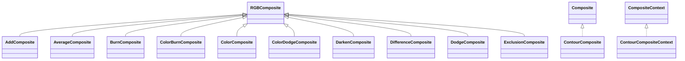

# filters-2.0.235.jar

[Group index](README.md) | [All archives](../README.md)

## Scope and provenance

- **Donor:** `SQX_145_REFERENCE_ROOT/internal/libs/filters-2.0.235.jar`.
- **SHA-256:** `be6a1d54ebb043495e31e25e72b440f69156a5624cdd7e1c55c47e30d4fae308`; accessed 2026-10-06; captured `2026-10-06T18:54:51.906614+00:00`.
- **Classes:** 241 raw entries; 241 unique entry names. Duplicate occurrence indices are zero-based.
- **Inspection:** read-only ZIP hashing and class-file structural parsing; signatures/descriptors, modifiers, hierarchy and references only. Bytecode bodies are hashed, not published.
- **Allocation:** proposed `FEAT-PRODUCT-FILTERS`, P17; [roadmap](../../dev/sqx-full-application-roadmap.md). Domain README registration remains required.
- **Repository:** `01067f00031428613c6394064ca1bcadc1ba00ee`; review state unreviewed. Download label 145-dev1; installed build/activation and runtime equivalence unverified.
- **Limit:** every class/member is inventoried; declaration coverage does not establish consumed calls, defaults, formulas, failure semantics or algorithm parity.
- **Archive/resource index:** [027.json](../../dev/evidence/sqx145/archives/145/027.json).

## Complete member declarations

Member shards contain exact JVM names/descriptors, access flags, generic signatures, throws types, declared fields/methods, superclass/interfaces and referenced class names. All classes, nested/synthetic members and overloads are retained. Code length/hash is structural evidence, not a normalized algorithm comparison.

- [001.json](../../dev/evidence/sqx145/members/027/001.json) — SHA-256 `8258eb4f54d2b1051e98c95aaa7fdd126dfef72fe4b3a2254075e1d5719e951c`.
- [002.json](../../dev/evidence/sqx145/members/027/002.json) — SHA-256 `5256acea0e414da05d01eae108343184b7c3f19c8cdc69fb26e4fae1d356702b`.
- [003.json](../../dev/evidence/sqx145/members/027/003.json) — SHA-256 `5439498de45cf264cbb9b2c51f1401cceafe26fadb8fcc02d17021b2cf539201`.
- [004.json](../../dev/evidence/sqx145/members/027/004.json) — SHA-256 `bbfc2b49c9c72b4201b3bfdd2e1dabfbeeb14e5388a35a81e31c26f2ca20b3f0`.

## Focused structural diagram

Up to twelve non-nested classes; arrows show declared inheritance/interfaces only. External type names are not evidence of an available body or an executed dependency.

## Class inventory

| Archive entry | Occurrence | Class SHA-256 | Fields | Methods |
| --- | ---: | --- | ---: | ---: |
| `com/jhlabs/composite/AddComposite$Context.class` | 0 | `3dfe30a7425370342099b13b6af1e1a5aa5ce3ca0f9c3e1ecdb046289342393d` | 0 | 2 |
| `com/jhlabs/composite/AddComposite.class` | 0 | `6644fc99b1fa84449af4a04f6bbfbe534f6ecf615ea712ab704fd0ba97768257` | 0 | 2 |
| `com/jhlabs/composite/AverageComposite$Context.class` | 0 | `a6e04e581baca1b2e072a83698c4e36d2fab17944d0cdcdb4d396db97932d8b4` | 0 | 2 |
| `com/jhlabs/composite/AverageComposite.class` | 0 | `0cc7bbcbcb843d7035daa96b77ac702b4735581f4a060243d4e704388edbb3c4` | 0 | 2 |
| `com/jhlabs/composite/BurnComposite$Context.class` | 0 | `0426eb70d224430b499fa7e3d0ac2360bbf2684a8dc794d22c199e7aac8441d0` | 0 | 2 |
| `com/jhlabs/composite/BurnComposite.class` | 0 | `e8678ebff04314dc0dac31105d8e3c604853b14baf58bda2a6dd7b091b04ef8d` | 0 | 2 |
| `com/jhlabs/composite/ColorBurnComposite$Context.class` | 0 | `cde1125fa59be9cdadd4f77493f69e2c0a6b0efb11036a5bc167902e05a92fb5` | 0 | 2 |
| `com/jhlabs/composite/ColorBurnComposite.class` | 0 | `75921646f38f3a1427efa62af6117eac2ad42198fca7ec5995c245a9bfc05519` | 0 | 2 |
| `com/jhlabs/composite/ColorComposite$Context.class` | 0 | `9d26d8d266a9f91fa6dd9fde5d9c895bf4708600095742f8e9e5bf99acbff183` | 2 | 2 |
| `com/jhlabs/composite/ColorComposite.class` | 0 | `ce318f0f0cbddc62bc1f2be5e914d113b2a2957e2af3c69e437b0fd622bccc4d` | 0 | 2 |
| `com/jhlabs/composite/ColorDodgeComposite$Context.class` | 0 | `670261a78cf8fa65d527fbed25187177c61ccf1397fa8fdda0174ea299c346e7` | 0 | 2 |
| `com/jhlabs/composite/ColorDodgeComposite.class` | 0 | `8d635d53ade1ddd9d4c949cf1ed46d19cb1928fba6aa62369a94b6216f0a1007` | 0 | 2 |
| `com/jhlabs/composite/ContourComposite.class` | 0 | `b0e1d1cefadd866b41232e1ea0f9c2c6c98d78cef6987e41382ddf9a33d87790` | 1 | 4 |
| `com/jhlabs/composite/ContourCompositeContext.class` | 0 | `215b61fa98a5054d7fb14b88d3c1bd61f1c5d0a8ddb54885fccc8668f1f7fc4d` | 1 | 3 |
| `com/jhlabs/composite/DarkenComposite$Context.class` | 0 | `daaf5a357ab9313aa2c4e1737bfda66703bfe48220c94f6e1fe4b70ee995efe9` | 0 | 2 |
| `com/jhlabs/composite/DarkenComposite.class` | 0 | `abb4d3a78167ab7de0664724ec9e95c872d53a19db17d9de474d929d5d0e24ea` | 0 | 2 |
| `com/jhlabs/composite/DifferenceComposite$Context.class` | 0 | `be3148eafb16a46c06bfbcdc37269acd9a9403a47d6457edb83c60c9ec7451a6` | 0 | 2 |
| `com/jhlabs/composite/DifferenceComposite.class` | 0 | `6fc39b914fb7fb8ed8cd2bc1f71dd4ceafa22a9a479582a4e8152f84b6ef8882` | 0 | 2 |
| `com/jhlabs/composite/DodgeComposite$Context.class` | 0 | `8512efd9e821182ff5a3e10ea32ed42cf2bccce796ee05810ffc3f32ed05f0cd` | 0 | 2 |
| `com/jhlabs/composite/DodgeComposite.class` | 0 | `f947cd0f0d1a88e2213da8307ab79bfae1a46ff03d2e0dde7d2c9847ade746b5` | 0 | 2 |
| `com/jhlabs/composite/ExclusionComposite$Context.class` | 0 | `c98e9f58e2aa7283b9071380db3f7aba2acff39cfe0768d07f7aecb5af9c273f` | 0 | 2 |
| `com/jhlabs/composite/ExclusionComposite.class` | 0 | `75dae24d6186f7153d7068b5ef26a9f040393a81cea2431026091cc122904ec9` | 0 | 2 |
| `com/jhlabs/composite/HardLightComposite$Context.class` | 0 | `c96f55c88fe402811bc10f02d4b33eb62bd7d9d52a57abf1a2503418becd5dcd` | 0 | 2 |
| `com/jhlabs/composite/HardLightComposite.class` | 0 | `55a8c2175401b9da4507837a44a7d1af80297c767c55101b620f7a2ee1d85824` | 0 | 2 |
| `com/jhlabs/composite/HueComposite$Context.class` | 0 | `6814d20cdcbfdec45170f2bd37d64ff34af4fd65aed90fc96077a5b2aa00b43e` | 2 | 2 |
| `com/jhlabs/composite/HueComposite.class` | 0 | `5894d77b1f7adc6255b77bdb5c96ec569027c277386cdbf7b6ca5082c7ab47d0` | 0 | 2 |
| `com/jhlabs/composite/LightenComposite$Context.class` | 0 | `86ecf1a721b02fbe51312f00c5051098b86e5573ec9edcf42e5ef34bae3093f1` | 0 | 2 |
| `com/jhlabs/composite/LightenComposite.class` | 0 | `78863c3a529ad12f57ef0bf22411dc8209a64c0e3a820b1e739bdb9fc1d2e24a` | 0 | 2 |
| `com/jhlabs/composite/MiscComposite.class` | 0 | `8916816188b06c522e1948dfe5bafcb90ce492fd2a601b66c19dc6a7862811c9` | 30 | 9 |
| `com/jhlabs/composite/MiscCompositeContext.class` | 0 | `a52402635ab286a198d7da48a6b5fe6d3d4db3998fbb001f29a2462b56134a19` | 8 | 5 |
| `com/jhlabs/composite/MultiplyComposite$Context.class` | 0 | `b33c89a495a57a1d84b56134fa465ba375c013d858f891d8f7eca1ff58aac904` | 0 | 2 |
| `com/jhlabs/composite/MultiplyComposite.class` | 0 | `aa7cce9144f7e54b7eac238720351076eebeaeaa6d3caba1a056577edf4212ff` | 0 | 2 |
| `com/jhlabs/composite/NegationComposite$Context.class` | 0 | `c692f5e1bc58cc1c741dcd5b62c6ded7538b9c3b017651c63cf4fd9f7b47ada1` | 0 | 2 |
| `com/jhlabs/composite/NegationComposite.class` | 0 | `b7020f67c51d03c6737c11f4668d791d9b365b17b2472eb848393a1232abf6f4` | 0 | 2 |
| `com/jhlabs/composite/OverlayComposite$Context.class` | 0 | `dcea6ce7b359c59644117cbd79fb83f2bf10a48871c1010ae9129b8bda6b4f6c` | 0 | 2 |
| `com/jhlabs/composite/OverlayComposite.class` | 0 | `49d033455c3fcfe0e8977ad21a8f7a4313172b0d4523f523f9c555bdd5072960` | 0 | 2 |
| `com/jhlabs/composite/PinLightComposite$Context.class` | 0 | `eb4f467ad78ef0e0f0c2f7f3e3082323113794d24dce476fe16c3a693d420e96` | 0 | 2 |
| `com/jhlabs/composite/PinLightComposite.class` | 0 | `0426d129b5bcb4fd10fb648e6ca578675e1fbf2534df8d9f4f6b2def27229fb8` | 0 | 2 |
| `com/jhlabs/composite/RGBComposite$RGBCompositeContext.class` | 0 | `8f2faa680a10f3fb404dd280822582fa091d8ec3e9efe82c50c2be129823babb` | 3 | 6 |
| `com/jhlabs/composite/RGBComposite.class` | 0 | `f1a4fb163a0ed6da750f629290cad151623e50acf9ca7ddd41385c38e356bd71` | 1 | 6 |
| `com/jhlabs/composite/SaturationComposite$Context.class` | 0 | `42fa439bfb55a0bb2b4a0153516741111531a808659e10984c179782c7001c91` | 2 | 2 |
| `com/jhlabs/composite/SaturationComposite.class` | 0 | `70eb0dc633a5c54d32f9e539ac6f5d81d755c832553dd50011c446b7cb63a627` | 0 | 2 |
| `com/jhlabs/composite/ScreenComposite$Context.class` | 0 | `3bc4ce6307f681bcf9014e8c50fd7fb5e3f9bf0444bc90eb83c5339b37e52675` | 0 | 2 |
| `com/jhlabs/composite/ScreenComposite.class` | 0 | `dcee3e0f853d00bfeeb9e396c26c0a8a5d1f2b24d3f0a8c689aa80e55998eceb` | 0 | 2 |
| `com/jhlabs/composite/SoftLightComposite$Context.class` | 0 | `d50a433e9355d7c1e7e383d89140385a521b32e08747df44cf7a6974cc8370f7` | 0 | 2 |
| `com/jhlabs/composite/SoftLightComposite.class` | 0 | `91f582c46e659561bdabfadd41a1b245980d928020538123712d3ce0ad432a6c` | 0 | 2 |
| `com/jhlabs/composite/SubtractComposite$Context.class` | 0 | `e12501eec732a68398cb7a0c091ec00c983c14e0c7f22021dae06df466460dbf` | 0 | 2 |
| `com/jhlabs/composite/SubtractComposite.class` | 0 | `5a5ccbebb0880279929d6ff4307ddda214ca257b2578073d7733513527b0291f` | 0 | 2 |
| `com/jhlabs/composite/ValueComposite$Context.class` | 0 | `d8ede02a23a67e55334ed2bb338468075ae46a88c3caa5998b0d910e09aa3053` | 2 | 2 |
| `com/jhlabs/composite/ValueComposite.class` | 0 | `7cb8a926b361de32b94402050e61db15136b6883b946c33fba7608e9d707a696` | 0 | 2 |
| `com/jhlabs/image/AbstractBufferedImageOp.class` | 0 | `5df87bfc8b0fc6f149f39d550c5623cd6832052097b2ab4fe5c1daf6def327b3` | 0 | 9 |
| `com/jhlabs/image/ApplyMaskFilter.class` | 0 | `c9e8f95a649a1b28c1a757266e00eeab154d17aa5723445bc5f26689051c9c10` | 2 | 8 |
| `com/jhlabs/image/ArrayColormap.class` | 0 | `ef5e79830c54974b53f7f7f5b61b8aa85da1165835eb54e1b017e1f06b2d0d95` | 2 | 10 |
| `com/jhlabs/image/AverageFilter.class` | 0 | `01aacd8e74997639c74907775f9e14b8b99ee09900f629390755a9891df64066` | 1 | 3 |
| `com/jhlabs/image/BicubicScaleFilter.class` | 0 | `407b3b00aa88d19533fb01221b1a8ab0d61bdafc40135e7c065035d21d688a33` | 2 | 4 |
| `com/jhlabs/image/BinaryFilter.class` | 0 | `210ded47cb8654fcf73ea1ac232a4c45aa9dc9194e66377bf9f77dd013cbbd55` | 4 | 9 |
| `com/jhlabs/image/BlockFilter.class` | 0 | `938ea949af742b1178ecb826d3e96965864b810df1e154c5985b1d7f32cbf5a5` | 2 | 6 |
| `com/jhlabs/image/BlurFilter.class` | 0 | `37a05f3a8c39deb963260659bcbe7605ed78576c673db223264ab765825cc9bf` | 2 | 3 |
| `com/jhlabs/image/BorderFilter.class` | 0 | `252c6e482ef3ff40a4c11fc2c1d3a6410e860656d196707d01958350e1240fcf` | 5 | 12 |
| `com/jhlabs/image/BoxBlurFilter.class` | 0 | `839d40ebe2a85d3afd104225fa513f4194eafa8930942cc78e2fe26b22b54582` | 3 | 13 |
| `com/jhlabs/image/BrushedMetalFilter.class` | 0 | `81dc63566ef7f4198551c103b95142a14478a1a2d524237231d8900790faf385` | 6 | 23 |
| `com/jhlabs/image/BumpFilter.class` | 0 | `9807a13491066da3d3afbe6f4424c4692ec1439e3e04b40a6a8cd2b3f332d3a0` | 2 | 3 |
| `com/jhlabs/image/CausticsFilter.class` | 0 | `f7ba6efab3aee0c5de9a076362efcdae808026a254696885cad1f6c5a6bbb42a` | 11 | 23 |
| `com/jhlabs/image/CellularFilter$Point.class` | 0 | `7bb82589b551cc97a47f2537ec65e52e37baa81b7041f895bdb234c9267cb429` | 9 | 1 |
| `com/jhlabs/image/CellularFilter.class` | 0 | `c3db8c138d00ee0c7c5da1dccac7a7469f45325ca0f0c7a6bcf95b7117d2e7f7` | 29 | 43 |
| `com/jhlabs/image/ChannelMixFilter.class` | 0 | `bfa9d21831c268fb287a8d42ea7ad418b0ea8498cb1c17432a73fe4285da907c` | 6 | 15 |
| `com/jhlabs/image/CheckFilter.class` | 0 | `b1116eb141eafc3102bef0a2e604aba474e85d41f85a2c1d506762a03abf3068` | 11 | 17 |
| `com/jhlabs/image/ChromeFilter$1.class` | 0 | `c2051bb92f2dcee96c4e57f96ab4c8ad5dae4fe23776829541d69e4a08645cda` | 1 | 2 |
| `com/jhlabs/image/ChromeFilter.class` | 0 | `25875955bc821be01169040187bf040eed99a8b7f13335dc2ccabd942a31613c` | 2 | 9 |
| `com/jhlabs/image/CircleFilter.class` | 0 | `4239fcbad71e962780929e20480e2762bd4c5b87d83894843f39fcd5be677d31` | 10 | 18 |
| `com/jhlabs/image/Colormap.class` | 0 | `507860b4efd21da59e13ddb34866d43ca11f2a3f3ff7b9459e98318495d830f7` | 0 | 1 |
| `com/jhlabs/image/CompositeFilter.class` | 0 | `47a5980d1e6e02c79395a6f9f44dcaba6a22bc0ad6b039cb078fac5dc90eb11f` | 2 | 7 |
| `com/jhlabs/image/CompoundFilter.class` | 0 | `7a9e2dcd10ad9a9a2126f5b5ac748e6ae1aa925b2e8bd8283ec38736f5002f6a` | 2 | 2 |
| `com/jhlabs/image/ContourFilter.class` | 0 | `e6235739044ce14df900b71d4af7aeacd0ed6e2e33f6d84d122e353851b72410` | 4 | 9 |
| `com/jhlabs/image/ContrastFilter.class` | 0 | `b0b9bd1f35d481da20210a43f78c9b8086f5f2268b3cb7e2165039782eb2e69a` | 2 | 7 |
| `com/jhlabs/image/ConvolveFilter.class` | 0 | `c25ff0708829ff5b62980389506e2082c27a3975d25270cc1f78b885be2c1e11` | 7 | 22 |
| `com/jhlabs/image/CropFilter.class` | 0 | `8d63eb5f70fb67aea4388a3d91d908fa6eac5a5950319550bd5c21b5cf65ccd9` | 4 | 12 |
| `com/jhlabs/image/CrystallizeFilter.class` | 0 | `0dfe07eb523380e3da3dd37821bc285e18b24f173ec0cdb56f83e991ea236df4` | 3 | 9 |
| `com/jhlabs/image/CurlFilter$Sampler.class` | 0 | `153488375a5b494ea96d9703df6ce9a8f851cc52545dd807d6fb4bdba9fb10cd` | 4 | 3 |
| `com/jhlabs/image/CurlFilter.class` | 0 | `2981222609707088ed6238f10a14a65c0adfdba6c33e20ede739ffc074e953f0` | 5 | 11 |
| `com/jhlabs/image/DespeckleFilter.class` | 0 | `ecb874fc1f6b84fddc005220fdeabb295a5dbae975763be99d572c73d096ef61` | 0 | 4 |
| `com/jhlabs/image/DiffuseFilter.class` | 0 | `a4dbd4ac5e0f50c8baddcebcaaa7806b90dbaaae885ac854e20b856012387336` | 3 | 6 |
| `com/jhlabs/image/DiffusionFilter.class` | 0 | `5f1fee36755823cd023f3e32c2baf4f3a1d80872d21e916c9d6143dc912bc47f` | 6 | 12 |
| `com/jhlabs/image/DilateFilter.class` | 0 | `a1c59eb909fe95247baf908bb0c04c0afd565a5aac589c74cffea4e86f39a19f` | 1 | 5 |
| `com/jhlabs/image/DisplaceFilter.class` | 0 | `0599c3d90145d33335bbf796d19e57eab9fb79a1b6b30fccdba5e94bc7667b89` | 6 | 8 |
| `com/jhlabs/image/DissolveFilter.class` | 0 | `1e9d72e86507985fea810ee89821cbfabd4b38d2fb416a6f23105390ce067114` | 5 | 8 |
| `com/jhlabs/image/DitherFilter.class` | 0 | `9c07e0c84fd4fb48837ef0202ca81c5f639e7f68deefc8e5225afd868eb6f96c` | 20 | 9 |
| `com/jhlabs/image/EdgeFilter.class` | 0 | `768d6f3305c736b61e55c54f19c0bea2c60e531ec23e5bf6dd9237df4360e775` | 12 | 8 |
| `com/jhlabs/image/EmbossFilter.class` | 0 | `5f28f1c523484eb2da8f956eafd063220d65bf31f2cfbdea07ccd2de92c568c5` | 5 | 11 |
| `com/jhlabs/image/EqualizeFilter.class` | 0 | `90bf8c614e2543f42b3e97abc809eff96a60b951165de937abca9fc12c2d49d8` | 1 | 4 |
| `com/jhlabs/image/ErodeFilter.class` | 0 | `ba5518cadc58ac7554f6033d8e6ec484c0b64360386cfbb62493fdba407ad794` | 1 | 5 |
| `com/jhlabs/image/ExposureFilter.class` | 0 | `161923d548bd9d58a545a0d4902058019adb6d70ec1fbb51fd412209d38e4229` | 1 | 5 |
| `com/jhlabs/image/FadeFilter.class` | 0 | `25f0260aa59f695d7f396866b68c233413238ccd730af22aa58fba7baab31fbb` | 11 | 15 |
| `com/jhlabs/image/FBMFilter.class` | 0 | `9e2acc7c469261fbc6123e3271fdf25c7e3a4b8b469d395b81e0e41b450b44cb` | 27 | 31 |
| `com/jhlabs/image/FeedbackFilter.class` | 0 | `70cfe60348f97b1f7ef0e6acf1e87f1532628c4e5c252dc001c9fa819bfc3183` | 9 | 24 |
| `com/jhlabs/image/FieldWarpFilter$Line.class` | 0 | `20a522174302ceed8fae11db46a712b5d9c565751b426ab02eac42ea08608367` | 8 | 2 |
| `com/jhlabs/image/FieldWarpFilter.class` | 0 | `4b53f47f9665bc613cae0fd101eaf142a270dec759dbe2f865324eea24c8156e` | 8 | 15 |
| `com/jhlabs/image/FillFilter.class` | 0 | `81a1b5cdddbdcc76c5a42ecba6b3672860a7b25658976e6e656e586f838126fe` | 1 | 5 |
| `com/jhlabs/image/FlareFilter.class` | 0 | `d2303955d194aff7c94ccd348b32f8271cf69054b58058ab0287615e06116606` | 18 | 18 |
| `com/jhlabs/image/FlipFilter.class` | 0 | `e599d3820bb152af36338a40b457cba9f2a4d7c98ce728b8a2c058e430efa320` | 11 | 6 |
| `com/jhlabs/image/Flush3DFilter.class` | 0 | `e3e7dbf1881069d826ce20644829c4306fd4a693b130f2592097f17d13e07132` | 0 | 3 |
| `com/jhlabs/image/FourColorFilter.class` | 0 | `8a39ac8aea92c8e3ad1700bb61f92ace0a9985ce8c0a009ee747c572fae7fe07` | 18 | 12 |
| `com/jhlabs/image/GainFilter.class` | 0 | `39c8928917c3931f79f59380db6ced71c0c8851721a9db73775c7a24ad2ef3cf` | 2 | 7 |
| `com/jhlabs/image/GammaFilter.class` | 0 | `858b3c18556f123e02bbaf18e056d3962afed46f8dfae7f67dbf7e767463a5ac` | 3 | 9 |
| `com/jhlabs/image/GaussianFilter.class` | 0 | `1d9e36be4bafe9d618b3910c91cee5d114f77b3087964d1cf92cfc95f20cb9d1` | 2 | 8 |
| `com/jhlabs/image/GlintFilter.class` | 0 | `39f8d0dfdb0665d2123db06b922c061dd1355026ca9f65fae07cc1badb8d0b71` | 6 | 15 |
| `com/jhlabs/image/GlowFilter.class` | 0 | `d1b1935a8167d218e4dc83446bd5f207ff4fbacb1a4af3d89aa2068329c3a758` | 2 | 5 |
| `com/jhlabs/image/Gradient.class` | 0 | `e4bbd42d1a63c2a9e923c2a747fbb43b69fd6db274bb18941be42b39938d6ccf` | 15 | 26 |
| `com/jhlabs/image/GradientFilter.class` | 0 | `a36d2918db4d08ef195fa7bc1400a992ed8cc2b4563e1c90ad82a55fc422cadd` | 24 | 26 |
| `com/jhlabs/image/GradientWipeFilter.class` | 0 | `e5701a918b236ce4aae085b9d8caed2381366f32489c46fd998962a19cb1ee91` | 4 | 11 |
| `com/jhlabs/image/GrayFilter.class` | 0 | `05eceec2f807fbca166bddd46dc6ae3a3fa1bc7a6318cc55a79022c00d93e925` | 0 | 3 |
| `com/jhlabs/image/GrayscaleColormap.class` | 0 | `9f87cbfcf81bb529651b76680cec0771341940a4d476338caf9482083e518fe9` | 1 | 2 |
| `com/jhlabs/image/GrayscaleFilter.class` | 0 | `d306b442238ef7dd2fab358109edc5b4018f95e0594e9b3f912542ac6565d667` | 0 | 3 |
| `com/jhlabs/image/HalftoneFilter.class` | 0 | `6463b5c82632d4cc3d6a5be36f6aa9121b2c556ee93bd371aa4c5ae9ebfa5295` | 4 | 11 |
| `com/jhlabs/image/Histogram.class` | 0 | `5be667ff3c1f24a3fa827b57ff1f5e005fd370de1839c9da1c09de0473dda2a6` | 12 | 16 |
| `com/jhlabs/image/HSBAdjustFilter.class` | 0 | `1d25fc7960645fe1368ad578ed65a59ee038961b16e83e5b2c124e36a7a7078f` | 4 | 10 |
| `com/jhlabs/image/ImageCombiningFilter.class` | 0 | `4745f0ba44f5d9af4705266556599d9fc2d8044fc3dfb344563621af6a0d6f59` | 0 | 3 |
| `com/jhlabs/image/ImageMath.class` | 0 | `cef4b04cfec9da2a8bed8326accd52cbdbf5f10266ab8a07daed6848df7b0856` | 20 | 25 |
| `com/jhlabs/image/ImageUtils.class` | 0 | `4d57adf8652690b72c1439ed40a4104b3ccb7184fa0881d3f804e7a21d73ba6e` | 3 | 11 |
| `com/jhlabs/image/InterpolateFilter.class` | 0 | `5471a2f7568ddd91ce11f3838d4c5631739f53b072c97aa938a6d2f74683e01e` | 2 | 7 |
| `com/jhlabs/image/InvertAlphaFilter.class` | 0 | `ca13b70a7bc1f55102331988caf64809998ca4bb2bbe8fb90eab50cfbea88a5d` | 0 | 3 |
| `com/jhlabs/image/InvertFilter.class` | 0 | `1cee26be3fc285d115ff20a90d6162df1df5192d9f80ed414042058cf05dd1f9` | 0 | 3 |
| `com/jhlabs/image/IteratedFilter.class` | 0 | `b45ebaecc897618d12e64f8c5c2f2185c5a4e5019bb3a9536cf72bf77561cef0` | 2 | 2 |
| `com/jhlabs/image/JavaLnFFilter.class` | 0 | `fb7e4f5ab7ffb778bb171bccc417b6338c9587bc5fd3d7fd48277060780d525c` | 0 | 3 |
| `com/jhlabs/image/KaleidoscopeFilter.class` | 0 | `3124c3c555abab013ef469a7f16c08f34ef1479562b35b087c778895a16d3dc6` | 8 | 18 |
| `com/jhlabs/image/KeyFilter.class` | 0 | `87c4fa5914ae904f33cf9d2be5a2892b683d736b6e33923b38994a17cdd0cb3d` | 5 | 13 |
| `com/jhlabs/image/LensBlurFilter.class` | 0 | `704d5cbbc867e5c2a1d8c6ca7e407ed30af352236bc949709d47305a8123720f` | 5 | 11 |
| `com/jhlabs/image/LevelsFilter.class` | 0 | `3942c0be83b9980797be61e277ba7dd3d79d80f298bad6c83cba3b5f8146ff41` | 5 | 12 |
| `com/jhlabs/image/LifeFilter.class` | 0 | `44d2e13851815bb7ef33b0b137e86b22888a6c3e353b6de3ccaaee22a07988e2` | 0 | 3 |
| `com/jhlabs/image/LightFilter$1.class` | 0 | `8ec219298fb3b2016d22f8a97ffa331bfa11ae539ebcb5a4d2acbdda2536dcc2` | 3 | 2 |
| `com/jhlabs/image/LightFilter$AmbientLight.class` | 0 | `026e342e160827740aadd432415da7cfa1321bff4de0fa405c522183dcbdf1d0` | 1 | 2 |
| `com/jhlabs/image/LightFilter$DistantLight.class` | 0 | `ee626d24cb7e8bd68fbe99a293989fa65ddeb56162250ec8eaa376d475cfb1f0` | 1 | 2 |
| `com/jhlabs/image/LightFilter$Light.class` | 0 | `641af738a2db6ac8e7716df111c56c25b0b025a91ed4291619520414ce51fadc` | 14 | 23 |
| `com/jhlabs/image/LightFilter$Material.class` | 0 | `530672994b49094b6adf48242e51c71d39e8176de94c2f1a6ab7dde56b81a218` | 7 | 3 |
| `com/jhlabs/image/LightFilter$PointLight.class` | 0 | `8e41da8c50eb40818da1e755b584627dae52fdc5ab11b8c3392b405338fe72ef` | 1 | 2 |
| `com/jhlabs/image/LightFilter$SpotLight.class` | 0 | `6aae5158cca66e194084cade718a99836a337193b814643c4f4150189d120bbb` | 1 | 2 |
| `com/jhlabs/image/LightFilter.class` | 0 | `dc41a35f66c2d13a9090e048bb284fdc0c20e7d504126ccffd44de1750a0aea5` | 32 | 28 |
| `com/jhlabs/image/LinearColormap.class` | 0 | `4adae1c90e6588f693c46467f7242717a790e253747854de24caa96094cefbb3` | 3 | 7 |
| `com/jhlabs/image/LookupFilter.class` | 0 | `8f390ffcb61e67a4a1f6c250c1bcf95fdce1819b6c427929ca336b592ea6f690` | 1 | 6 |
| `com/jhlabs/image/MapColorsFilter.class` | 0 | `6aa7c4e3326638fe0163e0873d9bb2a68649c147b388b01e69d9e8e8b8a93412` | 2 | 3 |
| `com/jhlabs/image/MapFilter.class` | 0 | `0e64f3b37fe29e2697257b3ca5b108ba540845f9ca9db788c6f6898af6e4f8ea` | 2 | 7 |
| `com/jhlabs/image/MarbleFilter.class` | 0 | `7b960db4bb0c03bfc190af45ca291b1b72b3b316eb891802a3e0d1db118cede7` | 6 | 14 |
| `com/jhlabs/image/MarbleTexFilter.class` | 0 | `81f3590080ab7c52816f921bf84eef1ab9bb5d72ab910f0f73d784e0555ca96b` | 10 | 15 |
| `com/jhlabs/image/MaskFilter.class` | 0 | `55ae631124023727bde36926fac90448958d17c9ddb2a4acb7198cdf21ff475f` | 1 | 6 |
| `com/jhlabs/image/MaximumFilter.class` | 0 | `0a788329178bf67ff99d1e1214007105b3d201aea4aaf83bd3887f87e33cc5c2` | 0 | 3 |
| `com/jhlabs/image/MedianFilter.class` | 0 | `53b85e1c2b65c6a97157685d46d5e9d0985ae21d3b9c90ff7a30d209f93f9b27` | 0 | 5 |
| `com/jhlabs/image/MinimumFilter.class` | 0 | `b0bf6d0359d086624de5393d87fe49c60822bfc298d2cdc48cebca19adde9a54` | 1 | 3 |
| `com/jhlabs/image/MirrorFilter.class` | 0 | `558cb894431bec41cfb538af9dee603ab65292d41de541451c7ccf799ec5757a` | 6 | 15 |
| `com/jhlabs/image/MotionBlurFilter.class` | 0 | `59463093153eb6af6750952ec08ce6b638a19ef68f04f6e2906b65ce0dc47c8e` | 9 | 13 |
| `com/jhlabs/image/MotionBlurOp.class` | 0 | `6cf997d1200d18dfca3491ae8bbfa397c0eac64ba90a67519a57ed11f0bb7a1d` | 6 | 19 |
| `com/jhlabs/image/MutatableFilter.class` | 0 | `685f184aa92b09b40027b7027297aeff8d057c828960463d43d2322f76c11647` | 0 | 1 |
| `com/jhlabs/image/NoiseFilter.class` | 0 | `c90008c6198e2528841174362a08a7569e9ea85c405fb7236a4b3ccbb1e364cf` | 7 | 12 |
| `com/jhlabs/image/OctTreeQuantizer$OctTreeNode.class` | 0 | `258f77b564963fa4700a104492581db69caed8a60c64abb5006f3b4b1ad0bded` | 11 | 2 |
| `com/jhlabs/image/OctTreeQuantizer.class` | 0 | `c6aae1d9e354c643812d3f5cfc7ee23273475d019f59f7f5e17de5de2c4167d5` | 7 | 9 |
| `com/jhlabs/image/OffsetFilter.class` | 0 | `3c34dc2224c20f6fcd0f295e6a5a1dcefd47d682f2ada90251fda12aed4cfb44` | 5 | 11 |
| `com/jhlabs/image/OilFilter.class` | 0 | `1328d3bc7a48f54c4533daa6379ab6670892c8801113abe33dac3e272b9bb907` | 3 | 7 |
| `com/jhlabs/image/OpacityFilter.class` | 0 | `a940f05c62b2fee6b752bf3ad1be026ad108c3d969ed8b705ab67d117aa3d6d1` | 3 | 6 |
| `com/jhlabs/image/OutlineFilter.class` | 0 | `0e6deb2d856776dded271913d828e9bf1d8fa79f1b3d257d5aefe6b4b560be71` | 0 | 3 |
| `com/jhlabs/image/PerspectiveFilter.class` | 0 | `fbcaee15a809a29afa9311a8cd8ba2716a381e371968037e56ef996e17841820` | 23 | 8 |
| `com/jhlabs/image/PinchFilter.class` | 0 | `fcbe2d02bda85a664d4366e49b94b1579fc19d2818980ba165b3aa67a1e74278` | 10 | 16 |
| `com/jhlabs/image/PixelUtils.class` | 0 | `623890ff2e811c5b3c0f9efa532c99804faed2c29d8a208e108049ec3ebde3ad` | 24 | 9 |
| `com/jhlabs/image/PlasmaFilter.class` | 0 | `a97dc9946dbdedd35960644ccdefb81111246c3e8b376ac72a0f781a3196420f` | 8 | 22 |
| `com/jhlabs/image/PointFilter.class` | 0 | `f98252205ec0cb5317a2b93518822c27e26a80479f7836f87377ff5fec10a2e5` | 1 | 4 |
| `com/jhlabs/image/PointillizeFilter.class` | 0 | `3b3a8c3fb960c0bad25f188c472f6f0962f3ebf62e338c8960d686917145381a` | 4 | 11 |
| `com/jhlabs/image/PolarFilter.class` | 0 | `f75583cad35633f7604f062cc47265dd92e2b5f547b34dd0c6730d2b6ce435d3` | 9 | 8 |
| `com/jhlabs/image/PosterizeFilter.class` | 0 | `4710e483c37b71ae9dfbc4d2a351afafa88d380df47593b76f03a650f6f3c670` | 3 | 6 |
| `com/jhlabs/image/QuantizeFilter.class` | 0 | `4bf2f766071fd48fc0f56723f60d5208d12fe573d35402fa9dde206526c767ef` | 5 | 11 |
| `com/jhlabs/image/Quantizer.class` | 0 | `42bc6c487d275dede8508529a0322340a8457f9450162dd818ae53d7c4861c10` | 0 | 4 |
| `com/jhlabs/image/QuiltFilter.class` | 0 | `61d38fddd6f40fd5a9b74a6d19874bcf9dd684fc31798e471d8538736eb7c070` | 9 | 18 |
| `com/jhlabs/image/RaysFilter.class` | 0 | `102c249417075a2cfa04b0b601791ef5507c55baa9aa533b247fe1120224d2d6` | 5 | 13 |
| `com/jhlabs/image/ReduceNoiseFilter.class` | 0 | `35111bce8c02f654432f76014ae518628c35e9bd92aee58ddbb3ccdd462fcfe5` | 0 | 4 |
| `com/jhlabs/image/RenderTextFilter.class` | 0 | `a9a26b62525a2f70dc897def76c49ea8eb7388a2a0e448ed2f215b5e96db551a` | 5 | 7 |
| `com/jhlabs/image/RescaleFilter.class` | 0 | `94d228c1a1ded9e0af57e365da6dfa39996c9f471d30fdfdf47a6395c19e76cb` | 2 | 5 |
| `com/jhlabs/image/RGBAdjustFilter.class` | 0 | `b5dd37b4be6c711c6c6b214d1c472d4643d58bd7d4e469b28a516b7532b447d9` | 3 | 11 |
| `com/jhlabs/image/RippleFilter.class` | 0 | `98901bdef28b66f16217fa657d902b25150d36165ceefde191262055ef641b7b` | 10 | 14 |
| `com/jhlabs/image/RotateFilter.class` | 0 | `8d373eb4d0db7c50a95e6fa84759a4a39a2fda5941accddfe04c420be8d9826e` | 5 | 9 |
| `com/jhlabs/image/ScaleFilter.class` | 0 | `9c9c60da9dd7ceab71835893c3d27d803932d0fa629f633aaebb67866d594fcc` | 2 | 4 |
| `com/jhlabs/image/ShadeFilter.class` | 0 | `5628f374668dcab8e91c0196ee8f3bcb1f3423b6d4ddc25728794960fc18fe1b` | 25 | 15 |
| `com/jhlabs/image/ShadowFilter.class` | 0 | `31b531214d1e53871b9387c637c9042054e9636a5844ad4737433245027e7eba` | 8 | 19 |
| `com/jhlabs/image/ShapeFilter.class` | 0 | `eb4cda25ad3717f952e25f1d483a7ed394c9292ee063a9854162e7048ea4486a` | 13 | 21 |
| `com/jhlabs/image/SharpenFilter.class` | 0 | `66fb01792a900de53c29d8f0bef3be2e323b2116b1c5b2bd2d0f36864569d5a7` | 2 | 3 |
| `com/jhlabs/image/ShatterFilter$Tile.class` | 0 | `c77252d889bed8d88d83ee92ed43d10c8aa13149e5ddadb219108b2e5e7fc9fc` | 8 | 1 |
| `com/jhlabs/image/ShatterFilter.class` | 0 | `8b79ea2f6d128a4322a1d936459821266fc7bc6576bb6b3cc1f8ea40d64a4d9f` | 10 | 25 |
| `com/jhlabs/image/ShearFilter.class` | 0 | `6eb2c5175d9d89b2e4d961a15687ec148e1e282f5c5350e9b2a02308500432d8` | 7 | 11 |
| `com/jhlabs/image/SkeletonFilter.class` | 0 | `fdec53e68fb04c93c67b61070bfc806a021d948a669c0278603f04b80f1dd923` | 1 | 4 |
| `com/jhlabs/image/SkyFilter.class` | 0 | `be88acff06c2167a5e3b04375eead789efb842f089882be364d87a5111bf5265` | 43 | 53 |
| `com/jhlabs/image/SmartBlurFilter.class` | 0 | `06adb09908d9d0d3ac008d8ea8373b75b7b4e239842eef3eebbfafe02772281c` | 3 | 12 |
| `com/jhlabs/image/SmearFilter.class` | 0 | `8cc870a5c041e5962441215ec93416eb4b479836a92da3db13993f639fa64b2a` | 16 | 21 |
| `com/jhlabs/image/SolarizeFilter.class` | 0 | `43887a6fe796cd9df90d315014ef9f554db0d424524bde6b966223a596312ba5` | 0 | 3 |
| `com/jhlabs/image/SparkleFilter.class` | 0 | `ea2ad21a04c39a12fb4f101db945429a9d71fb128aa0e42597545a555b69978d` | 13 | 14 |
| `com/jhlabs/image/Spectrum.class` | 0 | `61b3849183acc73eae3a2805092381334507e4ee7a7b6c0c7d2f4c9a6dc56bc1` | 0 | 3 |
| `com/jhlabs/image/SpectrumColormap.class` | 0 | `11c0394e2982a9972cebc4a2d849017ad0684532e9c96b4f01cd6cc5f6d04203` | 0 | 2 |
| `com/jhlabs/image/SphereFilter.class` | 0 | `d46c38bcece7327fa62ac1836ad334635abfcbf4611d74665d8005ef8aada1c5` | 10 | 14 |
| `com/jhlabs/image/SplineColormap.class` | 0 | `4bae3e8477b089ef37f36899c90e909414c2fbbe92811966ede13ed686207765` | 3 | 9 |
| `com/jhlabs/image/StampFilter.class` | 0 | `e403f1c5ca3299e7bfa5c31b2f0761cb8596968beb6bd497ce9881c9f0b8ff64` | 7 | 15 |
| `com/jhlabs/image/SwimFilter.class` | 0 | `66a9ecf67ca18355631744f1ece889ca39e43bfa5573094f113d2f229a3bd40a` | 10 | 15 |
| `com/jhlabs/image/TextureFilter.class` | 0 | `532afcfb23611fb2bf52ce6e4ea3c8f7e6065c4d9ef06cf9fbb82d4e686eaa74` | 15 | 19 |
| `com/jhlabs/image/ThresholdFilter.class` | 0 | `59dff2cca93388935cc230d0323c96900067da4c5ca6b8eb765b879298384224` | 7 | 12 |
| `com/jhlabs/image/TileImageFilter.class` | 0 | `4cc16cf300b0300c972fa0c681b52e6e12ffd37bdac09024eca162c929b27a7b` | 13 | 10 |
| `com/jhlabs/image/TransferFilter.class` | 0 | `0c1ae1f02b323175dd43624cec973355f2b8b99053a33aee4c0d1cdd42f618f0` | 4 | 7 |
| `com/jhlabs/image/TransformFilter.class` | 0 | `7943d54debb12f44b213f25ae21688c36cd73fa9fa2be4cdcca79f54cf9d4393` | 9 | 10 |
| `com/jhlabs/image/TransitionFilter.class` | 0 | `12e8719546b70cb23ec89a359d6c32999383d5cd87d0fedb39aedc4b8dd9e4aa` | 7 | 9 |
| `com/jhlabs/image/TwirlFilter.class` | 0 | `1ba20fc89ee3d7467acbcda87ed72613190073a811a9542030e8dd30bc53e592` | 8 | 14 |
| `com/jhlabs/image/UnsharpFilter.class` | 0 | `a72c077e0ef7d6480906a4b6d4722fe940273c1d8462bb5528c0ddbbd7e15699` | 3 | 7 |
| `com/jhlabs/image/VariableBlurFilter.class` | 0 | `697ef3d604df8fc90e5f7affa126dd3e02de939acd40dcfd378354e6f6aa63e9` | 4 | 19 |
| `com/jhlabs/image/WarpFilter.class` | 0 | `ac8e330724c48880e96faabd2c39519bad0a6b4be6bd7f54075df0d41f78a071` | 6 | 17 |
| `com/jhlabs/image/WarpGrid.class` | 0 | `8f57fc8ae408471117bef50e23bf46fd990dc683b74dd2fa78e66dc8dfcbdc8f` | 16 | 9 |
| `com/jhlabs/image/WaterFilter.class` | 0 | `d070a8c351a890fcad020163f7d1c1acb6866ae8db909930765f2a177fe73054` | 10 | 19 |
| `com/jhlabs/image/WeaveFilter.class` | 0 | `797298938dca341e54b465a7ee0543d1b08e3a1428e441890cc9e00eb1333d85` | 13 | 19 |
| `com/jhlabs/image/WholeImageFilter.class` | 0 | `cf8f6d6d7edef26d214c2cb36341d0dc831e735b80fe327593e259ed08e18133` | 2 | 4 |
| `com/jhlabs/image/WoodFilter.class` | 0 | `a9098f7d64dcd2a54b607ef13dd1283cc05c365d88505e138cda9a39781daed5` | 13 | 21 |
| `com/jhlabs/math/BinaryFunction.class` | 0 | `6b48e09801328f59eda1aa6aa67f61d5e09b6d8fc98d6870908f42d9d4de1ba2` | 0 | 1 |
| `com/jhlabs/math/BlackFunction.class` | 0 | `af8f3b3a763eacc05784fe77bd688ffb6264f1f513b9e9a54d38b130c3f0293d` | 0 | 2 |
| `com/jhlabs/math/CellularFunction2D$Point.class` | 0 | `efe585eb5dd74b38cceef9dce1fb46e04513b7c2a163d091167074055b7c5e65` | 5 | 1 |
| `com/jhlabs/math/CellularFunction2D.class` | 0 | `7cdbc0213d9ca6ab939470210813d4e80cd1d3e0c260390420c32595e282259a` | 6 | 5 |
| `com/jhlabs/math/CompositeFunction1D.class` | 0 | `0bb22f88ffc0fd791aff025dbe322aa9cf826babd4f83999f08ecc54dbd1255c` | 2 | 2 |
| `com/jhlabs/math/CompoundFunction2D.class` | 0 | `eefac05ce8baad8968a99e37f14c9e37360c9fc4067b4c723f86d17583297155` | 1 | 4 |
| `com/jhlabs/math/FBM.class` | 0 | `1e2e982ca7e8682d0c265aa7a5ade2ee8c32452df7f80ce4bd73a7788110a14d` | 5 | 5 |
| `com/jhlabs/math/FFT.class` | 0 | `f46cf2977fcd187adfd07ac87bf485871ace5c245f35042e016a2cbc5275510c` | 3 | 6 |
| `com/jhlabs/math/FractalSumFunction.class` | 0 | `30efbf89102ebcf7b78ca42acac4f415d7af2cb6fd841b4768511a860e73de56` | 1 | 2 |
| `com/jhlabs/math/Function1D.class` | 0 | `4f0627838e9cfe79682548bc1799677f0cd921b400dd2c6d96f8e7bbb4842c49` | 0 | 1 |
| `com/jhlabs/math/Function2D.class` | 0 | `5fe89ab35060ffd203aac40984c5c3fe97dce80464c429ac9a36b17283280ed6` | 0 | 1 |
| `com/jhlabs/math/Function3D.class` | 0 | `6b4d199453db6e9e5cb667653cb43f3a5fba5e484da9f56938a256bfaf8edddc` | 0 | 1 |
| `com/jhlabs/math/ImageFunction2D.class` | 0 | `129e1f7b6771968dfc8f540223b971f50ca55a16a76cc757d51f6c81f8e90978` | 8 | 14 |
| `com/jhlabs/math/MarbleFunction.class` | 0 | `9467dfe1a31eb12c0aed997d60b5efc0e3e7ab311f90fc0bd4c20d55e356cc98` | 0 | 3 |
| `com/jhlabs/math/MathFunction1D.class` | 0 | `6220933254c4bcb91e014f08198a954b49ea03d9d5d0fb213743b43ffe9dbbd0` | 9 | 2 |
| `com/jhlabs/math/Noise.class` | 0 | `54437c599a43daaf12b37f10330a3a1dbebe466058461f4d21b38b3c46dfa4b8` | 9 | 18 |
| `com/jhlabs/math/RidgedFBM.class` | 0 | `debbb444c053d00be7b87180cd1aeedb289f9a131823d79f436598c44914f2dc` | 0 | 2 |
| `com/jhlabs/math/SCNoise.class` | 0 | `79e160de914b2d7cbb74a0708aa670406e06707311ac205ef93f9031817a3a36` | 9 | 8 |
| `com/jhlabs/math/TurbulenceFunction.class` | 0 | `3a0eb7dbe52c6b4c5dc582f8cc3d1c3914e6d6753eb5d3f32319c3511d640326` | 1 | 4 |
| `com/jhlabs/math/VLNoise.class` | 0 | `1c0cd45465c1b7b1a5f890e758422ddb1cc8e44f4cdedb98857c52397223e637` | 1 | 4 |
| `com/jhlabs/vecmath/AxisAngle4f.class` | 0 | `c136fe69009d559a4e976b7e47e3220e10608f7f574745bd5d5a533d1b88ac24` | 4 | 10 |
| `com/jhlabs/vecmath/Color4f.class` | 0 | `6381af53a98b282dabe3029fcf51fe1ecdc0af3d8e920bc8bf52b18fb5d597f1` | 0 | 8 |
| `com/jhlabs/vecmath/Matrix4f.class` | 0 | `3c2b9076b1532303f0ef30b36eb43ed12e67ebf2a73999e0121d45cca068e567` | 16 | 20 |
| `com/jhlabs/vecmath/Point3f.class` | 0 | `a87ec7964d14fee03d4a07e27f1ed1b2ebed011023705589aa08f2daf6d532db` | 0 | 8 |
| `com/jhlabs/vecmath/Point4f.class` | 0 | `6f0b7bdf6193e9d33150f5429704ce2fbc8f6be90c88af251bc45c6beb74cca2` | 0 | 8 |
| `com/jhlabs/vecmath/Quat4f.class` | 0 | `cd3b179358bc8bb5a8f3c83dc463003a1944f7c30914387241e444c12d63a498` | 0 | 8 |
| `com/jhlabs/vecmath/Tuple3f.class` | 0 | `b6a9d00740b66db8af68ead0869c21b2d9e3c712907a54674050182d246274c3` | 3 | 23 |
| `com/jhlabs/vecmath/Tuple4f.class` | 0 | `9b65a4322ec5b46f823bd1d4fc4d7a89b2cc54bfa9aa1f818d58f0a3076098c9` | 4 | 21 |
| `com/jhlabs/vecmath/Vector3f.class` | 0 | `eb735a58f068b6a2b248c2a37938c4ec09e86b04c39f55984359f9c29d365782` | 0 | 10 |
| `com/jhlabs/vecmath/Vector4f.class` | 0 | `189f6cbe016960074d9152fe8cb7c27a2702d3a1372e048fac49177e7ebba39e` | 0 | 8 |
