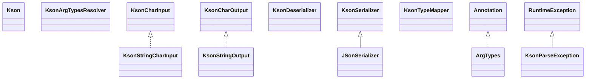

# fst-2.57.jar

[Group index](README.md) | [All archives](../README.md)

## Scope and provenance

- **Donor:** `SQX_145_REFERENCE_ROOT/internal/libs/fst-2.57.jar`.
- **SHA-256:** `ba57fdc0673ec3726921e5f113d906587d7f7000ba3981dfb79cc082929af3c1`; accessed 2026-10-06; captured `2026-10-06T18:54:51.906614+00:00`.
- **Classes:** 220 raw entries; 220 unique entry names. Duplicate occurrence indices are zero-based.
- **Inspection:** read-only ZIP hashing and class-file structural parsing; signatures/descriptors, modifiers, hierarchy and references only. Bytecode bodies are hashed, not published.
- **Allocation:** proposed `FEAT-HOST-FST`, P02; [roadmap](../../dev/sqx-full-application-roadmap.md). Domain README registration remains required.
- **Repository:** `01067f00031428613c6394064ca1bcadc1ba00ee`; review state unreviewed. Download label 145-dev1; installed build/activation and runtime equivalence unverified.
- **Limit:** every class/member is inventoried; declaration coverage does not establish consumed calls, defaults, formulas, failure semantics or algorithm parity.
- **Archive/resource index:** [029.json](../../dev/evidence/sqx145/archives/145/029.json).

## Complete member declarations

Member shards contain exact JVM names/descriptors, access flags, generic signatures, throws types, declared fields/methods, superclass/interfaces and referenced class names. All classes, nested/synthetic members and overloads are retained. Code length/hash is structural evidence, not a normalized algorithm comparison.

- [001.json](../../dev/evidence/sqx145/members/029/001.json) — SHA-256 `40b7bed0196a69619668a9a53bb2c4445805e23101320e04b0d1ff864bc82e98`.
- [002.json](../../dev/evidence/sqx145/members/029/002.json) — SHA-256 `c24db758f47fc3c0cf9c370b28bb526bdec03eb1424db7a0a459dcb407d560d0`.
- [003.json](../../dev/evidence/sqx145/members/029/003.json) — SHA-256 `f315713902eec4540ee9d0716b2d2f8b8cca24a91cff2e3c7535d9a6acf755f3`.

## Focused structural diagram

Up to twelve non-nested classes; arrows show declared inheritance/interfaces only. External type names are not evidence of an available body or an executed dependency.

## Class inventory

| Archive entry | Occurrence | Class SHA-256 | Fields | Methods |
| --- | ---: | --- | ---: | ---: |
| `org/nustaq/kson/ArgTypes.class` | 0 | `e512ef4920b471f5897aa38ca6bab2b072a88d881fd428aadd69f079af4d90d1` | 0 | 0 |
| `org/nustaq/kson/JSonSerializer.class` | 0 | `839f429ef5e6d4e4b4c9569eb5670a07563f3bc22fa0dd4cbde34e49fda3b72b` | 3 | 13 |
| `org/nustaq/kson/Kson$Test.class` | 0 | `068d1f0ac0b6d2d401263cc4f77a96c31e5966a67a6cdb25941952be170e5e69` | 2 | 1 |
| `org/nustaq/kson/Kson.class` | 0 | `0b667f8a52f8e6b76acb77f46221e2892295ce1d184c48a0743f87135ae18daf` | 3 | 22 |
| `org/nustaq/kson/KsonArgTypesResolver.class` | 0 | `a73f926181eb4e7fca067b5aec7f333798db70710c035bb2339ed130ba8ee9e1` | 0 | 1 |
| `org/nustaq/kson/KsonCharInput.class` | 0 | `2af3566c0537e2948ddba6f16d28569ae1dc24419dd45ce9ff4fb685809217e9` | 0 | 6 |
| `org/nustaq/kson/KsonCharOutput.class` | 0 | `ceadc40cac13e4073fec2fdd30c3d3346f40646e77ab67be8a1cea91630984a9` | 0 | 4 |
| `org/nustaq/kson/KsonDeserializer$ParseStep.class` | 0 | `976b6a9af5e8292cda0808fe8cdd260b738ce516d1b243207716caad2a2fb68f` | 3 | 3 |
| `org/nustaq/kson/KsonDeserializer.class` | 0 | `e7b7c9111bc0773f852ce3d747a36d7e788ba49349c329b8b1815bcc78e525e1` | 6 | 22 |
| `org/nustaq/kson/KsonParseException.class` | 0 | `425f6a140ede4336d916209ba7b0d7bbe0dd134f4372f9a45c8025f733d9c56e` | 0 | 3 |
| `org/nustaq/kson/KsonSerializer.class` | 0 | `29aada4518757a6b18ce8744f41449eedf009782355c38e36344f715a3fa5750` | 6 | 20 |
| `org/nustaq/kson/KsonStringCharInput.class` | 0 | `16ce5f8e66d05a9fbd8e3f2687107ba9496574469a83602a04b58c9152bdff48` | 4 | 8 |
| `org/nustaq/kson/KsonStringOutput.class` | 0 | `e6b0be4a91a1c76fb6fa38d0386f75e1641d2da3faa7a6fa609bfd7a3c3343ae` | 1 | 8 |
| `org/nustaq/kson/KsonTypeMapper.class` | 0 | `03d3e7184dcd035b48a979327c0894cb9814dbc62b5311e88d53644015d27e9c` | 6 | 13 |
| `org/nustaq/logging/FSTLogger$Level.class` | 0 | `289e0dcfd4e1b4eefe94d8b5066c6c7945ebfb44c4b57c8e198758e484e5cbe7` | 6 | 4 |
| `org/nustaq/logging/FSTLogger$Log.class` | 0 | `469e9e3234ce7ff503eb9c5dba7942b60f8b70fd870172efae2b00b3aafd438f` | 0 | 1 |
| `org/nustaq/logging/FSTLogger.class` | 0 | `f45bf4453db28a9858a6e2c89155a54472b1fb0cbfd5a17575773e3809d3e90c` | 2 | 4 |
| `org/nustaq/net/TCPObjectServer$1$1.class` | 0 | `03e457857c89f66a34d90fea19fe547f919ed0edec29bb08890e7042a06e2065` | 2 | 2 |
| `org/nustaq/net/TCPObjectServer$1.class` | 0 | `38364a08c42dbaabc245597918388728772237471546b865a00e32d6cbdc7bcb` | 2 | 2 |
| `org/nustaq/net/TCPObjectServer$NewClientListener.class` | 0 | `7450a292a91857ea89106c0536d4018c09d382f39932190de388b326b83c2cfd` | 0 | 1 |
| `org/nustaq/net/TCPObjectServer.class` | 0 | `0795cdf5a30a8acd30089f0a57e4b006621e4d2ba7eae458ffab3a0ebaa799a6` | 4 | 6 |
| `org/nustaq/net/TCPObjectSocket.class` | 0 | `cde227d3a671a6fe7a18f7c276158e01752e867bd0bbdaaa2b74079d156f7013` | 9 | 16 |
| `org/nustaq/offheap/BinaryQueue.class` | 0 | `34d6bbc1bab2f6a1f3b0e03fc65f17c5fa4b8e1a59dc406f9ba22b46d58f6c99` | 3 | 16 |
| `org/nustaq/offheap/FSTAsciiStringOffheapMap.class` | 0 | `65240137b8467eebcd6cf56c5c63990119235db0bd28406fa2d12545648fc299` | 1 | 6 |
| `org/nustaq/offheap/FSTBinaryOffheapMap$1.class` | 0 | `605a0a7885667b384088c930f1080e86b3e0efe8c9d86674a7893d84999dc175` | 5 | 5 |
| `org/nustaq/offheap/FSTBinaryOffheapMap$2.class` | 0 | `dd20df2ce647db844f3f9d73dd7148e25989f8b40cdc325293d87b397ef93b5e` | 7 | 7 |
| `org/nustaq/offheap/FSTBinaryOffheapMap$KeyValIter.class` | 0 | `b5ed5eb8c5f00e0eb5d43223f63b1746d5a902fb873fb00390a37ff4234ecd8e` | 0 | 2 |
| `org/nustaq/offheap/FSTBinaryOffheapMap.class` | 0 | `10026b56cb418cfc6b078d2bc7ce31027e1afb4cbfdeaf4d7270a268bf59bc85` | 19 | 35 |
| `org/nustaq/offheap/FSTCodedOffheapMap$1.class` | 0 | `1f214efbaeae487255ed7594310b79a16b9d36ac14e46f58f6cd8d928a579605` | 2 | 4 |
| `org/nustaq/offheap/FSTCodedOffheapMap.class` | 0 | `7e80a5ff9b2047680eb3b5e7ee5c8420455760fe72ca6cb760112d163ee9707b` | 0 | 9 |
| `org/nustaq/offheap/FSTLongOffheapMap.class` | 0 | `b744987c34a969f9732aea868606dd6a29e1b6a03941cf6399b2e19959bc985b` | 2 | 6 |
| `org/nustaq/offheap/FSTSerializedOffheapMap.class` | 0 | `da9836a15d2c6524d57a6b400efe087553b02322207f5efb6f29b29bc83a9605` | 3 | 6 |
| `org/nustaq/offheap/FSTUTFStringOffheapMap.class` | 0 | `b5827c523985a261b860822ee8881c49b40a70c77490dfe099c8082882920d29` | 0 | 6 |
| `org/nustaq/offheap/FreeList.class` | 0 | `5efdfe3c42d7df4c1b9511cffd20b802a46bc13c91b8e7490765fb9de47e953c` | 2 | 6 |
| `org/nustaq/offheap/OffHeapByteTree$1.class` | 0 | `514894416833a57e2fa4dbbe3607c069fa7d88f88b2266ddcb1593b5df4fb34b` | 0 | 3 |
| `org/nustaq/offheap/OffHeapByteTree.class` | 0 | `ee5743855ad756fb972b648533a825e956d4b13426267ff398fd2cf3e0745e7d` | 3 | 10 |
| `org/nustaq/offheap/bytez/BasicBytez.class` | 0 | `37a3ee2cfe188d10f55a3a1e22e46722693fa5636e2aff81611cc04612016b89` | 0 | 35 |
| `org/nustaq/offheap/bytez/ByteSink.class` | 0 | `15fba3f8865f79c52b116d2bfcf9e83a3d3d30fd226d14b9b525c3c4e79b0827` | 0 | 3 |
| `org/nustaq/offheap/bytez/ByteSource.class` | 0 | `f81d61bbad955bbf77983d96c9f4e5cfff6195f9e6cfc2c768d8420beea8a851` | 0 | 2 |
| `org/nustaq/offheap/bytez/Bytez.class` | 0 | `8719557000bc89735b011ea9e539f7bcce9242c5e5625890e4259049b0893cf0` | 0 | 23 |
| `org/nustaq/offheap/bytez/BytezAllocator.class` | 0 | `db20b5f387812a732d9bdcf5e0f0e1c76adc24d646724d14b6c688d79cb0e6a3` | 0 | 3 |
| `org/nustaq/offheap/bytez/bytesource/AsciiStringByteSource.class` | 0 | `29cfaca784f5a6062adcc764f0f1224b8b8783963700af21545be4236cbc70ab` | 3 | 12 |
| `org/nustaq/offheap/bytez/bytesource/ByteArrayByteSource.class` | 0 | `43fdc915c997c223ac75c8db782b2246d24d05d7ae076d438f7be94f5a7ee826` | 3 | 10 |
| `org/nustaq/offheap/bytez/bytesource/BytezByteSource.class` | 0 | `3681cb2c10de911d75d952a0fbc00f4e273fcade7ce4bea6373a153ab591505b` | 3 | 9 |
| `org/nustaq/offheap/bytez/bytesource/CutAsciiStringByteSource.class` | 0 | `ce8d5d88362b9bb3a8c4ae00a628395f56c99ffc0605029d7b8f22f9c847f387` | 0 | 4 |
| `org/nustaq/offheap/bytez/bytesource/LeftCutStringByteSource.class` | 0 | `7636256a2cf1d7319e16094d925fe0e12a2295492808d810f303dca57ecaad73` | 0 | 4 |
| `org/nustaq/offheap/bytez/bytesource/UTFStringByteSource.class` | 0 | `6f0bb15260587a0438c9845e099f9e2f7e0a11d9f580345b3df7e4891ce29971` | 1 | 4 |
| `org/nustaq/offheap/bytez/malloc/MMFBytez$Unmapper.class` | 0 | `72d231b64a8bc508c9877617b4d044529b3c1a7d8e2e0ab46dfb87c00b1dc9b5` | 4 | 3 |
| `org/nustaq/offheap/bytez/malloc/MMFBytez.class` | 0 | `687b29a4f763d55ddf8b5711558a73582c947a8da5eafe2277d4ca0da75e5979` | 7 | 12 |
| `org/nustaq/offheap/bytez/malloc/MallocBytez.class` | 0 | `ca63bc36cf9646228cc578bfb6237a54eb5fd6e052f0ba6a80a0e94205351014` | 10 | 68 |
| `org/nustaq/offheap/bytez/malloc/MallocBytezAllocator.class` | 0 | `a9dc4bb192e7458bcca82f5c9b13d8190d390ce81452ddedb973ed00cc546a7f` | 2 | 5 |
| `org/nustaq/offheap/bytez/niobuffers/ByteBufferBasicBytez.class` | 0 | `b103e954a057bc1475c4620dcd33b9da2d7262d10ce6ecfc5513dda9dbc65e8b` | 1 | 38 |
| `org/nustaq/offheap/bytez/onheap/HeapBytez.class` | 0 | `bc0515ef2ec67990129abc553489ba82fe7e1fc806726a0e21dcec7b33215781` | 12 | 72 |
| `org/nustaq/offheap/bytez/onheap/HeapBytezAllocator.class` | 0 | `218f93246662f04006dde4fd274016dae10d83694951180df45cfbfb86811242` | 0 | 4 |
| `org/nustaq/offheap/structs/Align.class` | 0 | `42f049e4457811a6209a238b527039381404e3b3f7b54b98ee0ce82fc03ff5f2` | 0 | 1 |
| `org/nustaq/offheap/structs/FSTArrayElementSizeCalculator.class` | 0 | `d4b0c12035dbda640724361051a535b22e6f1f13e041690d43c6d992602d554f` | 0 | 2 |
| `org/nustaq/offheap/structs/FSTEmbeddedBinary.class` | 0 | `6dd8548ebae399e92a0c6f54c99ea56eb61886d6fa0b381bd8d99833d8cac90e` | 0 | 2 |
| `org/nustaq/offheap/structs/FSTStruct$1.class` | 0 | `86e95bd330b09fc80e12d9a7d3ef7ddfdf9d39cb4165b9fe26f5e0423d0ddfe0` | 0 | 3 |
| `org/nustaq/offheap/structs/FSTStruct.class` | 0 | `f46b1c57874e256248f8cd41296e8ccad2f54a87ddcd5424c7783f4dbbec6626` | 8 | 56 |
| `org/nustaq/offheap/structs/FSTStructAllocator.class` | 0 | `591e1d69adbc076c84f7c49aa24c8d2a689527a94c15c3243a37f3d68a9ce53e` | 6 | 15 |
| `org/nustaq/offheap/structs/FSTStructChange.class` | 0 | `d6cea26136544e45a1e0bf9db17ea24fbd17931ffe445b28b76e22ac06701823` | 7 | 10 |
| `org/nustaq/offheap/structs/NoAssist.class` | 0 | `e87b81e5ffc1dd313c414a95eea55b0302e1ca14ce8aaee9587f0d9c14a005e2` | 0 | 0 |
| `org/nustaq/offheap/structs/Templated.class` | 0 | `adab7f85c82dfe7aa5bee5abe3931d85be034c7f1726e4483fef90ef5d88f5ac` | 0 | 0 |
| `org/nustaq/offheap/structs/structtypes/StructArray$StructArrIterator.class` | 0 | `6da1654ac58f31d970688ab2beaab2e36b677a181ee5714e44af07b28ca838a8` | 6 | 7 |
| `org/nustaq/offheap/structs/structtypes/StructArray.class` | 0 | `6606935e386b35fdcf61400674a4f1b912ab06186570677f5cf2d641e1f9d3fe` | 2 | 17 |
| `org/nustaq/offheap/structs/structtypes/StructByteString.class` | 0 | `c39fc824c9734994b32189ff5560ee262a226a5f171942524fee9f2f858ab04d` | 2 | 16 |
| `org/nustaq/offheap/structs/structtypes/StructInt.class` | 0 | `c87143fad3dc9fecfa8db93770cbe280767d6ba9c38f983ecc473be8b9eba38f` | 1 | 5 |
| `org/nustaq/offheap/structs/structtypes/StructString.class` | 0 | `6c95ea1125f7002ba8da5dd919b5ea19bffafc60fdd84812736e9edc032321e0` | 2 | 16 |
| `org/nustaq/offheap/structs/unsafeimpl/FSTByteArrayUnsafeStructGeneration.class` | 0 | `3ccc3d70633b424f27b60c82cd5be0bbcdd5cfe62ef4e0db8cfead78705794c8` | 1 | 13 |
| `org/nustaq/offheap/structs/unsafeimpl/FSTStructFactory$1.class` | 0 | `5f43ea241ae14355246e7232373df88494fabc48624fbfd17484d454cc7303b1` | 1 | 2 |
| `org/nustaq/offheap/structs/unsafeimpl/FSTStructFactory$2.class` | 0 | `7f057271cd76f4a7b32a273389ec3fbf3a2f857fe2d7cbc30a3471dd7a4599e1` | 1 | 2 |
| `org/nustaq/offheap/structs/unsafeimpl/FSTStructFactory$3.class` | 0 | `453dbd13f8a23f988f056d92a8e130cd5d510499b7256582b1f843005c1ac877` | 2 | 2 |
| `org/nustaq/offheap/structs/unsafeimpl/FSTStructFactory$4.class` | 0 | `f40ae1ffce2efd4adab544d788a5e120ff8b5fcbf64c24d5326d94553c864cf8` | 2 | 2 |
| `org/nustaq/offheap/structs/unsafeimpl/FSTStructFactory$5.class` | 0 | `826f6b2048ac1237592eeb37ca56d9a50eb1edd535f74e17bde01e9adbaefe9c` | 1 | 3 |
| `org/nustaq/offheap/structs/unsafeimpl/FSTStructFactory$ForwardEntry.class` | 0 | `90dbfe05b75577e7a5d3bbedba8b73d145251fb79a03eca0c635331cc60c0111` | 4 | 1 |
| `org/nustaq/offheap/structs/unsafeimpl/FSTStructFactory.class` | 0 | `a0a116138cec22ea97f73e7785ad2fec03a2f9272b2c389d502b12c8c5683048` | 16 | 38 |
| `org/nustaq/offheap/structs/unsafeimpl/FSTStructGeneration.class` | 0 | `5f70f7cc65d35076c26e42be86b38d8b596d7a4401a29765eebc8c316deb1659` | 0 | 10 |
| `org/nustaq/serialization/FSTBasicObjectSerializer.class` | 0 | `04a5db775654c2f1861e3ea5482e917d4457e2d511a04b333537775b4f48ee51` | 0 | 6 |
| `org/nustaq/serialization/FSTClassInstantiator.class` | 0 | `5fd19f79f9a38b726ef7c0851eaef1a1e12999a0c430e59c091aa9a79d8af80b` | 0 | 3 |
| `org/nustaq/serialization/FSTClazzInfo$1.class` | 0 | `b5a69f7817b67c875231016e0d77bfc00d725a7052bb9fc2e56558dc35acff76` | 0 | 3 |
| `org/nustaq/serialization/FSTClazzInfo$2.class` | 0 | `b615b9bdd449ac0680e6369ffe264a74476ec5deb4f4fc7aebd6e887eaf3d412` | 1 | 3 |
| `org/nustaq/serialization/FSTClazzInfo$FSTCompatibilityInfo.class` | 0 | `cd8b1dcacfd0c0beb6e340613a0ff8f5134cddaa88efa965281357159c5027f5` | 6 | 11 |
| `org/nustaq/serialization/FSTClazzInfo$FSTFieldInfo.class` | 0 | `c66ec7af113862d285e169ba77fe19ec513514f59702aaa2b87128b8a71eed37` | 30 | 56 |
| `org/nustaq/serialization/FSTClazzInfo.class` | 0 | `12eb72f87bca7085fde5897aa7acf9652417d05be7d80966751196a1f37b1a03` | 31 | 31 |
| `org/nustaq/serialization/FSTClazzInfoRegistry.class` | 0 | `73fee9030f89e37abdbb9902d921a50ee69d29f221570017a5c33157bc837a7a` | 5 | 11 |
| `org/nustaq/serialization/FSTClazzLineageInfo$1.class` | 0 | `fba32642f7b7088081f0628a8fca744f4dd9e2a86a7c24874c38882cc972f8f6` | 0 | 3 |
| `org/nustaq/serialization/FSTClazzLineageInfo$LineageInfo.class` | 0 | `e21650babcd54394b2040abfe17570314aef8881e13c54f3758dea39dd96f31d` | 2 | 4 |
| `org/nustaq/serialization/FSTClazzLineageInfo.class` | 0 | `b9434f407f6b6893d59998ea545206a56939fd85e7783ef193e04498f258cba6` | 4 | 8 |
| `org/nustaq/serialization/FSTClazzNameRegistry.class` | 0 | `c597b016d684e0193a3af6b0922c1ed0a85b28d692e56818563cd6492ce0ce03` | 8 | 14 |
| `org/nustaq/serialization/FSTConfiguration$1.class` | 0 | `3e9b7261dea4b5905db5d0685ce3b574b37320db46831c84feae68de8d79f3dc` | 0 | 3 |
| `org/nustaq/serialization/FSTConfiguration$2.class` | 0 | `3474aa47bc7b7f61fa93e313110b534a71a1ce7908521db389c0cda54498e23e` | 0 | 2 |
| `org/nustaq/serialization/FSTConfiguration$3.class` | 0 | `d7650cec09cda882c1f462fa1b516134091fff494a7f2e8a0ef68a1218b278d0` | 0 | 2 |
| `org/nustaq/serialization/FSTConfiguration$4.class` | 0 | `5d6f03c833c59fd37cbb21acf95d65574ad04f7dcc0a3418bcdbf7ef3e735bcf` | 1 | 2 |
| `org/nustaq/serialization/FSTConfiguration$5.class` | 0 | `650b657638489796c45f657fc0e8f90a03da7e135b3f493da6df623cd8b2a403` | 1 | 1 |
| `org/nustaq/serialization/FSTConfiguration$ClassSecurityVerifier.class` | 0 | `b9e82f78bf404755dc57247bed0ca5efdbfabaaf1930dc7c8261f447faa845af` | 0 | 1 |
| `org/nustaq/serialization/FSTConfiguration$ConfType.class` | 0 | `8a8255676667476baa7f1e0d4b7aa049ec5825006240f94394cd992b27c81f43` | 6 | 4 |
| `org/nustaq/serialization/FSTConfiguration$FBinaryStreamCoderFactory.class` | 0 | `420645452ca5c2bb9e35108c2c7b8e81830c76286aeb3fd9f7cef08473fc6e59` | 3 | 6 |
| `org/nustaq/serialization/FSTConfiguration$FSTDefaultStreamCoderFactory.class` | 0 | `cca5d61d4660ffb44feca777916983321f9f4eaf357f4f3d7ec628c2a2382125` | 3 | 6 |
| `org/nustaq/serialization/FSTConfiguration$FieldKey.class` | 0 | `5f4959ddd0f8ee1012b9ded51eda4d51fd52b7dc676e03ac29e3e7f7477d6f0d` | 2 | 3 |
| `org/nustaq/serialization/FSTConfiguration$JSonStreamCoderFactory.class` | 0 | `8ee835c9ceff6df18c3f5d936b7019e1a75fc2884003ed88d5148aa8c24172e5` | 3 | 6 |
| `org/nustaq/serialization/FSTConfiguration$JacksonAccessWorkaround.class` | 0 | `ed87586923140ac189050b7b3c529cd89f21b4caa8b775e351bbfd19ab6f011a` | 0 | 3 |
| `org/nustaq/serialization/FSTConfiguration$LastResortClassResolver.class` | 0 | `2d6882374949e629bce5a58f5a00f5c877928a2d4899a3838bb75a675554eac2` | 0 | 1 |
| `org/nustaq/serialization/FSTConfiguration$MinBinStreamCoderFactory.class` | 0 | `505c5ed96f422da965f935feabe4eda026e7da42e7bceef80eef72d6d2585f4d` | 3 | 6 |
| `org/nustaq/serialization/FSTConfiguration$StreamCoderFactory.class` | 0 | `2b43f406d51e67f0e5a92104b11ea250e6f33e3b026fd7432672805251442024` | 0 | 4 |
| `org/nustaq/serialization/FSTConfiguration.class` | 0 | `f1087b57a2a74712ebdee31b5ae1b7f7341f4434cfe8c061e14e4d9307d333a7` | 28 | 94 |
| `org/nustaq/serialization/FSTCrossPlatformSerialzer.class` | 0 | `f8709ca2cb79969c848155f4faa6fd7adb4904f1fec5dea5011387db45e6a475` | 0 | 1 |
| `org/nustaq/serialization/FSTDecoder.class` | 0 | `73814c30f343c70e8638b6d76a1c318b09b963442e8dfc65eae06c4ece1fd1a6` | 0 | 45 |
| `org/nustaq/serialization/FSTDefaultClassInstantiator.class` | 0 | `de43f06486c50ee491df4ed0d184ffe25699a0e5eef8d1e7d034ecb3d9092306` | 1 | 5 |
| `org/nustaq/serialization/FSTEncoder.class` | 0 | `d5c4207e034cf72622cce1e6d24a719ebe3d519555501eafe9fa4f6b4e41a434` | 0 | 34 |
| `org/nustaq/serialization/FSTObjectInput$1.class` | 0 | `ce5b14a4a7978c64ba19317ed50b34f9403e56a72c371db54dd283b5b676d3b0` | 1 | 3 |
| `org/nustaq/serialization/FSTObjectInput$2$1.class` | 0 | `2c37ab8d4a73e578d894c56b4917a49b2a4c9668b98821b5e3951399ba527124` | 1 | 12 |
| `org/nustaq/serialization/FSTObjectInput$2.class` | 0 | `c772c28c9d9429c4f52f3216d1dca90ba6e709f672ce6bd852f5982bf8b7dfc6` | 6 | 30 |
| `org/nustaq/serialization/FSTObjectInput$CallbackEntry.class` | 0 | `a761e5c811eac9227bcd6109995c1c97884c44a7977db70c13205f3bd9f7e580` | 2 | 1 |
| `org/nustaq/serialization/FSTObjectInput$ConditionalCallback.class` | 0 | `22726013e8ae8823b4169da50a8727f44155fda7890a9409b2654bdee6fff87c` | 0 | 1 |
| `org/nustaq/serialization/FSTObjectInput$MyObjectStream.class` | 0 | `0e2f3b79c0b2b5ea2c4c7610cf41ef5d7ef17508569493455724199707a96461` | 2 | 32 |
| `org/nustaq/serialization/FSTObjectInput.class` | 0 | `c376fb6fe49393646bd3e015877ec41359a895149fb849e6ac1cc97df004fa0a` | 17 | 75 |
| `org/nustaq/serialization/FSTObjectInputNoShared.class` | 0 | `9c08ad43195aaafdcbfa381f54b159a7bd1636a9a4d882fffcb48ab8bbb3c48d` | 0 | 8 |
| `org/nustaq/serialization/FSTObjectOutput$1.class` | 0 | `4473c56ed348b123f3c258243ca4c2a955f69a73383522334bff993d7922a4b4` | 0 | 2 |
| `org/nustaq/serialization/FSTObjectOutput$2.class` | 0 | `922a03be464d955ec07ebece199e099c9722086d4a723f195c44343c0db83776` | 1 | 2 |
| `org/nustaq/serialization/FSTObjectOutput$3$1.class` | 0 | `c0636780ccb4c9543adb430dcf1c02eecff21289a8a7348f8fd866387f44bcd3` | 1 | 11 |
| `org/nustaq/serialization/FSTObjectOutput$3.class` | 0 | `bc0510e1ae9e5dbf2a02733b57f5bb1b6ac978bfcdf2d12c68756ed0713e8afe` | 7 | 24 |
| `org/nustaq/serialization/FSTObjectOutput.class` | 0 | `99ee6012f237d493298dde86efa26d0d72eef98e5e5caf2104d88fe865122714` | 31 | 60 |
| `org/nustaq/serialization/FSTObjectOutputNoShared.class` | 0 | `134e9598f03e327d3aeae8301601b193720cea443d7c39d63379ecfe9715dcad` | 0 | 7 |
| `org/nustaq/serialization/FSTObjectRegistry.class` | 0 | `241c713bf24a2b1d156ebe5114d7214c16227e90ae74f6327b8eea8be18dc32c` | 7 | 9 |
| `org/nustaq/serialization/FSTObjectSerializer.class` | 0 | `7c7238fafcf91c8b4020e8ba928cfa29ca3dddf713a929af985563cbb6de6346` | 1 | 5 |
| `org/nustaq/serialization/FSTObjenesisInstantiator.class` | 0 | `435f3547715ee83baafc484d75b302702e99455fd6e5f28874168e39b983273d` | 2 | 5 |
| `org/nustaq/serialization/FSTSerialisationListener.class` | 0 | `b2b3c8a647a1132e9663ecb78c1abaa5b8a6ceb4f42da253145608b9afde0fb6` | 0 | 2 |
| `org/nustaq/serialization/FSTSerializerRegistry$NULLSerializer.class` | 0 | `f8af1bd303a51dd54980c96f39e12b924b93c2a6cabb6e3819abc796949321fb` | 0 | 6 |
| `org/nustaq/serialization/FSTSerializerRegistry$SerEntry.class` | 0 | `0564f8be0f22cae5a54bce4a26144be65b065067635eaedb01e23d1e1ebbcfbe` | 2 | 1 |
| `org/nustaq/serialization/FSTSerializerRegistry.class` | 0 | `d46d7dfc2da2b21ffc19db454b8160a3d4beed467c67aef136b409a44d63f6b9` | 3 | 7 |
| `org/nustaq/serialization/FSTSerializerRegistryDelegate.class` | 0 | `06aa4a67766e6c9d5a3e134240cbae181846aa2b100f99aea95e5f7581b9f8dd` | 0 | 1 |
| `org/nustaq/serialization/VersionConflictListener.class` | 0 | `743f6615ff1b385b7ab243a8c8d6cb98af0dda114a4423bb6c3feea87b45b3b5` | 0 | 1 |
| `org/nustaq/serialization/annotations/AnonymousTransient.class` | 0 | `f80114e3a016ffc608522fb45ba47f07b808bf24e5eaff611ab06aa8dcd33a2b` | 0 | 0 |
| `org/nustaq/serialization/annotations/Conditional.class` | 0 | `7ec0775c7ccb1aad0829d1ae7a54ee176d8c4a58b07ad4d9245eea205b3c2374` | 0 | 0 |
| `org/nustaq/serialization/annotations/Flat.class` | 0 | `17dd1dcc29a2c4e39ddf48eeaa9e766a8a68b4bd5690b1447bfe6ccdbc9db19b` | 0 | 0 |
| `org/nustaq/serialization/annotations/OneOf.class` | 0 | `63ff54d0b5c073379e8ae00a45a364c477432f37e5dc7277d814129739d40096` | 0 | 1 |
| `org/nustaq/serialization/annotations/Predict.class` | 0 | `bd97902b9619c344da7171fe60868655833be8e85baa5df1ebb39ca9ed5157aa` | 0 | 1 |
| `org/nustaq/serialization/annotations/Serialize.class` | 0 | `9117dd22aa7304483abd3bdd52b595de7528b03ff0c11f665a3e982907c0dff1` | 0 | 0 |
| `org/nustaq/serialization/annotations/Transient.class` | 0 | `98c1acbe35b8fd88f6edeca189b690b740e80607a2c5f342c6bf8237d276cd56` | 0 | 0 |
| `org/nustaq/serialization/annotations/Version.class` | 0 | `5f99dd8516a4b4fac383ad45730b6a772c5153a4c1d11cb183f6ef3b5ef432d5` | 0 | 1 |
| `org/nustaq/serialization/coders/FSTBytezDecoder.class` | 0 | `a239574cdfddb948f7e115b94bb2343071d6e0008b2b64f372fed1dd7da3101f` | 9 | 55 |
| `org/nustaq/serialization/coders/FSTBytezEncoder.class` | 0 | `eac7ea28faa8498565dbaa1b1142903df8e00b13c30ffac08af393b570befc76` | 8 | 50 |
| `org/nustaq/serialization/coders/FSTJsonDecoder$1.class` | 0 | `3640beb46b3e419f79c4b99c12729393508f64bdf9d02403dc309fa91aae6705` | 1 | 1 |
| `org/nustaq/serialization/coders/FSTJsonDecoder.class` | 0 | `3c2c70c81d3e8377c2b4311624ac26db3a7253c7bca2d921b1469a13ae56fd29` | 14 | 53 |
| `org/nustaq/serialization/coders/FSTJsonEncoder.class` | 0 | `53b7ff0f108ffe593d66628a79cf06ec659e1f9ecf1b4ce615dbe9c778b29591` | 5 | 39 |
| `org/nustaq/serialization/coders/FSTJsonFieldNames.class` | 0 | `4827d8e67df5fa56670b19e11aa536590700e2d12b7d337ab694fe81b8b0be8b` | 15 | 9 |
| `org/nustaq/serialization/coders/FSTMinBinDecoder.class` | 0 | `8d805f1e363d7663c29fa85bac4e5811c64399830dacfc1313b4e6821794a1ad` | 7 | 47 |
| `org/nustaq/serialization/coders/FSTMinBinEncoder.class` | 0 | `d57461f2165f2375c1dddc0768c6fbbf0bc0da1bfdc202dd99b81140ee76b1a5` | 4 | 37 |
| `org/nustaq/serialization/coders/FSTStreamDecoder.class` | 0 | `74150af0193c0fecd12109a2985d666b2bb15464fe8ef626870eac08418a9181` | 6 | 54 |
| `org/nustaq/serialization/coders/FSTStreamEncoder.class` | 0 | `1573d723b90b6c1ad717fa7d0a657f8ff58e0ca0a193094451fd024d0d2d54c5` | 4 | 48 |
| `org/nustaq/serialization/coders/JSONAsString.class` | 0 | `a3420791787691aa0b76e0d1118eab10006868e5ac952e74e3099fbb9f90dd7f` | 0 | 0 |
| `org/nustaq/serialization/coders/Unknown.class` | 0 | `c777b6f4c02b77b248852cb4bf9d0d5cc28821bdc88b24e6bd9398b1b894f2fe` | 3 | 25 |
| `org/nustaq/serialization/minbin/GenMeta.class` | 0 | `50792f590691c65b269786ac1bf657cd343d36251f4001449ef54a113de9f0b4` | 0 | 1 |
| `org/nustaq/serialization/minbin/MBIn.class` | 0 | `df48e531fc4a9a56241d2c038d52859bd3c66525076ed903a4ad1318b19b71bd` | 4 | 16 |
| `org/nustaq/serialization/minbin/MBObject$1.class` | 0 | `94b501fcfa9cc7759ba811148656a9ece53f83237964f235ba1fd4286ec2fa98` | 0 | 5 |
| `org/nustaq/serialization/minbin/MBObject.class` | 0 | `656327474956a33a7289c5a3f92a08f9b55b64c96aa5b96e4908e7d1315e289d` | 3 | 8 |
| `org/nustaq/serialization/minbin/MBOut.class` | 0 | `2926fd35f44c666d58842c9442d2e60e96170cd3ac748833c7f759cf239e2910` | 3 | 17 |
| `org/nustaq/serialization/minbin/MBPrinter.class` | 0 | `1b060220c63149d35b7859afa11aa20490c1f5869e01febf06d786d10d47fca9` | 0 | 10 |
| `org/nustaq/serialization/minbin/MBRef.class` | 0 | `7d344fe2a822eb86dc6acc7bad4da78a6b973c8f94819d011817306b199c9e71` | 1 | 4 |
| `org/nustaq/serialization/minbin/MBSequence.class` | 0 | `a33b34e5743ed4e596f0fd897c861d9128222ed52c19787bc9ba5daf105635d0` | 2 | 7 |
| `org/nustaq/serialization/minbin/MBTags$BigBoolTagSer.class` | 0 | `d45ec8a334ceb3d802ba2b1d7598bd41b160f2c20a01827213e2de99c1a353e9` | 0 | 4 |
| `org/nustaq/serialization/minbin/MBTags$DoubleArrTagSer.class` | 0 | `e2cb278b40499aa086fe44027d737ab7985767fd1a12262b3517ac6f61cf1459` | 0 | 4 |
| `org/nustaq/serialization/minbin/MBTags$DoubleTagSer.class` | 0 | `767f1315568c349da16b4d1eaf7f981e8a12ae836da7eeca7880072fc3201f43` | 0 | 4 |
| `org/nustaq/serialization/minbin/MBTags$FloatArrTagSer.class` | 0 | `996aa7a62c1fd0e9b8b7c87759fea1b7c4e574d7a383669bfa3b51b3315b29a0` | 0 | 4 |
| `org/nustaq/serialization/minbin/MBTags$FloatTagSer.class` | 0 | `6052c0e090bd5fa447da82dc5b41e6e5be74985b33a80a69e1043389a07a3d24` | 0 | 4 |
| `org/nustaq/serialization/minbin/MBTags$MBObjectTagSer.class` | 0 | `7dbd75f635b4110fbf3c2bf1d15059a779c57747502f27af7e5e13543114fa3e` | 0 | 4 |
| `org/nustaq/serialization/minbin/MBTags$MBSequenceTagSer.class` | 0 | `271cd77d498c8009aff14d8b4b8c2fa25cbe6232cb0f71c440c157448dc9ebef` | 0 | 4 |
| `org/nustaq/serialization/minbin/MBTags$NullTagSer.class` | 0 | `8d0f9ccc88d88fa13a8bba01e9a83220dcc42756dbf05c7268b51e0439f226a4` | 0 | 4 |
| `org/nustaq/serialization/minbin/MBTags$RefTagSer.class` | 0 | `4258bcf4e7dd8082b4f81a89e15255d88eb10d7bf33366ecaea42aa7d4e4d1a8` | 0 | 4 |
| `org/nustaq/serialization/minbin/MBTags$StringTagSer.class` | 0 | `cb739d7db84456d2ac37d963a6317866093da8d9fdde7e7d0de9cea48c99c02d` | 0 | 4 |
| `org/nustaq/serialization/minbin/MBTags.class` | 0 | `52945e11aebf5c7c55e8f2a1291a9a0332655da2583db17a760bb515b305fea5` | 0 | 1 |
| `org/nustaq/serialization/minbin/MinBin$TagSerializer.class` | 0 | `24d19df4ebc06f3edb0cdfd2dd42fd0d239c244adbccf6148370780c3258fab4` | 1 | 6 |
| `org/nustaq/serialization/minbin/MinBin.class` | 0 | `d70d461fcc2503e2447b017594c35778fe0dae7f57070ef272af9ba3660a1f28` | 26 | 17 |
| `org/nustaq/serialization/serializers/FSTArrayListSerializer.class` | 0 | `3f2171f702cf8b6bc000b429982de7dda372cf244e896aa2ee903ce4c32c0d89` | 0 | 3 |
| `org/nustaq/serialization/serializers/FSTBigIntegerSerializer.class` | 0 | `7a2a9ca68dca548ef64f4d37aafe1db61002ab7fbaa082cb285b0885b56202bf` | 0 | 3 |
| `org/nustaq/serialization/serializers/FSTBigNumberSerializers$FSTByteSerializer.class` | 0 | `c2f70c77f98f2fb1672dc057a0e0c04c3b7dd08d897f598ea07b7e66d79dcb2c` | 0 | 5 |
| `org/nustaq/serialization/serializers/FSTBigNumberSerializers$FSTCharSerializer.class` | 0 | `345f571cd4fb2cd98b2a847d8c22734fd7acaa65b854d2a24e74c521b8cec211` | 0 | 5 |
| `org/nustaq/serialization/serializers/FSTBigNumberSerializers$FSTDoubleSerializer.class` | 0 | `b2896aff0bf8d834f6c3f4404e9b1960bb667958c8ddf3d51f7a97e56fa50cb8` | 0 | 5 |
| `org/nustaq/serialization/serializers/FSTBigNumberSerializers$FSTFloatSerializer.class` | 0 | `9952ab58913c722583df3c7728b420c4dcfab866b8f41cb2bb801de5b099f283` | 0 | 5 |
| `org/nustaq/serialization/serializers/FSTBigNumberSerializers$FSTShortSerializer.class` | 0 | `1ed34e4a60e1fae83cd89a37c5595f969edcf0b29bdaa6a4eff939ad07e02a3d` | 0 | 5 |
| `org/nustaq/serialization/serializers/FSTBigNumberSerializers.class` | 0 | `05e284a7c71c27b4d07a81f66be2b6cfcfc92d0b4096a8b9b2af306b6baa4dd1` | 0 | 1 |
| `org/nustaq/serialization/serializers/FSTCPEnumSetSerializer.class` | 0 | `b2b862fe8f48e013f8c9abcc03885c7095637506acf4590dbaff15f7a6bdeaa2` | 1 | 4 |
| `org/nustaq/serialization/serializers/FSTCPThrowableSerializer.class` | 0 | `de2b5e4bc000159d747a1cab4d287dbb6775f50c1b5457f80fafa4bc4b36fece` | 0 | 3 |
| `org/nustaq/serialization/serializers/FSTClassSerializer.class` | 0 | `9e1f14890c1292f03857587c2317504931ade668930ec59833515378ba2d20dc` | 1 | 4 |
| `org/nustaq/serialization/serializers/FSTCollectionSerializer.class` | 0 | `8c89041d284b8dc0301bcb694aa0d3adf0a68bccd93e73c4ae170ef1a5fcf3f2` | 0 | 3 |
| `org/nustaq/serialization/serializers/FSTDateSerializer.class` | 0 | `df32863f58cd92749acd4b405e638902fe911836c476c1164367d1a2f7414687` | 0 | 4 |
| `org/nustaq/serialization/serializers/FSTEnumSetSerializer.class` | 0 | `2b4bd0196afca1ecb783651da17134b42912ce42d740cded71ce4a9451361675` | 1 | 4 |
| `org/nustaq/serialization/serializers/FSTJSonSerializers$BigDecSerializer.class` | 0 | `229f3c08287d69c17bee96f7b04dc5a4e834bfe7dc345af39d456f322c414da7` | 0 | 4 |
| `org/nustaq/serialization/serializers/FSTJSonSerializers.class` | 0 | `98f6ccecb9b8f8378a1032048c083e3b969fd0f75b7aeaa0edae4d302323f8a1` | 0 | 1 |
| `org/nustaq/serialization/serializers/FSTJSonUnmodifiableCollectionSerializer.class` | 0 | `b4914d914b277ab7375ed1e5c6be05fb9848080d564c69595c12029a73ccbc48` | 4 | 5 |
| `org/nustaq/serialization/serializers/FSTJSonUnmodifiableMapSerializer.class` | 0 | `6a60390fca2cd40819a198f537f2eb51d077c04c8e7eae68244ac9dc46fa1126` | 1 | 3 |
| `org/nustaq/serialization/serializers/FSTMapSerializer.class` | 0 | `6f207d4be153c4765dc1c0dd8e2909f85e162a943c21986d54a6f7aedf4a79b1` | 0 | 3 |
| `org/nustaq/serialization/serializers/FSTStringBufferSerializer.class` | 0 | `8ef45a35ff8a8e4855ec74dd2cc22ad52c3b2ff49a114897f03be8bfd092fea4` | 0 | 4 |
| `org/nustaq/serialization/serializers/FSTStringBuilderSerializer.class` | 0 | `c04a8ebd4179622fdfe89ee87e437415508dfb07a266ec18099b1ea99887a3b7` | 0 | 2 |
| `org/nustaq/serialization/serializers/FSTStringSerializer.class` | 0 | `518fa37a308f2830b19d9cb218f77c80800e84330d739f5f9660da1cb06d7a40` | 1 | 5 |
| `org/nustaq/serialization/serializers/FSTStructSerializer.class` | 0 | `c31cb7f7d590b9483cd1556ce3bf03b22742647bca4fa1d098da5ed19b192d39` | 1 | 4 |
| `org/nustaq/serialization/simpleapi/DefaultCoder.class` | 0 | `150fedf41c572f51cabd54d013a664b90c427aab10be07bf349879b9519216e3` | 3 | 8 |
| `org/nustaq/serialization/simpleapi/FSTBufferTooSmallException.class` | 0 | `3fe02b33fadda89553e45242de1b71d2f9f78d4875f75f669ab3e1d50fec2fc2` | 1 | 3 |
| `org/nustaq/serialization/simpleapi/FSTCoder.class` | 0 | `bf1b82a556753ff47d4eca32458eced847206c838e942151d9b57826a8286ce3` | 0 | 5 |
| `org/nustaq/serialization/simpleapi/MinBinCoder.class` | 0 | `d1c0f220e943298e12ac5b7e845e1f006f00df356f0af2d2e2d5bc753ed30f57` | 0 | 3 |
| `org/nustaq/serialization/simpleapi/OffHeapCoder$1.class` | 0 | `4bd766d682fafe93e6e99e2709ac74b17e8cd97254bb6b45e706f07026ee9616` | 3 | 5 |
| `org/nustaq/serialization/simpleapi/OffHeapCoder.class` | 0 | `a92047afc8ca51b9c98e1a0a15c6229fa39e8af5d8d237247fb1d6343dfff409` | 5 | 6 |
| `org/nustaq/serialization/simpleapi/OnHeapCoder$1.class` | 0 | `cfbdb3344f96452b93b5f7f574de8195a74a0a997d4f42550c7880e9ab45d0bc` | 3 | 5 |
| `org/nustaq/serialization/simpleapi/OnHeapCoder.class` | 0 | `c6b417c53c0273adba57fd5b9d478664b39f5511d857945fce341e2176f87208` | 6 | 9 |
| `org/nustaq/serialization/util/DefaultFSTInt2ObjectMap.class` | 0 | `d87ef09883d1481399b96ae4c26c36d5f25b3e1941d6f3112d163c810df4d208` | 5 | 10 |
| `org/nustaq/serialization/util/DefaultFSTInt2ObjectMapFactory.class` | 0 | `d00ca2e4466869611daff03df4e314536dbd95fe760501cd5387b55d3ce7b5c0` | 0 | 2 |
| `org/nustaq/serialization/util/FSTIdentity2IdMap.class` | 0 | `bfa711747cabc4242b8615adcfb5e2e10e8afd4aa82d8b8f80008c9138f0aa5a` | 12 | 19 |
| `org/nustaq/serialization/util/FSTInputStream.class` | 0 | `83615efc4d01c605ce0ab0b7eea44ad1eac53472c1f5389984634df537ade9c8` | 10 | 18 |
| `org/nustaq/serialization/util/FSTInt2IntMap.class` | 0 | `6a7f53ca2fe7b38035c83caee05cc5026e082f19d09658608a68839e26d6fe43` | 5 | 10 |
| `org/nustaq/serialization/util/FSTInt2ObjectMap.class` | 0 | `c59ad6ddb40a3303fd2a980ad031582c2c61435f63d3331ec8a1575d5602e9e8` | 0 | 4 |
| `org/nustaq/serialization/util/FSTInt2ObjectMapFactory.class` | 0 | `99bb2a079eb1e82e04aa17e1e6b2febf21c18ec086cbaa5f67bb73de6e480432` | 0 | 1 |
| `org/nustaq/serialization/util/FSTMap.class` | 0 | `47832f17b14159fb07e504d80054c3eb17e6fae7b46c0e0558685ec3d7d2b6f4` | 9 | 13 |
| `org/nustaq/serialization/util/FSTObject2IntMap.class` | 0 | `73d284ef742566f88a7954ddad536d8a3277f30f252226a38b71ea85365d93d8` | 9 | 14 |
| `org/nustaq/serialization/util/FSTOrderedConcurrentJobExecutor$1.class` | 0 | `923c9ea60711e6642e6643a00ba08090fc855901fd666afebbca2e717b5e3449` | 2 | 2 |
| `org/nustaq/serialization/util/FSTOrderedConcurrentJobExecutor$2.class` | 0 | `c4b171b03386007b9c434482834027c0b9c4ed03b418783d7160f005ac1d5b95` | 2 | 3 |
| `org/nustaq/serialization/util/FSTOrderedConcurrentJobExecutor$FSTRunnable.class` | 0 | `57f8662f86fa8fe1ea5671334f731ab1e4b082bb4e023b6d86d2c8aa81c715d5` | 2 | 4 |
| `org/nustaq/serialization/util/FSTOrderedConcurrentJobExecutor$OrderedRunnable.class` | 0 | `31fcf63e266932e19955724482a77a879ecd84919ab680112f3239fd0c89e755` | 2 | 2 |
| `org/nustaq/serialization/util/FSTOrderedConcurrentJobExecutor.class` | 0 | `be1e989625121aac3ea0404967360ec28620c2bef8841ba6bc9fee7a45cb4abd` | 8 | 5 |
| `org/nustaq/serialization/util/FSTOutputStream.class` | 0 | `57e784e437e1e31b116b2f715401ddb9f68137e7d311175f0fca68636a8e728d` | 5 | 20 |
| `org/nustaq/serialization/util/FSTUtil.class` | 0 | `864860a9562e70d4e170859e706b084b7d7d92d340fcecc931117c695cde37f6` | 16 | 20 |
