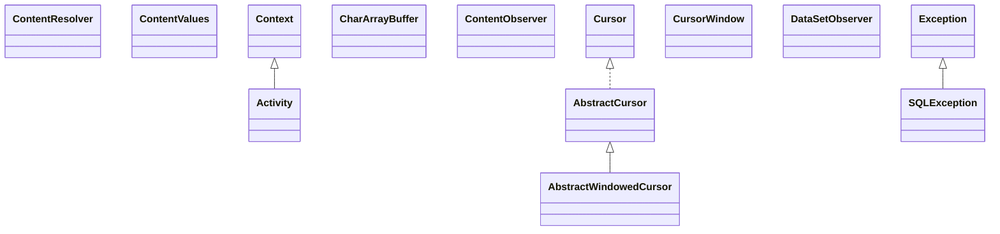

# h2-1.3.149.jar

[Group index](README.md) | [All archives](../README.md)

## Scope and provenance

- **Donor:** `SQX_145_REFERENCE_ROOT/internal/libs/h2-1.3.149.jar`.
- **SHA-256:** `7c3e3b93ffaf617393126870be7f8e1708bbe8e05b931c51c638a8cb03f79a36`; accessed 2026-10-06; captured `2026-10-06T18:54:51.906614+00:00`.
- **Classes:** 499 raw entries; 499 unique entry names. Duplicate occurrence indices are zero-based.
- **Inspection:** read-only ZIP hashing and class-file structural parsing; signatures/descriptors, modifiers, hierarchy and references only. Bytecode bodies are hashed, not published.
- **Allocation:** proposed `FEAT-HOST-H2`, P02; [roadmap](../../dev/sqx-full-application-roadmap.md). Domain README registration remains required.
- **Repository:** `01067f00031428613c6394064ca1bcadc1ba00ee`; review state unreviewed. Download label 145-dev1; installed build/activation and runtime equivalence unverified.
- **Limit:** every class/member is inventoried; declaration coverage does not establish consumed calls, defaults, formulas, failure semantics or algorithm parity.
- **Archive/resource index:** [033.json](../../dev/evidence/sqx145/archives/145/033.json).

## Complete member declarations

Member shards contain exact JVM names/descriptors, access flags, generic signatures, throws types, declared fields/methods, superclass/interfaces and referenced class names. All classes, nested/synthetic members and overloads are retained. Code length/hash is structural evidence, not a normalized algorithm comparison.

- [001.json](../../dev/evidence/sqx145/members/033/001.json) — SHA-256 `e246856f39124a5616ce724b3cb6b460ef43ee57b28b2fd36eab17d7ac509136`.
- [002.json](../../dev/evidence/sqx145/members/033/002.json) — SHA-256 `9a1096a6f5687c8141d1f44e8793a44acc5bd5d30c41e6cbacc7a6f5158e3e54`.
- [003.json](../../dev/evidence/sqx145/members/033/003.json) — SHA-256 `112fdd922fbc559efcfda0ba45946c3ac4912f93e257fa8fadd285abef1c35a1`.
- [004.json](../../dev/evidence/sqx145/members/033/004.json) — SHA-256 `9e8bc85eab3e3c815c61bfaa2e8381d693c4384809e2f8ac700ce06f3feadaea`.
- [005.json](../../dev/evidence/sqx145/members/033/005.json) — SHA-256 `4b6cef169313ead494ebd0156a88d06dde639a81b6df561e527cd120718ec743`.
- [006.json](../../dev/evidence/sqx145/members/033/006.json) — SHA-256 `bcac1a89b194a01a72b31e17365d9d913f1d5c9bc930f562c58d5381a2c851bb`.
- [007.json](../../dev/evidence/sqx145/members/033/007.json) — SHA-256 `972b84fe345e3f3c45599e99f37fd31207e84588772585f5592b301f13402d73`.

## Focused structural diagram

Up to twelve non-nested classes; arrows show declared inheritance/interfaces only. External type names are not evidence of an available body or an executed dependency.

## Class inventory

| Archive entry | Occurrence | Class SHA-256 | Fields | Methods |
| --- | ---: | --- | ---: | ---: |
| `android/app/Activity.class` | 0 | `93778003065f9f558870bbb94f45058e4ecfb8ec513c0a57688775ef4df70634` | 0 | 1 |
| `android/content/ContentResolver.class` | 0 | `ce8796f31e18da6b5f4867930d518612d1f56e5940afef63dcbd29414f7fc9c2` | 0 | 1 |
| `android/content/ContentValues.class` | 0 | `f227069195ddd065298d29ed1020af0c50d3214a9c2f20ee118b7cc5dd91cd83` | 0 | 1 |
| `android/content/Context.class` | 0 | `52a58833917b366284bea78688d34263ea49c2883be0a305812151dfaecd77c1` | 1 | 1 |
| `android/database/AbstractCursor.class` | 0 | `64a1df58c98ad36a6a69b5e76681856610d1c8297e199178075f306b25166621` | 0 | 1 |
| `android/database/AbstractWindowedCursor.class` | 0 | `8f2595a2a2d53a4a7aaa412d5242a6d7d3d765a7f3350b24dd06a466ba6d97a6` | 0 | 1 |
| `android/database/CharArrayBuffer.class` | 0 | `baca8810d5289c92930149dc9fb971905d1a9ab14a0b29868bc92ef24ea0b07b` | 0 | 1 |
| `android/database/ContentObserver.class` | 0 | `fc470940169318a50ac701de357cf77f9ff0a0e7d76871064088cd3cb18e4492` | 0 | 1 |
| `android/database/Cursor.class` | 0 | `58daa9445b532cf27485cff2bf708c2a66b98b4d31329a47d339b61c2b1f30f9` | 0 | 38 |
| `android/database/CursorWindow.class` | 0 | `71608fff02471cb6b5bfe255ff310411521aa1a3338a8688f8e957ca225892ec` | 0 | 1 |
| `android/database/DataSetObserver.class` | 0 | `82d2907f8ea466a21a042c49ce7f22032d375d3476d9fb48f2a590dd2a201086` | 0 | 1 |
| `android/database/SQLException.class` | 0 | `ee1abb67311de35c9d48350569f449670d9010f34f7bbd1e29900a46678dc22e` | 1 | 2 |
| `android/database/sqlite/SQLiteClosable.class` | 0 | `3a48a72ec371db7a1dd0b524d856fd07cd052cabc00488415bc78c9c36c1050e` | 0 | 1 |
| `android/net/Uri.class` | 0 | `b4ec50183e488b077dac85a2536fac03dd22e6c177aae31f0205e66ae2442f99` | 0 | 1 |
| `android/os/Bundle.class` | 0 | `a75ac09404b0ff25e24181619fad108b09a21914916672788a6659e2d00c1809` | 0 | 1 |
| `android/test/Test.class` | 0 | `93657d10d44f02f30af6e26fac75c1459875a8860029fec13f9edae54ef42b6e` | 0 | 3 |
| `org/h2/android/H2AbortException.class` | 0 | `e34478c23389cdb2153847658ec7ce7ac9ce756fb8c7925a08bad739a2e439ba` | 1 | 2 |
| `org/h2/android/H2Closable.class` | 0 | `51e1d46f6672c7ad685ac39658b1c8123441916780f3b6cbc856a6644d16cc53` | 0 | 6 |
| `org/h2/android/H2ConstraintException.class` | 0 | `c83f8df24a27b4e77c10605e6e14eea7d02f329c6439a9c7a51deddfdc1cbcbd` | 1 | 2 |
| `org/h2/android/H2Cursor.class` | 0 | `aaa04304143e6d527b11c2c27fb3fb4234710b51b2177c092de0522cb9b4250d` | 1 | 43 |
| `org/h2/android/H2CursorDriver.class` | 0 | `2298536487dda20f6c58d50962b2c1f50daec468b50530357954c1d15ab9fa00` | 0 | 5 |
| `org/h2/android/H2Database$CursorFactory.class` | 0 | `64ff94f26f617f3955346a1eb8cb24a169c04651c1490e6a04b237729d5a1f44` | 0 | 1 |
| `org/h2/android/H2Database.class` | 0 | `28613153a7fc0fab707d31a497c4923d67098d7006f8a2ff1c832db2a3cc0161` | 11 | 50 |
| `org/h2/android/H2DatabaseCorruptException.class` | 0 | `bd0d9764ea14a4f25ab314cd4d392fb301b834ac11cec1cb6943a9a4654cefe4` | 1 | 2 |
| `org/h2/android/H2DiskIOException.class` | 0 | `2cd42627190c215211cb4fc454f16dd1e1f647d6d7c27bd5ab72c70769527adf` | 1 | 2 |
| `org/h2/android/H2DoneException.class` | 0 | `6fbe5ed77644eea5989852a2816f2b79d96f45613ad09e1dffff49104b4ec6df` | 1 | 2 |
| `org/h2/android/H2Exception.class` | 0 | `aa17c2f69ca2d026a2dc6701fca8f08e595ff0a2112ad78b03eaca2dbb63f034` | 1 | 2 |
| `org/h2/android/H2FullException.class` | 0 | `49b41bb91b2737bd5af9f8f9a5eb125c19db10bf643bd47bb0db63226bb16750` | 1 | 2 |
| `org/h2/android/H2MisuseException.class` | 0 | `f56376266fcd1ad0b8fc35e88189ac6102c413079c797aa912c75bc510f7c33e` | 1 | 2 |
| `org/h2/android/H2OpenHelper.class` | 0 | `9b53299b758399803e6834ba3261916de10869b10326e501961f8ee4643f80dc` | 0 | 7 |
| `org/h2/android/H2Program.class` | 0 | `cc3c514d46790012e4b8452cb08d6870df881b81f4903b6ba2271dc88027d222` | 1 | 12 |
| `org/h2/android/H2Query.class` | 0 | `a8178764929918a293cc2843f405bdb73ed883bb1eaca508cbb91976be76c41f` | 0 | 6 |
| `org/h2/android/H2QueryBuilder.class` | 0 | `5cffada71d5e47b36373300a469e383643729a869580ee1dd6cdcc6a2348e92e` | 4 | 15 |
| `org/h2/android/H2Statement.class` | 0 | `aa89af7e1aacba79828465ff4c47d860052afe0b8de06727ae0c7874d742429b` | 0 | 6 |
| `org/h2/android/H2TransactionListener.class` | 0 | `c6a2f6e8f4430fa015d5b77cf15fdf428a9ac7b8b3b8d832ec23b5736f160015` | 0 | 3 |
| `org/h2/android/H2Utils.class` | 0 | `14bdca57301b9649f7f710255511962684a92c89d330da329ca6d989ca2e9d1d` | 0 | 2 |
| `org/h2/api/AggregateFunction.class` | 0 | `b834ec31e627461bd04ef8e7964408a761d2e767a63b60c57b7f4dd802b973ff` | 0 | 4 |
| `org/h2/api/DatabaseEventListener.class` | 0 | `6e364f743d05c36c6ccbcc9d148a880d2151b0e0debbf5c11862a65247ee90b2` | 5 | 6 |
| `org/h2/api/TableEngine.class` | 0 | `5994fbc1431fa76d187ba0713df2aa668769bc8c570d3a772a558d89357b8547` | 0 | 1 |
| `org/h2/api/Trigger.class` | 0 | `1a5e6c9085cc3c47d24d6488a3cf15bf61b3feeee9adede436dd3182b203531b` | 4 | 4 |
| `org/h2/bnf/Bnf.class` | 0 | `5c9538c6d67c6c93d0471199395c5d4bc0ba9023cf7f80d9dc58a824f96c80b0` | 9 | 19 |
| `org/h2/bnf/BnfVisitor.class` | 0 | `ded82b5d0adf5b743a886a74623865031b600d8ca2f037349684ae66f7aee89f` | 0 | 5 |
| `org/h2/bnf/Rule.class` | 0 | `4b1cedb89d6cd8b1ef6a9e42db2f6752d4f69c72b59e9076f9cd6f9dc94f0c4d` | 0 | 3 |
| `org/h2/bnf/RuleElement.class` | 0 | `af9ac225ae3f50bf3cde72f7ae058fa79271b3d546d989d318125205f8afaa5c` | 4 | 4 |
| `org/h2/bnf/RuleFixed.class` | 0 | `fef635392ad411a4d73517f02848184b84a66c370dcef9d048f4089ee2228391` | 17 | 4 |
| `org/h2/bnf/RuleHead.class` | 0 | `219be43ecdf035d4ce77834424d08c2148286e5cbed1bbac596b5a2e7f7b4cf1` | 3 | 5 |
| `org/h2/bnf/RuleList.class` | 0 | `6aa250cc3ec964cbdd4ab964596f0383ca97403b4a82b55da98e19ec03e36075` | 3 | 4 |
| `org/h2/bnf/RuleOptional.class` | 0 | `2a7042bf898c95c712d61a99b23002ecc2292d28cf57221125c875d29a067ee0` | 2 | 4 |
| `org/h2/bnf/RuleRepeat.class` | 0 | `5a7a6ce1959a3ec664074df3675ecc8f40cfc48d17133ee9f05779d6afacc6e3` | 2 | 4 |
| `org/h2/bnf/Sentence.class` | 0 | `d0ec60926b90c61bb0633faa9f4f8259a3249ca5af6f436132acdffe00381d47` | 13 | 17 |
| `org/h2/command/Command.class` | 0 | `39cc104fedc4436c3db280f7fcc497d6c67874abb04c9f3b05305117a6270f3a` | 5 | 19 |
| `org/h2/command/CommandContainer.class` | 0 | `f1b5e8a44462aee44047a2d56a789189a25c90db5bab6c45a5b5bab409996c22` | 1 | 11 |
| `org/h2/command/CommandInterface.class` | 0 | `6528cfe559f92ced591a6fc1100ed0b42465c2c4bbe6df556d5efbe3bb3baad6` | 85 | 8 |
| `org/h2/command/CommandList.class` | 0 | `189278d4a6d854f7a8466ec9e44de2486f61328b039ac61df5f77d1c31e685eb` | 2 | 10 |
| `org/h2/command/CommandRemote.class` | 0 | `020bc848f40d516191e76e5202fcb20b37081c3155f508dc50a305ae95f21d39` | 11 | 14 |
| `org/h2/command/ddl/AlterIndexRename.class` | 0 | `d1f1f83ac43ec91c30d286314bcc9ba2f708739cb8dce8e49fd6da90f6d5c618` | 2 | 5 |
| `org/h2/command/ddl/AlterSchemaRename.class` | 0 | `de99358e9a04aa70a9bf8131a7b365080f72353ce302d618d3d09c04ef60ea3f` | 2 | 5 |
| `org/h2/command/ddl/AlterTableAddConstraint.class` | 0 | `9574c7292685e3c1dc6a7e8ed07b1730dd0bf7d85374a22c4a4616306a0903d2` | 16 | 25 |
| `org/h2/command/ddl/AlterTableAlterColumn.class` | 0 | `2841fee6dc516fb37d47b8abfa0bd2665a0174a2eb84ff23f6bb8d5a4f03a956` | 7 | 20 |
| `org/h2/command/ddl/AlterTableDropConstraint.class` | 0 | `4483b5b505f29acd9c2acbb08ad906d0ef95592088d1f4894b0fa67a7f203b0a` | 2 | 4 |
| `org/h2/command/ddl/AlterTableRename.class` | 0 | `bf567c312414091d37dfa7740eaa36e9388f9b6b333f1aedfee2ffdfeed41ec9` | 2 | 5 |
| `org/h2/command/ddl/AlterTableRenameColumn.class` | 0 | `9538bef2b0b31a2b0e56990d74e64cba05ec00c50cd39ceff983a418cd0d4251` | 3 | 6 |
| `org/h2/command/ddl/AlterUser.class` | 0 | `13293b25898cf41c267bedb3b0222fec298cd6b3c52c2000eec40a0cf995b54b` | 7 | 12 |
| `org/h2/command/ddl/AlterView.class` | 0 | `c0d379c6b2cd055e2bcf0530df7f356cc7215b25da9f1b2c25ad187fe60959f7` | 1 | 4 |
| `org/h2/command/ddl/Analyze.class` | 0 | `9944492f17511b826cc7eb5a2f1dcf657184021a1ccc21044545f1c1c89b55b8` | 1 | 5 |
| `org/h2/command/ddl/CreateAggregate.class` | 0 | `2edc098369519b47696232ccb5d7e2ef17126ff8accb1da89de99a043b4931aa` | 5 | 8 |
| `org/h2/command/ddl/CreateConstant.class` | 0 | `b83121d505654ee6f14f63f6a4d0e035a9f788f880a4f6de40aff11e4d15bfad` | 3 | 6 |
| `org/h2/command/ddl/CreateFunctionAlias.class` | 0 | `189da281e62fbed6532fcebecda2cd362bc1e131103630b2ecb9a4bc2fdf5c55` | 6 | 9 |
| `org/h2/command/ddl/CreateIndex.class` | 0 | `3242de76d9a08e2e5f0472a3efd420762de7d3c9b97f10ec548bcd397a516aa8` | 8 | 11 |
| `org/h2/command/ddl/CreateLinkedTable.class` | 0 | `b6a78fd96f7d3276a311f0fbd397e46ab8e6050374b06deac1534115bd18029d` | 14 | 17 |
| `org/h2/command/ddl/CreateRole.class` | 0 | `60da8793b5cb4dd20e1733818410ddb327c2e3d9dccb9c0df19b3928689e52b7` | 2 | 5 |
| `org/h2/command/ddl/CreateSchema.class` | 0 | `aa7eb8bc392cc13f6f9ab338111dbaa3969f02cf4367c325c2c4339430915393` | 3 | 6 |
| `org/h2/command/ddl/CreateSequence.class` | 0 | `2d44c5f05f1292f6834a0b4def6858fe1ecb0207e7e005cc275c6dc58eafbcda` | 6 | 10 |
| `org/h2/command/ddl/CreateTable.class` | 0 | `a02cf8a75266bd0c4cf3125104509248395841f1e579fe776399037479b57af5` | 9 | 20 |
| `org/h2/command/ddl/CreateTableData.class` | 0 | `affffa6408a122594a8489c6515e4e54a4faa2f270b0ecef29c92a51ae6ef091` | 12 | 1 |
| `org/h2/command/ddl/CreateTrigger.class` | 0 | `0b6458fdfdcfd0ec839dd3d6ab2bf151d9b2b71960ebe7135087ffb35bfe2c3c` | 12 | 15 |
| `org/h2/command/ddl/CreateUser.class` | 0 | `69341d32f6cb6557053baf12702e74997f61ca13431a4af516253a4d91660fea` | 7 | 12 |
| `org/h2/command/ddl/CreateUserDataType.class` | 0 | `d5f082ee6168026814d5f3f51da05ffd6044f4af30733d6891f530a2601d238f` | 3 | 6 |
| `org/h2/command/ddl/CreateView$DependentView.class` | 0 | `c8c5c3dd331c50ec43e82fbeb6a33af9bd012de9d4d551dc81553279c430b0c5` | 3 | 1 |
| `org/h2/command/ddl/CreateView.class` | 0 | `a106f0920bee6294c19fa731409694b6cb001d5e4543fd57257d3a33595c18fd` | 9 | 15 |
| `org/h2/command/ddl/DeallocateProcedure.class` | 0 | `06cc546635564be3643417da521a33ce3999fd3fdf7cc25a3de0c9422413f043` | 1 | 4 |
| `org/h2/command/ddl/DefineCommand.class` | 0 | `26b800589ccfa792d588a865c2e7b64c23717e3d644e9623024025d3d89c2cca` | 1 | 5 |
| `org/h2/command/ddl/DropAggregate.class` | 0 | `e304f70dc31daae7ff0beb6275d11eed752ebdc0bab8ea15e5fc20d1e1fbc5df` | 2 | 5 |
| `org/h2/command/ddl/DropConstant.class` | 0 | `24f926b61bb6bed6196b85ad41c738c4d964c05eafa1c9d607be4de50f17c558` | 2 | 5 |
| `org/h2/command/ddl/DropDatabase.class` | 0 | `664241b8730e0d187c42af802e23357e77723c103f64fd7cc638eb0d2ad7aac9` | 2 | 6 |
| `org/h2/command/ddl/DropFunctionAlias.class` | 0 | `660a6b83f1177026100f94044115718b9b00a6673858c38ab5963fba1920fe57` | 2 | 5 |
| `org/h2/command/ddl/DropIndex.class` | 0 | `9f6d648445b758b547ae7282668d30028bb62b32eebfcdcbd5e037105a5944aa` | 2 | 5 |
| `org/h2/command/ddl/DropRole.class` | 0 | `4d539ecaa5e33f0558a49b659cb3984bbfa28b286ab67aaef9134fb5bec9bbe9` | 2 | 5 |
| `org/h2/command/ddl/DropSchema.class` | 0 | `2d126150c4897f76c3db9ac0466a75588a0e8503aee1a45de31c8ca6585a6459` | 2 | 5 |
| `org/h2/command/ddl/DropSequence.class` | 0 | `8e2d6b1dad5c5af98a6484bceb0b107e71ad1db46535612b2b63148dc7f395a9` | 2 | 5 |
| `org/h2/command/ddl/DropTable.class` | 0 | `0e2265b0f421c823a2d80b9c93633df04619f2ea5301c020db61b68fb64e53ca` | 5 | 9 |
| `org/h2/command/ddl/DropTrigger.class` | 0 | `e1e35e6eded89ad37d2f6a562abca7c79b3322874c5434c59e4f6806a9c2b5e8` | 2 | 5 |
| `org/h2/command/ddl/DropUser.class` | 0 | `6bb6a684ababec0511d7eb86547f666471fa3359f6b952a4c71fdc88e30b0752` | 2 | 6 |
| `org/h2/command/ddl/DropUserDataType.class` | 0 | `2c50527c9194a29b0f80219569abef4ea3376da749c4136b67cdeb20c01fb5db` | 2 | 5 |
| `org/h2/command/ddl/DropView.class` | 0 | `a32bf2b70da36b959f6f2f645302a791cbbb23bdbffa7daa3db88cacf40e8e7d` | 3 | 6 |
| `org/h2/command/ddl/GrantRevoke.class` | 0 | `775b222b423953be10c9a264c687445563eda191eeb92a51012ca0a21db7e048` | 5 | 13 |
| `org/h2/command/ddl/PrepareProcedure.class` | 0 | `6a7f0cbf64cd308630bc55e49bea92e323567bb2188965655542cfc1d3abb3e5` | 2 | 7 |
| `org/h2/command/ddl/SchemaCommand.class` | 0 | `01e03651719d9e7e9991b3317e172e2fcc95254d11409a2bfbe18df46c338f66` | 1 | 2 |
| `org/h2/command/ddl/SetComment.class` | 0 | `f2cd3131cd92e63e3ad296959e485862d6784e742481147b3adbd09025876caa` | 6 | 9 |
| `org/h2/command/ddl/TruncateTable.class` | 0 | `950ba48948e0f2faf88a25031c569c5cd0fe05fde7bb60803b2d0a4d8235ac2f` | 1 | 4 |
| `org/h2/command/dml/AlterSequence.class` | 0 | `763a98db8a0104ef6e17bf0acdd800d2aef83b3966cc496b8a57e22737283007` | 4 | 8 |
| `org/h2/command/dml/AlterTableSet.class` | 0 | `cd65858172cce23260c66ca3ec328126bc062332a8e414ea8c5d18bd2a3909cd` | 4 | 6 |
| `org/h2/command/dml/BackupCommand.class` | 0 | `a68e4b6eb2e4aa436d749b31dc88e4ade606d2df431f2da7fda4cd2e982cea5d` | 1 | 11 |
| `org/h2/command/dml/Call.class` | 0 | `111ca3dbee7b61d71e2961663f2e751578f439ee778e538bd4bec0ac01535bd3` | 2 | 10 |
| `org/h2/command/dml/Delete.class` | 0 | `d949255fba67901b3b0e00edc8d2f3a15df94c45f54da5725ac79ac5bdc738e5` | 2 | 9 |
| `org/h2/command/dml/ExecuteProcedure.class` | 0 | `9fcfb54b8cb35fcc497a978a73c593dc133a509f8979022de820b90e647b9811` | 2 | 10 |
| `org/h2/command/dml/Explain.class` | 0 | `c6066a1ef3f25c04e5aed8f44f2bb0efb95b3a8f997bf7899c6ae54c7c1d1cc2` | 3 | 11 |
| `org/h2/command/dml/Insert.class` | 0 | `7f7d7641e4ee2261292b83bfe1364f46374b14497bd9929d0570a1b02cfe5fbf` | 7 | 17 |
| `org/h2/command/dml/Merge.class` | 0 | `f75ad4fc6591a10d40ea7e18497ddb8edb570ffd333ef4e14cb80aba8d6767df` | 6 | 14 |
| `org/h2/command/dml/NoOperation.class` | 0 | `2d236239d5f8d5e3f36041c718ada15883ebe9c9dc740c0336e516704437380a` | 0 | 8 |
| `org/h2/command/dml/Optimizer.class` | 0 | `71a5825e41c59e151ef69beadc21b7e1bccc48c06a959f8d38c4e7fbd736b658` | 12 | 13 |
| `org/h2/command/dml/Query.class` | 0 | `43053e1b01e5b1e765c2b106cf8193cd30512cfb315d7811d69c1f5ff1dcc3e1` | 9 | 30 |
| `org/h2/command/dml/RunScriptCommand.class` | 0 | `b3023af8738b45abbeabf24bdeae70cf4d9af83097fff606c314e2af749e7bb2` | 1 | 6 |
| `org/h2/command/dml/ScriptBase.class` | 0 | `9928f5d195761471f5c4b33ac8ec58696a521c0af3800540801f4003d1efc012` | 9 | 26 |
| `org/h2/command/dml/ScriptCommand$1.class` | 0 | `f8131dd48bd61e7947a3db8c6f61eab95de20ed52ea1b697db60903a44bf216e` | 1 | 3 |
| `org/h2/command/dml/ScriptCommand$2.class` | 0 | `a6fac22b48f809ad6dd83171e6178dab7379fbfde4c99d76610938d800cd6de6` | 1 | 3 |
| `org/h2/command/dml/ScriptCommand$3.class` | 0 | `41546994a599482ba7d556f6207dc9a962021f22477e9362fd3eb578dc8254be` | 3 | 3 |
| `org/h2/command/dml/ScriptCommand$4.class` | 0 | `c9edcc3852e7121ba56f30fc990180f9bcaa66500d75b109448aab3398ca9de1` | 3 | 4 |
| `org/h2/command/dml/ScriptCommand.class` | 0 | `80bad207b3308600142bd96e57626a32a2ad36baf43be1dfa70911890b8ccba8` | 12 | 19 |
| `org/h2/command/dml/Select.class` | 0 | `57222ffa02475031ff7bee813360fba095bc76eb5c98aa143093f3fd8d8daacc` | 28 | 49 |
| `org/h2/command/dml/SelectListColumnResolver.class` | 0 | `c292b5c0a14640fc928f9dd1d3db85b9096fdc1bc0bc091b67b64eb550428e9c` | 3 | 9 |
| `org/h2/command/dml/SelectOrderBy.class` | 0 | `31193ed48c84f74e8bd961bfb34ce3d1b363887735c3abaf4db8a36968a0c25d` | 5 | 2 |
| `org/h2/command/dml/SelectUnion.class` | 0 | `c6aac7e782302949048405269c728930232e3166f582f69f6b0815ca06eab62f` | 15 | 30 |
| `org/h2/command/dml/Set.class` | 0 | `981b2750feff39e42659f687f9652d435f17f034025f41baa4aad4b01d2bf43b` | 4 | 13 |
| `org/h2/command/dml/SetTypes.class` | 0 | `017e16b3fdca38af1a86f37ece303cb08dcb07a39a0f1d3d95b48e257f728080` | 38 | 5 |
| `org/h2/command/dml/TransactionCommand.class` | 0 | `fe38d0705358f45d7f55838e24c26c7379f40e0164e939475f4d163804ea820b` | 3 | 8 |
| `org/h2/command/dml/Update.class` | 0 | `aa9c19b9bdbc29dd88c937336dd012ec9be5aa8d64656ce423a3394337e4735a` | 3 | 10 |
| `org/h2/command/Parser$1.class` | 0 | `92c0718ac18e435f8ff1ff09e549698f3db27e74877fe94221011946bf4b8cce` | 2 | 2 |
| `org/h2/command/Parser.class` | 0 | `c0539f41301da1634dd3c3af92175b63f8433ff4d49fc4c7b327224cd3476097` | 55 | 151 |
| `org/h2/command/Prepared.class` | 0 | `6bc748c84ca03eebc693d88df5f6eb86bffb6ada163d7974a2e984bf881cbf54` | 10 | 33 |
| `org/h2/compress/CompressDeflate.class` | 0 | `ec2f4f66bd86819cdecfc1e4e6adb80bfb91a0a51333545c2744a924d4676ea1` | 2 | 5 |
| `org/h2/compress/CompressLZF.class` | 0 | `62ef10ff852b352b8ef17e474fe4a33410cd13cc55682bca1bcb963dee9451ab` | 5 | 8 |
| `org/h2/compress/CompressNo.class` | 0 | `751ca3a150e4e23712146f57f57a965d3afcaf7657d2a90850281ab36e75c43f` | 0 | 5 |
| `org/h2/compress/Compressor.class` | 0 | `4e2da752ab0ba5b477a35f2c069fa6b7afa1e7a802d253321fd2274675f07514` | 3 | 4 |
| `org/h2/compress/LZFInputStream.class` | 0 | `9fd6237dc675087085ac17fe188eb899999116a5c94ceed31dabf839049533b5` | 6 | 10 |
| `org/h2/compress/LZFOutputStream.class` | 0 | `c3226fad346438abe4de7ed46ffd8743a592f8654a6a3c96bfc7bc317a2f2512` | 6 | 8 |
| `org/h2/constant/DbSettings.class` | 0 | `63ff059e06a89acb5f55abce6f59aafeb6822fe368904b99399bc4269d778a15` | 34 | 2 |
| `org/h2/constant/ErrorCode.class` | 0 | `16f128a4fbb007db87e5b4ab36aba7b8c3039b81d8513709b9151f2c89e573a5` | 166 | 3 |
| `org/h2/constant/SysProperties.class` | 0 | `f65c43043d480cec7e75b7889e197140f00e6258c7e8669d45cb93873dd5d94d` | 48 | 9 |
| `org/h2/constraint/Constraint.class` | 0 | `b82e068fff87f7c3bb99af733558cab4e1dcd101d7af403b19d825a2b5540372` | 5 | 20 |
| `org/h2/constraint/ConstraintCheck.class` | 0 | `6e3d50fb3562a0203cfdbe5af67991727c2c8cc6bcdaf85ce0371c4e1a2d11ef` | 2 | 18 |
| `org/h2/constraint/ConstraintReferential.class` | 0 | `00c04ef5b39cca1a3c1aa765dcc768adf76e484e5ef49f964d110d55d718ae67` | 16 | 43 |
| `org/h2/constraint/ConstraintUnique.class` | 0 | `c208fe1c1a520c498cb78ce490a3bafea907e7a065b22a48129a7e1d36c1b876` | 4 | 19 |
| `org/h2/Driver.class` | 0 | `04f4b8fb5b558dbf23bca48fc77a8cef4ee2d29fa5c57f875619d52dacec9b23` | 2 | 10 |
| `org/h2/engine/Comment.class` | 0 | `13a40cf0183cf01dc8c45f3b7395e3670cc312dd0b886bd78d4cec9dadec08ae` | 3 | 10 |
| `org/h2/engine/ConnectionInfo.class` | 0 | `d39aee54ac1464f5bf8e1a04e4aa9fcdfe5cafaf2c15d67ef2cc891cedd89e65` | 13 | 39 |
| `org/h2/engine/Constants.class` | 0 | `634b5dacef39f68362a3185a56765c564bee9b7cc168c58fc31d9c65a9f72b88` | 81 | 5 |
| `org/h2/engine/Database.class` | 0 | `60643e4e0dcdee19c1f04c84c9d43f3301127cdbc4fff37b4dd91523efb9468f` | 86 | 158 |
| `org/h2/engine/DatabaseCloser.class` | 0 | `837584e688aa2244f8514cfb0d171149eb40f422637cf652b68279dd31294f15` | 5 | 3 |
| `org/h2/engine/DbObject.class` | 0 | `de57a14c6123a45bf45a8599f92c21b54845a10e1dcd586559d11a9fad869941` | 15 | 18 |
| `org/h2/engine/DbObjectBase.class` | 0 | `60e88bff7cd5362f249a7d431d70da3d57773d077752cd181b8678024efb517c` | 7 | 23 |
| `org/h2/engine/Engine.class` | 0 | `d9fd46c68ac74cffa1c11894c2488eef8616f3602fe57f934e48ccd10ce3efcf` | 4 | 11 |
| `org/h2/engine/FunctionAlias$JavaMethod.class` | 0 | `e036811b7041bc162f30583a389c661e68af9872db9e94852f7c9adea2bd5ca3` | 7 | 10 |
| `org/h2/engine/FunctionAlias.class` | 0 | `1b76f2ea38b82527c355d1c490ad95ff9aaf18ee2597a83aca63751de0a4edbc` | 5 | 23 |
| `org/h2/engine/MetaRecord.class` | 0 | `216f93a6f202fc2ee28b4531d49ded747f733a3318b525fb86d4217e13afa8c4` | 3 | 10 |
| `org/h2/engine/Mode.class` | 0 | `f579df76e74f5171b82aba95f03b087c5358b4f594c08247aa321e6a574f5098` | 16 | 5 |
| `org/h2/engine/Procedure.class` | 0 | `75c97789c6e5207015cbaba004fda726d3b0fb0a8954e2a588f17b6238620e2a` | 2 | 3 |
| `org/h2/engine/Right.class` | 0 | `6b0c82e8fb535ce68eccfa292ed33de583f1d616ef12aa6f0f47c621ef7ddbf9` | 9 | 15 |
| `org/h2/engine/RightOwner.class` | 0 | `38622a82a723b0d670494266b74953eb87703019c8cbe745512286faf7e531c8` | 2 | 9 |
| `org/h2/engine/Role.class` | 0 | `0f5c79282fceaeeb6c29d9eab896568a9f53d9e94cf42d91da8870523e46f758` | 1 | 8 |
| `org/h2/engine/Session.class` | 0 | `f7481cc8bd4bbaec2a955e92a899ca099c1c098fe9710580174ebae2fa9d1fb0` | 50 | 104 |
| `org/h2/engine/SessionFactory.class` | 0 | `4ee32d5583beb29a0cab57117871793ca29cc6f1cba5fff744f6fabf866c8f59` | 0 | 1 |
| `org/h2/engine/SessionInterface.class` | 0 | `d5b519a59f5474240bc521eab502a3c4e8e92a52ffc09eada19b46121a2687cb` | 0 | 13 |
| `org/h2/engine/SessionRemote.class` | 0 | `6353423eb0d09e623c2725ca32d652a3782c2c4e2159c3f9105271e8dda3d8a6` | 41 | 47 |
| `org/h2/engine/SessionWithState.class` | 0 | `1f85b8bf8f5ff7f44f5cfb9513a10b807eefe88aa15ce1dcd3f93d2a3702f082` | 3 | 3 |
| `org/h2/engine/Setting.class` | 0 | `0c6d0005fd3cb875386b5d8307ef8129d34d775a213204fa9cfb9dfd82b64554` | 2 | 11 |
| `org/h2/engine/SettingsBase.class` | 0 | `1523686d2323c86e1cd20d39718ccb03b686c1cb8f16e65cf1c7f8411ecff265` | 1 | 6 |
| `org/h2/engine/UndoLog.class` | 0 | `6a5af3bc77a84e26a3c34c109a64c723d17a67ddb6109d460dcc34d37fbeda50` | 9 | 10 |
| `org/h2/engine/UndoLogRecord.class` | 0 | `9d6ca625cc7e72c55ed47d81ea996f9a9eec6be8619a520b372fc1e6eaecd6cb` | 10 | 14 |
| `org/h2/engine/User.class` | 0 | `917e48a6b5f7b70fac4f67bfc6f2bf3ac739c3d12c041a18d274877a6ee3b603` | 4 | 18 |
| `org/h2/engine/UserAggregate.class` | 0 | `0dc19cd2d80f773b8d775f7088668096e8413d11928b769a759143e369c69750` | 2 | 9 |
| `org/h2/engine/UserDataType.class` | 0 | `eda26bf8f80de387afadfcc914d5c9d2534e6b96c398ad9af024f17b1c46c6a5` | 1 | 9 |
| `org/h2/expression/Aggregate$1.class` | 0 | `930eb3d33695950221c1afae59379cb9e567d01c97994fac385c72eced157653` | 2 | 3 |
| `org/h2/expression/Aggregate.class` | 0 | `8dd923ee9af7f55d290f74426bb070121ddd870ed8c0d86b592404e7c8d86173` | 27 | 21 |
| `org/h2/expression/AggregateData.class` | 0 | `77a6c25870a446c736a921bfc31dfb38a4ac1261a43a3fe81bd89e315b15c36d` | 9 | 6 |
| `org/h2/expression/Alias.class` | 0 | `a0b8b6b59f79c08e1dc278ee591a3828fbd270687d5366189937b25e8f9198cf` | 3 | 19 |
| `org/h2/expression/CompareLike.class` | 0 | `beb681e029d3fd219f4b43978a31126ecedbf94cc8dac5bc29dcc8829d6c171e` | 18 | 18 |
| `org/h2/expression/Comparison.class` | 0 | `a64f86e5fb75bad783ca86b0f6357c11640038462ab0bdaf359d11c6eff1dcc8` | 18 | 18 |
| `org/h2/expression/Condition.class` | 0 | `a3093b8428e253dc8b10dafe0e601241ce3459df7a3e321217009b39d09b1e5d` | 0 | 5 |
| `org/h2/expression/ConditionAndOr.class` | 0 | `942f35e9b030c251e756745f284ecdced92bfd07bc2c8d1d9cf4b2d18018d046` | 5 | 13 |
| `org/h2/expression/ConditionExists.class` | 0 | `2e22598219f5983a231fe8179de67bec5dd7884e37ebb90a7537d2df47c9b40b` | 1 | 9 |
| `org/h2/expression/ConditionIn.class` | 0 | `ec90b63244011125cae3737b4b7c9c3bb992925db5313f1c0418165453a87b69` | 4 | 12 |
| `org/h2/expression/ConditionInSelect.class` | 0 | `bc20f67b5da5b3d413107852859457e8b967add8ebaa9407a876f0080fd75c31` | 6 | 10 |
| `org/h2/expression/ConditionNot.class` | 0 | `9005514a4ba34685ccd3c91544c49c5395dc546dbaa45a2b06f188ae6b548f04` | 1 | 11 |
| `org/h2/expression/Expression.class` | 0 | `9a789fe2dbcf238a99986551f0f7eb4a1eecf1678d0d687f8984d5188c4684a0` | 1 | 32 |
| `org/h2/expression/ExpressionColumn.class` | 0 | `f3a026f2cbac6ccd45a959e1ba28610c93c398abbecbb024b251964cbc4f9e24` | 8 | 27 |
| `org/h2/expression/ExpressionList.class` | 0 | `3847aba6b91a324c51d3d32e13a33a75a80b8dc6c5707cc120360dc1b226c2e3` | 1 | 14 |
| `org/h2/expression/ExpressionVisitor.class` | 0 | `c6926858abfa5262b1c8a63b0a1df548d9422fe29549dad30bad8912fa3a5733` | 20 | 16 |
| `org/h2/expression/Function.class` | 0 | `7c545cce07e5eb2e995a2ffc4475c90a212a3f9d819f2d5dd40bff604c5be20a` | 153 | 61 |
| `org/h2/expression/FunctionCall.class` | 0 | `5c129eaafc3d6762503b679548779431371e49691d99d12c1bebc840c3e8be2a` | 0 | 10 |
| `org/h2/expression/FunctionInfo.class` | 0 | `7364380cd91267770a114180ded238bd0bea2d605d8de9ae0f8d9ba90b6481b0` | 7 | 1 |
| `org/h2/expression/JavaAggregate.class` | 0 | `4b579ab4b5e2378da691d9296157fe3cb6f4f5222fcfe955576c7e3ea4897bcd` | 8 | 14 |
| `org/h2/expression/JavaFunction.class` | 0 | `a3943ff40dbe3daef53bc95e0be72c958bb3695f17d70b6d414d34b29ac28370` | 3 | 20 |
| `org/h2/expression/Operation.class` | 0 | `31eafd7c5e8b4c5970e055ed0a4943b77f42585586793e9f80f1012ae55cfbfb` | 11 | 15 |
| `org/h2/expression/Parameter.class` | 0 | `bbda94c4487fdcadd16456738936eb9362a14661658e8666505395bc859fcc83` | 3 | 22 |
| `org/h2/expression/ParameterInterface.class` | 0 | `e9afb1a39d4468138f18f8be55825443fe23cbd08ec3a295a2069e5a8ee51b5c` | 0 | 7 |
| `org/h2/expression/ParameterRemote.class` | 0 | `36dddb480b00a8446b151a1d2730a2f06f59634effabcae8c4c8146deba9a3be` | 6 | 10 |
| `org/h2/expression/Rownum.class` | 0 | `29471690f981592b7e717a6140adc1b6261aea31942b2daf27934b865dd2ca33` | 1 | 13 |
| `org/h2/expression/SequenceValue.class` | 0 | `012fdae13d52883b3238aee440155eebf7c43ef24d010b12167ef6149afd2284` | 1 | 13 |
| `org/h2/expression/Subquery.class` | 0 | `4658fa9dda5c8b2a5803ba3b0226e98c11590b72aacac7cca81629eaf8c17d52` | 2 | 16 |
| `org/h2/expression/TableFunction.class` | 0 | `3639930d605f695ec7574d6b084372466231e99a1ebd94eb8d116725a9a9660b` | 3 | 11 |
| `org/h2/expression/ValueExpression.class` | 0 | `060da6bb8a6e7e720d51522bf85b276545011c28923c0304a1ff5711a32e7708` | 3 | 22 |
| `org/h2/expression/Variable.class` | 0 | `42f302f8205abab4dbec3fb7d5180d00bc34497c1cd3ce7119966fbc2c9b3c2b` | 2 | 14 |
| `org/h2/expression/Wildcard.class` | 0 | `b7c69cf9263404737a2952f47c9a2d608c7fd7e63db9097f07ceed9b28d88de4` | 2 | 16 |
| `org/h2/fulltext/FullText$FullTextTrigger.class` | 0 | `bfb786247b4a617cafd4da76605e0a5ddb4aa6ca8bb64a0bfa63b943f19d8336` | 9 | 9 |
| `org/h2/fulltext/FullText.class` | 0 | `b2a2933341f8ad6073f5b608d744904d6b21235768e28235e2701c67def3aa0d` | 10 | 27 |
| `org/h2/fulltext/FullTextLucene$FullTextTrigger.class` | 0 | `afe10a87822d06226a45e673d819cf21a601c38e206078b4e06c20b9192eab7d` | 8 | 8 |
| `org/h2/fulltext/FullTextLucene$IndexAccess.class` | 0 | `d53dfdc099f200db768f056e54e35b486dc726a1db5bc58dd28397b6728e6c98` | 3 | 1 |
| `org/h2/fulltext/FullTextLucene.class` | 0 | `0358b7706cc856ca582d2765d7e82aa02c72e9ac221a145297cd60b52443bd25` | 8 | 16 |
| `org/h2/fulltext/FullTextSettings.class` | 0 | `dc7ed6d1e92a6055c81e9eed4e7836774607c8ba60600ea7dad79cd76cf6f71a` | 6 | 15 |
| `org/h2/fulltext/IndexInfo.class` | 0 | `e368697e70a2f14f8f43cc3f17f0cc233a398a6ffb6e23b8401728be31c2fafb` | 6 | 1 |
| `org/h2/index/BaseIndex.class` | 0 | `358f0742cf85c507292705f3270bdc94f4d2aef060af8682fa2a09c1d449663b` | 6 | 38 |
| `org/h2/index/Cursor.class` | 0 | `de01f1194a0824a464dcda8c8b3c2c60d7979b809c60d7db470d4cbd472c841a` | 0 | 4 |
| `org/h2/index/FunctionCursor.class` | 0 | `b5bfd8b99b2cac62751a0b233e8d4da03ffb5c804b2293f2e82bb43bbcb4f3d0` | 3 | 5 |
| `org/h2/index/FunctionCursorResultSet.class` | 0 | `b2ebe012bd3e58e41d4fb8751d2cba602b1bf0db2727fb7e24d003ac6c33843a` | 5 | 5 |
| `org/h2/index/FunctionIndex.class` | 0 | `9ec6c4e07256ed0fcfb139ea440ab3fa8d8b245f269518da0ae520571525b451` | 1 | 15 |
| `org/h2/index/HashIndex.class` | 0 | `db2e107c11b6e53f416d913d6435c8e74b642c569cf62ca148c12c073b2e1ffc` | 3 | 15 |
| `org/h2/index/Index.class` | 0 | `01ff486ee5067a36e70fc9f279dc2daf7f71ab095e46ec21888e5e4cd16a88ca` | 0 | 30 |
| `org/h2/index/IndexCondition$1.class` | 0 | `8bbe76492441a882900bf36abd5c63f08f78ca82977709b49c0748afea3be363` | 2 | 3 |
| `org/h2/index/IndexCondition.class` | 0 | `9c0ceab774c8b4c233099aa202fec2aa245a7de2742032da54b8ceb954d0f43d` | 10 | 15 |
| `org/h2/index/IndexCursor.class` | 0 | `1d6d01d5ebe38bdc7c5f02fda38932063797785ee7b4fb995ecbf5bdd2fc311d` | 13 | 13 |
| `org/h2/index/IndexType.class` | 0 | `50a2690f08cc7fb8ff5dfaf0fb6d36d75e19d3f58c157750cc0d8516949d6320` | 6 | 14 |
| `org/h2/index/LinkedCursor.class` | 0 | `db5dd80b8005a9e075ca4e5f13264eaa3e980d476b0f0327fe69af3de3e59a2f` | 6 | 5 |
| `org/h2/index/LinkedIndex.class` | 0 | `240eeae8cb5be2252b79b93a2b76e491c2226b17882046df3f52ff9951f7bab6` | 3 | 18 |
| `org/h2/index/MetaCursor.class` | 0 | `365cb7995285d0678ceaa1029b077eb05e59660f53494fa641fe845ddff08a93` | 3 | 5 |
| `org/h2/index/MetaIndex.class` | 0 | `9576fd11afd8f22e15ab3b285e5d51ceb3166599a6cac25bf0d94341f8977fcf` | 2 | 17 |
| `org/h2/index/MultiVersionCursor.class` | 0 | `c95a75c4cd12873ba6bf1a1d64444b4f1c3217730439def186a675bfd2f7ab7f` | 12 | 8 |
| `org/h2/index/MultiVersionIndex.class` | 0 | `83923524178834494776789e596a1b7d802de8f769cfc48c945e3e72c5246498` | 5 | 54 |
| `org/h2/index/NonUniqueHashCursor.class` | 0 | `7492e1250838cd614f0d8e62179f570a5f5b6a3ca0eb97709c6f4ab4d7aa6c6a` | 4 | 5 |
| `org/h2/index/NonUniqueHashIndex.class` | 0 | `6c4df31c5f8da635fd46ce82ce4e1a35859627b62f2184fed4661b082edc2509` | 3 | 8 |
| `org/h2/index/PageBtree.class` | 0 | `5aa4d1675dfdfa8cfb99e38cba58fc61b11355ccfbdc6314b1b41f0200fe4877` | 12 | 20 |
| `org/h2/index/PageBtreeCursor.class` | 0 | `a7e1cad244cfe5b6683d0505a6d5f6ec70e65216fb3dc49ebcc847e771924b92` | 7 | 6 |
| `org/h2/index/PageBtreeIndex.class` | 0 | `47941d011b1f1358d4cede610f1d3230a1118fcaa657062d77e857f687d94652` | 7 | 34 |
| `org/h2/index/PageBtreeLeaf.class` | 0 | `353487f4205105b7f8694447ecaa40c47441293357282cc1fdeb38aaf226fe39` | 3 | 26 |
| `org/h2/index/PageBtreeNode.class` | 0 | `ce1dd46ae7016925188fca85c2e3fcd3a63d5bcf4a7223027a0ad16a30830efe` | 6 | 29 |
| `org/h2/index/PageData.class` | 0 | `9b7e8e05919d86ded6425af3165c0fba7502c554aadbe92fab408a6dbd0b6028` | 10 | 19 |
| `org/h2/index/PageDataCursor.class` | 0 | `27c53cc0f1b17b4d5f32bc9171eed245fb81d08a4d136f8a1861e2e0848b4d39` | 7 | 7 |
| `org/h2/index/PageDataIndex.class` | 0 | `7d79fb7965f73b2b8505ce0d970eb41581343b77005254b22c0ff20af312b7e1` | 12 | 41 |
| `org/h2/index/PageDataLeaf.class` | 0 | `9f9fcae4e1c57ba9d3c8e909d3740b64bd10ed88ba44930b76c0a58fe8cca3ce` | 10 | 30 |
| `org/h2/index/PageDataNode.class` | 0 | `430df4d33d2f1ae1d0ceee9ab3278a5c1b4cf018b461e1fc9844b3defc6b5d8c` | 4 | 27 |
| `org/h2/index/PageDataOverflow.class` | 0 | `e0c30ee6e25462d2d3550e13f0d4f974701699d678c0420c1fd1a0d49bd4e3c1` | 10 | 16 |
| `org/h2/index/PageDelegateIndex.class` | 0 | `7ebca0ddb5e1f6d75d0de41c9f7edd71a0373e9dff85ad6a5a180f47a6a4caca` | 1 | 18 |
| `org/h2/index/PageIndex.class` | 0 | `a78d618d2ab1788a541bcc9d431c416fd358ed1b0a09aca551013aa419159c53` | 2 | 5 |
| `org/h2/index/RangeCursor.class` | 0 | `b5be49a21fdcf581e425c37fde0651a820c564b79359b0e58f552dabd58664f6` | 5 | 5 |
| `org/h2/index/RangeIndex.class` | 0 | `4998886f0b33672b586ca315f1c3a167952e008abad3d416180c63e9aacd4efc` | 1 | 15 |
| `org/h2/index/ScanCursor.class` | 0 | `8d156cd1d680a0c93be9b8ffffd2fefbb2b0f12d2c2892fe96522ef27a053a2f` | 5 | 5 |
| `org/h2/index/ScanIndex.class` | 0 | `724baa355d18b3eb0c205dddf3c09e3a2a806e5215bb1583f4f5f70a1d2a8fe7` | 7 | 22 |
| `org/h2/index/SingleRowCursor.class` | 0 | `51fe51762665ee57016785b1fbb2aa2acc51e43e3edad0950e3b43fb6747b5a4` | 2 | 5 |
| `org/h2/index/TreeCursor.class` | 0 | `e5864763c3a4bc0813208e673724c6f558f868d2c1bf9d6389bc27fc1fbd22a2` | 5 | 5 |
| `org/h2/index/TreeIndex.class` | 0 | `3ce7ffa52f872a875c79e35b77cf7911e72bfac5758c5a1972852f05408744a6` | 3 | 21 |
| `org/h2/index/TreeNode.class` | 0 | `ef68956e52c4de59ee6ef8da861c769b4ce128509bf7d13486882be25c41f25c` | 5 | 2 |
| `org/h2/index/ViewCursor.class` | 0 | `d577d4417f167fd6beaf7308ec16d2c3acaf0597822184b0ffcde48e695e5352` | 3 | 5 |
| `org/h2/index/ViewIndex$CostElement.class` | 0 | `ce9ab82868e02b73700441696eb2835e2754bbff943685355086e2db69cf3312` | 2 | 1 |
| `org/h2/index/ViewIndex.class` | 0 | `8194ae640505d0d5a76ad8860865033da61972a1819090b48a9c275fafd282b5` | 9 | 21 |
| `org/h2/jdbc/JdbcArray.class` | 0 | `1b63e08df209a771e813b974a576e4e582d049ef41d02564a63169d256a19ee8` | 2 | 18 |
| `org/h2/jdbc/JdbcBatchUpdateException.class` | 0 | `67aee063f8879379e3e93c584b5cd86ac41237e1d936619cc99531282eb25e23` | 1 | 4 |
| `org/h2/jdbc/JdbcBlob$1.class` | 0 | `0282e997ef15eab9a5fd61dd5df3f22cf9fe2ff63aa95a9ba71b079433eecd8a` | 3 | 2 |
| `org/h2/jdbc/JdbcBlob$2.class` | 0 | `46514f5e171e7cc25604ab8c66f8619a9883b0d75f9a59095a95737910555a27` | 2 | 2 |
| `org/h2/jdbc/JdbcBlob.class` | 0 | `7521d2a19d2b3ba01b10a1a8a6dd727309ff23f07d6d0b733800a0a93cae6ca5` | 2 | 14 |
| `org/h2/jdbc/JdbcCallableStatement.class` | 0 | `53e52b751eedc82f3b5f8332bdebc6936cb8915d5be75453dab4f2596ced5c6b` | 3 | 89 |
| `org/h2/jdbc/JdbcClob$1.class` | 0 | `9c524171b2e3a65754f39139028ba60ed09a9d71ac876abf2d68dfb95d410e9a` | 3 | 2 |
| `org/h2/jdbc/JdbcClob$2.class` | 0 | `10ee3cd63c6c80874ad1b2981ee680c859ec65056567656a895ead6e93be62a7` | 2 | 2 |
| `org/h2/jdbc/JdbcClob.class` | 0 | `82920db305432ae8d61c91c0c8c9afca5406aab4534296451c72c046ad361d2d` | 2 | 15 |
| `org/h2/jdbc/JdbcConnection.class` | 0 | `8f621ed8cc4db48eaa05e369b50248c18dd79707dcc2c881055f34b7c36bff8d` | 19 | 79 |
| `org/h2/jdbc/JdbcDatabaseMetaData.class` | 0 | `b773e03243c29a6e832c4dab259383a46d2abf8114fb0e4b906f0749164e0ca2` | 1 | 175 |
| `org/h2/jdbc/JdbcParameterMetaData.class` | 0 | `0f87d9def95b94dea9e933351b0d04b0adab80bffff931b437a8f3a9ebcced25` | 3 | 13 |
| `org/h2/jdbc/JdbcPreparedStatement.class` | 0 | `84c25459df20d6cde1d866b391fb10d7b622f1760f5aa9fddad393b946ad0885` | 3 | 65 |
| `org/h2/jdbc/JdbcResultSet.class` | 0 | `57a5361327eb0d6a05751f06944aaba0a1b4ce3facd2d897fd6f1fa2fd76ef21` | 12 | 178 |
| `org/h2/jdbc/JdbcResultSetMetaData.class` | 0 | `5a249247960195e1229ec6d8f7f92799d2cf0cd9254607677dd0f4cf2fb8a053` | 5 | 25 |
| `org/h2/jdbc/JdbcSavepoint.class` | 0 | `e129390409799897482614095d84bfbab0b4abc1443567be02c64ef4c86bdd14` | 4 | 8 |
| `org/h2/jdbc/JdbcSQLException.class` | 0 | `216c662174fa3ea63fe3a54423839c5c208b17abb690e2ff854b968934a0f2ae` | 7 | 11 |
| `org/h2/jdbc/JdbcStatement.class` | 0 | `5aae9a2d4e78046b82baecd64ea8b2c89200a56b603ae842810534cb35889c46` | 13 | 51 |
| `org/h2/jdbcx/JdbcConnectionPool.class` | 0 | `aad88374eff7bf0f9b1c12b2840a72d55691bd965efc5d6342979b3cb82b25e0` | 9 | 18 |
| `org/h2/jdbcx/JdbcDataSource.class` | 0 | `d6f47eaa547a0623c013ae84a7f6a094b12f4997bfedb61312b1e34020e40143` | 8 | 28 |
| `org/h2/jdbcx/JdbcDataSourceFactory.class` | 0 | `5aef1182188caae380c9085e91d9cded766f94ae517212274ffb3bc73343c43b` | 2 | 5 |
| `org/h2/jdbcx/JdbcXAConnection$PooledJdbcConnection.class` | 0 | `a1d2a4dc6bb25a4ff57313f83125f633da6f744453e90eb097265ee37fd9034e` | 2 | 5 |
| `org/h2/jdbcx/JdbcXAConnection.class` | 0 | `fd55c636b317e1623e20472eb0d8fa4b299aa855365981237152b8e3e75251de` | 5 | 22 |
| `org/h2/jdbcx/JdbcXid.class` | 0 | `f9505b826e15f9cc1f83e978f04f19ac6763ecbd3dc9ee8b8b6902a44dd9184d` | 4 | 5 |
| `org/h2/jmx/DatabaseInfo.class` | 0 | `0e8df9c3845938dd3106cc227d405a0c15926f459ce5f0f90704b156cbb91d1c` | 2 | 24 |
| `org/h2/jmx/DatabaseInfoMBean.class` | 0 | `298dec0e96391dfe8c71c63456d43e62182214ec733693eecf96ccc21904b258` | 0 | 19 |
| `org/h2/jmx/DocumentedMBean.class` | 0 | `dc15ac38335f3c9aff2404277fca0d91689311138a10479b4a3ce70e23f243c6` | 2 | 6 |
| `org/h2/message/DbException.class` | 0 | `95d1622559c4453334032d42ee6e940b39ab40ad0d2ab4a12e0e267289d88073` | 2 | 22 |
| `org/h2/message/Trace.class` | 0 | `1823d438bf83998cff0f8c1e7345d9571656ce6f143581da3036062d62deb78e` | 20 | 16 |
| `org/h2/message/TraceObject.class` | 0 | `952589bef0847b1264cc9fabe52e8873560c3988c167948d5f1752cb5eac3eb7` | 23 | 26 |
| `org/h2/message/TraceSystem.class` | 0 | `9c99fcfc78fe4a56182227cfdf52315e1847507d359950fccd0347d8884672d3` | 24 | 20 |
| `org/h2/message/TraceWriter.class` | 0 | `8403c96388a5e21a965b6252f33b4091238c4e1603569fa24c449919ad4b0d05` | 0 | 3 |
| `org/h2/message/TraceWriterAdapter.class` | 0 | `2b989be15d2fe2d71c0da611f01741165d108584eb8d873b150ad8edd1254f0f` | 2 | 4 |
| `org/h2/result/LocalResult.class` | 0 | `67558b9edd86429e4d192065c542a802261140c95f21a7428c247004768e176c` | 16 | 37 |
| `org/h2/result/ResultColumn.class` | 0 | `f32afbc5b2c419be7280ddd3fc808db72925475eaff9bbe4ecd02ed1ed8a6709` | 10 | 2 |
| `org/h2/result/ResultDiskBuffer$ResultDiskTape.class` | 0 | `b83008f35b58b3b1de0de049257ddc9612bb2eac39c05c717f32c37c2f79f4d1` | 4 | 1 |
| `org/h2/result/ResultDiskBuffer.class` | 0 | `cce05ff439e03e3b4221f9c78f9a7e63d0a7e410e5af95053d3238c801db0bba` | 8 | 14 |
| `org/h2/result/ResultExternal.class` | 0 | `08d41b8f86ef11cc2848fe9f059bb8c70a0dc0e2c446fe72436c94bc6d258c80` | 0 | 8 |
| `org/h2/result/ResultInterface.class` | 0 | `21c154ac00bd2a4cc365bc960603859bc85f1788b150ee1067d9d19b498b94d2` | 0 | 20 |
| `org/h2/result/ResultRemote.class` | 0 | `c645af82d263a89837f9be49689793dc8b5ea3cc43627f96043ca18c3974e8d3` | 12 | 25 |
| `org/h2/result/ResultTarget.class` | 0 | `10bbf57cefce13dcd71eae0d477c1ec7d2b4116f4a51cc5b320055a2824616c1` | 0 | 2 |
| `org/h2/result/ResultTempTable.class` | 0 | `5215a37f94b6c08a3693f99155a79e7b0dde2ad56757e833063b4d8040ef4876` | 6 | 11 |
| `org/h2/result/Row.class` | 0 | `6dd4351f5dac159550000a7112e30523a7b192306c2a7e4e88317e39df40978d` | 8 | 20 |
| `org/h2/result/RowList.class` | 0 | `7a247b1c1e2b5321ffd8ce9503ca7d10feea2c7e13f5276ed2b974ca69a9f850` | 12 | 13 |
| `org/h2/result/SearchRow.class` | 0 | `bcbdaadf958e30de3dea41925617ab5478c891e8a1e0d7fc87df2a5cf31c54e2` | 1 | 9 |
| `org/h2/result/SimpleRow.class` | 0 | `e101b016e0863c5d5474a20d7b4b4b3cf7fa8c23cce28182d0b3080f0b05684c` | 4 | 10 |
| `org/h2/result/SimpleRowValue.class` | 0 | `ba492533fd87d0cce9bb33c2fd4c837516c51c515ae2b435870d0204e0e41383` | 5 | 10 |
| `org/h2/result/SortOrder.class` | 0 | `37d7d91eb248a24ade6aa85003752eab273ca8b3614e8a94cf4f8f1b7e67a889` | 8 | 9 |
| `org/h2/result/UpdatableRow.class` | 0 | `8712dd391ba19e8eb1b83a48c33fe058c514bd970e2c8f08ef4cb2a0c2ebc219` | 8 | 13 |
| `org/h2/schema/Constant.class` | 0 | `6d2a7c533b97fe71c0480932319774130a56b2b944d0471fac236ab08653952f` | 2 | 9 |
| `org/h2/schema/Schema.class` | 0 | `d4b41f5fb72b8aa4c4400adef4b4f70ac8b95630f0969f3a1944d5d644fba225` | 10 | 35 |
| `org/h2/schema/SchemaObject.class` | 0 | `0683b40a7e2782faa7ff66f47e00e86512be2c726937fe5c0382e1564e2ef2d6` | 0 | 2 |
| `org/h2/schema/SchemaObjectBase.class` | 0 | `3eae96c02afb8b13e892c91ea4f9199edec836c4a7db8572d0b09fd3e73970f8` | 1 | 5 |
| `org/h2/schema/Sequence.class` | 0 | `2d78ef5b2870762f9a585df563c253becb5c7008f20499c6e0235031e7d750fc` | 6 | 19 |
| `org/h2/schema/TriggerObject.class` | 0 | `dd8a743c3eca9961a671c947c2d4b99490baaddfa7197ddaa1b3384cf56e95c3` | 11 | 27 |
| `org/h2/security/AES.class` | 0 | `f2823f53aecd4cbe12ba26c562f7cce175dad77cb03e677abeb691ebf1a5feef` | 13 | 12 |
| `org/h2/security/BlockCipher.class` | 0 | `2ed190e0c1051460bd299a88ab37d20295c4dc0f6f7861f477c91028a316f4ee` | 1 | 4 |
| `org/h2/security/CipherFactory.class` | 0 | `60e9cc7a7dfc987ebcdbcb7179197dd07bf668c0f13c98d485c6d53b2a82732a` | 5 | 9 |
| `org/h2/security/Fog.class` | 0 | `cbf08808e200a189ad3dc9b3526664e3e2b9ee53a8c015631416831d21ff108b` | 1 | 7 |
| `org/h2/security/SecureFileStore.class` | 0 | `31a6b4636c11c0fc97ebb98fd41b23ce00dd4bf7edbf659cf68e82950df86edd` | 7 | 9 |
| `org/h2/security/SHA256.class` | 0 | `ebd5c24f53a7668c24507076c942e3058886dcfa59933917ead6d54da0cfa286` | 1 | 8 |
| `org/h2/security/XTEA.class` | 0 | `ba1a86cfc9ad47d431f9c99b7d6e137274f43188d80489b20e1a670964e24def` | 33 | 7 |
| `org/h2/server/pg/PgServer.class` | 0 | `53b6b3a73c0c12243ad7d6d247111930cf5ac655e5d37b0bed2b89827ecd3d7b` | 29 | 32 |
| `org/h2/server/pg/PgServerThread$Portal.class` | 0 | `d87e0c29cb1f294843947808520308cbaf5df2ebd07842200d7d90bac49c0083` | 3 | 1 |
| `org/h2/server/pg/PgServerThread$Prepared.class` | 0 | `5517f769b7ce11e41bcea54c85429d1d96a0dc7eaa700bcbc5c2c570e81f2bec` | 4 | 1 |
| `org/h2/server/pg/PgServerThread.class` | 0 | `873c1401f1fecb2d439a5f060199a0e9d913af423e1d1fb850313c78ca22a288` | 19 | 41 |
| `org/h2/server/Service.class` | 0 | `28aadde315cb35d4cd0d1aaa18656787bce244a6a754058445f794f6367a9c8c` | 0 | 11 |
| `org/h2/server/ShutdownHandler.class` | 0 | `8e825d6af64e8f51cea4eaa0a24c76ccd9809c8b5932a09352dcc1af8241fcdf` | 0 | 1 |
| `org/h2/server/TcpServer.class` | 0 | `126d4e49eb3e4dafac7cdfbeae561dcf98592e3e157a3db64db2c0deeeeaa4ce` | 23 | 30 |
| `org/h2/server/TcpServerThread.class` | 0 | `fbd1589a5bf955ae7183ad8150005574b077b920c6cd14417ac50d2f687c9e51` | 10 | 13 |
| `org/h2/server/web/ConnectionInfo.class` | 0 | `eb80ac99b3cba09c34a77b0464f6e0322cfeb60c10c229dc565775084433db35` | 5 | 6 |
| `org/h2/server/web/DbColumn.class` | 0 | `e69265e52ba724bc03777338880cb6db35184159197cab8e48df4acf1aec318a` | 2 | 1 |
| `org/h2/server/web/DbContents.class` | 0 | `822978356f39ac0e4d8daa712f2728692dd1bec72e5cf53c7a35f7a30939640e` | 11 | 6 |
| `org/h2/server/web/DbContextRule.class` | 0 | `2b288c5598fcbf249155980ca495a190549ecc95d416dde120f7eda2a8137fc7` | 8 | 5 |
| `org/h2/server/web/DbSchema.class` | 0 | `ca52f5e880f18704ad2ba6e9414bffc213cea0295a2552545e9831fd1e7421b1` | 8 | 2 |
| `org/h2/server/web/DbStarter.class` | 0 | `d62bde1552f9af8d9fe2d7d0d6bcbb18f6b346ddd5a6610a74d0396535432c76` | 2 | 5 |
| `org/h2/server/web/DbTableOrView.class` | 0 | `e7798aae82f71be2626ccd839161e1cc9babed201b08207e3c017a473bf7933e` | 5 | 2 |
| `org/h2/server/web/PageParser.class` | 0 | `cf8c6a09629b4e967a02467d5177cf18c69df7bfafee84e5c356c31d42fe8646` | 5 | 16 |
| `org/h2/server/web/WebApp$1.class` | 0 | `8aecd53870c861464388488d49765276fdf240c57b7efa31dde3d23c60dfb83a` | 4 | 5 |
| `org/h2/server/web/WebApp$2.class` | 0 | `bb732520b35b3f03e9e0a39767ad2126d4057af9c5aac3e8e6e2462c4bf68ebf` | 1 | 3 |
| `org/h2/server/web/WebApp$IndexInfo.class` | 0 | `d2118d38b70350033c49567c3768c227df77d82df08f55926f576141df1bc0a3` | 3 | 1 |
| `org/h2/server/web/WebApp.class` | 0 | `53d979f9721289ba95bc0c0e07d1fd388e7159fc0e78bdc23538f46c6ca2d643` | 8 | 48 |
| `org/h2/server/web/WebServer$TranslateThread.class` | 0 | `9bc71813416e609501e049cf871245835efd41efed8389670fabb677ea69711f` | 4 | 4 |
| `org/h2/server/web/WebServer.class` | 0 | `0d2498062d4397419a8f42c293554ad3a5ade0443eed70a8526461830b12e456` | 25 | 46 |
| `org/h2/server/web/WebServlet.class` | 0 | `369fea7ae60314921192b825e3d9ae29638d839a937c7cf9808fcf543a66f691` | 2 | 7 |
| `org/h2/server/web/WebSession.class` | 0 | `6b87585f58cd91af5e294abff3b9f6ac1fbb8fcfa1400aaf1c6e28dd7cff2ffd` | 19 | 17 |
| `org/h2/server/web/WebThread.class` | 0 | `a733b228787747541243308893db99dfab89289d9d9dfdd9e491032192856e88` | 6 | 15 |
| `org/h2/store/Data.class` | 0 | `72c051022379033ba28cb227901dead12cbc1be62d3f5f25fd7d6a56132dc90f` | 19 | 41 |
| `org/h2/store/DataHandler.class` | 0 | `650eac43d156f16b8b5afccbac74fb4085504f21d1e7fbbfdd364b78fc7fe725` | 0 | 12 |
| `org/h2/store/DataReader.class` | 0 | `0fbd2c96fccb50fe0817ea207cfc2ea3409d339ed64ef0e739d251a3a4dd5a05` | 2 | 11 |
| `org/h2/store/FileLister.class` | 0 | `ff5ecd2e07c3403f44cc2724331f3aac3072d75ee1fb56ee1f70dd720c141810` | 0 | 5 |
| `org/h2/store/FileLock.class` | 0 | `924128ed725948be69fc94b5ec759e02edb198134ef8606d635a8175d51a38de` | 24 | 18 |
| `org/h2/store/FileStore.class` | 0 | `55432574880778c010bc3f38774a29b72fa5d150bc96ab03944e9f371a19da81` | 14 | 33 |
| `org/h2/store/FileStoreInputStream.class` | 0 | `88e6103153a40cf6d027e2b0867c292b90bad7465e8be6470a0f5362d25a38f2` | 6 | 10 |
| `org/h2/store/FileStoreOutputStream.class` | 0 | `b1ab38e455e9b55599ad561e4c0391b0845f62209f77e9226cbaee5c0a44f493` | 5 | 5 |
| `org/h2/store/fs/FileObject.class` | 0 | `0917b42a40472ebf5393e9701e829178d24c5613f6107ce04cd58e3de7984cdf` | 0 | 11 |
| `org/h2/store/fs/FileObjectDisk.class` | 0 | `605858e4203befafd0be5f504c33cc30180be65bc8168dcd96d7e27b77f4723c` | 2 | 6 |
| `org/h2/store/fs/FileObjectDiskChannel.class` | 0 | `6a09cec43b052a6fa3f6a0e69d81f3f81cfd0f23bc22db28da9c975dc587eccd` | 5 | 12 |
| `org/h2/store/fs/FileObjectDiskMapped.class` | 0 | `b80d7356dd308c97e4c2f4b6f8a564f7cccf93509bf50f580f6ea4308559ca41` | 7 | 15 |
| `org/h2/store/fs/FileObjectInputStream.class` | 0 | `06d366a20efc72ca3163712513a79e684446699146e6dc7c1caeef14a198a86b` | 2 | 5 |
| `org/h2/store/fs/FileObjectMemory.class` | 0 | `e20688a2eb7db6e46198794d8e8eba8aa93c54fc8bb1d9bf54c71bcbbe6586ca` | 3 | 12 |
| `org/h2/store/fs/FileObjectMemoryData$Cache.class` | 0 | `3d50f01f5e875c432988902d8b8369eda8e82179e7e5bbc8b065432b438a19da` | 2 | 2 |
| `org/h2/store/fs/FileObjectMemoryData$CompressItem.class` | 0 | `d53ec8dccc07b3d8c1eb325ae48ced3c4940d6b10c9df4112c41885203074383` | 2 | 3 |
| `org/h2/store/fs/FileObjectMemoryData.class` | 0 | `23cde21021598e6316315561f47e66f6266b092b17d4f1d36415033cd54c50ca` | 15 | 17 |
| `org/h2/store/fs/FileObjectOutputStream.class` | 0 | `419d785fdaf3f14069358b747e18ba174300f2ef81c5da5ceeed7ccd82c9daf3` | 2 | 5 |
| `org/h2/store/fs/FileObjectSplit.class` | 0 | `f14d6db242c28c809ef84c41b007786d11643178b1c1abbdbb78d33017300120` | 6 | 15 |
| `org/h2/store/fs/FileObjectZip.class` | 0 | `77ca3518642f0b38619adcf36ecf73aa31f0e92ee986e68d462fe87e69482a0e` | 8 | 13 |
| `org/h2/store/fs/FileSystem.class` | 0 | `669a4daaa4b551e212abab9792dd84cbfd915cb97cf4555c83477c16590f3b2f` | 4 | 34 |
| `org/h2/store/fs/FileSystemDisk.class` | 0 | `2a9b8a51a45e9fb5a1d6319f07403dbfb6e37c993ce7bccfa0a5113c5e650a19` | 2 | 35 |
| `org/h2/store/fs/FileSystemDiskNio.class` | 0 | `df56bee05b928a8081ea6321bbca1199d8e542a736f676e306e2a3147203530e` | 1 | 13 |
| `org/h2/store/fs/FileSystemDiskNioMapped.class` | 0 | `63af4060b8cd5893c1640968fad7ecc08bad5743918d9ae73e64341e7febf059` | 1 | 4 |
| `org/h2/store/fs/FileSystemMemory.class` | 0 | `fb98dcf2ceb62af2a5f99280890b689cc791acd0ece0d3a728898baf64dfe803` | 4 | 29 |
| `org/h2/store/fs/FileSystemSplit.class` | 0 | `09ccedcd74b5f16e75c35c33376c18170f12b8c4cc6079d8989e57161a1d0d0c` | 3 | 31 |
| `org/h2/store/fs/FileSystemZip.class` | 0 | `7e61e0655275cd156217255c6fa17989d9edd04dc282ba8d406976b3eba77469` | 1 | 31 |
| `org/h2/store/InDoubtTransaction.class` | 0 | `8273aa4055fe7af499e42275a0efbfce31a148039b234613feefebd4803d5890` | 8 | 4 |
| `org/h2/store/LobStorage$CountingReaderInputStream.class` | 0 | `5732ddf0838b69146928e608ce217689f9f250c77990d9c1bab5f151d99bdcdb` | 6 | 6 |
| `org/h2/store/LobStorage$LobInputStream.class` | 0 | `fdec709014d925aca29dc045ede123033252f4fab01f989abf7dd9e3e13246d1` | 8 | 6 |
| `org/h2/store/LobStorage.class` | 0 | `09e8b135c4e41ff0d29eae21c6cb1dc348ae80218ae7adcbf30041b0f9a85e28` | 16 | 17 |
| `org/h2/store/Page.class` | 0 | `5f2f2f0a468340ae177cd6875e6e6341096582f95baf035ccb05184b984dfbb3` | 12 | 11 |
| `org/h2/store/PageFreeList.class` | 0 | `1c946105aa52179d8ceda7ea187a652ca22ca8acb036a6148dd42a7d75b440dc` | 6 | 17 |
| `org/h2/store/PageInputStream.class` | 0 | `6707284031e5636b86e9703d0cf6d052e18f868e6a167e4601ca209d1ca84888` | 13 | 9 |
| `org/h2/store/PageLog.class` | 0 | `db3edb7ab06b3bac253285408022890d8f3fcf1adb4a7317f1d3aff8f70550dd` | 34 | 32 |
| `org/h2/store/PageOutputStream.class` | 0 | `2a48bda9526ef756db9b115152de164cd1ff43df2de32982025ed6644a905235` | 17 | 13 |
| `org/h2/store/PageStore.class` | 0 | `c26562d0799fd7809dcb757b7c1bdfb78a4c4d3a7c84b10a171d5bff922a751b` | 55 | 89 |
| `org/h2/store/PageStreamData.class` | 0 | `4cd07b71c52ed7fa3383b12cc21c3e729682fa7b68e6cb4ad7cf1c0dd36c1ba7` | 6 | 17 |
| `org/h2/store/PageStreamTrunk$Iterator.class` | 0 | `3da65adaa3be2ba945655e656d16d27ac1760ffa801f069c0fe914c15df867f0` | 6 | 4 |
| `org/h2/store/PageStreamTrunk.class` | 0 | `f20621b9d9f8a5aeb3f9267f50e07ea177da4d0a719e6d836210d2e2ffa6d19b` | 8 | 17 |
| `org/h2/store/SessionState.class` | 0 | `ef57502efec313f7cc94a5a776136b5e9dff6fd2154c5c10892541eddec91dfe` | 4 | 3 |
| `org/h2/store/WriterThread.class` | 0 | `6691d62d2655d950afd9fbf877a77356a3e206994bba94e86ef3abd3ec27d3ba` | 4 | 6 |
| `org/h2/table/Column.class` | 0 | `506bc0d221ddff15cc9d31d86ef875e3b274f3d7e327b8f4ad8fae1d2dd063f7` | 26 | 49 |
| `org/h2/table/ColumnResolver.class` | 0 | `9d650831b943544bcf2d614bb9c36d560947bfc06ad829c8e7ab0ddc2afa5ce8` | 0 | 8 |
| `org/h2/table/FunctionTable.class` | 0 | `c3a231c82563dfb96f0ee88624fc001c97e3f099efea403db477969b13d25643` | 5 | 29 |
| `org/h2/table/IndexColumn.class` | 0 | `a017b17c89f855058d02e7afdf336a68c338030c75ff4a502047c8cbfca7b1f3` | 3 | 4 |
| `org/h2/table/LinkSchema.class` | 0 | `0028278239595058db473a46e6d7eea916de1ed04581fa6809a87d388c00d693` | 0 | 2 |
| `org/h2/table/MetaTable.class` | 0 | `e07c99a60d62e8f271d873fcc626d7dd1b72901589f44445284fe032b11c7b06` | 34 | 36 |
| `org/h2/table/Plan$1.class` | 0 | `7f37d3931188d0358fa944bac20920cf7e62f75051db4df0c06fdaeb100532df` | 3 | 2 |
| `org/h2/table/Plan.class` | 0 | `69c5c6c900134e78fa3061c473f8e317dfeba0d1ca1bd02ce19779e359558917` | 4 | 6 |
| `org/h2/table/PlanItem.class` | 0 | `82871b375b8b0284a28f5260996165dfe6cf1197e1d102a25e1fe82f5748641a` | 4 | 7 |
| `org/h2/table/RangeTable.class` | 0 | `1252c1aedfd3236feadee17b2b3f746ebdaab1f1d000b9ce7569a2a82bda3bb2` | 4 | 28 |
| `org/h2/table/RegularTable$1.class` | 0 | `d789d3cf3fbcb0157108535ce84fcab729bf7d53895d2fc28539c261eb0fc2ec` | 2 | 3 |
| `org/h2/table/RegularTable.class` | 0 | `e69999f843573d1b9de53a2eb64ff2308c08a6b706221561e2ed8080f104cd66` | 12 | 39 |
| `org/h2/table/SingleColumnResolver.class` | 0 | `3d004b5e4b3f16cc76f70dd9430487a8a9ce8a7cfa899f69f4d79c00c319740e` | 2 | 10 |
| `org/h2/table/Table.class` | 0 | `81fd509b89fdc449f15b57b42e28b451c3069fbfb567295d9b6b9af88f0f0163` | 21 | 81 |
| `org/h2/table/TableBase.class` | 0 | `80fef4b472873735d55ff0ef9d008bd660b7d237c7f4600dc24bc94e4fb6d998` | 2 | 4 |
| `org/h2/table/TableFilter$1.class` | 0 | `259565b76a2b3677013e59f8103181098975f70e1ae761c39c1ee83caf65d85e` | 1 | 2 |
| `org/h2/table/TableFilter$2.class` | 0 | `4cd17bd08d427d2dd327b130201da3c0ad6f2670c28aeedf15887a0e49487c8e` | 2 | 2 |
| `org/h2/table/TableFilter$3.class` | 0 | `154a35685afad7b01e4864e81d2e94128b206720343d670cc74a0fe6db1e9989` | 2 | 2 |
| `org/h2/table/TableFilter$4.class` | 0 | `8fc12d00f65f71af375e53bb9f41609dd11574c020f7edf2d20286f169592ef1` | 1 | 2 |
| `org/h2/table/TableFilter$5.class` | 0 | `52d08b7ec19e5fd0cedb131c4ea0c03b66d69ee63c4eb61c4fc66bc8cc903ecc` | 1 | 2 |
| `org/h2/table/TableFilter$TableFilterVisitor.class` | 0 | `e6e448f2d2a29e283d8d8541c19a649cf06defa234a735ff2d44e0712f020a78` | 0 | 1 |
| `org/h2/table/TableFilter.class` | 0 | `e054f55bdd244bb41221c78010bed5f1b16c1c2035652f14c321fbaee098e331` | 27 | 57 |
| `org/h2/table/TableLink.class` | 0 | `f2e3ccafa2526b4f34ba4319fc13288e1bd76df580159984a2cb6a06a64ac225` | 19 | 42 |
| `org/h2/table/TableLinkConnection.class` | 0 | `c38824dfe0a37cee121c9d903384098efad7d8d46956c79bb7f39cdd31326aaa` | 7 | 7 |
| `org/h2/table/TableView.class` | 0 | `52b0dde8fd41c3b61cf3dcf44f8ec4fd7dd27289732295975077723b0e8ca141` | 15 | 43 |
| `org/h2/tools/Backup.class` | 0 | `253c1408f73ce430d4f34cb1f0086a1491dfe058e55dcc9e6b9a79bc921be873` | 0 | 5 |
| `org/h2/tools/ChangeFileEncryption.class` | 0 | `a7900143829689872a5c387f740dbe1c1ccdb5ca18793624fe67dc63eb8ead8f` | 4 | 8 |
| `org/h2/tools/CompressTool.class` | 0 | `0282e6dfc5b14888c505dcdc6a33c00a3d16fd3b935044a2cdf93a748a7ba135` | 2 | 15 |
| `org/h2/tools/Console.class` | 0 | `caa031a47e33ba56503aff81a1fc1e8fa2e67312cd01ca3ab851f5cbbd507300` | 12 | 24 |
| `org/h2/tools/ConvertTraceFile$Stat.class` | 0 | `5caed0109ed454bfff6d0a03bd08868ae0a070fc2984177f0d9f3685e7028585` | 4 | 3 |
| `org/h2/tools/ConvertTraceFile.class` | 0 | `23d77680831a07487d63c1f07b0c7565bc00df2cefd7fc554ad7f182768db480` | 2 | 7 |
| `org/h2/tools/CreateCluster.class` | 0 | `ea5eb82c52e931ab53e76c38ef0ade6ad8ea211ac144dc265eea3519a5e2e834` | 0 | 5 |
| `org/h2/tools/Csv.class` | 0 | `e05fc897b30f242c29d70738fca37e0848a7d1c290ab8fa38f44c632c784a698` | 19 | 40 |
| `org/h2/tools/DeleteDbFiles.class` | 0 | `07dd718f9f6e678440626220a4a26a1fd8d8b3f0a89b2eb16046380053c97644` | 0 | 6 |
| `org/h2/tools/MultiDimension.class` | 0 | `5941b163d00667164e804eb572a538d67960a95d1f20c11870f0bc480ac1ccd7` | 1 | 19 |
| `org/h2/tools/Recover$1.class` | 0 | `90840a8b90ba8789dcee5302250c421f92763a700b51f3b8502e2cea1ced985f` | 1 | 2 |
| `org/h2/tools/Recover$PageInputStream.class` | 0 | `a747c33a70c14c891b2823c7b7524979e2484bf9ebae576738204f8310aeb9fe` | 10 | 6 |
| `org/h2/tools/Recover$Stats.class` | 0 | `f84045d5a09ec2b335d0994ece3870f16604d823538b54d9e821c66250b481b6` | 5 | 1 |
| `org/h2/tools/Recover.class` | 0 | `2d740ec13c1d9cac2b7cd5bae16176b780390bb6f5a0fa70c817f881d4859839` | 16 | 48 |
| `org/h2/tools/Restore.class` | 0 | `0cd21f8015fc2eac993e5b4d6b0876ce19306d4ed3dab220aae0847db8f061a8` | 0 | 6 |
| `org/h2/tools/RunScript.class` | 0 | `c8b80ea6727230ea7b006dd33291b647c1e3f6fa8d0acc4d10e5b3cb393d375f` | 2 | 10 |
| `org/h2/tools/Script.class` | 0 | `c476c403f1d4ef5e256e957d42686bdae343796fd15c4cb61b19844502787590` | 0 | 9 |
| `org/h2/tools/Server.class` | 0 | `7ae08d74b4231f1e37b12785c70cc889b7687b48d3ff03ed42f0aab905db6f26` | 6 | 22 |
| `org/h2/tools/Shell.class` | 0 | `523abdd050bf5171f17b58158494513eb1683f5b498d9ac5b4eb352950b9341a` | 12 | 17 |
| `org/h2/tools/SimpleResultSet$Column.class` | 0 | `3613500dd4705e0990c64e8dfeee7b16f75bb2be381b532a58a05f6c1590575c` | 4 | 1 |
| `org/h2/tools/SimpleResultSet$SimpleArray.class` | 0 | `dd3eedf10250faa461ca00f4ccc8df3f0222b11b287d603cca85eb9af230c078` | 1 | 12 |
| `org/h2/tools/SimpleResultSet.class` | 0 | `34b9fe41e97cad5ad4dd60116be29366a20521c4c7da8745c7cf6dc5023588bd` | 7 | 172 |
| `org/h2/tools/SimpleRowSource.class` | 0 | `c2fc13b69379aea88e9f169d438cfc6bb05a33434fd11888c6cd21338231fe28` | 0 | 3 |
| `org/h2/tools/TriggerAdapter$TriggerRowSource.class` | 0 | `ea2c36c1a00020f767b90a466b8c982dc662562ff01a5d84332a67d3bdd5c097` | 1 | 5 |
| `org/h2/tools/TriggerAdapter.class` | 0 | `da17c46395394b02fa52aa4d3c9cbfa8bb6a24bbbd022c2b0b5829366d34a5d3` | 4 | 7 |
| `org/h2/upgrade/DbUpgrade.class` | 0 | `a37af81fdfcf90a2e5afdc33cf96dfafdc7e5581083ce9cd85cfb8273c8402ae` | 3 | 7 |
| `org/h2/util/AutoCloseInputStream.class` | 0 | `e7603095f1eaf0cbb2fc80a0280fa4b112a658ad580c868e62dc28184ad47084` | 2 | 6 |
| `org/h2/util/BitField.class` | 0 | `8e7ba85f6694c11bb095af0a8d1c729280c62391086dc3c237bd18578cf95216` | 5 | 14 |
| `org/h2/util/Cache.class` | 0 | `b1a1c0d035341bb27610bd7fdd09f58c1c092d349d52a0223ceb9310e34a9302` | 0 | 10 |
| `org/h2/util/CacheHead.class` | 0 | `d8f9df9fd87e90d7570d7736c647b1cc6f7afddb76af00452afab8aac3c43a67` | 0 | 3 |
| `org/h2/util/CacheLRU.class` | 0 | `e5601584ff1e85c48f1f1ba4853ddc22f84868464239667e9db468b9870d5eae` | 9 | 16 |
| `org/h2/util/CacheObject.class` | 0 | `d0238d82e70c60110d9016dafffefb0471f2a11d4aeee8d7cd39f69b72b7ff40` | 5 | 9 |
| `org/h2/util/CacheSecondLevel.class` | 0 | `e0650dc081a2fcf2d41a871c9ec99daa7e63a5be72f470b74efecbd1ed70161a` | 2 | 11 |
| `org/h2/util/CacheWriter.class` | 0 | `1be9423803b42b9eacfa28d2f56a03ae5d2967fddac85ff1e39d9314afc6f5cd` | 0 | 3 |
| `org/h2/util/DateTimeUtils.class` | 0 | `4b1ef247c66146496d6ed51a8ca2d27f7bb43503ce07fb689b6abdc73dbbb4aa` | 5 | 26 |
| `org/h2/util/DbDriverActivator.class` | 0 | `e90ed1b6735cb8907a7ece85512b8e8750b8a3136e8e1ccc1f6a7dbffa49d360` | 0 | 3 |
| `org/h2/util/HashBase.class` | 0 | `cbe729c0f608a11be92116afa9824393d3d4bd0fa8eeb4e27b99aedb5d1b6db9` | 10 | 7 |
| `org/h2/util/IntArray.class` | 0 | `3418d92424339716c76075bd4f109aba239bbef6961686a5ced0876facac814b` | 3 | 13 |
| `org/h2/util/IntIntHashMap.class` | 0 | `c969482fcd56485343c692cf3af4b67c49d9ebd0afdefc51dca389851e3fd32a` | 5 | 6 |
| `org/h2/util/IOUtils.class` | 0 | `28d57370c7277c1966879b9da4f94fcb060118cd1cde1f2ff6f15f68139831c3` | 1 | 44 |
| `org/h2/util/JdbcUtils.class` | 0 | `4c8de2f5e34b896e7d253e2868cb101b813f4716fdcd768e622579cf9a1119d7` | 1 | 11 |
| `org/h2/util/MathUtils$1.class` | 0 | `00965b4d1cc8b943c5667680b490c2d30230fe6fcc9f4e28641fcd2bc5b52fb7` | 0 | 2 |
| `org/h2/util/MathUtils.class` | 0 | `53f02f9794a094e33e2d400188a99cfef5794376506ff577467750b6f742d8e5` | 5 | 21 |
| `org/h2/util/NetUtils.class` | 0 | `088ee58bb96d09787e2cc3bb555859143dedcd7b7c7238648851b2237f7fed31` | 4 | 11 |
| `org/h2/util/New.class` | 0 | `2b358b97b5e8741f893b780878868dc57edae09123e4faa4f6c823f4bbcb0bc0` | 0 | 7 |
| `org/h2/util/Permutations.class` | 0 | `c27cd2f19cdcb391eb4317672a112739804daf5e1e37d815bd26cf312f4c6167` | 6 | 7 |
| `org/h2/util/Profiler.class` | 0 | `2a0c00431366f2e407565f7ded15bfc7e3fd4f9617aa7eaf5e7da47b29d2899c` | 13 | 9 |
| `org/h2/util/ScriptReader.class` | 0 | `125b7b9096e3a79fd02bf2d18cdfc995d7faf32bbdd5499649f7cf98eb3537a0` | 10 | 12 |
| `org/h2/util/SmallLRUCache.class` | 0 | `865d1bb5966795e8b9a2dfde1a54ba6406fb09c3dcb8921caf5fd219a5a2b9e4` | 2 | 3 |
| `org/h2/util/SmallMap.class` | 0 | `9da7707ab2ad3e74d63445a59676481ff4a67c16868ffb9f072734056f51459e` | 5 | 4 |
| `org/h2/util/SoftHashMap$SoftValue.class` | 0 | `f92273251ac3f231477858b6b98fc51c66664415fb952abc6f731a49882ca909` | 1 | 1 |
| `org/h2/util/SoftHashMap.class` | 0 | `91376cb4bde78e6282896b93c9e59c2748484c1b26214ae6cb8c7023d5a26b45` | 2 | 7 |
| `org/h2/util/SortedProperties.class` | 0 | `93e5843c1409856eeb3b1bfed623373b199061cf552a79e044731ec506b3e2a3` | 1 | 8 |
| `org/h2/util/SourceCompiler$1.class` | 0 | `9cf237afae1e24c26a15bffd9b3d4c31af6d57539d25305b3aff10dd9c6256fd` | 1 | 2 |
| `org/h2/util/SourceCompiler$2.class` | 0 | `365b4f1472f59e90ce625c6e5a869ad9721de51b60d37a64e8d97e471bce3780` | 3 | 2 |
| `org/h2/util/SourceCompiler.class` | 0 | `a92300f50921d78f28ae5a058a7a6d470869b9570e3013061fd782fb7c8b580d` | 4 | 11 |
| `org/h2/util/StatementBuilder.class` | 0 | `bc9556efefc652f5a3c10eb96e06b1cd0b3f6fa23aedabf61401f2d73b1ef253` | 2 | 10 |
| `org/h2/util/StringUtils.class` | 0 | `2e6b9aa4a5ca1841be162db03d1778d2b4d8d5524d6c63e5186c6604c131de33` | 3 | 47 |
| `org/h2/util/Task.class` | 0 | `ad8b6f3c7617adcb5429b747cbd8b470e01c5a36e451166d81f408fb044c586c` | 4 | 6 |
| `org/h2/util/TempFileDeleter.class` | 0 | `d4097f5e560359eb1b798eeab582e0d3e208052454d9eece8c93e74049e8549b` | 2 | 7 |
| `org/h2/util/Tool.class` | 0 | `6a00970d9df324c83b54a1908790c154ea3824862eac31313343753821ad3af8` | 2 | 6 |
| `org/h2/util/Utils.class` | 0 | `c72ff4abd3bf997b41a6097261d22e806f426a92783b3458a371ed0f64765ce4` | 10 | 32 |
| `org/h2/util/ValueHashMap.class` | 0 | `538dc707b586ae646b99600300fbd76536897163653f148d84f91dc86765efe9` | 2 | 10 |
| `org/h2/value/CompareMode.class` | 0 | `5bfa406a6251681ad428b57458d7fa39953bba9e7dd9d29aaddb0b27959acd55` | 6 | 10 |
| `org/h2/value/DataType.class` | 0 | `0c5ab9b75a070584d7879503762b43f0884aacb8faf8112c748e8c291933eb12` | 30 | 22 |
| `org/h2/value/Transfer.class` | 0 | `1d44ed374c7b115f603b12c72e80ed1f5b05c609c33ecec0ef0e26971088b8b5` | 8 | 28 |
| `org/h2/value/Value$ValueBlob.class` | 0 | `a0820b4f08d9136e419004bea46c5a0f0284df76a674a083009579b7845d468e` | 0 | 0 |
| `org/h2/value/Value$ValueClob.class` | 0 | `43fc49600793f47ac483c651453f98c1c715978fbd21147b26421d7eee9a2594` | 0 | 0 |
| `org/h2/value/Value.class` | 0 | `6a36cd83dd30cf2da2357cc5d6c586a3b5f6a36c3c3f3915ad08780be63d618c` | 27 | 64 |
| `org/h2/value/ValueArray.class` | 0 | `dd135da2a3f31aafebc9121e14e3ff98a9282b12bbf3b421f0a7e10944ffd45c` | 2 | 15 |
| `org/h2/value/ValueBoolean.class` | 0 | `d4fce5bd9a7b460a7edd22eea9ef5abe6c957c9d3790da27f769110803e3a7ae` | 5 | 15 |
| `org/h2/value/ValueByte.class` | 0 | `6c2b6220b96d7969a88b6179cbd9d6adda2f1ecef8e19ed03a37f669d95aba72` | 3 | 20 |
| `org/h2/value/ValueBytes.class` | 0 | `cc9d00759737452c12d1ada7eb9796f2737ab60599d1cb5245278a13e95385a9` | 3 | 17 |
| `org/h2/value/ValueDate.class` | 0 | `9993e2daae22b937a8ae406f3dfdba09376065add446323253681e68aee48c7a` | 3 | 16 |
| `org/h2/value/ValueDecimal.class` | 0 | `3d7990117836f399e5396462cd78e34c07e6df1d56d2f1563251ec39c6b2c04b` | 9 | 25 |
| `org/h2/value/ValueDouble.class` | 0 | `1f9280d85b26c3531142fc7669dcd63f92b3a8be0c37fae6c0bb6cfee9a9f529` | 8 | 21 |
| `org/h2/value/ValueFloat.class` | 0 | `f329cdc7bda9e50e93dcce20c85a199d55efeceff5afd3a9629ab1ef070b9ec0` | 7 | 21 |
| `org/h2/value/ValueInt.class` | 0 | `4c41ca2c74fa40d587e89231a1ca4cfb7dd734a3252d98df85489ac39bd02ece` | 7 | 22 |
| `org/h2/value/ValueJavaObject.class` | 0 | `26e1d99c8f00f37c36b731970e6ac03efd9186615bda633dcf0232634ed21d53` | 1 | 5 |
| `org/h2/value/ValueLob.class` | 0 | `562817654b0434f5c69c272e84a7c0dcbb8f88fb1407bb0a92685c3098244241` | 12 | 53 |
| `org/h2/value/ValueLobDb.class` | 0 | `a883dae1634980fa0b624e0c7b22b0ca91b0c932b128fea58e27d29d57ea7557` | 10 | 40 |
| `org/h2/value/ValueLong.class` | 0 | `d6c3887e0b28063a19d7802d045da30de0b00e92238d8bf45a12741635b75423` | 8 | 22 |
| `org/h2/value/ValueNull.class` | 0 | `f1f00f46a9d87a3f3b31074a530725b765be423759145e4264f2f1b081061270` | 4 | 27 |
| `org/h2/value/ValueResultSet.class` | 0 | `39bdbe5d8e3a3f20ffa285cfffb86f1290136342635574782eb6f1155b977a13` | 1 | 14 |
| `org/h2/value/ValueShort.class` | 0 | `69436c9cd361a6072af9473189c61c124711328218b525b64434fd06ce58cb26` | 3 | 20 |
| `org/h2/value/ValueString.class` | 0 | `4bf9662d99436c368f4962340a5aab70567ab63233fb12c72d7429c87ef500ee` | 2 | 16 |
| `org/h2/value/ValueStringFixed.class` | 0 | `2458714691d3cf0847d2485fd7750377d74accd646c8a77e7e808b17c9397f41` | 1 | 6 |
| `org/h2/value/ValueStringIgnoreCase.class` | 0 | `aa4854dbc5238403cab73838dba2c7eb8542d9403f51260108dd93704defa55b` | 2 | 9 |
| `org/h2/value/ValueTime.class` | 0 | `959f03dc56849585af101304304fc17a786443d7103d4a8075158d60c95f3b07` | 3 | 20 |
| `org/h2/value/ValueTimestamp.class` | 0 | `1f5641cfaae70b12daea68a97b65beed599109432aee0e2828fc5ab8ce33f02e` | 6 | 21 |
| `org/h2/value/ValueUuid.class` | 0 | `8dcb854082173424e863de0c6515c05f1c0e12b6666886a3e0b323a046cb6623` | 4 | 19 |
