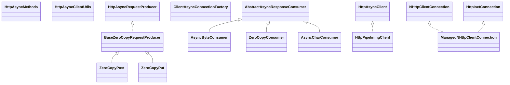

# httpasyncclient-4.1.4.jar

[Group index](README.md) | [All archives](../README.md)

## Scope and provenance

- **Donor:** `SQX_145_REFERENCE_ROOT/internal/libs/httpasyncclient-4.1.4.jar`.
- **SHA-256:** `50e981a8e567a16ebdad104605b156540a863459fa127b8ba647f310dfc83ef8`; accessed 2026-10-06; captured `2026-10-06T18:54:51.906614+00:00`.
- **Classes:** 86 raw entries; 86 unique entry names. Duplicate occurrence indices are zero-based.
- **Inspection:** read-only ZIP hashing and class-file structural parsing; signatures/descriptors, modifiers, hierarchy and references only. Bytecode bodies are hashed, not published.
- **Allocation:** proposed `FEAT-DATA-SOURCE-HTTPASYNCCLIENT`, P04; [roadmap](../../dev/sqx-full-application-roadmap.md). Domain README registration remains required.
- **Repository:** `01067f00031428613c6394064ca1bcadc1ba00ee`; review state unreviewed. Download label 145-dev1; installed build/activation and runtime equivalence unverified.
- **Limit:** every class/member is inventoried; declaration coverage does not establish consumed calls, defaults, formulas, failure semantics or algorithm parity.
- **Archive/resource index:** [034.json](../../dev/evidence/sqx145/archives/145/034.json).

## Complete member declarations

Member shards contain exact JVM names/descriptors, access flags, generic signatures, throws types, declared fields/methods, superclass/interfaces and referenced class names. All classes, nested/synthetic members and overloads are retained. Code length/hash is structural evidence, not a normalized algorithm comparison.

- [001.json](../../dev/evidence/sqx145/members/034/001.json) — SHA-256 `4953f2ce9391d58a0014fad196b9a82fee807eee86ed45f4071e0f97b72aabcb`.
- [002.json](../../dev/evidence/sqx145/members/034/002.json) — SHA-256 `2cc0c568b21ba019eb4b82ff889ed598475076f46b5e252100bf861df86c69d9`.

## Focused structural diagram

Up to twelve non-nested classes; arrows show declared inheritance/interfaces only. External type names are not evidence of an available body or an executed dependency.

## Class inventory

| Archive entry | Occurrence | Class SHA-256 | Fields | Methods |
| --- | ---: | --- | ---: | ---: |
| `org/apache/http/nio/client/methods/BaseZeroCopyRequestProducer.class` | 0 | `baefd7a172156be0ecc7b3edafe5e4a206b7933cd19ef918fcc7e202e4928b22` | 6 | 11 |
| `org/apache/http/nio/client/methods/AsyncByteConsumer.class` | 0 | `ca75958495bb7d22c067e2180049dbb1b7039366087499065413e243f5ed3696` | 1 | 6 |
| `org/apache/http/nio/client/methods/ZeroCopyConsumer.class` | 0 | `98edf8e3654936ba33fe8b4035fd307d3edcad4a020bb5db47ae47b4138b5966` | 7 | 7 |
| `org/apache/http/nio/client/methods/ZeroCopyPost.class` | 0 | `0debb4ff56dc9cdced8964f114cd076d3d5cb732b7292b08099eb377b3d16691` | 0 | 11 |
| `org/apache/http/nio/client/methods/HttpAsyncMethods$1.class` | 0 | `07013e961df3e24bf63b6d6c923cf4e9366bb90154bd077e9056e167d9408d1f` | 0 | 3 |
| `org/apache/http/nio/client/methods/AsyncCharConsumer.class` | 0 | `ae572fd9b21061b786fdef9a508b4e123cbef05798a1f65f951f8c85951074dc` | 3 | 8 |
| `org/apache/http/nio/client/methods/ZeroCopyPut.class` | 0 | `a66c91e6e8d9a3425adabc793d4d2fae026f35c3de460a0d3367fdd5dbb49db3` | 0 | 11 |
| `org/apache/http/nio/client/methods/HttpAsyncMethods$RequestProducerImpl.class` | 0 | `1bb86e2820921073e65f9d3d3cfcfcf4b1631bccfa76a51e16b4c7b35ba92b26` | 0 | 2 |
| `org/apache/http/nio/client/methods/HttpAsyncMethods.class` | 0 | `07d29b2c06f502ef0a0408c72a1db5fa65cdf10f7f608c10671705aa499efd08` | 0 | 27 |
| `org/apache/http/nio/client/HttpPipeliningClient.class` | 0 | `034c3827d1ea310b5fc368082c9ecabf6abc3c5bcec28422c1d21b82968843ff` | 0 | 4 |
| `org/apache/http/nio/client/util/HttpAsyncClientUtils.class` | 0 | `cb35d7133368eb44d463c25d046c5f3520dfc22c9105b26e4562bc471ebc7478` | 0 | 2 |
| `org/apache/http/nio/client/HttpAsyncClient.class` | 0 | `308b2a078b2fcd814c5e30a9c0272d3293fd2970a979e3d2d0a7121b83e07d78` | 0 | 6 |
| `org/apache/http/nio/conn/ClientAsyncConnectionFactory.class` | 0 | `d09eeacc33db7eb731f056f492c5ba5a97343f545c217dbe82a81094533f1bd4` | 0 | 1 |
| `org/apache/http/nio/conn/ManagedNHttpClientConnection.class` | 0 | `17dbeebcaa69a49d2838f0362ae2b5cd2482f0c41bd4078f796f1dab93c54d09` | 0 | 4 |
| `org/apache/http/nio/conn/ClientAsyncConnection.class` | 0 | `37fe99589ecd597e44c68c1fbb320d4c78c46c974e674d15c5809e5a6ba6e116` | 0 | 2 |
| `org/apache/http/nio/conn/NHttpClientConnectionManager.class` | 0 | `097868a3f241d923b58ec966c13639223d1d9f8fa87d464bec2837bf9c02ae9a` | 0 | 10 |
| `org/apache/http/nio/conn/SchemeIOSessionStrategy.class` | 0 | `09fcc9f4880d9dbd19b9b83661016a80464d033d17cd424cc2e55b2ba2175de3` | 0 | 2 |
| `org/apache/http/nio/conn/NHttpConnectionFactory.class` | 0 | `af0635689988ef17e93316be0f8c653cc05adc1fd5ba0abf54039301c1cdcea8` | 0 | 1 |
| `org/apache/http/nio/conn/ManagedClientAsyncConnection.class` | 0 | `cac21d5ab753c23e54ea7a1225ccea262ed8540146f32d7df02966bc075e15b7` | 0 | 10 |
| `org/apache/http/nio/conn/NoopIOSessionStrategy.class` | 0 | `d274485c2438887b1186dba6b2e096a8c6bb69780184b555ad7143a85eadba04` | 1 | 4 |
| `org/apache/http/nio/conn/ssl/SSLLayeringStrategy.class` | 0 | `840ce8e9ad3c71bc251319f2c657b3018ebcb4154162218be4f0d2e8f485afc9` | 5 | 17 |
| `org/apache/http/nio/conn/ssl/TrustManagerDecorator.class` | 0 | `e696da1332209d1051c51c75b49c67a51bff2426c16cd1aa72b2d1b84582e436` | 2 | 4 |
| `org/apache/http/nio/conn/ssl/SSLIOSessionStrategy$1.class` | 0 | `734edf3292156cdf01a0dcef35e0abd30793abde6bded3cd6eb87331b3be8d90` | 2 | 3 |
| `org/apache/http/nio/conn/ssl/SSLIOSessionStrategy.class` | 0 | `60de2b1b3327425be38abed44e6caf66f151872b3875b9b7c5c4c6d01a2bfcca` | 7 | 17 |
| `org/apache/http/nio/conn/ssl/SSLLayeringStrategy$1.class` | 0 | `1558c529f995d7d44df4a6011dfa99b749dae0fbdfe91867cccf018c581359df` | 1 | 3 |
| `org/apache/http/nio/conn/scheme/LayeringStrategy.class` | 0 | `f8d208d31783e0b59a862015c76727637f866fa59c49fddeea7de7f619414959` | 0 | 2 |
| `org/apache/http/nio/conn/scheme/AsyncScheme.class` | 0 | `e375d784d56109efa6fc4b6e19fb759a733d2ab40f533178c20f4aa82ce22f8e` | 4 | 8 |
| `org/apache/http/nio/conn/scheme/AsyncSchemeRegistry.class` | 0 | `5769fd92eb1d17e7b67d06dcf25bdbee7b3bfbfd00f488875e7ce13cee3527d7` | 1 | 8 |
| `org/apache/http/nio/conn/ClientAsyncConnectionManager.class` | 0 | `1c127a234feeed46d13141108e481653691a154ecaca5ee4728647aa797a07a9` | 0 | 3 |
| `org/apache/http/impl/nio/client/CloseableHttpAsyncClientBase$Status.class` | 0 | `c557c5711441ed24ce04d766a373e79ceba75b008284a98eef53f1d3870cedd0` | 4 | 4 |
| `org/apache/http/impl/nio/client/InternalState.class` | 0 | `af0c1c044d86cdeabf0b41b4ce98777b83108275216816c1411333e6bd8f0cce` | 11 | 19 |
| `org/apache/http/impl/nio/client/DefaultHttpAsyncClient.class` | 0 | `ee2d428ead591742b91df1bedbb67b3086d4cc1222ad9f98a10bbabb8f5d1afb` | 0 | 6 |
| `org/apache/http/impl/nio/client/InternalIODispatch.class` | 0 | `ee65a0ddf7a77e03f9f45061b40587f14735049a92ee95e4375593861dc81580` | 2 | 15 |
| `org/apache/http/impl/nio/client/MinimalHttpAsyncClientBuilder.class` | 0 | `d7c937e808846d295a1aae4d0e952a5ea3d5e5d391522474b94e9c1422c32ed8` | 7 | 10 |
| `org/apache/http/impl/nio/client/CloseableHttpPipeliningClient.class` | 0 | `df1ec42cb2ed47e1992323740cbe0e64f69a3f14df9d9da47837d289e858767b` | 0 | 4 |
| `org/apache/http/impl/nio/client/DefaultResultCallback.class` | 0 | `a36286bb226bf167b599b17c5be836193aefa6f8272f45f3825db9347c0a9a35` | 2 | 5 |
| `org/apache/http/impl/nio/client/AbstractClientExchangeHandler.class` | 0 | `48a81607a013266c95a27d31023724adeaff81a5cbdccf35d527bae4594fdcd3` | 17 | 38 |
| `org/apache/http/impl/nio/client/ResultCallback.class` | 0 | `d777a0021c6663e1d22359993fe535eebbe5e6bc5032f9da4acee1efc0c37ca6` | 0 | 4 |
| `org/apache/http/impl/nio/client/CloseableHttpAsyncClient.class` | 0 | `02683bd14deae17335998ce91fcdf9fd28df0313f7ec7fe92230e0dc56f63789` | 0 | 9 |
| `org/apache/http/impl/nio/client/CloseableHttpAsyncClientBase.class` | 0 | `de48bea11cd80061b56224a5212d22b4860e6beeac0e34a7f7fb34f5fdf47689` | 4 | 7 |
| `org/apache/http/impl/nio/client/MainClientExec.class` | 0 | `2d627b4d872390f5ecfc42bd5bdcbba9629345b3f392c77ffd1470015a8aaa18` | 10 | 14 |
| `org/apache/http/impl/nio/client/CloseableHttpAsyncClientBase$1.class` | 0 | `e3967b4eed88b0c22cf9485cd8a02414530182c8483189ac73be2c53524305c2` | 3 | 2 |
| `org/apache/http/impl/nio/client/PipeliningClientExchangeHandlerImpl.class` | 0 | `778fe8d0affa80783ecbd67bf5fabd91a063f0524a864c369395d8baf5acbc6a` | 10 | 15 |
| `org/apache/http/impl/nio/client/HttpAsyncClients.class` | 0 | `c519f4aaef3c51190789d9f13b94f76adcda8c4b502d9ea87c45811010f36838` | 0 | 12 |
| `org/apache/http/impl/nio/client/ParamConfig.class` | 0 | `1e64e97320c0281fae1b03eeacce099e8b45fab82703b8414e20e01b8de071c5` | 0 | 2 |
| `org/apache/http/impl/nio/client/DefaultAsyncRequestDirector.class` | 0 | `719dba0cf0f17d0735ba6c886d2f815ade88f75060e76cb1974b9848b0279eb2` | 36 | 40 |
| `org/apache/http/impl/nio/client/InternalClientExec.class` | 0 | `711e17e110fe64fde8add4cb7790c38370b583d1b1bb7b1a991a6b92e652aaf1` | 0 | 7 |
| `org/apache/http/impl/nio/client/DefaultAsyncUserTokenHandler.class` | 0 | `9399a34fdf6557414b2d541227d99595a188e48a834d06b08250115e54c9e8b0` | 1 | 4 |
| `org/apache/http/impl/nio/client/InternalIOReactorExceptionHandler.class` | 0 | `147f58cc81efe398302b606cb8253f66caf3f9730d2eb95a9e75c8f2bef4a3ef` | 1 | 3 |
| `org/apache/http/impl/nio/client/IOReactorUtils.class` | 0 | `95cee56e81d1ace4aa2bd650e40e6e30177540697d5c516dc4148160d252ea6e` | 0 | 2 |
| `org/apache/http/impl/nio/client/AbstractClientExchangeHandler$1.class` | 0 | `0014a43a316318edfa4992491997da1c8a422c884bcd27383de4dba9c19d7eba` | 1 | 5 |
| `org/apache/http/impl/nio/client/InternalHttpAsyncClient.class` | 0 | `6a6f1268614177a1a971569bd6158c70dd0fa85a32f1c6413040dce1b241de8d` | 10 | 4 |
| `org/apache/http/impl/nio/client/DefaultAsyncRequestDirector$InternalFutureCallback.class` | 0 | `7450ae40a9a763f19f0c866b5c08bec995d4fec3775babc72d0ee2b7cb9d3f83` | 1 | 5 |
| `org/apache/http/impl/nio/client/DefaultClientExchangeHandlerImpl.class` | 0 | `cc9b4945e5afece8e216dc317e44417e9f05e1aa974e609783d3d63662ceff6c` | 5 | 13 |
| `org/apache/http/impl/nio/client/FutureWrapper.class` | 0 | `027ce99234338bf55b72b3e966658b0dccedfe94e8c2b0afc1dab8fae5501ae2` | 2 | 7 |
| `org/apache/http/impl/nio/client/DefaultAsyncRequestDirector$1.class` | 0 | `1eb1f9b47d47dd1398e5ee2805ea54ff7fcd4b8c2ed0f209724d95aeb1d5acc9` | 1 | 3 |
| `org/apache/http/impl/nio/client/HttpAsyncClientBuilder.class` | 0 | `6cfa30801b43c444337bbc00b28e2439f1a32806cdd3a61cda19607109bd428b` | 37 | 42 |
| `org/apache/http/impl/nio/client/InternalRequestExecutor.class` | 0 | `1b7def49eea0feab57adb19d442310a08b5d150d6ed35d25488609e54a3a2bcb` | 2 | 10 |
| `org/apache/http/impl/nio/client/MinimalHttpAsyncClient.class` | 0 | `b8271490982fc3a845dc28c0d2c249edfbd8adbfff50d64d80e128be8ce1e72a` | 5 | 4 |
| `org/apache/http/impl/nio/client/AbstractHttpAsyncClient.class` | 0 | `a56e12ca56140d822661e992b5c3da432475056bc103eaebf6c623db6f3b56e6` | 19 | 66 |
| `org/apache/http/impl/nio/client/AbstractHttpAsyncClient$1.class` | 0 | `a78bbffbf9839940a38a40d9d6cb66a87345c52170338f91aa0a8c86f2969409` | 1 | 2 |
| `org/apache/http/impl/nio/client/MinimalClientExchangeHandlerImpl.class` | 0 | `97845bfac336091f7b69b6ab09b7ccaaf9c05bb07cfb965f16c29d06d8c27063` | 5 | 13 |
| `org/apache/http/impl/nio/conn/HttpPoolEntry.class` | 0 | `af95b36b4bdbf92c7e352b14dbdd5dcb463bc60eb174eaa2b36a9e5169a1f6cb` | 2 | 8 |
| `org/apache/http/impl/nio/conn/CPool.class` | 0 | `f6ba82cf53e664aa9275767785ad1e1940d1ae4e83d32acd2bb8a49b5143f8ee` | 3 | 7 |
| `org/apache/http/impl/nio/conn/Wire.class` | 0 | `4404eac60dc1b072617b7490fd2a4a2b5e15e7f4cac80f15d74f49a9a81bd52e` | 2 | 11 |
| `org/apache/http/impl/nio/conn/LoggingIOSession$LoggingByteChannel.class` | 0 | `14bc9144a59b73bb69f270ab3a3d83cc28fdf67fa741be16fe8c4d549bfe8fd4` | 1 | 5 |
| `org/apache/http/impl/nio/conn/CPoolProxy.class` | 0 | `a5c2a171c435abe4d1826afd3f7b9e9ca5838878fb3c711ae8309156ad0ed17e` | 1 | 37 |
| `org/apache/http/impl/nio/conn/HttpNIOConnPoolFactory.class` | 0 | `114227b0237c0be34faff02f52623fa45f7b1d62d0f9d63543f970cdd463e7cf` | 0 | 3 |
| `org/apache/http/impl/nio/conn/ManagedNHttpClientConnectionImpl.class` | 0 | `640f6dd4ca43b31d7aba1c9c23780fa5bdbc7195c5b52d1f224edbccb03e710c` | 5 | 8 |
| `org/apache/http/impl/nio/conn/PoolingNHttpClientConnectionManager$2.class` | 0 | `9276ba45d18f7e36466d9a4be0ee77b551873914275b98c9d26b55537503a0f9` | 3 | 8 |
| `org/apache/http/impl/nio/conn/ManagedClientAsyncConnectionImpl.class` | 0 | `87cb29bda6952ced74a19ce68a16f144f32c1874e4e76c5c6c4e1ce0bb869b4d` | 5 | 47 |
| `org/apache/http/impl/nio/conn/DefaultClientAsyncConnection.class` | 0 | `53ac8d9b41f724b115f30974270eaf0897049c7687f52f5317b0098f4153b680` | 5 | 7 |
| `org/apache/http/impl/nio/conn/PoolingNHttpClientConnectionManager.class` | 0 | `d33a7912e06e0b9655620b03493efc55f049172945b8c3b491956c417fb98862` | 6 | 49 |
| `org/apache/http/impl/nio/conn/PoolingClientAsyncConnectionManager.class` | 0 | `a01b5369354b6f45e39a03a35f87825ea6d8304769e4c769e9b73fe73339eea2` | 5 | 33 |
| `org/apache/http/impl/nio/conn/AsyncSchemeRegistryFactory.class` | 0 | `8e1601b45e73e22220fa83b8fd8dfa7ff2d82435a3c7c61acb15d9aa666e926a` | 0 | 2 |
| `org/apache/http/impl/nio/conn/PoolingNHttpClientConnectionManager$InternalConnectionFactory.class` | 0 | `3941dd47848fbc2dc49558e558e160d9e2de95111de9f832852be7730fc41b17` | 2 | 3 |
| `org/apache/http/impl/nio/conn/PoolingNHttpClientConnectionManager$InternalAddressResolver.class` | 0 | `c92060e31c95b787e317980c5b7b630c3c39a2d7dfe4ed4b06592b12c7c4e073` | 2 | 5 |
| `org/apache/http/impl/nio/conn/PoolingNHttpClientConnectionManager$ConfigData.class` | 0 | `5be4dd9312ba2a353808a2bebbf92c95dd8495a3683d3a7dfec52d52b9bfed21` | 2 | 5 |
| `org/apache/http/impl/nio/conn/HttpNIOConnPool.class` | 0 | `96a541fa911ec6bd04b3171fb0d9d7da88cf1ec57882c0cb6ca79e83e1277789` | 5 | 8 |
| `org/apache/http/impl/nio/conn/CPoolEntry.class` | 0 | `f34fb07b261afbf0268034fff394bad80c17eb149fbd4822e2887d90d39f8ad4` | 3 | 10 |
| `org/apache/http/impl/nio/conn/PoolingNHttpClientConnectionManager$1.class` | 0 | `78043deeb4994db22516ab7ceb5d2cc484f79d3055543505f3c1b2c176de5ffc` | 2 | 5 |
| `org/apache/http/impl/nio/conn/DefaultHttpAsyncRoutePlanner.class` | 0 | `4efe18ea06ce82a5deff03731b4164a891a0c8e8d559b98e778b62d595bdf6f9` | 1 | 3 |
| `org/apache/http/impl/nio/conn/ManagedNHttpClientConnectionFactory.class` | 0 | `a1e34a1445df9f7af0e6e8623f80c0e001f4475534a88093096a7262d0a3a4bc` | 8 | 5 |
| `org/apache/http/impl/nio/conn/LoggingIOSession.class` | 0 | `c65de5c0e5550de4c920a78ef75f646aac1ff675ee9c1092e4c1e8af441c9f61` | 5 | 26 |
| `org/apache/http/impl/nio/conn/PoolingClientAsyncConnectionManager$InternalPoolEntryCallback.class` | 0 | `cb807112adaeac532e32574f5f887e245560242eb37586a7dff0c367fba76aa8` | 2 | 5 |
| `org/apache/http/impl/nio/conn/DefaultClientAsyncConnectionFactory.class` | 0 | `ae3480b42a1cc83ce9155a0942b660826e897437e607ea5e4a8173149ffeda12` | 8 | 8 |
