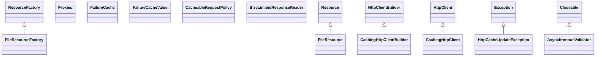

# httpclient-cache-4.5.13.jar

[Group index](README.md) | [All archives](../README.md)

## Scope and provenance

- **Donor:** `SQX_145_REFERENCE_ROOT/internal/libs/httpclient-cache-4.5.13.jar`.
- **SHA-256:** `66cefdee7475985256af680bf3ae7cd5d7d42e8fdeb939a6277922e1bdeed43a`; accessed 2026-10-06; captured `2026-10-06T18:54:51.906614+00:00`.
- **Classes:** 83 raw entries; 83 unique entry names. Duplicate occurrence indices are zero-based.
- **Inspection:** read-only ZIP hashing and class-file structural parsing; signatures/descriptors, modifiers, hierarchy and references only. Bytecode bodies are hashed, not published.
- **Allocation:** proposed `FEAT-DATA-SOURCE-HTTPCLIENT-CACHE`, P04; [roadmap](../../dev/sqx-full-application-roadmap.md). Domain README registration remains required.
- **Repository:** `01067f00031428613c6394064ca1bcadc1ba00ee`; review state unreviewed. Download label 145-dev1; installed build/activation and runtime equivalence unverified.
- **Limit:** every class/member is inventoried; declaration coverage does not establish consumed calls, defaults, formulas, failure semantics or algorithm parity.
- **Archive/resource index:** [036.json](../../dev/evidence/sqx145/archives/145/036.json).

## Complete member declarations

Member shards contain exact JVM names/descriptors, access flags, generic signatures, throws types, declared fields/methods, superclass/interfaces and referenced class names. All classes, nested/synthetic members and overloads are retained. Code length/hash is structural evidence, not a normalized algorithm comparison.

- [001.json](../../dev/evidence/sqx145/members/036/001.json) — SHA-256 `b1999ed6ce64615e20cef2b8ae2cb69c94674a1096115dc667847212a4239623`.
- [002.json](../../dev/evidence/sqx145/members/036/002.json) — SHA-256 `ab7042ea59e82b32361ce6094d542ac38f60a1acc397f601e14980aff4bef3be`.

## Focused structural diagram

Up to twelve non-nested classes; arrows show declared inheritance/interfaces only. External type names are not evidence of an available body or an executed dependency.

## Class inventory

| Archive entry | Occurrence | Class SHA-256 | Fields | Methods |
| --- | ---: | --- | ---: | ---: |
| `org/apache/http/client/cache/ResourceFactory.class` | 0 | `6e0aaa2a80fc7f208b8643b15a8bade86b2d80cfcf1d45cf02741a695115f50c` | 0 | 2 |
| `org/apache/http/impl/client/cache/FileResource.class` | 0 | `6914716e4f161649dad7a846a7c1fda6749c1a9de827fc95dc83c5ba845c17b9` | 3 | 5 |
| `org/apache/http/impl/client/cache/Proxies.class` | 0 | `6cb1e2e66335c76eca2a583820a998960a64e16df018c57ab98cc04df9d72941` | 0 | 2 |
| `org/apache/http/impl/client/cache/CachingHttpClientBuilder.class` | 0 | `070040a857570a7ccbfaa894f794f4ad55d1562cc84a447a137fe9ca35493402` | 7 | 12 |
| `org/apache/http/impl/client/cache/FailureCache.class` | 0 | `89ecb4e7afe4b25e5a166c458a4044e7ec98b8fd63b6f29c93341c5b10e24b25` | 0 | 3 |
| `org/apache/http/impl/client/cache/FileResourceFactory.class` | 0 | `68e73988ce784ae9ceacf6fca6ac94b5e87157086ea6b025dabfa5365aa201a8` | 2 | 4 |
| `org/apache/http/impl/client/cache/CachingHttpClient.class` | 0 | `5cc7146bbc1aaac7bb77a1a851dc3a0201f94b7d6d16a2c95e70ca140aa6c142` | 20 | 58 |
| `org/apache/http/client/cache/HttpCacheUpdateException.class` | 0 | `791df4663d19bb337f2b198d743339b8e26a5edf62522831706e83351d406a5f` | 1 | 2 |
| `org/apache/http/impl/client/cache/FailureCacheValue.class` | 0 | `a17d4873fc6a45f160ccc9ab809f73a5a19dad4c3e70e8f8a53afaa418a04794` | 3 | 5 |
| `org/apache/http/impl/client/cache/AsynchronousValidator.class` | 0 | `d13358322fff8259338f9135a2dab9b074301dac2e19d8bb0534483414740d68` | 5 | 8 |
| `org/apache/http/impl/client/cache/SizeLimitedResponseReader$1.class` | 0 | `0ebbaa66fbd3d37480fa7f3e278555a5431ebce10981d183b081746d0ec9a4bc` | 1 | 2 |
| `org/apache/http/impl/client/cache/CacheableRequestPolicy.class` | 0 | `30496d72f91c33c4b0076c951764e4e97b16050d2c9bf2480021ab18879d7b3a` | 1 | 2 |
| `org/apache/http/impl/client/cache/SizeLimitedResponseReader.class` | 0 | `651b173007657aa1516e61f6a636326aae239e6e5ff4ff1386c1701cebcbbd3e` | 8 | 9 |
| `org/apache/http/impl/client/cache/CacheMap.class` | 0 | `64541bf8d0f03295f38f28e0fdd71f75ac90de0464e7338484e8774f704d99e2` | 2 | 2 |
| `org/apache/http/impl/client/cache/CachedResponseSuitabilityChecker.class` | 0 | `95b80a8686cc7d36de95f8981ed8d102acb4f54c7b7a310f86af0efa6f4cb9b3` | 6 | 18 |
| `org/apache/http/impl/client/cache/BasicHttpCacheStorage.class` | 0 | `772c63d26897f359a7bad7ec29a01540f3675669f0e4f175d12a9af3732fd682` | 1 | 5 |
| `org/apache/http/impl/client/cache/memcached/MemcachedCacheEntryImpl.class` | 0 | `7ffed3db77baf02e85667b026f7cf2d9785b9fb0f4512a38844a06b32471864b` | 2 | 6 |
| `org/apache/http/impl/client/cache/memcached/MemcachedSerializationException.class` | 0 | `f6652b93f698cd37a59065ad2f9d5c9a9583c5f605c9e7ad60533a4728e439dc` | 1 | 1 |
| `org/apache/http/impl/client/cache/memcached/SHA256KeyHashingScheme.class` | 0 | `75ff4e0517653cd6162a181c4f64a9b24eec83535ed8c5b93ba0201b8c9fe501` | 1 | 4 |
| `org/apache/http/impl/client/cache/ExponentialBackOffSchedulingStrategy.class` | 0 | `596f803e352ae79117e49dc2236ed7473dbb0d4aa793f8947c22ee8d8c29b3a0` | 7 | 13 |
| `org/apache/http/client/cache/HttpCacheStorage.class` | 0 | `4297b4af016389191dbf935eecb29403c1cf96c25f59c34495cfbeba7db067ea` | 0 | 4 |
| `org/apache/http/impl/client/cache/BasicIdGenerator.class` | 0 | `4083e02f3305b712f9167676ab3596f0ffa9134ba15c64c2a08679c5cb29ef87` | 3 | 3 |
| `org/apache/http/impl/client/cache/CachedHttpResponseGenerator.class` | 0 | `c23dc76180674ff113b3b0f857dcb3751abbd2e33c467d576776ecb410d9e93b` | 1 | 7 |
| `org/apache/http/impl/client/cache/ResourceReference.class` | 0 | `6d721f1970a26425b0edd80278d64d0926c83375a344c5012176a5187879210f` | 1 | 4 |
| `org/apache/http/impl/client/cache/memcached/MemcachedKeyHashingException.class` | 0 | `5d02ccbedd8b544688f8652153447ec552a3d35db8d5c4637aac2aa3fcc68e3b` | 1 | 1 |
| `org/apache/http/impl/client/cache/memcached/PrefixKeyHashingScheme.class` | 0 | `26e032d9e54fc2c31cb1e5d0feecd0a2fb211f7ee09bdaac299867b9c62023ea` | 2 | 2 |
| `org/apache/http/impl/client/cache/memcached/MemcachedCacheEntryFactory.class` | 0 | `76be673089e29abcdbc7ce179c18900e43db9f04254ed2426974b27dc453fb45` | 0 | 2 |
| `org/apache/http/impl/client/cache/memcached/KeyHashingScheme.class` | 0 | `920b0f88ff32d6642a4f10cbce376583001b12b3b0b0cb95d93c03d9baf7b8bd` | 0 | 1 |
| `org/apache/http/impl/client/cache/HeapResourceFactory.class` | 0 | `9af9e974b0f683103707ab25036e50bcf75ab8947b188fd275c3355086587ea2` | 0 | 4 |
| `org/apache/http/client/cache/HttpCacheContext.class` | 0 | `51c07f960acb272a3a36e160395fece35607ea033efcb58e736bd5b2968fbf4c` | 1 | 5 |
| `org/apache/http/impl/client/cache/ResponseCachingPolicy.class` | 0 | `b97341463c91e505c79283abc8e9cf4701f7e2c39772ae1b2effaa3e2145400b` | 7 | 11 |
| `org/apache/http/impl/client/cache/CachingHttpClientBuilder$1.class` | 0 | `5c39ac6739e81561f27ca48145112e91578a4c8ea42ba6d39ae03b828552e340` | 2 | 2 |
| `org/apache/http/impl/client/cache/CachingExec.class` | 0 | `c1401690ba0202008dd2aa60903ad4a0c1f575efdebe36eae8b2cc9b52cee25d` | 18 | 45 |
| `org/apache/http/client/cache/CacheResponseStatus.class` | 0 | `8270ac7f8d12d6f5c6e1fdfc3ffd1ed140821ca4c287deb06e4cc41844f88685` | 5 | 4 |
| `org/apache/http/impl/client/cache/CachingHttpClient$AsynchronousValidationRequest.class` | 0 | `8070dd2e8ffb8b685dcfec1b23dd5ae8c512fbc0a71945695d281d2714bd9ff3` | 8 | 3 |
| `org/apache/http/impl/client/cache/CombinedEntity.class` | 0 | `aa4a10fea43915a12fe5edb6a7a2a5087804f7e804b60d910cf3559d50318b9c` | 2 | 8 |
| `org/apache/http/impl/client/cache/CacheInvalidator.class` | 0 | `7dedc82f694fc700eea9643abd8738af33f1a6b9be62492b8153d2f95f47c9ff` | 3 | 20 |
| `org/apache/http/impl/client/cache/ResponseProtocolCompliance.class` | 0 | `fc6b9260afb8349e17b9e47257ca43f16ba29bf196aad8ea6fd71e17f26429a5` | 2 | 13 |
| `org/apache/http/impl/client/cache/HttpCache.class` | 0 | `639eb2fb5a9443be580e12390a6f0af4ecf5ea7741b33eed736bc2f860b126a2` | 0 | 10 |
| `org/apache/http/impl/client/cache/DefaultFailureCache.class` | 0 | `c6bc95c4807b9e30337d89ff19bd7bb306fee2f5bfa994a946895daf5a83723a` | 4 | 8 |
| `org/apache/http/impl/client/cache/OptionsHttp11Response.class` | 0 | `06f869414ea9b5f309eec067bc5cabd5270872307e122db8fff7d57e0ed66f32` | 2 | 28 |
| `org/apache/http/client/cache/HttpCacheEntry.class` | 0 | `60c532f428db76caea227aac2e3b019297c3096d4304516e2246f64450052c7d` | 9 | 20 |
| `org/apache/http/impl/client/cache/BasicHttpCache$1.class` | 0 | `eb07ad2902605320541c4a59552f276531bc1beaf60c018cd12ad943914e1e0b` | 4 | 2 |
| `org/apache/http/impl/client/cache/BasicHttpCache.class` | 0 | `b412ff722d1c82b8bbe36076504cfcb6f907117cc4a159881930a6c528e1931b` | 9 | 25 |
| `org/apache/http/impl/client/cache/RequestProtocolCompliance$1.class` | 0 | `1f5a089dd1347fe1ed1bbcc8ed342fdf30be12efb2f60e3761fb13be9424015c` | 1 | 2 |
| `org/apache/http/impl/client/cache/RequestProtocolCompliance$2.class` | 0 | `8e4a26e255434f520f971ad4e2c524246d07a2571bfcdc57ce4152d2d50a9759` | 1 | 1 |
| `org/apache/http/impl/client/cache/RequestProtocolCompliance.class` | 0 | `9c436143fe39a48d25d5dc2aab67291bfb96c8905490266b81a735525c840022` | 2 | 20 |
| `org/apache/http/client/cache/HttpCacheEntrySerializer.class` | 0 | `ee9f200dbb7eac328a001029598aa6c2d6f053f05f53a70dd24de99399640197` | 0 | 2 |
| `org/apache/http/impl/client/cache/IOUtils.class` | 0 | `67da97a041ebf160343d345b0868eded1355b9d013c97bcab2500a16207a60db` | 0 | 6 |
| `org/apache/http/impl/client/cache/RequestProtocolError.class` | 0 | `296b31b87438aefea7e04175542e29f6dadeba2e8ef93934fa07a9ebee2c0472` | 6 | 4 |
| `org/apache/http/impl/client/cache/SchedulingStrategy.class` | 0 | `57aca744bf0b7f9ec74b0497359fd7619d1a9506ebec3ef5e0ade737918cbde0` | 0 | 1 |
| `org/apache/http/impl/client/cache/DefaultHttpCacheEntrySerializer.class` | 0 | `be2e09ed9eea90dac2230d18208107a82feec4309c07ec493700260094690abb` | 0 | 3 |
| `org/apache/http/impl/client/cache/CacheEntryUpdater.class` | 0 | `8a6f29c6c604342fd18cfa1e7d6790f978499a85fbea1041bbe25639aee85b26` | 1 | 6 |
| `org/apache/http/impl/client/cache/BasicHttpCache$2.class` | 0 | `bab07482ae514c22f25595c3d1daa9409ab5c8deb27e67a7e61530e59975e26e` | 5 | 2 |
| `org/apache/http/impl/client/cache/ResponseProxyHandler.class` | 0 | `a6f9efc7dcae05b8daddf7b8510e82d66f0c7c50d28069de1e9adff974c3289b` | 2 | 4 |
| `org/apache/http/impl/client/cache/memcached/MemcachedHttpCacheStorage.class` | 0 | `45f68902799945e1ecbc31a8dd42f301694c58739d58469a433387a5e4eafdab` | 5 | 13 |
| `org/apache/http/impl/client/cache/ImmediateSchedulingStrategy.class` | 0 | `625d392c82ab2021b5f19970e1fa3c51aab9893048d8019a62a65294b3fce5f7` | 1 | 5 |
| `org/apache/http/impl/client/cache/CacheConfig$Builder.class` | 0 | `31e44b49743f0b52338dcbce093652e1b0bfcda8ed2b84bba1752db5d1f115e6` | 14 | 16 |
| `org/apache/http/client/cache/HttpCacheEntrySerializationException.class` | 0 | `c08363f52b4a71e4d5dcbe747abdf75a634b8848be98d7e7cc269f042e4417d1` | 1 | 2 |
| `org/apache/http/client/cache/HttpCacheUpdateCallback.class` | 0 | `0e6a9b3866bfe902e9a18588a607fa4e4a2efae6275bbbfc264fd4da50d26538` | 0 | 1 |
| `org/apache/http/client/cache/HttpCacheInvalidator.class` | 0 | `ee29e68f888e7faf974991aee036a9c8c41575f9e0eefd4498a8a25bd76f2a21` | 0 | 2 |
| `org/apache/http/client/cache/Resource.class` | 0 | `916cc7d7703b0dbb5b2db2ebb7f8d2c40829a3d1c916f53a92d4ea003790ee40` | 0 | 3 |
| `org/apache/http/client/cache/HeaderConstants.class` | 0 | `6f3aa4e250a88692aeca1ee073b982e93a5a4815ed692a542d711cfe0ee60c22` | 38 | 1 |
| `org/apache/http/client/cache/InputLimit.class` | 0 | `9268b83e2975ab6da4ba2feeeaba6628e5a9b3969cfe0ebf3642aae215568116` | 2 | 4 |
| `org/apache/http/impl/client/cache/CachingHttpClient$AsynchronousValidator.class` | 0 | `1af7438fe35f9390710f189fe9e6b25ed442554b73fb45a582e7c6a8c2c5d2ca` | 5 | 6 |
| `org/apache/http/impl/client/cache/Variant.class` | 0 | `e82e74631e144049a07956e776c8cf7f61adba6320e09b0912a1e806d5f701bc` | 3 | 4 |
| `org/apache/http/impl/client/cache/ehcache/EhcacheHttpCacheStorage.class` | 0 | `d42eafc9fd95ae1606c7ad0a3144a514d927673830dd4f6880337b7231c41206` | 3 | 7 |
| `org/apache/http/impl/client/cache/CachingHttpClients.class` | 0 | `194ae5ebe0ed553ae424011659dc4afa826bcec0c9a29f92e67906d248ebf84e` | 0 | 4 |
| `org/apache/http/impl/client/cache/CacheKeyGenerator.class` | 0 | `8f7f14600a51740a56c14c9f8ce6680858b2fae9b3b389cfe9cae5a93456564e` | 1 | 10 |
| `org/apache/http/impl/client/cache/WarningValue.class` | 0 | `302b609444ce3c390dceea8c18531e42669101f6ad99988b3bb03aa039684e09` | 28 | 24 |
| `org/apache/http/impl/client/cache/ManagedHttpCacheStorage.class` | 0 | `946dc7a332ef4803509dca803cb1d3652690698a737b33aae3c24f7ae8f1692d` | 4 | 10 |
| `org/apache/http/impl/client/cache/CacheEntity.class` | 0 | `e769c841032b4094bb48e292ec12488cdefe94d0855eb72862d6baf835da18f0` | 2 | 11 |
| `org/apache/http/impl/client/cache/CombinedEntity$ResourceStream.class` | 0 | `c98815cbdb9db3c50245f8cf2034bcede9a0c0b2a7e84fcfd98fdb0a8fe34f74` | 1 | 2 |
| `org/apache/http/impl/client/cache/ConditionalRequestBuilder.class` | 0 | `9590281d5f31a66479f98c7be1720b9f820be82c3f08389c552e60f8ad071f98` | 0 | 4 |
| `org/apache/http/impl/client/cache/DefaultHttpCacheEntrySerializer$RestrictedObjectInputStream.class` | 0 | `deef400ad7d8522f07d4b32d8a258f20b32bf5099894bc8d94167ced99442638` | 1 | 5 |
| `org/apache/http/impl/client/cache/CacheConfig.class` | 0 | `fda2687cb7e704f0a5e78df4a8358e7bc32b521018dd459592af997f185fdfe6` | 27 | 35 |
| `org/apache/http/impl/client/cache/DefaultHttpCacheEntrySerializer$1.class` | 0 | `5349f3ebe94fe64784f2d917e8859ddbc49e09b78dfa3a8787d8761771d250af` | 0 | 0 |
| `org/apache/http/impl/client/cache/CacheValidityPolicy.class` | 0 | `6e3b203cafcd85a52e818125710cc9e6667be12619314aa1ed5119442296f212` | 1 | 27 |
| `org/apache/http/impl/client/cache/memcached/MemcachedCacheEntry.class` | 0 | `c2f3f644de19b5a3b8df3614180aa5942c64d9289fd7557cd39c13c0065d95c6` | 0 | 4 |
| `org/apache/http/impl/client/cache/memcached/MemcachedCacheEntryFactoryImpl.class` | 0 | `1911253acb7f5de83efed39def684e7e787080f6d92cf8b2ddb22a7ea0ba322d` | 0 | 3 |
| `org/apache/http/impl/client/cache/memcached/MemcachedOperationTimeoutException.class` | 0 | `16a92c5fe9e44b0225ba2f728883a466f9d0831cf7ed2347399e90e917ecb248` | 1 | 1 |
| `org/apache/http/impl/client/cache/HeapResource.class` | 0 | `36239fca64a5d01a16142ee2974a092e9de380bee239759495faaf10b1c7fa69` | 2 | 5 |
| `org/apache/http/impl/client/cache/AsynchronousValidationRequest.class` | 0 | `3044642c303acbcadacdb3c57beb5fff0c37d82ccc727bcf9079f74595d17c64` | 10 | 7 |
