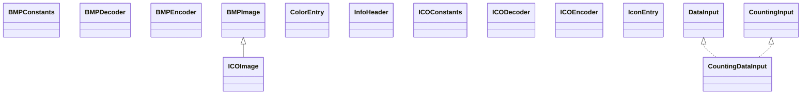

# image4j-0.7.2.jar

[Group index](README.md) | [All archives](../README.md)

## Scope and provenance

- **Donor:** `SQX_145_REFERENCE_ROOT/internal/libs/image4j-0.7.2.jar`.
- **SHA-256:** `12904084d497fc054dbaebb27deab6f15265e779626616adcceb3fb52da0735b`; accessed 2026-10-06; captured `2026-10-06T18:54:51.906614+00:00`.
- **Classes:** 23 raw entries; 23 unique entry names. Duplicate occurrence indices are zero-based.
- **Inspection:** read-only ZIP hashing and class-file structural parsing; signatures/descriptors, modifiers, hierarchy and references only. Bytecode bodies are hashed, not published.
- **Allocation:** proposed `FEAT-RESULTS-IMAGE4J`, P08; [roadmap](../../dev/sqx-full-application-roadmap.md). Domain README registration remains required.
- **Repository:** `01067f00031428613c6394064ca1bcadc1ba00ee`; review state unreviewed. Download label 145-dev1; installed build/activation and runtime equivalence unverified.
- **Limit:** every class/member is inventoried; declaration coverage does not establish consumed calls, defaults, formulas, failure semantics or algorithm parity.
- **Archive/resource index:** [039.json](../../dev/evidence/sqx145/archives/145/039.json).

## Complete member declarations

Member shards contain exact JVM names/descriptors, access flags, generic signatures, throws types, declared fields/methods, superclass/interfaces and referenced class names. All classes, nested/synthetic members and overloads are retained. Code length/hash is structural evidence, not a normalized algorithm comparison.

- [001.json](../../dev/evidence/sqx145/members/039/001.json) — SHA-256 `fb0d03bf7c3f4f8ce1e80b2bd389e4d724b19af10cd87ffdfb04f1c613ac022a`.

## Focused structural diagram

Up to twelve non-nested classes; arrows show declared inheritance/interfaces only. External type names are not evidence of an available body or an executed dependency.

## Class inventory

| Archive entry | Occurrence | Class SHA-256 | Fields | Methods |
| --- | ---: | --- | ---: | ---: |
| `net/ifok/image/image4j/codec/bmp/BMPConstants.class` | 0 | `8a85332071f9db3f82d2e40265475c198c94b546c1a2131136442b040272dd39` | 7 | 1 |
| `net/ifok/image/image4j/codec/bmp/BMPDecoder.class` | 0 | `4589d0ddab3ca37f9d62085709d2a5d0482f3e5c6130ca079f9a9c82d629587d` | 2 | 20 |
| `net/ifok/image/image4j/codec/bmp/BMPEncoder.class` | 0 | `80ae78ab55b6ed23716b219293e69c0e7ecb8434f497b474a4f74c5ba48f8683` | 0 | 19 |
| `net/ifok/image/image4j/codec/bmp/BMPImage.class` | 0 | `2a488745f8e1205715d9a64fbb079d6f8918a8f444763768c5f91317bc38d86b` | 2 | 10 |
| `net/ifok/image/image4j/codec/bmp/ColorEntry.class` | 0 | `a5b7fe415d88984f688488693b038b30fcb63f0b62253ea4e3e26bfd1263ffad` | 4 | 3 |
| `net/ifok/image/image4j/codec/bmp/InfoHeader.class` | 0 | `d28d8657fb7b9deec3001b3eca91b891de2279eeb81a962321e328ba29745243` | 12 | 6 |
| `net/ifok/image/image4j/codec/ico/ICOConstants.class` | 0 | `9a3066fa004cc97146c991039562fdb0523f2fd0c694c92ba70fa058a13ec2dc` | 2 | 1 |
| `net/ifok/image/image4j/codec/ico/ICODecoder$1.class` | 0 | `01ddf9c8a6754d10dcc5050be2c4906d645047f9e8db626a23b40c090f70d43d` | 0 | 3 |
| `net/ifok/image/image4j/codec/ico/ICODecoder.class` | 0 | `27804a5be7b0c67ca1f92640dd20603916f13621726fe33a867169179cd6b00b` | 5 | 8 |
| `net/ifok/image/image4j/codec/ico/ICOEncoder.class` | 0 | `cb0f11257c129e3247b60084f5e42c2f996a3fe365c855bcc9628b07bf1e1369` | 0 | 19 |
| `net/ifok/image/image4j/codec/ico/ICOImage.class` | 0 | `f860de3495e2e3c99346180d480fd1ceb4a6d921ca492789356ffaa547afb19b` | 3 | 13 |
| `net/ifok/image/image4j/codec/ico/IconEntry.class` | 0 | `d1da19b3f109335454065abbf88cc84b73c92ddcce38bc20ca3b4f0f9d9fafa3` | 8 | 4 |
| `net/ifok/image/image4j/io/CountingDataInput.class` | 0 | `4ffc1ca941cb08eff66e1f940340a4e56ca258c5d61bfe3f0fd104c2274f5a30` | 0 | 0 |
| `net/ifok/image/image4j/io/CountingDataInputStream.class` | 0 | `25e2b6b747fe8f2336353acec58c5e81bcf3df307345178c7a7f25922f7a9458` | 0 | 4 |
| `net/ifok/image/image4j/io/CountingInput.class` | 0 | `928e50e842799e395d98fd5719aa2bdc7eb58b2c2787a496e3b8148b35ee20ea` | 0 | 1 |
| `net/ifok/image/image4j/io/CountingInputStream.class` | 0 | `9ce8c215992f67de9ff667ffd9eaaae0d092d015caf3e05d742f54eea4a7d772` | 1 | 4 |
| `net/ifok/image/image4j/io/EndianUtils.class` | 0 | `9554fda69deda68ce8417256a1fcf79561432aac3da3803ffa7595a6e5a7a883` | 0 | 9 |
| `net/ifok/image/image4j/io/IOUtils.class` | 0 | `8fc4123789d40af9b1ac8e82186a33827fdc05988cec1e51b00bd8437f2fb31a` | 0 | 2 |
| `net/ifok/image/image4j/io/LittleEndianInputStream.class` | 0 | `8aa56cce86b95b7c205acdd3ef72bd1c0f8213ffec34216882910499de7c62aa` | 0 | 10 |
| `net/ifok/image/image4j/io/LittleEndianOutputStream.class` | 0 | `8b146133a06834ef83003b6fe8b88ca9d37970e8884d095e5e23f6bb28dc3bfe` | 0 | 8 |
| `net/ifok/image/image4j/io/LittleEndianRandomAccessFile.class` | 0 | `9d583b486bfe2c21e4c0cf0e69ed3b5783616835aa24bf9a6c6e29a84135709d` | 0 | 12 |
| `net/ifok/image/image4j/util/ConvertUtil.class` | 0 | `7b0a619516e4bc7a95d7cbe20f50327a14fc3090a3e07f2c7e8ec99d3fab4129` | 0 | 7 |
| `net/ifok/image/image4j/util/ImageUtil.class` | 0 | `e33a5a537c6dcd6714c8db3834e5e578b0ac240b4797367a36116e0bfb6137f9` | 0 | 2 |
