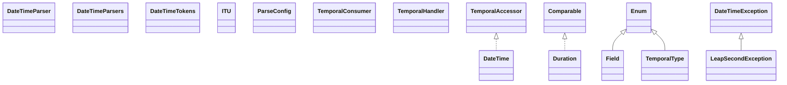

# itu-1.14.0.jar

[Group index](README.md) | [All archives](../README.md)

## Scope and provenance

- **Donor:** `SQX_145_REFERENCE_ROOT/internal/libs/itu-1.14.0.jar`.
- **SHA-256:** `5cf40ab0cc77828ab2b875b1f3ecd71c8295d7721933476abc2e08fddcea164a`; accessed 2026-10-06; captured `2026-10-06T18:54:51.906614+00:00`.
- **Classes:** 34 raw entries; 34 unique entry names. Duplicate occurrence indices are zero-based.
- **Inspection:** read-only ZIP hashing and class-file structural parsing; signatures/descriptors, modifiers, hierarchy and references only. Bytecode bodies are hashed, not published.
- **Allocation:** proposed `FEAT-HOST-ITU`, P02; [roadmap](../../dev/sqx-full-application-roadmap.md). Domain README registration remains required.
- **Repository:** `01067f00031428613c6394064ca1bcadc1ba00ee`; review state unreviewed. Download label 145-dev1; installed build/activation and runtime equivalence unverified.
- **Limit:** every class/member is inventoried; declaration coverage does not establish consumed calls, defaults, formulas, failure semantics or algorithm parity.
- **Archive/resource index:** [040.json](../../dev/evidence/sqx145/archives/145/040.json).

## Complete member declarations

Member shards contain exact JVM names/descriptors, access flags, generic signatures, throws types, declared fields/methods, superclass/interfaces and referenced class names. All classes, nested/synthetic members and overloads are retained. Code length/hash is structural evidence, not a normalized algorithm comparison.

- [001.json](../../dev/evidence/sqx145/members/040/001.json) — SHA-256 `9688cd3a34679eb3a986f1e1d91dd991afc2a131880ebe3074bba832554adb69`.

## Focused structural diagram

Up to twelve non-nested classes; arrows show declared inheritance/interfaces only. External type names are not evidence of an available body or an executed dependency.

## Class inventory

| Archive entry | Occurrence | Class SHA-256 | Fields | Methods |
| --- | ---: | --- | ---: | ---: |
| `com/ethlo/time/DateTime.class` | 0 | `0707d664bbdb8c516819222df24fedf955157313d019fb96362d2882e15294ce` | 12 | 41 |
| `com/ethlo/time/DateTimeParser.class` | 0 | `2049d5e0ee82717807495d68c030b56e1759dbb4559ec0955936faa7c54df9f8` | 0 | 2 |
| `com/ethlo/time/DateTimeParsers.class` | 0 | `625ba3906491ca671f0f088b292abf9b41048717be7700e8026e84de31dd285e` | 2 | 6 |
| `com/ethlo/time/DateTimeTokens.class` | 0 | `b6e728d7c76196e1c55b59cefb837de390a62f1ce22604a49cde5bffb65abb1e` | 0 | 5 |
| `com/ethlo/time/Duration.class` | 0 | `54f52b08258beb0b637ecdbe579c49a717814a9b4f2ab83f93b1cb0bc60ed768` | 10 | 31 |
| `com/ethlo/time/Field.class` | 0 | `674747291d8775b78b0e10f128f69bbb00148956546a83b870af6dee5faa6ef1` | 10 | 8 |
| `com/ethlo/time/ITU$1.class` | 0 | `4fb075ad14665fc828e5be5fa4e2465bd42e1f8204b09d42939d0b54764ee531` | 1 | 11 |
| `com/ethlo/time/ITU.class` | 0 | `a9a952674edb37ead384ae4e1b61251cfc915b64a48dcc8e6683cba2fefefbee` | 0 | 22 |
| `com/ethlo/time/LeapSecondException.class` | 0 | `f16804d49b054a6202eab9b06a102ec287fc25bda2f995e3c33b9012435c4187` | 3 | 4 |
| `com/ethlo/time/ParseConfig.class` | 0 | `58c1fd2d14ed4a5dbde6753325f73085813e69e9723f1e91bd3b5f10ecd4b43d` | 6 | 12 |
| `com/ethlo/time/TemporalConsumer.class` | 0 | `0873ebab9df712b27a1b2ff9479ffb8168a166d591ed640225625b6e2ec8f362` | 0 | 6 |
| `com/ethlo/time/TemporalHandler.class` | 0 | `9587e406f1a70a4acaccc502557df67d4548838d45ea122b4a01540582feebc4` | 0 | 6 |
| `com/ethlo/time/TemporalType.class` | 0 | `4304130fa736edc0e624af1ab11e8849744fea3a76f34a79b696762039e31968` | 6 | 5 |
| `com/ethlo/time/TimezoneOffset.class` | 0 | `2fd97d35910ca21d26b335d0fc073ce32b0126a62fce2257385e05eaa9393856` | 6 | 13 |
| `com/ethlo/time/internal/DateTimeFormatException.class` | 0 | `17317ef0a7a469bb1ae174399f4bc1fd276a92018effb888b673760eb950f884` | 0 | 1 |
| `com/ethlo/time/internal/DurationPartsConsumer.class` | 0 | `e604c818a819e2b364d3388e1f4fbb134a2666f9f0d5484fe99afc143098ffa1` | 15 | 9 |
| `com/ethlo/time/internal/ItuDurationParser.class` | 0 | `de1f90e0770a2630ff817a15f94fe09720294946548babd0f89d2e5198d70597` | 12 | 4 |
| `com/ethlo/time/internal/fixed/ITUFormatter.class` | 0 | `528ed15ad332408e45c1a7dea127637f109211e6270da81cfc47d26f98854221` | 1 | 10 |
| `com/ethlo/time/internal/fixed/ITUParser.class` | 0 | `7e20fc307a86ef076950db5fcd582ab4ae52ea80228c5b970223833e73cf8c79` | 14 | 22 |
| `com/ethlo/time/internal/token/DigitsToken.class` | 0 | `5fb0dab2584709ac18cb777dea9819aed9ef85c8ad82f508b82ef3f5d5e72d37` | 2 | 4 |
| `com/ethlo/time/internal/token/FractionsToken.class` | 0 | `e7ce88d71afca25e35d86ffb2bd7e78eb9ca6a3a8a7e9865e59b727daa4cb0b5` | 0 | 3 |
| `com/ethlo/time/internal/token/SeparatorToken.class` | 0 | `dbefd27d04f1e40354a86d4fcc10d4d8027d7c177dc3c974819807942bb30e27` | 1 | 3 |
| `com/ethlo/time/internal/token/SeparatorsToken.class` | 0 | `6c14580cc1ef58b6c448398b98e103733dead0f2320c50e8d7d7f2127eae1ba5` | 1 | 3 |
| `com/ethlo/time/internal/token/ZoneOffsetToken.class` | 0 | `575cda0453ac86015366bf070877620d65a8e24f4f102c7a23286221486e5de5` | 0 | 3 |
| `com/ethlo/time/internal/util/ArrayUtils.class` | 0 | `af408a1fb7afaafde5b37d700d9b6eb53430f3682ab0bedc5f1c31e9ff0dc863` | 0 | 2 |
| `com/ethlo/time/internal/util/DateTimeMath.class` | 0 | `7ebb39efa21ccc862e34cd34710787d1b20d0eee3b62392795df2da8b0e031c5` | 0 | 2 |
| `com/ethlo/time/internal/util/DefaultLeapSecondHandler.class` | 0 | `323286b4670730da51cb512e4d148c61caf4bf63e63c637e23c074c48309b25a` | 3 | 3 |
| `com/ethlo/time/internal/util/DurationFormatter.class` | 0 | `f9fbd06863d21209009feb56e63d0d1b51d974dad3e2575dacde538a090e3e2b` | 4 | 2 |
| `com/ethlo/time/internal/util/ErrorUtil.class` | 0 | `585a0a33b0c28d1d96ac5671849cd353ff213b5879c60f667a51bb4217e7a77b` | 0 | 6 |
| `com/ethlo/time/internal/util/LeapSecondHandler.class` | 0 | `571d9de68f3ff6efcc4a93fdb5f965543e7148d9253f72d9caada8eaff1b08a9` | 1 | 2 |
| `com/ethlo/time/internal/util/LimitedCharArrayIntegerUtil.class` | 0 | `a4f59e95eba849df61676d449fc2828e8d636e07d2d7c5f10f8c2374c037a49a` | 8 | 8 |
| `com/ethlo/time/token/ConfigurableDateTimeParser.class` | 0 | `dfc4de6b9cee9b35855649192f720f9664e9e648d5b06bbd15d92ef7726943aa` | 1 | 6 |
| `com/ethlo/time/token/DateTimeToken.class` | 0 | `a849f959ab6360a50d1e4ad6cf00fec85c8558cd38b255e2e56f34fd23c9740d` | 0 | 2 |
| `META-INF/versions/9/module-info.class` | 0 | `e78c7417ddd9d81aacf7874a2e335b50c15556c7195c111e8e46fe7fcffbd117` | 0 | 0 |
