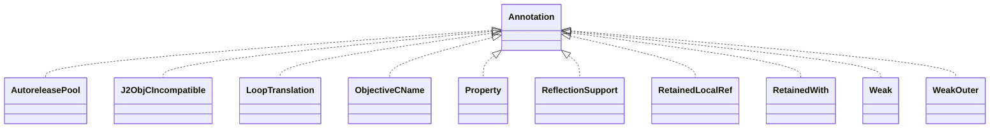

# j2objc-annotations-1.1.jar

[Group index](README.md) | [All archives](../README.md)

## Scope and provenance

- **Donor:** `SQX_145_REFERENCE_ROOT/internal/libs/j2objc-annotations-1.1.jar`.
- **SHA-256:** `2994a7eb78f2710bd3d3bfb639b2c94e219cedac0d4d084d516e78c16dddecf6`; accessed 2026-10-06; captured `2026-10-06T18:54:51.906614+00:00`.
- **Classes:** 12 raw entries; 12 unique entry names. Duplicate occurrence indices are zero-based.
- **Inspection:** read-only ZIP hashing and class-file structural parsing; signatures/descriptors, modifiers, hierarchy and references only. Bytecode bodies are hashed, not published.
- **Allocation:** proposed `FEAT-HOST-J2OBJC-ANNOTATIONS`, P01; [roadmap](../../dev/sqx-full-application-roadmap.md). Domain README registration remains required.
- **Repository:** `01067f00031428613c6394064ca1bcadc1ba00ee`; review state unreviewed. Download label 145-dev1; installed build/activation and runtime equivalence unverified.
- **Limit:** every class/member is inventoried; declaration coverage does not establish consumed calls, defaults, formulas, failure semantics or algorithm parity.
- **Archive/resource index:** [041.json](../../dev/evidence/sqx145/archives/145/041.json).

## Complete member declarations

Member shards contain exact JVM names/descriptors, access flags, generic signatures, throws types, declared fields/methods, superclass/interfaces and referenced class names. All classes, nested/synthetic members and overloads are retained. Code length/hash is structural evidence, not a normalized algorithm comparison.

- [001.json](../../dev/evidence/sqx145/members/041/001.json) — SHA-256 `2dd0b87c4cf7055147fba928c0353fe6638c8f38102be37c0a43646d2593792b`.

## Focused structural diagram

Up to twelve non-nested classes; arrows show declared inheritance/interfaces only. External type names are not evidence of an available body or an executed dependency.

## Class inventory

| Archive entry | Occurrence | Class SHA-256 | Fields | Methods |
| --- | ---: | --- | ---: | ---: |
| `com/google/j2objc/annotations/AutoreleasePool.class` | 0 | `33379f0e255f7302a49e1074ce99f437e670ea48f9c6bc013bd1440101e70a3d` | 0 | 0 |
| `com/google/j2objc/annotations/J2ObjCIncompatible.class` | 0 | `863ab293db2ab6329bcacb944f517c6137e3492e7856813b354b1da4587465f6` | 0 | 0 |
| `com/google/j2objc/annotations/LoopTranslation$LoopStyle.class` | 0 | `af9d32914400cc41e194cd7b6ee6abd77687bc03518846bd0d9d891ed5c17677` | 3 | 4 |
| `com/google/j2objc/annotations/LoopTranslation.class` | 0 | `fe90372da3440dbf5f1354d5f8cc96022a4d6c9328b1f95d2682b06cf2ef38c5` | 0 | 1 |
| `com/google/j2objc/annotations/ObjectiveCName.class` | 0 | `b5c1d062542a7a9b085a318d3950f14060cf8178b00635b37d43ca18362543af` | 0 | 1 |
| `com/google/j2objc/annotations/Property.class` | 0 | `3859b3ebb40a663278b3d12e1adbbdb8b8c5e3f9ea0f3dc18c3172223ac1c4b2` | 0 | 1 |
| `com/google/j2objc/annotations/ReflectionSupport$Level.class` | 0 | `db43f12f488b4527a3b46da1a114d93b454f19995d7460087259ce7c0eaa8361` | 3 | 4 |
| `com/google/j2objc/annotations/ReflectionSupport.class` | 0 | `956c68d3241d486d60d8d2167ff6af5070f8edbc136ff128c81958c93635a2dc` | 0 | 1 |
| `com/google/j2objc/annotations/RetainedLocalRef.class` | 0 | `b437b24085cd09c3cab228cf2beab9c6cfce241102dd5941c784aac09c8ad268` | 0 | 0 |
| `com/google/j2objc/annotations/RetainedWith.class` | 0 | `f0e2b0e3f44a46bf581e91d68f3462eb8cc7afbfad0068e71ce6b6e725699958` | 0 | 0 |
| `com/google/j2objc/annotations/Weak.class` | 0 | `cd3d3bb49f656a760273c70b8085c7ec48f28113bd2f8040459641274783b2a9` | 0 | 0 |
| `com/google/j2objc/annotations/WeakOuter.class` | 0 | `06a79cd9d52453cf853b5bd9ff7dafbaaa7d184971ac242f69e143caf0d14307` | 0 | 0 |
