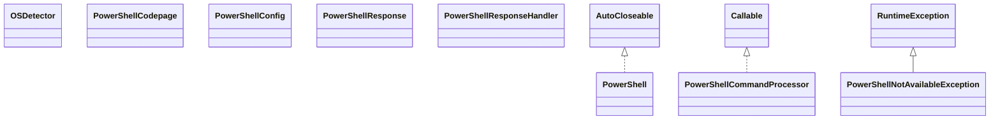

# jPowerShell-3.0.jar

[Group index](README.md) | [All archives](../README.md)

## Scope and provenance

- **Donor:** `SQX_145_REFERENCE_ROOT/internal/libs/jPowerShell-3.0.jar`.
- **SHA-256:** `706451f6a1ff22cf477957bb280593d81d1a975263c3ff2ba1bab15b749a6168`; accessed 2026-10-06; captured `2026-10-06T18:54:51.906614+00:00`.
- **Classes:** 8 raw entries; 8 unique entry names. Duplicate occurrence indices are zero-based.
- **Inspection:** read-only ZIP hashing and class-file structural parsing; signatures/descriptors, modifiers, hierarchy and references only. Bytecode bodies are hashed, not published.
- **Allocation:** proposed `FEAT-HOST-JPOWERSHELL`, P17; [roadmap](../../dev/sqx-full-application-roadmap.md). Domain README registration remains required.
- **Repository:** `01067f00031428613c6394064ca1bcadc1ba00ee`; review state unreviewed. Download label 145-dev1; installed build/activation and runtime equivalence unverified.
- **Limit:** every class/member is inventoried; declaration coverage does not establish consumed calls, defaults, formulas, failure semantics or algorithm parity.
- **Archive/resource index:** [063.json](../../dev/evidence/sqx145/archives/145/063.json).

## Complete member declarations

Member shards contain exact JVM names/descriptors, access flags, generic signatures, throws types, declared fields/methods, superclass/interfaces and referenced class names. All classes, nested/synthetic members and overloads are retained. Code length/hash is structural evidence, not a normalized algorithm comparison.

- [001.json](../../dev/evidence/sqx145/members/063/001.json) — SHA-256 `153e7bd686612bede722fa3c40998bb2ce005eed20f329d6f8c59b80a8ef8ff0`.

## Focused structural diagram

Up to twelve non-nested classes; arrows show declared inheritance/interfaces only. External type names are not evidence of an available body or an executed dependency.

## Class inventory

| Archive entry | Occurrence | Class SHA-256 | Fields | Methods |
| --- | ---: | --- | ---: | ---: |
| `com/profesorfalken/jpowershell/OSDetector.class` | 0 | `74626c26922f4d11ea69ccdba6eaf242dd7b4713769b761a30fdb0709a6ac2ef` | 1 | 6 |
| `com/profesorfalken/jpowershell/PowerShell.class` | 0 | `146c5708448936c1a8f837c0b4e2bd99048b2b758216349059a7bdeb7c478e21` | 12 | 20 |
| `com/profesorfalken/jpowershell/PowerShellCodepage.class` | 0 | `256806f68ad766401bb50afcc077b1e14c359724a9a0d8d5ce5d98b5fe2ae56e` | 1 | 4 |
| `com/profesorfalken/jpowershell/PowerShellCommandProcessor.class` | 0 | `8ba5a958875311b4d32d7b21dae9d40e59381ad1a0291be15fac800eb87c9402` | 5 | 7 |
| `com/profesorfalken/jpowershell/PowerShellConfig.class` | 0 | `2e685b5078a9a19520b0c95bb6858a6800f1ada84112f132fc62b3372420e916` | 2 | 2 |
| `com/profesorfalken/jpowershell/PowerShellNotAvailableException.class` | 0 | `e38ef8d301c9f9a0fc332c50c0f566aa14980a80c970329f4aa16c9524f171d1` | 0 | 2 |
| `com/profesorfalken/jpowershell/PowerShellResponse.class` | 0 | `427f5ea41281707daff5dabd8f9fed586c01e82fe6f0f19e18919a50748b4ca1` | 3 | 4 |
| `com/profesorfalken/jpowershell/PowerShellResponseHandler.class` | 0 | `e61b1e643e830ade477a860d55691b3565a927857354833ffbdde12a0cd454ec` | 0 | 1 |
