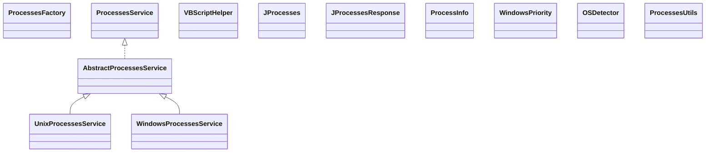

# jProcesses-1.6.5.jar

[Group index](README.md) | [All archives](../README.md)

## Scope and provenance

- **Donor:** `SQX_145_REFERENCE_ROOT/internal/libs/jProcesses-1.6.5.jar`.
- **SHA-256:** `57f61d01102f0e88e87c4a3cae6ccea3e5b390a38aeb3abd2ed20b06f25466ea`; accessed 2026-10-06; captured `2026-10-06T18:54:51.906614+00:00`.
- **Classes:** 12 raw entries; 12 unique entry names. Duplicate occurrence indices are zero-based.
- **Inspection:** read-only ZIP hashing and class-file structural parsing; signatures/descriptors, modifiers, hierarchy and references only. Bytecode bodies are hashed, not published.
- **Allocation:** proposed `FEAT-HOST-J-PROCESSES`, P01; [roadmap](../../dev/sqx-full-application-roadmap.md). Domain README registration remains required.
- **Repository:** `01067f00031428613c6394064ca1bcadc1ba00ee`; review state unreviewed. Download label 145-dev1; installed build/activation and runtime equivalence unverified.
- **Limit:** every class/member is inventoried; declaration coverage does not establish consumed calls, defaults, formulas, failure semantics or algorithm parity.
- **Archive/resource index:** [064.json](../../dev/evidence/sqx145/archives/145/064.json).

## Complete member declarations

Member shards contain exact JVM names/descriptors, access flags, generic signatures, throws types, declared fields/methods, superclass/interfaces and referenced class names. All classes, nested/synthetic members and overloads are retained. Code length/hash is structural evidence, not a normalized algorithm comparison.

- [001.json](../../dev/evidence/sqx145/members/064/001.json) — SHA-256 `2e9e243f97c2bd7295cbdf0bfea7ebe7443c1362a591c127d03156a6a5d1ae91`.

## Focused structural diagram

Up to twelve non-nested classes; arrows show declared inheritance/interfaces only. External type names are not evidence of an available body or an executed dependency.

## Class inventory

| Archive entry | Occurrence | Class SHA-256 | Fields | Methods |
| --- | ---: | --- | ---: | ---: |
| `org/jutils/jprocesses/info/AbstractProcessesService.class` | 0 | `b09503673a03a31cf975053aa35c9977d128565ebfc6069dead43460247f05a3` | 1 | 12 |
| `org/jutils/jprocesses/info/ProcessesFactory.class` | 0 | `492d4e41ec7d717afda2a14a9d8fe0489e9d81920d13ca31ae13a7d7a4bd9ab7` | 0 | 2 |
| `org/jutils/jprocesses/info/ProcessesService.class` | 0 | `8a7c178a2b0b6ad70a6fb9ce94022343cad8fa4c6ef07d905debf14837d2bbd9` | 0 | 9 |
| `org/jutils/jprocesses/info/UnixProcessesService.class` | 0 | `60f153107e9a2504795761713312746138d2dbfb318355d57910c1313df9bc82` | 5 | 11 |
| `org/jutils/jprocesses/info/VBScriptHelper.class` | 0 | `1d22384bfc5f7009d227ebc58e8418eb9ad7df01d139f0863efcaf6c580b951b` | 1 | 4 |
| `org/jutils/jprocesses/info/WindowsProcessesService.class` | 0 | `451668e6ab9be6305ea7781855448c9b9b31155f5a85fad391469635a8052264` | 15 | 17 |
| `org/jutils/jprocesses/JProcesses.class` | 0 | `eba81a71ac4c02f93b9e5a2707c57a486e1bb7673ea27f5f4633f41734d5deb5` | 1 | 13 |
| `org/jutils/jprocesses/model/JProcessesResponse.class` | 0 | `2c2489fd52f476f70f7d4eda6111845ee25ac2815f4cb7f577294df4ad1fda9e` | 2 | 5 |
| `org/jutils/jprocesses/model/ProcessInfo.class` | 0 | `e8a4b692366d3432ca498b0017e8f4d9a6217fbaa20558cc29b8372f6804915f` | 11 | 28 |
| `org/jutils/jprocesses/model/WindowsPriority.class` | 0 | `9d2093fea5897e53196d69c72e1ce5b67fc9cc848cae1fca08f4bcd8c4ac5f31` | 6 | 1 |
| `org/jutils/jprocesses/util/OSDetector.class` | 0 | `10beb167d48abdd1238c1cb1dd29199e7bd90a735da510ef626d049aca62edfa` | 1 | 7 |
| `org/jutils/jprocesses/util/ProcessesUtils.class` | 0 | `6ca2d87d0f4d02d9d2b7163a2415f32a946a975144db603a179c378daa31d08f` | 3 | 11 |
