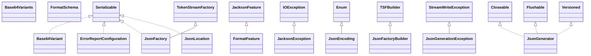

# jackson-core-2.21.1.jar

[Group index](README.md) | [All archives](../README.md)

## Scope and provenance

- **Donor:** `SQX_145_REFERENCE_ROOT/internal/libs/jackson-core-2.21.1.jar`.
- **SHA-256:** `1edd5f2e49dca5f8e4519957c24b7b3050bd1c7ee883920da33cff031ff1f7c0`; accessed 2026-10-06; captured `2026-10-06T18:54:51.906614+00:00`.
- **Classes:** 221 raw entries; 221 unique entry names. Duplicate occurrence indices are zero-based.
- **Inspection:** read-only ZIP hashing and class-file structural parsing; signatures/descriptors, modifiers, hierarchy and references only. Bytecode bodies are hashed, not published.
- **Allocation:** proposed `FEAT-HOST-JACKSON-CORE`, P02; [roadmap](../../dev/sqx-full-application-roadmap.md). Domain README registration remains required.
- **Repository:** `01067f00031428613c6394064ca1bcadc1ba00ee`; review state unreviewed. Download label 145-dev1; installed build/activation and runtime equivalence unverified.
- **Limit:** every class/member is inventoried; declaration coverage does not establish consumed calls, defaults, formulas, failure semantics or algorithm parity.
- **Archive/resource index:** [043.json](../../dev/evidence/sqx145/archives/145/043.json).

## Complete member declarations

Member shards contain exact JVM names/descriptors, access flags, generic signatures, throws types, declared fields/methods, superclass/interfaces and referenced class names. All classes, nested/synthetic members and overloads are retained. Code length/hash is structural evidence, not a normalized algorithm comparison.

- [001.json](../../dev/evidence/sqx145/members/043/001.json) — SHA-256 `0dc0f481be952683c03205c2b4a16879266d61a98f194c467dcf697de930f2dc`.
- [002.json](../../dev/evidence/sqx145/members/043/002.json) — SHA-256 `da34bd34d7e195c2f85e57ff842625136c666af7f570a895d8257a109d29ebd7`.
- [003.json](../../dev/evidence/sqx145/members/043/003.json) — SHA-256 `7682b0f41e1267a665e6a89e2f9dcb7a6d0ff1af71883de330b555fb3708061c`.

## Focused structural diagram

Up to twelve non-nested classes; arrows show declared inheritance/interfaces only. External type names are not evidence of an available body or an executed dependency.

## Class inventory

| Archive entry | Occurrence | Class SHA-256 | Fields | Methods |
| --- | ---: | --- | ---: | ---: |
| `com/fasterxml/jackson/core/Base64Variant$PaddingReadBehaviour.class` | 0 | `777362c6428d01bebc2636913bd0eba1f8354591940cc29821fc140968c0402f` | 4 | 4 |
| `com/fasterxml/jackson/core/Base64Variant.class` | 0 | `a2bf94061c0386b1d35846ef01ab4fcd34075c0742735766858aa6a986cc6a26` | 13 | 45 |
| `com/fasterxml/jackson/core/Base64Variants.class` | 0 | `915d9013b5efbb3701ed0b5fef3d91bf06e810b36f102307cfa33268f4a05ff2` | 5 | 4 |
| `com/fasterxml/jackson/core/ErrorReportConfiguration$Builder.class` | 0 | `1bb7b6a438b73e6bfe7f3b71ef01e15d32d0b3cea3e662eaf2e8d01906d5b71a` | 2 | 6 |
| `com/fasterxml/jackson/core/ErrorReportConfiguration.class` | 0 | `8bcdcf6450f26fff1923f8cd81d0595fd4b78bcccd90b1492ab3448dead8b90b` | 6 | 10 |
| `com/fasterxml/jackson/core/FormatFeature.class` | 0 | `41ef5bdbba8e95a705767c2e6a3d5be5da05fca3a6f8213e887550aa4915d219` | 0 | 3 |
| `com/fasterxml/jackson/core/FormatSchema.class` | 0 | `260e840fb470c72aacde25f0a879ec84ca040faf0497222742aac736172c3ee8` | 0 | 1 |
| `com/fasterxml/jackson/core/JacksonException.class` | 0 | `599633e0589c0c569c24644623e1a7556d83a10fe98c331d1359e46eec851fda` | 1 | 6 |
| `com/fasterxml/jackson/core/JsonEncoding.class` | 0 | `12b4edfe18d9570a7e7493659e4571466ca1c2ae0aa3398b0eee51f4570ddd0a` | 9 | 7 |
| `com/fasterxml/jackson/core/JsonFactory$Feature.class` | 0 | `0ffb3e94ddf985b103c0a013b3e51bf891496355102e994d67b3bde9b2162f07` | 7 | 8 |
| `com/fasterxml/jackson/core/JsonFactory.class` | 0 | `1d6e8058b26c5c2d7c00e09f5b17a3303c40aa420fa50dfe29a2460c71722d47` | 24 | 110 |
| `com/fasterxml/jackson/core/JsonFactoryBuilder.class` | 0 | `403ffb85dbd447a9ffb8aaf74051911177ea9c4a2466c098f0049cdb1dd40439` | 4 | 32 |
| `com/fasterxml/jackson/core/JsonGenerationException.class` | 0 | `d93f3ba4cc1ca8a7550d8aec3fc1819d2e87b6ba0e5a117a0b1e88b016589ea9` | 1 | 10 |
| `com/fasterxml/jackson/core/JsonGenerator$1.class` | 0 | `ee9801f71c1176cce53b98802848d060def661632e0eeb9ba8ae9781793e8c74` | 2 | 1 |
| `com/fasterxml/jackson/core/JsonGenerator$Feature.class` | 0 | `b0318a36d44a4d74d53997855fd7f296acf6d6c77965191c0167154db22caa14` | 17 | 8 |
| `com/fasterxml/jackson/core/JsonGenerator.class` | 0 | `17a789f45c2cfd669eb26e24fbfeff0cbf175a7be3b8a88bc5aa505cfd51b487` | 4 | 138 |
| `com/fasterxml/jackson/core/JsonLocation.class` | 0 | `58304afa5b9bbc0ad0d5e1713d5cf8c7e49a3fb531f228a5c7c2ee9b766fb8a1` | 9 | 18 |
| `com/fasterxml/jackson/core/JsonParseException.class` | 0 | `73b67d9ebb1fc51571f13c9e315e37825bbaf8b2e6d09e2bf4a8d251309e2ebc` | 1 | 16 |
| `com/fasterxml/jackson/core/JsonParser$Feature.class` | 0 | `6c08ee7523f27747af0b15bee38621fc0b70d1828a537e22b931a5928622a04d` | 24 | 8 |
| `com/fasterxml/jackson/core/JsonParser$NumberType.class` | 0 | `d012ee19a0ea2888d7be88accb816049fb88e5000d8505801c766b2b80884e0f` | 7 | 4 |
| `com/fasterxml/jackson/core/JsonParser$NumberTypeFP.class` | 0 | `d336caf1d0afdb3725614ee3d16a631e1b2e9fd93073e7d9b66b4d5defc82a5b` | 6 | 4 |
| `com/fasterxml/jackson/core/JsonParser.class` | 0 | `418fb94224c84fc21855bdcc7322f394aaccec3016d3dc9df0c23f6ab9de79c4` | 7 | 121 |
| `com/fasterxml/jackson/core/JsonPointer$PointerParent.class` | 0 | `537cfde6c768a80e2282fcbe991f5127becc4937d2dc2e9b26a238633097ae45` | 3 | 1 |
| `com/fasterxml/jackson/core/JsonPointer$PointerSegment.class` | 0 | `a66f26ca0c7f3d71ba7a098a6d74993cd654f3d9e8defdd61ccf39633a658420` | 5 | 1 |
| `com/fasterxml/jackson/core/JsonPointer$Serialization.class` | 0 | `b97787551bb7a61bf88285cf212a8db261813164c50661de5a599df4b7100b95` | 1 | 5 |
| `com/fasterxml/jackson/core/JsonPointer.class` | 0 | `182cd09b1946ef74763731aa2df8915b5f71b6848fd0967176ce56931fadf4cb` | 13 | 39 |
| `com/fasterxml/jackson/core/JsonProcessingException.class` | 0 | `eff47889d7e5165bc21fc74cf8d8d257317bf8b731f37dce94d123e8f7b58b2a` | 2 | 12 |
| `com/fasterxml/jackson/core/JsonStreamContext.class` | 0 | `ac9cfc339b41d50b938728f35916049656e194184a7a68702a54310d20ee2d27` | 6 | 23 |
| `com/fasterxml/jackson/core/JsonToken$1.class` | 0 | `b73738d313c128fcee9eea37f367e78fd90ab3ddeffe97ba20da08ab85ed6a8d` | 1 | 1 |
| `com/fasterxml/jackson/core/JsonToken.class` | 0 | `329d05647c4c473afcd6330433b09e952eefb53f2321d38d970a3d5cad3b999a` | 23 | 14 |
| `com/fasterxml/jackson/core/JsonTokenId.class` | 0 | `63ac0edfa3281446cd8e45a2a8245f496dd6e3441ba694c046674f47f3601a80` | 14 | 0 |
| `com/fasterxml/jackson/core/JsonpCharacterEscapes.class` | 0 | `8cc425da65fd637ddd2065cdd2ba4c50687ed3a5908c9fd35c49974e93335404` | 5 | 5 |
| `com/fasterxml/jackson/core/ObjectCodec.class` | 0 | `33ce3e548858979c33bfcda3172e63fd2d560c456f28514370f1a5d2f04000c6` | 0 | 17 |
| `com/fasterxml/jackson/core/PrettyPrinter.class` | 0 | `298714c1f4041fcf5d659b9de8d3ef5f846438ed7390fe49b030fe1f57e95a8a` | 2 | 11 |
| `com/fasterxml/jackson/core/SerializableString.class` | 0 | `df271b8c7701091f54d9a163d82d439cbd38148674ceeb0f89042371940ae892` | 0 | 13 |
| `com/fasterxml/jackson/core/StreamReadCapability.class` | 0 | `2df49ee48d33d83136122f5050a9cdbc8b4b875e0e8d4b731870f139dab30b75` | 7 | 7 |
| `com/fasterxml/jackson/core/StreamReadConstraints$Builder.class` | 0 | `3ccd50ee6cc3b380d63d6e5cda02a1e7f5b147a1a0ca7cd6415451878c05c11e` | 6 | 10 |
| `com/fasterxml/jackson/core/StreamReadConstraints.class` | 0 | `77cd51325beff287d7f21095cef5ad38eb53b100ca2e2eb9ce61b6f7aeeda7da` | 15 | 26 |
| `com/fasterxml/jackson/core/StreamReadFeature.class` | 0 | `8e6394d820cf72c37ccd618210794752764aeafb349bad1a6bf5d01f76c70286` | 11 | 9 |
| `com/fasterxml/jackson/core/StreamWriteCapability.class` | 0 | `babcb786e2bd2c79caef9ce3515be9b70dd9f0856d097c236bb7359ed04341f0` | 5 | 7 |
| `com/fasterxml/jackson/core/StreamWriteConstraints$Builder.class` | 0 | `4e301d9b96c20e41c3b109a09d678b1bb594df71104fe89d4d77f89463cd1580` | 1 | 5 |
| `com/fasterxml/jackson/core/StreamWriteConstraints.class` | 0 | `70b3074b695a460b31e5f64871710ff4e2801b2dfdf79f2c99fb5d787265308e` | 4 | 10 |
| `com/fasterxml/jackson/core/StreamWriteFeature.class` | 0 | `a3b1bbedecfa9e28504a0e5bedb06ce5c20e1a9ea8f012915a5914492dad858a` | 11 | 9 |
| `com/fasterxml/jackson/core/TSFBuilder.class` | 0 | `ddf83382ac4cd1740e0171410f7967ec111f117d5f5a21952f6729237cd1a656` | 13 | 48 |
| `com/fasterxml/jackson/core/TokenStreamFactory.class` | 0 | `8bcd558ef5521fcd76fc185f025871a072d8f4fe5a724708869171a8df56c8f7` | 1 | 45 |
| `com/fasterxml/jackson/core/TreeCodec.class` | 0 | `b85be2544ade6f973a694a51da607c4ebaa118366c44d5e0bad943a529a3a30e` | 0 | 8 |
| `com/fasterxml/jackson/core/TreeNode.class` | 0 | `ae4675944ab535f8dbd3770f430fa0e1bb9f77936d40ff302a9dc907b81144fb` | 0 | 17 |
| `com/fasterxml/jackson/core/Version.class` | 0 | `6ae067615ff645339241168844ce897c5105ba9c4b6fdb709cb29794c3fe5dc4` | 8 | 18 |
| `com/fasterxml/jackson/core/Versioned.class` | 0 | `3586ed19651524b5c4f0cb2424d4487e6db7301b78d13e6d543ed145ff3c3fe1` | 0 | 1 |
| `com/fasterxml/jackson/core/async/ByteArrayFeeder.class` | 0 | `b0d57dbbd245277df95f675078777a6b13a3cf94fc539bfc1b180126fe2bf532` | 0 | 1 |
| `com/fasterxml/jackson/core/async/ByteBufferFeeder.class` | 0 | `a51321fd51f5a01c3f30686dbd1bce2b999b5bb52e0db1fac628e8ffebc159f3` | 0 | 1 |
| `com/fasterxml/jackson/core/async/NonBlockingInputFeeder.class` | 0 | `45a888af975a7c062a1e39686252984d3c1aa1faab281794b8bc332a8da3d602` | 0 | 2 |
| `com/fasterxml/jackson/core/async/package-info.class` | 0 | `35195842d289d6c4f77ae2753307f806a596a25034af4600af03629db158acc3` | 0 | 0 |
| `com/fasterxml/jackson/core/base/GeneratorBase.class` | 0 | `fc8471dfef109b245370d833be691ad03b10b0d0fdb6aa661f17c427b08cc737` | 18 | 41 |
| `com/fasterxml/jackson/core/base/ParserBase.class` | 0 | `98c1c3f35e6ea630ed3401c02402bb8bb73b7b1337cf8e504e29c91c1cf2c23e` | 31 | 81 |
| `com/fasterxml/jackson/core/base/ParserMinimalBase.class` | 0 | `6db5dfe71996e5a6e4db7fb6dfa6a0bed1a93331d66c3a1824e2e8cfa8734a1d` | 54 | 78 |
| `com/fasterxml/jackson/core/base/package-info.class` | 0 | `a73095a736f22ba1df3e2f715f0eca95122fa53d33dbacdb0bff3b220f1b4a59` | 0 | 0 |
| `com/fasterxml/jackson/core/exc/InputCoercionException.class` | 0 | `9da2533f59da8c6fc33b34e2d60176829904153479479a38ae8724fff8da398b` | 3 | 7 |
| `com/fasterxml/jackson/core/exc/StreamConstraintsException.class` | 0 | `597c40400956f535d1bb888b0add237d2e49b78349c797c2904c482c95528c56` | 1 | 2 |
| `com/fasterxml/jackson/core/exc/StreamReadException.class` | 0 | `488e50ff3fc79d037d8f21afabb1cc5e498b6973d97121a7c7867496e68232f5` | 3 | 14 |
| `com/fasterxml/jackson/core/exc/StreamWriteException.class` | 0 | `1da18023bc43312545d07bc9df2605bff4390433fc0a9d182d6987e092ef4951` | 2 | 6 |
| `com/fasterxml/jackson/core/exc/package-info.class` | 0 | `0c228a00d2e363e6d612739ebb889f60bd06d60839c4355faf3f9653a6191fc3` | 0 | 0 |
| `com/fasterxml/jackson/core/filter/FilteringGeneratorDelegate.class` | 0 | `2c3b964df816cf3c5915f396643c19bbb51e5e9d6731660003db36a2815af945` | 6 | 54 |
| `com/fasterxml/jackson/core/filter/FilteringParserDelegate.class` | 0 | `ba7b5f023fb89becad65a25fc409b6caa86a1e46cb707741479a101841473270` | 9 | 63 |
| `com/fasterxml/jackson/core/filter/JsonPointerBasedFilter.class` | 0 | `0d40f156d93c581470acb8e9ddf1aec8e027774efeae908a1f9a3305e014a0b1` | 2 | 10 |
| `com/fasterxml/jackson/core/filter/TokenFilter$Inclusion.class` | 0 | `f1a67663507e941d9be6a0fdcd8a060a3ea29fb0f595e664334e2b806d92d531` | 4 | 4 |
| `com/fasterxml/jackson/core/filter/TokenFilter.class` | 0 | `38784ccac76d45e750ec479d6b6236841e8ddc7193c93ff0cf9595b3801f673d` | 1 | 27 |
| `com/fasterxml/jackson/core/filter/TokenFilterContext.class` | 0 | `588d41f7b9ec2aedb59720a705e33855a01f13d3a403e6a79568b532a002e644` | 6 | 25 |
| `com/fasterxml/jackson/core/format/DataFormatDetector.class` | 0 | `091a105ce60cfd264aa3d4ae65948705e1c4e11beec18fd62c2eb467fc0d0a19` | 5 | 11 |
| `com/fasterxml/jackson/core/format/DataFormatMatcher.class` | 0 | `916599f906d283c666b7602bc0b36cb64a0a6cf1cf1a31bf7718bbb9fba53877` | 6 | 7 |
| `com/fasterxml/jackson/core/format/InputAccessor$Std.class` | 0 | `f41e7025b2649370a6ff9836d8cb9856bbba2269ad176db89545b79657909b52` | 5 | 7 |
| `com/fasterxml/jackson/core/format/InputAccessor.class` | 0 | `21870ef4c190ed78f1d0bf88918b80afc6f7445df6d9e6c31baee55ff8037aa4` | 0 | 3 |
| `com/fasterxml/jackson/core/format/MatchStrength.class` | 0 | `1616e2545838dbd443a09263dd35db1c926dd05d3f441a6be7d769ce82320222` | 6 | 4 |
| `com/fasterxml/jackson/core/format/package-info.class` | 0 | `5acdd9d0056b06fdd1f0dcc3adf097d0580825863637adc4597862b7bff32ae9` | 0 | 0 |
| `com/fasterxml/jackson/core/io/BigDecimalParser.class` | 0 | `1d1956a3cd263bd12ee885138a3e1d782ee7d25af5cfe301c47c6acc5a3b17b5` | 2 | 11 |
| `com/fasterxml/jackson/core/io/BigIntegerParser.class` | 0 | `e3f64fff689ef145a829960ee8cc28824d7178e6334a296c810157040d68ce6b` | 0 | 3 |
| `com/fasterxml/jackson/core/io/CharTypes$AltEscapes.class` | 0 | `4b22050d391fe8e1bf0b5f5479c6519c9c4570162500cf150b0bd5d7b5aa480c` | 3 | 4 |
| `com/fasterxml/jackson/core/io/CharTypes.class` | 0 | `67cfd5d1b5e3208300342e649a2fd23775f7be382a46a16901c34e80c2a9e89e` | 13 | 18 |
| `com/fasterxml/jackson/core/io/CharacterEscapes.class` | 0 | `fb0a01c92c3add625d1bf0cde9d92698cba44f936323c47fc8a6158ce9a78872` | 3 | 4 |
| `com/fasterxml/jackson/core/io/ContentReference.class` | 0 | `2a4cabfe01fd90b6232ca4f2a68d769a76c33adca5538c16bf9d3c098409213d` | 9 | 31 |
| `com/fasterxml/jackson/core/io/DataOutputAsStream.class` | 0 | `9c188ed411a6e581459e29b651c6b090324659a916e018a42fe43f47e8a37bfe` | 1 | 4 |
| `com/fasterxml/jackson/core/io/IOContext.class` | 0 | `7e5f3653cd167c6c03b4c4531c2c4acf28fd0407bb1123278555528c8dab14ce` | 16 | 38 |
| `com/fasterxml/jackson/core/io/InputDecorator.class` | 0 | `5e1c10ed8823b660ebb57bb1802acc7eed98ef9dc77bea1ecf11a3581fadc569` | 1 | 5 |
| `com/fasterxml/jackson/core/io/JsonEOFException.class` | 0 | `64358947485fbd2d48efa39914a2a42b078e8ab4926e716c6a89bca3b3774688` | 2 | 2 |
| `com/fasterxml/jackson/core/io/JsonStringEncoder.class` | 0 | `20040ae960b006487ab24e9d5b26dee52146ce0fdb27a92eefb863846de9f9e4` | 11 | 17 |
| `com/fasterxml/jackson/core/io/MergedStream.class` | 0 | `acf7fb50cc0743bce4751427a255bba6707750c9ee1405d07e653c88ae0c6e58` | 5 | 11 |
| `com/fasterxml/jackson/core/io/NumberInput.class` | 0 | `16e74a9e7641ac3cf5cb623047ca0a25f6263ded74e0451c64b7f3929c40ccaf` | 6 | 31 |
| `com/fasterxml/jackson/core/io/NumberOutput.class` | 0 | `9c807a67467c1a0a747f9f562179691c406feffd4b0efe33f3d15e5e20f3ccf6` | 10 | 29 |
| `com/fasterxml/jackson/core/io/OutputDecorator.class` | 0 | `ef8ddc3887e56798c94a539f99ecc76deeb635666c142ce7371680bc9314efba` | 0 | 3 |
| `com/fasterxml/jackson/core/io/SegmentedStringWriter.class` | 0 | `a183a09737b6259c5a581fa5b824960d151ab6960ee528dfe81b6da627a02c1c` | 1 | 16 |
| `com/fasterxml/jackson/core/io/SerializedString.class` | 0 | `ae74c1338b897f1109c99b799931cf9facba97aa12b75aecbf544e99a40af1ac` | 7 | 21 |
| `com/fasterxml/jackson/core/io/UTF32Reader.class` | 0 | `8b1c79307c92221045af2639a7858a1720522c6173f53d01e8d0536f29e57daa` | 13 | 10 |
| `com/fasterxml/jackson/core/io/UTF8Writer.class` | 0 | `3674d15e0cffb93eab3a8a85bd4033eb7f842537158e8c97dc5e2563c907dbe6` | 11 | 13 |
| `com/fasterxml/jackson/core/io/schubfach/DoubleToDecimal.class` | 0 | `676726b6b3945f8c93cf9512a6f5611f5fcef5442ea6d6368d3ff5a3be79a4db` | 24 | 18 |
| `com/fasterxml/jackson/core/io/schubfach/FloatToDecimal.class` | 0 | `25a99ad593a7cbfcda2d33795431753d8aaacba0bdff03f1d7230812be78a0f4` | 24 | 17 |
| `com/fasterxml/jackson/core/io/schubfach/MathUtils.class` | 0 | `a09da2ad9a78734e00358cd2153333711f3b9c1ff2679a6d871688352be0d3b9` | 10 | 9 |
| `com/fasterxml/jackson/core/json/ByteSourceJsonBootstrapper.class` | 0 | `57a7a50503fe708b534701d1c70b841525b43279f06d3a096fbc1dd65db8d5e3` | 12 | 15 |
| `com/fasterxml/jackson/core/json/DupDetector.class` | 0 | `6f06aaef6e46b4204f4bfceafff6ddd538a1ae681d275c4156a53741b8e504b6` | 4 | 8 |
| `com/fasterxml/jackson/core/json/JsonGeneratorImpl.class` | 0 | `760d4e77b91b8643ea6a0f136520182b639af5d51b52d0c2f3c1a3542177b87e` | 9 | 16 |
| `com/fasterxml/jackson/core/json/JsonParserBase.class` | 0 | `b88956e79c42f1b34fc318d418d90bc5eae57bc3329198401ed067a9070c6cbf` | 12 | 12 |
| `com/fasterxml/jackson/core/json/JsonReadContext.class` | 0 | `8ed4021d093b3f995c213748d20033bb54e8afb296c8702a4aec32829e7b13bd` | 7 | 21 |
| `com/fasterxml/jackson/core/json/JsonReadFeature.class` | 0 | `f5ed9b57b42fe5f1edeb7b7c64203c44bfdc39178f94f2df08e5d0d0df83de42` | 18 | 9 |
| `com/fasterxml/jackson/core/json/JsonWriteContext.class` | 0 | `51baf0b5b626314270959620db748a435b4b05c8ff83d0b28139f7710b0789df` | 12 | 22 |
| `com/fasterxml/jackson/core/json/JsonWriteFeature.class` | 0 | `bca45bfe5e158a990f453922d0a44ccccd637741bd17835cec243cb4fa3d0d5b` | 11 | 9 |
| `com/fasterxml/jackson/core/json/PackageVersion.class` | 0 | `2d180d0a46fe954c6a4978d0f3ef24874bb1faf85ad006a36bff74d89533fc45` | 1 | 3 |
| `com/fasterxml/jackson/core/json/ReaderBasedJsonParser.class` | 0 | `b6959b891095a643e63a3c3e8ee20c694a6d1caa09e220ed23fb7d82eaa7e459` | 10 | 82 |
| `com/fasterxml/jackson/core/json/UTF8DataInputJsonParser.class` | 0 | `245d8f5fbb20df9e7bb1f3180929aaf10662c27f51b5de9011e327ff6a4228c4` | 6 | 89 |
| `com/fasterxml/jackson/core/json/UTF8JsonGenerator.class` | 0 | `05504752eac4f91c734b268676c15a0eb1da8121524d36bd6e83b18569eb5650` | 25 | 88 |
| `com/fasterxml/jackson/core/json/UTF8StreamJsonParser.class` | 0 | `9bae65f3ec9f7682a2dd8be5df5ef9d7fa8654e402a44c7c8ee3f543132217a0` | 11 | 110 |
| `com/fasterxml/jackson/core/json/WriterBasedJsonGenerator.class` | 0 | `7fefb1668d139cc63b168d50e7e28b1ddfca4d49a8ffdd6fc371676a4a0a75bf` | 12 | 79 |
| `com/fasterxml/jackson/core/json/async/NonBlockingByteBufferJsonParser.class` | 0 | `139b7c2c538a6b87dc929733765510af94a32166a7d4315c05a98b14a1019de0` | 1 | 7 |
| `com/fasterxml/jackson/core/json/async/NonBlockingJsonParser.class` | 0 | `95bcb2bef0cc0d368a2139f3f9a058d3619b23d66d15401e9cd536d8bc3c6f4a` | 1 | 8 |
| `com/fasterxml/jackson/core/json/async/NonBlockingJsonParserBase.class` | 0 | `3d8e94ff16f790f2468938b7c7414e7e86cb8477e566a1dc75cc2ac2aa0548e2` | 67 | 44 |
| `com/fasterxml/jackson/core/json/async/NonBlockingUtf8JsonParserBase.class` | 0 | `3843d437db652d913aaef12382378b1f1b5cc36668cc022fa9864aa785ce4a25` | 10 | 76 |
| `com/fasterxml/jackson/core/json/async/package-info.class` | 0 | `9d3d54b605975114e0e5ea295ebf307e57df1556358d72c28d69e64d614f056a` | 0 | 0 |
| `com/fasterxml/jackson/core/json/package-info.class` | 0 | `58de7ab0bd4228a2afd23ae7f1d1dd51c281f91ec2264c8bcea22836337ebb56` | 0 | 0 |
| `com/fasterxml/jackson/core/package-info.class` | 0 | `11e90e20b437ea8d42b6987632171036621f632af033cbde5fea709c4df4e8e9` | 0 | 0 |
| `com/fasterxml/jackson/core/sym/ByteQuadsCanonicalizer$TableInfo.class` | 0 | `007cf41fbbfb64c3ecef20ab53d94ebd4236ccb9e35ea0605748d4616b7593c6` | 7 | 3 |
| `com/fasterxml/jackson/core/sym/ByteQuadsCanonicalizer.class` | 0 | `a6b2d96ef8601c715e3afa321fcbdca3abaabda12c8093721bbebfe0c6c71fdb` | 22 | 50 |
| `com/fasterxml/jackson/core/sym/CharsToNameCanonicalizer$Bucket.class` | 0 | `c0d5506f5fa3a6160227a07b48a93ea9794a273a9466ccfb40b2d1371d176705` | 3 | 2 |
| `com/fasterxml/jackson/core/sym/CharsToNameCanonicalizer$TableInfo.class` | 0 | `d12d6ff4486e63f5e7195d463dad58aa5c1a5e3ab074274200574c9ab7b493c8` | 4 | 3 |
| `com/fasterxml/jackson/core/sym/CharsToNameCanonicalizer.class` | 0 | `e0a1cce8cec328c987ae5cbe44bdf54b4174728020fef7b02696ebc911941307` | 19 | 28 |
| `com/fasterxml/jackson/core/sym/Name.class` | 0 | `fe70f38dbca2e08208e9b935f453ca3160687c407018646cf1f43f42e96c53c5` | 2 | 9 |
| `com/fasterxml/jackson/core/sym/Name1.class` | 0 | `4c8aec7be60fc83b16d6eca135c56f838820be3763bda31275c81b144820c8ac` | 2 | 7 |
| `com/fasterxml/jackson/core/sym/Name2.class` | 0 | `6dffe08e033dad2a407be193c132839d756fd6c5aeb484e4245f7178b1c8665c` | 2 | 5 |
| `com/fasterxml/jackson/core/sym/Name3.class` | 0 | `646a5948c7504066037222ae06282d66afb0ad61aa1c74d1017a6910170699f3` | 3 | 5 |
| `com/fasterxml/jackson/core/sym/NameN.class` | 0 | `d38d7991afb605a28f33e9f107174941f637225af1adbd7af44f6aa2f1cdbe67` | 6 | 7 |
| `com/fasterxml/jackson/core/sym/package-info.class` | 0 | `53ec5bbb5ef54200753678269e97de12673c8ff79739232aaabad7f739009672` | 0 | 0 |
| `com/fasterxml/jackson/core/type/ResolvedType.class` | 0 | `31b5bbd1a962ad57ec49e8867c5e50f9ed83a84665f7ea4735aef9f74086aa0d` | 0 | 24 |
| `com/fasterxml/jackson/core/type/TypeReference.class` | 0 | `c1d237747b369f40e1396e4e5b46bef6faa63c35df187053f071f3931614f6ed` | 1 | 4 |
| `com/fasterxml/jackson/core/type/WritableTypeId$Inclusion.class` | 0 | `76c4cdfcdadbd16ddce4f12a9f7623d4d43212ab561f8bd701be03fe6a3bcf04` | 6 | 5 |
| `com/fasterxml/jackson/core/type/WritableTypeId.class` | 0 | `ea8d2ff46120557a4d510c5e7dc952a643b34c5229b5e55783ce85cdbb9a49c4` | 8 | 4 |
| `com/fasterxml/jackson/core/type/package-info.class` | 0 | `1a87b4b9e07e594503d121bb50f187325ca2434e056b34ce31755b8ada64bacb` | 0 | 0 |
| `com/fasterxml/jackson/core/util/BufferRecycler$Gettable.class` | 0 | `24ec79226bd6a9c08ee136b6b60a67b64707bbb7d4fb0a8054ae01be1f3f4aee` | 0 | 1 |
| `com/fasterxml/jackson/core/util/BufferRecycler.class` | 0 | `d0d0c9b801624f05e468aa2cb22776f1423c461627c80896f3fd0cad87a09de7` | 13 | 17 |
| `com/fasterxml/jackson/core/util/BufferRecyclers.class` | 0 | `bce1cd7fc9f6a3a8300d4d6fd368e326a7ce2d9d73c9c6b4358267127c8fcf22` | 3 | 9 |
| `com/fasterxml/jackson/core/util/ByteArrayBuilder.class` | 0 | `e916e64bb3de92cf9ca9353719e5eee5996e8ba10278ff738e3ef87e987c814e` | 9 | 29 |
| `com/fasterxml/jackson/core/util/DefaultIndenter.class` | 0 | `8bf0411d93c4d2b69dd8e18d840e7eb565932192803ea9ef890ef9112e968c7b` | 7 | 9 |
| `com/fasterxml/jackson/core/util/DefaultPrettyPrinter$FixedSpaceIndenter.class` | 0 | `d502f109667feba70f3bfdbc1eca74234cc39fa9e1c8a7d1d64ddd080b809d4f` | 1 | 4 |
| `com/fasterxml/jackson/core/util/DefaultPrettyPrinter$Indenter.class` | 0 | `3dda4d05fbb37dc70a7290b9b06553989011993ddbea0900708fb5fe98508d82` | 0 | 2 |
| `com/fasterxml/jackson/core/util/DefaultPrettyPrinter$NopIndenter.class` | 0 | `f3184d4cacc885053336cce9e8a2c3984841e58d2c0fbfa16cd2100d6dfa6bc9` | 1 | 4 |
| `com/fasterxml/jackson/core/util/DefaultPrettyPrinter.class` | 0 | `ff4904afd8f9ba13465d291e84e7b0f8798c2a9290b899659c51c9964e0b0024` | 13 | 29 |
| `com/fasterxml/jackson/core/util/Instantiatable.class` | 0 | `ef373cc22c4e816ec86f0d9426be347178ad6056a0f09967d3f46afffadc5fb1` | 0 | 1 |
| `com/fasterxml/jackson/core/util/InternCache.class` | 0 | `fef77f1cb722c3f95d9fa2db1aac4362efe16b590e01b154ce4577c8e0754b68` | 4 | 4 |
| `com/fasterxml/jackson/core/util/InternalJacksonUtil.class` | 0 | `d525e07dea950a80c6d2e0a628e5e6904d35e75ca28dae2760265572af8d8133` | 0 | 2 |
| `com/fasterxml/jackson/core/util/JacksonFeature.class` | 0 | `1e691d530aebc6e4fbbad185a353ffbfc13612cf1856a7ecd2864acc6ce28be0` | 0 | 3 |
| `com/fasterxml/jackson/core/util/JacksonFeatureSet.class` | 0 | `d70df0a221834b7aed483c0af1d51c090af75084c702c641f32474d2204b1c01` | 2 | 7 |
| `com/fasterxml/jackson/core/util/JsonGeneratorDecorator.class` | 0 | `eb9e4aec25a55d773ee4a209fae1b58fdaff32d13b9884048d1bdc1b104346c1` | 0 | 1 |
| `com/fasterxml/jackson/core/util/JsonGeneratorDelegate.class` | 0 | `4b220bfc08b8bd53c5ace207d65ec372c785e25556a2d5db7791ae24177c3c10` | 2 | 96 |
| `com/fasterxml/jackson/core/util/JsonParserDelegate.class` | 0 | `a38354ffb063cc704078ee0535a6898119b0d436d4fd01c3ce9e41366fb35ccc` | 1 | 90 |
| `com/fasterxml/jackson/core/util/JsonParserSequence.class` | 0 | `6f41ae3b85fd0a5c29080a85b55a46d491801c9ce178e1bde895f1ea998ed597` | 4 | 11 |
| `com/fasterxml/jackson/core/util/JsonRecyclerPools$BoundedPool.class` | 0 | `9d4a1126ecf1b5dcc29b48ad062f3a8d78a0a21b1bca7589ca073bae1d064d48` | 2 | 7 |
| `com/fasterxml/jackson/core/util/JsonRecyclerPools$ConcurrentDequePool.class` | 0 | `9498c5a9462d523b25b6f33057350e7bf03887069e7bc649eca7b648ce719688` | 2 | 7 |
| `com/fasterxml/jackson/core/util/JsonRecyclerPools$LockFreePool.class` | 0 | `5683c925a6da0ef54a8d35851334c892fc54db94cbc6a8dd1c3ba0ccbfbee955` | 2 | 7 |
| `com/fasterxml/jackson/core/util/JsonRecyclerPools$NonRecyclingPool.class` | 0 | `2417e09584cac1a8f39089bd55f7bbbc95a5910e477ce5220fe93c5270a9dd46` | 2 | 5 |
| `com/fasterxml/jackson/core/util/JsonRecyclerPools$ThreadLocalPool.class` | 0 | `1155fa312a0ada2337417c5263ca6857858a65ac118020ed16d7e0f25540b5d0` | 2 | 5 |
| `com/fasterxml/jackson/core/util/JsonRecyclerPools.class` | 0 | `88575f5587da77a78d33c29d440e904b56aa0cf4209b073a217001930cab11ad` | 0 | 10 |
| `com/fasterxml/jackson/core/util/MinimalPrettyPrinter.class` | 0 | `4d03ffba69751a9e7ef5e46bbeb9921c8e9341cc8c76a9258a470ea1dbcdef6e` | 3 | 14 |
| `com/fasterxml/jackson/core/util/ReadConstrainedTextBuffer.class` | 0 | `43824af144b44658d5e8cc2d294c210a55a80ddeb2383b81c5303cb0bfe613b9` | 1 | 2 |
| `com/fasterxml/jackson/core/util/RecyclerPool$BoundedPoolBase.class` | 0 | `e5b44a2f640b6636b99eabc913a48c4a67d1654e2498fbabe12be2f5c2ff2d26` | 4 | 6 |
| `com/fasterxml/jackson/core/util/RecyclerPool$ConcurrentDequePoolBase.class` | 0 | `c9181ce82a300b5248f266c21aef1d5d9cb71938cc9d7d4782f73fa71902703b` | 2 | 5 |
| `com/fasterxml/jackson/core/util/RecyclerPool$LockFreePoolBase$Node.class` | 0 | `966ecec0d6be4b5897e0d4fe732b6d7dbe93b3863b90fb9d8fff5d11f170af01` | 2 | 1 |
| `com/fasterxml/jackson/core/util/RecyclerPool$LockFreePoolBase.class` | 0 | `bf6c6ccab7b6309b8b330155a266b33edd8b177d969be3a85758913c7d1e786a` | 2 | 5 |
| `com/fasterxml/jackson/core/util/RecyclerPool$NonRecyclingPoolBase.class` | 0 | `2f0df276ea2f7ee653e451c6c8eb4e88daf18b881afa470c7c6cb0c0e1089e58` | 1 | 6 |
| `com/fasterxml/jackson/core/util/RecyclerPool$StatefulImplBase.class` | 0 | `90c37c6f74ee9b710d14f3591b6e054f309dd17c38a1c0b6a79d99fb0b5d3e90` | 4 | 3 |
| `com/fasterxml/jackson/core/util/RecyclerPool$ThreadLocalPoolBase.class` | 0 | `c42cf83e251c479d109c756b98a4a9966c664275afbc71972b546ada6483b39b` | 1 | 6 |
| `com/fasterxml/jackson/core/util/RecyclerPool$WithPool.class` | 0 | `bf4fa0829a3615be6b7cbba43e2add8e0cba654507bd90b9470f95a91f917fd8` | 0 | 2 |
| `com/fasterxml/jackson/core/util/RecyclerPool.class` | 0 | `b6784ef06e81c1f5f5bf7fd9acda1f18b437574a3e53e8546f1c868c695d2963` | 0 | 5 |
| `com/fasterxml/jackson/core/util/RequestPayload.class` | 0 | `240ae6af52d1954199c45ea6ffdf9f6baf51df8336433f0b7060aa4266a85b40` | 4 | 4 |
| `com/fasterxml/jackson/core/util/Separators$Spacing.class` | 0 | `9bdb89c49dbce79cde89ee7ed35a9bd9f8f5337bc820c9124a484ed9c2dc0d5c` | 7 | 7 |
| `com/fasterxml/jackson/core/util/Separators.class` | 0 | `87665464cc9c5efd035861a7e4d58edab218fd67cb88bee680241deccc54e62a` | 13 | 23 |
| `com/fasterxml/jackson/core/util/TextBuffer.class` | 0 | `82fc29b84f0f73bf702d81cb686a26bdb118300003dad6151cd589f586726f5c` | 14 | 52 |
| `com/fasterxml/jackson/core/util/ThreadLocalBufferManager$ThreadLocalBufferManagerHolder.class` | 0 | `15113cee4b529b02ad45b80fde3b7ed43274c9c16623b989b5b4e0b3c225f363` | 1 | 2 |
| `com/fasterxml/jackson/core/util/ThreadLocalBufferManager.class` | 0 | `85b4ff246a0fa313d7ad47384eb4b5ca12c480d4cc4c9952eaf2b2087e43c8c2` | 3 | 5 |
| `com/fasterxml/jackson/core/util/VersionUtil.class` | 0 | `919a016230b58140dcb7f73220e7abbed134167ff2306bf812b484eb7c384080` | 1 | 11 |
| `com/fasterxml/jackson/core/util/package-info.class` | 0 | `87c5002628325716583d03e9753d3dc9b1852bf3c0e1395340949adb1ef651a7` | 0 | 0 |
| `META-INF/versions/9/module-info.class` | 0 | `5810e0e9094026ac749ff7acda4904113c6f50c7ce7da5aa34a7b09bcdc87566` | 0 | 0 |
| `com/fasterxml/jackson/core/internal/shaded/fdp/v2_21_1/BigSignificand.class` | 0 | `430d590eae9b8cf6995e3d80b36e95a8ba60c0f11e5d80c15872936b00a3e3c8` | 4 | 6 |
| `com/fasterxml/jackson/core/internal/shaded/fdp/v2_21_1/chr/package-info.class` | 0 | `f5d4a07f99e5f899ba6c4ab4c9a4f0f1cda9c87f4ef56408e0d3b262762f6cdf` | 0 | 0 |
| `com/fasterxml/jackson/core/internal/shaded/fdp/v2_21_1/ParseDigitsTaskCharArray.class` | 0 | `7d8fdabbd967d0fc400344a2e8381431563d7d98b7ef65e9908cde60e1888ef1` | 1 | 4 |
| `com/fasterxml/jackson/core/internal/shaded/fdp/v2_21_1/JavaDoubleBitsFromCharSequence.class` | 0 | `e91c3c60032f47890552ce3058d20bd057c2d37b30b1c5bf0aa71ff281662540` | 0 | 6 |
| `com/fasterxml/jackson/core/internal/shaded/fdp/v2_21_1/FastDoubleSwar.class` | 0 | `341c4142343071ae9b2d14a825a954136fdb2eff97fa9363aa17ddb9fbce447f` | 0 | 39 |
| `com/fasterxml/jackson/core/internal/shaded/fdp/v2_21_1/bte/package-info.class` | 0 | `bb2fc1689ac36b23554c864b233a290fb8090d24f1d60b41ae01b40d8ab74132` | 0 | 0 |
| `com/fasterxml/jackson/core/internal/shaded/fdp/v2_21_1/AbstractJavaFloatingPointBitsFromByteArray.class` | 0 | `1a81016982dd3fa0903467551584e51fc8ba847bf74e82eca981f5b1eb97426e` | 0 | 11 |
| `com/fasterxml/jackson/core/internal/shaded/fdp/v2_21_1/AbstractBigIntegerParser.class` | 0 | `2b4924bcd2c28aee6846bd4fe8ef4f18dc47cb4be158c9779b202ce3e12eb299` | 3 | 4 |
| `com/fasterxml/jackson/core/internal/shaded/fdp/v2_21_1/FftMultiplier$MutableComplex.class` | 0 | `98647a90fce46efddc0e8c36fee88b490c240144e9b292ab1ef0f5166508a17e` | 2 | 19 |
| `com/fasterxml/jackson/core/internal/shaded/fdp/v2_21_1/JavaBigIntegerParser.class` | 0 | `a4b50df811283b47d9f9d18addc44c61d8eb140ca17eeba37db5ea96ebc8a7be` | 3 | 14 |
| `com/fasterxml/jackson/core/internal/shaded/fdp/v2_21_1/JavaDoubleBitsFromByteArray.class` | 0 | `103f4002b4eb05cc09dc7cdf44945650146f4adc9a1d4b97b71dda756e648c78` | 0 | 6 |
| `com/fasterxml/jackson/core/internal/shaded/fdp/v2_21_1/JavaFloatParser.class` | 0 | `900114395c9007c4ea5272259b06a895f15f8ed45426814633f2b71ef0c6ac4d` | 3 | 8 |
| `com/fasterxml/jackson/core/internal/shaded/fdp/v2_21_1/FftMultiplier$ComplexVector.class` | 0 | `4169e927e4eff7a788167f263df89f4927ac47e1cc8cda1519e1663b1f361537` | 6 | 28 |
| `com/fasterxml/jackson/core/internal/shaded/fdp/v2_21_1/AbstractBigDecimalParser.class` | 0 | `33a839b3952e5463fadcb85aa726136345da29f5e75861bca0e58824513ec933` | 4 | 3 |
| `com/fasterxml/jackson/core/internal/shaded/fdp/v2_21_1/FastIntegerMath.class` | 0 | `fbd4de326298e5815e8b755ea8a5c4ff82f9a5b5303fbd4a0e93a9792f61b9a2` | 4 | 10 |
| `com/fasterxml/jackson/core/internal/shaded/fdp/v2_21_1/JavaBigDecimalFromCharArray.class` | 0 | `c4e0cd89c6de380db9eec9c07a65704378094b836afa496ac7ffe82ea6bd1098` | 0 | 4 |
| `com/fasterxml/jackson/core/internal/shaded/fdp/v2_21_1/JavaBigDecimalParser.class` | 0 | `a58186b38434f615ee400d8a673acad2d7e3f690ebbaf8608881b51d11877baf` | 3 | 8 |
| `com/fasterxml/jackson/core/internal/shaded/fdp/v2_21_1/JavaFloatBitsFromCharArray.class` | 0 | `cd469d82650ae5b6c009f6d4a6420afe1b18de5e52a898f02217d6ac945cfeee` | 0 | 6 |
| `com/fasterxml/jackson/core/internal/shaded/fdp/v2_21_1/FastFloatMath.class` | 0 | `016b8ba4dd3955663e240dc9cb18d9f21a5f6acdaa562d1212ef9abb43c85838` | 7 | 6 |
| `com/fasterxml/jackson/core/internal/shaded/fdp/v2_21_1/JavaBigIntegerFromCharArray.class` | 0 | `01938a3e5276b30fb545cc01fb21c9e08ac808fb99279b055a61728f985b9cf1` | 0 | 6 |
| `com/fasterxml/jackson/core/internal/shaded/fdp/v2_21_1/FftMultiplier.class` | 0 | `b90df6bae84f3b1ece5d412d3b44fe8d0c15e0b6bda8255ac781df56a3427eda` | 10 | 17 |
| `com/fasterxml/jackson/core/internal/shaded/fdp/v2_21_1/AbstractJavaFloatingPointBitsFromCharArray.class` | 0 | `a334b323c3275a635b88834e87f9646ca9c651c4d36175bc45c9be6be7f724a7` | 1 | 12 |
| `com/fasterxml/jackson/core/internal/shaded/fdp/v2_21_1/JavaFloatBitsFromCharSequence.class` | 0 | `de510f5391fe586a9d63e1a864fa0f43a9b675effc41d4405d1add123b9cd08c` | 0 | 6 |
| `com/fasterxml/jackson/core/internal/shaded/fdp/v2_21_1/JavaBigDecimalFromCharSequence.class` | 0 | `7075d3796115c51faa5c6fa7c3bcab051118bca0f4b09628fbc56b3a251b464d` | 0 | 4 |
| `com/fasterxml/jackson/core/internal/shaded/fdp/v2_21_1/AbstractFloatValueParser.class` | 0 | `a432400ccd038efe23df2d982057cd9353639a0b5b5591ead59a1f18e8bbbb33` | 3 | 1 |
| `com/fasterxml/jackson/core/internal/shaded/fdp/v2_21_1/AbstractNumberParser.class` | 0 | `b8f4b01c4777d4ce815f1a178fed2b79a3fcbd3b024503def8c408eadbbaf273` | 7 | 9 |
| `com/fasterxml/jackson/core/internal/shaded/fdp/v2_21_1/package-info.class` | 0 | `1db872b244ac44364f734d49e15a0c03550dccf93869ac07145b9082f79cf6a8` | 0 | 0 |
| `com/fasterxml/jackson/core/internal/shaded/fdp/v2_21_1/ParseDigitsTaskByteArray.class` | 0 | `4aaa431bd3354c6d1d576f448ad6e1e6ea70827a6d004d9085bdc4957c62d19d` | 1 | 4 |
| `com/fasterxml/jackson/core/internal/shaded/fdp/v2_21_1/AbstractJavaFloatingPointBitsFromCharSequence.class` | 0 | `56be0fa1bdd6f6b8a3dddc9f28b67d8d5d021834b6473d9c64c610fe314d88b5` | 0 | 11 |
| `com/fasterxml/jackson/core/internal/shaded/fdp/v2_21_1/FastDoubleMath.class` | 0 | `2cbcc16d33796c6eb8c17b193d2e6a2a06b9265f0446ec7e9606200f38e4dc60` | 10 | 6 |
| `com/fasterxml/jackson/core/internal/shaded/fdp/v2_21_1/ParseDigitsTaskCharSequence.class` | 0 | `a06c0a1091af7eb6a17f22d900cdf82e4663c178ce973091a28b54a0c7dce122` | 1 | 4 |
| `com/fasterxml/jackson/core/internal/shaded/fdp/v2_21_1/JavaBigDecimalFromByteArray.class` | 0 | `84cf25fd9bfe22d8a71d2b4e4f94c16305b60e03107079345f8819c0dca69ce8` | 0 | 4 |
| `com/fasterxml/jackson/core/internal/shaded/fdp/v2_21_1/JavaFloatBitsFromByteArray.class` | 0 | `ae00d36253a20f6af5b27254e4a6e94e42fd29c5278a3d21364aa925027d8863` | 0 | 6 |
| `com/fasterxml/jackson/core/internal/shaded/fdp/v2_21_1/JavaBigIntegerFromByteArray.class` | 0 | `37de4c4be7bf978ba71c7d1d3fece4aa3cf96fa7123efabe7a57a927fc462594` | 0 | 6 |
| `com/fasterxml/jackson/core/internal/shaded/fdp/v2_21_1/JavaDoubleBitsFromCharArray.class` | 0 | `d00e5b4ef2eaeec6715caa590fb25d38e615e121b0de65f7097e041239f820c6` | 0 | 6 |
| `com/fasterxml/jackson/core/internal/shaded/fdp/v2_21_1/JavaBigIntegerFromCharSequence.class` | 0 | `1208822a11e8daaeab829f30534e95fd38268065386326f614a865913d0a97b6` | 0 | 6 |
| `com/fasterxml/jackson/core/internal/shaded/fdp/v2_21_1/JavaDoubleParser.class` | 0 | `fa1b22c1401eaa0218635cd759f84a50a8a935a90f6b4af7fa6b426d92be0d01` | 3 | 8 |
| `META-INF/versions/11/com/fasterxml/jackson/core/internal/shaded/fdp/v2_21_1/BigSignificand.class` | 0 | `bd08d6fb6cf5e558eaf23498fe422b9627dcf2132981cfe79abf28a9af7ef47c` | 5 | 7 |
| `META-INF/versions/11/com/fasterxml/jackson/core/internal/shaded/fdp/v2_21_1/FastDoubleSwar.class` | 0 | `50e1ac20ab22fe8c3222ffedf0b4ad5203e042e774585acae9d1f578cd8a9e36` | 4 | 39 |
| `META-INF/versions/11/com/fasterxml/jackson/core/internal/shaded/fdp/v2_21_1/FastIntegerMath.class` | 0 | `29929b37876b817812ff2948d31c4ef5da2823f76dfb5db21a7b84ab845e43f3` | 4 | 10 |
| `META-INF/versions/17/com/fasterxml/jackson/core/internal/shaded/fdp/v2_21_1/FastDoubleSwar.class` | 0 | `f511662dba862ba9a5f4d9e547c9f0412839d2aceae2471114c616b76f6da454` | 4 | 39 |
| `META-INF/versions/17/com/fasterxml/jackson/core/internal/shaded/fdp/v2_21_1/FastIntegerMath.class` | 0 | `fdfea6131ec7c830663885835f702704801b1db038a62354f0b679fc95c81ca9` | 4 | 10 |
| `META-INF/versions/21/com/fasterxml/jackson/core/internal/shaded/fdp/v2_21_1/FastDoubleSwar.class` | 0 | `978d90a2fe2e27a85fef3adbd886038507d83ee3fe23cf355e32e7a608d1dcd7` | 4 | 39 |
| `META-INF/versions/21/com/fasterxml/jackson/core/internal/shaded/fdp/v2_21_1/FastIntegerMath.class` | 0 | `d0206f707cd583b94e5693b2ac0411e354b52b0cdf0edd3a16fc793e585f9b5c` | 4 | 10 |
