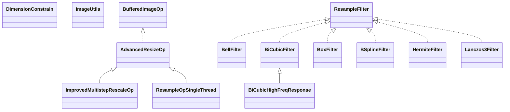

# java-image-scaling-0.8.6.jar

[Group index](README.md) | [All archives](../README.md)

## Scope and provenance

- **Donor:** `SQX_145_REFERENCE_ROOT/internal/libs/java-image-scaling-0.8.6.jar`.
- **SHA-256:** `fabd02916eed5cd1cd5881d94970ea3c74e140b4c21acc6b640ddf3ed1472b95`; accessed 2026-10-06; captured `2026-10-06T18:54:51.906614+00:00`.
- **Classes:** 31 raw entries; 31 unique entry names. Duplicate occurrence indices are zero-based.
- **Inspection:** read-only ZIP hashing and class-file structural parsing; signatures/descriptors, modifiers, hierarchy and references only. Bytecode bodies are hashed, not published.
- **Allocation:** proposed `FEAT-RESULTS-JAVA-IMAGE-SCALING-0-8-6`, P08; [roadmap](../../dev/sqx-full-application-roadmap.md). Domain README registration remains required.
- **Repository:** `01067f00031428613c6394064ca1bcadc1ba00ee`; review state unreviewed. Download label 145-dev1; installed build/activation and runtime equivalence unverified.
- **Limit:** every class/member is inventoried; declaration coverage does not establish consumed calls, defaults, formulas, failure semantics or algorithm parity.
- **Archive/resource index:** [047.json](../../dev/evidence/sqx145/archives/145/047.json).

## Complete member declarations

Member shards contain exact JVM names/descriptors, access flags, generic signatures, throws types, declared fields/methods, superclass/interfaces and referenced class names. All classes, nested/synthetic members and overloads are retained. Code length/hash is structural evidence, not a normalized algorithm comparison.

- [001.json](../../dev/evidence/sqx145/members/047/001.json) — SHA-256 `2290eeaa6afcce052aa211cf927d71bc5f256c5f70ed430a44205f43dc6499a9`.

## Focused structural diagram

Up to twelve non-nested classes; arrows show declared inheritance/interfaces only. External type names are not evidence of an available body or an executed dependency.

## Class inventory

| Archive entry | Occurrence | Class SHA-256 | Fields | Methods |
| --- | ---: | --- | ---: | ---: |
| `com/mortennobel/imagescaling/AdvancedResizeOp$UnsharpenMask.class` | 0 | `2d3976566faab55fc5c6e60b1c8fe9151a1c789ca34e45661b4a237942a00046` | 7 | 5 |
| `com/mortennobel/imagescaling/AdvancedResizeOp.class` | 0 | `5476fbfecf01785f48f76a0e5f94b2694137febc6cce4dcb4f1a27371fe9f775` | 3 | 12 |
| `com/mortennobel/imagescaling/BellFilter.class` | 0 | `e045be1c2ae325f9c38ace58da64df69c36d874c6bdb1ac78af7823e74b29b32` | 0 | 4 |
| `com/mortennobel/imagescaling/BiCubicFilter.class` | 0 | `7da819bcecae29ada2237055211920e8d499f3830b1606e90329011321cb7ffe` | 1 | 5 |
| `com/mortennobel/imagescaling/BiCubicHighFreqResponse.class` | 0 | `30062fff86e36b97613060754bec4808d50fc5a618c08b5aeb4a909d30b89c70` | 0 | 2 |
| `com/mortennobel/imagescaling/BoxFilter.class` | 0 | `0a71828b3491bb6a25b46fc222fe72bb8dad9fe9941c25c69622631f4781fe8b` | 0 | 4 |
| `com/mortennobel/imagescaling/BSplineFilter.class` | 0 | `6283e78cbd876f886f89fa0a1558bffae27bbc1abadbf1c7c0519ed1eb3fb258` | 0 | 4 |
| `com/mortennobel/imagescaling/DimensionConstrain$1.class` | 0 | `15b4465b05bd943fbecefd4e3d315b52db2c8d5700aa4dc7cda388096423bd23` | 2 | 2 |
| `com/mortennobel/imagescaling/DimensionConstrain$2.class` | 0 | `68d6d6c829c2335b7aff4ed95ca80d70522261c6d201ed6420748e6346aea3b3` | 2 | 2 |
| `com/mortennobel/imagescaling/DimensionConstrain$3.class` | 0 | `e310435f65001117a7d0eb2fe183476ce45084549a34218d4c6247fd2f0f282e` | 4 | 2 |
| `com/mortennobel/imagescaling/DimensionConstrain$4.class` | 0 | `6d3f62e555f12a43ce551ad909d4831484f52f3c61bcfc9c0f15aa0350c43af2` | 4 | 2 |
| `com/mortennobel/imagescaling/DimensionConstrain.class` | 0 | `2110cee3a23895e40f0a12b0511751feba52b85ca0ad3fb9144c853b10db1a3f` | 1 | 10 |
| `com/mortennobel/imagescaling/experimental/ImprovedMultistepRescaleOp.class` | 0 | `c2118e04a6cb9878a5b4886e0ab4eb45ab61430db1c38e66f687cc05f47769ed` | 2 | 6 |
| `com/mortennobel/imagescaling/experimental/ResampleOpSingleThread$1.class` | 0 | `8ff1eca09fd32b236ddcd37ee7dda42a76b9c4434634da4a00370fab6826bdf0` | 0 | 0 |
| `com/mortennobel/imagescaling/experimental/ResampleOpSingleThread$SubSamplingData.class` | 0 | `82bf416e5c856c9a2148f7e164f35c74e6b744674153a15b45fd244654c12ec9` | 6 | 7 |
| `com/mortennobel/imagescaling/experimental/ResampleOpSingleThread.class` | 0 | `ef608aa56ae023385e7ffb078182407419b72b1484dc97f46d63b65a468f3c26` | 12 | 12 |
| `com/mortennobel/imagescaling/HermiteFilter.class` | 0 | `b14eacc1bfa597c02001fac08817133a2d6a5f1c2710e977b7ffb91dd418d51a` | 0 | 4 |
| `com/mortennobel/imagescaling/ImageUtils.class` | 0 | `ba97825da11890a92b98e0f51cc5e2780184d766c17def8a8768653150e5692c` | 1 | 13 |
| `com/mortennobel/imagescaling/Lanczos3Filter.class` | 0 | `cd141a4b09d3a2b3688652b7c844750dc250dc2e4cfe8bbd6df4b58c17751da8` | 1 | 5 |
| `com/mortennobel/imagescaling/MitchellFilter.class` | 0 | `62606aad3488d601b73c6455d49db6f4b1e6b794474aaa08cbc1d377127751d3` | 2 | 4 |
| `com/mortennobel/imagescaling/MultiStepRescaleOp.class` | 0 | `f6933d2b617722c5efed60e43da6459ecfdc90f02f55813fd8603a9b27e314d5` | 2 | 6 |
| `com/mortennobel/imagescaling/ProgressListener.class` | 0 | `af85feae94ae0fb4525956bb5a7c6bd5922e44f93be1dadcf2676b4f52ff536c` | 0 | 1 |
| `com/mortennobel/imagescaling/ResampleFilter.class` | 0 | `6b95d5f5c25d9e1f9ecb7d69f6f67eb8bea04f7c25c3e22f51b521b8fa8719bd` | 0 | 3 |
| `com/mortennobel/imagescaling/ResampleFilters.class` | 0 | `e3d7a89b61bca43c0408b89d71e7d7f1acc50ff9a2c46ae27527620ad2bdfddf` | 9 | 11 |
| `com/mortennobel/imagescaling/ResampleOp$1.class` | 0 | `70a07d922339a9e7fc6321bb8911284f58318d6850b594412a9cce6c6b107681` | 4 | 2 |
| `com/mortennobel/imagescaling/ResampleOp$2.class` | 0 | `b42a6eb5ced3149f0459a29fc27b488344c507fe01ffab914dc54fcb72af6a35` | 4 | 2 |
| `com/mortennobel/imagescaling/ResampleOp$SubSamplingData.class` | 0 | `79aeabe4900b8c445de5ddffc770c12276568c608dc5e27f2699721ff57821a6` | 4 | 10 |
| `com/mortennobel/imagescaling/ResampleOp.class` | 0 | `7b010e6578e28e9d681179dda897a5e679f81361ce21b86fc61098068032beac` | 14 | 20 |
| `com/mortennobel/imagescaling/ThumbnailRescaleOp$Sampling.class` | 0 | `cce6542072b99945b6301955a7a0a23d2817aa7ed775791a19c77ee979611ecf` | 6 | 4 |
| `com/mortennobel/imagescaling/ThumbnailRescaleOp.class` | 0 | `46d77720e0734253835c039653bfcbefebde7b0fdcd8f6f6d7ac7c5e0e291423` | 1 | 4 |
| `com/mortennobel/imagescaling/TriangleFilter.class` | 0 | `2406747c5e14deae5abd837e1b146da4bccd9d16bf2b51ed9e704833c48b0089` | 0 | 4 |
