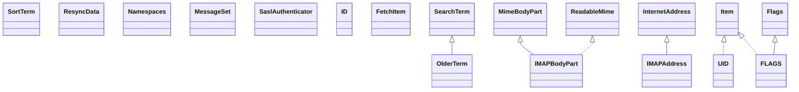

# javax.mail-1.5.2.jar

[Group index](README.md) | [All archives](../README.md)

## Scope and provenance

- **Donor:** `SQX_145_REFERENCE_ROOT/internal/libs/javax.mail-1.5.2.jar`.
- **SHA-256:** `fb3becba9b18c010b243e32211c26fcda1115e8a47b759d8d0cf288f929029b2`; accessed 2026-10-06; captured `2026-10-06T18:54:51.906614+00:00`.
- **Classes:** 319 raw entries; 319 unique entry names. Duplicate occurrence indices are zero-based.
- **Inspection:** read-only ZIP hashing and class-file structural parsing; signatures/descriptors, modifiers, hierarchy and references only. Bytecode bodies are hashed, not published.
- **Allocation:** proposed `FEAT-PROJECT-JAVAX-MAIL`, P13; [roadmap](../../dev/sqx-full-application-roadmap.md). Domain README registration remains required.
- **Repository:** `01067f00031428613c6394064ca1bcadc1ba00ee`; review state unreviewed. Download label 145-dev1; installed build/activation and runtime equivalence unverified.
- **Limit:** every class/member is inventoried; declaration coverage does not establish consumed calls, defaults, formulas, failure semantics or algorithm parity.
- **Archive/resource index:** [049.json](../../dev/evidence/sqx145/archives/145/049.json).

## Complete member declarations

Member shards contain exact JVM names/descriptors, access flags, generic signatures, throws types, declared fields/methods, superclass/interfaces and referenced class names. All classes, nested/synthetic members and overloads are retained. Code length/hash is structural evidence, not a normalized algorithm comparison.

- [001.json](../../dev/evidence/sqx145/members/049/001.json) — SHA-256 `0446e478c798e921e4544fbd450c789f3ee8c7421b4abb589dfc524962f530ee`.
- [002.json](../../dev/evidence/sqx145/members/049/002.json) — SHA-256 `95b5ac8698e9b923c09324010636a15f6c473b25dddaa9a31b544b4533d469b7`.
- [003.json](../../dev/evidence/sqx145/members/049/003.json) — SHA-256 `164e059b97b7c21ea6ed5134bed6f80134572e3b299b068fbcca0ae816bab034`.
- [004.json](../../dev/evidence/sqx145/members/049/004.json) — SHA-256 `9a5422e4d47494c9b3995e5a68de23f58c368f8b84f76181ae7e0da91a2a57f9`.

## Focused structural diagram

Up to twelve non-nested classes; arrows show declared inheritance/interfaces only. External type names are not evidence of an available body or an executed dependency.

## Class inventory

| Archive entry | Occurrence | Class SHA-256 | Fields | Methods |
| --- | ---: | --- | ---: | ---: |
| `com/sun/mail/imap/DefaultFolder$1.class` | 0 | `83a7624bdc4c3bca1874a34cdd527064ecd2762da2c4a5bbd55b1f7653218381` | 2 | 2 |
| `com/sun/mail/imap/IMAPFolder$12.class` | 0 | `c8e230e22392b41c99f85259e1ceb6d32fa6afbd06ccdf31a68b329bb2e6e9f8` | 1 | 2 |
| `com/sun/mail/imap/OlderTerm.class` | 0 | `62600660d44eeb23f424250be556be51eea6ab2b9b02779caa2a33c412742426` | 2 | 5 |
| `com/sun/mail/imap/SortTerm.class` | 0 | `ed1dded95132e51062a1d9ee57f7571568388378f0ee36a162cbf117582bd9e1` | 9 | 3 |
| `com/sun/mail/imap/ResyncData.class` | 0 | `8464056de92236d30cb16c89eef22c83e7ac2b54461bb61ad1fa4eccd1f6cddf` | 4 | 7 |
| `com/sun/mail/imap/IMAPBodyPart.class` | 0 | `862241ba46046ac6058ecf1663de18ee8bb15f34b041a6f508b223831b199d22` | 7 | 35 |
| `com/sun/mail/imap/protocol/Namespaces.class` | 0 | `b8f277d961d16f16f42fb68a4a41dd7b5ed2aea48bfd24cc8f0baa8ac12cf43b` | 3 | 2 |
| `com/sun/mail/imap/protocol/IMAPAddress.class` | 0 | `2c34033e2753249dbf23db7273763d58b3669ff8015758ad7bfe8f27e32e577b` | 4 | 4 |
| `com/sun/mail/imap/protocol/UID.class` | 0 | `67791f9f294d60d34bdd349d60e04ec2a68c1bd80e7b007bdf7c003355799f63` | 3 | 2 |
| `com/sun/mail/imap/protocol/MessageSet.class` | 0 | `7762ff68b98b7a16d4df194098917109f130e7ff59a999d3cac13318449979e1` | 2 | 6 |
| `com/sun/mail/imap/protocol/IMAPSaslAuthenticator$1.class` | 0 | `210801e347e8b74caec86dce554bc6426251c88d918c8409fb0f66b63eb8f2a7` | 4 | 2 |
| `com/sun/mail/imap/protocol/SaslAuthenticator.class` | 0 | `963d52c291f1db0152f2c59b96d5f922c86d32bd9ae33484eedc09bc96208688` | 0 | 1 |
| `com/sun/mail/imap/protocol/Namespaces$Namespace.class` | 0 | `34b62ad5c84120f92e85c972c0f33e4da5bba8237afc900ba0c8f2582f0a7da8` | 2 | 1 |
| `com/sun/mail/imap/protocol/ID.class` | 0 | `886d9f39c8cdc5b15c7b4ad49a28728f9db4a6c1a9f05776c3a335c2201b0b68` | 1 | 3 |
| `com/sun/mail/imap/protocol/FetchItem.class` | 0 | `f7e3a761cca5bbc3dd6ee92b1307b37d19441ef68f8776d0be1c34b43007ec04` | 2 | 4 |
| `com/sun/mail/imap/protocol/FLAGS.class` | 0 | `fdc3dde1555fe36aaefef6515a75158d0fde33f273498f76ae0389858124fe34` | 3 | 2 |
| `com/sun/mail/imap/protocol/Item.class` | 0 | `e272344a8fbb4b1c315c7c2a534fbe7c09d4f8f5d5a13280150dbc15af9cca53` | 0 | 0 |
| `com/sun/mail/imap/protocol/BASE64MailboxDecoder.class` | 0 | `441e2207b22aaefbcc3dc65dc52ef2df3d42c73a431b1fa83e581af78d76bb06` | 2 | 4 |
| `com/sun/mail/imap/protocol/MODSEQ.class` | 0 | `595a5a3093fe2baf86d4963a243a34d86111f98ac54e69a088a70f0ad615214d` | 3 | 2 |
| `com/sun/mail/imap/protocol/MailboxInfo.class` | 0 | `004315d17f171cdf60554a3fe50f86a98bb479f9e40d48ea41ddde31a0b1a965` | 10 | 1 |
| `com/sun/mail/imap/protocol/Status.class` | 0 | `65611f4af153357e7be489daacc80601469beb30f5d912ca4f6f307c66b69ee2` | 9 | 4 |
| `com/sun/mail/imap/protocol/IMAPSaslAuthenticator.class` | 0 | `77a5ecf8682476010866302d89ea96f2ff4dc74ec0788552714ffcfd6c5a2071` | 5 | 4 |
| `com/sun/mail/imap/protocol/IMAPProtocol.class` | 0 | `a28111fd58d5563ba0a8248789248e10e54c8b7be78106ea7275b28500d30212` | 18 | 108 |
| `com/sun/mail/imap/protocol/IMAPResponse.class` | 0 | `d747c56606334375b23ae25975d57a92c35d37a3bdfd502ba89cddb9f2ce829c` | 2 | 8 |
| `com/sun/mail/imap/protocol/FetchResponse.class` | 0 | `01c6f3eeb1a4f400d1051634f34adcc8f2c8f83d62de45dd7a4dbc3549c06f6c` | 5 | 15 |
| `com/sun/mail/imap/protocol/ListInfo.class` | 0 | `e77093a9df255772fdf75204cf314dfbc83b6f3ff759882d3ede096b49e167c2` | 9 | 1 |
| `com/sun/mail/imap/protocol/RFC822DATA.class` | 0 | `d33edaeeaf3739bfc13f800aa23e88b1c93d865e81e3d90a1c5dc432ddbe43bb` | 4 | 6 |
| `com/sun/mail/imap/protocol/RFC822SIZE.class` | 0 | `b5b285e08d04afd402ad00aae0b3dae8133039ce62299e0e312ca5c8f28df192` | 3 | 2 |
| `com/sun/mail/imap/protocol/SearchSequence.class` | 0 | `48948868a91e7973018153418b7444eaedc0f3c8daf10a2dd9936ea77c5c5c8b` | 2 | 23 |
| `com/sun/mail/imap/protocol/BODYSTRUCTURE.class` | 0 | `91e786bdd63534bfdb37b9c2e80fc9521d774a4df279035b5a836d10d4a93b6e` | 22 | 7 |
| `com/sun/mail/imap/protocol/BODY.class` | 0 | `3eddf784c908c953c4dc68ed427b815dd0ae2983b4a848e5842c2dae0aa9317e` | 6 | 6 |
| `com/sun/mail/imap/protocol/BASE64MailboxEncoder.class` | 0 | `6d9a33d141d0d1d5864331220401d633584fc5c8e2338d4936ec9397f1058f6d` | 5 | 6 |
| `com/sun/mail/imap/protocol/ENVELOPE.class` | 0 | `0651f61a1755b48e0b5256b76617c2d15dffea6a9bc1782aa47d6a55d5177dca` | 13 | 3 |
| `com/sun/mail/imap/protocol/UIDSet.class` | 0 | `8ee8157a06aa38648e8c8232b5de01374fac3a985c4c645cd7ea9d8829a7fb7d` | 2 | 10 |
| `com/sun/mail/imap/protocol/INTERNALDATE.class` | 0 | `ccf130d9d98841209d2335a92300d3560a0194379dd15960afaafa46479a5e57` | 5 | 4 |
| `com/sun/mail/imap/IMAPFolder$13.class` | 0 | `debc452f62405f16926c012bd3b15e19a8d1b83122d93d15bff41dcce5ceb616` | 2 | 2 |
| `com/sun/mail/imap/IMAPFolder$1.class` | 0 | `772e8a5ad1098e4bcbfc164080dfca5fd9e66ca9ef7a172ee2e2c45b48c27a27` | 2 | 2 |
| `com/sun/mail/imap/IMAPStore$1.class` | 0 | `723ab1cf39029dece9c9e82f9435bf7ffa4f6aa5dbd7a361a6d4918fce353cdd` | 1 | 2 |
| `com/sun/mail/imap/IdleManager$1.class` | 0 | `a2c7497599a8263ca1d825c4b09f8f91be2643ae1b60fdbccc78c451abbce529` | 1 | 2 |
| `com/sun/mail/imap/Utility$Condition.class` | 0 | `5b5bc19af1d59857cc1e76664c580cb44dd0dc2d35dd91bb585ae9a36ab65c5a` | 0 | 1 |
| `com/sun/mail/imap/Rights$Right.class` | 0 | `b90ebe380a35d34c1c7628616825ca40c2c2401bca8fc05a81972624d59c8dca` | 11 | 4 |
| `com/sun/mail/imap/IMAPFolder$10.class` | 0 | `96bdf1572dee11f15d54bd434fc8ea088c7e892df7a3166d879f69ed78bc0f07` | 4 | 2 |
| `com/sun/mail/imap/YoungerTerm.class` | 0 | `8cef3c80f0fe7c59fd0f43ffab66532e1842e543e00672c1d9fd4db41ede4f6b` | 2 | 5 |
| `com/sun/mail/imap/IMAPMessage$FetchProfileCondition.class` | 0 | `865aa27dd60b6c589bbdd89644dd0d1c1280c2dabe1c06aa71668c793cafa1cf` | 9 | 2 |
| `com/sun/mail/imap/IMAPFolder$2.class` | 0 | `69bc4df337d4e3011a0001213e6b9d9f89317547f56bfa3b5d386e11376fd2f2` | 4 | 2 |
| `com/sun/mail/imap/IMAPFolder$11.class` | 0 | `66b7d9e5bc1b1221c01f4c87571c095033e3439f8a3675486ee9a5dac856fc6f` | 4 | 2 |
| `com/sun/mail/imap/IMAPInputStream.class` | 0 | `3fe69b98555d97025e4752829ff1dc7d7cc4b1759bd41b4cc375f97083312fc2` | 12 | 8 |
| `com/sun/mail/imap/IMAPFolder$ProtocolCommand.class` | 0 | `f2c22fad36d7f032d481e93e759d162a7d6484e0afa7fedc9cd9978c7dbb2eb7` | 0 | 1 |
| `com/sun/mail/imap/DefaultFolder$2.class` | 0 | `7097b3455d7d3c6193f15936f3d0542bc76d017b7cf2226fde0fd43f8d3c07c7` | 2 | 2 |
| `com/sun/mail/imap/IMAPStore$ConnectionPool.class` | 0 | `9d9bec674aec6b7b60a78f9cb174114c5998ed28269d27c8b238f2f117d94df9` | 15 | 18 |
| `com/sun/mail/imap/IMAPFolder$3.class` | 0 | `83c5aefe28a1a3f16da23075778d607d41abf1eb00faf4f80d598ad93c95baa6` | 1 | 2 |
| `com/sun/mail/imap/IMAPStore.class` | 0 | `9d59e83622ef5cf3bc705d95cfc24d37b71ca3625ee6ddd75840536922d4f22c` | 54 | 60 |
| `com/sun/mail/imap/IMAPFolder$FetchProfileItem.class` | 0 | `4a3b9baf79d31668cc9f633e5c1381965f64f32f016094e1cf23b17c0eaca8ff` | 3 | 2 |
| `com/sun/mail/imap/MessageVanishedEvent.class` | 0 | `4868cd20ee38e7cf1e19205802818680a6ed5c9911224f277d704bc47a41ab0d` | 3 | 3 |
| `com/sun/mail/imap/IMAPFolder$4.class` | 0 | `b1024219aaae41545f0b13a43e8f5eff6b34d4446ec76d1ca0aeb94fbaa58ca3` | 2 | 2 |
| `com/sun/mail/imap/Rights.class` | 0 | `0086b1d0194e209a8c3fa49a5a40b9de794aed6c813b7628c3e1481eb277cfc3` | 1 | 15 |
| `com/sun/mail/imap/IMAPFolder$8.class` | 0 | `355cc7d0c22424c20718bf87f5a71c63d48c0d852f40f89918ec7b120102b70c` | 1 | 2 |
| `com/sun/mail/imap/IMAPFolder$16.class` | 0 | `18d7ea8e1c4c16310686064a8661bde10cb101dc216586edb518b9fcaf7cd887` | 2 | 2 |
| `com/sun/mail/imap/IMAPMessage.class` | 0 | `cef48cfbc6728fafa6f43743acdeaa6c96af9ab7486fd89bed35f4564206983d` | 16 | 99 |
| `com/sun/mail/imap/IMAPNestedMessage.class` | 0 | `295e02fcdbfdbb403bf2d68cc7d6821ecb67ca7b0d8be97e2cceb44f8102b65b` | 1 | 11 |
| `com/sun/mail/imap/IMAPFolder.class` | 0 | `85af6e09aabd79212af8753a19f6407a0e12c5ae676c0efc98d317d12ea5d9ea` | 34 | 104 |
| `com/sun/mail/imap/IdleManager.class` | 0 | `8a60890c60f385776b8da3559a10224f3c13275f5571330a9af5c7857843d16f` | 6 | 9 |
| `com/sun/mail/imap/IMAPFolder$20.class` | 0 | `d4e09d568aef5606c3310c5188587fd6705a3beffb3691d4ecd8966a821606e2` | 2 | 2 |
| `com/sun/mail/imap/IMAPFolder$5.class` | 0 | `a87151d3db8bd859af69758dce9984c0559e7dc63b6cee7f9cd0d11cc593ca1e` | 2 | 2 |
| `com/sun/mail/imap/MessageLiteral.class` | 0 | `5d1d58329dc028124d978a26dcda6085034d688267494a5a9a0ab9350baae9db` | 3 | 3 |
| `com/sun/mail/imap/IMAPFolder$17.class` | 0 | `2a16ec1dd4a835455020ea14d3610af1474d4be7202417b2df39725c69f55cfb` | 1 | 2 |
| `com/sun/mail/imap/IMAPFolder$9.class` | 0 | `629ee872cd773cae80d45497251779753abca4595e3e5b69ef083ca2ed1c9d0d` | 2 | 2 |
| `com/sun/mail/imap/IMAPMultipartDataSource.class` | 0 | `c7a8f5256791097fa858b0acfafc47f77d75ec45e1f29baaf10a1ff0e09cdfdd` | 1 | 3 |
| `com/sun/mail/imap/ACL.class` | 0 | `b418edd97bc69a4a64c59af09e0367f1d7046447c6810d8cfe917b3aa9da51c3` | 2 | 6 |
| `com/sun/mail/imap/MessageCache.class` | 0 | `71b93dfd36013f75e40949248787bec47957dbcff167ca2ffcf348648c2eec26` | 7 | 14 |
| `com/sun/mail/imap/AppendUID.class` | 0 | `eed3befa818361d792a5ef313262e1a713cb2be5ad40398a23430a8a846e080c` | 2 | 1 |
| `com/sun/mail/imap/CopyUID.class` | 0 | `c0f04b5615251319e959966c6300e62540e79a6757ac2a5d1e088389752afa31` | 3 | 1 |
| `com/sun/mail/imap/LengthCounter.class` | 0 | `4d53ee6d1edd49b18f483678afdc9aea1e081751de22ccbff84620389a04e09e` | 3 | 6 |
| `com/sun/mail/imap/IMAPFolder$18.class` | 0 | `cc563907380e1ac857aec876063744e0f722257447fd553cf30ff086460691e8` | 3 | 2 |
| `com/sun/mail/imap/IMAPFolder$6.class` | 0 | `f25a3d6efe8220576bc1c2f099409b54c856f43044e19029a99953764e228732` | 3 | 2 |
| `com/sun/mail/imap/IMAPFolder$14.class` | 0 | `67673d8430880d0f573cfa797afa403311c659596d4fe33005f0e190b28c8c68` | 1 | 2 |
| `com/sun/mail/imap/Utility.class` | 0 | `8953c50965bf1f2d2fc67bf5d8a9c80f3527b893f661f7c24e3bf3b21674950f` | 0 | 4 |
| `com/sun/mail/imap/IMAPSSLStore.class` | 0 | `333e35054f2fc44ce5e463f0e86f4ce89272f153420948d30dd08d1a95517e7c` | 0 | 1 |
| `com/sun/mail/imap/ModifiedSinceTerm.class` | 0 | `c6b2ee3a2f38c30ea18eb70cef7d4b4840b5f306e21314c8f3d40cc1f26246a3` | 2 | 5 |
| `com/sun/mail/imap/IMAPFolder$7.class` | 0 | `3bc3c1a97daf81ed2aac1011a563b5a757f64536394165beea7daf02cc6cfb29` | 2 | 2 |
| `com/sun/mail/imap/IMAPFolder$19.class` | 0 | `3b115aa7cf635e55a196d4b958571bc869b6870f8ee3abd22098648bd5f18bcf` | 1 | 2 |
| `com/sun/mail/imap/IMAPFolder$15.class` | 0 | `481251d7ce51c53e863bf2800cb9460293b53520489dfe146ada7673b65eabd9` | 2 | 2 |
| `com/sun/mail/imap/DefaultFolder.class` | 0 | `0b7c6f0585afb7840d45988b29762a80ae211bc3496eefec48e56ae0549fda89` | 0 | 11 |
| `com/sun/mail/smtp/SaslAuthenticator.class` | 0 | `18a66a7fd3b781ccf666cf3cef4ca84137e240a0ffc5191aafa8136097f0d642` | 0 | 1 |
| `com/sun/mail/smtp/SMTPMessage.class` | 0 | `4ec68353fa4d16b58927edc85f43e50dc8535f0aaa0ab8f1f045618772991030` | 14 | 20 |
| `com/sun/mail/smtp/SMTPAddressSucceededException.class` | 0 | `a9bfbdddff341b49972598d7545d027a84f6a29c68ec8de033ae91af67f75da2` | 4 | 4 |
| `com/sun/mail/smtp/SMTPTransport$PlainAuthenticator.class` | 0 | `24673ab5205332c8a9d198c486169d3b964c8e39b11015214accac79faf7b2bb` | 1 | 3 |
| `com/sun/mail/smtp/SMTPTransport$DigestMD5Authenticator.class` | 0 | `1d0d429c8c22b43a5f70a44b95477f1ae9fd466826a1bc1393aabf3d5a40b373` | 3 | 4 |
| `com/sun/mail/smtp/DigestMD5.class` | 0 | `b412b66e784e413d1f89588a44d527016c5ab51186a41a61d9e684466c1dfc2f` | 5 | 6 |
| `com/sun/mail/smtp/SMTPOutputStream.class` | 0 | `c0a3599c37e05f9a85a42b72f57f808bfcbba41736b0d550eb4ebe77fea39b9b` | 0 | 5 |
| `com/sun/mail/smtp/SMTPSaslAuthenticator$1.class` | 0 | `20371019126c9c2a7e4d1c2f68a0317abfd70b0e851e0b39f1b56a9b70c63572` | 4 | 2 |
| `com/sun/mail/smtp/SMTPAddressFailedException.class` | 0 | `406760b5d06e728f450bf947c1db0b374d656ea896ccf19c8ff597b4eefdaa62` | 4 | 4 |
| `com/sun/mail/smtp/SMTPTransport$NtlmAuthenticator.class` | 0 | `d1f302b13cdcebec5845a3b0535750cf221dd93e8322d53577027591af2373cd` | 4 | 4 |
| `com/sun/mail/smtp/SMTPTransport.class` | 0 | `16fd10b4df576960b700d64ccdfc2e303f5bdb490db0a3632dbb5cfaaddb4217` | 47 | 81 |
| `com/sun/mail/smtp/SMTPSenderFailedException.class` | 0 | `9d152444736e8c5808039ad054f21cc661877ebc4a7d2873ab014e2c5902a3d1` | 4 | 4 |
| `com/sun/mail/smtp/SMTPTransport$LoginAuthenticator.class` | 0 | `131c1bcb82b9b8c95dd335a0d1097f12599ee2527d236d7aad4f0d146a0be6c2` | 1 | 2 |
| `com/sun/mail/smtp/SMTPSaslAuthenticator.class` | 0 | `052cef86fd42b36a9cfefec0adc39375ad642d8865bec863635d0a0d3cc9e0c4` | 5 | 5 |
| `com/sun/mail/smtp/SMTPTransport$Authenticator.class` | 0 | `3a535df411f4d8acaea6a6ba4b86206ec68eb6377abbc8c47771872a7c6eee1d` | 4 | 6 |
| `com/sun/mail/smtp/SMTPSSLTransport.class` | 0 | `52b701a2ff14abde6eae50bfcb6ce5e3adcf9bd0b58c9c1f73bd8eed417ef48e` | 0 | 1 |
| `com/sun/mail/smtp/SMTPSendFailedException.class` | 0 | `1f2aae77345269675102282b952adc0cf443bb306ed3e1e2c21b439881b1441b` | 4 | 3 |
| `com/sun/mail/auth/Ntlm.class` | 0 | `a89c1abf5f1f4c6c6209dbcf6c36397fa5b223284902f50becae9d1f431ea55d` | 12 | 11 |
| `com/sun/mail/auth/OAuth2SaslClientFactory.class` | 0 | `74a2f47f83d197d56b49f5b8fe357b4a5202dedeaeaa7b20c900ab6f7bee1a4f` | 2 | 4 |
| `com/sun/mail/auth/OAuth2SaslClientFactory$OAuth2Provider.class` | 0 | `fe6ce93c60507e8af09ef384613ef30865b7be4a6ef0bc0e9bfe0f407f1b4266` | 1 | 1 |
| `com/sun/mail/auth/OAuth2SaslClient.class` | 0 | `8401b94f9c4d082a8d622ff7f6cfe3bf2dca72a6f244e5c670da05136cdefeda` | 3 | 9 |
| `com/sun/mail/auth/MD4.class` | 0 | `4774cf56ab1e48a42d728c52f3f3cd9fae628ac28499a6b1fccf6b36c27f784e` | 19 | 10 |
| `com/sun/mail/pop3/Status.class` | 0 | `66a0cad30d678bb4b8c901054bc534527a8fa5245edf2993f5e83a09707df6d1` | 2 | 1 |
| `com/sun/mail/pop3/WritableSharedFile.class` | 0 | `1311bf22f7a396476ac6cdff4d1acc3efa1ad4678184c80995764159ac047a71` | 2 | 5 |
| `com/sun/mail/pop3/Response.class` | 0 | `291910ab87ed35ed600576f92553e7e3670a1e533175dfa0e258171a77af9dfe` | 3 | 1 |
| `com/sun/mail/pop3/AppendStream.class` | 0 | `76d499f6113fe8b4f2900f68e11075e3cfa894745f67c1aa55df6b5f9b865949` | 4 | 6 |
| `com/sun/mail/pop3/Protocol.class` | 0 | `05e6c373ed520fdb4342b3530e25a6147f3a38e7dadaf2341d050945f603be6e` | 20 | 41 |
| `com/sun/mail/pop3/POP3SSLStore.class` | 0 | `378c5f5956c2aab3aa40efe71985d54208fcb73217a7159fc3f77f7d1dc3d5ee` | 0 | 1 |
| `com/sun/mail/pop3/POP3Folder.class` | 0 | `19575ed3d4d7823b9b0cf20bf3107c629441fc5c1db0dce1cac87bd76ee7e997` | 11 | 34 |
| `com/sun/mail/pop3/POP3Message.class` | 0 | `a01c9f862c0f71ffb90873879f1c8220f6f3d6434d95769d9ecbee1aa0bc2b8d` | 7 | 24 |
| `com/sun/mail/pop3/TempFile.class` | 0 | `1b3143900c8ff8130f341aed01347885fd5fd12bb841e1952e85be63978119d6` | 2 | 4 |
| `com/sun/mail/pop3/POP3Store.class` | 0 | `4350dacc27d95877df264c7ff1d89294bd5c822b7a11d8060b4dca0d3f13a8bb` | 23 | 16 |
| `com/sun/mail/pop3/DefaultFolder.class` | 0 | `9eb993f399bd637bc8db7eb2f95f4992bda2e4c736e7b4a640c858b45790e616` | 0 | 22 |
| `com/sun/mail/util/QPDecoderStream.class` | 0 | `964fa100e8a8adec98133dee57d209613de4042c2a4e8130c9a64c2fe8f5c2f3` | 2 | 6 |
| `com/sun/mail/util/WriteTimeoutSocket.class` | 0 | `b4054ae52efc4680aed7aa1fd60c94d9186496a5160205b9a05f0e0bddfe6ccd` | 3 | 44 |
| `com/sun/mail/util/SocketFetcher.class` | 0 | `13ef35813e232f4bc1951835165c71d26f3b037edc18dc21aa2bed48f30b5bde` | 1 | 15 |
| `com/sun/mail/util/MailConnectException.class` | 0 | `e3abb82956d3ff2c9f40684232ba6f4bc73aa13c8361fc29c3ef7701875aa62c` | 4 | 4 |
| `com/sun/mail/util/SocketConnectException.class` | 0 | `ab6b171d19aed4874f66693f402fbce6800ec7cbc7385dac4498a3e3fcdab026` | 5 | 6 |
| `com/sun/mail/util/FolderClosedIOException.class` | 0 | `c1a0ba9dcfad9cd457935c188376a6102047fb0b2f20c41d4b8ced6d93b667cd` | 2 | 3 |
| `com/sun/mail/util/UUDecoderStream.class` | 0 | `5cf8fc2e12eec76d72be3c13ae905fa69ad36cc79b37ba118f342cc890978973` | 11 | 10 |
| `com/sun/mail/util/CRLFOutputStream.class` | 0 | `7b99e5d8db1f68336757577e4d8bfda2cf59dde16c29b8bc4f774d336ad3c140` | 3 | 6 |
| `com/sun/mail/util/SharedByteArrayOutputStream.class` | 0 | `af90083bb72e59821a4275bcd5d890525fd200600fa1e092cc011c1bd53db4fd` | 0 | 2 |
| `com/sun/mail/util/QDecoderStream.class` | 0 | `6489f5b8b065b3009cdceaf43162fc79931a647f85a86215779d126c8ff4b34e` | 0 | 2 |
| `com/sun/mail/util/TraceOutputStream.class` | 0 | `594c42be8154fd443460ee1c8f8dc6be16b8e63e251219b2eeb3ea3df6a53efb` | 3 | 7 |
| `com/sun/mail/util/PropUtil.class` | 0 | `8937bfd5387d64f79c5bfac6afce4635e3b3f9348f7b3b4942810e6330d46241` | 0 | 9 |
| `com/sun/mail/util/ASCIIUtility.class` | 0 | `5c009e021899c06f346f75a578d7402d86d4545351aec0e5097f6cd58f0f6dcc` | 0 | 10 |
| `com/sun/mail/util/MailLogger.class` | 0 | `54ecfddc709c87179110767c55bbd17f993f71eb2d27186aede909aa0d692ff8` | 4 | 23 |
| `com/sun/mail/util/TraceInputStream.class` | 0 | `c1f333420473b65841e7f527c4bb7cf3ae80f5f5fb3b36a59e815de59cb66473` | 3 | 7 |
| `com/sun/mail/util/LogOutputStream.class` | 0 | `c959f133df2a7536555488cbb23fc95fc5ee865eceb7544b1845000352198277` | 5 | 7 |
| `com/sun/mail/util/BASE64EncoderStream.class` | 0 | `5e288ceb90ccbff3dca761f5dfa6b9da23295cba5a1b3d4e50cd27c08fa9e3d0` | 9 | 12 |
| `com/sun/mail/util/QEncoderStream.class` | 0 | `adc29acb1f8291d40368ce24eec5e09019d06ba4012dc4dd9df278a4c8aa9c80` | 3 | 4 |
| `com/sun/mail/util/BEncoderStream.class` | 0 | `8ae0f3f5c39d53a9c1b4b31a400b951eef5dbf847ddf9f97c0b4a0c6df1ab8e2` | 0 | 2 |
| `com/sun/mail/util/MimeUtil$1.class` | 0 | `e8f0249d85ea1fed9b932ff97fb77ddf014fcc80802507ad3ff553aa9e92ab4a` | 0 | 2 |
| `com/sun/mail/util/logging/MailHandler.class` | 0 | `88c6c7c9eeabd17470019b614b16732020674dc156a29f59e6bd7ac6fa56e56c` | 25 | 130 |
| `com/sun/mail/util/logging/CollectorFormatter.class` | 0 | `2d166f0de017b82a59068d427b0d3796b7033264282e762ef7920e561804dbb6` | 10 | 17 |
| `com/sun/mail/util/logging/LogManagerProperties$1.class` | 0 | `8000cc53fd4ed3858f969e72c5e66c9c590b1ff4f4e8ba309ae9a6189df18752` | 0 | 3 |
| `com/sun/mail/util/logging/MailHandler$TailNameFormatter.class` | 0 | `99fdfb84d0053d2fbd7b1f49cd9832c2ebd27f307b055d22c6814ac8fda77286` | 2 | 7 |
| `com/sun/mail/util/logging/CompactFormatter.class` | 0 | `fe7f4db118ddd391ab94541c07d776a02e9afd83147027028da95fb64e3dd9f3` | 1 | 26 |
| `com/sun/mail/util/logging/LogManagerProperties.class` | 0 | `6b2aeb1040bac8a4742acdfc2d937b8239b3e167ddddf38b72c5d99b77ee1503` | 5 | 33 |
| `com/sun/mail/util/logging/CompactFormatter$Alternate.class` | 0 | `bc552d025e29b1c0d1152ff4148d05283aad29cd26c84ec442b718af506a2291` | 3 | 3 |
| `com/sun/mail/util/logging/MailHandler$DefaultAuthenticator.class` | 0 | `cc0f933f9cbbe6e3370ac04bf66e74347a67aa9d1e18f6ddd1c968a4f31c5f5a` | 2 | 3 |
| `com/sun/mail/util/logging/MailHandler$GetAndSetContext.class` | 0 | `146fb4cbf75d84481ac56e5e45db676a40c5a30fa34205f4a104b387e5415030` | 2 | 3 |
| `com/sun/mail/util/logging/SeverityComparator.class` | 0 | `1d694bbc9549ccf1eac53535ddd077ac16ddbf104d5b0594986b8a1278e78a04` | 2 | 14 |
| `com/sun/mail/util/BASE64DecoderStream.class` | 0 | `5bb9e70d7f620c127b75ec09d4c9722d4c7f5a1965fb6e86937ec935990788eb` | 9 | 12 |
| `com/sun/mail/util/MimeUtil.class` | 0 | `577eb683ad5e8d87a8b0273fde66470526d284292daec7fc9224a9cc74267d3d` | 1 | 4 |
| `com/sun/mail/util/MessageRemovedIOException.class` | 0 | `d222137010c804c6f43ef13371a4d053ce8d556e80175cf46ddca58dd3ffc7ee` | 1 | 2 |
| `com/sun/mail/util/MailSSLSocketFactory.class` | 0 | `a4f6796ef42c83cfe2b7ee1c197e138dbec477359ea00474da73b02056138bee` | 7 | 22 |
| `com/sun/mail/util/DecodingException.class` | 0 | `d5ec4b51a1e858b522b23d0c9a6d51cd859784eb2d0bc4c51151bca302cd50ec` | 1 | 1 |
| `com/sun/mail/util/MailSSLSocketFactory$MailTrustManager.class` | 0 | `7e3a8fe443a44c3fad812778151571713979a53d23052e7470a67cc576ba4c1c` | 2 | 5 |
| `com/sun/mail/util/SocketFetcher$1.class` | 0 | `582300475c2f0b9c3e875b4748c2389929bba22b8b10c1339faab8678fb0749b` | 0 | 2 |
| `com/sun/mail/util/QPEncoderStream.class` | 0 | `6c63cab51d874c4cd641a0ddfc55b26a1b25aeff5454481ebdf422e361732154` | 5 | 10 |
| `com/sun/mail/util/UUEncoderStream.class` | 0 | `7781213a61bbfa30a90c29f66ab67ea324fcf2b5f1c42767d23de38fcaf98d62` | 6 | 12 |
| `com/sun/mail/util/LineOutputStream.class` | 0 | `d6f6a0b339353c2511352d881dc4f724619b55310942352a02760a6558fc395e` | 1 | 4 |
| `com/sun/mail/util/TimeoutOutputStream.class` | 0 | `0a9fa1f09dd8d5f1f7833903a221533b748c69472b7512090059d196f6a7a516` | 5 | 5 |
| `com/sun/mail/util/TimeoutOutputStream$1.class` | 0 | `f2b16a035f62aaae99c3263b1943036b3a103ef7ff708e944d068020aed91c0e` | 1 | 2 |
| `com/sun/mail/util/LineInputStream.class` | 0 | `63fb8386b5d614e30caf0b36e2908da182b500fb6c85fd5c23a8bfea2a45a351` | 2 | 3 |
| `com/sun/mail/util/ReadableMime.class` | 0 | `cf32ff14033d4e66bee53c666b711336e2672b020c672fd86e05a3a60ea32872` | 0 | 1 |
| `com/sun/mail/util/MailSSLSocketFactory$1.class` | 0 | `aa9fffb7703491b3de115c6aecec9c2b280fe4a4fbd703920955e5b17507ee5d` | 0 | 0 |
| `com/sun/mail/handlers/text_plain$NoCloseOutputStream.class` | 0 | `6f2a1d8198e8d1b840475b90d785b5c2164c28a2c87ba6e9767e3fc401173266` | 0 | 2 |
| `com/sun/mail/handlers/text_xml.class` | 0 | `d4d28ce4c37f39aeb227caf3cff4a7729cff6b8b0b9d2c7fce8db291e84c2ac4` | 1 | 5 |
| `com/sun/mail/handlers/multipart_mixed.class` | 0 | `0b2306e0e65e17da79f3427d9197534b51ce744d36694f3ae7a6e677179c92b1` | 1 | 5 |
| `com/sun/mail/handlers/image_gif.class` | 0 | `e3fa2983bc38b72a6e76c872c55217b3ca227dcecacc58ef6bb5c6af8437aa37` | 1 | 7 |
| `com/sun/mail/handlers/image_jpeg.class` | 0 | `296c66c926993b0f2ed3415a42266534c7ffdccb036ad041ea8f56231d53d613` | 1 | 3 |
| `com/sun/mail/handlers/message_rfc822.class` | 0 | `99f8dde3ac87e9940aa45fc850c587d3cbe17e0cdfd1b10cb1b74a8828a4c618` | 1 | 5 |
| `com/sun/mail/handlers/text_html.class` | 0 | `ee584daec4754003af8f6966ff735ae5923ea555877f4a082d0261cf2fc3d3e9` | 1 | 3 |
| `com/sun/mail/handlers/text_plain.class` | 0 | `069fc74d3a635e2b538141c636169a82928fef505c0831ed91b5eb8c467e78d8` | 1 | 8 |
| `com/sun/mail/iap/BadCommandException.class` | 0 | `bfcfa7c87c90b2bf685161b863524b152ee63378de0db1d4e9d972799f1152bb` | 1 | 3 |
| `com/sun/mail/iap/Atom.class` | 0 | `b1903221d8c23828ca974d5a31c8ad6c433f2061624fccb889513c41792ac882` | 1 | 1 |
| `com/sun/mail/iap/Literal.class` | 0 | `5bbeb9607fba7605558a6f21705d6b2d994cc4f18187d2f46157721db695b8e5` | 0 | 2 |
| `com/sun/mail/iap/ProtocolException.class` | 0 | `5f498396dc9e139b26d2ab60e97deb27f6f375e890c533fa80928e6453d30447` | 2 | 5 |
| `com/sun/mail/iap/AString.class` | 0 | `23d2561d23cd572caa3bca6b6d77acdfaf7b7cdc2ae6f189b67c5f752b98b8e9` | 1 | 1 |
| `com/sun/mail/iap/NString.class` | 0 | `b99c3691a00f8cda4bad2cfe7b3b3c419211fde03bfe184000542b4e84dbf110` | 1 | 1 |
| `com/sun/mail/iap/Protocol.class` | 0 | `0a7fa7d122e57dd36b986beea24f23c1602938843d87b4afe346d779127fcf83` | 16 | 30 |
| `com/sun/mail/iap/Response.class` | 0 | `16cbc13d9885959996b570502515cf5ec5d624b3d248c5182f9a6b8293177603` | 19 | 37 |
| `com/sun/mail/iap/ByteArray.class` | 0 | `6514cc2c32fda33e93748887e32b13fb793f98d5fce7dcfe23e77f1c1941b0c2` | 3 | 9 |
| `com/sun/mail/iap/Argument.class` | 0 | `9ad1039329a234a1e3d4710e609326cb77d38a0dbeb5dcc216be1264e8c594b0` | 1 | 21 |
| `com/sun/mail/iap/ResponseHandler.class` | 0 | `c339afe0d5e239d6c5331432172b319a3dad4659c8c62a0b2c21ee35fa7e1da3` | 0 | 1 |
| `com/sun/mail/iap/CommandFailedException.class` | 0 | `f71227f20af3a65d5b1c689f3aa3fed5eb4bbbb546adfd64315015942159c7eb` | 1 | 3 |
| `com/sun/mail/iap/ResponseInputStream.class` | 0 | `12f42ca82fa1f291c65ab0b5b328d1f09351babd30cb2d2c01ac23148361ad3d` | 4 | 3 |
| `com/sun/mail/iap/ConnectionException.class` | 0 | `f4297b47288a873de1fd399a14d3f5d9b309ff868915d074887936045072509b` | 2 | 4 |
| `com/sun/mail/iap/LiteralException.class` | 0 | `3ad4df13f54ec4e78157d08fd266b600cc228fe5963fb9ad1932db04403be58a` | 1 | 1 |
| `com/sun/mail/iap/ParsingException.class` | 0 | `17e077a353a0838c88ff72c8448d473629e98a6e69cf16bdb8b7dcd619fcf77c` | 1 | 3 |
| `javax/mail/Session$7.class` | 0 | `b65b37201339d1ec3cfb40e3880ddc4968a83530bf8241aaaa510494038f95bc` | 1 | 2 |
| `javax/mail/Folder.class` | 0 | `aa026ecbe487768e8f5d6c6db8d9007b06bbbdceb6199e4716e76c2d872e5f98` | 11 | 59 |
| `javax/mail/Provider.class` | 0 | `481df235cf206364a6e60f112cc7730028b1a0ec2a0229a54bc3eef02a6524c4` | 5 | 7 |
| `javax/mail/MessageAware.class` | 0 | `7739acdd286fd224f49374729fee978c1dd8eebd7abcbf7a68c1da1589d452b0` | 0 | 1 |
| `javax/mail/Flags.class` | 0 | `792f3e7ac204d4a4232dadb170632231173c9dc63cbdafc65b50db4745549a0c` | 10 | 18 |
| `javax/mail/MethodNotSupportedException.class` | 0 | `0314bd8bf4b4642fed72cde607042dee327179c924faa644c96d4dec8231691d` | 1 | 3 |
| `javax/mail/Session$6.class` | 0 | `f7c70135d8351acb716976ba5a299b4f8a62d808c52ac82001c8cf6b9b2fd1f0` | 1 | 2 |
| `javax/mail/NoSuchProviderException.class` | 0 | `d9c00fb13b4d55f64dd7608d6894b9c4d5bd99a35bca22320c39687115d98232` | 1 | 3 |
| `javax/mail/EventQueue.class` | 0 | `a9036516fcb9fc71135974f9310d07e25e3b78720b1067778f4d5e2a3d0b7034` | 3 | 5 |
| `javax/mail/QuotaAwareStore.class` | 0 | `e22ccfe74b227056948f5e395f783dba4d5c16f34e41c82f7817d859cceaf5fe` | 0 | 2 |
| `javax/mail/EncodingAware.class` | 0 | `6ccbed647698584111e172e87d83b1d0fc11cadf5790caa0d2cf84dd566f14d5` | 0 | 1 |
| `javax/mail/MessageRemovedException.class` | 0 | `d2c4d2da70042d3f0da83e2dbc9705872675f6789e96fcec024291f7fba5d0e9` | 1 | 3 |
| `javax/mail/FetchProfile.class` | 0 | `a152a32ed2b9a7a19c3a940c6720093cd877662f2c6e2b7ddc7537b5661b9cb9` | 2 | 7 |
| `javax/mail/MultipartDataSource.class` | 0 | `4cbfe6e475c9a52cbc97a4fd51de202ce83ec7d8780ed4693e83b798067e0dc2` | 0 | 2 |
| `javax/mail/Session$5.class` | 0 | `848cf51d20f6b452f9d9a5fd8d746ee1dcae92faca0bfa5ea49aed2c4a61b22e` | 2 | 2 |
| `javax/mail/util/ByteArrayDataSource$DSByteArrayOutputStream.class` | 0 | `f5086fe0e54eef86a78bbb533050835b3c5aafb6249625ef6aff873ae9fcc4e7` | 0 | 3 |
| `javax/mail/util/SharedFileInputStream$SharedFile.class` | 0 | `d7b9550e0d3ad042a5f3cd454fd229843f06cb09f4b03c090c59f1f9f7a547f9` | 2 | 6 |
| `javax/mail/util/ByteArrayDataSource.class` | 0 | `ec3360537a87909b800985af51ab8f27805eac75797b89f146b28fe223bbab15` | 4 | 8 |
| `javax/mail/util/SharedByteArrayInputStream.class` | 0 | `eac4f1581cfe63edefcc290df068c6eb454f81501e57ca383d77872f916a06bb` | 1 | 4 |
| `javax/mail/util/SharedFileInputStream.class` | 0 | `55978117ddb3f19b83f8b2f0c3cea2c85f2f06d0b4c21d16c8e02547696f585a` | 8 | 22 |
| `javax/mail/AuthenticationFailedException.class` | 0 | `7edaec722d22240b7bae90a02720be0323f5630211032caa0f6468302e4061ac` | 1 | 3 |
| `javax/mail/internet/InternetAddress.class` | 0 | `3e94f4b1793e116991dbce8184084495511b90d2f0c8f5896a84df607fc3ad3a` | 8 | 38 |
| `javax/mail/internet/ParseException.class` | 0 | `841acdea8e219cabfea6c7b7603e800fb1545bf5d851783f1ccdbb3bfde4f9ce` | 1 | 2 |
| `javax/mail/internet/MimeBodyPart$EncodedFileDataSource.class` | 0 | `700417abb28466db2a363277e7654ca8fd79daa07d8070fa9327d52eb24ef31d` | 2 | 3 |
| `javax/mail/internet/MailDateParser.class` | 0 | `cc851c9c122131a6a7272eb1cd714982424d4a11878d08a440506891b9893639` | 2 | 12 |
| `javax/mail/internet/ContentType.class` | 0 | `193a1caec96411bd6d7b7b04ed94fe75d8fcb8e0904ba6a001de40dcdb38ed81` | 3 | 15 |
| `javax/mail/internet/MimeMessage$RecipientType.class` | 0 | `f9c03cf19c4f92bcefb8b080f28c48cb8c8452cc62875d37c8f33f64eb3ad86f` | 2 | 3 |
| `javax/mail/internet/MailDateFormat.class` | 0 | `4914cfb7f59d7faae872866ae6f64c38968a88531476407c6ae0fa738cf56529` | 4 | 8 |
| `javax/mail/internet/AsciiOutputStream.class` | 0 | `0284bbf1d5f22ab4ff69d996422055bb66f1ae23f3270197543b59d0695f15f5` | 9 | 6 |
| `javax/mail/internet/ParameterList$Value.class` | 0 | `881ce24531e4dd73ac58f56a17b6849073ae55d48a5b64b062ccf8fca2ad31a2` | 3 | 2 |
| `javax/mail/internet/HeaderTokenizer$Token.class` | 0 | `4b03d1f59d60be8d19fad320172b83d03b5f2dc432ec8d39d800925f1c84d9e0` | 6 | 3 |
| `javax/mail/internet/InternetHeaders.class` | 0 | `da6df407cb9e61c096347f1832c1b9665b286d84de04e151d05ed459a99004c5` | 2 | 17 |
| `javax/mail/internet/ParameterList$ParamEnum.class` | 0 | `90aae95aca49d6afa2d623b2199c619b36217580aff7a84af371d0aa40b20db6` | 1 | 3 |
| `javax/mail/internet/PreencodedMimeBodyPart.class` | 0 | `290383163a69cd55883a997927b74bddd3170c4f2754ec5d9c6f780206403d2f` | 1 | 4 |
| `javax/mail/internet/HeaderTokenizer.class` | 0 | `ec36a7b945b845a134e76267a40cd2ec5229f4f95a639cab2b2c5e9c5c704954` | 10 | 14 |
| `javax/mail/internet/MimeMultipart.class` | 0 | `edd6c57f7bc29456e064f33852ce7e680cd1e1f46a7581412662dee65a7006cc` | 8 | 27 |
| `javax/mail/internet/InternetHeaders$MatchEnum.class` | 0 | `d7717e6ceb0bf19978274b8de0c967bc6b2ac86375b4182e8b4010de1e47db3b` | 5 | 4 |
| `javax/mail/internet/ParameterList.class` | 0 | `8e6026dbdc8a0c08c114fae601970a83fdbe475af5b19683cef4a9194c46bc91` | 11 | 20 |
| `javax/mail/internet/MimeUtility.class` | 0 | `25d146be7840a05cbe41ee5f823bacefdba9f5c64bf3c7daf5d19f091a8d006e` | 14 | 31 |
| `javax/mail/internet/NewsAddress.class` | 0 | `177be14e6da3ec6f9230b0eee9cab2e2bd143d7e23fcf8f18c09a76bab30ae0f` | 3 | 13 |
| `javax/mail/internet/InternetHeaders$InternetHeader.class` | 0 | `ced1d98d8714755c9ce8db5ed7835b57a6c8e039126626248836d39e1a584447` | 1 | 3 |
| `javax/mail/internet/ParameterList$1.class` | 0 | `3b82c05b2206f8f34ea201eb43d607fa6b1b93150e6b6c620c3f98658225ea73` | 0 | 0 |
| `javax/mail/internet/MimePartDataSource.class` | 0 | `875d41dbe453b36a3d2c365bfeffc04acce8c62d1b5cd96e1a34f9181b5bf13d` | 2 | 6 |
| `javax/mail/internet/MimeMessage.class` | 0 | `4db58f10694538bf9268d26aeb62271b9e28c6efaad41bd121e0fbd6628307fa` | 11 | 89 |
| `javax/mail/internet/MimeBodyPart.class` | 0 | `5662e46c27b1255e44b1bdeee991c649f6209535521592d23f1c2da2f4c96793` | 11 | 69 |
| `javax/mail/internet/AddressException.class` | 0 | `48a8f460865681c4ae32604ac7934fbe2d65c4b2fee2d8c321227ddf4841955f` | 3 | 7 |
| `javax/mail/internet/UniqueValue.class` | 0 | `6d48370f25915d326b6acaaef8cb634a6697959ad52805b7b791ce58f2ff9145` | 1 | 5 |
| `javax/mail/internet/SharedInputStream.class` | 0 | `b74f673645f0ad05a513309f507d576a4a93b7a88f52c63b28e8dd11a6704d8f` | 0 | 2 |
| `javax/mail/internet/MimeUtility$1NullInputStream.class` | 0 | `76825176c7a0240d7b5cc124b367992fa0da7e95471170edc2aef143de4dc78a` | 0 | 2 |
| `javax/mail/internet/ContentDisposition.class` | 0 | `35e0165cfe27b9d78d9a8e696e504224985856431167bb70ca8e0439b5de3625` | 2 | 10 |
| `javax/mail/internet/MimeBodyPart$MimePartDataHandler.class` | 0 | `781687887fcc010aa24f360d5f9b0fa9b6590abc9c1ad3e9c5afbc084b6a616b` | 1 | 3 |
| `javax/mail/internet/ParameterList$MultiValue.class` | 0 | `2648050436e32d0e79a27bdc62edc58b37e5a5305865d75e3265b8ffdde89ac2` | 1 | 2 |
| `javax/mail/internet/ParameterList$ToStringBuffer.class` | 0 | `d2600393204e549eaf139e32e4b99333150d108035d07e3a898f9065fd39a67b` | 2 | 3 |
| `javax/mail/internet/MimePart.class` | 0 | `3c02e005d79661c413c81a2c0b923d1ccf23b333a4fc7f8eb7e5b6771f5008c3` | 0 | 14 |
| `javax/mail/Service.class` | 0 | `b7122e0bf465b2dfb115f9f7da04af5fbf71feb93b81c9d5d119577aaa60e477` | 6 | 19 |
| `javax/mail/Session$4.class` | 0 | `a915b2a8cf842aaeb4046f06be59a4813a42a26a7f76fdc0c2d8751f85f94ba5` | 2 | 2 |
| `javax/mail/Provider$Type.class` | 0 | `6e85959cebea089dce61c5a277d3b6fe2bd540e781d789dcfdc07f22fc67d9fa` | 3 | 3 |
| `javax/mail/Version.class` | 0 | `b97809cab60ef5341fbee9ad2323626c2c52d55982280d1ad5e8572c4ead7062` | 1 | 1 |
| `javax/mail/BodyPart.class` | 0 | `209796d0207b6044863f62394b3476895bc3c3230604d53461c62551bcf1659c` | 1 | 3 |
| `javax/mail/Flags$Flag.class` | 0 | `65248e4854c6a20e9fc87da549cb0dc8543c579499a1fa055a457bc07ce81574` | 8 | 3 |
| `javax/mail/Store.class` | 0 | `f15fd2cae4d28414daf2a2b52d15da72c84593c97878cd7be0acba0d3aae6bd4` | 2 | 14 |
| `javax/mail/UIDFolder$FetchProfileItem.class` | 0 | `a161b5ebe1a5be17bbaf3eec4685e5d8b7ed5b3fef73c4e1663ad88e4282eaa7` | 1 | 2 |
| `javax/mail/MessagingException.class` | 0 | `6ed9a000559ba005c359f495f912dba30b09364d8c29e3aa336012db019e55a2` | 2 | 8 |
| `javax/mail/Session$3.class` | 0 | `d0ec0c0a8474606feb7fc4ae0b09994db6cd41ac2cd17b3173865bca9a6f0a31` | 0 | 2 |
| `javax/mail/Message.class` | 0 | `6e2585fa206bce7f0c3dc0f53bc514707fa8a17a9f6862b040d88814a8ff4132` | 4 | 33 |
| `javax/mail/Header.class` | 0 | `0346c76dd71674be104e5235569127bc9ab36f15adb0acea3ce347c30c1f718f` | 2 | 3 |
| `javax/mail/MailSessionDefinition.class` | 0 | `996232ce995f952aa3705b1e6e46bd17e5478f5f1e919686e87124e151f3345c` | 0 | 9 |
| `javax/mail/MailSessionDefinitions.class` | 0 | `98e3caf4cfe79e41b8bf6438f0d2b44eefb62fe8d80db0fe613624354cf15a95` | 0 | 1 |
| `javax/mail/search/NotTerm.class` | 0 | `86ed2b1c2a12e282d4f0a2e8840bea4c36814ebaa376716556211989b69fb8b8` | 2 | 5 |
| `javax/mail/search/MessageIDTerm.class` | 0 | `7af1e08f44b2ea4fbd8b9d8af0f01c8ef4b4fd90af34095de809145a61481d83` | 1 | 3 |
| `javax/mail/search/HeaderTerm.class` | 0 | `b4a28d85e15774212089f0173398fb2a111327fc120caab85fd19dad0e8c6062` | 2 | 5 |
| `javax/mail/search/AddressTerm.class` | 0 | `11eb572927503950418d787cd40820d874b0f3a7bf16a5a000c15b8ae2dec874` | 2 | 5 |
| `javax/mail/search/SearchException.class` | 0 | `571edec68cf6631ae89ff487537f7cc8d9c90362b283402912c3fd8ec3a85a07` | 1 | 2 |
| `javax/mail/search/RecipientTerm.class` | 0 | `a03611ca201cc2df50e93877852864a4e82253225bffa90a2517d6d8f7cbf546` | 2 | 5 |
| `javax/mail/search/SubjectTerm.class` | 0 | `bce022fd77eb9f39b13684ac5d357ac10d895de038dc17bbead3d07daba33ce8` | 1 | 3 |
| `javax/mail/search/FromStringTerm.class` | 0 | `6931cdf1e3c5a3430037ef08e391793fa10e9f3b702ef8e074564e193c27f91d` | 1 | 3 |
| `javax/mail/search/DateTerm.class` | 0 | `24fe8fd6cb6f8e9eb366f6dcdd1744ad5414bfb2dd678c1ca2eb0da01d8c1ad4` | 2 | 6 |
| `javax/mail/search/AddressStringTerm.class` | 0 | `7b60222003876abc006e76f9228d5dbee3477c97c1f164d9434ff27b4c6c826d` | 1 | 3 |
| `javax/mail/search/SizeTerm.class` | 0 | `0c7953f5086e2175da5eb638b79efd5ee169b0ffc3c78aaccb61a0f5fd2d914a` | 1 | 3 |
| `javax/mail/search/StringTerm.class` | 0 | `3304b185a0ed02f51e31ef55bec8243f1e37a1c316aadfb6ff50d3a5c921d6a5` | 3 | 7 |
| `javax/mail/search/AndTerm.class` | 0 | `00d6bba55d88cee0bf18a93351aaa07f336eccc88f7c166d338f856cda969ad6` | 2 | 6 |
| `javax/mail/search/IntegerComparisonTerm.class` | 0 | `f835b435ef8851507375ff4e1a991135101228d86ec93b11a093cba938822607` | 2 | 6 |
| `javax/mail/search/MessageNumberTerm.class` | 0 | `7e4f8c8de7bbce20b79143af2d5465afbfd1e342a8b4cf26a9b0cae4aecfdeb7` | 1 | 3 |
| `javax/mail/search/RecipientStringTerm.class` | 0 | `1ec7204419361e9c271c50c5049205f0e51c42564307cefb37b3d71bbf8365da` | 2 | 5 |
| `javax/mail/search/ReceivedDateTerm.class` | 0 | `06bcd986d8d022db8981a7826b6f0c5ab1c1fa1766a28012c9f90cd52643c2bb` | 1 | 3 |
| `javax/mail/search/BodyTerm.class` | 0 | `9c12c90acba9df21f2a57dc62f5d6118ddd712d7d9a76292e1bf26aee49977a6` | 1 | 4 |
| `javax/mail/search/SearchTerm.class` | 0 | `76dcc7298521a35d52976b0dbe9cd05d8b5f2e896f378a547ffd883b7479dbc3` | 1 | 2 |
| `javax/mail/search/FromTerm.class` | 0 | `829a5705d47180e317ac844b216572dc7e874e0a7855666bd7d1ee78fff365b5` | 1 | 3 |
| `javax/mail/search/FlagTerm.class` | 0 | `da27476bb4dd76d8b43f3f1b26fa5d4c93551ca8b5da0537820f88f980298074` | 3 | 6 |
| `javax/mail/search/OrTerm.class` | 0 | `1ff98553be77af3e8d5b0670817787561561b40ccfb05076fcffbdff4c861f3e` | 2 | 6 |
| `javax/mail/search/ComparisonTerm.class` | 0 | `8dedb7fe6d5b1f2a94ef4433ab933ca43e27e2c6775276474af8559a3e0fc846` | 8 | 3 |
| `javax/mail/search/SentDateTerm.class` | 0 | `80a58dacf0764946cde9e4b63176c907dafee56414ad0b5fd36b460313386a38` | 1 | 3 |
| `javax/mail/FetchProfile$Item.class` | 0 | `0100b3a29d170c5eed42bf96ba3d952fbe7e9e985777fe02818b9a4a74167478` | 5 | 3 |
| `javax/mail/Session$2.class` | 0 | `2fbd14bf5edd831364bde4300a648eae711bee6726e59fef21f613aea6bf1693` | 1 | 2 |
| `javax/mail/StoreClosedException.class` | 0 | `7360453b58e95a443c65318db24424e268a89afb12a875a5dddbbd7fba523c83` | 2 | 4 |
| `javax/mail/Message$RecipientType.class` | 0 | `cc7e20780b40125034327752d20171ef7eb6a81fefc368d75b3226ea117dea10` | 5 | 4 |
| `javax/mail/EventQueue$QueueElement.class` | 0 | `f67b2741ea843cc65267ed3e81bc510ef6ef56ce9e3f20b4679f7693fef9ed40` | 2 | 1 |
| `javax/mail/Authenticator.class` | 0 | `39fc836cc064e5db7de903ed83217a8160c012ca5479aea45faac8f695258ef2` | 5 | 9 |
| `javax/mail/PasswordAuthentication.class` | 0 | `023d1f20cc295b6fab1cac03e916bfc0766c6c86f80188fd7f517b1281492ddd` | 2 | 3 |
| `javax/mail/Quota$Resource.class` | 0 | `3b0e44e5ed55a0d2ff00a57487e39c15a3345b19156bf857a5ac0056cac81162` | 3 | 1 |
| `javax/mail/FolderNotFoundException.class` | 0 | `973253be8d22b611dc14d508c40ad0da7eba54a69ca5a94740b0183ce7dcd681` | 2 | 6 |
| `javax/mail/Transport.class` | 0 | `37d8d707b867bdfc3c3886af3b5615390de7b82584ce188e0999fab1330364ba` | 1 | 10 |
| `javax/mail/Address.class` | 0 | `28dc08e8a4181682f4f4088b6637fdcd2013b2de62bf1f99c8dd984f822a116f` | 1 | 4 |
| `javax/mail/Multipart.class` | 0 | `12598de2f32465d7fb468790b23ff99d9ac94145ee8d1a13909100b9e66bf2ca` | 3 | 12 |
| `javax/mail/URLName.class` | 0 | `c60b5c892bd32e36311e8681ce53547a455489ec1b2a4fd1052d24ca0819c0e2` | 14 | 22 |
| `javax/mail/Part.class` | 0 | `3193c428134f7737d9e160703102d63e54047d05200ff8f2bf09be5d653621a4` | 2 | 25 |
| `javax/mail/SendFailedException.class` | 0 | `bf9de67136dbe2dbdc443e0cfc5c491b6c9dc4889bc55b41c95b0cab7c9f880d` | 4 | 7 |
| `javax/mail/Session$1.class` | 0 | `f67290b28716555551e49ba81b33984ac942a3e4236db8a8b1dc094e55028fc9` | 1 | 2 |
| `javax/mail/IllegalWriteException.class` | 0 | `958d629f35c64c0f24ef38798ad7cad0a62a4ac2fa665db98d4bd7167cb6c88c` | 1 | 3 |
| `javax/mail/EventQueue$TerminatorEvent.class` | 0 | `ad0f390454da1e2617fa0721ed290de94b4e9f3d5baa582a0ae6ca5af26d3508` | 0 | 2 |
| `javax/mail/ReadOnlyFolderException.class` | 0 | `117c29976bb126771c9e754f5291fb0e2700aa31dd4d6bdf869a8c4a296bb119` | 2 | 4 |
| `javax/mail/UIDFolder.class` | 0 | `c163d0c48f732d445a9fe7f56a469377af634cc941640ddd0b1d50766cd2d0ad` | 1 | 5 |
| `javax/mail/Quota.class` | 0 | `2554ce8e937f9fb88f6a2567597e281a7125a6ec55c5df7d8f7af6db7f027d86` | 2 | 2 |
| `javax/mail/Session.class` | 0 | `9fdf254bc0c51a238eaf80c3aed446e1b0c7ceca89bc0d2e7b75bfa465e4fa33` | 12 | 48 |
| `javax/mail/FolderClosedException.class` | 0 | `57b167ab9603c7f1413dd9045e29c6de5c26bdd59b953fc51840e8e3639a00d1` | 2 | 4 |
| `javax/mail/MessageContext.class` | 0 | `c3014f857b22ce9b3ed836b8c69f6859961d3e4abe834b0b3cb7b2a605e4a9c8` | 1 | 5 |
| `javax/mail/event/TransportListener.class` | 0 | `dfb1bf19d677bc05eae3b9c4fbcb79a0aefbe780c4c4d55e54e9cde588db12a0` | 0 | 3 |
| `javax/mail/event/StoreEvent.class` | 0 | `b6e394d1c93612bcff7d36168efd83972e5777fecb843988a576e1fceca7f4fb` | 5 | 4 |
| `javax/mail/event/FolderAdapter.class` | 0 | `e6963eabc6fef219ea5e3b9addcbbd0556171f9271b1dc5f698afc12a5449287` | 0 | 4 |
| `javax/mail/event/TransportAdapter.class` | 0 | `5bc4bb80523d334580add74a9f37f2941479cda06edf659e631f8b734409624b` | 0 | 4 |
| `javax/mail/event/StoreListener.class` | 0 | `7398a4428b77984d59cf4d1dc40aa5843bc246450831d2d322869e34cb7a7439` | 0 | 1 |
| `javax/mail/event/TransportEvent.class` | 0 | `9e57a7fc5cf2e91467c395d3985db1ac4332cfc470ef120beaefed4d8212a4ec` | 9 | 7 |
| `javax/mail/event/FolderListener.class` | 0 | `5eb9397d52d07e0ae1f05e9bcfd2efa72dd5041277ca56deb838761eacc36e1f` | 0 | 3 |
| `javax/mail/event/ConnectionEvent.class` | 0 | `20c4d6a622276f0161e2a4e47e0b4d50d2c06fdcec261bddd2b7ac6cc2802956` | 5 | 3 |
| `javax/mail/event/MessageCountListener.class` | 0 | `511827dab02dab94d513fe9cec6e459f512c675d6f8a6865c3b98758ed45eae8` | 0 | 2 |
| `javax/mail/event/MessageCountAdapter.class` | 0 | `95bbea934633712f6c16183a4c5b7f14a170a2c33e2266718a9d210fed069e75` | 0 | 3 |
| `javax/mail/event/MailEvent.class` | 0 | `50b2e4c049cb0089836df4353158a5f137f80bf249813e2c696a5a983fcb0951` | 1 | 2 |
| `javax/mail/event/FolderEvent.class` | 0 | `ac0828ad881b5f01b532861687a5b433adabfad3ff73db0023b316e48fce7f33` | 7 | 6 |
| `javax/mail/event/MessageCountEvent.class` | 0 | `60439b82c7ca29bef042adb39e97d962d92ffcdbbf959bdd17a4699eb5c20a46` | 6 | 5 |
| `javax/mail/event/MessageChangedListener.class` | 0 | `f35b13b02d1c70967bbaf6632d6b24c994fa70cffdf5fcf49b334f783277301a` | 0 | 1 |
| `javax/mail/event/MessageChangedEvent.class` | 0 | `f3df4c572f19e861b78d1ddfac9a76d9285bc881ce403feaf3cdcdd508d6bed8` | 5 | 4 |
| `javax/mail/event/ConnectionAdapter.class` | 0 | `d1906dad0f81e795e437790f43c80e5a7c77f4fd201e95bc26d37252cb3878b6` | 0 | 4 |
| `javax/mail/event/ConnectionListener.class` | 0 | `ad6802876c26b18670c1f9c68d0fe0730843859053a388c49899428d096b2e8c` | 0 | 3 |
| `javax/mail/StreamLoader.class` | 0 | `95f96f1af704063a945df1ac76329bd85457d5af78d13a56d84c316296912a89` | 0 | 1 |
