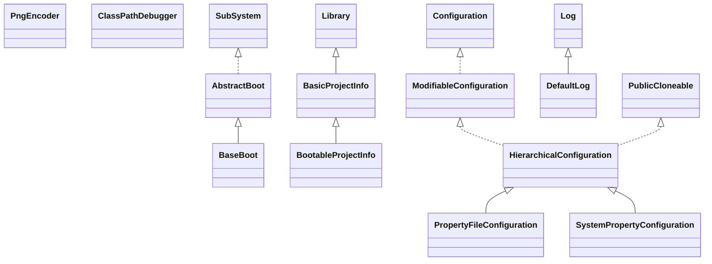

# jcommon-1.0.12.jar

[Group index](README.md) | [All archives](../README.md)

## Scope and provenance

- **Donor:** `SQX_145_REFERENCE_ROOT/internal/libs/jcommon-1.0.12.jar`.
- **SHA-256:** `34dd367ad34ae0baa5d5430fc9a13db1d12d66e29477cbb453ca92f5084a4e7b`; accessed 2026-10-06; captured `2026-10-06T18:54:51.906614+00:00`.
- **Classes:** 208 raw entries; 208 unique entry names. Duplicate occurrence indices are zero-based.
- **Inspection:** read-only ZIP hashing and class-file structural parsing; signatures/descriptors, modifiers, hierarchy and references only. Bytecode bodies are hashed, not published.
- **Allocation:** proposed `FEAT-PRODUCT-JCOMMON`, P17; [roadmap](../../dev/sqx-full-application-roadmap.md). Domain README registration remains required.
- **Repository:** `01067f00031428613c6394064ca1bcadc1ba00ee`; review state unreviewed. Download label 145-dev1; installed build/activation and runtime equivalence unverified.
- **Limit:** every class/member is inventoried; declaration coverage does not establish consumed calls, defaults, formulas, failure semantics or algorithm parity.
- **Archive/resource index:** [051.json](../../dev/evidence/sqx145/archives/145/051.json).

## Complete member declarations

Member shards contain exact JVM names/descriptors, access flags, generic signatures, throws types, declared fields/methods, superclass/interfaces and referenced class names. All classes, nested/synthetic members and overloads are retained. Code length/hash is structural evidence, not a normalized algorithm comparison.

- [001.json](../../dev/evidence/sqx145/members/051/001.json) — SHA-256 `618fdf465a334610161367dfb09f55c609cb3a8ab592f5785d3bde92eddc3ccd`.
- [002.json](../../dev/evidence/sqx145/members/051/002.json) — SHA-256 `879b2ddd12d2cf4f553bf83a8b6a4975d2c41fed49e3dc25c27834a9da2d3769`.
- [003.json](../../dev/evidence/sqx145/members/051/003.json) — SHA-256 `2975dd9df47154b026b9a0f036bf80888ba9bce6d5ef110cb534e508dd914e88`.

## Focused structural diagram

Up to twelve non-nested classes; arrows show declared inheritance/interfaces only. External type names are not evidence of an available body or an executed dependency.

## Class inventory

| Archive entry | Occurrence | Class SHA-256 | Fields | Methods |
| --- | ---: | --- | ---: | ---: |
| `com/keypoint/PngEncoder.class` | 0 | `30953bed02fe8d17884761083e0beab3c8697724e3513ef80f8a0814b0cafb72` | 27 | 33 |
| `org/jfree/base/AbstractBoot.class` | 0 | `61e4b79860cb22a0591b14d1389193f31b15954a82b7c84246705ce871f744ff` | 6 | 14 |
| `org/jfree/base/BaseBoot.class` | 0 | `fce69621444839946f273d258172704c58bab47d2e75ce77eeafe20dc5200da7` | 4 | 7 |
| `org/jfree/base/BasicProjectInfo$OptionalLibraryHolder.class` | 0 | `d7d53432f5d9d759a1fa22f3678acd3cd684d45b9d1764346005cb3fd4988e92` | 2 | 5 |
| `org/jfree/base/BasicProjectInfo.class` | 0 | `eb64cc8c53163a29d8cc37605a7dbab3aa1746fd7b9ca3c7bd090fd479c1f9e6` | 3 | 14 |
| `org/jfree/base/BootableProjectInfo.class` | 0 | `0adec8260d745c27a28b10829b81ea98272e57b792fe10f48db4770b23370cd5` | 2 | 9 |
| `org/jfree/base/ClassPathDebugger.class` | 0 | `00aaa05ee196970aa0eeaf7dc16ba8d9e960b7da61a9b3ae8cb38b79aeb07a54` | 2 | 3 |
| `org/jfree/base/config/HierarchicalConfiguration.class` | 0 | `26908f2fad6a5558a112626047fa90cafc3466561a6d2db5a3917882efc58093` | 2 | 19 |
| `org/jfree/base/config/ModifiableConfiguration.class` | 0 | `8def3587fa16f3efabb5732ce1c49334868ffcece45b90220f46e18e5cba1e60` | 0 | 3 |
| `org/jfree/base/config/PropertyFileConfiguration.class` | 0 | `1f9c07198ef10f6bfe21076ec17c787a322712d3fcd955ce64e0d820f1ab2193` | 1 | 5 |
| `org/jfree/base/config/SystemPropertyConfiguration.class` | 0 | `4a4692a32aede51b45e10710824a599fd03f0fbe9d5727864e0b85d64296d86e` | 0 | 5 |
| `org/jfree/base/Library.class` | 0 | `dc8b0247ba8d103b3989cb8d1f048493e3d206740c285624e1df04407b44c9a4` | 4 | 12 |
| `org/jfree/base/log/DefaultLog.class` | 0 | `30bcc691281a1cf328db2cbe7a080764f99a9dd6acd8bd8762cbd507d424c20a` | 2 | 6 |
| `org/jfree/base/log/DefaultLogModule.class` | 0 | `3b9df539f263cda3f16317556b8b05dd77723812ea1b6aa1acfb0d0dc982a520` | 1 | 3 |
| `org/jfree/base/log/LogConfiguration.class` | 0 | `1a0a43fa0cca1e4d63a2ddd0eb3290cbbf6fa9b47c4331cd1a4087e00b61cbdd` | 7 | 9 |
| `org/jfree/base/log/MemoryUsageMessage.class` | 0 | `91571781f9f2c4f5f99ea15d9780aa3bbc982bedbb45a0989e0cf61f23726491` | 1 | 2 |
| `org/jfree/base/log/PadMessage.class` | 0 | `8820ea6c1dccf491d5d4ab77ff9708e471a890c1f5eb7365a29ae7c0dd8b0e0b` | 2 | 2 |
| `org/jfree/base/modules/AbstractModule$ReaderHelper.class` | 0 | `7e7784fe63ef4e79df976deb73b9a340af72c1571f20f5bf3786d9ecdf474734` | 2 | 6 |
| `org/jfree/base/modules/AbstractModule.class` | 0 | `ec042a624f22257a2bab31bded7ce375a0e18bcc55b3ab2c641d881b683d1309` | 8 | 28 |
| `org/jfree/base/modules/DefaultModuleInfo.class` | 0 | `7fbe2f6209c122e244ad5ff9fe652315b22da151f7e16790b0f1b8cb8c6f0714` | 4 | 13 |
| `org/jfree/base/modules/Module.class` | 0 | `2d9cbb0134e7c48aa474d2f49da592d927dc2c7888633c7a66aa604bc9dd3cf8` | 0 | 8 |
| `org/jfree/base/modules/ModuleInfo.class` | 0 | `f466f03cb3514105ff0ee997912b0ecbfe434ca0be75e3cf78eeb7cf61d11f91` | 0 | 4 |
| `org/jfree/base/modules/ModuleInitializeException.class` | 0 | `1484bbd71324f30b6481d749d1ef70da2e8eb5e839d6c6493d94bf8f3059e398` | 0 | 3 |
| `org/jfree/base/modules/ModuleInitializer.class` | 0 | `3325c069d5e64e13398d3aa584a0c95ae4c0d5f45e038d754ef17b3865bfa249` | 0 | 1 |
| `org/jfree/base/modules/PackageManager$PackageConfiguration.class` | 0 | `b1bd7e8b6ff4acc33d9e285d5e7b4343769530b924f10a68bdb252ae910a19e3` | 0 | 2 |
| `org/jfree/base/modules/PackageManager.class` | 0 | `c5df1367749d40f80edf7174cac1c0f40584a3d4b323a9eca0927c176d5f1a65` | 8 | 15 |
| `org/jfree/base/modules/PackageSorter$SortModule.class` | 0 | `1f9265df3636fde9b8868afea3bc2793cdd2dde898aec52f6d6f617911791fd9` | 3 | 8 |
| `org/jfree/base/modules/PackageSorter.class` | 0 | `e78e93c75de554b154c2672e1fbb01dbfe735ceb3bd5c7c96c1d8b84c1f4afb2` | 0 | 5 |
| `org/jfree/base/modules/PackageState.class` | 0 | `e8160f2d72223f1a28772ee8813e4d88f0ea61e5daa3cd37b68ac64e7a4b8c6d` | 6 | 8 |
| `org/jfree/base/modules/SubSystem.class` | 0 | `4b3c6e2b0fb95fa4173f213075538ec9f6bb5d38416d361a24f90dd63e86c0d4` | 0 | 3 |
| `org/jfree/date/AnnualDateRule.class` | 0 | `a43a80d05ad6b1b26a1a164eb56e03a5fd4b4088746a4e6be23f430e6b9bd6e3` | 0 | 3 |
| `org/jfree/date/DateUtilities.class` | 0 | `f197552bf469b2d201d355cba9013bee50ae6edda8f3597082c1232896f737f7` | 1 | 4 |
| `org/jfree/date/DayAndMonthRule.class` | 0 | `52663d10f19b13e189d58c2b0e1255fc33752d85a1e903080510f60dcab1cdf7` | 2 | 7 |
| `org/jfree/date/DayOfWeekInMonthRule.class` | 0 | `905e23489d60f2e83f52b933a1e82aed6ff88a281f87c14826fa3c5ff36ded7c` | 3 | 9 |
| `org/jfree/date/EasterSundayRule.class` | 0 | `8c6cf3b15cfef21c81c93c9e054400858b96b7a15fcabd8591df904c3f01f967` | 0 | 2 |
| `org/jfree/date/MonthConstants.class` | 0 | `560a5373df5f60730837f14894c3c5186307a63f88c3f22d1d3ead0c5d15329a` | 12 | 0 |
| `org/jfree/date/RelativeDayOfWeekRule.class` | 0 | `e661ae8fc0216a6977730c6afd83226722628b36075fdc5319eb52e4832adbaa` | 3 | 10 |
| `org/jfree/date/SerialDate.class` | 0 | `1e6ff55e18381d624030fd36730c0e1a5e0851b58d162cb273f35df830a46193` | 31 | 48 |
| `org/jfree/date/SerialDateUtilities.class` | 0 | `b21864c883f019593456b9611d4a8dad50cc581146d64b8bd79614ecc345af22` | 3 | 11 |
| `org/jfree/date/SpreadsheetDate.class` | 0 | `b068e5562505e93c72ddb1db1ae1a0345e54fb66f4dad49eb75c6383b316cade` | 5 | 20 |
| `org/jfree/io/FileUtilities.class` | 0 | `58fa77cc9bcc15d2b9bffa780094539badff4ffd2810c6fb47a6244e9987e29f` | 0 | 2 |
| `org/jfree/io/IOUtils.class` | 0 | `3aea55a223b46c9b408caf7285827d29f206c41823194c84d7f2e093ed87f7d5` | 1 | 19 |
| `org/jfree/io/SerialUtilities.class` | 0 | `20ad45d5f116f9a9b684d522f170986166d7c18c246d75760e6732d53acf3935` | 8 | 13 |
| `org/jfree/JCommon.class` | 0 | `10e12d2172cfef3daec0f36cb8c8e878e1692ceb3df6f922125d021ff6eff01a` | 1 | 3 |
| `org/jfree/JCommonInfo.class` | 0 | `70adc4d3cd1525c9aaf4122877f9339e3d765c57005fc0e5c33d37448369567d` | 2 | 3 |
| `org/jfree/layout/CenterLayout.class` | 0 | `0eaa60444ce52039a33034152de11767611f15797dd40057eefea22b194f580f` | 1 | 8 |
| `org/jfree/layout/FormatLayout.class` | 0 | `174bee9293a818328c5b38c751309e49cf7f1ddac3a48c3009b106331313d751` | 20 | 17 |
| `org/jfree/layout/LCBLayout.class` | 0 | `b2bfba77a9f6bfda08210c5456f2cf8b75913d5ce6512b2578a1e40b77e77a49` | 7 | 8 |
| `org/jfree/layout/RadialLayout.class` | 0 | `6142ee8d508ddfa7c31d6b1d65972c8ed1fb8a6d5dc760b313de21ca85e3801a` | 8 | 11 |
| `org/jfree/resources/JCommonResources.class` | 0 | `845bda3687421ebb74a1eea41a5a39ac67723d36e1900f709a96083bcd34542b` | 1 | 3 |
| `org/jfree/text/G2TextMeasurer.class` | 0 | `0bdba81409a0926f423f471cab99fa1bc52856cfeb56205f400356f96cc63250` | 1 | 2 |
| `org/jfree/text/TextBlock.class` | 0 | `9f5dfec28e7c4f1d01c4753de899f6087905272d1d7c41853ea528d7e94bb611` | 3 | 14 |
| `org/jfree/text/TextBlockAnchor.class` | 0 | `0e52723b54e84a44afcc529a309c8de8c12d0499f479cd07339a604a7542a08a` | 11 | 6 |
| `org/jfree/text/TextBox.class` | 0 | `d59968e9bb224cd1e31143a34a5a00a2281da1f18294fd5ab00382829aee614a` | 9 | 25 |
| `org/jfree/text/TextFragment.class` | 0 | `5f6884f59ca7ae9d4a90add935dcec2f82b5f33c4e6bae873936f332781d02a3` | 9 | 17 |
| `org/jfree/text/TextLine.class` | 0 | `7498f33350bcd892421ee4582d318af9e316aa925c87d0ad8df43bc817d44c8c` | 2 | 13 |
| `org/jfree/text/TextMeasurer.class` | 0 | `f748672c3b365a839871d0533e5ef53a11cf38d0a0e003024adead866fec2498` | 0 | 1 |
| `org/jfree/text/TextUtilities.class` | 0 | `69eb0f8f85d27ce48a37e8af02b130a9a4855a324de43b38c2890fc02c736867` | 4 | 22 |
| `org/jfree/threads/ReaderWriterLock$1.class` | 0 | `5a1dfec81f2d36df8a166162829087af4ad400a199e40c1ab312b4c879e53b5b` | 0 | 0 |
| `org/jfree/threads/ReaderWriterLock$ReaderWriterNode.class` | 0 | `d442651bc9b484d955c484ddafe48918f36175befc30e01fed420d3134f99678` | 5 | 2 |
| `org/jfree/threads/ReaderWriterLock.class` | 0 | `c55a5fd6f4629bf7776f02787b6a3d021511653b4b04515299f66c96355fef2f` | 1 | 6 |
| `org/jfree/ui/about/AboutDialog.class` | 0 | `c77784244fcff7ac11e6e5687678f76d4760350a0baee7392c9692d78d540893` | 10 | 9 |
| `org/jfree/ui/about/AboutFrame.class` | 0 | `70eebc06f6549998316ed0b66217962648db6f51bff8ae083995a430e587c6e5` | 10 | 7 |
| `org/jfree/ui/about/AboutPanel.class` | 0 | `97591a58863eef6c31610d30f14c1252976bad8460112e72fc0762d98ff479e8` | 0 | 2 |
| `org/jfree/ui/about/Contributor.class` | 0 | `2ab624aa1682ca711d953ce7278dbef409e63c1a69c8ab532f694272f6042bd7` | 2 | 3 |
| `org/jfree/ui/about/ContributorsPanel.class` | 0 | `00436c7f72e4da4730e89bb180ceea3377417dbbf2132d9878d28e9668da81cb` | 2 | 1 |
| `org/jfree/ui/about/ContributorsTableModel.class` | 0 | `f1f1435c0fd8ea2ac62cfd0f741a0d795079aa4a638da49189917e11afc1251a` | 3 | 5 |
| `org/jfree/ui/about/Library.class` | 0 | `7d28a806d6557890d26e0f86935911340b33fabf60a315a095f96ef268f2304c` | 0 | 2 |
| `org/jfree/ui/about/LibraryPanel.class` | 0 | `f15392bf63dc897fa653e848da1f735ef3fdb25cf7458497a212929b1d41c8f2` | 2 | 6 |
| `org/jfree/ui/about/LibraryTableModel.class` | 0 | `12389df10695a31ceccdf6b0629cbb02f09d44c230458af409b5dce40ed3b433` | 5 | 6 |
| `org/jfree/ui/about/Licences.class` | 0 | `f5aeec75e4da0948aef88c9a8ef83678e37a5e1f90fd45cca4d9e585f30faf71` | 3 | 4 |
| `org/jfree/ui/about/ProjectInfo.class` | 0 | `ef54971deaa20bbdfa26820bb37f0f93136d84694c99532ae18d670f20d53344` | 3 | 9 |
| `org/jfree/ui/about/resources/AboutResources.class` | 0 | `a4db1beb17f0faeb3a703b82363f85d9cdfe45544da5982f6e3249a7176aaae1` | 1 | 3 |
| `org/jfree/ui/about/resources/AboutResources_de.class` | 0 | `def63a2dcc77aec63b6164b88e67ed069ea4b083895e84badd6861a4ff9d184d` | 1 | 3 |
| `org/jfree/ui/about/resources/AboutResources_es.class` | 0 | `0660fb50efdd67dfe317a5e094689f63cc503721b1c70773e9a3f4b2094f1f5b` | 1 | 3 |
| `org/jfree/ui/about/resources/AboutResources_fr.class` | 0 | `ad77e0e2c0cef57e62a42913b72657dc9a51389149a32daf0d49aba9d595a442` | 1 | 3 |
| `org/jfree/ui/about/resources/AboutResources_pl.class` | 0 | `115dd28ac6ca0848bea4a91f67f6cd4d22988b0d0c1302d8dfdb7eb4fefabafc` | 1 | 3 |
| `org/jfree/ui/about/SystemProperties.class` | 0 | `23a3ad4da53137adbbcca370793ff8c5642a5e98640ffa76063e1e577f352d28` | 0 | 2 |
| `org/jfree/ui/about/SystemPropertiesFrame.class` | 0 | `39d0b165215fab935471eaca1c08cc4165179eca2ce58f1277d4a27ad521e491` | 3 | 3 |
| `org/jfree/ui/about/SystemPropertiesPanel$1.class` | 0 | `590e497cab66134c61b7e03d3c6730c78fc143442284b494ca5f084d3e532d6e` | 1 | 2 |
| `org/jfree/ui/about/SystemPropertiesPanel$PopupListener.class` | 0 | `83959db23973ba37bb7c9a684d2ccadf1947962cd17936a2dd1ed4b0ae34ed56` | 1 | 4 |
| `org/jfree/ui/about/SystemPropertiesPanel.class` | 0 | `2841877f7205ac7149e2a939e4333e8f5aca829fb123b33d49d8b78fbfecd105` | 4 | 4 |
| `org/jfree/ui/about/SystemPropertiesTableModel$SystemProperty.class` | 0 | `003bab4c332dff6f84313711d67f8a5cf350db0f2ab0672f7c458ce3d4ed5500` | 2 | 3 |
| `org/jfree/ui/about/SystemPropertiesTableModel$SystemPropertyComparator.class` | 0 | `69acc03e0f9abd177c1245dfeaa94b3fcd280e3447699f50d50d6f0d425d65ad` | 1 | 4 |
| `org/jfree/ui/about/SystemPropertiesTableModel.class` | 0 | `428c6b8ec74b4569d5edfcb666659a224b8b2f9a545e343445a55fd00860307a` | 3 | 7 |
| `org/jfree/ui/action/AbstractActionDowngrade.class` | 0 | `623326882d57bb6127d93f949fce99b11e2b4131de9823249fa48f290a930c83` | 2 | 1 |
| `org/jfree/ui/action/AbstractFileSelectionAction.class` | 0 | `ad832bfe47e091d74542696df8b06da8452a50ab25494bbd2f4ba2b3d2b712be` | 2 | 6 |
| `org/jfree/ui/action/ActionButton$ActionEnablePropertyChangeHandler.class` | 0 | `3a9a0852bc96e5662b0df556fe5e7e0232afd357614673f3189566802a7d46b3` | 1 | 2 |
| `org/jfree/ui/action/ActionButton.class` | 0 | `67e2b54082b5710f00b317763c7335a68dd9c87b15fe10ff8353661a428f418c` | 2 | 9 |
| `org/jfree/ui/action/ActionConcentrator.class` | 0 | `731444ba7f8d9e68af24ed965cbfa4393446cceeb9ec35e4b10efdb930b6b9ca` | 1 | 5 |
| `org/jfree/ui/action/ActionDowngrade.class` | 0 | `e6e095e262f62728b4744f033b163cddcb76469bf7b91dfc00a6ddebc268fbae` | 2 | 0 |
| `org/jfree/ui/action/ActionMenuItem$ActionEnablePropertyChangeHandler.class` | 0 | `617c46d15688f50658e8ddf8955c58924341afc6c490400b2a6630520685ed5b` | 1 | 2 |
| `org/jfree/ui/action/ActionMenuItem.class` | 0 | `6523c8a43bf5211b8764a23d28c53a7e48feead6f6b461ead37b663a3809a471` | 2 | 10 |
| `org/jfree/ui/action/ActionRadioButton$1.class` | 0 | `62b6d45a310e4c51ced3305181f8d90eaa1c0a0f12f9c97917b6b12fca6bfa66` | 0 | 0 |
| `org/jfree/ui/action/ActionRadioButton$ActionEnablePropertyChangeHandler.class` | 0 | `2bc87cac1eadeef2a5a858c8868ad95e9091048c8d92611eaf8b8bcc448c1fea` | 1 | 3 |
| `org/jfree/ui/action/ActionRadioButton.class` | 0 | `c03ddf7d482a8cd0bd0f8d651e6c6fe353a85e96d7a45bd6e6afb777531951f7` | 2 | 9 |
| `org/jfree/ui/action/DowngradeActionMap.class` | 0 | `f2a5de9701ca378ff214132824028065928aabfc9a40ab8e9bac711cbe6069d0` | 3 | 10 |
| `org/jfree/ui/Align.class` | 0 | `f2298fa6bd67e72014413df375921279355f8c96c1b0f2ef32cb71507d6e9e4d` | 20 | 2 |
| `org/jfree/ui/ApplicationFrame.class` | 0 | `5a0ecc303ecbdca7b0d587e718ffe9e085559475caf258175ae8d967f842773a` | 0 | 8 |
| `org/jfree/ui/ArrowPanel.class` | 0 | `e9f1e508f8988d7ea99330fef51491567a0af1cad8cfb2b943eaa1daef055d88` | 4 | 5 |
| `org/jfree/ui/BevelArrowIcon.class` | 0 | `875a88b93b26cf7830783bbdc35834fe6cefd39ccfb86dbf34b6cc30cffcb99c` | 8 | 8 |
| `org/jfree/ui/DateCellRenderer.class` | 0 | `a895195c2f39a54e26ea4140561fcf023b6b947cb61c7aed231ac64eb2b814d9` | 1 | 3 |
| `org/jfree/ui/DateChooserPanel.class` | 0 | `d8fa5ad14e7ba4da595aa20e351e3f44150453ef2b63cf22639767cd274a5a02` | 13 | 23 |
| `org/jfree/ui/Drawable.class` | 0 | `6a053d38f8f8106b0e6a36dffe6428b702b54e2317798d1ba0c989576d297521` | 0 | 1 |
| `org/jfree/ui/DrawablePanel.class` | 0 | `5e57499a5c42092e084aec289a9b90e3368d7e0bc750e05b6ed09769b93416f6` | 1 | 7 |
| `org/jfree/ui/ExtendedDrawable.class` | 0 | `d0144e2b2b97ac269c8c2775e2f710dc2690843f8d557746802b60afcf8e0cdd` | 0 | 2 |
| `org/jfree/ui/ExtensionFileFilter.class` | 0 | `48f8fe39e9d7c16865bfa4defd00cbf029181db7bf5bad8c144d322628bf498f` | 2 | 3 |
| `org/jfree/ui/FilesystemFilter.class` | 0 | `d9ae3daf956579f28c0a435d5467e57ebcf1ea2de96ea59216b1efd85722b7fd` | 3 | 8 |
| `org/jfree/ui/FloatDimension.class` | 0 | `61946deb845b0697c467f01f0b67c0118d6cda4e201f117d6c7f8a54eae4344b` | 3 | 12 |
| `org/jfree/ui/FloatingButtonEnabler.class` | 0 | `b229a2594cf2be4e3c6161db477760a103aff8525d0857a6e05cb23fa7b1606f` | 1 | 6 |
| `org/jfree/ui/FontChooserDialog.class` | 0 | `cc3163a76363bbd8337137082262d54d3ebf1d6b3e7cf41c5264599c4c9ed1c8` | 1 | 4 |
| `org/jfree/ui/FontChooserPanel.class` | 0 | `2503ceaa519d85df6caa35b376eae3c67e98cb46d2c813e8753b3915f1ab18be` | 6 | 7 |
| `org/jfree/ui/FontDisplayField.class` | 0 | `7bfb347f64aef2e65b137f6422915d813c0a3e9a0ae94172ebb263b4ed4c8511` | 2 | 5 |
| `org/jfree/ui/GradientPaintTransformer.class` | 0 | `d7282777308db9f66e3134961c513b62f03ffee0a3d608de8b18bf2484f6f66b` | 0 | 1 |
| `org/jfree/ui/GradientPaintTransformType.class` | 0 | `ac46f83e838f2b1e89b813ac3ef844b8c20e416f460ef2c477cc541d2f7c7a09` | 6 | 6 |
| `org/jfree/ui/HorizontalAlignment.class` | 0 | `a5111ae24bd7bbcbd2b810c5a02f03447ea65de878e9247ee627a7a226f894ed` | 5 | 6 |
| `org/jfree/ui/InsetsChooserPanel.class` | 0 | `332e16d11dee6072b10a5dd1ebd5690b4a778c44759cebabdd9928b13c7ae31e` | 5 | 6 |
| `org/jfree/ui/InsetsTextField.class` | 0 | `c567b7bbd6b6a4f76331f4e5046e4efef58537b5a219106cd358f9e874735d57` | 1 | 4 |
| `org/jfree/ui/IntegerDocument.class` | 0 | `48c1c4618549cd3af53f424b3c1749725d7f1135b7d2a2efbb6d6a9233dc2700` | 0 | 2 |
| `org/jfree/ui/JTextObserver.class` | 0 | `9fa69814b675c5fc6f9b12e839ac9faa2fc71a187bd7995bbec31c8c496ab9a6` | 1 | 6 |
| `org/jfree/ui/KeyedComboBoxModel$ComboBoxItemPair.class` | 0 | `354114f26a1bc48d338e6c1c512e8d7fd85719c69115f2b29bd4c15005436a88` | 2 | 4 |
| `org/jfree/ui/KeyedComboBoxModel.class` | 0 | `ff17ba5f405da2b543eef4cb2cdf5fa0b8e772b1f9999e8b24235ffef1376795` | 6 | 20 |
| `org/jfree/ui/L1R1ButtonPanel.class` | 0 | `734f88b10172afa52e4f0bec06c282b630e8a0ceb2a06835cbdf320d85bde0d0` | 2 | 3 |
| `org/jfree/ui/L1R2ButtonPanel.class` | 0 | `7f396d2370ed9e8d4f46706c2989315826b36c867b91503574cef6d77f5485ca` | 3 | 4 |
| `org/jfree/ui/L1R3ButtonPanel.class` | 0 | `ae5ed33984bf8c66994a69132cbfd2c225c6c92398a350aa265cb424f5fbbe64` | 4 | 5 |
| `org/jfree/ui/Layer.class` | 0 | `27e3aee15af579022c995b9d270605d0f51749a935ba5ce47b8f6e5fb6ac4907` | 4 | 6 |
| `org/jfree/ui/LengthAdjustmentType.class` | 0 | `84ae76c9795de482e240a428450b917c2d2b3dee7a46227d517945ec72c960ad` | 5 | 6 |
| `org/jfree/ui/LengthLimitingDocument.class` | 0 | `ea2cce942f7e4f8f96cc12f60479855030fa0d540235fbf35ff07acb9756aeec` | 1 | 5 |
| `org/jfree/ui/NumberCellRenderer.class` | 0 | `0ca2c7fa29de451beb7152e771f27029228f8f2fa20c8ddeb9fcb7da03b438f6` | 0 | 2 |
| `org/jfree/ui/OverlayLayout.class` | 0 | `3830b9a44b13dc99bdcad8910a48be5c97050ac5cda4ef0bf490d040e2888faa` | 1 | 7 |
| `org/jfree/ui/PaintSample.class` | 0 | `cfff1c3fb62348825d83a8e59a784c9b3371f5d7f097e39640ffaabd6aa3a9f4` | 2 | 5 |
| `org/jfree/ui/RectangleAnchor.class` | 0 | `9bd684d2a466e2575939dcb981888ac0d281076943c519f09f2bdb922e4ef7f1` | 11 | 8 |
| `org/jfree/ui/RectangleEdge.class` | 0 | `005acb5163e5a7befee743dbd8a8d7c99033566e23c6038466d626e6a1d6cd45` | 6 | 10 |
| `org/jfree/ui/RectangleInsets.class` | 0 | `8bf82e4e21a7c836c22f422546ddaa20c12cb97523f305fa83c7c978b3c358f9` | 7 | 30 |
| `org/jfree/ui/RefineryUtilities.class` | 0 | `f28ae5c4798fca42d8ed44e99192f1b4b693dffcaa5dd74837391d5de184b7a1` | 2 | 13 |
| `org/jfree/ui/SerialDateChooserPanel.class` | 0 | `549fe6daa4d0acfe41b89670ccbae87296234a75b640f7477dfbf811d7b45504` | 14 | 16 |
| `org/jfree/ui/Size2D.class` | 0 | `e33059f828298fee2bfb0e6c9d8c3dfaef90cd7b5bf387b480a4a660a61c8a60` | 3 | 9 |
| `org/jfree/ui/SortableTable.class` | 0 | `c122bc0c8f122a5c8bafaf32a84a370fc4fcbbde70ffe6ab960814658f8ac3d5` | 1 | 2 |
| `org/jfree/ui/SortableTableHeaderListener.class` | 0 | `9dbd1351a91606ee92b4d36bcb8db4546da938e10410482ccd809a18af2ced85` | 3 | 9 |
| `org/jfree/ui/SortableTableModel.class` | 0 | `64294af3de9fb8a7f463fb7b5e7f37e2f9453405ade08d5bda6001719b9f6f19` | 2 | 6 |
| `org/jfree/ui/SortButtonRenderer.class` | 0 | `d028dba15fa932d8550a866e786f3fa76eabd626205eaaad7da2dea6ed4de998` | 11 | 5 |
| `org/jfree/ui/Spinner.class` | 0 | `1f14bdbd73600e58bd5dc187346f5b26d96b0b2b6f72f54bbcd96115fbe4a9d8` | 5 | 7 |
| `org/jfree/ui/StandardDialog.class` | 0 | `7303d067e47ad2078b30ff91c9d2c93b1c3bc16bb66df88aee9ac856f5dfe6b7` | 2 | 6 |
| `org/jfree/ui/StandardGradientPaintTransformer.class` | 0 | `ffd68d680eeb128433ae46da8ccc7616199431988a68c232d8c49d3fc8ce5daa` | 2 | 7 |
| `org/jfree/ui/StrokeChooserPanel$1.class` | 0 | `75656976a9019d7790921112b3ad7b55922294f9c397359fc67e618cc0b41d91` | 1 | 2 |
| `org/jfree/ui/StrokeChooserPanel.class` | 0 | `c94fd6c2d1617230e46a2e5f2bf4b6fd965d8dca58d5460a3dc735c1b4683c65` | 1 | 3 |
| `org/jfree/ui/StrokeSample.class` | 0 | `99214ccae12a16db52af89ab479b65ec5f2e5cc93594562f0f21ed4dc4fc389e` | 2 | 6 |
| `org/jfree/ui/tabbedui/AbstractTabbedUI$ExitAction.class` | 0 | `76c5cf5325a139700f77a8f6dd54e9a6cda118ce221221f47ad90d9bf9d0e10c` | 1 | 2 |
| `org/jfree/ui/tabbedui/AbstractTabbedUI$TabChangeHandler.class` | 0 | `2a58a85b62d21c4402b93107e4dc54c3201472309ec8943d051604d94d15707f` | 2 | 2 |
| `org/jfree/ui/tabbedui/AbstractTabbedUI$TabEnableChangeListener.class` | 0 | `e7b95d3c3c4ea76c1ec30d142fbfb198ce40f0aeeda3dd0a2369fb8204fbecdc` | 1 | 2 |
| `org/jfree/ui/tabbedui/AbstractTabbedUI.class` | 0 | `3b60af468021a81c7a5de7f8d103e7a5c8957df9285213747952e92d05e4b534` | 10 | 21 |
| `org/jfree/ui/tabbedui/DetailEditor.class` | 0 | `48e09323f2c106856b722b7d742fea8b4ba74bb8f9abe6fe7907e71e11c027e7` | 2 | 10 |
| `org/jfree/ui/tabbedui/RootEditor.class` | 0 | `001ff81019435c2261eecf564e8f1440ace57a71d960f2a691d2c7bf932f104c` | 0 | 11 |
| `org/jfree/ui/tabbedui/RootPanel.class` | 0 | `2e4d35910435229e24f7aa283ab8034f9370b870b6951b14301aa976ffa1b8c0` | 1 | 7 |
| `org/jfree/ui/tabbedui/TabbedApplet$MenuBarChangeListener.class` | 0 | `3ad6e5a238cdbb922cf1dc5d98e7d2266c188d8d669229be361b83ab26bfefb2` | 1 | 2 |
| `org/jfree/ui/tabbedui/TabbedApplet.class` | 0 | `7b43b98f5fcfdb4ad5c5b7447f7fd536380d1e80800db89c2aae1f0f0f765e9f` | 1 | 3 |
| `org/jfree/ui/tabbedui/TabbedDialog$1.class` | 0 | `654bd76b527eecf90768718e29070d1017871518e71ceae9dfc38754f748ac28` | 1 | 2 |
| `org/jfree/ui/tabbedui/TabbedDialog$MenuBarChangeListener.class` | 0 | `a58a8ce435891d1b11cf37119302e79b916a56507b173878b66c98e77eea0e58` | 1 | 2 |
| `org/jfree/ui/tabbedui/TabbedDialog.class` | 0 | `865e84721416a20517376ee7ac172d01ddd0dba2db0739bdf62f0a0846b3eea2` | 1 | 11 |
| `org/jfree/ui/tabbedui/TabbedFrame$1.class` | 0 | `023c16cfbaea41e76d90dd7a131c223e73523a31ad751ea1f427ffd80140cef8` | 1 | 2 |
| `org/jfree/ui/tabbedui/TabbedFrame$MenuBarChangeListener.class` | 0 | `5896779d3cf1bd332a9fed529b1ec2198c2a4e5cedb0271ebec278f0eea259e0` | 1 | 2 |
| `org/jfree/ui/tabbedui/TabbedFrame.class` | 0 | `121d2cd03396e9ccf30ebf3f435886df2052f9bdf2f1760592438f058601fcb6` | 1 | 4 |
| `org/jfree/ui/tabbedui/VerticalLayout.class` | 0 | `f8f2f0b0cd28e1311efa300077b906cc161db343a8b5addfdff384e3d2794bbb` | 1 | 8 |
| `org/jfree/ui/TextAnchor.class` | 0 | `fd185d2e1daec0abd40b29aa6d944268e13362901124a7a103117cda8e57c0f4` | 17 | 6 |
| `org/jfree/ui/UIUtilities.class` | 0 | `3579af7c90f32ec933987cb2a9ae9d3090609c67d5c5e650a4bb6b41eb8e6687` | 0 | 2 |
| `org/jfree/ui/VerticalAlignment.class` | 0 | `2504ed0fa5f6a96a988fffdc4aa46e0b3cc600a6ea2b3cd17272d87a4ae3656d` | 5 | 6 |
| `org/jfree/ui/WizardDialog.class` | 0 | `b8a9b0216b30654cb115ce4390519329b540284efb3405cc4ff53967d72a36f9` | 8 | 15 |
| `org/jfree/ui/WizardPanel.class` | 0 | `c78c73280c3ee81076c50ea35dd883d749d287f3f94dc35d1d600a57985f7e2f` | 1 | 9 |
| `org/jfree/util/AbstractObjectList.class` | 0 | `a61756af828e77b656e72ff106078e723edf49425c2b25fed7f234d86e927911` | 5 | 13 |
| `org/jfree/util/ArrayUtilities.class` | 0 | `89786e724bfd3fe8491538e7e0a52bed54ba8b5baa426cb1265f6a9f4a737250` | 0 | 6 |
| `org/jfree/util/AttributedStringUtilities.class` | 0 | `292f04b984d0659239a912e9b216f872a1f8df7cc48c2dbf5e7cf857fbcdb744` | 0 | 2 |
| `org/jfree/util/BooleanList.class` | 0 | `bb8cceb90aab03069672011d76091a1d8d757425fe7dd67cc45bbd97200abb97` | 1 | 5 |
| `org/jfree/util/BooleanUtilities.class` | 0 | `1a9acc218f87f3b7b916e5ab086f63241b6deb951292ee38881ca43e4e01fd91` | 0 | 2 |
| `org/jfree/util/ClassComparator.class` | 0 | `a6d86dd3947370808d0f282c12513188f9fbe57203bea3bc1f4f80568e2daf70` | 1 | 3 |
| `org/jfree/util/Configuration.class` | 0 | `e9a6dcddb1ac0078b87db9b38eb82ef472c87bdd46a589375c263f436d626c78` | 0 | 5 |
| `org/jfree/util/DefaultConfiguration.class` | 0 | `6059f8b97e4f02133a540dcc36096fc1eefc5c39a5efac4ec5cd4ae45086565f` | 0 | 6 |
| `org/jfree/util/ExtendedConfiguration.class` | 0 | `89bd8130dd2252bfb531441de898fa36b0db4a8482a0ee34dd4467a8aab53700` | 0 | 5 |
| `org/jfree/util/ExtendedConfigurationWrapper.class` | 0 | `3fd9a40ec8919061efaa1cd4eab5950ad5a88a67ac6bb83bddcf507a802f5d2f` | 1 | 11 |
| `org/jfree/util/FastStack.class` | 0 | `e705425a3f490be566307d25f156af0a2ab19494e9d6d21dac7b703e0db5fb4f` | 3 | 10 |
| `org/jfree/util/HashNMap$1.class` | 0 | `2020643bd3bf9e3eb5ea267c28751b8d3606a345ba1c452b22ce9ec84418935a` | 0 | 0 |
| `org/jfree/util/HashNMap$EmptyIterator.class` | 0 | `e679454a6fc3424b5a2c92b4376cddfddb038771513e56c5e0836f3da6ae7c34` | 0 | 5 |
| `org/jfree/util/HashNMap.class` | 0 | `1273a647880437f238e8fdd8b2ce215e41f246a4e222e11a4d58af9fb307e162` | 4 | 21 |
| `org/jfree/util/LineBreakIterator.class` | 0 | `526d943037f52fadaee3813ed4c1623e69939638b0ded974e6853243f31299d1` | 3 | 9 |
| `org/jfree/util/Log$SimpleMessage.class` | 0 | `b914fc9cabd83e749b7ea124e9ae1b030a2d0f00af8a02dc230974ff133d8a8d` | 2 | 6 |
| `org/jfree/util/Log.class` | 0 | `6f01fd400e904f2c76e44318e1d54d079706be0a1d694827171440d462ac223a` | 4 | 29 |
| `org/jfree/util/LogContext.class` | 0 | `3fe10ec7e92dc5d88446dacec9b4469083c4ca0f3b6e404c0c02cd177586a123` | 1 | 17 |
| `org/jfree/util/LogTarget.class` | 0 | `5bb6c45cbae26fc7d77a896910a01e8b738221892c60392eb9c9e3d11f56cbb5` | 5 | 3 |
| `org/jfree/util/ObjectList.class` | 0 | `e1cdfe3be81c68d068d70db540212ca51c5711fb53ff9ea6451fe7e510bb148e` | 0 | 5 |
| `org/jfree/util/ObjectTable.class` | 0 | `b65391a5b34b8f9c459fa26bb81cb499a0548d60556aad51d414febfa96660c7` | 6 | 22 |
| `org/jfree/util/ObjectUtilities.class` | 0 | `3c1b6cfdce7debcf8f198caaabddf8e6687e2462ca0d6caefddad83d7749ec0f` | 5 | 21 |
| `org/jfree/util/PaintList.class` | 0 | `7b3b21bb0b8485cd244ac0d6b135322f1e465c79f5de707920b45b607bf62cc3` | 0 | 7 |
| `org/jfree/util/PaintUtilities.class` | 0 | `75ddfacc03c1d8c1d6630e8c392037e94dd18694595812334427ac8464d08895` | 1 | 5 |
| `org/jfree/util/PrintStreamLogTarget.class` | 0 | `bf87b9076fc8eea5038d47669229f4a397978d8ecef62ad21cd31955946cf8e8` | 2 | 4 |
| `org/jfree/util/PublicCloneable.class` | 0 | `a60f78d6c57333b724af163491ef3b0940e78382613c686782b9a00290fd1684` | 0 | 1 |
| `org/jfree/util/ReadOnlyIterator.class` | 0 | `1b083a2474af18fc892f41771ebf83e81c1c559606f8909782d5f03ae1787c3d` | 1 | 4 |
| `org/jfree/util/ResourceBundleSupport.class` | 0 | `fb876bcf533e7d3ff8caeecc8b5c53950440fd7bf77d3586071ebd1ab4f4eaa7` | 7 | 29 |
| `org/jfree/util/Rotation.class` | 0 | `5086a2b4ef2e38fb057fb76349dc649b87d229e750771881f828191eed1fec2d` | 5 | 7 |
| `org/jfree/util/ShapeList.class` | 0 | `b7be3769c16346a7b090955425e0082c1d506b42a25682a1bf7daa6d6f06cb86` | 0 | 8 |
| `org/jfree/util/ShapeUtilities.class` | 0 | `1c45fd2ab360c6dcc73eded560e81b4fe94c0977b6406dbd21decd75fa1b18a8` | 1 | 22 |
| `org/jfree/util/SortedConfigurationWriter.class` | 0 | `b64b35ba2fdaae914e5bbe755112542bb0346119117f9fa4fc58db0d34a396dd` | 5 | 8 |
| `org/jfree/util/SortOrder.class` | 0 | `d77080d7d950ef1c7a37a4987fea52a8a5418e62757d4ebbdfd586e360ea66cf` | 4 | 6 |
| `org/jfree/util/StackableException.class` | 0 | `4c5cb560411d259c907e47ca9bfcaa8c646f409e44a5134879100b1c15f9f23b` | 1 | 7 |
| `org/jfree/util/StackableRuntimeException.class` | 0 | `62dcfdb166a8b0b192a7c709dcf4c8c025c26cbbdca89d20db07bc96c9df4a3d` | 1 | 6 |
| `org/jfree/util/StringUtils.class` | 0 | `39bf6939aa7c0e260e9163ab03f655db225361ec1cbd48fb20df6daca4d65d38` | 0 | 4 |
| `org/jfree/util/StrokeList.class` | 0 | `9a0e39bb8e08e674e03df834d00c02d28513b40f97a68a9be99ebf6f398a1a92` | 0 | 8 |
| `org/jfree/util/TableOrder.class` | 0 | `7b86736751cba71eb851a13a833d7385bc16f91cf1039717bc4e73d208934b88` | 4 | 6 |
| `org/jfree/util/UnitType.class` | 0 | `c0315cac49c444ea74dffdc8ebcc66a7a36091f80b04bdd6322038c17b667155` | 4 | 6 |
| `org/jfree/util/WaitingImageObserver.class` | 0 | `82055b6dde68483f92405a6c6fd59951f381e8e7b98e149e115912e62ce45274` | 4 | 6 |
