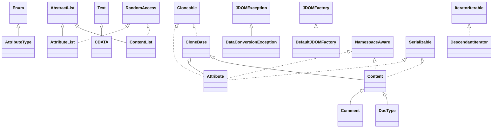

# jdom-2.0.0.jar

[Group index](README.md) | [All archives](../README.md)

## Scope and provenance

- **Donor:** `SQX_145_REFERENCE_ROOT/internal/libs/jdom-2.0.0.jar`.
- **SHA-256:** `4a8817acf7f719e4bcfbcaf96250defff4cc87b4c20634c6eaa96ee04fd38bfe`; accessed 2026-10-06; captured `2026-10-06T18:54:51.906614+00:00`.
- **Classes:** 185 raw entries; 185 unique entry names. Duplicate occurrence indices are zero-based.
- **Inspection:** read-only ZIP hashing and class-file structural parsing; signatures/descriptors, modifiers, hierarchy and references only. Bytecode bodies are hashed, not published.
- **Allocation:** proposed `FEAT-HOST-JDOM`, P02; [roadmap](../../dev/sqx-full-application-roadmap.md). Domain README registration remains required.
- **Repository:** `01067f00031428613c6394064ca1bcadc1ba00ee`; review state unreviewed. Download label 145-dev1; installed build/activation and runtime equivalence unverified.
- **Limit:** every class/member is inventoried; declaration coverage does not establish consumed calls, defaults, formulas, failure semantics or algorithm parity.
- **Archive/resource index:** [052.json](../../dev/evidence/sqx145/archives/145/052.json).

## Complete member declarations

Member shards contain exact JVM names/descriptors, access flags, generic signatures, throws types, declared fields/methods, superclass/interfaces and referenced class names. All classes, nested/synthetic members and overloads are retained. Code length/hash is structural evidence, not a normalized algorithm comparison.

- [001.json](../../dev/evidence/sqx145/members/052/001.json) — SHA-256 `d1268cd44ae455323123f2d7a7d2d459eef11deb6679527a2150aa7967e2711a`.
- [002.json](../../dev/evidence/sqx145/members/052/002.json) — SHA-256 `b7e46ddf1b966ab313feee1354b1f71bbf0fcb0d2c004524287b0a4327030a7a`.
- [003.json](../../dev/evidence/sqx145/members/052/003.json) — SHA-256 `b73c1e0821bfb5b07d5f7a8242517eb3a5af3dad3a0c896b4eb4067076097b50`.

## Focused structural diagram

Up to twelve non-nested classes; arrows show declared inheritance/interfaces only. External type names are not evidence of an available body or an executed dependency.

## Class inventory

| Archive entry | Occurrence | Class SHA-256 | Fields | Methods |
| --- | ---: | --- | ---: | ---: |
| `org/jdom2/Attribute.class` | 0 | `898bfdd908b3654c70d86e052e241f0099a7581377f4df3b86cbfe2f48d603e7` | 18 | 39 |
| `org/jdom2/AttributeList$1.class` | 0 | `b175d430664215921a1ed8925b25b93f50513423d4d8dd4a6c633727b669a320` | 0 | 0 |
| `org/jdom2/AttributeList$ALIterator.class` | 0 | `f48a70cc4fea0110f2cf2e6e01877bc4955042ff13d8644f698c01d3b1b93b15` | 4 | 6 |
| `org/jdom2/AttributeList.class` | 0 | `4343f34a96758c33436cc576bb15b335dc448c9a4d7efc1501310f403ede3cd4` | 4 | 34 |
| `org/jdom2/AttributeType.class` | 0 | `4d2c7914707b9636af3d1101b2c13873d90e6ed4aaa6d5eacda23f5069d6f606` | 12 | 6 |
| `org/jdom2/CDATA.class` | 0 | `37232affbe2b79aa21edda08df61dbaa9acdd846f2fd9f36eb20f799b9f83e42` | 1 | 18 |
| `org/jdom2/CloneBase.class` | 0 | `70514f0cb17486d59c2d6f5462100e83b7521d2317193178c815ab3f58c4fe9b` | 0 | 3 |
| `org/jdom2/Comment.class` | 0 | `4e9f3a652a961415e6c5b2c7bafc1f036a3ebc70ac87dac11e1d91da71fffe70` | 2 | 14 |
| `org/jdom2/Content$CType.class` | 0 | `6a4e1153f973ef87305add84eba63b5a22cc222a8ee376db9a0a8a790ad8fc43` | 8 | 4 |
| `org/jdom2/Content.class` | 0 | `39130e8085edd8ede9f68ecae8bd7825669f600cf71d9e1acd92299097d93b16` | 3 | 16 |
| `org/jdom2/ContentList$1.class` | 0 | `aa2ab28098f91ab2831536685d0d9421c2d7fb72537b236f36c8c175b8fd648d` | 0 | 0 |
| `org/jdom2/ContentList$CLIterator.class` | 0 | `ad4f91cec42057346bdd4c0475fb2b6a99a2619ac31a59fa80f7afadde16d991` | 4 | 6 |
| `org/jdom2/ContentList$CLListIterator.class` | 0 | `20d2f59410947431c6a2133ffc4a2939c9c823cfeb26a8c74a792ba372607bb5` | 6 | 15 |
| `org/jdom2/ContentList$FilterList.class` | 0 | `874485cc0152aa5c856e2f0cb3bf2cb6c5d07b39c9b2515958f88c9e38bee3d3` | 5 | 19 |
| `org/jdom2/ContentList$FilterListIterator.class` | 0 | `a1569055e688755ff6a848859c0066c3497db55be3a564a86773a6b32891edc5` | 7 | 15 |
| `org/jdom2/ContentList.class` | 0 | `ad74ccfb323dea627906360951d762deb437f544be4e37d17ee711a1946c4e3d` | 6 | 40 |
| `org/jdom2/DataConversionException.class` | 0 | `fdc082959c4e63807d4bce23151e858fb8ef7dba82e4b342686f147155ef0fe3` | 1 | 1 |
| `org/jdom2/DefaultJDOMFactory.class` | 0 | `4d834e68429ab276935ab57d4a7c1c85af8aec2ff4918b0c3940618c0782809b` | 0 | 46 |
| `org/jdom2/DescendantIterator.class` | 0 | `eb6d240c5d6db77b31e3488b947ff7e7f8de67c847e4f2e8068694c6989b2c68` | 7 | 7 |
| `org/jdom2/DocType.class` | 0 | `864d05613c78b1db5d6409c068495e6747c31301305912ab16284f0c08de19a0` | 5 | 24 |
| `org/jdom2/Document.class` | 0 | `8852023bf757619482f27ea7db35f459c44cdee2cd5f195e8ed95b8cc5adc621` | 4 | 53 |
| `org/jdom2/Element.class` | 0 | `838e2776d0d9d3aabeadecc2d8fc04394c9662283a147a3bd2483423c3bb5c04` | 7 | 100 |
| `org/jdom2/EntityRef.class` | 0 | `dbeed1f7e149e50ee9affb097332d47a9e774269896defe3c66d7499ce3131d1` | 4 | 22 |
| `org/jdom2/FilterIterator.class` | 0 | `b208a4f587797e573d9cbb42f9ee94db3c4e6de6e5b69a132572fb86f4459191` | 4 | 5 |
| `org/jdom2/IllegalAddException.class` | 0 | `482d614a25c112ae44d6a3340e2503ef56b1dca18469ba28984bdae26e912083` | 1 | 13 |
| `org/jdom2/IllegalDataException.class` | 0 | `1136296757996d4364830bc67f661a4e26eceb09e2c7ec6fc2fde81e5c319e1b` | 1 | 3 |
| `org/jdom2/IllegalNameException.class` | 0 | `1b3ded360bc8758b4acc63dd0910bb2ff2756754396388c6441734999d48a001` | 1 | 3 |
| `org/jdom2/IllegalTargetException.class` | 0 | `30435a2862db8ba279b57f06f8393a3b3174a9b52996d9241807ca9306f36c4b` | 1 | 2 |
| `org/jdom2/JDOMConstants.class` | 0 | `938a3505568de5a8fd16708670075b669ac36b75d3a162421b9c23f2442b3493` | 18 | 1 |
| `org/jdom2/JDOMException.class` | 0 | `1fe71ebfeb8892b6fecd3bfbc0b5e736df1c5292a9eeea87305c07a924e689e2` | 1 | 3 |
| `org/jdom2/JDOMFactory.class` | 0 | `14e6d958c2d9735bc52f787107a35250553943b4b5ece3f86643ea5eda73e5ce` | 0 | 45 |
| `org/jdom2/Namespace$NamespaceSerializationProxy.class` | 0 | `2b60e6399c8147a3ce48291ce517632bc4f65057be809914ec2582fe0321dc03` | 3 | 2 |
| `org/jdom2/Namespace.class` | 0 | `695fe16467df6a688866c8e19a63833757d9fe51af8faa9ca105d03ea510803e` | 6 | 11 |
| `org/jdom2/NamespaceAware.class` | 0 | `c9dcbc21416f795bfe3e9c75879e28a4246d8934e0fd9a685ecde2c3cc756485` | 0 | 3 |
| `org/jdom2/Parent.class` | 0 | `edc0da973734aacfca44b9d943852e550fcd9bf3262f59596228b4fb18399a12` | 0 | 20 |
| `org/jdom2/ProcessingInstruction.class` | 0 | `54ad4bdd436d15e47caefbac89651b4018ca9eb18c09936efe163e549ac89c3d` | 4 | 26 |
| `org/jdom2/SlimJDOMFactory.class` | 0 | `0b8e0ab4ba3983701cdce6bb2860953df17c0e788a4e32cde13da9a5cfd85efa` | 2 | 25 |
| `org/jdom2/StringBin.class` | 0 | `eb0886caf5bf05f0782f0e7ee1d0f27fc08f556c4fb43793d946be559fd62336` | 6 | 7 |
| `org/jdom2/Text.class` | 0 | `ab80cd385973f501095a37e19b50cd9ede5720f9c1c96d42837eb3047fdb2e4c` | 3 | 22 |
| `org/jdom2/UncheckedJDOMFactory.class` | 0 | `f547310487ef418089c955c047fbfaddcf6cd94f8b081b2a9caa533d3db31257` | 0 | 30 |
| `org/jdom2/Verifier.class` | 0 | `968bdb5b974bb5a44033c087c9191a9d332203baf929a3d127039bd7f7df0af4` | 0 | 35 |
| `org/jdom2/adapters/AbstractDOMAdapter.class` | 0 | `6df1f10c986be960898de10f1d2cba7a20fac2b067fd78c869652dd2e299ea4a` | 0 | 3 |
| `org/jdom2/adapters/DOMAdapter.class` | 0 | `6b8e2390844dcfcab765d6a8f061514cb0a62f17256c8f5822d9d53b40acac91` | 0 | 2 |
| `org/jdom2/adapters/JAXPDOMAdapter.class` | 0 | `cb174ac68d517aa8581e5e4342c69589292791c612b3f71682513d0fa8ee3874` | 1 | 3 |
| `org/jdom2/filter/AbstractFilter.class` | 0 | `612b5e8237235255be555cf87dccfb732cd7f801106cbe13a65352d3c994cbac` | 1 | 7 |
| `org/jdom2/filter/AndFilter.class` | 0 | `b9d4ad826f31289dfc78ba6576b5bef3ed0ef8856181a27801ce9c069fe9af13` | 3 | 5 |
| `org/jdom2/filter/AttributeFilter.class` | 0 | `46c5d4b009ffbb283073d1916ff1270510d9dd47db2835138ee39536fd0931e7` | 3 | 8 |
| `org/jdom2/filter/ClassFilter.class` | 0 | `7b062c146f95b54cc272c92949f011c6cd1e29b85a9c949827eca107ea250a74` | 2 | 5 |
| `org/jdom2/filter/ContentFilter.class` | 0 | `80fcbf23c1b2438ee038bf0082859f05df2ab339d26fbee403a7c23abce31ad4` | 10 | 19 |
| `org/jdom2/filter/ElementFilter.class` | 0 | `32155ead99242d385100fc2bc7a057ae6e5c707bd44b3a5e5fff888e7b2cb67d` | 3 | 9 |
| `org/jdom2/filter/Filter.class` | 0 | `2cf1d7debb7a635e316c52d6b35289aaee4f706e256fd902a578787d3463d438` | 0 | 7 |
| `org/jdom2/filter/Filters.class` | 0 | `c4ef23f181b2033a02acd5cf290fa1e9dd4b70fbf0f8fe95568b99e5337aa840` | 15 | 24 |
| `org/jdom2/filter/NegateFilter.class` | 0 | `f7a2b321f8d0c59aefd987ebad1bd4942c68e8ea8b880609c535b5e84be4fe4c` | 2 | 6 |
| `org/jdom2/filter/OrFilter.class` | 0 | `9255a983fdafcd0a5f59a74d8cc32fbdfa0d4125b5a312f2b94ee1dd1058ba4c` | 3 | 6 |
| `org/jdom2/filter/PassThroughFilter.class` | 0 | `827f999d297418d0a174770cceeccc9c64890d49a1a97bcb9d2e105c8c02c8e8` | 1 | 3 |
| `org/jdom2/filter/TextOnlyFilter.class` | 0 | `05195abdc70583e9ba44408a4a877e8aa341779f2f17b469d2556e30ef75d77c` | 1 | 5 |
| `org/jdom2/input/DOMBuilder.class` | 0 | `f06209ff0ac3a368a5e08d7e1226566c3ccdeab1c2c076b16db9dc1c94a3297a` | 1 | 12 |
| `org/jdom2/input/JDOMParseException.class` | 0 | `ff0d95b766acf5ab7ffe79a5b75880c08d62e14f7e619ae2053d3868d3e39763` | 2 | 7 |
| `org/jdom2/input/SAXBuilder.class` | 0 | `bb8bf1b9426b71f0dfeec822a04e4649fec215a18c4b708656efd2400cd44848` | 16 | 52 |
| `org/jdom2/input/StAXEventBuilder.class` | 0 | `77244731115c75c1bfce0f685c530346ccf25eca8e0366d527244792278f54cc` | 1 | 6 |
| `org/jdom2/input/StAXStreamBuilder.class` | 0 | `e8f717d4d6c0c3f01c3b72ae7c5112f7049ee43105703c3e87e6a3161b98c9ef` | 1 | 12 |
| `org/jdom2/input/sax/BuilderErrorHandler.class` | 0 | `011166fdbdba323a1e15b0d2c5d1cd68c87616e731a759ca17e385270921dee1` | 0 | 4 |
| `org/jdom2/input/sax/DefaultSAXHandlerFactory$DefaultSAXHandler.class` | 0 | `52eca3901f4061069cff859317f53346c54fac59980e0216e229ea7cb2b5aa0d` | 0 | 1 |
| `org/jdom2/input/sax/DefaultSAXHandlerFactory.class` | 0 | `24960d2fd93bbca02c6bcca14cd36dbc2ddb37db3989ad6f7048ae2488823803` | 0 | 2 |
| `org/jdom2/input/sax/SAXBuilderEngine.class` | 0 | `47f3ba2fa0c09730c6fb1a857cd228bbb2e22a203250cd32b44b39aef355a6d5` | 3 | 18 |
| `org/jdom2/input/sax/SAXEngine.class` | 0 | `95c4b33da58b856ef89de265dc1084ae022aac64446c075b5a19b2f892b19913` | 0 | 16 |
| `org/jdom2/input/sax/SAXHandler.class` | 0 | `72f54968aa5ba9f53371ca616220bcd4f5db481ad6cf35814b389d6786a8c4b3` | 20 | 41 |
| `org/jdom2/input/sax/SAXHandlerFactory.class` | 0 | `d251ac703f0682b0bc5c43acf5817125f76eba4f0fefc8c340f90408afb8c181` | 0 | 1 |
| `org/jdom2/input/sax/TextBuffer.class` | 0 | `8e56f9533d96534ac747f3ad5451cb2a0cf124e5f03b4db101cf78e4e3f70b82` | 2 | 5 |
| `org/jdom2/input/sax/XMLReaderJDOMFactory.class` | 0 | `e16f8eb492a83ba54e6b02c2bead39325b0bd06cfc34d186eebd6c4d6eb7ce21` | 0 | 2 |
| `org/jdom2/input/sax/XMLReaderSAX2Factory.class` | 0 | `8a170a30e26137aa230cfae670ba3cf0fd874f3140d14509d74853ac52cc43e5` | 2 | 5 |
| `org/jdom2/input/sax/XMLReaderSchemaFactory.class` | 0 | `a3c063e9a8f0e9085ff4dd20a29e6c80871f0e6ed2446dbee51f4afaa1ff31eb` | 1 | 3 |
| `org/jdom2/input/sax/XMLReaderXSDFactory$1.class` | 0 | `e0ac834cc96d1bb3badb507ecc91c40e355519d9ae994ac5eb3e1a02d31eec6a` | 0 | 3 |
| `org/jdom2/input/sax/XMLReaderXSDFactory.class` | 0 | `c9173e34c822767d7d79593922d83fa142f63f33158f0dd9042bafb8c3305eac` | 1 | 9 |
| `org/jdom2/input/sax/XMLReaders.class` | 0 | `45c66b8d1330fb34cd412b6221a6e5f82144aa5b78dddbf0c8a928b6b957b907` | 6 | 6 |
| `org/jdom2/input/sax/package-info.class` | 0 | `f998fa0c7c7d010da73a45a974044b7cbe36cbf680f39df47f5cdf1af856cf93` | 0 | 0 |
| `org/jdom2/input/stax/DTDParser.class` | 0 | `0ef422775483f328913b44173f480fcc6345a9b5498ac949a06b3a42620dbf23` | 2 | 8 |
| `org/jdom2/input/stax/DefaultStAXFilter.class` | 0 | `2ca78267d717778585f7f611b617c9fb1180ba13eb277118872a5608423bd723` | 0 | 14 |
| `org/jdom2/input/stax/StAXFilter.class` | 0 | `8d0e5881f5f77a68f0c0f2e09b72ff5cfc1098294643a0ad1916a867c02420a1` | 0 | 13 |
| `org/jdom2/input/stax/package-info.class` | 0 | `bddbe39be32b1a3a6d6ecb15ca52b5d65f2df32ff9f43f3bf8686ec873de3b22` | 0 | 0 |
| `org/jdom2/internal/ArrayCopy.class` | 0 | `767fd3d8545d523f268637f5742c9dd28a94ea0ad084ecf65831cf4894b05bc7` | 0 | 6 |
| `org/jdom2/internal/ReflectionConstructor.class` | 0 | `8e1ce2de1fa6dee0faa68b5efd5028f1611273e9c8c62b0fe0a391ad5172941f` | 0 | 2 |
| `org/jdom2/located/Located.class` | 0 | `c3cea9e35d25a1ff28b304733c188ef74f9e39591146857f4d9c6862b180d9fb` | 0 | 4 |
| `org/jdom2/located/LocatedCDATA.class` | 0 | `1d70a347b04aa6ed08c25ea4aa8cf5cc72b119ffbfcae4d7f1a63338bde137b5` | 3 | 5 |
| `org/jdom2/located/LocatedComment.class` | 0 | `1fcbda22a9a1a281dc034b82d297353582fb873b673211764834d184a0986466` | 3 | 5 |
| `org/jdom2/located/LocatedDocType.class` | 0 | `3aa68de481a22e71ac97a9e50b80be1f90a952d237cd594e40d8af4c0ee43ec1` | 3 | 7 |
| `org/jdom2/located/LocatedElement.class` | 0 | `635f2d58365ce3aa896125dc519ac48c12f4e3436f9a3764125bc1e9657f5630` | 3 | 8 |
| `org/jdom2/located/LocatedEntityRef.class` | 0 | `474b2b6c1ccbf889467915cf4ea17695072575be9cf94be893bd667ba2b8ed24` | 3 | 7 |
| `org/jdom2/located/LocatedJDOMFactory.class` | 0 | `ba2c7ee264f145e661e5c8cd274e04eeeb5ebb54e369b188149eda92297ef05a` | 0 | 17 |
| `org/jdom2/located/LocatedProcessingInstruction.class` | 0 | `69748cd88310577defadb5359e594791c721b5eebc7de74979dcf978e551b794` | 3 | 7 |
| `org/jdom2/located/LocatedText.class` | 0 | `3a1b7ae7367deb436c4d0d8eb204eb1b694029c6773df2ea1008da5f06f7531b` | 3 | 5 |
| `org/jdom2/output/DOMOutputter$1.class` | 0 | `facf20133e4ef4b6dfc1bde8856c151ea39aa0ec9bbcea9aa7a89591e808707e` | 0 | 0 |
| `org/jdom2/output/DOMOutputter$DefaultDOMOutputProcessor.class` | 0 | `f13fc7a89389bcf5a7cae34018dfe61d5c3dbb1f24f8a6e1ac161329dd840e60` | 0 | 2 |
| `org/jdom2/output/DOMOutputter.class` | 0 | `b32f81e95254dd5f3441f06fbb17ee66f8ad07e82d57b1e37d72ceae01e7a127` | 5 | 32 |
| `org/jdom2/output/EscapeStrategy.class` | 0 | `183f3e5025a80ac4c23d6cc59f337ced4baa3b61e7b539343efb5716525f0a1f` | 0 | 1 |
| `org/jdom2/output/Format$1.class` | 0 | `3b118918aa5c9be9fb27b4c178cd611f693b779aec096dbf3718d16820bff9e1` | 0 | 2 |
| `org/jdom2/output/Format$DefaultCharsetEscapeStrategy.class` | 0 | `ae6c5a6a3aaee949fda21fb302de54b78e97d44dc9cbdd94b052224004cb723a` | 1 | 2 |
| `org/jdom2/output/Format$EscapeStrategy7Bits.class` | 0 | `3884c70f145ed62e82ff1ab3403fa685f71ec0ea1083b69bf559c802871fe4b3` | 0 | 3 |
| `org/jdom2/output/Format$EscapeStrategy8Bits.class` | 0 | `b1538eefc8c94536f1d5703b54e45645e4ca1b4f23cf6799af60e82323baa0cd` | 0 | 3 |
| `org/jdom2/output/Format$EscapeStrategyUTF.class` | 0 | `08d7240a36af434a72c74e0ad4fb0ed29a6026ebb0a106133e38be9a37b93e92` | 0 | 3 |
| `org/jdom2/output/Format$TextMode.class` | 0 | `6964cbb9fe8a10aacf258779e233f20efc1f106d02a9a31c854ded4ce044a902` | 5 | 4 |
| `org/jdom2/output/Format.class` | 0 | `b3ac1b7f7ccd6841ee66aad224d143c348c4901f2dc5a551c96e6cc089f463a9` | 17 | 35 |
| `org/jdom2/output/JDOMLocator.class` | 0 | `72a89232f126c4a53fa11889c4b70f69c45051ee1be0160178b7771dc50ce85b` | 0 | 1 |
| `org/jdom2/output/LineSeparator.class` | 0 | `1f2335e2b4508c8d5d50def454fd54152a698f6e5f670b041698034b3485fdd0` | 10 | 6 |
| `org/jdom2/output/SAXOutputter$1.class` | 0 | `5f41b0ec3368c43c44fa7a0d20b063546ac19901a507c4628dfdb7715c5ffd11` | 1 | 1 |
| `org/jdom2/output/SAXOutputter$DefaultSAXOutputProcessor.class` | 0 | `8fa23a2a71307855480a48c79edfc226caec3835721bf2eac80eb5ebceb10c0e` | 0 | 2 |
| `org/jdom2/output/SAXOutputter.class` | 0 | `16dd4a3bd913d4d22a4841d138540eff83f16beec9eef20b384b93e5b01467b2` | 11 | 38 |
| `org/jdom2/output/StAXEventOutputter$1.class` | 0 | `21bd87683d7fa64639b7149b3f4b046991b64303daf87cda1c28fed869018ccc` | 0 | 0 |
| `org/jdom2/output/StAXEventOutputter$DefaultStAXEventProcessor.class` | 0 | `fff5baff55e0a2f8292c12dfb28fd33fc93d9dd3516905462f14c9f42845ac9d` | 0 | 2 |
| `org/jdom2/output/StAXEventOutputter.class` | 0 | `e5e0ce31b4e2c6977f143fc4d7f75ab305e78cc0b701ea6b5398130ed76c3218` | 5 | 25 |
| `org/jdom2/output/StAXStreamOutputter$1.class` | 0 | `b6c0ee7686328079617c5ff4afbdce3f30523721b3d754e0c40620d6be4dcdf6` | 0 | 0 |
| `org/jdom2/output/StAXStreamOutputter$DefaultStAXStreamProcessor.class` | 0 | `80b1a599c46fe650edd4a8ff76a3851aba051b8f8f78b2d6c5ecbeec43649b7d` | 0 | 2 |
| `org/jdom2/output/StAXStreamOutputter.class` | 0 | `dfb3011d4e8bb3c2215fcf9ed5b989fd3d107f9012aa7c401b7981ecbba3558c` | 3 | 22 |
| `org/jdom2/output/XMLOutputter$1.class` | 0 | `9a9f0d9d1a168828b3293d265a9a8b0d66616a38cda24ac8d562d258380279e2` | 0 | 0 |
| `org/jdom2/output/XMLOutputter$DefaultXMLProcessor.class` | 0 | `a36a3241057b2ebe17abbf94254dda1bb8e33ae33a2e34d4d7154d1d0b3c878c` | 0 | 4 |
| `org/jdom2/output/XMLOutputter.class` | 0 | `443f627628ac9d35e0e8e8f03ac0d69a4ed0e5e46be07e818a428e2976fb17b0` | 3 | 46 |
| `org/jdom2/output/support/AbstractDOMOutputProcessor$1.class` | 0 | `2f275dbdcfb7a2c18ea14d03fca45d8e56014365306733c760f83904c448dc34` | 1 | 1 |
| `org/jdom2/output/support/AbstractDOMOutputProcessor.class` | 0 | `4fde644e42b3785bbf7ed24d2206da7b6c34055f578184f6caa7fb22c2f8f13c` | 0 | 21 |
| `org/jdom2/output/support/AbstractFormattedWalker$1.class` | 0 | `0bd150fd10816bf3a593c713c2de61f16074064e31a64c8183256c52193f2f35` | 2 | 1 |
| `org/jdom2/output/support/AbstractFormattedWalker$MultiText.class` | 0 | `d2a2ac23365f2d2f6d313888e609cd81861d28aa7b9d1cb26cef52d2a6e2a2ec` | 9 | 19 |
| `org/jdom2/output/support/AbstractFormattedWalker$Trim.class` | 0 | `9027b3b15d67b13940518acd55b8a41168298c3bbcec83c568e45f33b50d933c` | 6 | 4 |
| `org/jdom2/output/support/AbstractFormattedWalker.class` | 0 | `3127eccae7696e2d2b7a7527748ec38853c14ae01006c5f73d02cd5c4a13cf2d` | 14 | 18 |
| `org/jdom2/output/support/AbstractOutputProcessor$1.class` | 0 | `91e2cb45e933802ed537e4c11b03fdb98681636dee5a5fc27fd5e976fc30a4d4` | 1 | 1 |
| `org/jdom2/output/support/AbstractOutputProcessor.class` | 0 | `879420cf7bb816e9239a8921cacde246ab7d3d997907224a242e367ea7b42ee1` | 0 | 2 |
| `org/jdom2/output/support/AbstractSAXOutputProcessor$1.class` | 0 | `844b4f35614e83e149e977de7b3afbb0b6eaaa9f95a3cb01e5db4ec69003f849` | 2 | 1 |
| `org/jdom2/output/support/AbstractSAXOutputProcessor.class` | 0 | `5200d375f21f1519a06ca93301fe0a60c517425e7ab12b46e9b8252252a98156` | 0 | 25 |
| `org/jdom2/output/support/AbstractStAXEventProcessor$1.class` | 0 | `37c300f615ed6157de160561472ce6ea9d23d4bd9b1660dcedb9518ef3efda9e` | 1 | 1 |
| `org/jdom2/output/support/AbstractStAXEventProcessor$AttIterator.class` | 0 | `776fa72c263fd4372ab98ac89645f0a4d13bc3ffd334df752c52d5d126ff2c79` | 2 | 6 |
| `org/jdom2/output/support/AbstractStAXEventProcessor$NSIterator.class` | 0 | `23d870849cdc51fa20ef798f803fbd89dfbba4efc11a1e7a0a88e36eea58cff0` | 2 | 5 |
| `org/jdom2/output/support/AbstractStAXEventProcessor.class` | 0 | `e5bb44d898cbbffe7706b3e0300ced6d370710094c603c067b434c897f52cd6b` | 0 | 19 |
| `org/jdom2/output/support/AbstractStAXStreamProcessor$1.class` | 0 | `2f656effde7de8218bb5a4e147bba2bd94eddb14cc44cb55f66fa30cb228da66` | 1 | 1 |
| `org/jdom2/output/support/AbstractStAXStreamProcessor.class` | 0 | `7f29987d0beea3cddade8d98470f2c5ebdfdc4d001a485646150f135541fe674` | 0 | 21 |
| `org/jdom2/output/support/AbstractXMLOutputProcessor$1.class` | 0 | `2956df8d9ab3b10f84e011629026b9b84f0d19aa557490bb390204c7d552fd61` | 1 | 1 |
| `org/jdom2/output/support/AbstractXMLOutputProcessor.class` | 0 | `a5f76effa39705da5cc50bc622d9ec0bb3870c6c37703537f98be8fca71a5ed0` | 2 | 29 |
| `org/jdom2/output/support/DOMOutputProcessor.class` | 0 | `e45e2b20413278cd8a3e12039dd80e82c2a79102e1f7d7b3e39434ca718e2682` | 0 | 9 |
| `org/jdom2/output/support/FormatStack$1.class` | 0 | `c2a6de5fe3a884c114e0bc00d11b1f56fe4f835eceede5b6f948d0733efbfa1d` | 1 | 1 |
| `org/jdom2/output/support/FormatStack.class` | 0 | `4d6b9d22623f694b145377ce9dcf5f2f02d707316677d47296c6cd664af1b012` | 18 | 25 |
| `org/jdom2/output/support/SAXOutputProcessor.class` | 0 | `c217867b269f780e328b3873ade36d6e01492315de5e56d536ab5748c6693573` | 0 | 11 |
| `org/jdom2/output/support/SAXTarget$SAXLocator.class` | 0 | `8e5268d38596461f4d1a29e03169207fda480f719f96cd249cdcde8973caec46` | 3 | 7 |
| `org/jdom2/output/support/SAXTarget.class` | 0 | `a0c81d5a20d805a019b91e06f6846b2d813898448fed20a8f71870c9db64f846` | 9 | 10 |
| `org/jdom2/output/support/StAXEventProcessor.class` | 0 | `ddcc7dd34faef766de7c46e1259d50668ac99233a27a1da910ab6456a6fe6f9f` | 0 | 9 |
| `org/jdom2/output/support/StAXStreamProcessor.class` | 0 | `6f8b26a352374f6b87f592ea798925fe7ee25dbaaa9c43803759fa3a94f33bf3` | 0 | 9 |
| `org/jdom2/output/support/Walker.class` | 0 | `c2f2963f2e255935bad8084bc926195edce7d67f60cdae5caa8461920f88438b` | 0 | 6 |
| `org/jdom2/output/support/WalkerNORMALIZE$1.class` | 0 | `6e080997889eeb1bf0a5a24359dc92bd0d05b205906a1790f191062800093727` | 1 | 1 |
| `org/jdom2/output/support/WalkerNORMALIZE.class` | 0 | `e6a8b91a187da223635dadd0d06900a9f3cfedcdb9700d87c03f37e3a1c5926d` | 0 | 4 |
| `org/jdom2/output/support/WalkerPRESERVE$1.class` | 0 | `7c1d56783f21975822adc217ba152d3e861024acf62ba30ba82b031aab7f81bb` | 1 | 1 |
| `org/jdom2/output/support/WalkerPRESERVE.class` | 0 | `e7be33643a6ca21d33ec9b7650dcb844f42605174a9f6eee31adef3f72c0d098` | 4 | 7 |
| `org/jdom2/output/support/WalkerTRIM$1.class` | 0 | `4bb92f2809e196cbaa1f48f374ae8d04568a9e2eedbe5cd5b1331f34ce109bf3` | 1 | 1 |
| `org/jdom2/output/support/WalkerTRIM.class` | 0 | `4fd950330b37cf133c88c29dd37e4a9a973949ccb66034238accc576047b373f` | 0 | 2 |
| `org/jdom2/output/support/WalkerTRIM_FULL_WHITE$1.class` | 0 | `15114b967e6fc6fdad262883bd2d959872d32bb58096f418bb1c0ec84d6a191a` | 1 | 1 |
| `org/jdom2/output/support/WalkerTRIM_FULL_WHITE.class` | 0 | `f3b7d7cadecb29e987dd882b09b2afadb04bbe80a535cc57eb82373f8d58ffd0` | 0 | 2 |
| `org/jdom2/output/support/XMLOutputProcessor.class` | 0 | `d50ee84136af8fa3c37b26d48f5eeb418c7ffbceae17c44f351028b4d8c0472f` | 0 | 9 |
| `org/jdom2/transform/JDOMResult$DocumentBuilder.class` | 0 | `48b3c2f37704274e19b4edc7cb21cf9fc22b32bf6e0222fd9eeb082314c49a72` | 3 | 17 |
| `org/jdom2/transform/JDOMResult$FragmentHandler.class` | 0 | `0dd46a776a4dda7afc37a91ce56321527e7687db7a64dc75d18a860fcd29c7c7` | 1 | 3 |
| `org/jdom2/transform/JDOMResult.class` | 0 | `4a4fcd8bf9eb141d49d0cadf6ccb249ffbf0f98de551d070398ab252d0e06189` | 5 | 10 |
| `org/jdom2/transform/JDOMSource$DocumentReader.class` | 0 | `4fd8f130c4c9da04eb17c348a11ffe9a5b39c8b9cf8689a02e3a2997f2a73e71` | 0 | 3 |
| `org/jdom2/transform/JDOMSource$JDOMInputSource.class` | 0 | `e397fbb413a2801286c32a3d4c3c480672c0bdacece345c63bc0a2cfb72e798d` | 2 | 8 |
| `org/jdom2/transform/JDOMSource.class` | 0 | `ff52e36626ed8feaa42c154231b150b16e4473e70b1913052d41b28aa11ef330` | 3 | 12 |
| `org/jdom2/transform/XSLTransformException.class` | 0 | `85354fd7195fcc3b05585f4439deed882dcf013f8a84dadbe17276d11046313d` | 1 | 3 |
| `org/jdom2/transform/XSLTransformer.class` | 0 | `83443455a361cb39c45427d0e988f9866f8a0f2f6fbdd73cf8fab78a9bed607a` | 2 | 11 |
| `org/jdom2/util/IteratorIterable.class` | 0 | `d61e11ab58f03133ea9b0d6ee53767568a0e2b7be8181531e98d441c770cec05` | 0 | 0 |
| `org/jdom2/util/NamespaceStack$1.class` | 0 | `1ab012a43ddf28f8da18b43c998017418024a6858917b1bf583c7a2a5398ff44` | 0 | 3 |
| `org/jdom2/util/NamespaceStack$BackwardWalker.class` | 0 | `2a6cba6f86e81091901bfa38a104b55c58626ead0e82854b9919e568538dba67` | 2 | 5 |
| `org/jdom2/util/NamespaceStack$EmptyIterable.class` | 0 | `e18ea715389e1d3c27f2c47303f670559644d68af0710e9763e2c194613ea1bf` | 0 | 7 |
| `org/jdom2/util/NamespaceStack$ForwardWalker.class` | 0 | `10948128b88d3155f2c25aa9cbcc2264106636839ef2210fc12252c717a4f43d` | 2 | 5 |
| `org/jdom2/util/NamespaceStack$NamespaceIterable.class` | 0 | `582567e79dbe4367eef91964bd47e72b3203cd2421b33d4ae8eb0d9d23a43f6e` | 2 | 2 |
| `org/jdom2/util/NamespaceStack.class` | 0 | `041dc419fbd8fc0df82c327244628063852df13773050fd18d1a674c53160e15` | 7 | 14 |
| `org/jdom2/xpath/XPath$XPathString.class` | 0 | `942d07863e6b3b65e081a236a4e0300c3292d3383f81dbf3e49919d9c950ac0e` | 2 | 2 |
| `org/jdom2/xpath/XPath.class` | 0 | `7f885fda017a8fed0a2332b28fa91cb94cdad62e45a55aed4b4fa8b341f7cac8` | 5 | 15 |
| `org/jdom2/xpath/XPathBuilder.class` | 0 | `8bd70a6ef221933e06c533f9fa31a6a9bb4bdeda4f0d6673fd386bc5d9e3cdcc` | 4 | 10 |
| `org/jdom2/xpath/XPathDiagnostic.class` | 0 | `6cd212e8595862f400a344d465b0061e61f880845fe967c5ff940a241528550c` | 0 | 6 |
| `org/jdom2/xpath/XPathExpression.class` | 0 | `f6714d2d2d562779bd1e467a1e80cacd4b2bd8c3931302f4c51f6fd2e0018be7` | 0 | 12 |
| `org/jdom2/xpath/XPathFactory.class` | 0 | `3bca230cf695ffbc75f7119419b32d4136396f6519bb577275fac1331951fe23` | 3 | 8 |
| `org/jdom2/xpath/XPathHelper.class` | 0 | `8dc9009ae1d88c9f3242768ce8616a8b069bf7a1d779e36605f8776c0b4e1a1a` | 0 | 11 |
| `org/jdom2/xpath/jaxen/JDOM2Navigator.class` | 0 | `546a15ae592d903388d2b592a6abeff7c4b698b5e567691c401c47e905b69cbd` | 1 | 1 |
| `org/jdom2/xpath/jaxen/JDOMCoreNavigator.class` | 0 | `9b01e33bf4630093b3a38d6f554eb33f1a83c66509fb3630226e2fbf8abbc665` | 2 | 34 |
| `org/jdom2/xpath/jaxen/JDOMNavigator.class` | 0 | `e0cadd8aa10b6f54f5975d85aa084488a887fec54f4bcecd630c07c5408fc2c7` | 3 | 5 |
| `org/jdom2/xpath/jaxen/JDOMXPath.class` | 0 | `8230f8fbae14ee0afc4986f3d5e0a778625e57d289c95099f18cccc025d9e7fe` | 3 | 12 |
| `org/jdom2/xpath/jaxen/JaxenCompiled.class` | 0 | `3b6d379b6ba2833e1683386bf31c7474a65458b14b68101216f61a156e792b45` | 2 | 7 |
| `org/jdom2/xpath/jaxen/JaxenXPathFactory.class` | 0 | `3f5d7eeb8b2cff7972dc8c6f83dc615323af0bebcca1753c1db590b012924bca` | 0 | 2 |
| `org/jdom2/xpath/jaxen/NamespaceContainer.class` | 0 | `6463c2e2e7bd1170a4a88ebb5e986b95fdd21804bd0ebdbab41d603fc8169365` | 2 | 4 |
| `org/jdom2/xpath/util/AbstractXPathCompiled$1.class` | 0 | `6e7f02d6a56546624a763ece360638eb3ca09ece7adc53dcaf626b104c709220` | 0 | 0 |
| `org/jdom2/xpath/util/AbstractXPathCompiled$NamespaceComparator.class` | 0 | `5691b6792e5f3303d9ea1de01333589b10dec9c24ae31b2748799746c42f00fa` | 0 | 4 |
| `org/jdom2/xpath/util/AbstractXPathCompiled.class` | 0 | `b42fea87e0088e8458a652316021e8da38edaaa7e3c0e1fec0c1d77fc7ec787d` | 5 | 18 |
| `org/jdom2/xpath/util/XPathDiagnosticImpl.class` | 0 | `ffce83d03f14485e4dc08a77d1255cd1abced641c1c809a2c9e31b25ff528b2c` | 6 | 8 |
