# jfreechart-1.0.8a.jar

[Group index](README.md) | [All archives](../README.md)

## Scope and provenance

- **Donor:** `SQX_145_REFERENCE_ROOT/internal/libs/jfreechart-1.0.8a.jar`.
- **SHA-256:** `ca4266fb63ebbc0523a1ff413a0c0fc09e7d4822386ff1b6834e69eff748521d`; accessed 2026-10-06; captured `2026-10-06T18:54:51.906614+00:00`.
- **Classes:** 562 raw entries; 562 unique entry names. Duplicate occurrence indices are zero-based.
- **Inspection:** read-only ZIP hashing and class-file structural parsing; signatures/descriptors, modifiers, hierarchy and references only. Bytecode bodies are hashed, not published.
- **Allocation:** proposed `FEAT-PRODUCT-JFREECHART`, P17; [roadmap](../../dev/sqx-full-application-roadmap.md). Domain README registration remains required.
- **Repository:** `01067f00031428613c6394064ca1bcadc1ba00ee`; review state unreviewed. Download label 145-dev1; installed build/activation and runtime equivalence unverified.
- **Limit:** every class/member is inventoried; declaration coverage does not establish consumed calls, defaults, formulas, failure semantics or algorithm parity.
- **Archive/resource index:** [055.json](../../dev/evidence/sqx145/archives/145/055.json).

## Complete member declarations

Member shards contain exact JVM names/descriptors, access flags, generic signatures, throws types, declared fields/methods, superclass/interfaces and referenced class names. All classes, nested/synthetic members and overloads are retained. Code length/hash is structural evidence, not a normalized algorithm comparison.

- [001.json](../../dev/evidence/sqx145/members/055/001.json) — SHA-256 `c5912283311412654b1f3662ff9569850a4d9c348eebbe929192a57b0aef9370`.
- [002.json](../../dev/evidence/sqx145/members/055/002.json) — SHA-256 `fad27b15aff324a3cb1466d0eff2df5753f243d5ef6e241dddb6493c713b05ee`.
- [003.json](../../dev/evidence/sqx145/members/055/003.json) — SHA-256 `496135b569e8938ae6091e441c3a552d5c6c198f1d9bb42aeee9060edd1cd28e`.
- [004.json](../../dev/evidence/sqx145/members/055/004.json) — SHA-256 `f1c33c5bc2539c2d9e1e8650d3f59a3de5c72496ff0dad0dcf8e39182112cde9`.
- [005.json](../../dev/evidence/sqx145/members/055/005.json) — SHA-256 `876c0bfe8e8397fc315c669d7d2052d7bbc320341a29d8c2b4934980ad78ba9c`.
- [006.json](../../dev/evidence/sqx145/members/055/006.json) — SHA-256 `f9f815316099225308a37791cba86f0368fdd96aa25eef5d762a0bb8f3412d9a`.
- [007.json](../../dev/evidence/sqx145/members/055/007.json) — SHA-256 `a0bb44ac527608453d7a7b27b54e56eb1e00525a1c9a045a5c71b5c6009f29af`.
- [008.json](../../dev/evidence/sqx145/members/055/008.json) — SHA-256 `2e6b21c5bbd73fbb52462d7d359d66935055809582401086727ae3a2b96e38a7`.

## Focused structural diagram

Up to twelve non-nested classes; arrows show declared inheritance/interfaces only. External type names are not evidence of an available body or an executed dependency.

```mermaid
classDiagram
    class C0["ChartColor"]
    class C1["ChartFactory"]
    class C2["ChartFrame"]
    class C3["ChartMouseEvent"]
    class C4["ChartMouseListener"]
    class C5["ChartPanel"]
    class C6["ChartRenderingInfo"]
    class C7["ChartUtilities"]
    class C8["ClipPath"]
    class C9["DrawableLegendItem"]
    class C10["Effect3D"]
    class C11["HashUtilities"]
    class E0["Color"]
    E0 <|-- C0
    class E1["JFrame"]
    E1 <|-- C2
    class E2["EventObject"]
    E2 <|-- C3
    class E3["Serializable"]
    E3 <|.. C3
    class E4["EventListener"]
    E4 <|.. C4
    class E5["JPanel"]
    E5 <|-- C5
    class E6["ChartChangeListener"]
    E6 <|.. C5
    class E7["ChartProgressListener"]
    E7 <|.. C5
    class E8["ActionListener"]
    E8 <|.. C5
    class E9["MouseListener"]
    E9 <|.. C5
    class E10["MouseMotionListener"]
    E10 <|.. C5
    class E11["Printable"]
    E11 <|.. C5
    E3 <|.. C5
    class E12["Cloneable"]
    E12 <|.. C6
    E3 <|.. C6
    E12 <|.. C8
```

## Class inventory

| Archive entry | Occurrence | Class SHA-256 | Fields | Methods |
| --- | ---: | --- | ---: | ---: |
| `org/jfree/chart/ChartColor.class` | 0 | `473e0c607e0c2a7934f26f6479450f423f63dfa4845bf982bfa05a7daf5aef04` | 24 | 3 |
| `org/jfree/chart/ChartFactory.class` | 0 | `d7c8c06499681d917c3f2baf2edc99312d1453d940baf468b85512cfe2b61105` | 0 | 39 |
| `org/jfree/chart/ChartFrame.class` | 0 | `2e8fa36d3c035c1c1e5538c9e1bdc909b4a721f83145f9395733acce94ccc92b` | 1 | 3 |
| `org/jfree/chart/ChartMouseEvent.class` | 0 | `b3da31506ee6192719ba98455d0a818b94a659303b2c4d8cc325cf47270f3dd4` | 4 | 4 |
| `org/jfree/chart/ChartMouseListener.class` | 0 | `44eab428e70719015e1ed777d7ad3332fd1c9abfcb2dc90dba7abf47397e6a31` | 0 | 2 |
| `org/jfree/chart/ChartPanel.class` | 0 | `0b00d93030c0272c42fa494afaa6ed66dfc3bd9cbcc5b3f566c8b3da5bb609d4` | 71 | 102 |
| `org/jfree/chart/ChartRenderingInfo.class` | 0 | `b9d42574e3a61f2862c98618235a86819a6f94280761c108c7a8a8db3bbe6d97` | 4 | 12 |
| `org/jfree/chart/ChartUtilities.class` | 0 | `c9702585d612e9467c53d8e532c0528b249635cc5057b585d13823a3c34124d9` | 0 | 27 |
| `org/jfree/chart/ClipPath.class` | 0 | `4185c2a5b40d6e71de675901f0aa4a4adcd65c37bd5a76b6990fe303ff800350` | 9 | 25 |
| `org/jfree/chart/DrawableLegendItem.class` | 0 | `ade902c82e883b3c3c72cd88296b86ffa2c172fc6dc10cf996a6a5c43b361be8` | 8 | 17 |
| `org/jfree/chart/Effect3D.class` | 0 | `28509ab23473a4482f3048054556b92e32c6a0ba723303242596b05a2230a42f` | 0 | 2 |
| `org/jfree/chart/HashUtilities.class` | 0 | `36268106d2e7e196b7c6e342813e95ae8d7c8b089a23163d85b976b3c0a43560` | 0 | 11 |
| `org/jfree/chart/JFreeChart.class` | 0 | `133a7d958c83dbde676c0c8d51dd79e99e71102ef033475bb90e3d901258a4dd` | 24 | 72 |
| `org/jfree/chart/JFreeChartInfo.class` | 0 | `0d36c583ea152fa84f4513799ef7e8f44c0169c3d21410cf535409c8870f74d8` | 0 | 2 |
| `org/jfree/chart/LegendItem.class` | 0 | `49e98e198e966ebcff9b553163c56c43223f3242e5fd974bc5ab1e4110da013c` | 24 | 39 |
| `org/jfree/chart/LegendItemCollection.class` | 0 | `c9b470a38e7fc1b4c0dd8518dd570bc653b1e11be299fff38c37e7c712b93e91` | 2 | 8 |
| `org/jfree/chart/LegendItemSource.class` | 0 | `28f7a915cccb1b9edd578a0fdb0c47f7cb9b97688f39c6a10ce326e86e7dad34` | 0 | 1 |
| `org/jfree/chart/LegendRenderingOrder.class` | 0 | `1159cca340f2443c1b8c46f2cb82a069e48cd14c9dbd704c3228d67f0fb28e12` | 4 | 5 |
| `org/jfree/chart/PaintMap.class` | 0 | `b642928ec6b25576b3e2370c259055e797a9cf781d9676ee48701651a40496c5` | 2 | 9 |
| `org/jfree/chart/PolarChartPanel.class` | 0 | `83a3d15412d8c35b8b193e09d512ceb93877caa65d883f5509c22af838e561f4` | 3 | 7 |
| `org/jfree/chart/StrokeMap.class` | 0 | `ebdab409c754f3d9e7f0c386d92eab08554b35f6c44456517b4defb856b599f4` | 2 | 9 |
| `org/jfree/chart/annotations/AbstractXYAnnotation.class` | 0 | `8fe227377ac07894c184dd0ecc58b65c791114d5d298a8850472287b62569dd9` | 2 | 9 |
| `org/jfree/chart/annotations/CategoryAnnotation.class` | 0 | `abaebbf8a00ba3949a560f49389369186e5e5914f7128270b2e0299f03aec595` | 0 | 1 |
| `org/jfree/chart/annotations/CategoryLineAnnotation.class` | 0 | `9e74d0c00f4773be325e2e886e9af96738315967cfbd25df95155160d9d00775` | 7 | 19 |
| `org/jfree/chart/annotations/CategoryPointerAnnotation.class` | 0 | `54db0cfe7326a3186525cdeb1182e1f8ee134b40d74756761845ccb4cf90233d` | 14 | 23 |
| `org/jfree/chart/annotations/CategoryTextAnnotation.class` | 0 | `9c8878f10a7cabbb56295fe355bb4fa21cc75920e70a8e56e3ba644a4235ea63` | 4 | 11 |
| `org/jfree/chart/annotations/TextAnnotation.class` | 0 | `c16338bb21a8976a4724adbccbd9ce92a23f55cf6c683226f017411946f06e40` | 12 | 18 |
| `org/jfree/chart/annotations/XYAnnotation.class` | 0 | `6e0e7f0d3d38b90fc91dfc34f11e8b713feb332e02a558c8a3e65d6f96bbce72` | 0 | 1 |
| `org/jfree/chart/annotations/XYBoxAnnotation.class` | 0 | `b7353b388c864a542616088ec4a0d7f9ed6938b097d74bd477e64cee2d91bfb7` | 8 | 9 |
| `org/jfree/chart/annotations/XYDrawableAnnotation.class` | 0 | `d90bceff962628029ff6ac2b582df3a3f1bc8af26c0a2bb22686bad0f9c4c7fe` | 6 | 5 |
| `org/jfree/chart/annotations/XYImageAnnotation.class` | 0 | `96d54cd1968f5dbbc0e12902064f32a9f2a025c15ed8a44526f6bed82dc663eb` | 5 | 12 |
| `org/jfree/chart/annotations/XYLineAnnotation.class` | 0 | `7a94b82cdb650ca0a3d9cd3a2a9bb948f08634e67cac48a52425bea3d3c730ca` | 7 | 8 |
| `org/jfree/chart/annotations/XYPointerAnnotation.class` | 0 | `c1d2bcc1388de6476300ca4b529e7dbe462cfa31a2443aa20bb4f10df6a7b4f8` | 14 | 23 |
| `org/jfree/chart/annotations/XYPolygonAnnotation.class` | 0 | `09220d4e3dbe7651c8249db48e4543a50e6fee27e354a9b23539c8035fb56d7e` | 5 | 13 |
| `org/jfree/chart/annotations/XYShapeAnnotation.class` | 0 | `dcde0cdad4962787e9f44906b327b18c797f6f62464061077869762eb456c0d6` | 5 | 9 |
| `org/jfree/chart/annotations/XYTextAnnotation.class` | 0 | `ece9ceed6eaf85c6cdabdd67821c9b50c1d716dd464c1952e1db03a5ac38f0d8` | 14 | 24 |
| `org/jfree/chart/axis/Axis.class` | 0 | `ada46873ad28d8042944a094c91b50939d16b3b53dde3406ba136c521a584a44` | 38 | 58 |
| `org/jfree/chart/axis/AxisCollection.class` | 0 | `6b74d334b43efa2c05c656c0799f46d9bbd81e584851308d9916f626905fb8ff` | 4 | 6 |
| `org/jfree/chart/axis/AxisLocation.class` | 0 | `a7345b28f155afc01abd40e47dffbb8e9e02894cece7112fb7f825ecc2bc42ef` | 6 | 7 |
| `org/jfree/chart/axis/AxisSpace.class` | 0 | `b8062cb4b178a061c7dcb165da51815619048c26734bcedcf73e1b343ebbad9d` | 5 | 19 |
| `org/jfree/chart/axis/AxisState.class` | 0 | `231bcd24cb1cee42a9112951b2e70488050c4a1e9d36a61da525415e6995f480` | 3 | 13 |
| `org/jfree/chart/axis/CategoryAnchor.class` | 0 | `8b1b63f8c3a5b8a25707eb91bb85a973d62ad13ebb203635ea6f78a264c52077` | 5 | 5 |
| `org/jfree/chart/axis/CategoryAxis.class` | 0 | `84b780aca6357fe07d1e33c9f4d275b5b1dd416e3fd764c242d511c245b8de6b` | 13 | 48 |
| `org/jfree/chart/axis/CategoryAxis3D.class` | 0 | `26cb0f7195a3269e02b79918957322df8b52d0d314986b6aff3468929b04ea51` | 1 | 5 |
| `org/jfree/chart/axis/CategoryLabelPosition.class` | 0 | `8b948310a81e91c73f0d4ac04de25184fafc1b0d08594b03d681c5aa2fdba9c4` | 7 | 12 |
| `org/jfree/chart/axis/CategoryLabelPositions.class` | 0 | `049c4d9a41d7153e0087abf8d069beadbbbb934a70369a7bf44aec6ebb415b15` | 10 | 12 |
| `org/jfree/chart/axis/CategoryLabelWidthType.class` | 0 | `991577a73f648b556dee894ab9e97efd523c03a143d20bbb46fa54c224956212` | 4 | 5 |
| `org/jfree/chart/axis/CategoryTick.class` | 0 | `1b348a0797549b8e9b1a405eb77fc10284ba89433224103771ca535e060e7228` | 3 | 6 |
| `org/jfree/chart/axis/ColorBar.class` | 0 | `80ed192c487a76d3f603246ec78398cef8a4f92b2d07c25603189fd026a1917a` | 10 | 17 |
| `org/jfree/chart/axis/CompassFormat.class` | 0 | `0a556bc80244778db80f00dbe77737665ee18c88c0899b6246230e5f1b929888` | 5 | 6 |
| `org/jfree/chart/axis/CyclicNumberAxis$CycleBoundTick.class` | 0 | `5e2a48c5e9e6e7a22816b8bb067c9fd7d0acc24d56a87434a05847471dcea4bf` | 1 | 1 |
| `org/jfree/chart/axis/CyclicNumberAxis.class` | 0 | `cc293752c1d373c1bb1610aa0cc0d7ed6c17e88901ab1f9995bb3a3c5ad2f91d` | 11 | 35 |
| `org/jfree/chart/axis/DateAxis$1.class` | 0 | `96a232ed9615bd51be7ace331d32766ac3bbda50dc3d5f99f40910625a35fe3d` | 0 | 0 |
| `org/jfree/chart/axis/DateAxis$DefaultTimeline.class` | 0 | `c9bd906228e82a9cc012e6158b122e12dcff0ada17497414c9c364fa6beb35e6` | 0 | 10 |
| `org/jfree/chart/axis/DateAxis.class` | 0 | `e1529cfd0d25ba78b2c374cec2ecd83e4ecb378bf4715800d3ba686639679ec6` | 11 | 49 |
| `org/jfree/chart/axis/DateTick.class` | 0 | `bb836ef51c32412f0a5e3ec0e9247d24ab36d63c91e4b38da8535504925cba2e` | 1 | 4 |
| `org/jfree/chart/axis/DateTickMarkPosition.class` | 0 | `6718a8b1e56a494d33e132e8189321bed51a75adfd46b289f6192f8a41316254` | 5 | 5 |
| `org/jfree/chart/axis/DateTickUnit.class` | 0 | `9515fa11f5bfcfd592b2cb1651b8faff7deb593a2c60c0502f40f70a987bcccf` | 14 | 20 |
| `org/jfree/chart/axis/ExtendedCategoryAxis.class` | 0 | `fe8b2fba403fc127c2c22b455e7e49620ef9a263526fdf6e428f590d35274004` | 4 | 11 |
| `org/jfree/chart/axis/LogAxis.class` | 0 | `90e678c5f8f90d6beb3f03d675b0ef12c8da08475c03b9911e834a18f0db246c` | 6 | 34 |
| `org/jfree/chart/axis/LogarithmicAxis.class` | 0 | `96f395d24b18ce5791db9944c60cee6f429a2e0db75a128e7254fccee5de8f7d` | 10 | 29 |
| `org/jfree/chart/axis/MarkerAxisBand.class` | 0 | `5ef3458da83f3e1046e615e2f0b1b97c24fa4c8558ed8d91dc1d61a668ae5e60` | 8 | 7 |
| `org/jfree/chart/axis/ModuloAxis.class` | 0 | `384f11fe18a19eed29deb2964636fdc578c5efe21133ffcb6a075efd530e1134` | 3 | 17 |
| `org/jfree/chart/axis/MonthDateFormat.class` | 0 | `257de5509ff6f979409075dfd8dd785dceeaac7e6d6d11d618fe822382d008e6` | 3 | 11 |
| `org/jfree/chart/axis/NumberAxis.class` | 0 | `87e514914cb5ac3d5744f1cdc2e05da9504b5898ada1e0e4fd3e29bb3f3d9c64` | 11 | 39 |
| `org/jfree/chart/axis/NumberAxis3D.class` | 0 | `5fba65b3968ab4cbda7ede42aa8f730616645013415e78ae3e6912fdaa312fda` | 1 | 3 |
| `org/jfree/chart/axis/NumberTick.class` | 0 | `fc380663670fce77c719c4e31f650d71007931c1924bcb09ba8f45aa55350265` | 1 | 3 |
| `org/jfree/chart/axis/NumberTickUnit.class` | 0 | `9e3c5d101cba565b41195caff8704817e06e64e49269fae5d45632515a68074f` | 2 | 7 |
| `org/jfree/chart/axis/PeriodAxis.class` | 0 | `28a2305de9f308a8cea70a11ab8df48737564373021ef3447452826b4aa6edc8` | 18 | 47 |
| `org/jfree/chart/axis/PeriodAxisLabelInfo.class` | 0 | `9a8c17f2eab4e485407a71823bc18d9a438ac8cf872859f15ae44c6f73ef5662` | 16 | 18 |
| `org/jfree/chart/axis/QuarterDateFormat.class` | 0 | `c2915b7971ab110500b30a6e4f129292f8777637c8c02d5a9ca8fb6dce4e1322` | 6 | 8 |
| `org/jfree/chart/axis/SegmentedTimeline$BaseTimelineSegmentRange.class` | 0 | `57728b1546fe72c0f01477e55eec1a3c241f5236f14670229c8c1db113f57cbe` | 1 | 1 |
| `org/jfree/chart/axis/SegmentedTimeline$Segment.class` | 0 | `bf85b54d89c7eedf4e01fb07eadd909e5c4a575ed0cc31aa96ba0214873a87bf` | 5 | 29 |
| `org/jfree/chart/axis/SegmentedTimeline$SegmentRange.class` | 0 | `597497fdddd1e0bb12f501a3a429f3d9f29607e3790778e7765076eaae4f5077` | 2 | 6 |
| `org/jfree/chart/axis/SegmentedTimeline.class` | 0 | `1d5a909fa48d6ec5354d53713f958eaa2923cba3e28b34034bd4488d731c2a25` | 21 | 51 |
| `org/jfree/chart/axis/StandardTickUnitSource.class` | 0 | `5a08425ba497331ad0fd723fe9da97e66ca3ee68669ef67ddd8924656129abe4` | 1 | 7 |
| `org/jfree/chart/axis/SubCategoryAxis.class` | 0 | `53147ca2b32b49ffc1d55e27b77ae0bb354585119e03d94a4129a35e15114a75` | 4 | 13 |
| `org/jfree/chart/axis/SymbolAxis.class` | 0 | `62ed894dd0ab180d24d69ecc856369063f22c935ddb855a4f5c53676d949c378` | 7 | 22 |
| `org/jfree/chart/axis/Tick.class` | 0 | `2073d0a85e04d00acbe1ef0b633a7e08cabb222636aef5ef9092e685046f0564` | 5 | 8 |
| `org/jfree/chart/axis/TickType.class` | 0 | `6a49154c2cc8ce251ff0206de0a480f9df18ae30ecf64202ce9ef9a7e454b8da` | 3 | 5 |
| `org/jfree/chart/axis/TickUnit.class` | 0 | `13a236eca810e33cad646f14f65f2094d2edc287b894701d3a7e62dc8cf10829` | 3 | 8 |
| `org/jfree/chart/axis/TickUnitSource.class` | 0 | `abed73705a6f538089618a0361a5726d8189961dec4f19d47a39ef2e7914a249` | 0 | 3 |
| `org/jfree/chart/axis/TickUnits.class` | 0 | `aff9f7d91d489d8aa22e64d612beb9f2cc3fd817fc76e0f45c2a867402c79904` | 2 | 9 |
| `org/jfree/chart/axis/Timeline.class` | 0 | `5b4aa17cc8f6eca679a19a65f2b9ce7074c24103e8472a18c21c65c94a4283c6` | 0 | 7 |
| `org/jfree/chart/axis/ValueAxis.class` | 0 | `4f813cea7be1295dc6559291d5c29abf28937d2b310b994dcaa53410b6edfb13` | 29 | 69 |
| `org/jfree/chart/axis/ValueTick.class` | 0 | `2548ae371ffae5212e9445f67b1cece20d3b4b6be5028cd222591b4a10e24552` | 2 | 5 |
| `org/jfree/chart/block/AbstractBlock.class` | 0 | `5743ac75c48a68dbd0fe5a0f5efe717c2c9e044e2196376931bf507538f311b7` | 8 | 39 |
| `org/jfree/chart/block/Arrangement.class` | 0 | `ec7b5eda0108f9dbf7b8a42d084b4b1ff578218d627c4de6783a3d6d5cd8cd74` | 0 | 3 |
| `org/jfree/chart/block/Block.class` | 0 | `da63ab1e827bd1b159c1c6476880553da075d679bf16a8453d75070539be3ff5` | 0 | 7 |
| `org/jfree/chart/block/BlockBorder.class` | 0 | `910bbd34d761aa727f219055401fcf182a5a1a60a18dba512eb63f9e684775ac` | 4 | 12 |
| `org/jfree/chart/block/BlockContainer.class` | 0 | `667326a694dcecebb574d1a70a85b08b3ee2ba6584d0662dab311db3888f62f4` | 3 | 14 |
| `org/jfree/chart/block/BlockFrame.class` | 0 | `3a553c877c9eedbee9431b046d3925d2ad340869acc6d06c4c7a55062b7f3fcd` | 0 | 2 |
| `org/jfree/chart/block/BlockParams.class` | 0 | `88d28271c5c008b2501e19d2a339520c8aa2ea3268559c0ea803ab3498e047ea` | 3 | 7 |
| `org/jfree/chart/block/BlockResult.class` | 0 | `66de436d504d0a76d4b55c297e70384bc5043b8345dcf94372883e03b3019c29` | 1 | 3 |
| `org/jfree/chart/block/BorderArrangement.class` | 0 | `a905d78dc674d9be15695c2fd7b29c9010c17b841efb5696443bd3c5bad111d7` | 6 | 10 |
| `org/jfree/chart/block/CenterArrangement.class` | 0 | `e5c290f4ae15c10cf61a31c76356d6ffb0ef4814a971961c0fc3b1138eac3c0d` | 1 | 13 |
| `org/jfree/chart/block/ColorBlock.class` | 0 | `a0504948dfde89f59120930fc53137a02e6db681d3ec1005344dd7d30423777a` | 2 | 7 |
| `org/jfree/chart/block/ColumnArrangement.class` | 0 | `0ab9788e776d08476498dd22c9a9745231957ed444d381aff253e94180c0a1fa` | 5 | 11 |
| `org/jfree/chart/block/EmptyBlock.class` | 0 | `cbc5577a34f9595cf93dae24bf10688745f65662e00576133dc56da447035463` | 1 | 4 |
| `org/jfree/chart/block/EntityBlockParams.class` | 0 | `ef5c0145de4f5419deeaf22b0dcd478b6b65c1da402a266c91ee4ffaaeaf3b09` | 0 | 1 |
| `org/jfree/chart/block/EntityBlockResult.class` | 0 | `38dce445e258bf7c95587cfcdf346ebc2f71732498b243c9080833f2cbbf89a5` | 0 | 1 |
| `org/jfree/chart/block/FlowArrangement.class` | 0 | `a0395f0af66caf287cd267e9e406729b48e46ca1ec76aaf1473a151831475e58` | 5 | 14 |
| `org/jfree/chart/block/GridArrangement.class` | 0 | `bc517c9bb390199b378e4640ea92bd7fd455f7351f2921d7f5d68ee7cd010626` | 3 | 9 |
| `org/jfree/chart/block/LabelBlock.class` | 0 | `1484362b9275eec2558db98798f411c7670ababc07266fecdbad44059a6d8a03` | 8 | 19 |
| `org/jfree/chart/block/LengthConstraintType.class` | 0 | `34d246c0848506311d609d5b019ad54c7df6f663a2c924b9c7b3eac39aa9559d` | 5 | 6 |
| `org/jfree/chart/block/LineBorder.class` | 0 | `12580f96365eda67c6c8dc8fe0696a642cfbb2bdcc9b18cd3d39d8fccb3f92fb` | 4 | 9 |
| `org/jfree/chart/block/RectangleConstraint.class` | 0 | `c16cc4b21744299551f501a2731ff67e0ffbe81dfd89772c846436a97e6fcc02` | 7 | 20 |
| `org/jfree/chart/demo/BarChartDemo1.class` | 0 | `09ea40e60ee8500a2eebe88a13839a8b18856403113455cc7c956aee39587442` | 0 | 4 |
| `org/jfree/chart/demo/PieChartDemo1.class` | 0 | `f0dc35cef08cc2b2f226bf39eddac078ecea133c33374920707997613daec7d1` | 0 | 5 |
| `org/jfree/chart/demo/TimeSeriesChartDemo1.class` | 0 | `e95dfb3ce691ee8cc7be6105116d5d503f5f57133dfb6649fd4d3a51133c13fa` | 1 | 6 |
| `org/jfree/chart/editor/ChartEditor.class` | 0 | `bede62f232e4e8808016d40cf19dfd33abc1098c1afe290714a79d529ea535f8` | 0 | 1 |
| `org/jfree/chart/editor/ChartEditorFactory.class` | 0 | `7f9a1527299250484e9318d86e3ac52aa15db4337186d66938d6d939dde9af5c` | 0 | 1 |
| `org/jfree/chart/editor/ChartEditorManager.class` | 0 | `68af3e94be4e53555188f7649ac1bf03a08bbb1a4cac8ca5b58eab95b498ca14` | 1 | 5 |
| `org/jfree/chart/editor/DefaultAxisEditor.class` | 0 | `10632ab071eab710f2aa812876dadbd6e092d7f5148a34642e0df7845f1439fe` | 15 | 18 |
| `org/jfree/chart/editor/DefaultChartEditor.class` | 0 | `791d9a129e34c04ac7c8e274ec87e05921420505f99527b1efc39272c425aae2` | 5 | 9 |
| `org/jfree/chart/editor/DefaultChartEditorFactory.class` | 0 | `51d617aa6d572c8c3f67f7cdee5c69576514e23be46d43003320d74014826a95` | 0 | 2 |
| `org/jfree/chart/editor/DefaultColorBarEditor.class` | 0 | `fb778a9a7dd9b7f1620921581e25314ffa3ba6535723cb6681805de7faf5074e` | 7 | 6 |
| `org/jfree/chart/editor/DefaultNumberAxisEditor.class` | 0 | `bbae7489b5adf85a9f0f856bfe7445537f9df9ab1811e20c4e00c2abd221f025` | 10 | 14 |
| `org/jfree/chart/editor/DefaultPlotEditor.class` | 0 | `14cbea914b7999d20f7fa191ee7786bb75b626085b9612a42cc6998db1ce3ea4` | 18 | 16 |
| `org/jfree/chart/editor/DefaultTitleEditor.class` | 0 | `ec79ecd60b937458d07c07fc5cc24f8c680442e407d45e8014cc0b0dd1fffb98` | 9 | 11 |
| `org/jfree/chart/editor/PaletteChooserPanel.class` | 0 | `7b5a56e6bf85e9e25773f73c1a9ce5a8aed11f8ecb9a6d57916cf884560eed4f` | 1 | 2 |
| `org/jfree/chart/editor/PaletteSample.class` | 0 | `1dc8bbe98ba69e8198038a211a92f61098fc334e98e284ade8219e9fd345fcf3` | 2 | 6 |
| `org/jfree/chart/encoders/EncoderUtil.class` | 0 | `a6d36b3877ac3e7fd1bb87d030334ea65478236e27c0390a9282884cffb9bb05` | 0 | 9 |
| `org/jfree/chart/encoders/ImageEncoder.class` | 0 | `b51988dbf7e25a843888b1c6121bffd67f6ac82ca9037fcd1dd6402cddef2a70` | 0 | 6 |
| `org/jfree/chart/encoders/ImageEncoderFactory.class` | 0 | `0b93159f925683d36064d8770982d1146e6edf967b2292fc7477fbbbfef0041e` | 1 | 8 |
| `org/jfree/chart/encoders/ImageFormat.class` | 0 | `1ac5abdee68db16677077d7caf7bec13be522145ca761cc870a261383b08eec6` | 3 | 0 |
| `org/jfree/chart/encoders/KeypointPNGEncoderAdapter.class` | 0 | `d1fca43422d6d5aa4c8a9896d44ed8f8fcef6035d1808be6088404031f18818c` | 2 | 7 |
| `org/jfree/chart/encoders/SunJPEGEncoderAdapter.class` | 0 | `9b45aa731364190b02b38219d25e50b9812331469721fc349568e1d5de5dc250` | 1 | 7 |
| `org/jfree/chart/encoders/SunPNGEncoderAdapter.class` | 0 | `bf6acd9bb53b9235cd4aa87637bb5f81a7bde0ea02103df07ca0d1c2cda38543` | 0 | 7 |
| `org/jfree/chart/entity/CategoryItemEntity.class` | 0 | `5c64a451ba59285d145e5599c472a38df1a334e76274d823d6590f2fd5d9c503` | 7 | 16 |
| `org/jfree/chart/entity/CategoryLabelEntity.class` | 0 | `1b10fe3bb0e025be926c790a1e969f0ca7ce065cb6acfc05a80967ebe64cc9a5` | 1 | 5 |
| `org/jfree/chart/entity/ChartEntity.class` | 0 | `f7bb0f43f79b6b7c973885ecab19ef09b822a1e3be5c8c59a01603210a9032e5` | 4 | 20 |
| `org/jfree/chart/entity/ContourEntity.class` | 0 | `8160c303d6c066ae9074f8be75922d3ab45d1a944b50d548735328b9d0a3df2a` | 2 | 6 |
| `org/jfree/chart/entity/EntityCollection.class` | 0 | `66ca24c3cbbeb34161092b043d8427672cd4f24e748c48d93ee7b7f7185314c8` | 0 | 8 |
| `org/jfree/chart/entity/LegendItemEntity.class` | 0 | `b33c35005ef52dcd6de7c24cb3bfd954ae68bcb5c35c73002429227db3d10c83` | 4 | 10 |
| `org/jfree/chart/entity/PieSectionEntity.class` | 0 | `fb52073b641a3f2bad5a2b8c4d16dcf6035ff4cc96a2456f83aa001c1f335004` | 5 | 12 |
| `org/jfree/chart/entity/StandardEntityCollection.class` | 0 | `8f2e00c2c2fc04471a7c1050d4d5301575d2e6e086310eaae1fc93536745cfa1` | 2 | 11 |
| `org/jfree/chart/entity/TickLabelEntity.class` | 0 | `5d555d322eb59bbc3afe1bb6e7b70b306f31752940c3014e5bfbb7c6c2959011` | 1 | 1 |
| `org/jfree/chart/entity/XYAnnotationEntity.class` | 0 | `6877ea65bc51c5880b9ed996bb7bc8dabef60d3c837fc4430435453337a73eef` | 2 | 4 |
| `org/jfree/chart/entity/XYItemEntity.class` | 0 | `cb92fa6aa5b8d40087e13051474231467ac461ce939291183f34f0d607792aa3` | 4 | 9 |
| `org/jfree/chart/event/AxisChangeEvent.class` | 0 | `ab0bf49c5d0d8453d652fe7746a2de8af7b484da3a1afc6caf9b00ae95b6dee9` | 1 | 2 |
| `org/jfree/chart/event/AxisChangeListener.class` | 0 | `846c2b6abfb1c429b3a4b37dcfbee2763186a7658b80d8733b94409b7016eb6f` | 0 | 1 |
| `org/jfree/chart/event/ChartChangeEvent.class` | 0 | `74664321f98cbea43f15a9170f768f92d6d6dd119a84d5574182a9c97c1c043f` | 2 | 7 |
| `org/jfree/chart/event/ChartChangeEventType.class` | 0 | `62f4f1bdeef7bdb33daa4b842e84a4cbcb25420ebec618f997d10720a0a98b01` | 5 | 6 |
| `org/jfree/chart/event/ChartChangeListener.class` | 0 | `ad8d3aa59adce66437a2f231ba17b24e8a6f15936376c52d362871de3b6fc50a` | 0 | 1 |
| `org/jfree/chart/event/ChartProgressEvent.class` | 0 | `2dfc5dfbe0368b42d3b3efc3a559d6f97f9211a2bf0750fd556d7048459fbfe2` | 5 | 7 |
| `org/jfree/chart/event/ChartProgressListener.class` | 0 | `e933529ad8298c7b0679bea03f3a0aa89ae2704204fc6fbe3a6ba1eb2f575546` | 0 | 1 |
| `org/jfree/chart/event/MarkerChangeEvent.class` | 0 | `0524203ec5b71b9267224405247b3752521da18d351541866aab87b8ab9dd40c` | 1 | 2 |
| `org/jfree/chart/event/MarkerChangeListener.class` | 0 | `09b2f3f2fdb8b0f5458fb775364aa741d4561f28d49eaf3daedc480a9685303f` | 0 | 1 |
| `org/jfree/chart/event/PlotChangeEvent.class` | 0 | `905c3ff24236d872e9c1fba24afdbc26892ee290db1599a20c13c8353e06157b` | 1 | 2 |
| `org/jfree/chart/event/PlotChangeListener.class` | 0 | `78cc168597283f54724249a888dffa0dc7713b52e9f1ff3394a8ffc730a34d10` | 0 | 1 |
| `org/jfree/chart/event/RendererChangeEvent.class` | 0 | `18d114ab713a039feff97a4e30b7ff0e1156b5e87cd5624226d92b3e8ab442fc` | 1 | 2 |
| `org/jfree/chart/event/RendererChangeListener.class` | 0 | `6ec103849ea3d96e00a891f42449eb462926c33f1f4814022c13fdd5b5808d02` | 0 | 1 |
| `org/jfree/chart/event/TitleChangeEvent.class` | 0 | `67e6931c2776267a207bafa40bb41724431419d22a82a9c089aaa6e485c7c50e` | 1 | 2 |
| `org/jfree/chart/event/TitleChangeListener.class` | 0 | `ed778608fb671c65b42731dd978f0dd50c2e15fecfbce55946b71913ed48dad1` | 0 | 1 |
| `org/jfree/chart/imagemap/DynamicDriveToolTipTagFragmentGenerator.class` | 0 | `b8ee73ea65c51986e954cbf76a415cae770c7075d8f6cf875a9becd5b640c739` | 2 | 3 |
| `org/jfree/chart/imagemap/ImageMapUtilities.class` | 0 | `aca9d3ff37cb1514aa34fa7f0c9d3b7d729e23c63b0df44500970d2d1918a528` | 0 | 7 |
| `org/jfree/chart/imagemap/OverLIBToolTipTagFragmentGenerator.class` | 0 | `67af50437201806a400907865f1f2052fcf8ae9e4ac20d38f59da555b5bcc517` | 0 | 2 |
| `org/jfree/chart/imagemap/StandardToolTipTagFragmentGenerator.class` | 0 | `f4d30a2ea30f8426f4b7c27342a066feb7d5e2736207c890b4c603981b06f642` | 0 | 2 |
| `org/jfree/chart/imagemap/StandardURLTagFragmentGenerator.class` | 0 | `e7be203d598cf541629f0d6f9886fad2f0b58fa8a83dc189b4ed6839e1c951a5` | 0 | 2 |
| `org/jfree/chart/imagemap/ToolTipTagFragmentGenerator.class` | 0 | `f0785f0f41bf72e1803afed6f83271402d2306ce34a9b5c40d2460ef91e84e0c` | 0 | 1 |
| `org/jfree/chart/imagemap/URLTagFragmentGenerator.class` | 0 | `69c50af61d8b0a993f555816bbd034ae8e4cd0a34724655c40724e72f79447c3` | 0 | 1 |
| `org/jfree/chart/labels/AbstractCategoryItemLabelGenerator.class` | 0 | `f773fc6022163fa21acedb5574d24f3ff7b1cb0901d1a07c3baadfd0b42d4007` | 6 | 13 |
| `org/jfree/chart/labels/AbstractPieItemLabelGenerator.class` | 0 | `69a528fb8d0c6aea73fbe6f1e769433393bb87fcc93f7dd0543d15a42a8f585b` | 4 | 9 |
| `org/jfree/chart/labels/AbstractXYItemLabelGenerator.class` | 0 | `e167f3d24bf90348c209ae36405cb63c7219e1eaf35a6ff2ec03861cc09723b0` | 7 | 15 |
| `org/jfree/chart/labels/BoxAndWhiskerToolTipGenerator.class` | 0 | `432f122e0a1e8d3d6b524831e285ea168156fc281ccd75350bafdc2047e0f49a` | 2 | 4 |
| `org/jfree/chart/labels/BoxAndWhiskerXYToolTipGenerator.class` | 0 | `2a1bb18c28e7f8ee6616ce1228ee075d93bc9f212c18de24004cd862b5d661b1` | 2 | 4 |
| `org/jfree/chart/labels/BubbleXYItemLabelGenerator.class` | 0 | `cdfebab66076c0e25a0fa928cab19b01aebbe70daef0aa4d96df8f05e7450085` | 4 | 10 |
| `org/jfree/chart/labels/CategoryItemLabelGenerator.class` | 0 | `694fc39cd1a434d14ccb5596f9644b97a2e177f989dc01c56d3a0503c88145da` | 0 | 3 |
| `org/jfree/chart/labels/CategorySeriesLabelGenerator.class` | 0 | `fb8d35909f23c312aaaac4b06ce198fc91923492e7ee5678e065b63e50509c7e` | 0 | 1 |
| `org/jfree/chart/labels/CategoryToolTipGenerator.class` | 0 | `8092b6bb187c858ee4c55cbde74e821740c813782e5b0ae9de99bb57f01f26cd` | 0 | 1 |
| `org/jfree/chart/labels/ContourToolTipGenerator.class` | 0 | `4ae6688ba089fcf2df84101bd124439cac7bb83a8359aeedc7bac24f0d7d86ce` | 0 | 1 |
| `org/jfree/chart/labels/CustomXYToolTipGenerator.class` | 0 | `1a8a7980d7d1798dfd5a41ad6ad8af37910f74330a81c2406014ab769a8e204e` | 2 | 8 |
| `org/jfree/chart/labels/HighLowItemLabelGenerator.class` | 0 | `11f400babd86dc3a34e4cd52621bf781eabdd932e21778dba1e0815ba867c042` | 3 | 6 |
| `org/jfree/chart/labels/IntervalCategoryItemLabelGenerator.class` | 0 | `6b8e3db2b1955d542a01409bb52ba9c2f9d859ddf984a2860956a8e4180f0645` | 2 | 4 |
| `org/jfree/chart/labels/IntervalCategoryToolTipGenerator.class` | 0 | `a028deab0c127eb694feac3f5030dfa5a91088cefaa49879e136cf493577a749` | 2 | 4 |
| `org/jfree/chart/labels/ItemLabelAnchor.class` | 0 | `7e1daf9ed3117a5cd571925cb4b5ade94ccfbe2de4d7af47bb8b65ba63b2a46e` | 27 | 5 |
| `org/jfree/chart/labels/ItemLabelPosition.class` | 0 | `185cdf0b7b4009f513512cf8dae6d810e49d61c847eb53c3c787d70793369226` | 5 | 8 |
| `org/jfree/chart/labels/MultipleXYSeriesLabelGenerator.class` | 0 | `e5efb96c6bd5179ddd4c094b8d608ae46344c77749f95665fe9293431e4d1af8` | 5 | 8 |
| `org/jfree/chart/labels/PieSectionLabelGenerator.class` | 0 | `e6ec56db6e836be5d59aecbf697155e40cd6470ab6bf00099cd3fd3a47545953` | 0 | 2 |
| `org/jfree/chart/labels/PieToolTipGenerator.class` | 0 | `fa55ebb0859ecfaeea0f5bc36014278792fc52fe6d7599a57c6a5724643e5f54` | 0 | 1 |
| `org/jfree/chart/labels/StandardCategoryItemLabelGenerator.class` | 0 | `fb1ac3bd773ca7e8eda7efb1e3b2ad3744196a14660650a58742aa798ede8aa3` | 2 | 6 |
| `org/jfree/chart/labels/StandardCategorySeriesLabelGenerator.class` | 0 | `725385edabbada48992df069b07e7437977bcbe1ea9b8c50d7dae7c64cabfba0` | 3 | 6 |
| `org/jfree/chart/labels/StandardCategoryToolTipGenerator.class` | 0 | `8e9e2553768fb18fdcca2f4113b95e1e25e12801e3eec755570f19381f8c9da0` | 2 | 5 |
| `org/jfree/chart/labels/StandardContourToolTipGenerator.class` | 0 | `198da70c513f301e27a105917328c368ed6613615007976832bfc77e9e9eba7e` | 2 | 3 |
| `org/jfree/chart/labels/StandardPieSectionLabelGenerator.class` | 0 | `d34c24befeeff60223fc4a7bb2bcf349f11a12029fb7c001e007b8848115bc20` | 3 | 11 |
| `org/jfree/chart/labels/StandardPieToolTipGenerator.class` | 0 | `2155a7df45e0773aa32f3736518bc9c916042adbf27ea479304270e443d5a27f` | 3 | 7 |
| `org/jfree/chart/labels/StandardXYItemLabelGenerator.class` | 0 | `492b3e694b00c44e8f63bad29f4352e6586063ee2804e8e7e40dc1443802e556` | 2 | 8 |
| `org/jfree/chart/labels/StandardXYSeriesLabelGenerator.class` | 0 | `55146daf2d69e634fe69b2ff639f8119e051bd95ce6f3bf2c32e8211cad15c85` | 3 | 6 |
| `org/jfree/chart/labels/StandardXYToolTipGenerator.class` | 0 | `edea0cba714ee78483af36267efb235fb11ee155e98b67849db17931018201a4` | 2 | 9 |
| `org/jfree/chart/labels/StandardXYZToolTipGenerator.class` | 0 | `57e31d360e7fe5a90929b7730dba39a15065a3d3ebc49439a41a00beddb9cd3c` | 4 | 9 |
| `org/jfree/chart/labels/SymbolicXYItemLabelGenerator.class` | 0 | `5256c21b6e8a26e38e195f787ba3e9b99327a6455b5aecc7f6d86a17ef87ec89` | 1 | 6 |
| `org/jfree/chart/labels/XYItemLabelGenerator.class` | 0 | `26e29c42510181d31596b6fd97bc80df279a4a8fe1e7a37263eea964ce9b630c` | 0 | 1 |
| `org/jfree/chart/labels/XYSeriesLabelGenerator.class` | 0 | `c1bda3e0d928b506e7724f99048aa5d011e2d2218d426fdd64e49983eb73504b` | 0 | 1 |
| `org/jfree/chart/labels/XYToolTipGenerator.class` | 0 | `0344068782e139dea742f292a1644b9dd9cab4b5488d63018e517ad904a90eae` | 0 | 1 |
| `org/jfree/chart/labels/XYZToolTipGenerator.class` | 0 | `7a5a6c44536b84a6f966da30faa3c65d71f6c724526d958da07a6aff3c51cadb` | 0 | 1 |
| `org/jfree/chart/needle/ArrowNeedle.class` | 0 | `eb388c1f8a341afb32e43a29ff4aceb25e192a2fbb62fec3b9bdd736681f7ca3` | 2 | 5 |
| `org/jfree/chart/needle/LineNeedle.class` | 0 | `10be202b00621f835f6202e5cfa485477d32f0bd3cc95150cb0ed2dc10b4235e` | 1 | 5 |
| `org/jfree/chart/needle/LongNeedle.class` | 0 | `756904c5eff0d122d7e88750c0e675e5ace0611b5a799905cd2af271caf4f589` | 1 | 5 |
| `org/jfree/chart/needle/MeterNeedle.class` | 0 | `9e2edcdde93c02200455f8acfe39f21b789c79ed13b54331bdf6b77cd4a78dbb` | 9 | 27 |
| `org/jfree/chart/needle/MiddlePinNeedle.class` | 0 | `5011535628865c16bec8db2ee6733e71411b562ccb4e4d568ec582cb4db6fc1f` | 1 | 5 |
| `org/jfree/chart/needle/PinNeedle.class` | 0 | `8c07bcf41a25cdddd15eb72a1eb431d84d76081ccb1a11a1650612fc18d5569a` | 1 | 5 |
| `org/jfree/chart/needle/PlumNeedle.class` | 0 | `20993eb05a328edcb731a9a80a33f7f599fa69e3f0269e6d89cdf7a874cc2c1c` | 1 | 5 |
| `org/jfree/chart/needle/PointerNeedle.class` | 0 | `a8a3cf69e062af31f488658c3720b64b4347ca93036d793f51c1379ff8cd128f` | 1 | 5 |
| `org/jfree/chart/needle/ShipNeedle.class` | 0 | `38f7b405792d27ac9fb647ab5732dbb2c34c97f238bc8df839bf9f9d05c9bb61` | 1 | 5 |
| `org/jfree/chart/needle/WindNeedle.class` | 0 | `11a96c6d0d4cb0c007c3b4848ee8876e9f9944e0844e8552db85dac4bb6244ae` | 1 | 4 |
| `org/jfree/chart/plot/AbstractPieLabelDistributor.class` | 0 | `1154e6e794055fb0ef81e344235a2536d40e010c3f5ed5b2058402e3ac35321c` | 1 | 6 |
| `org/jfree/chart/plot/CategoryMarker.class` | 0 | `17ac403ec502c9029c91089920c2e2cab287f37cebb431a2182b40d6a1ca089d` | 2 | 8 |
| `org/jfree/chart/plot/CategoryPlot.class` | 0 | `51f9e0dc7d1c5471f1df04c9cceab2b9aadc43d768d474ebb91c9545ac089e2e` | 46 | 168 |
| `org/jfree/chart/plot/ColorPalette.class` | 0 | `ea302d0dd2e8906c52bc4e351b500501027dcb812f08a2c1f26ff3a91615d497` | 12 | 27 |
| `org/jfree/chart/plot/CombinedDomainCategoryPlot.class` | 0 | `0e712c1f75bf3132a6564571527a653d6c5e4cb49934adb25b6fa56c2167853a` | 5 | 22 |
| `org/jfree/chart/plot/CombinedDomainXYPlot.class` | 0 | `e785f0b4eb39fb0f214251a5fcbb1c584706e4f73ab7e6791cba3727179bf3f8` | 5 | 24 |
| `org/jfree/chart/plot/CombinedRangeCategoryPlot.class` | 0 | `fb3505c34b7e3cfed90ec6a2efb0e229706e411c44540a32cb1c9c56584797d2` | 5 | 19 |
| `org/jfree/chart/plot/CombinedRangeXYPlot.class` | 0 | `668e2b541351e04c94b79641f3a85cb6190e934da2e9a800db563099a182bbb8` | 5 | 23 |
| `org/jfree/chart/plot/CompassPlot.class` | 0 | `7777922a6368221523139ad646462e9665d8fb7dc05857a904eefd5dfbc90a57` | 20 | 35 |
| `org/jfree/chart/plot/ContourPlot.class` | 0 | `8ba4fa27ec51fa60af15e7497b7cca00771807b176f90edb7ac3f1d3642208e9` | 28 | 80 |
| `org/jfree/chart/plot/ContourPlotUtilities.class` | 0 | `5209acc08ab57798ee3294dcf3a0ba9b1a23a1452f4b41a0c0760cab11d82c30` | 0 | 2 |
| `org/jfree/chart/plot/ContourValuePlot.class` | 0 | `de33071d0552c7beebed325c3462f64eaf584a4dbb351a711459b94184b50f85` | 0 | 1 |
| `org/jfree/chart/plot/CrosshairState.class` | 0 | `cc31857eba626a0aaa1643a07c4852c36735a0c61736d52879f5ee86035a7a29` | 9 | 22 |
| `org/jfree/chart/plot/DatasetRenderingOrder.class` | 0 | `385493407af076ffa1ba6d36ce7c105d96fe012f4a8b5beae807b6eae0ede893` | 4 | 6 |
| `org/jfree/chart/plot/DefaultDrawingSupplier.class` | 0 | `a166352e851f58d1c8f9d2b184d66333e9354b98c02029443571df547834ddf5` | 19 | 18 |
| `org/jfree/chart/plot/DialShape.class` | 0 | `dea548f385ab8c1b0ffb669c5fe7a08cf7beb4c990a692db02c1015c995787ff` | 5 | 6 |
| `org/jfree/chart/plot/DrawingSupplier.class` | 0 | `d09ff022e8f0be58a907a160e2665ff8428e6563ba6ea6951a1c2b8a1d134754` | 0 | 6 |
| `org/jfree/chart/plot/FastScatterPlot.class` | 0 | `e4efdd501109d30237d3aaf1e07456df6635008105d7b6c526d4558c334946b0` | 16 | 44 |
| `org/jfree/chart/plot/GreyPalette.class` | 0 | `8902cde2d2d951d6b64354627084968df27afdd1c1a01ec170e637735222735a` | 1 | 2 |
| `org/jfree/chart/plot/IntervalMarker.class` | 0 | `633ddb69bc8c9f5529be9620b746505639e40ae2c854487169a2b8c4ff48b269` | 4 | 10 |
| `org/jfree/chart/plot/JThermometer.class` | 0 | `ba6a078d534d191f79631bf2ed4451e1c624a3ce35789ad696055b85142d02f9` | 5 | 26 |
| `org/jfree/chart/plot/Marker.class` | 0 | `4d93a863eee2ad8a2f2a827551083f51c3eebe76c382ab420e3d8c396fc092d6` | 15 | 36 |
| `org/jfree/chart/plot/MeterInterval.class` | 0 | `12aa06f2098464b819261c20e89ee60adc42b89f5d725a044fa4362822d09499` | 6 | 10 |
| `org/jfree/chart/plot/MeterPlot.class` | 0 | `92518e0b48bf14af2af8535015d358ff8a144f38f7f65bdcf902d201a58e917a` | 28 | 56 |
| `org/jfree/chart/plot/MultiplePiePlot.class` | 0 | `27da927b2b55a9b8928129d166b9f724b90f6f0c2d905c0d65af1323be78a05e` | 8 | 21 |
| `org/jfree/chart/plot/PieLabelDistributor.class` | 0 | `047964cbd44e5aef98977906f98a9b14101a976859cce12346e74a15426d9f0a` | 1 | 9 |
| `org/jfree/chart/plot/PieLabelRecord.class` | 0 | `f7b27363d99f55e7befbe7e764edfec3d3ee352322b67827275ba78792162800` | 8 | 16 |
| `org/jfree/chart/plot/PiePlot.class` | 0 | `4f5a7d5631b9e03a816d2f6f6837f7f4de4e80e0de1ab1a687e0e24e5b3015f1` | 61 | 129 |
| `org/jfree/chart/plot/PiePlot3D.class` | 0 | `302292eac1225234acb056a4981089603b15db12c5862c494b514c11fd9f0ed2` | 3 | 12 |
| `org/jfree/chart/plot/PiePlotState.class` | 0 | `7582de2dcd918c622e70e77aa6bd6101e8bcc91ae1f133931a2279cbf9a6b161` | 10 | 21 |
| `org/jfree/chart/plot/Plot.class` | 0 | `e38978ffbeb906397e485a4380775f43b5f600041b76ffe10cab5ab38cc513f7` | 30 | 63 |
| `org/jfree/chart/plot/PlotOrientation.class` | 0 | `4920e1e77838c5cf68b12d3987791c089b231b80bf653957da82137227169194` | 4 | 6 |
| `org/jfree/chart/plot/PlotRenderingInfo.class` | 0 | `c5805e4ed8f058aac04d953b17a3376450895f50107765fa0eb6a906265e4e21` | 5 | 14 |
| `org/jfree/chart/plot/PlotState.class` | 0 | `6a350a1e4a05f2a7cb1b90a162d7cae10dcb2301afbca26876ae2e8a2bcaea09` | 1 | 2 |
| `org/jfree/chart/plot/PlotUtilities.class` | 0 | `96f934a5bb14ff4b37bea3761f6cae8d2fb9b35e6a7cf669e6504cd49a6a00e2` | 0 | 2 |
| `org/jfree/chart/plot/PolarPlot.class` | 0 | `ecf1c5849652a4ceb956c0c0c28c539e02a384e0aa5053235ab6bec3c189af8f` | 20 | 57 |
| `org/jfree/chart/plot/RainbowPalette.class` | 0 | `11b2c53223b625a2797c0a9517f1381078dd268756d55b01a21dfbd7215188b2` | 4 | 2 |
| `org/jfree/chart/plot/RingPlot.class` | 0 | `7cad87d14e4d999b768a16884a42d15a81d98fd4a96953a3662bcede09589cb5` | 7 | 20 |
| `org/jfree/chart/plot/SeriesRenderingOrder.class` | 0 | `35bc080bb3ff7adfd2ee2551a594a964f04fe483a3e331314c7867e0c4e35a2c` | 4 | 6 |
| `org/jfree/chart/plot/SpiderWebPlot.class` | 0 | `4fb179e2765c70546917c687cf51bfc886f8ee2842e4f75e3383244cd5a58a0b` | 39 | 69 |
| `org/jfree/chart/plot/ThermometerPlot.class` | 0 | `a8e3ae1bacc8b1b50a8a8b56af222c0c9a21b7b141129fd1137567e1147829c6` | 56 | 78 |
| `org/jfree/chart/plot/ValueAxisPlot.class` | 0 | `3b0c329cdafd8c7498f27573a453968e4f72ee575b64df60d1d31f99a2df2955` | 0 | 1 |
| `org/jfree/chart/plot/ValueMarker.class` | 0 | `7d21c0372bc215aed872c2791b1243b0b769b939b972006a813d9e49e6b54804` | 1 | 6 |
| `org/jfree/chart/plot/WaferMapPlot.class` | 0 | `7c7f4c5c48a3767c2d73346bcf55ea2a90fac3e1502c8e3c8255cfe65eeff13d` | 10 | 14 |
| `org/jfree/chart/plot/XYPlot.class` | 0 | `b8d3b930fb3c42289cfa59abba626aa58817c8556799aa39d3de784d0485135b` | 54 | 193 |
| `org/jfree/chart/plot/Zoomable.class` | 0 | `2360d3a064b8055b55bb18debb4b944ebb099935bf387e604d948b213248fe03` | 0 | 9 |
| `org/jfree/chart/plot/dial/AbstractDialLayer.class` | 0 | `da969d24c90206899ebf2661abe542679a586176d31bd76b4df0aade00af03e5` | 3 | 12 |
| `org/jfree/chart/plot/dial/ArcDialFrame.class` | 0 | `2e9a3c99fb5cc6622d658144b85b36b7de50c5e679df27cfb540200c0fb8043c` | 8 | 25 |
| `org/jfree/chart/plot/dial/DialBackground.class` | 0 | `6ec4a903224795b7c6e962fe8a3d81abadaefccefdf31627ab072dbf733507a2` | 3 | 13 |
| `org/jfree/chart/plot/dial/DialCap.class` | 0 | `865d74052f80d3f58201a8542444d0adae8dcb7502892b59b97c33abf496dfb4` | 5 | 16 |
| `org/jfree/chart/plot/dial/DialFrame.class` | 0 | `f697b8c60b45e9920fd6547f654dde0818a3ea56c7131e6e685de9cc2159a3f3` | 0 | 1 |
| `org/jfree/chart/plot/dial/DialLayer.class` | 0 | `f3caeb00f9f0ee0e46c8aa2de6708cb320d2ca3a7c3ded6b4f1a4a0016a7e866` | 0 | 6 |
| `org/jfree/chart/plot/dial/DialLayerChangeEvent.class` | 0 | `adecf68d8779fbd156b22570f9c144ffe1c63d5fe2d5b302794b6ca7c69753bd` | 1 | 2 |
| `org/jfree/chart/plot/dial/DialLayerChangeListener.class` | 0 | `a26e637b8c3c6135cbac50eb70e442e641e9b69b9ccb39b963fb6f8cb016dfb5` | 0 | 1 |
| `org/jfree/chart/plot/dial/DialPlot.class` | 0 | `c4e07c33f42dc33f381f5aa52cd479cb8c49c0c864a55adde2630df901a6ff61` | 12 | 41 |
| `org/jfree/chart/plot/dial/DialPointer$Pin.class` | 0 | `f6a78e9cbce64d200897b5b007493a26dda3972b07726e4869b0d7c6625e9f49` | 3 | 11 |
| `org/jfree/chart/plot/dial/DialPointer$Pointer.class` | 0 | `673295b7ad00d73f1ebd686255656c31f8dbf8ebde498cbcaae3c72e5036c2a8` | 4 | 13 |
| `org/jfree/chart/plot/dial/DialPointer.class` | 0 | `d41546abee4e1f15e96880d24e969d4917cdb5b01a93ec25e36d86905f59e177` | 2 | 10 |
| `org/jfree/chart/plot/dial/DialScale.class` | 0 | `ea773a967147bd78a3a32594c3268a6d900905fba577aa3909eccd25d2dc8653` | 0 | 2 |
| `org/jfree/chart/plot/dial/DialTextAnnotation.class` | 0 | `ac9fd44c0c1075151600421301923020c4a70f65c5b77b7ce2ff080db89f55e8` | 7 | 20 |
| `org/jfree/chart/plot/dial/DialValueIndicator.class` | 0 | `3ea4f5a6cf38a2f229470290299e3d8802b2f09acc8fd34228f7e1dbf9939a1a` | 15 | 37 |
| `org/jfree/chart/plot/dial/StandardDialFrame.class` | 0 | `28a61cc01c9381feeabc0c2353be6ef95f534bfc5ee243c36be6bcea30dbafb5` | 5 | 17 |
| `org/jfree/chart/plot/dial/StandardDialRange.class` | 0 | `6125746bb743cc86468e118b120b8639d7ddcf77f63fcff0d2beac737716ba48` | 7 | 22 |
| `org/jfree/chart/plot/dial/StandardDialScale.class` | 0 | `fd9311adcfa4968cf1cfc33f72140bca09d0832df06101c1a310e4ed44085b8b` | 20 | 49 |
| `org/jfree/chart/renderer/AbstractRenderer.class` | 0 | `7c82d892a5ada231443697a54679cf92623a744dba6ac40d57ccd12fddc97086` | 63 | 172 |
| `org/jfree/chart/renderer/AreaRendererEndType.class` | 0 | `62cc9136fe4b1c9ebdea2527f0073d4fb3588ce81f4411a84717e45070f7d884` | 5 | 5 |
| `org/jfree/chart/renderer/DefaultPolarItemRenderer.class` | 0 | `d4bbee5f55ca205a8cc97a6cf6e57b024910d8ec9d10f18608c944bbe590db17` | 2 | 12 |
| `org/jfree/chart/renderer/GrayPaintScale.class` | 0 | `571c90dba9d74a2c40b6e407a02befac512be0a00fdcae8496cf0dd4f6b00c21` | 2 | 7 |
| `org/jfree/chart/renderer/LookupPaintScale$PaintItem.class` | 0 | `6a9d26b3fbf248e22256b80340d30492832c0e8cee9bc4ce08b4b48c000d586d` | 4 | 5 |
| `org/jfree/chart/renderer/LookupPaintScale.class` | 0 | `ca52541108a18efb077d8a178839e9079d40a27caa483b46d85524671c3559c0` | 5 | 12 |
| `org/jfree/chart/renderer/NotOutlierException.class` | 0 | `c2c9e564887ef8a3754ea5c4e4c4070145da50b6df79b2592917da0a197e3c4d` | 0 | 1 |
| `org/jfree/chart/renderer/Outlier.class` | 0 | `858c56a1f4d853e3a3095e5d22167bcc72b95eebd10569f359fd7813426c7690` | 2 | 11 |
| `org/jfree/chart/renderer/OutlierList.class` | 0 | `29cdc0a45b73ece819c3518ce3556cc038a17cfa3ce5a833e1c473200ef2361f` | 3 | 9 |
| `org/jfree/chart/renderer/OutlierListCollection.class` | 0 | `709e138049f2d19de05de16536ec3e07beef15bcfb73c26a5f21754168d702e1` | 3 | 8 |
| `org/jfree/chart/renderer/PaintScale.class` | 0 | `2796c4fe575085f53911d0a32f5fb0541ab9e6ec36343e78f6cfade2faa00a42` | 0 | 3 |
| `org/jfree/chart/renderer/PolarItemRenderer.class` | 0 | `b97d12b391fdbe4b9123ad6414599f2c169032e119d028309e30c93c4cd9adc1` | 0 | 8 |
| `org/jfree/chart/renderer/RendererState.class` | 0 | `0946df58c0008968b44280a615a0edc1cdef97d00eb00002a827526e4e1eb1db` | 1 | 3 |
| `org/jfree/chart/renderer/RendererUtilities.class` | 0 | `48e9eac9771609136b768f3aeaa8d2ce3dff9c7419813e0262a998f29395a3c0` | 0 | 4 |
| `org/jfree/chart/renderer/WaferMapRenderer.class` | 0 | `11d7bc3e4dbd125fc0146a38b00a5ca031cf659431e0517dd8c31991dea20a17` | 7 | 15 |
| `org/jfree/chart/renderer/category/AbstractCategoryItemRenderer.class` | 0 | `d630d9d53fca3073786e509cb2b95c59686912e246c84194a4796df0f6dbce21` | 16 | 52 |
| `org/jfree/chart/renderer/category/AreaRenderer.class` | 0 | `accf6ee3edb909be9e0ab22a40559d11d7b536bcbcf22557d6e6cd021f41401b` | 2 | 7 |
| `org/jfree/chart/renderer/category/BarRenderer.class` | 0 | `4eabe21a28a0d11b72e3b6fe3e2f90a73098127108c8559ea9a89e8c4261d157` | 14 | 33 |
| `org/jfree/chart/renderer/category/BarRenderer3D.class` | 0 | `d670dfcbb84f53428f3295d5e427656fc61c25fb1a5a2549c4932b611626a3a5` | 7 | 17 |
| `org/jfree/chart/renderer/category/BoxAndWhiskerRenderer.class` | 0 | `6fc37a0085a44c657665bb94bcfd00c257e2a632a795a9152d8bb6472c66b66d` | 4 | 19 |
| `org/jfree/chart/renderer/category/CategoryItemRenderer.class` | 0 | `4d5bb44d5dbce9b4793c1cb63bfa9b43cc4ab3587b81a5ad5669567108618ffb` | 0 | 131 |
| `org/jfree/chart/renderer/category/CategoryItemRendererState.class` | 0 | `6e0bab575a9f8e199c1324d5d452cc610f6cbe792f55a930a4d9dc7cb3c72513` | 2 | 5 |
| `org/jfree/chart/renderer/category/CategoryStepRenderer$State.class` | 0 | `d7e267fb8bd823dd44d3d3461b7fee915606c22fce42573183456055d9bba298` | 1 | 1 |
| `org/jfree/chart/renderer/category/CategoryStepRenderer.class` | 0 | `7e2d7326b535a3e619c682fa3b372b7799b1f545b145795733ba531eb3404eee` | 3 | 9 |
| `org/jfree/chart/renderer/category/DefaultCategoryItemRenderer.class` | 0 | `7ddf7c0f1decbc41d03ebc24149808c2eed10d387ba6b036c292e2310f085ef2` | 1 | 1 |
| `org/jfree/chart/renderer/category/GanttRenderer.class` | 0 | `3d3c71c4f0fe6f7760a3ffaec797508cd057cc4dda56b8ba3a4305aa87525aa4` | 5 | 15 |
| `org/jfree/chart/renderer/category/GroupedStackedBarRenderer.class` | 0 | `13bcc49aa4931038f66791aedd373b7e56ae8bb88c1a1c164dc3206f75994fc7` | 2 | 7 |
| `org/jfree/chart/renderer/category/IntervalBarRenderer.class` | 0 | `9418c43e953e570553a36a9078e9cd928a70eb60988ac3c8cf9a8a3eceb091e6` | 1 | 3 |
| `org/jfree/chart/renderer/category/LayeredBarRenderer.class` | 0 | `fd47965c278fb1b8f11c7647daf58568dbcd1bc0e0ecb17f96b5a6c7f6b72763` | 2 | 7 |
| `org/jfree/chart/renderer/category/LevelRenderer.class` | 0 | `d4463583dfe2195eff9d491aa7e5b5e296d17de8ed27e7331f39027afe2e55a3` | 4 | 13 |
| `org/jfree/chart/renderer/category/LineAndShapeRenderer.class` | 0 | `41052a15767ed58212646e716e263d9b94ba6565ffa2d4ba202430cc700956b1` | 15 | 44 |
| `org/jfree/chart/renderer/category/LineRenderer3D.class` | 0 | `3d429433cda5136dbf4ed08378308370f2f1eb4fbb3734ba379db0152b486a20` | 7 | 17 |
| `org/jfree/chart/renderer/category/MinMaxCategoryRenderer$1.class` | 0 | `468d6d9c501c986cc4aee7e7f748cbf6d4ba4c26c4e1b838b938680d6d202f82` | 6 | 4 |
| `org/jfree/chart/renderer/category/MinMaxCategoryRenderer$2.class` | 0 | `7ecbb44d20038d459f19c3ca497b8e1ad2256e21b83702fe190bf8d81cdb65f8` | 6 | 4 |
| `org/jfree/chart/renderer/category/MinMaxCategoryRenderer.class` | 0 | `0cd80ae9a8191784ed2cff454af7a6f99cc1a000a473363d9c1befe950670e64` | 10 | 19 |
| `org/jfree/chart/renderer/category/ScatterRenderer.class` | 0 | `e8533fd6e2be7e8f9f911ac4b7f77d7a8dc4d9794b032f2136a2b07fd95a8cec` | 7 | 23 |
| `org/jfree/chart/renderer/category/StackedAreaRenderer.class` | 0 | `80a92fe6e79ff8bd3789a68496343fab492bdf18bef06da8e77e68798f6f45d0` | 2 | 12 |
| `org/jfree/chart/renderer/category/StackedBarRenderer.class` | 0 | `cc01203e28d73fdacab050871a3d062001fea0df3d985980f221754ce1428cc9` | 2 | 9 |
| `org/jfree/chart/renderer/category/StackedBarRenderer3D.class` | 0 | `d73f6d2067c229fc27b27efae8b5d34cef3db49c034e443a1cd46ef7acd76227` | 2 | 15 |
| `org/jfree/chart/renderer/category/StatisticalBarRenderer.class` | 0 | `013ecf67524b139778e920ed9c6ec97c6a87a0bb9fb7fa94ffc77fbcd69c9ed3` | 3 | 11 |
| `org/jfree/chart/renderer/category/StatisticalLineAndShapeRenderer.class` | 0 | `4c0f56065be8aac5001bde2dbea61626a2a2221cd9cc729953309da2502b49d1` | 2 | 8 |
| `org/jfree/chart/renderer/category/WaterfallBarRenderer.class` | 0 | `20e2b688c4d3a16c3880d4e1eeb05cb29bf5e8e271931906976e165c43becee6` | 5 | 15 |
| `org/jfree/chart/renderer/xy/AbstractXYItemRenderer.class` | 0 | `5182eda8ed9a9f848110d149bb6a2d2c9df7d85aa7e371afed9e4cebab4acc7d` | 15 | 54 |
| `org/jfree/chart/renderer/xy/CandlestickRenderer.class` | 0 | `0420a14b95fb5520c8d4df580caadb7bb743e85c4cef0ffbaa7e4afa7d335dc1` | 16 | 30 |
| `org/jfree/chart/renderer/xy/ClusteredXYBarRenderer.class` | 0 | `2f3021c16a598682a6f3685fa34096a414b6d87aa66c13e2d0cdbe5815fc21d4` | 2 | 7 |
| `org/jfree/chart/renderer/xy/CyclicXYItemRenderer$OverwriteDataSet.class` | 0 | `aaaf5b15b207e61486d6c8602b8de98948fced8bf232a3bc4414497ddccb2889` | 3 | 14 |
| `org/jfree/chart/renderer/xy/CyclicXYItemRenderer.class` | 0 | `70174f8dd228d96e816118fe84b0bdfb0261041462c1855f7f9d3b02ff1d52bf` | 1 | 5 |
| `org/jfree/chart/renderer/xy/DefaultXYItemRenderer.class` | 0 | `d30c8aee39c98e51848208625e15f3fde8761ca811230d5649bef68f9a765e80` | 1 | 1 |
| `org/jfree/chart/renderer/xy/DeviationRenderer$State.class` | 0 | `f3ca81f37949d6cd6856d9a6ede9712c1cfb9ff9340c096d25bf2e6f201246c8` | 2 | 1 |
| `org/jfree/chart/renderer/xy/DeviationRenderer.class` | 0 | `b8f927ceb99e4bfdcbb5cb3b344f2e519ae1afc9f0b6d1b042e9ad31945de69b` | 1 | 11 |
| `org/jfree/chart/renderer/xy/HighLowRenderer.class` | 0 | `6db4602c7704fce3e64798990b7f4940c2c9f507cd2acc36a0f39051a4ab3531` | 5 | 14 |
| `org/jfree/chart/renderer/xy/StackedXYAreaRenderer$StackedXYAreaRendererState.class` | 0 | `2b5fc4e5633a3b191dd0f9a1d94e0dfa51b228636ff898648e768ec2fc2c7144` | 4 | 8 |
| `org/jfree/chart/renderer/xy/StackedXYAreaRenderer.class` | 0 | `fe1f9aacc7eef0d419f25b5a487f122d08783b084ba2ca987c728580506ae923` | 3 | 16 |
| `org/jfree/chart/renderer/xy/StackedXYAreaRenderer2.class` | 0 | `f4bb50bf46cd93527613416e2d9b8c23703260cbce50ea747d2fe5daed39bb43` | 2 | 12 |
| `org/jfree/chart/renderer/xy/StackedXYBarRenderer.class` | 0 | `3efdc72eaba0d7c1ac070195ecdf910a6321fee3dd59f91adf9e15b735372093` | 4 | 11 |
| `org/jfree/chart/renderer/xy/StandardXYItemRenderer$State.class` | 0 | `ffaa0b3a25c86f6a59b32e08788cd9c29a7cf41be6874a558e6b3d646697444c` | 3 | 8 |
| `org/jfree/chart/renderer/xy/StandardXYItemRenderer.class` | 0 | `325a703e4440f6b6b7fe79a8baf8ba579b4b8ef8c5c2150e5dd8b53ea1dcdbce` | 18 | 37 |
| `org/jfree/chart/renderer/xy/VectorRenderer.class` | 0 | `6a3fa32da1869453267f83c85b70c9c49152066dced4e668e943b7827e3a96e6` | 2 | 6 |
| `org/jfree/chart/renderer/xy/WindItemRenderer.class` | 0 | `95fe09efe1bedd0c98208367437e7279f21c35bbb4f45b3b4e9b196a9bc4a75d` | 1 | 3 |
| `org/jfree/chart/renderer/xy/XYAreaRenderer$XYAreaRendererState.class` | 0 | `a895b86c601fade0123ac5487d344147db8d182171dd2dd331cbe5defef894d2` | 2 | 1 |
| `org/jfree/chart/renderer/xy/XYAreaRenderer.class` | 0 | `5655fe3ccaba0fc789c5716e0dbe800fd5c58f2fe782fcf7c39da26ad17b59ff` | 11 | 17 |
| `org/jfree/chart/renderer/xy/XYAreaRenderer2.class` | 0 | `1aa77429cccb2d2c2271402586c9a6e784e222e2a29dea5b9cb57372456d8d70` | 3 | 13 |
| `org/jfree/chart/renderer/xy/XYBarRenderer$XYBarRendererState.class` | 0 | `1d1d7fd338c4d4febded8163c2656dd6e1f28f2fefd07a417788e16bd7f544a5` | 2 | 3 |
| `org/jfree/chart/renderer/xy/XYBarRenderer.class` | 0 | `6fa4ef453eee15011f3862efd504a17b103c3389de8535b39188a261a568000d` | 9 | 29 |
| `org/jfree/chart/renderer/xy/XYBlockRenderer.class` | 0 | `a2a9fb78293c06f19efbec1aaf654f97255c71c0f7d3fe144c1d7d1355d586f2` | 6 | 15 |
| `org/jfree/chart/renderer/xy/XYBoxAndWhiskerRenderer.class` | 0 | `2db59d7f02092cd5bd6d9d8e125cb2832b51c8768370d2f42dce6d400c01a3ee` | 5 | 21 |
| `org/jfree/chart/renderer/xy/XYBubbleRenderer.class` | 0 | `f5ddef6c0fe9fdd531d2022ad7ac62f42f4b49da010a158e0d78eeb7e7bcfd82` | 5 | 7 |
| `org/jfree/chart/renderer/xy/XYDifferenceRenderer.class` | 0 | `b8f0d5d8feb4aac02ca17e1d3a8933442bd3e7d5cddb90e7804397d37b46ae78` | 6 | 25 |
| `org/jfree/chart/renderer/xy/XYDotRenderer.class` | 0 | `6fe90553c7157f13094bad759885b32fbaf4e8a842749bfa207bdd2f464c7871` | 4 | 13 |
| `org/jfree/chart/renderer/xy/XYErrorRenderer.class` | 0 | `7ddde287ebb2d958df6e2e692c4f423dd9cabf46cbc7ba760a4ba44e82560571` | 5 | 15 |
| `org/jfree/chart/renderer/xy/XYItemRenderer.class` | 0 | `5c04f3b204e0d90f05202cf71397f4dda77f11ecd16f6de6be51e8b197a7c117` | 0 | 134 |
| `org/jfree/chart/renderer/xy/XYItemRendererState.class` | 0 | `40a97537e720c7c8092c092e7a61819711db93e5f1da41b9d1d4c1cb329b2b88` | 2 | 3 |
| `org/jfree/chart/renderer/xy/XYLine3DRenderer.class` | 0 | `1f658a1797c977d19d4456b6d31d8bf4f28f6067ce6aad2d1a7611fcaa20b7d9` | 7 | 16 |
| `org/jfree/chart/renderer/xy/XYLineAndShapeRenderer$State.class` | 0 | `42cd164eec60df48d08e05ce2a3eb33af3c08e004003ef1c4ef0653917e382b1` | 2 | 4 |
| `org/jfree/chart/renderer/xy/XYLineAndShapeRenderer.class` | 0 | `d3a3b73337ab577eb134157e95f57ecdec5a399ad673df967c756ff980bb4d06` | 15 | 52 |
| `org/jfree/chart/renderer/xy/XYSplineRenderer$ControlPoint.class` | 0 | `77aa5299b1c2e6bcbbd64ddd7da90324f09b3ff7f36ab07638f4645399b41f41` | 3 | 2 |
| `org/jfree/chart/renderer/xy/XYSplineRenderer.class` | 0 | `33df9c5d1721070476a98ccc223739200825895c8fc55b0cb765922b6c72f53a` | 2 | 8 |
| `org/jfree/chart/renderer/xy/XYStepAreaRenderer.class` | 0 | `c1cd62bfa38d7eb950e557c42d9a79f269218d1e33bd43ce06a9d1d647a4405d` | 10 | 18 |
| `org/jfree/chart/renderer/xy/XYStepRenderer.class` | 0 | `ed4764ef72f9895012041f0eefd1145444bab419a50327f35ae379b360cb0e14` | 1 | 4 |
| `org/jfree/chart/renderer/xy/YIntervalRenderer.class` | 0 | `dc1280239cfef3aca6b6e43093abfaed5e6dd696fa18e108d81c04cbfe5c0fe6` | 1 | 3 |
| `org/jfree/chart/resources/JFreeChartResources.class` | 0 | `4f0d037061091505c603ebf172be3514b8e6e2a31ee29dea2072d5564fbcfff4` | 1 | 3 |
| `org/jfree/chart/servlet/ChartDeleter.class` | 0 | `6492ee1c49df67f305ba3c856da2082c980e04f22bff53deee96ce948403ee8e` | 1 | 5 |
| `org/jfree/chart/servlet/DisplayChart.class` | 0 | `f2c16c658e7683e0ebd9d57b786c99c252ccfab8ecd2b99cc9e787fb46508cf3` | 0 | 3 |
| `org/jfree/chart/servlet/ServletUtilities.class` | 0 | `139b0b0f976cf8d95c2272ed9c78f4a08736c9d69b5425660f1a6b684a5d6f8f` | 2 | 16 |
| `org/jfree/chart/title/CompositeTitle.class` | 0 | `beef130b2a774075ca7295a284ca3c936bbdd3e76f30bb410ede71dbefd0fea5` | 2 | 8 |
| `org/jfree/chart/title/DateTitle.class` | 0 | `4eeb9ad3a04cfa783aeaee29da5efdad3db5965dc3192119af8cbc621208afbb` | 1 | 5 |
| `org/jfree/chart/title/ImageTitle.class` | 0 | `fdbf1f4dba6e45f5b1f9859f49afa6b8010df7e8d7349f40fbedb69e57ecdefb` | 1 | 9 |
| `org/jfree/chart/title/LegendGraphic.class` | 0 | `60661325df38760d571b0be59e30155f29aa82e31667a78385ef120bac45ab85` | 15 | 38 |
| `org/jfree/chart/title/LegendItemBlockContainer.class` | 0 | `0b5214b24353f0fd1a2da3c90a049647a4b6ce7d9feff82ca36f195c9e32d3a0` | 6 | 11 |
| `org/jfree/chart/title/LegendTitle.class` | 0 | `4203e31174d0adbd1d3c13e2350abf7e74ce2b2d2e7d230ef8d1695c86de4731` | 16 | 31 |
| `org/jfree/chart/title/PaintScaleLegend.class` | 0 | `b0eb1f2c7e119f9a4fe9f3ad5cc7499da44a319b661e74fd373bb481e96b5e9a` | 11 | 26 |
| `org/jfree/chart/title/TextTitle.class` | 0 | `11032f5015e995982cdafe8f630fe77ffcad8c54141ca997623e1ec68d90be30` | 12 | 32 |
| `org/jfree/chart/title/Title.class` | 0 | `bc14767246822e239f6db076c6733f6042ce436ad707f77fc4952e072d2ad21b` | 11 | 22 |
| `org/jfree/chart/urls/CategoryURLGenerator.class` | 0 | `20fda22b02f9ff9de81894488b397245a25419fc05654f067e877564d7a94f87` | 0 | 1 |
| `org/jfree/chart/urls/CustomPieURLGenerator.class` | 0 | `b868c51e56045a75f95d1b62adacbfe5da9341f91160b32a0e9880347354974d` | 2 | 8 |
| `org/jfree/chart/urls/CustomXYURLGenerator.class` | 0 | `cfe3b5499284869a972f8d66fbdc0f62b6744a211da64e64cde0079d1bb02f52` | 2 | 7 |
| `org/jfree/chart/urls/PieURLGenerator.class` | 0 | `ede6b2f2329a953c6a73ada0e7d08f6461bef7b1372c237179e4da268b018e91` | 0 | 1 |
| `org/jfree/chart/urls/StandardCategoryURLGenerator.class` | 0 | `93f13a8fc87130f1b83423c655225b00d94ae475fc6f8b99767e15b57dab834c` | 4 | 7 |
| `org/jfree/chart/urls/StandardPieURLGenerator.class` | 0 | `a722e83819d34b5de991f3ea524d96c13fa07d0ec17762fa5b4afa11a6e84470` | 4 | 6 |
| `org/jfree/chart/urls/StandardXYURLGenerator.class` | 0 | `f47821fb77e3f1fca133f6107dcfc1965344dce8a4a553ae548005d4298fab45` | 7 | 5 |
| `org/jfree/chart/urls/StandardXYZURLGenerator.class` | 0 | `3af3771026b5937a17e12e8601657fa4d90695ca2b49b4d0a26bae015dc7018e` | 0 | 2 |
| `org/jfree/chart/urls/TimeSeriesURLGenerator.class` | 0 | `7f22386a7fac849998b0f3e4be3d07ace9ac10a8883697483d774669b50da422` | 5 | 8 |
| `org/jfree/chart/urls/URLUtilities.class` | 0 | `5d9862f89649321c56f14b4873708a7daefcf57281457be9560c9116c5a78c93` | 3 | 4 |
| `org/jfree/chart/urls/XYURLGenerator.class` | 0 | `48503fa2cfdf8e27c90e624b21e0c5012998638b6e22696c867414a36561b793` | 0 | 1 |
| `org/jfree/chart/urls/XYZURLGenerator.class` | 0 | `0c8635766d977875d61ab77bf53e43d3e016a0f70162cdebfc39fd81b7404d2c` | 0 | 1 |
| `org/jfree/chart/util/HexNumberFormat.class` | 0 | `81890880331cc964810cf75de5e7e734a6b18f799a2347873e18654830154568` | 5 | 7 |
| `org/jfree/chart/util/LogFormat.class` | 0 | `b3965ec60498b8b059619c232876fa8220f2381fd81dc7f3b6d1b51b63753081` | 5 | 5 |
| `org/jfree/chart/util/RelativeDateFormat.class` | 0 | `d5fb31fd5f68c499e1fcd87ea35d44b2b8693a75520188632dfc7b27094b17d6` | 10 | 23 |
| `org/jfree/data/ComparableObjectItem.class` | 0 | `74d4b1f21d397a3209527a6e6c25b6a9dbb978eac8429fd63b876252aaed442b` | 3 | 8 |
| `org/jfree/data/ComparableObjectSeries.class` | 0 | `e41f580c0b4802ff3ce351cfe683dbce48a41aa88494504d2ba4f78776e83540` | 4 | 20 |
| `org/jfree/data/DataUtilities.class` | 0 | `79323c4e96c66e1b0f582f01b1f8ec664985fad2e9f9a84935229ad6939b9d2c` | 0 | 6 |
| `org/jfree/data/DefaultKeyedValue.class` | 0 | `d328375c8f0a6f92fe3c7a29187660c33c64f5b2398ef1f3a559fee5e8bb7b1e` | 3 | 8 |
| `org/jfree/data/DefaultKeyedValues.class` | 0 | `de117bdf13bc682b02a1e33140adf5b484883d857c9961cda4a3e31ee7178e84` | 4 | 22 |
| `org/jfree/data/DefaultKeyedValues2D.class` | 0 | `0220a81ce1ce1d2d3dc0ed47a8e5b77c13f23ee2f256fa21cd63d5cab6ed2d88` | 5 | 23 |
| `org/jfree/data/DomainInfo.class` | 0 | `41f820aebd062df16c7cce73a9bd6fc92eed05a975e0821958bd1c247dc368bd` | 0 | 3 |
| `org/jfree/data/DomainOrder.class` | 0 | `e4a456a660a4df62e3b29fbc6acf9b8542bef8d430895a8d9f55400718e48714` | 5 | 6 |
| `org/jfree/data/KeyToGroupMap.class` | 0 | `c4510830014002f15aff464023a1dedf8c6e47c556d58ba1b79fb1b97c2c191c` | 4 | 12 |
| `org/jfree/data/KeyedObject.class` | 0 | `2779727b75b793abff5beee1c9396b46d43922c42ee684aa3108d88e5509c260` | 3 | 6 |
| `org/jfree/data/KeyedObjects.class` | 0 | `815f82a6bd3e8ba1bba2e1bc0c02c2676734c165bfdb47d51532ce22766dd566` | 2 | 16 |
| `org/jfree/data/KeyedObjects2D.class` | 0 | `5ffc1e772326667cf8307043fed8cd0bd64327f21e933e1a10e377caa511db4a` | 4 | 22 |
| `org/jfree/data/KeyedValue.class` | 0 | `aaa44164e80d0d2f57ec6e8960a542a67f95cb801241cf62edf285647fd3e9cf` | 0 | 1 |
| `org/jfree/data/KeyedValueComparator.class` | 0 | `cffbc472ddc5377d09c6db99542e73b92a008b9ea2988cc1af0eba96d8dc6071` | 2 | 4 |
| `org/jfree/data/KeyedValueComparatorType.class` | 0 | `971d0b14bcd819a6ab86251383e4c5b20e6b61f25ebf558c86500659617a514d` | 3 | 5 |
| `org/jfree/data/KeyedValues.class` | 0 | `9af71095ff71e618f9914e971e2ae99e5e462bad01dee65071b07eedab6f4b97` | 0 | 4 |
| `org/jfree/data/KeyedValues2D.class` | 0 | `87dd5ac76f4e33273e185d950ce9b7c71259443e0a938eb19544d07c36ac3549` | 0 | 7 |
| `org/jfree/data/Range.class` | 0 | `68f7ea05b8c598fc76792d641d5ca2388f270eca85dd03eb07b64f8612d748d2` | 3 | 17 |
| `org/jfree/data/RangeInfo.class` | 0 | `6c425b75cd7af1f791310798aafe18b36674a9e0878552ee1273e4c0303256b9` | 0 | 3 |
| `org/jfree/data/RangeType.class` | 0 | `1cd1b7746d49a768b07257623c42bb0a4734807c78cb063f16cbec51c0edbecc` | 5 | 6 |
| `org/jfree/data/UnknownKeyException.class` | 0 | `8e8f4b02ede1fdc68f5a3dcf335e045fd6000f7ca75087b8b233d11d37523900` | 0 | 1 |
| `org/jfree/data/Value.class` | 0 | `2f77f3c4ab65fecbcf93ae7b09d8b048222a994f2ef1263ceb647d6d2b6ae7e7` | 0 | 1 |
| `org/jfree/data/Values.class` | 0 | `d13f905c5a2672ce854f8b9c3e59126e7e6b801435ff228535d0c803a27652ea` | 0 | 2 |
| `org/jfree/data/Values2D.class` | 0 | `36c27eb1e4738a43c475e0bbeb692ce8c6b312f3a4bf9d331bd3ca1d3b5136d0` | 0 | 3 |
| `org/jfree/data/category/CategoryDataset.class` | 0 | `0e7fab8363b87b24517c01442c29409810d2ac91d465637e7a7005947c1acb12` | 0 | 0 |
| `org/jfree/data/category/CategoryToPieDataset.class` | 0 | `1a1c61ed408628877da8ee40913018b8c45a91e0aed69c920ff22f4cace0d1a0` | 4 | 12 |
| `org/jfree/data/category/DefaultCategoryDataset.class` | 0 | `fe19f69be360627305b1dc0e23826b071a368d55532dc4ee7fe34e1b794ad65d` | 2 | 25 |
| `org/jfree/data/category/DefaultIntervalCategoryDataset.class` | 0 | `5dfc1b485c560b3add110e5af05e75ad01d4a2417aa4618c56ca97a62d49ffe1` | 4 | 35 |
| `org/jfree/data/category/IntervalCategoryDataset.class` | 0 | `1c549e781c4c2ab6c5507770a434b0df443c1c5e5300a1972610924a9f07c147` | 0 | 4 |
| `org/jfree/data/contour/ContourDataset.class` | 0 | `7e9adaf7eac159cf8ce745cc57a5f38a7dd1e468457980a5ed494dfb51c0d6e3` | 0 | 9 |
| `org/jfree/data/contour/DefaultContourDataset.class` | 0 | `672474155d1651db10caa93e44e0e1c83eac5a77c78d720eaabc261f862887f0` | 6 | 26 |
| `org/jfree/data/contour/NonGridContourDataset.class` | 0 | `3fa44eb671b7d22f092ef6792181c2b5327616338f662f1ab8ca6015d27ab210` | 3 | 5 |
| `org/jfree/data/function/Function2D.class` | 0 | `4d451b18ff72717aae2756f211fb3ea7b874dabeb2b07755adcdc989fd797176` | 0 | 1 |
| `org/jfree/data/function/LineFunction2D.class` | 0 | `6c4bfef139feb02c4968d44122e630587491ccd8741ce41db34c42cc6fdada9d` | 2 | 2 |
| `org/jfree/data/function/NormalDistributionFunction2D.class` | 0 | `e7ad86b9c166cba601f50575079f02f9c337cab3c9e6397882a1219306de983c` | 2 | 4 |
| `org/jfree/data/function/PowerFunction2D.class` | 0 | `2a3ade73bf93bd405f31e16a6c8f328f0cfa6c40a29fabe4940a5683b565b968` | 2 | 2 |
| `org/jfree/data/gantt/GanttCategoryDataset.class` | 0 | `5fa5b6e67069255d56c901e6bab9b8f81ca450ec49ec2680141ac4609492ec54` | 0 | 10 |
| `org/jfree/data/gantt/Task.class` | 0 | `05bff413a1b7c3cef64f2f8514b6cfedc2d8825135de2427c7fb3b521dd60978` | 5 | 15 |
| `org/jfree/data/gantt/TaskSeries.class` | 0 | `bbbd561ed66b91627d8e1ea568d9fc1b77ea4b37e7e8dc16da3c3efa7a5150b4` | 1 | 9 |
| `org/jfree/data/gantt/TaskSeriesCollection.class` | 0 | `318abf29ede2d2714a3e696e58d0369dadbae42f6e3392547c54ee2f5e5c0e59` | 3 | 36 |
| `org/jfree/data/general/AbstractDataset.class` | 0 | `ad8e50890f2687bfa78a6fb935e144bf653f9a082df251da0daf9965f2067ac6` | 4 | 13 |
| `org/jfree/data/general/AbstractSeriesDataset.class` | 0 | `ba4cdc1ca4919568bbb770e0cc7757e70d5c2f210a747bceff371430835818db` | 1 | 5 |
| `org/jfree/data/general/CombinationDataset.class` | 0 | `c9365721cb306a5edff4bbf951628467c1fe58ab3004f8d235f12201ea0acf88` | 0 | 2 |
| `org/jfree/data/general/CombinedDataset$DatasetInfo.class` | 0 | `a5e3d1d51ec5698f8141305f4b5addfea4e35842983b00c63e884afd00b03a86` | 3 | 3 |
| `org/jfree/data/general/CombinedDataset.class` | 0 | `a366e94f3a1a432cb3d26cf70119d59d3f12311d6b76c8d1f138ced5d7995b44` | 1 | 30 |
| `org/jfree/data/general/Dataset.class` | 0 | `ee26d4ec7f26dbccc2188e3ce408994c1f697add40c55865d7a3087a23847222` | 0 | 4 |
| `org/jfree/data/general/DatasetChangeEvent.class` | 0 | `b189ad919824694dbb6a7d5d3c013d22df4afe72c59d9d25fe8050516c9db5ea` | 1 | 2 |
| `org/jfree/data/general/DatasetChangeListener.class` | 0 | `a1ac1059d1c5a3c5c37c123afbfb86e7fdb54cd06e24fa289850493e16cef763` | 0 | 1 |
| `org/jfree/data/general/DatasetGroup.class` | 0 | `f59fac34ec5d4602d529111d65225be89c42e9830c4f9c48150a1b430a33f7aa` | 2 | 5 |
| `org/jfree/data/general/DatasetUtilities.class` | 0 | `8f9bb0c5eb821ab5b00b9233b80f31160ff5d78c09a5f92b275622e283215f18` | 0 | 41 |
| `org/jfree/data/general/DefaultKeyedValueDataset.class` | 0 | `ca0ac9d700159c55a405c9c6349734ab44984a279962fbfb82ec3086e7cf0872` | 2 | 10 |
| `org/jfree/data/general/DefaultKeyedValues2DDataset.class` | 0 | `a36150ac8702ab78b54a5451b4b39908268acbdee71a79ac7088f566978dba19` | 1 | 1 |
| `org/jfree/data/general/DefaultKeyedValuesDataset.class` | 0 | `75c2a9c9ab1ed730fa30aad45ca0c27d18d8c1b8b3aff8892c9c95a12dba4915` | 1 | 1 |
| `org/jfree/data/general/DefaultPieDataset.class` | 0 | `1813db6892aaec62d4a1890dede0672a8173833a5fe145bd41497b13436c8c30` | 2 | 19 |
| `org/jfree/data/general/DefaultValueDataset.class` | 0 | `18744fc27e046454481be5ef0ae9588803a8cba8885ace2e2f191833e6687479` | 2 | 7 |
| `org/jfree/data/general/KeyedValueDataset.class` | 0 | `f072a28a233a4d6947a6985d9e627a09ef01aff4eea2b9003b1542623ab7b493` | 0 | 0 |
| `org/jfree/data/general/KeyedValues2DDataset.class` | 0 | `d16d86b161be1dc182d6709e72a824aec77933602cf15d15273b0925e7b9a2e2` | 0 | 0 |
| `org/jfree/data/general/KeyedValuesDataset.class` | 0 | `82942ad08b5b6c1cf13083815e8ca2b000a319c0acd845214b1c1fb570c278f0` | 0 | 0 |
| `org/jfree/data/general/PieDataset.class` | 0 | `2046e1520a83546edfebf73e37c35c16703b62af8318d13e2b743f46b7bf0bcc` | 0 | 0 |
| `org/jfree/data/general/Series.class` | 0 | `7e41ba827df9dd907a556c31c5e385a96a28b664952370ca9e0cf031e2365759` | 7 | 21 |
| `org/jfree/data/general/SeriesChangeEvent.class` | 0 | `a82e0ff5cc0487dabaed020735f437d3aa32e56d3035e9d3de098cb6fc7d84a6` | 1 | 1 |
| `org/jfree/data/general/SeriesChangeListener.class` | 0 | `c23903d15cbf657e19415157b70eb451bb8ea855d4536a8723ca2890d1f8688b` | 0 | 1 |
| `org/jfree/data/general/SeriesDataset.class` | 0 | `06bd8ba18460e246dd2c1938e65dc1c67f918e0ff996d5736570311d2f5051ad` | 0 | 3 |
| `org/jfree/data/general/SeriesException.class` | 0 | `0f6c64d2fa9aa0c8b756413434d552bc8dad9a226c743be6ee0abd39cd8338da` | 1 | 1 |
| `org/jfree/data/general/SubSeriesDataset.class` | 0 | `93afac91a96c730dcff8d98e841a46879f03d0b664fc25885a775f1234714c99` | 2 | 23 |
| `org/jfree/data/general/ValueDataset.class` | 0 | `3e716b68e4c39461badd6f44c930788898f9d2e47a829540adaf52fde42173b1` | 0 | 0 |
| `org/jfree/data/general/WaferMapDataset.class` | 0 | `d41fdf62c2b213e11c84806bbd746edc25b363862c9cadadadcdb0f12b6d99fe` | 7 | 19 |
| `org/jfree/data/io/CSV.class` | 0 | `dd1d1e9f54fe3243fd1aa14a8b4a1d9ae3e4f687fbb72cd6d7dcd381ce44e7f8` | 2 | 6 |
| `org/jfree/data/jdbc/JDBCCategoryDataset.class` | 0 | `a7b6ab3443d551331bde00b77168024703dfe91b1f01f364bd46d7ddad8777c8` | 3 | 7 |
| `org/jfree/data/jdbc/JDBCPieDataset.class` | 0 | `b6bb397513a0dec6abc38ff81b2be80bd75392b0662a49bb937757a687eb3383` | 2 | 6 |
| `org/jfree/data/jdbc/JDBCXYDataset.class` | 0 | `7920411594a22e99d251ddada1647c52f2acdf6b86bc6a9ab8e235d0bac923de` | 6 | 20 |
| `org/jfree/data/resources/DataPackageResources.class` | 0 | `0ef252546b09978375b763dee9565ee1c6cd0c7cc958e30b9c671a93ff2961b0` | 1 | 3 |
| `org/jfree/data/resources/DataPackageResources_de.class` | 0 | `db4c8f054a2d1e1e321275a52b0e2f4ccc786e513dddc84167168ab1b1d5683e` | 1 | 3 |
| `org/jfree/data/resources/DataPackageResources_es.class` | 0 | `f7d0d54c332e27aacd1920b6298c044ed863c6fd05e2daa31756c7366f7b0e52` | 1 | 3 |
| `org/jfree/data/resources/DataPackageResources_fr.class` | 0 | `6cfc6aa9b4c33cff9ab927e4cd196f3bfa5c5c3ca66245af0c08ac7a04f0994b` | 1 | 3 |
| `org/jfree/data/resources/DataPackageResources_pl.class` | 0 | `2e1ec4b92a0967bdaf1fedc3d089224a16b7816ac04d9bdb4e411c90b4cf7db6` | 1 | 3 |
| `org/jfree/data/resources/DataPackageResources_ru.class` | 0 | `2ea7e45d5d9d048f0b7acb0e37bf813eec2783e8ca88ad998a419cf7a80d0bf7` | 1 | 3 |
| `org/jfree/data/statistics/BoxAndWhiskerCalculator.class` | 0 | `ecebd2f9576beb6b31955a394f60e5a8fcd3528e543e7d5a60235bd6e4818629` | 0 | 5 |
| `org/jfree/data/statistics/BoxAndWhiskerCategoryDataset.class` | 0 | `018a7304715d90cc45a24618e30516c45244887e7b36d95d6f38a4005dac4d41` | 0 | 18 |
| `org/jfree/data/statistics/BoxAndWhiskerItem.class` | 0 | `af355f7baf4df3a46cc7c28d9153f0dc905a85f13515cd5269b02acd074597c8` | 10 | 13 |
| `org/jfree/data/statistics/BoxAndWhiskerXYDataset.class` | 0 | `647c5bb94cf672906afefdbae18a9e34e45bc3b369e0c2b34e6a178e5aa0ea4e` | 0 | 11 |
| `org/jfree/data/statistics/DefaultBoxAndWhiskerCategoryDataset.class` | 0 | `663d215abf8727bc8f2a84219d33b9ed0917184d928a9293fdbbb0b5f7b59a21` | 7 | 44 |
| `org/jfree/data/statistics/DefaultBoxAndWhiskerXYDataset.class` | 0 | `d95c92c49aa59f944d0fdb8dc9a679958ba90c306f724a4bdf13893055a47313` | 8 | 27 |
| `org/jfree/data/statistics/DefaultMultiValueCategoryDataset.class` | 0 | `c6200e9853414e6bfced20b1c2d27108b3696e985730dfff1a22cd27d25f9b10` | 4 | 19 |
| `org/jfree/data/statistics/DefaultStatisticalCategoryDataset.class` | 0 | `9cb7a622a6eda27764a1609202d57ded520d9d2365f2c078cafb7dd0042c75cc` | 13 | 29 |
| `org/jfree/data/statistics/HistogramBin.class` | 0 | `7bd5d6765898db471e576f4d5f264c1d51eb0acb4e3aa678e8b427ec28e1ffaf` | 4 | 8 |
| `org/jfree/data/statistics/HistogramDataset.class` | 0 | `b48c25a67388acb9c95c1cb088ad43bbb1d1bc43ff0ba8bdf378c17a5e431d4e` | 3 | 21 |
| `org/jfree/data/statistics/HistogramType.class` | 0 | `c0b601226f0a176fce65e916fb8cecde8b926dd1b750204cdb389a3a06c3d933` | 5 | 6 |
| `org/jfree/data/statistics/MeanAndStandardDeviation.class` | 0 | `3672215444df84fcd0b0747e611e137b73e18b711865610e591f817692621de0` | 3 | 8 |
| `org/jfree/data/statistics/MultiValueCategoryDataset.class` | 0 | `ff0067d2fd175b87d9a31ac501aec96571d2c5e46f18a112218b5414fadb618b` | 0 | 2 |
| `org/jfree/data/statistics/Regression.class` | 0 | `c40d4baadca331940eb5c42654eba242092249e674730e659e7bae08f1804390` | 0 | 5 |
| `org/jfree/data/statistics/SimpleHistogramBin.class` | 0 | `0a67bf3294b1576d2495ef9e099fc34f52ee90f56582956ab862eeafa6828b26` | 6 | 11 |
| `org/jfree/data/statistics/SimpleHistogramDataset.class` | 0 | `ce6205114dccb9f21a65211adb270a276c83a33b4af042ac85a0071c6b70da44` | 4 | 27 |
| `org/jfree/data/statistics/StatisticalCategoryDataset.class` | 0 | `60b7d38ded3cc1d568f125bf617783b167da40aa6e180d8342c8195e935f4a0a` | 0 | 4 |
| `org/jfree/data/statistics/Statistics.class` | 0 | `e8b3b42a8d48b5a30e3f3c1f82ed0005c0318503b479020cc2520d56bdd1c22b` | 0 | 14 |
| `org/jfree/data/time/DateRange.class` | 0 | `c8ba7c43851fe5eb4356712c2e4f8bd818e8e269f1ec415af847a4c7277dcd55` | 3 | 7 |
| `org/jfree/data/time/Day.class` | 0 | `4df96cba199617c2fe90bef3fdcda3e5fea6b7c100349d515f632c0852d9db62` | 8 | 23 |
| `org/jfree/data/time/DynamicTimeSeriesCollection$ValueSequence.class` | 0 | `e27f5f47cdbc25a167156d175c34a1a4e92a07d2ab36b65eeff78f86ee6c18b4` | 2 | 4 |
| `org/jfree/data/time/DynamicTimeSeriesCollection.class` | 0 | `1e877bf4e0d33010af233b1eb4890a7d89337aa14e3973b225bbd2f5d42b97ef` | 25 | 44 |
| `org/jfree/data/time/FixedMillisecond.class` | 0 | `79b9f1d527e461422bf556177076b8da9edb4f077a11aae7256df4fd91c9ec90` | 2 | 17 |
| `org/jfree/data/time/Hour.class` | 0 | `6676a10443e6b0da21ab3640223033a801a9b9a88056a5f74596e929af6c4104` | 7 | 22 |
| `org/jfree/data/time/Millisecond.class` | 0 | `8bf37fdeabeaa19f396e0220cb0b8bd229f3ac9b69a3610180fe1d387596d7a3` | 9 | 18 |
| `org/jfree/data/time/Minute.class` | 0 | `a13d7c8f50acb9b8e1028f204292862b2831b6049e97861c8709a78899edab6c` | 8 | 21 |
| `org/jfree/data/time/Month.class` | 0 | `886fc830086ef1efc872dea71d0b8b9c741c63f188bea3298b44e9595d9c7ef3` | 5 | 23 |
| `org/jfree/data/time/MovingAverage.class` | 0 | `4b184d176e4a3731f79bf87adf279738a8effbc40249e1817ef0d47968a4ee2f` | 0 | 7 |
| `org/jfree/data/time/Quarter.class` | 0 | `b088119fe0f80a9bc6cb4acb7119bb119dc27f775061a0023dfcdfd441e081a8` | 9 | 22 |
| `org/jfree/data/time/RegularTimePeriod.class` | 0 | `1798e4a210db0b0b622b9f92c69eae74cc3fca2d3b5d267d872999461e372680` | 12 | 21 |
| `org/jfree/data/time/Second.class` | 0 | `4bcb2532003bca3e9b8cf4fdd032ae6535a39cd8aa7a1dc7c5d6fa79c867f90f` | 8 | 19 |
| `org/jfree/data/time/SimpleTimePeriod.class` | 0 | `a45a439379485514757c32bd2a130feab85d1321132b42e47a3e75ca94497cfe` | 3 | 7 |
| `org/jfree/data/time/TimePeriod.class` | 0 | `c29ccca817e09b5ff8d50073cfc0ca6fed76aa00ea58507e82f14a093fb9b4d9` | 0 | 2 |
| `org/jfree/data/time/TimePeriodAnchor.class` | 0 | `a38160806a1bb55765e25da4ee14310a4b1d0bb3f6004f3222a9d3bad76b8106` | 5 | 6 |
| `org/jfree/data/time/TimePeriodFormatException.class` | 0 | `ca97374b7545972f43fd0ae45b1d4cc4f8cb6be918df95db0271dbc428c02cbb` | 0 | 1 |
| `org/jfree/data/time/TimePeriodValue.class` | 0 | `d1e467cff3e716d2aa5ac27a1142d5463850497099897db560363285054bcdac` | 3 | 8 |
| `org/jfree/data/time/TimePeriodValues.class` | 0 | `1e1943253e18b2a2092cdbe9d8dd668f34d2c5943e5509f258e09349ae7d174e` | 12 | 27 |
| `org/jfree/data/time/TimePeriodValuesCollection.class` | 0 | `f366eeaa9fa44be65ec8fbbe292603ec0ba8ec774dbcd6a0f7e236899d447d39` | 4 | 24 |
| `org/jfree/data/time/TimeSeries.class` | 0 | `b0a5a5d0548ec8ca338cde1ab088f2f70d1880bb333e958ea28840c86b88fdfe` | 14 | 45 |
| `org/jfree/data/time/TimeSeriesCollection.class` | 0 | `61943ac4cd6a44b0e4135e40eb0f9d4f1b3f68988178cb98ac2c6fb4a51d2618` | 5 | 34 |
| `org/jfree/data/time/TimeSeriesDataItem.class` | 0 | `fb1d5349010f65d4e8ce60260121fe81704033937e13faa2a7a045e0fe6aec11` | 3 | 9 |
| `org/jfree/data/time/TimeSeriesTableModel.class` | 0 | `cc4207e4a7a5eb32d3dda185dbb18230600555e20c7e9e19dd1d26908058602a` | 6 | 12 |
| `org/jfree/data/time/TimeTableXYDataset.class` | 0 | `109c3113282cf65673cb9e6bc4677926d7c1345283c315bccda0efa586c12762` | 4 | 32 |
| `org/jfree/data/time/Week.class` | 0 | `6ad5ff278e173c0f55a0ebeaa50a17d04169a51d9856c55b2fd9b5b123e2ecf3` | 7 | 25 |
| `org/jfree/data/time/Year.class` | 0 | `119ad5fd11ff63b551812256131555028d77d9ea551580444df65f8902a0873b` | 4 | 18 |
| `org/jfree/data/time/ohlc/OHLC.class` | 0 | `63574f4d6701a4a2ccb33ae1326ea4c90b8983bf3a2fe9c71eeb32e6707db7e7` | 4 | 6 |
| `org/jfree/data/time/ohlc/OHLCItem.class` | 0 | `7b6516566b7344376ebb1a34894fb9942912175547db4b149d9ff48e8ea64649` | 0 | 7 |
| `org/jfree/data/time/ohlc/OHLCSeries.class` | 0 | `d36452b0d45ea2a77c6934e9dd9cc92f446b4b1bcd187e4e49198c468c33499e` | 0 | 4 |
| `org/jfree/data/time/ohlc/OHLCSeriesCollection.class` | 0 | `f2cc38d4f21bb213aa25867ae15f8981c6954c49f7e3609ddea95c10399b8866` | 2 | 22 |
| `org/jfree/data/xml/CategoryDatasetHandler.class` | 0 | `51fa193e8e5e6438ce40070360c40b390fa1cbd26390fba1c6076a57af21eae0` | 1 | 5 |
| `org/jfree/data/xml/CategorySeriesHandler.class` | 0 | `e3ef65524b74fb956e502dc6fd4e0f09174c26059347eaaae100664cbe60379f` | 3 | 5 |
| `org/jfree/data/xml/DatasetReader.class` | 0 | `250f296d97a3e6ec46aad572445e51e6b6b96755dfc13b7535135116d759e48a` | 0 | 5 |
| `org/jfree/data/xml/DatasetTags.class` | 0 | `7adf161cea9dcc97ccdd4e4a62e324407aff1a8c6ba487bc0bfcd6755395456b` | 6 | 0 |
| `org/jfree/data/xml/ItemHandler.class` | 0 | `1777edd558838fe733259e2047f2785228dc685aeecc7205876d15ab3ef44d3c` | 4 | 7 |
| `org/jfree/data/xml/KeyHandler.class` | 0 | `e8a92999c19f8ec0357e24d7f06419a33a518b71c3c01c825f5a84d12934bf63` | 3 | 6 |
| `org/jfree/data/xml/PieDatasetHandler.class` | 0 | `de1369d87c25a35fcd7955546e2389ac509654748f858a84a26dd6a2eff1fbb8` | 1 | 5 |
| `org/jfree/data/xml/RootHandler.class` | 0 | `a6fb5803da00fcb3c9bc2eef8c9fd32eb231badb1fd1eb9db7c91944f51a60c9` | 1 | 6 |
| `org/jfree/data/xml/ValueHandler.class` | 0 | `a9106690e0b0ddd4c643c6c08d71046bf5ebc431166a7eba86483b6372430f26` | 3 | 6 |
| `org/jfree/data/xy/AbstractIntervalXYDataset.class` | 0 | `deab0cb708d9958a509ed566f789c3bdeaf6200aa35a3462af3ca4a1cad05fde` | 0 | 5 |
| `org/jfree/data/xy/AbstractXYDataset.class` | 0 | `55c18f16945ac7e80255548d4c78ccb6731904366f03ef21c013270f5f33f3f7` | 0 | 4 |
| `org/jfree/data/xy/AbstractXYZDataset.class` | 0 | `53293432fda1b197074a5be7424893ff5a840609eb3f1c43d25fc2c201ce5a42` | 0 | 2 |
| `org/jfree/data/xy/CategoryTableXYDataset.class` | 0 | `b057d2be8d9caf1587ba4d9ee7f0ef790006ec1bf84bb06e7896dd3f75045f6c` | 2 | 25 |
| `org/jfree/data/xy/DefaultHighLowDataset.class` | 0 | `a2798b359daa644c28c8ffbcbd876ea9f1f880a19f0d549bea792bb0ae84fe4f` | 7 | 19 |
| `org/jfree/data/xy/DefaultIntervalXYDataset.class` | 0 | `7048c28aa8793f1352b7ed20ec090c2f9852db4a81823ade1d03a4eaada2d404` | 2 | 20 |
| `org/jfree/data/xy/DefaultOHLCDataset.class` | 0 | `50dfad421c16e9867ddcf9afffeb7b5c4eaad1c212f3106993b79e4d12133f81` | 2 | 19 |
| `org/jfree/data/xy/DefaultTableXYDataset.class` | 0 | `ae67991eda469a74c17f1180d76d4ee21a4dcee8391a557bf257228b30a5d43c` | 5 | 35 |
| `org/jfree/data/xy/DefaultWindDataset.class` | 0 | `eb3f7372fbf68f4b256724342aabb4965f3ff0977da162c3d84735ea960f80b3` | 2 | 13 |
| `org/jfree/data/xy/DefaultXYDataset.class` | 0 | `200524829adbef1e6dd8fc03248b6c7438d0a79e371cb2e92e74aefeee211a32` | 2 | 15 |
| `org/jfree/data/xy/DefaultXYZDataset.class` | 0 | `1d1d2c16767fdc272cb840f7740caa86a6321d0451f387ba40cbdfbdb799e15a` | 2 | 17 |
| `org/jfree/data/xy/IntervalXYDataset.class` | 0 | `41aab876c0cbd90becd7336ec2b9f965b1068440498d19a3a1d218028ebe100a` | 0 | 8 |
| `org/jfree/data/xy/IntervalXYDelegate.class` | 0 | `f8c21758ebc487cbc936bf5eed6742874f70b566ab0113e2222318738d4c9530` | 6 | 21 |
| `org/jfree/data/xy/IntervalXYZDataset.class` | 0 | `b15c5084123c2ac71ea44d68a41a15f3a713657caf3fd27c20cad19f119d2704` | 0 | 6 |
| `org/jfree/data/xy/MatrixSeries.class` | 0 | `4cbbcce8bf59b1fc50a5618f220bb371c46b823f09bf7ce4c9a519e818e4a0b5` | 2 | 11 |
| `org/jfree/data/xy/MatrixSeriesCollection.class` | 0 | `b0bc4e6784ae87fd19618751a15ec90c69b336970a08b9acfaad5b60ac43abed` | 2 | 16 |
| `org/jfree/data/xy/NormalizedMatrixSeries.class` | 0 | `57ca0ace2263df79c3389b2de302ee0d7bbbb7efac22092df780eb74f351f12a` | 3 | 6 |
| `org/jfree/data/xy/OHLCDataItem.class` | 0 | `bc2e8ae132a44e5c8d6179241ca74f9a4b6744eaaec6fd7ddefe3fdde7c92d8b` | 7 | 9 |
| `org/jfree/data/xy/OHLCDataset.class` | 0 | `6dd5261f349680519f91b8ba0087d84e52efcc9984bd105b1adb2a5ab1a9dba7` | 0 | 10 |
| `org/jfree/data/xy/TableXYDataset.class` | 0 | `595c712229ab894b42f9f8982501da9c42451e64ab126bbe5d29b636c43e96bc` | 0 | 1 |
| `org/jfree/data/xy/Vector.class` | 0 | `2718270efb4a7e3b5aad75abddb669ef1a7b53be354a1ea3c10b29cef1a25e93` | 2 | 7 |
| `org/jfree/data/xy/VectorDataItem.class` | 0 | `18360da9bc2357908dbd4ec201e1c5efebbf2b8287c9308bd94e70df13bd4cf4` | 0 | 6 |
| `org/jfree/data/xy/VectorSeries.class` | 0 | `fe99633888302da4d4c0fe7db5fb67c5cb73ba66925413e52f365392ea72d02e` | 0 | 10 |
| `org/jfree/data/xy/VectorSeriesCollection.class` | 0 | `a8134b89f0b690057ccbb9a3d1f4c770987846233c0b0b73207179dc39ff8b68` | 1 | 18 |
| `org/jfree/data/xy/VectorXYDataset.class` | 0 | `9f26ca520307247edd6d098df22595c5a0363bcbd25a3ae5d4ce18486b35a785` | 0 | 3 |
| `org/jfree/data/xy/WindDataItem.class` | 0 | `bc5ed7b205830cc1d80d460f620ca8e4172e64c2f507482a8068066ec3c94538` | 3 | 6 |
| `org/jfree/data/xy/WindDataset.class` | 0 | `859c4865596bbe33b235e5ac024a2f658fbaa4de94fa4031cfa2311327200cbd` | 0 | 2 |
| `org/jfree/data/xy/XIntervalDataItem.class` | 0 | `a938d9f57b0791a388154e219316c0601735a19a05496933cf5b48b8f08cdd8c` | 0 | 5 |
| `org/jfree/data/xy/XIntervalSeries.class` | 0 | `960b071c933482ff28552beb9f9644988d34c606057766011dc0355bf4dd0bb1` | 0 | 6 |
| `org/jfree/data/xy/XIntervalSeriesCollection.class` | 0 | `cfcf3217f26af214ca66a6cb60568fd7adc394290828d26f35c62d89d787c58b` | 1 | 14 |
| `org/jfree/data/xy/XYBarDataset.class` | 0 | `a1edf06200dde3f4ecab9a28906d3ba14e0e8c4070a47d7ad023822f6b7f3c80` | 2 | 22 |
| `org/jfree/data/xy/XYCoordinate.class` | 0 | `759e3fa894543c1f72df9904cf190e4e01072fca25e35cab080cb18a416cd244` | 2 | 8 |
| `org/jfree/data/xy/XYDataItem.class` | 0 | `ffc90832996d251cad2446aee70daa6293829c834ed036948f1cab4567203e1d` | 3 | 10 |
| `org/jfree/data/xy/XYDataset.class` | 0 | `b6ad9f7067dfc245ddd5e79d56c975d2d3b3bda7f9b817b7eb25c9a0da577fbc` | 0 | 6 |
| `org/jfree/data/xy/XYDatasetTableModel.class` | 0 | `47d251863111395ac056e6aa41f52f98605d18c949dec43c4b228935d160f76e` | 1 | 10 |
| `org/jfree/data/xy/XYInterval.class` | 0 | `dba77c2df60f25703c818b7af1d55e516facf4d2352732877661d55dee1d6349` | 5 | 7 |
| `org/jfree/data/xy/XYIntervalDataItem.class` | 0 | `0ff6caf70bd2c38659146374d32f415fe38761ae38de65f1e689c22bf22f28e1` | 0 | 7 |
| `org/jfree/data/xy/XYIntervalSeries.class` | 0 | `475e9c8913acc21c5cba723667a2f00e0b6adaac33bee9e56c247dee05b3445c` | 0 | 10 |
| `org/jfree/data/xy/XYIntervalSeriesCollection.class` | 0 | `4ff815983ac5315b2d14dd4a10b4189d1dff604b5c4c463bbecfc1c06d7b6937` | 1 | 19 |
| `org/jfree/data/xy/XYSeries.class` | 0 | `9ab6c5e931de5973942d7941c37200894e99e2f4f4f3442032a592e3eceda690` | 5 | 34 |
| `org/jfree/data/xy/XYSeriesCollection.class` | 0 | `19b5469a3cb7bcba5c89e15cdd2d1ca719f88e2569640d5f0006a3635daa5b53` | 3 | 30 |
| `org/jfree/data/xy/XYZDataset.class` | 0 | `9717c9f9e2b2b86eb0faae91de0557b0fd46adf6ddb66fdfd25e7e80cc4c47b9` | 0 | 2 |
| `org/jfree/data/xy/XisSymbolic.class` | 0 | `77545bc6ef22af8055e47008a39c58ab98c8a7086d50e8b3a630beb879aadd0f` | 0 | 3 |
| `org/jfree/data/xy/YInterval.class` | 0 | `69521710e10789b8ea59daa800a6259e37c474db4f92e2cbcba6b6220e8e097a` | 3 | 5 |
| `org/jfree/data/xy/YIntervalDataItem.class` | 0 | `7b55b116c337b9a93a359b5df6753ac1fe8111abf4e2a67e1c3f6b2dc47399e0` | 0 | 5 |
| `org/jfree/data/xy/YIntervalSeries.class` | 0 | `df8417e4c1f5ddc61de5d290d6e98ed404494c74f56b617ede90a45f68bd1d14` | 0 | 8 |
| `org/jfree/data/xy/YIntervalSeriesCollection.class` | 0 | `70f49f378ced7feda7809fb3014029f296ea694b4a8fa9ed7c0708a7379c4b40` | 1 | 17 |
| `org/jfree/data/xy/YWithXInterval.class` | 0 | `aebc10f310316e564d25068b9574132ccf9acd709c588804df2de3feeb82c120` | 3 | 5 |
| `org/jfree/data/xy/YisSymbolic.class` | 0 | `e4ebe6a0821e0494d160a65f849fe30f494f80ebdf4ebc95b206945253be5838` | 0 | 3 |
