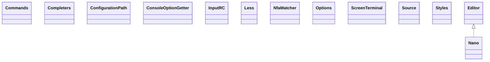

# jline-3.25.1.jar

[Group index](README.md) | [All archives](../README.md)

## Scope and provenance

- **Donor:** `SQX_145_REFERENCE_ROOT/internal/libs/jline-3.25.1.jar`.
- **SHA-256:** `421efcde9db04c34b9c03cd66e0460e75e5cdd4a3cafde54ef370049ac092e7c`; accessed 2026-10-06; captured `2026-10-06T18:54:51.906614+00:00`.
- **Classes:** 489 raw entries; 489 unique entry names. Duplicate occurrence indices are zero-based.
- **Inspection:** read-only ZIP hashing and class-file structural parsing; signatures/descriptors, modifiers, hierarchy and references only. Bytecode bodies are hashed, not published.
- **Allocation:** proposed `FEAT-HOST-JLINE`, P17; [roadmap](../../dev/sqx-full-application-roadmap.md). Domain README registration remains required.
- **Repository:** `01067f00031428613c6394064ca1bcadc1ba00ee`; review state unreviewed. Download label 145-dev1; installed build/activation and runtime equivalence unverified.
- **Limit:** every class/member is inventoried; declaration coverage does not establish consumed calls, defaults, formulas, failure semantics or algorithm parity.
- **Archive/resource index:** [058.json](../../dev/evidence/sqx145/archives/145/058.json).

## Complete member declarations

Member shards contain exact JVM names/descriptors, access flags, generic signatures, throws types, declared fields/methods, superclass/interfaces and referenced class names. All classes, nested/synthetic members and overloads are retained. Code length/hash is structural evidence, not a normalized algorithm comparison.

- [001.json](../../dev/evidence/sqx145/members/058/001.json) — SHA-256 `02b1a2f1b5eb7827cfed45f24d1de7b71af95452dac23d93e78df5cd18a51437`.
- [002.json](../../dev/evidence/sqx145/members/058/002.json) — SHA-256 `e1eb4ec0f5f07d75ffe4e4dd126db7163e5aaa00a8a1f80323e294ceba7ec2ab`.
- [003.json](../../dev/evidence/sqx145/members/058/003.json) — SHA-256 `43883ecf6eb7274bfeadbf87a7dd3604d68b668bb152cd0b0e489873e588b61c`.
- [004.json](../../dev/evidence/sqx145/members/058/004.json) — SHA-256 `f2d90a3a5e3b41499bf5006b14ad20f79899485ca8156446de031426c0eb6230`.
- [005.json](../../dev/evidence/sqx145/members/058/005.json) — SHA-256 `51e601b95a8716af255361a8a1e628534fcc0f68298e8eddb7b6fb41732107b7`.
- [006.json](../../dev/evidence/sqx145/members/058/006.json) — SHA-256 `571ed70cc7d1170121e83b1545ad7334de78a9ebeeb8a72f7feecfb0b97b7355`.
- [007.json](../../dev/evidence/sqx145/members/058/007.json) — SHA-256 `011abe78fc9c0b0635bf316a10003bf148980e32ffcf48bc12d63a9b141c471a`.

## Focused structural diagram

Up to twelve non-nested classes; arrows show declared inheritance/interfaces only. External type names are not evidence of an available body or an executed dependency.

## Class inventory

| Archive entry | Occurrence | Class SHA-256 | Fields | Methods |
| --- | ---: | --- | ---: | ---: |
| `org/jline/builtins/Commands$Colors.class` | 0 | `ce25081a0461bd97305e2c53e024a29b60c91d7eaafe1705eb05b39324e57149` | 11 | 18 |
| `org/jline/builtins/Commands$ReExecute.class` | 0 | `1ab5cf5d591ba8ae6767d443507cfd2bca719220ffcd8fbde4da3e7a5738604e` | 7 | 8 |
| `org/jline/builtins/Commands.class` | 0 | `d97353c909800a517f3458333c64ab78a831e150160f33baecfc3a2fe5ad3188` | 0 | 26 |
| `org/jline/builtins/Completers$AnyCompleter.class` | 0 | `94da7a52669e22ea900bb47b211b20515e93bc535899c13f11bae86946ebee81` | 2 | 3 |
| `org/jline/builtins/Completers$Completer.class` | 0 | `59924d4f31e99baeee2e479ebafdb3a054c8c5d712d242be4fd21b5ccf34b039` | 1 | 6 |
| `org/jline/builtins/Completers$CompletionData.class` | 0 | `a91b4d05be0e2e054c6c091dafdb25982e1a2e86c80192417ef72dd5d85bbf41` | 4 | 1 |
| `org/jline/builtins/Completers$CompletionEnvironment.class` | 0 | `8c4c5cdeae77b51ffbe8fe9ab4771ab4fe7932ae4c4038088344136b5e2cb9d7` | 0 | 5 |
| `org/jline/builtins/Completers$DirectoriesCompleter.class` | 0 | `7e98f39785822c1d572d42605a2559f1ed0124e39328ee66f4d74675066920c8` | 1 | 6 |
| `org/jline/builtins/Completers$FileNameCompleter.class` | 0 | `5ba969c6d618b3dd49116856cd953b95fc8597af50da6140fca06d6824fff83b` | 1 | 9 |
| `org/jline/builtins/Completers$FilesCompleter.class` | 0 | `5e685972418e06b10c369b7f25271ff10666ced6013c817383f9b6bb909ddd88` | 2 | 10 |
| `org/jline/builtins/Completers$OptDesc.class` | 0 | `6c5b2e28f88373961f79101fb79f225e9396f9453ac996b9670a4017a2e18604` | 4 | 16 |
| `org/jline/builtins/Completers$OptionCompleter.class` | 0 | `b924ec147201c61cd58f87b02c3938bb9df9c4d03e98d2586cc858a48c945b03` | 5 | 15 |
| `org/jline/builtins/Completers$RegexCompleter$ArgumentLine.class` | 0 | `ea1d1e8e45e3aadf0405eaf3a067d71fbba580fa38caa4b8e2cf2f90d5b70be2` | 2 | 7 |
| `org/jline/builtins/Completers$RegexCompleter.class` | 0 | `966d5a54241b5c826d16e38b037dfb2f155b3ef8f5f97b8af6aebb50af3c3a3c` | 3 | 4 |
| `org/jline/builtins/Completers$TreeCompleter$Node.class` | 0 | `852b599aabe080868d67aaeac1f56215a5a2acf123c6a33552fce7907aa031c1` | 2 | 1 |
| `org/jline/builtins/Completers$TreeCompleter.class` | 0 | `44ab15254ce44e0ffa514817b3a3c21a6bd0c1fba5c3b3166fb96e246598ae32` | 2 | 6 |
| `org/jline/builtins/Completers.class` | 0 | `80048992d572e81423fb9779fc8fecf4ec4d701110e5b7356f98882c44e44b7d` | 0 | 1 |
| `org/jline/builtins/ConfigurationPath.class` | 0 | `1c5427cfd555f8788f3284e0e8e4c39e6b4b8acbcdf617d2060a455799911154` | 2 | 4 |
| `org/jline/builtins/ConsoleOptionGetter.class` | 0 | `b190a68915e9a10f329e338a4696c4307a6198ec66560e28af9bf8f000e9de44` | 0 | 2 |
| `org/jline/builtins/InputRC.class` | 0 | `b3228073b3ece63e0d13a40ba9d3f1c4aa2408dafe9a38a2be18c07d049a92fa` | 0 | 4 |
| `org/jline/builtins/Less$InterruptibleInputStream.class` | 0 | `85fc21940b60ae3112fac45d2f22aeb95cbc327976cf04c48abf64f1f9e5a73d` | 0 | 2 |
| `org/jline/builtins/Less$LineEditor.class` | 0 | `6bef197f96fef369f4b2b39866a39e341cf641c61e40f00045ffb86ca25ea063` | 2 | 2 |
| `org/jline/builtins/Less$Operation.class` | 0 | `46bb9acc851f3c4b8ce2c7770650e9417aa5455e21be7d2bb26d0bda633086ca` | 59 | 5 |
| `org/jline/builtins/Less$Pair.class` | 0 | `be9829416330a85259f51474716df46da4045f3096552c9f2a09fcd7d04fd18b` | 2 | 3 |
| `org/jline/builtins/Less$SavedSourcePositions.class` | 0 | `c9d8116e7450ff1beb50c7df53356f8d303562914e1171fddef7a6d916cde106` | 6 | 3 |
| `org/jline/builtins/Less.class` | 0 | `c5ea874f5ee8490b16ac49d59697c0d937dfcb4aec98041f5f80946c50ba6015` | 44 | 39 |
| `org/jline/builtins/Nano$Buffer.class` | 0 | `f3ae3202c7f63283cacd89e0785f55d62b8e78b28f648a1add7af9d87414f3e6` | 17 | 69 |
| `org/jline/builtins/Nano$CursorMovement.class` | 0 | `8d7a55cf4fac2c14a3059fd7f03fab576c23743bc08ad08880527aeabd168efe` | 4 | 5 |
| `org/jline/builtins/Nano$Operation.class` | 0 | `0bfe8306f19d1bd6d8800cdfd558e5dca009dfd43eec55a5367c26b7d9cc0524` | 78 | 5 |
| `org/jline/builtins/Nano$PatternHistory.class` | 0 | `1e951f0b51628aa123115d490942c6f238d929f2d5ae40366fc6f8b8c8d380a6` | 5 | 7 |
| `org/jline/builtins/Nano$WriteFormat.class` | 0 | `d72be0a2f2667ce749250828a572e22547c54b1c33b12f87a8a18ef5838610a1` | 4 | 5 |
| `org/jline/builtins/Nano$WriteMode.class` | 0 | `1f349c283909ca3fb04212a4a394ea0382d323d48241315190b5d81d620caafe` | 4 | 5 |
| `org/jline/builtins/Nano.class` | 0 | `4d0dd691a2f49968c261c66243bbc5066ae5471e37c0ace237c4e65ea39c2030` | 54 | 63 |
| `org/jline/builtins/NfaMatcher$Frag.class` | 0 | `a8610d044ecdcd15dc6413607cde0965c8c422123daa162dcd603380a610cf30` | 2 | 6 |
| `org/jline/builtins/NfaMatcher$State.class` | 0 | `72621027396ec4fa8527ebd96e31c9f2d0ad544e534e83682eef7549b8041a89` | 5 | 3 |
| `org/jline/builtins/NfaMatcher.class` | 0 | `d87b3c06f1f522b7563905f8e8b893b8074eceb1fe00b8aca42761d6db0c5d4f` | 3 | 16 |
| `org/jline/builtins/Options$HelpException.class` | 0 | `6df3ea3594bb4a2109c43c9d541ccf793823ebfdbc1aacbca3724f9d51da1e81` | 0 | 8 |
| `org/jline/builtins/Options.class` | 0 | `4bea628cec5db600d3d6dcbbb56e7172c3dc3124624fe6f44c88c375e5dd492c` | 28 | 29 |
| `org/jline/builtins/ScreenTerminal$State.class` | 0 | `a1048a28ba97e130760e567fcf8ce9a5e3c3f1c10fae345808579477ce403ec8` | 5 | 5 |
| `org/jline/builtins/ScreenTerminal.class` | 0 | `c87dabbd989c30a8cc416603b0dc484aa056a4752bedb8876fa631bb0bdce2a2` | 41 | 127 |
| `org/jline/builtins/Source$InputStreamSource$1.class` | 0 | `b22bd0788546881da93eef84272b26e5fed434721de22745041b1515676442f9` | 1 | 2 |
| `org/jline/builtins/Source$InputStreamSource.class` | 0 | `3fc66fe581409fb9324f88d948bb90369abaef71feeaa3567fdb84f3e880a320` | 2 | 4 |
| `org/jline/builtins/Source$PathSource.class` | 0 | `ffe25f9ed6fd1e0577c52a7315674d72728d6d2a23ca0e1c81cbf6524f7a4d20` | 2 | 5 |
| `org/jline/builtins/Source$ResourceSource.class` | 0 | `6fc0672279e2f43f11f6c7db232aafe91aa25a4d6665ef236a7fb5f947f3246d` | 2 | 5 |
| `org/jline/builtins/Source$StdInSource.class` | 0 | `7ac99cff50d95a93ea8aa724f39bc6dddb0c9d2101d3519550268466c67dcdfb` | 0 | 2 |
| `org/jline/builtins/Source$URLSource.class` | 0 | `8c4a1c07f2895b014d3a5e0b4f7d657818e2727119bc35f47150b8537cf2ab4f` | 2 | 4 |
| `org/jline/builtins/Source.class` | 0 | `ab79cff46debb6e0bd98a06628880ae94a296625d9b7cc54b1d5ccedeff36e42` | 0 | 3 |
| `org/jline/builtins/Styles$StyleCompiler.class` | 0 | `cb49545f26cc00e1f9bdfd41fae2a223c663f274f9ea317d5a5a0e61b4d04204` | 7 | 4 |
| `org/jline/builtins/Styles.class` | 0 | `c8eb67b6596144700ff6e2f5cef93c7182ab94aaa41f3c8691e555d2a246776f` | 13 | 15 |
| `org/jline/builtins/SyntaxHighlighter$BlockCommentDelimiters.class` | 0 | `6d54a713160a92f28d5adea89db88527c4a666bfbf8d562dde1232d0274d166a` | 2 | 3 |
| `org/jline/builtins/SyntaxHighlighter$HighlightRule$RuleType.class` | 0 | `8f582485694b5672a6b08c60ed326193b6f062723a5fd3479b9b6c0c98b31e74` | 5 | 5 |
| `org/jline/builtins/SyntaxHighlighter$HighlightRule.class` | 0 | `5a18ac10e4618b91baefc9d76cb15bdc8ab0418db9275be5979a99aef694e188` | 7 | 12 |
| `org/jline/builtins/SyntaxHighlighter$NanorcParser.class` | 0 | `5f56b782416884d04151854fca1afb275191b1731ef516c623a61bee07b4de06` | 9 | 12 |
| `org/jline/builtins/SyntaxHighlighter$ParsedToken.class` | 0 | `f039b45cf51802494a6f9ff09b24cc2c26f8e63dafd28332dc8b2607b6b0eef1` | 4 | 5 |
| `org/jline/builtins/SyntaxHighlighter$Parser.class` | 0 | `e7b8e69f555cb9a1d4d757040261dc9d10f32c6d3ed07a254a8ec19a6f5ee544` | 14 | 14 |
| `org/jline/builtins/SyntaxHighlighter$RuleSplitter.class` | 0 | `46bc0b3e56ff185b2a55f8288a2566ffccdc584f657cfd43eaa327808491f3ce` | 0 | 3 |
| `org/jline/builtins/SyntaxHighlighter.class` | 0 | `eecebcaa2303c229a4d5b13e2b8ba8e4b6db6ef8024d3a7a87df2c6d37800346` | 15 | 26 |
| `org/jline/builtins/TTop$Align.class` | 0 | `95949be7372b036e8ca1d697712e388ba4a07ec65fbf1c424dbb7ba6354bad3b` | 3 | 5 |
| `org/jline/builtins/TTop$Column.class` | 0 | `a4ec4a934127574038783bb932fd1a91e3563d04e7aaaad872b205aed1915795` | 4 | 1 |
| `org/jline/builtins/TTop$Operation.class` | 0 | `63f0d4810079d777b93076bc30e95531acf4c761201d26cdf7eac6c176d664c9` | 7 | 5 |
| `org/jline/builtins/TTop.class` | 0 | `14550ad6e8437bb2b3e593f69712e2206b705f7153a8358655567747a0cfc695` | 29 | 37 |
| `org/jline/builtins/Tmux$1.class` | 0 | `a4e2776ff289c2c36e8de73b6ee6f2bead8f0a50d12699ea03758594d564ea7b` | 0 | 0 |
| `org/jline/builtins/Tmux$Binding.class` | 0 | `fdae00a8a327da34fb8c18bf17c34cb682b4483d46dcd7505466d7187407861c` | 4 | 5 |
| `org/jline/builtins/Tmux$Layout$Type.class` | 0 | `67b24b66dcaf31c9c6774b5a641772cc4b01f1fcc628696e29c1a007970bef61` | 4 | 5 |
| `org/jline/builtins/Tmux$Layout.class` | 0 | `c9a659a8fef1c6ca235542d6839e3457a66413d20f6989c5e8c1f4a1cf618509` | 9 | 27 |
| `org/jline/builtins/Tmux$VirtualConsole$1.class` | 0 | `6431c3b9728ea8741e52f02fb217e49a8b24f5f60e173635c28c14bc1a5fa248` | 2 | 2 |
| `org/jline/builtins/Tmux$VirtualConsole$2.class` | 0 | `c773950b063b305b4797c456c2011b49770affc9bdd7b075b44f67087a5414f7` | 1 | 2 |
| `org/jline/builtins/Tmux$VirtualConsole$3.class` | 0 | `2bcedfa24ed18231d1df057ad1359d47d15a19c503f5326dfa9b1ef86a975aa9` | 2 | 2 |
| `org/jline/builtins/Tmux$VirtualConsole$MasterOutputStream.class` | 0 | `6746cdf9a9b610a47f1d3436406b6d16e8fe8e9ee0ba4489852403b68bd15c0c` | 3 | 6 |
| `org/jline/builtins/Tmux$VirtualConsole.class` | 0 | `a008d6fab83e7caa1346e067b9c0dd09e0f7d67c6df76a7e0c7e849773e9d6c0` | 11 | 23 |
| `org/jline/builtins/Tmux$Window.class` | 0 | `b16ca7c50224214481ea75124031bc9830740869d266cb792d75f302e433d622` | 8 | 31 |
| `org/jline/builtins/Tmux.class` | 0 | `b456f9377495c673087f06e1dd706618a4122bca614057b33edc85087ecd4e32` | 51 | 55 |
| `org/jline/builtins/ssh/ShellCommand.class` | 0 | `c4ee81c54b462b529637f8ce81bd2f97f3c0e307648eddf88fdd71f7733bc345` | 9 | 9 |
| `org/jline/builtins/ssh/ShellFactoryImpl$1.class` | 0 | `154e01f533c0353cf9df1aa46ff458d80f4cb992939c9ba521dd3a0f887fedaa` | 1 | 1 |
| `org/jline/builtins/ssh/ShellFactoryImpl$ShellImpl.class` | 0 | `6aac9195ad65909ee8491c9db7e703d1951b1266baf4d245edfb3bf8a5e97b91` | 6 | 11 |
| `org/jline/builtins/ssh/ShellFactoryImpl.class` | 0 | `b03c7fd9b56e16f0f419d5970c9429e3db0a9609a7f9ac1ce874aa1edf08d26a` | 1 | 6 |
| `org/jline/builtins/ssh/Ssh$ExecuteParams.class` | 0 | `4e706596aa27b7321e7236c940b4192bcd53813efcee053817514a8a0dd0f5e7` | 6 | 7 |
| `org/jline/builtins/ssh/Ssh$JLineUserInteraction.class` | 0 | `2e068ea544eb1998e0f3add8aea0aacdbd3288f4a6a1e8100903c2dbbd26a036` | 3 | 8 |
| `org/jline/builtins/ssh/Ssh$ShellParams.class` | 0 | `0c6489895119dd3c7aa5000b224441ba41a7cecced3030b1ebe064cf0bce7a61` | 4 | 5 |
| `org/jline/builtins/ssh/Ssh.class` | 0 | `89f1789cfb743f302be6bb6bbd95d176e5cadf076621b4d7e81d7f903b3bf61b` | 9 | 17 |
| `org/jline/builtins/telnet/Connection$1.class` | 0 | `fb1fc62dd1f30794efef75871511523a08a51aeedb376d3a50b9a6c2f6924880` | 1 | 1 |
| `org/jline/builtins/telnet/Connection.class` | 0 | `656e40063c258610b3612062fccae8ffbf1dc3f551a43202287700ad81938c17` | 5 | 11 |
| `org/jline/builtins/telnet/ConnectionData.class` | 0 | `061829eaef650077c185d8a1385f1cda5fc355a727ad366f321767ee85b0a999` | 15 | 28 |
| `org/jline/builtins/telnet/ConnectionEvent$Type.class` | 0 | `34d0db5cdcfc89172abe51e015028be139e1b9fbc36711e3b5c23d49398ff7a7` | 6 | 5 |
| `org/jline/builtins/telnet/ConnectionEvent.class` | 0 | `006075ef20b948fb5503194eeec806d3574e067f4984940264e1ce8feea07001` | 2 | 3 |
| `org/jline/builtins/telnet/ConnectionFilter.class` | 0 | `59030d7ef212554c683c8b72a550ed2f8f522e080d3ebc23300179cd8816f0f3` | 0 | 1 |
| `org/jline/builtins/telnet/ConnectionListener.class` | 0 | `bcbf728e5a69e3f4bcaf9a11e5ae684662e6cd54995950feeda7a94bf31dfa32` | 0 | 5 |
| `org/jline/builtins/telnet/ConnectionManager.class` | 0 | `f143ff35defe3b4ca9de933c3bab1cfda242e6e5c595d5adb4a30dbeb6a17699` | 13 | 28 |
| `org/jline/builtins/telnet/PortListener.class` | 0 | `c47979443501ddd09a4b75bbfbb7f30cb2386b5fd322d7e0eedb8bf71f735746` | 11 | 10 |
| `org/jline/builtins/telnet/Telnet$1$1$1.class` | 0 | `0fcde218f321840317ab1fc658c313d9396109e8d7ab8aa4c0abeb9fa2d48355` | 1 | 3 |
| `org/jline/builtins/telnet/Telnet$1$1$2.class` | 0 | `f53b7374cc6bb64f0839332a7844326ea07554d21739d9118d5538a455511d86` | 1 | 3 |
| `org/jline/builtins/telnet/Telnet$1$1$3.class` | 0 | `1b33b6e87d302c3fc7a1f204a0b70086a4b00da64eb639700518d3891c2bdaac` | 2 | 2 |
| `org/jline/builtins/telnet/Telnet$1$1.class` | 0 | `f513cc33f098bd86ba957adc88e1b42f93c9eb067db13ab7ffb9927baae1b80f` | 2 | 3 |
| `org/jline/builtins/telnet/Telnet$1.class` | 0 | `2471f559b4f41fc964872b611d8bc2d1ea7ed8f2b42613fe558ca4b95313123a` | 1 | 2 |
| `org/jline/builtins/telnet/Telnet$ShellProvider.class` | 0 | `5a141ab06d103cf5d63dc38baeb58f2c8ebb67672d3611edc2a2d98da222b500` | 0 | 1 |
| `org/jline/builtins/telnet/Telnet.class` | 0 | `f45277486f1e5a4187a846a040be8bea9d57671badbe9b428aa9ef3937f2e8a6` | 8 | 8 |
| `org/jline/builtins/telnet/TelnetIO$IACHandler.class` | 0 | `013c6d7ac40ff98a9935b7425c7fdcd38d720c6e682118a9c2d1847aae818362` | 21 | 31 |
| `org/jline/builtins/telnet/TelnetIO.class` | 0 | `3fabd6695f55851fdc75104aab8fcc491859132b0061e7383a3094dfca0a4ee0` | 79 | 31 |
| `org/jline/console/ArgDesc.class` | 0 | `9386e1663f69dbd009103645dd39a4170bf87390ea3cc236d33a1386c9c13660` | 2 | 5 |
| `org/jline/console/CmdDesc.class` | 0 | `cecb5482ac75a4231fd036272ad5ae56a092b95132e592f6fa17aa933550ea28` | 9 | 22 |
| `org/jline/console/CmdLine$DescriptionType.class` | 0 | `dbd79cea38fd499778b238ed9741d372117ae0e35d9ecadc62aeb1d1779da082` | 4 | 5 |
| `org/jline/console/CmdLine.class` | 0 | `ca1dd29a6de8fe86d2713135dbe5a975d20bd8bea9df49c2a68cd44a7b0fb790` | 5 | 6 |
| `org/jline/console/CommandInput.class` | 0 | `09ee26495ea509b3ad82af115963a9d1f92982f0c532b93c16ee7b843e51462d` | 7 | 10 |
| `org/jline/console/CommandMethods.class` | 0 | `0537577f718a5333c1f71924b029aa51483c446945ef5ab752a7ab8da125fe7f` | 2 | 5 |
| `org/jline/console/CommandRegistry$CommandSession.class` | 0 | `9a3fc91554225eab26c3b8688bf308bd420bfb1cb70a36e81962478fd45b93e7` | 4 | 7 |
| `org/jline/console/CommandRegistry.class` | 0 | `def029e758a798c0751bb36477a0730afb8e4b878100adf5e6566e5bd411422d` | 0 | 10 |
| `org/jline/console/ConsoleEngine$ExecutionResult.class` | 0 | `df790f504a6eff659e9384efc0b8e54879f0514ebd85ae6a7c668ab4f3041995` | 2 | 3 |
| `org/jline/console/ConsoleEngine$WidgetCreator.class` | 0 | `4ad9e3d0140a2ff8e8723869c7902a4d42269fd95d95fbe70ca6b86d230d58f2` | 3 | 3 |
| `org/jline/console/ConsoleEngine.class` | 0 | `ae72e355871900af965795023f03a7ebe0bd3e73c543d068aa9f9e48f5d8b600` | 1 | 30 |
| `org/jline/console/Printer$TableRows.class` | 0 | `676afbaf0225b87afa5b4b8e35cbd17e111637e921ee48d2e1580537a567b647` | 4 | 5 |
| `org/jline/console/Printer.class` | 0 | `cd885e7d19e5a4f9293f1261140b3b3ca51e365fc2f203ff6779c0f39315b7c0` | 28 | 5 |
| `org/jline/console/ScriptEngine.class` | 0 | `7cdefd098f42f5c9e3cd54505c9fa21c20b9a90bc82fd2c2bb37bc571d0b3347` | 0 | 22 |
| `org/jline/console/SystemRegistry$Registeries.class` | 0 | `57d80101ce6ed3cbb5a6ffccee24ab30cc8bbfda8b571409930bdded159d27bb` | 2 | 7 |
| `org/jline/console/SystemRegistry.class` | 0 | `c8e732ee093c5a9b142ba647f8946fce8109d5149c0e21f606369ca430f9051d` | 0 | 22 |
| `org/jline/console/impl/AbstractCommandRegistry$CmdRegistry.class` | 0 | `b80abe01318781d583098447a2dc6aaabb1bc5cbdc3ed37dab23f1f76262a9ab` | 0 | 8 |
| `org/jline/console/impl/AbstractCommandRegistry$EnumCmdRegistry.class` | 0 | `9623a16a70b534872375ac7951d2a331522bb0c14ef57fcb3b30b0d603d64016` | 4 | 11 |
| `org/jline/console/impl/AbstractCommandRegistry$NameCmdRegistry.class` | 0 | `983c3e41749d7db751f9af42aade7b9b307a6ea571aaadbc7aa3ffbd79c86f0d` | 2 | 10 |
| `org/jline/console/impl/AbstractCommandRegistry.class` | 0 | `f85aee17683fda77b8bb16f7069c0b35ba50670688a453e8a8671c2646f0777f` | 2 | 14 |
| `org/jline/console/impl/Builtins$Command.class` | 0 | `e3d1bd45160a227a6029cf418f164bd9695156341a9a8d683b5b9402730ab73e` | 12 | 5 |
| `org/jline/console/impl/Builtins.class` | 0 | `7a108d49ee0832072d2ce8ab1700b4095d48ae582a85801ce53151b6e5c9ba34` | 4 | 33 |
| `org/jline/console/impl/ConsoleEngineImpl$AliasValueCompleter.class` | 0 | `6fa8719dec8661787fd6b41b6f46faca9ec549ad4c5c2946d819548bc83f784d` | 2 | 3 |
| `org/jline/console/impl/ConsoleEngineImpl$Command.class` | 0 | `3607f7257303abcfd76caa1b99a863c8412ce89861f93b0ebe1ffa0cbb3c3ece` | 9 | 5 |
| `org/jline/console/impl/ConsoleEngineImpl$ScriptFile.class` | 0 | `9b7a95e6a5f0cdba34d5769d48e42683839a27af4c31bc8065fedd9a4d997fa7` | 7 | 13 |
| `org/jline/console/impl/ConsoleEngineImpl$VariableReferenceCompleter.class` | 0 | `1a8c8673ad46a901e3a151f3a67423f79895aa200def505fd5779f4b1a0011ae` | 2 | 5 |
| `org/jline/console/impl/ConsoleEngineImpl.class` | 0 | `081a3dc408775775475e2fcc2ef2e28e281b37d47841ce5805b66c414685486c` | 18 | 81 |
| `org/jline/console/impl/DefaultPrinter$1.class` | 0 | `fa9eaa82a0dd382fea12e87f7cc0abaef65a6a9f7693cd22c41b842ecf808eab` | 1 | 2 |
| `org/jline/console/impl/DefaultPrinter$2.class` | 0 | `b57e4b9a0f54657cd2a276362bda4e29e8907c878702a0faf5d7d0709e00e5cb` | 1 | 1 |
| `org/jline/console/impl/DefaultPrinter$BadOptionValueException.class` | 0 | `d1b9994d58807917653f54c1c5c18389c1a0a225407cdc9cfdc4ec995fa9420d` | 0 | 1 |
| `org/jline/console/impl/DefaultPrinter$TruncatedOutputException.class` | 0 | `dd619d7b3814f9761da65e394f81eaa630540e0f90b830247d85bba0d7e87751` | 0 | 1 |
| `org/jline/console/impl/DefaultPrinter.class` | 0 | `cd42de14ba3e20ed3eec8feffd107a17feadf6b9859b40362a6d8c9f646a484d` | 14 | 56 |
| `org/jline/console/impl/JlineCommandRegistry$HelpLines.class` | 0 | `497e0a965b7299256fc2a4c50c63e0371a2063f7291b9fa00619895746f240e0` | 3 | 3 |
| `org/jline/console/impl/JlineCommandRegistry.class` | 0 | `d855b010cf7f7c24ac98d58611e4c8a0578accaa34a0056925c70c4f45eb488b` | 0 | 11 |
| `org/jline/console/impl/SystemHighlighter$FileHighlightCommand.class` | 0 | `76f6df076f7a1a3684065c646b6f5218edc6527dbf7ec62609c72ad369961a6d` | 2 | 6 |
| `org/jline/console/impl/SystemHighlighter.class` | 0 | `6493e1ae0c1ca81fc44a9cb787c774ad608693761d3bfee0d169b4339ebf1278` | 11 | 17 |
| `org/jline/console/impl/SystemRegistryImpl$1.class` | 0 | `fa1bccf8f1cc37843b6af2601232d6d67ec849d49e0e6bd4f6c1a438979196c3` | 1 | 1 |
| `org/jline/console/impl/SystemRegistryImpl$ArgsParser.class` | 0 | `0ad769034afd6b3d356be10813f25ec7ea689a8d203c6e65a447c6869d3f7a2a` | 10 | 17 |
| `org/jline/console/impl/SystemRegistryImpl$CommandData.class` | 0 | `f254ad174b613154c71cbd20cd0c01d296273089ca98ffc8c4eca2b007bf081d` | 7 | 10 |
| `org/jline/console/impl/SystemRegistryImpl$CommandOutputStream.class` | 0 | `68dc6d98b8330b87505e7390e8478297cf7c478c8464b7bec7ac1d9ddaf6f2c4` | 8 | 11 |
| `org/jline/console/impl/SystemRegistryImpl$NamesAndValues.class` | 0 | `3ec68e83735bfdf54150f1c8458dc9f36bfefab59fd4ec79eaf280b924a04f72` | 5 | 24 |
| `org/jline/console/impl/SystemRegistryImpl$Pipe.class` | 0 | `d93676d85fc058743ab5f2d0055643283160857c439899328deb63ffd14d86ff` | 5 | 5 |
| `org/jline/console/impl/SystemRegistryImpl$PipelineCompleter.class` | 0 | `ce74b996803df6bfbcb2adfeed612d00bbb8ff5ed10c0d8369405ca9eb988a51` | 4 | 5 |
| `org/jline/console/impl/SystemRegistryImpl$ScriptStore.class` | 0 | `b32640cd3c5b50961de543d13def5b3d15963c89df7fd2d2f46bdbb64861c015` | 2 | 6 |
| `org/jline/console/impl/SystemRegistryImpl$UnknownCommandException.class` | 0 | `f173b669d73121bf0b0cff2e139a1073aa19759e44fddbe395e890122d2adfd8` | 0 | 1 |
| `org/jline/console/impl/SystemRegistryImpl.class` | 0 | `c22965d7dd9fe1d1137e17daa6ac2ab8c4c55f77090379bbb6e04a0572474e9f` | 19 | 70 |
| `org/jline/jansi/Ansi$1.class` | 0 | `cc76c0f93dc6757a3684d5f6e3109a2c7ff4a2e4aa14977bdd112967d104732b` | 0 | 3 |
| `org/jline/jansi/Ansi$Attribute.class` | 0 | `be18879c637295746308909b41ce04b09a409040e4df6d99f30cb4cf6b33ed00` | 21 | 7 |
| `org/jline/jansi/Ansi$Color.class` | 0 | `0982fd7366c8d38533f99768b26691d465854bb11679d31bef574fc8ca679129` | 12 | 11 |
| `org/jline/jansi/Ansi$Consumer.class` | 0 | `cf739946f26cbaa3d7c8fa7de23aa37645e53bd93ebf4ccfee2db6e5b127f386` | 0 | 1 |
| `org/jline/jansi/Ansi$Erase.class` | 0 | `e023dbe9cbb04f0694e1e4b940d67e3003fc82cf1bc15f26acda0e16dad85886` | 6 | 7 |
| `org/jline/jansi/Ansi$NoAnsi.class` | 0 | `86ca4054e1ede119d50910dcff44ea38b59b11746f76270099529c195bb96f78` | 0 | 34 |
| `org/jline/jansi/Ansi.class` | 0 | `145da94b915761efc06089457e3c402a04f14730360e7d2d5cdf92f9d55fab24` | 7 | 108 |
| `org/jline/jansi/AnsiColors.class` | 0 | `6d15c81272de4ffb7e0469ac22921215bb860176969dfb1d59eb1112c713938e` | 5 | 6 |
| `org/jline/jansi/AnsiConsole.class` | 0 | `4d387573231c77ecb65ea967a05e7e1d949ae1245e9800c853b810b5cdb87b87` | 31 | 17 |
| `org/jline/jansi/AnsiMain.class` | 0 | `251df2b4caa53c5f9121b93be5328537acf0abe5b8eeee8fb76016c3261d73da` | 0 | 9 |
| `org/jline/jansi/AnsiMode.class` | 0 | `b52bf47f144a56904b57c8b92dc3e36e92454de887159122c6692c70e86b1513` | 5 | 6 |
| `org/jline/jansi/AnsiPrintStream.class` | 0 | `c659e00e60a5fe81e5619c8855f25518e8606b26f92799495548d0ef113c32c5` | 0 | 13 |
| `org/jline/jansi/AnsiRenderer$Code.class` | 0 | `9b9e9038cd46fdac6c3a8a9affec339694eb2215b0bbe8cc97f3d263f25ab89d` | 46 | 11 |
| `org/jline/jansi/AnsiRenderer.class` | 0 | `e37a97162f6762789ac431aa3cd03670f6ba5fd6ff5c2ef24fffdb52d6c6f897` | 6 | 8 |
| `org/jline/jansi/AnsiType.class` | 0 | `c88d30996a05c22ecce4aa7645f139df9dc88c88e2e6d3d6da877ec653bcc41f` | 7 | 6 |
| `org/jline/jansi/WindowsSupport.class` | 0 | `27f9f4be9d43ef52827050b70549e8eb3d2f1323b72b1cf43f3c1378d3c533b9` | 0 | 3 |
| `org/jline/jansi/io/AnsiOutputStream$IoRunnable.class` | 0 | `a9bf1d842ff7479ead9a63297653dbbd1f54c290bb7b9a7f4b30e478b787c55b` | 0 | 1 |
| `org/jline/jansi/io/AnsiOutputStream$WidthSupplier.class` | 0 | `e709ea08498f67a4656ec4f08fbfb3fd518eb7d92ff9c873edceb607d9903493` | 0 | 1 |
| `org/jline/jansi/io/AnsiOutputStream$ZeroWidthSupplier.class` | 0 | `b4dc9abfc7720cdcf4c688f47b7b5449da33bbe315842468dd3d3e15d5f4af71` | 0 | 2 |
| `org/jline/jansi/io/AnsiOutputStream.class` | 0 | `6e6fc068d0a88415d7e4601dc4da3888f3479751f6e23204a31a92e0a0a556cb` | 34 | 17 |
| `org/jline/jansi/io/AnsiProcessor.class` | 0 | `2df4cdff18e0b034002f1274241dda4c315ab16d25de7fbc23e7d90b64cf8b60` | 29 | 41 |
| `org/jline/jansi/io/Colors.class` | 0 | `2f991980cb69b8b5b239a280f395d509a97958c4e985821482052565dd2b7182` | 1 | 4 |
| `org/jline/jansi/io/ColorsAnsiProcessor.class` | 0 | `4aef0fa52a8bff7a98a584cd988f9f1a5ea4a58e448dfb1c0f237b3868ba1452` | 1 | 4 |
| `org/jline/jansi/io/FastBufferedOutputStream.class` | 0 | `1268a7f298c52a49969d8fa212cb5f28ec29e8b4e035ff0ee6213423867c03f9` | 0 | 1 |
| `org/jline/jansi/io/WindowsAnsiProcessor.class` | 0 | `d75da3d3b82816f839149e80a855432017bd183c7846070914ab98b3053c595f` | 0 | 3 |
| `org/jline/keymap/BindingReader.class` | 0 | `cba3ba9455eac8842a7790e243f6ae2127e20169aa23dd18d86fb74fe9ef1592` | 4 | 11 |
| `org/jline/keymap/KeyMap.class` | 0 | `197734f55d017f92808e4289f6071a60abf9f03de40f400e3858482b60f69df9` | 8 | 31 |
| `org/jline/nativ/CLibrary$Termios.class` | 0 | `803938bdef2ac5d48cfea1261d08fceed4e4b6d80c5803dd2b3629ec8a1e3ddc` | 8 | 3 |
| `org/jline/nativ/CLibrary$WinSize.class` | 0 | `11e05343258729b36386c787e4c5c19ea0c35c5454261307339c31c58df9fe0a` | 5 | 4 |
| `org/jline/nativ/CLibrary.class` | 0 | `4eb782098a25b23fd0ab2cdc4bea2e3977a5b2789ba2aaac66310fb3566f2ce8` | 5 | 11 |
| `org/jline/nativ/JLineLibrary.class` | 0 | `59444d8ff24d889f8077c50e1aed328f75aa92b0ef4421b9c7e406fbe9f01893` | 0 | 4 |
| `org/jline/nativ/JLineNativeLoader$1.class` | 0 | `a0095f0298967a21d808364a3c45745a774e0b1b45a17b564a9a92d3f32df3ad` | 1 | 2 |
| `org/jline/nativ/JLineNativeLoader.class` | 0 | `2005000636d4928d6f374f9c8312940d22d82a3e470f0e893200fa02f47b4796` | 5 | 20 |
| `org/jline/nativ/Kernel32$CHAR_INFO.class` | 0 | `0615b3ee74f1e7b51d84ca0a0753990249a3e59a8524a52ab9f5a1bd33ebc4b0` | 3 | 3 |
| `org/jline/nativ/Kernel32$CONSOLE_SCREEN_BUFFER_INFO.class` | 0 | `c8042eaba6b97ae9f68b7482ea43c25a0916f1354335193c399b4032705c3566` | 6 | 5 |
| `org/jline/nativ/Kernel32$COORD.class` | 0 | `e1ad4db480a1420458784d025a7d356e6db61162e2852011421f16cad04a8497` | 3 | 4 |
| `org/jline/nativ/Kernel32$FOCUS_EVENT_RECORD.class` | 0 | `f591ce124edacb86180abf8c223ec417d6be208cbf52d31508c88f3d90b69bbd` | 2 | 3 |
| `org/jline/nativ/Kernel32$INPUT_RECORD.class` | 0 | `c4d216320a3c6214f663b7a7a40b01a9851df3a193630afaed7e13a7a1b1e0da` | 12 | 4 |
| `org/jline/nativ/Kernel32$KEY_EVENT_RECORD.class` | 0 | `d215ef58d7db353deaa2bcc09b447400cbe49fbb1b42562e57e4ab568ff85d6e` | 16 | 4 |
| `org/jline/nativ/Kernel32$MENU_EVENT_RECORD.class` | 0 | `408e60c2de631d0ea92cb38ee5fdec87bf5cfbf3734486fbeb5e4ab3b27534ea` | 2 | 3 |
| `org/jline/nativ/Kernel32$MOUSE_EVENT_RECORD.class` | 0 | `301a555678728e43de2ea6c7be055aef649fff2e89711cbb88c75672dcf9a17a` | 23 | 4 |
| `org/jline/nativ/Kernel32$SMALL_RECT.class` | 0 | `4a56f4c12d2f9d6907fb4fc346ace8b54570bdf66f9653eaf51e1ea4f0c47658` | 5 | 6 |
| `org/jline/nativ/Kernel32$WINDOW_BUFFER_SIZE_RECORD.class` | 0 | `f067bd1fbcf157ad13fcc491c92b9f9fa018ce4d458b1ec2f6369a4302400446` | 2 | 4 |
| `org/jline/nativ/Kernel32.class` | 0 | `3d5a911c4fe4e7fc9481ac6ca66c3dbd6eb66cc74cd954f0a38fde3d1c9c7ce4` | 20 | 31 |
| `org/jline/nativ/OSInfo.class` | 0 | `d7b4359d1f01ba68fdfc1f48506b70015f23e7e5c06fc231f43773a60c240f03` | 9 | 14 |
| `org/jline/reader/Binding.class` | 0 | `1445fc8ab09f547ef172d1eb7d43af88d837b66448de1fa413917be036cc78d7` | 0 | 0 |
| `org/jline/reader/Buffer.class` | 0 | `cdafe0e81ae85ca442966dca7148d7642d72acd94bc5caaece5bd66c9653d2f8` | 0 | 28 |
| `org/jline/reader/Candidate.class` | 0 | `e10190cdfc8b84c7ec4dbb1a751eb50259e9256b26e15cd00eef77bc1d54a48f` | 8 | 16 |
| `org/jline/reader/Completer.class` | 0 | `0a08f622f135ef65836756a0cf05f017ad0f4c5badad2455a5fab6bb0ab69418` | 0 | 1 |
| `org/jline/reader/CompletingParsedLine.class` | 0 | `e630e46d75217d5ccf4b875c0e4205d803a5a23577ba82739d3e0fe09673db23` | 0 | 3 |
| `org/jline/reader/CompletionMatcher.class` | 0 | `78f431a705360a82ab6ecdc847eabbde90e54433fecff97cf9e1fcbd20093d50` | 0 | 4 |
| `org/jline/reader/EOFError.class` | 0 | `109971efc77b6f0c551d965c43c5b683722149005512e582f64d6ad6f94d4a3a` | 4 | 6 |
| `org/jline/reader/Editor.class` | 0 | `4549d4fec8b354c0be58c07ef92d0dc506c8f06f039c00c1e564078b27693efa` | 0 | 3 |
| `org/jline/reader/EndOfFileException.class` | 0 | `5cdce1a202bf669d05b0ebd2ab1a1a5c7728df74d5a9035b992f27f89aa12e38` | 2 | 7 |
| `org/jline/reader/Expander.class` | 0 | `e12074ff27a5d46e4dfa38e5662f7b1647ecaeff1893a875a656e9f008e816e6` | 0 | 2 |
| `org/jline/reader/Highlighter.class` | 0 | `19b828ff15b6ff816dfaa43153a44853b6ef257d00ee495ba76f73cbaad87732` | 0 | 4 |
| `org/jline/reader/History$1.class` | 0 | `960ac37fe8ac0fe679e8ffab38d26bd8ab8239d51aff030db20d7426214c2f44` | 3 | 5 |
| `org/jline/reader/History$Entry.class` | 0 | `12f2b65b15a07b8bcec22c87cc57ef46bf66fe6ce48c4414a3168a0944d028d1` | 0 | 3 |
| `org/jline/reader/History.class` | 0 | `3121f1e56da0ce50cd901031fe54309e6061e6c64ea8de58be9b3f0052519520` | 0 | 29 |
| `org/jline/reader/LineReader$Option.class` | 0 | `1eea33b2c091933676e8fef988cfc57a37e8f2421029c3b8fa08e0d479cc72f0` | 40 | 8 |
| `org/jline/reader/LineReader$RegionType.class` | 0 | `397661c6583506354bb1ddf2ac6422f2a26579eb72a79778877c8e51bb016fd9` | 5 | 5 |
| `org/jline/reader/LineReader$SuggestionType.class` | 0 | `0995cee3f838abc5da8c0e988be2d3efd1d6533af0708748283691fbd84764b3` | 5 | 5 |
| `org/jline/reader/LineReader.class` | 0 | `1487fefd09d74537d791f3d7abdba2cab1b7de65c5907da4bbaffa020996db33` | 228 | 47 |
| `org/jline/reader/LineReaderBuilder.class` | 0 | `94236a490b03b69b2345e42d568faca0305b9d88c7d50c94a4bc5e7f5daa207d` | 11 | 14 |
| `org/jline/reader/Macro.class` | 0 | `09739f58bc1faa1dd1b7309a40804d447a22ee8992f2f68d3e6b01139b8dd317` | 1 | 5 |
| `org/jline/reader/MaskingCallback.class` | 0 | `80a6d10005e1bab9ae0ba699b21c08c40e108cc40444e6fb69b812338c4aa731` | 0 | 2 |
| `org/jline/reader/ParsedLine.class` | 0 | `9e4f54be2fb84f83a0b9606fe549ae932f9b16ae0ec955115a52ebabe5fabdb6` | 0 | 6 |
| `org/jline/reader/Parser$ParseContext.class` | 0 | `0b1c43288ed3c7db9fa37ac290ffc7c894aee84bcb299a679cea928b82026230` | 6 | 5 |
| `org/jline/reader/Parser.class` | 0 | `73bbf3262da042ace4ca0c737828a8735ce22aabe58d4fbee663d98ed8893d51` | 2 | 7 |
| `org/jline/reader/PrintAboveWriter.class` | 0 | `33072ddd4f8bbd85bbd09ba02998c8b3106c5709598c2792c28e7ec56f724c3e` | 1 | 2 |
| `org/jline/reader/Reference.class` | 0 | `a445c8ef8eba2a9149b6a79780a61c665570614f5805dd7640cf17af736af975` | 1 | 5 |
| `org/jline/reader/SyntaxError.class` | 0 | `7a18ada55d8118a433c5c44205a314f276b5a0e082b9d0b529fc777479d34c75` | 3 | 3 |
| `org/jline/reader/UserInterruptException.class` | 0 | `b0d2e00f8ff04c4f078fd2c908486076b31e340c3639044c0844adf536a5fc4b` | 2 | 2 |
| `org/jline/reader/Widget.class` | 0 | `5fed3e6e7d13c3ac66ea9d2badee95c6b152339dc99c31d208ae4a3b14d604d5` | 0 | 1 |
| `org/jline/reader/impl/BufferImpl.class` | 0 | `12add060116a65b97d6ea255c92e17c22079c1b2954b02bc46c5319b25f82627` | 5 | 36 |
| `org/jline/reader/impl/CompletionMatcherImpl.class` | 0 | `5c65e5b1a809f6fa6a1ab59cb318d0f294126a634525e1ef784d731f192e2a1e` | 4 | 32 |
| `org/jline/reader/impl/DefaultExpander.class` | 0 | `e338988e1870c8137e9cd52ecc0fd1b751f1880de34cab26661aaef968ae2436` | 0 | 4 |
| `org/jline/reader/impl/DefaultHighlighter.class` | 0 | `623a22cf2ba52b88c1d142f82cd0ce494b870b8e40ee9b4b44dbc66012065d79` | 2 | 4 |
| `org/jline/reader/impl/DefaultParser$ArgumentList.class` | 0 | `193f53af0ff7dcb59fd0866cfbd045f0989474a561bc4ca8459ca886331fccc6` | 9 | 14 |
| `org/jline/reader/impl/DefaultParser$BlockCommentDelims.class` | 0 | `710e12ad892f2c754ddd2eb6cb58af2ff59d448964ea002e641d4664ed6d5cfe` | 2 | 5 |
| `org/jline/reader/impl/DefaultParser$Bracket.class` | 0 | `5a5ecc5ae99b4bfa0ea51cd93458b57e79c318073a00d2b98382ce23e901d6b0` | 5 | 5 |
| `org/jline/reader/impl/DefaultParser$BracketChecker.class` | 0 | `152a46963d1005302c58fe4961b23bf120d663cc3f9c7eb3d362cbdf1c20eff3` | 6 | 9 |
| `org/jline/reader/impl/DefaultParser.class` | 0 | `09defb0c76125d154a092abf344d53e97bf03e8d5587542643668f983b649fbc` | 11 | 49 |
| `org/jline/reader/impl/InputRC.class` | 0 | `83eb4abdcb44a8f6c350cacc8dae5e386cd07f8a986cc8601cb01b04c10a4aac` | 1 | 8 |
| `org/jline/reader/impl/KillRing.class` | 0 | `fa6c2487228431d6ece835fd80cad96dafc278f5e038164656452dde89d73e4c` | 5 | 11 |
| `org/jline/reader/impl/LineReaderImpl$1.class` | 0 | `fcf23a875d21d615e38c651da42ce722d4d19f99f3b86d1d8f8a912733f4f133` | 3 | 3 |
| `org/jline/reader/impl/LineReaderImpl$2.class` | 0 | `dfffa119242b5e3cdcbc132c3bef08d4bb010e2192e33e6f4e99012cccf701f1` | 1 | 10 |
| `org/jline/reader/impl/LineReaderImpl$BellType.class` | 0 | `a33adca1a49d8333d8a73255b88e1fdffb14f0614bc26b25dc85a7af921f4dae` | 4 | 5 |
| `org/jline/reader/impl/LineReaderImpl$CompletingWord.class` | 0 | `e0a8243dc8189d514625d72d1416408713b0e2936a4b430ed585450a04b14d77` | 1 | 10 |
| `org/jline/reader/impl/LineReaderImpl$CompletionType.class` | 0 | `2998932f77798159c673ec71c48352ac70ce8bfbac1365d611ecd80ea4d4681d` | 5 | 5 |
| `org/jline/reader/impl/LineReaderImpl$MenuSupport.class` | 0 | `34322c445ee75ec9de30ce02ebc596e0aafd30018edd13e681e74a928fb9539e` | 10 | 13 |
| `org/jline/reader/impl/LineReaderImpl$Pair.class` | 0 | `7da38c35caba9cd06232c61fd03934a5841d84f853b24cd297f9f100daf48262` | 2 | 3 |
| `org/jline/reader/impl/LineReaderImpl$PostResult.class` | 0 | `d359ec70b86d1dc9de8c385568e5003ec6337f56302f3fb6d34794d717a8fbe6` | 3 | 1 |
| `org/jline/reader/impl/LineReaderImpl$State.class` | 0 | `d43a742e74bb8d63be12b20d77dd1bc269e96c9c64de70e70ffd07fe0d05b0a0` | 6 | 5 |
| `org/jline/reader/impl/LineReaderImpl$TerminalLine.class` | 0 | `3470e723f0bac3218cf5225155357674787f63f56753ea903f6f8ce6d1eaeb85` | 2 | 3 |
| `org/jline/reader/impl/LineReaderImpl$ViMoveMode.class` | 0 | `571f0bb9aeddd4714f1220902116058758cfb1f689c8da9a968bc6c1a8d8e0d4` | 5 | 5 |
| `org/jline/reader/impl/LineReaderImpl.class` | 0 | `68e034ddf975b31bb8b7f35ba6d9eac40ee7652113ce5e3490acab4015ff2760` | 108 | 379 |
| `org/jline/reader/impl/ReaderUtils.class` | 0 | `7c2386063cd59668558e779efacded873d20f40fdafc172db37e902e772c78de` | 0 | 7 |
| `org/jline/reader/impl/SimpleMaskingCallback.class` | 0 | `b1cac83e711712d837908b4b2f346ece6df555ccd3b3f0b4138f239e27d39896` | 1 | 3 |
| `org/jline/reader/impl/UndoTree$Node.class` | 0 | `b8dcc29057bed6e24eee325370c292821243e7a65dca6333816fdbdc6eee38af` | 4 | 6 |
| `org/jline/reader/impl/UndoTree.class` | 0 | `dccf071fc66979335bb023eb209bce45a7ac8d78a7047c1dd94fb32a98114622` | 3 | 7 |
| `org/jline/reader/impl/completer/AggregateCompleter.class` | 0 | `eb9493d38faa1146a0433ae2a1c568a927dbdc9307afbcc9ec1fa71a99d6320a` | 2 | 7 |
| `org/jline/reader/impl/completer/ArgumentCompleter$ArgumentLine.class` | 0 | `5535bb1b2f8613583768f7259609ce29ea9204606341bd8d02cfbb75d51b202e` | 2 | 7 |
| `org/jline/reader/impl/completer/ArgumentCompleter.class` | 0 | `6524c86a0a51b79e71b05cf3849b7fc4f3af483bd8b9842a2bbd209e0a7cd6c1` | 3 | 7 |
| `org/jline/reader/impl/completer/EnumCompleter.class` | 0 | `31d5147c1b50b578fb214154c0e02eea5af3f96f45c866ce40836502ab350f3f` | 0 | 1 |
| `org/jline/reader/impl/completer/FileNameCompleter.class` | 0 | `5d0ba7819d2a554f2812fbad851c45af14a3ad6e9528eb3a7135574b0100e24c` | 1 | 8 |
| `org/jline/reader/impl/completer/NullCompleter.class` | 0 | `c246537eecedd7b6c8547726049e950108586d3bebb7bb259789ece7d63b9680` | 1 | 3 |
| `org/jline/reader/impl/completer/StringsCompleter.class` | 0 | `b1ed3211a6e29227b8b9d2fe87fb3ca8abf3679fdb745e270927380bcc27c216` | 3 | 9 |
| `org/jline/reader/impl/completer/SystemCompleter.class` | 0 | `b1b5fe3cc025be8affc0f10789d820508785febc7a2dad25384e3b1a99ae9527` | 5 | 13 |
| `org/jline/reader/impl/completer/package-info.class` | 0 | `8f251f77243556433e8cea07d6fe3e0e6e68e63f911cc1f277bbe59a43131dab` | 0 | 0 |
| `org/jline/reader/impl/history/DefaultHistory$EntryImpl.class` | 0 | `34674153ce485688aa86df51655f8cf8a24509306d60a44195fb3487f8bfd8c9` | 3 | 5 |
| `org/jline/reader/impl/history/DefaultHistory$HistoryFileData.class` | 0 | `efe793c439ea7603c69e9ad9e1701b510f15214bfc5681b7cfda46d8c800c869` | 2 | 8 |
| `org/jline/reader/impl/history/DefaultHistory.class` | 0 | `2b6f6c502ea2e03b1cd1d36c9de8115bca6292bd78f824dd2216616900064387` | 7 | 54 |
| `org/jline/reader/impl/history/package-info.class` | 0 | `76b98bdb27b128b7da686c1cc82b7be4f7c9c73e63b27519e8f78fb8366ea3e5` | 0 | 0 |
| `org/jline/reader/package-info.class` | 0 | `21c2aa0df0f21a1a3b380b5297da6b7b2a99671231ade8f2a6a553223a3e67ea` | 0 | 0 |
| `org/jline/style/InterpolationHelper.class` | 0 | `40f581bbfeb4dbcaea2f9d9b3e88e3a701e4b2bc1cebc90c5e5a09756f4a13fa` | 4 | 4 |
| `org/jline/style/MemoryStyleSource.class` | 0 | `06a93bde96e2a7a160164505be1d5bccb4559c08861fc4f0fefc2771eedf2fe3` | 2 | 10 |
| `org/jline/style/NopStyleSource.class` | 0 | `6ec6ff94b405f4a7c7796c8f2e6dec3b44d9041d65f8b26c9ced610c25d380f5` | 0 | 8 |
| `org/jline/style/StyleBundle$DefaultStyle.class` | 0 | `be1e2b1359e95b658857db6382f46d0cf59e919cba4cf49e10a995fc97b76f75` | 0 | 1 |
| `org/jline/style/StyleBundle$StyleGroup.class` | 0 | `8ef6ff8a490bf330d17ed5b9f5f3fce2baeb24712e6d905b01d6a64589840580` | 0 | 1 |
| `org/jline/style/StyleBundle$StyleName.class` | 0 | `beddcaae83ea61051fdca15f4e65a526250bee94cc95083ddd8112d4c3c69359` | 0 | 1 |
| `org/jline/style/StyleBundle.class` | 0 | `5c751cd8b285058706dfacd26d02490110174a60063f0aa9837b7cc457264557` | 0 | 0 |
| `org/jline/style/StyleBundleInvocationHandler$InvalidStyleBundleMethodException.class` | 0 | `8b7d736d4e9b489631daba04bd2ce57f9f6610c28d60ba690b11413fda28d9b0` | 1 | 1 |
| `org/jline/style/StyleBundleInvocationHandler$InvalidStyleGroupException.class` | 0 | `ab7bdb48eaa8fe1f3ea561ce3bbb6bb9a710884872504bf36c09b349f771a303` | 1 | 1 |
| `org/jline/style/StyleBundleInvocationHandler$StyleBundleMethodMissingDefaultStyleException.class` | 0 | `26f61506900094facaf9ca2aa3cc59ebc6b4638bbfe189a2a3169e0e583ad92d` | 1 | 1 |
| `org/jline/style/StyleBundleInvocationHandler.class` | 0 | `030bc3bc005f4882fe46aa22dc7837c5223adc8e433b398797e398d9eccb02b8` | 3 | 11 |
| `org/jline/style/StyleColor.class` | 0 | `40514d9d9d849c4cfd6ce0daaeaf74c3ea1e41c9cacfce951bb2b36e8e1cf1cb` | 258 | 5 |
| `org/jline/style/StyleExpression.class` | 0 | `1045fac0507e2d72fe6d9932ca3ee4673e1f06100f34d36d7b9f39d7147c5412` | 1 | 5 |
| `org/jline/style/StyleFactory.class` | 0 | `742427df76447f19f12fcc001285ec51be09186ef6d7f1aa7da0a33033cba3e4` | 1 | 5 |
| `org/jline/style/StyleResolver.class` | 0 | `d3b7788a2b8339d9a2411dc26b7e91ba3c7839a92ad2b809a0ee1ea4705b33c4` | 2 | 4 |
| `org/jline/style/StyleSource.class` | 0 | `a9a8e266b59e022bfa6e4b364461627f5a2b16ff4acc9b72d776e844d8541974` | 0 | 7 |
| `org/jline/style/StyledWriter.class` | 0 | `479e8ba37d334b71be3a52e98f65d55263d539151a0a744428516742ce1806bc` | 2 | 5 |
| `org/jline/style/Styler.class` | 0 | `3836c100fe63a4b4a21d14e6607ccda790c5ee12e0e90140df36124d85e9d13b` | 2 | 8 |
| `org/jline/terminal/Attributes$ControlChar.class` | 0 | `b32accacc751fed7e46b4aaebf7c51eccbaa8058a8c1bf589deecc738b4dfb45` | 19 | 5 |
| `org/jline/terminal/Attributes$ControlFlag.class` | 0 | `b14f29447ebdae51a53ac132dfa14e6e9798c967b6cb432b3ba0011c4bffbda6` | 17 | 5 |
| `org/jline/terminal/Attributes$InputFlag.class` | 0 | `74b5773dd8fe9cdd9e4d51e99b4e7cc6448d522a10c22d062dab7f2650782b15` | 16 | 5 |
| `org/jline/terminal/Attributes$LocalFlag.class` | 0 | `697ef8d28cec907cb370050516dc7941452f7e0c7b541170fa8e2a4068874019` | 18 | 5 |
| `org/jline/terminal/Attributes$OutputFlag.class` | 0 | `7140dd978b11d8307f0d74216ef80d8f485c7b62ca7d92e51b24df1b65654d0b` | 16 | 5 |
| `org/jline/terminal/Attributes.class` | 0 | `ee8099b269bf3677e9f75cc3f1275e49a1a06fcb6d73d7e21cf9de8e327ff8c1` | 5 | 32 |
| `org/jline/terminal/Cursor.class` | 0 | `d450b7063bb6601908afaf3ed3ac533f70ab5974620260c1a7556fcdd0eed4d5` | 2 | 6 |
| `org/jline/terminal/MouseEvent$Button.class` | 0 | `8ba9b7dc23e99221533b6a58a0c3a7c92ea6f627d9afe2fb67b4b97b2a81bf1a` | 7 | 5 |
| `org/jline/terminal/MouseEvent$Modifier.class` | 0 | `adc3a3c058ca790e1d200c6fc156f114c1d64c0a13ea49eb2471a32cc5ce6e1c` | 4 | 5 |
| `org/jline/terminal/MouseEvent$Type.class` | 0 | `da01c670152ad06de77f31b8632bf3d0ff6a548f12863e9579435d32594643bd` | 6 | 5 |
| `org/jline/terminal/MouseEvent.class` | 0 | `01b53503755fa18ba8965ad28b837e8b9c208c76f5b19739f2b90f5eda6a528e` | 5 | 7 |
| `org/jline/terminal/Size.class` | 0 | `7f10cc5159681f92d5788ff5490841f067294d40933c655dc602fe394d517229` | 2 | 11 |
| `org/jline/terminal/Terminal$MouseTracking.class` | 0 | `7ee758a6d618b7a97855e410a4085d990c63c41c84de2a89a4cd50d61ded4cfd` | 5 | 5 |
| `org/jline/terminal/Terminal$Signal.class` | 0 | `5643271d5e7d0dd36998e27dbb1466e9804b00a3f629eaa3e4c5b7b6e221221f` | 7 | 5 |
| `org/jline/terminal/Terminal$SignalHandler.class` | 0 | `b836fa7d206687fca6d85c661acf095702a00c7d0d8a2681ea3d59e14a1f325b` | 2 | 2 |
| `org/jline/terminal/Terminal.class` | 0 | `b818ff6d71a9b6651d48c830924f123cc0428f634308edfc0815ae151a995d07` | 2 | 37 |
| `org/jline/terminal/TerminalBuilder$SystemOutput.class` | 0 | `3517b42557cef5fc8a631b39079c29adaf25f38526076976f4ad83ed994c5ca6` | 7 | 5 |
| `org/jline/terminal/TerminalBuilder.class` | 0 | `ffd3a22363514b45fcd7f7099f3ba21c26596c2150575627585150da45148ab4` | 62 | 49 |
| `org/jline/terminal/impl/AbstractPosixTerminal.class` | 0 | `aa9de2165e09f36bec5260120da3c83f9680462ce21cea2b0893f9b736392252` | 2 | 11 |
| `org/jline/terminal/impl/AbstractPty$1.class` | 0 | `dceb813056ca2ec4e0bc2cd034ba08eaed2668d9ff546e6323c464acb29e205f` | 1 | 2 |
| `org/jline/terminal/impl/AbstractPty$FileDescriptorCreator.class` | 0 | `b3af6a704e6a4ea613cc01bcaf0b0f0640ee49b7be24580b2e368cc6f8de5fbd` | 0 | 1 |
| `org/jline/terminal/impl/AbstractPty$NativeFileDescriptorCreator.class` | 0 | `c582a4cef5193319ea438ac8366a927059673935b212419d4a43c7aa655d0ebe` | 0 | 2 |
| `org/jline/terminal/impl/AbstractPty$PtyInputStream.class` | 0 | `a67b1733a50ab3ad102135114862135394d5528027d94b1e758824a1fe15e203` | 3 | 3 |
| `org/jline/terminal/impl/AbstractPty$ReflectionFileDescriptorCreator.class` | 0 | `5bc36a7a05b1c29766aa6188c1b92d6e52c9ce7f902ec99d323492ac7f65060a` | 1 | 2 |
| `org/jline/terminal/impl/AbstractPty.class` | 0 | `37ebf78e870778d73bd2be9ccf341ae1a4a12f4c0343c3a66fc7abd1abcff23a` | 5 | 12 |
| `org/jline/terminal/impl/AbstractTerminal$1.class` | 0 | `438bd6c44315f02528f51888bb7042bfcbc2e2c4b01f80da0add482c9da7c9b2` | 1 | 1 |
| `org/jline/terminal/impl/AbstractTerminal.class` | 0 | `c6f0a0172319307f601e6f53a69b4f3062c7debe08bb13eb0e9e5f99e6bd8404` | 11 | 37 |
| `org/jline/terminal/impl/AbstractWindowsConsoleWriter.class` | 0 | `eff1a01cb7eea83b26db7344fa42e522d8f8602bfaf4b9215d325726eb6f4027` | 0 | 5 |
| `org/jline/terminal/impl/AbstractWindowsTerminal.class` | 0 | `ee64ad2148584fe5e352462330182c375e55becf90551c03367163158a763cea` | 45 | 32 |
| `org/jline/terminal/impl/CursorSupport.class` | 0 | `ed4a32683edc5b1105329df2324321ec9a183feb52bbced3d5103f9454a313b7` | 0 | 2 |
| `org/jline/terminal/impl/Diag.class` | 0 | `e460d496d74b89db4a319d56ff5ecc048cf28941753a21574de71e6ca9cc2bbb` | 0 | 6 |
| `org/jline/terminal/impl/DumbTerminal$1.class` | 0 | `1d85284abd7a216d0f6e1fe96f3b1412c9dfff9b45e83a95b67ef2aed32651c7` | 2 | 2 |
| `org/jline/terminal/impl/DumbTerminal.class` | 0 | `b12d77d03ccf4156e5a4fb59467c0b455651e1f69f981635d0eb535f29f70b26` | 9 | 16 |
| `org/jline/terminal/impl/DumbTerminalProvider.class` | 0 | `430f50716d6ab33423fc288f3efce8aaf33aa65068ce014835334070a6ad31dc` | 0 | 8 |
| `org/jline/terminal/impl/ExternalTerminal.class` | 0 | `94e5b93e5980c123caf82f650c45357e92b0054d7686561677f06ab26a832cee` | 6 | 13 |
| `org/jline/terminal/impl/LineDisciplineTerminal$1.class` | 0 | `b185c533f40aa512654b917c1123f74ae196693b98cecf21046d34247295b0a8` | 0 | 0 |
| `org/jline/terminal/impl/LineDisciplineTerminal$FilteringOutputStream.class` | 0 | `2907d7610bdf6f1971797ee4150e08e21d23075ed0ff01c09703e2cac2ddbba4` | 1 | 6 |
| `org/jline/terminal/impl/LineDisciplineTerminal.class` | 0 | `34228ba991a6a3ec5549cf1037ea253c09fb23685569d1499b92d4e61afb5e39` | 10 | 22 |
| `org/jline/terminal/impl/MouseSupport$1.class` | 0 | `a35e11e57376124bb7d7eb424beac44a23db4bee220a8c620e91dc32866974d6` | 1 | 1 |
| `org/jline/terminal/impl/MouseSupport.class` | 0 | `bea1d748721dbac4163bb635b6fd825ce12c2f8521c68aa855d5f4415703955c` | 0 | 7 |
| `org/jline/terminal/impl/NativeSignalHandler.class` | 0 | `9e6d00313b9bbb180419c5e4fd23ad6c02886172159d1b1e61f21ad43dd39076` | 2 | 3 |
| `org/jline/terminal/impl/PosixPtyTerminal$InputStreamWrapper.class` | 0 | `1d5b53b77dda5fad53ad9ccdd42b2143b98756d237f4d4e6b77677b5616c8ffe` | 2 | 3 |
| `org/jline/terminal/impl/PosixPtyTerminal.class` | 0 | `a1250311c11023df430c47429a2e954b47266adfbf6aa536036133c0dc2fdf7d` | 12 | 15 |
| `org/jline/terminal/impl/PosixSysTerminal.class` | 0 | `89e0c25de28bdc962a2467942cdb91bd8fb5325fb8cebaf8b7b125645415db47` | 6 | 9 |
| `org/jline/terminal/impl/exec/ExecPty.class` | 0 | `dda715a122d07867ebfe57cf603267e7d221fc0d2d828edd8c5672b95f32ec9e` | 1 | 20 |
| `org/jline/terminal/impl/exec/ExecTerminalProvider$NativeRedirectPipeCreator.class` | 0 | `12a0c5100b274961fbb51e2a4a79d1623879e270e3192a26c40c312b0b68e05b` | 0 | 2 |
| `org/jline/terminal/impl/exec/ExecTerminalProvider$RedirectPipeCreator.class` | 0 | `91cfe608f614daf49c5f3b93c4f81d19842ef0048fa943a40f50c81bef7336e9` | 0 | 1 |
| `org/jline/terminal/impl/exec/ExecTerminalProvider$ReflectionRedirectPipeCreator.class` | 0 | `5e53a4f7d1cd521c28401ea08f9e33f7ddfa879fbfd5c49eac1f53dc0f75beac` | 2 | 2 |
| `org/jline/terminal/impl/exec/ExecTerminalProvider.class` | 0 | `1b57fbe61ca16a84554282a9d2024fbddf07ad24c8fab703f8ee7d9b09f277d3` | 2 | 14 |
| `org/jline/terminal/impl/ffm/CLibrary$termios.class` | 0 | `e7d45165e8b06abe421711b68d75bbb67762a8a95ae6c2e4287fde681c94565e` | 8 | 20 |
| `org/jline/terminal/impl/ffm/CLibrary$winsize.class` | 0 | `fa62d9a9e3f7100172bd64c5c90c30abca2683f01916e0204175dcaef2e31063` | 4 | 8 |
| `org/jline/terminal/impl/ffm/CLibrary.class` | 0 | `0ff98b4ce9ef87e5271359f07d1c1d09497c39c505c6c998f8cf523792796f50` | 135 | 11 |
| `org/jline/terminal/impl/ffm/FfmNativePty$1.class` | 0 | `5eb3c1b09180499cf0107143b37263af1f560412b42582f3b112a93a79836a4b` | 1 | 1 |
| `org/jline/terminal/impl/ffm/FfmNativePty.class` | 0 | `93f8d518032049a0ef4f48390a9099fd6a2c5a7bfbee25457a15986884ce0445` | 7 | 22 |
| `org/jline/terminal/impl/ffm/FfmTerminalProvider.class` | 0 | `44bdc41b21c69bc8fb0f6f1e2fd81511839a917bb858894cf62aa2c2758a2b20` | 0 | 10 |
| `org/jline/terminal/impl/ffm/Kernel32$CHAR_INFO.class` | 0 | `86991e7b50dad32fb45b2a29e4f014537654764fc293b9c0b2f9e665e492d4a6` | 4 | 6 |
| `org/jline/terminal/impl/ffm/Kernel32$CONSOLE_SCREEN_BUFFER_INFO.class` | 0 | `476fb2c0fc0638e9d205ad5e9e58fe8f6698e3f543ac6e86a26dc9e8958dd756` | 6 | 11 |
| `org/jline/terminal/impl/ffm/Kernel32$COORD.class` | 0 | `08549451ca8cf7d4525bced55d4d3ae7e5e56e432c4c2c8ae428f66cf8b139be` | 4 | 11 |
| `org/jline/terminal/impl/ffm/Kernel32$FOCUS_EVENT_RECORD.class` | 0 | `152166e25a67e3c46370ad23a9ba931d31b5bd97eac1bd0aa3b597461add8820` | 3 | 7 |
| `org/jline/terminal/impl/ffm/Kernel32$INPUT_RECORD.class` | 0 | `b48e08e175879977ad96f96858f9dc705d28b24a413ff8dc091c374352e7b4f1` | 4 | 8 |
| `org/jline/terminal/impl/ffm/Kernel32$KEY_EVENT_RECORD.class` | 0 | `36267fe70d07dd7a1f12f6fc559fc1faaeab015cb202242be9381e018a8c3ded` | 9 | 12 |
| `org/jline/terminal/impl/ffm/Kernel32$MENU_EVENT_RECORD.class` | 0 | `b3f0ea2e0cb5a77eff56aacc0ae757572f85cb0fc6aaefa51d75cd776558f194` | 3 | 6 |
| `org/jline/terminal/impl/ffm/Kernel32$MOUSE_EVENT_RECORD.class` | 0 | `b11d3079a520a6215a3d0ec3e5b738c10b861c75c358a3362b2397b9fede3963` | 6 | 10 |
| `org/jline/terminal/impl/ffm/Kernel32$SMALL_RECT.class` | 0 | `89d4fd3256302b177183deda704213463e948c3df07ba374999c1eeea6e0dbcd` | 6 | 17 |
| `org/jline/terminal/impl/ffm/Kernel32$WINDOW_BUFFER_SIZE_RECORD.class` | 0 | `a032aad73df231a2890cda53506b5155a8c8131de767f0045d2dfdb587a8d8cc` | 3 | 6 |
| `org/jline/terminal/impl/ffm/Kernel32.class` | 0 | `9ce6b4adc043cf0783096364beef236f2a1314a1bda20f6a929728c50b50aacb` | 71 | 31 |
| `org/jline/terminal/impl/ffm/NativeWinConsoleWriter.class` | 0 | `56fa4e439e460cfbd7a19641d284aae8b23a9d14558c718890ef906a9af83d75` | 1 | 2 |
| `org/jline/terminal/impl/ffm/NativeWinSysTerminal$1.class` | 0 | `3deb7209c38e3a05a63ce1fba9b88ac1513b6338dba2fd9a4334703577a84afe` | 1 | 1 |
| `org/jline/terminal/impl/ffm/NativeWinSysTerminal.class` | 0 | `11338f883d4061adb32ccc590fd555a7fb7b0190f72dc72165ec37f437501828` | 2 | 15 |
| `org/jline/terminal/impl/ffm/WindowsAnsiWriter.class` | 0 | `08057e3b576a7436a67e2dce4675cf30819dfdfb1439d8549d3901f2c9ed1bb5` | 20 | 27 |
| `org/jline/terminal/impl/jansi/JansiNativePty$1.class` | 0 | `f29c434464d19dad2378a133d15e4319e3fae349b2de8a985ad00d65ef61a167` | 1 | 1 |
| `org/jline/terminal/impl/jansi/JansiNativePty.class` | 0 | `772a0f42c76b0131ca6c888b368db2456415905fb966b5f51f2a791390c4f7d5` | 7 | 26 |
| `org/jline/terminal/impl/jansi/JansiTerminalProvider.class` | 0 | `a8ed2443399e5d1e367f2f0689c9e4ff7a0531a8f9fcf437da93c21b59deeb8b` | 2 | 18 |
| `org/jline/terminal/impl/jansi/freebsd/FreeBsdNativePty$1.class` | 0 | `33eb78a925289e1e62d589141fc4eb3cb6f6379028b3bca524ee45e3247242b0` | 1 | 1 |
| `org/jline/terminal/impl/jansi/freebsd/FreeBsdNativePty.class` | 0 | `bd047e09df41db72c10f7f87ef2607ed5e78230eb7a360163b5d82cd175c7c82` | 68 | 9 |
| `org/jline/terminal/impl/jansi/linux/LinuxNativePty$1.class` | 0 | `b16fe59ca6f9ee26f48a43129d1ac51e3234e2ac074498b4222de492e492e564` | 1 | 1 |
| `org/jline/terminal/impl/jansi/linux/LinuxNativePty.class` | 0 | `10f29cc0b26dd04ac52261df1f21a64df439771d0d5ad498adfef15be8bed443` | 109 | 8 |
| `org/jline/terminal/impl/jansi/osx/OsXNativePty$1.class` | 0 | `78344664a3ef7b0c92b7d6475ca0d8bf05e1fb304e3854463a6a2588a3d5fb3f` | 1 | 1 |
| `org/jline/terminal/impl/jansi/osx/OsXNativePty.class` | 0 | `6e4f999d1d26497c2a6eab173418e1443330e82ac25d97a71e6160bfa12dd487` | 80 | 9 |
| `org/jline/terminal/impl/jansi/solaris/SolarisNativePty.class` | 0 | `25d67cf589dc92bb6f6f0726fb773f2b71ed1ad61d74198a01efc36e97381171` | 109 | 7 |
| `org/jline/terminal/impl/jansi/win/JansiWinConsoleWriter.class` | 0 | `53802402cb2c5ede4daf0b1e85a17542a16c822c607df310b4b4ca65ed18bdef` | 2 | 2 |
| `org/jline/terminal/impl/jansi/win/JansiWinSysTerminal$1.class` | 0 | `df765c87caee62b62ad1556542a54cbdac75452e1485a98b6ee39a8ebd9af800` | 1 | 1 |
| `org/jline/terminal/impl/jansi/win/JansiWinSysTerminal.class` | 0 | `d195f912ee033817beb10cfbd82cee7fe4b14f6d2bbe101fc9239250a020de00` | 5 | 18 |
| `org/jline/terminal/impl/jansi/win/WindowsAnsiWriter.class` | 0 | `75c61da9e7b0cb1139ee8ae2ef4bf75330896502e712ebf3cbd85085a77d877f` | 20 | 27 |
| `org/jline/terminal/impl/jansi/win/WindowsSupport.class` | 0 | `5af87ec2912ed3ac6e6c6b8d97e7d552755b75a17d93c74826ff0168a9e94f25` | 0 | 2 |
| `org/jline/terminal/impl/jna/JnaNativePty$1.class` | 0 | `abf284700d4e724f8135d8951c7879bf6e5b9ad877f7e1641abdfc59b3cb3812` | 1 | 1 |
| `org/jline/terminal/impl/jna/JnaNativePty.class` | 0 | `643e738411f814a4205c4f764ef01290a75708b43e58585e0ff019cb6b6b38cb` | 7 | 21 |
| `org/jline/terminal/impl/jna/JnaTerminalProvider.class` | 0 | `3e54b61f345361cfc5f112a91b6a73cdc800f9a41e59d2ec3f18b65529535006` | 0 | 13 |
| `org/jline/terminal/impl/jna/freebsd/CLibrary$termios.class` | 0 | `724531173e8bb9b1d002eb127836f4340d7fdffadcc1fbfe8e85f85b6515e241` | 7 | 6 |
| `org/jline/terminal/impl/jna/freebsd/CLibrary$winsize.class` | 0 | `2b4593f133aa8cb36c45ac0c2b062a9da2d994f6857aaccaff89c95afc432b2e` | 4 | 4 |
| `org/jline/terminal/impl/jna/freebsd/CLibrary.class` | 0 | `555f22921f8cff5d18b8984dce34b1871e1f3eaeebf20d067923d7732c3895ed` | 73 | 5 |
| `org/jline/terminal/impl/jna/freebsd/FreeBsdNativePty$1.class` | 0 | `18691d8bfe56ff7d00eaff01f14c6c49e37b7b1badcf237e2afa620c959b072d` | 1 | 1 |
| `org/jline/terminal/impl/jna/freebsd/FreeBsdNativePty$UtilLibrary.class` | 0 | `23dc1238fff182cb8bf9e10c8ee27dc3aeb734c2e89f7d87c87600e9e634c590` | 1 | 2 |
| `org/jline/terminal/impl/jna/freebsd/FreeBsdNativePty.class` | 0 | `fcc356bc399416aa92e4625d4b6a4d8d27cf9aaa043878954a1c1725eadaa286` | 1 | 11 |
| `org/jline/terminal/impl/jna/linux/CLibrary$termios.class` | 0 | `4d4d0fa49bc867419ad1d95b72668f3b0dacacdad3013a72746801d94bf7c6b8` | 8 | 6 |
| `org/jline/terminal/impl/jna/linux/CLibrary$winsize.class` | 0 | `79efe50f78ff1b80a9fad0c86926d938898782fe5d1672ba576c5fa83856f6d0` | 4 | 4 |
| `org/jline/terminal/impl/jna/linux/CLibrary.class` | 0 | `7b7ec229738677b33b474e80b5529be0a95c65d9e4d41c58287d90517ec0c593` | 114 | 6 |
| `org/jline/terminal/impl/jna/linux/LinuxNativePty$1.class` | 0 | `bb5df618afd011f88f6669d17e5dc34250d1167c7fed4cae31510102994df9ce` | 1 | 1 |
| `org/jline/terminal/impl/jna/linux/LinuxNativePty$UtilLibrary.class` | 0 | `48d75f89b92b2d783aa20688c1a9f013b83659b55aa582a471881a72ad13eba9` | 1 | 2 |
| `org/jline/terminal/impl/jna/linux/LinuxNativePty.class` | 0 | `86ea6fd0935d9f0a20aa2b66389ff4800181143c770c599a6b1ea1fe6cdb8f1e` | 1 | 11 |
| `org/jline/terminal/impl/jna/osx/CLibrary$termios.class` | 0 | `a360a94ea4e803bcc13cf235f2b8e74548d799be078fba004a6d9ba8d22709b0` | 7 | 6 |
| `org/jline/terminal/impl/jna/osx/CLibrary$winsize.class` | 0 | `cdc49820072808d48547edae14bb1da10d240d1109d25d65998ea582eb3efce9` | 4 | 4 |
| `org/jline/terminal/impl/jna/osx/CLibrary.class` | 0 | `612b235b4069c1afeb3e1a3d23772afafdb290f57fbaac8adf6c169a92f3e4bf` | 83 | 6 |
| `org/jline/terminal/impl/jna/osx/OsXNativePty$1.class` | 0 | `5acfde9383711c73514559f23107ae561f0792ae415f82434927bb0153e2f166` | 1 | 1 |
| `org/jline/terminal/impl/jna/osx/OsXNativePty.class` | 0 | `5ec820066771b08064ddcddbc788808b5a196f36417e5b321969a5617cf8f466` | 1 | 11 |
| `org/jline/terminal/impl/jna/solaris/CLibrary$termios.class` | 0 | `531d74ab4b8266a9a65cf6bc8bc3c14f62a34d34e11fb1d2a80f071b55f1d42b` | 5 | 6 |
| `org/jline/terminal/impl/jna/solaris/CLibrary$winsize.class` | 0 | `a0f4f99e2c1d1b41caeb38a03a6bfc0224f5b9055b616890f8a04331f8e8536d` | 4 | 4 |
| `org/jline/terminal/impl/jna/solaris/CLibrary.class` | 0 | `4199f1d3849ace4ee0a06f159ea9e76e39512c17c32a1f20c139a69742e293ae` | 115 | 6 |
| `org/jline/terminal/impl/jna/solaris/SolarisNativePty$1.class` | 0 | `dfc952679b6e1fb9835e46b44ff5b5edd90813d28a1fd63265ef2d1b1fb4979b` | 1 | 1 |
| `org/jline/terminal/impl/jna/solaris/SolarisNativePty.class` | 0 | `f58fde0471812df2f36479d0426e51b5c767919ffba87bab13a5bb733557e384` | 1 | 11 |
| `org/jline/terminal/impl/jna/win/JnaWinConsoleWriter.class` | 0 | `9351679971e2efe59b65267733223ef5df987fbb1b9318bf6953157e7701b6e2` | 2 | 2 |
| `org/jline/terminal/impl/jna/win/JnaWinSysTerminal$1.class` | 0 | `e4e6fa87c828ce932a5947d84e04a01b2f435c1f6e997c2aa42e814b04c14635` | 1 | 1 |
| `org/jline/terminal/impl/jna/win/JnaWinSysTerminal.class` | 0 | `5138f24605ab043b7423ed9a20cff7a98f779278ca48757ddcc26ec42185f04a` | 7 | 17 |
| `org/jline/terminal/impl/jna/win/Kernel32$CHAR_INFO.class` | 0 | `ba97764a02e666da41ef2f8f950ec4964db81205f36305b44e77cf796eadfe56` | 3 | 6 |
| `org/jline/terminal/impl/jna/win/Kernel32$CONSOLE_CURSOR_INFO$ByReference.class` | 0 | `56d10ceb8a270bfe5a374cac3fbe12357380ff867203d9fd8fe54373ca610489` | 0 | 1 |
| `org/jline/terminal/impl/jna/win/Kernel32$CONSOLE_CURSOR_INFO.class` | 0 | `e1ed9b45ee38e592ace4d75940ab9971e1f04871d24932db85219fe853cda30a` | 3 | 3 |
| `org/jline/terminal/impl/jna/win/Kernel32$CONSOLE_SCREEN_BUFFER_INFO.class` | 0 | `f9b38ec1e015275b64654e5b5f0b05ae3b5bfdd67d3e2ccb6344bd3479f423c3` | 6 | 5 |
| `org/jline/terminal/impl/jna/win/Kernel32$COORD.class` | 0 | `9c2a419734bc29a4341e7b3d83ef190a5aa04668eda23b7263da89e39b6067f1` | 3 | 4 |
| `org/jline/terminal/impl/jna/win/Kernel32$FOCUS_EVENT_RECORD.class` | 0 | `a2da3355d8d614334c365658ca05e327339466bb68a61f88a3bd5c2e0d09e405` | 2 | 3 |
| `org/jline/terminal/impl/jna/win/Kernel32$INPUT_RECORD$EventUnion.class` | 0 | `ea0e938ff3ebb1483aed1ed6c9d177099e6db770272054c5f75f0cebab63236c` | 5 | 1 |
| `org/jline/terminal/impl/jna/win/Kernel32$INPUT_RECORD.class` | 0 | `a38fdf937710465a1fa3c93c556db0bc2e67cfbe7861bdaf34eeb3afa3e61bbc` | 8 | 4 |
| `org/jline/terminal/impl/jna/win/Kernel32$KEY_EVENT_RECORD.class` | 0 | `856739ce2e3fb406c56604342f1d0082e9c74b1c610b7a1507f92a14614748bc` | 7 | 3 |
| `org/jline/terminal/impl/jna/win/Kernel32$MENU_EVENT_RECORD.class` | 0 | `4bcafb48512bdda9271b0711222f6ed31d55d1104d0bc464a9a3f4c314fe296d` | 2 | 3 |
| `org/jline/terminal/impl/jna/win/Kernel32$MOUSE_EVENT_RECORD.class` | 0 | `406fae40483c0e47f8867a1c9dcea4c120c4833bce54bd4be2ecf254365ae951` | 5 | 3 |
| `org/jline/terminal/impl/jna/win/Kernel32$SMALL_RECT.class` | 0 | `820627a0f69c3caffcacf0353fc12c55be8a77ec91e6d33b28ed6aac1d94205d` | 5 | 7 |
| `org/jline/terminal/impl/jna/win/Kernel32$UnionChar.class` | 0 | `d737b659c5275d644f3c1cfcc311569554bc389d6d5cc2abfb8058670717bf97` | 2 | 5 |
| `org/jline/terminal/impl/jna/win/Kernel32$WINDOW_BUFFER_SIZE_RECORD.class` | 0 | `51d6b142738ca1ef497d7b1953ef57b2746d67a26f38c4a2e9452403e96d160e` | 2 | 3 |
| `org/jline/terminal/impl/jna/win/Kernel32.class` | 0 | `3652c89fba358738234fdc74c796e7e04f0475e9995d0bac941d6a9a0fd9b9ff` | 35 | 34 |
| `org/jline/terminal/impl/jna/win/WindowsAnsiWriter.class` | 0 | `40b425d3ad1f4e653b64749b727d8cdadd996cd9d5d90ad190a23543b01ffb0f` | 21 | 27 |
| `org/jline/terminal/impl/jni/JniNativePty$1.class` | 0 | `62cd569c0495d2944744ab9f700ba3f64f6cc6e87ced1f2274ea206727e279c8` | 1 | 1 |
| `org/jline/terminal/impl/jni/JniNativePty.class` | 0 | `70b4b6447163c5418633cbfc8586813c31c1e54cec00ffb0546f2db433846af5` | 7 | 26 |
| `org/jline/terminal/impl/jni/JniTerminalProvider.class` | 0 | `e0774f2cc23b322e4fafc628535bfd39ab86753a68a6846a44b1213f5ca015b3` | 0 | 14 |
| `org/jline/terminal/impl/jni/freebsd/FreeBsdNativePty$1.class` | 0 | `6ae8ccbb72cbcbfa6d63ea488b42ca5e00cb48b1cd32f330a1bde99e21a2b2a9` | 1 | 1 |
| `org/jline/terminal/impl/jni/freebsd/FreeBsdNativePty.class` | 0 | `fdc9871bf0ba0f0272e6f2a2f3fdd361a1a976d1cbbb480c69246cf81db3f854` | 68 | 9 |
| `org/jline/terminal/impl/jni/linux/LinuxNativePty$1.class` | 0 | `4a038cd23da32f2981de545bdb095d133cbf3307ec1da972484336cda5c9958f` | 1 | 1 |
| `org/jline/terminal/impl/jni/linux/LinuxNativePty.class` | 0 | `ff604062028038f8f18056c90965a87152e1c2c7cb4825e300dbbeaa5a2989c3` | 109 | 8 |
| `org/jline/terminal/impl/jni/osx/OsXNativePty$1.class` | 0 | `63f43a30541bd596dd385d483223e47f2ae937c2eb297cc672c816d4493c32fe` | 1 | 1 |
| `org/jline/terminal/impl/jni/osx/OsXNativePty.class` | 0 | `950615f791961255fb6b4829959a7ffcb8848effd88129eb4dceec59e7039620` | 80 | 9 |
| `org/jline/terminal/impl/jni/solaris/SolarisNativePty$1.class` | 0 | `87c2618b750957fc66d8cdce02f4c94c40419dd7d4b0a67f02c907f6dc88eb78` | 1 | 1 |
| `org/jline/terminal/impl/jni/solaris/SolarisNativePty.class` | 0 | `b11f90424528a3929464902b548319ee0d611bd20314139e8e29fd239fc086c7` | 109 | 9 |
| `org/jline/terminal/impl/jni/win/NativeWinConsoleWriter.class` | 0 | `c9d1500747793872050e1d5b298f3a5ee84885f4ba43830596981febb5844a82` | 2 | 2 |
| `org/jline/terminal/impl/jni/win/NativeWinSysTerminal$1.class` | 0 | `ae7f21185090df9f8c86a8a2a61a10d8b728178f3360c7b8dd7343949a960605` | 1 | 1 |
| `org/jline/terminal/impl/jni/win/NativeWinSysTerminal.class` | 0 | `7146ef16e6ad224b35679ae6a6d65f43871e036227298ef0af7768a16e372f11` | 5 | 20 |
| `org/jline/terminal/impl/jni/win/WindowsAnsiWriter.class` | 0 | `7a83fac81535346fd5bbf8cff3186a28537ca33e0d86a61c573a3aac766b1671` | 20 | 27 |
| `org/jline/terminal/impl/package-info.class` | 0 | `5459a12c34524f45be9852300328d8ebff9010baf87bf2555efd55ad3745c4ec` | 0 | 0 |
| `org/jline/terminal/spi/Pty.class` | 0 | `88dbfc3b1e8286a6bb712e50f6dae88817445e1073dffb57a607c58c337cf50b` | 0 | 10 |
| `org/jline/terminal/spi/SystemStream.class` | 0 | `cbfa278c2d9470c230eb285faee667444e45d462d3e8c112b796dd75af6f9d4a` | 4 | 5 |
| `org/jline/terminal/spi/TerminalExt.class` | 0 | `1bb9ba68b7ebe6b54faa68964e474f27b4b86f08722f50f40f582af86bf32cad` | 0 | 2 |
| `org/jline/terminal/spi/TerminalProvider.class` | 0 | `b1303d4064c3466bf6c04b947041fb354c7bc06071abf6d7ce979f384ea127bc` | 0 | 7 |
| `org/jline/utils/AnsiWriter.class` | 0 | `e1890d64e330924c525fa101d061e1f2afcc46b4cffe40a2ab97332d084cf818` | 53 | 47 |
| `org/jline/utils/AttributedCharSequence$ForceMode.class` | 0 | `0bd5d0ab9c0627f6c2645de155f7c1d462c87758033f1cd413c9167937497b14` | 4 | 5 |
| `org/jline/utils/AttributedCharSequence.class` | 0 | `ab7877b142365d07320f9e3709c2eb00a0fe8b80bb64c3385d4a9d6c9c30364a` | 3 | 36 |
| `org/jline/utils/AttributedString.class` | 0 | `02804720647e9c8112e76cb1237459e5bb0fc5acd694a5603efe2a87aafb14e8` | 6 | 26 |
| `org/jline/utils/AttributedStringBuilder$TabStops.class` | 0 | `9328c5565116111df4ec853db01a432ce51531f87ef4277ec21291c3876ebde5` | 3 | 4 |
| `org/jline/utils/AttributedStringBuilder.class` | 0 | `5aae5d96f77cb2f441bdf154cb03079ea368fefea84b359f3197114fa7989368` | 9 | 42 |
| `org/jline/utils/AttributedStyle.class` | 0 | `5d5e27e802c678e8ba116b0e66d7bd842115c6ff9b13662fc6a61f8696309849` | 38 | 48 |
| `org/jline/utils/ClosedException.class` | 0 | `4b9ecd1c0259578e46f04a15997976de3e23e8f765fc27af5c05bd771f2ee606` | 1 | 4 |
| `org/jline/utils/ColorPalette.class` | 0 | `4af598042fe487fbf82b7c51f8b2de28911ec49bbec4fa862bd4d63fd6b067b2` | 7 | 18 |
| `org/jline/utils/Colors$Distance.class` | 0 | `dd23bc71f54ae102f89aaad2be388d7f90434940302e8f57724785fd0653dba0` | 0 | 1 |
| `org/jline/utils/Colors$NamedDistance.class` | 0 | `0f3f906032d36390dd9e2bbbc9b41e17770f977f3713061d40e77af62819a6b5` | 2 | 3 |
| `org/jline/utils/Colors.class` | 0 | `32de22a4b2bdd3da4b8c32a7fbbe7c9ffcffe4b8b514f249e83efbcef0436a70` | 52 | 58 |
| `org/jline/utils/Curses.class` | 0 | `d1ec35945bb01d5c28e8ecd09a5f27f2b629af229e3d5dbedcf99ef8292b3d6c` | 6 | 6 |
| `org/jline/utils/DiffHelper$Diff.class` | 0 | `0cd2ee3d55cbf34fb68b87a884a75678213c3514a414037952adcefc43ab530e` | 2 | 2 |
| `org/jline/utils/DiffHelper$Operation.class` | 0 | `69caa7ecd2a33e57360533c2fffb25ffab7b9d18af07d6a98ec3e5ffdde6b73a` | 4 | 5 |
| `org/jline/utils/DiffHelper.class` | 0 | `3c67dc6233e3806e9768c51b0503f789d4679be9d7f74ab97da37060f5b6dcd4` | 0 | 2 |
| `org/jline/utils/Display$1.class` | 0 | `e945fc0d603ef5c0092c5a33d5a89d5d8c98071d72077da10f4310e6c3785bb0` | 1 | 1 |
| `org/jline/utils/Display.class` | 0 | `26c3769bf96403eb49d29097ec92cffcb3213cf189d0209f5398fe83b800a85e` | 14 | 25 |
| `org/jline/utils/ExecHelper.class` | 0 | `0c6d3cec5ba93db4744b22c737aea4b1ff8d643991bc5801265d01dfc9875c5d` | 0 | 4 |
| `org/jline/utils/FastBufferedOutputStream.class` | 0 | `8dfbc3163d066cb0cfc605b6bb7cbf895e7b36c57e41c40528840847145e22a9` | 2 | 5 |
| `org/jline/utils/InfoCmp$Capability.class` | 0 | `34860b1d94a7ce8c210ee182c12300a54189b6e898b3f84688767dbed7effd96` | 465 | 9 |
| `org/jline/utils/InfoCmp.class` | 0 | `f894c185fa8fad7ce2182b4d301fa931970dd0d8f1e3e408e4a74029f697b431` | 1 | 13 |
| `org/jline/utils/InputStreamReader.class` | 0 | `2c5ac6f04b02b88322b05009d1bf9bad919fcb0459642088b54fe7630a9bfa9a` | 6 | 10 |
| `org/jline/utils/Levenshtein.class` | 0 | `fedd6d0a8b69c4a885c066df5e7ec5c6b2eef84e74cb923c860bc3f5d30887fd` | 0 | 3 |
| `org/jline/utils/Log.class` | 0 | `8721aad53c393529db42bf32661aa3a2d25864582c4421295493da20deb225aa` | 1 | 19 |
| `org/jline/utils/NonBlocking$1.class` | 0 | `620a29fd29cf07cd35aece3f60b9ea7cee250d150ae45a15d9a1169171b89dfc` | 0 | 0 |
| `org/jline/utils/NonBlocking$NonBlockingInputStreamReader.class` | 0 | `cf501671aa59722572784616fa33a29c6bbabdae2a21856d03e2d862b4252a73` | 4 | 6 |
| `org/jline/utils/NonBlocking$NonBlockingReaderInputStream.class` | 0 | `8140fa8396d20b02d4f3a210fb577099d2e196da3b72cd841bf983e12b1cd1de` | 4 | 5 |
| `org/jline/utils/NonBlocking.class` | 0 | `d13f8aa8eacdfbdac6577f807e7dfe5f477f919ee2576a9581ca04f481522b49` | 0 | 9 |
| `org/jline/utils/NonBlockingInputStream.class` | 0 | `f96736f1932012e48fdc97d88264d0bc39803c7b8166f2da1ae819361af0a5c2` | 2 | 10 |
| `org/jline/utils/NonBlockingInputStreamImpl.class` | 0 | `5244d3db24f8e94b98c139da0d29e8ae59d410d7b6c4c01762c2784ec4ae8f99` | 8 | 7 |
| `org/jline/utils/NonBlockingPumpInputStream$1.class` | 0 | `12875b782f545e4840cfe3eff235e7ba9fa1852eb8b413fc085a93f9a9eb3c12` | 0 | 0 |
| `org/jline/utils/NonBlockingPumpInputStream$NbpOutputStream.class` | 0 | `8d9502bf188ac6c566f90ca35e0536cb1c0f4e6f949e50c69cc834d77133cdad` | 1 | 6 |
| `org/jline/utils/NonBlockingPumpInputStream.class` | 0 | `37c9308a0162c404a6fd7d2a9537dc8d5ddb5439bb717d5cec467d41e403b017` | 6 | 13 |
| `org/jline/utils/NonBlockingPumpReader$1.class` | 0 | `4ae12818936459909509d41d73adcb0bf754854710883cb59e51716f63707632` | 0 | 0 |
| `org/jline/utils/NonBlockingPumpReader$NbpWriter.class` | 0 | `8ba829326fe395efde31a11d46c5b0c5c2d97923a638dfe53e4b34bfabfaf887` | 1 | 5 |
| `org/jline/utils/NonBlockingPumpReader.class` | 0 | `8a8f0ad70c0e9d4e9bdeca3125a922cb350f15892add9b3864da9046a7f01157` | 10 | 9 |
| `org/jline/utils/NonBlockingReader.class` | 0 | `4f9da368ab69e5d1f6d6152a59f05b79e4c7dff855768a855d9c88f603be3027` | 2 | 11 |
| `org/jline/utils/NonBlockingReaderImpl.class` | 0 | `625c46208bfa0aaf27aa150528aed8175b92130618a8c8912ac10d3b7be20619` | 9 | 10 |
| `org/jline/utils/OSUtils.class` | 0 | `be0003419c574edcb3febf9566fa8c1ee40c8cc97d7258002547570485fd3a22` | 16 | 2 |
| `org/jline/utils/PumpReader$1.class` | 0 | `04698436c5d9e571b9aa7554ebf637a0a00116aaccc45e5bff60d66edb7b0245` | 0 | 0 |
| `org/jline/utils/PumpReader$InputStream.class` | 0 | `d9c448f209781ebec9e52449b7bcbd2cae6827536002ecfc2c432c5d8b13750c` | 3 | 8 |
| `org/jline/utils/PumpReader$Writer.class` | 0 | `9582bd6d85bdec52f305001333d5600a4e2fb7f45405b2746c9eef8a2b34129b` | 1 | 7 |
| `org/jline/utils/PumpReader.class` | 0 | `3867be4fd8c85028a8d52bdc4d49653fbad12a93f43b15f7ab4efee700d3eb65` | 6 | 25 |
| `org/jline/utils/ShutdownHooks$1.class` | 0 | `7431aae1eb71abac8d3d9929da318e849c33712c5dfd78b0e20e53be420b183d` | 0 | 2 |
| `org/jline/utils/ShutdownHooks$Task.class` | 0 | `bf035a95ec79bd97bb3ad402f39833e1438112925e3f7f4102317c5d39962424` | 0 | 1 |
| `org/jline/utils/ShutdownHooks.class` | 0 | `88f44bdc4e029d9c339cb4f74f3477546ea1d6e8f4dac8608d1ebef707923584` | 2 | 8 |
| `org/jline/utils/Signals.class` | 0 | `3ec09bfb14e60bcc5c915e3d0b2e1f3a9d337fe2c60c8169ffdc54e5596fb8e4` | 0 | 11 |
| `org/jline/utils/Status.class` | 0 | `e9fc1a1f8c4b22729fd9a2f4e3428c1fb4f4d1cade31c01d400cbcc8885ef00c` | 10 | 16 |
| `org/jline/utils/StyleResolver.class` | 0 | `cfaf78624910b6937970382aa31964459b8e64b0bb762af6e4deced3e91607c3` | 2 | 11 |
| `org/jline/utils/Timeout.class` | 0 | `7149bc7b0b402a68d54629b7ea5ed78d8901d726670b059afd0a86823faac617` | 3 | 5 |
| `org/jline/utils/WCWidth$Interval.class` | 0 | `88e70f96f25e5248b43a5d5830afb9f8379f4bf7361873536594078a0cfdf48f` | 2 | 1 |
| `org/jline/utils/WCWidth.class` | 0 | `da0a369ae37ad997bae65c6283b904b03480549831ceb3c9d2af29b64ed4ddf5` | 1 | 4 |
| `org/jline/utils/WriterOutputStream.class` | 0 | `e2f38b64fe024943d87cd1f4b13f094f2a5ecbe0569bac063edad8b83576f6c3` | 4 | 9 |
| `org/jline/utils/package-info.class` | 0 | `84271ed70aef1abe66aa5977e3a5fff22c1ff7624e38de53ffb8fa2838f5f2be` | 0 | 0 |
| `org/jline/widget/AutopairWidgets.class` | 0 | `b18f2b7237e52f51e47c29695ff30ec1c1743ca411d0dd17b5a9fc6c4f24e4a0` | 5 | 19 |
| `org/jline/widget/AutosuggestionWidgets.class` | 0 | `377f42cd285c315d22ca17446dbe7ca2f5ffca47cdabfa1779a37cc549db6c76` | 1 | 10 |
| `org/jline/widget/TailTipWidgets$CommandDescriptions.class` | 0 | `e5af9966537cdccd8482f4c5dbdad8ca55e8a6bf2b923d37c131082bce559fac` | 5 | 8 |
| `org/jline/widget/TailTipWidgets$Pair.class` | 0 | `92324debfa27c0c574865acfcbe4abee85c3a996575ad0ace0ff0caf0215726f` | 2 | 3 |
| `org/jline/widget/TailTipWidgets$TipType.class` | 0 | `4dd971d43eecbebd24cc2883dd8f37f35bbeb555dd6616f7f901a4a4064d8488` | 4 | 5 |
| `org/jline/widget/TailTipWidgets.class` | 0 | `8916401d70a03b36d8b88393ed44fb23cca69ced890f8d34d573daecdbe89043` | 7 | 37 |
| `org/jline/widget/Widgets$1.class` | 0 | `4e3d64344d93e4cc82c1e239cdeac9be07bb6402f5bbab64f850fd7ae9caa0fe` | 3 | 3 |
| `org/jline/widget/Widgets.class` | 0 | `150989f3ad5774a219b19947914dfbc54bc403cc670165d8986ed18b5d9442e4` | 8 | 28 |
