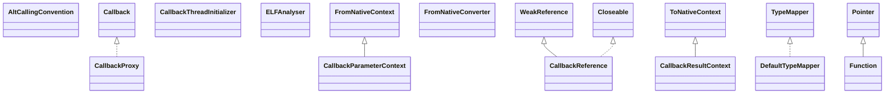

# jna-5.13.0.jar

[Group index](README.md) | [All archives](../README.md)

## Scope and provenance

- **Donor:** `SQX_145_REFERENCE_ROOT/internal/libs/jna-5.13.0.jar`.
- **SHA-256:** `66d4f819a062a51a1d5627bffc23fac55d1677f0e0a1feba144aabdd670a64bb`; accessed 2026-10-06; captured `2026-10-06T18:54:51.906614+00:00`.
- **Classes:** 125 raw entries; 125 unique entry names. Duplicate occurrence indices are zero-based.
- **Inspection:** read-only ZIP hashing and class-file structural parsing; signatures/descriptors, modifiers, hierarchy and references only. Bytecode bodies are hashed, not published.
- **Allocation:** proposed `FEAT-HOST-JNA`, P01; [roadmap](../../dev/sqx-full-application-roadmap.md). Domain README registration remains required.
- **Repository:** `01067f00031428613c6394064ca1bcadc1ba00ee`; review state unreviewed. Download label 145-dev1; installed build/activation and runtime equivalence unverified.
- **Limit:** every class/member is inventoried; declaration coverage does not establish consumed calls, defaults, formulas, failure semantics or algorithm parity.
- **Archive/resource index:** [059.json](../../dev/evidence/sqx145/archives/145/059.json).

## Complete member declarations

Member shards contain exact JVM names/descriptors, access flags, generic signatures, throws types, declared fields/methods, superclass/interfaces and referenced class names. All classes, nested/synthetic members and overloads are retained. Code length/hash is structural evidence, not a normalized algorithm comparison.

- [001.json](../../dev/evidence/sqx145/members/059/001.json) — SHA-256 `aed287f279fd8d2056d089354427a9af25d167545c803538e17297fff88113ec`.
- [002.json](../../dev/evidence/sqx145/members/059/002.json) — SHA-256 `9ab0ba7d9d50f9ad18268ce3727a4ccfc0a64ff405d9a91e55177b6e924980c7`.

## Focused structural diagram

Up to twelve non-nested classes; arrows show declared inheritance/interfaces only. External type names are not evidence of an available body or an executed dependency.

## Class inventory

| Archive entry | Occurrence | Class SHA-256 | Fields | Methods |
| --- | ---: | --- | ---: | ---: |
| `com/sun/jna/AltCallingConvention.class` | 0 | `e993a7528904e00251c71a6f716cbe91579d8410363c0ef971b51f2cbd1d049c` | 0 | 0 |
| `com/sun/jna/Callback$UncaughtExceptionHandler.class` | 0 | `7ac90409c502dfb61cf7c079aa2f6d0548c745cf888778fbf4230cc68e8e98ec` | 0 | 1 |
| `com/sun/jna/Callback.class` | 0 | `d711e26545d9da4762b0c0acfb80155114ed652b879cf6e953d403103bbce043` | 2 | 1 |
| `com/sun/jna/CallbackParameterContext.class` | 0 | `4a333a49236e31f8769a1db81f84faebe19c9c911011e34985fe04b29387e7a2` | 3 | 4 |
| `com/sun/jna/CallbackProxy.class` | 0 | `8beb020ef5807a611c5f0db7caa708a1861bb6c3042cf160d325bfdd7ed7b89b` | 0 | 3 |
| `com/sun/jna/CallbackReference$AttachOptions.class` | 0 | `6d18a7f6b091c9fb013f6a8608e433053384f550dbe1dcfd5a8b83e52e55d2a3` | 4 | 3 |
| `com/sun/jna/CallbackReference$CallbackReferenceDisposer.class` | 0 | `85b8b9b0b255c212cea252faed8f85675e5cd8f204f01648ec9803cf80110652` | 1 | 2 |
| `com/sun/jna/CallbackReference$DefaultCallbackProxy.class` | 0 | `eb30820611908018b379c934be6c61fdbf04b4725a961afef9e8bd3f65188ad0` | 5 | 8 |
| `com/sun/jna/CallbackReference$NativeFunctionHandler.class` | 0 | `6d74704dc46ea34ab440fc0ef1203d0f87f8ed5585031e0043c0cced42c901c2` | 2 | 3 |
| `com/sun/jna/CallbackReference.class` | 0 | `238626f5a52ac2e27c8d46743211b76a9b9890dea7134e53eba0974eb2324a32` | 14 | 28 |
| `com/sun/jna/CallbackResultContext.class` | 0 | `fccc1d8810194b39bdf71a072823c07aa44c86d83b8e97a862aae2bb1852cd08` | 1 | 2 |
| `com/sun/jna/CallbackThreadInitializer.class` | 0 | `9513ffb97d38926bc4ea50e60a2696dd3e698d4a090cc5f8165d838390a849d5` | 4 | 9 |
| `com/sun/jna/DefaultTypeMapper$Entry.class` | 0 | `e139b98c8c62a821f5e55542b517549b0a344e6f46ade755d5b51ddbec225500` | 2 | 1 |
| `com/sun/jna/DefaultTypeMapper.class` | 0 | `9225ebd32cb7c3b04ed78ebef3a9f103cff792907d29200df0e600d437d0f41b` | 2 | 8 |
| `com/sun/jna/ELFAnalyser$1.class` | 0 | `cc97253b5741962174d82358000bdbab4f723299151c5d434f1d8bc6a9ee4f16` | 1 | 1 |
| `com/sun/jna/ELFAnalyser$ArmAeabiAttributesTag$ParameterType.class` | 0 | `853754393c19297c3cacabd65a514c2ad28a5a0f24ee88c12bfb45da38d9a1ee` | 4 | 4 |
| `com/sun/jna/ELFAnalyser$ArmAeabiAttributesTag.class` | 0 | `14d81cea2e617fdc50e16afa47d59c2f6395e155502717bb81d65aa727e1c5c6` | 49 | 13 |
| `com/sun/jna/ELFAnalyser$ELFSectionHeaderEntry.class` | 0 | `95951b35be10add5eb49b4fc99178c2d90034a1f5584314a99fc5f3054db4208` | 6 | 9 |
| `com/sun/jna/ELFAnalyser$ELFSectionHeaders.class` | 0 | `ed2bdb98ce26259d6c8de8139539da80f506019063088081bca7a4b8e0134128` | 1 | 2 |
| `com/sun/jna/ELFAnalyser.class` | 0 | `440e007326e1ab8d9bc555c11cdc18cb0713867f1f7ccd0429fc4693b8175225` | 14 | 19 |
| `com/sun/jna/FromNativeContext.class` | 0 | `08f92e873935f7eeeac13cba76709c1eee52a48e9e2c04a093e2ecd9066f28db` | 1 | 2 |
| `com/sun/jna/FromNativeConverter.class` | 0 | `0a585545bca99bd2f213624204cced97ddf20725ca756173c053676d35ab48e7` | 0 | 2 |
| `com/sun/jna/Function$NativeMappedArray.class` | 0 | `6d8709d9973d94603bc779003604fe5e9c5a1e69a82bce5430667f3e83f4c910` | 1 | 2 |
| `com/sun/jna/Function$PointerArray.class` | 0 | `5e3a579a36a0eb732483d9556e56d182d7d5578b28385297b9cdcb2e19fab367` | 1 | 2 |
| `com/sun/jna/Function$PostCallRead.class` | 0 | `ce4a5c85e64d9f48c0a727c33345d0bd21daf560166ff59889e27e4bae8265fa` | 0 | 1 |
| `com/sun/jna/Function.class` | 0 | `dec6aa3358ef23c3b5793aae939d6d8d50ae75747201da2565439a1f1f625d56` | 15 | 37 |
| `com/sun/jna/FunctionMapper.class` | 0 | `7bb511543f22eb0cacfc32e9f4feb39414862da19ba4cb821a13c7c185a90498` | 0 | 1 |
| `com/sun/jna/FunctionParameterContext.class` | 0 | `64365cd093ab157251c2e5b7934ff4c362240e90b1fe37d21e3504ecdc9ece9f` | 3 | 4 |
| `com/sun/jna/FunctionResultContext.class` | 0 | `ba4cd94d676a28fd021a36fec8e034b5741833662d1fdbe28548b0953bdd72a8` | 2 | 3 |
| `com/sun/jna/IntegerType.class` | 0 | `9419da5687d607669b0dd064082d5073f808536db16f450354dc666abe24f5d9` | 5 | 18 |
| `com/sun/jna/InvocationMapper.class` | 0 | `b9d5ae7caae5f55f03c80c5ec5519c568f239efa32d06f5b2122e40b80056d02` | 0 | 1 |
| `com/sun/jna/JNIEnv.class` | 0 | `1aa2349d3483835ceeaf4c32a7041828f5de6b2fd2984145b59e1f2f6be0452a` | 1 | 2 |
| `com/sun/jna/Klass.class` | 0 | `4a2029bd9f97c1d7bd2fc8cc2764f6f444641e9b35fbf1938a57980294b763fe` | 0 | 2 |
| `com/sun/jna/LastErrorException.class` | 0 | `7c6e6246d4700af04221a8681ef93f850e1ca85009dac15169f6e15e42e13d7b` | 2 | 6 |
| `com/sun/jna/Library$Handler$FunctionInfo.class` | 0 | `ff4b4009b1e943b1e98407fd9e370f9338a35668550a2281afba20957adcb5de` | 6 | 2 |
| `com/sun/jna/Library$Handler.class` | 0 | `c43416aa047492b7df22280070f6d1271211d2ea8ffc7337c04064d663e374d2` | 8 | 6 |
| `com/sun/jna/Library.class` | 0 | `c68ba441334a4c3a228b26eb164b7831f30b8da1d9799078ef6a6ee2797cbce9` | 10 | 0 |
| `com/sun/jna/Memory$MemoryDisposer.class` | 0 | `0f0f3459f244f1a3e644aebcd77d592588e1f5f7ae4adfc81f683a608fb803a4` | 1 | 2 |
| `com/sun/jna/Memory$SharedMemory.class` | 0 | `53f248d3733a67dde19474e41a4ae4ee52ac18460360837b18c076ff7f8986c7` | 1 | 4 |
| `com/sun/jna/Memory.class` | 0 | `fa5960f8fd5a073eb2b1b876aa703f74ef982d767d82b1c45b0f7971dd18947c` | 4 | 57 |
| `com/sun/jna/MethodParameterContext.class` | 0 | `e1a8399c6f05c96bcb8a0760196e98c438d5b1b8a7e9f40eb8cf01ff23ceb3b0` | 1 | 2 |
| `com/sun/jna/MethodResultContext.class` | 0 | `41e0dfe3ef1c228fb4aa96e12b6f093dedfef848354832b8dcd944a467ed4797` | 1 | 2 |
| `com/sun/jna/Native$1.class` | 0 | `8ea4f4dc4a40a97b8eac4432569b3ac7fe7734c34991d7ad75b028e587591776` | 0 | 2 |
| `com/sun/jna/Native$2.class` | 0 | `8be67dbdb96826fc61fc9f07f05b009d619ebbd75ffa9a0b78d585b0d4b419d7` | 0 | 2 |
| `com/sun/jna/Native$3.class` | 0 | `db1793d2a69bde21977419c79ad93c3dd1ff98e95de810a2f0eb9a56717b1cce` | 2 | 2 |
| `com/sun/jna/Native$4.class` | 0 | `a9b5738bd857ccd12ac242601899a051c70b11e523c975d140371006a8979211` | 0 | 3 |
| `com/sun/jna/Native$5.class` | 0 | `a5f2f88080b8fd820bb940af510792125129d9b29777341af4c9cbe8ce1f6d10` | 0 | 2 |
| `com/sun/jna/Native$6.class` | 0 | `dcb6fd339c87611272e6c8084053e1fcb14ccb68e3c7c282d81ec887d0dc80fc` | 0 | 2 |
| `com/sun/jna/Native$7.class` | 0 | `496e17423de7eca9202dd032bd85116ea6d91f2f3dcf359b944bf660f8a683ce` | 0 | 3 |
| `com/sun/jna/Native$AWT.class` | 0 | `eac9607b74d97fe3bee8da179a18e7c5e274db1e623b3f00d845e8378ba3cb9f` | 0 | 3 |
| `com/sun/jna/Native$Buffers.class` | 0 | `d82f6e9d668c79d02064a9972e38f7a66f3d7ba3d9c27e13a6ec62cbc2005253` | 0 | 2 |
| `com/sun/jna/Native$ffi_callback.class` | 0 | `ff114a0d65a1c63de46c26edae8d27d2110f48e33f4179ac8dfea9e3d933cedf` | 0 | 1 |
| `com/sun/jna/Native.class` | 0 | `6f56c0d3abda1fa760cca289170372d1c79acaa50b71ee5a05bb1c72f8427835` | 66 | 154 |
| `com/sun/jna/NativeLibrary$1.class` | 0 | `6bb10f4fffd966828526fd8a980bc01cc81e5b97a24f37b21674a441ad8e7e5f` | 0 | 2 |
| `com/sun/jna/NativeLibrary$2.class` | 0 | `6bf050fad9c29f5faec93cc8e86672d17a5b199165eedfe1a364904d77d5ca20` | 1 | 3 |
| `com/sun/jna/NativeLibrary$3.class` | 0 | `41facc71fd42ba2eeaab82cbc7295848b7f5c30907001adaae0f96e938060322` | 1 | 2 |
| `com/sun/jna/NativeLibrary$NativeLibraryDisposer.class` | 0 | `be9c9e1ca0fbd1c6a688adc9829aac87658bd435c2b3e142b2db2baf397d4b38` | 1 | 2 |
| `com/sun/jna/NativeLibrary.class` | 0 | `ef46a20938e35e57478090eae2bbd85a952cc2fcf29d8a755f18140b3e965c96` | 17 | 36 |
| `com/sun/jna/NativeLong.class` | 0 | `3486c03fc33896d9ae239883a6db7d5cedb0cb9cf007bc24c6c4a2e3bd67c7a3` | 2 | 4 |
| `com/sun/jna/NativeMapped.class` | 0 | `cce0fdee9074ff6a0910cdf4105dba004c5c92387aae418eb0a07489d6cc5e32` | 0 | 3 |
| `com/sun/jna/NativeMappedConverter.class` | 0 | `8dd9ef7bb1ad6ab6ec5d484c83f041cd2218546fa433cd7539ba814298e025ba` | 4 | 7 |
| `com/sun/jna/NativeString$StringMemory.class` | 0 | `9471c4124e99b2fcf32912a70e5328ffbc19f128a6c8a844649b54658e09f964` | 1 | 2 |
| `com/sun/jna/NativeString.class` | 0 | `c66781c4099671d796880fe3f41a2ec3d8b5d21b68805eb9b692c609ebdde515` | 3 | 12 |
| `com/sun/jna/Platform.class` | 0 | `9555fe580c1b48d9bb9c0a17459a148ac6e99a445b45a61c4e798ba983600cfa` | 23 | 28 |
| `com/sun/jna/Pointer$1.class` | 0 | `b58ade536217ae853f144afebcc5fc030eb066608a0ff2be9767e46e1c5aaf66` | 0 | 0 |
| `com/sun/jna/Pointer$Opaque.class` | 0 | `cede48705622781489a110dab0493d6255dfcc1616620912c852fb30c8993a48` | 1 | 45 |
| `com/sun/jna/Pointer.class` | 0 | `4d2e9186fb11f19f42448c049563251af6b38802262f827d7471cad0fa433237` | 2 | 77 |
| `com/sun/jna/PointerType.class` | 0 | `451714d4bf2f5681283830eef9105c4b74585be1818349ed0f07e83072ac8e00` | 1 | 10 |
| `com/sun/jna/StringArray.class` | 0 | `2484c36f5985ee280b1955acb5e0f4681b6604b0d39a20ba66541b73efc18519` | 3 | 7 |
| `com/sun/jna/Structure$1.class` | 0 | `07453629ab3c64f1c5b5de08fb50b40831be8c65e22522e183dd8a8c6e37ea77` | 0 | 3 |
| `com/sun/jna/Structure$2.class` | 0 | `09bb8050f6dbc4e4d859e430ca477d2c11181d98d339e1c0265d32dc901845d8` | 0 | 3 |
| `com/sun/jna/Structure$3.class` | 0 | `90fc8b761e4c09baddbdf08451584635a7dfbadd990619a7d9e511fa635c1106` | 0 | 2 |
| `com/sun/jna/Structure$AutoAllocated.class` | 0 | `df5e97a9264e1ae9a0cff634ec0d91700b34809e387aea99ceec599ea3cfa3a7` | 0 | 2 |
| `com/sun/jna/Structure$ByReference.class` | 0 | `4037c961635e7c4e070c04dde31cd8dbca3b2304aa3805938fe246b9ebf615c9` | 0 | 0 |
| `com/sun/jna/Structure$ByValue.class` | 0 | `bab1b90e6fc5454e03f563094132e51abd99d12c7ca91c9acae274524243051a` | 0 | 0 |
| `com/sun/jna/Structure$FFIType$FFITypes.class` | 0 | `60c673ae407593e0167450635928d0a7b54622f10ef91622cde3333326e9bc98` | 13 | 14 |
| `com/sun/jna/Structure$FFIType$size_t.class` | 0 | `c9effb7d7834ca311cec69910a301c81a376af09ac06c96963a7a51e7140aa4a` | 1 | 2 |
| `com/sun/jna/Structure$FFIType.class` | 0 | `cf555c72f884d9938f9f726bffda7b64fddfbc4afc6da5ff515adf5e632784e9` | 8 | 14 |
| `com/sun/jna/Structure$FieldOrder.class` | 0 | `aa81967a04f7255aa47f960aae30d050f7ae2cf4c13de350c375b5c9a94d9882` | 0 | 1 |
| `com/sun/jna/Structure$LayoutInfo.class` | 0 | `82c224d7e4d658c25085e8c5e4ab0fbbfb3968f2da5d0d6466a25489b2e691c2` | 6 | 13 |
| `com/sun/jna/Structure$NativeStringTracking.class` | 0 | `580115f23b41dd4b35a716d3c90cbde9b646aef846c8e8429b1dca8b138a5475` | 2 | 4 |
| `com/sun/jna/Structure$StructField.class` | 0 | `c00696e71919655190426a5acf4760074137e3416c51a1190a02b7acd4ad0698` | 10 | 2 |
| `com/sun/jna/Structure$StructureSet.class` | 0 | `a6aedfc899bfc10bf5bc79c5cec88e04b0731a7842aba23c55a159f012b7c6bd` | 2 | 10 |
| `com/sun/jna/Structure.class` | 0 | `4da3aa59f120eb33adbd7ce3afe5869642c4fc0046acbb663831970105c1a776` | 25 | 100 |
| `com/sun/jna/StructureReadContext.class` | 0 | `56e7424bb8d5e705194e55f55a7132e1c7bd38a0b113fe25282d5119982b499e` | 2 | 3 |
| `com/sun/jna/StructureWriteContext.class` | 0 | `ed1a01c97b2dfa4d916cf87d07604c8b6710f13c60d88aa0fadfc35264e7aad9` | 2 | 3 |
| `com/sun/jna/SymbolProvider.class` | 0 | `d43082a6f35bad50edabdf866dabb70a1e8db6937e6ea1711c4fa96d7a029119` | 0 | 1 |
| `com/sun/jna/ToNativeContext.class` | 0 | `05356962422d75a8573f5c8521ffd9cc66be5c60f2b21aaca5a86d815e2db1c4` | 0 | 1 |
| `com/sun/jna/ToNativeConverter.class` | 0 | `a5a0669c5de2fba230a80c2e7f02886b9a4971ce26a7095bb317c2905b7a8cf4` | 0 | 2 |
| `com/sun/jna/TypeConverter.class` | 0 | `00aefb906cebc0b73c5c740937bba93410d1c0fb991ae71adea2944369c262f0` | 0 | 0 |
| `com/sun/jna/TypeMapper.class` | 0 | `beff707ba4d95c9d090139d4b4c392eccb8d2c6c4ee2a01743acd5d7bb8af4e3` | 0 | 2 |
| `com/sun/jna/Union.class` | 0 | `e91eb93990a653a9b7e7010721d742030f208e334b1ae6d7ad79013f206022fc` | 1 | 17 |
| `com/sun/jna/VarArgsChecker$1.class` | 0 | `edfc7a13ea9e83101d1d245e3ffad45c992450dd445111e512a3670f59d022a5` | 0 | 0 |
| `com/sun/jna/VarArgsChecker$NoVarArgsChecker.class` | 0 | `586c9d829d912ef0bc5fa1258a3924c38fecdc7a22ac184b72b530e4a5e3f960` | 0 | 4 |
| `com/sun/jna/VarArgsChecker$RealVarArgsChecker.class` | 0 | `c6386fb4c98cb366cf1eab89690c3d1ac492217583a7f0da5dcbd8e493bc2d1d` | 0 | 4 |
| `com/sun/jna/VarArgsChecker.class` | 0 | `669133cd72d22678fa882e14f80be0837213176c117eef25d9b7c8733f5b6c6d` | 0 | 5 |
| `com/sun/jna/Version.class` | 0 | `c2fc1fdb0f31b1f04f9e3ce73a8242bcf2a146975b548e47759bddb8d8805972` | 2 | 0 |
| `com/sun/jna/WString.class` | 0 | `693f8a7f66c7c35041647e2e845c52080726d02ae2b316278f03ba754acc8c55` | 1 | 8 |
| `com/sun/jna/WeakMemoryHolder.class` | 0 | `681b6a4fc56be93c52ac00d9435726ffa0deb95c1902b5476234deeed86446ec` | 2 | 3 |
| `com/sun/jna/internal/Cleaner$1.class` | 0 | `1d13bcabfea2fe212cc8b36fb38849cb2efb33dac8633c836f63e8660e911a37` | 1 | 2 |
| `com/sun/jna/internal/Cleaner$Cleanable.class` | 0 | `23b483fd6cbce8f8607e82368e78e4b9584c0de40a417ef7b6dd465689bccac7` | 0 | 1 |
| `com/sun/jna/internal/Cleaner$CleanerRef.class` | 0 | `69f5710ee864b9651f79bdedcdb42603c44cf7bdd3f101d4f375bf74fdeb64b9` | 4 | 6 |
| `com/sun/jna/internal/Cleaner.class` | 0 | `9db94aed5c9a19f6a2707e4a32799446c715cc05bf39ed43f2c541fe1022b3e2` | 4 | 8 |
| `com/sun/jna/internal/ReflectionUtils.class` | 0 | `ff065ce3562a22e4325a2bccc4b4bcadc89a5d59e5384a1741910e5a13dbdb32` | 12 | 13 |
| `com/sun/jna/ptr/ByReference.class` | 0 | `47755a2cc62594389091c1fea719dd7ae1ea11b5b39b47b75a1a18d4b26e499c` | 0 | 2 |
| `com/sun/jna/ptr/ByteByReference.class` | 0 | `af128dc1a66ea3a11920724757d2db882e141ec58d286a66a9e564cdb79af13f` | 0 | 5 |
| `com/sun/jna/ptr/DoubleByReference.class` | 0 | `ba0c1ae96f1e6e06ec1cc8f7b346a5dac62fa634ee690cf0765b7422e1c7319b` | 0 | 5 |
| `com/sun/jna/ptr/FloatByReference.class` | 0 | `6061afd286a3a2104461ba3985d64864a4501dfd05ed2bef93cd6b99ffcaa26a` | 0 | 5 |
| `com/sun/jna/ptr/IntByReference.class` | 0 | `df3209204c5326e95161665d8f6079fb66ae7521ebc40dcfec7258a5855d6a15` | 0 | 5 |
| `com/sun/jna/ptr/LongByReference.class` | 0 | `4e3f105ad77d11cc09d643940a7da3960c833b59059015b3ded598ce891f71c6` | 0 | 5 |
| `com/sun/jna/ptr/NativeLongByReference.class` | 0 | `64b04c8a61402640a3a603e2cc8d1763192fa3af3e6723df47263d32bedc62e0` | 0 | 5 |
| `com/sun/jna/ptr/PointerByReference.class` | 0 | `abd5c16dbaa3c36187b9cfeae6cc9115e21dadb419fc75980febbbfc720726cf` | 0 | 4 |
| `com/sun/jna/ptr/ShortByReference.class` | 0 | `70efa8d3967f0e7b2e500cd0ca2d8662fdebf46bf9195d35fc54332525cbfe4e` | 0 | 5 |
| `com/sun/jna/win32/DLLCallback.class` | 0 | `fdfa3d005a6da4e0e612b9a08e0e5ec212d72046dadf286efb15dda2eda68a1a` | 1 | 0 |
| `com/sun/jna/win32/StdCall.class` | 0 | `09f9e5b48e873fb8ff2f94df9408b17cb622267fafec695e6157f04703c916a8` | 0 | 0 |
| `com/sun/jna/win32/StdCallFunctionMapper.class` | 0 | `a2b46b65ae656fc91a96fa8475a51759cae89fee0235f617821d10f9952315a4` | 0 | 3 |
| `com/sun/jna/win32/StdCallLibrary$StdCallCallback.class` | 0 | `c7ecf35b90ff2bff9ddd9afd6660128594902c2a1fbbcf64dad5271a77d2ede4` | 0 | 0 |
| `com/sun/jna/win32/StdCallLibrary.class` | 0 | `01ac9f72ff9d85e9479d9239f4ebac09fc02605a4b712a913a0479a21e71c327` | 2 | 1 |
| `com/sun/jna/win32/W32APIFunctionMapper.class` | 0 | `3b441237775866a1c73d47d30a0c0cc83bf60c46b0c6f92eb7f7ad0ce757542c` | 3 | 3 |
| `com/sun/jna/win32/W32APIOptions$1.class` | 0 | `d07349b3ac6cbea902ab8252aacce61bec4427d3d24f085d936da4941bbcc52c` | 1 | 1 |
| `com/sun/jna/win32/W32APIOptions$2.class` | 0 | `34ddd0775cab1a46dcbd4c9564140954e052b00a9f31917583f8eb91c3674a50` | 1 | 1 |
| `com/sun/jna/win32/W32APIOptions.class` | 0 | `d0214d61ab5004507409133ffe3eea023b1216c256a6c10f5a6051bddb01167b` | 3 | 1 |
| `com/sun/jna/win32/W32APITypeMapper$1.class` | 0 | `77f1427aa274de0b4fe124e433859460169ed69454a440fe754c5b48926f516f` | 1 | 4 |
| `com/sun/jna/win32/W32APITypeMapper$2.class` | 0 | `94ca25d8e9904139fa557a6394ab79d0587c2007ae38bf00f5bdda5348dfc8d2` | 1 | 4 |
| `com/sun/jna/win32/W32APITypeMapper.class` | 0 | `11754844a930bf98be971e3012309e80e10a928d4c7d1545d9efcc22fee686ba` | 3 | 2 |
