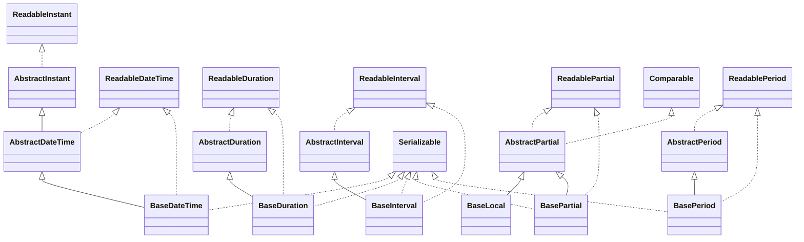

# joda-time-2.3.jar

[Group index](README.md) | [All archives](../README.md)

## Scope and provenance

- **Donor:** `SQX_145_REFERENCE_ROOT/internal/libs/joda-time-2.3.jar`.
- **SHA-256:** `602fd8006641f8b3afd589acbd9c9b356712bdcf0f9323557ec8648cd234983b`; accessed 2026-10-06; captured `2026-10-06T18:54:51.906614+00:00`.
- **Classes:** 232 raw entries; 232 unique entry names. Duplicate occurrence indices are zero-based.
- **Inspection:** read-only ZIP hashing and class-file structural parsing; signatures/descriptors, modifiers, hierarchy and references only. Bytecode bodies are hashed, not published.
- **Allocation:** proposed `FEAT-DATA-JODA-TIME`, P03; [roadmap](../../dev/sqx-full-application-roadmap.md). Domain README registration remains required.
- **Repository:** `01067f00031428613c6394064ca1bcadc1ba00ee`; review state unreviewed. Download label 145-dev1; installed build/activation and runtime equivalence unverified.
- **Limit:** every class/member is inventoried; declaration coverage does not establish consumed calls, defaults, formulas, failure semantics or algorithm parity.
- **Archive/resource index:** [061.json](../../dev/evidence/sqx145/archives/145/061.json).

## Complete member declarations

Member shards contain exact JVM names/descriptors, access flags, generic signatures, throws types, declared fields/methods, superclass/interfaces and referenced class names. All classes, nested/synthetic members and overloads are retained. Code length/hash is structural evidence, not a normalized algorithm comparison.

- [001.json](../../dev/evidence/sqx145/members/061/001.json) — SHA-256 `dce71b019f55baaaa8043dc56dd862dcb8b3d4fac570913cb752b11d695400c8`.
- [002.json](../../dev/evidence/sqx145/members/061/002.json) — SHA-256 `91dd3926a84750550f29fd0de54170a2266c9f334e6a206c252fbb443dba52d4`.
- [003.json](../../dev/evidence/sqx145/members/061/003.json) — SHA-256 `ace7346b878965006953af924d4dc726372e601a92d10785801e592e57893a95`.

## Focused structural diagram

Up to twelve non-nested classes; arrows show declared inheritance/interfaces only. External type names are not evidence of an available body or an executed dependency.

## Class inventory

| Archive entry | Occurrence | Class SHA-256 | Fields | Methods |
| --- | ---: | --- | ---: | ---: |
| `org/joda/time/base/AbstractDateTime.class` | 0 | `c332072b1250be8c95705508a1009e6962e06b560abe1b9fd136c80fdd6a3994` | 0 | 24 |
| `org/joda/time/base/AbstractDuration.class` | 0 | `21c9ad3c6808ee7dcac587985c3eca62e1be283d20b3ef3ba21381f8c7e7dc09` | 0 | 11 |
| `org/joda/time/base/AbstractInstant.class` | 0 | `3336c45b8f3b7156e3a46c524a2887b160054c969586cb03079430bee16b3a35` | 0 | 30 |
| `org/joda/time/base/AbstractInterval.class` | 0 | `6d878348e7f56b4fe3be3c984ff1e18ee3eb19e43c0bbab31ee96cf150a2dfb1` | 0 | 27 |
| `org/joda/time/base/AbstractPartial.class` | 0 | `51e544f2c3856cda4226110edec7cb591527833cbaab480296f38b4b2865e692` | 0 | 22 |
| `org/joda/time/base/AbstractPeriod.class` | 0 | `a2ac683774d83cba1beb31e3fa7e180ca3d4ca5491e91ceea6bd60cd8c793e4b` | 0 | 14 |
| `org/joda/time/base/BaseDateTime.class` | 0 | `4402862c237d17841252c0be23c9fed8ae20253e28fe6e50206be6ea9308b8ee` | 3 | 17 |
| `org/joda/time/base/BaseDuration.class` | 0 | `0ba15f5d27c1886cc732a35393c8717ffafa4d366e37f54b73fc46896a3a3c1e` | 2 | 15 |
| `org/joda/time/base/BaseInterval.class` | 0 | `4fb8ccf6f96933d3264577ec53c11ffa75b7468c0a277ec99d033eb6846fe831` | 4 | 11 |
| `org/joda/time/base/BaseLocal.class` | 0 | `79688fefc5d3348882f4aae9336abde37e47e5ca8416648dcce121b69b0346e5` | 1 | 2 |
| `org/joda/time/base/BasePartial.class` | 0 | `ec9e7505a90f9f98914253f9c44a07a358083500d46a47ca58b2c4e405982fbc` | 3 | 16 |
| `org/joda/time/base/BasePeriod$1.class` | 0 | `2b69a24370f739cb721e447d38a4d57d8d3680c006c5610fa7e86b7f12f952c1` | 0 | 3 |
| `org/joda/time/base/BasePeriod.class` | 0 | `6988d95c683fcea3800d7e695b65028f6d219ec8e98ba1ea7365dc0b9f7c8496` | 4 | 31 |
| `org/joda/time/base/BaseSingleFieldPeriod.class` | 0 | `c17dd93aca15cedf1cf7f0a08bec47c42d3a682b63ace331aade8aa4b99d05e5` | 3 | 19 |
| `org/joda/time/chrono/AssembledChronology$Fields.class` | 0 | `b7e611ee9922079d88171b6216d4735d82227f6e11ad96fc2174527e4dcf53a2` | 35 | 4 |
| `org/joda/time/chrono/AssembledChronology.class` | 0 | `65bc48d88353bded66cb886acb44c309f8bea49e22fdd22ab5ff1b9b78986e61` | 39 | 45 |
| `org/joda/time/chrono/BaseChronology.class` | 0 | `a77a84d05b927b568bc129c8483aadaf30ea0a28405a9cb0d619ae8a1f5e669f` | 1 | 50 |
| `org/joda/time/chrono/BasicChronology$HalfdayField.class` | 0 | `17862304df4cb355b30697a8579b8f5f4d8790291ee30c1a31dc16ddf67cdee7` | 1 | 4 |
| `org/joda/time/chrono/BasicChronology$YearInfo.class` | 0 | `eca52cf464f0ed974c24cef28d08204d355c1550ea4e98ce778e124b10ecf81b` | 2 | 1 |
| `org/joda/time/chrono/BasicChronology.class` | 0 | `95faafbe461cc966ca3eac6cb9a05546bcd992fa71ca30bae9d58ffe4308539d` | 23 | 52 |
| `org/joda/time/chrono/BasicDayOfMonthDateTimeField.class` | 0 | `2024fe393af45b8cc0e35b054877ddd34c1eb52d1f1bb39e840b2051007f5324` | 2 | 10 |
| `org/joda/time/chrono/BasicDayOfYearDateTimeField.class` | 0 | `2ac207458131a280b13263f1f0ab7073fbe72b6bec9756615703acd20b48bd5e` | 2 | 10 |
| `org/joda/time/chrono/BasicFixedMonthChronology.class` | 0 | `30bbe500acb1163d4f57d5ff8d4afd88e365b2556844a498c4cce1a84824c430` | 4 | 15 |
| `org/joda/time/chrono/BasicGJChronology.class` | 0 | `bb5044428b43910fd5226c0b300a403ecf298e7e308ca405731fbed7a698f444` | 6 | 9 |
| `org/joda/time/chrono/BasicMonthOfYearDateTimeField.class` | 0 | `f14c777100d7538787132271b2b72b939b12a3034a37bef6ee7d29aad8840cd6` | 5 | 18 |
| `org/joda/time/chrono/BasicSingleEraDateTimeField.class` | 0 | `56082b7c6ebc3f57aa7f4be2362eab074480debad2654493221c1fd57139e21d` | 2 | 16 |
| `org/joda/time/chrono/BasicWeekOfWeekyearDateTimeField.class` | 0 | `b9745bca141d3898b4f6bdbe0865b568936a0d0fa204e5c4044127ec5959e29b` | 2 | 13 |
| `org/joda/time/chrono/BasicWeekyearDateTimeField.class` | 0 | `145c3068dee10aa97fc5e085f4d9276eeaf80670a4bef0e70e66c752a7014fa0` | 3 | 17 |
| `org/joda/time/chrono/BasicYearDateTimeField.class` | 0 | `6fb303fa12689057726ce3370e76b70c55ac4b6fdb3ff93045c2eedd1cb43c11` | 2 | 18 |
| `org/joda/time/chrono/BuddhistChronology.class` | 0 | `e98ca87709ab5f2896e2d6529318c423ce35563eb3802650716f327e7207bdb0` | 6 | 12 |
| `org/joda/time/chrono/CopticChronology.class` | 0 | `2ab39baf8bbc9b631d3e2836253fe7d134f72fbf29d87dc5c04e8cac97bed24a` | 7 | 14 |
| `org/joda/time/chrono/EthiopicChronology.class` | 0 | `941eb08b67e49d6728a395eecc2603def02c7bb7ff8126e0d3cccfcb4dc99a17` | 7 | 14 |
| `org/joda/time/chrono/GJChronology$CutoverField.class` | 0 | `b718bbb1e640b35c57542e6b1c93f207ca2a900cd248683b24edbe9c1f497077` | 8 | 34 |
| `org/joda/time/chrono/GJChronology$ImpreciseCutoverField.class` | 0 | `f504ca26d54e3ff7639ccf5944cd40eb9fa17676e804ca9081dc2bbea6472150` | 2 | 9 |
| `org/joda/time/chrono/GJChronology$LinkedDurationField.class` | 0 | `51b3d67c59e759e4c6813edf812835d74c3d018522b2f6495d71489fba620a0f` | 2 | 5 |
| `org/joda/time/chrono/GJChronology.class` | 0 | `cb21d1a3c77f26b37d9fa18a16c8250fdebbb24804f82847b8250e0163180c7a` | 8 | 29 |
| `org/joda/time/chrono/GJDayOfWeekDateTimeField.class` | 0 | `490de708ace6be4c4f0ccf0f89ab4b8d41423da12da584c7270faa126fd9005d` | 2 | 11 |
| `org/joda/time/chrono/GJEraDateTimeField.class` | 0 | `72b07bf92920ac2342d3b2be8288e69d3c92ccba45b5c298ae68455fa6cd79c0` | 2 | 17 |
| `org/joda/time/chrono/GJLocaleSymbols.class` | 0 | `8a06d3db6fc1e906dbb48750f10bd5bcf4895809be787ad482e147f769beac07` | 19 | 24 |
| `org/joda/time/chrono/GJMonthOfYearDateTimeField.class` | 0 | `e7db7413d6040edfbca55381fc2b7d820fe1ea87cf203b245b066d4b5873db35` | 1 | 6 |
| `org/joda/time/chrono/GJYearOfEraDateTimeField.class` | 0 | `14a0842216a58586ae678f70c9643eda4d9e5bb17a5610d278f53fe1d4dd2480` | 2 | 15 |
| `org/joda/time/chrono/GregorianChronology.class` | 0 | `dabceb192a019f2d04aae6dad70b13bafa440126e35b3460caf04cb27ef842a9` | 8 | 18 |
| `org/joda/time/chrono/IslamicChronology$LeapYearPatternType.class` | 0 | `c0f8bd1a78735fd695944294a1ea4fc05d8565a4a52497e081d83629b487b39a` | 3 | 5 |
| `org/joda/time/chrono/IslamicChronology.class` | 0 | `c22438aaea75177f8cc0678e88c6949c21b18a083156deabed8a44bdeea5908f` | 24 | 32 |
| `org/joda/time/chrono/ISOChronology$Stub.class` | 0 | `c7e0d51d7458e4d8bd774d0952918b5e91b74f073b64d98f11aa94a016287d6e` | 2 | 4 |
| `org/joda/time/chrono/ISOChronology.class` | 0 | `0dad2d8eb87a48700a09962d00cceb7dae8673fc774ac11c29df34241deefbe5` | 5 | 12 |
| `org/joda/time/chrono/ISOYearOfEraDateTimeField.class` | 0 | `a829c93cfd205dc39fc86d0cc1513a5885f66528015a80cb55c17ed2dcc62565` | 2 | 16 |
| `org/joda/time/chrono/JulianChronology.class` | 0 | `b846ece141808b21171b537749384218e1648a1de2ce6df2228dd49326c3206b` | 7 | 20 |
| `org/joda/time/chrono/LenientChronology.class` | 0 | `14421822414edcb0642647ecfc49fe49916c9595b6983153703e2d874d58ca25` | 2 | 9 |
| `org/joda/time/chrono/LimitChronology$LimitDateTimeField.class` | 0 | `faf603e4bc979dc65aab541a65a001f4489ea22a80c4b6904fcc80a75c2afef9` | 5 | 26 |
| `org/joda/time/chrono/LimitChronology$LimitDurationField.class` | 0 | `3a31113fb9473204524b49a8b76f8d1dc9419f6f342a08c2cbb5abe41c2ad551` | 2 | 9 |
| `org/joda/time/chrono/LimitChronology$LimitException.class` | 0 | `bb26cddcb375d80063c7db95d2d5a56f84f024eb94ddff10844f45cf88e6d06a` | 3 | 3 |
| `org/joda/time/chrono/LimitChronology.class` | 0 | `5f5aae58945b538cddb5fe36bf0e9b9b18ff29799b8637054bda84756e681876` | 4 | 16 |
| `org/joda/time/chrono/StrictChronology.class` | 0 | `74b959eb5bd5960d5766ebba0c44ff7b9aff1bf6be62f9132449b78730845f61` | 2 | 9 |
| `org/joda/time/chrono/ZonedChronology$ZonedDateTimeField.class` | 0 | `036a1260b016ad74e0ad52b4ebec57957c4aa2ca47e5e84659def4e3f8398c5c` | 7 | 33 |
| `org/joda/time/chrono/ZonedChronology$ZonedDurationField.class` | 0 | `26bc591aa1c9db2b6c4a6815e892065c73537c778b2af3a085b8c07b561981cb` | 4 | 14 |
| `org/joda/time/chrono/ZonedChronology.class` | 0 | `1675a3cfb4c3e7ed44c5e8448e28b1c150c91ba6d440a4a6d9d7cba9d0ef1a40` | 1 | 16 |
| `org/joda/time/Chronology.class` | 0 | `33f8e6b2911e6e544c640772548a099346af4f8796b200ce4fb43b45e4ac854c` | 0 | 50 |
| `org/joda/time/convert/AbstractConverter.class` | 0 | `657b055e1547db93ac8df5232f1d21cf5bf6c22bebc432ea3cb0b300d51ce214` | 0 | 9 |
| `org/joda/time/convert/CalendarConverter.class` | 0 | `48758fb4b9620cd5d7d82f15a6217981c493d271668d4c5d0547b4af9960e6a3` | 1 | 6 |
| `org/joda/time/convert/Converter.class` | 0 | `2cbfbcdb318a230b8226031198534528b735be8ad5a8bf91d828593829b54880` | 0 | 1 |
| `org/joda/time/convert/ConverterManager.class` | 0 | `ccaa45e02a6df2f052bd48ae291c549c57a1728e6a2ebc0f67fb8da77cf2bd66` | 6 | 28 |
| `org/joda/time/convert/ConverterSet$Entry.class` | 0 | `a333335a42453696fe971bd05902ebb37bb884179032e0fe0fbe5bebc8a0a4a3` | 2 | 1 |
| `org/joda/time/convert/ConverterSet.class` | 0 | `daec47cc6d11af148239a8a0153831e63990a9fc256860b7a4368cca6b2e11ee` | 2 | 8 |
| `org/joda/time/convert/DateConverter.class` | 0 | `86e6207edc05de00681242490d6f07dd241ad82d47825682027386bcbef1103a` | 1 | 4 |
| `org/joda/time/convert/DurationConverter.class` | 0 | `00c6f14eb402f082aa44107aff167f649aedb055cc6d49db758af6937b35b510` | 0 | 1 |
| `org/joda/time/convert/InstantConverter.class` | 0 | `4388430844cecf946838b5d7de0019fafbbfa9976186d43aedce26f46c156881` | 0 | 3 |
| `org/joda/time/convert/IntervalConverter.class` | 0 | `24ea5cbb33fa848e38569ae53909ce58167180fbbaa53cdb481cd0ba7dda1b60` | 0 | 2 |
| `org/joda/time/convert/LongConverter.class` | 0 | `9159a3be3cd3b0703609186f68fd8482409088f720fda1db0be3b38b1427010c` | 1 | 5 |
| `org/joda/time/convert/NullConverter.class` | 0 | `6d2fa193b94c7ca36eea2dd641c0a971eb297d1cd8e7a648d390b7bef2e0eb24` | 1 | 6 |
| `org/joda/time/convert/PartialConverter.class` | 0 | `676893d3d68255e789281699311705997a0cb335e4aa9c9b33df2e85571149d6` | 0 | 4 |
| `org/joda/time/convert/PeriodConverter.class` | 0 | `4adc59b2f7fc1cfe832d28fc4248cfac85fe4fb980c463cbf37701fdf17cf1ee` | 0 | 2 |
| `org/joda/time/convert/ReadableDurationConverter.class` | 0 | `eb865f03053b8cb1f8ace554645bd130a00a70670b51853abf7a645038be2c43` | 1 | 5 |
| `org/joda/time/convert/ReadableInstantConverter.class` | 0 | `70d158b8e8db0327e9754b9ae795dc954ea75e0c6e22ac65517367f219a69431` | 1 | 6 |
| `org/joda/time/convert/ReadableIntervalConverter.class` | 0 | `dc8f5f44a9802b33551c662726f3aaf48203097af7801af96713e71788aebba0` | 1 | 7 |
| `org/joda/time/convert/ReadablePartialConverter.class` | 0 | `803bfbb3d2e46f37472f69484a647bd3d51d986f984df71f791c2cb5bd2b898f` | 1 | 6 |
| `org/joda/time/convert/ReadablePeriodConverter.class` | 0 | `fb042de9a2baadee3d43da9a682c97f55b233d8a95f39f4091751194f8ac0fa9` | 1 | 5 |
| `org/joda/time/convert/StringConverter.class` | 0 | `7c1d99e3d0176ca0d9bbc0686299db3520b060a37be91492c87fd46802caabbe` | 1 | 8 |
| `org/joda/time/DateMidnight$Property.class` | 0 | `4e87e980620ed927927fd96e48abc1be8e37f89d39cd253eb53696fdb141a4ce` | 3 | 20 |
| `org/joda/time/DateMidnight.class` | 0 | `37c3847ad0b19634613378ffcfe7893adcd27f5c94717ebfcb3ddb38dd7be0f8` | 1 | 67 |
| `org/joda/time/DateTime$Property.class` | 0 | `7e32f002bd30467c0d9d4188053b0df5c07fa225813cef2d300192902c805f83` | 3 | 20 |
| `org/joda/time/DateTime.class` | 0 | `f13b13b679fbc902b6e3b31c3d175973b1dbc95cac22c10498277f6795e47e23` | 1 | 105 |
| `org/joda/time/DateTimeComparator.class` | 0 | `9a506673b649347eb70a3b608970056f89063eb7bc6cc8be4cf7a65f7f3a9e6d` | 6 | 14 |
| `org/joda/time/DateTimeConstants.class` | 0 | `4c7df6e4941ee432e12add058ca15042c32d8a8e6f05734c09f11ae17fb50359` | 40 | 1 |
| `org/joda/time/DateTimeField.class` | 0 | `6006cafaeb3134a895227ddb9bd6a9487df0fa5bfc73689258863074cee243c6` | 0 | 51 |
| `org/joda/time/DateTimeFieldType$StandardDateTimeFieldType.class` | 0 | `0f86fcbb397d026dd7faeb5291a96afb4d01c9e0d490b9c92648e069403084c1` | 4 | 7 |
| `org/joda/time/DateTimeFieldType.class` | 0 | `fa895b214e40be9930336511484674dc904e70e73da867459ad7e3765a3b9b8c` | 48 | 54 |
| `org/joda/time/DateTimeUtils$FixedMillisProvider.class` | 0 | `8eea3f23eacda95a88d532e60dfe389e5062f83f6840ac30a21eaf985a1bf02b` | 1 | 2 |
| `org/joda/time/DateTimeUtils$MillisProvider.class` | 0 | `7daec6c5ea9dffa0451c4c557451cf245adb7c2f6128279300d40080426b8714` | 0 | 1 |
| `org/joda/time/DateTimeUtils$OffsetMillisProvider.class` | 0 | `fbec0edf1044c5447888f9cb4f399cbefd09da90b35fef21151403bdc9d8736d` | 1 | 2 |
| `org/joda/time/DateTimeUtils$SystemMillisProvider.class` | 0 | `22c2f8909c275d213470f1ef4f52d81806259d96ae41cb5532ab653a51ba4636` | 0 | 2 |
| `org/joda/time/DateTimeUtils.class` | 0 | `276e5cce8da6bcde3609222131c9af082e33f44e6253f98f6e0d5ea52237350f` | 3 | 25 |
| `org/joda/time/DateTimeZone$1.class` | 0 | `928da1f0c1996bab27e006fab9fd2719c719d370a093a68f2e8cf0777005598e` | 1 | 5 |
| `org/joda/time/DateTimeZone$Stub.class` | 0 | `2bd86b3b2f9c23be2de535b4eb3ef134c5e174e09f8849b0a552c56f3d256718` | 2 | 4 |
| `org/joda/time/DateTimeZone.class` | 0 | `87ecb494f3d850ee4262b9dfe774ecc1cefb4cd719f09a926302865435c87e1e` | 11 | 48 |
| `org/joda/time/Days.class` | 0 | `752f726cb6e7020929d9dda1f9b9a8993a2866c0da930619bc6c1912d977cbd7` | 12 | 27 |
| `org/joda/time/Duration.class` | 0 | `6abf4d755476f185e60d132faad8cc0984041aae805233f428910adbeeebbb0b` | 2 | 27 |
| `org/joda/time/DurationField.class` | 0 | `c9e7eb3572dd9d043f4dcff19aa6c0a64547dafda65fa2e27926bce1f18415a5` | 0 | 21 |
| `org/joda/time/DurationFieldType$StandardDurationFieldType.class` | 0 | `9480664787c1b8af14c37efe8b785a75005be198fe51a3b30efdeb2b71862401` | 2 | 5 |
| `org/joda/time/DurationFieldType.class` | 0 | `6d8fde1fd313b1c882468f5846912a1ffa44ba8bec54b37eff8f9919641f5e82` | 26 | 18 |
| `org/joda/time/field/AbstractPartialFieldProperty.class` | 0 | `197f7d54e178fbcd257c9f2c40ab3a18b829b553fc3c1267825af8e8ae4d31a5` | 0 | 24 |
| `org/joda/time/field/AbstractReadableInstantFieldProperty.class` | 0 | `21c5d2efa9a35e9f576420fbfa396c2a216a2b53aee085daac309f8cf54116a8` | 1 | 32 |
| `org/joda/time/field/BaseDateTimeField.class` | 0 | `22fb9c095b4ca4dfa9933d657c5829b409ba473eb87d54aed954d8971faed49f` | 1 | 51 |
| `org/joda/time/field/BaseDurationField.class` | 0 | `d576fadfb2064d3edbe65846e13d7866c83bbec8c3d4c7650a371b6c64ba4f2e` | 2 | 13 |
| `org/joda/time/field/DecoratedDateTimeField.class` | 0 | `573dac73a6a3def765da5863ea2ad06b2ede4c1f09a70edf3ab80f7848f71743` | 2 | 10 |
| `org/joda/time/field/DecoratedDurationField.class` | 0 | `02faa44b9ffee768e2543904a1a46260d2817dc476ef6fe44d6904feca7c9a2e` | 2 | 10 |
| `org/joda/time/field/DelegatedDateTimeField.class` | 0 | `6e7517967e4ac55ae70490d57980358e3613b778351b7f045111f736bd36bc5e` | 3 | 53 |
| `org/joda/time/field/DelegatedDurationField.class` | 0 | `d7d8427ac86f7cc52d1bb8722635542e04254db2a440a8c013e0b4eef067ed28` | 3 | 25 |
| `org/joda/time/field/DividedDateTimeField.class` | 0 | `ccb04cc9344ae399b49260845983197fdd8b7730fb799ab83e33d63a472d9fb6` | 5 | 16 |
| `org/joda/time/field/FieldUtils.class` | 0 | `d6d866918da0198bc4148e34764d22b69a5d35fd676f728464840b99a701af3f` | 0 | 16 |
| `org/joda/time/field/ImpreciseDateTimeField$LinkedDurationField.class` | 0 | `296e3477589ce0b550d2e555e1cdb4020f5478ee8079da1ba62a5ae4b9ba62f1` | 2 | 11 |
| `org/joda/time/field/ImpreciseDateTimeField.class` | 0 | `1f5c9189b3787ed6182391c5f1079e6c9e5cc39084407e52aabdcf07d6dc781b` | 3 | 11 |
| `org/joda/time/field/LenientDateTimeField.class` | 0 | `69e5533f398d8d0a838327e05b546fb9aac2e80f1b4642bcf8061097d0e7990b` | 2 | 4 |
| `org/joda/time/field/MillisDurationField.class` | 0 | `9838b626b7ba83f250623a6c2b1939d15ec742e9c062f435fbbdaaee5fcd1602` | 2 | 25 |
| `org/joda/time/field/OffsetDateTimeField.class` | 0 | `cfa25222b47fea3d5b0c294567a3162d08f3c1797421a8cef7c3fb7fe4a0c4f3` | 4 | 20 |
| `org/joda/time/field/PreciseDateTimeField.class` | 0 | `67793b0976366219e8269d3e7b1720afd2cc4a3ffa70475777c91885f62a6e7a` | 3 | 7 |
| `org/joda/time/field/PreciseDurationDateTimeField.class` | 0 | `27eff509f984a963e44518c377f011bfd5f25bf4664666f348b848b7ec300c04` | 3 | 10 |
| `org/joda/time/field/PreciseDurationField.class` | 0 | `8bd1b101af1ec57ae6b7af569efcd67924fecaa1d6099928276371b5f927960a` | 2 | 11 |
| `org/joda/time/field/RemainderDateTimeField.class` | 0 | `74b549c53e86aafd59068647d81d69eb864bb8912f4e25131d2091220a2d5cd0` | 3 | 17 |
| `org/joda/time/field/ScaledDurationField.class` | 0 | `38ab28ada5b40aa19ae4bf4ff3e670601e3062a178e76757b22f113369333f58` | 2 | 17 |
| `org/joda/time/field/SkipDateTimeField.class` | 0 | `b8c01187545844ae6640cd1bc978c31d1fa6228609801fe945c86b3c49a7be52` | 4 | 6 |
| `org/joda/time/field/SkipUndoDateTimeField.class` | 0 | `765597c308827fd7a9fb458495f7aba72c2157e6dd177898de33d803171c729a` | 4 | 6 |
| `org/joda/time/field/StrictDateTimeField.class` | 0 | `75df0f60904d25bdf871b3051dd04a3bb04a339d9acc6ce4085d66a398e1acb1` | 1 | 4 |
| `org/joda/time/field/UnsupportedDateTimeField.class` | 0 | `9d6f3f9f431e96da2c43b794ed11f6c6b69cf0c1f2ca78b85dc0291f8e91c014` | 4 | 54 |
| `org/joda/time/field/UnsupportedDurationField.class` | 0 | `e85719bb991d5592f7f9b7a6a182a1bf19d2d96282892b5d4736c522cac3613b` | 3 | 26 |
| `org/joda/time/field/ZeroIsMaxDateTimeField.class` | 0 | `12892682f3fceaf26de5f4e1c754d5c8c1bdd4715cbb14178dd1ff0608e98c48` | 1 | 26 |
| `org/joda/time/format/DateTimeFormat$1.class` | 0 | `04e7c12b0e630ba840f33de84271b332fa50f68f84b4bf824fb7723d5e691999` | 1 | 2 |
| `org/joda/time/format/DateTimeFormat$StyleFormatter.class` | 0 | `20ea741f2d742eaf1d833df0d54b841f002fd96116d9475681e4e2cc19a9e0fa` | 4 | 11 |
| `org/joda/time/format/DateTimeFormat.class` | 0 | `70371afbe9dbc1a817320974cae22c185ee3534b4505528735351e6f05d94108` | 11 | 26 |
| `org/joda/time/format/DateTimeFormatter.class` | 0 | `245db0f8138d841f70b1dae40b5840fc580f7700a2eb1f07adc276c3779a5d77` | 8 | 45 |
| `org/joda/time/format/DateTimeFormatterBuilder$CharacterLiteral.class` | 0 | `79924cfab501ab4325c825c9fe4e0067d305858e411e997a28be9ac7bc8c40ac` | 1 | 8 |
| `org/joda/time/format/DateTimeFormatterBuilder$Composite.class` | 0 | `2a3244e8a47c08d612d1fb529d3a9ea3aa1b75a2d01a6fd233df304b7f61cb5a` | 4 | 12 |
| `org/joda/time/format/DateTimeFormatterBuilder$FixedNumber.class` | 0 | `dec151c47aaeac690cfeac09185d8050eafb6c5826512cd4009e33b1d6e17784` | 0 | 2 |
| `org/joda/time/format/DateTimeFormatterBuilder$Fraction.class` | 0 | `f4b2dc25ce89cd6046f27408281cf4251cb719694cd2790195db8914e5982bdf` | 3 | 10 |
| `org/joda/time/format/DateTimeFormatterBuilder$MatchingParser.class` | 0 | `13680975bf7e90074ecc7162a215da0069bb109914d8275edcb6e91283d5ff34` | 2 | 3 |
| `org/joda/time/format/DateTimeFormatterBuilder$NumberFormatter.class` | 0 | `a4776d87fe706d7172c1e9d1c7bda405b0576229f27cfd1daf5ce07dfe00f307` | 3 | 3 |
| `org/joda/time/format/DateTimeFormatterBuilder$PaddedNumber.class` | 0 | `1f8fc7b82c4f4b6fae728a4bf119fc3a346b23c410cc1ab8e5a5549d58ca8a63` | 1 | 6 |
| `org/joda/time/format/DateTimeFormatterBuilder$StringLiteral.class` | 0 | `c20dc4078f291c949e49eafcaed59140acafec44a5611474ab52997bd7652825` | 1 | 8 |
| `org/joda/time/format/DateTimeFormatterBuilder$TextField.class` | 0 | `47c2d80124c63f9c5128a1672a163c358d30ef9e8c29e81013fc1fcf8ab73fcb` | 3 | 11 |
| `org/joda/time/format/DateTimeFormatterBuilder$TimeZoneId.class` | 0 | `6b67b4df8291190243e791bff644144e83f32623174f882514ab4cd8fa01ccfc` | 4 | 11 |
| `org/joda/time/format/DateTimeFormatterBuilder$TimeZoneName.class` | 0 | `f690fa4bae1dcf71c31fbcebbb653b605ed6f923623dfd4a688b7e77be9b91ab` | 4 | 9 |
| `org/joda/time/format/DateTimeFormatterBuilder$TimeZoneOffset.class` | 0 | `83800bfbd69fcbee845f6225e72aae196d168231944bee0ffe5ad9afa17cc721` | 5 | 9 |
| `org/joda/time/format/DateTimeFormatterBuilder$TwoDigitYear.class` | 0 | `b398377811f546119531ec3e62543d25af9f07b7b1d37b6a1a6810f0afebf825` | 3 | 10 |
| `org/joda/time/format/DateTimeFormatterBuilder$UnpaddedNumber.class` | 0 | `5d7dd66a9d8aaeb43e79907f18255476eb40365ceb5caee8261cf1972bf8fb9b` | 0 | 6 |
| `org/joda/time/format/DateTimeFormatterBuilder.class` | 0 | `6623520c40d67eea1013b4c8b6c413510951b3705a419133f1b5e720a5b52304` | 2 | 75 |
| `org/joda/time/format/DateTimeParser.class` | 0 | `1bc6a1966a1a5effcec4753722af3278be65d6b804cb59cc29f5e95fb8c2f32c` | 0 | 2 |
| `org/joda/time/format/DateTimeParserBucket$SavedField.class` | 0 | `55bf26cbfa0ae16af0959d0912893258bd632432140100088bebe92e38ff0bdb` | 4 | 5 |
| `org/joda/time/format/DateTimeParserBucket$SavedState.class` | 0 | `07d374925b2dbc7cdcef9c275293410008b5349408c3dbbfad67a1b9962277a7` | 5 | 2 |
| `org/joda/time/format/DateTimeParserBucket.class` | 0 | `baea8cbedb9d3b62837ecdb1b04d7e2a39a6eb014ed10e3de084591d03b7671f` | 11 | 33 |
| `org/joda/time/format/DateTimePrinter.class` | 0 | `f9a13ab16d9ba47190a32c72a3c16c097eb33ed1194497e600604cde9c273ecc` | 0 | 5 |
| `org/joda/time/format/FormatUtils.class` | 0 | `f52352b5d65bf08599ed0a1279cdd2ec68fb04688b25ee059655881a45b4798e` | 1 | 13 |
| `org/joda/time/format/ISODateTimeFormat$Constants.class` | 0 | `93bed9e4e21f8381abd664f655a060b2c3310bbab545138859a0828b69e3d022` | 59 | 110 |
| `org/joda/time/format/ISODateTimeFormat.class` | 0 | `dd27ac6bd1ccd2efe2c493e0d7bdc5c24c41b1fe8f571fcf00a718874bc9430e` | 0 | 59 |
| `org/joda/time/format/ISOPeriodFormat.class` | 0 | `b965bac1c3cbc331f441a81e1c90d920a7ef0dc6ac22358da141b3f0b262648d` | 5 | 6 |
| `org/joda/time/format/PeriodFormat.class` | 0 | `de84b0a0b83b85c564b9ee885cb882c8ed01ec731c7aa4b37f4230d2474f70ae` | 2 | 5 |
| `org/joda/time/format/PeriodFormatter.class` | 0 | `3230a8c4e0fb1fff3c6fe465b7526b1e5832f8f7de1458c27c7e54d97e2fce6a` | 4 | 19 |
| `org/joda/time/format/PeriodFormatterBuilder$Composite.class` | 0 | `f73cd2af0bd70e28a9848745e6ae00c74cc760ee7b7a24ab671d138f9bfe213f` | 2 | 8 |
| `org/joda/time/format/PeriodFormatterBuilder$CompositeAffix.class` | 0 | `6755c0c7b9c02430b1ba8d447dbd5cb7ab86142569cea79cc881d34ed44ec3cf` | 2 | 6 |
| `org/joda/time/format/PeriodFormatterBuilder$FieldFormatter.class` | 0 | `ebd363ba68935fd5077a97203ff8d3774f72cbd6be998a52a54c4e80731d0434` | 8 | 13 |
| `org/joda/time/format/PeriodFormatterBuilder$Literal.class` | 0 | `f8b04030cb8aa3b238c0b00fda9381a8767997b98fb2db31a75a48948c159f27` | 2 | 7 |
| `org/joda/time/format/PeriodFormatterBuilder$PeriodFieldAffix.class` | 0 | `32a14cfa65f4a9c87bad9d5b9a562cfe7b806f774b4312292464d16ed2e8d4f3` | 0 | 5 |
| `org/joda/time/format/PeriodFormatterBuilder$PluralAffix.class` | 0 | `292142fd92f80b64e3a3bd71a166bfac7cb5f657817bfe3045b37ef73e87342b` | 2 | 6 |
| `org/joda/time/format/PeriodFormatterBuilder$Separator.class` | 0 | `b50320ad39acfc780e024045d8ab6a8d61c90767be70d1c02e66854f9750c957` | 9 | 9 |
| `org/joda/time/format/PeriodFormatterBuilder$SimpleAffix.class` | 0 | `5d970942a66838609046ab9cc477d45813700f7bcf5c250bcb2965dd5f3dfbce` | 1 | 6 |
| `org/joda/time/format/PeriodFormatterBuilder.class` | 0 | `89e4eeb5c6eecd2f5ab7a74c8a4ba9e79b75749bc66cae4455d4eed7567024b0` | 25 | 45 |
| `org/joda/time/format/PeriodParser.class` | 0 | `54b2d0019c95b2d3901fb84acc752efbc269732d1a81f4d05bac38456b292f4c` | 0 | 1 |
| `org/joda/time/format/PeriodPrinter.class` | 0 | `b81ddd8ed43a81ec771877d0c17ed3f4eabdb5195baddc3edb8ca9b1e280b7ae` | 0 | 4 |
| `org/joda/time/Hours.class` | 0 | `d289e8d98deeb8400932bf3231a135f15c9548d8214fc6a04635abeb8979d065` | 13 | 27 |
| `org/joda/time/IllegalFieldValueException.class` | 0 | `ad3d5ae65afa362593b52b9c52037440677e85b8e93bff51cc950226c4c38b05` | 9 | 19 |
| `org/joda/time/IllegalInstantException.class` | 0 | `8030f5f9c23960b4fe6811f600445cb1acc508667755b8af6559a8f92a9e28fc` | 1 | 4 |
| `org/joda/time/Instant.class` | 0 | `edf9fa46c96a593d4a507981b79026f1e49f2c0d355deb0fe74089e32f6fec82` | 2 | 20 |
| `org/joda/time/Interval.class` | 0 | `d09eff0de25404bdadeb609f0a7b0cd55cd62694e27fbc36763a8aeee3e03f6f` | 1 | 24 |
| `org/joda/time/JodaTimePermission.class` | 0 | `b3c62a654428587464546b88fdf7b50ba4526b075fe8ff9d41411c3d2015fbf9` | 1 | 1 |
| `org/joda/time/LocalDate$Property.class` | 0 | `45fe461238f3411768cfeb5b9cbe8200f5a397fe7e45aaa4dd5e115b979fad61` | 3 | 19 |
| `org/joda/time/LocalDate.class` | 0 | `a13896bb4968960015fc98367e1a22ed3f0180fba97908545e81581000d75514` | 8 | 98 |
| `org/joda/time/LocalDateTime$Property.class` | 0 | `d33b46d0e16e48959c67737f701e898a9fe4ea063e28e7ef83101ce636ad18c9` | 3 | 20 |
| `org/joda/time/LocalDateTime.class` | 0 | `52c8e015f0e7752f58cb87174cf7502f03dc5d4cb4f650b7c2c913a9e8ca8da3` | 7 | 119 |
| `org/joda/time/LocalTime$Property.class` | 0 | `bee413c2b1bac3e1b2424803ee77b3c34d62183891e930fa5ce57d821059b255` | 3 | 21 |
| `org/joda/time/LocalTime.class` | 0 | `0e11497d0414cdadbe1a27348dd69dbebeb7f2195279de8bf6379b624ec0d2f2` | 9 | 71 |
| `org/joda/time/Minutes.class` | 0 | `ae0976ce262fbf2f6f13fa7b52673bfcb43c5142b89c6ed3af9c71701627e024` | 8 | 27 |
| `org/joda/time/MonthDay$Property.class` | 0 | `54ee902a93ba5ce77a416fc49528c5377e71b3abea405ea8cf4ea22aaa4edd1a` | 3 | 10 |
| `org/joda/time/MonthDay.class` | 0 | `65ac35c173eabecabbcfd62c483265bee8eb7a7bf4f4e4420486bc5e09c9a9b2` | 5 | 45 |
| `org/joda/time/Months.class` | 0 | `f27b6a9f48ccb173477fc4af66dfa25a1416ac913e867d937d28303556be00a1` | 17 | 21 |
| `org/joda/time/MutableDateTime$Property.class` | 0 | `1894e230792a4aa0a2e97d04c7c81ddcae394b578999f6598c2b440b89e80744` | 3 | 18 |
| `org/joda/time/MutableDateTime.class` | 0 | `e3cfaac984ff1c03bb95951d785312367bb068b12b2903161e6d918a3fe782b4` | 9 | 85 |
| `org/joda/time/MutableInterval.class` | 0 | `b92426e0c6696133658bd2980f57b424256bfa82f34ccea79ad2c57d2e6b3a5a` | 1 | 27 |
| `org/joda/time/MutablePeriod.class` | 0 | `f2672859e630ab54a23b3526604bb5e0501f096dd4db3dec0dec9283551a1834` | 1 | 72 |
| `org/joda/time/Partial$Property.class` | 0 | `876d398980142e72cad19b15c45b5f020f47d7269b719d4f776f5ce5011b5a18` | 3 | 12 |
| `org/joda/time/Partial.class` | 0 | `dfb56fd87f26edb29ba7d84863130ba7fa6b580bbcf971f251ad0713abaffade` | 5 | 33 |
| `org/joda/time/Period.class` | 0 | `b0de624a06e18c9c1aac7bf2fdb191e98e6331d1301994a7888b96a82984b8ab` | 2 | 87 |
| `org/joda/time/PeriodType.class` | 0 | `15a295cbb2473cbf624ee71697120c69bd9ade25612d033cc499c154606f3435` | 30 | 40 |
| `org/joda/time/ReadableDateTime.class` | 0 | `ca92cfbacbe03bbbb2e5a7a4aafe018ec0586140b93873e4b930f66275d7a482` | 0 | 22 |
| `org/joda/time/ReadableDuration.class` | 0 | `48311b59b665b69481d4ed5de29316a644f7549471f30bd0cf64adb8245a79df` | 0 | 9 |
| `org/joda/time/ReadableInstant.class` | 0 | `ee4872cff934d9880945e3dd86bdb2670d9584f66930dfe8feb54d3e4355c117` | 0 | 12 |
| `org/joda/time/ReadableInterval.class` | 0 | `d598cbd4492322b57940e6f7abf17827a8f73fcbc005852497ebef01e5cfdb3d` | 0 | 21 |
| `org/joda/time/ReadablePartial.class` | 0 | `997d3079abb587aa50810a9be4bc68e8dab00e896fc2544c49ccee3b11f66872` | 0 | 11 |
| `org/joda/time/ReadablePeriod.class` | 0 | `f502997059c818d72bef2d1be94d970f9db71e2664e7c006f24dbfa7d4da68cd` | 0 | 11 |
| `org/joda/time/ReadWritableDateTime.class` | 0 | `6a863b3a5aa892f3cc56b6fe7974f2c9160dd827a9891296499daf60f131fc7d` | 0 | 26 |
| `org/joda/time/ReadWritableInstant.class` | 0 | `ef904e006bf65eff1869945764fb541723ced6ed9c1ece828248c194c54f2457` | 0 | 12 |
| `org/joda/time/ReadWritableInterval.class` | 0 | `bb31d81cf8dc48859dea8c4c160a13e602252243498bb17553d5b2f8c9af3bde` | 0 | 12 |
| `org/joda/time/ReadWritablePeriod.class` | 0 | `dca6b4186d3dde91340f2276d27b0978aa1fdbf17eaa56b3a7cde373e2f9df03` | 0 | 26 |
| `org/joda/time/Seconds.class` | 0 | `f1fc288f3fd2a95ac0f0146c808c78d6217e14684fa4c75c18f232ea904f286c` | 8 | 27 |
| `org/joda/time/TimeOfDay$Property.class` | 0 | `05d1d17213b972037994ccfadf2af391202da79cdd78beb63871ac394ed58528` | 3 | 13 |
| `org/joda/time/TimeOfDay.class` | 0 | `be30a43e84d08c082570ec8511ad8e2bdcd9ebf09964f24c0f705798d5c94a0e` | 7 | 55 |
| `org/joda/time/tz/CachedDateTimeZone$Info.class` | 0 | `4a1ab0a9a77506f47d39f31cd208282591091e8c146365a3f4ea7704d1c201dd` | 6 | 4 |
| `org/joda/time/tz/CachedDateTimeZone.class` | 0 | `9a3ac7499962dc57a786387d7eca37eaf0bce349d5b6100d46f8c6eafe18d3fd` | 4 | 14 |
| `org/joda/time/tz/DateTimeZoneBuilder$DSTZone.class` | 0 | `5f5249e48dc508a6887b0839415a6ba0da9f389988b3ac025be9d7d84c9e5aab` | 4 | 11 |
| `org/joda/time/tz/DateTimeZoneBuilder$OfYear.class` | 0 | `b138b6e91d002466b15242712ecec345a8b4004d6f9d4789cd60ad1be4dd287f` | 6 | 11 |
| `org/joda/time/tz/DateTimeZoneBuilder$PrecalculatedZone.class` | 0 | `0ad58f8630ee4b366054be64403fe64bb1df52f0c3d78f925da91ed86ada6384` | 6 | 12 |
| `org/joda/time/tz/DateTimeZoneBuilder$Recurrence.class` | 0 | `3908c42f1956abd9b8316e53bbac35ea2dd4c5c3530b4494ad5523299a68a64b` | 3 | 11 |
| `org/joda/time/tz/DateTimeZoneBuilder$Rule.class` | 0 | `6044298e3b1882d524358a41fc96ce28244afc3b6203f63328797c1c14aa7a5b` | 3 | 7 |
| `org/joda/time/tz/DateTimeZoneBuilder$RuleSet.class` | 0 | `b4c290cc9c5abd13bc2291f664c74c4ea569b552b435368a5d879a3e36fc3f26` | 7 | 12 |
| `org/joda/time/tz/DateTimeZoneBuilder$Transition.class` | 0 | `66310c163ecb659f69eb72b8ced75f239fb10abcef6808bf7d9760b1a629f905` | 4 | 9 |
| `org/joda/time/tz/DateTimeZoneBuilder.class` | 0 | `7b02079f88b97eb150d32392b73224d0f2719ad271d03e0b16a3d56358b7e5ee` | 1 | 15 |
| `org/joda/time/tz/DefaultNameProvider.class` | 0 | `93456be6a94848f3fa2d96eae7c5735da46fdddbadbd4ab41ab0ac5358ff76ea` | 1 | 5 |
| `org/joda/time/tz/FixedDateTimeZone.class` | 0 | `7d823dbd1707f2e6f529b632122e1adad8beb6411594f314787132acf82a3068` | 4 | 11 |
| `org/joda/time/tz/NameProvider.class` | 0 | `4da65258216dcf59f7a50c6faeda55cde9bb4d7c47079e244788113eceb12fdd` | 0 | 2 |
| `org/joda/time/tz/Provider.class` | 0 | `bcaef2ee7be8e52647b423cf992d67ec78adebcccaaa16ad36357be7d5eb9960` | 0 | 2 |
| `org/joda/time/tz/UTCProvider.class` | 0 | `d2cd7c8f3a194a466c8a2c028f8c47df92dcf9ff685557fb941e7366c9685645` | 0 | 3 |
| `org/joda/time/tz/ZoneInfoCompiler$1.class` | 0 | `c0bba8f2a727fd66a87b7a0b9700c57c17f74d562834851c049566564d4c5b22` | 0 | 3 |
| `org/joda/time/tz/ZoneInfoCompiler$DateTimeOfYear.class` | 0 | `b8d9f45d089c8f3dfbf5bb5a9fa72c39b740f91d04676a28f067967af3c81ca6` | 6 | 5 |
| `org/joda/time/tz/ZoneInfoCompiler$Rule.class` | 0 | `1d00def7bd1276f3b174407facc91b3da67b836d42057dd3270d442d08988780` | 7 | 4 |
| `org/joda/time/tz/ZoneInfoCompiler$RuleSet.class` | 0 | `5b2377a6346c7136ad03c9300e157ff2d01bfbc54fde2dc1bd8456fda99e632d` | 1 | 3 |
| `org/joda/time/tz/ZoneInfoCompiler$Zone.class` | 0 | `b33239c207256168206d4291c49be436d0fd5cac273caae13b8f993a6a204287` | 7 | 6 |
| `org/joda/time/tz/ZoneInfoCompiler.class` | 0 | `3d2ce052de42af421d5ad0ea8cdfffc6df3c0405269e6ad3ebcf2f7bb5ca79e7` | 6 | 17 |
| `org/joda/time/tz/ZoneInfoProvider.class` | 0 | `b633e4b5e05c6fd3541db64ad1fdbc5055fd8b49d06ca8c6f2b788a4dc14e572` | 4 | 11 |
| `org/joda/time/Weeks.class` | 0 | `b2a36ba45f8f871c2f7014227b399fbd88e17e507d3fcafa3724642e9d180720` | 8 | 27 |
| `org/joda/time/YearMonth$Property.class` | 0 | `c1f430bfef4446db224a648b80d9f47d50e10c92347db798712d39e93bd1b68c` | 3 | 10 |
| `org/joda/time/YearMonth.class` | 0 | `2bcd115dd97f920365e505d7604f8ac2abd3a000cad89468f63a79235b585050` | 4 | 47 |
| `org/joda/time/YearMonthDay$Property.class` | 0 | `4256c1be33d720349142d0b6a3b87adbabc6f878fdb41a5f52da7eaf249e07aa` | 3 | 12 |
| `org/joda/time/YearMonthDay.class` | 0 | `10843be54443480db19474b8173ae5377387d313e77b5b7dd537bef448e8b489` | 5 | 52 |
| `org/joda/time/Years.class` | 0 | `e0951a9d788fe032edd56265d83939bfbdf947670a745191be7dfeba36e4d4b3` | 8 | 21 |
