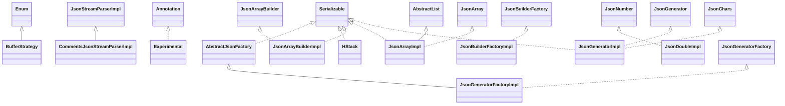

# johnzon-core-0.9.5.jar

[Group index](README.md) | [All archives](../README.md)

## Scope and provenance

- **Donor:** `SQX_145_REFERENCE_ROOT/internal/libs/johnzon-core-0.9.5.jar`.
- **SHA-256:** `f3854251548ce8c8d5d1c6975732fbf7b5a5f2dfb7a78d3c1138351e1f362378`; accessed 2026-10-06; captured `2026-10-06T18:54:51.906614+00:00`.
- **Classes:** 59 raw entries; 59 unique entry names. Duplicate occurrence indices are zero-based.
- **Inspection:** read-only ZIP hashing and class-file structural parsing; signatures/descriptors, modifiers, hierarchy and references only. Bytecode bodies are hashed, not published.
- **Allocation:** proposed `FEAT-HOST-JOHNZON-CORE`, P02; [roadmap](../../dev/sqx-full-application-roadmap.md). Domain README registration remains required.
- **Repository:** `01067f00031428613c6394064ca1bcadc1ba00ee`; review state unreviewed. Download label 145-dev1; installed build/activation and runtime equivalence unverified.
- **Limit:** every class/member is inventoried; declaration coverage does not establish consumed calls, defaults, formulas, failure semantics or algorithm parity.
- **Archive/resource index:** [062.json](../../dev/evidence/sqx145/archives/145/062.json).

## Complete member declarations

Member shards contain exact JVM names/descriptors, access flags, generic signatures, throws types, declared fields/methods, superclass/interfaces and referenced class names. All classes, nested/synthetic members and overloads are retained. Code length/hash is structural evidence, not a normalized algorithm comparison.

- [001.json](../../dev/evidence/sqx145/members/062/001.json) — SHA-256 `06c9391ff6f27f61de16db6c141fc4cdb9c00aaebffa1e0f7069c546a02881a8`.

## Focused structural diagram

Up to twelve non-nested classes; arrows show declared inheritance/interfaces only. External type names are not evidence of an available body or an executed dependency.

## Class inventory

| Archive entry | Occurrence | Class SHA-256 | Fields | Methods |
| --- | ---: | --- | ---: | ---: |
| `org/apache/johnzon/core/AbstractJsonFactory.class` | 0 | `d648b4c12576caaa4b9196853076833cbb03eb67d0da698e16dd7d4934fc0f05` | 4 | 5 |
| `org/apache/johnzon/core/BufferStrategy$1.class` | 0 | `3e942f4c8ac9cca0996e3747f287c39c01a836c0f7c4031ca8bd35dbf602e57f` | 0 | 3 |
| `org/apache/johnzon/core/BufferStrategy$2.class` | 0 | `11308fc33e4a94ee1b3cf32f97fb98d1f7a2c116c90d2db23fad600d23bdfe50` | 0 | 3 |
| `org/apache/johnzon/core/BufferStrategy$3.class` | 0 | `519b0ee5fbb65ecedeefd9ca5c25a78d0cd5f024b9998d315af561193f6041a3` | 0 | 3 |
| `org/apache/johnzon/core/BufferStrategy$4.class` | 0 | `3686f7d38bbe7e004881bca9478cdc870bd3d15493226445bc466bb8bb81ecdd` | 0 | 3 |
| `org/apache/johnzon/core/BufferStrategy$BufferProvider.class` | 0 | `dbbd0f4cc797a7d086876e0df55d7a9fdd12707010644c3d8de4fab0d648d52c` | 0 | 2 |
| `org/apache/johnzon/core/BufferStrategy$CharBufferByInstanceProvider.class` | 0 | `9169828f20caaf9a3bac55229992118825396bf66459596ddf19e40f0fc1040d` | 1 | 5 |
| `org/apache/johnzon/core/BufferStrategy$CharBufferQueueProvider.class` | 0 | `f67447f28159a123752e53cdbcc2e25390f3e3c5ca53168965d6d28041efcc0b` | 0 | 3 |
| `org/apache/johnzon/core/BufferStrategy$CharBufferSingletonProvider.class` | 0 | `00e529e8b308a2991c861290f58d95555ce8399ab7015c1f069d12229cbd9fd8` | 0 | 5 |
| `org/apache/johnzon/core/BufferStrategy$CharBufferThreadLocalProvider.class` | 0 | `bc72db411e3259712c172f74b143c0b60c0f5d4ffdd3733f6eaf44e6254e5d72` | 0 | 3 |
| `org/apache/johnzon/core/BufferStrategy$QueueProvider.class` | 0 | `707cceec0b84b70d1068af66233d44b231d36f92617ddfeb825324cf819f3e5d` | 2 | 4 |
| `org/apache/johnzon/core/BufferStrategy$SingletonProvider.class` | 0 | `63ad740ac265f0ced5bc02712460292ebd7d9d446f1b192d8070badef073c53d` | 1 | 4 |
| `org/apache/johnzon/core/BufferStrategy$StringBuilderByInstanceProvider.class` | 0 | `37d0e85c1c599cda56721f4233113a44eb39a5e72510e568100ce24babf0728e` | 1 | 5 |
| `org/apache/johnzon/core/BufferStrategy$StringBuilderQueueProvider.class` | 0 | `849fd18395c8fc46e13b984b9d2c5a115a3f494e7d42d9c47b4a937f3fb37e02` | 0 | 5 |
| `org/apache/johnzon/core/BufferStrategy$StringBuilderSingletonProvider.class` | 0 | `76d1ef68994f6eb037a24d727780b70593a92d047d7fc4843b3d329ca3e50338` | 0 | 5 |
| `org/apache/johnzon/core/BufferStrategy$StringBuilderThreadLocalProvider.class` | 0 | `b09c07b1712d832c689972031fd3c0440351b6765a5aeaff3e9d62477463370e` | 0 | 5 |
| `org/apache/johnzon/core/BufferStrategy$ThreadLocalProvider$1.class` | 0 | `99c2d7e0eef9ac946aae8f995830eab61f2c0182ba316b455dbfe0488cb6f92b` | 2 | 2 |
| `org/apache/johnzon/core/BufferStrategy$ThreadLocalProvider.class` | 0 | `14747042934063050f7e82700748d8013b6119c52581e6b48af07a11d984df31` | 1 | 4 |
| `org/apache/johnzon/core/BufferStrategy.class` | 0 | `df1fe65f93c8858a236fc5b9b50c708bf1cacf659eae810bba8a372181247bea` | 5 | 7 |
| `org/apache/johnzon/core/CommentsJsonStreamParserImpl.class` | 0 | `53e733aa20101bc5ead75500aac9cb7ca3989dfc9160ccc7ceb28e336a4ca728` | 0 | 4 |
| `org/apache/johnzon/core/Experimental.class` | 0 | `1f7d57daac4e77b5f7ba5eedb76488a0aa4178ef6cff1f09c09c15b5e6f31b10` | 0 | 0 |
| `org/apache/johnzon/core/HStack$1.class` | 0 | `e337c8789efb33910f6ad58de88efd9965c2fe033acb371f0034c6041ac1c07d` | 0 | 0 |
| `org/apache/johnzon/core/HStack$Node.class` | 0 | `6895586f0b0e2d192ae359fb553dc3b19a16173eada7b7559437847338a7a1f0` | 2 | 4 |
| `org/apache/johnzon/core/HStack.class` | 0 | `79aff45540c83aab5d9f14d53f08f5780b030a08bb462d0627b77dc91ed520d5` | 2 | 5 |
| `org/apache/johnzon/core/JsonArrayBuilderImpl.class` | 0 | `796db6a1b9c45d72e0b413a85e7430b2da940df3ada750ee530d9cbf4f915bd2` | 1 | 15 |
| `org/apache/johnzon/core/JsonArrayImpl.class` | 0 | `06d971e905ad09212846eed89449a53b5e76b91909f89967ba8e22bcbfe3ff8a` | 3 | 21 |
| `org/apache/johnzon/core/JsonBuilderFactoryImpl.class` | 0 | `060811ae7761ce9326485c9b6378e7a93eac76037a0870dd9835b532be7bcfe7` | 3 | 5 |
| `org/apache/johnzon/core/JsonChars.class` | 0 | `ba8e57e972b21ed6461bc997ba1154bb13f75ff3c7137db6e4586ac72ddbaab3` | 48 | 1 |
| `org/apache/johnzon/core/JsonDoubleImpl.class` | 0 | `0eec84b55a3b3fc154788ccaee7c6d970b21ebc19c0eda8a39a24057db98e62c` | 1 | 14 |
| `org/apache/johnzon/core/JsonGeneratorFactoryImpl.class` | 0 | `81ac801a76e2c87ab1c3a2d135207da7c6e45c4ecdb63742bdbeab6d4ab0e757` | 6 | 6 |
| `org/apache/johnzon/core/JsonGeneratorImpl$1.class` | 0 | `6d84b199e1ca6a25b3beb14b92b84f1c3e3f5c4a85e6e2e143b52ed76f00dc69` | 2 | 1 |
| `org/apache/johnzon/core/JsonGeneratorImpl$GeneratorState.class` | 0 | `54763f88f241f0b03c9a87e4d43965a1505b5c223b27d203de0e67eccc189316` | 10 | 6 |
| `org/apache/johnzon/core/JsonGeneratorImpl.class` | 0 | `495126f7fba3ec989cb6805c52cb6322b947095d328b70ce82cf737a1c6d4f85` | 11 | 54 |
| `org/apache/johnzon/core/JsonInMemoryParser$1.class` | 0 | `d33cc61e02baedbab1ee0fb01e7aba1c41dc089f34aa54c460e78a3ee6c13fd3` | 1 | 1 |
| `org/apache/johnzon/core/JsonInMemoryParser$ArrayIterator.class` | 0 | `bc9660c370f194bb27848e0f09c23784573dcc369c25d5443f085641da436ea6` | 3 | 5 |
| `org/apache/johnzon/core/JsonInMemoryParser$ObjectIterator.class` | 0 | `df9ba1f594912c2f274d989b28e719048a6eb49c7301553dada1dd0df7d10667` | 4 | 5 |
| `org/apache/johnzon/core/JsonInMemoryParser.class` | 0 | `8e2772c261032408fbbfc0df5898f99fa3fc2abd61c5aaf47f9d19fa1a8935e5` | 3 | 15 |
| `org/apache/johnzon/core/JsonLocationImpl.class` | 0 | `373c581cb0ca62bb0f61f8d472e565514ddb96a693579b30a2ebf9f968ca01e9` | 4 | 8 |
| `org/apache/johnzon/core/JsonLongImpl.class` | 0 | `699a3c1e0328a67fad21ff8afa95f09734137284f183c2b40b75417776a33599` | 1 | 14 |
| `org/apache/johnzon/core/JsonNumberImpl.class` | 0 | `5f58fee924e579d88b93f9c199d7cca6f86984a39b885ff2532327e4215fec2f` | 2 | 14 |
| `org/apache/johnzon/core/JsonObjectBuilderImpl.class` | 0 | `912aa96b473e8a7ba274d0ccff815ef33e560b9655173d3f5b9a7e889282db96` | 1 | 15 |
| `org/apache/johnzon/core/JsonObjectImpl.class` | 0 | `e10eb6e6389325397337f90ff92794c8ecd4bef9ee109c2ec6928226dd889893` | 2 | 18 |
| `org/apache/johnzon/core/JsonParserFactoryImpl.class` | 0 | `553e80974e7d1cf03ff0b5314ba1e5c50121bdd50acbc5f856adb28576337de2` | 11 | 14 |
| `org/apache/johnzon/core/JsonProviderImpl$JsonProviderDelegate.class` | 0 | `ec58c259e95fa0d79c418b728b82dd8589a533380a0cfa0ef8988049052d0bf0` | 5 | 16 |
| `org/apache/johnzon/core/JsonProviderImpl.class` | 0 | `3e25c13ea3153e39559eb592c8b5e3ba29b105f419dafde229e714512b3f536d` | 1 | 17 |
| `org/apache/johnzon/core/JsonReaderFactoryImpl.class` | 0 | `fb131ebbcc874d4c652148e081d8654bf147de4e1ea45fa5d872709e83ba0a66` | 2 | 6 |
| `org/apache/johnzon/core/JsonReaderImpl$1.class` | 0 | `20e674c36403db22dd29fe89e5c3dffae540ceae3abc653ed3b68b1f8d32592b` | 1 | 1 |
| `org/apache/johnzon/core/JsonReaderImpl.class` | 0 | `5b645b3b57cb1556ac1d4b3447c1329635fb569028f34b131dbe8c4b962d8e45` | 2 | 9 |
| `org/apache/johnzon/core/JsonStreamParserImpl$StructureElement.class` | 0 | `45f571321c9c2df0815b6b7e3972330633a00e03bf3c8bb56ded0a49681519d9` | 2 | 3 |
| `org/apache/johnzon/core/JsonStreamParserImpl.class` | 0 | `c8ca8301e8862b6100e5e40a03fa41d9b404890f1a2d9485d5b82d7c49c78d99` | 18 | 37 |
| `org/apache/johnzon/core/JsonStringImpl.class` | 0 | `e4adc591d4781bac6debdf0d0b79b8970936c49304173020a9350a8e42c7ba94` | 3 | 7 |
| `org/apache/johnzon/core/JsonWriterFactoryImpl.class` | 0 | `9a0a214c33a7b35a4900321be25e3b821f06072cb9bd85f2ec1d83779e7612bb` | 3 | 6 |
| `org/apache/johnzon/core/JsonWriterImpl.class` | 0 | `503c3753d5a2d99c8315693c8ff2881450368b99d410604091dbd024a5e8cba8` | 2 | 6 |
| `org/apache/johnzon/core/RFC4627AwareInputStreamReader.class` | 0 | `682716faaa6e9b48446dee97f92b1ec799d9d88c9e172ec84a05159790622e9a` | 0 | 4 |
| `org/apache/johnzon/core/SimpleStack$Element.class` | 0 | `8422e5aacac50bc76a539dff350a9e321a3ee6d3f6df1fb50d010ac61592f1ad` | 2 | 1 |
| `org/apache/johnzon/core/SimpleStack.class` | 0 | `fa0ceb43951c8317e286de6cd68f270f004914219d87ffc50296a83624a4f00f` | 1 | 5 |
| `org/apache/johnzon/core/Strings.class` | 0 | `c302c4ce4ffe1da1fe029c1c3677a1150e05870714405cd6e3b86abeee23ce83` | 4 | 5 |
| `org/apache/johnzon/core/ThreadLocalBufferCache$1.class` | 0 | `e27ac0a621768e43f6a88eb5c7e0f9183ade6c675a594958f0e611bc7ff4a1f5` | 2 | 2 |
| `org/apache/johnzon/core/ThreadLocalBufferCache.class` | 0 | `9a433fafdaf2e2163e7e33e05668ecee5ab099b98d93cb457ee6f06a22834132` | 2 | 4 |
