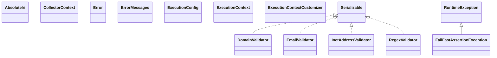

# json-schema-validator-2.0.0.jar

[Group index](README.md) | [All archives](../README.md)

## Scope and provenance

- **Donor:** `SQX_145_REFERENCE_ROOT/internal/libs/json-schema-validator-2.0.0.jar`.
- **SHA-256:** `ee940241043ae01801df5954bc3744bf723c449ff0da719f97e1b9a6889739d7`; accessed 2026-10-06; captured `2026-10-06T18:54:51.906614+00:00`.
- **Classes:** 313 raw entries; 313 unique entry names. Duplicate occurrence indices are zero-based.
- **Inspection:** read-only ZIP hashing and class-file structural parsing; signatures/descriptors, modifiers, hierarchy and references only. Bytecode bodies are hashed, not published.
- **Allocation:** proposed `FEAT-HOST-JSON-SCHEMA-VALIDATOR`, P02; [roadmap](../../dev/sqx-full-application-roadmap.md). Domain README registration remains required.
- **Repository:** `01067f00031428613c6394064ca1bcadc1ba00ee`; review state unreviewed. Download label 145-dev1; installed build/activation and runtime equivalence unverified.
- **Limit:** every class/member is inventoried; declaration coverage does not establish consumed calls, defaults, formulas, failure semantics or algorithm parity.
- **Archive/resource index:** [066.json](../../dev/evidence/sqx145/archives/145/066.json).

## Complete member declarations

Member shards contain exact JVM names/descriptors, access flags, generic signatures, throws types, declared fields/methods, superclass/interfaces and referenced class names. All classes, nested/synthetic members and overloads are retained. Code length/hash is structural evidence, not a normalized algorithm comparison.

- [001.json](../../dev/evidence/sqx145/members/066/001.json) — SHA-256 `6635d70e0ff640ddc6e6e5be7baddea71ac4cad27a52ffdf4520da0d693d8634`.
- [002.json](../../dev/evidence/sqx145/members/066/002.json) — SHA-256 `498025c94e161893a0c263a20059c68972e4cc40ebc3ca6315266862fc2a9fad`.
- [003.json](../../dev/evidence/sqx145/members/066/003.json) — SHA-256 `5d7ac545f7383667962e04fd32bb9852bc7185d80f603ea99bc8e818c123ad3e`.
- [004.json](../../dev/evidence/sqx145/members/066/004.json) — SHA-256 `89cb996718877adbacf9c36152c70f2c72c4e048d15b15e1b8371574c6a143ec`.

## Focused structural diagram

Up to twelve non-nested classes; arrows show declared inheritance/interfaces only. External type names are not evidence of an available body or an executed dependency.

## Class inventory

| Archive entry | Occurrence | Class SHA-256 | Fields | Methods |
| --- | ---: | --- | ---: | ---: |
| `com/networknt/org/apache/commons/validator/routines/DomainValidator$1.class` | 0 | `8509654d55e9e26ad5785cdb2432407c2f98b3dd1008dbd629db1738dda862c5` | 0 | 0 |
| `com/networknt/org/apache/commons/validator/routines/DomainValidator$ArrayType.class` | 0 | `8ad285b53617be19bf5b8683f4cfb173afdaf586748739608490a4dde93bf5ed` | 11 | 5 |
| `com/networknt/org/apache/commons/validator/routines/DomainValidator$IDNBUGHOLDER.class` | 0 | `b51c9da7a2b85e3587a6bf217ffa476243aa619bcc1143b513d7435a883d231f` | 1 | 4 |
| `com/networknt/org/apache/commons/validator/routines/DomainValidator$Item.class` | 0 | `115259531a1e0b1cbdd6017ed45dce87c2278c796044e3063acd505588a2d3cd` | 2 | 1 |
| `com/networknt/org/apache/commons/validator/routines/DomainValidator$LazyHolder.class` | 0 | `f83a57c454f3a4a37b0d9d1c36ee07a1ef9db38f46390d72c585582a4f648811` | 2 | 4 |
| `com/networknt/org/apache/commons/validator/routines/DomainValidator.class` | 0 | `ab1eec4bc6b5848f6b229e99fda30d9435ef1646d0e109cb67fbc424aab2a18a` | 27 | 22 |
| `com/networknt/org/apache/commons/validator/routines/EmailValidator.class` | 0 | `83c3f0a6cd94305626b7cd85c87aee7245c39f8822a4ad9f8a715c7261a3f3c9` | 18 | 10 |
| `com/networknt/org/apache/commons/validator/routines/InetAddressValidator.class` | 0 | `ffcb3de6238aa30ec31f6d82ccb533094de6617d6945181416bb724e8ed5346a` | 12 | 6 |
| `com/networknt/org/apache/commons/validator/routines/RegexValidator.class` | 0 | `49132240a93ee1dd583a9e914aecbe4a9b8626788a08bfd74dc34bd20b96a230` | 2 | 10 |
| `com/networknt/schema/AbsoluteIri.class` | 0 | `c66b50a68a5620443132d9dbf29c57736f1e21dffee8be8661f90bcaed98ba2a` | 1 | 13 |
| `com/networknt/schema/CollectorContext.class` | 0 | `86103b325a7a1e65bdb6d1cb97c7402a05eb63451881dfb748a23669e095d92e` | 1 | 6 |
| `com/networknt/schema/Error$Builder.class` | 0 | `0d9d7be949303f93853bd6c43bc9a9acc6042cc5cba779e12c755d5204a70b50` | 0 | 3 |
| `com/networknt/schema/Error$BuilderSupport.class` | 0 | `6d4fd46348987a295a57c74e36ac75984b12516631e559f8b4be290f4bd225eb` | 13 | 32 |
| `com/networknt/schema/Error.class` | 0 | `81727cdbb5c7a19db0b0ac3852b9474a13f042bd7808733092d46f284f242727` | 10 | 18 |
| `com/networknt/schema/ErrorMessages.class` | 0 | `5d737c2c75ad6480a104276d671dfab5b16b287efdfd5f28395bb06a0addeaaf` | 0 | 4 |
| `com/networknt/schema/ExecutionConfig$Builder.class` | 0 | `6d1a5ee27e7e25916b632426d0540e649fe07a5e9ac14a168fffe4cbf197b1ca` | 0 | 3 |
| `com/networknt/schema/ExecutionConfig$BuilderSupport.class` | 0 | `65a99be38d6efd9c474279b9b6e02f13d2a005a19156e39c532222b9f9612618` | 7 | 11 |
| `com/networknt/schema/ExecutionConfig$Holder.class` | 0 | `90abec233ba44eef55e2a9d5fe3f31b30a5d63e75ab20407a5a5debfb9a0960d` | 1 | 3 |
| `com/networknt/schema/ExecutionConfig.class` | 0 | `74325c9881eec767b4d1d293b6447edd956035d5ba7715da109b4baea488a932` | 7 | 11 |
| `com/networknt/schema/ExecutionContext.class` | 0 | `3a9a832914ec94e04aaacb7035f4bf4abd99f4e275f249a7dcd1d7620bff2244` | 12 | 29 |
| `com/networknt/schema/ExecutionContextCustomizer.class` | 0 | `05dd5fbbfa5bc0a2b60747706c89e3b315817ea10478ffebbc9862a471fd6ea1` | 0 | 1 |
| `com/networknt/schema/FailFastAssertionException.class` | 0 | `c7d82acd87700b2fb848528f73552c3ef3a5477a2874e5d0d08c5e741c8d5b83` | 2 | 5 |
| `com/networknt/schema/InputFormat.class` | 0 | `a8081f3979c085929e98eb2472f5500d66f00a0db2b67c80bef323e4619e9718` | 3 | 5 |
| `com/networknt/schema/InvalidSchemaException.class` | 0 | `97ebba6f0bc3c208c948a1b0898efed26ae5f5e01a8e61de28f1868e4dbcb618` | 1 | 2 |
| `com/networknt/schema/InvalidSchemaRefException.class` | 0 | `1c741e2aad165f81c9a6458af5fae8af6d4b67a8e7300fa0f7abba3ec0f0403f` | 1 | 2 |
| `com/networknt/schema/MessageSourceError$Builder.class` | 0 | `78952952f5319f20cec5d6b261c390a0f26f14f0bb137c7ce44ef17bbf720b30` | 0 | 3 |
| `com/networknt/schema/MessageSourceError$BuilderSupport.class` | 0 | `eea3255593bec77df8015ed39bef62a3cb390b7de99dbe5be37d3c888964ba58` | 3 | 4 |
| `com/networknt/schema/MessageSourceError.class` | 0 | `d6f0abc74aa22f1711f69140c6ae4fa42157e26fb030dfcc813f78b5ec5e86b8` | 0 | 2 |
| `com/networknt/schema/OutputFormat$Boolean.class` | 0 | `f59fcfb2a888abbfdf1b50ef674197b55de6982475e07e52397047aa5d24e8eb` | 0 | 5 |
| `com/networknt/schema/OutputFormat$Default.class` | 0 | `7b5a5e0f76f1339ea9dee3e33adbd066cf8ed6f2343246f435bc6e8efafe3315` | 0 | 5 |
| `com/networknt/schema/OutputFormat$Flag.class` | 0 | `45eb930a5d6f24797a7f834f486a4fccc05215bb8eda45f7f8f46b3b856eaf40` | 0 | 5 |
| `com/networknt/schema/OutputFormat$Hierarchical.class` | 0 | `35ff73f5f37232c233c9c1f39f72383049275066051eecf32ae3f111c1838f5b` | 1 | 5 |
| `com/networknt/schema/OutputFormat$List.class` | 0 | `edd5ee1d7a8cabf49d2e93f66102000d2eb7a1292280073f3485b02d673d62a7` | 1 | 5 |
| `com/networknt/schema/OutputFormat$Result.class` | 0 | `247f814fded6ea104223d1f01a74388979935c229886e4426c1f0cf6a9125c4a` | 0 | 4 |
| `com/networknt/schema/OutputFormat.class` | 0 | `789c97c09e72be26efb0f0e60cb0b2e7a713a31e31e5c287ffc9cba8e5b25c58` | 6 | 3 |
| `com/networknt/schema/Result.class` | 0 | `e62ae9838d33dea95bdf6be14a8385613bea43cb0ce3d9839235859c582b7881` | 1 | 4 |
| `com/networknt/schema/Schema$JsonNodePathJsonPath.class` | 0 | `d558873fe182c845b5a365bf476bad2b0da8bc45cc616dc330b7f3badae55287` | 1 | 3 |
| `com/networknt/schema/Schema$JsonNodePathJsonPointer.class` | 0 | `8b45f99e14ad21e6f8ccb655b3c1c9b3ccf6a7fe98e004dfb779607c6b011544` | 1 | 3 |
| `com/networknt/schema/Schema$JsonNodePathLegacy.class` | 0 | `89b965cad1f2af00f93311e0ed6e36c21575b488d13a5a57c1c7ce146acb1aa7` | 1 | 3 |
| `com/networknt/schema/Schema.class` | 0 | `3383086861e24285ec1803063bc427b6efa979026e5db909405df850bacaa06a` | 13 | 95 |
| `com/networknt/schema/SchemaContext.class` | 0 | `77d79f1d6ca6f5f0f5bfbe27d4549778aafeb4b6609ce64598c82c1ec33ff24d` | 7 | 13 |
| `com/networknt/schema/SchemaException.class` | 0 | `25727776a9525d79d413cbf3f334e6f57d1b495e64a446460c1b41f1271e0590` | 2 | 6 |
| `com/networknt/schema/SchemaIdValidator$DefaultSchemaIdValidator.class` | 0 | `f6b693539bb35d2d075975b9636476728ef12b5c82efea61d4a7b7474c76fd64` | 0 | 6 |
| `com/networknt/schema/SchemaIdValidator.class` | 0 | `13cba10f14ae6cb211e5e0935bcdbd397bc496a5996e123c2e61c731e11b75a1` | 1 | 2 |
| `com/networknt/schema/SchemaLocation$Builder.class` | 0 | `6710a3361c486735712dcb4b48c2ea0d235145d0b9a51a7059897a2f7c55cdfe` | 2 | 6 |
| `com/networknt/schema/SchemaLocation$Fragment.class` | 0 | `6d7fb1f220a8b76dcdd15fa104b30a4ed8cac847a1d7cbde4959b04995240209` | 0 | 6 |
| `com/networknt/schema/SchemaLocation.class` | 0 | `f80d440f47b8051e9a39808ad0b88e74d2ce487ae12cd5c5a4985810358250ea` | 6 | 16 |
| `com/networknt/schema/SchemaRef.class` | 0 | `088716568110358801e4f4c0e4fceaa38c8be0fc6fd8a654a5f8eb2dc7c51a26` | 1 | 2 |
| `com/networknt/schema/SchemaRegistry$1.class` | 0 | `848ec3ac38caad2e5a37ed6d0361f5262331207981635548b22b07e553dc14fb` | 0 | 0 |
| `com/networknt/schema/SchemaRegistry$Builder.class` | 0 | `e1d55657edadb905df8087dfb450f5d3854ed2692779bcc6c12df2264b454dc1` | 6 | 18 |
| `com/networknt/schema/SchemaRegistry.class` | 0 | `6798f191065cb08382b74f98f01a2015e1afc0e47df41bf81ef3b733dd01ed08` | 8 | 41 |
| `com/networknt/schema/SchemaRegistryConfig$Builder.class` | 0 | `01e798f1db8ed68721bd4f54e1b5c39f09c7c3e6695581c7a9fd0da0c37a407e` | 0 | 3 |
| `com/networknt/schema/SchemaRegistryConfig$BuilderSupport.class` | 0 | `90f808d718e8a527b435c578b24f2e87635d937349f3de834b570fc6bc75b629` | 14 | 18 |
| `com/networknt/schema/SchemaRegistryConfig$Holder.class` | 0 | `7ac8caae1ca53fe9ad3eb5391703196235c9e6a7f793ac3504fc88e369cdf216` | 1 | 3 |
| `com/networknt/schema/SchemaRegistryConfig.class` | 0 | `4a5e98dfa5ef8ba20d4c99ae8107d2fc50da942862d5c9ca8e9f460e5985f679` | 14 | 19 |
| `com/networknt/schema/Specification$1.class` | 0 | `bd4b6faa1213208a8463a1d8efb3750daee5ea95ade493ebf7a706191774ecfa` | 1 | 1 |
| `com/networknt/schema/Specification.class` | 0 | `7292abf9f831156481246c54f4f5c7e24128fa3e10d966f33e5c004ff571987b` | 0 | 3 |
| `com/networknt/schema/SpecificationVersion.class` | 0 | `694d27a7df5274237c2f2760d333010905c574248ac8583e0620bd4165ef6fe6` | 8 | 8 |
| `com/networknt/schema/SpecificationVersionRange.class` | 0 | `f6c66b7c6b46e0438dcd1ea3a9d021729633244fefd8a46ed047efd5d205b31e` | 13 | 6 |
| `com/networknt/schema/Validator.class` | 0 | `8cee2574461a047a5533d614fbc841c328d03453f58480964593b695369defc9` | 0 | 3 |
| `com/networknt/schema/annotation/Annotation$Builder.class` | 0 | `35d5ed7cf0401864a8a98a27f640960de88a31a1a7336007978fa3d43461ac42` | 5 | 8 |
| `com/networknt/schema/annotation/Annotation.class` | 0 | `623834e58a0a2d849af9f34f00435af930785dee1218355c5aca3e41e5dfe5d4` | 6 | 12 |
| `com/networknt/schema/annotation/AnnotationPredicate$Builder.class` | 0 | `e4948577d2b5dfd2cc2402ab6b87243f970838741222aeb9d27ea9b275a3b1ad` | 5 | 7 |
| `com/networknt/schema/annotation/AnnotationPredicate.class` | 0 | `7578ff1f68580f9aa2a091c8543dcd91f1c29bcb135b928c71d910e57ebe1b13` | 5 | 9 |
| `com/networknt/schema/annotation/Annotations$Formatter.class` | 0 | `c0c928012ce2fd79efc55fa03df5aa08a4f3814a06843f418cef40154b31a3bf` | 0 | 4 |
| `com/networknt/schema/annotation/Annotations.class` | 0 | `fb2ae64f4d2bb5349f4c980af7bc4faf452eddaa70c7e4e00f54bc98ff162a66` | 1 | 5 |
| `com/networknt/schema/dialect/AbstractDialectRegistry.class` | 0 | `1447479e328c784db19118cf9f7a003f7305c1feaf8380c624f5b1c61b701060` | 0 | 3 |
| `com/networknt/schema/dialect/BasicDialectRegistry.class` | 0 | `92609d16b5febe6263aed309868cb9103d5baabb57cc96982eab47342e009815` | 1 | 6 |
| `com/networknt/schema/dialect/DefaultDialectRegistry$Holder.class` | 0 | `cbfa859a244d85bd18dc1127664a9431571429d06c9b59207b7c1c0852163b91` | 1 | 3 |
| `com/networknt/schema/dialect/DefaultDialectRegistry.class` | 0 | `c352c91228a8f13921a379b15307f579f562799f905f0b413ca48ee7b8fcc3dd` | 1 | 7 |
| `com/networknt/schema/dialect/Dialect$Builder.class` | 0 | `ddd8f993bf99e9bd0ff77cec9adc60d18b35392d055522cc1e9a81755d8d25e0` | 9 | 24 |
| `com/networknt/schema/dialect/Dialect$FormatKeywordFactory.class` | 0 | `10197e27956752a41c6d7185963c63af41427beb8177867cc21411a4eec26437` | 0 | 1 |
| `com/networknt/schema/dialect/Dialect.class` | 0 | `793519502e7db77b596b082089cf5071552d8999ea004b14a6d630ce6598d1ae` | 7 | 18 |
| `com/networknt/schema/dialect/DialectId.class` | 0 | `4ce1e9f24354f8716feaef40a683e7678f1a1face682232d65cec5b816bfebd9` | 7 | 1 |
| `com/networknt/schema/dialect/DialectRegistry.class` | 0 | `7a46b58627ccc9e1cdb6a265588b3e37369098259d7ebf0b8bc9b541121d816f` | 0 | 1 |
| `com/networknt/schema/dialect/Dialects.class` | 0 | `69b382770b44a5fff375607a18ecc6144c279db80534e4b2aeed27f34cfb9db0` | 0 | 8 |
| `com/networknt/schema/dialect/Draft201909$Holder.class` | 0 | `c4aad5b7628f5a27662a3902c3f9f3ab0b140c2f7f2300bfe19916a88c260ed7` | 1 | 3 |
| `com/networknt/schema/dialect/Draft201909.class` | 0 | `83bfff529cab7757113cc92bfdb0af5743338d72d4d3697903dba66bcfb72e4c` | 3 | 4 |
| `com/networknt/schema/dialect/Draft202012$Holder.class` | 0 | `e52ad01ca35cc894d9e40294f0c152d8f92e340ee2bdbbaac58e3695505bf480` | 1 | 3 |
| `com/networknt/schema/dialect/Draft202012.class` | 0 | `a08a7be70d6799794ea04350d70c24372340fe961536f393cd2eb36a28601a0c` | 3 | 4 |
| `com/networknt/schema/dialect/Draft4$Holder.class` | 0 | `10ff0e3b277b50a93f2fbc70714dac71c728ad3c24350755e624b2ca4f093077` | 1 | 3 |
| `com/networknt/schema/dialect/Draft4.class` | 0 | `2f4c115bb5625f5c6343c56df41a8e54326bd0280b3f885b2f7ba7936f9e443e` | 2 | 2 |
| `com/networknt/schema/dialect/Draft6$Holder.class` | 0 | `96d093ec7068cc6665bc1cfe83ade31d1894f8b0e787bf9ad32026e117593e28` | 1 | 3 |
| `com/networknt/schema/dialect/Draft6.class` | 0 | `8c81d711bd660e873350d29d9efe0f5959ec814a31014c3317eaa14d94a102a9` | 2 | 2 |
| `com/networknt/schema/dialect/Draft7$Holder.class` | 0 | `2b0aa02ce559f7b445b3093440dfa15015edf49071e26714d987e85fcef47863` | 1 | 3 |
| `com/networknt/schema/dialect/Draft7.class` | 0 | `901ebd9ed9e4f27af53ad923836be666d2eca7a4ad68e014427eb948bb9a3bda` | 2 | 2 |
| `com/networknt/schema/dialect/OpenApi30$Holder.class` | 0 | `194f41a3a757047335773fa7f5de28bac05b2d8d190c7659659ca2456cb7c02b` | 1 | 3 |
| `com/networknt/schema/dialect/OpenApi30.class` | 0 | `c5695bb1d1b4026a09b8c99148d41a8658e0e964d3ad7464279d00fecd508b94` | 2 | 2 |
| `com/networknt/schema/dialect/OpenApi31$Holder.class` | 0 | `37559d0a630270a78a49974e8254d20daeeafa99b5883cd23e5c97e2f9fed1d1` | 1 | 3 |
| `com/networknt/schema/dialect/OpenApi31.class` | 0 | `c1037c33ff03fb069b65e831b0467d02e1ffa07ab4d9ed7b0a70d2052a00dd91` | 3 | 4 |
| `com/networknt/schema/format/AbstractRFC3986Format.class` | 0 | `a2ad4446c608a2991082c4f3920bd50ffcfd11a511a30a4c34e8d541483d59bd` | 1 | 5 |
| `com/networknt/schema/format/BaseFormatValidator.class` | 0 | `d893c3cbf8cd42d5dde8412756b720654283c9438526015830369ce5e06c5665` | 1 | 4 |
| `com/networknt/schema/format/DateFormat.class` | 0 | `c61ad276a9135938bb8168eeb1265b49bf482d9d009ed8cbc8c40a7ca91c4354` | 0 | 4 |
| `com/networknt/schema/format/DateTimeFormat$Ethlo.class` | 0 | `129710fe7577390c1c5721779e3c37bf6484ba43ee402af24be1b06e4137ddf4` | 0 | 2 |
| `com/networknt/schema/format/DateTimeFormat$JavaTimeOffsetDateTime.class` | 0 | `3f70165aa12058145fecc7b2c9676d981d2115825242adef86a199bec5a3c445` | 0 | 2 |
| `com/networknt/schema/format/DateTimeFormat.class` | 0 | `34205764eacfb171e25f99f5dce6af917a6bbfe48fd544c4084651b633fe95a4` | 3 | 6 |
| `com/networknt/schema/format/DurationFormat.class` | 0 | `1fe0d3c40acae8c4748965f314766206c717c9a001fb9e608ce3424facf3b36d` | 3 | 6 |
| `com/networknt/schema/format/EmailFormat.class` | 0 | `a58fe825c702915dd93f63b6e9283067fbf04ff623edead4ddbe9928dae841c9` | 1 | 5 |
| `com/networknt/schema/format/Format.class` | 0 | `fc71546243c9dd6c45e514bfa9a82ee97fc6233afb2e8e8cb2892491a9ba436c` | 0 | 7 |
| `com/networknt/schema/format/Formats.class` | 0 | `549b43532c97778ec4b9e55590b61d056349799084f20252e78c1ff94144c5a1` | 1 | 4 |
| `com/networknt/schema/format/IPv6AwareEmailValidator.class` | 0 | `02dfe53c76586b633cfa999002bcc7577ef3d6e8d5fad50d3f513993b63a0b4e` | 1 | 2 |
| `com/networknt/schema/format/IPv6Format.class` | 0 | `378007fd52579dad443167c820fd4f44bbbdea3f498cde5ca95e01317de1adba` | 2 | 5 |
| `com/networknt/schema/format/IdnEmailFormat.class` | 0 | `6708c715292688fc0072e1de1da197a784e87824b05dccd80f4d753ed891794d` | 1 | 5 |
| `com/networknt/schema/format/IdnHostnameFormat.class` | 0 | `4f6eb7dbaf3ace91a9d9702254a646b4e354c211dbf7878ea3767c6841abbfc5` | 0 | 4 |
| `com/networknt/schema/format/IriFormat.class` | 0 | `e959225ad8ced5d65f97aef268392178665cd509f1124e465fe574f265025eb2` | 0 | 4 |
| `com/networknt/schema/format/IriReferenceFormat.class` | 0 | `5e8d224dbb3716a47a4c46667b282de2751cf3d68bc89e43a59d4cbf53dc7eeb` | 0 | 4 |
| `com/networknt/schema/format/PatternFormat.class` | 0 | `a9fe57fcf1ded5926524ade702de3b7e4c12c46b264a2adfdb33d9f4562166b7` | 3 | 5 |
| `com/networknt/schema/format/RegexFormat.class` | 0 | `e297bfec014c5129a0aabd767486967a2362db593f4c129a580da9d247124fc0` | 0 | 4 |
| `com/networknt/schema/format/TimeFormat.class` | 0 | `92d4f8513b0a30446191fb4869ec60d7343e56278dc8e92710c1e20e5a972ebf` | 3 | 6 |
| `com/networknt/schema/format/UriFormat.class` | 0 | `5b5f79653e802e7fcaca4dca1e167b183a2093fbbbe543beb7f40c41f50064d1` | 0 | 5 |
| `com/networknt/schema/format/UriReferenceFormat.class` | 0 | `63c437ba93a022b1e83f2aae930b34e27c41497452ef06a3b0b26fb02d2dbd35` | 0 | 5 |
| `com/networknt/schema/i18n/DefaultMessageSource$Holder.class` | 0 | `85df56b572a48ddc339946fd5d2723aaf4a6eca18470a4b130e78a7c371f4d49` | 1 | 3 |
| `com/networknt/schema/i18n/DefaultMessageSource.class` | 0 | `ad07590c70fa918cc884f85c4f126a0dc0a9f55b3d34ce83dbc7025f838bc7df` | 1 | 2 |
| `com/networknt/schema/i18n/Locales.class` | 0 | `a3de18564b935caa452c745937a20d81200304a7c354ad69f9d11f6eae574ee5` | 2 | 7 |
| `com/networknt/schema/i18n/MessageFormatter.class` | 0 | `4ababcac505e7ff8c0c017754a5b2b4f931b728e06bec322daa7bbd06b03dead` | 0 | 1 |
| `com/networknt/schema/i18n/MessageSource.class` | 0 | `685c307ae2b2908d9470d03ac92f3c9b745c10ad667930a3248542058c56b11f` | 0 | 3 |
| `com/networknt/schema/i18n/ResourceBundleMessageSource.class` | 0 | `55b743b65b7eee056de775c78e95a64a236863104e9949b4215fda6bf7a3f528` | 4 | 15 |
| `com/networknt/schema/keyword/AbstractKeyword.class` | 0 | `5a4049ff193e7c470118e87c435185a24fb2e2cbcc9c23a9a0eb8f6d9f5f9dec` | 1 | 5 |
| `com/networknt/schema/keyword/AbstractKeywordValidator.class` | 0 | `830ed608164ecea26959ff273b7f950ec2b6e551675d2015362ed6e2f63a86ba` | 3 | 12 |
| `com/networknt/schema/keyword/AdditionalPropertiesValidator.class` | 0 | `75d9c3a104b3f63afcccd5ee54d11c67612c520bc825fefeb286865a4a8b82ca` | 4 | 6 |
| `com/networknt/schema/keyword/AllOfValidator.class` | 0 | `12a1c203a22732f3d147a2d553914bf95aa7c409f12960a78c2e0f87fd541738` | 1 | 5 |
| `com/networknt/schema/keyword/AnnotationKeyword$Validator.class` | 0 | `9c2d3f3b2e951d7fde3129d752f61c733b45fdae3e1b12d0ce1fa25cef8210c5` | 0 | 4 |
| `com/networknt/schema/keyword/AnnotationKeyword.class` | 0 | `2bb23b4453ccdae440ed871ba8ab66a5304031731653dcb028933f24f8dab0c4` | 0 | 2 |
| `com/networknt/schema/keyword/AnyOfValidator.class` | 0 | `d26dde70b55d1088773ad5f015b540ca5b286bc15fff5651181f8d7d60b0362c` | 1 | 6 |
| `com/networknt/schema/keyword/BaseKeywordValidator.class` | 0 | `cbd07e842985ff5aaf800dde07469aa8da066961238b2948440b7bceeb6ebb8d` | 3 | 6 |
| `com/networknt/schema/keyword/ConstValidator.class` | 0 | `93cf07fe47645db0eb258bb77e9bd56b45ac48c4120b7571184e5cd0e73a4982` | 0 | 2 |
| `com/networknt/schema/keyword/ContainsValidator.class` | 0 | `d442e9b13bc4e90478219e8d6a327b3aa2ec1c74ed6aaa0f695110d839eeb553` | 6 | 4 |
| `com/networknt/schema/keyword/ContentEncodingValidator.class` | 0 | `1f424233055d5b0b9d4feefa4a601d5bab65f38d2987a0c24c2dba8b4039bd90` | 1 | 4 |
| `com/networknt/schema/keyword/ContentMediaTypeValidator.class` | 0 | `28b8072360c0b17774bcc3879fc2abe4ca3596b01a01ae69dc62188c032ddcd4` | 3 | 5 |
| `com/networknt/schema/keyword/DependenciesValidator.class` | 0 | `af3c74b454429490ff2ece2a84541965a53b5b2873d7f72f86c7a82c96781a3f` | 2 | 3 |
| `com/networknt/schema/keyword/DependentRequired.class` | 0 | `1ed2237ca28d99544d07ba10891c376a0c2061b59d0c08eb82a15a8c6caa1c9c` | 1 | 3 |
| `com/networknt/schema/keyword/DependentSchemas.class` | 0 | `5d415afabde7b1b3e4bc90a0ea66d3f8caa32e8474a528988a2338bc0764c31e` | 1 | 5 |
| `com/networknt/schema/keyword/DisallowUnknownKeywordFactory$Holder.class` | 0 | `90a0c02b1c72ddc3fb0a33fc09d5fbab2887756338634bc3c358418ed9a2d0b4` | 1 | 3 |
| `com/networknt/schema/keyword/DisallowUnknownKeywordFactory.class` | 0 | `f377d25a5c7d8b7fff3ab12c07ccef88659f32d1640d3358432dc1e359a76776` | 1 | 4 |
| `com/networknt/schema/keyword/DiscriminatorState.class` | 0 | `d331402bb61ad1f1f676c4d6781600fd78c9fe975e3c33954c2da53cb3410ef8` | 5 | 15 |
| `com/networknt/schema/keyword/DiscriminatorValidator.class` | 0 | `cfd45e2a05d149d032fc7d3f744f24fa3874d1c2d1cda5f2e49ab472ff878e29` | 3 | 4 |
| `com/networknt/schema/keyword/DynamicRefValidator.class` | 0 | `349cee558e271ebd67411e048505f3bb63930727c3277d7f666492fa92312379` | 0 | 8 |
| `com/networknt/schema/keyword/EnumValidator.class` | 0 | `99a91931e1666cbe97360a37bc3dbc7f3dbe7023b2a01031ffd9593f98aa6823` | 2 | 7 |
| `com/networknt/schema/keyword/ExclusiveMaximumValidator$1.class` | 0 | `96b519475a3ebd82e581007f4726abdd38d2835a80e65e48257e26017f088b0a` | 4 | 3 |
| `com/networknt/schema/keyword/ExclusiveMaximumValidator$2.class` | 0 | `be4c5fd90563dc639428873afb8e1cb697e3c5e48f2facba8bf6f76a945cc351` | 3 | 3 |
| `com/networknt/schema/keyword/ExclusiveMaximumValidator.class` | 0 | `a436f7470f2807c81777e2f681844757d459d46514c8b32c304d3b300e5dd210` | 1 | 2 |
| `com/networknt/schema/keyword/ExclusiveMinimumValidator$1.class` | 0 | `f974639596dd8fb7fad150c44741013b2388682bcfad05a322405161e1b98e63` | 3 | 3 |
| `com/networknt/schema/keyword/ExclusiveMinimumValidator$2.class` | 0 | `1f42b87b2fe4bb9255440f6d361ce3a28ae526b31f85c2cf6a5bb8d648709062` | 3 | 3 |
| `com/networknt/schema/keyword/ExclusiveMinimumValidator.class` | 0 | `5678cbb9d1534f9a5b51a9fb0ff77b9716f7edb451388f4a6dbdd455bc46c190` | 1 | 2 |
| `com/networknt/schema/keyword/FalseValidator.class` | 0 | `87c2d9303b671458dd768f06ae4aebe54f69b24394e9aef9ff65d570cfc21ea5` | 0 | 2 |
| `com/networknt/schema/keyword/FormatKeyword.class` | 0 | `e6434ead9c6f2e7cab5c076bac30583712506c2596e78f31b5d59b2599eb63dc` | 2 | 6 |
| `com/networknt/schema/keyword/FormatValidator.class` | 0 | `aeb09788264907e5804e34f2b03f058fbc702aff83ef558bad8b8c17eef50f09` | 2 | 9 |
| `com/networknt/schema/keyword/IfValidator.class` | 0 | `17be7400aa94e1cdca9884fa3125a20b1b7195d8ea18c2d356f0803b2974d551` | 4 | 5 |
| `com/networknt/schema/keyword/ItemsLegacyValidator.class` | 0 | `5d4578176d1b22251e260c72ada91cc9c018b4c7353b99f610e68dfbb42bb2fc` | 7 | 9 |
| `com/networknt/schema/keyword/ItemsValidator.class` | 0 | `fa2e23b9e6b9c72ee86567cae1abf8eb3043e1bede8bcd17f4241030b8b6eb17` | 3 | 7 |
| `com/networknt/schema/keyword/Keyword.class` | 0 | `aeb7e115d6fdfa08d7cf9261afbbf8e1262a8cded2c9f764be7c093bb1aeafe6` | 0 | 2 |
| `com/networknt/schema/keyword/KeywordFactory.class` | 0 | `4d646cee4258773a2544723935ebfad197c781073fe3b11a36e3482b1bbb8699` | 0 | 1 |
| `com/networknt/schema/keyword/KeywordType$1.class` | 0 | `120429de2f4477162ed1f336a96e20002c97e8e06ea1ca792ff6728c3c288a8c` | 0 | 2 |
| `com/networknt/schema/keyword/KeywordType.class` | 0 | `b4838ff8ba8ae148f8a8b455d7fafbf03981d4bed75b051f526573fa39c3460e` | 57 | 12 |
| `com/networknt/schema/keyword/KeywordValidator.class` | 0 | `e193cb5af69fdc2d45afe63868af2e7906d5e4c277ac29b09642da0e94fab74e` | 0 | 2 |
| `com/networknt/schema/keyword/MaxItemsValidator.class` | 0 | `21d53583fe939fa488aa2024ec7460481665e6542d4902ac60b286176720a1db` | 1 | 2 |
| `com/networknt/schema/keyword/MaxLengthValidator.class` | 0 | `f8aefa0becdced8e00ffcb105d3b0faa1f2e1e788195d438eef99abb1601c57e` | 1 | 2 |
| `com/networknt/schema/keyword/MaxPropertiesValidator.class` | 0 | `5f13166986d7eec9874b1e8f55ae4e7215e5dc0782e5d387c15cf1dbc856a1ff` | 1 | 2 |
| `com/networknt/schema/keyword/MaximumValidator$1.class` | 0 | `4003334bc329207bb927a1feb642e20b23ebe93fdf3fc4b5d444884929333441` | 4 | 3 |
| `com/networknt/schema/keyword/MaximumValidator$2.class` | 0 | `552384dd92f877216924000367efb328d81ceb05d4cae5bc06d13c85393cfd89` | 3 | 3 |
| `com/networknt/schema/keyword/MaximumValidator.class` | 0 | `a33a38ffe332dde34bca7b6cc04134df884f092a9dbacb87727674ccdd1bc23c` | 3 | 3 |
| `com/networknt/schema/keyword/MinItemsValidator.class` | 0 | `e26a61d2206775dc2dc8567462f74b3c3b96d58094795f2d802fc5bad5ccd855` | 1 | 2 |
| `com/networknt/schema/keyword/MinLengthValidator.class` | 0 | `3ae1571cee7076abce2a83e2aecd916dcdc7e3d375bd18493b690b70232d6442` | 1 | 2 |
| `com/networknt/schema/keyword/MinMaxContainsValidator$Analysis.class` | 0 | `3111b9746a6073fb2df73ffcd64179f000b8120a18820724b619198c93f76b42` | 2 | 3 |
| `com/networknt/schema/keyword/MinMaxContainsValidator.class` | 0 | `32161b700c81a048b45aebae9c6193d86444ab77aef892c9daed3d9c48084342` | 1 | 3 |
| `com/networknt/schema/keyword/MinPropertiesValidator.class` | 0 | `1dea5d057234d48a457f0364b7be29416fe12151931b2a15c4a8e11c24d20090` | 1 | 2 |
| `com/networknt/schema/keyword/MinimumValidator$1.class` | 0 | `775660fdc52834feab986768d58157c3ae6697779fbe26bf82524389a1ffbbf9` | 3 | 3 |
| `com/networknt/schema/keyword/MinimumValidator$2.class` | 0 | `3a7097fa71cb0f915bebdeb8a3cdd6fe9b0b141b0badf1b10638dfcc473e36e9` | 3 | 3 |
| `com/networknt/schema/keyword/MinimumValidator.class` | 0 | `d6f25db74fe5d44a9044ddc8da3c51984c61fc090dca8d08e148ebfb9d07ee11` | 3 | 3 |
| `com/networknt/schema/keyword/MultipleOfValidator.class` | 0 | `6caa460c87edfd0b27a47a1584c3877279a08dd95b695edc36c0baffea39d605` | 1 | 4 |
| `com/networknt/schema/keyword/NonValidationKeyword$Validator.class` | 0 | `21ac9566708a489c23612ad9193511fc09b3bba22fedafa3f246c00718d67c51` | 0 | 2 |
| `com/networknt/schema/keyword/NonValidationKeyword.class` | 0 | `88cb00b832b8a72d566061f5cbab4158a5946ec2f7e095ca3bee50ca316c175f` | 0 | 2 |
| `com/networknt/schema/keyword/NotAllowedValidator.class` | 0 | `40cec732f11ef767a4d094810589c87668bb90bb2c452a65ed409213900ab69e` | 1 | 2 |
| `com/networknt/schema/keyword/NotValidator.class` | 0 | `049079567601b50cbcae0950195498613a57b0978294124964bba6ac7798695b` | 1 | 5 |
| `com/networknt/schema/keyword/OneOfValidator.class` | 0 | `beae6804ec2330566de610614049404bcb34dc86cbf99eeb4a81abdd8caa06be` | 1 | 7 |
| `com/networknt/schema/keyword/PatternPropertiesValidator.class` | 0 | `8194fcb1a2e8508f4c572e8d7688f66c217454a3f105dd52d6c1baa6cf1fca96` | 2 | 3 |
| `com/networknt/schema/keyword/PatternValidator.class` | 0 | `1d1fb4ce2b8f295163771748dd501f0230aa8b498b31f8ff743cb6f112a018c8` | 3 | 4 |
| `com/networknt/schema/keyword/PrefixItemsValidator.class` | 0 | `3542ab76387a70fdc430651043417a0bfc6c962d75f39d8ea0f3a85d9e5ded42` | 1 | 8 |
| `com/networknt/schema/keyword/PropertiesValidator.class` | 0 | `fcaa49454e160574f2c83529b07c854359f6aba40a8aead9f569c34c3def318b` | 2 | 9 |
| `com/networknt/schema/keyword/PropertyDependenciesValidator.class` | 0 | `ee4c95c0c124969052c0bcaaf61fa01b87c0f37f85546c422aace71dabd45575` | 1 | 6 |
| `com/networknt/schema/keyword/PropertyNamesValidator.class` | 0 | `4b17c96a581e2c03987f0b85a7f0a6f7193ec63e221a1e01544016d4428af7e3` | 1 | 3 |
| `com/networknt/schema/keyword/ReadOnlyValidator.class` | 0 | `f30fc5e3a6a323e046c84e1988d8067fcab5d8647d09ad5fcd2145b2169a12e7` | 1 | 3 |
| `com/networknt/schema/keyword/RecursiveRefValidator.class` | 0 | `6416793bc886b156ee66cd67ddb4127eba8de67ef93dac3472bd1a812e592fb3` | 0 | 6 |
| `com/networknt/schema/keyword/RefValidator.class` | 0 | `584cd474c9f4680d8651736f23886581c16b39243077fc5dc767509fb90982bd` | 2 | 14 |
| `com/networknt/schema/keyword/RequiredValidator.class` | 0 | `c3f860ba818dc185e211186e1a869ca56ff4b824a9d9bc71ac9fc9b3afffbcfc` | 1 | 3 |
| `com/networknt/schema/keyword/ThresholdMixin.class` | 0 | `378c105c36d0967313deca475de9ce3416c530480246d188bd37744584973ee4` | 0 | 2 |
| `com/networknt/schema/keyword/TrueValidator.class` | 0 | `c6aa533dfc649f37b594098a009c5885e8b923ae6ca9cece761fd12995d06832` | 0 | 2 |
| `com/networknt/schema/keyword/TypeValidator.class` | 0 | `c685310c3ebe8177b15de6eb7c3321d90ff779eba1f7198a3ab2bd2783117734` | 2 | 4 |
| `com/networknt/schema/keyword/UnevaluatedItemsValidator.class` | 0 | `c8c6e6207d89b4d78fcf2c1306ba1692ecedaa00e4da78dba7cbd9596800ea30` | 2 | 8 |
| `com/networknt/schema/keyword/UnevaluatedPropertiesValidator.class` | 0 | `1f32a024af67f5a196642de13e03e2d6a01db6effe828a9e841b7412e101f4bb` | 1 | 8 |
| `com/networknt/schema/keyword/UnionTypeValidator.class` | 0 | `cbda46017851e82c1b3d9a390092b3a8f2c08308b8da43debc4e6bf9cf23f8bc` | 2 | 4 |
| `com/networknt/schema/keyword/UniqueItemsValidator.class` | 0 | `6dd7d95aa54005d8de80215132772cc587870911af50c6bc07cc6067066e37b7` | 1 | 2 |
| `com/networknt/schema/keyword/UnknownKeywordFactory$Holder.class` | 0 | `7bcc20b98f7e34e0ff52a582fa17a187a2ac0c65ae6b0cfb4b4dfc2f8c57218e` | 1 | 3 |
| `com/networknt/schema/keyword/UnknownKeywordFactory.class` | 0 | `bbf43efa89b41ec736add6156b2c004c9f904d325d5856f54a25b1ee17d099ec` | 2 | 5 |
| `com/networknt/schema/keyword/ValidatorFactory.class` | 0 | `2497b5547b73f19154090d404a28789ba29ce4ebbca5da10699bc5546a801632` | 0 | 1 |
| `com/networknt/schema/keyword/WriteOnlyValidator.class` | 0 | `e79dd9c783c87bb32db2c27b8fd12d67cb9d8d82e46e1582ae6c30527adcb8b3` | 1 | 3 |
| `com/networknt/schema/output/HierarchicalOutputUnitFormatter.class` | 0 | `c3944f4629fa201782bc07adb8e95d2c623cbcde3c706db297bb1be06eebeabe` | 0 | 14 |
| `com/networknt/schema/output/ListOutputUnitFormatter.class` | 0 | `428e8c36db290cddccc3eafd43f282a0d67eb4c00a1b93d5aa6361fe4802af82` | 0 | 3 |
| `com/networknt/schema/output/OutputFlag.class` | 0 | `7ffdffdd318e3d5f138b4a72e24bf3e397682968b61be3a74c8992eeeaaa51a2` | 1 | 5 |
| `com/networknt/schema/output/OutputUnit.class` | 0 | `8437bf0cb686f890a2ce7efd42df0adad16051fe677187e289807970f6f27f5e` | 8 | 20 |
| `com/networknt/schema/output/OutputUnitData.class` | 0 | `0e7d6af11d0c91d88c0039ce3548d41730fc73d5f0238a9a3a6c4b9d5ac4e128` | 4 | 10 |
| `com/networknt/schema/output/OutputUnitKey.class` | 0 | `3df54526159517744cbddff191f4137ef388199106d1c373092323f079c300d9` | 3 | 7 |
| `com/networknt/schema/path/NodePath.class` | 0 | `8d04fead7e4616d058cf1abb8e62e8b842fbe374254043848f08c5bbcb33bbf2` | 6 | 17 |
| `com/networknt/schema/path/Path.class` | 0 | `e9b284a92a9da3f9a7dc9e08293a7c22f3d3c53dab240f8a6ae554858a106891` | 0 | 1 |
| `com/networknt/schema/path/PathType$JSONPath.class` | 0 | `c8bc2452f0de63f82be3c9e4ad33b2da2ec6250e46bba28325f1212483c29930` | 6 | 7 |
| `com/networknt/schema/path/PathType.class` | 0 | `43f729b384b93ed524ad90ac2218bea7027a7bc7ed1073d542ef3d8249ca33b3` | 9 | 23 |
| `com/networknt/schema/regex/AllowRegularExpressionFactory.class` | 0 | `6f935a6b01c5c2b0df2c978bb35f321c41cdd02c0d363f4835b2b74aa9fc0c1e` | 2 | 2 |
| `com/networknt/schema/regex/ECMAScriptRegularExpressionFactory.class` | 0 | `258aee352f3a92f5fd614a18800013a6fcc4bbbbc78e7a851211c3d2e39380ec` | 4 | 4 |
| `com/networknt/schema/regex/GraalJSContextFactory$Holder.class` | 0 | `ccf67341d31871a46d13ed65a1b18fdfcf88a4fea69bb03e2d0632c643f5fd4e` | 1 | 3 |
| `com/networknt/schema/regex/GraalJSContextFactory.class` | 0 | `7243c5b72afd082233293e3c17969065ebf385174a87f6ecfccbe148c08c2b39` | 0 | 2 |
| `com/networknt/schema/regex/GraalJSRegularExpression.class` | 0 | `7e69b0083a038a12375b8b217c5220037689052917bbdaa28e61c41ffb4f545e` | 2 | 2 |
| `com/networknt/schema/regex/GraalJSRegularExpressionContext.class` | 0 | `55f184f7869717e7bf7ba36e8dffe871923b5339e940180b8b5b5e35fdfd3a5b` | 3 | 3 |
| `com/networknt/schema/regex/GraalJSRegularExpressionFactory$Holder.class` | 0 | `761275925a8171d9c9c80f0de2b4bffa209490924981eaa2f10bc544ff3bb492` | 1 | 3 |
| `com/networknt/schema/regex/GraalJSRegularExpressionFactory.class` | 0 | `eabee7a562f3db6ff7ced891e8994955aaead2b010cd598510eed69c49c0d72e` | 1 | 4 |
| `com/networknt/schema/regex/JDKRegularExpression.class` | 0 | `2c0d00d140abe1bce626c8ef932d78a08a50a958cf2161639ac1852a04afbba7` | 1 | 2 |
| `com/networknt/schema/regex/JDKRegularExpressionFactory.class` | 0 | `d0b886147a8efbe391bd936aa8dd93a85c2b08c419bf2c9a1ddc40091e267ad3` | 1 | 4 |
| `com/networknt/schema/regex/JoniRegularExpression$Arrays.class` | 0 | `af3bfba23b054f30ef12cc7519f2c8283025b4827e13a59626861adc915ce157` | 0 | 2 |
| `com/networknt/schema/regex/JoniRegularExpression$DelegatingEncoding.class` | 0 | `ba1c2d1797d2ef57702651ba9b89ff73374b0b0dc185cf8584f724208d21595e` | 1 | 22 |
| `com/networknt/schema/regex/JoniRegularExpression$ECMAScriptUTF8Encoding.class` | 0 | `e0a894b7407a3a67a1f79e451c13b8b96aba389467ee9f8096dd7acfaedc9733` | 5 | 5 |
| `com/networknt/schema/regex/JoniRegularExpression.class` | 0 | `5710f1d34554697bf8bddf412f421ccfc4e29d784932269748b8bb635934f1d7` | 3 | 5 |
| `com/networknt/schema/regex/JoniRegularExpressionFactory.class` | 0 | `d087b4e76bd693db62b55b3832ca506b14032a89840c0c55cdad7790aeb41eaf` | 1 | 4 |
| `com/networknt/schema/regex/RegularExpression.class` | 0 | `a5f0c9b4170bb476e835587a51ab83258ef1db7f078a197665c433f055d3d6dd` | 0 | 3 |
| `com/networknt/schema/regex/RegularExpressionFactory.class` | 0 | `cdfab00f93b85d9429f876ff1537eb9cb546e7a09726fa634b0891b76446b316` | 0 | 1 |
| `com/networknt/schema/regex/RegularExpressions.class` | 0 | `ca6486f5a9f9baf3b7c741ef9bbef234e8e5858a0124bac048cca0d6fc29e354` | 1 | 6 |
| `com/networknt/schema/resource/ClasspathResourceLoader$Holder.class` | 0 | `2bdc5849eb2a6351236af4ff3f46e3fe212b70ac0bebb0addcf1813536d33194` | 1 | 3 |
| `com/networknt/schema/resource/ClasspathResourceLoader.class` | 0 | `f7d753fd2c162dc639bf36d7c0adbc52c4c966b5222f59ad2f6ff6e0f5f24e3f` | 1 | 6 |
| `com/networknt/schema/resource/InputStreamSource.class` | 0 | `a06b2ea6ee4851872d6791402c4b555e1f097bc34599a13fa8d30f0ed4700984` | 0 | 1 |
| `com/networknt/schema/resource/IriResourceLoader$Holder.class` | 0 | `c0e2c6d1fce0b8ec0d502a42f37c7663be32039be575d46975e9f9036bca14fd` | 1 | 3 |
| `com/networknt/schema/resource/IriResourceLoader.class` | 0 | `b9c6098a1da72c506610b150984b07e38cde643deaddb7f80647c2b47977495e` | 0 | 7 |
| `com/networknt/schema/resource/MapResourceLoader.class` | 0 | `67c4dbec6513670569bc5a7fb9056773855056d71ee1b084411c56c1309ab49b` | 1 | 6 |
| `com/networknt/schema/resource/MapSchemaIdResolver.class` | 0 | `e98de9e7ef3bfdc96c077350b78910613e686f752a0e4f36f44630363bde6a07` | 1 | 5 |
| `com/networknt/schema/resource/MetaSchemaIdResolver$Holder.class` | 0 | `d3d21ff8b0a3cf93c352f895a7c50d81857b43694b36d133789656e224a01946` | 1 | 3 |
| `com/networknt/schema/resource/MetaSchemaIdResolver.class` | 0 | `274deb5bb37f54d6fbeb94d90d6437e447382c6522162029b48f07f915f9f162` | 4 | 3 |
| `com/networknt/schema/resource/PrefixSchemaIdResolver.class` | 0 | `6cbb6b081c56d00a4a3773860571e9b67e44f3f6c3ddaca3d9312d9107a26f20` | 2 | 2 |
| `com/networknt/schema/resource/ResourceLoader.class` | 0 | `d93c481bd067772e6f70ce3cfeb4d01248ea6f19a6cb36c89b3ee45e85c27780` | 0 | 1 |
| `com/networknt/schema/resource/ResourceLoaders$Builder.class` | 0 | `3b9e044c100fbf4e3b12fb97f71f277265f56454dd23c86fbcc04d129262d1f1` | 1 | 9 |
| `com/networknt/schema/resource/ResourceLoaders.class` | 0 | `4adc5426868f5db295605f38fa7df92f8c2911d66f2f37451fb19f1b3eeb0967` | 1 | 4 |
| `com/networknt/schema/resource/SchemaIdResolver.class` | 0 | `bc8ed3d59d8fd499b28b697111995f083326a2719962560df749d07f336beb9e` | 0 | 1 |
| `com/networknt/schema/resource/SchemaIdResolvers$Builder.class` | 0 | `2af89ddeff1a639dfb38cc6eaf248e0507b5ce9548552fe2dca85c2eb236c418` | 1 | 10 |
| `com/networknt/schema/resource/SchemaIdResolvers.class` | 0 | `d342f835cbb061f8a88c0696b3f80235ceaba5ff92aed04d668bd575eb7910da` | 1 | 4 |
| `com/networknt/schema/resource/SchemaLoader$Builder.class` | 0 | `c0efd469bd273dda0df23c14a393b6438d395593541d2289dea85466760f2f76` | 5 | 10 |
| `com/networknt/schema/resource/SchemaLoader$DefaultHolder.class` | 0 | `d9570ea99180a182066562341f81e625d4d8c06a074dd02acba22e6bbb1c042d` | 1 | 3 |
| `com/networknt/schema/resource/SchemaLoader$RemoteFetcher.class` | 0 | `2829859521901fd79c99efe0a9b7b924c847b653387bcc1739f90c5ab1afe52d` | 1 | 3 |
| `com/networknt/schema/resource/SchemaLoader.class` | 0 | `ac3877bda7ffbfd86180776d948062c9546530e09b9dd01ae6dfeaff6691a881` | 6 | 19 |
| `com/networknt/schema/result/InstanceResult.class` | 0 | `f0bac8bee31ee4fc61e120c87d6ebe9f7096cb5bb72abc04bca7adfd916b6152` | 4 | 8 |
| `com/networknt/schema/result/InstanceResults.class` | 0 | `524144aa4842057f34b1b2cbefad667cf1dc7defb1ec52e4242591f053c3ca36` | 1 | 4 |
| `com/networknt/schema/serialization/BasicNodeReader$Holder.class` | 0 | `9227b83e04028cb89ef75d24c21277cbbe7894b986b34df187cb4c830ea9939a` | 1 | 3 |
| `com/networknt/schema/serialization/BasicNodeReader.class` | 0 | `5a24d40fa3b152e5abc49f3e1c6f521c819f57869f490f94985e80dadcb990fb` | 0 | 5 |
| `com/networknt/schema/serialization/DefaultNodeReader$Builder.class` | 0 | `574d9e2f0ea99f3243da3aaa4aac3298133482e2e2b972e6766a203c4503a677` | 0 | 5 |
| `com/networknt/schema/serialization/DefaultNodeReader$BuilderSupport.class` | 0 | `16054e6b6028489458c9edb29307a81f7bc831c0a2c8f0528b826e550df07528` | 3 | 5 |
| `com/networknt/schema/serialization/DefaultNodeReader.class` | 0 | `821797ec7b2f0e3f88b2b9a1959e853d7b71f401122eefc1a30945e0e50ca0fd` | 3 | 7 |
| `com/networknt/schema/serialization/JsonMapperFactory$Holder.class` | 0 | `9f0ff60d724ef7afc246b04492c00bdfa661fca1ca50d991fce4e1b8067a4846` | 1 | 3 |
| `com/networknt/schema/serialization/JsonMapperFactory.class` | 0 | `fc5abf996b629f8238aaaacc0b05d197fd1f2fdeefc154bbf69116efe6049056` | 0 | 2 |
| `com/networknt/schema/serialization/NodeReader.class` | 0 | `d85127d9176bbba66ff0d94ef534a5b2c6d84dbd35024826bc305174c17d081b` | 0 | 3 |
| `com/networknt/schema/serialization/YamlMapperFactory$Holder.class` | 0 | `3984e0c8cc5d99f03ffcbc590ccb22edfa2ceec14461ab27390baa84a4b30747` | 1 | 3 |
| `com/networknt/schema/serialization/YamlMapperFactory.class` | 0 | `9c033d8882541290eebe9669fd8c1b2945a0a4ba4ee5e187344ce21be1502aca` | 0 | 2 |
| `com/networknt/schema/serialization/node/JsonNodeFactoryFactory.class` | 0 | `070e4d8d8927be52dc73a84938b688f5abfd29ae5ab163173e8b2ec9333c6e89` | 0 | 1 |
| `com/networknt/schema/serialization/node/LocationJsonNodeFactory.class` | 0 | `b4bfade9dd40db28bb9b7f4f80ccc636e66eddb71c77ae3443f31f79e83df602` | 2 | 37 |
| `com/networknt/schema/serialization/node/LocationJsonNodeFactoryFactory.class` | 0 | `16406e7f061d1e013c42bc2f9e5078b39d9444a53a4e88c154faad7ba9845550` | 1 | 4 |
| `com/networknt/schema/serialization/node/TokenStreamLocationAware.class` | 0 | `6856e1898e299fe3dd6ac90b789b35f90d28c0dd5d7d454711e8c66b1790357d` | 0 | 1 |
| `com/networknt/schema/serialization/node/TokenStreamLocationAwareArrayNode.class` | 0 | `d9e5062de8c30c0f3ae69d9318d2c580b1a96971b3f8af934ffb75b0549880e4` | 2 | 4 |
| `com/networknt/schema/serialization/node/TokenStreamLocationAwareBigIntegerNode.class` | 0 | `8924d9a5739c7e9545870543264dfd12d4da4f4c47c89c595988b3249d3d6031` | 2 | 2 |
| `com/networknt/schema/serialization/node/TokenStreamLocationAwareBinaryNode.class` | 0 | `d496bafae16491f965afac60b678feee0e14fb8c4b4201f77a7264d3f0396d1d` | 2 | 3 |
| `com/networknt/schema/serialization/node/TokenStreamLocationAwareBooleanNode.class` | 0 | `1360a954bf2f9664915ff733ed7b70abd254130cb679af820fd1a3ba8f026201` | 2 | 2 |
| `com/networknt/schema/serialization/node/TokenStreamLocationAwareDecimalNode.class` | 0 | `966ac5a882c69acce550a4967e1ec526a47e5e349b131296da8a3e0714286642` | 2 | 2 |
| `com/networknt/schema/serialization/node/TokenStreamLocationAwareDoubleNode.class` | 0 | `8c49aaf86d31cfa858661e8754258044650bfe31f973be472453f53a34859176` | 2 | 2 |
| `com/networknt/schema/serialization/node/TokenStreamLocationAwareFloatNode.class` | 0 | `f378d160c27f205e9c378f2ad3170d62dc68659bbb28de1a671f574fb05e28db` | 2 | 2 |
| `com/networknt/schema/serialization/node/TokenStreamLocationAwareIntNode.class` | 0 | `22ae3cf20bcd3b1304707ac4b61bddb57b6ad00ddf677befb65225c0ea3d3d98` | 2 | 2 |
| `com/networknt/schema/serialization/node/TokenStreamLocationAwareLongNode.class` | 0 | `4f4c74f41238302f69f0b11c268ac8cbfe47e565eed9844aece40992f05dfa7b` | 2 | 2 |
| `com/networknt/schema/serialization/node/TokenStreamLocationAwareNullNode.class` | 0 | `10082253394d702a01e5b6ef7fc993114f2f807beed571da2addf4fcb186bcff` | 2 | 2 |
| `com/networknt/schema/serialization/node/TokenStreamLocationAwareObjectNode.class` | 0 | `12eae2a75fd6881d137f333ac90d4ad6b3871f45c7ba9df0ff866ad4ad5db04a` | 2 | 3 |
| `com/networknt/schema/serialization/node/TokenStreamLocationAwarePOJONode.class` | 0 | `98447f64ab7239609733147e38ec18fdceb5362d8a0ed8fa0b5a7f45b777d42b` | 2 | 2 |
| `com/networknt/schema/serialization/node/TokenStreamLocationAwareShortNode.class` | 0 | `1af74c8ce773d1a651c9cba3ef9110dc5b41dfa3a4d9ed1cc2ab00dfbbb4c666` | 2 | 2 |
| `com/networknt/schema/serialization/node/TokenStreamLocationAwareTextNode.class` | 0 | `39eb7ee1806bf0bb18bb96c5e04f3f6574a909da61d06b7ba347f6e04aa680f7` | 2 | 2 |
| `com/networknt/schema/utils/AbsoluteIris$IDNBUGHOLDER.class` | 0 | `b063d54fdab20a3f82b16061c0ee1937ef5d048303dfd4281efb1ee7cc9ba3ab` | 1 | 4 |
| `com/networknt/schema/utils/AbsoluteIris.class` | 0 | `345b141f02c0eda6677628ae6ba9162e3dd19e184419481ec1de7ee30e40cb7d` | 0 | 6 |
| `com/networknt/schema/utils/CachingSupplier.class` | 0 | `6dd887d3c6175c686a1b98c2a503c823a204b956f399d89c216d731cb52f40b3` | 2 | 2 |
| `com/networknt/schema/utils/Classes.class` | 0 | `be5441a29f59756ebf15a99cb884dbbd638737dee29d3074988cbd08ba590e47` | 0 | 2 |
| `com/networknt/schema/utils/JsonNodeTypes.class` | 0 | `94e29d24d943267b289b491957ead14df71dd127aa6348ff891100509219c37e` | 5 | 7 |
| `com/networknt/schema/utils/JsonNodes.class` | 0 | `540bd5cab9245648b6ed3f374ba17c1cbc546757344276eb922ce047bb999735` | 0 | 6 |
| `com/networknt/schema/utils/JsonType.class` | 0 | `4c8e7c591125240d1dc23cf44f53d8e535c847b3e691d17d5817e3e531daec30` | 12 | 6 |
| `com/networknt/schema/utils/RFC5892.class` | 0 | `cf3f37c617045620e066eceebedb619ff9ab09c145a5923f932796633cff6603` | 27 | 22 |
| `com/networknt/schema/utils/SchemaRefs.class` | 0 | `eb7a4d2921f81ed6e2573c62b020ace3fd34063ad38c7eb8b166e0c9345b60f5` | 0 | 2 |
| `com/networknt/schema/utils/Strings.class` | 0 | `54dbc1e91b2a196ad0daac055f609a7c753f5bba8cc2e5f5877f8d0898ef193d` | 8 | 6 |
| `com/networknt/schema/utils/ThreadSafeCachingSupplier.class` | 0 | `f54b16b4d6beff8176725f81098faf6bcee1377d16aeedac2891f39095075788` | 2 | 2 |
| `com/networknt/schema/utils/TypeFactory$1.class` | 0 | `4141d92f7db3bcc9ebdd1a3cd719afad00053d0bdb627c7908691e82cb2df664` | 1 | 1 |
| `com/networknt/schema/utils/TypeFactory.class` | 0 | `83cbec8e0b759414172dbd82b8e76a66ca882e9d10681da10e977ecc49b1a20e` | 0 | 3 |
| `com/networknt/schema/utils/UCDLoader.class` | 0 | `6806ac1250068a4209e0d83858676e8d5dbbbe403e6184639f08133fbb1a659c` | 1 | 4 |
| `com/networknt/schema/utils/UnicodeDatabase.class` | 0 | `1fa1d2be47966d58cb87f515260442218adc776b16bbe5559fce7ceba17fb396` | 10 | 14 |
| `com/networknt/schema/vocabulary/Vocabularies.class` | 0 | `dfc9119b825ba5810cdfa57db1f00aa95a29071b71b3d23e51194ca5d3d0aeea` | 1 | 3 |
| `com/networknt/schema/vocabulary/Vocabulary.class` | 0 | `4fb4b8efc9043d7629d11871adb91080cc7a1bd2a9de6767df5cbf2c33da6289` | 17 | 7 |
| `com/networknt/schema/vocabulary/VocabularyRegistry.class` | 0 | `5d1632ffc1f4340f5e733964dfd457c7c6f419a1d3dcb2f6d9afd4df5c945339` | 0 | 1 |
| `com/networknt/schema/walk/AbstractWalkHandler.class` | 0 | `8c9e7b4b33cd11501d253c95c0fab9018e3b6d6fcd2495899c191ffb125bd878` | 0 | 4 |
| `com/networknt/schema/walk/ApplyDefaultsStrategy$Builder.class` | 0 | `51beac69155cb59b6cf741d43ec1a42664e8e540b146f8ce8f17d126ac4c8b21` | 3 | 8 |
| `com/networknt/schema/walk/ApplyDefaultsStrategy.class` | 0 | `cf92bccf1048b62e323f28b56e89e98bc8635f178cc2237c14134cdbf9c7a059` | 4 | 7 |
| `com/networknt/schema/walk/ItemWalkHandler$Builder.class` | 0 | `a565c5297c42d1a78220546fb7f02f4c8181a1b04035df0b1d30f095205d8afb` | 1 | 4 |
| `com/networknt/schema/walk/ItemWalkHandler.class` | 0 | `117707d5b4a0e1e443388e1acdad5c7b65e0feac0aba8a3e316f1c39fb75ee37` | 1 | 4 |
| `com/networknt/schema/walk/KeywordWalkHandler$Builder.class` | 0 | `5c2c1556d8f7e56b49bd9c656e361cc926e7b5564467b317502075e99c61c978` | 2 | 7 |
| `com/networknt/schema/walk/KeywordWalkHandler.class` | 0 | `3c8d39a331fe831f6948530a9da4cfd44a913367c2de4062a2eb9a229c2183a6` | 2 | 4 |
| `com/networknt/schema/walk/PropertyWalkHandler$Builder.class` | 0 | `e6608fe76d92fee5c352bbe914a593648a9228053be9ed7f066038d53a49aa37` | 1 | 4 |
| `com/networknt/schema/walk/PropertyWalkHandler.class` | 0 | `eabbed93fb39023fec883a3da0a9c35d6a911601f1dbe333ba32fadbe95d2e35` | 1 | 4 |
| `com/networknt/schema/walk/WalkConfig$Builder.class` | 0 | `300567137ea7136d9455469d8aadc3971c596a7b4124ab9901732a6b51519a65` | 4 | 11 |
| `com/networknt/schema/walk/WalkConfig$Holder.class` | 0 | `7ba3740c2abbdda15121c2c677e3e65d105b0da223fef8d2ef80fcf0a03f4cfa` | 1 | 3 |
| `com/networknt/schema/walk/WalkConfig$NoOpWalkHandler$Holder.class` | 0 | `37652bb4344777546e88e2747ac45dddb6a0d1562d551fdaadc346012e6851aa` | 1 | 3 |
| `com/networknt/schema/walk/WalkConfig$NoOpWalkHandler.class` | 0 | `86f7c3d3a484946cfc46616619f3bc382d50fe5ccee15a0809604e945a129b02` | 0 | 4 |
| `com/networknt/schema/walk/WalkConfig.class` | 0 | `1d8066a7c39fc6aa6eaad415267959a3d86a6225b4b1e1f7281cf17ebed5724b` | 4 | 8 |
| `com/networknt/schema/walk/WalkEvent$WalkEventBuilder.class` | 0 | `201b323ed6a366d1768b5dadf72362141c0fe746cfde8c8eff62f82373a02022` | 1 | 9 |
| `com/networknt/schema/walk/WalkEvent.class` | 0 | `caff320fd0f183a1e56097fd84ffa072dbfbc3fcf28afc3e71f02f2641c564d6` | 8 | 20 |
| `com/networknt/schema/walk/WalkFlow.class` | 0 | `11a35084583d9a964158998d110983d2c4915f3b1b91cd8217b3a433593d472c` | 6 | 7 |
| `com/networknt/schema/walk/WalkHandler.class` | 0 | `5ee08d7d63a52980263453ef67460eea3e511c2537fd38c305b32a89193ed6b6` | 0 | 2 |
| `com/networknt/schema/walk/WalkListener.class` | 0 | `ce2eeb3f60f4016d69e70cf959ce1096b089494df911dc2522170eeb16b651a9` | 0 | 2 |
| `com/networknt/schema/walk/Walker.class` | 0 | `f2e43693d6d5f2bc9dbb8cf78b8ab76639a840d5b1402031cf5be8ccc992a366` | 0 | 1 |
| `META-INF/versions/9/module-info.class` | 0 | `80b3825d6074618c20167019696eeeeab9f54e4ea13fe8fc80addb7e514a5cbb` | 0 | 0 |
