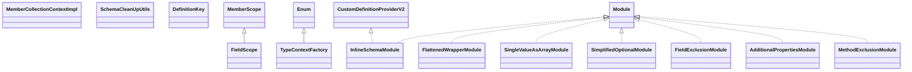

# jsonschema-generator-4.38.0.jar

[Group index](README.md) | [All archives](../README.md)

## Scope and provenance

- **Donor:** `SQX_145_REFERENCE_ROOT/internal/libs/jsonschema-generator-4.38.0.jar`.
- **SHA-256:** `ade4aeb301db4028ac6bcba016c31405677e37aae6eebaf13c99de3fdb3531b4`; accessed 2026-10-06; captured `2026-10-06T18:54:51.906614+00:00`.
- **Classes:** 69 raw entries; 69 unique entry names. Duplicate occurrence indices are zero-based.
- **Inspection:** read-only ZIP hashing and class-file structural parsing; signatures/descriptors, modifiers, hierarchy and references only. Bytecode bodies are hashed, not published.
- **Allocation:** proposed `FEAT-HOST-JSONSCHEMA-GENERATOR`, P02; [roadmap](../../dev/sqx-full-application-roadmap.md). Domain README registration remains required.
- **Repository:** `01067f00031428613c6394064ca1bcadc1ba00ee`; review state unreviewed. Download label 145-dev1; installed build/activation and runtime equivalence unverified.
- **Limit:** every class/member is inventoried; declaration coverage does not establish consumed calls, defaults, formulas, failure semantics or algorithm parity.
- **Archive/resource index:** [067.json](../../dev/evidence/sqx145/archives/145/067.json).

## Complete member declarations

Member shards contain exact JVM names/descriptors, access flags, generic signatures, throws types, declared fields/methods, superclass/interfaces and referenced class names. All classes, nested/synthetic members and overloads are retained. Code length/hash is structural evidence, not a normalized algorithm comparison.

- [001.json](../../dev/evidence/sqx145/members/067/001.json) — SHA-256 `a2a8fbdb602b60849ac2c4b555060bf43f41c446b1c1ec1bcc13a3d6a0731890`.

## Focused structural diagram

Up to twelve non-nested classes; arrows show declared inheritance/interfaces only. External type names are not evidence of an available body or an executed dependency.

## Class inventory

| Archive entry | Occurrence | Class SHA-256 | Fields | Methods |
| --- | ---: | --- | ---: | ---: |
| `com/github/victools/jsonschema/generator/FieldScope.class` | 0 | `fae11b505d8c0411611e4e196b1e856ecc13f45e7fc88497ea336a98bccc56c6` | 1 | 18 |
| `com/github/victools/jsonschema/generator/impl/MemberCollectionContextImpl.class` | 0 | `dc35b8f4bbe0932acb2864e2bff1bd5e6baee9cb429380131876b758727c9dc5` | 6 | 15 |
| `com/github/victools/jsonschema/generator/impl/SchemaCleanUpUtils.class` | 0 | `7909f01ca16d8dda495e5c736a56cda7a3e8a91d746fdb78c9f446f1c2480e25` | 2 | 83 |
| `com/github/victools/jsonschema/generator/impl/DefinitionKey.class` | 0 | `7e3aefbb364e92fc7db7783c34490ee1c01d9f96e56f251e5de3c209be61d5b9` | 2 | 5 |
| `com/github/victools/jsonschema/generator/impl/TypeContextFactory.class` | 0 | `ec90e233145bed8db205b267dc7d39dc79becff7174e1c876e718dbe164e62ac` | 1 | 10 |
| `com/github/victools/jsonschema/generator/impl/module/InlineSchemaModule.class` | 0 | `9fce93ababd9de2c9f1cf6bc9c18aea4ac6c636a08d3450318433205cc23af89` | 1 | 3 |
| `com/github/victools/jsonschema/generator/impl/module/EnumModule$EnumAsStringDefinitionProvider.class` | 0 | `aff7830583c42c0c6a02984e09019091c1c67474dd1457b4da06bfaa86de0da8` | 1 | 2 |
| `com/github/victools/jsonschema/generator/impl/module/FlattenedWrapperModule.class` | 0 | `8e8556365bf88ea62a6317c2a8320056a85693e89037893f65bc6e13bbc5e704` | 1 | 5 |
| `com/github/victools/jsonschema/generator/impl/module/SingleValueAsArrayModule.class` | 0 | `77b61d51185b7e7f1a5b28de01b3b297efff52a12d873bf5ced0e45c685990cb` | 0 | 3 |
| `com/github/victools/jsonschema/generator/impl/module/SimplifiedOptionalModule.class` | 0 | `043183cbdf80a44fff558873815e6dd477fdf0d444ce5b4df95bdef1dddf92f0` | 2 | 6 |
| `com/github/victools/jsonschema/generator/impl/module/FieldExclusionModule.class` | 0 | `c15eb110e95d9390d076603014f3f4173e28fb1df0dbb942e32bbb8b1f8992e5` | 1 | 9 |
| `com/github/victools/jsonschema/generator/impl/module/AdditionalPropertiesModule.class` | 0 | `b04fa1a4fdf59359dcf84b5a5ec38bde9905c54d3d9d2829fe8d10b8db1608bd` | 3 | 10 |
| `com/github/victools/jsonschema/generator/impl/module/MethodExclusionModule.class` | 0 | `216693944e7b93054a3fb7780e806faea818030f28dd9cdd42c1d48aaacdcd82` | 1 | 6 |
| `com/github/victools/jsonschema/generator/impl/module/SimpleTypeModule$SimpleTypeDefinitionProvider.class` | 0 | `49d48624745d7a7d43c213f2fd37bfc38ddbbfd4a21131986e8e25cc6b55ed0b` | 1 | 4 |
| `com/github/victools/jsonschema/generator/impl/module/ConstantValueModule.class` | 0 | `d5bc73d279691d7337f942b82f5eaf473fcc7633b05e7c04659c7132a73eb989` | 0 | 4 |
| `com/github/victools/jsonschema/generator/impl/module/EnumModule.class` | 0 | `57b8495e25643c87333d4b7020ae4f88701e206094cbf58c66f0bd6f8add9b57` | 1 | 13 |
| `com/github/victools/jsonschema/generator/impl/module/SimpleTypeModule$1.class` | 0 | `07ce4f87aced26c9dddc860f28dd52233195e4361ad4286b51a85684ace3f8f0` | 0 | 0 |
| `com/github/victools/jsonschema/generator/impl/module/SimpleTypeModule.class` | 0 | `76162f1b8f1d4cb73a1af7a6ae99dba6285c5c7a800e0ee2d31fccf35c45dbbb` | 3 | 29 |
| `com/github/victools/jsonschema/generator/impl/module/FlattenedOptionalModule.class` | 0 | `8091eac547f80088dfa74eabfd1ef4f8fdb3efe6c8f73706ee372938f68c2f0a` | 0 | 4 |
| `com/github/victools/jsonschema/generator/impl/LazyValue.class` | 0 | `99595d8b457a2a10cadb9efb51abf631f66efdb419f201d3dd26bdb31c14dd1b` | 3 | 2 |
| `com/github/victools/jsonschema/generator/impl/SchemaGenerationContextImpl.class` | 0 | `9e1d96a762c62328eacaa5b45b369634b567ef93376275339e87a1a435119eca` | 7 | 52 |
| `com/github/victools/jsonschema/generator/impl/SchemaGenerationContextImpl$MemberDetails.class` | 0 | `48686a5404de9818c4d498d0537fd6f97ad10b02c117c34243fede8cf4199181` | 4 | 6 |
| `com/github/victools/jsonschema/generator/impl/Util.class` | 0 | `3d3f3e5e0007e4e8295c1051b8d4bfe9f56485523977c22ab1ba348a232011ad` | 0 | 8 |
| `com/github/victools/jsonschema/generator/impl/PropertySortUtils.class` | 0 | `89bc01d43063d863c3dd6fdd51db12da26c3d2eca24d6e7a7d2812dc96fbda5d` | 4 | 5 |
| `com/github/victools/jsonschema/generator/impl/AttributeCollector.class` | 0 | `5f535b8f69ad4bc2a3db2632df7221f5fc083f7c866b3cf11db36c0be535ae5f` | 2 | 54 |
| `com/github/victools/jsonschema/generator/impl/SchemaGeneratorConfigImpl.class` | 0 | `67a4779037d65a26664d599c04aba55d01f1d12aace85ba53b6112f11942cdd8` | 7 | 114 |
| `com/github/victools/jsonschema/generator/impl/SchemaGenerationContextImpl$GenericTypeDetails.class` | 0 | `ebca0d5f0a9703e4a3bc1e6e162cc4f7236488614f1423f846e152682f0f5411` | 4 | 6 |
| `com/github/victools/jsonschema/generator/SchemaBuilder.class` | 0 | `b1685abf4bfa7302065c608c64cfd3aedb4eb2be9354c0ff96371f0924d22782` | 5 | 31 |
| `com/github/victools/jsonschema/generator/TypeContext.class` | 0 | `3013d4a6183dec43b9bd0c56200ca112ea9d9d1c10ff2db1d202c62b68f03a2f` | 6 | 33 |
| `com/github/victools/jsonschema/generator/SchemaGeneratorGeneralConfigPart.class` | 0 | `c06025445729433a4317e6f2abb3d936616e06ffed0c554a0d9572322d79637f` | 7 | 56 |
| `com/github/victools/jsonschema/generator/CustomDefinition$AttributeInclusion.class` | 0 | `37f7e45cf178f6a4cd67f7176b19a5889bb7bbd95084ecf6e02976ebad0352fe` | 3 | 4 |
| `com/github/victools/jsonschema/generator/SchemaConstants.class` | 0 | `9c1ff6044f039bbde12aceb83d9ebe22a995600849d36292bd65e4c5a38437d3` | 39 | 1 |
| `com/github/victools/jsonschema/generator/InstanceAttributeOverride.class` | 0 | `41be7a11ae4e02027150f1dc5e3c1198a8b5ba22a8ba7112e73dae2c9f355d91` | 0 | 2 |
| `com/github/victools/jsonschema/generator/SchemaGenerator.class` | 0 | `f54f24e2d57b6776e21483f73d89e2584d3a04972ac01b38133a12ed64c58e68` | 2 | 5 |
| `com/github/victools/jsonschema/generator/CustomPropertyDefinition.class` | 0 | `2bd927290364a0f49626310d07b74f9f5c2f77026868db966837a20fe6b67f1d` | 0 | 2 |
| `com/github/victools/jsonschema/generator/OptionPreset.class` | 0 | `78e227f822993062cc7a0c399a94949ac0778a7b6c7ca4d1026a44d7c89dd4f0` | 4 | 3 |
| `com/github/victools/jsonschema/generator/Option.class` | 0 | `98d18702d19b7fa8f156ccfe18c19a73cadd2eb4306829881944b4b7aaae9177` | 43 | 8 |
| `com/github/victools/jsonschema/generator/SchemaGeneratorConfigBuilder.class` | 0 | `b34da88e070e33058c76aa7981e4857d058432884c3b8d5d60ef8465a2f4bf26` | 8 | 27 |
| `com/github/victools/jsonschema/generator/SchemaVersion.class` | 0 | `3fbc3080fe2b96f97de9511060f14e35289ca57c4e02015635da0db94f5fe81c` | 6 | 5 |
| `com/github/victools/jsonschema/generator/SchemaGeneratorConfigPart.class` | 0 | `d867a7fd617436916d1d66ee1311624677ced9ebed4f0ed8e6ccd81e277089f4` | 10 | 72 |
| `com/github/victools/jsonschema/generator/MethodScope.class` | 0 | `d236782fe849a181f847a1fbf59782e6678343925c9142c22266e3e6c54fcfe4` | 1 | 25 |
| `com/github/victools/jsonschema/generator/AnnotationHelper.class` | 0 | `db2d7efd09fcdca3f879a700bd2519c3b22c4c3624074c94a7c9de017541c357` | 0 | 7 |
| `com/github/victools/jsonschema/generator/CustomDefinition$DefinitionType.class` | 0 | `496822757342a24cdf10ea63a316c0ea247c542dc09db50a57ea0f4d39d3dd58` | 4 | 4 |
| `com/github/victools/jsonschema/generator/ConfigFunction.class` | 0 | `ed75c319f8a72e1ea6fa1a1df6094e8cda9121842f1ff2ec815d759ad430023a` | 0 | 1 |
| `com/github/victools/jsonschema/generator/SchemaBuilder$DefinitionCollectionDetails.class` | 0 | `50386f6cc0d2f27451bf65b9509b4106508eb9d9ec3acc46483a99a45f4b530f` | 4 | 5 |
| `com/github/victools/jsonschema/generator/MemberScope$DeclarationDetails.class` | 0 | `938ff78601920697f3621391029735c515a067e7f889caa5daecb689235d9727` | 2 | 3 |
| `com/github/victools/jsonschema/generator/SchemaGeneratorConfig.class` | 0 | `f9c5b139e93ddf2eedfe8e8c06ef9ea526087a1c6f5843881c8f01e0b887061a` | 0 | 106 |
| `com/github/victools/jsonschema/generator/SchemaKeyword.class` | 0 | `4d6375a48500c4df405d590aaf809b74bb5af2eda1b58517120443f83a2fc8a3` | 58 | 22 |
| `com/github/victools/jsonschema/generator/SchemaKeyword$SchemaType.class` | 0 | `29be2efb0604bb93c804e5736fd139a51c83150e2e14a70df841aa9c7d6c6543` | 9 | 5 |
| `com/github/victools/jsonschema/generator/CustomDefinitionProvider.class` | 0 | `c991536911b903b60479d27a2c7d0726b02db3b623a757b4acd5439b3b99fabf` | 0 | 2 |
| `com/github/victools/jsonschema/generator/SchemaGenerationContext.class` | 0 | `ece83c224eb028e0911194da66ce64dd032819a0fe248f1e7ba3606bce6c33be` | 0 | 12 |
| `com/github/victools/jsonschema/generator/MemberScope$OverrideDetails.class` | 0 | `dc22a2e16f800e1a898fd2b07891f3184ad1d3b7afc4362d63847eb1e0d6681a` | 3 | 7 |
| `com/github/victools/jsonschema/generator/naming/CleanSchemaDefinitionNamingStrategy.class` | 0 | `3a6610a8e36b874772e675a9885ab02381ec6f7220f9a20cc0d8404ae949a706` | 2 | 5 |
| `com/github/victools/jsonschema/generator/naming/SchemaDefinitionNamingStrategy.class` | 0 | `e7f29d4b3e67831882476f305940d57976c5d9b4f0a9775d86518aa07463b548` | 0 | 3 |
| `com/github/victools/jsonschema/generator/naming/DefaultSchemaDefinitionNamingStrategy.class` | 0 | `395997978b1656d7b8193abdaf433a67676de14add2d21ff0fbd09d05198f03e` | 0 | 2 |
| `com/github/victools/jsonschema/generator/InstanceAttributeOverrideV2.class` | 0 | `5e7e5beb28673ee18a418d26d34811da77426058a6a81aa8b77ac9d41dcb1b1c` | 0 | 1 |
| `com/github/victools/jsonschema/generator/StatefulConfig.class` | 0 | `e825d30fb0bcc34453c86db914f2634c4d72491c0e76d9fa42e50037a3789850` | 0 | 1 |
| `com/github/victools/jsonschema/generator/CustomDefinitionProviderV2.class` | 0 | `d3345c6af8cb776ed431d040ac27545f9f9e58b64978ca96e2e7e008e0e8ef97` | 0 | 1 |
| `com/github/victools/jsonschema/generator/CustomPropertyDefinitionProvider.class` | 0 | `6c83db0ea6639a7ea6de393525b007a77b9f343a6dea739ab1c32af5eeeec109` | 0 | 1 |
| `com/github/victools/jsonschema/generator/SchemaKeyword$TagContent.class` | 0 | `c3729601312bb8ce4a5a2476f9c1a4b569ca57761c0379d3d383e72ca13ff355` | 5 | 4 |
| `com/github/victools/jsonschema/generator/SchemaGeneratorTypeConfigPart.class` | 0 | `9666e1038d373fa5d7d202b782d048e92461df73c5e06d755c161cf13a86c157` | 18 | 47 |
| `com/github/victools/jsonschema/generator/TypeScope.class` | 0 | `c894772c0603031bd96a151b20968960a6f94d93c25f576cbe2490c51a75dc8b` | 2 | 9 |
| `com/github/victools/jsonschema/generator/TypeAttributeOverride.class` | 0 | `720690a98d29da3e296425ea2991f3c8d203d7b54433e4ad5a5c28ca35215ac0` | 0 | 2 |
| `com/github/victools/jsonschema/generator/SubtypeResolver.class` | 0 | `e48c33299c58803e55d693f597f0ff0ce8138db4add7516881847a4ba1f77a8c` | 0 | 1 |
| `com/github/victools/jsonschema/generator/MemberScope.class` | 0 | `a48d12e45b1a8c1abc3906647cf37a9e5fccf1f265ff0e17a4c79315704a8a71` | 6 | 37 |
| `com/github/victools/jsonschema/generator/Module.class` | 0 | `06775a29f98aa30c9ba3a8e966cc75dfc57d38dd2505de65d58b93ea4c030ff0` | 0 | 1 |
| `com/github/victools/jsonschema/generator/TypeAttributeOverrideV2.class` | 0 | `6d53b63d4155548441de7097e95628a001537dea6e39f0ffeea2761a963bd7f1` | 0 | 1 |
| `com/github/victools/jsonschema/generator/CustomDefinition.class` | 0 | `5ee33747e60dba0d6cfd08b98738ff06ef0d84ab819eb6890675e83478c1f714` | 6 | 10 |
| `META-INF/versions/9/module-info.class` | 0 | `0788815a6f8215085750aa0386152e0ec71965c0e81765edbcb334aa88dfe6d2` | 0 | 0 |
