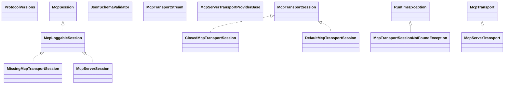

# mcp-core-0.17.2.jar

[Group index](README.md) | [All archives](../README.md)

## Scope and provenance

- **Donor:** `SQX_145_REFERENCE_ROOT/internal/libs/mcp-core-0.17.2.jar`.
- **SHA-256:** `2489902b00d9cfb77a9ec991adf5c3387da298a4154f526dc63cda9c187891ff`; accessed 2026-10-06; captured `2026-10-06T18:54:51.906614+00:00`.
- **Classes:** 292 raw entries; 292 unique entry names. Duplicate occurrence indices are zero-based.
- **Inspection:** read-only ZIP hashing and class-file structural parsing; signatures/descriptors, modifiers, hierarchy and references only. Bytecode bodies are hashed, not published.
- **Allocation:** proposed `FEAT-PRODUCT-MCP-CORE-145`, P17; [roadmap](../../dev/sqx-full-application-roadmap.md). Domain README registration remains required.
- **Repository:** `01067f00031428613c6394064ca1bcadc1ba00ee`; review state unreviewed. Download label 145-dev1; installed build/activation and runtime equivalence unverified.
- **Limit:** every class/member is inventoried; declaration coverage does not establish consumed calls, defaults, formulas, failure semantics or algorithm parity.
- **Archive/resource index:** [077.json](../../dev/evidence/sqx145/archives/145/077.json).

## Complete member declarations

Member shards contain exact JVM names/descriptors, access flags, generic signatures, throws types, declared fields/methods, superclass/interfaces and referenced class names. All classes, nested/synthetic members and overloads are retained. Code length/hash is structural evidence, not a normalized algorithm comparison.

- [001.json](../../dev/evidence/sqx145/members/077/001.json) — SHA-256 `ef0abc2431fadc6ca1c4dab055cfec095ee0b14bfe95ef6251c8002835f007a1`.
- [002.json](../../dev/evidence/sqx145/members/077/002.json) — SHA-256 `2b04663d662c76690c2d26320d36a6a23b3338fcda48b68fe23756cbaf67bd85`.
- [003.json](../../dev/evidence/sqx145/members/077/003.json) — SHA-256 `0210a36ca8f26b3126aa8d13ff2d22434f3670bdb0d0f0a2b9f73bf96df54687`.
- [004.json](../../dev/evidence/sqx145/members/077/004.json) — SHA-256 `7c21e815a076fc80b3e1830f49a6db89e2cb1d6718d5619bfd387a9c24569a28`.

## Focused structural diagram

Up to twelve non-nested classes; arrows show declared inheritance/interfaces only. External type names are not evidence of an available body or an executed dependency.

## Class inventory

| Archive entry | Occurrence | Class SHA-256 | Fields | Methods |
| --- | ---: | --- | ---: | ---: |
| `io/modelcontextprotocol/spec/McpStreamableServerSession$McpStreamableServerSessionInit.class` | 0 | `079ebd95d31c3414215fe8e6bf961a4275d39f42bec06eb242ad97c25c58feff` | 2 | 6 |
| `io/modelcontextprotocol/spec/McpSchema$JSONRPCResponse.class` | 0 | `cc0e54d9388c6a3a8ec74b54534323fd8b8bf4eb6845fbe62b320b1e07f0de7e` | 4 | 8 |
| `io/modelcontextprotocol/spec/McpSchema$ModelPreferences$Builder.class` | 0 | `e7c4d9e47f0108a4e9eff019c2b3e831d9ed177d160f79f04181378b5e5cfb5a` | 4 | 7 |
| `io/modelcontextprotocol/spec/ClosedMcpTransportSession.class` | 0 | `9b3d719accd06f56d0fb7b9b671c8028f1ad966d9b84fc3c7e5fa9c539c2f84a` | 1 | 7 |
| `io/modelcontextprotocol/spec/McpSchema$ResourceContent.class` | 0 | `8cd11dfe8f2ed0b8b4a0cdd9018ecb038b69a3733ef52ffb5b8410fe6ec9e0f2` | 0 | 4 |
| `io/modelcontextprotocol/spec/McpSchema$ReadResourceResult.class` | 0 | `5362e202832ba049d6916c647f26a3fd0d130224e9c60b7066925d4523e354cc` | 2 | 7 |
| `io/modelcontextprotocol/spec/McpSchema$CompleteResult.class` | 0 | `516c2eda63f7b88ffb4b4950c35b9f36a89c25a6914b229b56a082b04b4b91c6` | 2 | 7 |
| `io/modelcontextprotocol/spec/McpSchema$ServerCapabilities$PromptCapabilities.class` | 0 | `c1bcc18b63e899a2c13eafd222876d00de59ce3fa934ff49d115c32f09145adb` | 1 | 5 |
| `io/modelcontextprotocol/spec/McpSchema$ServerCapabilities.class` | 0 | `5649014287957333364ac5caf63bba91aca38389cb619931f240045864669bed` | 6 | 12 |
| `io/modelcontextprotocol/spec/McpSchema$CallToolRequest$Builder.class` | 0 | `c7b60e61df7b9455254661414c4faa391ad773faff9e07830450d8da1b00ea47` | 3 | 7 |
| `io/modelcontextprotocol/spec/McpSchema$JSONRPCRequest.class` | 0 | `9b9945dfda708285c80952bbf9d2eae9a7d96a8e5fada3ee2726026127992fae` | 4 | 8 |
| `io/modelcontextprotocol/spec/McpStreamableServerSession$McpStreamableServerSessionStream.class` | 0 | `3039832090353aa0bddfb8b8a7528b70d83c40a5dfda26166e08697c24a9e716` | 5 | 15 |
| `io/modelcontextprotocol/spec/McpSchema$ListResourceTemplatesResult.class` | 0 | `633499bf0986d4593151d6ee2f4a891481fc86bde2b47c9a286fd44e162b3315` | 3 | 8 |
| `io/modelcontextprotocol/spec/McpSchema$ResourceTemplate$Builder.class` | 0 | `ee898c4e831ed8a95c81ba650c1c6bff958e6006e5fb4b65ba2fae68a07b9c17` | 7 | 9 |
| `io/modelcontextprotocol/spec/ProtocolVersions.class` | 0 | `a9c4e9c3f254221052fe6e9b9517c6cd05862a33eed6a6e474389faef6a36cba` | 4 | 0 |
| `io/modelcontextprotocol/spec/McpSchema$ElicitResult$Builder.class` | 0 | `4de5ae4e81adedb5203a0c98c92b236ebc4ce119c1547294a5500e25700aca32` | 3 | 5 |
| `io/modelcontextprotocol/spec/McpSchema$CompleteRequest$CompleteContext.class` | 0 | `8ac36257e1937a3e973418294390d771d9acd4db6fc561104bbc2f09a2f8b703` | 1 | 5 |
| `io/modelcontextprotocol/spec/McpSchema$ServerCapabilities$ToolCapabilities.class` | 0 | `30991f009efd391d8fc86231a6ec5f0714597824c02284f2ad76dab81053a354` | 1 | 5 |
| `io/modelcontextprotocol/spec/McpSession.class` | 0 | `042009e6461dec833344bf09dd02a63e447df88c6a9b70e73cf71d1711cabad6` | 0 | 5 |
| `io/modelcontextprotocol/spec/McpSchema$Role.class` | 0 | `911a3f0e8176ce8a5cd4fa108f525f954e133680a68c1465027c59049480a1a0` | 3 | 5 |
| `io/modelcontextprotocol/spec/McpServerSession$RequestHandler.class` | 0 | `89855c3e3713f1d98041c551ac87d62d564405699e729f51e7f6d73ef9ba2dbb` | 0 | 1 |
| `io/modelcontextprotocol/spec/McpSchema$ListRootsResult.class` | 0 | `943237d4f8a77d72724d8d8bd25188960710e2523baa924ff91bd3852dfcd893` | 3 | 9 |
| `io/modelcontextprotocol/spec/McpSchema$ClientCapabilities$RootCapabilities.class` | 0 | `7020bf0261ce28824a3937ddadb482d37fa8b718bb673d400cc01c6f189762b2` | 1 | 5 |
| `io/modelcontextprotocol/spec/McpSchema$LoggingLevel.class` | 0 | `3429af7cc93b17ca85de7c42029572fa20b1f0c5fba428a5950c65d27d825416` | 10 | 6 |
| `io/modelcontextprotocol/spec/McpSchema$ClientCapabilities$Elicitation$Form.class` | 0 | `10e9a38193553576027e68867045bc11463fbd9c4d6729b888a14bc43e26d1e2` | 0 | 4 |
| `io/modelcontextprotocol/spec/McpLoggableSession.class` | 0 | `a7a420e54e54931d4b86ad4f8093086f3174557ca2bf4d5c7a622d0197158f60` | 0 | 2 |
| `io/modelcontextprotocol/spec/McpSchema$PromptArgument.class` | 0 | `af4f0c28548ea2ab67463fbfea4059eb8a0ec37674fe15266ebac8ad58528483` | 4 | 9 |
| `io/modelcontextprotocol/spec/McpSchema$ClientCapabilities$Elicitation.class` | 0 | `7f36e7d30fbd33e64d407636653a306e0e53f0be83487e90e7c6b1e1f37e2f28` | 2 | 7 |
| `io/modelcontextprotocol/spec/DefaultMcpTransportSession.class` | 0 | `c7dde96185a9341cd4b1a63bedb2353dfc8f4661acf2919eca6cf6e4c68b14ec` | 5 | 11 |
| `io/modelcontextprotocol/spec/McpStreamableServerSession$Factory.class` | 0 | `96bf32b748d970b4c965f904c2e5282fc01affbe506dd994de603865e6512726` | 0 | 1 |
| `io/modelcontextprotocol/spec/McpSchema$LoggingMessageNotification.class` | 0 | `6a1a4ccc4b5ade610df18dcb245df974615bcd5b42ce69e540a3028e71c197bd` | 4 | 10 |
| `io/modelcontextprotocol/spec/McpSchema$Result.class` | 0 | `651f97022e6a9c20183236d311bfffd11328697b74eb9a177dd613887b0b3c0c` | 0 | 0 |
| `io/modelcontextprotocol/spec/McpServerSession$MethodNotFoundError.class` | 0 | `f760933c6bc7fb7321a63684cf0f45a7edfb6abb8cab55eabb2f274c073b9e56` | 3 | 7 |
| `io/modelcontextprotocol/spec/McpSchema$CreateMessageResult.class` | 0 | `012e02db09f72374c97e7643d1e8e58cc9a837e3d69b4eefd7bb4fb20bd931f2` | 5 | 11 |
| `io/modelcontextprotocol/spec/JsonSchemaValidator.class` | 0 | `3b2d9d961fbe6e86d4a28680d00d20ad49bec7604cb5398b3bc592c9f3e7d300` | 0 | 1 |
| `io/modelcontextprotocol/spec/McpSchema$ServerCapabilities$ResourceCapabilities.class` | 0 | `2c8f303b5912bed7d1d17742933d70dd357de5e5d472cd313be8352f01d7a368` | 2 | 6 |
| `io/modelcontextprotocol/spec/McpSchema$CreateMessageResult$Builder.class` | 0 | `516dcd6dd1c7e64f56a877bf8d44b9b7f956787397fec771ab92532305f3e859` | 5 | 8 |
| `io/modelcontextprotocol/spec/McpTransportStream.class` | 0 | `d7b2831dbd13e97be6a568ec214ff25b8919cc53576ead8dcf45a29c8864e1ef` | 0 | 3 |
| `io/modelcontextprotocol/spec/McpSchema$Prompt.class` | 0 | `daea4cd2d1a928dbbd3926c7e83d51746de53e0030d4e22234c977c03e8bfd1b` | 5 | 11 |
| `io/modelcontextprotocol/spec/McpSchema$CallToolResult$Builder.class` | 0 | `50b422f722f8f585f0e3e0f059346ef315d09560dc44908d499e5e10b0345577` | 4 | 10 |
| `io/modelcontextprotocol/spec/McpSchema$Resource.class` | 0 | `a6e0a9093a811b4fba7242d6d30cfb6e730fbde6e64398a042af40c629b403ce` | 8 | 16 |
| `io/modelcontextprotocol/spec/McpSchema$CreateMessageRequest$Builder.class` | 0 | `609e7e23083e3b11e902d8a04adff6132c6ac6eb2e44914601a3140fbc818a55` | 9 | 12 |
| `io/modelcontextprotocol/spec/McpSchema$CompleteResult$CompleteCompletion.class` | 0 | `88f09bf92ae988d7ee9bf58ef10a68713666981d46f39980924a0e6820760450` | 3 | 7 |
| `io/modelcontextprotocol/spec/McpSchema$ElicitRequest.class` | 0 | `304884247db1a58272d3a0ea2b18068b96c3d368d135bcbb9be2ab0011f9ae22` | 3 | 9 |
| `io/modelcontextprotocol/spec/McpSchema$ListResourcesResult.class` | 0 | `2858269fb65cfa05cf20640b3a635ddd58276794ee0e54119d0b515789f7545b` | 3 | 8 |
| `io/modelcontextprotocol/spec/McpSchema$SamplingMessage.class` | 0 | `8fb7880246e346500ef31b0ecde456ffb04f114e6cf64adede7f2ad82a236bad` | 2 | 6 |
| `io/modelcontextprotocol/spec/McpSchema$ErrorCodes.class` | 0 | `da96005a2ecdf2c5407a0282044c3cf045387c37114973af722e12c82389b804` | 6 | 1 |
| `io/modelcontextprotocol/spec/McpSchema$TextContent.class` | 0 | `3e21e20ef426b9c142acb0a81036be46cda5072b486df767894fa07f98775b05` | 3 | 12 |
| `io/modelcontextprotocol/spec/McpSchema$Resource$Builder.class` | 0 | `4db7d52715544d969d7d9c9c9d682fe2d4030d825094d0b21c6326d5a0cb5e15` | 8 | 10 |
| `io/modelcontextprotocol/spec/McpSchema$Content.class` | 0 | `f26d999490db9557f04186d9c495f3f8fd9187ba077cee4d51f2319988e1ba89` | 0 | 1 |
| `io/modelcontextprotocol/spec/McpSchema$ResourceContents.class` | 0 | `81aeee5e91d3f685eff95fadcff349357470eebb2df4bd95490bd0171d518346` | 0 | 2 |
| `io/modelcontextprotocol/spec/McpSchema$ModelHint.class` | 0 | `68dee118ac33ea45d7f1faed150a60712cd84bae0bb1a69f3ed227c39c826197` | 1 | 6 |
| `io/modelcontextprotocol/spec/McpStreamableServerSession$MethodNotFoundError.class` | 0 | `49768791b3d81a6f23cea9484a807950f5307da95c65eb78cee3be47fdfd0103` | 3 | 7 |
| `io/modelcontextprotocol/spec/McpSchema$Meta.class` | 0 | `c17bea1d70467457f796a0ed17a4ba5ef6f4dc15a2d736d214745bf7446015b3` | 0 | 1 |
| `io/modelcontextprotocol/spec/MissingMcpTransportSession.class` | 0 | `f3828c986dd359c9ec0821c34a41deeb890bc43ae812f1a8a1ef9e98aabf3472` | 2 | 7 |
| `io/modelcontextprotocol/spec/McpSchema$CompleteRequest.class` | 0 | `b0c7d19bd6dfd7ef06080200ee3ae99431010a170e754e7996e2739ad51c954f` | 4 | 11 |
| `io/modelcontextprotocol/spec/McpSchema$Notification.class` | 0 | `a852c11e00cdfc040ace5957e89da422258cbd2c4f9d67819eeed557d16b33c4` | 0 | 0 |
| `io/modelcontextprotocol/spec/McpSchema$ServerCapabilities$CompletionCapabilities.class` | 0 | `2d534554daaf102ac9d56b70adc3099b90f272851081379bda3ea272a17c4dc8` | 0 | 4 |
| `io/modelcontextprotocol/spec/McpServerTransportProviderBase.class` | 0 | `c035c40f81ca7d4b24013b8a43dcdd8cd950a65b1b5353faa3dfe54586866c79` | 0 | 4 |
| `io/modelcontextprotocol/spec/McpSchema$ElicitResult.class` | 0 | `a94fabc7b4a6ed188df598287c23c4e16ed45ad3023a461594201918135f2bbe` | 3 | 9 |
| `io/modelcontextprotocol/spec/McpSchema$CompleteReference.class` | 0 | `8794cd8cc2c340ec18ca62b48dcf7a999ff10323864e0fb458860712dfcf91df` | 0 | 2 |
| `io/modelcontextprotocol/spec/McpSchema$TextResourceContents.class` | 0 | `bdf58b313aabb76f2a998d6165b389eab50d678a901fe5f7b89363dc084a5e4f` | 4 | 9 |
| `io/modelcontextprotocol/spec/McpSchema$GetPromptResult.class` | 0 | `7b3c888046da8ad73ccf2e7058d73cc85e17bee19f6850d6f94129d8ea12d139` | 3 | 8 |
| `io/modelcontextprotocol/spec/McpTransportSessionNotFoundException.class` | 0 | `a4a396a3d8e7a36bc0a4bf01b2bf8c5ec237e5632241886930b8507cdd84dbc1` | 0 | 2 |
| `io/modelcontextprotocol/spec/McpSchema$ResourceLink$Builder.class` | 0 | `7917cc4a7c63c4d5cd04a932e058e6a16dadfe5c80d3e24a50b7711c77804aa1` | 8 | 10 |
| `io/modelcontextprotocol/spec/McpServerSession.class` | 0 | `56a305da610f0cc39334f8bc310d24fc2e292c3edf471ffba907c394b10cf711` | 17 | 30 |
| `io/modelcontextprotocol/spec/McpSchema$ProgressNotification.class` | 0 | `a7814b481d67795eab7500b204047b934773c6cc4e147df0fb730e7fd51ac523` | 5 | 10 |
| `io/modelcontextprotocol/spec/McpSchema$ListToolsResult.class` | 0 | `def352be425041cb5b98d3afc54870d1ab1fe8e37f5dbe21c6a109530e7b6eaa` | 3 | 8 |
| `io/modelcontextprotocol/spec/McpSchema$CreateMessageRequest$ContextInclusionStrategy.class` | 0 | `705f51ad9178d2eff7aa95744bf7364eac827d9b0d8c0df7b417ba35d91ebe29` | 4 | 5 |
| `io/modelcontextprotocol/spec/McpSchema$SetLevelRequest.class` | 0 | `db7051c82dfe3c62a4b9022580b2320273aec95a008e05f32ecd76ef425cf024` | 1 | 5 |
| `io/modelcontextprotocol/spec/McpServerSession$Factory.class` | 0 | `e2ec9fcbb94db847d40b21e345b75869bc14836165dadd6099c1bc9d0a383c84` | 0 | 1 |
| `io/modelcontextprotocol/spec/McpServerSession$InitRequestHandler.class` | 0 | `dcda49b732d0a9b0a923ea7367c6c3ff692420f15644f76f578cd4f3f1e06f63` | 0 | 1 |
| `io/modelcontextprotocol/spec/McpClientSession$RequestHandler.class` | 0 | `e724687838bb070cb18e6dcff394212c8fa851667b55ca5c0ed57bbce5914635` | 0 | 1 |
| `io/modelcontextprotocol/spec/McpSchema$InitializeResult.class` | 0 | `7f11d9b8202dd5624bcf7a8de542e741e87a24f9ed383affabf23e3d7df51325` | 5 | 10 |
| `io/modelcontextprotocol/spec/McpServerSession$1.class` | 0 | `4f74a015218607323369243111a1b955d043412311498a7229ef2032154a42f4` | 1 | 1 |
| `io/modelcontextprotocol/spec/McpSchema$CallToolRequest.class` | 0 | `c973902c663a02da985cadc7e86e6f7a174271c2b1b5f3541e2bd83bcd15df1a` | 3 | 11 |
| `io/modelcontextprotocol/spec/McpServerTransport.class` | 0 | `c5303c889153ac232e90c973d4c38795ef7aedce2723163bf5e6c81d2e1dc792` | 0 | 0 |
| `io/modelcontextprotocol/spec/McpSchema$ServerCapabilities$Builder.class` | 0 | `7f9d5f3d3c83310a0dd54c14ea07edf68d78b90360b1605a38b5456e0e0c3f7e` | 6 | 8 |
| `io/modelcontextprotocol/spec/McpSchema$PromptReference.class` | 0 | `24d096af739085ba378d305b9fd6d7eb0c1f93c4794286f07b66354cb45d23b7` | 4 | 10 |
| `io/modelcontextprotocol/spec/McpTransportException.class` | 0 | `50e7114e6e3fd4e86222f8fcbce0b81c90b76e57036bb9a8ce003f7931325c46` | 1 | 4 |
| `io/modelcontextprotocol/spec/McpSchema$ListPromptsResult.class` | 0 | `3a9210a987fc564aa0104a2b45426f3e4ea1ed81f23582dbc6358bacae26bb18` | 3 | 8 |
| `io/modelcontextprotocol/spec/McpSchema$ImageContent.class` | 0 | `c308c9050261b6cd28823c2c26ba77233118bbde003bd6abbd1d73973b77accc` | 4 | 12 |
| `io/modelcontextprotocol/spec/McpSchema$Request.class` | 0 | `1dcdfd688b763d5c0d2d83c0b7f9ddb917f3983b419b475a43a198e23941e4d7` | 0 | 1 |
| `io/modelcontextprotocol/spec/McpSchema$BlobResourceContents.class` | 0 | `18bea010eca709cbd9569442d632b4791baebbe0d5b59422c56bdc0f1f03525c` | 4 | 9 |
| `io/modelcontextprotocol/spec/McpError$Builder.class` | 0 | `f44f2a5ea716c2dd808487f3bffde5deb55318bf7da9c908e8b3ade65c49973c` | 3 | 4 |
| `io/modelcontextprotocol/spec/McpSchema$ModelPreferences.class` | 0 | `88606ec0c7df5bc4b7d8ef43bf2285af11b11deaceaa149b0b58cc21bc525ad6` | 4 | 9 |
| `io/modelcontextprotocol/spec/McpStreamableServerSession$InitRequestHandler.class` | 0 | `ec4b6d07fb9b32f13f68c1c92ece7dfab5615b4d1d6219a41eb98684f029da63` | 0 | 1 |
| `io/modelcontextprotocol/spec/McpSchema$Annotations.class` | 0 | `06f625059087cb734f0fbd5457d0be8760c446d1f126edb9797dcf0d03c97dcb` | 3 | 8 |
| `io/modelcontextprotocol/spec/McpSchema$ElicitResult$Action.class` | 0 | `da30c8e77597d80d2491230a5649cfc3fbffde0ae1f4e6c5c658e9161b25dc5d` | 4 | 5 |
| `io/modelcontextprotocol/spec/McpClientSession$NotificationHandler.class` | 0 | `9453be730d5593dd5b20b719c169773958f0543402d716ba0d0a712aa4661331` | 0 | 1 |
| `io/modelcontextprotocol/spec/McpSchema$ResourcesUpdatedNotification.class` | 0 | `c75090c819a3cf0e9ae2468eeb1f6981c06c4735e97258f3eb0cfef084d60d4f` | 2 | 7 |
| `io/modelcontextprotocol/spec/McpSchema.class` | 0 | `42a28ac64977d5633edf14d52c82a4942a7f381013a845ae18c14730439c1685` | 29 | 5 |
| `io/modelcontextprotocol/spec/McpSchema$CompleteRequest$CompleteArgument.class` | 0 | `a761ebea0b73663c5ea23ce1524f498a89b3c2c4263e8582ff90879659d2dfa1` | 2 | 6 |
| `io/modelcontextprotocol/spec/McpServerTransportProvider.class` | 0 | `df7387fc5f8947865d5976b2ef34199d63a70c6d64d64df7d8127c8c10b72e30` | 0 | 1 |
| `io/modelcontextprotocol/spec/McpSchema$ResourceTemplate.class` | 0 | `6d2abb6b77b0dda5535a0a532f4a1082982eb8b3b918e1a7a632ab5fa7ced1df` | 7 | 14 |
| `io/modelcontextprotocol/spec/McpSchema$ClientCapabilities$Sampling.class` | 0 | `901a96a78f27ca1add42e05db4022e168fdd7809a224343d0dc710cff9316e30` | 0 | 4 |
| `io/modelcontextprotocol/spec/McpSchema$CreateMessageRequest.class` | 0 | `fcce57a4401b3691fab1bf910e602d732670fc79be26c04135c4306945faca6b` | 9 | 15 |
| `io/modelcontextprotocol/spec/McpSchema$AudioContent.class` | 0 | `b6126c672d4e47d0fc18ed6f37cb5ed15d0bc3c41a287d32ebfe9b967aafbae9` | 4 | 9 |
| `io/modelcontextprotocol/spec/McpSchema$JSONRPCResponse$JSONRPCError.class` | 0 | `c09c7c696e943bf970569d5c9eee5970d36a4002080a14a5f194e0b515ce6bc7` | 3 | 7 |
| `io/modelcontextprotocol/spec/McpSchema$Root.class` | 0 | `5762531cbfe498fc2a087bdf362cafab3259912250fc1587dc974a44a0695130` | 3 | 8 |
| `io/modelcontextprotocol/spec/McpSchema$Tool.class` | 0 | `344fe18748bdde1aa03b6a44c4178b9ae90a82c87265a25d90d59f50966002e5` | 7 | 12 |
| `io/modelcontextprotocol/spec/McpSchema$JSONRPCMessage.class` | 0 | `8a4937d3afef38a8a05337a7686451de4046da8acabb1e2efae2363706a94d13` | 0 | 1 |
| `io/modelcontextprotocol/spec/McpSchema$ClientCapabilities$Elicitation$Url.class` | 0 | `ddcfbe10faaf183f6b70cf5ef383bf098591133fbb6f02a6fa33593b12f26080` | 0 | 4 |
| `io/modelcontextprotocol/spec/JsonSchemaValidator$ValidationResponse.class` | 0 | `eeb14b71b72e4d3608a2a2896f3744fe860a2dab01dae2ee7557261e577da3fc` | 3 | 9 |
| `io/modelcontextprotocol/spec/McpSchema$Identifier.class` | 0 | `5f3b47d85c9ae234009d0e9209b11aa6db68913b0c098958d099756a2de2334a` | 0 | 2 |
| `io/modelcontextprotocol/spec/McpSchema$InitializeRequest.class` | 0 | `fa74012cad44f7b388336b84e1303aa773948631602c7f167646483cd6df1ccb` | 4 | 9 |
| `io/modelcontextprotocol/spec/McpSchema$PaginatedRequest.class` | 0 | `435bce69b7a8bcc0cf9b2c077c75b7f817342c7c21ddec3130808bfd489f8cb2` | 2 | 8 |
| `io/modelcontextprotocol/spec/McpTransportSession.class` | 0 | `c6816fe65c0e903a87e1cbda1f851c575c00369f513c22944b61025461e2737d` | 0 | 6 |
| `io/modelcontextprotocol/spec/McpServerSession$NotificationHandler.class` | 0 | `d94f493e077c2995ca1dacf4023c8f4462a0827fa88323a34b439ed334976db5` | 0 | 1 |
| `io/modelcontextprotocol/spec/McpSchema$EmbeddedResource.class` | 0 | `bbd8a650a8e875165eae79244436329a44b2d4e862b471b5518b9bd4adfc0169` | 3 | 11 |
| `io/modelcontextprotocol/spec/McpServerSession$InitNotificationHandler.class` | 0 | `a50396042a112507242d7961fb5ebecc81b6aee4efc73394b8f703d7c19c2f02` | 0 | 1 |
| `io/modelcontextprotocol/spec/McpSchema$ReadResourceRequest.class` | 0 | `18a99acfa2ac7920d2f268e3c2afa6241fd87e5d3dc3e9f51508ad82db8f8ba7` | 2 | 7 |
| `io/modelcontextprotocol/spec/McpTransport.class` | 0 | `7b58c27bcd479d7a87e6913ff60e1e63fbfea67cc2d69ad960564606c59e268b` | 0 | 5 |
| `io/modelcontextprotocol/spec/McpSchema$LoggingMessageNotification$Builder.class` | 0 | `ae5fdf62192a78350375edcb6bc9ca048a3ee7e3a97396a80949316e7353ca37` | 4 | 6 |
| `io/modelcontextprotocol/spec/McpSchema$SubscribeRequest.class` | 0 | `b602e77a4534a15efad4c33f6b7ff396a53e8a249dcd4d4cc75f038d5e96c30a` | 2 | 7 |
| `io/modelcontextprotocol/spec/DefaultMcpStreamableServerSessionFactory.class` | 0 | `9b1febf9eec6ee4badd38d788dbdffc57cd8697277d7f25a19c23c993e2cb87d` | 4 | 2 |
| `io/modelcontextprotocol/spec/McpSchema$ElicitRequest$Builder.class` | 0 | `553fa0b5cc7ef74c5b740c2033f3aa9dde2b2012e5247a42cd878a54334fc534` | 3 | 6 |
| `io/modelcontextprotocol/spec/McpClientSession.class` | 0 | `877ce52d20f999f1dca335cac1c68aa9a27a603bff7e36fd245323ee3aa2aaaf` | 8 | 26 |
| `io/modelcontextprotocol/spec/McpSchema$PromptMessage.class` | 0 | `3026a68d8c93ef66514f5eee81c870ea8ad8b42ebf35e580acb14008021fab26` | 2 | 6 |
| `io/modelcontextprotocol/spec/DefaultMcpTransportStream.class` | 0 | `d36a99057dd14753ee091385c58ab0cc5ce0b865f957ce28e1ccffd84228b565` | 6 | 9 |
| `io/modelcontextprotocol/spec/McpSchema$ClientCapabilities$Builder.class` | 0 | `ce2c4b445876b37cad6a9ccf061184f787fa0830d1e7a4ad43f8719c85be2e4a` | 4 | 7 |
| `io/modelcontextprotocol/spec/McpSchema$ClientCapabilities.class` | 0 | `da8b54d564c1d78eea0dec6aa2da8a13daa3cdcf4e6b53844e48eb145a558c28` | 4 | 9 |
| `io/modelcontextprotocol/spec/McpError.class` | 0 | `48be663d9b43580abb51c704cf1ef59bab7b1c5935903973ddd5cab8e05ba61a` | 2 | 9 |
| `io/modelcontextprotocol/spec/McpSchema$PaginatedResult.class` | 0 | `53d90d6e698108f1a2924579126623fdce61ed96a770424509b882fd4af376e3` | 1 | 5 |
| `io/modelcontextprotocol/spec/McpStreamableServerSession.class` | 0 | `d7cbd05479592eb62a1709dee9469255e725cee818aded9453f26d7f5d0b8ebb` | 12 | 26 |
| `io/modelcontextprotocol/spec/McpStreamableServerTransportProvider.class` | 0 | `396885f4dbc1854401a61781c9f5ad3ac69df4237b6e511a8c60df00c609535a` | 0 | 4 |
| `io/modelcontextprotocol/spec/McpSchema$Annotated.class` | 0 | `c551d858413e39a4cc9320a81f7d0fb6b7131786b3e44601666efc2f7451af3f` | 0 | 1 |
| `io/modelcontextprotocol/spec/McpSchema$CallToolResult.class` | 0 | `0b1b6e2c4e323fbcf62122915c47273daf37ea6ed8bc4f3f932c32be27361375` | 4 | 12 |
| `io/modelcontextprotocol/spec/McpSchema$ResourceLink.class` | 0 | `f0b900fdab9f10f0d98b9f9b561dada0a3282096d68258f7f9a3ee4130516915` | 8 | 13 |
| `io/modelcontextprotocol/spec/McpSchema$ServerCapabilities$LoggingCapabilities.class` | 0 | `024a0dda5c353b71775f9dc97bd67776864d3404d08a71fc162390277c672895` | 0 | 4 |
| `io/modelcontextprotocol/spec/McpSchema$JsonSchema.class` | 0 | `aef229c6a908d1347efaf4850c050215e5db44c5ace8b18af2556532d194713c` | 6 | 10 |
| `io/modelcontextprotocol/spec/McpSchema$JSONRPCNotification.class` | 0 | `9c55783f9eb613c03d7c3119ecba6cb5bde0387cac3d0e4d1390bed6fb18b72c` | 3 | 7 |
| `io/modelcontextprotocol/spec/McpClientTransport.class` | 0 | `d4c03244434f6c3b0e9ea95332d1de5f492f873108366fac2d14901d7f011bf6` | 0 | 2 |
| `io/modelcontextprotocol/spec/McpSchema$1.class` | 0 | `de7e42aedfe370404fe39aa5288ae80baa9752e6bf9b14692196bca6cb465761` | 0 | 1 |
| `io/modelcontextprotocol/spec/McpSchema$Tool$Builder.class` | 0 | `0605fd8cb4bbb0e3f012b0f19650086bf5aa965a9ac23398230739eb3e79e3ff` | 7 | 11 |
| `io/modelcontextprotocol/spec/McpSchema$ToolAnnotations.class` | 0 | `ccfc76689c3b8195f8a144d86de3ba42555f53b39090bd7cf6ea011974c3a462` | 6 | 10 |
| `io/modelcontextprotocol/spec/McpSchema$UnsubscribeRequest.class` | 0 | `2230f6fa94bbe07752e036fd223220af0d4e16847add4aaa52ac2bb9b045a0b2` | 2 | 7 |
| `io/modelcontextprotocol/spec/McpClientSession$MethodNotFoundError.class` | 0 | `60aeec83ac27d29e2daa0ef1e561ddd5a19d6313e06aed4b01e4c020f352026b` | 3 | 7 |
| `io/modelcontextprotocol/spec/McpTransportSessionClosedException.class` | 0 | `7cd5fe1418dfec2347a3dcac0067f59d7b525bf82e237f4024e8a91a4c05bb77` | 0 | 1 |
| `io/modelcontextprotocol/spec/McpSchema$ResourceReference.class` | 0 | `c495b36d741c30612a75afe7c719e5a16c52d8390804d829f639d30bd289ef29` | 3 | 8 |
| `io/modelcontextprotocol/spec/McpStatelessServerTransport.class` | 0 | `b606ce019f9cc6aba35914bef750a14847eca8dd0f2092e306a4d4cae94ed607` | 0 | 4 |
| `io/modelcontextprotocol/spec/McpStreamableServerTransport.class` | 0 | `a096ea3b2bf753c20600de0c2a0d041f87ff8a211df3aa3c5431874929d11ac5` | 0 | 1 |
| `io/modelcontextprotocol/spec/McpSchema$GetPromptRequest.class` | 0 | `5724fa2401d853c21a2f12e74d0311218b7130325972411b690057942d2a09d2` | 3 | 8 |
| `io/modelcontextprotocol/spec/HttpHeaders.class` | 0 | `b6e2ed02521360bdce9590cce14f30e98f017b0038835cf097ad7d77f1b3c31f` | 7 | 0 |
| `io/modelcontextprotocol/spec/McpSchema$CreateMessageResult$StopReason.class` | 0 | `c5e1f6cff1b43d1ec04388d0c99d50ed102ebf50ecae6190a434919321c6eadd` | 6 | 7 |
| `io/modelcontextprotocol/spec/McpSchema$Implementation.class` | 0 | `5b28c2c93e52d5d41ed7d6850e68ebfa1399b3cb41df4117714338aca44b30ca` | 3 | 8 |
| `io/modelcontextprotocol/server/McpStatelessServerHandler.class` | 0 | `c0e10b6fb43b1895435a35ef6c599bfdffefbcde035266773ec631e1130448b0` | 0 | 2 |
| `io/modelcontextprotocol/server/McpStatelessSyncServer.class` | 0 | `904048381d4f1616c1e928797f6668218194d6e5d6ef87849f887b491daaeba3` | 3 | 19 |
| `io/modelcontextprotocol/server/McpStatelessServerFeatures$AsyncCompletionSpecification.class` | 0 | `1d6a8e11abc855c301ec279fb08d1f6490eaa99385c2f262e23b8b5e32806a8a` | 2 | 9 |
| `io/modelcontextprotocol/server/McpServer$SingleSessionAsyncSpecification.class` | 0 | `e43b3c3140300b1776c207438ac1dfa797190c71bf7974bd5ea6722a1a65777e` | 1 | 2 |
| `io/modelcontextprotocol/server/McpAsyncServerExchange.class` | 0 | `d86bfae13f9553d33754934fac9179be7bb72db41a58c9fe588b8ecca1a4926a` | 9 | 19 |
| `io/modelcontextprotocol/server/McpStatelessServerFeatures$AsyncPromptSpecification.class` | 0 | `cb1fb75a6d86692e3c8c8e6ccf2602e74ab552bf6078f04e69b7f6ffa608d5a3` | 2 | 9 |
| `io/modelcontextprotocol/server/McpAsyncServer$4.class` | 0 | `238829a2fbd72c38e4be7948d898a97f1bd65206b05d654901e84f3d90c4b5e9` | 1 | 1 |
| `io/modelcontextprotocol/server/McpServerFeatures$SyncToolSpecification$Builder.class` | 0 | `a0ba7f10485192277f7c2867c0e46dae4dd1abadcd80640d3bc6afba3ea13f69` | 2 | 4 |
| `io/modelcontextprotocol/server/McpServer.class` | 0 | `aab6cfdeb9adf06da8c08c3176d30d4e60764fc3ec98ea308eb854745d2ac652` | 1 | 7 |
| `io/modelcontextprotocol/server/McpServer$AsyncSpecification.class` | 0 | `93d2b29075cbcc1e0b31633f643ea50ba1021bbec979b245b32527e9705bf698` | 13 | 29 |
| `io/modelcontextprotocol/server/McpRequestHandler.class` | 0 | `ebbd28a77fad5ea50c05d826f2c27e3be02733d2be5d332edf079a68d13788ba` | 0 | 1 |
| `io/modelcontextprotocol/server/McpServerFeatures.class` | 0 | `447ed582f3301659b0ac02115632bd70d4d811a3f60a056624d1a180436da9f9` | 0 | 1 |
| `io/modelcontextprotocol/server/McpServer$StreamableServerAsyncSpecification.class` | 0 | `5e58f948c6e5b86d1d9a99d5708453ca085551d689f4270c660c82ec0e4e3ee7` | 1 | 2 |
| `io/modelcontextprotocol/server/McpStatelessServerFeatures$Async.class` | 0 | `9c139c346a73777574b12b9ffe0a71bb93e333c37e4b7015027d2ee5df4a065f` | 8 | 17 |
| `io/modelcontextprotocol/server/McpStatelessServerFeatures$SyncResourceSpecification.class` | 0 | `4a06135bd0869d8b850297d17f2ced0698016a3634670c4763aaf98723153a2f` | 2 | 6 |
| `io/modelcontextprotocol/server/McpNotificationHandler.class` | 0 | `735b53dff3d939e2d423cb636b14a25d5f37fe2e3e768320fde5fb824e5023ac` | 0 | 1 |
| `io/modelcontextprotocol/server/McpServerFeatures$SyncCompletionSpecification.class` | 0 | `afebcaed25cc7a03ea04686c2921aec4369eb48526ca581f03598479e7a91116` | 2 | 6 |
| `io/modelcontextprotocol/server/McpStatelessServerFeatures$Sync.class` | 0 | `6a63a4e464c9172bf083ea060e2f38c1aaa255f31c7277558e2e711b85329338` | 8 | 12 |
| `io/modelcontextprotocol/server/McpServerFeatures$SyncResourceSpecification.class` | 0 | `eecde73ed6230a48f60574eb768678585d981d9c0f82509615a26919dac55c1b` | 2 | 6 |
| `io/modelcontextprotocol/server/McpAsyncServerExchange$2.class` | 0 | `89ceab265fc188ad998839b9cb35bc206b881ae174e0d12151a98e6a22db88ec` | 0 | 1 |
| `io/modelcontextprotocol/server/McpAsyncServer$1.class` | 0 | `1bc4dc14dfc59fe87bc123616222715cbed7c33d23f8e1b746969c47c0224d20` | 1 | 1 |
| `io/modelcontextprotocol/server/McpStatelessAsyncServer$StructuredOutputCallToolHandler.class` | 0 | `86d5b233ae9b5024bf5b17cee5847d50cdbe2f3ed6b2751110ff39d77da1724d` | 3 | 4 |
| `io/modelcontextprotocol/server/McpServer$StatelessAsyncSpecification.class` | 0 | `af1af22803d3369a9d4ca78a51ed99fc6e6e079d623b0483e5bbd02d11b5067e` | 13 | 25 |
| `io/modelcontextprotocol/server/McpServerFeatures$AsyncPromptSpecification.class` | 0 | `a21f34cc67aae1f8123a802dad953c507c7c062b2571021447bde72b0195d9d4` | 2 | 9 |
| `io/modelcontextprotocol/server/McpStatelessServerFeatures.class` | 0 | `924947bc9f18ee46b0e2b43157a3e2497bd7be0fc978c50a393a3d627f23bef7` | 0 | 1 |
| `io/modelcontextprotocol/server/DefaultMcpStatelessServerHandler.class` | 0 | `765bc990c4b69a98af083f8b20367169cdd13f8f0dcf96d6f5783cb0d862f510` | 3 | 6 |
| `io/modelcontextprotocol/server/McpAsyncServer$2.class` | 0 | `0610c71eeabb9d144862be60ffb2be6ab15dd1e7b5a9c557ee08a606df4dee29` | 1 | 1 |
| `io/modelcontextprotocol/server/McpStatelessServerFeatures$SyncToolSpecification.class` | 0 | `93711b34f547b0542b15c72e3fb035996ffe6278bf560710ffa3c6c6f3469fc4` | 2 | 7 |
| `io/modelcontextprotocol/server/McpStatelessAsyncServer$3.class` | 0 | `00bc75bc8cafde80cfe221a596b3265a60b4679b09d1d4461d6f8c7a20e8dda1` | 1 | 1 |
| `io/modelcontextprotocol/server/McpStatelessNotificationHandler.class` | 0 | `9b5cdba2511e29df7014c16ff9da24394d1ffa02eda016ed85badfced6c63906` | 0 | 1 |
| `io/modelcontextprotocol/server/McpStatelessServerFeatures$SyncPromptSpecification.class` | 0 | `c8c35c2890c5cfcf65f51a9847d605c412aae22a8b2e2c4f2e2f1b8f5f2b9155` | 2 | 6 |
| `io/modelcontextprotocol/server/McpServerFeatures$AsyncToolSpecification.class` | 0 | `e965b0a826e02d1b245bdd27f8019c869552fa064b9685dea4d5617f31402340` | 3 | 16 |
| `io/modelcontextprotocol/server/McpStatelessServerFeatures$SyncToolSpecification$Builder.class` | 0 | `e91d71b6c9c38924f4fee91871508db920cbd38b7a7455c634b4464fdd8c372f` | 2 | 4 |
| `io/modelcontextprotocol/server/McpInitRequestHandler.class` | 0 | `9a49a39e70a11836fe7ae91cd9159306d6580b73167d00d9e47b1515de7a3dad` | 0 | 1 |
| `io/modelcontextprotocol/server/transport/HttpServletStreamableServerTransportProvider$HttpServletStreamableMcpSessionTransport.class` | 0 | `7ca981b42f8f55617e13e14d2844c626389804dbdf562930d9ccf1b5f85038e7` | 6 | 8 |
| `io/modelcontextprotocol/server/transport/HttpServletSseServerTransportProvider$Builder.class` | 0 | `bddeab57236ab7bfc94406f592db454e299de37720c19dcf2c8e1da23834fdb7` | 6 | 9 |
| `io/modelcontextprotocol/server/transport/HttpServletStreamableServerTransportProvider$Builder.class` | 0 | `cc524d5b7b726a4084a955c6833af949d19beedf3356440988e2eb40b0588119` | 5 | 8 |
| `io/modelcontextprotocol/server/transport/HttpServletStreamableServerTransportProvider$2.class` | 0 | `22537f307b24067777914b3cba57bbe1060cb35924fdfa8b6e353aba9d19eec0` | 1 | 1 |
| `io/modelcontextprotocol/server/transport/HttpServletSseServerTransportProvider$HttpServletMcpSessionTransport.class` | 0 | `c0821bab1cc1fa6d10a0085676facecf40ee13f6e70ce1caf3b5daae7f381953` | 4 | 7 |
| `io/modelcontextprotocol/server/transport/StdioServerTransportProvider$StdioMcpSessionTransport.class` | 0 | `4f15252748fffe5b5fdcca10d1dffa88684cd12ad4a90b6e84efaef2aca89dca` | 7 | 21 |
| `io/modelcontextprotocol/server/transport/HttpServletStatelessServerTransport.class` | 0 | `6f72c9fb670734d6bb8170a6ffe1abdb75d4ff077e9fb753ab0444aa154e2233` | 11 | 12 |
| `io/modelcontextprotocol/server/transport/HttpServletSseServerTransportProvider.class` | 0 | `93934571b5fcfb05d451b48472f2abd6857e407c33b3871c6723bff77d6326f8` | 18 | 17 |
| `io/modelcontextprotocol/server/transport/HttpServletStreamableServerTransportProvider.class` | 0 | `fc6966b8ae1842df3e51ab2b07a78ab0537a1d60eb90ad59a5d6e941073b8f63` | 16 | 26 |
| `io/modelcontextprotocol/server/transport/HttpServletStatelessServerTransport$Builder.class` | 0 | `e1bd2061ea3eeaff8cc0b30c70b756b00ff88459f6be03aef68c4e12d3973356` | 3 | 6 |
| `io/modelcontextprotocol/server/transport/HttpServletStreamableServerTransportProvider$1.class` | 0 | `cf0ad4fcc97072f45c73603dd81c7669d0ae0ad0605d5738b318b793a717a412` | 3 | 5 |
| `io/modelcontextprotocol/server/transport/StdioServerTransportProvider.class` | 0 | `b6b69ef19dde8f67c3a0439b471d81da44c316291d7ee4cedb53037f27581261` | 7 | 8 |
| `io/modelcontextprotocol/server/McpStatelessServerFeatures$AsyncToolSpecification$Builder.class` | 0 | `1864f5188cb37f8707be5b7a459e078d556c4f615ae45163f3b1540da8b2dcba` | 2 | 4 |
| `io/modelcontextprotocol/server/McpTransportContextExtractor.class` | 0 | `09208c29cae77d0ff6df4ba5947eea5e6daacc583ec2ebe70f7301500f5f700a` | 0 | 1 |
| `io/modelcontextprotocol/server/McpAsyncServerExchange$3.class` | 0 | `4714e7d25df4f10000acd80d7828d1a76ee8ca0e6c4c5cea2e001a4ee2365056` | 0 | 1 |
| `io/modelcontextprotocol/server/McpAsyncServer$3.class` | 0 | `047ee2553a411f9794fbd472528946f0540d4840dd3046830e1b34af7b8b0825` | 1 | 1 |
| `io/modelcontextprotocol/server/McpStatelessServerFeatures$SyncResourceTemplateSpecification.class` | 0 | `21af635954069d4b9a9c39ae8906f3a1a78bb971a3bd435d2e0e3c04db9ed3e3` | 2 | 6 |
| `io/modelcontextprotocol/server/McpAsyncServerExchange$4.class` | 0 | `6e7e54cf5e23a8a5966150e4b7ccc5677b35ae700920b67cba3a1666795e9ee5` | 0 | 1 |
| `io/modelcontextprotocol/server/McpServerFeatures$AsyncResourceTemplateSpecification.class` | 0 | `645bb2e1e366f3d44a697951147b3e03e75221bbcb585dab1bc1d5135e4b4c5d` | 2 | 9 |
| `io/modelcontextprotocol/server/McpSyncServer.class` | 0 | `760da5c8325356512903494b85d70672a6cfd0ca0947fe9d5b454824ca8843b4` | 2 | 24 |
| `io/modelcontextprotocol/server/McpAsyncServerExchange$1.class` | 0 | `5ae6110a3f5bde26bfcd74d75260115879bcf5925faf176370637c8d3ca1a01e` | 0 | 1 |
| `io/modelcontextprotocol/server/McpServerFeatures$SyncPromptSpecification.class` | 0 | `7eb8d2ad8c2433fd6f4b12450a6def285b45805aea430589da19866d6de1cc97` | 2 | 6 |
| `io/modelcontextprotocol/server/McpStatelessServerFeatures$AsyncToolSpecification.class` | 0 | `09207cccf4123a38589814f282202c6d9881fa06486ec3bd183df574a3206cfa` | 2 | 11 |
| `io/modelcontextprotocol/server/McpServerFeatures$Sync.class` | 0 | `016b0d605aaaa739cca56d4063227813a1f0f18afe4f7138dfcbf14de92cd6e6` | 9 | 13 |
| `io/modelcontextprotocol/server/McpServerFeatures$Async.class` | 0 | `2dcd3e133be2201369178eb0c02acfa19f829ae725d1d12fba4821255d5363d1` | 9 | 20 |
| `io/modelcontextprotocol/server/McpServerFeatures$SyncToolSpecification.class` | 0 | `06aab8e3af4d6b954305aca5b363d2103d3f89570a3cddb425aa3aaa0bd67138` | 3 | 10 |
| `io/modelcontextprotocol/server/McpAsyncServer$StructuredOutputCallToolHandler.class` | 0 | `1d939ac68d35148ce1a72e445c5d7070db4dea2f82f69c573c007b9d07269261` | 3 | 4 |
| `io/modelcontextprotocol/server/McpAsyncServer.class` | 0 | `aa0c125ab6c7dece0eabe821734de7530faac600e3021cc322406c0284ae4265` | 16 | 85 |
| `io/modelcontextprotocol/server/McpStatelessAsyncServer$2.class` | 0 | `3ba179ed81264dd8101a7e2bbaa569ef97ce203b7a7ac78e8b2476ea04420455` | 1 | 1 |
| `io/modelcontextprotocol/server/McpServer$StatelessSyncSpecification.class` | 0 | `556827c797d5d6778e2f78a32a9b1af1dd31ccbbaba4ad56d13b53ddebbb06cd` | 14 | 26 |
| `io/modelcontextprotocol/server/McpServerFeatures$SyncResourceTemplateSpecification.class` | 0 | `54cf346becbfd075b17a8302ee2131bcf294e2b392c2490403748ab79125a401` | 2 | 6 |
| `io/modelcontextprotocol/server/McpServer$SyncSpecification.class` | 0 | `164c85f9198ba360a7d24af89183ebf481838d7337c0ba8daea2f2ed1e60e83d` | 14 | 30 |
| `io/modelcontextprotocol/server/McpStatelessServerFeatures$AsyncResourceSpecification.class` | 0 | `ea6f5928a5c63a4a08253cd851de41c9b37446cd6bbf317836269edea59ee622` | 2 | 9 |
| `io/modelcontextprotocol/server/McpSyncServerExchange.class` | 0 | `13b082b0cbda4e00f79d9959adaebd165ef696f325b96d095e4a33cbee813a87` | 1 | 12 |
| `io/modelcontextprotocol/server/McpStatelessServerFeatures$SyncCompletionSpecification.class` | 0 | `86a86a741b7558fb71e0fe34d289ea1d1de618625749b6ac5c706ccfb083b5fd` | 2 | 6 |
| `io/modelcontextprotocol/server/McpServerFeatures$AsyncToolSpecification$Builder.class` | 0 | `9c61613a15cc6ef75119148bf8fcfd4f25ec54a8fcb4b396bca97d059146038c` | 2 | 4 |
| `io/modelcontextprotocol/server/McpStatelessServerFeatures$AsyncResourceTemplateSpecification.class` | 0 | `a760d9aaef6babc3bb9bfa5b822348c92cdce7a0c2ca1117a26adceddd0bfada` | 2 | 9 |
| `io/modelcontextprotocol/server/McpStatelessRequestHandler.class` | 0 | `a62e8af99af125eb9952fce239ff967460073c08cbb899f32374f5054a9f8e83` | 0 | 1 |
| `io/modelcontextprotocol/server/McpServer$SingleSessionSyncSpecification.class` | 0 | `1e06f05890a15f92a4fbb68e6218622737cbafe774c591228c0e38812988190f` | 1 | 2 |
| `io/modelcontextprotocol/server/McpStatelessAsyncServer$1.class` | 0 | `de75690c37a2a10292b92d4a8618ab9de0b56befc4f53a034ea7a3810973a4e5` | 1 | 1 |
| `io/modelcontextprotocol/server/McpServerFeatures$AsyncResourceSpecification.class` | 0 | `b8fb8908b7a11ce46a52dd61f17a569451bd0429d3174649d079b7cb42079eb8` | 2 | 9 |
| `io/modelcontextprotocol/server/McpServerFeatures$AsyncCompletionSpecification.class` | 0 | `2bdd57ac3315b7214230c38fcaaf8a147897717a32b29c3cd2191f730d4ed419` | 2 | 9 |
| `io/modelcontextprotocol/server/McpStatelessAsyncServer.class` | 0 | `6a89ca2575302fb13e7c4cba04fe975345a3db2cc88cbaec8af9f6b283633ec6` | 15 | 63 |
| `io/modelcontextprotocol/server/McpServer$StreamableSyncSpecification.class` | 0 | `83e39525f832fca62d288be1fce15f062c867003b8880fbfbc263476060610ae` | 1 | 2 |
| `io/modelcontextprotocol/client/McpSyncClient.class` | 0 | `84c464e90da6aba19c87f6d317a1f090276d59ae62f7e919ed9f6048067a2270` | 4 | 34 |
| `io/modelcontextprotocol/client/McpAsyncClient$5.class` | 0 | `5ec49d90d97069b86a6a91f545c58a0bb73a1f5c7b95ed4e3a7035cf649f6e9b` | 0 | 1 |
| `io/modelcontextprotocol/client/McpAsyncClient$7.class` | 0 | `38e6106c09d974a6eba265cf3d44985ff5b0bfdfd95adb2fc2fb11ae0c8c0a68` | 0 | 1 |
| `io/modelcontextprotocol/client/McpAsyncClient$8.class` | 0 | `2b310b59d152adde2967814d4f69c4391f090dabdf1415ed9c7e43e756f187c6` | 1 | 1 |
| `io/modelcontextprotocol/client/McpAsyncClient$10.class` | 0 | `0ea397c3e6a7b6f28238e8cc36b33f37772253cfa2f28dd44f9a2dafa95de8d9` | 0 | 1 |
| `io/modelcontextprotocol/client/McpAsyncClient$6.class` | 0 | `ae5cdadc2a2c69506b16df04f3e06d476323c7fbcc384497ca6eeef04ae5d77f` | 0 | 1 |
| `io/modelcontextprotocol/client/McpClient$AsyncSpec.class` | 0 | `e393d4b87c630fb5e389c9ca8a1640cfe1b05d4b9616f055c0666fd976d7cb5e` | 16 | 20 |
| `io/modelcontextprotocol/client/McpAsyncClient$15.class` | 0 | `44c7c2de86e635f75e74a97952a7ce97c68805644e79dba5cd2144ec2df5dce0` | 0 | 1 |
| `io/modelcontextprotocol/client/LifecycleInitializer$DefaultInitialization.class` | 0 | `712bff7d74e0c0e6a92122fbbde6066cbdd216ad4e0515dfe06adc95624ab903` | 3 | 10 |
| `io/modelcontextprotocol/client/McpAsyncClient$4.class` | 0 | `97476f0bb057c53016e3d5ab5b0993d8b07fc632a98260491c010f4be7da3c6d` | 0 | 1 |
| `io/modelcontextprotocol/client/McpAsyncClient$2.class` | 0 | `6fe93c2a17f399bb94f8faee3bf0859ab9dbf025a7119a4994cef675b2ca49c9` | 0 | 1 |
| `io/modelcontextprotocol/client/McpClientFeatures$Async.class` | 0 | `3392683487f1d4700a6faea5b504bd6f5deae09f26ca7c2f53d764af593ea274` | 12 | 34 |
| `io/modelcontextprotocol/client/transport/ResponseSubscribers$AggregateSubscriber.class` | 0 | `b47a23497cdf104eb678a219edabf2dc81cdedce4908cde779d1121b69b1a341` | 4 | 7 |
| `io/modelcontextprotocol/client/transport/ServerParameters$Builder.class` | 0 | `53c40b3bbe8bb0d23871e76459182f54391c5950df3ab1f6742b0d0826398c2b` | 3 | 7 |
| `io/modelcontextprotocol/client/transport/ServerParameters.class` | 0 | `ad23eb1d4a2e69a52dad89ec18074137a7d945495161908f6ed11a0370d06b2c` | 4 | 10 |
| `io/modelcontextprotocol/client/transport/HttpClientSseClientTransport.class` | 0 | `ccdde0b55aadc77baef3c739da1c384aa1a907a18f628b9c7a1434372063fe26` | 15 | 29 |
| `io/modelcontextprotocol/client/transport/HttpClientSseClientTransport$Builder.class` | 0 | `13ef9545a4eb5b1999894816366d80841b224ac0aa12b70adef510659b725b45` | 7 | 13 |
| `io/modelcontextprotocol/client/transport/HttpClientStreamableHttpTransport$Builder.class` | 0 | `e07c81a21c0c1d0e65802602d8d889e6c7e90ee8396c9099f9a83952c83c46fd` | 10 | 14 |
| `io/modelcontextprotocol/client/transport/ResponseSubscribers$DummyEvent.class` | 0 | `2892e06cc94052f0141d1aae0db64aa7ab55e46fd0ffb730f6742a30661c5dc8` | 1 | 5 |
| `io/modelcontextprotocol/client/transport/ResponseSubscribers$ResponseEvent.class` | 0 | `fba870e3d102f01f9846281d44e3010b77f38e451361e824344f0eacee99540a` | 0 | 1 |
| `io/modelcontextprotocol/client/transport/HttpClientStreamableHttpTransport.class` | 0 | `0188435d4013e014d2ca9af0679446fc4fc5f5dc253c17a18297a5e6f72165be` | 21 | 51 |
| `io/modelcontextprotocol/client/transport/ResponseSubscribers$AggregateResponseEvent.class` | 0 | `efdf57edc9f7acd194ee85337a6afeeedd36a55b43179e191da84121bee05342` | 2 | 6 |
| `io/modelcontextprotocol/client/transport/ResponseSubscribers$BodilessResponseLineSubscriber.class` | 0 | `10b07ca9a1cea3195231821f25fda3d2b0925cd2bec58920469a5dbe228e845a` | 3 | 6 |
| `io/modelcontextprotocol/client/transport/ResponseSubscribers$SseResponseEvent.class` | 0 | `fedeed23b2b838907339603569e6b17fee4f7e7c29558bfc718c9a66dcd50c44` | 2 | 6 |
| `io/modelcontextprotocol/client/transport/StdioClientTransport.class` | 0 | `388f9365603795b4d98483898686e65bd171d46c19253eac154d64403f94cdb1` | 12 | 32 |
| `io/modelcontextprotocol/client/transport/ResponseSubscribers.class` | 0 | `65c7c453e41ab458d7a8f1e8fa14522f892bcec10e2c2cbba7551fd130d08000` | 1 | 5 |
| `io/modelcontextprotocol/client/transport/ResponseSubscribers$SseLineSubscriber.class` | 0 | `faa58b164efcbad5df9e51b2e8329f84791c9f554a3d92a4959d26102518e4f9` | 8 | 9 |
| `io/modelcontextprotocol/client/transport/ResponseSubscribers$SseEvent.class` | 0 | `3685b7196090dedea9eeb5328eb6185102abe1c13a4279230fdcaa73d14e79bf` | 3 | 7 |
| `io/modelcontextprotocol/client/transport/customizer/McpAsyncHttpClientRequestCustomizer$Noop.class` | 0 | `b06e72cb27a48a06f38d3b4488bd7d5bf5d222929215a7b73303a0fd9fdb2173` | 0 | 2 |
| `io/modelcontextprotocol/client/transport/customizer/McpSyncHttpClientRequestCustomizer.class` | 0 | `c8bf10a4c187f78ab08a13c40ae67b6e4e27a3c556140c212fc7a2d5972e8f89` | 0 | 1 |
| `io/modelcontextprotocol/client/transport/customizer/DelegatingMcpSyncHttpClientRequestCustomizer.class` | 0 | `2849fce098edf2c4fe47b45be666733126700182e5f86ea4d8892711369589c3` | 1 | 3 |
| `io/modelcontextprotocol/client/transport/customizer/DelegatingMcpAsyncHttpClientRequestCustomizer.class` | 0 | `ece08b7d2e12a2f293ede548133726bfa7f1b03ab7c8ae121690169c485588e5` | 1 | 3 |
| `io/modelcontextprotocol/client/transport/customizer/McpAsyncHttpClientRequestCustomizer.class` | 0 | `9d4caf859e1c264195c2cc292a9ca7640f0ec24911d8a99f07fb6d56506f6fcc` | 1 | 5 |
| `io/modelcontextprotocol/client/McpAsyncClient$14.class` | 0 | `6ff4f1c9d24478de8072d7b92d8a5674d81a273ddfdfbbd63b30d1ef3b7c1ab6` | 1 | 1 |
| `io/modelcontextprotocol/client/McpAsyncClient$11.class` | 0 | `f1c21164b777f05d70ec19bd2e3e67d5f92651fac6ae24772004245167765a3e` | 0 | 1 |
| `io/modelcontextprotocol/client/McpAsyncClient$1.class` | 0 | `4ccbd62024bc3b219b6c0b459875701166fc8ccf66e378ad61617567af5bf26f` | 0 | 1 |
| `io/modelcontextprotocol/client/McpAsyncClient$16.class` | 0 | `7999200c3815268ed7043f61af3cae1029da57e1ca29431872f79509beca2905` | 0 | 1 |
| `io/modelcontextprotocol/client/McpAsyncClient$12.class` | 0 | `39505f5e0eeb18eed55d88ec8cdd227697b7274b31819e12e7d203a7557d95d1` | 0 | 1 |
| `io/modelcontextprotocol/client/McpAsyncClient$13.class` | 0 | `e60a796cb0830d6926da1c0e742e2a07d9a3434d0bdb8b4c0d1cf050c0a23f38` | 0 | 1 |
| `io/modelcontextprotocol/client/McpAsyncClient.class` | 0 | `b296802f29215daa498ce20b9fa819b98770eedb86cac2712cdafda0a9308a10` | 27 | 118 |
| `io/modelcontextprotocol/client/McpAsyncClient$3.class` | 0 | `df2b44e8aa044d62b5c1d869855f9f0d51b1d5a1e4094671f7a82b4d83c690d2` | 0 | 1 |
| `io/modelcontextprotocol/client/LifecycleInitializer$Initialization.class` | 0 | `b3bb12c5c91312c174685e19f4ce261e72253312bcdd1976b5462a4dd942e470` | 0 | 2 |
| `io/modelcontextprotocol/client/LifecycleInitializer.class` | 0 | `d41c7df08ebe5759e6547e032869e92a289adf5e775441c269d5daefe27fc8d8` | 8 | 21 |
| `io/modelcontextprotocol/client/McpAsyncClient$17.class` | 0 | `153a342ba22812fa906604636749849d1da09922120d8e7b0dc3d7ae7ad93049` | 0 | 1 |
| `io/modelcontextprotocol/client/McpClient$SyncSpec.class` | 0 | `5da05692f5b514dd7479b9058e4a3aeba9bbce511b89eae10d2685a2e4d4799c` | 17 | 22 |
| `io/modelcontextprotocol/client/McpAsyncClient$9.class` | 0 | `0ec5c5c6c270c5bb8b22864651fce72549fae286468811f878f94e063f1dbccd` | 0 | 1 |
| `io/modelcontextprotocol/client/McpClient.class` | 0 | `9aa57ac0ffb625128aba2f1902071fa23d4e3b253766a3e00a79fb005154a5a3` | 0 | 2 |
| `io/modelcontextprotocol/client/McpClientFeatures$Sync.class` | 0 | `0ecb57fb4ca655a19eb4f6487af9edca26800225793011a3dd03e53434d6db31` | 12 | 17 |
| `io/modelcontextprotocol/client/McpClientFeatures.class` | 0 | `eced1fa44ec785ef960f8ce7a48ce6d5114cec70088c2307fd4e7cfcfdee4916` | 0 | 1 |
| `io/modelcontextprotocol/json/McpJsonMapperSupplier.class` | 0 | `fa578ef33837fcbc9a9033cc8e6c0de74e96902a9e75a7f6993285efb568ae0d` | 0 | 0 |
| `io/modelcontextprotocol/json/schema/JsonSchemaInternal.class` | 0 | `d9056e4a2b4ad96430149b782e3a16624defb682d02b8f11216eb7c79657035e` | 1 | 9 |
| `io/modelcontextprotocol/json/schema/JsonSchemaValidator.class` | 0 | `b4ab17b4a858e4168edba948c37b9e9aa1fdeab7aca117cee2c44e3c47f6a1e0` | 0 | 3 |
| `io/modelcontextprotocol/json/schema/JsonSchemaValidator$ValidationResponse.class` | 0 | `d3df0a5b44b147d76a31c94f0b787df5c82ae489fcb84f106993a7648d8ab7a3` | 3 | 9 |
| `io/modelcontextprotocol/json/schema/JsonSchemaValidatorSupplier.class` | 0 | `657d9a5def6f2ccaf259ee948c6e06b6e8aa270f95f54ce385f5617a022ff008` | 0 | 0 |
| `io/modelcontextprotocol/json/McpJsonInternal.class` | 0 | `eaf94b264f865e6cc6c120e9b09eca3709ebbe83c64a1aa8607f455b462341f8` | 1 | 9 |
| `io/modelcontextprotocol/json/McpJsonMapper.class` | 0 | `e625202251154d75cb493ea23967896b780dff8e8013de996b700fa06081ab90` | 0 | 10 |
| `io/modelcontextprotocol/json/TypeRef.class` | 0 | `2fc4f10fbc5669f6bec86bf05cd144ddc02c0365afff850a0d5c7a7572a4fa1c` | 1 | 2 |
| `io/modelcontextprotocol/common/DefaultMcpTransportContext.class` | 0 | `511956af46b35a9cdd3dbb7840b0a7a5141becae02253626867c0db65e885611` | 1 | 4 |
| `io/modelcontextprotocol/common/McpTransportContext.class` | 0 | `5e7db7ad23e26f916a3db51aecd6168cec7b355f2ac0fac81b1067c39b2fa92a` | 2 | 3 |
| `io/modelcontextprotocol/util/McpUriTemplateManager.class` | 0 | `4ee5fa4db549f8b4acc2a2d5c27233d062d12455857f61ecd3b5820e425b1960` | 0 | 4 |
| `io/modelcontextprotocol/util/McpUriTemplateManagerFactory.class` | 0 | `4d1bc41580ff428e7e58525359459da72973e8cb88a6417b48aa952b22b1bca1` | 0 | 1 |
| `io/modelcontextprotocol/util/Assert.class` | 0 | `eeee8becf3021ef7e6d35902ebbbf836726b9b55fad9f0e34d3cd5fb1bcf0453` | 0 | 6 |
| `io/modelcontextprotocol/util/Utils.class` | 0 | `4dc637cb727d608ef538421a6437185dfca701a0c6cd7c1b99cbebbb39d74600` | 0 | 6 |
| `io/modelcontextprotocol/util/KeepAliveScheduler$Builder.class` | 0 | `cdb4034be98a00359c264d5d96165a9fff7239432984d967e8cf1fb6481aa680` | 4 | 5 |
| `io/modelcontextprotocol/util/KeepAliveScheduler$1.class` | 0 | `42818bf2d6ecdcefda2493988cc7e67b3edc536ce1fe4c9473f1d4745e5ad73a` | 0 | 1 |
| `io/modelcontextprotocol/util/DefaultMcpUriTemplateManager.class` | 0 | `5c9174da676cae367935fc411f6da08abc889085f51f79eec9da89f860980d1a` | 2 | 6 |
| `io/modelcontextprotocol/util/KeepAliveScheduler.class` | 0 | `2805ccb4bec0264c6685bf27e233fe50e00b99257c3a0be224e000ab789959fa` | 8 | 13 |
| `io/modelcontextprotocol/util/DefaultMcpUriTemplateManagerFactory.class` | 0 | `390f744d1fabbd62308e120ad7eb52446605a2c0028912fa84b4da5590879907` | 0 | 2 |
