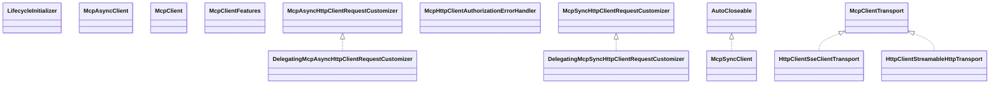

# mcp-core.jar

[Group index](README.md) | [All archives](../README.md)

## Scope and provenance

- **Donor:** `SQX_145_REFERENCE_ROOT/internal/libs/mcp-core.jar`.
- **SHA-256:** `f6eb396f98b5f8f1ef6d7bea1ce79c9914c6b99d8f10f918579c6fb8992ee9d7`; accessed 2026-10-06; captured `2026-10-06T18:54:51.906614+00:00`.
- **Classes:** 301 raw entries; 301 unique entry names. Duplicate occurrence indices are zero-based.
- **Inspection:** read-only ZIP hashing and class-file structural parsing; signatures/descriptors, modifiers, hierarchy and references only. Bytecode bodies are hashed, not published.
- **Allocation:** proposed `FEAT-PRODUCT-MCP-CORE`, P17; [roadmap](../../dev/sqx-full-application-roadmap.md). Domain README registration remains required.
- **Repository:** `01067f00031428613c6394064ca1bcadc1ba00ee`; review state unreviewed. Download label 145-dev1; installed build/activation and runtime equivalence unverified.
- **Limit:** every class/member is inventoried; declaration coverage does not establish consumed calls, defaults, formulas, failure semantics or algorithm parity.
- **Archive/resource index:** [078.json](../../dev/evidence/sqx145/archives/145/078.json).

## Complete member declarations

Member shards contain exact JVM names/descriptors, access flags, generic signatures, throws types, declared fields/methods, superclass/interfaces and referenced class names. All classes, nested/synthetic members and overloads are retained. Code length/hash is structural evidence, not a normalized algorithm comparison.

- [001.json](../../dev/evidence/sqx145/members/078/001.json) — SHA-256 `edc9ce07ea2ee5c135641e65d3a2b06841956e39e71af37424ad8a6fb616f80e`.
- [002.json](../../dev/evidence/sqx145/members/078/002.json) — SHA-256 `c3194dc947032efdb847d3cea69f595f446d6bdeffae282edcc9492e3387fe1e`.
- [003.json](../../dev/evidence/sqx145/members/078/003.json) — SHA-256 `87f908a4a01da2f83864e72b148db681ca386c67a55f676968e6951a8e0f83a8`.
- [004.json](../../dev/evidence/sqx145/members/078/004.json) — SHA-256 `9a33e37dd7371bf1c491ddcafa6c55973fd0f4012b0c09bc3f0afa64fd6605be`.

## Focused structural diagram

Up to twelve non-nested classes; arrows show declared inheritance/interfaces only. External type names are not evidence of an available body or an executed dependency.

## Class inventory

| Archive entry | Occurrence | Class SHA-256 | Fields | Methods |
| --- | ---: | --- | ---: | ---: |
| `io/modelcontextprotocol/client/LifecycleInitializer$DefaultInitialization.class` | 0 | `712bff7d74e0c0e6a92122fbbde6066cbdd216ad4e0515dfe06adc95624ab903` | 3 | 10 |
| `io/modelcontextprotocol/client/LifecycleInitializer$Initialization.class` | 0 | `b3bb12c5c91312c174685e19f4ce261e72253312bcdd1976b5462a4dd942e470` | 0 | 2 |
| `io/modelcontextprotocol/client/LifecycleInitializer.class` | 0 | `d41c7df08ebe5759e6547e032869e92a289adf5e775441c269d5daefe27fc8d8` | 8 | 21 |
| `io/modelcontextprotocol/client/McpAsyncClient$1.class` | 0 | `4a280df522402ae93e058e8fc935b2f0685bd815bba76b875f83beeab231f6ff` | 0 | 1 |
| `io/modelcontextprotocol/client/McpAsyncClient$10.class` | 0 | `8aa2aa70835cf5c5d9965383f6e33f3969fe53deacee90e1184defd774a7b320` | 0 | 1 |
| `io/modelcontextprotocol/client/McpAsyncClient$11.class` | 0 | `684aa6f2ed1afbf01e0c7e281e30c314a86d5cdddf065f6344a345a3b8290edf` | 0 | 1 |
| `io/modelcontextprotocol/client/McpAsyncClient$12.class` | 0 | `2cc2087651c40d68c7e6865db334683ecc1748d7d885b78d60d1ac13c018bd8a` | 0 | 1 |
| `io/modelcontextprotocol/client/McpAsyncClient$13.class` | 0 | `ef65ef8f3d6e6fe5c2cda825936b14cc5704cbe6b89134b519e4a811459cecc2` | 0 | 1 |
| `io/modelcontextprotocol/client/McpAsyncClient$14.class` | 0 | `1b6ae349a752c0c76fc23878d754dc1b2f74e0a8ea76052e9a70ea11c9605ad5` | 1 | 1 |
| `io/modelcontextprotocol/client/McpAsyncClient$15.class` | 0 | `508c12f42776c862b3041ed03c3a0c260f3ea2ce3d86d286292c6cd53898792a` | 0 | 1 |
| `io/modelcontextprotocol/client/McpAsyncClient$16.class` | 0 | `a5f9d1b901abef394de50f6e9229cdc9b2543ab9af49571d01dfe789cb67e063` | 0 | 1 |
| `io/modelcontextprotocol/client/McpAsyncClient$17.class` | 0 | `73b581833293e2517f463cee6a1d4318fdc23a568d2517a9100fa91e11c2a3cb` | 0 | 1 |
| `io/modelcontextprotocol/client/McpAsyncClient$2.class` | 0 | `6ec548c39790424c3d0d4d8057226f81bb7c7d6ffb0871337f6433f67c93b0cb` | 0 | 1 |
| `io/modelcontextprotocol/client/McpAsyncClient$3.class` | 0 | `4604b4054ac3b841b700dc335c81299a868ac72369659a8661e1fc573b354c61` | 0 | 1 |
| `io/modelcontextprotocol/client/McpAsyncClient$4.class` | 0 | `dc5f47f24170cbbb5b046fb7af3dc83fecf4428da8ca27e2b96867a3117a2ce0` | 0 | 1 |
| `io/modelcontextprotocol/client/McpAsyncClient$5.class` | 0 | `706390037483f8a66c525d1085f5dae3606fed60e4c943982f5d4c4e95c9df04` | 0 | 1 |
| `io/modelcontextprotocol/client/McpAsyncClient$6.class` | 0 | `ebefe5510fc04b9e842ebf1cf50b0f938e4fd90161b0e99b3f481cad059320ec` | 0 | 1 |
| `io/modelcontextprotocol/client/McpAsyncClient$7.class` | 0 | `ff6ba40c84b141c45730f6dba517e851b14645e5cfa4849054450b03177f343a` | 0 | 1 |
| `io/modelcontextprotocol/client/McpAsyncClient$8.class` | 0 | `31b234cf82d320b9376af0599d7c00ef84ae7fd8c36193e0be1ebee80201fe1a` | 1 | 1 |
| `io/modelcontextprotocol/client/McpAsyncClient$9.class` | 0 | `8da7a8b2ccf427a18abe4f5c4518f2904ab536ab9e8b4824110c8c020f7eff87` | 0 | 1 |
| `io/modelcontextprotocol/client/McpAsyncClient.class` | 0 | `9126c021aae68fed7c6346eb1252aeb7a17f37c75e53be54b64337ba52fa7652` | 27 | 119 |
| `io/modelcontextprotocol/client/McpClient$AsyncSpec.class` | 0 | `c76569f010cd0dcd94ceeddcd8597df769b54c8bc0e3124613d7fb95fd463d97` | 16 | 20 |
| `io/modelcontextprotocol/client/McpClient$SyncSpec.class` | 0 | `980a76b213ce90b8e5d1918b08e28bb4b1f8f854d9558f29f0ea0c463ffa3baa` | 17 | 22 |
| `io/modelcontextprotocol/client/McpClient.class` | 0 | `a4c8ff40e01d31f00225a3d368e5e72fc37339cffa490b6f4df1fd245caeba87` | 0 | 2 |
| `io/modelcontextprotocol/client/McpClientFeatures$Async.class` | 0 | `3392683487f1d4700a6faea5b504bd6f5deae09f26ca7c2f53d764af593ea274` | 12 | 34 |
| `io/modelcontextprotocol/client/McpClientFeatures$Sync.class` | 0 | `0ecb57fb4ca655a19eb4f6487af9edca26800225793011a3dd03e53434d6db31` | 12 | 17 |
| `io/modelcontextprotocol/client/McpClientFeatures.class` | 0 | `eced1fa44ec785ef960f8ce7a48ce6d5114cec70088c2307fd4e7cfcfdee4916` | 0 | 1 |
| `io/modelcontextprotocol/client/McpSyncClient.class` | 0 | `84c464e90da6aba19c87f6d317a1f090276d59ae62f7e919ed9f6048067a2270` | 4 | 34 |
| `io/modelcontextprotocol/client/transport/customizer/DelegatingMcpAsyncHttpClientRequestCustomizer.class` | 0 | `ece08b7d2e12a2f293ede548133726bfa7f1b03ab7c8ae121690169c485588e5` | 1 | 3 |
| `io/modelcontextprotocol/client/transport/customizer/DelegatingMcpSyncHttpClientRequestCustomizer.class` | 0 | `2849fce098edf2c4fe47b45be666733126700182e5f86ea4d8892711369589c3` | 1 | 3 |
| `io/modelcontextprotocol/client/transport/customizer/McpAsyncHttpClientRequestCustomizer$Noop.class` | 0 | `b06e72cb27a48a06f38d3b4488bd7d5bf5d222929215a7b73303a0fd9fdb2173` | 0 | 2 |
| `io/modelcontextprotocol/client/transport/customizer/McpAsyncHttpClientRequestCustomizer.class` | 0 | `9d4caf859e1c264195c2cc292a9ca7640f0ec24911d8a99f07fb6d56506f6fcc` | 1 | 5 |
| `io/modelcontextprotocol/client/transport/customizer/McpHttpClientAuthorizationErrorHandler$Noop.class` | 0 | `2fdb7db86607cfa00780007f8bda61c685bdf6e972244b18a9ca22cce8e9257b` | 0 | 2 |
| `io/modelcontextprotocol/client/transport/customizer/McpHttpClientAuthorizationErrorHandler$Sync.class` | 0 | `3f33c90a42d65ebc9bb3bb4ee3f9a4e113bbbe013a627499d1dcc52bbb352439` | 0 | 1 |
| `io/modelcontextprotocol/client/transport/customizer/McpHttpClientAuthorizationErrorHandler.class` | 0 | `ddb094b45eb46d540acf8a44acc99f297826ebf3711f4c7f2d25b333667aeb74` | 1 | 6 |
| `io/modelcontextprotocol/client/transport/customizer/McpSyncHttpClientRequestCustomizer.class` | 0 | `c8bf10a4c187f78ab08a13c40ae67b6e4e27a3c556140c212fc7a2d5972e8f89` | 0 | 1 |
| `io/modelcontextprotocol/client/transport/HttpClientSseClientTransport$Builder.class` | 0 | `625f2eb52db4358888a7e482b3834889c3fa6eab97d5b253dd39227cea3ca8de` | 7 | 12 |
| `io/modelcontextprotocol/client/transport/HttpClientSseClientTransport.class` | 0 | `aa3259be9b050230eb3dcf1063fcab10f857ca2679b37279856e6f55dc784b98` | 15 | 29 |
| `io/modelcontextprotocol/client/transport/HttpClientStreamableHttpTransport$Builder.class` | 0 | `80fc7a2297a4f5f839afd8d7fedcee827ca878aa2a34b8467f03ea8ed4a72699` | 11 | 15 |
| `io/modelcontextprotocol/client/transport/HttpClientStreamableHttpTransport.class` | 0 | `07d87f01afa12f2e5de4a3567634f053d0b90191e156b72423ac9445a086fd42` | 22 | 54 |
| `io/modelcontextprotocol/client/transport/McpHttpClientTransportAuthorizationException.class` | 0 | `6cd803751cfcb03c2b5cf76f6579f11852a3e6a27f0dfd49a8b6854dd2d280be` | 1 | 2 |
| `io/modelcontextprotocol/client/transport/ResponseSubscribers$AggregateResponseEvent.class` | 0 | `efdf57edc9f7acd194ee85337a6afeeedd36a55b43179e191da84121bee05342` | 2 | 6 |
| `io/modelcontextprotocol/client/transport/ResponseSubscribers$AggregateSubscriber.class` | 0 | `b47a23497cdf104eb678a219edabf2dc81cdedce4908cde779d1121b69b1a341` | 4 | 7 |
| `io/modelcontextprotocol/client/transport/ResponseSubscribers$BodilessResponseLineSubscriber.class` | 0 | `10b07ca9a1cea3195231821f25fda3d2b0925cd2bec58920469a5dbe228e845a` | 3 | 6 |
| `io/modelcontextprotocol/client/transport/ResponseSubscribers$DummyEvent.class` | 0 | `2892e06cc94052f0141d1aae0db64aa7ab55e46fd0ffb730f6742a30661c5dc8` | 1 | 5 |
| `io/modelcontextprotocol/client/transport/ResponseSubscribers$ResponseEvent.class` | 0 | `fba870e3d102f01f9846281d44e3010b77f38e451361e824344f0eacee99540a` | 0 | 1 |
| `io/modelcontextprotocol/client/transport/ResponseSubscribers$SseEvent.class` | 0 | `3685b7196090dedea9eeb5328eb6185102abe1c13a4279230fdcaa73d14e79bf` | 3 | 7 |
| `io/modelcontextprotocol/client/transport/ResponseSubscribers$SseLineSubscriber.class` | 0 | `faa58b164efcbad5df9e51b2e8329f84791c9f554a3d92a4959d26102518e4f9` | 8 | 9 |
| `io/modelcontextprotocol/client/transport/ResponseSubscribers$SseResponseEvent.class` | 0 | `fedeed23b2b838907339603569e6b17fee4f7e7c29558bfc718c9a66dcd50c44` | 2 | 6 |
| `io/modelcontextprotocol/client/transport/ResponseSubscribers.class` | 0 | `65c7c453e41ab458d7a8f1e8fa14522f892bcec10e2c2cbba7551fd130d08000` | 1 | 5 |
| `io/modelcontextprotocol/client/transport/ServerParameters$Builder.class` | 0 | `53c40b3bbe8bb0d23871e76459182f54391c5950df3ab1f6742b0d0826398c2b` | 3 | 7 |
| `io/modelcontextprotocol/client/transport/ServerParameters.class` | 0 | `ad23eb1d4a2e69a52dad89ec18074137a7d945495161908f6ed11a0370d06b2c` | 4 | 10 |
| `io/modelcontextprotocol/client/transport/StdioClientTransport.class` | 0 | `388f9365603795b4d98483898686e65bd171d46c19253eac154d64403f94cdb1` | 12 | 32 |
| `io/modelcontextprotocol/common/DefaultMcpTransportContext.class` | 0 | `511956af46b35a9cdd3dbb7840b0a7a5141becae02253626867c0db65e885611` | 1 | 4 |
| `io/modelcontextprotocol/common/McpTransportContext.class` | 0 | `5e7db7ad23e26f916a3db51aecd6168cec7b355f2ac0fac81b1067c39b2fa92a` | 2 | 3 |
| `io/modelcontextprotocol/json/McpJsonDefaults.class` | 0 | `9f000dc74e6847c9a17e64368a581272f5af5c2a469a351b2bd0f88b1517504b` | 2 | 7 |
| `io/modelcontextprotocol/json/McpJsonMapper.class` | 0 | `38feefec30825c8aa105eb7d63c014df896a63e3d967a778196b24169de499be` | 0 | 8 |
| `io/modelcontextprotocol/json/McpJsonMapperSupplier.class` | 0 | `fa578ef33837fcbc9a9033cc8e6c0de74e96902a9e75a7f6993285efb568ae0d` | 0 | 0 |
| `io/modelcontextprotocol/json/schema/JsonSchemaValidator$ValidationResponse.class` | 0 | `d3df0a5b44b147d76a31c94f0b787df5c82ae489fcb84f106993a7648d8ab7a3` | 3 | 9 |
| `io/modelcontextprotocol/json/schema/JsonSchemaValidator.class` | 0 | `45ee178ac9a35816d0c8520fad43ad5c942e3cf03b4c54b03b134417eed1b6f3` | 0 | 1 |
| `io/modelcontextprotocol/json/schema/JsonSchemaValidatorSupplier.class` | 0 | `657d9a5def6f2ccaf259ee948c6e06b6e8aa270f95f54ce385f5617a022ff008` | 0 | 0 |
| `io/modelcontextprotocol/json/TypeRef.class` | 0 | `2fc4f10fbc5669f6bec86bf05cd144ddc02c0365afff850a0d5c7a7572a4fa1c` | 1 | 2 |
| `io/modelcontextprotocol/server/DefaultMcpStatelessServerHandler.class` | 0 | `2e9c06dce5b444b9fb9ec4f3ca0f67e0bdbbb05d690bb3f88783218de4469ac9` | 3 | 6 |
| `io/modelcontextprotocol/server/McpAsyncServer$1.class` | 0 | `d35d25e635ae060d36d53deebd6296403c06ca07edcd8165951da90c92b20deb` | 1 | 1 |
| `io/modelcontextprotocol/server/McpAsyncServer$2.class` | 0 | `72a7b93c55efe00ba20795b5f8879281e7c1f1e8fd2a599147c7e175705df09e` | 1 | 1 |
| `io/modelcontextprotocol/server/McpAsyncServer$3.class` | 0 | `4025519fe46b5e4c948e7fd33c7a727d2700ecf235276f952fe7b69f09833082` | 1 | 1 |
| `io/modelcontextprotocol/server/McpAsyncServer$4.class` | 0 | `f8060da184940d62f85e8418a5a51c8dd9d6e8d5ba075e76cad85251072e2aed` | 1 | 1 |
| `io/modelcontextprotocol/server/McpAsyncServer$5.class` | 0 | `5b080670a772f071c68d4d450cea749b6b188695facf4cd033731f0ca99bfe27` | 1 | 1 |
| `io/modelcontextprotocol/server/McpAsyncServer$6.class` | 0 | `28ee543cb1a0c809bbee78797899dde4689c8ca7767273de9ecdf861446c4eca` | 1 | 1 |
| `io/modelcontextprotocol/server/McpAsyncServer$StructuredOutputCallToolHandler.class` | 0 | `7e1e57966246608d6ab23fb1db6f32ae05ec2edd21a351a92c3f4de9b1f46660` | 3 | 4 |
| `io/modelcontextprotocol/server/McpAsyncServer.class` | 0 | `3e77103299e4149a5a40046dd759c6361e50279278fe50604a36a16a63126d03` | 16 | 101 |
| `io/modelcontextprotocol/server/McpAsyncServerExchange$1.class` | 0 | `5ae6110a3f5bde26bfcd74d75260115879bcf5925faf176370637c8d3ca1a01e` | 0 | 1 |
| `io/modelcontextprotocol/server/McpAsyncServerExchange$2.class` | 0 | `89ceab265fc188ad998839b9cb35bc206b881ae174e0d12151a98e6a22db88ec` | 0 | 1 |
| `io/modelcontextprotocol/server/McpAsyncServerExchange$3.class` | 0 | `4714e7d25df4f10000acd80d7828d1a76ee8ca0e6c4c5cea2e001a4ee2365056` | 0 | 1 |
| `io/modelcontextprotocol/server/McpAsyncServerExchange$4.class` | 0 | `6e7e54cf5e23a8a5966150e4b7ccc5677b35ae700920b67cba3a1666795e9ee5` | 0 | 1 |
| `io/modelcontextprotocol/server/McpAsyncServerExchange.class` | 0 | `ca5158d4baa8c711c41bc798bd391a92068c9fadc3dc3439c523008a112b0d4d` | 9 | 18 |
| `io/modelcontextprotocol/server/McpInitRequestHandler.class` | 0 | `9a49a39e70a11836fe7ae91cd9159306d6580b73167d00d9e47b1515de7a3dad` | 0 | 1 |
| `io/modelcontextprotocol/server/McpNotificationHandler.class` | 0 | `735b53dff3d939e2d423cb636b14a25d5f37fe2e3e768320fde5fb824e5023ac` | 0 | 1 |
| `io/modelcontextprotocol/server/McpRequestHandler.class` | 0 | `ebbd28a77fad5ea50c05d826f2c27e3be02733d2be5d332edf079a68d13788ba` | 0 | 1 |
| `io/modelcontextprotocol/server/McpServer$AsyncSpecification.class` | 0 | `ed3d1c173f5984295bbebdaaf1a02b711bbaf98ad855f9865a6847b215a87fe2` | 14 | 30 |
| `io/modelcontextprotocol/server/McpServer$SingleSessionAsyncSpecification.class` | 0 | `7c25a6170fc0dc2b73102553ab902afd0cbb97fb903be5b11679e8df78d70cc7` | 1 | 2 |
| `io/modelcontextprotocol/server/McpServer$SingleSessionSyncSpecification.class` | 0 | `529442339efcbaeecaa3f7017ac1ded634f968296eb1b501fc86355c95678318` | 1 | 2 |
| `io/modelcontextprotocol/server/McpServer$StatelessAsyncSpecification.class` | 0 | `cc74a1af3e89af2d64f76f84fc3a7be1727161f690b5aede1dbdd67a827aa30d` | 14 | 27 |
| `io/modelcontextprotocol/server/McpServer$StatelessSyncSpecification.class` | 0 | `cb11ebf6645cce770e718c8510fbc8d39957c9369190ce19fd835d8f488b1ab8` | 15 | 28 |
| `io/modelcontextprotocol/server/McpServer$StreamableServerAsyncSpecification.class` | 0 | `3cddc6b827fa05065489a6353f34c6161c66c320a93846aa93c947d82b506be7` | 1 | 2 |
| `io/modelcontextprotocol/server/McpServer$StreamableSyncSpecification.class` | 0 | `5c099749e852dda755dcceb9eb7853ed5cda0ce99cfa9e94e04894677166587e` | 1 | 2 |
| `io/modelcontextprotocol/server/McpServer$SyncSpecification.class` | 0 | `3e5dbc9c7c21c185fd1637607986950648c1a02902a21f3654fe13bdd7ae863c` | 15 | 31 |
| `io/modelcontextprotocol/server/McpServer.class` | 0 | `aab6cfdeb9adf06da8c08c3176d30d4e60764fc3ec98ea308eb854745d2ac652` | 1 | 7 |
| `io/modelcontextprotocol/server/McpServerFeatures$Async.class` | 0 | `2dcd3e133be2201369178eb0c02acfa19f829ae725d1d12fba4821255d5363d1` | 9 | 20 |
| `io/modelcontextprotocol/server/McpServerFeatures$AsyncCompletionSpecification.class` | 0 | `68e1791585dde2b32e958fff838919bda6e878bf2095d7e4563551e8f87b0f95` | 2 | 9 |
| `io/modelcontextprotocol/server/McpServerFeatures$AsyncPromptSpecification.class` | 0 | `ca5916e8e4848a0e92b278ecc8e4b6548f0e90ac8035e6f80f88f735d5e5e483` | 2 | 9 |
| `io/modelcontextprotocol/server/McpServerFeatures$AsyncResourceSpecification.class` | 0 | `9e0552ae172eb989cd5709fc3a550ea921a74507347e351eee79e6419379e340` | 2 | 9 |
| `io/modelcontextprotocol/server/McpServerFeatures$AsyncResourceTemplateSpecification.class` | 0 | `1b03561868ed6569a5b401ecd669625237f182d0180f87d44ed2ed2f97eb0aa3` | 2 | 9 |
| `io/modelcontextprotocol/server/McpServerFeatures$AsyncToolSpecification$Builder.class` | 0 | `1b4d483e73c0304f39c65b37dcd088d5c89eeaabf9df2563b56fa71d4e828aa4` | 2 | 4 |
| `io/modelcontextprotocol/server/McpServerFeatures$AsyncToolSpecification.class` | 0 | `960bf6c396f0749160eef82abc625ec7447f319f758a392da9d293c26add8b99` | 2 | 11 |
| `io/modelcontextprotocol/server/McpServerFeatures$Sync.class` | 0 | `016b0d605aaaa739cca56d4063227813a1f0f18afe4f7138dfcbf14de92cd6e6` | 9 | 13 |
| `io/modelcontextprotocol/server/McpServerFeatures$SyncCompletionSpecification.class` | 0 | `0677cb230f6e3c0c38e63e9447071c5d198f291b30d8f6b8e12b4d99f8c56a60` | 2 | 6 |
| `io/modelcontextprotocol/server/McpServerFeatures$SyncPromptSpecification.class` | 0 | `e01d8db17893bfc8c04db60d86d8c092ee03ce8861cff0f97b67233c7e66c1d8` | 2 | 6 |
| `io/modelcontextprotocol/server/McpServerFeatures$SyncResourceSpecification.class` | 0 | `1546783bab6d97f5a08bcaf157e6b5638f7d31d373af93450fd0011f1a565ba8` | 2 | 6 |
| `io/modelcontextprotocol/server/McpServerFeatures$SyncResourceTemplateSpecification.class` | 0 | `2136393f1ec1f4c6de7030140a186d0025bc02d36d704850a45811fcc6f03e94` | 2 | 6 |
| `io/modelcontextprotocol/server/McpServerFeatures$SyncToolSpecification$Builder.class` | 0 | `b1aadcdc7bd5124ae8797d2501a52af8397f6a817f50aae4f4201d319d013a9c` | 2 | 4 |
| `io/modelcontextprotocol/server/McpServerFeatures$SyncToolSpecification.class` | 0 | `39530d77eb124f19fe5b1d2c9a54c156df29603d9f8436942ed31c33a90e6b88` | 2 | 7 |
| `io/modelcontextprotocol/server/McpServerFeatures.class` | 0 | `447ed582f3301659b0ac02115632bd70d4d811a3f60a056624d1a180436da9f9` | 0 | 1 |
| `io/modelcontextprotocol/server/McpStatelessAsyncServer$1.class` | 0 | `de75690c37a2a10292b92d4a8618ab9de0b56befc4f53a034ea7a3810973a4e5` | 1 | 1 |
| `io/modelcontextprotocol/server/McpStatelessAsyncServer$2.class` | 0 | `3ba179ed81264dd8101a7e2bbaa569ef97ce203b7a7ac78e8b2476ea04420455` | 1 | 1 |
| `io/modelcontextprotocol/server/McpStatelessAsyncServer$3.class` | 0 | `00bc75bc8cafde80cfe221a596b3265a60b4679b09d1d4461d6f8c7a20e8dda1` | 1 | 1 |
| `io/modelcontextprotocol/server/McpStatelessAsyncServer$StructuredOutputCallToolHandler.class` | 0 | `86d5b233ae9b5024bf5b17cee5847d50cdbe2f3ed6b2751110ff39d77da1724d` | 3 | 4 |
| `io/modelcontextprotocol/server/McpStatelessAsyncServer.class` | 0 | `35893b8714e24273005f20bcab68efc1f494a93cb7f76541ca95067b5fbc2785` | 15 | 63 |
| `io/modelcontextprotocol/server/McpStatelessNotificationHandler.class` | 0 | `9b5cdba2511e29df7014c16ff9da24394d1ffa02eda016ed85badfced6c63906` | 0 | 1 |
| `io/modelcontextprotocol/server/McpStatelessRequestHandler.class` | 0 | `a62e8af99af125eb9952fce239ff967460073c08cbb899f32374f5054a9f8e83` | 0 | 1 |
| `io/modelcontextprotocol/server/McpStatelessServerFeatures$Async.class` | 0 | `9c139c346a73777574b12b9ffe0a71bb93e333c37e4b7015027d2ee5df4a065f` | 8 | 17 |
| `io/modelcontextprotocol/server/McpStatelessServerFeatures$AsyncCompletionSpecification.class` | 0 | `1d6a8e11abc855c301ec279fb08d1f6490eaa99385c2f262e23b8b5e32806a8a` | 2 | 9 |
| `io/modelcontextprotocol/server/McpStatelessServerFeatures$AsyncPromptSpecification.class` | 0 | `cb1fb75a6d86692e3c8c8e6ccf2602e74ab552bf6078f04e69b7f6ffa608d5a3` | 2 | 9 |
| `io/modelcontextprotocol/server/McpStatelessServerFeatures$AsyncResourceSpecification.class` | 0 | `ea6f5928a5c63a4a08253cd851de41c9b37446cd6bbf317836269edea59ee622` | 2 | 9 |
| `io/modelcontextprotocol/server/McpStatelessServerFeatures$AsyncResourceTemplateSpecification.class` | 0 | `a760d9aaef6babc3bb9bfa5b822348c92cdce7a0c2ca1117a26adceddd0bfada` | 2 | 9 |
| `io/modelcontextprotocol/server/McpStatelessServerFeatures$AsyncToolSpecification$Builder.class` | 0 | `1864f5188cb37f8707be5b7a459e078d556c4f615ae45163f3b1540da8b2dcba` | 2 | 4 |
| `io/modelcontextprotocol/server/McpStatelessServerFeatures$AsyncToolSpecification.class` | 0 | `09207cccf4123a38589814f282202c6d9881fa06486ec3bd183df574a3206cfa` | 2 | 11 |
| `io/modelcontextprotocol/server/McpStatelessServerFeatures$Sync.class` | 0 | `6a63a4e464c9172bf083ea060e2f38c1aaa255f31c7277558e2e711b85329338` | 8 | 12 |
| `io/modelcontextprotocol/server/McpStatelessServerFeatures$SyncCompletionSpecification.class` | 0 | `86a86a741b7558fb71e0fe34d289ea1d1de618625749b6ac5c706ccfb083b5fd` | 2 | 6 |
| `io/modelcontextprotocol/server/McpStatelessServerFeatures$SyncPromptSpecification.class` | 0 | `c8c35c2890c5cfcf65f51a9847d605c412aae22a8b2e2c4f2e2f1b8f5f2b9155` | 2 | 6 |
| `io/modelcontextprotocol/server/McpStatelessServerFeatures$SyncResourceSpecification.class` | 0 | `4a06135bd0869d8b850297d17f2ced0698016a3634670c4763aaf98723153a2f` | 2 | 6 |
| `io/modelcontextprotocol/server/McpStatelessServerFeatures$SyncResourceTemplateSpecification.class` | 0 | `21af635954069d4b9a9c39ae8906f3a1a78bb971a3bd435d2e0e3c04db9ed3e3` | 2 | 6 |
| `io/modelcontextprotocol/server/McpStatelessServerFeatures$SyncToolSpecification$Builder.class` | 0 | `e91d71b6c9c38924f4fee91871508db920cbd38b7a7455c634b4464fdd8c372f` | 2 | 4 |
| `io/modelcontextprotocol/server/McpStatelessServerFeatures$SyncToolSpecification.class` | 0 | `93711b34f547b0542b15c72e3fb035996ffe6278bf560710ffa3c6c6f3469fc4` | 2 | 7 |
| `io/modelcontextprotocol/server/McpStatelessServerFeatures.class` | 0 | `924947bc9f18ee46b0e2b43157a3e2497bd7be0fc978c50a393a3d627f23bef7` | 0 | 1 |
| `io/modelcontextprotocol/server/McpStatelessServerHandler.class` | 0 | `c0e10b6fb43b1895435a35ef6c599bfdffefbcde035266773ec631e1130448b0` | 0 | 2 |
| `io/modelcontextprotocol/server/McpStatelessSyncServer.class` | 0 | `904048381d4f1616c1e928797f6668218194d6e5d6ef87849f887b491daaeba3` | 3 | 19 |
| `io/modelcontextprotocol/server/McpSyncServer.class` | 0 | `3e2a556b688f4ca76ede99a9734dc6d84798e49017f8d1a19fb570aa0b6dbfd7` | 2 | 23 |
| `io/modelcontextprotocol/server/McpSyncServerExchange.class` | 0 | `13b082b0cbda4e00f79d9959adaebd165ef696f325b96d095e4a33cbee813a87` | 1 | 12 |
| `io/modelcontextprotocol/server/McpTransportContextExtractor.class` | 0 | `09208c29cae77d0ff6df4ba5947eea5e6daacc583ec2ebe70f7301500f5f700a` | 0 | 1 |
| `io/modelcontextprotocol/server/transport/DefaultServerTransportSecurityValidator$Builder.class` | 0 | `e273ffa8178b9729f90038ec5f68261fe72aed11f967fe765cc1a7f652b51f67` | 2 | 6 |
| `io/modelcontextprotocol/server/transport/DefaultServerTransportSecurityValidator.class` | 0 | `81cc8722c9bd433dc9d87b489b0f024274d52c3bcea6bf2b28110bd7fc4a6d96` | 4 | 5 |
| `io/modelcontextprotocol/server/transport/HttpServletRequestUtils.class` | 0 | `438f167391b073591b41b3180c83671b13ce9c785c3b9b379b1022729fc82b42` | 0 | 2 |
| `io/modelcontextprotocol/server/transport/HttpServletSseServerTransportProvider$Builder.class` | 0 | `e94a9b16781a1d8853b0304363f28b790ba86a6ebb4b3e272c7da4c978f87c33` | 7 | 10 |
| `io/modelcontextprotocol/server/transport/HttpServletSseServerTransportProvider$HttpServletMcpSessionTransport.class` | 0 | `5d2db750fa83eb70ad6c77d62ca7ca0d0747feb146c166977852eb7d02f9ef2c` | 4 | 7 |
| `io/modelcontextprotocol/server/transport/HttpServletSseServerTransportProvider.class` | 0 | `6ad472f381ab30320f3a78af3c08d92b9d2dbec38c0537e0117b7832c4339640` | 19 | 20 |
| `io/modelcontextprotocol/server/transport/HttpServletStatelessServerTransport$Builder.class` | 0 | `8d4ada883aa41eadad3c7137431ad4b8d5e5a6c862630f707a417d7e333faa49` | 4 | 7 |
| `io/modelcontextprotocol/server/transport/HttpServletStatelessServerTransport.class` | 0 | `7b2355f789237f45aa0c9c891003694ea872fd987fac9ec884e31bcac14602d3` | 12 | 12 |
| `io/modelcontextprotocol/server/transport/HttpServletStreamableServerTransportProvider$1.class` | 0 | `06666a9d698099944356a4ca792eb44403e7e7ac66bfcc4070206563ff25fa2f` | 3 | 5 |
| `io/modelcontextprotocol/server/transport/HttpServletStreamableServerTransportProvider$2.class` | 0 | `0496b6972952ae00057d01516c496a3b36e43bb57e12b13083fdd732d2280729` | 1 | 1 |
| `io/modelcontextprotocol/server/transport/HttpServletStreamableServerTransportProvider$Builder.class` | 0 | `5175d4d4e79a7edc6005adade023e312b987c64661ff22b3e7c54a966a9a4890` | 6 | 9 |
| `io/modelcontextprotocol/server/transport/HttpServletStreamableServerTransportProvider$HttpServletStreamableMcpSessionTransport.class` | 0 | `63d209bf46e97560fbb4b2ba3742ca1d4b0e3b0af22822a099575a8ecd6d51a2` | 6 | 8 |
| `io/modelcontextprotocol/server/transport/HttpServletStreamableServerTransportProvider.class` | 0 | `293c1392f4e6a0297c3651ae804124cd11a69712b0224969d7d18a0fe07a9319` | 17 | 28 |
| `io/modelcontextprotocol/server/transport/ServerTransportSecurityException.class` | 0 | `2e7c8464da0d2c4d94247eed5d8f11fea6c64370753988f2fe5a70b904ac897e` | 1 | 4 |
| `io/modelcontextprotocol/server/transport/ServerTransportSecurityValidator.class` | 0 | `1951f387a763c60468fe2c5b71304ff6aac1823b4eacd14c6a5e55a84d67ca2e` | 1 | 3 |
| `io/modelcontextprotocol/server/transport/StdioServerTransportProvider$StdioMcpSessionTransport.class` | 0 | `c7cffa3247932218cbbb9b514ff5c3a826ae907ef69ac267fda3a091da0f4795` | 7 | 21 |
| `io/modelcontextprotocol/server/transport/StdioServerTransportProvider.class` | 0 | `9e016f1db5db9521ed638c6e2457d4e21a58064fed343856549216b93cfa8641` | 7 | 10 |
| `io/modelcontextprotocol/spec/ClosedMcpTransportSession.class` | 0 | `9b3d719accd06f56d0fb7b9b671c8028f1ad966d9b84fc3c7e5fa9c539c2f84a` | 1 | 7 |
| `io/modelcontextprotocol/spec/DefaultMcpStreamableServerSessionFactory.class` | 0 | `0c804b365934c8ae958bbe693d9616ad1f28b95850db5687ebd02fb3f0026b49` | 5 | 5 |
| `io/modelcontextprotocol/spec/DefaultMcpTransportSession.class` | 0 | `c7dde96185a9341cd4b1a63bedb2353dfc8f4661acf2919eca6cf6e4c68b14ec` | 5 | 11 |
| `io/modelcontextprotocol/spec/DefaultMcpTransportStream.class` | 0 | `d36a99057dd14753ee091385c58ab0cc5ce0b865f957ce28e1ccffd84228b565` | 6 | 9 |
| `io/modelcontextprotocol/spec/HttpHeaders.class` | 0 | `b6e2ed02521360bdce9590cce14f30e98f017b0038835cf097ad7d77f1b3c31f` | 7 | 0 |
| `io/modelcontextprotocol/spec/JsonSchemaValidator$ValidationResponse.class` | 0 | `eeb14b71b72e4d3608a2a2896f3744fe860a2dab01dae2ee7557261e577da3fc` | 3 | 9 |
| `io/modelcontextprotocol/spec/JsonSchemaValidator.class` | 0 | `3b2d9d961fbe6e86d4a28680d00d20ad49bec7604cb5398b3bc592c9f3e7d300` | 0 | 1 |
| `io/modelcontextprotocol/spec/McpClientSession$MethodNotFoundError.class` | 0 | `b1cac2b42b529c1a41fb07411934e54309c5a41461ef47b62a58bccc0efbb448` | 3 | 7 |
| `io/modelcontextprotocol/spec/McpClientSession$NotificationHandler.class` | 0 | `9453be730d5593dd5b20b719c169773958f0543402d716ba0d0a712aa4661331` | 0 | 1 |
| `io/modelcontextprotocol/spec/McpClientSession$RequestHandler.class` | 0 | `e724687838bb070cb18e6dcff394212c8fa851667b55ca5c0ed57bbce5914635` | 0 | 1 |
| `io/modelcontextprotocol/spec/McpClientSession.class` | 0 | `c39731a2aa3d666d26e48a9062dd4eb62f5a45b23a72635229166b73505be1be` | 8 | 25 |
| `io/modelcontextprotocol/spec/McpClientTransport.class` | 0 | `d4c03244434f6c3b0e9ea95332d1de5f492f873108366fac2d14901d7f011bf6` | 0 | 2 |
| `io/modelcontextprotocol/spec/McpError$Builder.class` | 0 | `37d7aa43d7f07d9eee926abaee311f2851e4e418d38555ac56c1dee0d1362435` | 3 | 4 |
| `io/modelcontextprotocol/spec/McpError.class` | 0 | `9e8012e08386799279b87efcf213b2067d14c325f77a004e4372e15827d75275` | 2 | 8 |
| `io/modelcontextprotocol/spec/McpLoggableSession.class` | 0 | `a7a420e54e54931d4b86ad4f8093086f3174557ca2bf4d5c7a622d0197158f60` | 0 | 2 |
| `io/modelcontextprotocol/spec/McpSchema$1.class` | 0 | `420ba01e975570c1a5dc08d15a5a7b2cd436cb7c5968b78019343dcb1c9b0863` | 0 | 1 |
| `io/modelcontextprotocol/spec/McpSchema$Annotated.class` | 0 | `c551d858413e39a4cc9320a81f7d0fb6b7131786b3e44601666efc2f7451af3f` | 0 | 1 |
| `io/modelcontextprotocol/spec/McpSchema$Annotations.class` | 0 | `382654f4b12c51d11a711192ec59674efd9ae96c52459d83197172fde0e2dd82` | 3 | 8 |
| `io/modelcontextprotocol/spec/McpSchema$AudioContent.class` | 0 | `4dba0ef88c721a20b4815048d082ebb44389ae25b88ebad1d1b5a2ff7e249c9f` | 4 | 9 |
| `io/modelcontextprotocol/spec/McpSchema$BlobResourceContents.class` | 0 | `b927af00a01efd746cc480e27b04510eea9410406b5097dfc81b8e0ec4e528ab` | 4 | 9 |
| `io/modelcontextprotocol/spec/McpSchema$CallToolRequest$Builder.class` | 0 | `eb54ebd45c7a467f43796b651bd03fce58af1ced3346c15eae9103733a6ccfb7` | 3 | 7 |
| `io/modelcontextprotocol/spec/McpSchema$CallToolRequest.class` | 0 | `0e7b3ac8aced9666714779af30ee5a8f49fa781c872c8e92604518d8569b6da8` | 3 | 11 |
| `io/modelcontextprotocol/spec/McpSchema$CallToolResult$Builder.class` | 0 | `83138358ae9d41f45f0367675532009755d220b3ba7a476e5eb8ab6e4dd4f003` | 4 | 10 |
| `io/modelcontextprotocol/spec/McpSchema$CallToolResult.class` | 0 | `016c737a3931fb6759b4fcc6ef9182cf173f76bd8e0b4b6a7ad56c9c41064aff` | 4 | 9 |
| `io/modelcontextprotocol/spec/McpSchema$ClientCapabilities$Builder.class` | 0 | `34fc1795f08cbc9c8d9208ef0ab39de18ca46cda340948b4d69d12f3955fd78e` | 4 | 7 |
| `io/modelcontextprotocol/spec/McpSchema$ClientCapabilities$Elicitation$Form.class` | 0 | `a7f3410f83ac25c11da6f875dd449ea39833843554a1da8e36499295a1bb9ab7` | 0 | 4 |
| `io/modelcontextprotocol/spec/McpSchema$ClientCapabilities$Elicitation$Url.class` | 0 | `357c9aaf69ee870fcde9c9c1d8f3b7250f07e4205152d89abe4f76414111af61` | 0 | 4 |
| `io/modelcontextprotocol/spec/McpSchema$ClientCapabilities$Elicitation.class` | 0 | `eb8384610d9a6707526024b17e1ca6e833ba8489e3e663ea821b58c212a03381` | 2 | 7 |
| `io/modelcontextprotocol/spec/McpSchema$ClientCapabilities$RootCapabilities.class` | 0 | `bc74c443343235bb781e75fa0520125141d3eaf5288df0cd1edf60539571f32d` | 1 | 5 |
| `io/modelcontextprotocol/spec/McpSchema$ClientCapabilities$Sampling.class` | 0 | `b46956957cd0d892670c8e9d17ad5ae289b420e399d8485f624a0ca614d2626e` | 0 | 4 |
| `io/modelcontextprotocol/spec/McpSchema$ClientCapabilities.class` | 0 | `c12f421e5a663297be1c946aca278742b2c267d8bfba5478223bc3f353ea822c` | 4 | 9 |
| `io/modelcontextprotocol/spec/McpSchema$CompleteReference.class` | 0 | `8794cd8cc2c340ec18ca62b48dcf7a999ff10323864e0fb458860712dfcf91df` | 0 | 2 |
| `io/modelcontextprotocol/spec/McpSchema$CompleteRequest$CompleteArgument.class` | 0 | `0e41e555018220eb1356e8ed3931347e0e9567418b419632e855372f462087ef` | 2 | 6 |
| `io/modelcontextprotocol/spec/McpSchema$CompleteRequest$CompleteContext.class` | 0 | `d00c3d2f2b293b9780db592879ae409c5a69c403189b7288cad44fc295d48aab` | 1 | 5 |
| `io/modelcontextprotocol/spec/McpSchema$CompleteRequest.class` | 0 | `aeb46bc152d1a294f8b114a10bb8c9c3d2309b67f6cf446b811b9b92256414b6` | 4 | 11 |
| `io/modelcontextprotocol/spec/McpSchema$CompleteResult$CompleteCompletion.class` | 0 | `32f14036a6fde4640440bf9ee2b8853259ade5d42dbf96dc5b9e2b1ce7bdd0f7` | 3 | 7 |
| `io/modelcontextprotocol/spec/McpSchema$CompleteResult.class` | 0 | `d9974182420ffa227f9a2be18002b1860e1ef4d941e5e698db35feb0432329e0` | 2 | 7 |
| `io/modelcontextprotocol/spec/McpSchema$Content.class` | 0 | `ba4f58ce077a091dfcabdc23db114382deeebd573d9a52595697023d09b6de35` | 0 | 1 |
| `io/modelcontextprotocol/spec/McpSchema$CreateMessageRequest$Builder.class` | 0 | `c7e30efa408a765ee926caec81c01025492d9a36be3d660208769f6ad237eebf` | 9 | 12 |
| `io/modelcontextprotocol/spec/McpSchema$CreateMessageRequest$ContextInclusionStrategy.class` | 0 | `4a81550aaf299a136469ad5095c03e2732f542af1d0592db49bf216d6477b3ff` | 4 | 5 |
| `io/modelcontextprotocol/spec/McpSchema$CreateMessageRequest.class` | 0 | `25ef2f1919bc7896df6ee0eb4e9f42bbee9bc8e92be8cbc87ed134920f86ccb3` | 9 | 15 |
| `io/modelcontextprotocol/spec/McpSchema$CreateMessageResult$Builder.class` | 0 | `fbc32a9d933d17c5cb1cd182742ef2281f788d879144187b59c869774c5b357d` | 5 | 8 |
| `io/modelcontextprotocol/spec/McpSchema$CreateMessageResult$StopReason.class` | 0 | `2a5247cecf47606a16203f526d1daf477692d865148998cbc18aeb0afca18d08` | 6 | 7 |
| `io/modelcontextprotocol/spec/McpSchema$CreateMessageResult.class` | 0 | `a2843abd910f6440acf33533a946a7cf82d96620ea0725a4b9f83f2741c500fb` | 5 | 11 |
| `io/modelcontextprotocol/spec/McpSchema$ElicitRequest$Builder.class` | 0 | `7811eef36f719f78315b3762ca9855480fa6fa9c0967078bad10b3fe860f21e4` | 3 | 6 |
| `io/modelcontextprotocol/spec/McpSchema$ElicitRequest.class` | 0 | `6d2fa34f5377dacdb03408c94f6b4dc42b91bd80be84edbe636494a4bb510c02` | 3 | 9 |
| `io/modelcontextprotocol/spec/McpSchema$ElicitResult$Action.class` | 0 | `a4c2b46813ed9bd06c6e07e190a5e4b78a1ef69720eea7a25e08073079b1f65d` | 4 | 5 |
| `io/modelcontextprotocol/spec/McpSchema$ElicitResult$Builder.class` | 0 | `46a6a164baeed410b41039f314be7d09a73bba6b1ffdd1574dcd9c202b68069a` | 3 | 5 |
| `io/modelcontextprotocol/spec/McpSchema$ElicitResult.class` | 0 | `5b8b06fa26690ba2e99e9e15936e774ce4e6a8c015e5a9c268807bb61b16a79b` | 3 | 9 |
| `io/modelcontextprotocol/spec/McpSchema$EmbeddedResource.class` | 0 | `47112b806796c4be04c6077869334bc3ae8d3f89145c51a2ef9d304c1bdd4869` | 3 | 8 |
| `io/modelcontextprotocol/spec/McpSchema$ErrorCodes.class` | 0 | `7660e9228f1b29dd53e52308ec73bdccc14d6d208d3f287440c288a9437951ac` | 6 | 1 |
| `io/modelcontextprotocol/spec/McpSchema$GetPromptRequest.class` | 0 | `670403fbf6f40e932d6168cd26f48d372ba2267de9995deeee636ab30513f4d7` | 3 | 8 |
| `io/modelcontextprotocol/spec/McpSchema$GetPromptResult.class` | 0 | `d0542723f5a34a7e3c4476a6537702a5092d8ed1c4552fc4709e54df39707e3c` | 3 | 8 |
| `io/modelcontextprotocol/spec/McpSchema$Identifier.class` | 0 | `5f3b47d85c9ae234009d0e9209b11aa6db68913b0c098958d099756a2de2334a` | 0 | 2 |
| `io/modelcontextprotocol/spec/McpSchema$ImageContent.class` | 0 | `45795019de3b725e282fd0bb1b680fcabcf17f51d34fe2645c91606e43818d73` | 4 | 9 |
| `io/modelcontextprotocol/spec/McpSchema$Implementation.class` | 0 | `c638ea167e0cefb97b1647f94c9b090caac426d4007136e882f5be2bffa8b3e3` | 3 | 8 |
| `io/modelcontextprotocol/spec/McpSchema$InitializeRequest.class` | 0 | `eb4faba01e34ef3f1dd516ef79007b88758f5534842facb89cfb652408e56481` | 4 | 9 |
| `io/modelcontextprotocol/spec/McpSchema$InitializeResult.class` | 0 | `6299f84804bb85f0899aee37ce91de6a2fe4685742162b0ba6a58194f6663776` | 5 | 10 |
| `io/modelcontextprotocol/spec/McpSchema$JSONRPCMessage.class` | 0 | `8a4937d3afef38a8a05337a7686451de4046da8acabb1e2efae2363706a94d13` | 0 | 1 |
| `io/modelcontextprotocol/spec/McpSchema$JSONRPCNotification.class` | 0 | `52cf7dd005da7af9fcc6b7c530b8db6818dcf34d626a69a7e98b0cef54ed6705` | 3 | 7 |
| `io/modelcontextprotocol/spec/McpSchema$JSONRPCRequest.class` | 0 | `c959bb5e5e26fa6a56467b3b9375d08ff648d558dbf1553b8a28770011da5b72` | 4 | 8 |
| `io/modelcontextprotocol/spec/McpSchema$JSONRPCResponse$JSONRPCError.class` | 0 | `72048f4b2ec032d60673c711973ec49727bf62a3bf04b033677f4de0dd9cf2ca` | 3 | 7 |
| `io/modelcontextprotocol/spec/McpSchema$JSONRPCResponse.class` | 0 | `8bc4f3bb62b06aa0807ef28910e47e3ec53c5871eb56d8ebda9a2532e3f32500` | 4 | 8 |
| `io/modelcontextprotocol/spec/McpSchema$JsonSchema.class` | 0 | `88f5d8dcce9761b6c59eed3221cc91682d3da1ce68eeb76f74af615dd8692253` | 6 | 10 |
| `io/modelcontextprotocol/spec/McpSchema$ListPromptsResult.class` | 0 | `7a73e501aa3d6e122830fec94d0d5a394af8ffc106722f58ae804245ad492c90` | 3 | 8 |
| `io/modelcontextprotocol/spec/McpSchema$ListResourcesResult.class` | 0 | `57890f6876be826bc0709e3e4cf97496b5917fb293ee7cc1ce02fa1dcea2d694` | 3 | 8 |
| `io/modelcontextprotocol/spec/McpSchema$ListResourceTemplatesResult.class` | 0 | `1ce0c2bbe6afaa6c2f67fd7c6d68a30ff381a8589e1872f9ab731122026d3203` | 3 | 8 |
| `io/modelcontextprotocol/spec/McpSchema$ListRootsResult.class` | 0 | `06409af267e83961631f0fe6002fba87818aad70725056457f80a64f6d20ce89` | 3 | 9 |
| `io/modelcontextprotocol/spec/McpSchema$ListToolsResult.class` | 0 | `a02d929c39fd6f03707edca50f6cdb08217c417e2f1f05c043b90d302d7ca188` | 3 | 8 |
| `io/modelcontextprotocol/spec/McpSchema$LoggingLevel.class` | 0 | `bb3b4dd3afe6854e380f31a21af4314584eeb4585fdaa1056a09a2272f526a00` | 10 | 6 |
| `io/modelcontextprotocol/spec/McpSchema$LoggingMessageNotification$Builder.class` | 0 | `b708535ff5eb736508c6e49e74ddfa0d33ba82f00c262a588d87d71d24126ed3` | 4 | 6 |
| `io/modelcontextprotocol/spec/McpSchema$LoggingMessageNotification.class` | 0 | `469db6ab3b5b3a6d9cd07a6550f05ffa0b7b15602ac7d82cb87b82cd3663fbc1` | 4 | 10 |
| `io/modelcontextprotocol/spec/McpSchema$Meta.class` | 0 | `c17bea1d70467457f796a0ed17a4ba5ef6f4dc15a2d736d214745bf7446015b3` | 0 | 1 |
| `io/modelcontextprotocol/spec/McpSchema$ModelHint.class` | 0 | `d21a0e4e998ef146fba9545073111d155bd3c811ac9824111b752eb615aa3cbe` | 1 | 6 |
| `io/modelcontextprotocol/spec/McpSchema$ModelPreferences$Builder.class` | 0 | `68b8c5f6ca1506201d45bd4d9b6f6e9fb5d04775054d4c0d2560fcdfaf13a617` | 4 | 7 |
| `io/modelcontextprotocol/spec/McpSchema$ModelPreferences.class` | 0 | `1598b62a9e08b62bf451cdd0f8af314e057b3d0654ca3eb6ef05e6c4fcb18181` | 4 | 9 |
| `io/modelcontextprotocol/spec/McpSchema$Notification.class` | 0 | `a852c11e00cdfc040ace5957e89da422258cbd2c4f9d67819eeed557d16b33c4` | 0 | 0 |
| `io/modelcontextprotocol/spec/McpSchema$PaginatedRequest.class` | 0 | `41a320f08761f70fa75fca400e72c7ccbb796b53cd753ae7dc459c2d24836d31` | 2 | 8 |
| `io/modelcontextprotocol/spec/McpSchema$PaginatedResult.class` | 0 | `cc3cf19f5a6478c7e40500e0e4d62e85a834708acf17c6127370b14c115d2e1b` | 1 | 5 |
| `io/modelcontextprotocol/spec/McpSchema$ProgressNotification.class` | 0 | `49774557300f262a03fe7263676243f168a2894e449c4c04186f2ffb21fb0aa7` | 5 | 10 |
| `io/modelcontextprotocol/spec/McpSchema$Prompt.class` | 0 | `d09773c3f7e9d90708d9e6885218309e086e16e7f5304a76970c4f8cffdd6025` | 5 | 11 |
| `io/modelcontextprotocol/spec/McpSchema$PromptArgument.class` | 0 | `4942f13a61475eb41bbd3a2d51c82b56c7faa5d04866b2266b47745d6c22ec01` | 4 | 9 |
| `io/modelcontextprotocol/spec/McpSchema$PromptMessage.class` | 0 | `95006f2f47fb6dd97e814312a61c2a3052ca3be55a595aac0a35f68fcd7e9bee` | 2 | 6 |
| `io/modelcontextprotocol/spec/McpSchema$PromptReference.class` | 0 | `3d2a6ed3c0b384a5d7378747da9707cb01471d23ab47010fb86f4981c2f3613b` | 4 | 10 |
| `io/modelcontextprotocol/spec/McpSchema$ReadResourceRequest.class` | 0 | `be4fa8ef890d5f84abb9de0493992aff1752c9463a20126c2ab5978e64288c1b` | 2 | 7 |
| `io/modelcontextprotocol/spec/McpSchema$ReadResourceResult.class` | 0 | `73d9cacac1b1b1480ec9f4706f843e41a171597bd23c4527d1570e22e680b433` | 2 | 7 |
| `io/modelcontextprotocol/spec/McpSchema$Request.class` | 0 | `3f65cf61c11a56b2f142b6d6997422419226fed6377275547bbbb959a59c927c` | 0 | 1 |
| `io/modelcontextprotocol/spec/McpSchema$Resource$Builder.class` | 0 | `dd0d35de43f5b115783f31a0263142a23f04f9b0c46ea8201445388d262c8f32` | 8 | 10 |
| `io/modelcontextprotocol/spec/McpSchema$Resource.class` | 0 | `1cbefbdbad2e470aa689469ab0b0d344216323676512bcc5b1fddb5d999b326c` | 8 | 13 |
| `io/modelcontextprotocol/spec/McpSchema$ResourceContent.class` | 0 | `8cd11dfe8f2ed0b8b4a0cdd9018ecb038b69a3733ef52ffb5b8410fe6ec9e0f2` | 0 | 4 |
| `io/modelcontextprotocol/spec/McpSchema$ResourceContents.class` | 0 | `81aeee5e91d3f685eff95fadcff349357470eebb2df4bd95490bd0171d518346` | 0 | 2 |
| `io/modelcontextprotocol/spec/McpSchema$ResourceLink$Builder.class` | 0 | `dba6d1c2d5e1e200a079eaeb54af9a2460a3a5098033dbb2268debe29c33e92d` | 8 | 10 |
| `io/modelcontextprotocol/spec/McpSchema$ResourceLink.class` | 0 | `5f9462a2e7fe59d76bf54692318b084970a8a7d9f3b108ef2efc3fbf8aa4aec9` | 8 | 13 |
| `io/modelcontextprotocol/spec/McpSchema$ResourceReference.class` | 0 | `bccc409bf0f5dde8258a1c94290b7c3eccfcddf668de66480ff7b2982356da06` | 3 | 8 |
| `io/modelcontextprotocol/spec/McpSchema$ResourcesUpdatedNotification.class` | 0 | `1b5646ac10dc2541fe2f6694ce2994abf9e685d9afdc47893aa1bba1cc2a913d` | 2 | 7 |
| `io/modelcontextprotocol/spec/McpSchema$ResourceTemplate$Builder.class` | 0 | `f27a21b8f03ae8e3a2c451daf4ad0d3fea1ad8119e24a2d64dd4dafe7f12d86c` | 7 | 9 |
| `io/modelcontextprotocol/spec/McpSchema$ResourceTemplate.class` | 0 | `825c4d89176993db22af8dcb27f2e03fcc73cd22b6004e39706f07b54e8db3dc` | 7 | 14 |
| `io/modelcontextprotocol/spec/McpSchema$Result.class` | 0 | `651f97022e6a9c20183236d311bfffd11328697b74eb9a177dd613887b0b3c0c` | 0 | 0 |
| `io/modelcontextprotocol/spec/McpSchema$Role.class` | 0 | `657e47db2c20c2c478324a1905f7489a5e210e449639e72e39df5554e81e88f6` | 3 | 5 |
| `io/modelcontextprotocol/spec/McpSchema$Root.class` | 0 | `60f872df542c23a56d909aba532af87ac33b1a1045c291f4869f9729c8cfb1a9` | 3 | 8 |
| `io/modelcontextprotocol/spec/McpSchema$SamplingMessage.class` | 0 | `053706c8b1e2fc40f2b5ae5ad35e252a5e245fd80d27080e7828d6b3da928440` | 2 | 6 |
| `io/modelcontextprotocol/spec/McpSchema$ServerCapabilities$Builder.class` | 0 | `4f11540d4c34bc8e5c5c8a49d9132919f60de89eaa501da32422ac67a6d9a834` | 6 | 8 |
| `io/modelcontextprotocol/spec/McpSchema$ServerCapabilities$CompletionCapabilities.class` | 0 | `67ff608cf548c3a52a7d069999291a4ec2bf334a09965b4c09cd96e722280f60` | 0 | 4 |
| `io/modelcontextprotocol/spec/McpSchema$ServerCapabilities$LoggingCapabilities.class` | 0 | `f3263eb992a69d5d4750bfc0416b0f88370950dd6255ff774e80faae21a0e276` | 0 | 4 |
| `io/modelcontextprotocol/spec/McpSchema$ServerCapabilities$PromptCapabilities.class` | 0 | `558d22b46eb199d851ecc10efbf8a76b788fb0d3db4faf1743c4a3c3acc23105` | 1 | 5 |
| `io/modelcontextprotocol/spec/McpSchema$ServerCapabilities$ResourceCapabilities.class` | 0 | `0ff734dade70c5af57682ada15e1b3c745c9f1488f3a29b553ddc946d1c57469` | 2 | 6 |
| `io/modelcontextprotocol/spec/McpSchema$ServerCapabilities$ToolCapabilities.class` | 0 | `c01cc13a0a2ea85ea1ffdb8af1cd677b3ea713738009638caa7526bc139ce176` | 1 | 5 |
| `io/modelcontextprotocol/spec/McpSchema$ServerCapabilities.class` | 0 | `75bca25f64bfd06c179e34f7aeeb7c6dbada5f6da73b93e4be5c0cb81cd93098` | 6 | 12 |
| `io/modelcontextprotocol/spec/McpSchema$SetLevelRequest.class` | 0 | `ded59f5b36d746743dca952590a2061b715f6133a6ab5b6ff98d50036530d825` | 1 | 5 |
| `io/modelcontextprotocol/spec/McpSchema$SubscribeRequest.class` | 0 | `6f0f36c88f27197a3d550e808e84432d214360cf59323ac17f271709ef570d26` | 2 | 7 |
| `io/modelcontextprotocol/spec/McpSchema$TextContent.class` | 0 | `8aa6c7854b6117ed69bd5a1b1fdea2f31c893b85b9b05c191007bcea5b48e6e5` | 3 | 9 |
| `io/modelcontextprotocol/spec/McpSchema$TextResourceContents.class` | 0 | `a09aa6d39ad9fa792d68e386baeb3e47c54ae92901c66ce0fd77eafbae4865fb` | 4 | 9 |
| `io/modelcontextprotocol/spec/McpSchema$Tool$Builder.class` | 0 | `466264eb40020813d4559197ef986d32fbad0ea1ca80c941f734408ab2becbaa` | 7 | 11 |
| `io/modelcontextprotocol/spec/McpSchema$Tool.class` | 0 | `d36ff25a965b260db980289db83bb37e78e565b7d29bb5fa4e7f0557dd63ebad` | 7 | 12 |
| `io/modelcontextprotocol/spec/McpSchema$ToolAnnotations.class` | 0 | `768f0906614410bc76e68f479a5d5a7003668a9505f38c0228ee7141c577b680` | 6 | 10 |
| `io/modelcontextprotocol/spec/McpSchema$UnsubscribeRequest.class` | 0 | `b4e3746f96ace302dafd4ab0f932c508fe9aa089155bf2223d086ffc42e94cc3` | 2 | 7 |
| `io/modelcontextprotocol/spec/McpSchema.class` | 0 | `90405be0fdbe8fdb3eba10147c84e69627d11a34b3692560e86e63b03d0bcbf9` | 28 | 5 |
| `io/modelcontextprotocol/spec/McpServerSession$1.class` | 0 | `6d8be4574ab440d4b102329a35c260ec5fb958fd553f257a3ad5c5c1ec093caf` | 1 | 1 |
| `io/modelcontextprotocol/spec/McpServerSession$Factory.class` | 0 | `e2ec9fcbb94db847d40b21e345b75869bc14836165dadd6099c1bc9d0a383c84` | 0 | 1 |
| `io/modelcontextprotocol/spec/McpServerSession$InitNotificationHandler.class` | 0 | `a50396042a112507242d7961fb5ebecc81b6aee4efc73394b8f703d7c19c2f02` | 0 | 1 |
| `io/modelcontextprotocol/spec/McpServerSession$MethodNotFoundError.class` | 0 | `7a62d03f8b1651503fb2ccb54b065ba030a7a7ab95e8e890f5004a3973137eed` | 3 | 7 |
| `io/modelcontextprotocol/spec/McpServerSession.class` | 0 | `3acb27732f440bbcdc1e947dbcde20f18b31ac24a2794214029e1867001c050c` | 18 | 30 |
| `io/modelcontextprotocol/spec/McpServerTransport.class` | 0 | `c5303c889153ac232e90c973d4c38795ef7aedce2723163bf5e6c81d2e1dc792` | 0 | 0 |
| `io/modelcontextprotocol/spec/McpServerTransportProvider.class` | 0 | `df7387fc5f8947865d5976b2ef34199d63a70c6d64d64df7d8127c8c10b72e30` | 0 | 1 |
| `io/modelcontextprotocol/spec/McpServerTransportProviderBase.class` | 0 | `1ae39a3c6ca0f2b83327c1d136717d78ff352c0db4adcff58fa1eddb8aa34cbe` | 0 | 5 |
| `io/modelcontextprotocol/spec/McpSession.class` | 0 | `042009e6461dec833344bf09dd02a63e447df88c6a9b70e73cf71d1711cabad6` | 0 | 5 |
| `io/modelcontextprotocol/spec/McpStatelessServerTransport.class` | 0 | `5d3131d6582304af1e50fa09adfc166a05523b78b3af0cdd0e1b024db71d6ab2` | 0 | 4 |
| `io/modelcontextprotocol/spec/McpStreamableServerSession$Factory.class` | 0 | `96bf32b748d970b4c965f904c2e5282fc01affbe506dd994de603865e6512726` | 0 | 1 |
| `io/modelcontextprotocol/spec/McpStreamableServerSession$InitRequestHandler.class` | 0 | `ec4b6d07fb9b32f13f68c1c92ece7dfab5615b4d1d6219a41eb98684f029da63` | 0 | 1 |
| `io/modelcontextprotocol/spec/McpStreamableServerSession$McpStreamableServerSessionInit.class` | 0 | `67368b718062a7c2cc3c97419cfdc03b1247cd68db819d89e3e303dea2fd28ed` | 2 | 6 |
| `io/modelcontextprotocol/spec/McpStreamableServerSession$McpStreamableServerSessionStream.class` | 0 | `cd22844f7e519eda2bbeee6e381ac7b3457c8958d363aab59761977250daf0f9` | 5 | 15 |
| `io/modelcontextprotocol/spec/McpStreamableServerSession$MethodNotFoundError.class` | 0 | `af94a0e97b00a3d7df8b10329166caf9bb9c9f36dcaa1bdb7992334e2aa96039` | 3 | 7 |
| `io/modelcontextprotocol/spec/McpStreamableServerSession.class` | 0 | `5f691b4e180f3dc5793eb34ac6bb79b0883bf8622ce1cd16507624a725818a5d` | 13 | 27 |
| `io/modelcontextprotocol/spec/McpStreamableServerTransport.class` | 0 | `a096ea3b2bf753c20600de0c2a0d041f87ff8a211df3aa3c5431874929d11ac5` | 0 | 1 |
| `io/modelcontextprotocol/spec/McpStreamableServerTransportProvider.class` | 0 | `396885f4dbc1854401a61781c9f5ad3ac69df4237b6e511a8c60df00c609535a` | 0 | 4 |
| `io/modelcontextprotocol/spec/McpTransport.class` | 0 | `7b58c27bcd479d7a87e6913ff60e1e63fbfea67cc2d69ad960564606c59e268b` | 0 | 5 |
| `io/modelcontextprotocol/spec/McpTransportException.class` | 0 | `50e7114e6e3fd4e86222f8fcbce0b81c90b76e57036bb9a8ce003f7931325c46` | 1 | 4 |
| `io/modelcontextprotocol/spec/McpTransportSession.class` | 0 | `c6816fe65c0e903a87e1cbda1f851c575c00369f513c22944b61025461e2737d` | 0 | 6 |
| `io/modelcontextprotocol/spec/McpTransportSessionClosedException.class` | 0 | `7cd5fe1418dfec2347a3dcac0067f59d7b525bf82e237f4024e8a91a4c05bb77` | 0 | 1 |
| `io/modelcontextprotocol/spec/McpTransportSessionNotFoundException.class` | 0 | `a4a396a3d8e7a36bc0a4bf01b2bf8c5ec237e5632241886930b8507cdd84dbc1` | 0 | 2 |
| `io/modelcontextprotocol/spec/McpTransportStream.class` | 0 | `d7b2831dbd13e97be6a568ec214ff25b8919cc53576ead8dcf45a29c8864e1ef` | 0 | 3 |
| `io/modelcontextprotocol/spec/MissingMcpTransportSession.class` | 0 | `f3828c986dd359c9ec0821c34a41deeb890bc43ae812f1a8a1ef9e98aabf3472` | 2 | 7 |
| `io/modelcontextprotocol/spec/ProtocolVersions.class` | 0 | `a9c4e9c3f254221052fe6e9b9517c6cd05862a33eed6a6e474389faef6a36cba` | 4 | 0 |
| `io/modelcontextprotocol/util/Assert.class` | 0 | `eeee8becf3021ef7e6d35902ebbbf836726b9b55fad9f0e34d3cd5fb1bcf0453` | 0 | 6 |
| `io/modelcontextprotocol/util/DefaultMcpUriTemplateManager.class` | 0 | `5c9174da676cae367935fc411f6da08abc889085f51f79eec9da89f860980d1a` | 2 | 6 |
| `io/modelcontextprotocol/util/DefaultMcpUriTemplateManagerFactory.class` | 0 | `390f744d1fabbd62308e120ad7eb52446605a2c0028912fa84b4da5590879907` | 0 | 2 |
| `io/modelcontextprotocol/util/KeepAliveScheduler$1.class` | 0 | `42818bf2d6ecdcefda2493988cc7e67b3edc536ce1fe4c9473f1d4745e5ad73a` | 0 | 1 |
| `io/modelcontextprotocol/util/KeepAliveScheduler$Builder.class` | 0 | `cdb4034be98a00359c264d5d96165a9fff7239432984d967e8cf1fb6481aa680` | 4 | 5 |
| `io/modelcontextprotocol/util/KeepAliveScheduler.class` | 0 | `2805ccb4bec0264c6685bf27e233fe50e00b99257c3a0be224e000ab789959fa` | 8 | 13 |
| `io/modelcontextprotocol/util/McpServiceLoader.class` | 0 | `e47336437f36cbbc09e7d310c4d22781aee3710f2f3de1d6759d173eb473ffe1` | 3 | 5 |
| `io/modelcontextprotocol/util/McpUriTemplateManager.class` | 0 | `4ee5fa4db549f8b4acc2a2d5c27233d062d12455857f61ecd3b5820e425b1960` | 0 | 4 |
| `io/modelcontextprotocol/util/McpUriTemplateManagerFactory.class` | 0 | `4d1bc41580ff428e7e58525359459da72973e8cb88a6417b48aa952b22b1bca1` | 0 | 1 |
| `io/modelcontextprotocol/util/ToolNameValidator.class` | 0 | `cdfb965310ea8f764044695a10576ee08505c18fbe557041a20f990ffb26fbb7` | 4 | 5 |
| `io/modelcontextprotocol/util/Utils.class` | 0 | `4dc637cb727d608ef538421a6437185dfca701a0c6cd7c1b99cbebbb39d74600` | 0 | 6 |
