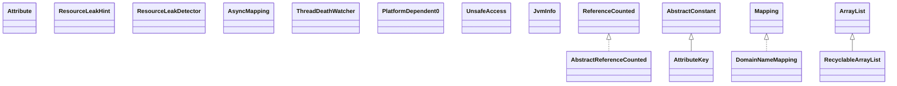

# netty-all-4.1.5.Final.jar

[Group index](README.md) | [All archives](../README.md)

## Scope and provenance

- **Donor:** `SQX_145_REFERENCE_ROOT/internal/libs/netty-all-4.1.5.Final.jar`.
- **SHA-256:** `1b583a45b4ad1ff7a01a29f17787c9f95e51b76d28bc8b13c6a8db8ec47b7bf7`; accessed 2026-10-06; captured `2026-10-06T18:54:51.906614+00:00`.
- **Classes:** 2289 raw entries; 2289 unique entry names. Duplicate occurrence indices are zero-based.
- **Inspection:** read-only ZIP hashing and class-file structural parsing; signatures/descriptors, modifiers, hierarchy and references only. Bytecode bodies are hashed, not published.
- **Allocation:** proposed `FEAT-COMPUTE-NETTY-ALL`, P14; [roadmap](../../dev/sqx-full-application-roadmap.md). Domain README registration remains required.
- **Repository:** `01067f00031428613c6394064ca1bcadc1ba00ee`; review state unreviewed. Download label 145-dev1; installed build/activation and runtime equivalence unverified.
- **Limit:** every class/member is inventoried; declaration coverage does not establish consumed calls, defaults, formulas, failure semantics or algorithm parity.
- **Archive/resource index:** [082.json](../../dev/evidence/sqx145/archives/145/082.json).

## Complete member declarations

Member shards contain exact JVM names/descriptors, access flags, generic signatures, throws types, declared fields/methods, superclass/interfaces and referenced class names. All classes, nested/synthetic members and overloads are retained. Code length/hash is structural evidence, not a normalized algorithm comparison.

- [001.json](../../dev/evidence/sqx145/members/082/001.json) — SHA-256 `a78f98e7581e3fece8e8e566632301276cf66737c4d05431f397b22129f802f8`.
- [002.json](../../dev/evidence/sqx145/members/082/002.json) — SHA-256 `ed21cfcaaed98aea6ff70cf521571b680a97d3adccf182f8ceb41a3537d2cdea`.
- [003.json](../../dev/evidence/sqx145/members/082/003.json) — SHA-256 `a9fc11bad8070be99068915e4fa2b33546e01c4dca066cd802295f685dbeda17`.
- [004.json](../../dev/evidence/sqx145/members/082/004.json) — SHA-256 `16088052dd607431a5b4114c828edc7bd6530431e77e9b5713c31108c1caf657`.
- [005.json](../../dev/evidence/sqx145/members/082/005.json) — SHA-256 `9c33d721041908e982db337c43a9a95c7211e92165d565f638a973c04b6f2f4e`.
- [006.json](../../dev/evidence/sqx145/members/082/006.json) — SHA-256 `711acea7b414ffb74379c1c6e5658f0e31cd91dd3d98658dffa947b9bffbc183`.
- [007.json](../../dev/evidence/sqx145/members/082/007.json) — SHA-256 `d426d6d541cf31defe51ad28a55df4e8c335f31e194eea7e53257c99717db79a`.
- [008.json](../../dev/evidence/sqx145/members/082/008.json) — SHA-256 `e4da88a11b120d94655f17fd9e4d85c73d5ca588b8b3ef0f296d15225061029c`.
- [009.json](../../dev/evidence/sqx145/members/082/009.json) — SHA-256 `ba089e022544031d8be385183d6cd8e9e3ec0029be7017caedac87f1332b7b7b`.
- [010.json](../../dev/evidence/sqx145/members/082/010.json) — SHA-256 `f6442cf822fe12ff6cb4ff46d82a055cb2ed837741bda5de1c645ce56e626dc4`.
- [011.json](../../dev/evidence/sqx145/members/082/011.json) — SHA-256 `c96f98c0b951dc105c8c1b33bf7aecdd1dbf69354158457eac6b173a6ba3ff75`.
- [012.json](../../dev/evidence/sqx145/members/082/012.json) — SHA-256 `db7887bac915cbb9f54bb7aba3b6e130977a1abd906195f765e8ba265e1f794e`.
- [013.json](../../dev/evidence/sqx145/members/082/013.json) — SHA-256 `7ea234cfaa7bc963fc79bc5d1aa0fda50413e9cfaf6ae2894c90244b27d5afe9`.
- [014.json](../../dev/evidence/sqx145/members/082/014.json) — SHA-256 `dbccb1e21f68b609f1b5c238d35dc536bbf3906d71d4bd54fa571c3bd219a3e3`.
- [015.json](../../dev/evidence/sqx145/members/082/015.json) — SHA-256 `f542a57f2e32a6be159dff14cf0db77927d96057e2a20f28155524b896b6ed31`.
- [016.json](../../dev/evidence/sqx145/members/082/016.json) — SHA-256 `038ec6c5ad1ec073eae0b8d25b0b753071c9dd504335003631ef7ddd9c19cd18`.
- [017.json](../../dev/evidence/sqx145/members/082/017.json) — SHA-256 `da9de7309f6a1dbb204f50b0174443999030d425c83a491dcdd2f9b51b9ae402`.
- [018.json](../../dev/evidence/sqx145/members/082/018.json) — SHA-256 `f41f7c344df0f6f3cf45a5bbc6729f9a48c26959b71b10c6185c7c3996afe8e3`.
- [019.json](../../dev/evidence/sqx145/members/082/019.json) — SHA-256 `82fc66db261125ab0aeb8730b22f72a84b2f8de43fb80cd59eb329b96fb38aa9`.
- [020.json](../../dev/evidence/sqx145/members/082/020.json) — SHA-256 `ca7acab57b73d667602db4932be139639321a12aacc7fb5a3c8d5a8525810318`.
- [021.json](../../dev/evidence/sqx145/members/082/021.json) — SHA-256 `ff0b320ec3275a9c327eb74fe5c133012b746adea2411c81b34eed121a89590d`.
- [022.json](../../dev/evidence/sqx145/members/082/022.json) — SHA-256 `211b92d877934cc5059bcc794337f4d8539e9a3976d2c74084c6aa7dc93b383c`.
- [023.json](../../dev/evidence/sqx145/members/082/023.json) — SHA-256 `1dcbd2d47aa45c18f2e7121c329ff9f0881f5b7275da94fae60aaef674d0cf7d`.
- [024.json](../../dev/evidence/sqx145/members/082/024.json) — SHA-256 `e4abc02f9e889940a13042dcb422865031b4f78d8887ba078edcd215bef91855`.
- [025.json](../../dev/evidence/sqx145/members/082/025.json) — SHA-256 `2253fc3684685c069813388db8ae787e73010b2eb3a3c5311d40cdd5ce4ec4ca`.
- [026.json](../../dev/evidence/sqx145/members/082/026.json) — SHA-256 `bc079339a90b0edfda880da1b71e6fdfc551cbc0551dbe679dbaca669ac26df1`.
- [027.json](../../dev/evidence/sqx145/members/082/027.json) — SHA-256 `a2b2ef4b9210c04554251a93bc659e579e79d276768cfaea448fcd4b0cae95a6`.
- [028.json](../../dev/evidence/sqx145/members/082/028.json) — SHA-256 `4137a3d2c28e44bad71875c57f2e258c7e9851c253245d608227afcee5525033`.
- [029.json](../../dev/evidence/sqx145/members/082/029.json) — SHA-256 `702e4be65e2703323ab33e4383093a59e21b7ddd9cfd4981cf4ad29ebd40f560`.

## Focused structural diagram

Up to twelve non-nested classes; arrows show declared inheritance/interfaces only. External type names are not evidence of an available body or an executed dependency.

## Class inventory

| Archive entry | Occurrence | Class SHA-256 | Fields | Methods |
| --- | ---: | --- | ---: | ---: |
| `io/netty/util/HashingStrategy$1.class` | 0 | `855aa66adbea7b022e489420a59946528473eadbcd26cce6c9eff4aad500dd98` | 0 | 3 |
| `io/netty/util/Recycler$1.class` | 0 | `e23a3953fb06e43bbf1d3181e4286c86ab831ffd40d578e6141958e443893fe2` | 0 | 2 |
| `io/netty/util/Attribute.class` | 0 | `9b15424bd692e72cff9c130d9feb8b15480266bebf647279dd913418877bb3a7` | 0 | 8 |
| `io/netty/util/DomainNameMappingBuilder$ImmutableDomainNameMapping.class` | 0 | `27e94e2f27e1a9f560d728340c01226f343273f17bb73c26f50fb530673a6d68` | 7 | 11 |
| `io/netty/util/ResourceLeakHint.class` | 0 | `bd588ba8005c8b83507168b3f560656f5a672e015f956c47bd91c297ecb9fb2d` | 0 | 1 |
| `io/netty/util/ThreadDeathWatcher$1.class` | 0 | `b3054ab04a4b2133c4fa2238788a0e9f95032de27e0ae09e03e8b961ffa63674` | 0 | 0 |
| `io/netty/util/ResourceLeakDetector.class` | 0 | `e06cc3f4d48b759823874379adc803f57a86f91d91f7037a49bb192d6b13bb47` | 21 | 20 |
| `io/netty/util/AbstractReferenceCounted.class` | 0 | `03d4d4a965e9b3f008e02c282101de279d8646dcab44f1a16281eabccbb6a475` | 2 | 10 |
| `io/netty/util/BooleanSupplier$1.class` | 0 | `e6e60380b2effe6d21c3881f691093ce08c8610c94b2a03a3867b63c4d0fce78` | 0 | 2 |
| `io/netty/util/DefaultAttributeMap$DefaultAttribute.class` | 0 | `452758838d8d5a3e8bf876f1e0b39fe412b5083dbc5fff848de4ac3f688fab1b` | 7 | 13 |
| `io/netty/util/ByteProcessor$3.class` | 0 | `9134c313038e78975e834d6d01a097a1cf4b1dd4acf5255622c52d778ebca0d0` | 0 | 2 |
| `io/netty/util/AsciiString$1.class` | 0 | `364faf6f5da7af1a2930ec7acc655f2ac3d2fabca49bd863d120863c73181e82` | 0 | 5 |
| `io/netty/util/AsyncMapping.class` | 0 | `bf1c49ba9211e47fa02a527533177c85dfb6058a2fb4f27a64cd723d94a66936` | 0 | 1 |
| `io/netty/util/AttributeKey.class` | 0 | `0200bec59f755c57dade7854d6cee55451432bfb111fa21ed30da8577ff326e6` | 1 | 7 |
| `io/netty/util/Recycler$3.class` | 0 | `2f3501fcfbb2f46f66ed1b5ce06e6bd9aff1c02d4cf8f9aabab74c0f9c216bc6` | 0 | 3 |
| `io/netty/util/DomainNameMapping.class` | 0 | `a536c946263db0c3853743caa242bbc5977556ef7d247e96d043601f9a5fb0df` | 3 | 11 |
| `io/netty/util/ThreadDeathWatcher.class` | 0 | `9ee6a17e7e42718e7f9d1020a91ec211b9f1a1b782680c99c91e4c6c27bfe540` | 6 | 9 |
| `io/netty/util/ThreadDeathWatcher$Entry.class` | 0 | `ef53cf753c1a549cf3d616cea1cc23bfb5e3ee6c029d8f89b9ffe4e554c51275` | 3 | 3 |
| `io/netty/util/ReferenceCountUtil$ReleasingTask.class` | 0 | `e882bee4dad982a1c34eda7379f1e801d903d4382b762a4a33815129ac323037` | 2 | 3 |
| `io/netty/util/internal/PlatformDependent0.class` | 0 | `382fee446c761388809861f7ec5f701a40aea2eea1f18e753ab088a0531132d2` | 10 | 55 |
| `io/netty/util/internal/PlatformDependent0$4.class` | 0 | `c78832ae981abbbf3f8a8b751255b0aee41be826429c0ee010d51c341c9e0ed9` | 1 | 2 |
| `io/netty/util/internal/PendingWrite$1.class` | 0 | `516fa21f1f4a6d6d82cdfea3ae226f2f01de61c8457dd57ab69e0475f21ab3a3` | 0 | 3 |
| `io/netty/util/internal/RecyclableArrayList.class` | 0 | `8409a118d85513663f2e4da55a096eac13d0f74c30dc4c81ad014c2f8e9d3418` | 5 | 14 |
| `io/netty/util/internal/PlatformDependent0$5.class` | 0 | `9c93580dbb8e83e0ff6b74f87cc23757b2cb78cd7f1c28f40ffd0a19d0d31609` | 0 | 2 |
| `io/netty/util/internal/SystemPropertyUtil$1.class` | 0 | `82b0514ac34428900ca469e53fb93b90e80a32a8531e806e0581aeddc88f78cf` | 1 | 3 |
| `io/netty/util/internal/ThreadLocalRandom$3.class` | 0 | `05e40976fb53c30efa1196cef8dcaad5de3b41fb8e3595b3f8267f0eff2d047c` | 0 | 2 |
| `io/netty/util/internal/shaded/org/jctools/util/UnsafeAccess.class` | 0 | `1a89949920e445e4e0fc6c7539d7496d1d98ecabfc4af440d3d0da11317d9e25` | 2 | 2 |
| `io/netty/util/internal/shaded/org/jctools/util/JvmInfo.class` | 0 | `8094f44fe67eeb612bc0cd16c9cf47dc55239445893b3db39cf2862a9fe63839` | 3 | 1 |
| `io/netty/util/internal/shaded/org/jctools/util/Pow2.class` | 0 | `d133dc4c5dad5eaf0ee4ceccd82fcc1f66455bb5e25873410356873049659dcb` | 1 | 4 |
| `io/netty/util/internal/shaded/org/jctools/util/UnsafeRefArrayAccess.class` | 0 | `0f4d00af21653671b814ec28471ce386a3d147f1ecf897845d9b3f9eec8ea5e7` | 2 | 7 |
| `io/netty/util/internal/shaded/org/jctools/queues/MpscArrayQueueConsumerField.class` | 0 | `3bd54989d49998acb0782f22d88e44bc55af1068da9b3141becebe30104dd88f` | 2 | 5 |
| `io/netty/util/internal/shaded/org/jctools/queues/MpscArrayQueueMidPad.class` | 0 | `db8b5e7e0e98b60fa3ca56cf6509e4470b675919cf5d2229a49baf7a0e854487` | 15 | 1 |
| `io/netty/util/internal/shaded/org/jctools/queues/CircularArrayOffsetCalculator.class` | 0 | `21222d1c253985cb48d7e2a97b094bf53f94c0005c48fbffa1db2717a3953339` | 0 | 3 |
| `io/netty/util/internal/shaded/org/jctools/queues/MpscChunkedArrayQueuePad3.class` | 0 | `a19930fe59b710337aeaad2a213b8f8910b4d1542c8c40865b326364e1f507af` | 16 | 1 |
| `io/netty/util/internal/shaded/org/jctools/queues/MpscChunkedArrayQueue.class` | 0 | `e101736e6663a0db5c9f0404303c04b5de2fbd3b07bdb3fec317cec0eef82c57` | 20 | 38 |
| `io/netty/util/internal/shaded/org/jctools/queues/MessagePassingQueue.class` | 0 | `4f488fe321976fd4a804f2e5512dca7ca5924969558f14fb2e7b12752fe99880` | 1 | 16 |
| `io/netty/util/internal/shaded/org/jctools/queues/MpscArrayQueueHeadLimitField.class` | 0 | `51b2c59391cd05c70053f2dcf0b3d5b31d075dbc8b3ead81f6f8ef1f42bd614b` | 2 | 4 |
| `io/netty/util/internal/shaded/org/jctools/queues/MpscArrayQueueL1Pad.class` | 0 | `72ebaab2cebd9d2c3c799440731263a254b46cc5ed1d84eb2966424127f59dd6` | 15 | 1 |
| `io/netty/util/internal/shaded/org/jctools/queues/BaseLinkedQueue.class` | 0 | `78bb5247bf36d71bdddfc1d9c4bf85ae55222c4afe2be711dcf61001b50b2469` | 15 | 12 |
| `io/netty/util/internal/shaded/org/jctools/queues/MpscChunkedArrayQueueProducerFields.class` | 0 | `d0b6ded9a1ec2a21bb56281f7263054845f0a1801257a2d4790b7dd3d78e2c21` | 1 | 1 |
| `io/netty/util/internal/shaded/org/jctools/queues/LinkedQueueNode.class` | 0 | `a5c7da8ca639ce281523c4843e70f456dd3dead466ae50f222a39ed49dac32d1` | 3 | 8 |
| `io/netty/util/internal/shaded/org/jctools/queues/atomic/MpscLinkedAtomicQueue.class` | 0 | `a5ae12177253d0d68206f8b8e010227479291a61ed825a1fa11e67c2af4130af` | 0 | 4 |
| `io/netty/util/internal/shaded/org/jctools/queues/atomic/LinkedQueueAtomicNode.class` | 0 | `a7318a06d725a50ddfaea9a172363151cc286b8239090762395ce44d19421b33` | 2 | 7 |
| `io/netty/util/internal/shaded/org/jctools/queues/atomic/MpscAtomicArrayQueue.class` | 0 | `89b57ffca60e4686231b50e64f193607b31de85307081f40eef3befc0ebddc46` | 3 | 17 |
| `io/netty/util/internal/shaded/org/jctools/queues/atomic/BaseLinkedAtomicQueue.class` | 0 | `da7f4512a834147110aa0257e1a55bff1421f641eff0956f060e1fb23303a9d2` | 2 | 12 |
| `io/netty/util/internal/shaded/org/jctools/queues/atomic/AtomicReferenceArrayQueue.class` | 0 | `d2e81755ad514725dd66bcef096356541008dcdee45ea2ffcc4c99baa19cc751` | 2 | 14 |
| `io/netty/util/internal/shaded/org/jctools/queues/atomic/SpscLinkedAtomicQueue.class` | 0 | `fca240daaf9c151a18d5b8d8111e64bb0c872f03ea67c62f0c61fc46b4577fdb` | 0 | 4 |
| `io/netty/util/internal/PlatformDependent0$1.class` | 0 | `3ea80440088b1f351c56b1455401f17fc4c0c91e29c3359f489920e9a0a21c13` | 1 | 2 |
| `io/netty/util/internal/RecyclableArrayList$1.class` | 0 | `6e36f6229a995d0856956aeb569eb9a0bcb832bc2c3ef4afb61502db6af9c501` | 0 | 3 |
| `io/netty/util/internal/MacAddressUtil.class` | 0 | `4e7c1f010662e2015361e8610d6547581f45ef92f2f41e36d3ef2b999f71bfb6` | 3 | 7 |
| `io/netty/util/internal/ThreadLocalRandom.class` | 0 | `8bd097ed592512b74a2ff513eff2f6514ab3e0fafb895aafb650aff1ac0c9555` | 21 | 17 |
| `io/netty/util/internal/chmv8/ConcurrentHashMapV8$ReservationNode.class` | 0 | `6c7889785c0600844f720d9315364ae1a4296b1b87498a33e90e361626f74c8a` | 0 | 2 |
| `io/netty/util/internal/chmv8/CountedCompleter.class` | 0 | `c392306e7b84399362207b757ffa14b3a336cb0dbbe76d5e551c18b3a99450b5` | 5 | 25 |
| `io/netty/util/internal/chmv8/ConcurrentHashMapV8$ForEachTransformedMappingTask.class` | 0 | `cdce6e4c3844178ec75dfdde461e477a651545b5ce02d3865c4d88a2f2f912ae` | 2 | 2 |
| `io/netty/util/internal/chmv8/ConcurrentHashMapV8$Fun.class` | 0 | `582f2d3ff35a47e190e7ff9713b34eb47781c8bc6591c66df6879c950b0093f5` | 0 | 1 |
| `io/netty/util/internal/chmv8/ConcurrentHashMapV8$ConcurrentHashMapSpliterator.class` | 0 | `cb5818e24f1812f3e26af1041c0712620d14528e4129695cc7825fc744069ca2` | 0 | 4 |
| `io/netty/util/internal/chmv8/ConcurrentHashMapV8$SearchEntriesTask.class` | 0 | `58a0bbc618e7ec22dc73f1dad471f851de3679f4a48661f7db004f78001c5cb7` | 2 | 3 |
| `io/netty/util/internal/chmv8/ConcurrentHashMapV8$MapReduceEntriesTask.class` | 0 | `3ac9ebb304779fffa547196b226a390d04e2a7aa6a340f854bac59bb1e3649f5` | 5 | 3 |
| `io/netty/util/internal/chmv8/ConcurrentHashMapV8.class` | 0 | `81b753b405c4b483f7f4cb5e25d86a3e8331ffad56dcd2574efc7b3f65c6ffde` | 38 | 94 |
| `io/netty/util/internal/chmv8/ForkJoinPool$1.class` | 0 | `fe8e74d192479e4a8696c362f879154a7a13e41182797916d63436b3ef1f8419` | 0 | 3 |
| `io/netty/util/internal/chmv8/ConcurrentHashMapV8$MapReduceKeysToIntTask.class` | 0 | `2a07f08e6b8104462800a9a53094357d298ff4c2ba56562065393ef2953bd287` | 6 | 4 |
| `io/netty/util/internal/chmv8/ConcurrentHashMapV8$IntByIntToInt.class` | 0 | `44c383c4e0fa5bb741108fee4b8fdce3691a0dea697ab05f520c989af674aab0` | 0 | 1 |
| `io/netty/util/internal/chmv8/ForkJoinPool$ManagedBlocker.class` | 0 | `72d04498b3023803d16f02804a0b2bb743b6de0854e8717ab856bda309a5b65f` | 0 | 2 |
| `io/netty/util/internal/chmv8/ConcurrentHashMapV8$CounterHashCode.class` | 0 | `974c7fb7a3e3aa63f4cb107f415227aedf87bf356e60462c28f6c947619ac2bb` | 1 | 1 |
| `io/netty/util/internal/chmv8/ForkJoinWorkerThread.class` | 0 | `9f54f2ffcfc380e40bf0b04d8d71b2a164a743ba9070a03605babe5fbc1e7488` | 2 | 6 |
| `io/netty/util/internal/chmv8/ConcurrentHashMapV8$DoubleByDoubleToDouble.class` | 0 | `2cf7379468829d40a379601b78e3b0d81db55391b8c7028fd0e7c0c9ef9d3533` | 0 | 1 |
| `io/netty/util/internal/chmv8/ConcurrentHashMapV8$MapReduceValuesTask.class` | 0 | `e57dd345d1f6c26f2824a7e30c77f788086ba9c251644c2361fc69e2c48dda7a` | 5 | 3 |
| `io/netty/util/internal/chmv8/ConcurrentHashMapV8$LongByLongToLong.class` | 0 | `c9e4e5164ccd0f9927cf36f29411f5a1930b4a5de49f70f4f1083f1134f9d94f` | 0 | 1 |
| `io/netty/util/internal/chmv8/ConcurrentHashMapV8$SearchValuesTask.class` | 0 | `408a162018593525b00831c63f6acf7fe7411244bca2e33b1e31f6ff19373feb` | 2 | 3 |
| `io/netty/util/internal/chmv8/ConcurrentHashMapV8$MapReduceKeysToLongTask.class` | 0 | `dd2cb41504cc50a8140c0aa554af398e943b8e04700814e00e7dd41120674141` | 6 | 4 |
| `io/netty/util/internal/chmv8/CountedCompleter$1.class` | 0 | `75e05535d7a4d3fb5a38f9773679c8b41b716ca1c8dfad25bf4d2cd4e56537f0` | 0 | 3 |
| `io/netty/util/internal/chmv8/ConcurrentHashMapV8$Segment.class` | 0 | `288361d983a0dc6a8084a52d7aa04828907443305896249732a879f2e10ece60` | 2 | 1 |
| `io/netty/util/internal/chmv8/ConcurrentHashMapV8$KeySetView.class` | 0 | `e5110f2e102b81f2b5cb70d0e44c8e3982b8a1f1444a29776073632afa8b775f` | 2 | 12 |
| `io/netty/util/internal/chmv8/Striped64$1.class` | 0 | `28ebf172e93cef35171aba75695e3bdcb1f680abcffceaa3bbca44a1d1bc1eae` | 0 | 3 |
| `io/netty/util/internal/chmv8/ConcurrentHashMapV8$ObjectToDouble.class` | 0 | `bdc373f305bb5879ee0282902cb9b2f957934206a8f70a47aff72f9956979458` | 0 | 1 |
| `io/netty/util/internal/chmv8/ConcurrentHashMapV8$ForEachTransformedKeyTask.class` | 0 | `f3b159c61ac2bfc420edc8ae63ed189f35165211931a0b634639a9f9677089c0` | 2 | 2 |
| `io/netty/util/internal/chmv8/ConcurrentHashMapV8$ObjectByObjectToInt.class` | 0 | `184d4a327a13bf3ad0432004a96a7f9bf68353b8574246e1ca3982918110c138` | 0 | 1 |
| `io/netty/util/internal/chmv8/Striped64$Cell.class` | 0 | `3d60fa4524de28635f448fb68c980c011ca1c00e39356aa1989f5847a886c96d` | 17 | 3 |
| `io/netty/util/internal/chmv8/ConcurrentHashMapV8$ValueSpliterator.class` | 0 | `7d9d7ece4464708dd0a88c3f604a573c04c273447dc70d450dd835cc653e5cd9` | 1 | 5 |
| `io/netty/util/internal/chmv8/ConcurrentHashMapV8$ForEachTransformedEntryTask.class` | 0 | `2bbc524fa1d4959a95b55c7762223162c6dca32424239c939b978812d8a9435f` | 2 | 2 |
| `io/netty/util/internal/chmv8/ConcurrentHashMapV8$ValuesView.class` | 0 | `79560142d6f0a0b95577a5ebcf4d1efb4670226da2037508730f4a47b71e07ee` | 1 | 8 |
| `io/netty/util/internal/chmv8/ConcurrentHashMapV8$MapReduceMappingsToDoubleTask.class` | 0 | `bc4c0a36b71d5f6f97bbdf4e6883ab24c938d654f65499ae2cbb58ce35cb55db` | 6 | 4 |
| `io/netty/util/internal/chmv8/ConcurrentHashMapV8$MapReduceValuesToDoubleTask.class` | 0 | `c28c95d9b53e84397483365e3982133cc89fac736574be0286c2b70ac730e1bc` | 6 | 4 |
| `io/netty/util/internal/chmv8/ConcurrentHashMapV8$MapEntry.class` | 0 | `4e3f04f311de4dfe653d9bf770ea8bbc9bdeb00e522e7c5de2328a5db612809e` | 3 | 7 |
| `io/netty/util/internal/chmv8/ConcurrentHashMapV8$ForEachTransformedValueTask.class` | 0 | `067004a183495fb3968ee9561d22eded24df1e4baa70536013a3ef8b87639649` | 2 | 2 |
| `io/netty/util/internal/chmv8/ConcurrentHashMapV8$ValueIterator.class` | 0 | `ed2741d463567f50e422bc2a70750f8f9dc8c5f790c4ff54d623c4f1bdc26a0e` | 0 | 3 |
| `io/netty/util/internal/chmv8/ConcurrentHashMapV8$MapReduceKeysToDoubleTask.class` | 0 | `7d2c1f4d2f0831e678e66a4f356467066f50c87bd9a0c8a1b2090d219797c891` | 6 | 4 |
| `io/netty/util/internal/chmv8/ConcurrentHashMapV8$MapReduceKeysTask.class` | 0 | `8c616d0f5d207aec00361530b0f2df78f266dcdbcafc0b0262ba14e73eb38dcb` | 5 | 3 |
| `io/netty/util/internal/chmv8/ConcurrentHashMapV8$EntrySpliterator.class` | 0 | `7e557d5ac2b4fff583d4b5ef485462f90263218d71d2c77cd779e21d1d5a3af3` | 2 | 5 |
| `io/netty/util/internal/chmv8/ConcurrentHashMapV8$ObjectToInt.class` | 0 | `5c0af59f05c4f01613ae4b379bc4747177909d08cffe9b82c6cf77000142710a` | 0 | 1 |
| `io/netty/util/internal/chmv8/ConcurrentHashMapV8$MapReduceMappingsToLongTask.class` | 0 | `0d1190729fabcb60d08787ad157927488fb6459ec9a2386fdd713fee6f71d0e9` | 6 | 4 |
| `io/netty/util/internal/chmv8/ConcurrentHashMapV8$EntryIterator.class` | 0 | `65c27713e847ae442d784998873ce79b44746a9d9c2b11832ea526b61d1d53b0` | 0 | 3 |
| `io/netty/util/internal/chmv8/ConcurrentHashMapV8$ReduceEntriesTask.class` | 0 | `d0cac2e7b9e487f4f0958f5ba650b6b92715d79624071cb67da86b0be7e95840` | 4 | 4 |
| `io/netty/util/internal/chmv8/ConcurrentHashMapV8$ForEachValueTask.class` | 0 | `afcc2342afc80f57b3094ca3eea5c659de4e0fb2877e4a2f512d8dfbc4992dc6` | 1 | 2 |
| `io/netty/util/internal/chmv8/ConcurrentHashMapV8$ForEachKeyTask.class` | 0 | `b8821dea6567fbcb8e118ddf3a521167001c2c17b4dda39c41120bbb53c20aff` | 1 | 2 |
| `io/netty/util/internal/chmv8/ConcurrentHashMapV8$ForEachMappingTask.class` | 0 | `554a25c06265b91e09afea5e5d5bd4040dbc093ae3d8f04f65c57b47440ff5d3` | 1 | 2 |
| `io/netty/util/internal/chmv8/ForkJoinTask$AdaptedRunnable.class` | 0 | `77b2e965c3eef8c4b7f9c8257f07c2f7d547a5a275ef462f555590722a2b7972` | 3 | 5 |
| `io/netty/util/internal/chmv8/ForkJoinTask$AdaptedRunnableAction.class` | 0 | `79a6b02e325b1a3e3955f122da10e3a729342a51bf81032968b683a44e080a12` | 2 | 7 |
| `io/netty/util/internal/UnpaddedInternalThreadLocalMap.class` | 0 | `5589fa138b4db4685aa6a5097f84d36ddb8d56956a1c43eb7649357f30566b0d` | 14 | 2 |
| `io/netty/util/internal/MathUtil.class` | 0 | `4aa0a30fab40465a87dead9534e60d66ce8634d95f3b93f9fae64b26e69ca499` | 1 | 6 |
| `io/netty/util/internal/UnsafeAtomicIntegerFieldUpdater.class` | 0 | `a1e73949a0474e7486c1e196b025fef564a932e17f6197155e32c68d91863bba` | 2 | 6 |
| `io/netty/util/internal/PendingWrite.class` | 0 | `bd40a88e6906c4ec707568ffdbe0bd1d299f12eae4ca0974742807cddabdc13c` | 4 | 10 |
| `io/netty/util/internal/ObjectUtil.class` | 0 | `d64122bbcdd54fd6fc71e08a45f4f09fb3de0e1efcff04ebf28e9a03c3e1664c` | 0 | 9 |
| `io/netty/util/internal/PriorityQueue$1.class` | 0 | `37494c0bad564c0df8f5aaa983391116d0a7c7c2fdc9eb6db0fe8471ee02c30d` | 0 | 0 |
| `io/netty/util/internal/OutOfDirectMemoryError.class` | 0 | `e15320084eb10ce2dae3fb23d6c79053765040a1bc3a36e12c87c0beb05decf1` | 1 | 1 |
| `io/netty/util/internal/UnstableApi.class` | 0 | `a4c5e49618d3ceff615f525f7a3add16739ac28b593b70b0e0c0cffa795bb6f5` | 0 | 0 |
| `io/netty/util/internal/ThreadLocalRandom$1.class` | 0 | `070fa3dc4f4b5cbc9d8e4b3492edf14171a0df251b883ad864c1cfe4fd66f163` | 0 | 3 |
| `io/netty/util/internal/LongCounter.class` | 0 | `ea4b0ba449fa0a06c946e679e77eaef01965aaa554a6095da1710a4b38059fca` | 0 | 4 |
| `io/netty/util/internal/NativeLibraryLoader$2.class` | 0 | `ca0929780a6bc650846ad2fb307d5adbd2d5192c80ff69d6bda45329dc5cefce` | 3 | 3 |
| `io/netty/util/internal/PlatformDependent0$6.class` | 0 | `3df25d90358abfb12ee0fa29ad4a20acb6af2bcc8ea1cfa9db848f69bcf7c600` | 1 | 3 |
| `io/netty/util/internal/InternalThreadLocalMap.class` | 0 | `ebb4698edae4103707a714fb95a7dd19c3549238c72388acfa48f31cf570c3a3` | 11 | 32 |
| `io/netty/util/internal/JavassistTypeParameterMatcherGenerator.class` | 0 | `1939f542d30dfa2d784c678eae9b92d9bbab2369edf50a082b03687424d1b42a` | 2 | 8 |
| `io/netty/util/internal/IntegerHolder.class` | 0 | `6d50074a8e445c0e09846110556a4398c24d39051c105cbb2bcbf7795a3420ed` | 1 | 1 |
| `io/netty/util/internal/PlatformDependent$Mpsc.class` | 0 | `a2f48ebc28cb4cec9e7bb4ac2f96bf065eb2a4c32614ef71f16f958a4eb2a504` | 1 | 3 |
| `io/netty/util/internal/UnsafeAtomicLongFieldUpdater.class` | 0 | `6906b1cf34c27cc25b8125e53f2b3446b7437da97a89187aa87af08e91dba6c1` | 2 | 6 |
| `io/netty/util/internal/PlatformDependent$1.class` | 0 | `8bce2ab411906aaf0bbb58df4d0393fc9a51baff999a343db76810e9da015170` | 0 | 3 |
| `io/netty/util/internal/ThreadLocalRandom$4.class` | 0 | `42f2c11d64dc2cef3113e4c1a0997c161fc4c6f115c1592ddf575b0c001bff8d` | 0 | 2 |
| `io/netty/util/internal/ThreadLocalRandom$2.class` | 0 | `a43227d543c578670d8503aa8ff98881b203a5722f51e09e2291243d1599101c` | 0 | 3 |
| `io/netty/util/internal/PlatformDependent$AtomicLongCounter.class` | 0 | `bd1378b6bfff7ad38d775fbe6646af4267e3b3263a9e0fa95d95d69ff4e742dd` | 1 | 6 |
| `io/netty/util/internal/NativeLibraryLoader$1.class` | 0 | `bd6261535ecab9d63bf6caac4b302dbd2eb086974868609dd085f779b5a524f3` | 3 | 2 |
| `io/netty/util/internal/ThrowableUtil.class` | 0 | `b1e0a8a82516af6b27590483797bf9dad3064f6849c6b78dd034951b27a9ca07` | 0 | 3 |
| `io/netty/util/internal/logging/CommonsLoggerFactory.class` | 0 | `679d047644aa72805c809631fb2de179744c227fadde44da018dc92b25afdf6a` | 1 | 3 |
| `io/netty/util/internal/logging/AbstractInternalLogger.class` | 0 | `00d90c57e0701d50262b1325b623b861da19f13ee811781447276c07837179bc` | 3 | 16 |
| `io/netty/util/internal/logging/Slf4JLoggerFactory$1.class` | 0 | `ea81cb9ed3e75f391de4204600cd0741c9293cfffa013ff89d753f21fa1b010f` | 2 | 2 |
| `io/netty/util/internal/logging/InternalLogger.class` | 0 | `5a0120732ae28d774f38c023bd208d3ac6be3aa539ee635ccc6d7728dbc67434` | 0 | 43 |
| `io/netty/util/internal/logging/MessageFormatter.class` | 0 | `bc7f0f290eb33052afab2e0343b2214fb983f2636d4f4e8d8a64aad10fb4bada` | 4 | 18 |
| `io/netty/util/internal/logging/JdkLogger.class` | 0 | `82a92b50b4b927ae442a17bbfc3c226b266f03cef4be58eac4360432040dcd21` | 4 | 34 |
| `io/netty/util/internal/logging/FormattingTuple.class` | 0 | `8ddcafbae832f1cf08aa2702a762edcd59e70cd841f20d3cf102b08627116521` | 4 | 7 |
| `io/netty/util/internal/logging/Slf4JLoggerFactory.class` | 0 | `c67bdd9f591f770d96e405fdc2cd4d01d44a9cffccff417cd034e587b5e85de7` | 2 | 4 |
| `io/netty/util/internal/logging/JdkLoggerFactory.class` | 0 | `4187869cee958909d1c45a8a418363dedcf44a21df06e9d920e04c1902fdf734` | 1 | 3 |
| `io/netty/util/internal/logging/Log4J2Logger.class` | 0 | `efc8814678dde5b4c05ace04e79555ae6f119060cb9eff601a41a04bd282f3cc` | 2 | 31 |
| `io/netty/util/internal/logging/Log4JLogger.class` | 0 | `e1fe79387f9b03ccb4912081377a3da5984f5149ceb92a288a6d782754410111` | 4 | 33 |
| `io/netty/util/internal/logging/InternalLoggerFactory.class` | 0 | `aa6b74d74c8e8ace1e8912aebb30338670f4225fa1efd881794bc89b36dd84ae` | 1 | 8 |
| `io/netty/util/internal/EmptyArrays.class` | 0 | `2bb35d36ad69d6cdccfb50d1c6e319508416a6cd9413b578b2929bef3583f976` | 10 | 2 |
| `io/netty/util/internal/PlatformDependent0$8.class` | 0 | `60300731ed907e6845612fd1a22aa54a3024bf9590ecd4944808d65c5d18ef83` | 0 | 3 |
| `io/netty/util/internal/Cleaner0.class` | 0 | `72e73d103c9d96d2129c355afcb2db2bbeab5e59d5340fd7dc60b59aac045d5e` | 5 | 3 |
| `io/netty/util/AsciiString$2.class` | 0 | `5769053df6ac79d0deaf886436249cd325738586e4e179a1cae48038e509ed28` | 0 | 5 |
| `io/netty/util/HashedWheelTimer$HashedWheelTimeout.class` | 0 | `e968b98d2a538bdc0789361aa679ab640ec7a5ee67957b09cb187be40f0bf806` | 12 | 13 |
| `io/netty/util/ConstantPool.class` | 0 | `90622d19dd528e51e58ed0a26e25682be82d7c312985db4c1f0f40b8f688a6ab` | 2 | 10 |
| `io/netty/util/DomainMappingBuilder.class` | 0 | `9f31c356b424ae794e479bcfffac3a9d35d8b03559c9513ef222f28421bbec14` | 1 | 4 |
| `io/netty/util/ResourceLeakDetectorFactory$DefaultResourceLeakDetectorFactory$1.class` | 0 | `d22c1af5342c8d8e0097ef206ee6abca7dd8768cd2341ec3d9d5672ece827cdf` | 1 | 3 |
| `io/netty/util/DefaultAttributeMap.class` | 0 | `18d132992fa5c6c4072ea6870ddc3cdf290188aade62b99f531ee48cafecd48b` | 4 | 5 |
| `io/netty/util/TimerTask.class` | 0 | `83d684b0ffeaa8a0d556b6b2691ea5e506e32eb53ad370e6e158e39555edb7e9` | 0 | 1 |
| `io/netty/util/IllegalReferenceCountException.class` | 0 | `b5c50c6d56df1eae405feae320bf9b69d1460f79a392a53c05d58d1bbc3b052e` | 1 | 6 |
| `io/netty/util/HashedWheelTimer$HashedWheelBucket.class` | 0 | `0117bdf82525b13758c0b82198c1ed082dcdbb6cdbd162ad3d1b69355b8de80d` | 3 | 8 |
| `io/netty/util/Recycler$Handle.class` | 0 | `abb107355166162f0e196cbfba30f4bcf30b102fba8145197a2ea70f4749d0f4` | 0 | 1 |
| `io/netty/util/HashedWheelTimer$1.class` | 0 | `e415f0fd52f7ffd3081ad115c1a3563ceaa0831782c686d218c258a5397d1cd1` | 0 | 0 |
| `io/netty/util/ByteProcessor$1.class` | 0 | `b62a195a85810373a3daca99b8927bf8edb037b8587351ebfe078a9345771f92` | 0 | 2 |
| `io/netty/util/Signal$1.class` | 0 | `c1010e266f10f96d4b4062bc3c0b26a20d8205a818df6ec6aac30d8463bcb8d4` | 0 | 3 |
| `io/netty/util/Timeout.class` | 0 | `8598850d29e1a042b4eb9285020043247b5777ffb05d5a0802f10f19160fdbad` | 0 | 5 |
| `io/netty/util/IntSupplier.class` | 0 | `0386d3a95b31efeb2b8cf883514d60b399149b9406af8525a74f59144731b75a` | 0 | 1 |
| `io/netty/util/ResourceLeakDetectorFactory$DefaultResourceLeakDetectorFactory.class` | 0 | `2ca3992a36fc78f3702ee39579cc63b29498125d49d95edb3a7085893708f207` | 1 | 3 |
| `io/netty/util/collection/ShortObjectMap$PrimitiveEntry.class` | 0 | `6e190eeca27c1278d828ab381baf45a7cdaf65f9b165276e714ce8c8ce289874` | 0 | 3 |
| `io/netty/util/collection/CharObjectHashMap$PrimitiveIterator.class` | 0 | `4ed0ded3553d5d21f3944740c61697373c8b3a27c78adb589804eac88b809d0c` | 4 | 11 |
| `io/netty/util/collection/LongObjectHashMap$MapEntry.class` | 0 | `3e26a3344b1f7188e202b7c6ed3bcf541f29bc538830000b0fc9136b1c12574e` | 2 | 6 |
| `io/netty/util/collection/ShortCollections$EmptyMap.class` | 0 | `216b901bc2abe160d9e6038f049e05eb79c8f79789bbe7671744f6375ecb11e5` | 0 | 20 |
| `io/netty/util/collection/ByteObjectHashMap$KeySet.class` | 0 | `510be040c07ab249ccdafb4d85d684b4f254f80d9c15618fcf5f2e70970633be` | 1 | 8 |
| `io/netty/util/collection/ShortObjectMap.class` | 0 | `94327d35bab1d06ee1a691d3d71ac350ed4c2de7871b860e76903cf62c913d08` | 0 | 5 |
| `io/netty/util/collection/ByteCollections$1.class` | 0 | `2d511750b250d3bdca3b6e8c821a17094a39d8754f1f210c1e9e041c08458cc6` | 0 | 0 |
| `io/netty/util/collection/LongCollections$EmptyMap.class` | 0 | `fdd2726864115679a06da1ed5a8e5336dc5352abeb8168c181925b097f6443f8` | 0 | 20 |
| `io/netty/util/collection/CharCollections$UnmodifiableMap.class` | 0 | `bf99340e4a7c119d065775cd698e8dc7c084bdffde27871ef77c8392d4fc8fb3` | 5 | 20 |
| `io/netty/util/collection/CharObjectHashMap$2.class` | 0 | `6de3b123b9d2a633e3d05dab8597c1b8c2a2eea5090be2df9a280cb405975da6` | 1 | 3 |
| `io/netty/util/collection/ByteCollections$UnmodifiableMap$EntryImpl.class` | 0 | `18826a404af7992bfd1382717d8a53cb4ea079d94a9e68a75ee785cb56efbb42` | 2 | 4 |
| `io/netty/util/collection/LongCollections.class` | 0 | `1eae521e84292eef133ddba9abdc687afd59df0e25191ad218b0b555629e21cb` | 1 | 4 |
| `io/netty/util/collection/IntObjectMap.class` | 0 | `09aa58db84393dcb45d79f2d3d02e959d696928cb17678c4b7c95c87b692639d` | 0 | 5 |
| `io/netty/util/collection/ByteObjectMap$PrimitiveEntry.class` | 0 | `28724ff7a9949c7a4eb57c51a8020868353ce98d58dd415659a909a9d36a410f` | 0 | 3 |
| `io/netty/util/collection/IntCollections$UnmodifiableMap$EntryImpl.class` | 0 | `220075029ff548df059b5cc5aed159a65863022b18d07a83ab42b755de3f5794` | 2 | 4 |
| `io/netty/util/collection/ShortObjectHashMap$MapIterator.class` | 0 | `64a7e8c0abcc9f39d2618164677675ffe7c0f7079973b656464518a352c61770` | 2 | 6 |
| `io/netty/util/collection/CharObjectHashMap$2$1.class` | 0 | `e05b535547870f7fa52b234772dc718de8f45caeb481a56cc700b3c4cb4a8dfd` | 2 | 4 |
| `io/netty/util/collection/LongObjectMap$PrimitiveEntry.class` | 0 | `aa2973e64a93aa7c9d121bfc8453fe25e046a7d3d9cfc5ebd3529719c96b9b10` | 0 | 3 |
| `io/netty/util/collection/CharObjectHashMap$MapIterator.class` | 0 | `02f04303bccdcaa5ad92524338dc4ab0dc3f7baa213ca2f4f486b6f8cb387135` | 2 | 6 |
| `io/netty/util/collection/ShortObjectHashMap$1.class` | 0 | `5a0e80a85c95915c5730642ee363ce2b8db1c51bf249e10ccd99de9a8d35ebac` | 1 | 2 |
| `io/netty/util/collection/IntObjectHashMap$2$1.class` | 0 | `b16ea13ad6fa4d666b90de98284f0ef919065569f517d8d727e188b061b81059` | 2 | 4 |
| `io/netty/util/collection/IntObjectHashMap$1.class` | 0 | `ced59984e5358042ba22674682f7aa89d587a622945c65b0e72bb1c065dcb7a9` | 1 | 2 |
| `io/netty/util/collection/LongObjectHashMap$1.class` | 0 | `1856eae679e59613a06cefba3ad9340bbdf86e90b3fa639f88d7639f93c4d005` | 1 | 2 |
| `io/netty/util/collection/CharObjectMap.class` | 0 | `bcbe953699b1252721b5a07a2b63dbfc55b08c9b1f3a5b83977be307a0df81ed` | 0 | 5 |
| `io/netty/util/collection/ShortCollections$UnmodifiableMap.class` | 0 | `07b87bb77c27003f905b9960f5689f7113c3aef0f901146272ec6dbc8be20ce7` | 5 | 20 |
| `io/netty/util/collection/ByteObjectHashMap$2.class` | 0 | `936657cab5c1064f7978b44630ba45d5f12ee2924ecb30373283c1f7424e591d` | 1 | 3 |
| `io/netty/util/collection/ShortObjectHashMap$2.class` | 0 | `5c8b6163390604cef962965091acedd96917c8f717314c66f4f1abbe2d473199` | 1 | 3 |
| `io/netty/util/collection/IntCollections$UnmodifiableMap$IteratorImpl.class` | 0 | `34e37207eae45fc4893734e1ee8ee37d2c96e653c494bb21c61cd4c0fe9f8562` | 2 | 5 |
| `io/netty/util/collection/ByteObjectHashMap$2$1.class` | 0 | `c974226a718b105ee6ceeffc8ac112a2040284b2326abc29e4ede200b2129116` | 2 | 4 |
| `io/netty/util/collection/IntObjectHashMap$2.class` | 0 | `f72db44cafdf07ebf524e35ea7ccd2e2dddc7866e52a53e502f1f23c2eb79529` | 1 | 3 |
| `io/netty/util/collection/LongObjectMap.class` | 0 | `ec84f47a681a764903854b21046a854a277abc716baec312a48c8f9c46cb31c3` | 0 | 5 |
| `io/netty/util/collection/ShortCollections.class` | 0 | `6b4f98f930d2322a07d2231f18c71eb75f7bffb59e3440614785d2cdd0e9112c` | 1 | 4 |
| `io/netty/util/collection/IntCollections$EmptyMap.class` | 0 | `96740d18ceceb2602f2d50747916702552c1cb97003cd0e0117c20a0443afc84` | 0 | 20 |
| `io/netty/util/collection/ByteObjectMap.class` | 0 | `07ace2961e9a2b0a330fd7c1657a958d6e5f72f8780f784464856d24a4e1820d` | 0 | 5 |
| `io/netty/util/collection/ByteObjectHashMap$1.class` | 0 | `6c66b210ed644c413ae9d137cccef5e8106742cadef263358ee83ee22898b872` | 1 | 2 |
| `io/netty/util/collection/ShortObjectHashMap$2$1.class` | 0 | `eb6a200c0c60110c88028242b36c3b2451f07c82e7354ca8edb1333dc09eb8fe` | 2 | 4 |
| `io/netty/util/collection/IntObjectHashMap$MapEntry.class` | 0 | `256e5f30d9d16ae0d2eb65b638d025a11ee1b18b518ecd7868f664b8fb651246` | 2 | 6 |
| `io/netty/util/collection/LongCollections$UnmodifiableMap$IteratorImpl.class` | 0 | `78592edf48c803c8bb6b80118ea023495c1e0bf5401ea5234a85a14e0f566e28` | 2 | 5 |
| `io/netty/util/collection/CharCollections$UnmodifiableMap$IteratorImpl.class` | 0 | `b43ab3984261ddb2a10fa35fe380c6f6620ac0c3ab20eef3f2fb6d524f255bd1` | 2 | 5 |
| `io/netty/util/collection/IntCollections$UnmodifiableMap$1.class` | 0 | `cd583d3a842c1ec1854db19fbe3d8763336e283832392cbd8ff41f71ba058655` | 1 | 2 |
| `io/netty/util/collection/IntObjectHashMap$KeySet$1.class` | 0 | `3838009dc0a7b95d3b4bd203c531efe23e0fe1cfd033e5ea7deae080f67d939f` | 2 | 5 |
| `io/netty/util/collection/LongCollections$1.class` | 0 | `e803fc1d5d4070189eff7a100d6cecbaa7db089898ba066fc4d453f6a1d24e06` | 0 | 0 |
| `io/netty/util/collection/ByteCollections$UnmodifiableMap$IteratorImpl.class` | 0 | `bc099c83c3bf2c07a917e8ff2c6e8b594c9f924b4262b652689362b65a8c421f` | 2 | 5 |
| `io/netty/util/collection/CharCollections$UnmodifiableMap$EntryImpl.class` | 0 | `adf6b71a739e9be6414808aae535a5d32a7386e36ab0183a0cff28ebe06c1809` | 2 | 4 |
| `io/netty/util/collection/ShortObjectHashMap$KeySet.class` | 0 | `3cf6c3ffca1357b060f6f5c379c598bbc22f2f61fa1d4c7fb5efc69db6ea426e` | 1 | 8 |
| `io/netty/util/collection/LongObjectHashMap$EntrySet.class` | 0 | `693d19a7200329c317e5b5122fa8e8e0e015567ae0b061d8c0199f114f4e5aa2` | 1 | 4 |
| `io/netty/util/BooleanSupplier$2.class` | 0 | `a73eeb7f1a86d33e76f743b15eee6054316e4ffeb67837ba1304366454c84cb6` | 0 | 2 |
| `io/netty/util/ByteProcessor$4.class` | 0 | `12df2cc37a617e8fd618674141b308a9198f667e3c272f497f788f15539d4711` | 0 | 2 |
| `io/netty/util/AbstractConstant.class` | 0 | `1411b18b1a8fd5b6cd6a304e69adf3d3f767950e9ddcf3ef20cf96f92aedbf31` | 4 | 9 |
| `io/netty/util/ResourceLeakDetectorFactory.class` | 0 | `0966ec41a59440cf418ee403c87655a0f552cd0c69013aaeaae06ef8eaf004b9` | 2 | 7 |
| `io/netty/util/concurrent/FastThreadLocal.class` | 0 | `9d0022ab0185609ff10e23d403066932432b18c600b0e02a5144f31d2e254246` | 2 | 18 |
| `io/netty/util/concurrent/DefaultEventExecutorGroup.class` | 0 | `39bf68213e7a8c77fc0d3ba60fa64152636ff75a5bb499c8256f86ee95be613e` | 0 | 4 |
| `io/netty/util/concurrent/RejectedExecutionHandlers.class` | 0 | `94507968fdee74bc823e110dd510c20440789ef32ced99255f345967344bdbad` | 1 | 4 |
| `io/netty/util/concurrent/PromiseTask.class` | 0 | `2e6fdab115bcb1a983f4677852e731f1d483432001a774172b1a5867376991a7` | 1 | 17 |
| `io/netty/util/concurrent/DefaultEventExecutorChooserFactory$PowerOfTowEventExecutorChooser.class` | 0 | `23e87dea46bb56f57c4c62bbb6a9e0dddbe2f63f678454cc251e8b80ea11bc2f` | 2 | 2 |
| `io/netty/util/concurrent/DefaultPromise$1.class` | 0 | `c77b1ac03dbffad8a2505a5bf466d8fbce030ad70adee06595bc8c93fcde638e` | 1 | 2 |
| `io/netty/util/concurrent/EventExecutorChooserFactory.class` | 0 | `0935de4856a539f73b1f2795b39e90b8f050ac9642c45c18b1d0fbe1f0f49f80` | 0 | 1 |
| `io/netty/util/concurrent/ImmediateEventExecutor$ImmediateProgressivePromise.class` | 0 | `8f6c543d24e4349c0604c98819c9086cc953fac42f8876003a84c75db931ca21` | 0 | 2 |
| `io/netty/util/concurrent/PromiseCombiner$1.class` | 0 | `5c3ce340cb9c8c74837c0375ffd902bf96bd549dd5e2cdb99e418e593892ec36` | 1 | 2 |
| `io/netty/util/concurrent/ScheduledFutureTask.class` | 0 | `d8a95a7fe40cabfb8c45f5250ab2e6a79e3c37b3917ce839bddfe69e61004930` | 6 | 17 |
| `io/netty/util/concurrent/Promise.class` | 0 | `b2e8871a7217171c7cf15411cdf311f09c115c678ae9144f33c630dc49f989c5` | 0 | 13 |
| `io/netty/util/concurrent/UnorderedThreadPoolEventExecutor$RunnableScheduledFutureTask.class` | 0 | `c669629ae00be8e27bc90d22b08e49ec43adc75d276a9f78152eee73652a7935` | 1 | 7 |
| `io/netty/util/concurrent/GlobalEventExecutor$1.class` | 0 | `af74e788e2f53b3277134c2696d5cba2654d4160ee21a8f232aafecff3fb6e21` | 1 | 2 |
| `io/netty/util/concurrent/EventExecutorChooserFactory$EventExecutorChooser.class` | 0 | `a236e7c1257a7a65c9e7b7267d866900081e350f9a21ff51d6034ddb234210e7` | 0 | 1 |
| `io/netty/util/concurrent/DefaultPromise$2.class` | 0 | `621d87479b097c88c2b31a362bb3dc5e0068f9cb23cd4ac00b9f25f3b813cdde` | 2 | 2 |
| `io/netty/util/concurrent/AbstractEventExecutor.class` | 0 | `449132e8b0ef6b2edc2c36cc69c68cd347a1e27a0e82e5e5751e2c2dc2345de0` | 5 | 31 |
| `io/netty/util/concurrent/GlobalEventExecutor$TaskRunner.class` | 0 | `b09bf4b876391c44d12d9803ce3e6076c021cdc15dcd2bfeb8f49d2628863374` | 2 | 3 |
| `io/netty/util/concurrent/FailedFuture.class` | 0 | `253a9797eae8e41fa5a122e8f3a7ecd3dd719b5ce0532dd70fb901236fc8bf61` | 1 | 6 |
| `io/netty/util/concurrent/ThreadPerTaskExecutor.class` | 0 | `b9e07959c6bfd64af4cbfe66c1902b49e1960fb3adda05caba7f4c3a8426cd42` | 1 | 2 |
| `io/netty/util/concurrent/SingleThreadEventExecutor$DefaultThreadProperties.class` | 0 | `38049cd6308fc8bef14dcd9509e50a88016da7f5cdfefd7c56bb857ac03aafc3` | 1 | 9 |
| `io/netty/util/concurrent/EventExecutor.class` | 0 | `ccfec6d89ac2787df3151e3b2eddcb39754697982e4e3ed1bfe4c79d1c336850` | 0 | 8 |
| `io/netty/util/concurrent/ImmediateEventExecutor.class` | 0 | `9547259b686b3f303e04e29cfa42d79b202276c850a364022fd26696d60f12aa` | 5 | 14 |
| `io/netty/util/concurrent/AbstractEventExecutorGroup.class` | 0 | `40846e84c6e82cfea4d447f07a3f1d0f698b91770e6c2fc9442623b73c4a79e4` | 0 | 23 |
| `io/netty/util/concurrent/ImmediateEventExecutor$2.class` | 0 | `7181ecac057d6c156e5e8f74ba467eb760674a412469ab7cd2e25b3ff4e2de17` | 0 | 3 |
| `io/netty/util/concurrent/SucceededFuture.class` | 0 | `74f2b84174a6db2cd6fec905dc7a038f589335e7ab8a733550a93c99b807fbb3` | 1 | 4 |
| `io/netty/util/concurrent/SingleThreadEventExecutor$2.class` | 0 | `f29e1444f67549e67d5ad98cbe314a5ea9210ed92c6dbcaf1894075d119b93b1` | 0 | 2 |
| `io/netty/util/concurrent/GenericFutureListener.class` | 0 | `b734066fd3446685a5608d0968f25aac49b211b1dae277579320235f3486debc` | 0 | 1 |
| `io/netty/util/concurrent/UnaryPromiseNotifier.class` | 0 | `00f488bfa80b40468f87d471e17b82878474c3d40083ab26b478812df05bfd69` | 2 | 4 |
| `io/netty/util/concurrent/DefaultFutureListeners.class` | 0 | `dfda0c8f1f5136b4672c942503f228f81eff45d5acc4c5d9baabb50113fbc864` | 3 | 6 |
| `io/netty/util/concurrent/ImmediateEventExecutor$ImmediatePromise.class` | 0 | `3e184cf74902ee7a8510653802fd0fc6b0d23c5461d599d85ae8f19d4350b0e5` | 0 | 2 |
| `io/netty/util/concurrent/SingleThreadEventExecutor$4.class` | 0 | `3a364071a39393157a20ef0b4c5b6d12df8696597a29a373a3c1c42011d81a78` | 2 | 2 |
| `io/netty/util/concurrent/OrderedEventExecutor.class` | 0 | `d6219e7c7619162217a1b7d83d639a3184972518dc9dab3084478ef3a4ecd82e` | 0 | 0 |
| `io/netty/util/concurrent/GlobalEventExecutor.class` | 0 | `e4f1376c1a03cfc132757d6057f5a973937cdc851f8a0e92197fa13e32ed8602` | 10 | 19 |
| `io/netty/util/concurrent/RejectedExecutionHandlers$2.class` | 0 | `00a81912ed0e29d1cf649bc2baa864c1bbe70fff87af567f9f498487a74a6638` | 2 | 2 |
| `io/netty/util/concurrent/UnorderedThreadPoolEventExecutor.class` | 0 | `611f33b755d22620af2bcb503a233526224eef091775f00a5916474bc359abf5` | 3 | 37 |
| `io/netty/util/concurrent/DefaultPromise$CauseHolder.class` | 0 | `b731460cada587852398d062344fc95957d9cc624e0752eb1440289146f24785` | 1 | 1 |
| `io/netty/util/concurrent/ProgressivePromise.class` | 0 | `ed98f613a08c16ed0044a530d7ce792a570da28c3b7faccf1ea4dc54f92b6be8` | 0 | 12 |
| `io/netty/util/concurrent/AbstractScheduledEventExecutor$2.class` | 0 | `e70866a472baa042f84df1452a75f1cb1c59d42a32bfdc71786e5d8aec77ff4f` | 2 | 2 |
| `io/netty/util/concurrent/PromiseAggregator.class` | 0 | `e06f278af4d283ad0912cb2ab17a68a1cb417bedcf30ccb9a3a241dd4fe05eee` | 3 | 4 |
| `io/netty/util/concurrent/DefaultProgressivePromise.class` | 0 | `28a96ba6856e73ea8f7a759bb1fe8ea4bf736794d482778f3dfa60bad93a73f4` | 0 | 40 |
| `io/netty/util/concurrent/DefaultEventExecutor.class` | 0 | `580893c28f3fd3da06faa1ae116acbb4904403922822fa4f7a5a12283a1dc22c` | 0 | 9 |
| `io/netty/util/concurrent/EventExecutorGroup.class` | 0 | `aa1e5e9671c0b0ceaf4aa7e41a47cc3def5da934b06452bcbecf1214da400722` | 0 | 15 |
| `io/netty/util/concurrent/AbstractScheduledEventExecutor$1.class` | 0 | `63d44cc19ee363665ed70febb7e889a01d2267bb67a7131c1873df4b00757a61` | 2 | 2 |
| `io/netty/util/concurrent/ThreadProperties.class` | 0 | `642f9eb00a4b234d3cb54c0f7a5643e02fb32b428b402d799a43a33ac54ab102` | 0 | 8 |
| `io/netty/util/concurrent/NonStickyEventExecutorGroup$NonStickyOrderedEventExecutor.class` | 0 | `9e8450e86fd75e7afc8bb717abc5e226525aa07f4d830a91b89bffe4d4080fcb` | 7 | 12 |
| `io/netty/util/concurrent/SingleThreadEventExecutor$5.class` | 0 | `3117c798ca1ff3ea5173647b2e165fa88eaaf77f465751a7b65223ec83d0f6a5` | 1 | 2 |
| `io/netty/util/concurrent/RejectedExecutionHandlers$1.class` | 0 | `f460b16336508a1a5c298858a3604220da6a5e5929653063de156e5741d6fb7e` | 0 | 2 |
| `io/netty/util/concurrent/MultithreadEventExecutorGroup.class` | 0 | `6b4842b88d5993ebeb966bd36f4f103b1183c9e9a8ade68f3f5f9a8056eda95a` | 5 | 18 |
| `io/netty/util/concurrent/DefaultPromise.class` | 0 | `fef417f1589e6ae3fd88405995aac4feea3776e09708ac2de00ca0c7b26c6574` | 12 | 66 |
| `io/netty/channel/oio/AbstractOioChannel$3.class` | 0 | `4fbc801d818a8b31a936a424aeec9297a4c0ead80dd36fd811463380459c1316` | 2 | 2 |
| `io/netty/channel/oio/OioByteStreamChannel$2.class` | 0 | `94a4fc7cb13a9ae334d455c9aab5ae9370caee0b219071646299827ec70bf1db` | 0 | 2 |
| `io/netty/channel/DefaultSelectStrategy.class` | 0 | `447443f8c4fdc91bab7147f7a97f56cb1682459b77d2a8389491261426c58b12` | 1 | 3 |
| `io/netty/channel/AbstractChannelHandlerContext$WriteTask$1.class` | 0 | `622b2407abfb66a37db3d69d9924ab037b43259c85bd7b7fa9870d7ba9835bb9` | 0 | 3 |
| `io/netty/channel/AbstractChannelHandlerContext$WriteAndFlushTask.class` | 0 | `e69a23f31a8b6643a885b81059ff71c1a7cf5ce44d0f0b87239911d286d303e1` | 1 | 6 |
| `io/netty/channel/AbstractChannelHandlerContext$16.class` | 0 | `17e7a2a672758d01b41e163ec68d81fc1685ffac9728874421cc5f34b2c41eec` | 2 | 2 |
| `io/netty/channel/AbstractChannel$AbstractUnsafe$3.class` | 0 | `b02f6027cd6c88e4539350138a4d99dddae00699ef94798fa2b7fb5540291d08` | 1 | 2 |
| `io/netty/channel/AbstractChannel$AnnotatedSocketException.class` | 0 | `9292dbdbc6d592cef5fcc9207f0c5755ef140d1c7a2191df8b7352f0c0368ea1` | 1 | 2 |
| `io/netty/channel/MaxBytesRecvByteBufAllocator.class` | 0 | `e7c0989438e9d46e0c1d2760294cdf1e76328011e27cd7e40dc0653bfa5a09df` | 0 | 6 |
| `io/netty/channel/SimpleChannelInboundHandler.class` | 0 | `42249f3a794406378c51a8f9ab53cd0af11ef9a0219075c3e9de6105069fd476` | 2 | 7 |
| `io/netty/channel/ChannelOutboundBuffer$Entry.class` | 0 | `603169a5f8fe22e1a8e404fb278f17bf3547467b1bb778dadb82ae6d21948d29` | 12 | 7 |
| `io/netty/channel/ChannelOutboundBuffer.class` | 0 | `1a701a2aeff9036eb7e167e03c43af64fbae4c593142adde1c0acac3f158939b` | 16 | 43 |
| `io/netty/channel/DefaultChannelPipeline$1.class` | 0 | `735fc79df28b6a66dc0ed9ff1756ec8f30d75ce6493e5f9bd414d501d1846aee` | 0 | 3 |
| `io/netty/channel/ChannelOutboundHandler.class` | 0 | `712cc78d6b194f2c4222e1ab2d44d3f14af1ba2505167e9691a3f964c92939e2` | 0 | 8 |
| `io/netty/channel/PendingWriteQueue$PendingWrite$1.class` | 0 | `95391d1095284ac5e4c396d6ccde928bae4009e4560e8a2daed47f30608bc643` | 0 | 3 |
| `io/netty/channel/AbstractChannelHandlerContext$5.class` | 0 | `dd4d01792dfbfd76bb04de892e25a4a2ac33a488a05e698b3b98656269838745` | 2 | 2 |
| `io/netty/channel/unix/DatagramSocketAddress.class` | 0 | `03651b7bf68c6a04b578211dfe247809a4f040377ed1e7d120b3fd232991a84f` | 2 | 2 |
| `io/netty/channel/unix/DomainSocketAddress.class` | 0 | `3ae973f084a82f7c705fa022b67f2ca5ae98f4f51a65b140e94ea2eaeed98edb` | 2 | 6 |
| `io/netty/channel/unix/DomainSocketChannelConfig.class` | 0 | `6cb3588c5594c62f0bfcf37418b4a1bac89cc3797e91df624c63c6f2865b653c` | 0 | 13 |
| `io/netty/channel/unix/DomainSocketReadMode.class` | 0 | `ef7ae176916e6da74868d79819775eb8716f83790c7bd9ef1df4187b3aada470` | 3 | 4 |
| `io/netty/channel/unix/Errors$NativeConnectException.class` | 0 | `b9e05a3af47d53c812d44707d2f2ca113c74208b6f37996b67ac8ddec7fe7a8b` | 2 | 2 |
| `io/netty/channel/unix/Errors$NativeIoException.class` | 0 | `8242137f1ebbf7dbb58eac3063dfeaceca509e69d95dd3c26bf3c91b7f695088` | 2 | 2 |
| `io/netty/channel/unix/NativeInetAddress.class` | 0 | `b28ae9efb23b76936b89ef08eb0de7228425d9226b58d4dcbb700ae5202d68d3` | 3 | 9 |
| `io/netty/channel/unix/Socket.class` | 0 | `a8b04712f4d1f8a13de74537bdee2dc264054b6032e4af3c1b6af36f019d54ab` | 10 | 75 |
| `io/netty/channel/unix/FileDescriptor.class` | 0 | `a85a48b018e1293f948b7ca08a804655077a611fc8ea8383aa5e14f5b987c8b5` | 19 | 32 |
| `io/netty/channel/unix/ErrorsStaticallyReferencedJniMethods.class` | 0 | `4bfb620e5509478eaae106afb6dcfe43de8bc13b858570bf9e1b466e7a56979a` | 0 | 13 |
| `io/netty/channel/AbstractChannelHandlerContext$2.class` | 0 | `3c6eefdf19ca5a508cfdad93e86879a23635d75560ea27c51f79353df3169c83` | 1 | 2 |
| `io/netty/channel/RecvByteBufAllocator$DelegatingHandle.class` | 0 | `4d8b8f6616d84a9a839fdfc27c89caeee1e83e61a170ea8a8c8b60f4888c6e6b` | 1 | 12 |
| `io/netty/channel/DefaultChannelPipeline$4.class` | 0 | `a48e4cd06c5fdacb44b9a719a4f1b18f35f249a488eff3d754ead162719e97a2` | 2 | 2 |
| `io/netty/channel/MultithreadEventLoopGroup.class` | 0 | `6144a599033507d79bd5d2fdef6e53b0f8c3d64ed57882112c59ea20617859b8` | 2 | 12 |
| `io/netty/channel/group/ChannelMatchers$InstanceMatcher.class` | 0 | `0db2ecdcd95ab5afcf60b3de703028321cb51d210aec388d361ea12e8a97814c` | 1 | 2 |
| `io/netty/channel/group/ChannelMatchers$ClassMatcher.class` | 0 | `46d1e012c99eafb541a1e49ab54d91b9aefd76e55405459af0e99c1257b304bc` | 1 | 2 |
| `io/netty/channel/group/ChannelGroupFutureListener.class` | 0 | `7709f87bd92abf513d9cbb7b55605b97da948b0576c5b8c4c396059b155a9ffe` | 0 | 0 |
| `io/netty/channel/group/ChannelGroupException.class` | 0 | `6cb4af5714f4483067e0b6409396177af200ecf9dc51d6bd24f2e32de909d381` | 2 | 2 |
| `io/netty/channel/group/DefaultChannelGroupFuture$DefaultEntry.class` | 0 | `a59c1cc160218cf7b357f3cb64365f3174b69cba637d2cf2ee0ccfe8048c6463` | 2 | 4 |
| `io/netty/channel/group/VoidChannelGroupFuture.class` | 0 | `52aa09d5a722c32168326ebae246d97e2918d6c488629c2f5041554167479615` | 2 | 41 |
| `io/netty/channel/group/ChannelGroup.class` | 0 | `511c9a3c7427b53df741da6cb8a89566d87489a7a74d972110e055c4ea8a09a6` | 0 | 20 |
| `io/netty/channel/group/ChannelMatcher.class` | 0 | `7e42c9360f8d18487e45ad2716513372ad97af9260cc72f01428ff2a4618addf` | 0 | 1 |
| `io/netty/channel/group/DefaultChannelGroup$1.class` | 0 | `b8238c1e889c27a2435194743c042ffc0d49943a17d7532f066b3ae8a47a1668` | 1 | 3 |
| `io/netty/channel/group/DefaultChannelGroup.class` | 0 | `5010f1abc4ddad5bf0c88d9e7f956364c88a38cdd0373ddef78cfedb565119d1` | 9 | 41 |
| `io/netty/channel/group/CombinedIterator.class` | 0 | `e1a49ec442994bfb5b4d5b08ae0934fce4444007953167fd70fdbc60121e329c` | 3 | 4 |
| `io/netty/channel/DefaultChannelPipeline.class` | 0 | `c3f3887cacf7f284b3decdef1a38b6370e60c60171f68671a480ed8456416de0` | 16 | 119 |
| `io/netty/channel/DefaultEventLoopGroup.class` | 0 | `60b6585834cc8ba23f98f1f5523ebe7f147bbf2d497b732a57ab22bdf94f4e20` | 0 | 5 |
| `io/netty/channel/ChannelOutboundBuffer$1.class` | 0 | `94db37df3ff8d93616586c55645b666913cfd174f99365caa3ff1e418c229bf5` | 0 | 3 |
| `io/netty/channel/ThreadPerChannelEventLoop$2.class` | 0 | `2d8bd2cf3e5b7b989ef0f679f5b25e3091d270e6dce0e5fff92605253c5ed279` | 1 | 3 |
| `io/netty/channel/AbstractChannelHandlerContext$14.class` | 0 | `8f8656997f9b6fdb817979760d0058d975cad3e77d7ae133b8afb174828db9a9` | 3 | 2 |
| `io/netty/channel/CompleteChannelFuture.class` | 0 | `1d2b36746dc898368499837f09ff68645f8af41f37fd119a5a816c2016600357` | 1 | 22 |
| `io/netty/channel/ChannelPromiseAggregator.class` | 0 | `7d25bfcb87df87750067c9c779982a06ca563673d41626e2cf56e5d514ac3a6d` | 0 | 1 |
| `io/netty/channel/ServerChannel.class` | 0 | `c7868d84b966a159c03b96c3b1112a7a0c23dff4d961accf09faef005d098e5d` | 0 | 0 |
| `io/netty/channel/AbstractChannelHandlerContext$WriteAndFlushTask$1.class` | 0 | `18e4cb5b4d638952622b839899762f88e438e8ceab6fd58b18cbd0208e172097` | 0 | 3 |
| `io/netty/channel/ChannelFutureListener$3.class` | 0 | `57d3a7f0e0be31b140e3e23d36a3325fa7d3e352a527ec9514cdef748ac76960` | 0 | 3 |
| `io/netty/channel/AddressedEnvelope.class` | 0 | `7d13cfa42232d971130c0bc500285ae0166dd542cbb133a37676cbf09d59a90c` | 0 | 7 |
| `io/netty/channel/DefaultMaxMessagesRecvByteBufAllocator$MaxMessageHandle.class` | 0 | `6ed1eaf2a235178818e44922bd1548ae637ece926879bc4da66c5056cafec777` | 7 | 11 |
| `io/netty/channel/embedded/EmbeddedSocketAddress.class` | 0 | `b1f79406e64db392e12b11ffb43426f1daaa5605976b208779a871b9dea68526` | 1 | 2 |
| `io/netty/channel/embedded/EmbeddedChannel$1.class` | 0 | `dfeb2dd2dc3e59699b963a96d905772fd8003fd665acda9f110a86d609be7ccf` | 1 | 3 |
| `io/netty/channel/embedded/EmbeddedChannel$State.class` | 0 | `23bfb166e1c9937865bfedbc062c687dd848b1761c5175bede65c124146b42b2` | 4 | 4 |
| `io/netty/channel/embedded/EmbeddedChannel$EmbeddedChannelPipeline.class` | 0 | `0d51937f971cdeca0a79cd75a5b3708c026442643cc348988aa629f900cac789` | 1 | 3 |
| `io/netty/channel/embedded/EmbeddedChannel.class` | 0 | `16a482a60199ead830e07b72c140f63b94d3b5b10225dbda4c45c00b066bbef5` | 15 | 54 |
| `io/netty/channel/epoll/AbstractEpollChannel$AbstractEpollUnsafe$1.class` | 0 | `ae461d9e0658a473f82653359762a12159b2690755c10b46682ef366d5ce720a` | 1 | 2 |
| `io/netty/channel/epoll/EpollDomainSocketChannelConfig.class` | 0 | `3d0363aebc33e35fd1f403bbb509b980899ed00087c6d51df7d649cbe79270fa` | 1 | 52 |
| `io/netty/channel/epoll/IovArray.class` | 0 | `5fd84d19e978ecb234be4c7f4100c39015f280ce2f5d1d64d577d60cf8ef33d6` | 7 | 12 |
| `io/netty/channel/epoll/Epoll.class` | 0 | `409c795e3df5db5d078f4c6d792df417e36ceca34aac0a87e60500e332d48146` | 1 | 5 |
| `io/netty/channel/epoll/AbstractEpollServerChannel$EpollServerSocketUnsafe.class` | 0 | `a8de7c96ce49fc741e8045cdc83a06af1fae11762228545ce35f7b320a09d505` | 3 | 4 |
| `io/netty/channel/epoll/AbstractEpollStreamChannel$SpliceOutTask.class` | 0 | `b12074ec4e797a2c8c1da1fbdf31940b98adbdaa0c47808cc0e45ff2e16108b4` | 5 | 3 |
| `io/netty/channel/epoll/EpollDatagramChannel$EpollDatagramChannelUnsafe.class` | 0 | `d9254a90551cfd3aaefc657860da540d2b15afc3ed71bc5b47402f49bacb631c` | 3 | 4 |
| `io/netty/channel/epoll/EpollDomainSocketChannel$EpollDomainUnsafe.class` | 0 | `8039d287c1cfcb30ecd4ba3531968f2f3b852210c2d970d06dc626e337cedbca` | 1 | 4 |
| `io/netty/channel/epoll/EpollChannelConfig.class` | 0 | `d2cba2b5c36a7ebe909aa88f47b37765a55f898dae7307c0c1a8ba222c823318` | 1 | 28 |
| `io/netty/channel/epoll/EpollServerChannelConfig.class` | 0 | `5c574d5d22a0741dfb9e6b46b85cb8986e5cdd0bebce7eeb83fd33280f80e368` | 3 | 44 |
| `io/netty/channel/epoll/EpollEventLoop.class` | 0 | `a091bf4f5acb3b07e67ebb4b3665a0e7421d18993346131d8763f2777b522e75` | 14 | 19 |
| `io/netty/channel/epoll/EpollEventLoopGroup.class` | 0 | `c58b2567db70e2f32aee6fd40637225a602d6a720c420045ed385f93f62c5514` | 0 | 14 |
| `io/netty/channel/epoll/EpollServerSocketChannelConfig.class` | 0 | `a660cd1267d7839d36047c62eeb39ab422b7def3014b1e1335afab4bd54990e8` | 0 | 72 |
| `io/netty/channel/epoll/AbstractEpollChannel.class` | 0 | `d0cf4865ae560b569c918b111a88a12a8a7e822c571d506803e42b272ef1e4fc` | 5 | 31 |
| `io/netty/channel/epoll/EpollServerDomainSocketChannel.class` | 0 | `d90b87b4f7771897278de34247a6c58c6bc8295c8b9ba2013ad8f9a78b63bbaf` | 3 | 17 |
| `io/netty/channel/epoll/EpollChannelConfig$1.class` | 0 | `65801208f2b3e6605142339735d262e609bbb9d140a9699067e35b1422e10fd9` | 1 | 1 |
| `io/netty/channel/epoll/EpollDatagramChannel.class` | 0 | `e67ba20a407e7a8eb07c4801e1ce21a5152409d536a41ad353f851be9810568a` | 7 | 46 |
| `io/netty/channel/epoll/EpollSocketChannel$1.class` | 0 | `f10b2db617dddbf9b2ac73deb12344a5597517de3910dc16075c65e711662678` | 0 | 0 |
| `io/netty/channel/epoll/NativeDatagramPacketArray$NativeDatagramPacket.class` | 0 | `13a3de3c036c5fa57ec1826f8f11752ca24bae70500a2bdb77451d225d72a9ce` | 6 | 5 |
| `io/netty/channel/epoll/AbstractEpollStreamChannel$SpliceFdTask.class` | 0 | `3534049831ce24c04b02f4ef56a5424dc7ca2df241c42e95f2628bdaf1d176aa` | 5 | 3 |
| `io/netty/channel/epoll/EpollDomainSocketChannel.class` | 0 | `c645f8469dcd7387204bfce6bb1082e7aad0fbe07c79fb2a7cdd23dbedadb54c` | 3 | 23 |
| `io/netty/channel/epoll/EpollDatagramChannelConfig.class` | 0 | `a76e7da24693b74af890aa3dc201971c744ef7daa368f5315487610203c52749` | 3 | 77 |
| `io/netty/channel/AbstractChannelHandlerContext$12.class` | 0 | `ddaaa5ff6d00ae7600d27bf666679b899668c62ea5e578f9af7d08ede558af06` | 3 | 2 |
| `io/netty/channel/MaxMessagesRecvByteBufAllocator.class` | 0 | `1bc133fa6ab0f1893643cbf84cfb25eeb27ec3e4cd2c1124719345cec67eb660` | 0 | 2 |
| `io/netty/channel/DefaultSelectStrategyFactory.class` | 0 | `7f929ab77071db70a1b9ac5ef7333328bd31d4c43c25f92d4f066dcd0032b428` | 1 | 3 |
| `io/netty/channel/SelectStrategy.class` | 0 | `80549c28600ebc57eb56536dc6b82cd25ac5670eb2d6c98b7c802936a4e8c226` | 2 | 1 |
| `io/netty/channel/ChannelFuture.class` | 0 | `bd0b0678fd013d99f78cd7ca9a1b60570a21a00e71b93cb333cbd31a02b38b71` | 0 | 10 |
| `io/netty/channel/ChannelFutureListener.class` | 0 | `b428db8d7ab636334394c714a50e9a43d681301d0c02f9b847c8e6a47972cab9` | 3 | 1 |
| `io/netty/channel/local/LocalChannel.class` | 0 | `26c2785f674cc294f77068051ab336a4b4eeb9960f00ba0e2c70572c32002068` | 18 | 37 |
| `io/netty/channel/local/LocalChannel$3.class` | 0 | `11330c324b16cbf8a5e66d5d5de2c7e536e09305fddc1e367f047fe2ab96eba9` | 2 | 2 |
| `io/netty/channel/local/LocalServerChannel$1.class` | 0 | `64f08ab41b82ea8f534e8927b3339c08c5e8a0edb2d049c6d280da0aa336bb53` | 1 | 2 |
| `io/netty/channel/local/LocalAddress.class` | 0 | `0e489b10b6acd4118674febda54b76e2e934e854c3169593ef85574d77f6bfe0` | 4 | 9 |
| `io/netty/channel/local/LocalChannel$4.class` | 0 | `f434329a605aee0fc993fd334381768a2fd853153aa783b1b9360c55cadb34e9` | 3 | 2 |
| `io/netty/channel/local/LocalServerChannel$2.class` | 0 | `e073e670d7fc85cc2ae4f8d97f01b96572b689034ae5a429ed87f1622d193d66` | 2 | 2 |
| `io/netty/channel/local/LocalChannel$6.class` | 0 | `98763af14385fe0d266845471a5fed45a2a7682579b465ea014f34b66de79cde` | 1 | 1 |
| `io/netty/channel/local/LocalServerChannel.class` | 0 | `1e1a689157c0ba6d9321a68c893680d0c39790fd72027fd3a2c1f15c62f8710c` | 6 | 18 |
| `io/netty/channel/local/LocalChannelRegistry.class` | 0 | `955e7a274298832ef3ece57876077f01251e8b423252913896a0df9d4416691d` | 1 | 5 |
| `io/netty/channel/AbstractChannel$AbstractUnsafe$8.class` | 0 | `14711b6e5878a66feaa79da0d0d3681f84f3685947e9911c2e0efe5cbd040387` | 2 | 2 |
| `io/netty/channel/AbstractChannel$CloseFuture.class` | 0 | `9968a9f79fc99a415ab607193cb72e5d48e5e18bd82ba89eb0d9e3db394adc18` | 0 | 7 |
| `io/netty/channel/ChannelFlushPromiseNotifier.class` | 0 | `86f4c5621c0595306d424c2357d17eda3aef0e9547cb0309789fc13db896dad8` | 3 | 13 |
| `io/netty/channel/DefaultMaxBytesRecvByteBufAllocator$HandleImpl.class` | 0 | `3283fedddbd37af0928755bf0e1c22f7b65af2b395c9ddcdf64d2bc6889fbff9` | 5 | 12 |
| `io/netty/channel/PendingWriteQueue$1.class` | 0 | `c93df0fe5f0dd42a3ac067147884a7e9972526b8443fc2e4aef0d2b532c0fcf9` | 0 | 0 |
| `io/netty/channel/ChannelProgressivePromise.class` | 0 | `6af57ef803430c7cb6715a5bc40792cd0fca0c9220f1197705f23e6b02993afc` | 0 | 13 |
| `io/netty/channel/FileRegion.class` | 0 | `306d660f4d14cd2a4fbfc3d2e7e8edbda71dc41804c4e7ecefd64985b208991f` | 0 | 9 |
| `io/netty/channel/ChannelHandler$Sharable.class` | 0 | `a740bd21272b1a402a32efd95b8446a4141f1efacb00f85e2f00a6e3e2816af2` | 0 | 0 |
| `io/netty/channel/ChannelFutureListener$2.class` | 0 | `071cfb7efa2a8170d3f04c6984ef3cb63b0a33ac428d942bbb86706c46815357` | 0 | 3 |
| `io/netty/channel/VoidChannelPromise.class` | 0 | `37070f9c84d976c7a3370a7a25bae777aa55f7d4939c6ae92cfe534c65513840` | 2 | 72 |
| `io/netty/channel/RecvByteBufAllocator$Handle.class` | 0 | `138441bd266066d0470c1ee3408402a82bed39db9049f464b36f167b1d76803a` | 0 | 10 |
| `io/netty/channel/CoalescingBufferQueue.class` | 0 | `942d19b8604b50e8dc324f3dc7aa5c2db07e6f351fa507fb1f1071b96a3a9232` | 4 | 13 |
| `io/netty/channel/ChannelInboundInvoker.class` | 0 | `2a3a67dbe350c2002f922658390259976f89a9768f699ea9bfcb9b7747d8ab25` | 0 | 9 |
| `io/netty/channel/ChannelOutboundInvoker.class` | 0 | `ddcfdf537ec65e7ee6933660b6ac68724167c366ee5485d83430d793848c0811` | 0 | 23 |
| `io/netty/channel/AbstractServerChannel$DefaultServerUnsafe.class` | 0 | `075b0fc57f8401eff3ac7f1ea79faf6a08c0873fcb59af256b4e32ff7c067449` | 1 | 3 |
| `io/netty/channel/SucceededChannelFuture.class` | 0 | `b187f00a7044183dd7fb30973b5a4b712b1a14e787ec95de22c4eb61f92ced77` | 0 | 3 |
| `io/netty/channel/AbstractChannel$AbstractUnsafe$5$1.class` | 0 | `fa816fbdabd705a4bdddda671b48166babc53a33e2294d5dbefce8ea3f233f14` | 1 | 2 |
| `io/netty/channel/ThreadPerChannelEventLoopGroup$1.class` | 0 | `09449f303e16846e22eed9741b24d6f955e0164509731c58387f5c9b4ad2b2c7` | 1 | 2 |
| `io/netty/channel/DefaultChannelPipeline$PendingHandlerCallback.class` | 0 | `50dbab1bd9cd24183841cf69f736b0af7027b1d1a46afca315a93d617c0fb7dc` | 2 | 2 |
| `io/netty/channel/CombinedChannelDuplexHandler$1.class` | 0 | `d5f21070f9d9fa536408b437aa7c4260f8fd670ddbe67fab75b71c62d602f7bd` | 1 | 3 |
| `io/netty/channel/DefaultFileRegion.class` | 0 | `54b7073a9d2706428658f2318471de18476e291fa99a9f0eaa6388ebeb0b20d1` | 6 | 19 |
| `io/netty/channel/ChannelInboundHandlerAdapter.class` | 0 | `b5bb3e9f2e239dded2dac7f9376853fa7ee7403f706f5f83b48e6385372d7ca9` | 0 | 10 |
| `io/netty/channel/WriteBufferWaterMark.class` | 0 | `0f1a3b0ebf17b94d9d22f11489b326d65e0301c4c85496d054b0abab1fc88d31` | 5 | 6 |
| `io/netty/channel/DefaultChannelPipeline$5.class` | 0 | `10e695475bad4215d0beeb1599fcfa493745b323ae63050ca2fd040f7c0adc9c` | 2 | 2 |
| `io/netty/channel/ChannelOutboundBuffer$3.class` | 0 | `2c21c4ac343e205857f993a359968dd6e71fd6b1b6138d75f022525a48f2283d` | 2 | 2 |
| `io/netty/channel/DefaultChannelPipeline$6.class` | 0 | `94a8a92f21ab6dbfba67fa7b100700c9abca1d68ebf40f7fe5669b9bab1a238a` | 2 | 2 |
| `io/netty/channel/EventLoop.class` | 0 | `acbba6c9ea7aadf9aa5204286258f235b3d19cc90ca27ba40becc56644ace854` | 0 | 1 |
| `io/netty/channel/socket/DuplexChannel.class` | 0 | `edd9edb872b9e8b75194b4e400ab6859cdac5676b52a811cf1b233f480f6af76` | 0 | 9 |
| `io/netty/channel/socket/DatagramChannelConfig.class` | 0 | `946bf545351127f736d88392e01e8622d920d292c92d41529b514de4d3ae24e0` | 0 | 27 |
| `io/netty/channel/socket/ServerSocketChannel.class` | 0 | `48e4ff0d7fea25c817d27d8268e90bc9d6bee76b70f55f056986f5ebbc16a6fc` | 0 | 3 |
| `io/netty/channel/socket/InternetProtocolFamily.class` | 0 | `3c95d5307e1349aa39ee2e492fd997d7c5d64411943810d3bafdbf1d146b3ed5` | 4 | 5 |
| `io/netty/channel/socket/SocketChannelConfig.class` | 0 | `fe7e1660bf7447b4739b8f41b3bc27c9e8ae50320bc0cba8a3d79c1c73513ca7` | 0 | 26 |
| `io/netty/channel/socket/nio/NioSocketChannel$1.class` | 0 | `9bcf830e85cb9bd69714275bd6e3f04f03a89c9cf7a684705a6937394f10ee72` | 2 | 2 |
| `io/netty/channel/socket/nio/NioSocketChannel$4.class` | 0 | `b55c0d81a25f6d36dfea0210177b6e1732a2a575450ce9641655be932861a6f3` | 2 | 2 |
| `io/netty/channel/socket/nio/NioSocketChannel$2.class` | 0 | `72b368615b911ccf0c45f6b407f4d53f368e9c3a838f83f8f56936e7f31e96a5` | 2 | 2 |
| `io/netty/channel/socket/nio/NioDatagramChannelConfig.class` | 0 | `02635ad879a1f272a082063178682ca346f3c52b1b842cbc7abc16e36b412c50` | 6 | 15 |
| `io/netty/channel/socket/nio/NioServerSocketChannel.class` | 0 | `30ad109dfb567b7785faef8b512e6c9c27d0bd280e87d17034336a7580179201` | 4 | 26 |
| `io/netty/channel/socket/nio/NioSocketChannel$6.class` | 0 | `c096a9d1ed24324de820992c95d2c750cfb7248fbf81fb9c0d48dc788b71cf20` | 2 | 2 |
| `io/netty/channel/socket/nio/NioDatagramChannel.class` | 0 | `cb09c88227a22f020d87fa4f4735c20439ef28b1e3b13d4fbe5000e3c2307fef` | 5 | 51 |
| `io/netty/channel/socket/nio/NioSocketChannel$NioSocketChannelConfig.class` | 0 | `b4f1c7d8c62490ac9159b0e4b10013abb77cf27369f156315274d24337f1955b` | 1 | 3 |
| `io/netty/channel/socket/nio/NioSocketChannel$3.class` | 0 | `05d6ba4c159c9818d9c82ab8e900f0d3fd2e58a0fedb062a371b33685e342a72` | 2 | 2 |
| `io/netty/channel/ConnectTimeoutException.class` | 0 | `88dea1a7ab5488f9a2bf1a718195d9b6185543647b31e3ce196f16436e13ddc9` | 1 | 2 |
| `io/netty/channel/AbstractChannelHandlerContext$8.class` | 0 | `d9499f274561d0b12a7a0d2c7338624394a7a24b2a15aef3c736bc622b85a110` | 1 | 2 |
| `io/netty/channel/DefaultMaxBytesRecvByteBufAllocator.class` | 0 | `ef3ce0c882a20312aef0be485cb85e57bbc7cfba93d7faa975c0fca1da5d8c07` | 2 | 13 |
| `io/netty/channel/MessageSizeEstimator$Handle.class` | 0 | `a2a6f4b7f2f59ebc674c3197d94e3ae3efbe939f5fe9a20c0ca42b99999c1910` | 0 | 1 |
| `io/netty/channel/ChannelPipeline.class` | 0 | `453484983955866b54e53dacdf61904db552f2abb5f9d050422ab7ff9ee7075a` | 0 | 42 |
| `io/netty/channel/AbstractChannel.class` | 0 | `f9ea183ecaf2f7aff03dc1c36b79d6472fd0823524177a493d4bf2e5fac98f8d` | 18 | 75 |
| `io/netty/channel/sctp/oio/OioSctpChannel.class` | 0 | `c570036f6706eac5cac289667b491dea588dfb2040d931d1406d94d2a97bbb59` | 9 | 34 |
| `io/netty/channel/sctp/oio/OioSctpChannel$2.class` | 0 | `abd2847bbab647fe69e5a6a8caa86933138c05735c2231fe2eb1ae8223eac410` | 3 | 2 |
| `io/netty/channel/sctp/oio/OioSctpChannel$OioSctpChannelConfig.class` | 0 | `b43ae3e271e1631d6ebc3c01ac76f212014add8509c4dde89137272d116646ad` | 1 | 3 |
| `io/netty/channel/sctp/SctpNotificationHandler.class` | 0 | `127bed0b2b359408ccec171ad3a5604e8182ea04dacec2050b2e1b505a07b7b7` | 1 | 6 |
| `io/netty/channel/sctp/DefaultSctpChannelConfig.class` | 0 | `ff0cea8682338d92109be8f9158a8f3fa446d8e9a3a081d1134b40d60ce4fa3a` | 1 | 34 |
| `io/netty/channel/sctp/SctpChannel.class` | 0 | `c5045869b1123f288d92a33793bf9d62cdca0726f6d257eb0e0a5a03e0a5cb4d` | 0 | 11 |
| `io/netty/channel/sctp/SctpChannelOption.class` | 0 | `c736eb49ccd2a0cd69136688e0d516ee88bcbe36fc7babdcee382270a28a9172` | 7 | 2 |
| `io/netty/channel/sctp/SctpServerChannel.class` | 0 | `9db1e57d5d2294eaff77f63a63b100916b8faad00ccdc0115e1e593c14367319` | 0 | 7 |
| `io/netty/channel/sctp/SctpServerChannelConfig.class` | 0 | `416f28600434375aa6088ee3780f76b3222a57b199a489a90e1e33f768cae70e` | 0 | 19 |
| `io/netty/channel/sctp/DefaultSctpServerChannelConfig.class` | 0 | `880091517f28edde8a2a6c9008422b5a06d947da1fcb05c8b6c888216105f34f` | 2 | 34 |
| `io/netty/channel/sctp/nio/NioSctpServerChannel$2.class` | 0 | `35b6a68074a828210d76e29ff62143d4f554f16b85e0a379322e3ca7da0ac128` | 3 | 2 |
| `io/netty/channel/sctp/nio/NioSctpChannel.class` | 0 | `61ff0cf9b9a6613945917d39050a57d4f8a566d741faec2d6f6c6917dd4714ac` | 4 | 35 |
| `io/netty/channel/sctp/nio/NioSctpChannel$1.class` | 0 | `5cfda595da01bc0d44725081e9bd3f23688273ea3ac7798d88b29aac7fd4ae92` | 3 | 2 |
| `io/netty/channel/sctp/nio/NioSctpServerChannel.class` | 0 | `5d451c4c13c21c17e9d9df17ebcdaf6f0fec3dffabf1064694e218f96601928f` | 2 | 29 |
| `io/netty/channel/AbstractChannelHandlerContext$15.class` | 0 | `c4b8f89aa7c5a2bfe3042670795adc258969c3324eb0f76477c7dac5e29e961d` | 2 | 2 |
| `io/netty/channel/nio/AbstractNioChannel$1.class` | 0 | `5b3a392b2ab2ab29cdc2dc8d545777218ed364363b9efb3d6ce919fd260ebe8c` | 1 | 2 |
| `io/netty/channel/nio/AbstractNioChannel.class` | 0 | `42e4bcd1743227176ca6a494cb9945d0dd543c6c36c80a76749944ea79e0be5d` | 11 | 31 |
| `io/netty/channel/nio/AbstractNioChannel$2.class` | 0 | `1fd9ab69bb2fdfa796fef5aabc9434aad43f0d49e751631347985499c7cdcdfc` | 2 | 2 |
| `io/netty/channel/nio/AbstractNioChannel$NioUnsafe.class` | 0 | `297b6f99d53c76bc35e549a4c0a8016926c0f2776d9452fdcd8be4960e7bbf0f` | 0 | 4 |
| `io/netty/channel/nio/AbstractNioMessageChannel$1.class` | 0 | `46baf86f150c65d2dcbf2f7a573168eae0b965de473bcc9ea54ddd82e979f19a` | 0 | 0 |
| `io/netty/channel/nio/NioEventLoop$5.class` | 0 | `72add2551b3197ac91346f0b8b18a89f5f92b0a8d9a701363d508f993491d990` | 4 | 2 |
| `io/netty/channel/AbstractChannelHandlerContext$10.class` | 0 | `c3034330becfbbdd4d2a5d48dbc307c277f6d1dee045418296303429d0f64f5d` | 4 | 2 |
| `io/netty/channel/ChannelDuplexHandler.class` | 0 | `61d7e97f2ff4e190384cdefd557f377e8d0edba45f0bad09fa1cd700643f1739` | 0 | 9 |
| `io/netty/channel/pool/ChannelPoolMap.class` | 0 | `7ef6d7d62ccd2916919857508fcccb65b573c5d6bfc0462ee1f91f8d252aab6b` | 0 | 2 |
| `io/netty/channel/pool/FixedChannelPool$AcquireListener.class` | 0 | `82c48729b05fdb0eea220c816f858887d37794257e499018d49ce1a27997fc99` | 4 | 4 |
| `io/netty/channel/pool/FixedChannelPool.class` | 0 | `3378cf6382d8890a766c572df148c479918db31fd1505635635a29c63e505a4c` | 12 | 26 |
| `io/netty/channel/pool/FixedChannelPool$AcquireTimeoutAction.class` | 0 | `e3dd8dbf25034ccac8687de78a5140c730162d8abdbbdcad18b73655771bf9b5` | 3 | 4 |
| `io/netty/channel/pool/ChannelPoolHandler.class` | 0 | `0c86a2684574588a9c3e969e162f45d9a623724e97efa874674150bb04e5fe87` | 0 | 3 |
| `io/netty/channel/pool/SimpleChannelPool$3.class` | 0 | `51c40c8831a34dea632c045be689112306e442ffb1cecd3b233013db1c81d3e5` | 3 | 2 |
| `io/netty/channel/pool/ChannelPool.class` | 0 | `0a9d76b2edcb6bd2ff59114fbb54b1fe4285b9d95ddc757bb7f4f1edd41a84a0` | 0 | 5 |
| `io/netty/channel/pool/FixedChannelPool$TimeoutTask.class` | 0 | `528ddf9bb07bafc27cee745f7a0e20e88b00ab84f4788214210012ce1a39e95f` | 2 | 5 |
| `io/netty/channel/pool/FixedChannelPool$5.class` | 0 | `3771ab4bbb2b2c1f3cd16213539d4cfe593a5574cd4edd580378e35fb876e259` | 1 | 2 |
| `io/netty/channel/pool/ChannelHealthChecker$1.class` | 0 | `5bfd7dbaf286bde9d300ef60175c39f6050501a2573dce883b2d5254590ed182` | 0 | 2 |
| `io/netty/channel/pool/SimpleChannelPool$1.class` | 0 | `52c874df9e4758e66e6bb554c4c89067f8192c1caee68dc374dc6f0564220cb7` | 3 | 3 |
| `io/netty/channel/pool/FixedChannelPool$2.class` | 0 | `eeeb4b6ce4381a893218e9ea2e54ee018df0214af9cd1198cde4ad48affd2723` | 1 | 2 |
| `io/netty/channel/pool/SimpleChannelPool$6.class` | 0 | `3acb53743f155590d5fe60e7c6dda51f9e8d0ae6d8feb33ea3a425acdf4fc007` | 4 | 2 |
| `io/netty/channel/pool/AbstractChannelPoolMap.class` | 0 | `a2be2eba8a881d14d4388e2bf0aa215290c5a721ddb3af033797bf1749679500` | 1 | 9 |
| `io/netty/channel/pool/AbstractChannelPoolHandler.class` | 0 | `5505ceea99333a80626fc3415ff7219f9f59975eb2a584857a57ef4f9bdd5006` | 0 | 3 |
| `io/netty/channel/pool/SimpleChannelPool$4.class` | 0 | `e0cb7f22676a1e8b7fb4c569d4354e03b04648c24c4cf359194a4c149f22ff7c` | 3 | 2 |
| `io/netty/channel/pool/FixedChannelPool$3.class` | 0 | `78578747c30370ebe2e759d9a3b96de80ca4a293c0ad59671481a73b217ef8a3` | 2 | 2 |
| `io/netty/channel/pool/SimpleChannelPool$5.class` | 0 | `8dc2183e58c80d933cb8a17ed0d43fea5b33f13ea89ea401ecee7d37e27f3a4b` | 3 | 2 |
| `io/netty/channel/pool/FixedChannelPool$AcquireTask.class` | 0 | `292afa91bb2642beefaa6cc7ccefb2bcabeb71acdbce98ea85c419bf886462fa` | 4 | 1 |
| `io/netty/channel/DefaultChannelHandlerContext.class` | 0 | `8c2a48d656067b49ce2361c869e3bbd2da459cdac833f4b16066f0bad7cc8853` | 1 | 4 |
| `io/netty/channel/SingleThreadEventLoop.class` | 0 | `48452dfb453040f8fd1b2b0a3bea2419bad14ae9c1915d75a0d48ba66f8563ac` | 2 | 18 |
| `io/netty/handler/ssl/ApplicationProtocolNegotiator.class` | 0 | `ec17eb427735e6680f436275ff216f280c9d030e281bc0545e8656182662541f` | 0 | 1 |
| `io/netty/handler/ssl/SslHandler$2.class` | 0 | `3f781e8647b18307472ef5737486a797a9c8bca59c398f2644f7b3656a6bc398` | 3 | 2 |
| `io/netty/handler/ssl/JdkBaseApplicationProtocolNegotiator$NoFailProtocolSelector.class` | 0 | `7359da17fc01967f2c12be8c6d2236d4988da3e791a2d01e6fbfcd04407edf62` | 2 | 4 |
| `io/netty/handler/ssl/ReferenceCountedOpenSslClientContext$OpenSslCertificateRequestedCallback.class` | 0 | `0c5000693136bccc08186c1d9d5320207ab08d3af448b7d12d207e775627ec1d` | 2 | 4 |
| `io/netty/handler/ssl/SslHandler$4.class` | 0 | `41dd9c82c13e8885132b1ce6d83bd4caec7ddb07b163dd9a2b7e2f7a68da45d2` | 2 | 2 |
| `io/netty/handler/ssl/SslHandler$1.class` | 0 | `3e05c9b44c69568811b303f60e723b1717a38674f00185f669696f21d7bb0d1d` | 3 | 2 |
| `io/netty/handler/ssl/SupportedCipherSuiteFilter.class` | 0 | `18eeb7291d2d7842545f6015d64410bb3946b24b6b11cbcfa4789a0c67532545` | 1 | 3 |
| `io/netty/handler/ssl/ReferenceCountedOpenSslContext.class` | 0 | `a179e2d8aed39f18ca4a62fb5ab8029f1e443b0022abbdb49f4975d0d91194f3` | 21 | 42 |
| `io/netty/handler/ssl/ApplicationProtocolAccessor.class` | 0 | `902bd815887d68910e5fe5264dedb252c21897280efb0691765840525237ce8a` | 0 | 1 |
| `io/netty/handler/ssl/OpenSsl$1.class` | 0 | `b29b296136a962d5e7a543a581247afe9d61046771c108ad644f123ba51ec503` | 0 | 3 |
| `io/netty/handler/ssl/JdkBaseApplicationProtocolNegotiator$4.class` | 0 | `f0545fc09e95087646295a645fab21dcadf8c59f186fe119572c2a52df86bd96` | 0 | 2 |
| `io/netty/handler/ssl/SniHandler$Selection.class` | 0 | `1381a4d246ab39d4d22c94db8bae22c0cb8d058b84ed60abc71a36af4ffa9ea9` | 2 | 1 |
| `io/netty/handler/ssl/OpenSsl.class` | 0 | `46bdffe9751627ae1c4df3854815734bd4f3c85f7fdec9c50aa18f953bd8ba07` | 18 | 23 |
| `io/netty/handler/ssl/SniHandler$AsyncMappingAdapter.class` | 0 | `d3df991d3cc63a82217efdaab550947c9a4826d694384364136e2c3245e0e136` | 1 | 4 |
| `io/netty/handler/ssl/ApplicationProtocolConfig.class` | 0 | `48856118e418dd17174d3ab784b97a51eaa467b32ae9bd957275caba00f16f4d` | 5 | 9 |
| `io/netty/handler/ssl/SslParametersUtils.class` | 0 | `0e6a6dc8c4d5a0b6b882c3c4ac645b0b78cb66a10ff7342178985dc2f5f3a90d` | 0 | 2 |
| `io/netty/handler/ssl/SslContext$1.class` | 0 | `c80e47cbf42c815f09b952118684157f1437fe5a6e63fba5778a9827cffa5df8` | 1 | 1 |
| `io/netty/handler/ssl/JdkBaseApplicationProtocolNegotiator$NoFailProtocolSelectionListener.class` | 0 | `cce837ed14a88560c68bacc043a6773f509d6312c054eb855426406c54700d19` | 2 | 4 |
| `io/netty/handler/ssl/ClientAuth.class` | 0 | `28634319dc2f442618bf434e7b935a434c66e5626de55de4c9ccd8f80d885e4c` | 4 | 4 |
| `io/netty/handler/ssl/ReferenceCountedOpenSslClientContext$TrustManagerVerifyCallback.class` | 0 | `1045fe7c30d20a9976a0fde3d60f3e8593931bd0bc181a57d60697db8e81082a` | 1 | 2 |
| `io/netty/handler/ssl/JdkApplicationProtocolNegotiator$ProtocolSelectorFactory.class` | 0 | `d04d45b0bf1649dfc625b7ed4e3d12a8b43e6532e0759903a54c3dc766e08720` | 0 | 1 |
| `io/netty/handler/ssl/ReferenceCountedOpenSslServerContext.class` | 0 | `1bc648a8d046bf505a4fca476a1b5ef6023c523fe77aacf3a2d557b9409b49a4` | 3 | 8 |
| `io/netty/handler/ssl/ReferenceCountedOpenSslEngine$OpenSslSession.class` | 0 | `f6a7a41d4601e937e87519189563e710ca5a8cd96b3cf203f94c5793e44648dd` | 11 | 29 |
| `io/netty/handler/ssl/OpenSslContext.class` | 0 | `1043ddbd176d2f898191d82b7ea70e5d9db9c5dac79cc986f198381b7d22656a` | 0 | 4 |
| `io/netty/handler/ssl/JdkAlpnSslEngine$2.class` | 0 | `5fa6974323bef8d5a5dcc99b806dd50b23e439ee1cc1ed52d5ee71982331f682` | 3 | 4 |
| `io/netty/handler/ssl/OpenSslSessionContext.class` | 0 | `840fa43d7d74b8874bfb3e7a19d38edee502045f330a634e3ffd666042c11c5e` | 3 | 9 |
| `io/netty/handler/ssl/JdkAlpnSslEngine.class` | 0 | `1ec6346b2a95c340a1d4dd2935c74d9f58bdfaf9bfbdefedb8a8ca4d96708758` | 1 | 5 |
| `io/netty/handler/ssl/OpenSslX509Certificate.class` | 0 | `5ff97eb97aa4602f7e42d07b2405a17f28c0f3b0b9ae0d21d77d5d2ca01dce39` | 2 | 28 |
| `io/netty/handler/ssl/OpenSslSessionStats.class` | 0 | `61d145cfaf949d9caecbb795ba4e981ced33d665c8c6b81e8529d31dcf994d83` | 1 | 17 |
| `io/netty/handler/ssl/ReferenceCountedOpenSslContext$AbstractCertificateVerifier.class` | 0 | `cfdfe8c4eefb6c216a5a1e52ea998dd6c9df653ea394cc85bd21c070ff18bc5e` | 1 | 3 |
| `io/netty/handler/ssl/DelegatingSslContext.class` | 0 | `9baf334ce93885f2757e344ffbd5757fb445ec3694eb5439ef7782a29054c503` | 1 | 10 |
| `io/netty/handler/ssl/JdkBaseApplicationProtocolNegotiator$FailProtocolSelectionListener.class` | 0 | `23cc8b0b4809a5a4fbfd9c280358c6d8ecf21d99ada4afac3e9b9a412d4eac7a` | 0 | 2 |
| `io/netty/handler/ssl/JdkNpnSslEngine.class` | 0 | `b3d7e3e76e8295ba9a54e86f197093c82d2cbc63bef57aebbfa5d9b5d668530b` | 1 | 5 |
| `io/netty/handler/ssl/ReferenceCountedOpenSslServerContext$TrustManagerVerifyCallback.class` | 0 | `60b64808543d359d473f78ed7872b2ae6ef9130aec47dadefe59ff85345a4f7b` | 1 | 2 |
| `io/netty/handler/ssl/JdkAlpnSslEngine$1.class` | 0 | `3b40b3b348fd785ff666c777968322e1f8fe1e3ec61627e6da9ce3f009d92b31` | 2 | 3 |
| `io/netty/handler/ssl/OpenSslApplicationProtocolNegotiator.class` | 0 | `43d7e5701ef29bb7358d18cc217a4278c2d70f69b3289d9b3788b115c91bf28f` | 0 | 3 |
| `io/netty/handler/ssl/ReferenceCountedOpenSslEngine.class` | 0 | `85e49a5d5ae507f5ab06a33ee0095c48bbe3c56447aa86c094fd6cd1b46a1162` | 55 | 81 |
| `io/netty/handler/ssl/JdkSslSession.class` | 0 | `e75f29c32e42a12ae257a202938fb6aac15b5bd74b41a1e4844d129907bc1e6e` | 2 | 25 |
| `io/netty/handler/ssl/OpenSslSessionContext$1.class` | 0 | `4289f8d4486e24454080ab350b062e68c1f211d2f007d5c63691c7415ff2f270` | 0 | 0 |
| `io/netty/handler/ssl/SslHandshakeCompletionEvent.class` | 0 | `7b9842ca4a720c46717eb6b7a5bff6dc3b5611249e587c71ddc381d856af86be` | 2 | 6 |
| `io/netty/handler/ssl/ReferenceCountedOpenSslContext$2.class` | 0 | `4227a1da73d3a7fe10f1691da6cb45c45147aa9389b7cda79e51ff95a3a70ee4` | 0 | 5 |
| `io/netty/handler/ssl/ReferenceCountedOpenSslServerContext$ServerContext.class` | 0 | `d1bd212585754e35b589cce3610c7f61574f3bcc5991ccff59e80a0c96b4f485` | 2 | 1 |
| `io/netty/handler/ssl/OpenSslSessionContext$EmptyEnumeration.class` | 0 | `a9868cbc3843005944510552e3fe706231a0b462fd4437c079d1782d5b1d329e` | 0 | 5 |
| `io/netty/handler/ssl/ApplicationProtocolNegotiationHandler.class` | 0 | `fca28d6f2630197e4ac276cd5d11768e04eef8376483a1048661366dd12f3be6` | 2 | 6 |
| `io/netty/handler/ssl/PemReader.class` | 0 | `6c09fb3f31ded8646348bd9c3a78188550790b1f770e0cb73f4dc32c135cca11` | 3 | 9 |
| `io/netty/handler/ssl/SslUtils.class` | 0 | `45a23095a44ae559b76163384d7a94b2b7e2b7987da8c0fddf06bf88d09ef3b0` | 5 | 6 |
| `io/netty/handler/ssl/ApplicationProtocolConfig$Protocol.class` | 0 | `8814b9bfdf3b171f08e2e6a881d2fb63ee68991ce9d1c656118b3b89f6c2c15e` | 5 | 4 |
| `io/netty/handler/ssl/JdkNpnSslEngine$2.class` | 0 | `564340fb5f5b13eff1cfbec93de5f92f24adb580c0258ffb534e1dd899126ba8` | 2 | 4 |
| `io/netty/handler/ssl/PemValue.class` | 0 | `fdf2b90cd0797d7380631bbd618f1a06e9b107437838b67ff1775bdafe3f497c` | 2 | 32 |
| `io/netty/handler/ssl/CipherSuiteConverter.class` | 0 | `f5e4f02e05d8b7289d83e090c018156e3c0e57d88d4895d8eaa8d5810201e048` | 9 | 18 |
| `io/netty/handler/ssl/OpenSslDefaultApplicationProtocolNegotiator.class` | 0 | `3e9c190f03e8d745a4b5526b743c306fe544dcdfcd4123676f0af11f6cdcf82e` | 1 | 5 |
| `io/netty/handler/ssl/ReferenceCountedOpenSslContext$DefaultOpenSslEngineMap.class` | 0 | `07bf50b73703b408ee8c5e94d902826a6479813131ae9ac269bc4ad286f45cda` | 1 | 5 |
| `io/netty/handler/ssl/OpenSslJavaxX509Certificate.class` | 0 | `794a5ef19154028fd294e60c8cd2b643c9f6a40d5041d39a7cf85d7b7ac5bf31` | 2 | 18 |
| `io/netty/handler/ssl/ApplicationProtocolUtil.class` | 0 | `ec00403117f5d7c4152326a11b9589aac6160fefaa01d0aed5a8192a69605b69` | 1 | 5 |
| `io/netty/handler/ssl/JdkApplicationProtocolNegotiator.class` | 0 | `223af88ce54bda0a6bdb6048d2588aaf259f224c0837157f2f207749671c6470` | 0 | 3 |
| `io/netty/handler/ssl/PemPrivateKey.class` | 0 | `229c58f77f3191984314bb03440ca14ad46f15cf472d4f10a976a889e01fba37` | 4 | 41 |
| `io/netty/handler/ssl/JdkNpnApplicationProtocolNegotiator$1.class` | 0 | `934535ee6521e74a120a4caee140832c38750a96c3fc201b48964646e3ca28fb` | 0 | 2 |
| `io/netty/handler/ssl/OpenSslSessionTicketKey.class` | 0 | `e83337c36fbeba35c5002d22f0a993145e707674f96a602ff23ba6e64718703a` | 5 | 4 |
| `io/netty/handler/ssl/SslHandler$8.class` | 0 | `3154689f47cdfa465af2a3bd5a35839dc8f92cfdaf01fcd73f009716705ceea3` | 4 | 3 |
| `io/netty/handler/ssl/JdkSslContext.class` | 0 | `c6b45cc192c01a3347016ff66a6c39f012d26d6ebf3e2aff45743f4c86c2b669` | 11 | 19 |
| `io/netty/handler/ssl/ReferenceCountedOpenSslClientContext$OpenSslClientSessionContext.class` | 0 | `08b1d74a3b6ad1a2bf54c775227e133c2f7d5de98cd56857ad156c38b8359ab4` | 0 | 7 |
| `io/netty/handler/ssl/SslHandler$3.class` | 0 | `dfcb086d0daa216d2d22724d49d72ab97b9307ddf2bc20c3df412be7cfe28f4f` | 2 | 2 |
| `io/netty/handler/ssl/JdkNpnSslEngine$1.class` | 0 | `f48eb3fe08695f7105507e52be83955e52cc243a41862fbb437905f45fa28fbe` | 3 | 4 |
| `io/netty/handler/ssl/SslHandler$6.class` | 0 | `9332446fdb6c4447cf71a1472d2c339e712b0854c75afeef860900962d337e7d` | 2 | 2 |
| `io/netty/handler/proxy/ProxyHandler$1.class` | 0 | `5e96ef3901089935baa516c0262d99fed45fa291d9d3194d80cadac70cc00b87` | 1 | 3 |
| `io/netty/handler/proxy/ProxyHandler$LazyChannelPromise.class` | 0 | `4a735c4a58bc29db933431fd1e92c907be5cf61874f9d6f7e42770fc0a245021` | 1 | 3 |
| `io/netty/handler/proxy/ProxyConnectionEvent.class` | 0 | `ce7ada39d3041cddd82cf76f9e298a727073bcecc277bdc7b273173c7a8e3410` | 5 | 6 |
| `io/netty/handler/proxy/HttpProxyHandler.class` | 0 | `17bce86e08d9608bde7027f78ab703a0da3a2d03a446b4f0533d2384a40eb840` | 7 | 11 |
| `io/netty/handler/proxy/ProxyHandler$2.class` | 0 | `9567b1217e5e3587e423077cbb80d36cb2836d661b105567b4246cc425ea9db1` | 1 | 2 |
| `io/netty/handler/proxy/Socks4ProxyHandler.class` | 0 | `a09b6a1c2937ea555de129ca18516fd37fd457dfab1490de4af59ef8de975a30` | 5 | 10 |
| `io/netty/handler/proxy/ProxyHandler.class` | 0 | `5ec4eac0198365ac860ffdcba480426a274a5d5651d577d097ff0b2a1e87e3e2` | 14 | 37 |
| `io/netty/handler/ipfilter/IpSubnetFilterRule$1.class` | 0 | `82928cc79ada4258e40c79b2c1a2eb313041b502b55584509f3a466b304639c1` | 0 | 0 |
| `io/netty/handler/ipfilter/IpFilterRule.class` | 0 | `bc53083cfeae4158ea018bcb4eeae6fb1785ef22c34ba3ee120415d4d0498a9c` | 0 | 2 |
| `io/netty/handler/ipfilter/IpSubnetFilterRule$Ip6SubnetFilterRule.class` | 0 | `d8100104c6c48ac55370693ad663f2dc20d5aab53fbdc74584d9d5a13ed568aa` | 5 | 7 |
| `io/netty/handler/ipfilter/IpSubnetFilterRule.class` | 0 | `6b99591b92ca3eb8bf2a10984db983d0442af891bbb5598b1dd6318eb9232f45` | 1 | 5 |
| `io/netty/handler/ipfilter/IpSubnetFilterRule$Ip4SubnetFilterRule.class` | 0 | `80f66eac599002057dcbdf3c20167c8e4735f57cbd544ececbfb8a042bfa7974` | 4 | 7 |
| `io/netty/handler/stream/ChunkedWriteHandler$3.class` | 0 | `375a1506186e6eb015d12cd652f37d7bc38ad1075299e3824dd7579f8207d945` | 4 | 3 |
| `io/netty/handler/codec/DelimiterBasedFrameDecoder.class` | 0 | `6e997417a378cc9604ebe5fe5b10b26a1a722a7ded9d99b7f2789dad6837acde` | 7 | 14 |
| `io/netty/handler/codec/protobuf/ProtobufVarint32FrameDecoder.class` | 0 | `9b448159903f54f953c8e6ecd5ceb18555cd1a2309d0a85c369daebac1e9f1c7` | 0 | 3 |
| `io/netty/handler/codec/protobuf/ProtobufVarint32LengthFieldPrepender.class` | 0 | `c4b480dd1144687600d943b94dcc4ff3a10d1d0052bbe381ec96ff47811095a1` | 0 | 5 |
| `io/netty/handler/codec/protobuf/ProtobufDecoderNano.class` | 0 | `5650315f263225a22be39f6dfdd831f7605da2d38d770eef6f2b2dade4c57b8e` | 1 | 3 |
| `io/netty/handler/codec/MessageToMessageCodec$2.class` | 0 | `22b955400f023f8aa0df86241e24a5bfb2552515d7b01591d0b2f9ca6fd651ac` | 1 | 3 |
| `io/netty/handler/codec/CodecUtil.class` | 0 | `e9ac19e34c5b00815cdb4796673453f9b8376c6dcfa2c5399022a5f47c2b3964` | 0 | 2 |
| `io/netty/handler/codec/ByteToMessageCodec.class` | 0 | `5b868236b0e37847b0c5875e30b7e32165f508f0c937f65562050215d4d7323c` | 3 | 14 |
| `io/netty/handler/codec/redis/FixedRedisMessagePool.class` | 0 | `700881bbb4318760f938305f0a429ba8b759e0a9dfbb48803bc02c638485b77d` | 13 | 9 |
| `io/netty/handler/codec/redis/LastBulkStringRedisContent.class` | 0 | `054d55880198387cb0b5533979fd704edbe5db5551f647e7888102f7ae5cf048` | 1 | 9 |
| `io/netty/handler/codec/redis/RedisBulkStringAggregator.class` | 0 | `72bf76ffa524cea0bced3ee802ae05f47615c20da69815a3525808345df70190` | 0 | 17 |
| `io/netty/handler/codec/redis/BulkStringHeaderRedisMessage.class` | 0 | `c7927cbbe9ebffd190dd5c735690552f917acd05ed8536608d61593ec8e63cb0` | 1 | 3 |
| `io/netty/handler/codec/redis/FullBulkStringRedisMessage$2.class` | 0 | `f6124ae9da3a6df691170105e7e24ffd3ca2fe9c642777f5375aa0544bcfcb2d` | 0 | 40 |
| `io/netty/handler/codec/redis/LastBulkStringRedisContent$1.class` | 0 | `f4dc90f549b28c899074f7ad11bd1587c05dd28b91835562a8b8056e95f8301b` | 0 | 33 |
| `io/netty/handler/codec/redis/RedisCodecException.class` | 0 | `2b72f0b4cf9c8202ca47d886da69d149f3f7235b0edcdcfcff103466ea8b7e4e` | 1 | 2 |
| `io/netty/handler/codec/redis/RedisMessagePool.class` | 0 | `543baee6a0b1db1b6d970041fe75d0752540087a65afaa2572e76847d1cd8582` | 0 | 7 |
| `io/netty/handler/codec/redis/SimpleStringRedisMessage.class` | 0 | `2fa63a1188b5ae87f46d5c5ab10490e4c3458c4e3a7ea00a8d292923cf0c9571` | 0 | 2 |
| `io/netty/handler/codec/redis/RedisEncoder.class` | 0 | `9cab3eca0446fbc4280817f1b038c57d52ef400b2acb63f45e0c2fbf8e7ba579` | 1 | 16 |
| `io/netty/handler/codec/redis/RedisDecoder.class` | 0 | `23f0bba9dc37ae61dbcac2d8ce976a10c4f506811fa838a248587e27bb21f7eb` | 6 | 15 |
| `io/netty/handler/codec/redis/ArrayHeaderRedisMessage.class` | 0 | `e382aa6cbe81094d6e892eeecda16ccbe3885249a098b79e16784090d2934f9b` | 1 | 4 |
| `io/netty/handler/codec/redis/ArrayRedisMessage$1.class` | 0 | `93db5e2937988f45435767f8f1dda70d676b9107ced4ea92c8c106769e3e8e1b` | 0 | 13 |
| `io/netty/handler/codec/redis/FullBulkStringRedisMessage$1.class` | 0 | `78ab08e3bf293ab12dd331d4b53caf082eef71a8cfc728c0a39ce249d5e541b1` | 0 | 41 |
| `io/netty/handler/codec/redis/FullBulkStringRedisMessage.class` | 0 | `b4af0d3587093cdb6e00d7d5f026d3795624740dee56e71a45c3580958733c1e` | 2 | 42 |
| `io/netty/handler/codec/redis/RedisArrayAggregator$AggregateState.class` | 0 | `671b204e48adb81f393142be252e91feb43e1f868907cf356c1b144b163dd2f9` | 2 | 3 |
| `io/netty/handler/codec/redis/RedisDecoder$State.class` | 0 | `b601e35685c368614d40e9b9ee0e2ac2148fbf02e0a28e9ee2d99feec80e8a37` | 6 | 4 |
| `io/netty/handler/codec/redis/ArrayRedisMessage.class` | 0 | `a8d5cbda04b2432d5c6278a4b66b8e007a9892ae2665458c85fa5b14dfc290ee` | 3 | 10 |
| `io/netty/handler/codec/socksx/v4/DefaultSocks4CommandResponse.class` | 0 | `f32378ce056525fcfa184806d7cce2272752215a495cbf27e184a489b869577c` | 3 | 6 |
| `io/netty/handler/codec/socksx/v4/Socks4ServerDecoder$State.class` | 0 | `97963ad1ffa4943e6d513728c3e9a620ef1fb73938606e1dc76c415ea4cfce26` | 6 | 4 |
| `io/netty/handler/codec/socksx/v4/Socks4ClientDecoder.class` | 0 | `e27543cc789a78a78aa0ee791ce3572e93b860a1cf1a3d309eb0c84ae974a613` | 0 | 3 |
| `io/netty/handler/codec/socksx/v4/Socks4Message.class` | 0 | `d5148f72c82c0344c25f4548d84defc5bdbeea29b549b7397e9bf7bb2747741a` | 0 | 0 |
| `io/netty/handler/codec/socksx/v4/Socks4ServerDecoder$1.class` | 0 | `9f2020f72d711030c35b0b521a0a6fa507dce764e237f4dde53c942c546314e6` | 1 | 1 |
| `io/netty/handler/codec/socksx/v4/Socks4ServerEncoder.class` | 0 | `58edf8704e591f32a6be862deebf2f123ad3f437eeb55d6fc89ff8bc1a80f578` | 2 | 4 |
| `io/netty/handler/codec/socksx/v4/Socks4ClientDecoder$1.class` | 0 | `190ef2ce83c00b1d27d09460150be4f579e9dc55ca4fa8e52855273b7d289b2c` | 1 | 1 |
| `io/netty/handler/codec/socksx/v4/DefaultSocks4CommandRequest.class` | 0 | `fb168991ad390e4ab03990770a7c6b1dafe4e99285d66b88e88819cca2160d77` | 4 | 7 |
| `io/netty/handler/codec/socksx/SocksMessage.class` | 0 | `5d1b0d1432e8a1b5044458467b6ecea2e30a3c1171b97d9208659d4d94d45336` | 0 | 1 |
| `io/netty/handler/codec/ReplayingDecoderByteBuf.class` | 0 | `d53177cc8fefbea14c57cb9cc4668c791841f0be60435fe673d08833eabf3831` | 5 | 196 |
| `io/netty/handler/codec/MessageAggregationException.class` | 0 | `4846cf433e66930c29ab08f7681935b2b58aa77bee061f04849d5b8bf742df32` | 1 | 4 |
| `io/netty/handler/codec/bytes/ByteArrayDecoder.class` | 0 | `26762e826734f036301c54bebed625d55f08f27bff6ed2c52c4f6f6703027540` | 0 | 3 |
| `io/netty/handler/codec/AsciiHeadersEncoder$SeparatorType.class` | 0 | `c3a04d69396068c34e9bb7e172f6262dd717451cf816c5b2d92cbc00cdbac5a5` | 3 | 4 |
| `io/netty/handler/codec/LengthFieldPrepender.class` | 0 | `28b51d063832f334c272a8c3be7a481baf76ddfa0adb58cf41346f7a6f861297` | 4 | 7 |
| `io/netty/handler/codec/serialization/CompactObjectInputStream.class` | 0 | `0dc707237b489a748704835c942f88e129b58e41a3c99579d29989be90ccec96` | 1 | 4 |
| `io/netty/handler/codec/serialization/ObjectDecoder.class` | 0 | `d2fd012a4c8e842494388c746636ebbc5d4c72f49a6e4477fa62102b604d0736` | 1 | 4 |
| `io/netty/handler/codec/serialization/SoftReferenceMap.class` | 0 | `d60c0182cf917840e28abc8734e8059c6e8e1db522e5c07251d1d99e80d6162d` | 0 | 2 |
| `io/netty/handler/codec/serialization/ObjectEncoderOutputStream.class` | 0 | `fc73e3e3b5e59f9b6ec9be99e936547305446f7cc789cf9ee4da00fbe737fe6a` | 2 | 20 |
| `io/netty/handler/codec/serialization/ClassResolvers.class` | 0 | `0d7af72de1921e4f8f7e2c566800e8b0f2f850198adfb3759b4d3534cf2982cc` | 0 | 7 |
| `io/netty/handler/codec/serialization/ClassResolver.class` | 0 | `93ee1de34935824ea6bd012c5e4e4fc819c8f25f3c131d4cf30d94d385206927` | 0 | 1 |
| `io/netty/handler/codec/serialization/WeakReferenceMap.class` | 0 | `45aa7c61fe1460107be017089dc285c1010a68638600b2437373c4f61298e24c` | 0 | 2 |
| `io/netty/handler/codec/spdy/SpdyHttpHeaders.class` | 0 | `00db764e25aba19addf79a65d5a0073a21c6e2839936cbb805e7fcb7b1344471` | 0 | 1 |
| `io/netty/handler/codec/spdy/DefaultSpdyHeadersFrame.class` | 0 | `dfbbbed318a9bbeb8620f3466b43588274919d9b475466a787b323d622e9a94a` | 3 | 13 |
| `io/netty/handler/codec/spdy/SpdyFrameDecoderDelegate.class` | 0 | `321c4317094499da82239e5b509649db1098746848ff2c6fc5d4757c80ef2fa9` | 0 | 14 |
| `io/netty/handler/codec/spdy/SpdyRstStreamFrame.class` | 0 | `fbcf709ec4368a0719b52029090905fb6df7b51fe9dbf0a7ec7bfe6a8a86a53b` | 0 | 4 |
| `io/netty/handler/codec/spdy/SpdySettingsFrame.class` | 0 | `2e2c0373925e014aef457e17219f41959d4c070edaa236c911adaedb16a0a374` | 9 | 12 |
| `io/netty/handler/codec/spdy/SpdyWindowUpdateFrame.class` | 0 | `5fab5df3c66421b52b1527bc187e5b29248ee2818b4cbacbb9ab1998f26e3d7e` | 0 | 4 |
| `io/netty/handler/codec/spdy/SpdyHeaderBlockRawEncoder.class` | 0 | `af9bcf415d31e6b63793f97c0f269348f93189d07ed1d3255513aff96194f242` | 1 | 5 |
| `io/netty/handler/codec/spdy/DefaultSpdyHeaders.class` | 0 | `a3a6605a6c97b03687ffc90e118b7164eb193b194672784929ee6293fe89c9ec` | 1 | 9 |
| `io/netty/handler/codec/spdy/DefaultSpdyHeaders$HeaderValueConverterAndValidator.class` | 0 | `a0bf04c4eb53f2c613e8fb5cbcec8d9d48e902416c7c42c494aea09bcf1ae65f` | 1 | 4 |
| `io/netty/handler/codec/spdy/SpdyDataFrame.class` | 0 | `231e6b28c10b7351a45f5df11b1ae43809712e518daf6bceb963bff2a902c14d` | 0 | 11 |
| `io/netty/handler/codec/spdy/SpdySession$PendingWrite.class` | 0 | `afbc04524f473a7fa8053cbf78429680c422542b2dc04bf50079722283f95c5f` | 2 | 2 |
| `io/netty/handler/codec/spdy/SpdyStreamFrame.class` | 0 | `89ef88460d9c6a3209754d46580d06133477cee707e72c6ec46d340dd8ab7577` | 0 | 4 |
| `io/netty/handler/codec/spdy/SpdySessionStatus.class` | 0 | `6d2a0232dfff62884edba3ef84dd268bb243cc3077c174e14ba2a4a1857e2bb4` | 5 | 10 |
| `io/netty/handler/codec/spdy/SpdyFrameDecoder$1.class` | 0 | `27b4fcaeba88c630a9af871c3121c5b935089d876d18018f12c48c9dacd3f8ab` | 1 | 1 |
| `io/netty/handler/codec/spdy/SpdyHttpDecoder.class` | 0 | `eb8b2cf90298e519d26535bbe65041989bc0cbf0f4a583254b1bb68e66bbc012` | 4 | 12 |
| `io/netty/handler/codec/spdy/SpdyHeaderBlockDecoder.class` | 0 | `0f3f6d66df211b96f1370bb03f10d4b1d76eb468486fece6fa048f8d9a725cc4` | 0 | 5 |
| `io/netty/handler/codec/spdy/DefaultSpdyPingFrame.class` | 0 | `135a9998550c83d9df4ff838c2a63a77d4576670964d34ce4c3b9f3f98c82298` | 1 | 4 |
| `io/netty/handler/codec/spdy/SpdyHttpEncoder.class` | 0 | `66e883728a7156da2835cd3300058f4f7b1e3f1a3da9ffdba520e19e0bdb92b4` | 3 | 7 |
| `io/netty/handler/codec/AsciiHeadersEncoder.class` | 0 | `1493645ac12dda2a64a1d592a901b0ca24b937fcee7378273f54396e5a3eddbf` | 3 | 7 |
| `io/netty/handler/codec/compression/SnappyFrameDecoder.class` | 0 | `8772ea59c9be6ac50e360c728fa91bf76726f564899c9dea885204b7b67b168c` | 6 | 5 |
| `io/netty/handler/codec/compression/LzfDecoder$State.class` | 0 | `16acffbc9afd855f656444ce5b4af113e25b0e0d4ff9c7f8671018d12914510d` | 5 | 4 |
| `io/netty/handler/codec/compression/JdkZlibEncoder$2.class` | 0 | `b6ba37c77576880691774f6cddd2ca0aa28a90ee033381d81d36a9e6cdcad184` | 3 | 3 |
| `io/netty/handler/codec/compression/JdkZlibEncoder$3.class` | 0 | `ad590f705ce9dcd4e13b58ae06400fb422d3e3550616ede69b09dd02c90b080f` | 3 | 2 |
| `io/netty/handler/codec/compression/Bzip2DivSufSort$StackEntry.class` | 0 | `f01c7d7cc2b73f8d133f42ed8930a22ffd9e41f96777c45805f62f13777c0f9b` | 4 | 1 |
| `io/netty/handler/codec/compression/DecompressionException.class` | 0 | `0be0ae769f7c0dee0fbc1a8803061805d5dcb9453d41e27e40389b546e407ccc` | 1 | 4 |
| `io/netty/handler/codec/compression/Snappy$State.class` | 0 | `965a26768f03ab99a67e037719b1d68837d8ac02ea8d30332d036712c4ebe837` | 6 | 4 |
| `io/netty/handler/codec/compression/Lz4FrameDecoder$State.class` | 0 | `bfc7654fd67cb1c46ea52deb4397b440c79cfe5646c25f7b2091ee0be1bc21e4` | 5 | 4 |
| `io/netty/handler/codec/compression/SnappyFrameEncoder.class` | 0 | `721167ada3fb74fab5a3a72dfb7795724315b0579e270c8d3a5936c6cbfc0573` | 4 | 8 |
| `io/netty/handler/codec/compression/Bzip2Decoder$State.class` | 0 | `e6500dc0419bfd6e0abc92aa0f5099ce03e345a6430b638b968a1ce192ed91e8` | 11 | 4 |
| `io/netty/handler/codec/compression/Lz4FrameEncoder$2.class` | 0 | `d0ae33101bc272ce9f47809ce7ecc45d7dbb994bbfd472c54b591be227ab0f55` | 3 | 3 |
| `io/netty/handler/codec/compression/CompressionUtil.class` | 0 | `1cba1f4fe0665d3ccac809a34f0f25a30a35ff4176fa9dcf94f195990e8e031d` | 0 | 3 |
| `io/netty/handler/codec/compression/JZlibDecoder.class` | 0 | `0bf3b37187c9c631dd7d09594c1108997a5dbe66fd3dce8d61dbc7c7af6059e5` | 3 | 5 |
| `io/netty/handler/codec/compression/ZlibEncoder.class` | 0 | `0610979962ce1111db7b009dd868cf03205288db47c624a9aa61f917a98ec37f` | 0 | 4 |
| `io/netty/handler/codec/compression/JZlibEncoder$2.class` | 0 | `38518d4439a67193eeb11441470371d37ed39358aaf493e8e8094c1e1c01230d` | 3 | 3 |
| `io/netty/handler/codec/compression/ByteBufChecksum$1.class` | 0 | `4527aed4fcd366df4618a94631be60131fd0fbd8dd63936f28251a8a69bd1c59` | 1 | 2 |
| `io/netty/handler/codec/compression/ZlibWrapper.class` | 0 | `5d11cc96ac620b6b5598a5982d4ec318ff529ea45604e9f14b99b8536137cc29` | 5 | 4 |
| `io/netty/handler/codec/compression/ZlibCodecFactory.class` | 0 | `973e788332834923e58877555ee0b5cb9b603aed873295cfe877d8d679601350` | 6 | 13 |
| `io/netty/handler/codec/compression/JZlibEncoder.class` | 0 | `d10a2cf1b380b53cc334395c7b6e1d203b5fa1f924265c4426b69e872c89d953` | 4 | 19 |
| `io/netty/handler/codec/compression/FastLzFrameDecoder$State.class` | 0 | `81a396db808c67fc18e9fb7814850e5174a0d75657a3ebfd4fa69790a063a2e9` | 5 | 4 |
| `io/netty/handler/codec/compression/CompressionException.class` | 0 | `2bee97250f946e1cfa8f74cab9a6fd8da8201585461e795e2eab45a6677f35d5` | 1 | 4 |
| `io/netty/handler/codec/compression/Bzip2DivSufSort$PartitionResult.class` | 0 | `1c4e2cfe05f08bb396b63351e1b65f5fd2769dd09a629fa3ab3724d1606f854f` | 2 | 1 |
| `io/netty/handler/codec/compression/ByteBufChecksum$SlowByteBufChecksum.class` | 0 | `53a53beb6f52744d1bbe3b8d6e34dc145b6d32ddf86c69a9158f760fbbeb5fc1` | 1 | 5 |
| `io/netty/handler/codec/compression/SnappyFramedDecoder.class` | 0 | `ae6987dbf4c97cac1cbe459f8266d5c97610f6efa8339a099a1245ddd9949d67` | 0 | 1 |
| `io/netty/handler/codec/compression/Lz4FrameEncoder$3.class` | 0 | `8cff01a31a1ee70d4de82c25ae3962b67c048bb12348d09d56b0a3c91ff4c297` | 3 | 2 |
| `io/netty/handler/codec/compression/Lz4FrameEncoder.class` | 0 | `063cbbb44bf98b4b8ce2222710347a709c85d135a31055213a36c74d254a0f58` | 9 | 18 |
| `io/netty/handler/codec/compression/Bzip2MoveToFrontTable.class` | 0 | `9c53a5a74aa3fcb9f9673cef21fe8f2886b5bcb5de97f29f0613fcc4fa189d8d` | 1 | 3 |
| `io/netty/handler/codec/compression/Bzip2BlockCompressor.class` | 0 | `9d790fb902bf679e8190438091cea07735107c143c74d7756f6912df5515eb24` | 10 | 10 |
| `io/netty/handler/codec/compression/FastLzFrameEncoder.class` | 0 | `4813c2dbac9167b60db76f402f531dfa1887c408a0f81858c1fe73fc4252c880` | 2 | 6 |
| `io/netty/handler/codec/compression/Bzip2BlockCompressor$1.class` | 0 | `e34eaf00dff73aeba804aa406ce4b76b262fe45f7bb8b254714b313fd2f5b2f9` | 1 | 2 |
| `io/netty/handler/codec/compression/Bzip2BitReader.class` | 0 | `5ecaf2b209edfaa94487e23d1034c0db1202c871a79065f9b2b371b8029fd3af` | 4 | 9 |
| `io/netty/handler/codec/compression/Snappy.class` | 0 | `dacb33d8c0e0eb46da75b9e2794264e97238fcd6c6e6dc57f2fc0363bf22c0ad` | 11 | 22 |
| `io/netty/handler/codec/compression/SnappyFrameDecoder$1.class` | 0 | `58c3010610f9f1aff350aacfcc51d1157a219a7b5ab0e0d9bc512a0869052abf` | 1 | 1 |
| `io/netty/handler/codec/compression/Crc32.class` | 0 | `838d69f87deb8cf7863c243ecf4d336e8080eb12b66a179b70bd50a3ad9d500b` | 2 | 5 |
| `io/netty/handler/codec/string/StringDecoder.class` | 0 | `1985dcd7aaddf2460b2d4a0985cde421d4b29ec2d75558c8cf797b29e75bf843` | 1 | 4 |
| `io/netty/handler/codec/string/LineEncoder.class` | 0 | `702459ae827781873d29c96543ff6d826d1b191c29eef2f7fb9b50b0255ba159` | 2 | 6 |
| `io/netty/handler/codec/HeadersUtils$DelegatingStringSet.class` | 0 | `663fcb34645c664cf759d3a638b9639c65eb17554dddd05e80d2b89c3bc3c5b3` | 1 | 13 |
| `io/netty/handler/codec/stomp/StompContentSubframe.class` | 0 | `dc0215f07d51660ffedb7246c82ce2b916530a077d400c9f4af5bd671be34e79` | 0 | 8 |
| `io/netty/handler/codec/stomp/DefaultStompContentSubframe.class` | 0 | `de862d31ccae98c0e3d0c5b2d1eccbf940000c6b1f48fdb83d514656c0cfc1a9` | 1 | 24 |
| `io/netty/handler/codec/stomp/StompSubframeDecoder$State.class` | 0 | `d79c4375baee025e7a1a08f12b90cbca67917d36236f563fea541fa3bfd8446f` | 7 | 4 |
| `io/netty/handler/codec/stomp/DefaultStompFrame.class` | 0 | `a1ecbbd22ae78baf7c3e50d4ab3929fc67cb667df051f975a8ec0f1b05d193da` | 1 | 43 |
| `io/netty/handler/codec/stomp/StompHeadersSubframe.class` | 0 | `72619d7cb07c487a92a810a5be598005f5efba875642f130263c390266b96410` | 0 | 2 |
| `io/netty/handler/codec/stomp/DefaultStompHeadersSubframe.class` | 0 | `0fac5cd593960bbc7c71f296e4e8cd24563f5f376fb340a2c6f0865d905f6793` | 3 | 6 |
| `io/netty/handler/codec/stomp/StompSubframe.class` | 0 | `56c34a6db1a22c70a9fc4900f8a5ff9f86604b61759cf7b15bb8fa72f26a1fc2` | 0 | 0 |
| `io/netty/handler/codec/stomp/LastStompContentSubframe$1.class` | 0 | `2d2732f1eb2e56ba62bb94df615c98b60dc66127ef461ea08feded58c339395c` | 0 | 35 |
| `io/netty/handler/codec/stomp/StompCommand.class` | 0 | `24ff54891b593e0f19db9fd49bc8ab1e99469f09df203484a9a279dffde2464f` | 15 | 4 |
| `io/netty/handler/codec/stomp/DefaultLastStompContentSubframe.class` | 0 | `44c86069534f76f44b87714a935f5947e0bb8faa03372676c417ed3a2e20ef98` | 0 | 31 |
| `io/netty/handler/codec/Delimiters.class` | 0 | `9040d54bce4ac50a302b072993a129b1cb2445fe9a38fbcae8ff7942ebef618a` | 0 | 3 |
| `io/netty/handler/codec/DecoderResultProvider.class` | 0 | `45b68d90ff1cfaee98d08d205fc6e862d7fefc26ced67ca2f56924323db6484b` | 0 | 2 |
| `io/netty/handler/codec/haproxy/HAProxyMessageDecoder.class` | 0 | `34e4713fac976ce07e955dcb3529ae6b3de02fde08b65edb0659973989074a0b` | 15 | 16 |
| `io/netty/handler/codec/haproxy/HAProxyProxiedProtocol$AddressFamily.class` | 0 | `e4376304cad54da0bba52031c5af6f5ca350bf5f420233a78637d24e1bbc0974` | 7 | 6 |
| `io/netty/handler/codec/haproxy/HAProxyProtocolException.class` | 0 | `f87551bb866dcb4de05b6cee105f6ae0af13e6ed4923661a050ec99e47b9bd2a` | 1 | 4 |
| `io/netty/handler/codec/haproxy/HAProxyConstants.class` | 0 | `037c8abefe9195be1231ad029c34c6bc1026934e84b8210b0da8c680b1506cd5` | 18 | 1 |
| `io/netty/handler/codec/haproxy/HAProxyMessage.class` | 0 | `ed083f4955611cb1764e0ba8feca32d07949d64d94148d7a7ffa32bf11d5737e` | 10 | 16 |
| `io/netty/handler/codec/Headers.class` | 0 | `0d775cfac13168f4d7cfa105989f63bd8c3a20c05517de745aabfa4126c0fc12` | 0 | 93 |
| `io/netty/handler/codec/HeadersUtils$StringIterator.class` | 0 | `a7304c076d6e57eda0546be8ca12a1c514b2fcc9f5c1aba1b164a22a8d9e2789` | 1 | 5 |
| `io/netty/handler/codec/dns/DnsRecordType.class` | 0 | `6b5d636f857cf3c215cfd9fe80a365cf5647ab3489e660dc0bc86d0df4a31fbf` | 46 | 12 |
| `io/netty/handler/codec/dns/DatagramDnsResponseEncoder.class` | 0 | `cc516ff4cdc696233612c55cd6192f1ea3f6ab78995af6fc10c5157278242cb0` | 1 | 8 |
| `io/netty/handler/codec/dns/DatagramDnsResponse.class` | 0 | `8174731861f7bc7065dc8646963c7813a7cbe0de61058858b8f75786af4e9d40` | 2 | 66 |
| `io/netty/handler/codec/dns/DatagramDnsQueryEncoder.class` | 0 | `ad7d25f4e2bcf00c849bf117982acf2f3f19cb50b7a3d5fa9ab361ff21d9ceb9` | 1 | 8 |
| `io/netty/handler/codec/dns/DnsResponseCode.class` | 0 | `7b83725a7cb700563fc079090db881f4fa656dd7556659836baf47a3b0e24c6a` | 20 | 10 |
| `io/netty/handler/codec/marshalling/UnmarshallerProvider.class` | 0 | `930bca7d32fa32f518578fd10180fc47a2151e36aa3d65fc0a66936cc5b50bb1` | 0 | 1 |
| `io/netty/handler/codec/marshalling/ContextBoundUnmarshallerProvider.class` | 0 | `b304d9521b933c040e8bac5828ed40e68149c4bea8e962fee893a37d69f98938` | 1 | 3 |
| `io/netty/handler/codec/marshalling/DefaultMarshallerProvider.class` | 0 | `c116972a2e924e47d7c14d5ac78981d2bdd3d378b2c9db31c39cb1a1a04b0d33` | 2 | 2 |
| `io/netty/handler/codec/marshalling/LimitingByteInput.class` | 0 | `8b6af1dea5c229513004caae15926c81ee0ce859bbc0ff624236864bc0f49b13` | 4 | 9 |
| `io/netty/handler/codec/marshalling/CompatibleMarshallingEncoder.class` | 0 | `579c8b3025498950a8ac9c9c3895985fda24a22b6d7259c97031e68a614f5ee7` | 1 | 2 |
| `io/netty/handler/codec/marshalling/DefaultUnmarshallerProvider.class` | 0 | `db64005dedf06731e864a8b21ee4888694b229f7c6c3e5e0fa7744c754508b06` | 2 | 2 |
| `io/netty/handler/codec/marshalling/LimitingByteInput$TooBigObjectException.class` | 0 | `a2003985bd95b3e559224d72bb588a55ef31ba13d44414d9824663e82c6455d6` | 1 | 1 |
| `io/netty/handler/codec/marshalling/CompatibleMarshallingDecoder.class` | 0 | `18012ee8388d8ef60a6f07cfafe6272b0769b6ac12441185ca5975e7260f50ff` | 3 | 4 |
| `io/netty/handler/codec/marshalling/MarshallerProvider.class` | 0 | `a0f94d927759d840a3589409d63ef51d016ab0e7fe9e23cb68db1dbd8f8200c5` | 0 | 1 |
| `io/netty/handler/codec/DatagramPacketDecoder.class` | 0 | `01295c83e682f47f9f73176421579da23ba078257de73bf73ad0950b1fb42338` | 1 | 14 |
| `io/netty/handler/codec/DefaultHeaders$HeaderDateFormat$1.class` | 0 | `772acb9dcc6504ada2b02d2dbe74b694b0921207d269f961c74d38a45c73f9e5` | 0 | 3 |
| `io/netty/handler/codec/rtsp/RtspHeaderValues.class` | 0 | `0c44ac3a28e5d6114ef951a3780a9043b835258a96645edefb9a74e44b04520e` | 42 | 2 |
| `io/netty/handler/codec/rtsp/RtspResponseEncoder.class` | 0 | `d511f88b0af6f3ae8a97e9ca210e7e4351ba022fe25002b0d587724286da330e` | 0 | 1 |
| `io/netty/handler/codec/rtsp/RtspVersions.class` | 0 | `3cec89e2397a3d0905b64787f6e0f94d7a32acacd77c86c4cc5735623053ef77` | 1 | 3 |
| `io/netty/handler/codec/rtsp/RtspObjectEncoder.class` | 0 | `a49facb6a0a48c2f761690d578dcbc7f0a65c6b8eaed06191cef1eddd86089f3` | 0 | 2 |
| `io/netty/handler/codec/rtsp/RtspHeaderNames.class` | 0 | `78ebc5eb33ba1b0d97d67afb11978cdd33bbd985c3a7330143caaa2aa966c4c8` | 44 | 2 |
| `io/netty/handler/codec/rtsp/RtspDecoder.class` | 0 | `7ae91008062ea7637fac0a58cf1aeae42229230a0f89d5591074e4d0bfed72bf` | 6 | 8 |
| `io/netty/handler/codec/rtsp/RtspHeaders$Values.class` | 0 | `3aadfb1cada1f0d77e9d682b91b246455d7443aced94035f8edeabf49b5b6ad3` | 42 | 1 |
| `io/netty/handler/codec/rtsp/RtspRequestDecoder.class` | 0 | `5e604d7e1aa544009be5c90c9a7ecbe0d58e1be80f0503083db95e2cdcf3031f` | 0 | 1 |
| `io/netty/handler/codec/rtsp/RtspHeaders$Names.class` | 0 | `2554d35fd761242f374b82b6fd2c193171ba77245bbe3dedb746ccb64c3f84dc` | 44 | 1 |
| `io/netty/handler/codec/rtsp/RtspMethods.class` | 0 | `bfe2402b54585c1b6381eb38b73146230d4cfd31c23358938645d82259b3e95b` | 12 | 3 |
| `io/netty/handler/codec/rtsp/RtspResponseDecoder.class` | 0 | `f4778f69d1db2678a59c60003e99252d3d97b2c4addb17d24bc7b432530fb483` | 0 | 1 |
| `io/netty/handler/codec/TooLongFrameException.class` | 0 | `bbffb3cef7a1a33404ff3a71389838cd49bce0091e3033d6da89a0528756ad58` | 1 | 4 |
| `io/netty/handler/codec/CodecOutputList.class` | 0 | `e45ad0eaec16727f312640fcfc1216019908e8caee1ee6c7f38b12fff02a2c15` | 5 | 17 |
| `io/netty/handler/codec/DefaultHeadersImpl.class` | 0 | `d016ed24f0588032838092ff1ec982b191140b50fc87ec744a04c449cdf11b33` | 0 | 1 |
| `io/netty/handler/codec/http2/WeightedFairQueueByteDistributor.class` | 0 | `3eeed1310cf349300b93aee7f051e34bd93550b8e8f4f7907deafbb78181f690` | 4 | 11 |
| `io/netty/handler/codec/http2/Http2DataWriter.class` | 0 | `7d193cdf00d424ebb3b5763fae601c7f69c0b54f15be48b5a01fb566553462e1` | 0 | 1 |
| `io/netty/handler/codec/http2/DefaultHttp2FrameReader$HeadersBlockBuilder.class` | 0 | `e11b8b19d789ecbdf8f482b5747bbaf29200dea70a7fffb652114d1e9a3d58ff` | 2 | 5 |
| `io/netty/handler/codec/http2/Http2MultiplexCodec$1.class` | 0 | `f15fc96d51d1b483191979035df4942a42d5ab1a5f581a28d36be9027f963c4b` | 2 | 2 |
| `io/netty/handler/codec/http2/Http2Error.class` | 0 | `5df426eba9c3d77fabd9e5f4d16e99c1da1e62ecb6923f93df54a587b50e98e1` | 17 | 6 |
| `io/netty/handler/codec/http2/Http2HeadersFrame.class` | 0 | `2eb06d64a16f8d55e6021de591b5a7ed1fdd7c766887c810f31786fe92a8b0dc` | 0 | 3 |
| `io/netty/handler/codec/http2/Http2RemoteFlowController$FlowControlled.class` | 0 | `77ffe7be46c790f37ef699d8be1144f98d0313e71e6ff69e1bd94106343cdeb4` | 0 | 5 |
| `io/netty/handler/codec/http2/Http2Connection$PropertyKey.class` | 0 | `942d619c62bd80205977d764f55744d3b3b45fbd658dce5c57b5936613363586` | 0 | 0 |
| `io/netty/handler/codec/http2/DelegatingDecompressorFrameListener$1.class` | 0 | `3682045d91c76bb853355ab27025db5aa6c627b5b3b0ccae9097ce70b0488034` | 1 | 2 |
| `io/netty/handler/codec/http2/DefaultHttp2RemoteFlowController$1.class` | 0 | `99cd1aa9595daaf84e1d34bf7ae063badea10c72e08ffe3ec95e82be2d20311b` | 1 | 5 |
| `io/netty/handler/codec/http2/DefaultHttp2RemoteFlowController$WritabilityMonitor$1.class` | 0 | `960c5f846fdb85df764808bbb9403cb0b68aedac1530da7641db251dab181aef` | 1 | 2 |
| `io/netty/handler/codec/http2/Http2FrameListenerDecorator.class` | 0 | `c01216585013e402c7e7a6c658c95af4d93e60efc07bbadd44ba1b029f8dfda3` | 1 | 14 |
| `io/netty/handler/codec/http2/DefaultHttp2HeaderTableListSize.class` | 0 | `42f32d191631d9338ac92ae4ea49d800c5ba46ba05874dda4cecd2ff8d2a59e0` | 1 | 3 |
| `io/netty/handler/codec/http2/DefaultHttp2Connection$ConnectionStream.class` | 0 | `5a9dc4c970c25fe41596c0b54504404b3e2dce7d0d792689266bf0b469fbca57` | 1 | 9 |
| `io/netty/handler/codec/http2/Http2StreamVisitor.class` | 0 | `0264a6d7fa0245a36f5c14ca420c2381ccb1b9b7d6b5a4e13098995b29926c56` | 0 | 1 |
| `io/netty/handler/codec/http2/Http2ConnectionAdapter.class` | 0 | `616c671497cc8687b8ae70e425cff31b968b38a1a9272fd239775b1f3aaf0a4e` | 0 | 11 |
| `io/netty/handler/codec/http2/DefaultHttp2Headers$1.class` | 0 | `a1df58f91332bffe95a5775c8f96a21aaa9d2a073af095ffa3f1c03f8bec3d47` | 0 | 2 |
| `io/netty/handler/codec/http2/UniformStreamByteDistributor$State.class` | 0 | `8f379cc965511b2eb46c294021f45ef1539f305138f691200ca5d2f80641e2a4` | 7 | 7 |
| `io/netty/handler/codec/http2/DelegatingDecompressorFrameListener$Http2Decompressor.class` | 0 | `2b16ba24e3ed6dab283289205472cbd352da8424c8f72e92e7e401bc7d175c75` | 4 | 6 |
| `io/netty/handler/codec/http2/Http2GoAwayFrame.class` | 0 | `b19067c6aad31cd68b64fcebbd8dcf0801e421b92632818d3b0197f3c0c9ab36` | 0 | 13 |
| `io/netty/handler/codec/http2/DefaultHttp2FrameReader.class` | 0 | `39db9216fc3e6a171f5863110314c167d624cfdf92c8e5eb2b371c96004b8ab7` | 9 | 40 |
| `io/netty/handler/codec/http2/Http2Stream$State.class` | 0 | `d7b419fafbf569c8999012485da60f5e514f632d16fe68514406a659e7d6b753` | 10 | 6 |
| `io/netty/handler/codec/http2/Http2OutboundFrameLogger.class` | 0 | `1651ea635d09d83286c32dd1f65807fcd4fc762564a1a99d70101a9b84f13d83` | 2 | 15 |
| `io/netty/handler/codec/http2/StreamBufferingEncoder$Http2ChannelClosedException.class` | 0 | `04c40cac72f91e22b2d25e64ebff460880a21f869e54980a8917b75b4687b963` | 1 | 1 |
| `io/netty/handler/codec/http2/Http2ConnectionEncoder.class` | 0 | `9b638118de9a37a711c35f46ac37f8fcb4e5b5a6a5ed1568d7f574fa53e2bd79` | 0 | 7 |
| `io/netty/handler/codec/http2/Http2StreamClosedEvent.class` | 0 | `07b01597a44f1bf1e19320f0ab27c788cec3e6d4ba59838ca2c16ef6ae0b6ba8` | 0 | 1 |
| `io/netty/handler/codec/http2/Http2ConnectionHandler$FrameDecoder.class` | 0 | `2d2f12bffdd00d1985581acca440542db16068f6499dac461d1f32519322fd31` | 1 | 3 |
| `io/netty/handler/codec/http2/HttpConversionUtil.class` | 0 | `88fee194bdc564efd4e2023b78a7ec4a72d9b0ac574f9b9d9896774f07111fcc` | 5 | 14 |
| `io/netty/handler/codec/http2/DefaultHttp2DataFrame.class` | 0 | `2cba361bd555eb1e1cfb7204fd0ca3236bbc7d783a2c1ef1d3d333b34a25f0ac` | 3 | 45 |
| `io/netty/handler/codec/http2/DefaultHttp2ConnectionEncoder.class` | 0 | `c1ccb2bad9c67cad5fda3495969508ba1634785aad90bb32b756f070027aee37` | 4 | 24 |
| `io/netty/handler/codec/http2/DefaultHttp2ConnectionEncoder$1.class` | 0 | `ddca18e6ec176ac6d62cdd91251756c79c1568ae28834721bcf5df9d8b048259` | 3 | 3 |
| `io/netty/handler/codec/http2/DefaultHttp2HeadersDecoder$1.class` | 0 | `c52881e925991ecd608e2f367e0b4c2aabedccfa112b19db3c1de2d44ca22eae` | 0 | 0 |
| `io/netty/handler/codec/http2/Http2FrameCodec.class` | 0 | `bb39951e0c964644cf85cae683b85d07a2d0e0ca536703a36fd7646ebe536e59` | 4 | 13 |
| `io/netty/handler/codec/http2/InboundHttp2ToHttpAdapter.class` | 0 | `926ac5f26e4d0e1d0d762b89c78820d388a731987fb06b792e9d524f8dc7e8ff` | 7 | 17 |
| `io/netty/handler/codec/http2/Http2WindowUpdateFrame.class` | 0 | `6e2b3607565a89ea9629f9e6e19e9788e152ad21ef062e02e3bdf9392b836c7d` | 0 | 1 |
| `io/netty/handler/codec/http2/Http2Headers$PseudoHeaderName.class` | 0 | `8cc9431a9187cbd81b9f20bb6fba3e523204425350ad6731e8eb49791a969eda` | 8 | 6 |
| `io/netty/handler/codec/http2/DefaultHttp2GoAwayFrame.class` | 0 | `b202d628a97ab7f9296c4118f77efdc87e1951fe52076be31490d5e5ba434299` | 3 | 33 |
| `io/netty/handler/codec/http2/DelegatingDecompressorFrameListener$ConsumedBytesConverter.class` | 0 | `366913164f95e1922884e40f05a72e057c8c35e45a73971baf5fbf1d74148283` | 2 | 11 |
| `io/netty/handler/codec/http2/DefaultHttp2LocalFlowController.class` | 0 | `d4c09c0240a2ae1823ef66fa880ed5f5afdcfbb3eeb53207d4ff8a4a31195333` | 9 | 30 |
| `io/netty/handler/codec/http2/HttpConversionUtil$ExtensionHeaderNames.class` | 0 | `dc2ad3bc2fc1aa3baadefef82f4355038c37396f1864a45da52232dca76d1511` | 8 | 5 |
| `io/netty/handler/codec/http2/DefaultHttp2FrameReader$3.class` | 0 | `72b9a0be15573d54ec8096678184cecff418dfd7eec24944c5935fab8fe9a6e4` | 5 | 3 |
| `io/netty/handler/codec/http2/Http2Connection.class` | 0 | `a000b134143a9496429ae8f283cc4e398daeb87519dcaa15f3ae46a2165f067f` | 0 | 16 |
| `io/netty/handler/codec/http2/DefaultHttp2ConnectionDecoder$PrefaceFrameListener.class` | 0 | `1295e8853903cab81525f1e2c79b2b1e4cfac2b45ba7759cf24367b10ed6d484` | 1 | 16 |
| `io/netty/handler/codec/http2/Http2ClientUpgradeCodec.class` | 0 | `4722242fd27728c0d0753eb767d0d912e988e7add8e20000706c950914d395d1` | 3 | 7 |
| `io/netty/handler/codec/http2/Http2Connection$Listener.class` | 0 | `0064e65ac8f7433b029532f5f1641cdcf5cc524d8235c2de5b3e9e4d9a80c93b` | 0 | 10 |
| `io/netty/handler/codec/http2/DefaultHttp2FrameReader$1.class` | 0 | `7fe30790286b1f2356c1b88fecc94d471dc069002763b58ec70482a3659d5cae` | 8 | 3 |
| `io/netty/handler/codec/http2/Http2CodecUtil$SimpleChannelPromiseAggregator.class` | 0 | `958ab0f6ca58818cb411311d099bd95cb98bbd3a6ddc34c1a731e8a483fd079f` | 6 | 16 |
| `io/netty/handler/codec/http2/DefaultHttp2Connection$DefaultStream.class` | 0 | `ce819e472267ab90354f16b5b8d8a8518d78d1d294c6b41b7ed92fcfc56d7599` | 9 | 32 |
| `io/netty/handler/codec/http2/internal/hpack/DynamicTable.class` | 0 | `780f3bbdf6cbb072fdd3696896f89a184424032bbcbc66d631349b8b9fb10288` | 5 | 9 |
| `io/netty/handler/codec/http2/internal/hpack/HpackUtil.class` | 0 | `cac828d772e2ba8805f8270b6eabdf98c310678e2d2cc611f77d5aa7aa9452a0` | 3 | 3 |
| `io/netty/handler/codec/http2/internal/hpack/HuffmanEncoder$EncodeProcessor.class` | 0 | `8c9a347d40fcf50ef26efbe7f5c518bc26fc3162ecfd9c152d255f7b9c58c1c4` | 4 | 4 |
| `io/netty/handler/codec/http2/internal/hpack/HuffmanEncoder$1.class` | 0 | `06476aefba5490d295fd64e52a1142feecc080b375d7314057dc5c346269461c` | 0 | 0 |
| `io/netty/handler/codec/http2/internal/hpack/HuffmanDecoder$DecoderProcessor.class` | 0 | `c114baf7040a960b8550c8541141834362208806511c48864db3bb5a03195944` | 7 | 5 |
| `io/netty/handler/codec/http2/internal/hpack/HpackUtil$IndexType.class` | 0 | `c85925fe7aa142b973a9f770caf2e7d28e85fbdfcb307d0ebede6f3fe14434b0` | 4 | 4 |
| `io/netty/handler/codec/http2/internal/hpack/HuffmanEncoder.class` | 0 | `118fd06bbd4b096d4523f67213b231999310bbaaa8facd62fa0adb0954df07aa` | 4 | 8 |
| `io/netty/handler/codec/http2/internal/hpack/HuffmanEncoder$EncodedLengthProcessor.class` | 0 | `3743a4a4d39946fb0dc5c813232ed9f60bd95f5a2dba006ce5b38de901cdd89b` | 2 | 5 |
| `io/netty/handler/codec/http2/DefaultHttp2Connection$ActiveStreams.class` | 0 | `dc291934bd40762a62813294a6fc9f2a0241b2194280af71d81ffff3566117c2` | 5 | 10 |
| `io/netty/handler/codec/http2/Http2EventAdapter.class` | 0 | `216a6a5cd33a520f8d41a2bb70389f83fb842fb35ed2891b0940522401906c6f` | 0 | 24 |
| `io/netty/handler/codec/http2/DefaultHttp2LocalFlowController$2.class` | 0 | `0a4427fdbd9d5eeebde901ecb265782ae14df27f3206f02c708bc0d2b358c00e` | 0 | 13 |
| `io/netty/handler/codec/http2/StreamBufferingEncoder.class` | 0 | `743767b783c8c505f587d625cc4abaea74ee638b90f2ea6378b858b994162a72` | 3 | 15 |
| `io/netty/handler/codec/http2/DefaultHttp2Headers$Http2HeaderEntry.class` | 0 | `a51114c097ffd521c27fa082acfb5ca24535edd3f0bd4476dd9fbeca8989bca7` | 1 | 2 |
| `io/netty/handler/codec/http2/Http2LifecycleManager.class` | 0 | `c73f1ffd51d8f8c18cbe0f0ffc82fb0ffdb0ea494f2c49f4726d8252c106046f` | 0 | 6 |
| `io/netty/handler/codec/http2/DefaultHttp2HeadersEncoder.class` | 0 | `e5c343568016ecf139393018ff63904951d8806706c99b2fbd63b4db6621f35c` | 4 | 8 |
| `io/netty/handler/codec/http2/Http2Exception$ClosedStreamCreationException.class` | 0 | `337c01734ab26958949592a3de7d5eee639791774ed4c7655ea8ee9e6b087dd2` | 1 | 3 |
| `io/netty/handler/codec/http2/DefaultHttp2Connection.class` | 0 | `669fde8ae1297b8320fdcf2a841d6c0ab9c2f83a81fa5e09c8d600abfc5be408` | 10 | 31 |
| `io/netty/handler/codec/http2/Http2ConnectionHandlerBuilder.class` | 0 | `1c3d3d626ea213a6f4d9355942c6a1771342aba71f7b5d04008469e584ffa6d4` | 0 | 23 |
| `io/netty/handler/codec/http2/Http2MultiplexCodec.class` | 0 | `f055a0a064b03a2a18c252536125d8a66d157b6b21a545b824ec3ecddbf30079` | 9 | 20 |
| `io/netty/handler/codec/http2/Http2HeadersEncoder$Configuration.class` | 0 | `85eef1c9c11a0cf9074b48483be124c159bd88d6e60446718c6600b2ea26c7f1` | 0 | 1 |
| `io/netty/handler/codec/http2/Http2FrameReader$Configuration.class` | 0 | `1a0a718a17dfae0c4d6827c7e54a7c60ede3bff0f49c8f7f81e8a6a7fcc4507b` | 0 | 2 |
| `io/netty/handler/codec/http2/Http2MultiplexCodec$3.class` | 0 | `6dce384e4373c14cbf4a7bf72a930a4baee3b906be0168791d18407cd054b8b6` | 4 | 2 |
| `io/netty/handler/codec/http2/DefaultHttp2ConnectionEncoder$FlowControlledData.class` | 0 | `ee8a22f476b6772a271239f618ebccc8289ccfebc429bed55a5e667ea4e7fd4f` | 3 | 5 |
| `io/netty/handler/codec/http2/Http2ConnectionHandler$3.class` | 0 | `be5d6ba2797efea1e144de229798acd7ba544b124c3df44a608b1999297ac113` | 5 | 3 |
| `io/netty/handler/codec/http2/Http2Connection$Endpoint.class` | 0 | `21c90fc84108564badfabc099300a16ca9914c47bf7e74945c2e422381ec8049` | 0 | 20 |
| `io/netty/handler/codec/http2/Http2ConnectionHandler$1.class` | 0 | `18b62b545d995ee1096ad3d3b6df678e48c9d4e8cca89b5373fc6f177ce29592` | 1 | 3 |
| `io/netty/handler/codec/http2/Http2StreamStateEvent.class` | 0 | `3760cc1b4a1cc3815b51b568df85cd6967468c43a4017431b8cc0993b090a68f` | 0 | 1 |
| `io/netty/handler/codec/http2/DefaultHttp2HeadersDecoder$Http2HeaderTableDecoder.class` | 0 | `bdf6c4b68b70e3e58c58df0e9752c15bd7c8ce5e3fb0b95bd62461bf31a708de` | 1 | 4 |
| `io/netty/handler/codec/http2/Http2ConnectionHandler$4.class` | 0 | `c76064dcf12a596ff8bb20869beb1ba5c1579cdbeb51bd0f0ac0a7fac5286cb7` | 2 | 1 |
| `io/netty/handler/codec/http2/Http2RemoteFlowController.class` | 0 | `2ae3aabdc7bed19c49e5a1c60741a4487e788983f9384ba65a84aba8a47aa63f` | 0 | 7 |
| `io/netty/handler/codec/http2/Http2Flags.class` | 0 | `535fbe994ca7f429f6e5b1e32bd089d54f190cd8d9a826403dba4dc590e7fc60` | 6 | 20 |
| `io/netty/handler/codec/http2/Http2FrameCodec$1.class` | 0 | `9db1e8c623ea248f3f869644b5cb408486e6b3aa8b96713e8916e8a348adea8f` | 0 | 0 |
| `io/netty/handler/codec/http2/HttpToHttp2ConnectionHandler.class` | 0 | `8e57c685cff09be8514371158b28e54fc63e0e1349ebd1931c028e7020001a5a` | 2 | 3 |
| `io/netty/handler/codec/http2/DefaultHttp2RemoteFlowController.class` | 0 | `b3c3fb6b7f3f06f733489f3e0209f4f20894833c74871fdfb01241b4be52cbca` | 10 | 38 |
| `io/netty/handler/codec/http2/DefaultHttp2RemoteFlowController$WritabilityMonitor$2.class` | 0 | `d0c85ceba52676407b2705d62b92f63d76cb2a06f724f47142dfb8b4d1901c55` | 2 | 2 |
| `io/netty/handler/codec/http2/Http2HeaderTable.class` | 0 | `a1fc338dbc2c165285a0addc9c69ac582031573eb3d676ae4a8d2894c80bb6e0` | 0 | 4 |
| `io/netty/handler/codec/http2/Http2FrameListener.class` | 0 | `d5be293afc87397e13c23df748bb544b168d9c91b77c8b5089a267bfa377bda2` | 0 | 13 |
| `io/netty/handler/codec/http2/Http2PromisedRequestVerifier$1.class` | 0 | `cddee4b90905149605af048d755b98239117412303ea433e5fb4d2b951c46916` | 0 | 4 |
| `io/netty/handler/codec/http2/Http2ConnectionHandler.class` | 0 | `3274a07c0113496f638d7743d5cd7b33336f4b4dbe5d492cf6ce7cc8d780b846` | 7 | 51 |
| `io/netty/handler/codec/http2/Http2Exception$CompositeStreamException.class` | 0 | `eee1719fd48ef0424777383bdc8b4630e1f4e61e93017fd7504c973ca173e0fc` | 2 | 3 |
| `io/netty/handler/codec/DefaultHeaders$HeaderEntry.class` | 0 | `b7349ccc21ed4462d7fb19711283f8785f72f50137d862f7b75e8bbbe2497162` | 6 | 11 |
| `io/netty/handler/codec/ValueConverter.class` | 0 | `67c204c1c70e185e2d595111895f8ae4e5852c7459c9082a0b06fcb6e108421a` | 0 | 19 |
| `io/netty/handler/codec/ByteToMessageDecoder.class` | 0 | `54d95b5cb3cf07a75fb8f0035f1d8437bb1aa357341a97ea4772c1c06b1aa26d` | 9 | 23 |
| `io/netty/handler/codec/mqtt/MqttUnsubAckMessage.class` | 0 | `38b11d5c8084e2b9b3120641e88791b57d1fe685cd7cce9d98ce72444e4ea6ec` | 0 | 3 |
| `io/netty/handler/codec/mqtt/MqttEncoder.class` | 0 | `bf07e77027f613bfde6c02cb86df6353e39139b9e90540e07af5b46d7f86c42e` | 1 | 18 |
| `io/netty/handler/codec/mqtt/MqttSubscribeMessage.class` | 0 | `f438591cb827a2244c076fe130d96aa0467b1c5dd76847db9ffe7cc40dc7afcb` | 0 | 5 |
| `io/netty/handler/codec/mqtt/MqttMessageType.class` | 0 | `09388fa25889a23c521c869d3d9537af1fdc6d221505bba88b6c30c948534fae` | 16 | 6 |
| `io/netty/handler/codec/mqtt/MqttIdentifierRejectedException.class` | 0 | `3442e0cfbd6ed95cb4ae3bd158df0a8897b96bd15a3879b517fc31f76d9b8b4a` | 1 | 4 |
| `io/netty/handler/codec/mqtt/MqttMessageFactory.class` | 0 | `c71fdb264d9030d1ee35f98c9b05c0d66b9b503b761471513bb2231d6fe8b762` | 0 | 3 |
| `io/netty/handler/codec/mqtt/MqttCodecUtil.class` | 0 | `086a53f367a2a9c6d98c1a58ae0a41a57213969ff7c1090d40c99feaac515d62` | 3 | 7 |
| `io/netty/handler/codec/mqtt/MqttPubAckMessage.class` | 0 | `e9d60b6ac526925b9794ff61b11584afdcff6723281df5f87732c9842110722c` | 0 | 3 |
| `io/netty/handler/codec/mqtt/MqttFixedHeader.class` | 0 | `bd21477e17b6e150ea3ad977e2bc63e66995bfb84047081ed14545d155705acd` | 5 | 7 |
| `io/netty/handler/codec/mqtt/MqttPublishVariableHeader.class` | 0 | `96906ceee300f9d61fc8c1cc1e972042640d58b3e261d22725138466bc9f8ad9` | 2 | 4 |
| `io/netty/handler/codec/mqtt/MqttPublishMessage.class` | 0 | `57fdb76194f336c2a1fc98704086699cd8f851cf520c42f28ddd905ff835f97b` | 0 | 29 |
| `io/netty/handler/codec/mqtt/MqttSubscribePayload.class` | 0 | `0a01e9145f08f66d3f7e5e27a0a47a7432fbfa57a07738aa38d1d577ff3c73f6` | 1 | 3 |
| `io/netty/handler/codec/mqtt/MqttMessageFactory$1.class` | 0 | `878b2ad89bed8fc5301c7e5f512d52454692b77741da8e69d0aeb8cd93ec0dc7` | 1 | 1 |
| `io/netty/handler/codec/mqtt/MqttUnsubscribePayload.class` | 0 | `5af9b67ece2cd546d74e6da96cf7a4f0da6240107a8ba1d232a3057a9f504ea2` | 1 | 3 |
| `io/netty/handler/codec/mqtt/MqttSubAckPayload.class` | 0 | `8cd1fd33e74e0d06a4d51ed9755c09251c9b27a13d79804ec67e9829e23aee19` | 1 | 4 |
| `io/netty/handler/codec/mqtt/MqttEncoder$1.class` | 0 | `65d12953892f5032a19adb1ae694124ad4ef8dc542cc958bd81f4599c16d627a` | 1 | 1 |
| `io/netty/handler/codec/EmptyHeaders.class` | 0 | `99b312833527a975eeb3bf7bbbc72ecaef769241c7b98e9033fd456fd481a0ab` | 0 | 98 |
| `io/netty/handler/codec/EncoderException.class` | 0 | `fc572510642d1328dd928ee211442eb3b56c76f0de552b7b4180eb2141d98144` | 1 | 4 |
| `io/netty/handler/codec/LengthFieldBasedFrameDecoder.class` | 0 | `f8965e4a83094e84a7c8b7851df5f7ec8f64355f5aec09f8408021bccfa78f1a` | 11 | 10 |
| `io/netty/handler/codec/memcache/binary/BinaryMemcacheClientCodec.class` | 0 | `ceb7f3218a165a739ebad5082afd6330fe72b83414620eb2b4e3cbbd7f631fce` | 2 | 5 |
| `io/netty/handler/codec/memcache/binary/BinaryMemcacheResponseStatus.class` | 0 | `2b701074ce987ef2e8ad876d252748a4453b6519c201a22d37bd09ff7a9990e3` | 11 | 1 |
| `io/netty/handler/codec/memcache/binary/BinaryMemcacheObjectAggregator.class` | 0 | `f56a401517df51274ffd8ce17726a819f9fdc59a029c7ff0830d0010b46c6c32` | 0 | 7 |
| `io/netty/handler/codec/memcache/binary/DefaultFullBinaryMemcacheResponse.class` | 0 | `71d0e1d653665fe515fcc3a9edb2b02edd862b89fa6c08ed01043526812bce93` | 1 | 60 |
| `io/netty/handler/codec/memcache/binary/BinaryMemcacheServerCodec.class` | 0 | `ade7f61a177edc76a1e69b3d32b8fb85e952e0643dc6126fe1c0ace73e09038e` | 0 | 2 |
| `io/netty/handler/codec/memcache/binary/DefaultBinaryMemcacheResponse.class` | 0 | `764e2bee3a4115da0a6bfbf3fb90c5d7d4f7a402d002cc78b403ebcfea720b89` | 2 | 21 |
| `io/netty/handler/codec/memcache/binary/AbstractBinaryMemcacheDecoder.class` | 0 | `a8062baa6809720afde8389d6e3dc1c883c7283bb2d3ed1ef5e6836b0f52ce18` | 5 | 9 |
| `io/netty/handler/codec/memcache/binary/BinaryMemcacheClientCodec$1.class` | 0 | `6032b9e0cc3b3e9d59380acfbe180721be2ddfadd2c531b07eb3317c0623ec0f` | 0 | 0 |
| `io/netty/handler/codec/memcache/binary/AbstractBinaryMemcacheEncoder.class` | 0 | `29f1de1802a26fa381b170280b826d976921d813054ab8155d54cca8aa07480c` | 1 | 6 |
| `io/netty/handler/codec/memcache/binary/FullBinaryMemcacheResponse.class` | 0 | `bd739d9700843cabd73a9ac89148c3c2d0f372604a9f09497940255ae6c574f5` | 0 | 8 |
| `io/netty/handler/codec/memcache/binary/BinaryMemcacheClientCodec$Encoder.class` | 0 | `06b69cec16b11614c05d6ae99c2745047ceccfb33fab3ffd2fbd23eab62b4f7f` | 1 | 3 |
| `io/netty/handler/codec/memcache/LastMemcacheContent$1.class` | 0 | `6f47c72a42fe159c4da0e445e93ddcc7915a167fd3d8baa02d0bde19e5e9f65d` | 0 | 35 |
| `io/netty/handler/codec/memcache/FullMemcacheMessage.class` | 0 | `28a759b7282244f4d6e6ccb967569557da561f0fb14dd13402f23c090ae368e2` | 0 | 8 |
| `io/netty/handler/codec/memcache/AbstractMemcacheObjectEncoder.class` | 0 | `ce31ff5bb0168e37b48b5e14a560ff314549a536d8b44eff6681dd5af967083c` | 1 | 6 |
| `io/netty/handler/codec/http/HttpExpectationFailedEvent.class` | 0 | `30efb1d79e32d98ef7865e257b2014dcb9185208a7b2c03a02e7d6b2735a4a6e` | 1 | 2 |
| `io/netty/handler/codec/http/CookieUtil.class` | 0 | `5e8b1d7e138b23aea7f9a640d074bd9c1ca37b8fad17fbd7b3bb43f3db2aaa12` | 2 | 8 |
| `io/netty/handler/codec/http/HttpRequest.class` | 0 | `036f838de1c51e9e9f7ca9d04c4c02b9f47dc423ba6ac577b278f59e8d90d48d` | 0 | 7 |
| `io/netty/handler/codec/http/DefaultFullHttpResponse.class` | 0 | `0b0c8e7fdbb68214f1980fb80ee71f97467f7e56a3e605d7d3b854229f81fc56` | 3 | 64 |
| `io/netty/handler/codec/http/HttpContentCompressor.class` | 0 | `6338c9c0e33f7ed06c281e45a018c9b207d60c0a50143b5d60781c1725f37cad` | 4 | 6 |
| `io/netty/handler/codec/http/DefaultHttpObject.class` | 0 | `8bea7e6aab76f411ee617a5fe749df77038bff605b307d5cd75e9fde3cc246d6` | 2 | 6 |
| `io/netty/handler/codec/http/HttpContentCompressor$1.class` | 0 | `f7c6b8df86594177c795a4f3e3b48d9b89a07d1da82771c9efde89794e15ff6d` | 1 | 1 |
| `io/netty/handler/codec/http/websocketx/BinaryWebSocketFrame.class` | 0 | `db980b711dfce0b11ea1a8177ed5d698158244b530d8f8f8541fdd24f8e064e9` | 0 | 31 |
| `io/netty/handler/codec/http/websocketx/WebSocketClientHandshaker08.class` | 0 | `cb4b70c9abe74e4c8c73e02654e0a5fe3a577f7d99e001f140dfc7abe82bc7db` | 6 | 7 |
| `io/netty/handler/codec/http/websocketx/WebSocketFrameEncoder.class` | 0 | `90499ff0a06ecbb5a14ec7dc38d969059b2cd72f8c165b22e83bfcbde9466b14` | 0 | 0 |
| `io/netty/handler/codec/http/websocketx/WebSocket13FrameEncoder.class` | 0 | `b49d0203ff2d4bcfb5ce425cc76fd112372720e02edab911504567a1549fcb3e` | 0 | 1 |
| `io/netty/handler/codec/http/websocketx/PingWebSocketFrame.class` | 0 | `d243a714bb7c21a708cdbb77c47a921b68b0e3593c47e3d97e7a559a3efd3099` | 0 | 31 |
| `io/netty/handler/codec/http/websocketx/WebSocketProtocolHandler.class` | 0 | `62e76382a997e50bd1c4d1d726dd5a499716548c5a9ba877a558a17503cf622c` | 0 | 4 |
| `io/netty/handler/codec/http/websocketx/WebSocketServerHandshaker00.class` | 0 | `a8d7f87c7be7303ef27a73f1ffbddbc593b1f388cc398c25fba98a1c0f8f964d` | 2 | 6 |
| `io/netty/handler/codec/http/websocketx/extensions/WebSocketClientExtension.class` | 0 | `4ff8c9476123da225d546e52e1c53288958ec962653d19e66c0b2def9684305e` | 0 | 0 |
| `io/netty/handler/codec/http/websocketx/extensions/WebSocketServerExtension.class` | 0 | `1297b8d2e72891e8cffb9211488e3e829bd118803343b9135af32e1cdacd02a7` | 0 | 1 |
| `io/netty/handler/codec/http/websocketx/extensions/compression/PerMessageDeflateEncoder.class` | 0 | `e5a4ff372cb0c5e4efa1d4ff468f3e60275601f1075bfa77bd0ca7d327a3c3a6` | 1 | 6 |
| `io/netty/handler/codec/http/websocketx/extensions/compression/DeflateFrameServerExtensionHandshaker$DeflateFrameServerExtension.class` | 0 | `ceb601865455bfe304418f27f1fc875a33dd2ab5216c97f7172a8f12d1e84372` | 2 | 5 |
| `io/netty/handler/codec/http/websocketx/extensions/compression/DeflateFrameServerExtensionHandshaker.class` | 0 | `1c8ececf20fbc51e395038e1a574ae6fad72fe51888e296c421febdbe1191d94` | 3 | 3 |
| `io/netty/handler/codec/http/websocketx/extensions/compression/PerMessageDeflateClientExtensionHandshaker.class` | 0 | `c5ff4518b1649108b7150f8524896003edc7f8a8adbb1903d1b535ae98df41c4` | 5 | 5 |
| `io/netty/handler/codec/http/websocketx/extensions/compression/PerMessageDeflateServerExtensionHandshaker.class` | 0 | `cf3fc6345baddf7433a3613c13c79a24c7368cb7f3c38e1c33474a0589a7bf58` | 12 | 3 |
| `io/netty/handler/codec/http/websocketx/extensions/compression/DeflateDecoder.class` | 0 | `2440e515707c8a64511d7dd8c980258dead5f8e58d2c2efce43839862ad06844` | 3 | 9 |
| `io/netty/handler/codec/http/websocketx/extensions/compression/DeflateFrameClientExtensionHandshaker.class` | 0 | `75f5ea405b79b24ccf634a9b8bff17c9f614f730c0e03cf2a89eda194c32d08a` | 2 | 4 |
| `io/netty/handler/codec/http/websocketx/extensions/compression/PerMessageDeflateDecoder.class` | 0 | `a933be928d023a2f75af013e3ddc54806cbb0cce494d149baf0d0e212164c30a` | 1 | 6 |
| `io/netty/handler/codec/http/websocketx/extensions/WebSocketExtensionUtil.class` | 0 | `3fbaff70aac31cb6849b259933bb238f5483015fc153af11d32feff9ab99fe39` | 4 | 5 |
| `io/netty/handler/codec/http/websocketx/extensions/WebSocketClientExtensionHandshaker.class` | 0 | `cdf767a22f5ed883bb68e6f4f5dd87de6d29aa702c1d81d1dc5c6fc2713b6de8` | 0 | 2 |
| `io/netty/handler/codec/http/websocketx/extensions/WebSocketExtensionEncoder.class` | 0 | `457b7a7656e6ef8150d6cb8958c0dddc77babe48eb7c3296c7a97c5e584f8386` | 0 | 1 |
| `io/netty/handler/codec/http/websocketx/extensions/WebSocketClientExtensionHandler.class` | 0 | `0f96a8aabbdbf8b3c4ac593c0d55567ef75abab4d4773fbdc283556d391164f5` | 1 | 3 |
| `io/netty/handler/codec/http/websocketx/WebSocket08FrameDecoder$1.class` | 0 | `b5cb8d507dec3855d82bbabb390d97f38324da2972bf04761e11b9a471525cb0` | 1 | 1 |
| `io/netty/handler/codec/http/websocketx/WebSocketServerProtocolHandler$ServerHandshakeStateEvent.class` | 0 | `00bd45996b64b6185cae5b3216eb47a1160f9ffdade96e608112ba8f8305c80c` | 2 | 4 |
| `io/netty/handler/codec/http/websocketx/WebSocket08FrameDecoder$State.class` | 0 | `0066f5295c6238d11afd3df85041fc58f175619af32c606c4db8945611c98ef2` | 7 | 4 |
| `io/netty/handler/codec/http/websocketx/TextWebSocketFrame.class` | 0 | `ca79167e007d2eddde2498198fc13b2fc917f0500fd9801a9c7bd3f7458edba0` | 0 | 35 |
| `io/netty/handler/codec/http/websocketx/WebSocketClientHandshaker.class` | 0 | `0d0fae82fc68d5d9f4ea3239c77658517bd1d3f14daf2ad40b79fd61d86031d4` | 8 | 25 |
| `io/netty/handler/codec/http/websocketx/WebSocketServerHandshakerFactory.class` | 0 | `dfe6e8aee1e0e4a761b3af5239210d3547e1c0274683dd3c64b9ebc56f9627b9` | 5 | 7 |
| `io/netty/handler/codec/http/websocketx/Utf8FrameValidator.class` | 0 | `7a2d025d02faf403086da06073e21874cdd05ef2732b1081f7ceb4da81d3f805` | 2 | 3 |
| `io/netty/handler/codec/http/websocketx/WebSocket00FrameDecoder.class` | 0 | `177025b4df1dc037cd08f92eb3c6829ad39ed4c7ceb1d2a40edbc267e338eb7e` | 3 | 5 |
| `io/netty/handler/codec/http/websocketx/WebSocketClientProtocolHandshakeHandler.class` | 0 | `2b99148fbbce36ab0bf0838857d9a9c00b5ae934a7524ed028d38179a5e03a0d` | 1 | 3 |
| `io/netty/handler/codec/http/websocketx/WebSocketClientHandshakerFactory.class` | 0 | `6ee6748e90b1893294755b2753e7ae44cc2d98b08f6fbf2e17c210cf3998ea45` | 0 | 4 |
| `io/netty/handler/codec/http/websocketx/WebSocketClientHandshaker$2.class` | 0 | `dd969f98e854fdc731045cbce93c6a95a7abe4962f29d532cff2fc8d62d87a14` | 3 | 2 |
| `io/netty/handler/codec/http/websocketx/WebSocketClientHandshaker00.class` | 0 | `d72c0a02407e232c373c1db46b8d6e04ad094b3ad462093622db332236aeaa38` | 2 | 8 |
| `io/netty/handler/codec/http/websocketx/ContinuationWebSocketFrame.class` | 0 | `35ca2eb2a15e2e4d1d2d116916f8fb1c564e7a4ab536c76a84673a92321566ce` | 0 | 34 |
| `io/netty/handler/codec/http/websocketx/Utf8Validator.class` | 0 | `7ac16614827d5a09f894d235b50fe1da917242347359e24d90978ee753e89bab` | 7 | 6 |
| `io/netty/handler/codec/http/websocketx/CloseWebSocketFrame.class` | 0 | `5efc2f8457205652df19eb5fa1f53b323f811ae737c974249b211769ceb5cd33` | 0 | 36 |
| `io/netty/handler/codec/http/websocketx/WebSocketVersion.class` | 0 | `0aaa1e7a6306bd662ad762645074ef9db1cef736a5075d4cdc9d2a6a49802be9` | 6 | 5 |
| `io/netty/handler/codec/http/websocketx/WebSocket13FrameDecoder.class` | 0 | `22db3909a6ffc7eb49839b6ebc054171b64792a8d183db82f6b6a98b3582a1ea` | 0 | 2 |
| `io/netty/handler/codec/http/websocketx/WebSocketServerHandshaker.class` | 0 | `fed7383717d459947eba2caad916a2584da32b87cb067f77f35fc4e7bb1435a3` | 8 | 18 |
| `io/netty/handler/codec/http/websocketx/WebSocketClientHandshaker$1.class` | 0 | `fcc1dbab21cb56fe0fd97ed44a0e069e7fad5e111d5655be3443ef7796fcca93` | 2 | 3 |
| `io/netty/handler/codec/http/websocketx/WebSocketFrameAggregator.class` | 0 | `64ee729c8683af4525006a47d07c5b0d073efe4bcb3fc01db0cd36bfbcb329f4` | 0 | 17 |
| `io/netty/handler/codec/http/HttpClientUpgradeHandler$UpgradeCodec.class` | 0 | `35e9046cc452f1e4090c4af20634730444c1f3b73abe47caea1e26d7c4fd5c5c` | 0 | 3 |
| `io/netty/handler/codec/http/HttpHeaders$Values.class` | 0 | `474494d5307371b80411874b45ee123e046526f2cf5b62fffbd9b81cfbc7a24e` | 32 | 1 |
| `io/netty/handler/codec/http/DefaultHttpHeaders$2.class` | 0 | `b5ae51de02e334d1385ab042ef443da0dca30be8cb17fc44c88ef41bb5e3933e` | 0 | 3 |
| `io/netty/handler/codec/http/HttpContentEncoder$1.class` | 0 | `5ee98a087e4aafb25b3b1a0ffc3d8ddf0fb0fae8952819627c6e8bf8fa7e297b` | 1 | 1 |
| `io/netty/handler/codec/http/CookieDecoder.class` | 0 | `f5e3b3f3fab22c38c28faae85578511e4c153c4acc22acba4dd63748e14f2176` | 9 | 7 |
| `io/netty/handler/codec/http/LastHttpContent.class` | 0 | `e4fba2753d52b9583941103a320aa3b314e07d9189bd8157c222ea9e737af0fb` | 1 | 10 |
| `io/netty/handler/codec/http/HttpMessage.class` | 0 | `efbe84034611a6ab7e0ece46ec5d2eca52102fe00fdfb84cb97357a39be28133` | 0 | 4 |
| `io/netty/handler/codec/http/HttpHeaderNames.class` | 0 | `2dec1e9bb5cdd0110eed69c514d2c9176e07fb6562e57744d6a7c378be29a9ec` | 77 | 2 |
| `io/netty/handler/codec/http/cors/CorsConfigBuilder$ConstantValueGenerator.class` | 0 | `998851efb7878cebd07676cd7192e24303b9dfa0095706b655b4a18eef1247ec` | 1 | 3 |
| `io/netty/handler/codec/http/cors/CorsConfig.class` | 0 | `d4fee2bc49a59adf3b6b800c6a87a0ab1335da01ec92bf19bbd69b00250b4de6` | 11 | 19 |
| `io/netty/handler/codec/http/cors/CorsHandler.class` | 0 | `cd021afb611530628d5178195fa897b05f10112b3b2fc57195297de9a81876f6` | 5 | 20 |
| `io/netty/handler/codec/http/cors/CorsConfig$Builder.class` | 0 | `e5d009aa04dfce37f7525f2419446f0d041bf1ec83dc1f883967aa483422ab3e` | 1 | 15 |
| `io/netty/handler/codec/http/HttpObject.class` | 0 | `f095936d98b15df76790e8e23d8a4f5c3212b155a42a82869fde180a47b63b1f` | 0 | 1 |
| `io/netty/handler/codec/http/HttpServerUpgradeHandler$UpgradeEvent.class` | 0 | `4ff403e26f8aca33ab484ff5411b7528ed1b4e150dcd5d9ad0dadc1e5a3fbba8` | 2 | 15 |
| `io/netty/handler/codec/http/FullHttpMessage.class` | 0 | `1647f70eff5bd8b4aaada797635740a1ed7d177b472812ef6c037949b21d83ff` | 0 | 8 |
| `io/netty/handler/codec/http/HttpClientUpgradeHandler$UpgradeEvent.class` | 0 | `784c7a6f24182791f18050b1ee89fae4d82a82dee50dc701d8e1ba0384f64a02` | 4 | 4 |
| `io/netty/handler/codec/http/HttpResponseStatus$HttpStatusLineProcessor.class` | 0 | `4462b70e106ed12d8f9078c6f13750ba5b1381e59ddb20130b2f8f0f8c6044e2` | 5 | 4 |
| `io/netty/handler/codec/http/CombinedHttpHeaders$CombinedHttpHeadersImpl$CsvValueEscaper.class` | 0 | `41a834720d7809a4439e34932696dfdbee7c792daba17f2b278bf397f365f38c` | 0 | 1 |
| `io/netty/handler/codec/http/DefaultFullHttpRequest.class` | 0 | `c0905fe10ac360f429ac63a515e00bcd9f9612628d0ce50f6c9428cb030acd25` | 3 | 64 |
| `io/netty/handler/codec/http/HttpObjectAggregator$AggregatedFullHttpRequest.class` | 0 | `10b54dfaa430abc341470b35d3df92b40c8dcd6129dcf6ab2f42f3ee726b038c` | 0 | 58 |
| `io/netty/handler/codec/http/QueryStringDecoder.class` | 0 | `088408f422bd15827b2515731d2ce2e8e4c635d7ca6b52bcd740d8157aaa9737` | 8 | 16 |
| `io/netty/handler/codec/http/HttpClientCodec$Encoder.class` | 0 | `cb029d56c0ddd6f98155ce01f045657e899aa99e98da61466390f394c8eca9e4` | 2 | 3 |
| `io/netty/handler/codec/http/multipart/HttpPostRequestDecoder$MultiPartStatus.class` | 0 | `a0a2dbb6e01acf3edcd0333393ee89f6c12f3cefcfe03c850306cebc95b468ac` | 15 | 4 |
| `io/netty/handler/codec/http/multipart/HttpDataFactory.class` | 0 | `b7eb5fc4aef406659339f5f4daaad6a8a7e1d11c7c94037fa7275d4d1c7c5302` | 0 | 10 |
| `io/netty/handler/codec/http/multipart/MixedFileUpload.class` | 0 | `8ecc074d8e6620b3669516dbaa7f781b7705a9bf796dca958634a22555bd618d` | 4 | 71 |
| `io/netty/handler/codec/http/multipart/HttpPostMultipartRequestDecoder.class` | 0 | `c0b70084db3ecbf958687dff41c8ac9989f79eae99f91e7e861cc3c74dfb4788` | 16 | 41 |
| `io/netty/handler/codec/http/multipart/HttpPostRequestEncoder$WrappedHttpRequest.class` | 0 | `8ab15a5bba8fa23b7e590bbc817959edd7eb031e6068becc92c29b03debd256d` | 1 | 15 |
| `io/netty/handler/codec/http/multipart/HttpPostRequestEncoder.class` | 0 | `03d0d4fa2a7b32f8dc4f25adb5f81ae59648beb62bd8f6205d6a1168b9eb600f` | 22 | 30 |
| `io/netty/handler/codec/http/multipart/HttpPostRequestEncoder$EncoderMode.class` | 0 | `615964f3050f6050d656282d1f63528c9562927197d799c82c27b1b736e5491c` | 4 | 4 |
| `io/netty/handler/codec/http/multipart/HttpPostBodyUtil$SeekAheadNoBackArrayException.class` | 0 | `223cd292f89e637801d47f99c8a6ef4dba96daca27a06c675dd13fea9702e02d` | 1 | 1 |
| `io/netty/handler/codec/http/multipart/DiskFileUpload.class` | 0 | `4ed64391499717ba2ad507f454de5ec01510d0a79fede2917cffad38fe76800a` | 7 | 52 |
| `io/netty/handler/codec/http/multipart/HttpPostRequestEncoder$ErrorDataEncoderException.class` | 0 | `858e5db00fa988ffaf372fea1b09fb3f0ce83e4386a391234bd570e3774845a9` | 1 | 4 |
| `io/netty/handler/codec/http/multipart/InterfaceHttpData$HttpDataType.class` | 0 | `b554f305a67dd81f34a04c533ab17f01c45b4c91bd6a444c4d637ca395773b8d` | 4 | 4 |
| `io/netty/handler/codec/http/multipart/HttpPostRequestEncoder$WrappedFullHttpRequest.class` | 0 | `f12a528e4b28100dd84b108087285ccd253ed4c262a51beb318269453707a73f` | 1 | 58 |
| `io/netty/handler/codec/http/multipart/MemoryAttribute.class` | 0 | `7d2257900bb47e67b4f761d7a16d452009f90e142cee5caba6427e6cd584e1fd` | 0 | 48 |
| `io/netty/handler/codec/http/multipart/HttpPostStandardRequestDecoder.class` | 0 | `f7304b5a56cc352e5594cfd68410c4282d2d5fce8b7a754a0ff1c464e721908d` | 12 | 26 |
| `io/netty/handler/codec/http/HttpHeaders.class` | 0 | `c418453440f3578bc3fc70109e951546b47ddb02c2443b2a5fcb98e7c27ca5ae` | 1 | 102 |
| `io/netty/handler/codec/http/HttpStatusClass$1.class` | 0 | `6f065670d061122742bb82f727035bba4535f6c4b8a949d4cb35281a82aed1a6` | 0 | 2 |
| `io/netty/handler/codec/http/HttpHeaderValues.class` | 0 | `0d2dd27148731b99617c24e75cc743ca4a7e41daffef26516582281311e024ac` | 45 | 2 |
| `io/netty/handler/codec/http/DefaultHttpResponse.class` | 0 | `d523e00cbeaca8741cb4826c8b135ccb53f0b9b57c5fe698a1ced5a42d1f88ae` | 1 | 10 |
| `io/netty/handler/codec/http/HttpMethod.class` | 0 | `c8fbb98687d6ddadbe04d17afcf26ed24730f0a78af3df183492eaf7dfcaa07a` | 11 | 10 |
| `io/netty/handler/codec/http/cookie/CookieUtil.class` | 0 | `2ddf7914ce3c12aa1bcf6159cfd12c6822aa4a05cbb681870d4d700584f58834` | 3 | 17 |
| `io/netty/handler/codec/http/cookie/ClientCookieEncoder$1.class` | 0 | `56423a05180104f012922f4d11451b02bd771d12f9a250867f70c316721566a8` | 0 | 3 |
| `io/netty/handler/codec/http/cookie/ClientCookieDecoder.class` | 0 | `aa8076e331056b284bee261189ebce49a4b26a4e930e90d1b4c7a7516202c2f6` | 2 | 3 |
| `io/netty/handler/codec/http/cookie/DefaultCookie.class` | 0 | `3e489fa3383c85bfdb396911efd9d3494bbd0eaefdd2357ce9a8142e30aa4168` | 8 | 22 |
| `io/netty/handler/codec/http/cookie/CookieDecoder.class` | 0 | `27923f2ec3ca86549ffdf02cdeb1922a044e48a24a18fc5a7b3e6fe7e5c46097` | 2 | 2 |
| `io/netty/handler/codec/http/cookie/CookieEncoder.class` | 0 | `3f503a546251cf0f97a030bfb71360794fa3e6136c98bfeff57eaa1f0274cdd3` | 1 | 2 |
| `io/netty/handler/codec/http/HttpServerUpgradeHandler$UpgradeCodecFactory.class` | 0 | `28ed422ab505787d7309199a7f984345bb6002db94dd0c33f6c37689918ca19f` | 0 | 1 |
| `io/netty/handler/codec/http/HttpChunkedInput.class` | 0 | `6433554e8a5cd2f5935b2644a60513b0a59cae6388267e4a1f686895dc0c5bfc` | 3 | 10 |
| `io/netty/handler/codec/http/HttpResponseStatus.class` | 0 | `cfa0a21bb6194682bd0b83f6d35b6ccf07fb37fb387c8b20db21562054691911` | 60 | 18 |
| `io/netty/handler/codec/http/FullHttpResponse.class` | 0 | `f2e24874c86a536ac42975a1d74372410a1256b374b12364ffb218d9d2ecc991` | 0 | 10 |
| `io/netty/handler/codec/http/HttpObjectAggregator$1.class` | 0 | `5f78f8773194836699354392c9b5536df8ed08af39ef5ea4c38ab6fc8eb52a15` | 2 | 3 |
| `io/netty/handler/codec/http/DefaultLastHttpContent$TrailingHttpHeaders$1.class` | 0 | `c4f5fbd69b5b50af95f7fb07abdaa77137e14db743e9b0a1235889aa961fb9c0` | 0 | 3 |
| `io/netty/handler/codec/http/ServerCookieEncoder.class` | 0 | `5a81c37d8492f9177d27823d127bba69d4c88559f02778aaed44154df20d24f8` | 0 | 6 |
| `io/netty/handler/codec/http/HttpScheme.class` | 0 | `543adf29512ec297f7f411078cddd2f0344277eb1202214f1106c20bbc9c25f8` | 4 | 7 |
| `io/netty/handler/codec/http/QueryStringEncoder.class` | 0 | `8c28899b7daaabe0e96b2abd67806ba5a87082e28e8ba145a7348e5c037f33f3` | 3 | 6 |
| `io/netty/handler/codec/http/HttpVersion.class` | 0 | `7f7b405eb2a57ae7dc42ada3aea345ea80b5e6e4ecddf898966ba998129b7250` | 11 | 17 |
| `io/netty/handler/codec/http/HttpClientCodec.class` | 0 | `ba6f8ec836219f71998d1d59d2c9cbd9cd5bae728a972a8d5cfc7c057b7270e5` | 4 | 14 |
| `io/netty/handler/codec/http/HttpResponseDecoder.class` | 0 | `0187afcf2ee9eab322a5816d0bb87ff107bdb72927436d15815ddc648554b71c` | 1 | 8 |
| `io/netty/handler/codec/http/CombinedHttpHeaders$CombinedHttpHeadersImpl$1.class` | 0 | `c8b6a5521b43668eaeb850c72140488fee160711c60e1968a529bd6c1f68fba5` | 1 | 2 |
| `io/netty/handler/codec/http/DefaultLastHttpContent$TrailingHttpHeaders.class` | 0 | `3a17ecd1f6620c6beabb1ebc40f98ba2e8f758c7285cc5fac13dcf2f94f457e4` | 1 | 2 |
| `io/netty/handler/codec/http/ComposedLastHttpContent.class` | 0 | `5221b933561bc9768a79db7bc689ed1a97e9ed42e2fe3838deb936ddf618e8d5` | 2 | 37 |
| `io/netty/handler/codec/http/HttpRequestDecoder.class` | 0 | `7481d68f0daacc5e6642831e46d6afb81f59aa05659a65edf7c4fe6a28e16dac` | 0 | 7 |
| `io/netty/handler/codec/http/HttpContentEncoder$State.class` | 0 | `162a79c7ba2f1093f6053eb04c1f4cf48e291847a07b22cfdcae0df2da2533b2` | 4 | 4 |
| `io/netty/handler/codec/http/HttpResponse.class` | 0 | `ead3c1917e2535db067f0cf873734a0d1f9eb7055f5f99e19511885126eeb547` | 0 | 4 |
| `io/netty/handler/codec/http/HttpObjectDecoder$State.class` | 0 | `f046782726766a252f9c3a61c4e80c63d0084fcd1a5c18eeca5fdd8f1f0f1f17` | 12 | 4 |
| `io/netty/handler/codec/http/HttpServerUpgradeHandler$UpgradeCodec.class` | 0 | `6bcb581a7489190a312aa28d1b808f0ae64d2c450786da4baa24ce817fb914dc` | 0 | 3 |
| `io/netty/handler/codec/http/HttpHeaderDateFormat$HttpHeaderDateFormatObsolete2.class` | 0 | `ef271f05a92cc87156ac55dba11c6535ed060db0b5ee3f97cf26e43a72e7ac6b` | 1 | 1 |
| `io/netty/handler/codec/http/HttpContent.class` | 0 | `0eec4e8c25056ba5a1327784fab0de901d9e976ea32dd54af462785abb4d1112` | 0 | 8 |
| `io/netty/handler/codec/http/HttpObjectAggregator$AggregatedFullHttpResponse.class` | 0 | `c2dc1f5b8545ea3ecc3d5607607eb764f9731489c67f95c40e37dd517f54450b` | 0 | 54 |
| `io/netty/handler/codec/http/HttpServerUpgradeHandler$SourceCodec.class` | 0 | `f507b3ea2bfeca4aaee06bf204a5fdd56077c2671c97b5f7953a17736fd1e50a` | 0 | 1 |
| `io/netty/handler/codec/http/HttpObjectDecoder$LineParser.class` | 0 | `3fdea37b6091c32c803583a39692ad6caf4dcc2cdb4210091978310c9e53bf7e` | 0 | 3 |
| `io/netty/handler/codec/http/HttpHeadersEncoder.class` | 0 | `ac769dafc5a5e4b9d8045ebc080311f0e0741a0958a5f77bd41dbd5d7af22685` | 0 | 4 |
| `io/netty/handler/codec/sctp/SctpMessageCompletionHandler.class` | 0 | `909b1b637c2d926fb33659880796638867d71c799ac45d0dbd437fd145c6ebb3` | 1 | 3 |
| `io/netty/handler/codec/sctp/SctpOutboundByteStreamHandler.class` | 0 | `5329fea0afa1fe016f35d28db2f196026e521b1fff5d8f2d7fe28707f466d92a` | 3 | 4 |
| `io/netty/handler/codec/MessageAggregator.class` | 0 | `a448225b52af4cc33bbde719562bc13c964ea6409b7967b5dc81477c7d989167` | 7 | 27 |
| `io/netty/handler/codec/HeadersUtils$StringEntryIterator.class` | 0 | `0052dda05a9845582669f7c13124aa6bbc02b04cedb5dc2ba9ca94ae4d7a90af` | 1 | 5 |
| `io/netty/handler/codec/base64/Base64Decoder.class` | 0 | `5b9afd547c4fbc63c5a93c19fdb111429ce38a62d94bbf2329576b2dbd431e34` | 1 | 4 |
| `io/netty/handler/codec/base64/Base64Encoder.class` | 0 | `14b8673663f0c32ec8c48c7a6ddfd040f383d45231791b18fa28bfbe515cd42e` | 2 | 5 |
| `io/netty/handler/codec/DatagramPacketEncoder.class` | 0 | `98cf3717158d776ae480532341eafeed1516fb39fc6e1e49466c2b9038c6a907` | 2 | 15 |
| `io/netty/handler/codec/socks/SocksAuthRequestDecoder.class` | 0 | `97d6d16a53f0f8983717637871d261dce08490e4f5713fc4da3f0d7e9f743d35` | 5 | 2 |
| `io/netty/handler/codec/socks/SocksAuthRequest.class` | 0 | `113e8f6703c4000046721aac216213002cca451e6fa46ad1bdefe535e2eeb846` | 4 | 5 |
| `io/netty/handler/codec/socks/SocksRequest.class` | 0 | `84e37cdc43087430faf0e98eb80548cda6d002ab9d044cde90e78fb3f964604a` | 1 | 2 |
| `io/netty/handler/codec/socks/SocksCmdRequestDecoder$State.class` | 0 | `d74bdb78f230e20564b705af8417d967efda149218cbac42f0acf345a9e1fb36` | 4 | 4 |
| `io/netty/handler/codec/socks/SocksAuthResponseDecoder.class` | 0 | `2e37d29fd72193164816bace710196c723560bbca7e47775af3d331e7037b7af` | 3 | 2 |
| `io/netty/handler/codec/socks/SocksCmdResponse.class` | 0 | `d052b26b40650054afe515844c8e33d3515ec47aa0b108fb550352c7301f6b1d` | 7 | 8 |
| `io/netty/handler/codec/socks/SocksResponse.class` | 0 | `17c4a6f03fefe080fc6e147cb769b5e3f1963e62b44c73263c65434e75f20357` | 1 | 2 |
| `io/netty/handler/codec/socks/SocksCmdRequestDecoder.class` | 0 | `3c245a9aead3258c58c67afe807b9f4f15bf0ac3f66e8ca8d26a542575f330d7` | 8 | 2 |
| `io/netty/handler/codec/socks/SocksCmdRequest$1.class` | 0 | `a2cae3b1e15e656a93d25c9f11bfc3eac8803319adda5bdbdf3d1eb9bb2e0675` | 1 | 1 |
| `io/netty/handler/codec/socks/SocksAuthResponseDecoder$State.class` | 0 | `3e81d63a8dd1044604d22cce02219ba0eddb051a01e0ee62ec9f18fe34e824b6` | 3 | 4 |
| `io/netty/handler/codec/socks/SocksRequestType.class` | 0 | `83267ba02c722b7991f14aee9639506c8db6c7dfc14c55b52880493db3bc0154` | 5 | 4 |
| `io/netty/handler/codec/socks/SocksProtocolVersion.class` | 0 | `fac420bb5c3376692f83cfa1d8762d562ea88741822d2e49e3458741f497baed` | 5 | 7 |
| `io/netty/handler/codec/socks/SocksInitRequest.class` | 0 | `015b9ab26317fc4d6b6722cb723e119eb3ec5bbff9472caefe08db0807bfdd5d` | 1 | 3 |
| `io/netty/handler/codec/socks/SocksInitRequestDecoder$1.class` | 0 | `fb089a01a4d8cc20f9af234a33327475555371f28c011d0ddad0eff909f6ab64` | 1 | 1 |
| `io/netty/handler/codec/socks/SocksSubnegotiationVersion.class` | 0 | `63e3d2553eb31358fb081306b9abc260fa1aa1b880bad44c9e967fea395d6f05` | 4 | 7 |
| `io/netty/handler/codec/socks/SocksCmdType.class` | 0 | `7786d1fc9f8a8a703444613985528927ecfe73fe832bde57b665df96aaef4e04` | 6 | 7 |
| `io/netty/handler/codec/socks/SocksAuthScheme.class` | 0 | `a71f34b5d208dba396e52b3f86cdf654f0c4ece755a3ba24d6832a47f0c40088` | 6 | 7 |
| `io/netty/handler/codec/socks/SocksInitResponseDecoder$State.class` | 0 | `695b5cde7dc08ede02ab63578a646ed2d6262ab683855fce7ac717d0376f9f9b` | 3 | 4 |
| `io/netty/handler/codec/socks/SocksMessage.class` | 0 | `8354230ac293d9f43323b2196e2ca128cf11ebc015406568b588a5d94d1d2a30` | 2 | 4 |
| `io/netty/handler/codec/socks/SocksAuthStatus.class` | 0 | `70955c240b953738cb984717d74f8c75055a70d6f6ba311f773fe4ae8ee09832` | 4 | 7 |
| `io/netty/handler/codec/socks/SocksAuthResponseDecoder$1.class` | 0 | `567029547ae443d0f7a248dd0914e73a71b1cf9e9d5a22b5404ace16e9106c58` | 1 | 1 |
| `io/netty/handler/codec/MessageToMessageCodec.class` | 0 | `f1887276d6ea4f9990105893a60bf0fc7dc2ea9b46f92973977e024b6e15dba5` | 4 | 8 |
| `io/netty/handler/codec/HeadersUtils$CharSequenceDelegatingStringSet.class` | 0 | `3dd0d7dd1c3225fb00a08edd72da7ad3a9f987601f8bc887afa4ecb26e17c547` | 0 | 4 |
| `io/netty/handler/codec/DefaultHeaders.class` | 0 | `a1e27f23f8d425b9ccefc4138b33d3c922e9e16c3b354ec2d0533e1a14b43e2f` | 8 | 111 |
| `io/netty/handler/timeout/WriteTimeoutHandler.class` | 0 | `ef43e6ada551b714d4331e45d1e366fdd1df2a8bb472fb2a935debf155ee546f` | 5 | 10 |
| `io/netty/handler/timeout/IdleStateHandler$2.class` | 0 | `246df6a5c4c7482b23640f34b7bda5c63b52dfe3403a9724b60c081d8a08f246` | 1 | 1 |
| `io/netty/handler/timeout/IdleStateHandler$WriterIdleTimeoutTask.class` | 0 | `a41f347cfc856ec4835176d3d73f602df08f9323e211ac1caec0becccc45c1cf` | 2 | 2 |
| `io/netty/handler/timeout/IdleState.class` | 0 | `e83a5fe8beec8b6d55ac8ae45a227e1b99c62e6dda364a7a9490a3a7ab5af0a9` | 4 | 4 |
| `io/netty/handler/timeout/WriteTimeoutHandler$WriteTimeoutTask.class` | 0 | `77356d2bffd868a235155f5fbb85118e454d0aa81e21d38d3701004539cd2a8b` | 6 | 4 |
| `io/netty/handler/timeout/WriteTimeoutException.class` | 0 | `9dbb38653bc83a2b9bcf90a9dcd61eced806c03c603b588c8e2dbeb778b7143f` | 2 | 2 |
| `io/netty/handler/logging/LoggingHandler.class` | 0 | `f83540e719b0c83ef96af13b549ac273b390f004b1308bd996cabaff8a370db4` | 4 | 28 |
| `io/netty/bootstrap/Bootstrap.class` | 0 | `2d54b0a9c1bfb3a3c881240c16dac7ff00bc780c51c455c8c3f07e9eb88186f4` | 5 | 28 |
| `io/netty/bootstrap/BootstrapConfig.class` | 0 | `5a4cc91f0dc6ed3563efd307df943353ec73298be26c63ff30f94e8e3edf700e` | 0 | 4 |
| `io/netty/bootstrap/AbstractBootstrap$2.class` | 0 | `5afd776a88d32cd408102f001ff4333b92d2ed0bac7b4bb2ca55103903ba6f27` | 4 | 2 |
| `io/netty/bootstrap/ServerBootstrap$1$1.class` | 0 | `6a783cf071071d400562effaba74d9c8322f0c49b50cd56e485921d2f96dc12a` | 2 | 2 |
| `io/netty/bootstrap/AbstractBootstrap.class` | 0 | `179191c0aebeaa2afb52f967f68ba460626fbe33f2a0c81349665386f6d5be48` | 6 | 38 |
| `io/netty/bootstrap/Bootstrap$2.class` | 0 | `5b2ae76445cf7d7f2a40e9da97e26fde7a761580ce1f1c25ed97e0195675d80b` | 4 | 2 |
| `io/netty/bootstrap/ServerBootstrap$ServerBootstrapAcceptor$1.class` | 0 | `290e28b72e73b8006ad94048296024a75eaae324a693e036ee27181ba42998f2` | 2 | 3 |
| `io/netty/resolver/DefaultHostsFileEntriesResolver.class` | 0 | `80437d4dffe708c779ed8c83bb4e73ec33977697c4e1b980f19cff9678879437` | 1 | 2 |
| `io/netty/resolver/SimpleNameResolver.class` | 0 | `6592e8582c33aec7c116169105e6142898914a03906282424139362fb626adf2` | 1 | 9 |
| `io/netty/resolver/InetNameResolver.class` | 0 | `196b364e6a254a46e150c8843449b1af77e1077c0e8837231ae818e448232d11` | 1 | 2 |
| `io/netty/resolver/DefaultNameResolver.class` | 0 | `037372613d047c02f9e3c9f2a6e18d2be10fa9c70d8322451732253b991a0a3d` | 0 | 3 |
| `io/netty/resolver/AddressResolver.class` | 0 | `10a9c54f8f2c5522a88891a1c4bf69aa502e8d11f763cbdbb1026745963fbf1d` | 0 | 7 |
| `io/netty/resolver/InetSocketAddressResolver$2.class` | 0 | `d13412bad0e7da449a1a9a5b16cd3addaa0182b7b6acf81263cd02c65d3937e3` | 3 | 2 |
| `io/netty/resolver/dns/DnsServerAddressStream.class` | 0 | `7d33c1ffdbea579bf8ab62535651c1d2cfaf4775b7dd0cbffe838ed45e2727db` | 0 | 1 |
| `io/netty/resolver/dns/DnsQueryContext$3.class` | 0 | `15c794e0d632df18934f42e73fe581b4635782e52483195d82cfdbeabc3cb3d5` | 2 | 2 |
| `io/netty/resolver/dns/DnsNameResolver.class` | 0 | `77a0783337d2503500fb0258ed277cea47713c6abb0fb647f9c08f086deea3a3` | 24 | 42 |
| `io/netty/resolver/dns/DnsQueryContext.class` | 0 | `481f8c4108ed6663982db57e51c0c2f2c3bd4c664e7fc2c0143cfc3ecb109bd5` | 10 | 15 |
| `io/netty/resolver/dns/InflightNameResolver$2.class` | 0 | `182dbac5602734fddedb0318f1049572ec4661adc861786de95ee5ddeb21d029` | 3 | 2 |
| `io/netty/resolver/dns/DnsQueryContext$1.class` | 0 | `0f93ab4614f0eaea8d46058f153cae0c02b13ae6e2d19d3b9eb4ca963c2a2cd4` | 2 | 2 |
| `io/netty/resolver/dns/DnsAddressResolverGroup.class` | 0 | `b1dde3e452254a19e638c64c0911d48d74953367bc4f64433dd38ecd3b7437ba` | 4 | 5 |
| `io/netty/resolver/dns/DnsCacheEntry.class` | 0 | `d2d8ab02116edd4394283cfeb786da1882aaa0fe30cff001dea08a4b2c3aba24` | 5 | 9 |
| `io/netty/resolver/dns/DnsNameResolver$1.class` | 0 | `8112080729ec417f759e18e86fbe8d3127985d0449fc3371b80fd52db76a5cbe` | 1 | 3 |
| `io/netty/resolver/dns/DnsNameResolverContext$3.class` | 0 | `b082ac5aa69dab7ea60c0de7595147dacbb646374dceef68b0fa2ece9233136d` | 3 | 2 |
| `io/netty/resolver/dns/DnsNameResolver$ListResolverContext.class` | 0 | `06e413bbb7c83e76aab7842aa723959a1319f93ff13d78f37cd92b179c191b68` | 1 | 3 |
| `io/netty/resolver/dns/DnsNameResolver$3.class` | 0 | `524a6dbdff815d68e922c229a9d4f4ca46a4a22567044ae0a1ebcb069d814a11` | 2 | 3 |
| `io/netty/resolver/dns/DnsServerAddresses$1.class` | 0 | `ece6ce06e85be370680b7f2f5092df816fb2a319ec2c976eb8d445f6af5fa915` | 0 | 2 |
| `io/netty/resolver/dns/DnsCache.class` | 0 | `1a6e2439e0266e6a12b5171773481bd7f67329deaa782c8ea15e6ee3beeaed1d` | 0 | 5 |
| `io/netty/resolver/dns/RotationalDnsServerAddresses.class` | 0 | `24cd8c133f70377ac268da981ecfe7d943afb8eb0d82f8290333621320815d51` | 2 | 3 |
| `io/netty/resolver/dns/DnsNameResolver$SingleResolverContext.class` | 0 | `d544536aa5d833dbd4a5510d8ac416f60623578e02113f8aeb4e4885ecd1b93f` | 1 | 3 |
| `io/netty/resolver/dns/DnsNameResolverContext$4.class` | 0 | `665bfeeee09bcb8fb54de742aff55982ee5f0e1145d3edb2648422b8941da3a7` | 1 | 1 |
| `io/netty/resolver/dns/SingletonDnsServerAddresses$1.class` | 0 | `071c9e98c0feb465dd3a3e834a172e029bb6cea8b635bec9e90f1490e885d72f` | 1 | 3 |
| `io/netty/resolver/CompositeNameResolver.class` | 0 | `cb7b272f407f9205d6a8acde0959f1e404a6659db41c5bab5f39f383c73496b1` | 1 | 7 |
| `io/netty/resolver/NoopAddressResolver.class` | 0 | `68a105973be1c18b3ad196c7c3dacc30cf4aead5f32fb4c9f64f50871d2e924e` | 0 | 4 |
| `io/netty/resolver/HostsFileParser.class` | 0 | `35cbab495674700d83322412aaa8e00a09b787f73dea12f9f44cee83513f381f` | 5 | 7 |
| `io/netty/resolver/InetSocketAddressResolver$1.class` | 0 | `a5877d89a9f7a830738da370b860f41d1af43e7c55796f7355be3cd04b074ef9` | 3 | 2 |
| `io/netty/resolver/CompositeNameResolver$2.class` | 0 | `c77c9b890d0c5d7e526c8834a697a2a8a05c8a43b5997dc43403c2db2dead348` | 4 | 2 |
| `io/netty/buffer/ByteBufProcessor$8.class` | 0 | `05de8e03e5ec24458c7237548aa3353713f837a92c15c29ff7d42e6a0f824830` | 0 | 2 |
| `io/netty/buffer/ByteBufProcessor$1.class` | 0 | `2c62db9056b418222e06bb0196dbc5115dfb17de319818cdc7dd1fb82a96f616` | 0 | 2 |
| `io/netty/buffer/WrappedCompositeByteBuf.class` | 0 | `73e01daf118d152a9c79ad4f4cfc0b3e93bd0ec059dc8768a62519c237847a88` | 1 | 297 |
| `io/netty/buffer/PoolChunkMetric.class` | 0 | `a56cb11894b2c8fdc771a599cd83749bdf4589a13873d9354b5c7c4f7942798d` | 0 | 3 |
| `io/netty/buffer/ByteBufUtil$1.class` | 0 | `dde7b5ad7019ba95d888949ddc1d0ed421a50a0d16fa6f2949bd6aaf7e5ee8c0` | 0 | 3 |
| `io/netty/buffer/ByteBufOutputStream.class` | 0 | `24a7c19ed6236e90e36a429ae9646b5ae20c9003e0a2601171aeee274a444a8c` | 3 | 17 |
| `io/netty/buffer/AbstractReferenceCountedByteBuf.class` | 0 | `805424ff037c6f20d12aa7a41fd1417bbc9ed536e10ee7ce7cef642b8f4bfacf` | 2 | 15 |
| `io/netty/buffer/PooledUnsafeDirectByteBuf.class` | 0 | `d73827c1f3eeeb3f17b898a9aea67c6bb53410e17bb8a13d762c7206e7bdd881` | 2 | 59 |
| `io/netty/buffer/PooledUnsafeHeapByteBuf.class` | 0 | `842f7162b68fc032109c578f6cb0631c146f3ff744a6ba92d2b6ba3eead19358` | 1 | 26 |
| `io/netty/buffer/PooledByteBufAllocator$PoolThreadLocalCache.class` | 0 | `ae956873860f7d5334dc01838006bfbbdab6ce588244d539400a983dec37a5bf` | 1 | 6 |
| `io/netty/buffer/PoolArenaMetric.class` | 0 | `4c991f9079fc4703e3de994ce1f0ae8f6302ebc696ceb1d129b4714d331363fd` | 0 | 23 |
| `io/netty/buffer/ByteBufHolder.class` | 0 | `17dd6ccd9ccc8676284094d59ac96bb6738acdcd77b63eb9c837baeaceb420da` | 0 | 9 |
| `io/netty/buffer/PoolThreadCache$1.class` | 0 | `442c08482948a63fb91f978f5f0943a256175b526e7f03cdce58178a00b4c22e` | 1 | 2 |
| `io/netty/buffer/UnreleasableByteBuf.class` | 0 | `ad4947f7baaebaa4b49a3cd4549c24d97bda41d6fc8633d0faf103ec848ee05d` | 1 | 21 |
| `io/netty/buffer/ByteBuf.class` | 0 | `d5f63f07f744cd4f50590fb011a61f534ce84b00a92f8e5fecbbc85e4b3b5d8d` | 0 | 186 |
| `io/netty/buffer/WrappedUnpooledUnsafeDirectByteBuf.class` | 0 | `5ee7cbefd772dfb790c18d1ca6f1ee7ec0b578df2d0979d0d45b96b1719104c8` | 0 | 2 |
| `io/netty/buffer/PoolThreadCache$MemoryRegionCache$Entry.class` | 0 | `63ee7a6d4ddbb0514df66f8e2c06e24787aadff1a4807177c6450292d4043882` | 3 | 2 |
| `io/netty/buffer/ByteBufUtil.class` | 0 | `204a84d7fb5cadf32a0221470452c60b1e568ccadd5c535f6dd0a223650b68b5` | 8 | 49 |
| `io/netty/buffer/AdvancedLeakAwareByteBuf.class` | 0 | `e2bfdb47a99e8bf171cf53dea0348538a13e819c2dbc425450195b15ee7b90f8` | 4 | 156 |
| `io/netty/buffer/UnpooledByteBufAllocator.class` | 0 | `992680eb9ed07d5c9b01b89887ee348b3f044d4a5719df2eab9573bf4cefc78a` | 2 | 8 |
| `io/netty/buffer/SwappedByteBuf.class` | 0 | `d27903beafa4c74075b19efdb687f96eecf3747e534860d2eed4e6b4208da7c2` | 2 | 189 |
| `io/netty/buffer/UnpooledUnsafeDirectByteBuf.class` | 0 | `1b958557b1396123e933bc07238ad86f19428dce6553e1411bcd5f2ffd0bf4c6` | 6 | 63 |
| `io/netty/buffer/CompositeByteBuf$Component.class` | 0 | `b81714bb4f6f2c9e7fe38adf4369d5271e263ffd6af23a78be7378fc55dbf1c1` | 4 | 2 |
| `io/netty/buffer/PoolThreadCache$SubPageMemoryRegionCache.class` | 0 | `d57548104436a5ca20275638a55c8c58edcf145cf9df557411cfb63d6988b0e9` | 0 | 2 |
| `io/netty/buffer/ByteBufProcessor$9.class` | 0 | `f72d6647e3914474ed5154f68c4bb7557a38e298197d2c2c50aca682b37b2aa0` | 0 | 2 |
| `io/netty/buffer/UnpooledUnsafeNoCleanerDirectByteBuf.class` | 0 | `bc6f5658e6a67c4ddbc18cef09996db9c777363faa4abbe28efdba3b1d9d1537` | 0 | 4 |
| `io/netty/buffer/UnpooledDirectByteBuf.class` | 0 | `401aada149787c7aa4372c395f00fef25fac5db20a0ed38335dcd519ae35ec6d` | 5 | 73 |
| `io/netty/buffer/CompositeByteBuf$CompositeByteBufIterator.class` | 0 | `0dc724c1a52089fa920ef865afcf60baed17c54d45f60f1e5a73992116ef8e89` | 3 | 6 |
| `io/netty/buffer/PooledHeapByteBuf.class` | 0 | `36bcbd42f88a9b1b3485c882bcc9e7c69291beb14478a61dd0f370b4e7a03fa7` | 1 | 50 |
| `io/netty/buffer/WrappedByteBuf.class` | 0 | `9ff12f902fc6944df31ed19168ba06428b7fa71d5548fba607abdb4a5ba45deb` | 1 | 189 |
| `io/netty/buffer/ByteBufProcessor$2.class` | 0 | `4183667fd1c256dfafa12fb402a5c438c6a2b26c35bb74adf2b47b573f25dd57` | 0 | 2 |
| `io/netty/buffer/PoolArena$1.class` | 0 | `8f5bcf975c56ef81306575368bfbcbe29fedd9c8fa2c332242cfe6719974c770` | 1 | 1 |
| `io/netty/buffer/ByteBufUtil$HexUtil.class` | 0 | `e5c1e03b595726a7c98a71ceaf0c52af9aec823bcb5e934c4f7ee46a9795043d` | 6 | 11 |
| `io/netty/buffer/Unpooled.class` | 0 | `d5c413869df86abb48b7fd22fb63ee4075a2eb0ad970f79d94a593b3cd6b5e9d` | 5 | 51 |
| `io/netty/buffer/AbstractUnpooledSlicedByteBuf.class` | 0 | `4286cfd5c86044bafb8e472240670007bc11a6dd0af9d20fae49b5d4fbd48d1a` | 2 | 73 |
| `io/netty/buffer/PooledDirectByteBuf.class` | 0 | `6345cca729f1e91d7c601d050469eb7a3773ed54f5d9a0221b9e9b24a419aba5` | 1 | 57 |
| `io/netty/buffer/PooledByteBuf.class` | 0 | `836c8e5784e5f654a1c09e82d54244e0a842dbd3a3e5f5cee794db6ce0396d25` | 10 | 18 |
| `io/netty/util/AttributeKey$1.class` | 0 | `0a4af48932a388e0699a534f93009185ef6178f36e46c1c9d1508289ee253dc2` | 0 | 3 |
| `io/netty/util/Recycler$DefaultHandle.class` | 0 | `2832f98f11b1749e80ca02007a73ce29256a11ac9e493742b45ca6ffe6aaf41d` | 5 | 10 |
| `io/netty/util/ByteProcessor$2.class` | 0 | `2c203dee3cdbb7e9a6959e89ccdeeae9c7258e81d0c4bda621daa942e7718cc3` | 0 | 2 |
| `io/netty/util/DomainNameMappingBuilder$1.class` | 0 | `e0a4bfa8a85c8781729ffc5bc4e109e000419f57a7e4aa0e881f434d67221249` | 0 | 0 |
| `io/netty/util/BooleanSupplier.class` | 0 | `50779a059fbdfd1fe729bbeec1cf9a8c8ac764fd9aa32ab9da08e5ed1ad8404d` | 2 | 2 |
| `io/netty/util/HashedWheelTimer.class` | 0 | `78c0affc1de36904449b720c5df17805a1e37f9502265b112fadf9974dfa3739` | 17 | 22 |
| `io/netty/util/HashedWheelTimer$Worker.class` | 0 | `d1cb67b8e6614d9c21262655e6b3f653db27f4df217f4de175034e2ecb7c358b` | 3 | 7 |
| `io/netty/util/Mapping.class` | 0 | `da58b8da72ed16524662bf687b8e01e69cfb48a5e7f19d2c50613cc8ce7fdb20` | 0 | 1 |
| `io/netty/util/Recycler$WeakOrderQueue$Link.class` | 0 | `967e869ed0cb619a2b9ad99add98ccaab66ec31761cee053cd4587ad076ce4d8` | 3 | 7 |
| `io/netty/util/ByteProcessor$IndexNotOfProcessor.class` | 0 | `49cbaccddf0801a9e803af00c9cda1e3935576eadb53982c6aeb1967c3ac0bd4` | 1 | 2 |
| `io/netty/util/AttributeMap.class` | 0 | `568bb28b6eae469f66e8e6f0302d98d1a2befae0c3721b97e91313897495c932` | 0 | 2 |
| `io/netty/util/Signal.class` | 0 | `77ca79d8f69f6546b36d23cae863aefd19c27c59a22720bcf84fbd53ec6e35b7` | 3 | 15 |
| `io/netty/util/Recycler.class` | 0 | `5834cf524c9dca388a958e9dcb2d94313b10aea70abc1c9248e44786b96f6d38` | 17 | 19 |
| `io/netty/util/AsciiString$AsciiCaseInsensitiveCharEqualityComparator.class` | 0 | `98967e6ac3a63a72c6e86eac0c3c7d67255025a1941f7cce89933b4944069311` | 1 | 3 |
| `io/netty/util/ReferenceCounted.class` | 0 | `61636ebb1c5e77d971446891eacb1bbb18b88eb5ab1c825920dcac9642eb66f6` | 0 | 7 |
| `io/netty/util/ByteProcessor.class` | 0 | `4ef9298b69fdec6869f699eea3a8c3379ce60e6b204fbf097d4137262c042f75` | 11 | 2 |
| `io/netty/util/Recycler$2.class` | 0 | `55107f76028834cf87aa0f8a327a7ffc16c4f18b840fcd8b7b0575f6f58857bd` | 1 | 3 |
| `io/netty/util/ResourceLeak.class` | 0 | `180b6a2896ce62abc3a331c9fd7d760f90b9cdcccb3ab8c3add6ceb480b9586c` | 0 | 3 |
| `io/netty/util/Version.class` | 0 | `e059b8659daa4f40c24604c9e8a20c01a8fa5c20ab74f039bea0922805721ad6` | 13 | 13 |
| `io/netty/util/NetUtil$1.class` | 0 | `6e0359b7c69d7a180c1768df66f48bb4b9afab69071d060d194fbd4ef09ea138` | 0 | 3 |
| `io/netty/util/Constant.class` | 0 | `39befed9d782be660dde3b7d92af09ce4e464ee858b3c2479720db7e21de0195` | 0 | 2 |
| `io/netty/util/AsciiString$DefaultCharEqualityComparator.class` | 0 | `2c558199f71b5524dbc65388f17d6d34fe3fb40cac999f77fc05c3ae9f3f1649` | 1 | 3 |
| `io/netty/util/ResourceLeakException.class` | 0 | `6bc0767ca6e40c17c3ad3ed94f4a8041c064e9304c99aedf8b8b55fdb385a3ad` | 2 | 6 |
| `io/netty/util/CharsetUtil.class` | 0 | `6ed98b9255bdbef1435285fb9e247d230acf6a5eeedfb813a398a7b12a94dcee` | 7 | 11 |
| `io/netty/util/internal/shaded/org/jctools/queues/MpscChunkedArrayQueueColdProducerFields.class` | 0 | `443bac7d88d4801b4646398697ba09c24234cf1f297bdcc24f32960db93eb5ed` | 5 | 1 |
| `io/netty/util/internal/shaded/org/jctools/queues/MessagePassingQueue$ExitCondition.class` | 0 | `9cc132c1ca0264b7593e8792a9fdf2dcbe51c9937a747e780aef9684b0dc11c6` | 0 | 1 |
| `io/netty/util/internal/shaded/org/jctools/queues/MpmcArrayQueue.class` | 0 | `d4a05fcb9037f2660a7b68cc2626a193f91c2d0d9fa6e58115b6ecdaa7cc229f` | 18 | 19 |
| `io/netty/util/internal/shaded/org/jctools/queues/MpmcArrayQueueConsumerField.class` | 0 | `15b69c55d48a9ba2d07110d040825f169e20baf90c150b56263e2a8e7dc134c6` | 2 | 4 |
| `io/netty/util/internal/shaded/org/jctools/queues/PaddedCircularArrayOffsetCalculator.class` | 0 | `a7c0fe8b8a8f781ad7005b8b0da0361cefb6fdc36c261567b65796e997d4c563` | 2 | 4 |
| `io/netty/util/internal/shaded/org/jctools/queues/BaseLinkedQueueProducerNodeRef.class` | 0 | `cb613e92c9290692bb06b9d71ca34f2efccc536ac7d5f02ed06c414a717e50fb` | 2 | 5 |
| `io/netty/util/internal/shaded/org/jctools/queues/MpmcArrayQueueL1Pad.class` | 0 | `dd36d37ca478c2bac7670d421e36e4bb6e358eb3bb23f1bf0655c636bd3c99d5` | 15 | 1 |
| `io/netty/util/internal/shaded/org/jctools/queues/MpscChunkedArrayQueueConsumerFields.class` | 0 | `39eec6f906d19c9753f50176482124200b721d49d5e0e023a4d42eb9e56698a7` | 3 | 1 |
| `io/netty/util/internal/shaded/org/jctools/queues/MpscArrayQueueL2Pad.class` | 0 | `5919ee6a7a378cbe8ed23d94f2054d2b3c7332ca81b25067443929c11d66b742` | 15 | 1 |
| `io/netty/util/internal/shaded/org/jctools/queues/BaseLinkedQueuePad1.class` | 0 | `e5eefbe9bf0631d86a9206ade19592ac4b66a7665731da150502ac0600ca8d5a` | 15 | 1 |
| `io/netty/util/internal/shaded/org/jctools/queues/ConcurrentCircularArrayQueue.class` | 0 | `ed08c6f6d9484ded450c22bc14e943c03d6fc253bd025b3add94ce5f750fef35` | 2 | 6 |
| `io/netty/util/internal/shaded/org/jctools/queues/ConcurrentSequencedCircularArrayQueue.class` | 0 | `d54e7358af923b94c8e2a33a07239e92c225aeb86da865ac3e22d49d42e85dba` | 4 | 6 |
| `io/netty/util/internal/shaded/org/jctools/queues/MessagePassingQueue$WaitStrategy.class` | 0 | `e61965e0f6b1c2780a6f37d0af8ce51950c8940a4e116d4e8490250e715a12ac` | 0 | 1 |
| `io/netty/util/internal/shaded/org/jctools/queues/ConcurrentCircularArrayQueueL0Pad.class` | 0 | `72455fff376516d595b3caf9a76209f267528bdb7b125cf7f3947dece8b3032c` | 15 | 1 |
| `io/netty/util/internal/shaded/org/jctools/queues/SparsePaddedCircularArrayOffsetCalculator.class` | 0 | `e04f1b62c75dd66f1e5975e10c414bb0f757b8e21a8fdf39fafad41db231ee57` | 3 | 4 |
| `io/netty/util/internal/shaded/org/jctools/queues/BaseLinkedQueueConsumerNodeRef.class` | 0 | `8be84adfce8e8d011d7754b31f7ee188093aa847a634ff908aa300fb865c1f33` | 2 | 5 |
| `io/netty/util/internal/shaded/org/jctools/queues/BaseLinkedQueuePad0.class` | 0 | `0ba5332ea836c5929c701fd0c4497446c3a7efc7e6dfd0e5da137de0265b9a1e` | 15 | 1 |
| `io/netty/util/internal/shaded/org/jctools/queues/MpscArrayQueueTailField.class` | 0 | `c755be9278ff0004891b354bb05222080ebd771152873505f2f9589a3df9abf9` | 2 | 4 |
| `io/netty/util/internal/shaded/org/jctools/queues/MpscChunkedArrayQueuePad1.class` | 0 | `d8918d6fecf00c172b950279a1eb009c9a8faa0f9bee117f3d3ac71a50758108` | 15 | 1 |
| `io/netty/util/internal/shaded/org/jctools/queues/MessagePassingQueue$Supplier.class` | 0 | `c0fb61883aba985b21cf262e9d327e682b33996afe6bb3a005daafec18899be3` | 0 | 1 |
| `io/netty/util/internal/shaded/org/jctools/queues/MpscChunkedArrayQueuePad2.class` | 0 | `d840929eaef2e9ceb8c9775bc52b207875dc989d47f13142c1adbfced5ef3d07` | 15 | 1 |
| `io/netty/util/internal/shaded/org/jctools/queues/QueueProgressIndicators.class` | 0 | `9f66720b4778a93d8062a8c537c53f97b79eb7b3a82e8cd970f237a95eb4d7bb` | 0 | 2 |
| `io/netty/util/internal/shaded/org/jctools/queues/MessagePassingQueue$Consumer.class` | 0 | `990604c6d3950e45fd5c1c84e26650b1cf96e8fe9067c856c10b628a75dd73a6` | 0 | 1 |
| `io/netty/util/internal/shaded/org/jctools/queues/SpscLinkedQueue.class` | 0 | `7b5def5bf96816be78db7b1bfc7addbdb4b800d3cdefb2d5cba0b39878180ea1` | 0 | 14 |
| `io/netty/util/internal/shaded/org/jctools/queues/MpscArrayQueue.class` | 0 | `d475ac14b4ebceed3b802d7776e67083eeda1e28119eb6c566f17dc36f188861` | 15 | 19 |
| `io/netty/util/internal/shaded/org/jctools/queues/MpmcArrayQueueProducerField.class` | 0 | `1f396070d1e49e8fc80b328eaacce079d59fca1b30fc82dc349483847fe7be55` | 2 | 4 |
| `io/netty/util/internal/shaded/org/jctools/queues/MpmcArrayQueueL2Pad.class` | 0 | `1ae5033665b58a62760b8dcfe3ee8be68d9c97385a810372bd0aa2c2512295ce` | 15 | 1 |
| `io/netty/util/internal/ReadOnlyIterator.class` | 0 | `6b0a5553a137afcb4a87ff37a13dea5e3e304c4a7587c3e9e197ae858257d2ce` | 1 | 4 |
| `io/netty/util/internal/PlatformDependent0$7.class` | 0 | `268c571ca6d92109c4ddeb5f95e376c2045f65f7d87ab87b517bc851ed76747d` | 0 | 3 |
| `io/netty/util/internal/PriorityQueue.class` | 0 | `e22c7df932eb979fb5f902776956691bc68689ef5e7c4706351d1cc114ac8906` | 3 | 21 |
| `io/netty/util/internal/NativeLibraryUtil.class` | 0 | `8f86ec0dcded003f903d69d854207cc219dde881abe855113849aa679a56601f` | 0 | 2 |
| `io/netty/util/internal/chmv8/ConcurrentHashMapV8$ObjectByObjectToDouble.class` | 0 | `d15a62a122fe9a21a998d39cf108e6152ae0c0de1fc08e99006534cb95766038` | 0 | 1 |
| `io/netty/util/internal/chmv8/ConcurrentHashMapV8$1.class` | 0 | `af83c39582228c43a44a1a4e2e4fe4999c5283b56b313dd1cd1860f787ce424d` | 0 | 3 |
| `io/netty/util/internal/chmv8/ConcurrentHashMapV8$CounterCell.class` | 0 | `b4ea35792f32208c79ab67016894d801a6a85f49525c1b6b8562ba73333c23a4` | 15 | 1 |
| `io/netty/util/internal/chmv8/ConcurrentHashMapV8$SearchKeysTask.class` | 0 | `01181d098c49dd07e534da78500a13f7df96c264821576146d4f75bfb7b656eb` | 2 | 3 |
| `io/netty/util/internal/chmv8/ForkJoinPool.class` | 0 | `004331200f19b18085f0248f5133acc9a44c7b1a134cf453eaeb05ab3953dc16` | 80 | 78 |
| `io/netty/util/internal/chmv8/ConcurrentHashMapV8$ReduceValuesTask.class` | 0 | `e429b97d151ceb821d24542e51bb1626b0fcd7cc1943482b4bdfa9225e44f23b` | 4 | 3 |
| `io/netty/util/internal/chmv8/ConcurrentHashMapV8$Action.class` | 0 | `48711d21125197a777d8ed762c7bd27ff4b43ee32dace8bbacef9460dc5d9d77` | 0 | 1 |
| `io/netty/util/internal/chmv8/ConcurrentHashMapV8$MapReduceMappingsToIntTask.class` | 0 | `3b1894e9f4966c213221b77a8cabf54961d1db978e782737b40e68f8c66bd739` | 6 | 4 |
| `io/netty/util/internal/chmv8/ConcurrentHashMapV8$KeySpliterator.class` | 0 | `3cfb6b0b90ba8be6efb3272fd955ddd556af18c13645441642bf2411d0325a72` | 1 | 5 |
| `io/netty/util/internal/chmv8/ForkJoinTask$1.class` | 0 | `20543392011fd1a06080d94615b76cf1e40235dc841de4dea484f841247f3f84` | 0 | 3 |
| `io/netty/util/internal/chmv8/ConcurrentHashMapV8$CollectionView.class` | 0 | `cdc6c3bde5ea93f699d8e36ed857954f929fa8227e401830fbae22bf6ad60156` | 3 | 14 |
| `io/netty/util/internal/chmv8/ForkJoinPool$WorkQueue.class` | 0 | `fa9e653b485a38ab0dc50a7fc7dbdeda5d6ed3400eb71e8c98a45f60f68f9b9a` | 43 | 20 |
| `io/netty/util/internal/chmv8/ConcurrentHashMapV8$MapReduceValuesToIntTask.class` | 0 | `dc4892961f16e7c6d30c44ea8646b59af81de923212d98ff7db7cbf07084017b` | 6 | 4 |
| `io/netty/util/internal/chmv8/Striped64.class` | 0 | `30d2349a1cccd9912688a8e5f61c49388c283a306817bf879300203b493cd398` | 9 | 9 |
| `io/netty/util/internal/chmv8/ForkJoinPool$ForkJoinWorkerThreadFactory.class` | 0 | `98af55ad1fc7ee1a03a358d4ed1436d0fc5d7e2f0f921bd63a97510f35aef75f` | 0 | 1 |
| `io/netty/util/internal/chmv8/LongAdderV8.class` | 0 | `ff36fc7d172e9ff028161a81a702feacc9d2eb2ef9fc26060a63129d441631c8` | 1 | 16 |
| `io/netty/util/internal/chmv8/ConcurrentHashMapV8$ReduceKeysTask.class` | 0 | `805af0491dcb11000cfa224aed024dea48670d52e599852feef044a36484d30f` | 4 | 3 |
| `io/netty/util/internal/chmv8/ForkJoinPool$2.class` | 0 | `d3821c73fecb060d8ce922729ac2a015e55f6de1e318cb17379eb9ffdc5bccf1` | 0 | 3 |
| `io/netty/util/internal/chmv8/ConcurrentHashMapV8$SearchMappingsTask.class` | 0 | `a194a117e4cfa9497ae290337f4461490e55b8268bb3a67ce9e5815850ec6075` | 2 | 3 |
| `io/netty/util/internal/chmv8/ForkJoinTask$RunnableExecuteAction.class` | 0 | `0f40560fb3090b110e1dd3558047230e5db25ceaee48b75b8496b3a17c099510` | 2 | 7 |
| `io/netty/util/internal/chmv8/ConcurrentHashMapV8$ForwardingNode.class` | 0 | `d39cab5e4d1f6db0152eea2f941b1106caedec7480305da4550c0a47688c6af3` | 1 | 2 |
| `io/netty/util/internal/chmv8/ConcurrentHashMapV8$TreeBin.class` | 0 | `58b64dabee020cd02f3c1b24b7b5e8ac018b0ed6c364134f77e8057f7a4b060b` | 10 | 13 |
| `io/netty/util/internal/chmv8/ConcurrentHashMapV8$BaseIterator.class` | 0 | `4815affbf02ea112039868704ad15fd695dbc78c5d2f2aca02b449c87ac88404` | 2 | 4 |
| `io/netty/util/internal/chmv8/ConcurrentHashMapV8$Traverser.class` | 0 | `b32341990cc2c06cf6d7f5815b4853aae69cfbbf33327ab134a47cf0fec2302b` | 6 | 2 |
| `io/netty/util/internal/chmv8/ConcurrentHashMapV8$EntrySetView.class` | 0 | `64bb1ed11b31650274c00048aa9f865bba1d292b4ace45e4d6a8959cf73a0895` | 1 | 11 |
| `io/netty/util/internal/chmv8/ForkJoinTask.class` | 0 | `125b2a200a8e3b403552c6d4e84e2337f1eabe94a1ee96d445bf3ff91490b69a` | 14 | 62 |
| `io/netty/util/internal/chmv8/ConcurrentHashMapV8$BiAction.class` | 0 | `f1fd1431ad54bc505dbfd6d26b123e7a617fd50a6614c2ce3d508b384effe812` | 0 | 1 |
| `io/netty/util/internal/chmv8/ConcurrentHashMapV8$TreeNode.class` | 0 | `299100987003562cb3e836c7d0cec4a25cd9bdac5c59ac15f5a8162f89c565a0` | 5 | 3 |
| `io/netty/util/internal/chmv8/ForkJoinTask$ExceptionNode.class` | 0 | `30738fb82c622b61d3939ebd22404f21a28e6d564ee3c879be2b0330a3d7a688` | 3 | 1 |
| `io/netty/util/internal/chmv8/ConcurrentHashMapV8$ObjectToLong.class` | 0 | `7cced7eabcf1a5a6093a4ff5dc759da9f53c75c45e4350b2c4d9db0e8c050b09` | 0 | 1 |
| `io/netty/util/internal/chmv8/ConcurrentHashMapV8$MapReduceValuesToLongTask.class` | 0 | `af4f49bf42902e499cd55ca64272d2b4a0df9c830a4cf764d24a69e9f5d5cb23` | 6 | 4 |
| `io/netty/util/internal/chmv8/ForkJoinPool$DefaultForkJoinWorkerThreadFactory.class` | 0 | `25e1e4aa881bdddf24e0db451b8ccd64a39d6adb0d04907bcb1f53c0b2cdfbbc` | 0 | 2 |
| `io/netty/util/internal/chmv8/ConcurrentHashMapV8$MapReduceEntriesToDoubleTask.class` | 0 | `32ed9b5bac0b33b7cedf56873c3847a7e4d4044e288a6378597df3121189bf45` | 6 | 4 |
| `io/netty/util/internal/chmv8/ForkJoinTask$AdaptedCallable.class` | 0 | `5392a221ee51b1eed3e5088fb37d0c73d9cce470716b59fb380ba04924d19f35` | 3 | 5 |
| `io/netty/util/internal/chmv8/ConcurrentHashMapV8$BiFun.class` | 0 | `47a9fd7ecae608d1d2b2543864e0265fd201229df16019883b54d8510bb3161b` | 0 | 1 |
| `io/netty/util/internal/chmv8/ConcurrentHashMapV8$MapReduceEntriesToLongTask.class` | 0 | `2e56c72e1ed2853a91d04ff9aa1fb5f0a6c454eb6fc506669e7605f91e11549f` | 6 | 4 |
| `io/netty/util/internal/chmv8/ConcurrentHashMapV8$MapReduceEntriesToIntTask.class` | 0 | `83ee5b77c9c1cfec2e22766b71c51db445ffd968f73b461b53c1be309fe22d4d` | 6 | 4 |
| `io/netty/util/internal/chmv8/ConcurrentHashMapV8$ObjectByObjectToLong.class` | 0 | `34c70ca753b47f5d674f3218b9694e948ec0c16b47dabc6c0c5ccde2e026b699` | 0 | 1 |
| `io/netty/util/internal/chmv8/ConcurrentHashMapV8$BulkTask.class` | 0 | `84aa3383c1aadc220c502c58809ef02ef7945426b8c1931499b26d912dec53d6` | 7 | 2 |
| `io/netty/util/internal/chmv8/ConcurrentHashMapV8$Node.class` | 0 | `a2509fa3ef068790af8e5bb3f9cf09525106e1001b2a1c8b00a03b4be3e54b78` | 4 | 8 |
| `io/netty/util/internal/chmv8/ConcurrentHashMapV8$ForEachEntryTask.class` | 0 | `d06d281d6d470203071c4199d4bc7dac253adbc0f9997215dcbc0efcc305ec82` | 1 | 2 |
| `io/netty/util/internal/chmv8/ConcurrentHashMapV8$KeyIterator.class` | 0 | `e5c4974cd0232b54d9f5e3d61e63c33be8d18a4b3d361586faedf1a82126601d` | 0 | 3 |
| `io/netty/util/internal/chmv8/ConcurrentHashMapV8$MapReduceMappingsTask.class` | 0 | `dc6c71dc81d738bd447a003c3f4ed453f14bbbd00e141ffb39e186417698af92` | 5 | 3 |
| `io/netty/util/internal/chmv8/ForkJoinPool$EmptyTask.class` | 0 | `4aa8ed1ed0b6241340ac2ccadb798096a7bb120b6628364032486de0904abd7a` | 1 | 6 |
| `io/netty/util/internal/PriorityQueueNode.class` | 0 | `9ec44d845425a227d0d80bb1db63f364cebede8ec221cd5f07f172e0ea1e9975` | 1 | 2 |
| `io/netty/util/internal/SystemPropertyUtil.class` | 0 | `f9ff8efa199130f769c0dc7eafb40d5b2092c929d9094434057b812251db9106` | 2 | 8 |
| `io/netty/util/internal/StringUtil.class` | 0 | `0c8c91f841f011faf86de77e2fba9fad84ea98c420b41bc6164afa50b48a5f24` | 12 | 28 |
| `io/netty/util/internal/PriorityQueue$PriorityQueueIterator.class` | 0 | `4a3b15c6c7e4a83f158f1ddba1ae4fb276d308609b3ec243258976d99ad2c340` | 2 | 6 |
| `io/netty/util/internal/ConstantTimeUtils.class` | 0 | `a36e7d52d807d9f7ef7325f86a58d226456e3cb50290de8af281c6daf565ac52` | 0 | 5 |
| `io/netty/util/internal/AppendableCharSequence.class` | 0 | `fa67f6a570ee57d6d27076ca4cb2085c566cdc40259be76f45e167bf3c17d10a` | 2 | 19 |
| `io/netty/util/internal/UnsafeAtomicReferenceFieldUpdater.class` | 0 | `b18fab0d1ccdfbb388be4adb222c3a3337512754aafd02e32936849505fca70d` | 2 | 6 |
| `io/netty/util/internal/TypeParameterMatcher.class` | 0 | `f9f75d40c196e6008d365af2f8c46bac52ec341a87b72b8228c4476c2076b10a` | 2 | 7 |
| `io/netty/util/internal/PlatformDependent0$3.class` | 0 | `1968fcea4e94b0ec29e5fcd9333b64d730febdff24cb706aad44beebf54ca2cb` | 1 | 2 |
| `io/netty/util/internal/TypeParameterMatcher$ReflectiveMatcher.class` | 0 | `ed1713c8956d882006380bae3ffcf4791b2bb26cd7f2f91b1ac68a03afac1ec3` | 1 | 2 |
| `io/netty/util/internal/PlatformDependent.class` | 0 | `c06f75da9e1e57837ad8ca9a333433ca4697a0ef0e2557914d5f79a36ea9aeec` | 26 | 99 |
| `io/netty/util/internal/NativeLibraryLoader.class` | 0 | `efa10e91edf3c06a1be54db014f8f35e25637d8a5b2e05884e32d33318817011` | 4 | 13 |
| `io/netty/util/internal/PlatformDependent$Mpsc$1.class` | 0 | `1b3fb4e0c7766d485c3644182abb77be762510104124afc10aee0dfd16213ab0` | 0 | 2 |
| `io/netty/util/internal/PlatformDependent0$2.class` | 0 | `c9a0707f35a61bb9a5710b67ce144833d45cbe329d61e5416fdc4e2a05364d70` | 0 | 2 |
| `io/netty/util/internal/logging/AbstractInternalLogger$1.class` | 0 | `f9205373fb2596de2e0684f4747bbcf92712b007cfb1f0eb4759d9f4d2802979` | 1 | 1 |
| `io/netty/util/internal/logging/CommonsLogger.class` | 0 | `927ff55bcef7125acd4ae2a2ac645401bc067479dbdbaa284c646f2d9c5d4b4e` | 2 | 31 |
| `io/netty/util/internal/logging/InternalLogLevel.class` | 0 | `81baf5f5a5a8b23e22e97697cc65a229bb67378a9bcf8bf489b84bf842496c1b` | 6 | 4 |
| `io/netty/util/internal/logging/Log4J2LoggerFactory.class` | 0 | `eb93fe44d1867ef7588133cdcc81d40e6199d422b17ece6497eb16f5c863832a` | 1 | 3 |
| `io/netty/util/internal/logging/Slf4JLogger.class` | 0 | `b4eaeaa66f6fea2cd02ee2dcf7253cb679c07d6fd83d2105106103bf22a91d28` | 2 | 31 |
| `io/netty/util/internal/logging/Log4JLoggerFactory.class` | 0 | `955f893f1423a310e8f38b90cfc099caafae78bf09d255270de84d2c076e0d1a` | 1 | 3 |
| `io/netty/util/internal/ConcurrentSet.class` | 0 | `f870effaee2182c6b6b79c70ed6029a3bec1ffdb3c5d348c0e9dfda88634da7b` | 2 | 7 |
| `io/netty/util/internal/NoOpTypeParameterMatcher.class` | 0 | `642bc867cbaa2b65d3ac50941e3ec32775bcf09bfbaac0607ad930012d83f795` | 0 | 2 |
| `io/netty/util/ThreadDeathWatcher$Watcher.class` | 0 | `97aaf246298ae4d3bc3b079ffd25a4ea6595991a36a73b31b3210057f87eb84a` | 2 | 6 |
| `io/netty/util/NetUtil.class` | 0 | `df4beb3fe35eb2967175f65c0ff0e92053244822b3c929add227a5d07f3a32c1` | 17 | 20 |
| `io/netty/util/AsciiString.class` | 0 | `6e3aeb90482f3c74a7ea49aa7580c2ca874636537e16e848b337991140be4c67` | 10 | 115 |
| `io/netty/util/Recycler$Stack.class` | 0 | `9e8a597c1ae75a6d3abac1a54b0f96d949c29f414a622c82914dd7edef9c27ee` | 12 | 15 |
| `io/netty/util/Timer.class` | 0 | `4503f72782df459522a28337a906462acac573efd700b3a3c5fa76f449f28fba` | 0 | 2 |
| `io/netty/util/ReferenceCountUtil.class` | 0 | `6a620a7af01a4ef62f204bdefa10511959bbebe731b0b369b63165028769eba0` | 1 | 13 |
| `io/netty/util/Signal$SignalConstant.class` | 0 | `7bc571891ac6277183d7c96753eec32ab6b2532296d0bdf54fd3923f33f9dc2c` | 0 | 1 |
| `io/netty/util/HashingStrategy.class` | 0 | `cb99f1b560c131080c65909a1ea704c4a5e0f2863718b8098207402953e900a6` | 1 | 3 |
| `io/netty/util/ResourceLeakDetector$Level.class` | 0 | `9acdb7dd2734cdd1f48d7d2c36146ce086eca8d213f727e8044b18a3694f0855` | 5 | 4 |
| `io/netty/util/AsciiString$CharEqualityComparator.class` | 0 | `6e7180b951dfa1c3f0a86e59090b94e26073533261cef8c2364907fc2fe1f572` | 0 | 1 |
| `io/netty/util/collection/CharObjectHashMap$1.class` | 0 | `59173d775c0c2af012e6cf31a0e29ebfa6daaee37dd572ac8ea1cccd433014e4` | 1 | 2 |
| `io/netty/util/collection/IntCollections$UnmodifiableMap.class` | 0 | `112ed8c22a705e5f871aaf96378cd77c814d42878afd05aaee9df10eac6ed7ee` | 5 | 20 |
| `io/netty/util/collection/ShortCollections$UnmodifiableMap$1.class` | 0 | `14a934a2dd69860d5874caf1826d4d70d0b06efd2f70531f16261cb363669e12` | 1 | 2 |
| `io/netty/util/collection/ShortCollections$1.class` | 0 | `a097c6dfd5edca57b608f698cde314064570179559d1dd907bb3be95f609cd22` | 0 | 0 |
| `io/netty/util/collection/CharCollections$UnmodifiableMap$1.class` | 0 | `7ecdcb9ac97defc07824eb45f83532c96433b28837fee099414f46e11137c914` | 1 | 2 |
| `io/netty/util/collection/LongObjectHashMap$MapIterator.class` | 0 | `a3ce5f292b53ec5beddb376dd1f979e49bcb29fed708104f1415d2fc7a3b970b` | 2 | 6 |
| `io/netty/util/collection/IntCollections.class` | 0 | `7b61da9c5e818626af2fedd353021dee0d2363ff9b5eeb809001bede225347f0` | 1 | 4 |
| `io/netty/util/collection/ShortObjectHashMap$KeySet$1.class` | 0 | `2c76f34274347a21fcd038a7c69729fd5398e3bdcd99120033d08e2d3a521392` | 2 | 5 |
| `io/netty/util/collection/IntObjectMap$PrimitiveEntry.class` | 0 | `af2382acf708d84c492eb849e1e3b1e677b4067fa280f21ae4acd0a6a035fc9a` | 0 | 3 |
| `io/netty/util/collection/ShortCollections$UnmodifiableMap$IteratorImpl.class` | 0 | `5867f31ccdfb1891552c80dacbc532538be13d5392d316b00caa86fca8b25e40` | 2 | 5 |
| `io/netty/util/collection/ShortCollections$UnmodifiableMap$EntryImpl.class` | 0 | `9d854bcbde2577db9d08b35788a9635fd4f58309deb3c480564fa740ab2f3eca` | 2 | 4 |
| `io/netty/util/collection/ByteObjectHashMap$MapIterator.class` | 0 | `dd0211eb2df3c474e093789128f1529ca04e8ea76f5cd66a79c53c7ada6ba9a0` | 2 | 6 |
| `io/netty/util/collection/ByteObjectHashMap$EntrySet.class` | 0 | `18f998a8e4d48cc13fd56e6d0e132aca9dbb893f757274b11eadaa8436554c2d` | 1 | 4 |
| `io/netty/util/collection/CharCollections.class` | 0 | `9db9fa63c08ff8e18acdc0556dfbdb8f055f85fa0328a88bf3dd728d19929c7b` | 1 | 4 |
| `io/netty/util/collection/LongObjectHashMap.class` | 0 | `7070a3a9d2452ac4563a257e3dd09c69c67a5b2e94afbb6f33c3e898f9358307` | 12 | 44 |
| `io/netty/util/collection/CharObjectHashMap$KeySet.class` | 0 | `a2df93ac9c1bb16a6cd9927f15fe9ae9d21a5dda67b695d3b9c4b6e55e69bf56` | 1 | 8 |
| `io/netty/util/collection/ByteCollections$UnmodifiableMap$1.class` | 0 | `ec24479f48b61af7ec3afaf3772d021ee63cc4ae8308723c1d36c77e99542f6f` | 1 | 2 |
| `io/netty/util/collection/CharObjectHashMap$KeySet$1.class` | 0 | `35f4881bd8d22838b27da56f5f4204deafd5c471266a26fba5fe91dddf6c10a6` | 2 | 5 |
| `io/netty/util/collection/IntObjectHashMap$PrimitiveIterator.class` | 0 | `3e2e36429a07b4bba4058d706cc810679fdc8e846a9153187b474de7500a13f9` | 4 | 11 |
| `io/netty/util/collection/ByteObjectHashMap$KeySet$1.class` | 0 | `51493432e99d928f77fb25bcbd9c247e2b374957faf516d72b11c6a9ea625087` | 2 | 5 |
| `io/netty/util/collection/LongObjectHashMap$2$1.class` | 0 | `a04b1a811edd5ffcc89104639ca79d8cb1f33b9d72125391d022667595e18dcc` | 2 | 4 |
| `io/netty/util/collection/CharCollections$1.class` | 0 | `d01382b3897f45cf6a7043856cf4524918de6e5512c5cf2c82685ed085fe872f` | 0 | 0 |
| `io/netty/util/collection/LongCollections$UnmodifiableMap.class` | 0 | `c003594f7b710adb5d8be6b2804fe847e08e79431f97e29a7a44cfba2bb65f98` | 5 | 20 |
| `io/netty/util/collection/LongObjectHashMap$2.class` | 0 | `4689e8b0cc7421807677402f4b4c3a6b8b782293bb39aa8d3c99a3b2de046cbc` | 1 | 3 |
| `io/netty/util/collection/LongObjectHashMap$KeySet.class` | 0 | `784753a8d8e67896af942c8fb24b22370fc560d116aecaa21e6c2054795d9b88` | 1 | 8 |
| `io/netty/util/collection/ByteObjectHashMap.class` | 0 | `bdd57b0f9d1e70b942462577a7478cd9421488ebff7bb256dc6b337bac97dd27` | 12 | 44 |
| `io/netty/util/collection/ByteCollections$EmptyMap.class` | 0 | `2f7545615583f44dd938b551ef380967eeee4289f8ec15889bd332043e37e4e6` | 0 | 20 |
| `io/netty/util/collection/IntObjectHashMap$KeySet.class` | 0 | `0956422bd7e5619c2cbc5c2f4a50629cf9a749006dcb7b9096d6a43848b6fcf7` | 1 | 8 |
| `io/netty/util/collection/IntObjectHashMap$EntrySet.class` | 0 | `27d11fe0bbe69e1478f75fca4672235094ca76e68b07cb27e982d8d8492c792f` | 1 | 4 |
| `io/netty/util/collection/IntObjectHashMap.class` | 0 | `246696e0aaa1b4c43c0193488e10cf3a2ca5bcfc54ecb258cadacccdc13965cd` | 12 | 44 |
| `io/netty/util/collection/CharObjectHashMap$MapEntry.class` | 0 | `7ff50321b9703cd103f0010250a87f002ceddd0fd907108dcb74d8fa9249a3b9` | 2 | 6 |
| `io/netty/util/collection/IntObjectHashMap$MapIterator.class` | 0 | `2a70dc3270af2200de587417a5ac63cadfa80691188f0d82d1d7ce29051e64ee` | 2 | 6 |
| `io/netty/util/collection/ShortObjectHashMap$EntrySet.class` | 0 | `b318c4a68e057a1514fd056e4a6436240a18e77c8f62b1a25616437a7e4e6e93` | 1 | 4 |
| `io/netty/util/collection/LongCollections$UnmodifiableMap$EntryImpl.class` | 0 | `1fe6455f426d5b0edf67b40997f015371615d1c0a28f94d23bec39ee3c08e375` | 2 | 4 |
| `io/netty/util/collection/ByteCollections.class` | 0 | `5fa5203647771624368080d699166528f113fb06e2d084242a01978c5dc0d766` | 1 | 4 |
| `io/netty/util/collection/ByteCollections$UnmodifiableMap.class` | 0 | `a39b254eb66f5ed4b0f79e81981548acbddab4735adec43476cbbed790f32ab1` | 5 | 20 |
| `io/netty/util/collection/ByteObjectHashMap$PrimitiveIterator.class` | 0 | `01da6859684d12bd4105f6a97aa43b9e34e0f1c8efe72d20b392459e7e65d9a3` | 4 | 11 |
| `io/netty/util/collection/CharObjectHashMap.class` | 0 | `9dbd627b0c6ce5a5bac34ca82a6d4c228b39b03e99bdba5e1b29220b7326f4c6` | 12 | 44 |
| `io/netty/util/collection/LongCollections$UnmodifiableMap$1.class` | 0 | `40350e025d2e04635c7c89caefd3682bfdc48b2a716339fb5f8ecfd2d5325823` | 1 | 2 |
| `io/netty/util/collection/CharCollections$EmptyMap.class` | 0 | `a45bc5597add638cb38d6a4a7d17016ea6a912828db1be75fcb9577b80139fe9` | 0 | 20 |
| `io/netty/util/collection/CharObjectMap$PrimitiveEntry.class` | 0 | `112b79a0ac0fdd4284fe10a1d13d581e1442900836629aaceb3ef30f9e07c27c` | 0 | 3 |
| `io/netty/util/collection/IntCollections$1.class` | 0 | `257d671fb27c7758107d1b0c123116b417e6a4035360573f938f8695adb0b690` | 0 | 0 |
| `io/netty/util/collection/ShortObjectHashMap$PrimitiveIterator.class` | 0 | `9400bcc202379722e8fcccf8e7ecc9e2dce653e4ed0ce1fcc90bf229c78ce72c` | 4 | 11 |
| `io/netty/util/collection/ByteObjectHashMap$MapEntry.class` | 0 | `9eadd000ff31f2669cb7f78aaf51302d8d5b2345ab18a3c95f4aa220b00aa1d6` | 2 | 6 |
| `io/netty/util/collection/LongObjectHashMap$PrimitiveIterator.class` | 0 | `e4f3cc6439ba9f73e1c8b98a015ac98e316590e11708eb1a880645f1d0992671` | 4 | 11 |
| `io/netty/util/collection/CharObjectHashMap$EntrySet.class` | 0 | `eee39aba57ce1bdfb0b5f8fc003149ee12b3cd4a4495d48c5ead11b8e6cab277` | 1 | 4 |
| `io/netty/util/collection/ShortObjectHashMap.class` | 0 | `4598d5cf1fd44efc3a513832ca9158258fb657fe971fdb78482c2f0406f4f891` | 12 | 44 |
| `io/netty/util/collection/LongObjectHashMap$KeySet$1.class` | 0 | `fe6bc1a9cfcb9df3c008c4a54f76bdd9a5cf9d147ed4f9f16879c4e6bb634579` | 2 | 5 |
| `io/netty/util/collection/ShortObjectHashMap$MapEntry.class` | 0 | `fcf16f67fae0dfa8797484d10fa3bcdee6e2c0d664a91986f7b91246f03b8680` | 2 | 6 |
| `io/netty/util/concurrent/AbstractFuture.class` | 0 | `2cebbb5949f069f5b62b810824f222ad83ae1c03420e703f7624fb081877cca2` | 0 | 3 |
| `io/netty/util/concurrent/DefaultPromise$3.class` | 0 | `8c140ecf0e336a417a105117bca95a54ce31378e4c303e3e2f56698f79a7203b` | 5 | 2 |
| `io/netty/util/concurrent/DefaultEventExecutorChooserFactory.class` | 0 | `c823d679ba03d8e48dc9209486c64465d6c14437dc2c0d5a91957413129e222b` | 1 | 4 |
| `io/netty/util/concurrent/Future.class` | 0 | `6a9261fa85126d4cc42bef02a70620d3d55c640d0d95851713fe103801b3b93f` | 0 | 17 |
| `io/netty/util/concurrent/ScheduledFuture.class` | 0 | `7abc4f81f92a815bd6b2d542bc25bd1445727805b14857077db29a99c807e5f6` | 0 | 0 |
| `io/netty/util/concurrent/GenericProgressiveFutureListener.class` | 0 | `42da657e4dc8bd63ca592fbc7451caed2b7e7be8293aac5966322b1c89df0849` | 0 | 1 |
| `io/netty/util/concurrent/CompleteFuture.class` | 0 | `cae9cb2f693e8dfe34a673d79bd6a15aa4e68edcb24a207780966c2295f7f9f6` | 1 | 18 |
| `io/netty/util/concurrent/FutureListener.class` | 0 | `39a77d8909f8a7e4c34badac687fd592a05687ff2ad7cd75b98d902c34df19b0` | 0 | 0 |
| `io/netty/util/concurrent/RejectedExecutionHandler.class` | 0 | `1d8f163e13ca0262c388c6acffeea9b42ad5e19e74016b162c75ffd773547cb0` | 0 | 1 |
| `io/netty/util/concurrent/NonStickyEventExecutorGroup.class` | 0 | `c8e13d557275a4402bb780ab9a592834860eb26e6a7b6f9b348ae66e5682078b` | 2 | 35 |
| `io/netty/util/concurrent/ImmediateExecutor.class` | 0 | `7343eb4081c99e7905c1b0c0acd2894909f8d5c9130689e28efa2ae2bfd53bcf` | 1 | 3 |
| `io/netty/util/concurrent/ProgressiveFuture.class` | 0 | `3ba60dba43a2a487fd806fe7b16162447fecaeaacbc524b8a2e5128f27c43e5a` | 0 | 8 |
| `io/netty/util/concurrent/DefaultThreadFactory.class` | 0 | `1358b403a150086381b13906f8dedb1654ef7efdb18c20cb38465a160218210c` | 6 | 13 |
| `io/netty/util/concurrent/DefaultThreadFactory$DefaultRunnableDecorator.class` | 0 | `93c22a273711935b319228a7ad022f7df95109731967be62cd909e75e9b6649d` | 1 | 2 |
| `io/netty/util/concurrent/NonStickyEventExecutorGroup$1.class` | 0 | `51517086396e0b68ce6bc22496e3a8aee6971b2650bc9fd9b4d74247c4a701b8` | 2 | 5 |
| `io/netty/util/concurrent/DefaultEventExecutorChooserFactory$GenericEventExecutorChooser.class` | 0 | `52302dd2c1a4589ce56368f0907da2da0333106a043bcd4f6b593140e7044ca3` | 2 | 2 |
| `io/netty/util/concurrent/BlockingOperationException.class` | 0 | `973a81df283321f880a7484e89440d8f7ea2e1a3b08353c31a5f12ec89c54f9d` | 1 | 4 |
| `io/netty/util/concurrent/PromiseNotifier.class` | 0 | `403e5914bdf8e9b05317715ec9107f9bd30d28b44100669f8f8d22b3b1fb6621` | 3 | 4 |
| `io/netty/util/concurrent/PromiseCombiner.class` | 0 | `d88c3d0a68e1daa2f2a0479f92b3f24787085597e1687dc0c4172e78a91cd08a` | 6 | 13 |
| `io/netty/util/concurrent/SingleThreadEventExecutor.class` | 0 | `be13bf0319200b012c0ca934d969215d7af91a43f952e0fc2f08c0eed2710ea5` | 29 | 61 |
| `io/netty/util/concurrent/ImmediateEventExecutor$1.class` | 0 | `0e3609967fc12df9851c04cd4d8878f42c6046815c7a82484f2a3704068e3cd1` | 0 | 3 |
| `io/netty/util/concurrent/DefaultPromise$4.class` | 0 | `26dfddb7b9c60a39bb222a87b393bd32fe29b59b791b714b6d7ecd9b3e418958` | 5 | 2 |
| `io/netty/util/concurrent/SingleThreadEventExecutor$3.class` | 0 | `1a449e67816730e31f86003ab16fab288991c4173ea13fa31525e1c298e2b423` | 2 | 2 |
| `io/netty/util/concurrent/PromiseTask$RunnableAdapter.class` | 0 | `95f07179be551f4e0714d7736813c0152e02c9975ade1a2b141732ed6d2b779c` | 2 | 3 |
| `io/netty/util/concurrent/MultithreadEventExecutorGroup$1.class` | 0 | `5a3839f3498eb08c2aa9459606b5c894a81396e32d62915781076e928372fdc5` | 1 | 2 |
| `io/netty/util/concurrent/AbstractScheduledEventExecutor.class` | 0 | `79ebaabbd24e4812f080548e4a50e5f01cb51231c8ab58c2948a418a1ef04ad4` | 2 | 22 |
| `io/netty/util/concurrent/FastThreadLocalThread.class` | 0 | `e3856e39af391e134350fe6c82250dae1f9b1ac9a68c4826274b8f13179afcfd` | 1 | 10 |
| `io/netty/util/concurrent/SingleThreadEventExecutor$1.class` | 0 | `54187a9442dc036f726a521ff12e317c477c85f1dc02e73357eaae627d053985` | 0 | 2 |
| `io/netty/util/Recycler$WeakOrderQueue.class` | 0 | `4e727546b3864ddeacd3c3039d5ac0dfdcc8994dac1f38d49ea15e72cda03b6c` | 8 | 13 |
| `io/netty/util/DomainNameMappingBuilder.class` | 0 | `58ae7a585bc5868bcec13290705405ea2b3cdb45a9882cd49258a1991eb7cdbf` | 2 | 4 |
| `io/netty/util/ByteProcessor$IndexOfProcessor.class` | 0 | `da716d8246324c69f0cbd382b5c07e98da2464319bb38124150333d8496fb5b8` | 1 | 2 |
| `io/netty/util/ResourceLeakDetector$DefaultResourceLeak.class` | 0 | `c8f017b6e1a0fc155df5f2626948c770a67a1fc20281a7676b1298a3148fc239` | 7 | 8 |
| `io/netty/util/AsciiString$GeneralCaseInsensitiveCharEqualityComparator.class` | 0 | `af5e212314fc7c65329d8995754a2f091cbe3a6532d1b639c4e5320057e3c769` | 1 | 3 |
| `io/netty/channel/ChannelPipelineException.class` | 0 | `ee7e0c48c1a89f47ac2c7f68ebe6eb253f1540f424da9e07e33c51e6d8b119db` | 1 | 4 |
| `io/netty/channel/AbstractChannelHandlerContext$WriteTask.class` | 0 | `3d0af7b566a084d18f61bfa8ce3a7fe916d7d8024eefa528b905c4c57e1ec7b6` | 1 | 5 |
| `io/netty/channel/AbstractChannel$AbstractUnsafe.class` | 0 | `6c66a0e19b4ea468bb2de64873194e845eaaedbed7af782bcf8d16f53d10a7fc` | 6 | 34 |
| `io/netty/channel/AbstractChannelHandlerContext$1.class` | 0 | `1531e27fa4e7928d57d4787e81b939e4c4849ee9896aa00a2d652eb096282fef` | 1 | 2 |
| `io/netty/channel/FixedRecvByteBufAllocator.class` | 0 | `3159943ab160ca9474f2192ae6aecca43a3b942627d2b0f461ea8a0885e96eb9` | 1 | 2 |
| `io/netty/channel/AbstractChannel$AbstractUnsafe$7.class` | 0 | `080442b06a223830c0ececcf1b9451556e955269b38978603fd5e7657a03aa1b` | 3 | 2 |
| `io/netty/channel/ChannelInboundHandler.class` | 0 | `81c9b0a5eb3a2396453b30cad871ff1753615b31fb5b59cee491aae4edbf469c` | 0 | 9 |
| `io/netty/channel/oio/AbstractOioChannel$DefaultOioUnsafe.class` | 0 | `0f6fb592e6561af9bf3c2349bff228347f2697d3dfe11067d4ee394ba248b0c6` | 1 | 3 |
| `io/netty/channel/oio/AbstractOioByteChannel.class` | 0 | `7062838be60adf8f84cde9cc8887672ce48486cdd3f6210394dc890c1d909670` | 2 | 14 |
| `io/netty/channel/oio/OioByteStreamChannel.class` | 0 | `3649fa62d1c6a80ea7c123efd45bbe4385092113f86c19b7140323cff92f4cc8` | 5 | 10 |
| `io/netty/channel/oio/AbstractOioMessageChannel.class` | 0 | `2fcdb0a8aebd2432a13a0e637b6d11a5ec4170a201ee9b9522084d3c6a517a15` | 1 | 3 |
| `io/netty/channel/oio/AbstractOioChannel$1.class` | 0 | `b77f6b66f281039d74e4aa91c7a7b3172ac02150cba39dd75ec73f1b41869a5a` | 1 | 2 |
| `io/netty/channel/oio/OioByteStreamChannel$1.class` | 0 | `6789fcc3fa9e6f16526bf9c2b32b68098321ef4cd4426db7274d69c7a0e3ef7a` | 0 | 2 |
| `io/netty/channel/oio/OioEventLoopGroup.class` | 0 | `c667e85db9fbcad6d0d58d9860e130b5a360edc4d522cd7b9fda22bc86150c31` | 0 | 4 |
| `io/netty/channel/oio/AbstractOioChannel$2.class` | 0 | `d71f82e4fbc4f050d914e3cdbb574df17347a38681d9e2ad2976c0fc861f2bb1` | 1 | 2 |
| `io/netty/channel/oio/AbstractOioChannel.class` | 0 | `34e69f64be7a47167c5f7025b87e31cfa766bb27ce458c69924b20ea4eefb7ff` | 4 | 9 |
| `io/netty/channel/ChannelOutboundHandlerAdapter.class` | 0 | `31a2ed2604bf33e9b940b5b4e42c39eb844855b0b7b640a81ad8777d7c4cb944` | 0 | 9 |
| `io/netty/channel/ChannelFutureListener$1.class` | 0 | `82d12fa0261c125ff03becd0e196d389f587a0580f1140f3ec1358abd11bd30b` | 0 | 3 |
| `io/netty/channel/DefaultChannelPipeline$PendingHandlerRemovedTask.class` | 0 | `1a34af6d2495ef8b88a3d3f438e1a12b6ed5581f704de4bd7d10e4a10c0ea276` | 1 | 3 |
| `io/netty/channel/DefaultChannelPipeline$TailContext.class` | 0 | `90c358593eee2e916039f679c704d628d883d7314a6f0a3a68f48819f8bd7d01` | 1 | 13 |
| `io/netty/channel/AbstractChannelHandlerContext$13.class` | 0 | `7672baed51f4bf9a8cbf3fa6e9aac083f11182e6bad720f66796f1e61b96b61c` | 3 | 2 |
| `io/netty/channel/ThreadPerChannelEventLoopGroup.class` | 0 | `673d6c6eea30b23780313cbd2b40044207e231ff6c4ef12d3c51f07c00e457af` | 9 | 20 |
| `io/netty/channel/unix/DomainSocketChannel.class` | 0 | `dcbfe16e28f488b20b65e82f78c2b52b1c7f67ca550addd65f9e4de538a038fa` | 0 | 3 |
| `io/netty/channel/unix/Errors.class` | 0 | `1b4b876680e6a44d9f9b04b5276ec8ca1d0db63d019aa2c50bb41eea6c34e316` | 12 | 6 |
| `io/netty/channel/unix/UnixChannel.class` | 0 | `669f64930e336581eead9065fb1516eac743ce1d8efdf641f263c8b9333b2cdb` | 0 | 1 |
| `io/netty/channel/unix/ServerDomainSocketChannel.class` | 0 | `f2cfcb36299865c75e83db0250f2b5ad172ce18b4f2a27b04aee52275e517c65` | 0 | 2 |
| `io/netty/channel/DefaultEventLoop.class` | 0 | `6b57c40bdfc82e8613b63831777866de44d503f0a22126c43c1eff0abe200ed9` | 0 | 7 |
| `io/netty/channel/DefaultChannelProgressivePromise.class` | 0 | `b43a595341f4506cfe2825c3217e3cfb749e8e991dda82dd93810d431a647f77` | 2 | 89 |
| `io/netty/channel/ChannelPromise.class` | 0 | `f063575687dbdfc6dcafbfe5456bcdbc8d9349f1c019103b93e1e99e3224664f` | 0 | 14 |
| `io/netty/channel/ChannelProgressiveFuture.class` | 0 | `77f822f98019f02eed686d07f28002ed0d3ecd19a870a5ed3987166298da9515` | 0 | 8 |
| `io/netty/channel/udt/DefaultUdtServerChannelConfig.class` | 0 | `53801f38123dbd6d5d7cc52faf37400ffdc2bca43041d7cd5989d275c2b097e6` | 1 | 56 |
| `io/netty/channel/udt/UdtChannelConfig.class` | 0 | `4a5781aaa4419a17396be4c20bfc2068b690c7c08cbab8b177588dbfa898bf7e` | 0 | 27 |
| `io/netty/channel/udt/UdtServerChannelConfig.class` | 0 | `db07cabe0cc457428a81c9cd36e702401894414f18274f8247dddf5c2ef072c5` | 0 | 21 |
| `io/netty/channel/udt/UdtChannel.class` | 0 | `672f524937296a54022487813d75becd7a0460d33385f7213c8631a2a6939acd` | 0 | 3 |
| `io/netty/channel/udt/UdtServerChannel.class` | 0 | `1d04c9bec74633a419b239fe7c199d8ab31f55256aa7b71e749875113d11999a` | 0 | 0 |
| `io/netty/channel/udt/UdtMessage.class` | 0 | `959074839b9ff85e4a0ee3726e5b7908580d3fc21de1bb287828855492190d6c` | 0 | 21 |
| `io/netty/channel/udt/UdtChannelOption.class` | 0 | `515a66bbc9ddd5d1b65a03b1377da6bcf3c203c07de0ac420a977d4a032e14be` | 4 | 2 |
| `io/netty/channel/udt/DefaultUdtChannelConfig.class` | 0 | `ad6053821e2b45d8cd2d7d9df4418f2a6315ee6a57b7a3e50f1626a2895765ff` | 10 | 43 |
| `io/netty/channel/udt/nio/NioUdtByteAcceptorChannel.class` | 0 | `1d0975cab3dcf2f1bae9df13510e567c3f1239aac4bfda993e99f7e0c9dd44e8` | 0 | 2 |
| `io/netty/channel/udt/nio/NioUdtProvider$1.class` | 0 | `40873b8e6a57fe4247b4c37ebb7dde339b8b3a479f2b4cabc3d27767df3343ec` | 2 | 1 |
| `io/netty/channel/udt/nio/NioUdtProvider.class` | 0 | `ebef43eea98a9c062e7b58fe9a3ff4fac59c8d968466c07a181323e32c61c4df` | 10 | 11 |
| `io/netty/channel/udt/nio/NioUdtAcceptorChannel.class` | 0 | `afc974c6529792fd3a2479c439f19e797d71937d5aac86eae7a2465ab7850f58` | 3 | 25 |
| `io/netty/channel/udt/nio/NioUdtMessageConnectorChannel$1.class` | 0 | `7e26daaad8f0cbd7428b7f4092a6884fca5cced0d8ccd046dde4205072a85d37` | 1 | 1 |
| `io/netty/channel/udt/nio/NioUdtByteConnectorChannel$1.class` | 0 | `7a975e0cb45aef29cb731d37f0740cdbac3c50aaa82eaf7786344a9fb75a35f1` | 1 | 1 |
| `io/netty/channel/udt/nio/NioUdtByteRendezvousChannel.class` | 0 | `63a7687023634f49f0a7a0040e99754f9dff0e3b0129e4c20120deccadc2e0b4` | 0 | 1 |
| `io/netty/channel/udt/nio/NioUdtMessageConnectorChannel.class` | 0 | `6f505417ca6560bbbfdff4c001f4769fbab50e001a59fe00bbf1c5e4fe360866` | 3 | 24 |
| `io/netty/channel/udt/nio/NioUdtMessageRendezvousChannel.class` | 0 | `835aab684092e09538707653850efebdcbdc603d90bc67f57789ac5f7224d93c` | 0 | 1 |
| `io/netty/channel/udt/nio/NioUdtMessageAcceptorChannel.class` | 0 | `df8d41bdfdb4610d9847cd52939235ba1c63fe5c8bd364b7511fbf99a6ac7bc2` | 0 | 2 |
| `io/netty/channel/udt/nio/NioUdtByteConnectorChannel.class` | 0 | `e899e12888ee99daea5d7cb7d4935f0f5185b85903d5061b55c1f7699ff5d681` | 2 | 25 |
| `io/netty/channel/RecvByteBufAllocator.class` | 0 | `17c6d62db2f8e652157bc41298e399a6a23b507ab98d1efaf11322bcebe1250a` | 0 | 1 |
| `io/netty/channel/PendingWriteQueue.class` | 0 | `970e909cfb318ad6725c9fb223d954a8edbb24885276685737812adade7ef7cf` | 9 | 15 |
| `io/netty/channel/AbstractChannel$AbstractUnsafe$5.class` | 0 | `3ee4fc0342f53234db1090dcc2b1ab245552f7f012e84986542c8d2da9f6a2c5` | 7 | 2 |
| `io/netty/channel/ChannelId.class` | 0 | `243a9b43d1fff9909b5cd87bb0f0c914bfec958897e8e847ece3679b75938827` | 0 | 2 |
| `io/netty/channel/group/DefaultChannelGroupFuture$1.class` | 0 | `cfc6281b572f252168ad595865a322f04e801e01dba588da1cef71cdf53da8dd` | 2 | 4 |
| `io/netty/channel/group/ChannelMatchers.class` | 0 | `4df2db1a56f3c92652cf860a15692774f5a2c44db13698d8f53b5facff151392` | 3 | 11 |
| `io/netty/channel/group/ChannelMatchers$CompositeMatcher.class` | 0 | `e2bdf10bb823092a03cb6012358d3f4274ff2f79ddc9dac98166cae1024acbf3` | 1 | 2 |
| `io/netty/channel/group/ChannelMatchers$InvertMatcher.class` | 0 | `eda95071aed9f28a5bb55cc60c9267c51cde74de6bfe5877f4c098892feba6b5` | 1 | 2 |
| `io/netty/channel/group/ChannelGroupFuture.class` | 0 | `515e1d85bb680dd79d67078a48f065a8b8e342b49047af57e8c2b1a13e3e5c99` | 0 | 15 |
| `io/netty/channel/group/ChannelMatchers$1.class` | 0 | `db10dbc165ca0d67b36cb0ac531f27b4b2f01ece6191f011c6edaf945f94dbf9` | 0 | 2 |
| `io/netty/channel/group/DefaultChannelGroupFuture.class` | 0 | `f266a9af36de3bb7a51fda190ded5ca1455264ba1960467f0b37aea2a0d1a67a` | 5 | 58 |
| `io/netty/channel/AbstractChannelHandlerContext$AbstractWriteTask.class` | 0 | `458ab643d3ef4bc1a0df28a6885d8b50d720c2d4341844f4319606b0fa8614fa` | 7 | 6 |
| `io/netty/channel/DefaultChannelPipeline$8.class` | 0 | `e1892a214841c2f25568bcc4615662f273a0b949579cd85617e29854b55004de` | 2 | 2 |
| `io/netty/channel/AbstractChannel$AbstractUnsafe$4.class` | 0 | `feaca5021fd246cd1b66681f4934d9e2d35b4d5f0ff45c6c1ebae5339e4b910a` | 2 | 3 |
| `io/netty/channel/DefaultChannelPipeline$PendingHandlerAddedTask.class` | 0 | `5891ac49285e732efe3fe4ccca529b109cde5cfb5bc6063b94637886d792597d` | 1 | 3 |
| `io/netty/channel/ChannelFlushPromiseNotifier$FlushCheckpoint.class` | 0 | `4bcbee294ab532436d71e7123277ee0c5667740deecf751c843dfc101feb9955` | 0 | 3 |
| `io/netty/channel/ChannelOutboundBuffer$Entry$1.class` | 0 | `15c7cd19dc92713e7c8c50d2b69f820129f3670d48eedb5a0e79ea3513b8cf79` | 0 | 3 |
| `io/netty/channel/DefaultChannelPipeline$2.class` | 0 | `f1293150ead77b0f95a7702e488bfd99312d08c1a19bd731407f7f3712fa282e` | 2 | 2 |
| `io/netty/channel/embedded/EmbeddedEventLoop.class` | 0 | `04ae11961fbdf5ce5b86506be44bcdd6414ca162d4e8249a6ae4eb63732af048` | 1 | 22 |
| `io/netty/channel/embedded/EmbeddedChannel$DefaultUnsafe.class` | 0 | `4d47354dc98a93016b072dfe749e3868fae7de9afcd4d09a1c7ecd73adcc07cb` | 1 | 3 |
| `io/netty/channel/embedded/EmbeddedChannel$2.class` | 0 | `ce1b472e642f53c58e1cb435734374cc19f3a73714a0c8a8d31492ac9c6dfcd4` | 2 | 2 |
| `io/netty/channel/embedded/EmbeddedChannelId.class` | 0 | `faa2ee49e42a66c2967564a223a368d2a7809aa6a6b40a6ef04ab2fe93b35780` | 2 | 9 |
| `io/netty/channel/Channel$Unsafe.class` | 0 | `cd90e43baf83eeab27febb1fc4427d8bbcc6e7f92c144fdc57fbe6d0c889523e` | 0 | 15 |
| `io/netty/channel/DefaultMaxMessagesRecvByteBufAllocator.class` | 0 | `43f76afdf341f49ce8c78ef7371c02bdee10644ce7d17d1a70260a69e0e73323` | 1 | 4 |
| `io/netty/channel/AbstractChannel$AnnotatedConnectException.class` | 0 | `b2bdf2a01c510d9dab91aa48db25c20ce9f7923f90b407954dd781bd735b1044` | 1 | 2 |
| `io/netty/channel/PendingWriteQueue$PendingWrite.class` | 0 | `13cd2f562e4d6f5718ef1b08e3ef9883fd3c573ada4c9b2eed8d66ecbcf8907c` | 6 | 11 |
| `io/netty/channel/DefaultChannelPipeline$HeadContext.class` | 0 | `88d92fc4f9996e4714197a869cda39d1868af56aecb43bb2056fd13bcfa833c2` | 2 | 22 |
| `io/netty/channel/AbstractChannelHandlerContext$7.class` | 0 | `babf96afafa5b7e73cadcdef64aaa5dc22ecdd3383cf10a659e009fb0c023002` | 2 | 2 |
| `io/netty/channel/ChannelPromiseNotifier.class` | 0 | `9224040a2ec672400923aa3c6071de3315ca987f9f1e1250cdfe93b02709deff` | 0 | 2 |
| `io/netty/channel/AbstractEventLoop.class` | 0 | `3a7e1a26bb45b1fef4406e1fde7c189fe018d0f1e5ca6b293dfa12979dbbc948` | 0 | 6 |
| `io/netty/channel/DefaultChannelPromise.class` | 0 | `bf2ff4c536941e2366f28518cff6e255920f4c99bd0425e30a22b7b0e60eea7b` | 2 | 48 |
| `io/netty/channel/ThreadPerChannelEventLoop.class` | 0 | `06d71a0504f2a6f85852cc249096659aa64ffe52bc2035da8e2f7eb66444b595` | 2 | 6 |
| `io/netty/channel/DefaultChannelPipeline$7.class` | 0 | `981d4bf22a36af5d61e775ef373911baed826b909915494588b2d26ea8045d18` | 3 | 2 |
| `io/netty/channel/AdaptiveRecvByteBufAllocator$HandleImpl.class` | 0 | `2c4e36a38a849e0e8094857e397f14314d348953efd79edeca9be419c94f5830` | 6 | 4 |
| `io/netty/channel/ChannelOption.class` | 0 | `b274e82fe1fe7319b125ea419b3477e8d5364169ec5b6189480ed03daf8dbfa7` | 29 | 9 |
| `io/netty/channel/ChannelException.class` | 0 | `8bbd9dd31f41591184f93f24179421513eac5da10432b2269cf7de7363affd15` | 1 | 4 |
| `io/netty/channel/AbstractChannelHandlerContext.class` | 0 | `72a9f088311c92df9517c992945874ee09ffcce27eaf9c3fa573961efb1e57aa` | 21 | 114 |
| `io/netty/channel/ChannelConfig.class` | 0 | `7bd0464d3c02e4f587b33e5a1dc62be1f54c87c6c13c0bb6bd8fcd7bf5629100` | 0 | 26 |
| `io/netty/channel/AbstractChannel$AbstractUnsafe$6.class` | 0 | `99b525f54634119487e69fcead72a9d6229332c05f049c71d685bbdc548c789b` | 2 | 2 |
| `io/netty/channel/AbstractChannelHandlerContext$6.class` | 0 | `35123c5a6f015d37a3e7fd4a28a33dc2d1e6c800a800ed1b15d52f1781cc31e7` | 2 | 2 |
| `io/netty/channel/DefaultMaxBytesRecvByteBufAllocator$1.class` | 0 | `5c70e43d12174551343e3226cdfa67b0a39e0d2ca21b75a1ee6dbdaf7a8e2ddd` | 0 | 0 |
| `io/netty/channel/DefaultMessageSizeEstimator.class` | 0 | `1b5298a365053dbe87e31920d54112e696c29a568b10096d9d311d80dc1fa8d0` | 2 | 3 |
| `io/netty/channel/EventLoopGroup.class` | 0 | `574c7bde87c9ce41c80d66ea29701785f389e76c5b9be0a7d8e50f89ec75f735` | 0 | 4 |
| `io/netty/channel/AbstractChannel$AbstractUnsafe$1.class` | 0 | `29510e04fbc54688a7c3a3f348e38746aa0534427416dd04451d80ebe0b51c3e` | 2 | 2 |
| `io/netty/channel/SelectStrategyFactory.class` | 0 | `209b43d61462e809006dd19981ea8ffaaf9aa18f6a25552759a2c9d070552107` | 0 | 1 |
| `io/netty/channel/ChannelHandler.class` | 0 | `f4f195fde1abae4eb02c83ab3c2a2de5a7798c1ad2aedd86b95de968ea441b4b` | 0 | 3 |
| `io/netty/channel/SingleThreadEventLoop$NonWakeupRunnable.class` | 0 | `c980cfab503b315b7624b1af6bb4b20365719430b4f9fa986834b7f125f02e1e` | 0 | 0 |
| `io/netty/channel/epoll/EpollSocketChannelConfig.class` | 0 | `8af34d81f5cb2c463732c091b97f039a7214fd62d81ad83e93a805df4d6d75ee` | 3 | 88 |
| `io/netty/channel/epoll/AbstractEpollStreamChannel$6.class` | 0 | `38babb7e0c8073a9aeeed96abd7b877c950168bc9e06b3093ec1a89f904502b9` | 2 | 2 |
| `io/netty/channel/epoll/Native.class` | 0 | `defea40a9b79a763f0287ac855fae9a2775345cdcb88f168d06559617e05270a` | 18 | 54 |
| `io/netty/channel/epoll/EpollDomainSocketChannel$1.class` | 0 | `9a87fd68e2d0f6f7b628caea04aaf93a0dccdbcd1cb968317f813b926d4e2e1d` | 1 | 1 |
| `io/netty/channel/epoll/NativeDatagramPacketArray.class` | 0 | `789062a9cb5e9a6a0105941fd1cd0bca6d7bdd386741ea74f6767ea0c195b6ba` | 3 | 9 |
| `io/netty/channel/epoll/AbstractEpollStreamChannel$3.class` | 0 | `287bc96acceb62c4ac1fdcad23ec75719e87a811bbb712de78552d073b1e8bbb` | 2 | 2 |
| `io/netty/channel/epoll/AbstractEpollStreamChannel$EpollStreamUnsafe$2.class` | 0 | `2cb7225581ee28d284e4b225a188bcb32a185582a4ea98dd9e946f76efa6883e` | 1 | 3 |
| `io/netty/channel/epoll/EpollEventLoop$1.class` | 0 | `4c3f664adcb71069dad61feb4878c509bff6eea318a856804460856f0e3b368c` | 1 | 2 |
| `io/netty/channel/epoll/AbstractEpollStreamChannel$7.class` | 0 | `e555e863cfc637457c4e2309cceda9ec59b1772aefcf06a76ea2f5115d25f164` | 2 | 2 |
| `io/netty/channel/epoll/EpollServerSocketChannel.class` | 0 | `8c2dc1276bd9c43cd0db81050e03b83ea8ef27cf5663f73b318468b63cff7919` | 3 | 19 |
| `io/netty/channel/epoll/NativeStaticallyReferencedJniMethods.class` | 0 | `6b84f68b90955c453fac83e74fa93b12b9af8c367cc9a5a50f420958fd00bba1` | 0 | 13 |
| `io/netty/channel/epoll/EpollEventLoop$2.class` | 0 | `ab87341d77e50bb545467585fb4e55b33aefa9565c6377473a2b6f91073b3842` | 1 | 3 |
| `io/netty/channel/epoll/AbstractEpollStreamChannel$8.class` | 0 | `0c04e98b63d4463d2a4fb361c959b18eb4f110ac52bcbb32eddd4b1334d5c82a` | 2 | 2 |
| `io/netty/channel/epoll/EpollRecvByteAllocatorHandle.class` | 0 | `202f3d60e51f8b34a6ff400c4317918d918fbd36a71258cc9ac6e45d21fcda89` | 3 | 6 |
| `io/netty/channel/epoll/AbstractEpollStreamChannel$2.class` | 0 | `ac7eb3139adfdc082e901337f110f4c11f5680818a30bae242c2ae333647c140` | 2 | 2 |
| `io/netty/channel/epoll/EpollSocketChannel.class` | 0 | `10a4102b2e71c4a80154ac44757316237fb59919878cef260759a6ce430f4ef1` | 5 | 28 |
| `io/netty/channel/epoll/EpollRecvByteAllocatorStreamingHandle.class` | 0 | `9fb3c16a51e2a8748e443fb09c9fe8dcd143c0e7de135adecfd2ee5690864776` | 0 | 2 |
| `io/netty/channel/epoll/AbstractEpollStreamChannel$1.class` | 0 | `02653552fbbc20d46570ccc86b3ca72ad79be0a6937b89de098fa0f1f1ed38d1` | 1 | 2 |
| `io/netty/channel/epoll/AbstractEpollStreamChannel$EpollStreamUnsafe$1.class` | 0 | `b20868832cc5f02a65e7f6060982019534b35a1f7d10b635c4ccd5ad09c7fc69` | 2 | 2 |
| `io/netty/channel/epoll/AbstractEpollStreamChannel$EpollStreamUnsafe.class` | 0 | `0dd805157bfe5802f7ab44a9a7782a97d6b439aa8a0ed975740d9a61ebce2aa9` | 2 | 12 |
| `io/netty/channel/epoll/AbstractEpollStreamChannel$5.class` | 0 | `5ac90efbb8c5323e08c0b178e23541ba0f74824ad0460fb4964a0f4baf0e1b93` | 2 | 2 |
| `io/netty/channel/epoll/EpollSocketChannel$EpollSocketChannelUnsafe.class` | 0 | `1a6187b39489e7d14e51fb9c03923ec2487da3b2a38bd61c78092e2f46a206bb` | 1 | 4 |
| `io/netty/channel/epoll/AbstractEpollStreamChannel$SpliceInChannelTask.class` | 0 | `0900b080f0e7416628cf1d15af7e415ee391687c7e1a331b72e30c4200a92da8` | 3 | 5 |
| `io/netty/channel/epoll/AbstractEpollServerChannel.class` | 0 | `7ec986fc491c5faf38249be390704b859aab40ac34bbee88d91a2a73f70ad7aa` | 1 | 16 |
| `io/netty/channel/epoll/EpollEventArray.class` | 0 | `66ed3231e6193d3af9ba0a6eb735fbcb609c93a36b26ea103d93146342ea53bd` | 4 | 9 |
| `io/netty/channel/epoll/EpollChannelOption.class` | 0 | `9f996cabefa1465faabb415251af4549f18858b7741b652ac1695f94afec1ac6` | 14 | 2 |
| `io/netty/channel/epoll/AbstractEpollChannel$1.class` | 0 | `de06d9801cbb5688a41e351cc178bd5e6519da385ff06a0403fdd904946b2032` | 2 | 2 |
| `io/netty/channel/epoll/TcpMd5Util.class` | 0 | `bde0b09ca62333430799e2607e8f0910f438ca7ff42963664c453ca4fbde84be` | 0 | 2 |
| `io/netty/channel/epoll/NativeDatagramPacketArray$1.class` | 0 | `720ec89d5bd13f2f47f57d852e72eed2348d0bb57e4d5f1bd55b1ce9b150a531` | 0 | 5 |
| `io/netty/channel/epoll/AbstractEpollStreamChannel$SpliceInTask.class` | 0 | `776c45758f9009e1ef27fd70d4cfcf3370688db001460da32c4762c52d8791ae` | 3 | 3 |
| `io/netty/channel/epoll/AbstractEpollStreamChannel$4.class` | 0 | `a4a39889104ed2371b5063e759ca033c7cc0ef01db11568474be510ebd7a4f85` | 2 | 2 |
| `io/netty/channel/epoll/EpollMode.class` | 0 | `b1fe623020f314b7aebaf4eff0621c2ed4005c3d0ba977569a33d35e70d3ddc3` | 3 | 4 |
| `io/netty/channel/epoll/AbstractEpollStreamChannel.class` | 0 | `258451f166e338f2f6bf50a2a29be9f9d45ddfa60f1a966ab6a25b752ac5ebf3` | 14 | 60 |
| `io/netty/channel/epoll/AbstractEpollChannel$AbstractEpollUnsafe.class` | 0 | `99060b2c1fb7e0facd67fcded70bce54bc805c70f9c956b97388020208f8ca99` | 7 | 16 |
| `io/netty/channel/epoll/EpollTcpInfo.class` | 0 | `2801e84fdcf958a8d19f4896889660fde7e5526ef0712e9c78effe9f8375842c` | 1 | 33 |
| `io/netty/channel/local/LocalChannel$State.class` | 0 | `04462d32b9b0a66e3f733aa2b06828b04586de6f7ff566401cbd6c4c1446c5fc` | 5 | 4 |
| `io/netty/channel/local/LocalChannel$1.class` | 0 | `9c068129e76d45a7835185550f1f8b0c5d9df59736c3129ae78d12a1243aa021` | 1 | 2 |
| `io/netty/channel/local/LocalChannel$2.class` | 0 | `bc0cb0c41d7118b9f878ddcdb33ec1be1355b211dcfbc4bbffc7d351cdb8e8fd` | 1 | 2 |
| `io/netty/channel/local/LocalEventLoopGroup.class` | 0 | `0411995e76ca6879deb0db60e837597cb5a4fa84fde8be3c5e57dd4037c1a193` | 0 | 3 |
| `io/netty/channel/local/LocalChannel$LocalUnsafe.class` | 0 | `823576621c8338539be3f2a55d4d7febaebc16e445dd4d15b726a80bf015aead` | 1 | 3 |
| `io/netty/channel/local/LocalChannel$5.class` | 0 | `3265e2b3550a2aa89d79b8386a3c621ccd6ef4ee543c3fb271cbf0b344075deb` | 2 | 2 |
| `io/netty/channel/ChannelProgressiveFutureListener.class` | 0 | `8c9f4041c3b7c6051e6611718c719c40f394395292308fb672433919185782f4` | 0 | 0 |
| `io/netty/channel/CombinedChannelDuplexHandler.class` | 0 | `85c4c36646c0f13bb699deed3a56c0ff43c0aa295652341ea40d832e9688eba6` | 7 | 32 |
| `io/netty/channel/VoidChannelPromise$1.class` | 0 | `62ba90e3040fe00cbc6fb5ae041bb9ed6f57d9ca812f7d3c854a71cb16fed42d` | 1 | 3 |
| `io/netty/channel/MessageSizeEstimator.class` | 0 | `834616df5cd422c6c3e938f0ee18d972f2a9b20202bd6b145831c829fcecceac` | 0 | 1 |
| `io/netty/channel/DefaultChannelConfig.class` | 0 | `181965879dd23118fa4e4385b8a7e8c01f83ac7b103ab9a2ed69202ce592d786` | 14 | 35 |
| `io/netty/channel/CombinedChannelDuplexHandler$DelegatingChannelHandlerContext$1.class` | 0 | `bdfbfd33e54cb82ab3d7f3b7a0694cd94fc6ed9738cc0d75bed1e2995f328b00` | 1 | 2 |
| `io/netty/channel/DefaultChannelId.class` | 0 | `ef101dac4c464645b803f32c46aa9ba4c89b44cabcfd554d9d7e9d29acc90701` | 17 | 18 |
| `io/netty/channel/CombinedChannelDuplexHandler$DelegatingChannelHandlerContext.class` | 0 | `55283dfcb9e89706a1352a882ecb2819ce6551a6536b7a23c6e4df7e2662f4d7` | 3 | 57 |
| `io/netty/channel/socket/ServerSocketChannelConfig.class` | 0 | `d197a28f20bb09b15e3daf729826780b1877a43f92545c6a443b45c3fde64de5` | 0 | 17 |
| `io/netty/channel/socket/ChannelInputShutdownEvent.class` | 0 | `165b6e125b961845f6bd42288f5b1209711e5a892a818d61986d338cf4bd14cf` | 1 | 2 |
| `io/netty/channel/socket/oio/OioServerSocketChannel.class` | 0 | `2a44512181a1b55175b89776315f8e1bfd2e5bbf7faf18147ff6b104e7002d2d` | 5 | 25 |
| `io/netty/channel/socket/oio/OioDatagramChannel.class` | 0 | `be97cd53ebb123eb73f74b9a21726a843899b49661b8ec4b920598fad736ba87` | 6 | 40 |
| `io/netty/channel/socket/oio/DefaultOioSocketChannelConfig.class` | 0 | `d60c8513d4fc74edda46a1a1b0d01e1a23501307e34fc788e39ef23a31f583ee` | 0 | 59 |
| `io/netty/channel/socket/oio/DefaultOioServerSocketChannelConfig.class` | 0 | `672a758adb941581a3243394ef6a8fdc56384bd70f5e4c58f06459a132913717` | 0 | 48 |
| `io/netty/channel/socket/oio/OioSocketChannel$1.class` | 0 | `6dd9ef11b8ca2a292f6c94da47eca8f14c0f6bf0b76c4c03bed97e5747168066` | 2 | 2 |
| `io/netty/channel/socket/oio/OioSocketChannel.class` | 0 | `18d1b8b8fc5663ebd5b0e2fb5f21d9359165a083adfe9e3fbe0201ceada70524` | 3 | 40 |
| `io/netty/channel/socket/oio/OioServerSocketChannelConfig.class` | 0 | `4d742c2795394a45894f777979ca03af7dd4cb5afbfa935714af9285b14b2e72` | 0 | 17 |
| `io/netty/channel/socket/oio/OioSocketChannel$3.class` | 0 | `919e81dd1daadfc2ec3fa722eef33434b06c4e4e1a124eb194ff90b22a54312d` | 2 | 2 |
| `io/netty/channel/socket/oio/OioSocketChannelConfig.class` | 0 | `0b3f19ba93151524bdbbb6faaf412eccaca61e19713f49cb39e31c55b103e4f3` | 0 | 22 |
| `io/netty/channel/socket/oio/OioSocketChannel$2.class` | 0 | `29498964780a9906360108d7e70f8071f5c274338332527b1f7a774834bad2d2` | 2 | 2 |
| `io/netty/channel/socket/DefaultServerSocketChannelConfig.class` | 0 | `cbca2dab758930266377ae01468787f818d452eacdce4c864b4a3f2c28a1e271` | 2 | 31 |
| `io/netty/channel/socket/SocketChannel.class` | 0 | `8dd589a1c76a1a578e62f76854e27850ff2e86bf5b8b0de228652592ea232980` | 0 | 4 |
| `io/netty/channel/socket/DefaultDatagramChannelConfig.class` | 0 | `1805838097c40eed61d2fa8b97c8c3924718e9b0f99b8ff41edf92065cabd4d7` | 3 | 46 |
| `io/netty/channel/socket/DatagramChannel.class` | 0 | `f8f1a67dfd8b6d3063cbdfed14439cde6b07148f48ef847fcac8dd1401097f57` | 0 | 20 |
| `io/netty/channel/socket/DatagramPacket.class` | 0 | `a9f8521da0402f4106d89cccd61b7ab9aa74df28701836e24c68dd7e91410446` | 0 | 27 |
| `io/netty/channel/socket/DefaultSocketChannelConfig.class` | 0 | `a3abab3f61e5981a4c4fd0d3ef7b792c405be8da1e04476530384c95e871e429` | 2 | 43 |
| `io/netty/channel/socket/nio/NioServerSocketChannel$1.class` | 0 | `9fdc291f5603fc257e8b2cbf90af9facc65d39a63962df41b4d1c134ff8cb272` | 0 | 0 |
| `io/netty/channel/socket/nio/NioSocketChannel$NioSocketChannelUnsafe.class` | 0 | `d1a7628e485d5e6d6053f9530eceda1c114df41f4f4e7c85affa44777139292b` | 1 | 3 |
| `io/netty/channel/socket/nio/ProtocolFamilyConverter$1.class` | 0 | `270cdddbd8b361ac729a7ed4a5d6cad08f24020e5a9da7d2101056c79d7b6701` | 1 | 1 |
| `io/netty/channel/socket/nio/NioSocketChannel$5.class` | 0 | `c6600845f83f014b3674469a7214ebf88a229c9995cc39644d51fc1188b3d62a` | 2 | 2 |
| `io/netty/channel/socket/nio/NioSocketChannel.class` | 0 | `d3d3b0faaec5ae69998b7ff9c6f0f841cbd6e39c24238911d3f2a6045531e750` | 3 | 50 |
| `io/netty/channel/socket/nio/ProtocolFamilyConverter.class` | 0 | `709daae4534ab73d41437cf0dde300928c907c9e6a7f8f2d471e89f150131901` | 0 | 2 |
| `io/netty/channel/socket/nio/NioServerSocketChannel$NioServerSocketChannelConfig.class` | 0 | `d932d3ed4c09ed18001ace9df62939ff1af8b49ff14a35c6bf16d569d56e6f3a` | 1 | 3 |
| `io/netty/channel/sctp/oio/OioSctpChannel$1.class` | 0 | `f50bf964efe1e662073b44f0f88f61ae6c998c0417e0c712cde050972f5e5908` | 3 | 2 |
| `io/netty/channel/sctp/oio/OioSctpServerChannel$1.class` | 0 | `363e74fa6fd8ba758b3d89956379402e1c5f57aff0833464111eafaebfa5c29f` | 3 | 2 |
| `io/netty/channel/sctp/oio/OioSctpServerChannel$OioSctpServerChannelConfig.class` | 0 | `ebb943b23a50c8b5cb52c615029a19c12ddcd904dd45b188503d5154a6f7524e` | 1 | 3 |
| `io/netty/channel/sctp/oio/OioSctpServerChannel$2.class` | 0 | `be4a633819e7bd4ce7953608182a26ec30fa61cf1d8ef00736775ede1812565d` | 3 | 2 |
| `io/netty/channel/sctp/oio/OioSctpServerChannel.class` | 0 | `c3835b7679ef73cacc2da0682f2c6ca3874aa95d0169fefd9b08f42f1e268d51` | 5 | 28 |
| `io/netty/channel/sctp/SctpMessage.class` | 0 | `45912636483dca7279b4911cadb7e05b713f35450d1d029f06aa1da15a32c340` | 4 | 31 |
| `io/netty/channel/sctp/SctpChannelConfig.class` | 0 | `d08c06360d0d015a9f367896a763714dd1dec1fb123899b10a1e0a90f86feeb2` | 0 | 19 |
| `io/netty/channel/sctp/nio/NioSctpServerChannel$NioSctpServerChannelConfig.class` | 0 | `e25d47f46f2ee1a35337c597fbcab098aeafac0810abbf586006c130ca0e59e8` | 1 | 3 |
| `io/netty/channel/sctp/nio/NioSctpChannel$NioSctpChannelConfig.class` | 0 | `56b0443519ab8f0e5068833dda52134470aabdbb1ca4a426279c731645274326` | 1 | 3 |
| `io/netty/channel/sctp/nio/NioSctpServerChannel$1.class` | 0 | `ef8f9812b8c011c435be69d053d203ade338f51256646115daf22950ac4aee82` | 3 | 2 |
| `io/netty/channel/sctp/nio/NioSctpChannel$2.class` | 0 | `2532455e92b0473ab496a3e52ede7a24e4781fbabfb242df6677d71e3a7332fc` | 3 | 2 |
| `io/netty/channel/ChannelHandlerAdapter.class` | 0 | `74ea7f33888f425d1deccc709d378221e57f802b1024e3b33a5e979e1d7a1fe2` | 1 | 5 |
| `io/netty/channel/ChannelOutboundBuffer$MessageProcessor.class` | 0 | `49a2342869e47908e866e67312b59bd78cad637d93b0ab68020717ccb17ceabc` | 0 | 1 |
| `io/netty/channel/AbstractChannelHandlerContext$11.class` | 0 | `ccb3e44ea659233827546e2e1621f2d772554bf5478c33bc1bf7d55b36f7119d` | 5 | 2 |
| `io/netty/channel/Channel.class` | 0 | `9c17d8da3c4c9b383e2a2b4e4f3bf3f1ef0054605789f03faad3570247eded9c` | 0 | 19 |
| `io/netty/channel/AdaptiveRecvByteBufAllocator.class` | 0 | `9cf7649d0293220e8ddabcb1ead237e36517e9be8710690eefa9906045b71021` | 10 | 7 |
| `io/netty/channel/ChannelMetadata.class` | 0 | `4a8529b479091caa6e924f6e6a86f7caf31f4c410eb41522d8149b935e86ae2c` | 2 | 4 |
| `io/netty/channel/AbstractServerChannel$1.class` | 0 | `d957b6c68ceca8b1900249b1c77b0232c0915b622fccc807c7f10e17d06c3f4f` | 0 | 0 |
| `io/netty/channel/ThreadPerChannelEventLoop$1.class` | 0 | `029e8fdda9e417fb2066beb9f67e42fbd965624538ff1de216706b20f1a20789` | 1 | 3 |
| `io/netty/channel/DefaultChannelPipeline$9.class` | 0 | `3d596d32d5375e807e814151056009b3f60c53aeaa4d19cf200ec9d21ea2dee6` | 2 | 2 |
| `io/netty/channel/AbstractChannel$AbstractUnsafe$2.class` | 0 | `c712bbb4c82961bb59dccf11cd42dc9ec9b8e442b634aa26d95c1ed13bf569c2` | 1 | 2 |
| `io/netty/channel/FixedRecvByteBufAllocator$HandleImpl.class` | 0 | `7c13ab4ce72ac5993008ff05cb93eb56edb5eed4aaaacade5b7d488560f89b5d` | 2 | 2 |
| `io/netty/channel/AbstractChannelHandlerContext$4.class` | 0 | `363b45e8aff51bd5b6a5205d74fa79464aa37e9af500fdd32a16464794dcaa60` | 1 | 2 |
| `io/netty/channel/FailedChannelFuture.class` | 0 | `4bf86d924db13467e02d2cf4e3c26c6a17dd0d904f09a53e2f116d4fb14be22b` | 1 | 7 |
| `io/netty/channel/ReflectiveChannelFactory.class` | 0 | `f7781e0a09b50771ecb0c5594b478dc0b24c064419d8c03219b7a4aa05a9a50e` | 1 | 3 |
| `io/netty/channel/AbstractChannelHandlerContext$9.class` | 0 | `d458dd79f4c79c7ae39e03ede3d1a57f8747cfd076ae96edf485dc1e1d03b861` | 1 | 2 |
| `io/netty/channel/ChannelOutboundBuffer$2.class` | 0 | `f7c4aad2a7a4222ba189164d4db1e6c0144de5bfe9d59400912e0757c8dc127f` | 2 | 2 |
| `io/netty/channel/rxtx/RxtxChannel$RxtxUnsafe$1.class` | 0 | `e888a2addef08a4edcbe077a45aa87b1b080d014148de4557a90a852316fb155` | 3 | 2 |
| `io/netty/channel/rxtx/DefaultRxtxChannelConfig.class` | 0 | `95ec31076307b32db81892adadba53e0cd280665ff294ed741ba61f731988e64` | 8 | 42 |
| `io/netty/channel/rxtx/RxtxChannelConfig$Stopbits.class` | 0 | `2ccfb463cbe4e2c9b5fbb9f102ef44080dad912aa0ea240fdf52798c1e844791` | 5 | 6 |
| `io/netty/channel/rxtx/RxtxChannel$1.class` | 0 | `d2143faa7e9fb1a2243491d8b6f4160325d056c57e0018034429b06c4281ec07` | 0 | 0 |
| `io/netty/channel/rxtx/RxtxChannelConfig.class` | 0 | `d68788518d95db535564664fc844ffc1700a592cdd5144a0d567050285a538a6` | 0 | 27 |
| `io/netty/channel/rxtx/RxtxChannelOption.class` | 0 | `283b9bd7a1f26fadf04f60a46854f5952ace40d3cc32386a140b2c9b5b64a2b0` | 8 | 2 |
| `io/netty/channel/rxtx/RxtxChannelConfig$Databits.class` | 0 | `c0c43571ef9dfb54e746c5c0aca4a6ff665c2ffb9ca2768c125260eab2c3779c` | 6 | 6 |
| `io/netty/channel/rxtx/RxtxChannelConfig$Paritybit.class` | 0 | `3798c174695b8069e4762c825aa6722e0fc5f7e4045016bef5354437724d776a` | 7 | 6 |
| `io/netty/channel/rxtx/RxtxDeviceAddress.class` | 0 | `d235cd6c74dcabf5b718e0510f517f276e1f5899e3a02ad1ecb16cc70b837e56` | 2 | 2 |
| `io/netty/channel/rxtx/RxtxChannel.class` | 0 | `2960735ff8eba9611c8a53ee714325ff9f32471092bd28b9051b55e1b1b4e1a8` | 5 | 21 |
| `io/netty/channel/rxtx/RxtxChannel$RxtxUnsafe.class` | 0 | `4a142af4c2bd41b4f500c7e6783de5b2af3a2497a34c7b59672ebf48e885ecf9` | 1 | 6 |
| `io/netty/channel/DefaultMessageSizeEstimator$1.class` | 0 | `2614f7516f5f522f43e1fbcdebfb0ff2a809e0884c8c08a0c6392e862734d935` | 0 | 0 |
| `io/netty/channel/DefaultMessageSizeEstimator$HandleImpl.class` | 0 | `bcf069502b5c2279b48db85c57c5c7d59ce588f3c7d15365c0773f16f12fc65c` | 1 | 3 |
| `io/netty/channel/ChannelHandlerContext.class` | 0 | `2fa5a606d3897ac3b4f5d926c79ea8a2a7b5a89264279b846e2b0922a8f5275d` | 0 | 20 |
| `io/netty/channel/ChannelInitializer.class` | 0 | `c6e723330385deebeede0f8e78d92eb5da31236db645767a30c93efc3e785d02` | 2 | 8 |
| `io/netty/channel/ChannelFactory.class` | 0 | `56a27ca135d001c2ffa18fed3f435bcd0d2f136f4ec4c95d503ffa8927c1f858` | 0 | 1 |
| `io/netty/channel/DefaultChannelPipeline$3.class` | 0 | `a98b88782db796307e890ae1e4468d32886a12fc24b5f5d0e7885bf8e215031d` | 2 | 2 |
| `io/netty/channel/AbstractServerChannel.class` | 0 | `96d12fa6f12d92b2874a607f03064eac13b88ff833eca8676e34004ad8070f29` | 1 | 9 |
| `io/netty/channel/ChannelFlushPromiseNotifier$DefaultFlushCheckpoint.class` | 0 | `ef7d46d7c1c214ac19ec7eee0d6adb719163e04d3c00fb920e2ed5e89e19a88d` | 2 | 4 |
| `io/netty/channel/nio/AbstractNioChannel$AbstractNioUnsafe$2.class` | 0 | `676f040db3047d6c1da7bee414a936ee5b6fcfdfc567819330d264371b63bbaf` | 1 | 3 |
| `io/netty/channel/nio/NioTask.class` | 0 | `7b78f2badfbbd6b9247e15833aa0df04e6864855e2716e53be83094e92966568` | 0 | 2 |
| `io/netty/channel/nio/AbstractNioByteChannel$NioByteUnsafe.class` | 0 | `4bc2588b2ba041af748f84a481ceec9aa3f996a97774220ac33b1144149aea63` | 1 | 4 |
| `io/netty/channel/nio/SelectedSelectionKeySet.class` | 0 | `e18470d11962970faba7d0f38eea143707e26941b87fe376d96cf27420ab274f` | 5 | 10 |
| `io/netty/channel/nio/AbstractNioMessageChannel.class` | 0 | `11d648a955ca57e71a41dd520afa83baac1a1847247d496ff80e3bf45b9854aa` | 1 | 8 |
| `io/netty/channel/nio/AbstractNioChannel$AbstractNioUnsafe.class` | 0 | `99b941ea3442cc03a87f4965c0d8bcec2edb9c8cd25acdc08e108c62682114eb` | 2 | 11 |
| `io/netty/channel/nio/NioEventLoopGroup.class` | 0 | `42042f5798d905727d2502d93eaa8d79bd7d3d55caa3ddf5639d003d1375ea25` | 0 | 14 |
| `io/netty/channel/nio/NioEventLoop$3.class` | 0 | `2bdbb6887668776d820f5c63c9e27e8b64eff1ffbab2bef7544bd6938aa3b32b` | 0 | 3 |
| `io/netty/channel/nio/AbstractNioByteChannel$1.class` | 0 | `53805b85ad9f06f710656850757532aead125969ed81653a14ea89f7b90992a5` | 1 | 2 |
| `io/netty/channel/nio/NioEventLoop.class` | 0 | `68bcb4be0aac86185f38b1410a2887a0edfe0cc30668af3837b0945dcaeb507b` | 15 | 26 |
| `io/netty/channel/nio/AbstractNioByteChannel.class` | 0 | `0a2db277809183adab00142cca43b91d9af89072db38283bfaa8b1a4864822ea` | 3 | 14 |
| `io/netty/channel/nio/AbstractNioChannel$AbstractNioUnsafe$1.class` | 0 | `2b1df287ff5cb542148d39735d3edd946cd123aa9db54e41f499fbf110270b26` | 2 | 2 |
| `io/netty/channel/nio/AbstractNioMessageChannel$NioMessageUnsafe.class` | 0 | `3886b2a2e5cfb47e8231714e6a6680b9c3cd66b27debca6b857ecf598948c6f7` | 3 | 4 |
| `io/netty/channel/nio/NioEventLoop$4.class` | 0 | `0cc292231fb3e445acc464a473f962db8beb043a09ffab81a8c823a458608a63` | 1 | 2 |
| `io/netty/channel/nio/NioEventLoop$1.class` | 0 | `03f1759fabbf64d23275ab5521631bfd485f473e1e5a76aeb494c7ded86bf808` | 1 | 2 |
| `io/netty/channel/nio/NioEventLoop$2.class` | 0 | `1eeaa60fd61e682ea303849d1ca8d2fedd069b9fe29f5297e7e9f4f9eeb3df2d` | 1 | 3 |
| `io/netty/channel/nio/NioEventLoop$6.class` | 0 | `deea8485b4ee31eff2a40c4625dc8f3e4af3c18cdd04906b92298d29f937a8b9` | 1 | 2 |
| `io/netty/channel/AbstractChannel$AnnotatedNoRouteToHostException.class` | 0 | `6f5e75edc18cadf2d1dcedb0abcc4322e1f10cb30b30b2206e7ec27698cddee6` | 1 | 2 |
| `io/netty/channel/EventLoopException.class` | 0 | `0935c9b5c44dc41e09dbc9cbd93cd394ab796d24d64e8b9efa0bee5cb1c28c0a` | 1 | 4 |
| `io/netty/channel/ChannelOption$1.class` | 0 | `ec8fd85b017ff95fb0a94fcf01df52c5b78aad547b8b8eb46f088367a87754e0` | 0 | 3 |
| `io/netty/channel/pool/SimpleChannelPool$2.class` | 0 | `2cc322ec74145648a17ef3c8164c86896fe71a72a9f57b14fa6628a5bbab43f2` | 2 | 3 |
| `io/netty/channel/pool/ChannelHealthChecker.class` | 0 | `4facefe6c98cbcb2fe48004b952302f5802121c7139a84dceee804d172af802d` | 1 | 2 |
| `io/netty/channel/pool/FixedChannelPool$6.class` | 0 | `60b23b29982a083e53898c88e18c2ebfc1daca284896c835462ce132064badb6` | 1 | 1 |
| `io/netty/channel/pool/FixedChannelPool$4.class` | 0 | `9e9c608104056bbcd7201bdd0622b0d9d1e95c81b0a7c9eff7730a34f056e00a` | 3 | 3 |
| `io/netty/channel/pool/FixedChannelPool$1.class` | 0 | `538831782cfa1954a3a444687a58e2103c0ef41d81fe573e213e865b7be3e8c7` | 1 | 2 |
| `io/netty/channel/pool/SimpleChannelPool.class` | 0 | `9a349347d8a82cbc9d2689f0404e46599ca02af455c8c48630acd70715b2cdb8` | 9 | 27 |
| `io/netty/channel/AbstractChannelHandlerContext$3.class` | 0 | `a1b8fbaf6d2917473837af3c93d268fc22afebc8125be6270b2957949038a1ce` | 1 | 2 |
| `io/netty/channel/DefaultAddressedEnvelope.class` | 0 | `fe8235441c2de1cadb660252db4e7d15578ed0ec0173035e35033d474635f731` | 3 | 17 |
| `io/netty/channel/AbstractEventLoopGroup.class` | 0 | `49311756c4550ef980e0fbbc908283b57f868fe7a85fdfebaf21940595209eb7` | 0 | 3 |
| `io/netty/handler/ssl/ReferenceCountedOpenSslEngine$1.class` | 0 | `441ac4ade76a56458d90e24a1f486868583901a9d6fbe1edc09501506f313e17` | 1 | 3 |
| `io/netty/handler/ssl/OpenSslServerSessionContext.class` | 0 | `50e890948577b8dbb21938cdcbb7584b9357f0ca3c82054eb62982a7e921a978` | 0 | 8 |
| `io/netty/handler/ssl/JdkBaseApplicationProtocolNegotiator$2.class` | 0 | `5a4ce21e2168631fa9e5809568c10a2cdd72289e5ad5d22edb70fca0bf5c1a75` | 0 | 2 |
| `io/netty/handler/ssl/JdkSslClientContext.class` | 0 | `ed871cea7577327f6ccac37ff98067f63178c96c1ca5a7c68ed51d1a6e44c36c` | 0 | 11 |
| `io/netty/handler/ssl/ReferenceCountedOpenSslEngine$HandshakeState.class` | 0 | `730c4635fa28b8cf10343d39eacc6d00bf2c8255c7214bb39453f6085e839523` | 5 | 4 |
| `io/netty/handler/ssl/JdkBaseApplicationProtocolNegotiator$1.class` | 0 | `c6372588d63b43533bc0ab7e478f908a51212e364f3551610a6f75cbaea90201` | 0 | 2 |
| `io/netty/handler/ssl/IdentityCipherSuiteFilter.class` | 0 | `d91f3fd27e3712bcd4326a15f00b9bb5aa8b3851fe82b38756d50f91a4572add` | 1 | 3 |
| `io/netty/handler/ssl/JdkNpnApplicationProtocolNegotiator.class` | 0 | `4126f425883d0d915b3ab5c518090583142365fd2effd5134efa53e50e01cbb4` | 1 | 13 |
| `io/netty/handler/ssl/JdkApplicationProtocolNegotiator$ProtocolSelectionListenerFactory.class` | 0 | `7490581be7fc89654b2d55a90d50183a507f809018235650bef99bc63bd3000a` | 0 | 1 |
| `io/netty/handler/ssl/util/SelfSignedCertificate.class` | 0 | `b93f74ff8c7c2b690cf16784a69f015e0ab02727ebd1ecc854326844b410fc0b` | 7 | 15 |
| `io/netty/handler/ssl/util/SimpleTrustManagerFactory$2.class` | 0 | `2a665da874e2fe1d767839f08181b3ab654c9267b8ddfeb58efea90a1d06c611` | 0 | 3 |
| `io/netty/handler/ssl/util/FingerprintTrustManagerFactory$1.class` | 0 | `6f0712dbff20f67f51d1c7bd4676e93a6811ccd0e8920027d970d3666a82c13c` | 0 | 3 |
| `io/netty/handler/ssl/util/SimpleTrustManagerFactory$SimpleTrustManagerFactorySpi.class` | 0 | `e6a0eec65c331d9892997defa168d24306141a88aeaf6cdf8ac4c63f08237a92` | 1 | 5 |
| `io/netty/handler/ssl/util/InsecureTrustManagerFactory$1.class` | 0 | `2990999d8d3ceb60cd6c9d55622bb0b1aff6ff2071a5c7c0bcd3435d21bce9d8` | 0 | 4 |
| `io/netty/handler/ssl/util/SimpleTrustManagerFactory$1.class` | 0 | `80562f01e28ef674db74c94fb532d3417841c0ecb3ba47b02d096099941eb33f` | 1 | 1 |
| `io/netty/handler/ssl/util/SimpleTrustManagerFactory.class` | 0 | `6115f464b88c15e4cf7a5a168f2886eef64ee402b7eac6754daa762cafc378f0` | 2 | 6 |
| `io/netty/handler/ssl/util/FingerprintTrustManagerFactory$2.class` | 0 | `4be28b6ed7bd11506de80d3ac2b82a592a6f5f97ab2796bef5c2ce683f28958d` | 1 | 6 |
| `io/netty/handler/ssl/util/ThreadLocalInsecureRandom.class` | 0 | `d336924b930f06760ff8b1337662fe73ae8a397022d4a0f51c4dd45f06c8fab0` | 2 | 16 |
| `io/netty/handler/ssl/util/OpenJdkSelfSignedCertGenerator.class` | 0 | `439e5bae1727ac8608d7fdeb5f047b13145ed46d59bff87e7d1126e91d7e5a89` | 0 | 2 |
| `io/netty/handler/ssl/util/FingerprintTrustManagerFactory.class` | 0 | `55580bca6731cfa7eb18810aa6ef1950f7e10ed278c8f97c90321b5f0ef7a707` | 7 | 10 |
| `io/netty/handler/ssl/util/BouncyCastleSelfSignedCertGenerator.class` | 0 | `63f3622ccdf579e7ae27eac8e0433a416b3dbd450e79575fee544ba13c88f559` | 1 | 3 |
| `io/netty/handler/ssl/util/InsecureTrustManagerFactory.class` | 0 | `4ae42967f90de8a3852b1a222b842b69f539768af96b7a33ef01819eae75e74e` | 3 | 6 |
| `io/netty/handler/ssl/ReferenceCountedOpenSslServerContext$ExtendedTrustManagerVerifyCallback.class` | 0 | `9458ba547d95c635c1b11904c4ff594666d4d65dbf2ff890d4626e4be99a586d` | 1 | 2 |
| `io/netty/handler/ssl/ReferenceCountedOpenSslClientContext$ExtendedTrustManagerVerifyCallback.class` | 0 | `527dfa069f4908158c6efae90690af8fc2db75747f4c30731d3386d4c3ec2c84` | 1 | 2 |
| `io/netty/handler/ssl/OpenSslNpnApplicationProtocolNegotiator.class` | 0 | `024f614e7cf9c91e1debd939117d08966a9c0ce6da80c683f06b096aa6ffdcc0` | 1 | 6 |
| `io/netty/handler/ssl/ApplicationProtocolConfig$SelectorFailureBehavior.class` | 0 | `341b45a9d67d7d1aa57e51e7ea3df3f3e3cfdeee8800089004dea76345ab3cec` | 4 | 4 |
| `io/netty/handler/ssl/SslHandler$5.class` | 0 | `65d7fff5f7b019ace7d1541346ea200159acf13ca7bdc1348579f918a6261bc0` | 2 | 2 |
| `io/netty/handler/ssl/OpenSslCertificateException.class` | 0 | `edb0ae9f007e52560c895b559327593ccf45a30f7e9f1732b2cdb264fc87e30b` | 2 | 6 |
| `io/netty/handler/ssl/JdkBaseApplicationProtocolNegotiator$FailProtocolSelector.class` | 0 | `b2c85e2d852397bdbf5b9da9e887d2d45e8be72c911c2ee41182c625304995e8` | 0 | 2 |
| `io/netty/handler/ssl/JdkAlpnApplicationProtocolNegotiator$1.class` | 0 | `4f447a24fe38af058afa5fb42a8f39e805082c6741032aadd598c930b53e9d81` | 0 | 2 |
| `io/netty/handler/ssl/JdkSslEngine.class` | 0 | `b23108e91dfd31a557a58b617728084cb74865af0fe564595c02770e45e822ca` | 2 | 36 |
| `io/netty/handler/ssl/PemEncoded.class` | 0 | `9e81c373fcd512bf45c5272d580a449dbb0d3cc8183c5926cd3faa8fe6dfbfc7` | 0 | 9 |
| `io/netty/handler/ssl/ReferenceCountedOpenSslContext$4.class` | 0 | `bea2a0866466724eb56830adeecd4e82b071d4f26e09c1574f49714b4fc6df86` | 3 | 1 |
| `io/netty/handler/ssl/JdkBaseApplicationProtocolNegotiator.class` | 0 | `eed2dc42f5843b8ccc8a27f4c30bba923ab666c6077a92232a2d9697552c62da` | 8 | 8 |
| `io/netty/handler/ssl/CipherSuiteFilter.class` | 0 | `17dc300b2d177f82db5986bc98af81f56afa82c0d528ff09fab8006d53ec5af5` | 0 | 1 |
| `io/netty/handler/ssl/ReferenceCountedOpenSslEngine$2.class` | 0 | `c7a6feb4859c7489145ca52e6480eeeb782acc7940a3568e935dbe172d2a0366` | 3 | 1 |
| `io/netty/handler/ssl/ReferenceCountedOpenSslClientContext.class` | 0 | `9ba722d6d3dda8cea6fa3621f0f84cbcc096ca364322bbd4fd6bc1c58542effe` | 2 | 7 |
| `io/netty/handler/ssl/SniHandler$1.class` | 0 | `40d415ad43a9b06720d67b802c806e112642a9c3767f50438d4ab878cb0ef216` | 3 | 2 |
| `io/netty/handler/ssl/OpenSslEngine.class` | 0 | `13d590eec6c74f38aed35ffb4643336766b55c330aa0c023240a1d79bb192f08` | 0 | 2 |
| `io/netty/handler/ssl/OpenSslKeyMaterialManager.class` | 0 | `e984c6822ad64387e23a0509ea24c4eb71f7660a74948a048a56ef200d9133d8` | 8 | 7 |
| `io/netty/handler/ssl/SslContext.class` | 0 | `6d660aa62c5cfbe17279839662af0831a3ea57e602bc45e4ee68834171b4d38c` | 1 | 59 |
| `io/netty/handler/ssl/JdkApplicationProtocolNegotiator$ProtocolSelectionListener.class` | 0 | `82ee2b5ad8be4f59fb4777a143dab6fe18fc7f7c751dc567425196d1f87eeffb` | 0 | 2 |
| `io/netty/handler/ssl/SslHandler$LazyChannelPromise.class` | 0 | `6967e7b61fda7a49edab00e8b3917f9cf1729f11ab5fa1a53900a44f0403786f` | 1 | 4 |
| `io/netty/handler/ssl/SslContextBuilder.class` | 0 | `855df8e564d6db55baacaaeafeaeb09ad8bee69b60339fcfef330f9b2aaec50d` | 14 | 28 |
| `io/netty/handler/ssl/OpenSslClientContext.class` | 0 | `4e450bd8631ec34fb118f2162e794f632cd39d57b4dfbcb0b0908c4ef86222e3` | 1 | 11 |
| `io/netty/handler/ssl/JdkApplicationProtocolNegotiator$SslEngineWrapperFactory.class` | 0 | `18703578d0fd0de3341830538c98f8c0933c845fbdf056c1f567039b79b3266c` | 0 | 1 |
| `io/netty/handler/ssl/OpenSslServerContext.class` | 0 | `c772098e2fba23c048f2a41690c9036051e99d4104c9437c95556b7dac4acda7` | 2 | 17 |
| `io/netty/handler/ssl/OpenSslEngineMap.class` | 0 | `831bd03972bd9cb3111760cd4d21ace55d276c2cde06d8d07f888227dd4a39fe` | 0 | 3 |
| `io/netty/handler/ssl/ReferenceCountedOpenSslContext$1.class` | 0 | `28605199acf4739c130fde8555b0e5afd7084c1616bbbfccf6f3a9d1e6dac53e` | 1 | 3 |
| `io/netty/handler/ssl/JdkDefaultApplicationProtocolNegotiator$1.class` | 0 | `7158693a2b064413db94ef6099dd7d8104cf327f0b366d6fd2ac4ba42ba62e56` | 0 | 2 |
| `io/netty/handler/ssl/JdkAlpnApplicationProtocolNegotiator.class` | 0 | `a582421625b9ed6e9657aea2390ded5284236cae65d3a3b525d26a464ed65d5c` | 1 | 13 |
| `io/netty/handler/ssl/SslHandler$7.class` | 0 | `2ffb58202063c0e0fca0d335a1e131fead9289d32ece28db80f350d2a7fcfb31` | 3 | 2 |
| `io/netty/handler/ssl/SniHandler.class` | 0 | `09740fd636b1fce6bc537d0244fd84cc3a9a7e3b1aef8eca630e014bc4507b12` | 8 | 21 |
| `io/netty/handler/ssl/JdkSslContext$1.class` | 0 | `23778d7e93fd5c544eebc93b7449cbc426bff11ee27de9885d593c03ab60a70c` | 4 | 1 |
| `io/netty/handler/ssl/JdkApplicationProtocolNegotiator$ProtocolSelector.class` | 0 | `fdc8308b71e39c426805668e3d5e559f85dc1bda050541bf73fcfc241abe24c8` | 0 | 2 |
| `io/netty/handler/ssl/PemX509Certificate.class` | 0 | `bb1faa2403380bb6c31f949a2b49f0c60693f9ac13b41be667f1527a72b63911` | 3 | 69 |
| `io/netty/handler/ssl/OpenSslExtendedKeyMaterialManager.class` | 0 | `f289fd57854a0f72ffba78aa05c17e5785d05cbe64d1ed5d8ca798ad7af46f53` | 1 | 3 |
| `io/netty/handler/ssl/SslProvider.class` | 0 | `4f43165391aff6e67662c5a625422b39f380ebd04677ba6969c21eb69a3ccb4c` | 4 | 4 |
| `io/netty/handler/ssl/JdkSslServerContext.class` | 0 | `62bf7f0079020ef0da7c65c36987342cc3c4f37253b0f4dd0402299d167ea9fa` | 0 | 9 |
| `io/netty/handler/ssl/ReferenceCountedOpenSslContext$3.class` | 0 | `290402094f836007d9fa65d20dc7044c6bdd90d2afe989c1121591298c1ef563` | 0 | 3 |
| `io/netty/handler/ssl/SslHandler$9.class` | 0 | `f428da3739b2661408670fe26e4a66721e9c057e8cf7344c963302cb3578b09d` | 2 | 1 |
| `io/netty/handler/ssl/JdkBaseApplicationProtocolNegotiator$3.class` | 0 | `b50849d24cc285b1cbec336ba24b14ac1e7b206a27032fa0a66d86a7ac2fc496` | 0 | 2 |
| `io/netty/handler/ssl/NotSslRecordException.class` | 0 | `66f6d85991ffe996ad245f49bd8bc3dbfe7851061d75ae7e885f0e38e7126176` | 1 | 4 |
| `io/netty/handler/ssl/JdkDefaultApplicationProtocolNegotiator.class` | 0 | `75c5a15219df75bf75b5dea8050a5692aa9dfe485cf0514a76a7ad90c728a5f9` | 2 | 6 |
| `io/netty/handler/ssl/OpenSsl$2.class` | 0 | `081034aba7b520d07f50d11c6a2d535d4f5da45a30f3200fda06311e774fb9ea` | 0 | 3 |
| `io/netty/handler/ssl/ApplicationProtocolConfig$SelectedListenerFailureBehavior.class` | 0 | `bedd1ecd43587895637029792a16b4e49155c18892dac9632c12e7cb4b36ef00` | 4 | 4 |
| `io/netty/handler/ssl/ApplicationProtocolNames.class` | 0 | `2d9fa28e2432417ddac3fd211e9d8e6a7962e6cedb15d8861f18eb09009240fe` | 6 | 1 |
| `io/netty/handler/ssl/SslHandler.class` | 0 | `3da1f9e85084c9ba7684d8f326019ad0a096a925ff21e6cf4e5bb2cb4e0fd414` | 27 | 66 |
| `io/netty/handler/proxy/Socks5ProxyHandler.class` | 0 | `d14d635454930789366312f9b9f10baf0e49ca907f449f0d4e47d3f935aae56e` | 8 | 14 |
| `io/netty/handler/proxy/ProxyConnectException.class` | 0 | `93a1e9039bef1dc6464dcc165a5845721565aa33c0d5ac14653124b161ab8e91` | 1 | 4 |
| `io/netty/handler/ipfilter/UniqueIpFilter$1.class` | 0 | `206735026642d2476d158215cccec2d2a6887af6c121e9a20456a05ea273c547` | 2 | 3 |
| `io/netty/handler/ipfilter/AbstractRemoteAddressFilter.class` | 0 | `30bfb90943dfc691c7beaf7086b68659ffc265af4f887d557583a27312d56bee` | 0 | 7 |
| `io/netty/handler/ipfilter/RuleBasedIpFilter.class` | 0 | `feb532c8813c9fe5defdcdf29995ba964c8f544b49c7ad16727051faca938a34` | 1 | 3 |
| `io/netty/handler/ipfilter/IpFilterRuleType.class` | 0 | `67464c72f6673bc4e9257819e6f8e7374684c2cb2cb4b4303c04e0ed7dadc227` | 3 | 4 |
| `io/netty/handler/ipfilter/UniqueIpFilter.class` | 0 | `4bc151c450994f658ce6a3de82f9c357d6c967217d3e90692dd7cc64b1cdb8d6` | 1 | 4 |
| `io/netty/handler/flow/FlowControlHandler$1.class` | 0 | `8f8aca3bed759b7dca6fab334fb3d7dd223efcb87bf045855bace9f30e0e3ce3` | 0 | 0 |
| `io/netty/handler/flow/FlowControlHandler$RecyclableArrayDeque$1.class` | 0 | `c4f00603aa7bfb63c8d9116c0fa00680be1c7ae845eab296c1ebf15e83a38850` | 0 | 3 |
| `io/netty/handler/flow/FlowControlHandler$RecyclableArrayDeque.class` | 0 | `72c9837f5d72f4d0fdbe5b6c820e1c22c5b6011ae91dbbc253c580002b29814d` | 4 | 5 |
| `io/netty/handler/flow/FlowControlHandler.class` | 0 | `aa3e0fa99868b1f348de7e47b53000abf7e58dc9233d6285fd0616e4c4dc1b31` | 5 | 11 |
| `io/netty/handler/traffic/GlobalChannelTrafficShapingHandler$PerChannel.class` | 0 | `3e298ab39a6c230eb94b2269f75344d5afe26507f1a401977c80ba1ab7b39c77` | 5 | 1 |
| `io/netty/handler/traffic/TrafficCounter.class` | 0 | `64f3b3646e437c121e563af606f853b20e23afbfb11c2a4f174a52a3e728ac95` | 24 | 32 |
| `io/netty/handler/traffic/GlobalChannelTrafficShapingHandler.class` | 0 | `7abe317b8fde996ba220b927d00669cb049a4ef2a884cb168ff7c49223a49877` | 17 | 38 |
| `io/netty/handler/traffic/GlobalChannelTrafficShapingHandler$2.class` | 0 | `1a5a3c42c57d5f8557072e901d541eb8044a7835d7932480ffa24edf59da5482` | 4 | 2 |
| `io/netty/handler/traffic/GlobalTrafficShapingHandler$1.class` | 0 | `99223bae568d6ded9ed0732c8b17355042a78d17190adcc836c7c04f2f6ceb9e` | 4 | 2 |
| `io/netty/handler/traffic/GlobalChannelTrafficShapingHandler$1.class` | 0 | `a750b499840568a71bf2d7db9a5e54d97a40110d07e7ccb44f2029ed3136ae45` | 1 | 3 |
| `io/netty/handler/traffic/ChannelTrafficShapingHandler$1.class` | 0 | `8afe364d664828e714904b73982f82b873c3f82ce33b05869d7b0017871157e6` | 3 | 2 |
| `io/netty/handler/traffic/TrafficCounter$1.class` | 0 | `df0715740e22656948e95496dec031da313d552c036cc4833c7c75cf4a702956` | 0 | 0 |
| `io/netty/handler/traffic/GlobalTrafficShapingHandler$PerChannel.class` | 0 | `53f32a8655621fda14dfd15f3a670d5a3b7f89517473c6f5157093e81416c397` | 4 | 2 |
| `io/netty/handler/traffic/AbstractTrafficShapingHandler.class` | 0 | `d67f7a1249d278993cb00295b7eeed0edb5f23de0ed3abe765052cf58ac5e522` | 18 | 41 |
| `io/netty/handler/traffic/TrafficCounter$TrafficMonitoringTask.class` | 0 | `2878a7d23f28640039a26cbebbf407a863485e4bfa9473dffab979d7e53d4d30` | 1 | 3 |
| `io/netty/handler/traffic/AbstractTrafficShapingHandler$ReopenReadTimerTask.class` | 0 | `c1d07e651730d2c11ca32d7d6796a901f7ffee0ac8d120db58f06401b23b6501` | 1 | 2 |
| `io/netty/handler/traffic/GlobalChannelTrafficShapingHandler$1$1.class` | 0 | `39b614447b443c7aa918bbfc9fb273ce20fd86bafc8edcea48d260d3567b9b6d` | 2 | 5 |
| `io/netty/handler/traffic/ChannelTrafficShapingHandler.class` | 0 | `3b19991be2773d6087238fc9eb33528f47493d3e24c4c70ced58a0f4fbabca1e` | 2 | 10 |
| `io/netty/handler/traffic/GlobalChannelTrafficCounter$MixedTrafficMonitoringTask.class` | 0 | `4e42005490eb962cf6593926b0509f1e6f722256003f9c182d84442d6e2962b7` | 2 | 2 |
| `io/netty/handler/traffic/ChannelTrafficShapingHandler$ToSend.class` | 0 | `4a177e04d125411c4adb57bf57df5fc1af1139849db688944057ae7775d7df69` | 3 | 2 |
| `io/netty/handler/traffic/GlobalTrafficShapingHandler.class` | 0 | `4e7a58bd3117c34d24a602495df6a9a028dd929b315c364776c1f5444c736b37` | 3 | 18 |
| `io/netty/handler/traffic/GlobalChannelTrafficShapingHandler$ToSend.class` | 0 | `13ef2a6b2ab66ff407382c85bebad92499311e807963f3289ad0e18d183485ba` | 4 | 2 |
| `io/netty/handler/traffic/GlobalTrafficShapingHandler$ToSend.class` | 0 | `05bd504ae5c44104f39670f45247f710654d5f9d115566c8547b9c409a06fda2` | 4 | 2 |
| `io/netty/handler/traffic/GlobalChannelTrafficCounter.class` | 0 | `2d1e0e424b6ec258be4f32b6e189465d2956348f82f934054a8f775b77bc50f9` | 0 | 4 |
| `io/netty/handler/stream/ChunkedWriteHandler$2.class` | 0 | `e9fb3dbdaf813b7d5b42e8d04be9bc397cce9805f1c56b75ac2ff6d915bbe570` | 3 | 3 |
| `io/netty/handler/stream/ChunkedNioFile.class` | 0 | `c6ba5ae333cd0ba02629570c20facec4fcb541c17fb8cbf0ce97ef2921e6f945` | 5 | 16 |
| `io/netty/handler/stream/ChunkedFile.class` | 0 | `02df29d6589760f26195a203bcd1546ed1d35108466c207daa417d1561d25a82` | 5 | 16 |
| `io/netty/handler/stream/ChunkedWriteHandler$1.class` | 0 | `d3ddf855802bc7ccc5f8e22c736c6bdc909325ff53761e9d9f3b6208ce8406ab` | 2 | 2 |
| `io/netty/handler/stream/ChunkedWriteHandler$4.class` | 0 | `68a4565fd8d7bae33610bc38aea8f683bdc2c1ed9ba7f7cbffc3f43df34aac0f` | 5 | 3 |
| `io/netty/handler/stream/ChunkedNioStream.class` | 0 | `1948afd243115ec0cc8d1d35bd027aa30c5ba61a55bc30b5b67e4e66271b8671` | 4 | 11 |
| `io/netty/handler/stream/ChunkedWriteHandler.class` | 0 | `250cedf6cd4f80cce9e0600a78d73d6f53efafddbc2df9f055b1e3f33e9b7c1e` | 4 | 14 |
| `io/netty/handler/stream/ChunkedWriteHandler$PendingWrite.class` | 0 | `e9de967fd87b056040adbf9e1b1d03489c8f6932fe5051125a0397234d1f774f` | 2 | 4 |
| `io/netty/handler/stream/ChunkedStream.class` | 0 | `128cd8ca6d2b7a4e517a28e8b695d8d5997e104abb3af40d229d441e425bb227` | 5 | 11 |
| `io/netty/handler/stream/ChunkedInput.class` | 0 | `d6277ce3eb7076a5ce7ba09b1730ab8eff3fbb440adb14ae5b0fd36074f01b3f` | 0 | 6 |
| `io/netty/handler/codec/CodecException.class` | 0 | `498bde97a01868e7d44056adc61795d3eb5695a7dfd04fcee0925b914b34e00f` | 1 | 4 |
| `io/netty/handler/codec/MessageToByteEncoder.class` | 0 | `ffbdcdd7623541f1cb384d4ec61667aa2d14fa2b47705fdd50d8891dea24d343` | 2 | 8 |
| `io/netty/handler/codec/ByteToMessageDecoder$Cumulator.class` | 0 | `16b7de3147540733c8f2c6617d89efa7351ef9a478a4521989e3bafae433470d` | 0 | 1 |
| `io/netty/handler/codec/protobuf/ProtobufEncoderNano.class` | 0 | `a59fd85f46b57f76735e4bea671586aa849009eb5c87e576730b383d103904a3` | 0 | 3 |
| `io/netty/handler/codec/protobuf/ProtobufDecoder.class` | 0 | `d5fba9dad171369ebc9bce672a3312124832db2290587360f408ff53f255a526` | 3 | 6 |
| `io/netty/handler/codec/protobuf/ProtobufEncoder.class` | 0 | `d76ed4151f40dc87a51e8d413fdf8153dd1a45b172fddfb7b941b6d1a8d1abe9` | 0 | 3 |
| `io/netty/handler/codec/MessageAggregator$1.class` | 0 | `79d8e594a46387c7fed2df6d398a04ef5bc4ea32f6b2ba73953d39b4358ee4c6` | 2 | 3 |
| `io/netty/handler/codec/ByteToMessageCodec$Encoder.class` | 0 | `706d29cd08c92206a7ae4b91a2cab307c035e8611c9c8c840ad5f9067363829e` | 1 | 3 |
| `io/netty/handler/codec/redis/RedisConstants.class` | 0 | `6c8ea3f6ab9c31eaa2d97a411b81dd4aeec8348be4aa6f181ce22407a7cdf856` | 9 | 2 |
| `io/netty/handler/codec/redis/RedisArrayAggregator.class` | 0 | `7c10150140383ae348c5380e8a4705e9d3b4a08982e2af6c41fbd753ab135127` | 1 | 4 |
| `io/netty/handler/codec/redis/RedisMessage.class` | 0 | `c2a1afdc45e7aac4e3004193f56bf15b3ffbd11fb6926ea08193c4b4da462748` | 0 | 0 |
| `io/netty/handler/codec/redis/ArrayRedisMessage$2.class` | 0 | `0d5eb30f8ce71cf4c52925fe5bff89fb77b27b8e0b3efc993a5f83e7f821d1e5` | 0 | 13 |
| `io/netty/handler/codec/redis/DefaultBulkStringRedisContent.class` | 0 | `3fab654735492af03a8badd502388462e4300b31eb0308367ee93382d957ca18` | 0 | 22 |
| `io/netty/handler/codec/redis/IntegerRedisMessage.class` | 0 | `b86c8526f303e5addac2d5f47c03a8fbb2a9f7de9dd6fb250047ab12360c0816` | 1 | 3 |
| `io/netty/handler/codec/redis/RedisCodecUtil.class` | 0 | `ccdc81c3a3a059a25b8838ff36dda1772dac8f69bb12a90ce0eb9a21fc696bcd` | 0 | 4 |
| `io/netty/handler/codec/redis/DefaultLastBulkStringRedisContent.class` | 0 | `8c327a6e7e83f992c1e2179c6f8e41cff8e5bf814436bf4af5193721d81eca95` | 0 | 29 |
| `io/netty/handler/codec/redis/RedisDecoder$1.class` | 0 | `9c61cdcac867c48eae00c443b8f9acaefe4b5fc967a98761449a7a3586a9147d` | 2 | 1 |
| `io/netty/handler/codec/redis/AbstractStringRedisMessage.class` | 0 | `df4c04bcd31e9e4ff4869e409eab1eed5718da0e0167e493e130a3283c050fce` | 1 | 2 |
| `io/netty/handler/codec/redis/BulkStringRedisContent.class` | 0 | `e91faf8c476c4365727506c5e2f643bf5a3a0271d0e5099ed80626d05e183412` | 0 | 8 |
| `io/netty/handler/codec/redis/RedisDecoder$ToPositiveLongProcessor.class` | 0 | `bc165dfd4211643039ed47b084119573aaa11e549fc29f586f825d70d3219d12` | 1 | 5 |
| `io/netty/handler/codec/redis/ErrorRedisMessage.class` | 0 | `cff4178efd04ad887c9df867a4d9487232eab365287da569c6ad2eb718a0f349` | 0 | 2 |
| `io/netty/handler/codec/redis/RedisMessageType.class` | 0 | `7e7627c41491e69349e8b0931ee2346fb015805247d324b114b60c6f58057ac2` | 9 | 7 |
| `io/netty/handler/codec/socksx/SocksPortUnificationServerHandler$1.class` | 0 | `9e9a94239ddcfe91559c2f11d99834b90e0c8fef746507f706ae174f8fa36ee6` | 1 | 1 |
| `io/netty/handler/codec/socksx/SocksPortUnificationServerHandler.class` | 0 | `773395451350faed1a38d2d786372c120293fbd9b1737f1ab9a70d90295d613f` | 2 | 6 |
| `io/netty/handler/codec/socksx/AbstractSocksMessage.class` | 0 | `1a2b732e3933b843cb547ba7929748b1de355c6ac4321550d9edd2f57baec0ed` | 1 | 3 |
| `io/netty/handler/codec/socksx/SocksVersion.class` | 0 | `73a8e396cbd765c9ed5dfc39f47c96b820d7d88d9614c947fe79de2790f459b1` | 5 | 6 |
| `io/netty/handler/codec/socksx/v5/Socks5AddressDecoder$1.class` | 0 | `98aa94035242be383dac358a025dd7072e13187e79f54ea792a57d9cf2e97490` | 1 | 2 |
| `io/netty/handler/codec/socksx/v5/DefaultSocks5InitialRequest.class` | 0 | `ac69cc3c8194ab86b5fdec1f845e589b765bd38a4c005c8cba894b4a01ad05e9` | 1 | 4 |
| `io/netty/handler/codec/socksx/v5/Socks5InitialRequestDecoder$State.class` | 0 | `a44d7d1b747612d18a848bf22f4628ec7f7e79e0099bc85a4d79566fa0f1d90f` | 4 | 4 |
| `io/netty/handler/codec/socksx/v5/DefaultSocks5PasswordAuthResponse.class` | 0 | `fe01ce2a3cf9cea5ab1ddb09bd10c087863bb2cb3c060b280fa54f22dba9fd45` | 1 | 3 |
| `io/netty/handler/codec/socksx/v5/Socks5ClientEncoder.class` | 0 | `caa3b8f0a6aadd5597f4287fa4906927b0837f625da4217c23111ba49e817139` | 2 | 9 |
| `io/netty/handler/codec/socksx/v5/Socks5PasswordAuthResponseDecoder$1.class` | 0 | `b05b3b08d006a327a535a685e6cb3084bcd1aff7a51a28893778a1f18d03da1c` | 1 | 1 |
| `io/netty/handler/codec/socksx/v5/Socks5InitialResponseDecoder.class` | 0 | `2970b42219c24ecf322572a9c37ec33cc3caada3b98eb7ee8fa18e4d2e5a019b` | 0 | 3 |
| `io/netty/handler/codec/socksx/v5/Socks5InitialResponse.class` | 0 | `51e65c200d11fc13989e84ab30415993dac0eba74ff9af58d9ebcc4591a776a2` | 0 | 1 |
| `io/netty/handler/codec/socksx/v5/Socks5CommandRequest.class` | 0 | `b5572c3e775f1bb68880b3de8c32d5e6d17d59e0c865ee3043c57027e1dc2de4` | 0 | 4 |
| `io/netty/handler/codec/socksx/v5/Socks5Message.class` | 0 | `190b23e9f83495b93c510e0ab17a9f997f814cd26888ed7b9dd669e5903c7c30` | 0 | 0 |
| `io/netty/handler/codec/socksx/v5/Socks5AuthMethod.class` | 0 | `28ba774eecfbff88ad3dfd8cd41a4c6dcf4696996b834b9a012412aa67ddf400` | 7 | 10 |
| `io/netty/handler/codec/socksx/v5/Socks5CommandResponse.class` | 0 | `7bfb1ca7b7dff1c6b5e23be72a12cdff63361df5efb2b979fcc0e47bbae67d6b` | 0 | 4 |
| `io/netty/handler/codec/socksx/v5/Socks5CommandResponseDecoder$State.class` | 0 | `7aea320c57001da02007b660bbadeb388bb2aa07c1b200138307706d05b05db4` | 4 | 4 |
| `io/netty/handler/codec/socksx/v5/DefaultSocks5CommandRequest.class` | 0 | `c63334ad7ea81c4b14f7e2ece9410a45b9672b14ad3f34654815a0b479869d29` | 4 | 6 |
| `io/netty/handler/codec/socksx/v5/Socks5PasswordAuthRequestDecoder$State.class` | 0 | `25a4299dc57db102a491870ef7ff8844366f9343c51d49bf0056f4baa40cbce2` | 4 | 4 |
| `io/netty/handler/codec/socksx/v5/Socks5InitialRequest.class` | 0 | `99058ca7ddf535213cc085a68dc439750753d399049d658d0a5c991edb1235a4` | 0 | 1 |
| `io/netty/handler/codec/socksx/v5/Socks5PasswordAuthResponseDecoder$State.class` | 0 | `6361ec48f1f70104d2dabeeec5202a9f1114517b19929bf6b51c4bdcc81a3015` | 4 | 4 |
| `io/netty/handler/codec/socksx/v5/Socks5InitialResponseDecoder$State.class` | 0 | `8232f198eebceebae9ed1907547881a69467f963aee52caeb30da580f2fbf4f4` | 4 | 4 |
| `io/netty/handler/codec/socksx/v5/Socks5AddressEncoder$1.class` | 0 | `317b0bc4b8231d50b8cace3dd4043c68e05158722c3bbca059e2cbdde9b769fa` | 0 | 2 |
| `io/netty/handler/codec/socksx/v5/Socks5InitialResponseDecoder$1.class` | 0 | `ff9ad602dff1ef5e57d07cf679a0c5b6ad40b170c63cf77274cc9f6998055d12` | 1 | 1 |
| `io/netty/handler/codec/socksx/v5/Socks5CommandType.class` | 0 | `278dbf42f85a860df577e7e01a1d983ee1ed277cca92e3a5b653be9a580226b2` | 6 | 10 |
| `io/netty/handler/codec/socksx/v5/DefaultSocks5CommandResponse.class` | 0 | `38d0f7fc61d9e32077e4d77ddc5bf7acb8750e75065ee06138fffcca03e287c9` | 4 | 7 |
| `io/netty/handler/codec/socksx/v5/Socks5CommandResponseDecoder$1.class` | 0 | `1059aefce8606d85bdd830dc3a2184b00cd55a69207910c3530b606ecc7ea16d` | 1 | 1 |
| `io/netty/handler/codec/socksx/v5/Socks5AddressEncoder.class` | 0 | `5002446042549ff59b323dc88922ab80c8300484702e700923619da191054e61` | 1 | 2 |
| `io/netty/handler/codec/socksx/v5/Socks5AddressType.class` | 0 | `ef30f570cc3d0647fbd8207b97af1b799b6d1a1684012924c155e528300d52ed` | 6 | 10 |
| `io/netty/handler/codec/socksx/v5/Socks5InitialRequestDecoder$1.class` | 0 | `7473e381878f2628e31f0b12cd760838d1e8eb36a461b3ecc234d9e9426c4ba5` | 1 | 1 |
| `io/netty/handler/codec/socksx/v5/Socks5CommandResponseDecoder.class` | 0 | `80390e036f05d8e27515fe192d7080b7255ee075918f86ba12a1c5d106e14195` | 1 | 4 |
| `io/netty/handler/codec/socksx/v5/DefaultSocks5PasswordAuthRequest.class` | 0 | `13d143c962b367db68c5598a876148c2f8e4d7c7fe31dd6b316661f2a0080288` | 2 | 4 |
| `io/netty/handler/codec/socksx/v5/Socks5CommandRequestDecoder$State.class` | 0 | `603d65b53a596644d739816b2ab51324e68c77acb3e293ad1cb3aff73a15f284` | 4 | 4 |
| `io/netty/handler/codec/socksx/v5/AbstractSocks5Message.class` | 0 | `5fedc473eabac89e9e49366a95112c115f802603aab9336b46cfd87f48b2cd7a` | 0 | 2 |
| `io/netty/handler/codec/socksx/v5/Socks5CommandStatus.class` | 0 | `de093981afb341cf9cec57c8c642252b99e7a8c62904a0f3f474b729fd341eb9` | 12 | 11 |
| `io/netty/handler/codec/socksx/v5/Socks5InitialRequestDecoder.class` | 0 | `25c7587c8b8307076fd4534c70434d8f88eced72aab1e477119a065536dc71ad` | 0 | 3 |
| `io/netty/handler/codec/socksx/v5/Socks5PasswordAuthStatus.class` | 0 | `d837aa0b939991bb5d06d313c866d071af6fae3320944b65a0771a20b05e3ba9` | 5 | 11 |
| `io/netty/handler/codec/socksx/v5/Socks5ServerEncoder.class` | 0 | `d2fcaa3125bf4e5b6e48665375d8943d93917253769d91c7cc0019fbd778183c` | 2 | 9 |
| `io/netty/handler/codec/socksx/v5/Socks5PasswordAuthRequestDecoder.class` | 0 | `7fd06cbaaef4252cd8c28f6817ce196f4fef75b5c1e9f70465dce8454b5ceb45` | 0 | 3 |
| `io/netty/handler/codec/socksx/v5/Socks5PasswordAuthResponseDecoder.class` | 0 | `6605fb28efe10ecc0622e43247b5233f11dd3443a8a59c9d3cb8ec8f2f7f3db7` | 0 | 3 |
| `io/netty/handler/codec/socksx/v5/Socks5PasswordAuthRequestDecoder$1.class` | 0 | `0911928ea8889a2883393eb13302015f6d00132ea3731a7e2189757de52e15e2` | 1 | 1 |
| `io/netty/handler/codec/socksx/v5/Socks5AddressDecoder.class` | 0 | `f777bee58d058c2e76f6a5e9b5445d7bf36027790ee5599c01fa355da3e1b57e` | 1 | 2 |
| `io/netty/handler/codec/socksx/v5/DefaultSocks5InitialResponse.class` | 0 | `f66a9d6cc3a86b79d0e4137b46fde6aa9d3dc964040d73a5264b4722241baad9` | 1 | 3 |
| `io/netty/handler/codec/socksx/v5/Socks5PasswordAuthResponse.class` | 0 | `7f93eb7597365df0e55b99d88b4955b59bbe6baac8f7b050de84ed94e6cb363b` | 0 | 1 |
| `io/netty/handler/codec/socksx/v5/Socks5CommandRequestDecoder.class` | 0 | `7a2d2518e5b083b3e90013c18334400b9442c1b99c1dfc2bfed4da0c130ff95a` | 1 | 4 |
| `io/netty/handler/codec/socksx/v5/Socks5PasswordAuthRequest.class` | 0 | `86ba37d0d27e1840d9fc2bc718dc0388d383aeb0673aa98261a00288e39e5c3b` | 0 | 2 |
| `io/netty/handler/codec/socksx/v5/Socks5CommandRequestDecoder$1.class` | 0 | `0533fb09bdd55afdc339b8dfc246b1317ed46f7c20f069cb3f2adf270349eab6` | 1 | 1 |
| `io/netty/handler/codec/socksx/v4/AbstractSocks4Message.class` | 0 | `728aa669647372dda239014605e3d0b9b621f9ac0508079374ccfe690e6061c8` | 0 | 2 |
| `io/netty/handler/codec/socksx/v4/Socks4CommandType.class` | 0 | `50b9301bcf0168c4bc520fb0a0352e5f04af71241b52849ebf04e022c88405a6` | 5 | 10 |
| `io/netty/handler/codec/socksx/v4/Socks4CommandResponse.class` | 0 | `4a8592e77eb25e00dbfe67871fe0596521a5aa9aadbf6ce33b4b987260769761` | 0 | 3 |
| `io/netty/handler/codec/socksx/v4/Socks4CommandStatus.class` | 0 | `016abb6dbe2a6117692a0a61eb43d0d155e7024df2164d19735889eb9c8924f5` | 7 | 11 |
| `io/netty/handler/codec/socksx/v4/Socks4ServerDecoder.class` | 0 | `699b75757fc2f6dc266999dd4758a227d0ecdb622ce31983e88208f188c98a6f` | 5 | 4 |
| `io/netty/handler/codec/socksx/v4/Socks4ClientEncoder.class` | 0 | `37ba99f1397e355ade4c3de583f9029505b32d188892cec09e9e0d9b3b15caf6` | 2 | 4 |
| `io/netty/handler/codec/socksx/v4/Socks4ClientDecoder$State.class` | 0 | `aee16e577ef663051923f4d037fd1880024caf0f364592e3eb8a99027a8e4a11` | 4 | 4 |
| `io/netty/handler/codec/socksx/v4/Socks4CommandRequest.class` | 0 | `49a5bd3c3fbbfb3ebf5d8c0caf36703c3553993e273de47856b8efbf569ad0b5` | 0 | 4 |
| `io/netty/handler/codec/LineBasedFrameDecoder.class` | 0 | `4e744e1b70461cf8d9d3c391b864fbf02d7699dad6d802b3e1ffccffa742a4d7` | 5 | 7 |
| `io/netty/handler/codec/DefaultHeaders$NameValidator$1.class` | 0 | `e4a24228d786af1c2e6e9e4f5855abbe12072d729715a100fe21b6781edc4ace` | 0 | 2 |
| `io/netty/handler/codec/UnsupportedMessageTypeException.class` | 0 | `42cce7ba9a8ddb5ec44f3a86e7244cd309aaf8cf27432e62b52d5f81dc96ea3b` | 1 | 6 |
| `io/netty/handler/codec/DefaultHeaders$HeaderIterator.class` | 0 | `533861c8febaf4042d30b8659767b49fd63d31a8598c9cb461b24b27cdee501f` | 2 | 6 |
| `io/netty/handler/codec/HeadersUtils$1.class` | 0 | `df8fc60872e9c1a91b023ef6e07bb77a35c046751bca494cf3fa0d0be48f57ea` | 1 | 4 |
| `io/netty/handler/codec/DefaultHeaders$1.class` | 0 | `4a34efbb86f61e8babd107268e67b05da2f8934a55680e935d72c07b87d4b389` | 0 | 0 |
| `io/netty/handler/codec/ReplayingDecoder.class` | 0 | `2378aca693fb14143a436eb4db6438a851bd3de26683f523a1171cda10947536` | 4 | 9 |
| `io/netty/handler/codec/PrematureChannelClosureException.class` | 0 | `1974a8f3771e3170152bb7dac0cafc4d12afdb6b27158b47d4ebdb3fa50905fd` | 1 | 4 |
| `io/netty/handler/codec/bytes/ByteArrayEncoder.class` | 0 | `fd55334c450cc62a960c3f985e27a74f310977a28e8278d8fbdbe94ef0642a20` | 0 | 3 |
| `io/netty/handler/codec/UnsupportedValueConverter.class` | 0 | `d82c4c24c25ea019dde2349200ee2a30b976a7a58e394d2d35f9f47256016090` | 1 | 22 |
| `io/netty/handler/codec/serialization/CompactObjectOutputStream.class` | 0 | `019c921e975c5a8ac1527d86c8e1ddb3e8424f354ebc29b11d190359e3092686` | 2 | 3 |
| `io/netty/handler/codec/serialization/ObjectEncoder.class` | 0 | `15519d127704e7c90d8f4ea66219e5fa304e0a67063605d766623fbd08b0f414` | 1 | 4 |
| `io/netty/handler/codec/serialization/CompatibleObjectEncoder.class` | 0 | `90805359b72c8eb1b93dffb1d591e9824cc311e89ff01bef7e178ab33ecac320` | 3 | 6 |
| `io/netty/handler/codec/serialization/ObjectDecoderInputStream.class` | 0 | `e7587bb73f3450fa252bff2db71067903e3513b4a1d3663c157145f9bf8f6efa` | 3 | 29 |
| `io/netty/handler/codec/serialization/ReferenceMap.class` | 0 | `ae473bc5e12c1180fe374917dce28c5f073f165a7282852fa056f9dfd07349e5` | 1 | 15 |
| `io/netty/handler/codec/serialization/ClassLoaderClassResolver.class` | 0 | `c8af5b6af86057a2c9feebb0338206ccb4a39c94b5192fd1b95a22afc227f72e` | 1 | 2 |
| `io/netty/handler/codec/serialization/CachingClassResolver.class` | 0 | `8e1a2f10ed76957f7c2d5043affc8e0fe794ea9b13869590429eb63f9b47d9d6` | 2 | 2 |
| `io/netty/handler/codec/spdy/SpdyFrameCodec.class` | 0 | `42b647a831ea8a7ccdb6765e395a0d343d23acfd0f99b60182cf37909a3532e3` | 10 | 33 |
| `io/netty/handler/codec/spdy/SpdyGoAwayFrame.class` | 0 | `a3f793de0cac37c0a67e346596210d529549c9f855ee6a364dbf3b649d340908` | 0 | 4 |
| `io/netty/handler/codec/spdy/SpdyHeaderBlockRawDecoder$1.class` | 0 | `a8b5e66c4b05bbabc8eab20d4defc02b1418b4c3becb85dbd10118c31dafe068` | 1 | 1 |
| `io/netty/handler/codec/spdy/SpdyHttpHeaders$Names.class` | 0 | `3563732ba41e262e61bb0264928b3e02bc1e258d654662e738b66b3ce9091a29` | 4 | 2 |
| `io/netty/handler/codec/spdy/DefaultSpdySynReplyFrame.class` | 0 | `1a3d5a3b11f1088bec27e24e63a622b146c85dba29af1f39ed7b7954eb75ec8a` | 0 | 11 |
| `io/netty/handler/codec/spdy/SpdyFrameDecoder.class` | 0 | `48a76c8a6ab9ac20080a0f6df0c9e81548bf56afc4bb036af1d36820c82288d3` | 8 | 6 |
| `io/netty/handler/codec/spdy/SpdySession.class` | 0 | `595af3d110ab1bc84b330f15d4489def1f4909fdab3798a318e1921e6b03035e` | 6 | 24 |
| `io/netty/handler/codec/spdy/SpdyHeaderBlockZlibEncoder.class` | 0 | `a7b7231d6cc52a8c53bdbf04d1646fe620c2222e6c6c58d1496dbb6acd7cf739` | 2 | 6 |
| `io/netty/handler/codec/spdy/SpdySession$StreamState.class` | 0 | `967b49780f353227e1aab6c4e0c38d36bd3ad30c530452f0039cecd8903bc397` | 8 | 17 |
| `io/netty/handler/codec/spdy/SpdyPingFrame.class` | 0 | `c54c78bca7d58650e1107ce56bd50db7131fa4a59ff164a251fd66608aa695f9` | 0 | 2 |
| `io/netty/handler/codec/spdy/SpdyFrame.class` | 0 | `e85cc67813687d19f3d49e7730e0ef2ceaf9fc55559c2fffe284e4414780d1d6` | 0 | 0 |
| `io/netty/handler/codec/spdy/SpdySessionHandler$3.class` | 0 | `288508ac26387fa7a838c9e3d3cb988fe2d41673a9e9b0da8b4cd89ed46876c6` | 2 | 3 |
| `io/netty/handler/codec/spdy/SpdySessionHandler$1.class` | 0 | `3e8b0320189b9556d8cab6415003b03065d9c5a0862a14eba64a67cc41a7eea1` | 2 | 3 |
| `io/netty/handler/codec/spdy/SpdyHeaderBlockJZlibEncoder.class` | 0 | `098cb6524c7111ba9d23c3b29314289c75123e7697763f43ed33f589bef18b45` | 2 | 5 |
| `io/netty/handler/codec/spdy/SpdyCodecUtil.class` | 0 | `b2c8c88e3f783e55c5fde276c4b2d99083a395aa46132a7b486cf14022cb8c65` | 25 | 9 |
| `io/netty/handler/codec/spdy/SpdyHeaders$HttpNames.class` | 0 | `1fad4f4801fad97e75c4587c18c1cf60faf2d4a0d7f9bbc3bcc5978b9cc247e1` | 6 | 2 |
| `io/netty/handler/codec/spdy/DefaultSpdyRstStreamFrame.class` | 0 | `76d8b655a4d3e9b9d1dba1b0569c175bf04b8550dcf7bfcc2924c6a44fde59ee` | 1 | 9 |
| `io/netty/handler/codec/spdy/SpdySessionHandler$2.class` | 0 | `23de164b930ce39f75716ece1a1b9c40f6ee9c582ea3a7de8a9ba4501e913ed2` | 2 | 3 |
| `io/netty/handler/codec/spdy/DefaultSpdyStreamFrame.class` | 0 | `efda1c20363ddc34dc2976d3a06e1c179652efea62edb20ec3e506e1825d8e3a` | 2 | 5 |
| `io/netty/handler/codec/spdy/SpdyHeaderBlockEncoder.class` | 0 | `6861988bbfc0a9e993c6911890ed82ffb804d0ba1faeb666685c6fa78f7e1832` | 0 | 4 |
| `io/netty/handler/codec/spdy/SpdyHeaderBlockRawDecoder$State.class` | 0 | `cdc3e2a425bdb5873c977523a43c34bbe385596999623fbdcdaddc9e61e7d97a` | 10 | 4 |
| `io/netty/handler/codec/spdy/SpdySessionHandler$4.class` | 0 | `17c719dab8a5b491a2337d3c37d3272030eaa8fc746c5bbd14e526d37be51813` | 2 | 3 |
| `io/netty/handler/codec/spdy/SpdyHeaderBlockZlibDecoder.class` | 0 | `e7b5b8f716ab7dfac75a432e92f779fc449618f0242bb337c3cbe4aa647507c6` | 4 | 9 |
| `io/netty/handler/codec/spdy/SpdyVersion.class` | 0 | `46e233b1732990bada4fbd83a0c431ed9fda88410be17820b94e0146fe8bf8b3` | 4 | 6 |
| `io/netty/handler/codec/spdy/DefaultSpdySettingsFrame.class` | 0 | `2cb2efd2dbcea5b2a245c5515094320701ea0581a8867cc49cbeacf8eb0a8a30` | 2 | 16 |
| `io/netty/handler/codec/spdy/DefaultSpdyGoAwayFrame.class` | 0 | `cadc7b2e88e518e451cd143aaa97573f397fe3770b2a9453a01a9ab979d57b10` | 2 | 8 |
| `io/netty/handler/codec/spdy/SpdyFrameCodec$1.class` | 0 | `ea6270819c00d859e0a0af7d515b9a673af374b22336f732649e7f67bc6d7858` | 1 | 3 |
| `io/netty/handler/codec/spdy/SpdySessionHandler$ClosingChannelFutureListener.class` | 0 | `d1ab146dfa5d9780cb27c0400e329bf8884b577dc7fa8d800d5be2bd0a729d95` | 2 | 3 |
| `io/netty/handler/codec/spdy/SpdySynStreamFrame.class` | 0 | `50eed6785df8eca2d02b91d87cf5f566f458b1d7549ff4afa1ac706b272a3505` | 0 | 9 |
| `io/netty/handler/codec/spdy/SpdySynReplyFrame.class` | 0 | `76d08c2f1c7b288ada29fff61f03368c3414e57a8aefc34c1f7da698a9054e87` | 0 | 3 |
| `io/netty/handler/codec/spdy/DefaultSpdyWindowUpdateFrame.class` | 0 | `bd2481271728d45614646104afdea5d9bf99e3000978d8c4131092f7da720390` | 2 | 6 |
| `io/netty/handler/codec/spdy/SpdyProtocolException.class` | 0 | `411b67495e30776e396b851e540b3da9568dce1ebd6e897593ab145f7565e485` | 1 | 4 |
| `io/netty/handler/codec/spdy/SpdyHttpResponseStreamIdHandler.class` | 0 | `d9fc29ce17afea41ea5a82b9367938e046c2233be3d57e8adaaa6e2e4b29d9a7` | 2 | 6 |
| `io/netty/handler/codec/spdy/SpdySession$StreamComparator.class` | 0 | `bbb211b23f9f331698526727e3efc0fa2ba76c76cea7a77d63682f322910fe1b` | 1 | 3 |
| `io/netty/handler/codec/spdy/SpdyHttpCodec.class` | 0 | `89d337ae56719adb843acd72f062b8a7ded5353508ab135366e51b69ba59f662` | 0 | 2 |
| `io/netty/handler/codec/spdy/SpdyFrameEncoder.class` | 0 | `493868eb3cf452bd2caba99f03fc601d1473f58673f1eecea18ea617ace3905f` | 1 | 11 |
| `io/netty/handler/codec/spdy/DefaultSpdySynStreamFrame.class` | 0 | `4fc0c80836e9336546104f9f5d3dec72b59c5e10e205822ce523dcd82e0569be` | 3 | 17 |
| `io/netty/handler/codec/spdy/DefaultSpdySettingsFrame$Setting.class` | 0 | `0b66a42616d52d119e9d8a65b75d431685197d35ffc79fdfba222c88f2c37303` | 3 | 7 |
| `io/netty/handler/codec/spdy/SpdyHeadersFrame.class` | 0 | `1324905c752ad765549d3dd2a9c0273f9725d3f1d3ec4f674a355bd64ccef3bd` | 0 | 7 |
| `io/netty/handler/codec/spdy/SpdyHeaderBlockRawDecoder.class` | 0 | `a2e7699ff06de01fc4da2f02b4c6b232fe963c4fcccd1b42e88e36620033121a` | 8 | 7 |
| `io/netty/handler/codec/spdy/DefaultSpdyHeaders$1.class` | 0 | `e371e1a5ee63c3f8889a8b22667f78f7676b91a1e43e779da32cd7350e20a5c6` | 0 | 3 |
| `io/netty/handler/codec/spdy/SpdyStreamStatus.class` | 0 | `f01e1a2c0b6b8f2385e2016cb10b4af6930bf33adea744ff5f4a9aee4e8ad4c5` | 13 | 10 |
| `io/netty/handler/codec/spdy/SpdySessionHandler.class` | 0 | `130d41d8e994db1c18413e0ff33674171e5d4cee8ae2b7d7c1d96f928110e659` | 17 | 21 |
| `io/netty/handler/codec/spdy/DefaultSpdyDataFrame.class` | 0 | `9b95f44987cc0d37c82129ddda175cdb5567a6d971067f99ff00a5b11017fa50` | 1 | 32 |
| `io/netty/handler/codec/spdy/SpdyFrameDecoder$State.class` | 0 | `dab858527a6f6b7afa84cce6be799f1b1e7ef90766e80883ece60b070310c18e` | 15 | 4 |
| `io/netty/handler/codec/spdy/SpdyHeaders.class` | 0 | `6315296171dfd288c4423404476083a8183c893787b9d5b9a4776cee2f97a584` | 0 | 4 |
| `io/netty/handler/codec/DefaultHeaders$NameValidator.class` | 0 | `a27af05b326f7354c5dada24cea9d7ab1f6874ba04eacdb777c0815f52c1f4cc` | 1 | 2 |
| `io/netty/handler/codec/compression/Bzip2HuffmanAllocator.class` | 0 | `c01e65a5b1cc28cc9bf80cd30a1bf28f3c1e9bdeabe4b8f3ae4f657e4f9c38ae` | 0 | 7 |
| `io/netty/handler/codec/compression/Snappy$1.class` | 0 | `45a810a0bbb686575790289059a7fb693327a7452951ebe2c80e64b8a106417f` | 1 | 1 |
| `io/netty/handler/codec/compression/Lz4Constants.class` | 0 | `f77f91dee2a81da2b367de72c10fa8a7f00bbea1228fd68dfe6ec74843d67a75` | 13 | 1 |
| `io/netty/handler/codec/compression/Bzip2Decoder$1.class` | 0 | `dd5bc11dfde9353ae969a0588bbf4c96799d918fdd6d5a36f471733b94852ebc` | 1 | 1 |
| `io/netty/handler/codec/compression/LzfDecoder$1.class` | 0 | `5b594365b670ed841b3efe211a5ff0319aaf2e635cc7ad22a72fcda98fc281ce` | 1 | 1 |
| `io/netty/handler/codec/compression/JdkZlibDecoder$GzipState.class` | 0 | `ffc5d0743078d84bdcc2d3375028b1895e2539c3b7fc00b5a7e092240bf6b659` | 9 | 4 |
| `io/netty/handler/codec/compression/JZlibEncoder$1.class` | 0 | `ab0d550b174ce78097bc492a2de53fcab25877b7ffe8ea2ee3ed728634507110` | 3 | 2 |
| `io/netty/handler/codec/compression/JdkZlibDecoder$1.class` | 0 | `20a22d5c7121090b4e5d07f31adbd2a6eb4994790405d237d2f606c086160ac6` | 2 | 1 |
| `io/netty/handler/codec/compression/Bzip2DivSufSort.class` | 0 | `308e585140c2eaf94e435ab51eb183a21f59d3b83b9f8e8354d7d900916621d9` | 9 | 41 |
| `io/netty/handler/codec/compression/Lz4FrameDecoder$1.class` | 0 | `829202fcecfa5198702e182f31c741b5fcca2f94095912cbe063d209fba0e791` | 1 | 1 |
| `io/netty/handler/codec/compression/Bzip2Decoder.class` | 0 | `24e41b9fd1d0ca42af1fffbe7aec7dbc7ba97554e3a2712b5603a9f5713fdb09` | 7 | 3 |
| `io/netty/handler/codec/compression/SnappyFrameDecoder$ChunkType.class` | 0 | `00b296675d1371649696da5ea44c30965dabea7319a783fa71b6b72d69d8617b` | 6 | 4 |
| `io/netty/handler/codec/compression/Bzip2Encoder$2.class` | 0 | `39745ec6f15a2c1d3653229e6b3948d4cc914a5274241dee5b3bf2f201407a86` | 3 | 3 |
| `io/netty/handler/codec/compression/Bzip2Encoder$4.class` | 0 | `f5e69ea86070a490a3aa71e7bbaf875444bbe0be3854fea3f6b85c2e07ba2161` | 1 | 1 |
| `io/netty/handler/codec/compression/Bzip2Encoder$State.class` | 0 | `185a15c58599a4ff67a0c7c2eedfd39416b2823715e3a22b744f36d73e837511` | 5 | 4 |
| `io/netty/handler/codec/compression/SnappyFramedEncoder.class` | 0 | `da7aaaf17a2f409f355f5d98e028aa1fc0fafe1732c7a44207a2a6f7fc87923d` | 0 | 1 |
| `io/netty/handler/codec/compression/Lz4FrameEncoder$1.class` | 0 | `dd27f6a63c17cceb27b79ee6a61cd8a31a105394445e6b80c8d5d36bd2e42de2` | 2 | 2 |
| `io/netty/handler/codec/compression/Bzip2Constants.class` | 0 | `95e579e9e57641f5d12382eb9efdcce79065293b3a360198ac067bded86309c2` | 19 | 1 |
| `io/netty/handler/codec/compression/Lz4FrameDecoder.class` | 0 | `e643df7f177207953db8181150a8f4c26ce41dc9f20399fa1bc48d4403f34d86` | 7 | 6 |
| `io/netty/handler/codec/compression/LzfDecoder.class` | 0 | `f3a0b3e85de50988da6643c1c7095200236a87f62188d83b4d203a4858a3d674` | 7 | 3 |
| `io/netty/handler/codec/compression/FastLzFrameDecoder$1.class` | 0 | `97108361ae96b82f764eb73fb0926d0b19e621b98944189f50efcbfee0287ce5` | 1 | 1 |
| `io/netty/handler/codec/compression/LzfEncoder.class` | 0 | `a038653600762b2eabc06d969c89c5b302963bfddb0a1e3798b9b48cb267b7fd` | 3 | 6 |
| `io/netty/handler/codec/compression/Bzip2Encoder$3.class` | 0 | `185028d1faa98619260b6c1776ea19794d812d38099650c795d7bfca65acb3ae` | 3 | 2 |
| `io/netty/handler/codec/compression/FastLzFrameDecoder.class` | 0 | `f0e5b24aaf5b3ecbf635ffb6663a48e0f9b4e48b1c69698e274f6e058ead7a22` | 7 | 4 |
| `io/netty/handler/codec/compression/FastLz.class` | 0 | `399f47b83c570c39e0ca18f61bfa84895668922d4894942e18552d361a7ceb84` | 20 | 6 |
| `io/netty/handler/codec/compression/Bzip2BlockDecompressor.class` | 0 | `97c9c3b1e462ca5d45551e3360d6f948c4f9d40b3088409f765d79bccccb65da` | 23 | 7 |
| `io/netty/handler/codec/compression/JdkZlibEncoder.class` | 0 | `d4586f7fc097126ca6693a16f27fd27428020b8c2c65535547cc9776e08bbe25` | 7 | 21 |
| `io/netty/handler/codec/compression/JdkZlibDecoder.class` | 0 | `889cb1e38b0a744b856a418e4f5a05f344e4b65f3db814c1e7e98fc7245bd75a` | 13 | 11 |
| `io/netty/handler/codec/compression/Bzip2MTFAndRLE2StageEncoder.class` | 0 | `51cf618667cbbf6de30179ac8bdc0f0da27eadaf3c9df181bbef3d5721c3f8ee` | 7 | 6 |
| `io/netty/handler/codec/compression/Bzip2HuffmanStageDecoder.class` | 0 | `a65af096736186bde015965791f27b836f1d26bdcea12999d6f26dfc6d74f11b` | 18 | 3 |
| `io/netty/handler/codec/compression/Bzip2HuffmanStageEncoder.class` | 0 | `7d8b719067abbe84b8d840ecce6d1c09738c5dd42e4794df27609a151cf80144` | 9 | 9 |
| `io/netty/handler/codec/compression/JdkZlibEncoder$4.class` | 0 | `cfa8fdde5b4a5191b46731b4b73d2c41e940bc56801c05054396e773c395eb78` | 1 | 1 |
| `io/netty/handler/codec/compression/Bzip2Rand.class` | 0 | `629f1f97cf36dccfc4ce55c1a4c810d819553f57253bd99e5e93c1e48bb4763e` | 1 | 3 |
| `io/netty/handler/codec/compression/Bzip2DivSufSort$TRBudget.class` | 0 | `44ecb8801d8b43a571b3e89643618c6f14dc8516e6740103fbde250c0c27379f` | 2 | 2 |
| `io/netty/handler/codec/compression/ByteBufChecksum.class` | 0 | `a53cb1387d0fd26d29699daadad3a5d15bfd0b1f31a729096213465a37392834` | 3 | 5 |
| `io/netty/handler/codec/compression/Bzip2Encoder$1.class` | 0 | `70e1e918f26d818fdfc580d03236ea04af4025d999a767783a4e0d8a2cc2e019` | 2 | 2 |
| `io/netty/handler/codec/compression/JdkZlibEncoder$1.class` | 0 | `bbc5336956644c54457e5c6ae6e2e4d5736244a97e08490d4f79ec401c3cb5b9` | 3 | 2 |
| `io/netty/handler/codec/compression/ZlibUtil.class` | 0 | `16ca0eb69c2b528a4f480240ac3637e270a2440234f75e21aa23e0370c4d98f1` | 0 | 7 |
| `io/netty/handler/codec/compression/LzmaFrameEncoder.class` | 0 | `adeee0ae27fa1302d2c57c45bfdafc9ef0c2dd9f14ff44c675ed8eebc1405e0f` | 13 | 11 |
| `io/netty/handler/codec/compression/Bzip2BitWriter.class` | 0 | `7175f6b68e0fe53d576466019c870234cad42f7fe9a24b88771f2bc3c2248295` | 2 | 6 |
| `io/netty/handler/codec/compression/ZlibDecoder.class` | 0 | `2235ebfdb5eb55274ea295bd25be2fa36b3ae273e10b23e5b79cc9973c90ba43` | 0 | 2 |
| `io/netty/handler/codec/compression/Crc32c.class` | 0 | `ac500374cecfe373eb90776d02e0dc48f0961f05161d49f1d2faebab4d88416b` | 4 | 7 |
| `io/netty/handler/codec/compression/ZlibUtil$1.class` | 0 | `a997e6a529b9b76ccce5c614aaae1a074083b224159840382ac2b3718696c673` | 1 | 1 |
| `io/netty/handler/codec/compression/ByteBufChecksum$ReflectiveByteBufChecksum.class` | 0 | `3d61a0deeb6630a03972adcb3461a3632b55c7641b55a6f1c2e9ae390de4391d` | 1 | 2 |
| `io/netty/handler/codec/compression/Bzip2Encoder.class` | 0 | `ecbd84d147f8fba644e6e237e12463238f6a59b6c9d6bc568cf8f12efa2ec43d` | 7 | 14 |
| `io/netty/handler/codec/compression/JZlibEncoder$3.class` | 0 | `f8c8099cb99690f4ef6226ffcba6dd05ea56c52e2bae9f3c083e00e829349ca8` | 3 | 2 |
| `io/netty/handler/codec/string/StringEncoder.class` | 0 | `c0355c370ad35039e3e015cace04091af68e17a11f272d0481003357fadeaff6` | 1 | 4 |
| `io/netty/handler/codec/string/LineSeparator.class` | 0 | `02ba1250cbd10af7d031e5ea97dc6e2f1effe8791293e69b7ea18851278ffae5` | 4 | 6 |
| `io/netty/handler/codec/HeadersUtils$StringEntry.class` | 0 | `216475886ca80a61204497dc1174ab5c62a40e3c4c15bf5e820dbd60f8888385` | 3 | 8 |
| `io/netty/handler/codec/stomp/StompConstants.class` | 0 | `72b75abcb98b8ffc99c13320160dcd6836d5b2ac50272f33118d17a1c87ab3be` | 4 | 1 |
| `io/netty/handler/codec/stomp/StompSubframeEncoder.class` | 0 | `3111ca54f1532b61b99f639128fdd7c8475032b1ba0ca65db381f9adc68b4678` | 0 | 5 |
| `io/netty/handler/codec/stomp/LastStompContentSubframe.class` | 0 | `dbf112b6f3ca91c6faf2086d7e5e4eafdb79eaa9785acb9ded755449ca05adce` | 1 | 9 |
| `io/netty/handler/codec/stomp/StompSubframeDecoder$1.class` | 0 | `a7aa72da121a6a101b619759f5e2c4f16568a9c2595cbbb793d1e7f3a05efe81` | 1 | 1 |
| `io/netty/handler/codec/stomp/DefaultStompHeaders.class` | 0 | `9ec10bee8200df207eba1e5b49f60e38bd81918a0cda92623b9b865fc693403a` | 0 | 7 |
| `io/netty/handler/codec/stomp/StompSubframeDecoder.class` | 0 | `cc556854b71e8ccb10012c7c0b25d1c41243e7e37d13c60e71cc4d5a1f76cd32` | 7 | 10 |
| `io/netty/handler/codec/stomp/StompHeaders.class` | 0 | `82112d25fb507fb3e62be870482676c35c4303f4a95b16a9e9cad613db05fe9d` | 19 | 5 |
| `io/netty/handler/codec/stomp/StompSubframeAggregator.class` | 0 | `cf41018c774606d27cab90323ac373ace3a983f68da9abd000dd57ccd52082ed` | 0 | 17 |
| `io/netty/handler/codec/stomp/StompFrame.class` | 0 | `93c65dfa9edb3d649186dbbf6574cf483b22ea7d9da896c4220fefbae97f79dd` | 0 | 8 |
| `io/netty/handler/codec/MessageToMessageDecoder.class` | 0 | `a4549a61a3340a850e588993bb0f3200de99f1232199b5ceaa281c054ab441df` | 1 | 5 |
| `io/netty/handler/codec/DefaultHeaders$HeaderDateFormat.class` | 0 | `8b8c4dad5ccbcb12ddf89e966cffc078b824516755c636520adc4f3316e305db` | 4 | 5 |
| `io/netty/handler/codec/haproxy/HAProxyProxiedProtocol.class` | 0 | `749d1c24c8d12c4e3a77cbe7c8613f126123078e63cdde7d41d07b16ceb80503` | 11 | 8 |
| `io/netty/handler/codec/haproxy/HAProxyCommand.class` | 0 | `beae68f63e42e1fcf8f7db5716eb91248f4bda3beb4f33a7062bcb8b4ae3406b` | 5 | 6 |
| `io/netty/handler/codec/haproxy/HAProxyProtocolVersion.class` | 0 | `18670a11af038fbc903ea5b61d9e86e04087e9bd0ef3ee1df0f6c2487c0a1df1` | 5 | 6 |
| `io/netty/handler/codec/haproxy/HAProxyMessage$1.class` | 0 | `764be0a3f22315c02b48b9c41f4a9501f21cc74a44b2b17aefba77259c2ba54d` | 1 | 1 |
| `io/netty/handler/codec/haproxy/HAProxyProxiedProtocol$TransportProtocol.class` | 0 | `0db12b7bdb5c388f1716df8b10974aeac955c3b70cfb699176daa6a156f4f25d` | 6 | 6 |
| `io/netty/handler/codec/DecoderResult.class` | 0 | `2506fed6136a1214e99d5ecae64b877f9ad067c2fd894868c4ca98618af4713d` | 5 | 8 |
| `io/netty/handler/codec/CodecOutputList$1.class` | 0 | `7bc0310be3fc1317a6d66402804af290b5a6569fc271955bb9e2b242c3ce0f7c` | 0 | 3 |
| `io/netty/handler/codec/dns/DatagramDnsQuery.class` | 0 | `902c6bd6e51ecfc419cc00dc2098e07a148c9e78ce1b6d6556c0e809c14aa7a2` | 2 | 57 |
| `io/netty/handler/codec/dns/DnsSection.class` | 0 | `2303466911c4c91f93859a8d8601d5d04ba45c0e586bee66129f0402eb6d31b0` | 5 | 4 |
| `io/netty/handler/codec/dns/DnsRecordEncoder.class` | 0 | `69b26a79d3ca9956d2d7cf97c69a545063cdd9311c02d38dd9ffdf56dcf817a7` | 1 | 3 |
| `io/netty/handler/codec/dns/DefaultDnsPtrRecord.class` | 0 | `1c84da857aa92eef434f66b8525ee128d949acd08f47b6f62bb1f08efe0acd4f` | 1 | 3 |
| `io/netty/handler/codec/dns/DnsPtrRecord.class` | 0 | `b9dadb6932493d9288e0cdd52e266da31387620559a006dc0594cbae941754a9` | 0 | 1 |
| `io/netty/handler/codec/dns/DnsMessageUtil.class` | 0 | `f1bae3a7e833483befd035c0c9462ed9b948db8334384f788baab3529a5d59f8` | 0 | 9 |
| `io/netty/handler/codec/dns/DefaultDnsRawRecord.class` | 0 | `47e6554d7fb881584323a08d08288fe44c92575e311230f84e996a7c6fc8f64d` | 1 | 27 |
| `io/netty/handler/codec/dns/AbstractDnsMessage.class` | 0 | `09dd32e10b5d95a994589fcb13715252001d5b279a1c9bd2b8924d4b9921f637` | 12 | 48 |
| `io/netty/handler/codec/dns/AbstractDnsRecord.class` | 0 | `1543d42e18134b89ec5ffe9509147d4d224945ed6b9b94f8d68c9469cb2bc990` | 5 | 10 |
| `io/netty/handler/codec/dns/DefaultDnsRecordDecoder.class` | 0 | `e7486c6907bae7ece639a1b8c5c041510ff7a95ceae51c6a568b517dbb4b8f75` | 1 | 6 |
| `io/netty/handler/codec/dns/DnsQuery.class` | 0 | `7c2eeed84b57c55ce310ca7f4ccb8ad5823cfe3d643480e98f18db304e9c15c2` | 0 | 13 |
| `io/netty/handler/codec/dns/DefaultDnsRecordEncoder.class` | 0 | `a7ee889c05d17813b003a264aad61db9d0d0a149e0b4e08f6d1193cac8d57eec` | 0 | 6 |
| `io/netty/handler/codec/dns/DnsRawRecord.class` | 0 | `9ed1a0dc31fbdbd7b09921091da93b8c1464fb17ad5983760bf15a55abf3540b` | 0 | 8 |
| `io/netty/handler/codec/dns/DefaultDnsQuestion.class` | 0 | `26742210d07a7a659f9fc555d82a2063d6121c8d4cd7cfb747c06f90fceb6f16` | 0 | 3 |
| `io/netty/handler/codec/dns/DatagramDnsQueryDecoder.class` | 0 | `e33136d03f94e36592cd4286c6065e3573f309f9452414862c322c680dd1184a` | 1 | 7 |
| `io/netty/handler/codec/dns/DnsResponse.class` | 0 | `3990febc2c3299825c85cac0a56297b592c7ac39b0fd9248f1c32ed1ddfa7ed2` | 0 | 21 |
| `io/netty/handler/codec/dns/DefaultDnsResponse.class` | 0 | `473e585e920840919876f2405df09509d0b75376649003cd7f17be133955de8b` | 4 | 42 |
| `io/netty/handler/codec/dns/DatagramDnsResponseDecoder.class` | 0 | `8fa65ad288780eadbb01b3ee931ef9770b6c0b13ec46c3bf937539e0d62ad6ef` | 1 | 7 |
| `io/netty/handler/codec/dns/DnsRecord.class` | 0 | `ab902590e4a70337afc907b9c05f53332d2d3d53e635dcf6eafd057ab96583f8` | 6 | 4 |
| `io/netty/handler/codec/dns/DnsRecordDecoder.class` | 0 | `d476a07771898d09966ca06d6a5f96a5613fbefb459cdbb691a809e98e1e4b5d` | 1 | 3 |
| `io/netty/handler/codec/dns/DnsMessage.class` | 0 | `d16bf60a45c85a9dc432846c0a654befa7fbcfe3e5ab8ed7c25943252f3f00c9` | 0 | 23 |
| `io/netty/handler/codec/dns/DnsQuestion.class` | 0 | `f5e5765983ff38837f1c7bf1feef77304d2b22fea580bd062429e7c5768d1d8e` | 0 | 1 |
| `io/netty/handler/codec/dns/DnsOpCode.class` | 0 | `746a970bc3735ec418fba0a30ba7df356d57ceccca46a367f550075202510193` | 8 | 10 |
| `io/netty/handler/codec/dns/DefaultDnsQuery.class` | 0 | `e0512b2338d14c8c947badbc9670b604719f7d8deac87043e2bba470d34a315e` | 0 | 33 |
| `io/netty/handler/codec/xml/XmlFrameDecoder.class` | 0 | `55a4100de854c4bb5f5d41b5750d3ce2894f16929791c3a2e7ce436353f71052` | 1 | 8 |
| `io/netty/handler/codec/marshalling/ThreadLocalUnmarshallerProvider.class` | 0 | `2b589ee8153627210733cbda9316247ba26a940b7e9b96a7d9a8a123d7ccec04` | 3 | 2 |
| `io/netty/handler/codec/marshalling/ThreadLocalMarshallerProvider.class` | 0 | `110b3b26e4652a5125ff532ee0ff2bef81399f27d4a7b1df1ed770fa52e59a90` | 3 | 2 |
| `io/netty/handler/codec/marshalling/ChannelBufferByteOutput.class` | 0 | `a166b0ac2cdb7fcda3ef7b27034a37b8bcb18fc260055c27edd4628794b84ca4` | 1 | 7 |
| `io/netty/handler/codec/marshalling/MarshallingDecoder.class` | 0 | `d7599f2efc2c4ae2df46525bc804035a3a41ef84c3c6435a6c8fd54d0e731a99` | 1 | 4 |
| `io/netty/handler/codec/marshalling/MarshallingEncoder.class` | 0 | `056649834b8885ea371942ba7db072b9724c9b75388bb59bfb487199455178b6` | 2 | 3 |
| `io/netty/handler/codec/marshalling/ChannelBufferByteInput.class` | 0 | `963ad5aa0b2906cb26346f9abb9351b4b39b2b11d02d9da9fda2f6b372871b1d` | 1 | 7 |
| `io/netty/handler/codec/CharSequenceValueConverter.class` | 0 | `a287998d060c52004ce642c2135360b86ffbbe22ff72b6c975f56f03bc6b0222` | 1 | 40 |
| `io/netty/handler/codec/rtsp/RtspEncoder.class` | 0 | `2f8b5432fd9223eccdacc225c355b48b6d3490329462f21f7ba2f288a7fa9141` | 1 | 4 |
| `io/netty/handler/codec/rtsp/RtspObjectDecoder.class` | 0 | `500cdeb505e1b7fe3f478cdf204eaa1e83213047e088e90dbd07cea74e736cd6` | 0 | 4 |
| `io/netty/handler/codec/rtsp/RtspHeaders.class` | 0 | `e837d4c00297c406fe63439aee0c7a07f071e5145202570a1b1dda36e2964969` | 0 | 1 |
| `io/netty/handler/codec/rtsp/RtspRequestEncoder.class` | 0 | `8369d1fe4dcf54731e01a1f29c5393cb06f59b3b0307dd4a9ea2a538ace36c18` | 0 | 1 |
| `io/netty/handler/codec/rtsp/RtspResponseStatuses.class` | 0 | `2f53be92d4b2252e7320316ca302b4bdb6b019f6af1f6ad35e6620f4a64f970a` | 44 | 3 |
| `io/netty/handler/codec/MessageToMessageCodec$1.class` | 0 | `219aec5b2c9a1a1f57a2b88530cde39a4a5f5b31d80593df31fca4116ccd7811` | 1 | 3 |
| `io/netty/handler/codec/FixedLengthFrameDecoder.class` | 0 | `6f9c9b5ba5818257a583cf691f340acda2d9e5d4ab3a8b12dba4db79d8d4d45e` | 1 | 3 |
| `io/netty/handler/codec/http2/DefaultHttp2HeadersEncoder$1.class` | 0 | `f94f40241160804179f9ce2ccbe74b46619865d6350ff208834c03b7dc174cd4` | 0 | 0 |
| `io/netty/handler/codec/http2/StreamBufferingEncoder$Http2GoAwayException.class` | 0 | `2be8a3a9560fd4bac7357610df2f8f4878b4abbcfe55083699d94cf16d040b02` | 4 | 4 |
| `io/netty/handler/codec/http2/DefaultHttp2ConnectionDecoder$FrameReadListener.class` | 0 | `c65f29e179c37bc3ecdacca626901a1c12c1dec37480cfd0b865496a3da8552e` | 1 | 20 |
| `io/netty/handler/codec/http2/DefaultHttp2HeadersEncoder$Http2HeaderTableEncoder.class` | 0 | `db63c1b5561a168318eee71aa7e052d2c306e01981351d3e76ce486b83ae88b1` | 1 | 4 |
| `io/netty/handler/codec/http2/StreamByteDistributor.class` | 0 | `0bb28e0ed6e0d32bcedbe337376785c8a9a7842c797b33b60eac866969cfa778` | 0 | 2 |
| `io/netty/handler/codec/http2/Http2FrameCodec$InternalHttp2ConnectionHandler.class` | 0 | `5da59cf88d7c1f2c6fa55a926dea9a75e7a0104b4aecc6af57eb0fe47d23b71f` | 0 | 2 |
| `io/netty/handler/codec/http2/StreamBufferingEncoder$Frame.class` | 0 | `dec6cf27dc9286bf5f317fbe5b580c82f6c05bb9d46b807e13a75484551b414c` | 1 | 3 |
| `io/netty/handler/codec/http2/Http2MultiplexCodec$Http2StreamChannel.class` | 0 | `e2353f010226d15340440c00b1051f18aaae41e08e65fe238177a4d61b946640` | 4 | 6 |
| `io/netty/handler/codec/http2/Http2InboundFrameLogger.class` | 0 | `83254600b0c02058df5945c174c13c3f91320059e8278ca8f4789de1694bc9e7` | 2 | 5 |
| `io/netty/handler/codec/http2/HttpConversionUtil$Http2ToHttpHeaderTranslator.class` | 0 | `fb70647ed6e859120654dba3f527770ab858bfab482fd65306e8bdc28f617157` | 5 | 3 |
| `io/netty/handler/codec/http2/Http2ServerUpgradeCodec.class` | 0 | `cc1a413b1a9788d586982d0db9cfc95bbdc44a6c1884de2480ced433a728cebc` | 6 | 12 |
| `io/netty/handler/codec/http2/Http2StreamFrame.class` | 0 | `821ec7a97e163ca0ef1aee11c4153610aa0e2e3654c95a648b5878983b4d3275` | 0 | 2 |
| `io/netty/handler/codec/http2/StreamBufferingEncoder$PendingStream.class` | 0 | `07f7836a6026f42fef08e82d22e5e47af846ab25a811b4c84a9dd52077eed6b1` | 3 | 3 |
| `io/netty/handler/codec/http2/AbstractHttp2StreamFrame.class` | 0 | `678466044641e324c4f7521633f1a445faf6ab92e0cfb9a468df1d8c17d85d0c` | 1 | 6 |
| `io/netty/handler/codec/http2/Http2Exception$ShutdownHint.class` | 0 | `a1e4a0c9f12f1fa72497740f594b069d67d24f264491e124b7bef68a77a76fd7` | 4 | 4 |
| `io/netty/handler/codec/http2/Http2MultiplexCodec$2.class` | 0 | `887d8a8b3ae86707cae1780f264146a71ef1dab5300d42f860a6a9ee7d1026b4` | 1 | 2 |
| `io/netty/handler/codec/http2/DefaultHttp2LocalFlowController$AutoRefillState.class` | 0 | `979aae9036132636eb027fa0c42a625895fbbcddb2b0fc6f87724ef40151af2a` | 1 | 3 |
| `io/netty/handler/codec/http2/Http2ConnectionHandler$BaseDecoder.class` | 0 | `86bf9c2bbd7a867de4c685c085601eb41a537c58f07da17ed0522dc24fe04b4e` | 1 | 7 |
| `io/netty/handler/codec/http2/Http2Headers.class` | 0 | `ac11236b4002077ab0cd4269c79e224669fb205a7c10fe468e1b08b475181b04` | 0 | 11 |
| `io/netty/handler/codec/http2/Http2ConnectionHandler$PrefaceDecoder.class` | 0 | `7b46e48b35d2383bf98753aaefcf5669252efcceb8be75cdece972ba4fd497dc` | 3 | 10 |
| `io/netty/handler/codec/http2/AbstractHttp2ConnectionHandlerBuilder.class` | 0 | `9c148cbd762d8dddb001b140bf7425a603e2d15c30f6438864bca5f4b1545a07` | 14 | 30 |
| `io/netty/handler/codec/http2/Http2FrameLogger.class` | 0 | `f022cedfac88b7c3997db1a7995fb9b3797bb03ac15a422877e30197b440de96` | 3 | 20 |
| `io/netty/handler/codec/http2/InboundHttpToHttp2Adapter.class` | 0 | `fd2425226aa7860c48bcf4249187dda921a2292b2ea1c730182e705d82618a39` | 2 | 3 |
| `io/netty/handler/codec/http2/Http2FrameCodec$ConnectionListener.class` | 0 | `f30d3c6babeee32849475ce574de665d027105bbe2816816e7af5bddb6e7705b` | 1 | 5 |
| `io/netty/handler/codec/http2/Http2ConnectionHandler$ClosingChannelFutureListener.class` | 0 | `b6b01adc2ea327ea7edd698ea6ff51cac33c5c1c1b7d49ad68e0af568d74b8b0` | 3 | 4 |
| `io/netty/handler/codec/http2/InboundHttp2ToHttpAdapterBuilder.class` | 0 | `16e55a5f3812b917e63b045f57a1a24b27fc09dccb3ae0a8b1532df67d71abe2` | 0 | 9 |
| `io/netty/handler/codec/http2/Http2HeadersDecoder$Configuration.class` | 0 | `1bffce4d0ef72c314df32807d84d8a52a1edc7dc9a6467f2040c5e9e323660f6` | 0 | 2 |
| `io/netty/handler/codec/http2/DefaultHttp2Connection$Event.class` | 0 | `810c1d5d41bed74019563e9c03019d19f10e8c83cc952af5fd202156861c887e` | 0 | 1 |
| `io/netty/handler/codec/http2/Http2FrameLogger$Direction.class` | 0 | `3159cbe0aed2d2ad7f24bf0de637827aeb0525bcd019a44e5ccdbd5454f15fee` | 3 | 4 |
| `io/netty/handler/codec/http2/StreamBufferingEncoder$DataFrame.class` | 0 | `c521b8880e4030c1c0f1d2107b2461ca4a19eac362cf14c0854c10860d000708` | 4 | 3 |
| `io/netty/handler/codec/http2/Http2HeadersEncoder$SensitivityDetector.class` | 0 | `419ecf88bc2ada4baf9b48a024a8a7fb6758a0e65b0e684982da726c4d0d9ae4` | 0 | 1 |
| `io/netty/handler/codec/http2/AbstractHttp2StreamChannel$Unsafe.class` | 0 | `2e4534cb381c31872e6354dc5662350a88a4b29b75b012a2e2c80447d814ef07` | 1 | 3 |
| `io/netty/handler/codec/http2/Http2FrameReader.class` | 0 | `1dabd6bb74b4845c363fa993dfbacdab06281e27d8f000cb11be6ca131207282` | 0 | 3 |
| `io/netty/handler/codec/http2/Http2FrameCodec$FrameListener.class` | 0 | `9fdc5fcc34ac7f17ceeeaf119194d03c4bd09ad7fa2cf2731611c379e8f1fd10` | 1 | 6 |
| `io/netty/handler/codec/http2/Http2HeadersEncoder$1.class` | 0 | `1d2b060e44c5a8389ba8c89a97f5b37ed71049ded29e65fd3c897c96bd3bdbec` | 0 | 2 |
| `io/netty/handler/codec/http2/UniformStreamByteDistributor.class` | 0 | `f29663a462cc4b8355edfb5a7b58343c017a63a9919d8fa905853d63fd64b0eb` | 5 | 10 |
| `io/netty/handler/codec/http2/DefaultHttp2LocalFlowController$DefaultState.class` | 0 | `3e15d512f757b21bb30f8e32b91e0997a9719d367941ac2375186df80d475844` | 9 | 16 |
| `io/netty/handler/codec/http2/CompressorHttp2ConnectionEncoder$1.class` | 0 | `a909b730ac4f776cdeb2734507c67f61385ddae394e8c84d63d98d139d90bd85` | 1 | 2 |
| `io/netty/handler/codec/http2/WeightedFairQueueByteDistributor$1.class` | 0 | `37dbb6a6869842a3e0f14f3b4d9c31885fbc438f6eb6f628aae243b2987fb93f` | 1 | 6 |
| `io/netty/handler/codec/http2/DefaultHttp2RemoteFlowController$FlowState$1.class` | 0 | `ef797abdbcc7397ac3168e4112eca31381d0c74f7897ecec9524154eb2804cdd` | 1 | 2 |
| `io/netty/handler/codec/http2/DefaultHttp2Connection$DefaultPropertyKey.class` | 0 | `08daffb8893cd81a263351e446e05251ad871ebfa1499b9ac889f802d2c80d64` | 2 | 2 |
| `io/netty/handler/codec/http2/Http2ServerDowngrader.class` | 0 | `2b6388b6ce770400bb4cd0c1cf7b9b9631be71e07439937036b1a068be139c24` | 1 | 8 |
| `io/netty/handler/codec/http2/Http2SecurityUtil.class` | 0 | `56e5d29174bb9abe9a6100ab14517f8f347a12cd2a47db438ca89372046bc3d9` | 3 | 2 |
| `io/netty/handler/codec/http2/Http2StreamActiveEvent.class` | 0 | `ec5d3439b10d0c848e79df50d33d2554d9e5046141d3c4682f47dad7c8983654` | 0 | 1 |
| `io/netty/handler/codec/http2/DefaultHttp2HeadersFrame.class` | 0 | `6738773b5e42dda54de201290b9dd22622e9cb7eb428c650fb90e3b2f8942f00` | 3 | 13 |
| `io/netty/handler/codec/http2/InboundHttp2ToHttpPriorityAdapterBuilder.class` | 0 | `c3d46d3eaca828947ab28479e5ba1783ae638de99d3f094d842a6340058e09b0` | 0 | 11 |
| `io/netty/handler/codec/http2/CompressorHttp2ConnectionEncoder.class` | 0 | `8cf2e44b0f5b08cc8c624eeee9b422ead19406626e327ce6c76e9155a674a245` | 7 | 13 |
| `io/netty/handler/codec/http2/Http2FrameTypes.class` | 0 | `4345d3f3746614ccbe82ab178e0dcbd0beeb4ad6f95555b0314ef278423cf99c` | 10 | 1 |
| `io/netty/handler/codec/http2/Http2DataFrame.class` | 0 | `3328dc1466bc30060e026bac5a9537284da0cb8b6a6c963d62d35124233ec988` | 0 | 11 |
| `io/netty/handler/codec/http2/StreamByteDistributor$StreamState.class` | 0 | `608e509c3201e5abf30046beecea10719cb237e12c39be75cafa8f28772b9a4a` | 0 | 4 |
| `io/netty/handler/codec/http2/DefaultHttp2Headers$2.class` | 0 | `bac39e0ac1911e9cd5e13a6367f36c78556e41112c3126f560f7e180896bc0e0` | 0 | 3 |
| `io/netty/handler/codec/http2/Http2ConnectionHandler$2.class` | 0 | `da65b9f4063cc985cf5603b8cc2c365eae443af16f0011ba06371bacdb8ca743` | 3 | 3 |
| `io/netty/handler/codec/http2/Http2CodecUtil.class` | 0 | `80b36be3719160ae568819f2490e5ebe05f681840e28b891517e939d8ea3fdbe` | 51 | 14 |
| `io/netty/handler/codec/http2/Http2PromisedRequestVerifier.class` | 0 | `064a45cd895b3233c989ac55998de55b43c114d98ada9df65e5da036cc1416f3` | 1 | 4 |
| `io/netty/handler/codec/http2/DecoratingHttp2ConnectionEncoder.class` | 0 | `e40bba313259dc3fa10fd2ec42453e826fbaa8cb1047c12fbeb55e24d9b0c789` | 1 | 7 |
| `io/netty/handler/codec/http2/DefaultHttp2ConnectionDecoder$1.class` | 0 | `3e2c1b24347d03088a5c6606ddb6a927564789c0c80442c1ee80aa342637937d` | 1 | 1 |
| `io/netty/handler/codec/http2/UniformStreamByteDistributor$1.class` | 0 | `0c9278eabed55741e4d6ffceb0b0bcec5791a01547e7595ff0073827eeb36b06` | 1 | 3 |
| `io/netty/handler/codec/http2/Http2LocalFlowController.class` | 0 | `0a2a5b448308a10e9f7a92d0ac54ec70cf578fc9768e8f087866f57bcace2b6a` | 0 | 5 |
| `io/netty/handler/codec/http2/DefaultHttp2WindowUpdateFrame.class` | 0 | `a80467e4a7279067eec5d2cafa72bc83ce2d09c0acf710f97e2bb547b54ee49a` | 1 | 6 |
| `io/netty/handler/codec/http2/StreamBufferingEncoder$1.class` | 0 | `bc4a0c4157bdb19e2f9ec436a88d0fd3ee6494ebb46530abb81a234df0e6dc87` | 1 | 3 |
| `io/netty/handler/codec/http2/Http2ServerUpgradeCodec$1.class` | 0 | `1bdd442aa0c5fa6a218dd7855c54bd875dc2f1add0a9d3a8c45deea047849bb3` | 2 | 2 |
| `io/netty/handler/codec/http2/DefaultHttp2FrameReader$2.class` | 0 | `cf8080c67c4cff197a8f1831149858e4fc44de529ffec501df4850843b448ccc` | 5 | 3 |
| `io/netty/handler/codec/http2/AbstractHttp2StreamChannel$1.class` | 0 | `f162a56cd1b636562c1aa1db34bac3ee436c8f6a1766705dac67c39a990ede9a` | 1 | 2 |
| `io/netty/handler/codec/http2/DefaultHttp2RemoteFlowController$ListenerWritabilityMonitor$1.class` | 0 | `503bf3f7754cfdd5fe6360292f0b5d25242c7bf1da0f5e76907520ff3e053ea1` | 1 | 2 |
| `io/netty/handler/codec/http2/DefaultHttp2Connection$ActiveStreams$1.class` | 0 | `183e08602a31b712dc4885678987335f6d515502bdb8d3ccc9e89c470522992c` | 2 | 2 |
| `io/netty/handler/codec/http2/Http2HeadersEncoder.class` | 0 | `945374fba803e0693de571a42ee93f7e2adb04513710e396dc5df50fcf88e9eb` | 2 | 3 |
| `io/netty/handler/codec/http2/DecoratingHttp2FrameWriter.class` | 0 | `bd921414c7fe26a2d60b14909888ec53078229d812de7b7b8e639721881a0b1e` | 1 | 15 |
| `io/netty/handler/codec/http2/DecoratingHttp2ConnectionDecoder.class` | 0 | `5e108411b4523a02a6bac92ec5248cfeeb90d5c4a3d5cd93c5d1e5b988f202ce` | 1 | 10 |
| `io/netty/handler/codec/http2/Http2Stream.class` | 0 | `8504ca6d62ce28b1b46273f834770acbba5185f59b1f9f98e6943b7f54991915` | 0 | 19 |
| `io/netty/handler/codec/http2/DefaultHttp2ConnectionEncoder$FlowControlledBase.class` | 0 | `ab803b07f35e1e761bcda980ae31a8d28c0fec9f2fd3e5d946365c02cad46fcf` | 5 | 4 |
| `io/netty/handler/codec/http2/DefaultHttp2ConnectionDecoder.class` | 0 | `69bbdf5bce62c3cbe39de772713bbfac004ae5ae24be327dc87c2062e62769f9` | 8 | 26 |
| `io/netty/handler/codec/http2/Http2Frame.class` | 0 | `f1f9ab03eec0b579d5d1db7d483f8c418854139ec5558d59a13920e985ac693f` | 0 | 1 |
| `io/netty/handler/codec/http2/DefaultHttp2Connection$ParentChangedEvent.class` | 0 | `82bbf4a52605d44ee68dd5152cdd0fa0748a76ac3fe6f56a3f20d6a77c6f00cb` | 2 | 2 |
| `io/netty/handler/codec/http2/DefaultHttp2LocalFlowController$FlowState.class` | 0 | `c8a108fd76c3b81d292e5c1f7cd3abb879e88ae2b9c79adad06f58e9b2c9991a` | 0 | 12 |
| `io/netty/handler/codec/http2/EmptyHttp2Headers.class` | 0 | `3baa8fc402286ae5088a063a4773aa2732bab0fe2082a7d8a1f1a9fb511e94ef` | 1 | 17 |
| `io/netty/handler/codec/http2/DefaultHttp2FrameWriter.class` | 0 | `1ad2be2aecf066f771232e1ac270ef82ca53d8c9b77242a3d1def97cd44ed4a7` | 5 | 33 |
| `io/netty/handler/codec/http2/CharSequenceMap.class` | 0 | `8bfb0b57ea98dabd15e39fdc530f0c484426d2aac525697f60e8082abdd9b55f` | 0 | 4 |
| `io/netty/handler/codec/http2/InboundHttp2ToHttpAdapter$ImmediateSendDetector.class` | 0 | `46ef20a7da449e543170a843d465868c3ef1c67402168fd6ebdc882bb279d71f` | 0 | 2 |
| `io/netty/handler/codec/http2/AbstractInboundHttp2ToHttpAdapterBuilder.class` | 0 | `3bfa6b401deb8983611a5a3c3c7f8c8f115970fd1bb71b12f7823aaa36f50dcb` | 4 | 11 |
| `io/netty/handler/codec/http2/Http2FrameSizePolicy.class` | 0 | `bc0fe8152bfea00b9664db456e854e86e6d30df3c6e0a7667ed40d73f42825db` | 0 | 2 |
| `io/netty/handler/codec/http2/Http2Exception.class` | 0 | `c6085e5781a8157bf1dcde65aebfc76bf6fdde2f82e2f8da2ff5071ec81805bf` | 3 | 15 |
| `io/netty/handler/codec/http2/StreamByteDistributor$Writer.class` | 0 | `bde39b1c80e53a333c0dd611155a6ae32c5279cc4f20327a2dbcb2d182d982d7` | 0 | 1 |
| `io/netty/handler/codec/http2/Http2ConnectionHandler$ClosingChannelFutureListener$1.class` | 0 | `acd8d69474006bf24519e467af8a7cea464d8943591673d748f8a89b2f7e2e60` | 3 | 2 |
| `io/netty/handler/codec/http2/AbstractHttp2StreamStateEvent.class` | 0 | `08a370ee4de26bb06c9bf96792ad15b0aaf0802abf36fa8f73ee4cd5ebefb306` | 1 | 2 |
| `io/netty/handler/codec/http2/DefaultHttp2ResetFrame.class` | 0 | `c8e29a2b78ad9dee9b5912dcb7803ed0af7ac75c498eae55b1596ddf6f134612` | 1 | 10 |
| `io/netty/handler/codec/http2/DefaultHttp2LocalFlowController$WindowUpdateVisitor.class` | 0 | `a74cb64c21273f67afd87ec7552fdcec0ba5757ab8d7c27cd1c6eac1a12aeec1` | 3 | 3 |
| `io/netty/handler/codec/http2/DefaultHttp2LocalFlowController$1.class` | 0 | `1e60934bee420317bd21b9d0199b689cabcc7b887c038d3a6fb95048804b7dab` | 1 | 4 |
| `io/netty/handler/codec/http2/Http2FrameAdapter.class` | 0 | `72ca1206511ded4ec2e05fdc13020beba5b7b0669ab94ec90a8c90b8beb01227` | 0 | 14 |
| `io/netty/handler/codec/http2/DefaultHttp2Connection$ActiveStreams$2.class` | 0 | `bbf8544b447f0aa20336e6bb744a33373cfa7cda3eac60201087d83a14f519da` | 3 | 2 |
| `io/netty/handler/codec/http2/internal/hpack/Encoder$HeaderEntry.class` | 0 | `7a0255c72c2d27b42bcfa3b919fbb0ae0401c6f86e25333675c218033d2e4920` | 5 | 5 |
| `io/netty/handler/codec/http2/internal/hpack/HuffmanDecoder$Node.class` | 0 | `4983925680df5b8e084c98bc279363b50599c7da996ee3d56f3f10e6a472cbf0` | 4 | 8 |
| `io/netty/handler/codec/http2/internal/hpack/Decoder.class` | 0 | `6b8885676b68f631f27ff53f21a83bce48442f90788f5e3d46cb132f8649dffd` | 23 | 17 |
| `io/netty/handler/codec/http2/internal/hpack/HeaderField.class` | 0 | `43dfd763b73b9fa0540adab4a250cb8d60e446e8a16fd203d6ea386bd0d47dc1` | 3 | 6 |
| `io/netty/handler/codec/http2/internal/hpack/Encoder$1.class` | 0 | `d4593b062dcacb9729623f2040f3cb48cbd2337d5666272c13f95a2a5ce53007` | 1 | 1 |
| `io/netty/handler/codec/http2/internal/hpack/StaticTable.class` | 0 | `647227dc03734774b63879b3e9b88ceeac376b6ebe1a597cf4f48b38d4fa1716` | 3 | 8 |
| `io/netty/handler/codec/http2/internal/hpack/Encoder.class` | 0 | `eaa1b2ff4bb1585d5207bef2d9aa0dc69642787e6494a575504fb1e2466562eb` | 7 | 21 |
| `io/netty/handler/codec/http2/internal/hpack/HuffmanDecoder.class` | 0 | `6f32b4019464b1e2cbf91f5167a46323771bdea8a7f1c60878ba7cd2c0e3ce0a` | 4 | 8 |
| `io/netty/handler/codec/http2/internal/hpack/Decoder$1.class` | 0 | `479058d4c08c570cdb3b7a705a40ce54b4858d0d88544d2ccc2fbeaf5488ce91` | 1 | 1 |
| `io/netty/handler/codec/http2/DefaultHttp2Connection$PropertyKeyRegistry.class` | 0 | `d8c33aafde218276a625059f3117c17227cdc48e93397ee900d8f3befe18f8ef` | 2 | 4 |
| `io/netty/handler/codec/http2/Http2Settings.class` | 0 | `0bf0840e6b10d57d67d16c34c5a3f6fe51baa74365f164f84d236ffe8b13b5e8` | 3 | 22 |
| `io/netty/handler/codec/http2/Http2ConnectionDecoder.class` | 0 | `7381c2d6fe501e9f3716abbe33b6779ee6754f38466e667fb46d391919462262` | 0 | 9 |
| `io/netty/handler/codec/http2/DefaultHttp2RemoteFlowController$WritabilityMonitor.class` | 0 | `0bcdd48c5d1158752860020023d592b65ad15ef08d39ca0ac6d3221c0cc3b1db` | 4 | 12 |
| `io/netty/handler/codec/http2/InboundHttp2ToHttpPriorityAdapter.class` | 0 | `050de918b5adb84e058d7a86699ef569ac9bca7d9a7c88d7534e29cb47f97255` | 4 | 16 |
| `io/netty/handler/codec/http2/DefaultHttp2HeadersDecoder.class` | 0 | `1d0233fe24e68b314f85a72cdc9b226f6177cf5435be3896128fd7509f3c253b` | 7 | 8 |
| `io/netty/handler/codec/http2/InboundHttp2ToHttpAdapter$1.class` | 0 | `aa82cdb487a1f94efa4ccd61196400299cb48d2fd7bc6d44ae027b03a192119a` | 0 | 3 |
| `io/netty/handler/codec/http2/AbstractHttp2StreamChannel$2.class` | 0 | `a0b40eb3fefacbe7d5e04bd9a31862b138dbd5809819c9a78ec7d64fbc144d8c` | 2 | 2 |
| `io/netty/handler/codec/http2/Http2FrameWriter$Configuration.class` | 0 | `0ead39427d4e59f5c5456f02e217e3eb97793e1e4d086d589c60762221b975e6` | 0 | 2 |
| `io/netty/handler/codec/http2/WeightedFairQueueByteDistributor$State.class` | 0 | `6a7e556ea508774b6537518eebb5c54bca7ed61ad4379a1eb8060437f03d8ddd` | 11 | 17 |
| `io/netty/handler/codec/http2/DefaultHttp2Connection$DefaultEndpoint.class` | 0 | `f6d94ed12c6c689059d1e8be7d12bfd8aa7859d1a5b950c8a6ea834c1dafa547` | 11 | 32 |
| `io/netty/handler/codec/http2/Http2InboundFrameLogger$1.class` | 0 | `13cd59bba32d32cca8e983e35e0bb8eabd1254e9ec5fb667146bdf39d7b8ae5d` | 2 | 14 |
| `io/netty/handler/codec/http2/Http2FlowController.class` | 0 | `faf4ad6805a7933e48ad2ec38d233df39a3433d83695b0e8caff6d42420af2dc` | 0 | 5 |
| `io/netty/handler/codec/http2/Http2HeadersEncoder$2.class` | 0 | `11ed9e709e4972e5f61ef7fbde3a203a6954cf1988723bb34057867f77271b85` | 0 | 2 |
| `io/netty/handler/codec/http2/DefaultHttp2RemoteFlowController$FlowState.class` | 0 | `a12fcb201367671b027f319942913c51545c75714f20d15b17fe56685c21c631` | 10 | 23 |
| `io/netty/handler/codec/http2/Http2HeadersDecoder.class` | 0 | `1ce906913dd217bf2d0791d75c7ae7283613e374545f711cca01334863298d59` | 0 | 2 |
| `io/netty/handler/codec/http2/DelegatingDecompressorFrameListener.class` | 0 | `fcf3e09d9d7d6a59823f90c2e46b77f98be422b69b16b909e120ebd1a24da837` | 4 | 12 |
| `io/netty/handler/codec/http2/DefaultHttp2Connection$1.class` | 0 | `8684254cca6b61b1c7a773c665e17548fc5ee4628984fcc1ad64f2a44ec141dc` | 2 | 2 |
| `io/netty/handler/codec/http2/DefaultHttp2ConnectionEncoder$2.class` | 0 | `66c4e1a273fb27b0f6d8bfcf4f2357a8bca1932a3575a3b90649a168f0e89d6b` | 1 | 1 |
| `io/netty/handler/codec/http2/Http2ResetFrame.class` | 0 | `7bb3854b5486a57ab9def9e07dcca4e008840acb5608f474b59899c4486697c0` | 0 | 1 |
| `io/netty/handler/codec/http2/Http2Codec.class` | 0 | `fec83eab53786b25222262a344f2705af6ad75c654f3c78d0624c174891cf98a` | 2 | 5 |
| `io/netty/handler/codec/http2/DefaultHttp2Connection$3.class` | 0 | `066a9c435729587de2f966d8cb2b8f3b5d14282a04c20ca8171ddc9f1c103094` | 1 | 1 |
| `io/netty/handler/codec/http2/DefaultHttp2RemoteFlowController$ListenerWritabilityMonitor.class` | 0 | `ddd1ff07f14b1dd8280a2ac91b94c119353bb8dfbe619f2432d6198c8254477e` | 3 | 12 |
| `io/netty/handler/codec/http2/AbstractHttp2StreamChannel$3.class` | 0 | `4a3a719ee0a7489409c3f54717877b7a1203ae0db27d21e0d263799d3b03fbe9` | 2 | 2 |
| `io/netty/handler/codec/http2/DefaultHttp2FrameWriter$DataFrameHeader.class` | 0 | `e3159154f23d5c63fb17f3732ed9c6f452693ff455a56cf0c9c88045242929c1` | 6 | 3 |
| `io/netty/handler/codec/http2/Http2FrameWriter.class` | 0 | `2c90b2bae518b0ebe926f47b2108bf52481fc1a06e0eae423fdd11d45c12ee51` | 0 | 13 |
| `io/netty/handler/codec/http2/Http2NoMoreStreamIdsException.class` | 0 | `8c930b7f347430893c43f3293e494a255c5954439188ca6480e0a14a3b20d26c` | 2 | 2 |
| `io/netty/handler/codec/http2/DefaultHttp2ConnectionEncoder$FlowControlledHeaders.class` | 0 | `e9b0fa9d1baa3ef0149a401ff2b009c448d3b564204a7314a4726bf8326a8bf3` | 5 | 5 |
| `io/netty/handler/codec/http2/Http2RemoteFlowController$Listener.class` | 0 | `d90a2cde851f60aebf301bfab528be1f78fc3a62c32091f77ebaae39d22c403e` | 0 | 1 |
| `io/netty/handler/codec/http2/DefaultHttp2Connection$2.class` | 0 | `b3012d3e9d29748f598a459f6b40d70f8857e566c2c3b3e5ee904a4933fec138` | 2 | 2 |
| `io/netty/handler/codec/http2/AbstractHttp2StreamChannel.class` | 0 | `91cc335bf1fea145e6e93b2ec65718b1bec2e49ae463c123ca0f9271ef1092b5` | 10 | 26 |
| `io/netty/handler/codec/http2/StreamBufferingEncoder$HeadersFrame.class` | 0 | `153a10de7ac1e64217829c8bab0f679fc766ce13319ddbb3aa204e8957e8a861` | 7 | 2 |
| `io/netty/handler/codec/http2/DefaultHttp2Connection$DefaultStream$PropertyMap.class` | 0 | `d46ba56400306e7d08f4a0ad2e7a4ef1b63abb9d98c5416989f9b84619809b7d` | 2 | 6 |
| `io/netty/handler/codec/http2/Http2Exception$StreamException.class` | 0 | `bb47d3148adb15f4fcb977bcbbcfe4059862afa507fd80599711de234f839091` | 2 | 3 |
| `io/netty/handler/codec/http2/HttpToHttp2ConnectionHandlerBuilder.class` | 0 | `ea4a199ebd3150a7b285b410e51bc903dbf3a2db2921ece6c45fa8f1416b49d3` | 0 | 25 |
| `io/netty/handler/codec/http2/DefaultHttp2Headers.class` | 0 | `bf037b5b3362188ee9236b29c01beaee2ba86534703d4ab0a153940cd81d46e7` | 3 | 26 |
| `io/netty/handler/codec/http2/DefaultHttp2FrameReader$HeadersContinuation.class` | 0 | `4486474b5087293263e893ee9840b10e58f0378ca9e27bfcaba160b2cf92161a` | 2 | 6 |
| `io/netty/handler/codec/ProtocolDetectionState.class` | 0 | `d07b0ec9b13a1c8e872379709f80e702bfb87708c82f8f07a514d6dd0027bd7e` | 4 | 4 |
| `io/netty/handler/codec/CorruptedFrameException.class` | 0 | `baadf18ce8dfeea94cefcf5f913acbc375e1b42c68bd7deea6866cbe79214344` | 1 | 4 |
| `io/netty/handler/codec/mqtt/MqttSubAckMessage.class` | 0 | `4209ea3e50fd5ce00a980d8b514e8fca9cbc8a3bb38ad205fefa0dacac9e1c7b` | 0 | 5 |
| `io/netty/handler/codec/mqtt/MqttMessage.class` | 0 | `b391c5585b4568953576172b549e0a78216283b316d8080ce3c8effbbd75b492` | 4 | 9 |
| `io/netty/handler/codec/mqtt/MqttConnectVariableHeader.class` | 0 | `7bd33f1f51e02652d43738ca98a29461f4a0560c0add456e648efc6fac746958` | 9 | 11 |
| `io/netty/handler/codec/mqtt/MqttConnectPayload.class` | 0 | `92045fbc0436e941ceb9d1c73da229ccb79c2726c00ca1ec84aa951e616bb24b` | 5 | 7 |
| `io/netty/handler/codec/mqtt/MqttQoS.class` | 0 | `ffb2fb53747a90b6b996a1f70fda354990cfe6bb9aac3b88dece406559dd14bc` | 6 | 6 |
| `io/netty/handler/codec/mqtt/MqttConnAckMessage.class` | 0 | `cf36766fd829d5292e40784c267990657232b6f79ab80ab03905c57914371e2a` | 0 | 3 |
| `io/netty/handler/codec/mqtt/MqttDecoder.class` | 0 | `0961a818ba77e83353483319b8fd70d7c18f9c222fed5772d65fd841df5595f2` | 6 | 22 |
| `io/netty/handler/codec/mqtt/MqttDecoder$DecoderState.class` | 0 | `fc1e52bc5e81ec349ce4c5fff6c9c092a109925d6824d2cb7f419b6432dc28cc` | 5 | 4 |
| `io/netty/handler/codec/mqtt/MqttMessageIdVariableHeader.class` | 0 | `042766cc31bd66268abfc2b3b391b50532d440e802cc2b3fdf805208c709f648` | 1 | 4 |
| `io/netty/handler/codec/mqtt/MqttConnectReturnCode.class` | 0 | `f4bec30c64b222e1b92a78e9dd1a2bff7eee85b876d66e775618e50e2d1a39f8` | 9 | 6 |
| `io/netty/handler/codec/mqtt/MqttConnectMessage.class` | 0 | `1c7b3b87a37b44197b425b214187c162854fdf9f86a92fa43cc1650eb0ab78ce` | 0 | 5 |
| `io/netty/handler/codec/mqtt/MqttUnsubscribeMessage.class` | 0 | `15a82d4f12eacc9cfee46dafac122907e05265415c80a8f5f07c5d340d7804c0` | 0 | 5 |
| `io/netty/handler/codec/mqtt/MqttUnacceptableProtocolVersionException.class` | 0 | `a1e6af3c8a26b94dd284ae9ec6fbfed3c044bb44b6e86581b6e2a26510df677e` | 1 | 4 |
| `io/netty/handler/codec/mqtt/MqttTopicSubscription.class` | 0 | `79211026f32facfcb2e285e04fa2e17bf7ebc7b80189c35cb7d8bceffbf037e6` | 2 | 4 |
| `io/netty/handler/codec/mqtt/MqttDecoder$1.class` | 0 | `3a44560381a1b27e623c4e8e0b9ea82a7694975b1aa83f2602c74985ce29c94f` | 2 | 1 |
| `io/netty/handler/codec/mqtt/MqttDecoder$Result.class` | 0 | `ce40bd8211f49c2c2923260533aa84308a62109c4b82160833e4498d1a44d178` | 2 | 3 |
| `io/netty/handler/codec/mqtt/MqttCodecUtil$1.class` | 0 | `8bb3f75b45a4e9429bc4ece9cded7250f8a40aa5400f2ced8c4f9d762cabbc04` | 1 | 1 |
| `io/netty/handler/codec/mqtt/MqttConnAckVariableHeader.class` | 0 | `63f2cad7fd334c878fe5124a6b9fbdc849f944c39d2b797bb0e5793f2d2fd9f1` | 2 | 4 |
| `io/netty/handler/codec/mqtt/MqttVersion.class` | 0 | `173aa246550ab436b98f7d232b1c8d721c3c08e294b12d7431a94305873e25c1` | 5 | 8 |
| `io/netty/handler/codec/memcache/DefaultLastMemcacheContent.class` | 0 | `8bda61c5e298dcfc8b842664a5f0f6d64db77186047c4c20f8c265c369c609d0` | 0 | 30 |
| `io/netty/handler/codec/memcache/AbstractMemcacheObject.class` | 0 | `f5c282f2932bd2b83b35894595287151d063459be84810b31238d9e900a67b9e` | 1 | 3 |
| `io/netty/handler/codec/memcache/MemcacheObject.class` | 0 | `a6cfa37d62fbea13f233f6f1339f261418f7557a12fa6237930eafb117590a9b` | 0 | 0 |
| `io/netty/handler/codec/memcache/binary/FullBinaryMemcacheRequest.class` | 0 | `4069ba0a63fc68ddc74c0cbcf8986c915d354473b3a392c9b1c136edd8b44626` | 0 | 8 |
| `io/netty/handler/codec/memcache/binary/AbstractBinaryMemcacheDecoder$State.class` | 0 | `042ed39ff08d66f074abcc0aa5eb9aad35e9c6618702ace59673b14ad386cad2` | 6 | 4 |
| `io/netty/handler/codec/memcache/binary/BinaryMemcacheResponse.class` | 0 | `b1671295dfe00db5f1db78db1ea9d4070e1f90cd20dc9bff744268b03dc6cf76` | 0 | 6 |
| `io/netty/handler/codec/memcache/binary/DefaultFullBinaryMemcacheRequest.class` | 0 | `411253af95d3181dad9d83e3c806d94c4c183c3dd57e79de79f11e050ccf1c2f` | 1 | 60 |
| `io/netty/handler/codec/memcache/binary/BinaryMemcacheOpcodes.class` | 0 | `127852abc7a8660c342342a25bd560d2826085446684348d605268444fd81a5e` | 35 | 1 |
| `io/netty/handler/codec/memcache/binary/BinaryMemcacheRequest.class` | 0 | `f03e5026d44cf444a501cddea70bcbfc87f1e7207c244cf8f418da6a04c27fdf` | 0 | 6 |
| `io/netty/handler/codec/memcache/binary/BinaryMemcacheMessage.class` | 0 | `36bf2101565f2712d1b7e3bbcf8876ff67db6aca9b21fd3b97739003deb767f8` | 0 | 22 |
| `io/netty/handler/codec/memcache/binary/BinaryMemcacheResponseEncoder.class` | 0 | `ee11427691006f961fa9696c004713600a3f2005d9c0dbd6fe02a05c8ef6ade2` | 0 | 3 |
| `io/netty/handler/codec/memcache/binary/AbstractBinaryMemcacheMessage.class` | 0 | `d946d37e39536b4a30cc989c59bb3fccad7e6554dad480f0c018d22f9859eafa` | 10 | 34 |
| `io/netty/handler/codec/memcache/binary/BinaryMemcacheRequestDecoder.class` | 0 | `831923f66a3c794ca8378af62734671b2540cc7b984337d3c45821f338993323` | 0 | 6 |
| `io/netty/handler/codec/memcache/binary/BinaryMemcacheClientCodec$Decoder.class` | 0 | `399617735e062608a48770f354be1ef071cbb1b75570b52e13bd2113d2e4214f` | 1 | 3 |
| `io/netty/handler/codec/memcache/binary/AbstractBinaryMemcacheDecoder$1.class` | 0 | `3fd4b64ebdd358d3acb31ba014e8e3f7fe0a6f8291d9520e8ca958087745afee` | 1 | 1 |
| `io/netty/handler/codec/memcache/binary/BinaryMemcacheResponseDecoder.class` | 0 | `d1b37f0c569935a8fed3733f74b84287f263dd7dc04a5b93b85de1ab68aa488e` | 0 | 6 |
| `io/netty/handler/codec/memcache/binary/BinaryMemcacheRequestEncoder.class` | 0 | `b980095c139315722af439fab2221b7f31d0e000eb180bb79693c1e1aa0dbe4f` | 0 | 3 |
| `io/netty/handler/codec/memcache/binary/DefaultBinaryMemcacheRequest.class` | 0 | `d1e678909343a2002e5a19d326e3f8dc6f4003d289a6676f5fe5529228d9cac5` | 2 | 21 |
| `io/netty/handler/codec/memcache/LastMemcacheContent.class` | 0 | `b2bc311bd7f34bdc12cbe5bd0d925caddab796f34964822d0497ecd5ac8b1ff1` | 1 | 9 |
| `io/netty/handler/codec/memcache/DefaultMemcacheContent.class` | 0 | `f4d2a2f8e5984891e8e45d5eb44ddd6477746073ebd4733324bc6d199cc3346b` | 1 | 24 |
| `io/netty/handler/codec/memcache/MemcacheMessage.class` | 0 | `be3921ff04f82c2a9942e3a350783cec6f10f2d4fdaba12a464cfd683d279734` | 0 | 4 |
| `io/netty/handler/codec/memcache/AbstractMemcacheObjectAggregator.class` | 0 | `9a2ebeb772f78656711842178b08b56df3be3336b777daa4d481718d1c44b3d8` | 0 | 13 |
| `io/netty/handler/codec/memcache/MemcacheContent.class` | 0 | `60c4dc6c507dcfddec985f84e8e314a60df82ea374e1875cac3e9a0a7ea5b236` | 0 | 8 |
| `io/netty/handler/codec/memcache/AbstractMemcacheObjectDecoder.class` | 0 | `abbf4dc8f3d8129b53980e285dd0be564c7fe2abc40a782c7386039ae954a2f3` | 0 | 1 |
| `io/netty/handler/codec/http/HttpResponseEncoder.class` | 0 | `82d16ea179e3c7243257bd42bc4581db726a0349fb21ba6b2018a27d01dd4c76` | 0 | 4 |
| `io/netty/handler/codec/http/HttpStatusClass.class` | 0 | `c8eadab3f5c0def41147707e0f869cbf2034149cdff0bb57aaa5fb1adc0be0ae` | 10 | 8 |
| `io/netty/handler/codec/http/CombinedHttpHeaders$CombinedHttpHeadersImpl$2.class` | 0 | `8a0e4288c8fa749f2ebf198b504a68ff4ef38e468cb8ef7be14d4676f2e81b4f` | 1 | 3 |
| `io/netty/handler/codec/http/HttpClientUpgradeHandler$SourceCodec.class` | 0 | `b0838d6d1a84f5cf4c087400ea238eb107474c94dbce9e2f5458e99c507443b5` | 0 | 2 |
| `io/netty/handler/codec/http/QueryStringEncoder$Param.class` | 0 | `caad0580bdb884566ca3aa3206430f674a4d5a92c1261658d7e4c19a0789a707` | 2 | 1 |
| `io/netty/handler/codec/http/HttpObjectAggregator.class` | 0 | `7c759aae394786add56969fa483c1fad543cbe960f7bec1e8e39649b6597a8e8` | 6 | 26 |
| `io/netty/handler/codec/http/HttpHeaders$Names.class` | 0 | `1c094e557fda8397fd8932518410b69f2b9a9a57c3c89ef9344f8f91a36c4f02` | 73 | 1 |
| `io/netty/handler/codec/http/websocketx/WebSocketServerHandshaker08.class` | 0 | `54a065e6cdb8ad5188f522821249e21c828a0f8704f9fb9496288f707d00bce1` | 3 | 5 |
| `io/netty/handler/codec/http/websocketx/WebSocketServerProtocolHandshakeHandler.class` | 0 | `61190cba7d0de14d4025784f99a8d8a6684db7d23f47367e8097617d452151b3` | 5 | 4 |
| `io/netty/handler/codec/http/websocketx/WebSocketUtil$1.class` | 0 | `d51d750cf8031cb41e8a00d0565c32c172012ac81cfeba0403e5ff47a64f3d2b` | 0 | 3 |
| `io/netty/handler/codec/http/websocketx/WebSocketClientProtocolHandler.class` | 0 | `3195b5bb6bff93e61ef480ce78d2e2494bbaea7879ad3a7c6154c70dd746989c` | 2 | 10 |
| `io/netty/handler/codec/http/websocketx/WebSocketServerProtocolHandler$1.class` | 0 | `665d3b530c7efa06d109a7bd78f4001ab231429b4b2958f80a443b812c25646f` | 0 | 2 |
| `io/netty/handler/codec/http/websocketx/WebSocketServerHandshaker$1.class` | 0 | `43ec2a8469d9aec5dcea04956a51479422df671a39c1e0ac66f8f8a757621bfa` | 3 | 3 |
| `io/netty/handler/codec/http/websocketx/extensions/WebSocketServerExtensionHandshaker.class` | 0 | `76f2638334e2814868bc6c134af12a3fc1a53e4d17f857986f52e61f1149d931` | 0 | 1 |
| `io/netty/handler/codec/http/websocketx/extensions/compression/DeflateFrameClientExtensionHandshaker$DeflateFrameClientExtension.class` | 0 | `b477da8a9ba86fa9c3b1a947bd7185abe5f659180a37ac70e2bb14a4aa9325ba` | 1 | 4 |
| `io/netty/handler/codec/http/websocketx/extensions/compression/PerFrameDeflateDecoder.class` | 0 | `32b08e78b8767753e59791dbe86ab3d3ca0ee1b028a67bdfc45390f16334b4c9` | 0 | 4 |
| `io/netty/handler/codec/http/websocketx/extensions/compression/DeflateEncoder.class` | 0 | `84ca4a7887362d432c957674aaa0bfde96254ef377ce99cd6b23aa78f1786fb7` | 4 | 7 |
| `io/netty/handler/codec/http/websocketx/extensions/compression/WebSocketServerCompressionHandler.class` | 0 | `869a51f3307ec6d43af4a024a59597257692b4756149f83c4c26ab787b0906eb` | 0 | 1 |
| `io/netty/handler/codec/http/websocketx/extensions/compression/PerFrameDeflateEncoder.class` | 0 | `26e4cff31706b6b05943757e9bbeea5feff94295e82f497c9dc75bdddaddee8e` | 0 | 4 |
| `io/netty/handler/codec/http/websocketx/extensions/compression/PerMessageDeflateServerExtensionHandshaker$PermessageDeflateExtension.class` | 0 | `caabb4f62467fefb1a02e618d9b460dac39a5b4a9b34ee589e68ccfd9bad56b2` | 5 | 5 |
| `io/netty/handler/codec/http/websocketx/extensions/compression/WebSocketClientCompressionHandler.class` | 0 | `91a518ec469225a3d8594038d2e352ee6c9c985959cceea6f6722201a8fba0bb` | 1 | 2 |
| `io/netty/handler/codec/http/websocketx/extensions/compression/PerMessageDeflateClientExtensionHandshaker$PermessageDeflateExtension.class` | 0 | `b8c010e72e3279dadd860241fe8ff8f46314b954d06ceb3888565c49f918986b` | 5 | 4 |
| `io/netty/handler/codec/http/websocketx/extensions/WebSocketServerExtensionHandler$1.class` | 0 | `d5ea4dce4e9cf2ec9462558a51ef6f158343b6fa518750db436b8e391a240843` | 2 | 3 |
| `io/netty/handler/codec/http/websocketx/extensions/WebSocketExtension.class` | 0 | `51a7e5e672e18c1168dcbe5687b6af671d122c3e02a4cb56e456f62573f65775` | 3 | 3 |
| `io/netty/handler/codec/http/websocketx/extensions/WebSocketServerExtensionHandler.class` | 0 | `c234d4264cc52b5f9932827d5cf5f22bad27250ddf71e389807d83776a647910` | 2 | 4 |
| `io/netty/handler/codec/http/websocketx/extensions/WebSocketExtensionDecoder.class` | 0 | `2f2ba134050e15057582efa8eaf4b8c0e7febafdf2cc64c6db4d5e1d1d3306c9` | 0 | 1 |
| `io/netty/handler/codec/http/websocketx/extensions/WebSocketExtensionData.class` | 0 | `37dd6d947c30a6db719802f0e2c79c7b7b864332cdb68189affd866a37d2c720` | 2 | 3 |
| `io/netty/handler/codec/http/websocketx/WebSocketChunkedInput.class` | 0 | `09b99fd4f484b594efda7dce4674f4fe4ada2d5279014c405f5b931848951fab` | 2 | 10 |
| `io/netty/handler/codec/http/websocketx/WebSocketClientHandshaker13.class` | 0 | `a72d46cefa598d104604ac1a9e663e01274c803da74c6f1fe6a347f9acabb03d` | 6 | 7 |
| `io/netty/handler/codec/http/websocketx/WebSocketServerHandshaker$2.class` | 0 | `83a2a3ef49c1b9326510ce643a0ee5672fd6bd9c39300fb626c86a0d499d6f64` | 4 | 5 |
| `io/netty/handler/codec/http/websocketx/WebSocketClientProtocolHandler$ClientHandshakeStateEvent.class` | 0 | `b85e5019da6cd2dc96cb70d6ab9d28077e658591ef16de2814909c8c56e94cbc` | 3 | 4 |
| `io/netty/handler/codec/http/websocketx/WebSocketFrameDecoder.class` | 0 | `58fa3fae59e9fd9b1bd45396f92d9eaeee656e911dc92d53110a1ab3a04d9f47` | 0 | 0 |
| `io/netty/handler/codec/http/websocketx/WebSocketServerProtocolHandshakeHandler$1.class` | 0 | `a94348df4a5738acb64d329cffb5033554d5b83fb01bf2c21e05dc3622d89d6c` | 2 | 3 |
| `io/netty/handler/codec/http/websocketx/PongWebSocketFrame.class` | 0 | `e3227907c09a20e58faff3af74417e084be688180925335c8c1689dcae3d7051` | 0 | 31 |
| `io/netty/handler/codec/http/websocketx/WebSocketHandshakeException.class` | 0 | `fb7b7bb32091184a00663e90682d111c1854fdcd33e6fd82b07375e3c061aaf1` | 1 | 2 |
| `io/netty/handler/codec/http/websocketx/WebSocketClientProtocolHandshakeHandler$1.class` | 0 | `495134a9696147b51d39bad2c78287d37e0f742c5c78806bf3bf5e6af710454d` | 2 | 3 |
| `io/netty/handler/codec/http/websocketx/WebSocketUtil.class` | 0 | `5074b73412f4f3bee3d571e2d4be767ea9b00583102a1590662432d321101527` | 2 | 8 |
| `io/netty/handler/codec/http/websocketx/WebSocket00FrameEncoder.class` | 0 | `7cb72c9b2eb62d82cbfb0bcf20679b06439fdb83dc777b89bc530b2b78619073` | 3 | 4 |
| `io/netty/handler/codec/http/websocketx/WebSocketServerHandshaker07.class` | 0 | `ab028b4770e40a8bc9e08923b0b7db87e610bcd920b8c02b77473e1ff505a958` | 3 | 5 |
| `io/netty/handler/codec/http/websocketx/WebSocketServerHandshaker13.class` | 0 | `e1051898e3dbc30d8d67092abebaa62d84da43d4eba935377fa82125f39f15cd` | 3 | 5 |
| `io/netty/handler/codec/http/websocketx/WebSocketClientHandshaker07.class` | 0 | `5becd1455475cd74714fc158beb12d9576bf84dd9705f79d6359f4e52b2b9bbc` | 6 | 7 |
| `io/netty/handler/codec/http/websocketx/WebSocketServerProtocolHandler.class` | 0 | `a1d6baaa2e95506cd13fd26204d91a3a73d8a0d10d80793a84e24d0d93795467` | 6 | 13 |
| `io/netty/handler/codec/http/websocketx/WebSocket07FrameDecoder.class` | 0 | `5cab5cece1703a17af12c2468652554eb232393ee5d4dc11121b61d6b39c536f` | 0 | 2 |
| `io/netty/handler/codec/http/websocketx/WebSocketClientHandshaker$3.class` | 0 | `96415e51b6d847aba20c69bb6b903e2e4ca7d61eba4458e2c6b018e94cd2208b` | 3 | 2 |
| `io/netty/handler/codec/http/websocketx/WebSocketFrame.class` | 0 | `10f6441fe65fda37ee12ee30671c33489b5b7e0d90949356c8d6b4733df0a213` | 2 | 25 |
| `io/netty/handler/codec/http/websocketx/WebSocketUtil$2.class` | 0 | `ab7e5b0d7f9cc001a1f6bd237dfb862e832927105b84ba9dd8e2f7de675f266c` | 0 | 3 |
| `io/netty/handler/codec/http/websocketx/WebSocket08FrameEncoder.class` | 0 | `9b4ee178c07b15b281021a6d3c73a08da52f10f3b96e53b3d395b2232737ccec` | 9 | 4 |
| `io/netty/handler/codec/http/websocketx/WebSocket08FrameDecoder.class` | 0 | `00e4d584ec25b9862215d92d9d86af996f12b4ebb58291c6e97fe389790cff8b` | 21 | 9 |
| `io/netty/handler/codec/http/websocketx/WebSocketClientHandshaker$4.class` | 0 | `2fec18fb010d4dc18820f1e839961993940f123db57b1c4a117c4fb3d051dcfc` | 3 | 5 |
| `io/netty/handler/codec/http/websocketx/WebSocket07FrameEncoder.class` | 0 | `de4f658ae6b535bfc982d615b0733c4fa9cdd38b8630d56144e6a24a7f61145b` | 0 | 1 |
| `io/netty/handler/codec/http/DefaultHttpHeaders$1.class` | 0 | `f28152b9c3211f7cd62801da9735ec2067b83065ee1866cc02af06e32fa29d59` | 0 | 2 |
| `io/netty/handler/codec/http/DefaultHttpRequest.class` | 0 | `9aca14b36f52a08392f0958150f217b6eeb82b17872ae3fbff8f8dc229b3bd18` | 3 | 14 |
| `io/netty/handler/codec/http/DefaultCookie.class` | 0 | `b6d8f951bd4fdc4b6cff6a660b00ac0a99afa4fa7ad0c5f2fa1cce0b8077092c` | 6 | 21 |
| `io/netty/handler/codec/http/HttpObjectEncoder.class` | 0 | `f11272dd5979436de3039dc3bc953cbe35778b276dcf4f036dd1a76697773e76` | 9 | 10 |
| `io/netty/handler/codec/http/HttpObjectAggregator$AggregatedFullHttpMessage.class` | 0 | `d20cd5ff42d57ebd21f33403e0ca22aebb40fb316595a074f7ba37a82a658056` | 3 | 47 |
| `io/netty/handler/codec/http/cors/CorsConfigBuilder.class` | 0 | `c720cef7f0d0cf575950f512084ea497596353aab57893917f0ae1ccfcbfa937` | 12 | 18 |
| `io/netty/handler/codec/http/cors/CorsConfigBuilder$DateValueGenerator.class` | 0 | `f8cad7fdd00d14f63977f6661e52e857d880b4d8c9c729e8cc444db080c4cbdc` | 1 | 4 |
| `io/netty/handler/codec/http/cors/CorsConfig$DateValueGenerator.class` | 0 | `f969b96a0a183b904d27486ba29bacdd9e1953723d5a7c27aa05c56f6813c089` | 0 | 3 |
| `io/netty/handler/codec/http/cors/CorsConfigBuilder$1.class` | 0 | `1a2f0a0ea32f6265e451ad0f1ae45e06777c146f431aa32015149fbce0f2158d` | 0 | 0 |
| `io/netty/handler/codec/http/HttpMessageUtil.class` | 0 | `ff771c22a13fcdbf9a7a426075443a12f9db3bb0460919913c8e042bcc2cbb58` | 0 | 11 |
| `io/netty/handler/codec/http/HttpConstants.class` | 0 | `c970e0805cc8c62bc4afd91e702bf97b41c43ecd83656d398d9827b88a40d771` | 11 | 2 |
| `io/netty/handler/codec/http/DefaultHttpHeaders$HeaderValueConverter.class` | 0 | `32d5e56ea3e79805118fd62ba4a372636d75f0f64b5dcd29a040e1c111ef25c2` | 1 | 5 |
| `io/netty/handler/codec/http/HttpContentEncoder.class` | 0 | `f88935da30044c41e27bde98f0030f331afd5bc429b56e36deec771666d2837d` | 8 | 18 |
| `io/netty/handler/codec/http/DefaultHttpHeaders$HeaderValueConverterAndValidator.class` | 0 | `10816e94981ecfb862efd7aeda5d9911d9f211b9a0f6204000b9d0751d2b817c` | 1 | 5 |
| `io/netty/handler/codec/http/HttpRequestEncoder.class` | 0 | `861b5574f892b4a8ec981420b724898bb29a83d5996dfe722aa4d408508501f0` | 2 | 4 |
| `io/netty/handler/codec/http/DefaultHttpContent.class` | 0 | `76ad23c4d893fea7e41fab2998052f5c02b36987bf39475036927a26e51fe863` | 1 | 26 |
| `io/netty/handler/codec/http/LastHttpContent$1.class` | 0 | `83adb1fe009cf67399d22d7c642162c7644d8d2e936559c47ffd4f031d7208ca` | 0 | 38 |
| `io/netty/handler/codec/http/DefaultHttpMessage.class` | 0 | `d6685c47e1dc956468a665ab6afb3d542e91e0e8452db71aa7a6975c7a28665c` | 3 | 9 |
| `io/netty/handler/codec/http/CombinedHttpHeaders$CombinedHttpHeadersImpl.class` | 0 | `6ae00b8e5b0c18859364d290491a79ec2ed91330581d967f0b8841f68ae164a5` | 3 | 36 |
| `io/netty/handler/codec/http/CombinedHttpHeaders.class` | 0 | `94eed13989d55f27d9ceadb5ffbd7a0558ef41f157c035a279f2f6b438cde84c` | 0 | 1 |
| `io/netty/handler/codec/http/HttpHeaderDateFormat$HttpHeaderDateFormatObsolete1.class` | 0 | `a50d21fb86c513ecf71c179fcab8c72053aaaee809800d5d5eab3ada0e3aa0eb` | 1 | 1 |
| `io/netty/handler/codec/http/multipart/HttpPostRequestDecoder$NotEnoughDataDecoderException.class` | 0 | `68674300a29a4ea344ca7a95905cb4fa009cc7870965180b757784433ef500bd` | 1 | 4 |
| `io/netty/handler/codec/http/multipart/Attribute.class` | 0 | `f5fb4da4736309045b8f71ae2fb52d9a01cec212b5fdcc53dc6d3c75612a1ebd` | 0 | 10 |
| `io/netty/handler/codec/http/multipart/MemoryFileUpload.class` | 0 | `6f97de6ec481f64230dbf3171f4c13b0c3c4ef22a994c1ad13ba5ae7760886e5` | 3 | 46 |
| `io/netty/handler/codec/http/multipart/HttpPostBodyUtil$TransferEncodingMechanism.class` | 0 | `52906d26cfd756f3a1b32c1361cffb9e9fc68cacf19612fae2760c3046df2579` | 5 | 7 |
| `io/netty/handler/codec/http/multipart/FileUpload.class` | 0 | `0065b37eba52d5f83d1eab9034148c405f6f89d9b45bcee10908e1416ae52228` | 0 | 14 |
| `io/netty/handler/codec/http/multipart/HttpPostRequestDecoder$ErrorDataDecoderException.class` | 0 | `da8d4519f76460f90b0860e0d9ac7ca95f174e8863b6f47ce98a7a34f2d00f24` | 1 | 4 |
| `io/netty/handler/codec/http/multipart/HttpPostBodyUtil.class` | 0 | `8f40fa52ba95df1510dcb402398e30f9257ba6a3dcc7b32da749751c2a03134b` | 3 | 4 |
| `io/netty/handler/codec/http/multipart/FileUploadUtil.class` | 0 | `04647db5a500c79a5069dd1988f4241971fb17b4b5f361b77111cc6bfbfff551` | 0 | 4 |
| `io/netty/handler/codec/http/multipart/DefaultHttpDataFactory.class` | 0 | `4e46a835d3718c71ba25bd599d021b288f5559dfe8456a8dbe69b22bf1ff4cbc` | 8 | 18 |
| `io/netty/handler/codec/http/multipart/HttpPostMultipartRequestDecoder$1.class` | 0 | `45750c6d9ff4bb9b54d34acc5d40d1c7fcd4d0f8aa7fd0077b7127c9083d418b` | 1 | 1 |
| `io/netty/handler/codec/http/multipart/InterfaceHttpPostRequestDecoder.class` | 0 | `0461ae4a7dfe282722adb145dbe47a6d022103299aa425c2fdf0dd5c1f5dd32b` | 0 | 13 |
| `io/netty/handler/codec/http/multipart/DiskAttribute.class` | 0 | `d4d71d6dad38b9edf9ebe580caef6746a91686f256300483dd982a43347ed4b3` | 4 | 54 |
| `io/netty/handler/codec/http/multipart/InterfaceHttpData.class` | 0 | `9e8f8bbfa15c52e6f9670d4ecfc5c459be548b5a3a2bb284a003d86ebbf6c02d` | 0 | 6 |
| `io/netty/handler/codec/http/multipart/AbstractDiskHttpData.class` | 0 | `ab9ff33166ab1cbb48996d5d932e7e32037d4998b4e4d6cd2c176b99fc356f87` | 4 | 30 |
| `io/netty/handler/codec/http/multipart/AbstractHttpData.class` | 0 | `b9ddd31a4e6ea1a7a23038928c6ead468f965d367e7b2299e10afcdfe2c19d98` | 8 | 30 |
| `io/netty/handler/codec/http/multipart/HttpPostRequestDecoder.class` | 0 | `9f0a0965df1fc3e3e24c360f25990847a84b527c7dc5152d1f920d43f3136e5c` | 2 | 19 |
| `io/netty/handler/codec/http/multipart/MixedAttribute.class` | 0 | `4aa6d70afb8a5075713b9cac03ad4d489747fffdf9519b40cbe9dd3f2c5c40b3` | 3 | 72 |
| `io/netty/handler/codec/http/multipart/HttpPostRequestDecoder$EndOfDataDecoderException.class` | 0 | `a48b29f4764a6f381f30226d1994a739664f8458c9fd13835638fe7d4868b640` | 1 | 1 |
| `io/netty/handler/codec/http/multipart/HttpPostRequestEncoder$1.class` | 0 | `899abc0946822214388f1f07209888fd4d6322c21a0af5cbcc225d87d0fd8274` | 0 | 0 |
| `io/netty/handler/codec/http/multipart/CaseIgnoringComparator.class` | 0 | `a9f772ef4731c2d79b0d67027a6032811461a12ed63855f705936eacfadb5ae8` | 2 | 5 |
| `io/netty/handler/codec/http/multipart/AbstractMemoryHttpData.class` | 0 | `e7ad9c19c4808bac2ed42e952a32aa90f437239cf2ccae95d45d50aef211f491` | 2 | 22 |
| `io/netty/handler/codec/http/multipart/HttpData.class` | 0 | `0c8edf21474a4145e584f2de498af53595c5fb24dfa19a3907f4c16486f47440` | 0 | 29 |
| `io/netty/handler/codec/http/multipart/HttpPostBodyUtil$SeekAheadOptimize.class` | 0 | `56ab157d3f43372956cc314ab062276d0a0a75e45ab3387187c0b95938ebd1d4` | 6 | 4 |
| `io/netty/handler/codec/http/multipart/HttpPostStandardRequestDecoder$1.class` | 0 | `1ce0f35e9110b32b4cf1df523223716c623113fcbe40ec4cabb16677fef16b34` | 1 | 1 |
| `io/netty/handler/codec/http/multipart/InternalAttribute.class` | 0 | `464b428f9accc4b909e75ee74a15a36c6b6aa9ede813554c18cdeab58508d030` | 3 | 23 |
| `io/netty/handler/codec/http/HttpContentEncoder$Result.class` | 0 | `ca222fcf57962f753037499c2c384138282d326da48cb643807c7a9123dd9a3f` | 2 | 3 |
| `io/netty/handler/codec/http/HttpObjectDecoder$1.class` | 0 | `7cc66c7698e08992f333cd1f49f7e4a012e50f790d554950b1246e27f936be52` | 1 | 1 |
| `io/netty/handler/codec/http/HttpHeaderDateFormat$1.class` | 0 | `c71bf3225f45438182e0579a4b0916a04db157ed1a5998bad87b139e7edaf58d` | 0 | 3 |
| `io/netty/handler/codec/http/HttpServerCodec.class` | 0 | `6da47eee7cf87e3bc166e0239a3130ca54fb3a3fb96feace18fb28b6dde216bc` | 0 | 5 |
| `io/netty/handler/codec/http/HttpContentDecompressor.class` | 0 | `06425cb0ae40caf97ae2eb26368c05bb386cc889d0016579e12550eb72521399` | 1 | 3 |
| `io/netty/handler/codec/http/Cookie.class` | 0 | `dfeb9fc5b9d25278bc986e74cd45a955d81781565be5dea4803f212bc755f607` | 0 | 22 |
| `io/netty/handler/codec/http/HttpUtil.class` | 0 | `d53e62aa021e9e324e49981da61e19e6a26781802a7090aba379297c9f6045c3` | 3 | 23 |
| `io/netty/handler/codec/http/HttpContentDecoder.class` | 0 | `5a566d4f2d266200e5a1078585bd223df40e6ccb8aca608e0b5476e2db5efdd6` | 4 | 14 |
| `io/netty/handler/codec/http/FullHttpRequest.class` | 0 | `7a0931c087014f224eb1e639fc0cead9a584450b1bead2d57e700d0ad59fce5d` | 0 | 11 |
| `io/netty/handler/codec/http/HttpClientCodec$1.class` | 0 | `0a0ded7a63849bc50d57d0ed3c7c8781e89286ae29f08617f633c3eb8260853c` | 0 | 0 |
| `io/netty/handler/codec/http/HttpServerUpgradeHandler.class` | 0 | `2c121265503320840ae534a56c18d28995a760db5adf0b6cf45d848c808ee41e` | 4 | 10 |
| `io/netty/handler/codec/http/HttpHeaderDateFormat.class` | 0 | `3dd58f92736c2b138dd8dd91ae74023c69c912b50f9740ea5bb802d006732682` | 4 | 5 |
| `io/netty/handler/codec/http/cookie/Cookie.class` | 0 | `c670032346173a0212754e9bd9c7a11e357069b2f11c0849fbcec8bc67756270` | 0 | 15 |
| `io/netty/handler/codec/http/cookie/ClientCookieDecoder$CookieBuilder.class` | 0 | `0b4f86859d2022a6c285e329fad169d36ba09e5d80dc43353d412f5c04bcb1d6` | 9 | 10 |
| `io/netty/handler/codec/http/cookie/ServerCookieEncoder.class` | 0 | `3fd0b2ac5b6600e185f3a852f15b63d6769d43f65ce57d2c56cfe4b35c96847b` | 2 | 8 |
| `io/netty/handler/codec/http/cookie/CookieHeaderNames.class` | 0 | `b500766b296ede2e9e1c99af5373f0d6dd10decb3dea9f8533b961cd93969fa3` | 6 | 1 |
| `io/netty/handler/codec/http/cookie/ClientCookieEncoder.class` | 0 | `f4c116d1af1bd1af451228581fe96e49379cf6f53fc89c4c55b5590e3b8b24a4` | 3 | 8 |
| `io/netty/handler/codec/http/cookie/ServerCookieDecoder.class` | 0 | `003a4239bfc9fb93d28f8f1b0b5f5a8d51304787e57ddc31b77199812302b9cb` | 6 | 3 |
| `io/netty/handler/codec/http/EmptyHttpHeaders.class` | 0 | `fb57ca551a395798927073e117857158b3f158bbe224fc855d9d4c9ce6b390fe` | 2 | 28 |
| `io/netty/handler/codec/http/DefaultHttpHeaders.class` | 0 | `d059844f3c90863cdcc2fce3e0fe0ff7d91a272a992a87946628e00149512e07` | 4 | 51 |
| `io/netty/handler/codec/http/HttpObjectDecoder.class` | 0 | `d70faf5a8533fc1c30ae2cbfb6de67324a6e28542a720c5b21e38f46aec1b8a1` | 15 | 26 |
| `io/netty/handler/codec/http/DefaultLastHttpContent.class` | 0 | `6fdfdde21ace8bf8fce41aa6ad07b76efd6e6f820e270ef34ddcc44285453459` | 2 | 34 |
| `io/netty/handler/codec/http/HttpObjectDecoder$HeaderParser.class` | 0 | `cc03006854082e91bc7f679c88ae29d09e8a9f668f4bf9fdff45ba26edc2f82d` | 3 | 5 |
| `io/netty/handler/codec/http/HttpClientCodec$Decoder.class` | 0 | `61f885d5b30d6a92e17179ffd722946159654ffb548850f02d0bcc527c1b9040` | 1 | 6 |
| `io/netty/handler/codec/http/ClientCookieEncoder.class` | 0 | `253572dd8edb4b89a5dd50df8d6a015ab00f859e1473f2e2914ac1a0ee853d84` | 0 | 5 |
| `io/netty/handler/codec/http/HttpClientUpgradeHandler.class` | 0 | `7ae6f16628be9f0dec17c0fe06ab091e782f7123f28c608643bd798f162cd38f` | 4 | 14 |
| `io/netty/handler/codec/http/HttpServerUpgradeHandler$1.class` | 0 | `71a00aa827175772d076f7ecc8727afa5914fd205cc118be17de145ee69936af` | 5 | 3 |
| `io/netty/handler/codec/sctp/SctpMessageToMessageDecoder.class` | 0 | `26da97cb56ab0af84fa6b4dca1f53fa733f89e6a2981e98606b97405be38d813` | 0 | 2 |
| `io/netty/handler/codec/sctp/SctpInboundByteStreamHandler.class` | 0 | `dbe60e53ced7d3b3aabc93f5c07881f8cb373206b8a58700284550b746c25057` | 2 | 5 |
| `io/netty/handler/codec/AsciiHeadersEncoder$NewlineType.class` | 0 | `25102db7e32c1a898c728361b88a6f839f7a206e62d245c03b1b50311eb7c982` | 3 | 4 |
| `io/netty/handler/codec/ByteToMessageCodec$1.class` | 0 | `c7ad57d20ab93a8fa2b3ae2c5ff13688494afdef8fe23386cf8aa71786da1dcb` | 1 | 3 |
| `io/netty/handler/codec/ProtocolDetectionResult.class` | 0 | `69d3841c59ec0c675f247578c0ed0d35b8c0246e8be6d25154967227c08c86b8` | 4 | 7 |
| `io/netty/handler/codec/base64/Base64Dialect.class` | 0 | `b6e3c6b9204ca3ecadfc559f0d450e671c1f638bc9d616e4b0f1117be1deb5fd` | 7 | 4 |
| `io/netty/handler/codec/base64/Base64.class` | 0 | `90ab6203fd46e14f275fc32eaed30b2cf50220088db4f58ca4c66787c5d5f244` | 5 | 20 |
| `io/netty/handler/codec/socks/SocksInitResponseDecoder$1.class` | 0 | `909e49eacca0dcfce5a14891575d9187c21fff41e2825afee7ab9e206aab25b9` | 1 | 1 |
| `io/netty/handler/codec/socks/SocksMessageType.class` | 0 | `c9429091f00098afb14ba1520ca180c26b8e061d8a13129846e51fb6663cd4b4` | 4 | 4 |
| `io/netty/handler/codec/socks/SocksInitResponse.class` | 0 | `d9f9fd0d76141c8e5c224dac27ddc8db314bb9d8ed85e615b6fb4e117d2352c5` | 1 | 3 |
| `io/netty/handler/codec/socks/SocksCmdStatus.class` | 0 | `53bb9ed452eb0a56df15b9cb3ebaf6b3f4dcb366858e1deac2d80dcff0435687` | 12 | 7 |
| `io/netty/handler/codec/socks/SocksAuthRequestDecoder$1.class` | 0 | `c3fde1b925535566857e86ac42f1302bcf2840a36861e4b21d070f52b59f2483` | 1 | 1 |
| `io/netty/handler/codec/socks/SocksAuthRequestDecoder$State.class` | 0 | `7b17c3c216fce6e79c55ddbc107cb06960736e840e6017feaac80ad6e144977f` | 4 | 4 |
| `io/netty/handler/codec/socks/SocksAuthResponse.class` | 0 | `fc37108172d029bb1d4fa859ebc5e9f6c6a5d4c0c9f57cc2d69da20bcbab5906` | 2 | 4 |
| `io/netty/handler/codec/socks/SocksAddressType.class` | 0 | `97680d98a9ac68d22f1de493835ce99ce5f30bc937d2707759b74f83de888b6a` | 6 | 7 |
| `io/netty/handler/codec/socks/SocksInitResponseDecoder.class` | 0 | `ca44f0ec8acb9ba0d30881ae5a6e0da26412d9dfe6fe2980b05f7f0530a09b0c` | 3 | 2 |
| `io/netty/handler/codec/socks/SocksCmdRequestDecoder$1.class` | 0 | `e613d49824eaf342d785cc96b424e776165d8846410fa64e7c4302c3592b7549` | 2 | 1 |
| `io/netty/handler/codec/socks/SocksCmdResponseDecoder$1.class` | 0 | `67c230bf99723f52c8d759046d88c58c30969c751e76944d5f8260b6c445c401` | 2 | 1 |
| `io/netty/handler/codec/socks/SocksInitRequestDecoder.class` | 0 | `2f58830ec6ca2c6dc76cd1845174ee59caa63da9d13dd5a39dcda8bfc43b7a5d` | 4 | 2 |
| `io/netty/handler/codec/socks/SocksCommonUtils.class` | 0 | `3e8ebc15b528050b56e3358fba3778bec046b3aaa54af7e2ac91c7deddc0deb8` | 9 | 8 |
| `io/netty/handler/codec/socks/SocksResponseType.class` | 0 | `8c52e4aa68efe86c327b5804f4c4101cbf449132c25a837090c455da486a4fa5` | 5 | 4 |
| `io/netty/handler/codec/socks/UnknownSocksRequest.class` | 0 | `f6d2fa739c2c976fad23bf2e126e58d63b2776e4b60672d83da7a66dd4b068d7` | 0 | 2 |
| `io/netty/handler/codec/socks/SocksInitRequestDecoder$State.class` | 0 | `b0840c9501c432bead32f61f8b58cc5a44dfa6782ebeaf055c60a2a562772b96` | 3 | 4 |
| `io/netty/handler/codec/socks/SocksMessageEncoder.class` | 0 | `e11888264595ee15986da055d8cbe0cfc057ac69cd0e3981e7a89654c0dc2db6` | 0 | 3 |
| `io/netty/handler/codec/socks/SocksCmdRequest.class` | 0 | `38d296170cbdd1e33c389c277d27872c3cb08351d9d69a86167366199dcd8540` | 4 | 6 |
| `io/netty/handler/codec/socks/UnknownSocksResponse.class` | 0 | `523811324ef167a189ddf6aa0eb3501b5c7df27629faba1147e9f456cca21436` | 0 | 2 |
| `io/netty/handler/codec/socks/SocksCmdResponse$1.class` | 0 | `ed95cff3beec9c7fb80be210c8c78e08ece2d71b888d6ba9f19cb9489ae066e6` | 1 | 1 |
| `io/netty/handler/codec/socks/SocksCmdResponseDecoder.class` | 0 | `6917025f45202660bf7da623fdd2c52c0914f6ad6fa650898cbf0992e4e44b6f` | 8 | 2 |
| `io/netty/handler/codec/socks/SocksCmdResponseDecoder$State.class` | 0 | `ed2bd9a9c5264a4ff1b78270c1b970c9d6710c40612e63f2c9b194ceab1e40d5` | 4 | 4 |
| `io/netty/handler/codec/HeadersUtils.class` | 0 | `9c7f31af18f5b6c620697d914dbe64ad373da73a64fe197983f0e6ae82cdb3b7` | 0 | 5 |
| `io/netty/handler/codec/DecoderException.class` | 0 | `cc99f0b9f6a70cd6d808944b44bc1bd81a2f192ee895207dcd9da42ceab6bc76` | 1 | 4 |
| `io/netty/handler/codec/json/JsonObjectDecoder.class` | 0 | `b2ee9583f712b56c5a562d8387613e595f04e75b6be9fb9f55a23d9bd58fe4a1` | 10 | 9 |
| `io/netty/handler/codec/AsciiHeadersEncoder$1.class` | 0 | `ed81f537cef38013fe2f6b4592e4d02e263efbd4640bb8d55aa0f3c49ca17680` | 2 | 1 |
| `io/netty/handler/codec/MessageToMessageEncoder.class` | 0 | `12604906f091c9abb0ae95e8205bdb43c48ddedc5ab303bec02576973ef956a0` | 1 | 5 |
| `io/netty/handler/codec/ByteToMessageDecoder$2.class` | 0 | `c5fb906c33fd9af99cbdc5b8f0042bf0f53581c8e00fe4be830522ff3ba3754e` | 0 | 2 |
| `io/netty/handler/codec/ByteToMessageDecoder$1.class` | 0 | `110a3fa1cdbdfc944df1e7fdc36324c4cbc9b029e7b013499a506fe1d719926a` | 0 | 2 |
| `io/netty/handler/flush/FlushConsolidationHandler.class` | 0 | `5da9650ce484b55a25fb6387abbdfdba81224dfa3005803a9413dc6bcae9019e` | 3 | 12 |
| `io/netty/handler/timeout/IdleStateHandler.class` | 0 | `d3990957f1e29930c66c8e2874f2034d60b7b7d0ae88f8e8e3a8eb0f23f84851` | 15 | 28 |
| `io/netty/handler/timeout/TimeoutException.class` | 0 | `ba40999176d3aeb33004072216fbf62cf5adb429e6504912442c8a8138f11f09` | 1 | 2 |
| `io/netty/handler/timeout/IdleStateEvent.class` | 0 | `ff0d0b6b1f6674b360aa766b2960a4e07b8029f01304e3d8447d89304a16fd54` | 8 | 4 |
| `io/netty/handler/timeout/IdleStateHandler$1.class` | 0 | `665148646da029fbffcafa87c0a4c46891c0caf10aa6b033c409da6feb3edf41` | 1 | 3 |
| `io/netty/handler/timeout/ReadTimeoutException.class` | 0 | `6a00f711c34a1aa3fd977c1cfaa150b9a7d5dddc58191dd4c470fdf5b68849de` | 2 | 2 |
| `io/netty/handler/timeout/IdleStateHandler$ReaderIdleTimeoutTask.class` | 0 | `1926327c4f9915e3aecd44db5cc22d202fb1012171dc9d36298b099c0945b549` | 2 | 2 |
| `io/netty/handler/timeout/IdleStateHandler$AllIdleTimeoutTask.class` | 0 | `50431f38c3c61036aa613d237cbf540eba4fdc8fc5a862c36e6e7b223948fe4b` | 2 | 2 |
| `io/netty/handler/timeout/ReadTimeoutHandler.class` | 0 | `bbca21ae86c5ecef0c7418b383ba4cc6986482074568827d354ad7a3ca88c420` | 2 | 5 |
| `io/netty/handler/logging/LogLevel.class` | 0 | `420b4004cbd1e5ce6df97fc8443f84180f2426a27e9d11c76b70536432860ed4` | 7 | 5 |
| `io/netty/bootstrap/Bootstrap$1.class` | 0 | `e9871dbdc68b885c08d0c86b699bd14ef9baddd6b1dd0455d8b6cf88310573ac` | 5 | 3 |
| `io/netty/bootstrap/ServerBootstrap$ServerBootstrapAcceptor.class` | 0 | `38bb1f22e38af93432346b306faf6445b0cfe4eb61e9ba1d37969121affe9285` | 4 | 5 |
| `io/netty/bootstrap/Bootstrap$3.class` | 0 | `87b42aadbdfe3799cc17cda991bd808542359af950f02411d87992ebc2a8ada8` | 4 | 2 |
| `io/netty/bootstrap/AbstractBootstrapConfig.class` | 0 | `505669bfee08a8c2ef8b70001c4457471ac3bc0aec6272fcabefa76806929344` | 1 | 8 |
| `io/netty/bootstrap/AbstractBootstrap$1.class` | 0 | `61017f45b3248d0e063b8c9d4d4edf9028f676b523dc20bb38bb8907f6824247` | 5 | 3 |
| `io/netty/bootstrap/AbstractBootstrap$PendingRegistrationPromise.class` | 0 | `2df9d5707186562b118b77b8ea23d46253a5631ef46a7b67d636448eb05b503b` | 1 | 3 |
| `io/netty/bootstrap/ServerBootstrap.class` | 0 | `0e84096590cf6557ddf347afd0c65de73925083fd01fb5eb222fc06069c7b548` | 6 | 25 |
| `io/netty/bootstrap/ServerBootstrapConfig.class` | 0 | `ac15edd95338f13d4013d1064022623ed97c6ce6e093db904109c90147a7ec36` | 0 | 6 |
| `io/netty/bootstrap/ServerBootstrap$ServerBootstrapAcceptor$2.class` | 0 | `7780f3a7ed13c3743108f590b70d289fc706c0b97752906ebefb2f305981349b` | 2 | 2 |
| `io/netty/bootstrap/ChannelFactory.class` | 0 | `fbf3eb17b686698c8e1bbf14aeff30a8cfbfa74fb958c8d24a3464bd62c9ce58` | 0 | 1 |
| `io/netty/bootstrap/ServerBootstrap$1.class` | 0 | `d9c8f178a9cf3b9fa5ec28a6830ba280d419369bce9d4eb55f3017f29799ba51` | 5 | 2 |
| `io/netty/resolver/HostsFileEntriesResolver.class` | 0 | `6ca208450de91affa1ada1dc8dbc62fbb4d5b468077d4b6d8118ac7df102fcf5` | 1 | 2 |
| `io/netty/resolver/NoopAddressResolverGroup.class` | 0 | `aaea85b94ed8431441a0df875a472355eb87e2377b4a9404ddd9ba6e9aad2cab` | 1 | 3 |
| `io/netty/resolver/AddressResolverGroup.class` | 0 | `4fa2692c7e7d9e210ab25e71bb102cdbd3e62ab71c0109e33761ec38ccc6a4f7` | 2 | 6 |
| `io/netty/resolver/CompositeNameResolver$1.class` | 0 | `454f0b61c594fc589d0a3970db017ce8a2936bb46e36768ae24b886474e26407` | 4 | 2 |
| `io/netty/resolver/dns/DnsNameResolverContext$2.class` | 0 | `a802cc82c01309152833ff1c0eb9a4e7ae1357b32e90c5b4da4abcec879e9f93` | 3 | 2 |
| `io/netty/resolver/dns/DnsQueryContext$2.class` | 0 | `bf56ffecfacfb65dff4ce87b232b45ce9812190949e3279ff02bdc1981f8b6f6` | 2 | 3 |
| `io/netty/resolver/dns/DefaultDnsServerAddresses.class` | 0 | `caf0fddf456757c709255d3addaa7c7a36a15e609459e4633ed50729940d0652` | 2 | 2 |
| `io/netty/resolver/dns/InflightNameResolver$1.class` | 0 | `27eeb9627125edf90c05c8b8ffb5c88d29863c87bc8abcf9fed13f712abecce8` | 2 | 2 |
| `io/netty/resolver/dns/DnsNameResolverException.class` | 0 | `4be4d97f6d378c381c9cbd7ec2a1f8a31285db3d81e4d18128ffaa2d7999c64f` | 3 | 7 |
| `io/netty/resolver/dns/InflightNameResolver.class` | 0 | `22d2b176e4095a277c633463d0904d54a0898ebbc41a32869a31298ef6b83acd` | 4 | 12 |
| `io/netty/resolver/dns/ShuffledDnsServerAddressStream.class` | 0 | `c7cc086cbfb604a68b7308010662d4def07dbf064e57fe5f9925e83538f15b47` | 2 | 4 |
| `io/netty/resolver/dns/DnsNameResolverContext.class` | 0 | `77787b62eeb229efec5e673bfebcf73de5370f974fc61898f62a565b91ce80c0` | 17 | 28 |
| `io/netty/resolver/dns/SequentialDnsServerAddressStream.class` | 0 | `366242b6a6ed83b9858cd7cddcb2523c4856874deb85709003aeb2bb509fba61` | 2 | 4 |
| `io/netty/resolver/dns/DnsNameResolver$2.class` | 0 | `f62deb59244bcc55bd9c3c7ff30e5a6a31941509abb01ad61d797279fde60efb` | 2 | 3 |
| `io/netty/resolver/dns/DnsQueryContextManager.class` | 0 | `35fefc94238f11b3fc5077f087c201e3f62bb32cfe1e5392863f824e2b86b7ac` | 1 | 8 |
| `io/netty/resolver/dns/DefaultDnsCache$1.class` | 0 | `ed7f44b4618012b54172b1987d3468d068d75db481e50572a26bc94d2381ce1b` | 3 | 2 |
| `io/netty/resolver/dns/NoopDnsCache.class` | 0 | `c6c0f4c90432097d9c58e0ac233b1db812f33673ba1b6cff6d82171f83a93a51` | 1 | 8 |
| `io/netty/resolver/dns/SingletonDnsServerAddresses.class` | 0 | `0a2cbe9bd4013257dcf97427b848d9f5b2b6ab28392b3d1cea7d55d2d24a4606` | 3 | 4 |
| `io/netty/resolver/dns/DnsNameResolverContext$1.class` | 0 | `42ba3775a1ea76beea4dd10e923f58234040674f9475e440bce2e9a9741cd2ad` | 0 | 2 |
| `io/netty/resolver/dns/DnsServerAddresses$2.class` | 0 | `92ed94a58bb2e0c29daca6f8f7a8e2c2108952212eb231e1d6034ce3132d13ff` | 0 | 2 |
| `io/netty/resolver/dns/DnsNameResolver$DnsResponseHandler.class` | 0 | `304e3852e88cb55e62788703a9b8d77c9bb2020598711391fdc4eb4e39cb4d62` | 2 | 5 |
| `io/netty/resolver/dns/DefaultDnsCache.class` | 0 | `9d2a2c793ec49f0bb25b2fe2a06d96382d7da349b3d37b8ac232e75c6ebd90a8` | 5 | 16 |
| `io/netty/resolver/dns/DnsNameResolverBuilder.class` | 0 | `411d0e30c2cbeebfd809b0d12dc7ae1abcf724c798747c23a65c469365c60f47` | 17 | 19 |
| `io/netty/resolver/dns/DnsServerAddresses.class` | 0 | `be274571dc862edaa9794716308ad3c60189642196bd73a1e1be8a1b47054902` | 4 | 17 |
| `io/netty/resolver/AbstractAddressResolver.class` | 0 | `0ed6bd550d51763044ff68a6bacf93a2b12d156ded8980c544ee189036b0ba92` | 2 | 13 |
| `io/netty/resolver/DefaultAddressResolverGroup.class` | 0 | `34006eb9a6212db909483d12890f4f8700e9187b3f3c51cf87e6e6d4673f056f` | 1 | 3 |
| `io/netty/resolver/NameResolver.class` | 0 | `199b722e8681be1ef0cc4a4c38372452077061722c51b9c1bda389a3d00fdf4e` | 0 | 5 |
| `io/netty/resolver/InetSocketAddressResolver.class` | 0 | `a813e5db2e95a53317c951d4ea5ee67841d0c49d2e0eb4440f4f3e46e3cf4d63` | 1 | 8 |
| `io/netty/resolver/AddressResolverGroup$1.class` | 0 | `fba826c0082b962f7d9d79c5ce59f0fe04bbedd9c59d485cd6622445544cd6fe` | 3 | 2 |
| `io/netty/buffer/ByteBufUtil$ThreadLocalDirectByteBuf.class` | 0 | `f3aae30aaad94e511dafda335ce881e9f831c12ed48e9709f240212364fdc84a` | 2 | 5 |
| `io/netty/buffer/PooledHeapByteBuf$1.class` | 0 | `d311be366aa2a4ef12c83ab5668bcc3402b8fdc6550f13e03d4e32cee2af5a63` | 0 | 3 |
| `io/netty/buffer/PooledDirectByteBuf$1.class` | 0 | `10a34fa50169dbcea19c36223f6d9091252f396c5525d89599d9eab041a0b952` | 0 | 3 |
| `io/netty/buffer/PoolThreadCache$NormalMemoryRegionCache.class` | 0 | `df63f60f1490c1f0b8a4d1c5ee2be3e3d87b39f1e1eb763b2953acdcc6a15148` | 0 | 2 |
| `io/netty/buffer/PoolArena$SizeClass.class` | 0 | `b39958b7e77389442f65859fa8a63a8a67686b971d4da5a53dc269a9f10695af` | 4 | 4 |
| `io/netty/buffer/UnpooledSlicedByteBuf.class` | 0 | `73b4e8f135b5be011f33d46c7fe1fb1a1620118e6afb1b6cad254faa9ce5eb0c` | 0 | 22 |
| `io/netty/buffer/PooledDuplicatedByteBuf.class` | 0 | `0fb1279fa2a1a74e7d4f7f9acaba0d9e9cbeb7208b435b63c4aa95c98ea1cb1b` | 1 | 64 |
| `io/netty/buffer/SlicedByteBuf.class` | 0 | `44077fbb79a81a6e711a5fe69522b44b007235d2c04704d4434502d0df63ce96` | 1 | 54 |
| `io/netty/buffer/CompositeByteBuf.class` | 0 | `e26fd528bce88498323fa424157e3fccf1c1b69a738341a0c15fb94213492062` | 8 | 215 |
| `io/netty/buffer/HeapByteBufUtil.class` | 0 | `de2558528443d3e06a14ee8329ce3bdbd04407aef50327f91ebf5a098e1db2a3` | 0 | 19 |
| `io/netty/buffer/PoolThreadCache$MemoryRegionCache.class` | 0 | `3e8dba5cf98e9dcd425673e9296c25fa4a878744424977fca46002b314806d1f` | 5 | 10 |
| `io/netty/buffer/AbstractByteBufAllocator.class` | 0 | `21c9d32fb340c8005dac8e809e6677e3e49bb10599062220d375b6a7a3758ba1` | 4 | 27 |
| `io/netty/buffer/PoolSubpageMetric.class` | 0 | `e06a4622ef1bfaa0f556ad7e7633a9690e75b9dfa9da89c1a535b7d6a2303f63` | 0 | 4 |
| `io/netty/buffer/ByteBufProcessor$7.class` | 0 | `4b6003da5a6cdaedfa9ed4d397e8ada85590a7b73a6b278c68d8ac4061c5531d` | 0 | 2 |
| `io/netty/buffer/PoolThreadCache$MemoryRegionCache$1.class` | 0 | `81e366f2eba68a4649b824d6e5c6d43f0cbec53ce37ab590833280ea7d843d6e` | 0 | 3 |
| `io/netty/buffer/ReadOnlyUnsafeDirectByteBuf.class` | 0 | `09128e5c6b3b458207626495ae004254a8ebd2871fc76ee1b64c8845cc677a77` | 1 | 11 |
| `io/netty/buffer/AdvancedLeakAwareCompositeByteBuf.class` | 0 | `f9a53e2b451036bdfec0ceef568503df68e7d9124c1cd2d74118c1305f9732c6` | 1 | 227 |
| `io/netty/buffer/ByteBufProcessor$4.class` | 0 | `dfe863a74f6eb4c1d95212e7e8d7de2bada4da5ee6755ed58dee21e5e26f1485` | 0 | 2 |
| `io/netty/buffer/PoolThreadCache$2.class` | 0 | `a96bb3238c199a58d860f8812471370bbaefe6a5393c3be3f04ae7f8a3c3fded` | 1 | 1 |
| `io/netty/buffer/ByteBufAllocator.class` | 0 | `759604deb6e12bc9d4012d16cc1daff87cd0cb6ceef0715981c3b5274a6d2f09` | 1 | 21 |
| `io/netty/buffer/PoolArena$DirectArena.class` | 0 | `a78f630a91b0cf0bdf8dc342a9fe4c5394813de6ac6451a65fa8cbeed1ae18ea` | 0 | 9 |
| `io/netty/buffer/PooledSlicedByteBuf$1.class` | 0 | `835c3614f183636cbf0caca0d4c973b660d5d24d6a5ce75eee20d3db212bbf54` | 0 | 3 |
| `io/netty/buffer/PoolChunkList.class` | 0 | `020c940413db31ab979fdc3bf720491448693b8b0be4ffaac03ba6c28754f1b2` | 8 | 16 |
| `io/netty/buffer/AbstractUnsafeSwappedByteBuf.class` | 0 | `b9f1f97a3c1a4b31601e55563a75f54e9631eef84c3353d0fba722ef60634453` | 3 | 28 |
| `io/netty/buffer/PoolThreadCache.class` | 0 | `63c17921dddfa67b1e73dec04a5beb3d62a2dac9f171141dd5fec5814b89bd42` | 15 | 23 |
| `io/netty/buffer/ReadOnlyByteBufferBuf.class` | 0 | `6f10eea17c0de2781b026d4a57283ee010b6c81e18a375f0086222fc39b440ad` | 3 | 68 |
| `io/netty/buffer/DefaultByteBufHolder.class` | 0 | `8afd662f563e8c651ca8db114b8f65251b7185a7a6f0dd444eb041ef4be694b3` | 1 | 21 |
| `io/netty/buffer/ByteBufProcessor$10.class` | 0 | `74616efc09a502d8468e667e9475ce3c2ccfd086a8a5523fcdfd954e458b2827` | 0 | 2 |
| `io/netty/buffer/ByteBufProcessor$6.class` | 0 | `99cd69004f79ebd0909b5ed34776c5661c594536382c98cc0f3d41a81d961db4` | 0 | 2 |
| `io/netty/buffer/PoolChunkListMetric.class` | 0 | `f5a67a7b355e87119d22a63bab3ca26d03cee3e39095a1f72bb10cff80dc21c9` | 0 | 2 |
| `io/netty/buffer/AbstractPooledDerivedByteBuf.class` | 0 | `15ee734776605bff0c01552db356510504144197b0684957bea77a5b7b3385f3` | 2 | 15 |
| `io/netty/buffer/FixedCompositeByteBuf.class` | 0 | `5e474601809a30c90941fa6a84cddc8714a85c3a62c973e10a3d42c1a998205e` | 7 | 62 |
| `io/netty/buffer/ReadOnlyByteBuf.class` | 0 | `96d723e6fecbfef10bd75735770aca2bb4acbf18bb44d7b89870bc821ac567b1` | 1 | 72 |
| `io/netty/buffer/AbstractByteBufAllocator$1.class` | 0 | `9cf4210c503d5fdabc1f46f5ccf2ab2e0ca8c37b8cc3fe6a8a868b71d9910b5d` | 1 | 1 |
| `io/netty/buffer/ByteBufInputStream.class` | 0 | `c23afa82c0c9876c25aa56c0fa8d782fd9b2b9d5020bcd44616939a60fd3104d` | 4 | 26 |
| `io/netty/buffer/UnpooledDuplicatedByteBuf.class` | 0 | `5fa9d0ac5e8678f4a23624c832b91e5af86035b52bd0a5dcf342440693410080` | 0 | 21 |
| `io/netty/buffer/PooledUnsafeDirectByteBuf$1.class` | 0 | `40927bb102d68f8b4a24be6a040e0f3476fae278838d1ef78a1c6c0fb1ef915f` | 0 | 3 |
| `io/netty/buffer/ByteBufUtil$ThreadLocalUnsafeDirectByteBuf.class` | 0 | `2a0028f5eadcdbb00249a0b6f67e9b27749277175768fdbc665e834a5a44e793` | 2 | 5 |
| `io/netty/buffer/CompositeByteBuf$1.class` | 0 | `e48fbdad1d524e9190bd2f78e6dc72da0cc7105225ab6d43f942405d8d6c642a` | 0 | 0 |
| `io/netty/buffer/PooledUnsafeHeapByteBuf$1.class` | 0 | `9fa659a3d5a2ccf2ca0f4bf099e9a30d1bbec5d1adf32c6b1e3b206f08742983` | 0 | 3 |
| `io/netty/buffer/ByteBufProcessor$3.class` | 0 | `d3ab4d4ad79354db13c4dd267c79de77135fab995e642c85920cb967b3912a8e` | 0 | 2 |
| `io/netty/buffer/ByteBufUtil$ThreadLocalUnsafeDirectByteBuf$1.class` | 0 | `7c4df4569b2d0215d3d5a965108ee7c3693d80bdd45dbabb68b7e50c9d1d1bb5` | 0 | 3 |
| `io/netty/buffer/UnpooledHeapByteBuf.class` | 0 | `aede30c8c81670d2585017c887b02b4e4dbcc465fa5a8158201e5fefa174a970` | 3 | 74 |
| `io/netty/buffer/SimpleLeakAwareByteBuf.class` | 0 | `cdddc9421d91d442c5de09192391312eb67fbb24013173f2f6d994fc6dbd4134` | 1 | 17 |
| `io/netty/buffer/ByteBufProcessor$5.class` | 0 | `d176d056eaaa46957d65c57f5ad244b0a5f923df65d5fd35723b6c989856c975` | 0 | 2 |
| `io/netty/buffer/ByteBufUtil$2.class` | 0 | `fd12130a942ec3efe3e924f27356e1ed8c37c9fa36cdff8be031dceed32001fd` | 0 | 2 |
| `io/netty/buffer/UnsafeDirectSwappedByteBuf.class` | 0 | `3304d167dccd041a9bfc807a2106b6b221eddef67c4524b010f83be76aa39749` | 0 | 8 |
| `io/netty/buffer/AbstractDerivedByteBuf.class` | 0 | `5d3b2aa42147119616b814501a43cc20b9552c1096ece50ef1865ae58d1f534f` | 0 | 15 |
| `io/netty/buffer/UnpooledUnsafeHeapByteBuf.class` | 0 | `22069010125c0f699c586ef44cfd13531447fff1ef328a4db4116b23c9121bd6` | 0 | 41 |
| `io/netty/buffer/ByteBufUtil$ThreadLocalDirectByteBuf$1.class` | 0 | `344609b644e01fe35181a4b830cb1d93c5aaa513d8c858e186b0a5b806578d0a` | 0 | 3 |
| `io/netty/buffer/UnsafeHeapSwappedByteBuf.class` | 0 | `b6a64241afeb7c4b9804d55f0fb7ea4cf91912d9499db4e199e188074e4393e6` | 0 | 8 |
| `io/netty/buffer/PoolArena$HeapArena.class` | 0 | `a247652b5e4f36e02ec02ba9cc75395d62a1cf4ec65aeb426bf9f1203295ffe6` | 0 | 8 |
| `io/netty/buffer/ByteBufProcessor.class` | 0 | `9059bd52d3b97c7014adb446f27be06c146307955e6b0a0374939812203952aa` | 10 | 1 |
| `io/netty/buffer/PooledSlicedByteBuf.class` | 0 | `aaa113d53687a592c660ea54ae81b369c99b668c6630a2098e2ae1d70667e028` | 2 | 67 |
| `io/netty/buffer/EmptyByteBuf.class` | 0 | `a30c7a85aa59ae279a96772287fda1eb90ebe80cee88b01461e09ac33ccd359c` | 6 | 194 |
| `io/netty/buffer/FixedCompositeByteBuf$Component.class` | 0 | `f5811a2b7f8fb636548fea1f743e7373e711bfb4b276c46a9aea6f6ce0f3c27f` | 4 | 5 |
| `io/netty/buffer/AbstractByteBuf.class` | 0 | `868a11d130a488fd3cfe047f9b661a56949bf6aa68b9effbac2ed7a144ca6033` | 9 | 185 |
| `io/netty/buffer/PoolSubpage.class` | 0 | `1ecf707e427f9081981baa85d11fa7a755e3937a9c4e88bab73b39eb01861597` | 14 | 18 |
| `io/netty/buffer/UnsafeByteBufUtil.class` | 0 | `6eb068ebe8d3ef330c16e5378252ccc8db4076cede8813cca4c0e86d9caa4f62` | 2 | 50 |
| `io/netty/buffer/PoolArena.class` | 0 | `0b64f2b4f92896efe071b015e9253a6393d82fe65d28e606af9d9ab2b1aeb8fb` | 29 | 50 |
| `io/netty/buffer/DuplicatedByteBuf.class` | 0 | `afccb3bdb46edc8e7b72347b139410a92b585225457136dffbd4a6a357cd9dc8` | 1 | 67 |
| `io/netty/buffer/PooledByteBufAllocator.class` | 0 | `71a27c90184e4a0494cdffeee6f19c03d200b764d4820ccbe1163c8f051c6d4e` | 21 | 38 |
| `io/netty/buffer/PooledDuplicatedByteBuf$1.class` | 0 | `d339b966cbec039647fe5c6f90386814a0cf3b76433688d287912d6f8c185186` | 0 | 3 |
| `io/netty/buffer/SimpleLeakAwareCompositeByteBuf.class` | 0 | `1644c6b5482ff1bbbd45030933523aa0e395f8bbd23588a00984298d3cbd8600` | 1 | 13 |
| `io/netty/buffer/PoolChunk.class` | 0 | `b713b82eb3041864d1d2eca5daa2f0596c2ae4f8f0d4555bcbaec4e8783451ca` | 20 | 27 |
