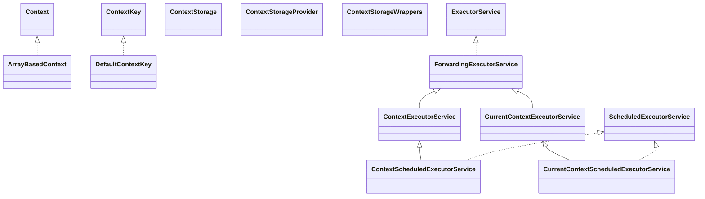

# opentelemetry-context-1.61.0.jar

[Group index](README.md) | [All archives](../README.md)

## Scope and provenance

- **Donor:** `SQX_145_REFERENCE_ROOT/internal/libs/opentelemetry-context-1.61.0.jar`.
- **SHA-256:** `2325b9b9081e506b5b58c54053109aa446f774e233e90511dc17fd8b20500558`; accessed 2026-10-06; captured `2026-10-06T18:54:51.906614+00:00`.
- **Classes:** 42 raw entries; 42 unique entry names. Duplicate occurrence indices are zero-based.
- **Inspection:** read-only ZIP hashing and class-file structural parsing; signatures/descriptors, modifiers, hierarchy and references only. Bytecode bodies are hashed, not published.
- **Allocation:** proposed `FEAT-HOST-OPENTELEMETRY-CONTEXT`, P01; [roadmap](../../dev/sqx-full-application-roadmap.md). Domain README registration remains required.
- **Repository:** `01067f00031428613c6394064ca1bcadc1ba00ee`; review state unreviewed. Download label 145-dev1; installed build/activation and runtime equivalence unverified.
- **Limit:** every class/member is inventoried; declaration coverage does not establish consumed calls, defaults, formulas, failure semantics or algorithm parity.
- **Archive/resource index:** [089.json](../../dev/evidence/sqx145/archives/145/089.json).

## Complete member declarations

Member shards contain exact JVM names/descriptors, access flags, generic signatures, throws types, declared fields/methods, superclass/interfaces and referenced class names. All classes, nested/synthetic members and overloads are retained. Code length/hash is structural evidence, not a normalized algorithm comparison.

- [001.json](../../dev/evidence/sqx145/members/089/001.json) — SHA-256 `45c4c63f99abb9d7809c7a92814df4f637f58f0c935db93d54a0f056693b3862`.

## Focused structural diagram

Up to twelve non-nested classes; arrows show declared inheritance/interfaces only. External type names are not evidence of an available body or an executed dependency.

## Class inventory

| Archive entry | Occurrence | Class SHA-256 | Fields | Methods |
| --- | ---: | --- | ---: | ---: |
| `io/opentelemetry/context/ArrayBasedContext.class` | 0 | `d402753d3e71870e500e03e5abbb08addd7db91a7b446be04915db4476ad65f3` | 2 | 6 |
| `io/opentelemetry/context/Context.class` | 0 | `45ab704c479326094e1201689409737a263ca44cea735f440a8a2f6a0832c9dd` | 0 | 28 |
| `io/opentelemetry/context/ContextExecutorService.class` | 0 | `386419f7d745dd494a7acf8875f2c08e17c022b52cbc65185b19e8db69a2571d` | 1 | 10 |
| `io/opentelemetry/context/ContextKey.class` | 0 | `16a7f165679e05a781d9867f97b0672a0a753620380a5667587d860bce63500a` | 0 | 1 |
| `io/opentelemetry/context/ContextScheduledExecutorService.class` | 0 | `98075901cc67ef2c0878335d6f175e2f45c4c3cf5583e98eaf26f34a58b3981e` | 0 | 7 |
| `io/opentelemetry/context/ContextStorage.class` | 0 | `859e0d2baa0190db85ab2a8b056465439d3b56cef7364bb2a466f331521ce84c` | 0 | 6 |
| `io/opentelemetry/context/ContextStorageProvider.class` | 0 | `2d05cb902c49a3484f596fe39b25d92c04dc20655cb3973a192312299d27a35f` | 0 | 1 |
| `io/opentelemetry/context/ContextStorageWrappers.class` | 0 | `1cf6c56bdb95085a44cc1e9523fc5ed73a0edf39f0305d64b846b00d2206d3dd` | 4 | 5 |
| `io/opentelemetry/context/CurrentContextExecutorService.class` | 0 | `db6cfd56d17a57e920ce7aecdbbd096053f27e33dbb5edbcfedb9fc6534f245d` | 0 | 9 |
| `io/opentelemetry/context/CurrentContextScheduledExecutorService.class` | 0 | `5336b5dafa28cabab0f70800e23f1374ce2ca89717d8af12d220a33970fcc372` | 1 | 5 |
| `io/opentelemetry/context/DefaultContextKey.class` | 0 | `92e43ae140ed655b9371ece37feb5fda80a8e75bd727bd03623fbafa3b001956` | 1 | 2 |
| `io/opentelemetry/context/ForwardingExecutorService.class` | 0 | `dd667c2bbbb386845c408527d5f4272bbde36d8266f4ba8738442e4df06b6f76` | 1 | 8 |
| `io/opentelemetry/context/ImplicitContextKeyed.class` | 0 | `1edeb2d42677dda70d01c32d00a30db2d861a8516ff25e22c24beff6b2153e80` | 0 | 2 |
| `io/opentelemetry/context/LazyStorage.class` | 0 | `58bfa610d583b011230f21527a86cfdc7da54d6314d264355f132eba6fe309f4` | 5 | 4 |
| `io/opentelemetry/context/Scope.class` | 0 | `f1b5208939c25b7168efb650957ad2db6625c402dbdd6ceffb2346fe27cd8c47` | 0 | 2 |
| `io/opentelemetry/context/StrictContextStorage$CallerStackTrace.class` | 0 | `9baeb8d35e5e2edf7f6d4e0c62f9fff21a27bcdbe67749b818f106c5889ad9e6` | 4 | 1 |
| `io/opentelemetry/context/StrictContextStorage$PendingScopes.class` | 0 | `7f0673dc0bb7f3782381e7df696b7b925b6e32a3cba0399f79ddeb2e3ede6c6d` | 1 | 5 |
| `io/opentelemetry/context/StrictContextStorage$StrictScope.class` | 0 | `0d59e5e8f8f436d51567ed8567e87f6bf85da0b581f75f08523d72d87bf0a70d` | 3 | 3 |
| `io/opentelemetry/context/StrictContextStorage.class` | 0 | `8bc0109703d856ad3de459258130537c315c180913a349357ab85d99ae22c8de` | 3 | 9 |
| `io/opentelemetry/context/ThreadLocalContextStorage$1.class` | 0 | `dcdeea27805e41c3c42d79e3ddc95b6454075b14acf9f46780bbd21d692d5b0e` | 0 | 0 |
| `io/opentelemetry/context/ThreadLocalContextStorage$NoopScope.class` | 0 | `739e9e204df78cf07670c3273e801bd8df7290fbbdaa2485fe539a6476b78866` | 2 | 6 |
| `io/opentelemetry/context/ThreadLocalContextStorage$ScopeImpl.class` | 0 | `73db83688ffedaffe4f9b0b19cef87317cc12f7a553100f492f18bc0e597df65` | 4 | 3 |
| `io/opentelemetry/context/ThreadLocalContextStorage.class` | 0 | `cba29164a046780c769c0cc0a178486987e966f5fc87047e45f1b549b2f84466` | 4 | 9 |
| `io/opentelemetry/context/package-info.class` | 0 | `217c1341cc02ff18e0b96c96fcc113e5c7a373972beabd97a893f7ad682f50a4` | 0 | 0 |
| `io/opentelemetry/context/internal/shaded/AbstractWeakConcurrentMap$1.class` | 0 | `42f41efa385c3d00c16766e5ab63f0414f10000e6f3cd371151b012ae22f3bf7` | 0 | 0 |
| `io/opentelemetry/context/internal/shaded/AbstractWeakConcurrentMap$EntryIterator.class` | 0 | `4c349427b847f75e5ae46fd6050b82ad86da68e95cfdb0e7f75bdbb63813e62d` | 4 | 7 |
| `io/opentelemetry/context/internal/shaded/AbstractWeakConcurrentMap$SimpleEntry.class` | 0 | `111ffaa674543f46e4e68b66d7a9b11a2fe2dcfe9ba542c29ae887810146fe4b` | 3 | 5 |
| `io/opentelemetry/context/internal/shaded/AbstractWeakConcurrentMap$WeakKey.class` | 0 | `d9ab3c9ee9b2d22c8f88d5bb620556f66b5f265660f3ba307ec85b435ed17514` | 1 | 4 |
| `io/opentelemetry/context/internal/shaded/AbstractWeakConcurrentMap.class` | 0 | `53fe2eb636176afe6e72f4510a2e09df0b3c125056a50b46140f2fb79fab9d57` | 1 | 18 |
| `io/opentelemetry/context/internal/shaded/WeakConcurrentMap$1.class` | 0 | `e29c1076f8ae593e3c8794e0156f4383f087c4649a2ad79cdd279c5c18e97e43` | 0 | 3 |
| `io/opentelemetry/context/internal/shaded/WeakConcurrentMap$LookupKey.class` | 0 | `65aced16f6578fce8ec413645fc5874a8ddd51c4513e9259f6365b380827b333` | 2 | 5 |
| `io/opentelemetry/context/internal/shaded/WeakConcurrentMap$WithInlinedExpunction.class` | 0 | `ef65f0ab4f76c66d916d2108f17afd4a0e001f72437bf761158f54748a03a08e` | 0 | 16 |
| `io/opentelemetry/context/internal/shaded/WeakConcurrentMap.class` | 0 | `56e644e98a59182154314aa1eafbda6a0caf4caa1a22746aff201e94a2e8ca1d` | 4 | 23 |
| `io/opentelemetry/context/propagation/ContextPropagators.class` | 0 | `126a7b3632388e73b364f7bcd2c3442e9c82f4386edd5e7bd336e00bf93b3368` | 0 | 3 |
| `io/opentelemetry/context/propagation/DefaultContextPropagators.class` | 0 | `ddcc0f1b800280343b1055d8d73343002d0221e6cc9b74b99d2e8b7ad10f81ad` | 2 | 5 |
| `io/opentelemetry/context/propagation/MultiTextMapPropagator.class` | 0 | `538cc8a39ffd365df61eab5c0c4852d903a9da2b110ac6fd4057c0e250978318` | 2 | 7 |
| `io/opentelemetry/context/propagation/NoopTextMapPropagator.class` | 0 | `0151d36bd0787259003eca1d884b27bd62b841715cc690faee1f05fba28acb42` | 1 | 7 |
| `io/opentelemetry/context/propagation/TextMapGetter.class` | 0 | `b02d8c315452d7928bfba5214cab84bb0965baa49bcdc56879f247b68ccd52f4` | 0 | 3 |
| `io/opentelemetry/context/propagation/TextMapPropagator.class` | 0 | `a8275db53aa88380b2f605611c1b33a6639f824b73a30cb84a48f3b02579b9d5` | 0 | 6 |
| `io/opentelemetry/context/propagation/TextMapSetter.class` | 0 | `49b5e04d877294b6746b34721079104c96243c4ed04f2eb329ad75171df2de28` | 0 | 1 |
| `io/opentelemetry/context/propagation/package-info.class` | 0 | `1c581304f2eb0cce19da3e72404a8be6b2b45e3c24e84f1a0baa3b6d17db7fbb` | 0 | 0 |
| `io/opentelemetry/context/propagation/internal/ExtendedTextMapGetter.class` | 0 | `b341bfb8707ec221e19dbe32941851ff50df042c4863a8a71df18d25f519dcc1` | 0 | 0 |
