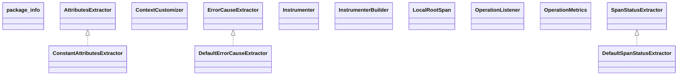

# opentelemetry-instrumentation-api-2.27.0.jar

[Group index](README.md) | [All archives](../README.md)

## Scope and provenance

- **Donor:** `SQX_145_REFERENCE_ROOT/internal/libs/opentelemetry-instrumentation-api-2.27.0.jar`.
- **SHA-256:** `e9928acbe8867fa84102c6a40c35266f39eef7f72c566884270565434b315c07`; accessed 2026-10-06; captured `2026-10-06T18:54:51.906614+00:00`.
- **Classes:** 197 raw entries; 197 unique entry names. Duplicate occurrence indices are zero-based.
- **Inspection:** read-only ZIP hashing and class-file structural parsing; signatures/descriptors, modifiers, hierarchy and references only. Bytecode bodies are hashed, not published.
- **Allocation:** proposed `FEAT-HOST-OPENTELEMETRY-INSTRUMENTATION-API`, P01; [roadmap](../../dev/sqx-full-application-roadmap.md). Domain README registration remains required.
- **Repository:** `01067f00031428613c6394064ca1bcadc1ba00ee`; review state unreviewed. Download label 145-dev1; installed build/activation and runtime equivalence unverified.
- **Limit:** every class/member is inventoried; declaration coverage does not establish consumed calls, defaults, formulas, failure semantics or algorithm parity.
- **Archive/resource index:** [091.json](../../dev/evidence/sqx145/archives/145/091.json).

## Complete member declarations

Member shards contain exact JVM names/descriptors, access flags, generic signatures, throws types, declared fields/methods, superclass/interfaces and referenced class names. All classes, nested/synthetic members and overloads are retained. Code length/hash is structural evidence, not a normalized algorithm comparison.

- [001.json](../../dev/evidence/sqx145/members/091/001.json) — SHA-256 `9ce5d52edaf326d4bbd70f5afce65b0aa2c0725aaaa3bd8326219ad8c59c2a93`.
- [002.json](../../dev/evidence/sqx145/members/091/002.json) — SHA-256 `28c19d3cfd9067231e7347fe222b8987c28b2c64518067362df4c4d364bc57e1`.
- [003.json](../../dev/evidence/sqx145/members/091/003.json) — SHA-256 `68d0c3da34c44aa6a569da041e88930852fd19c7667931cac6bfc4fe5d8179aa`.

## Focused structural diagram

Up to twelve non-nested classes; arrows show declared inheritance/interfaces only. External type names are not evidence of an available body or an executed dependency.

## Class inventory

| Archive entry | Occurrence | Class SHA-256 | Fields | Methods |
| --- | ---: | --- | ---: | ---: |
| `io/opentelemetry/instrumentation/api/package-info.class` | 0 | `6c2d93b620e1b0cb8b95863825ef1e30c643a6d01b5933af0f09d7cd9e747253` | 0 | 0 |
| `io/opentelemetry/instrumentation/api/instrumenter/AttributesExtractor.class` | 0 | `f92819b7c085b49a974fb209898c27a90cf26c98c89c1828664319f17ec9a9d4` | 0 | 3 |
| `io/opentelemetry/instrumentation/api/instrumenter/ConstantAttributesExtractor.class` | 0 | `81d61258f25dd4150ad389b91a4bc8c603e65ef1054c9df1cdc8cb774777c9b3` | 2 | 3 |
| `io/opentelemetry/instrumentation/api/instrumenter/ContextCustomizer.class` | 0 | `ec10930566388e13619945e41f739ea904d11a5952a6445dfa1a9e41658b2aee` | 0 | 1 |
| `io/opentelemetry/instrumentation/api/instrumenter/DefaultErrorCauseExtractor.class` | 0 | `840c1677a55cc9d317031a4cb56e386daa0139e324454e0c992a94d7d07664e0` | 2 | 5 |
| `io/opentelemetry/instrumentation/api/instrumenter/DefaultSpanStatusExtractor.class` | 0 | `39ab4d6f4682e46b166a645bd7cad0401676a5502a113be264f43c3c5d5a46e1` | 1 | 3 |
| `io/opentelemetry/instrumentation/api/instrumenter/ErrorCauseExtractor.class` | 0 | `668f4160f7f9335e4b5bbb088c239a5ae4df58c38f7b73601a82516e4d6ca60a` | 0 | 2 |
| `io/opentelemetry/instrumentation/api/instrumenter/Instrumenter$1.class` | 0 | `16506f00b286910847f18dc354965262ac5333837050e0221c443d417a2cb352` | 0 | 4 |
| `io/opentelemetry/instrumentation/api/instrumenter/Instrumenter.class` | 0 | `23ef932b3e44f263244239a4b94237bff4e052cea10550f132e979e9428bc55e` | 16 | 13 |
| `io/opentelemetry/instrumentation/api/instrumenter/InstrumenterBuilder$1.class` | 0 | `8215be4cabdf3d5d2cc50cc361397186f747fa7c92f98e11dbafbf1101eb97dd` | 2 | 9 |
| `io/opentelemetry/instrumentation/api/instrumenter/InstrumenterBuilder$2.class` | 0 | `7d7b6af521f97b4ab9c40f663b87204c84b0880f2aee0bd1fdf40e268076d799` | 0 | 4 |
| `io/opentelemetry/instrumentation/api/instrumenter/InstrumenterBuilder$InstrumenterConstructor.class` | 0 | `29631fa570a6f39d1974e4703190fe16d88c49f1a5cd115b702200917070f1b4` | 0 | 6 |
| `io/opentelemetry/instrumentation/api/instrumenter/InstrumenterBuilder.class` | 0 | `8eb6e0fc1e9a3ae89847d07cb786df670597d73a80b6768741b15fcead29583e` | 17 | 34 |
| `io/opentelemetry/instrumentation/api/instrumenter/LocalRootSpan.class` | 0 | `118e63b4f2e8827aae942aff12d1314409f4a618dbc17d748dd5079c896e2b1b` | 1 | 7 |
| `io/opentelemetry/instrumentation/api/instrumenter/OperationListener.class` | 0 | `808861c0c94070244ec1379dacd05d82df250244a8464706f56346d8de77a3c9` | 0 | 2 |
| `io/opentelemetry/instrumentation/api/instrumenter/OperationMetrics.class` | 0 | `bc0c50ad5ea522a5ffac66dd5efaa1b7a4409538032a2bec92a56ea6ae7a923c` | 0 | 1 |
| `io/opentelemetry/instrumentation/api/instrumenter/PropagatingFromUpstreamInstrumenter.class` | 0 | `e7ea6ae392f8f077ee8604ddf5473d5c8a3e88fb3a7504d475964d94f64bcdd1` | 2 | 2 |
| `io/opentelemetry/instrumentation/api/instrumenter/PropagatingToDownstreamInstrumenter.class` | 0 | `930b563362da213383124c4dd1a779bdb38dc7f53b21c9f987a5807a2926f942` | 2 | 2 |
| `io/opentelemetry/instrumentation/api/instrumenter/SpanKindExtractor.class` | 0 | `4c3799b275781140ce33bf94e2b7485442618542b5cbc736644c252c53d5f1b6` | 0 | 11 |
| `io/opentelemetry/instrumentation/api/instrumenter/SpanLinksBuilder.class` | 0 | `e0214bf0a9c903bc475344649251b82de076a58f39ace6682789bad2829ba272` | 0 | 2 |
| `io/opentelemetry/instrumentation/api/instrumenter/SpanLinksBuilderImpl.class` | 0 | `aa12f825b3a959b6ee8f0a9d8cb764b4915927e178d35fbb4ab89989f2a283ec` | 1 | 3 |
| `io/opentelemetry/instrumentation/api/instrumenter/SpanLinksExtractor.class` | 0 | `96c848f2140273386275e88291e9c3ba269b1ea902210191877817afb18e35d6` | 0 | 1 |
| `io/opentelemetry/instrumentation/api/instrumenter/SpanNameExtractor.class` | 0 | `cf44da27c9e6e1612b595ba9d42b2e2deb310f935636d0a9cad9e34b05ac5a8d` | 0 | 1 |
| `io/opentelemetry/instrumentation/api/instrumenter/SpanStatusBuilder.class` | 0 | `60c19e5c74933973c24a9401c674f6967d4b3c6bb8c21213845ba93e7fc9e881` | 0 | 2 |
| `io/opentelemetry/instrumentation/api/instrumenter/SpanStatusBuilderImpl.class` | 0 | `bc435f3ba9e29d4e7ce4768fefeb3c6fae0f0bcae4f69cc113314d031fef5c53` | 1 | 2 |
| `io/opentelemetry/instrumentation/api/instrumenter/SpanStatusExtractor.class` | 0 | `17052f31434c8f5b976e1ce1d2128f91bb2504e21d5dfbd58439b69426c29ffd` | 0 | 2 |
| `io/opentelemetry/instrumentation/api/instrumenter/SpanSuppressionStrategy$1.class` | 0 | `deef931dff6bb934f43e30a29e2407830a7d93823943a8e8f7c6463ad867da3f` | 0 | 2 |
| `io/opentelemetry/instrumentation/api/instrumenter/SpanSuppressionStrategy$2.class` | 0 | `1dcb27e3d08c24bb8a97debd01eec0ebed7bb99b1b8e03ee9076fd9250bb4163` | 1 | 2 |
| `io/opentelemetry/instrumentation/api/instrumenter/SpanSuppressionStrategy$3.class` | 0 | `4dd06cc1de1c2a4c372ce9aeca519b9694c4b8fa0b513d4b538425dca0eb7bb7` | 0 | 2 |
| `io/opentelemetry/instrumentation/api/instrumenter/SpanSuppressionStrategy.class` | 0 | `d9fa4b7fa4fba94792db4aba81b272f8478cb06a6084c7a11286166abefe8651` | 4 | 8 |
| `io/opentelemetry/instrumentation/api/instrumenter/SpanSuppressor.class` | 0 | `3e7c25f7351db781223e3a2cab126290fc579b0e6670f046e0e5f975a14e6011` | 0 | 2 |
| `io/opentelemetry/instrumentation/api/instrumenter/SpanSuppressors$ByContextKey.class` | 0 | `956b6528fb96d57cf9ea716997d491512a3937f7a9bf4f8e71164b6f13b614e1` | 1 | 3 |
| `io/opentelemetry/instrumentation/api/instrumenter/SpanSuppressors$BySpanKey.class` | 0 | `74d7ddd27838c14a193be4034f60c8f49235b7b0e68419fa13608b811cd49770` | 1 | 3 |
| `io/opentelemetry/instrumentation/api/instrumenter/SpanSuppressors$DelegateBySpanKind.class` | 0 | `c1ffcf1cecf99ab7b1612f5584881d59941876d520c9b27cf412f4dcac780ec8` | 1 | 3 |
| `io/opentelemetry/instrumentation/api/instrumenter/SpanSuppressors$Noop.class` | 0 | `aa8718c3618b34bc08ea74c6bd592891f46ad67d0f0ae52b25e6fe80f5729911` | 2 | 7 |
| `io/opentelemetry/instrumentation/api/instrumenter/SpanSuppressors.class` | 0 | `cf329773105bedcbee4006b3c9cb0ab4d79a95afb5da2921cf19effc00b34811` | 0 | 1 |
| `io/opentelemetry/instrumentation/api/instrumenter/UnsafeAttributes.class` | 0 | `b5d91eff11ae067cb65d7fc4b74fd87aeb9694104d06dddb9ef9bccf568f546e` | 1 | 9 |
| `io/opentelemetry/instrumentation/api/instrumenter/package-info.class` | 0 | `be8975dc0f76d0c2d417fa42ad70b905180193c4a8e7d5042f8cb10e7585f7e7` | 0 | 0 |
| `io/opentelemetry/instrumentation/api/internal/ClassNames.class` | 0 | `066d0d092caa524daa056299717c2b0414ee330f1f5ed16945fc3fafc4b8190e` | 1 | 4 |
| `io/opentelemetry/instrumentation/api/internal/ConfigPropertiesUtil.class` | 0 | `24dc6dfccacad07723decc8878ed62732afc5a42a3056fdf329660dcedecc5ba` | 0 | 10 |
| `io/opentelemetry/instrumentation/api/internal/ContextPropagationDebug$Propagation.class` | 0 | `2a5fe782d9ee5810404803bd202d06f19e76ae2ff9a1c6dd07c327568e0b053d` | 2 | 1 |
| `io/opentelemetry/instrumentation/api/internal/ContextPropagationDebug.class` | 0 | `ec6acaab70706adc1884ada884f5444b861a4f20b0ec601a8bf4bc02e8ff6b85` | 7 | 9 |
| `io/opentelemetry/instrumentation/api/internal/DebugUtil.class` | 0 | `1b42c272f9667c989b18559d2f6b011ceea93eb4682003a2ec5227016c304b45` | 0 | 3 |
| `io/opentelemetry/instrumentation/api/internal/EmbeddedInstrumentationProperties$BootstrapProxy.class` | 0 | `3222c1adb633dac53a38658c617682b158f45a2ccb599a92997b9b05101dd746` | 0 | 1 |
| `io/opentelemetry/instrumentation/api/internal/EmbeddedInstrumentationProperties.class` | 0 | `4fcb7d6a1ea8fb7774d44870a45703e6fddd21f629917fff7aa6a985bae1095a` | 4 | 5 |
| `io/opentelemetry/instrumentation/api/internal/EnumerationUtil$1.class` | 0 | `c3cbf30905d3fde35dca4dbff0ac31616d743e141f7596727183691d90077aae` | 1 | 3 |
| `io/opentelemetry/instrumentation/api/internal/EnumerationUtil.class` | 0 | `bba5e7ca785a951cb27f97c8910b70ea4d900045d050291991c760ffa9c2c7ae` | 0 | 2 |
| `io/opentelemetry/instrumentation/api/internal/Experimental.class` | 0 | `274a678aaa52e7fe6afaa5eecd080a82865df1955d7e87e9ae6cd3202fb3a2eb` | 4 | 10 |
| `io/opentelemetry/instrumentation/api/internal/GuardedBy.class` | 0 | `dd289b1081b9f65d736491f0a04c517f267128aab3a24e40414a8778e937be8b` | 0 | 1 |
| `io/opentelemetry/instrumentation/api/internal/HttpConstants.class` | 0 | `34149179261866d11a4d73e73ef76da7a19ae3a5c8ed99fc2d065ed63253ba7a` | 3 | 5 |
| `io/opentelemetry/instrumentation/api/internal/HttpProtocolUtil.class` | 0 | `f9e88a5bed87e92192ca2c08deb1a72284e7fb6c7ecbe44af28937ce91576614` | 0 | 4 |
| `io/opentelemetry/instrumentation/api/internal/HttpRouteState.class` | 0 | `8e6c7411972f6ffa8a939e715166319538489cd45123960b250b202e50a7f452` | 5 | 12 |
| `io/opentelemetry/instrumentation/api/internal/Initializer.class` | 0 | `9b4060ca66b923fab952c24ab43899f619c7a64d68b059dd7fe35e6d7ff2a1dd` | 0 | 0 |
| `io/opentelemetry/instrumentation/api/internal/InstrumenterAccess.class` | 0 | `f849887b7bcc57539d4d059fb490a17f9589a7b03798981b457ab7e38739daff` | 0 | 3 |
| `io/opentelemetry/instrumentation/api/internal/InstrumenterBuilderAccess.class` | 0 | `494851b8b5252014d9ba84e99cac365cf8eefd38e1a4af9924bff1f0f8d99496` | 0 | 3 |
| `io/opentelemetry/instrumentation/api/internal/InstrumenterContext.class` | 0 | `9ea45d030670902f33da9d40a5ee1e0154115179e172db6a9dbf22d69bce17c2` | 2 | 5 |
| `io/opentelemetry/instrumentation/api/internal/InstrumenterUtil$1.class` | 0 | `34ab63c37c9ad4c9364d411037a81e49797408cf11c99b54fc4dc2a08b967b0e` | 3 | 3 |
| `io/opentelemetry/instrumentation/api/internal/InstrumenterUtil.class` | 0 | `c2da39f27622d9c688faefe714ed732f4f74f05fa91478d885a840e5461aa343` | 2 | 18 |
| `io/opentelemetry/instrumentation/api/internal/InternalInstrumenterCustomizer.class` | 0 | `e67d133d6efb14d32554bec5eca319ecaf8dd540cf405c3ce6513d305020c215` | 0 | 8 |
| `io/opentelemetry/instrumentation/api/internal/InternalInstrumenterCustomizerProvider.class` | 0 | `6117ba0f796a4b77b56ac8b4319b40554efa2c6dea086dee7cefbd84693b97da` | 0 | 1 |
| `io/opentelemetry/instrumentation/api/internal/InternalInstrumenterCustomizerUtil.class` | 0 | `85940e96cc68ba8992d07fac4975ae716027786becea0db6f1bac1a858066245` | 1 | 4 |
| `io/opentelemetry/instrumentation/api/internal/OperationMetricsUtil$1.class` | 0 | `451a0546ab173d5ec63fe4cd3becfe6993ba28ae19211e615fe4fa183bef4fe9` | 0 | 3 |
| `io/opentelemetry/instrumentation/api/internal/OperationMetricsUtil.class` | 0 | `53b7de256d921886e8975e06c3252aa0fe12b7786886479278e8c9fb2e742804` | 2 | 6 |
| `io/opentelemetry/instrumentation/api/internal/PropagatorBasedSpanLinksExtractor.class` | 0 | `d7624f7df80280bcb58c19cf8eea8da16160f95803c2b9090385b00d78ac66d0` | 2 | 2 |
| `io/opentelemetry/instrumentation/api/internal/RuntimeVirtualFieldSupplier$1.class` | 0 | `481bf177bf24bbc9a7f3b6586e8f21b42a97a1c58ea134a1be6b353b14580958` | 0 | 0 |
| `io/opentelemetry/instrumentation/api/internal/RuntimeVirtualFieldSupplier$CacheBasedVirtualField.class` | 0 | `d2603a0a22ed6f77cfea9fd4b93f41ade54e0d7a3248c0073ea6a5565e06c85d` | 1 | 4 |
| `io/opentelemetry/instrumentation/api/internal/RuntimeVirtualFieldSupplier$CacheBasedVirtualFieldSupplier.class` | 0 | `5bfc08b90fb549cf55854eabace7c76da3291fbf1d6f3986f4a50ea4e569b7c5` | 1 | 5 |
| `io/opentelemetry/instrumentation/api/internal/RuntimeVirtualFieldSupplier$VirtualFieldSupplier.class` | 0 | `0191a5a7761b601117d536aa3713d4f6f8d41def35c3cfc1edf0993e0246b673` | 0 | 1 |
| `io/opentelemetry/instrumentation/api/internal/RuntimeVirtualFieldSupplier.class` | 0 | `ef144674be09fde259cbff350d0fe5106b0964b6b50b50d90cd5846840970701` | 3 | 4 |
| `io/opentelemetry/instrumentation/api/internal/SchemaUrlProvider.class` | 0 | `457bf0d7d4093aa356488c57c3678063debeb5d1a2cf4722cd55b05fca5afd84` | 0 | 1 |
| `io/opentelemetry/instrumentation/api/internal/SemconvStability.class` | 0 | `2ff5eaa199858e22cde84497520412801773d60ec7b08dc72453d66afafb9aab` | 13 | 20 |
| `io/opentelemetry/instrumentation/api/internal/ServiceLoaderUtil.class` | 0 | `b1e1e9ecfab7f77441aec636ae135265c750b2e4d756cb54b58f9de29df1d055` | 1 | 4 |
| `io/opentelemetry/instrumentation/api/internal/SpanKey.class` | 0 | `3cfca7c39a56e3dd25149cc7d8e11f97f912a289f025133d190498cf86e50276` | 25 | 5 |
| `io/opentelemetry/instrumentation/api/internal/SpanKeyProvider.class` | 0 | `7ba448729ef5065444c2b98cce8cfe5f99e06ace170ef8d4d2ed560c8da8abc5` | 0 | 1 |
| `io/opentelemetry/instrumentation/api/internal/SupportabilityMetrics$1.class` | 0 | `d4b0dbeeaadb3f48a45603261022a6711e2e9a5d07529ef62529d1c3db711ce5` | 1 | 1 |
| `io/opentelemetry/instrumentation/api/internal/SupportabilityMetrics$CounterNames.class` | 0 | `c7c09fd585f665cd4917e1237c405e4e48a74319dc3fbc88ddf2894a12de523f` | 1 | 2 |
| `io/opentelemetry/instrumentation/api/internal/SupportabilityMetrics$KindCounters.class` | 0 | `fd5f7cda20dc1919842848af0d01562bf80a529adb86e90919b41894a3e727f7` | 5 | 4 |
| `io/opentelemetry/instrumentation/api/internal/SupportabilityMetrics.class` | 0 | `e789b062ed5354f7a216ad5e148b9cbb503aff6d485c3c6f160d2b3b67b7a866` | 6 | 14 |
| `io/opentelemetry/instrumentation/api/internal/Timer.class` | 0 | `f4a1ef94b69dc5e93fe5040ee6d245459998e0e0001f088a2354e5555cbc656f` | 2 | 4 |
| `io/opentelemetry/instrumentation/api/internal/package-info.class` | 0 | `20773ada3622fe0cac294a054547efd5015e02e4639059bb8947079956be0360` | 0 | 0 |
| `io/opentelemetry/instrumentation/api/internal/cache/Cache.class` | 0 | `ad89fc066a66a0326209c86a55b579028300594fa03d214bc7f75c3c3db2932f` | 0 | 6 |
| `io/opentelemetry/instrumentation/api/internal/cache/MapBackedCache.class` | 0 | `0ef80826b80e580a4c6db1136b8604c8faee950e1197cc365300c4cfa557d004` | 1 | 6 |
| `io/opentelemetry/instrumentation/api/internal/cache/WeakLockFreeCache.class` | 0 | `c3ece9d59af7d6da44ceb75249eb99f619bc50b593d4aa0b47db4ff43d2acd45` | 1 | 6 |
| `io/opentelemetry/instrumentation/api/internal/cache/concurrentlinkedhashmap/ConcurrentLinkedHashMap$1.class` | 0 | `3b07608c143f531a59395899b35ba584fc99c9a73bbaf4a0db7b99709d5c7a5a` | 0 | 0 |
| `io/opentelemetry/instrumentation/api/internal/cache/concurrentlinkedhashmap/ConcurrentLinkedHashMap$AddTask.class` | 0 | `6a2ad7725d924d88712f22fd58f6b7b8bd3616c10f0d9b087ac2e0c6e362929a` | 3 | 2 |
| `io/opentelemetry/instrumentation/api/internal/cache/concurrentlinkedhashmap/ConcurrentLinkedHashMap$BoundedEntryWeigher.class` | 0 | `305003facf460cf048451399f39d378975712aa9b0467f92c9db6f5fd326637e` | 2 | 3 |
| `io/opentelemetry/instrumentation/api/internal/cache/concurrentlinkedhashmap/ConcurrentLinkedHashMap$Builder.class` | 0 | `b53128fb8d85f66c4cfe515bcf82c6ac484175ecf97a4420fd7f6b1ef7f8e019` | 7 | 8 |
| `io/opentelemetry/instrumentation/api/internal/cache/concurrentlinkedhashmap/ConcurrentLinkedHashMap$DiscardingListener.class` | 0 | `f40b400586511030002c5ee8db85e4636e274486e393d93ffd9c07248b2c5247` | 2 | 6 |
| `io/opentelemetry/instrumentation/api/internal/cache/concurrentlinkedhashmap/ConcurrentLinkedHashMap$DiscardingQueue.class` | 0 | `7a452b93f23335dafcca7494b8d26b454fcccf1bef46abbb55976b6a19cef578` | 0 | 7 |
| `io/opentelemetry/instrumentation/api/internal/cache/concurrentlinkedhashmap/ConcurrentLinkedHashMap$DrainStatus$1.class` | 0 | `c2f19c87c4e962bb529b0ddaa2b1b3426c34889cdabe70a147034584c0163b29` | 0 | 2 |
| `io/opentelemetry/instrumentation/api/internal/cache/concurrentlinkedhashmap/ConcurrentLinkedHashMap$DrainStatus$2.class` | 0 | `8e0c0b7c9dd0685a54377bb9d7f09aa612b31a6a2e414740556e85f332b80254` | 0 | 2 |
| `io/opentelemetry/instrumentation/api/internal/cache/concurrentlinkedhashmap/ConcurrentLinkedHashMap$DrainStatus$3.class` | 0 | `03523934378f8fe7c3f992064a7a1fcff04249bf5495fdb08e24c30901a11bb0` | 0 | 2 |
| `io/opentelemetry/instrumentation/api/internal/cache/concurrentlinkedhashmap/ConcurrentLinkedHashMap$DrainStatus.class` | 0 | `e77571fc181f63cf1e4744af37f217b3ad3d0bffdb42aec584b2367abc097f28` | 4 | 7 |
| `io/opentelemetry/instrumentation/api/internal/cache/concurrentlinkedhashmap/ConcurrentLinkedHashMap$EntryIterator.class` | 0 | `6b2c0f325106cebf87bc62c4790296da34c2ff1b1fbb5407d1d5c048dc8d2890` | 3 | 5 |
| `io/opentelemetry/instrumentation/api/internal/cache/concurrentlinkedhashmap/ConcurrentLinkedHashMap$EntrySet.class` | 0 | `a353329281b27bcc572af3dd771af137791df63e7953e957f0a5eff863c577a6` | 2 | 8 |
| `io/opentelemetry/instrumentation/api/internal/cache/concurrentlinkedhashmap/ConcurrentLinkedHashMap$KeyIterator.class` | 0 | `324048d49355edfb6638a2621eef9bf5c446187da45ec43d40b79f1b1d838022` | 3 | 4 |
| `io/opentelemetry/instrumentation/api/internal/cache/concurrentlinkedhashmap/ConcurrentLinkedHashMap$KeySet.class` | 0 | `cc2644e7a57b24a86f78dd1e590bb8f2a84c48de3ea7370c1e0697b6ec409bf4` | 2 | 8 |
| `io/opentelemetry/instrumentation/api/internal/cache/concurrentlinkedhashmap/ConcurrentLinkedHashMap$Node.class` | 0 | `b2cff7b8fcd7e6dd3844599f4776e7230bb6e68600fbdb8994c1e012c3ae6bf1` | 3 | 10 |
| `io/opentelemetry/instrumentation/api/internal/cache/concurrentlinkedhashmap/ConcurrentLinkedHashMap$RemovalTask.class` | 0 | `dbb857ad9d009cbe62772167ca682b037eb04dc32c3d19fded24bd58e4c173fe` | 2 | 2 |
| `io/opentelemetry/instrumentation/api/internal/cache/concurrentlinkedhashmap/ConcurrentLinkedHashMap$SerializationProxy.class` | 0 | `f1d5040ea1830d5554fdf11292fd89461941e0d6089e43ed88d66626e5627f9d` | 6 | 2 |
| `io/opentelemetry/instrumentation/api/internal/cache/concurrentlinkedhashmap/ConcurrentLinkedHashMap$UpdateTask.class` | 0 | `c857eba0f7183cd0581002c50b39969d90d7a725dda1e36c1d56a62fe554bb1b` | 3 | 2 |
| `io/opentelemetry/instrumentation/api/internal/cache/concurrentlinkedhashmap/ConcurrentLinkedHashMap$ValueIterator.class` | 0 | `8be3bb0d19487b65834607bc825f373cece8031e6b5d2c6d0e508d209e5052fb` | 3 | 4 |
| `io/opentelemetry/instrumentation/api/internal/cache/concurrentlinkedhashmap/ConcurrentLinkedHashMap$Values.class` | 0 | `dc519bf05f42afb5fbe5c5d53a8cc733c2c5fb32e31312ac94f9376ae10db35c` | 1 | 5 |
| `io/opentelemetry/instrumentation/api/internal/cache/concurrentlinkedhashmap/ConcurrentLinkedHashMap$WeightedValue.class` | 0 | `2dda3f516e33e005d13e441a1a2980a397bfa5089ebd7c3b98231e155eac7f5b` | 2 | 5 |
| `io/opentelemetry/instrumentation/api/internal/cache/concurrentlinkedhashmap/ConcurrentLinkedHashMap$WriteThroughEntry.class` | 0 | `4ffcbc5cb9246d42371707df5603e0dabe81b82c66a43ccff179ab3dcb6f2ed0` | 2 | 3 |
| `io/opentelemetry/instrumentation/api/internal/cache/concurrentlinkedhashmap/ConcurrentLinkedHashMap.class` | 0 | `ae2c5f8d5800d6f410fc9cd93b9c88f5f2d668727429d00b9a199bd001fac4d5` | 29 | 56 |
| `io/opentelemetry/instrumentation/api/internal/cache/concurrentlinkedhashmap/EntryWeigher.class` | 0 | `d51ce30539cf8170209cb5718b046fefb6afa735024eb47f89f8776a63590806` | 0 | 1 |
| `io/opentelemetry/instrumentation/api/internal/cache/concurrentlinkedhashmap/EvictionListener.class` | 0 | `c92600d6da60edd6e9425a6496799edbf64311ca58c42f29e71b97bac4b174fc` | 0 | 1 |
| `io/opentelemetry/instrumentation/api/internal/cache/concurrentlinkedhashmap/LinkedDeque$1.class` | 0 | `7ec83312238bc25606efd4231c82b7c480453ea9f60687c2ff0ae8ae2260972d` | 1 | 2 |
| `io/opentelemetry/instrumentation/api/internal/cache/concurrentlinkedhashmap/LinkedDeque$2.class` | 0 | `7b99e906016ce095ed99c5e7db2176b031b6cf69935f9f4aca56fa4946881a3a` | 1 | 2 |
| `io/opentelemetry/instrumentation/api/internal/cache/concurrentlinkedhashmap/LinkedDeque$AbstractLinkedIterator.class` | 0 | `3d47586c155162003b70bfb72e7435b0c4627b2bd8d2370c33b1f1badc2f0891` | 2 | 6 |
| `io/opentelemetry/instrumentation/api/internal/cache/concurrentlinkedhashmap/LinkedDeque$Linked.class` | 0 | `6c47665f52b07adb370584f2f830ca0fb085380928f4c8357646ee19fb45b8eb` | 0 | 4 |
| `io/opentelemetry/instrumentation/api/internal/cache/concurrentlinkedhashmap/LinkedDeque.class` | 0 | `3e340b2c7ac07fef886e63776c95eee7ee0fe233633d20604a686b117abc0060` | 2 | 61 |
| `io/opentelemetry/instrumentation/api/internal/cache/concurrentlinkedhashmap/Weigher.class` | 0 | `bef2b2b2a85df3d9c5b8372232111075c584851d402c7203b12b8e30ee14c086` | 0 | 1 |
| `io/opentelemetry/instrumentation/api/internal/cache/concurrentlinkedhashmap/Weighers$ByteArrayWeigher.class` | 0 | `1d7aab2b9ed35b0839c58e9154d5544c643dd70d570354fc02f8a93ed1ee181c` | 2 | 7 |
| `io/opentelemetry/instrumentation/api/internal/cache/concurrentlinkedhashmap/Weighers$CollectionWeigher.class` | 0 | `6271d53b9a7ee06d8121bfd2ddd6fd562022ca29b8c0f42cf1933a3c0822a4c2` | 2 | 7 |
| `io/opentelemetry/instrumentation/api/internal/cache/concurrentlinkedhashmap/Weighers$EntryWeigherView.class` | 0 | `4cb417b39470acf576e74fe9a7cdb9d1fdb27919c27bc7053a921ea679bef808` | 2 | 2 |
| `io/opentelemetry/instrumentation/api/internal/cache/concurrentlinkedhashmap/Weighers$IterableWeigher.class` | 0 | `d1fda17ac3e7d417f2114d75eb6ef881c1a52000847222b70e242ddd22bbb5d5` | 2 | 7 |
| `io/opentelemetry/instrumentation/api/internal/cache/concurrentlinkedhashmap/Weighers$ListWeigher.class` | 0 | `35067906b668603889c6c7203423d4ed4ac43c57bfca60c08f62f08381bed52c` | 2 | 7 |
| `io/opentelemetry/instrumentation/api/internal/cache/concurrentlinkedhashmap/Weighers$MapWeigher.class` | 0 | `0da4025046cca59c1c67c5108f35c25bed2ac9b930d0dcf4473d8f8d597933ea` | 2 | 7 |
| `io/opentelemetry/instrumentation/api/internal/cache/concurrentlinkedhashmap/Weighers$SetWeigher.class` | 0 | `23bc73038c5ceb9b5604687ea43663ad5017281a44ede05672e3f28bc9618329` | 2 | 7 |
| `io/opentelemetry/instrumentation/api/internal/cache/concurrentlinkedhashmap/Weighers$SingletonEntryWeigher.class` | 0 | `435bd0a06593ae5e5d1cd2dbc1729dfebb46e7c8fb51d2f6ba0f0fd9e83d87c9` | 2 | 6 |
| `io/opentelemetry/instrumentation/api/internal/cache/concurrentlinkedhashmap/Weighers$SingletonWeigher.class` | 0 | `37c6bb59c5935fb35e8c971b96fd85aaa2d0ceccb4839dd16dd766c895585873` | 2 | 6 |
| `io/opentelemetry/instrumentation/api/internal/cache/concurrentlinkedhashmap/Weighers.class` | 0 | `5b6b15d32130c7b01a35a0ed68d86d3fc294a936b0400b40434211e02a25f37b` | 0 | 10 |
| `io/opentelemetry/instrumentation/api/internal/cache/weaklockfree/AbstractWeakConcurrentMap$1.class` | 0 | `ee7427fec7434a78de9333a79a1036b54144a58055f9a78bc00f3e9906f253ed` | 0 | 0 |
| `io/opentelemetry/instrumentation/api/internal/cache/weaklockfree/AbstractWeakConcurrentMap$EntryIterator.class` | 0 | `7535627c2a151c23fd11ed0060da65b80c8fd57dd6cb376703231b567835bc69` | 4 | 7 |
| `io/opentelemetry/instrumentation/api/internal/cache/weaklockfree/AbstractWeakConcurrentMap$SimpleEntry.class` | 0 | `a4491da620de9735c71e8bd2046b7d9b37fd13691af353b8faad6813bdec76b4` | 3 | 5 |
| `io/opentelemetry/instrumentation/api/internal/cache/weaklockfree/AbstractWeakConcurrentMap$WeakKey.class` | 0 | `1caaba3cc52dfc152a28aa91bafb05a39fa8e54ac385c10290e4605d8de94522` | 2 | 5 |
| `io/opentelemetry/instrumentation/api/internal/cache/weaklockfree/AbstractWeakConcurrentMap.class` | 0 | `001b4585643816e57d5d6d5a592c238d01d37a85e39f16b25f4b5f849bca0c7e` | 3 | 23 |
| `io/opentelemetry/instrumentation/api/internal/cache/weaklockfree/WeakConcurrentMap$1.class` | 0 | `2a978b5d0ed4364690c186c8ac93a9be6b30404e15348211832075d5509b25e0` | 0 | 3 |
| `io/opentelemetry/instrumentation/api/internal/cache/weaklockfree/WeakConcurrentMap$LookupKey.class` | 0 | `d5dd775e242a7b862c24f2968d242ba2f1feafeaca1f7c36ea1a21e11349774b` | 2 | 5 |
| `io/opentelemetry/instrumentation/api/internal/cache/weaklockfree/WeakConcurrentMap$WithInlinedExpunction.class` | 0 | `5a94a897085433f51af905c7f9fc8323b4ab2401ef0ad75d4510bea16e913c79` | 0 | 15 |
| `io/opentelemetry/instrumentation/api/internal/cache/weaklockfree/WeakConcurrentMap.class` | 0 | `02910dba637ad28a5c5e1e0f4bd58e7cdc2d56eff8c5783bb141173e54e54006` | 2 | 21 |
| `io/opentelemetry/instrumentation/api/internal/cache/weaklockfree/WeakConcurrentMapCleaner.class` | 0 | `09f67ab8013d5e89484ddf6fdd487305919b6468937c8ff2916dacd7fbc48653` | 1 | 3 |
| `io/opentelemetry/instrumentation/api/semconv/package-info.class` | 0 | `026dfa00562b404aa8d3560a0fd73ce9ca8086f87550c3050f64c02dbc95347c` | 0 | 0 |
| `io/opentelemetry/instrumentation/api/semconv/http/AutoValue_HttpClientMetrics_State.class` | 0 | `40bea05361bcd4084d0fe07117d84125e0c8ad46764d5b8d6fb47f59fe68a5e3` | 2 | 6 |
| `io/opentelemetry/instrumentation/api/semconv/http/AutoValue_HttpServerMetrics_State.class` | 0 | `87b8703b380cd05506b9c58655f9fed3cc62bbbf827aa73b8ebcf2cccc0507c1` | 2 | 6 |
| `io/opentelemetry/instrumentation/api/semconv/http/CapturedHttpHeadersUtil.class` | 0 | `94f28d1ae8b6f1f3222583d4f45f9779c530bc27fef9ad36e12c68b8442cd7c4` | 2 | 9 |
| `io/opentelemetry/instrumentation/api/semconv/http/ForwardedHostAddressAndPortExtractor.class` | 0 | `3c412bf6e28ecdb69a0572e3a6c8db53c6858b103c68f1522b636b5d4e147bf9` | 1 | 4 |
| `io/opentelemetry/instrumentation/api/semconv/http/ForwardedUrlSchemeProvider.class` | 0 | `be9ceaac61b67929df5ffd137729a2f85973ae8c8c850df0335fb79e03570413` | 1 | 6 |
| `io/opentelemetry/instrumentation/api/semconv/http/HeaderParsingHelper.class` | 0 | `753b7a39aca69530d6294a5eea43b7d9713bbc9a25cb1e73e647f4ebac086056` | 0 | 3 |
| `io/opentelemetry/instrumentation/api/semconv/http/HttpClientAttributesExtractor.class` | 0 | `6a047e3e06cbab3b762a4b25e6541e16e9fda769b16a89812e848cf9de3223c6` | 4 | 8 |
| `io/opentelemetry/instrumentation/api/semconv/http/HttpClientAttributesExtractorBuilder.class` | 0 | `8c8fcfb408482e80c2d599d63441b33300c61e2a8d9eafd80bcd02de96fc429c` | 7 | 13 |
| `io/opentelemetry/instrumentation/api/semconv/http/HttpClientAttributesGetter.class` | 0 | `7c6c1458c0dd58a2902f7f8d23d90428942b3f3aeba72058fab98903f0738208` | 0 | 3 |
| `io/opentelemetry/instrumentation/api/semconv/http/HttpClientMetrics$State.class` | 0 | `6bc3de6e665b4a296365355ec12ef6e6aedd76fca7bfa38942ba9ae9effdbca0` | 0 | 3 |
| `io/opentelemetry/instrumentation/api/semconv/http/HttpClientMetrics.class` | 0 | `ac8ba379939fbe4006eb11fc46b2d6478b948083783e6d295cd3a128c3ca1ac5` | 4 | 5 |
| `io/opentelemetry/instrumentation/api/semconv/http/HttpClientRequestResendCount.class` | 0 | `d070582d820a583231af4bd0a0775fa8adca21afd7033ba90847b92925da5f2a` | 3 | 5 |
| `io/opentelemetry/instrumentation/api/semconv/http/HttpCommonAttributesExtractor.class` | 0 | `5baa984ec50ee95a718fcfa96d43d968b903eb5325c2e538176374a216e2588f` | 5 | 5 |
| `io/opentelemetry/instrumentation/api/semconv/http/HttpCommonAttributesGetter.class` | 0 | `46ac8a71fe4987514e51c942c74bca838dbc958f1d5406a725fb6dfffab0a47e` | 0 | 5 |
| `io/opentelemetry/instrumentation/api/semconv/http/HttpMetricsAdvice.class` | 0 | `c571361a6a8e55ae3c3dd979c4901553b9f1a1820d1a0f27a60b9c6b14d05ae3` | 2 | 4 |
| `io/opentelemetry/instrumentation/api/semconv/http/HttpServerAddressAndPortExtractor.class` | 0 | `2d50c9c69bd6891f93a3dfc0176fbb487f76b7007a4bb6f67655ae197aba2118` | 1 | 5 |
| `io/opentelemetry/instrumentation/api/semconv/http/HttpServerAttributesExtractor.class` | 0 | `7027b0f43750dab85859062578c81078f4e1f0b1db5736c9788713957667ef80` | 5 | 7 |
| `io/opentelemetry/instrumentation/api/semconv/http/HttpServerAttributesExtractorBuilder.class` | 0 | `6b1d346edcfa4b8a82da099277727c736da764bc5c76ec24f14d1064069dd4b2` | 8 | 15 |
| `io/opentelemetry/instrumentation/api/semconv/http/HttpServerAttributesGetter.class` | 0 | `a5f75b87d9d1e34aaa703424afbcc47c98479a0def21e34c4a7a7d1b6a638b63` | 0 | 4 |
| `io/opentelemetry/instrumentation/api/semconv/http/HttpServerMetrics$State.class` | 0 | `32eade2cd7de60aa3c6c3f4b6bbe95ff0e2f29eceeea32e8773127b526761633` | 0 | 3 |
| `io/opentelemetry/instrumentation/api/semconv/http/HttpServerMetrics.class` | 0 | `40c465e2874020cb298a646739f9fef1aae1684a7bf4ec8f86e2aa3fef638841` | 4 | 5 |
| `io/opentelemetry/instrumentation/api/semconv/http/HttpServerRoute$ConstantAdapter.class` | 0 | `981ac8f7d824093824d87730ca490f0be988cb5e91b6816e03225f565b9f9b2c` | 1 | 5 |
| `io/opentelemetry/instrumentation/api/semconv/http/HttpServerRoute$OneArgAdapter.class` | 0 | `334be14a3b856cc84bec4f697d972c39da879581c1a6528fd2a7eeb6b22f66c1` | 0 | 2 |
| `io/opentelemetry/instrumentation/api/semconv/http/HttpServerRoute.class` | 0 | `77032e8dcb0441dd5c1eeec652d49d0117bc1066268409bb4bfc62fc738e8f78` | 0 | 9 |
| `io/opentelemetry/instrumentation/api/semconv/http/HttpServerRouteBiGetter.class` | 0 | `9d0a868b91155f4aec7a60653ba6b83d9940cddc64982c186edbd061a1b32027` | 0 | 1 |
| `io/opentelemetry/instrumentation/api/semconv/http/HttpServerRouteBuilder.class` | 0 | `4f1f47cd4b75a70b335ff3d9b100db83000211411c7e0c70cd94bdda7a5f9797` | 2 | 5 |
| `io/opentelemetry/instrumentation/api/semconv/http/HttpServerRouteGetter.class` | 0 | `6cedfd08c7394587abcda6d4e686c741c0eb1c0c32614e0d910d9ec7f5b271d9` | 0 | 1 |
| `io/opentelemetry/instrumentation/api/semconv/http/HttpServerRouteSource.class` | 0 | `41041367911481045ce464120301b54b7882c7f37fe83b19298747c8959ad8ac` | 7 | 6 |
| `io/opentelemetry/instrumentation/api/semconv/http/HttpSpanNameExtractor$Client.class` | 0 | `ae617c94723fd0d21ed0c30c50a683a7361d082d1d20fa5faf951b3337d43929` | 3 | 2 |
| `io/opentelemetry/instrumentation/api/semconv/http/HttpSpanNameExtractor$Server.class` | 0 | `ae2bfc87d0fe47e5e9642f7f731ec55756d6ee7a22ade26962271d7f61e0bf60` | 2 | 2 |
| `io/opentelemetry/instrumentation/api/semconv/http/HttpSpanNameExtractor.class` | 0 | `9718e457bcc8ae02595cf64553fa27fe367d78ce789437cbf89794ba6dbc6b16` | 0 | 5 |
| `io/opentelemetry/instrumentation/api/semconv/http/HttpSpanNameExtractorBuilder.class` | 0 | `2f81ad2ab4a79f6f93fad4cc3ae65d720a1d8c35a7aca47100aed264cc29d134` | 4 | 7 |
| `io/opentelemetry/instrumentation/api/semconv/http/HttpSpanStatusExtractor.class` | 0 | `a04449dfa3ea7bbb92368cd2c66be2604a3db25b830f52f2b039b4dfe4984448` | 2 | 4 |
| `io/opentelemetry/instrumentation/api/semconv/http/HttpStatusCodeConverter$1.class` | 0 | `7ee42d292740420060f162ed8d3f74fc602906c508cc6fcbf0b13ef87f89f6f0` | 0 | 2 |
| `io/opentelemetry/instrumentation/api/semconv/http/HttpStatusCodeConverter$2.class` | 0 | `a9cb5474fbaf98406cc0d5f52a4794e80cbfdfaaad3a2e56dcd0007017bb7006` | 0 | 2 |
| `io/opentelemetry/instrumentation/api/semconv/http/HttpStatusCodeConverter.class` | 0 | `bf572f034ebf3a0a38d75496d1f594f9f7f534fffc330ebdd026c54c05d185a5` | 3 | 7 |
| `io/opentelemetry/instrumentation/api/semconv/http/package-info.class` | 0 | `d96d6be75487f935ca618651f89800781f2713e574492b5e2864e9d284bf51b9` | 0 | 0 |
| `io/opentelemetry/instrumentation/api/semconv/http/internal/HostAddressAndPortExtractor.class` | 0 | `a95d2141548b8035053fdbf3fbbf1d626168e21f9e7a3f7be57f7e826d5c22b9` | 1 | 4 |
| `io/opentelemetry/instrumentation/api/semconv/network/ClientAttributesExtractor.class` | 0 | `782fb4aa7cac0285ad2d8e72683db2965e70dba03b86d89e2f8dae478018f5f6` | 1 | 4 |
| `io/opentelemetry/instrumentation/api/semconv/network/ClientAttributesGetter.class` | 0 | `0254a896d828e72dfa651c1c0ab1d6b17cf3b9073c20abd3d76e93d29bbe725e` | 0 | 2 |
| `io/opentelemetry/instrumentation/api/semconv/network/NetworkAttributesExtractor.class` | 0 | `7fe01411d06003da79e9825570ddd021a6398a31b0c1d3e7a684318a638e65ea` | 1 | 4 |
| `io/opentelemetry/instrumentation/api/semconv/network/NetworkAttributesGetter.class` | 0 | `2ad2b162f2a05ad0e79d216692d7011519959deb8cc7d223c49e502aecbff42b` | 0 | 10 |
| `io/opentelemetry/instrumentation/api/semconv/network/ServerAttributesExtractor.class` | 0 | `b140a3d850f3c631d68360ef4e9cf28095f2b8b7ad8f899914f15c8eb20512f0` | 1 | 4 |
| `io/opentelemetry/instrumentation/api/semconv/network/ServerAttributesGetter.class` | 0 | `8202d78a21b1287676fd95565d7863ca21c5c0babf26ed802a12c3c7e18c2bf7` | 0 | 2 |
| `io/opentelemetry/instrumentation/api/semconv/network/package-info.class` | 0 | `1bb7133304975410fc16c5f94fd5ff6cd4b00aae90227fe5f629c5a6eea8ba07` | 0 | 0 |
| `io/opentelemetry/instrumentation/api/semconv/network/internal/AddressAndPort.class` | 0 | `328e865422565f6536ca3a664459a7757e498fa6eeddffa8bb8aeb225b2382dd` | 2 | 5 |
| `io/opentelemetry/instrumentation/api/semconv/network/internal/AddressAndPortExtractor$AddressPortSink.class` | 0 | `c56854e628dcb3096a8e2b5e845c06b6ab83ea0755a719b91f96f79b1deb9101` | 0 | 2 |
| `io/opentelemetry/instrumentation/api/semconv/network/internal/AddressAndPortExtractor.class` | 0 | `d5383dd2f57f249bc4379e5046650905d54894749a7db5a308ab32a0c6137ca6` | 0 | 4 |
| `io/opentelemetry/instrumentation/api/semconv/network/internal/ClientAddressAndPortExtractor.class` | 0 | `355978e1b8aa9f2e36479e27372170ed361ce40909f5c890aa839e46e05b6f04` | 2 | 2 |
| `io/opentelemetry/instrumentation/api/semconv/network/internal/InetSocketAddressUtil.class` | 0 | `c436eeb6d29ddc2917b2220fe0159e0c08d21d3a59f780461b6ace3706b101e6` | 0 | 4 |
| `io/opentelemetry/instrumentation/api/semconv/network/internal/InternalClientAttributesExtractor.class` | 0 | `260ecc5a77159dd92f032105808c7899002a2f32d85093b19a2e672acdb3c443` | 2 | 2 |
| `io/opentelemetry/instrumentation/api/semconv/network/internal/InternalNetworkAttributesExtractor.class` | 0 | `3a04bf141924b42e23e97ef45d7d5ac4939b84c78c8440301e25f8266715cde0` | 3 | 3 |
| `io/opentelemetry/instrumentation/api/semconv/network/internal/InternalServerAttributesExtractor.class` | 0 | `7a7e9a17728ac7a6606431d957bcbbe39034a7a01f22695478ed6a5519409374` | 1 | 2 |
| `io/opentelemetry/instrumentation/api/semconv/network/internal/ServerAddressAndPortExtractor.class` | 0 | `6e072f8b8afefc40113f7fadedc3c2717c89751afaf8beec3af78d6af3ff0925` | 2 | 2 |
| `io/opentelemetry/instrumentation/api/semconv/url/UrlAttributesExtractor.class` | 0 | `8bd736d04b9f75b0243dbb762bf7776377d4f541cbf3cb52181eb73ae520659a` | 1 | 5 |
| `io/opentelemetry/instrumentation/api/semconv/url/UrlAttributesGetter.class` | 0 | `384717f6f9eea7fed0a152ed50d069d7eb137a1ff6b5097a1ba1be7a97ae00b0` | 0 | 3 |
| `io/opentelemetry/instrumentation/api/semconv/url/package-info.class` | 0 | `ca35e7e22f37cae512d94b23c76c6eb2f89637a8a20f3f9fab57c8360e28e0eb` | 0 | 0 |
| `io/opentelemetry/instrumentation/api/semconv/url/internal/InternalUrlAttributesExtractor.class` | 0 | `54cdce7a19f634492874f9dd1c8f9181acd4b182f3deebc8d4d7662e20e970bd` | 3 | 3 |
| `io/opentelemetry/instrumentation/api/semconv/url/internal/UrlQuerySanitizer.class` | 0 | `2e2ee2d16023e8faa9f341a884fbe89ef99cda29ab0e69f18f01b409aa6cd009` | 1 | 5 |
| `io/opentelemetry/instrumentation/api/semconv/util/SpanNames.class` | 0 | `a1370107a2e9b7871ccb6fd33d22abbb7d596e136c090fe2be5fccb6f95d4550` | 1 | 5 |
| `io/opentelemetry/instrumentation/api/util/VirtualField.class` | 0 | `8240b42d5ea418dd6958638d482292cd4640d50946aa78ea5b9b313e0dfe27dc` | 0 | 4 |
| `io/opentelemetry/instrumentation/api/util/package-info.class` | 0 | `fd9af7ee2f31731cdceea6df1691868359c091df1d4091d7963e6412065550a2` | 0 | 0 |
