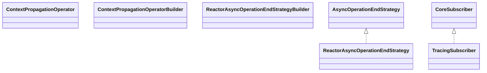

# opentelemetry-reactor-3.1-2.27.0-alpha.jar

[Group index](README.md) | [All archives](../README.md)

## Scope and provenance

- **Donor:** `SQX_145_REFERENCE_ROOT/internal/libs/opentelemetry-reactor-3.1-2.27.0-alpha.jar`.
- **SHA-256:** `be1db19d7861a5a878c2329fb7b2c9ad35a15d898460b6a1e70a399b95af54a5`; accessed 2026-10-06; captured `2026-10-06T18:54:51.906614+00:00`.
- **Classes:** 13 raw entries; 13 unique entry names. Duplicate occurrence indices are zero-based.
- **Inspection:** read-only ZIP hashing and class-file structural parsing; signatures/descriptors, modifiers, hierarchy and references only. Bytecode bodies are hashed, not published.
- **Allocation:** proposed `FEAT-HOST-OPENTELEMETRY-REACTOR`, P01; [roadmap](../../dev/sqx-full-application-roadmap.md). Domain README registration remains required.
- **Repository:** `01067f00031428613c6394064ca1bcadc1ba00ee`; review state unreviewed. Download label 145-dev1; installed build/activation and runtime equivalence unverified.
- **Limit:** every class/member is inventoried; declaration coverage does not establish consumed calls, defaults, formulas, failure semantics or algorithm parity.
- **Archive/resource index:** [093.json](../../dev/evidence/sqx145/archives/145/093.json).

## Complete member declarations

Member shards contain exact JVM names/descriptors, access flags, generic signatures, throws types, declared fields/methods, superclass/interfaces and referenced class names. All classes, nested/synthetic members and overloads are retained. Code length/hash is structural evidence, not a normalized algorithm comparison.

- [001.json](../../dev/evidence/sqx145/members/093/001.json) — SHA-256 `6336af0f506958bec07abd6e4d2e964cc2372086751782b3950fe82928c8e53a`.

## Focused structural diagram

Up to twelve non-nested classes; arrows show declared inheritance/interfaces only. External type names are not evidence of an available body or an executed dependency.

## Class inventory

| Archive entry | Occurrence | Class SHA-256 | Fields | Methods |
| --- | ---: | --- | ---: | ---: |
| `io/opentelemetry/instrumentation/reactor/v3_1/ContextPropagationOperator$1.class` | 0 | `a5b23147cd112bee5d760168233536fd40817356610b48b1dfa5b1186cad561a` | 0 | 2 |
| `io/opentelemetry/instrumentation/reactor/v3_1/ContextPropagationOperator$Lifter.class` | 0 | `c6cf65a3f1f929de6e2a94f6f6e31fb9bb2be687b1f083a3cf80a922219ac362` | 1 | 3 |
| `io/opentelemetry/instrumentation/reactor/v3_1/ContextPropagationOperator$RunnableWrapper.class` | 0 | `59c80e2faf616377aba1b06594879b2754547cc6663dd34f470139d2b2fb4d22` | 2 | 2 |
| `io/opentelemetry/instrumentation/reactor/v3_1/ContextPropagationOperator$ScalarPropagatingFlux.class` | 0 | `6b5b9161ffa0012741bf9dcca2ff36e564977734a561a01bdbd788bf6661230a` | 1 | 5 |
| `io/opentelemetry/instrumentation/reactor/v3_1/ContextPropagationOperator$ScalarPropagatingMono.class` | 0 | `89c54e084fca245616b8d916725142b9acaaabba17498fc12fe7b81622c8df6d` | 1 | 5 |
| `io/opentelemetry/instrumentation/reactor/v3_1/ContextPropagationOperator$StoreOpenTelemetryContext.class` | 0 | `df9d48f05b47ebc8c7995b99ecdf0ba1648f67d642c7f45c6fd8e484bf97dbba` | 1 | 4 |
| `io/opentelemetry/instrumentation/reactor/v3_1/ContextPropagationOperator.class` | 0 | `711fe9cd7236d2648e5b870aea0c38e5fe01e852bc2e89b0bc8ad78756ec0255` | 9 | 19 |
| `io/opentelemetry/instrumentation/reactor/v3_1/ContextPropagationOperatorBuilder.class` | 0 | `b7e0e1af58f568aa7a2a04002fc0b28cf231ee60c8ca253295dcad42b04fb404` | 1 | 3 |
| `io/opentelemetry/instrumentation/reactor/v3_1/ReactorAsyncOperationEndStrategy$1.class` | 0 | `5d67d681d2e5230588098f817a3d8273a67fce100943d2f6dd35fc0a02db839d` | 5 | 2 |
| `io/opentelemetry/instrumentation/reactor/v3_1/ReactorAsyncOperationEndStrategy$EndOnFirstNotificationConsumer.class` | 0 | `4086ad89fb15caef3c4943c9c79b592b5929d126ab42251f3e3ba8d800ff8db8` | 3 | 8 |
| `io/opentelemetry/instrumentation/reactor/v3_1/ReactorAsyncOperationEndStrategy.class` | 0 | `f8e9d9dcfc9c83deab7008fd15e9f9e52f6f84890a64747c2dfe7f36a45954d6` | 2 | 7 |
| `io/opentelemetry/instrumentation/reactor/v3_1/ReactorAsyncOperationEndStrategyBuilder.class` | 0 | `d55987605ef79e0195754a3c8cfb07ad2b476781fa20e6870e4d715c5e75b675` | 1 | 3 |
| `io/opentelemetry/instrumentation/reactor/v3_1/TracingSubscriber.class` | 0 | `1603f0d3d58dfab1e0dd0578d0dff76df37c5cb99051e778a39530ab74d2cc09` | 6 | 14 |
