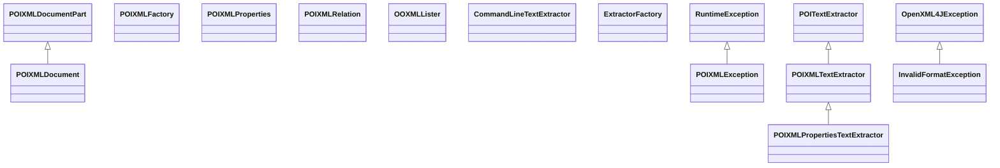

# poi-ooxml-3.11.jar

[Group index](README.md) | [All archives](../README.md)

## Scope and provenance

- **Donor:** `SQX_145_REFERENCE_ROOT/internal/libs/poi-ooxml-3.11.jar`.
- **SHA-256:** `02db7dd9db4a71bd48452aee87e5691bae2a0f26e7fea264a8f271a42d32599e`; accessed 2026-10-06; captured `2026-10-06T18:54:51.906614+00:00`.
- **Classes:** 562 raw entries; 562 unique entry names. Duplicate occurrence indices are zero-based.
- **Inspection:** read-only ZIP hashing and class-file structural parsing; signatures/descriptors, modifiers, hierarchy and references only. Bytecode bodies are hashed, not published.
- **Allocation:** proposed `FEAT-RESULTS-POI-OOXML`, P08; [roadmap](../../dev/sqx-full-application-roadmap.md). Domain README registration remains required.
- **Repository:** `01067f00031428613c6394064ca1bcadc1ba00ee`; review state unreviewed. Download label 145-dev1; installed build/activation and runtime equivalence unverified.
- **Limit:** every class/member is inventoried; declaration coverage does not establish consumed calls, defaults, formulas, failure semantics or algorithm parity.
- **Archive/resource index:** [100.json](../../dev/evidence/sqx145/archives/145/100.json).

## Complete member declarations

Member shards contain exact JVM names/descriptors, access flags, generic signatures, throws types, declared fields/methods, superclass/interfaces and referenced class names. All classes, nested/synthetic members and overloads are retained. Code length/hash is structural evidence, not a normalized algorithm comparison.

- [001.json](../../dev/evidence/sqx145/members/100/001.json) — SHA-256 `fe0f91d01b9bc22abd7a37729020fdfc032729ae7236bd0731e8cb220aae5725`.
- [002.json](../../dev/evidence/sqx145/members/100/002.json) — SHA-256 `ca90f571b05c4fc93759ee6cdfa19384d6db668f0776138c02cfc77afb3cb4f1`.
- [003.json](../../dev/evidence/sqx145/members/100/003.json) — SHA-256 `32382044b85941997f92ac3383f3c7d4aa568ce41ed5b12f33c38c3dcb442001`.
- [004.json](../../dev/evidence/sqx145/members/100/004.json) — SHA-256 `35c7667c76d96e49979a80b7bd76ea84adc6ecf34aee8cb6614ff0c219355e24`.
- [005.json](../../dev/evidence/sqx145/members/100/005.json) — SHA-256 `bd64147afff6081f44c94dce2be2a3cbb8e94682e2011407ef6a4e2cb86740a9`.
- [006.json](../../dev/evidence/sqx145/members/100/006.json) — SHA-256 `59177e903c05d82decc76131a6432a1fc9c972ab2bd5fa1850804e17560eef1a`.
- [007.json](../../dev/evidence/sqx145/members/100/007.json) — SHA-256 `5847c4aa567f4fd4d2d98de38b5819d0f27b74bd038692e154dcca1d8026c6af`.
- [008.json](../../dev/evidence/sqx145/members/100/008.json) — SHA-256 `ffb41fc863b5497922cc149415b77541e14c747f753f9a5f52df19f046009243`.

## Focused structural diagram

Up to twelve non-nested classes; arrows show declared inheritance/interfaces only. External type names are not evidence of an available body or an executed dependency.

## Class inventory

| Archive entry | Occurrence | Class SHA-256 | Fields | Methods |
| --- | ---: | --- | ---: | ---: |
| `org/apache/poi/POIXMLDocument.class` | 0 | `d37003f3cb1e3149c7a67fc55d7814610eedcdddee105281570bd50e55b09c05` | 5 | 11 |
| `org/apache/poi/POIXMLDocumentPart.class` | 0 | `485b2fbb2659276b3acd61d60cc1f5ad8e607323a15f29e57ee4ac103f0f849c` | 7 | 30 |
| `org/apache/poi/POIXMLException.class` | 0 | `4e265e2c457c93b361be404d2d2dcb78851902bdebbd5218888fbcd3ad9b4b04` | 0 | 4 |
| `org/apache/poi/POIXMLFactory.class` | 0 | `9934b8a823032f64ad39949159a9b49767c52295c19b7fa09958620b3978c63a` | 0 | 3 |
| `org/apache/poi/POIXMLProperties$1.class` | 0 | `75e5904b5825d3f12ef2618dd2ad8ff3e6b2f0c4d9eb0df8616b811d42217474` | 0 | 0 |
| `org/apache/poi/POIXMLProperties$CoreProperties.class` | 0 | `c849ca140d8b871b4df52dde9cb1ff506e8d7bcb8e97df2f1b3c11bb00a5b7cb` | 1 | 32 |
| `org/apache/poi/POIXMLProperties$CustomProperties.class` | 0 | `56903f19dd6d867f4cc351db62b7df1856fb46494669ee2beed50e2ba555cf23` | 2 | 12 |
| `org/apache/poi/POIXMLProperties$ExtendedProperties.class` | 0 | `7f4a4bad39e453242740049e2f065568afae9a73bd2a9ddd32844e454a5410d9` | 1 | 22 |
| `org/apache/poi/POIXMLProperties.class` | 0 | `374a747bacea980bdfd13a04dd831376e7faa5643996a1cd624b7592ac553c1c` | 8 | 6 |
| `org/apache/poi/POIXMLPropertiesTextExtractor.class` | 0 | `3ab8debe023289e484419b9d518c6985966343cb6596b5eacc9a684e0e86069d` | 0 | 12 |
| `org/apache/poi/POIXMLRelation.class` | 0 | `2c7096969b8b1b1f773df7502a72c616e909b44564cd9554b58f1072d914c2ba` | 4 | 8 |
| `org/apache/poi/POIXMLTextExtractor.class` | 0 | `4d38da5d2d6dd43a0b622c5e2719fec62b95949bc3e8179e9abc31f880313e76` | 1 | 9 |
| `org/apache/poi/dev/OOXMLLister.class` | 0 | `a6fe75d140b914bf19f8923085ccc9f087b8ced18d93f688ed5ede92c1033310` | 2 | 7 |
| `org/apache/poi/extractor/CommandLineTextExtractor.class` | 0 | `43fd4e1c173073f1893cae027d0e402a6475f3bf09fc1c0bd55609ff15b64926` | 1 | 2 |
| `org/apache/poi/extractor/ExtractorFactory$1.class` | 0 | `19851d0a71929ceaf53eb88ba9a8f4484db305c546b00b2cb67982f0fb149648` | 0 | 3 |
| `org/apache/poi/extractor/ExtractorFactory.class` | 0 | `1500e39d42b7380afb856b1da06ffa04abf318793fcab7b84769fd0892aed777` | 3 | 15 |
| `org/apache/poi/openxml4j/exceptions/InvalidFormatException.class` | 0 | `03e3bcda9baa0ad3a3b847bad2a1765ea7cedc1c31c7dfb09b9e7897134e18eb` | 0 | 1 |
| `org/apache/poi/openxml4j/exceptions/InvalidOperationException.class` | 0 | `00a62f1dc010bfafcaaa9ea3ccf3de5c6bcb3b5be88b204ef94f597e73185810` | 0 | 2 |
| `org/apache/poi/openxml4j/exceptions/OpenXML4JException.class` | 0 | `83c79b1d68fdda22b32e7c93023f479bf21b573fa71d53e8316f31d1da327f00` | 0 | 1 |
| `org/apache/poi/openxml4j/exceptions/OpenXML4JRuntimeException.class` | 0 | `ef29170cee62f8514f64806333f0aa814e514beee6234705f74dd1d9862fb550` | 0 | 2 |
| `org/apache/poi/openxml4j/exceptions/PartAlreadyExistsException.class` | 0 | `fafd5d3bd166ef78af88bd9c12ee93867eb394d7a25857d230cf204c3ad1c991` | 0 | 1 |
| `org/apache/poi/openxml4j/opc/CertificateEmbeddingOption.class` | 0 | `16b7a75ac0b0e64bfba3a72a53ae974798955364cfdbca65c1a9ac6ca2551c20` | 4 | 4 |
| `org/apache/poi/openxml4j/opc/CompressionOption.class` | 0 | `1b5c6a3d171b835d117d6528df2426417b759d5dac9b66b53786b2b5d887ae34` | 6 | 5 |
| `org/apache/poi/openxml4j/opc/Configuration.class` | 0 | `3386c0b7af7caa7dc8c5f92bdb0e993289ba95059aa4248b2e10421b38b4ad0c` | 1 | 4 |
| `org/apache/poi/openxml4j/opc/ContentTypes.class` | 0 | `72225f5219b0c3b87c79435cdb8871fed2f10089c6f775c7a1f0f5018be780a2` | 20 | 2 |
| `org/apache/poi/openxml4j/opc/EncryptionOption.class` | 0 | `0ec7acc9225a1ba11236263b80b9f26146a4f948b0103af30fd1be23e0c2b891` | 2 | 4 |
| `org/apache/poi/openxml4j/opc/OPCPackage.class` | 0 | `042e226af53b34430cb8ed2c927b4ec5423460e3c92abf86c71a83028749d860` | 13 | 66 |
| `org/apache/poi/openxml4j/opc/Package.class` | 0 | `8154caf9dec547ac613361aa6affb9356736756c3bf5abab17409996d5303e52` | 0 | 8 |
| `org/apache/poi/openxml4j/opc/PackageAccess.class` | 0 | `5bed8028d076ca6c8ab91949d6b967a02b014660b57c1e3a2c40548dc4951f4a` | 4 | 4 |
| `org/apache/poi/openxml4j/opc/PackageNamespaces.class` | 0 | `84a2e02ca257c49d2b850a37ed0cc41a3ee57b7bbe0103f9ba917777a7a281e7` | 5 | 0 |
| `org/apache/poi/openxml4j/opc/PackagePart.class` | 0 | `e5abab7a62dd64e5497626792e69fb550c8851c03577f33a7078e316821cf476` | 6 | 39 |
| `org/apache/poi/openxml4j/opc/PackagePartCollection.class` | 0 | `8b700a9ec7d379a93024a34adc35238f6a6b35e993a7f2fd986c0b83c0c53cc0` | 2 | 6 |
| `org/apache/poi/openxml4j/opc/PackagePartName.class` | 0 | `7ad20770aba64866c879f55362b77fd9bf7283bd9e1efb2d02d12682baed0d3e` | 5 | 20 |
| `org/apache/poi/openxml4j/opc/PackageProperties.class` | 0 | `09987ed34e1ce314bbbbf647b83a7794598f0ab324d52530a80439b45997fa2a` | 2 | 35 |
| `org/apache/poi/openxml4j/opc/PackageRelationship.class` | 0 | `0076421721afeb87872b74f9d853d39076652803225c6f77e7661d5b3ca78b2f` | 13 | 13 |
| `org/apache/poi/openxml4j/opc/PackageRelationshipCollection.class` | 0 | `6e7a08fe76a0cbb09b287d8f9ff72cc9fe4f776239a7a121825294de2ba68b0a` | 8 | 20 |
| `org/apache/poi/openxml4j/opc/PackageRelationshipTypes.class` | 0 | `0d195a056fc83a68d20cb7f5754ee34e1f0481519c1a056a816e41f51c114815` | 14 | 0 |
| `org/apache/poi/openxml4j/opc/PackagingURIHelper.class` | 0 | `352a840a6bd74e7b54b50a4eadf43059d10430afce742403b8a0fa94c68c37b3` | 16 | 24 |
| `org/apache/poi/openxml4j/opc/RelationshipSource.class` | 0 | `a79a812eb6ec94138187e75eb219b246b8848c25b8412de50a12b0bebf03fd0a` | 0 | 11 |
| `org/apache/poi/openxml4j/opc/StreamHelper$1.class` | 0 | `2a735ed2829248d3dcc1cdcf02e914509964d6a4b771c654bd6174c935b0d6ba` | 0 | 3 |
| `org/apache/poi/openxml4j/opc/StreamHelper.class` | 0 | `ec287d5ee6b1cf78b97e5cb85245d05be60212254d69414f3c8011207723009d` | 1 | 5 |
| `org/apache/poi/openxml4j/opc/TargetMode.class` | 0 | `003e96d2efdbc063d51ca5493c623d131ef81f4aa53ae943f3b22ceae7449cab` | 3 | 4 |
| `org/apache/poi/openxml4j/opc/ZipPackage.class` | 0 | `1abda757dc244a4e6ce4c06fd31c2dc0ccee7981740bc7b17f2cf985e4633a41` | 2 | 17 |
| `org/apache/poi/openxml4j/opc/ZipPackagePart.class` | 0 | `767074460f28362e7d692af760e094b239f1d5d58df01b9276cc09804f2f2aa4` | 1 | 10 |
| `org/apache/poi/openxml4j/opc/internal/ContentType.class` | 0 | `0509731af974b45e4616d4242949f832b96414de45e4382c1a3999023cf32c81` | 6 | 12 |
| `org/apache/poi/openxml4j/opc/internal/ContentTypeManager.class` | 0 | `c97823a9e31eb7cccffa79d45e4b92f5e80717a65916d8a8cf1ba5b5d600e3d8` | 11 | 14 |
| `org/apache/poi/openxml4j/opc/internal/FileHelper.class` | 0 | `d8cb406501fc262930c60ba5d3b46f77b79335210f6b6ef7d967e635d93ba90f` | 0 | 4 |
| `org/apache/poi/openxml4j/opc/internal/MemoryPackagePart.class` | 0 | `f758ba3db1357220d50ced6471dc0aa316affe38ff2f1c5d838d43747ff1ed25` | 1 | 10 |
| `org/apache/poi/openxml4j/opc/internal/MemoryPackagePartOutputStream.class` | 0 | `641b5ffa21b5b0bd20bc71f6193a898b39403376e5e0577687509f4a2967c377` | 2 | 6 |
| `org/apache/poi/openxml4j/opc/internal/PackagePropertiesPart.class` | 0 | `50a67616362faedfd5000c5c4269b429258c1c3c2be3dbdaa3619b093a3bc0a1` | 19 | 48 |
| `org/apache/poi/openxml4j/opc/internal/PartMarshaller.class` | 0 | `f1be603f896a77e725cde9c889a0fd7e364405303e4af000da2890e001ee3e6b` | 0 | 1 |
| `org/apache/poi/openxml4j/opc/internal/PartUnmarshaller.class` | 0 | `8c34dd687dc42367b86d43df24772801a8625917b7c2245e336da92ad1cc3727` | 0 | 1 |
| `org/apache/poi/openxml4j/opc/internal/ZipContentTypeManager.class` | 0 | `107525d595f90c4afd3b1720f5f975c3c909bb0327169dd85fe516eee830978f` | 1 | 3 |
| `org/apache/poi/openxml4j/opc/internal/ZipHelper.class` | 0 | `07ec913e09f68bd25baa6ee7f69ec82bde0a330f60ccd7363b5e2bb0ec625af3` | 2 | 8 |
| `org/apache/poi/openxml4j/opc/internal/marshallers/DefaultMarshaller.class` | 0 | `5da8ee57cc906918bb8990ea4f2fde5eec99e52865869946feb242ff3cd6a683` | 0 | 2 |
| `org/apache/poi/openxml4j/opc/internal/marshallers/PackagePropertiesMarshaller.class` | 0 | `a6e66958e8db8d625c4b3f0b908e17c67015292cf5c9e37b80fdaeb91c37a175` | 22 | 23 |
| `org/apache/poi/openxml4j/opc/internal/marshallers/ZipPackagePropertiesMarshaller.class` | 0 | `55c89f196d54a42f896045d6cb0db263e91dcda54e17d65efae0213c10702e12` | 0 | 2 |
| `org/apache/poi/openxml4j/opc/internal/marshallers/ZipPartMarshaller.class` | 0 | `1d773e053ff14142c20f79ce9811e9c7fe42245030226eae772ff7abc312333b` | 1 | 4 |
| `org/apache/poi/openxml4j/opc/internal/signature/DigitalCertificatePart.class` | 0 | `d14f2d42f92779dfac98364a5a2f59b1887efe735b318186104d3e3317db3b72` | 0 | 7 |
| `org/apache/poi/openxml4j/opc/internal/signature/DigitalSignatureOriginPart.class` | 0 | `6fee7e2addc090c331dedd9f0027d4671ab7e45097e75c0dc577bca0642e6d51` | 0 | 1 |
| `org/apache/poi/openxml4j/opc/internal/unmarshallers/PackagePropertiesUnmarshaller.class` | 0 | `02d660a422cd8c5a01ab7cc0f293be6d5fc157dd1f9c0950a91e7a204d053832` | 16 | 20 |
| `org/apache/poi/openxml4j/opc/internal/unmarshallers/UnmarshallContext.class` | 0 | `020d40de840b83b8b219a5573dc33ece9f5cb06e3458ccfd1751e416f77d31cc` | 3 | 7 |
| `org/apache/poi/openxml4j/opc/signature/PackageDigitalSignature.class` | 0 | `cbf595c5b58077266346ba8ffeec6b272c649bfc0cb147d5671f9d19c32593e0` | 0 | 7 |
| `org/apache/poi/openxml4j/opc/signature/PackageDigitalSignatureManager.class` | 0 | `5f133583dddaa596132e7293cea3d532f4571372be28cac8d3578a22a4fe382b` | 0 | 1 |
| `org/apache/poi/openxml4j/util/Nullable.class` | 0 | `b3f41cc0946dcccd83574099385632b97064a698438d8e28564dc44742cb54db` | 1 | 5 |
| `org/apache/poi/openxml4j/util/ZipEntrySource.class` | 0 | `1c20a118decd0b7c397b21f125b4b27df0d908be2cb5d603789ef5ef7e6fcce7` | 0 | 3 |
| `org/apache/poi/openxml4j/util/ZipFileZipEntrySource.class` | 0 | `77ce68950c467ad381230a580ae39fc14e282d44b761a2004f070c6371695f6f` | 1 | 4 |
| `org/apache/poi/openxml4j/util/ZipInputStreamZipEntrySource$1.class` | 0 | `b1c4028c93982570f1f2a82fe96e4dcc59c23e1427ae2585cc3fe534ab01d784` | 0 | 0 |
| `org/apache/poi/openxml4j/util/ZipInputStreamZipEntrySource$EntryEnumerator.class` | 0 | `86444ec656c432f9f24188ddbe60cda108ff660923c5c2d227438147e1363d70` | 2 | 5 |
| `org/apache/poi/openxml4j/util/ZipInputStreamZipEntrySource$FakeZipEntry.class` | 0 | `d1ec5a79d7c36d87733dc84dbd1958b13145af9cb0af86208048c128ee10b4b1` | 1 | 2 |
| `org/apache/poi/openxml4j/util/ZipInputStreamZipEntrySource.class` | 0 | `f06db8be7855907994ed87bcf824fcfde661b4fcb8bf055e56269753cd92254e` | 2 | 6 |
| `org/apache/poi/poifs/crypt/agile/AgileDecryptor$ChunkedCipherInputStream.class` | 0 | `7e26f98a0d1786ca5ce7779af342c1b636565ad0e5e97b47dd9d5545b6f74a27` | 7 | 9 |
| `org/apache/poi/poifs/crypt/agile/AgileDecryptor.class` | 0 | `6f12e46364bbb1518f943528aea40617986290fd1abbcf506f435ba8d1f2ad0a` | 7 | 12 |
| `org/apache/poi/poifs/crypt/agile/AgileEncryptionHeader.class` | 0 | `24c664b47db7aab04920755e19a2ba2c3562e280e438e99a60a3a76dfea567a2` | 2 | 8 |
| `org/apache/poi/poifs/crypt/agile/AgileEncryptionInfoBuilder.class` | 0 | `f1d40b0943fc73954621c0b47f8fef652e9339681d0453abf1e0e21216032003` | 5 | 14 |
| `org/apache/poi/poifs/crypt/agile/AgileEncryptionVerifier$AgileCertificateEntry.class` | 0 | `f7a231ee46ddb3d963c42e5b71585e6225201a308be194a7851772804c2b4742` | 3 | 1 |
| `org/apache/poi/poifs/crypt/agile/AgileEncryptionVerifier.class` | 0 | `a910da5dd336c054735adcd00de61bbb408bf44a72591a14554aeb9c3fdff30b` | 1 | 9 |
| `org/apache/poi/poifs/crypt/agile/AgileEncryptor$1.class` | 0 | `ef5043859b80c38023b969bac4deefb653a08540cb9da072d758ba6e8744c706` | 2 | 2 |
| `org/apache/poi/poifs/crypt/agile/AgileEncryptor$2.class` | 0 | `3e7c7bd23f0f889c7b37993d4a83766276f8958d0b29e6a5a5e46ca3209ec256` | 1 | 1 |
| `org/apache/poi/poifs/crypt/agile/AgileEncryptor$ChunkedCipherOutputStream.class` | 0 | `b04bb62e048558ec8c4a566822a32b3dc092d46f4b2f98bac3fac8969ea146b9` | 6 | 8 |
| `org/apache/poi/poifs/crypt/agile/AgileEncryptor.class` | 0 | `52dae65622f9e8ebc81a1844748d0346710cf129737b3eb08d1bdc8c46631cca` | 4 | 7 |
| `org/apache/poi/poifs/crypt/dsig/CertificateSecurityException.class` | 0 | `87fd37b5119447ff741516dc0131065e339387f7732d6ac35590fc69e43ad091` | 1 | 1 |
| `org/apache/poi/poifs/crypt/dsig/DigestInfo.class` | 0 | `609264b9713904f726c1b6cad0b14651a65af31ce3123872bb8bbb3062f4b6ba` | 4 | 1 |
| `org/apache/poi/poifs/crypt/dsig/ExpiredCertificateSecurityException.class` | 0 | `8151fe6dcefa742d5cf54611ac4b1800f19358681d1ced6088f61c49bd8f3098` | 1 | 1 |
| `org/apache/poi/poifs/crypt/dsig/KeyInfoKeySelector.class` | 0 | `385876100e981283b74368e310fcbb7de4d3b37b146fd1308633dae1ad37559b` | 2 | 6 |
| `org/apache/poi/poifs/crypt/dsig/OOXMLURIDereferencer.class` | 0 | `74ed04fe5e1ccfc9ca421a44435a149b40ecdacc00193d6426b53556401f5082` | 3 | 5 |
| `org/apache/poi/poifs/crypt/dsig/RevokedCertificateSecurityException.class` | 0 | `65dd41ad694d3d47812130c7bbdc503c66a446f886d7ab1b42ac3e610862980e` | 1 | 1 |
| `org/apache/poi/poifs/crypt/dsig/SignatureConfig$1.class` | 0 | `24b5bcd8290ad96e1ba08f039c94080292b884148026c9ac330eee699d715f79` | 1 | 1 |
| `org/apache/poi/poifs/crypt/dsig/SignatureConfig$SignatureConfigurable.class` | 0 | `53f9fb6132b4f155f19d2a511e8994337c5115cac50bcc0884f1d2b42b5c2ed0` | 0 | 1 |
| `org/apache/poi/poifs/crypt/dsig/SignatureConfig.class` | 0 | `b167a9587170963a035101bad9f9e93be784ad40fc9945590cc079580e62c19d` | 37 | 80 |
| `org/apache/poi/poifs/crypt/dsig/SignatureInfo$1$1.class` | 0 | `1163143cc3f274f20a2bb1f158b900ff74eb9649da6dbf71665831770f38b478` | 5 | 5 |
| `org/apache/poi/poifs/crypt/dsig/SignatureInfo$1.class` | 0 | `fb3dddba53b49dd4b0ee4189e1447b8800b82991f2fad428474cec895470f757` | 1 | 2 |
| `org/apache/poi/poifs/crypt/dsig/SignatureInfo$SignaturePart.class` | 0 | `3893631a2aac23bd8a4d2a1a4f437e37d3d807d2d455d2d4d9fc1b8f370c1c24` | 4 | 7 |
| `org/apache/poi/poifs/crypt/dsig/SignatureInfo.class` | 0 | `9ef77ba7e0de65a8c99949cff55934e0d1c8959dde3727fe6d4a4657c587f5c8` | 3 | 18 |
| `org/apache/poi/poifs/crypt/dsig/SignatureMarshalListener.class` | 0 | `6a443fdc9dcff53203d4248cc27c8dd14a2ec2f7a1e8ff745e26a236daf007dd` | 2 | 7 |
| `org/apache/poi/poifs/crypt/dsig/TrustCertificateSecurityException.class` | 0 | `581e54a32763031c62867a0209a8f9ac6243b12eb862d50723eaff354a60c740` | 1 | 1 |
| `org/apache/poi/poifs/crypt/dsig/facets/EnvelopedSignatureFacet.class` | 0 | `0100063bcca3fdece68655b52e07f7e324ccffcdf2926d6a1da2063e071346e4` | 0 | 2 |
| `org/apache/poi/poifs/crypt/dsig/facets/KeyInfoSignatureFacet$1.class` | 0 | `2eb9ff0557ea695ef34c3c988059a5ff31b59292924559def6821166c12218d9` | 2 | 4 |
| `org/apache/poi/poifs/crypt/dsig/facets/KeyInfoSignatureFacet.class` | 0 | `d3717ffd4a9c0c4345bf784a870d0725177edbc38e545d31ee83533b6159d9e1` | 1 | 3 |
| `org/apache/poi/poifs/crypt/dsig/facets/OOXMLSignatureFacet.class` | 0 | `d742c9fa4726952bfa361aa2c98780b2b913250073d1fd56ff92f091efc7efc2` | 3 | 10 |
| `org/apache/poi/poifs/crypt/dsig/facets/Office2010SignatureFacet.class` | 0 | `04902fc1e5a3a75000d859ef0f56289c1c93b3f03ea65d3fca624ddf7da136af` | 0 | 2 |
| `org/apache/poi/poifs/crypt/dsig/facets/SignatureFacet.class` | 0 | `b97c64c136c6d2cb0df6637c35abfa41e0758e44a283a61519c727877102fafd` | 8 | 11 |
| `org/apache/poi/poifs/crypt/dsig/facets/XAdESSignatureFacet.class` | 0 | `cfff2235c3e3984cdd0ba8f23d75be241886decdf4cf247ac6f3daeeece5a13d` | 3 | 7 |
| `org/apache/poi/poifs/crypt/dsig/facets/XAdESXLSignatureFacet.class` | 0 | `604d25bd60400e9c6418f8790ac3c1b85b1068ba8d730f77872655964d3c939b` | 2 | 9 |
| `org/apache/poi/poifs/crypt/dsig/services/RelationshipTransformService$1.class` | 0 | `b27b1d6bb6bb63b24a5ad105117074e5b2bad383c3347ead50fa7d87a27da135` | 1 | 1 |
| `org/apache/poi/poifs/crypt/dsig/services/RelationshipTransformService$2.class` | 0 | `59a115fa6dfd8a09e3e178a0422bab297a9cd04aff5e50e6842e9a16b731b8f5` | 1 | 3 |
| `org/apache/poi/poifs/crypt/dsig/services/RelationshipTransformService$RelationshipTransformParameterSpec.class` | 0 | `8dc000875503df2888c574faab6194cfefefd3140c3ed8389a0077c2d5161214` | 1 | 3 |
| `org/apache/poi/poifs/crypt/dsig/services/RelationshipTransformService.class` | 0 | `fe36497f04c81fab1341229a65d47c57c1011486dcc246b54efa92c69b85b334` | 3 | 10 |
| `org/apache/poi/poifs/crypt/dsig/services/RevocationData.class` | 0 | `8fa332191d598e773cca7422e88b22e1cb7acc69d942317ae442f76b57ec502c` | 2 | 9 |
| `org/apache/poi/poifs/crypt/dsig/services/RevocationDataService.class` | 0 | `322bc5118fef8b57d3f43a3d530d8e1782b92a523c2df607b1df743c8d5d8e33` | 0 | 1 |
| `org/apache/poi/poifs/crypt/dsig/services/SignaturePolicyService.class` | 0 | `bbee342654ea4a949cd39c8e3a610eb4738d362cfda421b7ccd79a549643e1b2` | 0 | 4 |
| `org/apache/poi/poifs/crypt/dsig/services/TSPTimeStampService$1.class` | 0 | `0f55bec291a0b85d99bcc2ba42c28d9b3a1089590f30e6f79935fa9cdf707612` | 1 | 1 |
| `org/apache/poi/poifs/crypt/dsig/services/TSPTimeStampService.class` | 0 | `ac2a3bee35066470e22962f74e8ed590fc200c05c17096c6daef8f0933d9a986` | 2 | 5 |
| `org/apache/poi/poifs/crypt/dsig/services/TimeStampService.class` | 0 | `9582ce75f03d02eba0781affa1381a2a9ce1852df59ee8b2c0e0f3ea6887ea67` | 0 | 1 |
| `org/apache/poi/poifs/crypt/dsig/services/TimeStampServiceValidator.class` | 0 | `bc49cf8993bbe0c7281c9ef8b3d51173aa9f70c6a53229b456f69fed91f858ce` | 0 | 1 |
| `org/apache/poi/ss/usermodel/WorkbookFactory.class` | 0 | `11070266503d8f438df4b006c66aef3370eaa147e21efa9aa1a227baabefda73` | 0 | 6 |
| `org/apache/poi/util/DocumentHelper.class` | 0 | `78dffed4d2c3ac2962be5a65c41004655f0d0ca95efb6e667e4f1f27cf75eaba` | 3 | 9 |
| `org/apache/poi/util/IdentifierManager$Segment.class` | 0 | `7291c4b2fc8a00323ea325963f33736dff5832ec3edb3db3a8d0ddd22b146846` | 2 | 2 |
| `org/apache/poi/util/IdentifierManager.class` | 0 | `530726d1641f706067a7a05adc3562e311f9f5fbf114a5b396e55af1a32d19c6` | 5 | 6 |
| `org/apache/poi/util/MethodUtils$MethodDescriptor.class` | 0 | `a0d27298684f5eb3b839e68545e817b8140803aa24e253c48e700383ce0db26e` | 5 | 3 |
| `org/apache/poi/util/MethodUtils.class` | 0 | `8fa0963c6568fc0c73b72e66ac2b806cb8092891bb8857f613f20b320a607831` | 4 | 30 |
| `org/apache/poi/util/OOXMLLite.class` | 0 | `24fa31dbde1c2874caa8bd4f896284c3d09bd632083fa9c5ff67cdd9a66e8d55` | 4 | 8 |
| `org/apache/poi/util/PackageHelper.class` | 0 | `6b48065283d1c0fd53ea065e891f06fa7885501dd86f1d9994a1d05b8f5654a8` | 0 | 5 |
| `org/apache/poi/util/SAXHelper$1.class` | 0 | `2c2cced7417c1acdc31b1b7943ff14f5bc08a81dbc4d937666b0ae352452e518` | 0 | 2 |
| `org/apache/poi/util/SAXHelper.class` | 0 | `4a2b6efa99979ba62e233773d4b2d2b996d97a9dfb521880faf65e7f268a05c1` | 3 | 5 |
| `org/apache/poi/util/XmlSort$QNameComparator.class` | 0 | `3431c51a8a06794b2644e045c6bbcee147ea7b44b02f0d88cacf0d924977247d` | 3 | 2 |
| `org/apache/poi/util/XmlSort.class` | 0 | `745ce122a3caf62f851d144807d6cd1648afdab21632e1f3e8326b5c00934f3b` | 0 | 3 |
| `org/apache/poi/xslf/XSLFSlideShow.class` | 0 | `95c19ff7c9876dcaf21fc87673072397a242d7ea456d024368bad903c6341f13` | 2 | 13 |
| `org/apache/poi/xslf/extractor/XSLFPowerPointExtractor.class` | 0 | `81399d5acf2d294880110ce6ea0f4f4ee642df7b6bf3af8df59a9470608bc5f0` | 5 | 12 |
| `org/apache/poi/xslf/model/CharacterPropertyFetcher.class` | 0 | `56836a62aaf2642a2d2d421542765d56927b13f452217c1b80606316146c401d` | 1 | 3 |
| `org/apache/poi/xslf/model/ParagraphPropertyFetcher.class` | 0 | `297b5615b63c3c0371b13f25e3d9265d22094a658829cfd6a7a4e59933e62d53` | 1 | 3 |
| `org/apache/poi/xslf/model/PropertyFetcher.class` | 0 | `7a1c72fa9e16347d06087defd738bb7520de439e0383e3a04a5101cd06b2c3cb` | 1 | 4 |
| `org/apache/poi/xslf/model/TextBodyPropertyFetcher.class` | 0 | `026a1ec6bef07e843cee965adfa8f97da6afd3b4503700253c39e892d655868d` | 0 | 3 |
| `org/apache/poi/xslf/model/geom/AbsExpression.class` | 0 | `66bc3b675c7fcb50b385346b7de9354f4f442347e144ab370def216c47c04a50` | 1 | 2 |
| `org/apache/poi/xslf/model/geom/AddDivideExpression.class` | 0 | `d3d35d8a2b7184bc1807ec9e4e1cf0216546a29b9b62a4c68524c05e446443aa` | 3 | 2 |
| `org/apache/poi/xslf/model/geom/AddSubtractExpression.class` | 0 | `b6e56822bd34a7f1c6be2cbbdcc538c43612fc86780c7e4bbdf4c3715f6a4990` | 3 | 2 |
| `org/apache/poi/xslf/model/geom/AdjustValue.class` | 0 | `a597b198f2b66a65a1ce03d831070ed43c5e0a6ffa65014b3b3547823ed3d24b` | 0 | 2 |
| `org/apache/poi/xslf/model/geom/ArcTanExpression.class` | 0 | `73569528b52200f18b8c33b755ee4c632951d65714909730490205b4b3cc2ec7` | 2 | 2 |
| `org/apache/poi/xslf/model/geom/ArcToCommand.class` | 0 | `cace297c301a366fee487f5fbc3075e79f82540df96cd5d4c66bd17e8a3b6310` | 4 | 2 |
| `org/apache/poi/xslf/model/geom/ClosePathCommand.class` | 0 | `59e1e899b97cd39841b9862e049bcfc71d422540ba42133b314b588e8bf36894` | 0 | 2 |
| `org/apache/poi/xslf/model/geom/Context.class` | 0 | `250d37293eb1ef4577bc8682874cebd6d492a34522dd5288d1bd3ac6aa4c7939` | 3 | 5 |
| `org/apache/poi/xslf/model/geom/CosExpression.class` | 0 | `6241f36d7ee6f4ae0b70f642f624799d3c17f352caa862a0d9528ab07b117d86` | 2 | 2 |
| `org/apache/poi/xslf/model/geom/CosineArcTanExpression.class` | 0 | `cbfa42d7308da7a410df1492d9f0887cea8124e3625e297aca61c4569c2f242d` | 3 | 2 |
| `org/apache/poi/xslf/model/geom/CurveToCommand.class` | 0 | `5168cc97a783f9aaa5c33f5ae48d1fecac34fff551388edb97a6f4197add7d8a` | 6 | 2 |
| `org/apache/poi/xslf/model/geom/CustomGeometry.class` | 0 | `fbae87d851bef5827c20c9820a971e925491ca7924ea5c1d935ad0dc62bae104` | 4 | 3 |
| `org/apache/poi/xslf/model/geom/Expression.class` | 0 | `36cf2fb028c56d4752513c1ff9775df54d46836023d613b203c642659f868bda` | 0 | 1 |
| `org/apache/poi/xslf/model/geom/ExpressionParser.class` | 0 | `8aac67fda89a8e7d437649c588add4ac34c2cb9d57cc95cfff7ee4f0eb1998e5` | 1 | 3 |
| `org/apache/poi/xslf/model/geom/Formula$1.class` | 0 | `755421d0d2e830156951b63cd9e23c440ab52f2e6bdf40642ee5d8ed1fcc3772` | 0 | 2 |
| `org/apache/poi/xslf/model/geom/Formula$10.class` | 0 | `8d9e63d3f954e4c80ebc117bf494e9e4e138961418e44c7f33dc862270c40bdd` | 0 | 2 |
| `org/apache/poi/xslf/model/geom/Formula$11.class` | 0 | `05e2b52c1bb86bb31996d7919e928faad244fc794eaf819a4f39f9b0ee565a24` | 0 | 2 |
| `org/apache/poi/xslf/model/geom/Formula$12.class` | 0 | `e8f8a90d158532342c59f2955698b161c88c64035f20ae6fc91ea1e4b8dfa0e6` | 0 | 2 |
| `org/apache/poi/xslf/model/geom/Formula$13.class` | 0 | `fe2d6ea535dbe679d54c4676960a4ea9228b0b781742f7f169bc3aad84684920` | 0 | 2 |
| `org/apache/poi/xslf/model/geom/Formula$14.class` | 0 | `859d7da43efcc38b53b52f493571150bbdb96780176f8421de67aa5fad947b74` | 0 | 2 |
| `org/apache/poi/xslf/model/geom/Formula$15.class` | 0 | `1a8a0f50a715da171890b22ed7d7346fc9f909ccc4adeaf41cebc4cea412fb4b` | 0 | 2 |
| `org/apache/poi/xslf/model/geom/Formula$16.class` | 0 | `84f53265a108a2849d5c72b01fa65a80049360e11d4b5f4c586d029ad6b40584` | 0 | 2 |
| `org/apache/poi/xslf/model/geom/Formula$17.class` | 0 | `8e75b647283e2342155d7c405965c8333843754ec9032367537c8709a85ad7f5` | 0 | 2 |
| `org/apache/poi/xslf/model/geom/Formula$18.class` | 0 | `c53928b3c0533033c9c7d09ac1fd5da5d4a78b45e8c651d02761617bac53f316` | 0 | 2 |
| `org/apache/poi/xslf/model/geom/Formula$19.class` | 0 | `fbc4e2bdfa385ceacbe8249a14c5e1786021d2cca27f28561e4cd2949148a80e` | 0 | 2 |
| `org/apache/poi/xslf/model/geom/Formula$2.class` | 0 | `72a5ef275a606b384a50c12b16d6bfc6c54977f793705d29005d2383aaa2398b` | 0 | 2 |
| `org/apache/poi/xslf/model/geom/Formula$20.class` | 0 | `19ad295136dc766f0da7e7985240cb418ab1fd82906bf208c4e3ea1306e088ca` | 0 | 2 |
| `org/apache/poi/xslf/model/geom/Formula$21.class` | 0 | `807825727c666f10f15632a6f3e454e1f9a492fe36ef3fd52213a7812a2c0cdb` | 0 | 2 |
| `org/apache/poi/xslf/model/geom/Formula$22.class` | 0 | `8f34bd1b40d38df17c19f3c09ca58ef513ff6f9e2c1c8b8f42e378d66f322307` | 0 | 2 |
| `org/apache/poi/xslf/model/geom/Formula$23.class` | 0 | `2e9a1f51f699e7009325546a8e50ef6e476d63b0f671954d0ff43b2d352b388e` | 0 | 2 |
| `org/apache/poi/xslf/model/geom/Formula$24.class` | 0 | `d7651d6d0900d44a05b0ca2dbb2788981a369150a9c7d18cf720b9ad7d78e835` | 0 | 2 |
| `org/apache/poi/xslf/model/geom/Formula$25.class` | 0 | `2eb1c68c8933b5264cec8cf037a5a4828cfc0eea580e0907b5bd7d269386a4c0` | 0 | 2 |
| `org/apache/poi/xslf/model/geom/Formula$26.class` | 0 | `bea0e458b1466f78e6e315d7aa4e580adb56f1402709738e82f77796542ebc18` | 0 | 2 |
| `org/apache/poi/xslf/model/geom/Formula$27.class` | 0 | `3dc04f29bcd5064bbeb0285e0889c2eef93a4fc285e21b21a6e204a96ca0dfac` | 0 | 2 |
| `org/apache/poi/xslf/model/geom/Formula$28.class` | 0 | `2da1950e46d6be5cc4350833b9a45ce2d502bf61ad3e202214f10c66de9d3b45` | 0 | 2 |
| `org/apache/poi/xslf/model/geom/Formula$29.class` | 0 | `974eb42fd8e731f47b983368cee2c23e9295ca31db10b53ec5ea8ee12eadffe7` | 0 | 2 |
| `org/apache/poi/xslf/model/geom/Formula$3.class` | 0 | `276ce4a5ded1548f771329280bea9c58f762bc992e0d15261831fdb79ae69995` | 0 | 2 |
| `org/apache/poi/xslf/model/geom/Formula$30.class` | 0 | `b41332cdf4e6921f19934fa646a8d43c4ebc7e4cd7059a1476b480b2c778d32a` | 0 | 2 |
| `org/apache/poi/xslf/model/geom/Formula$31.class` | 0 | `a92b1355310d51bc5a2eaf53d8a0642f91e6a2f46becda381ed6c6e46d8dd490` | 0 | 2 |
| `org/apache/poi/xslf/model/geom/Formula$32.class` | 0 | `d167683634084107b9e284ef33e1a735bcd7375368047bc0df4d06f84115adcd` | 0 | 2 |
| `org/apache/poi/xslf/model/geom/Formula$33.class` | 0 | `f25e7fc471f36c8406fc8f38301c87eaba90114de03dbfd37bd1f89d936a721a` | 0 | 2 |
| `org/apache/poi/xslf/model/geom/Formula$34.class` | 0 | `15799041f1ccdc1afdb3f821d88ad842cbc6e6e442f10b297376ac138a948681` | 0 | 2 |
| `org/apache/poi/xslf/model/geom/Formula$35.class` | 0 | `3c8333d579ed7fcc9312d6bf5162e4403b8ce97a71b622f32efa9713f7f62436` | 0 | 2 |
| `org/apache/poi/xslf/model/geom/Formula$36.class` | 0 | `9134599f1b5afb73ca410ce68c2ac61ab9c3d3ed607b5cfa10be02f00bdebc65` | 0 | 2 |
| `org/apache/poi/xslf/model/geom/Formula$37.class` | 0 | `5b3352563addee05231af6ff8db0f206449da019e18119a801fec636dec613c4` | 0 | 2 |
| `org/apache/poi/xslf/model/geom/Formula$4.class` | 0 | `0ee1bf859976af65f7243bf557e01d91fff64cbcc873291bda697881e86f1ef8` | 0 | 2 |
| `org/apache/poi/xslf/model/geom/Formula$5.class` | 0 | `c493a324ceeca6270e51557488da843dc956c781ca1ea92f39a1bd8d9fdb850c` | 0 | 2 |
| `org/apache/poi/xslf/model/geom/Formula$6.class` | 0 | `66fd963b08d0062e05c73a8876cf21491c636f7841b68fafc546e56a1d97925d` | 0 | 2 |
| `org/apache/poi/xslf/model/geom/Formula$7.class` | 0 | `30363a0cd09d8aa0d0c4dcd37b84785ee36a6eaeeb44cd54efb7171afb089b3c` | 0 | 2 |
| `org/apache/poi/xslf/model/geom/Formula$8.class` | 0 | `497f7322b706486d234276a062369be41bc6717f453bac3f069c471b4a948f13` | 0 | 2 |
| `org/apache/poi/xslf/model/geom/Formula$9.class` | 0 | `c205dce1ea46b6a4d7aa7903ecd63cf8ea8d06b3c606653c0596fe694e55678c` | 0 | 2 |
| `org/apache/poi/xslf/model/geom/Formula.class` | 0 | `bf063a1ca763e08536ae22ef7be05e203048e8a69a089714057a340e5633772a` | 1 | 4 |
| `org/apache/poi/xslf/model/geom/Guide.class` | 0 | `4901d4c454be3d816bfcf60edda7ee7169a3b39742a9ccdc0deee0d8b53bda1f` | 3 | 5 |
| `org/apache/poi/xslf/model/geom/IAdjustableShape.class` | 0 | `8e7b170481cef9e20616aa47552bbf0789e5b5f38409aaa941af24da72ee462a` | 0 | 1 |
| `org/apache/poi/xslf/model/geom/IfElseExpression.class` | 0 | `056cc848ff2fce4b2978f4b2083ca0a795522a2f06db108775a885d455d45eef` | 3 | 2 |
| `org/apache/poi/xslf/model/geom/LineToCommand.class` | 0 | `1d61b4bf204cc820c0c306def3bbcf09ab7bd4f68e299442a8bf436e18b48d9c` | 2 | 3 |
| `org/apache/poi/xslf/model/geom/LiteralValueExpression.class` | 0 | `9b56fbbed53e778ea50f533e9390ef56e013f8df2888ee923d2e49d3cbef5ce7` | 1 | 2 |
| `org/apache/poi/xslf/model/geom/MaxExpression.class` | 0 | `093b7816f5b618cfdc57ce9cd18d9f42f689ccdc73486702946533bebb32bf82` | 2 | 2 |
| `org/apache/poi/xslf/model/geom/MinExpression.class` | 0 | `948191d2a8a05c7e12c0e5bbe8185e522a7683a7889d0659ea0d2c1774ef1c8b` | 2 | 2 |
| `org/apache/poi/xslf/model/geom/ModExpression.class` | 0 | `88d2a3e8cc8b7c17269d776f34d21e251a417bdf90e39a22a4d2a9c23b6969c1` | 3 | 2 |
| `org/apache/poi/xslf/model/geom/MoveToCommand.class` | 0 | `90772c5047c368ef437260160e2c133565bed78bc3f6e6ee81d4d9b2255913df` | 2 | 3 |
| `org/apache/poi/xslf/model/geom/MultiplyDivideExpression.class` | 0 | `12c50da6601168107a85554d03b12c8c90915a43ff80bf4fbc2354d1c08881de` | 3 | 2 |
| `org/apache/poi/xslf/model/geom/Outline.class` | 0 | `e279f5e5fc576fba649a68faeaa69176ac92f46800ed08e247fbe7f809753338` | 2 | 3 |
| `org/apache/poi/xslf/model/geom/Path.class` | 0 | `7733aa01b911fd7d279a2b69ef79ead73b001caff03661bc0fbf763a42507bc3` | 5 | 9 |
| `org/apache/poi/xslf/model/geom/PathCommand.class` | 0 | `268de81f38e3a94553d3c2185cd128962fb7f707e0458cf9bc26133c1e4c88e5` | 0 | 1 |
| `org/apache/poi/xslf/model/geom/PinExpression.class` | 0 | `1803aea8404cc05281aee838a6d1ff5686a74efef0f6db0bdd53bef7e65b33e2` | 3 | 2 |
| `org/apache/poi/xslf/model/geom/PresetGeometries.class` | 0 | `112c081db04a864d998843e2ee039f21bb069a466f85970bb8d6134b33109f6c` | 1 | 3 |
| `org/apache/poi/xslf/model/geom/QuadToCommand.class` | 0 | `b9f6005b5b675968c352fddc430b3b02fdf7ce202724db18397a2d043d029b91` | 4 | 2 |
| `org/apache/poi/xslf/model/geom/SinArcTanExpression.class` | 0 | `13ae65aac69ef653093ad3ead9ab778edc89a797618b725417e7208999e7fc0c` | 3 | 2 |
| `org/apache/poi/xslf/model/geom/SinExpression.class` | 0 | `d404d60066288722ef3a0c3e9b25a5846065a30096835c254fb28ced63034267` | 2 | 2 |
| `org/apache/poi/xslf/model/geom/SqrtExpression.class` | 0 | `200a8cf35344fe8709568c952dd7111d13745c24ac7c775e8ac5b33bae8bf3b8` | 1 | 2 |
| `org/apache/poi/xslf/model/geom/TanExpression.class` | 0 | `209f262306814328b173f64b460b68ec550c8b3474487c4685f3cb899509cae7` | 2 | 2 |
| `org/apache/poi/xslf/usermodel/DrawingParagraph.class` | 0 | `0c742292894d213f600d53ec14957d064567953fbff2a2546ae8d827c2d04413` | 1 | 2 |
| `org/apache/poi/xslf/usermodel/DrawingTable.class` | 0 | `d81a47d5c21ae8525cdd3d7647d1c6ff688513020e01e8e3ee32d5c8fa2a9381` | 1 | 2 |
| `org/apache/poi/xslf/usermodel/DrawingTableCell.class` | 0 | `35ed1b43b0747ad3ad41a35051545d0eab1509b237565fd3a45bc0b0ea3a905d` | 2 | 2 |
| `org/apache/poi/xslf/usermodel/DrawingTableRow.class` | 0 | `7efbbd2fb9533e6925fb87f88579030871adca2c112b5cbacd75de69eda3720c` | 1 | 2 |
| `org/apache/poi/xslf/usermodel/DrawingTextBody.class` | 0 | `58a9a41993c16dfd6456b366b6058aa9025c6e2a969be378105e1f79a6bd99a5` | 1 | 2 |
| `org/apache/poi/xslf/usermodel/DrawingTextPlaceholder.class` | 0 | `fc348d0ab07f9fdb20a441e51420f9de17f0ab15b2a07eb19d806238f6efdf38` | 1 | 4 |
| `org/apache/poi/xslf/usermodel/LineCap.class` | 0 | `82830994f919a462c8a54fc26641f80711e635a18de7f80013bbf45ea4ce4e55` | 4 | 4 |
| `org/apache/poi/xslf/usermodel/LineDash.class` | 0 | `c257c68e55ef9a2ed81f541632078c52d417d635981b579031ab26cd60af8751` | 12 | 4 |
| `org/apache/poi/xslf/usermodel/LineDecoration.class` | 0 | `fc38326f3f0d776686376604f10f78be70bae735d54debb1917ca7047dd3f3f2` | 7 | 4 |
| `org/apache/poi/xslf/usermodel/LineEndLength.class` | 0 | `c74b4b45161edd6d4ea49efd5739086aa90d723340f3e26d812d697061b7dcef` | 4 | 4 |
| `org/apache/poi/xslf/usermodel/LineEndWidth.class` | 0 | `077e02d02f198dff0b2a502b4f51e37012c761af5b33bd09432dadd6e0b5d98e` | 4 | 4 |
| `org/apache/poi/xslf/usermodel/ListAutoNumber.class` | 0 | `58a04ca30c9f41926feead033ed62d82f523a25d42bc5679cedd213d43c5ecfc` | 20 | 4 |
| `org/apache/poi/xslf/usermodel/Placeholder.class` | 0 | `2d0b109a533f3b8092fe26b55efa1d91194964a1239f5869d1b150fa133c28d7` | 17 | 4 |
| `org/apache/poi/xslf/usermodel/RenderableShape$1.class` | 0 | `aba88b6c6ab5f8aac994ad63ecce41b5cf4c2c2969ca9a2b40f1d7d36c6cd5d6` | 1 | 3 |
| `org/apache/poi/xslf/usermodel/RenderableShape$2.class` | 0 | `f1db9bcf348380e3701e1b40f3487a6355b3e48043fb01914f7a598275c1c39a` | 0 | 3 |
| `org/apache/poi/xslf/usermodel/RenderableShape$3.class` | 0 | `705c843dd9ea9068f1587567448adde5e028a44830bf31b09d9153e5be1347a3` | 0 | 3 |
| `org/apache/poi/xslf/usermodel/RenderableShape$4.class` | 0 | `e059b3f45d3744604e320c8e3bb8bf36189915e3733433d34b868ec4a03b9ac9` | 2 | 2 |
| `org/apache/poi/xslf/usermodel/RenderableShape$5.class` | 0 | `ebd48af25862dd1f92afce7c6cdaaad84b4e11e8f55d3bc90fcd1ec5af7e80eb` | 2 | 2 |
| `org/apache/poi/xslf/usermodel/RenderableShape$6.class` | 0 | `80373465178a490688d3cff656b890c792eebedef56e37c708b78f94263f5018` | 1 | 2 |
| `org/apache/poi/xslf/usermodel/RenderableShape$7.class` | 0 | `00b181d2109d9f4a536854f6abeb88bfd16b372997ebf2a6b86178c94c452066` | 2 | 1 |
| `org/apache/poi/xslf/usermodel/RenderableShape.class` | 0 | `8f4baa63f779fcbf4f69ed860401066f0cb9e7d7905f3d150d22724a815da35a` | 2 | 17 |
| `org/apache/poi/xslf/usermodel/SlideLayout.class` | 0 | `c278ad147844c45ab5bcdfd95bdc56bf8d0b972b0fbf55fba361832988cc8a35` | 37 | 4 |
| `org/apache/poi/xslf/usermodel/TextAlign.class` | 0 | `663a0061c691938b40aa91726e4dc9549c85bcd4649f3af578e0bef65ea12355` | 8 | 4 |
| `org/apache/poi/xslf/usermodel/TextAutofit.class` | 0 | `e4537c8fa9f770f083a9f67034ffbff8fc9234a21eb39e7053986ef615a8b793` | 4 | 4 |
| `org/apache/poi/xslf/usermodel/TextCap.class` | 0 | `a2a6eb79ef041f8ac1b1c2247a1275daf036955981d9301e20fda2144d80c8af` | 4 | 4 |
| `org/apache/poi/xslf/usermodel/TextDirection.class` | 0 | `59879223f8ea971b5794c6e914fbbdb158cf15622d0c30dcb90059af6b94fc05` | 5 | 4 |
| `org/apache/poi/xslf/usermodel/TextFragment.class` | 0 | `2fc34a94d2c80cb8f5e0c778691e336a2f90a3799610af109d0be71b61d02034` | 2 | 6 |
| `org/apache/poi/xslf/usermodel/VerticalAlignment.class` | 0 | `28d5956edce9662bcea1f78fb622ed144698392631bac6b71a03a6aee5bbc219` | 6 | 4 |
| `org/apache/poi/xslf/usermodel/XMLSlideShow.class` | 0 | `93ea5728e3f2a73abe3394daf4905f49846bc7792cc9b15a960fc2e209f9aae5` | 8 | 28 |
| `org/apache/poi/xslf/usermodel/XSLFAutoShape.class` | 0 | `1fa56588a378cdaec7328d89bead46b7fffe75a70678b755e439b2d514f9f73d` | 0 | 5 |
| `org/apache/poi/xslf/usermodel/XSLFBackground.class` | 0 | `7f187598be2ea4aa91835ec3086da15170de63a90d42865c62752f7a34982491` | 0 | 6 |
| `org/apache/poi/xslf/usermodel/XSLFChart.class` | 0 | `8b2f85b369c85101630956da005be194fe39c8a3f65dd171b6d232be682d4217` | 2 | 4 |
| `org/apache/poi/xslf/usermodel/XSLFColor.class` | 0 | `9d970fa1fd89d8f3322124b4e158117b8b8039996c87bdf4eb2a690087e22471` | 4 | 34 |
| `org/apache/poi/xslf/usermodel/XSLFCommentAuthors.class` | 0 | `bcf535479347798591de1c09f09fad49e582c2c9e8837b11bada1fe238333f4e` | 1 | 4 |
| `org/apache/poi/xslf/usermodel/XSLFComments.class` | 0 | `0bf4875eb478c8edaf46859b1d34bafea4e7dad4bd9cf93c173fbbfdb766b987` | 1 | 5 |
| `org/apache/poi/xslf/usermodel/XSLFCommonSlideData.class` | 0 | `59699e2746165c0b0427cfe0a8e3dfb3eac5dad42dc100aad600609b79236fe1` | 1 | 4 |
| `org/apache/poi/xslf/usermodel/XSLFConnectorShape.class` | 0 | `35811a730d89d3b4f2dc2355d246f0bd38d38b2a93d5cb1fe358923a6754301b` | 0 | 3 |
| `org/apache/poi/xslf/usermodel/XSLFDrawing.class` | 0 | `671fa8615b5dcea2af886e997364ebe90606f9c5aceb9d7a9ab72386b7d69a0f` | 3 | 8 |
| `org/apache/poi/xslf/usermodel/XSLFFactory.class` | 0 | `9b912bda0d0cb7806a35735d3989a19116887375903efc947f53e60ae76deb5f` | 2 | 5 |
| `org/apache/poi/xslf/usermodel/XSLFFontManager.class` | 0 | `1158cd4dbeaccce1eae1c3432c7a9fbac68fc0a8741d9b3fe8a300abffb1fd11` | 0 | 1 |
| `org/apache/poi/xslf/usermodel/XSLFFreeformShape.class` | 0 | `bfb782a77fd17f2c39cdc497836a8d006f02e95150d285da592bd23800f8f379` | 0 | 4 |
| `org/apache/poi/xslf/usermodel/XSLFGraphicFrame.class` | 0 | `0ad722cd4efc52b7968dab05f83c948269a0bf2fd54c3eebc1020e3183827a58` | 2 | 19 |
| `org/apache/poi/xslf/usermodel/XSLFGroupShape.class` | 0 | `af02d48bb692c0315961199e5ae4e9fa162d6eccf4cad8c38a7d406ddeaf03f9` | 5 | 29 |
| `org/apache/poi/xslf/usermodel/XSLFHyperlink.class` | 0 | `b30491fff7361875489280e70628581309edfd5e455551dd738c6bfe7fb229fa` | 2 | 5 |
| `org/apache/poi/xslf/usermodel/XSLFImageRenderer.class` | 0 | `615bb4668d9778ed971b4389c719cabe695dba32afd00e8779c3eee7b0c0c206` | 0 | 4 |
| `org/apache/poi/xslf/usermodel/XSLFLineBreak.class` | 0 | `703945ca4f5f8242e1c58c5f6ed40e1321132a9a83e56708ee241c21acfe5d1a` | 1 | 3 |
| `org/apache/poi/xslf/usermodel/XSLFNotes.class` | 0 | `7d65ff36bc2f11a1cacabf535812e6a97de38054fac2837d9beaf84687a8c53a` | 1 | 9 |
| `org/apache/poi/xslf/usermodel/XSLFNotesMaster.class` | 0 | `abbe9953af01ce1134a2f5621d53e4ff0cebd1411f8f89a342ff100362f8c682` | 2 | 8 |
| `org/apache/poi/xslf/usermodel/XSLFPictureData.class` | 0 | `df9dd3e18521ff4e399b71e5cf652b53e3de5a0f06ed8c3d7d09d4c9ca11a8f1` | 14 | 9 |
| `org/apache/poi/xslf/usermodel/XSLFPictureShape.class` | 0 | `039641a01c59a72cbab131e228ab2224a45e390ca1d2bf921058c525e195fd8e` | 1 | 12 |
| `org/apache/poi/xslf/usermodel/XSLFRelation.class` | 0 | `e1a4fdef997f5b359144b7920218a135bad8c41451eb67d5d6a7bf6b601830e0` | 34 | 3 |
| `org/apache/poi/xslf/usermodel/XSLFRenderingHint.class` | 0 | `e664d7817a362d1fcd5fce215bf16fb911b1a14f1ab6cd040fc617de18a5cef5` | 8 | 3 |
| `org/apache/poi/xslf/usermodel/XSLFShadow.class` | 0 | `14210179e98a87f58112237c225760d8c8ab6a051158d04d96361d592d2bb4f8` | 1 | 9 |
| `org/apache/poi/xslf/usermodel/XSLFShape.class` | 0 | `9dc546d8a6210a68541ccd90695b54b717b3a00f77761fae7e508dea1047086e` | 0 | 15 |
| `org/apache/poi/xslf/usermodel/XSLFShapeContainer.class` | 0 | `9b364b98b239911068ef1462ebd6c0828e4769f4b3696cd551a7d9e86302e7af` | 0 | 9 |
| `org/apache/poi/xslf/usermodel/XSLFShapeType.class` | 0 | `cefab8d8b87209c65adb9787d67d87dfc00a96a1693bf77ce79e560afda80029` | 189 | 6 |
| `org/apache/poi/xslf/usermodel/XSLFSheet.class` | 0 | `b27fdafa730ed28e967d56a9a4263e9e7ec621d440b7587bc2f898f587d436e2` | 7 | 40 |
| `org/apache/poi/xslf/usermodel/XSLFSimpleShape$1.class` | 0 | `2b7904b41ad9c798239f2d1262d91bbccbb887b0904ea500bc177e83c2be4b43` | 1 | 2 |
| `org/apache/poi/xslf/usermodel/XSLFSimpleShape$2.class` | 0 | `dce902c9d47a552a05e372e33551e17f3c8d171d857cbdead2f2863965f2172e` | 1 | 2 |
| `org/apache/poi/xslf/usermodel/XSLFSimpleShape$3.class` | 0 | `e8652480d540a8f2e4779a9a8275ce2583a7dc0eff22cc859f3f538ec0beb836` | 1 | 2 |
| `org/apache/poi/xslf/usermodel/XSLFSimpleShape$4.class` | 0 | `cc9ee51c46bef9a43aba8b9df6f41f45e69a4ff7dfec39cfde75882a07f054b3` | 1 | 2 |
| `org/apache/poi/xslf/usermodel/XSLFSimpleShape$5.class` | 0 | `704f224a26150a4d2cacdb4e7ea560dcb3b021567ef3019bf306642ceeede1f4` | 1 | 2 |
| `org/apache/poi/xslf/usermodel/XSLFSimpleShape$6.class` | 0 | `585c99f97f903cc18096ad2c4f6c9748ea3387b43ddd9fce55e72ccfb0835090` | 1 | 1 |
| `org/apache/poi/xslf/usermodel/XSLFSimpleShape.class` | 0 | `aaf692eafd907838f0f60cec5f3536b35970f0b9783864ff96747b5420817995` | 7 | 54 |
| `org/apache/poi/xslf/usermodel/XSLFSlide.class` | 0 | `a686a02f50dbfffc1f00e6844b8819809b42e2da83c9fb3ef96fafc47408ddc7` | 4 | 20 |
| `org/apache/poi/xslf/usermodel/XSLFSlideLayout$1.class` | 0 | `ebf2929b78383bc8eb54b6070560d1fe65135e26eea7b75ac576d4f9eb3ee1ed` | 1 | 1 |
| `org/apache/poi/xslf/usermodel/XSLFSlideLayout.class` | 0 | `6f98611a44aed51e39429e6b3704e52407e8dab7a218f39f5d00a23570a1c66a` | 2 | 15 |
| `org/apache/poi/xslf/usermodel/XSLFSlideMaster$1.class` | 0 | `bfbee3f95ea89ef24916646c19c32b02b27dc20196c4bee5774c35d7c6f6f85d` | 1 | 1 |
| `org/apache/poi/xslf/usermodel/XSLFSlideMaster.class` | 0 | `b9f2b1262e79e125663fb7777e28d947651f091ff8472228daa0695b2a0fcc72` | 3 | 13 |
| `org/apache/poi/xslf/usermodel/XSLFTable.class` | 0 | `3fe9b5c9b9699c4b8db34566226d1c76119194d3077e8b8040a2d0838c36bf2a` | 3 | 12 |
| `org/apache/poi/xslf/usermodel/XSLFTableCell.class` | 0 | `e1a038be16f96f1df27c5b1b8d77bf98013860b5b891ed3dd77c13367944fc48` | 1 | 36 |
| `org/apache/poi/xslf/usermodel/XSLFTableRow.class` | 0 | `24a539e33dd09826817bc50ab0810e8fe4fd6d4028aec099a392eb71cebe573f` | 3 | 7 |
| `org/apache/poi/xslf/usermodel/XSLFTableStyle.class` | 0 | `cd20a27aef702f9ecffd375c8050d4a73d7de94a1a787ce7a4b1cb6e2db1284d` | 1 | 4 |
| `org/apache/poi/xslf/usermodel/XSLFTableStyles.class` | 0 | `c53b9ad84cef6745d618e8b934b052122591805b7fd972c75391e9ce2d3a5781` | 2 | 5 |
| `org/apache/poi/xslf/usermodel/XSLFTextBox.class` | 0 | `99b096f6aaf4cccf9cf822ea55f8c3d5056835e74bd472ed56e95b94b02f2bbe` | 0 | 2 |
| `org/apache/poi/xslf/usermodel/XSLFTextParagraph$1.class` | 0 | `7fb0e350bdb3df0c5c38ae987bf471ffe18f4b4318206a983d90cf0b608ef8c2` | 1 | 2 |
| `org/apache/poi/xslf/usermodel/XSLFTextParagraph$10.class` | 0 | `b42e2c535f440c4955d38d9ab57228c94b29784b48b27e1598a676ef2916cce8` | 1 | 2 |
| `org/apache/poi/xslf/usermodel/XSLFTextParagraph$11.class` | 0 | `093b38f57cfa8dd95a873a8b3010fdf7bdde95b410a703dd7e1b55c82bfe9049` | 1 | 2 |
| `org/apache/poi/xslf/usermodel/XSLFTextParagraph$12.class` | 0 | `24ed6cfbda12f8fdb9a5b3c5ae3f4d7ba124859d1029e72a25d947852bcc2596` | 1 | 2 |
| `org/apache/poi/xslf/usermodel/XSLFTextParagraph$13.class` | 0 | `5f7d7165345262b04e432d2513e7c0bc769fe877b9b3a093f5e0719b6a1a7ef9` | 1 | 2 |
| `org/apache/poi/xslf/usermodel/XSLFTextParagraph$14.class` | 0 | `68d699569d9fa37f8b4893ec25df44b6da208b1ca89b50f1fb9c4e1e8e9fa4c9` | 1 | 1 |
| `org/apache/poi/xslf/usermodel/XSLFTextParagraph$2.class` | 0 | `9818a2085147aa218d6463545c0ed34c5a6d4b1fe2f2884fffebe3af7c94c28d` | 1 | 2 |
| `org/apache/poi/xslf/usermodel/XSLFTextParagraph$3.class` | 0 | `9fc21a7508b5bee2d63af15ff320866d93cf9682576629da0def5d9118e1d2c3` | 1 | 2 |
| `org/apache/poi/xslf/usermodel/XSLFTextParagraph$4.class` | 0 | `d034812b09c2d0d9e4d6c889cb16dd2a2cda73886fba92c8a92e3c93ebab4361` | 2 | 2 |
| `org/apache/poi/xslf/usermodel/XSLFTextParagraph$5.class` | 0 | `00ca4f63724d9393e1332a4543d7ef5b5b1df3fd183ff676df55b96d161b7ff8` | 1 | 2 |
| `org/apache/poi/xslf/usermodel/XSLFTextParagraph$6.class` | 0 | `d3fbbad09141bbd76f7ccf8e2d2df5519094c8c7d8e9ce66e71992ca18974f5e` | 1 | 2 |
| `org/apache/poi/xslf/usermodel/XSLFTextParagraph$7.class` | 0 | `24a2d747908f39abfb15ef02d5d0c60edf20a15d054ffdea0b326671257e5e1f` | 1 | 2 |
| `org/apache/poi/xslf/usermodel/XSLFTextParagraph$8.class` | 0 | `98a5c0f3463d3e1e3d387787df862354d4c048c7aca082707ac4a0e750222296` | 1 | 2 |
| `org/apache/poi/xslf/usermodel/XSLFTextParagraph$9.class` | 0 | `d20848f80bca426c2543338b65df137c4179d9adcd5f804f9006ee2d174ca353` | 2 | 2 |
| `org/apache/poi/xslf/usermodel/XSLFTextParagraph.class` | 0 | `f06ebf4ef8ba129941455c142993b09b4c5256fde61153624104d5bd4721ea82` | 6 | 47 |
| `org/apache/poi/xslf/usermodel/XSLFTextRun$1.class` | 0 | `84992ee3f0cac39d0d8fb1afe5e4d8e5a0716c76b36b1e1ec4fc2721ebc560ca` | 3 | 2 |
| `org/apache/poi/xslf/usermodel/XSLFTextRun$10.class` | 0 | `e6bab880e2908f9bc90355f330079dad4631cc95a41fa2b74593be1e402299f4` | 1 | 2 |
| `org/apache/poi/xslf/usermodel/XSLFTextRun$11.class` | 0 | `42c358778bff9fae3c123e2b753d5c2251667b2feaf43943f1ac31b697dc47db` | 1 | 2 |
| `org/apache/poi/xslf/usermodel/XSLFTextRun$12.class` | 0 | `bdd7aa3f1c7ac1ed3649d899cecabe73f103a8d836f8d3775c372c5aadd7bc10` | 1 | 2 |
| `org/apache/poi/xslf/usermodel/XSLFTextRun$13.class` | 0 | `d7a39a79e72350cbd9c12220f1cbd986d898bcc50db4c412748b991482815499` | 1 | 1 |
| `org/apache/poi/xslf/usermodel/XSLFTextRun$2.class` | 0 | `d29dab9415a839974f56fe49f98ea4e500474b3abe5182466c3dfb128e00f02d` | 1 | 2 |
| `org/apache/poi/xslf/usermodel/XSLFTextRun$3.class` | 0 | `4bf2e9c5fdb320a13fbbcfef9c7fda8f6ceb1522ee5e991483145bd5d447c0d1` | 1 | 2 |
| `org/apache/poi/xslf/usermodel/XSLFTextRun$4.class` | 0 | `f3a781d8affdfc021d414514908be25a63cbac8345eabbe85c0865fb3b2e8cf0` | 2 | 2 |
| `org/apache/poi/xslf/usermodel/XSLFTextRun$5.class` | 0 | `1817ed85e8af0b21c515eb02e86f6dd0ceaede0ecfc165590d15d436fbdebbb3` | 1 | 2 |
| `org/apache/poi/xslf/usermodel/XSLFTextRun$6.class` | 0 | `16f3258ec252bc0e92e014b3c1e20f1bc67ca9cd6c468adad62550ea48c69f6f` | 1 | 2 |
| `org/apache/poi/xslf/usermodel/XSLFTextRun$7.class` | 0 | `7eb3da5905826dc278eb7fc26cad35be86e7798f723fca80bee965211e568bd9` | 1 | 2 |
| `org/apache/poi/xslf/usermodel/XSLFTextRun$8.class` | 0 | `27e5e824a29589e376f812b18fe001560dd7d045ed3524f57895158e9204f157` | 1 | 2 |
| `org/apache/poi/xslf/usermodel/XSLFTextRun$9.class` | 0 | `4c251dfad4b7fbb1853519bdabe8eb0e84d457ddfa6541194e9aca0785ea6aed` | 1 | 2 |
| `org/apache/poi/xslf/usermodel/XSLFTextRun.class` | 0 | `731d8f3116416bc19c664f14083fcc90f77d23add4baf4170912e16664ffafd7` | 2 | 37 |
| `org/apache/poi/xslf/usermodel/XSLFTextShape$1.class` | 0 | `19c402d63c4b42cc293199b5541661eef0625be3c1f3dfdfe67848e289162dab` | 1 | 2 |
| `org/apache/poi/xslf/usermodel/XSLFTextShape$2.class` | 0 | `86956e005e441aa18ca9cff905c5f9faf8da0a61fbd409b15884ee46548f5342` | 1 | 2 |
| `org/apache/poi/xslf/usermodel/XSLFTextShape$3.class` | 0 | `2d4e4484e47f885a1db714a9c570b3e3fa814e23546a7821bcc0a66a60328c3f` | 1 | 2 |
| `org/apache/poi/xslf/usermodel/XSLFTextShape$4.class` | 0 | `59f4f0ec7cb9fcfe225473ce1bdf276ffbd23e79041a63a0f990328780a63c45` | 1 | 2 |
| `org/apache/poi/xslf/usermodel/XSLFTextShape$5.class` | 0 | `3caf8de2e37ff18999ba5dc4fc622417ccd2fcdb5cade8aaae30c5b15634c769` | 1 | 2 |
| `org/apache/poi/xslf/usermodel/XSLFTextShape$6.class` | 0 | `5cb2547ee685ac5b45e61bf5a6cc5988adee82433de82fb0f65a944e3d7d32ea` | 1 | 2 |
| `org/apache/poi/xslf/usermodel/XSLFTextShape$7.class` | 0 | `c01e65fec2071e40eb5fa07479abf339510797f90110fba44b929e7583f2b78b` | 2 | 1 |
| `org/apache/poi/xslf/usermodel/XSLFTextShape.class` | 0 | `ce8384ab88dd4f2762135ef7624647a039e39ddae1ebe69580cf39e32642778c` | 2 | 33 |
| `org/apache/poi/xslf/usermodel/XSLFTheme.class` | 0 | `f286a095c407d1c92125a0df1ddb021d6f9f5e0a64b49fcaa5d27e574f7cc99c` | 2 | 13 |
| `org/apache/poi/xslf/util/PPTX2PNG.class` | 0 | `267786715542639f364e8aa3d7777b6650327a014d89ad805487ff2564ed23f2` | 0 | 3 |
| `org/apache/poi/xssf/XLSBUnsupportedException.class` | 0 | `78e7bc1f5f86e042a7fab2f96f46afa7108c3d7a0690787b0719824efcd9d6a5` | 2 | 1 |
| `org/apache/poi/xssf/dev/XSSFDump.class` | 0 | `e67b2a0903b039f633cdd90ef85d1b23a8756e2aa8f0247359ae6539e36a7ba9` | 0 | 4 |
| `org/apache/poi/xssf/dev/XSSFSave.class` | 0 | `bd1a5edfffe21ff2997043ab1b02ad8eb000acfff28f7a96989226e18afa3da9` | 0 | 2 |
| `org/apache/poi/xssf/eventusermodel/ReadOnlySharedStringsTable.class` | 0 | `b4881de0df717534e41a14378412167ff0f38a59fdaebab675378b4ce6c63a26` | 5 | 10 |
| `org/apache/poi/xssf/eventusermodel/XSSFReader$1.class` | 0 | `e1b0ab994ee5ed861952f018df6e9768afe7cff4073f52279cc2bc45fed27fa3` | 0 | 0 |
| `org/apache/poi/xssf/eventusermodel/XSSFReader$SheetIterator.class` | 0 | `9b1ca478141e235adab5ec0f72616a45f84831549706bed3bbe10d3e6e199529` | 3 | 10 |
| `org/apache/poi/xssf/eventusermodel/XSSFReader.class` | 0 | `eb1d56f556ad676c501c17745afd7c7f8f031dfed708dd3525f19e90ec2f1a7b` | 2 | 9 |
| `org/apache/poi/xssf/eventusermodel/XSSFSheetXMLHandler$1.class` | 0 | `fe480b453dffa01e20977f589fba01f37dd6db18a87eea8e32bb6d29fe28cb34` | 0 | 4 |
| `org/apache/poi/xssf/eventusermodel/XSSFSheetXMLHandler$2.class` | 0 | `76cc931d89d60d329ffccbd527450867334673dc9d1e9ef45284f7295114aa67` | 1 | 1 |
| `org/apache/poi/xssf/eventusermodel/XSSFSheetXMLHandler$EmptyCellCommentsCheckType.class` | 0 | `159b1c2aab6dac8f80e1eecca0e9d368b4d82cc39fc08a292277289007ddadc7` | 4 | 4 |
| `org/apache/poi/xssf/eventusermodel/XSSFSheetXMLHandler$SheetContentsHandler.class` | 0 | `5ab85e5088124943e55efa3f3dcb20d3a705f894369ef81719f5e4d6c6ab35a8` | 0 | 4 |
| `org/apache/poi/xssf/eventusermodel/XSSFSheetXMLHandler$xssfDataType.class` | 0 | `4a0074d3df788f39fe34506977e771a805ee5f5d67f834aaad3d8761af3901fc` | 7 | 4 |
| `org/apache/poi/xssf/eventusermodel/XSSFSheetXMLHandler.class` | 0 | `05eb233540bbc6e0b554b8fea18a84973c6a8e4f53cde97e01f0b4be2cf884c9` | 21 | 11 |
| `org/apache/poi/xssf/extractor/XSSFEventBasedExcelExtractor$SheetTextExtractor.class` | 0 | `abb6acce5fcb38f9aa88496dfb69214ae277214e139d6f68975928ec3eb7730c` | 4 | 15 |
| `org/apache/poi/xssf/extractor/XSSFEventBasedExcelExtractor.class` | 0 | `49fee6d53730d57c5220105c2997b34cf3ca003729becd51a291ba49110355e7` | 8 | 19 |
| `org/apache/poi/xssf/extractor/XSSFExcelExtractor.class` | 0 | `6e39865c86b03439af0b44fa2ecabb6fd11d87cb34de6035af30145d094a9ea4` | 8 | 15 |
| `org/apache/poi/xssf/extractor/XSSFExportToXml.class` | 0 | `6a58844feeaf7ab6ed334c180b82d6cc50a961263561f464b5b3e6f45c41c751` | 1 | 20 |
| `org/apache/poi/xssf/extractor/XSSFImportFromXML$DefaultNamespaceContext.class` | 0 | `7d9ed50a4ca8ac3a94844504cf119578e13bde830180be5c52e780db2952abeb` | 1 | 5 |
| `org/apache/poi/xssf/extractor/XSSFImportFromXML.class` | 0 | `4fa317b0ec25144dcaaaec55a454d15f463de6a4ae64a23251205019ee6ceae2` | 2 | 3 |
| `org/apache/poi/xssf/model/CalculationChain.class` | 0 | `1300fd3d59d8ab85b7f60b951d7940e9dd91f164946597b467d32eb179daf63e` | 1 | 7 |
| `org/apache/poi/xssf/model/CommentsTable.class` | 0 | `1e431489befedfe912451b25f49fca59b610ea00313827a33162fd93590da2da` | 2 | 17 |
| `org/apache/poi/xssf/model/ExternalLinksTable$ExternalName.class` | 0 | `eafd40baa1641373e5dc7717819a3c4c709982937e92d1f444afc3643453fc9b` | 2 | 13 |
| `org/apache/poi/xssf/model/ExternalLinksTable.class` | 0 | `e3859c3c81a3c792b19ccb2f53042d37a7bb91e50f351617522ed41794bbe968` | 1 | 10 |
| `org/apache/poi/xssf/model/IndexedUDFFinder.class` | 0 | `1f71140809fc62d65394dfd8790a16bfd9119fd5dafeb1f957fc57719019b3b7` | 0 | 1 |
| `org/apache/poi/xssf/model/MapInfo.class` | 0 | `168468b7cce217b5ab5b9741a4f72a35f81ca065af015f08d4b1ac3579fdf508` | 2 | 11 |
| `org/apache/poi/xssf/model/ParagraphPropertyFetcher.class` | 0 | `c365a6563ddb9f5024b0607ffdbef6250fb6b53ab6d521748a53a58c3cb21c33` | 2 | 5 |
| `org/apache/poi/xssf/model/SharedStringsTable.class` | 0 | `15d5c0fa48eb11cd53ff228fdee25d1ca15590baf102577601a5ee143fd9d34e` | 6 | 12 |
| `org/apache/poi/xssf/model/SingleXmlCells.class` | 0 | `2c72ac50e5d0d9a550e7c52a540dba18eaf0ef774c2e204d75ab93e90e087521` | 1 | 8 |
| `org/apache/poi/xssf/model/StylesTable.class` | 0 | `e593fd75b6dca1f0cfe1098faa0dc997d94ff1c36c0fbf95830fd59dadfdeea8` | 10 | 43 |
| `org/apache/poi/xssf/model/ThemesTable.class` | 0 | `9e5bf859acf8c0eccb02af6b68a7a9d09be30b8b0dfc30dd3acfef18b7939e1a` | 1 | 4 |
| `org/apache/poi/xssf/streaming/GZIPSheetDataWriter.class` | 0 | `0fe4e304854768f069b2fc5934535345f0e338f1198a6acb90b4aee50ce2b072` | 0 | 5 |
| `org/apache/poi/xssf/streaming/SXSSFCell$BlankValue.class` | 0 | `5e97bbe0149934f6207c35929e0a9e6235f26fae9416b603b12e6dd83df7bc86` | 0 | 2 |
| `org/apache/poi/xssf/streaming/SXSSFCell$BooleanFormulaValue.class` | 0 | `2838af6dfcc41695b5cb192312032ebcdee04709b427a80935fc68bd4627d935` | 1 | 4 |
| `org/apache/poi/xssf/streaming/SXSSFCell$BooleanValue.class` | 0 | `5b7374aba14b86be620dfc0a00e00d5f1872df0a0d65830573645a934cbf1dec` | 1 | 4 |
| `org/apache/poi/xssf/streaming/SXSSFCell$CommentProperty.class` | 0 | `6970760f834cf38255bcc593e2efe0e47b4668c3b404123d41507a5c696924e0` | 0 | 2 |
| `org/apache/poi/xssf/streaming/SXSSFCell$ErrorFormulaValue.class` | 0 | `29a5856c3a03eb6721b03f596c116d9d21672b555a723c894331cc63babba11c` | 1 | 4 |
| `org/apache/poi/xssf/streaming/SXSSFCell$ErrorValue.class` | 0 | `ee87e1481fe363369c31bfbd5a07c4ddaeccf6cb251adbedf29dea0227a31e64` | 1 | 4 |
| `org/apache/poi/xssf/streaming/SXSSFCell$FormulaValue.class` | 0 | `cd3b4899f22dd0bfcafd4315f57b3588f16376f020f582eaed6c8bf255bc220f` | 1 | 5 |
| `org/apache/poi/xssf/streaming/SXSSFCell$HyperlinkProperty.class` | 0 | `b2a736d8d52b35a60489dc93cfbe1a68e76160d357e249cd3ae5a203257a1a2c` | 0 | 2 |
| `org/apache/poi/xssf/streaming/SXSSFCell$NumericFormulaValue.class` | 0 | `7bbd4bd7fe45db9e7b4c749e851782ccaa4b24c771219c4f7c881e60de1b63cd` | 1 | 4 |
| `org/apache/poi/xssf/streaming/SXSSFCell$NumericValue.class` | 0 | `cfdd36692495295ebe796d54242acd9b92455a590025ccf29f71530cdd0e7324` | 1 | 4 |
| `org/apache/poi/xssf/streaming/SXSSFCell$PlainStringValue.class` | 0 | `113aaa6fe0cf7acbe708d4c8f23e8b5ab832511e76b82ae00b62b40d44175145` | 1 | 4 |
| `org/apache/poi/xssf/streaming/SXSSFCell$Property.class` | 0 | `a388ded61a2e37e6ff96156487ca082a9fd9ef2f6a1dd765444a45906f9d074c` | 4 | 4 |
| `org/apache/poi/xssf/streaming/SXSSFCell$RichTextValue.class` | 0 | `bb40cd6c7317969a2928825494561d0e419a9535c20f75627a6d128944fae24b` | 1 | 5 |
| `org/apache/poi/xssf/streaming/SXSSFCell$StringFormulaValue.class` | 0 | `0241a062c77e748964839eb4bbbe9d03a2a209fc08dd342e05f5ea9b2f2d94c8` | 1 | 4 |
| `org/apache/poi/xssf/streaming/SXSSFCell$StringValue.class` | 0 | `b1ee682fa85785cc2de939c14f297964d5ac86e42521809300066f80b1187a1c` | 0 | 3 |
| `org/apache/poi/xssf/streaming/SXSSFCell$Value.class` | 0 | `618ddd5afc8a2531ac7a8bda0eed61c226410a0ccfa4d3e9093acf191c968eb9` | 0 | 1 |
| `org/apache/poi/xssf/streaming/SXSSFCell.class` | 0 | `bf8d18c1d160c971db00cccf09df527432d21bd6b94d0622f557a942ebdb9858` | 4 | 51 |
| `org/apache/poi/xssf/streaming/SXSSFRow$CellIterator.class` | 0 | `78f0016e3830aec2a32ff950f5518f1c95f68fb2d1e046586588230e6d4ea751` | 2 | 5 |
| `org/apache/poi/xssf/streaming/SXSSFRow$FilledCellIterator.class` | 0 | `32db514b82f8d4f4cfcf192baeef45e8e0b9146429ba8fdcfd89220c2787cd97` | 2 | 6 |
| `org/apache/poi/xssf/streaming/SXSSFRow.class` | 0 | `98d9f6118898208691fc8e3495b2f5077f75ac88b17073f54c6736b90fcb557f` | 9 | 33 |
| `org/apache/poi/xssf/streaming/SXSSFSheet.class` | 0 | `e29ae74456c5ef8fa25cb988dca158ae4641e169d445e12a101e8c9b35c6da78` | 6 | 118 |
| `org/apache/poi/xssf/streaming/SXSSFWorkbook.class` | 0 | `0ba1ac27ed8464fb26d7d9938be270f26c2c8f4e238b238245e290f4312e66d0` | 7 | 75 |
| `org/apache/poi/xssf/streaming/SheetDataWriter.class` | 0 | `b5fc89ca590814a77d4d4bad29e540c616212e707d3bdcfb330ddce8c55dc685` | 8 | 19 |
| `org/apache/poi/xssf/usermodel/ListAutoNumber.class` | 0 | `3041931c97fbfcdffdd471bd2dd41390017df8074e59f813d0e131ee1de86cd1` | 20 | 4 |
| `org/apache/poi/xssf/usermodel/TextAlign.class` | 0 | `6f10ca784acf0dab59b8d36a0b9461e7e203248b6a35a8871e455514b1bb10a8` | 8 | 4 |
| `org/apache/poi/xssf/usermodel/TextAutofit.class` | 0 | `7527dfca33dfdd2d38f02f6b48d4f696d6bf928df2d64ebaa99308176a61cb74` | 4 | 4 |
| `org/apache/poi/xssf/usermodel/TextCap.class` | 0 | `c28c8a0c1a93f20f680af355ab5a4eb039797dba3e9ea6b189a0eea3adeaed59` | 4 | 4 |
| `org/apache/poi/xssf/usermodel/TextDirection.class` | 0 | `a4050bf805870e50ee09cf1617aa0fb52f1453118871901ccad18fd9dcd48747` | 5 | 4 |
| `org/apache/poi/xssf/usermodel/TextFontAlign.class` | 0 | `a5f4dac0db1c03fa1646b893a7236ae472f625e705f53850f57363cae3e19f26` | 6 | 4 |
| `org/apache/poi/xssf/usermodel/TextHorizontalOverflow.class` | 0 | `bd6da56d8a3536434dcc844ee850f233413b709010e6ad37b6b720b02b997158` | 3 | 4 |
| `org/apache/poi/xssf/usermodel/TextVerticalOverflow.class` | 0 | `2c0da3411e581f86bcc42abc8f34d7d97ecf73af82c53f90043388af1f36d87a` | 4 | 4 |
| `org/apache/poi/xssf/usermodel/XSSFAnchor.class` | 0 | `b09cb81562dae3b1f3e018012053ad5aedffa0caba1d77329c60ffca641af11e` | 0 | 9 |
| `org/apache/poi/xssf/usermodel/XSSFAutoFilter.class` | 0 | `3cf55cef3655bca72959c71a5b4cb8fff131b9ee30b7b37c65098488dbd4b449` | 1 | 1 |
| `org/apache/poi/xssf/usermodel/XSSFBorderFormatting.class` | 0 | `6767acbbc67405d381f29e771369593a66a97c3248e1af12f4324256a89cd226` | 1 | 21 |
| `org/apache/poi/xssf/usermodel/XSSFCell.class` | 0 | `68b15161be83670abbfc946c8888ebe88fae1ec5c0305e671b128426413ce95a` | 7 | 63 |
| `org/apache/poi/xssf/usermodel/XSSFCellStyle$1.class` | 0 | `036364f794c7a8ce35ba6400f1d189f3dff28f48a0e8aafcc75d9383a005bc34` | 1 | 1 |
| `org/apache/poi/xssf/usermodel/XSSFCellStyle.class` | 0 | `a317d59dbd79f72c7c750c0b5382afcdf3108bb3166a57c93208b883c1f49bb1` | 7 | 91 |
| `org/apache/poi/xssf/usermodel/XSSFChart.class` | 0 | `17c535be4ffcbe81f2c538a7b67a6daf90573d70f82f97aadfa72e9c50160f18` | 4 | 30 |
| `org/apache/poi/xssf/usermodel/XSSFChartSheet.class` | 0 | `450e9407091b6841d2264b9cee8f975bd834ad32369c19139e453ebf9e222e16` | 2 | 8 |
| `org/apache/poi/xssf/usermodel/XSSFChildAnchor.class` | 0 | `c381cea300988c40be7dfab55f21b1e15e327096a073a0b612ca805ef37ab239` | 1 | 11 |
| `org/apache/poi/xssf/usermodel/XSSFClientAnchor.class` | 0 | `60be57c653b460dc38bffebedafbbadc0cb2cac80fb8ec0b3b4a1e2ccc046f27` | 4 | 30 |
| `org/apache/poi/xssf/usermodel/XSSFColor.class` | 0 | `6a8c4978e6149d58b9cded6a21db041905c9fb0c9b16ba96b2fb76eeecdec3fc` | 1 | 22 |
| `org/apache/poi/xssf/usermodel/XSSFComment.class` | 0 | `2697f18bebf49fd2ab878eab4a2893a726167dd90c791458986a0bf81fd35e67` | 4 | 16 |
| `org/apache/poi/xssf/usermodel/XSSFConditionalFormatting.class` | 0 | `43eac970835130887026ca6ae7fa73b2e3b9dcb57f509942a9295eac2bbbea12` | 2 | 9 |
| `org/apache/poi/xssf/usermodel/XSSFConditionalFormattingRule.class` | 0 | `ace3952ff5e8fb8fc6bacc3f44488564a9b3fb3ac65b6ddc77d525346de59dca` | 2 | 20 |
| `org/apache/poi/xssf/usermodel/XSSFConnector.class` | 0 | `97495a308d6954aba89194e3cbfb1085534c3269f4b0a5eeb1f9b1f04b30b897` | 2 | 7 |
| `org/apache/poi/xssf/usermodel/XSSFCreationHelper.class` | 0 | `75d360c28a086e994b7a095ace03a015f73d83e72d8c618282e7723ae630af87` | 1 | 11 |
| `org/apache/poi/xssf/usermodel/XSSFDataFormat.class` | 0 | `cc61e5dff9d279b6e86fedf8ba89394eafa9417fe3d794a76b89263253fabea8` | 1 | 3 |
| `org/apache/poi/xssf/usermodel/XSSFDataValidation.class` | 0 | `6a1226fd098a28af132def351e8eafba664ff57ce1739442ef2345b91975af6a` | 8 | 24 |
| `org/apache/poi/xssf/usermodel/XSSFDataValidationConstraint.class` | 0 | `859451d88719f43ac96b93412b3c65965d46b1b30cb3ab8827b453adf33bdb70` | 5 | 17 |
| `org/apache/poi/xssf/usermodel/XSSFDataValidationHelper.class` | 0 | `2593995325e88a10fa892e102a74f87caca638008fa4957f8343bbda1db2312b` | 1 | 11 |
| `org/apache/poi/xssf/usermodel/XSSFDialogsheet.class` | 0 | `5ef8f5d90d5f30756537cf488a5ba009cb526b771552f77349bf2a622ce2d706` | 1 | 13 |
| `org/apache/poi/xssf/usermodel/XSSFDrawing.class` | 0 | `59a8d499060c2081e3230d71c3e702e63c9e1c607b4f651ff9bee1626cd680d2` | 4 | 26 |
| `org/apache/poi/xssf/usermodel/XSSFEvaluationCell.class` | 0 | `a10576858d4966b11214a1d0194a6224747ceff528cd9e88a72d13372d03b893` | 2 | 13 |
| `org/apache/poi/xssf/usermodel/XSSFEvaluationSheet.class` | 0 | `106a8b3cc5dbd03244ba981a275a7876b991582c090bd84b9993984d9cbded77` | 1 | 3 |
| `org/apache/poi/xssf/usermodel/XSSFEvaluationWorkbook$1.class` | 0 | `7b1a8c35e6e495e27a1270fe6a14bbf8b91aa71c9c537bf2a1edb62db4e33a2c` | 0 | 0 |
| `org/apache/poi/xssf/usermodel/XSSFEvaluationWorkbook$FakeExternalLinksTable.class` | 0 | `2cd6fb7d177032ae6c66075d66b3ad50e75196de671fa1c6c4867285f77efbc6` | 1 | 3 |
| `org/apache/poi/xssf/usermodel/XSSFEvaluationWorkbook$Name.class` | 0 | `9c3289ecaab6689651f9db86db6883de192f572a59b7b9b695a51427f04a4ab9` | 3 | 7 |
| `org/apache/poi/xssf/usermodel/XSSFEvaluationWorkbook.class` | 0 | `fc0166311047e2eb0c0940579993dff9b6f1829151921e438298a6e5a943f10f` | 1 | 30 |
| `org/apache/poi/xssf/usermodel/XSSFEvenFooter.class` | 0 | `33f0f991f36b9bb6745c57bdbac679ad97844b0f1bb3d707ee76cf0ae647148e` | 0 | 3 |
| `org/apache/poi/xssf/usermodel/XSSFEvenHeader.class` | 0 | `4647aecd503644f48e87f165fefd2eb0157696b5196db909fdb608d2db2d6502` | 0 | 3 |
| `org/apache/poi/xssf/usermodel/XSSFFactory.class` | 0 | `b647b4f2e02d3282de7c22257a3e6e4da017423029194239d6af3bc5ce0faa22` | 2 | 5 |
| `org/apache/poi/xssf/usermodel/XSSFFirstFooter.class` | 0 | `f39c92e3b30c7b6c17fc403acc3d31f76cdacc03151521c81c3b699ba2446eaf` | 0 | 3 |
| `org/apache/poi/xssf/usermodel/XSSFFirstHeader.class` | 0 | `3d2ff192f21e376cd2470530f130688ea87c2b2c3b77fa24d4778cb855aa87c0` | 0 | 3 |
| `org/apache/poi/xssf/usermodel/XSSFFont.class` | 0 | `7fb9b9c1026e3ebabf323ac24eb7ebadda9a426d3aba08549c7d224770b6fb25` | 6 | 46 |
| `org/apache/poi/xssf/usermodel/XSSFFontFormatting.class` | 0 | `2d7b7a476b5742cb9276aefa129e5d5c9d18009f13e0bd38bd8128bae4f1d7f4` | 1 | 14 |
| `org/apache/poi/xssf/usermodel/XSSFFormulaEvaluator.class` | 0 | `4375c0f7e66b60d2bb07e7b3287034db11107d646509c32552a839d45c44a4fc` | 2 | 21 |
| `org/apache/poi/xssf/usermodel/XSSFGraphicFrame.class` | 0 | `6ef8ac4ef57d35e249d22ab5402363ec549c1daafb342420626d738617c1a431` | 4 | 16 |
| `org/apache/poi/xssf/usermodel/XSSFHyperlink.class` | 0 | `202e9328b8d2d03c0a093c90d32f67672bebbea0dbe6d38426a148b48424dc21` | 4 | 27 |
| `org/apache/poi/xssf/usermodel/XSSFLineBreak.class` | 0 | `f659aac6427cd05e133ef9edb7a56be03748567e4a533a85bcd6aed6927bb3ef` | 1 | 3 |
| `org/apache/poi/xssf/usermodel/XSSFMap.class` | 0 | `07e02629bfd02d8c272c820c2bf1bdf830f0d9280958dd3f8e4de409382b15ac` | 2 | 6 |
| `org/apache/poi/xssf/usermodel/XSSFName.class` | 0 | `fa8f6f0b9cca7f8e2bf1e7bf88ff3d8d1b1971fe892eb61a3365be8b4c48a013` | 10 | 20 |
| `org/apache/poi/xssf/usermodel/XSSFOddFooter.class` | 0 | `1403d16e716d1d2423b712eaa822dd260261f67ffb7a3bc22dd717090565369c` | 0 | 3 |
| `org/apache/poi/xssf/usermodel/XSSFOddHeader.class` | 0 | `ccf8ddded5c510b571f14964438adde2520ea2f97612d64336a9ba1f86584877` | 0 | 3 |
| `org/apache/poi/xssf/usermodel/XSSFPatternFormatting.class` | 0 | `f7d1ec7c63d3e40347ca254a62046724d599d73f750843135c5f8ee067c7ac61` | 1 | 7 |
| `org/apache/poi/xssf/usermodel/XSSFPicture.class` | 0 | `da10f2d33ce2c5af73098e2e75176fa514bded4834e192b8c5bed50570a8992f` | 3 | 22 |
| `org/apache/poi/xssf/usermodel/XSSFPictureData.class` | 0 | `a621a5ba89da3bac8639d596b265cc0b29753bbff2be6637d650599f462fbcf1` | 1 | 8 |
| `org/apache/poi/xssf/usermodel/XSSFPivotCache.class` | 0 | `246b870ebe056f3f933339b88a12f6efedb610c17b26e98efe7c55238a06538b` | 1 | 5 |
| `org/apache/poi/xssf/usermodel/XSSFPivotCacheDefinition.class` | 0 | `11e5ffc560c3f0be680120b4570775a6e122f9c72919ed4af7565cb7409f3173` | 1 | 7 |
| `org/apache/poi/xssf/usermodel/XSSFPivotCacheRecords.class` | 0 | `2a863b818a7a688b34030c9db1a22a95a1eab8a4e960f979d20d19bfb9d0f84a` | 1 | 5 |
| `org/apache/poi/xssf/usermodel/XSSFPivotTable.class` | 0 | `1eac9a3ea956ff78236d9b53405c586f24a50e1f11ff2569e9c6c83021f5214e` | 9 | 26 |
| `org/apache/poi/xssf/usermodel/XSSFPrintSetup.class` | 0 | `02da0e935473d8d552c537acacf3367a68f6218973e408018b1ce1ff556234ac` | 3 | 44 |
| `org/apache/poi/xssf/usermodel/XSSFRelation.class` | 0 | `c1ec287c3cfcd281c9c90047b172b04b2a4b7f6d4369648e989b7a052d204837` | 44 | 4 |
| `org/apache/poi/xssf/usermodel/XSSFRichTextString.class` | 0 | `62225722a2b20f6d5ad9c94feb769261f0b673f2cae0df4c76eae73894ab8e2f` | 3 | 30 |
| `org/apache/poi/xssf/usermodel/XSSFRow.class` | 0 | `8c6c8f3fd10c356cb70346f3d7bb090d833472138f8f3c378aae95069f843f94` | 3 | 35 |
| `org/apache/poi/xssf/usermodel/XSSFShape.class` | 0 | `1b5524cc975bb27fedc3a6c243e2cc5ee28faed9c08bcebf3aea6b7faae52dd9` | 7 | 11 |
| `org/apache/poi/xssf/usermodel/XSSFShapeGroup.class` | 0 | `c9c567900b368d9b5bc17efc778e41efb98c1e17a84d6e5cd30c7d75a96b8017` | 2 | 10 |
| `org/apache/poi/xssf/usermodel/XSSFSheet.class` | 0 | `3163d472f1aa07dbfa7a5b36b45f44fde97fbc24edde5da1db20bd79b83f2818` | 12 | 255 |
| `org/apache/poi/xssf/usermodel/XSSFSheetConditionalFormatting.class` | 0 | `3f7e1361e5e37d170e34a1cfad8c9a75073b756288471193ef2755ec2c138185` | 1 | 16 |
| `org/apache/poi/xssf/usermodel/XSSFSimpleShape$1.class` | 0 | `7c4f25154f540bf41745df05d9e315f4858fc3d07cd334a326865d248b3235b2` | 2 | 1 |
| `org/apache/poi/xssf/usermodel/XSSFSimpleShape.class` | 0 | `e1f6a51db958a3f596ca03ff5cbeaea17120237ec7392c55b3620372ae1d37b7` | 5 | 41 |
| `org/apache/poi/xssf/usermodel/XSSFTable.class` | 0 | `cec672bfed9ec5a237a188e4559393443fce97e71658e13c3e17d3c51407a3a6` | 5 | 19 |
| `org/apache/poi/xssf/usermodel/XSSFTextBox.class` | 0 | `6533b44561caf2e0f9e33ca8db97c68b90f2455dae6ca1bc5c77268dcbf550b2` | 0 | 1 |
| `org/apache/poi/xssf/usermodel/XSSFTextParagraph$1.class` | 0 | `b3954bc086c58dd38103278a730ce8653dfbac4515f340fb3c113cec15afabb8` | 1 | 2 |
| `org/apache/poi/xssf/usermodel/XSSFTextParagraph$10.class` | 0 | `5f5ed466cb33661bd7bc4d80196c3f09a31a535bb411bf8c1abf8706af087616` | 1 | 2 |
| `org/apache/poi/xssf/usermodel/XSSFTextParagraph$11.class` | 0 | `89ddea398fbae6414e65ba65b5089a1516d66463eacb1b1dbab9266903a14f21` | 2 | 2 |
| `org/apache/poi/xssf/usermodel/XSSFTextParagraph$12.class` | 0 | `db4b8ebe694686b8a8c58599d80b27c5ccdee7153a8a995cf9ea5c6199ca05de` | 1 | 2 |
| `org/apache/poi/xssf/usermodel/XSSFTextParagraph$13.class` | 0 | `474176c924bb534dea2d46eb35829b7a0059de4141339760233fe25e71abf6c8` | 1 | 2 |
| `org/apache/poi/xssf/usermodel/XSSFTextParagraph$14.class` | 0 | `5219f63955d4ff8fd9545d5d9dfb523ebe95cf235b68c67d09fc5569ffc1801a` | 1 | 2 |
| `org/apache/poi/xssf/usermodel/XSSFTextParagraph$15.class` | 0 | `57c7a368c585c5445915cfefbfc1209d1b152180cfea22eea633fa612806417a` | 1 | 2 |
| `org/apache/poi/xssf/usermodel/XSSFTextParagraph$16.class` | 0 | `c31cfadf6f406cabc670a4122a5dbd5b41e03866a2f5d83d832130dcad0aa469` | 1 | 2 |
| `org/apache/poi/xssf/usermodel/XSSFTextParagraph$17.class` | 0 | `dd7e03df84f9737a8f7890d4f86361660345c608d01420fedf2c50639d013d62` | 1 | 2 |
| `org/apache/poi/xssf/usermodel/XSSFTextParagraph$18.class` | 0 | `094e19317565da259330f36e32ff7ea20de3a1a4cc7d7d3bc18c5ff546544863` | 1 | 2 |
| `org/apache/poi/xssf/usermodel/XSSFTextParagraph$2.class` | 0 | `17cee2de83e04f5f594dd99537652e8dc436b2c5f3d3eadf49a43b4bf0015774` | 1 | 2 |
| `org/apache/poi/xssf/usermodel/XSSFTextParagraph$3.class` | 0 | `ccdf0ee53a888bb9aa94b1ba55165ef601848330781588f480bb681f799f031f` | 1 | 2 |
| `org/apache/poi/xssf/usermodel/XSSFTextParagraph$4.class` | 0 | `05c56a8f023697b7e2c0b053638dd516517eb550d366fbddb0e3bb39bd0d2770` | 1 | 2 |
| `org/apache/poi/xssf/usermodel/XSSFTextParagraph$5.class` | 0 | `922522f6a0a08f41a8d9f1bf794e75d65c3d1955440a77b655091c70a755b2fc` | 1 | 2 |
| `org/apache/poi/xssf/usermodel/XSSFTextParagraph$6.class` | 0 | `1613c6be0dc2bd001ffadae2ff54e193cb4f07f7d529473ea9c12652812e6aed` | 1 | 2 |
| `org/apache/poi/xssf/usermodel/XSSFTextParagraph$7.class` | 0 | `fd640c9e486d83123f73bec432ed1babb1bc8229173b8b8dae497ec3e7d25eeb` | 1 | 2 |
| `org/apache/poi/xssf/usermodel/XSSFTextParagraph$8.class` | 0 | `8c0c644e338de9a5134d65f7664b28efde00487e3ae9f45b0cbc93c729e4f851` | 1 | 2 |
| `org/apache/poi/xssf/usermodel/XSSFTextParagraph$9.class` | 0 | `07e8cf2f08e2be71f294d4f5ece37a4d252883e555496e6e79e9f0250d4e3816` | 1 | 2 |
| `org/apache/poi/xssf/usermodel/XSSFTextParagraph.class` | 0 | `4cd19ab7c2061d4d0031ba88bcd6aff7498ade539343368c41613efa7c49d46e` | 3 | 46 |
| `org/apache/poi/xssf/usermodel/XSSFTextRun.class` | 0 | `81c0d1fcfe424535ae5f614d517f09d8ba20332680a9407365b8f513fb50ec4c` | 2 | 31 |
| `org/apache/poi/xssf/usermodel/XSSFVMLDrawing.class` | 0 | `2ff7fd579333d4e19e8440e23c0e6d05e5980d54c5a8ab27a002db06e6dd6407` | 8 | 11 |
| `org/apache/poi/xssf/usermodel/XSSFWorkbook.class` | 0 | `dfafde991e6f61a18189c879c2c73aded239241f50ff5d3232bdaa6afb575f61` | 26 | 126 |
| `org/apache/poi/xssf/usermodel/charts/AbstractXSSFChartSeries$1.class` | 0 | `65078bc82ead4e4478b9960fa612cc4c566864c73adbd1e3320eceb2c551c3ea` | 1 | 1 |
| `org/apache/poi/xssf/usermodel/charts/AbstractXSSFChartSeries.class` | 0 | `c8a34d91e8a193ce252a94cdf6e80955ea59b10c2ed5655b1f4f5f07bce46d06` | 3 | 8 |
| `org/apache/poi/xssf/usermodel/charts/XSSFCategoryAxis.class` | 0 | `be0adc4539528f5b14556a8a7e407a9a351ff3bb2e2401e23ac19102ee81610a` | 1 | 12 |
| `org/apache/poi/xssf/usermodel/charts/XSSFChartAxis$1.class` | 0 | `7d509418f792691a94e24b1247fcd3784dc97e6a2fd5f30c1da0f45f059f84c1` | 4 | 1 |
| `org/apache/poi/xssf/usermodel/charts/XSSFChartAxis.class` | 0 | `b7af6e7aec06f10696346a1f783c7afe468f744d52b2acb89f3e1ec90192b759` | 3 | 39 |
| `org/apache/poi/xssf/usermodel/charts/XSSFChartDataFactory.class` | 0 | `cfb5e14ba256cfab41941272f7235d5761e02e1eb8636d9f892e9f95a053f111` | 1 | 6 |
| `org/apache/poi/xssf/usermodel/charts/XSSFChartLegend$1.class` | 0 | `1e44a259dcc1edc9a0fc053dbbc81c8c4ed23004193ff49421dd38be27250a2a` | 1 | 1 |
| `org/apache/poi/xssf/usermodel/charts/XSSFChartLegend.class` | 0 | `e6eb75538cba377c19ed10dbc7a86aaf926c49530f40b50efe1a23f3205a9ed1` | 1 | 11 |
| `org/apache/poi/xssf/usermodel/charts/XSSFChartUtil.class` | 0 | `64abd048ec59570ffb4ba271cea19986533070a77bc8d5b6103ea460070f08fe` | 0 | 9 |
| `org/apache/poi/xssf/usermodel/charts/XSSFLineChartData$Series.class` | 0 | `1b54de7bfc36f82c1d81cd1f7e2f471b1ea9d112d74f3019fc9c619b772d87fc` | 4 | 4 |
| `org/apache/poi/xssf/usermodel/charts/XSSFLineChartData.class` | 0 | `6177dfe117fd1166dfa57bc970d14c94c41f3ae9547a675203d4eba647d895c7` | 1 | 4 |
| `org/apache/poi/xssf/usermodel/charts/XSSFManualLayout$1.class` | 0 | `d2abdeee04966e296da1d38f2f2a21087298e3837ff8c98b219664fd1b2f8326` | 2 | 1 |
| `org/apache/poi/xssf/usermodel/charts/XSSFManualLayout.class` | 0 | `f16590b888fd2f8a6f2e8b448dc0edc603fa78cdd56076c3e03623e7ffa3272c` | 3 | 27 |
| `org/apache/poi/xssf/usermodel/charts/XSSFScatterChartData$Series.class` | 0 | `705e5f554022c50ca3c65989fd3cf825a7b191e98117601d91eee6eef4b25366` | 4 | 4 |
| `org/apache/poi/xssf/usermodel/charts/XSSFScatterChartData.class` | 0 | `1daa9cc89cf40d70e1d4957ead8dc63603b3f9099dd8dc64538a26b055e0b4ac` | 1 | 5 |
| `org/apache/poi/xssf/usermodel/charts/XSSFValueAxis$1.class` | 0 | `9e071fa9113b12f26220abcae7c4b7383e732a4d8b188a5b49292a9f0b08aa9c` | 1 | 1 |
| `org/apache/poi/xssf/usermodel/charts/XSSFValueAxis.class` | 0 | `df6a13d8b38fbcf2f8312caa79cdf82e713a145c1469b1a7b2c0dfa6b0298a23` | 1 | 16 |
| `org/apache/poi/xssf/usermodel/extensions/XSSFCellAlignment.class` | 0 | `2477442bd958da39f1884c82082e1f2463c3ae0b74ccde6b57abc90a54e458db` | 1 | 14 |
| `org/apache/poi/xssf/usermodel/extensions/XSSFCellBorder$1.class` | 0 | `79a03eb7b4305041e6b87c7e7a326a2608a0a71e2a8ce071bf1adaf0621ef2b4` | 1 | 1 |
| `org/apache/poi/xssf/usermodel/extensions/XSSFCellBorder$BorderSide.class` | 0 | `8e9902625f75a259a5433a35751da6e3be24657fbb5f54ca8e53ff7729057068` | 5 | 4 |
| `org/apache/poi/xssf/usermodel/extensions/XSSFCellBorder.class` | 0 | `2304957befebf080de7b97f03e59fdac428978f0869c8ff9782201d3575ddbe5` | 2 | 13 |
| `org/apache/poi/xssf/usermodel/extensions/XSSFCellFill.class` | 0 | `936d7644890b847cf39309393b880710cc35adb00b2422b3a3e4ac1a573702fa` | 1 | 14 |
| `org/apache/poi/xssf/usermodel/extensions/XSSFHeaderFooter.class` | 0 | `2ecda3d12cea54c1d310f601d229a2b2efe199be0dd76206d5e24225e8c93cf2` | 3 | 14 |
| `org/apache/poi/xssf/usermodel/helpers/ColumnHelper.class` | 0 | `42bd33b42657d694011e9725c98f654c39c693515da7b0dc3a878db912c1ad57` | 3 | 24 |
| `org/apache/poi/xssf/usermodel/helpers/HeaderFooterHelper.class` | 0 | `1e9a4995402eb52ac917d38e0db27cb9a174f902028d092a27a9e01676db223b` | 6 | 10 |
| `org/apache/poi/xssf/usermodel/helpers/XSSFFormulaUtils.class` | 0 | `7e47f45b45e16ff614d4fd75a75421c816e155b4fa8143147a145bf97ac1def2` | 2 | 5 |
| `org/apache/poi/xssf/usermodel/helpers/XSSFPaswordHelper.class` | 0 | `aee9ede575d6f38f05252bc4e5dc825e7bd8c90486a23e7893e03d9b5c1fa57d` | 0 | 4 |
| `org/apache/poi/xssf/usermodel/helpers/XSSFRowShifter.class` | 0 | `27c6d52d47d5eafbb2e7cf6d4ad15f2ba25614de3ab001f45b2091112a33f37e` | 2 | 11 |
| `org/apache/poi/xssf/usermodel/helpers/XSSFSingleXmlCell.class` | 0 | `3f23f68cf5c2c846cc88c874f20213a1f44310ff90b4d097dab85d745ad7344a` | 2 | 5 |
| `org/apache/poi/xssf/usermodel/helpers/XSSFXmlColumnPr.class` | 0 | `f185422ee8f6999141c79699cdc8204acbc8576ee76011b3079b0e9e1475682d` | 3 | 6 |
| `org/apache/poi/xssf/util/CTColComparator$1.class` | 0 | `aee283a7a06edf366be66782e1c50f05f74108943baff33bfc856242b05cd38d` | 0 | 3 |
| `org/apache/poi/xssf/util/CTColComparator$2.class` | 0 | `4966dc1f3e7d31061c0f5fc51ac504c1fd72d18ea8dfb394bdc5ed055d506f01` | 0 | 3 |
| `org/apache/poi/xssf/util/CTColComparator.class` | 0 | `2342a33246c63c69f1edf0aeb4eb858659d9f985c4d2cc82c3fb5fc40ac1cfd6` | 2 | 2 |
| `org/apache/poi/xssf/util/EvilUnclosedBRFixingInputStream.class` | 0 | `505405755ac173e2786eb4cf25fbbd0ecc6946e9f797bd7abb5d2b9253e591ea` | 3 | 8 |
| `org/apache/poi/xssf/util/NumericRanges.class` | 0 | `6477eb85a1914521019f166322c85a8a0626fc022892189e2f8611f2fc897ca9` | 5 | 4 |
| `org/apache/poi/xwpf/extractor/XWPFWordExtractor.class` | 0 | `7e00c4d4b7ac5213e618180404c4139304be9f60be2d2e54911ad0d9e38ce38d` | 3 | 11 |
| `org/apache/poi/xwpf/model/XMLParagraph.class` | 0 | `a2fbf3048c94112488e6df34b54d7e0663a82ae3a9d826eb6d4e0b6f8e227bea` | 1 | 2 |
| `org/apache/poi/xwpf/model/XWPFCommentsDecorator.class` | 0 | `1a5c24d1ac1726eea6a5d993540c63641c947998809877d794b64682516493ff` | 1 | 4 |
| `org/apache/poi/xwpf/model/XWPFHeaderFooterPolicy.class` | 0 | `eec8735c14e7adfae06938d8f8e44798b5c2908b03993d70ded9863b1c07bb23` | 10 | 29 |
| `org/apache/poi/xwpf/model/XWPFHyperlinkDecorator.class` | 0 | `6778fa462878c96fe4be87ceaf892d6d46a67f3dcc21e118417d37eae314ec7a` | 1 | 3 |
| `org/apache/poi/xwpf/model/XWPFParagraphDecorator.class` | 0 | `8294fb9f5466d0c095069d879a4d42727ecd924a82c5d59cde561149b6352b94` | 2 | 3 |
| `org/apache/poi/xwpf/usermodel/AbstractXWPFSDT.class` | 0 | `e70e554c6b30af2794dd7737c91d4570b0cb5747fb3ac5d9f8c2723230ead179` | 3 | 9 |
| `org/apache/poi/xwpf/usermodel/BodyElementType.class` | 0 | `48c37a61a2621325ab20e81f6b2d290905c0230221f35edb690d99dd32c3d1b9` | 4 | 4 |
| `org/apache/poi/xwpf/usermodel/BodyType.class` | 0 | `86e46a6c505c7a14558667e41ed68f54eba9fb11de597e0176d7516ea004d49b` | 7 | 4 |
| `org/apache/poi/xwpf/usermodel/Borders.class` | 0 | `1674d16f7539741b9648decc3d22745d87929ca7ac0a20373553974041702e93` | 194 | 6 |
| `org/apache/poi/xwpf/usermodel/BreakClear.class` | 0 | `95a76b6d0d0be766513f81e30df1bd1e2f18c87d047c61e1a1254fbf0bf00416` | 7 | 6 |
| `org/apache/poi/xwpf/usermodel/BreakType.class` | 0 | `0517907fbed379ca638b30da63175d2845d6ece56a5b27ba3cd7e0b9352fa6b8` | 6 | 6 |
| `org/apache/poi/xwpf/usermodel/Document.class` | 0 | `a64769455383f858876aad0ec8a7db8d3cb1635318bb9ac40af6489773c6b977` | 11 | 0 |
| `org/apache/poi/xwpf/usermodel/IBody.class` | 0 | `3bd8e9f5611d36ffc39b7c95b4c76feca7f1a570841fc74794099e83d3f05fcb` | 0 | 14 |
| `org/apache/poi/xwpf/usermodel/IBodyElement.class` | 0 | `fc3bb167c0fc9996dcf95f5334f1aac4d6fe1ae6816735ee12081b86db2ae42e` | 0 | 4 |
| `org/apache/poi/xwpf/usermodel/ICell.class` | 0 | `77dd6f7effd1c295b1853e63dbdfc520183449b0264efaeb6432314d97010b08` | 0 | 0 |
| `org/apache/poi/xwpf/usermodel/IRunBody.class` | 0 | `fa80d036ebba5c06a84f27094c0a9e07d9c1f936795e9c04deda5948ddc77b65` | 0 | 2 |
| `org/apache/poi/xwpf/usermodel/IRunElement.class` | 0 | `fe522672fef85ada1756b67dda7efed2bdb2625fcc5e30fc014662cf6f8e7bf2` | 0 | 0 |
| `org/apache/poi/xwpf/usermodel/ISDTContent.class` | 0 | `5c3f010dda2b71f88a97459bae58a4c10011b3bfa3dcbe8c71b82eb7199b1bc3` | 0 | 2 |
| `org/apache/poi/xwpf/usermodel/ISDTContents.class` | 0 | `8c7af493ae90eea66b475a8561860bbbb1a2a5c4adc6d4ee0b19887f19653c5d` | 0 | 0 |
| `org/apache/poi/xwpf/usermodel/LineSpacingRule.class` | 0 | `fafd5ef3ce9b4cea32e225b9d113cd928f31570f0433940fe66770c2942b1b61` | 6 | 6 |
| `org/apache/poi/xwpf/usermodel/ParagraphAlignment.class` | 0 | `6c212474c591638bb39e9b86cffea481a601629a78319a90011df96c7ac3a4cc` | 13 | 6 |
| `org/apache/poi/xwpf/usermodel/PositionInParagraph.class` | 0 | `0c518436d2d4bee989fabaafa614db18926e5cd3968c3e944189d2bd0ec87a61` | 3 | 8 |
| `org/apache/poi/xwpf/usermodel/TOC.class` | 0 | `129d82031a0337a8bae2bfddc23725d7468fad9a01c7eb0d49a90461ba3babb5` | 1 | 4 |
| `org/apache/poi/xwpf/usermodel/TextAlignment.class` | 0 | `43b3f2a46f86907aa5abf65897821349c13b153a0dd72e0c6cc3c89e78f103e8` | 8 | 6 |
| `org/apache/poi/xwpf/usermodel/TextSegement.class` | 0 | `1f34ceb4dc79c627dc28b10a9a354de040a178340ef59c0cc71946c950d2141a` | 2 | 17 |
| `org/apache/poi/xwpf/usermodel/UnderlinePatterns.class` | 0 | `f079fa2599a475e18f02b5e19798ccf9f91544e90dd56ddf52b3b626786d956d` | 21 | 6 |
| `org/apache/poi/xwpf/usermodel/VerticalAlign.class` | 0 | `5dd8c282e7b6219483a4fde6a36e306d7fbbdfc8ad76aee9deae892430274337` | 6 | 6 |
| `org/apache/poi/xwpf/usermodel/XWPFAbstractNum.class` | 0 | `f23f805c9c13b152e33dba4cf3611c0833a8e329a5ffae4d04b22de9679a5a66` | 2 | 7 |
| `org/apache/poi/xwpf/usermodel/XWPFComment.class` | 0 | `a54ba4c1b05f68aafad44045e9537ebb0418077686fe33f051240f9412eaece3` | 3 | 4 |
| `org/apache/poi/xwpf/usermodel/XWPFDocument.class` | 0 | `7ca864381af8654d4f37827794b03cfbedd66997410cfe44899971439ba15c74` | 18 | 93 |
| `org/apache/poi/xwpf/usermodel/XWPFFactory.class` | 0 | `4cf5c5b18c53d665ba1cdc5920bbe3333786ca6fc729e2e47ae81ea128350b85` | 2 | 5 |
| `org/apache/poi/xwpf/usermodel/XWPFFooter.class` | 0 | `1ab640b9e6c1600b0e6ee271bb19246f313d4b4c0992ae44245118265c6a2ca3` | 0 | 6 |
| `org/apache/poi/xwpf/usermodel/XWPFFootnote.class` | 0 | `d77cb57d033072e8dbb37086b631470453a4f689e4a83dd1c11b772a132e05aa` | 7 | 25 |
| `org/apache/poi/xwpf/usermodel/XWPFFootnotes.class` | 0 | `1a290f901d645158476e8bba9a5f31411dd15dc4b58b4c4e1de273ffe3996493` | 3 | 11 |
| `org/apache/poi/xwpf/usermodel/XWPFHeader.class` | 0 | `ac00b56156ba8cb6a2a829b1478953708f39d4b7250bf06e875184edf5bc1514` | 0 | 6 |
| `org/apache/poi/xwpf/usermodel/XWPFHeaderFooter.class` | 0 | `43203f1abd4312b1e51f6b13e598d0f6b47ab14da0efe7f9171bda28bedb9d38` | 6 | 30 |
| `org/apache/poi/xwpf/usermodel/XWPFHyperlink.class` | 0 | `f5168cbf23bae1de06476358f4d3d2b6e33627cf5b2a5b08d89fd941044db892` | 2 | 3 |
| `org/apache/poi/xwpf/usermodel/XWPFHyperlinkRun.class` | 0 | `8c6ec2fb5fcd3e854a9a49842854f8a50e06bced24b5d2c6568d706236e019a4` | 1 | 6 |
| `org/apache/poi/xwpf/usermodel/XWPFLatentStyles.class` | 0 | `35bf373cd8a1ee9aab7e80762999dcaedec617f70943d9c2f72351d0e28680b5` | 2 | 4 |
| `org/apache/poi/xwpf/usermodel/XWPFNum.class` | 0 | `905d2a659fe7343b46370b78e6b82b636adc76861246ad92de140eff78fbd1da` | 2 | 8 |
| `org/apache/poi/xwpf/usermodel/XWPFNumbering.class` | 0 | `79cf17dfc2e0b91b2de06c9766449c0361fa7fca8ef7037ac379b3e5a0f1a2bc` | 4 | 15 |
| `org/apache/poi/xwpf/usermodel/XWPFParagraph.class` | 0 | `8ab86795a164c5b065613c074f352241b7e484a2afecf3bcdf5a5a327a894aa0` | 6 | 70 |
| `org/apache/poi/xwpf/usermodel/XWPFPicture.class` | 0 | `a544d1f38a45801fa3f4d15ee00cc7f651e79212f84b9c7e20283cb3c3bf2016` | 3 | 5 |
| `org/apache/poi/xwpf/usermodel/XWPFPictureData.class` | 0 | `6dce65ca052004f6a34f467aa9e89227ae9f64eae11a9fd96cb0f671bea15a2b` | 2 | 12 |
| `org/apache/poi/xwpf/usermodel/XWPFRelation.class` | 0 | `fec65c28bf244cb61d8c30c6cb1d2d8c278803f0c0f7b7c6b34a8c1a9e01e998` | 30 | 3 |
| `org/apache/poi/xwpf/usermodel/XWPFRun$1.class` | 0 | `21a82379b7cec7a2dfe4e58195784eb738c51261dc7985a7fe77597c1336736a` | 1 | 1 |
| `org/apache/poi/xwpf/usermodel/XWPFRun$FontCharRange.class` | 0 | `94bdc2a367934ccb49e9900a859b89ecd4766201d98433c327d3a627e648abab` | 5 | 4 |
| `org/apache/poi/xwpf/usermodel/XWPFRun.class` | 0 | `e98c0c8c079e611e95e2f363104a767d0b10379ef988921039b628feb9cd7eae` | 4 | 44 |
| `org/apache/poi/xwpf/usermodel/XWPFSDT.class` | 0 | `75082cad5c9bc021c4b76518b2b4b095a8c6a73ee64c31e2f05fc2ed34c012fe` | 1 | 3 |
| `org/apache/poi/xwpf/usermodel/XWPFSDTCell.class` | 0 | `01b7d182a08fedf146e890b8da2e76448aa205b3eb1de6b79ba24df52b1cde27` | 1 | 2 |
| `org/apache/poi/xwpf/usermodel/XWPFSDTContent.class` | 0 | `ad6270b9c9a3dfbd5732841c1b143eda7ead20bcbd819f9fe9ab13426925b4f0` | 5 | 6 |
| `org/apache/poi/xwpf/usermodel/XWPFSDTContentCell.class` | 0 | `87140f5594932c46792d1391f272b5d3285d4a37d6235b71bf9b2f6476aef639` | 1 | 4 |
| `org/apache/poi/xwpf/usermodel/XWPFSettings$1.class` | 0 | `27b6628aed6c1352f0d6fbd516264995fb8db9df07a50f3d9c41c05ee3e90228` | 1 | 1 |
| `org/apache/poi/xwpf/usermodel/XWPFSettings.class` | 0 | `d4f393d924a710704802052fda3838284705653855a6bc2c1caffd5abccf3602` | 1 | 17 |
| `org/apache/poi/xwpf/usermodel/XWPFStyle.class` | 0 | `1c8bd40f252337786e62f2dae3ad1e96fb5875fa1bb0cdb77271f171d7707388` | 2 | 14 |
| `org/apache/poi/xwpf/usermodel/XWPFStyles.class` | 0 | `32b420c8226a376eb4d95ad73e198d9b056399b1d8cd86e46c1872d1bc2376d6` | 3 | 15 |
| `org/apache/poi/xwpf/usermodel/XWPFTable$XWPFBorderType.class` | 0 | `36a74e19a017c544bfa7423f9b2df38d39ef6183af2bd7e2aea1946c91e727f7` | 9 | 4 |
| `org/apache/poi/xwpf/usermodel/XWPFTable.class` | 0 | `8b3b3fb68b40c8de602a2278213800b2f9c2e95e03c5390eb8e8d106546569f2` | 7 | 46 |
| `org/apache/poi/xwpf/usermodel/XWPFTableCell$XWPFVertAlign.class` | 0 | `c7a4812248a3bafbd6455ac657239aa2f36e000531d0f4c1717604225b112a9b` | 5 | 4 |
| `org/apache/poi/xwpf/usermodel/XWPFTableCell.class` | 0 | `be9530db8ccaa92fcba8828380e864220671a8c0b4ed74d8d5ac02cf963fd684` | 8 | 31 |
| `org/apache/poi/xwpf/usermodel/XWPFTableRow.class` | 0 | `ee3478082dc3033b42f1e18ead0590e1a369b07ccb29b10fcf59d408c420497b` | 3 | 17 |
