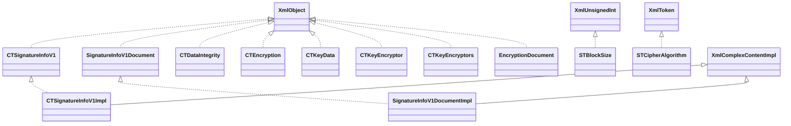

# poi-ooxml-schemas-3.11.jar

[Group index](README.md) | [All archives](../README.md)

## Scope and provenance

- **Donor:** `SQX_145_REFERENCE_ROOT/internal/libs/poi-ooxml-schemas-3.11.jar`.
- **SHA-256:** `6bc4a179f61447559bafee3ecbe3c4de7ba4b5c3954ded909cd477783c7db275`; accessed 2026-10-06; captured `2026-10-06T18:54:51.906614+00:00`.
- **Classes:** 2383 raw entries; 2383 unique entry names. Duplicate occurrence indices are zero-based.
- **Inspection:** read-only ZIP hashing and class-file structural parsing; signatures/descriptors, modifiers, hierarchy and references only. Bytecode bodies are hashed, not published.
- **Allocation:** proposed `FEAT-RESULTS-POI-OOXML-SCHEMAS`, P08; [roadmap](../../dev/sqx-full-application-roadmap.md). Domain README registration remains required.
- **Repository:** `01067f00031428613c6394064ca1bcadc1ba00ee`; review state unreviewed. Download label 145-dev1; installed build/activation and runtime equivalence unverified.
- **Limit:** every class/member is inventoried; declaration coverage does not establish consumed calls, defaults, formulas, failure semantics or algorithm parity.
- **Archive/resource index:** [101.json](../../dev/evidence/sqx145/archives/145/101.json).

## Complete member declarations

Member shards contain exact JVM names/descriptors, access flags, generic signatures, throws types, declared fields/methods, superclass/interfaces and referenced class names. All classes, nested/synthetic members and overloads are retained. Code length/hash is structural evidence, not a normalized algorithm comparison.

- [001.json](../../dev/evidence/sqx145/members/101/001.json) — SHA-256 `95ac4eb1f33007e6aa2b4fcfd0232bfa6f03bb2a0afbda6574d6f656f019d4d1`.
- [002.json](../../dev/evidence/sqx145/members/101/002.json) — SHA-256 `12e3fa8a23861fdb31174b6f0a0e85f216755f90b2fcdf257afaebaaa55047fe`.
- [003.json](../../dev/evidence/sqx145/members/101/003.json) — SHA-256 `b965682e508bab9bf7d0912b3e0dcbae256fb4a87687c57db2a467d5979d3929`.
- [004.json](../../dev/evidence/sqx145/members/101/004.json) — SHA-256 `0bb8949ec5fbbfaef5d6cbbfcb59ad6044f5bc4284292b8773c3d2ef99393b88`.
- [005.json](../../dev/evidence/sqx145/members/101/005.json) — SHA-256 `50e43e065289b10d273f1fa2c3eccac00335caa8dc34fe1433415d680d94b0ef`.
- [006.json](../../dev/evidence/sqx145/members/101/006.json) — SHA-256 `6b5bd2d6672ca646a6cc21ce884fc33055c737d9cce861e732b4aedc45c89ee1`.
- [007.json](../../dev/evidence/sqx145/members/101/007.json) — SHA-256 `458123658431adc15c98408463e2753458c989df77c86f1a03feffc719a8850f`.
- [008.json](../../dev/evidence/sqx145/members/101/008.json) — SHA-256 `04d6b3638c4524ca918d249ddf8fab2329b7402eed07a3d222bedf08323072b7`.
- [009.json](../../dev/evidence/sqx145/members/101/009.json) — SHA-256 `2702498e6c73bb251e549b68a9053201ad8d0527ea8d0b590b73fe5dfd382972`.
- [010.json](../../dev/evidence/sqx145/members/101/010.json) — SHA-256 `39751b58e55e95c94082c96ad95d877fac49c537a89898698b83ab48f47b4289`.
- [011.json](../../dev/evidence/sqx145/members/101/011.json) — SHA-256 `91a6e0f4abd1b9da3e6140738786b48f79c0f1b5c3313d81e7e024af7f8f0c8f`.
- [012.json](../../dev/evidence/sqx145/members/101/012.json) — SHA-256 `a8f61cb8960e64ee8ac16905a5b0383116e18fd83d75df74ab916b5335296390`.
- [013.json](../../dev/evidence/sqx145/members/101/013.json) — SHA-256 `727d424705bd90f79918c1671a8080b83c886a570c8887ca1893a5cd95f6181f`.
- [014.json](../../dev/evidence/sqx145/members/101/014.json) — SHA-256 `33d4fd3335aa31ffceeb6b781d45c6b622d45a8482389858385676c2d0861dfd`.
- [015.json](../../dev/evidence/sqx145/members/101/015.json) — SHA-256 `40b606cdc96934f5a8373e566c6dd20ceb9ae5d0b9231e8c212c16956221d478`.
- [016.json](../../dev/evidence/sqx145/members/101/016.json) — SHA-256 `c70d31073f6677c0fd7263eb0c5d46e90cf44b5f5cb94896c9bde22e6b7eea6f`.
- [017.json](../../dev/evidence/sqx145/members/101/017.json) — SHA-256 `574be2d47ad2bf92a1029b4a7c61f9148ff3eb4ca39104837d4fceb39d44d639`.
- [018.json](../../dev/evidence/sqx145/members/101/018.json) — SHA-256 `84dda128de153ece729ad0422fa26a654551bc6b601555099d96efd90f237c61`.
- [019.json](../../dev/evidence/sqx145/members/101/019.json) — SHA-256 `9d4fc870b773053a92c6f8c54f8522ed4f85890831942b149727db67535b0969`.
- [020.json](../../dev/evidence/sqx145/members/101/020.json) — SHA-256 `7b6f50df0b445a1b2030be00379c8d2a1d459bc197a937ef93a46868c532f65f`.
- [021.json](../../dev/evidence/sqx145/members/101/021.json) — SHA-256 `576e48cf1a57afce036d66a37f94faa8745d3704a02a7e913f665d84ec9f59f6`.
- [022.json](../../dev/evidence/sqx145/members/101/022.json) — SHA-256 `ac26210ac37c5334958031c627dc392af251709b3b7793a5d4e845a134b3870c`.
- [023.json](../../dev/evidence/sqx145/members/101/023.json) — SHA-256 `db3d489b746195fbb13522c0615f37ab3da3917f327c8aed883b50afff8da589`.
- [024.json](../../dev/evidence/sqx145/members/101/024.json) — SHA-256 `b1d504e7c416f82d6bdedb2fed3a573901df31b12a12b855d6c31171878e1fb1`.
- [025.json](../../dev/evidence/sqx145/members/101/025.json) — SHA-256 `5bc3aa53adf9fad4d537ca81fccba9be1d94e1d8ca6bb5c7285f3231c9a0660a`.
- [026.json](../../dev/evidence/sqx145/members/101/026.json) — SHA-256 `4865720ff76888896e83107d97ee6a1758f46a875749a16838cdcd28bcc851f2`.
- [027.json](../../dev/evidence/sqx145/members/101/027.json) — SHA-256 `8908981071a385fab1acbf9d28da33db5ba43b84c128bf9931e2e48c766e95a3`.
- [028.json](../../dev/evidence/sqx145/members/101/028.json) — SHA-256 `3b61b94afc099b8c64525ccd165efe0a43e0350a1227d3a471026055eccaed35`.
- [029.json](../../dev/evidence/sqx145/members/101/029.json) — SHA-256 `b610d5437f731287bf4dc6a96c0ccf78c37e15fd8ebaf5e2620733a66d639c47`.
- [030.json](../../dev/evidence/sqx145/members/101/030.json) — SHA-256 `4cf096dec65866535abdc5dff10051d39bf87af6096eeef00600d76cb14117e4`.

## Focused structural diagram

Up to twelve non-nested classes; arrows show declared inheritance/interfaces only. External type names are not evidence of an available body or an executed dependency.

## Class inventory

| Archive entry | Occurrence | Class SHA-256 | Fields | Methods |
| --- | ---: | --- | ---: | ---: |
| `com/microsoft/schemas/office/x2006/digsig/CTSignatureInfoV1$Factory.class` | 0 | `030e67a2617278a6a67ed21eb0b2f49d6f64e1cb26f9f05e74339406c428ae6a` | 0 | 21 |
| `com/microsoft/schemas/office/x2006/digsig/CTSignatureInfoV1.class` | 0 | `e4d7ae53cf70fc7a8fab90e0f356dd888e655f5fdcb0a9235a2e2d28bd242d8d` | 1 | 85 |
| `com/microsoft/schemas/office/x2006/digsig/SignatureInfoV1Document$Factory.class` | 0 | `6e6333ff416f6a3aecf89d761d3f0d2d087e113e5668b7a2c2e9c777c5e062d6` | 0 | 21 |
| `com/microsoft/schemas/office/x2006/digsig/SignatureInfoV1Document.class` | 0 | `5f1b97ab3e4c1eab746e3fa046709d97bee458949fc46e63eb6f0efb41170e0c` | 1 | 4 |
| `com/microsoft/schemas/office/x2006/digsig/impl/CTSignatureInfoV1Impl.class` | 0 | `018b7b88fbe333bc97c7aadc58ba3d33b728ab4111ec5ac6587e81d826609960` | 19 | 86 |
| `com/microsoft/schemas/office/x2006/digsig/impl/SignatureInfoV1DocumentImpl.class` | 0 | `33f000c396abf0e3621c8318a1190386efe17205ba49ada5ff8c2259fa230902` | 1 | 5 |
| `com/microsoft/schemas/office/x2006/encryption/CTDataIntegrity$Factory.class` | 0 | `1d669aa65ec9703994df9b300d2a31cf35531d33bba0365b9fb1715b7ec0325c` | 0 | 21 |
| `com/microsoft/schemas/office/x2006/encryption/CTDataIntegrity.class` | 0 | `ffb6fd167bfee424e094e2ad905fb741eff243b0d952988fe13f4a153c07aff7` | 1 | 9 |
| `com/microsoft/schemas/office/x2006/encryption/CTEncryption$Factory.class` | 0 | `51bd2bca75bb5ed77507f34af3bc4bcc09f8ff623a930f3e972343d1913fa316` | 0 | 21 |
| `com/microsoft/schemas/office/x2006/encryption/CTEncryption.class` | 0 | `8c411c9e48d47dcf9016bdb89112c45ea60fa175312c004bd3cac00ef721c11d` | 1 | 10 |
| `com/microsoft/schemas/office/x2006/encryption/CTKeyData$Factory.class` | 0 | `f2c38cf9e6daeaf179cbb5f97efcae3a2121ddc4ca50c7f841ce68c24ced1f30` | 0 | 21 |
| `com/microsoft/schemas/office/x2006/encryption/CTKeyData.class` | 0 | `304368d494b0426d31551a2feab2ebf69d5f192c3c3abe4094fa417718383550` | 1 | 33 |
| `com/microsoft/schemas/office/x2006/encryption/CTKeyEncryptor$Factory.class` | 0 | `56895755a715456e6e8715dd907a3ecf1c42c48dde9cdcdf4a22fca441eb7298` | 0 | 21 |
| `com/microsoft/schemas/office/x2006/encryption/CTKeyEncryptor$Uri$Enum.class` | 0 | `24f85d81a36ec41228e6df43a435c9bafb78b70bb3a4b1720bcaf6568a7c1a9b` | 4 | 5 |
| `com/microsoft/schemas/office/x2006/encryption/CTKeyEncryptor$Uri$Factory.class` | 0 | `6408beb30ac9c0e5cca5717b16a89a06391d68608ad5951df7a4b7537101cd76` | 0 | 4 |
| `com/microsoft/schemas/office/x2006/encryption/CTKeyEncryptor$Uri.class` | 0 | `8a4aa024c2c0a9d61a06982c56a9905b646134b0e1f8518bd05bb2d8fc075200` | 5 | 3 |
| `com/microsoft/schemas/office/x2006/encryption/CTKeyEncryptor.class` | 0 | `6ef43e4acc277926c6c09ff894957841c74a1e43e000cd3726efbb929fa7068f` | 1 | 17 |
| `com/microsoft/schemas/office/x2006/encryption/CTKeyEncryptors$Factory.class` | 0 | `48c6447755ab72f55bbfc64fc79d6cd9a12f34c6a847952c8299d62e8419b73f` | 0 | 21 |
| `com/microsoft/schemas/office/x2006/encryption/CTKeyEncryptors.class` | 0 | `87b1bdf819e1d2688399a9323264095283580f204cc030ec591cd01cb45e770d` | 1 | 10 |
| `com/microsoft/schemas/office/x2006/encryption/EncryptionDocument$Factory.class` | 0 | `d49c3335effb9c5f2a0b768aa50fe3c83e5d2b5999f31b7c8311a2f4f77e323a` | 0 | 21 |
| `com/microsoft/schemas/office/x2006/encryption/EncryptionDocument.class` | 0 | `2b434ff61116dc037ff32f15c5bc28e678daa0b422f2d9d68c6942139da774a7` | 1 | 4 |
| `com/microsoft/schemas/office/x2006/encryption/STBlockSize$Factory.class` | 0 | `779031fd96fe6a517ea0182b89b59c0e4b811d05cc1c6c273dd5df577d6f2ab9` | 0 | 22 |
| `com/microsoft/schemas/office/x2006/encryption/STBlockSize.class` | 0 | `4915619147ce9dad35253f02dd9f97a46a3d6929e7ad52baba89c2b46284c560` | 1 | 5 |
| `com/microsoft/schemas/office/x2006/encryption/STCipherAlgorithm$Enum.class` | 0 | `ac10624bfaabba987cf617709a05d4c40b30f22a15ab1dbc6108816345d98076` | 9 | 5 |
| `com/microsoft/schemas/office/x2006/encryption/STCipherAlgorithm$Factory.class` | 0 | `e13024d7f297911bb34bb898a9e07cf489bf9806ed59fe179da337149ca603d6` | 0 | 22 |
| `com/microsoft/schemas/office/x2006/encryption/STCipherAlgorithm.class` | 0 | `2b7f76281966faa68b5125bfc3d2528b5eb2473ab0e2478260e0a6bb8fa8bf48` | 15 | 3 |
| `com/microsoft/schemas/office/x2006/encryption/STCipherChaining$Enum.class` | 0 | `4ccfa2bcff76d0cc637cf1b119feba3acf5a6ec667d43a12b26fbd479d986a47` | 4 | 5 |
| `com/microsoft/schemas/office/x2006/encryption/STCipherChaining$Factory.class` | 0 | `1e1e87cb42ec14ef5a9163452916ec7a2b1d76f311092daeb7b3a2f5d506c6d7` | 0 | 22 |
| `com/microsoft/schemas/office/x2006/encryption/STCipherChaining.class` | 0 | `c9642afd692ad3c58a13ab4e0700a3a985b107dc636be0ca3d46345c08fa425f` | 5 | 3 |
| `com/microsoft/schemas/office/x2006/encryption/STHashAlgorithm$Enum.class` | 0 | `82adbf09e86eb529d2db9cfc5ce3ee35d488fb1886ce37a6367fe74c32c75e7d` | 12 | 5 |
| `com/microsoft/schemas/office/x2006/encryption/STHashAlgorithm$Factory.class` | 0 | `1136188a136f7f8724d38226d659d0cce260f0cb3c5b8978cb224f7bf782986a` | 0 | 22 |
| `com/microsoft/schemas/office/x2006/encryption/STHashAlgorithm.class` | 0 | `21b6dabf73e6aead2f931d3f26f19309b807d81fcbdb462e7ae8e603d9a85d39` | 21 | 3 |
| `com/microsoft/schemas/office/x2006/encryption/STHashSize$Factory.class` | 0 | `40e782e837693bb5a4e998b3b6026fb159a4e726d17294f81cf346c38eabb2f2` | 0 | 22 |
| `com/microsoft/schemas/office/x2006/encryption/STHashSize.class` | 0 | `5004a192583b747f364130e1a574fd33b2bc9ca44f2b55ac5890aaa40d09c5f1` | 1 | 5 |
| `com/microsoft/schemas/office/x2006/encryption/STKeyBits$Factory.class` | 0 | `e20995fe7fea26723f923d99213a55b488afae66ffcb486dea91e8bf33bedce8` | 0 | 22 |
| `com/microsoft/schemas/office/x2006/encryption/STKeyBits.class` | 0 | `d077c9def5d9f12b049299fe4e0ba2eed0a5572d23645810b0a17254f9e60427` | 1 | 1 |
| `com/microsoft/schemas/office/x2006/encryption/STSaltSize$Factory.class` | 0 | `ef8b7050f81b35ec05c5a81378e8b2e459211c54d2bbbc947830716737fd17bd` | 0 | 22 |
| `com/microsoft/schemas/office/x2006/encryption/STSaltSize.class` | 0 | `442ac1c8ad4a891282f1a45fbe634d6e70c3016845771f7dafc65907f5ba88f0` | 1 | 5 |
| `com/microsoft/schemas/office/x2006/encryption/STSpinCount$Factory.class` | 0 | `32599748ebfc3781ab470c615bbee1931cc35d1c2f7ecba98b4aca2f14783714` | 0 | 22 |
| `com/microsoft/schemas/office/x2006/encryption/STSpinCount.class` | 0 | `845fd88bba93a15895b56fd11e3083e03aaa9cece6742d0a3df575500d7d0614` | 1 | 5 |
| `com/microsoft/schemas/office/x2006/encryption/impl/CTDataIntegrityImpl.class` | 0 | `34d25983b1abf6212b4c86bce7b3c50af68c8962a07665b3e6d278718d4c9b4e` | 2 | 10 |
| `com/microsoft/schemas/office/x2006/encryption/impl/CTEncryptionImpl.class` | 0 | `7cb722ebbb736c3fcc93427c1e61235042d87bfd38c408d30687b1e662b857ad` | 3 | 11 |
| `com/microsoft/schemas/office/x2006/encryption/impl/CTKeyDataImpl.class` | 0 | `7a0a9faa0c788ace228e771fee20e8c6cc91c62d42449388f3e46026ebfc5740` | 8 | 34 |
| `com/microsoft/schemas/office/x2006/encryption/impl/CTKeyEncryptorImpl$UriImpl.class` | 0 | `6c630598f7b0243972bc79d7ee0204920d9230564167878af1f1a0918c29c6ff` | 0 | 2 |
| `com/microsoft/schemas/office/x2006/encryption/impl/CTKeyEncryptorImpl.class` | 0 | `5a1e563aeb5175de3f83dc865e4974b31e590e31dbae5d1dcf2a8bc95d3aba3e` | 3 | 18 |
| `com/microsoft/schemas/office/x2006/encryption/impl/CTKeyEncryptorsImpl$1KeyEncryptorList.class` | 0 | `d1606e2562f9457139f8b26e115681e4b1a4408317ac58be7edd0bea4a0dc77f` | 1 | 10 |
| `com/microsoft/schemas/office/x2006/encryption/impl/CTKeyEncryptorsImpl.class` | 0 | `467e13542e25ab0ff682339be39dea9efa58d828d9b91d6b1333985217e3889d` | 1 | 11 |
| `com/microsoft/schemas/office/x2006/encryption/impl/EncryptionDocumentImpl.class` | 0 | `4f736010f3d5b543f9f198222b47a46e371e93c352e52932c5500deb92085675` | 1 | 5 |
| `com/microsoft/schemas/office/x2006/encryption/impl/STBlockSizeImpl.class` | 0 | `5af151652485d9ec9ec8ecdfce4b9b75da129165b1c88e250c833b8292f0a258` | 0 | 2 |
| `com/microsoft/schemas/office/x2006/encryption/impl/STCipherAlgorithmImpl.class` | 0 | `4891006ad5e4055b19aaf2ade798b4c7c16aeda672ba384bbe2d0900ee72a160` | 0 | 2 |
| `com/microsoft/schemas/office/x2006/encryption/impl/STCipherChainingImpl.class` | 0 | `7d3429e998baa507571db1917617ac100be4e8a596c06f7ff352a53ad6717573` | 0 | 2 |
| `com/microsoft/schemas/office/x2006/encryption/impl/STHashAlgorithmImpl.class` | 0 | `4f7880cc967a169248a9a7e20c6e71b378eb74bbc51bba45ef36a909a40bbcd0` | 0 | 2 |
| `com/microsoft/schemas/office/x2006/encryption/impl/STHashSizeImpl.class` | 0 | `01728bc65cb7ea500faf7a9dc7aa406b061081874f8cdcf647b2d5d363dbfa76` | 0 | 2 |
| `com/microsoft/schemas/office/x2006/encryption/impl/STKeyBitsImpl.class` | 0 | `ecdeb89f1f18b3297818eddaec0b44a93c7053c8bdd5c18c1d10793e588ffb8a` | 0 | 2 |
| `com/microsoft/schemas/office/x2006/encryption/impl/STSaltSizeImpl.class` | 0 | `366e8310103671056b15703d6a43117545b8309f5daf92e3a62814881fb34b2a` | 0 | 2 |
| `com/microsoft/schemas/office/x2006/encryption/impl/STSpinCountImpl.class` | 0 | `631384e1fe025a87a70b2af0ff3a7790604582ceb0c1b2dbcf5393b94fc712bc` | 0 | 2 |
| `com/microsoft/schemas/office/x2006/keyEncryptor/certificate/CTCertificateKeyEncryptor$Factory.class` | 0 | `df11ca3300f7c6f8830afe5196f215a35170ba05d5fb92841332d5cde6cfbd6e` | 0 | 21 |
| `com/microsoft/schemas/office/x2006/keyEncryptor/certificate/CTCertificateKeyEncryptor.class` | 0 | `ef49ff63827f0b2a8e7187e89998487fa7c0de32981f4965c7b5919ad28cb93a` | 1 | 13 |
| `com/microsoft/schemas/office/x2006/keyEncryptor/certificate/impl/CTCertificateKeyEncryptorImpl.class` | 0 | `44ced196e31b24fcb0388c99cb062612f0bcda2db1b93e035be92d5b28207bca` | 3 | 14 |
| `com/microsoft/schemas/office/x2006/keyEncryptor/password/CTPasswordKeyEncryptor$Factory.class` | 0 | `7537a20691c68607d4bcbdd4493bc7520ce50de3c057e3b9b353e9bb08710358` | 0 | 21 |
| `com/microsoft/schemas/office/x2006/keyEncryptor/password/CTPasswordKeyEncryptor.class` | 0 | `a18794dcfa2502ff32f561eb66359ce8bf849b20aab6c2de8c23a3bc4489c3a3` | 1 | 49 |
| `com/microsoft/schemas/office/x2006/keyEncryptor/password/impl/CTPasswordKeyEncryptorImpl.class` | 0 | `1ff93c8a1ee5b73dcc9ecd9f8d022b5e4d3ec3434414acdce74b7dadd52d5365` | 12 | 50 |
| `org/etsi/uri/x01903/v13/CRLIdentifierType$Factory.class` | 0 | `cba68a02f23941ad8c85ed3d60afe4601e51ccf6ac941deada39132f7af85729` | 0 | 21 |
| `org/etsi/uri/x01903/v13/CRLIdentifierType.class` | 0 | `5b9e71fdec8ec9db5b12a629fb8c0b6d6b585b94b3dafcf02a93f3be53b378c4` | 1 | 21 |
| `org/etsi/uri/x01903/v13/CRLRefType$Factory.class` | 0 | `1420817e65fd5cd8ba1b5c0ea443bfe8703edfcc26efe7b291dc9602433873a2` | 0 | 21 |
| `org/etsi/uri/x01903/v13/CRLRefType.class` | 0 | `d438db2f5c95909bf9829d3aee69386f5dad65694c09b9f0f601170ae4a02c75` | 1 | 9 |
| `org/etsi/uri/x01903/v13/CRLRefsType$Factory.class` | 0 | `2f4d5eafeb32ed943bf06bc235421b1dc40c4e3e92dc128ee4e4546c23c6c161` | 0 | 21 |
| `org/etsi/uri/x01903/v13/CRLRefsType.class` | 0 | `69ee2cf2dc86a0cd8674dd9641ffe353d37f94319cf455bc20c1163d7f4d2ecd` | 1 | 10 |
| `org/etsi/uri/x01903/v13/CRLValuesType$Factory.class` | 0 | `edd9182d2fdce5bdcb6839c0f7aafea7f5e843e115b4bcfc88e080ecd4ce4565` | 0 | 21 |
| `org/etsi/uri/x01903/v13/CRLValuesType.class` | 0 | `ad758a785a201fa5b7a44cc162b959525c014c6a23a30602bfaecef8ba369ec1` | 1 | 10 |
| `org/etsi/uri/x01903/v13/CertIDListType$Factory.class` | 0 | `f3f39a02760fe368b7457a02849aa71d7955651f43f896a6371da0f6ec87ab1a` | 0 | 21 |
| `org/etsi/uri/x01903/v13/CertIDListType.class` | 0 | `5f84158fa9dc5d8a8673ff7928d0d98b23cc6f36b77588afd8ed4cae869425e6` | 1 | 10 |
| `org/etsi/uri/x01903/v13/CertIDType$Factory.class` | 0 | `f15c1e424148ae22c5e6211870da3a57390ebe4cda94e1f7e5acb38f543a636d` | 0 | 21 |
| `org/etsi/uri/x01903/v13/CertIDType.class` | 0 | `28e7b1c90fba989cfb3a7a190fe9011f6cdd9eb1d4e83bacf39a474405271c20` | 1 | 13 |
| `org/etsi/uri/x01903/v13/CertificateValuesType$Factory.class` | 0 | `e2b40453354897a7da167cac14ad26981ab06ec5e1dce55306f37851d2fe6e3b` | 0 | 21 |
| `org/etsi/uri/x01903/v13/CertificateValuesType.class` | 0 | `0202967f1faf6e5e9e358d0eb941385480e19e94724925866e4db9d66e8cdaba` | 1 | 25 |
| `org/etsi/uri/x01903/v13/CompleteCertificateRefsType$Factory.class` | 0 | `6868c0767dae4967ab94086e7be67f2e60060ed6e70aac6dc0201a9a5a5400fb` | 0 | 21 |
| `org/etsi/uri/x01903/v13/CompleteCertificateRefsType.class` | 0 | `724ee739a892043632a3b60cec768adf2483fbe3cccce3ebb84eeb4ca23e8f8c` | 1 | 10 |
| `org/etsi/uri/x01903/v13/CompleteRevocationRefsType$Factory.class` | 0 | `f26d9de61302acee36de2055292b1f0715c66efdff5de5a7d372c1ce9f6af822` | 0 | 21 |
| `org/etsi/uri/x01903/v13/CompleteRevocationRefsType.class` | 0 | `8e3e955ee9aca2f2a6c25536d67a406c59baaddab2b68e9cd4b75db8e579b3c5` | 1 | 22 |
| `org/etsi/uri/x01903/v13/DigestAlgAndValueType$Factory.class` | 0 | `5fd4c680c250b7760accc964de305684dbd7ce45f85e5dd93ee6c5af5ec572ca` | 0 | 21 |
| `org/etsi/uri/x01903/v13/DigestAlgAndValueType.class` | 0 | `99e617340fccd9dda01ea5a4e0cba34b2b816c9c6e803f131bfeeb4212da88f0` | 1 | 8 |
| `org/etsi/uri/x01903/v13/EncapsulatedPKIDataType$Factory.class` | 0 | `29fdda12070517dfaeb0c6f875d1bf76f13097ab585eaf24f347477da92668f6` | 0 | 21 |
| `org/etsi/uri/x01903/v13/EncapsulatedPKIDataType.class` | 0 | `10013f6804a8fb6b945f73891613a17a07e48c906829f06af26340cc185fb938` | 1 | 13 |
| `org/etsi/uri/x01903/v13/GenericTimeStampType$Factory.class` | 0 | `65e4fd3862fc2f87131126b5ec38a9bcdab1d05ba1afaeff6f3f9bbab1221d8f` | 0 | 21 |
| `org/etsi/uri/x01903/v13/GenericTimeStampType.class` | 0 | `14ba21e5d2410b98efd800327d50da32e9b0bafa052b36b67344986f1b79ef94` | 1 | 48 |
| `org/etsi/uri/x01903/v13/OCSPIdentifierType$Factory.class` | 0 | `3fdb1751d49fedb4e26307e744a8c93473afa2999419194753a7312f300e01f5` | 0 | 21 |
| `org/etsi/uri/x01903/v13/OCSPIdentifierType.class` | 0 | `960b6048354d3567b948208f124c3713dc881e092db71000e2be89f5eea76c32` | 1 | 14 |
| `org/etsi/uri/x01903/v13/OCSPRefType$Factory.class` | 0 | `69c2c4541dd67825ac34c9110f9c28289284a4480e18ad6cab64b6c035431592` | 0 | 21 |
| `org/etsi/uri/x01903/v13/OCSPRefType.class` | 0 | `604a628ae85831fb70be719089d3bf8e6613002a54748946b40ba0a5c64b844a` | 1 | 9 |
| `org/etsi/uri/x01903/v13/OCSPRefsType$Factory.class` | 0 | `68ef964f5ee43c69337ef4c5b055a4cb6d63c598387a05e5b894bb7ef7294be7` | 0 | 21 |
| `org/etsi/uri/x01903/v13/OCSPRefsType.class` | 0 | `68e80ce272966a22e64eb475bdd103aa3363989a10cf53a950fde640e7f0f12a` | 1 | 10 |
| `org/etsi/uri/x01903/v13/OCSPValuesType$Factory.class` | 0 | `bf23f2fd3e6e4f1ea157f5b4e8bf281b650aad1d82a29d9b3d8a30a5f95cbca6` | 0 | 21 |
| `org/etsi/uri/x01903/v13/OCSPValuesType.class` | 0 | `32e2f493e4c6b29958be3e86f6c4176536011d161fd12fb1eb5127845af6d00f` | 1 | 10 |
| `org/etsi/uri/x01903/v13/QualifyingPropertiesDocument$Factory.class` | 0 | `4bd0a94b5b51794c04c3a7b77d31dce21e44aa70dc6fa64b4e70a475650f98d0` | 0 | 21 |
| `org/etsi/uri/x01903/v13/QualifyingPropertiesDocument.class` | 0 | `1b8409d5c5c2a7807ec2eb723c09cc6fe6d756220ccec90d02132f9dd11f589b` | 1 | 4 |
| `org/etsi/uri/x01903/v13/QualifyingPropertiesType$Factory.class` | 0 | `995cd08ff520b49c95cb48e7994fa7865aa3f58d9205248a05148b9f5ade3d07` | 0 | 21 |
| `org/etsi/uri/x01903/v13/QualifyingPropertiesType.class` | 0 | `44db0318951bbc529d17f1377cc002c27fcb2ab2a47c89a95cc8ab35f41c9c42` | 1 | 21 |
| `org/etsi/uri/x01903/v13/ResponderIDType$Factory.class` | 0 | `f57a7b1ca2fbdaa74b2b9440612e257d8bb591472fed5cd90db15bd281054331` | 0 | 21 |
| `org/etsi/uri/x01903/v13/ResponderIDType.class` | 0 | `fe8857c2ce0c56b62c19cc54dcbe1c94cbb146269d047fff59f5daabab2a9dad` | 1 | 13 |
| `org/etsi/uri/x01903/v13/RevocationValuesType$Factory.class` | 0 | `60f09049f0926bbdc8139c9d840fbd1abe2276adcb8563a9eba3795b929e90a1` | 0 | 21 |
| `org/etsi/uri/x01903/v13/RevocationValuesType.class` | 0 | `e00fe59f0db0f960eb798ea4a6ff284a4cc508306b743424d4dfefbb6a18bed7` | 1 | 22 |
| `org/etsi/uri/x01903/v13/SignaturePolicyIdentifierType$Factory.class` | 0 | `a88738d666e5539df33118698f72cacf59e1ac709bdefa8d30b989f361bb9929` | 0 | 21 |
| `org/etsi/uri/x01903/v13/SignaturePolicyIdentifierType.class` | 0 | `326f841fcbdb77dabf248ab8f175a827caafec54213d32c81b9b212355dda3ea` | 1 | 11 |
| `org/etsi/uri/x01903/v13/SignedPropertiesType$Factory.class` | 0 | `aef8c1210f963607d8e3dbf0fb3d5b6b2259ab8220ce3c7c6c2ac22d6063aed9` | 0 | 21 |
| `org/etsi/uri/x01903/v13/SignedPropertiesType.class` | 0 | `ccbfc8c95038e64b7990e9ba688b791ef01f4a5799dda0dfa913cbbbef855bbe` | 1 | 17 |
| `org/etsi/uri/x01903/v13/SignedSignaturePropertiesType$Factory.class` | 0 | `b1a9015d6e3a166971dab3bdcecbbf0213c4bbe30a04788af22497a23142daae` | 0 | 21 |
| `org/etsi/uri/x01903/v13/SignedSignaturePropertiesType.class` | 0 | `3f77212d01bc73479ae4a6d6f6c1cd8792e25f36974c28b64fd9c12ff567b5ac` | 1 | 33 |
| `org/etsi/uri/x01903/v13/UnsignedPropertiesType$Factory.class` | 0 | `ebd8d0d549ec808766619b8a874eb29396cd5e3b0f3fe16f227009f928219262` | 0 | 21 |
| `org/etsi/uri/x01903/v13/UnsignedPropertiesType.class` | 0 | `9304dfd0597e53f693e50e157f10d846f0bc828947a684ed6fd9328f5b899b1b` | 1 | 17 |
| `org/etsi/uri/x01903/v13/UnsignedSignaturePropertiesType$Factory.class` | 0 | `6234a512ff5d724bba4fd0c5f85617fcb944180fe85c40c8756ee1f5766dff64` | 0 | 21 |
| `org/etsi/uri/x01903/v13/UnsignedSignaturePropertiesType.class` | 0 | `f7fe0bfd56e35db952412d50a7ea51fc01940eed496b71a48fe8d4674e520645` | 1 | 124 |
| `org/etsi/uri/x01903/v13/XAdESTimeStampType$Factory.class` | 0 | `d827ea45f6cec93cb35452b2cdcc2f659524d95a997ae8376813c85bb0fd8103` | 0 | 21 |
| `org/etsi/uri/x01903/v13/XAdESTimeStampType.class` | 0 | `75405624775b8d2d3473ab774020e0fb279e84aed4c408c34ef8857e3dae6a7f` | 1 | 1 |
| `org/etsi/uri/x01903/v13/impl/CRLIdentifierTypeImpl.class` | 0 | `a08420cac045294c019ed852fc718fc413353eccaf24590370902258445fd144` | 4 | 22 |
| `org/etsi/uri/x01903/v13/impl/CRLRefTypeImpl.class` | 0 | `b6534b6bdf78a1248802dd7ce3b7f3e9a8a0858f5a8c4c842d039b3490165a30` | 2 | 10 |
| `org/etsi/uri/x01903/v13/impl/CRLRefsTypeImpl.class` | 0 | `ff0c2c174ae9100ece01b35e889aee8ed86f864ce36a6682e113ff42fc186cfe` | 1 | 11 |
| `org/etsi/uri/x01903/v13/impl/CRLValuesTypeImpl.class` | 0 | `0f0f2960b95431a3343e80e9a02857f09ae5e2cc96a7a70003b57b8d96b80730` | 1 | 11 |
| `org/etsi/uri/x01903/v13/impl/CertIDListTypeImpl.class` | 0 | `72d5f30924c43fa493c30d468ff0c33a4894a30a6e4333cf70464fecb4ba90e3` | 1 | 11 |
| `org/etsi/uri/x01903/v13/impl/CertIDTypeImpl.class` | 0 | `2705ea9c665337a2ec57904de797c39e86caa870eacb877c3ee2bebe0555d4e7` | 3 | 14 |
| `org/etsi/uri/x01903/v13/impl/CertificateValuesTypeImpl.class` | 0 | `84c29610f525bba6f805ebe8c2a24346e163a19a78648f68e4897000c7f0f386` | 3 | 26 |
| `org/etsi/uri/x01903/v13/impl/CompleteCertificateRefsTypeImpl.class` | 0 | `01bb85d5e8f630f4fa2a411cc60cc780c37cfd056bf5977d5c04831644b6ed2e` | 2 | 11 |
| `org/etsi/uri/x01903/v13/impl/CompleteRevocationRefsTypeImpl.class` | 0 | `423b88aea3072a06342e1edd9c1aab35a75a6b5845fbce49aed6d77279ff4981` | 4 | 23 |
| `org/etsi/uri/x01903/v13/impl/DigestAlgAndValueTypeImpl.class` | 0 | `b5d07afb2b286d4599013d2bc45377cb9324b1fe683dfe6ef3a545e595e10606` | 2 | 9 |
| `org/etsi/uri/x01903/v13/impl/EncapsulatedPKIDataTypeImpl.class` | 0 | `13078a9100e3eab892a4510dc6cea48c5cffa658ad44732839c9e1d6e02c60a5` | 2 | 15 |
| `org/etsi/uri/x01903/v13/impl/GenericTimeStampTypeImpl.class` | 0 | `c389afee3fb16327d7bb933f688f63b3cc0eaca867102f5bf05e90b3c3f76e45` | 6 | 49 |
| `org/etsi/uri/x01903/v13/impl/OCSPIdentifierTypeImpl.class` | 0 | `f11fbb212487140b69c558b418e9a3c038adb7d75621711cd4dd1c2e9749850b` | 3 | 15 |
| `org/etsi/uri/x01903/v13/impl/OCSPRefTypeImpl.class` | 0 | `8fe612ce3fe340f805728a46e3b5861d8699b67f58d1b79a0af068ebc8e01edb` | 2 | 10 |
| `org/etsi/uri/x01903/v13/impl/OCSPRefsTypeImpl.class` | 0 | `29b4f46cb3277248130b5848b547d83c9bbf63cd8439719fb8f788818237c268` | 1 | 11 |
| `org/etsi/uri/x01903/v13/impl/OCSPValuesTypeImpl.class` | 0 | `a15130607aeec27cbc57fdc4c40fefa6c25d1bc5fc93bdc75f3a0478ab258896` | 1 | 11 |
| `org/etsi/uri/x01903/v13/impl/QualifyingPropertiesDocumentImpl.class` | 0 | `9ec1d0be23af3b342a97f5f73b0b4663971b46c0b579d0cb3a3ed982bc14a189` | 1 | 5 |
| `org/etsi/uri/x01903/v13/impl/QualifyingPropertiesTypeImpl.class` | 0 | `7e4ac1abeae6df784f86167a0a154659402f44878019f6347e7692455e12a417` | 4 | 22 |
| `org/etsi/uri/x01903/v13/impl/ResponderIDTypeImpl.class` | 0 | `b999803e3987da14dfbbfb8f90392b4acba2d270a080dea4d3874416173524b7` | 2 | 14 |
| `org/etsi/uri/x01903/v13/impl/RevocationValuesTypeImpl.class` | 0 | `787fd7347a7255a00302e1909ed749a2849c8d8e831bcf708e51f27a5ea37497` | 4 | 23 |
| `org/etsi/uri/x01903/v13/impl/SignaturePolicyIdentifierTypeImpl.class` | 0 | `93ac44c979074917358870f1a2f4209b0e45cf4ac9454953975799a7e042a19f` | 2 | 12 |
| `org/etsi/uri/x01903/v13/impl/SignedPropertiesTypeImpl.class` | 0 | `20b74292c7dbc02ff40bceccdbd3ea4e99df9881ef416f07d6a4bb11bebd13c2` | 3 | 18 |
| `org/etsi/uri/x01903/v13/impl/SignedSignaturePropertiesTypeImpl.class` | 0 | `9963b74a807ed95a5cc76054d282afebbfaf44f1ec32855a335332c8471930d2` | 6 | 34 |
| `org/etsi/uri/x01903/v13/impl/UnsignedPropertiesTypeImpl.class` | 0 | `50d594e992d250b769562d88c0b8609bf7fbfde66290a5d8b956565e48fa66dd` | 3 | 18 |
| `org/etsi/uri/x01903/v13/impl/UnsignedSignaturePropertiesTypeImpl.class` | 0 | `ca8fa560e4f7a9fd5f528ce4fc0383768d8ddc9ce1e8ba0218304603026c4f09` | 14 | 125 |
| `org/etsi/uri/x01903/v13/impl/XAdESTimeStampTypeImpl.class` | 0 | `c78378e8a4381b3f76f1c75976e4f14af8f020cd035f63ed4de8a1e41021d2e6` | 0 | 1 |
| `org/etsi/uri/x01903/v14/ValidationDataType$Factory.class` | 0 | `a5949b0772571752e86b2695ece0f9952284d57d6ae1f411afd7b057f2406c3f` | 0 | 21 |
| `org/etsi/uri/x01903/v14/ValidationDataType.class` | 0 | `cd033536656793f80a7e1caa8120ed0c10ce9152765b247a392c5ad391a42dc1` | 1 | 23 |
| `org/etsi/uri/x01903/v14/impl/ValidationDataTypeImpl.class` | 0 | `9fbac7853382cdbce5711c5d39b136f5508899c8eafb0246d1d904f3552bbd03` | 4 | 24 |
| `org/openxmlformats/schemas/drawingml/x2006/chart/CTAxDataSource$Factory.class` | 0 | `d6c1c57c918b34f478fcdc377e6ba7034c5b0e5d26a81b517ef28eb842fe07c4` | 0 | 21 |
| `org/openxmlformats/schemas/drawingml/x2006/chart/CTAxDataSource.class` | 0 | `ad9d1bdded17c4c906a051561e8733a71d3bce664710093b92a6c46950d62388` | 1 | 26 |
| `org/openxmlformats/schemas/drawingml/x2006/chart/CTAxPos$Factory.class` | 0 | `0c43df3fc12b7ebbb34399820c924c0c52677653211ea0136ad71effe7626a9d` | 0 | 21 |
| `org/openxmlformats/schemas/drawingml/x2006/chart/CTAxPos.class` | 0 | `84f771b972b9eecfe68a5dc21d5a4b97db849f409fee421666c3e413a0699dec` | 1 | 5 |
| `org/openxmlformats/schemas/drawingml/x2006/chart/CTBoolean$Factory.class` | 0 | `e01419d32814792083d0181aa023c9af89ac4fada84820334f5f212e3e2b8419` | 0 | 21 |
| `org/openxmlformats/schemas/drawingml/x2006/chart/CTBoolean.class` | 0 | `07a99e20e0bcb6ae1444d67856cb403af9b7908185b5309c04c279cda5ecc6c1` | 1 | 7 |
| `org/openxmlformats/schemas/drawingml/x2006/chart/CTCatAx$Factory.class` | 0 | `f175276971c47b831dace6f2bfbca267651fbbf42d41a917751df6a2a84a1e14` | 0 | 21 |
| `org/openxmlformats/schemas/drawingml/x2006/chart/CTCatAx.class` | 0 | `4daf07a00fb0d7a63499e2ade1764b7579e3904127f6defc8028cdef491e6d40` | 1 | 108 |
| `org/openxmlformats/schemas/drawingml/x2006/chart/CTChart$Factory.class` | 0 | `2c503842a0a70203c168cc1bd8ce11affda38b2b4e92917be33aaaa3ddf9e6ab` | 0 | 21 |
| `org/openxmlformats/schemas/drawingml/x2006/chart/CTChart.class` | 0 | `998a9c3a020b3624bba22b0ce1bd87649431e0d53fe7a8546b80e19691c27735` | 1 | 64 |
| `org/openxmlformats/schemas/drawingml/x2006/chart/CTChartSpace$Factory.class` | 0 | `29442520975f392827f73227f0783c6000b61f3751908883d3a4b212358d6f4c` | 0 | 21 |
| `org/openxmlformats/schemas/drawingml/x2006/chart/CTChartSpace.class` | 0 | `10dfc4efbed53f2638f6d7a0733f7c2a40ebbd67e13c2c0b5f25d0e31550cff2` | 1 | 69 |
| `org/openxmlformats/schemas/drawingml/x2006/chart/CTCrossBetween$Factory.class` | 0 | `2577dccd5bad0e8cfe87aeb5ffa63b9b0b6a4a3e4dc39b3c9c2260b40a9b2991` | 0 | 21 |
| `org/openxmlformats/schemas/drawingml/x2006/chart/CTCrossBetween.class` | 0 | `426f84fa7917b47a25a57427b7be5cd40b3679bd0aaba355d1bf4abb72c397e9` | 1 | 5 |
| `org/openxmlformats/schemas/drawingml/x2006/chart/CTCrosses$Factory.class` | 0 | `2afc8c5c4b4bf11a2feb03d99f4a41094e69b0ab3c7c35d38f28e37931ed9693` | 0 | 21 |
| `org/openxmlformats/schemas/drawingml/x2006/chart/CTCrosses.class` | 0 | `8f23e7f3c4b7c3a5861e0987b5b95c97b0e72f92b7ad6adcc7be9a82979f1379` | 1 | 5 |
| `org/openxmlformats/schemas/drawingml/x2006/chart/CTDouble$Factory.class` | 0 | `754793f47449fa2c26d30488262e7b1d072ac8f946b8a5112c137c984322de57` | 0 | 21 |
| `org/openxmlformats/schemas/drawingml/x2006/chart/CTDouble.class` | 0 | `6e4f451c1016b83e5d5b9de65b6c08bb588cd1d13a1e7d3eb1036c8b2837aa0c` | 1 | 5 |
| `org/openxmlformats/schemas/drawingml/x2006/chart/CTHeaderFooter$Factory.class` | 0 | `0de12eebc37f0aa846a66454533db79483562f14cdc90f638aa8d9adda6db5d9` | 0 | 21 |
| `org/openxmlformats/schemas/drawingml/x2006/chart/CTHeaderFooter.class` | 0 | `3fe41d517570e24839489fdd828cac0104cf0a8e8cd641d10eb8ab33103b8ed1` | 1 | 55 |
| `org/openxmlformats/schemas/drawingml/x2006/chart/CTLayout$Factory.class` | 0 | `9be2ee4e786bf89a1e5f5217dca07f6ff103b7c13cee28fe68806623901c8676` | 0 | 21 |
| `org/openxmlformats/schemas/drawingml/x2006/chart/CTLayout.class` | 0 | `c4ea68fa028e1e807dd19c6c12fb3adea4a28d9cccef899a2faab6b131256fa3` | 1 | 11 |
| `org/openxmlformats/schemas/drawingml/x2006/chart/CTLayoutMode$Factory.class` | 0 | `92c8d2594e05c1fbf0e771a23cdc2ed1f05e537d0c51cf5a276aaf7c49d99ea4` | 0 | 21 |
| `org/openxmlformats/schemas/drawingml/x2006/chart/CTLayoutMode.class` | 0 | `33a84234533635cc92cbb89335858c46ec67e7b6224746e2413f93e97067d108` | 1 | 7 |
| `org/openxmlformats/schemas/drawingml/x2006/chart/CTLayoutTarget$Factory.class` | 0 | `6ceeef8e52cd7817a38bf8fe17835631eb708d88011a195c24a2637c19dd06e2` | 0 | 21 |
| `org/openxmlformats/schemas/drawingml/x2006/chart/CTLayoutTarget.class` | 0 | `f386161df3202b0e05b1ffec3be93263771e39c2c2310c90fb6c20d725b1e901` | 1 | 7 |
| `org/openxmlformats/schemas/drawingml/x2006/chart/CTLegend$Factory.class` | 0 | `fed89ad3a6a66612ac8bb69ee4068c36a51b3ee731ac62a39d6d21ce7ae95df8` | 0 | 21 |
| `org/openxmlformats/schemas/drawingml/x2006/chart/CTLegend.class` | 0 | `eb3b7d87dfb4c40f373711f9b22e0b2ae907c6111212afd0537df1cf440c2345` | 1 | 40 |
| `org/openxmlformats/schemas/drawingml/x2006/chart/CTLegendPos$Factory.class` | 0 | `f4aecaaa83b3a63984907573d733c0505c39aefa0501fd5493a2ca32bd3bf951` | 0 | 21 |
| `org/openxmlformats/schemas/drawingml/x2006/chart/CTLegendPos.class` | 0 | `81df555f87299b4d153b6ca6764a3241c04c3df384b0d4ee6a2f1a15ee586bf1` | 1 | 7 |
| `org/openxmlformats/schemas/drawingml/x2006/chart/CTLineChart$Factory.class` | 0 | `b3e1ca3ecacd7ba53699b387a2e956b9bbfcbd2c35071863abff66feba4f5583` | 0 | 21 |
| `org/openxmlformats/schemas/drawingml/x2006/chart/CTLineChart.class` | 0 | `6200044941701d56ba758c9ff04357d3f15f08049b0a1ae374614cedd8c8618f` | 1 | 62 |
| `org/openxmlformats/schemas/drawingml/x2006/chart/CTLineSer$Factory.class` | 0 | `96056ac16b755048538544e7097553b162e00aabe5629ec1de4454d6d8b05f55` | 0 | 21 |
| `org/openxmlformats/schemas/drawingml/x2006/chart/CTLineSer.class` | 0 | `8e0529a5eb83977e3d99bbd6dcfdb5a5a3dffe4eac08820d71f9216cd5abce2b` | 1 | 70 |
| `org/openxmlformats/schemas/drawingml/x2006/chart/CTLogBase$Factory.class` | 0 | `ad3dffa3fbd1b0e72193900f62dcdb1ef63965383bedbcc273df9ce5ba8b26ad` | 0 | 21 |
| `org/openxmlformats/schemas/drawingml/x2006/chart/CTLogBase.class` | 0 | `5d1bc868c699c7c9042a923be0dacdfdd836924e507aee2e33488dd4f08bf61a` | 1 | 5 |
| `org/openxmlformats/schemas/drawingml/x2006/chart/CTManualLayout$Factory.class` | 0 | `5e3086279aee0002ceeabdf770b528eb5384164bd1dc3c9e06c5f566d38ccb6b` | 0 | 21 |
| `org/openxmlformats/schemas/drawingml/x2006/chart/CTManualLayout.class` | 0 | `8822dc570a8715316e57042c9c0f2f512b8f52a640b01f5f2f055a333ce02518` | 1 | 51 |
| `org/openxmlformats/schemas/drawingml/x2006/chart/CTMarker$Factory.class` | 0 | `837da9426069a8883fcf835ef3880e882f9ea60ef6f12064d2f48453a35287f2` | 0 | 21 |
| `org/openxmlformats/schemas/drawingml/x2006/chart/CTMarker.class` | 0 | `da82929913346e826ced247b133e36a144e57ea2cecc852745eba2b7244f29ec` | 1 | 21 |
| `org/openxmlformats/schemas/drawingml/x2006/chart/CTMarkerStyle$Factory.class` | 0 | `171e0e30c75401a2e5b3783742199cad1d518d793f24bf4e688ca97b6867a1c7` | 0 | 21 |
| `org/openxmlformats/schemas/drawingml/x2006/chart/CTMarkerStyle.class` | 0 | `ffaa91432c5ec95e36a818ed70c1890d7a2490a705f9284791e16355e0e7768e` | 1 | 5 |
| `org/openxmlformats/schemas/drawingml/x2006/chart/CTNumData$Factory.class` | 0 | `2fd2fce5284dcfade2008e2341b4fc64ea49fc25ef18c249c10953041ad14ce9` | 0 | 21 |
| `org/openxmlformats/schemas/drawingml/x2006/chart/CTNumData.class` | 0 | `16f1e7876dd2ce7c7af22b2b31ff4e4a8bef3dfe9c1d33ccf3c7ef8ea6c2bfdb` | 1 | 26 |
| `org/openxmlformats/schemas/drawingml/x2006/chart/CTNumDataSource$Factory.class` | 0 | `50c0d53caafb20f52cf957ba9ae683d3f74372da63ebc4a9cc6006bdfedb0961` | 0 | 21 |
| `org/openxmlformats/schemas/drawingml/x2006/chart/CTNumDataSource.class` | 0 | `eb3899708cafe837dc67d9a9b939ff02de9305ef0d811dbe9846023cb6c0dee5` | 1 | 11 |
| `org/openxmlformats/schemas/drawingml/x2006/chart/CTNumFmt$Factory.class` | 0 | `70ce19336bf886e899465504b08b1dd1fa4b7518d7471aa8ca54d376fac4509d` | 0 | 21 |
| `org/openxmlformats/schemas/drawingml/x2006/chart/CTNumFmt.class` | 0 | `f7b1b431e2191d2ae86b6b0e9bca8dc2da1607399cadcfae0d5ae974d3dfb849` | 1 | 11 |
| `org/openxmlformats/schemas/drawingml/x2006/chart/CTNumRef$Factory.class` | 0 | `0664e3d1634d18ce80a1ec1105aeab7e906ca08239e1fd179290be2dd83d9bee` | 0 | 21 |
| `org/openxmlformats/schemas/drawingml/x2006/chart/CTNumRef.class` | 0 | `72dd695fc95d2a43ae46306b76444a14a3ccc765df4c0c5fe67ab5bd6dfa4c9d` | 1 | 15 |
| `org/openxmlformats/schemas/drawingml/x2006/chart/CTNumVal$Factory.class` | 0 | `2b559e7d496ee7bba88b43e95eb059e114971537ae8ea4e2669a40bd1a143ee6` | 0 | 21 |
| `org/openxmlformats/schemas/drawingml/x2006/chart/CTNumVal.class` | 0 | `d07795cddc80d00d3275995b81edfe360a4fd54ab73dde0faa1d86d5d1886227` | 1 | 15 |
| `org/openxmlformats/schemas/drawingml/x2006/chart/CTOrientation$Factory.class` | 0 | `9ea997fb4a1ac29bc15d8ebd69aa00409f43d122ffc4c36f58ef1d09c4ae86ef` | 0 | 21 |
| `org/openxmlformats/schemas/drawingml/x2006/chart/CTOrientation.class` | 0 | `b7871dd58f119f52e549958193d068d5a9ae928e2f79f661eaad86a677f31b56` | 1 | 7 |
| `org/openxmlformats/schemas/drawingml/x2006/chart/CTPageMargins$Factory.class` | 0 | `a3674b57bd74aef3307dd40f6322861cd28037d73ba4c8fabe9cd2b8e79f70f3` | 0 | 21 |
| `org/openxmlformats/schemas/drawingml/x2006/chart/CTPageMargins.class` | 0 | `f9b4f425e808fc36abc3e699d753f174a96e51dd07156ba034855cff62e90070` | 1 | 25 |
| `org/openxmlformats/schemas/drawingml/x2006/chart/CTPageSetup$Factory.class` | 0 | `ef4f0b69eaeea0457e3d58190e8a94ca3d4fb614b1a7575e10ce739f74ce663e` | 0 | 21 |
| `org/openxmlformats/schemas/drawingml/x2006/chart/CTPageSetup.class` | 0 | `91a3c77132ae0bc624d996487ecd66a2b2f842c34ce0a8491f8a71fa7ea1e69f` | 1 | 55 |
| `org/openxmlformats/schemas/drawingml/x2006/chart/CTPieChart$Factory.class` | 0 | `e4e9af9682507e4914d8dadae7d27887dae786a5942a1b0f127116b52e821365` | 0 | 21 |
| `org/openxmlformats/schemas/drawingml/x2006/chart/CTPieChart.class` | 0 | `bc1dc8de747227f3b66a541bd5bdf6b2b0d68d4fe77a077a72b731281605f162` | 1 | 30 |
| `org/openxmlformats/schemas/drawingml/x2006/chart/CTPieSer$Factory.class` | 0 | `43a3af3c938e006ed7741dab37f5f7768aa9ebf437a0637b5e0bc91b9b05dd2e` | 0 | 21 |
| `org/openxmlformats/schemas/drawingml/x2006/chart/CTPieSer.class` | 0 | `25ecc3e21088e7886ba7bfd043628eb154655e1c564cb1d3b66bc7a0fe0bace5` | 1 | 51 |
| `org/openxmlformats/schemas/drawingml/x2006/chart/CTPlotArea$Factory.class` | 0 | `9011c0327e94e38c96ce6c876773fa09b5b82efab12c0a02472bec9e85aa03d8` | 0 | 21 |
| `org/openxmlformats/schemas/drawingml/x2006/chart/CTPlotArea.class` | 0 | `5d3b198442028f5da1ab12db60209acd72c0032149c1e4d9677e72ea019fb177` | 1 | 201 |
| `org/openxmlformats/schemas/drawingml/x2006/chart/CTPrintSettings$Factory.class` | 0 | `5e97754ee46e81629a0fb458fd1357486ceebbe2783c3b6eda1bd40d8649a06a` | 0 | 21 |
| `org/openxmlformats/schemas/drawingml/x2006/chart/CTPrintSettings.class` | 0 | `3b18d2248da05739831b36668d745c8a9e0f3002bb955ea0c876245a1f9d3f14` | 1 | 21 |
| `org/openxmlformats/schemas/drawingml/x2006/chart/CTScaling$Factory.class` | 0 | `2c5ac7d5a4d4581c8ccd497c0fc0b044fc2cddd82acfae6d5c7cd1b9739c2ba1` | 0 | 21 |
| `org/openxmlformats/schemas/drawingml/x2006/chart/CTScaling.class` | 0 | `5373db9080b9788852ed5d6316dc7aac2e36c288eb13b7539ce28926cd1850d3` | 1 | 26 |
| `org/openxmlformats/schemas/drawingml/x2006/chart/CTScatterChart$Factory.class` | 0 | `9b44a388108873b0b4f73b31a88ff5665b0d2ea0ed0584abe18ef28ae7b0ec05` | 0 | 21 |
| `org/openxmlformats/schemas/drawingml/x2006/chart/CTScatterChart.class` | 0 | `804d8593fb151cc18b9f5296b86c1880c1ca1b01b98d90a711b60c4b98d26c47` | 1 | 37 |
| `org/openxmlformats/schemas/drawingml/x2006/chart/CTScatterSer$Factory.class` | 0 | `24e197a0dc109468ccac108c1f1c0ba52c46b7df3aa4979244b3190c1007643e` | 0 | 21 |
| `org/openxmlformats/schemas/drawingml/x2006/chart/CTScatterSer.class` | 0 | `1770327f92825933b43a391d05eb37f5478ce63a40c5fe91ad24f5d56d48c5fd` | 1 | 74 |
| `org/openxmlformats/schemas/drawingml/x2006/chart/CTScatterStyle$Factory.class` | 0 | `82bfd66369af4fbe09f89b49214206997e76a2faa72db18cca7cdeb38bad968e` | 0 | 21 |
| `org/openxmlformats/schemas/drawingml/x2006/chart/CTScatterStyle.class` | 0 | `d24451c0e8dee5b1021791701fdcea5500519e88fcfdb8e763faafea32f840b6` | 1 | 7 |
| `org/openxmlformats/schemas/drawingml/x2006/chart/CTSerTx$Factory.class` | 0 | `8da7f4bf8f58ae60c07317dfb8fa2bd80dbd3f09272d79807baf9b4cb0c7fd3d` | 0 | 21 |
| `org/openxmlformats/schemas/drawingml/x2006/chart/CTSerTx.class` | 0 | `07e20ae4d1c8d96c45b4bf22793fcfb9b42d2319b340b68973b396b5e82bd552` | 1 | 12 |
| `org/openxmlformats/schemas/drawingml/x2006/chart/CTStrData$Factory.class` | 0 | `397d286d0adf2879aed5d1ab3ddbb65eb1efc92c21def98cb34d1775e60f0cf6` | 0 | 21 |
| `org/openxmlformats/schemas/drawingml/x2006/chart/CTStrData.class` | 0 | `00bab8c8cf183a93c571289bdffe8930e32c38ee64a58222d53555fe93cd6376` | 1 | 20 |
| `org/openxmlformats/schemas/drawingml/x2006/chart/CTStrRef$Factory.class` | 0 | `007ac47479c833dc582ba080cd5dbca5639ddd7f5c1b827c23bd7b32a3eebf3e` | 0 | 21 |
| `org/openxmlformats/schemas/drawingml/x2006/chart/CTStrRef.class` | 0 | `7efdd214094c14e11eab80f35bcaf984c92b98b3d752a5b924c7da538a03ba30` | 1 | 15 |
| `org/openxmlformats/schemas/drawingml/x2006/chart/CTStrVal$Factory.class` | 0 | `b2e0a1e9eb3b0740151cded10ec24d5aaf3fba309139e62a5a7e560a11ab536a` | 0 | 21 |
| `org/openxmlformats/schemas/drawingml/x2006/chart/CTStrVal.class` | 0 | `c05c612c8467e543d225f84ef70ad2be375330bffa4eabd1258e1f8cd4a651b3` | 1 | 9 |
| `org/openxmlformats/schemas/drawingml/x2006/chart/CTTickLblPos$Factory.class` | 0 | `3f469b14eb4be3ee1633ba7d6fa1d740e13c217ffb9713efcccb2022ba092c02` | 0 | 21 |
| `org/openxmlformats/schemas/drawingml/x2006/chart/CTTickLblPos.class` | 0 | `c85121d641c2befe8e3304661adc52dfdffb2d279221c47ebc8d88ff267098dd` | 1 | 7 |
| `org/openxmlformats/schemas/drawingml/x2006/chart/CTTickMark$Factory.class` | 0 | `7983f4cf52f1ac3e7b36346ce8af6c81993d96b5256639481395d2630a40085a` | 0 | 21 |
| `org/openxmlformats/schemas/drawingml/x2006/chart/CTTickMark.class` | 0 | `343dbc04ebf875cc0bf6b1c7cb4d1df51055eb61497ad901cc58d4ed4ef62c59` | 1 | 7 |
| `org/openxmlformats/schemas/drawingml/x2006/chart/CTTitle$Factory.class` | 0 | `e176fb69f8c52bbf75b143e14362bce73454df1975cf760d0df62c8afdf52227` | 0 | 21 |
| `org/openxmlformats/schemas/drawingml/x2006/chart/CTTitle.class` | 0 | `2cb5d9e1d5d5c4f03f93fde6c701cd3eae0c1e2783a21cc2b821d24abe610a11` | 1 | 31 |
| `org/openxmlformats/schemas/drawingml/x2006/chart/CTTx$Factory.class` | 0 | `0a8b3f1c88cc64125ed6b390c93c563a3490ad8e6b6837eca3e3bd20b1e67081` | 0 | 21 |
| `org/openxmlformats/schemas/drawingml/x2006/chart/CTTx.class` | 0 | `bee1b0483d6d233857c76097c76044fa2972a2478a7b7f99199948db15cbc229` | 1 | 11 |
| `org/openxmlformats/schemas/drawingml/x2006/chart/CTUnsignedInt$Factory.class` | 0 | `71691131fa4145f03bd108c6564eacebcaee25a46c626186cdb3cf6251a2420e` | 0 | 21 |
| `org/openxmlformats/schemas/drawingml/x2006/chart/CTUnsignedInt.class` | 0 | `d42f450fb669e8d020d607565c0a090d42b2a2cc566950e6c354b135d0d89870` | 1 | 5 |
| `org/openxmlformats/schemas/drawingml/x2006/chart/CTValAx$Factory.class` | 0 | `e9c4dce838ae79dc606f41d35daaaf414c41f6280e83a0e1a5ad9c821f58b419` | 0 | 21 |
| `org/openxmlformats/schemas/drawingml/x2006/chart/CTValAx.class` | 0 | `0b59c701467184b54a911e80b1ee853dd80523400ea6a9af91e8896ceb0c167a` | 1 | 98 |
| `org/openxmlformats/schemas/drawingml/x2006/chart/ChartSpaceDocument$Factory.class` | 0 | `f323788849f5b620e62362100a6d9bbcbf233b2a21380301c4fe5dd57eec7832` | 0 | 21 |
| `org/openxmlformats/schemas/drawingml/x2006/chart/ChartSpaceDocument.class` | 0 | `8b68df3062ebaf70db8b4cd72ad313fbfe08f1d79a922f6d36caab5156ea2993` | 1 | 4 |
| `org/openxmlformats/schemas/drawingml/x2006/chart/STAxPos$Enum.class` | 0 | `60ca5be0e9679bf71fafe3def5249ab3c424d28519201a705f8b454e7a894107` | 6 | 5 |
| `org/openxmlformats/schemas/drawingml/x2006/chart/STAxPos$Factory.class` | 0 | `3676771765c73a8568bf422bb5cfb8a42692cd23d38048f9ab5c1b881fff40bd` | 0 | 22 |
| `org/openxmlformats/schemas/drawingml/x2006/chart/STAxPos.class` | 0 | `8bd6061473c4510042ab4b52e2c9dc3aa6d6e72117598421944fe0548bbc6d0a` | 9 | 3 |
| `org/openxmlformats/schemas/drawingml/x2006/chart/STCrossBetween$Enum.class` | 0 | `806b89f686c108efa02f7f5838b75bdc6db9e426ccc4f3bc8d623f2be9667045` | 4 | 5 |
| `org/openxmlformats/schemas/drawingml/x2006/chart/STCrossBetween$Factory.class` | 0 | `20fcbe4f8cd4ee56ae2063ca11792dd62031eb929399e900bd1b4e5d483ee6b4` | 0 | 22 |
| `org/openxmlformats/schemas/drawingml/x2006/chart/STCrossBetween.class` | 0 | `8be9d7c00e3b29cccff656a54a42a60b7ad6765d15b0b6d77371f5191709f811` | 5 | 3 |
| `org/openxmlformats/schemas/drawingml/x2006/chart/STCrosses$Enum.class` | 0 | `465fa06302182f4634476e45cedfae7a10634b29fc036a20d6981f99beca313a` | 5 | 5 |
| `org/openxmlformats/schemas/drawingml/x2006/chart/STCrosses$Factory.class` | 0 | `f5ea8b996a0b6472ec8b59f6cfd1fe7e5c98c6abc5f229d1b29f768370bbf07f` | 0 | 22 |
| `org/openxmlformats/schemas/drawingml/x2006/chart/STCrosses.class` | 0 | `12fdad74be90dcb790dc60317a50626f270133f557afc37a595f594fa9a83d10` | 7 | 3 |
| `org/openxmlformats/schemas/drawingml/x2006/chart/STLayoutMode$Enum.class` | 0 | `b195e799936763ad02c5ac93353ed3ab26d309805b73bd11f8945dfe3b1c309f` | 4 | 5 |
| `org/openxmlformats/schemas/drawingml/x2006/chart/STLayoutMode$Factory.class` | 0 | `444399e43574e04010736bfdf2e2cdc2d9213e3c04972f8652b599f2f7744d98` | 0 | 22 |
| `org/openxmlformats/schemas/drawingml/x2006/chart/STLayoutMode.class` | 0 | `a134f00eef1ac0d70e1cf6f14bbe36ca4f3e9c297f6efca4a19edbad1aa184f3` | 5 | 3 |
| `org/openxmlformats/schemas/drawingml/x2006/chart/STLayoutTarget$Enum.class` | 0 | `bc75c9ff5714941e1b06a7e0362754532e2d98e630f00341faf4fe18b630eaed` | 4 | 5 |
| `org/openxmlformats/schemas/drawingml/x2006/chart/STLayoutTarget$Factory.class` | 0 | `cfbe4028115979569dd171483477ee62e58700f6eeda99b6a6f191242e97ee56` | 0 | 22 |
| `org/openxmlformats/schemas/drawingml/x2006/chart/STLayoutTarget.class` | 0 | `ef2305e7d471a271cb7df1bca233015553a789adb8a566ea082eda9805539b95` | 5 | 3 |
| `org/openxmlformats/schemas/drawingml/x2006/chart/STLegendPos$Enum.class` | 0 | `6cb263d47ec6afb9c7fad2114ea28f6dbeea9be8813b9f85df3bd0ed0b5523d1` | 7 | 5 |
| `org/openxmlformats/schemas/drawingml/x2006/chart/STLegendPos$Factory.class` | 0 | `7d2b14e3d31f1941a46f907c5b25be4f3c9841006fc7319dc7a451d854f637d0` | 0 | 22 |
| `org/openxmlformats/schemas/drawingml/x2006/chart/STLegendPos.class` | 0 | `68bac486a2dea31b7a05fe873f044757cf7387185471aa41bb10d6a9aa1e6534` | 11 | 3 |
| `org/openxmlformats/schemas/drawingml/x2006/chart/STLogBase$Factory.class` | 0 | `1cb4a232022dc66162e6cdb463b61c36e45d76cef749f83182a66df87024c73b` | 0 | 22 |
| `org/openxmlformats/schemas/drawingml/x2006/chart/STLogBase.class` | 0 | `337010f198d59bcfa5d0a6257885a161dda59070fc475b230f23335e7fa3d9bf` | 1 | 1 |
| `org/openxmlformats/schemas/drawingml/x2006/chart/STMarkerStyle$Enum.class` | 0 | `603290e0552de2ed803912109e7e880c3459450439789ca6bddf75270f391f24` | 13 | 5 |
| `org/openxmlformats/schemas/drawingml/x2006/chart/STMarkerStyle$Factory.class` | 0 | `b6746f9ad5a496cbb4de6a9cce489e79573305666b89f2a2d822aff37191b3ec` | 0 | 22 |
| `org/openxmlformats/schemas/drawingml/x2006/chart/STMarkerStyle.class` | 0 | `1993c10be939e8d86e87fe09597ca32c28eaacd33583dfedb63907ecd6786c91` | 23 | 3 |
| `org/openxmlformats/schemas/drawingml/x2006/chart/STOrientation$Enum.class` | 0 | `d5b086d799ca77060b059de3a4808f5d4b9fa8e44379479a905a5733304d91bc` | 4 | 5 |
| `org/openxmlformats/schemas/drawingml/x2006/chart/STOrientation$Factory.class` | 0 | `86fb42d5812750a5e255d4eb2c2baf4800ab6d6ff101498593d9382a47d21377` | 0 | 22 |
| `org/openxmlformats/schemas/drawingml/x2006/chart/STOrientation.class` | 0 | `8691b9da70f1866d17129cf3389eb008bb24d66f39feb031a79f71b963d2b555` | 5 | 3 |
| `org/openxmlformats/schemas/drawingml/x2006/chart/STPageSetupOrientation$Enum.class` | 0 | `9d5aa7d76b8ddde948e56f0cd2d640c2839fe629025f32e87e2ff1eaf400e014` | 5 | 5 |
| `org/openxmlformats/schemas/drawingml/x2006/chart/STScatterStyle$Enum.class` | 0 | `5e361136b15d01299365474847182525580d50271d19b99cc775ae2997f6d5bc` | 8 | 5 |
| `org/openxmlformats/schemas/drawingml/x2006/chart/STScatterStyle$Factory.class` | 0 | `f387eeb7c13bd7de6b749b09acbccdc0385ebd62c637a0d94a323bacb8e5ebae` | 0 | 22 |
| `org/openxmlformats/schemas/drawingml/x2006/chart/STScatterStyle.class` | 0 | `8018b9f5f9a9a80df54cb5f4969408a7b57ffadf48787d6578ff61ae6333a81b` | 13 | 3 |
| `org/openxmlformats/schemas/drawingml/x2006/chart/STTickLblPos$Enum.class` | 0 | `defa387e0891d96c66d631cb8a57f2aed73e0ed69d83fccbfb7dd804c69bfaba` | 6 | 5 |
| `org/openxmlformats/schemas/drawingml/x2006/chart/STTickLblPos$Factory.class` | 0 | `dd2ed9b94d47cd1b96c6e4aac3079dc98ad0ba33de39748f87a27fb98a6f1469` | 0 | 22 |
| `org/openxmlformats/schemas/drawingml/x2006/chart/STTickLblPos.class` | 0 | `1e895f2a8cec83f089410de71953e8d5cfa6a4006356a64bb5083a025838b6f7` | 9 | 3 |
| `org/openxmlformats/schemas/drawingml/x2006/chart/STTickMark$Enum.class` | 0 | `0e6ee04274e58164d3ba8dcf2df6be0e3e09c68765d55fbd3534f04cb3c21501` | 6 | 5 |
| `org/openxmlformats/schemas/drawingml/x2006/chart/STTickMark$Factory.class` | 0 | `b2debb088dd1755f7e89cc513b4a6470c2c50591dcc73a0b09c93713c31f8558` | 0 | 22 |
| `org/openxmlformats/schemas/drawingml/x2006/chart/STTickMark.class` | 0 | `77a669ec2cfa2141eb1dd78ff00ab513958dee865b81c18ce27ea2b78b61107b` | 9 | 3 |
| `org/openxmlformats/schemas/drawingml/x2006/chart/STXstring$Factory.class` | 0 | `05aeac9b61c7a3afb2b2c80ce33d937a2b1159860567945e9e9780bedf63fb7b` | 0 | 22 |
| `org/openxmlformats/schemas/drawingml/x2006/chart/STXstring.class` | 0 | `cfc2e2ed90948a94a0e8fef5ca494c01829a4e9f39c71e44aea2a5487e332d8f` | 1 | 1 |
| `org/openxmlformats/schemas/drawingml/x2006/chart/impl/CTAxDataSourceImpl.class` | 0 | `4664abf06154ba4aba430450a65715cb9110a1a1ba8b5e7e9c618b880bf5d71e` | 5 | 27 |
| `org/openxmlformats/schemas/drawingml/x2006/chart/impl/CTAxPosImpl.class` | 0 | `9a76d46f0be07b870918be14d1d9ace4f60898468a5d55956156ae673ad68d9c` | 1 | 6 |
| `org/openxmlformats/schemas/drawingml/x2006/chart/impl/CTBooleanImpl.class` | 0 | `e7024c61cc73010f5f8caf2915f074791061e862caee0207ab694e45b944b57d` | 1 | 8 |
| `org/openxmlformats/schemas/drawingml/x2006/chart/impl/CTCatAxImpl.class` | 0 | `e7321e3b6fd81bed118933588552b4fa0fe0aae25add2fc5975b546cc0712ee7` | 23 | 109 |
| `org/openxmlformats/schemas/drawingml/x2006/chart/impl/CTChartImpl.class` | 0 | `193c895520208e101ea3eb422da6e58b3032bce23be482927f9830077e73b46f` | 13 | 65 |
| `org/openxmlformats/schemas/drawingml/x2006/chart/impl/CTChartSpaceImpl.class` | 0 | `1cf1ac8615ce75cbd2e01a50b56a4aafea09fd788ea68ddffc87fb1932e98351` | 14 | 70 |
| `org/openxmlformats/schemas/drawingml/x2006/chart/impl/CTCrossBetweenImpl.class` | 0 | `e095c6d53b3e350b61fc30f3d359c6082c6d38d176349c4d588347eec5def96b` | 1 | 6 |
| `org/openxmlformats/schemas/drawingml/x2006/chart/impl/CTCrossesImpl.class` | 0 | `ea36ae5bd0533c5ff51f46d0a27a19e8b5c1c2fa51180b305e09be250c5a92f3` | 1 | 6 |
| `org/openxmlformats/schemas/drawingml/x2006/chart/impl/CTDoubleImpl.class` | 0 | `e7232d1b89bdf1b43b6ca4bee8ba27ef7baf55c361f97e61c5e219637a53d206` | 1 | 6 |
| `org/openxmlformats/schemas/drawingml/x2006/chart/impl/CTHeaderFooterImpl.class` | 0 | `a036cef08ce43b23756c12ad95f6c1982e1a135b83434496d8066505e6dc9bc1` | 9 | 56 |
| `org/openxmlformats/schemas/drawingml/x2006/chart/impl/CTLayoutImpl.class` | 0 | `d612a21ad1bfaeb3e4372bae422238e5cd86fa67cd130d7cbf28e214bc255a69` | 2 | 12 |
| `org/openxmlformats/schemas/drawingml/x2006/chart/impl/CTLayoutModeImpl.class` | 0 | `0d3c77dbac1d5c06bd7cd03ea1c2a3227c5391a0cfd0b64c5bef0cb025d5443d` | 1 | 8 |
| `org/openxmlformats/schemas/drawingml/x2006/chart/impl/CTLayoutTargetImpl.class` | 0 | `cca59300daeb60e86b3bcd7121feb4459926f87193bcfbfcf90c1816a61dd5b8` | 1 | 8 |
| `org/openxmlformats/schemas/drawingml/x2006/chart/impl/CTLegendImpl.class` | 0 | `8a4a51b0aea5fbdf1a3203fda17874ce1047ea66a0ccbad8c12027e9e3522e3a` | 7 | 41 |
| `org/openxmlformats/schemas/drawingml/x2006/chart/impl/CTLegendPosImpl.class` | 0 | `97fc7114116115473d5278ed8daef36c0ce57549397905a88a4020462a0750a7` | 1 | 8 |
| `org/openxmlformats/schemas/drawingml/x2006/chart/impl/CTLineChartImpl.class` | 0 | `b36fd1275872cfd8c7d1f7b4cea8cfb1e83c938503e7f791cc1530ae27c45c5e` | 11 | 63 |
| `org/openxmlformats/schemas/drawingml/x2006/chart/impl/CTLineSerImpl.class` | 0 | `810dc096a59aaccf52dbb577aea4c242bd199f537797434022a638283a0ac529` | 13 | 71 |
| `org/openxmlformats/schemas/drawingml/x2006/chart/impl/CTLogBaseImpl.class` | 0 | `c98f6ae7381821e22eb6f24af581dc2bb0f61cefc750d6a2c8cbd6a5a00f85de` | 1 | 6 |
| `org/openxmlformats/schemas/drawingml/x2006/chart/impl/CTManualLayoutImpl.class` | 0 | `83bcff77f92e2aae03e5b8a9166c6f833e7d527f33d2fa297dc57dddfa191895` | 10 | 52 |
| `org/openxmlformats/schemas/drawingml/x2006/chart/impl/CTMarkerImpl.class` | 0 | `75bab4bb52801f6100f7c2f8979809ddf930fed0f593861c8ebec617ef61ff59` | 4 | 22 |
| `org/openxmlformats/schemas/drawingml/x2006/chart/impl/CTMarkerStyleImpl.class` | 0 | `f85fa99a364e6293ba198d4a09b8940921a11d6763bdc35cf7adbcdfb33f2435` | 1 | 6 |
| `org/openxmlformats/schemas/drawingml/x2006/chart/impl/CTNumDataImpl.class` | 0 | `e7713f6a0ea0c72d74dbab3ded94875bac6006bdf055a8b737c94db977e250c6` | 4 | 27 |
| `org/openxmlformats/schemas/drawingml/x2006/chart/impl/CTNumDataSourceImpl.class` | 0 | `dfe8569dc696426b6bd2ca8943fe2695ec2f65c355dc41f6d08662330fd437e7` | 2 | 12 |
| `org/openxmlformats/schemas/drawingml/x2006/chart/impl/CTNumFmtImpl.class` | 0 | `72ecef110992577920afe355e40b5e218719bf3754259cfbf4cb5a6a36bb93cd` | 2 | 12 |
| `org/openxmlformats/schemas/drawingml/x2006/chart/impl/CTNumRefImpl.class` | 0 | `93fdba11ea10882d78d5ee5c98509b089af87ca134957691edd2b9912e4c1286` | 3 | 16 |
| `org/openxmlformats/schemas/drawingml/x2006/chart/impl/CTNumValImpl.class` | 0 | `efcc92496ff74b4b16360eab342b1b254a91dc100432c0050355068ecf6ff0ba` | 3 | 16 |
| `org/openxmlformats/schemas/drawingml/x2006/chart/impl/CTOrientationImpl.class` | 0 | `acd823957aaa80855b7b9e6adf626240c65f070999a3721d2f5af79497f58ffd` | 1 | 8 |
| `org/openxmlformats/schemas/drawingml/x2006/chart/impl/CTPageMarginsImpl.class` | 0 | `f5b14851e38181d7edb684dc31bdfbf621c02455ff718b0080c168b483344da6` | 6 | 26 |
| `org/openxmlformats/schemas/drawingml/x2006/chart/impl/CTPageSetupImpl.class` | 0 | `b76392dea101bd619dbaa4e3fa64d5fa8dedd143db344879680bee47c2915cfd` | 9 | 56 |
| `org/openxmlformats/schemas/drawingml/x2006/chart/impl/CTPieChartImpl.class` | 0 | `7e0c259db8bd2fbbec5b61aec42f24f38f839384bf71fabc8fd494503d497f4c` | 5 | 31 |
| `org/openxmlformats/schemas/drawingml/x2006/chart/impl/CTPieSerImpl.class` | 0 | `d4f9f12398f23a0785f65a3263fb765797eff0953496c107e7ca845d4d73f82b` | 10 | 52 |
| `org/openxmlformats/schemas/drawingml/x2006/chart/impl/CTPlotAreaImpl.class` | 0 | `76a49db462e3467924241844ceddc70d0aebcf6cee33bd4dde42fdb7f5646b39` | 24 | 202 |
| `org/openxmlformats/schemas/drawingml/x2006/chart/impl/CTPrintSettingsImpl.class` | 0 | `167a0c488154abc9939c48698528abd5beb5bbc57cef4355a3e05f4c653b0d29` | 4 | 22 |
| `org/openxmlformats/schemas/drawingml/x2006/chart/impl/CTScalingImpl.class` | 0 | `3186098dab9bdd0291c9949fd1e33038db76bb3afc047bfdf26b5d140d0d3b98` | 5 | 27 |
| `org/openxmlformats/schemas/drawingml/x2006/chart/impl/CTScatterChartImpl.class` | 0 | `7b41da859e8d0efc81afa25cec5ce9a3658cb14571739de1d2e662f314e6dd59` | 6 | 38 |
| `org/openxmlformats/schemas/drawingml/x2006/chart/impl/CTScatterSerImpl.class` | 0 | `f84d5073b7f78bb5e1aa6d0f7bbacb68310269337d2f33a49106e0656aa850a7` | 13 | 75 |
| `org/openxmlformats/schemas/drawingml/x2006/chart/impl/CTScatterStyleImpl.class` | 0 | `43024a7517683c01b68973d7638354f1c50a1bc8ebbf48eb62ed5f3034d5a245` | 1 | 8 |
| `org/openxmlformats/schemas/drawingml/x2006/chart/impl/CTSerTxImpl.class` | 0 | `97e57051a258652e5c540cbf2c05b613c8fb6fcb48ef770d8b075c77ff5e7412` | 2 | 13 |
| `org/openxmlformats/schemas/drawingml/x2006/chart/impl/CTStrDataImpl.class` | 0 | `0764dddb1dcd6c581cc0ff903bab714aaa365572dac558b0ca94846e2058bfc3` | 3 | 21 |
| `org/openxmlformats/schemas/drawingml/x2006/chart/impl/CTStrRefImpl.class` | 0 | `b73968c7b72c1ee7cdfdcbf8cc3a437d0a5baabba823bd19b17490c6a81f0ba4` | 3 | 16 |
| `org/openxmlformats/schemas/drawingml/x2006/chart/impl/CTStrValImpl.class` | 0 | `e833870a8b920237286f281404cb9c3e3afa0d35ca3e2ebfa4894dc9d5c27687` | 2 | 10 |
| `org/openxmlformats/schemas/drawingml/x2006/chart/impl/CTTickLblPosImpl.class` | 0 | `5dfd6107b0773ca0ea003cd3867ca454401d9d274e4054d1618541f9a9b1db4d` | 1 | 8 |
| `org/openxmlformats/schemas/drawingml/x2006/chart/impl/CTTickMarkImpl.class` | 0 | `9a51c540b511a6d69e2189dfd5bb2d3b512b14661fd5b65117184fda31ee2ee0` | 1 | 8 |
| `org/openxmlformats/schemas/drawingml/x2006/chart/impl/CTTitleImpl.class` | 0 | `774c42878d88a65eb389f5217abdfc73a39ba58a95aef873cd501bafc5cc88fd` | 6 | 32 |
| `org/openxmlformats/schemas/drawingml/x2006/chart/impl/CTTxImpl.class` | 0 | `cf41371c42d20daa3448590accbe9649d87dd06ec363f1964b9dc3f1c70b935a` | 2 | 12 |
| `org/openxmlformats/schemas/drawingml/x2006/chart/impl/CTUnsignedIntImpl.class` | 0 | `cafb5c17876202eefc8490d3006f05c65e5abf58d40fd05f84bf0bff4470e102` | 1 | 6 |
| `org/openxmlformats/schemas/drawingml/x2006/chart/impl/CTValAxImpl.class` | 0 | `6f7126bf7e9c17b5400e6601becf90338a89a6a5413e6578e0b2e6fa89f51dde` | 21 | 99 |
| `org/openxmlformats/schemas/drawingml/x2006/chart/impl/ChartSpaceDocumentImpl.class` | 0 | `20fecbc923ecccd566420b0061fd8bf93e43db99b6c60c863f1b0c4df9110409` | 1 | 5 |
| `org/openxmlformats/schemas/drawingml/x2006/chart/impl/STAxPosImpl.class` | 0 | `1b045f4e97a92456b3778f8222ba8af8a538e8ec9d6ad140e197e06cadf7d253` | 0 | 2 |
| `org/openxmlformats/schemas/drawingml/x2006/chart/impl/STCrossBetweenImpl.class` | 0 | `5f7dca7b6f5382edd2db3f797ad8dd3276709faf9738af38e7b96677bf01de0f` | 0 | 2 |
| `org/openxmlformats/schemas/drawingml/x2006/chart/impl/STCrossesImpl.class` | 0 | `d0b279b40b96949a04fd91b865cb6cea8d462f06078481a65af4cc241f2586f6` | 0 | 2 |
| `org/openxmlformats/schemas/drawingml/x2006/chart/impl/STLayoutModeImpl.class` | 0 | `6f30ba2ebe93615ce7a7a824df603dac7c1bb9e8fb048881305f8995231f61af` | 0 | 2 |
| `org/openxmlformats/schemas/drawingml/x2006/chart/impl/STLayoutTargetImpl.class` | 0 | `4bad061ab8862fcf0a2cd654e86ab40983edd60634fe8732e1599556dc134e8d` | 0 | 2 |
| `org/openxmlformats/schemas/drawingml/x2006/chart/impl/STLegendPosImpl.class` | 0 | `fff254c460f122095589362b5da117e4cf77e6087190d743e13814a40a151c48` | 0 | 2 |
| `org/openxmlformats/schemas/drawingml/x2006/chart/impl/STLogBaseImpl.class` | 0 | `506b600df93bb4ef9894dbdb36a02264dd47600446b783c0ec62b46be5df354e` | 0 | 2 |
| `org/openxmlformats/schemas/drawingml/x2006/chart/impl/STMarkerStyleImpl.class` | 0 | `5b84456b229a7b41f601da23f22fb8f79efa8e07de62e96fbaca7169d660ebf6` | 0 | 2 |
| `org/openxmlformats/schemas/drawingml/x2006/chart/impl/STOrientationImpl.class` | 0 | `3791696e6c40746eae688ca7795457c173844eca56a1aaa7dd352a1d24d8a125` | 0 | 2 |
| `org/openxmlformats/schemas/drawingml/x2006/chart/impl/STScatterStyleImpl.class` | 0 | `4f1eb503b451c2b4126be6f0e97deb8079bc001455dcd87d1b0e85350ff943b7` | 0 | 2 |
| `org/openxmlformats/schemas/drawingml/x2006/chart/impl/STTickLblPosImpl.class` | 0 | `4e7d9d067dcd6d50f2b296031abbac0be33bc67e0439de766ba388073e582a47` | 0 | 2 |
| `org/openxmlformats/schemas/drawingml/x2006/chart/impl/STTickMarkImpl.class` | 0 | `1b2715f6988b0712caabc733e5127c3208ac38af842ae3051db50dc569f42ee6` | 0 | 2 |
| `org/openxmlformats/schemas/drawingml/x2006/chart/impl/STXstringImpl.class` | 0 | `f0463e60fb16f19eb8164c3795ae7217f2fb1c9562cbf51f9907518f4a06601e` | 0 | 2 |
| `org/openxmlformats/schemas/drawingml/x2006/main/CTAdjPoint2D$Factory.class` | 0 | `bd3b851d362f7a169ba0fe1873ef803360b009c0bdafa84fa130927f8cc421a7` | 0 | 21 |
| `org/openxmlformats/schemas/drawingml/x2006/main/CTAdjPoint2D.class` | 0 | `a0b0fe8c5db39c75ecc4761809ca7ac871b34be370c937c6ed0d9be6f4f9890f` | 1 | 9 |
| `org/openxmlformats/schemas/drawingml/x2006/main/CTAdjustHandleList$Factory.class` | 0 | `57417bae45d3e5a09eadcef77572120c14064fcf88610cc7591d8b94c7c7f3ec` | 0 | 21 |
| `org/openxmlformats/schemas/drawingml/x2006/main/CTAdjustHandleList.class` | 0 | `7ca91089f3edee9c51cdeb64387f74e8224563527f3f2b450f1a6153c5723a82` | 1 | 19 |
| `org/openxmlformats/schemas/drawingml/x2006/main/CTAlphaModulateFixedEffect$Factory.class` | 0 | `f834f79a06cab85d72f0ecad30745352457f8896606e4af30759fa6d6a9225b7` | 0 | 21 |
| `org/openxmlformats/schemas/drawingml/x2006/main/CTAlphaModulateFixedEffect.class` | 0 | `1edda8c05b3333eee88eef5b7fc93bccd915707a89470160883ffd1103c1ee9f` | 1 | 7 |
| `org/openxmlformats/schemas/drawingml/x2006/main/CTBackgroundFillStyleList$Factory.class` | 0 | `a0b91a36f3c5992161fec3260e5f9211e9571268fe9c70ba23143404972a41ee` | 0 | 21 |
| `org/openxmlformats/schemas/drawingml/x2006/main/CTBackgroundFillStyleList.class` | 0 | `3bd5410d975fc54f82753a1e7dcf0ae7a772447ef5a65c5704e70c6c1da076ef` | 1 | 55 |
| `org/openxmlformats/schemas/drawingml/x2006/main/CTBaseStyles$Factory.class` | 0 | `90723300526de5895cf157363825ff174f2f80a839f7578a92ba2e43ea1ea44f` | 0 | 21 |
| `org/openxmlformats/schemas/drawingml/x2006/main/CTBaseStyles.class` | 0 | `50aaf8c30fe0f2d8aa965685f77ec11216efb0e73a924eca561c850cf0ff30fe` | 1 | 15 |
| `org/openxmlformats/schemas/drawingml/x2006/main/CTBlip$Factory.class` | 0 | `d0e9db44083e9f7a210da1c880c48723e78dd37a07104a670b1ec0e3d4c80f4c` | 0 | 21 |
| `org/openxmlformats/schemas/drawingml/x2006/main/CTBlip.class` | 0 | `5087dc0869345b00eade42782884b9eaf5b0841a456f3948cee0221abaa45e6d` | 1 | 177 |
| `org/openxmlformats/schemas/drawingml/x2006/main/CTBlipFillProperties$Factory.class` | 0 | `91ebca9c6f6d0bd7c7da199eb09279953484882f401ec3298b617eeb11f92eee` | 0 | 21 |
| `org/openxmlformats/schemas/drawingml/x2006/main/CTBlipFillProperties.class` | 0 | `60d102b9b79408f718b3b5a8eb3bc826524febe87d8a6379b41cf478610b2ada` | 1 | 33 |
| `org/openxmlformats/schemas/drawingml/x2006/main/CTColor$Factory.class` | 0 | `cad13f7b891becafc1b1c1b08b27bc923fc688ef0835ebaa08b50793bd50bc13` | 0 | 21 |
| `org/openxmlformats/schemas/drawingml/x2006/main/CTColor.class` | 0 | `853447da5acbd7b43544043bfde0a7f441252b657303a9ce37ca826550064dd8` | 1 | 31 |
| `org/openxmlformats/schemas/drawingml/x2006/main/CTColorMapping$Factory.class` | 0 | `8f13dce3f85f8dd8d6c5adc7f0264454f358956896503fe2615f597876b93612` | 0 | 21 |
| `org/openxmlformats/schemas/drawingml/x2006/main/CTColorMapping.class` | 0 | `825041038ce7ca8665e7d4747bb5902a269d3639f95d0d5158c8fd4c7f26f66e` | 1 | 54 |
| `org/openxmlformats/schemas/drawingml/x2006/main/CTColorMappingOverride$Factory.class` | 0 | `282f261ebfbe0d3bcdbf510106eb77693982eefc1f375effe83104b3e9713ce9` | 0 | 21 |
| `org/openxmlformats/schemas/drawingml/x2006/main/CTColorMappingOverride.class` | 0 | `0bb27f1531ad49f156b5cc3c93e23ed1dfd6ad50aabe096d37aa645ca470c96a` | 1 | 11 |
| `org/openxmlformats/schemas/drawingml/x2006/main/CTColorScheme$Factory.class` | 0 | `92992fa9b8278c770ef03a4b4c532285720d4909dc6c9c491ca666816f6e8543` | 0 | 21 |
| `org/openxmlformats/schemas/drawingml/x2006/main/CTColorScheme.class` | 0 | `1f02e0228f277bf841eff2950a2d4f2271c9454141280b86c38a3454bd17bc25` | 1 | 46 |
| `org/openxmlformats/schemas/drawingml/x2006/main/CTConnection$Factory.class` | 0 | `8dca52313507717bd4f61518a09fb4fdce1b8d5a3fc08dab32c009f30b80f0ba` | 0 | 21 |
| `org/openxmlformats/schemas/drawingml/x2006/main/CTConnection.class` | 0 | `3bc7722babf214fa62e79ef52e69c06853a1f659c901aebdc7b139ac99c85f7b` | 1 | 9 |
| `org/openxmlformats/schemas/drawingml/x2006/main/CTConnectionSiteList$Factory.class` | 0 | `fcf99bdaf090aeafce95dd7d58d94b084cac62bfd1aae4f04cbe4a390fac3a6a` | 0 | 21 |
| `org/openxmlformats/schemas/drawingml/x2006/main/CTConnectionSiteList.class` | 0 | `76b64b23b605a2ddc191f9beb8d296a3dd5d2382f59aa5341198a1d311215331` | 1 | 10 |
| `org/openxmlformats/schemas/drawingml/x2006/main/CTCustomGeometry2D$Factory.class` | 0 | `c6ad83c8b6c19bcf0d3e5147c76ebe94e5612c227df44169ca93e2764efc2cb6` | 0 | 21 |
| `org/openxmlformats/schemas/drawingml/x2006/main/CTCustomGeometry2D.class` | 0 | `20e4312d137d1275d24305dcd77d6bb21eda31f64a0538b8fc05b00c60ddf36d` | 1 | 29 |
| `org/openxmlformats/schemas/drawingml/x2006/main/CTEffectList$Factory.class` | 0 | `a67f2ea9e6e04bd0356db39144922adf1c3d63e638ca28412a67b22648844bf7` | 0 | 21 |
| `org/openxmlformats/schemas/drawingml/x2006/main/CTEffectList.class` | 0 | `1f3c24b26867f35ff051d2623d11ea8b64f19c1df89fa9493e2e765b6ea8ee7d` | 1 | 41 |
| `org/openxmlformats/schemas/drawingml/x2006/main/CTEffectStyleItem$Factory.class` | 0 | `01e55f428be02892df7c25bcddf0373e85cf3fc8dfb84af8e3c4a820f0489854` | 0 | 21 |
| `org/openxmlformats/schemas/drawingml/x2006/main/CTEffectStyleItem.class` | 0 | `b850e01e5e6e2619ec8fc39753d5af5ddd6e074ea6069fd8c8743dff1e63e3c3` | 1 | 21 |
| `org/openxmlformats/schemas/drawingml/x2006/main/CTEffectStyleList$Factory.class` | 0 | `2cd9e6a30e017793cab30e5e699f26ac82cd48b2399165ebc01eec90ec790092` | 0 | 21 |
| `org/openxmlformats/schemas/drawingml/x2006/main/CTEffectStyleList.class` | 0 | `7f497f4860c12b38bc55a53a6200e7df7b32952271e22a695c4901d01129a1d4` | 1 | 10 |
| `org/openxmlformats/schemas/drawingml/x2006/main/CTEmptyElement$Factory.class` | 0 | `26d6d04ec8b7889292fb7269824781b7ac1418b9386ad532c444978bc910b79e` | 0 | 21 |
| `org/openxmlformats/schemas/drawingml/x2006/main/CTEmptyElement.class` | 0 | `03dac2853c7ee2e3901cbd2aaa666c94c1c054f037515a5704173587d7af2dde` | 1 | 1 |
| `org/openxmlformats/schemas/drawingml/x2006/main/CTFillStyleList$Factory.class` | 0 | `02f8d8d3eac6367cb44555570a13d5a7fad4e769242c373e9fa4e4726c84e035` | 0 | 21 |
| `org/openxmlformats/schemas/drawingml/x2006/main/CTFillStyleList.class` | 0 | `1443675d6a3d123effaa6ff596da16909729304a353e295cb0a5daafa8598977` | 1 | 55 |
| `org/openxmlformats/schemas/drawingml/x2006/main/CTFixedPercentage$Factory.class` | 0 | `529ba1e939013f4fdaa2e757d5ff70a49e0fda1e5928aac62f0c0b99d6d28209` | 0 | 21 |
| `org/openxmlformats/schemas/drawingml/x2006/main/CTFixedPercentage.class` | 0 | `4c9915ad95ae6ec4eb30fa0379a697d25a5360fbfaaee15010cd4c85dd0037c0` | 1 | 5 |
| `org/openxmlformats/schemas/drawingml/x2006/main/CTFontCollection$Factory.class` | 0 | `f69c9e4550b5d59835cd1825977b18dafce4dbd2722dc8c6d2f0a855933bb0d3` | 0 | 21 |
| `org/openxmlformats/schemas/drawingml/x2006/main/CTFontCollection.class` | 0 | `125d545fc572be9ea0e9d70e0b4c84d7a2c5295b81f9932a75b0a7e1706fee98` | 1 | 24 |
| `org/openxmlformats/schemas/drawingml/x2006/main/CTFontReference$Factory.class` | 0 | `4fc398e11b81cdb4f4a0ee986e6f3737089b34da799ba4715c3f3309b0f410da` | 0 | 21 |
| `org/openxmlformats/schemas/drawingml/x2006/main/CTFontReference.class` | 0 | `70bf75bb7395e6765ba344d7681f70a2efb70c60c8d1d808aad305f7aaebe05a` | 1 | 35 |
| `org/openxmlformats/schemas/drawingml/x2006/main/CTFontScheme$Factory.class` | 0 | `0477a48639dd523f45cf22e0e01b5ffdf0d261f7e913e11cd30fe254fc8f0de3` | 0 | 21 |
| `org/openxmlformats/schemas/drawingml/x2006/main/CTFontScheme.class` | 0 | `0a2d918eb40e9089560473f43272b6cc16b294db7e1c86e51337fa23ec7ced1f` | 1 | 16 |
| `org/openxmlformats/schemas/drawingml/x2006/main/CTGeomGuide$Factory.class` | 0 | `bc187d3a619d10032e5fda4bbb06d5bcc3a10aa7a9eaf46230c67a92eb215b0b` | 0 | 21 |
| `org/openxmlformats/schemas/drawingml/x2006/main/CTGeomGuide.class` | 0 | `ec4c1d2b60fefc23b4e5fdb73434b6c0b245f8955504ef0a38b7b99f3bbf8f6d` | 1 | 9 |
| `org/openxmlformats/schemas/drawingml/x2006/main/CTGeomGuideList$Factory.class` | 0 | `52cf65adafde1991a7724ef9eb8edd0bb02997f5a82a6f684a481d0870ee6de5` | 0 | 21 |
| `org/openxmlformats/schemas/drawingml/x2006/main/CTGeomGuideList.class` | 0 | `5117fc1b103575fa2636620645b8b5958fe347d53f4722aa39a41787929d9bca` | 1 | 10 |
| `org/openxmlformats/schemas/drawingml/x2006/main/CTGeomRect$Factory.class` | 0 | `e1465f7f5499b3bfd7eaeb4c0a695a4580ee9ecb05211495fe39c41fd69d3867` | 0 | 21 |
| `org/openxmlformats/schemas/drawingml/x2006/main/CTGeomRect.class` | 0 | `c1dd7c225c0e082bd3da792f51089da2db56d15a576d8f52c8eee8f21bf9df47` | 1 | 17 |
| `org/openxmlformats/schemas/drawingml/x2006/main/CTGradientFillProperties$Factory.class` | 0 | `4688c26ed2b5cc0061af3a29230201704b917effb203b565d21e503946af2ab4` | 0 | 21 |
| `org/openxmlformats/schemas/drawingml/x2006/main/CTGradientFillProperties.class` | 0 | `d62a0d5a6e3ff0a4b7e1295d0e70608f765e335886a6f81e8160d889d818fd45` | 1 | 33 |
| `org/openxmlformats/schemas/drawingml/x2006/main/CTGradientStop$Factory.class` | 0 | `7407c53ffcca84fd7e48bc1db68c527d7fd88fb330045b891446cdd809072a06` | 0 | 21 |
| `org/openxmlformats/schemas/drawingml/x2006/main/CTGradientStop.class` | 0 | `da11aa4231f447f58ed3dc1a28ccb18b9dab70422dd1de2ec4286597cf1ab3ed` | 1 | 35 |
| `org/openxmlformats/schemas/drawingml/x2006/main/CTGradientStopList$Factory.class` | 0 | `eae0882b3656fdb922b412e2a45d6eddfd24942a39d9953453bb6ab80403b3cd` | 0 | 21 |
| `org/openxmlformats/schemas/drawingml/x2006/main/CTGradientStopList.class` | 0 | `e8edfd1ba40888f61dd96d463c26362ed5ce46641b6f0ed5a6ab5072e7106016` | 1 | 10 |
| `org/openxmlformats/schemas/drawingml/x2006/main/CTGraphicalObject$Factory.class` | 0 | `c5ad68ac194b9d33dd8ed03a222ff994904257b3cac579ef233725d12f53346b` | 0 | 21 |
| `org/openxmlformats/schemas/drawingml/x2006/main/CTGraphicalObject.class` | 0 | `2288bde55354cf41c9e882401aab8c7ae5e42f6db3df63f8dd5988ec11e1d85b` | 1 | 4 |
| `org/openxmlformats/schemas/drawingml/x2006/main/CTGraphicalObjectData$Factory.class` | 0 | `094ec5474d619475f23af248bc8b8f186360e2c9460f20b1e8f4a5dc7a43c7ae` | 0 | 21 |
| `org/openxmlformats/schemas/drawingml/x2006/main/CTGraphicalObjectData.class` | 0 | `39b0eb3a16a49358510962c8198386337d0bbdc8aa4d1736359aef63b325bbb1` | 1 | 7 |
| `org/openxmlformats/schemas/drawingml/x2006/main/CTGraphicalObjectFrameLocking$Factory.class` | 0 | `31a8c4c49dbb568f22f2deaa24f9c9e4004d5f9d3c909bad32fcd30def3e2de9` | 0 | 21 |
| `org/openxmlformats/schemas/drawingml/x2006/main/CTGraphicalObjectFrameLocking.class` | 0 | `8833c4f49b71db9e010eb67282032a3312d55a410fb2553dd15d8510b87d0820` | 1 | 42 |
| `org/openxmlformats/schemas/drawingml/x2006/main/CTGroupShapeProperties$Factory.class` | 0 | `a72cf5daddc81c56e4b7e770b03a6ee8746b07599a37cd3139afae7786c98313` | 0 | 21 |
| `org/openxmlformats/schemas/drawingml/x2006/main/CTGroupShapeProperties.class` | 0 | `2cdd2d177659932d02267c585a0bb3d05faee4b6aab86c9a5d6f8356fb4c7811` | 1 | 62 |
| `org/openxmlformats/schemas/drawingml/x2006/main/CTGroupTransform2D$Factory.class` | 0 | `ba4079fb185c695d436faced54951d21d56e6497dd0b2696440a316bcc152121` | 0 | 21 |
| `org/openxmlformats/schemas/drawingml/x2006/main/CTGroupTransform2D.class` | 0 | `a6621aa3441b30c974f1d1ebc4ab2f570eff163f38e54f823dcca9327818987a` | 1 | 39 |
| `org/openxmlformats/schemas/drawingml/x2006/main/CTHslColor$Factory.class` | 0 | `460e1c45ba4f667d3e40b130eb12fc8927101614b736256badd9b01178031f2a` | 0 | 21 |
| `org/openxmlformats/schemas/drawingml/x2006/main/CTHslColor.class` | 0 | `6faa27a1ce6198559a9009661409ce01fe252b16fbf300cc617707a328386816` | 1 | 265 |
| `org/openxmlformats/schemas/drawingml/x2006/main/CTHyperlink$Factory.class` | 0 | `89d673b9dc3dc3c7336fba352a1325f25520cafb91395336ec8d57c6e4725398` | 0 | 21 |
| `org/openxmlformats/schemas/drawingml/x2006/main/CTHyperlink.class` | 0 | `9b8d9393c7c1952e1c3373421ad0bba077a67d95e23d02f1ce943a49d79cc282` | 1 | 59 |
| `org/openxmlformats/schemas/drawingml/x2006/main/CTLineEndProperties$Factory.class` | 0 | `d6681ded67e9e77e54e5543d27859bd72d7ebe0c1f9134cfa9f1969e4df73216` | 0 | 21 |
| `org/openxmlformats/schemas/drawingml/x2006/main/CTLineEndProperties.class` | 0 | `7a6db5d3c86ee747f68aaa46ab569e5e0d62473ed96080e6604e2b6c33b60902` | 1 | 19 |
| `org/openxmlformats/schemas/drawingml/x2006/main/CTLineJoinRound$Factory.class` | 0 | `b6050a2c5e101403fca51fdec54414ad43c09ff40a2a63327100b0ca9a8b17ad` | 0 | 21 |
| `org/openxmlformats/schemas/drawingml/x2006/main/CTLineJoinRound.class` | 0 | `a138e11e5b1924f9e5cc4f5bbc82f2c89a4760dd031eac334261b4201fba4a41` | 1 | 1 |
| `org/openxmlformats/schemas/drawingml/x2006/main/CTLineProperties$Factory.class` | 0 | `4634f9be5807995740f513921791417784cf23e0123c6fa7d38d9f8839518ebb` | 0 | 21 |
| `org/openxmlformats/schemas/drawingml/x2006/main/CTLineProperties.class` | 0 | `4669d41b09c0d3fd4ca3daca8003822909ae1f3b9575d631a50edf4d36b99588` | 1 | 85 |
| `org/openxmlformats/schemas/drawingml/x2006/main/CTLineStyleList$Factory.class` | 0 | `38f13ca3564eda10c1c039227a892dc10fa8f010aeca9c08ebc594d16ce9b2de` | 0 | 21 |
| `org/openxmlformats/schemas/drawingml/x2006/main/CTLineStyleList.class` | 0 | `18a6ca38455d6eee4291a471e6d839f194fe7d18c70cc06201fd1e865209af2d` | 1 | 10 |
| `org/openxmlformats/schemas/drawingml/x2006/main/CTLinearShadeProperties$Factory.class` | 0 | `46f25ecd3fa5faf178f3f647b80e6364104cceffc015912815813a98896a8f78` | 0 | 21 |
| `org/openxmlformats/schemas/drawingml/x2006/main/CTLinearShadeProperties.class` | 0 | `e6761c3162ec11a0fb6242629346914f25ee9d7db7b6930c33072c275fe3a444` | 1 | 13 |
| `org/openxmlformats/schemas/drawingml/x2006/main/CTNoFillProperties$Factory.class` | 0 | `f83a50b49834a7f03dfa4e128a1478cbf7c2d2b2d205b6da97244b2037035ec4` | 0 | 21 |
| `org/openxmlformats/schemas/drawingml/x2006/main/CTNoFillProperties.class` | 0 | `8e3152299d8c44bf2364642ef03d814df05d4129e2dfb98a8c870f87e90c0cfa` | 1 | 1 |
| `org/openxmlformats/schemas/drawingml/x2006/main/CTNonVisualConnectorProperties$Factory.class` | 0 | `9cd478039f52c33c4e78b635c4c9eb416e4a9d87a93771be6eeeabe73e5d8324` | 0 | 21 |
| `org/openxmlformats/schemas/drawingml/x2006/main/CTNonVisualConnectorProperties.class` | 0 | `9791e2d88b1073033f80f010351b4d0f86b0ef4d075ee23305d278f0148730dc` | 1 | 21 |
| `org/openxmlformats/schemas/drawingml/x2006/main/CTNonVisualDrawingProps$Factory.class` | 0 | `edae146cfc543b23d789eea8d6e0085fe9ec85ce426719e277a98990aeef3eed` | 0 | 21 |
| `org/openxmlformats/schemas/drawingml/x2006/main/CTNonVisualDrawingProps.class` | 0 | `0b04ba6be1d62d3528ca9a0db17ae3ea445cee699135b2581fba454cd0e319bf` | 1 | 36 |
| `org/openxmlformats/schemas/drawingml/x2006/main/CTNonVisualDrawingShapeProps$Factory.class` | 0 | `608fe31f0a5b8b135aaf4a7f8387e002f90ead510c72531a27cdd061a8ad56b8` | 0 | 21 |
| `org/openxmlformats/schemas/drawingml/x2006/main/CTNonVisualDrawingShapeProps.class` | 0 | `c6fa685c0a37dfc75ad73b37982ebddc4307ccfa0958d385498ccdc0a9df41ae` | 1 | 17 |
| `org/openxmlformats/schemas/drawingml/x2006/main/CTNonVisualGraphicFrameProperties$Factory.class` | 0 | `220d41c1a155ec69e56c08dec4b996b1bb5fb4042bba42d92c24b437df01ff4c` | 0 | 21 |
| `org/openxmlformats/schemas/drawingml/x2006/main/CTNonVisualGraphicFrameProperties.class` | 0 | `fde58270573996903186b0fb5ffb164ed42ee8d043523c0e88726bc9d026e5ee` | 1 | 11 |
| `org/openxmlformats/schemas/drawingml/x2006/main/CTNonVisualGroupDrawingShapeProps$Factory.class` | 0 | `5b84f74a2987208572a06c1b5d24f7ab8a68d5ff9c45f332305ba54daab8f9c0` | 0 | 21 |
| `org/openxmlformats/schemas/drawingml/x2006/main/CTNonVisualGroupDrawingShapeProps.class` | 0 | `d7c8ac62d58634d48fb45622467807b0fd181f0e75bb08c4d3fd1262543269e4` | 1 | 11 |
| `org/openxmlformats/schemas/drawingml/x2006/main/CTNonVisualPictureProperties$Factory.class` | 0 | `3b8b0ada67338cd3ff81aab8db062b2bd8911d368baec507cedbb3280897c18e` | 0 | 21 |
| `org/openxmlformats/schemas/drawingml/x2006/main/CTNonVisualPictureProperties.class` | 0 | `07b14546df5eb74451833385c56bc28b25307f1a39d89def67cd2e7e1abb3d2c` | 1 | 17 |
| `org/openxmlformats/schemas/drawingml/x2006/main/CTOfficeArtExtension$Factory.class` | 0 | `0585db3eb086dacc42b3ffc53faa51f2a67716188cef28e231b155ce4dc85c1c` | 0 | 21 |
| `org/openxmlformats/schemas/drawingml/x2006/main/CTOfficeArtExtension.class` | 0 | `c20e3a472aa0946145694c29ec3b6a0963ca03cc3ba8f9320c3b1773fa0a5a38` | 1 | 7 |
| `org/openxmlformats/schemas/drawingml/x2006/main/CTOfficeArtExtensionList$Factory.class` | 0 | `d02c5e0d16d3f052b93df18f18254d6a984efa866b1cd6c079ad9054b72f5841` | 0 | 21 |
| `org/openxmlformats/schemas/drawingml/x2006/main/CTOfficeArtExtensionList.class` | 0 | `82b4f0a678340edc10a6aef6d4a08213f443f3f4a71727b7b2978d7c49a22948` | 1 | 10 |
| `org/openxmlformats/schemas/drawingml/x2006/main/CTOfficeStyleSheet$Factory.class` | 0 | `13538298552e3037be31db876d5298e09314816389e628bea029f7c8c623d143` | 0 | 21 |
| `org/openxmlformats/schemas/drawingml/x2006/main/CTOfficeStyleSheet.class` | 0 | `712b6692ac4d0b66d0b6ba075cbf9447c8e4da126cfe57d4b1d1e9764c08fa1f` | 1 | 30 |
| `org/openxmlformats/schemas/drawingml/x2006/main/CTOuterShadowEffect$Factory.class` | 0 | `89aeca3d388c5e8f75bf8fb98e2ee86823e02b50703055270f3dd6cfeb378568` | 0 | 21 |
| `org/openxmlformats/schemas/drawingml/x2006/main/CTOuterShadowEffect.class` | 0 | `ab93c23afc1de4c87f25beb4cb08b903f6ce5f0c3868af7461f098b41f472a75` | 1 | 85 |
| `org/openxmlformats/schemas/drawingml/x2006/main/CTPath2D$Factory.class` | 0 | `4056b97ee26554c5775afab43931f1efddac2ed4ff9d48555f09724e33bcfda1` | 0 | 21 |
| `org/openxmlformats/schemas/drawingml/x2006/main/CTPath2D.class` | 0 | `167a092cc8e55ececc814fb4d98b52a02c90f6817f02d5cdc1f8401cd07d7c35` | 1 | 85 |
| `org/openxmlformats/schemas/drawingml/x2006/main/CTPath2DArcTo$Factory.class` | 0 | `d8af647e8d896848d4fa92a6e0cfbad0bc52b1958c3f485141c35ff85db1f5f2` | 0 | 21 |
| `org/openxmlformats/schemas/drawingml/x2006/main/CTPath2DArcTo.class` | 0 | `bb45d13cc8329a2f5d4057ee2a82b97f506d493322285adc182be620efd58c52` | 1 | 17 |
| `org/openxmlformats/schemas/drawingml/x2006/main/CTPath2DClose$Factory.class` | 0 | `103462cfd67e9d0d4304128a953416088eab80a26d50e0ba40e6cb042234826a` | 0 | 21 |
| `org/openxmlformats/schemas/drawingml/x2006/main/CTPath2DClose.class` | 0 | `03167e55e2a343455979f0c911d086879b888c07ea308b4c9e813b37de784254` | 1 | 1 |
| `org/openxmlformats/schemas/drawingml/x2006/main/CTPath2DCubicBezierTo$Factory.class` | 0 | `2aa1d5f0e761d5bd95f3e820180abc05d0184b488f4af9143a4e9bc1546173f1` | 0 | 21 |
| `org/openxmlformats/schemas/drawingml/x2006/main/CTPath2DCubicBezierTo.class` | 0 | `84aa919594ffde1fa4e6e7643a38b6cf925bdda4ff48c2c48d43b7bc0325a9ce` | 1 | 10 |
| `org/openxmlformats/schemas/drawingml/x2006/main/CTPath2DLineTo$Factory.class` | 0 | `0a1c3a6579b5bcce3355c3f2ae31593656bad94eb008c1aaad6bf353e0d3b47c` | 0 | 21 |
| `org/openxmlformats/schemas/drawingml/x2006/main/CTPath2DLineTo.class` | 0 | `46adfe21d35808514028a31040384a118003596374923553186c21cb58d4a3a3` | 1 | 4 |
| `org/openxmlformats/schemas/drawingml/x2006/main/CTPath2DList$Factory.class` | 0 | `23c4c938ae9e3fcea6c45840bb12697bfa87a68c1acd046d6336525cfb8e92f4` | 0 | 21 |
| `org/openxmlformats/schemas/drawingml/x2006/main/CTPath2DList.class` | 0 | `d932447c6c0bd34de9921e5ee1a019cd10aa3704acc37bbaa5bac9fbb156de86` | 1 | 10 |
| `org/openxmlformats/schemas/drawingml/x2006/main/CTPath2DMoveTo$Factory.class` | 0 | `fb438392ff06fafc6b507c4273677a139cb0b2120fc77b634467b7e63cb2bfe6` | 0 | 21 |
| `org/openxmlformats/schemas/drawingml/x2006/main/CTPath2DMoveTo.class` | 0 | `94fb5e15457cc2806f6a3370830e6415b66e4a41b0c951bb93e2f19945780c10` | 1 | 4 |
| `org/openxmlformats/schemas/drawingml/x2006/main/CTPath2DQuadBezierTo$Factory.class` | 0 | `a4d1b805f527ba2b6430265de9047c3a976c45f9addb5d067ab708ebe8670422` | 0 | 21 |
| `org/openxmlformats/schemas/drawingml/x2006/main/CTPath2DQuadBezierTo.class` | 0 | `24d220c65216956c63955b57812752941b90a61297c10e08a8adc00986a17cfe` | 1 | 10 |
| `org/openxmlformats/schemas/drawingml/x2006/main/CTPathShadeProperties$Factory.class` | 0 | `981e4af25fc5e30cf239615689fa2c8fdf70994580636a4f70ceed46fe2208c9` | 0 | 21 |
| `org/openxmlformats/schemas/drawingml/x2006/main/CTPathShadeProperties.class` | 0 | `78001ca2048d6170daae02cef75e311595d8cfc6956a464bf12678728dfe1b05` | 1 | 12 |
| `org/openxmlformats/schemas/drawingml/x2006/main/CTPercentage$Factory.class` | 0 | `7b06c09f31963cc7b170bba7cd3a5037dae5ec917e4a6f52be19ba8c69ebd4d4` | 0 | 21 |
| `org/openxmlformats/schemas/drawingml/x2006/main/CTPercentage.class` | 0 | `81a6cb42c3554383448805c781289802bcaccfaaaa8ab5b20aa4aabb2c52fb41` | 1 | 5 |
| `org/openxmlformats/schemas/drawingml/x2006/main/CTPictureLocking$Factory.class` | 0 | `7819a108bd06a7ffea5ccb9fdbb2ab1cdc35c94adc7efd465b9c2e227ec5a35b` | 0 | 21 |
| `org/openxmlformats/schemas/drawingml/x2006/main/CTPictureLocking.class` | 0 | `c6b1f8f01809e8f4e7b43a77e4104cfedfb05dfbcaeba88786c702374d3eef35` | 1 | 72 |
| `org/openxmlformats/schemas/drawingml/x2006/main/CTPoint2D$Factory.class` | 0 | `6f2e4b21bbbaf5458622d177970ae7d364ac6af709fea34779787c3bfe3efdc6` | 0 | 21 |
| `org/openxmlformats/schemas/drawingml/x2006/main/CTPoint2D.class` | 0 | `de5d759cfc227db453f9f6855516734d72d517b89aa1e9e113424341cbcdbe8f` | 1 | 9 |
| `org/openxmlformats/schemas/drawingml/x2006/main/CTPositiveFixedPercentage$Factory.class` | 0 | `b4785b226ce609dfee038581e8880352e68dffcd7127a85ff56f685a0431e3f0` | 0 | 21 |
| `org/openxmlformats/schemas/drawingml/x2006/main/CTPositiveFixedPercentage.class` | 0 | `456831f1a414328e0243df89ec98f25532c71ef011fbb5479a61d70bdf95a9b4` | 1 | 5 |
| `org/openxmlformats/schemas/drawingml/x2006/main/CTPositivePercentage$Factory.class` | 0 | `8643b68b079f5362c47708a170241918fcde93d68133c1f34ca81389f11e1faf` | 0 | 21 |
| `org/openxmlformats/schemas/drawingml/x2006/main/CTPositivePercentage.class` | 0 | `cc3552d2e779f635a4a45eb1a7af65e1b28133f9465e9775c92ddfce667b6dc2` | 1 | 5 |
| `org/openxmlformats/schemas/drawingml/x2006/main/CTPositiveSize2D$Factory.class` | 0 | `bff3c2c4a22c48abf62f37092087d46c08650c883585e5840335dbea1ae2aaae` | 0 | 21 |
| `org/openxmlformats/schemas/drawingml/x2006/main/CTPositiveSize2D.class` | 0 | `4bfbaf4c4cac8f5f25e17b73e4161a302746746a931528942cf19a64ea52acc0` | 1 | 9 |
| `org/openxmlformats/schemas/drawingml/x2006/main/CTPresetColor$Factory.class` | 0 | `5505ee8e7bbd3402a1949c281be903539eb419d4ef03f17c962fc3d190552b60` | 0 | 21 |
| `org/openxmlformats/schemas/drawingml/x2006/main/CTPresetColor.class` | 0 | `bcd8366a3f09aca3eb3cdeec5672969349e4a1d0a910dbfdc8a5d51e8886dd59` | 1 | 259 |
| `org/openxmlformats/schemas/drawingml/x2006/main/CTPresetGeometry2D$Factory.class` | 0 | `7e7a4f34686feb57c9c861b321679fa7870e196961563b97fe71006a62cde19d` | 0 | 21 |
| `org/openxmlformats/schemas/drawingml/x2006/main/CTPresetGeometry2D.class` | 0 | `2d6656b8f4875235a1a6f13897355d398d231658f92b99049fd2522690674b24` | 1 | 10 |
| `org/openxmlformats/schemas/drawingml/x2006/main/CTPresetLineDashProperties$Factory.class` | 0 | `5e188f4c6dd8eb6c896e7feeb89e9fbe67577338abb7f3286fbecc6e42de462e` | 0 | 21 |
| `org/openxmlformats/schemas/drawingml/x2006/main/CTPresetLineDashProperties.class` | 0 | `a547992468ae86a205a91256b0340dd6e65a02452f447e85bf75dd0c25584c77` | 1 | 7 |
| `org/openxmlformats/schemas/drawingml/x2006/main/CTRegularTextRun$Factory.class` | 0 | `579c2ab42893f53c9cce830f73b185203c7df78070dedfaa21a2e4c6bfc4cc75` | 0 | 21 |
| `org/openxmlformats/schemas/drawingml/x2006/main/CTRegularTextRun.class` | 0 | `35f519abc591f26ed27b0d701d00dc3a843362a7ad66847f37cf7a9d91b884aa` | 1 | 10 |
| `org/openxmlformats/schemas/drawingml/x2006/main/CTRelativeRect$Factory.class` | 0 | `d7b88bfcce6f75989eed423676333e6757bf02bbe0758168f4321c4cf502738f` | 0 | 21 |
| `org/openxmlformats/schemas/drawingml/x2006/main/CTRelativeRect.class` | 0 | `2dab3b4b4c12aafe9d71f973e0efcc64ecf53c65817c8893a08acc7deebe83d4` | 1 | 25 |
| `org/openxmlformats/schemas/drawingml/x2006/main/CTSRgbColor$Factory.class` | 0 | `59be1305e41f895ded4762d0533e59cfd0e59bb0e585810edee9c81b1dc741a3` | 0 | 21 |
| `org/openxmlformats/schemas/drawingml/x2006/main/CTSRgbColor.class` | 0 | `b756be2d35acd0fe0ce96388e992011810f24f9e0d74551b4bdbe2b97c31f366` | 1 | 257 |
| `org/openxmlformats/schemas/drawingml/x2006/main/CTScRgbColor$Factory.class` | 0 | `bae52e02d3b38e63eeb4a0e86b03932147b83322113bc3bd01cd1ba318222422` | 0 | 21 |
| `org/openxmlformats/schemas/drawingml/x2006/main/CTScRgbColor.class` | 0 | `cbd96a2a88f8946291625f27eb9e467c41f53534db7559ba62d2aa908d3ed752` | 1 | 265 |
| `org/openxmlformats/schemas/drawingml/x2006/main/CTSchemeColor$Factory.class` | 0 | `2a7b5685e6ea3020ee72dccdb48d85196c3ea9571a14d857de776aa22eed5845` | 0 | 21 |
| `org/openxmlformats/schemas/drawingml/x2006/main/CTSchemeColor.class` | 0 | `227bf9c906c0fd43d748026de6ae5faab83b0caf07e75a5c69639106ab1fa0c7` | 1 | 257 |
| `org/openxmlformats/schemas/drawingml/x2006/main/CTShapeProperties$Factory.class` | 0 | `3b11e47a4efcc0cb700c7c65a2a7b6f454ea728afc68031d22471010fe900090` | 0 | 21 |
| `org/openxmlformats/schemas/drawingml/x2006/main/CTShapeProperties.class` | 0 | `9f4a732a01fd7ed9fa0f112390eacb8f75205c7103aa7b65f7878642d7f0db61` | 1 | 82 |
| `org/openxmlformats/schemas/drawingml/x2006/main/CTShapeStyle$Factory.class` | 0 | `b9f8ea6b2937d5dec675cdd8aec5d73dac9c452a91ed63bdc79d0ba0c347a9d3` | 0 | 21 |
| `org/openxmlformats/schemas/drawingml/x2006/main/CTShapeStyle.class` | 0 | `50c5b5a33d8215a1ba66e1e4bb2b8044f400a2e9c30de8bd4cb6248eac9a45c2` | 1 | 13 |
| `org/openxmlformats/schemas/drawingml/x2006/main/CTSolidColorFillProperties$Factory.class` | 0 | `a98b4f2e0cf873b968d82e2d333cf4b8a6764d821ab1b2713c566d6cbe1b5aae` | 0 | 21 |
| `org/openxmlformats/schemas/drawingml/x2006/main/CTSolidColorFillProperties.class` | 0 | `a144534a79ca1e2f56cd620bdb8dd178ff2e324eb14d8485679e8202260ad31e` | 1 | 31 |
| `org/openxmlformats/schemas/drawingml/x2006/main/CTStretchInfoProperties$Factory.class` | 0 | `2075c6f1bef66add247ee7aa482aab8f87984274d4e5b447e9085d806990a337` | 0 | 21 |
| `org/openxmlformats/schemas/drawingml/x2006/main/CTStretchInfoProperties.class` | 0 | `ee9a0bbf007dfab9141782f6929caffc39b98421dab20116be8f666ac4dd98ca` | 1 | 6 |
| `org/openxmlformats/schemas/drawingml/x2006/main/CTStyleMatrix$Factory.class` | 0 | `70590a1fe27912bcb9b2576ac490134b46a85d6a60b11fa66537fb855a617244` | 0 | 21 |
| `org/openxmlformats/schemas/drawingml/x2006/main/CTStyleMatrix.class` | 0 | `786278a1a481782001dfe73d074bca6f11f4bd53352d696e3b3203f5acb411ab` | 1 | 19 |
| `org/openxmlformats/schemas/drawingml/x2006/main/CTStyleMatrixReference$Factory.class` | 0 | `7e9edf9a80061b60ac22f99b07f9ae50875debed2c50fcb37e646409c935ca49` | 0 | 21 |
| `org/openxmlformats/schemas/drawingml/x2006/main/CTStyleMatrixReference.class` | 0 | `72236eb4bc90543b7fd0184a3944e02e65c1a263b519e6ed1a0ddf2aa4c55501` | 1 | 35 |
| `org/openxmlformats/schemas/drawingml/x2006/main/CTSystemColor$Factory.class` | 0 | `1bdd1504d645dbd778d0fd7dec724a968f662cdad2ca0bca489a5c052de85d0a` | 0 | 21 |
| `org/openxmlformats/schemas/drawingml/x2006/main/CTSystemColor.class` | 0 | `3dbb6dbfda7d60c4462a946a35af23c318fff35782fec345144812a38da3fbe0` | 1 | 263 |
| `org/openxmlformats/schemas/drawingml/x2006/main/CTTable$Factory.class` | 0 | `9cf500f7fbc13dfe7da6d3333326a8e09b6087e67ac430a15e868dd63be0de6e` | 0 | 21 |
| `org/openxmlformats/schemas/drawingml/x2006/main/CTTable.class` | 0 | `c73c034048ee7b0c48d33ed3024f2c99e15df30095e1917b390f5a5959c31a3b` | 1 | 18 |
| `org/openxmlformats/schemas/drawingml/x2006/main/CTTableCell$Factory.class` | 0 | `02c61de8b033642b11214f70ef0ee265a9a8907f8a93a38e609e03504d3e8f87` | 0 | 21 |
| `org/openxmlformats/schemas/drawingml/x2006/main/CTTableCell.class` | 0 | `3d911e1530b7eb83d7b0a09d8c52a56c76ed261a64a6e425de2d84d0a89ad8e7` | 1 | 40 |
| `org/openxmlformats/schemas/drawingml/x2006/main/CTTableCellProperties$Factory.class` | 0 | `977c971c236249b7ac469e0404d1fd4035fc2371ac36fb131da11340f8aa0d1f` | 0 | 21 |
| `org/openxmlformats/schemas/drawingml/x2006/main/CTTableCellProperties.class` | 0 | `1039317281db42eefc04e3f7b5aecba06cb052fd0a43837ab68fe9a9334a3973` | 1 | 119 |
| `org/openxmlformats/schemas/drawingml/x2006/main/CTTableCol$Factory.class` | 0 | `27f98c5728781436acf8e99338d03dcde436328fafa9ef49898fa67f002444f5` | 0 | 21 |
| `org/openxmlformats/schemas/drawingml/x2006/main/CTTableCol.class` | 0 | `04e8ab7c9c510d5ba69a67827ca856d9ecc324624d7866d936fcabea6a853d12` | 1 | 10 |
| `org/openxmlformats/schemas/drawingml/x2006/main/CTTableGrid$Factory.class` | 0 | `2ca2611ca874bab8d76cd6c52cead4d25874f8f106cdf6b555f7c124d571d207` | 0 | 21 |
| `org/openxmlformats/schemas/drawingml/x2006/main/CTTableGrid.class` | 0 | `e019fe91882b885908d37f71bff02b9178b0e3b35aed81f68c75e962b9f75855` | 1 | 10 |
| `org/openxmlformats/schemas/drawingml/x2006/main/CTTableProperties$Factory.class` | 0 | `44dd83160d91953f44232db77f221969dd0b3c32e7cfe94059217ddbfbbda255` | 0 | 21 |
| `org/openxmlformats/schemas/drawingml/x2006/main/CTTableProperties.class` | 0 | `a8ef7f23088c0b8d673e6608b90498fa371b3de6fd74e62f9a6c8fe353bd4e93` | 1 | 99 |
| `org/openxmlformats/schemas/drawingml/x2006/main/CTTableRow$Factory.class` | 0 | `a9bc7e5b2d5261e8bcefa0c68e6bd29cbfdcee0b20b9eef9f634e06507cf3be8` | 0 | 21 |
| `org/openxmlformats/schemas/drawingml/x2006/main/CTTableRow.class` | 0 | `914fc44718212c7b592c2d2050b158b7a00e823c95cc3d8f019c3356be01b6c5` | 1 | 19 |
| `org/openxmlformats/schemas/drawingml/x2006/main/CTTableStyle$Factory.class` | 0 | `c2660cc49db2abca0aae681f79bcdd837ab381bd61c6807425b722342ddbdb31` | 0 | 21 |
| `org/openxmlformats/schemas/drawingml/x2006/main/CTTableStyle.class` | 0 | `8a50b607fc97e4e0869e5b36c59dd59f105a1accfa3e404ed0d9317b81c50700` | 1 | 84 |
| `org/openxmlformats/schemas/drawingml/x2006/main/CTTableStyleList$Factory.class` | 0 | `e1443890846efc97e15d48d01368ddfe18c969106190f36df34d6b72566c26d3` | 0 | 21 |
| `org/openxmlformats/schemas/drawingml/x2006/main/CTTableStyleList.class` | 0 | `9484f36fe9150368ee93c5e3e59170f2b319647a6c38e147832600c9d06e78dd` | 1 | 14 |
| `org/openxmlformats/schemas/drawingml/x2006/main/CTTextAutonumberBullet$Factory.class` | 0 | `6ff2961ee126a2de8eba5db75ef197c7d6b8b9d5cd57a6d0696a7d88dde48363` | 0 | 21 |
| `org/openxmlformats/schemas/drawingml/x2006/main/CTTextAutonumberBullet.class` | 0 | `02fee536747af53fd355132519db562cf50701c2f2869a21ce979c6ef7c92d7b` | 1 | 11 |
| `org/openxmlformats/schemas/drawingml/x2006/main/CTTextBody$Factory.class` | 0 | `df6e5ae0e306515aeac1f77dc4ba6ee3a9d0b365148a8b7f83883db564a70457` | 0 | 21 |
| `org/openxmlformats/schemas/drawingml/x2006/main/CTTextBody.class` | 0 | `c1890bac426132fa6864a838c2021da878ddcdcb024c6b562f4880e34c1d2db1` | 1 | 18 |
| `org/openxmlformats/schemas/drawingml/x2006/main/CTTextBodyProperties$Factory.class` | 0 | `7aa53d4ba1cab8f1651c8452c271af12f15fe968046ce262d71cc2aa79a48ad8` | 0 | 21 |
| `org/openxmlformats/schemas/drawingml/x2006/main/CTTextBodyProperties.class` | 0 | `71d416f1e18e7ea1806eefe8044bdf76b9dd587c545dbf4463bd75e3ec94f0ee` | 1 | 155 |
| `org/openxmlformats/schemas/drawingml/x2006/main/CTTextBulletSizePercent$Factory.class` | 0 | `2fa11e55471b538bd9e4609805e3e04e168ebc191d2f23b56678e2860e1c1b92` | 0 | 21 |
| `org/openxmlformats/schemas/drawingml/x2006/main/CTTextBulletSizePercent.class` | 0 | `9ce775864011002599559270881324a0c656de6184ba04638cefa2fc381875d7` | 1 | 7 |
| `org/openxmlformats/schemas/drawingml/x2006/main/CTTextBulletSizePoint$Factory.class` | 0 | `6f7ca457802a08d7f8e0b98cc9c985eb11d485c5825220e39e8359a76edf6a9d` | 0 | 21 |
| `org/openxmlformats/schemas/drawingml/x2006/main/CTTextBulletSizePoint.class` | 0 | `37b740697c327e4a368e38e9ad3030772867252af6fa61aa9a8c311fe8187b01` | 1 | 7 |
| `org/openxmlformats/schemas/drawingml/x2006/main/CTTextCharBullet$Factory.class` | 0 | `ac83e52321ce645cfa4ff4cdb446960e1029b6b359b53aa113d94695de5898df` | 0 | 21 |
| `org/openxmlformats/schemas/drawingml/x2006/main/CTTextCharBullet.class` | 0 | `0a8764a4c446193948b5556bf194768032cfe86c4df41a8ec815dd7c2895773a` | 1 | 5 |
| `org/openxmlformats/schemas/drawingml/x2006/main/CTTextCharacterProperties$Factory.class` | 0 | `af1b32c1aed373d1c2009e4ef74a38e63e339b27baa0ee1fad80686dba6b1aa4` | 0 | 21 |
| `org/openxmlformats/schemas/drawingml/x2006/main/CTTextCharacterProperties.class` | 0 | `8c54a135c9089c20e6ce89e92cb2b3ee4ea240d1bc88260e62352dbb37ead273` | 1 | 220 |
| `org/openxmlformats/schemas/drawingml/x2006/main/CTTextField$Factory.class` | 0 | `6907b2f4de0d0550b0242f0e57cecf8f75ae5624a057762723b0d2003dececc9` | 0 | 21 |
| `org/openxmlformats/schemas/drawingml/x2006/main/CTTextField.class` | 0 | `8e3a3ee59de1d2282f435a7b516c598a528ee0b0dff6d20842b051339502c9f5` | 1 | 27 |
| `org/openxmlformats/schemas/drawingml/x2006/main/CTTextFont$Factory.class` | 0 | `2d216273e6b64df3d47b6230419f6359f2472a4ed6f44c1f280dd4bd03bad49e` | 0 | 21 |
| `org/openxmlformats/schemas/drawingml/x2006/main/CTTextFont.class` | 0 | `a35f51f574bf420ca97ed5c3480504c631ca554df6c7f23062e6164653094bcd` | 1 | 25 |
| `org/openxmlformats/schemas/drawingml/x2006/main/CTTextLineBreak$Factory.class` | 0 | `167c2190148e9b34569f34674dec1c72020c7a889e447344a7290324ec710c9b` | 0 | 21 |
| `org/openxmlformats/schemas/drawingml/x2006/main/CTTextLineBreak.class` | 0 | `c972f24e44263e065109a021a30d2d260e904913e6a7d394c7c231b2217c06d0` | 1 | 6 |
| `org/openxmlformats/schemas/drawingml/x2006/main/CTTextListStyle$Factory.class` | 0 | `b4b50a66c61df008904d463457ec0bb62148a777457a668aedfd38ee320856ea` | 0 | 21 |
| `org/openxmlformats/schemas/drawingml/x2006/main/CTTextListStyle.class` | 0 | `1db7bbab0e1c51cddbdccbe802a74e37715259a14ee303b4d0b62fa48f318ba7` | 1 | 56 |
| `org/openxmlformats/schemas/drawingml/x2006/main/CTTextNoAutofit$Factory.class` | 0 | `e3d97e60e1d3b0e0da0744bd084bf8203058a4bbd0ff7f58bc60180aca218e00` | 0 | 21 |
| `org/openxmlformats/schemas/drawingml/x2006/main/CTTextNoAutofit.class` | 0 | `2f23cf2968c7f675d4bbf2db161b4d560695b976f8a66c2b6415b12b1a023cf2` | 1 | 1 |
| `org/openxmlformats/schemas/drawingml/x2006/main/CTTextNoBullet$Factory.class` | 0 | `4a0fa216b98bd12ff50cc7382c9ddec761398c1372b070b041eb59edbe682b52` | 0 | 21 |
| `org/openxmlformats/schemas/drawingml/x2006/main/CTTextNoBullet.class` | 0 | `7d17737a6ded5919eefe3eb5938d45b4a7f8e164fbd1bf6c47ede35ea289f485` | 1 | 1 |
| `org/openxmlformats/schemas/drawingml/x2006/main/CTTextNormalAutofit$Factory.class` | 0 | `10410dc5a98ada44acea112dadd6a835a274696d2b65e7972bd676d3aba5a5bd` | 0 | 21 |
| `org/openxmlformats/schemas/drawingml/x2006/main/CTTextNormalAutofit.class` | 0 | `2d6eadee285c8f4fd095985e605bef8ead7c9d41da708d5927464a300766db66` | 1 | 13 |
| `org/openxmlformats/schemas/drawingml/x2006/main/CTTextParagraph$Factory.class` | 0 | `451ba600ba3fb1378e8a58855b506b0b6f1f03b22c7ebd3e635d05918d1e65d2` | 0 | 21 |
| `org/openxmlformats/schemas/drawingml/x2006/main/CTTextParagraph.class` | 0 | `7d8a10d99288ba6692cf77d84cc3734bad26cef0a0d4c265a91863bb7e3489f6` | 1 | 38 |
| `org/openxmlformats/schemas/drawingml/x2006/main/CTTextParagraphProperties$Factory.class` | 0 | `5227949a3743fe7997fc115c6797a1be17dd452efe75b896bc4a3f58e9f5a8f4` | 0 | 21 |
| `org/openxmlformats/schemas/drawingml/x2006/main/CTTextParagraphProperties.class` | 0 | `d1e0d416e987252386114ac84b1cfd4e49e465b61ed317ca73d8d1cd35f50ec3` | 1 | 152 |
| `org/openxmlformats/schemas/drawingml/x2006/main/CTTextShapeAutofit$Factory.class` | 0 | `ae515d9003d891a5577fb846362f1882749c14063b9293cc5afee8dc6c395a5f` | 0 | 21 |
| `org/openxmlformats/schemas/drawingml/x2006/main/CTTextShapeAutofit.class` | 0 | `d5cbe32e03395873dce60949d761e2c8f771b76f5379c707e1461bc9380e5c58` | 1 | 1 |
| `org/openxmlformats/schemas/drawingml/x2006/main/CTTextSpacing$Factory.class` | 0 | `05dfade1143acf45ccaefc465339159dec0dd86719505a58e6f01e7483ebb1a9` | 0 | 21 |
| `org/openxmlformats/schemas/drawingml/x2006/main/CTTextSpacing.class` | 0 | `e054d9130b05324d5d1b74f15b5a0a393b5fb684c50952927247bd6bc722ccfb` | 1 | 11 |
| `org/openxmlformats/schemas/drawingml/x2006/main/CTTextSpacingPercent$Factory.class` | 0 | `18c01d735242c0ed06a5d55580c31a8879a85fd1bd8f38045aed0b9f240cbbde` | 0 | 21 |
| `org/openxmlformats/schemas/drawingml/x2006/main/CTTextSpacingPercent.class` | 0 | `336555b26d0ec06dce022610f925392008ff9a6e7b5800d641c2532788f867a4` | 1 | 5 |
| `org/openxmlformats/schemas/drawingml/x2006/main/CTTextSpacingPoint$Factory.class` | 0 | `88890f382f1f145589374bf2841bc554b38dd79fe0b54b3a4accbbed7d4a2487` | 0 | 21 |
| `org/openxmlformats/schemas/drawingml/x2006/main/CTTextSpacingPoint.class` | 0 | `12db3a4ad5b329d37d479b3644f16c5dc10e2911ffd1170807ced58ac2b92dfd` | 1 | 5 |
| `org/openxmlformats/schemas/drawingml/x2006/main/CTTextTabStop$Factory.class` | 0 | `e73cdf7b8af796bfc9ae26189f0170b40e344fb003dcb91c36fe8b0aba206c45` | 0 | 21 |
| `org/openxmlformats/schemas/drawingml/x2006/main/CTTextTabStop.class` | 0 | `ac7efc73d429fe769990a1bae4d33a7af9a9c66f961540dc0401762afeb4a6fc` | 1 | 13 |
| `org/openxmlformats/schemas/drawingml/x2006/main/CTTextTabStopList$Factory.class` | 0 | `3adecb93b68f8276568c1cb2e5da2b9dcd174910f17fc844686b9deb6fde0815` | 0 | 21 |
| `org/openxmlformats/schemas/drawingml/x2006/main/CTTextTabStopList.class` | 0 | `15072b55b02360c484f4e3ef04c36889068a58cb33139f0f19e71b31244994fb` | 1 | 10 |
| `org/openxmlformats/schemas/drawingml/x2006/main/CTTransform2D$Factory.class` | 0 | `4f81df92047ca743a61ceb2661f7a7aecb464ad9cb2f85d7a105535aca6c9c87` | 0 | 21 |
| `org/openxmlformats/schemas/drawingml/x2006/main/CTTransform2D.class` | 0 | `787bea8a60db0c4e48f6159d9112ff7a636ed52a3803b3b9059fec9f5bbf997a` | 1 | 29 |
| `org/openxmlformats/schemas/drawingml/x2006/main/STAdjAngle$Factory.class` | 0 | `51e7b0b9cbc344380bfa7129533e8d2822fbbf8c3d378e48a3293c69d8c409eb` | 0 | 22 |
| `org/openxmlformats/schemas/drawingml/x2006/main/STAdjAngle.class` | 0 | `eb712eb23075371834412af3fd83bc7c391b83d7399d299f8e6e4a1fe6c8e646` | 1 | 6 |
| `org/openxmlformats/schemas/drawingml/x2006/main/STAdjCoordinate$Factory.class` | 0 | `f69d1ab43fe5b7ad3165bd3e622e052e27c56cf0e9eb1e964ace969fb54bd22e` | 0 | 22 |
| `org/openxmlformats/schemas/drawingml/x2006/main/STAdjCoordinate.class` | 0 | `a009cf65b4f9fa52dd2e78ea655e0aee4bbd5b2f71dd8654be11f75a3aa63db1` | 1 | 6 |
| `org/openxmlformats/schemas/drawingml/x2006/main/STAngle$Factory.class` | 0 | `d3b47de7f7fd8ea4a756165d05f14907ec3f5489044b610e0069bf6430b89e30` | 0 | 22 |
| `org/openxmlformats/schemas/drawingml/x2006/main/STAngle.class` | 0 | `3e8c98d8cec3597d5c06de49d69960a6eccf1855e87ff05d939059240a98c450` | 1 | 1 |
| `org/openxmlformats/schemas/drawingml/x2006/main/STBlackWhiteMode$Enum.class` | 0 | `18c0ddbdfc907a1b83154e71ea75015359218c3e37688bed819b20232c66e48f` | 13 | 5 |
| `org/openxmlformats/schemas/drawingml/x2006/main/STBlipCompression$Enum.class` | 0 | `42de4b53c75deb5b027a01def825da01f4af68b0343ac1100e9b6f0e93d88fa0` | 7 | 5 |
| `org/openxmlformats/schemas/drawingml/x2006/main/STColorSchemeIndex$Enum.class` | 0 | `a459a08f758ec80bd3a3cca7a4ef5c55ef834b37ad04094f12a7ab524edbf661` | 14 | 5 |
| `org/openxmlformats/schemas/drawingml/x2006/main/STColorSchemeIndex$Factory.class` | 0 | `f9be47d012ba4e7a3565ee24d1332c28b4360844549fa358d02cd90e30c94d30` | 0 | 22 |
| `org/openxmlformats/schemas/drawingml/x2006/main/STColorSchemeIndex.class` | 0 | `ad0502baa0e5466c852e2ec281f60872745abde1e1cd7a2051849af1ce752955` | 25 | 3 |
| `org/openxmlformats/schemas/drawingml/x2006/main/STCompoundLine$Enum.class` | 0 | `c0658cc2d00656bd618e6225d83296541c3bdc3eb8a38297ab27dbffdcfee43d` | 7 | 5 |
| `org/openxmlformats/schemas/drawingml/x2006/main/STCompoundLine$Factory.class` | 0 | `b7f01cd5db87e7107c3dd69fbced9db38c7d6d62330fb4cb037484e200e57303` | 0 | 22 |
| `org/openxmlformats/schemas/drawingml/x2006/main/STCompoundLine.class` | 0 | `8c4a46a7e95575e9acba76255cf37a3f60b14da790183a578cef0f8a3c59e275` | 11 | 3 |
| `org/openxmlformats/schemas/drawingml/x2006/main/STCoordinate$Factory.class` | 0 | `dcec11a90667edc2cfca5ebc97bf7a1be7a75b61dfcffddc2bd4b152b2c77f66` | 0 | 22 |
| `org/openxmlformats/schemas/drawingml/x2006/main/STCoordinate.class` | 0 | `e5342c17cd87b21579afb5b92fc9b5de0f5326ce7e7ba5d4dfe58ecbf06c201a` | 1 | 1 |
| `org/openxmlformats/schemas/drawingml/x2006/main/STCoordinate32$Factory.class` | 0 | `96bd8d4b26aaab6e74eb85383b0368927a95aa15eb486d0131c4c14a991fa913` | 0 | 22 |
| `org/openxmlformats/schemas/drawingml/x2006/main/STCoordinate32.class` | 0 | `5c3fb7b19c9311acb6f00d5d6024d027c7a605bb863a9201e0208e0239210010` | 1 | 1 |
| `org/openxmlformats/schemas/drawingml/x2006/main/STDrawingElementId$Factory.class` | 0 | `bf6f6724473e41227fc6506ffd51976b39d847908db7341a8e2278ba777eba1a` | 0 | 22 |
| `org/openxmlformats/schemas/drawingml/x2006/main/STDrawingElementId.class` | 0 | `61c7a6865e104477b9d324c0b81d0416cf8111b78dc5b96be057bff8f95eb2b0` | 1 | 1 |
| `org/openxmlformats/schemas/drawingml/x2006/main/STFixedPercentage$Factory.class` | 0 | `0e0d54e137e6651a30f348e2651942f0f666a1fb032e62f846bfad8363683ba2` | 0 | 22 |
| `org/openxmlformats/schemas/drawingml/x2006/main/STFixedPercentage.class` | 0 | `3d9b6fb0ef564c41e4a74ff7888d95566850708fd3177462ab8046437c966c4d` | 1 | 1 |
| `org/openxmlformats/schemas/drawingml/x2006/main/STFontCollectionIndex$Enum.class` | 0 | `bc4d4e9b37ec458d18b06e188bcf5a13cbf777804c74b0f275aab10a2c34070f` | 5 | 5 |
| `org/openxmlformats/schemas/drawingml/x2006/main/STFontCollectionIndex$Factory.class` | 0 | `9f7310de42fd4261c832bd9f6765dee8c78b0c827ef64430aedd35cedb799e3e` | 0 | 22 |
| `org/openxmlformats/schemas/drawingml/x2006/main/STFontCollectionIndex.class` | 0 | `c0f360af99d9dd5eb13abbee75ad8d31c45fecc6fa2fbf913d12aa8e3f60562a` | 7 | 3 |
| `org/openxmlformats/schemas/drawingml/x2006/main/STGeomGuideFormula$Factory.class` | 0 | `ab493fc0f84b3c94a59a77b6e2b990d3771f5108ddb881e0120a8d93730570f4` | 0 | 22 |
| `org/openxmlformats/schemas/drawingml/x2006/main/STGeomGuideFormula.class` | 0 | `a9a5f4425beec5cc3e2cfe7d82d342876f1ccf0005b6391326f1e306ea2abd40` | 1 | 1 |
| `org/openxmlformats/schemas/drawingml/x2006/main/STGeomGuideName$Factory.class` | 0 | `44642b51c0413ff77e0806601ad9e238a254fbe938a9a13c426206296f7f6a5d` | 0 | 22 |
| `org/openxmlformats/schemas/drawingml/x2006/main/STGeomGuideName.class` | 0 | `8a795766488e218710f942b25ea416ef0d44217cad7e2ee896e40612b2b5708c` | 1 | 1 |
| `org/openxmlformats/schemas/drawingml/x2006/main/STHexBinary3$Factory.class` | 0 | `a6a901a02f434967f93e6759880f5a1aa429e1c6446c2b77d898dd667c220361` | 0 | 22 |
| `org/openxmlformats/schemas/drawingml/x2006/main/STHexBinary3.class` | 0 | `c73f7e841fcd03250adb937b9c1aa573baa7f550d204f1321db31f275623dcea` | 1 | 1 |
| `org/openxmlformats/schemas/drawingml/x2006/main/STLineCap$Enum.class` | 0 | `88784692f447a572a1841f0251232195c5c7b5de5138d63f10103f4761108729` | 5 | 5 |
| `org/openxmlformats/schemas/drawingml/x2006/main/STLineCap$Factory.class` | 0 | `a5b94362f70b0f0f9ad4d44054a01560ed2d79499e925b22b98a3637c6edc1cd` | 0 | 22 |
| `org/openxmlformats/schemas/drawingml/x2006/main/STLineCap.class` | 0 | `34bbd7a14072050fb948590ecf92cf508687579a7113e9b2b6a7541590af5010` | 7 | 3 |
| `org/openxmlformats/schemas/drawingml/x2006/main/STLineEndLength$Enum.class` | 0 | `5122e2e3036f962ceba8e95bc8f4b16512f79eedc72bc2600dafdb7caa371ea7` | 5 | 5 |
| `org/openxmlformats/schemas/drawingml/x2006/main/STLineEndLength$Factory.class` | 0 | `566790ede53e464c722330efca6e7b64d9ca091bdada5d1a55d16b3add6368fb` | 0 | 22 |
| `org/openxmlformats/schemas/drawingml/x2006/main/STLineEndLength.class` | 0 | `e7e1ed09678b948651401a0fb3438f1d609bcaca997bcb10aebdf182eb19ba7c` | 7 | 3 |
| `org/openxmlformats/schemas/drawingml/x2006/main/STLineEndType$Enum.class` | 0 | `585b01ffa4214a0149c87302e426d64c3eb223b10e94880c7ad4346e4af836cf` | 8 | 5 |
| `org/openxmlformats/schemas/drawingml/x2006/main/STLineEndType$Factory.class` | 0 | `a44ba564a3519aeb08f35c55c545653a58b56056ec21a0dfe99e2f2d5603e12a` | 0 | 22 |
| `org/openxmlformats/schemas/drawingml/x2006/main/STLineEndType.class` | 0 | `68da6e3d8e9ecef5aa4032b9ba38261beade160427a30d3e3ffd8906f6697537` | 13 | 3 |
| `org/openxmlformats/schemas/drawingml/x2006/main/STLineEndWidth$Enum.class` | 0 | `ac9f99b7ec74b93abd4c958788daa39d46f2a56073e41ea9704d348d7b4ecece` | 5 | 5 |
| `org/openxmlformats/schemas/drawingml/x2006/main/STLineEndWidth$Factory.class` | 0 | `10ab093d32328f5e4eb3c46e3dd10cfdbbaf20c2da30fe388563edd7a68b86de` | 0 | 22 |
| `org/openxmlformats/schemas/drawingml/x2006/main/STLineEndWidth.class` | 0 | `67f2f00e2fb860653515f8380ac728b11f0d3348af936567bd4a10956a681651` | 7 | 3 |
| `org/openxmlformats/schemas/drawingml/x2006/main/STLineWidth$Factory.class` | 0 | `0b88c466d4176245facc43d066ee5d790e57d904315f5e8748abbe82a7add4a3` | 0 | 22 |
| `org/openxmlformats/schemas/drawingml/x2006/main/STLineWidth.class` | 0 | `65eaf6d47b9b3d0907eb509ea43b33b97d22473f926638d90e61951b0be32031` | 1 | 1 |
| `org/openxmlformats/schemas/drawingml/x2006/main/STPathFillMode$Enum.class` | 0 | `5981ba8ce4249e3ae045e4befbadd858d2a883766e76e69bc48884fee634a5d6` | 8 | 5 |
| `org/openxmlformats/schemas/drawingml/x2006/main/STPathFillMode$Factory.class` | 0 | `6ada4df7b273e7eb0f85b274a732232e6c258fb192844a483eaa5340544572db` | 0 | 22 |
| `org/openxmlformats/schemas/drawingml/x2006/main/STPathFillMode.class` | 0 | `1b2dec87c859bbe9a4b3507832001592bd24b140398fd17bce32ceb1533dfcce` | 13 | 3 |
| `org/openxmlformats/schemas/drawingml/x2006/main/STPathShadeType$Enum.class` | 0 | `582c108bb558dd96108de09d56ae55911c225aa2a07f904f21deb02cba771aaf` | 5 | 5 |
| `org/openxmlformats/schemas/drawingml/x2006/main/STPathShadeType$Factory.class` | 0 | `a93a1e7353b59a510939e27f764502d1adecff57a7f536aca9c8823919429cb6` | 0 | 22 |
| `org/openxmlformats/schemas/drawingml/x2006/main/STPathShadeType.class` | 0 | `76260fb5469c440a5cf16ad5997957ef5c1aa6a370b9e95be84d3772a70a48b8` | 7 | 3 |
| `org/openxmlformats/schemas/drawingml/x2006/main/STPenAlignment$Enum.class` | 0 | `1f7e250209e8c562c97a77dfb1cb1b34da74ee9ce09372437baed2f7f476842c` | 4 | 5 |
| `org/openxmlformats/schemas/drawingml/x2006/main/STPenAlignment$Factory.class` | 0 | `ccc9efe035ed891aeada9a17b587eba852d371a8998a5b85ea5d0b0927ab9baf` | 0 | 22 |
| `org/openxmlformats/schemas/drawingml/x2006/main/STPenAlignment.class` | 0 | `e854e9f33eb021f64fe392bd6c68957ab3cf44814903d2bd66c04c26868d7c00` | 5 | 3 |
| `org/openxmlformats/schemas/drawingml/x2006/main/STPercentage$Factory.class` | 0 | `1e578b15609d05bbfd4c9efe7cff5efd77f010cd59877651630d0e90322f6288` | 0 | 22 |
| `org/openxmlformats/schemas/drawingml/x2006/main/STPercentage.class` | 0 | `cccd841323a7ed01469ee02b11ec827bbbf2836534559612dc9120bffd2de838` | 1 | 1 |
| `org/openxmlformats/schemas/drawingml/x2006/main/STPositiveCoordinate$Factory.class` | 0 | `042e6fcd93515f8136227dc9831962bf806d6333ff68f5d67925df8dc6a79d30` | 0 | 22 |
| `org/openxmlformats/schemas/drawingml/x2006/main/STPositiveCoordinate.class` | 0 | `f45dce48f959d20e8a4dc677127db79ba65e872411aabb7fae058d996eaabddb` | 1 | 1 |
| `org/openxmlformats/schemas/drawingml/x2006/main/STPositiveCoordinate32$Factory.class` | 0 | `90c66d822c44d8414bebb7d2cc87b618ded12b3af77fa10855483eec9e5e009d` | 0 | 22 |
| `org/openxmlformats/schemas/drawingml/x2006/main/STPositiveCoordinate32.class` | 0 | `a2a8a246d033f3bd766faf0a3cd070afcc3b517553c27758509de5811023c897` | 1 | 1 |
| `org/openxmlformats/schemas/drawingml/x2006/main/STPositiveFixedAngle$Factory.class` | 0 | `a32ba87185578ef5d4449954d467ee9b74f0f1f74008195bb44948ded5de9d96` | 0 | 22 |
| `org/openxmlformats/schemas/drawingml/x2006/main/STPositiveFixedAngle.class` | 0 | `880bef5dd52e52bd4518691a28087109fa3b64a54fcd9ad0103c09e1ef8a1e0b` | 1 | 1 |
| `org/openxmlformats/schemas/drawingml/x2006/main/STPositiveFixedPercentage$Factory.class` | 0 | `65cc1ad6b43ec077d24b86db808ce049c3fedfef4acd7270a5cbe4dc4f7758be` | 0 | 22 |
| `org/openxmlformats/schemas/drawingml/x2006/main/STPositiveFixedPercentage.class` | 0 | `9f8fd026005d75510e5031d2791acbd286e8dba92b497a083297c6920ed1547f` | 1 | 1 |
| `org/openxmlformats/schemas/drawingml/x2006/main/STPositivePercentage$Factory.class` | 0 | `da0cc71b5b1b5052d6ab79c5f3cfc3f687d114e44bb886aeaddbbbb5acae2353` | 0 | 22 |
| `org/openxmlformats/schemas/drawingml/x2006/main/STPositivePercentage.class` | 0 | `3e39f0862a109e72a688dd08fa991b29f9fa83507ea7937eb0b3435d28d6a6ae` | 1 | 1 |
| `org/openxmlformats/schemas/drawingml/x2006/main/STPresetColorVal$Enum.class` | 0 | `2b9a0ad1117edb9f630c54da82dae5eb3713592ef82aa24c59a223442c44807d` | 142 | 5 |
| `org/openxmlformats/schemas/drawingml/x2006/main/STPresetColorVal$Factory.class` | 0 | `108746348baa1cbdaf36f6c60ac6eb2128376c815b3b2d20c0825f1d75c03b98` | 0 | 22 |
| `org/openxmlformats/schemas/drawingml/x2006/main/STPresetColorVal.class` | 0 | `b1186307b60eaeb8d9998a3ebb540f3354bd8fffdff01885628171d53ebf83a4` | 281 | 3 |
| `org/openxmlformats/schemas/drawingml/x2006/main/STPresetLineDashVal$Enum.class` | 0 | `655da0bbc0f935990e26f51d91d5e37d2065cfa059afdebf3202018629eb36e3` | 13 | 5 |
| `org/openxmlformats/schemas/drawingml/x2006/main/STPresetLineDashVal$Factory.class` | 0 | `74d91a084d1e1d2dbec4c590b44e88f739857c31c2d76a385dbe313bb3ecad33` | 0 | 22 |
| `org/openxmlformats/schemas/drawingml/x2006/main/STPresetLineDashVal.class` | 0 | `d1203615d8993d305fa60080abdd0995c3f608728282fd79ec50c90b13b7673e` | 23 | 3 |
| `org/openxmlformats/schemas/drawingml/x2006/main/STRectAlignment$Enum.class` | 0 | `b989e36410aa28d40d647a2668dcb450498eccde71329c08cd2b17a39de96307` | 11 | 5 |
| `org/openxmlformats/schemas/drawingml/x2006/main/STSchemeColorVal$Enum.class` | 0 | `596a1c12d1e5762c3f07aaccfab6aa86c44c335c5b90b46e6a161162b57cbb79` | 19 | 5 |
| `org/openxmlformats/schemas/drawingml/x2006/main/STSchemeColorVal$Factory.class` | 0 | `6e097d1475fc5c6343c0305e3126f8ef1ea20bc161f6fa7528ae531c306f4134` | 0 | 22 |
| `org/openxmlformats/schemas/drawingml/x2006/main/STSchemeColorVal.class` | 0 | `db8870495e31115205becea6810d6082a9614d433afd5a110f9a473b7caeaf71` | 35 | 3 |
| `org/openxmlformats/schemas/drawingml/x2006/main/STShapeType$Enum.class` | 0 | `f11d07d0542bd23a17a3d2a4b97422c099d4106e3c884a6e741c37d495aecf1f` | 189 | 5 |
| `org/openxmlformats/schemas/drawingml/x2006/main/STShapeType$Factory.class` | 0 | `eb19acb015a314fc49546a0c4b2525662ec3f39446c78749836548f933395865` | 0 | 22 |
| `org/openxmlformats/schemas/drawingml/x2006/main/STShapeType.class` | 0 | `fd339d61368eaf02ed4f5197985e0875d47cc152651740bc911b12047a36c3db` | 375 | 3 |
| `org/openxmlformats/schemas/drawingml/x2006/main/STStyleMatrixColumnIndex$Factory.class` | 0 | `da73cc0ef07ca5e345c092a56e323faae965b362a999101ae147183b59ae1304` | 0 | 22 |
| `org/openxmlformats/schemas/drawingml/x2006/main/STStyleMatrixColumnIndex.class` | 0 | `a841fdf36f030f6ff30b2090e18abcbb9541e3e39d1d969857cbc81f7883bb6f` | 1 | 1 |
| `org/openxmlformats/schemas/drawingml/x2006/main/STSystemColorVal$Enum.class` | 0 | `12438c249062fb70f11de35bab0e0e4049d388563b32947ce720b95659a64437` | 32 | 5 |
| `org/openxmlformats/schemas/drawingml/x2006/main/STSystemColorVal$Factory.class` | 0 | `ff3954747b22e6a82bfe0e246285fe767b435b82f927101e59ab358a14f16325` | 0 | 22 |
| `org/openxmlformats/schemas/drawingml/x2006/main/STSystemColorVal.class` | 0 | `8edb44aaf7f5cc5f9a68e458afb3f9f8d931923d4f4b8b3214f6ad3af154b30a` | 61 | 3 |
| `org/openxmlformats/schemas/drawingml/x2006/main/STTextAlignType$Enum.class` | 0 | `55a37ffd89c15ac8b9ba420f969b2a22f98e7ad1cdb2e39cecbb9a1e3abeb85a` | 9 | 5 |
| `org/openxmlformats/schemas/drawingml/x2006/main/STTextAlignType$Factory.class` | 0 | `8e33f8c00bc1e56f8a94182cbf6f4ffe0a36cad1af23562c1150bafee3108f27` | 0 | 22 |
| `org/openxmlformats/schemas/drawingml/x2006/main/STTextAlignType.class` | 0 | `518fc25ed676821572622114f7d9a0a1da4fa2836dcb04950f5c74152f4790ff` | 15 | 3 |
| `org/openxmlformats/schemas/drawingml/x2006/main/STTextAnchoringType$Enum.class` | 0 | `f5aaa8b70fb32bacba1194ef9f0b3bc6ca04c29f13ff411119880a14d78c3025` | 7 | 5 |
| `org/openxmlformats/schemas/drawingml/x2006/main/STTextAnchoringType$Factory.class` | 0 | `c856aea8c7684efa3536eb70e1412b269c10178c3d1f6bf88ae48fdf6abde803` | 0 | 22 |
| `org/openxmlformats/schemas/drawingml/x2006/main/STTextAnchoringType.class` | 0 | `84d79b2939eed502241f0b59f5ec9b5ee5439ffbed484c0ce21c22e17df35482` | 11 | 3 |
| `org/openxmlformats/schemas/drawingml/x2006/main/STTextAutonumberScheme$Enum.class` | 0 | `12c0af60f4177214bc58b6e08e71e1d1307841dba1ab82a0bcb9005a00b34fe4` | 43 | 5 |
| `org/openxmlformats/schemas/drawingml/x2006/main/STTextAutonumberScheme$Factory.class` | 0 | `46e4cdd30a5f4c5d9eb076aca5f3456986504896d5aff29cd1a19ac8b820e4c5` | 0 | 22 |
| `org/openxmlformats/schemas/drawingml/x2006/main/STTextAutonumberScheme.class` | 0 | `862f10073fd7884bcf18d24adeb82a841ccad95ca05e142ab966a4c2299574dc` | 83 | 3 |
| `org/openxmlformats/schemas/drawingml/x2006/main/STTextBulletSizePercent$Factory.class` | 0 | `1e97f7f1d8861bfb1ee3cd5e540f950dec21aac54d86f9d747535d1e6b90132c` | 0 | 22 |
| `org/openxmlformats/schemas/drawingml/x2006/main/STTextBulletSizePercent.class` | 0 | `6314822352557f5f66f67f55d7e5678fd8daf97136ae9af87f45206cb311dbef` | 1 | 1 |
| `org/openxmlformats/schemas/drawingml/x2006/main/STTextBulletStartAtNum$Factory.class` | 0 | `3a1385ffc714fe6cb54de2d073f949c7822cb52328295d313c44dc3fdade9551` | 0 | 22 |
| `org/openxmlformats/schemas/drawingml/x2006/main/STTextBulletStartAtNum.class` | 0 | `ed81ab86a37b4f5835a73ffadd9b6b652fe1248c2ac84c4802a24912ba259e6b` | 1 | 1 |
| `org/openxmlformats/schemas/drawingml/x2006/main/STTextCapsType$Enum.class` | 0 | `fc3e921927e641f2589b916f2882261e01bdb0b8a23383b7b2fc0b36c56c9344` | 5 | 5 |
| `org/openxmlformats/schemas/drawingml/x2006/main/STTextCapsType$Factory.class` | 0 | `7a06d8b3fe9f2cb6442ea63216a6c146fec8c842246ea12e76ddd86d226b4a7a` | 0 | 22 |
| `org/openxmlformats/schemas/drawingml/x2006/main/STTextCapsType.class` | 0 | `cb88827e4768e2a09d070cd7a2408d850f5686ad54182552bcfbbabd75b5f164` | 7 | 3 |
| `org/openxmlformats/schemas/drawingml/x2006/main/STTextFontAlignType$Enum.class` | 0 | `db5bf3457b674b0c0d6d1a0f626124f3c3839bf731c08f0074c118fd222cd782` | 7 | 5 |
| `org/openxmlformats/schemas/drawingml/x2006/main/STTextFontScalePercent$Factory.class` | 0 | `6c050d3882627d76bd3785fec4931dcdf6f8092cccfca9883bce504a1bf50fb7` | 0 | 22 |
| `org/openxmlformats/schemas/drawingml/x2006/main/STTextFontScalePercent.class` | 0 | `b19686524c7400f1ac60bb0736ac6cceba72d48d7219a3227d1d5ff6b92fc13a` | 1 | 1 |
| `org/openxmlformats/schemas/drawingml/x2006/main/STTextFontSize$Factory.class` | 0 | `786ea3167534df6f88167f47aadd7c545e7041f2e937378265a5e795ddfd048e` | 0 | 22 |
| `org/openxmlformats/schemas/drawingml/x2006/main/STTextFontSize.class` | 0 | `ac0966c12b463fe965bfcac82db0599a329d007e02dbbfaf8bcce3f0253b7028` | 1 | 1 |
| `org/openxmlformats/schemas/drawingml/x2006/main/STTextHorzOverflowType$Enum.class` | 0 | `538ec1538a8124bf1d180a301ce004a1300d7a6798844008967be1ba4e9c14c3` | 4 | 5 |
| `org/openxmlformats/schemas/drawingml/x2006/main/STTextIndent$Factory.class` | 0 | `4ab4af97386bdd5cc75a2aa678376c15d9c59810b618c2d8a90fa3762f98fb6f` | 0 | 22 |
| `org/openxmlformats/schemas/drawingml/x2006/main/STTextIndent.class` | 0 | `168385460e5f0fd8b093e05f73e744e6c158bb280706f217499e4b65086d2ca9` | 1 | 1 |
| `org/openxmlformats/schemas/drawingml/x2006/main/STTextIndentLevelType$Factory.class` | 0 | `177250c3508b4753a71617c06a2f5bfaa277b00b47f2bb80d3d2c7a35bd77ce8` | 0 | 22 |
| `org/openxmlformats/schemas/drawingml/x2006/main/STTextIndentLevelType.class` | 0 | `0d382d5b18bee3c67e02b936e60119cb9ff9e6c0dba501fc7b3037350a6da4f7` | 1 | 1 |
| `org/openxmlformats/schemas/drawingml/x2006/main/STTextLanguageID$Factory.class` | 0 | `b7cb5af1be3334cd6bd16d0efb583fa1cad6eb0445005d71b44a56c0ad243cec` | 0 | 22 |
| `org/openxmlformats/schemas/drawingml/x2006/main/STTextLanguageID.class` | 0 | `35f08462c7ef3043078623bcc1cca443aa51f2ccaac0e41070a8ae0f5a28ed4b` | 1 | 1 |
| `org/openxmlformats/schemas/drawingml/x2006/main/STTextMargin$Factory.class` | 0 | `9fa17af72067896649d40e9d39e478464686001f12beec1a2188827c358bef67` | 0 | 22 |
| `org/openxmlformats/schemas/drawingml/x2006/main/STTextMargin.class` | 0 | `fd87edb6ba38d242d9538c80d16a1c3153e9da85e484fa4170ec6b5edae88f6a` | 1 | 1 |
| `org/openxmlformats/schemas/drawingml/x2006/main/STTextPoint$Factory.class` | 0 | `282cf578f1a7afc9d87ccfcbc30a47c41d1288b366a3855df0b479908a342f53` | 0 | 22 |
| `org/openxmlformats/schemas/drawingml/x2006/main/STTextPoint.class` | 0 | `9b944f8512e02fd0d019dfee63b1ac4cc9c066c642fa9e9ca9170379680c98a3` | 1 | 1 |
| `org/openxmlformats/schemas/drawingml/x2006/main/STTextSpacingPercent$Factory.class` | 0 | `3c0327780d523e9d230b3e288107125507a1f0ff2c6cef46c39a2f36f4b2df4d` | 0 | 22 |
| `org/openxmlformats/schemas/drawingml/x2006/main/STTextSpacingPercent.class` | 0 | `444648a1e63c1033487425c7a0b30b6b2773a64739aa2753cfe6ab5b725971f1` | 1 | 1 |
| `org/openxmlformats/schemas/drawingml/x2006/main/STTextSpacingPoint$Factory.class` | 0 | `6b35f21c05562a69678d44b2b8938c3315e1b42d08d895800f3ce4c7d91e51d9` | 0 | 22 |
| `org/openxmlformats/schemas/drawingml/x2006/main/STTextSpacingPoint.class` | 0 | `8c5977f2b8e115254211751e7de91207e734f3326a713cf9815c2804de7f14ca` | 1 | 1 |
| `org/openxmlformats/schemas/drawingml/x2006/main/STTextStrikeType$Enum.class` | 0 | `f5abd017c1e5c196681949202be6cde7a0f3a36ce552b2845f66306f99ba8750` | 5 | 5 |
| `org/openxmlformats/schemas/drawingml/x2006/main/STTextStrikeType$Factory.class` | 0 | `d676a94ee3cf6b01e31930110540dda59943de514b674ca4358513acff983b81` | 0 | 22 |
| `org/openxmlformats/schemas/drawingml/x2006/main/STTextStrikeType.class` | 0 | `4c27754684226d6dbdd6353e42d47036f81b183c469b6321bd3b737f6f606358` | 7 | 3 |
| `org/openxmlformats/schemas/drawingml/x2006/main/STTextTabAlignType$Enum.class` | 0 | `98f64e71f0421827eddb96ea33fb77aed00ac402575eee10caa581e202f02580` | 6 | 5 |
| `org/openxmlformats/schemas/drawingml/x2006/main/STTextTypeface$Factory.class` | 0 | `54d001470da4d082abde47123ac8e2b77df64387cdd47dcd5bb4c3bb033a3f5e` | 0 | 22 |
| `org/openxmlformats/schemas/drawingml/x2006/main/STTextTypeface.class` | 0 | `0ec6927eba06dbdd79dc88e10252e68f1b86d6da943266a47777c96148c40eab` | 1 | 1 |
| `org/openxmlformats/schemas/drawingml/x2006/main/STTextUnderlineType$Enum.class` | 0 | `fdacc31ddef1dac3af7be866f60685fce9474fc0b710ae4a6f0b810c9f07c24b` | 20 | 5 |
| `org/openxmlformats/schemas/drawingml/x2006/main/STTextUnderlineType$Factory.class` | 0 | `71a35667008637921823fbd6405f639a9b970e0e7a0b165077e79f8e60ccf8e3` | 0 | 22 |
| `org/openxmlformats/schemas/drawingml/x2006/main/STTextUnderlineType.class` | 0 | `a9ba323518ade04f874efd2b818314116ab3b27be3e0f9c2bb8311dd4aaa4178` | 37 | 3 |
| `org/openxmlformats/schemas/drawingml/x2006/main/STTextVertOverflowType$Enum.class` | 0 | `b80c18166d82126a093419991249862194b6f4dcbfc72d1501070c78c6d0bf25` | 5 | 5 |
| `org/openxmlformats/schemas/drawingml/x2006/main/STTextVerticalType$Enum.class` | 0 | `93b3d703d9c21b91f07ac3e47a268b6b58da71818e8db55886e808f203f2855e` | 9 | 5 |
| `org/openxmlformats/schemas/drawingml/x2006/main/STTextVerticalType$Factory.class` | 0 | `b351a4380c047bc76bda6c315d270a294c41625a3ff8cdf1d866a3e2879b0fdc` | 0 | 22 |
| `org/openxmlformats/schemas/drawingml/x2006/main/STTextVerticalType.class` | 0 | `77c6ff6efa1b8252ce775ee87ab027cb5a62373500221b95fcd1e866989be155` | 15 | 3 |
| `org/openxmlformats/schemas/drawingml/x2006/main/STTextWrappingType$Enum.class` | 0 | `c0a51037c2b7ea8ffd7e1525fe0c47962cd4d8b2af0b4b7307f9dd63ee657458` | 4 | 5 |
| `org/openxmlformats/schemas/drawingml/x2006/main/STTextWrappingType$Factory.class` | 0 | `30eb9356ebfa41ed2c285fd8060b02d05c7ebba06fba7629f8e95570262e6e29` | 0 | 22 |
| `org/openxmlformats/schemas/drawingml/x2006/main/STTextWrappingType.class` | 0 | `9a6da5656b382af4b5c6ccf82d7e4fbf6f0826b825076b231ee1305029892206` | 5 | 3 |
| `org/openxmlformats/schemas/drawingml/x2006/main/STTileFlipMode$Enum.class` | 0 | `1718109946dab6524d5a57711718e01573eab2167572fc921086c4ae1e49c005` | 6 | 5 |
| `org/openxmlformats/schemas/drawingml/x2006/main/ThemeDocument$Factory.class` | 0 | `23fafda897e5d0953fe480df140db6bb4da9c92ddeb35fe919df4516dce9c246` | 0 | 21 |
| `org/openxmlformats/schemas/drawingml/x2006/main/ThemeDocument.class` | 0 | `65ea6b9d0eeb4bda3831788efe3dc7d359dc8a4b0b9cfab3ab7da5b97126650c` | 1 | 4 |
| `org/openxmlformats/schemas/drawingml/x2006/main/impl/CTAdjPoint2DImpl.class` | 0 | `16e42390ef8b3a46d21f107c2de607d59a9844baff7ccccf19712fab29745bd7` | 2 | 10 |
| `org/openxmlformats/schemas/drawingml/x2006/main/impl/CTAdjustHandleListImpl.class` | 0 | `3e7e1047948cac718ac7710e27bd064e7a11fd4e040712c3df5f676097c4ea11` | 2 | 20 |
| `org/openxmlformats/schemas/drawingml/x2006/main/impl/CTAlphaModulateFixedEffectImpl.class` | 0 | `40f1f3ea5243152901df12ff8a8c6c6808e14d4bf16f99f570ad453356a0adba` | 1 | 8 |
| `org/openxmlformats/schemas/drawingml/x2006/main/impl/CTBackgroundFillStyleListImpl.class` | 0 | `4bbaa9fd7e56feb67e8c231fd496a60d9def3fd56e1be76e2bcaec7e2ac6d6b6` | 6 | 56 |
| `org/openxmlformats/schemas/drawingml/x2006/main/impl/CTBaseStylesImpl.class` | 0 | `384c53918d2c92d2263a2e92cfb486d77acfa8238853e917b02cc9aeacf94a05` | 4 | 16 |
| `org/openxmlformats/schemas/drawingml/x2006/main/impl/CTBlipFillPropertiesImpl.class` | 0 | `8b4ca3b9c0f8a836c1d3dd9b796e3d0ea846ea137ad9ae500b337c2a5aeb1e16` | 6 | 34 |
| `org/openxmlformats/schemas/drawingml/x2006/main/impl/CTBlipImpl.class` | 0 | `014f6bc16e6db02883ba7c57ed3e8d2bf37e74c5b7c38c01ef007b9668ada4c3` | 21 | 178 |
| `org/openxmlformats/schemas/drawingml/x2006/main/impl/CTColorImpl.class` | 0 | `1696dfa377b41724e917db56b5cc8157738e0dd1a35f28f4a13c4df4ef85d033` | 6 | 32 |
| `org/openxmlformats/schemas/drawingml/x2006/main/impl/CTColorMappingImpl.class` | 0 | `5f81c7a1b16f47255a967d71da56594853b137bb8ff249a762674a3bad9befd4` | 13 | 55 |
| `org/openxmlformats/schemas/drawingml/x2006/main/impl/CTColorMappingOverrideImpl.class` | 0 | `e89f3590758069dc7f922421442ed68bf14d13c132452069ccb29fb897d3f005` | 2 | 12 |
| `org/openxmlformats/schemas/drawingml/x2006/main/impl/CTColorSchemeImpl.class` | 0 | `5d0b9c9fbaeb17ace14c7782870c60849f0577ea0ddcde1072f031277df4076c` | 14 | 47 |
| `org/openxmlformats/schemas/drawingml/x2006/main/impl/CTConnectionImpl.class` | 0 | `59d2294421b96d15de6d2502606e308db9a7b6720289919870965d2b8fe1f5f1` | 2 | 10 |
| `org/openxmlformats/schemas/drawingml/x2006/main/impl/CTConnectionSiteListImpl.class` | 0 | `09d87a0272e692c93edbbec215663b4d0ff6cff41e0a35f028dbc464f754150f` | 1 | 11 |
| `org/openxmlformats/schemas/drawingml/x2006/main/impl/CTCustomGeometry2DImpl.class` | 0 | `7f8d5b10659264e3adde0cc2710d836378d8c835ec1c7e3ee8dab623298f1c9c` | 6 | 30 |
| `org/openxmlformats/schemas/drawingml/x2006/main/impl/CTEffectListImpl.class` | 0 | `f3b2ed2800828230beadc0662bb6ba903cf78b8e4daa399bb6c2f1c27c436b53` | 8 | 42 |
| `org/openxmlformats/schemas/drawingml/x2006/main/impl/CTEffectStyleItemImpl.class` | 0 | `f479b08aeee44244bfc87286c10a0e2acca8073f0c189f4a4be597bea13e9ac7` | 4 | 22 |
| `org/openxmlformats/schemas/drawingml/x2006/main/impl/CTEffectStyleListImpl.class` | 0 | `18f107f7070517434b72dbf69f54b1bdef254a416c9a6b1437d133f7b630878a` | 1 | 11 |
| `org/openxmlformats/schemas/drawingml/x2006/main/impl/CTEmptyElementImpl.class` | 0 | `627cebab2e611a792a6596dcd9a3241c5b3ab3ff72aea7f4075561f62b64b0d7` | 0 | 1 |
| `org/openxmlformats/schemas/drawingml/x2006/main/impl/CTFillStyleListImpl.class` | 0 | `b69e5774662b5a8b6c4a1e821f6937e5665174b85d6264b193c1b697afd70adb` | 6 | 56 |
| `org/openxmlformats/schemas/drawingml/x2006/main/impl/CTFixedPercentageImpl.class` | 0 | `f7e8eea67fdae921512f6d7a296ef6a1eb3e540bdf29e1194874d9cde8f3a8fe` | 1 | 6 |
| `org/openxmlformats/schemas/drawingml/x2006/main/impl/CTFontCollectionImpl.class` | 0 | `62c90019dab38dae2a525f7118724b2ef3174bda70c2c79687741b29aa7c4d32` | 5 | 25 |
| `org/openxmlformats/schemas/drawingml/x2006/main/impl/CTFontReferenceImpl.class` | 0 | `5057ea06b3bc2976dca5f9151fa606f840e8d1da518874f2b18463724b37db88` | 7 | 36 |
| `org/openxmlformats/schemas/drawingml/x2006/main/impl/CTFontSchemeImpl.class` | 0 | `fde4107917f3987c36e92cf1917401c4fac618b063e9fd65c8769b49bcdc2288` | 4 | 17 |
| `org/openxmlformats/schemas/drawingml/x2006/main/impl/CTGeomGuideImpl.class` | 0 | `b8457371988c69585f557520fb33b5cd7d70cc79c5a0a9e2c89e1eba17420cb9` | 2 | 10 |
| `org/openxmlformats/schemas/drawingml/x2006/main/impl/CTGeomGuideListImpl.class` | 0 | `2fad5e80e2a53017576636848df360305f7067c0ab60b07f64c7896de879b4e0` | 1 | 11 |
| `org/openxmlformats/schemas/drawingml/x2006/main/impl/CTGeomRectImpl.class` | 0 | `b0055954a35a8c8cfdb8297997b46756c31eb4b52e5898abbf112e08e2cf6c6e` | 4 | 18 |
| `org/openxmlformats/schemas/drawingml/x2006/main/impl/CTGradientFillPropertiesImpl.class` | 0 | `ca330e06aac2dddd4e94e5120e2087bf5df223bdc40ae6086567db9052254293` | 6 | 34 |
| `org/openxmlformats/schemas/drawingml/x2006/main/impl/CTGradientStopImpl.class` | 0 | `40f859100cb2ed0c888c8d57d4eaec168b67a8e10bd8abb75338d33a72c020b3` | 7 | 36 |
| `org/openxmlformats/schemas/drawingml/x2006/main/impl/CTGradientStopListImpl.class` | 0 | `fe06f2092d5b95b0453d99fd023c454be43b8ba26b7f53b4a27b27ca537aa9c0` | 1 | 11 |
| `org/openxmlformats/schemas/drawingml/x2006/main/impl/CTGraphicalObjectDataImpl.class` | 0 | `afb67b7c2a48d4e38e172dcb612ba5d39a294be53e0b4a0f331343f78fb107cd` | 1 | 8 |
| `org/openxmlformats/schemas/drawingml/x2006/main/impl/CTGraphicalObjectFrameLockingImpl.class` | 0 | `0fa45910a72fc370a08576ab66b9b14d8c75dd05a87d85804fb84aa0a21fc105` | 7 | 43 |
| `org/openxmlformats/schemas/drawingml/x2006/main/impl/CTGraphicalObjectImpl.class` | 0 | `ec55fb9de4af8b01d912f6b72bd6ea7377ca6dcbac881e70d81a40c53784c0e4` | 1 | 5 |
| `org/openxmlformats/schemas/drawingml/x2006/main/impl/CTGroupShapePropertiesImpl.class` | 0 | `635653101aa108c91ea55d5aa4b4e6d263338e7c1e2a9d58c83de8b9d7bef560` | 12 | 63 |
| `org/openxmlformats/schemas/drawingml/x2006/main/impl/CTGroupTransform2DImpl.class` | 0 | `a865127f3d2b076d6776c371ef17a3c3cb66e763bfad6815c164c40017d8f333` | 7 | 40 |
| `org/openxmlformats/schemas/drawingml/x2006/main/impl/CTHslColorImpl.class` | 0 | `54253e84c3c9ea17a0a20089cf692b1fff47fe69442751052b7ffb0732109846` | 31 | 266 |
| `org/openxmlformats/schemas/drawingml/x2006/main/impl/CTHyperlinkImpl.class` | 0 | `0c9c77309a5ab0ab8a10f1128882fcd5289ed29782e7951e3a24af2af1aa4999` | 10 | 60 |
| `org/openxmlformats/schemas/drawingml/x2006/main/impl/CTLineEndPropertiesImpl.class` | 0 | `2044a6d7e3d1c2b1ea53eb06a52cea19fa143d692ec6e83dec7615e27ff1bb85` | 3 | 20 |
| `org/openxmlformats/schemas/drawingml/x2006/main/impl/CTLineJoinRoundImpl.class` | 0 | `81136684e780b5dbce79ae72896ea6a68d99f8810c54285ac4a32e4691d4e14e` | 0 | 1 |
| `org/openxmlformats/schemas/drawingml/x2006/main/impl/CTLinePropertiesImpl.class` | 0 | `060531f7bcf4eb2e41c82f687b3dcd30735702c404df396dbc1287884ccb0d66` | 16 | 86 |
| `org/openxmlformats/schemas/drawingml/x2006/main/impl/CTLineStyleListImpl.class` | 0 | `cba52d0bc7f02e078b42d2c27b9b62fffa2c8eafaa2e9ce867c0be34cd06b90d` | 1 | 11 |
| `org/openxmlformats/schemas/drawingml/x2006/main/impl/CTLinearShadePropertiesImpl.class` | 0 | `b738aed924c08bf5cf2dc5e4837013f5703db561a10c097670d8b02dacd96e5c` | 2 | 14 |
| `org/openxmlformats/schemas/drawingml/x2006/main/impl/CTNoFillPropertiesImpl.class` | 0 | `87b54033656d2ea7056b3950c4b0f7836e8406364408ccfe552445c47ae0b5a7` | 0 | 1 |
| `org/openxmlformats/schemas/drawingml/x2006/main/impl/CTNonVisualConnectorPropertiesImpl.class` | 0 | `40634bd863cf2a32b489b542d3b591c544d34de072e7d0a57716c4c1763ade90` | 4 | 22 |
| `org/openxmlformats/schemas/drawingml/x2006/main/impl/CTNonVisualDrawingPropsImpl.class` | 0 | `c70f405830f1fb971125cdfd54d2fd4f7bc608a05b38dd39d7a7b62b4a1d77ec` | 7 | 37 |
| `org/openxmlformats/schemas/drawingml/x2006/main/impl/CTNonVisualDrawingShapePropsImpl.class` | 0 | `9bd327f4c1377611107b92318abd01bb250ee56508857ff484e8db95b7357759` | 3 | 18 |
| `org/openxmlformats/schemas/drawingml/x2006/main/impl/CTNonVisualGraphicFramePropertiesImpl.class` | 0 | `5c6f4a7b110351148486a8712e2a42add7e2230e19d1e56384c3576114a5b64c` | 2 | 12 |
| `org/openxmlformats/schemas/drawingml/x2006/main/impl/CTNonVisualGroupDrawingShapePropsImpl.class` | 0 | `08cd5ecabcb32575c42006ef690723e21b74599f0b50a20e4fbbc4472a058cb2` | 2 | 12 |
| `org/openxmlformats/schemas/drawingml/x2006/main/impl/CTNonVisualPicturePropertiesImpl.class` | 0 | `526262ea4e9e0cf15cef39dd7527ab70785412ed3c3dc6729fac8e5acc98ea34` | 3 | 18 |
| `org/openxmlformats/schemas/drawingml/x2006/main/impl/CTOfficeArtExtensionImpl.class` | 0 | `21002313f4469a32dccf279540bbe8442f1329a1e119a1735a2a081745949762` | 1 | 8 |
| `org/openxmlformats/schemas/drawingml/x2006/main/impl/CTOfficeArtExtensionListImpl.class` | 0 | `b96f14d91005f32130cf1621bce54127c9aa1f11a04cb4363ec68472cf39eecd` | 1 | 11 |
| `org/openxmlformats/schemas/drawingml/x2006/main/impl/CTOfficeStyleSheetImpl.class` | 0 | `582b7e8c39e09b2b0f2fcbfb7044afbd5ef4a8d8da6c2f28130c996e7e5f34b3` | 6 | 31 |
| `org/openxmlformats/schemas/drawingml/x2006/main/impl/CTOuterShadowEffectImpl.class` | 0 | `e1f0328ee6ef2457d73dd0ec9f0a5e71e480672352472909eece5bf0467cc11c` | 15 | 86 |
| `org/openxmlformats/schemas/drawingml/x2006/main/impl/CTPath2DArcToImpl.class` | 0 | `78b814c9d4d046cf04d00d348f3a1922111abe781967591fc14c9384487eb593` | 4 | 18 |
| `org/openxmlformats/schemas/drawingml/x2006/main/impl/CTPath2DCloseImpl.class` | 0 | `ecfb20a29a139d02e2d277c957a3d1853e2ff7f300c2c7333e471f69bd5bd5b8` | 0 | 1 |
| `org/openxmlformats/schemas/drawingml/x2006/main/impl/CTPath2DCubicBezierToImpl.class` | 0 | `9a2ff8ab9f96cb17fec6dd22fe099f4bf2f35f93702b08b9bfc7f1956741cda6` | 1 | 11 |
| `org/openxmlformats/schemas/drawingml/x2006/main/impl/CTPath2DImpl.class` | 0 | `e74f915827aee78fccc611cc67b7fd511a1269c1dad3cd8adccd30841a110956` | 11 | 86 |
| `org/openxmlformats/schemas/drawingml/x2006/main/impl/CTPath2DLineToImpl.class` | 0 | `fcde33a37311203f1063644919738d6aa1347360d76c59ca551296e88ae7a552` | 1 | 5 |
| `org/openxmlformats/schemas/drawingml/x2006/main/impl/CTPath2DListImpl.class` | 0 | `c4a95cedf67061119aa28f9b25a46147d14032b480bc009e65cede913d6aa312` | 1 | 11 |
| `org/openxmlformats/schemas/drawingml/x2006/main/impl/CTPath2DMoveToImpl.class` | 0 | `3aaf0d562ff19ff6fd844c667fc4bce70f12d9882e07b0eddaa1dfbbbdb3ac0d` | 1 | 5 |
| `org/openxmlformats/schemas/drawingml/x2006/main/impl/CTPath2DQuadBezierToImpl.class` | 0 | `0236747ac8bde82cbc142860e2afe832eeff454ad3c7ecc58e3b20851f4c25ce` | 1 | 11 |
| `org/openxmlformats/schemas/drawingml/x2006/main/impl/CTPathShadePropertiesImpl.class` | 0 | `09e656e98a887c1f53884280e1742aa0be7908772332c7b2b050974ac757c039` | 2 | 13 |
| `org/openxmlformats/schemas/drawingml/x2006/main/impl/CTPercentageImpl.class` | 0 | `dc4473b0eba28b06a05134add4d4dcdc0a2fb1e27eb9b50e996d9b5362bffcee` | 1 | 6 |
| `org/openxmlformats/schemas/drawingml/x2006/main/impl/CTPictureLockingImpl.class` | 0 | `aa6f1be8593860853a3a2aef0329a5bb40556eb3be566136c1e0c7666255cba4` | 12 | 73 |
| `org/openxmlformats/schemas/drawingml/x2006/main/impl/CTPoint2DImpl.class` | 0 | `d49e6e8137ad64625f8d6fda73b0e09ee2e605efae613ca784cf2c65b897a493` | 2 | 10 |
| `org/openxmlformats/schemas/drawingml/x2006/main/impl/CTPositiveFixedPercentageImpl.class` | 0 | `9a0e06157b6990462a22644abf7d266af5225d02405ed3910abd73ef6a6da101` | 1 | 6 |
| `org/openxmlformats/schemas/drawingml/x2006/main/impl/CTPositivePercentageImpl.class` | 0 | `ef7aca9f53eaabf311a026f6f46187e75c6a8f8d73d8b0db874e2c573c734c2e` | 1 | 6 |
| `org/openxmlformats/schemas/drawingml/x2006/main/impl/CTPositiveSize2DImpl.class` | 0 | `8075c4ee9acfe635990d7818bbad37eac6074ef465941cef30950b77f6970113` | 2 | 10 |
| `org/openxmlformats/schemas/drawingml/x2006/main/impl/CTPresetColorImpl.class` | 0 | `c59d39c8c003bb19d4fd6e73c39b2e2431a47b93b2bc3b95df61c67b39bf4a4a` | 29 | 260 |
| `org/openxmlformats/schemas/drawingml/x2006/main/impl/CTPresetGeometry2DImpl.class` | 0 | `422dad2c405cb7ac9bce15e201bf149530424c6736792907c7172141e59ef875` | 2 | 11 |
| `org/openxmlformats/schemas/drawingml/x2006/main/impl/CTPresetLineDashPropertiesImpl.class` | 0 | `f8e855437946fdc259b2290d4cd26e5c100eb6978274951064885316f8f1fc0e` | 1 | 8 |
| `org/openxmlformats/schemas/drawingml/x2006/main/impl/CTRegularTextRunImpl.class` | 0 | `e55c99cd9817cb73464f739b4ed5904aba072a682efae075a532aba1cee61c71` | 2 | 11 |
| `org/openxmlformats/schemas/drawingml/x2006/main/impl/CTRelativeRectImpl.class` | 0 | `5e7dc6f484337640f23166057cd57de4f59b997548f58a2ed3c9df802f7c5efa` | 4 | 26 |
| `org/openxmlformats/schemas/drawingml/x2006/main/impl/CTSRgbColorImpl.class` | 0 | `3c95e428d993d226afcf8577c80f21a7db448b7782f7a5031d925edcd17953c6` | 29 | 258 |
| `org/openxmlformats/schemas/drawingml/x2006/main/impl/CTSchemeColorImpl.class` | 0 | `a56b74e067476cee22577558b6080602e2e41a9b25c35292a06e6296edb92976` | 29 | 258 |
| `org/openxmlformats/schemas/drawingml/x2006/main/impl/CTShapePropertiesImpl.class` | 0 | `071062756551f6c129273f9580765b39c43079ce9320ff4185d653589b34f580` | 16 | 83 |
| `org/openxmlformats/schemas/drawingml/x2006/main/impl/CTShapeStyleImpl.class` | 0 | `097466d9edbff5c879ec6cc4bb2475be58416101febbbe18140a56864455b717` | 4 | 14 |
| `org/openxmlformats/schemas/drawingml/x2006/main/impl/CTSolidColorFillPropertiesImpl.class` | 0 | `519d2bea3d432f4f79ac48ba2566f3ee72a13db5d4217dfdf93fefe6c9b421b1` | 6 | 32 |
| `org/openxmlformats/schemas/drawingml/x2006/main/impl/CTStretchInfoPropertiesImpl.class` | 0 | `17725a7d00aaa5da16190f75710e45651824d9dae8e0b147b2c3a88004ae5f9a` | 1 | 7 |
| `org/openxmlformats/schemas/drawingml/x2006/main/impl/CTStyleMatrixImpl.class` | 0 | `39774dc738f22f0d09ba2fa7f59d161ba36603d46d52b5023f1655d5c2d63bb0` | 5 | 20 |
| `org/openxmlformats/schemas/drawingml/x2006/main/impl/CTStyleMatrixReferenceImpl.class` | 0 | `5fd43105820fe2315f1d3c429269e34049e4be3f26795a149cc0f22f9dccb201` | 7 | 36 |
| `org/openxmlformats/schemas/drawingml/x2006/main/impl/CTSystemColorImpl.class` | 0 | `02010d922a2019d8bc9100ed757dc435fff0735a0f1c8aa068906f00e0baac4e` | 30 | 264 |
| `org/openxmlformats/schemas/drawingml/x2006/main/impl/CTTableCellImpl.class` | 0 | `4fe0ef16f33293916023c201041f79df0b96d8b0b0fb89b752add0d13705b875` | 7 | 41 |
| `org/openxmlformats/schemas/drawingml/x2006/main/impl/CTTableCellPropertiesImpl.class` | 0 | `12565320f011b2cf396c7af7c9b9338022af9c4bedab6119cbefc39205f61f8f` | 22 | 120 |
| `org/openxmlformats/schemas/drawingml/x2006/main/impl/CTTableColImpl.class` | 0 | `e183db8e4de316f507bbdfc5459f462cca7b0ccfa0accf9ab37b79f914a3cd14` | 2 | 11 |
| `org/openxmlformats/schemas/drawingml/x2006/main/impl/CTTableGridImpl.class` | 0 | `7e9fdba7aff4c7fd629e4d2d0e06ad38f90dcea8ba8f40bb676e084c70315c10` | 1 | 11 |
| `org/openxmlformats/schemas/drawingml/x2006/main/impl/CTTableImpl.class` | 0 | `078d8da78b70e0f7baadde832dfc2fa2dbceceafc65aa85a1aaf7be072b511b8` | 3 | 19 |
| `org/openxmlformats/schemas/drawingml/x2006/main/impl/CTTablePropertiesImpl.class` | 0 | `1f252d2e58a5109d8fe04aae2f864dd9006cb8fa1aed072184e79c3f2036a7d7` | 18 | 100 |
| `org/openxmlformats/schemas/drawingml/x2006/main/impl/CTTableRowImpl.class` | 0 | `c091cdbb8941043d3635505b00519cc5e238b97de681fe57ba0c878efa981c5b` | 3 | 20 |
| `org/openxmlformats/schemas/drawingml/x2006/main/impl/CTTableStyleImpl.class` | 0 | `7f0fcd2af4dd7b1f7d2da790d381371b96b022da1befdf208c2df061be38fb08` | 17 | 85 |
| `org/openxmlformats/schemas/drawingml/x2006/main/impl/CTTableStyleListImpl.class` | 0 | `f2e71d8c1f38e2126a5fd17d55fc56c7c6aa681858a95ffc30418e7297634ced` | 2 | 15 |
| `org/openxmlformats/schemas/drawingml/x2006/main/impl/CTTextAutonumberBulletImpl.class` | 0 | `f328fa2d77795ff633825ef89e330a27597bed3e554d43789cf8e0380b885a61` | 2 | 12 |
| `org/openxmlformats/schemas/drawingml/x2006/main/impl/CTTextBodyImpl.class` | 0 | `b9b4d3bde03a6fe881b88c32e4c3f0c57ad6a9d0515195db8766f19e3f598b3e` | 3 | 19 |
| `org/openxmlformats/schemas/drawingml/x2006/main/impl/CTTextBodyPropertiesImpl.class` | 0 | `a72a0197ceda770ce764a8e664e3dee45acfccb5c98cfcca944d923d74dc28c7` | 27 | 156 |
| `org/openxmlformats/schemas/drawingml/x2006/main/impl/CTTextBulletSizePercentImpl.class` | 0 | `606830be17db15ee8c5a47b9955d4363ea76549e33c0a9adac5187a4eb33296f` | 1 | 8 |
| `org/openxmlformats/schemas/drawingml/x2006/main/impl/CTTextBulletSizePointImpl.class` | 0 | `c1c658704095dfb85601d62c23101a291e0d6e1448afd8ef234e69e99613159b` | 1 | 8 |
| `org/openxmlformats/schemas/drawingml/x2006/main/impl/CTTextCharBulletImpl.class` | 0 | `11540c0af18b6c76d0685d6e50898414bb1217f2266679e594e7c86456ff2ebf` | 1 | 6 |
| `org/openxmlformats/schemas/drawingml/x2006/main/impl/CTTextCharacterPropertiesImpl.class` | 0 | `17211841d3593f4344295d8f6fac827398bee35f3de56bcc1c5d70fb8dc40ced` | 40 | 221 |
| `org/openxmlformats/schemas/drawingml/x2006/main/impl/CTTextFieldImpl.class` | 0 | `bc0352e9656adc0ed66619eb1a182e3cfca9588bacec903a42b2f6681c9d8f31` | 5 | 28 |
| `org/openxmlformats/schemas/drawingml/x2006/main/impl/CTTextFontImpl.class` | 0 | `8f2af273155b6dee661aca437061e8cc6d0a933c57517deffc2daa1e833847a7` | 4 | 26 |
| `org/openxmlformats/schemas/drawingml/x2006/main/impl/CTTextLineBreakImpl.class` | 0 | `2be1efc5a63d14e6b2299046492fc1891aac52d9dd2c43b9520e659a079a733f` | 1 | 7 |
| `org/openxmlformats/schemas/drawingml/x2006/main/impl/CTTextListStyleImpl.class` | 0 | `708e29f56ab82784edacb15cb925b602fee9942155f522d5dff19264e25b59ca` | 11 | 57 |
| `org/openxmlformats/schemas/drawingml/x2006/main/impl/CTTextNoAutofitImpl.class` | 0 | `caa981ace6ff305714603223d44896638d8cf03b61c64cc5c4a0c25ca0bb2240` | 0 | 1 |
| `org/openxmlformats/schemas/drawingml/x2006/main/impl/CTTextNoBulletImpl.class` | 0 | `5457c84ef52a5b8b79413a9b9ab542087e1f7b2a848143ff77574f67feedd56a` | 0 | 1 |
| `org/openxmlformats/schemas/drawingml/x2006/main/impl/CTTextNormalAutofitImpl.class` | 0 | `ad8f117145704b71c094d8906642500c27826c033f6bb55da3f511049ba90ad2` | 2 | 14 |
| `org/openxmlformats/schemas/drawingml/x2006/main/impl/CTTextParagraphImpl.class` | 0 | `07b729160b4d8efa7e4905af0b7639569f7471613ddf99f372abd21ee04a9d11` | 5 | 39 |
| `org/openxmlformats/schemas/drawingml/x2006/main/impl/CTTextParagraphPropertiesImpl.class` | 0 | `5de825191ad750ebab76a1871890203738892fd9622fcbc42d6330294d493c09` | 28 | 153 |
| `org/openxmlformats/schemas/drawingml/x2006/main/impl/CTTextShapeAutofitImpl.class` | 0 | `21f04e3b748ed3c8f4984ab09c93a23fb48f9a9385d714dbcb8611db0859a3af` | 0 | 1 |
| `org/openxmlformats/schemas/drawingml/x2006/main/impl/CTTextSpacingImpl.class` | 0 | `c90d1ad4413fab9d71255de2dc539a53abf2965435f0ba2761cb9f348765e238` | 2 | 12 |
| `org/openxmlformats/schemas/drawingml/x2006/main/impl/CTTextSpacingPercentImpl.class` | 0 | `2bfa7e64409787828b399931ed85a49340b777c81ea38acbb4f5f3eb058ce74d` | 1 | 6 |
| `org/openxmlformats/schemas/drawingml/x2006/main/impl/CTTextSpacingPointImpl.class` | 0 | `59d71a760ad7b72e6e7718725260cfced0acf94efd7f2bbb777873a9d34509d3` | 1 | 6 |
| `org/openxmlformats/schemas/drawingml/x2006/main/impl/CTTextTabStopImpl.class` | 0 | `a56ebfbd58f8e81e566a2de29be9315f61ac8d1bd02a1af4324b4794e429d282` | 2 | 14 |
| `org/openxmlformats/schemas/drawingml/x2006/main/impl/CTTextTabStopListImpl.class` | 0 | `e922a562a46e6ba2e8fcd4f1a5989170d2e828ccd04877f794ba370e623b4a4e` | 1 | 11 |
| `org/openxmlformats/schemas/drawingml/x2006/main/impl/CTTransform2DImpl.class` | 0 | `f9a7046d039e6114b7f1f969b62bede9928dbe9537d8715c8e43e3e049725968` | 5 | 30 |
| `org/openxmlformats/schemas/drawingml/x2006/main/impl/STAdjAngleImpl.class` | 0 | `26332df0869b70cc789f9e4b64476ec8d26e42078fc024abe35592de3dc342fc` | 0 | 2 |
| `org/openxmlformats/schemas/drawingml/x2006/main/impl/STAdjCoordinateImpl.class` | 0 | `bbe2aa495103da02eb2038e15b2952290c13fa65466b02e911e20b5d3fefd33c` | 0 | 2 |
| `org/openxmlformats/schemas/drawingml/x2006/main/impl/STAngleImpl.class` | 0 | `49697c02a6180ea2d565553b9449d71514634fc29ac596bd59e26e8f81e762ed` | 0 | 2 |
| `org/openxmlformats/schemas/drawingml/x2006/main/impl/STColorSchemeIndexImpl.class` | 0 | `b214523dafd0e624303327aaf7ba680a9b1f5f8e4cc2051b5c95f7a372381b3e` | 0 | 2 |
| `org/openxmlformats/schemas/drawingml/x2006/main/impl/STCompoundLineImpl.class` | 0 | `bbb496770341930b1220b402df945e7215b7c7457e210a98e525d30b5a4852f6` | 0 | 2 |
| `org/openxmlformats/schemas/drawingml/x2006/main/impl/STCoordinate32Impl.class` | 0 | `2fdaee45ef4246f0f3c5defd6bb666725025f013de8f7aad350e9bc02986f5c4` | 0 | 2 |
| `org/openxmlformats/schemas/drawingml/x2006/main/impl/STCoordinateImpl.class` | 0 | `3d84b29dcbe2de87355850d132437521e85858fe9b664bb82aade985692c024d` | 0 | 2 |
| `org/openxmlformats/schemas/drawingml/x2006/main/impl/STDrawingElementIdImpl.class` | 0 | `4afcfc2dc4131af2953379b388e944ba4a25c4553a0e7fa4aba0647d5cefa34c` | 0 | 2 |
| `org/openxmlformats/schemas/drawingml/x2006/main/impl/STFixedPercentageImpl.class` | 0 | `124f8272ad3c715ab50b2fdce01be340a8de8d51edb1cb138d5e120461aa60ab` | 0 | 2 |
| `org/openxmlformats/schemas/drawingml/x2006/main/impl/STFontCollectionIndexImpl.class` | 0 | `d170312f5758d4e1e191ce454fbed5e5d92bf05d15e22989902c440942d484dc` | 0 | 2 |
| `org/openxmlformats/schemas/drawingml/x2006/main/impl/STGeomGuideFormulaImpl.class` | 0 | `ab59846d34a4a4421012361637c0e1ce13d8d122c2ae24452f3c9d757eb610ae` | 0 | 2 |
| `org/openxmlformats/schemas/drawingml/x2006/main/impl/STGeomGuideNameImpl.class` | 0 | `5e2b43dd1bb7d718c63291fabf74ab08fa327582ec065aaea2d51d97667b4d18` | 0 | 2 |
| `org/openxmlformats/schemas/drawingml/x2006/main/impl/STHexBinary3Impl.class` | 0 | `d0bf0098a3c8f70aa4688f99539bbf39b8913928ac9985cb77a19cc67eccd466` | 0 | 2 |
| `org/openxmlformats/schemas/drawingml/x2006/main/impl/STLineCapImpl.class` | 0 | `23c702b48e87736e629e2eb00faf36113774e2734a733fe63710b92c6ba698f1` | 0 | 2 |
| `org/openxmlformats/schemas/drawingml/x2006/main/impl/STLineEndLengthImpl.class` | 0 | `2dcaf5b3e1edc6dcc1ad6d4534a95a761253b87ef41c4b759b920b4160e9ae09` | 0 | 2 |
| `org/openxmlformats/schemas/drawingml/x2006/main/impl/STLineEndTypeImpl.class` | 0 | `5b9d50075318836d254326bae3c63234fc470a3d9c78608becc7032ef7a89c10` | 0 | 2 |
| `org/openxmlformats/schemas/drawingml/x2006/main/impl/STLineEndWidthImpl.class` | 0 | `1e31d260bb94c18e6dad0a8f686064e754dd871912b37d59c81b51dcd09c43c0` | 0 | 2 |
| `org/openxmlformats/schemas/drawingml/x2006/main/impl/STLineWidthImpl.class` | 0 | `55754b37d310b4c1b7bb87d8a5c73e889b3d9df1e1593ffe33874fe61707d411` | 0 | 2 |
| `org/openxmlformats/schemas/drawingml/x2006/main/impl/STPathFillModeImpl.class` | 0 | `0f7ef69ba7d57db015a4861972c258ae2f62fb80ce7ace18b6ad5b13cac9139c` | 0 | 2 |
| `org/openxmlformats/schemas/drawingml/x2006/main/impl/STPathShadeTypeImpl.class` | 0 | `54b554fe1baa2931bea84db5088611d6082727dcb8456ba4fc434d19a992c310` | 0 | 2 |
| `org/openxmlformats/schemas/drawingml/x2006/main/impl/STPenAlignmentImpl.class` | 0 | `157cff647e4bb276c751a5d41e47f7ee5ddaaa4f41670815913433cc525dd237` | 0 | 2 |
| `org/openxmlformats/schemas/drawingml/x2006/main/impl/STPercentageImpl.class` | 0 | `24393a1c9e5405dd55ab71df076c9f5fe1873ced194d5d8307a313ed9e185dbc` | 0 | 2 |
| `org/openxmlformats/schemas/drawingml/x2006/main/impl/STPositiveCoordinateImpl.class` | 0 | `aa1282efad051cdc36cce861145fe449db91433775939ed06755feb10ebe2fba` | 0 | 2 |
| `org/openxmlformats/schemas/drawingml/x2006/main/impl/STPositiveFixedAngleImpl.class` | 0 | `6460152c80903f5dc009edc9b348d24b4c10654e018627ff7b2d3523020be105` | 0 | 2 |
| `org/openxmlformats/schemas/drawingml/x2006/main/impl/STPositiveFixedPercentageImpl.class` | 0 | `8f51c80d9a86d9b966d97c12a300de585e353855d9f12e991a6170f0986d272c` | 0 | 2 |
| `org/openxmlformats/schemas/drawingml/x2006/main/impl/STPositivePercentageImpl.class` | 0 | `98f864c25a8e54c7c3359267cfe1a4d5a86795ab6c006cd823ed229828897613` | 0 | 2 |
| `org/openxmlformats/schemas/drawingml/x2006/main/impl/STPresetColorValImpl.class` | 0 | `425beaaf3b1c40b3f6778201fe583ab321d52767079a382de90e276e5d1dfba2` | 0 | 2 |
| `org/openxmlformats/schemas/drawingml/x2006/main/impl/STPresetLineDashValImpl.class` | 0 | `5ebac338b622faf5383d45625acb8131ab17685fa1e94e294e76e1bf98646735` | 0 | 2 |
| `org/openxmlformats/schemas/drawingml/x2006/main/impl/STSchemeColorValImpl.class` | 0 | `4094b7665f7db7bcd6a8320d00e55d9bd40e1336e56ba97abf73316645992855` | 0 | 2 |
| `org/openxmlformats/schemas/drawingml/x2006/main/impl/STShapeTypeImpl.class` | 0 | `34de5d14c75745486260c75ba1d7e4b3b87e969a1a66db8f7815ceb7ebafeb76` | 0 | 2 |
| `org/openxmlformats/schemas/drawingml/x2006/main/impl/STStyleMatrixColumnIndexImpl.class` | 0 | `392da005e590b7508c7baac9762f289fc71b3247a0d64ecb295b1fcc337eaf55` | 0 | 2 |
| `org/openxmlformats/schemas/drawingml/x2006/main/impl/STSystemColorValImpl.class` | 0 | `7489167df592b2309c315992c87ed3e784729df34115f9549c7ef7494a867349` | 0 | 2 |
| `org/openxmlformats/schemas/drawingml/x2006/main/impl/STTextAlignTypeImpl.class` | 0 | `1d84c8793eb8820cda342964096e30cd8106c8e34ba04829d8fbeec596837915` | 0 | 2 |
| `org/openxmlformats/schemas/drawingml/x2006/main/impl/STTextAnchoringTypeImpl.class` | 0 | `c921a0d6e687347698068ae8643c53630a37daee49eee907f93ba80a1cff015e` | 0 | 2 |
| `org/openxmlformats/schemas/drawingml/x2006/main/impl/STTextAutonumberSchemeImpl.class` | 0 | `5f1b5b195e26448e2d631dec93731d860b6f7719e53580b4dc6d9d27eb6a5935` | 0 | 2 |
| `org/openxmlformats/schemas/drawingml/x2006/main/impl/STTextBulletSizePercentImpl.class` | 0 | `5939bedd82bc092dadaad8926083428e6a310ca67e186fc316e809a0ee191cea` | 0 | 2 |
| `org/openxmlformats/schemas/drawingml/x2006/main/impl/STTextBulletStartAtNumImpl.class` | 0 | `768aadb48de7e3359e30f259c83ccf4fc4a665c890c4683f8e4e19c22ad1c496` | 0 | 2 |
| `org/openxmlformats/schemas/drawingml/x2006/main/impl/STTextCapsTypeImpl.class` | 0 | `661cfa21d416eb8d4bf49eee6b9344446aeeb0c2b89dba38c73a3e9b75ada0cc` | 0 | 2 |
| `org/openxmlformats/schemas/drawingml/x2006/main/impl/STTextFontScalePercentImpl.class` | 0 | `e7eee47f573d50b475cb2063cc8dad664ab6cdbaf2fbaf390e52404819639b4c` | 0 | 2 |
| `org/openxmlformats/schemas/drawingml/x2006/main/impl/STTextFontSizeImpl.class` | 0 | `f0d188491f404136c6566c87d36436c75ec245e22f6d04eb3c29e6fd9e078bdf` | 0 | 2 |
| `org/openxmlformats/schemas/drawingml/x2006/main/impl/STTextIndentImpl.class` | 0 | `557f7faf28e368da330448dbd46b2010eb6749931fa64e0b891fbad3a3ce660e` | 0 | 2 |
| `org/openxmlformats/schemas/drawingml/x2006/main/impl/STTextIndentLevelTypeImpl.class` | 0 | `9aa70fd521c179248bce61a827e53425d511abe96c75859a81a99153d41baed9` | 0 | 2 |
| `org/openxmlformats/schemas/drawingml/x2006/main/impl/STTextLanguageIDImpl.class` | 0 | `9519ffe74101f8dc2421074f7927bfa4805f5af391f3ee8cdc6b5576ea0f1319` | 0 | 2 |
| `org/openxmlformats/schemas/drawingml/x2006/main/impl/STTextMarginImpl.class` | 0 | `de166b20fb7d4cfd9eec9272cdc9074a1e48af98f121b5f924a192a180ac35e0` | 0 | 2 |
| `org/openxmlformats/schemas/drawingml/x2006/main/impl/STTextPointImpl.class` | 0 | `6f49e1bfd6675828154bd9db76b23137371cde13c0b7c1f001aa674dd7430cb2` | 0 | 2 |
| `org/openxmlformats/schemas/drawingml/x2006/main/impl/STTextSpacingPercentImpl.class` | 0 | `5058cd42169c48501546d62ee3169f2e49c6bba724d5697bbd9946ccc68bd4e6` | 0 | 2 |
| `org/openxmlformats/schemas/drawingml/x2006/main/impl/STTextSpacingPointImpl.class` | 0 | `95c1d967e982c38bf55c70cf507de951d8b3a895054e57107bce97726a7779c1` | 0 | 2 |
| `org/openxmlformats/schemas/drawingml/x2006/main/impl/STTextStrikeTypeImpl.class` | 0 | `82c072089ae6125a9114e682cd178b2f7ba5e770dd3d8eaaed3120977bb8f753` | 0 | 2 |
| `org/openxmlformats/schemas/drawingml/x2006/main/impl/STTextTypefaceImpl.class` | 0 | `2b4ff4fc5bf79de6d186f91202364009af7c28232fc20dcf19a474179487efbd` | 0 | 2 |
| `org/openxmlformats/schemas/drawingml/x2006/main/impl/STTextUnderlineTypeImpl.class` | 0 | `30cc30f7e79b36c255fcb27475ec480325504c9afed96a915c85a0de6bb80680` | 0 | 2 |
| `org/openxmlformats/schemas/drawingml/x2006/main/impl/STTextVerticalTypeImpl.class` | 0 | `e6e1121e94be1a2d7201ddbb6df622e9f3e3671583861d7e2bac864d1441ce56` | 0 | 2 |
| `org/openxmlformats/schemas/drawingml/x2006/main/impl/STTextWrappingTypeImpl.class` | 0 | `db1e3ce31e72702d93582d5c670fbd281f5bb4a6c01c7ff84dd104e6770db405` | 0 | 2 |
| `org/openxmlformats/schemas/drawingml/x2006/main/impl/ThemeDocumentImpl.class` | 0 | `cd4c68f6933f2d7953e49c4a33044df34743a724f66a6f4fec0e16df3a0a1a08` | 1 | 5 |
| `org/openxmlformats/schemas/drawingml/x2006/picture/CTPicture$Factory.class` | 0 | `a6fac4fba9d4fcfa260ec449f3f1e979e0b8cd267816accd3701abfa86b06c87` | 0 | 21 |
| `org/openxmlformats/schemas/drawingml/x2006/picture/CTPicture.class` | 0 | `94712debaf25b31d5c606cf631ba88bf46c7f17c86c17932b6835bcfb0d127c2` | 1 | 10 |
| `org/openxmlformats/schemas/drawingml/x2006/picture/CTPictureNonVisual$Factory.class` | 0 | `34759cdebd7039b3895d77ec20848c3a1e33b3e46de6409b9d08bc88479ed798` | 0 | 21 |
| `org/openxmlformats/schemas/drawingml/x2006/picture/CTPictureNonVisual.class` | 0 | `0f76a6cf3f0539e8bf34dea6d6a25999ed28ab41a72387c07292477e76fe8e38` | 1 | 7 |
| `org/openxmlformats/schemas/drawingml/x2006/picture/PicDocument$Factory.class` | 0 | `6b92e67de7e373c86f6d50f24e4e1a8ae9ed3255a8bd4ea6e960cd94348c68d6` | 0 | 21 |
| `org/openxmlformats/schemas/drawingml/x2006/picture/PicDocument.class` | 0 | `8c0bcc2da0e7e373abd4c56316ae87205e17b5b566d3b7f3f890842a0040328d` | 1 | 4 |
| `org/openxmlformats/schemas/drawingml/x2006/picture/impl/CTPictureImpl.class` | 0 | `ca44c7f6c9729983833bc9ddfa984befe4299291e103caeb8485ecf41b7b88e2` | 3 | 11 |
| `org/openxmlformats/schemas/drawingml/x2006/picture/impl/CTPictureNonVisualImpl.class` | 0 | `7857d1d04eaa88c5ade04623ae2fb42539bf2f3cfa2cae94edb323ef68cc205b` | 2 | 8 |
| `org/openxmlformats/schemas/drawingml/x2006/picture/impl/PicDocumentImpl.class` | 0 | `cc824abdd3c4d22d6cff2b53e039752498a62bbfb79526e091af19e9108a8033` | 1 | 5 |
| `org/openxmlformats/schemas/drawingml/x2006/spreadsheetDrawing/CTAnchorClientData$Factory.class` | 0 | `a3ac25202a59aa1c7228da6b118bc5bd9afd50932c51e59bd5e2f2b05fc586e2` | 0 | 21 |
| `org/openxmlformats/schemas/drawingml/x2006/spreadsheetDrawing/CTAnchorClientData.class` | 0 | `b7c326e0db7680517345c5b8ae6be9e4c847e85ddad6c1e1d62d2cb777743015` | 1 | 13 |
| `org/openxmlformats/schemas/drawingml/x2006/spreadsheetDrawing/CTConnector$Factory.class` | 0 | `b125fff40c659b4ba5f41db3c956b81fcb23643aea3523931de4378e411df356` | 0 | 21 |
| `org/openxmlformats/schemas/drawingml/x2006/spreadsheetDrawing/CTConnector.class` | 0 | `05b42cf1d87d185c0a1bae8990c117f169cc01ed5e18183a3497dbeddfc139b6` | 1 | 24 |
| `org/openxmlformats/schemas/drawingml/x2006/spreadsheetDrawing/CTConnectorNonVisual$Factory.class` | 0 | `5bd756439f416ae82f599f887fd8112752df11646055e4d98ae103b677683de7` | 0 | 21 |
| `org/openxmlformats/schemas/drawingml/x2006/spreadsheetDrawing/CTConnectorNonVisual.class` | 0 | `3e9ae8a0f9bc5bbb36431d136db9130e26ad9639efe5623604ca00365d19b529` | 1 | 7 |
| `org/openxmlformats/schemas/drawingml/x2006/spreadsheetDrawing/CTDrawing$Factory.class` | 0 | `4b2227541619f56c57d8db841e98bd80d36547851bdc7026c2bc5682f5a7f803` | 0 | 21 |
| `org/openxmlformats/schemas/drawingml/x2006/spreadsheetDrawing/CTDrawing.class` | 0 | `f7d723a7a4af78ebb651f952543b8688784b80ee48bcf57f0608a9ba26b9d43d` | 1 | 28 |
| `org/openxmlformats/schemas/drawingml/x2006/spreadsheetDrawing/CTGraphicalObjectFrame$Factory.class` | 0 | `bdcc615a526919a65e19e70532155a0e32b38ba1e01639ebb76b87355ae39b2f` | 0 | 21 |
| `org/openxmlformats/schemas/drawingml/x2006/spreadsheetDrawing/CTGraphicalObjectFrame.class` | 0 | `e91638033060cc7f6326021f54210adb7332fd750ec0abf3605bfb1e44834a36` | 1 | 22 |
| `org/openxmlformats/schemas/drawingml/x2006/spreadsheetDrawing/CTGraphicalObjectFrameNonVisual$Factory.class` | 0 | `6ce81417ad280b12f223af6adf31ae882e15d8d2e6f0729df8b5410e2e6743de` | 0 | 21 |
| `org/openxmlformats/schemas/drawingml/x2006/spreadsheetDrawing/CTGraphicalObjectFrameNonVisual.class` | 0 | `73f9398aa6b8217ea94fadaaf83e8385b0f408a8a4e076969583857bfa6475a7` | 1 | 7 |
| `org/openxmlformats/schemas/drawingml/x2006/spreadsheetDrawing/CTGroupShape$Factory.class` | 0 | `ee5946a5d0b87c824dbf5a8af5e8444413efb5ff72e2c1ae20034d7806b7d947` | 0 | 21 |
| `org/openxmlformats/schemas/drawingml/x2006/spreadsheetDrawing/CTGroupShape.class` | 0 | `cb10f91acc3b6876072cf1ea3cf3bba0bc2e69e8caaaa84114ce15d066e3b90c` | 1 | 52 |
| `org/openxmlformats/schemas/drawingml/x2006/spreadsheetDrawing/CTGroupShapeNonVisual$Factory.class` | 0 | `63a5fcc3f45270ab9a0501e9f6211ae9382f7da6bccb5093515247dff110d954` | 0 | 21 |
| `org/openxmlformats/schemas/drawingml/x2006/spreadsheetDrawing/CTGroupShapeNonVisual.class` | 0 | `1543a1d8e1c7bdc30676f3b081a18f0d082d00f25286c22e16588d41974aded4` | 1 | 7 |
| `org/openxmlformats/schemas/drawingml/x2006/spreadsheetDrawing/CTMarker$Factory.class` | 0 | `23cff3a13f6a2a901fd1d899ec58cd2b1b8c4a9a271c02a059bc684e721d92cc` | 0 | 21 |
| `org/openxmlformats/schemas/drawingml/x2006/spreadsheetDrawing/CTMarker.class` | 0 | `8baedeccf3a794bb85fcb327f1973e8a4a27c0674144838b75725d09707a5f3a` | 1 | 17 |
| `org/openxmlformats/schemas/drawingml/x2006/spreadsheetDrawing/CTOneCellAnchor$Factory.class` | 0 | `fc11c772a3fd6bc79ab305034fb8d2c851705e63d4f6aef61167369598de0777` | 0 | 21 |
| `org/openxmlformats/schemas/drawingml/x2006/spreadsheetDrawing/CTOneCellAnchor.class` | 0 | `944d7eec5e7a176aaaf1e3f700f954239a2f983a5c0f27e8579addc017058a19` | 1 | 35 |
| `org/openxmlformats/schemas/drawingml/x2006/spreadsheetDrawing/CTPicture$Factory.class` | 0 | `ed052691ae1ea03cee85277dd5f1471d890dc50575f6886ef74c0a9df58e7b3f` | 0 | 21 |
| `org/openxmlformats/schemas/drawingml/x2006/spreadsheetDrawing/CTPicture.class` | 0 | `b77264067391dfabac30529cbddb4650424a0e0e2f26edbd0c28487ce463342b` | 1 | 27 |
| `org/openxmlformats/schemas/drawingml/x2006/spreadsheetDrawing/CTPictureNonVisual$Factory.class` | 0 | `beea2e2417c131eeb8f11a1a7ffb8dd96eb5b61ddcea26599b686044ac94bda2` | 0 | 21 |
| `org/openxmlformats/schemas/drawingml/x2006/spreadsheetDrawing/CTPictureNonVisual.class` | 0 | `8ea159aec05912f8acb19534d887a5f7a48c44eab626d0c1fb67dd163d19d7ef` | 1 | 7 |
| `org/openxmlformats/schemas/drawingml/x2006/spreadsheetDrawing/CTShape$Factory.class` | 0 | `7f588bb62c84bc7cda44d8fa7ffb8c95bc109a39a0f4816febf26b9a452fdc0f` | 0 | 21 |
| `org/openxmlformats/schemas/drawingml/x2006/spreadsheetDrawing/CTShape.class` | 0 | `75f1f5e28531c3a7e2af1af7e2879d178e97eec7ed660274baa4a03ced6924fb` | 1 | 41 |
| `org/openxmlformats/schemas/drawingml/x2006/spreadsheetDrawing/CTShapeNonVisual$Factory.class` | 0 | `1ea3d8246317357645584562fa491a231d870b94f265e752af8951ec9946d6a5` | 0 | 21 |
| `org/openxmlformats/schemas/drawingml/x2006/spreadsheetDrawing/CTShapeNonVisual.class` | 0 | `be972a9a29ccc4830748acfa428d1944109578903097e31a91385fce6bd4201f` | 1 | 7 |
| `org/openxmlformats/schemas/drawingml/x2006/spreadsheetDrawing/CTTwoCellAnchor$Factory.class` | 0 | `e3b952b21afdf223135ef24669bc3336af737db925674e1495984775b36335e1` | 0 | 21 |
| `org/openxmlformats/schemas/drawingml/x2006/spreadsheetDrawing/CTTwoCellAnchor.class` | 0 | `1272b5dc27c1d448985efd1d36f493842c40968ee5521dc56d0d2df112fb6e82` | 1 | 41 |
| `org/openxmlformats/schemas/drawingml/x2006/spreadsheetDrawing/STColID$Factory.class` | 0 | `cb6bed2c5edfad59b5e64ac7bda71859787d9dc28a94001d2356adb44f88c74b` | 0 | 22 |
| `org/openxmlformats/schemas/drawingml/x2006/spreadsheetDrawing/STColID.class` | 0 | `dff1ef24a67e0a7472b0f28d8abc32ea4819d7d2deec93e672f6d93009078f50` | 1 | 1 |
| `org/openxmlformats/schemas/drawingml/x2006/spreadsheetDrawing/STEditAs$Enum.class` | 0 | `0ac4797f1accace447b605c86c1d7a06888ccb15f66df4ce71f2643f7778c86c` | 5 | 5 |
| `org/openxmlformats/schemas/drawingml/x2006/spreadsheetDrawing/STEditAs$Factory.class` | 0 | `1eef0b951b19651dd020eb38688e3e05d51429c013453463b89d63f885e50cf2` | 0 | 22 |
| `org/openxmlformats/schemas/drawingml/x2006/spreadsheetDrawing/STEditAs.class` | 0 | `45d2e4fd98e45e63fb01159f277980ab31bb30947b87084b2874e8c8cdcebc5c` | 7 | 3 |
| `org/openxmlformats/schemas/drawingml/x2006/spreadsheetDrawing/STRowID$Factory.class` | 0 | `f9d4aa8519b1b5581a2b4d951a4409cd7398233576d10f2ab8f98b9defc998b2` | 0 | 22 |
| `org/openxmlformats/schemas/drawingml/x2006/spreadsheetDrawing/STRowID.class` | 0 | `93c434641b83d0dc31d48efbd359f585282756e9e9dd03f58f8c7a9a570f3c72` | 1 | 1 |
| `org/openxmlformats/schemas/drawingml/x2006/spreadsheetDrawing/impl/CTAnchorClientDataImpl.class` | 0 | `94d5c9091b2f9ff1b38f69c8d1f4180c91e0a5f54be04e8c12cf411df1fc2dae` | 2 | 14 |
| `org/openxmlformats/schemas/drawingml/x2006/spreadsheetDrawing/impl/CTConnectorImpl.class` | 0 | `1d8ef051529201a401225716b70aed67193b4efe057373f7ebf8ab80fbbf5a88` | 5 | 25 |
| `org/openxmlformats/schemas/drawingml/x2006/spreadsheetDrawing/impl/CTConnectorNonVisualImpl.class` | 0 | `e84b7506572d5f35c973588e33101f0b793b6c20454fb186e013b584f6c513f8` | 2 | 8 |
| `org/openxmlformats/schemas/drawingml/x2006/spreadsheetDrawing/impl/CTDrawingImpl.class` | 0 | `6b0ef6c3b0eacd99b4702eb254aaf87e30e981b6c54aa33e1f34fd18d75468b4` | 3 | 29 |
| `org/openxmlformats/schemas/drawingml/x2006/spreadsheetDrawing/impl/CTGraphicalObjectFrameImpl.class` | 0 | `9ac4e86066ee99c5744db3fd6bd30ea07b00ef0eb5945f9f03cb47f5fcfb770a` | 5 | 23 |
| `org/openxmlformats/schemas/drawingml/x2006/spreadsheetDrawing/impl/CTGraphicalObjectFrameNonVisualImpl.class` | 0 | `ad79ffd880a63eadce3592d7ffa141f03e21c7b52b2a7822336727867e9a24a8` | 2 | 8 |
| `org/openxmlformats/schemas/drawingml/x2006/spreadsheetDrawing/impl/CTGroupShapeImpl.class` | 0 | `5bac8cfe0b0e3f5af7328721efced69e53a45e4d66406fd96cb1215ec842ad4b` | 7 | 53 |
| `org/openxmlformats/schemas/drawingml/x2006/spreadsheetDrawing/impl/CTGroupShapeNonVisualImpl.class` | 0 | `f914bc43e089e6c5e6ff5dc363c16f79737316ef46af6360e4e711aa18a0b09c` | 2 | 8 |
| `org/openxmlformats/schemas/drawingml/x2006/spreadsheetDrawing/impl/CTMarkerImpl.class` | 0 | `05eb2f3e40da8bcd6f2dfc5a9abd398f318929c982ecaee20f6060be0c0398a2` | 4 | 18 |
| `org/openxmlformats/schemas/drawingml/x2006/spreadsheetDrawing/impl/CTOneCellAnchorImpl.class` | 0 | `5a64e610cca71b83a09a283a764e0364d12d8ad4cc5343c0301309b50698e0cc` | 8 | 36 |
| `org/openxmlformats/schemas/drawingml/x2006/spreadsheetDrawing/impl/CTPictureImpl.class` | 0 | `3d9a846a6a42c6cb55c79ae818480340ae934cfd6974f9fa75f55179f31745b1` | 6 | 28 |
| `org/openxmlformats/schemas/drawingml/x2006/spreadsheetDrawing/impl/CTPictureNonVisualImpl.class` | 0 | `1f3c89268d164df890a4ed2dbc4abab2f737434297eb4af83d7f0873c86fbcee` | 2 | 8 |
| `org/openxmlformats/schemas/drawingml/x2006/spreadsheetDrawing/impl/CTShapeImpl.class` | 0 | `b99ad05593bdb2ffd1ba80c08f198db72780edc522689887ec78f15d78b335e7` | 8 | 42 |
| `org/openxmlformats/schemas/drawingml/x2006/spreadsheetDrawing/impl/CTShapeNonVisualImpl.class` | 0 | `bd69d3d336ec0dd8b61e263e362de30707c046310485ad6c47498ea6dd5ce88f` | 2 | 8 |
| `org/openxmlformats/schemas/drawingml/x2006/spreadsheetDrawing/impl/CTTwoCellAnchorImpl.class` | 0 | `9f38f9b426808c9a988f0b347991c724de97e421bc485008f58d2de4392fc3d1` | 9 | 42 |
| `org/openxmlformats/schemas/drawingml/x2006/spreadsheetDrawing/impl/STColIDImpl.class` | 0 | `9a994ff88ba59e9ab6b2310739f489fdbdebd774c4458884aad33139dfebb625` | 0 | 2 |
| `org/openxmlformats/schemas/drawingml/x2006/spreadsheetDrawing/impl/STEditAsImpl.class` | 0 | `9a8d092b11c4d6c7cafe986083dfbee44ed98d0909a37de632fc6fe78b0cd160` | 0 | 2 |
| `org/openxmlformats/schemas/drawingml/x2006/spreadsheetDrawing/impl/STRowIDImpl.class` | 0 | `892208bda274b3a6ea7f87598b1d1c0c48c2693261891b1beedf315f5f50ed00` | 0 | 2 |
| `org/openxmlformats/schemas/drawingml/x2006/wordprocessingDrawing/CTAnchor$Factory.class` | 0 | `0ab0ddccb5ec7c4953f580f5408712d691b2496040efbac503bffb1cb39b868f` | 0 | 21 |
| `org/openxmlformats/schemas/drawingml/x2006/wordprocessingDrawing/CTAnchor.class` | 0 | `a9213c8a2a040497c691468af9c5f4836922e6425c72a13558e4773b6a71b8ae` | 1 | 110 |
| `org/openxmlformats/schemas/drawingml/x2006/wordprocessingDrawing/CTInline$Factory.class` | 0 | `21c814efb82a1ea8546c94a5434d604be73b004abaa2f9107ade566ad1240422` | 0 | 21 |
| `org/openxmlformats/schemas/drawingml/x2006/wordprocessingDrawing/CTInline.class` | 0 | `3be17d562246cfce774be8421bc4842a8b4a874a49a81c02b1639c7257e5dc8e` | 1 | 44 |
| `org/openxmlformats/schemas/drawingml/x2006/wordprocessingDrawing/STWrapDistance$Factory.class` | 0 | `acb014b1db5b319fd51a8c99d4e762fe7b198e71e7c0dedfdf25e065d01fd328` | 0 | 22 |
| `org/openxmlformats/schemas/drawingml/x2006/wordprocessingDrawing/STWrapDistance.class` | 0 | `6d24de85833d9685e33ea1eaa934fc16e45dd3f8283525e6f8d384f0d9e27cb9` | 1 | 1 |
| `org/openxmlformats/schemas/drawingml/x2006/wordprocessingDrawing/impl/CTAnchorImpl.class` | 0 | `fba97a810652e1f1734064768ea7836a8e75cfc3462334c17fb1c3f5e132b727` | 24 | 111 |
| `org/openxmlformats/schemas/drawingml/x2006/wordprocessingDrawing/impl/CTInlineImpl.class` | 0 | `9bd1445010d83a9f7f97ff4ef50d2e494b494824522d2172e102a5d0c81ba3c7` | 9 | 45 |
| `org/openxmlformats/schemas/drawingml/x2006/wordprocessingDrawing/impl/STWrapDistanceImpl.class` | 0 | `d2e5ec0fae0afea7db7fe7be07458ea358a392e75e97d029dbc25df040c15daf` | 0 | 2 |
| `org/openxmlformats/schemas/officeDocument/x2006/customProperties/CTProperties$Factory.class` | 0 | `ab81d17e279991c0bb9a053b9b790a7e895ea6763bb5c3f22fcae471b759e3e1` | 0 | 21 |
| `org/openxmlformats/schemas/officeDocument/x2006/customProperties/CTProperties.class` | 0 | `2dab5a6ca062b553a21a4688b8371b6931c70c6cb61dcc17afeb1305c90f273c` | 1 | 10 |
| `org/openxmlformats/schemas/officeDocument/x2006/customProperties/CTProperty$Factory.class` | 0 | `4028c1e2f89e41af5864094badc11358987e2186ebca2b2c5939ab296cd47614` | 0 | 21 |
| `org/openxmlformats/schemas/officeDocument/x2006/customProperties/CTProperty.class` | 0 | `695d6758c6dbdc3d010d745e3ff0e32a937562f610ea271d5be99c91bf60aae0` | 1 | 219 |
| `org/openxmlformats/schemas/officeDocument/x2006/customProperties/PropertiesDocument$Factory.class` | 0 | `5edf39899befee2358710e99a2a6a68bdeca6e8bcab168fd84467991070399b4` | 0 | 21 |
| `org/openxmlformats/schemas/officeDocument/x2006/customProperties/PropertiesDocument.class` | 0 | `964d4d341e23b1311641adceebd7d9cdf314dad1414b5a4f0c80048a89e39d2b` | 1 | 4 |
| `org/openxmlformats/schemas/officeDocument/x2006/customProperties/impl/CTPropertiesImpl$1PropertyList.class` | 0 | `3faf365da5d9fa05e6701ac0ceaef332ca9cf36ac275b95e420668b30da1750b` | 1 | 10 |
| `org/openxmlformats/schemas/officeDocument/x2006/customProperties/impl/CTPropertiesImpl.class` | 0 | `ab61a92c0a4487044483859aea66f6a3f10860ef58e1658f662b6f428f03b9df` | 1 | 11 |
| `org/openxmlformats/schemas/officeDocument/x2006/customProperties/impl/CTPropertyImpl.class` | 0 | `ad651445d879a87b72c9b558b799b7d507fffb7f65f353d06a415e6d8d78f705` | 38 | 220 |
| `org/openxmlformats/schemas/officeDocument/x2006/customProperties/impl/PropertiesDocumentImpl.class` | 0 | `a5dadc8e55a75dd98b7e5cc9fde235710e1213fc50a2e73706b520a7129181ca` | 1 | 5 |
| `org/openxmlformats/schemas/officeDocument/x2006/docPropsVTypes/CTVariant$Factory.class` | 0 | `d61b08951d949d37a669907e379f17174023612ccd901dced2773121cad98c1a` | 0 | 21 |
| `org/openxmlformats/schemas/officeDocument/x2006/docPropsVTypes/CTVariant.class` | 0 | `dcf15ed8a09e4408fc120beadaa68b74a5f7ebc8758479d74f2cc62841e03de9` | 1 | 204 |
| `org/openxmlformats/schemas/officeDocument/x2006/docPropsVTypes/CTVector$Factory.class` | 0 | `7a41dc46e0d14352da0184cdd72cbfa11b32edbbb3731ed9a16d0e7e1d511484` | 0 | 21 |
| `org/openxmlformats/schemas/officeDocument/x2006/docPropsVTypes/CTVector.class` | 0 | `d9a68957a4cf08c72697f07b552287eb9d246bcf170cf12b7deac4ecb319bc74` | 1 | 331 |
| `org/openxmlformats/schemas/officeDocument/x2006/docPropsVTypes/STClsid$Factory.class` | 0 | `eac3b7248f84438282726a25f13e728769e907b4157b71e68fa160a6af293a84` | 0 | 22 |
| `org/openxmlformats/schemas/officeDocument/x2006/docPropsVTypes/STClsid.class` | 0 | `366665698123f72ff1d4172e2a06dcda3a03146bc4608ad846d5698eb666968a` | 1 | 1 |
| `org/openxmlformats/schemas/officeDocument/x2006/docPropsVTypes/STVectorBaseType$Enum.class` | 0 | `9fe157edfd383d32ef87ad5bbbaa3b7202ecc60e3a6e9a1b9bf6b433c51a00b3` | 23 | 5 |
| `org/openxmlformats/schemas/officeDocument/x2006/docPropsVTypes/impl/CTVariantImpl.class` | 0 | `1a2e312778be195998ac6bbb2c8d51d64b54218e1e89bc52b0ec60cbbb9791bb` | 35 | 205 |
| `org/openxmlformats/schemas/officeDocument/x2006/docPropsVTypes/impl/CTVectorImpl.class` | 0 | `cef159d6f08fe91af6e6a17eeb3dfc6a736effaea23676d7ac2dd57da3e7663a` | 23 | 332 |
| `org/openxmlformats/schemas/officeDocument/x2006/docPropsVTypes/impl/STClsidImpl.class` | 0 | `e7863d932a01a18f81751a1130d2649a884565d46f8542e0bd6544cfc7df98d3` | 0 | 2 |
| `org/openxmlformats/schemas/officeDocument/x2006/extendedProperties/CTDigSigBlob$Factory.class` | 0 | `283757cfff0c48dc888a0c806a40b08cc001dee83690a4914614d6fb701496e8` | 0 | 21 |
| `org/openxmlformats/schemas/officeDocument/x2006/extendedProperties/CTDigSigBlob.class` | 0 | `c23fd901f55b63465376c977546894bc838994ecb338c73aa143539d2d882c84` | 1 | 5 |
| `org/openxmlformats/schemas/officeDocument/x2006/extendedProperties/CTProperties$Factory.class` | 0 | `53d72f3cd8ac8d44b18c96298ba4df405171dc04d9a5c185f60eb6a388040d42` | 0 | 21 |
| `org/openxmlformats/schemas/officeDocument/x2006/extendedProperties/CTProperties.class` | 0 | `5619bb3a414ed784f18fbc08efe6ad4f58704684dc6158828b4cc446560ad1bf` | 1 | 159 |
| `org/openxmlformats/schemas/officeDocument/x2006/extendedProperties/CTVectorLpstr$Factory.class` | 0 | `207a9e970db1da186c04be30bde7c9c2613b183ade1e7a71fab05a14de06c344` | 0 | 21 |
| `org/openxmlformats/schemas/officeDocument/x2006/extendedProperties/CTVectorLpstr.class` | 0 | `41b9a509ae626a76a10b193829458490b370ef2ac08b0d759516fccc2c24b730` | 1 | 4 |
| `org/openxmlformats/schemas/officeDocument/x2006/extendedProperties/CTVectorVariant$Factory.class` | 0 | `c8a8de2020a5814d43d898af813e8fc2bf0fdcbf9b9932fb37244a77512167a5` | 0 | 21 |
| `org/openxmlformats/schemas/officeDocument/x2006/extendedProperties/CTVectorVariant.class` | 0 | `87d15003fb8f050dd9c4aaef3dd8c63eb97551118dff9fe5d156e69d098aa17b` | 1 | 4 |
| `org/openxmlformats/schemas/officeDocument/x2006/extendedProperties/PropertiesDocument$Factory.class` | 0 | `8aedef788401f00672ae373262b51caef31da2e0669f63dfc1ec849adcc2d8d2` | 0 | 21 |
| `org/openxmlformats/schemas/officeDocument/x2006/extendedProperties/PropertiesDocument.class` | 0 | `792633db190bf588a66177d3b3647d2e6a7af594a6b94c48dcacbba6edbeed91` | 1 | 4 |
| `org/openxmlformats/schemas/officeDocument/x2006/extendedProperties/impl/CTDigSigBlobImpl.class` | 0 | `a3b503b2a6eb5441a6f656d8ee1314e5e689a14dfcadf49ebef5b93e0a9e60ed` | 1 | 6 |
| `org/openxmlformats/schemas/officeDocument/x2006/extendedProperties/impl/CTPropertiesImpl.class` | 0 | `bf02f27ba82aef79d169f328a79ace495ff4dfe85b89b3949da58f538ecfecf3` | 27 | 160 |
| `org/openxmlformats/schemas/officeDocument/x2006/extendedProperties/impl/CTVectorLpstrImpl.class` | 0 | `9ddb3ba6d0f937e3c024cf41d138d4710d1dcc981e0ba953a2e37cf7c54e17a4` | 1 | 5 |
| `org/openxmlformats/schemas/officeDocument/x2006/extendedProperties/impl/CTVectorVariantImpl.class` | 0 | `8e2ff0c60ea28d06bd91394fd91054413a8627a16a6fd77958da5db7d661506b` | 1 | 5 |
| `org/openxmlformats/schemas/officeDocument/x2006/extendedProperties/impl/PropertiesDocumentImpl.class` | 0 | `56e99250d1c64c1e4a5b83fcfcabab7b622784ebd760d208cd791807e2c7057e` | 1 | 5 |
| `org/openxmlformats/schemas/officeDocument/x2006/relationships/STRelationshipId$Factory.class` | 0 | `d7e075267cbbe2e92d977ac4bc2452c1cdaa540141fcd011321f0803dedffc52` | 0 | 22 |
| `org/openxmlformats/schemas/officeDocument/x2006/relationships/STRelationshipId.class` | 0 | `f763bde15c23bdf871df91d490b598a5892bc20d30743b65c471282855ec9ab5` | 1 | 1 |
| `org/openxmlformats/schemas/officeDocument/x2006/relationships/impl/STRelationshipIdImpl.class` | 0 | `f87e2e43df22faf41b83d6423e0411739f4263b73ff63ccc14b3dd1dacf026c7` | 0 | 2 |
| `org/openxmlformats/schemas/presentationml/x2006/main/CTApplicationNonVisualDrawingProps$Factory.class` | 0 | `621536be99c99a6b7adb598c5006527091bbd9d71a89d9dd6bbe0db550e4887b` | 0 | 21 |
| `org/openxmlformats/schemas/presentationml/x2006/main/CTApplicationNonVisualDrawingProps.class` | 0 | `beb28bbbab32fa1030c9723977e1d8f0394fe3efb274ad3bc51a1bd4ba4b4d03` | 1 | 53 |
| `org/openxmlformats/schemas/presentationml/x2006/main/CTBackground$Factory.class` | 0 | `bf094c6c1281f17557a69f93e06b922173f12bdff887bf7ba86f656797da9414` | 0 | 21 |
| `org/openxmlformats/schemas/presentationml/x2006/main/CTBackground.class` | 0 | `dda9489d882fa228fa4d207483d1861583c2815b6dbbacdfc50cde1b317b62ff` | 1 | 17 |
| `org/openxmlformats/schemas/presentationml/x2006/main/CTBackgroundProperties$Factory.class` | 0 | `b792c3c6ae82640f18e79f83636fd00ef0f87e0259eb71ed5013320ffc8a22cb` | 0 | 21 |
| `org/openxmlformats/schemas/presentationml/x2006/main/CTBackgroundProperties.class` | 0 | `11d3b7d8471935d5edc9a482313b2b78e01a83f5cbd7fb3d1d338073bc41026e` | 1 | 52 |
| `org/openxmlformats/schemas/presentationml/x2006/main/CTComment$Factory.class` | 0 | `99ff98e355b68826ec8cc47f9715e73c77e6f045ae12097769ac12384d1c895d` | 0 | 21 |
| `org/openxmlformats/schemas/presentationml/x2006/main/CTComment.class` | 0 | `3e1e1d45df5d7d76aa36a1011d2809e866b2b0cf2058d5d2f460227a6d65cfe8` | 1 | 27 |
| `org/openxmlformats/schemas/presentationml/x2006/main/CTCommentAuthor$Factory.class` | 0 | `34ec4b16c1aa6aa79b0a8f6d9a07657cd6ec59d857ab3fb2589a1e7bfb471f61` | 0 | 21 |
| `org/openxmlformats/schemas/presentationml/x2006/main/CTCommentAuthor.class` | 0 | `df4a35b80e9f9e38850b03d0921f05d95e8b5b7bc1b6e0f8447be45c4510118a` | 1 | 26 |
| `org/openxmlformats/schemas/presentationml/x2006/main/CTCommentAuthorList$Factory.class` | 0 | `61f44ce6697ba9b089d5451d94991267e1509587f2e67adf3397ebb3c0b344ef` | 0 | 21 |
| `org/openxmlformats/schemas/presentationml/x2006/main/CTCommentAuthorList.class` | 0 | `9603d1aea59a5d0db0b1196367a771be0f26823c54fc01da8b8ac6a6d4e8a354` | 1 | 10 |
| `org/openxmlformats/schemas/presentationml/x2006/main/CTCommentList$Factory.class` | 0 | `71a6f39c45cc2670c4a7a50afefe794a5a28d2ffa0ffef89d1fbc1e1dc8cae5c` | 0 | 21 |
| `org/openxmlformats/schemas/presentationml/x2006/main/CTCommentList.class` | 0 | `95e8493a56b6c6a174b44e1196b8de84841f0f27f306430e5645451175481c47` | 1 | 10 |
| `org/openxmlformats/schemas/presentationml/x2006/main/CTCommonSlideData$Factory.class` | 0 | `8800eb13050cc4ca13f69d65e29243005450ad7ee3be7c8dc3285f6c8662b728` | 0 | 21 |
| `org/openxmlformats/schemas/presentationml/x2006/main/CTCommonSlideData.class` | 0 | `bc0f46b729b119f5b2008552ff05cb25f21ae9525125871450375ba78a7f9da0` | 1 | 30 |
| `org/openxmlformats/schemas/presentationml/x2006/main/CTConnector$Factory.class` | 0 | `2e391abe41ebd1e27c7be347a164c1fdd3ddaa3db9a7262891a0eb148724947a` | 0 | 21 |
| `org/openxmlformats/schemas/presentationml/x2006/main/CTConnector.class` | 0 | `5aabdf4c4d194fc99f2d832626e06ec0584c2c0938ed6ef2dea2d87a7a96c24b` | 1 | 17 |
| `org/openxmlformats/schemas/presentationml/x2006/main/CTConnectorNonVisual$Factory.class` | 0 | `2ef871730092bff17b944327edf4cbc8032012b7d9806081dc53f4f90e949079` | 0 | 21 |
| `org/openxmlformats/schemas/presentationml/x2006/main/CTConnectorNonVisual.class` | 0 | `0b2d9fc1f1381f327748c8639e53c1331e28a74045ae21c4866fc13578733669` | 1 | 10 |
| `org/openxmlformats/schemas/presentationml/x2006/main/CTCustomerDataList$Factory.class` | 0 | `692edf99bd306f9e768331dda001c3833a19a032836e73c134001a3122e732e2` | 0 | 21 |
| `org/openxmlformats/schemas/presentationml/x2006/main/CTCustomerDataList.class` | 0 | `b5b9b506e16aa473d86ea60a9633ed16b7ff46bf8460f380537c594968dc5922` | 1 | 15 |
| `org/openxmlformats/schemas/presentationml/x2006/main/CTGraphicalObjectFrame$Factory.class` | 0 | `4eccddeeccfbc2007a8b7809f9eaa45b43f7016c2f7ca775be4f9f8c364d21ae` | 0 | 21 |
| `org/openxmlformats/schemas/presentationml/x2006/main/CTGraphicalObjectFrame.class` | 0 | `d4c98a7a1aaec59ef3872bd5ed12c35fdd20f39f889048140163755663ff807b` | 1 | 15 |
| `org/openxmlformats/schemas/presentationml/x2006/main/CTGraphicalObjectFrameNonVisual$Factory.class` | 0 | `94583682d776a3da290739a81cd4c66de1800227937d48b9200915e1bac996bb` | 0 | 21 |
| `org/openxmlformats/schemas/presentationml/x2006/main/CTGraphicalObjectFrameNonVisual.class` | 0 | `4113ac45fb7c8d6807385f4794805d58fc8d886f0ba87d67e0acf64f10348148` | 1 | 10 |
| `org/openxmlformats/schemas/presentationml/x2006/main/CTGroupShape$Factory.class` | 0 | `83ad888e44b5a21a209fd8aa317508bce10c97c7a294b1cb111256a310904a3c` | 0 | 21 |
| `org/openxmlformats/schemas/presentationml/x2006/main/CTGroupShape.class` | 0 | `14a7c9aae1ef894db50c6740956d021a00c1cca708b20e380a970f68ac85c9fc` | 1 | 57 |
| `org/openxmlformats/schemas/presentationml/x2006/main/CTGroupShapeNonVisual$Factory.class` | 0 | `c495983d88ab3e0b11f485a2136dcc43f48f8b1a2ff7003b9d19c6f8bc59d1dd` | 0 | 21 |
| `org/openxmlformats/schemas/presentationml/x2006/main/CTGroupShapeNonVisual.class` | 0 | `3b0eee2e3f6af387e4dedf22dd6fca3b16035b979a7145895264b9707d11bed4` | 1 | 10 |
| `org/openxmlformats/schemas/presentationml/x2006/main/CTNotesMaster$Factory.class` | 0 | `176374597cd6ec50a832dcac59c1b999fff7a447c0ce0b1fec81b93b34d9ad06` | 0 | 21 |
| `org/openxmlformats/schemas/presentationml/x2006/main/CTNotesMaster.class` | 0 | `b717c74623a2152ec89b976127c652806a832f6cee3da79dea5138dfb76f4584` | 1 | 22 |
| `org/openxmlformats/schemas/presentationml/x2006/main/CTNotesMasterIdList$Factory.class` | 0 | `da78816104004873e88e7f7915af464fc9cb29f75cb8f92fa7168827034f9f06` | 0 | 21 |
| `org/openxmlformats/schemas/presentationml/x2006/main/CTNotesMasterIdList.class` | 0 | `a7fafff5e0d51bcceb69f5622dce2b30ae6af0fc06031f4a1f101d42a0aaa9ff` | 1 | 6 |
| `org/openxmlformats/schemas/presentationml/x2006/main/CTNotesMasterIdListEntry$Factory.class` | 0 | `7b86ec4d7c3686427185c2d5ab41ea73f81b60b70f8e879d20415700a6009d7e` | 0 | 21 |
| `org/openxmlformats/schemas/presentationml/x2006/main/CTNotesMasterIdListEntry.class` | 0 | `edebc8d066764c8a1fbf861f1c11e6e6f111e8b1f4ef76b6d9b2abab61add601` | 1 | 10 |
| `org/openxmlformats/schemas/presentationml/x2006/main/CTNotesSlide$Factory.class` | 0 | `8bca1067de02c9cf320c311ccbb3fe25da30d654e7151b4dcb976006f8a2b845` | 0 | 21 |
| `org/openxmlformats/schemas/presentationml/x2006/main/CTNotesSlide.class` | 0 | `4d0f2557647d8eed6bd1e1f810d2c56bd0e28b851f6b3791e8db381759370618` | 1 | 26 |
| `org/openxmlformats/schemas/presentationml/x2006/main/CTPicture$Factory.class` | 0 | `a4ce611c91e493e295b9adbc87d8b33c37e25bf95f54bd198c02f4bbb23f466f` | 0 | 21 |
| `org/openxmlformats/schemas/presentationml/x2006/main/CTPicture.class` | 0 | `c1a18ba6afb1ac9d473ad9aee0b2514f7ac76652275209a6102593c2846cb4bd` | 1 | 20 |
| `org/openxmlformats/schemas/presentationml/x2006/main/CTPictureNonVisual$Factory.class` | 0 | `f912463220042d4a04445cb25662b86f8a39ec6ae99e3a0634111a8c01e9e28e` | 0 | 21 |
| `org/openxmlformats/schemas/presentationml/x2006/main/CTPictureNonVisual.class` | 0 | `7252ec113697b8d63631d76fa7f84f8e7eae9c6d533f2038483fac53a37c978d` | 1 | 10 |
| `org/openxmlformats/schemas/presentationml/x2006/main/CTPlaceholder$Factory.class` | 0 | `491c6544650a041885c1aa298c02a8ac8b3338f44d4933904d2b4adc11774997` | 0 | 21 |
| `org/openxmlformats/schemas/presentationml/x2006/main/CTPlaceholder.class` | 0 | `9d73bde9ce67af77c791b4c0d671f3f515b31749299fa0b125e4e3b74a36feb5` | 1 | 36 |
| `org/openxmlformats/schemas/presentationml/x2006/main/CTPresentation$Factory.class` | 0 | `62b059a888e7691c7df1bbab0af8510e7f606e3c178a55a474a61ec967bbb18e` | 0 | 21 |
| `org/openxmlformats/schemas/presentationml/x2006/main/CTPresentation.class` | 0 | `1ca1d51d2d36ccc40a3bee8c6811dc7239992b6b6d260f899742ad8234e3d1af` | 1 | 140 |
| `org/openxmlformats/schemas/presentationml/x2006/main/CTShape$Factory.class` | 0 | `2cec25d1ebb7d94896a8fcaf297119ee3fb3308c77e8c45b1d3846d32b9b7405` | 0 | 21 |
| `org/openxmlformats/schemas/presentationml/x2006/main/CTShape.class` | 0 | `2a067cbd83d422d6e09bee0321f7f7ea2b27f7152857f0cadcbd167a1990b382` | 1 | 28 |
| `org/openxmlformats/schemas/presentationml/x2006/main/CTShapeNonVisual$Factory.class` | 0 | `b6e03d9cd35688ae3bf075787de66863838ef45d24eeee8346e2d12275fb47a9` | 0 | 21 |
| `org/openxmlformats/schemas/presentationml/x2006/main/CTShapeNonVisual.class` | 0 | `d116af698f902336489318f4ce30e76ebfd714b0c0ba67b8f62bc553fd1ea69b` | 1 | 10 |
| `org/openxmlformats/schemas/presentationml/x2006/main/CTSlide$Factory.class` | 0 | `8fa08545916167a69311aec3eae1e0071ddb1c277f3f6b4ae2b278cbe9c60d1c` | 0 | 21 |
| `org/openxmlformats/schemas/presentationml/x2006/main/CTSlide.class` | 0 | `dc7a5ac8f85de28bccbc9575b91ab4761ddb45c40be6b86a646ccce7edce5174` | 1 | 42 |
| `org/openxmlformats/schemas/presentationml/x2006/main/CTSlideIdList$Factory.class` | 0 | `a487aeae5b40157b3cb0cbf3276ecafd4ee1ef393e7a6d7dd3b50bbe18cc1533` | 0 | 21 |
| `org/openxmlformats/schemas/presentationml/x2006/main/CTSlideIdList.class` | 0 | `0f636ccb5304605febc79dfdff399ae5c0c28b1a35774d255dc4aea88d7dac71` | 1 | 10 |
| `org/openxmlformats/schemas/presentationml/x2006/main/CTSlideIdListEntry$Factory.class` | 0 | `af109efec0894b80985c612e742952709ec0257d3dbee86c214a839cf4d14c84` | 0 | 21 |
| `org/openxmlformats/schemas/presentationml/x2006/main/CTSlideIdListEntry.class` | 0 | `b628341c458dbbcbe4f5f4cb9c7c147e6e00359c1db7a9357a1b9eb86db723c0` | 1 | 14 |
| `org/openxmlformats/schemas/presentationml/x2006/main/CTSlideLayout$Factory.class` | 0 | `5e8d3687425639d34f9f6184c92e7a02b142b1d252867d2ba04c108d487fed89` | 0 | 21 |
| `org/openxmlformats/schemas/presentationml/x2006/main/CTSlideLayout.class` | 0 | `ece83a0c0d0c81608a408dd29aabad86fdfb2b5dd604b8276e413a7da3f48457` | 1 | 65 |
| `org/openxmlformats/schemas/presentationml/x2006/main/CTSlideMaster$Factory.class` | 0 | `1103204dbd98f43b1ba58b2775d3fbce1ac81bafc16d7233ee4d26389a006a49` | 0 | 21 |
| `org/openxmlformats/schemas/presentationml/x2006/main/CTSlideMaster.class` | 0 | `61fd5e557a15b3773103bf44a47f2c07f2938a5a0d6cbdd055ea20475205989e` | 1 | 43 |
| `org/openxmlformats/schemas/presentationml/x2006/main/CTSlideMasterIdList$Factory.class` | 0 | `1cc736f9373289bec55c24b140754434c123068a05fcb420d2542a0031ff02e2` | 0 | 21 |
| `org/openxmlformats/schemas/presentationml/x2006/main/CTSlideMasterIdList.class` | 0 | `ad60ea74ff554ff2a68bd699917d5a82c53e8983069e6a051f821dbce59caa0f` | 1 | 10 |
| `org/openxmlformats/schemas/presentationml/x2006/main/CTSlideMasterIdListEntry$Factory.class` | 0 | `bcb7dc803ce038f7921bcdfdf5ec90b7848762d4288d3e1773cef851acdd3fe7` | 0 | 21 |
| `org/openxmlformats/schemas/presentationml/x2006/main/CTSlideMasterIdListEntry.class` | 0 | `9d23307a672159225c2d1f99e7a5ce9b14129e2fc749f51c77aa17c3151152fd` | 1 | 16 |
| `org/openxmlformats/schemas/presentationml/x2006/main/CTSlideMasterTextStyles$Factory.class` | 0 | `78dc5bba58319e524d8c6b0f892275db37edfb1801686addcea09b3f5166081c` | 0 | 21 |
| `org/openxmlformats/schemas/presentationml/x2006/main/CTSlideMasterTextStyles.class` | 0 | `9134d2eb17423e81c46b262aa5f579ccf3d7d1f916e259884a8932ee08836330` | 1 | 21 |
| `org/openxmlformats/schemas/presentationml/x2006/main/CTSlideSize$Factory.class` | 0 | `309f9bff56dc83ae02e3828c9570cf6b21deb178062d8515a2ce00a6d9899174` | 0 | 21 |
| `org/openxmlformats/schemas/presentationml/x2006/main/CTSlideSize.class` | 0 | `817576a52756db14338b7c21809448f78e050aa4773e2ae5430c864a00a00308` | 1 | 15 |
| `org/openxmlformats/schemas/presentationml/x2006/main/CTTagsData$Factory.class` | 0 | `9b4a16bb55f47f2c3b45fd1d5c16527635cd0831d68169f8d84cd27d98b34617` | 0 | 21 |
| `org/openxmlformats/schemas/presentationml/x2006/main/CTTagsData.class` | 0 | `6746e8f3020d40f45b3151948bf58f9380d042fc9a1dd908dc2bd2e67dbe99a3` | 1 | 5 |
| `org/openxmlformats/schemas/presentationml/x2006/main/CmAuthorLstDocument$Factory.class` | 0 | `c2215662027c2a4e32e4e7059fe24d840b6fad0fd6c2abd0aab94ea83238c897` | 0 | 21 |
| `org/openxmlformats/schemas/presentationml/x2006/main/CmAuthorLstDocument.class` | 0 | `e3453f81b5ca6a7389cce8dbe707993da44f546bf1561b2d0f15749a2a00b3a2` | 1 | 4 |
| `org/openxmlformats/schemas/presentationml/x2006/main/CmLstDocument$Factory.class` | 0 | `779da66d0726b506e57ea9448b6ea8b41bc3207e5857cc6f47154e64f7dc26be` | 0 | 21 |
| `org/openxmlformats/schemas/presentationml/x2006/main/CmLstDocument.class` | 0 | `5e274fdeb640fa76d457409dfff030a27fa074ff922070b3a37f663e2ffe65ca` | 1 | 4 |
| `org/openxmlformats/schemas/presentationml/x2006/main/NotesDocument$Factory.class` | 0 | `488a2610754c946ba5b55869a48c5bcb1e708e960882495963dee5809612573c` | 0 | 21 |
| `org/openxmlformats/schemas/presentationml/x2006/main/NotesDocument.class` | 0 | `9c3afa738289a6756249b664b210c512c49fee1c9386b0bc9f883becc8df823b` | 1 | 4 |
| `org/openxmlformats/schemas/presentationml/x2006/main/NotesMasterDocument$Factory.class` | 0 | `2aeb64c47f58e7c354cf5924055a33d5ee2acbb0b0480c330c3ea93b999a078a` | 0 | 21 |
| `org/openxmlformats/schemas/presentationml/x2006/main/NotesMasterDocument.class` | 0 | `d08633dfe5dec58d0ae17ef10584f62aed3262c9996a4259609196f839228994` | 1 | 4 |
| `org/openxmlformats/schemas/presentationml/x2006/main/PresentationDocument$Factory.class` | 0 | `ebd4e6fa8fe652ff4c062805acc79b6908df775108777a235b18bfd20900c7aa` | 0 | 21 |
| `org/openxmlformats/schemas/presentationml/x2006/main/PresentationDocument.class` | 0 | `4ffce69c2aeddf0c903878ba5ec32540f1e6e234eb59f5c1944cc60639496cb6` | 1 | 4 |
| `org/openxmlformats/schemas/presentationml/x2006/main/STDirection$Enum.class` | 0 | `173db35cda19452ba05b2e89a5102344c0660d2247c601a3b17f836f79a433c7` | 4 | 5 |
| `org/openxmlformats/schemas/presentationml/x2006/main/STName$Factory.class` | 0 | `72a9105b529a24633b21ae2e35477e7bd1da3ba28186cf14a72b4e92f0be4baf` | 0 | 22 |
| `org/openxmlformats/schemas/presentationml/x2006/main/STName.class` | 0 | `9b295da0ea403e1114487acdad8804a07e5cf7fe5eee5c73fcce95faa60f5b44` | 1 | 1 |
| `org/openxmlformats/schemas/presentationml/x2006/main/STPlaceholderSize$Enum.class` | 0 | `660e42aa260e786efd4052ac60bde03bafdecf7dcd30cad4470ebcaeefdf6e33` | 5 | 5 |
| `org/openxmlformats/schemas/presentationml/x2006/main/STPlaceholderType$Enum.class` | 0 | `68f38b14acbbf890a767a492dffa2faffce32ce81ee1b91b8e0971873a2a060d` | 18 | 5 |
| `org/openxmlformats/schemas/presentationml/x2006/main/STPlaceholderType$Factory.class` | 0 | `f96d99a3e5c268cace8df8b68d9a0fcb8a13d039781d7f9974ee41f6fe92b81a` | 0 | 22 |
| `org/openxmlformats/schemas/presentationml/x2006/main/STPlaceholderType.class` | 0 | `283b4b3e74ce7dd407f7c24dd0db0dc4a43d0c6587d1917af64d25fed48b5193` | 33 | 3 |
| `org/openxmlformats/schemas/presentationml/x2006/main/STSlideId$Factory.class` | 0 | `b9c15b8dc777b8547912fedf03ee09eae32d69b64c84c2c4c621578bfe7ab131` | 0 | 22 |
| `org/openxmlformats/schemas/presentationml/x2006/main/STSlideId.class` | 0 | `8790b6ea852e6c245d685a5d438d12ede685a5df9afa8a1c711126435f27cf7c` | 1 | 1 |
| `org/openxmlformats/schemas/presentationml/x2006/main/STSlideLayoutType$Enum.class` | 0 | `ab7d08a011edb8a536c12e0085ae9e8ddfafc7687f8d5e98c30adf1ac74e7eee` | 38 | 5 |
| `org/openxmlformats/schemas/presentationml/x2006/main/STSlideLayoutType$Factory.class` | 0 | `2479c06c4697edc170164f7f7575ab43130dea7ee238041a12d73b4a171e7a1d` | 0 | 22 |
| `org/openxmlformats/schemas/presentationml/x2006/main/STSlideLayoutType.class` | 0 | `b60597ebfad7e9ab7570bdf61b955f505ea207597f11aef3de7337e3151d618c` | 73 | 3 |
| `org/openxmlformats/schemas/presentationml/x2006/main/STSlideMasterId$Factory.class` | 0 | `678bd4ac0887a638c74424fb6710bb8500d256aad6a320c720a98f689025579d` | 0 | 22 |
| `org/openxmlformats/schemas/presentationml/x2006/main/STSlideMasterId.class` | 0 | `8465c7d3b04641108b8a4bb3dcf3915288a919522c214dbd750cd73b15a5e0bb` | 1 | 1 |
| `org/openxmlformats/schemas/presentationml/x2006/main/STSlideSizeCoordinate$Factory.class` | 0 | `5f707f937e359abc6314189a2d3b37fae31bb78a0dcdf1bf6a7d2c016301e0f1` | 0 | 22 |
| `org/openxmlformats/schemas/presentationml/x2006/main/STSlideSizeCoordinate.class` | 0 | `dd5631885381e99bac935587ed8659999b06419c76895563fe27a0b950367532` | 1 | 1 |
| `org/openxmlformats/schemas/presentationml/x2006/main/STSlideSizeType$Enum.class` | 0 | `bb3fc3add39b28a24acf1f0ff06a2f8aa2463690037fd535310d8ef02a3d4b36` | 18 | 5 |
| `org/openxmlformats/schemas/presentationml/x2006/main/SldDocument$Factory.class` | 0 | `eb6515d2e4f92acb492cf336bd67560c4dd5225d57bf6fd72f752b550eab4767` | 0 | 21 |
| `org/openxmlformats/schemas/presentationml/x2006/main/SldDocument.class` | 0 | `86bef6287b2de1c938e20789928cf798dfad47c31119d0a9be09110875e1ac4d` | 1 | 4 |
| `org/openxmlformats/schemas/presentationml/x2006/main/SldLayoutDocument$Factory.class` | 0 | `34af503c6964fe6ab45245aa869031235cb5beb7af050cc3b430fb7a65f569ce` | 0 | 21 |
| `org/openxmlformats/schemas/presentationml/x2006/main/SldLayoutDocument.class` | 0 | `491d00ebc4fa10f3e0a6d46cc99f0148a325b66ff8b8f839f76e42dd7eb4d443` | 1 | 4 |
| `org/openxmlformats/schemas/presentationml/x2006/main/SldMasterDocument$Factory.class` | 0 | `297930d3aed555affe411276c6bd1bc0fcaa708eebed696faa56ac53b38d9835` | 0 | 21 |
| `org/openxmlformats/schemas/presentationml/x2006/main/SldMasterDocument.class` | 0 | `4a7d18ddea3c232acca82d48eb703f28459491720ec168236a156ffbf1908a6d` | 1 | 4 |
| `org/openxmlformats/schemas/presentationml/x2006/main/impl/CTApplicationNonVisualDrawingPropsImpl.class` | 0 | `fcc2937670bddc3acf8d03ee5b87029c26bd9c1a1e467ea0b79bd06caa30ed16` | 10 | 54 |
| `org/openxmlformats/schemas/presentationml/x2006/main/impl/CTBackgroundImpl.class` | 0 | `022dbefe83221aa1ba2333a04e9eac9b17d8b20c4259278b168f226dc5b98bc2` | 3 | 18 |
| `org/openxmlformats/schemas/presentationml/x2006/main/impl/CTBackgroundPropertiesImpl.class` | 0 | `72f394489c37250c6d7def4636cd38a9728b1f711797dcb79c2691eba830db2f` | 10 | 53 |
| `org/openxmlformats/schemas/presentationml/x2006/main/impl/CTCommentAuthorImpl.class` | 0 | `b04aaf289939d80ebe32be776988c4f46fe10ac457bbbca3936fe65c7a536083` | 6 | 27 |
| `org/openxmlformats/schemas/presentationml/x2006/main/impl/CTCommentAuthorListImpl.class` | 0 | `06bcf792d4729bbc62cb714d054f38b15d9bbc12a2d25d2e7efdb2292734a449` | 1 | 11 |
| `org/openxmlformats/schemas/presentationml/x2006/main/impl/CTCommentImpl.class` | 0 | `e83ff78de6ccac15bbf19703662cd62a687d1fa0b06393bbaa7b1dccaf3e9a3c` | 6 | 28 |
| `org/openxmlformats/schemas/presentationml/x2006/main/impl/CTCommentListImpl.class` | 0 | `0eaae65aefb34b0c5d7300443ad938dd9f0af5f9bb1686a8ab675d24fac50560` | 1 | 11 |
| `org/openxmlformats/schemas/presentationml/x2006/main/impl/CTCommonSlideDataImpl.class` | 0 | `bf05e5b46d7378355ea2ab2d787e74d29f8d179148ae631a43767eecdaa46095` | 6 | 31 |
| `org/openxmlformats/schemas/presentationml/x2006/main/impl/CTConnectorImpl.class` | 0 | `7fc1394f269a6691479c7a4a14a6493cfcbf03477ade933d2142aae1f7fe5927` | 4 | 18 |
| `org/openxmlformats/schemas/presentationml/x2006/main/impl/CTConnectorNonVisualImpl.class` | 0 | `605a33f93f23400a3938056a4de8d10991f63ca0c8a98c5071aea34eba697fcf` | 3 | 11 |
| `org/openxmlformats/schemas/presentationml/x2006/main/impl/CTCustomerDataListImpl.class` | 0 | `a1d1231188e7ee4cf50dd4bca0baaa98ddecda871e559d697da700d06372d20c` | 2 | 16 |
| `org/openxmlformats/schemas/presentationml/x2006/main/impl/CTGraphicalObjectFrameImpl.class` | 0 | `b1edd467ce269816ffe48023c6eecce0a93ae62dd89c13e52cfe27d8516b33c3` | 4 | 16 |
| `org/openxmlformats/schemas/presentationml/x2006/main/impl/CTGraphicalObjectFrameNonVisualImpl.class` | 0 | `b1bb3eb86ea7f2f311e6743e392f61c01eea5e66aac231706a47b91582c2bf6b` | 3 | 11 |
| `org/openxmlformats/schemas/presentationml/x2006/main/impl/CTGroupShapeImpl$1CxnSpList.class` | 0 | `c10988c1a9455891cf4c9217add99165d40e321ab1d033a683fe975acc347275` | 1 | 10 |
| `org/openxmlformats/schemas/presentationml/x2006/main/impl/CTGroupShapeImpl$1GrpSpList.class` | 0 | `60f59f6ae78d71711e2a7a64ccd3e3889cecb664dbae50799a795134109112d6` | 1 | 10 |
| `org/openxmlformats/schemas/presentationml/x2006/main/impl/CTGroupShapeImpl$1SpList.class` | 0 | `95e6a5934e3692abebd0075ad3b283d9f7431da4cdb3885067198da41eb795d0` | 1 | 10 |
| `org/openxmlformats/schemas/presentationml/x2006/main/impl/CTGroupShapeImpl.class` | 0 | `969537d398318640a9bae64e18aedca65be78088a0859477f4d9b266ef538d9f` | 8 | 58 |
| `org/openxmlformats/schemas/presentationml/x2006/main/impl/CTGroupShapeNonVisualImpl.class` | 0 | `b235c4bf748127531bf38a83719857714eb92ba14743de2961cb0f5e06133584` | 3 | 11 |
| `org/openxmlformats/schemas/presentationml/x2006/main/impl/CTNotesMasterIdListEntryImpl.class` | 0 | `2f57b71968537ec0ac9e411f79926e5e5174e4603d52dd232c18fac21eac1003` | 2 | 11 |
| `org/openxmlformats/schemas/presentationml/x2006/main/impl/CTNotesMasterIdListImpl.class` | 0 | `6e7431c5a2b9b6bb4ef93bbd679351401bdc7aa5aee24fd25aab5701c3be1bc7` | 1 | 7 |
| `org/openxmlformats/schemas/presentationml/x2006/main/impl/CTNotesMasterImpl.class` | 0 | `301051b17b7f7db295147e8ef9014bfe914aade3537ad8a5179b34cb50e7b9a1` | 5 | 23 |
| `org/openxmlformats/schemas/presentationml/x2006/main/impl/CTNotesSlideImpl.class` | 0 | `c2f8a496e455a00348610859a6f00faa5c84ef8b5974241c429a180f30525cd6` | 5 | 27 |
| `org/openxmlformats/schemas/presentationml/x2006/main/impl/CTPictureImpl.class` | 0 | `18d5c23bd824e80197ee0307c55de5bb76c081f8d1776cbd893e24ae6fd35dda` | 5 | 21 |
| `org/openxmlformats/schemas/presentationml/x2006/main/impl/CTPictureNonVisualImpl.class` | 0 | `439c08602e545def2487d262fad1969bcc1704c9e668f2030bd144e721c04978` | 3 | 11 |
| `org/openxmlformats/schemas/presentationml/x2006/main/impl/CTPlaceholderImpl.class` | 0 | `2a8e0d1614d3cd4a30d024cb8928101a5d06e48dd9b8e22edb2ce266f06032c5` | 6 | 37 |
| `org/openxmlformats/schemas/presentationml/x2006/main/impl/CTPresentationImpl.class` | 0 | `b666a7dcbabfc3af643f1903438bd27896ab45a68bcfcb86dbca52437563c84d` | 26 | 141 |
| `org/openxmlformats/schemas/presentationml/x2006/main/impl/CTShapeImpl.class` | 0 | `ded7c09e3797056f66bab8392e9345f878b260c7933a26961a52a633e638c025` | 6 | 29 |
| `org/openxmlformats/schemas/presentationml/x2006/main/impl/CTShapeNonVisualImpl.class` | 0 | `2a9f301383aa7d35319806874b42462a08fd8a1c561c93ffbb09d8c1c8bea273` | 3 | 11 |
| `org/openxmlformats/schemas/presentationml/x2006/main/impl/CTSlideIdListEntryImpl.class` | 0 | `eddbbb9bbe1515bf138326ec3b6defdcd06ae6dda7e2d0626c2adb5da5b153aa` | 3 | 15 |
| `org/openxmlformats/schemas/presentationml/x2006/main/impl/CTSlideIdListImpl.class` | 0 | `0c5645f25a380c83a121f37904cb072d705ee6a3a35949ff31a46cbdf593d35c` | 1 | 11 |
| `org/openxmlformats/schemas/presentationml/x2006/main/impl/CTSlideImpl.class` | 0 | `6d95c89e76edd10f7f2fc5e790b0431a2174ac7860d2fb404459d4c65d4ea1b0` | 8 | 43 |
| `org/openxmlformats/schemas/presentationml/x2006/main/impl/CTSlideLayoutImpl.class` | 0 | `8ce4f3fb7260384ff0b2b49ab15532832790cad03c358f0a12ce66da189968fe` | 12 | 66 |
| `org/openxmlformats/schemas/presentationml/x2006/main/impl/CTSlideMasterIdListEntryImpl.class` | 0 | `55813d3cddccd053c24333d8919e26bcdb36466159b4a1e954ae6a0f7f897c1c` | 3 | 17 |
| `org/openxmlformats/schemas/presentationml/x2006/main/impl/CTSlideMasterIdListImpl.class` | 0 | `183def68849b987f395a72c2cbf2f888534f553cf7f520818b886744f427306f` | 1 | 11 |
| `org/openxmlformats/schemas/presentationml/x2006/main/impl/CTSlideMasterImpl.class` | 0 | `a83f77473cca9bb741d0ce9d63fa1383316f94081cc95bd25486a8b636b9ef83` | 9 | 44 |
| `org/openxmlformats/schemas/presentationml/x2006/main/impl/CTSlideMasterTextStylesImpl.class` | 0 | `02f4b0682bebd520214d76d9d0cdd58941128ad303a7bd7364ab7cb18283b739` | 4 | 22 |
| `org/openxmlformats/schemas/presentationml/x2006/main/impl/CTSlideSizeImpl.class` | 0 | `949450c2004a3cf5645de434a07fe07a508e86c4de888300737c2dcc210e0fe5` | 3 | 16 |
| `org/openxmlformats/schemas/presentationml/x2006/main/impl/CTTagsDataImpl.class` | 0 | `9784aeaf376803666ad90f9bf7f8a074938c7eec92449f4c2cc774dad219829f` | 1 | 6 |
| `org/openxmlformats/schemas/presentationml/x2006/main/impl/CmAuthorLstDocumentImpl.class` | 0 | `ffc93b01010169354a4db3269a2037afba3a9d7f264d3591aba996d89dc7a6f0` | 1 | 5 |
| `org/openxmlformats/schemas/presentationml/x2006/main/impl/CmLstDocumentImpl.class` | 0 | `5918e64766c3408d1a10eb0d7632b0ba5efdea1db3e2924c651d07f1559c476a` | 1 | 5 |
| `org/openxmlformats/schemas/presentationml/x2006/main/impl/NotesDocumentImpl.class` | 0 | `e37a99e75698206d7873ac10710e23e9bd248dc20cd46f2ad46a9c28a78d3f3d` | 1 | 5 |
| `org/openxmlformats/schemas/presentationml/x2006/main/impl/NotesMasterDocumentImpl.class` | 0 | `5012ee541e850b5b18ff448413c243211d3a286830289bf0fc7e7c3153394441` | 1 | 5 |
| `org/openxmlformats/schemas/presentationml/x2006/main/impl/PresentationDocumentImpl.class` | 0 | `0360b44f5f40f8b4762163857b61bf6b3c3b7774b0ecc75df5a468a50bf57e21` | 1 | 5 |
| `org/openxmlformats/schemas/presentationml/x2006/main/impl/STNameImpl.class` | 0 | `4d4958ca961c28da770c7ef6103043ee13bde611cf5c8ae9d90ef4d3f9d4b203` | 0 | 2 |
| `org/openxmlformats/schemas/presentationml/x2006/main/impl/STPlaceholderTypeImpl.class` | 0 | `787c8ab3faf9250f8ad1e02acc8088b33f352ca0e8a76c14d4885958a4ee5f87` | 0 | 2 |
| `org/openxmlformats/schemas/presentationml/x2006/main/impl/STSlideIdImpl.class` | 0 | `46d05fe5fd78db3fe0acf582ddd6acc94b3ea7b342d14e05b916619de04fae5a` | 0 | 2 |
| `org/openxmlformats/schemas/presentationml/x2006/main/impl/STSlideLayoutTypeImpl.class` | 0 | `4b73c7ad11a2a6ee10f89cbd2dbbaf95eadd2447039944d42d4e9ed295edb997` | 0 | 2 |
| `org/openxmlformats/schemas/presentationml/x2006/main/impl/STSlideMasterIdImpl.class` | 0 | `29cfdbe8f352b5b64c6e7687c2b6260b95768a2144c0e8743928f0a97376035d` | 0 | 2 |
| `org/openxmlformats/schemas/presentationml/x2006/main/impl/STSlideSizeCoordinateImpl.class` | 0 | `6464eda450a494e188467b5f6200a31e669fea42f5ec2a059df3db3cb02cbf36` | 0 | 2 |
| `org/openxmlformats/schemas/presentationml/x2006/main/impl/SldDocumentImpl.class` | 0 | `b128efbdf1594c79f463897437897a0db15a22cbf281ac725357095d44957a02` | 1 | 5 |
| `org/openxmlformats/schemas/presentationml/x2006/main/impl/SldLayoutDocumentImpl.class` | 0 | `a1213172dac97e849f9a39047ec6d34c42246cdd0df4eebed06d8374ac822e94` | 1 | 5 |
| `org/openxmlformats/schemas/presentationml/x2006/main/impl/SldMasterDocumentImpl.class` | 0 | `bd82372a1347b3d5cfb4748ab628d475d8ce32ceddef1bea4515b204e2bb4851` | 1 | 5 |
| `org/openxmlformats/schemas/spreadsheetml/x2006/main/CTAuthors$Factory.class` | 0 | `751e30cbde0fb8e288b64409759c3923e78baf002cdcd9eee7335a0c287d6484` | 0 | 21 |
| `org/openxmlformats/schemas/spreadsheetml/x2006/main/CTAuthors.class` | 0 | `71c58109cb307a72f44850c0d19d156380bf38794d2bb3095b637f81f342adc6` | 1 | 17 |
| `org/openxmlformats/schemas/spreadsheetml/x2006/main/CTAutoFilter$Factory.class` | 0 | `7e6941aca207ec7f7551ba683c858145b919ebc4322fdfd79536a372bd2f2ed9` | 0 | 21 |
| `org/openxmlformats/schemas/spreadsheetml/x2006/main/CTAutoFilter.class` | 0 | `1284f30b4c888b29eb83f9349dc5c129740c693b237acad1dc5f233da8a0d5bd` | 1 | 26 |
| `org/openxmlformats/schemas/spreadsheetml/x2006/main/CTBookView$Factory.class` | 0 | `29587d96c1695dbb0eb8856777f5bafd6d8636fc405971a16d2c412c623db769` | 0 | 21 |
| `org/openxmlformats/schemas/spreadsheetml/x2006/main/CTBookView.class` | 0 | `c537032efbcff66cd24d1d3c9f5b4a54af7caa5d92794b12d2b56b9aa3d25665` | 1 | 84 |
| `org/openxmlformats/schemas/spreadsheetml/x2006/main/CTBookViews$Factory.class` | 0 | `a099be09001ce85a40d0381261f6bf9ec1eb713fb3f9ce355100585192dfe445` | 0 | 21 |
| `org/openxmlformats/schemas/spreadsheetml/x2006/main/CTBookViews.class` | 0 | `92cedd05188547cb481c915b6ce6acfd4cab63f544f18f5baca38fff8a423a6d` | 1 | 10 |
| `org/openxmlformats/schemas/spreadsheetml/x2006/main/CTBooleanProperty$Factory.class` | 0 | `c15d4c49823519263ffbb894cf3753ed0c64e1a2bc3cc305bec709968fb4ec51` | 0 | 21 |
| `org/openxmlformats/schemas/spreadsheetml/x2006/main/CTBooleanProperty.class` | 0 | `de06bc18a32185f8531df45651d677552798fbe83b335002178eaaf6dbfc9d0b` | 1 | 7 |
| `org/openxmlformats/schemas/spreadsheetml/x2006/main/CTBorder$Factory.class` | 0 | `a9075e1b5a0c887f685b3830aaa0098650c9c638cbe3085a0e8bb404ab449d66` | 0 | 21 |
| `org/openxmlformats/schemas/spreadsheetml/x2006/main/CTBorder.class` | 0 | `d27fc120d099833ba0388334b3dea7752882d13b68080394e5a93ac83bbb8833` | 1 | 54 |
| `org/openxmlformats/schemas/spreadsheetml/x2006/main/CTBorderPr$Factory.class` | 0 | `215369c7d7ce94e4c5cfec3447af2f945b3341347bf210e3e271d76a257b8c13` | 0 | 21 |
| `org/openxmlformats/schemas/spreadsheetml/x2006/main/CTBorderPr.class` | 0 | `86bbcbf9da2eee0bce4b84a31ede0eec92811e558c809adb4f230b60469fa737` | 1 | 12 |
| `org/openxmlformats/schemas/spreadsheetml/x2006/main/CTBorders$Factory.class` | 0 | `ab0819794f4929f8bfd98d0dcadb7ccceacea405641586e53a87ad25db23a9bf` | 0 | 21 |
| `org/openxmlformats/schemas/spreadsheetml/x2006/main/CTBorders.class` | 0 | `dca258472f81cb3baa9e80617f5694b23fbbd1c737f6eae5c7368c6d88c23792` | 1 | 16 |
| `org/openxmlformats/schemas/spreadsheetml/x2006/main/CTBreak$Factory.class` | 0 | `967161ac719ca160817f5f4815efcef1fcf139bbc9422e45090f40120d2abbb4` | 0 | 21 |
| `org/openxmlformats/schemas/spreadsheetml/x2006/main/CTBreak.class` | 0 | `888de8a412c8eecf728d8255c3fa4fa4967e2cde8dcdafc02ff5b281ea80d14b` | 1 | 31 |
| `org/openxmlformats/schemas/spreadsheetml/x2006/main/CTCacheField$Factory.class` | 0 | `0e6e82639fb356aa98ad3f08672d9a67419c9b8947dd5af97173e77ec6ebe7f8` | 0 | 21 |
| `org/openxmlformats/schemas/spreadsheetml/x2006/main/CTCacheField.class` | 0 | `736e6230bf15548911c17bbfae624d0f0a73626875404787e4a3d5d8630a6fd6` | 1 | 101 |
| `org/openxmlformats/schemas/spreadsheetml/x2006/main/CTCacheFields$Factory.class` | 0 | `83005a00d61834336cfcef12818410ae69355c5f33f27ebb41594e47d858ee5e` | 0 | 21 |
| `org/openxmlformats/schemas/spreadsheetml/x2006/main/CTCacheFields.class` | 0 | `744842cfde4c05ece6141d99bf52f44b6e8881a89a5a5ec34595d9fc54ea57c0` | 1 | 16 |
| `org/openxmlformats/schemas/spreadsheetml/x2006/main/CTCacheSource$Factory.class` | 0 | `55c7be551c32f12321ef70f1ce6cd61c9f01b39c013b82163c404ca609eee06a` | 0 | 21 |
| `org/openxmlformats/schemas/spreadsheetml/x2006/main/CTCacheSource.class` | 0 | `f1fabbba140479579c197937903b17f96220adfeef32e2a3e157a241fba72073` | 1 | 26 |
| `org/openxmlformats/schemas/spreadsheetml/x2006/main/CTCalcCell$Factory.class` | 0 | `0a448101d13cb29778a1e6849285d0fe145213ec2b27f8720eccfcbcd18f6ca7` | 0 | 21 |
| `org/openxmlformats/schemas/spreadsheetml/x2006/main/CTCalcCell.class` | 0 | `a2adcf54e7cb45087f1733515944a50cb1497cd7ab1ab094fc3cec59099f0ce4` | 1 | 35 |
| `org/openxmlformats/schemas/spreadsheetml/x2006/main/CTCalcChain$Factory.class` | 0 | `9642e48caac6cb119ad36d0a442a70dd9dfe849dc73dbeeeec08a1dd74dc81f9` | 0 | 21 |
| `org/openxmlformats/schemas/spreadsheetml/x2006/main/CTCalcChain.class` | 0 | `1f94ccd02d3f7461a77e3f40b7b8934a67b44260d835c32a2e74bb6cc74ff695` | 1 | 15 |
| `org/openxmlformats/schemas/spreadsheetml/x2006/main/CTCalcPr$Factory.class` | 0 | `02493166eee83d90cd1feaaa3b6932d5f8d6b0eff406ff57c37d8b1677a06d9f` | 0 | 21 |
| `org/openxmlformats/schemas/spreadsheetml/x2006/main/CTCalcPr.class` | 0 | `f8f4ccf3e3a987658e2fcfc8baa2856cb0f2eddcfcd4369bfc8908b633ff5adc` | 1 | 79 |
| `org/openxmlformats/schemas/spreadsheetml/x2006/main/CTCell$Factory.class` | 0 | `99373b76e77a236a4b72061f4e074bcce2e7dff4f685a63e0a6d7365967a03c0` | 0 | 21 |
| `org/openxmlformats/schemas/spreadsheetml/x2006/main/CTCell.class` | 0 | `6e4fa390c6120a09376a41b2d65f61fcbd70d96ff8ec46bc49389c3431bb060c` | 1 | 58 |
| `org/openxmlformats/schemas/spreadsheetml/x2006/main/CTCellAlignment$Factory.class` | 0 | `e6b995bc004525540a173ddfa73e3a7ecaf2ee7b5edf3a68cf8c350ea72cdec9` | 0 | 21 |
| `org/openxmlformats/schemas/spreadsheetml/x2006/main/CTCellAlignment.class` | 0 | `83983b1b02e507d664252c9153a070a2bc4a4e4930188a1a3239995b972c33b1` | 1 | 55 |
| `org/openxmlformats/schemas/spreadsheetml/x2006/main/CTCellFormula$Factory.class` | 0 | `f10e2750f9b7c25b9e4f49f87994634558e67a4ec85dd8cc41d945e44c65d0df` | 0 | 21 |
| `org/openxmlformats/schemas/spreadsheetml/x2006/main/CTCellFormula.class` | 0 | `fa6d84fe4caa26d7ec7ae65961279c1d83cc8cebc9733b24d1d811d18e02e510` | 1 | 73 |
| `org/openxmlformats/schemas/spreadsheetml/x2006/main/CTCellProtection$Factory.class` | 0 | `cb3fb9ce72b235aea693065abb7466edefbe87075554cd23cd37a1cf134458ae` | 0 | 21 |
| `org/openxmlformats/schemas/spreadsheetml/x2006/main/CTCellProtection.class` | 0 | `d815cbc66678f0a8045c7f26e543b2a969671c8d3c94f61e4227ad7f524faf18` | 1 | 13 |
| `org/openxmlformats/schemas/spreadsheetml/x2006/main/CTCellStyleXfs$Factory.class` | 0 | `6c395209fa4352863a55d04546c306018b326f2a988e9a61f767f5eab107d02f` | 0 | 21 |
| `org/openxmlformats/schemas/spreadsheetml/x2006/main/CTCellStyleXfs.class` | 0 | `2a141cfb9f3fc897cc5bbbc67ccfb52822b4f8d5d485fe373a51bf7e6e7de38c` | 1 | 16 |
| `org/openxmlformats/schemas/spreadsheetml/x2006/main/CTCellXfs$Factory.class` | 0 | `18343aea39780a6c0ce761fd57e0157bd4b015fbfc6df9d7e39291020d266784` | 0 | 21 |
| `org/openxmlformats/schemas/spreadsheetml/x2006/main/CTCellXfs.class` | 0 | `e99a0bd3e6cde283cf1149f8acc3864da659d2e5c214b6281a7d351557e1f04a` | 1 | 16 |
| `org/openxmlformats/schemas/spreadsheetml/x2006/main/CTCfRule$Factory.class` | 0 | `2e1cafa076ed2854766e3baf9a4f00fe55b4244f535307dac5105b85fbc62681` | 0 | 21 |
| `org/openxmlformats/schemas/spreadsheetml/x2006/main/CTCfRule.class` | 0 | `ceda1158bd02830a222bedbb3ac4f4ab15030a37ada5c2370da6978ffb24fea0` | 1 | 113 |
| `org/openxmlformats/schemas/spreadsheetml/x2006/main/CTChartsheet$Factory.class` | 0 | `d0b813eb3e4e60ba6b7464eadd85739447722f0a80711c5e8556eff768116a90` | 0 | 21 |
| `org/openxmlformats/schemas/spreadsheetml/x2006/main/CTChartsheet.class` | 0 | `2be8b8f530ae21bf480b1f8117cf3752b58b6282745dc6bcd73c040c19fedcc1` | 1 | 62 |
| `org/openxmlformats/schemas/spreadsheetml/x2006/main/CTCol$Factory.class` | 0 | `f93d541a6e584476d6635392c5c23b70530708afb8d931cc4fa8c66f7afee2d8` | 0 | 21 |
| `org/openxmlformats/schemas/spreadsheetml/x2006/main/CTCol.class` | 0 | `0968af60a9c4c714beba862e6896a66d351df8fa23426dd65843e7f59cbe7b61` | 1 | 57 |
| `org/openxmlformats/schemas/spreadsheetml/x2006/main/CTColFields$Factory.class` | 0 | `ad34621eb04c461cb363f6357f9217a7207e1efefeca2a9a4c1d313ba774b62e` | 0 | 21 |
| `org/openxmlformats/schemas/spreadsheetml/x2006/main/CTColFields.class` | 0 | `3256651e491c1611bbc0286ec3e14f775ed4bd1025a8c0292e9eb550a62f3017` | 1 | 16 |
| `org/openxmlformats/schemas/spreadsheetml/x2006/main/CTColor$Factory.class` | 0 | `759109d1b2531ecef7881dd96d26ff93207d2a6444ee7ea158ca793ba470a449` | 0 | 21 |
| `org/openxmlformats/schemas/spreadsheetml/x2006/main/CTColor.class` | 0 | `d0d0858f34a01d18fdd56dc82200ba1f4337578105f8b3a2d0d80cc4bc6fa75e` | 1 | 31 |
| `org/openxmlformats/schemas/spreadsheetml/x2006/main/CTCols$Factory.class` | 0 | `b190ae1afdd5e24444765ca8e00d82e66ceb47bf377cdc8656925fe07c71d72d` | 0 | 21 |
| `org/openxmlformats/schemas/spreadsheetml/x2006/main/CTCols.class` | 0 | `0aa4630c9e44112ea21a2b293b854230452a0121b92a19dd3347edcd5aeba7b2` | 1 | 10 |
| `org/openxmlformats/schemas/spreadsheetml/x2006/main/CTComment$Factory.class` | 0 | `a46324c5c87c4844a934a24293213c27cbc88abd438a3acbe3a072f485829358` | 0 | 21 |
| `org/openxmlformats/schemas/spreadsheetml/x2006/main/CTComment.class` | 0 | `4cd3c6d18e2c6836b5a090ccb623a19743a4f75e25c2aeb007bfb59e384d9242` | 1 | 18 |
| `org/openxmlformats/schemas/spreadsheetml/x2006/main/CTCommentList$Factory.class` | 0 | `0ad4f781ae363ae8e73e3857de679520a59ce8bddbccb3f2d89c960664e9ac48` | 0 | 21 |
| `org/openxmlformats/schemas/spreadsheetml/x2006/main/CTCommentList.class` | 0 | `a6b593fa5e91898c6539c5cba497bb05846524ed518e8f3be1f5eba931d3a43e` | 1 | 10 |
| `org/openxmlformats/schemas/spreadsheetml/x2006/main/CTComments$Factory.class` | 0 | `86587335a6f17db5175fcfb970ee1767b0de2423acd386a77cf95740fea4b4e2` | 0 | 21 |
| `org/openxmlformats/schemas/spreadsheetml/x2006/main/CTComments.class` | 0 | `0cdbf20f4d6deb23e86675d9ce28a2172fd9556e3e0223f5d96c2ae2aea9ec71` | 1 | 12 |
| `org/openxmlformats/schemas/spreadsheetml/x2006/main/CTConditionalFormatting$Factory.class` | 0 | `9f02c5548c635288229592c1e0c6b806b4fbade020f422296e94094738cbc5cc` | 0 | 21 |
| `org/openxmlformats/schemas/spreadsheetml/x2006/main/CTConditionalFormatting.class` | 0 | `64f4d60c8853488f131cfdb959647bcee599ed7b4e8298d7eaea658936aabf11` | 1 | 27 |
| `org/openxmlformats/schemas/spreadsheetml/x2006/main/CTDataField$Factory.class` | 0 | `db8603c5bbe571f71e660fd1519885708dfee93f20056438394bea52f2d68bc0` | 0 | 21 |
| `org/openxmlformats/schemas/spreadsheetml/x2006/main/CTDataField.class` | 0 | `748dc6640aa5e15f04ea5929526e8fd5ddd8d74ebda37a478dbf49790c4cc131` | 1 | 46 |
| `org/openxmlformats/schemas/spreadsheetml/x2006/main/CTDataFields$Factory.class` | 0 | `3dd293c2973a48476a7c20c0e3c0b7610e8ca1a9bdb5cff01a9c9c11fc653345` | 0 | 21 |
| `org/openxmlformats/schemas/spreadsheetml/x2006/main/CTDataFields.class` | 0 | `627fe054b81b8c80ade954482e9183eb393998f9bcaaf6df23ee37fba208aae9` | 1 | 16 |
| `org/openxmlformats/schemas/spreadsheetml/x2006/main/CTDataValidation$Factory.class` | 0 | `6aff7c9e25b2258672a2949eff91ed86f70a62338c19ab41446a6044e8738ed6` | 0 | 21 |
| `org/openxmlformats/schemas/spreadsheetml/x2006/main/CTDataValidation.class` | 0 | `7faf38c3794e5b1f5ffd13c1ecc3f3928473635e363ab67dfae7df7fac9aaf45` | 1 | 89 |
| `org/openxmlformats/schemas/spreadsheetml/x2006/main/CTDataValidations$Factory.class` | 0 | `dd60580c5e09c5958ad40a1edc95590fe9c483a9552425945ea8eccb1233be0a` | 0 | 21 |
| `org/openxmlformats/schemas/spreadsheetml/x2006/main/CTDataValidations.class` | 0 | `5d58b9551e7774dc4b3eaffcedbfa1af7fdc4ae986feaa1a8a0b367af409ecde` | 1 | 34 |
| `org/openxmlformats/schemas/spreadsheetml/x2006/main/CTDefinedName$Factory.class` | 0 | `bc3851403b6a7ebf233da7fba52a06d6a0cb60ba9a7bcd8ffd7622257b863366` | 0 | 21 |
| `org/openxmlformats/schemas/spreadsheetml/x2006/main/CTDefinedName.class` | 0 | `34c298738510199aa0e00eedfe275009e50ace39d321ac33832d6ce4c723bf78` | 1 | 89 |
| `org/openxmlformats/schemas/spreadsheetml/x2006/main/CTDefinedNames$Factory.class` | 0 | `16caa22add5055decaed8977ce16db822b49f4d924006f5ff3c6856a6bb7391e` | 0 | 21 |
| `org/openxmlformats/schemas/spreadsheetml/x2006/main/CTDefinedNames.class` | 0 | `3ac25c08ae9d2909c158e952157c4e037c7fc76165939efbe8fb9523e5597666` | 1 | 10 |
| `org/openxmlformats/schemas/spreadsheetml/x2006/main/CTDialogsheet$Factory.class` | 0 | `9f2e4ecb94321b9b136c9255b44a0205af243d352825e9a4a92f6c1c24e63bce` | 0 | 21 |
| `org/openxmlformats/schemas/spreadsheetml/x2006/main/CTDialogsheet.class` | 0 | `596011c46b615b1842e16446c92cf3e66ce3bae78b01a1ea1614ed75766fd3db` | 1 | 71 |
| `org/openxmlformats/schemas/spreadsheetml/x2006/main/CTDrawing$Factory.class` | 0 | `cf33210c77ac4e339a42cde7bc69d3a5769b2064ba899a3a72afcdd13d41c1be` | 0 | 21 |
| `org/openxmlformats/schemas/spreadsheetml/x2006/main/CTDrawing.class` | 0 | `c013c9784145c2215aaf611dc8476065986caa97b57b5f8d3a70d9eb89320497` | 1 | 5 |
| `org/openxmlformats/schemas/spreadsheetml/x2006/main/CTDxf$Factory.class` | 0 | `79c3ca17a810ee6329ef0a11846610ced1b95ffed4770e5100ff95318ff1eefd` | 0 | 21 |
| `org/openxmlformats/schemas/spreadsheetml/x2006/main/CTDxf.class` | 0 | `e5249cd287870f8c3611599617a342a91a4cfc907e422817a0fc6dd45a5b7831` | 1 | 36 |
| `org/openxmlformats/schemas/spreadsheetml/x2006/main/CTDxfs$Factory.class` | 0 | `ba575fc6673acd841376778158593e0193e085276f3b508ed696229b1a203e82` | 0 | 21 |
| `org/openxmlformats/schemas/spreadsheetml/x2006/main/CTDxfs.class` | 0 | `3bf7eef1e930ebfc6cecc1df8181dce95d6844c291766143c4b8b8b1982c67a5` | 1 | 16 |
| `org/openxmlformats/schemas/spreadsheetml/x2006/main/CTExternalBook$Factory.class` | 0 | `8bd9e5a836aff9e9590c2a56844620af46d98aaa07900c9797a497480a7981ee` | 0 | 21 |
| `org/openxmlformats/schemas/spreadsheetml/x2006/main/CTExternalBook.class` | 0 | `501fa228fa58a7ade439d28c7630a5531b723dc51d7cfbc88a2ae0fefd7cedde` | 1 | 20 |
| `org/openxmlformats/schemas/spreadsheetml/x2006/main/CTExternalDefinedName$Factory.class` | 0 | `9cd60bf97881a34ebe918c16d29ada32b8c730eaa24188f967bbf9a14a08083e` | 0 | 21 |
| `org/openxmlformats/schemas/spreadsheetml/x2006/main/CTExternalDefinedName.class` | 0 | `b3d967000db8414c74285401fba9015212f235694cebf469318c75ed017bbcb8` | 1 | 17 |
| `org/openxmlformats/schemas/spreadsheetml/x2006/main/CTExternalDefinedNames$Factory.class` | 0 | `43cd72535d64ab3ea1e7854293b0a50f27c6cae56091d191b5f31c664811944e` | 0 | 21 |
| `org/openxmlformats/schemas/spreadsheetml/x2006/main/CTExternalDefinedNames.class` | 0 | `dd0c9785ffcd4ba077216c6512ad45bf31507153f1ae806f9eccb710b9060867` | 1 | 10 |
| `org/openxmlformats/schemas/spreadsheetml/x2006/main/CTExternalLink$Factory.class` | 0 | `a4c7f7c09a8939759d1a98308a6b6d98871b77cdf3271f7c9723ce918478e77e` | 0 | 21 |
| `org/openxmlformats/schemas/spreadsheetml/x2006/main/CTExternalLink.class` | 0 | `62dbdb3ef6345b6a355b102e7e150ba77d8a5ae55819d199a606b8cb029b9bc5` | 1 | 21 |
| `org/openxmlformats/schemas/spreadsheetml/x2006/main/CTExternalReference$Factory.class` | 0 | `bb43903a306fa1e177210af86f46f7ec59d15cc05cc9d46443dfc276efd4953c` | 0 | 21 |
| `org/openxmlformats/schemas/spreadsheetml/x2006/main/CTExternalReference.class` | 0 | `c2a6f9a5a0e774fed2313311c861d531a2f44c176fa95528abe7f3a77203a29f` | 1 | 5 |
| `org/openxmlformats/schemas/spreadsheetml/x2006/main/CTExternalReferences$Factory.class` | 0 | `ad5bb5918cc26df4d38711a3b45cc6cde3c8c059d2b03dc52c1daad30b4cf654` | 0 | 21 |
| `org/openxmlformats/schemas/spreadsheetml/x2006/main/CTExternalReferences.class` | 0 | `86dde0eed6237efca77e57848a4a1b5d5743f9fd3fcc111ad6cdc9909c755e06` | 1 | 10 |
| `org/openxmlformats/schemas/spreadsheetml/x2006/main/CTExternalSheetName$Factory.class` | 0 | `f4f30ac861ff5c7fbc8745b5d45334ef2ef7de7446132a17f6c5b2d0e85ba9ae` | 0 | 21 |
| `org/openxmlformats/schemas/spreadsheetml/x2006/main/CTExternalSheetName.class` | 0 | `4e607d97dec70c93eff72f9a98e44df220057730c7b1748be720e7c4e4aafa47` | 1 | 7 |
| `org/openxmlformats/schemas/spreadsheetml/x2006/main/CTExternalSheetNames$Factory.class` | 0 | `86bf0c40b8bfec48c6351e66f9c2e1c470d0b2df96cc096fec7cf786fa547d83` | 0 | 21 |
| `org/openxmlformats/schemas/spreadsheetml/x2006/main/CTExternalSheetNames.class` | 0 | `1d71a4c0121ec96006a1eed5a566f73aa6ed009d6e4652d3275bd7fcdea8b781` | 1 | 10 |
| `org/openxmlformats/schemas/spreadsheetml/x2006/main/CTField$Factory.class` | 0 | `8149c1e9cf3588899a442b9cbfa97230fcc4482dec6ab0c0b1fb7cea7c53bdca` | 0 | 21 |
| `org/openxmlformats/schemas/spreadsheetml/x2006/main/CTField.class` | 0 | `91b78f2dec9f3db7e3187e09614899eda729f2fe586f7496d159bffa7a1b8812` | 1 | 5 |
| `org/openxmlformats/schemas/spreadsheetml/x2006/main/CTFill$Factory.class` | 0 | `3b5e42d5366e2da5c551d215ec71f55d4e254ae5a5f07b8f70a47b5b07a557e1` | 0 | 21 |
| `org/openxmlformats/schemas/spreadsheetml/x2006/main/CTFill.class` | 0 | `d4cfe1ee5812c07d6fbe7d13bce962d0029b15ed8c2e7509dc54a9b3a93cc153` | 1 | 11 |
| `org/openxmlformats/schemas/spreadsheetml/x2006/main/CTFills$Factory.class` | 0 | `85be1ddb16569b67223bad6a1f55850338efb7d8d6737aef3bfc22950f370357` | 0 | 21 |
| `org/openxmlformats/schemas/spreadsheetml/x2006/main/CTFills.class` | 0 | `0afe0759c72a28965819f067d23b107ebb386ac678704c8de3a8131b3e5cc022` | 1 | 16 |
| `org/openxmlformats/schemas/spreadsheetml/x2006/main/CTFont$Factory.class` | 0 | `7d871d610c7533d0684f308eb7d30f9d32a0d83d2446bbe6709281ce98aca1dc` | 0 | 21 |
| `org/openxmlformats/schemas/spreadsheetml/x2006/main/CTFont.class` | 0 | `74b4fbd73f6ea9547d203c7ee84944ce0ff4879ce2e7a34b65a274606ad87510` | 1 | 136 |
| `org/openxmlformats/schemas/spreadsheetml/x2006/main/CTFontName$Factory.class` | 0 | `0dbbc628cd1d0b80f61c1675b3ec7ea004d532476f595dc2c0fc355185f250b2` | 0 | 21 |
| `org/openxmlformats/schemas/spreadsheetml/x2006/main/CTFontName.class` | 0 | `807f8e471045a31989a5f91fac87d7fe9700322d55ab0ff2f6a7f7f48704f83d` | 1 | 5 |
| `org/openxmlformats/schemas/spreadsheetml/x2006/main/CTFontScheme$Factory.class` | 0 | `076141449902f4eec51e6db17e123b6e3d75b9a5074955082b7449caa9701bcd` | 0 | 21 |
| `org/openxmlformats/schemas/spreadsheetml/x2006/main/CTFontScheme.class` | 0 | `a67647f0f8859541dbd42f4e022879daf2cceb73e5f1d12db52db826231199b7` | 1 | 5 |
| `org/openxmlformats/schemas/spreadsheetml/x2006/main/CTFontSize$Factory.class` | 0 | `bb93cec1e9075ba6787a265ddd5d45b0917117fc35993b19edefe92bf3e77b6d` | 0 | 21 |
| `org/openxmlformats/schemas/spreadsheetml/x2006/main/CTFontSize.class` | 0 | `ac92e65f8d4ec1c9be2b8ef8afa9e0514603091a547f00b2241f091faaa01829` | 1 | 5 |
| `org/openxmlformats/schemas/spreadsheetml/x2006/main/CTFonts$Factory.class` | 0 | `4637105899b4acec8788e529bdb80e15040effbe2661a1611ce981e9992ec798` | 0 | 21 |
| `org/openxmlformats/schemas/spreadsheetml/x2006/main/CTFonts.class` | 0 | `b720900222910c0d6f9851a42a7d0102eb978ac9c086d751890704cb191e76f3` | 1 | 16 |
| `org/openxmlformats/schemas/spreadsheetml/x2006/main/CTHeaderFooter$Factory.class` | 0 | `92db029325476f939e9a7b9aaed586f80218c9938a40f5375064c1d8aead6285` | 0 | 21 |
| `org/openxmlformats/schemas/spreadsheetml/x2006/main/CTHeaderFooter.class` | 0 | `9f6d00dd1ba06b06f11b8798d7ec8491b38ea092785bfb9a27c32614f68b9a39` | 1 | 61 |
| `org/openxmlformats/schemas/spreadsheetml/x2006/main/CTHyperlink$Factory.class` | 0 | `7a94251e84cb36030257ec7d4100a34cff98f1545ba821ad641703ef12d04709` | 0 | 21 |
| `org/openxmlformats/schemas/spreadsheetml/x2006/main/CTHyperlink.class` | 0 | `5307d47c2e0d48b157d01d56006c37c44e98d99f2eaadfa55b277e8fdffb3591` | 1 | 29 |
| `org/openxmlformats/schemas/spreadsheetml/x2006/main/CTHyperlinks$Factory.class` | 0 | `467e99486311f32dbf8fd1e647c5f51234ea7355818e0c4f458758ac2228e4e8` | 0 | 21 |
| `org/openxmlformats/schemas/spreadsheetml/x2006/main/CTHyperlinks.class` | 0 | `6fe6223465a97f47d777cd7e2cabbc754399ea570c3dbf17a0c1c69da4ee8668` | 1 | 10 |
| `org/openxmlformats/schemas/spreadsheetml/x2006/main/CTIntProperty$Factory.class` | 0 | `6606b73a3aed77c7ab8ae15422ef0589166bc2fc2f2bf0e7cf75eec1bf088860` | 0 | 21 |
| `org/openxmlformats/schemas/spreadsheetml/x2006/main/CTIntProperty.class` | 0 | `33641b07f4b3b8a2e77eafe18e590b31e4cf2051f6a4633b0ca2eca5c573f95c` | 1 | 5 |
| `org/openxmlformats/schemas/spreadsheetml/x2006/main/CTItem$Factory.class` | 0 | `0c849363da5c3d83902e918b08c4ee5fbc2a0032de746d589411ac453f638ccd` | 0 | 21 |
| `org/openxmlformats/schemas/spreadsheetml/x2006/main/CTItem.class` | 0 | `75e703787f612e9b12b2b4a38d76ccfc4ff8a1ed26cd5ce8e27296077ecc4abd` | 1 | 67 |
| `org/openxmlformats/schemas/spreadsheetml/x2006/main/CTItems$Factory.class` | 0 | `5ca82353cbf760c6cbaa9e99899408b1262ab7d4ad0f9317f296b65d37be6b37` | 0 | 21 |
| `org/openxmlformats/schemas/spreadsheetml/x2006/main/CTItems.class` | 0 | `80022c6c4159869c7a9ec0b6a67bb10f995e28ce55d81eea1a7cea9ffd7dcfeb` | 1 | 16 |
| `org/openxmlformats/schemas/spreadsheetml/x2006/main/CTLegacyDrawing$Factory.class` | 0 | `3d6f47c64dc7c05032300154d5d9cdebb5aa294f8208277280fa109b58a81b99` | 0 | 21 |
| `org/openxmlformats/schemas/spreadsheetml/x2006/main/CTLegacyDrawing.class` | 0 | `052a521ce49eef16dd7e4e8048099971cd614dfc76a9f75c278397ea93d24a9d` | 1 | 5 |
| `org/openxmlformats/schemas/spreadsheetml/x2006/main/CTLocation$Factory.class` | 0 | `875111434b88b4d6eb131c8ff30a60432ba626d72cef31088317d7af0b4bc734` | 0 | 21 |
| `org/openxmlformats/schemas/spreadsheetml/x2006/main/CTLocation.class` | 0 | `7deefdfe46022cc9e6cbf8ca83168b3c21cbc35cdbf80ade01e53b462ed223d2` | 1 | 29 |
| `org/openxmlformats/schemas/spreadsheetml/x2006/main/CTMap$Factory.class` | 0 | `5a03307fb68edb51acaa3ef52e748f18ad93ce2c38e63365a418e69d7eb1a9db` | 0 | 21 |
| `org/openxmlformats/schemas/spreadsheetml/x2006/main/CTMap.class` | 0 | `3c15e5345b068dbedcdd65ff8ecc8127e318fc4a37aa7ff20119debaf01a0bb7` | 1 | 42 |
| `org/openxmlformats/schemas/spreadsheetml/x2006/main/CTMapInfo$Factory.class` | 0 | `601509b01bb3690deb6d270a97c53db59a3f9f2337013c2d34791e00166256b9` | 0 | 21 |
| `org/openxmlformats/schemas/spreadsheetml/x2006/main/CTMapInfo.class` | 0 | `dd906c1a4937d08cd239adc28887816b45ef6447e31f39cbd419f3cec27eb806` | 1 | 23 |
| `org/openxmlformats/schemas/spreadsheetml/x2006/main/CTMergeCell$Factory.class` | 0 | `16cbb271686f089f2a980d56fa6853c3f518d81918a03ac71ef93836bffc57a9` | 0 | 21 |
| `org/openxmlformats/schemas/spreadsheetml/x2006/main/CTMergeCell.class` | 0 | `122d2af39ee65ba489f24444ffce7399823fadcf5382f18f3aba50b8b83585a7` | 1 | 5 |
| `org/openxmlformats/schemas/spreadsheetml/x2006/main/CTMergeCells$Factory.class` | 0 | `9e8d6cc086b052ac069fe41d9c0c55170f4263b3dc1c85ca89e641df3c54f81e` | 0 | 21 |
| `org/openxmlformats/schemas/spreadsheetml/x2006/main/CTMergeCells.class` | 0 | `ad3b9e5315271731280ecb403b20010a400ab951f513dcb32b0c01e98fa3ed48` | 1 | 16 |
| `org/openxmlformats/schemas/spreadsheetml/x2006/main/CTNumFmt$Factory.class` | 0 | `d9fd3abf8f44e153b445765a16bf14bf48fff988aabc95731b7059a713790623` | 0 | 21 |
| `org/openxmlformats/schemas/spreadsheetml/x2006/main/CTNumFmt.class` | 0 | `d7d8fea950eeb55e92f482c7a435fc6a04f01d5c249663d1a2e64d848e44060e` | 1 | 9 |
| `org/openxmlformats/schemas/spreadsheetml/x2006/main/CTNumFmts$Factory.class` | 0 | `7be7c2e79ae98fec962f04ab1e938f2ef1fc54ab388db7b5d1bd19ceb95412a0` | 0 | 21 |
| `org/openxmlformats/schemas/spreadsheetml/x2006/main/CTNumFmts.class` | 0 | `730bfd824f70123b477f136f277a0d7e91f71c8a1e295fef831dc3d2ceb30b8f` | 1 | 16 |
| `org/openxmlformats/schemas/spreadsheetml/x2006/main/CTOutlinePr$Factory.class` | 0 | `2469deaa1bd717c6d5c3bb49aeb7163ad79311e4971062fd32ba816fb7684781` | 0 | 21 |
| `org/openxmlformats/schemas/spreadsheetml/x2006/main/CTOutlinePr.class` | 0 | `362d5598104b9e1c5e0149408cd327c8f30d6b239b478f747f79fb439a540d2f` | 1 | 25 |
| `org/openxmlformats/schemas/spreadsheetml/x2006/main/CTPageBreak$Factory.class` | 0 | `e64e03f8677067d7e9f5f6bd6fcfb7c00d8323a7fc5051dfafd1a7934bff31db` | 0 | 21 |
| `org/openxmlformats/schemas/spreadsheetml/x2006/main/CTPageBreak.class` | 0 | `229d4111486ade24bece9884d8bbb8ae302e7091e1cd1a11ceef0db09d7dc96e` | 1 | 22 |
| `org/openxmlformats/schemas/spreadsheetml/x2006/main/CTPageField$Factory.class` | 0 | `7c7d64474f4fffdf5c908814b318ee1d29e98e07966eb93c6e3a13617321cf09` | 0 | 21 |
| `org/openxmlformats/schemas/spreadsheetml/x2006/main/CTPageField.class` | 0 | `ceda889fabcbc04c152119f3fa06712b92674158cd381a58afda71e52a28ffbf` | 1 | 34 |
| `org/openxmlformats/schemas/spreadsheetml/x2006/main/CTPageFields$Factory.class` | 0 | `af794db098031ad7e4cbd841e05c3dd5a261d7f81c2068057a2abd80d9725b78` | 0 | 21 |
| `org/openxmlformats/schemas/spreadsheetml/x2006/main/CTPageFields.class` | 0 | `b2ed37892de47e955ac328f0d88c09360e6f4da2ad044cf15863d2d55c09cda3` | 1 | 16 |
| `org/openxmlformats/schemas/spreadsheetml/x2006/main/CTPageMargins$Factory.class` | 0 | `34d59db4cafb47c9103c9bb22c1d51f0d68d511c7fe2c6d3b6806e52d51db18c` | 0 | 21 |
| `org/openxmlformats/schemas/spreadsheetml/x2006/main/CTPageMargins.class` | 0 | `eb9b8a04c921b0acbbdb73a981c6862750bab517c598f0f55a15b1e775cef522` | 1 | 25 |
| `org/openxmlformats/schemas/spreadsheetml/x2006/main/CTPageSetUpPr$Factory.class` | 0 | `4f1208dcac730f9a782045304af7f845c64bc13d263155b9e33c2a84a6d584f1` | 0 | 21 |
| `org/openxmlformats/schemas/spreadsheetml/x2006/main/CTPageSetUpPr.class` | 0 | `7df6d8b65e7ab53638b2b85b3af6f6184194312ff2dc56fb582a2a7425dcc39f` | 1 | 13 |
| `org/openxmlformats/schemas/spreadsheetml/x2006/main/CTPageSetup$Factory.class` | 0 | `d012eefa672fee22450659aea2d5da1be81d6d1e6462c01f9ed481ef9f634de1` | 0 | 21 |
| `org/openxmlformats/schemas/spreadsheetml/x2006/main/CTPageSetup.class` | 0 | `79882951b6c6e1949cdb254735b9c62ed1ca8f45502afb4050a845d8945dee86` | 1 | 103 |
| `org/openxmlformats/schemas/spreadsheetml/x2006/main/CTPane$Factory.class` | 0 | `3ec004dcfa4a0ae3cdda8b3f01ce4d0e0d0c16030156560f50a2ab61fb85c9b1` | 0 | 21 |
| `org/openxmlformats/schemas/spreadsheetml/x2006/main/CTPane.class` | 0 | `862bc0eca8e15e8a9710ee04a081887bd3fd6fe3ce0b61ce71b8a576ae93e958` | 1 | 31 |
| `org/openxmlformats/schemas/spreadsheetml/x2006/main/CTPatternFill$Factory.class` | 0 | `3f3dc3509094202c5a1eb4c39db2cd404a11aca8c073b55f61141126c12d6457` | 0 | 21 |
| `org/openxmlformats/schemas/spreadsheetml/x2006/main/CTPatternFill.class` | 0 | `60ddc9aa9c2f642bed386eced967d14ed779c7c922f91997132f9a8f483011ad` | 1 | 17 |
| `org/openxmlformats/schemas/spreadsheetml/x2006/main/CTPhoneticPr$Factory.class` | 0 | `aed339b2295f6c1a6218c5d26cc55235bb7f3be6969526bf38e7e45fe1a9ecfa` | 0 | 21 |
| `org/openxmlformats/schemas/spreadsheetml/x2006/main/CTPhoneticPr.class` | 0 | `f76b16ff846a0b9994b74f67c24d5ff0c6b3432389be4bd810ee194de2a38bf3` | 1 | 17 |
| `org/openxmlformats/schemas/spreadsheetml/x2006/main/CTPivotCache$Factory.class` | 0 | `5242b8946de66de35e4d14be1dfa7931814e46e5e1321e595d2c0e63872f5ff1` | 0 | 21 |
| `org/openxmlformats/schemas/spreadsheetml/x2006/main/CTPivotCache.class` | 0 | `cd593c633713fd63a7b6814427491219c751523edc4dfc393a5f11a519294117` | 1 | 9 |
| `org/openxmlformats/schemas/spreadsheetml/x2006/main/CTPivotCacheDefinition$Factory.class` | 0 | `7c67b71988f50ca9353069246f7b401532e34518aa71f59af610fabcde4a08c4` | 0 | 21 |
| `org/openxmlformats/schemas/spreadsheetml/x2006/main/CTPivotCacheDefinition.class` | 0 | `9230db6f871a317aa3c0d37536450f190c7be1392dd65f0a939589518cc65ca6` | 1 | 160 |
| `org/openxmlformats/schemas/spreadsheetml/x2006/main/CTPivotCacheRecords$Factory.class` | 0 | `9552329f1dd9be2fb802f217bd02eb1f358c20967c4f956003cf905829dd8cfa` | 0 | 21 |
| `org/openxmlformats/schemas/spreadsheetml/x2006/main/CTPivotCacheRecords.class` | 0 | `b456d9c66485543c9daac9e39392af99377c43effb8fc3ac9df4a8f36b66f651` | 1 | 21 |
| `org/openxmlformats/schemas/spreadsheetml/x2006/main/CTPivotCaches$Factory.class` | 0 | `8d892addaca4ba89e68d2095c581ca278f067b0ee110d2a39ad5a8b0ddfadc3f` | 0 | 21 |
| `org/openxmlformats/schemas/spreadsheetml/x2006/main/CTPivotCaches.class` | 0 | `56cd50790de84bfafd94c983afa71271dca0803778c7e1463bab040bdc331844` | 1 | 10 |
| `org/openxmlformats/schemas/spreadsheetml/x2006/main/CTPivotField$Factory.class` | 0 | `05e1865f00cc0a9e1e13865533a738f4db229ec0dcf3f4cf539c66ab7d06a336` | 0 | 21 |
| `org/openxmlformats/schemas/spreadsheetml/x2006/main/CTPivotField.class` | 0 | `5bbfd3c7082d90514fd1b31826a7ccf7e5470dc77a7c519edb38c567a53f5d54` | 1 | 304 |
| `org/openxmlformats/schemas/spreadsheetml/x2006/main/CTPivotFields$Factory.class` | 0 | `78b0da8e1a8c2f718f4f65a1c8569d6c051534962f02e427a679e3f8786b5b2d` | 0 | 21 |
| `org/openxmlformats/schemas/spreadsheetml/x2006/main/CTPivotFields.class` | 0 | `ab13e0ec5d92959d9a4f0ae40544d4b57818df4db70e485e3db2e545e93521ff` | 1 | 16 |
| `org/openxmlformats/schemas/spreadsheetml/x2006/main/CTPivotTableDefinition$Factory.class` | 0 | `c58d65e6f147a17bec36494e5079c669156a780aaf9907965938cc7e38dd5948` | 0 | 21 |
| `org/openxmlformats/schemas/spreadsheetml/x2006/main/CTPivotTableDefinition.class` | 0 | `5efe9cb8c197642a317b41f6cf54142974d616b5619e35542c672442c2ed59f0` | 1 | 486 |
| `org/openxmlformats/schemas/spreadsheetml/x2006/main/CTPivotTableStyle$Factory.class` | 0 | `dc3aba2aecd85e37d8e68fbb70ddf56ea734b0c22dd10470cbe0f1d03c0be428` | 0 | 21 |
| `org/openxmlformats/schemas/spreadsheetml/x2006/main/CTPivotTableStyle.class` | 0 | `75b1cab0b26c005a3bf0c980e8b83d17ea83ebdddddaa6b7726fc907576eaa8c` | 1 | 37 |
| `org/openxmlformats/schemas/spreadsheetml/x2006/main/CTPrintOptions$Factory.class` | 0 | `3353b6eec22cbaf5b3a5ffa78002a7b7cc4f155e946e65e4b3b236c71c2e6d23` | 0 | 21 |
| `org/openxmlformats/schemas/spreadsheetml/x2006/main/CTPrintOptions.class` | 0 | `eafc840f4e4f8daf3a69b9a42134ad2ac3b53d021f9505f7f8031bd65323440f` | 1 | 31 |
| `org/openxmlformats/schemas/spreadsheetml/x2006/main/CTRElt$Factory.class` | 0 | `48b6921432771285876b1093af9f218850cbd5deb15836bfcdabe8abd971cae4` | 0 | 21 |
| `org/openxmlformats/schemas/spreadsheetml/x2006/main/CTRElt.class` | 0 | `f9e8126b08bcd0ebc4ab9fa5c961c21db33a18282983b3599e48384822b8fab7` | 1 | 10 |
| `org/openxmlformats/schemas/spreadsheetml/x2006/main/CTRPrElt$Factory.class` | 0 | `16b75a400aa1bfc3ab4fb255166c90a4d2d86514d8b62c28e50ae2cff202c96a` | 0 | 21 |
| `org/openxmlformats/schemas/spreadsheetml/x2006/main/CTRPrElt.class` | 0 | `4d45ede24ab2ad28bea2c8b2f68894dd7e579ded8c172cf09054f2beb7c4766d` | 1 | 136 |
| `org/openxmlformats/schemas/spreadsheetml/x2006/main/CTRow$Factory.class` | 0 | `f2d2536388d5e28febc09fa5f5c216075a448a2e2fc1f22afb66e2fc07a90c69` | 0 | 21 |
| `org/openxmlformats/schemas/spreadsheetml/x2006/main/CTRow.class` | 0 | `d23efb9c3f55deaefce2b1e55cc8d2f17b88955c7a49bf5784284cd99337be58` | 1 | 87 |
| `org/openxmlformats/schemas/spreadsheetml/x2006/main/CTRowFields$Factory.class` | 0 | `2faac68fd0ad1e62e31e91d7e57c5de85026854282ccb35c886107f84dba5b65` | 0 | 21 |
| `org/openxmlformats/schemas/spreadsheetml/x2006/main/CTRowFields.class` | 0 | `f63673d8a47e82da6264f4a23cf86d8889360a4781b29ec683b684df11555d4f` | 1 | 16 |
| `org/openxmlformats/schemas/spreadsheetml/x2006/main/CTRst$Factory.class` | 0 | `135e5dc4a5f1bc442b9b80c298344d47231fe9d0bcc2ce1e4dbe314207988532` | 0 | 21 |
| `org/openxmlformats/schemas/spreadsheetml/x2006/main/CTRst.class` | 0 | `de440913cc610b2777ef95ca8910a932052934b682f0e1140fc0ccb0c56fc933` | 1 | 30 |
| `org/openxmlformats/schemas/spreadsheetml/x2006/main/CTSchema$Factory.class` | 0 | `c69b5e3a7b90e91be95d4082cd8487db7f2a7503370c26ecce632d071a4a1547` | 0 | 21 |
| `org/openxmlformats/schemas/spreadsheetml/x2006/main/CTSchema.class` | 0 | `e679e540b7e78cccb067a3b689bf90f9796fa112fadc41fcdd45123a4bfdad3b` | 1 | 17 |
| `org/openxmlformats/schemas/spreadsheetml/x2006/main/CTSelection$Factory.class` | 0 | `bfd24110de7db50c7e178cf4fb5ac713e9341d1cee6f64ffa6c2ddf6f80a4a0e` | 0 | 21 |
| `org/openxmlformats/schemas/spreadsheetml/x2006/main/CTSelection.class` | 0 | `ba48629d6fc2c73b08473104ed777b13873effc3c9dd364df75f88ef85ed9dce` | 1 | 25 |
| `org/openxmlformats/schemas/spreadsheetml/x2006/main/CTSharedItems$Factory.class` | 0 | `2d6c55c33f74e8f64ffbdbb1d3e37613a9b95362ee6f190a81f3c656c164961b` | 0 | 21 |
| `org/openxmlformats/schemas/spreadsheetml/x2006/main/CTSharedItems.class` | 0 | `e65b4588bbf9a6dd693d72099304410de7d32703d3fa780e26c7d960a78c31b7` | 1 | 139 |
| `org/openxmlformats/schemas/spreadsheetml/x2006/main/CTSheet$Factory.class` | 0 | `969294287e1c2fa9f7aa6fb4e6154bb37c18b14589585c056703c7ec50697e76` | 0 | 21 |
| `org/openxmlformats/schemas/spreadsheetml/x2006/main/CTSheet.class` | 0 | `674b545565012c01e4468f41fb15729a4daf5330b5ca7fed3b7f7bd500b74aab` | 1 | 19 |
| `org/openxmlformats/schemas/spreadsheetml/x2006/main/CTSheetCalcPr$Factory.class` | 0 | `eb860106ee19684620fb4edc5a674226f3e433e5f27d53eaf9911a17c1fec606` | 0 | 21 |
| `org/openxmlformats/schemas/spreadsheetml/x2006/main/CTSheetCalcPr.class` | 0 | `b5c37277be523e3ee99aecdca889f9eaed803b8c4d73bd2f53df140de926a936` | 1 | 7 |
| `org/openxmlformats/schemas/spreadsheetml/x2006/main/CTSheetData$Factory.class` | 0 | `554601b0f038f99b74d3cf449997b796136f583040dd740ce5a37ae20f734515` | 0 | 21 |
| `org/openxmlformats/schemas/spreadsheetml/x2006/main/CTSheetData.class` | 0 | `a1b9519cdc4ba6d3bf90fe053e3b530fd145dba043a81ddb212428cc487eb8cf` | 1 | 10 |
| `org/openxmlformats/schemas/spreadsheetml/x2006/main/CTSheetDimension$Factory.class` | 0 | `b9a1d1506e7991ce377e3914401e84a22a755a5357a350efed81cd334785ca1b` | 0 | 21 |
| `org/openxmlformats/schemas/spreadsheetml/x2006/main/CTSheetDimension.class` | 0 | `af2e33ac651c69aeb90a7c5e21f4896d2542a032e5d9c13f81891ffc5b3de6ce` | 1 | 5 |
| `org/openxmlformats/schemas/spreadsheetml/x2006/main/CTSheetFormatPr$Factory.class` | 0 | `86b2b1df91101e331b7a2a5bcd9d69009c686c863894e44d391da26730aa0b81` | 0 | 21 |
| `org/openxmlformats/schemas/spreadsheetml/x2006/main/CTSheetFormatPr.class` | 0 | `053a3bd3b1522161d0a0ca54f48537bc3dba7623ceff6efbe721e537f1621936` | 1 | 53 |
| `org/openxmlformats/schemas/spreadsheetml/x2006/main/CTSheetPr$Factory.class` | 0 | `0cc24b29b233a8dc390abe136ed533701ba811c82f67a41b09261e016511719a` | 0 | 21 |
| `org/openxmlformats/schemas/spreadsheetml/x2006/main/CTSheetPr.class` | 0 | `471ed75bcc5a2fec5d6ecc851990260bb6e0b25cafcbbfbfea3a934b3ffe6838` | 1 | 70 |
| `org/openxmlformats/schemas/spreadsheetml/x2006/main/CTSheetProtection$Factory.class` | 0 | `39856ea8ad33abff3ee47759cfa850840f3e3f6e9f59c1943fb996f26fde2c9e` | 0 | 21 |
| `org/openxmlformats/schemas/spreadsheetml/x2006/main/CTSheetProtection.class` | 0 | `b505f36bbfb7db410d55311d931ea01974955d044363bfadf02f4a29bc7875fd` | 1 | 103 |
| `org/openxmlformats/schemas/spreadsheetml/x2006/main/CTSheetView$Factory.class` | 0 | `64144e0949dc54ff3c6c2fb6d40c22d98c5b29880de99f73846e15622952c925` | 0 | 21 |
| `org/openxmlformats/schemas/spreadsheetml/x2006/main/CTSheetView.class` | 0 | `857598a7cfc5163cc5afb7cf75fa83176595bcb007548995d8a15eb5e18568ad` | 1 | 141 |
| `org/openxmlformats/schemas/spreadsheetml/x2006/main/CTSheetViews$Factory.class` | 0 | `4214964bc831b5fbeab220402116d2c9c6ae361140211a4a7e3a7d8489146f5b` | 0 | 21 |
| `org/openxmlformats/schemas/spreadsheetml/x2006/main/CTSheetViews.class` | 0 | `bf384b759124502fc1811500c636b2a5905a1f790ceb9c716a0a41de483aaaae` | 1 | 15 |
| `org/openxmlformats/schemas/spreadsheetml/x2006/main/CTSheets$Factory.class` | 0 | `5a525502aeefcbd1ff575c2874fbe6e4808a39c8e271787c2b3d4e1af9dfaa7c` | 0 | 21 |
| `org/openxmlformats/schemas/spreadsheetml/x2006/main/CTSheets.class` | 0 | `323033a99683a84ce7f320b63d2cdb1c5b8fc070b680728686d92197ebfb0081` | 1 | 10 |
| `org/openxmlformats/schemas/spreadsheetml/x2006/main/CTSingleXmlCell$Factory.class` | 0 | `03e0cffee0fab4808ddc049a29d2b30ed0cdfd330d2678a72229fb3dffdac8f9` | 0 | 21 |
| `org/openxmlformats/schemas/spreadsheetml/x2006/main/CTSingleXmlCell.class` | 0 | `bbaf2cee772a502429ae0078e4acca7cdbc66eca87fd9d0f2adc6e383087b70d` | 1 | 21 |
| `org/openxmlformats/schemas/spreadsheetml/x2006/main/CTSingleXmlCells$Factory.class` | 0 | `ad92c2126f860c9e7e9150462aa429dc5a20b79ebf957f0e1f3f6ee363a92b18` | 0 | 21 |
| `org/openxmlformats/schemas/spreadsheetml/x2006/main/CTSingleXmlCells.class` | 0 | `ad8ef32347bb6a1a17adc2a907ca973ec807ee13e0e948e5fd0e842c22825b94` | 1 | 10 |
| `org/openxmlformats/schemas/spreadsheetml/x2006/main/CTSst$Factory.class` | 0 | `076864f7bf5f3b7f0cbfb90a5e2bc08083adb71d9334859bafd2863aba02b2c3` | 0 | 21 |
| `org/openxmlformats/schemas/spreadsheetml/x2006/main/CTSst.class` | 0 | `e2d85c5b8883137f1de7176aae77de1c392bccf2d660bbd1d209ecbba3502503` | 1 | 27 |
| `org/openxmlformats/schemas/spreadsheetml/x2006/main/CTStylesheet$Factory.class` | 0 | `3ca4ade4997eac00c7d75479ccc1fca0f11b7ef4d39793a4e336deea64f2d147` | 0 | 21 |
| `org/openxmlformats/schemas/spreadsheetml/x2006/main/CTStylesheet.class` | 0 | `be2264c00d86ee01c0be6f944a5e1e57973771fe01030097153e4e10b90f61fb` | 1 | 56 |
| `org/openxmlformats/schemas/spreadsheetml/x2006/main/CTTable$Factory.class` | 0 | `1530b5b469ff189bed2f079f4f666d7d82110e17edbd683d53837687adfe5028` | 0 | 21 |
| `org/openxmlformats/schemas/spreadsheetml/x2006/main/CTTable.class` | 0 | `933119592de71cfc317851962e53d79a88b05e80e553cc3a65b86df3f7a1482c` | 1 | 150 |
| `org/openxmlformats/schemas/spreadsheetml/x2006/main/CTTableColumn$Factory.class` | 0 | `d8a0abdc8a71fbbc7f97257d1da579e8810fe61566edceb1145843f6e495c621` | 0 | 21 |
| `org/openxmlformats/schemas/spreadsheetml/x2006/main/CTTableColumn.class` | 0 | `14143948d93e7dd13cb9085bcefb55501e8877f359d55786c72fd57bfb3fbfb7` | 1 | 89 |
| `org/openxmlformats/schemas/spreadsheetml/x2006/main/CTTableColumns$Factory.class` | 0 | `69a559e683e6ab6aa54fe7cd0793df1ae54fc7e8a676a9a5854e6340196fbc97` | 0 | 21 |
| `org/openxmlformats/schemas/spreadsheetml/x2006/main/CTTableColumns.class` | 0 | `a5d084efbeef399bac19420afb1ea6e6c4711e8db5acae0dde0832fcf978f04c` | 1 | 16 |
| `org/openxmlformats/schemas/spreadsheetml/x2006/main/CTTablePart$Factory.class` | 0 | `739cdb97f037d2783528224ac47b6a8986db77c9427db94cddad849892b295e4` | 0 | 21 |
| `org/openxmlformats/schemas/spreadsheetml/x2006/main/CTTablePart.class` | 0 | `3949b5ed62d566281815d5055fb0667b4924bb52ba3cad6607652e38c8174225` | 1 | 5 |
| `org/openxmlformats/schemas/spreadsheetml/x2006/main/CTTableParts$Factory.class` | 0 | `6ea3ef4b8a62e88358ed24d442256bf36662b0e62a83409df05119be20c1d903` | 0 | 21 |
| `org/openxmlformats/schemas/spreadsheetml/x2006/main/CTTableParts.class` | 0 | `576fc5b25e2596215802e646e7908df5c3512923dd09aef672b3a0ad94606f17` | 1 | 16 |
| `org/openxmlformats/schemas/spreadsheetml/x2006/main/CTUnderlineProperty$Factory.class` | 0 | `0a20641b2101636424bea46f6c412a99d5336df0a0f2e0d8d9791e06ce1919af` | 0 | 21 |
| `org/openxmlformats/schemas/spreadsheetml/x2006/main/CTUnderlineProperty.class` | 0 | `3e5300294729ef3da87a8dccf6b5595d6795c6f99535973aee92fe745581f91f` | 1 | 7 |
| `org/openxmlformats/schemas/spreadsheetml/x2006/main/CTVerticalAlignFontProperty$Factory.class` | 0 | `9e6342be38994670e87f2ba2f2956dae7a0f07c77f9d3ec0b3c289d258c74112` | 0 | 21 |
| `org/openxmlformats/schemas/spreadsheetml/x2006/main/CTVerticalAlignFontProperty.class` | 0 | `06c433448158f88d95479f5814690a5348a2bfaa67454f4adffa7aa018f36f4d` | 1 | 5 |
| `org/openxmlformats/schemas/spreadsheetml/x2006/main/CTWorkbook$Factory.class` | 0 | `2bf1cc2d0a34c2f81b3a56d2e64e875f731a022bbd18bd99be73c3d8bd407b9f` | 0 | 21 |
| `org/openxmlformats/schemas/spreadsheetml/x2006/main/CTWorkbook.class` | 0 | `d14f0305fcd7ebbc96c34fb9879b0eb44e44b46f7be01dfb9a74d991c95a8e5a` | 1 | 98 |
| `org/openxmlformats/schemas/spreadsheetml/x2006/main/CTWorkbookPr$Factory.class` | 0 | `0020d468f7fc70d9c7fe57b99d7eca718e4fbeac99851531d1a3303379403008` | 0 | 21 |
| `org/openxmlformats/schemas/spreadsheetml/x2006/main/CTWorkbookPr.class` | 0 | `242d1536596cf2304eed8205e04e73722205fe00d16b8ca43b1aaba255f34c60` | 1 | 109 |
| `org/openxmlformats/schemas/spreadsheetml/x2006/main/CTWorkbookProtection$Factory.class` | 0 | `dcbd7bbf643fa2e8418b41dea87af5323980cd39e737a258c79cc37ba745f8cb` | 0 | 21 |
| `org/openxmlformats/schemas/spreadsheetml/x2006/main/CTWorkbookProtection.class` | 0 | `b20004a66c1f5133fa90a84e99282c59d9f9a799c9a0db23e4f4e6ed557e98b7` | 1 | 31 |
| `org/openxmlformats/schemas/spreadsheetml/x2006/main/CTWorksheet$Factory.class` | 0 | `24a8170053cc5c7385609d2b4206c04cf775259c99c26686f1f2e0a0602cc5b8` | 0 | 21 |
| `org/openxmlformats/schemas/spreadsheetml/x2006/main/CTWorksheet.class` | 0 | `8acbdc53865d59b60717c26ef0e62cbd9e716efcb70d7dd3d71abb0f8c9ed935` | 1 | 197 |
| `org/openxmlformats/schemas/spreadsheetml/x2006/main/CTWorksheetSource$Factory.class` | 0 | `6cd5cc240e852a2b3c9de4ab376a5b4238c864f23f7f721a69644f2a191cdcfa` | 0 | 21 |
| `org/openxmlformats/schemas/spreadsheetml/x2006/main/CTWorksheetSource.class` | 0 | `a57c587253082d4a726af935574475ff69e63e34693d94b9a4043c4858e4ed40` | 1 | 25 |
| `org/openxmlformats/schemas/spreadsheetml/x2006/main/CTXf$Factory.class` | 0 | `179ac58c021f66598fbd0d7b89bd3d6d7e7b13d41308769cb05b209d13ad780f` | 0 | 21 |
| `org/openxmlformats/schemas/spreadsheetml/x2006/main/CTXf.class` | 0 | `5f5cc08e48492500da2bb9e47c3a889300265acb124c045f0603205496ce971b` | 1 | 94 |
| `org/openxmlformats/schemas/spreadsheetml/x2006/main/CTXmlCellPr$Factory.class` | 0 | `e41437dc3c1812895667b19358d4a6b3c883f7c947eb4c95e5f740b4382b5a1b` | 0 | 21 |
| `org/openxmlformats/schemas/spreadsheetml/x2006/main/CTXmlCellPr.class` | 0 | `33c25ba54dfb666ccb198831a2e72a0852cb977b0bf029691c634644a644cd5e` | 1 | 19 |
| `org/openxmlformats/schemas/spreadsheetml/x2006/main/CTXmlColumnPr$Factory.class` | 0 | `ddcd74caf974ec7dbb2af5f91ef1919cde112c9703ad2de13817dd9e6d31f25d` | 0 | 21 |
| `org/openxmlformats/schemas/spreadsheetml/x2006/main/CTXmlColumnPr.class` | 0 | `e807ca8e262885178e0a96da23501650f2d8b7c45aaa107010e162ce447cab1e` | 1 | 24 |
| `org/openxmlformats/schemas/spreadsheetml/x2006/main/CTXmlPr$Factory.class` | 0 | `95c87916e5314937f1da717d2f553ba567c61139b1d8393c771affc78eec8eac` | 0 | 21 |
| `org/openxmlformats/schemas/spreadsheetml/x2006/main/CTXmlPr.class` | 0 | `5d6c57dffb017a063f55f5666b302115641d9f2a455ee931071943720751bba1` | 1 | 18 |
| `org/openxmlformats/schemas/spreadsheetml/x2006/main/CalcChainDocument$Factory.class` | 0 | `a4b018fbffe5c60a93c4f8040a4a0df820e422250828a72f147e587fa6a49ab7` | 0 | 21 |
| `org/openxmlformats/schemas/spreadsheetml/x2006/main/CalcChainDocument.class` | 0 | `30cbd06e3da57408bf30ea9116b51e1d80a9fd91a2809456b735ab0bc5845f05` | 1 | 4 |
| `org/openxmlformats/schemas/spreadsheetml/x2006/main/ChartsheetDocument$Factory.class` | 0 | `f7c9f864d3ee852d86160ae7562fb01cd599a329d9f7fc462a79b9ecec646f26` | 0 | 21 |
| `org/openxmlformats/schemas/spreadsheetml/x2006/main/ChartsheetDocument.class` | 0 | `7e009d5278afab0c88f04ce06494f38d09e9fec43c6cdf4f027954ab778b9c6f` | 1 | 4 |
| `org/openxmlformats/schemas/spreadsheetml/x2006/main/CommentsDocument$Factory.class` | 0 | `40698fadb9b238d09310e1910c27c8f0fdc219b4aa61a75cc1a1af24d5ebff78` | 0 | 21 |
| `org/openxmlformats/schemas/spreadsheetml/x2006/main/CommentsDocument.class` | 0 | `d4f7ae8f0dde394825189d5db9cd3d3562855a427eac7868816a7de5c8d97ea2` | 1 | 4 |
| `org/openxmlformats/schemas/spreadsheetml/x2006/main/ExternalLinkDocument$Factory.class` | 0 | `816e0fbe6c153f2c3b7aa3c03d71ed68c160a834ca4a49d1854d19600fd6d236` | 0 | 21 |
| `org/openxmlformats/schemas/spreadsheetml/x2006/main/ExternalLinkDocument.class` | 0 | `dacb96a087a13ba720728cd10be49eb4d12b9e32e2f7d401198937be23e68701` | 1 | 4 |
| `org/openxmlformats/schemas/spreadsheetml/x2006/main/MapInfoDocument$Factory.class` | 0 | `f960eb82b94da59be5f025f50a023b45fc2fb6a1210b5243b70ae0da1642f23e` | 0 | 21 |
| `org/openxmlformats/schemas/spreadsheetml/x2006/main/MapInfoDocument.class` | 0 | `0f6c7fb0bb63efd0746b478e7bb2abce79abbf56da829885c2d1b67eedb24547` | 1 | 4 |
| `org/openxmlformats/schemas/spreadsheetml/x2006/main/STAxis$Enum.class` | 0 | `7fe844c42217eeb7d44a90ccc988d1bfda0ebf9e813e9a09efe4cc9ffe6b80f4` | 6 | 5 |
| `org/openxmlformats/schemas/spreadsheetml/x2006/main/STAxis$Factory.class` | 0 | `819cd49743cac448494422d80a82e27fc55c7c2b3c8be532d8bae71707efeee3` | 0 | 22 |
| `org/openxmlformats/schemas/spreadsheetml/x2006/main/STAxis.class` | 0 | `b1c780dfe0d65681e5c707c556b50ad84a9ecfac7f165730c6c46790741e5b6b` | 9 | 3 |
| `org/openxmlformats/schemas/spreadsheetml/x2006/main/STBorderId$Factory.class` | 0 | `9d8234246ffdb026ef2f3741d9a11b2b5d4913d60775be771695153bc8054561` | 0 | 22 |
| `org/openxmlformats/schemas/spreadsheetml/x2006/main/STBorderId.class` | 0 | `815bd49b88892b4ed4cabd8fa793d8b17ba417aa0263023c41ab83cbf148451b` | 1 | 1 |
| `org/openxmlformats/schemas/spreadsheetml/x2006/main/STBorderStyle$Enum.class` | 0 | `0c93c31ca52e40f30b13687e7f6399a80d6369de0e6252a7e4472bbe35bea08f` | 16 | 5 |
| `org/openxmlformats/schemas/spreadsheetml/x2006/main/STBorderStyle$Factory.class` | 0 | `2783524a8c13405771ea446008b5c1713d4ff76ac3dde7b184991fb9feb6bd90` | 0 | 22 |
| `org/openxmlformats/schemas/spreadsheetml/x2006/main/STBorderStyle.class` | 0 | `0817df4d44913faf240978442bb3b50df2a38e9fce70b839457878cb05c1e963` | 29 | 3 |
| `org/openxmlformats/schemas/spreadsheetml/x2006/main/STCalcMode$Enum.class` | 0 | `ee0dbf234384f79ceb1bcc9e224e6a36d53d8eb4c2bdd01f4df667f27943406c` | 5 | 5 |
| `org/openxmlformats/schemas/spreadsheetml/x2006/main/STCalcMode$Factory.class` | 0 | `1b4f84cc4059eb69960d595098bafe14953210597f96ae61a78f85d75d181a25` | 0 | 22 |
| `org/openxmlformats/schemas/spreadsheetml/x2006/main/STCalcMode.class` | 0 | `28beafee37a3668219607da3a7dea355bf8b6c48dc1cecd4113197ca0647fa93` | 7 | 3 |
| `org/openxmlformats/schemas/spreadsheetml/x2006/main/STCellComments$Enum.class` | 0 | `a64875de48630b3e8fbf2ef59123fab26a19a34f6b94a73ff776e29560319673` | 5 | 5 |
| `org/openxmlformats/schemas/spreadsheetml/x2006/main/STCellComments$Factory.class` | 0 | `f36c3e3f836ec2865ced4c54f3ea0e85e88e7e6b5f9c7c52b1c9aeaee9c5353b` | 0 | 22 |
| `org/openxmlformats/schemas/spreadsheetml/x2006/main/STCellComments.class` | 0 | `aadc9fe526a16e9d6dce3ddc8e314ad3258af2b35adca0bd452281d25dddc20e` | 7 | 3 |
| `org/openxmlformats/schemas/spreadsheetml/x2006/main/STCellFormulaType$Enum.class` | 0 | `a368aac749e3834d6e74c0071ae9407035ae821899666938a4a23c286ff99991` | 6 | 5 |
| `org/openxmlformats/schemas/spreadsheetml/x2006/main/STCellFormulaType$Factory.class` | 0 | `0a182050659d869758cbab4e491e83a66560c26f022dae0747b6a3d29a81c882` | 0 | 22 |
| `org/openxmlformats/schemas/spreadsheetml/x2006/main/STCellFormulaType.class` | 0 | `1b502cc5b7b6caecacab49252e9edf815feda20e8ca6e31790f93f7322ef64cc` | 9 | 3 |
| `org/openxmlformats/schemas/spreadsheetml/x2006/main/STCellRef$Factory.class` | 0 | `812ea388ffdd960d013b9d3defbe6db2713bdca50990dbb6e511249c084708f6` | 0 | 22 |
| `org/openxmlformats/schemas/spreadsheetml/x2006/main/STCellRef.class` | 0 | `a35694d77367ba2cd31fc6ba28eb98ef4752bec218a42381006d40ae24d236f1` | 1 | 1 |
| `org/openxmlformats/schemas/spreadsheetml/x2006/main/STCellStyleXfId$Factory.class` | 0 | `3e76b6217d96ea27c82890fb7fdf46d6e267ced3ee424497483db718ad8df5f7` | 0 | 22 |
| `org/openxmlformats/schemas/spreadsheetml/x2006/main/STCellStyleXfId.class` | 0 | `b41fe651b847fc0f8f4c991f64a38d41d1fb59dce8f3bd12aaccbdf8694d33fb` | 1 | 1 |
| `org/openxmlformats/schemas/spreadsheetml/x2006/main/STCellType$Enum.class` | 0 | `3b7211e8373a68cabab4488df95fd9f6f79d28b47eaa6161b072ccf2a57dbbf3` | 8 | 5 |
| `org/openxmlformats/schemas/spreadsheetml/x2006/main/STCellType$Factory.class` | 0 | `9800e3a674bf07e4af3fbabb3f1759fe8935038d7af42237893b7220036797e5` | 0 | 22 |
| `org/openxmlformats/schemas/spreadsheetml/x2006/main/STCellType.class` | 0 | `b2e3cf2d8579631475d4515883e3c61abab023368cb8b39825f86d440bfa773d` | 13 | 3 |
| `org/openxmlformats/schemas/spreadsheetml/x2006/main/STCfType$Enum.class` | 0 | `3348c9a62e460e0b58660a52745189be15c65d2083341ae848dca7c032fba91d` | 20 | 5 |
| `org/openxmlformats/schemas/spreadsheetml/x2006/main/STCfType$Factory.class` | 0 | `ae78dbcf8bac684e09a8e3620c61b410d282a3f9ab2af52c9988876250481c9e` | 0 | 22 |
| `org/openxmlformats/schemas/spreadsheetml/x2006/main/STCfType.class` | 0 | `dc655bffe84b71a091fea52b4eb8a7ad49d93495e6e7bb27db40061edacb0c69` | 37 | 3 |
| `org/openxmlformats/schemas/spreadsheetml/x2006/main/STConditionalFormattingOperator$Enum.class` | 0 | `1d4abecb37f1a106e06202451876b32e3d07642961dca5b2a146eb8fe3efc824` | 14 | 5 |
| `org/openxmlformats/schemas/spreadsheetml/x2006/main/STConditionalFormattingOperator$Factory.class` | 0 | `c2dd3db0a5037258aff8e6d9de6be6c8eb735ee7cfe30094391c28173eb27045` | 0 | 22 |
| `org/openxmlformats/schemas/spreadsheetml/x2006/main/STConditionalFormattingOperator.class` | 0 | `bd50970966f5bfe98b034944186bc85bab551db33833fce4342adcb7e912c03e` | 25 | 3 |
| `org/openxmlformats/schemas/spreadsheetml/x2006/main/STDataConsolidateFunction$Enum.class` | 0 | `0ce8a843085f48ea10a37d4785863cad5235d200e09e5c1507c8536c89ed03ca` | 13 | 5 |
| `org/openxmlformats/schemas/spreadsheetml/x2006/main/STDataConsolidateFunction$Factory.class` | 0 | `9e53706092b79b363d8a6858a991d28cabb1e5952f2229d983e88092ad31167f` | 0 | 22 |
| `org/openxmlformats/schemas/spreadsheetml/x2006/main/STDataConsolidateFunction.class` | 0 | `accb09abe1c9d66525044100334726ab31e82845c746fe08b6014e4091e76b27` | 23 | 3 |
| `org/openxmlformats/schemas/spreadsheetml/x2006/main/STDataValidationErrorStyle$Enum.class` | 0 | `5a0624de05867e0545f90600585bb10b279ff61779f004c44d15147fc1d866fd` | 5 | 5 |
| `org/openxmlformats/schemas/spreadsheetml/x2006/main/STDataValidationErrorStyle$Factory.class` | 0 | `b9fcab70051dd921fb4362e5748d41785e5ed5e6f943c49e44ce38fc7f2072d1` | 0 | 22 |
| `org/openxmlformats/schemas/spreadsheetml/x2006/main/STDataValidationErrorStyle.class` | 0 | `648d125276ac802c44d21abfbb88f152656443a6aac493129bc82cd20edb109e` | 7 | 3 |
| `org/openxmlformats/schemas/spreadsheetml/x2006/main/STDataValidationImeMode$Enum.class` | 0 | `ffe01e84f4f2bffbc9b57fa230c4f38d46c0c4daa0e1c03acc9086f7292974a9` | 13 | 5 |
| `org/openxmlformats/schemas/spreadsheetml/x2006/main/STDataValidationOperator$Enum.class` | 0 | `35c5110a741a8ce7730e05fa38ae78e6ede45762bebb02531cbfa4f19882adb3` | 10 | 5 |
| `org/openxmlformats/schemas/spreadsheetml/x2006/main/STDataValidationOperator$Factory.class` | 0 | `77dd0f0f8629ec5cacf4f609007948026119b2b5d3a19f826c5689b6c7f3e131` | 0 | 22 |
| `org/openxmlformats/schemas/spreadsheetml/x2006/main/STDataValidationOperator.class` | 0 | `599d5559f70f16f10b87a63d23040041422c490276a24fbb87673d5eceb51f6b` | 17 | 3 |
| `org/openxmlformats/schemas/spreadsheetml/x2006/main/STDataValidationType$Enum.class` | 0 | `868e6db0f249ac6c799db0efff9dc563f65dc413890a9dc9df55ac0001b6bac7` | 10 | 5 |
| `org/openxmlformats/schemas/spreadsheetml/x2006/main/STDataValidationType$Factory.class` | 0 | `e333086abf66460e940eb0af59ff65fcb02e492d25f2a5fdf838f21627721ea7` | 0 | 22 |
| `org/openxmlformats/schemas/spreadsheetml/x2006/main/STDataValidationType.class` | 0 | `b6e26934ab48da6ca4f2c3a24014897a0d52d83fcaffb4dac4d46ab5d05f9e7a` | 17 | 3 |
| `org/openxmlformats/schemas/spreadsheetml/x2006/main/STDxfId$Factory.class` | 0 | `bea50355984af5b7524edd80e83b5cb2d69850258f589e4c7afd185f59f3dee7` | 0 | 22 |
| `org/openxmlformats/schemas/spreadsheetml/x2006/main/STDxfId.class` | 0 | `73d645f2efcdbed5d8e0ea70c36ceb6c0b6d7a3e012a6e9a4c4fcc516e5fb24a` | 1 | 1 |
| `org/openxmlformats/schemas/spreadsheetml/x2006/main/STFieldSortType$Enum.class` | 0 | `94caf6365b90fe3afd4c7a8c5a6ec98a18ef0cf6553045f6d5edcc2c7cadc304` | 5 | 5 |
| `org/openxmlformats/schemas/spreadsheetml/x2006/main/STFillId$Factory.class` | 0 | `542b876c06b30fe828d8fe5378768fba349382c5c3950c315007e30224651bf6` | 0 | 22 |
| `org/openxmlformats/schemas/spreadsheetml/x2006/main/STFillId.class` | 0 | `26b47676a980447c01941fa062bcadc176822b52d3a438e39f82d3a543e470c7` | 1 | 1 |
| `org/openxmlformats/schemas/spreadsheetml/x2006/main/STFontId$Factory.class` | 0 | `6dcf029f7d3fe431eaff6c6420daf54c8d3f4f3d5d0e9cf3b9b28fdb4973608c` | 0 | 22 |
| `org/openxmlformats/schemas/spreadsheetml/x2006/main/STFontId.class` | 0 | `0b26858c175c3440a1a2aae5ade72cb268fd2659510988b65cfee217f5c479b2` | 1 | 1 |
| `org/openxmlformats/schemas/spreadsheetml/x2006/main/STFontScheme$Enum.class` | 0 | `d92d9582829a297cb5c14a2429afe5b447ce60466787aa682aec8bfaad0263ac` | 5 | 5 |
| `org/openxmlformats/schemas/spreadsheetml/x2006/main/STFontScheme$Factory.class` | 0 | `c0857e01a4bd3bb145e84b5d6906069d2ba5e439706a8b56c6d32adebfe62135` | 0 | 22 |
| `org/openxmlformats/schemas/spreadsheetml/x2006/main/STFontScheme.class` | 0 | `d2754afb7d7069ac01d40a9d16d3d33b1144f9a1ae06247bc0bf66b728f309a6` | 7 | 3 |
| `org/openxmlformats/schemas/spreadsheetml/x2006/main/STFormula$Factory.class` | 0 | `911fa2c5a1ee93743db372f920ddaff92d176c6be22a15abb0979e64a8362124` | 0 | 22 |
| `org/openxmlformats/schemas/spreadsheetml/x2006/main/STFormula.class` | 0 | `ef4eb6fffa080cd54adc32c2d9e9d4bf5c8a2bdbb6bcfa9c290f5ca071d241b1` | 1 | 1 |
| `org/openxmlformats/schemas/spreadsheetml/x2006/main/STHorizontalAlignment$Enum.class` | 0 | `27a7ecbd59e2ecbe6adc1e959e487b5452378c03d959f663625a40a3a041bb79` | 10 | 5 |
| `org/openxmlformats/schemas/spreadsheetml/x2006/main/STHorizontalAlignment$Factory.class` | 0 | `6a0a81b0174f718c6086429c1d3fcdb40660ba716679a6cd5a2e7c934e0025c4` | 0 | 22 |
| `org/openxmlformats/schemas/spreadsheetml/x2006/main/STHorizontalAlignment.class` | 0 | `8d7d559ddb670efd8fc69f154a7c7b3b7e0838ac7148af72a27c08c78f1c5145` | 17 | 3 |
| `org/openxmlformats/schemas/spreadsheetml/x2006/main/STItemType$Enum.class` | 0 | `5df39d8cb62505b9ef0cd5a80a11a3704570376c90c0fc4f654c10d7793de4fd` | 17 | 5 |
| `org/openxmlformats/schemas/spreadsheetml/x2006/main/STItemType$Factory.class` | 0 | `1e8628e9583a0d4f736842d994495d5bf124b3623313bdb48fff3e729d6f42c0` | 0 | 22 |
| `org/openxmlformats/schemas/spreadsheetml/x2006/main/STItemType.class` | 0 | `933b4e3ce5dfa35cfa9bc95898156986d2cd394d89c0ebb2d00dab829f688805` | 31 | 3 |
| `org/openxmlformats/schemas/spreadsheetml/x2006/main/STNumFmtId$Factory.class` | 0 | `1bb093b0dc57b35c7a18a55d3bca9a12012177edd1cab9a29270f9e26b4c2612` | 0 | 22 |
| `org/openxmlformats/schemas/spreadsheetml/x2006/main/STNumFmtId.class` | 0 | `466e6234cc596b4f80e7789eeea0f2d15308c8973375b43b87c0663c3c0b0b3c` | 1 | 1 |
| `org/openxmlformats/schemas/spreadsheetml/x2006/main/STObjects$Enum.class` | 0 | `334ece92d1046e8ee92ab8133af54ff37c355b4bc935e1746e38b3632e506dce` | 5 | 5 |
| `org/openxmlformats/schemas/spreadsheetml/x2006/main/STOrientation$Enum.class` | 0 | `ae45c9bd69e25a73981e9c7c73b02f3493513b94bc5ed6510b014fe7b343792e` | 5 | 5 |
| `org/openxmlformats/schemas/spreadsheetml/x2006/main/STOrientation$Factory.class` | 0 | `fa58a7eab68b0b66d034c4af7d00a1d6885055c747eb8e729c13f8f4b7acd690` | 0 | 22 |
| `org/openxmlformats/schemas/spreadsheetml/x2006/main/STOrientation.class` | 0 | `bf1817b9ab8f9b5d49c48fc414948e2d12756d6779f2b2c65e0c25f9f3477085` | 7 | 3 |
| `org/openxmlformats/schemas/spreadsheetml/x2006/main/STPageOrder$Enum.class` | 0 | `a78404c2e25195b22fd93a427485f20d21e10f8dad3adb7c4bee379fc88536a8` | 4 | 5 |
| `org/openxmlformats/schemas/spreadsheetml/x2006/main/STPageOrder$Factory.class` | 0 | `09ee0e231ff698af3e3b7d651bf4b40e6230aedfc2f4d0693050a33f7aebf950` | 0 | 22 |
| `org/openxmlformats/schemas/spreadsheetml/x2006/main/STPageOrder.class` | 0 | `d1b840035f090361a8b74971ebed062cdcb5b9fc500c46ac8a9495154cd61c83` | 5 | 3 |
| `org/openxmlformats/schemas/spreadsheetml/x2006/main/STPane$Enum.class` | 0 | `f384bb03869a0dff684d197fe7b66a709e7f5e5e057c99afa8e43485ce3570c7` | 6 | 5 |
| `org/openxmlformats/schemas/spreadsheetml/x2006/main/STPane$Factory.class` | 0 | `da9e5e9265c2fb3edbd765c330bbdf599fa6c95767a256e74fd4eec0c3aae05c` | 0 | 22 |
| `org/openxmlformats/schemas/spreadsheetml/x2006/main/STPane.class` | 0 | `973c20c9b805329f513a75119054230b276f8ac7f28380774ed03a64a859df2d` | 9 | 3 |
| `org/openxmlformats/schemas/spreadsheetml/x2006/main/STPaneState$Enum.class` | 0 | `84c013226807e8ecfb3c55aed0d29982c6a5ae0b331604fe91128fbe18daa653` | 5 | 5 |
| `org/openxmlformats/schemas/spreadsheetml/x2006/main/STPaneState$Factory.class` | 0 | `8db492bc2b6c117ecfb9b38ee457a1dfcfaffd31daa4b1953d72ca9d6b914628` | 0 | 22 |
| `org/openxmlformats/schemas/spreadsheetml/x2006/main/STPaneState.class` | 0 | `cb6906f15c8d9c0674e4f7fa4c5b71ab092dfe60ba7ab637920e3a234d7da2bb` | 7 | 3 |
| `org/openxmlformats/schemas/spreadsheetml/x2006/main/STPatternType$Enum.class` | 0 | `835f217c1a5d9035274be75757840f974de314dd34953e5244cec76fc44ac6f1` | 21 | 5 |
| `org/openxmlformats/schemas/spreadsheetml/x2006/main/STPatternType$Factory.class` | 0 | `6616afbc48c38578a69edc9383dbc1bcbf2817fbe55a8db2e32b931172637d79` | 0 | 22 |
| `org/openxmlformats/schemas/spreadsheetml/x2006/main/STPatternType.class` | 0 | `bb21b84495733f93960384f2af35836fee499abf794b0872f814a62fd86fd907` | 39 | 3 |
| `org/openxmlformats/schemas/spreadsheetml/x2006/main/STPhoneticAlignment$Enum.class` | 0 | `4bb7d37b49f7a4361e06910cdc23061b69c7181d148ea3895ea3c350181d3574` | 6 | 5 |
| `org/openxmlformats/schemas/spreadsheetml/x2006/main/STPhoneticType$Enum.class` | 0 | `37e7c1e2af1dee74b14853eeb51e1e916d3073ea6d58dd8de8734e6e5a38beec` | 6 | 5 |
| `org/openxmlformats/schemas/spreadsheetml/x2006/main/STPrintError$Enum.class` | 0 | `f93d5637a79d753505289195f6f42c7128b04215e9243a86dc8b2d761d382af6` | 6 | 5 |
| `org/openxmlformats/schemas/spreadsheetml/x2006/main/STRef$Factory.class` | 0 | `6c685992c3fc1becc02a6da0927d0d7a4d2c6f5907f345b614c8f24da4626f1a` | 0 | 22 |
| `org/openxmlformats/schemas/spreadsheetml/x2006/main/STRef.class` | 0 | `16b49191c11b42118f70262ef265598d7db81e54e62a9cde6f91136dff5ac4f7` | 1 | 1 |
| `org/openxmlformats/schemas/spreadsheetml/x2006/main/STRefMode$Enum.class` | 0 | `4967e0f7068d7e44866c0cebc1db60d9a0e9d7bc74ed1b85b80b7024364a0abf` | 4 | 5 |
| `org/openxmlformats/schemas/spreadsheetml/x2006/main/STSheetState$Enum.class` | 0 | `f8e9e56a5cc8095637ceaf3ec0424192d226d63fc480b5030bea0edbd5f7dcc4` | 5 | 5 |
| `org/openxmlformats/schemas/spreadsheetml/x2006/main/STSheetState$Factory.class` | 0 | `79a04fdf764d0562919181451218f42af39097daa5d51ece73a9e76bab754a35` | 0 | 22 |
| `org/openxmlformats/schemas/spreadsheetml/x2006/main/STSheetState.class` | 0 | `d92a32fac1854904a76796ab5aeda697ad42a584447937af25730eea1db86cdd` | 7 | 3 |
| `org/openxmlformats/schemas/spreadsheetml/x2006/main/STSheetViewType$Enum.class` | 0 | `70a040712b4c98b4e851f2b7804b96969a0c06a817ee00a283ee827f0c804bbe` | 5 | 5 |
| `org/openxmlformats/schemas/spreadsheetml/x2006/main/STShowDataAs$Enum.class` | 0 | `631427ac6be094ef7ad739e1ac33eb3dff57756185646c65bae1ec964a9f6c2c` | 11 | 5 |
| `org/openxmlformats/schemas/spreadsheetml/x2006/main/STSourceType$Enum.class` | 0 | `b89960149a6ce446e285dd574be92eea4146a13e7a9e1d8d547546351a502601` | 6 | 5 |
| `org/openxmlformats/schemas/spreadsheetml/x2006/main/STSourceType$Factory.class` | 0 | `b2ec46f6e2e1bb7918a5a17969f01f1913ed3d98b0e7fb9bb7d2ab91a18a55a9` | 0 | 22 |
| `org/openxmlformats/schemas/spreadsheetml/x2006/main/STSourceType.class` | 0 | `6f2924aa080e2bebe52854a4b2d5dfc95bafcb23849128362b3142ec1a01279a` | 9 | 3 |
| `org/openxmlformats/schemas/spreadsheetml/x2006/main/STSqref$Factory.class` | 0 | `11cda61b688e13bccf3408a9705f55150c33f58f63c29de5e2248ef266c5f08f` | 0 | 22 |
| `org/openxmlformats/schemas/spreadsheetml/x2006/main/STSqref.class` | 0 | `66897b804831c43b09f66f7934ecf5feeaaa4ffff7afd99a90e8126624fd475e` | 1 | 7 |
| `org/openxmlformats/schemas/spreadsheetml/x2006/main/STTableType$Enum.class` | 0 | `553a6f85165cf90385c9bc40888f7e16e98f5be7fd229c74d1948fff5bcb6389` | 5 | 5 |
| `org/openxmlformats/schemas/spreadsheetml/x2006/main/STTimePeriod$Enum.class` | 0 | `c9ae0c590abff2754f8c0886e709a489fd2cf3356d99254c856b1ae47d06d4e2` | 12 | 5 |
| `org/openxmlformats/schemas/spreadsheetml/x2006/main/STTotalsRowFunction$Enum.class` | 0 | `b295d48801884956f6c7066b7a6dd5edeefc4dc80c05330961a3b5b459fbbd40` | 12 | 5 |
| `org/openxmlformats/schemas/spreadsheetml/x2006/main/STUnderlineValues$Enum.class` | 0 | `f0e0d324a494f9f6e2738f5b511cdcb821ce8a62128bfd62d2977e7ffd458695` | 7 | 5 |
| `org/openxmlformats/schemas/spreadsheetml/x2006/main/STUnderlineValues$Factory.class` | 0 | `565b7560ba76e4f6a73f1eda4ece8559714982ed09404925930914c055550165` | 0 | 22 |
| `org/openxmlformats/schemas/spreadsheetml/x2006/main/STUnderlineValues.class` | 0 | `a2b32200e9bf5981a21214253d416aba6289b4ffb94d065affae1f31a6ed7ab9` | 11 | 3 |
| `org/openxmlformats/schemas/spreadsheetml/x2006/main/STUnsignedIntHex$Factory.class` | 0 | `387cd5900e6663c012206ec9a749a3db2f564ffdff7b8241a62bb06553cbcc1c` | 0 | 22 |
| `org/openxmlformats/schemas/spreadsheetml/x2006/main/STUnsignedIntHex.class` | 0 | `128e8ad93b6b69a15d0c9ae5741bd071bf7ffb5fbd5029c0598f3601e0c20946` | 1 | 1 |
| `org/openxmlformats/schemas/spreadsheetml/x2006/main/STUnsignedShortHex$Factory.class` | 0 | `23f78d41cb1204d45a8bec9645d15ffcb5afa144abe515d530b5ca3d9af97af1` | 0 | 22 |
| `org/openxmlformats/schemas/spreadsheetml/x2006/main/STUnsignedShortHex.class` | 0 | `dfca830b0ae81aa7336e88bc3370dda2d4c1f91c655b3c61ae9e9972ec3b41fa` | 1 | 1 |
| `org/openxmlformats/schemas/spreadsheetml/x2006/main/STUpdateLinks$Enum.class` | 0 | `35f303d3ca0d9ed51ab9842127f79a7d5613ccd5b5ff690600051afd57008eac` | 5 | 5 |
| `org/openxmlformats/schemas/spreadsheetml/x2006/main/STVerticalAlignRun$Enum.class` | 0 | `92b2f54485bb8f72d55a5363107333ebd99fdb7818c5966e7aee72d650628682` | 5 | 5 |
| `org/openxmlformats/schemas/spreadsheetml/x2006/main/STVerticalAlignRun$Factory.class` | 0 | `71309717f36b0b2b8579f76e8715334d112d1c9b509e3f6a247565295223d861` | 0 | 22 |
| `org/openxmlformats/schemas/spreadsheetml/x2006/main/STVerticalAlignRun.class` | 0 | `8f5000a8fd14d94ee1599650689a9995e5058ecfb042da7c88d81f6588f26fdb` | 7 | 3 |
| `org/openxmlformats/schemas/spreadsheetml/x2006/main/STVerticalAlignment$Enum.class` | 0 | `951983ee69e4828b1842fb5e33265fd77a4b0eace8573fc9dd8c0700127901f0` | 7 | 5 |
| `org/openxmlformats/schemas/spreadsheetml/x2006/main/STVerticalAlignment$Factory.class` | 0 | `d5e2b68a25e969d2a2a39a036049dd97ebdf7d47248fc681a7fb7986f5f5ae42` | 0 | 22 |
| `org/openxmlformats/schemas/spreadsheetml/x2006/main/STVerticalAlignment.class` | 0 | `f109436620dd8ae289403e4f26cec2dede6e5e81ebb386b9c0622ab260f9b227` | 11 | 3 |
| `org/openxmlformats/schemas/spreadsheetml/x2006/main/STVisibility$Enum.class` | 0 | `3ce0890cd44126289f06afd3c0ba78601362953af96c643fabae69faa2b86120` | 5 | 5 |
| `org/openxmlformats/schemas/spreadsheetml/x2006/main/STXmlDataType$Enum.class` | 0 | `e8abd8b87811b6bec51481c42090ecae39f340ddc0839a74d7c542fe31a1296b` | 47 | 5 |
| `org/openxmlformats/schemas/spreadsheetml/x2006/main/STXmlDataType$Factory.class` | 0 | `859275631ca91d09ae43067a2f84842efee13ab630c59530db50fb8de4539b95` | 0 | 22 |
| `org/openxmlformats/schemas/spreadsheetml/x2006/main/STXmlDataType.class` | 0 | `cd3513929bb4b1804f2350ed1f63a3c1764a6d938589ad39d91676aa98ba777d` | 91 | 3 |
| `org/openxmlformats/schemas/spreadsheetml/x2006/main/STXstring$Factory.class` | 0 | `83703d6372671ec27025c25cf730e9fdbe8edeaea609d8d9a735a2a30233ed52` | 0 | 22 |
| `org/openxmlformats/schemas/spreadsheetml/x2006/main/STXstring.class` | 0 | `7009c07f2a145750aca08dc6866f052377ddf41ee6b0b5adba8485e7145eec87` | 1 | 1 |
| `org/openxmlformats/schemas/spreadsheetml/x2006/main/SingleXmlCellsDocument$Factory.class` | 0 | `73735e23943d39390bf048367a5398925dd85f372ba472ec4b00352dab559a49` | 0 | 21 |
| `org/openxmlformats/schemas/spreadsheetml/x2006/main/SingleXmlCellsDocument.class` | 0 | `0e08f184d6c41690cfa62f31d179c0388526bc5d3fdb5ddbdecd6dfc7337bdbd` | 1 | 4 |
| `org/openxmlformats/schemas/spreadsheetml/x2006/main/SstDocument$Factory.class` | 0 | `12c75a7fb1305b5efb229a5911f5866b026a2eb09b5809715095a419212bfdee` | 0 | 21 |
| `org/openxmlformats/schemas/spreadsheetml/x2006/main/SstDocument.class` | 0 | `fad17e3ac63a633a2dab3e225197b7fab1c2d75d48ef3a6c31aced1d68c8ab6f` | 1 | 4 |
| `org/openxmlformats/schemas/spreadsheetml/x2006/main/StyleSheetDocument$Factory.class` | 0 | `28e54e741145e796f0d53a9612cb739814edd797e6d652a7558ebdda7134e6ba` | 0 | 21 |
| `org/openxmlformats/schemas/spreadsheetml/x2006/main/StyleSheetDocument.class` | 0 | `d33e8d2281cace172898b5d2f1af4dc55ea3d515050893a98943b986ff8108db` | 1 | 4 |
| `org/openxmlformats/schemas/spreadsheetml/x2006/main/TableDocument$Factory.class` | 0 | `7ed877039cdb0449f506ccd83ac7a5f6bd6119bfa3fce952965a4b1ca70cc40e` | 0 | 21 |
| `org/openxmlformats/schemas/spreadsheetml/x2006/main/TableDocument.class` | 0 | `a44355a823869d2e855e51a9c71fa941cf31179e61348de0cc43abb62fb39822` | 1 | 4 |
| `org/openxmlformats/schemas/spreadsheetml/x2006/main/WorkbookDocument$Factory.class` | 0 | `1db325da8f827af8f550d443ab9f08debc48bc9c1db0b5c6ee193c1ccc524931` | 0 | 21 |
| `org/openxmlformats/schemas/spreadsheetml/x2006/main/WorkbookDocument.class` | 0 | `2b0185447ec2cb11755169d2b5f7dc7b6acff3d4f6b735a10e564059ff2fe25c` | 1 | 4 |
| `org/openxmlformats/schemas/spreadsheetml/x2006/main/WorksheetDocument$Factory.class` | 0 | `632c5be4663a815364048f93c22172613aa3664d7735b187398db2c0064dddf5` | 0 | 21 |
| `org/openxmlformats/schemas/spreadsheetml/x2006/main/WorksheetDocument.class` | 0 | `cad37b729a82b11822f8d2c49cf7fd7e37252174fddf0ca895591bad5eed503e` | 1 | 4 |
| `org/openxmlformats/schemas/spreadsheetml/x2006/main/impl/CTAuthorsImpl.class` | 0 | `998528a5699a3006c6f957be8316947f1d27b3a52a4cc98244ef9dbf88e8581b` | 1 | 18 |
| `org/openxmlformats/schemas/spreadsheetml/x2006/main/impl/CTAutoFilterImpl.class` | 0 | `f20f3f493ba9be258bb4c39313762976a05c5a64eb235fc305876e0f093daf68` | 4 | 27 |
| `org/openxmlformats/schemas/spreadsheetml/x2006/main/impl/CTBookViewImpl.class` | 0 | `ff625acda4c807bdd0daf3902da4190db75714833e69b59154b6d6433725d614` | 14 | 85 |
| `org/openxmlformats/schemas/spreadsheetml/x2006/main/impl/CTBookViewsImpl.class` | 0 | `bb77b25605a868c99f07ce9d855b763bfef34d6bacdedcbc2bde0daea8971657` | 1 | 11 |
| `org/openxmlformats/schemas/spreadsheetml/x2006/main/impl/CTBooleanPropertyImpl.class` | 0 | `827a506bdb09ff12d1dcd7a3c3a931d90390d4e296d093b3e66afa2c935d3084` | 1 | 8 |
| `org/openxmlformats/schemas/spreadsheetml/x2006/main/impl/CTBorderImpl.class` | 0 | `575c54d5eeed8dd721e350c2893507114a5051af14fbc8005322a1555c30224e` | 10 | 55 |
| `org/openxmlformats/schemas/spreadsheetml/x2006/main/impl/CTBorderPrImpl.class` | 0 | `e7b6fae381fdd358175280ac428e0d332a740a24e319eabed3c74d62a432ffc4` | 2 | 13 |
| `org/openxmlformats/schemas/spreadsheetml/x2006/main/impl/CTBordersImpl.class` | 0 | `487b4a4888bada7828f39da5eba133b12b6a618fae5784f71ff13793fb35a117` | 2 | 17 |
| `org/openxmlformats/schemas/spreadsheetml/x2006/main/impl/CTBreakImpl.class` | 0 | `626cdfa2d7d4c5f6498d1a26f606a972b893923bf7c835b25b16d0f4596f1bce` | 5 | 32 |
| `org/openxmlformats/schemas/spreadsheetml/x2006/main/impl/CTCacheFieldImpl.class` | 0 | `8185b3d8342d741d21e6a99b6ff814084d27602aa652ec8cf0d0fa0332a33f97` | 17 | 102 |
| `org/openxmlformats/schemas/spreadsheetml/x2006/main/impl/CTCacheFieldsImpl.class` | 0 | `949d5c689731e154366f3e4665c930266c74fa3d454aa827c3c9e7615911eb0e` | 2 | 17 |
| `org/openxmlformats/schemas/spreadsheetml/x2006/main/impl/CTCacheSourceImpl.class` | 0 | `ccd992385a69ca9243676750b1da5ae0c4a650857018191c8a3c0233a8b08122` | 5 | 27 |
| `org/openxmlformats/schemas/spreadsheetml/x2006/main/impl/CTCalcCellImpl.class` | 0 | `71ffbec02857d2907c60383ea5deb2cf610515b06ef7735419f36abd0231199d` | 6 | 36 |
| `org/openxmlformats/schemas/spreadsheetml/x2006/main/impl/CTCalcChainImpl.class` | 0 | `eaf7f4cf533eb896394be31b3474bddd10fc16a877371023dfdd38051f848212` | 2 | 16 |
| `org/openxmlformats/schemas/spreadsheetml/x2006/main/impl/CTCalcPrImpl.class` | 0 | `fa51c9e287a38d983eaff094150d3336538e2598c382ac87fa6cdd26a4aff62d` | 13 | 80 |
| `org/openxmlformats/schemas/spreadsheetml/x2006/main/impl/CTCellAlignmentImpl.class` | 0 | `6d99cec4bb90c0f50a57dbbf2adc496bde64440dc34b90a850219228b5aa28df` | 9 | 56 |
| `org/openxmlformats/schemas/spreadsheetml/x2006/main/impl/CTCellFormulaImpl.class` | 0 | `59fb629cb59ad22333d7014d8f4da4a24b09761869249007755890a934f0d457` | 12 | 75 |
| `org/openxmlformats/schemas/spreadsheetml/x2006/main/impl/CTCellImpl.class` | 0 | `f36db6dfcfe85b06a09688770d8e136366d2f478facce7f97e82dc49174a3f8a` | 10 | 59 |
| `org/openxmlformats/schemas/spreadsheetml/x2006/main/impl/CTCellProtectionImpl.class` | 0 | `5e82fe3fbc743a0fb76c4df5716f73053000e4a573fa27a884762c373778d2fc` | 2 | 14 |
| `org/openxmlformats/schemas/spreadsheetml/x2006/main/impl/CTCellStyleXfsImpl.class` | 0 | `d5c56e4c1b606676f8a00e9d93e0cf38b0b6ce0a03cb7358fc6c62d739476b89` | 2 | 17 |
| `org/openxmlformats/schemas/spreadsheetml/x2006/main/impl/CTCellXfsImpl.class` | 0 | `ea27f46f3ebbcd573de14d93e6590fe5bf814aea6fdcfb3a4039e5cfbf56d287` | 2 | 17 |
| `org/openxmlformats/schemas/spreadsheetml/x2006/main/impl/CTCfRuleImpl.class` | 0 | `b2008588d1afd5c8f217c7aca3c9a1bc322c2a855e5ce31d90a490cb50c28473` | 18 | 114 |
| `org/openxmlformats/schemas/spreadsheetml/x2006/main/impl/CTChartsheetImpl.class` | 0 | `0d0b7a51f8425f7cffc2ef36e37a7ccce407bd15f3ea400a4625fd276bbc0116` | 13 | 63 |
| `org/openxmlformats/schemas/spreadsheetml/x2006/main/impl/CTColFieldsImpl.class` | 0 | `16a48f55ee86b82a744fd35318d65ec3e513da5f208ef40098dfdad4034f7af0` | 2 | 17 |
| `org/openxmlformats/schemas/spreadsheetml/x2006/main/impl/CTColImpl.class` | 0 | `87bc95ecab6814bdb2be3d5b1ae2e2062a2fc6bf7c1e79514f9143ad4c2434b9` | 10 | 58 |
| `org/openxmlformats/schemas/spreadsheetml/x2006/main/impl/CTColorImpl.class` | 0 | `b9fdd690fef5add4c809ba4b147a5f6d67a9e89ee91d95c0eeb63a8c1c23840f` | 5 | 32 |
| `org/openxmlformats/schemas/spreadsheetml/x2006/main/impl/CTColsImpl.class` | 0 | `8f08a00ba4386596358d541ec3b0625d33f8649db07594ab62e208dbaa4607c6` | 1 | 11 |
| `org/openxmlformats/schemas/spreadsheetml/x2006/main/impl/CTCommentImpl.class` | 0 | `40510b38037b168aabafcfe301a1b9b919a77d8617bf197b76cb4055007e1b53` | 4 | 19 |
| `org/openxmlformats/schemas/spreadsheetml/x2006/main/impl/CTCommentListImpl.class` | 0 | `13abbfd0fd1bf96dffca576b65611117cfed36a5ad0b085ea0a787f551025ffa` | 1 | 11 |
| `org/openxmlformats/schemas/spreadsheetml/x2006/main/impl/CTCommentsImpl.class` | 0 | `8b1dadd8f511aeffce9fb241974f72211e475337f4ce8fd1d114e53d488e346a` | 3 | 13 |
| `org/openxmlformats/schemas/spreadsheetml/x2006/main/impl/CTConditionalFormattingImpl.class` | 0 | `74bc575e05ec941ccf8770dd0101e74d227a85542164486736163f8b433a569e` | 4 | 28 |
| `org/openxmlformats/schemas/spreadsheetml/x2006/main/impl/CTDataFieldImpl.class` | 0 | `266170ff1eea454afbd370a575ad86290f15d83491c50c8b73edab2531e51fd4` | 8 | 47 |
| `org/openxmlformats/schemas/spreadsheetml/x2006/main/impl/CTDataFieldsImpl.class` | 0 | `fbd1f642bccb9065c24de36445beee6f3a8073576d4dbc8eb5f98c679b3836ea` | 2 | 17 |
| `org/openxmlformats/schemas/spreadsheetml/x2006/main/impl/CTDataValidationImpl.class` | 0 | `3ee3865536e222018225aa2fe81e8c7097274fa7fa1243b2e594712cbf680c40` | 15 | 90 |
| `org/openxmlformats/schemas/spreadsheetml/x2006/main/impl/CTDataValidationsImpl.class` | 0 | `8354a43ac520492aa37b57e5dba4dafb872a50ed9f963dd4617a1c63299de807` | 5 | 35 |
| `org/openxmlformats/schemas/spreadsheetml/x2006/main/impl/CTDefinedNameImpl.class` | 0 | `677e415482f895190ab67b8988b59c03601df2d5bef2c6a57a245a60ba418bcf` | 15 | 91 |
| `org/openxmlformats/schemas/spreadsheetml/x2006/main/impl/CTDefinedNamesImpl$1DefinedNameList.class` | 0 | `081b862234c5e2a9df1dc7a8b38cf992a53b451981c6d24f97528fef5abcb615` | 1 | 10 |
| `org/openxmlformats/schemas/spreadsheetml/x2006/main/impl/CTDefinedNamesImpl.class` | 0 | `8ccdac52ad64d9eb45206b2acd034228e16fe952ca97ae02fc4135cf228ddc73` | 1 | 11 |
| `org/openxmlformats/schemas/spreadsheetml/x2006/main/impl/CTDialogsheetImpl.class` | 0 | `eb1989dd91f6cdc883efe0ee29003ec6736bc7f6e050943072351d0c90eea897` | 14 | 72 |
| `org/openxmlformats/schemas/spreadsheetml/x2006/main/impl/CTDrawingImpl.class` | 0 | `9b9a0e5d56aca3cbc700b3f4924742b637f1dd2e4e10ad24731d7ecc2902acd2` | 1 | 6 |
| `org/openxmlformats/schemas/spreadsheetml/x2006/main/impl/CTDxfImpl.class` | 0 | `f4dbbe26a353f74664494d5a9e7d3c52800d30520a075d08a9580f0bb3649bab` | 7 | 37 |
| `org/openxmlformats/schemas/spreadsheetml/x2006/main/impl/CTDxfsImpl.class` | 0 | `7d189218d8e9312f1563b1abb8baf93b25176eb6fbba79041bf80a70092ea887` | 2 | 17 |
| `org/openxmlformats/schemas/spreadsheetml/x2006/main/impl/CTExternalBookImpl.class` | 0 | `5c68a2bf97efaaf2c18a336644fdf3bf5df5694aa234a8968f82998b45ccbd4f` | 4 | 21 |
| `org/openxmlformats/schemas/spreadsheetml/x2006/main/impl/CTExternalDefinedNameImpl.class` | 0 | `bab3455b45dad540d8384730633dc22a0b4774798d32cb71493e19146943fcdc` | 3 | 18 |
| `org/openxmlformats/schemas/spreadsheetml/x2006/main/impl/CTExternalDefinedNamesImpl.class` | 0 | `c9abd1d41f5ccec8c741e35e7bfecc9e5245e7639ad93deca7ef40b6426125f0` | 1 | 11 |
| `org/openxmlformats/schemas/spreadsheetml/x2006/main/impl/CTExternalLinkImpl.class` | 0 | `9ffc0067d6979c60d431b781f15fc7c8e4453330d3008e7987dcaf06d80164e1` | 4 | 22 |
| `org/openxmlformats/schemas/spreadsheetml/x2006/main/impl/CTExternalReferenceImpl.class` | 0 | `c99c9668fa92f0933da73b2ebe02865acd72aed8f68e58e5b7ddf08c1dcd168c` | 1 | 6 |
| `org/openxmlformats/schemas/spreadsheetml/x2006/main/impl/CTExternalReferencesImpl.class` | 0 | `e2d047f7407ea032301a4f63b25bf59bf41ce02b159acad63824324c107c54eb` | 1 | 11 |
| `org/openxmlformats/schemas/spreadsheetml/x2006/main/impl/CTExternalSheetNameImpl.class` | 0 | `1a80909c04471d30eeecbe48fad160ed43eff2e4b1a512f0347ff687b518c9ae` | 1 | 8 |
| `org/openxmlformats/schemas/spreadsheetml/x2006/main/impl/CTExternalSheetNamesImpl.class` | 0 | `9b1111e440faf28b96443fcfd1f989ddeedad9dac5df40a4003ad500772c2715` | 1 | 11 |
| `org/openxmlformats/schemas/spreadsheetml/x2006/main/impl/CTFieldImpl.class` | 0 | `744b324ba8ad1a8e303d96107fd0d80dc1de9fe772c225ba3454fc050050ddb4` | 1 | 6 |
| `org/openxmlformats/schemas/spreadsheetml/x2006/main/impl/CTFillImpl.class` | 0 | `7d73cf579729954b47c7f7363b3fe6bf7b8da31c106f9b61ce901693e2c1e2a2` | 2 | 12 |
| `org/openxmlformats/schemas/spreadsheetml/x2006/main/impl/CTFillsImpl.class` | 0 | `4bb8758c5eb9b33c4ef5ea5e75c327c764ac75613c8d9bb3a6e984bd380966e0` | 2 | 17 |
| `org/openxmlformats/schemas/spreadsheetml/x2006/main/impl/CTFontImpl.class` | 0 | `68508156c9804ce617cca69f99aec4a35572d1c1f64fb74e4fa804431bcc3f8e` | 15 | 137 |
| `org/openxmlformats/schemas/spreadsheetml/x2006/main/impl/CTFontNameImpl.class` | 0 | `ead2cf7f1567c37323b58b65bf5f6c695e3642b3ccf33bb413e4b9d2d06b3fda` | 1 | 6 |
| `org/openxmlformats/schemas/spreadsheetml/x2006/main/impl/CTFontSchemeImpl.class` | 0 | `f7d6ac278ecaa4dc8a54ed5a6e0ef83cbdfe354c66e041a09d038a729f73a953` | 1 | 6 |
| `org/openxmlformats/schemas/spreadsheetml/x2006/main/impl/CTFontSizeImpl.class` | 0 | `c1eaeb8cfc8c1c66166e7bf9aba154e6e34261cf45e10fc1ac0c58ad215f9db1` | 1 | 6 |
| `org/openxmlformats/schemas/spreadsheetml/x2006/main/impl/CTFontsImpl.class` | 0 | `51716d8d72606fa60236bac6e3efc6ade87b117b1f6c1bbc2f413ff87c180587` | 2 | 17 |
| `org/openxmlformats/schemas/spreadsheetml/x2006/main/impl/CTHeaderFooterImpl.class` | 0 | `4fe8718e4b31875698ff47e0ff3e21e47df810d1fa596aa3c8c281035f789cd1` | 10 | 62 |
| `org/openxmlformats/schemas/spreadsheetml/x2006/main/impl/CTHyperlinkImpl.class` | 0 | `00646e94d4e7ae1e550757c4078ae46d33a3dbb143c18144893a0db5e3706196` | 5 | 30 |
| `org/openxmlformats/schemas/spreadsheetml/x2006/main/impl/CTHyperlinksImpl.class` | 0 | `7d777e5b3f7b683180f4dad3673f2e4ec71463196658606a780b582586d983ef` | 1 | 11 |
| `org/openxmlformats/schemas/spreadsheetml/x2006/main/impl/CTIntPropertyImpl.class` | 0 | `c303debc7394f907603537f65e0abd25d41a8156482d33e41136070d67f9e9d1` | 1 | 6 |
| `org/openxmlformats/schemas/spreadsheetml/x2006/main/impl/CTItemImpl.class` | 0 | `0930b7a9c8e87c499ea37ae747622f5be1365a27c87a0dcb2927e7d51aeb5a34` | 11 | 68 |
| `org/openxmlformats/schemas/spreadsheetml/x2006/main/impl/CTItemsImpl.class` | 0 | `c7b6d721906a7f842762871d74b49fc74309cc591ae3303f2195474584946664` | 2 | 17 |
| `org/openxmlformats/schemas/spreadsheetml/x2006/main/impl/CTLegacyDrawingImpl.class` | 0 | `8af58bd3b2abd0f3187b949c1df88ccfba70d15e781c812018a20c6f0ca330c3` | 1 | 6 |
| `org/openxmlformats/schemas/spreadsheetml/x2006/main/impl/CTLocationImpl.class` | 0 | `b9aef31f1fa4692f6365b0c18f845fff34bc14d14c69a2e1a79316627356daf2` | 6 | 30 |
| `org/openxmlformats/schemas/spreadsheetml/x2006/main/impl/CTMapImpl.class` | 0 | `5479500743365684e0eb9ad67a3cfbb2d01f849286682b0508bfb052da10bc1f` | 10 | 43 |
| `org/openxmlformats/schemas/spreadsheetml/x2006/main/impl/CTMapInfoImpl.class` | 0 | `e0a4d1fa4f503c35c93478e9340af662bd705ac6f75202a2514008108992372c` | 3 | 24 |
| `org/openxmlformats/schemas/spreadsheetml/x2006/main/impl/CTMergeCellImpl.class` | 0 | `bf799456d8dfec74a85e4b3db417805f4a9f9696c5cc695a2ef31e7ecbbedbf9` | 1 | 6 |
| `org/openxmlformats/schemas/spreadsheetml/x2006/main/impl/CTMergeCellsImpl.class` | 0 | `3377f7f00f7352834eeb9bc0052ef0630bcb0c77f9b21bf2aa1609dbbbde762c` | 2 | 17 |
| `org/openxmlformats/schemas/spreadsheetml/x2006/main/impl/CTNumFmtImpl.class` | 0 | `7482cfd0a8f646fc92b10b8d3e94c4731d205b96c9bc6bb876bee0b33579f479` | 2 | 10 |
| `org/openxmlformats/schemas/spreadsheetml/x2006/main/impl/CTNumFmtsImpl.class` | 0 | `48ca0fc452cc2ee91549145c768911bc991710b127980a43fee029ff44208a98` | 2 | 17 |
| `org/openxmlformats/schemas/spreadsheetml/x2006/main/impl/CTOutlinePrImpl.class` | 0 | `c1eb18c3902d0bfc020181572a8c8d0d8259b3ab5ef1c077b7bf53d66c42202b` | 4 | 26 |
| `org/openxmlformats/schemas/spreadsheetml/x2006/main/impl/CTPageBreakImpl.class` | 0 | `50bf90a549fe4d49c2e71be48d4a2d825a3c5940013e576089d45f9b2b039d11` | 3 | 23 |
| `org/openxmlformats/schemas/spreadsheetml/x2006/main/impl/CTPageFieldImpl.class` | 0 | `bd5bfdd0aa4affa08d34b7a83b998a72435c7b2f61baacde957854942a96b1ad` | 6 | 35 |
| `org/openxmlformats/schemas/spreadsheetml/x2006/main/impl/CTPageFieldsImpl.class` | 0 | `7b3e4150b9b75a6cdeae2124df56a64f7a6eb805a7171e32a852115185a39437` | 2 | 17 |
| `org/openxmlformats/schemas/spreadsheetml/x2006/main/impl/CTPageMarginsImpl.class` | 0 | `86b6e2db56c08867a99467ad7f5f97186e15f65ea2ac4c55e5b85d618037163e` | 6 | 26 |
| `org/openxmlformats/schemas/spreadsheetml/x2006/main/impl/CTPageSetUpPrImpl.class` | 0 | `d4c91a40ce30e0c938f689610ae0b945181ff4a4b02f38aec373d19e7626d426` | 2 | 14 |
| `org/openxmlformats/schemas/spreadsheetml/x2006/main/impl/CTPageSetupImpl.class` | 0 | `bc642c9ec2d883629da866387aa19eef37b46f46a8d671f37e615c53c8ae8c25` | 17 | 104 |
| `org/openxmlformats/schemas/spreadsheetml/x2006/main/impl/CTPaneImpl.class` | 0 | `30f9c9443b1e3dbec991f3267e9fa667e7d79704eb2e788bc1c5f731e4f8c7cc` | 5 | 32 |
| `org/openxmlformats/schemas/spreadsheetml/x2006/main/impl/CTPatternFillImpl.class` | 0 | `44cf2c02c180cb5e372bfb7a6f24eeeefa47ef20c6a23b3ec384b32c23a3b2bf` | 3 | 18 |
| `org/openxmlformats/schemas/spreadsheetml/x2006/main/impl/CTPhoneticPrImpl.class` | 0 | `f52b6418920785fa57547ad0549e6c68a675df7d047a1eee1e926fe3479a0acd` | 3 | 18 |
| `org/openxmlformats/schemas/spreadsheetml/x2006/main/impl/CTPivotCacheDefinitionImpl.class` | 0 | `3c3f587c1e7e3c3421e5da07dc6a34bfde21df9a5f5039232840f20abd87c6f3` | 29 | 161 |
| `org/openxmlformats/schemas/spreadsheetml/x2006/main/impl/CTPivotCacheImpl.class` | 0 | `73f337e2205964501774cd0f395d159814b51f2a0eefca34e0a32f0486806cce` | 2 | 10 |
| `org/openxmlformats/schemas/spreadsheetml/x2006/main/impl/CTPivotCacheRecordsImpl.class` | 0 | `217d3b75e97752c43afc8c70ea1853a1785a6b5efbc9a43914220379abccd121` | 3 | 22 |
| `org/openxmlformats/schemas/spreadsheetml/x2006/main/impl/CTPivotCachesImpl.class` | 0 | `ce34ebe259241f37664f307ffa114a4a1b768e644dac807cda8ac92ccacc1c2e` | 1 | 11 |
| `org/openxmlformats/schemas/spreadsheetml/x2006/main/impl/CTPivotFieldImpl.class` | 0 | `0fc7f17122b330911b1f12021df48ab0aabed3521ec257874185ec58d9974619` | 51 | 305 |
| `org/openxmlformats/schemas/spreadsheetml/x2006/main/impl/CTPivotFieldsImpl.class` | 0 | `f1b6ee770bbd71d5de65fb5e5e8584ea42e76903b9b8b8d7d6a0654cbbe2182f` | 2 | 17 |
| `org/openxmlformats/schemas/spreadsheetml/x2006/main/impl/CTPivotTableDefinitionImpl.class` | 0 | `7624a4b8ff2b53592f0f78fc211806da8ec1e0b82b6a987c2225d9c6eb1eab18` | 85 | 487 |
| `org/openxmlformats/schemas/spreadsheetml/x2006/main/impl/CTPivotTableStyleImpl.class` | 0 | `5310b5e65f1199da937a61d1f0dba2a7826af344f4df310849c98aae93c07b4b` | 6 | 38 |
| `org/openxmlformats/schemas/spreadsheetml/x2006/main/impl/CTPrintOptionsImpl.class` | 0 | `5f20baf73f7fac1dfb7b43846c5b201277638a7340feb88f57325d179c3ffb87` | 5 | 32 |
| `org/openxmlformats/schemas/spreadsheetml/x2006/main/impl/CTREltImpl.class` | 0 | `5f90931030ea7a86d3d11c14914f083c7449b82760b8f1eb3aebeb69491607c2` | 2 | 11 |
| `org/openxmlformats/schemas/spreadsheetml/x2006/main/impl/CTRPrEltImpl.class` | 0 | `4cd7c4b69cae832f3771e7eb31a64d61df5131965e9c59f4bad066b96e31cb24` | 15 | 137 |
| `org/openxmlformats/schemas/spreadsheetml/x2006/main/impl/CTRowFieldsImpl.class` | 0 | `700e960ff1cc8e8d0278e3fb6f829cbcc80b85a7a617ca35a93968ac4355b69d` | 2 | 17 |
| `org/openxmlformats/schemas/spreadsheetml/x2006/main/impl/CTRowImpl.class` | 0 | `ebfe345bcfb57e489571fe5e53345df953e1dcd11ce229831c73f3f5ad3034c3` | 14 | 88 |
| `org/openxmlformats/schemas/spreadsheetml/x2006/main/impl/CTRstImpl.class` | 0 | `84fc7cd9849a731d7c39cafbca0fc580544679c0f559158f3ea32f2128a9399d` | 4 | 31 |
| `org/openxmlformats/schemas/spreadsheetml/x2006/main/impl/CTSchemaImpl.class` | 0 | `5efd77caef72e4ffc8e1c6541a80df41b20c64d9965582002c5e03c5a07e6375` | 3 | 18 |
| `org/openxmlformats/schemas/spreadsheetml/x2006/main/impl/CTSelectionImpl.class` | 0 | `60458e36829f40c54661a350fa998cd797753283e88e1c64e4fab375c1a8b7d0` | 4 | 26 |
| `org/openxmlformats/schemas/spreadsheetml/x2006/main/impl/CTSharedItemsImpl.class` | 0 | `ac7495e99bda7d8d3a02c1093d28000be28d47961b362cdd0e43c054c49a9c85` | 20 | 140 |
| `org/openxmlformats/schemas/spreadsheetml/x2006/main/impl/CTSheetCalcPrImpl.class` | 0 | `51ea388214e14a75566e0a0704ab6049d4a6c1f97732f01675dd7e7402b5ac51` | 1 | 8 |
| `org/openxmlformats/schemas/spreadsheetml/x2006/main/impl/CTSheetDataImpl.class` | 0 | `86231cdc8d5836942b10b89d7b2afb05c5e5f7564133e411b86ba02fbc9028f2` | 1 | 11 |
| `org/openxmlformats/schemas/spreadsheetml/x2006/main/impl/CTSheetDimensionImpl.class` | 0 | `33b489542f1b45787f1f70c94907300dd1d74b378b88b047e4642094c49b6c57` | 1 | 6 |
| `org/openxmlformats/schemas/spreadsheetml/x2006/main/impl/CTSheetFormatPrImpl.class` | 0 | `ab94820a5ebf32e16be3f8b20c3f5066c882a0f53cadc7c1af3aa3cad359dc68` | 9 | 54 |
| `org/openxmlformats/schemas/spreadsheetml/x2006/main/impl/CTSheetImpl.class` | 0 | `1c97811df4f27bca2b0caaf0607f592f745b8be6194762ef1b0ed98b9399f940` | 4 | 20 |
| `org/openxmlformats/schemas/spreadsheetml/x2006/main/impl/CTSheetPrImpl.class` | 0 | `f2f4df87270daf7ca455ef61df71905e6a9290865fb3741dd1f84cbad92ffa94` | 12 | 71 |
| `org/openxmlformats/schemas/spreadsheetml/x2006/main/impl/CTSheetProtectionImpl.class` | 0 | `cb54f508d3f8040fd953dcf697dadf904746c0f75eebd5ecbe2f7e86f18e2cb2` | 17 | 104 |
| `org/openxmlformats/schemas/spreadsheetml/x2006/main/impl/CTSheetViewImpl.class` | 0 | `514ec06df24435c71c8152c72301f9d4b602c8d094968187f358603d46d4a2d8` | 23 | 142 |
| `org/openxmlformats/schemas/spreadsheetml/x2006/main/impl/CTSheetViewsImpl.class` | 0 | `9eeb83f3d0463fcbbc1a985b2fb877d5dec5bbb434e8075bbce9544ef55c6f2a` | 2 | 16 |
| `org/openxmlformats/schemas/spreadsheetml/x2006/main/impl/CTSheetsImpl$1SheetList.class` | 0 | `3a6cedb3baf437c38db6abe2e3710e9f35d3557c333c9ca52cf1a4ef4e85a8d8` | 1 | 10 |
| `org/openxmlformats/schemas/spreadsheetml/x2006/main/impl/CTSheetsImpl.class` | 0 | `ed515aa7d7ad918893953e4985b29027f46a8ef1bbd8537cf8a6c40aead75df3` | 1 | 11 |
| `org/openxmlformats/schemas/spreadsheetml/x2006/main/impl/CTSingleXmlCellImpl.class` | 0 | `ec68e5f9bbd954ac9723585f5c1adb21fb17bcf692789eedbc50d1725ad557c0` | 5 | 22 |
| `org/openxmlformats/schemas/spreadsheetml/x2006/main/impl/CTSingleXmlCellsImpl.class` | 0 | `8ec737968f9e04a2b2e84e5c864093920bfdcae71a6317660086c994d5e3e86d` | 1 | 11 |
| `org/openxmlformats/schemas/spreadsheetml/x2006/main/impl/CTSstImpl.class` | 0 | `f36f2768d7950de20489db8a7246f7f95654aa477f516659d5d5af4faa567042` | 4 | 28 |
| `org/openxmlformats/schemas/spreadsheetml/x2006/main/impl/CTStylesheetImpl.class` | 0 | `b67748a6862dda36ba6f2b3ba83d1c042242286e243c8a4c5ab2bdb95d47ec27` | 11 | 57 |
| `org/openxmlformats/schemas/spreadsheetml/x2006/main/impl/CTTableColumnImpl.class` | 0 | `ecd0de8ac091ab6c0ebdad9b3dee175956da1dbd451bfd79bdb0a091017994de` | 16 | 90 |
| `org/openxmlformats/schemas/spreadsheetml/x2006/main/impl/CTTableColumnsImpl.class` | 0 | `f1183dd6d9bc918a755b272389f14a95449bdd8f3adc965d0df15a159873b60f` | 2 | 17 |
| `org/openxmlformats/schemas/spreadsheetml/x2006/main/impl/CTTableImpl.class` | 0 | `557e422bdd1ba660296dc51796eb5ece639d37ddf9e521a73196571e8ca0de94` | 27 | 151 |
| `org/openxmlformats/schemas/spreadsheetml/x2006/main/impl/CTTablePartImpl.class` | 0 | `4489691f9bc4821e05d433af98a65e6865c7023c4274d4767641061d734ed58c` | 1 | 6 |
| `org/openxmlformats/schemas/spreadsheetml/x2006/main/impl/CTTablePartsImpl.class` | 0 | `85135dd7c1e74d9da291498db9bb4579ab63137622391ebd88135c8aeb31e180` | 2 | 17 |
| `org/openxmlformats/schemas/spreadsheetml/x2006/main/impl/CTUnderlinePropertyImpl.class` | 0 | `14aca805d08bbaedcb755daf1fa7c1778e8b97d27331f41134c0fd408dedeb08` | 1 | 8 |
| `org/openxmlformats/schemas/spreadsheetml/x2006/main/impl/CTVerticalAlignFontPropertyImpl.class` | 0 | `e5bbd3c659fcdc2469c894bfa348c1f2e5cdb7375a1ad84b33b96d446b26ee4d` | 1 | 6 |
| `org/openxmlformats/schemas/spreadsheetml/x2006/main/impl/CTWorkbookImpl.class` | 0 | `5747d82da8a34ad973829880d7caf5bf543ddaf11751e598b67a3b62078c6cfd` | 19 | 99 |
| `org/openxmlformats/schemas/spreadsheetml/x2006/main/impl/CTWorkbookPrImpl.class` | 0 | `8e31975961ea1813a58ce51755f47d0d6e5e2d93a6da7ae7f7ab238cabb16a4b` | 18 | 110 |
| `org/openxmlformats/schemas/spreadsheetml/x2006/main/impl/CTWorkbookProtectionImpl.class` | 0 | `3f5c2ba514f6b5ca31aa068ab55d6886cff162ec291283d18adefef18534b372` | 5 | 32 |
| `org/openxmlformats/schemas/spreadsheetml/x2006/main/impl/CTWorksheetImpl.class` | 0 | `2baebc8475e7f56aafee88279e09fe8e09a0ac02829f8e468ec2abef45d3cb12` | 38 | 198 |
| `org/openxmlformats/schemas/spreadsheetml/x2006/main/impl/CTWorksheetSourceImpl.class` | 0 | `0c89e39b43b15d230101a3eae6bd3b744a1bfa9cc936840d4364c7196d8bc1ab` | 4 | 26 |
| `org/openxmlformats/schemas/spreadsheetml/x2006/main/impl/CTXfImpl.class` | 0 | `04013edb29b55559798acdb60df469f8061d177c6c4848ae955c16795143db90` | 16 | 95 |
| `org/openxmlformats/schemas/spreadsheetml/x2006/main/impl/CTXmlCellPrImpl.class` | 0 | `f247139c087a1716aecd96b8f937c5d9e7158ca94c8a4b807d3288cef403efd4` | 4 | 20 |
| `org/openxmlformats/schemas/spreadsheetml/x2006/main/impl/CTXmlColumnPrImpl.class` | 0 | `0f5969dfb8f731d1e5d2b048af4bbf3615c286481c5451099a477672926b3ce9` | 5 | 25 |
| `org/openxmlformats/schemas/spreadsheetml/x2006/main/impl/CTXmlPrImpl.class` | 0 | `c9d61a65085d8d1ebd3f8ef7bc6c07a66dd8ef4695edf882bd07b91ffbe8b651` | 4 | 19 |
| `org/openxmlformats/schemas/spreadsheetml/x2006/main/impl/CalcChainDocumentImpl.class` | 0 | `e50188ba188115b6f9e2eeda02353bf184f23dac7037bd94634cd4a3ca7cf3dc` | 1 | 5 |
| `org/openxmlformats/schemas/spreadsheetml/x2006/main/impl/ChartsheetDocumentImpl.class` | 0 | `692cc005fb2216d3c7227ba4bf60b971a143857e8153f0472afb0f8314a37552` | 1 | 5 |
| `org/openxmlformats/schemas/spreadsheetml/x2006/main/impl/CommentsDocumentImpl.class` | 0 | `353cf2a4e907d9da31a6e70f5b1b9eb13713d5344c38cabf53dfe4e72a2969ba` | 1 | 5 |
| `org/openxmlformats/schemas/spreadsheetml/x2006/main/impl/ExternalLinkDocumentImpl.class` | 0 | `c337ab5fe7fa5ac6ae5787621e4b62e8d6adc46bd34b45afefa4429c0c938cc7` | 1 | 5 |
| `org/openxmlformats/schemas/spreadsheetml/x2006/main/impl/MapInfoDocumentImpl.class` | 0 | `a84d09f59c2b224a8dd06ad09e41f2f759003f219704addbd8230653e75acecb` | 1 | 5 |
| `org/openxmlformats/schemas/spreadsheetml/x2006/main/impl/STAxisImpl.class` | 0 | `34af9317f57e93808ebb1f35791e5afdff3b77e5016c486e36ab2a21604757e9` | 0 | 2 |
| `org/openxmlformats/schemas/spreadsheetml/x2006/main/impl/STBorderIdImpl.class` | 0 | `ea2e5b85c412f9a7dfcf71bb5b0c71d8d6dfc90e70743833905b8be92f022876` | 0 | 2 |
| `org/openxmlformats/schemas/spreadsheetml/x2006/main/impl/STBorderStyleImpl.class` | 0 | `28fb914c031930a95617478d8cc0d76adb0f7740adf4eb57a182f90c5eae759a` | 0 | 2 |
| `org/openxmlformats/schemas/spreadsheetml/x2006/main/impl/STCalcModeImpl.class` | 0 | `96cf5b2408dc726253cf1184d49c2343e76877d06c5f4d1c86a250d5fe470ca1` | 0 | 2 |
| `org/openxmlformats/schemas/spreadsheetml/x2006/main/impl/STCellCommentsImpl.class` | 0 | `057778f3ef3a0aefa019c4a0d11a5cee9937c63368dde89f3b233482966197cb` | 0 | 2 |
| `org/openxmlformats/schemas/spreadsheetml/x2006/main/impl/STCellFormulaTypeImpl.class` | 0 | `25696ca6ac528de298f41c51ace9b2d691bf570f0e9393d099dc1cf83068a3b6` | 0 | 2 |
| `org/openxmlformats/schemas/spreadsheetml/x2006/main/impl/STCellRefImpl.class` | 0 | `872e1acc0aeedaef700f59674340ee5d6a8960d6eafbe3614587369c17d0d814` | 0 | 2 |
| `org/openxmlformats/schemas/spreadsheetml/x2006/main/impl/STCellStyleXfIdImpl.class` | 0 | `0b550f7908b7b9f49db78d1a4360050159f3678f61940b5a79988c0a6d5a24c1` | 0 | 2 |
| `org/openxmlformats/schemas/spreadsheetml/x2006/main/impl/STCellTypeImpl.class` | 0 | `c3e1dbac29d716a530dcafbde32640c97bcc535871a02062cbbe148939133f9e` | 0 | 2 |
| `org/openxmlformats/schemas/spreadsheetml/x2006/main/impl/STCfTypeImpl.class` | 0 | `e642aa91aa6a997f8db46cd4c4cdd89e3ab58b5d7347a92d8906b9871c3e1975` | 0 | 2 |
| `org/openxmlformats/schemas/spreadsheetml/x2006/main/impl/STConditionalFormattingOperatorImpl.class` | 0 | `ad585c437909268593d847e136ec5ac3a438acbee68c7d801989abbe5b84f8c6` | 0 | 2 |
| `org/openxmlformats/schemas/spreadsheetml/x2006/main/impl/STDataConsolidateFunctionImpl.class` | 0 | `499dd8f2e5f547f30ebcbc574b652a0b69421233b95e41080ec5c11765c40e17` | 0 | 2 |
| `org/openxmlformats/schemas/spreadsheetml/x2006/main/impl/STDataValidationErrorStyleImpl.class` | 0 | `46768768ee561a663218ab3898cdda3055ae5c07363191f8e22e4e35825626e0` | 0 | 2 |
| `org/openxmlformats/schemas/spreadsheetml/x2006/main/impl/STDataValidationOperatorImpl.class` | 0 | `2abfe4defc22376074c2d1fe0259a0a8724d251c45cc92eeca8083b31d960941` | 0 | 2 |
| `org/openxmlformats/schemas/spreadsheetml/x2006/main/impl/STDataValidationTypeImpl.class` | 0 | `6618fa90221b409dcb819fbb02501859f8ee0c490206be803e0ea59165cb78c7` | 0 | 2 |
| `org/openxmlformats/schemas/spreadsheetml/x2006/main/impl/STDxfIdImpl.class` | 0 | `3c3f4f7fbaae6808b2dc196919c3f58caf791c53120055ab9716721d69a58774` | 0 | 2 |
| `org/openxmlformats/schemas/spreadsheetml/x2006/main/impl/STFillIdImpl.class` | 0 | `d7d762973f4581608b48594c38c2380054fdc07d3a7939400dc08972adedf4d0` | 0 | 2 |
| `org/openxmlformats/schemas/spreadsheetml/x2006/main/impl/STFontIdImpl.class` | 0 | `8c55cb49f01791e1da109066d24fca61d8cf3af06cd8d479103e2e9df6197509` | 0 | 2 |
| `org/openxmlformats/schemas/spreadsheetml/x2006/main/impl/STFontSchemeImpl.class` | 0 | `c05f63be1b290cfce11d0a0e5b0e099fc1b8ef53002d275228c1a93a9cef5c37` | 0 | 2 |
| `org/openxmlformats/schemas/spreadsheetml/x2006/main/impl/STFormulaImpl.class` | 0 | `97a7463dba44814e23ce83c6542ede4be0b1aee6f7efd750f77caa411ee59af2` | 0 | 2 |
| `org/openxmlformats/schemas/spreadsheetml/x2006/main/impl/STHorizontalAlignmentImpl.class` | 0 | `1d80fc04c0993e6c3957e33049413ff262c120343efd55d77208d67cba13e426` | 0 | 2 |
| `org/openxmlformats/schemas/spreadsheetml/x2006/main/impl/STItemTypeImpl.class` | 0 | `4d39c4bb69626011dc5f3babdc55866c4463b14a654d9c2bb2a15613c4819a1e` | 0 | 2 |
| `org/openxmlformats/schemas/spreadsheetml/x2006/main/impl/STNumFmtIdImpl.class` | 0 | `ffadbb3ec536636aa9668ee7dbb2a4637b4edc63d286b737c5f1021728b44518` | 0 | 2 |
| `org/openxmlformats/schemas/spreadsheetml/x2006/main/impl/STOrientationImpl.class` | 0 | `650298e35346cc5b028ab9732bbea8d524292f64d424ec293143ac64e20cba85` | 0 | 2 |
| `org/openxmlformats/schemas/spreadsheetml/x2006/main/impl/STPageOrderImpl.class` | 0 | `1b0c214a86c2924db2ce0fea3f75b9652e3e21c9009279fadb2bd3bda08283fc` | 0 | 2 |
| `org/openxmlformats/schemas/spreadsheetml/x2006/main/impl/STPaneImpl.class` | 0 | `fce8d48b8e6222b1274be9928922b89c98aff29b140956845c643effa2ba89eb` | 0 | 2 |
| `org/openxmlformats/schemas/spreadsheetml/x2006/main/impl/STPaneStateImpl.class` | 0 | `c8f4e9aa7ba2ccfedd2f49cacc7d4b8fe9dd7e8bda2fc8897b512889c9928f31` | 0 | 2 |
| `org/openxmlformats/schemas/spreadsheetml/x2006/main/impl/STPatternTypeImpl.class` | 0 | `6903a03c5e417a0a29126c9175d9a4f8a251695d056734d6850dffde41223446` | 0 | 2 |
| `org/openxmlformats/schemas/spreadsheetml/x2006/main/impl/STRefImpl.class` | 0 | `7c29f8aff4445a12fe10c8b29e1b3bcb9f78218a7aa109e6f83c62ce64624926` | 0 | 2 |
| `org/openxmlformats/schemas/spreadsheetml/x2006/main/impl/STSheetStateImpl.class` | 0 | `b1237f0d8d234fe955f6d19281f27a3ece5c022c617751c8b971cfe7eecae9c9` | 0 | 2 |
| `org/openxmlformats/schemas/spreadsheetml/x2006/main/impl/STSourceTypeImpl.class` | 0 | `a7a4ee9d2c6397f7f328765c45490c81faf925d9aad540c4e5561f3fc76567c1` | 0 | 2 |
| `org/openxmlformats/schemas/spreadsheetml/x2006/main/impl/STSqrefImpl.class` | 0 | `c53976db834d448a65bb47b92ba99542849771a3905a4f388f5a8f820b92de77` | 0 | 2 |
| `org/openxmlformats/schemas/spreadsheetml/x2006/main/impl/STUnderlineValuesImpl.class` | 0 | `a34b1cced3cb1b986a2da9136efaddda3324c783b16cd2232ba81f089c2c6486` | 0 | 2 |
| `org/openxmlformats/schemas/spreadsheetml/x2006/main/impl/STUnsignedIntHexImpl.class` | 0 | `a670455558a9224084a823e105b19d6a6b5095bc58af8ccb347b173b944f58a1` | 0 | 2 |
| `org/openxmlformats/schemas/spreadsheetml/x2006/main/impl/STUnsignedShortHexImpl.class` | 0 | `33a125192e710a7f9c0f6035d474aa5db8cdb78aff9262708bac33f58537c740` | 0 | 2 |
| `org/openxmlformats/schemas/spreadsheetml/x2006/main/impl/STVerticalAlignRunImpl.class` | 0 | `2e32a65a958c2f524c340af08c4cc5846945ce88593445238957168807952411` | 0 | 2 |
| `org/openxmlformats/schemas/spreadsheetml/x2006/main/impl/STVerticalAlignmentImpl.class` | 0 | `43254611f89d657b4519db7237b482b083e81362b81db0be30409dc0ee005d26` | 0 | 2 |
| `org/openxmlformats/schemas/spreadsheetml/x2006/main/impl/STXmlDataTypeImpl.class` | 0 | `3531d75537c638f2a2c1e6cbb0f79c7939673895539fccbc1f9769dcab34de7e` | 0 | 2 |
| `org/openxmlformats/schemas/spreadsheetml/x2006/main/impl/STXstringImpl.class` | 0 | `4765a4354a6b6dfb203fd4072a0bcca77ab49eeae93778161f1c6d7fc53e5f96` | 0 | 2 |
| `org/openxmlformats/schemas/spreadsheetml/x2006/main/impl/SingleXmlCellsDocumentImpl.class` | 0 | `6af9674df1c0d7507e96ef07d5647bd1846bac7c1ba32b6b6e597aa9066c8e58` | 1 | 5 |
| `org/openxmlformats/schemas/spreadsheetml/x2006/main/impl/SstDocumentImpl.class` | 0 | `b4a4c79e9f443e5da205231e1b577242e0c5bd854251ab5c0290f47e31287760` | 1 | 5 |
| `org/openxmlformats/schemas/spreadsheetml/x2006/main/impl/StyleSheetDocumentImpl.class` | 0 | `dff2bcf71ba04a77eb78d4434fe469b42c70a405f76575b7911b6e88b703f29d` | 1 | 5 |
| `org/openxmlformats/schemas/spreadsheetml/x2006/main/impl/TableDocumentImpl.class` | 0 | `e10f295a2616c0d65d3ebbce2e4f05f8b245c1a894c8b9610dc4a1bc590cd95f` | 1 | 5 |
| `org/openxmlformats/schemas/spreadsheetml/x2006/main/impl/WorkbookDocumentImpl.class` | 0 | `e0cff5c74da6f0c1e74008ebfaa143c77d0df0e67f9eb78a7f836aeaa21a1a27` | 1 | 5 |
| `org/openxmlformats/schemas/spreadsheetml/x2006/main/impl/WorksheetDocumentImpl.class` | 0 | `50ec3bac8aa10e878fdfcd4f03a69402b8f7ba277a8d0a0e689de64a80af35be` | 1 | 5 |
| `org/openxmlformats/schemas/wordprocessingml/x2006/main/CTAbstractNum$Factory.class` | 0 | `f551348f5b29a05c312ce3b5e1ac7c83efcf7434b2a00c78133eb8ef005d587e` | 0 | 21 |
| `org/openxmlformats/schemas/wordprocessingml/x2006/main/CTAbstractNum.class` | 0 | `a27138951dc672baa8dca9d34a15c1792450f249e294a26eb941395912c5d9c5` | 1 | 44 |
| `org/openxmlformats/schemas/wordprocessingml/x2006/main/CTBody$Factory.class` | 0 | `d1a603e741decfbd29601a8a5b6e12da191b5c57787b62b40239cb35e8c26bed` | 0 | 21 |
| `org/openxmlformats/schemas/wordprocessingml/x2006/main/CTBody.class` | 0 | `7a3046d3d282374545a9759a842aa119ce5ece5f969053c116d83bd247bfa67d` | 1 | 276 |
| `org/openxmlformats/schemas/wordprocessingml/x2006/main/CTBookmark$Factory.class` | 0 | `933db6bc2f4e5a3643a81702b83413664ddd5e007576ab9708e8311d078cc739` | 0 | 21 |
| `org/openxmlformats/schemas/wordprocessingml/x2006/main/CTBookmark.class` | 0 | `291a6187584baf28e93832576f164fe9799704ed9592a5b0c8f69f30006d8445` | 1 | 5 |
| `org/openxmlformats/schemas/wordprocessingml/x2006/main/CTBookmarkRange$Factory.class` | 0 | `a792f12c98c00f867be8471061bc96350f31d1ae32305ef24ee4868365f54319` | 0 | 21 |
| `org/openxmlformats/schemas/wordprocessingml/x2006/main/CTBookmarkRange.class` | 0 | `ea2d87470c118daf01a934e11e82e7ca5e0fc4fcffdf6440175081ed11b9f9e8` | 1 | 13 |
| `org/openxmlformats/schemas/wordprocessingml/x2006/main/CTBorder$Factory.class` | 0 | `ab607efdbd8aa335b74a68a7d6170d5a221fb27a2c5f222fda334d1c00fe8d6f` | 0 | 21 |
| `org/openxmlformats/schemas/wordprocessingml/x2006/main/CTBorder.class` | 0 | `95c96dc003fe9e08a58af08a74823abcb693eb7b9eb3246e57e6cb9b15f493df` | 1 | 53 |
| `org/openxmlformats/schemas/wordprocessingml/x2006/main/CTBr$Factory.class` | 0 | `c7da6851b0baf09adca949e322e33ae76494c2e8c2a843c0f2b75136ae95c58b` | 0 | 21 |
| `org/openxmlformats/schemas/wordprocessingml/x2006/main/CTBr.class` | 0 | `ee122383c3f1a5ab83909ed44647835570f28850aef129f233223adc17641446` | 1 | 13 |
| `org/openxmlformats/schemas/wordprocessingml/x2006/main/CTColor$Factory.class` | 0 | `58d623cec5d2d37ae407676a53fec094c1e1bcdc53c8cd72a4aa44cb585ca3c0` | 0 | 21 |
| `org/openxmlformats/schemas/wordprocessingml/x2006/main/CTColor.class` | 0 | `fde1d594efb131e1d7da9dd6b164198ac4326161bc6f82c0eacc08582e200d5a` | 1 | 23 |
| `org/openxmlformats/schemas/wordprocessingml/x2006/main/CTComment$Factory.class` | 0 | `d83624cea898daa6b7a52136e9b22806874dc98611c2ae5e1a24c8685e3f51e2` | 0 | 21 |
| `org/openxmlformats/schemas/wordprocessingml/x2006/main/CTComment.class` | 0 | `2f6f7d5fdb5526df07280f9c8e543735fb3ab65f01bd2b5d1644209734da3cc7` | 1 | 277 |
| `org/openxmlformats/schemas/wordprocessingml/x2006/main/CTComments$Factory.class` | 0 | `8da86dac784f1226396b63c74d694e156d8418c07eba6e05c8b3bc1b4f98dd7d` | 0 | 21 |
| `org/openxmlformats/schemas/wordprocessingml/x2006/main/CTComments.class` | 0 | `60c8eb79a5cb7646e6705f5b0bf85d19bb82759c2d985594361639455ebc7efa` | 1 | 10 |
| `org/openxmlformats/schemas/wordprocessingml/x2006/main/CTDecimalNumber$Factory.class` | 0 | `c96a86b621dc9f799a69c99077c6a633d48cc711b4147a3f1689d1776a651188` | 0 | 21 |
| `org/openxmlformats/schemas/wordprocessingml/x2006/main/CTDecimalNumber.class` | 0 | `d1456a8383efb7ee788089711bfa005712e483e27c6495267afc848d891121f3` | 1 | 5 |
| `org/openxmlformats/schemas/wordprocessingml/x2006/main/CTDocDefaults$Factory.class` | 0 | `33b1d1f939599cc20d9c3b03315634b36e2c3f828051e86042e59cc02afbb5b2` | 0 | 21 |
| `org/openxmlformats/schemas/wordprocessingml/x2006/main/CTDocDefaults.class` | 0 | `077808df4c68815313b8ef36bcb3e535227f83c1a6726e60c2a36225df1a1892` | 1 | 11 |
| `org/openxmlformats/schemas/wordprocessingml/x2006/main/CTDocProtect$Factory.class` | 0 | `0162dcd839c6110617abf887f222246567cfa93b1f02305c7aa65ca40e5b2c20` | 0 | 21 |
| `org/openxmlformats/schemas/wordprocessingml/x2006/main/CTDocProtect.class` | 0 | `4c62066247559d54e1bc7db72e81aab4631a11a96ee95b7db4e1bfdad2fc0366` | 1 | 91 |
| `org/openxmlformats/schemas/wordprocessingml/x2006/main/CTDocument1$Factory.class` | 0 | `b7f9e005204872935347c94efbd6047ce8c12668dc463fe6430b1f8010bf23c5` | 0 | 21 |
| `org/openxmlformats/schemas/wordprocessingml/x2006/main/CTDocument1.class` | 0 | `04749411752329dd717df75497bdebba80f6b6935b32025fc990c62058369884` | 1 | 6 |
| `org/openxmlformats/schemas/wordprocessingml/x2006/main/CTDocumentBase$Factory.class` | 0 | `16f6355e124a469e0e27dddaa6cd8148168b160c3ab25b72e9935c03715e1780` | 0 | 21 |
| `org/openxmlformats/schemas/wordprocessingml/x2006/main/CTDocumentBase.class` | 0 | `7bed75c9170233cea6be33b064d3b445b579b32cca35e056bee95367aaff9243` | 1 | 6 |
| `org/openxmlformats/schemas/wordprocessingml/x2006/main/CTDrawing$Factory.class` | 0 | `5961f3593a27cd9b7cb238fc8fcb3922467f48a6786a8acd0b2f49f5acf294ca` | 0 | 21 |
| `org/openxmlformats/schemas/wordprocessingml/x2006/main/CTDrawing.class` | 0 | `2b3405ac173ba275a9d5a559c807b6fe142cd9085fe913177083d9edde7e9147` | 1 | 19 |
| `org/openxmlformats/schemas/wordprocessingml/x2006/main/CTEmpty$Factory.class` | 0 | `5d2abeb155096ac5a22dbf5840205835b3539a889ce367fcb5d3e4231fc613ea` | 0 | 21 |
| `org/openxmlformats/schemas/wordprocessingml/x2006/main/CTEmpty.class` | 0 | `a2683a97a45bd309c49b2e90303002cec600d13981225bbb40b0d14fa374df96` | 1 | 1 |
| `org/openxmlformats/schemas/wordprocessingml/x2006/main/CTEndnotes$Factory.class` | 0 | `b7d445c1982d0ca69c26152f2888ea2ab9c199ccafc4414c05d60b49d3eed2e9` | 0 | 21 |
| `org/openxmlformats/schemas/wordprocessingml/x2006/main/CTEndnotes.class` | 0 | `4e96eb6a8f69b964a51a6edb4cf9da748a498a54e42028f603f163c8dc827900` | 1 | 10 |
| `org/openxmlformats/schemas/wordprocessingml/x2006/main/CTFFCheckBox$Factory.class` | 0 | `b3747bb7a7b27015b6313317d62c7b499158bcffe4067e45b36f831dadabffd3` | 0 | 21 |
| `org/openxmlformats/schemas/wordprocessingml/x2006/main/CTFFCheckBox.class` | 0 | `eb6de3884e6445845af2731257ed6e7cb95f321fd72d847607ea8d07977e7b33` | 1 | 21 |
| `org/openxmlformats/schemas/wordprocessingml/x2006/main/CTFFData$Factory.class` | 0 | `c3ebde5aab0e560ecd16197b003dc4d9a229b9620ec3e7c5e3ad4f477a1779fe` | 0 | 21 |
| `org/openxmlformats/schemas/wordprocessingml/x2006/main/CTFFData.class` | 0 | `fbe9f790727dc1fd5922ff836e468f282f7b9dae5ceb71ce80f92d556c0e41ba` | 1 | 91 |
| `org/openxmlformats/schemas/wordprocessingml/x2006/main/CTFldChar$Factory.class` | 0 | `267a4431937c32cb1a47a5fa45a62b3b259e789f8ec24a24244eb0d99c7123e6` | 0 | 21 |
| `org/openxmlformats/schemas/wordprocessingml/x2006/main/CTFldChar.class` | 0 | `d6506dcb3560931f4c2abb5ec56a6c45c2f46f695d3759e52e37472ee778d733` | 1 | 32 |
| `org/openxmlformats/schemas/wordprocessingml/x2006/main/CTFonts$Factory.class` | 0 | `a67716dac54ca87d3ece697cd154f5b23d97129357735c8db0dfb9eca2310b35` | 0 | 21 |
| `org/openxmlformats/schemas/wordprocessingml/x2006/main/CTFonts.class` | 0 | `8999b1c9062d56b6d99d6ccd75f7566287b11b239416be78e240d7483930178f` | 1 | 55 |
| `org/openxmlformats/schemas/wordprocessingml/x2006/main/CTFootnotes$Factory.class` | 0 | `c544df8c416676780246dcc6367a02139a992b3c3482e72224572947610a6ccd` | 0 | 21 |
| `org/openxmlformats/schemas/wordprocessingml/x2006/main/CTFootnotes.class` | 0 | `64dd08f9a5adfeedab28a63aa312153168a28df8c37d8acabf4b2c582465e73f` | 1 | 10 |
| `org/openxmlformats/schemas/wordprocessingml/x2006/main/CTFtnEdn$Factory.class` | 0 | `0ebeefae9e80c6d2d1ecd560b8aa3b2642865005dd44a43c7b1800770a1dc43a` | 0 | 21 |
| `org/openxmlformats/schemas/wordprocessingml/x2006/main/CTFtnEdn.class` | 0 | `fb26164a2278f1b3ba546b6eeb24d97d538bccdcadb4be0afc78123c920d664f` | 1 | 281 |
| `org/openxmlformats/schemas/wordprocessingml/x2006/main/CTFtnEdnRef$Factory.class` | 0 | `6888b69d67a488d4c54ea5ecb68d12443b3ac2259c89d79a2a890f3a2dbaa023` | 0 | 21 |
| `org/openxmlformats/schemas/wordprocessingml/x2006/main/CTFtnEdnRef.class` | 0 | `d2dbd3f4c276d201553c33658a56bb4612a9966894e0fa39f9975a576f687e4a` | 1 | 11 |
| `org/openxmlformats/schemas/wordprocessingml/x2006/main/CTHMerge$Factory.class` | 0 | `ca0812175685036e85694bbb4de5a2ffbf9a3a587041c424b80c0a708f3696dc` | 0 | 21 |
| `org/openxmlformats/schemas/wordprocessingml/x2006/main/CTHMerge.class` | 0 | `7211fa5329c06cb652c337cfabd39203b83df8944ce298c17e5e5d8976c763d7` | 1 | 7 |
| `org/openxmlformats/schemas/wordprocessingml/x2006/main/CTHdrFtr$Factory.class` | 0 | `4526202ffd9fb5b886f723a2513d6d890929a7911c9e13f6a8384e051e589186` | 0 | 21 |
| `org/openxmlformats/schemas/wordprocessingml/x2006/main/CTHdrFtr.class` | 0 | `597fa9cdac19d4a66ac830d130296dc8253bf247aa6d726124e0de88be25b32f` | 1 | 271 |
| `org/openxmlformats/schemas/wordprocessingml/x2006/main/CTHdrFtrRef$Factory.class` | 0 | `80f299e056a61cfefd7879524538afe59b61830afdddcc236cedf36bf8d257bd` | 0 | 21 |
| `org/openxmlformats/schemas/wordprocessingml/x2006/main/CTHdrFtrRef.class` | 0 | `b69cab395db5d890376f77e285be8eb03303c4d8be8e9bdbc6ff322367267244` | 1 | 5 |
| `org/openxmlformats/schemas/wordprocessingml/x2006/main/CTHeight$Factory.class` | 0 | `88b70fc8fb2806899c875471165007f864d8b706989db97acb26eb32b6e81d24` | 0 | 21 |
| `org/openxmlformats/schemas/wordprocessingml/x2006/main/CTHeight.class` | 0 | `99c9dac8b8dcbaa30d94c0ea844cc88c813527b877be30033fbce39fa26c8519` | 1 | 13 |
| `org/openxmlformats/schemas/wordprocessingml/x2006/main/CTHpsMeasure$Factory.class` | 0 | `88b258b46fd619b3ba49d51b2b46762d8c46e36e26213a8e769efb8e58d072db` | 0 | 21 |
| `org/openxmlformats/schemas/wordprocessingml/x2006/main/CTHpsMeasure.class` | 0 | `ca380e8f478a55f18cc6f72c849b906c838201edecbc1b7c41182922d0b68ffc` | 1 | 5 |
| `org/openxmlformats/schemas/wordprocessingml/x2006/main/CTHyperlink$Factory.class` | 0 | `bdbc06f1d39fc3ee7fe85857f31d4cba9c44278ba930d65416a1dd2d59c0c49b` | 0 | 21 |
| `org/openxmlformats/schemas/wordprocessingml/x2006/main/CTHyperlink.class` | 0 | `b0c7dc869bb1058289b7e5144e0a5993c162b0391b5356e7f1654b145082cb88` | 1 | 325 |
| `org/openxmlformats/schemas/wordprocessingml/x2006/main/CTInd$Factory.class` | 0 | `44ae5fe84c98ae78a4780211b3e09cda3b89c3eb6348f83b6ce2560bca586694` | 0 | 21 |
| `org/openxmlformats/schemas/wordprocessingml/x2006/main/CTInd.class` | 0 | `3e9bdf2baefef7c92212c3ded2cb7e3822c57d928abbb3f7eed6966cef020574` | 1 | 49 |
| `org/openxmlformats/schemas/wordprocessingml/x2006/main/CTJc$Factory.class` | 0 | `2efaa72c0f3d61c45b503e89b50445e8d2af7c95a09a84c2241c08626037d967` | 0 | 21 |
| `org/openxmlformats/schemas/wordprocessingml/x2006/main/CTJc.class` | 0 | `383a77848028d97e5d16c2e51364b7768f0873b8627c4faad1a10cd3911d9a26` | 1 | 5 |
| `org/openxmlformats/schemas/wordprocessingml/x2006/main/CTLanguage$Factory.class` | 0 | `b40e2067918bda144c7bcfd4905e24477460acdd516aba5942f34392a2952cdd` | 0 | 21 |
| `org/openxmlformats/schemas/wordprocessingml/x2006/main/CTLanguage.class` | 0 | `1e9cac00c259d5240ddb6122fa48468dc8344604b6ed6eb2e3ea121afdc3f6ee` | 1 | 19 |
| `org/openxmlformats/schemas/wordprocessingml/x2006/main/CTLatentStyles$Factory.class` | 0 | `4018885a5d4030e043cf9f95e7310e989be9c1ae5b2220c2c954bd6bc5ac5520` | 0 | 21 |
| `org/openxmlformats/schemas/wordprocessingml/x2006/main/CTLatentStyles.class` | 0 | `7cf04c0a1e5fee259ef9818ef937cf190c913f43cb1dc9c9aaba1db873c72dcb` | 1 | 46 |
| `org/openxmlformats/schemas/wordprocessingml/x2006/main/CTLsdException$Factory.class` | 0 | `850bffa30b7b2640922a416e143227794944cc662d498fdd29bda3ed85d1b140` | 0 | 21 |
| `org/openxmlformats/schemas/wordprocessingml/x2006/main/CTLsdException.class` | 0 | `7c02678e7e8d808d1c3e67cc2f225abd67e1302b24d072f0f8833b2c09527f16` | 1 | 35 |
| `org/openxmlformats/schemas/wordprocessingml/x2006/main/CTLvl$Factory.class` | 0 | `6feea158a76ab949905eaedd6c8f80fb17c478734178330a110663fc4e0d2824` | 0 | 21 |
| `org/openxmlformats/schemas/wordprocessingml/x2006/main/CTLvl.class` | 0 | `4f8dbf399892418677505c9091759a05ee44f851d5d4977d81a3c6c918ef411f` | 1 | 77 |
| `org/openxmlformats/schemas/wordprocessingml/x2006/main/CTMarkup$Factory.class` | 0 | `2bc15506ec22c0382c9edb3829836cf8f35b06cebe70012daedad24b6070daa1` | 0 | 21 |
| `org/openxmlformats/schemas/wordprocessingml/x2006/main/CTMarkup.class` | 0 | `e3af6fabd6c6e3be9e88e6deb28287e98d004226429e6a8c2956f67640c45207` | 1 | 5 |
| `org/openxmlformats/schemas/wordprocessingml/x2006/main/CTMarkupRange$Factory.class` | 0 | `73da4d997c03978ac495de854b8a6f209eeef26076c3632061403f508247ed04` | 0 | 21 |
| `org/openxmlformats/schemas/wordprocessingml/x2006/main/CTMarkupRange.class` | 0 | `2031e91598a13026e9316eeefb397f72b812b127a688323d8bf1a68c8fcc55f8` | 1 | 7 |
| `org/openxmlformats/schemas/wordprocessingml/x2006/main/CTMoveBookmark$Factory.class` | 0 | `e7de04ee4800700b5fd1f946a3012cc5b0b0f8ce2546bf3fb85b01615d0a80cd` | 0 | 21 |
| `org/openxmlformats/schemas/wordprocessingml/x2006/main/CTMoveBookmark.class` | 0 | `db07922578d384fb258fc1d6996d15a070963e671111272150bad426ac221593` | 1 | 9 |
| `org/openxmlformats/schemas/wordprocessingml/x2006/main/CTNum$Factory.class` | 0 | `d540ca12181004fac5f21c7ffa2dce6abe2957b3af54110c0ced07e052640f9d` | 0 | 21 |
| `org/openxmlformats/schemas/wordprocessingml/x2006/main/CTNum.class` | 0 | `079e3643a6576107c9d429505ade477337606f33b421b6c56bad31b26ec0d7a0` | 1 | 17 |
| `org/openxmlformats/schemas/wordprocessingml/x2006/main/CTNumFmt$Factory.class` | 0 | `8255288d863a5543f43a14e1ac4eb58e6493fbe7689941ab6511eee703f1d847` | 0 | 21 |
| `org/openxmlformats/schemas/wordprocessingml/x2006/main/CTNumFmt.class` | 0 | `eb808d052de49145ff58cc000724e8a1cf9c52a4f89b18ef35773197e3bafc8c` | 1 | 5 |
| `org/openxmlformats/schemas/wordprocessingml/x2006/main/CTNumPr$Factory.class` | 0 | `f62a270963bc70a762c35f16ce845348d1a8250cb6581e85cc46ff72f787a971` | 0 | 21 |
| `org/openxmlformats/schemas/wordprocessingml/x2006/main/CTNumPr.class` | 0 | `84089cd9480ed59bdb426a8ff5b68dfd390b4ffb87cd176ce0e92acb3f91cfe9` | 1 | 21 |
| `org/openxmlformats/schemas/wordprocessingml/x2006/main/CTNumbering$Factory.class` | 0 | `90cde7bc8c019ccb5b8213b9bf21a2439b23cecd5e26f60124d2c1134f179efc` | 0 | 21 |
| `org/openxmlformats/schemas/wordprocessingml/x2006/main/CTNumbering.class` | 0 | `e606e488c4ca1a0fc3d4b9113066a9e3005112b4a47ee619d56cffba71d11272` | 1 | 33 |
| `org/openxmlformats/schemas/wordprocessingml/x2006/main/CTObject$Factory.class` | 0 | `d8fb78cc2d05fd4d49dbcc70622308114eeb889721642a7a56346c9cb6b769c5` | 0 | 21 |
| `org/openxmlformats/schemas/wordprocessingml/x2006/main/CTObject.class` | 0 | `807071dade4e60c77345581f10ecfc2c96203eac4ae3c363ffef7edc91198c0f` | 1 | 18 |
| `org/openxmlformats/schemas/wordprocessingml/x2006/main/CTOnOff$Factory.class` | 0 | `c041a356b17f6efa411c16a5e6be85b193246ae5324ff883152d8dbd01a0104f` | 0 | 21 |
| `org/openxmlformats/schemas/wordprocessingml/x2006/main/CTOnOff.class` | 0 | `dab6f42461fcb4b03ae0a732e68ea91f7b853a11d94067d4747f12732e845820` | 1 | 7 |
| `org/openxmlformats/schemas/wordprocessingml/x2006/main/CTP$Factory.class` | 0 | `7222ab9ea4feb001430a30daf06524e3036dc31f881b978f1fa35ff069d7bcd5` | 0 | 21 |
| `org/openxmlformats/schemas/wordprocessingml/x2006/main/CTP.class` | 0 | `9bef1b072a3c6ef5587a0b7eb6c55242ff62273951399b88a4c2f61b1cdd5d56` | 1 | 324 |
| `org/openxmlformats/schemas/wordprocessingml/x2006/main/CTPBdr$Factory.class` | 0 | `532bab173824092438b4378ab3def1b6d22de325589363d8edc512812a02f057` | 0 | 21 |
| `org/openxmlformats/schemas/wordprocessingml/x2006/main/CTPBdr.class` | 0 | `f9c0a91fed7c22616d7486cf310b7fc07dff4df5867a2952c18d236024e3656a` | 1 | 31 |
| `org/openxmlformats/schemas/wordprocessingml/x2006/main/CTPPr$Factory.class` | 0 | `f1b9780ee505d548f3effb496a27f58929f2a3604510e29d1f2f693169c6e541` | 0 | 21 |
| `org/openxmlformats/schemas/wordprocessingml/x2006/main/CTPPr.class` | 0 | `a1dddf9f018942e23a5d53b75a9e523010efeebc473f4d7c257500826360f991` | 1 | 16 |
| `org/openxmlformats/schemas/wordprocessingml/x2006/main/CTPPrBase$Factory.class` | 0 | `4bd168fe442b3b333aad349606f2ec375510ebff3afccaa92d528a5d39177ae3` | 0 | 21 |
| `org/openxmlformats/schemas/wordprocessingml/x2006/main/CTPPrBase.class` | 0 | `1b501056217b9723ddc504fc530a1221ad653eb1bb890f55e8dd08f135ce1ad6` | 1 | 166 |
| `org/openxmlformats/schemas/wordprocessingml/x2006/main/CTPTab$Factory.class` | 0 | `30b113fdc6b9379bef5a8779dbf79fb57acaeaa58b51b1d8048c5412dd82c867` | 0 | 21 |
| `org/openxmlformats/schemas/wordprocessingml/x2006/main/CTPTab.class` | 0 | `2ce358bf09fcf89d8a7b306698b9cc56a56264a0c1046e4899ab2710e1d95f9f` | 1 | 13 |
| `org/openxmlformats/schemas/wordprocessingml/x2006/main/CTParaRPr$Factory.class` | 0 | `846a22eea37a324f54175b9fc03e6ccfd1a91446ea725454f4673c8ee69935ea` | 0 | 21 |
| `org/openxmlformats/schemas/wordprocessingml/x2006/main/CTParaRPr.class` | 0 | `a73d5e2d9559d5c57308ce7134b9292986f3188889bcf7fc236a5461903487ae` | 1 | 221 |
| `org/openxmlformats/schemas/wordprocessingml/x2006/main/CTPicture$Factory.class` | 0 | `65a91c304232a92b46188bc5f1da9eed7a85e5c072cd63ccc06e1d60b21d8436` | 0 | 21 |
| `org/openxmlformats/schemas/wordprocessingml/x2006/main/CTPicture.class` | 0 | `9dcb83b3f2d6bf21882497ad50a65947650cf3ed3c95c6ea313df132a65e602e` | 1 | 11 |
| `org/openxmlformats/schemas/wordprocessingml/x2006/main/CTPictureBase$Factory.class` | 0 | `39a5902371012cbf02b64e1562ed196957de109eae4f2efb390915a72037eba5` | 0 | 21 |
| `org/openxmlformats/schemas/wordprocessingml/x2006/main/CTPictureBase.class` | 0 | `57cd1f9cf18707d31b1bc7ece8468aaa16bca420c054fee90d60eacc6cef42cd` | 1 | 1 |
| `org/openxmlformats/schemas/wordprocessingml/x2006/main/CTProofErr$Factory.class` | 0 | `509beb85b52be0ccb151aa6775925a8fb37f6ef1fb84c413907f9f5ff8e0d00c` | 0 | 21 |
| `org/openxmlformats/schemas/wordprocessingml/x2006/main/CTProofErr.class` | 0 | `61ebc3683d3a0b0ae4c8a464414082c46aec9a9a4335bc1069d0b0129cd5fb7b` | 1 | 5 |
| `org/openxmlformats/schemas/wordprocessingml/x2006/main/CTR$Factory.class` | 0 | `ef16fd4120f39b030dda87dbedcfcfb520d16de593cfdbdaa53afb1c69a72df3` | 0 | 21 |
| `org/openxmlformats/schemas/wordprocessingml/x2006/main/CTR.class` | 0 | `d964a8eed8ccd7a15d8fd0e9aa69094c5ff24688f6c11773da4810519a17e591` | 1 | 312 |
| `org/openxmlformats/schemas/wordprocessingml/x2006/main/CTRPr$Factory.class` | 0 | `ea1bdbc117b0192b06b5ac41def46be2a86dfdec90ad713a408b0ab8242ec76d` | 0 | 21 |
| `org/openxmlformats/schemas/wordprocessingml/x2006/main/CTRPr.class` | 0 | `13e1554b5954fe8a0d74054fd2b5f4c1524567d2c72ad5f42b5a7bc267a980a2` | 1 | 201 |
| `org/openxmlformats/schemas/wordprocessingml/x2006/main/CTRPrDefault$Factory.class` | 0 | `cf761ab1ebeb7302ec56866a873059d32d3a4aebfcde747f682b9707cacf5418` | 0 | 21 |
| `org/openxmlformats/schemas/wordprocessingml/x2006/main/CTRPrDefault.class` | 0 | `af9294fd20c40828f78039b383b1e696dced836277c564ffb1ac7c1063e2a3a8` | 1 | 6 |
| `org/openxmlformats/schemas/wordprocessingml/x2006/main/CTRel$Factory.class` | 0 | `51e182bff59a05ddc238b835bbd324a13a1fad3f3826073ee2e44d3903bd33a6` | 0 | 21 |
| `org/openxmlformats/schemas/wordprocessingml/x2006/main/CTRel.class` | 0 | `e222aea6ddaf1907b6159a42e6effe9e6089a899de864d1c35188e91a6a4a9f6` | 1 | 5 |
| `org/openxmlformats/schemas/wordprocessingml/x2006/main/CTRow$Factory.class` | 0 | `325a89a21b302deacb4f18d229b55a5079d1487883fc70ac89969f6e839ab7fb` | 0 | 21 |
| `org/openxmlformats/schemas/wordprocessingml/x2006/main/CTRow.class` | 0 | `36c50963fa663e62e3d55005c489f7ae85e1ac8e4b0dde4210ed56544fdc3a90` | 1 | 287 |
| `org/openxmlformats/schemas/wordprocessingml/x2006/main/CTRunTrackChange$Factory.class` | 0 | `2509f9c73fb6585c31e774f66e5f20c7f5dda5747a3fdbcede6cd126792984b9` | 0 | 21 |
| `org/openxmlformats/schemas/wordprocessingml/x2006/main/CTRunTrackChange.class` | 0 | `df6b54b6f382cccdc3f094a74bfee98d2455709ffc28aceb61440eebf2ad2d28` | 1 | 442 |
| `org/openxmlformats/schemas/wordprocessingml/x2006/main/CTSdtBlock$Factory.class` | 0 | `39d3201230f10cd33d4e2b26c6a3f2b4800a37173e4a04f9c4f2e5377d9f621f` | 0 | 21 |
| `org/openxmlformats/schemas/wordprocessingml/x2006/main/CTSdtBlock.class` | 0 | `af9f407fd093d0e5e85bfdf737eca2e3c0c9477fa1ba7ad692b03a6b888888b8` | 1 | 16 |
| `org/openxmlformats/schemas/wordprocessingml/x2006/main/CTSdtCell$Factory.class` | 0 | `8082fde4cdbabffce895fd932e02a5dd38fe6b24c444c3b78b61b324b51622b1` | 0 | 21 |
| `org/openxmlformats/schemas/wordprocessingml/x2006/main/CTSdtCell.class` | 0 | `9f386866a6598ae8f95b6346682aa7ebfa49af3d4d2ed93130f25932ee26df9f` | 1 | 16 |
| `org/openxmlformats/schemas/wordprocessingml/x2006/main/CTSdtContentBlock$Factory.class` | 0 | `31ed62cb3c08e9eb199a991d785590ceb70b1ce0235ad92cfa4f7b438a725758` | 0 | 21 |
| `org/openxmlformats/schemas/wordprocessingml/x2006/main/CTSdtContentBlock.class` | 0 | `3f18ac366d2f0210f84bba4a7ca6dca3a3a67295a6fac11043a4019e8ea206d9` | 1 | 262 |
| `org/openxmlformats/schemas/wordprocessingml/x2006/main/CTSdtContentCell$Factory.class` | 0 | `44676692ecda22128dde8e478d6e83fa3280f6ee57d79cf1fc3fbe932d7ea92f` | 0 | 21 |
| `org/openxmlformats/schemas/wordprocessingml/x2006/main/CTSdtContentCell.class` | 0 | `8b49f7544e6d60e1d78ca12e8d77e1daafab1a78adfc2d5e76430194b0278fcc` | 1 | 253 |
| `org/openxmlformats/schemas/wordprocessingml/x2006/main/CTSdtContentRun$Factory.class` | 0 | `5e3e768c456ccf979637903904b77f20fd9b1a664f74bdeb1e9729c8f0617ae1` | 0 | 21 |
| `org/openxmlformats/schemas/wordprocessingml/x2006/main/CTSdtContentRun.class` | 0 | `c3ff57c67b62097048c0fe15965a1913c407aca0971ec3268624ffde89aaf8c3` | 1 | 289 |
| `org/openxmlformats/schemas/wordprocessingml/x2006/main/CTSdtDocPart$Factory.class` | 0 | `6902d45cf3689327433dd1dbe0af178e7c3daf73cdafacf8bd767f410538662a` | 0 | 21 |
| `org/openxmlformats/schemas/wordprocessingml/x2006/main/CTSdtDocPart.class` | 0 | `d31ee72843d75765d14c4909793a95518dfd5547764ae10aca44e8fc75a8c569` | 1 | 16 |
| `org/openxmlformats/schemas/wordprocessingml/x2006/main/CTSdtEndPr$Factory.class` | 0 | `8faff6ebeb711307f689706b65c8b2fc129c72f22a0192cb822ad8e350a358fc` | 0 | 21 |
| `org/openxmlformats/schemas/wordprocessingml/x2006/main/CTSdtEndPr.class` | 0 | `ea02d3b5460fc2b8f4e9aaf5e8135fd8aab0530357d2b09957516c13b9baedd1` | 1 | 10 |
| `org/openxmlformats/schemas/wordprocessingml/x2006/main/CTSdtPr$Factory.class` | 0 | `160630b9c6222d98d67142ddd770258ce702eeae9d1668c70fbc187437683947` | 0 | 21 |
| `org/openxmlformats/schemas/wordprocessingml/x2006/main/CTSdtPr.class` | 0 | `b4e17b6609c5a4c25b349fb9b9efad48c734c80ba9744162fc630fb698e99c43` | 1 | 190 |
| `org/openxmlformats/schemas/wordprocessingml/x2006/main/CTSdtRun$Factory.class` | 0 | `dd22f01ae4d604d1dc1272f8ba8577ccd73b80824cc49fa4e1493b9310cca973` | 0 | 21 |
| `org/openxmlformats/schemas/wordprocessingml/x2006/main/CTSdtRun.class` | 0 | `4f7e71e3c0e10ab28b0188d0b9a73e0f51baa9f9e502311e24a3a7fb36f3c772` | 1 | 16 |
| `org/openxmlformats/schemas/wordprocessingml/x2006/main/CTSectPr$Factory.class` | 0 | `d5487c2f79c56df6fee51f44b88cda245b45caa7f681e71e691dabfcda9ddd89` | 0 | 21 |
| `org/openxmlformats/schemas/wordprocessingml/x2006/main/CTSectPr.class` | 0 | `496da9d88bd8c22458e08ed7bfc13ec5a61111c23d0110e7a5221a7b19e96a18` | 1 | 143 |
| `org/openxmlformats/schemas/wordprocessingml/x2006/main/CTSettings$Factory.class` | 0 | `4eac54f2fc0f5b24a277e4bcb5dce20f3e1b0ff7b589066b4adfa036a921cf30` | 0 | 21 |
| `org/openxmlformats/schemas/wordprocessingml/x2006/main/CTSettings.class` | 0 | `31e6cb8e748e989d7d154285a57d82f8a73c2993e31efb0040e1d4d65841a4a1` | 1 | 508 |
| `org/openxmlformats/schemas/wordprocessingml/x2006/main/CTShd$Factory.class` | 0 | `818b2b03189edb19db4d45b9bf0ffbf40d48ca97248693525e4a2d39ed4b7a3c` | 0 | 21 |
| `org/openxmlformats/schemas/wordprocessingml/x2006/main/CTShd.class` | 0 | `f87241241b41a6991c6c058d74988cae51c1cdbc7870efa69a1ed4fa906d23f7` | 1 | 53 |
| `org/openxmlformats/schemas/wordprocessingml/x2006/main/CTSignedHpsMeasure$Factory.class` | 0 | `c783183d439bfe6cfb7da2ce5f3218aebf34aa1fc7005f06f8fce602bc2d2e47` | 0 | 21 |
| `org/openxmlformats/schemas/wordprocessingml/x2006/main/CTSignedHpsMeasure.class` | 0 | `bf3425fe99fd6d7f135f3055e38fbf949ac4d738bc57c4a997b7674bc7ab9cd0` | 1 | 5 |
| `org/openxmlformats/schemas/wordprocessingml/x2006/main/CTSimpleField$Factory.class` | 0 | `ea869cc3cc24742946488ca1fbcf2f79d741d56bbc9ae52d7921bd75983fbc35` | 0 | 21 |
| `org/openxmlformats/schemas/wordprocessingml/x2006/main/CTSimpleField.class` | 0 | `93a96cfe10f04aab3ff2619abdc08ff0d83ff62a5cdffff1fe6891188f17556a` | 1 | 310 |
| `org/openxmlformats/schemas/wordprocessingml/x2006/main/CTSmartTagPr$Factory.class` | 0 | `989d1da83757928e61bc187010edba4a55cd5639df3ab42e16b0bdd5ad8320e2` | 0 | 21 |
| `org/openxmlformats/schemas/wordprocessingml/x2006/main/CTSmartTagPr.class` | 0 | `9b29a6ea92ce7e6a50e26da0a0c5991a50f5faadb3375507cac5ca026f78d334` | 1 | 10 |
| `org/openxmlformats/schemas/wordprocessingml/x2006/main/CTSmartTagRun$Factory.class` | 0 | `acc78c6653237e244fe0ac06d67dbc75b23e7d3b45176afc8048550da08cb05c` | 0 | 21 |
| `org/openxmlformats/schemas/wordprocessingml/x2006/main/CTSmartTagRun.class` | 0 | `5ae23c4b335a64e5d45bc54f152e6ed06349cb6565303eb94c7559d569918693` | 1 | 304 |
| `org/openxmlformats/schemas/wordprocessingml/x2006/main/CTSpacing$Factory.class` | 0 | `c7087bcf7d7c81482f0433d910849cfce1a702f292083a571abce6f582f25f55` | 0 | 21 |
| `org/openxmlformats/schemas/wordprocessingml/x2006/main/CTSpacing.class` | 0 | `8cddd43152c3f13e92ad2b5c948c667a9d1aaafd3230cbdc2fe50978c6832fa1` | 1 | 49 |
| `org/openxmlformats/schemas/wordprocessingml/x2006/main/CTString$Factory.class` | 0 | `b23ccd856d3fae426a06a8b08c60693727c2e090b2368a19317b63cbbd626582` | 0 | 21 |
| `org/openxmlformats/schemas/wordprocessingml/x2006/main/CTString.class` | 0 | `7875e552ade433001b2742ecb59525dc58376c87343ab494b00fa182ac797962` | 1 | 5 |
| `org/openxmlformats/schemas/wordprocessingml/x2006/main/CTStyle$Factory.class` | 0 | `eb79c079d29431a1062f1929fb6d0d4f510ac64e45eff7c5be5dca0fff3905c5` | 0 | 21 |
| `org/openxmlformats/schemas/wordprocessingml/x2006/main/CTStyle.class` | 0 | `40ef0efa3af440365d8234cc46daf0f46de6bdaab4bc5cf230156a0589855a4f` | 1 | 139 |
| `org/openxmlformats/schemas/wordprocessingml/x2006/main/CTStyles$Factory.class` | 0 | `045e01c58c1d0ef709bcd7813e825450297cb3895de8539284c3c64e94225fee` | 0 | 21 |
| `org/openxmlformats/schemas/wordprocessingml/x2006/main/CTStyles.class` | 0 | `1895a0fa7ac566bf90ab834e5b8036aafa1a3a147a871792ef8d721743ca1640` | 1 | 20 |
| `org/openxmlformats/schemas/wordprocessingml/x2006/main/CTSym$Factory.class` | 0 | `5165f3b550b6e03a88e7c857f6b006c3bfb8e1bbec5dfe2942721a11a034065b` | 0 | 21 |
| `org/openxmlformats/schemas/wordprocessingml/x2006/main/CTSym.class` | 0 | `8630597b07cfe6cbae7a17cd61976dcacc8c8bd403d9e94f4d2012a1a927921e` | 1 | 13 |
| `org/openxmlformats/schemas/wordprocessingml/x2006/main/CTTabStop$Factory.class` | 0 | `ee74800f92e00c86f84a2c9850a5dff35dc1304c763bcf35fbcf49d721a9804d` | 0 | 21 |
| `org/openxmlformats/schemas/wordprocessingml/x2006/main/CTTabStop.class` | 0 | `bd1360982bb41d9c86b7baf65a16877044da1436e2091c9093507435601136ba` | 1 | 15 |
| `org/openxmlformats/schemas/wordprocessingml/x2006/main/CTTabs$Factory.class` | 0 | `e39d2ae1955c3956eaae2e551835cdb40e7d7faf74a77eca3074e02e8a786ec2` | 0 | 21 |
| `org/openxmlformats/schemas/wordprocessingml/x2006/main/CTTabs.class` | 0 | `69f5f6c3e15e32571eca1b9d6ea40ab3644461009f70f54a8e4eb33a4e833042` | 1 | 10 |
| `org/openxmlformats/schemas/wordprocessingml/x2006/main/CTTbl$Factory.class` | 0 | `4b1339221644d26abc19b89ccf1b297e107696e0ea695e8801d1a395ab53e5a3` | 0 | 21 |
| `org/openxmlformats/schemas/wordprocessingml/x2006/main/CTTbl.class` | 0 | `a9289d297afa655d04d6e8b9efe94c85a7d03ff8012f815b735ea48e92fc3eca` | 1 | 259 |
| `org/openxmlformats/schemas/wordprocessingml/x2006/main/CTTblBorders$Factory.class` | 0 | `43cf5039a0798bb2c8e0f41e5e48ff43e6ca18f106c51a343f4f7a8cdb247723` | 0 | 21 |
| `org/openxmlformats/schemas/wordprocessingml/x2006/main/CTTblBorders.class` | 0 | `36a4d8e15612999552970f57f581d39e168a7545746c60a6fc99a8912e800712` | 1 | 31 |
| `org/openxmlformats/schemas/wordprocessingml/x2006/main/CTTblCellMar$Factory.class` | 0 | `7384ff53ff5367d29925d3a289d91e3e4c264d6788f4e6069e56abd0e7b6259d` | 0 | 21 |
| `org/openxmlformats/schemas/wordprocessingml/x2006/main/CTTblCellMar.class` | 0 | `2858df986f2df417e53e646d4a6a8af7b5f1131808474db01838c35e39505da7` | 1 | 21 |
| `org/openxmlformats/schemas/wordprocessingml/x2006/main/CTTblPr$Factory.class` | 0 | `2f9606bcf4d4c0bba07012969a230c05c1091a7fedf8588e85118474efa7728e` | 0 | 21 |
| `org/openxmlformats/schemas/wordprocessingml/x2006/main/CTTblPr.class` | 0 | `b6d1cc3a6fa19f983ea740d9e63852cd6209cd193c2f5141c0d86e26d5fe0554` | 1 | 6 |
| `org/openxmlformats/schemas/wordprocessingml/x2006/main/CTTblPrBase$Factory.class` | 0 | `9739b714c2d312fc47ba58461002cd56d2071a350845b97325b5b7c741bf4839` | 0 | 21 |
| `org/openxmlformats/schemas/wordprocessingml/x2006/main/CTTblPrBase.class` | 0 | `c462e35b7fe1642388db9e1bf4d296df60c252942ab82fc2ee39b20e8c47e506` | 1 | 76 |
| `org/openxmlformats/schemas/wordprocessingml/x2006/main/CTTblPrEx$Factory.class` | 0 | `ea35cccb30e1ca74f4d6406d97ef851ed30e963cc0fc71c4377a05b883abe4b4` | 0 | 21 |
| `org/openxmlformats/schemas/wordprocessingml/x2006/main/CTTblPrEx.class` | 0 | `8ec65b1a9d7ee0b898e299780c19c19287095fee3d308164c69167364288d1db` | 1 | 6 |
| `org/openxmlformats/schemas/wordprocessingml/x2006/main/CTTblPrExBase$Factory.class` | 0 | `ac75791742cb6e9af2211810d1694f793e7ba3bb7c4afa7bd66be4176c65ec28` | 0 | 21 |
| `org/openxmlformats/schemas/wordprocessingml/x2006/main/CTTblPrExBase.class` | 0 | `79e5a0ee0b7e2cbb0ae89dc38b4fbc77041eb048d6cee002e646d6af14f84cfd` | 1 | 46 |
| `org/openxmlformats/schemas/wordprocessingml/x2006/main/CTTblWidth$Factory.class` | 0 | `79138b6f451a5c20da16cec4d016dbff4e00df3e2b6e36cf3e224a119140bd9b` | 0 | 21 |
| `org/openxmlformats/schemas/wordprocessingml/x2006/main/CTTblWidth.class` | 0 | `75ef3763bbc6be63fd3b6f0ee2e4827db7b46fa163d443499f54ead9dcd0e60f` | 1 | 13 |
| `org/openxmlformats/schemas/wordprocessingml/x2006/main/CTTc$Factory.class` | 0 | `c926b01525b75c0ecdcb577095f06b17b9485d47438726cbd4616a19e2181090` | 0 | 21 |
| `org/openxmlformats/schemas/wordprocessingml/x2006/main/CTTc.class` | 0 | `61987a33172747dfe125287141c6add74f021178eaac0f34e531a78fbcb59639` | 1 | 276 |
| `org/openxmlformats/schemas/wordprocessingml/x2006/main/CTTcBorders$Factory.class` | 0 | `ddf385894468c1e726e62d367716522236fbfc4b20e9eb99542087683115c18a` | 0 | 21 |
| `org/openxmlformats/schemas/wordprocessingml/x2006/main/CTTcBorders.class` | 0 | `be42a3de044f8bb7cbcee4f46b7aca7fc05634a8940501277261798c8e619c7b` | 1 | 41 |
| `org/openxmlformats/schemas/wordprocessingml/x2006/main/CTTcPr$Factory.class` | 0 | `68ba74ddc217e6fedf73610fcf7dc09e4ef63e96e134ffc9dd107fdf854c08ec` | 0 | 21 |
| `org/openxmlformats/schemas/wordprocessingml/x2006/main/CTTcPr.class` | 0 | `dd38fbc0f332546be601d6e1b80a374af7a8d39c0e3ed05b6a3efff43d03cacf` | 1 | 6 |
| `org/openxmlformats/schemas/wordprocessingml/x2006/main/CTTcPrBase$Factory.class` | 0 | `84d6fa61cf71bcb1e672f814f6681ce174d476b74a622920bb50814e1dad279e` | 0 | 21 |
| `org/openxmlformats/schemas/wordprocessingml/x2006/main/CTTcPrBase.class` | 0 | `d03f4a43f34dedcc59e48b17a9985d936c99abaf5df5a5e4ea35c40f93e19153` | 1 | 66 |
| `org/openxmlformats/schemas/wordprocessingml/x2006/main/CTTcPrInner$Factory.class` | 0 | `570913ff75fc4ed56dd27c6dabbf0b24fbbe9366663f05ec20f708206d83748a` | 0 | 21 |
| `org/openxmlformats/schemas/wordprocessingml/x2006/main/CTTcPrInner.class` | 0 | `568bbedc7c910177a2637c7e6cab9461240092bf31fe57dc3a54809df05ac74e` | 1 | 16 |
| `org/openxmlformats/schemas/wordprocessingml/x2006/main/CTText$Factory.class` | 0 | `5b3689053c98e84656f3207838503dbc61d34ddb1c6cf62568e3bb00df9b3505` | 0 | 21 |
| `org/openxmlformats/schemas/wordprocessingml/x2006/main/CTText.class` | 0 | `a855fc39806f9d5e420592233cf1b6568b5243b9a8fafa3898e135ae0f22956c` | 1 | 7 |
| `org/openxmlformats/schemas/wordprocessingml/x2006/main/CTTextAlignment$Factory.class` | 0 | `3f063038fb4a5f4f1b5a88052ddfc2bca6ddb9f96a8aa0ffef2c6a7ac9780faa` | 0 | 21 |
| `org/openxmlformats/schemas/wordprocessingml/x2006/main/CTTextAlignment.class` | 0 | `144f9656c61978ea1561b7d99c4775c56a619671595380c6afeeb4a1d7211e95` | 1 | 5 |
| `org/openxmlformats/schemas/wordprocessingml/x2006/main/CTTrPr$Factory.class` | 0 | `eb656b4fa187f358c7b3ecfef0f2b380b8670062ac0a0b35704e6f8390043bda` | 0 | 21 |
| `org/openxmlformats/schemas/wordprocessingml/x2006/main/CTTrPr.class` | 0 | `cef769de9cf2ef9c79c1489f0165a384bea094dbe470cbae6aff9cc7b773d214` | 1 | 16 |
| `org/openxmlformats/schemas/wordprocessingml/x2006/main/CTTrPrBase$Factory.class` | 0 | `892eb44185868619cf63cc35e1500959055470086a7da9b55dfe4e4e165cebe8` | 0 | 21 |
| `org/openxmlformats/schemas/wordprocessingml/x2006/main/CTTrPrBase.class` | 0 | `a3e5add12b1b573dad285d6225bc7b3a9a8b8fa706315db58ec46565a247eef0` | 1 | 109 |
| `org/openxmlformats/schemas/wordprocessingml/x2006/main/CTTrackChange$Factory.class` | 0 | `e6856f5ec85d742313a65652b5c8d958d9632f371a89bfcc94275bdae86b0ec4` | 0 | 21 |
| `org/openxmlformats/schemas/wordprocessingml/x2006/main/CTTrackChange.class` | 0 | `3a6d1f88e649b0eda4d76d355dbe64dd571af5992194908b95396bc0e46a449b` | 1 | 11 |
| `org/openxmlformats/schemas/wordprocessingml/x2006/main/CTTxbxContent$Factory.class` | 0 | `df1339e5d3b8d23accbabe646333abedda2ed8f96fd1c8b6deb56b7ef002ae1c` | 0 | 21 |
| `org/openxmlformats/schemas/wordprocessingml/x2006/main/CTTxbxContent.class` | 0 | `b4a4594856eab1c1c8f6affd056f74d64ed295d839bc89e1a09671b25b00a454` | 1 | 271 |
| `org/openxmlformats/schemas/wordprocessingml/x2006/main/CTUnderline$Factory.class` | 0 | `ba745583c5c00724fc2512aa4286fc08764c4aed297b4a4b45353f53d9f410ad` | 0 | 21 |
| `org/openxmlformats/schemas/wordprocessingml/x2006/main/CTUnderline.class` | 0 | `c8be0e9a98f4d226f5f0bf20262b3a6408cb933f0cda8f036dc79e4bdf470d20` | 1 | 31 |
| `org/openxmlformats/schemas/wordprocessingml/x2006/main/CTVMerge$Factory.class` | 0 | `a3ce1a5ef75e39b4839e135dfc6fcbf2486c741a6b0bda1ccf3ec33ab893ce27` | 0 | 21 |
| `org/openxmlformats/schemas/wordprocessingml/x2006/main/CTVMerge.class` | 0 | `171adf64b64ffb64d17fba37cf28e96450a621fb64bfae33ef8de830a1d8a981` | 1 | 7 |
| `org/openxmlformats/schemas/wordprocessingml/x2006/main/CTVerticalAlignRun$Factory.class` | 0 | `16153e7a0f12a224c72352c6b08edcbf5f7888545400f3ffba1644de1ea38f7f` | 0 | 21 |
| `org/openxmlformats/schemas/wordprocessingml/x2006/main/CTVerticalAlignRun.class` | 0 | `f0434c9a8563578fa170c4e3b07448e5244a7016da78092a8a7dbd19a8a60311` | 1 | 5 |
| `org/openxmlformats/schemas/wordprocessingml/x2006/main/CTVerticalJc$Factory.class` | 0 | `70dbf452743a00d4b5e48cf3465bf334a560b0d3526024e2756bff54835a5941` | 0 | 21 |
| `org/openxmlformats/schemas/wordprocessingml/x2006/main/CTVerticalJc.class` | 0 | `0bf12d28194fafdefb0a508f2288514e119757b97c0a7fd836b348b786b41a1c` | 1 | 5 |
| `org/openxmlformats/schemas/wordprocessingml/x2006/main/CTZoom$Factory.class` | 0 | `c78056d28d86bff728607e97e02ad854282a2240ae5ac440ac4b5f52b2ba5e78` | 0 | 21 |
| `org/openxmlformats/schemas/wordprocessingml/x2006/main/CTZoom.class` | 0 | `aef5354b56f7fe2918f5bc1e3400a9459126547ac14bee5de90c2a9b41217fa6` | 1 | 11 |
| `org/openxmlformats/schemas/wordprocessingml/x2006/main/CommentsDocument$Factory.class` | 0 | `9106c1518f9782b15a0626450bb332223e7734be53b18949d051f7f4ae268088` | 0 | 21 |
| `org/openxmlformats/schemas/wordprocessingml/x2006/main/CommentsDocument.class` | 0 | `a816183664d86876e16543c2e5c6d9379fad1b368e53a23aa12c3f0b1b7b4e45` | 1 | 4 |
| `org/openxmlformats/schemas/wordprocessingml/x2006/main/DocumentDocument$Factory.class` | 0 | `6cb3a413e7c7b768b9ee23317f4b7b2064a5c65efaf4d05c8c066db9bdef92fe` | 0 | 21 |
| `org/openxmlformats/schemas/wordprocessingml/x2006/main/DocumentDocument.class` | 0 | `05279cecba1d1faab17865c8e437dd6454d488d783eb68e4b13cd9774835eed6` | 1 | 4 |
| `org/openxmlformats/schemas/wordprocessingml/x2006/main/EndnotesDocument$Factory.class` | 0 | `b732d88571c82e0d65bc598f3eaf2b2e0bb446392acb912f32bca94b165f12cd` | 0 | 21 |
| `org/openxmlformats/schemas/wordprocessingml/x2006/main/EndnotesDocument.class` | 0 | `ba7594215f91bb05bcf6b432506c4b4fcbdef786c7603eba8d3b95a5a30afd4c` | 1 | 4 |
| `org/openxmlformats/schemas/wordprocessingml/x2006/main/FootnotesDocument$Factory.class` | 0 | `55cf296c394b5888533360bea7be5839cc7c0cc6b3bde13157b514cdd8b49e54` | 0 | 21 |
| `org/openxmlformats/schemas/wordprocessingml/x2006/main/FootnotesDocument.class` | 0 | `2e7735c8fd27f262228a6fb6f49c9d601eac67b1b8dc42849578571cd2333e17` | 1 | 4 |
| `org/openxmlformats/schemas/wordprocessingml/x2006/main/FtrDocument$Factory.class` | 0 | `64ff8d243606837dbe0b5d7bfc3546434e3f9ef7ecdc2f1525218898bc880e14` | 0 | 21 |
| `org/openxmlformats/schemas/wordprocessingml/x2006/main/FtrDocument.class` | 0 | `82d3a2ecb4b9d5c3261010bd5057b7f6dcdc607bb9e0ef768ff78b94998cfa17` | 1 | 4 |
| `org/openxmlformats/schemas/wordprocessingml/x2006/main/HdrDocument$Factory.class` | 0 | `5e49ab0d3df5ba41a050e397b2e8d25d8bbd0886cbd9352877a2b26a90064580` | 0 | 21 |
| `org/openxmlformats/schemas/wordprocessingml/x2006/main/HdrDocument.class` | 0 | `204d54c3ea01ee8f3168089c7fc069ac7b9e5364083fee5f1916b9dfd8e41650` | 1 | 4 |
| `org/openxmlformats/schemas/wordprocessingml/x2006/main/NumberingDocument$Factory.class` | 0 | `58c6339342e49a319078e510be010a1ddf92469698f46b2e78a150c47f1e0b72` | 0 | 21 |
| `org/openxmlformats/schemas/wordprocessingml/x2006/main/NumberingDocument.class` | 0 | `ebef487c2c2e1551afe6753da7a0682a2278d72f32a5f553ccd386e533f1c51a` | 1 | 4 |
| `org/openxmlformats/schemas/wordprocessingml/x2006/main/STAlgClass$Enum.class` | 0 | `b2d81fdc325bc525f6f17147f196f7de9c3d3a9e922012f331f007bbaa99d479` | 3 | 5 |
| `org/openxmlformats/schemas/wordprocessingml/x2006/main/STAlgClass$Factory.class` | 0 | `b5544742781ad2528a7411751c45fc45548f0a557ea0b8229cf5f31cd62f24b4` | 0 | 22 |
| `org/openxmlformats/schemas/wordprocessingml/x2006/main/STAlgClass.class` | 0 | `5dc1293edbdd11e861dad7800ce704dbf64ad9fc1d0ea7c7fdf3aa0eab39582f` | 3 | 3 |
| `org/openxmlformats/schemas/wordprocessingml/x2006/main/STAlgType$Enum.class` | 0 | `cc4c9d6e45782348dc08fed24088db914ef21f6868448801994977e42c8409a4` | 3 | 5 |
| `org/openxmlformats/schemas/wordprocessingml/x2006/main/STAlgType$Factory.class` | 0 | `3f38f835661ccd5923c81c87b6252bd2431454d4c1962b319fe5cebafc457476` | 0 | 22 |
| `org/openxmlformats/schemas/wordprocessingml/x2006/main/STAlgType.class` | 0 | `81ea00b33c1b614e489b11d69428ab061706ee0089a8322928a03616b27a3789` | 3 | 3 |
| `org/openxmlformats/schemas/wordprocessingml/x2006/main/STBorder$Enum.class` | 0 | `6edf62e53d081c31522528214378fe7564a26e134ad61a46c0aad1fed3462bc1` | 193 | 5 |
| `org/openxmlformats/schemas/wordprocessingml/x2006/main/STBorder$Factory.class` | 0 | `451c7fdbb5be427ed400b9db7125ba5ecf40c21f7cb74114e8eb1d1b9716f8ab` | 0 | 22 |
| `org/openxmlformats/schemas/wordprocessingml/x2006/main/STBorder.class` | 0 | `dcef0f413457b3381138a1f4e0e9f713357d0eb8e1bba56b2e6457778ceab761` | 383 | 3 |
| `org/openxmlformats/schemas/wordprocessingml/x2006/main/STBrClear$Enum.class` | 0 | `ac126bf1bade16fdd8e2a5beeb5e4e7093a604896d39abfa3f72de2e779166a9` | 6 | 5 |
| `org/openxmlformats/schemas/wordprocessingml/x2006/main/STBrClear$Factory.class` | 0 | `098ce644c7eb5c1e319040b5e69f686f45ae00fabcd44d16b9c83d2f155cfcb6` | 0 | 22 |
| `org/openxmlformats/schemas/wordprocessingml/x2006/main/STBrClear.class` | 0 | `0814fc2121036234145d09f0db5e578f649f3592a171df0fe4a7e07245231d19` | 9 | 3 |
| `org/openxmlformats/schemas/wordprocessingml/x2006/main/STBrType$Enum.class` | 0 | `70658b2503cbfbd30332699cb5d9e4aca83ca967c05b33e330e4c3abd920a7c5` | 5 | 5 |
| `org/openxmlformats/schemas/wordprocessingml/x2006/main/STBrType$Factory.class` | 0 | `1b603fefb0854ce0625a27de2c9be8d07d588d049bdf377cc2854967e989c939` | 0 | 22 |
| `org/openxmlformats/schemas/wordprocessingml/x2006/main/STBrType.class` | 0 | `bef5853ede8df76c26199dee9c09b91b8fa9d6b3b9eb99a2cca6c95181df3c7f` | 7 | 3 |
| `org/openxmlformats/schemas/wordprocessingml/x2006/main/STCryptProv$Enum.class` | 0 | `ed47abe4f37d5d6402c3e0cd7f26ec52f84c1304e3d90a1c9ca896a7f67b3615` | 4 | 5 |
| `org/openxmlformats/schemas/wordprocessingml/x2006/main/STCryptProv$Factory.class` | 0 | `3b8316c6fd8ddec73a67b441af521cd1ccb630a5f66cf2d0b85727523c11be8c` | 0 | 22 |
| `org/openxmlformats/schemas/wordprocessingml/x2006/main/STCryptProv.class` | 0 | `2b395de678443a46e016ef048fcf71298c1a804e2f0903e2c160c3dd468d4b16` | 5 | 3 |
| `org/openxmlformats/schemas/wordprocessingml/x2006/main/STDecimalNumber$Factory.class` | 0 | `55f92788d6bde3f2e1e7333a858563244f553eb1da9d12a267fdd1915ffaf0f2` | 0 | 22 |
| `org/openxmlformats/schemas/wordprocessingml/x2006/main/STDecimalNumber.class` | 0 | `b37bf0c44e598c22c8cc62c1263d52b47d748859f30e919de61784d33e64931a` | 1 | 1 |
| `org/openxmlformats/schemas/wordprocessingml/x2006/main/STDisplacedByCustomXml$Enum.class` | 0 | `3fe87a30bd699af42fdb756cb4cf735dddb7033c8e3a7f3aedb051e1eba02175` | 4 | 5 |
| `org/openxmlformats/schemas/wordprocessingml/x2006/main/STDocProtect$Enum.class` | 0 | `e15aa1319cba84eaedeef5e9d8468c0f25b67649b5ba62014fc4e1f95ca7c641` | 7 | 5 |
| `org/openxmlformats/schemas/wordprocessingml/x2006/main/STDocProtect$Factory.class` | 0 | `370ed3f87e418066881f5a538d4eb96dfbd23bfa0dd00e365ee1afe0f8a4affc` | 0 | 22 |
| `org/openxmlformats/schemas/wordprocessingml/x2006/main/STDocProtect.class` | 0 | `0e65b54b6f92544db31db59877f62d4568d1f90f042c007bc29baceefcb6ed27` | 11 | 3 |
| `org/openxmlformats/schemas/wordprocessingml/x2006/main/STEighthPointMeasure$Factory.class` | 0 | `6c9199fed33241d2de6597f196ea459ed555d2681672d9683a0510dc6b73b1f0` | 0 | 22 |
| `org/openxmlformats/schemas/wordprocessingml/x2006/main/STEighthPointMeasure.class` | 0 | `dba27116a1a7634e25a417454bd9cfe54c99fc54f617799c4c195647a7d9f352` | 1 | 1 |
| `org/openxmlformats/schemas/wordprocessingml/x2006/main/STFldCharType$Enum.class` | 0 | `8f65a2da748dd34e48068f9e9085437d9b5c89460ccd52671f208a6a114e8b7e` | 5 | 5 |
| `org/openxmlformats/schemas/wordprocessingml/x2006/main/STFldCharType$Factory.class` | 0 | `d9bf115feab0d36e9f37f74a2b4d15d9c1e146a931ffa8fb1b72a6c06d03931d` | 0 | 22 |
| `org/openxmlformats/schemas/wordprocessingml/x2006/main/STFldCharType.class` | 0 | `59534c2297bf835b8d93a3f67b68bcd26b6d52a51489f82cd47d1ab46216b232` | 7 | 3 |
| `org/openxmlformats/schemas/wordprocessingml/x2006/main/STFtnEdn$Enum.class` | 0 | `1a3789f554eecdf0eb804d08daf65be33cd7a7cd362304fee9ba26c9002b34d3` | 6 | 5 |
| `org/openxmlformats/schemas/wordprocessingml/x2006/main/STFtnEdn$Factory.class` | 0 | `d057cdbadaa4036ef905cd52f89a07f4cdd4ec200bf05478515cae857fe8aa5f` | 0 | 22 |
| `org/openxmlformats/schemas/wordprocessingml/x2006/main/STFtnEdn.class` | 0 | `4797b9288e5bead82b4c333321f195b12150db179d535e520cb865012ec38067` | 9 | 3 |
| `org/openxmlformats/schemas/wordprocessingml/x2006/main/STHdrFtr$Enum.class` | 0 | `52a6fa62104a6355eeb5a6bd72e0fa5d83dec4b04a5969969740b15355b54aef` | 5 | 5 |
| `org/openxmlformats/schemas/wordprocessingml/x2006/main/STHdrFtr$Factory.class` | 0 | `7870b137686cebaf414db7a1743e02dde2203e6201f593bb71542299f44dc0a4` | 0 | 22 |
| `org/openxmlformats/schemas/wordprocessingml/x2006/main/STHdrFtr.class` | 0 | `77ffc8d51a182d40e4bd3548c44eb27ff355894a73e83c1c5fc713146cd907eb` | 7 | 3 |
| `org/openxmlformats/schemas/wordprocessingml/x2006/main/STHeightRule$Enum.class` | 0 | `13d0075fd7e355f0bf5d3e1a8657bc83909f27a1655e66b2759942669f882a38` | 5 | 5 |
| `org/openxmlformats/schemas/wordprocessingml/x2006/main/STHexColor$Factory.class` | 0 | `3aa7179fa6042e2a9257c911b5406cafeef5fe9b3a22373d30b60d24300f623d` | 0 | 22 |
| `org/openxmlformats/schemas/wordprocessingml/x2006/main/STHexColor.class` | 0 | `148ed680ec47a85f6bc43eb48211d9f6dbdefafc460b49055acdf5d0539673c0` | 1 | 6 |
| `org/openxmlformats/schemas/wordprocessingml/x2006/main/STHexColorAuto$Enum.class` | 0 | `3a2d756be232f10a8f24d6a455ad3ca55b01f439161cdc85fd04edf3710a0ebb` | 3 | 5 |
| `org/openxmlformats/schemas/wordprocessingml/x2006/main/STHexColorAuto$Factory.class` | 0 | `61da20efc77ee0d4d598ef32b62fbd3515cd2f8cff6c94678f18bd34de83b257` | 0 | 22 |
| `org/openxmlformats/schemas/wordprocessingml/x2006/main/STHexColorAuto.class` | 0 | `60c7a54a494dde5abdc04e68cb9c774378101fa2bc344ed862a7f88d3430f937` | 3 | 3 |
| `org/openxmlformats/schemas/wordprocessingml/x2006/main/STHexColorRGB$Factory.class` | 0 | `29f8c89410e1c94e806f7dd84d088517a1a85b58e3f5281ec40fff0294b46f3a` | 0 | 22 |
| `org/openxmlformats/schemas/wordprocessingml/x2006/main/STHexColorRGB.class` | 0 | `f46da61a65b0cce5ffe45761092a2352872a2d5b2b240b7efc95bd607b65d318` | 1 | 1 |
| `org/openxmlformats/schemas/wordprocessingml/x2006/main/STHint$Enum.class` | 0 | `9cc41d62ce2a9e60016de84d4e0f0085f6233cc9712ec67ae5d409263af94c7b` | 5 | 5 |
| `org/openxmlformats/schemas/wordprocessingml/x2006/main/STHpsMeasure$Factory.class` | 0 | `3b7272cf951704981e9e9a8181d2476ffc2fe40474eca25e76926332ebbd91ed` | 0 | 22 |
| `org/openxmlformats/schemas/wordprocessingml/x2006/main/STHpsMeasure.class` | 0 | `6b85be09af1ae1eea29e6ff5bb4ddd2d7d181898717f2ecc50fbe93e81141be1` | 1 | 1 |
| `org/openxmlformats/schemas/wordprocessingml/x2006/main/STJc$Enum.class` | 0 | `42c134cdcf79b3621fc32fc5d73820d0e5f7ae120f2cb623fc315276199a6c0a` | 12 | 5 |
| `org/openxmlformats/schemas/wordprocessingml/x2006/main/STJc$Factory.class` | 0 | `e94610071d842bc7209b6ac69962078c8aee98e12a0b8f6b7096244edaf43f54` | 0 | 22 |
| `org/openxmlformats/schemas/wordprocessingml/x2006/main/STJc.class` | 0 | `90886520aab93ed39da5c9467b5702567b8133fd600bcada7eaef888cb5506f1` | 21 | 3 |
| `org/openxmlformats/schemas/wordprocessingml/x2006/main/STLang$Factory.class` | 0 | `b484c48d8b6497dfe179ca557dad4ff94f7ada6608819bc3edbcf831ba87da47` | 0 | 22 |
| `org/openxmlformats/schemas/wordprocessingml/x2006/main/STLang.class` | 0 | `cfc1a7c6351ea01134fdf34b2343b462be407a6a6df2dff1d8ffbef3acd9d185` | 1 | 6 |
| `org/openxmlformats/schemas/wordprocessingml/x2006/main/STLangCode$Factory.class` | 0 | `f24a18ced749caf28028cecfe4ba03604f86cf70962d452bc1e562e814d84547` | 0 | 22 |
| `org/openxmlformats/schemas/wordprocessingml/x2006/main/STLangCode.class` | 0 | `82778f1a8b88b4004c9bed33538f690dcbfe90d7d80e08ba7921ca60388e7586` | 1 | 1 |
| `org/openxmlformats/schemas/wordprocessingml/x2006/main/STLineSpacingRule$Enum.class` | 0 | `5a562237227722a7235ab0871517fde4d07dc4af3d684e2951ac3c4850745ec4` | 5 | 5 |
| `org/openxmlformats/schemas/wordprocessingml/x2006/main/STLineSpacingRule$Factory.class` | 0 | `71d94683efa3c2a79bfcfe2266b33703386a2f3ac2e5ae446b179864f90f4cc2` | 0 | 22 |
| `org/openxmlformats/schemas/wordprocessingml/x2006/main/STLineSpacingRule.class` | 0 | `06c190876e8e2e4f7825baad18787e2b16d84b3dcdbe1f14f373c503ac43a2d4` | 7 | 3 |
| `org/openxmlformats/schemas/wordprocessingml/x2006/main/STLongHexNumber$Factory.class` | 0 | `41f8828cd3e7150c1383eb0e90b8c0c2d4547bf8938780a99b729d9730d29879` | 0 | 22 |
| `org/openxmlformats/schemas/wordprocessingml/x2006/main/STLongHexNumber.class` | 0 | `1cec5d60ec1c797fbaac02ecdf077259f0720219041c3c122a286a1b85219e88` | 1 | 1 |
| `org/openxmlformats/schemas/wordprocessingml/x2006/main/STMerge$Enum.class` | 0 | `423d320066168ab7688a3fbf00352485daaa449a5ae92de17c003205f04eeb5a` | 4 | 5 |
| `org/openxmlformats/schemas/wordprocessingml/x2006/main/STMerge$Factory.class` | 0 | `0b99bc300314cb20eb08b1a4ed4edecd26fed3f0d96fe528375807095fd4e93e` | 0 | 22 |
| `org/openxmlformats/schemas/wordprocessingml/x2006/main/STMerge.class` | 0 | `fc1f25a8250c09f81754bc7dbb4973eb30f9bd3f9132594a727a06936830b693` | 5 | 3 |
| `org/openxmlformats/schemas/wordprocessingml/x2006/main/STNumberFormat$Enum.class` | 0 | `26acde0c5a1bebb8e48dafe1c671814e86d521c989abf7585d2df5af7d2b216c` | 62 | 5 |
| `org/openxmlformats/schemas/wordprocessingml/x2006/main/STNumberFormat$Factory.class` | 0 | `d42d1dea7b14629138cdfc5f992aa97593064d7e728e8348f3f4c8e5b1afa4bb` | 0 | 22 |
| `org/openxmlformats/schemas/wordprocessingml/x2006/main/STNumberFormat.class` | 0 | `556f9444a85a9cdbc6eb273eb1206755715a6d25d601b1e0ecae85555e4cc2c0` | 121 | 3 |
| `org/openxmlformats/schemas/wordprocessingml/x2006/main/STOnOff$Enum.class` | 0 | `b389d32feff7e5313403ae99a5967605ece515919881a52b1e371eee26cd3083` | 8 | 5 |
| `org/openxmlformats/schemas/wordprocessingml/x2006/main/STOnOff$Factory.class` | 0 | `df0ed9e9e1e079b01fae16d4e2c4696029401a1a44c751bd64f6090442482dbd` | 0 | 22 |
| `org/openxmlformats/schemas/wordprocessingml/x2006/main/STOnOff.class` | 0 | `b9ebb061035b7b0c1443b95bdd20939607b2e61c98de560c19858890ec6907ea` | 13 | 3 |
| `org/openxmlformats/schemas/wordprocessingml/x2006/main/STPTabAlignment$Enum.class` | 0 | `8acb87f92232a554ddb4d68e05a302fdddf4f10671844612601c79a23dfed070` | 5 | 5 |
| `org/openxmlformats/schemas/wordprocessingml/x2006/main/STPTabLeader$Enum.class` | 0 | `7c6ade8f17f631d7e7cb78becca6dd34a3fc20d01053dbfd2d2916083e2c7081` | 7 | 5 |
| `org/openxmlformats/schemas/wordprocessingml/x2006/main/STPTabRelativeTo$Enum.class` | 0 | `e6149fde243172dd92f1ff2db572b7dc4604fc6b5420ee7717df8b7a81ab411b` | 4 | 5 |
| `org/openxmlformats/schemas/wordprocessingml/x2006/main/STPointMeasure$Factory.class` | 0 | `1f772de2cc430c19262491bc3dc588893839fb5e13d6f706396a1c5b04543049` | 0 | 22 |
| `org/openxmlformats/schemas/wordprocessingml/x2006/main/STPointMeasure.class` | 0 | `67c1ce9b3bf76a4addda32f5f282ab571553cbc58ca9abeac6856305e80dbcf9` | 1 | 1 |
| `org/openxmlformats/schemas/wordprocessingml/x2006/main/STProofErr$Enum.class` | 0 | `e2f935185a23d0d154d6f5aa12bfcc9070ab9d747dc40a20d446c04849a12310` | 6 | 5 |
| `org/openxmlformats/schemas/wordprocessingml/x2006/main/STShd$Enum.class` | 0 | `69516698545f3297a21544c9077d6fc04429edc551e1181d9195d9fcb91ff19b` | 40 | 5 |
| `org/openxmlformats/schemas/wordprocessingml/x2006/main/STShd$Factory.class` | 0 | `22d4e5fc2ac72adb7fc5f2f97c72122c83f5f71d8cb4f0d043a0e55fde4d6878` | 0 | 22 |
| `org/openxmlformats/schemas/wordprocessingml/x2006/main/STShd.class` | 0 | `44946898119b29cd20cf5a2e1cc154b4508da86a8f1d81a0cfb1d7e99b5cdad1` | 77 | 3 |
| `org/openxmlformats/schemas/wordprocessingml/x2006/main/STSignedHpsMeasure$Factory.class` | 0 | `43b5d7ccd639a6082610a3129e8ca599130c51a0c89f17269fe515506cc3b29f` | 0 | 22 |
| `org/openxmlformats/schemas/wordprocessingml/x2006/main/STSignedHpsMeasure.class` | 0 | `ae38b2dde321ed30824b0c304474f376effb845d53fa8f5bfd5c8f66aa7a97fe` | 1 | 1 |
| `org/openxmlformats/schemas/wordprocessingml/x2006/main/STSignedTwipsMeasure$Factory.class` | 0 | `ca4d020ec4f3c79f7d2e7bc75df4b1f8d9c5e378c5154d922418ecdaca4a4e2c` | 0 | 22 |
| `org/openxmlformats/schemas/wordprocessingml/x2006/main/STSignedTwipsMeasure.class` | 0 | `80b66bd3f732a8ae88db4d7f0da43386dde75ec722e9cc32b643fdd29e784e41` | 1 | 1 |
| `org/openxmlformats/schemas/wordprocessingml/x2006/main/STString$Factory.class` | 0 | `7f72b9427b0a5520808268dc6a89d4fa6e54c6ac3cb74fb6029998978f6b8da3` | 0 | 22 |
| `org/openxmlformats/schemas/wordprocessingml/x2006/main/STString.class` | 0 | `6cf8251c6ac6684219e988f4646077281bec3e42b4945c13effbc61d9827c9bf` | 1 | 1 |
| `org/openxmlformats/schemas/wordprocessingml/x2006/main/STStyleType$Enum.class` | 0 | `a47df32263fffb655b1c3e7bbce35d2e04b065f996d99a7eb99e894e50e85c3f` | 6 | 5 |
| `org/openxmlformats/schemas/wordprocessingml/x2006/main/STStyleType$Factory.class` | 0 | `606aa857ece105ecac9145ac9faf6707912fb366417c88c8625a99ec790b6e76` | 0 | 22 |
| `org/openxmlformats/schemas/wordprocessingml/x2006/main/STStyleType.class` | 0 | `3f3188d185a5ae415cfc5575cae42498abeebe7f66dff20c0d6203f56db86cea` | 9 | 3 |
| `org/openxmlformats/schemas/wordprocessingml/x2006/main/STTabJc$Enum.class` | 0 | `d1eaa506ce2e73204c45cc5faaa1663970a934a795322c2007588b31ea4a26a8` | 9 | 5 |
| `org/openxmlformats/schemas/wordprocessingml/x2006/main/STTabJc$Factory.class` | 0 | `3b00b8e50f142f63ec73fabc9e15d91be212595aa50c646275d083ba4d4a0104` | 0 | 22 |
| `org/openxmlformats/schemas/wordprocessingml/x2006/main/STTabJc.class` | 0 | `4f16a4572487f661b50d57ddc88f670093a759fd39c1013a880e59cd29deb603` | 15 | 3 |
| `org/openxmlformats/schemas/wordprocessingml/x2006/main/STTabTlc$Enum.class` | 0 | `048fbe4f96625ec233d4193b2c647c7ea235e20bb5e69355d1b5c1f912aa2385` | 8 | 5 |
| `org/openxmlformats/schemas/wordprocessingml/x2006/main/STTabTlc$Factory.class` | 0 | `a8b0d4e644b243f529913bc83302a02a6698fa1892dec3cf3a8613e06ff99798` | 0 | 22 |
| `org/openxmlformats/schemas/wordprocessingml/x2006/main/STTabTlc.class` | 0 | `8bd61bbe60dec646d7f33d544b40bd7dc030c395c929f31ca9b018b554b84692` | 13 | 3 |
| `org/openxmlformats/schemas/wordprocessingml/x2006/main/STTblWidth$Enum.class` | 0 | `18c36e2933beb6e485a2b10267f13968db4797230b15eb3582dc14d207a45140` | 6 | 5 |
| `org/openxmlformats/schemas/wordprocessingml/x2006/main/STTblWidth$Factory.class` | 0 | `3e50bbaf1257f86d8e6d78384161338be88dbc3337aa39c69b1bec5db727049c` | 0 | 22 |
| `org/openxmlformats/schemas/wordprocessingml/x2006/main/STTblWidth.class` | 0 | `a4f3422181b43ae8fe5a93e455c3f7d8ebb53eb7e85b10af5b3a538b3b7f6cd7` | 9 | 3 |
| `org/openxmlformats/schemas/wordprocessingml/x2006/main/STTextAlignment$Enum.class` | 0 | `7f812f0f3904b78601cd9fc6d2fadbd473247f5b7c557fc8232d31e3ea1dbcd7` | 7 | 5 |
| `org/openxmlformats/schemas/wordprocessingml/x2006/main/STTextAlignment$Factory.class` | 0 | `652cb19a1694659cdd4db9369cf92b2be23ba5a3858905531bbd73f47b43a9bb` | 0 | 22 |
| `org/openxmlformats/schemas/wordprocessingml/x2006/main/STTextAlignment.class` | 0 | `6aee58e5d08996521fe2ac4b4a3d260b2ebc3423983fb8ff9b086a6329e2d635` | 11 | 3 |
| `org/openxmlformats/schemas/wordprocessingml/x2006/main/STTheme$Enum.class` | 0 | `37814dbc0acac4e8b4abf25344ace7fc5261a7be345ce09dd5dc208995c73bd8` | 10 | 5 |
| `org/openxmlformats/schemas/wordprocessingml/x2006/main/STTheme$Factory.class` | 0 | `1e72c8f6cfd77c69c4e7c3e9c0d426c16cf41ecb679fd9c003e3e09ba0d9264b` | 0 | 22 |
| `org/openxmlformats/schemas/wordprocessingml/x2006/main/STTheme.class` | 0 | `92c256a312cd7e8b9e2b3fcd8f896d8935666a4d1cdca4c15f9b80bd7e896f66` | 17 | 3 |
| `org/openxmlformats/schemas/wordprocessingml/x2006/main/STThemeColor$Enum.class` | 0 | `2e10eacb85d7795180c6eb6d93cbe72e2e81396ca82f2c2e1631c1080d931d68` | 19 | 5 |
| `org/openxmlformats/schemas/wordprocessingml/x2006/main/STTwipsMeasure$Factory.class` | 0 | `e3f8f86398a6ea8aa98d9cf6e6bcaa84cb09a0b997f6b211827f456669ce3fb1` | 0 | 22 |
| `org/openxmlformats/schemas/wordprocessingml/x2006/main/STTwipsMeasure.class` | 0 | `6454200a9778af6e728ff59c65fb117bd47b23ce842c1a32bc5ea1f579e20695` | 1 | 1 |
| `org/openxmlformats/schemas/wordprocessingml/x2006/main/STUnderline$Enum.class` | 0 | `b76ec8a617efc3e04677f6ed4b14ffa60a55963c609834ffa67adb64e1b88be1` | 20 | 5 |
| `org/openxmlformats/schemas/wordprocessingml/x2006/main/STUnderline$Factory.class` | 0 | `3b6d1a1887c62f64c4da46e2111ca479a93a5e1be753c12a3a644e88b55e3cc5` | 0 | 22 |
| `org/openxmlformats/schemas/wordprocessingml/x2006/main/STUnderline.class` | 0 | `9828c78188121517854af01d1869e7855fbc21266a19c8d0341672464557658e` | 37 | 3 |
| `org/openxmlformats/schemas/wordprocessingml/x2006/main/STUnsignedDecimalNumber$Factory.class` | 0 | `b12e5d3a9b76c848af47e623f01120ed11487284c3acc381c069ee8d61bede26` | 0 | 22 |
| `org/openxmlformats/schemas/wordprocessingml/x2006/main/STUnsignedDecimalNumber.class` | 0 | `788fb5fc6c44a5234aa0e6e5f4616cbe34d2dcd4448b08750d8d7b827a5a8797` | 1 | 1 |
| `org/openxmlformats/schemas/wordprocessingml/x2006/main/STVerticalAlignRun$Enum.class` | 0 | `b42941853afd06912f1e1ba370cfcede706b947ba5046260ecb0a079a7d949bb` | 5 | 5 |
| `org/openxmlformats/schemas/wordprocessingml/x2006/main/STVerticalAlignRun$Factory.class` | 0 | `009606b8d2eea7574a97db03e296b99e95dd51c5cc8af6ba23aa9dd0537844a8` | 0 | 22 |
| `org/openxmlformats/schemas/wordprocessingml/x2006/main/STVerticalAlignRun.class` | 0 | `e96f6c1b89377d2e476637fd8e1c4f47ec8702d5e1699588226a1dc09bad52af` | 7 | 3 |
| `org/openxmlformats/schemas/wordprocessingml/x2006/main/STVerticalJc$Enum.class` | 0 | `b7a753be60d3bdd5aa732dfc741ab49bdbd89a94333c8177cb412cbcbeba20eb` | 6 | 5 |
| `org/openxmlformats/schemas/wordprocessingml/x2006/main/STVerticalJc$Factory.class` | 0 | `8f609e7f7c60deaa12ef2c6542f9fce55a93cd99683359787c4b7891bc13cf55` | 0 | 22 |
| `org/openxmlformats/schemas/wordprocessingml/x2006/main/STVerticalJc.class` | 0 | `67c6ed5f6db06be0c6b6ee4494502aba355dd20338b7ca3a5dfd18dbadc1e966` | 9 | 3 |
| `org/openxmlformats/schemas/wordprocessingml/x2006/main/STZoom$Enum.class` | 0 | `449f3ef1417b50a71b83348c9c02f301591dc5d9a0426be379960d6a42f2e3a9` | 6 | 5 |
| `org/openxmlformats/schemas/wordprocessingml/x2006/main/SettingsDocument$Factory.class` | 0 | `c6067b164747cd6c56d5b3c1daf6780f034c9c3b8434ba7f9bb1320e1edf6740` | 0 | 21 |
| `org/openxmlformats/schemas/wordprocessingml/x2006/main/SettingsDocument.class` | 0 | `7f709bb616118a13c416c90f2962b64eecf6dbd2128d66c9a438dfb284ca9b7e` | 1 | 4 |
| `org/openxmlformats/schemas/wordprocessingml/x2006/main/StylesDocument$Factory.class` | 0 | `0c66b47049cbb01824d096947f53fa13c06b1bd320040eef5334ce0c326112ee` | 0 | 21 |
| `org/openxmlformats/schemas/wordprocessingml/x2006/main/StylesDocument.class` | 0 | `5452e5b01615be857fc77e788ae18f05108e9c89714a5dce3ecf10d5576b1052` | 1 | 4 |
| `org/openxmlformats/schemas/wordprocessingml/x2006/main/impl/CTAbstractNumImpl.class` | 0 | `9b8551ca585d732771a4742f8eb537254fc1da695e5bbd4faf1c7b6fbdd29b4d` | 8 | 45 |
| `org/openxmlformats/schemas/wordprocessingml/x2006/main/impl/CTBodyImpl.class` | 0 | `332e3e875f19f34706d8ae477113f3f48568a10ed8f7aa725023df31b95e35d4` | 31 | 277 |
| `org/openxmlformats/schemas/wordprocessingml/x2006/main/impl/CTBookmarkImpl.class` | 0 | `8cf001b79b6a54e549467df996e60688d791e22460a0227075dba42c34de1ad1` | 1 | 6 |
| `org/openxmlformats/schemas/wordprocessingml/x2006/main/impl/CTBookmarkRangeImpl.class` | 0 | `59f5e476f4ca3bf3b1aebce896ac801ebc120382c4882688aa0b7120006690ab` | 2 | 14 |
| `org/openxmlformats/schemas/wordprocessingml/x2006/main/impl/CTBorderImpl.class` | 0 | `a3f743d602b48f2df543b060a97d7e641c6c01ef3b1df827de60bd683ee4aae8` | 9 | 54 |
| `org/openxmlformats/schemas/wordprocessingml/x2006/main/impl/CTBrImpl.class` | 0 | `77de2379a82783d4d6fdd30e335a65d9984d7ccf3e213df456e1031b98228438` | 2 | 14 |
| `org/openxmlformats/schemas/wordprocessingml/x2006/main/impl/CTColorImpl.class` | 0 | `a79246a86bc1f3ff1d4b4749701f65b4c6ea11b245bedcfa5c39f95d7dffb01f` | 4 | 24 |
| `org/openxmlformats/schemas/wordprocessingml/x2006/main/impl/CTCommentImpl.class` | 0 | `fe34254be96eb26344e2ce66a30c92b9df928d96a2da2c99ceb7e5db1d9b4464` | 31 | 278 |
| `org/openxmlformats/schemas/wordprocessingml/x2006/main/impl/CTCommentsImpl.class` | 0 | `5bb807f6d4a6c27f3db18e3228edce07206002d7c7d6d77ac9ed986c675fcf74` | 1 | 11 |
| `org/openxmlformats/schemas/wordprocessingml/x2006/main/impl/CTDecimalNumberImpl.class` | 0 | `55478f8a2d257c892ee31993c1ad2668129e2971f0c0781368b7146fa0354ddb` | 1 | 6 |
| `org/openxmlformats/schemas/wordprocessingml/x2006/main/impl/CTDocDefaultsImpl.class` | 0 | `b676a75c43e1be6c9116a44b36453c9090ed5e48b84b5b00bb8d80d25a2e5909` | 2 | 12 |
| `org/openxmlformats/schemas/wordprocessingml/x2006/main/impl/CTDocProtectImpl.class` | 0 | `2bd30ddce2e21d64ec43b9b0ba1c90efef6741bc33201161e84f1f2a77dfe092` | 15 | 92 |
| `org/openxmlformats/schemas/wordprocessingml/x2006/main/impl/CTDocument1Impl.class` | 0 | `d529a8c6ebf2b0d9bcb22475622845e81960ff82fc381d4db4b5d913fda979ff` | 1 | 7 |
| `org/openxmlformats/schemas/wordprocessingml/x2006/main/impl/CTDocumentBaseImpl.class` | 0 | `4842f0b93b8fbadc0aa554de0bc0feac4f58edef86e2c7c4f811f7cd52c80809` | 1 | 7 |
| `org/openxmlformats/schemas/wordprocessingml/x2006/main/impl/CTDrawingImpl.class` | 0 | `31606949e862101f9debffa1112941080b8b916539d51933a68fb57b01a36c21` | 2 | 20 |
| `org/openxmlformats/schemas/wordprocessingml/x2006/main/impl/CTEmptyImpl.class` | 0 | `204642e9ce93ca61e4b698b66377dced270f133068cb0b7d905d604b16558977` | 0 | 1 |
| `org/openxmlformats/schemas/wordprocessingml/x2006/main/impl/CTEndnotesImpl.class` | 0 | `56a7e289b75ac54cd312b37b2f7997960c0ec73c4c4d7f451fe3daa024c7ab50` | 1 | 11 |
| `org/openxmlformats/schemas/wordprocessingml/x2006/main/impl/CTFFCheckBoxImpl.class` | 0 | `b0d09a60dbba74e77a34a5104297b6b28883f36902c162aae7d8c7816bfb5b4c` | 4 | 22 |
| `org/openxmlformats/schemas/wordprocessingml/x2006/main/impl/CTFFDataImpl$1CheckBoxList.class` | 0 | `6a66f21126d3487e05cf9c1ecdf40bc103a15218e39edd2887ea0f89cf1ec413` | 1 | 10 |
| `org/openxmlformats/schemas/wordprocessingml/x2006/main/impl/CTFFDataImpl.class` | 0 | `29b3445f8fcbd01d0dede64b2442830becf6df06d0314ae1c78e4d8f2a777cfb` | 10 | 92 |
| `org/openxmlformats/schemas/wordprocessingml/x2006/main/impl/CTFldCharImpl.class` | 0 | `75288ce6dafaef4c4f583af9329468c742fca18494ac60f27b1aa1c13883dc4d` | 6 | 33 |
| `org/openxmlformats/schemas/wordprocessingml/x2006/main/impl/CTFontsImpl.class` | 0 | `7b4e13e1ea71277ab85702edff7c7fbf5f0d5107ad1d53039cc79572447dbfea` | 9 | 56 |
| `org/openxmlformats/schemas/wordprocessingml/x2006/main/impl/CTFootnotesImpl.class` | 0 | `7ccbab990010c78fb2b16274d7d4e14d1372c983b2863024a54aef40799b91d2` | 1 | 11 |
| `org/openxmlformats/schemas/wordprocessingml/x2006/main/impl/CTFtnEdnImpl.class` | 0 | `8f498ed9123420f573899e887dbafafa88b8669085dd878600a9c1cfe1975c10` | 32 | 282 |
| `org/openxmlformats/schemas/wordprocessingml/x2006/main/impl/CTFtnEdnRefImpl.class` | 0 | `358784cc2f5571551db245a93f77eac79f58859442c7fed2ed0f444c199cb104` | 2 | 12 |
| `org/openxmlformats/schemas/wordprocessingml/x2006/main/impl/CTHMergeImpl.class` | 0 | `d87861dabf6a3af9e01f557fd1c467d8cb62f1addf09d498c80de166e1f79837` | 1 | 8 |
| `org/openxmlformats/schemas/wordprocessingml/x2006/main/impl/CTHdrFtrImpl.class` | 0 | `138c8dac860f3cc9ac63758611cbd0fae27d40f1bac1afd91fb3ede2cb10c598` | 30 | 272 |
| `org/openxmlformats/schemas/wordprocessingml/x2006/main/impl/CTHdrFtrRefImpl.class` | 0 | `5b7f7b6851bdf195941bf470d6c4b5396a5a1aaacffde6c6e8577c0e6d4c8c6a` | 1 | 6 |
| `org/openxmlformats/schemas/wordprocessingml/x2006/main/impl/CTHeightImpl.class` | 0 | `a93ffa7960a350e9fb64080b47bebb4c8d9ba895b403e800637a90faeea9c37e` | 2 | 14 |
| `org/openxmlformats/schemas/wordprocessingml/x2006/main/impl/CTHpsMeasureImpl.class` | 0 | `b3efccc91e03dbe79501e998e14b7b78f42ccc497c1b530d2ef69cb555f498fe` | 1 | 6 |
| `org/openxmlformats/schemas/wordprocessingml/x2006/main/impl/CTHyperlinkImpl.class` | 0 | `1a34b4f92d53e41e3bf1e083422955e5218519782ab1bd797337ef5f2c638f9c` | 38 | 326 |
| `org/openxmlformats/schemas/wordprocessingml/x2006/main/impl/CTIndImpl.class` | 0 | `ef71d6060d2f7b7703f7b4015d146a67548d54c93eae25fa6f1c14082f209763` | 8 | 50 |
| `org/openxmlformats/schemas/wordprocessingml/x2006/main/impl/CTJcImpl.class` | 0 | `ea6241ed9005174a09b3d8fd96d93b9fe24df8ccb2661d005d0aa0485db5a66d` | 1 | 6 |
| `org/openxmlformats/schemas/wordprocessingml/x2006/main/impl/CTLanguageImpl.class` | 0 | `a7be7572f4e5cab4f12ddaa30907829ffc2ebcb1de453fc3f59b9c0d7e5f15df` | 3 | 20 |
| `org/openxmlformats/schemas/wordprocessingml/x2006/main/impl/CTLatentStylesImpl.class` | 0 | `62d2a111f4c4daa67d80dd4a658912ad465084c4517db35cc9422a65172fc190` | 7 | 47 |
| `org/openxmlformats/schemas/wordprocessingml/x2006/main/impl/CTLsdExceptionImpl.class` | 0 | `7b75aa8d10511359b42a0cdb45ef7fb1791719176b1198ff7d05e362cc5fa5ad` | 6 | 36 |
| `org/openxmlformats/schemas/wordprocessingml/x2006/main/impl/CTLvlImpl.class` | 0 | `b77725e2005856e7d8598cd28452892960ee99f2a782da5f16b93a6359aa76b0` | 15 | 78 |
| `org/openxmlformats/schemas/wordprocessingml/x2006/main/impl/CTMarkupImpl.class` | 0 | `fd48c4dc3eafb49dc829df5f9e821a2d0243d05743fce5928f5937a939a043cf` | 1 | 6 |
| `org/openxmlformats/schemas/wordprocessingml/x2006/main/impl/CTMarkupRangeImpl.class` | 0 | `d58f352d05af4d15a8731a491db09af1b08bec63a7ee96fe55a83a6445a1784c` | 1 | 8 |
| `org/openxmlformats/schemas/wordprocessingml/x2006/main/impl/CTMoveBookmarkImpl.class` | 0 | `dc6fd901206167612eef4edf66d34da3482e687e7b6fafad2de38479e77e7023` | 2 | 10 |
| `org/openxmlformats/schemas/wordprocessingml/x2006/main/impl/CTNumFmtImpl.class` | 0 | `239950abd763315d737fc2b2248eeb7ef34c13bbf2d58dd3baeb7e4d6fa5d14e` | 1 | 6 |
| `org/openxmlformats/schemas/wordprocessingml/x2006/main/impl/CTNumImpl.class` | 0 | `8271be4b033f2c5cad4e33315bbfdd1e3db2ff6a7d7999512642de92c38d066b` | 3 | 18 |
| `org/openxmlformats/schemas/wordprocessingml/x2006/main/impl/CTNumPrImpl.class` | 0 | `2dd6e658b335f6b041e1131a5e44acb4951877c4d812dd3bc38a1f1318ab49cd` | 4 | 22 |
| `org/openxmlformats/schemas/wordprocessingml/x2006/main/impl/CTNumberingImpl.class` | 0 | `100f2c61fb10624bb6471afb1269b803e0bc4f78842f4f92f3894518abedcf0e` | 4 | 34 |
| `org/openxmlformats/schemas/wordprocessingml/x2006/main/impl/CTObjectImpl.class` | 0 | `aab9b1cdf6d85dd9b01d788d7d6fd26257e177fc650ffa09049617bee05da045` | 3 | 19 |
| `org/openxmlformats/schemas/wordprocessingml/x2006/main/impl/CTOnOffImpl.class` | 0 | `cf16f84df2b00e9bbe0eacc6be45a07e9f157d1ca7e741ade8e5ec9580013c22` | 1 | 8 |
| `org/openxmlformats/schemas/wordprocessingml/x2006/main/impl/CTPBdrImpl.class` | 0 | `1647ce66ac794c7b22e2c52cd6c57d00128af691f844c13e00dfc609a4ab7ccf` | 6 | 32 |
| `org/openxmlformats/schemas/wordprocessingml/x2006/main/impl/CTPImpl.class` | 0 | `1945c882d0947460d4a0b80580d33e28c56f3062a819313388a6e2f4102886ff` | 38 | 325 |
| `org/openxmlformats/schemas/wordprocessingml/x2006/main/impl/CTPPrBaseImpl.class` | 0 | `f2523f02f99257d4b13a51db813af0e7bd30f29817dec9de558c798fbf64f1d9` | 33 | 167 |
| `org/openxmlformats/schemas/wordprocessingml/x2006/main/impl/CTPPrImpl.class` | 0 | `e2c11d68a950ffad3b80e58ff9b8f895daff4a477f7916812a302b84c5e6fc9b` | 3 | 17 |
| `org/openxmlformats/schemas/wordprocessingml/x2006/main/impl/CTPTabImpl.class` | 0 | `44cff6f1c6cb54e5ef3b4609442d5caf13ffcde50c9a40acae590f5187bfb2b6` | 3 | 14 |
| `org/openxmlformats/schemas/wordprocessingml/x2006/main/impl/CTParaRPrImpl.class` | 0 | `bad772587922efd13a74ab7fb912c1849c57a20f2faf4bf6b57368af338973a1` | 44 | 222 |
| `org/openxmlformats/schemas/wordprocessingml/x2006/main/impl/CTPictureBaseImpl.class` | 0 | `03f848f9a307a281293fe8c653cf3d50b9b45ec3f048ac4debb329b0f6f2216b` | 0 | 1 |
| `org/openxmlformats/schemas/wordprocessingml/x2006/main/impl/CTPictureImpl.class` | 0 | `c877f9cbb7979ed44ff89ca925f8894ef6245732eb722a0472b52850a0a28fba` | 2 | 12 |
| `org/openxmlformats/schemas/wordprocessingml/x2006/main/impl/CTProofErrImpl.class` | 0 | `2120051157ba0b507e87b060df92602dd2114d9ed43838ac6ed8c2028d4bf8a9` | 1 | 6 |
| `org/openxmlformats/schemas/wordprocessingml/x2006/main/impl/CTRImpl.class` | 0 | `ffcd23eaf4036b6f3dcb8e1db162bcb26b522eee1a5d91f41cb154df05899a55` | 36 | 313 |
| `org/openxmlformats/schemas/wordprocessingml/x2006/main/impl/CTRPrDefaultImpl.class` | 0 | `bd3cc4ab66a3e704cb4c0280ad102abf589a480d306ffc59a5c86a7c37e09f06` | 1 | 7 |
| `org/openxmlformats/schemas/wordprocessingml/x2006/main/impl/CTRPrImpl.class` | 0 | `327c40456d7ddfda226bbcf19d21cee29d86812e8c91392f5c5a3ed71b40c148` | 40 | 202 |
| `org/openxmlformats/schemas/wordprocessingml/x2006/main/impl/CTRelImpl.class` | 0 | `0bea7c286c375488153de33500544f7b2cb47331aecef17adee12a91e0716268` | 1 | 6 |
| `org/openxmlformats/schemas/wordprocessingml/x2006/main/impl/CTRowImpl.class` | 0 | `c719e32a33db542f26b4aabc2474edde8783efe88f97f16e53910852e6d399af` | 34 | 288 |
| `org/openxmlformats/schemas/wordprocessingml/x2006/main/impl/CTRunTrackChangeImpl.class` | 0 | `6f6179139ed28d8c84ffe1d92b97d95c5c669c13596716e435ad0fc17d754dfc` | 49 | 443 |
| `org/openxmlformats/schemas/wordprocessingml/x2006/main/impl/CTSdtBlockImpl.class` | 0 | `9d70577358c87aa28d6bab316c46be841c29acad0148fa037c4a89e70ff03635` | 3 | 17 |
| `org/openxmlformats/schemas/wordprocessingml/x2006/main/impl/CTSdtCellImpl.class` | 0 | `c816a89fc9ee398dd9686d5d8cce98e2ddbf6a434f2e30c0e8186d8291c2dfb3` | 3 | 17 |
| `org/openxmlformats/schemas/wordprocessingml/x2006/main/impl/CTSdtContentBlockImpl.class` | 0 | `97bb16386390b1026e781f89beb7e38e7c4ae56cd379f3d0ef4e152e6e2eb044` | 29 | 263 |
| `org/openxmlformats/schemas/wordprocessingml/x2006/main/impl/CTSdtContentCellImpl.class` | 0 | `03aca14369d92570d8be0911fcd020825c55bb567c44fb0098c1cdce55ff51bc` | 28 | 254 |
| `org/openxmlformats/schemas/wordprocessingml/x2006/main/impl/CTSdtContentRunImpl.class` | 0 | `ba453daaf452e36dd1d542b59c891ba905edfd060fc4878bf6844ec64b8fb836` | 32 | 290 |
| `org/openxmlformats/schemas/wordprocessingml/x2006/main/impl/CTSdtDocPartImpl.class` | 0 | `eb78e0b9e37e1e1af86990d5f5eee211342596c7a20b220e55f4ad25de70355f` | 3 | 17 |
| `org/openxmlformats/schemas/wordprocessingml/x2006/main/impl/CTSdtEndPrImpl.class` | 0 | `f048668602d10c9c31c54cd3ae7d58799bca6bb1cf0ea924d89a8584411ac44f` | 1 | 11 |
| `org/openxmlformats/schemas/wordprocessingml/x2006/main/impl/CTSdtPrImpl.class` | 0 | `61d31bbd0ebf45e531d0fd4ed4615f48bcd099efc8decb7084939278b902ea60` | 21 | 191 |
| `org/openxmlformats/schemas/wordprocessingml/x2006/main/impl/CTSdtRunImpl.class` | 0 | `6ed35251ce770211f0691d44213834b4e3ecf6943f64547dfba8d0779dd9097f` | 3 | 17 |
| `org/openxmlformats/schemas/wordprocessingml/x2006/main/impl/CTSectPrImpl.class` | 0 | `05c9be22f9a9df8da5dada64c93bda4817786fe28b3f454a1401b6d6f791f8bf` | 26 | 144 |
| `org/openxmlformats/schemas/wordprocessingml/x2006/main/impl/CTSettingsImpl.class` | 0 | `21b4d64f2ce9bab2b059f357b4490554a8b53e8cb820622938a420775b794ec7` | 99 | 509 |
| `org/openxmlformats/schemas/wordprocessingml/x2006/main/impl/CTShdImpl.class` | 0 | `92abeddbf2074a4d711fff9edb7d1c660c8aba5d6ec067071734889109b63e58` | 9 | 54 |
| `org/openxmlformats/schemas/wordprocessingml/x2006/main/impl/CTSignedHpsMeasureImpl.class` | 0 | `d8316bb17b4527e5998798400c548a8e93fd5b6507dfb1b893d81efa608f6c33` | 1 | 6 |
| `org/openxmlformats/schemas/wordprocessingml/x2006/main/impl/CTSimpleFieldImpl.class` | 0 | `f19d8bb5a6a02053f3e0dcc37ff2a4de25f989b90e194fb3717045ea47be5f78` | 36 | 311 |
| `org/openxmlformats/schemas/wordprocessingml/x2006/main/impl/CTSmartTagPrImpl.class` | 0 | `c30d882b1fefd9618c4d27e41a4cc3d67ee2f0da0e734728857c023553f83794` | 1 | 11 |
| `org/openxmlformats/schemas/wordprocessingml/x2006/main/impl/CTSmartTagRunImpl.class` | 0 | `a1f147f12fb66bfd4b4b15f6df6c9f3331a3db04f5a99dd1a4ae7a16c601a4f1` | 35 | 305 |
| `org/openxmlformats/schemas/wordprocessingml/x2006/main/impl/CTSpacingImpl.class` | 0 | `e455845f704a68814997a77d6201cd0e0c08c5ceb1c57cde64d3e5503dd8989f` | 8 | 50 |
| `org/openxmlformats/schemas/wordprocessingml/x2006/main/impl/CTStringImpl.class` | 0 | `a7f68e3ad08b9f47168c2bfb0b806fa1232c472fc66d5b4c86783c17caad17af` | 1 | 6 |
| `org/openxmlformats/schemas/wordprocessingml/x2006/main/impl/CTStyleImpl.class` | 0 | `695ec8658fcab09db3beee038a38be6dab68348f291dd0105611adf95c074481` | 26 | 140 |
| `org/openxmlformats/schemas/wordprocessingml/x2006/main/impl/CTStylesImpl.class` | 0 | `976b1a6da0563c795f1fcf33ac824180ac846c441a8c7ddcef9f2261da0d663a` | 3 | 21 |
| `org/openxmlformats/schemas/wordprocessingml/x2006/main/impl/CTSymImpl.class` | 0 | `ab9c000acda2ee49a20160fff0683c6b3709b0b168d49310232d7c9b92ae36b4` | 2 | 14 |
| `org/openxmlformats/schemas/wordprocessingml/x2006/main/impl/CTTabStopImpl.class` | 0 | `7cffed40aaa482491e6d2ca13704e4a3678c244cd314c6786f82ff2852353e5f` | 3 | 16 |
| `org/openxmlformats/schemas/wordprocessingml/x2006/main/impl/CTTabsImpl.class` | 0 | `2d17be0aaeb0d67c0a5166f17cbc3de7ef276d69553eb38f8d0bac296007362e` | 1 | 11 |
| `org/openxmlformats/schemas/wordprocessingml/x2006/main/impl/CTTblBordersImpl.class` | 0 | `2ad3a9fbb0faf744d8808b7824a381b61d464e9bcacebb3cee9a174d4b07e26d` | 6 | 32 |
| `org/openxmlformats/schemas/wordprocessingml/x2006/main/impl/CTTblCellMarImpl.class` | 0 | `a258790f2a31d906fa1bad50c1a051e702278654faeb4594a3fd7bc0935ab373` | 4 | 22 |
| `org/openxmlformats/schemas/wordprocessingml/x2006/main/impl/CTTblImpl.class` | 0 | `7266b20e43f70db8efbd297b843dc788d51b1026a068412a9ba82e926c8e99eb` | 30 | 260 |
| `org/openxmlformats/schemas/wordprocessingml/x2006/main/impl/CTTblPrBaseImpl.class` | 0 | `6bb321716451359213a18f457fd9b401d219ef078ab07a068d00d229461779b7` | 15 | 77 |
| `org/openxmlformats/schemas/wordprocessingml/x2006/main/impl/CTTblPrExBaseImpl.class` | 0 | `fac425b150d8ad9a56c3a93a6c017c2ea1d9578823fbc6d12fcc232c33ca7d15` | 9 | 47 |
| `org/openxmlformats/schemas/wordprocessingml/x2006/main/impl/CTTblPrExImpl.class` | 0 | `b9110bf9c94927b48d489798e65d269360d4404f7cb9017ac8f4aa5153845ec4` | 1 | 7 |
| `org/openxmlformats/schemas/wordprocessingml/x2006/main/impl/CTTblPrImpl.class` | 0 | `7453e12149fdc6b597e25143cb14cdc6ec87820336f03510077c230abbc741dc` | 1 | 7 |
| `org/openxmlformats/schemas/wordprocessingml/x2006/main/impl/CTTblWidthImpl.class` | 0 | `83c62a08343fd41f7d785e95b5eac109917c7479872436c476a1ebe412998050` | 2 | 14 |
| `org/openxmlformats/schemas/wordprocessingml/x2006/main/impl/CTTcBordersImpl.class` | 0 | `e597a9662ddf0bafb006534dd70065720b133fe83affb8c50a0d3dd0706cfd4a` | 8 | 42 |
| `org/openxmlformats/schemas/wordprocessingml/x2006/main/impl/CTTcImpl.class` | 0 | `3e7de8c27955a2e7cf3d6e8d77fc802c4954637590f08dea18f6e6435bcbc5c9` | 31 | 277 |
| `org/openxmlformats/schemas/wordprocessingml/x2006/main/impl/CTTcPrBaseImpl.class` | 0 | `1640694420f32767c5ae4cc8f329447216e83c32f609506caf7a142be1ec83ea` | 13 | 67 |
| `org/openxmlformats/schemas/wordprocessingml/x2006/main/impl/CTTcPrImpl.class` | 0 | `df36435f5852cec3339ac9efd3ebd000a6dd4aa7b9a06cad8c3bb7dac4e4609c` | 1 | 7 |
| `org/openxmlformats/schemas/wordprocessingml/x2006/main/impl/CTTcPrInnerImpl.class` | 0 | `1917408d7a342e5e27a74fa8e176c5cb5b0600eac644aa8046db01a644ad7fd0` | 3 | 17 |
| `org/openxmlformats/schemas/wordprocessingml/x2006/main/impl/CTTextAlignmentImpl.class` | 0 | `9036fbef7628b242bf700190583fa5385ba9388e9315b8c20bf8fb46e1bac935` | 1 | 6 |
| `org/openxmlformats/schemas/wordprocessingml/x2006/main/impl/CTTextImpl.class` | 0 | `c94a4117e809b89a21304761bfccc631e171cd3012ae3578522905c19d178e1b` | 1 | 9 |
| `org/openxmlformats/schemas/wordprocessingml/x2006/main/impl/CTTrPrBaseImpl.class` | 0 | `f3963e18395f127186ce862a5c39b5130b2401a21b90c84ec4377d0438054a86` | 12 | 110 |
| `org/openxmlformats/schemas/wordprocessingml/x2006/main/impl/CTTrPrImpl.class` | 0 | `b97b47c99c967101c50f4bf523b08944b933101597cab368f9992c65082fc643` | 3 | 17 |
| `org/openxmlformats/schemas/wordprocessingml/x2006/main/impl/CTTrackChangeImpl.class` | 0 | `5de9b354cd7f2ff97478b24ac361a6b5cba06d72a5799c9bd99e3a87bf85661a` | 2 | 12 |
| `org/openxmlformats/schemas/wordprocessingml/x2006/main/impl/CTTxbxContentImpl.class` | 0 | `1527ff9583a96bfee69222e6ed35e7baefa47085b2703b9c15101492b42a6956` | 30 | 272 |
| `org/openxmlformats/schemas/wordprocessingml/x2006/main/impl/CTUnderlineImpl.class` | 0 | `c54cc5794b5f896a79fa3904d5cc55fdd202c231f0a4fde416ea7d9488b3990b` | 5 | 32 |
| `org/openxmlformats/schemas/wordprocessingml/x2006/main/impl/CTVMergeImpl.class` | 0 | `79c821a3de0cb8a175697defc5947fdd3eb50e77b679665cfac8dd87abb86b57` | 1 | 8 |
| `org/openxmlformats/schemas/wordprocessingml/x2006/main/impl/CTVerticalAlignRunImpl.class` | 0 | `bc4cb41325ed61561a32031fcb2019d5664dc22cc777cb5f95f5df2309230165` | 1 | 6 |
| `org/openxmlformats/schemas/wordprocessingml/x2006/main/impl/CTVerticalJcImpl.class` | 0 | `d04de58c9712eb64774adfac55a927da93832229143b022c2c1d7c2f3711fd09` | 1 | 6 |
| `org/openxmlformats/schemas/wordprocessingml/x2006/main/impl/CTZoomImpl.class` | 0 | `2e6efce3ef26852a036af9b1fa1a17861c8f5945497ac1bf13f24e3cd8ebcabc` | 2 | 12 |
| `org/openxmlformats/schemas/wordprocessingml/x2006/main/impl/CommentsDocumentImpl.class` | 0 | `415b428bf35b6f01eb860a3d1a7f8439ff751720299e32034d4fd111cdb248d3` | 1 | 5 |
| `org/openxmlformats/schemas/wordprocessingml/x2006/main/impl/DocumentDocumentImpl.class` | 0 | `2b8df131100c65ca9285e40f21325c85f3a8484b4297a17e4f05fbd4deda7db1` | 1 | 5 |
| `org/openxmlformats/schemas/wordprocessingml/x2006/main/impl/EndnotesDocumentImpl.class` | 0 | `ff4b23a727dea2aecb896ef037e3523196b3508caceb9c63d869d4895bb74444` | 1 | 5 |
| `org/openxmlformats/schemas/wordprocessingml/x2006/main/impl/FootnotesDocumentImpl.class` | 0 | `58e9260c31e43dd8f953d10990fee8307ae297c60b29af59211f88af02e1b52e` | 1 | 5 |
| `org/openxmlformats/schemas/wordprocessingml/x2006/main/impl/FtrDocumentImpl.class` | 0 | `1c2f6f4448f42bbcde3eb8d44a738db4d7658e02fe6416c545619d9f0a2e043c` | 1 | 5 |
| `org/openxmlformats/schemas/wordprocessingml/x2006/main/impl/HdrDocumentImpl.class` | 0 | `f994e909bd5eb33f48cc0882ecc0af0d76b3e89a90aacb968b9657f24961b1a5` | 1 | 5 |
| `org/openxmlformats/schemas/wordprocessingml/x2006/main/impl/NumberingDocumentImpl.class` | 0 | `0c094bf90f9772a96caaa7251e1a3fc4847bae804f38ccfda18fc7e5c824f973` | 1 | 5 |
| `org/openxmlformats/schemas/wordprocessingml/x2006/main/impl/STAlgClassImpl.class` | 0 | `aa1ad4890ac0630425d10b639baf77e4f034dd0c7d3b48d883344f8508edbba6` | 0 | 2 |
| `org/openxmlformats/schemas/wordprocessingml/x2006/main/impl/STAlgTypeImpl.class` | 0 | `4d1a95e2aa21559e5142fc1dcf33fedec53d104ba968585024200b7acb470115` | 0 | 2 |
| `org/openxmlformats/schemas/wordprocessingml/x2006/main/impl/STBorderImpl.class` | 0 | `749bb7999e9a3cf54e874afc39db40a9dcf25a1e903fabbcc2fed99aa94dbaed` | 0 | 2 |
| `org/openxmlformats/schemas/wordprocessingml/x2006/main/impl/STBrClearImpl.class` | 0 | `6e3e6b59bb6afd7c42c983b9670a6d96e41db0aa7267b140b244cc5beede7cad` | 0 | 2 |
| `org/openxmlformats/schemas/wordprocessingml/x2006/main/impl/STBrTypeImpl.class` | 0 | `42524e646a35ec59d0c02556d2e21e6ee13adc831190dc41c4b113d5485ecc77` | 0 | 2 |
| `org/openxmlformats/schemas/wordprocessingml/x2006/main/impl/STCryptProvImpl.class` | 0 | `cfba90af7289a24aba6d2cea6c6d9320ee863b5d8ce09a5cb46177c271770f2a` | 0 | 2 |
| `org/openxmlformats/schemas/wordprocessingml/x2006/main/impl/STDecimalNumberImpl.class` | 0 | `43ba5bfffcc05183bc4a46187521ed5d9ab6dc1bc2275e3f1b7bb020e83fadf5` | 0 | 2 |
| `org/openxmlformats/schemas/wordprocessingml/x2006/main/impl/STDocProtectImpl.class` | 0 | `61d1fb57720aabaace85c99d05313a129669c0087114063c5207219b916e3426` | 0 | 2 |
| `org/openxmlformats/schemas/wordprocessingml/x2006/main/impl/STEighthPointMeasureImpl.class` | 0 | `c814737f3b708f5bc5a859e51237dad9bb135a9fa211dadb80bc6341d5fadf8e` | 0 | 2 |
| `org/openxmlformats/schemas/wordprocessingml/x2006/main/impl/STFldCharTypeImpl.class` | 0 | `209fd8221f5719011165b71a4b55ef7fb010823a3dfb05332a53454be3e7cc71` | 0 | 2 |
| `org/openxmlformats/schemas/wordprocessingml/x2006/main/impl/STFtnEdnImpl.class` | 0 | `b7e09e5d7be289041789bff84e8f2acb193acafa29a9f0cedb0cb80ca8b24d0e` | 0 | 2 |
| `org/openxmlformats/schemas/wordprocessingml/x2006/main/impl/STHdrFtrImpl.class` | 0 | `84695e92f0636ac7e6e712c15d67776c7e42ef87e5dff5575d10f3a3c34b7d6c` | 0 | 2 |
| `org/openxmlformats/schemas/wordprocessingml/x2006/main/impl/STHexColorAutoImpl.class` | 0 | `c57428f34f00b95d31c649db0c3a6dd0c1ec5acea3cc78eda34b884ad8b71cbc` | 0 | 2 |
| `org/openxmlformats/schemas/wordprocessingml/x2006/main/impl/STHexColorImpl.class` | 0 | `66a972e1017c1030d67f90d2225b3582492f5d341450d913f4c96bc5910b8b02` | 0 | 2 |
| `org/openxmlformats/schemas/wordprocessingml/x2006/main/impl/STHexColorRGBImpl.class` | 0 | `a41de6eb98d7086935bb6c5e723051db3b84e4cf2b47915222a9c604210ebeee` | 0 | 2 |
| `org/openxmlformats/schemas/wordprocessingml/x2006/main/impl/STHpsMeasureImpl.class` | 0 | `a9cea64a9056b77dbb21d2df7e67bb4339938351e9f5d6a99819e7bf7f7a8c3c` | 0 | 2 |
| `org/openxmlformats/schemas/wordprocessingml/x2006/main/impl/STJcImpl.class` | 0 | `3704537281a956b61b95a95e6d564a857755521dad977d772390c4bc3474b97d` | 0 | 2 |
| `org/openxmlformats/schemas/wordprocessingml/x2006/main/impl/STLangCodeImpl.class` | 0 | `81743ca9aea80d0eefac24f28ce99b24941f3e8a99db5cfd37cefa63f6bd6987` | 0 | 2 |
| `org/openxmlformats/schemas/wordprocessingml/x2006/main/impl/STLangImpl.class` | 0 | `9fe8a44f60ed1efdac8089f652a1c6d59a97bf7fd8ea448b272f2b85436ff5c6` | 0 | 2 |
| `org/openxmlformats/schemas/wordprocessingml/x2006/main/impl/STLineSpacingRuleImpl.class` | 0 | `e78720f99560951d1738d69875149867e71b4b48d15a73cb1dc1430028909b5f` | 0 | 2 |
| `org/openxmlformats/schemas/wordprocessingml/x2006/main/impl/STLongHexNumberImpl.class` | 0 | `d152f6dd0e3c4154cbfabcd50b00558fbef4f87a1dd481593f478a5ed6167fb1` | 0 | 2 |
| `org/openxmlformats/schemas/wordprocessingml/x2006/main/impl/STMergeImpl.class` | 0 | `62bd0a0b5b465f1301850fce188f02e2a005e3f890150b04c67563f2f43049df` | 0 | 2 |
| `org/openxmlformats/schemas/wordprocessingml/x2006/main/impl/STNumberFormatImpl.class` | 0 | `e0a29ded5b6ab0b09628509f0b769ca8ac02680034dca2730d3959655f48278d` | 0 | 2 |
| `org/openxmlformats/schemas/wordprocessingml/x2006/main/impl/STOnOffImpl.class` | 0 | `18f296a4109b6a2e8dada8807ce6700e9d0d130d41691fe785522a986fd527af` | 0 | 2 |
| `org/openxmlformats/schemas/wordprocessingml/x2006/main/impl/STPointMeasureImpl.class` | 0 | `4331fb8f7c07cd03c334adf4453e15a5a6db543c4765110c38bb8648081f5b36` | 0 | 2 |
| `org/openxmlformats/schemas/wordprocessingml/x2006/main/impl/STShdImpl.class` | 0 | `3a16bfa58348838262ff179c962f8a653805d74ae2496699c0f5abf191aadacd` | 0 | 2 |
| `org/openxmlformats/schemas/wordprocessingml/x2006/main/impl/STSignedHpsMeasureImpl.class` | 0 | `3672ecbeb619042c5eeb2f4f3af23546a22e5909fc59983739f761790f6798fc` | 0 | 2 |
| `org/openxmlformats/schemas/wordprocessingml/x2006/main/impl/STSignedTwipsMeasureImpl.class` | 0 | `0f4a91e48e0f1f50f4447c976ae75990d7c63544e403db80f6404a84a6a9ced4` | 0 | 2 |
| `org/openxmlformats/schemas/wordprocessingml/x2006/main/impl/STStringImpl.class` | 0 | `fdd41bc330301c76426db33a81a503aa9387aa2f25cc316f00b80c4825e88c1c` | 0 | 2 |
| `org/openxmlformats/schemas/wordprocessingml/x2006/main/impl/STStyleTypeImpl.class` | 0 | `7ecbbd56fc2040c76e36459fba7e318d819375c0413fb2ce808726a76b69a4e8` | 0 | 2 |
| `org/openxmlformats/schemas/wordprocessingml/x2006/main/impl/STTabJcImpl.class` | 0 | `51fbffa11f3206476a82b66a57a0a773bf071e56b2b1c1352d6a3dafea25e430` | 0 | 2 |
| `org/openxmlformats/schemas/wordprocessingml/x2006/main/impl/STTabTlcImpl.class` | 0 | `fa65ee0a177237cc224a3fb7309a9a9a88908afe1b5fde061e6888ab3d546df8` | 0 | 2 |
| `org/openxmlformats/schemas/wordprocessingml/x2006/main/impl/STTblWidthImpl.class` | 0 | `e348520ac59a7d19a91ffe3ff737081481856c2ee6d732934fc567a89ff4d5f3` | 0 | 2 |
| `org/openxmlformats/schemas/wordprocessingml/x2006/main/impl/STTextAlignmentImpl.class` | 0 | `2352d20e7b0c5d3c38c80ac1a2164c17ef8ff841e90d44c0b9ed22824d90ac7d` | 0 | 2 |
| `org/openxmlformats/schemas/wordprocessingml/x2006/main/impl/STThemeImpl.class` | 0 | `0b7bd8f4b1382dc5816cd3f192c7974a3154dc63d91787aa3b080d8449f0ab5a` | 0 | 2 |
| `org/openxmlformats/schemas/wordprocessingml/x2006/main/impl/STTwipsMeasureImpl.class` | 0 | `0b79be18a35f6866a25bc546fb0ca96460af12cc4cc463bd4dfa14282a4d2b33` | 0 | 2 |
| `org/openxmlformats/schemas/wordprocessingml/x2006/main/impl/STUnderlineImpl.class` | 0 | `91abc23df550da05c3595b241e2679107a823c58b9e5dd881c38866a027bfc4a` | 0 | 2 |
| `org/openxmlformats/schemas/wordprocessingml/x2006/main/impl/STVerticalAlignRunImpl.class` | 0 | `f155625f335e861aa2b06e06e05a9f15584aaff32d7fa8321d3002e2a6c95b8d` | 0 | 2 |
| `org/openxmlformats/schemas/wordprocessingml/x2006/main/impl/STVerticalJcImpl.class` | 0 | `957a255bf23de1af9c5b19a4c81625c61bd6e0b6dd0926826d3217361d03c1b0` | 0 | 2 |
| `org/openxmlformats/schemas/wordprocessingml/x2006/main/impl/SettingsDocumentImpl.class` | 0 | `8f6c171b0f69d81c8a34d2df9a0f2baf337fc9b764be5128fda655663b07c8fa` | 1 | 5 |
| `org/openxmlformats/schemas/wordprocessingml/x2006/main/impl/StylesDocumentImpl.class` | 0 | `f1ce5b6970e55a96c7d6fc4ac2a122655e84e882a27d222f57b557a407e870e7` | 1 | 5 |
| `org/openxmlformats/schemas/xpackage/x2006/digitalSignature/CTRelationshipReference$Factory.class` | 0 | `93a92ac57e01cf3bd0258a28122f1f63e479faf6351850711874cef9314d8ae6` | 0 | 21 |
| `org/openxmlformats/schemas/xpackage/x2006/digitalSignature/CTRelationshipReference.class` | 0 | `30ae903ad17660d518b2eb2b3d85e6c37c302107a9083469bc3396b4cb0ad026` | 1 | 5 |
| `org/openxmlformats/schemas/xpackage/x2006/digitalSignature/CTSignatureTime$Factory.class` | 0 | `77591729efdae02b1341f354cf4baacbfdf1441e676a0191032164bb2e23671f` | 0 | 21 |
| `org/openxmlformats/schemas/xpackage/x2006/digitalSignature/CTSignatureTime.class` | 0 | `9829b825a5e0b879134f117fac5077183296697bd4ae27a969d40fe3335e34a6` | 1 | 9 |
| `org/openxmlformats/schemas/xpackage/x2006/digitalSignature/RelationshipReferenceDocument$Factory.class` | 0 | `019a110c1aae03d978a727a4e061853964d28fe05e7a04c313b8a15310967d4c` | 0 | 21 |
| `org/openxmlformats/schemas/xpackage/x2006/digitalSignature/RelationshipReferenceDocument.class` | 0 | `60f082a9ee36a2e4e428fd694620b1db7b9c79c549d2d63bb367247a00154d7d` | 1 | 4 |
| `org/openxmlformats/schemas/xpackage/x2006/digitalSignature/STFormat$Factory.class` | 0 | `5b7386d7790012e134384f9f6a2fa8f43e20501fbb8644663b245759ff0e9b15` | 0 | 22 |
| `org/openxmlformats/schemas/xpackage/x2006/digitalSignature/STFormat.class` | 0 | `1070d2d8c73c0421e5564a267e88db9a5fd9ed1eb776e0277d38266591062850` | 1 | 1 |
| `org/openxmlformats/schemas/xpackage/x2006/digitalSignature/STValue$Factory.class` | 0 | `fabf7228050ca33abf8d06a043d54ca67c393e57df685dce6978beca3a5a08cd` | 0 | 22 |
| `org/openxmlformats/schemas/xpackage/x2006/digitalSignature/STValue.class` | 0 | `f21c886d0a8374ff5cfbc690bd2c3e2d8a7d37f233bd002b8b42c6ae6d57d016` | 1 | 1 |
| `org/openxmlformats/schemas/xpackage/x2006/digitalSignature/SignatureTimeDocument$Factory.class` | 0 | `1bc80b71e2dff5eccfbee488acecbd9b9dccafce9c12dc6ea8d262032b4a66f1` | 0 | 21 |
| `org/openxmlformats/schemas/xpackage/x2006/digitalSignature/SignatureTimeDocument.class` | 0 | `881957918d15f45bafdb927ab0e5743d6410a0568e06d72584b016664854cdfc` | 1 | 4 |
| `org/openxmlformats/schemas/xpackage/x2006/digitalSignature/impl/CTRelationshipReferenceImpl.class` | 0 | `2522537a6095d8ef2dc8e28fd807130fc07bde2b319d6d316b888cd11861b418` | 1 | 7 |
| `org/openxmlformats/schemas/xpackage/x2006/digitalSignature/impl/CTSignatureTimeImpl.class` | 0 | `0c8bbd32a09e133d947c2ac2843c0080925c4eaf6ec8e6ae6f857e06cd0d063a` | 2 | 10 |
| `org/openxmlformats/schemas/xpackage/x2006/digitalSignature/impl/RelationshipReferenceDocumentImpl.class` | 0 | `4d3e4a72c955e2b08899b5bed9dea6fb735aa1e8b385039f35160afde531731d` | 1 | 5 |
| `org/openxmlformats/schemas/xpackage/x2006/digitalSignature/impl/STFormatImpl.class` | 0 | `4136db2c12d20e42eb6d8c857b22a341ba9b7551cc45a768baae7fe28b82f0db` | 0 | 2 |
| `org/openxmlformats/schemas/xpackage/x2006/digitalSignature/impl/STValueImpl.class` | 0 | `51beccf601643e5759747f776654327be07d4b7b8075ac741ad7c51f17b0cfff` | 0 | 2 |
| `org/openxmlformats/schemas/xpackage/x2006/digitalSignature/impl/SignatureTimeDocumentImpl.class` | 0 | `efef507ab0d89b72e19807812ce3ade689697a592b4f7903670ff20e30f45a34` | 1 | 5 |
| `org/openxmlformats/schemas/xpackage/x2006/relationships/CTRelationship$Factory.class` | 0 | `71f57f8293b52ee00abc8752bd1fce6f3a6bd6bb2c29ea4541a2b3eda83bdf58` | 0 | 21 |
| `org/openxmlformats/schemas/xpackage/x2006/relationships/CTRelationship.class` | 0 | `d0bce1716d77dcc36662f4500b49f616478e049fd69e8a900a4cd071b67b1d69` | 1 | 19 |
| `org/openxmlformats/schemas/xpackage/x2006/relationships/CTRelationships$Factory.class` | 0 | `513ad89ccebedad261e7e2620af90b1f8960963e2d070415c9d45a485345dfcf` | 0 | 21 |
| `org/openxmlformats/schemas/xpackage/x2006/relationships/CTRelationships.class` | 0 | `6f75ecfa8b10fabd813142bbff2b4a2e7a81e7048c8a7d5db92334f7efeb6c25` | 1 | 10 |
| `org/openxmlformats/schemas/xpackage/x2006/relationships/RelationshipsDocument$Factory.class` | 0 | `894eaf6a3f79f14584af28f8eae58f25dc8e24a210d836240c732fe5f505807f` | 0 | 21 |
| `org/openxmlformats/schemas/xpackage/x2006/relationships/RelationshipsDocument.class` | 0 | `675103c453ec5af7d9d0697cc7f3d5793fb8d42d1b269bb334fdab2eaf9846d2` | 1 | 4 |
| `org/openxmlformats/schemas/xpackage/x2006/relationships/STTargetMode$Enum.class` | 0 | `85643ebd3b556874ea744e60255b92f6c5eac3059f2e1484b61cef6f4106ab4e` | 4 | 5 |
| `org/openxmlformats/schemas/xpackage/x2006/relationships/STTargetMode$Factory.class` | 0 | `b8f46328d56941a9b2d33de3aa44c19f3455e894e4256b87a8f37b87fde3e5cf` | 0 | 22 |
| `org/openxmlformats/schemas/xpackage/x2006/relationships/STTargetMode.class` | 0 | `45562a62bb96df98b45732a128fbb077647d531947943e5dc96b3eb57b01c57f` | 5 | 3 |
| `org/openxmlformats/schemas/xpackage/x2006/relationships/impl/CTRelationshipImpl.class` | 0 | `b43413cdd271ee1f9c56fd6f49a65f748d484aaffdf9f0b88230ea57bca5fcef` | 4 | 21 |
| `org/openxmlformats/schemas/xpackage/x2006/relationships/impl/CTRelationshipsImpl$1RelationshipList.class` | 0 | `6fe287227caa997894991d890725b09a4c21f68b25b2d82c1651fc417484eaf0` | 1 | 10 |
| `org/openxmlformats/schemas/xpackage/x2006/relationships/impl/CTRelationshipsImpl.class` | 0 | `5aa7f72db1b04adf21a7fd02dfc68c03653a8aa840c655bed44d62fd0246d95e` | 1 | 11 |
| `org/openxmlformats/schemas/xpackage/x2006/relationships/impl/RelationshipsDocumentImpl.class` | 0 | `9131df768b47350d8bef7a5c1c20f4737fb422b460272a37b9c84bdd838d1f53` | 1 | 5 |
| `org/openxmlformats/schemas/xpackage/x2006/relationships/impl/STTargetModeImpl.class` | 0 | `51e838f6fec178da5e812531f2dfa7ad7c0feb297587b11015ef9e57c9aac1ce` | 0 | 2 |
| `org/w3/x2000/x09/xmldsig/CanonicalizationMethodType$Factory.class` | 0 | `09d1e0fd4937a197fc151124139dbdd3cccb3a7e3a5cd27f35132ce42ff3cde0` | 0 | 21 |
| `org/w3/x2000/x09/xmldsig/CanonicalizationMethodType.class` | 0 | `2137d828235ddb4a9c7abc30ddebe43154b73aba89cb6e762a65aec10fdb5d8f` | 1 | 5 |
| `org/w3/x2000/x09/xmldsig/DigestMethodType$Factory.class` | 0 | `11371fd6bf85aca5bde5a172a66d2ddf37cf8dc0a9ee4592e77189b5a30bfe2e` | 0 | 21 |
| `org/w3/x2000/x09/xmldsig/DigestMethodType.class` | 0 | `081201357cd2406aaa21b5b49db5c53e1a58d9270294ddb16ee3e0ccb1337607` | 1 | 5 |
| `org/w3/x2000/x09/xmldsig/DigestValueType$Factory.class` | 0 | `024cdd8363bd111bf5d08309dc685e55f90fe49f0ba6ec869995d04e829cb228` | 0 | 22 |
| `org/w3/x2000/x09/xmldsig/DigestValueType.class` | 0 | `a42ebd2961a3fa3a15ec1c4d11d24cd282ee14d4daad41ae008c2b02195be281` | 1 | 1 |
| `org/w3/x2000/x09/xmldsig/ObjectType$Factory.class` | 0 | `c4070e405011171e10a8f937db356662e7a11fcceb6f3cedb8e82e2973487adb` | 0 | 21 |
| `org/w3/x2000/x09/xmldsig/ObjectType.class` | 0 | `62dc235d754b5cc5c26adea0ea72db9144417c5b1aee8bbf0e77bc015ee8e10b` | 1 | 19 |
| `org/w3/x2000/x09/xmldsig/ReferenceType$Factory.class` | 0 | `c29a3c7c9078d08f84fec844e275feffbeb8da15cdbc0e35fff1976db2fb6d52` | 0 | 21 |
| `org/w3/x2000/x09/xmldsig/ReferenceType.class` | 0 | `b3df23477e87ee22a780c7ee55cfa0a4b31c00577f210f1413fb3434ac186a78` | 1 | 31 |
| `org/w3/x2000/x09/xmldsig/SignatureDocument$Factory.class` | 0 | `6b6468a02a7d1da69e61fe847f0dcd374427a03117bc867b2fb6f8069d86659b` | 0 | 21 |
| `org/w3/x2000/x09/xmldsig/SignatureDocument.class` | 0 | `4d8736e85228e92c37a7a8cb20e59cfd8d0099b86f9d68323f6493ab11fc2cfd` | 1 | 4 |
| `org/w3/x2000/x09/xmldsig/SignatureType$Factory.class` | 0 | `004fcb25511fa61d2b8572d0625c6e1a71a48d8f0ff805982e3005c0134a2efb` | 0 | 21 |
| `org/w3/x2000/x09/xmldsig/SignatureType.class` | 0 | `72f9cc8f91845a385ceb6903ffc6353f08007cf6d0cb6cae35c3beb9faf0badb` | 1 | 27 |
| `org/w3/x2000/x09/xmldsig/SignedInfoType$Factory.class` | 0 | `356a5748d1f58f8c5875a1c3af5337578370c8b921ab781136d41836516c4565` | 0 | 21 |
| `org/w3/x2000/x09/xmldsig/SignedInfoType.class` | 0 | `de3acfffee20940d3e57bd4c7de7808808a5cbea652d79e517c028e22c2ab51f` | 1 | 22 |
| `org/w3/x2000/x09/xmldsig/TransformDocument$Factory.class` | 0 | `615d931c9fa4d3aa28cc9f80e59addaeceefffa89f943643b278f529751e890a` | 0 | 21 |
| `org/w3/x2000/x09/xmldsig/TransformDocument.class` | 0 | `ee0a310e842fdd90186eacd6e18048771ee36bd271807ec324128a47f6eed0f1` | 1 | 4 |
| `org/w3/x2000/x09/xmldsig/TransformType$Factory.class` | 0 | `5406543519f235f681d9cd05b8f5cb7ae44dd2e48fbfd2886b7166b759af23d8` | 0 | 21 |
| `org/w3/x2000/x09/xmldsig/TransformType.class` | 0 | `b6947fc3802782a9ec336be1344e5ee0126e788435f4f905aaa11fc1eb2eebff` | 1 | 21 |
| `org/w3/x2000/x09/xmldsig/X509IssuerSerialType$Factory.class` | 0 | `6cbac5fdb16b36a7fe66830b97fc48448e775c876496ff48549fac3c02910282` | 0 | 21 |
| `org/w3/x2000/x09/xmldsig/X509IssuerSerialType.class` | 0 | `79eeffbe6b4e18e88c5f58a6a1fcf251cd06b84e350f98fb029fa8042a122538` | 1 | 9 |
| `org/w3/x2000/x09/xmldsig/impl/CanonicalizationMethodTypeImpl.class` | 0 | `a390e6169fdfd837789ad3ddffade27bba6b60a454d2e848eea8e43acc2391ba` | 1 | 6 |
| `org/w3/x2000/x09/xmldsig/impl/DigestMethodTypeImpl.class` | 0 | `14a1efbb5ac2f7b99ef468a93e7b371235d05e54559e778c43f02d6cccb99777` | 1 | 6 |
| `org/w3/x2000/x09/xmldsig/impl/DigestValueTypeImpl.class` | 0 | `26da21c1cd298f58bc72eac40376e28ff770581278ea17365ad608aac7b69dbe` | 0 | 2 |
| `org/w3/x2000/x09/xmldsig/impl/ObjectTypeImpl.class` | 0 | `48e61fdfb0862efb6d1c09bae48d5c9633af8882908ec058087111b60f3b6fb5` | 3 | 20 |
| `org/w3/x2000/x09/xmldsig/impl/ReferenceTypeImpl.class` | 0 | `bf6a5ec325cd8c5f4335ad7a7e65a90a2244821fc4f48c9ab481bfbfa330a3fd` | 6 | 32 |
| `org/w3/x2000/x09/xmldsig/impl/SignatureDocumentImpl.class` | 0 | `bb73decf4fe71134cd58a51dede9c297adc02864fd2ac9d5666c85d773f7671a` | 1 | 5 |
| `org/w3/x2000/x09/xmldsig/impl/SignatureTypeImpl.class` | 0 | `0a75c4f51f830256ca7d3d8ec9db47254e015052d512958f0d88accd72105231` | 5 | 28 |
| `org/w3/x2000/x09/xmldsig/impl/SignedInfoTypeImpl.class` | 0 | `8430050c7cbc2c81d26268aa842e261e56985d21fe882e55fdf351d13145c428` | 4 | 23 |
| `org/w3/x2000/x09/xmldsig/impl/TransformDocumentImpl.class` | 0 | `fd33a13b186c367988d514aa123f1e5e11f7d9956c1ce49d00693f93bb85f268` | 1 | 5 |
| `org/w3/x2000/x09/xmldsig/impl/TransformTypeImpl.class` | 0 | `88ba3cae853ace1d039166975474d2d9710dcefa8c4a6bb2963e8076e843da78` | 2 | 22 |
| `org/w3/x2000/x09/xmldsig/impl/X509IssuerSerialTypeImpl.class` | 0 | `18e8bb773cba2a2208f37e8632494eddfa3a904d2b7824c5446f2ac25b8e2c6b` | 2 | 10 |
| `schemaorg_apache_xmlbeans/system/s0B482D0B338CC9641C1543C3510577FE/TypeSystemHolder.class` | 0 | `6392edfb534d49fbeffec9c2fa17b05fd8676e1383c76231325709fb7d1e9f48` | 3 | 4 |
| `schemaorg_apache_xmlbeans/system/sE130CAA0A01A7CDE5A2B4FEB8B311707/TypeSystemHolder.class` | 0 | `762cbaeb5bfbbadd6e5e91e4aa2bd6d28ec8d763c6ccc1f45f8b3435ff3f3e03` | 3 | 4 |
| `schemasMicrosoftComOfficeExcel/CTClientData$Factory.class` | 0 | `6882bf6f2f4491e4f87f9e0af610083b4ce5398f3cf51c5bccbd81bfb8e157a9` | 0 | 21 |
| `schemasMicrosoftComOfficeExcel/CTClientData.class` | 0 | `2f29633aec697f7488d340f9b2cf2db9f7a145b0509cf1042ffcafd28ce1c2af` | 1 | 1077 |
| `schemasMicrosoftComOfficeExcel/STCF$Enum.class` | 0 | `f4b976869522c4159bf66fc87c704a4f3bc622f492024bb89af61dd26cdd1c18` | 7 | 5 |
| `schemasMicrosoftComOfficeExcel/STObjectType$Enum.class` | 0 | `019a1e761857e3a8257a16e8848261e99e951bd2cb44e84723d64ec35375f961` | 21 | 5 |
| `schemasMicrosoftComOfficeExcel/STObjectType$Factory.class` | 0 | `3f6a8eaeaecb86ec1d83b02f7652ec9c7787507220e59a537aed265b8a4f186f` | 0 | 22 |
| `schemasMicrosoftComOfficeExcel/STObjectType.class` | 0 | `79f8d20d7956cf0c229c72bae35f7c61cfb39451392f11c3cdbc4bca2c3b5588` | 39 | 3 |
| `schemasMicrosoftComOfficeExcel/STTrueFalseBlank$Enum.class` | 0 | `d9f92a928101cea2e482ce69b2f30994aec6b71705ffd4cea275011453ff588a` | 7 | 5 |
| `schemasMicrosoftComOfficeExcel/STTrueFalseBlank$Factory.class` | 0 | `8ba6fd8eb9014f33aa676dd34af542c057e37e0d22e42712ba85482bca6ed948` | 0 | 22 |
| `schemasMicrosoftComOfficeExcel/STTrueFalseBlank.class` | 0 | `e95986fdbaf385892ad4378ee526df460dd82023fd1de40d76a7462f5cba1843` | 11 | 3 |
| `schemasMicrosoftComOfficeExcel/impl/CTClientDataImpl.class` | 0 | `69ab417cec7ad5e51095f0e8e03ecf6dc3f553f08a0c8331b3439413d37bf543` | 68 | 1078 |
| `schemasMicrosoftComOfficeExcel/impl/STObjectTypeImpl.class` | 0 | `7061ab88cb663b045678b884c8c3005ec674f02f37ae41405b88b4897b32d28f` | 0 | 2 |
| `schemasMicrosoftComOfficeExcel/impl/STTrueFalseBlankImpl.class` | 0 | `c3a774e3da70451fbe7c3a8debe9231fcb5f80d45ea0f32547cf6e6b3c068a30` | 0 | 2 |
| `schemasMicrosoftComOfficeOffice/CTIdMap$Factory.class` | 0 | `df47485576d6c5ba825a5d377ce98a42a520ba33ed822029b5ddbb30d974ab7d` | 0 | 21 |
| `schemasMicrosoftComOfficeOffice/CTIdMap.class` | 0 | `5d9257becde163834d450cbbfaee966f95010eb8416fadf45eca395ddbd8c1ba` | 1 | 13 |
| `schemasMicrosoftComOfficeOffice/CTLock$Factory.class` | 0 | `94f91d31cd21c08efdee9172ff7cc6dd50868d0a6df0b837d15363d4df5f16a8` | 0 | 21 |
| `schemasMicrosoftComOfficeOffice/CTLock.class` | 0 | `2e26915aba29b5b5a244135d347a7a3d9befc437767195d750e561233da8a991` | 1 | 73 |
| `schemasMicrosoftComOfficeOffice/CTShapeLayout$Factory.class` | 0 | `784e5d4436d258b87c7e92d11278c3a585aafb5d3884c2825be812063c90a12d` | 0 | 21 |
| `schemasMicrosoftComOfficeOffice/CTShapeLayout.class` | 0 | `cf20e2b30d5f6c109416a335c37b919c381b0f8d2054666969aaf44fb3d9d1f5` | 1 | 22 |
| `schemasMicrosoftComOfficeOffice/STBWMode$Enum.class` | 0 | `c8de17e69880484d062b55b0ccd99b08b9bda0551a137deb02d5a80881b7de01` | 14 | 5 |
| `schemasMicrosoftComOfficeOffice/STConnectType$Enum.class` | 0 | `82c3e5b67dbd2eec865e70e30fba1052e0c8bb8603b67915be918d647ea87c73` | 6 | 5 |
| `schemasMicrosoftComOfficeOffice/STConnectType$Factory.class` | 0 | `4e4b0d2937ec4a8c766429b83ad5760f6b8ac30578dd0bed6cdc319f91bd18be` | 0 | 22 |
| `schemasMicrosoftComOfficeOffice/STConnectType.class` | 0 | `9933b5ebca4e449e4a8b91ab76f8735f708ebd5ad9a1c519050ec62367cf014e` | 9 | 3 |
| `schemasMicrosoftComOfficeOffice/STConnectorType$Enum.class` | 0 | `97bab0d06a01b35f75877db616057fb984889b5b7882ed73eb0c16e29cfdd959` | 6 | 5 |
| `schemasMicrosoftComOfficeOffice/STHrAlign$Enum.class` | 0 | `5e2c7af91dc96bcdbb6397c8c253ba8c70fd2ed8644e5d805363845fbf7857f3` | 5 | 5 |
| `schemasMicrosoftComOfficeOffice/STInsetMode$Enum.class` | 0 | `989ca1806e5cb225de86a3fe8ff71405ead45732537d297ed8a6860b84efdc50` | 4 | 5 |
| `schemasMicrosoftComOfficeOffice/STInsetMode$Factory.class` | 0 | `99167151efd97a7573d790531a68325b9f435f3e1806cdebe01d9cb0da6cf92a` | 0 | 22 |
| `schemasMicrosoftComOfficeOffice/STInsetMode.class` | 0 | `a5d431b7c78b9ab47cb6cb6b1b468bd7258b0e27c921302348e15f57bf26de08` | 5 | 3 |
| `schemasMicrosoftComOfficeOffice/STTrueFalse$Enum.class` | 0 | `16076c4243e432f2e90218357e7352d0a8f9ce96ef1d00664abcba53a849de10` | 6 | 5 |
| `schemasMicrosoftComOfficeOffice/STTrueFalseBlank$Enum.class` | 0 | `1d5e2a3d47f8258127c1e91731e3337447dcbf3a7a91e6e839442df235356220` | 7 | 5 |
| `schemasMicrosoftComOfficeOffice/impl/CTIdMapImpl.class` | 0 | `97269d843e9b5aa9d96f34a061fbf52f0c2f10d1aa926d6aaf7267643036d074` | 2 | 14 |
| `schemasMicrosoftComOfficeOffice/impl/CTLockImpl.class` | 0 | `bf15a83ce32098fcfe34e4bc410cda0934746441b02efc455cca9dc3f53992b0` | 12 | 74 |
| `schemasMicrosoftComOfficeOffice/impl/CTShapeLayoutImpl.class` | 0 | `11a90958172077afc7ec6744bc3d2a17bed27e727bd39e26ba9857a59e17a500` | 4 | 23 |
| `schemasMicrosoftComOfficeOffice/impl/STConnectTypeImpl.class` | 0 | `2cdefd2248f9b354b63a0b3950e2c8180191a7be2ff913667e5b471944cd7c32` | 0 | 2 |
| `schemasMicrosoftComOfficeOffice/impl/STInsetModeImpl.class` | 0 | `501f9948c45440d17d3f5ba871fd498b85c324429585f726e9c65def8051a08c` | 0 | 2 |
| `schemasMicrosoftComVml/CTF$Factory.class` | 0 | `5e5d37c2156a909b6e5b99453474a5e66260528b69eecccb1f9bf915212051f8` | 0 | 21 |
| `schemasMicrosoftComVml/CTF.class` | 0 | `6dec58a5f66c85aef92d6b68e68b17ac59a57d5615139ea93cef66e7e7507ffc` | 1 | 7 |
| `schemasMicrosoftComVml/CTFill$Factory.class` | 0 | `9f4fbce0cb06a26ce830303f1c2a5ed7b2619737645644d9a620d87d0efe1807` | 0 | 21 |
| `schemasMicrosoftComVml/CTFill.class` | 0 | `8a2d6084ac3c1f252a9c2e9b0aae857ac57ffd9492994bb734f6792d118827bd` | 1 | 168 |
| `schemasMicrosoftComVml/CTFormulas$Factory.class` | 0 | `6a2b886f0555fcce1ec0a41892e5fe94fe69256ba35a7c9b4de1e6aff10599b2` | 0 | 21 |
| `schemasMicrosoftComVml/CTFormulas.class` | 0 | `5a4f4956752df9ceba67ffc201e2f713feb666bdca173e343ca8d5035f12854e` | 1 | 10 |
| `schemasMicrosoftComVml/CTGroup$Factory.class` | 0 | `38614a980a9255d47994fc715aa76bbf21d6804eb9548c894ed0e874da1b48ac` | 0 | 21 |
| `schemasMicrosoftComVml/CTGroup.class` | 0 | `5541b3a32c8e25361f251aaef14f90e630642d0e9c575cefdda3f9f36e024c16` | 1 | 550 |
| `schemasMicrosoftComVml/CTH$Factory.class` | 0 | `41dcca71b2cb2807f35a594e51b028c29dbbe1595f146a0dbd43185315d8f1e9` | 0 | 21 |
| `schemasMicrosoftComVml/CTH.class` | 0 | `74c53547fa28784c174d903aa719e1815979cc8ce50c34e3f538a62c96486d55` | 1 | 55 |
| `schemasMicrosoftComVml/CTHandles$Factory.class` | 0 | `2d20c349a0253f38e230cc4aef6166912bed30db7198923972ac030cf692748c` | 0 | 21 |
| `schemasMicrosoftComVml/CTHandles.class` | 0 | `1e50f787803145b76c5fd9ac0907c16e519275153f86b89c79e85b2e56392517` | 1 | 10 |
| `schemasMicrosoftComVml/CTPath$Factory.class` | 0 | `9a8c1fb2af5b9dea1fc2ff55b71f44e13ac9fe5d22b331541b7863d9e6015deb` | 0 | 21 |
| `schemasMicrosoftComVml/CTPath.class` | 0 | `ba4b511c71925e7bca66181a6c4b7868f8f02ee468be1e365bf2b42c8d24eb52` | 1 | 91 |
| `schemasMicrosoftComVml/CTShadow$Factory.class` | 0 | `7af3482e57a0fca1db865a0752db1e62b9a8ab31ff0494389db8d5aed9a77f80` | 0 | 21 |
| `schemasMicrosoftComVml/CTShadow.class` | 0 | `5eb8fef062aa1ae6b0398d2b3e3a885bdded9e990eaa0ff7e2dc7a5e46bb7f96` | 1 | 67 |
| `schemasMicrosoftComVml/CTShape$Factory.class` | 0 | `ace524682b2fff10c1752ee5dbe409ed175561fe6c6d8eb7a8c8d9312eecf986` | 0 | 21 |
| `schemasMicrosoftComVml/CTShape.class` | 0 | `aa4da691c15033eedb718d7158ba730297c26be94f06db816ed5ece44926c651` | 1 | 574 |
| `schemasMicrosoftComVml/CTShapetype$Factory.class` | 0 | `3588c1394af8e80507ebe5ebf18c6c4ecedb97dee76865bb37cbd4c5fc9669c5` | 0 | 21 |
| `schemasMicrosoftComVml/CTShapetype.class` | 0 | `95ed5734f1cfbb528b51a27510697692fdbce0e33136964d47d657d1d4968456` | 1 | 549 |
| `schemasMicrosoftComVml/CTStroke$Factory.class` | 0 | `b0874a319a3c6989128d90dd29ecdf8d120302655232cbbd463854c1b9ed0bdf` | 0 | 21 |
| `schemasMicrosoftComVml/CTStroke.class` | 0 | `869126c951a743ec0140e2d750b15ae92e975119ee145f0e3d9fa8f3af35119b` | 1 | 200 |
| `schemasMicrosoftComVml/CTTextPath$Factory.class` | 0 | `00fef3c80cf1c0b6ef2eeb7011b133f754775729f246353f9affbd12e34f6ebf` | 0 | 21 |
| `schemasMicrosoftComVml/CTTextPath.class` | 0 | `5c1132a0ecd98262229a6f5248f0e6eec1d2df8676d5af9fdf2362ecc5cc5e9c` | 1 | 49 |
| `schemasMicrosoftComVml/CTTextbox$Factory.class` | 0 | `fa1f002369dc29f31f42939cd094a2cf9519cfd93f61dac0994a70ffbfdda8ac` | 0 | 21 |
| `schemasMicrosoftComVml/CTTextbox.class` | 0 | `b1508c4bca6473e584de6b2bfbde81f0a89197fe5a041750ea7fc8df157f9295` | 1 | 36 |
| `schemasMicrosoftComVml/STColorType$Factory.class` | 0 | `dd3f060d9acbd8a6781a4b39daff0b3ea005e9618dfe635f4e7e6e6ad3eebbd8` | 0 | 22 |
| `schemasMicrosoftComVml/STColorType.class` | 0 | `88be04a99844664178a2558a0142e2703ca422862c38252de4e3aab50d76a620` | 1 | 1 |
| `schemasMicrosoftComVml/STEditAs$Enum.class` | 0 | `fd677b34dd6453ace4859f6877d75f34f0420c291fe5b409db0672562e88a5aa` | 9 | 5 |
| `schemasMicrosoftComVml/STExt$Enum.class` | 0 | `785ce18f60780cbec3ae0bb411d15180e0e8945544f59fd3c3f92f3c5e38e9c9` | 5 | 5 |
| `schemasMicrosoftComVml/STExt$Factory.class` | 0 | `0a6998f14e96961d319af0e1f9471c01b37a70855970d629f714404afbaf8c57` | 0 | 22 |
| `schemasMicrosoftComVml/STExt.class` | 0 | `d6562eb95765a10c7c39c072e0a9cad109278f942b28def209effcf52fe810d6` | 7 | 3 |
| `schemasMicrosoftComVml/STFillMethod$Enum.class` | 0 | `3bab80efd3c5268882b940ae33f65764c82a0d89b77ec584dd7c868d54969bab` | 7 | 5 |
| `schemasMicrosoftComVml/STFillType$Enum.class` | 0 | `a2aed3f8cf7d7eacf8f25bda83a5f86b7c95864d35fd3498b6dd67ae9dd9df7b` | 8 | 5 |
| `schemasMicrosoftComVml/STImageAspect$Enum.class` | 0 | `b46b884a57527bf1769b082ac77809481cf58976fdaa92cb190f6f29adbba1f7` | 5 | 5 |
| `schemasMicrosoftComVml/STShadowType$Enum.class` | 0 | `5aed4ba210763d0b75e889cf3747b48fd22fa2aa9035210162465de12b415c1d` | 6 | 5 |
| `schemasMicrosoftComVml/STStrokeArrowLength$Enum.class` | 0 | `f9f4183e47c971f3726775a45c91974aa833d3bf38bb52041c6aa07179628262` | 5 | 5 |
| `schemasMicrosoftComVml/STStrokeArrowType$Enum.class` | 0 | `75934d49edeaf689c34d5593b1ece3a49348fc8f9f4c3941faa9a3a51f781fb8` | 8 | 5 |
| `schemasMicrosoftComVml/STStrokeArrowWidth$Enum.class` | 0 | `bfeb88a98f0478bb293502cf3e029067935cd7878e75a5f6398cca9c28d35ddf` | 5 | 5 |
| `schemasMicrosoftComVml/STStrokeEndCap$Enum.class` | 0 | `c4475fc9615c233d2162b7ef581851f985cc40b613a979676a5d2d9db38a86c7` | 5 | 5 |
| `schemasMicrosoftComVml/STStrokeJoinStyle$Enum.class` | 0 | `2dd26b76c295e2a4c1fb7ab92d3c3c85e1f86e8dd81dd85bf73910aba15c7575` | 5 | 5 |
| `schemasMicrosoftComVml/STStrokeJoinStyle$Factory.class` | 0 | `c340a61626d50c190140ea8c33f1e3f30cfd2be7b8e96f6a73b664947b5b73de` | 0 | 22 |
| `schemasMicrosoftComVml/STStrokeJoinStyle.class` | 0 | `627d1c963215344c450a4a0cf9b9fa6566bcf375bb4216bfc6f3143e3ec1bf88` | 7 | 3 |
| `schemasMicrosoftComVml/STStrokeLineStyle$Enum.class` | 0 | `343f63331760b523d73753c3059aad584bfc95aa3deebbcefef368acda4e395b` | 7 | 5 |
| `schemasMicrosoftComVml/STTrueFalse$Enum.class` | 0 | `1ed9ac5a460de231d91534da01ab52e4a7a446da655e395a6bdeb17cfb38e386` | 6 | 5 |
| `schemasMicrosoftComVml/STTrueFalse$Factory.class` | 0 | `42b63d986d8d44c34d41c46f31a2fcb2db53a9f0615b0cd8e332328d164f130f` | 0 | 22 |
| `schemasMicrosoftComVml/STTrueFalse.class` | 0 | `3d7ae4df31eb2fa5a5fc3aa95da180f37391f3cde6b250fa4afe56476ec639b0` | 9 | 3 |
| `schemasMicrosoftComVml/STTrueFalseBlank$Enum.class` | 0 | `2c38faf858849211dd5faba2cd706cce81037439f6a37a9de6673026cdf25a2a` | 7 | 5 |
| `schemasMicrosoftComVml/impl/CTFImpl.class` | 0 | `1d0ae15a3caf2de7c8b36579835d375b0a6e4075e5ae5386611f2a6bbc42f5da` | 1 | 8 |
| `schemasMicrosoftComVml/impl/CTFillImpl.class` | 0 | `6a59749fe1fec72862dde784d041ce0aaec780a60da6cc70e20a40fbd79d8d53` | 28 | 169 |
| `schemasMicrosoftComVml/impl/CTFormulasImpl.class` | 0 | `b67e70672206b0729822ccc5c7a109d5d9aeb7116ef57c59129506322be3327b` | 1 | 11 |
| `schemasMicrosoftComVml/impl/CTGroupImpl.class` | 0 | `85449fcb344c055b2189cdd8dace36285ed718fb6817421d6bbe0d0771f67710` | 74 | 551 |
| `schemasMicrosoftComVml/impl/CTHImpl.class` | 0 | `054d94ea4d261407aaa9bb5f96e48fc4fb385f0edf57a4136f6d677baf70921d` | 9 | 56 |
| `schemasMicrosoftComVml/impl/CTHandlesImpl.class` | 0 | `c2f584ad73444ffc8f9ef7d564201966591361a5a52a01f4a69ec2fefd134b92` | 1 | 11 |
| `schemasMicrosoftComVml/impl/CTPathImpl.class` | 0 | `65a874a8367eb1d201d2a5151bdd6752e62bcdacf78b691e2efd9092a59847a9` | 15 | 92 |
| `schemasMicrosoftComVml/impl/CTShadowImpl.class` | 0 | `3dc35af36141c09fe7e93465b34af72d1ed0f5a6648f3abcf84c9df969fcad58` | 11 | 68 |
| `schemasMicrosoftComVml/impl/CTShapeImpl$1ClientDataList.class` | 0 | `1580e947b477d58bf417ce53aa43a400a9df8124ed2123700137557cbe964f77` | 1 | 10 |
| `schemasMicrosoftComVml/impl/CTShapeImpl.class` | 0 | `06ad91e378031d2feeebf0690ac9748034a3c74c15b9206158e86b8bc6749a6f` | 83 | 575 |
| `schemasMicrosoftComVml/impl/CTShapetypeImpl.class` | 0 | `eddfd3c96f1e40a9b54b4059e27a8c4a26db5a8b13380b0a26ef4dcd7b7c3e21` | 80 | 550 |
| `schemasMicrosoftComVml/impl/CTStrokeImpl.class` | 0 | `c31d5327bb275b8f1922c432fd4b6b4d88ab75a54f4c5a6e22417a22b453b936` | 34 | 201 |
| `schemasMicrosoftComVml/impl/CTTextPathImpl.class` | 0 | `05e3d948f677fd8d9cbf73634d2e0df512308f475f9a0304f493f39a60df1ad8` | 8 | 50 |
| `schemasMicrosoftComVml/impl/CTTextboxImpl.class` | 0 | `82c6bcc60dee0ad0820a7ba95c00dab623c772ec9028f8454871385168894dbd` | 6 | 37 |
| `schemasMicrosoftComVml/impl/STColorTypeImpl.class` | 0 | `399ba437b0f07591da6b50d7fdf9d735d115db11c0d6a16a64b1c648ac8b1473` | 0 | 2 |
| `schemasMicrosoftComVml/impl/STExtImpl.class` | 0 | `efd85d64bdab533740d7c088943caf543c54c802507e786424df449f22b65651` | 0 | 2 |
| `schemasMicrosoftComVml/impl/STStrokeJoinStyleImpl.class` | 0 | `9d1c27a06b8186c95d4318bfca6c590bd3119e5621e62a40f2cf0af4b1ac5e54` | 0 | 2 |
| `schemasMicrosoftComVml/impl/STTrueFalseImpl.class` | 0 | `269f5f820d42cad36084a7223ce1fdda14b50af3f918f656f39b9949a9ee7908` | 0 | 2 |
