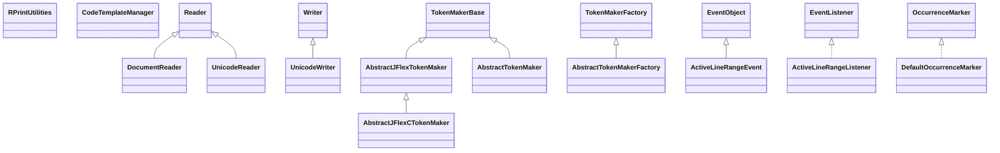

# rsyntaxtextarea-2.6.0.jar

[Group index](README.md) | [All archives](../README.md)

## Scope and provenance

- **Donor:** `SQX_145_REFERENCE_ROOT/internal/libs/rsyntaxtextarea-2.6.0.jar`.
- **SHA-256:** `7f6ed5d5c81976840265337a0a8fca674af1135d72c70992b8e9e6c4dc301995`; accessed 2026-10-06; captured `2026-10-06T18:54:51.906614+00:00`.
- **Classes:** 341 raw entries; 341 unique entry names. Duplicate occurrence indices are zero-based.
- **Inspection:** read-only ZIP hashing and class-file structural parsing; signatures/descriptors, modifiers, hierarchy and references only. Bytecode bodies are hashed, not published.
- **Allocation:** proposed `FEAT-PRODUCT-RSYNTAXTEXTAREA`, P17; [roadmap](../../dev/sqx-full-application-roadmap.md). Domain README registration remains required.
- **Repository:** `01067f00031428613c6394064ca1bcadc1ba00ee`; review state unreviewed. Download label 145-dev1; installed build/activation and runtime equivalence unverified.
- **Limit:** every class/member is inventoried; declaration coverage does not establish consumed calls, defaults, formulas, failure semantics or algorithm parity.
- **Archive/resource index:** [105.json](../../dev/evidence/sqx145/archives/145/105.json).

## Complete member declarations

Member shards contain exact JVM names/descriptors, access flags, generic signatures, throws types, declared fields/methods, superclass/interfaces and referenced class names. All classes, nested/synthetic members and overloads are retained. Code length/hash is structural evidence, not a normalized algorithm comparison.

- [001.json](../../dev/evidence/sqx145/members/105/001.json) — SHA-256 `309f571e8c2f006c6abfbb8aa7284a6180c541d41303f080559d3a1942eb254f`.
- [002.json](../../dev/evidence/sqx145/members/105/002.json) — SHA-256 `254431c3ffeaef3913cb51caf0fc4a2598597656a9d49ce974cfb455ef072941`.
- [003.json](../../dev/evidence/sqx145/members/105/003.json) — SHA-256 `fc4e9e07f833d25ccd9a48a77900402254dc214a1b56f4e9feab926d532f9f53`.
- [004.json](../../dev/evidence/sqx145/members/105/004.json) — SHA-256 `c7f7e20a662d85b81aad39fa22b91e5925b9940b0d888570e88f973173c81aaf`.
- [005.json](../../dev/evidence/sqx145/members/105/005.json) — SHA-256 `fd1ff6fb771b3204a44c38f6fcfb0e7edffe644cfc2a8fcf842a6443de7713db`.

## Focused structural diagram

Up to twelve non-nested classes; arrows show declared inheritance/interfaces only. External type names are not evidence of an available body or an executed dependency.

## Class inventory

| Archive entry | Occurrence | Class SHA-256 | Fields | Methods |
| --- | ---: | --- | ---: | ---: |
| `org/fife/io/DocumentReader.class` | 0 | `8139550cc2eae81c6333bb6637e6838f5e2ca12c3e805e6093c4e037e78a7098` | 4 | 11 |
| `org/fife/io/UnicodeReader.class` | 0 | `0b7efe061f343ea28412642f3f5e2b00663e6b1a992ffbebfd5d36d5e49e08a4` | 3 | 9 |
| `org/fife/io/UnicodeWriter.class` | 0 | `5751f976b8e60bd492bdc228cf16678796a44e9e6f4eedcbb63eac6aec04d776` | 7 | 13 |
| `org/fife/print/RPrintUtilities$RPrintTabExpander.class` | 0 | `ff29b6ed698e0a515e23ffc5f719f0c82f4093ef2b596b8ba7cc9cebd1f60fbf` | 0 | 2 |
| `org/fife/print/RPrintUtilities.class` | 0 | `422101a78a873f065ff314dabbfc62dbbc656211a9414d8ebd49e6bf155b464e` | 7 | 10 |
| `org/fife/ui/rsyntaxtextarea/AbstractJFlexCTokenMaker$CStyleInsertBreakAction.class` | 0 | `273eefab02b7777b1643356756226f7ddfd100c7fb13df4d04262eb08aeb2f37` | 1 | 4 |
| `org/fife/ui/rsyntaxtextarea/AbstractJFlexCTokenMaker.class` | 0 | `9eda6a7e3439dec03259bb5c21df8fc3a15a478c115902331215437d442b6e53` | 2 | 10 |
| `org/fife/ui/rsyntaxtextarea/AbstractJFlexTokenMaker.class` | 0 | `a59a12a9effbf32e54105f773e59cee3234b6ac5777d18faa5c012f0b3267207` | 3 | 3 |
| `org/fife/ui/rsyntaxtextarea/AbstractTokenMaker.class` | 0 | `d4e5760f888eb4d320dff2848c4524097ca0593806d8a0c0d53fc12df278c5f5` | 1 | 3 |
| `org/fife/ui/rsyntaxtextarea/AbstractTokenMakerFactory$TokenMakerCreator.class` | 0 | `3f301af115c02b22da0dc207a3057a6b1ec44f2fd7dd86fcadf1b902c8cd445f` | 2 | 2 |
| `org/fife/ui/rsyntaxtextarea/AbstractTokenMakerFactory.class` | 0 | `7d67998290215f7c92957aa2f6499dcab2ddbae2ea88cbb0b163dc2c07b36ad2` | 1 | 6 |
| `org/fife/ui/rsyntaxtextarea/ActiveLineRangeEvent.class` | 0 | `62ee04accf427c113744e5fddc192d8570cce89e7fa8852b7498a7a44d943559` | 2 | 3 |
| `org/fife/ui/rsyntaxtextarea/ActiveLineRangeListener.class` | 0 | `432dd714954d6eeb878d55e2a283ed047aa376ef7dbdd4dd84b10b821e4c10a7` | 0 | 1 |
| `org/fife/ui/rsyntaxtextarea/CodeTemplateManager$1.class` | 0 | `80047ce6a439346a7ce0c44f25e3cb4dc666addf8a0b03881325dfc1faced07f` | 0 | 0 |
| `org/fife/ui/rsyntaxtextarea/CodeTemplateManager$TemplateComparator.class` | 0 | `34bbc0602a3e2b5bf6a332eb5776c6e99486ab584397b0e7a513961e30dd9741` | 0 | 3 |
| `org/fife/ui/rsyntaxtextarea/CodeTemplateManager$XMLFileFilter.class` | 0 | `d59de8c3278af743501f91d8f09e100809da9ecdc18f1b1c8924af4a4279878c` | 0 | 3 |
| `org/fife/ui/rsyntaxtextarea/CodeTemplateManager.class` | 0 | `2715ee44474060311842def584ce9d4ccbfa31568782f27402ecb25ba01f2ff4` | 5 | 12 |
| `org/fife/ui/rsyntaxtextarea/DefaultOccurrenceMarker.class` | 0 | `d58e8f28ea462cefa27525bdc3dd72a82ff39fbeda87ee2db2c9981cd3ce663e` | 0 | 5 |
| `org/fife/ui/rsyntaxtextarea/DefaultTokenFactory.class` | 0 | `e6e1cea1deaf4c4c00edac8d8cefd1a2cc43e02cc34b8c503d96bd6c4a57513f` | 6 | 7 |
| `org/fife/ui/rsyntaxtextarea/DefaultTokenMakerFactory.class` | 0 | `7de86acbb5fcc8ab8cd7f78476fb5be350d0a0eb5ea2346a8adf88fb47d50e97` | 0 | 2 |
| `org/fife/ui/rsyntaxtextarea/DefaultTokenPainter.class` | 0 | `aeaf0eea0c4ca533aaa71e8d61bddd707e274a9a803c0adfd78c4fe04898214e` | 2 | 9 |
| `org/fife/ui/rsyntaxtextarea/DocumentRange.class` | 0 | `d854e7372f042452231111b2d7312137df4b359415e3485c63f0f7c3c5b87f77` | 2 | 11 |
| `org/fife/ui/rsyntaxtextarea/ErrorStrip$1.class` | 0 | `4959b3d6a08b28f8f7a15aa825bf8200170abcbc85e7f85a1fd3e27c3509c91d` | 0 | 0 |
| `org/fife/ui/rsyntaxtextarea/ErrorStrip$DefaultErrorStripMarkerToolTipProvider.class` | 0 | `6fbd78a4d7a38406948eb4e9a8eaf6c8845aadecf335baec1f337399f0c0729d` | 0 | 3 |
| `org/fife/ui/rsyntaxtextarea/ErrorStrip$ErrorStripMarkerToolTipProvider.class` | 0 | `1a24412391239483957c74ad4ab59909e84c146dc979313ec189de68e909e656` | 0 | 1 |
| `org/fife/ui/rsyntaxtextarea/ErrorStrip$Listener.class` | 0 | `e3509f4fbc71f662631c76813ae189bb0fdba3aab966b377dc6b5bb0a0bf7918` | 2 | 5 |
| `org/fife/ui/rsyntaxtextarea/ErrorStrip$MarkedOccurrenceNotice.class` | 0 | `b800511073473691205f267162a5e5f4977eb03c1307eedba5b193c889c07c22` | 3 | 16 |
| `org/fife/ui/rsyntaxtextarea/ErrorStrip$Marker.class` | 0 | `2939a2417c78808b2af3d555d51c271dfecb81969d6918a96945efb7f57a89bd` | 2 | 10 |
| `org/fife/ui/rsyntaxtextarea/ErrorStrip.class` | 0 | `002603267c9ea900aba868badf5315fb8d336c9a8b3125e808f441369b996ae1` | 13 | 37 |
| `org/fife/ui/rsyntaxtextarea/FileFileLocation.class` | 0 | `06e6e5165a0e83b69666a00a6082da835736a437a5565029d9f1b08d0b5b8046` | 1 | 8 |
| `org/fife/ui/rsyntaxtextarea/FileLocation.class` | 0 | `7b44c23e8a55df321cd299ea6edc292a0e11cb3f42cec7509e454e82b9de941b` | 0 | 12 |
| `org/fife/ui/rsyntaxtextarea/focusabletip/FocusableTip$1.class` | 0 | `433f8c3ed6eff35d0de557fce4532255dbc6d220a6c3c6e0be0d1ae8aa832276` | 3 | 2 |
| `org/fife/ui/rsyntaxtextarea/focusabletip/FocusableTip$TextAreaListener.class` | 0 | `67f6405dbad692a0329d91f83b142c0f0aa883769c9218464187bdd8ec34c60f` | 1 | 17 |
| `org/fife/ui/rsyntaxtextarea/focusabletip/FocusableTip.class` | 0 | `358ab4f3df5f864db408503759340a6d42e1fac61c664d866085f493dc3ebf40` | 11 | 19 |
| `org/fife/ui/rsyntaxtextarea/focusabletip/SizeGrip$1.class` | 0 | `aa50cf40e2481d9ebeb53994328d38bd50d2339c1fe14132d47c64e1ef2c000a` | 0 | 0 |
| `org/fife/ui/rsyntaxtextarea/focusabletip/SizeGrip$MouseHandler.class` | 0 | `93afa1126ec08ee55f13887c21462975a00056ded9f1da2d35b2d24e62fa878d` | 2 | 5 |
| `org/fife/ui/rsyntaxtextarea/focusabletip/SizeGrip.class` | 0 | `fcd6dc17873f2f0c59d3a5e597c3a1c43e4703b67ee485ba545589511fefd2eb` | 1 | 6 |
| `org/fife/ui/rsyntaxtextarea/focusabletip/TipUtil.class` | 0 | `2a0d97d724a30e91f48eecb2f07e7725595752633aebacab8d62ce3e16556b95` | 0 | 9 |
| `org/fife/ui/rsyntaxtextarea/focusabletip/TipWindow$1.class` | 0 | `84b309a4759b339113455b9d3039d56de452cca0a7a0c753cc7291e77f71ef05` | 1 | 2 |
| `org/fife/ui/rsyntaxtextarea/focusabletip/TipWindow$2.class` | 0 | `ecaf85dc1359d8e448aa28f77d71e177b56a46446a25888a5f52f75396863477` | 1 | 2 |
| `org/fife/ui/rsyntaxtextarea/focusabletip/TipWindow$3.class` | 0 | `2a4ca2f9c0c0af3ebf16f94daccfd33f66202dc13444214b182979d6819783c8` | 1 | 2 |
| `org/fife/ui/rsyntaxtextarea/focusabletip/TipWindow$4.class` | 0 | `ec64f8cd528726e31149e689287137740c1547ae4a49a44282aaf63fbb172e8e` | 3 | 3 |
| `org/fife/ui/rsyntaxtextarea/focusabletip/TipWindow$TipListener.class` | 0 | `afa0e5ba3114695147a2e71e93d38ccef7ed2fa43586c93066ce9becf6f8ff2d` | 1 | 4 |
| `org/fife/ui/rsyntaxtextarea/focusabletip/TipWindow.class` | 0 | `147d2471c7b21468bcbd14a99d25d53f14d3245a45e7b39acdfc8b65254d8882` | 6 | 8 |
| `org/fife/ui/rsyntaxtextarea/folding/CurlyFoldParser.class` | 0 | `a07089d87770e8d1a74d06d078c711acf8331854c4615820d60038fe150c897a` | 4 | 8 |
| `org/fife/ui/rsyntaxtextarea/folding/DefaultFoldManager$1.class` | 0 | `490ae071cab13156032c079215e1d8b557978b09d7ef35730f1c7a12964b9e65` | 1 | 2 |
| `org/fife/ui/rsyntaxtextarea/folding/DefaultFoldManager$Listener.class` | 0 | `67d73e70fd092bd092c6ee9607e2f7dfd132d115ed8d0523c976635f95390f11` | 1 | 6 |
| `org/fife/ui/rsyntaxtextarea/folding/DefaultFoldManager.class` | 0 | `5dff79fa311dbdad8e1a875d4b688d956940f1160672d3b2dd78ab7561e7c0c7` | 7 | 31 |
| `org/fife/ui/rsyntaxtextarea/folding/Fold.class` | 0 | `c5022767228a72678f1971a293f9a7c3fcb079104bc0ea6a0ca8e2601713be14` | 12 | 33 |
| `org/fife/ui/rsyntaxtextarea/folding/FoldCollapser.class` | 0 | `7532ab5ad8ed20031162bf4ccb1eeea67d32aad257f126256d6bc903a5e6b1ab` | 1 | 6 |
| `org/fife/ui/rsyntaxtextarea/folding/FoldManager.class` | 0 | `4c93c6fbad40f298c0f63ba8665a916956c361c9da532961658a691fd5a817f2` | 1 | 22 |
| `org/fife/ui/rsyntaxtextarea/folding/FoldParser.class` | 0 | `e79017a50ef98837ab399c0d926f7d8658faad1fc00ba912f0fc4dd9ea0a9434` | 0 | 1 |
| `org/fife/ui/rsyntaxtextarea/folding/FoldParserManager.class` | 0 | `90b4e2ea08e79b4082d39a8d48f7e90171fc6173cc2b8c880f5f68b534a9fe9c` | 2 | 6 |
| `org/fife/ui/rsyntaxtextarea/folding/FoldType.class` | 0 | `e9bc7d545481ca3e3cf552b217f93477b177b5b851c463583c1a435e83c2d56f` | 4 | 0 |
| `org/fife/ui/rsyntaxtextarea/folding/HtmlFoldParser$1.class` | 0 | `6e295f04a1928214bf1ca5aefc526edb4c391b30672181444a79ea8923c0f99f` | 0 | 0 |
| `org/fife/ui/rsyntaxtextarea/folding/HtmlFoldParser$TagCloseInfo.class` | 0 | `fbe20223aaa6476898342404c67ace3d6f1ce1ec27d334d0391b85151e0880db` | 2 | 8 |
| `org/fife/ui/rsyntaxtextarea/folding/HtmlFoldParser.class` | 0 | `6104b14e0644e3857acdb448bcb22a101aeabc2ed1b08c806822f7ac3ad1881a` | 16 | 7 |
| `org/fife/ui/rsyntaxtextarea/folding/JsonFoldParser.class` | 0 | `0ef46af38845f5446cce142809dfbe06c1aed4898d096d32df4031c0eddb757b` | 2 | 6 |
| `org/fife/ui/rsyntaxtextarea/folding/LatexFoldParser.class` | 0 | `0620d7a0f50f122838ea7599c3734a087a9ad58ce9d1bd2a6601c8550bd1684a` | 2 | 3 |
| `org/fife/ui/rsyntaxtextarea/folding/LispFoldParser.class` | 0 | `c32a13b6966a96b3c633d6189a5330a841c4bed4468501a5fc3ebcf5e7beaa95` | 0 | 3 |
| `org/fife/ui/rsyntaxtextarea/folding/NsisFoldParser.class` | 0 | `30b27f70244b59b99458a33f78de61ecb881354871357bbde699390de6d5ee8d` | 5 | 4 |
| `org/fife/ui/rsyntaxtextarea/folding/XmlFoldParser.class` | 0 | `7448a406b9afb17875e08a8d8bfbb9a38698ccf7c7eaf9bfd4f5280dc6c0a58a` | 3 | 4 |
| `org/fife/ui/rsyntaxtextarea/FoldingAwareIconRowHeader.class` | 0 | `d99dad35d40fa3db641fd52e43c61b6b959f8ffa41b56c94892e96152aed7c74` | 0 | 3 |
| `org/fife/ui/rsyntaxtextarea/HtmlOccurrenceMarker$Entry.class` | 0 | `34806bdf02c35bc8c76605a7a39322fff9b953042ea72c47142544ef659023ad` | 2 | 3 |
| `org/fife/ui/rsyntaxtextarea/HtmlOccurrenceMarker.class` | 0 | `8c418bd8a4c7bb2bd204ed9e116c981839655741924978bd35d4b878ebf5fc50` | 3 | 7 |
| `org/fife/ui/rsyntaxtextarea/LinkGenerator.class` | 0 | `f656873e48d18805a522ea44c55c142c38d2f5ddad6843015b83953f97824e49` | 0 | 1 |
| `org/fife/ui/rsyntaxtextarea/LinkGeneratorResult.class` | 0 | `6589a3c5e8a51f4e97c451ed602641038fab1269ca9c60ae11ed2c7a65742ade` | 0 | 2 |
| `org/fife/ui/rsyntaxtextarea/MarkOccurrencesSupport.class` | 0 | `2161c477007bdb56a0ff485d2fb5dbb31eca3540b4247b533151c23ca6043b56` | 5 | 16 |
| `org/fife/ui/rsyntaxtextarea/MatchedBracketPopup$1.class` | 0 | `8b1e08d465f9b55521d452e149389053177a4880d7809aeccb84c383e8bdaac5` | 0 | 0 |
| `org/fife/ui/rsyntaxtextarea/MatchedBracketPopup$EscapeAction.class` | 0 | `09b2158d3fe349ad025a99bf2d13beef152b33ab7d227f8fc5f23a49c170b5ad` | 1 | 3 |
| `org/fife/ui/rsyntaxtextarea/MatchedBracketPopup$Listener.class` | 0 | `d5a6444f3cebaf6235db7eb5b44ab6eac4a1f78be255f150743b8d8a65721a22` | 1 | 11 |
| `org/fife/ui/rsyntaxtextarea/MatchedBracketPopup.class` | 0 | `7b4fa7d8f460835be55326dddb6584502c2a914aeb00574921a055c298516b9e` | 3 | 6 |
| `org/fife/ui/rsyntaxtextarea/modes/AbstractMarkupTokenMaker.class` | 0 | `e2bfd242ada2de258cc23500399192ea2cd72e4751a3dfda29a9c23224f903c6` | 0 | 4 |
| `org/fife/ui/rsyntaxtextarea/modes/ActionScriptTokenMaker.class` | 0 | `968ed49aff7353b4c9df4556efa05e1975d2b48ef2660f70cd28bec71979ace9` | 27 | 30 |
| `org/fife/ui/rsyntaxtextarea/modes/AssemblerX86TokenMaker.class` | 0 | `19945ccf99f7d5d9ff4cb5df7f8794a904630af02246e2a569efd693aa2c9194` | 27 | 29 |
| `org/fife/ui/rsyntaxtextarea/modes/BBCodeTokenMaker.class` | 0 | `378ab5bd988b4658f29bd37d9161fcab1d3bfb0e5eac924fc8d1da7178b8dc9f` | 28 | 31 |
| `org/fife/ui/rsyntaxtextarea/modes/ClojureTokenMaker.class` | 0 | `dbf0526eb42633c8c69049a9e1573ae8010e197e54a5689b7c80f92fce825fa5` | 27 | 30 |
| `org/fife/ui/rsyntaxtextarea/modes/CPlusPlusTokenMaker.class` | 0 | `911d0eef60a34b4efae5c57eafa5823fe3328b48447dbf98f92ddcef22b6bf65` | 27 | 30 |
| `org/fife/ui/rsyntaxtextarea/modes/CSharpTokenMaker.class` | 0 | `3ef110cd3fd9068709dfade150a6901983003c1a65c5b6d8e06a3e636e455b0b` | 28 | 30 |
| `org/fife/ui/rsyntaxtextarea/modes/CSSTokenMaker.class` | 0 | `68175cb100c6a9b1e78c917fb7efb63c619f3071e5e6f7c3641deecaeb1c8a19` | 38 | 36 |
| `org/fife/ui/rsyntaxtextarea/modes/CTokenMaker.class` | 0 | `dddac0708845495a6b748c2c37589a2d2d5e357488907583d08459e353b151e9` | 27 | 30 |
| `org/fife/ui/rsyntaxtextarea/modes/DartTokenMaker.class` | 0 | `48eddbf556b12ddca02a08e8db6f03a5d5ad5217bea59c25cdf2889ff9130e4a` | 39 | 35 |
| `org/fife/ui/rsyntaxtextarea/modes/DelphiTokenMaker.class` | 0 | `612b4dd9f09df5b108713e4d2fa35a64f946cbc0b99bb61886bb2dc9a6e78de5` | 33 | 31 |
| `org/fife/ui/rsyntaxtextarea/modes/DockerTokenMaker.class` | 0 | `d8f3490b7c9e93e7871132d59a7d126b37ad8eccf4f408d2af8781956673dea0` | 27 | 30 |
| `org/fife/ui/rsyntaxtextarea/modes/DtdTokenMaker.class` | 0 | `a33abb2cdc901c407d06a9906f43faf127526359b2814b5565f93869c611022c` | 34 | 31 |
| `org/fife/ui/rsyntaxtextarea/modes/DTokenMaker.class` | 0 | `960a8d3c7ee6e486659317e3f210679ca82a50d60b5af71c9c260c062d290fba` | 34 | 33 |
| `org/fife/ui/rsyntaxtextarea/modes/FortranTokenMaker.class` | 0 | `f8dd624791aaf6c05027c7a4990be13cdd6d2c57cb9681f90063168d6a2a3c3a` | 27 | 29 |
| `org/fife/ui/rsyntaxtextarea/modes/GroovyTokenMaker.class` | 0 | `843c5a7975f61d09680a9438d3b37e1dfebb196d9d0ba3360ac1ff01b35cc821` | 32 | 31 |
| `org/fife/ui/rsyntaxtextarea/modes/HostsTokenMaker.class` | 0 | `31b1757e1dc88423145f30661ef41db999d3164f3ce8f2b22ab255c083d0e9c9` | 27 | 31 |
| `org/fife/ui/rsyntaxtextarea/modes/HtaccessTokenMaker.class` | 0 | `8f76fcefbd1fe5074ed33e54d337e636cb7e9b1ff28fbb6bb5d2236d8bf4df56` | 32 | 31 |
| `org/fife/ui/rsyntaxtextarea/modes/HTMLTokenMaker.class` | 0 | `147825b103525390c78150f09cb28e23e6aff48c43ee7a4997a7ef109f10b29b` | 76 | 37 |
| `org/fife/ui/rsyntaxtextarea/modes/JavaScriptTokenMaker.class` | 0 | `a66553c36548e1ad5e65cea443800e5a52831b0929d9534c18aa677bc5fd2c66` | 60 | 37 |
| `org/fife/ui/rsyntaxtextarea/modes/JavaTokenMaker.class` | 0 | `dc4d560a21fef4542f4a3b6650a8b2f9cd97466ed960050d807c015f104ca144` | 29 | 30 |
| `org/fife/ui/rsyntaxtextarea/modes/JshintrcTokenMaker.class` | 0 | `d4c9625c0d31bb3ea9eb746610498f867b6b7d2219bdc82afb97517e927db9dd` | 0 | 1 |
| `org/fife/ui/rsyntaxtextarea/modes/JsonTokenMaker.class` | 0 | `b268719226e33a0ea46ce212b81e7659d1fd8cca0a0c60f9b4baf09d520fbb2a` | 28 | 33 |
| `org/fife/ui/rsyntaxtextarea/modes/JSPTokenMaker.class` | 0 | `ce07e013ddf0d0d76c959a5f8901de1795cc930cf31953f96df215af7e5202e0` | 88 | 37 |
| `org/fife/ui/rsyntaxtextarea/modes/LatexTokenMaker.class` | 0 | `5344a29375aeee2270ff43f41399976d55ed7645b8a6a030b22da9a598d00fa7` | 26 | 30 |
| `org/fife/ui/rsyntaxtextarea/modes/LessTokenMaker.class` | 0 | `b7701b617b26c11a93b58179ae57fd0808497c1ea3f3ebb62a9e37a44f23d404` | 0 | 3 |
| `org/fife/ui/rsyntaxtextarea/modes/LispTokenMaker.class` | 0 | `bc1ac64748c9b4e08dd9b9ba7b187d696e8a70764ac1bf95868f9ddf985268f8` | 29 | 30 |
| `org/fife/ui/rsyntaxtextarea/modes/LuaTokenMaker.class` | 0 | `9cb30fab4d0a8c473124b850e4678f84b9703068a03dcd9cfea650068c0097a1` | 28 | 29 |
| `org/fife/ui/rsyntaxtextarea/modes/MakefileTokenMaker.class` | 0 | `9386837ebdd03fee9109d3f7d6b0df9ceae55542cdb8a20bab869d63459b15b3` | 27 | 30 |
| `org/fife/ui/rsyntaxtextarea/modes/MxmlTokenMaker.class` | 0 | `e545ac69f36cc7f8b012d2d14a4d75c9d07fa22d7bd606e536e860e57e46f687` | 47 | 34 |
| `org/fife/ui/rsyntaxtextarea/modes/NSISTokenMaker.class` | 0 | `3c9c9022626a2dc8c681a5736a736afeedff171d818d6166e5cd98eb0ed8cbbb` | 30 | 30 |
| `org/fife/ui/rsyntaxtextarea/modes/PerlTokenMaker.class` | 0 | `1986514065902788aa736fce978efd0b891450d7af35285285e7f8c99f74ae8e` | 38 | 32 |
| `org/fife/ui/rsyntaxtextarea/modes/PHPTokenMaker.class` | 0 | `e2a2fa169c7aaace977482162a7a47afeb31668d50f0eb3f7b514904250835b2` | 93 | 39 |
| `org/fife/ui/rsyntaxtextarea/modes/PlainTextTokenMaker.class` | 0 | `5c981800e5382cde7fa0323cda418a803d03e437e1d2055c4d6d14e81cea580c` | 25 | 29 |
| `org/fife/ui/rsyntaxtextarea/modes/PropertiesFileTokenMaker.class` | 0 | `c12f231533d1ae6d7ef520704ac3b8908ffb662c9793188766feaabbec5b2a24` | 27 | 29 |
| `org/fife/ui/rsyntaxtextarea/modes/PythonTokenMaker.class` | 0 | `5c56d6c6e71e7fb5918b5e6bf6772eddc76ddba2b35823d04b7183cea3450a1e` | 27 | 29 |
| `org/fife/ui/rsyntaxtextarea/modes/RubyTokenMaker.class` | 0 | `8375832b72cb7d9a2f55688d58392713fe7971c65079edb03aaffb3f4c4c12e6` | 53 | 31 |
| `org/fife/ui/rsyntaxtextarea/modes/SASTokenMaker.class` | 0 | `0c5d84e49813141818035b47f4752373cf40c8f69ffc4596bbcc321ef030f123` | 30 | 30 |
| `org/fife/ui/rsyntaxtextarea/modes/ScalaTokenMaker.class` | 0 | `55c59bf6f06ae14114557c5afede678943fe2d5acae587a4ccf43da65b53cde1` | 28 | 30 |
| `org/fife/ui/rsyntaxtextarea/modes/SQLTokenMaker.class` | 0 | `d27ef34f7aa7ea22f3d30af9db4ee9f8f6b7cea4246f2bbb243681b385ded416` | 28 | 30 |
| `org/fife/ui/rsyntaxtextarea/modes/TclTokenMaker.class` | 0 | `cc92fc058dafa65f258b3b67a798b1ac669e4bedce8e4ea14eb6511fac4d8cb2` | 25 | 29 |
| `org/fife/ui/rsyntaxtextarea/modes/TypeScriptTokenMaker.class` | 0 | `8b3f5ace4188780de49a1ac1e11c986f2368dbd182329321895361cc6647b0a6` | 59 | 34 |
| `org/fife/ui/rsyntaxtextarea/modes/UnixShellTokenMaker.class` | 0 | `57d03a06b138d552b779210968edf0e412ba7a2d51751e1df94a1f478b0485a7` | 6 | 6 |
| `org/fife/ui/rsyntaxtextarea/modes/VisualBasicTokenMaker.class` | 0 | `404d71355f21bbf877ab9dd6a4413af63503c19316fb37907b456067221177cb` | 26 | 30 |
| `org/fife/ui/rsyntaxtextarea/modes/WindowsBatchTokenMaker$1.class` | 0 | `04a821effd6486a545758eb1e96f2c60fe718d2bd4a303e9d7d836bcb5dfdeaa` | 1 | 1 |
| `org/fife/ui/rsyntaxtextarea/modes/WindowsBatchTokenMaker$VariableType.class` | 0 | `316d7850d955cc68e31f39641e63d603aab8281ec04390b0fc4b1c20b60394fd` | 5 | 4 |
| `org/fife/ui/rsyntaxtextarea/modes/WindowsBatchTokenMaker.class` | 0 | `1f1485a08bf66d23c6eb818a2ffd48c4f14739abadcf8529022383e9aab6aeed` | 4 | 6 |
| `org/fife/ui/rsyntaxtextarea/modes/XMLTokenMaker.class` | 0 | `efef6a71080e6780c0768139c61d960a142bc7d11674f9f0ca416b4e51f50b01` | 41 | 35 |
| `org/fife/ui/rsyntaxtextarea/OccurrenceMarker.class` | 0 | `105eb18860d0e6c06a0b963c3f9c394d89c6d415ddc29f5249b7e57213cd81a7` | 0 | 3 |
| `org/fife/ui/rsyntaxtextarea/parser/AbstractParser.class` | 0 | `cdd3b22435dfde7e302329d0291eba116163b5a471a236d8730d987036fd496a` | 2 | 6 |
| `org/fife/ui/rsyntaxtextarea/parser/DefaultParseResult.class` | 0 | `dfa59e54c0550de9f541fb7a17f07678b8a3eaeefa4bb9eceb585eae74c40007` | 6 | 12 |
| `org/fife/ui/rsyntaxtextarea/parser/DefaultParserNotice.class` | 0 | `ef49eae6a5a235fa8dac6a4e2ad59515862d0a11a495d44d30bd22e7e18d0ead` | 10 | 23 |
| `org/fife/ui/rsyntaxtextarea/parser/ExtendedHyperlinkListener.class` | 0 | `7549190f440e930e75485a319260460d54ae83d1add51a8fb70e13ff8c3d3422` | 0 | 1 |
| `org/fife/ui/rsyntaxtextarea/parser/Parser.class` | 0 | `3dcfc776f4b9b002354aaeed10476d93905e44b3686c65cdeb8fe253be6b5c3d` | 0 | 4 |
| `org/fife/ui/rsyntaxtextarea/parser/ParseResult.class` | 0 | `cdd8ae41b269becf6edcdf78c3548030c50501bfda03594df97f20ea29833669` | 0 | 6 |
| `org/fife/ui/rsyntaxtextarea/parser/ParserNotice$Level.class` | 0 | `536245eb99f5977a99d669adaefab831dc859800fea5e285ef22e3140abf7c55` | 5 | 6 |
| `org/fife/ui/rsyntaxtextarea/parser/ParserNotice.class` | 0 | `f6ee1ab07cee42767141907a89ba5e23162c99306dbd530c89b87e09409f3f23` | 0 | 11 |
| `org/fife/ui/rsyntaxtextarea/parser/TaskTagParser$TaskNotice.class` | 0 | `a4dd617903e1c9e8877b588069d14604f0f996c4ec52a0053a6567016f1ba1e8` | 0 | 1 |
| `org/fife/ui/rsyntaxtextarea/parser/TaskTagParser.class` | 0 | `d60081a6f8b3b27803b322c2c21c0bf6033e19734b354ffef3110032f86294b3` | 4 | 5 |
| `org/fife/ui/rsyntaxtextarea/parser/ToolTipInfo.class` | 0 | `5f3fe87b80fad80c175409a9ba48d78a6ff3ce8046375e3cdab43eda52d4525f` | 3 | 5 |
| `org/fife/ui/rsyntaxtextarea/parser/XmlParser$1.class` | 0 | `0c96782c4871f87f2b5563b0ba7b8181c663f9d3e8f12a06cfc676c3019bb26b` | 0 | 0 |
| `org/fife/ui/rsyntaxtextarea/parser/XmlParser$Handler.class` | 0 | `ab1eeb0af6546122300771a93d3e2519fe59ae8024090f048b14c6e0ad15470e` | 2 | 7 |
| `org/fife/ui/rsyntaxtextarea/parser/XmlParser.class` | 0 | `1d9ab2da4b0f553e7aa9bdffe79ceecad2eabf17780ecc0a34da0d2da17c0c68` | 3 | 7 |
| `org/fife/ui/rsyntaxtextarea/ParserManager$NoticeHighlightPair.class` | 0 | `af770842bb9dde669dd859aa526f9b12d542efafcf7b98e4c108ebcda2ef1dd9` | 2 | 3 |
| `org/fife/ui/rsyntaxtextarea/ParserManager.class` | 0 | `c925d5383c8fa2fc27fbf7df20f939dc65683f6a4205999d60a153553eef28ee` | 12 | 30 |
| `org/fife/ui/rsyntaxtextarea/PopupWindowDecorator.class` | 0 | `3ba7af835531d426899b3829af323be55b076548caf87b2c0cee4c2fd6a17f64` | 1 | 4 |
| `org/fife/ui/rsyntaxtextarea/RSTAView.class` | 0 | `4c7524575e5b5c200facc6dcfbb34ff59225327a50813af95a6d5517cbf2d2bb` | 0 | 2 |
| `org/fife/ui/rsyntaxtextarea/RSyntaxDocument.class` | 0 | `f01c55f1de2b8f7e090b0524e58c6a2eb289f2f3721c1f578c81bbfd88797480` | 10 | 25 |
| `org/fife/ui/rsyntaxtextarea/RSyntaxTextArea$1.class` | 0 | `da3105f1f51ba399593c10f755657611d11c2922d4f32c5f94f74813ec137226` | 1 | 2 |
| `org/fife/ui/rsyntaxtextarea/RSyntaxTextArea$BracketMatchingTimer.class` | 0 | `0ffc9c695e60e311df8027b5463f0ad3c30610142ccee3ecbff7d984aa9e288a` | 2 | 5 |
| `org/fife/ui/rsyntaxtextarea/RSyntaxTextArea$MatchedBracketPopupTimer.class` | 0 | `af3b8bb0c9beda7a30bd27a28fed99d382ac9e78eba4f31c287772aee5a92507` | 4 | 6 |
| `org/fife/ui/rsyntaxtextarea/RSyntaxTextArea$RSyntaxTextAreaMutableCaretEvent.class` | 0 | `a02c8ea1dd6b6efb38eea27c7be159e087a5e1d0f5c358cbd4ac65d4c8cf5719` | 2 | 5 |
| `org/fife/ui/rsyntaxtextarea/RSyntaxTextArea.class` | 0 | `c7ac25cc94af98f2a0e1a78482be84bd3f7cf993333e882042bca2112b305a43` | 84 | 164 |
| `org/fife/ui/rsyntaxtextarea/RSyntaxTextAreaDefaultInputMap.class` | 0 | `9a64a85cfa91feaa477ae96f368c6ac468903d428684366f2d4356670520f1fe` | 0 | 1 |
| `org/fife/ui/rsyntaxtextarea/RSyntaxTextAreaEditorKit$BeginWordAction.class` | 0 | `e076918199bbbae05bb7d8507ed21d102b904cd28efc74a5c9cd6695f44ce684` | 1 | 2 |
| `org/fife/ui/rsyntaxtextarea/RSyntaxTextAreaEditorKit$ChangeFoldStateAction.class` | 0 | `ced55e4d480a9c569b16bd97769d5a8d45c09e45ff866e11eda88b17698f13a7` | 1 | 4 |
| `org/fife/ui/rsyntaxtextarea/RSyntaxTextAreaEditorKit$CloseCurlyBraceAction.class` | 0 | `21b977520c82f495b8d508b2f9298e75811c07846470045b3f8396ec5a35c6ad` | 3 | 3 |
| `org/fife/ui/rsyntaxtextarea/RSyntaxTextAreaEditorKit$CloseMarkupTagAction.class` | 0 | `1902fa2107bdc6e8320ea4ed749e36c6ed6668d9ea3dcb1df5606a0da8305897` | 1 | 4 |
| `org/fife/ui/rsyntaxtextarea/RSyntaxTextAreaEditorKit$CollapseAllCommentFoldsAction.class` | 0 | `c30ddc9ea1feb408635ba941fde23f70f66d70f86b476bae78278869eb405c5c` | 1 | 4 |
| `org/fife/ui/rsyntaxtextarea/RSyntaxTextAreaEditorKit$CollapseAllFoldsAction$1.class` | 0 | `17bc71720485f74f2deee1fc9e874e5bccfa2b93ef57d99a03527a71d5c9c9d9` | 1 | 2 |
| `org/fife/ui/rsyntaxtextarea/RSyntaxTextAreaEditorKit$CollapseAllFoldsAction.class` | 0 | `15aad2ef5de04ce0b96f4cd790ffb1fd5a35e3b1145da477aeebe02433fd2538` | 1 | 5 |
| `org/fife/ui/rsyntaxtextarea/RSyntaxTextAreaEditorKit$CopyAsRtfAction.class` | 0 | `e08bc4ed60631a6fef8db0fb3234e90f7644ddf665af1f899fe5c00b4f6cb3e2` | 1 | 4 |
| `org/fife/ui/rsyntaxtextarea/RSyntaxTextAreaEditorKit$DecreaseFontSizeAction.class` | 0 | `4c89cff15980879faefb8734279c295f8b8de3aa680e7e35de4a85fa4f0e0d94` | 1 | 3 |
| `org/fife/ui/rsyntaxtextarea/RSyntaxTextAreaEditorKit$DecreaseIndentAction.class` | 0 | `f459e165aeb5f1d3b542e6808acaeec24e0019b7eb0f1763a5e5037bd58cb70d` | 2 | 5 |
| `org/fife/ui/rsyntaxtextarea/RSyntaxTextAreaEditorKit$DeletePrevWordAction.class` | 0 | `ecc4aa9edb4d925dacede14af0de6d585698b8263134ca910acbb6df2c9ff687` | 1 | 2 |
| `org/fife/ui/rsyntaxtextarea/RSyntaxTextAreaEditorKit$DumbCompleteWordAction.class` | 0 | `5b84960accb54b0e303ff09f2ae89433236c233928b556d56f544a794ed41f49` | 0 | 8 |
| `org/fife/ui/rsyntaxtextarea/RSyntaxTextAreaEditorKit$EndWordAction.class` | 0 | `68b840cb61d7548ee370a7cc6f1d51797f5c4f4d8800d6deecf72d1aded8e2ee` | 1 | 2 |
| `org/fife/ui/rsyntaxtextarea/RSyntaxTextAreaEditorKit$ExpandAllFoldsAction.class` | 0 | `1713e38ac8ee6ecbb4564871f251fc5425c2f328d48ba8ad40b84584eca74fd4` | 1 | 6 |
| `org/fife/ui/rsyntaxtextarea/RSyntaxTextAreaEditorKit$FoldRelatedAction.class` | 0 | `a5cff5fa51271fa4f35dbb9e555d3201ba5312962c5e5f2848524cfa8b232c95` | 0 | 3 |
| `org/fife/ui/rsyntaxtextarea/RSyntaxTextAreaEditorKit$GoToMatchingBracketAction$EndAction.class` | 0 | `b39915cc5ff295d2c028f0249861ec2db67ecb83660b97a2378aba13daf5c172` | 0 | 2 |
| `org/fife/ui/rsyntaxtextarea/RSyntaxTextAreaEditorKit$GoToMatchingBracketAction.class` | 0 | `e83888e6b3566935dc4019b2bbbfc757b2e1a49269bd0a8968c708b9347f15a1` | 2 | 4 |
| `org/fife/ui/rsyntaxtextarea/RSyntaxTextAreaEditorKit$IncreaseFontSizeAction.class` | 0 | `47c0a4313318bbe53b2e6099c4aa43d142e8aeaa3654e9b2e142eba0276e1a0a` | 1 | 3 |
| `org/fife/ui/rsyntaxtextarea/RSyntaxTextAreaEditorKit$InsertBreakAction.class` | 0 | `ff7d654ba3ae8329a15baaf33208e0cbce9a2de75a69bc542d5233ec30ab14a9` | 1 | 7 |
| `org/fife/ui/rsyntaxtextarea/RSyntaxTextAreaEditorKit$InsertTabAction.class` | 0 | `f0f52c01ef5ce5832323b867a2951c6677c96db0d5e63de524ccb9fc3ac9f251` | 1 | 4 |
| `org/fife/ui/rsyntaxtextarea/RSyntaxTextAreaEditorKit$NextWordAction.class` | 0 | `2a586c6ee1727044ebad63d9f4480d618d07c2d8b34c5a0aa42bcaa6b12f3ce8` | 1 | 2 |
| `org/fife/ui/rsyntaxtextarea/RSyntaxTextAreaEditorKit$PossiblyInsertTemplateAction.class` | 0 | `1000840c0ebbba5196b1bfc707c5d4d88c40a79f8ad2f4aaf121a67de33d8c2d` | 1 | 4 |
| `org/fife/ui/rsyntaxtextarea/RSyntaxTextAreaEditorKit$PreviousWordAction.class` | 0 | `5490c9c0e3907bdba432928dbde09b7c95c7dbaf8d332e249e323d2d76f0395d` | 1 | 2 |
| `org/fife/ui/rsyntaxtextarea/RSyntaxTextAreaEditorKit$SelectWordAction.class` | 0 | `3d02bf3e113e649a4519dfecb6b0dfc587730b152abd18d40bde1c9060c4f443` | 0 | 2 |
| `org/fife/ui/rsyntaxtextarea/RSyntaxTextAreaEditorKit$ToggleCommentAction.class` | 0 | `1dae1aecd2640e5b43cbff5af371e3d72ef14ece23d408fe9141edf46761c8a3` | 0 | 5 |
| `org/fife/ui/rsyntaxtextarea/RSyntaxTextAreaEditorKit$ToggleCurrentFoldAction.class` | 0 | `0045c14e6a2bb94f4a7ee5ec91fd3996d93c125b8f7bd5b0a5154fd8c913ce75` | 1 | 4 |
| `org/fife/ui/rsyntaxtextarea/RSyntaxTextAreaEditorKit.class` | 0 | `7c35207327e197cec00d0f9b588db907b17f210766c16b335c8ce41906020c3d` | 17 | 7 |
| `org/fife/ui/rsyntaxtextarea/RSyntaxTextAreaHighlighter$1.class` | 0 | `c334d5050cfb5e1488be5ef5c78f87331524f52ec11b7ff96724312d998901e3` | 0 | 0 |
| `org/fife/ui/rsyntaxtextarea/RSyntaxTextAreaHighlighter$SyntaxLayeredHighlightInfoImpl.class` | 0 | `10eb338fa6b130190b67a1d7d0edc1496da1bf4d08dec08e95d8cdbf8a67d811` | 1 | 6 |
| `org/fife/ui/rsyntaxtextarea/RSyntaxTextAreaHighlighter.class` | 0 | `0a85034f122b976e2a26455f1aba5f83bf6953b3e956ebde560fef40fcc9d73d` | 3 | 12 |
| `org/fife/ui/rsyntaxtextarea/RSyntaxTextAreaUI.class` | 0 | `d43c4f77a46da7ebf67da477f7ed92fba714a4071ca0060c1ab9334013c5cede` | 3 | 15 |
| `org/fife/ui/rsyntaxtextarea/RSyntaxUtilities.class` | 0 | `7f3dbf71e1deca53f1d5f017129a6530f2037b3324cae73dab464ef86851ae7f` | 18 | 43 |
| `org/fife/ui/rsyntaxtextarea/RtfGenerator.class` | 0 | `ca2afd3664c2a0a0678e7fbb660ab575ff1d77181b9f5f44f073dfb720cd13e2` | 11 | 15 |
| `org/fife/ui/rsyntaxtextarea/RtfToText.class` | 0 | `69c91e4b46d355e0dad79bb53aee2f923302a36c02bf58bae5748e9420d8845e` | 5 | 8 |
| `org/fife/ui/rsyntaxtextarea/RtfTransferable.class` | 0 | `a526914a4a03a4316e1c1db4c74d859dc7ad375ab2ca5c6c58216b0cd9a21c7b` | 2 | 5 |
| `org/fife/ui/rsyntaxtextarea/SelectRegionLinkGeneratorResult.class` | 0 | `34c255e1c50aa2dc05f1d9f2d576e31e61d8039c5d8cd40a8357d5cb15b2f7e4` | 4 | 3 |
| `org/fife/ui/rsyntaxtextarea/SquiggleUnderlineHighlightPainter.class` | 0 | `a913e3c86875db1f675fa53c0e5604d36ed2aa1d744623d4d17912235a0e6f87` | 1 | 3 |
| `org/fife/ui/rsyntaxtextarea/Style.class` | 0 | `b93a487553de2ac2d2c9110af3887baa39f346a7969351db168764a708872295` | 8 | 11 |
| `org/fife/ui/rsyntaxtextarea/SyntaxConstants.class` | 0 | `1b739504cabfa4ef42be3ac9f07b64b657ed4b3117ca2780124344c0da4af08f` | 45 | 0 |
| `org/fife/ui/rsyntaxtextarea/SyntaxScheme$SyntaxSchemeLoader.class` | 0 | `3e84dda7ca50fe14520eb383c7adc42ee3e1825d1d40fbd6a56a9f7dc1eacb84` | 2 | 3 |
| `org/fife/ui/rsyntaxtextarea/SyntaxScheme.class` | 0 | `f2a9a8577e190c307b885411f3d465a7e91eeee71b9aaedf2fed94aa43a2ebfc` | 2 | 23 |
| `org/fife/ui/rsyntaxtextarea/SyntaxView.class` | 0 | `380c67563c80017664bb1f5d7d645336e172d0b1187e597eb10face760d0d3a9` | 12 | 27 |
| `org/fife/ui/rsyntaxtextarea/templates/AbstractCodeTemplate.class` | 0 | `2412cf8971765df067522f2c9b2eb384076cefd2658c14d485e84e662868e7b8` | 1 | 9 |
| `org/fife/ui/rsyntaxtextarea/templates/CodeTemplate.class` | 0 | `0e92feb3234d2db8bfc4f260442156862531105c5115183f6755b5bcc88f3de5` | 0 | 3 |
| `org/fife/ui/rsyntaxtextarea/templates/StaticCodeTemplate.class` | 0 | `aa4a2ec049b1c428fbee0d9cb55d76f93937ec71942c53134ee8e45122e781ae` | 6 | 12 |
| `org/fife/ui/rsyntaxtextarea/TextEditorPane.class` | 0 | `1586132d9e62365d407c837f06e4d700c28e78aee7d3c43ccc12ffb092f5e18e` | 11 | 32 |
| `org/fife/ui/rsyntaxtextarea/Theme$XmlHandler.class` | 0 | `52d053888370bef39920f5c2c67bdc18b0e74fcb503644595a20c77e306b2009` | 1 | 8 |
| `org/fife/ui/rsyntaxtextarea/Theme.class` | 0 | `7bece7504758a3023d6f56f12178087c226c1697d9de00fc78c05349c3fc89fc` | 28 | 19 |
| `org/fife/ui/rsyntaxtextarea/Token.class` | 0 | `7adc253264b25e9169406deec7dd8786e9290c933f9be34ad41f4e6282ac277c` | 0 | 41 |
| `org/fife/ui/rsyntaxtextarea/TokenFactory.class` | 0 | `12ca588c299aaa20fea82692fb3cc0a83280a6d546fde7d91696b69341b124a0` | 0 | 4 |
| `org/fife/ui/rsyntaxtextarea/TokenImpl.class` | 0 | `65a6093378fb3dd8073b9f29967d6a4a62f4cf4845946fa5c7500d56728d0419` | 8 | 56 |
| `org/fife/ui/rsyntaxtextarea/TokenIterator.class` | 0 | `2ae0e6e688144e25647e08c1df7eac8b9eb2a54db58eaf15e4b47a7c4293625a` | 3 | 7 |
| `org/fife/ui/rsyntaxtextarea/TokenMaker.class` | 0 | `06250518ee1e6fc67257e8919711dfd14d3c947eebaa90b4d4ca8bf6ebf0c9a0` | 0 | 13 |
| `org/fife/ui/rsyntaxtextarea/TokenMakerBase.class` | 0 | `2bb1c0184a68cc28041f0d45db005e4be38d9f168ce17366a8b425730f5e87f8` | 6 | 19 |
| `org/fife/ui/rsyntaxtextarea/TokenMakerFactory.class` | 0 | `0176ade59c31931f40f51f1539a65400fad8c892a8d269a688958c0a9bc2729e` | 2 | 6 |
| `org/fife/ui/rsyntaxtextarea/TokenMap$1.class` | 0 | `304f5bbdafc6e40d15ec7f1e11f5f6edd513477ae188e027af18e46b6b81078e` | 0 | 0 |
| `org/fife/ui/rsyntaxtextarea/TokenMap$TokenMapToken.class` | 0 | `27149fd80a28ad2f57043bbd87d274ed766527503f87fad4b5d8547ad06ffedb` | 5 | 9 |
| `org/fife/ui/rsyntaxtextarea/TokenMap.class` | 0 | `83a6ee327ba3c9ae5ed4187e9be69123e178bde020dec423ede9c3bbe7595f4f` | 4 | 11 |
| `org/fife/ui/rsyntaxtextarea/TokenOrientedView.class` | 0 | `409ac70f9151a6983578c80e22fbd68dc6ff814b5180b36def15326ba4468918` | 0 | 2 |
| `org/fife/ui/rsyntaxtextarea/TokenPainter.class` | 0 | `dff2ce5fa4692c0a3a66bd6dc762953f3f96535775fcc910b679791505507696` | 0 | 5 |
| `org/fife/ui/rsyntaxtextarea/TokenTypes.class` | 0 | `e768871d15af72389c33ca3c1ea7d0b8a03aa4c1bcebf96e4d2c32eff41497ab` | 40 | 0 |
| `org/fife/ui/rsyntaxtextarea/TokenUtils$TokenSubList.class` | 0 | `694d1805c62c85eb0d00eae09253586f977577e0d1b7af58192f69c364aebab4` | 2 | 1 |
| `org/fife/ui/rsyntaxtextarea/TokenUtils.class` | 0 | `3c679b1d6fc7447cc12c7d8e95e2c8a1530a302609718589d523ae21be27533e` | 0 | 3 |
| `org/fife/ui/rsyntaxtextarea/URLFileLocation.class` | 0 | `968bb3102ff242c24c97aaeb84d3c4a8c24e85a8fd78d07d46c157a2e991dce2` | 3 | 10 |
| `org/fife/ui/rsyntaxtextarea/VisibleWhitespaceTokenPainter.class` | 0 | `59e15f9833be12d9f5349d08081d4a1757193ddc6a6d3c15a23ca2eaf35778a8` | 0 | 2 |
| `org/fife/ui/rsyntaxtextarea/WrappedSyntaxView$WrappedLine.class` | 0 | `131de916c8be17c3b009ca552fbf1b2d0de14a2fc82d7f4c2f9d79f634d0edf7` | 2 | 9 |
| `org/fife/ui/rsyntaxtextarea/WrappedSyntaxView.class` | 0 | `7c564e2c929d7a7e097dda87fb18d1b7d277ccf68f28d6f3176fd416b50f44e0` | 11 | 30 |
| `org/fife/ui/rsyntaxtextarea/WrappedSyntaxView2.class` | 0 | `88b1ac463cf37163108ca4dd7c55e7e4df2b939f1b24ae9b363ff5ca62c4ed7d` | 0 | 1 |
| `org/fife/ui/rsyntaxtextarea/XmlOccurrenceMarker$Entry.class` | 0 | `1aeac346991b785676bf55aeea2c991b93c271968c78da42e403856f068a07ab` | 2 | 3 |
| `org/fife/ui/rsyntaxtextarea/XmlOccurrenceMarker.class` | 0 | `2c4f2da4fca975a9dd5d1311f1eacf7f22db0a29f6b3a0c316703eb602397d5d` | 2 | 5 |
| `org/fife/ui/rtextarea/AbstractGutterComponent.class` | 0 | `4b02575f1f0d527864a8c503b7ce3d8ef919a66ef44708a205e418d2b57e9ad2` | 2 | 7 |
| `org/fife/ui/rtextarea/BackgroundPainterStrategy.class` | 0 | `5e43f5b1b216b3d1b5908affbd4fa22f991f2bec229d3e3bcc0e24d56369d3f2` | 0 | 1 |
| `org/fife/ui/rtextarea/BufferedImageBackgroundPainterStrategy.class` | 0 | `68d26dcfabd7015b5ef32a82ed2927e947187ce2f7011e852c1c8cc9a8a8f029` | 1 | 4 |
| `org/fife/ui/rtextarea/CaretStyle.class` | 0 | `4ca11cf43554caf03462bf83946c37f058485009e7385ce0ae2df362498244ce` | 6 | 4 |
| `org/fife/ui/rtextarea/ChangeableHighlightPainter.class` | 0 | `de23da3a829d7c5ab481195b82db8c4b78ab2dda596409316425c9a3789d32e9` | 6 | 15 |
| `org/fife/ui/rtextarea/ClipboardHistory.class` | 0 | `397126223a0243121b5d71d829d5fd42fd833b36781853cf9f8b549360f680bd` | 4 | 7 |
| `org/fife/ui/rtextarea/ClipboardHistoryPopup$1.class` | 0 | `f437ccba11dd88dcc57ea65db7796c31c147c255008db901c637df3734f6a04b` | 1 | 2 |
| `org/fife/ui/rtextarea/ClipboardHistoryPopup$ChoiceList$1.class` | 0 | `6654c430ebbe0898cfd2975e11d3605e14c0ce3368f8fda48988b718a0c9f0f0` | 1 | 2 |
| `org/fife/ui/rtextarea/ClipboardHistoryPopup$ChoiceList$2.class` | 0 | `4d92c42f6327a280c52ed8d82585866db9b2a8d056892c09beba448ad6c22f65` | 1 | 2 |
| `org/fife/ui/rtextarea/ClipboardHistoryPopup$ChoiceList.class` | 0 | `d42e5e90e0f705a14da1458a479373c1a2e33fedbe64edd17b67853765b3237a` | 0 | 5 |
| `org/fife/ui/rtextarea/ClipboardHistoryPopup$EscapeAction.class` | 0 | `30ce97fc14c9e17297604bdcf8a18b538d604abf73d476571b0d6458c8eeb24a` | 1 | 3 |
| `org/fife/ui/rtextarea/ClipboardHistoryPopup$LabelValuePair.class` | 0 | `7b35fbafa1af90e2bb9107754ecff71cbcab6ef05b5346a8f31d602c30f85408` | 3 | 3 |
| `org/fife/ui/rtextarea/ClipboardHistoryPopup$Listener$1.class` | 0 | `2ff91b6109c05ba485bcb8f8045c21f6b40df0da8f00fbdb29038a6852f2e520` | 2 | 2 |
| `org/fife/ui/rtextarea/ClipboardHistoryPopup$Listener$2.class` | 0 | `1250396191bfca26fd1e2f04a4f662a424996eb2da41c8b4379e99d9cc82847c` | 2 | 2 |
| `org/fife/ui/rtextarea/ClipboardHistoryPopup$Listener.class` | 0 | `d4f20f7134384ee43e11dd33fe0c7d1c0b7e38e50f95ffac5d313a2e1ed12add` | 1 | 11 |
| `org/fife/ui/rtextarea/ClipboardHistoryPopup.class` | 0 | `5d4ed8e78e54a170513e53e11bece18153ec213180404d96a6573905695e77be` | 6 | 11 |
| `org/fife/ui/rtextarea/ColorBackgroundPainterStrategy.class` | 0 | `a663714b8e663a7e1043c711342fd3d247a8843cdfaad3190c8f3b1332f3c9c9` | 1 | 6 |
| `org/fife/ui/rtextarea/ConfigurableCaret$1.class` | 0 | `6381d58c21ba778e134aab3f3d568d923b95b04a34d1c7b136f8d4c27818b00d` | 1 | 1 |
| `org/fife/ui/rtextarea/ConfigurableCaret$FoldAwareNavigationFilter.class` | 0 | `f91cc5162ec5218ee59fe0175cb35c04e83b8b17974e0c18ce07e529dfb19957` | 1 | 4 |
| `org/fife/ui/rtextarea/ConfigurableCaret.class` | 0 | `79f4f70ef8c8c3adf9205093ee40d53493e252724588ff6ef6fed13567ee667b` | 8 | 24 |
| `org/fife/ui/rtextarea/FoldIndicator$FoldIcon.class` | 0 | `063c883218fa90ab1d447df3c61387e1161ff9007b0055a2346a8f282c37b931` | 2 | 4 |
| `org/fife/ui/rtextarea/FoldIndicator$Listener.class` | 0 | `7d8ae721892271d07437e794a02771ebc4efbf42888aa564ea5aa15395ee813b` | 1 | 5 |
| `org/fife/ui/rtextarea/FoldIndicator.class` | 0 | `0c26f666f08aba16fcbe15651cad05719220206fead14963517df349dbd1cb52` | 11 | 24 |
| `org/fife/ui/rtextarea/Gutter$1.class` | 0 | `8e0c58f15a150ff0176af991eacfa063218bd29338be49ac5c99197a29baf45d` | 0 | 0 |
| `org/fife/ui/rtextarea/Gutter$GutterBorder.class` | 0 | `553b964af7c25574a0e9215456c3958ab61166812f59d8fea04b57ec3fbbf2c0` | 2 | 5 |
| `org/fife/ui/rtextarea/Gutter$TextAreaListener.class` | 0 | `2c2c8349b19c3e978e9f8318b59f9ac26993acd63dc49f399a36d7c133c35439` | 2 | 11 |
| `org/fife/ui/rtextarea/Gutter.class` | 0 | `53e435e090ca73a88d827bd0a6d986f059e7a1a75cd8ec62248eb1f01ed7cadc` | 10 | 49 |
| `org/fife/ui/rtextarea/GutterIconInfo.class` | 0 | `771bf9f9429032baf99f2fe5fe72bd3360773457894b4cf7990943828130d352` | 0 | 3 |
| `org/fife/ui/rtextarea/IconGroup.class` | 0 | `91b213884a044458a04fb5e1b49957ef5366697c12e3badfa7bc714b01dc3e83` | 7 | 11 |
| `org/fife/ui/rtextarea/IconRowHeader$GutterIconImpl.class` | 0 | `2091b3f6926c829b6a55568c408ea64e31f0f2110680726de2a562a85f30b8ac` | 3 | 8 |
| `org/fife/ui/rtextarea/IconRowHeader.class` | 0 | `305d578df5d1e58cf694fa53a1e0d523324d5a68e0783bd0f7e3ca2f7e8611f3` | 10 | 36 |
| `org/fife/ui/rtextarea/ImageBackgroundPainterStrategy.class` | 0 | `993a2eff1a43b3683636f648d9f3b1163af6cdd8a49a4f2825171170e4a725b4` | 6 | 10 |
| `org/fife/ui/rtextarea/LineHighlightManager$1.class` | 0 | `e9ba3a14088dc6946731d2a1fac4f3c0deaeb9be7792c7cdee4590a478d4e69c` | 0 | 0 |
| `org/fife/ui/rtextarea/LineHighlightManager$LineHighlightInfo.class` | 0 | `20fe40fed6e50e5bdebe432937064cdf9d9b3b831b0777a87af0159c9b18757d` | 2 | 4 |
| `org/fife/ui/rtextarea/LineHighlightManager$LineHighlightInfoComparator.class` | 0 | `6981130ed760f26944ae52f91490706d2bed13960a6427e3ba17f7d68dae99e5` | 0 | 4 |
| `org/fife/ui/rtextarea/LineHighlightManager.class` | 0 | `ed34d69c0a4b6e34ebe515ee736ef1a928d4e9849c1f20bf3c841e96949ee8d4` | 3 | 8 |
| `org/fife/ui/rtextarea/LineNumberList$1.class` | 0 | `fae7801f7ea8f776b26553fb35d81360f281a31f8876c7c7a82fafc1b130dfbd` | 0 | 0 |
| `org/fife/ui/rtextarea/LineNumberList$Listener.class` | 0 | `3eca5e5625b358cc658dffed2a2c737d4a0e90da2f16d78b91fb2cb7ce796248` | 2 | 6 |
| `org/fife/ui/rtextarea/LineNumberList.class` | 0 | `a79ffd83f980c1098dff7f6b8c8775f6604a28fd28d68d819cee48af3793329d` | 12 | 31 |
| `org/fife/ui/rtextarea/Macro$MacroRecord.class` | 0 | `af797c42e9daf2bbc558325f4f05d841304f5f61b2330830aed2445d20b93b7f` | 2 | 2 |
| `org/fife/ui/rtextarea/Macro.class` | 0 | `746620e9dc6290ea04be56e239165c4064ee3815466324de76c7978262590672` | 8 | 11 |
| `org/fife/ui/rtextarea/RDocument$1.class` | 0 | `04393f34e3c83f04526942208a19b20c2dd673955aac3e0c38d2cf37f9c8d4fc` | 0 | 0 |
| `org/fife/ui/rtextarea/RDocument$RGapContent.class` | 0 | `d1f14c815195d326eed023adfbcf9c9027a17833562c7c61831670c50e02f6a8` | 0 | 3 |
| `org/fife/ui/rtextarea/RDocument.class` | 0 | `aecadc45ec3a944cc7efc05bee66160976009a3cabf33869343fb9cfa5885fb3` | 0 | 2 |
| `org/fife/ui/rtextarea/RDocumentCharSequence.class` | 0 | `ffd9ca078a201e8ddba1feb977d19669460eacf20f345d5cc762441af82449b0` | 3 | 6 |
| `org/fife/ui/rtextarea/RecordableTextAction.class` | 0 | `3810ca6962ab6d95b2d7a868db75baaf1fb6fadaa19879c703691c86d9d17218` | 1 | 18 |
| `org/fife/ui/rtextarea/RegExReplaceInfo.class` | 0 | `81c350c0bef0a2a2f0ec20c49977f6d533f90898651e7afdda3584647eb4ef5a` | 4 | 5 |
| `org/fife/ui/rtextarea/RTADefaultInputMap.class` | 0 | `3f56a564a49096db824bcff15de63b2ff96b7acc4ab3c1f08fe44659ef9e3078` | 0 | 2 |
| `org/fife/ui/rtextarea/RTATextTransferHandler$TextTransferable.class` | 0 | `eb5e931704bd960df9091e97dc23db31ed7961028dbde5bf8aebfcccf1a43093` | 6 | 10 |
| `org/fife/ui/rtextarea/RTATextTransferHandler.class` | 0 | `26e2f44fcf72dc089070c1f68a526c201558c886d311efa6735e8de72b0154ab` | 5 | 8 |
| `org/fife/ui/rtextarea/RTextArea$1.class` | 0 | `2de5f980228d8186bbbc4d1198a42c845878b5dc8ce98dd814b2f751747de4fc` | 1 | 2 |
| `org/fife/ui/rtextarea/RTextArea$RTextAreaMutableCaretEvent.class` | 0 | `11ec7d07b4c8a2b38e9005c3b30b0710a7480a99ba388e53cb9e7938e1c9b9cc` | 1 | 7 |
| `org/fife/ui/rtextarea/RTextArea.class` | 0 | `8320b0eee0615ea3a124cbc3c92da78fe0059966d992fb19dd9199f75567293b` | 43 | 77 |
| `org/fife/ui/rtextarea/RTextAreaBase$1.class` | 0 | `ee8eb6e58405d25bf26a30b097441f125ac87699bf470868e4782cd98ccf00d1` | 1 | 2 |
| `org/fife/ui/rtextarea/RTextAreaBase$RTAMouseListener.class` | 0 | `c2569348bc93f59a298534d448901dfefeae6661e575758a08174098799493b5` | 3 | 12 |
| `org/fife/ui/rtextarea/RTextAreaBase.class` | 0 | `202912667e7641fc55a2c558bd8979e13700a4aa1ebead02c51591be0ef186fd` | 23 | 63 |
| `org/fife/ui/rtextarea/RTextAreaEditorKit$BeepAction.class` | 0 | `af8815f0a803021d1fda7995aaac4684b48462ff0d2578fe5a035ce220369d71` | 0 | 3 |
| `org/fife/ui/rtextarea/RTextAreaEditorKit$BeginAction.class` | 0 | `fa48885495f6eec11ca0fd8df0a72dfce584c33a95aea0169a3fa32c960eb6bd` | 1 | 3 |
| `org/fife/ui/rtextarea/RTextAreaEditorKit$BeginLineAction.class` | 0 | `b517e84c5b05d347589e218799ef9293533e0167f40001202b91194276686cc6` | 2 | 4 |
| `org/fife/ui/rtextarea/RTextAreaEditorKit$BeginRecordingMacroAction.class` | 0 | `fde6822c2eabc1c0e8d2101da3f7c81f4b5191767a48f91af47af3ad320c1973` | 0 | 5 |
| `org/fife/ui/rtextarea/RTextAreaEditorKit$BeginWordAction.class` | 0 | `f7f70fc856a5de649368ea94020c168a72b756628d82aece55b1f839b268c2d8` | 1 | 4 |
| `org/fife/ui/rtextarea/RTextAreaEditorKit$ClipboardHistoryAction.class` | 0 | `1184df4ee8c779765ab782e9e6437e69e4ff97152a208febcc456817ba270836` | 1 | 4 |
| `org/fife/ui/rtextarea/RTextAreaEditorKit$CopyAction.class` | 0 | `e81c81c782ee1890dea86f8dfd2532b723a1ace85e1db4585886b79f2206cd83` | 0 | 4 |
| `org/fife/ui/rtextarea/RTextAreaEditorKit$CutAction.class` | 0 | `cfa8cdd4134fd06a9045bb4652e6dc7ccf854f27fb5008fa2a3d2f47548fe12d` | 0 | 4 |
| `org/fife/ui/rtextarea/RTextAreaEditorKit$DecreaseFontSizeAction.class` | 0 | `fca00086305f0aa894f48bee9d4e79ecd5051cdd2beaaec4a47b66adf586ff75` | 2 | 5 |
| `org/fife/ui/rtextarea/RTextAreaEditorKit$DefaultKeyTypedAction.class` | 0 | `b97c88ddd03942eb2b5989015ba58059e72abbb8f4425df50a5aecc4e79b7ca5` | 1 | 3 |
| `org/fife/ui/rtextarea/RTextAreaEditorKit$DeleteLineAction.class` | 0 | `817ff5bbd133f693d7003476507b4ee20e8ee82b5520a11463c7052e58ebf98e` | 0 | 3 |
| `org/fife/ui/rtextarea/RTextAreaEditorKit$DeleteNextCharAction.class` | 0 | `de69c07e5a212d4d1f30604eaf7bff5fa610ff14edea362c277aa3b6416c0f39` | 0 | 4 |
| `org/fife/ui/rtextarea/RTextAreaEditorKit$DeletePrevCharAction.class` | 0 | `a3096567636bf03e469bc75255b185bc38359b78871a22681dca39bc0685f65e` | 0 | 3 |
| `org/fife/ui/rtextarea/RTextAreaEditorKit$DeletePrevWordAction.class` | 0 | `197173c5e2cc577ab85484b7cb6a5e2e1fb1be535f0b955fed89f7dd7d7871e6` | 0 | 4 |
| `org/fife/ui/rtextarea/RTextAreaEditorKit$DeleteRestOfLineAction.class` | 0 | `664fee3dd73f05bc75f80692fce47c0cad89da3dd8240b83d74cca580868df55` | 0 | 3 |
| `org/fife/ui/rtextarea/RTextAreaEditorKit$DumbCompleteWordAction.class` | 0 | `50816bc4c3ca7af92b9608f9547f3412047fa0f60a45b82911948b6934f71cdd` | 4 | 7 |
| `org/fife/ui/rtextarea/RTextAreaEditorKit$EndAction.class` | 0 | `cdf954cc6b86c64493e9e664089743f0733d333c9860c3a88046e78eda021cb6` | 1 | 4 |
| `org/fife/ui/rtextarea/RTextAreaEditorKit$EndLineAction.class` | 0 | `e884534b787b88a2f09c0860c021871aa0ff076d976ef13669131bc821c35b47` | 1 | 3 |
| `org/fife/ui/rtextarea/RTextAreaEditorKit$EndRecordingMacroAction.class` | 0 | `8e9dbaf329500f40837900bbc617389042755f38d0ce1678368669be2a88a48c` | 0 | 5 |
| `org/fife/ui/rtextarea/RTextAreaEditorKit$EndWordAction.class` | 0 | `a9921e6116ba91010dd7303b0b8ec03ca7451454d59f96958b3ac60c54b894a6` | 1 | 4 |
| `org/fife/ui/rtextarea/RTextAreaEditorKit$IncreaseFontSizeAction.class` | 0 | `2f3142a682144723afb28efb78f0b015c0479262ea1689282578272aac8e5268` | 2 | 5 |
| `org/fife/ui/rtextarea/RTextAreaEditorKit$InsertBreakAction.class` | 0 | `5ba804e3ad817b578da01b4c7baaf914371752384932c80c31c4519872d1ab61` | 0 | 4 |
| `org/fife/ui/rtextarea/RTextAreaEditorKit$InsertContentAction.class` | 0 | `d90e12a9e77cb8823e056733255816a4427bb507508434172a5d40f4bba50855` | 0 | 3 |
| `org/fife/ui/rtextarea/RTextAreaEditorKit$InsertTabAction.class` | 0 | `633442ab3b7e92bb72292315d6afc318dd43276557c0bc1b1157161b12cad0b1` | 0 | 3 |
| `org/fife/ui/rtextarea/RTextAreaEditorKit$InvertSelectionCaseAction.class` | 0 | `6c143953de3109dea9478857d861cc1cb344c089e5cdb3be5946bee4aee4ff2d` | 0 | 3 |
| `org/fife/ui/rtextarea/RTextAreaEditorKit$JoinLinesAction.class` | 0 | `e5a6cd6b1ea1933a48a71de1708971a5eb781311d02b1bc47690eb40c00d03b3` | 0 | 3 |
| `org/fife/ui/rtextarea/RTextAreaEditorKit$LineMoveAction.class` | 0 | `ae72819263b8288a200f499a597c8544902088fe4e0930858943c67af5f5a8c9` | 1 | 5 |
| `org/fife/ui/rtextarea/RTextAreaEditorKit$LowerSelectionCaseAction.class` | 0 | `1a16f0b6f2de7f6d3e27fa4bb0007623fecc8dccb2d02ca9565dea644d61e197` | 0 | 3 |
| `org/fife/ui/rtextarea/RTextAreaEditorKit$NextBookmarkAction.class` | 0 | `f738b698087e8942828633a61308fea282fb001fa44ccd1fed33192074ae76a7` | 1 | 3 |
| `org/fife/ui/rtextarea/RTextAreaEditorKit$NextOccurrenceAction.class` | 0 | `4f3564bfcf6dcb7738154f99d21528deac5b13da05bf15bd46871ad65c912182` | 0 | 3 |
| `org/fife/ui/rtextarea/RTextAreaEditorKit$NextVisualPositionAction.class` | 0 | `76f80ed0eef4d9f1df6b33188c469db30cc716f5eb59e0a3bb97b2672f8dd4c3` | 2 | 3 |
| `org/fife/ui/rtextarea/RTextAreaEditorKit$NextWordAction.class` | 0 | `cb88bdb12343b0f84d22ba513ac8002b95fcf8474312e24064d59214ee1256d2` | 1 | 4 |
| `org/fife/ui/rtextarea/RTextAreaEditorKit$PageAction.class` | 0 | `5367da5562432e312f2eae09cba3e9ab331f36f5013d80e889e250fd4d1ff156` | 2 | 3 |
| `org/fife/ui/rtextarea/RTextAreaEditorKit$PasteAction.class` | 0 | `a81b4d95637f190ecf112a1e3f41b8f7748e4bec1867e8bbe05542cbb6101332` | 0 | 4 |
| `org/fife/ui/rtextarea/RTextAreaEditorKit$PlaybackLastMacroAction.class` | 0 | `238c1d641f9f86b626f19d4393705199937e4782ed6eb306aeea75f2b7003650` | 0 | 5 |
| `org/fife/ui/rtextarea/RTextAreaEditorKit$PreviousOccurrenceAction.class` | 0 | `35a8b4bb783eab4929ac247c4cfe97a53b18dd674018e6eb4233dd2960b50249` | 0 | 3 |
| `org/fife/ui/rtextarea/RTextAreaEditorKit$PreviousWordAction.class` | 0 | `fa7e72feade20439c6ba91b70082cbf438b750245780f6b972404f73a6e11f8f` | 1 | 4 |
| `org/fife/ui/rtextarea/RTextAreaEditorKit$RedoAction.class` | 0 | `506f52f3ff6fbfcf4374f9b5875c37a6b63c218366e9bc4083945ae1533ccacd` | 0 | 4 |
| `org/fife/ui/rtextarea/RTextAreaEditorKit$ScrollAction.class` | 0 | `7c6492531b4e1ddeaea64bee76273a0f9d61ab16dd53c4b03a1ff4aeecc8466b` | 1 | 3 |
| `org/fife/ui/rtextarea/RTextAreaEditorKit$SelectAllAction.class` | 0 | `0374e5b02bdb92cada57303097fcf90469fa56e2074f77bcbed7acd61d610f79` | 0 | 4 |
| `org/fife/ui/rtextarea/RTextAreaEditorKit$SelectLineAction.class` | 0 | `f1d3b0aa59acbf8074344f1745bd27c2e65fe6e6d58ad55bae416ce455d52ecd` | 2 | 3 |
| `org/fife/ui/rtextarea/RTextAreaEditorKit$SelectWordAction.class` | 0 | `84faac200127c7c1951ae6b437e5cbea47962f7d0a88f48b661f93a958cbd032` | 2 | 4 |
| `org/fife/ui/rtextarea/RTextAreaEditorKit$SetReadOnlyAction.class` | 0 | `c24db40c9c5b0847b68ab11c45668a7586bdd305fee51c2dd7d0a0831f731575` | 0 | 4 |
| `org/fife/ui/rtextarea/RTextAreaEditorKit$SetWritableAction.class` | 0 | `1069de674927fed49bfe50285050ce8131f0485e1c33fe284d44f014e88f7d51` | 0 | 4 |
| `org/fife/ui/rtextarea/RTextAreaEditorKit$TimeDateAction.class` | 0 | `63519f9e4f461ae2d5adb9555637262579c35bfe2422e1165d7de41f69172993` | 0 | 4 |
| `org/fife/ui/rtextarea/RTextAreaEditorKit$ToggleBookmarkAction.class` | 0 | `d655c827d98f620ab38b70db7b7cdead0f623e61eb2b4d4086ffc9a5773b6dd1` | 0 | 3 |
| `org/fife/ui/rtextarea/RTextAreaEditorKit$ToggleTextModeAction.class` | 0 | `8ff5437b4f0a2ad62ae53bde90283f40f5d82f259ffcee193e73868fdfa6b831` | 0 | 3 |
| `org/fife/ui/rtextarea/RTextAreaEditorKit$UndoAction.class` | 0 | `98801b86730a2c3e7595e99d76a9202a871c411ba5b6a09bf955403e9c183189` | 0 | 4 |
| `org/fife/ui/rtextarea/RTextAreaEditorKit$UnselectAction.class` | 0 | `6fc1d30f3b24c68d72953c7d07fca40e66c639265df8cacee95ff6739f32c9d9` | 0 | 3 |
| `org/fife/ui/rtextarea/RTextAreaEditorKit$UpperSelectionCaseAction.class` | 0 | `402fdea3f9be6f026109389b7e9abe9f381602cdd326dba4c8bd62d81e624495` | 0 | 3 |
| `org/fife/ui/rtextarea/RTextAreaEditorKit$VerticalPageAction.class` | 0 | `a997e94a8bd82f325f13b591af573664e92bf0baf197910467dc36adc531ad9b` | 2 | 6 |
| `org/fife/ui/rtextarea/RTextAreaEditorKit.class` | 0 | `55ac90182b368db50173ca02f01ef3de9e6490b27716d51f01bf2c995c960666` | 34 | 6 |
| `org/fife/ui/rtextarea/RTextAreaHighlighter$HighlightInfo.class` | 0 | `1947f62ccb2eca7bef9dc1c42905466abf5515eed810884759104ecded60f0b6` | 0 | 0 |
| `org/fife/ui/rtextarea/RTextAreaHighlighter$HighlightInfoImpl.class` | 0 | `cea910f33e50fe20caf991acd52f94506dec0515b6298ac50a9f1fbf48aa95e0` | 3 | 10 |
| `org/fife/ui/rtextarea/RTextAreaHighlighter$LayeredHighlightInfo.class` | 0 | `b30e6b36fa345889ff4072cc130f4dacaa5abd1e4f7a6faaf99ba77e9c566fc4` | 0 | 1 |
| `org/fife/ui/rtextarea/RTextAreaHighlighter$LayeredHighlightInfoImpl.class` | 0 | `34434ed0c78bf2ace626c0a8c5779a2a1febba54f79054eca03f4089d164af43` | 4 | 3 |
| `org/fife/ui/rtextarea/RTextAreaHighlighter.class` | 0 | `3d0b5c7e60ad8c7e92b9f4c9e1dde4804256368d82d421a94a4fd2d46f56ea43` | 2 | 10 |
| `org/fife/ui/rtextarea/RTextAreaUI$FocusAction.class` | 0 | `fdac17687bc6567c30b59a9a28af086c063cfbbfc5ab5de5cd83afbdc1485d88` | 1 | 3 |
| `org/fife/ui/rtextarea/RTextAreaUI.class` | 0 | `ab64decdbf5a8a30f15d75903964b35a8bc6be64687c41bf8d189d8c05b6c209` | 6 | 25 |
| `org/fife/ui/rtextarea/RTextScrollPane.class` | 0 | `3c562f04b196a24089f6f9b7212082123d7ba2b00632355daaf8690e0cd817a2` | 1 | 17 |
| `org/fife/ui/rtextarea/RUndoManager$RCompoundEdit.class` | 0 | `c7cb41067139ca7df82a3ed0b4525b5982bbbd86ea087d063b95c7ffe16096a3` | 1 | 5 |
| `org/fife/ui/rtextarea/RUndoManager.class` | 0 | `21b0f2e32bf548e9095cce238285b1b7b7fec62f2caf577facd84708d1a25ad0` | 7 | 12 |
| `org/fife/ui/rtextarea/SearchContext.class` | 0 | `a4dde4d91b20784c06d8fcca26e5f029cb59bc0fb8b3326bf219e0c067fe50ac` | 17 | 26 |
| `org/fife/ui/rtextarea/SearchEngine.class` | 0 | `ac362bd6e70a02b6a1db2ae567f0b60fc39b76b563377c96c3e7fbfb137dca8b` | 0 | 19 |
| `org/fife/ui/rtextarea/SearchResult.class` | 0 | `fa3638cc9fe758ab7b021071bf4e60bced940f7b8b0d65daab889f805dbae69e` | 3 | 14 |
| `org/fife/ui/rtextarea/SmartHighlightPainter.class` | 0 | `648b4698d32035e3e83c4b6b0fdfbf5dad1cad6600091a44e624a85c6537bfe8` | 2 | 6 |
| `org/fife/ui/rtextarea/ToolTipSupplier.class` | 0 | `80972684a44b5e6ae90c83d251dcabc31f837082e5bda033019dcfb2f6dc2989` | 0 | 1 |
| `org/fife/ui/rtextarea/VolatileImageBackgroundPainterStrategy.class` | 0 | `edad2d3baa79e01572976a14e420077d22489b2cf7e3b455af081dbb464b1454` | 1 | 4 |
| `org/fife/util/DynamicIntArray.class` | 0 | `4f8ec7c6154ec6cbe88d20a335ab06fa9e47f7a299e9bbc7f8a297e018f40e42` | 2 | 24 |
