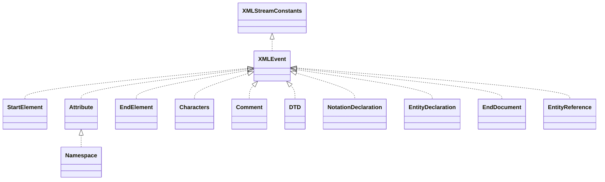

# stax-api-1.0.1.jar

[Group index](README.md) | [All archives](../README.md)

## Scope and provenance

- **Donor:** `SQX_145_REFERENCE_ROOT/internal/libs/stax-api-1.0.1.jar`.
- **SHA-256:** `d1968436fc216c901fb9b82c7e878b50fd1d30091676da95b2edd3a9c0ccf92e`; accessed 2026-10-06; captured `2026-10-06T18:54:51.906614+00:00`.
- **Classes:** 40 raw entries; 40 unique entry names. Duplicate occurrence indices are zero-based.
- **Inspection:** read-only ZIP hashing and class-file structural parsing; signatures/descriptors, modifiers, hierarchy and references only. Bytecode bodies are hashed, not published.
- **Allocation:** proposed `FEAT-HOST-STAX-API`, P02; [roadmap](../../dev/sqx-full-application-roadmap.md). Domain README registration remains required.
- **Repository:** `01067f00031428613c6394064ca1bcadc1ba00ee`; review state unreviewed. Download label 145-dev1; installed build/activation and runtime equivalence unverified.
- **Limit:** every class/member is inventoried; declaration coverage does not establish consumed calls, defaults, formulas, failure semantics or algorithm parity.
- **Archive/resource index:** [110.json](../../dev/evidence/sqx145/archives/145/110.json).

## Complete member declarations

Member shards contain exact JVM names/descriptors, access flags, generic signatures, throws types, declared fields/methods, superclass/interfaces and referenced class names. All classes, nested/synthetic members and overloads are retained. Code length/hash is structural evidence, not a normalized algorithm comparison.

- [001.json](../../dev/evidence/sqx145/members/110/001.json) — SHA-256 `c759e9582f792c1f597e44c549d3a8f8d49548bef75603f20084626123dbf7bc`.

## Focused structural diagram

Up to twelve non-nested classes; arrows show declared inheritance/interfaces only. External type names are not evidence of an available body or an executed dependency.

## Class inventory

| Archive entry | Occurrence | Class SHA-256 | Fields | Methods |
| --- | ---: | --- | ---: | ---: |
| `javax/xml/stream/events/StartElement.class` | 0 | `8ec96e43a64e7044bc8b3dbb0ec4cddbf011469c8fb3f6a137b3c73ebecedfa6` | 0 | 6 |
| `javax/xml/stream/events/XMLEvent.class` | 0 | `5e70be545137864365f2a6510d759bf53803b88ca897cabb4514acd495bbb109` | 0 | 16 |
| `javax/xml/stream/events/Attribute.class` | 0 | `8cc013b509820ef5ffc495aa81d85c8278048f34fdd610dd333276854b4e82d4` | 0 | 4 |
| `javax/xml/stream/events/EndElement.class` | 0 | `ecd03d4b469d9eb9f367dd4a923d87275b6c769c0e1ff774d3b04b3dc6fd7908` | 0 | 2 |
| `javax/xml/stream/events/Characters.class` | 0 | `fc750e475867becd6f658872818e69ab3d043f1ca4b31a9d03fbae3062ac0fe9` | 0 | 4 |
| `javax/xml/stream/events/Comment.class` | 0 | `2cbf4867766960fcc3502b392eb5913c1a3c2bdaeb871d391ad488129791d0b6` | 0 | 1 |
| `javax/xml/stream/events/DTD.class` | 0 | `07f1eb403a86bfcd419ec58d1830a208e3604eb57579772f12545ab0dca262e3` | 0 | 4 |
| `javax/xml/stream/events/NotationDeclaration.class` | 0 | `d8609e3ebdc838e543d871e470ff9e2ad49321a7f942acb90a0525f64ca7fd9c` | 0 | 3 |
| `javax/xml/stream/events/EntityDeclaration.class` | 0 | `0bb542fd96d41e0ac65b9c344808bb227e55acf1ff51752acea1f32827e6d361` | 0 | 6 |
| `javax/xml/stream/events/EndDocument.class` | 0 | `c1e39a4c92cc51c6e86834bbe91a1a1ceec2ab5bee5b8fa61118dd19b7bb21e2` | 0 | 0 |
| `javax/xml/stream/events/EntityReference.class` | 0 | `30f7bf5a6166dbc44b06b3ad316b64409d15447a198492624c905db54a29c85d` | 0 | 2 |
| `javax/xml/stream/events/Namespace.class` | 0 | `1b100a2c8f4b9474c96c36273bb014a38a78d6521b3cdf5d847baeedad517037` | 0 | 3 |
| `javax/xml/stream/events/StartDocument.class` | 0 | `ba8e78884d4837a2e04894f5b588f5031ba533dc138a6fef0a15868ff1e628a6` | 0 | 6 |
| `javax/xml/stream/events/ProcessingInstruction.class` | 0 | `b13a9825e3c9a523aabe92127a59e5750a7476013b484a4ec9c329de8c5702d4` | 0 | 2 |
| `javax/xml/stream/XMLStreamConstants.class` | 0 | `9f5d69f050f51a58a731fd97b434664bb956b8fb421380e149ccec1debd47722` | 15 | 0 |
| `javax/xml/stream/Location.class` | 0 | `ac152f0857e89a0706d62ce6396bf55369040e20cdcf6e57315a54527ae87282` | 0 | 5 |
| `javax/xml/stream/XMLStreamException.class` | 0 | `5b436d98730c4f575656ed640ed4c4c34383baf15b41c15c6dc559bb6acb45e0` | 2 | 8 |
| `javax/xml/stream/util/StreamReaderDelegate.class` | 0 | `a0c2ee5347db61dbb7f3e6f70422371342e2edca87b4651a3ae27daa4962dfc6` | 1 | 49 |
| `javax/xml/stream/util/EventReaderDelegate.class` | 0 | `5905754fdd22e1a2e1f554600d23e0085afd7fd7bfb16578becf61307f08f544` | 1 | 13 |
| `javax/xml/stream/util/XMLEventAllocator.class` | 0 | `54b6e45f6328a12c170d814e5d4367ad54574ed8252c3fe3995d8b661aac966a` | 0 | 3 |
| `javax/xml/stream/util/XMLEventConsumer.class` | 0 | `bef3adef390e70af7777ea06dd16e7628a0b3afaffad4afa5df3f7196c490755` | 0 | 1 |
| `javax/xml/stream/XMLStreamReader.class` | 0 | `7db462b8af7f46dc92b688550129bd24e52bd811f6040bcc73f4e3f534b3c3af` | 0 | 45 |
| `javax/xml/stream/XMLEventReader.class` | 0 | `d0804853ab2a092dd18a24a77d19cd34ffa02a9e7966a84d8ec4ca571103735a` | 0 | 7 |
| `javax/xml/stream/XMLEventWriter.class` | 0 | `0e49d18eb282c24a1ce21041be75cc319bd1d0c06baf77cdaa89ab22403f0bd6` | 0 | 9 |
| `javax/xml/stream/FactoryFinder$ClassLoaderFinder.class` | 0 | `f38548cf1da764748d9b82789f4c108ee5fb5ade9e8aed1a9c4f165fa841900b` | 0 | 3 |
| `javax/xml/stream/FactoryFinder$ClassLoaderFinderConcrete.class` | 0 | `7ad29653cc5e56a76fbd3ab0d2ea5f61a434c2cee09456a4ce849273635fab07` | 0 | 2 |
| `javax/xml/stream/FactoryFinder$1.class` | 0 | `1e4c24c04f4b638c34f0611385d64e4f1c159bc0d5eeef6e1fbe1661ab1b723e` | 0 | 0 |
| `javax/xml/stream/FactoryFinder.class` | 0 | `3c2451551ce960311fa7d937e74679f9819715438c166bce04fbefc812e9899b` | 2 | 9 |
| `javax/xml/stream/FactoryConfigurationError.class` | 0 | `af08d53090e90226967a92fd4e7cbc25274fc7bafb4406d3454351e5b3cf687a` | 1 | 7 |
| `javax/xml/stream/StreamFilter.class` | 0 | `ee4f0fc073bb46a5baec669bdfc2402ea24be0f01c0ca0e695f9686c25f00770` | 0 | 1 |
| `javax/xml/stream/XMLInputFactory.class` | 0 | `496c782cf21d32112bf805021d09470ef535b707855bda2a50329d02ae357c47` | 9 | 27 |
| `javax/xml/stream/EventFilter.class` | 0 | `3b7e02b6c3bcd12c1e9721fed370529391411b3784ce67ad5879501a24e29382` | 0 | 1 |
| `javax/xml/stream/XMLResolver.class` | 0 | `ca6afa03fb3b2e1bf9b01caf221c91a01d103be647b00da0be56ca0fc7b98fb5` | 0 | 1 |
| `javax/xml/stream/XMLReporter.class` | 0 | `77c71762b1cbfde182c83ba8eeb5404236d4faccb57d8cc8a910f6da78d8d921` | 0 | 1 |
| `javax/xml/stream/XMLOutputFactory.class` | 0 | `2f22d1b209433cabba074bf17da73c885f54bb59fd7ea125f6ecf30fa144c500` | 1 | 14 |
| `javax/xml/stream/XMLStreamWriter.class` | 0 | `0171085c457f8e8d890c76bc6e1d3920dc768a4f867d60b997c567f27bb826f8` | 0 | 32 |
| `javax/xml/stream/XMLEventFactory.class` | 0 | `c640c7f68bba5154b08e9b4b00c57c7ac252223b3d0cc92ad1937a0d95b77101` | 0 | 29 |
| `javax/xml/namespace/QName.class` | 0 | `d0c92e345d9231b7ba9d5236668cd637810f7c57adbd805c03590b0d9d3b96cf` | 3 | 10 |
| `javax/xml/namespace/NamespaceContext.class` | 0 | `2ff91a9ce8213ec57a83decdbb0137353be1e8ab28802814fd52abb80f0729f7` | 0 | 3 |
| `javax/xml/XMLConstants.class` | 0 | `fc6e4e77523a999434214ced39809adf69112419f4ecca1405de9fccb73b29cf` | 5 | 1 |
