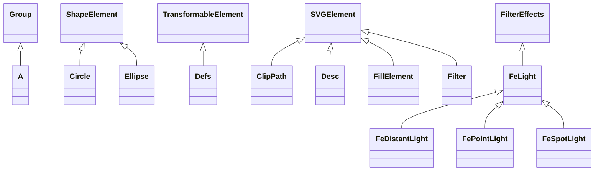

# svg-salamander-1.0.jar

[Group index](README.md) | [All archives](../README.md)

## Scope and provenance

- **Donor:** `SQX_145_REFERENCE_ROOT/internal/libs/svg-salamander-1.0.jar`.
- **SHA-256:** `c1ca16f6d892b6267b0b7cd9b8bac0ac6b3c71e99415ab6688bb354ca1c7f7b9`; accessed 2026-10-06; captured `2026-10-06T18:54:51.906614+00:00`.
- **Classes:** 190 raw entries; 190 unique entry names. Duplicate occurrence indices are zero-based.
- **Inspection:** read-only ZIP hashing and class-file structural parsing; signatures/descriptors, modifiers, hierarchy and references only. Bytecode bodies are hashed, not published.
- **Allocation:** proposed `FEAT-PRODUCT-SVG-SALAMANDER`, P17; [roadmap](../../dev/sqx-full-application-roadmap.md). Domain README registration remains required.
- **Repository:** `01067f00031428613c6394064ca1bcadc1ba00ee`; review state unreviewed. Download label 145-dev1; installed build/activation and runtime equivalence unverified.
- **Limit:** every class/member is inventoried; declaration coverage does not establish consumed calls, defaults, formulas, failure semantics or algorithm parity.
- **Archive/resource index:** [111.json](../../dev/evidence/sqx145/archives/145/111.json).

## Complete member declarations

Member shards contain exact JVM names/descriptors, access flags, generic signatures, throws types, declared fields/methods, superclass/interfaces and referenced class names. All classes, nested/synthetic members and overloads are retained. Code length/hash is structural evidence, not a normalized algorithm comparison.

- [001.json](../../dev/evidence/sqx145/members/111/001.json) — SHA-256 `9032c1686f37b77e2a924882e8f6e973735595e63f0b604b346bb4638b9e6f04`.
- [002.json](../../dev/evidence/sqx145/members/111/002.json) — SHA-256 `8d5e21b329306eb3727c6b44d9c2a0269fa8f169cd94fcc564339c49fda5dc03`.
- [003.json](../../dev/evidence/sqx145/members/111/003.json) — SHA-256 `f73507ba740fe4017612561d5bcabe95f11c2b9c8c23d0bc2bcef4bedb45417c`.

## Focused structural diagram

Up to twelve non-nested classes; arrows show declared inheritance/interfaces only. External type names are not evidence of an available body or an executed dependency.

## Class inventory

| Archive entry | Occurrence | Class SHA-256 | Fields | Methods |
| --- | ---: | --- | ---: | ---: |
| `com/kitfox/svg/A.class` | 0 | `8f5b63310bb7dcdd4a98daeb3879502b138c89caa0044a700d05c8bbf6dafeab` | 2 | 3 |
| `com/kitfox/svg/Circle.class` | 0 | `deec5dc1808717bba127360292c690c27f667897efbc3f05bd3b9a006cf72cad` | 4 | 6 |
| `com/kitfox/svg/ClipPath.class` | 0 | `959435eed8452240e552afdb375df18fcf376df98e446dace4f301371dc66993` | 3 | 6 |
| `com/kitfox/svg/Defs.class` | 0 | `3a341631b654fae02d0be2cba8bb9b41453b6cc7db2e35accb5dd1b6d92c6972` | 0 | 3 |
| `com/kitfox/svg/Desc.class` | 0 | `8f9e6a18bbf009afe95b7d8b30d9a157f26de5256582430896ca4c4b172ad03e` | 1 | 4 |
| `com/kitfox/svg/Ellipse.class` | 0 | `b60f568fe58e6373b3b098bbbfb12552bfa5480382cf4428847929936d90609c` | 5 | 6 |
| `com/kitfox/svg/FeDistantLight.class` | 0 | `b386d6ef042ab96dd49ab3f309df363c7c0b403d43f28d22ead643f25fb1e756` | 2 | 5 |
| `com/kitfox/svg/FeLight.class` | 0 | `dff7af4d5648a95f1da289ebfef5651277acdda071626b038d87ece92f8eed47` | 0 | 1 |
| `com/kitfox/svg/FePointLight.class` | 0 | `599bceb72f1e6d2ef641ea39ec6c564801f294dd993969d36bf7f7f7937f1cc7` | 3 | 6 |
| `com/kitfox/svg/FeSpotLight.class` | 0 | `324224c3b16caa09c8d958a004bc1649e5fd5573a1999c692da98d91fe9a1252` | 8 | 11 |
| `com/kitfox/svg/FillElement.class` | 0 | `e6eb93bdba4a2acb54a29a03c8a18cf5bef9852a2711cf3c5e41ba01d0554622` | 0 | 2 |
| `com/kitfox/svg/Filter.class` | 0 | `4fe963aea62b99f99b121b7af2c5367c35d4b09b097edcc50d3900b115cbea14` | 13 | 8 |
| `com/kitfox/svg/FilterEffects.class` | 0 | `04b1fb1c80f0110fd9729ef580279ccee427adcd77d0af9a6ad8d48c1460cd9c` | 15 | 8 |
| `com/kitfox/svg/Font.class` | 0 | `54e8d1aae714e69498bf14521f9b7b5854aad36e4f099a85ccefca95296a6040` | 9 | 13 |
| `com/kitfox/svg/FontFace.class` | 0 | `47e18591948b2edb93b31bd0d0b31417995fbe2d81511c1dfc9fd4c1c0b1e513` | 11 | 14 |
| `com/kitfox/svg/Glyph.class` | 0 | `46631abe92946a129a8dc93767ff74451b53ece1ee8fca5cf812e91d88822a7c` | 1 | 4 |
| `com/kitfox/svg/Gradient.class` | 0 | `c1354140b5234310bc288cc4ac2e22c2ed345ed808c3f45e39b981dd8631999b` | 12 | 10 |
| `com/kitfox/svg/Group.class` | 0 | `53a72f63d27cdc811f480b44c6da14e843b356e8062ae0cc884e2ba724431c4c` | 3 | 11 |
| `com/kitfox/svg/Hkern.class` | 0 | `34b20a8384d4461dc64b5f19b9cc05e64ae5681eade6acd346d440a5cfacb582` | 3 | 3 |
| `com/kitfox/svg/ImageSVG.class` | 0 | `dfa29f28e3ec2b1cf73b922060a27a6b5341e4b6ed82141c4f42aa77da71aafe` | 7 | 11 |
| `com/kitfox/svg/Line.class` | 0 | `42174b550b08fef5fb22bdca97b5eafc626952a708622b6f62d716955a7630ef` | 5 | 6 |
| `com/kitfox/svg/LinearGradient.class` | 0 | `f81c8dc3771e1b3259650433f8bb927f5598bb89f64289918b4d5edc97904f44` | 4 | 4 |
| `com/kitfox/svg/Metadata.class` | 0 | `bf7b83c6477be93cf3ef8b5f85b37b1bfe3563f492839829ea6a91f19b86c470` | 0 | 2 |
| `com/kitfox/svg/MissingGlyph.class` | 0 | `4b61be4b2eea29898e0ff2769d51081be52b458d163d638b49678d58615e782e` | 5 | 12 |
| `com/kitfox/svg/Path.class` | 0 | `3ee9b3c4c4bf6c9c219d9a02bdbeea86f85676668cf3695e891eb9a9102e731e` | 3 | 6 |
| `com/kitfox/svg/PatternSVG.class` | 0 | `bbe7835ac9a3d61b646e26b64e61a7c3270a97eceb494c2438d8577ff6fe35fb` | 10 | 6 |
| `com/kitfox/svg/Polygon.class` | 0 | `6eee38a57f1c49fd5d85eea1d97090f0f60be8829123cc1304338e17a64c515c` | 3 | 7 |
| `com/kitfox/svg/Polyline.class` | 0 | `8785519d566b8c6419c857fee07eae53d7b2e1e45a56896fe05200d2cb2fc354` | 3 | 7 |
| `com/kitfox/svg/RadialGradient.class` | 0 | `b7a4503f758594ec59d8707bc39cbd0b0abb4c6954b457ac5dec580625bc0463` | 5 | 4 |
| `com/kitfox/svg/Rect.class` | 0 | `55cc2dc1edf52fea93630d7cd12596ac7bce85b733f05872693afd2eb4f19acf` | 7 | 8 |
| `com/kitfox/svg/RenderableElement.class` | 0 | `080600d4f0868df974048a94ba7f8d0a6cea46385973d524c69c7d837421dd93` | 5 | 9 |
| `com/kitfox/svg/SVGCache.class` | 0 | `9b2567d85c5df93369daf2cdb5769f69d7370b2c99c67ff76fa69abab48f5199` | 1 | 3 |
| `com/kitfox/svg/SVGDiagram.class` | 0 | `71cdd8d66bc6b7efa12c2445eafd89ee10aeb2a24d1166b64dc85d16de667a2b` | 7 | 22 |
| `com/kitfox/svg/SVGDisplayPanel$1.class` | 0 | `fb510281a057b6464ff786b9da1e55da8ffc389bb312446a2fa2f5b54fc529c7` | 1 | 2 |
| `com/kitfox/svg/SVGDisplayPanel.class` | 0 | `1a9005e8cf4e71a88cafc55ee594c351b2b1a0d8b37986457b117a4b6cd6bcb3` | 4 | 16 |
| `com/kitfox/svg/SVGElement.class` | 0 | `bc1be7aa5ceef141d6fa5a155789cd0c4dab9ab99e852011ac7dd0dfbcb414b6` | 14 | 41 |
| `com/kitfox/svg/SVGElementException.class` | 0 | `9844655ae0a93b8b83c3f510c0520d7e09f960de489c23a27a591e48deda71ee` | 2 | 5 |
| `com/kitfox/svg/SVGException.class` | 0 | `5b9c7dc00e3af255142b3f581ec1c3328d8c40732c6cd685e29cdcbc74e7cd69` | 1 | 4 |
| `com/kitfox/svg/SVGLoader.class` | 0 | `68e8bf681cb3b1327e2c55e98e8ee94e2099b1c34dde6ce373144932aa5f50c2` | 45 | 11 |
| `com/kitfox/svg/SVGLoaderHelper.class` | 0 | `198fb0e52efc69bfbde4680cbf3df9eccbd24ae525e768565f6317170c5529db` | 4 | 1 |
| `com/kitfox/svg/SVGParseException.class` | 0 | `9e1f5f12a00c8a6a4de492f43b29fe1c29e2f7946bb8d5b1468a1ec0fcb14694` | 1 | 4 |
| `com/kitfox/svg/SVGRoot.class` | 0 | `d5c2b6e52150402717554a06343602d97be0d091aa9b78be211a9bc2b7ca17ef` | 20 | 11 |
| `com/kitfox/svg/SVGUniverse$1.class` | 0 | `b21e95f531b7adb64f590e5ce714ca486f6149d017374c071791986eb1ea3f30` | 1 | 2 |
| `com/kitfox/svg/SVGUniverse$2.class` | 0 | `f140714829cee2e467a66d9e4c24085dd0d8f90d861c5d589780399019e87d1f` | 0 | 2 |
| `com/kitfox/svg/SVGUniverse.class` | 0 | `394e8ba7a8da963419316544335e262245c59be3b35feb6cd017e05ef0929187` | 10 | 33 |
| `com/kitfox/svg/ShapeElement.class` | 0 | `73482cfd7bda2f8f6f00a1cff2dee7f24e7f349a8c7bd1b367b6cee2556e2c92` | 1 | 7 |
| `com/kitfox/svg/Stop.class` | 0 | `88af7966f782174b732e5185e9e700f9c96b5767ce14dfa910c7b70cb5d0f4c9` | 3 | 3 |
| `com/kitfox/svg/Style.class` | 0 | `63225645792559c5214a769a9cc66830a159d2475dce13965341f923bef1306f` | 2 | 4 |
| `com/kitfox/svg/Symbol.class` | 0 | `f9e3550ee30403ab364826263f76397e8d73506a62efab0257c1007be53a816f` | 2 | 7 |
| `com/kitfox/svg/Text.class` | 0 | `0e57ee3f1d53e8fb7e04819636dc2e0e7fa4b035aa50dff58cdf16c63a3717a8` | 29 | 14 |
| `com/kitfox/svg/Title.class` | 0 | `770087aad214bc36275e5c5df35c2459418f5c1d7d0cbb905169d99ba0679376` | 1 | 4 |
| `com/kitfox/svg/TransformableElement.class` | 0 | `15b2001ad33684558be560cd7c783d94b80ce8f5e407eef0665623bafc728207` | 1 | 6 |
| `com/kitfox/svg/Tspan.class` | 0 | `149fec87206dea1a7702b017f26debd839e43ecd4626b12037afb4225fda46cb` | 8 | 16 |
| `com/kitfox/svg/Use.class` | 0 | `069cb3e7a9bf40a2f2c8adcdd9b184f9be93020c25d845793af0a025d840f193` | 6 | 6 |
| `com/kitfox/svg/animation/Animate.class` | 0 | `d95c785da0b54be5b1043482e8f0dbb19c678cf9ac3e6dac3736db8480b6ab1b` | 12 | 8 |
| `com/kitfox/svg/animation/AnimateBase.class` | 0 | `a36727fb9d07a8211691c40e25bda86fbc3bccf9c036a34e792ccd8623d07409` | 2 | 4 |
| `com/kitfox/svg/animation/AnimateColor.class` | 0 | `2f94d07ad746b2f105b3ab14b5772e6f49209f60fd63e5b2c4a2f69d50419b12` | 2 | 4 |
| `com/kitfox/svg/animation/AnimateColorIface.class` | 0 | `11fd065a2c05388d13cb1b4ef415d407f9d9ec4d165e805adb7e1c30da1e1d12` | 0 | 1 |
| `com/kitfox/svg/animation/AnimateMotion.class` | 0 | `d3f8fe4163e0b75700309e30e12bb65f0a370173809fdec302681447728d2cbb` | 8 | 8 |
| `com/kitfox/svg/animation/AnimateTransform.class` | 0 | `f16855eff9ef94b4d56ffbd1e3c45fd4b62490f9a9df5f8a67666f27d7acd667` | 12 | 5 |
| `com/kitfox/svg/animation/AnimateXform.class` | 0 | `cfd05d1de87211d165bf9a97cd0d2e31809a7265b0b33e69d59d3575ba9bd82a` | 0 | 3 |
| `com/kitfox/svg/animation/AnimationElement.class` | 0 | `c987e22c0bddacb6f58d3ddc5e9eabf4ea9014d3c3a7e2ee8e38a2b6759d9b6d` | 21 | 16 |
| `com/kitfox/svg/animation/AnimationTimeEval.class` | 0 | `0963aa698d4fc5bbe7d02c92f2e8e62fc89a192781b2ffee331f17297b017762` | 2 | 2 |
| `com/kitfox/svg/animation/Bezier.class` | 0 | `03573cdc974368b8c068dc3e6b09b982c2a50333316375f8adf1dfd78f0778e6` | 2 | 9 |
| `com/kitfox/svg/animation/SetSmil.class` | 0 | `8946b681fa4bb93aab104d7b80aa4cc1d7fbeb69e9a3eb66ccb3dff3df6b26c0` | 1 | 3 |
| `com/kitfox/svg/animation/TimeBase.class` | 0 | `82c1b962c52ce21ce8b2f84b3ab938e4c42885fac7600d66eb0eda3337b1135f` | 2 | 5 |
| `com/kitfox/svg/animation/TimeCompound.class` | 0 | `47b5a72dc95e1f002dfdb4897b86cc9bac32123b9266def26b30e9211bddf2b4` | 3 | 4 |
| `com/kitfox/svg/animation/TimeDiscrete.class` | 0 | `36ed7ea0d01a526c643e2b907d951ad819c7acbc1e9e1c383d99922414fc7e0b` | 1 | 2 |
| `com/kitfox/svg/animation/TimeIndefinite.class` | 0 | `a13c0fba0370e2b14e814e526007432187dc1d16544af412e677f3e1922f1747` | 0 | 2 |
| `com/kitfox/svg/animation/TimeLookup.class` | 0 | `5821f5a83f5f3a209481e0b5c734c7a0018a25778e3289cf076f1f3e75ed5145` | 4 | 3 |
| `com/kitfox/svg/animation/TimeSum.class` | 0 | `30f9b609b455886b841cbdb1d54dd9ae48de9d063dac6d06132d14a44f7eed55` | 3 | 3 |
| `com/kitfox/svg/animation/TrackBase.class` | 0 | `0f3a2c867bd107c9bacf74fee3a880a398756f35448a9986da44437db5601e20` | 4 | 6 |
| `com/kitfox/svg/animation/TrackColor.class` | 0 | `65861c848093a8aa6debf4f1f4215a9ad21a427bbbe0398e32edff5710d5f903` | 0 | 3 |
| `com/kitfox/svg/animation/TrackDouble.class` | 0 | `8e1f2d59d856a5274643e97ac6b215d673a78289effc74378f8cbe4a068c7b76` | 0 | 3 |
| `com/kitfox/svg/animation/TrackManager$TrackKey.class` | 0 | `2bfd4995823673b8056e6186c6538c24538053ed5ea341b7e8f66256628bbe73` | 2 | 4 |
| `com/kitfox/svg/animation/TrackManager.class` | 0 | `903e8b1e1ad9c9adb5453984c0069500296ee4a727b8b8e2164029201499a921` | 2 | 5 |
| `com/kitfox/svg/animation/TrackMotion.class` | 0 | `9dc1e4cb97218e7b195e84e5cdea7e7ee99aeaca4b90cfbb25c0633aa5e26fc0` | 0 | 3 |
| `com/kitfox/svg/animation/TrackPath.class` | 0 | `5b9056863c5e780e9e982c87fb0872dca38db1aa83f57a0c914466246d26188c` | 0 | 3 |
| `com/kitfox/svg/animation/TrackTransform.class` | 0 | `45c5ffa60b329b6b56488c53dc0f154b35457a8ee11576244451cbbd6b7f2a75` | 0 | 3 |
| `com/kitfox/svg/animation/parser/ASTEventTime.class` | 0 | `b0f49bdce106a9ce5beacf2cb86b2e405e9e9e374671356493113f9f767900a9` | 0 | 2 |
| `com/kitfox/svg/animation/parser/ASTExpr.class` | 0 | `1eb18dfe90b9d44b37e5fc69a8731b9d18f23f1e0d70d9e28d0f9ec4775b2f72` | 0 | 2 |
| `com/kitfox/svg/animation/parser/ASTIndefiniteTime.class` | 0 | `33f594f45ad15d97a1297d2d394e45c35c5b9aa005c06a5c3d02c54cad61f74c` | 0 | 2 |
| `com/kitfox/svg/animation/parser/ASTInteger.class` | 0 | `3e721d89369142a106c544601fd4754403be00a06e3b64f2f23167f805659aa0` | 0 | 2 |
| `com/kitfox/svg/animation/parser/ASTLiteralTime.class` | 0 | `e4d42e6e570a368a4d80007f9b21298a3839d499f36ec8ed098241f1fa5a1e07` | 0 | 2 |
| `com/kitfox/svg/animation/parser/ASTLookupTime.class` | 0 | `772eae0bd02f02d9e33488ece1109b2d860142677098141a4d6b81d36ab0e347` | 0 | 2 |
| `com/kitfox/svg/animation/parser/ASTNumber.class` | 0 | `beb20327caf3304bf30325d23c6718dd394e999d127236a66eed047a1ba90b1e` | 0 | 2 |
| `com/kitfox/svg/animation/parser/ASTParamList.class` | 0 | `94b83dc5e58928568bac8b96cd8bab87df9011613f5f857611f8aeb2f37f297a` | 0 | 2 |
| `com/kitfox/svg/animation/parser/ASTSum.class` | 0 | `b7870453fa877c5a451d7ca560d2d1b318b99969b3d8995070c28c3bc850db3f` | 0 | 2 |
| `com/kitfox/svg/animation/parser/ASTTerm.class` | 0 | `0ac5fbda70bb42def354b3e5f999d3f2a49a6ab08296a2e2166e7befc358940c` | 0 | 2 |
| `com/kitfox/svg/animation/parser/AnimTimeParser$1.class` | 0 | `aa8e5dc76e376796166c42523a47a9a5bdf1934dc2b85c510913c8a6e328d3fa` | 0 | 0 |
| `com/kitfox/svg/animation/parser/AnimTimeParser$JJCalls.class` | 0 | `36b4a8086dbd9123165e5db63e4637eeb4d391366fa54086f144e6a73cb32884` | 4 | 1 |
| `com/kitfox/svg/animation/parser/AnimTimeParser$LookaheadSuccess.class` | 0 | `b0280483a301a5712c8fe7632c770a72112c70441d1c548783151506537c1101` | 0 | 2 |
| `com/kitfox/svg/animation/parser/AnimTimeParser.class` | 0 | `21dca530fde341f8733b73803796397d3bc8f2271d0cb1b258e645701caaf5ff` | 23 | 45 |
| `com/kitfox/svg/animation/parser/AnimTimeParserConstants.class` | 0 | `c87771dfcb09d88dc6c85f31ef79d50f21d19c71cb8e60accb40de6bc8fc3dd5` | 12 | 1 |
| `com/kitfox/svg/animation/parser/AnimTimeParserTokenManager.class` | 0 | `077c948061989e15c1df2bf3abd8861e3bf919a1e484129f49b2954abc1de1b3` | 16 | 33 |
| `com/kitfox/svg/animation/parser/AnimTimeParserTreeConstants.class` | 0 | `f7ed3903ba57ae616ca0fbab2642abc0981ea4723fbec53a1fd37825c30723ab` | 11 | 1 |
| `com/kitfox/svg/animation/parser/JJTAnimTimeParserState.class` | 0 | `9e8843728555a9d8d3ae48de78e7351ab8c81b3aa2c6a43115a5a3793cc8c640` | 5 | 12 |
| `com/kitfox/svg/animation/parser/Node.class` | 0 | `67ef9a1a74ca6f8e5b38194e4a575c666dea17d6ab3ba1d083d779d3e75f2295` | 0 | 7 |
| `com/kitfox/svg/animation/parser/ParseException.class` | 0 | `4f99bd4b9553b8d85bb5ae14aee31f0712a754ad887d3bb5951e0777531da5a5` | 5 | 5 |
| `com/kitfox/svg/animation/parser/SimpleCharStream.class` | 0 | `49cea2b11df9a43c78c8b82808f923bf431bfa09d0454a0f2d056dbef29ef363` | 15 | 28 |
| `com/kitfox/svg/animation/parser/SimpleNode.class` | 0 | `363ec89afd4288172339aabd3014a05a30a8b0099543676bb0b8347e9093f4f8` | 4 | 12 |
| `com/kitfox/svg/animation/parser/Token.class` | 0 | `f5f4d07139464bc67fb57be8a18ffe6cfd9d3b3eb6bea6e43c19c3cb303ed087` | 8 | 3 |
| `com/kitfox/svg/animation/parser/TokenMgrError.class` | 0 | `8f52619dabf995caf0abf0c6f9d33d21b741eab6ce49def55bf4bbb504760555` | 5 | 6 |
| `com/kitfox/svg/app/MainFrame$1.class` | 0 | `bf94797d5bd45f395dd9e47d3092d59d67e0ccad3b7a9ce3cadaa2e06c5a7f4f` | 1 | 2 |
| `com/kitfox/svg/app/MainFrame$2.class` | 0 | `f6791da7763afc11f3af754a3a08da71352799a959f9612ddb5e1e4be19bd9a3` | 1 | 2 |
| `com/kitfox/svg/app/MainFrame$3.class` | 0 | `ad9482a25402030d6d14297877b7e3e57ae46c1e216a8038813f1ac8f5574c82` | 1 | 2 |
| `com/kitfox/svg/app/MainFrame$4.class` | 0 | `fa75962cc1bde9dda6484f4aabfc476a3f24e1111125f37cdc5fff9684658a73` | 1 | 2 |
| `com/kitfox/svg/app/MainFrame.class` | 0 | `8b08d25e305333c66a885ca9e9a9ec767a8744b9b8116b579bb535f9346fa757` | 6 | 12 |
| `com/kitfox/svg/app/PlayerDialog$1.class` | 0 | `c86660ca9f3dafb83b15571f674bfbc7c0fc695d9221e8c0826c094d1f83b71b` | 1 | 2 |
| `com/kitfox/svg/app/PlayerDialog$2.class` | 0 | `c75c04279a48db89ed69720bd01c84392f2080b2d234155b632c1023334b8a88` | 1 | 2 |
| `com/kitfox/svg/app/PlayerDialog$3.class` | 0 | `6852a1cfb0bff89aa1c304134a0e1de4beba6de42c8fc573f1e30cbff2503259` | 1 | 2 |
| `com/kitfox/svg/app/PlayerDialog$4.class` | 0 | `6d67edf63e6e72827d6957ebe28c62497db1caf541e6d57ced88d897facc1990` | 1 | 2 |
| `com/kitfox/svg/app/PlayerDialog$5.class` | 0 | `06daf2751ee70b7c22af9c2d3a595e782712b878dbe46bea11b97102bc6e1845` | 1 | 2 |
| `com/kitfox/svg/app/PlayerDialog$6.class` | 0 | `59008320c6879462dbd9a33df1a2f86bf959224b7f3dc39b9a644d35a080fe0c` | 1 | 2 |
| `com/kitfox/svg/app/PlayerDialog$7.class` | 0 | `fe722c37dfd0e40f31662a653c06c1276404efbed79bf45f8fc02ebead39b88a` | 1 | 2 |
| `com/kitfox/svg/app/PlayerDialog$8.class` | 0 | `74c1848f9cedd8ac5778697ae31378b56977c0b7d9c429e67d046872a8938894` | 1 | 2 |
| `com/kitfox/svg/app/PlayerDialog$9.class` | 0 | `344732dac6c3b0f51cf9cbce20540ca842b09e63180bd409e13ce8c792bc0786` | 1 | 2 |
| `com/kitfox/svg/app/PlayerDialog.class` | 0 | `8750d90ba87dba26c2a1893321c8d009b20b79ad0a37a3457bd804baa5b8cd18` | 15 | 21 |
| `com/kitfox/svg/app/PlayerThread.class` | 0 | `6ea22b8869977a8c72380b3427a6adc74b1c4233d78326c5c8f7f191727e2e74` | 8 | 11 |
| `com/kitfox/svg/app/PlayerThreadListener.class` | 0 | `85eb41fe1f3aedd5259a1fc61004bd502b749520d8cdae70315c286d457b5fb0` | 0 | 1 |
| `com/kitfox/svg/app/SVGPlayer$1.class` | 0 | `0a9d11664a972a7a9a976e189dd085c9d8dad61dab71dc14ec01feaf3d362ac5` | 2 | 3 |
| `com/kitfox/svg/app/SVGPlayer$2.class` | 0 | `7f674207d92a6ac105800f1616283110335f6208a8bd4ff9ee497701e503e79c` | 1 | 2 |
| `com/kitfox/svg/app/SVGPlayer$3.class` | 0 | `a62d92ecb4005efaeaf639993c837367cfc65c1c9921d2512468eb489acba1f8` | 1 | 2 |
| `com/kitfox/svg/app/SVGPlayer$4.class` | 0 | `f49665ada7aa1879ca9f3730b315c647ed14443fff1de15b83e8bdbf67f2eb06` | 1 | 2 |
| `com/kitfox/svg/app/SVGPlayer$5.class` | 0 | `4d99a4a6d7728aeb46907c533953c36340bfe5270a8bc22a9171824d69099999` | 1 | 2 |
| `com/kitfox/svg/app/SVGPlayer$6.class` | 0 | `2de0f6e80a7cd4d1af0cc5e2c29b6e74e885bcb2126a33959c9cd72b45ca6f85` | 1 | 2 |
| `com/kitfox/svg/app/SVGPlayer$7.class` | 0 | `e478be374fe1ab8a330144fef719c6ab6474f5853f1513c973794b5d501edcb7` | 1 | 2 |
| `com/kitfox/svg/app/SVGPlayer$8.class` | 0 | `df95bd39bb3055583965e536ee29ef16cea2751e9fbfea1c0688ccf36cbcea2d` | 1 | 2 |
| `com/kitfox/svg/app/SVGPlayer$9.class` | 0 | `24471d2113d27051ed7f9359ce883fcfb964a8b53671374279911a8776ba07a5` | 1 | 2 |
| `com/kitfox/svg/app/SVGPlayer.class` | 0 | `b0a55d8dc196c7b2bfa8322acbd0bd098e42492510e642567100646ccd65211d` | 18 | 22 |
| `com/kitfox/svg/app/SVGViewer$1.class` | 0 | `fb4866b3680b6de2a9012eb604122ed4dbaa80add97623c1389c37a281ef1918` | 2 | 3 |
| `com/kitfox/svg/app/SVGViewer$2.class` | 0 | `44df94131029b881cefd55294e61b8487dd81096d33f089e090541f412aa9471` | 1 | 2 |
| `com/kitfox/svg/app/SVGViewer$3.class` | 0 | `c5fd80986e8fcbfb26658bb24b662d808b88fffde9ff9dd7ed032949c10d1df7` | 1 | 3 |
| `com/kitfox/svg/app/SVGViewer$4.class` | 0 | `cb3d76779fa2a47361310713a97a0713228a1e21d899d2044bbafb7b22d09622` | 1 | 2 |
| `com/kitfox/svg/app/SVGViewer$5.class` | 0 | `168f2a6ccbf13b0ec93f7826eb5bacbcf19ce18ed6eb55d422659ed528e98380` | 1 | 2 |
| `com/kitfox/svg/app/SVGViewer$6.class` | 0 | `ab78e8e49ee3f7a91ab8118e03ada198601e07b1c89d2d67775ebb31819fc3ef` | 1 | 2 |
| `com/kitfox/svg/app/SVGViewer$7.class` | 0 | `7b6b734d3c3df12eb8e527ddbcb3439dfe85a93ed924e7181fefdd57370a0609` | 1 | 2 |
| `com/kitfox/svg/app/SVGViewer$8.class` | 0 | `e2a2b587570d83dc137f2a3be17acdb87f3033200f894fb1aa808606c2ee4b05` | 1 | 2 |
| `com/kitfox/svg/app/SVGViewer.class` | 0 | `7263af3ba9dfec59bee7a82901f2b6f06f8b3fbd7ad6b1f537dd34d6ef46b197` | 15 | 20 |
| `com/kitfox/svg/app/VersionDialog$1.class` | 0 | `820627bd0f1fa0f95b74810600cbb5258b278a4c67502c890873228244e88b40` | 1 | 2 |
| `com/kitfox/svg/app/VersionDialog$2.class` | 0 | `3d7bb0fe490a50b20139ad11c7e6069fc1b4c8a54d12281b9aadae3d237a5689` | 0 | 2 |
| `com/kitfox/svg/app/VersionDialog.class` | 0 | `ea138b8bdfc5f159c5c32f06323cdcb4886f8b771d57cb00187f86ac4640c3d9` | 6 | 5 |
| `com/kitfox/svg/app/ant/SVGToImageAntTask.class` | 0 | `ca763e497456dcfe66b4d692643f26d54417b37acb17f2224896914ed2ffe1fa` | 11 | 15 |
| `com/kitfox/svg/app/beans/ProportionalLayoutPanel$1.class` | 0 | `8041427e1494613a7aeb93888c6f15864e0214af68bb43c5c9d5e371db048a4b` | 1 | 3 |
| `com/kitfox/svg/app/beans/ProportionalLayoutPanel.class` | 0 | `f55b056ca72d6dfae4b3051d5a657c5a4ae0ba8b3b9fd9feb0516e244e7377b8` | 6 | 7 |
| `com/kitfox/svg/app/beans/SVGIcon.class` | 0 | `c71e63e7acaff1a4f383a08bdcfc54b64246b35e9fb0bcee3627624e420a0889` | 13 | 23 |
| `com/kitfox/svg/app/beans/SVGPanel.class` | 0 | `f75bff7ba966bcfe1fa0a848d8fb42111818ca0c0aa542ca5842206367f45681` | 6 | 16 |
| `com/kitfox/svg/app/data/Handler$Connection.class` | 0 | `e0cd747c16be69c8df8f9108927409f14145157f8d6e69dd98fba7e1b68bf00e` | 3 | 4 |
| `com/kitfox/svg/app/data/Handler.class` | 0 | `0e71fb18451083690d843d04881a4531511d759737f1a534f89eeb6c88953c05` | 0 | 2 |
| `com/kitfox/svg/app/data/HandlerFactory.class` | 0 | `358eb961d9be43bd2e027b7b054138423c5bbee265757c50c60cd512b9d67ec7` | 1 | 3 |
| `com/kitfox/svg/batik/GraphicsUtil.class` | 0 | `59e4655984f01968a739b8264d5d934b33669a2d45c99f40b606d4566c3604b6` | 0 | 9 |
| `com/kitfox/svg/batik/LinearGradientPaint.class` | 0 | `dcc0f5d67e42e5caea0cab1ec3e1e3f49a599c677c0f9cf02eba050867d00f81` | 2 | 8 |
| `com/kitfox/svg/batik/LinearGradientPaintContext.class` | 0 | `108c2f6db79ee0041ec18d138b986e110c94c81ac617e25005081b5ba400e854` | 7 | 6 |
| `com/kitfox/svg/batik/MultipleGradientPaint$ColorSpaceEnum.class` | 0 | `c5745bbaf04ada07977904d2c83f1c2d0d70544f059a210a1f37ef86db601d71` | 0 | 1 |
| `com/kitfox/svg/batik/MultipleGradientPaint$CycleMethodEnum.class` | 0 | `9ed9c5957de9f316a06a712bc5f0915bad5172d1e900f70a2e12bd58c725ebec` | 0 | 1 |
| `com/kitfox/svg/batik/MultipleGradientPaint.class` | 0 | `5b7015acf3c7f5e72304463604a5dfe65439564c4006abb6e9406c32c8e0ea73` | 11 | 8 |
| `com/kitfox/svg/batik/MultipleGradientPaintContext.class` | 0 | `3178d4f6a28850206b82380931f89199e4fcf3e7971030b43cb0d236551c1511` | 35 | 19 |
| `com/kitfox/svg/batik/RadialGradientPaint.class` | 0 | `5295e1dd07cbaa75f9f868000a3f26678d339b01639d7a85058b6556ef51f7ff` | 3 | 11 |
| `com/kitfox/svg/batik/RadialGradientPaintContext.class` | 0 | `d7167a6c1069fe3582a32e57c298d5659ba2ca663bc4827f89e66b55e9e68045` | 19 | 6 |
| `com/kitfox/svg/composite/AdobeComposite.class` | 0 | `92af89e01d807ad57d1212e82faacf8c2e94627e2f3ae5931b1add8d5175a92b` | 5 | 3 |
| `com/kitfox/svg/composite/AdobeCompositeContext.class` | 0 | `2f664906896e391ffd0c4eebee7816a3694e3df767a38ddf674ab386e3deb244` | 5 | 3 |
| `com/kitfox/svg/package-info.class` | 0 | `321d9c398774a1b578af552809637444a4e14319b776829530b5d694152cd2c5` | 0 | 0 |
| `com/kitfox/svg/pathcmd/Arc.class` | 0 | `79bb1c8611f57ee919e90b62c94f1b3e2670dce86520318a8f7b0cda37540948` | 7 | 6 |
| `com/kitfox/svg/pathcmd/BuildHistory.class` | 0 | `9af1ae7e77cd5cf310eff5542801be55b4c01a0a4545f1bea83a0070dd95ce11` | 2 | 3 |
| `com/kitfox/svg/pathcmd/Cubic.class` | 0 | `18a1a46350fb10acc3a3d50329130e83f39374b5927e77043ec17f4abd73fdc7` | 6 | 4 |
| `com/kitfox/svg/pathcmd/CubicSmooth.class` | 0 | `87ec8c11b6ec609f3efff288ac481635749c3e293e77d974d73d71aab3efa5dc` | 4 | 4 |
| `com/kitfox/svg/pathcmd/Horizontal.class` | 0 | `d0c1081d08b094ddb3f647f1736fbb38fa8a26e145b626861c171616df6b12b1` | 1 | 4 |
| `com/kitfox/svg/pathcmd/LineTo.class` | 0 | `6477939881e27398db40dff713e5e3a72c3cf1538c47284206e42e28819ca809` | 2 | 4 |
| `com/kitfox/svg/pathcmd/MoveTo.class` | 0 | `133449ed6a1ab135ea9f1bd18bfad82a3d7f91e27eec82cb0dadf6f732858ec5` | 2 | 4 |
| `com/kitfox/svg/pathcmd/PathCommand.class` | 0 | `1be446918a34841e62be07aa62f95aace68d3003224e5dd9af3865519a420f35` | 1 | 4 |
| `com/kitfox/svg/pathcmd/PathUtil.class` | 0 | `06bd57ff7afcac78eb45cedf0223a4e7410c739942be7ef378c49216275c389c` | 0 | 2 |
| `com/kitfox/svg/pathcmd/Quadratic.class` | 0 | `987a8c9bad7f414f489f7f45410b4a8c5aec4d2a6dcd8296dd55680ebb341621` | 4 | 4 |
| `com/kitfox/svg/pathcmd/QuadraticSmooth.class` | 0 | `83f9af287b87f309db4e47487e68c1b85710d2052cde25c54934b26214de5c7b` | 2 | 4 |
| `com/kitfox/svg/pathcmd/Terminal.class` | 0 | `10f6ee3a000590f1f90dcecde6701788b65644135c42e1c22994f8e60fa0f92f` | 0 | 3 |
| `com/kitfox/svg/pathcmd/Vertical.class` | 0 | `f9ded04d786a1ed2f4211f6a31e6bd51a580cbff9c28e881ede1faf4fb4f0cd3` | 1 | 4 |
| `com/kitfox/svg/pattern/PatternPaint.class` | 0 | `b0f5ac392775da6c83854b40f05d1a81349ff393a82c569b666701da24d875a5` | 2 | 3 |
| `com/kitfox/svg/pattern/PatternPaintContext.class` | 0 | `2aa8ad8925f318cf87ecd2fd7faf1e37592de04964b848c3cc279eb7c3ae8872` | 6 | 5 |
| `com/kitfox/svg/xml/Base64InputStream.class` | 0 | `7372f4667d81e969a95b46235450f1f30124b5e550cec2175aab0be87aafe5c4` | 3 | 2 |
| `com/kitfox/svg/xml/Base64OutputStream.class` | 0 | `8d66d0064ba1d9c3e0664dcf5c8c72cfdc3294047ab1714767216c0b5f26c7e7` | 5 | 7 |
| `com/kitfox/svg/xml/Base64Util.class` | 0 | `7effdeeb86e9fa5aa94aa8b4787fca421a6b3af453bdb35fcf31e1477d2b4c87` | 2 | 4 |
| `com/kitfox/svg/xml/ColorTable.class` | 0 | `f255ee91a58836cee4afaefca3e11b43f77d069eaf6b87e542048473b42251cf` | 2 | 6 |
| `com/kitfox/svg/xml/NumberWithUnits.class` | 0 | `7085e4e230823cfd615cdb8c4079de3f53fd0ab03edea3c1609928e60e5e7f69` | 13 | 10 |
| `com/kitfox/svg/xml/ReadableXMLElement.class` | 0 | `0fefa10e8e9d50c7d580c73875098657ea6d79d50c8dc5ac0163b63cbc720068` | 0 | 1 |
| `com/kitfox/svg/xml/StyleAttribute.class` | 0 | `2c2f6d99cf5729dee6712abe62711175bc15b0ecf1e22fabe37d768c4ad4032f` | 7 | 28 |
| `com/kitfox/svg/xml/WritableXMLElement.class` | 0 | `e7eb7c9454e956024a20402e2b53214aa466dc76074a406c1384d548b2b8099e` | 0 | 0 |
| `com/kitfox/svg/xml/XMLParseUtil.class` | 0 | `24762d68d710a25c942b1e7e748a895e00c82b5247bea0b2b06bcd71c13592b6` | 3 | 34 |
| `com/kitfox/svg/xml/cpx/CPXConsts.class` | 0 | `b169540876b916142887746ea36ebdbe0eec1642895a33d76eb6f37b4204e1d6` | 3 | 1 |
| `com/kitfox/svg/xml/cpx/CPXInputStream.class` | 0 | `2dec6f7f92cbe58bce48b4c2f3b6159c6058d8b8f299d415972a70127893577e` | 9 | 9 |
| `com/kitfox/svg/xml/cpx/CPXOutputStream.class` | 0 | `e098a8ce60079d1455e8977befb42cb9d20f63a146b3fb179b6a61ecbc0b3bb5` | 2 | 7 |
| `com/kitfox/svg/xml/cpx/CPXTest.class` | 0 | `673bbfb6fb077aa4eeeced4872588725dcb31472eebbae8c12e1ef5ca3846fa3` | 1 | 5 |
