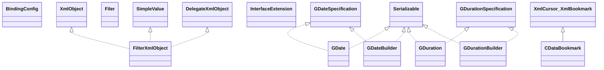

# xmlbeans-2.6.0.jar

[Group index](README.md) | [All archives](../README.md)

## Scope and provenance

- **Donor:** `SQX_145_REFERENCE_ROOT/internal/libs/xmlbeans-2.6.0.jar`.
- **SHA-256:** `c77974359688b2823b48fa9a33da68559d64f8474441480d9df4f9e254332a96`; accessed 2026-10-06; captured `2026-10-06T18:54:51.906614+00:00`.
- **Classes:** 1531 raw entries; 1523 unique entry names. Duplicate occurrence indices are zero-based.
- **Inspection:** read-only ZIP hashing and class-file structural parsing; signatures/descriptors, modifiers, hierarchy and references only. Bytecode bodies are hashed, not published.
- **Allocation:** proposed `FEAT-RESULTS-XMLBEANS`, P08; [roadmap](../../dev/sqx-full-application-roadmap.md). Domain README registration remains required.
- **Repository:** `01067f00031428613c6394064ca1bcadc1ba00ee`; review state unreviewed. Download label 145-dev1; installed build/activation and runtime equivalence unverified.
- **Limit:** every class/member is inventoried; declaration coverage does not establish consumed calls, defaults, formulas, failure semantics or algorithm parity.
- **Archive/resource index:** [120.json](../../dev/evidence/sqx145/archives/145/120.json).

## Complete member declarations

Member shards contain exact JVM names/descriptors, access flags, generic signatures, throws types, declared fields/methods, superclass/interfaces and referenced class names. All classes, nested/synthetic members and overloads are retained. Code length/hash is structural evidence, not a normalized algorithm comparison.

- [001.json](../../dev/evidence/sqx145/members/120/001.json) — SHA-256 `257fbe39fac85856b28ade40b8e3ebcbd3b9f6ba9f5e95de62c84f5a7e03e90b`.
- [002.json](../../dev/evidence/sqx145/members/120/002.json) — SHA-256 `d520b8ee4d3dc3eb7aa7fb595c9975b8eaed37b90d4f47ebd5f0b1ea0e0df054`.
- [003.json](../../dev/evidence/sqx145/members/120/003.json) — SHA-256 `525c8a079b59206af30546e7fa141bb6fe350f036c5b5715e5ff6968487c00d4`.
- [004.json](../../dev/evidence/sqx145/members/120/004.json) — SHA-256 `443abdf9d9ff0019cbf2254e77aff28015f00636d640ec5000499189b750779b`.
- [005.json](../../dev/evidence/sqx145/members/120/005.json) — SHA-256 `10910905027a3f4ec7e60be79031c5f96cfe832335b21926840640fd1878d065`.
- [006.json](../../dev/evidence/sqx145/members/120/006.json) — SHA-256 `d22e57ab85a41ee892aa55387ce8a33db04205c06320a47ba389b249e783c72a`.
- [007.json](../../dev/evidence/sqx145/members/120/007.json) — SHA-256 `03d668105eed92aa57880a13d6fd1e8aeb0c744cbc3b86db81c7a24445cd72ac`.
- [008.json](../../dev/evidence/sqx145/members/120/008.json) — SHA-256 `41aff8f49524124a3b18cfff373de7b854e970501b5fe2073bedce20fa8bbe9a`.
- [009.json](../../dev/evidence/sqx145/members/120/009.json) — SHA-256 `68b164fcecdf39b392aeb47aac3b922832cb31464df7422e6be4379899c3d263`.
- [010.json](../../dev/evidence/sqx145/members/120/010.json) — SHA-256 `c85bfa25d4e25b6cdd5875c0fda69491de8f39c808e21280838e13d98897bdc1`.
- [011.json](../../dev/evidence/sqx145/members/120/011.json) — SHA-256 `5f8d250180ec7453399ef23f4ead7c88905ade84e99741ca4497c221f2045f33`.
- [012.json](../../dev/evidence/sqx145/members/120/012.json) — SHA-256 `e6dd9765f43c95ee140c96c883670bf864e80ee4891ac1e069c589f28544fa18`.
- [013.json](../../dev/evidence/sqx145/members/120/013.json) — SHA-256 `51d8728412691c9a813e930229080eefb794cc24cfc86f03777be24f7bf94cc4`.
- [014.json](../../dev/evidence/sqx145/members/120/014.json) — SHA-256 `e66e429c92460a8a2ab8ae3ca0f4eb6db3dadd6279ea1fbb27e4880c72bced2e`.
- [015.json](../../dev/evidence/sqx145/members/120/015.json) — SHA-256 `aab5805d9d1e73d8fc7e6be137ae6a891b9b3ff22184b0b2361de217b602edfd`.
- [016.json](../../dev/evidence/sqx145/members/120/016.json) — SHA-256 `3bf86b3a4afe7ff102a2a5f96bf6d1621719435f39ae5ceb6388aea96d8ac6b7`.
- [017.json](../../dev/evidence/sqx145/members/120/017.json) — SHA-256 `5b65b3cfb7234ba7aa8cb02819069fdad7578cb1a498298436ddd7b98cd1c651`.
- [018.json](../../dev/evidence/sqx145/members/120/018.json) — SHA-256 `2e4d0a0acfa86b5eecd48f9cecee0146adaf5809f12f78d2fe8cc86c934e6367`.
- [019.json](../../dev/evidence/sqx145/members/120/019.json) — SHA-256 `f50869ab88f880166a1f8905b8442c8f56912e9f34903d44f475ced470cd0042`.
- [020.json](../../dev/evidence/sqx145/members/120/020.json) — SHA-256 `aa9f09044627f402332cbde2d743b1d5cd7e870a1828c94246889e15873b10ff`.

## Focused structural diagram

Up to twelve non-nested classes; arrows show declared inheritance/interfaces only. External type names are not evidence of an available body or an executed dependency.

## Class inventory

| Archive entry | Occurrence | Class SHA-256 | Fields | Methods |
| --- | ---: | --- | ---: | ---: |
| `org/apache/xmlbeans/BindingConfig.class` | 0 | `1e20385c1987239a10d62d7f3454cf9f31860ed6b80dc0b085e8701b8907ae7f` | 7 | 13 |
| `org/apache/xmlbeans/CDataBookmark.class` | 0 | `760c498b1c6b7788e0f9f6b1caf0271eee4933e0adb7cba3284a2cc1f1ad4b5c` | 1 | 2 |
| `org/apache/xmlbeans/DelegateXmlObject.class` | 0 | `901d1753685cb328b361db1b0e5a321095b3843b48552845185eb5dc05e0437e` | 0 | 1 |
| `org/apache/xmlbeans/Filer.class` | 0 | `5e38f0bbaabc4c40f9264a9f9556e0357599c81851cc3ba3adee7955816d6139` | 0 | 2 |
| `org/apache/xmlbeans/FilterXmlObject.class` | 0 | `f17d300ba77066bace80521e3ceac83ff24a19e628b4f439880d7b91cbee0d1d` | 0 | 128 |
| `org/apache/xmlbeans/GDate.class` | 0 | `30e74cc44d0df8e6fe428f36deb97f5b95b67afe274f0966b5ce74bb8104a7cc` | 25 | 48 |
| `org/apache/xmlbeans/GDateBuilder.class` | 0 | `d81ed09bdc1579e26aa7a3bab4eba28807a17b329a86c0bfc4ba46795865c5fa` | 15 | 77 |
| `org/apache/xmlbeans/GDateSpecification.class` | 0 | `9fe4891594b346c1fac26c1c8837282c68c5df11b3ae3be6402e8d9033616308` | 5 | 27 |
| `org/apache/xmlbeans/GDuration.class` | 0 | `3ef4c47eb844e63292a543c484b6a5639c842395f01a5f63aac40603d0e81ec5` | 16 | 22 |
| `org/apache/xmlbeans/GDurationBuilder.class` | 0 | `15d850ed07e40b92dd1c5d91e7cf9dedc9858535927665ba701cdb462321971c` | 10 | 40 |
| `org/apache/xmlbeans/GDurationSpecification.class` | 0 | `08e0191849eb80e9859a59e00d1161c2715b20a09c830c07158a5c67d7199b3c` | 0 | 11 |
| `org/apache/xmlbeans/InterfaceExtension$MethodSignature.class` | 0 | `769ce3c7b73864ee760f3358b161fcdbc1839b1a180fc530b808bb5030b19b8b` | 0 | 4 |
| `org/apache/xmlbeans/InterfaceExtension.class` | 0 | `56dc072340bb062556d5846d6afea565add299c5b29c12832a222d130efbe1c1` | 0 | 3 |
| `org/apache/xmlbeans/ObjectFactory.class` | 0 | `41e10b85c60e55fc3b8050fe43d5f8c489d54e73413f6446a614a7bbf4328c86` | 0 | 1 |
| `org/apache/xmlbeans/PrePostExtension.class` | 0 | `02f55fabc0a130452becb648812d1e1a347a375f209d2d057a2e86bcd32eec70` | 3 | 3 |
| `org/apache/xmlbeans/QNameCache.class` | 0 | `5a2cd580945af405cf05e3b0ffbc95c86a066e6723e7cc42de200cfec4012532` | 8 | 9 |
| `org/apache/xmlbeans/QNameSet.class` | 0 | `166ca8faf886149975e547b44a5fc34a56458f5e9152057c98037cc2d3a7fdf9` | 9 | 24 |
| `org/apache/xmlbeans/QNameSetBuilder.class` | 0 | `50321cbfdb47959129f0f9d8f921f4b8282b93904d8c9cb3748bdad53aa87cad` | 6 | 43 |
| `org/apache/xmlbeans/QNameSetSpecification.class` | 0 | `8483e50ce4304b9112cd4bd26af450e795bddf685d6f43cdd18dde5a7542f07e` | 0 | 12 |
| `org/apache/xmlbeans/ResourceLoader.class` | 0 | `d5441a226a43290b4e0cd1ec6243e5a9c86b89114f4dcf7ab27ef2a9abe9cd26` | 0 | 2 |
| `org/apache/xmlbeans/SchemaAnnotated.class` | 0 | `de2e20ad81eaf420894c5172c9d2e8c2cba01c06a73cc4e6aa91be6802af5acb` | 0 | 1 |
| `org/apache/xmlbeans/SchemaAnnotation$Attribute.class` | 0 | `135ff8b29655469eeb8b5eb8c0539a6f14388845041047e43645d58f4bd8d539` | 0 | 3 |
| `org/apache/xmlbeans/SchemaAnnotation.class` | 0 | `d91b1bcc75f87db3a85d3b5b58d428266018eb2fe6cefb9a42f6d08a3cd27ca2` | 0 | 3 |
| `org/apache/xmlbeans/SchemaAttributeGroup$Ref.class` | 0 | `1da6a169dbe90ba0a5333255afd92128fd83aee2104fbca4fd32c2baa7f17b40` | 0 | 4 |
| `org/apache/xmlbeans/SchemaAttributeGroup.class` | 0 | `f7450c9e067a4f18ab9e9ae0a80480ea6bb476a8cd91f9c0278bd481cd6fbc6e` | 0 | 3 |
| `org/apache/xmlbeans/SchemaAttributeModel.class` | 0 | `d1cda126c8206d19ca5d0a2bf0da5c6211a257af53ca77fbee6ab815dc10474d` | 4 | 4 |
| `org/apache/xmlbeans/SchemaBookmark.class` | 0 | `406e09bb71d8bf10af08752142eabb6bdab4d2080d6e410d2d10f9a71ada0cd5` | 1 | 2 |
| `org/apache/xmlbeans/SchemaCodePrinter.class` | 0 | `e37b52836ce8aaad4e3f4afd76f519211bf5b10bdd15e74b5f273c022a8ed5eb` | 0 | 3 |
| `org/apache/xmlbeans/SchemaComponent$1.class` | 0 | `12f1d84799aeaaf5bd964a4fc749525082d2d8e6b9e4f056c916a9c59a0f7e47` | 1 | 1 |
| `org/apache/xmlbeans/SchemaComponent$Ref.class` | 0 | `12fed2a2b73d19cbbcfb45d14eda2df503b5e8c70fbfaa38de248b67951be87e` | 4 | 6 |
| `org/apache/xmlbeans/SchemaComponent.class` | 0 | `a0443f76629ac2d9c80be0b3e8cc3c37183547491e8796933688d83b9db0b299` | 8 | 5 |
| `org/apache/xmlbeans/SchemaField.class` | 0 | `7b84f468d80e71375123debc86e680a877ec15a5287211f6cb0e9ba1d68ffc85` | 0 | 11 |
| `org/apache/xmlbeans/SchemaGlobalAttribute$Ref.class` | 0 | `d277f2360e27fe6d86f7f5e453c7aa8529f95acd102c297d47efe859be893f55` | 0 | 4 |
| `org/apache/xmlbeans/SchemaGlobalAttribute.class` | 0 | `e58d158890a84c9f4c3fe99d4653a1cef5867dd8f4613a4014fa82b045ed2bd5` | 0 | 1 |
| `org/apache/xmlbeans/SchemaGlobalElement$Ref.class` | 0 | `af57dd21fa18f28e1a1d3d2e59d954b455f683f4e6f3e6a6e723f9c081247c5c` | 0 | 4 |
| `org/apache/xmlbeans/SchemaGlobalElement.class` | 0 | `45b5faf1c12d34bb94445af2728166d8b14682ce49e9393bf57d38461b96f3e4` | 0 | 5 |
| `org/apache/xmlbeans/SchemaIdentityConstraint$Ref.class` | 0 | `699dec03cc8c79b8ce04103c54e55bb432ee1b50a9bc9352ae974810a25939ae` | 0 | 4 |
| `org/apache/xmlbeans/SchemaIdentityConstraint.class` | 0 | `b2feb154ee71aee91d4bd3a0af8c7bcb8396a8a5deda94f792424c8c2ca5bf91` | 3 | 8 |
| `org/apache/xmlbeans/SchemaLocalAttribute.class` | 0 | `937d078472b3fbc96680204394bf67eb1f7c07651469fc457775a0d6ff2d328d` | 3 | 1 |
| `org/apache/xmlbeans/SchemaLocalElement.class` | 0 | `daeec6aa95db99de4dbfdbbfef6fb9008c4fe2015e556ab79189d01cb76f20c4` | 0 | 5 |
| `org/apache/xmlbeans/SchemaModelGroup$Ref.class` | 0 | `280c0d5ed9ada2234db00e6f6be2aed10243049809073d5a64e42bce91be6704` | 0 | 4 |
| `org/apache/xmlbeans/SchemaModelGroup.class` | 0 | `633bd2d43d8c9503fb5e9b2def0e5b5e93af1d09ef205842591ffc9f05cddc78` | 0 | 3 |
| `org/apache/xmlbeans/SchemaParticle.class` | 0 | `b9a92b815140df096a54a03314275542b4f1ff99dd6bb429f3a0ed03db4f832a` | 8 | 21 |
| `org/apache/xmlbeans/SchemaProperty.class` | 0 | `01580ee7c71046eaba6951714a9d7d50cdea90a47338865f85188e6b76da1cc2` | 26 | 20 |
| `org/apache/xmlbeans/SchemaStringEnumEntry.class` | 0 | `9b17f117967d30499c0f5d9fabe774a4d94ca1424592782e0e005b3568a274db` | 0 | 3 |
| `org/apache/xmlbeans/SchemaType$Ref.class` | 0 | `3b06569ba5c1ef6eea7dcc04a1bb7915a608072934cd7eb129cd115457ea466f` | 0 | 4 |
| `org/apache/xmlbeans/SchemaType.class` | 0 | `027c4b1ef402f2e598bb86a725c8a7ee448979fba54664e28f5b931f87256c12` | 95 | 84 |
| `org/apache/xmlbeans/SchemaTypeElementSequencer.class` | 0 | `a680aa0d7e225eb710d59da225841d117bf6ca1bae207a242659a0072783febd` | 0 | 2 |
| `org/apache/xmlbeans/SchemaTypeLoader.class` | 0 | `2aabe2c595abdc9ceb6fd3f692e9de66b35343f32e5c1f2d55a0dc2c813aaa1d` | 0 | 33 |
| `org/apache/xmlbeans/SchemaTypeLoaderException.class` | 0 | `05c576dcb68f45b8f66c560cdf5df9808b75b2234038ba89893e0426e284e392` | 16 | 3 |
| `org/apache/xmlbeans/SchemaTypeSystem.class` | 0 | `522312e7afb8d81391631628059506fd2951c4aacb6a77cbd05470d580d32800` | 0 | 15 |
| `org/apache/xmlbeans/SimpleValue.class` | 0 | `355b918d30d9e3ced169a9eccd2b750ffdb9bf0a382e8115acabe31f2c11122c` | 0 | 79 |
| `org/apache/xmlbeans/StringEnumAbstractBase$Table.class` | 0 | `3f5cafb7d30115c4d389d73eed38b664e09a35297a14f4649ce3116bbc8dba32` | 2 | 4 |
| `org/apache/xmlbeans/StringEnumAbstractBase.class` | 0 | `054f3eb6b43b4108a8ffe99a902a5692ae3f088d0fe6a43d00bb4e29df63ace3` | 3 | 4 |
| `org/apache/xmlbeans/SystemProperties.class` | 0 | `fb6ad74da29024bf9bd23f8fee2eb806a299dba2790bc0194bc50833d66da84d` | 1 | 4 |
| `org/apache/xmlbeans/UserType.class` | 0 | `5c65ceddf4bae58062c133aebbbc4baf0d4c29847f199e3388f1a8d6bc1b3f17` | 0 | 3 |
| `org/apache/xmlbeans/XMLStreamValidationException.class` | 0 | `d56fca29d597d24626f8048961d844e827a2bde2dd55319c0ff0d2e7a4677334` | 1 | 2 |
| `org/apache/xmlbeans/XmlAnySimpleType$Factory.class` | 0 | `cd6a9c542df1eb400134a1fd5517367e2828f15f91ab17a3ff70ea06a24fc18d` | 0 | 22 |
| `org/apache/xmlbeans/XmlAnySimpleType.class` | 0 | `2a722767e10a3117d175b468de33d8057c27c01ceed484f5d6486f3e983570a7` | 1 | 5 |
| `org/apache/xmlbeans/XmlAnyURI$Factory.class` | 0 | `10ad480f6d231e05f7abb47351334f0c5d3d5e74384c03a8e285660aab301f11` | 0 | 22 |
| `org/apache/xmlbeans/XmlAnyURI.class` | 0 | `dcd9380df24be139c929db33b9527ffd75998b5cf0b73b6bbd76901d535dddcf` | 1 | 1 |
| `org/apache/xmlbeans/XmlBase64Binary$Factory.class` | 0 | `c4e9caf7142d9e7cef720a329e455981cc28e58ee8794399f11f2f4b9e7dc49d` | 0 | 22 |
| `org/apache/xmlbeans/XmlBase64Binary.class` | 0 | `89fd6dfb1fa36b41e98510125a04c61f86f6593533058b291869c51b1b5461fd` | 1 | 5 |
| `org/apache/xmlbeans/XmlBeans$1.class` | 0 | `fef7fd5d045402cb4b3bfeca259d7fea0be0e992ee6a89529abb2665c38b01db` | 0 | 2 |
| `org/apache/xmlbeans/XmlBeans.class` | 0 | `b96a4f3dee66f0204433c55280f701390f18cd3dba5e6c22be9ee731aa21846c` | 32 | 47 |
| `org/apache/xmlbeans/XmlBoolean$Factory.class` | 0 | `0d4894dbe44405928c70c10bd8302e3c4eaaa5d30ad978551d95ed96c38769df` | 0 | 22 |
| `org/apache/xmlbeans/XmlBoolean.class` | 0 | `eb760691d445ebc782fd996675f2e3480ba4c8bd94ee778170dc6994cc0e9477` | 1 | 5 |
| `org/apache/xmlbeans/XmlByte$Factory.class` | 0 | `3d4f0249860e1b959a9079fd51f040bb6136ee79506f86ee4082e04603674674` | 0 | 22 |
| `org/apache/xmlbeans/XmlByte.class` | 0 | `f960ee11d59c1f2749c76fd03c4a29ad879d0604291e691f57e765c42388fb57` | 1 | 5 |
| `org/apache/xmlbeans/XmlCalendar.class` | 0 | `41d437f44d75602b9334381bf90aac909396fc71a5bfb1c9f4aa982f077a5de0` | 3 | 13 |
| `org/apache/xmlbeans/XmlCursor$ChangeStamp.class` | 0 | `f44a5f82ea89cb20be1f17051ab7c928562f5b65c5ff015b4ccad25527edf196` | 0 | 1 |
| `org/apache/xmlbeans/XmlCursor$TokenType.class` | 0 | `3fb2cc68d461b0daa2d8b6c3644865d59ce9a67ca1d10385180e39ef40e176c3` | 22 | 17 |
| `org/apache/xmlbeans/XmlCursor$XmlBookmark.class` | 0 | `34ff414f9f85e6781447b78122f8c2a6baf1567ef3e10970f6953e5570c7a933` | 2 | 5 |
| `org/apache/xmlbeans/XmlCursor$XmlMark.class` | 0 | `4be0d4527be26603736f872653d100e9c888bc4d01b0ac319dc69c9b46836e0d` | 0 | 1 |
| `org/apache/xmlbeans/XmlCursor.class` | 0 | `27319c758ef1eea6676221b33f47eb10b5a917259c81e81b1358ccf69bc5705d` | 0 | 111 |
| `org/apache/xmlbeans/XmlDate$Factory.class` | 0 | `eba063794b4674277e4e8005848fc0fae57559171cdd363ab011c3d41ca5f379` | 0 | 22 |
| `org/apache/xmlbeans/XmlDate.class` | 0 | `81d8857cc0e7da5546848c27a01a5b74bf3e7ce6774101a87296c0dd26403b15` | 1 | 13 |
| `org/apache/xmlbeans/XmlDateTime$Factory.class` | 0 | `2b2f076be3df598ddbaf26fee39409d44a637cb8bcdb23feddda8bde6329058c` | 0 | 22 |
| `org/apache/xmlbeans/XmlDateTime.class` | 0 | `f66ad7ce5b56d102a71f05ac61144d10a613c2ba937f3ba0fc25f1481b2fdad2` | 1 | 13 |
| `org/apache/xmlbeans/XmlDecimal$Factory.class` | 0 | `ced0ebf71108acd6c3f0270408fabe94ba62312a04ddcf7db043343f1a3b016b` | 0 | 22 |
| `org/apache/xmlbeans/XmlDecimal.class` | 0 | `15ddeeb45c6095b705f92800e8be8cf847939bb7cfb4aeb13bc0cc15b59e74f0` | 1 | 5 |
| `org/apache/xmlbeans/XmlDocumentProperties.class` | 0 | `49706706ba4e653b3e8d910fe10e67fa2f6b7fe43866fe6cb8295d948faa884e` | 8 | 21 |
| `org/apache/xmlbeans/XmlDouble$Factory.class` | 0 | `aa2cf397f5187bb0251988749fa94139b7b56e56ee28859347ad551459edcaf6` | 0 | 22 |
| `org/apache/xmlbeans/XmlDouble.class` | 0 | `eb34f8d0996adb17906d7105b7cf62372b8aa0c8b0b431b524214f989bd39ecf` | 1 | 5 |
| `org/apache/xmlbeans/XmlDuration$Factory.class` | 0 | `d15f981282d9d8c9c4232caece26ee788e8124c81a08f18e765bae1bbc471340` | 0 | 22 |
| `org/apache/xmlbeans/XmlDuration.class` | 0 | `57120cbce3f4c0fa23df0ca018d1fd727694f1d0fcbfbb04f33302511a8c3f42` | 1 | 5 |
| `org/apache/xmlbeans/XmlENTITIES$Factory.class` | 0 | `4fa372922520def192b177242b45e0b0757dcebdb1f319ab5f2ed6aacc8ff9bb` | 0 | 22 |
| `org/apache/xmlbeans/XmlENTITIES.class` | 0 | `2c2e299a116832160b326ed0b157c89749ee2e9270b61d6bf61e698cb565582f` | 1 | 7 |
| `org/apache/xmlbeans/XmlENTITY$Factory.class` | 0 | `5e1e45bfee0f8fbe56726e962004bf0bf6cdc7b7789451258a1ed1da7fd90594` | 0 | 22 |
| `org/apache/xmlbeans/XmlENTITY.class` | 0 | `a91dbddf41db33b6133d21b7aa6393e1d8f19aae9a06d6c1e748dad503bdac01` | 1 | 1 |
| `org/apache/xmlbeans/XmlError.class` | 0 | `48b4209543a5e54a01cb242c57bfc05111b7cc55e7d6b31d62de051348392970` | 16 | 44 |
| `org/apache/xmlbeans/XmlErrorCodes.class` | 0 | `9e19c623efa0d77abb854820b9ce1065c3b86ddf836085d375cb5ba4092cb252` | 344 | 1 |
| `org/apache/xmlbeans/XmlException.class` | 0 | `67bf862b86b4ddf1fc25d700b1d777404ca7ee511f824643f347234fd067a695` | 2 | 9 |
| `org/apache/xmlbeans/XmlFactoryHook$ThreadContext.class` | 0 | `9a3432d6eb86cc98153df4393751a3fd35dbfe0e6466601b52d29e67beacc9c7` | 1 | 4 |
| `org/apache/xmlbeans/XmlFactoryHook.class` | 0 | `5a8dbc19dc301e43d37c4db26775766dfc80ba898ae47046d25521dbfd9f178f` | 0 | 9 |
| `org/apache/xmlbeans/XmlFloat$Factory.class` | 0 | `dd57bc691b2531b204f93950cf6f379407508279f4adcb70f21601a32102a4f8` | 0 | 22 |
| `org/apache/xmlbeans/XmlFloat.class` | 0 | `673f55e07a2062fe7c6da3dc9c8e45a2a5c9424fe0e6d2241e6cc4e53716b1a4` | 1 | 5 |
| `org/apache/xmlbeans/XmlGDay$Factory.class` | 0 | `cfad3898ca312c7036f99ffc8d15d85aa953b7c29dae1fca661dd475beff8ecc` | 0 | 22 |
| `org/apache/xmlbeans/XmlGDay.class` | 0 | `173139e16d0ad4eb70ce1099dce9dfd2b7805167977046c36b0f4bb4b3918f75` | 1 | 13 |
| `org/apache/xmlbeans/XmlGMonth$Factory.class` | 0 | `9d5a571455bbb090fd2252aa34ed34535fabb90a5b7179f44464c4732ffd4481` | 0 | 22 |
| `org/apache/xmlbeans/XmlGMonth.class` | 0 | `52f35db7b83a095f26a8b16c530f4b8c5761487933d1c2474af0adbbe4407fa2` | 1 | 13 |
| `org/apache/xmlbeans/XmlGMonthDay$Factory.class` | 0 | `0c5e48651c1d03033b6ea63bce4d7c42bbca36362070f9a796468815a0fc05c7` | 0 | 22 |
| `org/apache/xmlbeans/XmlGMonthDay.class` | 0 | `de0086e65ef51519e4bb80cddfd3ab5c7537f2e859b80504e59dc2df8f76f3ff` | 1 | 9 |
| `org/apache/xmlbeans/XmlGYear$Factory.class` | 0 | `adc9ea15fc5d7e7c1f74e37dfaaa72b522df030d8f1a54c60e8a91c5ccdca686` | 0 | 22 |
| `org/apache/xmlbeans/XmlGYear.class` | 0 | `258a7ac654c25ebb02a8c5321950d9834507e29069b9599c37c2cc6151fe7b58` | 1 | 13 |
| `org/apache/xmlbeans/XmlGYearMonth$Factory.class` | 0 | `e1a15f1dd9a645aac2a91062848a43e2d580feb959c5bcde20d5353465e84ab6` | 0 | 22 |
| `org/apache/xmlbeans/XmlGYearMonth.class` | 0 | `cfaffe8821d0be15748f8bba923d5046fb6f0aa4f9acefe280d0d4f0139d3831` | 1 | 9 |
| `org/apache/xmlbeans/XmlHexBinary$Factory.class` | 0 | `1c4dfa1a752824760e5b5d966992df072fe916572725c975fe4a3cc5d33a2869` | 0 | 22 |
| `org/apache/xmlbeans/XmlHexBinary.class` | 0 | `16b3101f9d47d0f3a77c58913943f8f48df57383cfc38b2cc3e6b799c92fac0b` | 1 | 5 |
| `org/apache/xmlbeans/XmlID$Factory.class` | 0 | `fc5d274855f01da27ed82afbc9d43d1dc10dccae0c4017a6d46d11d121cb3c74` | 0 | 22 |
| `org/apache/xmlbeans/XmlID.class` | 0 | `d2f6dccecbe442364c58027d82f0afa6b63f398ec1bae8d1c995641b279c5006` | 1 | 1 |
| `org/apache/xmlbeans/XmlIDREF$Factory.class` | 0 | `be552ce4b50e9deff65c4cb927ca41f21b20747d85db713eef98f8c74359abbc` | 0 | 22 |
| `org/apache/xmlbeans/XmlIDREF.class` | 0 | `2b64ff7200302327c030a420c13a29b461ecf60b247f27ac0859f00a04ee6ef6` | 1 | 1 |
| `org/apache/xmlbeans/XmlIDREFS$Factory.class` | 0 | `b97b7d5282ceb5ecc35ce53bce8ee5301de3be04bb5614fc1875d0bde7ee6fc3` | 0 | 22 |
| `org/apache/xmlbeans/XmlIDREFS.class` | 0 | `c187a4f06facc70642d99ba61a59652107b1fd7b464def9d61a639e5dc4eb9c1` | 1 | 7 |
| `org/apache/xmlbeans/XmlInt$Factory.class` | 0 | `546e8a8df18d7b123ddff1d1ce0fe047c1cb973163ca572e24230933164a674e` | 0 | 22 |
| `org/apache/xmlbeans/XmlInt.class` | 0 | `12a942bda929b2738419105a3a674244cf3b6abb2e5f30393ccddc71974a0720` | 1 | 5 |
| `org/apache/xmlbeans/XmlInteger$Factory.class` | 0 | `733523d582b1e96aec2c3a07f891682da1831fa34d9b576af5368fb74eee2e64` | 0 | 22 |
| `org/apache/xmlbeans/XmlInteger.class` | 0 | `0c20682a854c79d715fa683adb84fb9374f09487df860d78743df0d7c8577463` | 1 | 5 |
| `org/apache/xmlbeans/XmlLanguage$Factory.class` | 0 | `187b739ccee79bd499a51c48dff0edab23d8560a6b532de4a188c2e57663a03c` | 0 | 22 |
| `org/apache/xmlbeans/XmlLanguage.class` | 0 | `3ec6a69406ceea5241f09d98d60663fcbc9bdfe65dfb89328639570df5c31c46` | 1 | 1 |
| `org/apache/xmlbeans/XmlLineNumber.class` | 0 | `f9c78cc5235bc45de519cac041babc5d4c3143bb326b7192dd25e72c1eddc22e` | 3 | 6 |
| `org/apache/xmlbeans/XmlLong$Factory.class` | 0 | `0c81241998831325ea22e33559342702d399e1e9c8f6fe11f1141449b7fb700a` | 0 | 22 |
| `org/apache/xmlbeans/XmlLong.class` | 0 | `1a46c90f22b83a93859211e2abc49b249fc35e62ebd9f18e60ef5bbb2d6d04ff` | 1 | 5 |
| `org/apache/xmlbeans/XmlNCName$Factory.class` | 0 | `7ea71a817ae9304d92a64e9461808ed7aee4fcd6236c1592091d43a50cad05b3` | 0 | 22 |
| `org/apache/xmlbeans/XmlNCName.class` | 0 | `c860597dba2ac6a3f10bc75b27d9320542dd7b5aa42d09a0dd7a1f1d21f3401c` | 1 | 1 |
| `org/apache/xmlbeans/XmlNMTOKEN$Factory.class` | 0 | `01616e2141f33bf548c0fc505fa9fa998c229540cf4ca7dc0d02ca4562d8a687` | 0 | 22 |
| `org/apache/xmlbeans/XmlNMTOKEN.class` | 0 | `a698e24895773b44eadcab67ef91662c08b8667e1407fbb94d4e12b47ee85cf1` | 1 | 1 |
| `org/apache/xmlbeans/XmlNMTOKENS$Factory.class` | 0 | `bf55be82e8f98f9f6f0ef445aeb27bbc56c0e959a72e95e1b53d9f8b83bb9337` | 0 | 22 |
| `org/apache/xmlbeans/XmlNMTOKENS.class` | 0 | `2ac8c31e40aa0358de16c4b076b15aed4835a49ed393761fdb559f339a5bd9f3` | 1 | 7 |
| `org/apache/xmlbeans/XmlNOTATION$Factory.class` | 0 | `853c182d80ee1b326f3b498cde6d61ae8e2143e266623a8e769773bf65cf7cc9` | 0 | 22 |
| `org/apache/xmlbeans/XmlNOTATION.class` | 0 | `6c8b719029943d942cd8138ed98e55c37fa3e7cb34b7c1a749c262d217980550` | 1 | 1 |
| `org/apache/xmlbeans/XmlName$Factory.class` | 0 | `473bdcaef9f591aecc6ab6a8b49de97747d9bf099cee5beea2bf2fdf6363b8f8` | 0 | 22 |
| `org/apache/xmlbeans/XmlName.class` | 0 | `5fa638fdf7bf2a867823684be16add3dc27f2633140f126860963ee286072648` | 1 | 1 |
| `org/apache/xmlbeans/XmlNegativeInteger$Factory.class` | 0 | `be4b18be4597d84d52ef1af0d92e2b2c969dfd9e6085cec3ceeeb2a4170f7cb3` | 0 | 22 |
| `org/apache/xmlbeans/XmlNegativeInteger.class` | 0 | `0dfa30534ae7f297af8fe8df1edc478c5e2198151d871112fe8645755c203bf1` | 1 | 1 |
| `org/apache/xmlbeans/XmlNonNegativeInteger$Factory.class` | 0 | `a0f4e4e446b04358a03253e9b857b7eab2956929d322f7954438ca70f1fdaf23` | 0 | 22 |
| `org/apache/xmlbeans/XmlNonNegativeInteger.class` | 0 | `cf4307ad8b4b8ca3565fcfb329ca42b1197ccb203de87703afa65579114c9cc2` | 1 | 1 |
| `org/apache/xmlbeans/XmlNonPositiveInteger$Factory.class` | 0 | `9287ac319941c429ed0d0cefd47685829d91fa5d920c32603c6589e5ea35f089` | 0 | 22 |
| `org/apache/xmlbeans/XmlNonPositiveInteger.class` | 0 | `64dc656afe370d5cf4d7a1f0dfaffb736cc639667d03d633a1fc70d8185d0024` | 1 | 1 |
| `org/apache/xmlbeans/XmlNormalizedString$Factory.class` | 0 | `42258aae382b4f2b04b97bfb49079244cbd3c0bbe2050e1922bde393bd6f7707` | 0 | 22 |
| `org/apache/xmlbeans/XmlNormalizedString.class` | 0 | `ebd6c8983caa795cf98a8e429a6223ac34dff24d21cb1d2cb66aa5bbeb334f00` | 1 | 1 |
| `org/apache/xmlbeans/XmlObject$Factory.class` | 0 | `5790cdc20cb7022eeea8863bfa8f722324b13924bab90ab45ad43fdac05e9f2b` | 0 | 26 |
| `org/apache/xmlbeans/XmlObject.class` | 0 | `f24e5f5e7f2e7e7f4ec18cdeff9117293a840045638d978166bfd1fc7852bc07` | 5 | 27 |
| `org/apache/xmlbeans/XmlOptionCharEscapeMap.class` | 0 | `621dd12d4a07952326671b00758bf9229f598c98f63f234a020b606b69e4d90f` | 5 | 6 |
| `org/apache/xmlbeans/XmlOptions.class` | 0 | `b807863dfeddcddb9d6bd5eed8b24ca9c752c14065de08918d8f5c593bd19a12` | 61 | 70 |
| `org/apache/xmlbeans/XmlOptionsBean.class` | 0 | `29d7efe3eca798c4bfb2490b7fadbf1b1d5bf9f5d9b426d35c20e54d8163aa64` | 0 | 71 |
| `org/apache/xmlbeans/XmlPositiveInteger$Factory.class` | 0 | `086917c85090674a4cdbf30a9c74f6f6e2e592c4f5df22ebc5255802fd494794` | 0 | 22 |
| `org/apache/xmlbeans/XmlPositiveInteger.class` | 0 | `59f05bd4a8c0eee18f3084b642e60da6ca07e5b6eaae42b625ad1bc59aa4db45` | 1 | 1 |
| `org/apache/xmlbeans/XmlQName$Factory.class` | 0 | `313f3ca81dc359472f28e8e20b152579a47de69265293fdb47bde5ff99f03633` | 0 | 22 |
| `org/apache/xmlbeans/XmlQName.class` | 0 | `0c0d617c8429c5f0a4816a1d0e8f83919df9ac6d30d4d0032a5aee624532e738` | 1 | 5 |
| `org/apache/xmlbeans/XmlRuntimeException.class` | 0 | `d62fd9da2e74773d1834ffdd77948ca35c6b15a41b7ff3ed661dfdb23c6e2cdf` | 2 | 9 |
| `org/apache/xmlbeans/XmlSaxHandler.class` | 0 | `c000d0f906e0fc36088aba41f7621894bf2b097f6d4f69c0db97411b0e65de08` | 0 | 5 |
| `org/apache/xmlbeans/XmlShort$Factory.class` | 0 | `8228fffdd1978cbbf66ab315997e3fc51c90aaf98e45b36d6b5c8d2d8c1d87c2` | 0 | 22 |
| `org/apache/xmlbeans/XmlShort.class` | 0 | `92d572ecd15e8f6f9cdf478f83133bc8355a87478e170ad64eed070539eee01f` | 1 | 5 |
| `org/apache/xmlbeans/XmlSimpleList$1.class` | 0 | `57c8541a03089045f5a169fae4c32f54bca89b0404d7cc98ec8fd0350d7c1363` | 2 | 4 |
| `org/apache/xmlbeans/XmlSimpleList$2.class` | 0 | `c916fb23b7a00ea66bca93c47282ab993bc7fe70c50f61c232cc3a3f403e7c92` | 3 | 10 |
| `org/apache/xmlbeans/XmlSimpleList.class` | 0 | `ddf3f207375c9dda8255e487b51b24ba57e845811dba94bc2f2dec1023fcc6a2` | 2 | 29 |
| `org/apache/xmlbeans/XmlString$Factory.class` | 0 | `af16cb4554c4190ca5573d633342327c3822d656825960ac4813adefe4535088` | 0 | 22 |
| `org/apache/xmlbeans/XmlString.class` | 0 | `10d1534b53337563139bdf02c667d41b9eef1e617dd5a5a56900e1a16f38b80e` | 1 | 1 |
| `org/apache/xmlbeans/XmlTime$Factory.class` | 0 | `916d9d720a665863c483f35b87cefe698c352ebc460b371a638b3b4ac9cb139d` | 0 | 22 |
| `org/apache/xmlbeans/XmlTime.class` | 0 | `04f71f5efc9fd54c405cbc0a33a5ec8adabc3eba5679fe33d05aef1e1b553898` | 1 | 9 |
| `org/apache/xmlbeans/XmlToken$Factory.class` | 0 | `63c318c28ed8bc6c1c28948410013d3561e99ca36bfc32b40afa0bea32555144` | 0 | 22 |
| `org/apache/xmlbeans/XmlToken.class` | 0 | `4521d56e6df52f7d523d23d21b3756cb8cc2c9f5ef90e9e64f81bbc833bdd322` | 1 | 1 |
| `org/apache/xmlbeans/XmlTokenSource.class` | 0 | `534ab38db1b411f63c1fe3d375ac20e5ace5c5a3632e4c6d3b280e5a81c6c14b` | 0 | 25 |
| `org/apache/xmlbeans/XmlUnsignedByte$Factory.class` | 0 | `203bb1330a35b572b0fb22fb6b224407b4ead9053a502c9dd94983471b94773c` | 0 | 22 |
| `org/apache/xmlbeans/XmlUnsignedByte.class` | 0 | `3c8a93d2fdb720db4986b55266d503ba806b162aae7514a92f527b497c6c47c1` | 1 | 5 |
| `org/apache/xmlbeans/XmlUnsignedInt$Factory.class` | 0 | `0148f2a3a96893cdd611a61cfc3e3ee647dc12ae7a631c3f517fefda72866ef0` | 0 | 22 |
| `org/apache/xmlbeans/XmlUnsignedInt.class` | 0 | `fdce1b8679f70c3fba930d4fb5c5a5e7a06f1bc53506c312799d65778dc098ae` | 1 | 5 |
| `org/apache/xmlbeans/XmlUnsignedLong$Factory.class` | 0 | `2d331358b1c1a459d4557f262fd5380c7cc25da13286423d586e046fa4d096f0` | 0 | 22 |
| `org/apache/xmlbeans/XmlUnsignedLong.class` | 0 | `babd5353df21795eab7c2f2eecf94afe3f1fa13aa6eda0d1830de01199d494e6` | 1 | 1 |
| `org/apache/xmlbeans/XmlUnsignedShort$Factory.class` | 0 | `a04b313221481a970d3d74bc2b185124d272b0fb5b899319e7afa75645e18bc8` | 0 | 22 |
| `org/apache/xmlbeans/XmlUnsignedShort.class` | 0 | `2bb7bfc699b84f9713994849fdade2e34eba25a3c78d11e1b61872c6cdb73924` | 1 | 5 |
| `org/apache/xmlbeans/XmlValidationError.class` | 0 | `ecfbfd557da795ab392c2f55fd054c87f8835897af81b8caa46cdcd0ce264760` | 15 | 19 |
| `org/apache/xmlbeans/xml/stream/Location.class` | 0 | `99ed2bcbe84f9c22a630fbe08560aa754c36712ef8c9ec64a86eac492e85b477` | 0 | 4 |
| `org/apache/xmlbeans/xml/stream/ReferenceResolver.class` | 0 | `18eaf5ca64757a53433d4a06305b0361a30b3347ea1dd66c552973466d761642` | 0 | 2 |
| `org/apache/xmlbeans/xml/stream/XMLEvent.class` | 0 | `e884fdc80fdd8a997a6349480414530cb7708befc9c35ce17f6a712f226f0052` | 14 | 18 |
| `org/apache/xmlbeans/xml/stream/XMLInputStream.class` | 0 | `6ce7bde40f1ae86c3b71683341e04425c79267ce9a9f557f4874282f5d15c2bd` | 0 | 12 |
| `org/apache/xmlbeans/xml/stream/XMLName.class` | 0 | `d3abd94276feb483c809e2b1eb602a237b1ffdf24862640f1da76c0fdfaf307f` | 0 | 4 |
| `org/apache/xmlbeans/xml/stream/XMLStreamException.class` | 0 | `3ad01b6e43371736ae568878f3380ba85ec33ae435ce8e494b6eaa094bf3c4e9` | 1 | 14 |
| `org/apache/xmlbeans/xml/stream/utils/NestedThrowable$Util.class` | 0 | `84847431c16dbc7d80e59d32e2738cb22a759896dad5cff2a1f985792ed88d9e` | 1 | 6 |
| `org/apache/xmlbeans/xml/stream/utils/NestedThrowable.class` | 0 | `933bcea45726137307499998bc7dfd268c961ff5a0cfc660d1d59a2ff58958c0` | 0 | 4 |
| `org/apache/xmlbeans/impl/values/NamespaceManager.class` | 0 | `bf5400fa67f2384e93754c4df9e1a2505849bbc814dbd61d996a327f31012f15` | 0 | 1 |
| `org/apache/xmlbeans/impl/values/TypeStore.class` | 0 | `febf663f979174c90823c7e07d56adddd8791ddd0326e00a91f9e1f808aed11e` | 7 | 37 |
| `org/apache/xmlbeans/impl/values/TypeStoreUser.class` | 0 | `8adc1b236dca1356b40baabf14d46c9c867eb51bf046c64a3803010ad720f0e2` | 0 | 23 |
| `org/apache/xmlbeans/impl/values/TypeStoreUserFactory.class` | 0 | `529d9162c233aa4285bf0698d462627e426c127f7286a7ceac7380e148ce2e91` | 0 | 1 |
| `org/apache/xmlbeans/impl/values/TypeStoreVisitor.class` | 0 | `dcc1fe6187237f676f9972ca301a29124b018d2fe87211cb45aac8c3d405522b` | 0 | 4 |
| `org/apache/xmlbeans/impl/common/ConcurrentReaderHashMap$1.class` | 0 | `4db66a83d62862ef2b33213101bf7af87e28d70a93abe942490a469cf1151104` | 0 | 0 |
| `org/apache/xmlbeans/impl/common/ConcurrentReaderHashMap$BarrierLock.class` | 0 | `29cbdaaf175958aaa9b0b79ac50885d3308ce22b45b5fcda3a59389744eef817` | 0 | 1 |
| `org/apache/xmlbeans/impl/common/ConcurrentReaderHashMap$Entry.class` | 0 | `79db7d6551f94204af043868bda82f9a2c5f404fab9cf3265ac62f795bd937f4` | 4 | 7 |
| `org/apache/xmlbeans/impl/common/ConcurrentReaderHashMap$EntrySet.class` | 0 | `ccf308ca9722d809a8ec608260dc744955f6efe798b1420a0bee9d9cb83a7719` | 1 | 7 |
| `org/apache/xmlbeans/impl/common/ConcurrentReaderHashMap$HashIterator.class` | 0 | `7ee016d0e86cbce536188b39a533c00148bc71e72cf7de6264b9052a7ef550ef` | 7 | 7 |
| `org/apache/xmlbeans/impl/common/ConcurrentReaderHashMap$KeyIterator.class` | 0 | `01864d56e439189c2bb26573f63f4b7f7df630f2eee1f91a3d265ca2bfd957c9` | 1 | 2 |
| `org/apache/xmlbeans/impl/common/ConcurrentReaderHashMap$KeySet.class` | 0 | `3dab7e5068b74faea8a210e03adb0f160994affdd255dc26b581529a343439c6` | 1 | 7 |
| `org/apache/xmlbeans/impl/common/ConcurrentReaderHashMap$ValueIterator.class` | 0 | `f3e0d3ff308526093d24d935d1afda1fc0647cdf7ec74db612556beca9a7382f` | 1 | 2 |
| `org/apache/xmlbeans/impl/common/ConcurrentReaderHashMap$Values.class` | 0 | `edf2c35136897aa6e0ad6ddf65ec9ca098e974563df3abfa8507d52969017b56` | 1 | 6 |
| `org/apache/xmlbeans/impl/common/ConcurrentReaderHashMap.class` | 0 | `009c5cc4dd8ae2531f8d95bb2aa536a6faf29a174a57002e299aecd5ee1728c5` | 13 | 34 |
| `org/apache/xmlbeans/impl/common/EncodingMap.class` | 0 | `23a72b319b437e1f504ab90f5ec80df424516f8574364e170dd9eb4f2e1a4109` | 4 | 7 |
| `org/apache/xmlbeans/impl/common/GenericXmlInputStream$EventItem.class` | 0 | `90957625f73efc252de857f01a59c778fe04770683997c22b81c43ffe517c968` | 3 | 4 |
| `org/apache/xmlbeans/impl/common/GenericXmlInputStream.class` | 0 | `d8c292e1735e3bf3214d55a425a3466c00fe21f7b59c1ff41b5885a4691a6fd3` | 4 | 17 |
| `org/apache/xmlbeans/impl/common/GlobalLock.class` | 0 | `a396660f444d0a8d3007a8978f4c4c54781f4c73c0bb8cebd7293330077bde76` | 1 | 5 |
| `org/apache/xmlbeans/impl/common/IOUtil.class` | 0 | `a90b466bcd9cab85e14fcd093c01c8e76a91932811c6c600cbc6d15c4114c094` | 2 | 7 |
| `org/apache/xmlbeans/impl/common/IdentityConstraint$1.class` | 0 | `77b09eb9eb5f818e27450d5243a44e011c5f86369f96db810f03580efeee91f2` | 0 | 0 |
| `org/apache/xmlbeans/impl/common/IdentityConstraint$ConstraintState.class` | 0 | `48c22ce10d27e8ebb32ec88b5569e9750a9967479e01a915b20431fb48698fa1` | 2 | 6 |
| `org/apache/xmlbeans/impl/common/IdentityConstraint$ElementState.class` | 0 | `76b45ce09c7a93e12347d2ec079f704227b4e32fa8f496dcce38f8f352d875f8` | 3 | 2 |
| `org/apache/xmlbeans/impl/common/IdentityConstraint$FieldState.class` | 0 | `10a696990dbbd302d2cbdb5ff268b54cdb45c56a5e0ffefaba586759ac28ce79` | 5 | 6 |
| `org/apache/xmlbeans/impl/common/IdentityConstraint$IdRefState.class` | 0 | `1c64a044c48fce29080dc81fcdb007cd9c159ba412a63185f155a31f7c1e9b5b` | 3 | 7 |
| `org/apache/xmlbeans/impl/common/IdentityConstraint$IdState.class` | 0 | `8a0cd3d03cbe011120121fed87484a1a7e5fe657a49df33a638ba3ba91eb78c7` | 2 | 7 |
| `org/apache/xmlbeans/impl/common/IdentityConstraint$KeyrefState.class` | 0 | `180c5c29988acdee72a6ee867ee5d3a46009f0e6269e8be4b80fa5f33fde2032` | 5 | 4 |
| `org/apache/xmlbeans/impl/common/IdentityConstraint$SelectorState.class` | 0 | `df306ce2c4ace3fca2bf49c6f7cdd7c327d32752fb8e740fdadc027438b64608` | 4 | 8 |
| `org/apache/xmlbeans/impl/common/IdentityConstraint.class` | 0 | `73aa51804787a039a51577108e85738c04f25b40fa45e74ee705eff92862538f` | 7 | 26 |
| `org/apache/xmlbeans/impl/common/InvalidLexicalValueException.class` | 0 | `cd38e02703a0f276242f0a401f0bb4f29f3d4b862928a5a5ea0810b57a207d96` | 1 | 9 |
| `org/apache/xmlbeans/impl/common/JarHelper.class` | 0 | `6a5124bd1b82ada9416fdcfcb21fe7a7c8728b5ce9cbf60d592a15d35e3f6ccc` | 6 | 7 |
| `org/apache/xmlbeans/impl/common/Levenshtein.class` | 0 | `c2fd7718a87a6e32032680e962be47c0bc52fda98a15d97b2c4ac8d20aa12a0f` | 0 | 3 |
| `org/apache/xmlbeans/impl/common/LoadSaveUtils.class` | 0 | `8dcd236b312a4980091cee068210c68b0aaf93cf42470ec1f9d5996917c6df35` | 0 | 3 |
| `org/apache/xmlbeans/impl/common/Mutex.class` | 0 | `611291e855ecd3144aa5b36f62dc128a5d536b20f04865cc9871c4ff358fc688` | 2 | 4 |
| `org/apache/xmlbeans/impl/common/NameUtil.class` | 0 | `4cee3ccb288cad44cfb0708bca3df88ae382506f386b7c8bf754f152c4b467e9` | 21 | 33 |
| `org/apache/xmlbeans/impl/common/PrefixResolver.class` | 0 | `bd6232164365c26f2878f671c3d2c17892d0e8164a91077a25c4d92047cb37b9` | 0 | 1 |
| `org/apache/xmlbeans/impl/common/PushedInputStream$1.class` | 0 | `b9f67cd07940af307c79c7cfcd892f66e2a3457fca83d0bfbea5ee52c76dd0c9` | 0 | 0 |
| `org/apache/xmlbeans/impl/common/PushedInputStream$InternalOutputStream.class` | 0 | `c334ac503791818d064f5564d463802a168916cfba4e0710921e32bd7158c9e6` | 1 | 4 |
| `org/apache/xmlbeans/impl/common/PushedInputStream.class` | 0 | `ecfdae80270bb432c4f8727e57371095430c8f324c8b687674401fa25966708e` | 7 | 14 |
| `org/apache/xmlbeans/impl/common/QNameHelper.class` | 0 | `e554312247da5a62f4b207bd869f03c5c88c03959379acb3635dddde22f427b5` | 6 | 22 |
| `org/apache/xmlbeans/impl/common/ReaderInputStream.class` | 0 | `59bd4348b00178816ef52d43a30fa2e4597750ffe74480795190142603540455` | 4 | 4 |
| `org/apache/xmlbeans/impl/common/ResolverUtil.class` | 0 | `b16adc9ad93be65ada49c00b090a2131ffcbe39fc6d9a115a43768348e137352` | 2 | 5 |
| `org/apache/xmlbeans/impl/common/Sax2Dom.class` | 0 | `11a14b781e844c7d5e814bd05f49751892819193a50af751329ea49faa0e91d7` | 9 | 21 |
| `org/apache/xmlbeans/impl/common/SniffedXmlInputStream$1.class` | 0 | `b57eacd81fe53dd60dbf298fd3bb6d8db4beaa0406db777891a4fd7a72c894b9` | 0 | 0 |
| `org/apache/xmlbeans/impl/common/SniffedXmlInputStream$ScannedAttribute.class` | 0 | `fd487792a1e04b3741ac661bfe662414a44df9920aa2f09948f7a5cf79855032` | 2 | 2 |
| `org/apache/xmlbeans/impl/common/SniffedXmlInputStream.class` | 0 | `1fdd673a5fc2326b35b902ce895049048f8b49cc7be51dc5839fe9595f9cec82` | 13 | 13 |
| `org/apache/xmlbeans/impl/common/SniffedXmlReader.class` | 0 | `bd918e1ebd1a350d5647ce902237ce7b7c34216ab0bb692134c363f31861f84a` | 9 | 5 |
| `org/apache/xmlbeans/impl/common/SoftCache.class` | 0 | `715225b2dffa30b9e82c432a196a563846690156c9787858be42ecae6a9541c1` | 1 | 4 |
| `org/apache/xmlbeans/impl/common/SystemCache.class` | 0 | `17f39599fa192ccd938003b4b487439380c1228e1e6968b374ec36ed3008b294` | 2 | 8 |
| `org/apache/xmlbeans/impl/common/ValidationContext.class` | 0 | `6c4958918f6b1aa43a2fec6f7ad25a4c4a21695f7fa2684d890a8289f72c9359` | 0 | 2 |
| `org/apache/xmlbeans/impl/common/ValidatorListener$Event.class` | 0 | `83859e3354a722412b1072e1ba0803dcc3f7f563115a5c6a693723d99f5bd9de` | 3 | 10 |
| `org/apache/xmlbeans/impl/common/ValidatorListener.class` | 0 | `563f4d64d06a785d448e1c4aa80cfbc8c15e50395076f06a042bcdf66cd8d97b` | 5 | 1 |
| `org/apache/xmlbeans/impl/common/XBeanDebug.class` | 0 | `9f1c6f2d8060f8f3f740ad8cb00760fdd5a1a84720ebd379492fb94448268fef` | 8 | 12 |
| `org/apache/xmlbeans/impl/common/XMLChar.class` | 0 | `3cf4a3f700a48737165edbb1c8f57d8735aa6e51b68f9a572775d4e9a5df218f` | 9 | 24 |
| `org/apache/xmlbeans/impl/common/XMLNameHelper.class` | 0 | `db2d83b1a01b6f56a1ecf0d578e672e5e6716e03bdef8c649f659ca323e0c29b` | 1 | 10 |
| `org/apache/xmlbeans/impl/common/XPath$1.class` | 0 | `ce436ddf3c4d2ea2d2df8e4de150e97f5a72fb2e653561ccf8cb60b6c84a7be2` | 0 | 0 |
| `org/apache/xmlbeans/impl/common/XPath$CompilationContext.class` | 0 | `29da7ba12b8b8aea50377101a25a6029ee308c8218405174d3945d47380b5653` | 10 | 31 |
| `org/apache/xmlbeans/impl/common/XPath$ExecutionContext$PathContext.class` | 0 | `31e913891f5c359c29bd4d465062c637d2569fa7b3bc29be4f07bc6c96b8c77d` | 4 | 9 |
| `org/apache/xmlbeans/impl/common/XPath$ExecutionContext.class` | 0 | `6d6f5a34bed9ed7c17cd2eadedb0e768a8c86408c104056e70289700939d0b20` | 7 | 8 |
| `org/apache/xmlbeans/impl/common/XPath$Selector.class` | 0 | `79fa7457b7e8c34c4b8926f701033eded06769da6acc40b6b08db740a068e8c7` | 1 | 1 |
| `org/apache/xmlbeans/impl/common/XPath$Step.class` | 0 | `5f0d16d856be3dac2a78fc6854bf6de6cd4cf2390487ccd3e8de1dba021ee697` | 8 | 3 |
| `org/apache/xmlbeans/impl/common/XPath$XPathCompileException.class` | 0 | `64a8c87f0976796ffd9242ae9d1b66e08a299a2765c222e47a8df4e0b36a1b1f` | 0 | 1 |
| `org/apache/xmlbeans/impl/common/XPath.class` | 0 | `bf4dfa8a3ce44e144ae54b4078f8c2aed8570aa895e14f9b57a71bb43a8843cc` | 5 | 9 |
| `org/apache/xmlbeans/impl/common/XmlEncodingSniffer.class` | 0 | `83d5fee788c6f73f9b65cb927b7d69a39d063be0fb51863c40b78d9c88e56ef7` | 6 | 8 |
| `org/apache/xmlbeans/impl/common/XmlErrorPrinter.class` | 0 | `17db0896bc870f33963469e8bd80b50ee58d8bd95d83aa99f1186332295c9c87` | 2 | 4 |
| `org/apache/xmlbeans/impl/common/XmlErrorWatcher.class` | 0 | `68de9a2bb75c6eda7a0120dc8f640529709059f3d242a9a9756262fa696d494b` | 2 | 6 |
| `org/apache/xmlbeans/impl/common/XmlEventBase.class` | 0 | `3af347e8a7848710bd08debae0dc2c96439f6e6585e7017ddb498fcd741d5fbc` | 1 | 17 |
| `org/apache/xmlbeans/impl/common/XmlLocale.class` | 0 | `c3bf3d26ff474025ad3ff7cdf166733b83896e41f21fecbc6314a3496314d976` | 0 | 4 |
| `org/apache/xmlbeans/impl/common/XmlNameImpl.class` | 0 | `0fbadee84183f9164e048aa22c0131dc86e6aa60aa2715e38890bb31008dcca9` | 4 | 14 |
| `org/apache/xmlbeans/impl/common/XmlObjectList.class` | 0 | `285ebae044fc7c9fcd8b65ac3fe24b4338f099ba53f058ba697a7230c43797b9` | 1 | 8 |
| `org/apache/xmlbeans/impl/common/XmlReaderToWriter.class` | 0 | `46eceb57a6c6d948b279cdf5d27e0fdaf91e2c88a66cfcf7ef5df80e8b32a069` | 0 | 3 |
| `org/apache/xmlbeans/impl/common/XmlStreamUtils.class` | 0 | `99f77b25b316673512e4f523056e93a5eddd40c332a4add401ed19d51a13e766` | 0 | 6 |
| `org/apache/xmlbeans/impl/common/XmlWhitespace.class` | 0 | `e4a98afee8b9e542971159c69f0ce2794707e0f07d6d9bbe4cb32fa757945d45` | 4 | 6 |
| `org/apache/xmlbeans/impl/config/BindingConfigImpl.class` | 0 | `9e5970df9f4e242aa000ee2516938c2fe07264f4f17e74332bca1f53f1dad042` | 13 | 25 |
| `org/apache/xmlbeans/impl/config/InterfaceExtensionImpl$MethodSignatureImpl.class` | 0 | `44e2079b1d49ae640d6472498e17078f1e77b964af2bc2515dcd9fea729c0c4f` | 8 | 10 |
| `org/apache/xmlbeans/impl/config/InterfaceExtensionImpl.class` | 0 | `267c29c971cb2af9c9434a5f94071b00b1d4b21444f857a2d36dd9b67f669409` | 4 | 16 |
| `org/apache/xmlbeans/impl/config/NameSet.class` | 0 | `eb57868f4fc34e379e7bacbd82b56ac77a090cbd997738cb9ccf61045d0d1609` | 4 | 10 |
| `org/apache/xmlbeans/impl/config/NameSetBuilder.class` | 0 | `bdfb7ef983a1e05ddf3cf0b3f188cdd7b82db3fa53755b5d7cd3abf13f677ef8` | 2 | 4 |
| `org/apache/xmlbeans/impl/config/PrePostExtensionImpl.class` | 0 | `79da120716a13780a7e5d771786f0cc0e0a4d1e4ff08fd9d6390f617c7b1d04f` | 10 | 13 |
| `org/apache/xmlbeans/impl/config/UserTypeImpl.class` | 0 | `5189bebd298e7e517352a93da06da74a22c222f00668a702a587af72371e855b` | 3 | 5 |
| `org/apache/xmlbeans/impl/regex/BMPattern.class` | 0 | `9fe76669228a415fbb369fc7d6edf64334a508045624f351e10237a1669e436a` | 3 | 8 |
| `org/apache/xmlbeans/impl/regex/Match.class` | 0 | `f326e47ea3de9cdbf66aaf6453d83e472f057201a60fa31a942124cbf3c0da85` | 6 | 12 |
| `org/apache/xmlbeans/impl/regex/Op$CharOp.class` | 0 | `5e4a94d82aea5cc0ee73bcb675315c5f5c43a62fa9de66eabab0ff9869401a2d` | 1 | 2 |
| `org/apache/xmlbeans/impl/regex/Op$ChildOp.class` | 0 | `99f547f9fba9ba053bb112eede118d108a90e0a2273f418ff46fec2a879cfcfd` | 1 | 3 |
| `org/apache/xmlbeans/impl/regex/Op$ConditionOp.class` | 0 | `b425bce308e55842091595b14b56d500edc003e36c3333e94f455d0199adcf64` | 4 | 1 |
| `org/apache/xmlbeans/impl/regex/Op$ModifierOp.class` | 0 | `26a7d87eb3685ad3e705150293e19530b6a0c3b671ab3e1ad7a454428ecc61ce` | 2 | 3 |
| `org/apache/xmlbeans/impl/regex/Op$RangeOp.class` | 0 | `82c2eaa19d15a2ed12b84e8419dcf6064188aef27e0fe41947b25a327d900efe` | 1 | 2 |
| `org/apache/xmlbeans/impl/regex/Op$StringOp.class` | 0 | `5ad4542a8b8e5482ccd40960164d410855f62457fedf246f6d13307c988b1dc3` | 1 | 2 |
| `org/apache/xmlbeans/impl/regex/Op$UnionOp.class` | 0 | `c276ecb0449e0b98279e7e7b13b92fa69ca160c9875de12e8d3ef320ea512541` | 1 | 4 |
| `org/apache/xmlbeans/impl/regex/Op.class` | 0 | `44520dce5555ddccada7a93e260142e46eb20d886c6ffdf463833fd97f06e682` | 24 | 24 |
| `org/apache/xmlbeans/impl/regex/ParseException.class` | 0 | `1409dc90b73287c53a3bd57ef6961cc1ca26efe078f91e6daeeb7aed51263842` | 1 | 2 |
| `org/apache/xmlbeans/impl/regex/ParserForXMLSchema.class` | 0 | `4c94a2011b81295889f8d5b2f46a120f1e830e835bb7ade346f436e189250fe3` | 6 | 39 |
| `org/apache/xmlbeans/impl/regex/REUtil.class` | 0 | `016948e5fb92f6a755a3293a735d3129b970927f728da33f69895540c85416ac` | 2 | 17 |
| `org/apache/xmlbeans/impl/regex/RangeToken.class` | 0 | `6a439b8c03e5e93398f2d3ad3276f7b9b9f91f3b408940328a2fd59ba7a536e0` | 7 | 18 |
| `org/apache/xmlbeans/impl/regex/RegexParser$ReferencePosition.class` | 0 | `cf57adfa58bca07cd93c34936dd8d36042dcdf5fe12431c4f297b89902673a66` | 2 | 1 |
| `org/apache/xmlbeans/impl/regex/RegexParser.class` | 0 | `ab742f2a936a409bc3c14e8db36cbdc83e8b92e74543ee030c31639db8288307` | 39 | 49 |
| `org/apache/xmlbeans/impl/regex/RegularExpression$Context.class` | 0 | `f24e4c1401ebaac44a56285bd4f3642da363c4df636837ebb1ac384a05da7edc` | 9 | 5 |
| `org/apache/xmlbeans/impl/regex/RegularExpression.class` | 0 | `cb90b885ad53bd76a1d282dbe4cfc42d77889e3c4fb798f5e1ecd2e9548cec9c` | 32 | 52 |
| `org/apache/xmlbeans/impl/regex/SchemaRegularExpression$1.class` | 0 | `15bc712306c780f52e42009e90f142b9c030b6c45c84b08d1bb82e01fcab8765` | 0 | 2 |
| `org/apache/xmlbeans/impl/regex/SchemaRegularExpression$2.class` | 0 | `1d0944749ffadd1dbfdd296fae54d53b4b872b5f88c5e4136dc8ea623913bfff` | 0 | 2 |
| `org/apache/xmlbeans/impl/regex/SchemaRegularExpression$3.class` | 0 | `5238c8362aa9bd4adc87706feefa6d692c3904b5d658fb923f36f0f7515017e3` | 0 | 2 |
| `org/apache/xmlbeans/impl/regex/SchemaRegularExpression.class` | 0 | `b350f71d426a6c0721f471b6fa10435563cb519a5d32e17bf44b7d44b170a1f9` | 1 | 5 |
| `org/apache/xmlbeans/impl/regex/Token$CharToken.class` | 0 | `0a6ef57535f1e201e8f7c197c3257715e575b7a005268c90781273c306328460` | 1 | 4 |
| `org/apache/xmlbeans/impl/regex/Token$ClosureToken.class` | 0 | `8c87594bbeaee054fc22ea8ca9e203b65b62750f9bf09d4f36a48fd958272ee3` | 3 | 8 |
| `org/apache/xmlbeans/impl/regex/Token$ConcatToken.class` | 0 | `8b37237b39c79cbb5a721c51afe806b628c9cc52f5efbfdf13da2c9c6d0ed17b` | 2 | 4 |
| `org/apache/xmlbeans/impl/regex/Token$ConditionToken.class` | 0 | `40e3095c09054514076a8ff3262819d579a8a9f9c3b529e50aa2d0ef8e5cc9c6` | 4 | 4 |
| `org/apache/xmlbeans/impl/regex/Token$FixedStringContainer.class` | 0 | `521a1e08896a61ba0b2d7d339ec2f1682dbf4717184eb7395ed30a4cfc9e5829` | 2 | 1 |
| `org/apache/xmlbeans/impl/regex/Token$ModifierToken.class` | 0 | `5308a801feaa5c67dc7b56b036a09ccf6c55161e13493710253e62faa0852c5a` | 3 | 6 |
| `org/apache/xmlbeans/impl/regex/Token$ParenToken.class` | 0 | `decfdd44cd3f387ac8abd68946c4ac630a0a928381b6f9f9199e90343e5c3ebe` | 2 | 5 |
| `org/apache/xmlbeans/impl/regex/Token$StringToken.class` | 0 | `ad987422ea69fe56b5e2f04f9d7df4c345675e6ce5256b202e8b2b288b326b3a` | 2 | 4 |
| `org/apache/xmlbeans/impl/regex/Token$UnionToken.class` | 0 | `76c08e932cf47a1c7142584b4dd5d36cfbf6c9804b929153bc013f29214edcb4` | 1 | 5 |
| `org/apache/xmlbeans/impl/regex/Token.class` | 0 | `7dc4417ca4127636441969fd816898e496057c8a53f85080823737686cfb7350` | 65 | 52 |
| `org/apache/xmlbeans/impl/schema/BuiltinSchemaTypeSystem.class` | 0 | `ccbe5df599e458aebf1205e530ddecc0c865e1dfd02329d8e443665643aca98e` | 91 | 44 |
| `org/apache/xmlbeans/impl/schema/ClassLoaderResourceLoader.class` | 0 | `a7af06aeb813e64141fbb6f694a65904785d60f368cdbbdfafae2cb4748661fe` | 1 | 3 |
| `org/apache/xmlbeans/impl/schema/FileResourceLoader.class` | 0 | `7e891fe92c282eb64c9c56b28866bc4abb080473abf4a00971c3a89e45ef81d6` | 2 | 3 |
| `org/apache/xmlbeans/impl/schema/PathResourceLoader.class` | 0 | `b673ed76e47385ce86db6d478a41847526de5f58f827b6b744f6b6625c978e95` | 1 | 4 |
| `org/apache/xmlbeans/impl/schema/SchemaAnnotationImpl$AttributeImpl.class` | 0 | `e8a92bd88699961af55cec76f5d57dd18475f6b65301d5af4679bd962d15c76f` | 3 | 4 |
| `org/apache/xmlbeans/impl/schema/SchemaAnnotationImpl.class` | 0 | `ad18c859d013855a8939f9882a43f5df531180cc5f4d3c3a5bbdfa1402b74385` | 7 | 15 |
| `org/apache/xmlbeans/impl/schema/SchemaAttributeGroupImpl.class` | 0 | `34d1023814f57d956c1e7359dddd2edf880ee5b9a9f20b27dc8c07e564f1427d` | 13 | 20 |
| `org/apache/xmlbeans/impl/schema/SchemaAttributeModelImpl.class` | 0 | `2f4596cceb59305534662370a55e0253739af5bb27274b13dab88859cd65a916` | 4 | 11 |
| `org/apache/xmlbeans/impl/schema/SchemaContainer.class` | 0 | `345f8810c3fbe9c2b1454c28482e1ffa45ced954801abe315c0a650f56f1ae6e` | 15 | 32 |
| `org/apache/xmlbeans/impl/schema/SchemaDependencies.class` | 0 | `011166e212b5b61baed8d6427cb04ccec7f9ed42382a7752a407c4d9e9728846` | 2 | 8 |
| `org/apache/xmlbeans/impl/schema/SchemaGlobalAttributeImpl.class` | 0 | `1956adf59468c51bfe5a4346cc3627c49a52165f1d8d19a1022f3d72b6d931a6` | 5 | 12 |
| `org/apache/xmlbeans/impl/schema/SchemaGlobalElementImpl.class` | 0 | `4a1dd12298a2843fbfd8f1388581c1730ff05e9fbded30d21facb1df437671a8` | 10 | 20 |
| `org/apache/xmlbeans/impl/schema/SchemaIdentityConstraintImpl.class` | 0 | `ca6c6671e193ae3df480b023df596c9b117d53f6f8271a8cc342beb2b822bb8c` | 18 | 34 |
| `org/apache/xmlbeans/impl/schema/SchemaLocalAttributeImpl.class` | 0 | `c25fc8c141bae35591cd658812909589b49c4e2e7eefe52a44179e63c39255fa` | 11 | 20 |
| `org/apache/xmlbeans/impl/schema/SchemaLocalElementImpl.class` | 0 | `301ac3ccfab368ff6caf9abbcd329194336554339e142dcfdbacc4c63648f59c` | 7 | 14 |
| `org/apache/xmlbeans/impl/schema/SchemaModelGroupImpl.class` | 0 | `623d283638d3e9838a511de1c76133c479a1bf4844f7302acce21168924ba7c5` | 14 | 21 |
| `org/apache/xmlbeans/impl/schema/SchemaParticleImpl.class` | 0 | `a852d4560d3233ddc2b9b0bb38375312eaa1332435e3aa9ade4fdaeaae71f1c8` | 25 | 48 |
| `org/apache/xmlbeans/impl/schema/SchemaPropertyImpl.class` | 0 | `802a08b9536cd8813a8c3520696fc1d5af4235afd99235f489b6325953ebaeb6` | 22 | 42 |
| `org/apache/xmlbeans/impl/schema/SchemaStringEnumEntryImpl.class` | 0 | `4932fb6ff6d382646d668baa9fbb3dc13cfb76d64dcf07d0c7531f3a456f74d7` | 3 | 4 |
| `org/apache/xmlbeans/impl/schema/SchemaTypeCodePrinter.class` | 0 | `66b34b424c47d55c14b4abb87fa513f55106114873184d16240e53c1935590e8` | 12 | 79 |
| `org/apache/xmlbeans/impl/schema/SchemaTypeImpl$1.class` | 0 | `191c787f8a9fe683b966837683a5f9a8e07a40185e372df232c3c4408f65b2af` | 0 | 0 |
| `org/apache/xmlbeans/impl/schema/SchemaTypeImpl$SequencerImpl.class` | 0 | `daa314317bbd9f5452b547e79408aa5cc90130447cfa3fc42e1f0d6acd334201` | 1 | 4 |
| `org/apache/xmlbeans/impl/schema/SchemaTypeImpl.class` | 0 | `917d30d9edb99ba4cde76f059e6ed77fc2d3b3e9763c3eea7ff8a853b0b5a748` | 108 | 226 |
| `org/apache/xmlbeans/impl/schema/SchemaTypeLoaderBase.class` | 0 | `fd1529d2d4214a8e447d6ef26cb823113ac46d3c3cc32c3411745063948163fb` | 7 | 31 |
| `org/apache/xmlbeans/impl/schema/SchemaTypeLoaderImpl$1.class` | 0 | `3d9b50ef42d88ad3ac43b2f6e08a54c045a315db7dd08a30f1d7c057e8a34b41` | 0 | 0 |
| `org/apache/xmlbeans/impl/schema/SchemaTypeLoaderImpl$SchemaTypeLoaderCache$1.class` | 0 | `6ec9b55a89c1945fc3ff9aeb76696088678cbdc3e56fbec560c9a430a40a2bd5` | 1 | 2 |
| `org/apache/xmlbeans/impl/schema/SchemaTypeLoaderImpl$SchemaTypeLoaderCache.class` | 0 | `38789583fea6a92724ffe354fdd563cb868f509d3c0b06b10c3ef3836865f6d8` | 2 | 5 |
| `org/apache/xmlbeans/impl/schema/SchemaTypeLoaderImpl$SubLoaderList.class` | 0 | `a4c4e0d14c04af3f1118ee45b8bd65313491fe9266a6202d2950f9b3b96a5091` | 2 | 6 |
| `org/apache/xmlbeans/impl/schema/SchemaTypeLoaderImpl.class` | 0 | `def83c9a775e7a87c9796ca0b59605f8070dd35620b7d90392a5a71756c3ce7b` | 19 | 27 |
| `org/apache/xmlbeans/impl/schema/SchemaTypeSystemCompiler$Parameters.class` | 0 | `f29ad9142468ea5839b0ff9e93419570715b58b133ff15ba3d81e3e568c3427f` | 11 | 23 |
| `org/apache/xmlbeans/impl/schema/SchemaTypeSystemCompiler.class` | 0 | `163660baf96ba1abbfebc4c4c397ca361ea38fc64a3f10e88ed818b982b5c276` | 0 | 6 |
| `org/apache/xmlbeans/impl/schema/SchemaTypeSystemImpl$HandlePool.class` | 0 | `5a3960f75931552a956c973027fc7f9d74eb1b56ad78a33b2dbb920bc14c3a2a` | 4 | 15 |
| `org/apache/xmlbeans/impl/schema/SchemaTypeSystemImpl$StringPool.class` | 0 | `27c9d74328bab546fa41d5bccb3c2b74450a164aa0ff81d5206715e59b7c5ca1` | 4 | 5 |
| `org/apache/xmlbeans/impl/schema/SchemaTypeSystemImpl$XsbReader.class` | 0 | `94769517f660fbf0573894a1ec33e27e54c0020f8e288b490ddb4c0f6d3a6d5d` | 10 | 76 |
| `org/apache/xmlbeans/impl/schema/SchemaTypeSystemImpl.class` | 0 | `ac053336d16e704127accfc4f3ea62f8ca0eb6554fa809341dd79b5daa14de92` | 105 | 93 |
| `org/apache/xmlbeans/impl/schema/SchemaTypeVisitorImpl$1.class` | 0 | `6830239082871a91aa59f3516b62f9daa753f5d05ddb193109917a664e5badda` | 0 | 0 |
| `org/apache/xmlbeans/impl/schema/SchemaTypeVisitorImpl$VisitorState.class` | 0 | `cd2c66ee70fdb16bcaea2ce70c23eb98173bd93237105e2ad43c1ea4d3c53a76` | 7 | 4 |
| `org/apache/xmlbeans/impl/schema/SchemaTypeVisitorImpl.class` | 0 | `513ebcbc17184a4acc3669c5d6610ff9cd6c9fdcaeac04528fdc6c64f35e46bf` | 12 | 24 |
| `org/apache/xmlbeans/impl/schema/SoapEncSchemaTypeSystem.class` | 0 | `858aa73dadfbafd95434d62dea7864c17ad28e5bb69aed7805246f2f85f8fe49` | 18 | 38 |
| `org/apache/xmlbeans/impl/schema/StscChecker.class` | 0 | `2c3ef034d193d1c2cfd96a6c88c5e7a034fb24e3d30b77f89c97d71ec3a90561` | 2 | 37 |
| `org/apache/xmlbeans/impl/schema/StscComplexTypeResolver$CodeForNameEntry.class` | 0 | `bcb0ef6c4710ddec6a7eedca233f1cca1a6d65f81eecd8c087073e5f1f52c3d1` | 2 | 1 |
| `org/apache/xmlbeans/impl/schema/StscComplexTypeResolver$RedefinitionForGroup.class` | 0 | `a77e2d6f0412e3e277e4fc63e3507a8bcc7bdf9859ed1f43cfa58335cde7910b` | 2 | 4 |
| `org/apache/xmlbeans/impl/schema/StscComplexTypeResolver$WildcardResult.class` | 0 | `a4a1b02236f1657f5cc688e20781028f3503d959de7d7948a5f60678fc9075b3` | 2 | 1 |
| `org/apache/xmlbeans/impl/schema/StscComplexTypeResolver.class` | 0 | `9208bc7858ebf25498151c997d01084e9ae75abaee8503d0a414b668c70cff70` | 10 | 42 |
| `org/apache/xmlbeans/impl/schema/StscImporter$DownloadTable$DigestKey.class` | 0 | `47ecccedba7f1e2874bd082b7f07fe043be24a7c2c417baa77141d77dd344520` | 2 | 3 |
| `org/apache/xmlbeans/impl/schema/StscImporter$DownloadTable$NsLocPair.class` | 0 | `dcd292061f2349a3a24879e0805f4d86e700c88079976020b4c5610c15af724f` | 2 | 5 |
| `org/apache/xmlbeans/impl/schema/StscImporter$DownloadTable.class` | 0 | `801165fe5884be710e852920eaad174e28609efa7b5a451a8610c348f6bb08df` | 6 | 21 |
| `org/apache/xmlbeans/impl/schema/StscImporter$SchemaToProcess.class` | 0 | `cc9fb14e941c97fbca67d468402b257be286104eef5a74532830a9fa59d21f7e` | 7 | 17 |
| `org/apache/xmlbeans/impl/schema/StscImporter.class` | 0 | `430d41d2a441ef2c2bbb32996ad4dd07c01e3e2ca04d5735610e41fb3a531b92` | 1 | 7 |
| `org/apache/xmlbeans/impl/schema/StscJavaizer.class` | 0 | `772bdcac3c022b0422d59381829190cf680a24a635f30b8b34b98f89e4fe07b5` | 6 | 31 |
| `org/apache/xmlbeans/impl/schema/StscResolver.class` | 0 | `be24503742b0ed9e054a166b3135eebe640afdd0caa2a1c8f23e990b0c13fcd7` | 2 | 10 |
| `org/apache/xmlbeans/impl/schema/StscSimpleTypeResolver$CodeForNameEntry.class` | 0 | `e57667f22888d11d7cd429578f055332c9b8071f1fff340c93df95f68ae3e6a9` | 2 | 1 |
| `org/apache/xmlbeans/impl/schema/StscSimpleTypeResolver.class` | 0 | `19365c8d11054e0f0ba10019c31cbb09a1458781107dd9ce506f9371495c1826` | 5 | 22 |
| `org/apache/xmlbeans/impl/schema/StscState$1.class` | 0 | `2f4dfd2eb617eacf84bfd9ec8554726cee2eb625f05dcc3fcd46610a9fdb7ef1` | 0 | 0 |
| `org/apache/xmlbeans/impl/schema/StscState$StscStack.class` | 0 | `c28850de53a66cc59d1404c01f2c1925ad38584515d51289169f577b2ed3cd7a` | 2 | 4 |
| `org/apache/xmlbeans/impl/schema/StscState.class` | 0 | `d2bf31754760d6486795c9cfbc33c2b50f56ccabec9c28525fe2aab718aca8c5` | 58 | 113 |
| `org/apache/xmlbeans/impl/schema/StscTranslator$RedefinitionHolder.class` | 0 | `db1890bae2ec42a11cb5e7040bd94fcc597170777490c2d339d584aacd03061d` | 6 | 12 |
| `org/apache/xmlbeans/impl/schema/StscTranslator$RedefinitionMaster.class` | 0 | `676ba91fae559360dbd6c8a8c01cab1f56fbc24aa043e127ebc766de4e8ed9bd` | 10 | 9 |
| `org/apache/xmlbeans/impl/schema/StscTranslator.class` | 0 | `c90ac22936d92ccb234c60c31c8c772916249a89492a1fc1d041614c80ac739b` | 6 | 30 |
| `org/apache/xmlbeans/impl/schema/XQuerySchemaTypeSystem.class` | 0 | `22d1999c11bd900339ee370dba0b281503227b86c3c8e3785778b18a25fb1fc6` | 100 | 45 |
| `org/apache/xmlbeans/impl/schema/XmlValueRef.class` | 0 | `190298bb87e4957f1c98630b7268c8b836664688a0fbac63b2c7ddf3b15cc923` | 3 | 3 |
| `org/apache/xmlbeans/impl/util/Base64.class` | 0 | `868a6d3b7e8551abba3d6f5408ce0f9fb017bdc49f48fdb1e0ece9c92d32e39f` | 11 | 9 |
| `org/apache/xmlbeans/impl/util/Diff.class` | 0 | `f0795b8d67b0b4e946f94953ea5f394b7de045d8639819aafcecac16dc093c9a` | 0 | 2 |
| `org/apache/xmlbeans/impl/util/FilerImpl$IncrFileWriter.class` | 0 | `5dd81afd987c92deb3b13ff2746504461fa05ee23df305d2da3d3ee81828a8a2` | 2 | 2 |
| `org/apache/xmlbeans/impl/util/FilerImpl$RepackagingWriter.class` | 0 | `f1b98583a7e73f8461917e632dc894c3893e4a615651e6d3827c07307e3fe0fe` | 2 | 2 |
| `org/apache/xmlbeans/impl/util/FilerImpl.class` | 0 | `8f00c4d57190bdd22f60b65da84c2a19acb84096221cb1270a93a382571ead88` | 8 | 8 |
| `org/apache/xmlbeans/impl/util/HexBin.class` | 0 | `f63e820ce7b7f1eb4ef034be9c403400e5dd34230bcbc7d11f971db84cb83859` | 4 | 9 |
| `org/apache/xmlbeans/impl/util/XsTypeConverter.class` | 0 | `6af11f34c8aa424289d8ef4b08352656c528ec5d09df3d7f5febaae7efd804f6` | 11 | 62 |
| `org/apache/xmlbeans/impl/validator/ValidatingInfoXMLStreamReader.class` | 0 | `527e3a6d54d36dc08bd53ae4a7eedd542d312da0bd0f23be01ae2b7099a9b9f0` | 2 | 20 |
| `org/apache/xmlbeans/impl/validator/ValidatingXMLInputStream$1.class` | 0 | `1c784f5716d50983f271a53ee821f4b44dd98f85e62cb8eac40bf0037813e4c9` | 2 | 6 |
| `org/apache/xmlbeans/impl/validator/ValidatingXMLInputStream$ExceptionXmlErrorListener.class` | 0 | `d9a665f7c635475b85e5a16fd66ac8a02590b5d7d96dca447b7834640bc43f7c` | 2 | 6 |
| `org/apache/xmlbeans/impl/validator/ValidatingXMLInputStream.class` | 0 | `a38181f6b1cdbf02b9316dd380aa90bf29362f9dcfc0e4b0d5bdcdeb3aba059a` | 13 | 20 |
| `org/apache/xmlbeans/impl/validator/ValidatingXMLStreamReader$1.class` | 0 | `25a95a88de2a81ee42c38fd2a003cf3cbc0fe3723ee41ab9a2fd89559014e9ea` | 0 | 0 |
| `org/apache/xmlbeans/impl/validator/ValidatingXMLStreamReader$AttributeEventImpl.class` | 0 | `faee81d002b29de5295c849d6ad6c1bd921f761c5935fb8d0c71089074179def` | 3 | 18 |
| `org/apache/xmlbeans/impl/validator/ValidatingXMLStreamReader$ElementEventImpl.class` | 0 | `312b51318f0a77c0e087d133d87891621121c5b4f15424872bfaa75378be34dd` | 5 | 17 |
| `org/apache/xmlbeans/impl/validator/ValidatingXMLStreamReader$PackTextXmlStreamReader.class` | 0 | `998b164b76fc240b8629b94e35f0a501b76d3bc3426d2a8bb75130d3ea4d4a41` | 4 | 15 |
| `org/apache/xmlbeans/impl/validator/ValidatingXMLStreamReader$SimpleEventImpl.class` | 0 | `bf7e5de462a71c97c00c0714447f70300ab4b3fdb57c3ea7a58491a9c0009ee3` | 3 | 17 |
| `org/apache/xmlbeans/impl/validator/ValidatingXMLStreamReader.class` | 0 | `dc8c5d1522844e87bd77066cb7acf1689d6f7d083a02f9af1502461047f770de` | 26 | 15 |
| `org/apache/xmlbeans/impl/validator/Validator$1.class` | 0 | `824a2b9d52f78baca0d591c3023aee3a3b371cb83948f24e7cf390296297475a` | 0 | 0 |
| `org/apache/xmlbeans/impl/validator/Validator$State.class` | 0 | `fe5d42f6d4599b6d7ef0b4b889eec6ff7a7ac162b24ec12276925c46958ee9c5` | 15 | 7 |
| `org/apache/xmlbeans/impl/validator/Validator$ValidatorVC.class` | 0 | `45378b5f5624fb3ebe70ba962df60f670e18726f411e166312b0f271ab2bdda4` | 2 | 4 |
| `org/apache/xmlbeans/impl/validator/Validator.class` | 0 | `bce6a0909bc73dd320cffcee8765170997af24813bb2f276d0f8354fd24d1a74` | 32 | 51 |
| `org/apache/xmlbeans/impl/validator/ValidatorUtil$EventImpl.class` | 0 | `14bf05db493e91ad92cfa202bc5286ab43fab36c694819b589a456e1ed9dae7e` | 2 | 12 |
| `org/apache/xmlbeans/impl/validator/ValidatorUtil.class` | 0 | `d7118b75bfd79cbb29a0a3b5a4f54b0e6f681cd62a6c0affff272ba336e9bc27` | 2 | 4 |
| `org/apache/xmlbeans/impl/values/JavaBase64Holder.class` | 0 | `809af3c88f6f9de31c71944c926a23000d490ebd8be5a94b3d25ad59be06bf7b` | 4 | 12 |
| `org/apache/xmlbeans/impl/values/JavaBase64HolderEx.class` | 0 | `6b095135ffd95023faf5a37e4d225f816e29d061dfae7a656968ccd38fa6cfa5` | 1 | 7 |
| `org/apache/xmlbeans/impl/values/JavaBooleanHolder.class` | 0 | `6599fa42e0c19118a57c493cbb8b8ae91e1dd2c15cc247b4207888e9ee385b3c` | 1 | 11 |
| `org/apache/xmlbeans/impl/values/JavaBooleanHolderEx.class` | 0 | `24e654de4f4448c72ec652e2182cd7b558b57cf20acffefe5ac3d164a1d148c1` | 1 | 6 |
| `org/apache/xmlbeans/impl/values/JavaDecimalHolder.class` | 0 | `d1bf92ce7431edb6e49ffedb70cba94bd785c433b16f1a97fa894c095fa8178a` | 5 | 14 |
| `org/apache/xmlbeans/impl/values/JavaDecimalHolderEx.class` | 0 | `446a74b3e69d68814dfa4aaafcab99d5ba76591341d157bc87756efbec898e59` | 1 | 7 |
| `org/apache/xmlbeans/impl/values/JavaDoubleHolder.class` | 0 | `be76228e24ef770d534ae493609c6a551f6f98a88575e98982d1af25876cda97` | 1 | 19 |
| `org/apache/xmlbeans/impl/values/JavaDoubleHolderEx.class` | 0 | `094d6ac7ed14891481a855b0aa9917718124fd486f7547a9d057d76806899893` | 1 | 6 |
| `org/apache/xmlbeans/impl/values/JavaFloatHolder.class` | 0 | `0e500dd5bf635bba6529c1556b34a847f1e201967cbb4e776b359bb538975aad` | 1 | 19 |
| `org/apache/xmlbeans/impl/values/JavaFloatHolderEx.class` | 0 | `464c8399b560cf546039e5407b4683f10fcc6cd12a1c0ea4a0b7ba38a40e45e8` | 1 | 6 |
| `org/apache/xmlbeans/impl/values/JavaGDateHolderEx.class` | 0 | `a9ff5842dad3fa10bb80a1e2d410bf9805902927213880a9d3753161ee8015db` | 4 | 22 |
| `org/apache/xmlbeans/impl/values/JavaGDurationHolderEx.class` | 0 | `46b11c87b22caa498fa36f0cbefc33751e549d58221e6c9c830eb7f6d001ac63` | 2 | 14 |
| `org/apache/xmlbeans/impl/values/JavaHexBinaryHolder.class` | 0 | `0e189a94544521bf1fed3b9d1e51b343a2d0432f38a72a6c13da886effc68264` | 4 | 12 |
| `org/apache/xmlbeans/impl/values/JavaHexBinaryHolderEx.class` | 0 | `180244e36a9161f60d0e0f270bd72dce64450a1eeed4fd1715d3830bd5302b3b` | 1 | 7 |
| `org/apache/xmlbeans/impl/values/JavaIntHolder.class` | 0 | `27dd79fcc3313ed57b1103fc982639a095011d8e5d389a0e79ee24753d716bdd` | 3 | 17 |
| `org/apache/xmlbeans/impl/values/JavaIntHolderEx.class` | 0 | `2a5628b156cc9d14c0c3a6bea28f5cf15bb5c0c4c835ff2a1346ff100d980eef` | 1 | 8 |
| `org/apache/xmlbeans/impl/values/JavaIntegerHolder.class` | 0 | `57c510eff19bf330411e50090639369870575851f47381ca2600dc7779b5338d` | 3 | 14 |
| `org/apache/xmlbeans/impl/values/JavaIntegerHolderEx.class` | 0 | `daabb889a8cc72c858ee2f125af3e809052d397449a7b91b7dcab90245bfb331` | 1 | 8 |
| `org/apache/xmlbeans/impl/values/JavaLongHolder.class` | 0 | `b7b79d569fd21b2794a7fe4bc3187d89872f67996f602051ac0c94a30ad1e687` | 3 | 15 |
| `org/apache/xmlbeans/impl/values/JavaLongHolderEx.class` | 0 | `dae49238be45f73e96f68a8a7c70e35f1817c04c62ad67a7d75aed9e0ee64cec` | 1 | 8 |
| `org/apache/xmlbeans/impl/values/JavaNotationHolder.class` | 0 | `df9678ab312cafa8920e43539d791700f8e8c30695f544b1a268c49d0a379f30` | 0 | 2 |
| `org/apache/xmlbeans/impl/values/JavaNotationHolderEx.class` | 0 | `f6656b240bbdfdf7604efc60df176c644d2e48f0d6bf000c1651f272ef8d2061` | 1 | 9 |
| `org/apache/xmlbeans/impl/values/JavaQNameHolder$1.class` | 0 | `969072757834917a174e91bba66e1e69026b01826c3367e8c9d6205ee5f8cdea` | 0 | 0 |
| `org/apache/xmlbeans/impl/values/JavaQNameHolder$PrettyNamespaceManager.class` | 0 | `2351301076fa82638613df8a8844ecd5481117c2b752a3d82518b28824b4164d` | 0 | 4 |
| `org/apache/xmlbeans/impl/values/JavaQNameHolder.class` | 0 | `d73f53255e47eeba2193fa0047718eb48385d7b510292381df4f6aaaced0c037` | 4 | 15 |
| `org/apache/xmlbeans/impl/values/JavaQNameHolderEx.class` | 0 | `d22f20c158308f21abb28d2a9ea892cfcd0aded8b40c5cbb9861afe821c0adec` | 1 | 9 |
| `org/apache/xmlbeans/impl/values/JavaStringEnumerationHolderEx.class` | 0 | `7930769c3600933afbc30edbc6714767f05d0d04350921edbe094503cc5b1823` | 1 | 6 |
| `org/apache/xmlbeans/impl/values/JavaStringHolder.class` | 0 | `85017fc6c1356afd74bf44a459d0edf7bbc4b99bf1835443e6a4dfa5dc3cebff` | 1 | 9 |
| `org/apache/xmlbeans/impl/values/JavaStringHolderEx.class` | 0 | `ce13125e548c131671f3224df19227c2b0f21111a0de889c8cd488177955c992` | 1 | 7 |
| `org/apache/xmlbeans/impl/values/JavaUriHolder.class` | 0 | `440ac69736e044c0e5ba9d4887e35261fd029db01930ffb6fc903985bd0d9589` | 1 | 8 |
| `org/apache/xmlbeans/impl/values/JavaUriHolderEx.class` | 0 | `12e79315e9a6f47608ab40caef2e6fb043b32bd13662a19d6bebee9a6b397a81` | 1 | 7 |
| `org/apache/xmlbeans/impl/values/NamespaceContext$1.class` | 0 | `c9580e8387dbeffda721d2e77c53155f051239863cdc574ea7a6b917165ac9ec` | 0 | 0 |
| `org/apache/xmlbeans/impl/values/NamespaceContext$NamespaceContextStack.class` | 0 | `f5d64df0df6802a39120de2113228dc90bc51d983bab2e313e6e74d237b08908` | 2 | 4 |
| `org/apache/xmlbeans/impl/values/NamespaceContext.class` | 0 | `a7d1c5f3ca859d6702024f1dfeff9902bbfd3168f3d2fcd58c844c46ff9243db` | 10 | 12 |
| `org/apache/xmlbeans/impl/values/StringEnumValue.class` | 0 | `4dddf5a6e07ad7790a67cf841b116f860e5d602f1113fea73e25dbd36dea3391` | 0 | 1 |
| `org/apache/xmlbeans/impl/values/XmlAnySimpleTypeImpl.class` | 0 | `0abafbb6472c569f8755f76e38a1435347fa7f5fa1e0cc68132db54490bec3dc` | 2 | 9 |
| `org/apache/xmlbeans/impl/values/XmlAnySimpleTypeRestriction.class` | 0 | `8579e0bdf45c8f0671748152e37b6b7ea72d9391aade4c6add7a580653ea8d27` | 1 | 2 |
| `org/apache/xmlbeans/impl/values/XmlAnyTypeImpl.class` | 0 | `39e243c586f15ecbe28f8e7ac9ddcfd02b252e895a806a47b951bad180d9f30a` | 0 | 2 |
| `org/apache/xmlbeans/impl/values/XmlAnyUriImpl.class` | 0 | `112ded64594ef17994affdebc0101cd7db5e549980f269509124a520b7a0279b` | 0 | 1 |
| `org/apache/xmlbeans/impl/values/XmlAnyUriRestriction.class` | 0 | `2000c7b6efb20f2b035b76bc70021e9efa5a28e76b99d0f03acc05f621754d64` | 0 | 1 |
| `org/apache/xmlbeans/impl/values/XmlBase64BinaryImpl.class` | 0 | `6000a81edad11d70964383406057abcf04c450fb0fc7b00aaa7123f49a0f97e5` | 0 | 1 |
| `org/apache/xmlbeans/impl/values/XmlBase64BinaryRestriction.class` | 0 | `e151c24fcfe9cf03f1bc20d93da0bfcff407c70d0dd0d57212b78610da7e821a` | 0 | 1 |
| `org/apache/xmlbeans/impl/values/XmlBooleanImpl.class` | 0 | `ddc94a60a48f69f236c8a82abbef781f71f9d76b2cbc4eac0fe7899391b74126` | 0 | 1 |
| `org/apache/xmlbeans/impl/values/XmlBooleanRestriction.class` | 0 | `828df2397fd720a62bd6d3ab8957a127bf38084849801b69ad7fc1ae038a92e2` | 0 | 1 |
| `org/apache/xmlbeans/impl/values/XmlByteImpl.class` | 0 | `64083636489c0cee3194971ce752ceebf0cd328628aa58fc3ee0c6c06fde3d77` | 0 | 2 |
| `org/apache/xmlbeans/impl/values/XmlComplexContentImpl.class` | 0 | `8fd2e15c1cb1ca2b70d6b85c1fdd9317b98ae66064c8288e2609e2c352a4bfae` | 3 | 58 |
| `org/apache/xmlbeans/impl/values/XmlDateImpl.class` | 0 | `a353cdc3fb12c133024b26429bc5ba05a45728d6e28b36483fe6d6eede942d07` | 0 | 2 |
| `org/apache/xmlbeans/impl/values/XmlDateTimeImpl.class` | 0 | `dd3974dcfe611762ec631895c3c9ffff94652aac0515e4f604175733985815cb` | 0 | 2 |
| `org/apache/xmlbeans/impl/values/XmlDecimalImpl.class` | 0 | `f13c1dddd34d66bef23e65220519e2356e8a78e285fd62b4a5b640adb8c0e3d2` | 0 | 1 |
| `org/apache/xmlbeans/impl/values/XmlDecimalRestriction.class` | 0 | `a4544f65ba920cfaecee1cfe7f2ed5bec62e6eae9dbc77b6b4350d2629590df4` | 0 | 1 |
| `org/apache/xmlbeans/impl/values/XmlDoubleImpl.class` | 0 | `f78c33e089db534e8fa20446dfd172bdfc64bf07685888736882f9aaa0691711` | 0 | 1 |
| `org/apache/xmlbeans/impl/values/XmlDoubleRestriction.class` | 0 | `4138c23a0087948aa0722187f744a642a7f211a4c08265c3157965df1d6cd283` | 0 | 1 |
| `org/apache/xmlbeans/impl/values/XmlDurationImpl.class` | 0 | `ef48a0bf2262b7ce23ed028e9397e3d83c136fb30794deb48321061308e1e6ea` | 0 | 2 |
| `org/apache/xmlbeans/impl/values/XmlEntitiesImpl.class` | 0 | `997b2cddcf3c2143a6293a1b37294bd53cdbb5e9df8edcce63e19efac8f25723` | 0 | 2 |
| `org/apache/xmlbeans/impl/values/XmlEntityImpl.class` | 0 | `4515f0b336cdb28a24774f5afd560954e42fd0aa307d47b12db5486966e48493` | 0 | 2 |
| `org/apache/xmlbeans/impl/values/XmlFloatImpl.class` | 0 | `83a5bc0a23f652be60ded824aad8f8d1c58cda4360aa5a1d3119da7a77ad9be9` | 0 | 1 |
| `org/apache/xmlbeans/impl/values/XmlFloatRestriction.class` | 0 | `d93cacb959dd9558a94fc185633d0dece9c8ab62a9d7e351c451402613cb821d` | 0 | 1 |
| `org/apache/xmlbeans/impl/values/XmlGDayImpl.class` | 0 | `fe86b25c5e11c4f028c0867b530466724a5839645c781a4b4bbf4bc55b1625b4` | 0 | 2 |
| `org/apache/xmlbeans/impl/values/XmlGMonthDayImpl.class` | 0 | `2bb2eb3df63497c09169e4bcefe4ce5b405bc5815c50f0eba3ed38fea3c69896` | 0 | 2 |
| `org/apache/xmlbeans/impl/values/XmlGMonthImpl.class` | 0 | `8d9b54632ddcd0badaf38280418aa85ae61671205b0b9d33316ff1935950d921` | 0 | 2 |
| `org/apache/xmlbeans/impl/values/XmlGYearImpl.class` | 0 | `70ac10088a38fa5da93cdfb37af048d13c0af52ea13a26fe5d3e87fbc1f37d28` | 0 | 2 |
| `org/apache/xmlbeans/impl/values/XmlGYearMonthImpl.class` | 0 | `fe92a4bfe24e438746ff9a890bcd649ec0eb4de87df953fa2952e12c2df02c1c` | 0 | 2 |
| `org/apache/xmlbeans/impl/values/XmlHexBinaryImpl.class` | 0 | `a458fc85504e711c3c8bb3b666a552086b36a47ea0a0cf9fd0dc3d8618ec3567` | 0 | 1 |
| `org/apache/xmlbeans/impl/values/XmlHexBinaryRestriction.class` | 0 | `cdb1d8800abcf68c78fe09416f07f4401772d99ddefb76f0d9e8aa6ec98ecea2` | 0 | 1 |
| `org/apache/xmlbeans/impl/values/XmlIdImpl.class` | 0 | `e2df10bbf99918d3df02b4f147a07abff3de2f29b1711a685369202ec2f0b2be` | 0 | 2 |
| `org/apache/xmlbeans/impl/values/XmlIdRefImpl.class` | 0 | `64611ed6c387927b1111021c7f3058a073af68f64e95659369b08d9c74445a61` | 0 | 2 |
| `org/apache/xmlbeans/impl/values/XmlIdRefsImpl.class` | 0 | `490c1f0836ab6d9679f8c6408c20d34df234fc3d7b3945024fbfce125b6eaa2a` | 0 | 2 |
| `org/apache/xmlbeans/impl/values/XmlIntImpl.class` | 0 | `2dbf9d5c8649d8c79ca99c848bdbfb59b429cea3e7f1317b20b31a3e728d30e5` | 0 | 1 |
| `org/apache/xmlbeans/impl/values/XmlIntRestriction.class` | 0 | `a7a3b3d664d03b69cedf7f534f534ffc2083f75c2ef499b89f49e6e8b7056f58` | 0 | 1 |
| `org/apache/xmlbeans/impl/values/XmlIntegerImpl.class` | 0 | `748cd9834e79d8b2608975f7f0c67ccf219ebe57c5db44200f84cd950310a79c` | 0 | 1 |
| `org/apache/xmlbeans/impl/values/XmlIntegerRestriction.class` | 0 | `8effd435dbcf9f511322380e1890207e01ebb23eb35b86427ea37fedc2733602` | 0 | 1 |
| `org/apache/xmlbeans/impl/values/XmlLanguageImpl.class` | 0 | `6747f977f52166a33192410335653afe31a415b73f42b9bd4debdc51fffad0f4` | 0 | 2 |
| `org/apache/xmlbeans/impl/values/XmlListImpl.class` | 0 | `30f70f9c656aca9e36cb787a7daa95b21017e1ce707d2ae3e3a205f0aa81a11f` | 4 | 21 |
| `org/apache/xmlbeans/impl/values/XmlLongImpl.class` | 0 | `5e16df74c8d9ed5dc4cb7f7b0abda60f65a13e509f9ac15660bd3be1ffc3985e` | 0 | 1 |
| `org/apache/xmlbeans/impl/values/XmlLongRestriction.class` | 0 | `efde40acd259b6cfb341c15d2f3c3e56c8dac73aaf9278dce642835e9e889e6b` | 0 | 1 |
| `org/apache/xmlbeans/impl/values/XmlNCNameImpl.class` | 0 | `615cfd2d0d793126c26988ae3467ac258c3aeee0c5529cbef1461aae83bb85fe` | 0 | 3 |
| `org/apache/xmlbeans/impl/values/XmlNameImpl.class` | 0 | `23f168f750d62e5501388279356bc1a2b115d2d5cb743aedf3195f87e7ce89fe` | 0 | 2 |
| `org/apache/xmlbeans/impl/values/XmlNegativeIntegerImpl.class` | 0 | `3cafca4e7c17fa5a8d7f5ecddf626e0d948189a067b6aa7eeac636ea6d6a227f` | 0 | 2 |
| `org/apache/xmlbeans/impl/values/XmlNmTokenImpl.class` | 0 | `5c4a2a7edceab9bc302cd114db396bdd6c85372bd8e858a094a2e3831017f0ac` | 0 | 3 |
| `org/apache/xmlbeans/impl/values/XmlNmTokensImpl.class` | 0 | `17cdebf9f537421fdd7334c4d87e69bf31eade86e0b206c90d19c64ad0656206` | 0 | 2 |
| `org/apache/xmlbeans/impl/values/XmlNonNegativeIntegerImpl.class` | 0 | `0307b9fbb20e8a18a8835879e7d0de1592a247b24e60cdcf2fde604ffa880833` | 0 | 2 |
| `org/apache/xmlbeans/impl/values/XmlNonPositiveIntegerImpl.class` | 0 | `a4c17ec7d7414f1acc63f6ec8c957e4d6668f0010f64ef862caaa6d66c9cd700` | 0 | 2 |
| `org/apache/xmlbeans/impl/values/XmlNormalizedStringImpl.class` | 0 | `446f2e95bd9ee8c5236458b023cfd6aee02c9da849b1f588f58a314bd66f6528` | 0 | 2 |
| `org/apache/xmlbeans/impl/values/XmlNotationImpl.class` | 0 | `9bef4d99046bfcd1914d5e72fc57d890add614eff3e18802041bd384e0bc51fc` | 0 | 1 |
| `org/apache/xmlbeans/impl/values/XmlNotationRestriction.class` | 0 | `23831bd9c26b9ce8e152a0950ba9bfc228de284a90f686fea94c24e561d2d20c` | 0 | 1 |
| `org/apache/xmlbeans/impl/values/XmlObjectBase$1.class` | 0 | `cbfcc2ef59ca2fd1889e6355547362c9478131f03a8d73ea001b0ac593ee4335` | 0 | 0 |
| `org/apache/xmlbeans/impl/values/XmlObjectBase$ImmutableValueValidationContext.class` | 0 | `316c2c089428184a8cabaf038cd08d1781ab30047bd93c2e5c5d6f2fc5ad02ec` | 2 | 3 |
| `org/apache/xmlbeans/impl/values/XmlObjectBase$SerializedInteriorObject.class` | 0 | `ae05a6d295b609f0b4e84a0fb491056dc91d7fd4c4ed038d20bf253ff848679c` | 3 | 8 |
| `org/apache/xmlbeans/impl/values/XmlObjectBase$SerializedRootObject.class` | 0 | `db1cc2fc5b13b734c4339877d38e30ed6f7adc2a3057dbc1ceecdb52a549d036` | 3 | 7 |
| `org/apache/xmlbeans/impl/values/XmlObjectBase$ValueOutOfRangeValidationContext.class` | 0 | `134fff5dea00fc159006b5f814afe7da6aef839f9efd33f6f79fdec511227cc7` | 0 | 4 |
| `org/apache/xmlbeans/impl/values/XmlObjectBase.class` | 0 | `0633bb21cedc3b557b5d7d66f28e208769b2ca833b5567fda4f0acf290d6100d` | 32 | 244 |
| `org/apache/xmlbeans/impl/values/XmlPositiveIntegerImpl.class` | 0 | `49a2220a462e4352eef9ba840499c7a39cc9aeab60f809bbace7a5c43a7891a7` | 0 | 2 |
| `org/apache/xmlbeans/impl/values/XmlQNameImpl.class` | 0 | `3e58ccd5a7e5450330c9a1f2ec30ab866d521fe974fde60d6584a94fff984402` | 0 | 1 |
| `org/apache/xmlbeans/impl/values/XmlQNameRestriction.class` | 0 | `36dd2d04ab0b14baf94bb5c98e2caa4e4cff19d29e4a652dd2bbd4e4fe5d7ba5` | 0 | 1 |
| `org/apache/xmlbeans/impl/values/XmlShortImpl.class` | 0 | `bbd0b36d0cc6bbc94e1c19067a5399ca7072dedc10efae7db075177af0e9b6bd` | 0 | 2 |
| `org/apache/xmlbeans/impl/values/XmlStringEnumeration.class` | 0 | `bef52b3a5c61358d3216485eca8bfd355fa217854b8d3708980fb03584286582` | 0 | 1 |
| `org/apache/xmlbeans/impl/values/XmlStringImpl.class` | 0 | `f0e98479ae014c5c0a101e27319029259abf3dbf9550c5c60bad5e6015573fdb` | 0 | 1 |
| `org/apache/xmlbeans/impl/values/XmlStringRestriction.class` | 0 | `25d079365a76cb8047a4e02a24fa0a98ab6730e6a90ecc3a8056127c08c017dd` | 0 | 1 |
| `org/apache/xmlbeans/impl/values/XmlTimeImpl.class` | 0 | `e1666b845ae210445ff442bb50a87c7084469965a58d0362dfc44fddc4f53c28` | 0 | 2 |
| `org/apache/xmlbeans/impl/values/XmlTokenImpl.class` | 0 | `861a17d9c1b17b43174439b18d2ce7273dc10056b8c49d86fb65fea7faefcbbc` | 0 | 2 |
| `org/apache/xmlbeans/impl/values/XmlUnionImpl.class` | 0 | `b31e56a024cca56e5469e069413cc2509cec73bb4bd962265236fa7e7323a574` | 10 | 67 |
| `org/apache/xmlbeans/impl/values/XmlUnsignedByteImpl.class` | 0 | `8e3a29c047ab18a9f4752914346dc39ac02cfc6c2d7ea6ba92aa2e97321018ce` | 0 | 2 |
| `org/apache/xmlbeans/impl/values/XmlUnsignedIntImpl.class` | 0 | `da7a1cc2d8ea7edb473c2839fffadb381304983c3b1761a92812fb23a3ffbd67` | 0 | 2 |
| `org/apache/xmlbeans/impl/values/XmlUnsignedLongImpl.class` | 0 | `b525012cdc666ec642cd9240abdb088426860778b3d000dc5806ab9900e85141` | 0 | 2 |
| `org/apache/xmlbeans/impl/values/XmlUnsignedShortImpl.class` | 0 | `c5b335adb12d8c806b2c730bace75bfb276e43415e97676b8012e0e45963ecfd` | 0 | 2 |
| `org/apache/xmlbeans/impl/values/XmlValueDisconnectedException.class` | 0 | `37ae1490bfd86c9fa9d1f28bb248b16be0733478b134aa71ee37f3c7af83cb70` | 0 | 3 |
| `org/apache/xmlbeans/impl/values/XmlValueNotNillableException.class` | 0 | `3eb70aa44ce0c00c972d5e29497700d4e07e7994e77cf2d369b7177a09aa08cd` | 0 | 1 |
| `org/apache/xmlbeans/impl/values/XmlValueNotSupportedException.class` | 0 | `2e5cd35adf00177c56a9aec38833c546976ed5a8e4e3078620c01ae9912274a8` | 0 | 3 |
| `org/apache/xmlbeans/impl/values/XmlValueOutOfRangeException.class` | 0 | `453e0d6578f3b4722992b4118b6529fe43f3e59dc1d020b509a58a0c513efd62` | 0 | 3 |
| `org/apache/xmlbeans/impl/xb/ltgfmt/Code$1.class` | 0 | `dcc7f9af3d0e51653417b53a2c6709585ee39fdc5c098e95a328ef6347d6a90b` | 1 | 1 |
| `org/apache/xmlbeans/impl/xb/ltgfmt/Code$Factory.class` | 0 | `2c34567d4e11a6b9596da20ccd7b3935e5e9b9f1f3fc16b42659391e39aed0cf` | 0 | 21 |
| `org/apache/xmlbeans/impl/xb/ltgfmt/Code.class` | 0 | `960f15164c26669f5fb584d50ca734d050fb9cc238f573f0f532963b281414ef` | 1 | 7 |
| `org/apache/xmlbeans/impl/xb/ltgfmt/FileDesc$1.class` | 0 | `d28c96daa9711effd4b9fbb4bc54bb5f5f4067b093fbac4ba8b8a6094a813ec8` | 2 | 1 |
| `org/apache/xmlbeans/impl/xb/ltgfmt/FileDesc$Factory.class` | 0 | `a250161f7fb3e17be1703a76bf7a043f5fbea320486fda6a93f332ee1451c79e` | 0 | 21 |
| `org/apache/xmlbeans/impl/xb/ltgfmt/FileDesc$Role$Enum.class` | 0 | `b75fdd915c7432fe2061011a65ae3bb89e0bd4d9954ba919774cad784ce6af2b` | 5 | 5 |
| `org/apache/xmlbeans/impl/xb/ltgfmt/FileDesc$Role$Factory.class` | 0 | `75fa0d7cfdb8e65148eb9aa724a511695697a0671830c6ff00e106ac299de3e8` | 0 | 4 |
| `org/apache/xmlbeans/impl/xb/ltgfmt/FileDesc$Role.class` | 0 | `31cf6257323266b1d2a32a8230c2952325d235a06e2e6f45ed0e782263c9af4f` | 7 | 3 |
| `org/apache/xmlbeans/impl/xb/ltgfmt/FileDesc.class` | 0 | `5047f05ff7ee35276b13f56f5264a1da1e22aeb9c6520eef2023c8886b710392` | 1 | 36 |
| `org/apache/xmlbeans/impl/xb/ltgfmt/TestCase$1.class` | 0 | `f8f02df5797dc09e46d2b73ea90d2f1be20602047adce74448d682f7fd70ce16` | 2 | 1 |
| `org/apache/xmlbeans/impl/xb/ltgfmt/TestCase$Factory.class` | 0 | `3eb0fbe18d03c6595ae7ec5a51b23f31efdbe5c9da7cd2f242f7ae6c50104c5b` | 0 | 21 |
| `org/apache/xmlbeans/impl/xb/ltgfmt/TestCase$Files$Factory.class` | 0 | `4b2034c70e04b2edbe1232b6c254b93df638d83958597d61a65ba6f47488bd34` | 0 | 3 |
| `org/apache/xmlbeans/impl/xb/ltgfmt/TestCase$Files.class` | 0 | `07bd58918bca09cd71fff555f43ca92c48ec51f08ddb3cafaee8b640ffdbd57c` | 1 | 9 |
| `org/apache/xmlbeans/impl/xb/ltgfmt/TestCase.class` | 0 | `5d410c57540297ab5935df379762e8790eec49fc5b5b42883ed0fd052d586370` | 1 | 28 |
| `org/apache/xmlbeans/impl/xb/ltgfmt/TestsDocument$1.class` | 0 | `7f5da5f3fba8add9b86b3d342a7973014edf7f774ed9dfa2b75fbf8ece775975` | 2 | 1 |
| `org/apache/xmlbeans/impl/xb/ltgfmt/TestsDocument$Factory.class` | 0 | `0708ba0369455b233a73715d60b80ec94d880b34464498153f8241b461fa5def` | 0 | 21 |
| `org/apache/xmlbeans/impl/xb/ltgfmt/TestsDocument$Tests$Factory.class` | 0 | `c6ac0477e3ff0583739a0b9c7fe5dbe070a02e45dcfe720a1cd9ee614f81feee` | 0 | 3 |
| `org/apache/xmlbeans/impl/xb/ltgfmt/TestsDocument$Tests.class` | 0 | `800d2e3d71696c5f454a6cb8b7d452c957ca6d7d2567bf1316b6f5984d8fb7fb` | 1 | 9 |
| `org/apache/xmlbeans/impl/xb/ltgfmt/TestsDocument.class` | 0 | `89a312588cf921d54bb4be508e871bbd168518fc369954216b74c6f4a48f8511` | 1 | 4 |
| `org/apache/xmlbeans/impl/xb/ltgfmt/impl/CodeImpl.class` | 0 | `98cdd73ac2ed1052c03c16032c6e227726f37673b4b6b0cffd7ad0e784e4df7f` | 1 | 8 |
| `org/apache/xmlbeans/impl/xb/ltgfmt/impl/FileDescImpl$RoleImpl.class` | 0 | `d36b903e1c735df028b93f0cc3430128660aa40e327d1bea421ed6b9909857c3` | 0 | 2 |
| `org/apache/xmlbeans/impl/xb/ltgfmt/impl/FileDescImpl.class` | 0 | `b38a7f2994a102b0f54d2efc9b68d5127baba750d0dc77bfe929eb3ec4eab038` | 6 | 37 |
| `org/apache/xmlbeans/impl/xb/ltgfmt/impl/TestCaseImpl$FilesImpl.class` | 0 | `ffe09817b559b15f44f9cb6f3b7dfbd7cc4e7a3ab90a6a95faae846e57536faa` | 1 | 10 |
| `org/apache/xmlbeans/impl/xb/ltgfmt/impl/TestCaseImpl.class` | 0 | `5e1b8feebbe7b0f7c07458a38e5b220e13367e9f670c0e57e49b9e2241ab2331` | 5 | 29 |
| `org/apache/xmlbeans/impl/xb/ltgfmt/impl/TestsDocumentImpl$TestsImpl.class` | 0 | `e91417ecef31acd38f07fdc720bfe881ae68102c183da43f560ded40d3411aba` | 1 | 10 |
| `org/apache/xmlbeans/impl/xb/ltgfmt/impl/TestsDocumentImpl.class` | 0 | `b58fa2996daf35b035bfb336a4480313eff63f84c1aa327c1b42f257f679b701` | 1 | 5 |
| `org/apache/xmlbeans/impl/xb/substwsdl/DefinitionsDocument$1.class` | 0 | `d609a31c0c4bba6cdb1382b09020efce170e93e9fc024a7df40a0cb369a2d3f0` | 2 | 1 |
| `org/apache/xmlbeans/impl/xb/substwsdl/DefinitionsDocument$Definitions$Factory.class` | 0 | `e580aebd9e2acb77a44565694b663ea75c67f695cd9d1bbe59721b8523fc048c` | 0 | 3 |
| `org/apache/xmlbeans/impl/xb/substwsdl/DefinitionsDocument$Definitions.class` | 0 | `532feb2abe50ac00fbc9b95a50006fc4cd4a56da1e7208cfc5cc09b72151bbd4` | 1 | 49 |
| `org/apache/xmlbeans/impl/xb/substwsdl/DefinitionsDocument$Factory.class` | 0 | `1f734769944adb7972950360b883c89a409c41a83a7f3e522196ed03a317bc54` | 0 | 21 |
| `org/apache/xmlbeans/impl/xb/substwsdl/DefinitionsDocument.class` | 0 | `c2e68c4fa67a83b37fe0be229ed354d0139a55f8c9c946f95b59dee7bca842da` | 1 | 4 |
| `org/apache/xmlbeans/impl/xb/substwsdl/TImport$1.class` | 0 | `f75052a18044cbd8d716c67e4110ad7e8db066737188512fb055451a4f55e569` | 1 | 1 |
| `org/apache/xmlbeans/impl/xb/substwsdl/TImport$Factory.class` | 0 | `d1a9ae43a7f9420dd11af513251665e40e177453f1b817c5996b1718eab812d8` | 0 | 21 |
| `org/apache/xmlbeans/impl/xb/substwsdl/TImport.class` | 0 | `242903c54b7de1c61541bf6f8926e3274657ece4f6e5b0f5ab121b1cf2f1533c` | 1 | 9 |
| `org/apache/xmlbeans/impl/xb/substwsdl/impl/DefinitionsDocumentImpl$DefinitionsImpl.class` | 0 | `dec50e5244f41dc6d6945fa1a0ef5051fa3adee2ca706551aedc0e8a3034e45a` | 6 | 50 |
| `org/apache/xmlbeans/impl/xb/substwsdl/impl/DefinitionsDocumentImpl.class` | 0 | `2be290012f066a4aa27eda844abd8298d9338f9a2e51fe61f54ef2e181bcba68` | 1 | 5 |
| `org/apache/xmlbeans/impl/xb/substwsdl/impl/TImportImpl.class` | 0 | `75d470c00839f50ba6de5fb0cc5fa1865f098e7c399cf8431ffad100c01b2859` | 2 | 10 |
| `org/apache/xmlbeans/impl/xb/xmlconfig/ConfigDocument$1.class` | 0 | `9eae4ae2ef90724c91e6225030c5af62aa9250d053ad2a479153afa6ad15edb4` | 2 | 1 |
| `org/apache/xmlbeans/impl/xb/xmlconfig/ConfigDocument$Config$Factory.class` | 0 | `723e5da6cf12de82a7658f0a7f239abbffe3a4f5d64460ff7545cea1703b6a8b` | 0 | 3 |
| `org/apache/xmlbeans/impl/xb/xmlconfig/ConfigDocument$Config.class` | 0 | `6e2b00bb3c28367b993e53f0ac5bd098832a3713708b47ffdb39d9f5a0f7b5fa` | 1 | 33 |
| `org/apache/xmlbeans/impl/xb/xmlconfig/ConfigDocument$Factory.class` | 0 | `5dd226128f499a8b9241400a8e2e3745347743d8a75653514cf018c2f0697263` | 0 | 21 |
| `org/apache/xmlbeans/impl/xb/xmlconfig/ConfigDocument.class` | 0 | `5c684186ddd76e8c647bcebeb459b7e7e2ee71d7b855f749373525cc4c121d33` | 1 | 4 |
| `org/apache/xmlbeans/impl/xb/xmlconfig/Extensionconfig$1.class` | 0 | `2496af1ea9e18bead0ac72a478db4c59419b1416bd56d42a433f127326bed4b4` | 3 | 1 |
| `org/apache/xmlbeans/impl/xb/xmlconfig/Extensionconfig$Factory.class` | 0 | `a95d4fbea29578f93bdf5f873ba1cec2d52ec804461ec07b19f86a6851b171eb` | 0 | 21 |
| `org/apache/xmlbeans/impl/xb/xmlconfig/Extensionconfig$Interface$Factory.class` | 0 | `3786ae85f880c64c604513cbc8aabbdd0bd6613037c7adad9d020d4aeeafa27a` | 0 | 3 |
| `org/apache/xmlbeans/impl/xb/xmlconfig/Extensionconfig$Interface.class` | 0 | `e51bf8031b7e7c3039a3fa068f16806680584bfe97aa7d57a56ae3c8c472b408` | 1 | 11 |
| `org/apache/xmlbeans/impl/xb/xmlconfig/Extensionconfig$PrePostSet$Factory.class` | 0 | `4d827acba0d86dd479dfda5cb38ffe87264df87b73cd3536e1add71054199a92` | 0 | 3 |
| `org/apache/xmlbeans/impl/xb/xmlconfig/Extensionconfig$PrePostSet.class` | 0 | `1f0222893c5a19b5b51b50353fe5152ad20787cfd8ca978d282f38c7d0523ee3` | 1 | 5 |
| `org/apache/xmlbeans/impl/xb/xmlconfig/Extensionconfig.class` | 0 | `ce99247e8da71f3176a593ff5c8e72447e5a2ac567accbe68d25bc666ad17ff9` | 1 | 20 |
| `org/apache/xmlbeans/impl/xb/xmlconfig/JavaName$1.class` | 0 | `40e4dab3cc16f721c523f81f7635545a08613bcffbcef0dfafabf7982de2b249` | 1 | 1 |
| `org/apache/xmlbeans/impl/xb/xmlconfig/JavaName$Factory.class` | 0 | `b68332c75ad35a6fc74c355b81698d2cf5735577983d0e1981aa20b42f7592bb` | 0 | 22 |
| `org/apache/xmlbeans/impl/xb/xmlconfig/JavaName.class` | 0 | `9b7b910f5478765eaa816effbda394b2f82edf254327ef5e82f9b617538973c1` | 1 | 1 |
| `org/apache/xmlbeans/impl/xb/xmlconfig/JavaNameList$1.class` | 0 | `a5e4c00957ab1ef4eff51260680a906ee5cf178ff9314f2ce62371ac6f65ccee` | 3 | 1 |
| `org/apache/xmlbeans/impl/xb/xmlconfig/JavaNameList$Factory.class` | 0 | `a9921427b1aec4316b6abea4aab4622e7e7d204abea61d878d98d2d198f30fd7` | 0 | 22 |
| `org/apache/xmlbeans/impl/xb/xmlconfig/JavaNameList$Member$Enum.class` | 0 | `f5510291de644b46676bef7dc4ed0377b50c414e38636459b9aac5cc81fefba2` | 3 | 5 |
| `org/apache/xmlbeans/impl/xb/xmlconfig/JavaNameList$Member$Factory.class` | 0 | `81d7d10a74b9638d9f4726e2eaa6d54b89d3b6ad61e6848e01a91bb2170fed5e` | 0 | 4 |
| `org/apache/xmlbeans/impl/xb/xmlconfig/JavaNameList$Member.class` | 0 | `dc57f04630cd7a5b971d700091e8adcc952f1d5c6d4e830ef2767b5e6ca38beb` | 3 | 3 |
| `org/apache/xmlbeans/impl/xb/xmlconfig/JavaNameList$Member2$Factory.class` | 0 | `2140d93c84587f2b32e329977eb6a1d36f8a3488ec82d3d5ae766f8c8ccc9720` | 0 | 4 |
| `org/apache/xmlbeans/impl/xb/xmlconfig/JavaNameList$Member2.class` | 0 | `e585a451d1ab3248d88a0afa9e49c81637fe7ea8a111f34fa4966ffe68462326` | 1 | 7 |
| `org/apache/xmlbeans/impl/xb/xmlconfig/JavaNameList.class` | 0 | `52292adbd3f6a6432e46a77951a949d389c8c9b154625ba0bd38131ae5dc33ae` | 1 | 6 |
| `org/apache/xmlbeans/impl/xb/xmlconfig/NamespaceList$1.class` | 0 | `90c012300738ebbb654565451319f71ef52e655994d875b8443698c2aacb9290` | 5 | 1 |
| `org/apache/xmlbeans/impl/xb/xmlconfig/NamespaceList$Factory.class` | 0 | `802b5a11ccf24316b0a1c8cfe739cfaf8bcc1c2b49dc09b62fb2b0253fa5b41e` | 0 | 22 |
| `org/apache/xmlbeans/impl/xb/xmlconfig/NamespaceList$Member$Enum.class` | 0 | `0bfb75f83563a2c6f59865eb57eb30ae5e26f93004f8c40dc99823ab7c41a9d9` | 3 | 5 |
| `org/apache/xmlbeans/impl/xb/xmlconfig/NamespaceList$Member$Factory.class` | 0 | `7b64f29b9ca41aa22231e0854dcb6ef4a43240f0bbf5bb95bee94a38cf2dc27c` | 0 | 4 |
| `org/apache/xmlbeans/impl/xb/xmlconfig/NamespaceList$Member.class` | 0 | `20e91fb7972e7b41629f416d2eec4dc573f0c8e72cb0c22b3b223e1a8531c6e8` | 3 | 3 |
| `org/apache/xmlbeans/impl/xb/xmlconfig/NamespaceList$Member2$Factory.class` | 0 | `5248105a516dd406de281e689307dea5902501931970137913f79d0853a2dc48` | 0 | 4 |
| `org/apache/xmlbeans/impl/xb/xmlconfig/NamespaceList$Member2$Item$Factory.class` | 0 | `109970474d4ec6a1b8929e00242775323b52d4705c1bda6b8420153770563f25` | 0 | 4 |
| `org/apache/xmlbeans/impl/xb/xmlconfig/NamespaceList$Member2$Item$Member$Enum.class` | 0 | `22b64aa8c10182fa81703e563c3aca04a3bf0ef097f6280d8ad4ef1223716f4b` | 3 | 5 |
| `org/apache/xmlbeans/impl/xb/xmlconfig/NamespaceList$Member2$Item$Member$Factory.class` | 0 | `6b2c38e8eee587ae45370f1664088870e566a64e78f9b8d613935f22c29f6f89` | 0 | 4 |
| `org/apache/xmlbeans/impl/xb/xmlconfig/NamespaceList$Member2$Item$Member.class` | 0 | `ff1cb90e81e2ba23393005f609ff71174d099a2414e8fc3ed2b4cf3ef0606607` | 3 | 3 |
| `org/apache/xmlbeans/impl/xb/xmlconfig/NamespaceList$Member2$Item.class` | 0 | `cbb50a58dbc43f3d992108262b332fbeed14fc30f7392ff952a93cd37bea8ce6` | 1 | 6 |
| `org/apache/xmlbeans/impl/xb/xmlconfig/NamespaceList$Member2.class` | 0 | `6851e28e6d6b2aa4a67d75ea3ad35b57eb56be2a2369f2e1c15b3f56ef2c953d` | 1 | 7 |
| `org/apache/xmlbeans/impl/xb/xmlconfig/NamespaceList.class` | 0 | `f448a0953f647ab5555ce0a609f49035630af3e59b8f2de1aeb3cbb891044ec5` | 1 | 6 |
| `org/apache/xmlbeans/impl/xb/xmlconfig/NamespacePrefixList$1.class` | 0 | `c39b5898ff8684026439fb95e159e2d0d3f49898ff0d6dda5aa8a8c35d33c56c` | 1 | 1 |
| `org/apache/xmlbeans/impl/xb/xmlconfig/NamespacePrefixList$Factory.class` | 0 | `b7102c6d35cfdf3ed5f13b7c6cbeecf01065b793c1e299897412b02ea5a31f56` | 0 | 22 |
| `org/apache/xmlbeans/impl/xb/xmlconfig/NamespacePrefixList.class` | 0 | `abc3cfca07a897e5e4aa90d18d48643302ca53f7a9d76e37bd8aae2c55d35ab7` | 1 | 7 |
| `org/apache/xmlbeans/impl/xb/xmlconfig/Nsconfig$1.class` | 0 | `a72295b00e8a1a9bcb6f731259b4c0edac16f927634721fdd6ff839a01638787` | 1 | 1 |
| `org/apache/xmlbeans/impl/xb/xmlconfig/Nsconfig$Factory.class` | 0 | `45223c2a72525eaaa30cce527125718eb2fc802f45ea5a53a344bc423ad70e34` | 0 | 21 |
| `org/apache/xmlbeans/impl/xb/xmlconfig/Nsconfig.class` | 0 | `5a7f2272f80a60f4f39a4369fbd6527df0253d7952c4eb32a6e6d1b7af8373a0` | 1 | 31 |
| `org/apache/xmlbeans/impl/xb/xmlconfig/Qnameconfig$1.class` | 0 | `2bd3809a737c784eef4737f350aa3da508c7b060aa666264e8f1aea58c9efb11` | 1 | 1 |
| `org/apache/xmlbeans/impl/xb/xmlconfig/Qnameconfig$Factory.class` | 0 | `0fcad906d19496b0eda0081a1f96d5a947bd302819728000152535597f35d04c` | 0 | 21 |
| `org/apache/xmlbeans/impl/xb/xmlconfig/Qnameconfig.class` | 0 | `969a2708493a03044a9b71d874b90e67e1b4739e45778db825f7babbe28e7fa8` | 1 | 19 |
| `org/apache/xmlbeans/impl/xb/xmlconfig/Qnametargetenum$1.class` | 0 | `36a947711409680c6a44446bccc5c2d2bc7429ac5f94b7d151f58f2af99422c6` | 1 | 1 |
| `org/apache/xmlbeans/impl/xb/xmlconfig/Qnametargetenum$Enum.class` | 0 | `33493df70b98787acd8ebcad8492e6c4d9a68db91679a4c26c96dc9b1705f8b3` | 6 | 5 |
| `org/apache/xmlbeans/impl/xb/xmlconfig/Qnametargetenum$Factory.class` | 0 | `36271f89db0290694f5cb89a656111758c4446c360fb80d8ef8dd0ccf7d17509` | 0 | 22 |
| `org/apache/xmlbeans/impl/xb/xmlconfig/Qnametargetenum.class` | 0 | `410be4b6f4d0e0ec506da0a9c82e7ca0cc310326d5af4fc0abf2c4edb658163b` | 9 | 3 |
| `org/apache/xmlbeans/impl/xb/xmlconfig/Qnametargetlist$1.class` | 0 | `12f2a484d638bf75db39e70dca0cc9788f7f0d8eda047d7c9d28ae172b754015` | 1 | 1 |
| `org/apache/xmlbeans/impl/xb/xmlconfig/Qnametargetlist$Factory.class` | 0 | `2ceb55b9277344656bd7bbaabc16431d705650cb4f515d6e641a8b9a5621911b` | 0 | 22 |
| `org/apache/xmlbeans/impl/xb/xmlconfig/Qnametargetlist.class` | 0 | `475570374d2800d092b204b4f48923593dceec87538899a89135ef81e88d7446` | 1 | 7 |
| `org/apache/xmlbeans/impl/xb/xmlconfig/Usertypeconfig$1.class` | 0 | `157e652785ff88f3ad6cb35e3bfe25aad79485a3fdb3f9e2875b3b4998d33a3b` | 1 | 1 |
| `org/apache/xmlbeans/impl/xb/xmlconfig/Usertypeconfig$Factory.class` | 0 | `e46b4a9c9f54fdcc37afba57e878e7dd28a011ef3b5b01464467270c0bba9df0` | 0 | 21 |
| `org/apache/xmlbeans/impl/xb/xmlconfig/Usertypeconfig.class` | 0 | `be578ce04b69d2ae4f112b5bba2f89ef69995cef3ad368b4e7ce2dccf3623542` | 1 | 17 |
| `org/apache/xmlbeans/impl/xb/xmlconfig/impl/ConfigDocumentImpl$ConfigImpl.class` | 0 | `85a048b2a9723258d1c02922a2c325d7d63640d7883ea9770e2564ede0706f05` | 4 | 34 |
| `org/apache/xmlbeans/impl/xb/xmlconfig/impl/ConfigDocumentImpl.class` | 0 | `26e2132333f7bcca99c0634cc340272a00bbed045689492e12a856ba5f906c16` | 1 | 5 |
| `org/apache/xmlbeans/impl/xb/xmlconfig/impl/ExtensionconfigImpl$InterfaceImpl.class` | 0 | `f539b3e16c4169e80e3e4288692335cd6e32804ff4fcd7244a80714ae867b7a9` | 2 | 12 |
| `org/apache/xmlbeans/impl/xb/xmlconfig/impl/ExtensionconfigImpl$PrePostSetImpl.class` | 0 | `70bedcbeb5287751a1ddb1a3ca892900244eaccf9e7f127107a2196095a92061` | 1 | 6 |
| `org/apache/xmlbeans/impl/xb/xmlconfig/impl/ExtensionconfigImpl.class` | 0 | `3e274805328e0d616a4f854e658cf98d5cafa99d4c793504a7f72e12006802bb` | 3 | 21 |
| `org/apache/xmlbeans/impl/xb/xmlconfig/impl/JavaNameImpl.class` | 0 | `135c7088cdccea3de48502e7533b9a50d9bc49f14d18f43fb1f18a9fb2874ff6` | 0 | 2 |
| `org/apache/xmlbeans/impl/xb/xmlconfig/impl/JavaNameListImpl$MemberImpl.class` | 0 | `3ba293acf0458924c7a2af95124cb3c70adc9968d2b9fcd2074c0af6aca2e65c` | 0 | 2 |
| `org/apache/xmlbeans/impl/xb/xmlconfig/impl/JavaNameListImpl$MemberImpl2.class` | 0 | `0d89696f7489e1e1675e9a142b0753fa7cb169b0331e20a5679483db870be422` | 0 | 2 |
| `org/apache/xmlbeans/impl/xb/xmlconfig/impl/JavaNameListImpl.class` | 0 | `2dffc714661fd8ed857897e5972f06c6e17432010da163d3287eb9609a9c87cb` | 0 | 2 |
| `org/apache/xmlbeans/impl/xb/xmlconfig/impl/NamespaceListImpl$MemberImpl.class` | 0 | `88d658a30637ff8bd9fe820478640170b67633ebab6fcb670aca3373ab62bd72` | 0 | 2 |
| `org/apache/xmlbeans/impl/xb/xmlconfig/impl/NamespaceListImpl$MemberImpl2$ItemImpl$MemberImpl.class` | 0 | `540341efc62371543186b5c39aed4102be838aaba628e503d865b5a1b45ee6ef` | 0 | 2 |
| `org/apache/xmlbeans/impl/xb/xmlconfig/impl/NamespaceListImpl$MemberImpl2$ItemImpl.class` | 0 | `1c9239b5a91a64e98a84b29682764e1d98a1d628037a9bdd8b6270b0ba3ae2dd` | 0 | 2 |
| `org/apache/xmlbeans/impl/xb/xmlconfig/impl/NamespaceListImpl$MemberImpl2.class` | 0 | `60a911d6d56d57b7769d53a14ce3b278fb14f1f57a137ccce9c442fa852c977b` | 0 | 2 |
| `org/apache/xmlbeans/impl/xb/xmlconfig/impl/NamespaceListImpl.class` | 0 | `851e7d57479efac50c97cdadd42281841e9e5ee8219e9ee87581759076789adc` | 0 | 2 |
| `org/apache/xmlbeans/impl/xb/xmlconfig/impl/NamespacePrefixListImpl.class` | 0 | `d15c28284da6aa30a85170f28af2584aee8ef9846fefdeac925a9a05ef44946a` | 0 | 2 |
| `org/apache/xmlbeans/impl/xb/xmlconfig/impl/NsconfigImpl.class` | 0 | `1fce734f7609242b04723e33cbdcbf9533ae2d0953d69a0b8ca23bb6333cf0d3` | 5 | 32 |
| `org/apache/xmlbeans/impl/xb/xmlconfig/impl/QnameconfigImpl.class` | 0 | `cf5a29240ab7aae831babacf9ac15d6efd585d80cc7e635a27665d67d3b4a064` | 3 | 20 |
| `org/apache/xmlbeans/impl/xb/xmlconfig/impl/QnametargetenumImpl.class` | 0 | `a9262fd5d989baca47f3f24571a37cc42b958e14fb1cbe03115b950ac1489979` | 0 | 2 |
| `org/apache/xmlbeans/impl/xb/xmlconfig/impl/QnametargetlistImpl.class` | 0 | `7d2d3c1eb3b5db9a4c300b9dd1d87e156eae348f8ff8be765ffdec5cf2d7599b` | 0 | 2 |
| `org/apache/xmlbeans/impl/xb/xmlconfig/impl/UsertypeconfigImpl.class` | 0 | `ff9719f05fdc0de513c35893c79662dd58bcea00d75ddfcd1640aff608d7f975` | 3 | 18 |
| `org/apache/xmlbeans/impl/xb/xmlschema/BaseAttribute$1.class` | 0 | `ef05ccec8365badda74933ce9cdc4e214dcd63412cd94d5d1fcb271d62b34c7e` | 1 | 1 |
| `org/apache/xmlbeans/impl/xb/xmlschema/BaseAttribute$Factory.class` | 0 | `954ebabf88be36e2c51bb725740a0af138506f901f14659e4fbe43df9721210c` | 0 | 21 |
| `org/apache/xmlbeans/impl/xb/xmlschema/BaseAttribute.class` | 0 | `79d5b817a867ad0f61b0881f6a525fd7ef03357e3cbe58664c2ff26ad302395d` | 1 | 7 |
| `org/apache/xmlbeans/impl/xb/xmlschema/LangAttribute$1.class` | 0 | `2ebb91b3e2e4c40f88906ea71b5d36218ce9cb9b055a2615bcda7f67e5f38f09` | 1 | 1 |
| `org/apache/xmlbeans/impl/xb/xmlschema/LangAttribute$Factory.class` | 0 | `e408e994ee455f783003e13386aeac59a54e94c0f914567ca9dc4749952f4ac9` | 0 | 21 |
| `org/apache/xmlbeans/impl/xb/xmlschema/LangAttribute.class` | 0 | `5eb6f26da8f43dabaef45264b72deb02e0ccd944a3edfa1dc3d7eab73e0fec01` | 1 | 7 |
| `org/apache/xmlbeans/impl/xb/xmlschema/SpaceAttribute$1.class` | 0 | `d684376b61b96938ebd4fdce5fd14c38670194537e7bd2eb3be4818c536c7de3` | 2 | 1 |
| `org/apache/xmlbeans/impl/xb/xmlschema/SpaceAttribute$Factory.class` | 0 | `ce2ddfbc0ce5cfd6145d8d2a63fad8cd9710373d707186c4882fe0a9984d73e0` | 0 | 21 |
| `org/apache/xmlbeans/impl/xb/xmlschema/SpaceAttribute$Space$Enum.class` | 0 | `412a76c1dabd814ec88965899414abd924541db5acc9450f596cdefe6fe057cf` | 4 | 5 |
| `org/apache/xmlbeans/impl/xb/xmlschema/SpaceAttribute$Space$Factory.class` | 0 | `856df2c1607162e9b5131a25d03574f6dd8ed8517831e5f08dda312eb2e7d525` | 0 | 4 |
| `org/apache/xmlbeans/impl/xb/xmlschema/SpaceAttribute$Space.class` | 0 | `9bb1c2c14fe1d3f929ed2940321a1b3136b8ea3562db3576159e63d004f65bbf` | 5 | 3 |
| `org/apache/xmlbeans/impl/xb/xmlschema/SpaceAttribute.class` | 0 | `861dc62cc3bee07389d0d5c1acd37c00066660e6a5fcfc4d84bf8a0e284f2501` | 1 | 7 |
| `org/apache/xmlbeans/impl/xb/xmlschema/impl/BaseAttributeImpl.class` | 0 | `7b2bd4f0f91461f0e1b90374f491254bf0cb1b885b9ed7936411dad2455eba66` | 1 | 8 |
| `org/apache/xmlbeans/impl/xb/xmlschema/impl/LangAttributeImpl.class` | 0 | `5541411f627d4b1d4d5ba4c4d4ed49928419538827532cd3b974e38babe77ff1` | 1 | 8 |
| `org/apache/xmlbeans/impl/xb/xmlschema/impl/SpaceAttributeImpl$SpaceImpl.class` | 0 | `28930637ba18cbf33212cfbd123927aee80e6341cde924cee87efab9af8729a0` | 0 | 2 |
| `org/apache/xmlbeans/impl/xb/xmlschema/impl/SpaceAttributeImpl.class` | 0 | `e2d49af8fd24612d0432b6ab10bbde32687843351a434caff9b83f1024aa8fad` | 1 | 8 |
| `org/apache/xmlbeans/impl/xb/xsdownload/DownloadedSchemaEntry$1.class` | 0 | `9c118bcc10a3b6136d2c0fa634d89275d420cf3e27216515ef7a23b9cb96969e` | 1 | 1 |
| `org/apache/xmlbeans/impl/xb/xsdownload/DownloadedSchemaEntry$Factory.class` | 0 | `c1c9e159b50a2840208ba084f91507b2aa1b4184d79680e8efd660dc0bd4e2b8` | 0 | 21 |
| `org/apache/xmlbeans/impl/xb/xsdownload/DownloadedSchemaEntry.class` | 0 | `2051ef2c8bf67a7ab7aa7865916fd4c6397324a8ac420c450a4c7471ed28a238` | 1 | 29 |
| `org/apache/xmlbeans/impl/xb/xsdownload/DownloadedSchemasDocument$1.class` | 0 | `57d45ea410f3cc1499a37a416ee70c22ecac6aa9bae42fd62dc9d57d656c6587` | 2 | 1 |
| `org/apache/xmlbeans/impl/xb/xsdownload/DownloadedSchemasDocument$DownloadedSchemas$Factory.class` | 0 | `54cdeb39e06085e4181248e5cb5c2b40bfe570074825f220fa70f0027395d21f` | 0 | 3 |
| `org/apache/xmlbeans/impl/xb/xsdownload/DownloadedSchemasDocument$DownloadedSchemas.class` | 0 | `06057b552466e5efd850f666438c1f01f44a5e178c15d3f77ebf7749149b5b90` | 1 | 15 |
| `org/apache/xmlbeans/impl/xb/xsdownload/DownloadedSchemasDocument$Factory.class` | 0 | `72ed864c61f94cf17085ad12de77ee44807e15be69f68eda091d9f161eb33cd7` | 0 | 21 |
| `org/apache/xmlbeans/impl/xb/xsdownload/DownloadedSchemasDocument.class` | 0 | `04215ff6519222d837b48d245ca94519353444771a7e0b99b354ec772e2c4d41` | 1 | 4 |
| `org/apache/xmlbeans/impl/xb/xsdownload/impl/DownloadedSchemaEntryImpl.class` | 0 | `ab14c61f2cdb2177b8b92a2b882debc4117a95ec1930ed3746bcf8a1e81b13ed` | 4 | 30 |
| `org/apache/xmlbeans/impl/xb/xsdownload/impl/DownloadedSchemasDocumentImpl$DownloadedSchemasImpl.class` | 0 | `743e297c30bc19f40ff6e66e5a5ab7a0e71e5870f26a8349d6f1d165506e001b` | 2 | 16 |
| `org/apache/xmlbeans/impl/xb/xsdownload/impl/DownloadedSchemasDocumentImpl.class` | 0 | `c5ee25baedca071bd929feeef78d7ee10bb637621bb8b4de29a98bd73c6846c9` | 1 | 5 |
| `org/apache/xmlbeans/impl/xb/xsdschema/All$1.class` | 0 | `5c3ff9d3d694fe59d2f62e80e27b480e85ee5695f3c606d66ea4268bbfec6896` | 3 | 1 |
| `org/apache/xmlbeans/impl/xb/xsdschema/All$Factory.class` | 0 | `808b5c03a68e6a95d46dfd0193ee5e3570ab1740dbf4d2ef161064e9904574b0` | 0 | 21 |
| `org/apache/xmlbeans/impl/xb/xsdschema/All$MaxOccurs$Factory.class` | 0 | `064afe5979fe9e06e0dc299e93e35eb78d3ae8b35198ff6c7c931898c68b8e05` | 0 | 4 |
| `org/apache/xmlbeans/impl/xb/xsdschema/All$MaxOccurs.class` | 0 | `0651ecc8a8e744902a1e2f0c54aecd37e262a6478164a0889872e9ce862ef6fd` | 1 | 6 |
| `org/apache/xmlbeans/impl/xb/xsdschema/All$MinOccurs$Factory.class` | 0 | `9b9762eecc331a4f7da97a5b727c438bb02292b5737abaeeef9f461d9948a27c` | 0 | 4 |
| `org/apache/xmlbeans/impl/xb/xsdschema/All$MinOccurs.class` | 0 | `ec9c31af8883ba1ef0402ca437b911f0ff0b7885f201b924ca64f44beb90305c` | 1 | 1 |
| `org/apache/xmlbeans/impl/xb/xsdschema/All.class` | 0 | `d6be81c8697cdf4d5b3e50985312035785f82f7f230b43fb39f9959fdc163223` | 1 | 1 |
| `org/apache/xmlbeans/impl/xb/xsdschema/AllDocument$1.class` | 0 | `090e673be9eb40cb228dc14a78fee3538e4c1b870761c01fd9415c763e7bf531` | 1 | 1 |
| `org/apache/xmlbeans/impl/xb/xsdschema/AllDocument$Factory.class` | 0 | `4a3fa6487fc5602dd07613389b7175cf1a28b8c23e998e6b4d52b67639d99e04` | 0 | 21 |
| `org/apache/xmlbeans/impl/xb/xsdschema/AllDocument.class` | 0 | `1eb27bdc5c2b12fb4bbada3ebbfd69182aa3e889c0be7d0fdc0698591af5bb59` | 1 | 4 |
| `org/apache/xmlbeans/impl/xb/xsdschema/AllNNI$1.class` | 0 | `83f88d9cad0b7f3666fa1b675c674b3d372ab0a15e4c45855768149c36fe4503` | 2 | 1 |
| `org/apache/xmlbeans/impl/xb/xsdschema/AllNNI$Factory.class` | 0 | `dd41ede7ce9b4604e7b4da1241d34bc43396bc50a97d138d32ada182f1b39227` | 0 | 22 |
| `org/apache/xmlbeans/impl/xb/xsdschema/AllNNI$Member$Enum.class` | 0 | `4167a94f6b62182fde576d2a10be566c2d51d97a442d7f0ee7829891a5ef387b` | 3 | 5 |
| `org/apache/xmlbeans/impl/xb/xsdschema/AllNNI$Member$Factory.class` | 0 | `bca72d495553c1e04e879d369324c327e5b66e266a81a0946b616c8146b77969` | 0 | 4 |
| `org/apache/xmlbeans/impl/xb/xsdschema/AllNNI$Member.class` | 0 | `8f2c5ddc7b6f27781233bfbb7aadbbabb6a409e8924dc1de8bb52a67cc14eea2` | 3 | 3 |
| `org/apache/xmlbeans/impl/xb/xsdschema/AllNNI.class` | 0 | `45fecc1ef9851ce1fb8f6ca3961b7787f461d8abf9c9f3c3459ccaddd7689177` | 1 | 6 |
| `org/apache/xmlbeans/impl/xb/xsdschema/Annotated$1.class` | 0 | `80e4f05920c781925bf6eebbabc9a6e28885c22172816edb7b79555d7c24ea1d` | 1 | 1 |
| `org/apache/xmlbeans/impl/xb/xsdschema/Annotated$Factory.class` | 0 | `74c04a3cbb0c5d15a2f7f087f427c0843716927aa5b1c2bf0d86c63286a81864` | 0 | 21 |
| `org/apache/xmlbeans/impl/xb/xsdschema/Annotated.class` | 0 | `f87fae17f2cbc414878239cdab4ed6f3ed7761b536df6501cdfe41b40fa0422c` | 1 | 12 |
| `org/apache/xmlbeans/impl/xb/xsdschema/AnnotationDocument$1.class` | 0 | `442d2d914d71e5d535e77a7c3efd64643cababba779a003d75b01629d7920d51` | 2 | 1 |
| `org/apache/xmlbeans/impl/xb/xsdschema/AnnotationDocument$Annotation$Factory.class` | 0 | `a835c1e0b772fd67ee80af7d87e5b2c9b14cdf1c96a73893cd71844722694cd8` | 0 | 3 |
| `org/apache/xmlbeans/impl/xb/xsdschema/AnnotationDocument$Annotation.class` | 0 | `c5f86f4a41f84f9c8f524e73f61f7fda3a5030358ebfca00bf072ecb578d6871` | 1 | 23 |
| `org/apache/xmlbeans/impl/xb/xsdschema/AnnotationDocument$Factory.class` | 0 | `39e2289a17c6c62e1af9f9bdcc3ff921da017a0df3f9ed877b96718927450e38` | 0 | 21 |
| `org/apache/xmlbeans/impl/xb/xsdschema/AnnotationDocument.class` | 0 | `2b2d6668fcfc56e77d2064a93f1f93a5d304e768acab6b59fe3b026001f2e643` | 1 | 4 |
| `org/apache/xmlbeans/impl/xb/xsdschema/AnyAttributeDocument$1.class` | 0 | `75a09a63558bba0eb83fce8d20fa6afc06b86cca5732b0cc7572bc607a1c6897` | 1 | 1 |
| `org/apache/xmlbeans/impl/xb/xsdschema/AnyAttributeDocument$Factory.class` | 0 | `a8c7ac5a9a50ba1959c98aadc7544b410985b57dd248b93d19b4119e09388504` | 0 | 21 |
| `org/apache/xmlbeans/impl/xb/xsdschema/AnyAttributeDocument.class` | 0 | `b1fc1a6aef95ca104cca6e0ac5e102afae8af970944d770334ad47e42e47a33e` | 1 | 4 |
| `org/apache/xmlbeans/impl/xb/xsdschema/AnyDocument$1.class` | 0 | `f6cdce17bb19ecf4a06268c56c4e5cbff11ff00ead2ac0af0b21111975135cfd` | 2 | 1 |
| `org/apache/xmlbeans/impl/xb/xsdschema/AnyDocument$Any$Factory.class` | 0 | `0f59d1ead633c559687d1c4933ad7d0cac7c888abbd38da899d224cfe0761c0b` | 0 | 3 |
| `org/apache/xmlbeans/impl/xb/xsdschema/AnyDocument$Any.class` | 0 | `73fd02a5b5c7c0293cec8aa8d2436dc915d10d0bc32a0d8b3daa9ac5c79ee618` | 1 | 13 |
| `org/apache/xmlbeans/impl/xb/xsdschema/AnyDocument$Factory.class` | 0 | `438b4514e43356c7645b3d939b710676607e2444abb573e5628912164dfe1897` | 0 | 21 |
| `org/apache/xmlbeans/impl/xb/xsdschema/AnyDocument.class` | 0 | `952a3cd84c1f41c38a553b00881ead789296a51b1974d66b4c35dccdb30f0dc5` | 1 | 4 |
| `org/apache/xmlbeans/impl/xb/xsdschema/AppinfoDocument$1.class` | 0 | `e0e88cb6528ed06108cec73a271ff44766b17962635d40d320e6dc5e4494e8a3` | 2 | 1 |
| `org/apache/xmlbeans/impl/xb/xsdschema/AppinfoDocument$Appinfo$Factory.class` | 0 | `1797c0e3f2926f9bb59dd36ba3c8081707edf35cbd427e4e82fad4aba785aff3` | 0 | 3 |
| `org/apache/xmlbeans/impl/xb/xsdschema/AppinfoDocument$Appinfo.class` | 0 | `5753bf35a10895920f6647aa64fbc108a119e2efa2cc1dc34f29b6d1c89e77f3` | 1 | 7 |
| `org/apache/xmlbeans/impl/xb/xsdschema/AppinfoDocument$Factory.class` | 0 | `47f78d3571b63757e66425b5338003d07dff9cced2d515983e43b1a8ec44bf1d` | 0 | 21 |
| `org/apache/xmlbeans/impl/xb/xsdschema/AppinfoDocument.class` | 0 | `c69430193e7556cbd8d79303e76891f93d90b06ee8e8aea90f292f0b803c5080` | 1 | 4 |
| `org/apache/xmlbeans/impl/xb/xsdschema/Attribute$1.class` | 0 | `99e59b3ce3e0b6d09782103684c141b44ddd045898e364df2829eba4fd093484` | 2 | 1 |
| `org/apache/xmlbeans/impl/xb/xsdschema/Attribute$Factory.class` | 0 | `0a9e12b8e06c6b1e79d99cb2d3e1c00d0f03fe94d6bff3720f83dd2e744059ab` | 0 | 21 |
| `org/apache/xmlbeans/impl/xb/xsdschema/Attribute$Use$Enum.class` | 0 | `4d9ef1fe7fcfb7ef78e3b64806c460a5d408d51951c0565eec703009873fc44f` | 5 | 5 |
| `org/apache/xmlbeans/impl/xb/xsdschema/Attribute$Use$Factory.class` | 0 | `d378336464330e809c748c016657822b44b87c4d32943368243803d67d863d2d` | 0 | 4 |
| `org/apache/xmlbeans/impl/xb/xsdschema/Attribute$Use.class` | 0 | `37207e395a39fc93dce68f58688883ce0642d65e6772303b7b4b0ee9e944e419` | 7 | 3 |
| `org/apache/xmlbeans/impl/xb/xsdschema/Attribute.class` | 0 | `367b3f003ae3c97dcb40a1ddf5d184d4c771392c70bddee3ae575f9d77898429` | 1 | 48 |
| `org/apache/xmlbeans/impl/xb/xsdschema/AttributeDocument$1.class` | 0 | `bcc8fdf41e47a620efd72829bc12468745f453593bd19cc51658911663c55e75` | 1 | 1 |
| `org/apache/xmlbeans/impl/xb/xsdschema/AttributeDocument$Factory.class` | 0 | `0ac54f0b6968e3d644953c96532b4940eaa4456ccc2e3a809bb18cea6a5413d9` | 0 | 21 |
| `org/apache/xmlbeans/impl/xb/xsdschema/AttributeDocument.class` | 0 | `c2f911d71db24a5dbd268d548fe6d99d2054505e91548cc20c2557d63628ee30` | 1 | 4 |
| `org/apache/xmlbeans/impl/xb/xsdschema/AttributeGroup$1.class` | 0 | `f3a813e3b1165c96d2087fb12dc8fb00337970dbec800daa431057d3dc332a72` | 1 | 1 |
| `org/apache/xmlbeans/impl/xb/xsdschema/AttributeGroup$Factory.class` | 0 | `225c65ace778f0e619dc77b318b773f2e3ba7d35fbb050f54e17c88bdff02aa1` | 0 | 21 |
| `org/apache/xmlbeans/impl/xb/xsdschema/AttributeGroup.class` | 0 | `0b43ca6598462491942521efb9729cae0bb97564fc299802abea7081c71956cc` | 1 | 34 |
| `org/apache/xmlbeans/impl/xb/xsdschema/AttributeGroupDocument$1.class` | 0 | `a0e1f33bd438317c604a25be35a1efc3044b86028d4207304cca4056546a3789` | 1 | 1 |
| `org/apache/xmlbeans/impl/xb/xsdschema/AttributeGroupDocument$Factory.class` | 0 | `c4f102c20a98d70d46f2a3da5c0ad03512f900c23b295a45e8279b8714399a33` | 0 | 21 |
| `org/apache/xmlbeans/impl/xb/xsdschema/AttributeGroupDocument.class` | 0 | `8cab57b513c516b05887b12019f6f7733084e642658b1c89c0008f99127b2dff` | 1 | 4 |
| `org/apache/xmlbeans/impl/xb/xsdschema/AttributeGroupRef$1.class` | 0 | `1a72a535b31d2c9dc0c5788bdee0760cd1628816b9c8ac9328a4541bc39e1895` | 1 | 1 |
| `org/apache/xmlbeans/impl/xb/xsdschema/AttributeGroupRef$Factory.class` | 0 | `3875825cd8403295312ecee4f20f4fb0ede618bf0929926ef3b3d0aad85c8e8f` | 0 | 21 |
| `org/apache/xmlbeans/impl/xb/xsdschema/AttributeGroupRef.class` | 0 | `29ac03a0e5440e984ad19401860bb4b815f5723413603f5d4b70336da4e883b8` | 1 | 7 |
| `org/apache/xmlbeans/impl/xb/xsdschema/BlockSet$1.class` | 0 | `38d3f57e36dcf9db627d9bcc368d01f6668f714b38288180d5b9dc876d7c5316` | 4 | 1 |
| `org/apache/xmlbeans/impl/xb/xsdschema/BlockSet$Factory.class` | 0 | `309f8f4aaf723546c85f7c60fb81f7ec637cd946096a3668508637b86e3dbc88` | 0 | 22 |
| `org/apache/xmlbeans/impl/xb/xsdschema/BlockSet$Member$Enum.class` | 0 | `36d7913d515df1f4120870d9d6864488c20a306dd44dd80608bb8afb76740bce` | 3 | 5 |
| `org/apache/xmlbeans/impl/xb/xsdschema/BlockSet$Member$Factory.class` | 0 | `288e64511236801adfaf4b05a3f967044870533f66714796ab8f019301f041d0` | 0 | 4 |
| `org/apache/xmlbeans/impl/xb/xsdschema/BlockSet$Member.class` | 0 | `7daa337da7a2062816846e24b6b75ec17e8076277dec916d20d2c92449422a01` | 3 | 3 |
| `org/apache/xmlbeans/impl/xb/xsdschema/BlockSet$Member2$Factory.class` | 0 | `5d6c07aa5ee84982442b27c0f634afc58333075774c167f4a223aac7a8b1affb` | 0 | 4 |
| `org/apache/xmlbeans/impl/xb/xsdschema/BlockSet$Member2$Item$Factory.class` | 0 | `d421216cbe664fbda0c8257301ec416531632e895706c7ce791bb7a0e251d3b9` | 0 | 4 |
| `org/apache/xmlbeans/impl/xb/xsdschema/BlockSet$Member2$Item.class` | 0 | `6cb9ef8bb79c1151b9a396f2122cb2f8b060086d56ba5ea5f387b2e30c324075` | 7 | 1 |
| `org/apache/xmlbeans/impl/xb/xsdschema/BlockSet$Member2.class` | 0 | `887451734eab33a853f4227d8b0ca8f77f90f1375192503691191d60bb090815` | 1 | 7 |
| `org/apache/xmlbeans/impl/xb/xsdschema/BlockSet.class` | 0 | `817e493bd482553d8f000b12206e027b71f89aaa73bb023fc6ab7e9b86fa1b6c` | 1 | 6 |
| `org/apache/xmlbeans/impl/xb/xsdschema/ChoiceDocument$1.class` | 0 | `4b69b1415f93cb6618f5048fbbe714464ee91d3a6deb1a1e84f00ec71af773f5` | 1 | 1 |
| `org/apache/xmlbeans/impl/xb/xsdschema/ChoiceDocument$Factory.class` | 0 | `aea59d999ec9971257ccaf3c4a1cc0799ceba01a8b19abe126d1a9c6c956d171` | 0 | 21 |
| `org/apache/xmlbeans/impl/xb/xsdschema/ChoiceDocument.class` | 0 | `8c6f398f0b4c0f286ca87bcf6d31951f45c6732e1a72f8fc7298fb7e2ccc670f` | 1 | 4 |
| `org/apache/xmlbeans/impl/xb/xsdschema/ComplexContentDocument$1.class` | 0 | `75e4f415c54122df9bdc5f6156edee5e09011c7bc56d2abd2a123c59a54302b4` | 2 | 1 |
| `org/apache/xmlbeans/impl/xb/xsdschema/ComplexContentDocument$ComplexContent$Factory.class` | 0 | `0a2111cce2d5143b42d94700fc169038fa4d5d5ee274ad58f09cf38cec55bbae` | 0 | 3 |
| `org/apache/xmlbeans/impl/xb/xsdschema/ComplexContentDocument$ComplexContent.class` | 0 | `510f926f38df810d1ceb98ff2145c9e03fa24cb14bd54e1809eb27b9fbca3e52` | 1 | 17 |
| `org/apache/xmlbeans/impl/xb/xsdschema/ComplexContentDocument$Factory.class` | 0 | `80a1c138a261f4e65ba72d0dd30aed5b7d542e31daabb6743251e69c37dade20` | 0 | 21 |
| `org/apache/xmlbeans/impl/xb/xsdschema/ComplexContentDocument.class` | 0 | `94c8334387690c1759a9d2100866ffc0f59aa8508de296e17e37726376770b19` | 1 | 4 |
| `org/apache/xmlbeans/impl/xb/xsdschema/ComplexRestrictionType$1.class` | 0 | `91a0c280a0d9525de48b1df267f9bada27e449f55318119e1a1adfc0b1eef0c7` | 1 | 1 |
| `org/apache/xmlbeans/impl/xb/xsdschema/ComplexRestrictionType$Factory.class` | 0 | `aa8953917d1d94529bd9683c978aed6f866e1330ab61e3ec2356b13bfddc8c8d` | 0 | 21 |
| `org/apache/xmlbeans/impl/xb/xsdschema/ComplexRestrictionType.class` | 0 | `06dcc1c636ea1d5d08e57066c238f68143be69b565e2f4a832d0c6a0f4ff1ac2` | 1 | 1 |
| `org/apache/xmlbeans/impl/xb/xsdschema/ComplexType$1.class` | 0 | `cb31ccb57c3e66c6d8532640ca19b0f3a4d0ecc9dd905b99c9dc0ab297fd56bd` | 1 | 1 |
| `org/apache/xmlbeans/impl/xb/xsdschema/ComplexType$Factory.class` | 0 | `284ea09ffddd36eaf5d72769ee3c8e2b4b1521fa1cd9efa510f7a4eed926b20c` | 0 | 21 |
| `org/apache/xmlbeans/impl/xb/xsdschema/ComplexType.class` | 0 | `ab8babf2906b384bf2adddfba0923405d770c0b90627d8075dfb7191a97636d6` | 1 | 82 |
| `org/apache/xmlbeans/impl/xb/xsdschema/ComplexTypeDocument$1.class` | 0 | `44bc0a2d48616ad452d2babfc911412786caf1f6f672b30f827a813323947c87` | 1 | 1 |
| `org/apache/xmlbeans/impl/xb/xsdschema/ComplexTypeDocument$Factory.class` | 0 | `663406fd3710f4020b2bc241e8106cf768367a43e1e68b91273c8598981a98b1` | 0 | 21 |
| `org/apache/xmlbeans/impl/xb/xsdschema/ComplexTypeDocument.class` | 0 | `dd0734a67acd00e1abfd1a47e5cca8f9cdbae72562368dd5a1b448f8b56e1d53` | 1 | 4 |
| `org/apache/xmlbeans/impl/xb/xsdschema/DerivationControl$1.class` | 0 | `fcd37a8167b768adfb1b42d789b1c8e08e5e81091f2d202f8215ddc7cc1c39de` | 1 | 1 |
| `org/apache/xmlbeans/impl/xb/xsdschema/DerivationControl$Enum.class` | 0 | `e7370f5b91247a6067e22458809b737c63e2fc56c10b58befd0f0c2eddcddc33` | 7 | 5 |
| `org/apache/xmlbeans/impl/xb/xsdschema/DerivationControl$Factory.class` | 0 | `2db11bf2d2d9c2a323f0a75e5abe77bd61cbb951793568f97782e6283bbb6a84` | 0 | 22 |
| `org/apache/xmlbeans/impl/xb/xsdschema/DerivationControl.class` | 0 | `3a25591846960ee0a11743880eb449ffb7e272caa7b42a64b1d5bba7e28b6748` | 11 | 3 |
| `org/apache/xmlbeans/impl/xb/xsdschema/DerivationSet$1.class` | 0 | `80681b6b5a4455571e9e80ec338d10fd809ec8e7d834a48461b0dedfba252ab2` | 3 | 1 |
| `org/apache/xmlbeans/impl/xb/xsdschema/DerivationSet$Factory.class` | 0 | `94354b8004e61d088506a42ae00644ff2a4afd1a18cfcc24910aa199f352c736` | 0 | 22 |
| `org/apache/xmlbeans/impl/xb/xsdschema/DerivationSet$Member$Enum.class` | 0 | `1eef1159341936fb634104b34381ce7bcd8023cb1c8677b6e1fd5ddea9794e48` | 3 | 5 |
| `org/apache/xmlbeans/impl/xb/xsdschema/DerivationSet$Member$Factory.class` | 0 | `8b25940620f41e0b8cff3fc75f73ffe82abd4ba318197fae01dc06bd83c1a883` | 0 | 4 |
| `org/apache/xmlbeans/impl/xb/xsdschema/DerivationSet$Member.class` | 0 | `b16408796caafbace94c60f0c431ccb7a94a6201dd00961a2bb28036fed24208` | 3 | 3 |
| `org/apache/xmlbeans/impl/xb/xsdschema/DerivationSet$Member2$Factory.class` | 0 | `325161fc74feb54737eb2a6b08452b3b72b7ec3ad743d70b612849304f741192` | 0 | 4 |
| `org/apache/xmlbeans/impl/xb/xsdschema/DerivationSet$Member2.class` | 0 | `4b91843a3e9d48abfa3728dd9d88217b20589c25a6b4e34bad8071f7afcc7bc9` | 1 | 7 |
| `org/apache/xmlbeans/impl/xb/xsdschema/DerivationSet.class` | 0 | `fe64efc13a3794d3dae7ef8cb422fae7f1235c3ad22627c27fd156ec64ad600f` | 1 | 6 |
| `org/apache/xmlbeans/impl/xb/xsdschema/DocumentationDocument$1.class` | 0 | `498652bc2570b0ef69d81e3f84e20a69df86130d7dbd0baf0636c241716d3a27` | 2 | 1 |
| `org/apache/xmlbeans/impl/xb/xsdschema/DocumentationDocument$Documentation$Factory.class` | 0 | `1a03f3c22652616d10053e7ee47000d8c0973467d0465cb1caf4121aab5995ec` | 0 | 3 |
| `org/apache/xmlbeans/impl/xb/xsdschema/DocumentationDocument$Documentation.class` | 0 | `cb999296888ed33032377c748e14679f009b1aad7a35ee4f2764b02f69e587a1` | 1 | 13 |
| `org/apache/xmlbeans/impl/xb/xsdschema/DocumentationDocument$Factory.class` | 0 | `0daa241706dd1db640bfe722a3a442988f9983e4716e5f9d7b60d5db09cf9e82` | 0 | 21 |
| `org/apache/xmlbeans/impl/xb/xsdschema/DocumentationDocument.class` | 0 | `a0253e35d754a92971bc9deeb06a5ae9d5f6ef65572635e30d21cae0efd8de23` | 1 | 4 |
| `org/apache/xmlbeans/impl/xb/xsdschema/Element$1.class` | 0 | `61b32bb6e1394eec9041a21d362558a8ed3d59fdbb6979fa28dbf0523d078a65` | 1 | 1 |
| `org/apache/xmlbeans/impl/xb/xsdschema/Element$Factory.class` | 0 | `1f011f1b3c1178152be4fa81c0cde1012074f410495d5b0fc1878ded231f200a` | 0 | 21 |
| `org/apache/xmlbeans/impl/xb/xsdschema/Element.class` | 0 | `907cdb2d55c63bde4f3f01c3fcabe6cd92431a471142a1aafff4c7fe02471591` | 1 | 113 |
| `org/apache/xmlbeans/impl/xb/xsdschema/ElementDocument$1.class` | 0 | `1709923ffe13fa83f039b8a35385d5e9c059391100848deb90b5a0229f3b5180` | 1 | 1 |
| `org/apache/xmlbeans/impl/xb/xsdschema/ElementDocument$Factory.class` | 0 | `940ace0e2502654a1f10b94205a2d4b6e1a98123e97eb200d600fb5c8a11b071` | 0 | 21 |
| `org/apache/xmlbeans/impl/xb/xsdschema/ElementDocument.class` | 0 | `fe87393b6ca44b2486dfa46855cc1896e2489f76bfb575a5e28cf3118bb31398` | 1 | 4 |
| `org/apache/xmlbeans/impl/xb/xsdschema/EnumerationDocument$1.class` | 0 | `227284561b58713378cba14fc6bfed3b6e56ce83ac4aa5954e65aeb7277fa514` | 1 | 1 |
| `org/apache/xmlbeans/impl/xb/xsdschema/EnumerationDocument$Factory.class` | 0 | `e5da3d69e4bcd8b22488149f9090e0a419a0d90e07d4872ff4ef69f565004b8c` | 0 | 21 |
| `org/apache/xmlbeans/impl/xb/xsdschema/EnumerationDocument.class` | 0 | `5bc7fc2c7d9bfa421d69955ecf7a49bc94c97e39b2d4f1c0cfab7612929a8dac` | 1 | 4 |
| `org/apache/xmlbeans/impl/xb/xsdschema/ExplicitGroup$1.class` | 0 | `7f8e5d242895f6193296ed4ee0544eb98d7f5fd7359fd22a3affe0580ccac4d6` | 1 | 1 |
| `org/apache/xmlbeans/impl/xb/xsdschema/ExplicitGroup$Factory.class` | 0 | `ec9dc5828c6d0ca7b9a6cecde938c678fc1065fbd25d49f05d26fae1de965eaf` | 0 | 21 |
| `org/apache/xmlbeans/impl/xb/xsdschema/ExplicitGroup.class` | 0 | `251d21b147fb5e03e70f7ba007cbafb6ae1457f2b2fde097e4cf83327736fd8d` | 1 | 1 |
| `org/apache/xmlbeans/impl/xb/xsdschema/ExtensionType$1.class` | 0 | `0ee87bc7fddc5c451a6f4744b270de579b1061d86ba29819cf5182b1fe1b4430` | 1 | 1 |
| `org/apache/xmlbeans/impl/xb/xsdschema/ExtensionType$Factory.class` | 0 | `c0c0126a27a3073f0fa896030deb593a08abb970f3c8245179ec7d3bd7e25b95` | 0 | 21 |
| `org/apache/xmlbeans/impl/xb/xsdschema/ExtensionType.class` | 0 | `5aa24545a2b83a1b2e7e23401875fbd977fcc75af86d73156dfc1e2287b6eb1d` | 1 | 46 |
| `org/apache/xmlbeans/impl/xb/xsdschema/Facet$1.class` | 0 | `bd5a02beb6993e889e6a734ce9a6e106a146d32ff04ded5a0d480b6ee5545ea8` | 1 | 1 |
| `org/apache/xmlbeans/impl/xb/xsdschema/Facet$Factory.class` | 0 | `5fad322cc8cdb54db611d6950b99a91c2711d446ed4ca5ddef03dab16682ef5d` | 0 | 21 |
| `org/apache/xmlbeans/impl/xb/xsdschema/Facet.class` | 0 | `31b07fbeb323a78b8a22a6459a46452c84595e19b9d150fba33729c9098a465f` | 1 | 10 |
| `org/apache/xmlbeans/impl/xb/xsdschema/FieldDocument$1.class` | 0 | `1c574c744a0102b1cfebc7c9b81699be164ae126914c925bcc0b2991392bcc0f` | 3 | 1 |
| `org/apache/xmlbeans/impl/xb/xsdschema/FieldDocument$Factory.class` | 0 | `4b524e2bb756b61b36e008fa22a9eec0382452856d6d1e32af73b604aca49a33` | 0 | 21 |
| `org/apache/xmlbeans/impl/xb/xsdschema/FieldDocument$Field$Factory.class` | 0 | `75fcffc7e71a2f38faf2ba24c19c048f6c50bfb71e69dfcb829c7771370ce821` | 0 | 3 |
| `org/apache/xmlbeans/impl/xb/xsdschema/FieldDocument$Field$Xpath$Factory.class` | 0 | `947ea2a987a752cce71b59c2563e39cf25c60e0198f2189d6a22c57dd34eab00` | 0 | 4 |
| `org/apache/xmlbeans/impl/xb/xsdschema/FieldDocument$Field$Xpath.class` | 0 | `3128f8dc86a4f261163c43cb8b57c16fed85391160605dfac3057c77414ca53c` | 1 | 1 |
| `org/apache/xmlbeans/impl/xb/xsdschema/FieldDocument$Field.class` | 0 | `d624cfd44e87266e51e46535421afefe211246d1841863bf4d922a871464612e` | 1 | 5 |
| `org/apache/xmlbeans/impl/xb/xsdschema/FieldDocument.class` | 0 | `edc54b169f47ed21cf4cf824f98126ce31e61b79a149fa8cb4159fc7c011a76e` | 1 | 4 |
| `org/apache/xmlbeans/impl/xb/xsdschema/FormChoice$1.class` | 0 | `7ceaaaa5cec09190c031ac400da3c98d2f69e856f82c8938d9b5305ed2e44a18` | 1 | 1 |
| `org/apache/xmlbeans/impl/xb/xsdschema/FormChoice$Enum.class` | 0 | `e41d4f6f4b0040750a3c261ef06e95fb00763a3c37c741c93a003747a6d5f70f` | 4 | 5 |
| `org/apache/xmlbeans/impl/xb/xsdschema/FormChoice$Factory.class` | 0 | `39a914b51dade48364b80eb76a249ad06906b72442581d6fcaec5de57fc19ccd` | 0 | 22 |
| `org/apache/xmlbeans/impl/xb/xsdschema/FormChoice.class` | 0 | `4a6c9e30818a8c665a1e3d304a213b48b0c2e78d6341e0217fdfe7506058e79f` | 5 | 3 |
| `org/apache/xmlbeans/impl/xb/xsdschema/FractionDigitsDocument$1.class` | 0 | `6ea12555cf43122225befae868ab12e3b228c60ee4c6a5b5841a2c204095a515` | 1 | 1 |
| `org/apache/xmlbeans/impl/xb/xsdschema/FractionDigitsDocument$Factory.class` | 0 | `75ced381bf730f4d01709970ef10acd9d840977c0dc955d9c59937f02f9af0be` | 0 | 21 |
| `org/apache/xmlbeans/impl/xb/xsdschema/FractionDigitsDocument.class` | 0 | `de2e93384cdf10f8647ad210d6219d5ca3e3ad99c2b7c22d1ef692f25d83899f` | 1 | 4 |
| `org/apache/xmlbeans/impl/xb/xsdschema/FullDerivationSet$1.class` | 0 | `b1378fa52264d0aaadf6cead2414cac432cb0fc8bed16650c5a0588d1ddb1339` | 3 | 1 |
| `org/apache/xmlbeans/impl/xb/xsdschema/FullDerivationSet$Factory.class` | 0 | `f8276beca2f75224eb11364b7d7bc041a04f491c7e216137b04e7bb3213774ba` | 0 | 22 |
| `org/apache/xmlbeans/impl/xb/xsdschema/FullDerivationSet$Member$Enum.class` | 0 | `bdb8d749f802f5d53c43687dd47db31b5eaaa3e2f547b37667f985dbf494ef86` | 3 | 5 |
| `org/apache/xmlbeans/impl/xb/xsdschema/FullDerivationSet$Member$Factory.class` | 0 | `8049d176d873539ae8b032e74b6fdf85be24d498050d54dd1d8853f36dcde64c` | 0 | 4 |
| `org/apache/xmlbeans/impl/xb/xsdschema/FullDerivationSet$Member.class` | 0 | `b70d9bb30cb5b409def0678b42bb3e71efb0e7b174aa7d9b53bf86aa3258bc76` | 3 | 3 |
| `org/apache/xmlbeans/impl/xb/xsdschema/FullDerivationSet$Member2$Factory.class` | 0 | `1b8d0cb0261ae5c2a948ab4fe3cd5dbbea5da4d8ac564267a0a26a7ba71dd51d` | 0 | 4 |
| `org/apache/xmlbeans/impl/xb/xsdschema/FullDerivationSet$Member2.class` | 0 | `3bc0388143f420be6f660940b9bc8bc06b7ae254866b8003872210998c48fc3e` | 1 | 7 |
| `org/apache/xmlbeans/impl/xb/xsdschema/FullDerivationSet.class` | 0 | `acf990dd81c7f24dab7394a0099bebe5e3453023113cb61aa9d36835a31a8c74` | 1 | 6 |
| `org/apache/xmlbeans/impl/xb/xsdschema/Group$1.class` | 0 | `331d643c008b473d684499ddc0d3c9b08a0035d305e12521ec253b32e807d54b` | 1 | 1 |
| `org/apache/xmlbeans/impl/xb/xsdschema/Group$Factory.class` | 0 | `5ad8157915bfd8422c8a1d87e2fb13a784b3a423f01937a0161ad9a46bf60e8a` | 0 | 21 |
| `org/apache/xmlbeans/impl/xb/xsdschema/Group.class` | 0 | `c5394ffcd976950b216502f5ab5259ddb815bb46bb84de268e42425fb2b3ce9f` | 1 | 73 |
| `org/apache/xmlbeans/impl/xb/xsdschema/GroupDocument$1.class` | 0 | `d37aede16bc32f5b8ac93a36eb8ae1dc0cf673266d73b45dce640ad0c16372d7` | 1 | 1 |
| `org/apache/xmlbeans/impl/xb/xsdschema/GroupDocument$Factory.class` | 0 | `530b9ae67dc6c8fb808e5a22d0cd040a518a4ecfe0e93a6fee317f337707a8f5` | 0 | 21 |
| `org/apache/xmlbeans/impl/xb/xsdschema/GroupDocument.class` | 0 | `01fe4a818401d8e23c6c5551c959647071c50113a103c3faef746d27f2a1e9de` | 1 | 4 |
| `org/apache/xmlbeans/impl/xb/xsdschema/GroupRef$1.class` | 0 | `689ab6fc7022a9cfebd2bdeffcb8b678b5877f9f9d910f43aef38dd0cf3d9137` | 1 | 1 |
| `org/apache/xmlbeans/impl/xb/xsdschema/GroupRef$Factory.class` | 0 | `467a12952b6aac2d320eb7ab56b9e6fcab467a5ce9e6de2d5376a6c1372af713` | 0 | 21 |
| `org/apache/xmlbeans/impl/xb/xsdschema/GroupRef.class` | 0 | `af737bf6ea65bbad522d999e39f38f9d05ff57e62d2cb25cae38f20695316ac4` | 1 | 7 |
| `org/apache/xmlbeans/impl/xb/xsdschema/ImportDocument$1.class` | 0 | `b7b58a760f0c74091a23a1ef7499672036e94c01e531c5f5a327ec1e7cfa247f` | 2 | 1 |
| `org/apache/xmlbeans/impl/xb/xsdschema/ImportDocument$Factory.class` | 0 | `1484815a104da799e2c58e11c465a3abb4c85d323248ade3b3e4e627fc38413c` | 0 | 21 |
| `org/apache/xmlbeans/impl/xb/xsdschema/ImportDocument$Import$Factory.class` | 0 | `c1e60734e0d67581e71a1b0e58a128d9036b54513983495bd2649e4f3266b54a` | 0 | 3 |
| `org/apache/xmlbeans/impl/xb/xsdschema/ImportDocument$Import.class` | 0 | `80029ba4b4e7c3adb24a58b68e4b5c4aa9576c57c5d9aaac3e8be40610050124` | 1 | 13 |
| `org/apache/xmlbeans/impl/xb/xsdschema/ImportDocument.class` | 0 | `ff921a0b8363af22710dda6119cff17835591a286c9abb03798c1f597d3aace1` | 1 | 4 |
| `org/apache/xmlbeans/impl/xb/xsdschema/IncludeDocument$1.class` | 0 | `e205d95e362974fad6c86c6500176ef68f370cb8599caab7ab92e04d1bf08ab6` | 2 | 1 |
| `org/apache/xmlbeans/impl/xb/xsdschema/IncludeDocument$Factory.class` | 0 | `d31b666f7aba5c3f2b3947323a3980939bf4785a5cae2fff8569b8091c86953b` | 0 | 21 |
| `org/apache/xmlbeans/impl/xb/xsdschema/IncludeDocument$Include$Factory.class` | 0 | `58d304718ae4d275f76e11bf95568b2d9471b322f09464d0dfdae40ccc6564d7` | 0 | 3 |
| `org/apache/xmlbeans/impl/xb/xsdschema/IncludeDocument$Include.class` | 0 | `81d129f623837093415aa55746b84e1028e621c0b62e517e734f808a85f2c863` | 1 | 5 |
| `org/apache/xmlbeans/impl/xb/xsdschema/IncludeDocument.class` | 0 | `9192f2ce86614d759d7f6694f6941327f9831d936423f9485f0c4e0e60eedefa` | 1 | 4 |
| `org/apache/xmlbeans/impl/xb/xsdschema/KeyDocument$1.class` | 0 | `3405c767bd6c550a4686cd2d9193703e8b7813f9c103bcd08a024091858b5b75` | 1 | 1 |
| `org/apache/xmlbeans/impl/xb/xsdschema/KeyDocument$Factory.class` | 0 | `d66aab4011c459ddbc120b587baa3ac183fb1947e31ffc6af0fe99ca5f4876f5` | 0 | 21 |
| `org/apache/xmlbeans/impl/xb/xsdschema/KeyDocument.class` | 0 | `e9a5701994ebb3a80825cd5aa6e2471fdf46b3d2c0e332da8712d9fa01464a5c` | 1 | 4 |
| `org/apache/xmlbeans/impl/xb/xsdschema/Keybase$1.class` | 0 | `ba2e005238d6782ce66e117a49491416a78c5a73fc4bfad6fc7010d039ecdf65` | 1 | 1 |
| `org/apache/xmlbeans/impl/xb/xsdschema/Keybase$Factory.class` | 0 | `f68345ceda6213da34051b7021a82c7d58bb3a28f49ae4810ecf61a246a41926` | 0 | 21 |
| `org/apache/xmlbeans/impl/xb/xsdschema/Keybase.class` | 0 | `8a3084e5638a3fe0963e4c4a66755ae23d0600ae56599e8c34a6fcc1a5f9bcfc` | 1 | 16 |
| `org/apache/xmlbeans/impl/xb/xsdschema/KeyrefDocument$1.class` | 0 | `869fed68e6e4693783dd2cdc8f982e5efde94d8bd8140cbfd966a58784147d7f` | 2 | 1 |
| `org/apache/xmlbeans/impl/xb/xsdschema/KeyrefDocument$Factory.class` | 0 | `0d8296126a1e4600cbb036d9675f249099bc4c87e099446694bda7cbe666f5f1` | 0 | 21 |
| `org/apache/xmlbeans/impl/xb/xsdschema/KeyrefDocument$Keyref$Factory.class` | 0 | `8b3c08c304819fcff7c339c4fa52f17fd6408da084f5d057fe31af37748f60e0` | 0 | 3 |
| `org/apache/xmlbeans/impl/xb/xsdschema/KeyrefDocument$Keyref.class` | 0 | `31db61c92f8c68f920a6d5344651cc8341d66fc9b5acbefe047f91fd0b33fc27` | 1 | 5 |
| `org/apache/xmlbeans/impl/xb/xsdschema/KeyrefDocument.class` | 0 | `dd7a8abc33b43e2672480508ce0a30e64467d0be72ba6cf5648e4a1fe66b9c65` | 1 | 4 |
| `org/apache/xmlbeans/impl/xb/xsdschema/LengthDocument$1.class` | 0 | `823868978f2fa3922136edaf6b5016a5eb8118d734f012f1a7a1904c35fb792d` | 1 | 1 |
| `org/apache/xmlbeans/impl/xb/xsdschema/LengthDocument$Factory.class` | 0 | `bbe6fef0ead38005130f8176f462a0d79b213ccf8654b2ab87daf7817e646b3b` | 0 | 21 |
| `org/apache/xmlbeans/impl/xb/xsdschema/LengthDocument.class` | 0 | `3674ef5a3070fb7f96c7101287a85af30637d06ccaa134ac2a7782fa076d5b43` | 1 | 4 |
| `org/apache/xmlbeans/impl/xb/xsdschema/ListDocument$1.class` | 0 | `d72d478774d4cc73c0a43a0d7f089f1ec7b5a054c26eca71ca3ad20868339500` | 2 | 1 |
| `org/apache/xmlbeans/impl/xb/xsdschema/ListDocument$Factory.class` | 0 | `0b4433d2e439eeeddf8739d088cb8fd2c746f4a9a9c9754a57d12dd8784bd214` | 0 | 21 |
| `org/apache/xmlbeans/impl/xb/xsdschema/ListDocument$List$Factory.class` | 0 | `07ce2a1f4b8535bbb02dedd06505f9797348c60716aa3ffce85eaf9bb700ecce` | 0 | 3 |
| `org/apache/xmlbeans/impl/xb/xsdschema/ListDocument$List.class` | 0 | `01156101fff4128ef38bb07c53e6cfa06a451f380d6abdcfc9831fa438d8aa9a` | 1 | 12 |
| `org/apache/xmlbeans/impl/xb/xsdschema/ListDocument.class` | 0 | `ffa0f1b3936c7e3a8dbeefcb34ca61a2facd12ef4320f8fe125020c888ea8d8d` | 1 | 4 |
| `org/apache/xmlbeans/impl/xb/xsdschema/LocalComplexType$1.class` | 0 | `0eb2d5cb56a486ecd13f370bd6718ffb0da12546f3d5910260dacf7a2b63185b` | 1 | 1 |
| `org/apache/xmlbeans/impl/xb/xsdschema/LocalComplexType$Factory.class` | 0 | `cc60bf2d441ec43297f2bf4ee3b82f5be3cb06ec5316a70e6cee43a5dab8e7b8` | 0 | 21 |
| `org/apache/xmlbeans/impl/xb/xsdschema/LocalComplexType.class` | 0 | `c941b365bae905ef5e8d57205abff3c30f3f339fa73594bedc5856eae8467f21` | 1 | 1 |
| `org/apache/xmlbeans/impl/xb/xsdschema/LocalElement$1.class` | 0 | `9e294f7fd1158efdec09015fb1f11838f095474f617a73c6a42ddf4c0603ccb4` | 1 | 1 |
| `org/apache/xmlbeans/impl/xb/xsdschema/LocalElement$Factory.class` | 0 | `49d358bc8c32d9a122507ed9237df627c739ee73f5bf4267f3e4385f08b39878` | 0 | 21 |
| `org/apache/xmlbeans/impl/xb/xsdschema/LocalElement.class` | 0 | `d206a78fc25008be6a419aaaaf2f8c87563143ef28d2d716a9f674ec33fe3a20` | 1 | 1 |
| `org/apache/xmlbeans/impl/xb/xsdschema/LocalSimpleType$1.class` | 0 | `05d41f6d60c9f9ced4c93449c56a0ff1ed400735d1dfc33836c62c3a1fec3f3b` | 1 | 1 |
| `org/apache/xmlbeans/impl/xb/xsdschema/LocalSimpleType$Factory.class` | 0 | `dce767d356a05bbb8d3de5f989aff5fa8f38e829f27b778b9f1b2001f8f1d9fa` | 0 | 21 |
| `org/apache/xmlbeans/impl/xb/xsdschema/LocalSimpleType.class` | 0 | `1cc324110ac12ad02dd0cc08721c55bf49d9b946358bbfaef25b525010fb84c4` | 1 | 1 |
| `org/apache/xmlbeans/impl/xb/xsdschema/MaxExclusiveDocument$1.class` | 0 | `d39437c22e998615cd1e06d43e12f240fa3d1dd9827d4bde1a5a98d196e7eeb0` | 1 | 1 |
| `org/apache/xmlbeans/impl/xb/xsdschema/MaxExclusiveDocument$Factory.class` | 0 | `f4b7cca5a9cc0d283f9a1ee2fb4d858179d2085c03fe3722ee19ea0c8ae6c4f3` | 0 | 21 |
| `org/apache/xmlbeans/impl/xb/xsdschema/MaxExclusiveDocument.class` | 0 | `44e14a681f55d3b9c52994e4c53f8840fa3dbb36b19cfc8a737a4d53f8e3be27` | 1 | 4 |
| `org/apache/xmlbeans/impl/xb/xsdschema/MaxInclusiveDocument$1.class` | 0 | `cb365058453131276eb6861e0cf25661564be53a15309123b68ea7c248519ac5` | 1 | 1 |
| `org/apache/xmlbeans/impl/xb/xsdschema/MaxInclusiveDocument$Factory.class` | 0 | `f5e136819936cd025f7f851883d5bf6694f8ab1840e47bf5db31bc66dbb27c3b` | 0 | 21 |
| `org/apache/xmlbeans/impl/xb/xsdschema/MaxInclusiveDocument.class` | 0 | `75af088f1cd3c08a4a860111d02b62211e3e7b120d16a632bed45452112450d9` | 1 | 4 |
| `org/apache/xmlbeans/impl/xb/xsdschema/MaxLengthDocument$1.class` | 0 | `690f2f7bb1856e276a9cb1f7f87c64af344a08e231f3caf381cc6c97cc376033` | 1 | 1 |
| `org/apache/xmlbeans/impl/xb/xsdschema/MaxLengthDocument$Factory.class` | 0 | `b9877c518fa7532cc1af77196baca5d80ce65033f7b5f39f41027f534bfcb73d` | 0 | 21 |
| `org/apache/xmlbeans/impl/xb/xsdschema/MaxLengthDocument.class` | 0 | `72a5a12dad949e910615e63e45c81faa521f598acaf9ca425f20dec5e63fc57b` | 1 | 4 |
| `org/apache/xmlbeans/impl/xb/xsdschema/MinExclusiveDocument$1.class` | 0 | `e9317b360c98830a828f248d36a578d04edfb4b3fb67bc227128b5648f56fc6f` | 1 | 1 |
| `org/apache/xmlbeans/impl/xb/xsdschema/MinExclusiveDocument$Factory.class` | 0 | `ab7e0072dfacb4eb79a02858f5ce05e03a4d36c44375afe87e6eb3f5b837cbad` | 0 | 21 |
| `org/apache/xmlbeans/impl/xb/xsdschema/MinExclusiveDocument.class` | 0 | `c83d436ec0d7329f70606fc5311392d962d22b47eb0acccf5b0c65a51d1bfbdc` | 1 | 4 |
| `org/apache/xmlbeans/impl/xb/xsdschema/MinInclusiveDocument$1.class` | 0 | `18432c686f287cb03d3a94a234f083b52c2bbc924ba2e16a545569284c01d9e6` | 1 | 1 |
| `org/apache/xmlbeans/impl/xb/xsdschema/MinInclusiveDocument$Factory.class` | 0 | `9ad215105b067d4843e90b5cf43e6198a0b365d6a5ae6bf5173761e50fd0f771` | 0 | 21 |
| `org/apache/xmlbeans/impl/xb/xsdschema/MinInclusiveDocument.class` | 0 | `5c61350b6b1faf98fdd7494c613628f36f53bee76e6bc2d5ec6b82377d6461e9` | 1 | 4 |
| `org/apache/xmlbeans/impl/xb/xsdschema/MinLengthDocument$1.class` | 0 | `2a38a0077066f4f9ad20e4fefab0fd9d9655bebe1dcbc32d84cf696c7182acf5` | 1 | 1 |
| `org/apache/xmlbeans/impl/xb/xsdschema/MinLengthDocument$Factory.class` | 0 | `c5e973cbdbe964f1775b6b450edd47da28b25cfb564631ee668313ab5596f184` | 0 | 21 |
| `org/apache/xmlbeans/impl/xb/xsdschema/MinLengthDocument.class` | 0 | `e463b84b1549e74de73fffb4368ea02b36eb9fcb6020e3855440e5087a6ec27d` | 1 | 4 |
| `org/apache/xmlbeans/impl/xb/xsdschema/NamedAttributeGroup$1.class` | 0 | `b090d9ac9c8322621b6c181c5eed4ac16e3222a355c86d07e826087a8f52908a` | 1 | 1 |
| `org/apache/xmlbeans/impl/xb/xsdschema/NamedAttributeGroup$Factory.class` | 0 | `24bc465cc09aabc8f18f011eccad643399ec1cb922188d80488faff51986ed30` | 0 | 21 |
| `org/apache/xmlbeans/impl/xb/xsdschema/NamedAttributeGroup.class` | 0 | `1e451c1a94b25227492aaf34ef2e33a14c18ee0d5bee93e82488ee129c7564a0` | 1 | 7 |
| `org/apache/xmlbeans/impl/xb/xsdschema/NamedGroup$1.class` | 0 | `b9c3bfd104757b2a8e08996116972bbcc020f0dd7c9ed09481c9af1443550729` | 2 | 1 |
| `org/apache/xmlbeans/impl/xb/xsdschema/NamedGroup$All$Factory.class` | 0 | `45bb137124fe2538c3f18aa287aefbadcdf850cbed4721f8a27fbe5a836bfe26` | 0 | 3 |
| `org/apache/xmlbeans/impl/xb/xsdschema/NamedGroup$All.class` | 0 | `f5071223159a5276bc91afc974e196ea466819d4b8c55899d28c12e6224b6b8b` | 1 | 1 |
| `org/apache/xmlbeans/impl/xb/xsdschema/NamedGroup$Factory.class` | 0 | `1d48917e5fdb657dcaf1efcf2af9408857099728b06b0fb6c3b994990a5dfe36` | 0 | 21 |
| `org/apache/xmlbeans/impl/xb/xsdschema/NamedGroup.class` | 0 | `03eec4c37d45250af6be204946682370d81d7970fac3a57970e26ca671e268f3` | 1 | 7 |
| `org/apache/xmlbeans/impl/xb/xsdschema/NamespaceList$1.class` | 0 | `1837c6cb38319e5133b53c87a295bc41b9371726b415782858653223a58878dc` | 5 | 1 |
| `org/apache/xmlbeans/impl/xb/xsdschema/NamespaceList$Factory.class` | 0 | `c4afa5ec00cbecdaf68afb10fa06a2be2a95dc4e99ac2272f7904f6caa2385f7` | 0 | 22 |
| `org/apache/xmlbeans/impl/xb/xsdschema/NamespaceList$Member$Enum.class` | 0 | `c530925e939647d022ac2b805674e7e4e4a4308423da19c813a010a2793a4ad3` | 4 | 5 |
| `org/apache/xmlbeans/impl/xb/xsdschema/NamespaceList$Member$Factory.class` | 0 | `0922bc6de6cdd017c024bdb6fa6ac1c548d52efa5de2774526f2cec28b57f2c8` | 0 | 4 |
| `org/apache/xmlbeans/impl/xb/xsdschema/NamespaceList$Member.class` | 0 | `4f5768fec4b3f9664a8529401e1ba16b2c4c24e95666b6c496945aef9e7d19bd` | 5 | 3 |
| `org/apache/xmlbeans/impl/xb/xsdschema/NamespaceList$Member2$Factory.class` | 0 | `d6cf7a8840ea80c29ccd74d699d47f72c252043fc232b5b1a368186bcf753e77` | 0 | 4 |
| `org/apache/xmlbeans/impl/xb/xsdschema/NamespaceList$Member2$Item$Factory.class` | 0 | `a57433ed6f6b0efc846521019525106576b360ba0e581ff799577c11ca206bd8` | 0 | 4 |
| `org/apache/xmlbeans/impl/xb/xsdschema/NamespaceList$Member2$Item$Member$Enum.class` | 0 | `4eb007fc00fd1fabd583351efd2b7b0d13551476d69384eb3af9a6024a1f72d8` | 4 | 5 |
| `org/apache/xmlbeans/impl/xb/xsdschema/NamespaceList$Member2$Item$Member$Factory.class` | 0 | `a95a5ed7ccf523b0346525936a61c6800a6273d5ae873367596a0054d93fa68c` | 0 | 4 |
| `org/apache/xmlbeans/impl/xb/xsdschema/NamespaceList$Member2$Item$Member.class` | 0 | `4547fadc60973e5efdc7e148d183737ca95032da1e4e331926e932ccbd7d2a50` | 5 | 3 |
| `org/apache/xmlbeans/impl/xb/xsdschema/NamespaceList$Member2$Item.class` | 0 | `2f00f59a39dfceff597cc21a9536e39c65014347eb9de7714e40ee0e74eaa1fe` | 1 | 6 |
| `org/apache/xmlbeans/impl/xb/xsdschema/NamespaceList$Member2.class` | 0 | `a5d781b55a2b6f0f380a0c970e16dc789bb7f630cd1d3b0530540258be7b3253` | 1 | 7 |
| `org/apache/xmlbeans/impl/xb/xsdschema/NamespaceList.class` | 0 | `29610b941b323dec4f9e89ba4b89a4ad31d492d030e314949c5a3dc45d405d7c` | 1 | 6 |
| `org/apache/xmlbeans/impl/xb/xsdschema/NarrowMaxMin$1.class` | 0 | `92f5db34f926d4d3fe5c4771fd10506c0bf42fdefb04498f4a16abf57be703c3` | 3 | 1 |
| `org/apache/xmlbeans/impl/xb/xsdschema/NarrowMaxMin$Factory.class` | 0 | `9be9ccbef4ad8cf6c1e4398c905fe46b07ac86ab39420cccf038de2ffe91866e` | 0 | 21 |
| `org/apache/xmlbeans/impl/xb/xsdschema/NarrowMaxMin$MaxOccurs$Factory.class` | 0 | `b3905161afe5bb4cbc237a7fdf0c01c4f8a580acc9b8e98d90ebeac66f3a796b` | 0 | 4 |
| `org/apache/xmlbeans/impl/xb/xsdschema/NarrowMaxMin$MaxOccurs.class` | 0 | `ecc62428909c3badc3a5bb118dc3539cc47865d9a250a62c3cb432890fa7b3c7` | 1 | 6 |
| `org/apache/xmlbeans/impl/xb/xsdschema/NarrowMaxMin$MinOccurs$Factory.class` | 0 | `99bd083ccbc565652f65af76051adc3ac9bdffe76e0ab9b532d472dafd9dfd39` | 0 | 4 |
| `org/apache/xmlbeans/impl/xb/xsdschema/NarrowMaxMin$MinOccurs.class` | 0 | `9692bf8d4f1ff582b8517320a50db77fe969b091e3bb67bd8925f5e079f1afbb` | 1 | 1 |
| `org/apache/xmlbeans/impl/xb/xsdschema/NarrowMaxMin.class` | 0 | `8b5235ec0712c3c34744fae3afa24d90d6abd9aef630d57ac9cf3e6519fa3e4c` | 1 | 1 |
| `org/apache/xmlbeans/impl/xb/xsdschema/NoFixedFacet$1.class` | 0 | `0368207c1a24263cc8a164f177e78850436029f6e3c468723786383c6cbac002` | 1 | 1 |
| `org/apache/xmlbeans/impl/xb/xsdschema/NoFixedFacet$Factory.class` | 0 | `c6a4c8abcf7739bf6ff942eaf5040cf6cba34d167fc8a1697fec7704953db96f` | 0 | 21 |
| `org/apache/xmlbeans/impl/xb/xsdschema/NoFixedFacet.class` | 0 | `2ca184f0370616c887b9c817feb85ad8b70a8ed42347abefe60ff387b2f0ed11` | 1 | 1 |
| `org/apache/xmlbeans/impl/xb/xsdschema/NotationDocument$1.class` | 0 | `0b35bf308b059417c759d0c590369368ab720368dc7a5ee29609b423b0999a12` | 2 | 1 |
| `org/apache/xmlbeans/impl/xb/xsdschema/NotationDocument$Factory.class` | 0 | `95d929fdb89a1e58c94dccabecd87940d780e8eb54035637eb562670ae75d79b` | 0 | 21 |
| `org/apache/xmlbeans/impl/xb/xsdschema/NotationDocument$Notation$Factory.class` | 0 | `995c6822fc3354666bc41d96e30a23b08c21ddab5aa0b9809f3e18e247f358ab` | 0 | 3 |
| `org/apache/xmlbeans/impl/xb/xsdschema/NotationDocument$Notation.class` | 0 | `be30d40265df7dc4fa2cc8227b2d60a9313e8aea95dcdac081c40ea16f170bc2` | 1 | 17 |
| `org/apache/xmlbeans/impl/xb/xsdschema/NotationDocument.class` | 0 | `f4e868fd5d62e4041c175eedc2495d650c7fb70da5557d3f8b460b3f4f337048` | 1 | 4 |
| `org/apache/xmlbeans/impl/xb/xsdschema/NumFacet$1.class` | 0 | `9bc9b0191a0d7d8ceceeffffb6aa47f210f08365b0967c9ab8a9ab6647840df9` | 1 | 1 |
| `org/apache/xmlbeans/impl/xb/xsdschema/NumFacet$Factory.class` | 0 | `44023390c633deec4f571ad92c208dfe5b8a1cd8c3e84d10e98f944ccb49c89d` | 0 | 21 |
| `org/apache/xmlbeans/impl/xb/xsdschema/NumFacet.class` | 0 | `d63c8fae7586299842fdd1f910a289ca19afc866b0cfbcf2b5592e7c1559281d` | 1 | 1 |
| `org/apache/xmlbeans/impl/xb/xsdschema/OpenAttrs$1.class` | 0 | `8b1a367c549f050483feb9bccdf080cab90624d7f8c75a4c3a66c1a2dd82c639` | 1 | 1 |
| `org/apache/xmlbeans/impl/xb/xsdschema/OpenAttrs$Factory.class` | 0 | `d793dbb50b2a514e35249803c9a93ece434913f5ba1357beef64e22324f69dcd` | 0 | 21 |
| `org/apache/xmlbeans/impl/xb/xsdschema/OpenAttrs.class` | 0 | `5997b792ee431fd2a728bcccdfcf1684c912f9371e969fc22520ed47eb4e0aba` | 1 | 1 |
| `org/apache/xmlbeans/impl/xb/xsdschema/PatternDocument$1.class` | 0 | `3d156c7bb4834ad729e3173ade604e6a86f836cb3ae12f7f009fc12015ac7887` | 2 | 1 |
| `org/apache/xmlbeans/impl/xb/xsdschema/PatternDocument$Factory.class` | 0 | `f16779901aa0fb325356e4f076772eb186f012f4c47abdd304fe438a51ed6471` | 0 | 21 |
| `org/apache/xmlbeans/impl/xb/xsdschema/PatternDocument$Pattern$Factory.class` | 0 | `04553fa013314c515fedd1d605f24a0abf826e417162a8a42c52cd170100433f` | 0 | 3 |
| `org/apache/xmlbeans/impl/xb/xsdschema/PatternDocument$Pattern.class` | 0 | `ff17fbf8041777a71d3cac99e507c6f2e18d5c3b398c13400f19548fcd48181c` | 1 | 1 |
| `org/apache/xmlbeans/impl/xb/xsdschema/PatternDocument.class` | 0 | `80326aea15439264df16fe4210290fee281d11528a63c4622f0c298cbb99636c` | 1 | 4 |
| `org/apache/xmlbeans/impl/xb/xsdschema/Public$1.class` | 0 | `01ab9182e9ce104738b894f5fde0b29056ad7de97215da590ef114f304cf421e` | 1 | 1 |
| `org/apache/xmlbeans/impl/xb/xsdschema/Public$Factory.class` | 0 | `74323e873ee43ce4adf494eb2a88f13ea7ed627172f0348162e78132cf5ddf9c` | 0 | 22 |
| `org/apache/xmlbeans/impl/xb/xsdschema/Public.class` | 0 | `6f4a7fc24036c8947fe4eca724e552aaff6e2ce10302681db2f69ea8dc8e85bb` | 1 | 1 |
| `org/apache/xmlbeans/impl/xb/xsdschema/RealGroup$1.class` | 0 | `4778a87431bb9644c28e3b3ed44d79a7766a7f98d9d7b293fadc1419a94e539e` | 1 | 1 |
| `org/apache/xmlbeans/impl/xb/xsdschema/RealGroup$Factory.class` | 0 | `761b190318c9f0d523c2b1b5d90686f82021c1558b20a7a56ccd0885b69ebbf8` | 0 | 21 |
| `org/apache/xmlbeans/impl/xb/xsdschema/RealGroup.class` | 0 | `1d69611b2ddeb482009d061dc97c785f5fc43b83b65f179d9f21039dffa2a46a` | 1 | 25 |
| `org/apache/xmlbeans/impl/xb/xsdschema/RedefineDocument$1.class` | 0 | `6a51addd1d33d998c564ae5edb87b85112214cb98dce23ecf81697746a0202ba` | 2 | 1 |
| `org/apache/xmlbeans/impl/xb/xsdschema/RedefineDocument$Factory.class` | 0 | `202be6689b9291a37643a290cad05345c1862aaf54b7c7b86b62a882f9e8292c` | 0 | 21 |
| `org/apache/xmlbeans/impl/xb/xsdschema/RedefineDocument$Redefine$Factory.class` | 0 | `b8839a9ffbf037204c4c3200f7783fdc6a9bc8b7ac025939adbd12e8bb4026ff` | 0 | 3 |
| `org/apache/xmlbeans/impl/xb/xsdschema/RedefineDocument$Redefine.class` | 0 | `85f1576f41d365130b61e11d3c1be3ed1ab7612aa52d8ed77bba884fe41e252f` | 1 | 51 |
| `org/apache/xmlbeans/impl/xb/xsdschema/RedefineDocument.class` | 0 | `23a692361cc2251deb2a444ea0e525c05b3f33c6a2ee61add6f10eb7b5dcdfe3` | 1 | 4 |
| `org/apache/xmlbeans/impl/xb/xsdschema/ReducedDerivationControl$1.class` | 0 | `8706f8fbb01847b2ac0574e9e37b9dbe44617dc9a09e0ad7b51633321e7af762` | 1 | 1 |
| `org/apache/xmlbeans/impl/xb/xsdschema/ReducedDerivationControl$Factory.class` | 0 | `b38bdf4e27b38c7050902a4c2e35db50d2f4651814ee04f69e6dde9c29eaa1bb` | 0 | 22 |
| `org/apache/xmlbeans/impl/xb/xsdschema/ReducedDerivationControl.class` | 0 | `7940a311a0ab303696a639f319e1ccccd48be83188605e3b5094a4308735deee` | 5 | 1 |
| `org/apache/xmlbeans/impl/xb/xsdschema/RestrictionDocument$1.class` | 0 | `c9caf430594b14ab10a7f9aa3243b615fe65801d1f2b41edf4518b20755100e2` | 2 | 1 |
| `org/apache/xmlbeans/impl/xb/xsdschema/RestrictionDocument$Factory.class` | 0 | `2e44f6bde903ef1d2784d3e5a6cf1af42eae4294d7fe8942a65663ab4b7692b5` | 0 | 21 |
| `org/apache/xmlbeans/impl/xb/xsdschema/RestrictionDocument$Restriction$Factory.class` | 0 | `c0b51fe7c6e1a711fe76fdcaab1b652ab61672fbeb644c539abb884089c44a72` | 0 | 3 |
| `org/apache/xmlbeans/impl/xb/xsdschema/RestrictionDocument$Restriction.class` | 0 | `0fd81c6bb2367bd59e20002bff39ffd437de0c86a924b60946f6bfb073a98b41` | 1 | 108 |
| `org/apache/xmlbeans/impl/xb/xsdschema/RestrictionDocument.class` | 0 | `76daa3bfb529791e19e69d37fa66939ae748b17fbe5620f32aed452d70120e5f` | 1 | 4 |
| `org/apache/xmlbeans/impl/xb/xsdschema/RestrictionType$1.class` | 0 | `e11b8cbd8dbcc28e239f24d9c75dd1511639842f2dabb32972627eb22d398679` | 1 | 1 |
| `org/apache/xmlbeans/impl/xb/xsdschema/RestrictionType$Factory.class` | 0 | `f30d957749f8d053aeacbd7cdc1ce24988ca72a9b006e17b75ba7e6fa1bc6ac2` | 0 | 21 |
| `org/apache/xmlbeans/impl/xb/xsdschema/RestrictionType.class` | 0 | `059502ddee912d1c9d34b1110963c79d33aea63dc5d482c0bce38fd713da7126` | 1 | 147 |
| `org/apache/xmlbeans/impl/xb/xsdschema/SchemaDocument$1.class` | 0 | `fb4918c415795547228b9d6440f4edf6dec013b2d78976b057d501fc7722cdc5` | 2 | 1 |
| `org/apache/xmlbeans/impl/xb/xsdschema/SchemaDocument$Factory.class` | 0 | `6daeaa23fbc25911102286b17984c4a0885e371b22af4f1ebe074ab08bae43ea` | 0 | 21 |
| `org/apache/xmlbeans/impl/xb/xsdschema/SchemaDocument$Schema$Factory.class` | 0 | `36193f06dcbd0c4c214b20a37ca6b1135f54f66f1357c2d41aaf032a89787fa9` | 0 | 3 |
| `org/apache/xmlbeans/impl/xb/xsdschema/SchemaDocument$Schema.class` | 0 | `3a168c3f9bdeb18f26d95b924e0002278d17c09df0428c74b2b1c838ea354d43` | 1 | 137 |
| `org/apache/xmlbeans/impl/xb/xsdschema/SchemaDocument.class` | 0 | `fdae741489dc470981c6f0007fb088a4560a9b824180b08f1ff7fb26d708006c` | 1 | 4 |
| `org/apache/xmlbeans/impl/xb/xsdschema/SelectorDocument$1.class` | 0 | `8a47fe79a58667f51e51d8b4b35165c5e1b73b1c5dd435b109ab26f2222093ec` | 3 | 1 |
| `org/apache/xmlbeans/impl/xb/xsdschema/SelectorDocument$Factory.class` | 0 | `9341ff3c6d0144da6739a510c141739f77f1907399410f6f6c3c328a6278d267` | 0 | 21 |
| `org/apache/xmlbeans/impl/xb/xsdschema/SelectorDocument$Selector$Factory.class` | 0 | `de021382b28245e0665e20aabab7883d871cc977dc840230796798be0c6091e6` | 0 | 3 |
| `org/apache/xmlbeans/impl/xb/xsdschema/SelectorDocument$Selector$Xpath$Factory.class` | 0 | `471779d3acf66443441d9f4ead6ad38aeb8d6a81e7e65a90f9b05d4d5e0a9b02` | 0 | 4 |
| `org/apache/xmlbeans/impl/xb/xsdschema/SelectorDocument$Selector$Xpath.class` | 0 | `ce3a96699fe1b2650bd1f3e206bcbd09b1be301a9b49446c151a8159a7a5c617` | 1 | 1 |
| `org/apache/xmlbeans/impl/xb/xsdschema/SelectorDocument$Selector.class` | 0 | `bc8e9bf7d7a4ad394efbafaef4272b10e330141350406641a7b702e687ee9435` | 1 | 5 |
| `org/apache/xmlbeans/impl/xb/xsdschema/SelectorDocument.class` | 0 | `65f2be8d58d168eb38f979eba54309682e3d1ff26ef088f0344634c76d6c8b75` | 1 | 4 |
| `org/apache/xmlbeans/impl/xb/xsdschema/SequenceDocument$1.class` | 0 | `d68e4834f1039c5a2c28fb7ec16f41c0e8662e4de59fa24e4ca113a58da5e070` | 1 | 1 |
| `org/apache/xmlbeans/impl/xb/xsdschema/SequenceDocument$Factory.class` | 0 | `b4436fc37f5de6f730bfd64e1b720b35b95b88943fa7b395b38b25edeb30520d` | 0 | 21 |
| `org/apache/xmlbeans/impl/xb/xsdschema/SequenceDocument.class` | 0 | `c45c94410dc3e6d27132feb4547eee66d529136ef222e9f35327ddad0bd2f6d1` | 1 | 4 |
| `org/apache/xmlbeans/impl/xb/xsdschema/SimpleContentDocument$1.class` | 0 | `282bf820b760a5ef5668732b519265dd9a9d1352879aaf3164539b60d9fda330` | 2 | 1 |
| `org/apache/xmlbeans/impl/xb/xsdschema/SimpleContentDocument$Factory.class` | 0 | `037a2afdfc7dca14cbf09c4cd2d9513114e79882d296bbde7b497fb40ebe064d` | 0 | 21 |
| `org/apache/xmlbeans/impl/xb/xsdschema/SimpleContentDocument$SimpleContent$Factory.class` | 0 | `ad6ef56d9f93ad340eeb4a0898a0bbf604a70c5bad1a39e6567ffd2764e7a3f8` | 0 | 3 |
| `org/apache/xmlbeans/impl/xb/xsdschema/SimpleContentDocument$SimpleContent.class` | 0 | `4990830cb1c3b24954123aa811346567dba82b8b1047d2853565c4b4840756c3` | 1 | 11 |
| `org/apache/xmlbeans/impl/xb/xsdschema/SimpleContentDocument.class` | 0 | `f119cb88f631c4d0aee1c327dde0fca7942a28eeacc3f1416f504bf685455ceb` | 1 | 4 |
| `org/apache/xmlbeans/impl/xb/xsdschema/SimpleDerivationSet$1.class` | 0 | `36e269e85aea581b9c61e8c9484f328de82898307d793eb34d96fe890bd5c000` | 4 | 1 |
| `org/apache/xmlbeans/impl/xb/xsdschema/SimpleDerivationSet$Factory.class` | 0 | `46b665826a50ac857f6abfb3108af53d21903096bad03d1a069251e95d8874c7` | 0 | 22 |
| `org/apache/xmlbeans/impl/xb/xsdschema/SimpleDerivationSet$Member$Enum.class` | 0 | `cfdbb148c18cdf3971c67b0ec24a0f852398f216fe0218563046f22f74cd179a` | 3 | 5 |
| `org/apache/xmlbeans/impl/xb/xsdschema/SimpleDerivationSet$Member$Factory.class` | 0 | `1f9f1c47da51fa67c4746cfc40fa902eb91f57299c3511cf9bc0434b51441e94` | 0 | 4 |
| `org/apache/xmlbeans/impl/xb/xsdschema/SimpleDerivationSet$Member.class` | 0 | `81e0433814e7e5a67f7abca726673dcd05c33aaecf76056a374c273a1c81cc00` | 3 | 3 |
| `org/apache/xmlbeans/impl/xb/xsdschema/SimpleDerivationSet$Member2$Factory.class` | 0 | `0b72ed35691cc3f3bc9c009ed658da3712b00b5f57f3cf0a194e09bc7a69d2d0` | 0 | 4 |
| `org/apache/xmlbeans/impl/xb/xsdschema/SimpleDerivationSet$Member2$Item$Factory.class` | 0 | `d6c958f724b76b69bd229c98afb6dae5a6266de35bf35971c92cff1a39372670` | 0 | 4 |
| `org/apache/xmlbeans/impl/xb/xsdschema/SimpleDerivationSet$Member2$Item.class` | 0 | `7069953b46a6e3b2445d3f1aa3dd00858d283adc53963378e3ae277dbfa5316c` | 7 | 1 |
| `org/apache/xmlbeans/impl/xb/xsdschema/SimpleDerivationSet$Member2.class` | 0 | `f3e16da1aae691d13dbe6a22aec59fa9b37064f9a0e29f0cac76b14a1dae206a` | 1 | 7 |
| `org/apache/xmlbeans/impl/xb/xsdschema/SimpleDerivationSet.class` | 0 | `3f48a03e48de071504f9220e0c8f8c5fc19525c00ab79a5f95254c03cbef53dc` | 1 | 6 |
| `org/apache/xmlbeans/impl/xb/xsdschema/SimpleExplicitGroup$1.class` | 0 | `4eb72c216628b36e340337d3e92e5d0e511c213b0b41a0038e71af1ea62d2d7c` | 1 | 1 |
| `org/apache/xmlbeans/impl/xb/xsdschema/SimpleExplicitGroup$Factory.class` | 0 | `9dada3f034ac039f8074fea25fbb49e890f789abb16b32632bde8818f3e9f4d2` | 0 | 21 |
| `org/apache/xmlbeans/impl/xb/xsdschema/SimpleExplicitGroup.class` | 0 | `7b8391a40b58ecf05eacff94db32ade6730c4f74ce244a3a546447802b44f078` | 1 | 1 |
| `org/apache/xmlbeans/impl/xb/xsdschema/SimpleExtensionType$1.class` | 0 | `1a2924773fca879a56aef64dc294c53fd1ddda77993953248255a74fc2c3a7b8` | 1 | 1 |
| `org/apache/xmlbeans/impl/xb/xsdschema/SimpleExtensionType$Factory.class` | 0 | `34ee1c96232b54b7fcd7b3066b09df2b26480240388b5a0261a9424733bee821` | 0 | 21 |
| `org/apache/xmlbeans/impl/xb/xsdschema/SimpleExtensionType.class` | 0 | `9e875be6cd2b4a91d2a5110bb9b6176378b87a4384f610ca77dd69e6216b8a43` | 1 | 1 |
| `org/apache/xmlbeans/impl/xb/xsdschema/SimpleRestrictionType$1.class` | 0 | `31be02ebb1fafed7447f5ecfe467a9ca369305d6bcfd2efac0b5470b2d32b0ff` | 1 | 1 |
| `org/apache/xmlbeans/impl/xb/xsdschema/SimpleRestrictionType$Factory.class` | 0 | `20f8a637d91b10f73c5a878623c50e058683eeccc725679fb979ff85f25078b9` | 0 | 21 |
| `org/apache/xmlbeans/impl/xb/xsdschema/SimpleRestrictionType.class` | 0 | `9327e86e807ee6c04dd22fefcc1fa3f6663dac4a7a5c2efc51f89822558da583` | 1 | 1 |
| `org/apache/xmlbeans/impl/xb/xsdschema/SimpleType$1.class` | 0 | `49ce5c7d12cda2d702fe74f17477584d12abf66eaaffdbb75e4a21b071ba88b1` | 1 | 1 |
| `org/apache/xmlbeans/impl/xb/xsdschema/SimpleType$Factory.class` | 0 | `bcdc011590cbfd1a5d81cf038dc3f542c4bfa8cf4588759564170dc647304697` | 0 | 21 |
| `org/apache/xmlbeans/impl/xb/xsdschema/SimpleType.class` | 0 | `2f9c2d6a38faafb7823b607a42647e0de4e487c815ab8025a1f375602553a161` | 1 | 28 |
| `org/apache/xmlbeans/impl/xb/xsdschema/SimpleTypeDocument$1.class` | 0 | `e5a9340f8d17452719bb0a9c1751b7ac6d8de05d5acf67219d6eb8abe9a2f728` | 1 | 1 |
| `org/apache/xmlbeans/impl/xb/xsdschema/SimpleTypeDocument$Factory.class` | 0 | `e1b9d7194782678e63aef373bdd9bdf477e4284a75794a31207a74dc821012a9` | 0 | 21 |
| `org/apache/xmlbeans/impl/xb/xsdschema/SimpleTypeDocument.class` | 0 | `8cb9171dbe94e26b809c0785c8359c2444b252be2deee293797fee9a6bfafebd` | 1 | 4 |
| `org/apache/xmlbeans/impl/xb/xsdschema/TopLevelAttribute$1.class` | 0 | `53170ee77e533dfd1ab06d4f63ea41f4d8fe701857fe150735e3dba5c1f9e082` | 1 | 1 |
| `org/apache/xmlbeans/impl/xb/xsdschema/TopLevelAttribute$Factory.class` | 0 | `407554a31c1db98a76b2e8ba93373fd289bdef3edf3f8b29ef50722e3105d232` | 0 | 21 |
| `org/apache/xmlbeans/impl/xb/xsdschema/TopLevelAttribute.class` | 0 | `f54fe35f803e6503a6f4e69fcda274d5c3eec74fc7d626d314abda3225d3d818` | 1 | 7 |
| `org/apache/xmlbeans/impl/xb/xsdschema/TopLevelComplexType$1.class` | 0 | `efb4fef47003ed709ceb6deab2d91d88ff1b80e10cc397c612161aee876a588b` | 1 | 1 |
| `org/apache/xmlbeans/impl/xb/xsdschema/TopLevelComplexType$Factory.class` | 0 | `c2af79b1e32bdaab97887c9207c665fae5b7abd6f1de79602e972d850d792241` | 0 | 21 |
| `org/apache/xmlbeans/impl/xb/xsdschema/TopLevelComplexType.class` | 0 | `73a21930f3c824c0f63a4faf0c40d62544bf2a54fa963fccdc4a0f3b93b66eed` | 1 | 7 |
| `org/apache/xmlbeans/impl/xb/xsdschema/TopLevelElement$1.class` | 0 | `7c80011fc8064beff0e639a680b5b2f5d34f83d50d2c42a48015ded03cd3c833` | 1 | 1 |
| `org/apache/xmlbeans/impl/xb/xsdschema/TopLevelElement$Factory.class` | 0 | `b17c51ac19222c0d33ae4c2b31c4df51460f4c91dfe644166d5f298cf30a84fd` | 0 | 21 |
| `org/apache/xmlbeans/impl/xb/xsdschema/TopLevelElement.class` | 0 | `c756903ce703ff6292bd533da2c791036cc8c7bedfb149fccd4206153f39b21c` | 1 | 7 |
| `org/apache/xmlbeans/impl/xb/xsdschema/TopLevelSimpleType$1.class` | 0 | `3e0bc85f9d99c4dc89aa5021db644b89bb1eebb0d4a1116e66486950282f8f61` | 1 | 1 |
| `org/apache/xmlbeans/impl/xb/xsdschema/TopLevelSimpleType$Factory.class` | 0 | `d8f815f8430a8e31891ee085b62a5c330fb472b8f1153fbd47a113320e47421a` | 0 | 21 |
| `org/apache/xmlbeans/impl/xb/xsdschema/TopLevelSimpleType.class` | 0 | `3cf2389819bd16e7701c7376f910d2726ba6cc840e975028f923e19282bc1b82` | 1 | 7 |
| `org/apache/xmlbeans/impl/xb/xsdschema/TotalDigitsDocument$1.class` | 0 | `f7bd14d4de6cc79e80de82acedbad7599a4b1c38660a350fc8af32840e8af253` | 2 | 1 |
| `org/apache/xmlbeans/impl/xb/xsdschema/TotalDigitsDocument$Factory.class` | 0 | `41c5e5400db4714ff50e3ccde4a195e8aa5006f2e94290a0b1af265c8c2373ae` | 0 | 21 |
| `org/apache/xmlbeans/impl/xb/xsdschema/TotalDigitsDocument$TotalDigits$Factory.class` | 0 | `85cb17e17d68a585298641be52d5fd7e8c0a833a08e1e408ae44878791d43927` | 0 | 3 |
| `org/apache/xmlbeans/impl/xb/xsdschema/TotalDigitsDocument$TotalDigits.class` | 0 | `713769e1db43e5984d774e411a61f2e652049dc27ea73a4cb074507fd2b6085a` | 1 | 1 |
| `org/apache/xmlbeans/impl/xb/xsdschema/TotalDigitsDocument.class` | 0 | `22b7efc346afe88b5ca56450d270016cbc16a604c353beb217c1b42ea592f6c9` | 1 | 4 |
| `org/apache/xmlbeans/impl/xb/xsdschema/TypeDerivationControl$1.class` | 0 | `747025e76bdec490e8c7095e4a5dc4d3cf880903dd251852a2a93176c2d68a3c` | 1 | 1 |
| `org/apache/xmlbeans/impl/xb/xsdschema/TypeDerivationControl$Factory.class` | 0 | `5eb7c22da9cba3e3a5bea1607dbd7a5c05b3cba985ed4f6bb33943ecf66a0b14` | 0 | 22 |
| `org/apache/xmlbeans/impl/xb/xsdschema/TypeDerivationControl.class` | 0 | `845fd5cf3241e43c93953c9ab81c3125198e016a78aac0c68c6033241834221b` | 9 | 1 |
| `org/apache/xmlbeans/impl/xb/xsdschema/UnionDocument$1.class` | 0 | `4a47a9f3309926ef06339f2b475ee92a273098c0fa0111cb6154001fdb0c4858` | 3 | 1 |
| `org/apache/xmlbeans/impl/xb/xsdschema/UnionDocument$Factory.class` | 0 | `2d9799093ae44c7f805c94129090eab7eec9debcc767a6bb24f442e487d7e54b` | 0 | 21 |
| `org/apache/xmlbeans/impl/xb/xsdschema/UnionDocument$Union$Factory.class` | 0 | `e32424446dc592b7656cda2b2f5e7986861c7c26de312d3f764dcab24ec43eb7` | 0 | 3 |
| `org/apache/xmlbeans/impl/xb/xsdschema/UnionDocument$Union$MemberTypes$Factory.class` | 0 | `ce932c1510af20152e7fd5fc43bbb1377de184ee19b4173cf52b5abaffff0c2d` | 0 | 4 |
| `org/apache/xmlbeans/impl/xb/xsdschema/UnionDocument$Union$MemberTypes.class` | 0 | `d1e9d3e69c974dba151c9ee839e137048a418bd654662602d422b216f1ba3d5d` | 1 | 7 |
| `org/apache/xmlbeans/impl/xb/xsdschema/UnionDocument$Union.class` | 0 | `cc280c4a84a1ee677cfa2a46d70ec3791f33fc0449a1729b515fc98740d550a0` | 1 | 15 |
| `org/apache/xmlbeans/impl/xb/xsdschema/UnionDocument.class` | 0 | `472b8e3b8b92afb481395629434ad2fba44f8114a8da967afdd3b68aeb5101d5` | 1 | 4 |
| `org/apache/xmlbeans/impl/xb/xsdschema/UniqueDocument$1.class` | 0 | `df38cb299f9d8087dd65125ee91f518a42057ad92b20592854e77351b001d472` | 1 | 1 |
| `org/apache/xmlbeans/impl/xb/xsdschema/UniqueDocument$Factory.class` | 0 | `fceb4e7d9e0e604825beaf3b005b713cef052916958886b3ea5ea60ce99ac9ef` | 0 | 21 |
| `org/apache/xmlbeans/impl/xb/xsdschema/UniqueDocument.class` | 0 | `9e399182a8ee0276a0773463ad6009207f37d3f1454f07d29ca4a6a082bd109f` | 1 | 4 |
| `org/apache/xmlbeans/impl/xb/xsdschema/WhiteSpaceDocument$1.class` | 0 | `ebe8523c6d79926c3d9381fc02a4e7409f34e3fe731864033ecb5b60fe4995ee` | 3 | 1 |
| `org/apache/xmlbeans/impl/xb/xsdschema/WhiteSpaceDocument$Factory.class` | 0 | `0a6bea1d857fe6213daca6b738ad7997da5f067188a4b91aed5cdd08ca445194` | 0 | 21 |
| `org/apache/xmlbeans/impl/xb/xsdschema/WhiteSpaceDocument$WhiteSpace$Factory.class` | 0 | `9063d166e5d14086dcf4f320407c572c9272fd1603d2d5130e5c9def1fc01dc0` | 0 | 3 |
| `org/apache/xmlbeans/impl/xb/xsdschema/WhiteSpaceDocument$WhiteSpace$Value$Enum.class` | 0 | `b03080d812fba2cf8c952135057d8aa88f56c63ee08afe00564adb9c2d0be071` | 5 | 5 |
| `org/apache/xmlbeans/impl/xb/xsdschema/WhiteSpaceDocument$WhiteSpace$Value$Factory.class` | 0 | `b6037797f28e2ecdf0c1c2b6d968602d10d43d1c15c4e33fadbe64171996acef` | 0 | 4 |
| `org/apache/xmlbeans/impl/xb/xsdschema/WhiteSpaceDocument$WhiteSpace$Value.class` | 0 | `ff0f2bfa6fd88824c6dc13c027391290ca80b543c014a5fad3bac3c63f9fd2ca` | 7 | 3 |
| `org/apache/xmlbeans/impl/xb/xsdschema/WhiteSpaceDocument$WhiteSpace.class` | 0 | `d13a7a135c42288851883be2c41cd466d8821b1468aa559aec08506c67064922` | 1 | 1 |
| `org/apache/xmlbeans/impl/xb/xsdschema/WhiteSpaceDocument.class` | 0 | `d60236227f2e0e8e18f196a162bd7a1eaa9e63078467fdcf3a2325ad74a33ae6` | 1 | 4 |
| `org/apache/xmlbeans/impl/xb/xsdschema/Wildcard$1.class` | 0 | `b1548f491fa24b21df75fed1f9d3bd95a8c07703aaf4f2d6a0dfafbaaae95d71` | 2 | 1 |
| `org/apache/xmlbeans/impl/xb/xsdschema/Wildcard$Factory.class` | 0 | `f3d976a4b9e8a8b891019935eadce715bb3246fa224bdab9dc9abe71a2fe8428` | 0 | 21 |
| `org/apache/xmlbeans/impl/xb/xsdschema/Wildcard$ProcessContents$Enum.class` | 0 | `bb4c8187dba7faaca9b3712fe51ca6b56c81a46ef3c2a72bdc664984cfc4f40e` | 5 | 5 |
| `org/apache/xmlbeans/impl/xb/xsdschema/Wildcard$ProcessContents$Factory.class` | 0 | `fdfa005f8e957f99afbc52a97355363df8863e2606f26796350bf63ed6e3ec40` | 0 | 4 |
| `org/apache/xmlbeans/impl/xb/xsdschema/Wildcard$ProcessContents.class` | 0 | `1327b877d366a9679bf260fda09cd4ba54387ea3ffdc722415a24728eca5b9a8` | 7 | 3 |
| `org/apache/xmlbeans/impl/xb/xsdschema/Wildcard.class` | 0 | `3f5e4fdca26cecd62192bb23b245b63eca76cb9a061fadbb56a320ced859678d` | 1 | 13 |
| `org/apache/xmlbeans/impl/xb/xsdschema/impl/AllDocumentImpl.class` | 0 | `ac4526fddb5a7b116148e9b7ec9fb24cfadf8a5212edcb182863f50b9e31ab63` | 1 | 5 |
| `org/apache/xmlbeans/impl/xb/xsdschema/impl/AllImpl$MaxOccursImpl.class` | 0 | `ff965459eb588a82983df9a7a2158d5a6d3e6d53a946aac40f8518b34b53bbd3` | 0 | 2 |
| `org/apache/xmlbeans/impl/xb/xsdschema/impl/AllImpl$MinOccursImpl.class` | 0 | `d56aacb6bafcc7d3b0de53c5691f6964ea60b03c4d02cf15698ed5bdbb25295a` | 0 | 2 |
| `org/apache/xmlbeans/impl/xb/xsdschema/impl/AllImpl.class` | 0 | `7baaa1ea65666c462991cd8c61c62b9a6139aa6e70fc3562eea25c802df99e37` | 0 | 1 |
| `org/apache/xmlbeans/impl/xb/xsdschema/impl/AllNNIImpl$MemberImpl.class` | 0 | `b387b1401308254ef8a7e0325a007e3945e4c7f6c50cf84e62c749fcace9f8d2` | 0 | 2 |
| `org/apache/xmlbeans/impl/xb/xsdschema/impl/AllNNIImpl.class` | 0 | `9da293f8351d8f5065bc16dbc961f166696fb07b5434722f66167ea4ff061065` | 0 | 2 |
| `org/apache/xmlbeans/impl/xb/xsdschema/impl/AnnotatedImpl.class` | 0 | `29968ab22a20462a8fd5529ed9523247ef0907fe469b2cf24324cc68dadf3f0a` | 2 | 13 |
| `org/apache/xmlbeans/impl/xb/xsdschema/impl/AnnotationDocumentImpl$AnnotationImpl.class` | 0 | `e42bde410548225e1cfc4b4e57ee7c8254f1fd05b462b0f6a79c297e0cc2d515` | 3 | 24 |
| `org/apache/xmlbeans/impl/xb/xsdschema/impl/AnnotationDocumentImpl.class` | 0 | `9f9710f295d888926a7dc2dfc241927b1113ebedf69fb8c6ab15c7b5e778c005` | 1 | 5 |
| `org/apache/xmlbeans/impl/xb/xsdschema/impl/AnyAttributeDocumentImpl.class` | 0 | `856e5c25a160def2fac31860ba7a3e6177801081ca0d5f0fa1d6f9d570b5eb7f` | 1 | 5 |
| `org/apache/xmlbeans/impl/xb/xsdschema/impl/AnyDocumentImpl$AnyImpl.class` | 0 | `f35658daced76b37fd12364480874956d72245998972ce6950d125a0d35e3dcc` | 2 | 14 |
| `org/apache/xmlbeans/impl/xb/xsdschema/impl/AnyDocumentImpl.class` | 0 | `e35a81794a4c0152874f5bcb2a6bb9e69c10950af868d0ab1f2e990c6d9a945b` | 1 | 5 |
| `org/apache/xmlbeans/impl/xb/xsdschema/impl/AppinfoDocumentImpl$AppinfoImpl.class` | 0 | `263d6c732e15338af26ff6c26defd69e8bb175792a0aa77b1eff439906e82193` | 1 | 8 |
| `org/apache/xmlbeans/impl/xb/xsdschema/impl/AppinfoDocumentImpl.class` | 0 | `f8a79541070e0115f6d1aa07c59a83a62f2423b862bd02627e8121f8ffb9adc3` | 1 | 5 |
| `org/apache/xmlbeans/impl/xb/xsdschema/impl/AttributeDocumentImpl.class` | 0 | `f7f6b3f9e7bb90f5a771ab6f0c78b54b54fdcfc5c4600d7d504863bcc88278a0` | 1 | 5 |
| `org/apache/xmlbeans/impl/xb/xsdschema/impl/AttributeGroupDocumentImpl.class` | 0 | `fc52d0f12e30a6585831d4e8a55342daf80d2cb7ce48a14b043a4c0fe49bdd57` | 1 | 5 |
| `org/apache/xmlbeans/impl/xb/xsdschema/impl/AttributeGroupImpl.class` | 0 | `1da58310de6cc29e5643a529e13deec1918e48a0b7d00b1ad4a3cbc6a30420f7` | 5 | 35 |
| `org/apache/xmlbeans/impl/xb/xsdschema/impl/AttributeGroupRefImpl.class` | 0 | `b4c4a974b0886592c9ff6d407d84af4ce0cb0e03db82ecc1ba17cc5c6128e454` | 1 | 8 |
| `org/apache/xmlbeans/impl/xb/xsdschema/impl/AttributeImpl$UseImpl.class` | 0 | `c46095fd2d93989512770fff67dbf0b214d1c089483c20605eb9bb24d4d5cfd5` | 0 | 2 |
| `org/apache/xmlbeans/impl/xb/xsdschema/impl/AttributeImpl.class` | 0 | `8dd07e95232cbb14618da5561750474098d02f127fdda0476c76d8198e95c788` | 8 | 49 |
| `org/apache/xmlbeans/impl/xb/xsdschema/impl/BlockSetImpl$MemberImpl.class` | 0 | `c7451bcb5e2bc419aaf8a208f9fd4a0f4bd985ea82a14da17230fbd6c7491fbc` | 0 | 2 |
| `org/apache/xmlbeans/impl/xb/xsdschema/impl/BlockSetImpl$MemberImpl2$ItemImpl.class` | 0 | `7d3ac26c8980ef71a64d295500f220f3ef92ae33d14efbb7e357db2a1fd28b0b` | 0 | 2 |
| `org/apache/xmlbeans/impl/xb/xsdschema/impl/BlockSetImpl$MemberImpl2.class` | 0 | `3eb0f4dfde6e79f8387efe77fabbfe88b0be661dad9b42d71373a9bcddcadb66` | 0 | 2 |
| `org/apache/xmlbeans/impl/xb/xsdschema/impl/BlockSetImpl.class` | 0 | `10b7c0c3001295e2d978cdc8c1f7995264213244c1764f1a2ee91c1550ba8eec` | 0 | 2 |
| `org/apache/xmlbeans/impl/xb/xsdschema/impl/ChoiceDocumentImpl.class` | 0 | `b71982736ca726f5e667c32dbbce0823d0a5db5fa8872dcc33646da0c320ccab` | 1 | 5 |
| `org/apache/xmlbeans/impl/xb/xsdschema/impl/ComplexContentDocumentImpl$ComplexContentImpl.class` | 0 | `3e80edefbd9e5002332cf9810a9280f524630e6820b9cee66488cf7984c8b452` | 3 | 18 |
| `org/apache/xmlbeans/impl/xb/xsdschema/impl/ComplexContentDocumentImpl.class` | 0 | `1a2461d446623b67539df918048599afa3fb67c2a63297248f71263a8ad3d8d3` | 1 | 5 |
| `org/apache/xmlbeans/impl/xb/xsdschema/impl/ComplexRestrictionTypeImpl.class` | 0 | `f5fb1c0c02f60c31db4f2e29cb7216a75550cef6a1d105b417cd0efb1893a66d` | 0 | 1 |
| `org/apache/xmlbeans/impl/xb/xsdschema/impl/ComplexTypeDocumentImpl.class` | 0 | `b9c65ae7ed3baa0ab09d06b468adea970b1c5a87427ce17ebc46d4c024f83c97` | 1 | 5 |
| `org/apache/xmlbeans/impl/xb/xsdschema/impl/ComplexTypeImpl.class` | 0 | `7ff200783ec37b74023b1629bb3075b798481395371dbdc6f4f0e565671c4e21` | 14 | 83 |
| `org/apache/xmlbeans/impl/xb/xsdschema/impl/DerivationControlImpl.class` | 0 | `eadf5b2af402687dbf6d0467886f972069d081139bb1962f23d8ce8f754c3068` | 0 | 2 |
| `org/apache/xmlbeans/impl/xb/xsdschema/impl/DerivationSetImpl$MemberImpl.class` | 0 | `b4fc59510d26e3aa55ede0b53a292d43d78a3c927d5ba97f4776f6acc225bed0` | 0 | 2 |
| `org/apache/xmlbeans/impl/xb/xsdschema/impl/DerivationSetImpl$MemberImpl2.class` | 0 | `391acee12381b00eff8add4541851d0d5a9294399a15ece2470d1da703aa8f1b` | 0 | 2 |
| `org/apache/xmlbeans/impl/xb/xsdschema/impl/DerivationSetImpl.class` | 0 | `f9a867df8bb3ed71defa9ba0840624282a803e06a3098eb8074471c3c692708a` | 0 | 2 |
| `org/apache/xmlbeans/impl/xb/xsdschema/impl/DocumentationDocumentImpl$DocumentationImpl.class` | 0 | `a8ff71228920a4a37fb69cf5ee25cc5c6bf562a2001b972cb02f2c37e51b145f` | 2 | 14 |
| `org/apache/xmlbeans/impl/xb/xsdschema/impl/DocumentationDocumentImpl.class` | 0 | `3b44b19c29c3d542736a7a9082d8d0de33ba9817de8483c079e7358eab6559bd` | 1 | 5 |
| `org/apache/xmlbeans/impl/xb/xsdschema/impl/ElementDocumentImpl.class` | 0 | `73ff7c2c03812e1498506bd10839c8bd73e07e1d632b26f480c77b926bfa4532` | 1 | 5 |
| `org/apache/xmlbeans/impl/xb/xsdschema/impl/ElementImpl.class` | 0 | `1c6c2de30e2d107857460d3e049db5c14700a087c0be0993acea3c9110665d24` | 18 | 114 |
| `org/apache/xmlbeans/impl/xb/xsdschema/impl/EnumerationDocumentImpl.class` | 0 | `f75459bc13b1bdda5c965b1e7b638ceb223298260bc7e6099a3c38ce15896d7b` | 1 | 5 |
| `org/apache/xmlbeans/impl/xb/xsdschema/impl/ExplicitGroupImpl.class` | 0 | `30f3de3041bf46643f29ebb5ad5d8f5057f4049ab62d07322e3ff1ff5f749dad` | 0 | 1 |
| `org/apache/xmlbeans/impl/xb/xsdschema/impl/ExtensionTypeImpl.class` | 0 | `b704580f7234205dbcd15968fbfa51a06ccc1e5f2a640539cbb682a48162c43b` | 8 | 47 |
| `org/apache/xmlbeans/impl/xb/xsdschema/impl/FacetImpl.class` | 0 | `1a443b7d9a14d2d88cc8cc5e66cab7e23d34209bb4e6f40367345403ae71646f` | 2 | 11 |
| `org/apache/xmlbeans/impl/xb/xsdschema/impl/FieldDocumentImpl$FieldImpl$XpathImpl.class` | 0 | `201187987aabb79639706a9b0c06156887bf87aa0fb95deeb99040a388e55f11` | 0 | 2 |
| `org/apache/xmlbeans/impl/xb/xsdschema/impl/FieldDocumentImpl$FieldImpl.class` | 0 | `79d8a6b01263017d72673c7c8af87549b3c8e3222b5c1f5ad8bcc4df878195f5` | 1 | 6 |
| `org/apache/xmlbeans/impl/xb/xsdschema/impl/FieldDocumentImpl.class` | 0 | `4ae05775153f1c0eacff1b866fe34d9e0b287f82c921e7795bcd40519d3ab95a` | 1 | 5 |
| `org/apache/xmlbeans/impl/xb/xsdschema/impl/FormChoiceImpl.class` | 0 | `666e31e986a4b1e82c55e822678123b5f580c348ba3f91a2ea2b85d100bf2722` | 0 | 2 |
| `org/apache/xmlbeans/impl/xb/xsdschema/impl/FractionDigitsDocumentImpl.class` | 0 | `bcb9ccefd4b9b2ea7003ad5d97e1f7bbff0faa6fcb959a3731c07e442769f2eb` | 1 | 5 |
| `org/apache/xmlbeans/impl/xb/xsdschema/impl/FullDerivationSetImpl$MemberImpl.class` | 0 | `4864661800f66dd7b3d42b4b50dea0926e913b1ee30a80d0ebb98abbdc00f4cc` | 0 | 2 |
| `org/apache/xmlbeans/impl/xb/xsdschema/impl/FullDerivationSetImpl$MemberImpl2.class` | 0 | `ca6d282bac54f4722845c12bce4ee899e72f12d7026a7cb9126ad3ca60ba0f72` | 0 | 2 |
| `org/apache/xmlbeans/impl/xb/xsdschema/impl/FullDerivationSetImpl.class` | 0 | `7de41177fefe1d59ca099559b2f07825280fb8cb206a120043f9c4056242cef3` | 0 | 2 |
| `org/apache/xmlbeans/impl/xb/xsdschema/impl/GroupDocumentImpl.class` | 0 | `e33e1c1c8657f27d7471cb483cb10410b80ce71c9a40393134afb6dc56af1856` | 1 | 5 |
| `org/apache/xmlbeans/impl/xb/xsdschema/impl/GroupImpl.class` | 0 | `a8b116ced2fc46dbc6a24c1ef641d1a625d121a6c36b7caef3ff6a476e241a3f` | 10 | 74 |
| `org/apache/xmlbeans/impl/xb/xsdschema/impl/GroupRefImpl.class` | 0 | `c1508a40dba4ce0a15d8c120e18a3a923bb8fc56a05aaf4845cef995302ad80c` | 1 | 8 |
| `org/apache/xmlbeans/impl/xb/xsdschema/impl/ImportDocumentImpl$ImportImpl.class` | 0 | `b31b2c40d2ba4217caa3e3f8c88b95724240790b954eb0a3674a111c03ff1140` | 2 | 14 |
| `org/apache/xmlbeans/impl/xb/xsdschema/impl/ImportDocumentImpl.class` | 0 | `e5448c49de7f2c482a5c57318dd2d4fd6a61ff3f7ef04819777021791437079e` | 1 | 5 |
| `org/apache/xmlbeans/impl/xb/xsdschema/impl/IncludeDocumentImpl$IncludeImpl.class` | 0 | `c86b4b7722dc179f556cfbe2974ff9705837aadb1c673f5b434fd86106346d5e` | 1 | 6 |
| `org/apache/xmlbeans/impl/xb/xsdschema/impl/IncludeDocumentImpl.class` | 0 | `55ff90b0af641861528bb7ab62afe5781f9bfe3e78bc095b6ffd4aa7a93131e9` | 1 | 5 |
| `org/apache/xmlbeans/impl/xb/xsdschema/impl/KeyDocumentImpl.class` | 0 | `612695571b3344c23fbf0d549d934d72118e22acef6ce3b856556bcc6d7621f8` | 1 | 5 |
| `org/apache/xmlbeans/impl/xb/xsdschema/impl/KeybaseImpl.class` | 0 | `9c33deee9232c257805b27d166eb9fb91bbd5b273da3659b3f59cbafb4606ea6` | 3 | 17 |
| `org/apache/xmlbeans/impl/xb/xsdschema/impl/KeyrefDocumentImpl$KeyrefImpl.class` | 0 | `c324db00df6be6e5d01d51845f095e7d4f00bb2590302cd79f64cd376509a974` | 1 | 6 |
| `org/apache/xmlbeans/impl/xb/xsdschema/impl/KeyrefDocumentImpl.class` | 0 | `e2346df15e1f1b951c54fd867c0dd514bf86c9caef39f36326277c37e1715bdc` | 1 | 5 |
| `org/apache/xmlbeans/impl/xb/xsdschema/impl/LengthDocumentImpl.class` | 0 | `711aeb9d45f43b1de3aa749c17c85dcc34256c5ada4b38595aa0f41175cbd910` | 1 | 5 |
| `org/apache/xmlbeans/impl/xb/xsdschema/impl/ListDocumentImpl$ListImpl.class` | 0 | `06e77cd78d190eafd5e8386636e232a9cbc5e1b217ae88d7ca270d26d23f662a` | 2 | 13 |
| `org/apache/xmlbeans/impl/xb/xsdschema/impl/ListDocumentImpl.class` | 0 | `c21289d3a2cd7006f257aa4dd7ab3840024e6e9a10f7a98d0808482ae56333bc` | 1 | 5 |
| `org/apache/xmlbeans/impl/xb/xsdschema/impl/LocalComplexTypeImpl.class` | 0 | `4f833e12c7f80ba4281813b5a266d31a8d90ff3ff23ac06fc1c9ecc520e5b7f8` | 0 | 1 |
| `org/apache/xmlbeans/impl/xb/xsdschema/impl/LocalElementImpl.class` | 0 | `fed5cce61261fdc684561bd271d6b22dc67ccec8c3c2fe800bc6fede771890a8` | 0 | 1 |
| `org/apache/xmlbeans/impl/xb/xsdschema/impl/LocalSimpleTypeImpl.class` | 0 | `1142fe501591a354e715893afa57412314adf9a06b09bf6ee9bb6889743232c4` | 0 | 1 |
| `org/apache/xmlbeans/impl/xb/xsdschema/impl/MaxExclusiveDocumentImpl.class` | 0 | `3df847bee9da60bf1abe9093f6a05fce1784e81f76f746ac0ce72fdd88a22724` | 1 | 5 |
| `org/apache/xmlbeans/impl/xb/xsdschema/impl/MaxInclusiveDocumentImpl.class` | 0 | `f23ed971af12f0092701796f8452939bca38710f0c5e1a90f5d68af008ad4134` | 1 | 5 |
| `org/apache/xmlbeans/impl/xb/xsdschema/impl/MaxLengthDocumentImpl.class` | 0 | `7cb79ed697365369f0f9dce2ed1907029f4ff4ef8ac5bf8fa16362f31eb2692f` | 1 | 5 |
| `org/apache/xmlbeans/impl/xb/xsdschema/impl/MinExclusiveDocumentImpl.class` | 0 | `d81bba4958f1d4a6d6ce3dc02e426bc185ffb15bf2abe38f8d20681914817a1e` | 1 | 5 |
| `org/apache/xmlbeans/impl/xb/xsdschema/impl/MinInclusiveDocumentImpl.class` | 0 | `0f14b73ea2c2480a133e2577c334bbaca569066848334367f441a20a27447eb8` | 1 | 5 |
| `org/apache/xmlbeans/impl/xb/xsdschema/impl/MinLengthDocumentImpl.class` | 0 | `d941dbfbadd1e37cae8063616b08693110cf95b495ec8022e2b617af75392157` | 1 | 5 |
| `org/apache/xmlbeans/impl/xb/xsdschema/impl/NamedAttributeGroupImpl.class` | 0 | `13e5f51fbde7e038715579595c6eeabdf77431a31fc3c733fcecda9ac2761741` | 1 | 8 |
| `org/apache/xmlbeans/impl/xb/xsdschema/impl/NamedGroupImpl$AllImpl.class` | 0 | `7e1ec81edbe3949989affcfc30ddfadf891ec3f812588282982969429726df37` | 0 | 1 |
| `org/apache/xmlbeans/impl/xb/xsdschema/impl/NamedGroupImpl.class` | 0 | `b5ff14dfdb22025cca65f6ee474694212e31857e94e4934a5554199cbc58f1f5` | 1 | 8 |
| `org/apache/xmlbeans/impl/xb/xsdschema/impl/NamespaceListImpl$MemberImpl.class` | 0 | `63c1f1df7252e324c96fa96386d356340b128cc166df21e76795d6f54471194d` | 0 | 2 |
| `org/apache/xmlbeans/impl/xb/xsdschema/impl/NamespaceListImpl$MemberImpl2$ItemImpl$MemberImpl.class` | 0 | `0496209d9bdeafdf6606db4ab1ef6d6ad84834d845c75bc14b74cbd37f565ccb` | 0 | 2 |
| `org/apache/xmlbeans/impl/xb/xsdschema/impl/NamespaceListImpl$MemberImpl2$ItemImpl.class` | 0 | `b25663018b65f9d8512ebe09c3070bba5e989af93ce6413bc34b680399a3d259` | 0 | 2 |
| `org/apache/xmlbeans/impl/xb/xsdschema/impl/NamespaceListImpl$MemberImpl2.class` | 0 | `57f3cdc84847be8da6b2b5bbb72f53a1f80989c7451b6d0f2b0f246df3224a53` | 0 | 2 |
| `org/apache/xmlbeans/impl/xb/xsdschema/impl/NamespaceListImpl.class` | 0 | `340d65877d0d8ee599f70452505dd5ae89a754089acf378ec4d79302edb548e8` | 0 | 2 |
| `org/apache/xmlbeans/impl/xb/xsdschema/impl/NarrowMaxMinImpl$MaxOccursImpl.class` | 0 | `afedf422f8636314cfca3de962217b809d5545670a468c4299d36d6f16dfc27d` | 0 | 2 |
| `org/apache/xmlbeans/impl/xb/xsdschema/impl/NarrowMaxMinImpl$MinOccursImpl.class` | 0 | `d61dab01e12778cced0ceb23bf18149bd6a2f9958a2367bb09c9cbc5d70efb0f` | 0 | 2 |
| `org/apache/xmlbeans/impl/xb/xsdschema/impl/NarrowMaxMinImpl.class` | 0 | `a4a73982a82e9516fa6882e192a1bc0d998e9e5b5fb1f02ff4928881572be93f` | 0 | 1 |
| `org/apache/xmlbeans/impl/xb/xsdschema/impl/NoFixedFacetImpl.class` | 0 | `3937f9eb4b77cc71c7da981fad1ea54065939215ddc7496899fa7477518a10c4` | 0 | 1 |
| `org/apache/xmlbeans/impl/xb/xsdschema/impl/NotationDocumentImpl$NotationImpl.class` | 0 | `487f87faa0153904dfae2e9c2ba730703d810e38999c09ca8d3a28ffdad66e65` | 3 | 18 |
| `org/apache/xmlbeans/impl/xb/xsdschema/impl/NotationDocumentImpl.class` | 0 | `f25addc9603568b59a7b24927e4b0394363759fb22e2e1e48ee1e5e98357cb09` | 1 | 5 |
| `org/apache/xmlbeans/impl/xb/xsdschema/impl/NumFacetImpl.class` | 0 | `02fbf53a04d56db3b9a322bf79bb6b3a2a79425cd52f4de0572335ae7bd15737` | 0 | 1 |
| `org/apache/xmlbeans/impl/xb/xsdschema/impl/OpenAttrsImpl.class` | 0 | `d64926c455a068f5e5b9319d9cb557b2877b38311ce35c3d659640cf041faa33` | 0 | 1 |
| `org/apache/xmlbeans/impl/xb/xsdschema/impl/PatternDocumentImpl$PatternImpl.class` | 0 | `fca9dce2df341b4dad801c145b17c7d0148b470c2a4ded1c843e476fc8b3d934` | 0 | 1 |
| `org/apache/xmlbeans/impl/xb/xsdschema/impl/PatternDocumentImpl.class` | 0 | `928058cbc33b7076f2428cfe80befd407a1c1ebabcf3248357ab56dd3fea2df5` | 1 | 5 |
| `org/apache/xmlbeans/impl/xb/xsdschema/impl/PublicImpl.class` | 0 | `b695d9a8afa7cd29f4e97721438963eefba76d0a215281887f69bcb8bf0f10ad` | 0 | 2 |
| `org/apache/xmlbeans/impl/xb/xsdschema/impl/RealGroupImpl.class` | 0 | `f5a200969f529b563392d4af030568325fbc6b2786900a63b3d3db6838e6bcf5` | 3 | 26 |
| `org/apache/xmlbeans/impl/xb/xsdschema/impl/RedefineDocumentImpl$RedefineImpl.class` | 0 | `41d91a78a11cf20fc9c6856379f917704ed5573ef41a0c2b1263472d04f5d78e` | 7 | 52 |
| `org/apache/xmlbeans/impl/xb/xsdschema/impl/RedefineDocumentImpl.class` | 0 | `ef6a3d86809d5ab87b8914f64f0ddb59309c6faccd18dc37b0b0a5dd9f6773c5` | 1 | 5 |
| `org/apache/xmlbeans/impl/xb/xsdschema/impl/ReducedDerivationControlImpl.class` | 0 | `5099502bfaaf05fffbd6ba2a5c69f22b0e89d5cbbb9a67d63aaf4d2d651bc9e2` | 0 | 2 |
| `org/apache/xmlbeans/impl/xb/xsdschema/impl/RestrictionDocumentImpl$RestrictionImpl.class` | 0 | `9b6d53c3f21db6747df547f26d3dd5d87a58ebc100b69122913176d7b32a8081` | 14 | 109 |
| `org/apache/xmlbeans/impl/xb/xsdschema/impl/RestrictionDocumentImpl.class` | 0 | `9e30b78c5809b0e6117d53cdf2e8c1f3d1a97b790f0e7bf0cc463a2725987033` | 1 | 5 |
| `org/apache/xmlbeans/impl/xb/xsdschema/impl/RestrictionTypeImpl.class` | 0 | `f81d826a04023035c8c7e74899c9bde09cafbf9facd4729acc52ddb37dcd7d25` | 21 | 148 |
| `org/apache/xmlbeans/impl/xb/xsdschema/impl/SchemaDocumentImpl$SchemaImpl.class` | 0 | `fda61f71effc904f84b910f4bca535a965f116b029da5a66203c76b11bf133b9` | 19 | 138 |
| `org/apache/xmlbeans/impl/xb/xsdschema/impl/SchemaDocumentImpl.class` | 0 | `28b51db78f7df8901163efd4299efe38f40e8b3e3923670c8e0ab58588aa8940` | 1 | 5 |
| `org/apache/xmlbeans/impl/xb/xsdschema/impl/SelectorDocumentImpl$SelectorImpl$XpathImpl.class` | 0 | `6820560b1c3a8b9f654c10daf1e34fbc8f4c642c6918be15843047250bf80681` | 0 | 2 |
| `org/apache/xmlbeans/impl/xb/xsdschema/impl/SelectorDocumentImpl$SelectorImpl.class` | 0 | `3dd01d89e298e7bfd9eadac8d0b07f06198489d5cea475ef5b1177c20165fea5` | 1 | 6 |
| `org/apache/xmlbeans/impl/xb/xsdschema/impl/SelectorDocumentImpl.class` | 0 | `18651208b29a4e95876d0c646d66aa52ae371c4335c0ced9fbdbbd233c66511d` | 1 | 5 |
| `org/apache/xmlbeans/impl/xb/xsdschema/impl/SequenceDocumentImpl.class` | 0 | `6adb68a18b29043badbfad661a95a6b78388f39932dfaa7d3dca378ef7d851ba` | 1 | 5 |
| `org/apache/xmlbeans/impl/xb/xsdschema/impl/SimpleContentDocumentImpl$SimpleContentImpl.class` | 0 | `bb760985931637d84fb845853ebda85428a36d143449f7b62d47c1704d647427` | 2 | 12 |
| `org/apache/xmlbeans/impl/xb/xsdschema/impl/SimpleContentDocumentImpl.class` | 0 | `0e6768048702df28023ffe120b1bb81b39456589ed68b4228e92058b7e271154` | 1 | 5 |
| `org/apache/xmlbeans/impl/xb/xsdschema/impl/SimpleDerivationSetImpl$MemberImpl.class` | 0 | `1d00cea39f3ae07598f5e3b84b1f1cfe1b8e55dad220336028a564048702d152` | 0 | 2 |
| `org/apache/xmlbeans/impl/xb/xsdschema/impl/SimpleDerivationSetImpl$MemberImpl2$ItemImpl.class` | 0 | `8040bd23f33d599c2f297d60443a351e77f84f6808b413794f172cc306dfe4e1` | 0 | 2 |
| `org/apache/xmlbeans/impl/xb/xsdschema/impl/SimpleDerivationSetImpl$MemberImpl2.class` | 0 | `34aa3870eeb2996e1c786ae79147dfb05fe041ae9c5af1c70001fcf87f29a4a1` | 0 | 2 |
| `org/apache/xmlbeans/impl/xb/xsdschema/impl/SimpleDerivationSetImpl.class` | 0 | `d09f3adadc7b45ec81045702ae7957805df125255258b5765eca2db38d8b70da` | 0 | 2 |
| `org/apache/xmlbeans/impl/xb/xsdschema/impl/SimpleExplicitGroupImpl.class` | 0 | `db699be7d16a8e5fd7d314dfe67485a74b4087a0a3b3e6fc44404d09113c0cbc` | 0 | 1 |
| `org/apache/xmlbeans/impl/xb/xsdschema/impl/SimpleExtensionTypeImpl.class` | 0 | `e3050528a904677120ac9b874dc9c66adf6d2ffc374cf9b22c0677c22fe87e78` | 0 | 1 |
| `org/apache/xmlbeans/impl/xb/xsdschema/impl/SimpleRestrictionTypeImpl.class` | 0 | `3f30582a8cf0a41c34120961514b07d6d5ace621daede44a6bb9afb0675bbdd4` | 0 | 1 |
| `org/apache/xmlbeans/impl/xb/xsdschema/impl/SimpleTypeDocumentImpl.class` | 0 | `4754056de252f6da13fbaad64df09017172448ad8daab7f94f3a76bc88708270` | 1 | 5 |
| `org/apache/xmlbeans/impl/xb/xsdschema/impl/SimpleTypeImpl.class` | 0 | `a976472b076894fe84633c73086bc37dfb10adfc4190b92de00e412904a97ea5` | 5 | 29 |
| `org/apache/xmlbeans/impl/xb/xsdschema/impl/TopLevelAttributeImpl.class` | 0 | `b86ad7607e0e0ac2a478e275a8fedb9f43c9d614cce232729db4cebc75e3311c` | 1 | 8 |
| `org/apache/xmlbeans/impl/xb/xsdschema/impl/TopLevelComplexTypeImpl.class` | 0 | `c2fbacc7460ef8f23046e612e6bbde128a32b23cc779d7247c432f491f1a7802` | 1 | 8 |
| `org/apache/xmlbeans/impl/xb/xsdschema/impl/TopLevelElementImpl.class` | 0 | `0620f670941a074e01727cd31e65336fff6e8e0f6dca41fdeecab0d023db1843` | 1 | 8 |
| `org/apache/xmlbeans/impl/xb/xsdschema/impl/TopLevelSimpleTypeImpl.class` | 0 | `9dd0b7aa1040bb53bb62e3b87ea246bf5f5ed4d7caedd19b91dc293010ded536` | 1 | 8 |
| `org/apache/xmlbeans/impl/xb/xsdschema/impl/TotalDigitsDocumentImpl$TotalDigitsImpl.class` | 0 | `9d8906e9c51896ebb7cc59981deb3b20a3d7e5bcb30d7197b4c468257d808108` | 0 | 1 |
| `org/apache/xmlbeans/impl/xb/xsdschema/impl/TotalDigitsDocumentImpl.class` | 0 | `12e785185e781fb5b4e1aa97a68221347d072c07dc42e37adcbe98108331a365` | 1 | 5 |
| `org/apache/xmlbeans/impl/xb/xsdschema/impl/TypeDerivationControlImpl.class` | 0 | `a102670576abc7e418557e90c9341a6da85629d088585c8e42bed0078bbade7f` | 0 | 2 |
| `org/apache/xmlbeans/impl/xb/xsdschema/impl/UnionDocumentImpl$UnionImpl$MemberTypesImpl.class` | 0 | `683936d1b2a2c2673ab7ccefa7cb94b267f54d4ffdd4c6fcb5113d6f54ff1a5a` | 0 | 2 |
| `org/apache/xmlbeans/impl/xb/xsdschema/impl/UnionDocumentImpl$UnionImpl.class` | 0 | `ee6a709fb84b92514d921fc7e19e90b7969d09431398bdccc2abdb91826c85ce` | 2 | 16 |
| `org/apache/xmlbeans/impl/xb/xsdschema/impl/UnionDocumentImpl.class` | 0 | `c7052835b3ae2c4e8905a614348caa3f5a363f3bd1676a4f02b65846cb732e5e` | 1 | 5 |
| `org/apache/xmlbeans/impl/xb/xsdschema/impl/UniqueDocumentImpl.class` | 0 | `c6eba39a1aaa1dd447b3ff68a3e1e1eab68a77593fb811d055d27213c322b916` | 1 | 5 |
| `org/apache/xmlbeans/impl/xb/xsdschema/impl/WhiteSpaceDocumentImpl$WhiteSpaceImpl$ValueImpl.class` | 0 | `51773fb973c7cda927bdb6b65f5ee9b99187800117cab7d3d0b45b293e88c757` | 0 | 2 |
| `org/apache/xmlbeans/impl/xb/xsdschema/impl/WhiteSpaceDocumentImpl$WhiteSpaceImpl.class` | 0 | `79773ca552e7f0abb2cae37f5addff57f78f10c0bca092da7dba1f9a88840505` | 0 | 1 |
| `org/apache/xmlbeans/impl/xb/xsdschema/impl/WhiteSpaceDocumentImpl.class` | 0 | `d21201e64c91bd81b772cd87aff7a2611486607bc9f4693cc204b296adf3b7ec` | 1 | 5 |
| `org/apache/xmlbeans/impl/xb/xsdschema/impl/WildcardImpl$ProcessContentsImpl.class` | 0 | `725d718b9ca9fd016635b115cd097b040c1b88771337d2875709a5a1bc0222aa` | 0 | 2 |
| `org/apache/xmlbeans/impl/xb/xsdschema/impl/WildcardImpl.class` | 0 | `be5628f4a8cce2394c900ae664c23385ab9a712485b60a35cd34e0e560b99054` | 2 | 14 |
| `org/apache/xmlbeans/soap/SOAPArrayType.class` | 0 | `5ab6118059aa151ac7fa7a7bf89d943dbbf86c1c22d4076ef7ec345be51de27e` | 4 | 20 |
| `org/apache/xmlbeans/soap/SchemaWSDLArrayType.class` | 0 | `53d840c2934092b2c73b5baa9ea3808d0db9ffcdbb63cb4841e6ff12598f4d19` | 0 | 1 |
| `org/apache/xmlbeans/impl/tool/BaseSchemaResourceManager$SchemaResource.class` | 0 | `e0396c4841ec7bc1cc256e7c3d79e44a3b182df02f647e55953898a881d15edf` | 2 | 12 |
| `org/apache/xmlbeans/impl/tool/BaseSchemaResourceManager.class` | 0 | `4d6001e04fdb31c4c649cb3d619d097d9976fe8ebf0c4a51d1c956813d985c87` | 9 | 28 |
| `org/apache/xmlbeans/impl/tool/CodeGenUtil$1.class` | 0 | `2512272e6e8460aa55570dcabac1e994e4a2bc1407cd1d2d6d0b2f035f0fa4a8` | 0 | 2 |
| `org/apache/xmlbeans/impl/tool/CodeGenUtil$ThreadedReader$1.class` | 0 | `b4616ae578da2cd4e3a7b9646cab8ea2843ced0c890256c7250c8dfe4a7d3302` | 3 | 2 |
| `org/apache/xmlbeans/impl/tool/CodeGenUtil$ThreadedReader.class` | 0 | `aeaaea98065991b0337f1a0140e0c413fe897a732a7deb756af161e62325cf0c` | 0 | 1 |
| `org/apache/xmlbeans/impl/tool/CodeGenUtil.class` | 0 | `ae6d8e154d67739aadbe57e7b8a1a1cb0fdef74e02f95ea5fd3816ccc29856b5` | 6 | 14 |
| `org/apache/xmlbeans/impl/tool/CommandLine.class` | 0 | `b6774e8a757b05c057e3f59a21a090ba0f21265c6fe3d3625d9e6013c7e2bdb8` | 9 | 16 |
| `org/apache/xmlbeans/impl/tool/Diff$1.class` | 0 | `afd99488175833a337cc38e9cb45ef7c9b828071ed89e31c6be26a758a32cea9` | 0 | 0 |
| `org/apache/xmlbeans/impl/tool/Diff$FileNameComparator.class` | 0 | `fb8f2ce0f7b31430f0aa694d04fd5cfa76af21dba41cad03539a9959e909d100` | 1 | 5 |
| `org/apache/xmlbeans/impl/tool/Diff$XsbFilenameFilter.class` | 0 | `3132c354127813ded61a7029489e01009946cadc1f83f4a2bf147084f5d1bd7c` | 0 | 3 |
| `org/apache/xmlbeans/impl/tool/Diff$ZipEntryNameComparator.class` | 0 | `a230178176ceac05d021da4b8df7adc2b423601b33e20073a0943e034b0c4555` | 1 | 5 |
| `org/apache/xmlbeans/impl/tool/Diff.class` | 0 | `60c65fa27ce678b942dab10d8c5f922b23dfd28a36cf2de081ea9c3bf92b5b25` | 2 | 11 |
| `org/apache/xmlbeans/impl/tool/Extension$Param.class` | 0 | `17a15fd8ce62dde7f24adbb2dbefb455669c93361390d7b485ac5e4c77f1429f` | 3 | 5 |
| `org/apache/xmlbeans/impl/tool/Extension.class` | 0 | `7ee29db8473f2a946aec521567f1c387445a639c848c9eb82f06af83b736f7b6` | 2 | 5 |
| `org/apache/xmlbeans/impl/tool/FactorImports.class` | 0 | `5f9ed85b7b6902af3f2c48e470be45bcd7d9ab082cda6e9c3741b6ffd9fe22c3` | 0 | 10 |
| `org/apache/xmlbeans/impl/tool/InstanceValidator.class` | 0 | `783336501bb8919c7e482dc6be7767a479ebb989055568d10c09c22765d44cab` | 0 | 4 |
| `org/apache/xmlbeans/impl/tool/PrettyPrinter.class` | 0 | `2985859270bdfac55a3bb72f4d03d4d995b20390ceaeaeeef4b64a4865e873c4` | 1 | 4 |
| `org/apache/xmlbeans/impl/tool/RunXQuery.class` | 0 | `8aa108c65afb861766e531db13aa189d1e20795ea327da86f5f8ba44938f8850` | 0 | 3 |
| `org/apache/xmlbeans/impl/tool/SchemaCodeGenerator$1.class` | 0 | `814c8849961ba8e5fa69b76bc8dd848beca4b3e45b8d0e4c3e2b1390d1af0881` | 0 | 2 |
| `org/apache/xmlbeans/impl/tool/SchemaCodeGenerator.class` | 0 | `5adb18ebbd1317f150dc73e9c3b744f36a4fa138450c025563f95257a5caada4` | 4 | 15 |
| `org/apache/xmlbeans/impl/tool/SchemaCompiler$Parameters.class` | 0 | `986043ba0337244b6603d481b9c8fca407ae44b2428c3e3ba1b59b58d33b96fd` | 33 | 69 |
| `org/apache/xmlbeans/impl/tool/SchemaCompiler.class` | 0 | `746e8d1e3e0a192207b4e8607c5ce37cd17f7c764a6df071151b85325fb73471` | 5 | 11 |
| `org/apache/xmlbeans/impl/tool/SchemaCompilerExtension.class` | 0 | `72377319ab7082f5223716648a72c8cdb104b158a2693e5d9d8953d691001bc7` | 0 | 2 |
| `org/apache/xmlbeans/impl/tool/SchemaCopy.class` | 0 | `a9e3c35879c978febc6a2a2c23805a30945f9b5fbab76e0e2979f2c3f962b9b8` | 1 | 10 |
| `org/apache/xmlbeans/impl/tool/SchemaImportResolver$SchemaLocator.class` | 0 | `337970393eb80d0fc2fd091842b5dc9e9e1c855202e18667c4b504991769353c` | 2 | 1 |
| `org/apache/xmlbeans/impl/tool/SchemaImportResolver$SchemaResource.class` | 0 | `134cd80ef1cd873392bcae44352da9e64adfc05c9ab9544d47ad8057a0227734` | 0 | 3 |
| `org/apache/xmlbeans/impl/tool/SchemaImportResolver.class` | 0 | `5db877767fe008e146a8c2ba678c35a6951e6f83ae97f6e2d953ab4ab1f7026f` | 0 | 4 |
| `org/apache/xmlbeans/impl/tool/SchemaResourceManager$1.class` | 0 | `dd8664e2f6294c2f9e76992d0bebfa0c4c8257b898c7b2a46b27a8d766784100` | 0 | 2 |
| `org/apache/xmlbeans/impl/tool/SchemaResourceManager.class` | 0 | `38cd4bd3771325861606f0b07f9f12dfe2817959abfc02a2d297894199985c7f` | 1 | 14 |
| `org/apache/xmlbeans/impl/tool/StreamInstanceValidator.class` | 0 | `fc857c6150109dced135cf1de0df9ab21dcccb6f6a182e4ca262bf32f223eefc` | 1 | 6 |
| `org/apache/xmlbeans/impl/tool/TypeHierarchyPrinter.class` | 0 | `3bbda7e6bfdcc865b6d20a6555a831e2a8e09960e2de6e7dc3d442a0eb957944` | 0 | 5 |
| `org/apache/xmlbeans/impl/tool/XMLBean$ErrorLogger.class` | 0 | `2bbad3a46b6c43cf2d7c599f7f78f125997e1a08f367e56cf3b66179ff9359b8` | 3 | 4 |
| `org/apache/xmlbeans/impl/tool/XMLBean.class` | 0 | `8c0ddbdb3ef9b684710042142ba5457271a199d52bc7c29e35c1b39bae5e3c69` | 38 | 69 |
| `org/apache/xmlbeans/impl/tool/XMLBeanXSTCHarness.class` | 0 | `e69f8082ed3b0c7e41d31aad82b9843f56bf55e977711d39fd2ed6f1ba21bbce` | 0 | 2 |
| `org/apache/xmlbeans/impl/tool/XSTCTester$Harness.class` | 0 | `ce794f30d34634f07a3208f75d6e90f59418ea86a046b001b8b5fff1ba5f019b` | 0 | 1 |
| `org/apache/xmlbeans/impl/tool/XSTCTester$TestCase.class` | 0 | `8f67451e18ed66de6b3823ac98ae0fe4d23323645df38b9200f253442540b46f` | 11 | 26 |
| `org/apache/xmlbeans/impl/tool/XSTCTester$TestCaseResult.class` | 0 | `58f0213381cc80186b30f4d73b07736d8f46e4579d0daefa2bf9de36df331130` | 6 | 16 |
| `org/apache/xmlbeans/impl/tool/XSTCTester.class` | 0 | `59b24dd2d2b0ac084dff5d7bc0081e61889c1b05444ec19692027ca5faf8d799` | 1 | 9 |
| `org/apache/xmlbeans/impl/tool/XsbDumper$1.class` | 0 | `c518c543c0e29d6eae242629708eb894cbb46a0cdf9251899ce313c6f255dcc0` | 0 | 2 |
| `org/apache/xmlbeans/impl/tool/XsbDumper$StringPool.class` | 0 | `1ea2d0800e192961765edbb6a7bc1633e14bf80d943f9f4680280cedc9368ef2` | 3 | 4 |
| `org/apache/xmlbeans/impl/tool/XsbDumper.class` | 0 | `8fcba86a452955d6cd415d47d0b234aa19720cd1ec60d59d1867815078842f4a` | 58 | 70 |
| `schemaorg_apache_xmlbeans/system/sXMLCONFIG/TypeSystemHolder.class` | 0 | `c8f34d946a471b35fbd0d75d187e7b534c3bf5cd698a3401047baa77fe388b59` | 3 | 4 |
| `schemaorg_apache_xmlbeans/system/sXMLTOOLS/TypeSystemHolder.class` | 0 | `f057d6579d59a57c05384fda8ea7181b93933488cda22162a13a70dd2fce137f` | 3 | 4 |
| `schemaorg_apache_xmlbeans/system/sXMLSCHEMA/TypeSystemHolder.class` | 0 | `548696d8d48071f01697b2c29f0ff59a8b674b8f0854e4d3e4cb9c81fc4c461b` | 3 | 4 |
| `schemaorg_apache_xmlbeans/system/sXMLLANG/TypeSystemHolder.class` | 0 | `32ad7fcd589f5486c3c4a3cccdfcbbfab5f15681ecca996b8bb1e7f0c62eda0a` | 3 | 4 |
| `org/apache/xmlbeans/impl/store/CharUtil$1.class` | 0 | `8dfc1d2e6843fbbc3475eb2acbb02ae898600366934b8f61ba112454631ed29d` | 0 | 2 |
| `org/apache/xmlbeans/impl/store/CharUtil$CharIterator.class` | 0 | `0e62e0eeaea715780224536f67bce5942788e26f3b3add37f76e17483fe8b48d` | 10 | 11 |
| `org/apache/xmlbeans/impl/store/CharUtil$CharJoin.class` | 0 | `0614682d63a1a3d849fcbc23143ea7b413399206447e75ba988b87695bb99085` | 8 | 12 |
| `org/apache/xmlbeans/impl/store/CharUtil.class` | 0 | `ae330ca45d393763de0e6a6834eb6c990514ba8dff2fe1f8b173d324175f8df1` | 11 | 25 |
| `org/apache/xmlbeans/impl/store/Cur$CurLoadContext.class` | 0 | `4de297da3185e59aed11f590649447104256859fc5862928033c43eab14a1472` | 18 | 29 |
| `org/apache/xmlbeans/impl/store/Cur$Locations.class` | 0 | `23b6eab40f4f62b20725fa8b83cc426646480a6a7f78f135f49c452b9e479ac5` | 13 | 14 |
| `org/apache/xmlbeans/impl/store/Cur.class` | 0 | `4ab03425bd75734daa78400bec618348be2f346ecafd77d34765444ce20a5217` | 46 | 174 |
| `org/apache/xmlbeans/impl/store/Cursor$ChangeStampImpl.class` | 0 | `90c1c9e2be7166760985b318db644313a4ef004388490c29eb6048cc324c0b7b` | 2 | 2 |
| `org/apache/xmlbeans/impl/store/Cursor$DomSaver.class` | 0 | `f065ec34e8baccd0b6fe568f67c7bbad34fc4d19044d4d592e4396969ad2561d` | 6 | 14 |
| `org/apache/xmlbeans/impl/store/Cursor.class` | 0 | `3391e12b89283cd7592c83930d1a6e1414e9e29bb6dd79efbbfd3fc6e27cb4ff` | 18 | 300 |
| `org/apache/xmlbeans/impl/store/DomImpl$1.class` | 0 | `964d671d2a535c89bf9b6c823fd94f91f8caa7bc88312cd9b8dda4675e7642b1` | 0 | 0 |
| `org/apache/xmlbeans/impl/store/DomImpl$CdataNode.class` | 0 | `b78f2986b20f25ab5335c6bc9de787153d06cdf9af25fd8546fdbaf01944e149` | 0 | 3 |
| `org/apache/xmlbeans/impl/store/DomImpl$CharNode.class` | 0 | `24622c2cfeb5384344af266ededa6145e6f0cb0806cd8922cbf0b44e25a2da89` | 7 | 66 |
| `org/apache/xmlbeans/impl/store/DomImpl$Dom.class` | 0 | `d837e09765f799511f4d5049eac16a00a91587c8fd084f947e6d863467d6c464` | 0 | 8 |
| `org/apache/xmlbeans/impl/store/DomImpl$ElementsByTagNameNSNodeList.class` | 0 | `e317baf89a5a43e8a2de3fcb54b92a661d67199dd62e98367556308bdf001079` | 2 | 2 |
| `org/apache/xmlbeans/impl/store/DomImpl$ElementsByTagNameNodeList.class` | 0 | `6da9974b553adee0476ea53816b585c8de2828d76dff45f26f0ec171f36e8a3b` | 1 | 2 |
| `org/apache/xmlbeans/impl/store/DomImpl$ElementsNodeList.class` | 0 | `a4e8c4158770ca22c537a89df65e471b8385ea12fc6b77a902e779c68b9d73e1` | 5 | 7 |
| `org/apache/xmlbeans/impl/store/DomImpl$EmptyNodeList.class` | 0 | `a798375f9a0e61091fdb02726cb4d129dbb5f60860293f7b271b00a1e8c87931` | 0 | 4 |
| `org/apache/xmlbeans/impl/store/DomImpl$HierarchyRequestErr.class` | 0 | `038c3324627a3f59b52aa3debaaa761fb8b9c5cc153d31e053b7d3a549b08abd` | 0 | 2 |
| `org/apache/xmlbeans/impl/store/DomImpl$IndexSizeError.class` | 0 | `f3082641e8be234f79b941e23a0f69a63d3253eecb3fa60ec6b445ec8d8f62a3` | 0 | 2 |
| `org/apache/xmlbeans/impl/store/DomImpl$InuseAttributeError.class` | 0 | `d35991b1b2cbd5c41a53e47553a4d88bcfb1692b393d73d9624e44182f55d429` | 0 | 2 |
| `org/apache/xmlbeans/impl/store/DomImpl$InvalidCharacterError.class` | 0 | `07f93e58acd5d7426f3358178ce8356035353ef2fb379537267b0626a9f9d73e` | 0 | 2 |
| `org/apache/xmlbeans/impl/store/DomImpl$NamespaceErr.class` | 0 | `467eec56ecc28cc90486a3789cc36dff02dae8389fb7be30f973359568500388` | 0 | 2 |
| `org/apache/xmlbeans/impl/store/DomImpl$NoModificationAllowedErr.class` | 0 | `d8992c9465fbd1214d750a76b83ee2a2a984cdeccae4d79fdfdde2061ee17915` | 0 | 2 |
| `org/apache/xmlbeans/impl/store/DomImpl$NotFoundErr.class` | 0 | `f72bd3a628083d57a40cbe0dce2aeca1e4507321a4c8419e881386d2237aee52` | 0 | 2 |
| `org/apache/xmlbeans/impl/store/DomImpl$NotSupportedError.class` | 0 | `3eb27bd02575178d039c2b5e3903ffab65fadad2cfecad53274f31e686dd328a` | 0 | 2 |
| `org/apache/xmlbeans/impl/store/DomImpl$SaajCdataNode.class` | 0 | `48fad05859c3a2ba9452ac77f2b0af9a5e802955a6b492ad5b78631681be316b` | 0 | 8 |
| `org/apache/xmlbeans/impl/store/DomImpl$SaajData.class` | 0 | `d0a125e361f3330dbe308557ec81d2a5933bb4831dea8f300c82d32d6ef1c1e8` | 1 | 2 |
| `org/apache/xmlbeans/impl/store/DomImpl$SaajTextNode.class` | 0 | `6d7d0eb9b71b6d92ff4e9646883602a57554388bc7d237492fc5beb226c536f0` | 0 | 8 |
| `org/apache/xmlbeans/impl/store/DomImpl$TextNode.class` | 0 | `9e398574613ed58d98312223371067cbf19e39cebbad06c3438e7b26e2f7c10e` | 0 | 7 |
| `org/apache/xmlbeans/impl/store/DomImpl$WrongDocumentErr.class` | 0 | `88d87a9393792bc175764a7d0264a4e2e6cc3a9bf01ab1f9c5f7fcf7a320166f` | 0 | 2 |
| `org/apache/xmlbeans/impl/store/DomImpl.class` | 0 | `f59de767d9e128e12cd6e9d722dcaa80b7731f08ac20d4a9b82c7bb424c4a7d7` | 16 | 252 |
| `org/apache/xmlbeans/impl/store/Jsr173$Jsr173GateWay.class` | 0 | `f0b645fb313ea3df05b526ce2991ec1cd731dd9e60432b15632e793a5f1a2137` | 2 | 1 |
| `org/apache/xmlbeans/impl/store/Jsr173$SyncedJsr173.class` | 0 | `54a2c3c42e12acf4f23fe6c99d1e63290b262a8cb13bfc83d3d885196f8ede4c` | 0 | 54 |
| `org/apache/xmlbeans/impl/store/Jsr173$UnsyncedJsr173.class` | 0 | `81daf615cf6b19d0ba7f02bc7ebd55a6162c811b15e58ee4e9aa1d49ecdb0bde` | 0 | 54 |
| `org/apache/xmlbeans/impl/store/Jsr173$XMLStreamReaderBase.class` | 0 | `e49554785703e6fc3443dd59d07790cde96450fb5537610567a0e29697ba992d` | 6 | 23 |
| `org/apache/xmlbeans/impl/store/Jsr173$XMLStreamReaderForNode.class` | 0 | `7224fc923471bd37fc0765be7b76cab5762349930f0a931278f065b005a96d8b` | 13 | 42 |
| `org/apache/xmlbeans/impl/store/Jsr173$XMLStreamReaderForString.class` | 0 | `74af92c38e91c6c888c525354ba9b4581695b8936247e2ad9ad4e2207ede1937` | 4 | 37 |
| `org/apache/xmlbeans/impl/store/Jsr173.class` | 0 | `14c24db29c31810798fb88d3b430d15b89adf9c4229743c6520794c15a5c3a0b` | 3 | 7 |
| `org/apache/xmlbeans/impl/store/Locale$1.class` | 0 | `c7e501f4cbc5bb0ecbc5530bf40d5cb324a8d8668e2ae34f700d3be9c725896a` | 0 | 2 |
| `org/apache/xmlbeans/impl/store/Locale$ChangeListener.class` | 0 | `f0fabc51b4b0721edd785e121ecf271161c88566d2c741c1f311c70ca6b83e99` | 0 | 3 |
| `org/apache/xmlbeans/impl/store/Locale$DefaultEntityResolver.class` | 0 | `66aa7420c7e1f7e360dcc9a49e7c755a5efa06d6d4e3653f1b63f087933b1a71` | 0 | 3 |
| `org/apache/xmlbeans/impl/store/Locale$DefaultQNameFactory.class` | 0 | `562af67768c56716834fa0b66d26ddf539c3b57198678efeec55b3df614bddde` | 1 | 6 |
| `org/apache/xmlbeans/impl/store/Locale$DocProps.class` | 0 | `bbc69ad6f1654bb961450c561910ed8157db69eafa77f0ebadb38bc5bd0af34e` | 1 | 5 |
| `org/apache/xmlbeans/impl/store/Locale$LoadContext.class` | 0 | `cf7fda9357ec53561a76ceeea98c87b29900173c69a998182402197b10998b44` | 1 | 21 |
| `org/apache/xmlbeans/impl/store/Locale$LocalDocumentQNameFactory.class` | 0 | `3f70ce1861539858fc71ddb102d9c3bab5460686aa379ff3cae72b62956130fa` | 1 | 5 |
| `org/apache/xmlbeans/impl/store/Locale$PiccoloSaxLoader.class` | 0 | `0b49dabbbb840890f4cd15baebf7796382bf30b7906c4d7fd2031128cd2341bf` | 1 | 3 |
| `org/apache/xmlbeans/impl/store/Locale$Ref.class` | 0 | `67d0a71b218652b8d25d35c8193d36385e2dfee1bd87885fa985dac89c12f967` | 1 | 1 |
| `org/apache/xmlbeans/impl/store/Locale$SaxHandler.class` | 0 | `369bc6fd5c3d00e4e9b1faa0e0b21cc87a92acc7b255948b5cf219ccf59dfc06` | 11 | 28 |
| `org/apache/xmlbeans/impl/store/Locale$SaxLoader.class` | 0 | `e3a5dad5e2571c0ff2c08ba4afd8a9389024fc35f61d789fea8433d63cc469e3` | 1 | 7 |
| `org/apache/xmlbeans/impl/store/Locale$ScrubBuffer.class` | 0 | `60eff8064540d1bea466d0f8f503a162e22406f4d9ff915fb0ec2df5d9d31a6f` | 7 | 4 |
| `org/apache/xmlbeans/impl/store/Locale$XmlReaderSaxLoader.class` | 0 | `442ab49daad58f003307d03031c28fcf7f5f1f1181437740cec3595ecb18e81a` | 0 | 1 |
| `org/apache/xmlbeans/impl/store/Locale$XmlSaxHandlerImpl.class` | 0 | `8066139b4cc66e98af162dae80dc85cc728083880df0bf73d66f1d286236fba0` | 3 | 6 |
| `org/apache/xmlbeans/impl/store/Locale$domNthCache.class` | 0 | `0bb18b96e1ebbd4927cf0b322bbe1878ffcf17e31c2423e10c9af63d332293ae` | 8 | 8 |
| `org/apache/xmlbeans/impl/store/Locale$nthCache.class` | 0 | `cb2d0d1d9d106c6232669dce49a6246a5cf2562dafee1f031bb5c5f4c6ab9f28` | 8 | 8 |
| `org/apache/xmlbeans/impl/store/Locale.class` | 0 | `71abaca3af8bad781a582940bebd6ff5193fa258200950ca6966b7d142bc3c18` | 52 | 114 |
| `org/apache/xmlbeans/impl/store/Path$DelegatePathImpl$DelegatePathEngine.class` | 0 | `75f1cf68b464b9416d7af7e42b69cb50110bf3e19532d8717154ea9fb1e9c18a` | 5 | 5 |
| `org/apache/xmlbeans/impl/store/Path$DelegatePathImpl.class` | 0 | `59bd17809f2f54fb78ee17ffc30e5ae0555f4b6e4106ffbf0d302749d43974a2` | 2 | 4 |
| `org/apache/xmlbeans/impl/store/Path$PathEngine.class` | 0 | `9e77ec4db6a3c6a37b1ed6ca5d6b2dd0de72015482e6372adccda90bc8a7174b` | 0 | 2 |
| `org/apache/xmlbeans/impl/store/Path$XbeanPath.class` | 0 | `be8435004dd8f7c1b49686114c557ee1618aae5a47322ee8f00dbd84c5662c5d` | 3 | 3 |
| `org/apache/xmlbeans/impl/store/Path$XbeanPathEngine.class` | 0 | `4b77e65fcd1d3c747c20fd9bf0012ed6784cf857e30bd9570122096dd7a924fa` | 3 | 6 |
| `org/apache/xmlbeans/impl/store/Path.class` | 0 | `c2a6f86776fa43d32037e4fad1702216cccb16f92f9d1a71045862a0184da732` | 26 | 17 |
| `org/apache/xmlbeans/impl/store/PathDelegate$SelectPathInterface.class` | 0 | `4a9193604811c5399fb51aa3c0db7912017b1f3ffabb9d4afdf952aba513c79c` | 0 | 1 |
| `org/apache/xmlbeans/impl/store/PathDelegate.class` | 0 | `23b34f47448513db36fa5a591c126b23075d49df1294817dd6c59ddc2c424820` | 3 | 5 |
| `org/apache/xmlbeans/impl/store/Public2$TestTypeStoreUser.class` | 0 | `7a8ff38871080169b81d6f4b78374375f24e83a21eb7f60a39adcf9dc9f5fdd8` | 1 | 24 |
| `org/apache/xmlbeans/impl/store/Public2.class` | 0 | `b4fbdd18a1d6312315c2038f946d6b323a12e30793ea5df8b6f77effba6bce87` | 2 | 36 |
| `org/apache/xmlbeans/impl/store/QNameFactory.class` | 0 | `231e92a98e7153744a3aecf99fcdfc7962ced688894b928a1412004ddfa29401` | 0 | 4 |
| `org/apache/xmlbeans/impl/store/Query$DelegateQueryImpl$DelegateQueryEngine.class` | 0 | `805a775972fc40f4f303cf98d1b150c8db255f9c2319307ac82376db3172f541` | 5 | 8 |
| `org/apache/xmlbeans/impl/store/Query$DelegateQueryImpl.class` | 0 | `2d82a1366d15e247749918590bb8754a20683dfe67a513e980a065f7723b408b` | 2 | 5 |
| `org/apache/xmlbeans/impl/store/Query.class` | 0 | `b7bb97a1675a07cdafafe79a9959986347ddc7a430f9c1023fe0eed8c6837a24` | 17 | 13 |
| `org/apache/xmlbeans/impl/store/QueryDelegate$QueryInterface.class` | 0 | `f21c26f21c34f81d65ffdffbe0a328e5ef86ce5d159ea33a648cab284a97eec7` | 0 | 1 |
| `org/apache/xmlbeans/impl/store/QueryDelegate.class` | 0 | `3185d165a4b21d9eab47b27df16e859b207e8ceecbfff213ca3b0988ea97165d` | 3 | 5 |
| `org/apache/xmlbeans/impl/store/Saaj$SaajCallback.class` | 0 | `07cd39e7fda1c83d06e63479ff5130fe11bda587aff7a94f6a2fb754ddfa3c8e` | 0 | 4 |
| `org/apache/xmlbeans/impl/store/Saaj.class` | 0 | `be4c4fbee1218b0afc585bce2e3de3e87e71c2daa54c41df1f31b408da1c2c52` | 1 | 78 |
| `org/apache/xmlbeans/impl/store/Saver$1.class` | 0 | `e3f8065b61d73ec31b49ab420efa83b5bb0f58781560ae12e44133b56c304e06` | 0 | 0 |
| `org/apache/xmlbeans/impl/store/Saver$DocSaveCur.class` | 0 | `6d7748b551a0ae3ada28bc96c9b0b648bde0cee05c250df7d187757ab5efdbd2` | 2 | 21 |
| `org/apache/xmlbeans/impl/store/Saver$FilterPiSaveCur.class` | 0 | `2bd6869a98c9ac49d0e47ecc6d87255ca46b786784202f6b8b62afc2f5c33a9e` | 1 | 2 |
| `org/apache/xmlbeans/impl/store/Saver$FilterSaveCur.class` | 0 | `ec2d6ee48540f13068ce5c1ba297d5793a875456a14a95f040d19f5d10496b70` | 2 | 22 |
| `org/apache/xmlbeans/impl/store/Saver$FragSaveCur.class` | 0 | `3618a7d4d026d399bce7eb87ee39412b91371fc5c5cdfa037c7edde8b5fcf2e1` | 14 | 22 |
| `org/apache/xmlbeans/impl/store/Saver$InputStreamSaver$OutputStreamImpl.class` | 0 | `93c8704f96cc681c5a3e7d18369af2520ce9ee8552be72d16ce138e21fbd5ac8` | 7 | 9 |
| `org/apache/xmlbeans/impl/store/Saver$InputStreamSaver.class` | 0 | `b9ffa0c0125e8fe9b2de7404e43048e8ec415d29d80c4c1a33ec4f30420af5c8` | 6 | 9 |
| `org/apache/xmlbeans/impl/store/Saver$OptimizedForSpeedSaver$SaverIOException.class` | 0 | `ce354f32976e99daf7c75afe8a15884b73d00fc1cad6342a75e84f87cd5bb345` | 0 | 1 |
| `org/apache/xmlbeans/impl/store/Saver$OptimizedForSpeedSaver.class` | 0 | `50acc34a227e720df4fe46674f6306e234b8aa56e427c2be71678ca3f2ff5d63` | 3 | 27 |
| `org/apache/xmlbeans/impl/store/Saver$PrettySaveCur.class` | 0 | `febc3ffc36bba40781bb0a7f1f8c7068be52b29df36baae132d198dae011dd81` | 10 | 23 |
| `org/apache/xmlbeans/impl/store/Saver$SaveCur.class` | 0 | `0f2268458733a70171a30db784b83df273e78a45022c7fce638851ae307b3c9a` | 2 | 30 |
| `org/apache/xmlbeans/impl/store/Saver$SaxSaver$SaverSAXException.class` | 0 | `537a9db15e961f3383d990e545740b82c0688d44491bf0ccdf5144cd71dd841a` | 2 | 1 |
| `org/apache/xmlbeans/impl/store/Saver$SaxSaver.class` | 0 | `6d7e36efb22c203ca03b9d28dfdda2cbe411ed658cb1ed7cfe692d34ab3d01ba` | 6 | 12 |
| `org/apache/xmlbeans/impl/store/Saver$SynthNamespaceSaver.class` | 0 | `267d0e662864e871ce1845b4b8540b123c384b84b3879ee561903f28cf51e088` | 1 | 10 |
| `org/apache/xmlbeans/impl/store/Saver$TextReader.class` | 0 | `453daab5392ffe7503f76d0652dfaa15c377ac83ee3f0a7b1ff651b85db60cf9` | 3 | 7 |
| `org/apache/xmlbeans/impl/store/Saver$TextSaver.class` | 0 | `c08de41433e2713f384bb0fec6f8d56a5306388bf873845b063c25757caa71fc` | 12 | 34 |
| `org/apache/xmlbeans/impl/store/Saver$XmlInputStreamImpl.class` | 0 | `31efc0c689ea9388c2299a36845f40f75ea4a29d91f6d3440537ba4506759fb2` | 1 | 2 |
| `org/apache/xmlbeans/impl/store/Saver$XmlInputStreamSaver$ChangePrefixMappingImpl.class` | 0 | `9a62fb1912ed01f09fedd05e5a2879374b667fe31c5579ddbe023a173c3d8555` | 3 | 4 |
| `org/apache/xmlbeans/impl/store/Saver$XmlInputStreamSaver$CharacterDataImpl.class` | 0 | `015c3bbe49cf21c6c5d73e2ff4562a961d137c8dc6ab8769bc51aba932eb3684` | 0 | 1 |
| `org/apache/xmlbeans/impl/store/Saver$XmlInputStreamSaver$CommentImpl.class` | 0 | `aa63e4c5f0a83d5e6691150a51c6bdf99ac66b9387e3d4205a526cbb3cf79333` | 0 | 1 |
| `org/apache/xmlbeans/impl/store/Saver$XmlInputStreamSaver$EndDocumentImpl.class` | 0 | `fb40b386d7e60c58d0aacf7cea1e6472dfcc508b085a7ffde545d100246b868b` | 0 | 1 |
| `org/apache/xmlbeans/impl/store/Saver$XmlInputStreamSaver$EndElementImpl.class` | 0 | `12e72c1e69972a9f53a5ad7529250ed225e15ac147a6689bd3c299a4b25dda6f` | 1 | 3 |
| `org/apache/xmlbeans/impl/store/Saver$XmlInputStreamSaver$EndPrefixMappingImpl.class` | 0 | `f45ba37d2f77bced65e94c5dd3e426129e7b0898c16d6c15b7e719c3adf99b71` | 1 | 2 |
| `org/apache/xmlbeans/impl/store/Saver$XmlInputStreamSaver$ProcessingInstructionImpl.class` | 0 | `243cfdb14d592b416001c0c56dfde33dd641c2e819fd188bf305ddef3dea1e4c` | 1 | 3 |
| `org/apache/xmlbeans/impl/store/Saver$XmlInputStreamSaver$StartDocumentImpl.class` | 0 | `fb80e2f0b66c31763a3d997e20357ea030eb41295aa35b0fb49fd79b52df3f04` | 4 | 5 |
| `org/apache/xmlbeans/impl/store/Saver$XmlInputStreamSaver$StartElementImpl$AttributeImpl.class` | 0 | `2a803dffab9f33d30edd2e9212e278edfb094c94b077e4a5707a41f98d4b512b` | 2 | 4 |
| `org/apache/xmlbeans/impl/store/Saver$XmlInputStreamSaver$StartElementImpl$AttributeIteratorImpl.class` | 0 | `38182dbb3ac48510f0ec58f1cb629a4a7728da7f1643ca9cd4bcf0229dd3d820` | 2 | 7 |
| `org/apache/xmlbeans/impl/store/Saver$XmlInputStreamSaver$StartElementImpl$NormalAttributeImpl.class` | 0 | `bba4856ce648b74a2ced15fa03fd9e8f488b87029f76c55e7c8d25e0c8eba1cd` | 1 | 2 |
| `org/apache/xmlbeans/impl/store/Saver$XmlInputStreamSaver$StartElementImpl$XmlnsAttributeImpl.class` | 0 | `cf26f4e8dcaf27b84150d75fac89d65e8fcd36bf03eeb91f378a934e834912fb` | 1 | 2 |
| `org/apache/xmlbeans/impl/store/Saver$XmlInputStreamSaver$StartElementImpl.class` | 0 | `8246209c6bea49b8eb58ab2b93bc875c3987618f5fa1d723188b642526005c58` | 4 | 9 |
| `org/apache/xmlbeans/impl/store/Saver$XmlInputStreamSaver$StartPrefixMappingImpl.class` | 0 | `b8509bbe2821fb998c0c765569ebd029e77be203bf7cf5f4f71279ed8aa28b05` | 2 | 3 |
| `org/apache/xmlbeans/impl/store/Saver$XmlInputStreamSaver$TripletEventImpl.class` | 0 | `fa1157fc4744c2310cf97b5d87a129216f7055d4f4b2d9ce580856e66d07ae23` | 3 | 3 |
| `org/apache/xmlbeans/impl/store/Saver$XmlInputStreamSaver$XmlEventImpl.class` | 0 | `0aaebb1a7b2fcd5038511bfea480c07a0d4ae741013bf86e1c2f21c6776e3a40` | 1 | 5 |
| `org/apache/xmlbeans/impl/store/Saver$XmlInputStreamSaver.class` | 0 | `10d32d7458ab12cbec1cfd89bf6b6c9cc2c189a41f6232bbee25082f084f6c2c` | 3 | 14 |
| `org/apache/xmlbeans/impl/store/Saver.class` | 0 | `b06cafae2c6435876846a09ac9eb7d0e02fc254817797c944d6af69335cdbdc1` | 25 | 38 |
| `org/apache/xmlbeans/impl/store/Validate.class` | 0 | `f297839c56dc6e83fc1ede16bfa05c61b7db5dd7fbb9faa83e821fb085611c27` | 8 | 18 |
| `org/apache/xmlbeans/impl/store/Xobj$AttrIdXobj.class` | 0 | `06d77b7a61d5919896c11f8a971d4bc0838670279b1529be9f9aab37c1952d5f` | 0 | 2 |
| `org/apache/xmlbeans/impl/store/Xobj$AttrXobj.class` | 0 | `eade118a29e4f930e00bada5815dc61c5db0c69471717e451b5a2a734055e849` | 0 | 10 |
| `org/apache/xmlbeans/impl/store/Xobj$Bookmark.class` | 0 | `ab58834c862b80c01159f4b95afbb1366ac33d15b66a1482c9d6c6df75e90797` | 7 | 7 |
| `org/apache/xmlbeans/impl/store/Xobj$CommentXobj.class` | 0 | `9e0accbe15231702a2ea8aa7c298859b4d1b3658b5f8092445c355552203b63c` | 0 | 12 |
| `org/apache/xmlbeans/impl/store/Xobj$DetailEntryXobj.class` | 0 | `1f2d9d0fbe07d122510a20f6b451db1f2e268d4841e73312c01d948fec22b817` | 0 | 2 |
| `org/apache/xmlbeans/impl/store/Xobj$DetailXobj.class` | 0 | `05e48c9e2a595924d12af39509659f00f20f7036a3b6c7fb79cf9c4fdeb4d47f` | 0 | 4 |
| `org/apache/xmlbeans/impl/store/Xobj$DocumentFragXobj.class` | 0 | `dfc3ecdba8cbb929bfd0634df0e2faed49a057ad3959e15ec99a10b64aad1cbe` | 0 | 2 |
| `org/apache/xmlbeans/impl/store/Xobj$DocumentXobj.class` | 0 | `73aa416ce49f06b23c22f64a2d01266736677181b55652872d3073b23d552863` | 1 | 35 |
| `org/apache/xmlbeans/impl/store/Xobj$ElementAttributes.class` | 0 | `062d81a50d6ecf9e865d17fbd5a87d5fa33d940a618a0d929552ad1329c9d112` | 1 | 9 |
| `org/apache/xmlbeans/impl/store/Xobj$ElementXobj.class` | 0 | `bbf39fd4108f973d7b8768e14dfc14550f9f85abfb7081750ba9720400124797` | 1 | 23 |
| `org/apache/xmlbeans/impl/store/Xobj$NamedNodeXobj.class` | 0 | `d511fcab3a6b9b561cc35a15911651a390923463d9651fdf63d05c8abec11fcf` | 1 | 2 |
| `org/apache/xmlbeans/impl/store/Xobj$NodeXobj.class` | 0 | `058631629e7148f8f27eead72b72c0214a887ead6cb0d3e0be6af29f17d99175` | 0 | 42 |
| `org/apache/xmlbeans/impl/store/Xobj$ProcInstXobj.class` | 0 | `f6ab8ff7a82ba9c9a035fe3604aeecca80a6847a9a70bbc944b1e9507e076239` | 0 | 7 |
| `org/apache/xmlbeans/impl/store/Xobj$SoapBodyElementXobj.class` | 0 | `692949901fdb39a68397aeaf985cf86c4362b804ae3a749f11c66a96c11c30e4` | 0 | 2 |
| `org/apache/xmlbeans/impl/store/Xobj$SoapBodyXobj.class` | 0 | `b86672e645faa2051078f3b40bd378d35f7e6e5f4ca71647b8c93d6f80092506` | 0 | 9 |
| `org/apache/xmlbeans/impl/store/Xobj$SoapElementXobj.class` | 0 | `cb02f4b88a81743eb52a8a3a4b110c7c4ca75a659b47c78ae5b6f33dd196fef9` | 0 | 29 |
| `org/apache/xmlbeans/impl/store/Xobj$SoapEnvelopeXobj.class` | 0 | `f00e36fd1ceddb47c6b4b4b040a3f2c77df338b9ea940490fa190867808ce086` | 0 | 8 |
| `org/apache/xmlbeans/impl/store/Xobj$SoapFaultElementXobj.class` | 0 | `d5a6dc1da18c0d52c22fca00ee1c5ad579b01c3b3d6c34bdde979618e887684e` | 0 | 2 |
| `org/apache/xmlbeans/impl/store/Xobj$SoapFaultXobj.class` | 0 | `84ac39d12d1a978d19fb5a6e86c550bce8c6e205d96f74ed06483d7a6bda7979` | 0 | 14 |
| `org/apache/xmlbeans/impl/store/Xobj$SoapHeaderElementXobj.class` | 0 | `ecdf68b116c3f78e4409975b24b7bc835e9a7a035b71653f22aac5521ab18eaa` | 0 | 6 |
| `org/apache/xmlbeans/impl/store/Xobj$SoapHeaderXobj.class` | 0 | `188dcc507b651fbf71b7c2a3c9b397566947952373af2713a28ecb0c7c1b3fdc` | 0 | 8 |
| `org/apache/xmlbeans/impl/store/Xobj$SoapPartDocXobj.class` | 0 | `3b830003e89c6024c5dd5413c14cce0c6d2d438cab63eafbab97039b868d15fe` | 1 | 3 |
| `org/apache/xmlbeans/impl/store/Xobj$SoapPartDom.class` | 0 | `dd97ec008d75681d73efc24b4e3af6313499d1b267ff3a41dfda43b4d2364f2a` | 1 | 91 |
| `org/apache/xmlbeans/impl/store/Xobj.class` | 0 | `383111ccbd2b6fefd640dbc5fa43b52b04fb81d0c3235ddae5dfd8059c827733` | 32 | 150 |
| `org/apache/xmlbeans/impl/soap/AttachmentPart.class` | 0 | `ea04a810eb2cc6a63e5354dc5b60dc6c167093dab92c36f10970c7c0b2205c64` | 0 | 19 |
| `org/apache/xmlbeans/impl/soap/Detail.class` | 0 | `a67c338521a55f75a082feaf964e070ca6e18f958ff2b5960cfba179a1aeaf3a` | 0 | 2 |
| `org/apache/xmlbeans/impl/soap/DetailEntry.class` | 0 | `76f734e481712ad3ec5ed5333134362faf223762dfcdbc6ebb97e8e91b7bd9fa` | 0 | 0 |
| `org/apache/xmlbeans/impl/soap/FactoryFinder.class` | 0 | `cc724e86f9aa0f982d74e5a46d575dc1236798a63665a151751e72a015143516` | 1 | 5 |
| `org/apache/xmlbeans/impl/soap/MessageFactory.class` | 0 | `335c56ce12ea80cdd8a6bb3e3ab40752125725f5c3dc07df6b38dd30a6af4b50` | 2 | 4 |
| `org/apache/xmlbeans/impl/soap/MimeHeader.class` | 0 | `5675e6fc5995173c81ddef51e6baaf9e8358741475e6de480f1a042c98ad895a` | 2 | 3 |
| `org/apache/xmlbeans/impl/soap/MimeHeaders$MatchingIterator.class` | 0 | `03b13878fabe09ee939e347f5773f590a42e7214b51fe116f488322e39c94f50` | 5 | 5 |
| `org/apache/xmlbeans/impl/soap/MimeHeaders.class` | 0 | `6180ce110f2ae71103da590f241a9fcc6967f0bf4dcf62bc76e29f3a074c4964` | 1 | 9 |
| `org/apache/xmlbeans/impl/soap/Name.class` | 0 | `e29fad097d0d003f58b5309269b2b34b7c12c46332b31e15691de7d0e3710991` | 0 | 4 |
| `org/apache/xmlbeans/impl/soap/Node.class` | 0 | `71193b4fba11a40873cc58ac7aa9e39a5e4ae2f67e0c6cabd90102e8dd218bf5` | 0 | 6 |
| `org/apache/xmlbeans/impl/soap/SOAPBody.class` | 0 | `8516e3321d75bf048fc0444c45052fc06dc2b1c510124dfd6d80048929e8ba0b` | 0 | 7 |
| `org/apache/xmlbeans/impl/soap/SOAPBodyElement.class` | 0 | `c6fccb91120a7d4505efe7472660573855f496c3c21f449b2ca919410ad41aec` | 0 | 0 |
| `org/apache/xmlbeans/impl/soap/SOAPConnection.class` | 0 | `0acaa028b7b5c172f07a5d499f20c2ebb8a912f2f2a061fc9cd987b589e907a5` | 0 | 3 |
| `org/apache/xmlbeans/impl/soap/SOAPConnectionFactory.class` | 0 | `5bc970e9dfd95e04de84747222933c973190ab036211706decdda00632d6f054` | 2 | 3 |
| `org/apache/xmlbeans/impl/soap/SOAPConstants.class` | 0 | `7c6615bb578bd5138b3d2180cecead10646f0d29bfc33559e4a510307df5252b` | 3 | 0 |
| `org/apache/xmlbeans/impl/soap/SOAPElement.class` | 0 | `2b99c1248ae411ecf24f9a74f1e9e41c865757ac328c8e5171581ea481457567` | 0 | 21 |
| `org/apache/xmlbeans/impl/soap/SOAPElementFactory.class` | 0 | `5cb00831f7d9e18800063e0d468730d70bddfb0270e33e339b0466d3c506135c` | 1 | 5 |
| `org/apache/xmlbeans/impl/soap/SOAPEnvelope.class` | 0 | `d34a67be2f0e4fba3bb0e53b06830812dc526e4355667ac0f41bb8303d5a0072` | 0 | 6 |
| `org/apache/xmlbeans/impl/soap/SOAPException.class` | 0 | `1a3d0a46b5731aaceffb654063b6bb078903b04e71dec09322741854d44d2e26` | 1 | 7 |
| `org/apache/xmlbeans/impl/soap/SOAPFactory.class` | 0 | `8de16663906cd52d9efb618d12c374ff9ad2c13d7fe07e417f813516c6931128` | 2 | 8 |
| `org/apache/xmlbeans/impl/soap/SOAPFault.class` | 0 | `6bdb0206d54c9cc19f142e59fd545d4e6f79b8493b93f5a07297c98bff9c35ef` | 0 | 12 |
| `org/apache/xmlbeans/impl/soap/SOAPFaultElement.class` | 0 | `4e6ef0ded03f33f7fdff5b4d53b6de125615f9d71acb641a193841fd4938e27b` | 0 | 0 |
| `org/apache/xmlbeans/impl/soap/SOAPHeader.class` | 0 | `d93f22dc49c12fcac9442e3a5810401db15efa765706ba46de99108c9e0a9b5f` | 0 | 6 |
| `org/apache/xmlbeans/impl/soap/SOAPHeaderElement.class` | 0 | `ec24b68538c84425789ef135e05763c3f7836a02af1deac808594f8cb2eed587` | 0 | 4 |
| `org/apache/xmlbeans/impl/soap/SOAPMessage.class` | 0 | `3293466ef56c4b3223a96a345784ae84095935b3dfbbb6145e5bba4666545c1f` | 2 | 19 |
| `org/apache/xmlbeans/impl/soap/SOAPPart.class` | 0 | `5544cbfd8def64e84fa2dc96d4214016b050bed77feecc40f89b0b829b089c9f` | 0 | 16 |
| `org/apache/xmlbeans/impl/soap/Text.class` | 0 | `d72ec71a72f050866aead8bc8ce78267451b226414310b5f84664298f250ddc6` | 0 | 1 |
| `org/apache/xmlbeans/xml/stream/Attribute.class` | 0 | `0961fb558cd1d707c8c43b667e8d934a0580d5b98625d81e9520512d7854192c` | 0 | 4 |
| `org/apache/xmlbeans/xml/stream/AttributeIterator.class` | 0 | `009f91f7b6f7f3ad8f27ff9d4bb883977146d7f24888ae333295b38d87bc86c9` | 0 | 4 |
| `org/apache/xmlbeans/xml/stream/BufferedXMLInputStream.class` | 0 | `daf64d7229abf21cfe8138954f0bd29f0659661ddcbff8ea5aa97f6d26959617` | 0 | 2 |
| `org/apache/xmlbeans/xml/stream/ChangePrefixMapping.class` | 0 | `876ffbb511acb109373301d48adc1cca894f4d82f34ec75bb4d2224718b3110e` | 0 | 3 |
| `org/apache/xmlbeans/xml/stream/CharacterData.class` | 0 | `f8b8edc1225b6c1bd2b8a5df0795b41cfc171adc5f0d45bb4e4c87fae0791239` | 0 | 2 |
| `org/apache/xmlbeans/xml/stream/Comment.class` | 0 | `270652b19af7a1eb06481a95ecaabf9276b3295add09da337772b61188f0877b` | 0 | 0 |
| `org/apache/xmlbeans/xml/stream/ElementFilter.class` | 0 | `35ee1ef229729cb38d141fddcbc1278095133cebaabcd6d58afe52ddefa6c7f0` | 0 | 1 |
| `org/apache/xmlbeans/xml/stream/EndDocument.class` | 0 | `2bd9561b2c33e4e3c88be7c117a5ea20401de449d31eaa822da65009cdfc9d40` | 0 | 0 |
| `org/apache/xmlbeans/xml/stream/EndElement.class` | 0 | `8e2c52daf6d957739822811246560dbecd489627584033c055b21b036054b026` | 0 | 0 |
| `org/apache/xmlbeans/xml/stream/EndPrefixMapping.class` | 0 | `17a82549223835ee4de6d379aeb97ee4eb68f8db0a33ef6ffcf10607d8ea2a05` | 0 | 1 |
| `org/apache/xmlbeans/xml/stream/EntityReference.class` | 0 | `ddd80084207fda501107b95a886211ecb18fead7e69980cf8d3913b076f189d5` | 0 | 1 |
| `org/apache/xmlbeans/xml/stream/Location.class` | 1 | `99ed2bcbe84f9c22a630fbe08560aa754c36712ef8c9ec64a86eac492e85b477` | 0 | 4 |
| `org/apache/xmlbeans/xml/stream/ProcessingInstruction.class` | 0 | `448516f0dee27ea29bc7e8a9a05a8b1ee7dd157ec638fe818aec5feb9e6a3c7a` | 0 | 2 |
| `org/apache/xmlbeans/xml/stream/ReferenceResolver.class` | 1 | `18eaf5ca64757a53433d4a06305b0361a30b3347ea1dd66c552973466d761642` | 0 | 2 |
| `org/apache/xmlbeans/xml/stream/Space.class` | 0 | `dbffb42e08b42415dffa29f069ef293ac7a8562e0dfc9facdf9a2a2a69c8dab3` | 0 | 1 |
| `org/apache/xmlbeans/xml/stream/StartDocument.class` | 0 | `c2086db8925ad13157826dac4fe7e306ea087cdf443d530a98f48bdfc79b8762` | 0 | 4 |
| `org/apache/xmlbeans/xml/stream/StartElement.class` | 0 | `ec381de833758a6ba688d12f339fa011542eec9e1e8ec126d439144c38c9248f` | 0 | 6 |
| `org/apache/xmlbeans/xml/stream/StartPrefixMapping.class` | 0 | `a665f95ac8a1eb97e4acdb829c354b288ae0e640816199503bac31a29934bd69` | 0 | 2 |
| `org/apache/xmlbeans/xml/stream/XMLEvent.class` | 1 | `e884fdc80fdd8a997a6349480414530cb7708befc9c35ce17f6a712f226f0052` | 14 | 18 |
| `org/apache/xmlbeans/xml/stream/XMLInputStream.class` | 1 | `6ce7bde40f1ae86c3b71683341e04425c79267ce9a9f557f4874282f5d15c2bd` | 0 | 12 |
| `org/apache/xmlbeans/xml/stream/XMLName.class` | 1 | `d3abd94276feb483c809e2b1eb602a237b1ffdf24862640f1da76c0fdfaf307f` | 0 | 4 |
| `org/apache/xmlbeans/xml/stream/XMLStreamException.class` | 1 | `3ad01b6e43371736ae568878f3380ba85ec33ae435ce8e494b6eaa094bf3c4e9` | 1 | 14 |
| `org/apache/xmlbeans/xml/stream/events/ElementTypeNames.class` | 0 | `ce697753fc274aa14964f38339b8da11e98c06fc4ea4657611c8c1fd53d18f01` | 0 | 3 |
| `org/apache/xmlbeans/xml/stream/utils/NestedThrowable$Util.class` | 1 | `84847431c16dbc7d80e59d32e2738cb22a759896dad5cff2a1f985792ed88d9e` | 1 | 6 |
| `org/apache/xmlbeans/xml/stream/utils/NestedThrowable.class` | 1 | `933bcea45726137307499998bc7dfd268c961ff5a0cfc660d1d59a2ff58958c0` | 0 | 4 |
| `org/apache/xmlbeans/impl/richParser/XMLStreamReaderExt.class` | 0 | `9494d11936b02cf46f4bc161b69472b077615a8d6b7a369886e782dfe5e85bad` | 3 | 55 |
| `org/apache/xmlbeans/impl/richParser/XMLStreamReaderExtImpl$CharSeqTrimWS$ExtLocation.class` | 0 | `b58274e6bc03deaad37612e03ba54a4b9927893ac17da3295abb885db68627f9` | 6 | 8 |
| `org/apache/xmlbeans/impl/richParser/XMLStreamReaderExtImpl$CharSeqTrimWS.class` | 0 | `a4802336b2a1a2d3aa38ed868b175964f3e0f1734d242845b48fcee1beb6c24a` | 13 | 15 |
| `org/apache/xmlbeans/impl/richParser/XMLStreamReaderExtImpl.class` | 0 | `670928cb11a1f1183c395ea3734e82349e52446a90df73ed8b2f5697ccacae51` | 4 | 105 |
| `repackage/EditBuildScript.class` | 0 | `d75796cffebd622368c8bda283139b02ae201173e9dae7141126c4dee385cf6d` | 0 | 5 |
| `repackage/Repackage.class` | 0 | `8e3b8371490dd4358523fa822b4a92f660ef034df4192dc8eb4ebc2855203b58` | 9 | 19 |
| `repackage/Repackager.class` | 0 | `8a2554938139848133eeefecbc48cbfec6f61f7ec4473ca8b6042918d345324e` | 4 | 7 |
| `org/apache/xmlbeans/impl/jam/JAnnotatedElement.class` | 0 | `75f07e418fc7c65fd98232e71eb317dd9e3d07e58c5b81475117bf1876de518d` | 0 | 7 |
| `org/apache/xmlbeans/impl/jam/JAnnotation.class` | 0 | `c94e266c76e10aa133ad8f1bac5008d604eb13dab218ebe8591f1b2916e1e907` | 1 | 5 |
| `org/apache/xmlbeans/impl/jam/JAnnotationValue.class` | 0 | `49fa523ddbea8f1e266ab63e69da127b26c27de749693aea5099652dfbbdade5` | 0 | 26 |
| `org/apache/xmlbeans/impl/jam/JClass.class` | 0 | `a29fef36dff245c34f85b18d40ee88644a5903bb631154e1f64a902239b95705` | 0 | 34 |
| `org/apache/xmlbeans/impl/jam/JComment.class` | 0 | `81c206faa165fc6a8495eedd94343f08bd1e6d9e621481f8fbc7cd654e62e35d` | 0 | 2 |
| `org/apache/xmlbeans/impl/jam/JConstructor.class` | 0 | `b46b06b23ee96b50d03c3bc9e8765482517ca4c153b384236580bb258feb9006` | 0 | 1 |
| `org/apache/xmlbeans/impl/jam/JElement.class` | 0 | `283fccaba08d58a3a8ac44fc3586295628480c945776169aa1358eef0215d6bf` | 0 | 7 |
| `org/apache/xmlbeans/impl/jam/JField.class` | 0 | `66b6c99ba9cd6bcdd4c81a165e109805e319bd20676f8e400c66bf22408cb880` | 0 | 6 |
| `org/apache/xmlbeans/impl/jam/JInvokable.class` | 0 | `ba2650382d297eebfdc9163711666a36c297eb54f64dd939ee0a68c39a2332c2` | 0 | 2 |
| `org/apache/xmlbeans/impl/jam/JMember.class` | 0 | `e7b9910227eeab957c64263fbfe5f0e71098104f4b2749d3b61118d5bbecd326` | 0 | 6 |
| `org/apache/xmlbeans/impl/jam/JMethod.class` | 0 | `07947f235e5360c69ebbeb69d362ea926134fa4ba37091f4c1a86888d2ff1f55` | 0 | 7 |
| `org/apache/xmlbeans/impl/jam/JPackage.class` | 0 | `e694e23c5a7caa27d411d174b30f92aa33c20bf50e576fe5e6661cf39ce437df` | 0 | 1 |
| `org/apache/xmlbeans/impl/jam/JParameter.class` | 0 | `fae4caf3a089f724333406eb03edfe16557ba994da7f0bff852434777f73876d` | 0 | 1 |
| `org/apache/xmlbeans/impl/jam/JProperty.class` | 0 | `462fd11d1d16626f4410aff6204e4ce1dc4de3c5750466e6da3c8605c31ec0b5` | 0 | 3 |
| `org/apache/xmlbeans/impl/jam/JSourcePosition.class` | 0 | `b506e20bef47b0e796f010653e574bde56d0426c84673f29aa2bc35db267d46d` | 0 | 3 |
| `org/apache/xmlbeans/impl/jam/JamClassIterator.class` | 0 | `c8ef53d07438bdf35d4b7020df3560d5426ff796583ee8452c1e4054b772c70d` | 3 | 6 |
| `org/apache/xmlbeans/impl/jam/JamClassLoader.class` | 0 | `7540825ac92035199c73fc47a20ef9eea66af425ce1093eb1bcaafff2604a53e` | 0 | 2 |
| `org/apache/xmlbeans/impl/jam/JamService.class` | 0 | `071060c268c16c055fc6169c316243f8323c65ec83f6be5d6090a93b6c4c2ea1` | 0 | 4 |
| `org/apache/xmlbeans/impl/jam/JamServiceFactory.class` | 0 | `910169aceffac9a3327f1d9f6cdbd348ff19e4030134a7f49775038531bb204c` | 1 | 8 |
| `org/apache/xmlbeans/impl/jam/JamServiceParams.class` | 0 | `c0845fc922d2ed511424c5bad541c3dbcc94e6a4cf3f2f59f981b15e85e4e822` | 0 | 28 |
| `org/apache/xmlbeans/impl/jam/JamUtils$1.class` | 0 | `7d13906cc67621cc1be25e92e1453951be656fef3e12f3b4546cdbc9a9c03ee4` | 0 | 2 |
| `org/apache/xmlbeans/impl/jam/JamUtils.class` | 0 | `494ed81fe8bbb55f89d58c82465b38298ce5b96ecfee200bf21d1177f35fc31a` | 2 | 8 |
| `org/apache/xmlbeans/impl/jam/annotation/AnnotationProxy.class` | 0 | `8216ea99640c6dc432387d32ad99540351cf95f913d46ea2cbec58abf2e13666` | 3 | 6 |
| `org/apache/xmlbeans/impl/jam/annotation/DefaultAnnotationProxy.class` | 0 | `276770464c105e96579664215a6e8d3b5d5102a6ac97fe89675ee301faabeab5` | 1 | 3 |
| `org/apache/xmlbeans/impl/jam/annotation/JavadocTagParser.class` | 0 | `3d9b4d11ba976297e55cd4d5cd5fe715f0eb208e84c086c00063b0dc66f4047e` | 2 | 10 |
| `org/apache/xmlbeans/impl/jam/annotation/LineDelimitedTagParser.class` | 0 | `177d5cf058047d84d4ca1651bc37eceef21256426e2aa16424455741cb4091b7` | 2 | 3 |
| `org/apache/xmlbeans/impl/jam/annotation/TypedAnnotationProxyBase.class` | 0 | `30beec42de335d8b0e9d12386b58731b79e057862e2e41508b31e32fc5cfb705` | 1 | 4 |
| `org/apache/xmlbeans/impl/jam/annotation/WhitespaceDelimitedTagParser.class` | 0 | `45ca52b1c56efc141535ef164802ab136e746ce451e872a9eeb8066c3cd3b926` | 0 | 6 |
| `org/apache/xmlbeans/impl/jam/internal/CachedClassBuilder.class` | 0 | `2a39b2b777d2188dc7027fcc1bd944a31aa69625fee87449b89e2aedae4eee07` | 2 | 4 |
| `org/apache/xmlbeans/impl/jam/internal/DirectoryScanner.class` | 0 | `3d7c202edd98bcd736234cfdbcbfb8dc2a37cb72288f8b49257754dd6ef7f7cb` | 11 | 17 |
| `org/apache/xmlbeans/impl/jam/internal/JamClassLoaderImpl.class` | 0 | `c3d91c0f13458b8545753e876f5b8e684d7a29249b04d633e1b15cb48b6a4411` | 7 | 10 |
| `org/apache/xmlbeans/impl/jam/internal/JamLoggerImpl.class` | 0 | `2712e513b9f7e9ed00339d9a3f1e97fa3e3baaafe800d1377102945897feee2f` | 4 | 19 |
| `org/apache/xmlbeans/impl/jam/internal/JamPrinter.class` | 0 | `20470ba5551ffa544d5cf9e2e901346cb355e9a40b5528d9203bce00e6533460` | 1 | 9 |
| `org/apache/xmlbeans/impl/jam/internal/JamServiceContextImpl.class` | 0 | `e3571fd2cfe185b0c637ef18fbb4ca5550a945209b6c00534ebeb86933e491fa` | 20 | 51 |
| `org/apache/xmlbeans/impl/jam/internal/JamServiceImpl.class` | 0 | `c8a9763c92abb961c8c5f2cd86f2c10f6d0396da519e712ad8a3faf0da22fd11` | 2 | 6 |
| `org/apache/xmlbeans/impl/jam/internal/TigerDelegate.class` | 0 | `453de62867b7aba7963a29a64d3c01f7b53bf42c5f281ff53f265dbab3bd9859` | 7 | 10 |
| `org/apache/xmlbeans/impl/jam/internal/classrefs/DirectJClassRef.class` | 0 | `5bf6467680a7871436d348f8530bd02dd094ccce25a12f0d73c802094a9d1430` | 1 | 4 |
| `org/apache/xmlbeans/impl/jam/internal/classrefs/JClassRef.class` | 0 | `3c31af7c02be304764053c1ab5002dbd73df000d7d76fcb3ae3335649f749dc4` | 0 | 2 |
| `org/apache/xmlbeans/impl/jam/internal/classrefs/JClassRefContext.class` | 0 | `1685688b4215ce4b78e4e6a1aaed283e5cb709d89254b9ae4373f67bb7738a52` | 0 | 3 |
| `org/apache/xmlbeans/impl/jam/internal/classrefs/QualifiedJClassRef.class` | 0 | `a0f2b42ec47230ca0c849ff425b9d5695cb76014bc278f2e6437910d616ce768` | 2 | 7 |
| `org/apache/xmlbeans/impl/jam/internal/classrefs/UnqualifiedJClassRef.class` | 0 | `df33c0d4285571ea1503826a95adff7e4c34a978181d3b656358a004b2e554bb` | 5 | 11 |
| `org/apache/xmlbeans/impl/jam/internal/elements/AnnotatedElementImpl.class` | 0 | `fa4cf8da3fdf2fd91c0f2fdbe5c8c71213549a1b7466fe5cfe0394ad202b9e51` | 3 | 20 |
| `org/apache/xmlbeans/impl/jam/internal/elements/AnnotationImpl.class` | 0 | `ca6be1ac59455e577783bd96245d4884ac94f5facd8db822567d6321050367b8` | 3 | 12 |
| `org/apache/xmlbeans/impl/jam/internal/elements/AnnotationValueImpl.class` | 0 | `099d32c61f4b0febf5515b172910ba8743d7986064f8ae7ebcbc9ce76b0e9214` | 4 | 28 |
| `org/apache/xmlbeans/impl/jam/internal/elements/ArrayClassImpl.class` | 0 | `14d37eed7c77be9ded4d1432771824f9fca92f180820d62d75d4f0db28696fea` | 2 | 11 |
| `org/apache/xmlbeans/impl/jam/internal/elements/BuiltinClassImpl.class` | 0 | `41af025f1f3159ece467e285b32415aa8ec9ba008b51263708b11b2936f90762` | 1 | 75 |
| `org/apache/xmlbeans/impl/jam/internal/elements/ClassImpl.class` | 0 | `c7b07223c783041dd19ef53ed1a7e0e054d5fd0942c0b1fff66dd0cf27294f78` | 21 | 82 |
| `org/apache/xmlbeans/impl/jam/internal/elements/CommentImpl.class` | 0 | `c667721742b0e2d2e45f7eebb8ade5331d5c9fee587bc035994210dfb1a92fce` | 1 | 6 |
| `org/apache/xmlbeans/impl/jam/internal/elements/ConstructorImpl.class` | 0 | `512ca3256070f534800896bef064df90edc96f36d7d296ea0d27c0603187d22f` | 0 | 4 |
| `org/apache/xmlbeans/impl/jam/internal/elements/ElementContext.class` | 0 | `2f8f01433b691879b3dc13d9ffc0f4feff08b999b057080b513573f93beace9c` | 0 | 3 |
| `org/apache/xmlbeans/impl/jam/internal/elements/ElementImpl.class` | 0 | `a1d3a92bce66c88eb44d1ba1cb5e7a471a9165130467ffc7a473841203aa07d9` | 15 | 20 |
| `org/apache/xmlbeans/impl/jam/internal/elements/FieldImpl.class` | 0 | `aa3c9b64a2d418536c988fd74bab79f2a27f4d3b211ee7f6903767e132b28f97` | 1 | 12 |
| `org/apache/xmlbeans/impl/jam/internal/elements/InvokableImpl.class` | 0 | `781a2579e44fc6d4e615413c93e8816c4452e92f4a31860f14a34fa65b732402` | 2 | 13 |
| `org/apache/xmlbeans/impl/jam/internal/elements/MemberImpl.class` | 0 | `bcd06f6a935daaa404ff65617366d2625696c37a69a931d0485e90e461ae2f0f` | 1 | 9 |
| `org/apache/xmlbeans/impl/jam/internal/elements/MethodImpl.class` | 0 | `f461981dd294e6f5def10101bfd74a9353697ccc571636eefb34e08affe47438` | 1 | 13 |
| `org/apache/xmlbeans/impl/jam/internal/elements/PackageImpl.class` | 0 | `d96404b11a7d5beef89edc55ca39b2a95857f07b51e659e71b583ec139dff7ce` | 2 | 6 |
| `org/apache/xmlbeans/impl/jam/internal/elements/ParameterImpl.class` | 0 | `e06909886cce6eaf11ca7433e4d2fe6fba1d5647b621d6dd468934ea9e666c67` | 1 | 8 |
| `org/apache/xmlbeans/impl/jam/internal/elements/PrimitiveClassImpl.class` | 0 | `a9a08ece957cb4084dfab267ffcaea42cc28ae3778305b60af89454ba8b8a1a1` | 3 | 12 |
| `org/apache/xmlbeans/impl/jam/internal/elements/PropertyImpl.class` | 0 | `bfe033cbf42cf7b2dc85b0b44e4bfa4c6e871e19bcbf5bcb97383ee1e88cca8e` | 4 | 18 |
| `org/apache/xmlbeans/impl/jam/internal/elements/SourcePositionImpl.class` | 0 | `e143be928f065894716706a0f167c1c83dc3d5ee7cf8e857ec48e498d020e0e9` | 3 | 7 |
| `org/apache/xmlbeans/impl/jam/internal/elements/UnresolvedClassImpl.class` | 0 | `cd105adb7ba551133e73e018b59dcabec60c32e3cee1f5020456482ceaeec05c` | 1 | 6 |
| `org/apache/xmlbeans/impl/jam/internal/elements/VoidClassImpl.class` | 0 | `0d1a033ef23c9d8b9e50d295116fc4bf9f2d81de301798018ae4d402cd942cba` | 1 | 4 |
| `org/apache/xmlbeans/impl/jam/internal/javadoc/JavadocClassBuilder.class` | 0 | `37754a7b949171a731fc4500482fe73530b2be25bb14502c4a92a9071a38e353` | 6 | 16 |
| `org/apache/xmlbeans/impl/jam/internal/javadoc/JavadocClassloadingException.class` | 0 | `d5367257a0d6dd75c23ec71e9700e59a9dcb2bd3be1c4bc39b5f6dc3b0c2ff1c` | 3 | 4 |
| `org/apache/xmlbeans/impl/jam/internal/javadoc/JavadocResults.class` | 0 | `f188c3abbb0ca192f488b0f1105697d228b4f37bfa3d8b3a93fa3ec75cae0f14` | 4 | 10 |
| `org/apache/xmlbeans/impl/jam/internal/javadoc/JavadocRunner.class` | 0 | `f11a8d24599565c7a5a387c970cfad91266375346a1b064e8155464aa9691ab9` | 1 | 4 |
| `org/apache/xmlbeans/impl/jam/internal/javadoc/JavadocTigerDelegate.class` | 0 | `6ec9e7df04456208195740168a957740bd6ad7a8f6a093dae29059772da652d4` | 2 | 8 |
| `org/apache/xmlbeans/impl/jam/internal/javadoc/JavadocTigerDelegateImpl_150.class` | 0 | `1aa8996ccdd2dafd83a298fc381b08739e79d71aacbc6838ac2d7b1d7a29cf68` | 0 | 7 |
| `org/apache/xmlbeans/impl/jam/internal/parser/ParamStruct.class` | 0 | `6287cb76f3d59ac39d6ea6175d95e12c8276356c3aee2dab412aca159b9cd086` | 2 | 3 |
| `org/apache/xmlbeans/impl/jam/internal/parser/ParamStructPool.class` | 0 | `52f231cb2904d3abb39c600a53acc923a783f3640faed79ec59d88aa012b4feb` | 3 | 4 |
| `org/apache/xmlbeans/impl/jam/internal/parser/ParserClassBuilder$1.class` | 0 | `4696912f33b9a00a461ad0eb1a9edf593a1ae729ee1550f42798cdb18fb3f869` | 0 | 0 |
| `org/apache/xmlbeans/impl/jam/internal/parser/ParserClassBuilder$MainTool.class` | 0 | `1f844040e71dbe84dc8a237e1a0794073bd80d47f01d5d8ff02b6c8f5829e8f5` | 4 | 4 |
| `org/apache/xmlbeans/impl/jam/internal/parser/ParserClassBuilder.class` | 0 | `696ffc94e2c57f75d99bd344afd012268db82b332c643ee1135ca5eacecfed16` | 4 | 8 |
| `org/apache/xmlbeans/impl/jam/internal/reflect/ReflectClassBuilder.class` | 0 | `2919d76ca3cddd2e3e1693b123dd4ac9cd1e8b8457e8c1139a80441f483e43ad` | 2 | 10 |
| `org/apache/xmlbeans/impl/jam/internal/reflect/ReflectTigerDelegate.class` | 0 | `407b4418affb7c7142adf5cba2079b90a84bb6025adcc7b9d8fff8f3ac0e1497` | 1 | 13 |
| `org/apache/xmlbeans/impl/jam/internal/reflect/ReflectTigerDelegateImpl_150.class` | 0 | `545a30ae8a58481f3c28e12ff62abb473460d06464a343b1f0fc7c3293d95c3f` | 0 | 11 |
| `org/apache/xmlbeans/impl/jam/mutable/MAnnotatedElement.class` | 0 | `70e8c43cfa7acfda9ee6a4d4dc4c072344df2f87ae023134cd2c1aad5bd3a96e` | 0 | 7 |
| `org/apache/xmlbeans/impl/jam/mutable/MAnnotation.class` | 0 | `aa9e0e123232ffe95104c6c4f3969966575595cf684dcbfc47b97e0da4f18a19` | 0 | 4 |
| `org/apache/xmlbeans/impl/jam/mutable/MClass.class` | 0 | `5bb46a52b5123bba17146d460eb0b7a208cdd83448e4968ceb57774c7619d38d` | 0 | 26 |
| `org/apache/xmlbeans/impl/jam/mutable/MComment.class` | 0 | `5d405470cbb3ad5d9a6ebfe797de231790226da242d464fe61e4541d9d8c9eca` | 0 | 1 |
| `org/apache/xmlbeans/impl/jam/mutable/MConstructor.class` | 0 | `1a75a3a59c11ad8d6b48005a86463014899ea5926e38e8d1f47967120949cba9` | 0 | 0 |
| `org/apache/xmlbeans/impl/jam/mutable/MElement.class` | 0 | `38945adbd55760a9374785807158e9514795f529bbf12b909add040dc4d37bf5` | 0 | 7 |
| `org/apache/xmlbeans/impl/jam/mutable/MField.class` | 0 | `1099b64b732e2af90c46fa3a750707bae4edaa142956408338e27998cce02024` | 0 | 3 |
| `org/apache/xmlbeans/impl/jam/mutable/MInvokable.class` | 0 | `e4f965fc4b9cb1f2fce2a2d723e64a56397dc639fca4fb87e46e267809c25113` | 0 | 7 |
| `org/apache/xmlbeans/impl/jam/mutable/MMember.class` | 0 | `acaa921f1928234b8fb87f55d5ebfa76f7609e4f813ce8841af38f8a583da554` | 0 | 1 |
| `org/apache/xmlbeans/impl/jam/mutable/MMethod.class` | 0 | `5c9cfc1bfa773c8632892a9b31268449e77cb72162f4c17d3491ad1bcf5cd484` | 0 | 3 |
| `org/apache/xmlbeans/impl/jam/mutable/MPackage.class` | 0 | `adcb9aaf9b3877392f2382a328f9eef2ba15eb135ca9d93fc06042a3e6aa0aae` | 0 | 1 |
| `org/apache/xmlbeans/impl/jam/mutable/MParameter.class` | 0 | `b2169c72a2a7afc1cac1ed188ef68fee90b673621128ffa224b958dc76fdbb18` | 0 | 3 |
| `org/apache/xmlbeans/impl/jam/mutable/MSourcePosition.class` | 0 | `d797edfccf1ff477e52a673222694b5cdc4d6205373f2d694a4eb3288d266e85` | 0 | 3 |
| `org/apache/xmlbeans/impl/jam/provider/CompositeJamClassBuilder.class` | 0 | `ff5f7187705ef5c05eea5ffa8a457c54deda3521a9468ea6e4910c20074f598a` | 1 | 3 |
| `org/apache/xmlbeans/impl/jam/provider/JamClassBuilder.class` | 0 | `acd7c3d71385ab1df669f6d2f575f362ca28ab28fc8e67ee9c78b96c9a92b350` | 1 | 7 |
| `org/apache/xmlbeans/impl/jam/provider/JamClassPopulator.class` | 0 | `1fc43f49d50cfa0d92f51cf05446d7b4ee872fd177bbb03dd6955674051a4987` | 0 | 1 |
| `org/apache/xmlbeans/impl/jam/provider/JamLogger.class` | 0 | `e5e4887098a70677a56d637cf9ca9a6a1480447368998427833147d93c9ae0c0` | 0 | 13 |
| `org/apache/xmlbeans/impl/jam/provider/JamServiceContext.class` | 0 | `338a2e4d9387bb6b7dd4dc6b83e865ef08b9d605bdb9bb56896709159c872964` | 0 | 12 |
| `org/apache/xmlbeans/impl/jam/provider/JamServiceFactoryImpl.class` | 0 | `6eee8398e0b0fc76f52210b8bf897fb664df67eb121adf861c3c9f844a3de974` | 2 | 10 |
| `org/apache/xmlbeans/impl/jam/provider/ResourcePath.class` | 0 | `099465f7578aac55fbe39eebf323ba3a99ad97cbfcbb9ec08cbba0a52ca40abd` | 1 | 6 |
| `org/apache/xmlbeans/impl/jam/visitor/CompositeJVisitor.class` | 0 | `8a834b97195575b596513cdab15916447bd98971d6284c6c568c30c84f814739` | 1 | 9 |
| `org/apache/xmlbeans/impl/jam/visitor/CompositeMVisitor.class` | 0 | `4cbf84c3a672a52f78b52e57b70e073989fbd467c579adc9803a97cecb3357d9` | 1 | 9 |
| `org/apache/xmlbeans/impl/jam/visitor/JVisitor.class` | 0 | `bc0f52aa7fb2e06adcd88913311550764d78408ba478fada152473e7a0191c0c` | 0 | 10 |
| `org/apache/xmlbeans/impl/jam/visitor/MVisitor.class` | 0 | `b5883238968d46c7a34dc27656a5a5cdc0dc11bdda150297fd56ad2c9671e876` | 0 | 9 |
| `org/apache/xmlbeans/impl/jam/visitor/PropertyInitializer.class` | 0 | `14686934326f092efbc055de3129bff5fcfdf801930a3f0b9d51e636a93591e6` | 0 | 3 |
| `org/apache/xmlbeans/impl/jam/visitor/TraversingJVisitor.class` | 0 | `b9b1ed6d05b00414d9d155c7bf79a3e4caed03729a2e4014033c157e426f3f0f` | 1 | 12 |
| `org/apache/xmlbeans/impl/jam/visitor/TraversingMVisitor.class` | 0 | `346453fda37b79a1997a7dcad4de90699d332434fa677c6f9919d27801506d28` | 1 | 12 |
| `org/apache/xmlbeans/impl/jam/xml/JamXmlElements.class` | 0 | `38d21587d5e97137ad2d33cf2b95d8bf41d40f7cb16503f813b35fb58fb6f332` | 24 | 0 |
| `org/apache/xmlbeans/impl/jam/xml/JamXmlReader.class` | 0 | `468a339b1df5a198780a14cdb98b5abd51da322d53f50ff45fbaaadbe11491e2` | 3 | 20 |
| `org/apache/xmlbeans/impl/jam/xml/JamXmlUtils.class` | 0 | `0d8796db8d9b16d76c3a8f6dbcc971cfbf44087f7d423f02e0e529d9ec2541ab` | 1 | 5 |
| `org/apache/xmlbeans/impl/jam/xml/JamXmlWriter.class` | 0 | `f49fa7659b5ef44606cf7f34e7db8606ba24778aa2aaf11b596e8e46c1912eee` | 3 | 19 |
| `org/apache/xmlbeans/impl/jam/xml/TunnelledException.class` | 0 | `fdcc5cf5912570864d10933730e12040dc13a295f812a550de39c4a184281bf8` | 1 | 2 |
| `org/apache/xmlbeans/impl/piccolo/io/CharsetDecoder.class` | 0 | `fd48b0650fc30f800b0612dcebfdd6a8e9e937614117ba26b580f959786fdcbb` | 0 | 5 |
| `org/apache/xmlbeans/impl/piccolo/io/FileFormatException.class` | 0 | `bc47ccede442f63ca6e8c90d3a89efa9c360f84f39c1a489557bbfeb46f6cf86` | 2 | 5 |
| `org/apache/xmlbeans/impl/piccolo/io/IllegalCharException.class` | 0 | `acb8aa290a6853e7b5db63b2f3e8ada8584377cde6b7101aa8a4a24e3cdd8795` | 2 | 1 |
| `org/apache/xmlbeans/impl/piccolo/util/CharStringConverter.class` | 0 | `190665287e815188dc4238176b2ab1fb29da42382fb4830bb4aaf353cb6db547` | 7 | 10 |
| `org/apache/xmlbeans/impl/piccolo/util/DuplicateKeyException.class` | 0 | `83c70ab17c324958bc0747dd2a0a7a6cbe36fb023145d05b1426b1c52fb9f0e5` | 0 | 2 |
| `org/apache/xmlbeans/impl/piccolo/util/FactoryServiceFinder$FactoryEnumeration.class` | 0 | `0aa2f68565a4b170e9ca92b3dba86641f869b82347382ef8b6952b89f2c118d3` | 2 | 3 |
| `org/apache/xmlbeans/impl/piccolo/util/FactoryServiceFinder.class` | 0 | `1621b325add1774ebcf92cf6bcf909599d84a56a48ac6d9b5875c4628bac6ed7` | 1 | 3 |
| `org/apache/xmlbeans/impl/piccolo/util/IndexedObject.class` | 0 | `a65b50372f6c65b120bdf73c1590da1458718e2cc96425e5795d00c7325ba974` | 0 | 4 |
| `org/apache/xmlbeans/impl/piccolo/util/IndexedObjectImpl.class` | 0 | `e2c26c8299780ae317345fb630bef20db844f341f88622841a7ceece6eb95918` | 2 | 7 |
| `org/apache/xmlbeans/impl/piccolo/util/IntStack.class` | 0 | `bf6d9074598144a4a14ef9692c8996fcfd4369193beffe2d97eb4eb74bcdbf69` | 2 | 6 |
| `org/apache/xmlbeans/impl/piccolo/util/LongStack.class` | 0 | `25e3bfcf0b4f227f2d38f36eed323fc28b5c889fcd126b152ceb5c5a501f02fc` | 2 | 6 |
| `org/apache/xmlbeans/impl/piccolo/util/RecursionException.class` | 0 | `dcf6ae01a93ca925d8d2e9a35230102e343c3c373de68520dc8ec29e4ec245fd` | 0 | 2 |
| `org/apache/xmlbeans/impl/piccolo/util/StringStack.class` | 0 | `17df3ae427af43fdb98c259468b9ce5914518c42acdbb25ee86f8e2b1fae28bd` | 2 | 6 |
| `org/apache/xmlbeans/impl/piccolo/xml/ASCIIXMLDecoder.class` | 0 | `b418323d7d1fa8394e66e9658405d378dcb97f2a11224602a893816738e3e881` | 1 | 9 |
| `org/apache/xmlbeans/impl/piccolo/xml/AttributeDefinition.class` | 0 | `2d29dcfa5a70a8cf16b7c1ab676e0f19a1a837456740ff8038fa7a74e254c0e7` | 22 | 13 |
| `org/apache/xmlbeans/impl/piccolo/xml/AttributesHolder.class` | 0 | `526cbf023d004523cb53884e042e57f1b62836f5e7b195ebdf3f60f1615b56cd` | 2 | 28 |
| `org/apache/xmlbeans/impl/piccolo/xml/Constants.class` | 0 | `237dd37f30616fda0362e2bea5735392610d7115bf6692de543a797b2593959f` | 1 | 1 |
| `org/apache/xmlbeans/impl/piccolo/xml/DocumentEntity.class` | 0 | `3ee78c058fd96bfccc89a1e9114ec90eb26831c26b0a170063d2b61f4ef82f8c` | 9 | 21 |
| `org/apache/xmlbeans/impl/piccolo/xml/ElementDefinition.class` | 0 | `318d97d4ab04d450bb0d1ef250ee7e2cea48add2248d280c17a0273b73f0637e` | 4 | 9 |
| `org/apache/xmlbeans/impl/piccolo/xml/Entity.class` | 0 | `75591d0fc796879298f6f67ac36a13620388116d9e68fa981cf4ccad506129e3` | 0 | 15 |
| `org/apache/xmlbeans/impl/piccolo/xml/EntityManager$Entry.class` | 0 | `022ac9fb2bc2463f43a65a08df715ae8c33a15677d62bf0261ab378870ccb6c4` | 8 | 18 |
| `org/apache/xmlbeans/impl/piccolo/xml/EntityManager.class` | 0 | `cbb8f0b5ae8d00eb606eb1bb4eacb673382c293249e758badc4522c33ce58e00` | 5 | 12 |
| `org/apache/xmlbeans/impl/piccolo/xml/FastNamespaceSupport.class` | 0 | `489b7d3b974e0a6a5a5b6c840115a2716bdccadf0f328b9715297d470b41917d` | 10 | 11 |
| `org/apache/xmlbeans/impl/piccolo/xml/FatalParsingException.class` | 0 | `08fbd52ddf79a27926d2c6cb69944217cc319f5c5dae7051ad0c2224b41e1e75` | 0 | 2 |
| `org/apache/xmlbeans/impl/piccolo/xml/ISO8859_1XMLDecoder.class` | 0 | `025e933e28ad000d35e71356518305e8f7a49d4eaed6d2027ae70e6cf778a760` | 1 | 9 |
| `org/apache/xmlbeans/impl/piccolo/xml/JAXPSAXParserFactory$JAXPSAXParser.class` | 0 | `84f2f39c0f9a7c27c318f3dc7b71218cf5990608f373a71b5a0cdea4520c6156` | 1 | 7 |
| `org/apache/xmlbeans/impl/piccolo/xml/JAXPSAXParserFactory.class` | 0 | `e953be5a368757345107b503f222947002fe89f374fb67edfc86f06a32be61e4` | 11 | 11 |
| `org/apache/xmlbeans/impl/piccolo/xml/Piccolo$1.class` | 0 | `494089059ae4988e802969b5efcc22c3a82409a89f8ecd8c60d3de986a2515e3` | 0 | 0 |
| `org/apache/xmlbeans/impl/piccolo/xml/Piccolo$StartLocator.class` | 0 | `d9cf326ef26d4a7dffebbcba49d38bdb32c6023d3dd2930d253c6c2b7ab25aa1` | 1 | 6 |
| `org/apache/xmlbeans/impl/piccolo/xml/Piccolo.class` | 0 | `86accaa6ce4161b64bb053796efc38c0496aed087f25bc51592d6a20667e7b70` | 120 | 74 |
| `org/apache/xmlbeans/impl/piccolo/xml/PiccoloLexer$YY_StreamInfo.class` | 0 | `8c37b2675c586e56ec7e21cccaebe3ad8d86baff76cdf58a5e12a4f9c87dbc45` | 11 | 1 |
| `org/apache/xmlbeans/impl/piccolo/xml/PiccoloLexer.class` | 0 | `54bad2b58e109e1d506d468135a6dd98d0f399f91f14c12918dcb67fb5437ae8` | 138 | 107 |
| `org/apache/xmlbeans/impl/piccolo/xml/UTF8XMLDecoder.class` | 0 | `8ec7c5eb6e42dce00eb548afb07d0493f24c763ab5057b50179b735dcda0970d` | 1 | 8 |
| `org/apache/xmlbeans/impl/piccolo/xml/UnicodeBigXMLDecoder.class` | 0 | `c9723558ac169a1ac3f36950ebe721e5731eedafd3b2eed0116bac893881c56c` | 1 | 8 |
| `org/apache/xmlbeans/impl/piccolo/xml/UnicodeLittleXMLDecoder.class` | 0 | `7d2cbcd18445b8a9b80be956b6e305e36ab173439854356ed7f0a98fdef67ba6` | 1 | 8 |
| `org/apache/xmlbeans/impl/piccolo/xml/XMLDeclParser.class` | 0 | `99f3a3df30e78a16f359161208b4c49ff8a2a2ac746ffa811ff245e11500f430` | 53 | 33 |
| `org/apache/xmlbeans/impl/piccolo/xml/XMLDecoder.class` | 0 | `1eebb4d399a242ffe8394335a831f22389490722a0370e36c489dee04bda852a` | 0 | 2 |
| `org/apache/xmlbeans/impl/piccolo/xml/XMLDecoderFactory.class` | 0 | `bcb0dbcfd62146915738d63befdb76fc4449eefd1577da3078ffb08a285bf3b3` | 1 | 3 |
| `org/apache/xmlbeans/impl/piccolo/xml/XMLInputReader.class` | 0 | `60f0f2c1e042cf54609a67436624359a5aea0cab73ec50d2c118a9765997a066` | 5 | 7 |
| `org/apache/xmlbeans/impl/piccolo/xml/XMLReaderReader.class` | 0 | `e8cb7da986a5dc3a286b50cd5faa75025318f2c7740290b9af9b12be579a0552` | 9 | 15 |
| `org/apache/xmlbeans/impl/piccolo/xml/XMLStreamReader$FastStreamDecoder.class` | 0 | `2db4c0e51d7f47ae27a69f6c1fa23906985c8536f701dc1f4c350804e105a1bb` | 1 | 6 |
| `org/apache/xmlbeans/impl/piccolo/xml/XMLStreamReader$JavaStreamDecoder.class` | 0 | `cc58cdc1e303fc9e1fe43c1671e65be24c050ccd9c9a18f1dbb8f5195603154b` | 4 | 6 |
| `org/apache/xmlbeans/impl/piccolo/xml/XMLStreamReader$XMLStreamDecoder.class` | 0 | `d3d28358e0f45c073188ffc70477274a1617427c06b801b7454931b3690ec2f7` | 0 | 5 |
| `org/apache/xmlbeans/impl/piccolo/xml/XMLStreamReader.class` | 0 | `9a3e54b1aad1a83f08f351c2fd5fa5e7e6c2f4a4af578bff897fc1cf6f49ae28` | 21 | 40 |
| `org/apache/xmlbeans/impl/inst2xsd/Inst2Xsd.class` | 0 | `883ccc560d8f60cad1058049736cb110f8c29fed96adc72600e16f5f677ab558` | 0 | 6 |
| `org/apache/xmlbeans/impl/inst2xsd/Inst2XsdOptions.class` | 0 | `48d6fff7bd3c1d7b1bfa496f5a5f0577c877afe22f04dfee3b7fbb06ebd7f250` | 11 | 10 |
| `org/apache/xmlbeans/impl/inst2xsd/RussianDollStrategy$1.class` | 0 | `d478327d0b3073c4a3c27342086306529e87b8217f2b303bb445c97dd0f63109` | 2 | 2 |
| `org/apache/xmlbeans/impl/inst2xsd/RussianDollStrategy$SCTValidationContext.class` | 0 | `c7e9235bc4e5f90e7e492aa966bf5904a1dbffac48a4e6b5a0a2cc72f1a6d7af` | 2 | 5 |
| `org/apache/xmlbeans/impl/inst2xsd/RussianDollStrategy.class` | 0 | `54ad59e8fa686bffbcebd60b4229d0b757c5c2d23ace76979b74e00c446950b3` | 6 | 19 |
| `org/apache/xmlbeans/impl/inst2xsd/SalamiSliceStrategy.class` | 0 | `27b90c45bc6f4346af0be40c9d9045728bf5f5c3073f7736b072f967990094a8` | 0 | 2 |
| `org/apache/xmlbeans/impl/inst2xsd/VenetianBlindStrategy.class` | 0 | `c177dedfbe58643aca5ff263a4fd67d1da3196a4de0ecd9a0c433bd637952512` | 0 | 3 |
| `org/apache/xmlbeans/impl/inst2xsd/XsdGenStrategy.class` | 0 | `1d99fd4b714e588bb1c79148445d7eecb35e95e112d466cde4d5067090cfd156` | 0 | 1 |
| `org/apache/xmlbeans/impl/inst2xsd/util/Attribute.class` | 0 | `7cbf9c1e2717f48ac3ebd02f3f6610febe9d0e2e07a3d477a168b469f3b6af2a` | 7 | 15 |
| `org/apache/xmlbeans/impl/inst2xsd/util/Element.class` | 0 | `3b3dbb7dc3e5d2b373f8628beedd69f3f1cc381bc626d8c75339bf9cf27c3d5c` | 11 | 21 |
| `org/apache/xmlbeans/impl/inst2xsd/util/Type$1.class` | 0 | `bae42b4245deccf95331a3eed5d5fdfb0bc691a70177d019a88610fae8adc18b` | 2 | 2 |
| `org/apache/xmlbeans/impl/inst2xsd/util/Type.class` | 0 | `6c480a073a50abefd491d1e04a127d38d213fd8b45ff640d406020bb61842a9c` | 19 | 34 |
| `org/apache/xmlbeans/impl/inst2xsd/util/TypeSystemHolder.class` | 0 | `a799c62e3d35dfd1a2d548c0221c78730624fe2ec9566d2ea009b2e58380afea` | 5 | 27 |
| `org/apache/xmlbeans/impl/xpathgen/XPathGenerationException.class` | 0 | `663e05e3fdb0a15b52d10bb4476d1c352432cb2cff42b67f2ebd77904942cef6` | 0 | 1 |
| `org/apache/xmlbeans/impl/xpathgen/XPathGenerator$1.class` | 0 | `b77e87eda03f6ccc33a5c61dd9d0f4f003232b2842ba218f6ea0c1d13e8175c5` | 0 | 4 |
| `org/apache/xmlbeans/impl/xpathgen/XPathGenerator.class` | 0 | `1bede377c87707531d4db6634f19b0d81679b78774bd7f9ba3339b61851f3f79` | 2 | 8 |
| `org/apache/xmlbeans/impl/xsd2inst/SampleXmlUtil.class` | 0 | `4758c2534fd3a37782cb98d621602f25c5233e738d63eaeba728d8c257699f73` | 14 | 30 |
| `org/apache/xmlbeans/impl/xsd2inst/SchemaInstanceGenerator$Xsd2InstOptions.class` | 0 | `b9861bed53e98cd7e1f1b95a9bac4e4e8578223cc674801ee587efb8e11db113` | 3 | 7 |
| `org/apache/xmlbeans/impl/xsd2inst/SchemaInstanceGenerator.class` | 0 | `646baa1553588308b0e676a6378a2e4da60e86f4c33fa622f1bf72d37f0553b6` | 0 | 6 |
