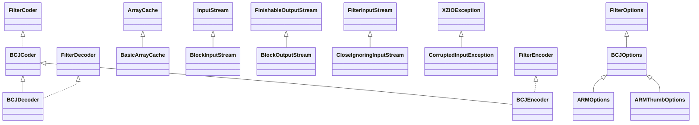

# xz-1.9.jar

[Group index](README.md) | [All archives](../README.md)

## Scope and provenance

- **Donor:** `SQX_145_REFERENCE_ROOT/internal/libs/xz-1.9.jar`.
- **SHA-256:** `211b306cfc44f8f96df3a0a3ddaf75ba8c5289eed77d60d72f889bb855f535e5`; accessed 2026-10-06; captured `2026-10-06T18:54:51.906614+00:00`.
- **Classes:** 117 raw entries; 117 unique entry names. Duplicate occurrence indices are zero-based.
- **Inspection:** read-only ZIP hashing and class-file structural parsing; signatures/descriptors, modifiers, hierarchy and references only. Bytecode bodies are hashed, not published.
- **Allocation:** proposed `FEAT-HOST-XZ`, P02; [roadmap](../../dev/sqx-full-application-roadmap.md). Domain README registration remains required.
- **Repository:** `01067f00031428613c6394064ca1bcadc1ba00ee`; review state unreviewed. Download label 145-dev1; installed build/activation and runtime equivalence unverified.
- **Limit:** every class/member is inventoried; declaration coverage does not establish consumed calls, defaults, formulas, failure semantics or algorithm parity.
- **Archive/resource index:** [122.json](../../dev/evidence/sqx145/archives/145/122.json).

## Complete member declarations

Member shards contain exact JVM names/descriptors, access flags, generic signatures, throws types, declared fields/methods, superclass/interfaces and referenced class names. All classes, nested/synthetic members and overloads are retained. Code length/hash is structural evidence, not a normalized algorithm comparison.

- [001.json](../../dev/evidence/sqx145/members/122/001.json) — SHA-256 `a31c231ef14e52d28b51990e9229a06fcbdd1b7ad1a62cef0ad3275104d606e3`.
- [002.json](../../dev/evidence/sqx145/members/122/002.json) — SHA-256 `bb0900015bcfc8cf3a9c03cd211e1d1cbffa8918894a670a8cfddf910a70c541`.

## Focused structural diagram

Up to twelve non-nested classes; arrows show declared inheritance/interfaces only. External type names are not evidence of an available body or an executed dependency.

## Class inventory

| Archive entry | Occurrence | Class SHA-256 | Fields | Methods |
| --- | ---: | --- | ---: | ---: |
| `org/tukaani/xz/ARMOptions.class` | 0 | `e7e6e8dafe1e1a425724ba8d70f6c84a6d0e20a1b2f02f3908b61d9e1858c75f` | 1 | 9 |
| `org/tukaani/xz/ARMThumbOptions.class` | 0 | `92e2702a0cac4747570fa3410eebf001c7a52fb6c1b7ed2f04b8c8fd7bd3c866` | 1 | 9 |
| `org/tukaani/xz/ArrayCache.class` | 0 | `5de72ee79815b42dde2670f3d6e9dea88bd5be6cb59495c5d49f3453536b5b84` | 2 | 9 |
| `org/tukaani/xz/BCJCoder.class` | 0 | `0ce6d979ee795e0dcb651ccc7d345222d56135e739560a6984f05c6d35007c69` | 6 | 5 |
| `org/tukaani/xz/BCJDecoder.class` | 0 | `130776f84f2c6c8c23d86ddb138ea3a52bae99b742528b6c8f5527d13ff831c6` | 3 | 4 |
| `org/tukaani/xz/BCJEncoder.class` | 0 | `020c419dbb05b926d3a4aea3e4242cf44fb531a36b88a1d90a022a2b41d45de2` | 4 | 6 |
| `org/tukaani/xz/BCJOptions.class` | 0 | `54cbe481c51f486c8bdabd6d88c9b1c9f06416d3174a2889299a2326880fa711` | 3 | 7 |
| `org/tukaani/xz/BasicArrayCache$1.class` | 0 | `ea653eef62fbac05e6fca8b767957f5165b770c1782357d5afc2fede64e9569a` | 0 | 0 |
| `org/tukaani/xz/BasicArrayCache$CacheMap.class` | 0 | `429313a2e90793ea0ed87e69b384391f28175e05cf8dc527ba5c2c3a1c157c30` | 1 | 2 |
| `org/tukaani/xz/BasicArrayCache$CyclicStack.class` | 0 | `f67e78cad5ae07afdb731d936cb5ef31149bed1f1fa755dc21e77866d2cfee1e` | 2 | 4 |
| `org/tukaani/xz/BasicArrayCache$LazyHolder.class` | 0 | `1a477fce5ffc72a83c08492311c8b7c34d0e171d62c15ee010a594655b3ac45d` | 1 | 2 |
| `org/tukaani/xz/BasicArrayCache.class` | 0 | `ec50e241d3d394514ab9d2b2c8c96ac4b02d52e179015161aaf24c1d5c011193` | 5 | 8 |
| `org/tukaani/xz/BlockInputStream.class` | 0 | `060c89454d970435190239179e20d902d7f32adfad5121ed6cb4360ebafc9973` | 13 | 9 |
| `org/tukaani/xz/BlockOutputStream.class` | 0 | `21850b3ddd45799a0f7b0ede80a7742d55b2bcf401e5dc9c43f0e1b5d438ffba` | 8 | 8 |
| `org/tukaani/xz/CloseIgnoringInputStream.class` | 0 | `fa580a78a6daa405c336467ba4c66bb0b426d10be7d5f917bf07e77dac859a79` | 0 | 2 |
| `org/tukaani/xz/CorruptedInputException.class` | 0 | `b3da7ddf1816c6ce2c81547dbc90770de45c40fbbfba772390c59fbd5ee9ff53` | 1 | 2 |
| `org/tukaani/xz/CountingInputStream.class` | 0 | `c728a13003fea1c8a0707f3ac1ddcbc3275b82e766b6418cb777d68a90037884` | 1 | 4 |
| `org/tukaani/xz/CountingOutputStream.class` | 0 | `1da85002efea967e9df22ac84562d82192530ec821168962fec156ff761a204d` | 2 | 6 |
| `org/tukaani/xz/DeltaCoder.class` | 0 | `2279f15db3a4dd3fb79d2aa939a641de3902c7a782ae5e4153b82a0925303e9b` | 1 | 4 |
| `org/tukaani/xz/DeltaDecoder.class` | 0 | `6273dd5284104b81ff3cb66401c233d5625500d29334d59005a6a583d0ff0ff1` | 1 | 3 |
| `org/tukaani/xz/DeltaEncoder.class` | 0 | `918278a44efc77e34c0c2d60239a943e6006f0cf97d8271a7a1d0bc659008d98` | 2 | 5 |
| `org/tukaani/xz/DeltaInputStream.class` | 0 | `fccda847b18b445e4eb85a0d2753d1bbcac158da763ea9eeada0ecd53c45c635` | 6 | 5 |
| `org/tukaani/xz/DeltaOptions.class` | 0 | `02786d86f80be1c5439f34107d4b997338e038aff257d5a93d1f32916445bd48` | 4 | 11 |
| `org/tukaani/xz/DeltaOutputStream.class` | 0 | `1f4b1290b9d4731e237aef3b647661ea99013db9055369d936fb84b80eead180` | 7 | 7 |
| `org/tukaani/xz/FilterCoder.class` | 0 | `7f00c50d05a40ee8fbec5d196fdb59bcc5692ac990fd7702be86d11a0f170f62` | 0 | 3 |
| `org/tukaani/xz/FilterDecoder.class` | 0 | `68a20c68b4ae784a35eedd80afdc7f6a84bd9d74f3d211a3b31121afef622bc2` | 0 | 2 |
| `org/tukaani/xz/FilterEncoder.class` | 0 | `98b66623e3beee0f4280c7636e15365ec7c681181962bc53117dbcb550172980` | 0 | 4 |
| `org/tukaani/xz/FilterOptions.class` | 0 | `7130467f809967fd899d8e6ba98218b28bd6ad57abc8cdc00da3f10d0d94a461` | 0 | 10 |
| `org/tukaani/xz/FinishableOutputStream.class` | 0 | `ee95deafc7854aa629ea24481a4cc4ca0b1ad7c5ff9f22f9fd1186969060f1b4` | 0 | 2 |
| `org/tukaani/xz/FinishableWrapperOutputStream.class` | 0 | `9808377c4470d877a0365d4b6e3e00dc52592e36558e5cb1f0a991126c9dd6e3` | 1 | 6 |
| `org/tukaani/xz/IA64Options.class` | 0 | `bfd5b2188bedb1f9d1dbb366a57051c667f30a3a4bac51d09bd25959e0f73dc9` | 1 | 9 |
| `org/tukaani/xz/IndexIndicatorException.class` | 0 | `2e6d0cff8b0252add2dadd784bc1361c423b5a172aa06d02135a6f6657d6b162` | 1 | 1 |
| `org/tukaani/xz/LZMA2Coder.class` | 0 | `67272c5bec17a367e2a2157e0bc01b083729087d6be0072baee43c7175704532` | 1 | 4 |
| `org/tukaani/xz/LZMA2Decoder.class` | 0 | `d5c770939cd0a9bad49ea427f501a1fa397a718319ef59d5f392aea21564fd6d` | 1 | 3 |
| `org/tukaani/xz/LZMA2Encoder.class` | 0 | `bc1a36f7882dc0179f778f68c9565d54e16d98954d204b87e4519cd441a50a0b` | 2 | 5 |
| `org/tukaani/xz/LZMA2InputStream.class` | 0 | `9c0cdab4933f7d12d6ebcd2b472c2c824ffa66eece1b9c2335e755c3b645ac07` | 15 | 12 |
| `org/tukaani/xz/LZMA2Options.class` | 0 | `a6a5b018f35df4df27c5023cce4c4b783a121e1424a1932f173759b0aa4193c0` | 30 | 30 |
| `org/tukaani/xz/LZMA2OutputStream.class` | 0 | `9b11f7e8eef978bff656486b7868fd123ed78ea5e1814f0179d2bc9acde93cd3` | 16 | 13 |
| `org/tukaani/xz/LZMAInputStream.class` | 0 | `f88ac1119e7591e273bdccbab6d29cb9b608a199b86f86d02b4083d083a8cdc1` | 12 | 20 |
| `org/tukaani/xz/LZMAOutputStream.class` | 0 | `0e7996c398d36424ff5977240a32b115cddc2e34be6d9c92cf7de95a3afacb1d` | 12 | 12 |
| `org/tukaani/xz/MemoryLimitException.class` | 0 | `c970c118cbd7edeca33c0105375676a83a2557c812ddd3bc5e80d72da4b285da` | 3 | 3 |
| `org/tukaani/xz/PowerPCOptions.class` | 0 | `c2e30e12d0f55a3ef42dbe1201cb0e00edb340ad3f3ad9beb840f84462e76615` | 1 | 9 |
| `org/tukaani/xz/RawCoder.class` | 0 | `03e1fbbad31c2cb1c25df582452ac85a9c06934d42365e04c50b95341a8bb246` | 0 | 2 |
| `org/tukaani/xz/ResettableArrayCache.class` | 0 | `c1683e050b459b586fcae1574cb9f6d453b4bab0cb549da3b5d5826f4ff6b8d6` | 3 | 6 |
| `org/tukaani/xz/SPARCOptions.class` | 0 | `8f8d61dffb83458cb58e4b561e629602b1ed052a7cc8c683ef68de6ec8d8df87` | 1 | 9 |
| `org/tukaani/xz/SeekableFileInputStream.class` | 0 | `6ed3fb02cc029e70969af4ddd0e7ca6a6b5ce1cae2aa2e3bee8fa5f7228d446e` | 1 | 10 |
| `org/tukaani/xz/SeekableInputStream.class` | 0 | `a0d87dd1712defbf96ea43a7d89cde183cf4462179ed3de266e2d9a76100ce8c` | 0 | 5 |
| `org/tukaani/xz/SeekableXZInputStream.class` | 0 | `506ba94a68160b4ab6d5ec81d74e5ffa3b758fda512b97300c12f437203668a2` | 21 | 31 |
| `org/tukaani/xz/SimpleInputStream.class` | 0 | `738812f072baa0b5a325485ab788d288caba2aa8feba220c7b9262fd618f1d09` | 11 | 7 |
| `org/tukaani/xz/SimpleOutputStream.class` | 0 | `beba92187409175052d48c73c18514ddb7e1948d0990218e8bfe83f930566c6d` | 10 | 9 |
| `org/tukaani/xz/SingleXZInputStream.class` | 0 | `172df85bf08418d0d56415bc3ea66680f031ce2ca9485e3f5ed805c7d7ddf360` | 11 | 16 |
| `org/tukaani/xz/UncompressedLZMA2OutputStream.class` | 0 | `7f43f07b1c0c123023077ad2b39dd896f2e0deb19a65ece6d06e0d35c9164854` | 9 | 9 |
| `org/tukaani/xz/UnsupportedOptionsException.class` | 0 | `6053babf420b0bf5352e79e4f9ec3f770590be8b249dad9d0338cb78811d2cb6` | 1 | 2 |
| `org/tukaani/xz/X86Options.class` | 0 | `55ed8586ba400149634725dc529c1ea68072b3e93c6bd62bae4b47b724faf29b` | 1 | 9 |
| `org/tukaani/xz/XZ.class` | 0 | `7d388db555c0d45abecbc57ebbcc7bf1303c6b9c16ff336472a73ff6c23774bc` | 6 | 2 |
| `org/tukaani/xz/XZFormatException.class` | 0 | `1b6da211b47da6f656f1b63b35c49429b681f4de14cc31e53b9ae95f80e08cbf` | 1 | 1 |
| `org/tukaani/xz/XZIOException.class` | 0 | `461366974d1dc76f67549f5173af638f9ca306964a0765e170fc966be6f3870d` | 1 | 2 |
| `org/tukaani/xz/XZInputStream.class` | 0 | `698e088db8433d7b8f705d89c9cafb467ba328bb0ae2085794445e22869e3ab6` | 8 | 12 |
| `org/tukaani/xz/XZOutputStream.class` | 0 | `25e8eca82ce3b1447d70ba6625b2195b33472be5b4ba8767d8c77e5bafc4d5b3` | 11 | 19 |
| `org/tukaani/xz/check/CRC32.class` | 0 | `9d9cc3f0ff39dce4eb3d154b5850be26ec70d72de7819ad34fd8e341accbfb89` | 1 | 3 |
| `org/tukaani/xz/check/CRC64.class` | 0 | `8cf6086f19c1cbe257b7e6d6b6e8db48f52e82e09804f3d13c62476de0b50c49` | 2 | 4 |
| `org/tukaani/xz/check/Check.class` | 0 | `fb9024e5717bbf5e4e3770d52e1c231cbcb6005a2d85fec82c8c7819e4e923bc` | 2 | 7 |
| `org/tukaani/xz/check/None.class` | 0 | `435a325f3593ac0b7d2267ee4ce953fdce334500b8020a3ac7a1f76353e7c1fa` | 0 | 3 |
| `org/tukaani/xz/check/SHA256.class` | 0 | `66d6ba3296039263bb294d66f130f7ac66b18bd50195e6e58b9980d7ceb2edd6` | 1 | 3 |
| `org/tukaani/xz/common/DecoderUtil.class` | 0 | `c2fef385097e05cf50599c6a96ca4a77075f58b90721647a74abe3937d1b91e1` | 0 | 7 |
| `org/tukaani/xz/common/EncoderUtil.class` | 0 | `e8f52f49aa6e39e94e1404aba187ec08e8766af7040afb1ba0520388f74daa4e` | 0 | 3 |
| `org/tukaani/xz/common/StreamFlags.class` | 0 | `2ea09729294aa60bd7e16de03f645c1f71b30acba89011f7da578f00f14b4fb5` | 2 | 1 |
| `org/tukaani/xz/common/Util.class` | 0 | `c51d8b55fd361e731fbd9ee999776db1a8080b39780ff4b23cc32400197fe8fc` | 5 | 2 |
| `org/tukaani/xz/delta/DeltaCoder.class` | 0 | `a100a19021a2c29f474824f70a7dc175af7e03da16bac81605346db5c2704c13` | 6 | 1 |
| `org/tukaani/xz/delta/DeltaDecoder.class` | 0 | `f737e64ce22f866572185e2bdcf9e3cd5d85a7b72caf6d5c91e808aa13589c74` | 0 | 2 |
| `org/tukaani/xz/delta/DeltaEncoder.class` | 0 | `9997a4dc591686a0dc090a25c73396a4b87a72ed1e6618a6a32180d383d67c85` | 0 | 2 |
| `org/tukaani/xz/index/BlockInfo.class` | 0 | `8f0c56a3e5480e3d84fd47f7f1dbf0c254d104cd89836cf97ac9ac3dc3db84b5` | 6 | 4 |
| `org/tukaani/xz/index/IndexBase.class` | 0 | `1cbdd871f843feded1876009fbeed3ab38a2c86be979d64b41892010fa095377` | 5 | 6 |
| `org/tukaani/xz/index/IndexDecoder.class` | 0 | `3fbe536363261053576f37ea515f5d2c78e02570f1e13162d654115b3817db5c` | 10 | 14 |
| `org/tukaani/xz/index/IndexEncoder.class` | 0 | `c5cf70b5ba8e9aeeca2bf53f2f1534814b7da9bc1111cf7213dc88773e6811f6` | 1 | 5 |
| `org/tukaani/xz/index/IndexHash.class` | 0 | `7b9de358db3a8210cc39d01760871ca31f648da7748102ff7ffb724e9d128363` | 1 | 5 |
| `org/tukaani/xz/index/IndexRecord.class` | 0 | `28e03d26fae36e2de723aea58d2497f4ef7968dba0541cbd737e4d5019b99a5b` | 2 | 1 |
| `org/tukaani/xz/lz/BT4.class` | 0 | `fa9f836e8afa2ba0a9703555dff3154426354a4bf6ea67d2164ecd52a6a38229` | 7 | 7 |
| `org/tukaani/xz/lz/CRC32Hash.class` | 0 | `83e2638d74147bc9b27a0f87bfa8aee117c771915ba309b4b6a860dbe073030c` | 2 | 2 |
| `org/tukaani/xz/lz/HC4.class` | 0 | `d6301511343582955c4d18cd8563e6be1a9480be4e49c539adf88fbb15b9c14d` | 8 | 7 |
| `org/tukaani/xz/lz/Hash234.class` | 0 | `188f7e10eea97820114b7cc50249ab2e0a07f6ef8d2532142716a098c453c374` | 12 | 10 |
| `org/tukaani/xz/lz/LZDecoder.class` | 0 | `3e4ea627b40e41a40d9b958f932fea1f8592e81653a176b29fd0148e2067ae31` | 9 | 14 |
| `org/tukaani/xz/lz/LZEncoder.class` | 0 | `e64ce1791ce213a25830341c76f2c8c554e76ee57eb426e9f0d94dfde2800b24` | 14 | 26 |
| `org/tukaani/xz/lz/Matches.class` | 0 | `7b3665f440eb3ff9bb6726e43619a6d9e7c53bad176ca132855eadd95d61eafb` | 3 | 1 |
| `org/tukaani/xz/lzma/LZMACoder$LengthCoder.class` | 0 | `8daee14358b76886683d5a48a45f6bf81a4b9768ddc80ad5c9b8b8c86c1d438a` | 8 | 2 |
| `org/tukaani/xz/lzma/LZMACoder$LiteralCoder$LiteralSubcoder.class` | 0 | `cd1b421cb9e6aac03422c211e6836c2e4fb34237344d14d9070125b5d3289c01` | 2 | 2 |
| `org/tukaani/xz/lzma/LZMACoder$LiteralCoder.class` | 0 | `3e77f20d3be9510e35552381018add39d49643c39a14e3d46c06c84e51b590a1` | 3 | 2 |
| `org/tukaani/xz/lzma/LZMACoder.class` | 0 | `81d35671719dd41a1ce1b41bf5b51607ba2f4c98d3247fdceac26af600350b33` | 24 | 3 |
| `org/tukaani/xz/lzma/LZMADecoder$1.class` | 0 | `8f3483429d2f087cd0ee90bb84452bc61105c8fa6ff1aad713d3d36925e8a11d` | 0 | 0 |
| `org/tukaani/xz/lzma/LZMADecoder$LengthDecoder.class` | 0 | `ae3d88e988b6e66cb939f74b09fc21c9b5a0860aa212c6e996e9ce4aa040098e` | 1 | 3 |
| `org/tukaani/xz/lzma/LZMADecoder$LiteralDecoder$LiteralSubdecoder.class` | 0 | `bf17263935ffd3092e8b5dc8d6a9e06d6711dc31db5f5fa421963c589648f67e` | 1 | 3 |
| `org/tukaani/xz/lzma/LZMADecoder$LiteralDecoder.class` | 0 | `45816380d3feed0453f84d7145e9041aa8e36600be4da0bcbd59e8117aed0524` | 2 | 3 |
| `org/tukaani/xz/lzma/LZMADecoder.class` | 0 | `7e1f4aae3c291448f2b39fedb2fe082afb0e7f11dbf02dd35da7250b6563405e` | 5 | 8 |
| `org/tukaani/xz/lzma/LZMAEncoder$1.class` | 0 | `6ad33d09a46f04f7811474032d750afa580009c063e7209b736d9f34a86ea948` | 0 | 0 |
| `org/tukaani/xz/lzma/LZMAEncoder$LengthEncoder.class` | 0 | `9f9b51d25de95297e51f97cd20a9e301cb600aba5bd5c6413a157a0279323047` | 4 | 6 |
| `org/tukaani/xz/lzma/LZMAEncoder$LiteralEncoder$LiteralSubencoder.class` | 0 | `13f8175993d7e5dee4c3b4cd0ed53cfc14b4ac64b6ec0e0f44a88dd14c41ed0d` | 1 | 5 |
| `org/tukaani/xz/lzma/LZMAEncoder$LiteralEncoder.class` | 0 | `8c77ee62b9d61f6b6ceb882ba061d8263b3d1869d18ceeb15be49520588883a0` | 3 | 6 |
| `org/tukaani/xz/lzma/LZMAEncoder.class` | 0 | `10d894be35e4bcd08980c2fedbc45609f92ebb28895916678b8b2211b7127645` | 22 | 31 |
| `org/tukaani/xz/lzma/LZMAEncoderFast.class` | 0 | `31ec15cf5e10fd8598f3d374d8a2867467a1ec7518b1715e5f74e00acb7b84bc` | 3 | 4 |
| `org/tukaani/xz/lzma/LZMAEncoderNormal.class` | 0 | `3347240e2ef0438c2fca6e82c9184edf7fd2a4ad756cc814cf40865342645457` | 10 | 10 |
| `org/tukaani/xz/lzma/Optimum.class` | 0 | `e53f8024e312d1c4c1df95f10d23d7645fcf9bc4333a9f472ea524002096a3d1` | 10 | 5 |
| `org/tukaani/xz/lzma/State.class` | 0 | `3852ad2d286e4c8e86efaf8ff5f85ae6ab5e9147f54421e1c060453d2bf51c45` | 15 | 10 |
| `org/tukaani/xz/rangecoder/RangeCoder.class` | 0 | `f1b2363adb2079073b523b4084afb54031001d7e543765c8beb91c1cf39d41f4` | 6 | 2 |
| `org/tukaani/xz/rangecoder/RangeDecoder.class` | 0 | `1d74d1d94e77f82d1d746ddd9314ba2ac186433d62ac0077f717eb92895b1a43` | 2 | 6 |
| `org/tukaani/xz/rangecoder/RangeDecoderFromBuffer.class` | 0 | `7548cfc236b1098588cab487d44b0a103289a52fd1dae74638548e8b4b3e34d5` | 3 | 5 |
| `org/tukaani/xz/rangecoder/RangeDecoderFromStream.class` | 0 | `12a22c8222aa152f274e641681f009f2f149f73c7ade87170c3bb2ccf08e7e51` | 1 | 3 |
| `org/tukaani/xz/rangecoder/RangeEncoder.class` | 0 | `d8419eed71a755fc41f640dfa464e016311cc3e6a5a0fa28f7ee97847d00d097` | 8 | 15 |
| `org/tukaani/xz/rangecoder/RangeEncoderToBuffer.class` | 0 | `2ff1f2616fc92e2750c1e70d198bf0453207b80cb86cb0fe368c05937c9d0350` | 2 | 7 |
| `org/tukaani/xz/rangecoder/RangeEncoderToStream.class` | 0 | `2c6573e0bee0340e76803bacc84964a59e962a7dbdb4d1ae766f5b489b172391` | 1 | 2 |
| `org/tukaani/xz/simple/ARM.class` | 0 | `4c8156fe11ac86e7b694ef90311c564679b3e66f8b98ee1288af3eab7c99d38f` | 2 | 2 |
| `org/tukaani/xz/simple/ARMThumb.class` | 0 | `ed19607bfac913349a7ff9c4d526bf7f6ea9368b98187f0e2b99e7e76759a1d5` | 2 | 2 |
| `org/tukaani/xz/simple/IA64.class` | 0 | `ed3411eb531370e8b1806b22c478bbe3d4b8499392a1140214d4b9fadc8e814a` | 3 | 3 |
| `org/tukaani/xz/simple/PowerPC.class` | 0 | `416c992e71f92f9cd06c8fe92c8470f98394730d3041170e7639b2bc04ce3314` | 2 | 2 |
| `org/tukaani/xz/simple/SPARC.class` | 0 | `1a3a86bd3768ff28038ad6145a07279a8c92dac0c1f2a2e654e2c0034536bd7a` | 2 | 2 |
| `org/tukaani/xz/simple/SimpleFilter.class` | 0 | `7ffac74562205d0975ae6c870922b727df8af72bd33f7f85421f105874f87eeb` | 0 | 1 |
| `org/tukaani/xz/simple/X86.class` | 0 | `aefecdad9b2f638cefa1c86e24d323f98ea0acbd31b20890fdf74af83f8215e3` | 5 | 4 |
| `META-INF/versions/9/module-info.class` | 0 | `f31a01a09e6d3ae36489134c1701f3fdce6874e716ed271f563ef67c9c6e3924` | 0 | 0 |
