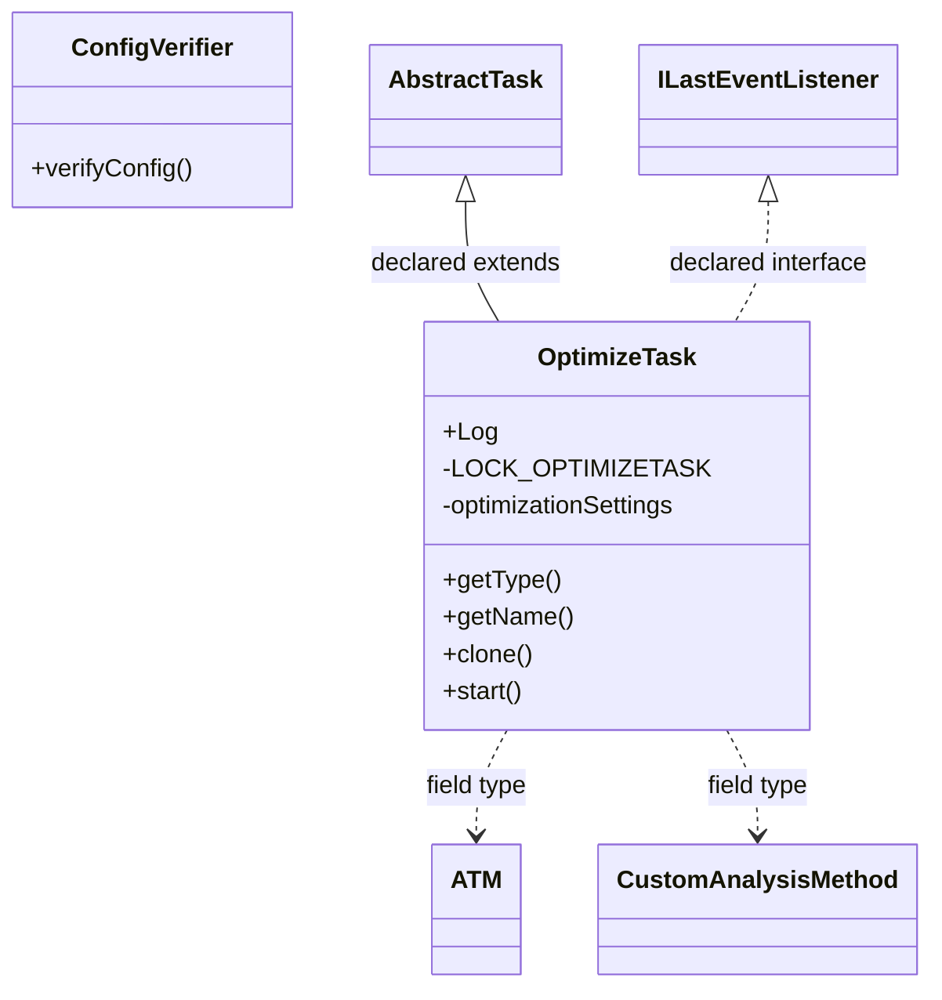

# TaskOptimize.jar

[Workspace/group index](README.md)  |  [All workspaces](../README.md)

## Scope and provenance

- Artifact: `SQX_REFERENCE_ROOT/internal/plugins/TaskOptimize/TaskOptimize.jar`.
- SHA-256: `9ca3f14b146b90fbe431f341cb0d9cf3528ff8c8fa3f7d8ddbfcd7511b409e69`.
- Inspected: 2026-10-05; generation timestamp `2026-10-05T19:04:16.344170+00:00`.
- Archive class entries: **10**; non-nested: **2**; nested/anonymous: **8**.
- Inspection: ZIP entry/manifest enumeration and `javap -p` declarations for every listed class.
- Repository source HEAD: `8a92c705183a6702eaf62037ccb202ed028aa899`; review state: generated, pending owner review.
- Installed SQX build number is unverified. No method bodies are reproduced.
- Confidence: high for declared structure; workspace ownership inferred except where registration evidence is separately stated. Runtime reachability, call order, formulas and parity remain unverified.

The `Optimizer` folder is a navigation/research grouping, not an exclusive backend owner. Shared consumers may use this JAR.

Target mapping: no verified owning HaruQuantAI feature/requirement/decision IDs are assigned by this document. Register or resolve ownership through the normal repository plan before implementation.

## Diagram reading guide

`Parent <|-- Child` means declared inheritance; `Interface <|.. Class` means declared implementation. Interface extension uses the inheritance arrow. `A ..> B : field type` is a declared type dependency, not composition, object ownership or a runtime call. External nodes are referenced types, not fabricated local implementations. Selected fields/method names aid navigation: `+` is public, `#` protected and `-` private. Diagram method names omit parameter/return types and collapse overloads; use the exact inspected declarations below before implementing an API.

Detailed graphs include non-nested classes in package-sized groups of at most 12. Nested/anonymous classes are inventoried and their declarations/relationships are retained below, but omitted from overview graphs. Relationships not drawn for readability remain in the complete declaration-relationship table. Constructors, synthetic bridges and overloads may be collapsed in diagram member lists only. Standard `java.lang.Object` inheritance is omitted from diagrams.

## UML class diagrams

### 1. `com.strategyquant.plugin.Task.impl.Optimize`



| Diagram identifier | Exact type | Location |
| --- | --- | --- |
| `C346db366aae2` | `com.strategyquant.plugin.Task.impl.Optimize.ConfigVerifier` (this JAR) | this diagram |
| `C5a5e3bf9f9cf` | `com.strategyquant.plugin.Task.impl.Optimize.OptimizeTask` (this JAR) | this diagram |
| `C33da5e0a010f` | [`com.strategyquant.tradinglib.ATM`](../Shared/SQTradingLib.md) | referenced external type |
| `C4e0104799ec7` | [`com.strategyquant.tradinglib.CustomAnalysisMethod`](../Shared/SQTradingLib.md) | referenced external type |
| `C1295ffcc9568` | [`com.strategyquant.tradinglib.project.ILastEventListener`](../Shared/SQTradingLib.md) | referenced external type |
| `Ce44d386802cb` | [`com.strategyquant.tradinglib.taskImpl.AbstractTask`](../Shared/SQTradingLib.md) | referenced external type |

## Complete class inventory

| Fully qualified class | Kind | Entry |
| --- | --- | --- |
| `com.strategyquant.plugin.Task.impl.Optimize.ConfigVerifier` | class | non-nested |
| `com.strategyquant.plugin.Task.impl.Optimize.OptimizeTask` | class | non-nested |
| `com.strategyquant.plugin.Task.impl.Optimize.OptimizeTask$1` | class | nested/anonymous |
| `com.strategyquant.plugin.Task.impl.Optimize.OptimizeTask$2` | class | nested/anonymous |
| `com.strategyquant.plugin.Task.impl.Optimize.OptimizeTask$3` | class | nested/anonymous |
| `com.strategyquant.plugin.Task.impl.Optimize.OptimizeTask$4` | class | nested/anonymous |
| `com.strategyquant.plugin.Task.impl.Optimize.OptimizeTask$5` | class | nested/anonymous |
| `com.strategyquant.plugin.Task.impl.Optimize.OptimizeTask$6` | class | nested/anonymous |
| `com.strategyquant.plugin.Task.impl.Optimize.OptimizeTask$7` | class | nested/anonymous |
| `com.strategyquant.plugin.Task.impl.Optimize.OptimizeTask$StrategyData` | class | nested/anonymous |

## Declared relationships and evidence locations

Every row is supported by the named class declaration/member in `javap -p`, inside the artifact recorded above. Signature dependencies may include return, parameter, generic-argument and throws types; they do not imply execution.

| Declaring class | Referenced type | Relationship | Narrow inspection location |
| --- | --- | --- | --- |
| `com.strategyquant.plugin.Task.impl.Optimize.ConfigVerifier` | `java.util.ArrayList` (not resolved in scoped archives) | type dependency | `com.strategyquant.plugin.Task.impl.Optimize.ConfigVerifier` / method signature: `public java.util.ArrayList<java.lang.String> verifyConfig(org.jdom2.Element);`<br>`private void checkDataConfig(java.util.ArrayList<java.lang.String>, org.jdom2.Element);`<br>`private void checkChart(org.jdom2.Element, int, int, java.util.ArrayList<java.lang.String>);`<br>`private boolean checkDate(java.lang.String, java.lang.String, int, java.util.ArrayList<java.lang.String>);` |
| `com.strategyquant.plugin.Task.impl.Optimize.ConfigVerifier` | `java.lang.String` (not resolved in scoped archives) | type dependency | `com.strategyquant.plugin.Task.impl.Optimize.ConfigVerifier` / method signature: `public java.util.ArrayList<java.lang.String> verifyConfig(org.jdom2.Element);`<br>`private void checkDataConfig(java.util.ArrayList<java.lang.String>, org.jdom2.Element);`<br>`private void checkChart(org.jdom2.Element, int, int, java.util.ArrayList<java.lang.String>);`<br>`private boolean checkDate(java.lang.String, java.lang.String, int, java.util.ArrayList<java.lang.String>);`<br>`private java.lang.String getBacktestLabel(int);` |
| `com.strategyquant.plugin.Task.impl.Optimize.ConfigVerifier` | `org.jdom2.Element` (not resolved in scoped archives) | type dependency | `com.strategyquant.plugin.Task.impl.Optimize.ConfigVerifier` / method signature: `public java.util.ArrayList<java.lang.String> verifyConfig(org.jdom2.Element);`<br>`private void checkDataConfig(java.util.ArrayList<java.lang.String>, org.jdom2.Element);`<br>`private void checkChart(org.jdom2.Element, int, int, java.util.ArrayList<java.lang.String>);` |
| `com.strategyquant.plugin.Task.impl.Optimize.OptimizeTask` | [`com.strategyquant.tradinglib.taskImpl.AbstractTask`](../Shared/SQTradingLib.md) | extends | `com.strategyquant.plugin.Task.impl.Optimize.OptimizeTask` / class declaration: `public class com.strategyquant.plugin.Task.impl.Optimize.OptimizeTask extends com.strategyquant.tradinglib.taskImpl.AbstractTask implements com.strategyquant.tradinglib.project.ILastEventListener` |
| `com.strategyquant.plugin.Task.impl.Optimize.OptimizeTask` | [`com.strategyquant.tradinglib.project.ILastEventListener`](../Shared/SQTradingLib.md) | implements | `com.strategyquant.plugin.Task.impl.Optimize.OptimizeTask` / class declaration: `public class com.strategyquant.plugin.Task.impl.Optimize.OptimizeTask extends com.strategyquant.tradinglib.taskImpl.AbstractTask implements com.strategyquant.tradinglib.project.ILastEventListener` |
| `com.strategyquant.plugin.Task.impl.Optimize.OptimizeTask` | `org.slf4j.Logger` (not resolved in scoped archives) | type dependency | `com.strategyquant.plugin.Task.impl.Optimize.OptimizeTask` / field declaration: `public static final org.slf4j.Logger Log;` |
| `com.strategyquant.plugin.Task.impl.Optimize.OptimizeTask` | `java.lang.String` (not resolved in scoped archives) | type dependency | `com.strategyquant.plugin.Task.impl.Optimize.OptimizeTask` / field declaration: `private static final java.lang.String LOCK_OPTIMIZETASK;`<br>`private java.util.ArrayList<java.lang.String> strategies;`<br>`private java.lang.String caInputArgs;`<br>`private java.lang.String lastSettingsXml;`<br>`protected java.lang.String dismissalMessage;` |
| `com.strategyquant.plugin.Task.impl.Optimize.OptimizeTask` | `java.lang.String` (not resolved in scoped archives) | type dependency | `com.strategyquant.plugin.Task.impl.Optimize.OptimizeTask` / method signature: `public com.strategyquant.plugin.Task.impl.Optimize.OptimizeTask(java.lang.String, com.strategyquant.tradinglib.project.ProgressEngine) throws java.lang.Exception;`<br>`public java.lang.String getType();`<br>`public java.lang.String getName();`<br>`public com.strategyquant.tradinglib.taskImpl.ISQTask clone(java.lang.String, com.strategyquant.tradinglib.project.ProgressEngine) throws java.lang.Exception;`<br>`private void runStandardOptimization(com.strategyquant.lib.SettingsMap, java.lang.String, com.strategyquant.plugin.Task.impl.Optimize.OptimizeTask$StrategyData) throws java.lang.Exception;`<br>`private void runSequentialOptimization(com.strategyquant.lib.SettingsMap, java.lang.String, com.strategyquant.plugin.Task.impl.Optimize.OptimizeTask$StrategyData) throws java.lang.Exception;`<br>`private void onFinishSeqOpt(boolean, java.lang.String, com.strategyquant.lib.SettingsMap, com.strategyquant.tradinglib.StrategyBase, com.strategyquant.tradinglib.robustnesstests.SequentialOptimizationResults, com.strategyquant.tradinglib.ResultsGroup);`<br>`protected void processResult(com.strategyquant.tradinglib.ResultsGroup, java.lang.String);`<br>`public java.lang.String getPluginFolderName();`<br>`public java.lang.String[] getSettings();`<br>`public void setLastEvent(java.lang.String);`<br>`static void access$500(com.strategyquant.plugin.Task.impl.Optimize.OptimizeTask, boolean, java.lang.String, com.strategyquant.lib.SettingsMap, com.strategyquant.tradinglib.StrategyBase, com.strategyquant.tradinglib.robustnesstests.SequentialOptimizationResults, com.strategyquant.tradinglib.ResultsGroup);` |
| `com.strategyquant.plugin.Task.impl.Optimize.OptimizeTask` | [`com.strategyquant.tradinglib.optimization.OptimizationSettings`](../Shared/SQTradingLib.md) | type dependency | `com.strategyquant.plugin.Task.impl.Optimize.OptimizeTask` / field declaration: `private com.strategyquant.tradinglib.optimization.OptimizationSettings optimizationSettings;` |
| `com.strategyquant.plugin.Task.impl.Optimize.OptimizeTask` | [`com.strategyquant.tradinglib.Databank`](../Shared/SQTradingLib.md) | type dependency | `com.strategyquant.plugin.Task.impl.Optimize.OptimizeTask` / field declaration: `private com.strategyquant.tradinglib.Databank inputDatabank;`<br>`private com.strategyquant.tradinglib.Databank outputDatabank;` |
| `com.strategyquant.plugin.Task.impl.Optimize.OptimizeTask` | [`com.strategyquant.tradinglib.Databank`](../Shared/SQTradingLib.md) | type dependency | `com.strategyquant.plugin.Task.impl.Optimize.OptimizeTask` / method signature: `protected void setDatabankFilter(com.strategyquant.tradinglib.Databank);`<br>`protected com.strategyquant.tradinglib.Databank[] getUsedDatabanks();`<br>`protected com.strategyquant.tradinglib.Databank getOutputDatabank();` |
| `com.strategyquant.plugin.Task.impl.Optimize.OptimizeTask` | `java.util.ArrayList` (not resolved in scoped archives) | type dependency | `com.strategyquant.plugin.Task.impl.Optimize.OptimizeTask` / field declaration: `private java.util.ArrayList<java.lang.String> strategies;` |
| `com.strategyquant.plugin.Task.impl.Optimize.OptimizeTask` | [`com.strategyquant.tradinglib.fitnessfunction.IFitnessFunction`](../Shared/SQTradingLib.md) | type dependency | `com.strategyquant.plugin.Task.impl.Optimize.OptimizeTask` / field declaration: `private com.strategyquant.tradinglib.fitnessfunction.IFitnessFunction fitnessFunction;` |
| `com.strategyquant.plugin.Task.impl.Optimize.OptimizeTask` | [`com.strategyquant.tradinglib.options.TradingOptions`](../Shared/SQTradingLib.md) | type dependency | `com.strategyquant.plugin.Task.impl.Optimize.OptimizeTask` / field declaration: `private com.strategyquant.tradinglib.options.TradingOptions tradingOptions;` |
| `com.strategyquant.plugin.Task.impl.Optimize.OptimizeTask` | [`com.strategyquant.tradinglib.ATM`](../Shared/SQTradingLib.md) | type dependency | `com.strategyquant.plugin.Task.impl.Optimize.OptimizeTask` / field declaration: `private com.strategyquant.tradinglib.ATM atm;` |
| `com.strategyquant.plugin.Task.impl.Optimize.OptimizeTask` | [`com.strategyquant.tradinglib.optimization.ParametersSettings`](../Shared/SQTradingLib.md) | type dependency | `com.strategyquant.plugin.Task.impl.Optimize.OptimizeTask` / field declaration: `private com.strategyquant.tradinglib.optimization.ParametersSettings paramSettings;` |
| `com.strategyquant.plugin.Task.impl.Optimize.OptimizeTask` | `org.jdom2.Element` (not resolved in scoped archives) | type dependency | `com.strategyquant.plugin.Task.impl.Optimize.OptimizeTask` / field declaration: `private org.jdom2.Element taskSettings;` |
| `com.strategyquant.plugin.Task.impl.Optimize.OptimizeTask` | [`com.strategyquant.tradinglib.CustomAnalysisMethod`](../Shared/SQTradingLib.md) | type dependency | `com.strategyquant.plugin.Task.impl.Optimize.OptimizeTask` / field declaration: `private com.strategyquant.tradinglib.CustomAnalysisMethod caMethod;` |
| `com.strategyquant.plugin.Task.impl.Optimize.OptimizeTask` | [`com.strategyquant.tradinglib.conditions.ConditionsChecker`](../Shared/SQTradingLib.md) | type dependency | `com.strategyquant.plugin.Task.impl.Optimize.OptimizeTask` / field declaration: `protected com.strategyquant.tradinglib.conditions.ConditionsChecker conditionsChecker;` |
| `com.strategyquant.plugin.Task.impl.Optimize.OptimizeTask` | [`com.strategyquant.tradinglib.optimization.SequentialOptimizationEngine`](../Shared/SQTradingLib.md) | type dependency | `com.strategyquant.plugin.Task.impl.Optimize.OptimizeTask` / field declaration: `private com.strategyquant.tradinglib.optimization.SequentialOptimizationEngine engine;` |
| `com.strategyquant.plugin.Task.impl.Optimize.OptimizeTask` | `java.lang.Exception` (not resolved in scoped archives) | type dependency | `com.strategyquant.plugin.Task.impl.Optimize.OptimizeTask` / method signature: `public com.strategyquant.plugin.Task.impl.Optimize.OptimizeTask() throws java.lang.Exception;`<br>`public com.strategyquant.plugin.Task.impl.Optimize.OptimizeTask(java.lang.String, com.strategyquant.tradinglib.project.ProgressEngine) throws java.lang.Exception;`<br>`public com.strategyquant.tradinglib.taskImpl.ISQTask clone(java.lang.String, com.strategyquant.tradinglib.project.ProgressEngine) throws java.lang.Exception;`<br>`private boolean beforeStart() throws java.lang.Exception;`<br>`private boolean somethingToOptimize() throws java.lang.Exception;`<br>`private void initializeBacktestData() throws java.lang.Exception;`<br>`public void start() throws java.lang.Exception;`<br>`private com.strategyquant.plugin.Task.impl.Optimize.OptimizeTask$StrategyData getStrategyData(com.strategyquant.tradinglib.ResultsGroup) throws java.lang.Exception;`<br>`private void optimizeStrategy(com.strategyquant.plugin.Task.impl.Optimize.OptimizeTask$StrategyData) throws java.lang.Exception;`<br>`private void runStandardOptimization(com.strategyquant.lib.SettingsMap, java.lang.String, com.strategyquant.plugin.Task.impl.Optimize.OptimizeTask$StrategyData) throws java.lang.Exception;`<br>`private void runSequentialOptimization(com.strategyquant.lib.SettingsMap, java.lang.String, com.strategyquant.plugin.Task.impl.Optimize.OptimizeTask$StrategyData) throws java.lang.Exception;`<br>`private com.strategyquant.lib.SettingsMap prepareSettings(com.strategyquant.plugin.Task.impl.Optimize.OptimizeTask$StrategyData) throws java.lang.Exception;` |
| `com.strategyquant.plugin.Task.impl.Optimize.OptimizeTask` | [`com.strategyquant.tradinglib.project.ProgressEngine`](../Shared/SQTradingLib.md) | type dependency | `com.strategyquant.plugin.Task.impl.Optimize.OptimizeTask` / method signature: `public com.strategyquant.plugin.Task.impl.Optimize.OptimizeTask(java.lang.String, com.strategyquant.tradinglib.project.ProgressEngine) throws java.lang.Exception;`<br>`public com.strategyquant.tradinglib.taskImpl.ISQTask clone(java.lang.String, com.strategyquant.tradinglib.project.ProgressEngine) throws java.lang.Exception;`<br>`static com.strategyquant.tradinglib.project.ProgressEngine access$000(com.strategyquant.plugin.Task.impl.Optimize.OptimizeTask);`<br>`static com.strategyquant.tradinglib.project.ProgressEngine access$400(com.strategyquant.plugin.Task.impl.Optimize.OptimizeTask);` |
| `com.strategyquant.plugin.Task.impl.Optimize.OptimizeTask` | [`com.strategyquant.tradinglib.taskImpl.ISQTask`](../Shared/SQTradingLib.md) | type dependency | `com.strategyquant.plugin.Task.impl.Optimize.OptimizeTask` / method signature: `public com.strategyquant.tradinglib.taskImpl.ISQTask clone(java.lang.String, com.strategyquant.tradinglib.project.ProgressEngine) throws java.lang.Exception;` |
| `com.strategyquant.plugin.Task.impl.Optimize.OptimizeTask` | [`com.strategyquant.tradinglib.ResultsGroup`](../Shared/SQTradingLib.md) | type dependency | `com.strategyquant.plugin.Task.impl.Optimize.OptimizeTask` / method signature: `private com.strategyquant.tradinglib.ResultsGroup getStrategyToOptimize(java.io.File);`<br>`private com.strategyquant.plugin.Task.impl.Optimize.OptimizeTask$StrategyData getStrategyData(com.strategyquant.tradinglib.ResultsGroup) throws java.lang.Exception;`<br>`private void onFinishSeqOpt(boolean, java.lang.String, com.strategyquant.lib.SettingsMap, com.strategyquant.tradinglib.StrategyBase, com.strategyquant.tradinglib.robustnesstests.SequentialOptimizationResults, com.strategyquant.tradinglib.ResultsGroup);`<br>`protected boolean checkSequentialOptConditions(com.strategyquant.tradinglib.ResultsGroup, com.strategyquant.lib.SettingsMap);`<br>`protected void processResult(com.strategyquant.tradinglib.ResultsGroup, java.lang.String);`<br>`static void access$500(com.strategyquant.plugin.Task.impl.Optimize.OptimizeTask, boolean, java.lang.String, com.strategyquant.lib.SettingsMap, com.strategyquant.tradinglib.StrategyBase, com.strategyquant.tradinglib.robustnesstests.SequentialOptimizationResults, com.strategyquant.tradinglib.ResultsGroup);` |
| `com.strategyquant.plugin.Task.impl.Optimize.OptimizeTask` | `java.io.File` (not resolved in scoped archives) | type dependency | `com.strategyquant.plugin.Task.impl.Optimize.OptimizeTask` / method signature: `private com.strategyquant.tradinglib.ResultsGroup getStrategyToOptimize(java.io.File);` |
| `com.strategyquant.plugin.Task.impl.Optimize.OptimizeTask` | `com.strategyquant.plugin.Task.impl.Optimize.OptimizeTask$StrategyData` (this JAR) | type dependency | `com.strategyquant.plugin.Task.impl.Optimize.OptimizeTask` / method signature: `private com.strategyquant.plugin.Task.impl.Optimize.OptimizeTask$StrategyData getStrategyData(com.strategyquant.tradinglib.ResultsGroup) throws java.lang.Exception;`<br>`private void optimizeStrategy(com.strategyquant.plugin.Task.impl.Optimize.OptimizeTask$StrategyData) throws java.lang.Exception;`<br>`private void runStandardOptimization(com.strategyquant.lib.SettingsMap, java.lang.String, com.strategyquant.plugin.Task.impl.Optimize.OptimizeTask$StrategyData) throws java.lang.Exception;`<br>`private void runSequentialOptimization(com.strategyquant.lib.SettingsMap, java.lang.String, com.strategyquant.plugin.Task.impl.Optimize.OptimizeTask$StrategyData) throws java.lang.Exception;`<br>`private com.strategyquant.lib.SettingsMap prepareSettings(com.strategyquant.plugin.Task.impl.Optimize.OptimizeTask$StrategyData) throws java.lang.Exception;` |
| `com.strategyquant.plugin.Task.impl.Optimize.OptimizeTask` | `com.strategyquant.lib.SettingsMap` (not resolved in scoped archives) | type dependency | `com.strategyquant.plugin.Task.impl.Optimize.OptimizeTask` / method signature: `private void runStandardOptimization(com.strategyquant.lib.SettingsMap, java.lang.String, com.strategyquant.plugin.Task.impl.Optimize.OptimizeTask$StrategyData) throws java.lang.Exception;`<br>`private void updateIndexByFitness(com.strategyquant.lib.SettingsMap);`<br>`private void runSequentialOptimization(com.strategyquant.lib.SettingsMap, java.lang.String, com.strategyquant.plugin.Task.impl.Optimize.OptimizeTask$StrategyData) throws java.lang.Exception;`<br>`private void onFinishSeqOpt(boolean, java.lang.String, com.strategyquant.lib.SettingsMap, com.strategyquant.tradinglib.StrategyBase, com.strategyquant.tradinglib.robustnesstests.SequentialOptimizationResults, com.strategyquant.tradinglib.ResultsGroup);`<br>`protected boolean checkSequentialOptConditions(com.strategyquant.tradinglib.ResultsGroup, com.strategyquant.lib.SettingsMap);`<br>`private com.strategyquant.lib.SettingsMap prepareSettings(com.strategyquant.plugin.Task.impl.Optimize.OptimizeTask$StrategyData) throws java.lang.Exception;`<br>`static void access$500(com.strategyquant.plugin.Task.impl.Optimize.OptimizeTask, boolean, java.lang.String, com.strategyquant.lib.SettingsMap, com.strategyquant.tradinglib.StrategyBase, com.strategyquant.tradinglib.robustnesstests.SequentialOptimizationResults, com.strategyquant.tradinglib.ResultsGroup);` |
| `com.strategyquant.plugin.Task.impl.Optimize.OptimizeTask` | [`com.strategyquant.tradinglib.StrategyBase`](../Shared/SQTradingLib.md) | type dependency | `com.strategyquant.plugin.Task.impl.Optimize.OptimizeTask` / method signature: `private void onFinishSeqOpt(boolean, java.lang.String, com.strategyquant.lib.SettingsMap, com.strategyquant.tradinglib.StrategyBase, com.strategyquant.tradinglib.robustnesstests.SequentialOptimizationResults, com.strategyquant.tradinglib.ResultsGroup);`<br>`static void access$500(com.strategyquant.plugin.Task.impl.Optimize.OptimizeTask, boolean, java.lang.String, com.strategyquant.lib.SettingsMap, com.strategyquant.tradinglib.StrategyBase, com.strategyquant.tradinglib.robustnesstests.SequentialOptimizationResults, com.strategyquant.tradinglib.ResultsGroup);` |
| `com.strategyquant.plugin.Task.impl.Optimize.OptimizeTask` | [`com.strategyquant.tradinglib.robustnesstests.SequentialOptimizationResults`](../Shared/SQTradingLib.md) | type dependency | `com.strategyquant.plugin.Task.impl.Optimize.OptimizeTask` / method signature: `private void onFinishSeqOpt(boolean, java.lang.String, com.strategyquant.lib.SettingsMap, com.strategyquant.tradinglib.StrategyBase, com.strategyquant.tradinglib.robustnesstests.SequentialOptimizationResults, com.strategyquant.tradinglib.ResultsGroup);`<br>`static void access$500(com.strategyquant.plugin.Task.impl.Optimize.OptimizeTask, boolean, java.lang.String, com.strategyquant.lib.SettingsMap, com.strategyquant.tradinglib.StrategyBase, com.strategyquant.tradinglib.robustnesstests.SequentialOptimizationResults, com.strategyquant.tradinglib.ResultsGroup);` |
| `com.strategyquant.plugin.Task.impl.Optimize.OptimizeTask` | [`com.strategyquant.tradinglib.project.ProjectGlobalLog`](../Shared/SQTradingLib.md) | type dependency | `com.strategyquant.plugin.Task.impl.Optimize.OptimizeTask` / method signature: `public void logTaskFinished(com.strategyquant.tradinglib.project.ProjectGlobalLog);` |
| `com.strategyquant.plugin.Task.impl.Optimize.OptimizeTask$1` | [`com.strategyquant.tradinglib.optimization.INewResultListener`](../Shared/SQTradingLib.md) | implements | `com.strategyquant.plugin.Task.impl.Optimize.OptimizeTask$1` / class declaration: `class com.strategyquant.plugin.Task.impl.Optimize.OptimizeTask$1 implements com.strategyquant.tradinglib.optimization.INewResultListener` |
| `com.strategyquant.plugin.Task.impl.Optimize.OptimizeTask$1` | `java.lang.String` (not resolved in scoped archives) | type dependency | `com.strategyquant.plugin.Task.impl.Optimize.OptimizeTask$1` / field declaration: `final java.lang.String val$originalStrategyName;` |
| `com.strategyquant.plugin.Task.impl.Optimize.OptimizeTask$1` | `com.strategyquant.plugin.Task.impl.Optimize.OptimizeTask` (this JAR) | type dependency | `com.strategyquant.plugin.Task.impl.Optimize.OptimizeTask$1` / field declaration: `final com.strategyquant.plugin.Task.impl.Optimize.OptimizeTask this$0;` |
| `com.strategyquant.plugin.Task.impl.Optimize.OptimizeTask$1` | [`com.strategyquant.tradinglib.ResultsGroup`](../Shared/SQTradingLib.md) | type dependency | `com.strategyquant.plugin.Task.impl.Optimize.OptimizeTask$1` / method signature: `public void newResult(com.strategyquant.tradinglib.ResultsGroup) throws java.lang.Exception;` |
| `com.strategyquant.plugin.Task.impl.Optimize.OptimizeTask$1` | `java.lang.Exception` (not resolved in scoped archives) | type dependency | `com.strategyquant.plugin.Task.impl.Optimize.OptimizeTask$1` / method signature: `public void newResult(com.strategyquant.tradinglib.ResultsGroup) throws java.lang.Exception;` |
| `com.strategyquant.plugin.Task.impl.Optimize.OptimizeTask$2` | [`com.strategyquant.tradinglib.optimization.IEngineLogListener`](../Shared/SQTradingLib.md) | implements | `com.strategyquant.plugin.Task.impl.Optimize.OptimizeTask$2` / class declaration: `class com.strategyquant.plugin.Task.impl.Optimize.OptimizeTask$2 implements com.strategyquant.tradinglib.optimization.IEngineLogListener` |
| `com.strategyquant.plugin.Task.impl.Optimize.OptimizeTask$2` | `com.strategyquant.plugin.Task.impl.Optimize.OptimizeTask` (this JAR) | type dependency | `com.strategyquant.plugin.Task.impl.Optimize.OptimizeTask$2` / field declaration: `final com.strategyquant.plugin.Task.impl.Optimize.OptimizeTask this$0;` |
| `com.strategyquant.plugin.Task.impl.Optimize.OptimizeTask$2` | `com.strategyquant.plugin.Task.impl.Optimize.OptimizeTask` (this JAR) | type dependency | `com.strategyquant.plugin.Task.impl.Optimize.OptimizeTask$2` / method signature: `com.strategyquant.plugin.Task.impl.Optimize.OptimizeTask$2(com.strategyquant.plugin.Task.impl.Optimize.OptimizeTask);` |
| `com.strategyquant.plugin.Task.impl.Optimize.OptimizeTask$2` | `java.lang.String` (not resolved in scoped archives) | type dependency | `com.strategyquant.plugin.Task.impl.Optimize.OptimizeTask$2` / method signature: `public void processMessage(java.lang.String);` |
| `com.strategyquant.plugin.Task.impl.Optimize.OptimizeTask$3` | [`com.strategyquant.tradinglib.optimization.IStepsListener`](../Shared/SQTradingLib.md) | implements | `com.strategyquant.plugin.Task.impl.Optimize.OptimizeTask$3` / class declaration: `class com.strategyquant.plugin.Task.impl.Optimize.OptimizeTask$3 implements com.strategyquant.tradinglib.optimization.IStepsListener` |
| `com.strategyquant.plugin.Task.impl.Optimize.OptimizeTask$3` | `com.strategyquant.plugin.Task.impl.Optimize.OptimizeTask` (this JAR) | type dependency | `com.strategyquant.plugin.Task.impl.Optimize.OptimizeTask$3` / field declaration: `final com.strategyquant.plugin.Task.impl.Optimize.OptimizeTask this$0;` |
| `com.strategyquant.plugin.Task.impl.Optimize.OptimizeTask$3` | `com.strategyquant.plugin.Task.impl.Optimize.OptimizeTask` (this JAR) | type dependency | `com.strategyquant.plugin.Task.impl.Optimize.OptimizeTask$3` / method signature: `com.strategyquant.plugin.Task.impl.Optimize.OptimizeTask$3(com.strategyquant.plugin.Task.impl.Optimize.OptimizeTask);` |
| `com.strategyquant.plugin.Task.impl.Optimize.OptimizeTask$4` | [`com.strategyquant.tradinglib.optimization.INewResultListener`](../Shared/SQTradingLib.md) | implements | `com.strategyquant.plugin.Task.impl.Optimize.OptimizeTask$4` / class declaration: `class com.strategyquant.plugin.Task.impl.Optimize.OptimizeTask$4 implements com.strategyquant.tradinglib.optimization.INewResultListener` |
| `com.strategyquant.plugin.Task.impl.Optimize.OptimizeTask$4` | `java.lang.String` (not resolved in scoped archives) | type dependency | `com.strategyquant.plugin.Task.impl.Optimize.OptimizeTask$4` / field declaration: `final java.lang.String val$originalStrategyName;` |
| `com.strategyquant.plugin.Task.impl.Optimize.OptimizeTask$4` | `com.strategyquant.plugin.Task.impl.Optimize.OptimizeTask` (this JAR) | type dependency | `com.strategyquant.plugin.Task.impl.Optimize.OptimizeTask$4` / field declaration: `final com.strategyquant.plugin.Task.impl.Optimize.OptimizeTask this$0;` |
| `com.strategyquant.plugin.Task.impl.Optimize.OptimizeTask$4` | [`com.strategyquant.tradinglib.ResultsGroup`](../Shared/SQTradingLib.md) | type dependency | `com.strategyquant.plugin.Task.impl.Optimize.OptimizeTask$4` / method signature: `public void newResult(com.strategyquant.tradinglib.ResultsGroup) throws java.lang.Exception;` |
| `com.strategyquant.plugin.Task.impl.Optimize.OptimizeTask$4` | `java.lang.Exception` (not resolved in scoped archives) | type dependency | `com.strategyquant.plugin.Task.impl.Optimize.OptimizeTask$4` / method signature: `public void newResult(com.strategyquant.tradinglib.ResultsGroup) throws java.lang.Exception;` |
| `com.strategyquant.plugin.Task.impl.Optimize.OptimizeTask$5` | [`com.strategyquant.tradinglib.optimization.IEngineLogListener`](../Shared/SQTradingLib.md) | implements | `com.strategyquant.plugin.Task.impl.Optimize.OptimizeTask$5` / class declaration: `class com.strategyquant.plugin.Task.impl.Optimize.OptimizeTask$5 implements com.strategyquant.tradinglib.optimization.IEngineLogListener` |
| `com.strategyquant.plugin.Task.impl.Optimize.OptimizeTask$5` | `com.strategyquant.plugin.Task.impl.Optimize.OptimizeTask` (this JAR) | type dependency | `com.strategyquant.plugin.Task.impl.Optimize.OptimizeTask$5` / field declaration: `final com.strategyquant.plugin.Task.impl.Optimize.OptimizeTask this$0;` |
| `com.strategyquant.plugin.Task.impl.Optimize.OptimizeTask$5` | `com.strategyquant.plugin.Task.impl.Optimize.OptimizeTask` (this JAR) | type dependency | `com.strategyquant.plugin.Task.impl.Optimize.OptimizeTask$5` / method signature: `com.strategyquant.plugin.Task.impl.Optimize.OptimizeTask$5(com.strategyquant.plugin.Task.impl.Optimize.OptimizeTask);` |
| `com.strategyquant.plugin.Task.impl.Optimize.OptimizeTask$5` | `java.lang.String` (not resolved in scoped archives) | type dependency | `com.strategyquant.plugin.Task.impl.Optimize.OptimizeTask$5` / method signature: `public void processMessage(java.lang.String);` |
| `com.strategyquant.plugin.Task.impl.Optimize.OptimizeTask$6` | [`com.strategyquant.tradinglib.optimization.IStepsListener`](../Shared/SQTradingLib.md) | implements | `com.strategyquant.plugin.Task.impl.Optimize.OptimizeTask$6` / class declaration: `class com.strategyquant.plugin.Task.impl.Optimize.OptimizeTask$6 implements com.strategyquant.tradinglib.optimization.IStepsListener` |
| `com.strategyquant.plugin.Task.impl.Optimize.OptimizeTask$6` | `com.strategyquant.plugin.Task.impl.Optimize.OptimizeTask` (this JAR) | type dependency | `com.strategyquant.plugin.Task.impl.Optimize.OptimizeTask$6` / field declaration: `final com.strategyquant.plugin.Task.impl.Optimize.OptimizeTask this$0;` |
| `com.strategyquant.plugin.Task.impl.Optimize.OptimizeTask$6` | `com.strategyquant.plugin.Task.impl.Optimize.OptimizeTask` (this JAR) | type dependency | `com.strategyquant.plugin.Task.impl.Optimize.OptimizeTask$6` / method signature: `com.strategyquant.plugin.Task.impl.Optimize.OptimizeTask$6(com.strategyquant.plugin.Task.impl.Optimize.OptimizeTask);` |
| `com.strategyquant.plugin.Task.impl.Optimize.OptimizeTask$7` | [`com.strategyquant.tradinglib.optimization.ISequentialOptimizationCompleteListener`](../Shared/SQTradingLib.md) | implements | `com.strategyquant.plugin.Task.impl.Optimize.OptimizeTask$7` / class declaration: `class com.strategyquant.plugin.Task.impl.Optimize.OptimizeTask$7 implements com.strategyquant.tradinglib.optimization.ISequentialOptimizationCompleteListener` |
| `com.strategyquant.plugin.Task.impl.Optimize.OptimizeTask$7` | `java.lang.String` (not resolved in scoped archives) | type dependency | `com.strategyquant.plugin.Task.impl.Optimize.OptimizeTask$7` / field declaration: `final java.lang.String val$originalStrategyName;` |
| `com.strategyquant.plugin.Task.impl.Optimize.OptimizeTask$7` | `com.strategyquant.lib.SettingsMap` (not resolved in scoped archives) | type dependency | `com.strategyquant.plugin.Task.impl.Optimize.OptimizeTask$7` / field declaration: `final com.strategyquant.lib.SettingsMap val$settings;` |
| `com.strategyquant.plugin.Task.impl.Optimize.OptimizeTask$7` | `com.strategyquant.plugin.Task.impl.Optimize.OptimizeTask` (this JAR) | type dependency | `com.strategyquant.plugin.Task.impl.Optimize.OptimizeTask$7` / field declaration: `final com.strategyquant.plugin.Task.impl.Optimize.OptimizeTask this$0;` |
| `com.strategyquant.plugin.Task.impl.Optimize.OptimizeTask$7` | [`com.strategyquant.tradinglib.StrategyBase`](../Shared/SQTradingLib.md) | type dependency | `com.strategyquant.plugin.Task.impl.Optimize.OptimizeTask$7` / method signature: `public void onFinish(boolean, com.strategyquant.tradinglib.StrategyBase, com.strategyquant.tradinglib.robustnesstests.SequentialOptimizationResults, com.strategyquant.tradinglib.ResultsGroup);` |
| `com.strategyquant.plugin.Task.impl.Optimize.OptimizeTask$7` | [`com.strategyquant.tradinglib.robustnesstests.SequentialOptimizationResults`](../Shared/SQTradingLib.md) | type dependency | `com.strategyquant.plugin.Task.impl.Optimize.OptimizeTask$7` / method signature: `public void onFinish(boolean, com.strategyquant.tradinglib.StrategyBase, com.strategyquant.tradinglib.robustnesstests.SequentialOptimizationResults, com.strategyquant.tradinglib.ResultsGroup);` |
| `com.strategyquant.plugin.Task.impl.Optimize.OptimizeTask$7` | [`com.strategyquant.tradinglib.ResultsGroup`](../Shared/SQTradingLib.md) | type dependency | `com.strategyquant.plugin.Task.impl.Optimize.OptimizeTask$7` / method signature: `public void onFinish(boolean, com.strategyquant.tradinglib.StrategyBase, com.strategyquant.tradinglib.robustnesstests.SequentialOptimizationResults, com.strategyquant.tradinglib.ResultsGroup);` |
| `com.strategyquant.plugin.Task.impl.Optimize.OptimizeTask$StrategyData` | `java.lang.String` (not resolved in scoped archives) | type dependency | `com.strategyquant.plugin.Task.impl.Optimize.OptimizeTask$StrategyData` / field declaration: `java.lang.String strategyName;` |
| `com.strategyquant.plugin.Task.impl.Optimize.OptimizeTask$StrategyData` | `org.jdom2.Element` (not resolved in scoped archives) | type dependency | `com.strategyquant.plugin.Task.impl.Optimize.OptimizeTask$StrategyData` / field declaration: `org.jdom2.Element elStrategyXml;` |
| `com.strategyquant.plugin.Task.impl.Optimize.OptimizeTask$StrategyData` | `com.strategyquant.plugin.Task.impl.Optimize.OptimizeTask` (this JAR) | type dependency | `com.strategyquant.plugin.Task.impl.Optimize.OptimizeTask$StrategyData` / field declaration: `final com.strategyquant.plugin.Task.impl.Optimize.OptimizeTask this$0;` |
| `com.strategyquant.plugin.Task.impl.Optimize.OptimizeTask$StrategyData` | `com.strategyquant.plugin.Task.impl.Optimize.OptimizeTask` (this JAR) | type dependency | `com.strategyquant.plugin.Task.impl.Optimize.OptimizeTask$StrategyData` / method signature: `com.strategyquant.plugin.Task.impl.Optimize.OptimizeTask$StrategyData(com.strategyquant.plugin.Task.impl.Optimize.OptimizeTask);` |

## Inspected declaration reference

These are structural API/member declarations, not proprietary implementation bodies. Private members and nested classes are retained to make diagram omissions explicit; declarations do not prove behavior.

<details>
<summary>com.strategyquant.plugin.Task.impl.Optimize.ConfigVerifier</summary>

```text
public class com.strategyquant.plugin.Task.impl.Optimize.ConfigVerifier
    public com.strategyquant.plugin.Task.impl.Optimize.ConfigVerifier();
    public java.util.ArrayList<java.lang.String> verifyConfig(org.jdom2.Element);
    private void checkDataConfig(java.util.ArrayList<java.lang.String>, org.jdom2.Element);
    private void checkChart(org.jdom2.Element, int, int, java.util.ArrayList<java.lang.String>);
    private boolean checkDate(java.lang.String, java.lang.String, int, java.util.ArrayList<java.lang.String>);
    private java.lang.String getBacktestLabel(int);
```

</details>

<details>
<summary>com.strategyquant.plugin.Task.impl.Optimize.OptimizeTask</summary>

```text
public class com.strategyquant.plugin.Task.impl.Optimize.OptimizeTask extends com.strategyquant.tradinglib.taskImpl.AbstractTask implements com.strategyquant.tradinglib.project.ILastEventListener
    public static final org.slf4j.Logger Log;
    private static final java.lang.String LOCK_OPTIMIZETASK;
    private com.strategyquant.tradinglib.optimization.OptimizationSettings optimizationSettings;
    private com.strategyquant.tradinglib.Databank inputDatabank;
    private com.strategyquant.tradinglib.Databank outputDatabank;
    private java.util.ArrayList<java.lang.String> strategies;
    private com.strategyquant.tradinglib.fitnessfunction.IFitnessFunction fitnessFunction;
    private com.strategyquant.tradinglib.options.TradingOptions tradingOptions;
    private com.strategyquant.tradinglib.ATM atm;
    private com.strategyquant.tradinglib.optimization.ParametersSettings paramSettings;
    private org.jdom2.Element taskSettings;
    private int totalSteps;
    private int progressPercent;
    private int lastProcessedIndex;
    private int optimizedStrategies;
    private com.strategyquant.tradinglib.CustomAnalysisMethod caMethod;
    private java.lang.String caInputArgs;
    private boolean caFilter;
    private java.lang.String lastSettingsXml;
    protected com.strategyquant.tradinglib.conditions.ConditionsChecker conditionsChecker;
    protected int dismissalReason;
    protected java.lang.String dismissalMessage;
    private com.strategyquant.tradinglib.optimization.SequentialOptimizationEngine engine;
    public com.strategyquant.plugin.Task.impl.Optimize.OptimizeTask() throws java.lang.Exception;
    public com.strategyquant.plugin.Task.impl.Optimize.OptimizeTask(java.lang.String, com.strategyquant.tradinglib.project.ProgressEngine) throws java.lang.Exception;
    public java.lang.String getType();
    public java.lang.String getName();
    public com.strategyquant.tradinglib.taskImpl.ISQTask clone(java.lang.String, com.strategyquant.tradinglib.project.ProgressEngine) throws java.lang.Exception;
    private boolean beforeStart() throws java.lang.Exception;
    private void recognizeCustomAnalysisMethod();
    private boolean somethingToOptimize() throws java.lang.Exception;
    private void initializeBacktestData() throws java.lang.Exception;
    public void start() throws java.lang.Exception;
    private com.strategyquant.tradinglib.ResultsGroup getStrategyToOptimize(java.io.File);
    private com.strategyquant.plugin.Task.impl.Optimize.OptimizeTask$StrategyData getStrategyData(com.strategyquant.tradinglib.ResultsGroup) throws java.lang.Exception;
    protected void setDatabankFilter(com.strategyquant.tradinglib.Databank);
    private void optimizeStrategy(com.strategyquant.plugin.Task.impl.Optimize.OptimizeTask$StrategyData) throws java.lang.Exception;
    private void runStandardOptimization(com.strategyquant.lib.SettingsMap, java.lang.String, com.strategyquant.plugin.Task.impl.Optimize.OptimizeTask$StrategyData) throws java.lang.Exception;
    private void updateIndexByFitness(com.strategyquant.lib.SettingsMap);
    private boolean shouldUpdateFitnessByIndex();
    private void runSequentialOptimization(com.strategyquant.lib.SettingsMap, java.lang.String, com.strategyquant.plugin.Task.impl.Optimize.OptimizeTask$StrategyData) throws java.lang.Exception;
    private void onFinishSeqOpt(boolean, java.lang.String, com.strategyquant.lib.SettingsMap, com.strategyquant.tradinglib.StrategyBase, com.strategyquant.tradinglib.robustnesstests.SequentialOptimizationResults, com.strategyquant.tradinglib.ResultsGroup);
    protected boolean checkSequentialOptConditions(com.strategyquant.tradinglib.ResultsGroup, com.strategyquant.lib.SettingsMap);
    protected void processResult(com.strategyquant.tradinglib.ResultsGroup, java.lang.String);
    private com.strategyquant.lib.SettingsMap prepareSettings(com.strategyquant.plugin.Task.impl.Optimize.OptimizeTask$StrategyData) throws java.lang.Exception;
    protected int getRunningStatus();
    private void updateProjectInfo(int);
    public java.lang.String getPluginFolderName();
    public int getPreferredPosition();
    public java.lang.String[] getSettings();
    protected com.strategyquant.tradinglib.Databank[] getUsedDatabanks();
    protected com.strategyquant.tradinglib.Databank getOutputDatabank();
    public void logTaskFinished(com.strategyquant.tradinglib.project.ProjectGlobalLog);
    public void setLastEvent(java.lang.String);
    static com.strategyquant.tradinglib.project.ProgressEngine access$000(com.strategyquant.plugin.Task.impl.Optimize.OptimizeTask);
    static int access$102(com.strategyquant.plugin.Task.impl.Optimize.OptimizeTask, int);
    static int access$200(com.strategyquant.plugin.Task.impl.Optimize.OptimizeTask);
    static void access$300(com.strategyquant.plugin.Task.impl.Optimize.OptimizeTask, int);
    static com.strategyquant.tradinglib.project.ProgressEngine access$400(com.strategyquant.plugin.Task.impl.Optimize.OptimizeTask);
    static void access$500(com.strategyquant.plugin.Task.impl.Optimize.OptimizeTask, boolean, java.lang.String, com.strategyquant.lib.SettingsMap, com.strategyquant.tradinglib.StrategyBase, com.strategyquant.tradinglib.robustnesstests.SequentialOptimizationResults, com.strategyquant.tradinglib.ResultsGroup);
```

</details>

<details>
<summary>com.strategyquant.plugin.Task.impl.Optimize.OptimizeTask$1</summary>

```text
class com.strategyquant.plugin.Task.impl.Optimize.OptimizeTask$1 implements com.strategyquant.tradinglib.optimization.INewResultListener
    final java.lang.String val$originalStrategyName;
    final com.strategyquant.plugin.Task.impl.Optimize.OptimizeTask this$0;
    com.strategyquant.plugin.Task.impl.Optimize.OptimizeTask$1();
    public void newResult(com.strategyquant.tradinglib.ResultsGroup) throws java.lang.Exception;
```

</details>

<details>
<summary>com.strategyquant.plugin.Task.impl.Optimize.OptimizeTask$2</summary>

```text
class com.strategyquant.plugin.Task.impl.Optimize.OptimizeTask$2 implements com.strategyquant.tradinglib.optimization.IEngineLogListener
    final com.strategyquant.plugin.Task.impl.Optimize.OptimizeTask this$0;
    com.strategyquant.plugin.Task.impl.Optimize.OptimizeTask$2(com.strategyquant.plugin.Task.impl.Optimize.OptimizeTask);
    public void processMessage(java.lang.String);
```

</details>

<details>
<summary>com.strategyquant.plugin.Task.impl.Optimize.OptimizeTask$3</summary>

```text
class com.strategyquant.plugin.Task.impl.Optimize.OptimizeTask$3 implements com.strategyquant.tradinglib.optimization.IStepsListener
    final com.strategyquant.plugin.Task.impl.Optimize.OptimizeTask this$0;
    com.strategyquant.plugin.Task.impl.Optimize.OptimizeTask$3(com.strategyquant.plugin.Task.impl.Optimize.OptimizeTask);
    public void step(int);
```

</details>

<details>
<summary>com.strategyquant.plugin.Task.impl.Optimize.OptimizeTask$4</summary>

```text
class com.strategyquant.plugin.Task.impl.Optimize.OptimizeTask$4 implements com.strategyquant.tradinglib.optimization.INewResultListener
    final java.lang.String val$originalStrategyName;
    final com.strategyquant.plugin.Task.impl.Optimize.OptimizeTask this$0;
    com.strategyquant.plugin.Task.impl.Optimize.OptimizeTask$4();
    public void newResult(com.strategyquant.tradinglib.ResultsGroup) throws java.lang.Exception;
```

</details>

<details>
<summary>com.strategyquant.plugin.Task.impl.Optimize.OptimizeTask$5</summary>

```text
class com.strategyquant.plugin.Task.impl.Optimize.OptimizeTask$5 implements com.strategyquant.tradinglib.optimization.IEngineLogListener
    final com.strategyquant.plugin.Task.impl.Optimize.OptimizeTask this$0;
    com.strategyquant.plugin.Task.impl.Optimize.OptimizeTask$5(com.strategyquant.plugin.Task.impl.Optimize.OptimizeTask);
    public void processMessage(java.lang.String);
```

</details>

<details>
<summary>com.strategyquant.plugin.Task.impl.Optimize.OptimizeTask$6</summary>

```text
class com.strategyquant.plugin.Task.impl.Optimize.OptimizeTask$6 implements com.strategyquant.tradinglib.optimization.IStepsListener
    final com.strategyquant.plugin.Task.impl.Optimize.OptimizeTask this$0;
    com.strategyquant.plugin.Task.impl.Optimize.OptimizeTask$6(com.strategyquant.plugin.Task.impl.Optimize.OptimizeTask);
    public void step(int);
```

</details>

<details>
<summary>com.strategyquant.plugin.Task.impl.Optimize.OptimizeTask$7</summary>

```text
class com.strategyquant.plugin.Task.impl.Optimize.OptimizeTask$7 implements com.strategyquant.tradinglib.optimization.ISequentialOptimizationCompleteListener
    final java.lang.String val$originalStrategyName;
    final com.strategyquant.lib.SettingsMap val$settings;
    final com.strategyquant.plugin.Task.impl.Optimize.OptimizeTask this$0;
    com.strategyquant.plugin.Task.impl.Optimize.OptimizeTask$7();
    public void onFinish(boolean, com.strategyquant.tradinglib.StrategyBase, com.strategyquant.tradinglib.robustnesstests.SequentialOptimizationResults, com.strategyquant.tradinglib.ResultsGroup);
```

</details>

<details>
<summary>com.strategyquant.plugin.Task.impl.Optimize.OptimizeTask$StrategyData</summary>

```text
class com.strategyquant.plugin.Task.impl.Optimize.OptimizeTask$StrategyData
    java.lang.String strategyName;
    org.jdom2.Element elStrategyXml;
    long dateGenerated;
    final com.strategyquant.plugin.Task.impl.Optimize.OptimizeTask this$0;
    com.strategyquant.plugin.Task.impl.Optimize.OptimizeTask$StrategyData(com.strategyquant.plugin.Task.impl.Optimize.OptimizeTask);
```

</details>

## Validation and unresolved gaps

Archive hash and complete class inventory were checked against the inspected local artifact. Declaration extraction accounts for every inventoried class. Documentation/link/diagram structural verification is recorded in the master index and task walkthrough; no SQX runtime validation was performed.

The canonical reimplementation ledger/schema are absent, so no evidence IDs or validation-passed ledger claims are created. This is a donor structural reference. Exact behavior, default values, failure semantics, algorithms, runtime calls and target architectural choices require separate research. No aggregation/composition or cardinalities are inferred.
