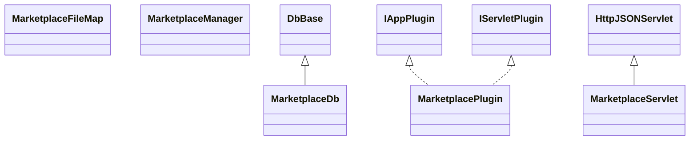

# AppMarketplace.jar

[Group index](README.md) | [All archives](../README.md)

## Scope and provenance

- **Donor:** `SQX_145_REFERENCE_ROOT/internal/plugins/AppMarketplace/AppMarketplace.jar`.
- **SHA-256:** `ba60e1e5c65eca7809dc9bc43c16e64c88280e41e434a90246176b5fcfef747c`; accessed 2026-10-06; captured `2026-10-06T18:54:51.906614+00:00`.
- **Classes:** 8 raw entries; 8 unique entry names. Duplicate occurrence indices are zero-based.
- **Inspection:** read-only ZIP hashing and class-file structural parsing; signatures/descriptors, modifiers, hierarchy and references only. Bytecode bodies are hashed, not published.
- **Allocation:** proposed `FEAT-PRODUCT-APP-MARKETPLACE`, P17; [roadmap](../../dev/sqx-full-application-roadmap.md). Domain README registration remains required.
- **Repository:** `01067f00031428613c6394064ca1bcadc1ba00ee`; review state unreviewed. Download label 145-dev1; installed build/activation and runtime equivalence unverified.
- **Limit:** every class/member is inventoried; declaration coverage does not establish consumed calls, defaults, formulas, failure semantics or algorithm parity.
- **Archive/resource index:** [130.json](../../dev/evidence/sqx145/archives/145/130.json).

## Complete member declarations

Member shards contain exact JVM names/descriptors, access flags, generic signatures, throws types, declared fields/methods, superclass/interfaces and referenced class names. All classes, nested/synthetic members and overloads are retained. Code length/hash is structural evidence, not a normalized algorithm comparison.

- [001.json](../../dev/evidence/sqx145/members/130/001.json) — SHA-256 `8f0b0af2eafb83f63e7256975f0ff6d890f395b84211a963712cd46d6b98071d`.

## Focused structural diagram

Up to twelve non-nested classes; arrows show declared inheritance/interfaces only. External type names are not evidence of an available body or an executed dependency.

## Class inventory

| Archive entry | Occurrence | Class SHA-256 | Fields | Methods |
| --- | ---: | --- | ---: | ---: |
| `com/strategyquant/plugin/App/impl/Marketplace/MarketplaceDb.class` | 0 | `30ce1574ae6d1d4f9c685528f0101e70b7eafa70cb545f34d1a5e2ac844b7ab0` | 1 | 8 |
| `com/strategyquant/plugin/App/impl/Marketplace/MarketplaceFileMap.class` | 0 | `a7505d594bfb1fc412dcc71752a34a963f2a27cdc435bb403b1c2720b6782e72` | 10 | 9 |
| `com/strategyquant/plugin/App/impl/Marketplace/MarketplaceManager$1.class` | 0 | `f6feb2c23566a0061cce83aec7165207087076338c7f93679327327fd7ed1168` | 7 | 2 |
| `com/strategyquant/plugin/App/impl/Marketplace/MarketplaceManager$2.class` | 0 | `47d7ea70acc8077ecdb3f13e8617180c0339ef2fce8f3c5b95a6545a896ccb9a` | 3 | 2 |
| `com/strategyquant/plugin/App/impl/Marketplace/MarketplaceManager$InstallResult.class` | 0 | `33e951b2a82b5a699111661e301b20564c27a7c78fe38592603669143c6c0274` | 3 | 2 |
| `com/strategyquant/plugin/App/impl/Marketplace/MarketplaceManager.class` | 0 | `36b079aa7812510e1d98ed95f46936e649c761b6b441afebc5456244a572c07d` | 9 | 37 |
| `com/strategyquant/plugin/App/impl/Marketplace/MarketplacePlugin.class` | 0 | `264ad504e1fb8ad121fdcd9d5f7b172ee1c2dccda2031709d6ca82c3abff21af` | 2 | 13 |
| `com/strategyquant/plugin/App/impl/Marketplace/MarketplaceServlet.class` | 0 | `95c35f1fd6106153c7e2fb8a9bec26425c5a320d4987c37f73c4b0a92ef7bae8` | 2 | 12 |
