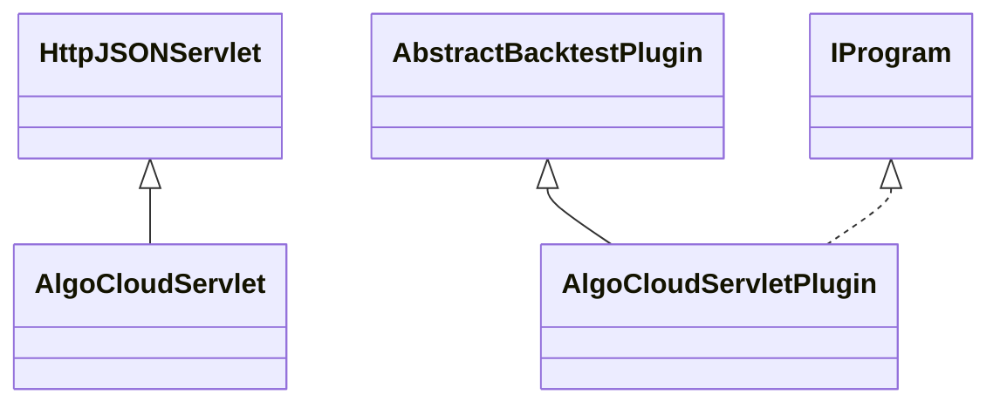

# ServletAlgoCloud.jar

[Group index](README.md) | [All archives](../README.md)

## Scope and provenance

- **Donor:** `SQX_145_REFERENCE_ROOT/internal/plugins/ServletAlgoCloud/ServletAlgoCloud.jar`.
- **SHA-256:** `bd40d7d7d7f71c7e7553bbfb3e08f5b700038e8d98263d3ac5dc78a4d4fdc7b7`; accessed 2026-10-06; captured `2026-10-06T18:54:51.906614+00:00`.
- **Classes:** 2 raw entries; 2 unique entry names. Duplicate occurrence indices are zero-based.
- **Inspection:** read-only ZIP hashing and class-file structural parsing; signatures/descriptors, modifiers, hierarchy and references only. Bytecode bodies are hashed, not published.
- **Allocation:** proposed `FEAT-AUTHORING-SERVLET-ALGO-CLOUD`, P07; [roadmap](../../dev/sqx-full-application-roadmap.md). Domain README registration remains required.
- **Repository:** `01067f00031428613c6394064ca1bcadc1ba00ee`; review state unreviewed. Download label 145-dev1; installed build/activation and runtime equivalence unverified.
- **Limit:** every class/member is inventoried; declaration coverage does not establish consumed calls, defaults, formulas, failure semantics or algorithm parity.
- **Archive/resource index:** [227.json](../../dev/evidence/sqx145/archives/145/227.json).

## Complete member declarations

Member shards contain exact JVM names/descriptors, access flags, generic signatures, throws types, declared fields/methods, superclass/interfaces and referenced class names. All classes, nested/synthetic members and overloads are retained. Code length/hash is structural evidence, not a normalized algorithm comparison.

- [001.json](../../dev/evidence/sqx145/members/227/001.json) — SHA-256 `4d9f1ba57e954314c9bd4f067d652acafd05f0dbf055dccbde1af1305edeb806`.

## Focused structural diagram

Up to twelve non-nested classes; arrows show declared inheritance/interfaces only. External type names are not evidence of an available body or an executed dependency.

## Class inventory

| Archive entry | Occurrence | Class SHA-256 | Fields | Methods |
| --- | ---: | --- | ---: | ---: |
| `com/strategyquant/plugin/Servlet/impl/AlgoCloud/AlgoCloudServlet.class` | 0 | `2cd3aa0798f8ff3c7fa8903405b5e2429d3c65fa71ae227b6df16fe5b0b96fe8` | 2 | 6 |
| `com/strategyquant/plugin/Servlet/impl/AlgoCloud/AlgoCloudServletPlugin.class` | 0 | `ff1b4f7ee23459293eeed2cf938dd906bf575e856ed65d4de1878e28da0d2182` | 2 | 6 |
